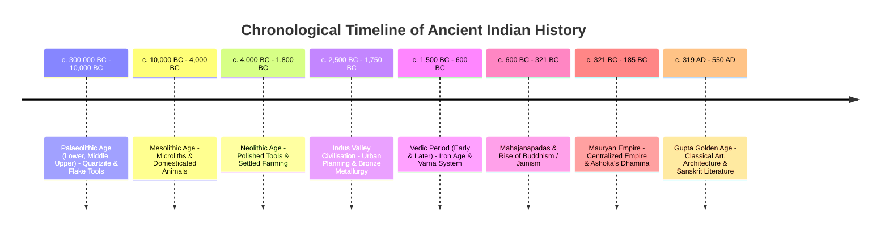

# Ancient History: Complete UPSC Notes

> **Target Exam**: UPSC Civil Services Examination (Prelims & Mains) / State PSCs  
> **Subject**: Ancient History  
> **Total Modules**: 9

---

## 📚 Table of Contents

1. [Pre-Historic Age](#1-pre-historic-age)
2. [Indus Valley Civilisation](#2-indus-valley-civilisation)
3. [Vedic Period](#3-vedic-period)
4. [Mahajanapadas Buddhism Jainism](#4-mahajanapadas-buddhism-jainism)
5. [Mauryan and Post Mauryan Period](#5-mauryan-and-post-mauryan-period)
6. [Sangam Age](#6-sangam-age)
7. [Gupta Period](#7-gupta-period)
8. [Post Gupta and Early Medieval India](#8-post-gupta-and-early-medieval-india)
9. [Miscellaneous](#9-miscellaneous)

---

## 1. Pre-Historic Age




> **Source**: [Rau's IAS Compass - Ancient History / Pre-Historic Age](https://compass.rauias.com/ancient-history/#prehistoric-age)  
> **Target Exam**: UPSC Civil Services Examination (Prelims & Mains) / State PSCs

---

## 1. Classification of Indian History

Human history is fundamentally divided into three broad chronological phases based on the availability and decipherability of written records:

| Phase | Timeline | Defining Characteristics | Sources of Study |
| :--- | :--- | :--- | :--- |
| **Pre-History** | **300,000 BC – 2,500 BC** | Period prior to the emergence of any writing or literary records. | Exclusively **archaeological sources**: stone tools, pottery, cave art, fossils, bones, and metal implements. |
| **Proto-History** | **2,500 BC – 600 BC** | Period where scripts/literary records exist, but remain **undeciphered** or unread. | Examples: Indus Valley Civilisation (Harappan script remains undeciphered) and Chalcolithic cultures. |
| **History** | **600 BC till Date** | Period with written literary sources that can be read, understood, and correlated with material remains. | Inscriptions (e.g., Ashokan Edicts), Vedic literature, Buddhist/Jain texts, secular literature, numismatics, foreign accounts. |

---

## 2. Archaeological Stages of Pre-History

Pre-history is subdivided into technological ages based primarily on the **nature and typology of tools** and the **raw materials** utilized by humans:

| No. | Archaeological Age | Timeline | Diagnostic Tools & Stone Types | Subsistence & Socio-Economic Pattern |
| :---: | :--- | :--- | :--- | :--- |
| **1** | **Palaeolithic Age** *(Old Stone Age)* | **300,000 BC – 10,000 BC** | Primitive rough stone tools (hand-axes, choppers, cleavers).<br>• *Lower*: **Quartzite**<br>• *Middle*: **Flake tools**<br>• *Upper*: **Flake & blade tools** | Hunters and food gatherers; nomadic lifestyle; no knowledge of agriculture or animal domestication. |
| **2** | **Mesolithic Age** *(Middle Stone Age)* | **10,000 BC – 4,000 BC** | Sharp, pointed, tiny composite tools called **Microliths** (1 to 8 cm). Raw material: primarily **Agate**, chert, chalcedony. | Hunters & food gatherers, along with the **earliest evidence of animal domestication** (e.g., Bagor in Rajasthan, Adamgarh in MP). |
| **3** | **Neolithic Age** *(New Stone Age)* | **4,000 BC – 1,800 BC** *(early sites like Mehrgarh date back to c. 7000 BC)* | **Polished stone tools** with sharp, fine cutting edges. Raw materials: **Dyke, Basalt, Dolomite**. Grinding mortars & pestles. | **Food producers** (earliest agriculture of wheat, barley, rice) and **pastoralism/animal husbandry**; settled village communities; invention of pottery. |
| **4** | **Chalcolithic Age** *(Copper-Stone Age)* | **3,500 BC – 1,000 BC** | Transition to metallurgy: **Copper** introduced first, followed by **Bronze** (copper + tin alloy). Stone tools continued alongside metal. | Mixed farming-pastoral communities; painted pottery; regional cultures (Ahar-Banas, Malwa, Jorwe). |
| **5** | **Iron Age** | **1,000 BC – 500 BC** | **Iron technology** (weapons, axes, ploughshares). | Led slowly and perceptibly to the transition from pre/proto-historical societies to historical urbanisation (Second Urbanisation in Gangetic plains). |

### Important Metallurgical Sequence in India
- In the Indian subcontinent, the introduction of metals strictly followed the order: **Copper $\rightarrow$ Bronze $\rightarrow$ Iron**.
- Iron catalyzed clearance of dense Gangetic forests, deep ploughing of alluvial soil, and the emergence of territorial states (*Mahajanapadas*).

### Scientific Dating Methods
Because timelines vary considerably across different geographical regions of the subcontinent, dating is established using:
1. **Radiocarbon Dating ($C^{14}$)**: Measures the decay rate of radioactive carbon-14 isotopes in organic matter (wood, bone, charcoal).
2. **Dendrochronology**: Analyzes annual growth ring patterns in ancient timber/wood samples.

---

## 3. The Palaeolithic Period (Old Stone Age)

### Tool Technology & Evolution
1. **Lower Palaeolithic**: Dominated by heavy core tools such as pebble choppers, hand-axes, and cleavers made predominantly of **Quartzite** (hence early humans are often referred to as "Quartzite Men").
2. **Middle Palaeolithic**: Dominated by lighter tools struck from stone cores (**Flake tools**): scrapers, borers, points.
3. **Upper Palaeolithic**: Marked by the advent of blade tools (**Flakes & Blades**), burins, and bone implements, coinciding with the last phase of the Pleistocene ice age.

### Prehistoric Rock Art & Cave Paintings
- **Themes & Subjects**: Confined to simple human stick figures, human collective activities (hunting, dancing), animals, geometric designs, and abstract symbols.
- **Three Core Categories**:
  1. **Man**: Hunting scenes, stick-figure human dancers, group rituals.
  2. **Animals**: Wild boars, elephants, rhinoceroses, tigers, deer, bulls (depicted with vitality).
  3. **Geometric Symbols**: Linear patterns, concentric circles, cross-hatchings.
- **Geographical Distribution in India**:
  Cave wall paintings have been identified across Madhya Pradesh, Uttar Pradesh, Andhra Pradesh, Telangana, Karnataka, Kerala, Bihar, and Uttarakhand.

### Major Palaeolithic & Rock Art Sites
- **Bhimbetka (Madhya Pradesh)**:
  - Located in the Raisen district in the Vindhyan foothills.
  - Contains nearly **400 painted rock shelters across 5 distinct clusters**.
  - Continuous cultural sequence spanning Upper Palaeolithic, Mesolithic, and historic periods. UNESCO World Heritage Site.
- **Lakhudiyar (Uttarakhand)**:
  - Situated on the banks of River Suyal in Almora district.
  - "Lakhudiyar" translates to "one lakh caves"; features paintings of humans, animals, and wavy lines in white, black, and red ochre.
- **Kupgallu (Telangana)** & **Piklihal / Tekkalkotta (Karnataka)**:
  - Important southern rock art and prehistoric habitational sites.
- **Jogimara (Madhya Pradesh / Chhattisgarh border)**:
  - Ancient rock shelters bearing rock art and Brahmi inscriptions.
- **Karikiyoor (Tamil Nadu)**:
  - Rock art site in the Nilgiris depicting hunting expeditions and wildlife.

> **Map Reference**: [Palaeolithic Sites Map](https://i0.wp.com/compass.rauias.com/wp-content/uploads/2023/05/image-122.png)

---

## 4. The Neolithic Revolution (New Stone Age)

### Climatic Transition to Holocene
- Commenced around **10,000 years ago (~8,000 BC)**.
- Characterized by the end of the Pleistocene Ice Age and a shift toward **warmer, wetter climatic conditions**.
- Warmer climate stimulated the rapid expansion of grasslands, leading to an explosion of herbivorous fauna (deer, antelope, sheep, goat, cattle).

### Key Pillars of the Neolithic Lifestyle

#### 1. Domestication of Animals
- Transition from predatory hunting to systematic **herding, breeding, and pastoralism**.
- **Earliest animals domesticated**: **Sheep and goat**, followed by cattle and pigs.
- Aquatic resources and **fishing** became substantial dietary components.

#### 2. Emergence of Agriculture (Farming)
- Natural wild grain-bearing grasses were identified, gathered, cultivated, and domesticated.
- **Earliest crops domesticated**: **Wheat and barley**, followed by rice and various pulses/lentils.
- Staple crops: Wheat, barley, rice, millets, and lentils.

#### 3. Settled Village Life & Dwellings
- Agriculture mandated year-round sedentary residence for soil preparation, sowing, weeding, crop protection, and harvesting.
- **Storage Solutions**: Need to store grain for food and seed led to the invention of:
  - Coarse and burnished clay pottery (handmade, later wheel-made).
  - Woven plant baskets and underground storage pits.
- **Burzahom (Jammu & Kashmir)**:
  - People constructed **pit-houses dug deeply into the soil** with cut steps leading down.
  - Provided insulation against freezing sub-Himalayan winters.
  - Charcoal-lined **cooking hearths** found both inside and outside pit-dwellings (reflecting seasonal indoor/outdoor cooking).
  - Unique practice of burying domestic dogs along with their masters in graves.

#### 4. Material Culture
- **Polished stone tools**: Celts, adzes, and chisels ground and polished to produce durable, razor-sharp working edges.
- **Grinding equipment**: Stone querns, pestles, and mortars for processing grains.

---

### Focus Study: Mehrgarh (Baluchistan, Pakistan)

*The premier Neolithic type-site of South Asia.*

- **Chronology**: c. 7000 BC – 2000 BC.
- **Geographical Setting**: Situated on the fertile alluvial Kacchi plains of Baluchistan near the **Bolan Pass** (one of the primary historical gateways connecting the Indian subcontinent with the Iranian plateau and Central Asia).
- **Historical Significance**:
  - One of the earliest known farming and pastoral villages in South Asia.
  - Demonstrates the transition from nomadic hunting to settled agriculture (wheat and barley) and animal husbandry (sheep, goat, cattle).
- **Faunal Remains**: Stratified evidence shows early layers dominated by wild animal bones (deer, boar), gradually replaced in upper layers by domesticated sheep, goat, and humped cattle (*Bos indicus*).
- **Architecture**: Multi-roomed mud-brick houses (square or rectangular layout) divided into **four or more compartments**, several of which served as granaries/storage rooms.
- **Burial Practices & Belief in Afterlife**:
  - Dead bodies buried in formal cemetery spaces.
  - Inclusions of grave goods: ornaments (beads of shell, lapis lazuli, turquoise) and **sacrificed goats** placed alongside the deceased to serve as nourishment in the afterlife.

---

### Key Neolithic Sites Across the Indian Subcontinent

| Site | Location | Diagnostic Archaeological Highlights |
| :--- | :--- | :--- |
| **Mehrgarh** | Baluchistan (Pakistan) | Earliest evidence of wheat & barley farming, mud-brick houses, compartmental granaries. |
| **Burzahom** | Jammu & Kashmir | Subterranean **pit-dwellings**, coarse grey pottery, bone tools, dog-with-master burials. |
| **Gufkral** | Jammu & Kashmir | Pit-dwellings, bone tools, sheep/goat domestication ("cave of the potter"). |
| **Chirand** | Saran district, Bihar | Extensive assemblage of **bone implements and tools made from deer antlers**. |
| **Koldihwa** | Belan Valley, Uttar Pradesh | **Earliest empirical evidence of rice cultivation** in South Asia (dating back to ~6000 BC), cord-marked pottery. |
| **Mahagara** | Belan Valley, Uttar Pradesh | Co-occurrence of rice cultivation, circular huts, and a fenced cattle pen with hoof impressions. |
| **Hallur** | Tungabhadra basin, Karnataka | Southern Neolithic-Chalcolithic site; transition to early iron use. |
| **Paiyampalli** | Vellore district, Tamil Nadu | Southern Neolithic settlement with stone celts, animal husbandry, and grain cultivation. |
| **Daojali Hading** | Dima Hasao, Assam | Polished jadeite celts, cord-marked pottery, mortars and pestles indicating trade/cultural links with East Asia. |

> **Map Reference**: [Neolithic Cultures Map](https://i0.wp.com/compass.rauias.com/wp-content/uploads/2023/05/image-123.png)

---

## 5. The Megalithic Culture

### Etymology & Chronology
- **Definition**: Derived from Greek words *Megas* (large) and *Lithos* (stone). Refers to massive stone monuments constructed either as burial sepulchres or commemorative memorials.
- **Chronology**: Emerged in the late Neolithic/Chalcolithic, but flourished vigorously between the **6th Century BC and the 1st Century AD** (contemporary with early historic period/Sangam Age).
  - Radiocarbon dating at **Hallur** places early Megalithic iron levels around **1000 BC**.
  - **Paiyampalli** dates around the **4th Century BC**.

### Geographical Spread
- While scattered remnants are recorded in Northern and Central India (Seraikala in Bihar, Deodhoora in Almora, Khera near Fatehpur Sikri, Nagpur/Chanda/Bhandara in Vidarbha, Dausa in Rajasthan, and Burzahom in Kashmir), the culture is **overwhelmingly concentrated in Peninsular India / Deccan (especially South of River Godavari)**.

---

### Key Megalithic Sites

#### 1. Adichanallur (Thoothukudi District, Tamil Nadu)
- Located in the Thamirabarani river valley.
- Vast urn-burial cemetery without megalithic stone circles.
- **Key discoveries**:
  - Baked earthenware and urns containing human skeletal remains.
  - Abundant **iron weapons and implements**: short swords, daggers, arrowheads, spearheads, and hatchets.
  - Bronze artefacts: decorative animal figurines (tigers, antelopes, elephants) and gold diadems.
  - Mother Goddess figurine in bronze.

#### 2. Brahmagiri (Chitradurga District, Karnataka)
- Excavated extensively by Sir Mortimer Wheeler in 1947.
- Revealed a continuous cultural stratigraphy: **Microlithic $\rightarrow$ Neolithic $\rightarrow$ Iron Age Megalithic $\rightarrow$ Mauryan $\rightarrow$ Chalukya-Hoysala**.
- Marks the southern territorial boundary of the Mauryan Empire; contains Minor Rock Edicts of Emperor Ashoka (addressed to the *Mahamatras* of Isila).

---

### Socio-Economic & Material Traits of Megalithic Culture

1. **Iron Metallurgy**: Megalithic culture in South India is virtually synonymous with the **Iron Age**. Iron completely superseded stone in tool and weapon production (swords, daggers, hoes, axes, sickles, tridents).
2. **Pottery - Black and Red Ware (BRW)**: Produced by inverted firing technique, yielding pots with a black interior/rim and a red exterior. Frequently decorated with white painted geometric motifs.
3. **Burial Traditions**:
   - Burial chambers marked by megalithic stone circles or cairn mounds.
   - Burials contain secondary skeletal remains (post-exposure).
   - **Urn Burials (*Ezhuthani*)**: Large terracotta urns containing bone remains, ashes, and grave goods buried underground.
   - Distinct grave goods (iron weapons, pottery, beads) indicate strong belief in life after death and social differentiation.
4. **Agriculture & Irrigation**:
   - Introduction of **tank irrigation** utilizing rainfall runoff in hard granitic peninsular terrain.
   - Wet rice cultivation emerged as the economic mainstay; millets, pulses, and ragi were supplementary crops.
   - Arrowheads, spears, and javelins demonstrate that hunting remained a vital economic auxiliary.
5. **Animal Husbandry**: Large herds of cattle, sheep, goats, and domestic poultry were raised.
6. **Megalithic Paintings/Murals**: Vivid murals depicting hunting expeditions, wildlife, and dancers discovered at sites such as **Marayur** and **Attala** in Kerala.

---

### Typological Classification of Megalithic Monuments

Megaliths exhibit distinct structural forms across Peninsular India:

```
                          Types of Megaliths
                                  │
    ┌─────────────────────────────┼─────────────────────────────┐
    │                             │                             │
Sepulchral (Burial)       Commemorative / Memorial        Rock-Cut
    │                             │                             │
    ├── Dolmenoid Cists           ├── Menhirs                   └── Rock-cut Caves
    ├── Cairn Circles             ├── Alignments                    (Kerala)
    ├── Stone Circles             └── Avenues
    ├── Pit Burials
    ├── Barrows
    └── Hood / Hat Stones
```

1. **Rock-Cut Caves**: Subterranean chambers carved directly into laterite rock outcrops (predominant in Malabar/Kerala).
2. **Hood Stones (*Kudaikkallu*) & Hat Stones / Cap Stones (*Topikkallu*)**: Dome-shaped dressed laterite stones placed over burial pits resembling an umbrella or mushroom.
3. **Menhirs**: Massive monolithic stone slabs or pillars erected vertically in the ground as memorial markers.
4. **Stone Alignments & Avenues**: Multiple rows or parallel avenues of standing menhirs.
5. **Dolmenoid Cists**: Box-like chambers formed of four dressed stone orthostats standing upright, roofed by a horizontal stone capstone.
6. **Cairn Circles**: Circular stone enclosures heaped with stone rubble and pebbles (*cairns*) covering the central grave pit.
7. **Stone Circles**: Rings of large boulders surrounding an underground urn or pit burial.
8. **Pit Burials & Barrows**: Earthen mounds heaped over subterranean grave pits.

---

## 6. High-Yield Comparative Synthesis for UPSC

| Dimension | Palaeolithic | Mesolithic | Neolithic | Megalithic |
| :--- | :--- | :--- | :--- | :--- |
| **Primary Material** | Quartzite, Chert | Agate, Chalcedony | Dyke, Basalt, Dolomite | Iron + Granite/Laterite stones |
| **Tool Technique** | Heavy Core & Flake tools | Microliths (Composite) | Ground & Polished Celts | Wrought Iron implements |
| **Subsistence** | Hunting & Food gathering | Hunting + Early Herding | Agriculture & Pastoralism | Intensive Agriculture (Tanks) |
| **Settlement** | Rock shelters, Caves | Temporary open camps | Mud-brick houses, Pits | Permanent rural settlements |
| **Pottery** | Absent | Absent (rare in late) | Handmade/Wheel-turned | Black and Red Ware (BRW) |
| **Burial Custom** | No formal burial | In-habitation burials | Graves with offerings | Megalithic stone monuments |
| **Representative Sites** | Bhimbetka, Lakhudiyar | Bagor, Adamgarh | Mehrgarh, Burzahom | Adichanallur, Brahmagiri |


---

## 2. Indus Valley Civilisation

> **Source**: [Rau's IAS Compass Ancient History](https://compass.rauias.com/ancient-history/)
---
## 1. Major IVC Site
> Source: [https://compass.rauias.com/ancient-history/major-indus-valley-civilisation-sites/](https://compass.rauias.com/ancient-history/major-indus-valley-civilisation-sites/)


#### **Harappa**

- **River**: **Ravi River, Pakistan**

- **Important findings: **

- Granaries

- Bullock carts

- Sandstone statues of Human

- Copper Chariot with canopy

- Workmen’s quarter

#### **Mohenjo-Daro**

- **River**: **Indus River, Pakistan**

- **Important findings: **

- Bronze [dancing girl](https://compass.rauias.com/current-affairs/dancing-girl-from-mohenjodaro/) in Tribhanga pose

- Seal of Pasupathi Mahadeva

- Steatite statue of beard man

- Great bath

- Granary

- A piece of woven [cotton](https://compass.rauias.com/geography/cotton/)

#### **Sutkagendor**

- **River**: **Indus River, Pakistan**

- **Important findings: **A trade point between Harappa and Babylon.

#### **Chanhudaro**

- **River: **[Indus River](https://compass.rauias.com/geography/indus-river-system-tributaries-river-valley-projects/), Pakistan

- **Important findings: **

- Bead makers shop

- Footprint of a dog chasing a cat.

#### **Kalibangan**

- **River**: Ghaggar River

- **Important findings: **

- Camel bones

- Wooden plough

- Ritualistic Fire altar

- Discovery of a ploughed field

- Evidence of earliest datable earthquake

#### **Kot Diji**

- **River**: **Indus River**

- **Important findings: **Represents Early phase of IVC.

#### **Rangpur**

- **River**: **Madar river, Gujarat**

- **Important findings: **

- Situated on the left bank of Madar River (Gujarat).

- Plant remains (rice, millets and bajara)

#### **Ropar**

- **River**: Sutlej River

- **Important findings: **Discovered by Y D Sharma in 1953.

#### **Lothal**

- **River**: **Bhogava river, Gujarat**

- **Important findings: **

- Dockyard

- Rice husk

- Fire altars

- First manmade port

- Chess playing

- Pottery with painting of ‘clever fox’

#### **Alamgirpur**

- **River**: Yamuna River,UP

- **Important findings: **Easternmost IVC site located on Yamuna River in Meerut, UP.

#### **Rakhigarhi**

- **Important findings: **

- Largest IVC site by area. Located in Hisar District of Haryana,

- All three phases: Early, Mature and Later IVC phases present.

- Necropolis: A large burial site. Only site to have a presence of a couple grave (male female).

- Evidence of Rice cultivation.

- Inscription on seal

#### **Surkotada**

- **Important findings: **

- Bones of horses (not confirmed)

- Beads

#### **Banwali**

- **Important findings: **Beads

- Barley

#### **Dholavira**: **Little Rann of Kutch on Khadir Bet Island**

- **Important findings: **

- [UNESCO World Heritage Site](https://compass.rauias.com/art-culture/unescos-list-tangible-world-heritage-sites-india/) (40th)

- 6th largest [Indus Valley Civilisation site](https://compass.rauias.com/ancient-history/indus-valley-civilisation-sites-india/).

- Has two stadium like structures

- Complex Water harnessing system

- Water reservoir

- Largest Harappan inscription (Not deciphered)

- An entire sequence spanning from early Harappan town / pre-urban phase to the height of the Harappan expansion and the late Harappan is observed.

- Dholavira consists of three divisions:

- A fortified castle with attached fortified Bailey (residence for higher officials) and Ceremonial Ground

- A fortified Middle Town

- A Lower Town

---

## 2. Phases of Indus Valley Civilisation
> Source: [https://compass.rauias.com/phases-indus-valley-civilisation/](https://compass.rauias.com/phases-indus-valley-civilisation/)

#### **Pre-Harappan Phase (7000-3300 BC)**

- **Seen in Mehrgarh**, where an aceramic and ceramic neolithic phase existed. The Aceramic phase was the earliest and there was no pottery. Ceramic stage yielded pottery.

#### **Early Harappan Phase (3000-2600 BC)**

- Emergence of several urban features like [town planning](https://compass.rauias.com/ancient-history/town-planning-indus-valley-civilisation/), scripts and metal technology. Important sites include Kot Diji, Amri, Kalibangan, Dholavira.

#### **Mature/Urban Harappan Phase (2600-1900 BC)**

- Full growth of urban economy and society. Important sites: Mohen-jo-Daro, Harappa, Lothal, Kalibangan, Dholavira, Ganweriwala, Rakhigarh etc.

#### **Late Harappan Phase (1900-1300 BC)**

- Gradual collapse of urban character and towards the end of this phase IVC disappeared. Sumerian records ceased to mention trade with Meluhha.

---

## 3. Geographical Setting of Harappa/Indus Valley Civilisation
> Source: [https://compass.rauias.com/ancient-history/geographical-setting-harappa-indus-valley-civilisation/](https://compass.rauias.com/ancient-history/geographical-setting-harappa-indus-valley-civilisation/)


- Indus Valley Civilisation (IVC) or Harappan civilisation is known for its splendid elements on urban civilisation and rise of organised cities in Indian continents. These cities and towns were located around a particular water body such as rivers or lakes or had linkages with oceans.

- IVC was Bronze Age civilization (The mature phase lasted from 2500-1900 BCE).

- Since IVC preceded [Iron](https://compass.rauias.com/geography/iron/) Age, the Harappans were unaware of the use of iron but used copper, bronze, silver, and gold.

- Along with ancient Egypt and Mesopotamia, it was one of three early civilizations of the world.It is older than the Chalcolithic culture, which have been treated earlier, but it is far more developed than these cultures.

- It is called Harappa because this civilisation was discovered first in 1921 at the modern site of Harappa situated in the province of West Punjab of Pakistan.

- The Indus or the Harappan culture arose in the north and western part of the Indian subcontinent.

- The Harappan culture covered parts of Punjab, Sindh, Balochistan, Gujarat, Rajasthan and the fringes of western Uttar Pradesh.

- It extended from Jammu in the north to the Narmada estuary in the south, and from the Makran coast of Balochistan, in the west to Meerut in the north-east.

- Although over 250 Harappan sites are known, only six can be regarded as cities.

- Of these the two most important cities were Harappa in Punjab and Mohenjo-daro in Sindh, both forming parts of Pakistan that were linked together by the Indus.

- Chanhu-daro about 130 km south of Mohenjo-daro in Sindh

- Lothal in Gujarat' at the head of the Gulf of Cambay.

- Kalibangan in northern Rajasthan.

- Banwali is situated in Hisar district in Haryana.

**Debate on Indus Valley**

- Despite being named as Indus Valley Civilisation, many sites of the IVC have been found to be located in the Ghaghar-Hakra Valley. These sites are

---

## 4. Economy of IVC
> Source: [https://compass.rauias.com/ancient-history/economy-indus-valley-civilisation/](https://compass.rauias.com/ancient-history/economy-indus-valley-civilisation/)

## Economy of Indus Valley Civilisation

### **Trade & Transportation**

- Granaries are found at **Harappa, Mohenjo-Daro, Kalibangan and Lothal.**

- Large granaries were near each citadel, which suggests that the state stored grain for ceremonial purposes and regulation of grain production and sale.

- The Harappans conducted considerable trade in stone, metal, shell, etc., within the Indus culture zone. However, their cities did not have the necessary raw material for the commodities they produced.

- They **did not use metal money**.

- In weights and measures mostly **16 or its multiple were used.**

### **Trade Links**

- Harappans had **commercial links with Afghanistan and Iran.They set up a trading colony in northern Afghanistan which facilitated trade with Central Asia.

- Harappans executed long-distance trade in **lapis lazuli**: lapis objects may have contributed to the social prestige of the ruling class.

- Mesopotamian records from about 2350 BC onwards refer to trade relations with **Meluha**, which was the ancient name given to the Indus region.

- Mesopotamian texts speak of two intermediate trading stations called **Dilmun and Makan,which lay between Mesopotamia and Meluha. **Dilmunis identifiable with Bahrain on the Persian Gulf.

- Archaeologists have discovered a massive, dredged canal and what they regard as a docking facility at the probability carried exchanges through a barter system. I.e., coastal city of **Lothal in western India (Gujarat) and Sutkagendor on Makran coast.**

### **Agriculture**

- The furrows discovered in the pre-Harappan phase at **Kalibangan (Rajasthan)indicate that fields were ploughed during the Harappan period.

- Harappans probably used the **wooden ploughdrawn by oxen and camels.

- Harappan villages, mostly situated near the **flood plains**, produced sufficient food grains not only for their inhabitations but also for the town’s people.

- Indus people produced wheat, barley, ragi, peas, etc. **A substantial quantity of barley was discovered at Banawali (Haryana).**

- In addition, **sesamum and mustard were grown**. At Lothal and Rangapur in Gujarat, **rice huskwas found embedded in clay and pottery.

- Indus people were the earliest people to produce cotton and because of this, the Greeks called the area **Sindonwhich is derived from Sindh. Spindle whorls made of terracotta and faience to spin thread have also been found at Harappan sites.

- **Animal Husbandary: **In IVC, animals were raised on a large scale. **Oxen, buffaloes, goats, sheep and pigs were domesticated.Humped bulls were favoured by Harappans. There is evidence of dogs, cats, asses and camels being bred.

- Evidence of horse comes from a superficial level of Mohenjo-Daro and from a doubtful terracotta figurine from Lothal. Remains of a horse are reported from Surkotada, situated in west Gujarat and relate to around 2000 BC but the identity is doubtful.

- Thus, we can say that **Harappan people were aware about Horse, but they did not domesticate Horse.**

- **Note:Faienceis an artificially produced material. It is a paste made from crushed quartz and coloured with various materials.

### **Metallurgy:**

- IVC people were aware of Copper, Bronze, silver and Gold. Iron was not used in IVC.

---

## 5. Society of Harappans
> Source: [https://compass.rauias.com/ancient-history/society-harappans/](https://compass.rauias.com/ancient-history/society-harappans/)

- **Political Organisation:There is no clear idea **about the political organization of the Harappans.

- **Culture:Indus valley civilisation has been the first and pioneer civilisation in Indian subcontinent depicting advanced stages of cultural development.

- **Food:People of Harappan civilization ate every possible food crop of that period. They had both vegetarian and non-vegetarian eating habits.

- **Leisure:Evidence of indoor games, toys for kids, and possible stadium (Dholavira).

- **Household items:most of the household items were in the form of terracotta. However, copper and bronze were also used for utensils and storage items.

- **Fashion:People of IVC used beads, gemstones and precious metals for jewellery, lipstick was imported from west Asia, both cotton and wool were used for clothing. While necklaces, fillets, armlets and finger-rings were commonly worn by both sexes, women wore girdles, earrings and anklets.

- **Social setup:Evidence of lower and upper town proves that there was a social difference among people on certain basis (it could be economic, ethnic or linguistic). Language of IVC is unknown and script was pictographic.

- **Religious acts:They practices mother goddess and Proto Shiva as Pashupati seal (evidence from Mohenjo-Daro) and fire altars in Kalibangan.

- **Religious Practices:In Harappa, numerous **terracotta figurines of womenhave been found. In one figurine, a plant is shown growing out of the embryo of a woman. This image probably **represents the goddess of Earthand was intimately connected with the origin and growth of plants. The Harappan, therefore, looked upon the earth as a fertility goddess and worshiped her.


**                                                                   Fig: A terracotta figurine**

- The male deity is represented on a seal. This god has **three-horned headsand is represented in the sitting **posture of a yogi, with one leg placed above the other.This god is surrounded by an **elephant, a tiger, and a rhinoceros and below his throne there is a buffalo and at his feet two deer. It is identified as Pashupati seal.**


                                                                       **Fig: A Priest-king**

- The people of the Indus region also **worshipped trees**. The depiction of a deity is represented on a seal amidst branches of the Pipal. This tree continues to be worshipped to this day.

- **Animals were also worshippedin Harappan times and many of them are represented on seals. The most important of them is the **one-horned animal unicornwhich may be identified with the rhinoceros.

- Evidence of **fire altar at Kalibangan.**

- Despite the depiction of the divine on seals and figurines, we find **no architectural structure that can be pointed as a place of worship.**

---

## 6. Town Planning
> Source: [https://compass.rauias.com/ancient-history/town-planning-indus-valley-civilisation/](https://compass.rauias.com/ancient-history/town-planning-indus-valley-civilisation/)

- First urban civilisation in the region.

- Harappans were excellent city planners. The quality of municipal town planning suggests the knowledge of urban planning and efficient municipal governments which placed a high priority on hygiene.

- Harappan City was divided into **the upper town called the Citadel(in the citadel rich people lived) and **the lower town**. Lower Town was the residential area where the common people lived. (However, some cities did not follow this model)

- City streets were based on a **grid systemand oriented east to west. Roads and streets intersected **at right angles.**

- Generally, houses were either one or two storeys high, with rooms built around a courtyard. **Most houses had separate bathing areas seems to be Great Bath,and some had wells to supply water. There are side rooms for changing clothes

- **Public wells in every street**, Main streets varying from 9 feet to as wide as 30-34 feet.

- There were covered **drains laid along the road in a straight line**. Houses were built on either side of the roads and streets. Each street had a well-organized drain system. As the drains were covered, inspection holes were provided at intervals to clean them.

- Remarkable **use of burnt bricks**. The **ratio of which is remarkably similar across IVC cities.**

- **No stone-built houses in the Indus citiesand the staircases of big buildings were solid; the roofs were flat and were made of wood.

- Houses had the same plan – a square courtyard around which were several rooms. Entrance to the houses were from the narrow lanes which cut the street at right angles. **No windows faced the street.**

---

## 7. Crafts of IVC
> Source: [https://compass.rauias.com/ancient-history/crafts-harappa-civilisation/](https://compass.rauias.com/ancient-history/crafts-harappa-civilisation/)

## Crafts of Harappa Civilisation

### **Seals**

Seals were made from stone. These are generally rectangular in shape and usually have an animal carved on them.


### **Bead Making**


- Stone was cut, shaped, polished and finally a hole was bored through the centre so that a string could be passed through it.

- Chanhudaro is a tiny settlement, almost exclusively devoted to craft production, including bead-making, shell-cutting, metal working, seal-making and weight-making.

- Variety of materials were used to make beads: (i) stones like carnelian (beautiful red colour), jasper, crystal, quartz and steatite (ii)  metals like copper, bronze and gold (iii) other materials like shell, faince and terracota or burnt clay.

- Some beads were made of two or more stones, cemented together. While some were made of stone with gold caps.

### **Stone Weights**


- These were probably used to weigh precious stones or metals.

- These were made of chert, a kind of stone.

---

## 8. Important IVC Sites in India
> Source: [https://compass.rauias.com/ancient-history/indus-valley-civilisation-sites-india/](https://compass.rauias.com/ancient-history/indus-valley-civilisation-sites-india/)

## Indus Valley Civilisation Sites in India

### **Lothal**:

- Government has announced allocation to Ministry of Culture for National Maritime Museum coming up at Lothal in Gujarat as part of 2020 Budget. The project is being implemented by Ministry of Shipping through its Sagarmala program, with the involvement of the Archaeological Survey of India (ASI), the Indian Navy, the Gujarat State government, and other stakeholders. In this respect, let us understand the key information associated with this step.

- The archaeological remains of the Harappa port-town of Lothal are located along the Bhogava river, a tributary of Sabarmati, in the Gulf of Khambat.

- The site provides evidence of Harappa culture between 2400 BCE to 1600 BCE.

- Within the quadrangular fortified layout, Lothal has two primary zones – the upper (Citadel) and the lower town.  Within the citadel are wide streets, drains and rows of bathing platforms, suggested a planned layout.

- The remains of the lower town suggest that the area had a bead-making factory. Near the enclosure identified as a warehouse, along the eastern side where a wharf-like platform.

- The excavated site of Lothal is the only port-town of the Indus Valley Civilisation. he remains of stone anchors, marine shells, sealings which trace its source in the Persian Gulf together with the structure identified as a warehouse further aid the comprehension of the functioning of the Lothal port.

- The availability of antiquities whose origin is traceable to the Persian Gulf and Mesopotamia and the presence of what is identified as a bead making industry further attributes Lothal as an industrial port town of the Harappan culture.

### **Rakhigarhi**

- It is one of the five biggest townships of Harappan Civilization, located in Rakhigarhi, Hisar in Haryana. According to archaeologists, it is the **largest site in terms of area in the Indus Valley Civilisation Sites.**

- The other four are Harappa, Mohen-jo-daro and Ganweriwal in Pakistan and Dholavira in Gujarat.

- Five interconnected mounds spread in a huge area to form the Rakhigarhi's unique site.

- This site was excavated by Amarendra Nath of the Archaeological Survey of India.

- The site has **five interconnected mounds.**

- Rakhigarhi presents existence of civilisation from the **early phase, mature phase and late phaseof Indus Valley Civilisation.

- The site has **both mudbrick as well as burnt-brick houseswith a proper drainage system.

- The ceramic industry represented by red ware, which included dish-on-stand, vase, jar, bowl, beaker, perforated jar, goblet and 'handis' (pans).

- Other antiquities included blades; terracotta and shell bangles; beads of semiprecious stones, terracotta, shell and copper objects; animal figurines, toy cart frame and wheel of terracotta; bone points; inscribed steatite seals and sealings.

- **Necropolis:The excavations have yielded a few extended burials, which certainly belong to a very late stage, may be the medieval times. A rare grave having double burial of a male and female has been found here.

- **Ritual system:Animal sacrificial pit lined with mud brick and triangular and circular fire altars on the mud floor have also been excavated pointing to the ritual system of Harappans.

- A cylindrical seal with 5 Harappan characters on one side and a symbol of an alligator on the other side is an important find from this site.

- A site has been found which is believed to be jewellery making unit.

- The samples from the two women graves have been sent to study about the dietary practices and antiquity of Rakhigarhi site.

### **Dholavira as World Heritage Site**

- Dholavira is located on the **Khadim Bet Islandin the Rann of Kutch, Gujarat.

- Dholavira is one of the very few large Harappan settlements where an entire sequence spanning from early Harappan town / pre-urban phase to the height of the Harappan expansion and the late Harappan is observed.

- **Evidence of stratified society: **The homes in Dholavira suggest that **IVC was a stratified societywith different social status for different class of people.

- Dholavira's location is **on the Tropic of Cancer.**

- 6th largest Indus Valley Civilisation site**.**

- It consists of two parts: a walled city and a cemetery.

- Unlike Harappa and Mohen jo Daro which have two divisions (Citadel and Lower town), Dholavira consists of three divisions:

- A fortified castle with attached fortified Bailey (residence for higher officials) and Ceremonial Ground

- A fortified Middle Town

- A lower town

- **Building Material:Unlike other IVC sites where burnt bricks have been used, **construction is done by stone**.

- **Expansive Water Management:Dholavira located in a water scarce region developed an expansive system letting them thrive in harsh environment.

- Dholavira has two stadium like structures which would have been used for dance performances, gathering etc.

- A series of reservoirs are found to the east and south of the citadel. The water management system here is designed to store every drop of water in the reservoirs.

- Few rock-cut wells are discovered here which are amongst oldest examples of well.

- **Hemispherical memorials:Dholavira has some hemispherical structures. Archaeologists have traced the origin of Buddhist stupa in these memorials.

- **Dholavira signboard: **The Dholavira signboard is the **largest IVC written inscription known**. It is located close to the gate of the city.

- **Cemetery: **Dholavira has a large cemetery with cenotaphs of 6 types. However, there have been no discovery of human skeletons from Dholavira.

- **Bead processing workshops and artefacts**

- **Copper smelter has been discovered**

- UNESCO has inscribed **Indus Valley Civilisation (IVC)site of Dholavira as a World Heritage Site. Dholavira will be **40th site from Indiawhich has been accorded **World Heritage Status by UNESCO**. Apart from India, Italy, Spain, Germany, China and France have 40 or more sites as World Heritage. It is only IVC era site from India to get World Heritage Status.

---

## 9. Harappan Script
> Source: [https://compass.rauias.com/ancient-history/harappan-script/](https://compass.rauias.com/ancient-history/harappan-script/)


- Harappans **invented the art of writinglike the people of ancient Mesopotamia. However, the Harappan script is yet to be deciphered.

- Harappan script is not **alphabetical but pictographic**.

- There are many specimens of **Harappan writing on stone seals and other objects**. Most inscriptions were recorded on seals and contain only a few words.

- Approximately **3,700 inscribed objects have been discovered at Harappan sites, with the majority of the writing appearing on seals and sealings, **and some on copper tablets, copper/bronze implements, pottery, and other miscellaneous objects.

- Roughly h**alf of the inscribed objects were unearthed at Mohenjodaro, with Mohenjodaro and Harappa together accounting for about 87 percent of all inscribed material. **

- Most inscriptions are concise, averaging around five signs, while the longest one, found on the **Dholavira "signboard," consists of 26 signs.**

- The script comprises **400–450 basic signs and is considered logo-syllabic, meaning each symbol represents a word or syllable. **

- It was typically written and intended to be read from right to left (although this is reversed on the seals). There are a few instances, however, of writing from left to right.

- Longer inscriptions, spanning more than one line, were sometimes composed in the **boustrophedon style, with consecutive lines starting in opposite directions.**

---

## 10. Decline of Indus Valley Civilization
> Source: [https://compass.rauias.com/ancient-history/decline-indus-valley-civilisation/](https://compass.rauias.com/ancient-history/decline-indus-valley-civilisation/)

- **By 1800 BCE**, the Indus Valley Civilization saw the beginning of their decline:

- Writing started to disappear,

- Standardized weights and measures used for trade and taxation purposes fell out of use, and

- Some cities were gradually abandoned.

-  **Possible reasons**: The reasons for this decline are not **entirely clear**, but it is believed that:

- The **drying up of the Saraswati River,a process which had begun around 1900 BCE, was the main cause.

- Recent Study by IIT Kharagpur, ASI, PRL (2020): The decline of the Harappan city Dholavira was attributed to the drying up of rivers such as the Saraswati River and the Meghalayan drought.

- **Natural disaster: **At several Indus cities, such as Mohenjodaro, Chanhudaro, and Lothal, there are layers of silt debris intervening between phases of occupation, indicating the possibility of damage caused by inundations from swollen rivers.

- Multiple layers of silt at Mohenjodaro provide evidence of the city being affected by repeated episodes of Indus floods, ultimately contributing to the decline of the Harappan civilization.

- It seems that in Mohenjodaro, various periods of occupation were separated by clear evidence of deep flooding.

- **The shifting course of the Indus:Lambrick suggests that alterations in the path of the Indus River could be the root cause of Mohenjodaro's destruction. The Indus, characterized by its unstable river system, frequently changes its course.

- It is believed that the river Indus shifted and the inhabitants of the city and the nearby villages engaged in food production abandoned the area due to water scarcity. This occurrence occurred repeatedly throughout the history of Mohenjodaro.

- The silt observed in the city is a result of wind action, depositing significant amounts of sand and silt.

- **Theory of Aryan invasions:**The idea that the civilization was destroyed by Aryan invaders was first put forward by Ramaprasad Chanda and was elaborated on by Mortimer Wheeler.

- Wheeler believed that the Harappan civilization was destroyed by the Aryan invaders.

- Wheeler pointed to certain human skeletal remains found in the late phases of occupation at Mohenjodaro as proof of the Aryan massacre.

- This was a **large migration and used to be seen as an invasion**, which was thought to be the reason for the collapse of the Indus Valley Civilization, but this hypothesis is not unanimously accepted today.

- **Gradual desiccation and climate change:According to D.P. Agarwal and Sood, the decline of the Harappan civilization can be attributed to the escalating aridity in the region and the subsequent drying up of the Ghaggar-Hakra River.

- **Monsoon Link Theory of 2012: **The theory posits that climate change is accountable for the downfall of the Harappan civilization.

---


---

## 3. Vedic Period

> **Source**: [Rau's IAS Compass Ancient History](https://compass.rauias.com/ancient-history/)
---
## 1. Indo-Aryan
> Source: [https://compass.rauias.com/ancient-history/indo-aryan/](https://compass.rauias.com/ancient-history/indo-aryan/)

- The location of the original home of the Aryans remains a controversial point. Some scholars believe that the Aryans were native to the soil of India and some other scholars believe that the Aryans migrated from outside /Central Asia.

- **Max Muller**: From Europe

- **B.G. Tilak:From Arctic region

- According to popular belief, the Aryans are supposed to have migrated from Central Asia into the Indian subcontinent in several stages or waves during 2000 BC-1500 BC.

- **Boghazkai Inscription(Asia Minor, Turkey), which mentions 4 Vedic gods Indra, Varuna,Mitra andd Nasatyas, proves Central Asian Theory as their homeland.

- The group that came to India first settled in the present Frontier Province and the Punjab - then called Sapta Sindhu i.e. region of seven rivers. They lived here for many centuries and gradually pushed into the interior to settle in the valleys of the Ganges and the Yamuna.

- Some Aryan names mentioned in the **Kassite inscriptionsof 1600 B C. and the Mitann inscriptions of the fourteenth century B.C. found in Iraq suggest that from Iran a branch of the Aryans moved towards the west.

- A new culture flourished and spread across Ganga-Yamuna plains. This culture came to be known as Aryan culture.

- Aryans settled on the banks of rivers Indus (Sindhu) and Saraswati (which is now non-existent).

---

## 2. Yajurveda
> Source: [https://compass.rauias.com/ancient-history/yajurveda/](https://compass.rauias.com/ancient-history/yajurveda/)

- **It contains yagya/rituals related suktas.**

- The Yajur Veda, name is derived from the Sanskrit roots, yajus, meaning **"worship" or "sacrifice"’ and Veda, meaning "knowledge"**. It is sometimes translated as **Knowledge of the Sacrifice.**

- The text describes the way in which religious rituals and sacred ceremonies should be performed, and it is therefore primarily intended for Hindu priests.

- **Its hymns were recited by Adhvaryus,** who preside over the physical details of a sacrifice. The **adhvaryu **serves as the executive priest, reciting from the Yajur Veda to allocate sacrificial duties to the **yajamana (ritual patron) and other priests.**

- The Yajur Veda is divided into two parts – **the white or "pure" Yajur Veda known as *Shukla*, and the black or "dark" Yajur Veda known as *Krishna*.**

- The **white Yajur Veda deals with prayers and specific instructions for devotional sacrifices,** whereas the **black Yajur Veda deals with sacrificial rituals.**

- The Yajur Veda gathered the largest amount of schools, further dividing the Shukla and Krishna Yajur Vedas into the following *samhitas*(verses):

- **Shukla**:

- Madhyandina Samhita

- Kanva Samhita

- **Krishna:**

- Taittiriya Samhita

- Kathaka Samhita

- Kapishthala Samhita

- Maitrayani Samhita

- **Rice is mentioned as Vrihi in this text.**

- **It talks about Shunya.**

---

## 3. Rigveda
> Source: [https://compass.rauias.com/ancient-history/rigveda/](https://compass.rauias.com/ancient-history/rigveda/)

## Rigveda

- It is a collection of prayers offered to Indra, Agni, Mitra and Varuna.

- Consists of **10 mandals and 1028 suktas**.

- **Books 2–7, the oldest booksof the Rig Veda Samhita, are also known as the family books because their composition is attributed to the families of certain seer-poets Grit-Samada, Vishvamitra, Vamadeva, Atri, Bharadvaja, and Vasishtha.

- **Books 1, 8, 9, and 10seem to be of a later period. The hymns of this Samhita are arranged in a precise pattern. In the family books, they are arranged according to deity, the number of stanzas, and metre.

- The **third mandalaconsists of Gayatri mantra dedicated to the sun god.

- **Gayatri Mantrawas composed by Vishwamitra.

- It mentions **female goddessessuch as Usha, Aditi, Surya. Goddess Laxmi is also mentioned.

- **Lord Shiva is referred as Rudra**.

- Rigveda **does not mention Lord Brahma**.

- Rig Veda has many things in common with the **Avesta,which is the oldest text in the Iranian such language.The two texts use the same names for several gods and even for social classes.

- **The Dasrajan War (The Battle of Ten Kings): **According to Rig Veda, the famous Dasrajan war was the internecine war of the Aryans. The Dasrajan war gives names of ten kings who participated in a war against Sudas who was Bharata king of the Tritsus family.

- The battle was fought on the bank of Parushni (Ravi) in which Sudas emerged victorious.

- The country Bharatavarsha was eventually named after the term Bharata, which appears first in the Rig Veda.

### Rigvedic Name and Modern Names of Indian Rivers

**Rig-Vedic NameModern NameRig-Vedic NameModern Name**

|  |  |  |  |
| --- | --- | --- | --- |
| Kubhu | Kurram | Vipasha | Beas |
| Kubha | Kabul | Sadanira | Gandak |
| Vitastata | Jhelum | Drishdvati | Ghagghar |
| Askini | Chenab | Gomti | Gomal |
| Purushni | Ravi | Suwastu | Swat |
| Shatudri | Satluj |  |  |

---

## 4. Vedic Literature
> Source: [https://compass.rauias.com/vedic-literature/](https://compass.rauias.com/vedic-literature/)

## Vedic Literature

- Vedas literally means knowledge. There are **four vedas – Rig Veda, Sama Veda, Yajur Veda and Atharva Veda.**

- **Each of these Vedas is comprised of four parts. (i) Samhitas (ii) Brahmanas (iii) Aranyakas (iv) Upanishads.**

- **Samhitas and Brahmanasare designed as Karma-kanda (pertaining to rituals), **Aranyakasare designated as upasana kanda (pertaining to meditation) and **Upanishads **as the gyana-kanda (pertaining to knowledge).

- **Samhitasare collections of sacred hymns composed in the form of verses and are dedicated to different gods and goddesses.

- **Brahmanascontain details of sacrificial rites (yajna) and are composed mostly in prose.

- **Aranyaksconsist of mantras (sacred formulae) and are regarded as supplement to brahmanas.

- **Most Upanishadsare chapters of aranyaks except the Isha Upanishad which forms the last chapter of Vajasaneyi Samhita of Shukla Yajurveda.

- Entire Vedic corpus is considered to be direct revelations from God and hence regarded as apaurasheya or not of human origin.

- Hindus believe that Vedas are considered to contain the ultimate knowledge and are called smriti (retaining by hearing) as these were passed down from generations through oral transmission.

### **Vedangs**

We find reference to six vedangas in Mundaka Upanishads. These include

**VEDANGAAUTHOR**

|  |  |
| --- | --- |
| Shiksha | Vamajya |
| Kalpa | Gautam |
| Vyakarna | Panini |
| Nirukta | Yaska |
| Chanda | Pingal |
| Jyotisha | Lagadha |

#### **Rigveda**

- **Brahmana: **Aaitreya, Kaushthiki

- **Aranyaka**: Aaitreya, Kaushthiki

- **Upanishad**: Aaitreya, Kaushthiki

- **Upveda**: Ayurveda

- **Priest**: Hotra

#### **Samaveda**

- **Brahmana**: Jaimini

- **Aranyaka**: Chandogya, Jaminiya

- **Upanishad**: Chandogya, Jaminiya, Ken

- **Upveda**: Gandharvaveda

- **Priest**: Adharvyu

#### **Shukla Yajurveda**

- **Brahmana**: Shatapatha

- **Aranyaka**: Brihadaranyaka,Isha

- **Upanishad**: Brihadaranyaka

- **Upveda**: Dhanurveda

- **Priest**: Udgata

#### **Krishna Yajurveda**

- **Brahmana**: Taitriya

- **Aranyaka**: Taitriya

- **Upanishad**: Kathopnishad, Taitriya, Maitriyani, Shvetashvatar

- **Upveda**: Dhanurveda

- **Priest**: Udgata

#### **Atharvaveda**

- **Brahmana**: Gopatha

- **Aranyaka**: None

- **Upanishad**: Mundaka, Mandukya

- **Upveda**: Shilpaveda/Arthsastra

- **Priest**: Brahma

- **Aaitreya Brahmanadeals with duties of all 4 varnas.

- **Mundaka Upanishadmentions Satyameva Jayate.

- **Shatapata Brahmanatalks about ploughing rituals and concept of rebirth.

- **Chandogya Upanishadmentions three ashramas of Varna ashrama dharma. It also talks about Itihasa purana tradition which is mentioned as Panchamveda.

- **Shukla Yajurvedatalks about the Rajasuya yagya.

---

## 5. Samaveda
> Source: [https://compass.rauias.com/ancient-history/samaveda/](https://compass.rauias.com/ancient-history/samaveda/)

## Samaveda


- **An extension to Rigvedawith only 75 new suktas.

- The **Samaveda is shortest of all the four Vedas.It consists of 1549 verses.**

- It is closely connected with the Rigveda.

- The **Samhita of the Samaveda is an independent collection**; however, it has incorporated a significant number of verses, many indeed, from the Samhita of the Rigveda. These verses are chiefly derived from the eighth and the **ninth Mandalas of the Rigveda.**

- The Samaveda is compiled **exclusively for ritual application,** for its verses are all meant to be chanted at the ceremonies of the Soma-sacrifice and procedures derived from it.

- The Samaveda is specifically intended for the **Udagatr priest**. Its verses take on their distinctive character of musical samans or chants when incorporated into various songbooks known as Ganas. **According to the Jaiminiya Sutra, 'Melody is called Saman.'**

- Sama Veda is exclusively compiled for ritual application. Its verses were chanted at the ceremonies such as the Soma-sacrifice. It praises deities such as Indra, Agni, and Soma. Moreover, **its prayers are dedicated to invoking the Supreme Being.It mostly contains hymns dedicated to Sun God**.

- The major theme is centered on worship and devotion. It believes that the **Glorious Lord and Brahman are attainable only through devotion and musical chanting.**

- According to Sage Patanjali, the Samaveda had 1000 recensions (Shakhas). However, as of now, **only three recensions have survived. These are known as: (1) Kauthuma (2) Jaiminiya (3) Ranayaniya.**

- **Kauthuma Shakha** is known more prominently. The Samaveda- Samhita of Kauthumas, consists of two parts, Archika and gana.

- It talks about the **appearance and disappearance of Sarasvati River.**

#### **Teaching of Sama Veda: **

- The hymns of Sama Veda, when sung in the appropriate manner, enable you to understand the universal truths. In fact, the musical patterns in Samaveda have been derived from the vibrations of the cosmos.

- It helps you to attain spiritual evolution through music. It represents the force of spiritual knowledge.

**Some other teachings of Sama Veda include:**

- Through cleanliness, you can keep away diseases

- One who does not keep “Vrata” can never accomplish anything

- A scholar of knowledge can defeat all his enemies

- One who wears gems possesses wealth

- People who have double standards never experience happiness

- “Fire of Tapa” helps you to achieve great heights

- Salvation can be achieved through the path of progress

- A man with self-control becomes the master

- Yagya enlightens the flames of consciousness in the human’s mind

---

## 6. Crafts of Vedic Age
> Source: [https://compass.rauias.com/ancient-history/crafts-vedic-age/](https://compass.rauias.com/ancient-history/crafts-vedic-age/)

## Crafts of Vedic Age

### **Early Vedic Age**

- Early Vedic Period had **Ochre Coloured Pottery**.

- The Ochre Coloured Pottery culture (OCP) is a Bronze Age culture of the Indo-Gangetic Plain "generally dated 2000–1500 BCE, extending from eastern Punjab to northeastern Rajasthan and western Uttar Pradesh.

### **Later Vedic Age**

- The later Vedic period people were acquainted with **four types of pottery**- black and red ware, black slipped ware, painted grey ware, and red ware.

- **Painted Grey Ware:** It is a grey coloured, wheel-made, thin-walled pottery decorated with geometric designs in red or black paint. Characteristic forms include shallow dishes and deep bowls. This type of pottery found over a large part of North India, with high concentration in eastern Punjab and central Gangetic Valley. This variety of pottery is associated with introduction and spread of iron and coincides with main areas occupied by Later Vedic Period.

---

## 7. Atharvaveda
> Source: [https://compass.rauias.com/ancient-history/atharvaveda/](https://compass.rauias.com/ancient-history/atharvaveda/)

- It consists of** charms and spells **toward of disease and involves issues such as healing of illnesses, prolonging life, black magic and rituals for removing maladies and anxieties.

- It is also known as** Brahmaveda. Its associated priest i.e., Brahma **is considered highest of all four Vedic priests.

- It mentions the** Vedic assemblies of Sabha and Samiti.**

- Unlike the other three Vedas, the "Atharva Veda" is not as concerned with sacred rituals, but addresses the daily problems of Vedic people, including philosophical discussions, cosmology, mythology, healing spells, and incantations for various purposes.

- Atharva Veda derive the name from their authors, namely **Atharvan, Angirasa and Bhrigu. **

- It is divided into 20 books, called kandas, and contains a total of 731 hymns. The hymns are written in a type of prose and address various aspects of life, including health, marriage, agriculture, and spirituality.

- According to Patanjali, Atharvaveda had **nine Shakhas,** but the Samhita of the Atharvaveda is today available only in two rescensions - the Shaunaka and the Paippalada.

- The Atharvaveda is believed to be the **origin of Ayurveda**, the Indian science of medicine.

- **The Rituals of Atharva Veda: **

- **Shantika**– rituals performed for mitigating evil and creating an atmosphere of good.

- **Paushtika**: rituals performed for the attainment of plenty and prosperity.

- **Adbhuta: **rituals performed for warding off evils from unseen agencies and

- **Abhicharika: **rituals performed for warding off evils from enemies.

- The rituals of the first and second classes are performed with the aid of mantras. The rituals of the third and fourth classes are intended for special use under special circumstances

---

## 8. Polity of Vedic Age
> Source: [https://compass.rauias.com/ancient-history/polity-vedic-age/](https://compass.rauias.com/ancient-history/polity-vedic-age/)

#### **Early Vedic Period (1500-1000 BC)**

- Regarding the form of government, it was of patriarchal nature. **The monarchy was normal,but non-monarchical polities were also there.

- **The Kula(the family) was the basis of both **social and political organisations.**

- Above the Kula were the Grama, then the Jana, and the Rashtra.

- A group of Kula (families) formed a Grama (the village) and so on.

- **The Rashtra was ruled by a King or Rajan**.

- **The Purohita or domestic priest was the first ranking official.**Other important royal officials were Senani (army chief) and Gramani (head of village).

- The army consisted of foot-soliders and charioteers. Wood, stone, bone and metals were used in weapons. Arrows were tipped with points of metal or poisoned horn.

- The king had religious duties also. He was the upholder of the established order and moral rules.

- Rig Veda speaks of assemblies such as the Sabha, Samiti, Vidath, Gana. Sabha was committee of few privileged and important individuals.

- Two popular assemblies, Sabha and Samiti, acted as checks on the arbitrary rule of kings. Later Vedas record that the Sabha functioned as a court of justice.

- **Samiti:** Popular assembly representing a wide cross section of people which occupied a pre-eminent position in discussing social and political affairs of life during Vedic age. Samitis did not have regular sessions, but used to be convened on special occasions to deliberate on important issues. Presiding officer of the samiti was called **isnan**, who was quite powerful according to Vedic texts. However, samiti lost its pre-eminence towards the end of Vedic age.

- **Sabha: **This was an assembly of elders or great men of the tribe as its members. This was a constant body where political affairs were discussed. Sabha exercised considerable checks on the powers of the king and influenced decision making.

- Theft, burglary, stealing of cattle and cheating were some of the then prevalent crimes.

#### **Later Vedic Period (1000-600BC)**

- Large kingdoms and **stately cities made their appearance in this Period.**

- Kingship became **hereditary.**

- New civil functionaries, besides the only civil functionary of the Rigvedic period the purohita came into existence. These were :

- **the Bhagadudha (Collector of taxes), **

- **the Suta/Sarathi (the Royal herald or Charioteer), **

- **the Khasttri (Chamberlain), **

- **the Akshavapa (Courier).**

- The period also saw the beginning of a **regular system of provincial government**. The **Sthapati **being entrusted with the duty of administering outlying areas occupied by the aboriginals and Satapati being put over a group of one hundred villages.

- Adhikrita was the village officials.

- **Ugrasmentioned in the Upanishada, was probably a police official.

- Judiciary also grew

- Kings did not possess a standing army.

- The killing of an embryo, homicide, the murder of a Brahmana, in particular, stealing of gold and drinking sura were regarded as serious crimes. Treason was a capital offence.

- The popular control over the affairs of the kingdom was exercised through Sabha and Samiti, as in the Rigvedic period.

-  **Vidatha had completely disappeared by now.**

- The military officials of the Rigvedic times, the Senani (the general) and the Gramani (the head of the village) continued to function.

---

## 9. Economy of Vedic Age
> Source: [https://compass.rauias.com/ancient-history/economy-vedic-age/](https://compass.rauias.com/ancient-history/economy-vedic-age/)

## Economy of Vedic Age

### **Early Vedic Period**

- Vedic people continued to produce barley.

- Various animals were domesticated.

- Lion, elephant and boar were known to them.

- Money and markets were known but they were not extensively used. Cows and gold ornaments of fixed value were the media of exchange.

- The art of **healing wounds and curing diseasewere in existence and expert in surgery.

### **Later Vedic period**

- **Bali or voluntary donationwas prevalent. Cows were the measure of wealth.

- Growth of urbanization, craft production, and trade resulted in rise of guilds or ‘shreni’ which in later times became castes.

- During the later Vedic period **rice and wheatbecame their chief crops.

- Behaviour of guild members was controlled through a guild court. Customarily the **guild (shreni-dharma)had the power of law. These guilds could act as bankers, financiers and trustees as well.

- Generally, these functions were carried out by a different category of merchants known as  ‘shreshthins’ (present day Seths of North India and the Chettis and Chettiyars of South India).

- In later Vedic time, agriculture became primary source of livelihood & life became settled and sedentary.

- Land had now become more valuable than cows.

---

## 10. Socio-Religious Life of Vedic Age
> Source: [https://compass.rauias.com/ancient-history/socio-religious-life-vedic-age/](https://compass.rauias.com/ancient-history/socio-religious-life-vedic-age/)

## Socio-Religious Life of Vedic Age

### **Early Vedic Period**

- Early Vedic people **worshipped forces of natureand personified them as gods and goddesses.

- **Indra, Agni, Varuna, and Marutwere some of their gods while Usha: Aditi, Prithvi were some of their goddesses.

- Some of the solar Gods and goddesses referred to in the Rig Veda are Surya, Savitri and Pushau.

- Varuna is the enforcer as well as an upholder of law and order. He is known as God of moral law.

- Though **Aryan society was patriarchal, womenwere treated with dignity and honour.

- **Niyoga:A widow could marry the younger brother of her deceased husband.

- **Soma and sura,**the alcoholic drinks were consumed.

- **No animal worships**.

- **Aghanya**: The cow was not to be killed.

- The society were compromised of four varnas: **Brahmans,Kshatriya,Vaisya and Sudra.**

#### **Rig Vedic Gods & GoddessesRig Vedic Gods & GoddessesGOD/ GODDESSESRELATED TOIndraFire or AgniVarunaDeusSomaUshaVishnuMarutsPrithviSuryaPushanAditiArnayani**

|  |  |
| --- | --- |
|  |  |
|  | God of thunderstorms, lightning and fierce weather. Also known as Purandhara (Breaker of Forts). |
|  | Messenger between gods and human beings |
|  | The god of oceans, guardian of moral law and God of truth |
|  | Sky god (most ancient) |
|  | Lord of the plants, or of the woods (Vanaspati). |
|  | Goddess of the dawn |
|  | God of three worlds |
|  | Storm god |
|  | Goddess of grain and of procreation |
|  | Destroyer of darkness. |
|  | Responsible for marriages, journeys, roads, and the feeding of cattle. |
|  | Goddess of eternity |
|  | Goddess of forest |

### **Later Vedic Period**

- The period between 500 BC and 500 AD saw the crystallisation of the caste system. The number of castes increased because of growth of several crafts, the arrival of new elements in population, inter-caste marriages **(Anuloma and Pratiloma**) and inclusion of many [Tribes](https://compass.rauias.com/current-affairs/major-tribes-of-india-list/) in caste hierarchy.

- In later Vedic times, **Rigvedic tribal assemblies lost importanceand royal power increased at their cost. Women were no longer allowed to sit in Sabha.

- The **condition of women began deterioratingfrom the later Vedic period and they suffered on account of education and social roles which restricted them to be in the houses.

- Later Vedic period saw rise of **four-fold varna classification(Brahmanas, Kshatriyas, Vaishyas and Shudras) and **institution of gotra.**

- Later Vedic time also saw an established **ashrama systemor the division of life span into four distinct stages i.e., brahmacharya (period of celibacy, education and disciplined life in guru’s ashram), grihastha (a period of family life), vanaprastha (a stage of gradual detachment and Sanyasa (a life dedicated to spiritual pursuit away from worldly life). However, these stages were not applicable to women or to people from lower varnas.

- **Purdah and satiwere not prevalent.

- **Rigvedic gods, Indra and Agni, lost relevancein later Vedic period, their place was taken by a new trinity of Gods where Brahma enjoyed the supreme position, while **Vishnu became preserver and Shiva completed the trinity**. Religion became extremely ritualistic.

---


---

## 4. Mahajanapadas Buddhism Jainism

> **Source**: [Rau's IAS Compass Ancient History](https://compass.rauias.com/ancient-history/)
---
## 1. Reasons For Rise of Jainism & Buddhism
> Source: [https://compass.rauias.com/ancient-history/reason-emergence-buddhism-jainism/](https://compass.rauias.com/ancient-history/reason-emergence-buddhism-jainism/)

- **Rigidity of Vedic religion:** There was undue emphasis on sacrifices and rituals, which became more elaborate and expensive.

- **Caste system and domination of Brahmanas: **Brahmanical texts laid emphasis on a person's caste or gender to determine a person's position. On the other hand, Jainism and Buddhism emphasised on individual agency. Men & women could strive to attain liberation from trials and tribulations of world existence.

- **Emergence of new social and economic groups: **During this period India was witnessing second urbanisation and flourishing trade and commerce. This led to the rise of new social classes such as gahapatis and setthis. These people were in general not brahmins. These people were not satisfied with the vedic prescriptions which made them subservient to brahmins. Hence, these new social classes patronised Jainism and Buddhism.

- **Use of Vernacular language: **Jainism and Buddhism preached in the language of the masses. Jainism was preached in the popular language Prakrit written in Ardhamagadhi script. Buddhism was spread in Pali language. This made the message of these religions accessible to the masses. One the other hand, Vedic religion was taught and preached in Sanskrit which was accessible to only a small fraction i.e., mostly to the Brahmanas.

- **Tradition of debates:** There was a culture of debate and discussions where teachers from different religious affiliations tried to convince laypersons and one another about the validity of their philosophy. Debates took place in **kutagarashala (a hut with a pointed roof) or in groves where travelling mendicants halted. **

---

## 2. Religious Teaching of Buddha
> Source: [https://compass.rauias.com/ancient-history/religious-teaching-buddha/](https://compass.rauias.com/ancient-history/religious-teaching-buddha/)

## Religious Teaching of Buddha

- Buddhism is based upon **triratnas i.e., Buddha(the enlightened), Dhamma(doctrine) and Sangha(commune)**.

- **The core of his doctrine is expressed in the Ariya-sachchani (Four Noble Truths):**

- there is suffering **(dukkha);**

- it has a cause **(dukh samudaya);**

- it can be removed (nirodha); and

- There is a path leading to the **cessation of sorrow (dukh nirodha gamini pratipada)the way to achieve this is following the **Atthanga-magga (Eight-fold Path).**

- **Ashtangik marga**: It consists **of right view, intention, speech, action, livelihood, effort, mindfulness, and concentration.**

- Buddha propagated **Ashtangik marga also called Madhya marga (Middle Path)one between extreme indulgence and extreme asceticism.

- He was always **silent on the discussion of the existence of Godbut believed in rebirth.

- Buddha was **against caste systemand opened the gates of Buddhism for all castes.

- He allowed **women to be admitted in sangha.**

- Buddha suggested that **when desires are conquered, nirvana will be attainedwhich means that a man will become free from the cycle of birth and rebirth.

- Buddha’s chief disciple was **Upali, and his favourite disciple was Ananda.**

- Buddha regarded the **social world as creation of humans rather than of divine origin**. Therefore, he **advised kings and gahapatis to be humane and ethical**.

### **Symbols Related to BuddhaBuddhist symbols related to Buddha's lifeEventSymbol**

|  |  |
| --- | --- |
|  |  |
| Buddha's Birth | Lotus & Bull |
| Great Departure (Mahabhinishkramana) | Horse |
| First Sermon (Dhammachakraparivartan) | Bodhi Tree |
| First Sermon (Dhamma chakraparivartan) | Wheel |
| Death (Parinirvana) | Stupa |

---

## 3. Buddha’s Life
> Source: [https://compass.rauias.com/ancient-history/buddhas-life/](https://compass.rauias.com/ancient-history/buddhas-life/)

## Buddha's Life

- Buddha was born at Lumbini village of **Kapilavastu Nepal in 563 BCin the **Shakya Kshatriya clan.**

- His clan considered themselves to be descendants of **Ikshvaku dynasty**.

- He died in 483 BC near **Kushinara (Kushinagar, UP) **and the event is known as **Mahaparinirvana.**

- **Mahabhiraskramana or the Great Going Forthis the event when Gautam Buddha left his home and discarded worldly life.

- **His first teacher was Alara Kalama **from whom he learnt the technique of Meditation.

### Discovering Buddha's Path

- After leaving his home in search of enlightenment Buddha visited **Vaishali and learnt Sankhya darshan.**

- He then went to **Rajgriha and learned yoga.**

- He later went to **Uruvela(Bodh Gaya) on the bank of river Niranjana(Falgu) where he attained enlightenment(Nirvana) at the age of 35**. This event is known as **Sambodhi.**

- He then went on to **Sarnathwhere he delivered his first sermon also called **Dharmachakrapravartana.**

- Buddha delivered his maximum sermons from **Shravasti and made Magadha his promotional centre.**

- **Ashta-mahasthanarefers to the eight significant places associated with the life of Buddha. These include: **Lumbini, Bodh Gaya, Sarnath, Kushinagar, Shravasti, Sankissa, Rajgriha and Vaishali.**

### Chronology of places Buddha visited

**Kapilavastu(563 BC) – Bodhgaya(500 BC) – Sarnath(528 BC) – Kushinagar(483 BC)**

---

## 4. Sects Of Buddhism
> Source: [https://compass.rauias.com/ancient-history/sects-buddhism/](https://compass.rauias.com/ancient-history/sects-buddhism/)

## Sects of Buddhism

- Buddhist texts mention about 64 sects or schools of Buddhism. Teachers travelled from place to place, trying to convince one another and laypersons about the validity of their philosophy.

- Debates took place in the **Kutagarashala – literally, a hut with a pointedroof or in groves where travelling mendicants halted.

- If a philosopher succeeded in convincing one of his rivals, the followers of the latter also became his disciples. So, support for any sect could grow and shrink over time.

### **Prominent sects of Buddhism**

#### **1. Hinayana School (the lesser vehicle)**

- Hinayana is also known as **Shravakayana.**

- They saw **Buddha as a great soul but not God.**

- They were **orthodox in nature**.

- Hinayana followers believed in helping themselves over others to attain salvation.

- They **did not believe in Bhakti and idol worship**.

- Their scriptures are written in **Pali**

- Later divided into 2 sects i.e., **Vaibhashika and Sautrantika.**

- Found in **Sri Lanka, Myanmar, and Java**.

**Sub-schools of HinayanaStaviravadin or Thervadins**

- Earliest school from which all other schools of Buddhism originated. They follow the original doctrines of Buddha closely. They believe only in the **three Pitakas: Sutta Pitaka, Vinaya Pitaka and Abhidhamma Pitaka.2. Sarvastivada**

- This is **one of the early Buddhist schoolswhich originated during the time of Ashoka (Separated from Sthaviravadins). This school is **popular in Kashmir and Central Asia. This school has been broadly divided into**

- **Vaibhasika:They hold that objects (Reality) are directly perceived. They follow the Mahavibhasa Sutra.

- **Sautantrika:They hold that objects (reality) are indirectly perceived. They did not uphold the Mahavibhasa Sutra.

**3. Mahasanghika**

- It is a school which came into existence after the **2nd [Buddhist Council](https://compass.rauias.com/ancient-history/buddhist-councils/)**. It separated from the Staviravadis over the differences in following monastic practices.

- **Famous caves of Ellora, Ajanta and Karla in India**, intricately carved and painted with images of Buddha and his teachings are associated with this sect.

- This sect is considered the origin of Mahayana School.

- Sub-sects of Mahasanghika school are:

- **Lokottarvada**: This school wrote Biography of Buddha in Sanskrit.

- **Kukkutika**: Set down an early chronology of the Buddha's life.

- **Caitika:Paintings of Ajanta and Ellora are associated with this school.

**4. Sammitiya**

- A subsect of Hinayana tradition which believes that though an individual does not exist independently from the five skandhas, or components that make up his personality, he is at the same time something greater than the mere sum of his parts. The Sammatīya were severely criticized by other Buddhists who considered the theory close to the **rejected theory of atman—i.e., the supreme universal self.**

- It was **popular in Gujarat and Sindhduring 7th Century. Their important centre of learning was at **Valabhi, Gujarat**. When **Heun-Tsang visited India, this school was the most popular non-Mahayana sect in India.**

#### **2. Mahayana School (Greater Vehicle)**

- Its prime centre was in Andhra Pradesh.

- Its scriptures are written in **Sanskrit.**

- They see Buddha as an **incarnation of God and started his idol worship.**

- Mahayana attaches importance to the **role of Bodhisattvaswho delay their own salvation to help others to its path.

- They believed in the concept of **transmigration of soul and rebirth**.

- Later divided into 2 sects i.e.,**Shunyavaad (Founder: Nagarjuna) and Vigyanvaad**.

- In the 8th century AD, **Vajrayana School developed as an offshoot of Mahayana school in which Tara is considered as wife of Buddha.**

- In early medieval period a new form of Mahayana called Mantrayana came up in which Bodhisattva Avalokiteshwar began to be worshipped.

**Sub-Schools of Mahayana1.Yogachara School (Also known as Vigyanavada)**

- Important scholars of this school were: ***Asanga & Vasubandhu.***

- It attaches foremost importance to meditation as a means of attaining the highest goal. Hence, the name Yogachara.

**2.  Madhyamaka School (Also known as Sunyavada)**

- Founder of this school was **Nagarjuna.**

- **Idea of Shunyata is important feature of this school. Itmeans that appearances are misleading, and that permanent selves and substances do not exist.

- It focuses on consciousness.

- Important scholars of this school were Buddhapalita, Bhavaviveka and Chandrakirti.

#### **3. Vajrayana Buddhism**

- This sect of Buddhism incorporates elements of mysticism and magic. They believed that salvation can be achieved by acquiring magical powers called Vajra, meaning thunderbolt or diamond.

- This form of Buddhism was focussed on feminine divinities who were the force behind the male divinities. These feminine spouses of the new sect saviour of the followers.

- Tara is considered as a female Buddha in Vajrayana Buddhism. She is considered to be a meditation deity.

- This school is prevalent in Tibet, Mongolia and some parts of Siberia and is dominantly identified with Tibetan Lamaism. In India, Vajrayana school flourished in Bengal, Bihar, Ladakh and Sikkim.

- "Om Mani Padme Hum'' is a chanting associated with Vajrayana Buddhism. This mantra is expected to bestow magical power on the worship and lead to the highest bliss.

#### Which are the different sects of Buddhism?

Buddhism can be divided into three main sects: Theravada, Mahayana, and Vajrayana.

---

## 5. Buddhist Councils
> Source: [https://compass.rauias.com/ancient-history/buddhist-councils/](https://compass.rauias.com/ancient-history/buddhist-councils/)

#### **1st Buddhist Council, 483 BC**

- **Place:Rajgriha**, Bihar **Ruler**: **Ajatshatru**

- Accomplishment: Buddha’s teachings were compiled into **Sutta Pitaka (Ananda) and Vinaya Pitaka (Upali)**

#### **2nd Buddhist Council, 383 BC**

- **Place**: Vaishali Ruler: Kalashoka (Shishunaga dynasty)

- Accomplishment: Buddhist sangha was divided into schools i.e., **Theravadaor **Sthavira and Mahasanghik or Sarvastivadin.**

- Theravadi is the oldest Buddhist school with its main center in Kashmir. Mahasanghik’ is main center was in Magadha.

#### **3rd Buddhist Council, 250 BC**

- **Place**: **PataliputraRuler**: **Ashoka**

- **Accomplishment:Compilation of the third pitaka i.e., **Abhidhamma Pitakawhich explains the tenets of Dhamma.

#### **4th Buddhist Council, 98 AD**

- **Place**: **KashmirRuler: **Kanishka**

- **Accomplishment:Compilation of **Vibhashashastraby Vasumitra, a commentary in Sanskrit on the difficult aspects of Buddhist texts.

- Buddhists again broke into 2 schools i.e., Theravadi or Sthavira became **Hinayana **and Sarvastivadin or Mahasanghik became **Mahayana **schools.

---

## 6. Contemporary And Follower Rulers Of Buddha
> Source: [https://compass.rauias.com/ancient-history/contemporary-follower-ruler-buddha/](https://compass.rauias.com/ancient-history/contemporary-follower-ruler-buddha/)

## Contemporary and Follower Ruler of Buddha

**RULERAjatshatruPrasenjitUdayanAvanti Putra**

|  | KINGDOM |
| --- | --- |
|  | Magadha |
|  | Koshala |
|  | Vatsa |
|  | Shurasena |

### Later Rulers who Adopted Buddhism

- **Ashoka, Kanishka, Harshvardhana and Pala rulers.**

- **Gautami was the first woman to enter Buddhist Sangha.**

---

## 7. Buddhist Sangha
> Source: [https://compass.rauias.com/ancient-history/buddhist-sangha/](https://compass.rauias.com/ancient-history/buddhist-sangha/)

## Buddhist Sangha

- **Pravrajya ceremonymarked a person’s going forth home into homelessness and his/her becoming a novice under a preceptor. The ceremony involved shaving the head and donning ochre robes. The novice recited formula of taking refuge in Buddha, Dhamma and Sangha and then took 10 vows.

- **Upasampada **ceremony marked when the novice became a full-fledged member of monastic community.

- Eight personal possessions allowed to a monk comprised three robes, an alms bowl, razor, needle, belt and water strainer.

- Senior monks held authority within a monastic community.

- Four most **serious offences (known as parajika)involving expulsion from sangha were: (i) Sexual intercourse, (ii) killing someone (iii) Stealing (iv) Making false claims of spiritual attainment.

### **Buddhist Laity**

- According to tradition, first lay followers of Buddha were two merchants, **Tapassu and Bhallika.**

- The laity was a person who had taken refuge in Buddha, dhamma and sangha but had not taken monastic vows. The laity included **male followers (upasakas) and female followers (upasikas).**

- There was a growing differentiation (**social-stratification**) amongst people engaged in agriculture.Buddhist literature refers to landless agricultural labourers, small peasants and large landholders. **The term Gahapatiwas used in Pali texts to refer to small peasants and large landholders.

### **Gahapati**

- **A gahapati was the owner,master or head of a household, who exercised control over women, children, slaves and workers who shared a common residence. He was also the **owner of the resources – land, animals and other things – that belonged to the household.**

- Sometimes the term was used as a marker of status for men belonging to the urban elite, including wealthy merchants.

---

## 8. Buddhism & Women
> Source: [https://compass.rauias.com/ancient-history/buddhism-women/](https://compass.rauias.com/ancient-history/buddhism-women/)

- Initially, **only men were allowed into the sangha**, but later women also came to be admitted. (In Buddha’s lifetime only).

- This was made possible through the mediation of Ananda (Buddha’s dearest disciple).

- Buddha’s foster mother, **Mahapajapati Gautamiwas the first woman to be ordained as a **bhikkhuni.**

- **Therigatha is a collection of versescomposed by bhikkhunis (part of Sutta Pitaka). **It provides an insight into women’s social and spiritual experiences**.

---

## 9. Bodhisattvas
> Source: [https://compass.rauias.com/ancient-history/bodhisattvas/](https://compass.rauias.com/ancient-history/bodhisattvas/)

- It is a Buddhist deity who has attained the highest level of enlightenment (nirvana) but who delays their entry into paradise in order to help the earthbound.

**BoddhisattvaRelevanceAvalokitesvaraBodhisattva of compassionMaitreyaManjushriPadmasambhavaVajrapaniAn early bodhisattva in MahayanaTaraFemale bodhisattvaA manifestation of Avalokitesvara**

|  |  |
| --- | --- |
|  | . Most universally acknowledged Bodhisattva in Mahayana Buddhism.Has many avatars, most famous being Padmapani (Holding Lotus). |
|  | Bodhisattva to be reborn. Future Buddha. |
|  | Bodhisattva of awareness and wisdom. |
|  | Most famous in Tibetan and Bhutanese Buddhism. Regarded as a second buddha there. |
|  | . Vajra means weapon. |
|  | in Tibetan Buddhism. A manifestation of Avalokitesvara.She represents the virtues of success in work and achievements. . |

---

## 10. Buddhist Universities
> Source: [https://compass.rauias.com/ancient-history/buddhist-universities/](https://compass.rauias.com/ancient-history/buddhist-universities/)

**Buddhist UniversitiesLocationsFounders**

|  |  |  |
| --- | --- | --- |
| Nalanda | Bihar | Kumaragupta I (Gupta ruler) |
| Vikramshila | Bihar | Dharmapala (Pala ruler) |
| Somapura | West Bengal | Dharmapala (Pala ruler) |
| Jagaddala | West Bengal | Ramapala (Pala ruler) |
| Odantapuri | Bihar | Gopala (Pala ruler) |
| Valabhi | Gujarat | Bhattarka (Maitrak ruler) |

---

## 11. Buddhist Literature
> Source: [https://compass.rauias.com/ancient-history/buddhist-literature/](https://compass.rauias.com/ancient-history/buddhist-literature/)

## Buddhist Literature

- **Pitakas means basketand it was called so, because the original texts were written on palm leaves and kept in baskets.

- The earliest Buddhist text was written in **Pali languageand around 400 AD, the use of **Sanskrit became predominant in Indiaand later Mahayana Sutras were composed in Sanskrit.

- Tripitakas are the oldest source of studying Buddhism which include:

- **Sutta Pitaka:Encyclopedia of Buddhist thought and Buddha’s religious ideas. It is divided into five groups or Nikayas. They contain popular works such as Theragatha and Therigatha and Jataka tales.

- **Vinaya Pitaka:Rules of Buddhist Sangha. It contains two main sections (i) Sutta Vibhanga (ii) Khandaka and an appendix known as Parivara. Sutta Vibhanga contains Patimokka, a set of monastic rules, 227 for monks and 311 for nuns. Patimokka was recited by congregations of monks in the fortnightly uposatha ceremony held on the full moon and new moon days.

- **Abhidhamma Pitaka:Buddhist principles and concept of dhamma

- **Vishuddhimargawritten by Buddhaghosha serves as a key composition to tripitakas.

### **Sanskrit texts**

- **Mahavastu (by Hinayana sect) and Lalit Vistara (by Mahayana sect)are biographies of Buddha.

- **The Lankavatara Sutrais a prominent Mahayana Buddhist sutra.

- **Buddha Charita is an epic poemin the Sanskrit mahakavya style on the life of Gautama Buddha by Asvaghosa of Saketa

- **Pragyaparimita Sutraserves as the most important text for Mahayana sect. It was written by Nagarjuna who is known as the Einstein of India.

---

## 12. Jainism
> Source: [https://compass.rauias.com/ancient-history/jainism/](https://compass.rauias.com/ancient-history/jainism/)

## Jainism

- Jainism believes in the existence of 24 tirthankaras.

- **Rishabhdeva (1st Tirthankara):born in Ayodhya.

- **Neminath or Arishtanemi (22nd Tirthankara):On his wedding day, he heard cries of animals being sacrificed for feast, upon this he left his marriage, freed the animals and renounced the world to become a monk. He had dark-bluish skin complexion like Krishna. Attained moksha on Girnar Hills near Junagadh.

- **Parsvanath (23rd Tirthankara):Son of King Ashvasena of Varanasi.

- **Yajurveda mentions three tirthankaras: Rishabha, Ajitanatha, Arishtanemi.**

- **Mahavir is the 24th and last tirthankara and the founder of Jainism**. Mahavira is referred as **Nigantha Nataputta in Buddhist texts**. Niganthas means free from bonds. He was born in **Kundagrama, Vaishaliand passed away in Pavapuri. He was related to Magadhan king Bimbasara by means of matrimonial alliances. **He gave his first sermon from Vipulachal hill near Rajgriha.**

### Contemporary Kings Who Followed Mahavir

| Bimbisara, Ajatshatru | Magadha king |
| --- | --- |
| Udyana | Vatsa king |
| Pradyot | Avanti king |

### Later Rulers Who Adopted Jainism

| Kalinga king Kharvela | Hathigumpha inscription |
| --- | --- |
| Rashtrakuta king Amoghvarsha | Wrote Ratnamalika |

- **Chandana daughter of Champa kingbecame the **first woman to be admitted to Jain sangha.**

---

## 13. Buddhist Architecture
> Source: [https://compass.rauias.com/ancient-history/buddhist-architecture/](https://compass.rauias.com/ancient-history/buddhist-architecture/)

- The types of structure are associated with the religious architecture **of early Buddhism are as follows:**

- **Chaityas **(Shrines or prayer halls): Chaityas were prayers halls in Buddhist tradition. Chaityas were built near viharas for congregational worship.

- **Viharas(Monasteries): Viharas were primarily the place of residence of Buddhist monks which came into being from the time of Buddha himself.

- **Stupas(Places to venerate relics): It is a mound-like or hemispherical structure containing relics (typically the remains of Buddhist monks or nuns) that is used as a place of meditation.

- **Rock cut architecture:Buddhist rock-cut temples and monasteries were often located near trade routes**, and these spaces became stopovers and lodging houses for traders

- **Sculpture: **During the 2nd to 1st century BCE, sculptures became more explicit, representing episodes of the Buddha's life and teachings.

- **Gandhara Style: **Gandharan Buddhist sculpture displays Hellenistic artistic influence in the forms of human figures and ornament. It was patronized by **Kushan and Sakas rulers.**

- **Mathura Style: T**he art of Mathura tends to be based on an Indian tradition, exemplified by the anthropomorphic representation of divinities such as the Yaksas, although in a style rather archaic compared to the later representations of the Buddha. **It was patronized by Kushana rulers**.

- **Amaravati Style: These sculpture are part of narrative art and thus there is less emphasis on the individual features of Buddha.It was patronized by the **Satavahanas and later by the Ikshavaku**

- **Gupta Style:The era of Gupta can be characterized as classic due to the exceptional level of excellence it attained.

- **Pala Style: **During this period art reached technical perfection. This style is marked by slim and graceful figures, elaborate jewellery and conventional decorations.

---

## 14. Religious Philosophy of Jainism
> Source: [https://compass.rauias.com/ancient-history/religious-philosophy-jainism/](https://compass.rauias.com/ancient-history/religious-philosophy-jainism/)

- They believe in **Triratnas i.e. Right faith, Right action and Right character.**

- **5 vows of Jainism:**

- **Ahimsa: Non-injury**

- **Satya: Non-lying**

- **Asetya: Non-stealing**

- **Aparigraha: Non-possession**

- **Brahmacharya: Chastity**

- **Jains texts condemn sanctity of Vedasand were **against animal sacrifices in yagyas**. They however were **silent on the caste system**.

- Jain monks and nuns practiced **Sallekhana i.e., fasting until death**.

- Jain philosophy shares many ideals with **Sankhya philosophy of Hinduism**.

---

## 15. Dhamma And Its Relevance
> Source: [https://compass.rauias.com/ancient-history/dhamma-relevance/](https://compass.rauias.com/ancient-history/dhamma-relevance/)

## Dhamma and its Relevance

### **As per Buddhism**

- The Dhamma, as taught by the Buddha, is about overcoming dissatisfaction or suffering, which Buddhists call **dukkha**. The Dhamma refers to Buddhist doctrine and is often interpreted to mean the ‘teachings of the Buddha’.

- This doctrine was originally passed through word of mouth from the Buddha to his group of followers. These teachings were not written down for many years. They first appeared in written form in the Pali canon, also known as the **Tipitaka. Other teachings followed, including the Mahayana Sutras.**

- The Dhamma reveals truths as taught by the Buddha. It also gives people a way to live life that can lead them towards achieving enlightenment. It encourages Buddhists to follow the **Noble Eightfold Path and to practise meditation**. Buddhists believe that following the Dhamma in their daily practice, can help them to overcome suffering.

- The Dhamma is one of the **'Three Refuges' of Buddhism**, which are the Buddha, the Dhamma and the Sangha. Buddhists see these refuges as ways through which they can be protected from suffering they encounter in the world.

### **As per Ashoka**

- The word Dhamma is the **Prakrit form of Sanskrit word Dharma**, which was used by the Mauryan Emperor Ashoka (268–232 BCE) in a specific context. It was neither a **particular religious faith nor was an arbitrarily formulated royal policy**. It was a generalised norm of social behaviour and activities, based on the following fundamental principles:

- **Samyam :Mastery of senses

- **Satya :Truthfulness

- **Saucha :Purity

- **Sushrusa : **Service

- **Sampritipati :Support

- **Daan :Charity

- **Daya :Kindness

- **Dridh-bhakti :Steadfastness of devotion

- **Kritjnata :Gratitude

- **Apichiti :Reverence

- **Bhav-suddhi:Purity of thoughts

- Taking these principles as the foundation, Asoka expounded his policy of Dhamma through his edicts. A few references from his inscriptions can give us a clear idea of the policy propagated by Ashoka and its relevance in the today's world.

### **Relevance in Today's World**

These tenet of Ashoka's Dhamma are as relevant today as they were in the 3rd century BCE. In fact, their relevance in the present time is far greater than ever because:

1.  **Humanity is currently facing extreme violence in various forms all over the world**. This bloodshed can be stopped by following the “principles of Ahimsa” enunciated in Ashoka's Dhamma, which stands for non-violence indeed, words and thoughts.

2.  **Cruelty against Animals**: We humans are well known for our inhuman acts against the other living creatures. The recent death of a pregnant elephant in Kerela is just a manifestation of our true nature. Such acts can be countered by following the principles of “Daya” and “Karuna”, which sees life even in the smallest of living creatures.

3.  **Principles of Sar adharma sambhav and Brahashrutican be productively used to promote peace and prosperity among different sects and religions.

4. **Bilateral relations between the two hostile nationscan be improved by following the ‘principles of Dhamma Vijay’, with greater cultural engagements and people to people interactions.

5. **Principle of Truthfulnessis necessary to promote transparency and accountability. It is the foundation stone for honest conduct and probity in public life.

6.  **The Ashokan principles of Paternal kingshipcan become the bedrock of good governance in our country. It can help fight challenges like corruption, scam, misappropriation of public resources, nepotism and favouritism in Governance.

7.  **Ideals of Sanyam (mastery of senses) and Bhavashuddhi (purity of thoughts)are key to strengthening of character and building a league of morally and ethically enlightened citizens.

8. **Ideals of Kritgyata (Gratitude) and Apichiti (Reverence)are key to strengthen the institution of family. These principles will guide us to take care of our elders throughout life.

---

## 16. Jain Art & Architecture
> Source: [https://compass.rauias.com/ancient-history/jain-art-architecture/](https://compass.rauias.com/ancient-history/jain-art-architecture/)

- Jainism has influenced and contributed to many artistic spheres in India, such as sculpture, architecture etc. Modern and medieval Jains built many temples, especially in western India. The earliest Jain monuments were temples based on the Brahmanical Hindu temple plan and monasteries for Jain monks.

- **Examples**: Gomateshvar in Shravanabelagola, Karnataka: Built in 983 AD. Largest statue of Jain tirthankara Bahubali.
- **Dilwara temple, Mt. Abu**: Built by Chalukyan ruler of Gujarat, Bhimadeva (1031 AD).
- **Udayagiri-Khandagiri caves in Odisha:(35 Jain caves) Hathigumpha inscription of Kharavela is found here.
- **Khajuraho temple complex**: Consists of Jain temples dating from 10th and 11th century. Of significance is Parshwanath temple.
- **Ellora cavestoo consist of Jain caves. Indrasabha cave is famous.

- **Ayagapata:They are religious slabs associated with Jainism. Many such Ayagapatas have been found at Kankali Tila at Mathura.

---

## 17. Jain Literature
> Source: [https://compass.rauias.com/ancient-history/jain-literature/](https://compass.rauias.com/ancient-history/jain-literature/)

- **Kalpasutra is the most important text of Jain literature**. It was composed by Bhadrabahu in **Sanskrit.**

- **Bhagvati Sutra serves as Mahavira’s biography**.

- Chedasutras talks about Jain monks.

- Original doctrines taught by Mahavira were contained in **14 old textsknown as the **Purvas.**

- **Purvas is the part of 12 Angas and the oldest text of Mahavira’s preaching.**

- **In 1st Council, Sthulabhadradivided **Jain Canon into 12 Angas**. This was accepted by Svetambara. However, Digambars refused to accept this, claiming that all old scriptures were lost.

- At the 2nd Council held at Valabhi, new additions were made in the **form of Upangas**.

- Among the 12 Angas, **Acharanga Sutta (code of conduct for a Jain monk) and Bhagvati Sutta (expounds Jain doctrines)are most important.**

- Most early Jain texts were written in **Ardha-Magadhiscript **(Prakrit language)**, the language of common people.

---

## 18. Tirthankaras & Their Symbols
> Source: [https://compass.rauias.com/ancient-history/tirthankaras-their-symbols/](https://compass.rauias.com/ancient-history/tirthankaras-their-symbols/)

**Jain TirthankaraSymbol**

|  |  |
| --- | --- |
| Lord Rishabh (1st) | Ox |
| Ajitanath (2nd) | Elephant |
| Sambhavanatha (3rd) | Horse |
| Suparshvanath (7th) | Swastika |
| Santinath (16th) | Deer |
| Naminatha (21st) | Blue-Lotus |
| Neminatha (22nd) | Conch Shell |
| Parshwanath (23rd) | Serpent |
| Mahavira (24th) | Lion |

**Note**-The two tirthankaras **Rishabhdev and Nemi Nathare named in the Rigveda.

---

## 19. Jaina Councils
> Source: [https://compass.rauias.com/ancient-history/jaina-councils/](https://compass.rauias.com/ancient-history/jaina-councils/)

#### **1st Jaina Council: 300 BC**

- **Place**: Pataliputra

- **Ruler:Chandragupta Maurya

- **Chairman:Sthulabhadras

- Acceptance of 12 angas by Svetambara’s, Division of Jains into Svetambara and Digambaras.

#### **2nd Jaina Council: 512 AD**

- **Place:Valabhi, Gujarat under the rule of Maitrakas who ruled Gujarat after the Gupta empire.

- **Chairman:Devradh

- Compilation of main Jain teachings into Agamas.

---

## 20. Reasons For the Decline of Jainism
> Source: [https://compass.rauias.com/ancient-history/reason-decline-jainism/](https://compass.rauias.com/ancient-history/reason-decline-jainism/)

- **Lack of royal patronage**: Although rulers did supported Jainism, but they lacked in the spread of its ideals in later part of ancient Indian history.

- **Decline in missionary zeal and sincerity of the Jain mendicants.**

- **Severe in demand**: Jainism stood for severe penance, meditation, fasting and restraint etc. All these were too severe to endure by the masses.

- **Factionalism among Jains**: Some now advocated to literally follow the teachings of Mahavira, while others wanted to tone down the severity of Jainism.

- **Rise of Vaisnavism, Saivism and Saktismpaled Jainism into comparative insignificance and new religious philosophers like Nimbarka, Ramanuja, Sankaracharya etc. came to make the foundation of Hinduism more solid and stronger.

---

## 21. Difference Between Jainism and Buddhism
> Source: [https://compass.rauias.com/ancient-history/difference-between-jainism-buddhism/](https://compass.rauias.com/ancient-history/difference-between-jainism-buddhism/)

- Mahavira brought an extension of existing Jain culture and belief system, while Buddha gave rise to all new philosophy.

- **Jainism assign life to even non-living things **while Buddhism does not believe in it.

- Mahavira called for **rigorous asceticismand self-mortification while Buddha believed in avoiding extremes and following the **middle path.**

- Jainism became a **local religious practicewhile Buddhism expanded to the **other parts of the world.**

- Preachers of Buddhism **practiced the missionary zealto spread ideology and attract more people to join the religion while Jainism did not practice such.

---

## 22. Common Elements Between Jainism & Buddhism
> Source: [https://compass.rauias.com/ancient-history/common-elements-between-jainism-buddhism/](https://compass.rauias.com/ancient-history/common-elements-between-jainism-buddhism/)

- **Philosophical ideas were derived  from the Upanishads**.

- Came to public as a revolt **against orthodox Brahmanical Hinduism.**

- **Limited spread of Aryan culturein Eastern India helped in shaping better influence.

- Both indebted to the Sankhya philosophy.

- Preached in **local languages.**

- Believed in Idol worship: it was not initially believed in but it was later adopted during a subsequent period.

- Both believed that the **world is full of misery.**

- **Rejected the authority of the Vedasand the efficacy of Vedic rites.

- **Non-violence as means of salvation.**

- **Opposed the caste system**.

- Both got **support from the strongest rulers of the time.**

---

## 23. Impact Of Jainism and Buddhism
> Source: [https://compass.rauias.com/ancient-history/impact-jainism-buddhism/](https://compass.rauias.com/ancient-history/impact-jainism-buddhism/)

## Impact of Jainism & Buddhism

### **Impact of Jainism**

- **Language**: Jainism helped in the development of many local languages. Vardhaman Mahavir himself spoke in the **Ardha Magadhi language**. **Saursani **was also use. **Most of the canonical text of Jainism was written in the Prakrit languages.**

- **Polity:Kings who followed the principles of Jainism **took the path of non-violence and tolerance (e.g., Chandragupta Mauryan and Mahameghavahana Aira Kharvela).**

- **Traders community**: Jainism foster the brotherhood, non-violence and empathy which helped in the development of guild system and attracted the trading community.

- **It inculcated the following in the Indian society:**

- **Ethical idealism**; Strengthening of ethical life and moral virtues,

- **Austerity, both external(eg: begging, fasting, lack of fetishism) internal (eg: humility, service to humanity, acquisition of knowledge, meditation, penances) to shut influx of evil.

- **Preaches kindness not only to human societybut to other life forms too which gave form to pure vegetarianism.

- **Intoxication of any kindis strictly prohibited in Jainism.

- **Construction of dharamshalas(rest houses, inn) for public service.

### **Impact of Buddhism**

- In the **sphere of religion**, it was against ritualism, superstitions and sacrifices. Thereby supported rational way of living.

- **It (Mahayana) popularized idol worship**.

- It helped in **the upliftment of womenby making religion and education accessible to them.

- In social life **Buddhism contributed egalitarianism**. It raised voice **against caste discrimination and social oppression.**

- They **universalized it and opened schools for even Shudras as well as women.**

- **Promotion of democracy and democratic values (sangha system).**

---

## 24. Sects Of Jainism
> Source: [https://compass.rauias.com/ancient-history/sects-jainism/](https://compass.rauias.com/ancient-history/sects-jainism/)

## Sects of Jainism

- **Two sects of Jainism: Svetambara and Digambar.**

- Mahavira has 11 disciples known as **Gandharas or heads of schools**. Arya Sudharma was the only Gandhara who survived Mahavira and became the first **Thera of Jain order.**

- During the time of Chandragupta Maurya, Bhadrabahu who was the leader of Jain community with of this follower to south India due to a severe drought. However, other Jains who did not go under the leadership of **Sthulbhadra.**

- During this time the original texts of Jainism were lost.

- As Jainism spread across the country, there emerged two broad factions:
- **Svetambaras**

- **Digambars.**

### Digambars and Their Subsects

- Digambars were associated with Sravanbelagola in Karnataka and rose under the guidance of Bhadrabahu. They did not wear any clothes.

- Digambaras believed in the following:

- **Monks must be naked **because nakedness is proof of the conquest of sin.

- **Tirthankars should be represented nakedwithout ornaments.

- **Mahavira never married**.

- **Only malescan achieve enlightenment

- Digambars were dominant in **south & central Indiaand contributed to the development of vernacular languages in these regions.

- They believe that **original texts of Jain are lost**.

#### **Sects of Digambaras:**

- **Visvapanthis (Bispanthis)installed and worshipped images of gods like Bhairava in their temples and covered their idols with saffron clothes and also worshipped idols of Tirthankaras. They worship these idols with symbolic offerings of flowers, fruits and other green vegetables.
- **Terapanthis **opposed religious domination of traditional religious leaders called bhattarakas as the gradually the bhattarakas started deviating from original/mula Jain customs. They continued the image worship of Jain Tirthankars but condemned the worship of minor gods such as Bhairava, Ksetrapal and Padmavati etc.

- **Taranpanth:It is a sect of digambar Jains founded in Bundelkhand in 16th century. This sect is also known as Samaiyapanth as they worship. They did not believe in image worship or outward religious practices. Their sacred place was Malhargarh, near Gwalior.

### **Svetambars and their subsects**

- Svetambars were associated with Magadha and rose under the guidance of **Sthulbahuand **wear white clothes**. Svetambars were dominant in North & West India.

- Believe that women are capable of attaining Nirvana and allow them into monastic order.

- They still preserve many of the texts of Jainism.

#### **Sects of Svetambaras**

- Sthanakvasis **criticised image worshipand **temple cultbecause these practices were **not mentionedinto Jain canonical texts. This sect was founded a merchant named **Lavaji**.  They do not have their religious activities in temples, but carry on their **religious duties in places known as sthanaks** which are like prayer-halls. Further, the ascetics always cover their mouths, not just while speaking, and only **use white muhapatis**.

- **Murtipujakas indulged in devotional worship traditionsand practiced **idol worship through symbolic offerings and adornment**. Monks cover their **mouths with strips of cloths (muppati)while speaking and collect food from laymen’s houses. They eat and stay in temples of special buildings known as **upashrays**. **Monks of Murtipujaka sects was further divided in six orders or Gaccha.**

---

## 25. Bhagvatism
> Source: [https://compass.rauias.com/ancient-history/bhagvatism/](https://compass.rauias.com/ancient-history/bhagvatism/)

- Bhagvatism, contemporary to Buddhism and Jainism in origin, owed its birth to the ideas in Upanishad.

- Gupta rulers provided patronage to Bhagavata Sect of Hinduism. They called themselves Bhagavatas, worshipped Lord Vishnu, performed Ashvamedha yajnas, gave large donations to brahmanas, and built many temples. Puranas were compiled in this age.

- Vishnu emerged as the god of devotion and came to be represented as the preserver of dharma. Numerous legends gathered around him and a whole Purana called Vishnu Purana was compiled in his honour. A law book called the Vishnusmriti was named after him.

- By the 4th century AD, there came into being a famous Vaishnava work called ‘Shrimadbhagavad-purana’ which taught devotion to Lord Krishna.

---

## 26. Mahajanapadas
> Source: [https://compass.rauias.com/ancient-history/mahajanapadas/](https://compass.rauias.com/ancient-history/mahajanapadas/)


#### **Anga (Bihar)**

- **Capital: Champa**

- In middle of 6th century BC, **Anga was annexed by Magadha under Bimbisara.**

#### **Magadha**

- **Capital: Girivraj, Rajgir**

- **First important and powerful dynastyin Magadha was  Haryanka dynasty.

- Bimbisara was a Contemporary and follower of the Buddha.

#### **Kashi**

- **Capital: Varanasi**

- Ruled over the areas adjoining Varanasi. According to Jatakas, there was **rivalry between Kashi and the neighbouring kingdom of Kosala.**

- Eventually, **Kosalan king Presenjit annexed Kashi into Kosala.**

#### **Vatsa**

- **Capital: Kaushambi**

- **Situated around Allahabad**.

- Most powerful king was **Udayana.Svapnavasavadatta, a Sanskrit dramawritten by **Bhasa is on relationshipbetween **Udayana and Vasavadatta, daughter of king of Avanti**.

- **Buddha visited Kaushambi during reign of Udayana.**

#### **Vajji**

- **Capital: Videha, Mithila, Vaishali**

- A republican state with 8 clans. Famous among them were: **Lichchavis (Vaishali), Videhans (Mithila) and Jnatrikas (Mahavira).**

#### **Koushala**

- **Capital: Shravasti**

- Most popular king was **Prasenjit, a contemporary and friend of Buddha.**

#### **Avanti**

- **Capital: Mahismati/Ujjain**

- **Important ruler: Pradyota**

#### **Malla**

- **Capital: Kuishinara and Pawa**

- Buddha died in **Kushinagara**. Magadha annexed it after Buddha’s death.

#### **Panchala**

- **Capital:Kampilya**

- Located in **Rohilkhand & central Doab (Western UP).**

- Two branches of **panchalas:  Northern Panchala at Ahichhtra & Southern Panchala at Kampilya.**

#### **Chedi**

- **Capital:Suktimati**

- **Chedi territory correspondsto Eastern parts of Bundelkhand.

- A branch of chedis founded royal dynasty in Kalinga.

#### **Kurus**

- **Capital:Indraprastha**

- The Puranas attribute Kurus' ancestry to the Puru-Bharata clan. Kauravas and Pandavas were born 15 generations after Kuru, who was born after 25 generations of Puru's dynasty.

- The Kurus' homeland closely matched current Thanesar, the state of Delhi, and the Uttar Pradesh region of Meerut.

#### **Matsya**

- **Capital: Viratnagar**

- Located in Jaipur region of Rajasthan.

- **King Sujataruled over both chedis and Matsyas.

#### **Kamboja**

- **Capital:Rajapura**

- **Kautilya’s Arthashastra and Ashoka’s Edict no. XIIIattest that Kambojas followed republican Constitution.

#### **Surasena**

- **Capital:Mathura**

- Had a republican form of government. Avantiputra, king of Surasena, was first among chief disciples of Buddha.

#### **Asmaka**

- **Capital: Potana or Potali**

- Located on the banks of  **river Godavari**. Southernmost Mahajanapadas ruled by  Ikshvaku Kshatriyas.

#### **Gandhara**

- **Capital: Taxila**

- **Famous for education and learning traditionin Ancient India. Gandhari was the princess of this state.

- **Panini, Jivaka and Kautilyaare the world-renowned products of Taxila University.

---

## 27. Pre-Mauryan Empire
> Source: [https://compass.rauias.com/ancient-history/pre-mauryan-empire/](https://compass.rauias.com/ancient-history/pre-mauryan-empire/)

## Pre-Mauryan Empire

### **Haryanka Dynasty at Magadha**

#### **Bimbisara (544 - 492 BC)**

- Known as Shrenika or Seniya in Jain texts.

- He was the first important ruler of Haryanka dynasty which ruled over Magadha in the 5th-6th BC.

- Under his reign, Magadha emerged as a controller of middle Ganga plains and was contemporary of Buddha.

- He married the princess of Kosala and through this alliance he acquired a village Kashi as dowry.

- He was imprisoned by his son Ajatashatru (prince Kunika) and starved to death in 492 BC.

### **JIVAKA**

- He was a famous physician in Magadha during the times of Buddha. He went to Taxila which was a famous university for learning medicine.

- Upon completion of his education, he returned to Rajgir and became the private physician of king Bimbisara.

- Bimbisara often used to send him to cure Buddha.

#### **Ajatashatru (492 - 444 BC)**

- He followed aggressive expansionist policy and gained complete control over Kashi. He then attacked Kosala kingdom being ruled by Prasenjit, his own maternal uncle. He then annexed Vajji confederacy to the north of Ganga. Vajjis confederacy was a ganasangha having a democratic political set-up.

- He also planned an attack on Avanti which was strongest political rival of Magadha. However, this attack did not materialise.

- The successful annexation of Kashi and Vajji confederacy made the Magadha the strongest political power among all the Mahajanapadas.

- Ajatashatru invented two weapons, **mahashilakantak**a (a large sized catapult used for hurling rocks) and** rathamusala** (a chariot fitted with a mace which caused terrific destruction when driven through the enemy ranks).

#### **Udayin (460 - 444 BC)**

- He was the successor of Ajatashatru.

- During his reign, Magadha's territory extended from Himalayas in the north to Chhota Nagpur hills.

- He built a fort at the confluence of Ganga and Son Rivers.

- He was the last effective king of Haryanka dynasty. He was followed by weak rulers and were overthrown by people of Magadha.

**Shishunaga **,a viceroy at Benaras, was placed to the throne of Magadha as **Shishunaga Dynasty (412 BC-344 BC), **but his rule too was short and later **Mahapadma Nanda** established the **Nanda dynasty(344 BC-323 BC)**

---

## 28. Emergence of Magadha
> Source: [https://compass.rauias.com/ancient-history/emergence-magadha/](https://compass.rauias.com/ancient-history/emergence-magadha/)

## Emergence of Magadha

- Of the 16 Mahajanapadas, four most powerful were - Kosala, Vajji confederacy and Magadha in the middle Ganga Valley and Avanti in western Malwa.

- After some time, Avanti and Magadha remained the most powerful Mahajanapadas. Avanti emerged as a challenger to the dominance of Magadha and annexed Vatsas of Kaushambi and planned to invade Magadha. Fearing the invasion Ajatashatru started building fortification of Rajgir. However, the invasion did not take place.

- Magadha became the most powerful Mahajanapadas in the 6th and 4th centuries under the Nandas.

### **Reasons for Emergence of Magadha as the most Powerful Mahajanapadas were:**

- **Rich soil**: Magadha was a region where agriculture was especially productive due to fertile alluvial lands. The heavy overgrowth could be cleared using iron implements. Various varieties of paddy were grown in the region. This enabled farmers to produce surplus which also augmented state taxes.

- **Ease of transportation**: Early Magadhan capital of Rajgir and later capital Pataliputra were located close to the Ganga River and its tributaries. This enabled Magadha to use the river as communication route by the army, other administrative purposes and commercial purposes. Location of Pataliputra made its position like a water fort (Jala durga). The location also enables Magadhan kingdom to command over the Uttarapatha which connected the entire northern India.

- **Availability of iron and other minerals**: Iron mines were available in proximity in Jharkhand region and provided resources for tools and weapons. The region was also located in rich copper fields. Avanti too had access to rich iron ore mines in eastern Madhya Pradesh.

- **Availability of timber**: Magadha was surrounded by abundant forests which were rich sources of forest and timber. Timber was extensively used in construction of houses in Magadha region as noted by Megasthenes. Timber could also be used to make boats to dominate the Ganga River militarily.

- **Availability of elephants**: Elephants were important components of army of these times and were abundantly available in the vicinity of Magadha. Elephants had an advantage over horses and chariots because they could be used to march across marshy land and areas with no roads or other means of transport.

- **Location of Rajgir (capital of Magadha):Rajgir: Rajgir was also known as Rajagriha or Girivraja. It was located near the south bank of Ganga River and surrounded by seven hills which made it very secure and impregnable.

- **Unique social set up in Magadha**: The societal set up of Magadha unorthodox in character as it was mixture of Vedic and non-Vedic people as compared to other Mahajanapadas which were dominated by orthodox Vedic people. This made Magadha to be more receptive to expansionist policies of its rulers.

- **Superior military Technology:Magadha had a superior military technology due to use of two weapons, **mahashilakantak**a (a large sized catapult used for hurling rocks) andrathamusala(a chariot fitted with a mace which caused terrific destruction when driven through the enemy ranks).

---

## 29. Reason for Decline of Buddhism
> Source: [https://compass.rauias.com/ancient-history/reason-decline-buddhism/](https://compass.rauias.com/ancient-history/reason-decline-buddhism/)

- **Decline of Buddhist Sanghas**: Sanghas became centers of corruption. Discipline of Vinay Pitaka was violated.

- **Revival of Brahmanical Hinduism**: Rites and rituals of Hinduism were simplified. It also **incorporated Buddhist principle of non-violenceand accepted Buddha as a Hindu incarnation.

- **Buddhism lost royal patronage, **which it received during the period of Asoka, Kaniska, and Harshavardhana. The **Gupta rulerswere great patronsof the Brahmanical religion.**

- Buddhism was **divided into several groupslike "Hinayana,” "Mahayana” "Vajrayana” "Tantrayana" and "Sahajayana," and ultimately, it lost its originality.

- Buddhist **monks gave up Pali and took up Sanskrit**, the language of intellectuals which was rarely understood by the common people. So, people rejected it.

- Mahayana Buddhists started worshipping Buddha as a God. **Image worship was a clear violation of the Buddhist doctrines**, which opposed the critical rites and rituals of Brahmanical Hinduism.

- Northern India was mostly ruled by the **Rajputs **from the eight to twelfth century who found great pleasure in fighting. They **discarded the Buddhist principle of non-violence.**

---

## 30. Various socio-economic and political conditions during the Mahajanapadas period
> Source: [https://compass.rauias.com/ancient-history/various-socio-economic-political-conditions-during-mahajanapadas-period/](https://compass.rauias.com/ancient-history/various-socio-economic-political-conditions-during-mahajanapadas-period/)

## Various Socio-Economic and Political Conditions During the Mahajanapadas period

### **Political Conditions:**

- Person who ascended the throne after holding **Rajasuya Yajna was called King**. He might assume the **title of Emperor by performing Rajasuya Yajna again**.

- King had to consult Brahmana, council of ministers (mantri-parishad) and Rajsabha before taking important decisions. He would **always be obedience to Brahmanas**.

- **Kingship was hereditaryas well as elected (through the republican framework)

- **Samitis enjoyed absolute powers**. There are instances where a despotic rulers had to abdicate according to wishes of the Assembly.

**Keywords:**

- **Virat**: King who receives Indra’s unction.

- **Ekarat:King who succeed in acquiring the neighbouring territories.

- **Rajamahishi**: Chief queen.

### **Social Conditions:**

- **Except in the Gangetic valley empires**, women enjoyed liberty in social life and held high esteem.

- **Sati system was widely prevalent in the North-West India**.

- **Caste system (Varna system)was matured and defined based on birth.

- **Polygamy and svayamvar gradually lost theirimportanceand social acceptance.

- Towards the end of the period **inter-caste marriagewas strictly pro­hibited.

- **Urban Life:Majority of the population lived in the rural areas practicing agriculture. People associated with the ruling dynasties or supporting staff lived in walled cities (e.g., Pataliputra or Rajgir). Within the city there were wide roads, pleasure halls where game of dice used to be played, pleasure garden, hall of justice, dancing hall etc.

- Leisure included **games of Kunduk and vita**, game of dice, sword play, listening to tales of warfare and of heroes.

- **Religion**: Worship of new gods and goddesses as also the cult of Devotion prevailed during the period. **Belief in Karmafal (results of deeds) and rebirth.Among Hinduism worship of Brahma, Vishnu and Mahesvara (Lord Shiva) was taking shape during this period. Orthodox philosophy began taking shape in this phase.

- **Law:Civil and criminal laws were administered by royal agents who inflicted rough and ready punishments such as scourging, beheading, etc.

### **Economic Conditions:**

- **Agriculture**: Land revenue was 1/10th to 1/6th. Well defined cultivation with use of iron ploughshare and irrigation was practice which gradually reduced the occurrence of famines.

- **Trade:Bharuch, Tamralipti, Sopara etc. were the important ports. Trade with Burma, Ceylon, Malaya, Babylonia etc. was carried on. Silk, gold, embroidered cloth was the principal merchandise. There are proofs of co-operative system in the trade and commerce of the period.

- **Currency**: The medium of exchange was copper and silver Karshapana. The silver Karshapana was also known as Dharan. A silver Karshapana was one-tenth in value of the Vedic Niska.

- **Pottery:Northern Black Polished Ware phase marked the beginning of the second urbanisation in India.

---

## 31. Alexander’s Invasion in India
> Source: [https://compass.rauias.com/ancient-history/alexanders-invasion-india/](https://compass.rauias.com/ancient-history/alexanders-invasion-india/)

## Alexander's Invasion in India

### **North-West India During Alexander's Invasion**

- North-Western India was fragmented into a number small principalities of **Kamboja, Gandhara & Madra**. There was an absence of one overarching powerful kingdom. However, there was continuous conflict among them and they often fought each other.

- Taking the benefit of this situation, Achaemenian kings of Persia (Iran) Darius invaded the region and annexed the region west of Indus river in Punjab and Sindh. This territory of India was made a satrapy of Persia. The region was accounted for large revenues to Persia and also provided mercenaries for Persian armies fighting against the Greeks in 5th century BC.

- **Significance:Due to invasions by Iranian, there was significant influence of Iranian culture in North-Western regions of India. Kharosthi script was introduced in the region which is written from right to left like Arabic. Trade also flourished between these regions and Persia evidenced by findings of various Persian coins in these regions.

### **Sources of History about Alexander's Campaign**

A number of Greek and Roman authors give an elaborate account of Alexander's campaign in Asia. Ptolemy, Aristobulus and Nearchus joined Alexander in his campaign.

- **Nearchus:An officer in Macedonian army under Alexander. He sailed from Hydapses River in western India to Persian Gulf.

- **Aristobulus: **Served as an architect and military engineer in Alexander's campaign.

- **INDIKE by Arrian:Arrian's account of Alexander's campaign is considered to be the most sober account of Alexander's reign. Arrian was a simple soldier and he compiled the book by selecting the best possible sources and reproducing them faithfully. His book **'History of Alexander'was based on Ptolemy, Aristobulus, Nearchus and Eratosthenes. **Indike **is a companion work that deals with India and voyage of Alexander's fleet in southern ocean.

- **Curtius Rufus:Author of only extant Latin monograph on Alexander called **Historiae Alexandri Magnii**. Considered to be the liveliest account of Alexander's campaign in Asia.

- **Plutarch (46 AD): **Greek biographer and historian whose works strongly influenced the tradition of history writing in Europe.

- **Strabo (64 AD): **Greek geographer and historian whose book 'Geographia'. This book gives a comprehensive account of people and countries known to Greeks and Romans. Substantial portion of this book deals with Alexander's campaign.

- **Diodorus Siculus (1st century BC): **Greek Historian who authored **Bibliotheca.**

- **Erastothenes (276 BC): **Greek sciestist, astronomer and poet.

However, the accounts of contempories of Alexander are lost. Arrian’s Indike based on Ptolemy, Aristobulus, Nearchus and Erasthonese is considered to be the most authentic account about Alexander’s campaign.

### **INDIKE by ARRIAN**

This work is written in Ionic dialect and consists of three parts:

- **Part I:Gives a general description of India based on accounts of Megasthenes and Erastothenes.

- **Part II:Based on Nearchus’s journey on Indus.

- **Part III: **Contains proofs showing that southern parts of world were inhabitable due to extreme heat.

- This part describes the boundaries of India as Hindukush in north, Indus River in West and Pattala (Pattasila) in south.

- Arrian gives detailed account of rivers and tributaries of India (Indus & Ganga), barbarous Indians of old times, their dependence of nomadism. He describes Pataliputra which calls the great city of Palimbothra.

- He also describes slavery in India, modes of hunting elephants, and gold-digging ants.

### **Alexander's Invasion**

- Alexander was prince of the Macedonian kingdom in Greece. His father Phillip II had consolidated many smaller Greek Republics by creating union called the 'League of the Corinth'.

- Phillip II wanted to attack Persia to avenge destruction of temples and sufferings of Athenians during the Persian War and liberate the Greek cities of Asia Minor. However, he was assassinated in 336 BC.

- Later, Alexander became the king of Greeks and defeated king Darius of Persia. Upon completion of his conquest of Persia, Alexander continued his march to the eastern frontier of Persian empire and crossed the Indus River (easternmost boundary of Persia) and marched to Taxila where prince Ambhi welcomed him with lavish gifts. Alexander then marched forward after appointing Phillipus as a Satrap and left a garrison there.

- At this time North-West India was divided into small independent monarchies and tribal republics. The most famous among them was the republic ruled by king Porus between **Jhelum (Hydapses)and Chenab.

- Porus did not submit to Alexander and there was a war between the armies of Alexander and Porus. Porus posed a stiff resistance to the armies of Alexander but Porus was forced to retreat. However, Alexander was very impressed by the military prowess of Porus and decided to reinstate him.

- Alexander celebrated the victory over Porus by founding two cities of **Nicaea and Bucephala. **Bucephala was named after the horse of Alexander, Bucephalus, who had died in the battle. Alexander also issued a commemorative coinage at a mint in  Babylon.

- Alexander then crossed the **Chenab (Acesines)and **Ravi (Hydroates)and defeated many small principalities. He fought a fierce battle against the Kathas of Punjab. However, Kathas were defeated.

- Upon reaching the banks of **Beas (Hyphasis)**, he came to know about the might of Nanda dynasty. Alexander wanted to proceed but his forces refused to advance.

- He handed all the territory between Jhelum and Beas to Porus and returned by sailing down the Jhelum for his return journey. He fought his last battle against the **Malavas (Malloi) **at the confluence of Jhelum and Chenab. Alexander succesfully prevented the formation of alliance between **Malavas and Kshudrakas..**

- Alexander died in Babylon in 324 BC. Thereafter, there was a series of struggles between his generals and governors for control of his empire.


---


---

## 5. Mauryan and Post Mauryan Period

> **Source**: [Rau's IAS Compass Ancient History](https://compass.rauias.com/ancient-history/)
---
## 1. Decline of Mauryan Empire
> Source: [https://compass.rauias.com/ancient-history/decline-mauryan-empire/](https://compass.rauias.com/ancient-history/decline-mauryan-empire/)

The Magadhan Empire which had been roared by the successive wars culminating in the conquest of Kalinga, began to disintegrate after the exit of Ashoka in 232 BC. Several causes seem to have brought about the decline and fall of the Mauryan Empire.

- **Brahmanical Reaction: **Asoka prohibited the killing of animals and birds, and derided superfluous rituals performed by women. This naturally affected the income of the brahmanas. The anti-sacrifice attitude of Buddhism and of Asoka naturally brought much loss to the brahmanas and they developed some kind of antipathy toward him.

- Some of the new kingdoms, which arose on the ruins of the Maurya empire, were ruled by the brahmanas like the Sungas and the Kanvas. These brahmana dynasties performed the Vedic sacrifices, which were neglected by Asoka.

- **Financial Crisis: **The enormous expenditure on the army and payment to bureaucracy created a financial crisis for the Mauryan empire.

- **Oppressive Rule: **In the reign of Bindusara, the citizens of Taxila bitterly complained against the mistrust of wicked bureaucrats (dushtamatya), and their grievances were redressed by the appointment of Asoka. But when Asoka became emperor, a similar complaint was lodged by the same city but he failed to stop the oppression.

- **Spread of new material knowledge in outlying areas: **The regular use of iron tools and weapons in peripheral provinces coincided with the decline and fall of the Mauryan empire.

- **Weak successor:After the death of Ashoka, the Mauryan Empire was ruled by a series of weak and ineffectual rulers. These rulers were not able to maintain the unity and stability of the empire, and as a result, the empire began to disintegrate.

- **Neglect of the North-West Frontier and the great wall of China: **Around 220 BCE, the Chinese emperor Shih Huang Ti built the Great Wall of China to defend his empire from the nomadic Scythians of central Asia. Emperor Ashoka did not take any such precautions on India's northern border.

- To flee the Scythians, the Parthians, Shakas, and Greeks were compelled to travel to India. The first invaders to reach India were the Greeks, who founded the kingdom of Bactria in present-day northern Afghanistan in 206 BCE.

---

## 2. Arts of Mauryan Period
> Source: [https://compass.rauias.com/ancient-history/arts-mauryan-period/](https://compass.rauias.com/ancient-history/arts-mauryan-period/)

**Anand Coomarswamy classified the Mauryan art into two part:**

- **Court Art: **Architectural works commissioned by Mauryan rulers for political and religious reasons**.**

- **Ashokan pillars**: Mauryan pillars are rock-cut pillars which display the carver’s skills compared to the Achaemenian pillars which are constructed in pieces by a mason. The top portion of the pillar was carved with capital figures like the bull, the lion, the elephant, etc. Examples: Lion Capital Sarnath.

- **Rock edicts**: Ashokan edicts were inscribed on stone pillars that were made of single columns. Example: Ashokan 14 major rock edicts**.**

- **Caves: **Lomas Rishi Cave**.**

- **Stupas**: Stupa of Bairat in Rajasthan

2. **Folk Art: **By individuals

- **Sculpture of Yaksha-Yakshini**: Yaksha of Parkham, Yakshini of Didargunj

- **Inscribed stone portrait: At **Kanaganahalli

- **Pottery (Northern Black Polished Ware):Kausambhi and Patliputra

---

## 3. Economy of Mauryan Period
> Source: [https://compass.rauias.com/ancient-history/economy-mauryan-period/](https://compass.rauias.com/ancient-history/economy-mauryan-period/)

- Many valuable information about the social and economic condition of northern and north-western India of that time are known from the Greek accounts left by Arrian, admiral Nearchus, and Megasthenes.

- They tell us about developed condition of many crafts, existence of a brisk trade with the outside world, and about the general prosperous condition of the country.

- Primary source of revenue for the state was **land revenue**.
- **BHAGA**: Royal share of produce of agriculture on private land. Amounted to 1/6th of produce. Based on land used by each individual cultivator, not on the village.

- **SITA**: Royal share of produce of agriculture on State owned land. Taxation was higher on these lands.

- Tax was collected both in **cash and kind**. **Rajukka did the measurement of land**. Tax free villages were known as **Pariharaka**, and tax-free land was known as **Udwalikor Parihar**. There was also a concept of **emergency tax known as Pranay tax**.

- The state controlled all economic activities and provided irrigation facilities (Setubandha) and **charged water-tax.**

- **Punch-marked silver coins**, which carry the symbols of the peacock, and the hill and crescent, called **pana,formed the imperial currency of the Mauryas.

- **Copper Masikawas the token currency and quarter pieces of masika was called kakini.

- Kautilya refers to state officers in charge of coinage, the **suvarnadhyaksa, the laksanadhyaksa and the rupadarsaka.**

- Main imports consisted of horses, gold, glass, linen, etc

- Tamluk (Tamralipti) on east coast; Broach and Sopara on west coast were most important seaports of India.

- The state-appointed **27 superintendents (adhyakshas)mostly to regulate the economic activities of the state They controlled and regulated agriculture, trade and commerce, weights and measures, crafts such as weaving and spinning, mining, and so on according to Arthsastra.

- **For the first time**, slaves were engaged in agriculture work on a large scale.

---

## 4. Society of Mauryan Empire
> Source: [https://compass.rauias.com/ancient-history/society-mauryan-empire/](https://compass.rauias.com/ancient-history/society-mauryan-empire/)

- **Megasthenese **mentioned that during this period, the society was comprising seven castes, namely −

- Philosophers,

- Farmers,

- Soldiers,

- Herdsmen,

- Artisans,

- Magistrates, and

- Councillors

- Megasthenes, however, failed to comprehend the Indian society properly and confused among the terms jati, Varna, and the occupation.

- **Chaturvarna systemcontinued to govern the society.

- The urban way of life developed and the craftsmen enjoyed a high place in the society.

- **Teaching continuedto be the main job of the Brahmans.

- Buddhist monasteries were developed as important educational institutions. Taxila, Ujjayini, and Varanasi were famous educational centres.

- **Technical educationwas generally provided through guilds, where pupils learnt the crafts from the early age.

- **Joint family systemwas the norm in the domestic life.

- A married woman had her own property in the form of bride-gift (streedhana).

- Widows had given respect in the society. All streedhana (bride-gift and jewellery) belongs to her. Offences against women were severely dealt with.

- Kautilya also laid down penalties against officials, in charge of workshops and prisons who misbehaved with women.

- Megasthenes mentioned that slavery did not exist in India.

---

## 5. Indo-Greeks: The Foreign Successors of Mauryas
> Source: [https://compass.rauias.com/ancient-history/indo-greeks-foreign-successors-mauryas/](https://compass.rauias.com/ancient-history/indo-greeks-foreign-successors-mauryas/)

## Indo-Greeks: The Foreign Successors of Mauryas

- The Indo-Greek Kingdom emerged as a result of the collapse of the Mauryan Empire in India. The kingdom was established in the second century BC by Bactrian Greek immigrants from the areas now known as Afghanistan and Uzbekistan.

- Demetrius I was the first Indo-Greek emperor and followed by a series of Indo-Greek rulers, including **Menander I,who is regarded as the greatest of all Indo-Greek kings.

- Menander I (165 BC- 145 BC) also known as **Milinda**, was a patron of Buddhism and was converted to Buddhism **by Nagasena**.

- The Indo-Greek rulers were famous for their coinage, art, and architecture, which reflected a blend of Greek and Indian styles.

- They were the **first to issue gold coins**.

- **Decline:A number of causes, including ongoing wars and conflicts with neighbouring kingdoms, economic hardship, and internal strife, contributed to the Indo-Greek Kingdom's slow demise.

### **Sakas**

- The Sakas/Scythians replaced Indo-Greeks. The most important ruler of Saka was **Rudradaman.**

- He repaired the **Sudarsan Lakeof Mauryan Period.

- He issued the first ever long inscription in **chaste Sanskrit.**

### **Parthians**

- The Parthians lived in Iran, they replaced the Sakas in North-Western India. The most important ruler was **Gondaphernes.**

### **Kushans**

- They were one of the five Yeuchi clans of Central Asia.

- **Founder: Kadphises I or Kujul Kadhphises**.

- **Famous ruler:Kanishka (78 AD – 101 AD), also known as ‘Second Ashoka’.

- They replaced **Parthians in North-Western Indiaand then expanded to the lower Indus basin and upper and middle Gangetic basin. They controlled famous silk route. This route was a source of great income to them.

- First rulers in India to **issue gold coins on a wide scale.**

- Kanishka started an era in 78 AD which is now known as the **Saka eraand is used officially by the Government of India.

- His capital was **Peshawar.**

- Kanishka was a great patron of **Mahayana Buddhism**. In his reign, 4th [Buddhist council](https://compass.rauias.com/ancient-history/buddhist-councils/) was held in **Kundalavana, Kashmirwhere the doctrines of the Mahayana form of Buddhism were finalized.

- Large size headless statue of Kanishka has been found at **Mathura.**

- Kanishka patronized various scholars like **Nagarjuna, Ashvagosha, Vasumitra, Parsava, Chakra and Mathara.**

#### **Kushan Art**

- Kushan cult temples **at Surkh Kotal(used cylindrical pillar of Romans)

- Buddhist stupa was discovered at **Termez**

- At Diberjin a temple dedicated to Shivaa and Parvati was recovered (it also included the murals)

- Temples of Bacterian goddess in Dalverzin-tepe.

- Ivory statues recovered at Begram

- Kushans developed the Gandhara Art and Mathura art of sculpture making.

- Buddhist shrines were built at Gandhara.

- Great Vihar and attached stupa built by Kanishka at Peshawar (mentioned by Huan Tsang) is believed to the tallest structure in the ancient world! A small, gilded bronze casket was also recovered here.

---

## 6. Post-Mauryan Empire
> Source: [https://compass.rauias.com/ancient-history/post-mauryan-empire/](https://compass.rauias.com/ancient-history/post-mauryan-empire/)

## Post-Mauryan Empire

- A large-scale assimilation of foreigners into the Indian society took place only in the post-Mauryan times.

- There was a significant advancement in foreign trade by land and sea, besides emergence of various crafts.

### **Sunga Dynasty (185 BC-73 BC)**

- Established by **Pushyamitra Shunga**, after the downfall of Mauryan dynasty. They were Brahmins and the Bhagavata religion became important.

- Capital of Shunga empire was **at Patliputra (Modern Patna)and later Shungas even held their court at **Vidisha (Madhya Pradesh).**

- **Evidence**:
- **Ayodhya Inscriptionpoints to the control of Shungas on Northern Gangetic plains.

- **Malvikaagnimitram by Kalidasabrings light on life of Agnimitra, the son of Pushyamitra Shunga and his love for Malavika.

- **Contributions of Shungas:**

- Buddhists texts point to revival of Buddhism and persecution of Buddhistsin Shunga empire.

- **Patanjali’s Yoga Sutras & Mahabhasya were composedin this period.

- The Stupa at Sanchi was enlarged and **Bharhut Stupa in Madhya Pradeshwas made.

- **Ringstone is a distinctive type of doughnut shape sculpturemade in later Mauryan and Shunga empire. They are richly carved.

### **Kanva Dynasty (73 BC-28 BC)**

- **Capital:Patliputra

- **Devabhuti,the last ruler of Shunga dynasty was murdered by his minister Vasudeva and founded Kanva Dynasty.

### **Satavahanas (60 BC- 225 AD)**

- Satavahanas in the Deccan held an important position in Mauryan Administration. After death of Ashoka, they assumed total independence. They became immensely powerful and **made their capital at Paithan or Pratisthan on the river Godavari.**

- Founder of this dynasty was **Simuka.**

- Important rulers include **Hala, Gautamiputra Satkarni, Vashishthiputra Pulumavi.**

- Best-known source about Gautami Putra Satkarni is **Nashik Prashastiinscription, inscribed by his mother Gautami Balashri, which credits him with extensive military conquests.

- Satavahanas performed **Ashvamedha and Rajasuya sacrificesas illustrated in **Nanaghat inscriptions**. They worshipped Vasudeva, Indra, Surya and Chandra.

- They were **first to offer land grants to Buddhists and Brahmins**. Nanaghat inscription refers to tax exemptions given to lands granted to Buddhist monks.

- They issued their coins in **copper, bronze.**

- Were succeeded by **Pallavas of Kanchi, Chalukyas of Badami and Pandyas of Madurai in south, Vakatakas in Maharashtra and Berar region and by Ikshavkuson eastern side of peninsula in Krishna-Guntur region.


#### **Literary Contribution of Satavahanas**

- The official language of Satvahanas was **Prakrit**

- **Gathasattsai was composed by King Halaof Satavahana dynasty which is a compilation of short poems in Prakrit language. The poems are about love and are written as frank monologues by a woman. They often express unrequired feelings and longings.

- **Brihatkathais an ancient Indian epic written by **Gunadhya in Paisaci language**.

#### Architecture During Satavahanas

- Satavahana rulers are remarkable for their contributions to Buddhist art & architecture. They reflected the best and supreme quality in each area of cave temples & architecture.

- During their rule in South India from 2nd century B.C. to 2nd Century A.D Satavahana studded their empire with several splendid monuments. **The school of Buddhist art belonging to Satavahanas was known as the Amaravati School of Art**. Most famous among them being the **Amravati Stupa & the Nagarjunakonda**

- Sculptures at Amaravati have a **profoundand quiet **naturalismin human, animal, and floral forms.

- **Popular and **famousChaitya Hall built at Karle is another exampleof the magnificence of Satavahana Sculptures. The human figures are slender & slightly elongated.

---

## 7. Administration of Mauryan Period
> Source: [https://compass.rauias.com/ancient-history/administration-mauryan-period/](https://compass.rauias.com/ancient-history/administration-mauryan-period/)

- The Mauryan government was a centralised bureaucracy of which the nucleus was the King. According to Chanakya(Kautilya), there are **7 elements of states (Saptanga theory):**

- Raja: The King

- Amatya: The Secretaries

- Janapada: Territory

- Durg: Fort

- Kosha: Treasure

- Sena: Army

- Mitra: Friend

- The king was assisted by **Mantri Parishad**:

- The Yuvaraja: Crown prince

- The Purohita: Chief priest

- The Senapati: Commander in chief

- Other ministers like Samaharta (the collector general of revenue),sannidhata(Chief Treasury officer), Rashtrapala(the viceroys in charge of a province), etc.

- The empire was divided into a number of provinces and placed under a prince, a son of the royal dynasty. The province was divided into smaller units. Patliputra, Kausambhi, Ujjain, and Taxila were the most important cities.

- They maintained a huge army and also maintained a navy.

- According to the Megasthenese **the Mauryan administration of the Armywas carried out by a board of **30 officers divided into 6 committee**, each committee consisting of 5 members, they are:

- Infantry

- Cavalry

- Elephants

- Chariots

- Navy

- Transport

---


---

## 6. Sangam Age

> **Source**: [Rau's IAS Compass Ancient History](https://compass.rauias.com/ancient-history/)
---
## 1. Eco-Region During Sangam Age
> Source: [https://compass.rauias.com/ancient-history/eco-regions-during-sangam-age/](https://compass.rauias.com/ancient-history/eco-regions-during-sangam-age/)

According to Thinai concept, Tamilagam was divided into five landscapes or eco-regions, namely **Kurinji, Marutham, Mullai, Neytal and Palai**. Each region had distinct characteristics – a presiding deity, people and cultural life according to the environmental conditions, as follows:

**Tolkappiyam refers to the five-fold division of lands– Kurinji (hilly tracks), Mullai (pastoral), Marudam (agricultural), Neydal (coastal) and Palai (desert).

The people living in these five divisions had their respective chief occupations, as well as gods for worship.

- **Kurinji**: Chief deity was Murugan – chief occupation, hunting and honey collection.

- **Mullai**: Chief deity Mayon (Vishnu) – chief occupation, cattle-rearing and dealing with dairy products.

- **Marudam:Chief deity Indira – chief occupation, agriculture.

- **Neydal:Chief deity Varuna – chief occupation fishing and salt manufacturing.

- **Palai:Chief deity Korravai – chief occupation robbery.

---

## 2. Sangam Polity
> Source: [https://compass.rauias.com/ancient-history/sangam-polity/](https://compass.rauias.com/ancient-history/sangam-polity/)

- Cholas, Cheras and Pandyas were three important dynasties in South India. These dynasties are called as **Muvendars in Sangam literature.**

- Their presence can be traced as early as the Mauryan times. Pandyas are also mentioned in the **Major Rock Edict inscriptions of Maurya emperor Ashoka (3rd century BCE). **

- They were associated with the Megalithic culture.

- The administration had two councils named **Aimperunkulu and Enperayam(as mentioned in Silappadikaram). The first one was the council of five ministers. And the latter one was the council of eight government officials.

- **Hereditary monarchywas the form of government during the Sangam period.

- **The kingdom was divided into:**
- **Mandalam/Nadu**: Province
- **Ur**: Town
- **Perur:Big Village

- **Sirur:Small Village

- Each ruler had a regular army and their respective Kodimaram (tutelary tree)

- Each of the Sangam dynasties had a royal emblem, such as:

- **Carp/fish for the Pandyas**

- **Tiger for the Cholas**

- **Bow for the Cheras.**

---

## 3. Important Dynasties of Sangam Age
> Source: [https://compass.rauias.com/ancient-history/important-dynasties-sangam-age/](https://compass.rauias.com/ancient-history/important-dynasties-sangam-age/)

Sangam age starts from around **3 Century BC to 300 AD.The information about this period is drawn from Sangam literature.

#### **Cheras of Sangam Age**

- Controlled **central and northern parts of Kerala and Kongu region of Tamil Nadu**.

- **Vanji (modern Karur) was their capital**.

- **First Ruler**: Udiyangeral

- They had ports on the west coast named **Muziris and Tondi**.

- Their greatest king was **Senguttuvanwho was also known as the **Red or Good Chera.**

- They were known for their **spices specially pepper**.

#### **Cholas of Sangam Age**

- Chola Kingdom was between **Pennar and Velar rivers(Central and Northern Parts of Tamil Nadu).

- Its chief centre was **Uraiyur **which was famous for cotton trade.

- Their firm history begins with the coming of ruler Karikala in the 2nd century AD.

- Karikala founded Puhar also known as **Kaveripattinam,which served as Chola’s capital.

- Puhar was a port city with a large dockyard. It also yields evidence of roman trade being conducted.

#### **Pandyas**

- They were mentioned in the accounts of **Megastheneswho says that their kingdom was celebrated for pearls.

- It had matrilineal influence in their social setup.

- Their capital was at **Madurai.**

- Sangams were held under patronage of Pandyas in Madurai.

- An important port of Pandyas was **Korkai.It was famous for pearl fishery and Chank diving.

- **Nedunchezhiyanis the most famous king of Pandyas.

- Important temples include **Meenakshi temple, Madurai and Nellaiappar temple on the banks of Tamirabarani in Tirunelveli.**

---

## 4. Sangam Society
> Source: [https://compass.rauias.com/ancient-history/sangam-society/](https://compass.rauias.com/ancient-history/sangam-society/)

## Sangam Society

- Tolkappiyam refers to four castes namely Arasar , Anthanar ,Vanigar and Vellalar.

- Ruling class was called **Arasar**

- The class which spread knowledge were  **Anthanars **, who had been religious priests

- **Vanigars **carried on trade and commerce .

- **Vellalars **were agriculturists who were landholders.

- **Uzhavar **were ploughmen.

- **Adimai **were slaves.

- Other tribal groups like Parathavar , Panar , Eyinar , Kadambar , Maravar  and Pulaiyar  were also found in the Sangam society .

### **Status of Women During Sangam Age**

- Women were treated with special consideration.

- Natural feminine qualities such as Achcham, Madam , Nanam and Payirpu  were insisted in Sangam literature.

- **Chastity was worshipped by the people.The Heroine of Silappadigaram, Kannagi had been hailed for her Chastity and worshipped by the people.

- Women had freedom to choose their life partners.

- Women treated their husbands as **equivalent to God.**

- They were not permitted **to remarry and inherit property.**

---

## 5. Sangam Literature
> Source: [https://compass.rauias.com/ancient-history/sangam-literature/](https://compass.rauias.com/ancient-history/sangam-literature/)

- Sangam was a gathering of Tamil poets held at Madurai under the royal patronage of Pandyan monarchs. The conference, lasted 9,990 years and was attended by 197 Pandyan rulers and 8,598 poets.

- Gods and legendary sages attended **the first Sangam**. All of its creations were lost.

- **Tolkappiyam**, an early work on Tamil grammar written by Tolakapiyyar, is the sole work from the **second Sangamthat has survived.

- The works that have survived from the **third Sangammostly consist of eight anthologies known as **Ettutogai**, ten idylls known as **Pattupattu**, and eighteen didactical texts known as **Patinenkilakanakku**.

- Ettutogai and Pattupattu are called **Melakanakku (18 major works)and narrative in form.

- Patinenkanakku is called Kilakanakku (18 minor works) and didactive in form.

- **Kural or Muppal,a part of Patinenkilakanakku and written by Tiruvalluvar is called 'The Bible of Tami Land'. It is treatise on [polity](https://compass.rauias.com/polity/), ethics and social norms.

- **Silappadikaram**, the story of the Anklet written by Ilango Adigal, the story of Kovalan and Madhavi of Kaveripattinam.

- Sittalai Sattanar wrote Manimekalai, which narrates the escapades of Manimekalai, the daughter of Kovalan and Madhavi, and serves as a **continuation of Silappadikaram**.

- Classical Sangam literature consists of **Tolkappiyam, the eight anthologies (Ettutokai), Pattupattu.**

- **Tolkappiyam is attributed to Tolkapiyar**. It is the earliest Tamil grammatical text dealing not only with poetry but also the society and culture of the times.

- **Ettutokai and Pattupattuwere composed by panar, wandering bards and pulavar, the poets.

---


---

## 7. Gupta Period

> **Source**: [Rau's IAS Compass Ancient History](https://compass.rauias.com/ancient-history/)
---
## 1. Samudragupta
> Source: [https://compass.rauias.com/ancient-history/samudragupta/](https://compass.rauias.com/ancient-history/samudragupta/)

## Samudragupta

- He was called **Indian Napoleon by VA Smithbecause of his extensive military conquests. He assumed the titles of **Vikramanka and Kaviraja.**

- **Virasen was his commander in chiefduring the Southern campaign. Vasubandhu, a famous Buddhist scholar was his minister.

- Samudragupta advanced through the forest tract of Madhya Pradesh to the coast of Odisha and then moved up to Kanchi, the capital of Pallavas.

- Prayag Prashasti authored by Samudragupta’s court poet Harisena gives an idea about his accession and conquests.

- **Campaign of Samudragupta:Prayag Prashasti mentions subjugation of three Aryavarta kings, being followed by his southern campaigns defeating 12 kings and then again defeated 9 Aryavarta kings.

- The great achievements of Samudragupta were thepolitical unifications of India.**

- **King of Aryavarta defeated by him:  **Ahichchatra, Kingdom of Gwalior region.

- **Policy towards kings of Aryavarta:He subjugated them and annexed their territories.

- Twelve kindoms defeated by Samudragupta in South India (Also known as **Dakshinapatha)**

(1) Kosala (Raipur, Durg, Sambalpur, Bilaspur)

(2) Mahakantara (Jeypore, forest region of Odisha)

(3) Kaurata (Sonpur and north-east of Mahendra hill)

(4) Pishtapura (Pithasuram, East Godavari district)

(5) Kottura (Ganjam district)

(6) Erandapalla (Chicacole or West Godavari district)

(7) Kanchi (Chingelput district)

(8) Avamukta (Godavari valley)

(9) Vengi (Krishna-Godavari delta)

(10) Palakka (Nellore district)

(11) Devarastra (Vishakhapatnam district)

(12) Kushthalpura (North Arcot district Tamil Nadu)

- **Policy towards southern kingdoms**: Samudragupta first captured them **(grahana)and then released them **(moksha).**

- He issued **6 types of gold coinswhich throws light on his life. These coins were: **Garur type, Dhanurdhar type, Ashvamedha type, Vyaghranihanta type, Parshuram type and Vinavadan type.**
- **Vinavadan coinsshow him playing Veena.
- **Ashvamedha coinspoint to him performing this yajna.

- Bhitari inscription and Pune Copper inscriptions of Prabhavati Gupta also refer to Ashwamedha Yajna by Samudragupta.

- Granted permission to **Buddhist King Meghavarman of Sri Lanka,to build a monastery at Bodh Gaya.


***Fig: Possible extent of the Gupta Empire, near the end of Samudragupta's reign***

### **Vakatakas**

- **Duration**: Mid-3rd century AD, contemporaries of Gupta dynasty (came after Satavahanas)

- **Location**: Deccan India

- **Founder**: Vindhyashakti I (Ajanta cave 16 inscription)

- They were great champions of the brahmanical religion and performed numerous Vedic sacrifices.

- They channelised brahmanical ideas and social institutions to the south.

- Relations with Gupta: Chandragupta II married his daughter Prabhavati Gupta into the Vakataka royal family

- largest number of Vakataka inscriptions including copper plate inscriptions belong to the reign of Pravarasena II.

- Vakataka kings performed Ashvamedhas, vajapeya and vajimedha.

- Vakataka inscriptions mention the terms klipta and upaklipta; they also refer to vishti or forced labour.

- They were among largest land granting dynasty (Yavatmal plates of Pravarasena II record the renewal of an earlier grant or Poona plates of Prabhavatigupta also refer to the donees being granted the right to mines and khadira trees).

- **Buddhist Art/Architecture:**

- Rock-cut Mahayana Buddhist viharas and chaityas of Ajanta Caves was built under the patronage of Vakataka King Harishena of Vatsagulma branch.

- Second phase of mural paintings  in Ajanta corresponds to the Vakataka period.

- Ajanta Murals of Padmapani and Vajrapani painted during this dynasty.

- **Hindu Art/Architecture:**

- Pravareshvara Shiva temple built by Pravarasena II at Mansar, Nagpur (Mansar Shiva).

---

## 2. Chandragupta-II
> Source: [https://compass.rauias.com/ancient-history/chandragupta-ii/](https://compass.rauias.com/ancient-history/chandragupta-ii/)

- Chandragupta II was the next great emperor of Gupta empire after his father Samudragupta. He came to be known by his title **Vikramaditya (Power of Sun).**

- The most important event of Chandragupta II’s reign was **conquest of Sakas**. He destroyed the Saka chieftain **Rudrasena IIIand annexed his kingdom. Banabhatta’s Harshacharita gives a reference to this event. According to Banabhatta, Rudrasena was killed while courting another man’s wife by Chandragupta.

- His daughter **Prabhavati Guptawas married to Vakataka king Rudrasena II.

- He issued **silver currency **in close imitation of that of the Sakas after the occupation of their territory.

- Chandragupta made **Ujjain his second capital.Ujjain enjoyed pre-eminence as a religious & political centre.

- Chinese traveller **Fa Hienhad visited India during the time of Chandragupta II.

- Fa-Hien stayed in the capital city of Pataliputra for three years. He learnt **Sanskrit language and translated various Buddhist works**. On his return journey, Fa-Hien proceeded to **Tamralipti (Tamluk, Midnapur district).Here he embarked for Ceylon and Java.

- **Observation of Fa Hien:Pataliputra was considerably neglected by the warrior kings like [Samudragupta](https://compass.rauias.com/ancient-history/samudragupta/) and Vikramaditya, Asoka’s palace was in existence even in the Gupta Era, there were a lot of charitable institutions, rest houses, and there was excellent Free Hospital in the Capital, no one kills the living things, or drinks wine or eats Onion or garlic. They don’t keep pigs and fowls, there is no dealing of cattle, and there are no butchers. Only Chandals did all these, Roads were clear and safe for the passengers.

- His victory over Malwa helped in **prosperity of the Malwa regionand **Ujjain became a commercial hub. **

- **Mehrauli Iron Pillar(established by Chandragupta as Vishnupada in the honour of Lord Vishnu) credits Chandragupta with spread of his fame to southern seas and attainment of Ekadhirajjyam (United Kingdom) by prowess of his arms.

- Chandragupta II was known for his deep interest in art and culture and nine gems or Navratna adorned his court.

- **Amarsimha(Sanskrit lexicographer and a poet, Author of Amarkosha)

- **Dhanvantri(Physician & medicine)

- **Harisena(composed the Prayag Prasasti or Allahabad Pillar Inscription)

- **Kalidasa **(Most famous Sanskrit poet and playwright)

- **Kahapanaka(astrologer)

- **Sanku(field of Architecture)

- **Varahamihira **(astronomical systems, mathematician and sciences)

- **Vararuchi(grammarian and Sanskrit scholar)

- **Vetalbhatta(magician)

---

## 3. Rulers of Gupta Period
> Source: [https://compass.rauias.com/ancient-history/rulers-gupta-period/](https://compass.rauias.com/ancient-history/rulers-gupta-period/)

#### Chandragupta-I (319 – 350 AD)

- He assumed the title of **Maharajadhiraja.**

- He married Lichchavi princess, Kumaradevi. His son and successor Samudragupta call himself **Lichchavi Dauhitra i.e., son of the daughter of the Lichchhavi**.

#### Samudragupta (350 – 375 AD)

- According to Vishakhadatta, [Samudragupta](https://compass.rauias.com/ancient-history/samudragupta/) was succeeded by Ramgupta.

- Ramgupta ruled for very short period.He was the only gupta ruler to issues copper coins.

#### Chandragupta-II (375 – 415 AD)

- [Chandragupta II](https://compass.rauias.com/ancient-history/chandragupta-ii/) was the next great emperor of Gupta empire after his father Samudragupta. He came to be known by his title **Vikramaditya (Power of Sun).**

#### Kumaragupta I (415 – 455 AD)

- Certain gold coins of Kumaragupta I, prove that he performed the Ashvamedha sacrifice.

- **Bhitari pillar inscriptions revealsthat last years of Kumaragupta I were seriously disturbed owing to the invasion of the Pusyamitras.

#### Skandagupta (455 – 467 AD)

- **Sudarsana Lake was repaired during his reign**.

- Skandagupta’s usual title was **Kramaditya**.

- On some of his silver coins, he bears the more famous title of Vikramaditya as well.

- In Kahaum inscription, he is called “Ksitipastapatih” or lord of hundred kings.

---

## 4. Gupta Economy
> Source: [https://compass.rauias.com/ancient-history/gupta-economy/](https://compass.rauias.com/ancient-history/gupta-economy/)

## Gupta Economy

### **Tax levied during the Gupta Period**

#### **Klipta/ Upkilpta**

- Sales tax and purchase Tax

#### **Halivakara**

- Halivakra was a kind of tax slab, those who owned a plough used to pay tax.

#### **Bali**

- Bali which was voluntary in Maurya era and was given to the King became compulsory in Gupta Era.

#### **Bhoga**

- Bhoga refers to the tax in kind of gifts, flowers, woods, fruits etc.

#### **Bhaga**

- King’s share in all produce of the cultivators. It was 1/6th part of produce.

#### **Bhatta**

- Police tax

#### **Shulka**

- It was custom or toll tax very much like Chungi / Octroi in modern times

### **Agriculture During The Gupta Period**

- According to **Paharpur copper plate inscription of Buddhagupta, **state was exclusive owner of the land.

- Poona plates of Prabhavatigupta refer to the land survey conducted during this period.

- Pustapala was the officer in charge of maintaining records of **all land transactions**. During Gupta, land grants (**Agraharaand **Devagraharagrants) also included transfer of royal rights over salt and mines, which were earlier states monopoly during Mauryas.

**Types of LandLand NamesLand Uses**

|  |  |
| --- | --- |
|  |  |
| Kshetra Bhoomi | Cultivable land |
| Khila | Wasteland |
| Vasti Bhoomi | Habitable land |
| Gapata Sarah | Pastureland |
| Aprahata Bhoomi | Forest land |

### **Coinage System During the Gupta Period**

- **Guptas issued largest number of golds coins**, which were **called Dinarasin their inscriptions, but they were not a common currency.

- After conquest of Gujarat, Guptas issued several silver coins, for local exchange. **Cowries**, according to Fa-Hein, became a **common medium of exchange**. In contrast to Kushana, Gupta copper coins are very few.

---

## 5. Gupta's Art & Culture
> Source: [https://compass.rauias.com/ancient-history/guptas-art-culture/](https://compass.rauias.com/ancient-history/guptas-art-culture/)

- The architecture divided into following parts:
- **Rock-cut caves: **The rock-cut caves continue the old forms to a large extent but possess striking novelty by bringing about extensive changes in the ornamentation of the facade and in the designs of the pillars in the interior.
- Most notable groups of rock-cut caves are found at Ajanta and Ellora (Maharashtra) and Bagh (MP). The Udayagiri caves (Odisha) are also of this type.
- **Temples: **For the first time temples in the form of structures were constructed in north India, during Gupta time. These temples were made in the architectural style known as **Nagara.**
- **Example: **Varah Temple (Madhya Pradesh), Kankali Temple (M.P)
- **Stupas: **Mirpur Khas (Sindh), Ratnagiri (Orissa).
- **Sculpture: **A good specimen of stone sculpture is of Buddha from Sarnath. Of the Brahmanical images, most impressive is Great Boar (Varaha), at the entrance of a cave at Udayagiri.
- Metal Statues: Art of casting statues on a large scale was practiced by Gupta period craftsmen with conspicuous success. A copper image of the Buddha, about eighteen feet high at Nalanda in Bihar, and Sultanganj Buddha of seven and a half feet.

- **Painting: **Remains of paintings of this period are found at Ajanta, Bagh, Badami and other places. The art of Ajanta and Bagh shows the ‘MadhyadesaSchool 'of painting at its best.

---

## 6. Socio-Religion of Gupta Period
> Source: [https://compass.rauias.com/ancient-history/socio-religion-gupta-period/](https://compass.rauias.com/ancient-history/socio-religion-gupta-period/)

- Pre-Gupta period in India witnessed a **series of foreign invasions**. Indian society gave way to those foreigners who had become permanent residents here.

- **Caste system **became rigid during Gupta period.

- **Brahmanas represented the Gupta kingsas possessing the attributes of gods, and the Gupta princes became great supporters of the Brahmanical order.

- Brahmanas accumulated wealth on account of numerous land grants and claimed many privileges, which are listed in the law-book of Narada.

- **Practice of untouchability had slowly begun.**

- **Fa-Hien **mentions that Chandalas were segregated from society. Their miserable condition was elaborated by the Chinese traveller.

- **Position of women had also become miserableduring the Gupta period.

- **Polygamy was common.**

- **Early marriage was advocated.**

- **Sati appearsduring this period (Bhanugupta’s Eran Inscription).

- Women were denied any right to property except for Stridhana in the form of jewellery and garments.

- In the sphere of religion, Brahmanism reigned supreme during the Gupta period. It had two branches - Vaishnavism and Shaivism.

- Gupta rulers gave **patronage to Bhagvatism**. But they were tolerant of other religions too.

- Religious literature like the **Puranas was composedduring this period.

- Bhagvatism centred on the worship of Vishnu and his incarnations. It put emphasis on bhakti (loving devotion) and ahimsa (non-killing of animals) rather than Vedic rituals and sacrifices.

- Puranas were written to popularize the virtues of each one of these incarnations.

- But a few Buddhist scholars like Vasubandhu were patronized by Gupta kings.

- **Great Jain Councilwas held at Valabhi during this period and the Jain Canon of **[Swetambras](https://compass.rauias.com/ancient-history/sects-jainism/) was written**.

- Nalanda developed as a great centre of education for [**Mahayana Buddhism**.](https://compass.rauias.com/ancient-history/sects-buddhism/)

- **[Tantrism (Vajrayanism)](https://compass.rauias.com/ancient-history/sects-buddhism/) spread in India in this period**.

- From 5th  century, Brahmanas had started receiving land in the tribal areas of Nepal, Assam, Bengal, Odisha, central India, and Deccan. Therefore, the tribal elements came to be assimilated in the Brahmanical society.

---

## 7. Gupta Administration
> Source: [https://compass.rauias.com/ancient-history/gupta-administration/](https://compass.rauias.com/ancient-history/gupta-administration/)

- The royal seal bore the imprint of Garuda.

- Started in the Deccan by the Satavahanas, the practice of granting land and fiscal administrative concessions to priests and administrators became regular affairs in the Gupta times.

- Decentralisation of the administration authority began.

- For the first time civil and criminal law were clearly defined and demarcated.

- The kings were assisted by a council of ministers.

- The village headmen became more important than before.

- **Sandhivigrahaka: **Minister of peace, war and foreign affairs. This office first appears under Samudragupta.

- **Khadyatapakik:Head of royal kitchen.

- **Mahadandanayaka:Head of police department and Chief Justice of Judiciary.

- Empire was divided into **Bhuktis headed by Uparika**, **Bhuktis into districts called Vishayas**, head by Vishyapati, **Vishayas into Vithis and Vithis into Villages.**

- King’s standing army was supplemented by forces occasionally supplied by the feudatories.

- **Senabhaktawas a form of tax i.e., the army was to be fed by the people whenever it passed through the countryside.

- **Forced labour or Vishtiwas practiced in royal army**.**

- **Horse archerybecame prominent in military tactics.

---

## 8. Chinese Travellers During Gupta Period
> Source: [https://compass.rauias.com/ancient-history/chinese-travellers-during-gupta-period/](https://compass.rauias.com/ancient-history/chinese-travellers-during-gupta-period/)

- **Fa Hien**: Visited during the reign of Chandragupta during 399-414 AD.

- **Huan Tsang**: Visited during the reign of Harsha and lived in India for 16 years. He studied in Nalanda University. He is known as the Prince of Pilgrims. Nalanda was famous for its ‘Schools of Discussion” as noted by the students who had their own hostels. King Balaputradeva constructed a temple for the students of Java who came to study at Nalanda.

---

## 9. Golden Age: Reality or Myth
> Source: [https://compass.rauias.com/ancient-history/golden-age-reality-myth/](https://compass.rauias.com/ancient-history/golden-age-reality-myth/)

## Golden Age: Reality or Myth

### **Arguments for considering Gupta Age as Golden Age**

- **Cultural Renaissance**:. It was a time of immense cultural renaissance, with great advancements in fields such as mathematics, astronomy, medicine, and architecture.

- **Legal codes: **For the first time civil and criminal law were defined and demarcated.

- **Literature: **Great personage like Kalidasa, Amarsinha, Dhanavantri, Aryabhatta, Varahamihira etc. lived during this period.

- **Patronage of the Arts**: The Gupta rulers were great patrons of the arts. They provided generous support and patronage to poets, scholars, artists, and architects like Nagara Style of Temple Architecture, creation of magnificent sculptures, paintings, and architectural marvels. The Ajanta and Ellora caves, for example, showcase the exquisite Gupta artistry.

- **Decentralisation: Decentralised of administration authority began**.

- Example: During Maurya’s city committee was appointed by government while during Gupta period, it was comprised of local reprentatives.

- **Political Stability: Foreign rule was completely removedand peace and prosperity prevailed.The government exhibited an **enlightened character, with minimal taxation**, lenient punishments, and other similar attributes.

- **Religious Tolerance**: The Gupta rulers practiced religious tolerance and supported various religious beliefs, including Hinduism, Buddhism, and Jainism.

### **Arguments against considering Gupta Age as Golden Age**

- **Decline of trade and Guilds**

- **Existence of too many feudatories **

- **Absence of large Central army and Bureaucracy **

- **Development of Feudal elements (Increasing land grants, Serfdom, Sub-infeudation etc.) **

- **Decline of urban centres.**

- **Increasing Varna distinction and social disorder:The caste system was prevalent, and social mobility was limited. Practice of untouchability had slowly begun.

- **Forced labour or Vishti **was practiced in royal army.

- **Decline in status of women: **Evidence of Sati (Eran inscription),polygamy.

- **Regional focus: **The Empire was primarily centered in the northern regions of the Indian subcontinent.

---

## 10. Science & Technology During Gupta Period
> Source: [https://compass.rauias.com/ancient-history/science-technology-during-gupta-period/](https://compass.rauias.com/ancient-history/science-technology-during-gupta-period/)

- **Aryabhatta,a great mathematician and astronomer, authored the book Aryabhatiyam in 499 AD. It deals with mathematics and astronomy. It explains scientifically the occurrence of solar and lunar eclipses.

- **Aryabhatta was the first to declare that the earth was spherical in shapeand that it rotates on its own axis.

- Aryabhatta was first to invent “**zero” **and the use of the decimal system. (A Gupta inscription from Allahabad district suggests that the decimal system was known in India at the beginning of the fifth century AD)

- **Varahamihira **composed Pancha Siddhantika, the five astronomical systems. His work Brihadsamhita is a great work in Sanskrit literature. His Brihadjataka is a standard work on astrology.

- In the fields of astronomy, a book called **Romaka Siddhantawas compiled which was influenced by Greek ideas, as can be inferred from its name.

- In medicine, Vagbhata lived during this period. He was the last of the great medical trio of ancient India. (The other two scholars Charaka and Susruta lived before the Gupta age. Charaka is known for authoring the medical treatise, the Charaka Samhita.)

- **Metallurgy **saw technological advancement in Gupta times. The Gupta craftsmen distinguished themselves by their work in iron and bronze.

- In the case of iron objects, the best example is twenty-three feet high iron pillar at Mehrauli in Delhi.

- **Paintings of Ajanta**, still intact, indicate besides other things, the art of making colours during the period.

---

## 11. Literature of Gupta Period
> Source: [https://compass.rauias.com/ancient-history/literature-gupta-period/](https://compass.rauias.com/ancient-history/literature-gupta-period/)

**SUBJECTSWRITERSWORKS**

|  |  |  |
| --- | --- | --- |
| Drama | Kalidasa | Vikramovarshiya, Malavikagnimitram, Raghuvamsa, Ritusamharam, Meghadutam, Abhigyan Shakuntalam |
|  | Bhasa | Swapnavasavadatta, Charudatta, Pratignayagandharayana |
|  | Vishakhadatta | Mudrarakshasa, Devichandraguptam |
|  | Shudraka | Mrichchakatika |
| Ecology | Harisena | Prayag Prasasti |
| Grammar | Dandin Amarsimha Chandragomin | Kavyadarshana Amarakosha Chandravyakarana |
| Narrative Story | Vishnu Sharma | Panchatantra |
|  | Dandin | Dasakumarcharita |
| Philosophy | Ishwar Krishna | Sankhyakarika (Samkhya Philosophy) |
|  | Prashastipada | Dharmasangraha (Vaisheshika Philosophy) |
|  | Acharya Vyasa | Vyasa Bhasya (Nyaya Philosophy) |
|  | Vatsyayana | Vyasa Bhasya (Nyaya Philosophy) |
| Miscellaneous Works | Vatsyayana | Kamasutra |

---

## 12. Historical Sources of Gupta Dynasty
> Source: [https://compass.rauias.com/ancient-history/historical-sources-gupta-dynasty/](https://compass.rauias.com/ancient-history/historical-sources-gupta-dynasty/)

- **Devichandragupta of Vishakhadatta**, literary works of Kalidasa, **Mrichchakatikamof Shudraka, Kamasutra of Vatsyayana and Nitisara of Kamandaka throws light on the Gupta Empire.

- **[Fa-Hien](https://compass.rauias.com/ancient-history/chinese-travellers-during-gupta-period/)**, a Chinese Buddhist monk, visited India during the reign of [Chandragupta II](https://compass.rauias.com/ancient-history/chandragupta-ii/) Vikramaditya and wrote the book Fu-Kuo-Ki.

- **Prayag Prashasti of Samudraguptacomposed by Harisena mentions his military campaigns.

- **Junagarh rock inscriptionof Skandagupta mentions repairs conducted for Sudarsana Lake and the construction of Vishnu Lakshmi temple.

- **Eran inscription of Bhanuguptaprovides the first evidence of Sati.

- **Capital: Pataliputra**

- **SriGupta **is the founder of the Gupta Dynasty.

---


---

## 8. Post Gupta and Early Medieval India

> **Source**: [Rau's IAS Compass Ancient History](https://compass.rauias.com/ancient-history/)
---
## 1. Imperial Chola
> Source: [https://compass.rauias.com/ancient-history/imperial-chola/](https://compass.rauias.com/ancient-history/imperial-chola/)


## Imperial Chola

### **Origin of Imperial Chola**

-  They were **one of three muvendars (kings)who ruled over the combined geography of [Tamil Nadu](https://compass.rauias.com/gk/districts-in-tamil-nadu/) and Kerala.

- Most well-known ruler **of Sangam-age Cholas was Karikala**.

- However, after the [Sangam era](https://compass.rauias.com/ancient-history/important-dynasties-sangam-age/), there was no record of Chola kings as independent rulers. They remained as subordinates to the Pallavas in the Kaveri Region.

### **Emergence of Imperial Chola (Later Chola, Great Chola)**

- Re-emergence of Cholas began with **VIJAYALAYA (850-871 AD),who conquered Kaveri delta. He built the **city of Thanjavurand laid foundation of **independent Chola kingdom in 850.**

- **Rajaraja I and his son Rajendra Iwere the most prominent kings in the Imperial Chola dynasty.

### **Geographic extent of Imperial Chola**

- Began at Kaveri delta known as **Cholamandalam**. Later with military expansions, they conquered entire Tamil Nadu.

- **Rajaraja I **even [ruled north-eastern parts of Sri Lanka](https://compass.rauias.com/international-relations/india-srilanka/).

- **Rajendra I,his son further expanded to entire Sri Lanka and influenced regions in [south-east Asia](https://compass.rauias.com/current-affairs/countries-asia-list-map-capitals-regions/).

- In the north, Rajendra I defeated **Western Chalukyaand expanded his northern boundary up to Tungabhadra River and later up to Godavari River under his control. He built the Gangaikonda Cholapuram temple to commemorate his victory in the North of Tamil Territory.

- **Naval expeditions:Chola had a remarkable prowess in navy and naval warfare. They controlled both the Coromandal (Tamil Nadu and Southern Indian Coast along the Bay of Bengal) and Malabar Coast (Southern Karnataka and [entire Kerala coast](https://compass.rauias.com/gk/districts-in-kerala/) along the Arabian Sea). They captured northern Sri Lanka and ruled it. Rajendra I even defeated and captured **Sri Vijaya kingdom (Southern Sumatra) and Kheda (Kadaram), a feudatory of Sri Vijaya.**


### **Local Bodies under Imperial Chola**

- A highlight of Chola administration was the functioning of many relatively autonomous local organisations such as Urar, Sabhaiyar, Nagarattar and Nattar.

- **Nattar:A group of Ur composed a Nadu. However, they excluded brahmadeyas formed around irrigation sources such as canals and tanks. Nattar were the assembly of landholders of Urs in Nadu. Nattar discharged many administrative, fiscal and judicial functions.

- **Urar:Peasant (Vellvangai) settlements were called as Ur. Landholders of Ur (peasant village) acted as members of assembly Urar. Urar were entrusted with upkeep of temples, maintenance of tanks and managing water and oversaw administrative functions like collection of revenue, maintenance of law & order etc.

- **Sabhaiyaar:Local assembly that looked affairs of Brahmadeya (Brahmin) settlement. It was responsible for maintaining irrigation tanks attached to temple lands and other similar functions as Urar.

- **Nagarattar:Urban centre and settlement of traders and skilled artisans. Nagarattar was assembly of residents of nagarams and regulated their association with temples. During the reign of Rajaraja I, Mamallapuram was administrated by a body called Maanagaram.

**Sabha’s membership during Chola period as per Uttaramerur inscription:**

|  |
| --- |
| All those who wish to become members of the Sabha should be owners of land from which revenue is collected. |
| Have their own homes. |
| Be between 35 to 70 years of age. |
| Have knowledge of the Vedas. |
| Be well-versed in administrative matters and honest. |
| Not have been members of any committee in the last three years, for becoming a member of another committee. |
| Have submitted their accounts and those of their relatives |

### **End of Chola Empire**

- The rise of Hoysalas in the north and Pandyas in the southern Tamil Nadu led to terminal decline of Cholas.

- In 1279, Pandyan ruler Jatavarman defeated last Chola king Rajendra Chola III and captured the capital of Cholas.

---

## 2. Early Medieval South India
> Source: [https://compass.rauias.com/ancient-history/early-medieval-south-india/](https://compass.rauias.com/ancient-history/early-medieval-south-india/)

## Early Medieval South India

### **Pallavas of Kanchi**

- Their authority extended over Southern Andhra and Northern Tamil Nadu with their capital at Kanchi.

- They were famous for the construction of **stone temples in Tamil Nadu**.

- Important rulers include **Mahendravarmana I and Narasimhavarman**. The latter defeated the **Chalukyan ruler Pulakeshin II and occupied Chalukyan capital at Vatapi.**

- An important port city under them was Mahabalipuram where Narasimhavarman I got constructed the 5 ratha temples. These are named after the five Pandavas.

- Other important temples of the Pallavas include the Kailashnath temple at Kanchi, Vaikunth Perumal temple and Shore temple at Mahabalipuram.

- The earliest cave temples in South India also belong to Pallavas of Kanchi. This included Lakshitayatana Temple at Mandgappattu and Lalitankura's cave at Tiruchirapalli and some at Mamallapuram. Sanctums of these cave temples are guided by dvarapalas and dvarapalikas.

### **Chalukyas of Badami**

- They set up their kingdom towards the beginning of the 6th century AD in Western Deccan with Vatapi (modern day Badami) as its capital.

- Pulakeshin I was the founder of this empire. He performed the Ashvamedha declaring himself a sovereign.

- Pulakeshin II was a prominent ruler who is known to us by the eulogistic inscription of Aihole composed by Ravikirti.

- He conquered Vengi in 610 AD and set up a new branch of Chalukyas of Vengi.

- Another important ruler was Vikramaditya II who is said to have completely routed the Pallavas.

- They were famous for the construction of stone temples in Karnataka. Some important temples include Papanatha temple and Virupaksha temple.

- Chalukyas were brought down in 757 AD by Rashtrakutas.

### **Rashtrakutas**

- Founded by Dantidurga in 743 AD by overthrowing Chalukya lord with its capital at Manyakheta or Mankir (Malkhed near Sholapur). He performed a ritual called hiranya-garbha, to give him status of Kshatriya.

- They claimed the title of Sri-Prithvi-Vallabha. Hence, they are also called Vallabha dynasty.

- Under the Rashtrakutas, cities and ports of Deccan began to trade in everything from indigo and perfumes to exotic poisons, fruits, animals and spices.

- Rashtrakutas took advantage of this trade interaction and invited Arab merchants to serve as the governors of harbours. Fine Sanskrit verses were composed in honour of Arab merchants.

- They were called ‘Ballahara’ by Arabs and ‘malik-al-muluk of al-Hind.’

- Important rulers include Govinda III, Amoghavarsha, Indra III and Krishna III.

- Dhruv (779-793 AD) crossed the Vindhyas and defeated both Pratihara king, Vatsaraja and Dharampala, Pala king. To commemorate his victories, he incorporated symbols of Ganga and Yamuna into Rashtrakuta emblem.

#### **Contributions of Rashtrakutas**

- Amoghavarsha authored a book on poetics in Kannada known as Kavirajamarga.

- Compiled great grammatical treatises in Kannada

- Famous rock cut temple of Shiva known as Kailashnath temple at Ellora was built by Krishna I in 9th century AD.

- According to Arab writers ‘ladies did not veil their faces in the Rashtrakuta empire.

- Pala, Rashtrakutas and Gurjara Pratiharas engaged in trilateral conflict for control over Kannauj.

- Patronised Jainism as state religion.

---

## 3. Economy of Imperial Chola
> Source: [https://compass.rauias.com/ancient-history/economy-imperial-chola/](https://compass.rauias.com/ancient-history/economy-imperial-chola/)

## Economy of Imperial Chola

- **Principally agrarian**, landholding was prime determinant of social status.

- Brahmins landholders were given tax exemptions as brahmadeya. Temples were gifted tax-exempt land known as devadana.

- There was an elaborate department of revenue known as **puravuvari-tinaikkalam.For assessing tax, Cholas undertook extensive land surveys and revenue settlements. Surveyors of land were **naduvagaiseykira.Taxes were fixed depending on fertility of the soil and status of landholder.

- Units of land measurement were **kuli, veli, patti etc.**

- **Important taxes:**

    (1) **Kudimai**: Paid by cultivating tenants to government and landlords.

    (2) **Opati:They were taxes levied by the king and local chiefs.

    (3**) Iraikattina-nellu:Tax paid in kind.

- Due to large geographical area, surplus production and artisanal activity, trade and commerce flourished during Chola rule. Two guild like formations known as **Anju-vannattar and Mani-gramattar came into prominence**. Guilds are trade associations.

- **Anju-vanamattarcomprised of West Asians (Jews, Christians, Muslims) and indulged in maritime trade. They were settled in port towns of west coast.

- **Mani-gramattarlooked after trade in the hinterland. They settled in interior towns.

- With time both groups merged under the banner of **Ainutruvar **functioning through the head guild in Ayyavole in Karnataka. This guild controlled both maritime and inland trade.

- Prominent items of exports from Chola territory were **sandalwood, ebony, condiments, gems, spices, grains and salt.**

### **Types of Land During Chola EraVellanvagaiBrahmadeya Shalabhoga Devadana / Tirunamattukkani Pallichchhandam **

|  | Land for non-Brahmana, peasant proprietors |
| --- | --- |
|  | Land gifted to Brahmanas |
|  | Land for the maintenance of a school |
|  | Land gifted to temples |
|  | Land donated to Jain institutions |

### **Irrigation & Water Management During Chola Era**

- **Vativaykkal,a criss-cross channel, is a traditional way of harnessing rainwater in Kaveri Delta. Vati runs in the north-south direction while vaykkal runs in the east-west direction. Technically, vati is a drainage channel and a vaykkal is a supply channel.

- Canals were named after kings, queens and gods. **Ur-Vaykkalwas owned jointly by the landowners. Nadu level vaykkal was referred to nattu-vaykkal.

- Turn system was used for distributing water. There was an extensive system of water rights to enforce prudential use of water which was enforced by local communities.

- For the periodical maintenance and repair of irrigation works, conscripted labour was used.

- **Eriayam taxwas utilised for repairing irrigation tanks.

---

## 4. Architecture of Imperial Chola
> Source: [https://compass.rauias.com/ancient-history/architecture-imperial-chola/](https://compass.rauias.com/ancient-history/architecture-imperial-chola/)

## Architecture of Imperial Chola

- Chola were **master temple buildersand perfected the art of building structural temples which initiated by the Pallavas before them. They near perfected the idiom and classical style of Dravidian temple building in southern India.

- Most prominent temples of Cholas are **Brihadeshwara Temple, Gangaikonda Cholapuram temple and Darasuram Temple.**

- The temples of Cholas are enriched with gracefully modelled contour of figurers having flexed poses, delicate ornamentation and pleasing faces. Influence of Chola art can be felt even in Sri Lanka and present-day Indonesia.

- Chola temples have many beautiful wall paintings. Eyes in Chola paintings are wide open unlike those in Ajanta paintings. The paintings are full of movement and vitality.

### **Sculptures of Cholas**

- **Stone sculptures**: The temples of Cholas are enriched with gracefully modelled contour of figurers having flexed poses, delicate ornamentation and pleasing faces. Influence of Chola art can be felt even in Sri Lanka and present-day Indonesia.

- **Metal sculptures:Cholas utilised the lost-wax technique to make beautiful bronze sculptures of dancing Shiva, Nataraja.

---

## 5. Early Medieval Society
> Source: [https://compass.rauias.com/ancient-history/early-medieval-society/](https://compass.rauias.com/ancient-history/early-medieval-society/)

## Early Medieval Society

- During medieval times, there was division of Shudras into ‘**pure’ (sat) and ‘impure’ (asat) categories, **in South India.

- Also typical of the south were the so called ‘**left-hand’ (idangai) and ‘right-hand’ (velangai) castes.**

- A text counted hundreds of mixed castes (varnasankara).

- Other than Rajputs, another caste that developed during this period was the Kayastha. Kayasthas were traditionally scribes who got transformed into a separate caste as all types of scribes got clubbed together to form one endogamous group.

- Khatris, an important caste in Northern India, claim that they were of Kshatriya origin, but took to commerce, which brought them the contempt of their caste fellows and they had to accept Vaishya status.

- Gurjaras, Jats and Ahirs all claim Kshatriya origin, the status they came to lose later.

### **Jajmani System**

- An important institution that developed during the early medieval period and continued till modern times in the rural society was the ‘Jajmani System.’

- It was a complementary relationship between the groups of dominant peasant castes on the one hand and service and artisan castes on the other.

- In this system the service castes rendered services to land-owning peasant castes and high and dominant castes. They were entitled to traditionally fixed shares of produce and in some cases to a small plot of land.

- Thus, the leatherworkers, the barbers, the priests, the garland makers, the ploughmen, and various types of smiths worked for the high castes or dominant landowning groups and were paid in kind on certain occasions or in the form of a land allotment.

- However, such service castes always retained some freedom to sell their goods and services**.**

---

## 6. Society & Economy In Post-Gupta Period
> Source: [https://compass.rauias.com/ancient-history/society-economy-post-gupta-period/](https://compass.rauias.com/ancient-history/society-economy-post-gupta-period/)

## Society & Economy In Post-Gupta Period

### **Society in Post-Gupta Period:**

- Brahmans who got huge land grants during the Gupta Period now started enjoying the **hereditary rights over resources**, mines and mineral. They began earning rent and royalty on such lands.

- Rulers gave  the  brahmans  donees  the  right  to  punish  all  crimes  against  family,  private property, and personal safety.

- After the 6th century, the second phase of urban collapse began, and these centres ceased to be towns. (Report of Hiuen Tsang, who visited India during Harshavardhana's reign, attests to the fall of Buddhist settlements in northern India). Fall of urban centres led to the rise of village economy and society.

- Post-Gupta literature such as the **Kuttanimatam of Damodaragupta(7th century) is concerned with life in the countryside.

- Earlier distinction between **Dvija (twice born) and Shudrabegan to be modified in the period.

- **Proliferation of new castes**: unequal distribution of landed property created social ranks which cut across social status based on varna considerations. The inclusion of the foreign ethnic groups and indigenous tribal chieftains in the Kshatriya varna as part of the ruling aristocracy, and the acculturated [tribes](https://compass.rauias.com/current-affairs/major-tribes-of-india-list/) in the Shudra varna not only swelled their ranks but also transformed the varna-divided society. Scribe or the kayastha community was a product of the socio-economic forces of the times.

- **Women:pre-puberty marriages were preferred, formal education was denied, property rights were denied, they were debarred from various sacrifices and ceremonies, the practice of Sati gained social acceptance. The change of women’s gotra upon marriage can be dated to the period after the 5th century CE.

### **Economy in Post-Gupta Period:**

- Attachment of peasants, artisans and merchants to their respective settlements and restrictions led to the rise of closed economy.

- **Byzantium learned to breed silkwormsin the mid-6th century CE. As a result, the silk trade suffered. The Huna invasions wiped-off any remaining ties with Central and Western Asia.

- Long-distance internal trade, too, suffered owing to the weakening of links between coastal towns and the interior towns and further between towns and villages

- The gold content of later Gupta coins was less than half that of Kushana coins.

- there is evidence for barter and the use of cowries as a medium of exchange in daily transactions.

- **Agriculture:**  Land-grants in tribal frontiers brought virgin land under cultivation.

**Keywords:**

- **Palli: **A tribal village

- **Pataka**: A part of a village

- **Ghosas**: Settlements of herdsmen

- **Brahmadeyas**: Villages which were donated to and inhabited by the brahmanas.

- **Agrahara:inhabited by brahmanas, were associated with non-brahmanas as well. The proprietary right of such villages, however, belonged to the brahmanas only.

- **Mangalams:Agrahara villages in South India.

---

## 7. Rajput Kingdoms
> Source: [https://compass.rauias.com/ancient-history/rajput-kingdoms/](https://compass.rauias.com/ancient-history/rajput-kingdoms/)

## Rajput Kingdoms

**Major kingdoms**: Parmars, Chandelas, Solankis and Chahamanas

### **Polity and Bureaucracy of Rajput Kingdoms:**

- Kings were assisted by the dedicated bureaucracy (Sri-Karana or Chief secretariat and Vyaya Karana or the accounts department)

- Council of minister included mahasandhivigrahika (minister of peace) and mahapradhana (chief minister)

- Exercise of Important governmental functions were gradually being linked up with landholding

- Landed aristocracy practiced the samanta system (feudalism). This led to the rise of new classes of people such as ranaka, rauta, Thakur, samanta, mahasamanta. Feudatories owed fiscal and military obligations to the overlord.

- Centralization tended to be very weak meaning fragmentation of political authority.

### **Revenue System of Rajput Kingdoms:**

- The revenue system was mainly based on land tax.

- Certain levies on trade and commerce too were collected.

- Revenue system was under great pressure because of feudal economy.

- Centralised revenue system lost relevance.

- It rested on feudal tribute.

- oppression end immobility of peasants

- restricted use of metal money

### **Society and Culture of Rajput Kingdoms:**

- Main profession of the Rajputs was fighting in defence of his clan and its chief.

- Village communities in Rajput societies were governed by their panchayats

- No purdah system

- Swayamvar was in vogue among the princesses

- Rigid caste system, sati, child marriage and ban of widow remarriage were very common among the Rajputs.

- Most of the workers like weavers, fishermen, barbers, etc. as well as tribal were treated very harshly.

- Education was confined to a small section.

- They were champions of Hinduism.

- Temple architecture reached the zenith (Khajuraho temples)

- Vastupala, a famous minister of the Chalukyan ruler Bhima in Gujarat, was a writer and patron of scholars and the builder of the beautiful Jain temple at Mt. Abu. Ujjain.

- Dhara, capital of Paramara rulers, was a famous centre for Sanskrit learning.

- Jain scholar Hemchandra wrote both in Sanskrit and Apabhramsa.

---

## 8. Religion During Chola Era
> Source: [https://compass.rauias.com/ancient-history/religion-during-chola-era/](https://compass.rauias.com/ancient-history/religion-during-chola-era/)

## Religion During Chola Era

- Prominent temples built during **Cholas (Brihadeshwar, Gagaikonda Cholapuram, Darasuram etc)were dedicated to lord Shiva.

- Cholas often represented **Shiva as Tripurantaka(destroyer of three mythical cities of asura) in sculpture and painting. This form gave Shiva a warrior like status and helped in gaining legitimacy to the rulers.

- **Shiva as Nataraja or Adal Vallan (king of dance)in the form of idol celebrated Tamil music, dance and drama with hymns composed by Nayanar saints. This form was very popular among masses.

- Oduvars, patikam paduvars and musicians were appointed in temples to recite Tirumurai daily in the temple premises. Trained Girls were also appointed for the service of the God.

- A highly evolved philosophical system called **Shaiva Siddhantawas founded during this period.

#### **Temple as Social Institution**

- **Cultural role:Sculpture and metal works were promoted and displayed in temples. Festivals of Chitrirai Tiruvizha, Kartigai and Aippasivizha were celebrated at temples. Traditional dance forms like kudak-kuthu and sakkaik-kuthu were portrayed in the form of sculptures and paintings in the temples. Traditional Tamil music was played and portrayed as sculptures in Temples. A play called Rajarajanatakam, based on the life of Rajaraja I was performed at Thanjavur temple.

- **Economic role:Temples functioned as banks by advancing loans, purchasing and receiving endowments and donations. Temple accounts were audited and the auditor was called koyilnakku. Pastoral communities as mark of the devotion donated livestock of temples to maintain perpetual lamp.

- **Political role:Gifts to temples were noted in the inscriptions of temples, this earned royal affinity for gift givers. There was large temple bureaucracy related with temples. Land grants free of taxes were given to temples. Chola kings-built temples to make statements of their grandeur.

- **Educational role:**  Singing hymns in temples promoted oral literacy among masses. They became educational centres as training was imparted in Vedas, music and the arts (dances).

---

## 9. Literature of Imperial Chola
> Source: [https://compass.rauias.com/ancient-history/literature-imperial-chola/](https://compass.rauias.com/ancient-history/literature-imperial-chola/)

- **Historical works:

- **Kalingathu Parani(The War of Kalinga): A 12th century Tamil Poem and war-song by Jayangondar. The poetry celebrates the victory of Kulottunga I over the Kalinga king, Anantavarman Chodaganga in Chola-Kalinga War. The poetry eulogises Chola military efforts and notes that Cholas killed over a thousand elephants in the war.

     2. **Religious works:**

- **Ramavataram(popularly known as Kamba Ramayanam): A Tamil epic based on Valmiki's Ramayan written by Tamil poet Kamban in 12th century.  The story describes the life of King Rama of Ayodhya, considered to be the greatest work in Tamil Literature.

- **Periya Puranam(Great Purana or Epic; also known as Tiruttontarpuranam (Purana of the Holy Devotees): A Tamil poetic account of lives of 63 Nayanars, canonical poets of Tamil Shaivism. It was authored by Sekkizhar, who was a minister in the court of Kulottunga II. Due to the highest order of literary style Periya Puranam is considered as fifth veda in Tamil Nadu and has been included as the 12th and last book in Tamil Shavism canon.

---

## 10. Dynasties in North India
> Source: [https://compass.rauias.com/ancient-history/dynasties-north-india/](https://compass.rauias.com/ancient-history/dynasties-north-india/)

## Dynasties in North India

### **Maitrakas of Valabhi**

- Maitrakas were one of the subordinates of Guptas and ruled over parts of Gujarat.

- During the time of king Guhasena, Maitrakas were ruling as an independent power.

- Hiuen Tsang refers to a king Shiladitya of this dynasty in very high esteem and praised him for great administrative ability, kindness and compassion.

- **Hiuen Tsangmentions that Shiladitya built an extremely artistic Buddhist temple and held every year a great religious assembly to which Buddhists were summoned.

### **Maukharis of Kannauj**

- They ruled over the region of western Ganges plains around Kannauj.

- Originally, they were tributary rulers who established an independent kingdom.

- **Maukhari **is the name of a very ancient family or clan. There are references to them in Patanjali’s work and in other early documents.

### **Pushyabhuti or Vardhana Dynasty**

- Harshvardhan was one of the most important Indian emperors (Pushyabhuti dynasty until he was defeated by a South Indian ruler Pulakeshin II) of the 7th Century. His rule was renowned for peace, stability and prosperity, and attracted many artists and scholars from far and wide.

- Harshvardhan ruled over the entire North India from 606 to 647 CE.

- There was no slavery in his empire and people were free to lead their life according to their wish. His empire also took good care of the poor by building rest houses that provided all the amenities required.

- He did not impose heavy taxes on his people and the economy was somewhat self-sufficient.

- The famous Chinese monk and traveller Xuan Zang spent eight years in his empire.

- He even sent an Indian mission to China, establishing a diplomatic relationship between India and China.

- A famous Indian writer and poet named Banabhatta served as the ‘Asthana Kavi’ (primary poet of the kingdom) in the court of Harshavardhana. The emperor himself was a skilled writer as he had penned down three Sanskrit plays, namely ‘Ratnavali’, ‘Priyadarsika’ and ‘Nagananda.’

- Harshavardhana’s kingdom was one of the earliest Indian kingdoms where we can see the practice of feudalism. Independent rulers, collectively known as ‘Mahasamantas,’ paid tribute to Harshavardhana and helped him by supplying military reinforcements.

- He also organized a religious assembly called ‘Moksha.’ It was organized once in every five years. Harshavardhana was also renowned for organizing a grand Buddhist convocation in 643 CE.

### **Varman Dynasty**

- Varman Dynasty was the first historical dynasty of Kamarupa region (Present Day Assam and some parts of North-East India).

- It was established by Pushyavarman, contemporary of Samudragupta. According to Allahabad Prashasti of Samudragupta, the Kamarupa was a frontier state of the great Gupta emperor.

- Varmans in their early days were subordinates to Gupta dynasty. However, with waning of power of Guptas, they attained sovereignty.

- The capital of Varman dynasty was in **Pragjyotishpura**. (A region with modern Guwahati).

- Brahmaputra River was known as **Lauhityain those days.

- Varman dynasty was followed by Mlechchha dynasty.

#### **About Bhaskarvarman**

- Bhaskarvarman was the most famous king of the Varman Dynasty. He was a contemporary of Harshavardhana.

- Hieun-Tsang visited Bhaskarvarman’s kingdom.

- He defeated King Sasanka of Gaur (Northern Bengal) and captured its capital at Karnasuvarna (currently in Murshidabad district of West Bengal). On this occasion Bhaskarvarman, issued the famous Nidhanpur Grants. These were land grants made to Brahmins by King Bhaskarvarman.

- He introduced an Assamese Calendar known as **Bhaskarabda era.**

### **Palas**

- Founder of Pala dynasty was Gopala who was elected to rule Bengal following the end of Gauda Kingdom. They also conquered parts of Assam and Odisha.

- Nalanda, an ancient study centre was revived under Dharmapala (780-815 AD). He also founded the Vikramashila university. Khalimpur inscription provides information about his reign.

- Cultural Contribution: Dharampala built the famous Buddhists vihara i.e., Somapura Mahavira in Paharpur. A distinctive style of sculpture flourished in Pala rule in terracotta and blackstone. The universities of Odantapura and Vikramshila were founded by them.

- Literary Contribution: A literary style known as ‘**gaudiriti’developed in Sanskrit literature. Sudhakar Nandi composed ‘Ramacharita’ wherein each verse had two meanings, one the story of Ramayana and other history of Ramapala of Pala dynasty. Vernacular Bengali language developed during this time. ‘Charyapadas’ which are origin of Bengali is attributed to Buddhist monks of Pala times.

- They were followers of Mahayana and Tantric Buddhism & introduced Mahayana Buddhism in Tibet, Bhutan and Myanmar. Shailendra dynasty of Java sent embassies to the Palas.

- Palas were followed by Sena Dynasty in Bengal, Karnat Dynasty in Bihar.

#### **Art & Culture of Pala**

After the end of Gupta empire, many regional styles started to develop in Indian art. In Bengal, the Pala period introduced a new school of art, which developed its own characteristics and continued for a few centuries. It was practiced in a large area spanning modern Bengal, Bihar and parts of Assam. This new school of art is called Eastern Indian School of Medieval Art or simply **Pala School of Art.Pala rulers were devout Buddhists.**

### **Gurjara Pratiharas**

- Founder of this dynasty was Harishchandra. They were called ‘Al-Jurz’ by the Arabs. They ruled much of Northern India from mid-8th to 11th century.

- Their first capital was at Bhilmal near Mount Abu, later they ruled from Ujjain and Kannauj.

- Important rulers of this dynasty include Nagabhatta II and Bhoja (also known as Mihir Bhoja).

- Bhoja was devotee of Vishnu, took title of Adi Varaha.

### **Eastern Gangas**

- They ruled the area of Kalinga during the 11th to 15th century, with its capital at Kalinga Nagar.

- The founder of this dynasty was Anantavarmana.

- King Narasimhadeva built Konark temple at Odisha.

### **Chaulukyas or Solankis**

- Dynasty was established by one chief named Mularaja who reigned from 942 to 996 AD.

- Solankis was a Hindu dynasty with its capital at Anhilwara which is now Sidhpur Patan.

- Solankis were patrons of the [Somnath Temple](https://compass.rauias.com/current-affairs/somnath-temple/). They also built the famous sun temple at Modhera.

- One important ruler of this dynasty was Bhimdev I who reign saw the attack from Mahmud Ghaznavi on the Somnath temple.

---


---

## 9. Miscellaneous

> **Source**: [Rau's IAS Compass Ancient History](https://compass.rauias.com/ancient-history/)
---
## 1. Social-Economic Life in Ancient India
> Source: [https://compass.rauias.com/ancient-history/social-economic-life-ancient-india/](https://compass.rauias.com/ancient-history/social-economic-life-ancient-india/)

## Social-Economic Life in Ancient India

### **Social Structure in Ancient India**

- Three concepts of **‘purusharth,’ ‘ashrama,’ and samskara’ **are inter linked.

- **‘Purushartha’means aims of life which is divided into four ‘ashramas’ or stages of life.

- For each of the ‘ashramas’ there are prescribed ‘samskaras’ or rites that need to be performed. There are about forty such ‘samskaras.’

- Some important ones are: ‘garbhadana’ (conception), ‘pumsavana’ (male child), ‘simantonnayana’ (safety), ‘jatakarma’ (birth ceremony) ‘nishkramana’ (showing the sun) ‘annaprashana’ (first feeding of solid food), ‘chudakarma’ (tonsure) ‘upanayana’ (investiture with sacred thread), ‘samavartana’ (end of the first stage) ‘vivaha; (marriage), ‘antyesti’ (the last rites) etc.

- All these ‘sanskaras are prescribed for the three upper varnas and not for the shudras and untouchables.

- In fact, even the women of the higher varnas were not entitled to many the ‘sanskaras.’

### **Family and Marriage in Ancient India**

- Traditionally the family in India is governed by two schools of sacred law and customs. These are based on ‘**Mitakshara’ and ‘Dayabhaga.’**

- Most families of Bengal and Assam follow the rules of ‘Dayabhaga’ while rest of India follows ‘Mitakshara.’

- Marriage of many kinds such as hypergamous (man of high caste and woman of low caste) or anuloma and hypogamous (man of low caste and woman of high caste) or pratiloma based on an alliance between different varna/ caste; monogamous, polygamous and polyandrous based on number of spouses.

- Traditionally polygamy was not prohibited.

### **Condition of Women in Ancient India**

- During Vedic period even under patriarchy women participated in all the affairs of the Tribe barring wars.

- They were composers of hymns; they could marry the men of their choice at a mature age.

- In the post-Vedic phase with the break-up of tribal institutions their position deteriorated.

- Early lawbooks reduced the women to the status of a ‘Shudra.’ Except some personal property (‘stridhana’) they were not entitled to any property. Even Vedic knowledge was closed to women.

- Eran inscription of Gupta times gives for the first-time description of Sati.

- At this time, heterodox sects gave them some place of respect. Tantric sects of early medieval period gave woman an important place in their cult and instituted orders of female ascetics.

- Women belonging to upper castes received some education and a few of them are mentioned as poets and dramatists.

- Barring Rig-Vedic period, women occupied low status.

- Marriage at an early age became sanctified. ‘Sati System’ became quite common.

### **Untouchability in Ancient India**

- **Concept of purity and pollution **in Indian society is best reflected in the formation of a category known as untouchables **(antyajas).**

- This notion of untouchability took roots during the last phase of the Vedic period and became a separate social category in the age of the Buddha.

- Sometimes they were called the fifth varna (panchama). Chandala is the term used loosely for many types of untouchables. Mlechchas were also considered untouchables.

- In Gupta period, their status fell so much that they were forced to further strike a wooden clapper on entering a town. Hunters (nishada), fishermen (kaivartas) leather workers (charmakaras), sweepers (kukkusa), basket makers (vend) all became untouchables.

### **Slavery in Ancient India**

- There were no slave markets in the early periods, however, in the early centuries of the Christian era, there was trade in slave-girls between India and the Roman empire in both directions, and slave markets existed in the 16th century Vijayanagar empire.

- ‘Arthashastra’ states that a man could be a slave by birth, by voluntarily selling himself, by being captured in war, or because of a judicial punishment.

- Sanskrit word for slave is ‘dasa’ which initially meant a member of the people captured by migrating Aryan hordes. Many such ‘dasas’ were reduced to bondage.

---

## 2. Ancient Indian Ports
> Source: [https://compass.rauias.com/ancient-history/ancient-indian-ports/](https://compass.rauias.com/ancient-history/ancient-indian-ports/)

#### **Poompuhar Port**

- Poompuhar, also known as **Puhar,is believed to be the Port town of Chola Empire.

- Located in Nagapattinam district, Tamil Nadu on mouth of Kaveri River. Also known as Kaveripattinam.

- Details about it have been found in several historic documents including Periplus of the Erythraean Sea.

- According to historians, the port witnessed the Indian merchants trading their commodities, mostly spices, with other Asian countries as well as Arabs.

#### **Arikamedu Port**

- Arikamedu is in today’s Puducherry, a union territory of India, was an important ancient port city.

- It finds mention in the Periplus of the Erythraean Sea and Tamil poems of the Sangam period.

- It is believed to be an active trading port of the region with Roman Empire as early as second century BC.

- Excavations have revealed Roman Arretine ware, pottery, beads, intaglios, lamps, glass and coins here.

#### **Bharuch Port**

- Bharuch, located in Gujarat, was a prominent port in the [Indian subcontinent region](https://compass.rauias.com/why-is-india-considered-as-a-subcontinent-elaborate-your-answer/) during ancient India.

- Also known as Barygaza/Bhrigukachcha and Broach.

- Bharuch had established trade relations with Arabs, Greeks and Romans, Africans, Chinese and Egyptians.

- Bharuch was ruled by numerous powerful empires, such as the Gupta dynasty, Rajputs and Mughals.

#### **Calicut Port**

- Calicut, also known as Kozhikode, was also one of the busiest ports and trading centres.

- Located on Arabian Sea, this west coast port was an important trading port especially for spices including pepper, cloves and cinnamon.

- History of this port goes back to AD 1100. It began to grow as a notable trade centre under Chera regime.

- However, it became one of the most important seaports in India after arrival of the Portuguese sailor Vasco Da Gama in the year 1498.

- Landing of the Portuguese sailor opened the routes for a never-ending relation between east and west.

#### **Tuticorin Port**

- Tuticorin or Thoothukudi port is one of the oldest seaports in India, established as early as 6th century.

- Located near Chennai, Thoothukudi was ruled by several dynasties including Pandyas, often using it as their important seaport.

- Most important trade here included fishery and pearl.

- Earliest mention in Periplus of the Erythraean Sea.

#### **Tamralipti**

- Located in present-day West Bengal. It lies just south of the Rupnarayan River.

- Jain sources identify Tamralipti as the capital of the kingdom of Vanga. It was long known as a port.

- According to the Mahavamsa, an epic history of Sri Lanka, it was the departure point of Prince Vijaya’s expedition to colonize Sri Lanka (c. 500 BCE).

- It was the departure point for the Buddhist missionary expedition dispatched by the Mauryan emperor Ashoka to Sri Lanka 250 years later.

- It was also the port for trade with Southeast Asia.

- Chinese pilgrim Fa-Hein visited the city in the 5th century CE, and Hieun-Tsang visited it in 7th century.

- Heun-Tsang reported presence of Buddhist monasteries and an Ashokan pillar there. He referred to Tamralipti as a port for export of indigo, silk and copper (tamra), from which it derived its name.

- It was an important port under the Gupta empire.

#### Nirppeyarru

- Ancient port located in Tamil Nadu. Equated with modern Mahabalipuram.

#### Muchiri (Muziris)

- Ancient port located in Kerala. Important port of Cheras.

#### Tamralipti

- Important port in the East Coast (Bay of Bengal).

#### Sopara

- An important ancient port located close to Mumbai. Important in Mauryan times.

#### Chandraketugarh

- Important port city in Bengal during Mauryan times. (Bengal was known as Vanga)

#### Tondi port

- Important port during Pandya dynasty. Located in Tamil Nadu.

#### Puhar/ Kaveripattinam

- Important port of Chola dynasty. Located in Tamil Nadu

#### Korkai port

- Important port of Pandya dynasty located in Tamil Nadu.

#### Motupalli

- Important port of Kakatiya Dynasty located in Andhra Pradesh

#### Barbaricum

- Ancient port near Karachi in Indus Delta. Important for Indo-Roman trade in ancient times.

#### Masula/Maesolia

- Important port during Golconda rulers of medieval times. (Or [Machilipatnam port](https://compass.rauias.com/current-affairs/machilipatnam-port/))

#### Pulicat Port

- Important port during the reign of Vijayanagar kings on East Coast.

---

## 3. Science in Ancient India
> Source: [https://compass.rauias.com/ancient-history/science-ancient-india/](https://compass.rauias.com/ancient-history/science-ancient-india/)

#### **Baudhayan**

- First one ever to arrive at several concepts in Mathematics. Value of pi was first calculated by him which is useful in calculating the area and circumference of a circle.

- He wrote Sulva Sutra, several years before age of Pythagoras.

#### **Aryabhatta**

- Was a fifth century mathematician, astronomer, astrologer and physicist. Wrote Aryabhattiya, which is a summary of mathematics of his time.

- Talks about decimal numbers, number theory, geometry, trigonometry, Beejganita (algebra) and astronomy.

- Discovery of zero enabled Aryabhatta to find out the exact distance between the earth and the moon.

- Disregarding the popular view that our planet earth is ‘Achala’ (immovable), Aryabhatta stated that ‘earth is round and rotates on its own axis.’

#### **Brahmgupta**

- In 7th century, Brahmgupta took mathematics to heights far beyond others.

- He introduced negative numbers and operations on zero into mathematics.

- He wrote Brahm Sphuta Siddantika through which the Arabs came to know our mathematical system.

#### **Bhaskaracharya**

- Was the leading light of 12th Century. He was born at Bijapur, Karnataka.

- He is famous for his book Siddanta Shiromani. It is divided into four sections: Lilavati (Arithmetic), Beejaganit (Algebra), Goladhyaya (Sphere) and Grahaganit (mathematics of planets).

- Bhaskara introduced Chakrawat Method or the Cyclic Method to solve algebraic equations.

#### **Mahaviracharya**

- Jain Mahaviracharya wrote Ganit Sara Sangraha in 850 AD, which is the first textbook on arithmetic in present day form.

- Current method of solving Least Common Multiple (LCM) of given numbers was also described by him.

#### **Kanad**

- He was a sixth century scientist of Vaisheshika School, one of the six systems of Indian philosophy.

- He was interested in minute particles called “kana.”

- His atomic theory can match modern atomic theory.

#### **Varahamihira**

- Lived in Gupta period, made great contributions in the fields of hydrology, geology and ecology.

- He claimed termites and plants could be indicators of presence of underground water.

- He gave a list of six animals and thirty plants, which could indicate the presence of water.

- He gave earthquake cloud theory, which uses clouds to predict earthquakes.

- Made important contribution in Jyotish or Astrology.

- One of the nine gems in the court of Vikramaditya.

- Varahamihira’s predictions were so accurate that king Vikramaditya gave him the title of ‘Varaha.’

#### **Nagarjuna**

- A tenth century scientist, main aim of his experiments was to transform base elements into gold, like the alchemists in the western world.

- He succeeded in making an element with gold-like shine. Till date, this technology is used in making imitation jewellery.

- His treatise, Rasaratnakara, discusses methods for extraction of metals like gold, silver, tin and copper.

#### **Susruta**

- Was known for surgery and his greatest contribution was in the fields of Rhinoplasty (plastic surgery) and Ophthalmic surgery (removal of cataracts).

- Susruta Samhita also gives a description of instruments used in surgery.

#### **Charak**

- Considered as father of ancient Indian science of medicine. Was Raj Vaidya (royal doctor) of Kanishka.

- Charak also knew the fundamentals of Genetics.

---

## 4. Education in Ancient India
> Source: [https://compass.rauias.com/ancient-history/education-ancient-india/](https://compass.rauias.com/ancient-history/education-ancient-india/)

## Education in Ancient India

India has a rich tradition of learning and education right since ancient times, handed over generations to generations either through the oral or written medium.

### **Evolution of Education System in Ancient India**

- In India, education system had developed since times of Indus Valley as the literary records support it.

- However, **education process had begun with Vedic period, according to Vedic sources like Smriti, Upanishad in the form of Gurukula system**. They taught practical subjects such as self-discipline, self-control, respecting elders, hospitality, and moral values. The aim of this was to develop an ethical mental character along with physical development. **No fees were collected from students.Gurudakshina was the only service to the teacher. The centres were established as Mattas in forest, pupil from distant parts reached there to learn. Important Gurukuls during Vedic period was of Sage Valmiki, Rishi Kanva’s Gurukul in the 6th century AD.

- **Education underwent few changes when Buddha & Mahavira became wandering teachers who reached to the students and taught social lessonsof not killing animals, not harming others, not indulging in adultery, etc.

- Private education system also existed, where rich merchants took education.

- **During Mauryan times, the education system further underwent changes as teacher selected students according to their mental capacity as the concept of knowledgewas related to education.

- Gradually **during Gupta’s, with the establishment of schools and universities, common men got attracted to education. Nalanda University, Taxila University, etc., became a prominent centreduring Gupta’s, which included only male pupils. **Though education was not denied, women's education was much lower.**

- **Hieun Tsang (Chinese Traveller) got educated at Nalanda**, and he mentions a special chapter of education in India.

- During Harsha, the same Gupta education pattern continued.

- In the sphere of morals and discipline, the education system has enriched human life considerably.

---

## 5. Dynasty and Their Founder of Ancient India
> Source: [https://compass.rauias.com/ancient-history/dynasty-founder-ancient-india/](https://compass.rauias.com/ancient-history/dynasty-founder-ancient-india/)

**DYNASTYFOUNDERCAPITALMauryaShungaKanvaKushanaGuptaHunasPallavasRashtrakutasPalaGurjara PratiharaCholaSatavahanasVakataka**

|  |  |  |
| --- | --- | --- |
|  | Chandragupta Maurya | Pataliputra |
|  | Pushyamitra Shunga | Pataliputra |
|  | Vasudeva | Pataliputra |
|  | Kadiphises I | Purushapur (Peshawar) |
|  | Sri Gupta | Pataliputra |
|  | Toramana | Sailkot |
|  | Simhavishnu | Kanchi |
|  | Dantidurga | Manyakheta |
|  | Gopala | Munger |
|  | Harishchandra | Kannauj |
|  | Vijayala | Thanjavur |
|  | Simuka | Paithan |
|  | Vindhyashakti | Vatsagulma |

---

## 6. Important Inscriptions of Ancient India
> Source: [https://compass.rauias.com/ancient-history/important-inscriptions-ancient-india/](https://compass.rauias.com/ancient-history/important-inscriptions-ancient-india/)

**INSCRIPTIONSRULERSHathigumphaJunagarh (Girnar)Nasik InscriptionAllahabad Pillar (Prayag Prasasti)**[Samudragupta](https://compass.rauias.com/ancient-history/samudragupta/)**Bhitari pillarPaharpurAihole InscriptionMandsaurGwaliorBanskheraDeopara Prashasti**

|  |  |
| --- | --- |
|  | Kalinga ruler Kharavela. |
|  | Rudradaman (mentions that one of Chandragupta Maurya’s governors, Pushyagupta, was responsible for building a dam on Sudarshana Lake near Girnar) |
|  | Gautami Balasari (gives detailed information about the Satavahana empire.) |
|  | Issued by  and was composed by Harisena. |
|  | Skandagupta |
|  | Found in Paharpur, Bangladesh during the reign of Gupta king Buddha Gupta. |
|  | Pulakesin II (written by Ravikirti, mentions about defeat of Harshavardhana by Pulikeshi II.) |
|  | Malwa king Yashodharman |
|  | Gurjara-Pratihar King, Bhoja I (From the inscriptions we also came to know that Learned Brahmans (called Agraharas) were given grant of land, free from all taxes). |
|  | Copper plate bearing signature of Harshavardhana. Gives ancestry of Harsha. |
|  | Bengal ruler Vijay Sena |
| The study of inscriptions is called Epigraphy |  |

---

## 7. Important Literary Texts of Ancient India
> Source: [https://compass.rauias.com/ancient-history/important-literary-texts-ancient-india/](https://compass.rauias.com/ancient-history/important-literary-texts-ancient-india/)

**TEXTAUTHORKEY POINTSPanchatantraNatyashastraBuddhacharitaSaundaranandaAshtadhyayiMahabhasyaHarshacharitaKadambariRajataranginiRajmala (Sanskrit, Bengali)Buranji (Ahom & Assamese)MeghdootRitusambaraKumar SambhavamRaghuvamshaMalvikagnimitraAbhijan ShakuntalamVikramorvashiLilavatiDasakumaracharitaNagananda Ratnavali & Priyadarsita**

|  |  |  |
| --- | --- | --- |
|  | Vishnu Sharma | Animal fables in Sanskrit |
|  | Bharat Muni | Treatise on dance, drama and music |
|  | Ashvaghosha | Biography of Buddha |
|  | Ashvaghosha | Sanskrit poetry |
|  | Panini | Work on Sanskrit grammar |
|  | Patanjali | Work on Sanskrit grammar |
|  | Banabhatta | Biography of Harsha |
|  | Banabhatta | Literary work |
|  | Kalhana | History of Kashmir |
|  | Chantais (Royal Priest) | Historical chronicle of kings of Tripura. |
|  |  | Historical chronicle of Ahom kings of Assam. |
|  | Kalidasa | Lyric poem in Sanskrit |
|  | Kalidasa | Lyric poem in Sanskrit |
|  | Kalidasa | Lyric poem in Sanskrit |
|  | Kalidasa | Lyric poem in Sanskrit |
|  | Kalidasa | Love story of Shunga ruler Agnimitra |
|  | Kalidasa | Poem |
|  | Kalidasa | Poem |
|  | Bhaskaracharya | Mathematical treatise |
|  | Dandin | A tale of 10 men |
|  | Harsha | Plays |

---

## 8. Key Terms Associated With Ancient Indian History
> Source: [https://compass.rauias.com/ancient-history/key-terms-associated-ancient-indian-history/](https://compass.rauias.com/ancient-history/key-terms-associated-ancient-indian-history/)

**TermMeaningVish (Rigvedic period)Sabha (Rigvedic period)Samiti (Rigvedic period)Bali (Rigvedic period)Pautavadhyaksha (Mauryan period)Sannidhata (Mauryan period)Pradeshtha (Mauryan period)Rajuka (Mauryan period)Pariharika (Mauryan period)Ur (Sangam period)Pattinam (Sangam period)Vikram samvat/Malav SamvatSaka SamvatGupta SamvatVeena playing/ Ashvamedha performance coins (Gupta period)Mahasandhivigrahik (Gupta period)Puga (Gupta period)Kula (Gupta period)Agrahara (Gupta period)Araghatta (Gupta period)Shreni (Gupta period)Nigama (Gupta period)Brahmadeya (Gupta period)Dinar (Gupta period)Devadana (Gupta period)Ghatikas (Pallava period)Taniyurs (Chola period)Ur (Chola period)Sabha (Chola period)Shreni (Chola period)**

|  |  |
| --- | --- |
|  | Group of many villages headed by vishpati. |
|  | Tribal assembly with judicial functions |
|  | Tribal assembly |
|  | Tax voluntary paid by the people |
|  | Officer of Weights and Measures |
|  | Officer of state treasury |
|  | Faujadari court |
|  | Tax collector with judicial powers in villages |
|  | Tax free villages |
|  | Town |
|  | Coastal town |
|  | Dated 57 BC commemorating Vikramaditya’s triumph over Shakas. |
|  | Started in 78 AD |
|  | Dated 319-320 C.E. was started by Chandragupta 1. |
|  | Issued by Samudra Gupta |
|  | Foreign Minister, dealt with war affairs |
|  | Assembly of same jati traders in a town |
|  | Assembly of family members |
|  | Tax free land given to temples & brahmanas. |
|  | Irrigation device |
|  | Assembly of traders from different jatis |
|  | Assembly of traders from same town |
|  | Tax free land given to brahmanas. |
|  | Gold coin issued by Guptas |
|  | Tax free land given to temples. |
|  | Schools/Colleges |
|  | Big villages |
|  | Gram sabha |
|  | Assembly of eminent brahmanas |
|  | Trader’s assembly. Important were Manigramam, Nanadesi, Anjuvannam. |

---

## 9. Importance of Indigenous Literature & Foreign Accounts in Reconstruction of History
> Source: [https://compass.rauias.com/ancient-history/importance-indigenous-literature-foreign-accounts-reconstruction-history/](https://compass.rauias.com/ancient-history/importance-indigenous-literature-foreign-accounts-reconstruction-history/)

## Importance of Indigenous Literature & Foreign Accounts in Reconstruction of History

- Since ancient times, writing has reflected the Culture, lifestyle, socio-political conditions of contemporary society.

- India has also been a land of travellers, and accounts left by them are instrumental in understanding society and politics when they visited India.

### **Relevance of Indigenous Literature In Reconstruction of the History**

- **Rig Vedagives us a good deal of information regarding **early Indo-Aryan.**

- **Ramayana and the Mahabharata **are the two greatest epics of India. These two epics describe the social and political lifestyle of the **later Vedic Aryans.**

- The **stories of Jataka **provide varied information regarding the different aspects of contemporary society.

- Famous **Buddhist literature**, like Dipavamsha and Mahavamsa, gives us details about the history of Buddhism.

- Among the **old Jain literature**, mention may be made of Bhagwati Sutra, Kalpa Sutra, Parishistha Parvana, etc.

- **In the Bhagwati Sutra, we find the names of the sixteen great states(sodasa mahajanapada) of the 6th century B.C. **The Parishistha Parvana of Hema Chandra **gives us different information regarding the Mauryan age.

- **Kautilya's Arthasastragives a glimpse of Mauryan Empire.

- **Panini's Astadhyayi, Patanjali's Mahabhashya, Sudraka's Mricchakatikam, Kalidasa's Raghuvamsa, Kumarasamvawam gives a glimpse of Guptas Empire.Malavikagnimitram is based on events of the reign of Pushyamitra Sunga.

- We have immense historical information by thoroughly scrutinizing biographical literature by court poets.eg. **Harshacharita of Banabhatta.**

- Local histories written on different regions of our country. Among these local histories, the most authentic work is undoubtedly **the history of Kashmir known as Rajatarangini by Kalhana. **Sangam Literature furnishes us with vast information regarding the social, economic, religious & political condition of South India.

- **Sangam Literature furnishes us with vast information regarding the social, economic, religious, and political conditions of South India**. It also talks of **military exploits in detail.Literary works like Manimekalai, Kurala, Silappadikaram, etc. are a few examples

### **Foreign Accounts**

- **Megasthenes’ Indica:In this book, Pataliputra's municipal administration is explained in-depth with the six committees of five people each, made up to look after foreign citizens, births & deaths, industry, etc.

- **Fa Xian visited during Chandragupta IIand penned down his impressions about India.

- **Xuan Zang**: wrote about the conditions during the age of Harshavardhana.

- **Al-Biruni'sObservations in his book **Kitab-ul-Hindrange from philosophy, religion, Culture, society to science, literature, art, and medicine.

- **Ibn Battuta’s” Rihla**” gave a comprehensive account of cities like Delhi & Daulatabad.

- **Abdur Razzaq Samarqandi,who visited south India, has given a vivid **account of the Vijayanagar empire.**

---


---
