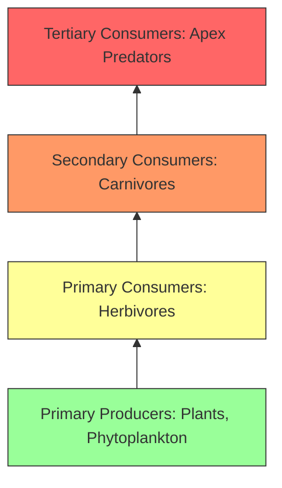

# Environment & Biodiversity: Complete UPSC Notes

> **Target Exam**: UPSC Civil Services Examination (Prelims & Mains) / State PSCs  
> **Subject**: Environment & Biodiversity  
> **Total Modules**: 9

---

## 📚 Table of Contents

1. [Organism & Population](#1-organism-population)
2. [Ecosystem- Structure & Function](#2-ecosystem--structure-function)
3. [Biodiversity & Conservation](#3-biodiversity-conservation)
4. [Pollution](#4-pollution)
5. [Climate Change](#5-climate-change)
6. [Environment Impact Assessment](#6-environment-impact-assessment)
7. [Important Convention, Treaties & Initiatives Related To Environment & Conservation](#7-important-convention-treaties-initiatives-related-to-environment-conservation)
8. [Water Management](#8-water-management)
9. [Rau's IAS Environment and Biodiversity Book for UPSC](#9-raus-ias-environment-and-biodiversity-book-for-upsc)

---

## 1. Organism & Population

> **Source Subject**: [Environment and biodiversity](https://compass.rauias.com/environment-biodiversity/)
---
## 1. Definitions : Ecology, Environment, Ecological hierarchy
> Source: [https://compass.rauias.com/environment-biodiversity/definitions-ecology-environment-ecological-hierarchy/](https://compass.rauias.com/environment-biodiversity/definitions-ecology-environment-ecological-hierarchy/)

## Definitions : Ecology, Environment, Ecological hierarchy

### **ECOLOGY**

Branch of biology, concerned with relations of organisms to one another (energy & mineral cycling) and their physical surroundings (environment). Ecology encompasses study of individuals, organisms, populations, communities, ecosystems, biome & biosphere forming various levels of ecological organization.

#### **ENVIRONMENT**

Environment is biotic (living organisms) & abiotic (non-living organisms) surrounding an organism or population. It includes factors that influence their survival, development and evolution. Environment is our basic life support system. It provides the air we breathe, the water we drink, the food we eat and the land where we live.

#### **ECOLOGICAL HIERARCHY/ LEVELS OF ORGANIZATION**

Cell is the basic unit of life in any living organism; likewise, an individual/organism is the smallest unit of interaction or existence in the ecological arena.

- **Organism or single individual:An organism is a single individual or being. Ex. an elephant in Kaziranga.

- **Species:Group of single individuals having potential to inter-breed & produce fertile offspring. Ex. Entire elephant population.

- **Population:It is a group of individuals of a plant or an animal species inhabiting a given area. Ex. All Elephants of Kaziranga form a population of elephants in that area.

- **Biological community:Assemblage of populations of plants, animals, microbes and all other life forms living in a particular area and interacting with each other for fulfilment of needs. Ex. Elephants+ rhino+ bacteria+ other wild animals and plants of Kaziranga. Biological community does not involve interactions of living beings with an abiotic/physical environment.

- **Ecosystem:Composed of biological community, integrated with its physical environment through exchange of gases, energy & recycling of nutrients. Ecosystem involves interactions between living and non-living worlds or biotic and abiotic worlds.

- **Landscape:A unit of land with a natural boundary having a mosaic of patches representing different ecosystems. Ex. a view of river, its valley & grasslands nearby from a mountain top with three different ecosystems in one picture.

- **Biome:A large regional unit characterised by major vegetation types and associated fauna/animal life, found in a specific climatic zone. Ex. Tropical rain forests of [Western Ghats](https://compass.rauias.com/environment-biodiversity/western-ghats/) form a typical biome with characterised vegetation of mahogany, ebony, rosewood etc. accompanied by animal life of Malabar civet, Nigiri Tahr etc. and climatic conditions of high rainfall, high humidity and higher temperatures.

- **Biosphere:On a global scale, all the earth’s terrestrial biomes & aquatic systems constitute the biosphere. It includes the lower atmosphere, land, oceans & rivers etc. where living organisms can be found. So, biosphere is the biologically inhabited part of earth along with its physical environment.

---

## 2. Organisms & Their Environment
> Source: [https://compass.rauias.com/environment-biodiversity/organisms-their-environment/](https://compass.rauias.com/environment-biodiversity/organisms-their-environment/)

## Organisms & Their Environment

Rotation of earth around the sun and its tilt along its axis causes annual variation in the intensity and duration of temperature, which results in distinct seasons. When Compounded with latitudinal and longitudinal variation in  precipitation and [temperature](https://compass.rauias.com/current-affairs/rising-temperature-oceans/) , this gives rise to formation of major biomes such as deserts , rainforest and tundra.

Fig: Biome distribution vis-à-vis annual temperature and precipitation

There are a wide variety of habitats which are the result of regional and local variations within each biome.

So the natural question that arises is what are the key elements that lead to so much variation in the physical and chemical conditions of different habitats?

The most important ones are temperature, water, light and soil (abiotic). We must remember that the [abiotic components](https://compass.rauias.com/environment-biodiversity/interaction-biotic-abiotic-components/) alone do not characterise the habitat of an organism completely; the habitat includes biotic components also – pathogens, parasites, predators and competitors – of the organism with which they interact constantly.

### **Major Abiotic factors and their significance in species distribution**

- **Temperature **is the most important environmental factor that is responsible for variations in the habitat as well as the species that reside in such habitats. Temperature affects the basal metabolism of organisms. With reference to capacity of [tolerance](https://compass.rauias.com/ethics/tolerance/) to temperature range there can be two categories of organisms. A few organisms can tolerate and thrive in a wide range of temperatures(*eurythermal*)for ex. Humans , Monkeys etc, but a vast majority of them are restricted to a narrow range of temperatures **(*stenothermal*)for ex Penguin, Polar beers . The levels of thermal tolerance of different species determine to a large extent their geographical distribution.

- **Water **is another important factor in deciding the species distribution. Availability of water decides the adaptations needed by an organism to survive in a particular habitat for ex. Adaptation in Desert [biome](https://compass.rauias.com/geography/biomes/). Similarly productivity and distribution of plants heavily depends upon availability of water. Quality of water in terms of salinity and chemical composition also act as a deciding factor in distribution of species. Some organisms are tolerant of a wide range of salinities(*euryhaline*)but others are restricted to a narrow range **(*stenohaline*).Many freshwater animals cannot live for long in sea water and vice versa because of the osmotic problems they would face.

- **Light **and its availability is particularly vital for the autotrophs which depend on it for their source of energy and for producing food through photosynthesis. Many plants are also dependent on sunlight to meet their photoperiodic requirement for flowering. For many animals too, light is important in that they use the diurnal and seasonal variations in light intensity and duration **(photoperiod)as cues for timing their foraging, reproductive and migratory activities.

- **Soil **and their properties exhibit spatial variation in terms of their composition, grain size and water holding capacity which in turn determine the vegetation in any area. This in turn dictates the type of animals that can be supported.

See also: [Definitions : Ecology, Environment, Ecological hierarchy](https://compass.rauias.com/environment-biodiversity/definitions-ecology-environment-ecological-hierarchy/)

---

## 3. Population Interaction & Growth
> Source: [https://compass.rauias.com/environment-biodiversity/population-interaction/](https://compass.rauias.com/environment-biodiversity/population-interaction/)

## Population interaction

### **Population**

A population is defined as a group of individuals of the same species living and interbreeding within a given area. Members of a population often rely on the same resources, are subject to similar environmental constraints, and depend on the availability of other members to persist over time.

A population at any given time is composed of individuals of different ages. If the age distribution (percent individuals of a given age or age group) is plotted for the population, the resulting structure is called an age pyramid.

For the human population, the age pyramids generally show age distribution of males and females in a combined diagram. The shape of the pyramids reflects the growth status of the population - (a) whether it is growing, (b) stable or (c) declining.

Age Pyramid for Human Population

#### PopulationGrowth**

The size of a population for any species is not a static parameter. it keeps changing in time, depending on various factors including food availability, predation pressure and adverse weather.

The density of a population in a given habitat during a given period, fluctuates due to changes in four basic processes, two of which (natality and immigration) contribute to an increase in population density and two (mortality and emigration) to a decrease.

- **Natality **refers to the number of births during a given period in the population that are added to the initial density.

- **Mortality **is the number of deaths in the population during a given period.

- **Immigrationis the number of individuals of the same species that have come into the habitat from elsewhere during the time period under consideration.

- **Emigrationis the number of individuals of the population who left the habitat and gone elsewhere during the time period under consideration.

#### PopulationInteraction **

In nature , animals , plants and microbes do not and can not live in isolation , they interact in various ways to form a biological community.

Interaction of populations of two different species gives rise to interspecific interactions. Such interactions could be beneficial, detrimental or neutral (neither harm nor benefit) to any of the participating species which are part of such interactions.

**Here in the following table ‘+’ sign has been assigned for beneficial interaction , ‘- ’ sign has been assigned for rimental and ‘0’ for neutral interactions.**

[**BIOTIC INTERACTION**](https://compass.rauias.com/environment-biodiversity/interaction-biotic-abiotic-components/)**InteractionsSpecies ASpeciesBExamplesMutualism/ Symbiotic**
Leguminous plants and nitrogen-fixing bacteria.Process of pollination in plants. **CommensalismAmensalismParasitism Competition Predation**[fish](https://compass.rauias.com/geography/fishing/)

|  |  |  |  |
| --- | --- | --- | --- |
|  |  |  |  |
|  | + | + |  |
|  | + | 0 | Remoras eat leftover food from sharks without depleting sharks' resources. |
|  | – | 0 | Shading out of one plant by a taller and wider one.Allelopathy - inhibition of one plant by the secretions of another. |
|  | + | – | Ticks, and the protozoan that causes malaria. |
|  | – | – | Lions and tigers are in the same niche. |
|  | + | – | Lion and zebra, bear and , fox and rabbit. |

- **Mutualism - **Such interactions **confer benefits on both the interacting species. For example,Lichensexhibit such a relationship between **fungus and photosynthesising algae or cyanobacteria. ** Similarly , the **mycorrhizaeare associations between **fungi and the roots of higher plants.The fungi helps the plant in absorption of nutrients from the soil while the plant in turn provides the fungi with carbohydrates.

- **Commensalism - **In this type of interactions **one species benefits and the other is neither harmed nor benefited.For example epiphyte **growing on a **tree or Barnaclesgrowing on the back of a whale , neither the tree nor the whale derives any apparent benefit.

- **Amensalism - **In such interactions **one species is harmed whereas the other remains unaffected.For example, **Herd of animals trampling over a grass field.

- **Parasitism and Predation - **In both of these interactionsonly one species benefits **i.e. **Parasite and Predator respectivelyand such interaction proves detrimental to the other species i.e. host and prey respectively. For example, Leeches on host bodies (Parasitism) or Tiger Hunting a deer (Predation).

- **Competition -  **Organisms of **two species depend and compete for the same limited resource **and have a negative effect on each other. For ex- Hippopotamus and crocodile competing for the same limited amount of resources in a dried up water body.

---

## 4. Food Chain & Food Web
> Source: [https://compass.rauias.com/environment-biodiversity/food-chain-food-web/](https://compass.rauias.com/environment-biodiversity/food-chain-food-web/)

## Food Chain & Food Web

### **Food chain**

-  Linear sequence of organisms through which nutrients & energy pass as one organism eats another. In a food chain, each organism occupies a different trophic level, defined by how many energy transfers separate it from the basic input of the chain.

#### **Food Web**

- Consists of **many interconnected food chains &is a more realistic representation of consumption relationships in ecosystems.

### **TYPES OF FOOD CHAIN **

#### **Grazing food chain:**

- It starts from living green plants, goes to grazing herbivores and on to carnivores.

- Ecosystems with such a type of food chain are directly dependent on an influx of [solar radiation](https://compass.rauias.com/geography/solar-radiation-heating-cooling-atmosphere-heat-budget/).

- Most ecosystems follow this type of food chain.

- **Ex. Phytoplanktons →zooplanktons →Fish sequence or the grasses →rabbit →Fox.**

#### **Detritus food chain:**

- It goes from dead organic matter into microorganisms and then to organisms feeding on detritus and their predators.

- Such ecosystems are less dependent on direct [solar energy](https://compass.rauias.com/geography/solar-energy/).

- These depend chiefly on the influx of organic matter produced in another system.

- Ex. Food chain operating in accumulated litter in a temperate forest.

- **Ex. Earthworms, crabs, slugs or vultures.**

---

---

## 2. Ecosystem- Structure & Function

> **Source Subject**: [Environment and biodiversity](https://compass.rauias.com/environment-biodiversity/)
---
## 1. Types of Ecosystem
> Source: [https://compass.rauias.com/environment-biodiversity/types-ecosystem/](https://compass.rauias.com/environment-biodiversity/types-ecosystem/)

## Types of Ecosystem

Interaction of biotic and abiotic components result in a physical structure that is characteristic for each type of **ecosystem**. Identification and enumeration of plant and animal species of an ecosystem gives its species composition.

**According to [Odum](https://en.wikipedia.org/wiki/Eugene_Odum) (1963) ecosystem** is the basic functional unit of nature including both organisms and their non-living environment, each interacting with other and influencing each other properties, necessary for maintenance and development of the system.

### **Types of EcosystemEcosystems can be categorised into various types based on their characteristics and the dominant organisms present. Here are some common types of ecosystems:**

#### **Terrestrial Ecosystems:a. Forest Ecosystem: **Includes diverse forests such as [tropical rainforests](https://compass.rauias.com/geography/tropical-evergreen-rainforest-biome/), temperate deciduous forests, and boreal forests. They are characterised by a variety of trees, understory vegetation, and diverse animal species.

b. **Grassland Ecosystem:Found in areas with moderate rainfall, grasslands are dominated by grasses and herbaceous plants. They can be further classified into savannahs, prairies, and steppes, with associated grazing animals.

c. **Desert Ecosystem**: Arid regions with low rainfall, deserts have sparse vegetation adapted to drought conditions. They include hot deserts (e.g., Sahara) and cold deserts (e.g., Gobi).

 d. **Tundra Ecosystem:Found in the Arctic and alpine regions, tundras have low temperatures, permafrost, and a short growing season. They consist of mosses, lichens, and small shrubs.

#### **Aquatic Ecosystems:a. Freshwater Ecosystem: **Includes rivers, lakes, ponds, and [wetlands](https://compass.rauias.com/environment-biodiversity/wetlands/). They support a variety of aquatic plants, fish, amphibians, and invertebrates.

b. **Marine Ecosystem**: Found in oceans, seas, and estuaries, marine ecosystems are home to a diverse range of organisms, including phytoplankton, seaweeds, [coral reefs](https://compass.rauias.com/environment-biodiversity/coral-reefs/), fish, and marine mammals.

c. **Estuarine Ecosystem**: Formed at the meeting point of freshwater rivers and saltwater bodies, estuaries are highly productive and support unique species adapted to brackish water conditions.

#### **Artificial Ecosystems:a. Urban Ecosystem: **Human-made environments, such as cities, towns, and suburbs, with a mix of built structures, green spaces, and human activities.

b. **Agricultural Ecosystem:Cultivated areas for crop production or [livestock](https://compass.rauias.com/geography/livestock/) rearing, involving various agricultural practices and interactions between crops, livestock, and humans.

#### **Specialised Ecosystems:a. Wetland Ecosystem: **Areas with water-saturated soils, such as marshes, swamps, and bogs, characterised by unique hydrological conditions and specific plant and animal adaptations.

**b. Mountain Ecosystem: **High-altitude regions with steep slopes, diverse climatic zones, and distinct flora and fauna adapted to harsh mountainous conditions.

---

## 2. Components of Ecosystem
> Source: [https://compass.rauias.com/environment-biodiversity/components-ecosystem/](https://compass.rauias.com/environment-biodiversity/components-ecosystem/)

## Components of Ecosystem

Understanding the components of an ecosystem is crucial for UPSC aspirants studying environmental science. This guide delves into the various **components of ecosystems**, including biotic and abiotic elements.

### Abiotic (Non-living) Component

- Abiotic components of an ecosystem are the non-living factors that shape its structure and function.

- These include climate (temperature, precipitation), soil composition, water availability, light intensity, topography, air quality, and natural disturbances.

- **Climate **determines the overall weather patterns, influencing the types of organisms that can survive.

- **Soil **provides physical support, nutrients, and water for plants.

- **Wateravailability and quality affect the distribution and abundance of organisms.

-  **Lightinfluences photosynthesis and affects the behavior of organisms.

- **Topography and geologyimpact water flow, nutrient distribution, and habitat formation.

- **Aircomposition and disturbances shape ecosystem dynamics.

- Understanding and managing these abiotic factors are essential for ecosystem conservation and management.

### Biotic (Living) Component

- **Producers (autotrophs)are capable of synthesising their own organic compounds using inorganic substances and an energy source.

- **Photoautotrophs:These producers use sunlight as the primary source of energy to carry out photosynthesis. They contain specialized structures called chloroplasts that contain chlorophyll, a pigment that captures light energy. Through photosynthesis, photoautotrophs convert carbon dioxide and water into glucose (a simple sugar) and oxygen. Plants, algae, and some bacteria are examples of photoautotrophs.

- **Chemoautotrophs:These producers obtain energy from chemical reactions involving inorganic compounds rather than sunlight. They are typically found in extreme environments, such as deep-sea hydrothermal vents or volcanic areas, where sunlight is not available. Chemoautotrophs derive energy by oxidizing substances like ammonia, nitrites, or sulfur compounds. Certain bacteria and archaea are examples of chemoautotrophs.

- **Heterotrophsare organisms that cannot produce their own food and obtain energy by consuming other organisms. They rely on the organic matter produced by autotrophs or other heterotrophs for their survival and energy needs.

- **Macro consumersis a type of organism within an ecosystem that occupies a higher trophic level and feeds on other consumers. It typically refers to larger organisms, such as large predators or top-level carnivores, that consume other organisms for energy and nutrients.

- A **microconsumeris a small organism within an ecosystem that feeds on organic matter, such as dead plant material or detritus. These organisms play a crucial role in decomposition and nutrient cycling by breaking down organic material into simpler compounds, facilitating the recycling of nutrients back into the ecosystem.

---

## 3. Interaction of Biotic & Abiotic Components
> Source: [https://compass.rauias.com/environment-biodiversity/interaction-biotic-abiotic-components/](https://compass.rauias.com/environment-biodiversity/interaction-biotic-abiotic-components/)

## Interaction of Biotic & Abiotic Components

**Interaction of biotic and abiotic components **result in a physical structure that is characteristic for each type of ecosystem. One can derive species composition of an ecosystem by identifying and enumerating plant and animal species Vertical distribution of different species occupying different levels is called **stratification**. For example, trees occupy top vertical strata or layer of a forest, shrubs the second and herbs and grasses occupy the bottom layers.

The components of the ecosystem are seen to function as a unit, when you consider the following aspects:

(i) Productivity

(ii) Decomposition

(iii) Energy flow

(iv) Nutrient cycling

### **PRODUCTIVITY**

- **Primary productionis defined as the amount of biomass or organic matter produced per unit area over a time period by plants during photosynthesis. It is expressed in terms of weight or energy.

- **Productivityis the rate of biomass production**.It is expressed in terms of to compare the productivity of different ecosystems.

- Productivity can be divided into **gross primary productivity (GPP) **and **net primary productivity (NPP).**

- **Gross primary productivityof an ecosystem is the rate of production of organic matter during photosynthesis. A considerable amount of GPP is utilised by plants in respiration.

- **Net primary productivityis the available biomass for the consumption to heterotrophs (herbivores and decomposers).

- Gross primary productivity minus respiration losses (R), is the **net primary productivity (NPP)**.

- **GPP – R = NPP**

- **Secondary productivityis defined as the rate of formation of new organic matter by consumers.

- **Primary productivitydepends on the plant species inhabiting a particular area.

 It also depends on a variety of environmental factors, availability of nutrients and photosynthetic capacity of plants. Therefore, it varies in different types of ecosystems.

---

## 4. Decomposition 
> Source: [https://compass.rauias.com/environment-biodiversity/decomposition/](https://compass.rauias.com/environment-biodiversity/decomposition/)

## Decomposition

### **Decomposers

They break down complex organic matter into inorganic substances like carbon dioxide, water and nutrients and the process is called **decomposition**.

Dead plant remains such as leaves, bark, flowers and dead remains of animals, including faecal matter, constitute detritus, which is the raw material for decomposition.

- The important steps in the process of decomposition are **fragmentation**, **leaching,catabolism**, **humification and mineralisation.**

- **Fragmentationis a process in which detritivores (e.g., earthworm) break down detritus into smaller particles.

- **Leaching **is a process in which-water inorganic nutrients go down into the soil horizon and get precipitated as unavailable salts.

- **Catabolism **is a process in which bacterial and fungal enzymes degrade detritus into simpler inorganic substances. It is important to note that all the above steps in decomposition operate simultaneously on the detritus (Figure).

- **Humificationleads to accumulation of a dark-coloured amorphous substance called **humusthat is highly resistant to microbial action and undergoes decomposition at an extremely slow rate. Being colloidal in nature it serves as a reservoir of nutrients.

- **Mineralisationis a process in which humus is further degraded by some microbes and release of inorganic nutrients occur.

- ** Decompositionis largely an oxygen-requiring process. The **rate of decompositionis controlled by chemical composition of detritus and climatic factors.
-  In a particular **climatic condition**, decomposition rate is slower if detritus is rich in lignin and chitin, and quicker, if detritus is rich in nitrogen and water-soluble substances like sugars.

- Temperature and soil moisture are the most important climatic factors that regulate decomposition through their effects on the activities of soil microbes. Warm and moist environment favour decomposition whereas low temperature and anaerobiosis inhibit decomposition resulting in build-up of organic materials.

#### **Detritus food chain (DFC)**

- It is made up of decomposers which are **heterotrophic organisms**, mainly **fungi and bacteria.**

- They meet their energy and nutrient requirements by **degrading dead organic matter or detritus.These are also known as **saprotrophs(sapro: to decompose).

- Decomposers secrete digestive enzymes that breakdown dead and waste materials into simple, inorganic materials, which are subsequently absorbed by them.

- In an **aquatic ecosystem**, Grazing Food Chain (GFC) is the major conduit for energy flow. As against this, in a **terrestrial ecosystem**, a much larger fraction of energy flows through the detritus food chain than through the GFC.

- Based on the **source of their nutrition or food**, organisms occupy a specific place in the food chain that is known as their **trophic level**.

- Producers belong to the first trophic level, herbivores (primary consumer) to the second and carnivores (secondary consumer) to the third.

---

## 5. Energy Flow
> Source: [https://compass.rauias.com/environment-biodiversity/energy-flow/](https://compass.rauias.com/environment-biodiversity/energy-flow/)

-  It refers to the movement of energy through an ecosystem, from one organism to another. It is the process by which energy from the sun is converted into usable energy by plants through photosynthesis, and then transferred to other organisms through feeding relationships.

- In an ecosystem, energy flows from producers (plants) to consumers (animals), and from one trophic level to another.

- Trophic levels are different levels in a **food chain or food web, which represent the position of an organism in the chain.**

- **The first trophic level consists of primary producers (plants), which convert sunlight into usable energy through photosynthesis.**

- **The second trophic level consists of herbivores, which eat the plants.**

- **The third trophic level consists of carnivores, which eat the herbivores. There can be multiple levels in a food chain or web, with each level representing a different feeding relationship.**

- One must remember that the trophic level represents a functional level, not a species as such. **A given species may occupy more than one trophic levelin the same ecosystem at the same time;

- **for example,a sparrow is a primary consumer when it eats seeds, fruits, peas, and a secondary consumer when it eats insects and worms.

- Each trophic level has a certain mass of living material at a particular time called as the standing crop. The Standing crop is measured as the mass of living organisms (biomass) or the number in a unit area.

- **Energy flow is not 100% efficient**, as energy is lost at each trophic level due to various factors such as respiration, movement, and waste. This means that the higher up an organism is in a food chain or web, the less energy it receives.

- The number of trophic levels in the grazing food chain is restricted as the transfer of energy follows 10 per cent law – only 10 per cent of the energy is transferred to each trophic level from the lower trophic level.

- Overall, energy flow is an important process in ecosystems, as it determines the amount of energy available to support life and the interactions between organisms.

Except for the deep-sea hydro-thermal ecosystem, sun is the only source of energy for all ecosystems on Earth.

---

## 6. Ecological Pyramid
> Source: [https://compass.rauias.com/environment-biodiversity/ecological-pyramids/](https://compass.rauias.com/environment-biodiversity/ecological-pyramids/)

**Ecological pyramidsare graphical representations of the structure of ecosystems, showing the relative amounts of different components such as biomass, energy or numbers of individuals at each trophic level.The base of each pyramid represents the producers or the first trophic level while the apex represents tertiary or top level consumer.

There are **three main types of ecological pyramids**:

#### **Pyramid of Numbers**

- This type of ecological pyramid shows the number of individuals at each trophic level in an ecosystem. The pyramid of numbers is usually widest at the base, where the producers are located, and narrows at higher trophic levels.

#### **Pyramid of Biomass**

- This type of ecological pyramid shows the total amount of living matter, or biomass, at each trophic level in an ecosystem. **Biomass **is a more accurate measure of the amount of energy available to support life, as it takes into account the mass of living tissue at each trophic level.

- The pyramid of biomass is usually widest at the base, where the producers are located, and narrows at higher trophic levels.

#### **Pyramid of Energy**

- This type of ecological pyramid shows the amount of energy that flows through each trophic level in an ecosystem. The pyramid of energy is **always upright**, as the amount of energy available decreases as you move up the trophic levels.

- It's important to note that the shape of the ecological pyramid can vary depending on the ecosystem being studied. **For example,in some **aquatic ecosystems**, the pyramid of biomass may be inverted, with the biomass of phytoplankton (producers) being less than the biomass of zooplankton (consumers) due to the rapid turnover of phytoplankton.

- Additionally, in some ecosystems, such as grasslands, the pyramid of biomass may not match the pyramid of numbers due to differences in the size and mass of organisms at different trophic levels.

However, there are certain limitations of ecological pyramids such as it does not take into account the same species belonging to two or more trophic levels. It assumes a simple food chain, something that almost never exists in nature; it does not accommodate a food web. Moreover, saprophytes are not given any place in ecological pyramids even though they play a vital role in the ecosystem

---

## 7. Bio-Geochemical Cycle
> Source: [https://compass.rauias.com/environment-biodiversity/bio-geochemical-cycle/](https://compass.rauias.com/environment-biodiversity/bio-geochemical-cycle/)

## Bio-Geochemical Cycle

A pathway by which a chemical substance moves through biotic (biosphere) & abiotic (lithosphere, atmosphere & hydrosphere) compartments of Earth.

### **Type of biogeochemical cycle: Gaseous & sedimentary**

-  In the gaseous type of biogeochemical cycle, there is a prominent gaseous phase. Cycling of carbon and nitrogen represents gaseous biogeochemical cycles.

-  In sedimentary cycles, main reservoir is lithosphere from which nutrients are released largely by weathering of rocks. The sedimentary cycle is exemplified by phosphorus and sulphur.

**Biogeochemical cycles are either perfect or imperfect.**

- A perfect nutrient cycle is one in which the nutrients are replaced as fast as they are used up. Most gaseous cycle’s arc is generally considered perfect.

-  In contrast, sedimentary cycles are considered relatively imperfect, as some nutrients are lost from the cycle into soil and sediments & become unavailable for immediate cycling.

#### **Ecosystem – Carbon Cycle**

The carbon cycle is an essential process for all living organisms and ecosystems on Earth. Carbon is a fundamental building block of life, and it cycles through the atmosphere, oceans, and terrestrial ecosystems in a complex series of processes known as the carbon cycle.

The carbon cycle can be broken down into two main processes: **the biological carbon cycle and the geological carbon cycle.**

#### **Biological Carbon Cycle**

- It refers to the processes by which carbon moves through living organisms and ecosystems.

- It starts with **photosynthesis**, which is the process by which plants and other photosynthetic organisms convert atmospheric carbon dioxide (CO2) into organic matter through the use of sunlight.

- This organic matter can be consumed by herbivores, which then become food for carnivores and other higher-level consumers.

- During this process, carbon is transferred from one organism to another, and eventually, the carbon is released back into the atmosphere through respiration, decomposition, or combustion.

#### **Geological Carbon Cycle**

- The geological carbon cycle refers to the processes by which carbon is transferred between the atmosphere, oceans, and terrestrial ecosystems over long periods of time.

-  This process involves the weathering of rocks, which releases carbon into the oceans, where it can be stored in sedimentary rock or taken up by marine organisms. Over time, the carbon can be released back into the atmosphere through volcanic activity or erosion of sedimentary rock.

#### **Ecosystem – Phosphorus Cycle**

The phosphorus cycle is another important biogeochemical cycle that is critical for the functioning of ecosystems.

The phosphorus cycle can be broken down into several stages:

#### **Weathering and Erosion**

Phosphorus is released into the environment through the weathering and erosion of rocks and minerals.

#### **Absorption**

Plants absorb phosphorus from the soil and incorporate it into their tissues.

#### **Consumption**

Herbivores consume plants, and carnivores consume herbivores, transferring phosphorus up the food chain.

#### **Decomposition**

When plants and animals die, their tissues decompose, releasing phosphorus back into the soil.

#### **Mineralization**

During decomposition, phosphorus is converted from an organic form to an inorganic form that can be taken up by plants.

#### **Sedimentation**

Over time, phosphorus can accumulate in sedimentary rocks and become locked up in geological formations.

#### **Geological Uplift**

Geological uplift can bring phosphorus-rich rocks to the surface, restarting the phosphorus cycle.

The  two major and important differences between carbon and phosphorus cycle are

- firstly, atmospheric inputs of phosphorus through rainfall are much smaller than carbon inputs

- secondly, gaseous exchanges of phosphorus between organism and environment are negligible.

#### **The Nitrogen Cycle**

The nitrogen cycle is a vital process in ecology that involves the transformation and cycling of nitrogen in various forms within an ecosystem. Nitrogen is an essential element for the growth and development of living organisms, particularly in the form of proteins and nucleic acids. The nitrogen cycle consists of several key steps:

#### Nitrogen Fixation:

Certain bacteria, such as Rhizobium and Azotobacter, convert atmospheric nitrogen (N2) into ammonia (NH3) through a process called nitrogen fixation. This conversion can occur through symbiotic relationships with plants (as in legume nodules) or as free-living bacteria in the soil.

#### Nitrification:

Ammonia (NH3) is further transformed by nitrifying bacteria into nitrite (NO2-) and then into nitrate (NO3-). This process is known as nitrification. Nitrite and nitrate are forms of nitrogen that can be readily used by plants.

#### Assimilation:

Plants take up nitrate ions from the soil and incorporate them into organic compounds, such as amino acids and proteins. This assimilation of nitrogen by plants allows them to grow and develop.

#### Consumption and Decomposition

Animals obtain nitrogen by consuming plants or other animals. When plants or animals die, decomposers, primarily bacteria and fungi, break down the organic matter, releasing ammonia back into the soil.

#### Denitrification

Denitrifying bacteria convert nitrate (NO3-) back into atmospheric nitrogen (N2), completing the nitrogen cycle. This process occurs in oxygen-deprived environments, such as waterlogged soil or sediments, and results in the loss of nitrogen from the ecosystem.

#### **The hydrological cycle**

The hydrological cycle, also known as the water cycle, is a fundamental process in ecology that describes the continuous movement of water on Earth. It involves the circulation and transformation of water through various reservoirs, including the atmosphere, land, and oceans. The hydrological cycle consists of several key steps:

#### Evaporation

Solar energy heats the surface of water bodies, causing water to change from a liquid to a gaseous state, forming water vapor. This process is known as evaporation.

#### Condensation

Water vapor rises into the atmosphere and cools, forming tiny water droplets or ice crystals, leading to the formation of clouds. This process is called condensation.

#### Precipitation

Condensed water droplets in the clouds combine and grow in size until they become too heavy to remain suspended in the air. They then fall to the Earth's surface as precipitation, which can take the form of rain, snow, sleet, or hail.

#### Infiltration

Precipitation that reaches the Earth's surface can be absorbed into the soil through a process called infiltration. It percolates through the soil and may eventually reach underground aquifers, replenishing groundwater resources.

#### Surface Runoff

When the rate of precipitation exceeds the capacity of the soil to absorb water, excess water flows over the land surface as runoff. It eventually makes its way into rivers, streams, lakes, and eventually the oceans.

#### Transpiration

Plants absorb water through their roots and release it into the atmosphere through small openings in their leaves called stomata. This process, known as transpiration, contributes to the movement of water vapor into the atmosphere.

#### Sublimation

In addition to evaporation, water can also change directly from a solid (ice) to a gas (water vapor) through a process called sublimation. This occurs when ice or snow undergoes a phase transition without melting into liquid water.

#### **The sulphur cycle**

The sulphur cycle is a biogeochemical cycle that describes the movement and transformation of sulphur through various forms within ecosystems. Sulphur is an essential element for living organisms as it is a component of amino acids, proteins, and vitamins. The sulphur cycle involves several key processes:

#### Weathering

Sulphur compounds in rocks and minerals can be released through weathering processes, such as erosion and exposure to atmospheric elements.

#### Sulphur Mineralization

Sulphur-containing minerals in rocks and sediments can undergo mineralization, resulting in the release of elemental sulphur or sulphate ions into the environment.

#### Sulphur Assimilation

Plants absorb sulphate ions from the soil and assimilate them into organic compounds. Sulphur is an important component of plant proteins and plays a role in various metabolic processes.

#### Consumption and Decomposition

Animals obtain sulphur by consuming plants or other animals. When plants or animals die, decomposers break down organic matter and release sulphur compounds back into the environment.

#### Volcanic Activity

Volcanic eruptions release large amounts of sulphur dioxide (SO2) into the atmosphere, contributing to the sulphur cycle. Sulphur dioxide can react with atmospheric moisture to form sulfuric acid (H2SO4), which then returns to the Earth's surface through precipitation.

#### Sulphur Oxidation and Reduction

Sulphur compounds in the atmosphere undergo oxidation and reduction reactions facilitated by various microorganisms. These reactions convert sulfur between different oxidation states, such as sulphate, sulphite , elemental sulphur, and hydrogen sulphide (H2S).

#### Sulphur Desorption

Sulphur compounds can be released from soil particles and transported through runoff or leaching, entering water bodies or groundwater.

#### Sulphur Gas Emissions

Certain bacteria, such as sulphate-reducing bacteria and sulphur-oxidizing bacteria, play a crucial role in the sulphur cycle. Sulphate-reducing bacteria convert sulfate ions into hydrogen sulphide gas (H2S), while sulphur-oxidizing bacteria oxidize hydrogen sulphide back to sulphate.

---

## 8. Ecological Succession
> Source: [https://compass.rauias.com/environment-biodiversity/ecological-succession/](https://compass.rauias.com/environment-biodiversity/ecological-succession/)

## Ecological Succession

A process of directional change in vegetation on an ecological time scale. In this process, a series of communities replace one another due to large-scale natural or anthropogenic destructions.

### **Types of Ecological Succession**

#### **Primary Succession**

- When a terrestrial site is first colonised by the pioneer species. In primary succession on rocks, these are usually lichens which can secrete acids to dissolve rock, helping in weathering and soil formation.

- These later pave the way to some very small plants like bryophytes, which can take hold in a small amount of soil.

- They are, with time, succeeded by higher plants, and after several more stages, ultimately a stable climax forest community is formed.

- In primary succession in water, the pioneers are the small phytoplankton, which is replaced with time by rooted-submerged plants, rooted-floating angiosperms followed by free-floating plants, then reed swamp, marsh-meadow, scrub and finally the trees. The climax again would be a forest. With time the water body is converted into land.

#### **Secondary Succession**

- Sequential development of biotic communities after disturbance/destruction.

- In secondary succession, the species that invade depend on the condition of the soil, availability of water, environment and also seeds or other propagules present.

- Since soil is already there, the rate of succession is much faster and hence, the climax is also reached more quickly.

#### **Examples of succession**

- **Terrestrial:Bare rocks – Lichens -- Annual Plants -- Perennial Plants and Grasses – Shrubs – Softwood Tress, Pines – Hardwood trees

- **Hydrosere:Phytoplankton – Submerged plant – Submerged free-floating plant – Reed swamp (Sedge) – Marsh meadow – Scrub - Forest

#### **Seral Community (Sere)**

Based on the nature of the habitat – whether it is water (or very wet areas) or it is on very dry areas – succession of plants is called hydrarch or xerarch, respectively. **Hydrarch successiontakes place in wet areas and the successional series progress from hydric to mesic conditions. As against this, **xerarch successiontakes place in dry areas and the series progress from xeric to mesic conditions. Hence, both hydrarch and xerarch successions lead to medium water conditions (mesic) – neither too dry (xeric) nor too wet (hydric).

#### **Ecological Niche**

- It represents the range of conditions an organism can tolerate, the resources it utilizes and its functional role in the ecological system.

- A habitat may contain many ecological niches and support a variety of species.

- Each species has a distinct niche, and no two species are believed to occupy the same niche.

#### **Edge effect and Ecotone**

- **Edge effect** is an ecological concept that describes how there is a greater diversity of life in the region where the edges of two adjacent ecosystems overlap, such as land/water, or forest/grassland.

- **Ecotoneis a transition area between two biomes. It is where two communities meet and integrate. For ex -

- Grassland (between forest and desert)

- Estuary (between fresh water and salt water)

- Riverbank or Marshland (between dry and wet)

- Mangroves (b/w terrestrial & marine ecosystems)

#### **Sentinel Species**

- They are organisms, often animals used to detect risks to humans by providing warning of danger. They serve as indicators of ecosystem health.

- Ex. Canaries are birds that die early if an odourless Carbon Monoxide environment is present in a high concentration, this gives miners time to escape.

---

---

## 3. Biodiversity & Conservation

> **Source Subject**: [Environment and biodiversity](https://compass.rauias.com/environment-biodiversity/)
---
## 1. Levels of Biodiversity
> Source: [https://compass.rauias.com/environment-biodiversity/levels-biodiversity/](https://compass.rauias.com/environment-biodiversity/levels-biodiversity/)

## Levels of Biodiversity

- Biodiversity or Biological diversity is a term that describes the variety of living beings on earth. In short, it is described as the degree of variation in life. Biological diversity encompasses microorganisms, plants, animals and ecosystems such as coral reefs, forests, rainforests, deserts etc.

### **What is Biodiversity**

- There are generally three levels of biodiversity: **genetic, species and ecosystem. **These levels are all interrelated yet distinct enough that they can be studied as three separate components.

#### **Genetic Diversity**

- Genetic diversity is the variety of genes within a species. Each species is made up of individuals that have their own particular genetic composition.

- This means a species may have different populations, each having different genetic compositions.

- **For ex. **India has more than 50,000 genetically different strains of rice, and 1,000 varieties of mango.

#### **Species Diversity**

- Species diversity is the variety of species within a habitat or a region.

- **For ex. ** Some habitats, such as rainforests and coral reefs, have high number of species residing in them.

#### **Ecosystem diversity**

- It is the variety of ecosystems in a given place. An ecosystem is a community of organisms and their physical environment interacting together.

- An ecosystem can cover a large area, such as a whole forest, or a small area, such as a pond.

- **For ex India,with its deserts, rain forests, mangroves, coral reefs, wetlands, estuaries, and alpine meadows has a greater ecosystem diversity than a Scandinavian country like Norway.

#### **How Many species are there?**

- The IUCN Red List tracks the number of described species and updates this figure annually based on the latest work of taxonomists. In 2021 it listed 2.13 million species on the planet.

-  In this pool of recorded species of animals, insect forms majority of share. If we look at the breakdown across a range of taxonomic groups – 1.05 million are insects; over 11,000 are birds; over 11,000 are reptiles; and over 6,000 are mammals.

- One important fact that should be kept in mind is the number of fungi species in the world is more than the combined total of the species of fishes , amphibians, reptiles and mammals.

One of the most widely-cited figures comes from Camilo Mora and colleagues; they estimated that there were around 8.7 million species on Earth today.

#### **Facets of Indian Biodiversity**

- Although India has only 2.4 per cent of the world’s land area, its share of the global species diversity is an impressive 8.1 per cent. That is what makes our country one of the 12 mega diversity countries of the world.

- Nearly 45,000 species of plants and twice as many of animals have been recorded from India.

- Along with species richness, India also possesses high rates of endemism.

- In terms of endemic vertebrate groups, India’s global ranking is tenth in birds, with 69 species; fifth in reptiles with 156 species; and seventh in amphibians with 110 species.

- Endemic-rich Indian fauna is manifested most prominently in Amphibia (61.2%) and Reptilia (47%).

- India is also recognized as one of the eight Vavilovian centers of origin and diversity of crop plants, having more than 300 wild ancestors and close relatives of cultivated plants, which are still evolving under natural conditions.

---

## 2. Biogeographic Zones In India
> Source: [https://compass.rauias.com/environment-biodiversity/biogeographic-zones-india/](https://compass.rauias.com/environment-biodiversity/biogeographic-zones-india/)

India is a diverse country with varied biogeographic zones that encompass a wide range of ecosystems and biodiversity. The major biogeographic zones of India are as follows:

#### Trans-Himalayan Zone

- This zone includes the high-altitude regions of Ladakh, Lahaul-Spiti, and parts of Jammu and Kashmir.

- It is characterised by alpine meadows, barren landscapes, and sparse vegetation.

#### Himalayan Zone

- This zone extends along the entire length of the Himalayan mountain range and includes states like Uttarakhand, Himachal Pradesh, and parts of Jammu and Kashmir.

-  It features diverse ecosystems ranging from sub-tropical forests in the lower regions to coniferous forests, alpine meadows, and glaciers at higher elevations.

#### Desert Zone

- The desert zone covers the arid regions of Rajasthan, Gujarat, and parts of Haryana and Punjab.

- It comprises the Thar Desert and features xerophytic vegetation, sand dunes, and saline lakes.

#### Semi-Arid Zone

- This zone encompasses areas with a semi-arid climate, including parts of Rajasthan, Gujarat, Maharashtra, and Madhya Pradesh.

-  It features shrub-lands, dry deciduous forests, and grasslands.

#### Western Ghats

- The [Western Ghats](https://compass.rauias.com/environment-biodiversity/western-ghats/), running parallel to the western coast of India, constitute a hotspot of biodiversity.

- This zone includes tropical evergreen forests, moist deciduous forests, grasslands, and wetlands.

#### Deccan Plateau

- The Deccan Plateau covers central and southern India, including parts of Maharashtra, Karnataka, Andhra Pradesh, and Tamil Nadu.

- It consists of dry deciduous forests, scrublands, and extensive agricultural lands.

#### Gangetic Plain

- This zone encompasses the fertile plains of the Ganges and Brahmaputra rivers, extending across states like Uttar Pradesh, Bihar, West Bengal, and Assam.

- It features alluvial soils, wetlands, and diverse vegetation.

#### Coastal Zone

- The coastal zone covers the coastal areas of India, including mangrove forests, estuaries, beaches, and coral reefs.

- It is rich in marine biodiversity and supports unique ecosystems.

#### Northeastern Himalayan Region

- This zone includes the states of Arunachal Pradesh, Sikkim, and parts of Assam and Nagaland.

- It features a diverse range of habitats, including subtropical forests, montane forests, and alpine meadows.

#### Eastern Ghats

- The Eastern Ghats stretch along the eastern coast of India, covering states like Odisha, Andhra Pradesh, and Tamil Nadu.

- This zone comprises dry deciduous forests, scrublands, and hilly terrain.

####   Islands

- The **Lakshadweep Islands **are a group of coral islands located in the Arabian Sea. This zone is characterised by coral reefs, lagoons, and marine ecosystems with rich biodiversity.

- **Andaman and Nicobar Islands: **The Andaman and Nicobar Islands are a chain of islands located in the Bay of Bengal. They are home to diverse ecosystems, including tropical rainforests, mangroves, coral reefs, and endemic species.

---

## 3. Measurement of Biodiversity
> Source: [https://compass.rauias.com/environment-biodiversity/measurement-biodiversity/](https://compass.rauias.com/environment-biodiversity/measurement-biodiversity/)

Alpha, beta, and gamma diversity are commonly used measures to assess different aspects of biodiversity at various spatial scales. Let's look at each of them:

#### **Alpha Diversity**

- Alpha diversity represents the diversity within a particular habitat or local area. It quantifies the number of species or taxa present within a specific location.

- It provides insights into the species richness and evenness within a single ecosystem or site.

- Alpha diversity is usually measured using indices like species richness, Shannon-Wiener index, or Simpson's index.

#### **Beta Diversity**

- Beta diversity quantifies the change in species composition or turnover between different habitats or sites within a region.

- It measures the variation or differentiation in species composition among multiple locations.

- Beta diversity reflects the degree of dissimilarity between habitats and helps identify unique or distinct species assemblages.

- It is commonly assessed using metrics such as Jaccard's index or Sørensen's index.

#### **Gamma Diversity**

- Gamma diversity represents the overall diversity at the regional or landscape scale.

-  It encompasses the total number of species found across multiple habitats or sites within a larger geographical area.

- Gamma diversity provides a comprehensive view of the total species pool and captures the cumulative diversity of all the habitats within the region.

---

## 4. Significance Of Biodiversity
> Source: [https://compass.rauias.com/environment-biodiversity/significance-of-biodiversity-to-the-ecosystem/](https://compass.rauias.com/environment-biodiversity/significance-of-biodiversity-to-the-ecosystem/)

- **The diversity of life enriches the quality of our livesin ways that are not easy to quantify. Biodiversity is intrinsically valuable and is important for our emotional, psychological, and spiritual well-being. Diversity breeds diversity. Having a diverse array of living organisms allows other organisms to take advantage of the resources provided. For example, trees provide habitat and nutrients for birds, insects, other plants and animals, fungi, and microbes. Humans have always depended on the Earth’s biodiversity for food, shelter, and health. Biological resources that provide goods for human use include:

- **Food**—species that are hunted, fished, and gathered, as well as those cultivated for agriculture, forestry, and aquaculture.

- **Shelter and warmth**—timber and other forest products and fibers such as wool and cotton

- **Medicines**—both traditional medicines and those synthesized from biological resources and processes.

- **Biodiversity also supplies indirect services to humanswhich are often taken for granted. These include drinkable water, clean air, and fertile soils. The loss of populations, species, or groups of species from an ecosystem can upset its normal function and disrupt these ecological services. Recent declines in honeybee populations may result in a loss of pollination services for fruit crops and flowers.

- **Biodiversity provides medical models for research into solving human health problems.For example, researchers are looking at how seals, whales, and penguins use oxygen during deep-water dives for clues to treat people who suffer strokes, shock, and lung disease.

- **The Earth’s biodiversity contributes to the productivity of natural and agricultural systems.Insects, bats, birds, and other animals serve as pollinators. Parasites and predators can act as natural pest controls. Various organisms are responsible for recycling organic materials and maintaining the productivity of soil.

- **Genetic diversity is also important in terms of evolution**. The loss of individuals, populations, and species decreases the variety of genes—the material needed for species and populations to adapt to changing conditions or for new species to evolve.

---

## 5. Threats to biodiversity
> Source: [https://compass.rauias.com/environment-biodiversity/threats-biodiversity/](https://compass.rauias.com/environment-biodiversity/threats-biodiversity/)

## Threats to biodiversity

The loss of biodiversity is a significant issue for scientists and policymakers and the topic is finding its way into living rooms and classrooms. Species are becoming extinct at the fastest rate known in geological history and most of these extinctions have been tied to human activity.

### **Major causes of biodiversity losses**

- **Habitat loss and destruction / Fragmentation**, usually as a direct result of human activity and population growth, is a major force in the loss of species, populations, and ecosystems. For ex. Tropical rain forests which once covered around 14% of land surface now only cover around 6% of land area

-  **Alterations in ecosystem composition/ **Co-extinction**, such as the loss or decline of a species, can lead to a loss of biodiversity. For example, efforts to eliminate coyotes in the canyons of southern California are linked to decreases in songbird populations in the area. As coyote populations were reduced, the populations of their prey, primarily raccoons, increased. Since raccoons eat bird eggs, fewer coyotes led to more raccoons eating more eggs, resulting in fewer songbirds.

- **The introduction of exotic (non-native) species / Alien Speciescan disrupt entire ecosystems and impact populations of native plants or animals. These invaders can adversely affect native species by eating them, infecting them, competing with them, or mating with them. For ex. The Nile perch introduced into Lake Victoria in east Africa led eventually to the extinction of an ecologically unique assemblage of more than 200 species of cichlid fish in the lake.

- **The over-exploitation(over-hunting, over-fishing, or over-collecting) of a species or population can lead to its demise.

- **Human-generated pollution **and contamination can affect all levels of biodiversity.

- **Global climate changecan alter environmental conditions. Species and populations may be lost if they are unable to adapt to new conditions or relocate.

---

## 6. Conservation Of Biodiversity
> Source: [https://compass.rauias.com/environment-biodiversity/conservation-biodiversity/](https://compass.rauias.com/environment-biodiversity/conservation-biodiversity/)

Conservation of Biodiversity is of importance because of two major reasons firstly because of services that biodiversity provides and secondly the rapid pace at which at which biodiversity is being destroyed. There are two broader categories in which the efforts for conservation of biodiversity can be grouped - i) ***In-situ ***(on site) and ii) ***Ex-Situ***(off site).

#### **In-Situ conservation**

- It is on-site conservation of genetic resources in natural populations of plants or animal species such as forest genetic resources, in natural populations of tree and animal species.

- The process of protecting an endangered plant or animal species in its natural habitat is commonly known as in situ conservation.

- For ex. Identifying and declaring Biosphere reserves (Nilgiri / Manas / Nanda devi etc.)

#### **Ex-situ conservation**

- In this approach, threatened animals and plants are taken out from their natural habitat and placed in special setting where they can be protected and given special care.

- Zoological parks, botanical gardens and wildlife safari parks serve this purpose.

- There are many animals that have become extinct in the wild but continue to be maintained in zoological parks.

---

## 7. Biomes
> Source: [https://compass.rauias.com/environment-biodiversity/biomes/](https://compass.rauias.com/environment-biodiversity/biomes/)

Biomes are large-scale ecological regions characterized by distinct climate patterns, vegetation types, and species adaptations. They represent major terrestrial ecosystems found across the planet.

Here are some examples of biomes:

#### Tropical Rainforest

- Located near the equator, these biomes are characterized by high temperatures, abundant rainfall, and diverse vegetation.

- The Amazon Rainforest in South America is the largest tropical rainforest, known for its incredible biodiversity.

#### Desert

- Deserts are arid regions with low precipitation and extreme temperature variations.

-  The Sahara Desert in Africa is the largest hot desert, while the Mojave Desert in North America is an example of a cold desert.

#### Temperate Forest

- These biomes occur in regions with moderate temperatures and distinct seasons.

- The temperate forests of North America, such as the Great Smoky Mountains National Park, are characterized by deciduous trees that shed their leaves in the fall.

#### Grassland

- Grasslands are characterized by vast expanses of grasses and few trees.

- The African savanna, home to iconic species like lions, elephants, and giraffes, is a prime example of a grassland biome.

#### Taiga/Boreal Forest

- The taiga is the world's largest terrestrial biome, found in high-latitude regions with long, cold winters.

- The boreal forests of Canada, with their coniferous trees and extensive [wetlands](https://compass.rauias.com/environment-biodiversity/wetlands/), represent this biome.

#### Tundra

- The [tundra biome](https://compass.rauias.com/geography/tundra-biome/) occurs in the Arctic and alpine regions, characterized by extreme cold, permafrost, and a short growing season.

- The Arctic tundra in northern Russia is a prime example of this unique biome.

#### Mediterranean Scrubland

- Found in regions with a Mediterranean climate, these biomes have hot, dry summers and mild, wet winters.

- The Mediterranean Basin, including countries like Spain, Italy, and Greece, features Mediterranean scrubland known as maquis and garrigue.

#### Mangrove Forest

- Mangroves are unique coastal biomes found in tropical and subtropical regions.

- The Sundarbans [mangrove](https://compass.rauias.com/environment-biodiversity/mangroves/) forest in Bangladesh and India is the largest mangrove ecosystem, known for its dense mangrove trees and rich biodiversity.

---

## 8. Protected Areas  & WildLife
> Source: [https://compass.rauias.com/environment-biodiversity/protected-areas-wildlife/](https://compass.rauias.com/environment-biodiversity/protected-areas-wildlife/)

## Protected Areas  & WildLife

### **Biodiversity Hotspots**

A biodiversity hotspot is a biogeographic region with significant levels of biodiversity that is threatened by human habitation. Norman Myers wrote about the concept in two articles in The Environmentalist in 1988.

Around the world, **36 areas** qualify as hotspots. Their intact habitats represent just **2.5% of Earth’s land surface**, but they support more than half of the world’s plant species as endemics — i.e., species found no place else — and **nearly 43% of bird, mammal, reptile and amphibian** species as endemics.

To qualify as a biodiversity hotspot, a region must **meet two strict criteria:**

- It must have **at least 1,500 vascular plants as endemics** — which is to say, it must have a high percentage of plant life found nowhere else on the planet. A hotspot, in other words, is **irreplaceable**.

- It must have **30% or less of its original natural vegetation**. In other words, it must be threatened.

### **Biodiversity Hotspots In India**

#### **Himalaya**

Includes the entire Indian Himalayan region (and that falling in Pakistan, Tibet, Nepal, Bhutan, China and Myanmar)

#### **Indo-Burma**

Includes entire North-eastern India, except Assam and Andaman group of Islands (and Myanmar, Thailand, Vietnam, Laos, Cambodia and southern China)

#### **Sundalands**

Includes Nicobar group of Islands (and Indonesia, Malaysia, Singapore, Brunei, Philippines)

#### **Western Ghats and Sri Lanka**

Includes entire [Western Ghats](https://compass.rauias.com/environment-biodiversity/western-ghats/) (and Sri Lanka)

---

## 9. Biosphere Reserves
> Source: [https://compass.rauias.com/environment-biodiversity/biosphere-reserves/](https://compass.rauias.com/environment-biodiversity/biosphere-reserves/)

## What is Biosphere Reserve?

- Biosphere reserves are ‘learning places for sustainable development’.

- They are sites for testing interdisciplinary approaches to understanding and managing changes and interactions between social and ecological systems, including conflict prevention and management of biodiversity.

- They are places that provide local solutions to global challenges. Biosphere reserves include terrestrial, marine and coastal ecosystems.

- Each site promotes solutions reconciling the conservation of biodiversity with its sustainable use.

Biosphere Reserves involve local communities and all interested stakeholders in planning and management. **They integrate three main "functions":**

- Conservation of biodiversity and cultural diversity

- Economic development that is socio-culturally and environmentally sustainable

- Logistic support, underpinning development through research, monitoring, education and training

These three functions are pursued through the Biosphere Reserves' three main zones

#### Core Areas

It comprises a strictly protected zone that contributes to the conservation of landscapes, ecosystems, species and genetic variation

#### Buffer Zones

It surrounds or adjoins the core area(s), and is used for activities compatible with sound ecological practices that can reinforce scientific research, monitoring, training and education.

#### Transition Area

The transition area is where communities foster socio-culturally and ecologically sustainable economic and human activities.

#### **Man and the Biosphere (MAB) Programme (UNESCO)**

- The MAB Programme is an intergovernmental scientific programme that aims to establish a scientific basis for enhancing the relationship between people and their environments. It combines the natural and social sciences with a view to improving human livelihoods and safeguarding natural and managed ecosystems, thus promoting innovative approaches to economic development that are socially and culturally appropriate and environmentally sustainable.

- The World Network of Biosphere Reserves currently counts 738 sites in 134 countries all over the world, including 22 transboundary sites.

### **Man and the Biosphere (MAB) Programme (UNESCO)**

- The MAB Programme is an intergovernmental scientific programme that aims to establish a scientific basis for enhancing the relationship between people and their environments. It combines the natural and social sciences with a view to improving human livelihoods and safeguarding natural and managed ecosystems, thus promoting innovative approaches to economic development that are socially and culturally appropriate and environmentally sustainable.

- Biosphere reserves are nominated by national governments and remain under the sovereign jurisdiction of the states where they are located. Biosphere Reserves are designated under the intergovernmental MAB Programme by the Director-General of UNESCO following the decisions of the MAB International Coordinating Council (MAB ICC). Their status is internationally recognized.

- The World Network of Biosphere Reserves currently counts 738 sites in 134 countries all over the world, including 22 transboundary sites.

---

## 10. List of Biosphere Reserves in India
> Source: [https://compass.rauias.com/environment-biodiversity/list-biosphere-reserves-india/](https://compass.rauias.com/environment-biodiversity/list-biosphere-reserves-india/)

## List of Biosphere Reserves in India

Biosphere Reserves in India are a testament to the country's rich biological diversity and its continuous efforts in conserving unique ecosystems. These reserves are not merely protected areas, but are the landscapes of co-existence where conservation of biological diversity is reconciled with sustainable economic development.

This article aims to introduce students to the concept of Biosphere Reserves, with a special emphasis on the ones in India, their role in conservation, and the unique flora and fauna they protect.

### Biosphere Reserves list

**Biosphere ReservesLocationFloraFaunaTribalsNilgiri **[UNESCO](https://compass.rauias.com/current-affairs/unesco/)**Nanda DeviNokrek**[and semi-evergreen deciduous](https://compass.rauias.com/geography/natural-vegetation-india-evergreen-deciduous-montane-thorn-mangrove/)**ManasSundarbans**[Brahmaputra River system](https://compass.rauias.com/geography/brahmaputra-river-system/)**Gulf of Mannar**[coral reefs](https://compass.rauias.com/environment-biodiversity/coral-reefs/)[fishing](https://compass.rauias.com/geography/fishing/)**Great NicobarSimilipal **[cotton](https://compass.rauias.com/geography/cotton/)**Dibru-SaikhovaDehang-DibangPachmarhi **[protected areas](https://compass.rauias.com/environment-biodiversity/protected-areas-wildlife/)**KhangchendzongaAgasthyama-lai**[Kalakad Mundanthurai Tiger Reserve](https://compass.rauias.com/current-affairs/kalakkad-mundanthurai-tiger-reserve/)**Kani tribesAchanakmar- AmarkantakKachchhCold DesertSeshachala--mPanna**

|  |  |  |  |  |
| --- | --- | --- | --- | --- |
| (Included in MAB list of ) | Part of Wayanad, Nagarhole, Bandipur & Madumalai, Nilambur, Silent Valley & Siruvani hills in Tamil Nadu, Kerala & Karnataka. | Tropical forest; Mixed Mountain and highland systems | Tiger, Elephant, Nilgiri Tahr, Lion-tailed macaque, Nilgiri Langur | Cholanaikans-only surviving hunter-gatherers of the Indian subcontinent |
| (Included in MAB list of UNESCO) | Part of Chamoli, Pithoragarh and Almora districts & Valley of Flowers in Uttarakhand. | Herbaceous species and scrub communities such as Rhododendron. Plant species including lichens, fungi, bryophytes and pteridophytes | Snow leopard, Himalayan black bear, Brown Bear, Musk deer, Bharal/blue Sheep, Asiatic black bear, Himalayan Tahr, Koklas Pheasant. | Bhotia tribe |
| (Included in MAB list of UNESCO) | Part of East, West and South Garo Hill districts in Meghalaya. | Evergreen  forests dominate the landscape | Slow Loris, Giant flying squirrel, Pig-tailed macaque, Red Panda (Sighted only once), leopards, elephants, Hoolock gibbons. | Garo (Achikmande), Banias or Hajjons |
|  | Part of Kokrajhar, Bongaigaon, Barpeta, Nalbari, Kamprup and Darang districts in Assam. |  | Golden Langur, Red Panda, Pygmy Hog, Hispid Hare |  |
| (Included in MAB list of UNESCO) | Part of delta of Ganges &  in West Bengal. | Tropical humid forest; Mangroves, Sundari Tree | Royal Bengal tiger, Salvator Lizard, Bengal Monitor Lizard. |  |
| (Included in MAB list of UNESCO) | Part of Gulf of Mannar extends from Rameswaram island in North to Kanyakumari inSouth of Tamil Nadu. There are 21 Islands | Islands including coastal/marine components;  and mangrove, seagrass beds (Halophila gas), coral reefs | Dugong or Sea Cow, Sea cucumber, Sea Fan | Marakeyars, local people mainly engaged in |
| (Included in MAB list of UNESCO) | Southernmost island of A&N Islands. It incorporates two national parks Campbell Bay National Park and Galathea National Park. | Part of Sundaland Biodiversity Hotspot, Tropical Wet Evergreen Forests. | Saltwater Crocodile, Edible-nest swiftlet, Nicobar tailed macaque, Giant Leatherback sea turtle (Only breeding site), Nicobar tree shrew, Nicobar scrub fowl, Serpent Eagle, Crab Eating Macaque | Shompen and Nicobarese |
| (Included in MAB list of UNESCO) | Part of Mayurbhanj district in Orissa. | The park derives its name from abundance of semul (red silk  trees) that grow here. Orchids, medicinal plants,etc. | Asiatic Elephant,Gaur, Royal Bengal Tiger, Wild elephant. Mugger Crocodile management program was launched here. | Erenga Kharias and Mankirdias, Ho, Gonda and Munda, etc. |
|  | Part of Dibrugarh and Tinsukia districts in Assam. | Riverine island amid Brahmaputra | Golden Langur, Only Place in India to find wild horses |  |
|  | Part of Upper Siang, West Siang and Dibang Valley districts in Arunachal Pradesh. |  | Mishmi takin, Red goral, musk deer, Red Panda, Asiatic Black bear, Green Pit Viper, Takin. |  |
| (Included in MAB list of UNESCO) | Satpura Hills runs across it. Covers three  – Satpura National Park, Bori and Pachmarhi Wildlife Sanctuary | Sal Forests | Barasinga, Gaur, Bears, Tigers and leopards, Giant Squirrel and Crested, Flying Squirrel. | Gond, Korkus- tribes introduced the cultivation of potatoes and made use of honeycombs to produce honey in significant quantities for commercial use. Most primitive Bhariya Tribe are found here. |
| (Included in MAB list of UNESCO) | Part of North and West districts in Sikkim. |  | Snow Leopard, Red Panda |  |
| (Included in MAB list of UNESCO) | Covers Peppara and Shendurney wildlife sanctuaries and parts of Neyyar sanctuary in Kerala and  of Tamil Nadu. | Tropical Wet Evergreen Forests. | Lion Tailed Macaque, Slender Loris, Great Pied Hornbill, Nilgiri Tahr, Elephants, Tiger | from both Tamil Nadu and Kerala |
| (Included in MAB list of UNESCO) | Maikala hills of Satpura range passes through it. It separates the rivers that drain into the Arabian Sea and Bay of Bengal. Source of three rivers: Narmada, Son and Johila. |  | Four horned antelope, Indian wild dog, Saras crane , Asian white-backed vulture, Sacred grovebush frog ,striped Hyaena, , Chital, Wild Bear, Leopard. | Amarkantak the site for origin of Son, Johilla and Narmada rivers is in it. |
|  | Part of Kachchh, Rajkot, Surendranagar and Patan districts in Gujarat. | Banni Grasslands, Prosopis juliflora (Native of Central America, Invasive Alien Species). | Indian Wild Ass, Site for Flamingo breeding (Flamingo City), Chinkara, Caracal, Desert Cat, Desert Fox | Fossil Park at Khadir Bet, Maldhari pastoralists |
|  | Pin Valley National Park, Chandratal, Sarchu Kibber Wildlife sanctuary in Himachal Pradesh. | Deodar tree | Snow Leopard |  |
|  | Seshachalam hill ranges in Eastern Ghats. | Tropical dry deciduous forests, Red Sanders | Slender Loris, Indian giant squirrel, Mouse deer Golden Gecko, Yellow throated bulbul. | Tirupati Balaji temple is located here. |
| (Included in MAB list of UNESCO) | Part of Panna & Chhatarpur districts in Madhya Pradesh | Dry deciduous forests of Teak, Salai, Kardhai. | Tiger, Chital, Chinkara, Sambhar, Sloth bear | Gond, Famous temple of Prannathji of Pranami Sect. |

### **Natural World Heritage Sites**

Created in 1972, the primary mission of the Convention is to identify and protect world's natural and cultural heritage considered to be of Outstanding Universal Value.

It is governed by **World Heritage Committee supported by UNESCO World Heritage Centre, it meets annually**. IUCN is Advisory Body on natural heritage.

**40 sites from India are on the World Heritage List.**

### **Natural World Heritage Sites from India**

#### Great Himalayan National Park Conservation Area, Himachal Pradesh

- This national park is in Western Himalayan region. It is characterized by alpine peaks, alpine meadows & riverine forests.

- Its glaciers are sources of rivers like Sainj, Jiwa Nal, Tirthan and Parvati Rivers (all tributaries of Beas River). Covers: Great Himalayan National Park, Sainj Wildlife Sanctuary and Tirthan Wildlife Sanctuary.

-  Important Flora & Fauna: Snow Leopard, Musk Deer, [Himalayan Serow](https://compass.rauias.com/environment-biodiversity/himalayan-serow/). Himalayan Yew forms the undergrowth of forests.

#### Kaziranga National Park, Assam

- Last unmodified natural areas in northeast India. This park accounts for 2/3rd of world population of one-horned rhinoceros.

- West alluvial grassland formed by elephant grass occupies most of the area. It is also a tiger reserve.

- Fauna: Tiger, One-Horned Rhinoceros, Wild Water Buffaloes, Ganges River Dolphin, Hoolock Gibbon.

#### **Keoladeo National Park**

- This former duck-hunting reserve of the Maharajas is one of the major wintering areas for large numbers of aquatic birds from Afghanistan, Turkmenistan, China and Siberia.

- Some 364 species of birds, including the rare Siberian crane, have been recorded in the park.

#### **Manas Wildlife Sanctuary**

- It is located on the borders of Bhutan and spans districts of Kokrajhar, Chirang, Buxa and Udalgiri in North-West Assam. It is separated from the Royal Manas National Park of Bhutan by the River Manas, and it is separated by Buxa Tiger Reserve of West Bengal by River Sankosh.

- It forms part of a large conservation landscape which includes Buxa-Nameri-Pakke-Namdapha tiger and protected areas of Bhutan and Myanmar.

- Flora: Sal Forests, Bhabar Savannah, Dry deciduous forests.

-  Fauna: Tiger, Pygmy Hog, One-horned Rhinoceros and Elephant, Bengal Florican. Wild Buffalo population is probably the only pure strain.

#### **Nanda Devi and Valley of Flowers National Parks**

- Valley of Flowers National Park is renowned for its meadow of endemic alpine flowers and outstanding natural beauty.

- The landscape is dominated by Nanda Devi peak which approached through Rishi Ganga gorge.

- Fauna: Asiatic Black Bear, Snow Leopard, Brown Bear and Blue Sheep, Himalayan Musk Deer.

#### **Sundarbans National Park**

- It is a biosphere reserve, national park and tiger reserve.

-  It houses saltwater crocodiles. Some common species of plants which are found include Sundari tree, Gulati, Champa, Dhundul, Genwa and Hetal. Apart from the Royal Bengal Tiger, other animals found in these areas are fishing cats, macaques, leopard cats, Indian grey mongoose, wild boar, flying fox, pangolin, and Indian grey mongoose.

-  The chital deer and rhesus monkey are common sightings.

- A species of river turtles called Batagurid Baska (which are classified as endangered by the IUCN) are found on the Mecham Beach. They are identified by their small head, a snout which always goes upwards and an olive brown colored carapace.

-  The barking deer also deserves a special mention, as it is found at a place called Halliday Island.

#### **Western Ghats**

- It has an exceptionally high level of biological diversity and endemism and is recognized as one of the world’s eight ‘hottest hotspots’ of biological diversity.

- The forests of the site include some of the best representatives of non-equatorial [tropical evergreen forests](https://compass.rauias.com/geography/tropical-evergreen-rainforest-biome/) anywhere. The Ghats traverse the States of Kerala, Tamil Nadu, Karnataka, Goa, Maharashtra and Gujarat.

#### **Mixed**

Khangchendzonga National Park

### Natural sites as Part of Tentative sites

These sites do not have World Heritage Status as of now but have been submitted by India for inclusion in the list**.**

#### **Majuli River Island, Assam**

- It is a fluvial riverine island. It is the first island to be made a district in India. The island is formed by Brahmaputra River in the South and Kherkutia Xuti, a branch of Brahmaputra, joined by Subansiri in the north.

- The island is the cultural capital of Assamese culture whose foundation is laid by Srimanta Sankardeva.

- Jadhav Payeng, an environmental activist, also known as forest man of India, has planted Molai Forest which one of the largest afforested this forest to protect Majuli from riverine erosion.

#### **Namdapha National Park, Arunachal Pradesh**

- This national park along with Kamlang Wildlife Sanctuary is in the eastern extremity of Arunachal Pradesh, close to trijunction of India, China & Myanmar. Located between Patkai bum and Mishmi hills.

- The park has northernmost lowland evergreen rainforests in the world along with alpine forests in the higher reaches.

- It is the fourth largest national park in India by area. Dihing River, tributary of Brahmaputra passes through it. Dapha Bum (4571 m) is the highest point of this national park.

- Fauna: Namdapha Flying Squirrel (IUCN status: Critically Endangered) is endemic it. The park boasts of four large cats: Snow Leopard (IUCN status: Vulnerable), Leopard, Tiger and Clouded Leopard (IUCN status: Vulnerable).

#### **Wild Ass Sanctuary, Little Rann of Kutch, Gujarat**

One of the last places where endangered wild ass sub-species Indian Wild Ass (IUCN Status: Near Threatened) can be spotted.

#### **Neora Valley National Park, Kalimpong, West Bengal**

It is a compact patch of virgin late succession forests, rich in biodiversity located in the Eastern Himalayan region. Altitude varies between 183 m to 3200 m. It has Temperate & Sub-tropical forests. Fauna: Red Panda (IUCN Status: Endangered)

#### **Desert National Park, Rajasthan**

- It is one of the Hot deserts of the world with highest human density. It is spread across two districts of Jaisalmer and Barmer.

- Fauna: Only landscape having breeding population of Great Indian Bustard. Spiny Tailed Lizards. Desert Fox, Chinkara, Desert Cat Flora:

- Sewan Grass found here which is a major source of nutrition for birds and animals found here. Rohida state flower of Rajasthan is found here.

- Orans are grasslands found here. Khejri tree is commonly found here and protected by local community called Bishnois. There are settlements in the National Park called Dhanis.

#### **Apatani Cultural LandscapeZiro Valley in Arunachal Pradesh**

#### **Chilika Lake (Odisha)**

- It is a brackish water lake & a shallow lagoon with estuarine character spread across districts of Puri, Khurda & Ganjam. Located on the mouth of Daya River.

-  It the largest coastal lagoon in India & largest brackish water lagoon in the world and largest saltwater lake in India.

- Fauna: Irrawaddy Dolphins

#### **Narcondam Island, A&N islands**

- It is a separate island part of A&N islands.

- This volcanic island has a endemic population of Narcondam Hornbill (Only found here) which has the smallest range of all Asian Hornbills.

#### **Cold Desert Cultural Landscape of India**

- It stretches in the Himalayas from Ladakh to Kinnaur in Himachal Pradesh. This region is known for its harsh climate due to its high altitude and location on the leeward side of Himalayas, which makes it a rain-shadow zone.

- This area is inhabited by Indo-Mongoloid people who are Buddhist in faith. Buddhist monasteries known as Gompas with a trademark prayer flag fluttering on top.

#### **Satpura Tiger Reserve, MP**

- It is a prime example of central Indian highland eco-system. Species from both Himalayan and [Western Ghats](https://compass.rauias.com/environment-biodiversity/western-ghats/) meet here.

- Pachmarhi a famous tourist destination is located near it and Dhoopgarh the highest peak of Madhya Pradesh are located in it. Pandav Caves which are group of 5 caves.

#### **Keibul Lamjao**

- This lake was added to Montreux Record in 1993 as a result of ecological problems such as deforestation in the catchment area, an infestation of water hyacinths, and [pollution](https://compass.rauias.com/environment-biodiversity/pollution/).

- Thick, floating mats of weeds covered with soil *(phumdis)* are a characteristic feature

#### **Garo Hills Conservation Area**

- It accompanies three protected areas: **Nokrek National Park, Bapakram National Pak & Siju Sanctuary. **Garo mountains and its caves gives an idea about earth’s evolutionary history.

- Fauna: Insectivorous plants such as Sundew and Pitcher Plant. **Bhedaghat-Lametaghat in Narmada Valley, MP:**National Citrus Gene Sanctuary in Nokrek is noted for wild varieties of citrus fruits. Indian Wild Orange found here is considered to be progenitor of all citrus species in the world. Fauna: Hoolock Gibbon.

#### **Bhedaghat-Lametaghat in Narmada Valley, MP**

- **Bhedaghat (Dhuandhar waterfalls), known as Grand Canyon of India,is in Jabalpur, MP. It appears as if smoke is coming out of the river.

-  The site has outstanding beauty of marble rocks. These magical marble mountains assume different colors and even shapes of animals and other living forms as one moves through them.

#### **Living Root Bridges Cultural Landscapes**

- Locally known as **Jingkieng Jri. **They are ficus based rural connectivity and livelihood solutions within dense moist forests in Meghalaya.

- Roots of Indian Rubber Tree are engineered for the construction of these structures. They are grown by Khasi tribal communities

#### **Geoglyphs of Konkan region**

- **Geoglyphs **are rock art produced on the surface earth (open-air) either by positioning rocks, rock fragments or by carving out or removing part of a rock surface to form a design. The geoglyphs found in the Konkan region are the only evidence of prehistoric human occupation in this region.

- The geoglyphs have been prominently made in the period starting from Prehistoric to Mesolithic period. Important sites where Geoglyphs are found in Konkan region.

- **Important sites where geoglyphs are found in Konkan region: (a) Jambhrun (Maharashtra) (b) Ukshi (Maharashtra) (c) Kasheli (Maharashtra): Largest rock engraving in India (18X13 in Elephant) (d) Rundhetali (Maharashtra) (e) Devi hasol (Maharashtra) (f) Barsu (Maharashtra) (g) Devache Gothane (Maharashtra) (h) Kudopi (Maharashtra).Note: **Despite being older than the Himalayas and the Western Ghats, the Eastern Ghats, an ancient discontinuous low mountain range that spreads along the East coast of the Indian Peninsula, never got its due. The geographical extent of the Eastern Ghats is about 75,000 kms spread over the states of Odisha (25 %), Andhra Pradesh (40%), Telangana (5%), Karnataka (5%) and Tamil Nadu (25%).

Though it is bestowed with rich biodiversity and is home to different tribal communities, there has never been a clear policy in place for its conservation.

Navigating through the extensive list of Biosphere Reserves in India has hopefully provided students with a rich understanding of the country’s natural wealth and the robust efforts in place to preserve it. These reserves, each with its unique ecological identity, contribute immensely towards the goals of biodiversity conservation, sustainable resource management, and ecological research.

---

## 11. Types of protected areas as per the provisions of the wild life protection act of 1972
> Source: [https://compass.rauias.com/environment-biodiversity/types-protected-areas-wild-life-protection-act-1972/](https://compass.rauias.com/environment-biodiversity/types-protected-areas-wild-life-protection-act-1972/)

## Types of protected areas as per the provisions of the wild life protection act of 1972

### **National Board for Wild Life**

- During the 1970’s the Government of India appointed a committee for recommending legislative measures and administrative machinery for ensuring environmental protection. Accordingly, a comprehensive central legislation was enacted in 1972 called the Wildlife (Protection) Act for providing special legal protection to our wildlife and to the endangered species of fauna in particular.

- The Wildlife (Protection) Act, 1972 was subsequently amended during 1991 and last during 2002. As per the amendment of the Act in 2002, a provision was incorporated for the constitution of the National Board for Wildlife, replacing the Indian Board for Wildlife.

- The National Board for Wildlife came into existence in 2003.

- The National Board for Wildlife has 47 members with the Prime Minister in the Chair. The Minister in charge of the Ministry of Environment & Forests in the Central Government is the Vice-Chairperson. The Additional Director General of Forests (WL) & Director, Wildlife Preservation is the Member-Secretary to the Board. The Board is responsible for promotion of conservation and development of wildlife and forests.

**Type of Protected AreasDeclaration of Protected AreasPermission of CentreAuthority that regulates the Protected AreaSanctuariesState Government***(Such area should not be comprised within any reserve forest or territorial waters)***National ParksState Government canReasons:State GovernmentChief Wildlife WardenPermission of National Board for Wildlife when required?When can Central Government notify any areas such as Sanctuary or National Parks?Conservation ReserveState & Central Government* *Community ReserveTiger ReserveState Government**[Tiger Conservation](https://compass.rauias.com/environment-biodiversity/tiger-conservation/)**The National Tiger Conservation Authority (NTCA)**

|  |  |  |  |
| --- | --- | --- | --- |
|  | to constitute an area as sanctuary by notification. | If any part of the territorial waters is to be so included within the sanctuary, prior concurrence of the Central Government shall be obtained by the respective State Government | Chief Wildlife Warden shall be the authority who shall control, manage and maintain all sanctuaries. State Government shall appoint a Collector to determine rights of persons within the sanctuary |
|  | declare an area as National Park which is either within a sanctuary or outside it.  If the area has ecological, faunal, floral, geomorphological or zoological association or importance for protecting, propagating or developing wildlife therein or its environment | If any part of the territorial waters is to be so included within the National Park, prior concurrence of the Central Government shall be obtained by the respective State Government | shall appoint a Collector to determine rights of persons within the National Park  shall be the authority to ensure destruction, damage or diversion of wildlife does not take place  (i)    Alteration of Boundaries of National Park; or (ii)   removal of wildlife from the National Park; or (iii)  the change in the flow of water into or outside the National Park which is necessary for the improvement and better management of wildlife National Board for Wildlife is constituted by Central Government and is chaired by the Prime Minister of India |
| When an area which is not already within a sanctuary or national park is transferred or leased by the state to the centre, then the Centre can notify such area as Sanctuary or National Park. Concerning a sanctuary or National Park declared by the Central Government, the powers and duties of the Chief Wildlife Warden shall be exercised and discharged by the Director or by such other officer as may be authorised by the Director on this behalf |  |  |  |
|  | declares any area owned by Government after consulting with local communities, particularly areas adjacent to National Parks and sanctuaries and those areas which link one protected area with another, as a conservation reserve for protecting landscapes, seascapes, flora and fauna and their habitat. | Where the conservation reserve includes any land owned by the Central Government, its prior concurrence shall be obtained. | The State Government shall constitute a conservation reserve management committee to advise the Chief Wildlife Warden to conserve, manage and maintain the conservation reserve. |
|  | State Government may declare any private or community land not comprised within a National Park, sanctuary or conservation reserve, as a community reserve, for protecting fauna, flora and traditional or cultural conservation values and practices. |  | State Government shall constitute a Community Reserve management committee, which shall be the authority responsible for conserving, maintaining and managing the community reserve. The committee shall consist of five representatives nominated by the Village Panchayat/Gram Sabha and one representative of the State Forests or Wildlife Department under whose jurisdiction the community reserve is located. |
|  | shall, on the recommendation of the  Authority, notify an area as a tiger reserve. No State Government shall de-notify a tiger reserve, except in public interest with the approval of the Tiger Conservation Authority and the National Board for Wildlife. |  | has been constituted by the Central Government chaired by Minister in charge of the Ministry of Environment and Forests. NTCA shall approve the Tiger Conservation Plan prepared by the State Government. |

---

## 12. Wetlands
> Source: [https://compass.rauias.com/environment-biodiversity/wetlands/](https://compass.rauias.com/environment-biodiversity/wetlands/)

## Wetlands

- A wetland is an area of land that is either covered with water or saturated with water. Unique plants, called hydrophytes, define wetland ecosystems.

- These are transition zones between terrestrial and aquatic ecosystems. Ex. Mangroves, Lake littorals (marginal areas between highest & lowest water level of the lakes), floodplains (areas lying adjacent to the river channels beyond the natural levees and periodically flooded during high discharge in the river) & other marshy or swampy areas.

### **Importance of Wetlands**

- **Nature’s own filter-Act as “nature’s kidneys” by recycling nutrient & removing sediments from surface & groundwater. Make surrounding land mass fertile for the growth of crops.

- **Biodiversity conservation -**Wetlands contribute to human wellbeing through provision of food, energy and clean water, support to livelihoods and biodiversity.

- **Enhance climate adaptation & resilience from extreme weather- **It helps in replenish groundwater; their filtering capacity helps to protect groundwater quality. Acts like a sponge & helps in flood control by soaking extra water from the surroundings. Thus it acts as buffer shorelines against erosion & pollutants.

- **Carbon emission Mitigation -Acts as a carbon sink, soils around wetlands can store carbon for many years (climate change mitigation).

- **Provides ecological, cultural & socio-economic benefits to society - **Provides habitat for wildlife & fisheries, including threatened species. It provides opportunities for tourism (recreational), research fishing and other commercial activities.

Thus, protecting and restoring wetlands for climate mitigation and adaptation reflects a key tenet of Ramsar’s Strategic Plan and represents progress towards meeting the Sustainable Development Goals and the Paris Agreement on Climate Change.

#### **Ramsar Convention**

The Ramsar Convention is the intergovernmental treaty that provides the framework for the conservation and wise use of wetlands and their resources.

 The Convention was adopted in the Iranian city of Ramsar in 1971 and came into force in 1975. Since then, almost 90% of UN member states have become “Contracting Parties” .

- It is the only global environment treaty dealing with a particular ecosystem and wetlands.

- **Definition of Wetlands:Wetlands include lakes, rivers, swamps, marshes, wet grasslands, peatlands, oases, estuaries, deltas, tidal flats, near-shore marine areas, mangroves, coral reefs, human-made sites such as fishponds, rice paddies, reservoirs and salt pans.

- UK has the highest number of wetlands recognized by Ramsar Convention. Bolivia has greatest area of listed wetlands. **India has a total of 75 [Ramsar sites](https://compass.rauias.com/current-affairs/ramsar-sites-in-india/).**

#### **Montreux Record**

- A register of wetland sites on the List of Wetlands of international importance where changes in ecological character have occurred, are occurring, or are likely to occur because of technological developments, pollution or other human interference and therefore in need of priority conservation attention.

- It is maintained as part of the Ramsar convention.

#### **Montreux Record Sites in India**

- **Chilka Lake (Odisha) **was placed under Montreux Record but was later removed after conservation interventions and improvement in situation. Presently **Loktak Lake (Manipur)and **Keoladeo national Park (Rajasthan)are designated under Montreux record owing to ecological concerns.

#### **Wetlands (Conservation & Management) Rules, 2017**

- Ministry of environment forest and climate change (MoEFCC) has notified Wetlands (Conservation and Management) Rules, 2017 (Wetlands Rules) under the Environment (Protection) Act, 1986 as framework for conservation & management of wetlands in India.

#### **Key Provisions**

- **Decentralisation:The management of wetlands has been decentralized. The powers have been given to the State governments so that protection and conservation work can be done at the local level. Central government has mainly retained powers regarding monitoring.

- **State or UT wetland authorities: **States and UTs have been given the responsibility for wetland management by setting up State and UT Wetland Authorities (SWAs).

- **SWA’s **will be headed by environment minister and include other government officials as well as experts from the fields of wetland ecology, hydrology, fisheries, landscape planning and socioeconomics.

#### **Functions of SWA’s**

- SWAs have to identify and notify the wetlands for protection within a stipulated time.

- Develop a comprehensive list of activities to be regulated and permitted within notified wetlands and their zone of influence.

- Recommend additional prohibited activities for specific wetlands, define strategies for conservation and wise use of wetlands, and undertake measures for enhancing awareness within stakeholders and local communities on functions of wetlands.

- State authorities will need to prepare a list of all wetlands of the State or UT within three months, a list of wetlands to be notified within six months, a comprehensive digital inventory of all wetlands within one year which will be updated every ten years.

#### **Guidelines for implementing wetlands (conservation and management) rules, 2017**

The guidelines clarified that all wetlands, irrespective of their location, size, ownership, biodiversity, or ecosystem services values, can be notified under the Wetlands Rules 2017, except:

- river channels

- paddy fields

- human-made water bodies specifically constructed for drinking water.

- aquaculture

- salt production

- recreation

- irrigation purposes

- Wetlands falling within areas covered under the Indian Forest Act, 1927, Forest (Conservation) Act, 1980, Wildlife (Protection) Act, 1972 and the Coastal Regulation Zone Notification, 2011.

- Protected Areas and areas falling within the purview of Coastal Zone Regulation

#### **National Wetland Committee

- NWC will be headed by the MoEFCC Secretary, to monitor the implementation of these rules.

- NWC has a merely advisory role. These include:

- Advising central government on proposals received from states/UTs for the omission of prohibited activities.

- Prescribing guidelines for integrated management of wetlands based on wise-use principle.

- Recommending transboundary wetlands for notification.

- Reviewing the progress of integrated management of Ramsar Convention sites.

#### **Prohibited activities under the new rules**

- Conversion of wetland for non-wetland uses including encroachment of any kind,

- Setting up of any industry and expansion of existing industries.

- Manufacture or handling or storage or disposal of hazardous substances and construction and demolition waste.

- Solid waste dumping.

- Discharge of untreated wastes and effluents from industries, cities, towns, villages and other human settlements.

The Rules also restrict any kind of encroachment, poaching, or permanent construction, except for boat jetties within 50 metres of the mean high flood level observed in the past 10 years.

**World Wetlands Dayis observed on 2nd February every year all over the world to commemorate the signing of Ramsar Convention on Wetlands of International Importance in 1971. The 2023 theme for World Wetlands Day is ‘Wetland Restoration’ which highlights the urgent need to prioritize wetland restoration.

---

## 13. Ramsar Wetland Sites In India
> Source: [https://compass.rauias.com/environment-biodiversity/ramsar-wetlands-sites-india/](https://compass.rauias.com/environment-biodiversity/ramsar-wetlands-sites-india/)

- India ratified the Ramsar Convention on 1st February, 1982.

- India has so far declared **85 wetlands as Ramsar sites **covering 23 states and Union Territories. (Up to August 2024).

- The total area covered by all Ramsar Sites in India amounts 1.36 sq. km approx.

- Tamil Nadu (18 Ramsar Sites) has the maximum number of Ramsar Sites in India followed by Uttar Pradesh (10 Ramsar Sites).

- India has largest network of Ramsar Sites in Asia.

**Mission Sahabhagita:Ministry of Environment, Forest and Climate Change (MoEFCC) launched Mission Sahbhagita in 2022 with a mission of ‘a healthy and effectively managed network of 75 wetlands of national and international significance.

**Chandratal Lake**

Natural Freshwater[Himachal Pradesh](https://compass.rauias.com/gk/districts-in-himachal-pradesh/)

It is a High altitude lake on the upper Chandra valley near the Kunzam Pass joining Himalayan and Pir Panjal ranges.  **Pong Dam Lake**

Freshwater Manmade reservoir[Himachal Pradesh](https://compass.rauias.com/gk/districts-in-himachal-pradesh/)**Renuka Wetland**

Natural Freshwater

The lake has high religious significance and is named after the mother of Hindu sage Parshuram, and is thus visited by thousands of pilgrims and tourists.**Chilika Lake**

Natural Lagoon, Brackish Water**Bhitarkanika Wetlands**

Natural [mangrove](https://compass.rauias.com/environment-biodiversity/mangroves/) swamps  **Deepor Beel**

Natural Freshwater[Brahmaputra River](https://compass.rauias.com/geography/brahmaputra-river-system/)**East Calcutta Wetlands**

The system is described as one of the rare examples of environmental protection and development management where a complex ecological process has been adopted by the local farmers for mastering the resource recovery activities.**Sundarbans Wetland**

Natural
Largest mangrove forest in the world.
Sundarbans Tiger Reserve is situated within the Site and part of it has been declared a “critical tiger habitat” and also a “Tiger Conservation Landscape” of global importance.
Important species: Critically endangered northern river terrapin (*Batagurbaska*), endangered Irrawaddy dolphin, and vulnerable fishing cat .It is listed as World Heritage Site and also in UNESCO [Biosphere Reserve](https://compass.rauias.com/environment-biodiversity/list-biosphere-reserves-india/)**Harike Lake**

Manmade Freshwater**Kanjli**

Manmade reservoir, Freshwater

The stream is considered to be the most significant in the state from the religious point of view, as it is associated with the first guru of the Sikhs, Shri Guru Nanak Dev Ji.Ropar Lake**

Manmade Freshwater

The site is an important breeding place for the nationally protected Smooth Indian Otter, Hog Deer, Sambar, and several reptiles.**Keoladeo National Park**

Manmade Freshwater Swamps

The invasive growth of the grass Paspalum distichum has changed the ecological character of large areas of the site.

Included as World Heritage Site. Siberian Crane is found here.**Sambhar Lake**

Natural Saline

The site is important for a variety of wintering waterbirds, including second largest breeding ground for flamingos in India.**Kolleru Lake **

Natural Freshwater
[Godavari and Krishna rivers](https://compass.rauias.com/geography/mahanadi-godavari-krishna-kaveri-river-system/)**Loktak Lake**

Natural Freshwater[pollution](https://compass.rauias.com/environment-biodiversity/pollution/)

Thick, floating mats of weeds covered with soil *(phumdis)* are a characteristic feature**Nalsarovar **

Natural Freshwater

It is an important stopover site within the Central Asia Flyway, with globally threatened species such as the critically endangered Sociable Lapwing.

Lifeline for a satellite population of the endangered Indian Wild Ass.**Point Calimere Wildlife Sanctuary **

Coastal Swamps & saltpans

Visitors come to the site both for recreation and for pilgrimage, as it is associated with Lord Rama.**Sasthamkotta Lake**

Natural
Freshwater Lake**Vembanad-Kol Wetland**

Natural Brackish water[lake in India](https://compass.rauias.com/current-affairs/lakes-in-india/)**Ashtamudi Wetland**

Natural Brackish**Surinsar-Mansar Lakes**

Natural Freshwater**Wular Lake**

Natural Freshwater**Hokera Wetland**

Natural Freshwater**Tso Moriri**

Natural Freshwater to brackish

The site is said to represent the only breeding ground outside of China for one of the most endangered cranes, the Black-necked crane, and the only breeding ground for Bar-headed geese in India.**Bhoj Wetland**

Manmade Freshwater[Madhya Pradesh](https://compass.rauias.com/gk/districts-in-madhya-pradesh/)**Upper Ganga River**

River stretch Freshwater

Provides habitat for Ganges River Dolphin, Gharial, Crocodile.**Rudra Sagar Lake**

Natural Freshwater**Nandur Madhameshwar**

Manmade Freshwater

Habitat of critically endangered species including Deolali minnow (a fish), Indian vulture and white-rumped vulture.**Saman Bird Sanctuary**

Natural Freshwater**Nawabganj Bird Sanctuary**

Natural Freshwater**Samaspur Bird Sanctuary**

Natural Freshwater**Sandi Bird Sanctuary**

Natural Freshwater
Important Bird Area, declared by Birdlife International.River Garra passes near the sanctuary.It hosts common teal, red-crested pochard and ferruginous duck along with vulnerable sarus crane.**Parvati Arga Bird Sanctuary**

Natural Freshwater**Sarsai Nawar Jheel**

Natural Freshwater
Recognized as Important Bird Area by Birdlife International.

Species: vulnerable sarus crane, critically endangered whiterumped vulture and endangered woolly-necked stork.**Beas Conservation Reserve**

Natural Freshwater[Indus river](https://compass.rauias.com/geography/indus-river-system-tributaries-river-valley-projects/)

Other Important species: endangered mahseer and hog deer as well as the vulnerable smooth coated otter.**Nangal Wildlife Sanctuary**

Manmade Freshwater
Occupies a human-made reservoir constructed as part of the Bhakra-Nangal Project on Sutlej River in 1961.

Historic importance - Indian and Chinese Prime Ministers formalized the “Five Principles of Peaceful Coexistence” there in 1954.**Keshopur-Miani Community Reserve**

Natural Freshwater
The Site is an example of wise use of a community-managed wetland, which provides food for people and supports local biodiversity.
Species: vulnerable common pochard and the endangered spotted pond turtle.**Tso Kar Wetland Complex**

Natural;
One lake saline & one freshwater
It consists of two main waterbodies **Startsapuk Tso and Tso Kar.
The Startsapuk Tso is a freshwater lake of 438 hectares to the south. Tso Kar lake is a hypersaline lake of 1800 hectares.
Most important breeding areas of the **Black necked Cranesin India.**Lonar Lake**

Created by meteorite impact (Natural) Saline
Formed 35,000 to 50,000 years ago, Lonar is the only “fresh” impact structure in basalt on Earth, making it an important analog for impact craters on the surface of the Moon.**Sur Sarovar **

Manmade Freshwater**Keetham LakeAgra city.**
Important for Greater spotted eagle, sarus crane and catfish Wallago attu.**Asan Conservation reserve**

Natural Freshwater**Stretch of Asan riverconfluence with Yamuna River**
Birds spotted: Red-headed vulture (IUCN status: Critically Endangered), White-rumped vulture, Baer’s pochard.Red crested pochard, ruddy shelduck and Putitor mahseer (IUCN status: Endangered) are also found here.**Kabartal Wetland**

Natural Freshwater**Kanwar Jheel**
Five critically endangered species inhabit the site, including three vultures – the red-headed vulture, white-rumped vulture and Indian vulture – and two waterbirds, the sociable lapwing and Baer’s pochard.**Wadhvana Wetland**

Manmade Freshwater
River Orsang (which joins with Narmada River at Chandod) flows into the lake.
It also provides irrigation to 25 villages.**Thol Lake **

Manmade Freshwater**Bhindawas Wildlife Sanctuary**

Manmade Freshwater**Largest wetland in Haryana.Sultanpur National Park **

Natural Freshwater**Khijadiya Bird SanctuaryGulf of Kutch.**
This wetland was formed was formed following the creation of a bund (dike) in 1920 to protect farmland from saltwater ingress.
The sanctuary is unique having freshwater lakes, salt and freshwater marshlands.
**Flora: **Supports the critically endangered Guggal Tree.
**Fauna:Endangered Pallas’s fish-eagle, Endangered Indian skimmer, vulnerable common pochard, Dalmatian pelican, Greylag goose.**Haiderpur Wetland**

Manmade Freshwater**Bakhira Sanctuary**

Natural Freshwater[district in Eastern Uttar Pradesh](https://compass.rauias.com/gk/districts-in-uttar-pradesh/)
Receives water from Ami River; discharge from its flows into Rapti River. It is rich in perennial reed grasses called Phragmites which attracts many species of the Central Asian Flyway.**Tampara lake**

Natural Freshwater
Important habitat for vulnerable species such as Cyprinus carpio, common pochard, and river tern (Sterna aurantia).**Hirakud reservoir**

Manmade Freshwater**Mahanadi River. Anshupa lake**

Natural Freshwater**Largest freshwater lake in Odisha**
It is an oxbow lake formed by River Mahanadi.
Provides a safe habitat to at least three threatened bird species- Indian Skimmer, Black Bellied Tern and Wagur (fish).**Yashwant Sagar**

Manmade Freshwater[Madhya Pradesh](https://compass.rauias.com/gk/districts-in-madhya-pradesh/)
It is a stronghold of the vulnerable Sarus Crane in central India.**Chitrangda Bird Sanctuary**

Manmade Freshwater
Notable waterbirds: Spot-billed pelican, little egret, grey heron, large egret, open billed stork, purple, and pond herons.**Suchindrum Theroor Wetland complex**

Manmade Freshwater
The Wetland Complex lies at the point of the Kodaiyar river [drainage system](https://compass.rauias.com/geography/drainage-system/).
This is a man-made, inland Tank and is perennial.**Vaduvur Bird Sanctuary**

Manmade Freshwater**Kanjirankulam Bird Sanctuary**

Manmade Freshwater
Notable as a nesting site for several [migratory heron species](https://compass.rauias.com/environment-biodiversity/conservation-migratory-species/).
An IBA as the threatened Spot-billed Pelican breeds here. Supports IUCN Red List vulnerable avian species like River Tern.**Thane Creek**

Natural Brackish
Thane Creek falls under Marine Ecoregions of the World (MEOW).
Declared as Thane Creek Flamingo Sanctuary.
An important part of the wetland complex of the Central Asian Flyway of the birds and has been categorized as an Important Bird Area (IBA).**Hygam Wetland**

Natural Freshwater**River Jhelum basinShallabug Wetland Conservation Reserve**

Natural Freshwater**River Jhelum.**
Lies close to another Ramsar Site, Hokera Wetland.**Sirpur wetlands**

Natural Freshwater
The Site is a shallow, alkaline, nutrient-rich lake that floods during the monsoon to a maximum depth of two meters.**Sakhya Sagar**

Manmade Freshwater**Shivpuri townMadhav National Park, Madhya Pradesh.Ranganthittu**

Natural Freshwater
The Site is an ecologically important riverine wetland and supports healthy populations of mugger crocodile, smooth-coated otter and hump-backed mahseer.**Nanda Lake**

Natural Freshwater
Goa's First Ramsar Site. **Pala wetland**

Natural Freshwater**Largest natural wetland in the state of Mizoram. **
Various species of primate inhabit the wetland, such endangered Hoolock gibbon (Hoolock hoolock) and Phayre’s leaf monkey.**Satkosia Gorge**

Natural Freshwater**Mahanadi River**
Part of the Satkosia Tiger Reserve.
It is a mosaic of rivers, marshes and evergreen forests at the meeting point of two biogeographic regions, the Deccan Peninsula and the Eastern Ghats.**Gulf of Mannar Marine Biosphere reserve**

Coast Natural Saline **First Marine Biosphere Reserve in South and South-East Asia.**
Also recognised as a World Heritage Site.
Globally threatened species include the dugong (Dugong dugon), whale shark, green sea turtle, hawksbill turtle and Indo-Pacific humpback dolphin. **Pichavaram mangrove**

Natural Brackish**Vellar and Coleroon Rivers. **
Supports several threatened species such as critically endangered great white-bellied heron and spoon-billed sandpiper, endangered spotted greenshank and vulnerable olive ridley turtle.**Karikili Bird sanctuary**

Manmade Freshwater**Pallikaranai Marsh Reserve Forest**

Natural Brackish

The diverse ecosystem of the marshland supports notable species such as Russell’s viper and birds such as the glossy ibis.**Udhayamarthandapuram Bird Sanctuary**

Manmade Freshwater**Vedanthangal Bird Sanctuary**

Manmade Freshwater**Vellode Bird Sanctuary**

Manmade Freshwater
It is an important staging and breeding ground for migratory birds on the Central Asian Flyway.**Vembannur Wetland Complex**

Manmade Freshwater
An Important Bird and Biodiversity Area (IBA).**Koonthankulam Bird Sanctuary**

Manmade Freshwater[Western Ghats](https://compass.rauias.com/environment-biodiversity/western-ghats/)
This wetland is the largest reserve for breeding resident and migratory waterbirds in South India.
Notable waterbird species include Indian pond heron, Eurasian wigeon, spot-billed pelican, oriental darter  and Northern pintail.**Karaivatti Bird SanctuaryMettur dam on Cauvery River**
One of the largest congregations of waterbirds in Tamil Nadu. Provides important stopover and foraging ground for bird migrating along the Central Asian Flyway.
Gum Arabic tree (Acacia nilotica) provides roosting and nesting grounds for threatened species such as spotted eagle, tawny eagle and Indian darter.
When the water level starts receding after January, larger birds such as painted stork flock here.

Breeding habitat for vulnerable **Indian flap-shelled turtle.Madai Kere Conservation Reserve**

Manmade Freshwater

**Species:two vulnerable species, namely Common pochard and River tern and four near-threatened species, namely Oriental Darter, Black-headed Ibis, Wooly-necked Stork, Northern Shoveler and Painted Stork.One of the largest wintering grounds for **Bar-headed goose** in South India.

Designated **Important Bird and Biodiversity Area (IBBA).Longwood Shola Reserve Forest **

Natural Freshwater
This site has high endemism, with multiple species of trees, reptiles, frogs and birds. Noteworthy plant species at the site include Bourne’s beak-rusk and Wight’s cinnamon.
**Species:Globally endangered **Black-chinned Nilgiri Laughing thrush, Nilgiri Blue Robin and vulnerable Nilgiri wood-pigeon.**
14 out of 26 endemic bird species of Western Ghats are found in these wetlands.**Ankasamudra Bird Conservation Reserve**

Manmade Freshwater
Several thousands of Gum Arabic trees (locally known as Karijali) are found growing from the lakebed. These trees provide nesting and roosting habitat for large colonial waterbirds.
Species: Birst such as **Painted Stork and Black-headed Ibis**; Nine endemic fish species. Ex. Tiger loach, Aruli barb and Nukta etc.
Excessive growth of invasive alligator weed, shrub Prosopis juliflora and African Catfish threaten the native fish and waterbirds.**Aghanashini Estuary**

Natural Brackish[Arabian Sea](https://compass.rauias.com/current-affairs/warmer-arabian-sea-behind-more-severe-and-frequent-cyclones/)
Brackish water from the estuary provides diverse ecosystem services including flood and erosion risk mitigation, biodiversity conservation and livelihood support.
Provides livelihood to 6000-7500 families by supporting fishing, agriculture, collection of edible bivalves and crabs, shrimp aquaculture, **traditional fish farming in the estuarine [rice](https://compass.rauias.com/geography/rice/) fields (locally known as Gazni rice fields), **bivalve shell collection and salt production.
Mangroves bordering the estuary help to protect the shores against storms and cyclones.
**Species:Including **River tern , Oriental darter, Lesser black-backed gull, Wooly necked stork, Eurasian oystercatcher** etc.

Man-made freshwater
Located in Jamui District of Bihar.
The site was recognised as bird species in 1984 and also designated as Important Bird and Biodiversity Area by Birdlife International.

**Important species: **Baer's pochard (IUCN Status: Critical Endangered) and Steppe Eagle (IUCN Status: Endangered) and also hosts the largest congregations of bar-headed goose on the Indo-Gangetic Plains.
**Note:Nakti River is a tributary of Koel River.

Man-made freshwater**construction of Nagi Dam on the Nagi River.**
Located in **Jamui District of Bihar.**
The site was recognised as bird species in 1984.
The Dam and the resulting wetland provides habitat to over 150 species of birds, mammals, fish, aquatic plants and reptiles and amphibians and also acts as wintering habitat for several migratory species.

**Important species:Indian Elephant (IUCN status: Endangered), Native Catfish (IUCN Status: Vulnerable) and largest congregations of red-crested pochard on the Indo-Gangetic plains.

Man-made freshwater**Tiruppur district of Tamil Nadu.**
The wetland is dependent on weather conditions, is especially fed by heavy rain water flow from Nallar drainage.

Also known as Sarkar Periyapalayam Reservoir.
The lake is named after King Nanjarayan, who repaired and restored it when he ruled over the region many centuries ago.

Notified as 17th bird sanctuary in the Tamil Nadu under Wildlife Protection Act.
Important water source for agricultural purpose in the region and ground water recharge.
The lake has mudflats in the middle which provides habitat for birds.

**Important species: **Many species of birds, butterflies, amphibians, reptiles, small mammals and plants have been recorded in and around the lake. Also acts as feeding ground for migratory birds like Bar headed goose, Northern Shoveler, Spot billed Pelican etc.

Natural Brackish**brackish water shallow lakeCoromandel Coast in Villupuram district in Tamil Nadu,**
Also known as Kaliveli Bird Sanctuary.
**Connected to the Bay of Benga**l by the brackish **Uppukalli creek and Edayanthittu estuary.**
This lake can be divided into three broad regions - (i) Estuarine part with brackish water (ii) Uppukali creek feeding the sea water (iii) Kazhuveli basin with freshwater.
One of the largest wetlands in the peninsular India with an area of 5151 hectares.
Major role in recharge of groundwater aquifers.

**Important species: **Kazhuveli wetland is rich in biodiversity. It lies on the Central Asian Flyway and serves as an important stopover site for migratory birds and breeding grounds for resident species of birds, fishes. Ex. Eurasian Coot, Painted Stork, Greater Flamingo, Black-headed Ibis.
**Flora: **In areas of brackish water, highly degraded mangrove patches containing Avicenna species are found. The area is also known harbour Tropical Dry Evergreen Forests, however, these are not found currently. However, Reed is found in several hundred hectares.

Man-made
Freshwater**confluence of Tawa and Denwa RiversItarsi town in Narmadapuram district of Madhya Pradesh (Hoshangabad).**
Rivers Malani, Sonbhadra and Nagdwari are important tributaries of Tawa reservoir.

Tawa reservoir was mainly built for irrigation purpose, hydropower generation and aquaculture. The dam was completed in 1978.
Total submergence area of Tawa reservoir in 20,500 hectares with a catchment area of 598,290 hectares.
**Located inside the Satpura Tiger Reserveand forms the **western boundary of Satpura National Park and Bori Wildlife Sanctuary.Important Species:The reservoir serves important role in preserving the aquatic & terrestrial flora and fauna in the region, especially birds and wild animals.

**About Tawa River:**
Tawa River is the **longest tributary of the Narmada Riverwith a length of 172 km.
**Leftbank tributaryof Narmada River.
Tawa River **originates from Mahadeo hillsin Chhindwara district of Madhya Pradesh and flows through Betul district and joins Narmada in Narmadapuram district of Madhya Pradesh (Hoshangabad).

| Ramsar Site | State | Description |
| --- | --- | --- |
| 1. |  | Situated in Spiti area of Lahaul & Spiti at Samudra Tapu Plateau. It is source of Chandra River (One of the headwaters of Chenab River, Chenab is the confluence of Chandra and Bhaga rivers). |
| 2. |  | A water storage reservoir created in 1975 on the Beas River in the low foothills of the Himalaya on the northern edge of the Indo-Gangetic plain. |
| 3. | Himachal Pradesh | It is a wetland with springs and inland subterranean karst formations, fed by a small stream flowing from the lower Himalayan to the Giri river. |
| 4. | Odisha | A brackish lake separated from the Bay of Bengal by a long sandy ridge. One of the only two lagoons with a population of Irrawaddy dolphins |
| 5. | Odisha | One of the finest remaining patches of mangrove forests along the Indian coast.The site's Gahirmatha beach is said to host the largest known Olive Ridley sea turtle nesting beach in the world, with half a million nesting annually, and the site has the highest density of saltwater crocodiles in the country. |
| 6. | Assam | A permanent freshwater lake in a former channel of the . It is only major stormwater storage basin for the city of Guwahati. It is a staging site on migratory flyways. |
| 7. | West Bengal | World-renowned as a model of a multiple-use wetland. The wetland forms an urban facility for treating the city's wastewater & utilizing the treated water for pisciculture and agriculture. |
| 8. | West Bengal | Located in the delta of Rivers Ganges and Brahmaputra on Bay of Bengal in India & Bangladesh. |
| 9. | Punjab | Harike Lake is a shallow water reservoir with thirteen islands, at the confluence of two rivers, i.e., Beas and Sutlej.Indira Gandhi Canal starts from this place. |
| 10. | Punjab | It is a man-made wetland, with a permanent stream, the Kali Bein, a tributary of Beas River. |
| 11. | Punjab | A wetland of lake and river formed by the 1952 construction of a barrage for diversion of water from the Sutlej River. |
| 12. | Rajasthan | It is in Montreaux Record since 1990 due to "water shortage and an unbalanced grazing regime". |
| 13. | Rajasthan | A large lake fed by four streams set in a shallow wetland and subject to seasonal fluctuations. (Inland drainage) |
| 14. | Andhra Pradesh | A eutrophic lake, situated between basins of . Known for its spot-billed pelicans sighting. |
| 15. | Manipur | This lake was added to Montreux Record in 1993 as a result of ecological problems such as deforestation in the catchment area, an infestation of water hyacinths, and . |
| 16. | Gujarat | Largest natural wetland in the Thar Desert Biogeographic Province . |
| 17. | Tamil Nadu | The spread of Prosopischilensis (Chilean mesquite), increasingly brackish groundwater caused by expansion of the historical salt works and decreasing inflow of freshwater are all seen as potential causes for concern. |
| 18. | Kerala | The largest freshwater lake in Kerala.The water contains no common salts or other minerals and supports no water plants; a larva called "cavaborus" abounds and eliminates bacteria in the water, thus contributing to its exceptional purity. |
| 19. | Kerala | Largest brackish, humid tropical wetland ecosystem on the southwest coast of IndiaLongest . |
| 20. | Kerala | An extensive estuarine system, the second largest in Kerala State. The site supports several mangrove species. |
| 21. | Jammu & Kashmir | It is a composite lake in semi-arid Panjab Plains, adjoining the Jhelum Basin |
| 22. | Jammu & Kashmir | Largest freshwater lake in India with extensive marshes of emergent and floating vegetationFed by Jhelum River. |
| 23. | Jammu & Kashmir | Located in the northwest Himalayan biogeographic province of Kashmir, back of the snow-draped Pir Panjal. |
| 24. | Jammu & Kashmir | A freshwater to brackish lake lying at 4,595m above sea level. |
| 25. |  | Two contiguous human-made reservoirs - "Upper Lake" was created in 11th century by construction of an earthen dam across Kolans River, and lower was constructed nearly 200 years ago, and is surrounded by Bhopal city. |
| 26. | Uttar Pradesh | A shallow river stretch of the great Ganges with intermittent small stretches of deep-water pools and reservoirs upstream from barrages. |
| 27. | Tripura | A lowland sedimentation reservoir in the northeast hills, fed by three perennial streams discharging to the River Gomti. |
| 28. | Maharashtra | First Ramsar site in MaharashtraDeveloped by making a low dam at the confluence of the Godavari and Kadwa Rivers. |
| 29. | Uttar Pradesh | Seasonal oxbow lake on the Ganges floodplain.Host over 1% of the South Asian population of graylag goose during winter. |
| 30. | Uttar Pradesh | Shallow wetland fed by monsoon rain and Sarda canal. Known to host Siberian cranes during winter. |
| 31. | Uttar Pradesh | Perennial lowland marsh typical of the Indo-Gangetic PlainsHarbours threatened species such as the endangered Egyptian vulture, Pallas’s fish eagle and vulnerable common Pochard. |
| 32. | Uttar Pradesh | A freshwater marsh. |
| 33. | Uttar Pradesh | Permanent freshwater environment consisting of two oxbow lakes.Species: critically endangered white-rumped vulture and Indian vulture and the endangered Egyptian vulture. |
| 34. | Uttar Pradesh | Fed by precipitation run-off from the Southwest monsoon rains. |
| 35. | Punjab | It is a 185-kilometre stretch of the Beas River majorly in Punjab.Hosts the only known population in India of the endangered  dolphin. |
| 36. | Punjab | Located in Shiwalik foothills of Punjab. |
| 37. | Punjab | Mosaic of natural marshes, aquaculture ponds and agricultural wetlands maintained by the annual rainfall runoff. |
| 38. | UT of Ladakh | Tso Kar Basin is in a high-altitude wetland complex. |
| 39. | Maharashtra | Scientists in the 1970s, confirmed the presence of Maskelynite—a naturally occurring glass that is only formed by extremely high-velocity impacts. |
| 40. | Uttar Pradesh | Also known as , created by British to supply water to |
| 41. | Uttarakhand | running down to its  in Dehradun district of Uttarakhand. |
| 42. | Bihar | Also known as , located in Indo-Gangetic plains. |
| 43. | Gujarat | This reservoir was created in 1910 by former Baroda State (King Gaikwad). |
| 44. | Gujarat | Located in Mehsana district of Gujarat. It is a shallow freshwater reservoir and a predominantly open water area. It is a man-made wetland, was originally constructed for irrigation in 1912. |
| 45. | Haryana | Located in Jhajjar district, Haryana. |
| 46. | Haryana | Located in Gurgaon district of Haryana close to National capital and Aravalli range. |
| 47. | Gujarat | A bird sanctuary located in Jamnagar district near the |
| 48. | Uttar Pradesh | Manmade wetland formed in 1984 due to construction of Madhya Ganga Barrage on a floodplain of the Ganga River. |
| 49. | Uttar Pradesh | Largest natural flood plain (river connected wetland) of India in Sant Kabir Nagar . A prominent waterbird found in the lake is Indian Purple moorhen or Purple Swamphen & Sarus Crane. |
| 50. | Odisha | Freshwater lake in Odisha. |
| 51. | Odisha | Largest earthen dam in Odisha on |
| 52. | Odisha |  |
| 53. |  | One of the two Important Bird Areas (IBA) in the Indore region as well as one of the most important birding sites in Malwa region of Madhya Pradesh. |
| 54. | Tamil Nadu | Locally known as "Chitrangda Kanmoli" is in Ramavataram district in Tamil Nadu. |
| 55. | Tamil Nadu | Part of Suchindrum-Theroor Manakudi Conservation Reserve in Tamil Nadu. |
| 56. | Tamil Nadu | Composed of small man-made reservoirs interconnected by an ancient network of canals and fed by Mettur reservoir, in the district of Thiruvarur. Tamil Nadu |
| 57. | Tamil Nadu | Located in Ramanathapuram District, Tamil Nadu. |
| 58. | Maharashtra | Located in near Mumbai in Maharashtra. |
| 59. | Jammu & Kashmir | Falls within the  and is in the Baramulla district. It lies downstream of another Ramsar Site (Wular Lake) |
| 60. | Jammu & Kashmir | Located in Srinagar district on floodplains of |
| 61. | Madhya Pradesh | Human-made wetland that has stabilized and acquired near-natural characteristics in the last two centuries. |
| 62. | Madhya Pradesh | A human-made reservoir on the outskirts of  within |
| 63. | Karnataka | Part of Kaveri River on Southern Deccan Plateau. |
| 64. | Goa | Comprises intermittent freshwater marshes that lie adjacent to one of the major tributaries of Zuari River, Goa. |
| 65. | Mizoram |  |
| 66. | Odisha | Satkosia Gorge is created by  as it passes through the Eastern Ghats in Angul district of Odisha. |
| 67. | Tamil Nadu | Located at the south-eastern tip of India. |
| 68. | Tamil Nadu | One of the largest mangrove ecosystems in India, located between the estuaries of |
| 69. | Tamil Nadu | Comprises of two rain-fed non-perennial irrigation tanks in Tamil Nadu. |
| 70. | Tamil Nadu | This freshwater marsh and partly saline wetland serves as an aquatic buffer of the flood-prone Chennai and Chengalpattu districts. |
| 71. | Tamil Nadu | The Sanctuary consists of human-made irrigation tanks, interconnected by an ancient network of canals and fed by Mettur dam through the Koraiyar canal. |
| 72. | Tamil Nadu | A small irrigation tank in Vedanthangal village surrounded by rocky plains and low-ridged, denuded hillocks in Tamil Nadu. |
| 73. | Tamil Nadu | Located in Erode district of Tamil Nadu. |
| 74. | Tamil Nadu | Human-made irrigation tank situated near the southernmost point of mainland India. |
| 75. | Tamil Nadu | Consists of irrigation tanks interconnected by a network of canals built a few centuries ago and fed by the rivers originating from the  mountain range. |
| 76. | Tamil Nadu | One of largest inland wetlands of Tamil Nadu. During the driest period, water from the  is used to maintain water level of this site. |
| 77. | Karnataka | Constructed to store rainwater for irrigation purposes in Gadag district of Karnataka. Water in the wetland have overtime become increasingly alkaline and unsuitable for irrigation. |
| 78. | Tamil Nadu | Intermittent freshwater marshes and streams nested within a ‘shola’, tropical montane forest located on the eastern slope of Nilgiri mountain range. |
| 79. | Karnataka | A manmade village irrigation tank built for storing monsoon run-off water coming from the Tungabhadra River near Hampi in Karnataka. |
| 80. | Karnataka | Estuary built at the confluence of Aghanashini River & . |
| 81. Nakti Bird Sanctuary | Bihar | This is a man-made wetland formed after the construction of Nakti Dam on the Nakti River. |
| 82. Nagi Bird Sanctuary | Bihar | This is a man-made wetland formed after the |
| 83. Nanjarayan Bird Sanctuary | Tamil Nadu | It is a large shallow  freshwater lake situated in the |
| 84. Kazhuveli Bird Sanctuary | Tamil Nadu | It is  located on the  North of Pondicherry. |
| 85. Tawa Reservoir | Madhya Pradesh | Constructed on the  located near |

Ramsar Wetland Sites on Map

**Note:*Aspirants must see the latest data regarding state having maximum number of Ramsar sites, least number of Ramsar sites, states having no Ramsar sites at all etc. We are not providing this data because such data change frequently and should be seen immediately before the examination to have the latest updates.*

---

## 14. Ecological Sensitive Zones
> Source: [https://compass.rauias.com/environment-biodiversity/ecological-sensitive-zones/](https://compass.rauias.com/environment-biodiversity/ecological-sensitive-zones/)

- Created to act as a buffer for further protection around Protected Areas such as National Parks & Wildlife Sanctuaries Activities around such areas are regulated and managed to protect the environment.

- ESZ is notified under Section 3 of the Environment (Protection) Act, 1986 by Union Ministry of Environment and Forest.

- ESZ Guidelines classify activities under three categories:

- **Prohibited:Commercial Mining, Setting of Sawmill, Setting of industries causing pollution, establishment of major hydroelectric projects etc.

- **Regulated:Felling of Trees, Establishment of hotels and resorts, erection of electrical cables, drastic change of agricultural systems etc.

- **Permitted:Ongoing agriculture and horticulture practices by local communities, rain water harvesting, organic farming etc.

- Many states are opposed to ESZ because of presence of minerals and resources side by side.

- Local people in many areas are also opposed to ESZ for loss of livelihood due to restriction placed by it on various activities.

**JUDGEMENT ON ECO-SENSITIVE ZONESEach protected forest (National Park or Wildlife Sanctuary) must have an ESZ of minimum one kilometre measured from the demarcated boundary of such protected forest in which the activities outlawed/proscribed and prescribed in ESZ Guidelines shall be strictly adhered to.If for a protected area, the ESZ is already prescribed as per law that goes beyond one kilometre buffer zone, the wider margin as ESZ shall prevail.Principal Chief Conservator of Forests and Home Secretary of each State & UT shall remain responsible for proper compliance.Mining with National Parks and Wildlife Sanctuaries shall not be permitted.Minimum width of ESZ may be diluted in overwhelming public interest but for that purpose State or UT concerned shall approach CEC and MOEFCC and both these shall give their respective opinions before the Supreme Court which will pass appropriate order.

---

## 15. Coral Reefs
> Source: [https://compass.rauias.com/environment-biodiversity/coral-reefs/](https://compass.rauias.com/environment-biodiversity/coral-reefs/)

## Coral Reefs

- They are the most biologically diverse ecosystems of the planet. They are formed when Coral polyps, the animals primarily responsible for building reefs, develop a symbiotic relationship with photosynthetic algae called zooxanthellae, which live in its tissues.

- Coral reefs begin to form when free-swimming coral larvae attach to submerged rocks or other hard surfaces along the edges of islands or continents.

- The coral provides a protected environment, and the compounds zooxanthellae needs for photosynthesis.

- In return, the algae produce carbohydrates that the coral uses for food, as well as oxygen. The algae also help the coral remove waste.

### **Favourable conditions for formation**

- Warm tropical oceans with minimum temperature of 20oC (30o north and 25o south latitudes)

- [Oceanic water](https://compass.rauias.com/geography/temperature-ocean-waters-factors-horizontal-vertical-distribution/) free of sedimentation.

- Transparent parts of ocean bodies.

- Relatively low salinity ocean bodies

### **Types of Reef Formations**

- **Fringing reefs:Most common, project seaward directly from the shore, forming borders along shoreline & surrounding islands.

- **Barrier reefs:Grow at border shorelines, but at greater distance. They are separated from adjacent landmass by lagoon of open, often [deep water](https://compass.rauias.com/geography/thermohaline-circulations-deep-water-currents-water-mass/).

- **Atoll:If a fringing reef forms around a volcanic island that subsides completely below [sea level](https://compass.rauias.com/current-affairs/the-threat-of-rising-sea-levels/) while coral continues to grow upward, an atoll forms. Atolls are usually circular or oval, with a central lagoon.

#### **Distribution in India**

- **Gulf of Kutch:Represent northern limits of corals in Indian Ocean.

- **Inter tidal areas on the West Coast of India**

- **Lakshadweep Islands:they represent the atoll structures.

- **Gulf of Mannar**

- **Palk Bay**

- **Andaman & **[Nicobar Islands](https://compass.rauias.com/current-affairs/great-nicobar-island-project/)

#### **Angria Bank**

- **A shallow submerged atoll islandlocated 100 miles off western coast of India. Located off the coast of Ratnagiri & Sindhudurg districts, Maharashtra. This site has potential to be known as India's Great Barrier Reef.

- The peculiarity of coral reefs present here is that it is in the middle of ocean, unlike other corals which are either coastal in nature like Gulf of Mannar or A&N island corals which are island corals.

- Angria Banks falls outside territorial waters but inside EEZ of India. Thus, it cannot be protected under Wildlife Protection Act. The area can be conserved under Maritime Zones Act.

#### **Important Coral Types**

- **Fire coralsare one of the rarest and most endangered species of corals.

- **Snowflake coralis an invasive species of coral which has a capacity to dominate space and crowd out other marine organisms.

- **Mesophotic corals:They are types of corals which can survive in low light environments. They can grow at greater depths. They normally grow between 30 and 40 meters and up to 150 meters in tropical and subtropical water.

- **Pillar corals:They are found throughout the Caribbean Sea. Population of pillar coral has shrunk by 80% across its range since 1980s. The most urgent threat is Stony Coral Tissue Loss Disease which is a highly contagious diseases and has emerged in the last four years. IUCN status: Critically Endangered.

#### **Threats**

[Climate change and its impact](https://compass.rauias.com/environment-biodiversity/impacts-climate-change/) (Ocean Acidification, Ocean Warming) Destructive fishing practices, Careless tourism, Pollution, , Coral mining, Climate change.

### **Protection measures**

#### **Global Fund for Coral Reefs**

- It is a joint initiative of ($500 million) Private Philanthropies & UN organisations such as UNEP, UNDP, and UN Capital Development Fund etc.

- It has a dual focus: to facilitate the uptake of innovative financing mechanisms, including private market-based investments focused on coral reef conservation and restoration. Two, to unlock financing for coral reef-related climate adaptation through the Green Climate Fund, Adaptation Fund, and [multilateral](https://compass.rauias.com/current-affairs/multilateralism/) development banks.

#### **Coral Reef Protection TechnologiesBio-Rock Technology**

- Zoological Survey of India is trying to restore coral reefs in Gulf of Kachchh by using Bio-rock process, to grow solid limestone rock structures in the sea.

- Steel structures (to which coral fragments are fixed) are lowered onto the seabed

-  low voltage, safe electrical currents are passed to the structure using a power source

- dissolved minerals crystallize on steel structures

- resulting in production of calcium carbonate (CaCO3) or white limestone structures.

**Cryomesh**

- Scientists in Australia have succesfully used a Cryomesh technology for freezing and storing coral larvae.

- The mesh technology will help store coral larvae at -196 degree Celsius. This is the first time that scientists have been able to freeze coral larvae.

---

## 16. Mangroves
> Source: [https://compass.rauias.com/environment-biodiversity/mangroves/](https://compass.rauias.com/environment-biodiversity/mangroves/)

## Mangroves

### **Mangroves in India**

- Mangroves are salt-tolerant plants, also called halophytes that are adapted to harsh coastal conditions of tropical and subtropical intertidal regions receiving rainfall between 1,000 to 3,000 mm and temperature ranging between 26-35°C.

- Since mangroves are located between the land and sea, they represent the best example of ecotone.

- About one third of the world’s mangroves are found in Asia (39%), followed by Africa (21%) and North and Central America (15%).

#### **Ecological adaptationsPneumatophores**, commonly found in mangrove species that grow in saline mud flats, are lateral roots that grow upward out of the mud and water to function as the site of oxygen intake for the submerged primary root system.

**Buttress rootsalso known as plank roots/ stilt roots are large, wide roots on all sides of a shallowly rooted tree. Typically, they are found in nutrient-poor tropical forest soils that may not be very deep. They prevent the tree from falling over (hence the name buttress) while also gathering more nutrients.

- **Adaptations to low oxygen:By propping themselves above the water level with stilt roots and can then absorb air through pores in their bark (lenticels).

- **Nutrient uptake:Pneumatophores (aerial roots) allow mangroves to absorb gases directly from the atmosphere.

- **Limiting salt intake:Mangroves exclude salt by having significantly impermeable roots.

- **Limiting water loss:They can restrict the opening of their stomata (pores on the leaf surfaces, which exchange carbon dioxide gas and water vapor during photosynthesis).

- **Increasing survival of offspring:Mangrove seeds are buoyant and are therefore suited to water dispersal.

#### **Importance of Mangroves**

- Act as a Buffer Zone between the land and sea. Act as nature's shield against cyclones and ecological disasters and as a protector of shorelines.

- Breeding and nursery grounds for a variety of marine animals. Harbours a variety of life forms like invertebrates, fish, amphibians, reptiles, birds & even mammals like tigers.

- Good source of timber, fuel and fodder.

- Main source of income generation for shoreline communities like fisher folk.

- Purify the water by absorbing impurities and harmful heavy metals and help us to breathe clean air by absorbing [pollutants](https://compass.rauias.com/environment-biodiversity/pollution/) in the air.

- Potential source for recreation and tourism.

#### **Distribution of mangroves in Indian subcontinentSundarbans, West BengalBhitarkanika, Odisha **nd**Godavari-Krishna delta, Andhra PradeshMaharashtra, Goa & KarnatakaKeralaGulf of Kutch & Kori creek, Gujarat Andaman & Nicobar IslandsAccording to the State of Forest Report 2021**

|  | Largest single block of tidal halophytic mangrove in the world. Famous for Royal Bengal Tiger & saltwater crocodiles. |
| --- | --- |
|  | 2 largest mangrove forest in India. High concentration of typical mangrove species & high genetic diversity. |
|  | Mangrove swamps occur in profusion in the intertidal mudflats on both side of the creeks |
|  | Mostly scrubby & degraded mangroves occur along the intertidal region of estuaries and creeks |
|  | Very sparse and thin. |
|  | Dwarf mangroves. Gujarat has India’s second largest area under Mangroves after Sundarbans. |
|  | Small tidal estuaries, neritic inlets and lagoons support a dense & diverse undisturbed mangrove flora. |
| Mangroves cover 0.15% of the country’s total geographical area.There has been a net increase of 17 sq km of mangrove cover in the country as compared to 2019 assessment. Odisha has shown most gain in 8 sq km and Maharashtra 4 sq km.Order of States by Mangrove Cover: West Bengal (42.5%), Gujarat (23.6%). The 'State of World Mangroves 2022' points out that mangroves are estimated to hold up to four times the amount of carbon as some other ecosystems.The loss of even 1% of remaining mangroves could lead to the loss of 0.23 gigatons of CO2 equivalent. |  |

**Budget 2023-24 FOR GREEN DEVELOPMENTMISHTI Program:(Mangrove Initiative for Shoreline Habitats & Tangible Incomes): mangrove plantation will be taken up along the country's coastline and salt pan lands.

#### **Initiative to protect Mangrove**

- **MANGROVES FOR FUTURE (MFF)**: A collaboration between multiple partners, including governments, NGO, research institutes etc. **It is co-chaired by the [IUCN](https://compass.rauias.com/environment-biodiversity/iucn/) and UNDP**. The goal is to promote an integrated ocean-wide approach to coastal management and to building the resilience of ecosystem-dependent coastal communities. **MFF is inclusive of all types of **[coastal ecosystem](https://compass.rauias.com/environment-biodiversity/coastal-ecosystem/), such as coral reefs, estuaries, lagoons, sandy beaches, seagrass and wetlands. **India is a member country. **

---

## 17. Coastal Ecosystem
> Source: [https://compass.rauias.com/environment-biodiversity/coastal-ecosystem/](https://compass.rauias.com/environment-biodiversity/coastal-ecosystem/)

## Coastal Ecosystem

### **Classification of CRZ**

- CRZ-I areas are environmentally most critical

- CRZ-II: The developed land areas up to or close to the shoreline, within the existing municipal limits or in other existing legally designated urban areas.

- CRZ-III: Land areas that are relatively undisturbed (viz rural areas etc.) and those do not fall under CRZ-II.

- CRZ- IV: It constitutes the water area

According to the **Global Forest Resources Assessment 2020 report,** the rate of forest loss has declined in the period of 1990-2020.

- Released by UN **Food and Agriculture Organisation (FAO).**

- The FRA 2020 is **based on the assessment** of more than** 60 forest-related variables in 236 countries** and territories in the period of 1990–2020.

### **Coastal Vulnerability Index**

Recently, Indian Nationwide Centre for Ocean Info Companies (INCOIS) has conducted coastal vulnerability evaluation for total Indian coast to organize a Coastal Vulnerability Index (CVI).

#### **About Coastal Vulnerability Index (CVI)**

- Coastal vulnerability evaluation has been conducted to deliver an Atlas comprising 156 maps on 1:1,00,000 scales to organize a Coastal Vulnerability Index (CVI).

- It makes use of the relative threat that will happen due to sea-level rise.

- Sea level rise scenarios are quantified primarily based on parameters like tidal vary, wave peak, coastal slope, coastal elevation, shoreline change fee, geomorphology, and historic fee of relative sea-level change.

- From this CVI, it may be delineated that
- Gujarat’s 124 coastal kms goes to get affected or 5.36%
- Maharashtra 11 km or 1.22%
- Karnataka & Goa 48 km or 9.54%
- Kerala 15 km or 2.39%
- Tamil Nadu 65 km or 6.38%
- Andhra Pradesh 6 km or 0.55 %
- Odisha 37 km or 7.51%
- West Bengal 49 km or 2.56%
- Lakshadweep Islands 1 km or 0.81%
- Andaman Islands 24 km or 0.96km
- Nicobar Islands 8 km or 0.97%.

- Thus, coastal areas of Gujarat will be most vulnerable to Climate Change induced future sea-level rise.

- Coastal vulnerability assessments will be helpful info for coastal catastrophe administration and constructing resilient coastal communities.

#### **About Multi-Hazard Vulnerability Mapping (MHVM**)

- A coastal Multi-Hazard Vulnerability Mapping (MHVM) was additionally conducted utilizing parameters like sea stage change fee, shoreline change fee, high-resolution coastal elevation, excessive water stage from tide gauges and their return durations.

- These parameters had been synthesized to derive the composite hazard zones that may be inundated alongside the coastal low-lying areas attributable to excessive flooding occasions.

- This MHVM mapping was carried for complete mainland of India on a 1:25000 scale.

#### **Vulnerability of Indian Coastline **

- 26% of India’s population live within 100 km from the shoreline.

-  Most of the coastal areas are low-lying and vulnerable to oceanographic disasters such as Tsunamis, Storm Surges, Sea-Level rise, [tropical cyclones](https://compass.rauias.com/geography/tropical-cyclones/) (13% of world’s cyclones in the seas around India, leads to inundation of coastal areas).

- Increased frequency and intensity of disasters due to climate change.

**Indian Nationwide Centre for Ocean Info Companies (INCOIS)Established as an autonomous organization, under Ministry of Earth Sciences, located in Hyderabad. It is a unit of the Earth System Science Organization (ESSO). ESSO- INCOIS is mandated to provide the best possible ocean information and advisory services to society, industry, government agencies and the scientific community through sustained ocean observations and constant improvements through systematic and focussed research.

---

## 18. Western Ghats
> Source: [https://compass.rauias.com/environment-biodiversity/western-ghats/](https://compass.rauias.com/environment-biodiversity/western-ghats/)

## Western Ghats

Flash floods and back-to-back landslips in Kerala bring into focus, once again, the fragile ecosystem of the mountain chain that runs almost parallel to India’s western coast.

### **Western Ghats**

- Western Ghats are a mountain range running nearly parallel to India's western coast. It stretches 1,600 kilometres from the mouth of Tapti River near Gujarat-Maharashtra border to Kanyakumari in Tamil Nadu, India's southernmost tip.

- It stretches over six States of Tamil Nadu, Karnataka, Kerala, Goa, Maharashtra and Gujarat.

- Ghats are second only to Eastern Himalaya as a treasure trove of biological diversity in the country.

### **Significance of Western Ghats**

#### **Biodiversity**

- Forests of Western Ghats include best representatives of non-equatorial tropical evergreen forests in world.

- At least 325 globally threatened (IUCN Red Data List) species occur in the Western Ghats.

- Western Ghats contain more than 30% of plant, fish, herpeto-fauna, bird & mammal species found in India.

- Include unique shola ecosystem which consists of montane grasslands interspersed with evergreen forest patches.

#### Ecological significance

- The chain’s forests, which are older than the Himalayas, influence the [Indian monsoon](https://compass.rauias.com/geography/indian-monsoon-indian-ocean-dipole-iod/) weather pattern.

- It is recognised as one of the world’s eight “hottest hotspots” of biological diversity.

- It was added to the world heritage list by the [United Nations](https://compass.rauias.com/international-relations/united-nations/) Educational, Scientific and Cultural Organisation (UNESCO).

#### Hydrological significance

- The Western Ghats perform important hydrological and watershed functions. Approximately 245 million people live in the peninsular Indian states that receive most of their water supply from rivers originating in the Western Ghats.

#### Economic Significance

- The Western Ghats are rich in iron, manganese and bauxite ores in parts of their ranges.

- It hosts several plantation crops and important source of timber. It also harbors several wild relatives of cultivated plants, including pepper, cardamom, mango, jackfruit and plantain.

#### **Threats**

- Illegal hunting: Illegal local hunting driven by tradition or demand for wild meat is pervasive across the Western Ghats.

- [Human-wildlife conflicts:](https://compass.rauias.com/current-affairs/14-guidelines-human-wildlife-conflict-mitigation/) Very high human population densities in several parts of the hotspot further exacerbate the intensity of conflict.

- Extraction of fuelwood and fodder:

- The extraction of fuelwood and fodder constitutes a significant and pervasive consumptive use within the Western Ghats.

- Human communities living within and adjacent to protected areas in the Western Ghats hotspot are frequently dependent on the extraction of non-timber forest products (NTFP) to meet a diversity of subsistence and commercial needs.

- Plantations: Over the years, plantations of cash crops have displaced extensive patches of natural forests throughout the Western Ghats and are frequently associated with encroachment of surrounding forest areas.

### **Important committees related to Western Ghats**

#### **Madhav Gadgil committee**

- The Western Ghats Ecology Expert Panel (WGEEP) report, popular as Gadgil report, had designated the entire hill range as an Ecologically Sensitive Area (ESA).

- It had classified the 142 taluks in the Western Ghats boundary into three Ecologically Sensitive Zones (ESZs).

- It recommended that “no new dams based on large-scale storage be permitted in the [Ecologically Sensitive Zone](https://compass.rauias.com/environment-biodiversity/ecological-sensitive-zones/) 1”.

- It suggested that development activity needs to be decided through a participatory process involving the gram sabhas in these zones.

- It recommended the establishment of a Western Ghats Ecology Authority, as a statutory authority under the Ministry of Environment and Forests, with the powers under Section 3 of the Environment (Protection) Act, 1986.

#### **Kasturirangan report**

- 37% of the total area of the Western Ghats is ecologically sensitive.

- It distinguished between cultural and natural landscapes in the region. Cultural landscapes, which include human settlements, agricultural fields and plantations, covered 58.44% of the Western Ghats. Of the remaining area marked as natural landscape, about 90% was identified as ESA, where the panel called for a complete ban on [mining](https://compass.rauias.com/geography/mining/), quarrying and sand mining.

#### **Conclusion**

There is a need for exempting areas of very high susceptibility in the Western Ghats from any types of constructions while urging the government and the local communities to increase the vegetative cover as a first defence against the landslide vulnerability.

---

## 19. State Of Forest Report- 2021
> Source: [https://compass.rauias.com/environment-biodiversity/state-of-forest-report-2021/](https://compass.rauias.com/environment-biodiversity/state-of-forest-report-2021/)

## State of Forest Report 2021

MOEFCC released biennial India State of Forest Report 2021.

### **India State of Forest Report (ISFR)**

- Forests, and by extension trees, are an essential resource for the survival of life on Earth. Evaluating the nature of forests and keeping track of their state is critical for national wealth and development, as well as the foundations of a knowledge economy.

- Forest Survey of India (FSI), an organization of the Ministry of Environment, Forest & Climate Change, Government of India has been monitoring India's forest and tree resources through periodic assessments and presenting the findings in its biennial publication 'India State of Forest Report' (ISFR).

- The first State of Forest report was brought out in the year 1987. The current report, ISFR 2021 is 17th in the series. Over these years, successive reports present a continuous, comprehensive and comparative picture of India's forest and tree resources over time.

- The information being presented in the latest ISFR 2021 has been derived by way of complete wall to-wall mapping of the country's forest cover using remote sensing techniques, sample plot based national forest inventory and special studies carried out at national level.

- Three categories of forests are surveyed – Very Dense Forests (canopy density over 70%), Moderately Dense Forests (40-70%) and Open Forests (10-40%). Scrubs (canopy density less than 10%) are also surveyed but not categorised as forests.

#### New in ISFR  2021

- It has assessed forest cover in [tiger reserves](https://compass.rauias.com/environment-biodiversity/tiger-reserves-india/), tiger corridors, and the Gir forest, which is home to the Asiatic lion, for the first time.

#### Key Terms:

- Tree cover: It is defined as all tree patches of size less than one hectare occurring outside the recorded forest area. This covers trees in all formations including scattered trees.

- Forest area: It denotes the legal status of the land as per the government records, whereas the term 'forest cover' indicates presence of trees over any land.

- Forest carbon stock: It is the amount of carbon that has been sequestered from the atmosphere and is now stored within the forest ecosystem, mainly within living biomass and soil, and to a lesser extent also in dead wood and litter.

- National Forest Inventory: Knowledge of Growing Stock, or the volume of all living trees is essential to understand dynamics of forest stands, their productive capacity and their sustainable management. Such information is also important in the determination of the quantum of biomass existing in the forests and for further calculation of emission factors, carbon stock assessments and related information.

### **Findings of the Report**

#### Forest cover changes

- The country's forest and tree cover has increased by 1,540 square kilometres in the last two years.

- India's forest cover has increased to 7,13,789 square kilometres, accounting for 21.71 percent of the country's land area, up from 21.67 percent in 2019.

- Tree cover has increased by 721 sq. km.

#### Performance of states:

- Biggest increases: Telangana (3.07 percent), Andhra Pradesh (2.22 percent), and Odisha (3.07 percent) have the biggest increases in forest cover (1.04 %).

- Deterioration: Five states in the Northeast – Arunachal Pradesh, Manipur, Meghalaya, Mizoram and Nagaland.

- States with Highest Forest Area/Cover:
- Area-wise: Madhya Pradesh > Arunachal Pradesh > Chhattisgarh > Odisha > Maharashtra.

- Forest cover as percentage of total geographical area: Mizoram > Arunachal Pradesh > Meghalaya > Manipur > Nagaland.

#### Carbon Stocks

The total carbon stock in the country's forests is estimated at 7,204 million tons, an increase of 79.4 million tons since 2019.

#### Mangroves

Mangroves have shown an increase of 17 sq km. India’s total mangrove cover is now 4,992 sq km.

#### Forest Prone to Fires

- 35.46% of the [forest cover is prone to forest fires](https://compass.rauias.com/disaster-management/forest-fires-in-india/). Out of this, 2.81% is extremely prone, 7.85% is very highly prone and 11.51% is highly prone.

- By 2030, 45-64% of forests in India will experience the effects of climate change and rising temperatures.

- Forests in all states (except Assam, Meghalaya, Tripura and Nagaland) will be highly vulnerable climate hot spots. Ladakh (forest cover 0.1-0.2%) is likely to be the most affected.

#### Bamboo Forests

Bamboo forests have grown from 13,882 million culms (stems) in 2019 to 53,336 million culms in 2021.

####  Forest cover in Tiger reserves

- The forest cover in tiger corridors has increased by 37.15 sq. km (0.32%) between 2011-2021 but decreased by 22.6 sq. km (0.04%) in tiger reserves.

- Forest cover has increased in 20 tiger reserves in these 10 years and decreased in 32.

- Pakke Tiger Reserve in Arunachal Pradesh has the highest forest cover, at nearly 97%.

### **Concerns from the Report**

- The area of moderately dense woods, sometimes known as "natural forests," has shrunk by 1,582 square kilometres.

- This reduction is at the time when there is a rise of 2,621 sq km in open forest areas which indicates that the country's forests are deteriorating.

- Also, scrub area has increased by 5,320 sq km – indicating the complete degradation of forests in these areas.

- The forest cover in the region has decreased by 1,020 square kilometres overall. Although the Northeast states represent just 7.98 percent of total land area, they cover 23.75 percent of total forest cover. The decline can be linked to following factors
- Natural: Disasters (landslides and heavy rains)

- Anthropogenic activities: shifting agriculture, pressure of developmental activities and felling of trees.

---

## 20. Forest conservation Act, 1980
> Source: [https://compass.rauias.com/environment-biodiversity/forest-conservation-act-1980/](https://compass.rauias.com/environment-biodiversity/forest-conservation-act-1980/)

## Forest conservation Act, 1980

### **Features of FCA, 1980**

- The Forest (Conservation) Act, 1980, came into force to provide for the conservation of forests in India.

- The Act prohibits state and other authorities, except with the prior approval of the Central Government, to give any order directing:

- de-reservation of forest.

- use of forest land for non-forest purpose.

- assigning any forest land or its portion by way of lease to any private person or organization.

- Clearing of trees which have grown naturally in forested land

- Any diversion of land for non-forest purpose requires approval under the Act as well as payment of stipulated compensatory levies such as Net Present Value (NPV), [Compensatory Afforestation (CA)](https://compass.rauias.com/environment-biodiversity/campa-act/), etc.

- **Power to make rules: **The Act empowers Central Government to make rules for carrying out the provisions of this Act.

- **Definition of Non-forest purpose:It means the breaking up or clearing of any forest land for the cultivation of [tea](https://compass.rauias.com/geography/tea/), coffee, spices, medicinal plants, etc. and for any purpose other than reforestation.

- Non-forest purposes don't include work relating or ancillary to conservation, development and management of forests and wildlife like establishment of check-posts, fire lines, wireless communications and construction of fencing, etc.

- **Constitution of Advisory Committee: **The Central Government may constitute a Committee consisting of to advise that Government for the grant of approval and any other matter connected with the [conservation of forests](https://compass.rauias.com/current-affairs/forest-conservation-amendment-bill-2023/).

- **Penalties:Contravention of any of the provisions of the Act is punishable imprisonment of upto fifteen days.

- **Offences **by the Authorities and Government Departments are punishable as well**.**

- **Appeal:Any person aggrieved may file an appeal to the [National Green Tribunal](https://compass.rauias.com/polity/national-green-tribunal/).

- **Infringement on right of states:The amendments propose changes in recording of land revenue. However, land revenue is categorically a State subject in Schedule VII of the Constitution.

---

## 21. WPA 2002
> Source: [https://compass.rauias.com/environment-biodiversity/wild-life-protection-amendment-act-2002/](https://compass.rauias.com/environment-biodiversity/wild-life-protection-amendment-act-2002/)

## Wild Life (Protection) Amendment Act, 2002

- The phrase conservation, protection and management of wildlife has been introduced as the purpose of the Act in place of protection of wild animals, birds and animals.

- **Definition of Invasive Alien Species: **Earlier the Wildlife Protection Act did not define Invasive Alien Species. However, the amendment defines Invasive Alien Species as a species of animal or plant which is not native to India and whose introduction or spread may threaten or adversely impact wildlife or its habitat.

- **Definition of Zoo: **Zoo has been defined as an establishment, whether stationary or mobile, where captive animals are kept for exhibiting to the public or ex-situ conservation and includes a circus and off-exhibit facilities such as rescue centres and conservation breeding centres but does not include an establishment of a licensed dealer in captive animals.

- **Constitution of Standing Committee of State Board of Wildlife: **Earlier only National Board of Wildlife had the power to constitute a Standing Committee. However, the Amendment has empowered even the States to constitute Standing Committee to be headed by Vice Chairperson who is the state minister in charge of Wildlife or Forests and will not have more than 10 members.

- **Arms Act:No renewal of any licence under the Arms Act, 1959, shall be granted to any person residing within ten kilometres of a sanctuary except under the intimation to the Chief Wild Life Warden or the authorised officer.

- **Protected Areas:

- Central Government can declare an area as conservation reserve.

- For a community reserve declared on private land, the community reserve management committee shall consist of owner of land, representative of State Forests or Wildlife Department and also representative of Panchayat concerned or [Tribal community](https://compass.rauias.com/given-the-diversities-among-tribal-communities-in-india-in-which-specific-contexts-should-they-be-considered-as-a-single-category/).

- For Wildlife Sanctuaries: Wildlife Sanctuaries to be managed in accordance with management plans for sanctuary approved as per guidelines issued by Central Government. Also, if the sanctuary falls under Scheduled Areas or areas under Forest Rights Act, 2006 the management plan of the sanctuary should be prepared after due consultation with Gram Sabha concerned.

- **Animal Ownership:**

- If any Government property is a live animal, State Government shall ensure that it is housed and cared for by a recognised zoo or rescue centre when it cannot be released to its natural habitat.

- Also, any animal article, trophy or uncured trophy or meat derived from any [wild animal](https://compass.rauias.com/environment-biodiversity/conservation-migratory-species/) can be disposed by State Government or Central Government in such manner as may be prescribed by Central Government.

- Any person having a certificate of ownership in respect of captive animal, trophy etc. can surrender the same to Chief Wildlife Warden. No compensation will be paid for such surrender. The item surrendered to Chief Wildlife Warden will become property of State Government.

- Transfer or transport of a captive elephant for a religious or any other purpose by a person having a valid certificate of ownership shall be subject to such terms and conditions as prescribed by Central government.

- **Rationalisation of Schedules: **Protected Species have been clubbed with their common English names and scientific names. The Wildlife Protection Act now has only four Schedules as compared to five Schedules earlier.

- **Schedule I: **Includes Mammals, Birds, Reptiles, Amphibians, Fishes, Echinodermata, Mollusca, Arthropods, Butterflies, Odonata, Corals. They are animals which have been accorded highest protection under the Wildlife Protection Act.

- **Schedule II: **They are animals which have lesser protection. Like Nilgai, Chitals, Bats, Badgers, Hares, Hedgehogs, Rodents, Pigs, Hanuman Langur, Shrews,  Squirrels, Tree Mice etc.

- **Schedule III: **Specified plants protected are Neel Kurinji, Gold threat, Mishmi teeta, Tree turmeric, Common Yew, Blue Vanda, Pitcher Plant, Red Vanda, Daffodil Orchid, Indian podohyllum and Kuth.

- **Schedule Vwhich earlier related to Vermins has been removed. Vermins are now any wild animal specified by the Central Government for any period and any area.

#### **REGULATION OF INTERNATIONAL TRADE IN  ENDANGERED SPECIES OF WILD FAUNA & FLORA AS PER CITES**

- **Management Authority**: Central Government will by notification designate an officer not below the rank of Additional Director General of Forests as Management Authority for discharging these functions. Functions of Management Authority:

- Responsible for issuance of permits and certificates for [trade of scheduled specimens in accordance with CITES](https://compass.rauias.com/environment-biodiversity/cites/).

- Prepare and submit annual and biennial reports to Central Government.

- **Scientific Authority: **Central Government may be notification designate one or more institutes engaged in research on species as Scientific Authority for fulfilling functions under CITES. The Scientific Authority will advise the Management Authority in its functions and monitor export permits granted for specimens listed in Appendix II of Schedule IV and actual export of such specimens. Whenever a Scientific Authority is of the opinion that export of specimens of such species requires to be limited to maintain that species throughout its range at a level consistent with its role in ecosystems in which it occurs and well above the level at which that species might become eligible for inclusion in Appendix I of CITES, it will advise Management Authority to limit grant of export permits for specimens of that species as the Scientific Authority may deem necessary.

- No person shall engage in trade of scheduled specimens until when they meet conditions prescribed by Central Government under CITES.

- Schedule IV of the Act covers CITES Appendix.

---

## 22. BDA 2002
> Source: [https://compass.rauias.com/environment-biodiversity/biological-diversity-act-2002/](https://compass.rauias.com/environment-biodiversity/biological-diversity-act-2002/)

## Biological Diversity Act, 2002

- It was born out of India’s attempt to realise objectives enshrined in UNCBD, 1992 which recognizes the sovereign rights of states to use their own Biological Resources.

- Aims at conservation of biological resources, managing their sustainable use and enabling fair and equitable sharing of benefits arising out of the use and knowledge of biological resources with the local communities.

**Biodiversity:Biodiversity means the variability among living organisms from all sources and the ecological complexes of which they are part and includes diversity within species or between species and of ecosystems

**Biological Resources:Biological resources means plants, animals and micro-organisms or parts thereof, their genetic material and by-products (excluding value added products) with actual or potential use or value but do not include human genetic material.

### **Salient Features - Biological Diversity Act**

- **Prohibits following activities without prior approval from National Biodiversity Authority:**
- Any person or organisation (either based in India or not) obtaining any biological resource occurring in India for its research or commercial utilisation.The transfer of the results of any research relating to any biological resources occurring in, or obtained from, India.

- The claim of any intellectual property rights on any invention based on the research made on the biological resources obtained from India.

- **Three-tier structure to regulate access to biological resources:**
- National Biodiversity Authority (NBA)State Biodiversity Boards (SBBs)

- Biodiversity Management Committees (BMCs) (at a local level)

- **Provides these authorities with special funds and a separate budget to carry out any research project dealing with the biological natural resources of the country.**

- It shall supervise any use of biological resources and the sustainable use of them and shall take control over the financial investments and their return and dispose of those capitals as correct.

- **Under this act, the Central Government in consultation with the NBA:**
- Shall notify threatened species and prohibit or regulate their collection, rehabilitation and conservation

- Designate institutions as repositories for different categories of biological resources.

- **The act stipulates all offences under it as cognizable and non-bailable.**

- Any grievances relating to the determination of benefit sharing or order of the National Biodiversity Authority or a State Biodiversity Board under this Act shall be taken to the National Green Tribunal (NGT).

#### **Exemptions from the Act**

- Excludes Indian biological resources that are normally traded as commodities.

- Such exemption holds only so far, the biological resources are used as commodities and for no other purpose.

- Excludes traditional uses of Indian biological resources and associated knowledge and when they are used in collaborative research projects between Indian and foreign institutions with the approval of the central government.

- Uses by cultivators and breeds, Ex. farmers, livestock keepers and beekeepers and traditional healers Ex. vaids and hakims are also exempted.

#### **National Biodiversity Authority**(NBA)

- The National Biodiversity Authority (NBA) was established in 2003 by the Central Government to implement India’s Biological Diversity Act (2002).

- It is a Statutory body that performs facilitative, regulatory and advisory functions for the Government of India on the issue of Conservation and sustainable use of biological resources.

- The NBA has its Headquarters in Chennai, Tamil Nadu, India.

#### **Structure of the NBA**

- The National Biodiversity Authority consists of the following members to be appointed by the central government, namely:
- A Chairperson.

- Three ex officio members, one representing the Ministry dealing with Tribal Affairs and two representing the Ministry dealing with Environment and Forests.

#### **Functions of the NBA

- Creating an enabling environment, as appropriate, to promote conservation and sustainable use of biodiversity.

- Advising the central government, regulating activities and issuing guidelines for access to biological resources and for fair and equitable benefit sharing in accordance with the Biological Diversity Act, 2002.

- Taking necessary measures to oppose the grant of intellectual property rights in any country outside India on any biological resource obtained from India or knowledge associated with such biological resources derived from India illegally.

- Advising the State Governments in the selection of areas of biodiversity importance to be notified as heritage sites and suggest measures for their management.

#### **State Biodiversity Boards (SBBs)**

- The SBBs are established by the State Governments in accordance with Section 22 of the Act.

- Structure: The State Biodiversity Board consists of the following members:
- A Chairperson
- Not more than five ex officio members to represent the concerned Departments of the State Government
- Not more than five members from amongst experts in matters relating to conservation of biological diversity, sustainable use of biological resources and equitable sharing of benefits arising out of the use of biological resources.

- All the members of the SBB are appointed by the respective State Governments.

#### **Functions of SBBs**

- Advise the State Government, subject to any guidelines issued by the Central Government, on matters relating to the conservation, sustainable use or sharing equitable benefits.

- Regulate by granting approvals or otherwise requests for commercial utilisation or bio-survey and bio-utilisation of any biological resource by people.

**Note:**

- There are no State Biodiversity Boards constituted for [Union territories](https://compass.rauias.com/polity/union-territory/).

- The National Biodiversity Authority exercises the powers and performs the functions of a State Biodiversity Board for the UTs.

#### **Biodiversity Management Committees (BMCs)**

- According to Section 41 of the Act, every local body shall constitute the BMC within its area to promote conservation, sustainable use and documentation of biological diversity including:
- Preservation of habitats
- Conservation of Landraces
- Folk varieties and cultivars
- Domesticated stocks and breeds of animals.

- Microorganisms And Chronicling of Knowledge Relating To Biological Diversity

#### **Functions

- The main function of the BMC is to prepare People’s Biodiversity Register in consultation with the local people.

- The register shall contain comprehensive information on availability and knowledge of local biological resources, their medicinal or any other use or any other.

#### **People’s Biodiversity Registers (PBR)**

- The PBRs focus on participatory documentation of local biodiversity, traditional knowledge and practices.

- The register shall contain comprehensive information on the availability and knowledge of local biological resources, their medicinal or any other use or any other traditional knowledge associated with them.

- They are seen as key legal documents in ascertaining the rights of local people over biological resources and associated traditional knowledge.

#### **Biodiversity Heritage Sites (BHS)**

- Under Section 37 of Biological Diversity Act, 2002 the State Government in consultation with local bodies may notify the areas of biodiversity importance as Biodiversity Heritage Sites.

- The Biodiversity Heritage Sites are well-defined areas that are unique, ecologically fragile ecosystems - terrestrial, coastal and inland waters and marine having rich biodiversity comprising of any one or more of the following components:
- richness of wild as well as domesticated species or intra-specific categories
- high endemism
- presence of rare and threatened species.
- keystone species
- species of evolutionary significance
- wild ancestors of domestic/cultivated species or their varieties
- past pre-eminence of biological components represented by fossil beds.

- having significant cultural, ethical or aesthetic values; important for the maintenance of cultural diversity (with or without a long history of human association with them)

- Areas having any of the following characteristics may qualify for inclusion as BHS.

**Biodiversity Heritage Site (BHS)District/State**

|  |  |
| --- | --- |
| Nallur Tamarind Grove | Bangalore, Karnataka |
| Hogrekan | Chikmagalur, Karnataka |
| University of Agricultural Sciences, Bengaluru | Karnataka |
| Ambaraguda | Karnataka |
| Glory of Allapalli | Maharashtra |
| Tonglu BHS and Dhotrey BHS under the Darjeeling Forest Division | Darjeeling, West Bengal |
| Mandasaru | Odisha |
| Dialong Village | Manipur |
| Ameenpur lake | Telangana |
| Majuli | Assam |
| Gharial Rehabilitation Centre | Lucknow, Uttar Pradesh |
| Chilkigarh Kanak Durga | West Bengal |
| Purvatali Rai | Goa |
| Naro Hills | Madhya Pradesh |
| Asramam | Kerala |

---

## 23. FRA 2006
> Source: [https://compass.rauias.com/environment-biodiversity/forest-rights-act-2006/](https://compass.rauias.com/environment-biodiversity/forest-rights-act-2006/)

## Scheduled Tribes and Other Traditional Forest Dwellers (Recognition of Forest Rights) Act, 2006 (FRA)

### **Forest Rights Act, 2006**

- The act recognises and vests the forest rights and occupation in Forest land in Forest Dwelling Scheduled Tribes (FDST) and Other Traditional Forest Dwellers (OTFD)who have been residing in such forests for generations.

- The act also establishes the responsibilities and authority for sustainable use, conservation of biodiversity and maintenance of ecological balance of FDST and OTFD.

- Strengthens the conservation regime of the forests while ensuring livelihood and food security of the FDST and OTFD.

- It seeks to rectify colonial injustice to the FDST and OTFD who are integral to the very survival and sustainability of the forest ecosystem.

#### **The Act Identify Four Types of Rights

- **Title rights: **Gives FDST and OTFD, the right to ownership of land farmed by tribals or forest dwellers subject to a maximum of 4 hectares. Ownership is only for land that is being cultivated by the concerned family and no new lands will be granted. It also provides for Community rights over minor forest produce and other resources.

- **Use rights:The rights of the dwellers extend to extracting Minor Forest Produce, grazing areas, pastoralist routes, etc.

- **Relief and development rights: **To rehabilitation in case of illegal eviction or forced displacement and to basic amenities, subject to restrictions for forest protection.

- **Forest management rights: **It includes the right to protect, regenerate or conserve or manage any [community forest resource](https://compass.rauias.com/geography/forest-resources-lumbering/) which they have been traditionally protecting and conserving for sustainable use.

#### **Who can Claim these Rights?**

- Members of the community of [Scheduled Tribes](https://compass.rauias.com/social-justice/schedule-tribes/) who primarily reside in and who depend on the forests or forest lands for bona fide livelihood needs.

- It can also be claimed by any member or community who has for at least three generations (75 years) before the 13th day of December 2005 primarily resided in forest land for bona fide livelihood needs.

- The Gram Sabha is the authority to initiate the process for determining the nature and extent of Individual Forest Rights (IFR) Community Forest Rights (CFR) or both that may be given to FDST and OTFD.

### **Critical Wildlife Habitat (CWH)**

Forest Rights Act, 2006 (FRA) defines CWHs as ‘areas of national parks and sanctuaries where it has been specifically and established, case by case, based on scientific and objective criteria, that such areas are required to be kept as inviolate for wildlife conservation.

To notify a CWH, the Act requires state governments to establish that the presence of right-holders is causing irreversible damage to wildlife and their habitats and that co-existence between rights-holders and wildlife was not a reasonable option.

#### **Notifying CWHS: Key features of Guidelines **

- Chief Wildlife Warden of a state will notify an Expert Committee for identification of critical wildlife habitats (CWH) in a national park or sanctuary.

- The Expert Committee will identify areas within national parks and sanctuaries, based on scientific and objective criteria relevant to the [protected area](https://compass.rauias.com/environment-biodiversity/protected-areas-wildlife/), required to be kept inviolate for wildlife conservation.

- The Expert Committee shall issue a public notice to notify CWH. The public notice shall include details of areas required to be kept inviolate, criteria adopted for CWH identification, implication of the notification on existing rights, and all options of resettlement and rehabilitation schemes, if applicable.

**Issues and Concerns**

In the existing guidelines, CWH notification does not stand any public scrutiny once consultations have been carried out. Contrast this to the notification of Eco-Sensitive Zones (ESZ) around protected areas, where the draft notification of every ESZ is put up in public domain for at least 60 days before its finalisation. ESZ is often [notified under Environment Protection Act, 1986](https://compass.rauias.com/environment-biodiversity/environment-protection-act-1986/).

**Forest Dwellers Vs. Wildlife**

- Conservationists believe that wildlife needs absolutely “inviolate” areas — those devoid of humans and human activities.

- Many others believe human-wildlife co-existence is generally possible and must be promoted if we are to have “socially just conservation”.

---

## 24. CAMPA ACT
> Source: [https://compass.rauias.com/environment-biodiversity/campa-act/](https://compass.rauias.com/environment-biodiversity/campa-act/)

## CAMPA Act (About Compensatory Afforestation in India)

- To compensate for the loss of forest area and to maintain sustainability, the Government of India came up with a well-defined Act, known as CAMPA (Compensatory Afforestation Fund Management and Planning Authority).

- Establishes National Compensatory Afforestation Fund under the Public Account of India and a State Compensatory Afforestation Fund under the Public Account of each state.

- These Funds will receive payments for (i) compensatory afforestation, (ii) net present value of forest (NPV), and (iii) other project-specific payments.

- The National Fund will receive 10% of these funds, and the State Funds will receive the remaining 90%.

- According to the Act’s provision, a company diverting forest land must provide alternative land to take up compensatory afforestation.

- For afforestation, the company should pay to plant new trees in the alternative land provided to the state.

### **Botanical & Zoological Survey of India**

#### **Botanical Survey of India**

- An institution set up by the GOI in 1890.

- Objective: Identifying the plant resources of this country.

#### **Zoological Survey of India**

- Established in 1916.

- Objective of ZSI: Explore and research the fauna.

- The history of ZSI goes back to Asiatic Society of Bengal founded by Sir William Jones in 1784 which is the mother of institutions like Indian Museum, ZSI and Geological Survey of India.

- Both are under the MOEFCC.

- Headquarters of both is in Kolkata.

---

## 25. DAM SAFETY ACT, 2021
> Source: [https://compass.rauias.com/environment-biodiversity/dam-safety-act-2021/](https://compass.rauias.com/environment-biodiversity/dam-safety-act-2021/)

## Dam Safety Act, 2021

Parliament has enacted the Dam Safety Act, 2021 for regulation of safety of dams.

### **Status of dam safety before Dam Safety Act, 2021**

- Central Dam Safety Organisation, under the Central Water Commission (CWC), provides technical assistance to dam owners and maintains data on dams.

- National Committee on Dam Safety devices dam safety policies and regulations.

- Currently, 18 states and four dam-owning organisations have their own Dam Safety Organisations.

- CWC provides that each dam owner should conduct pre and post-monsoon inspections (covering site conditions, and dam operations) every year.

#### **KEY FEATURES OF DAM SAFETY ACT, 2021Act applies to all specified dams in the country:These are dams with: (i) a height of more than 15 metres, or (ii) height between 10 metres to 15 metres and satisfying certain additional design conditions such as reservoir capacity of at least one million cubic meter, and length of top of the dam at least 500 metres.

#### **Obligation of dam owners: **

Dam owners will be responsible for the safe construction, operation, maintenance and supervision of a dam. They must provide a dam safety unit in each dam.

This unit will inspect the dams:

i. Before and after monsoon season

ii. During and after every earthquake, flood, calamity, or any sign of distress.

**Functions of dam owners include: **

i. Preparing an emergency action plan.

ii. Conducting risk assessment studies at specified regular intervals.

iii. Preparing a comprehensive dam safety evaluation through a panel of experts.

#### **Dam safety authorities: **

The Act provides for dam safety regulations and monitoring authorities at the national and state level. The functions of the national bodies and the State Committees on Dam Safety have been provided in Schedules to the Act. The central government can amend these Schedules through a notification.

**At the national level,it constitutes:

1. **National Committee on Dam Safety**, whose functions include evolving policies and recommending regulations regarding dam safety,

2. **National Dam Safety Authority**, whose functions include implementing policies of the National Committee, and resolving matters between State Dam Safety Organisations (SDSOs), or between SDSO and any dam owner in that state. 3. Central government may notify the qualifications, and functions of the officers of the National Dam Safety Authority.

**At the state level**, it constitutes the:

1. **State Dam Safety Organisations (SDSOs),whose functions include keeping perpetual surveillance, inspecting, and monitoring dams.

2. **State Committee on Dam Safetywhich will supervise state dam rehabilitation programs, review the work of the SDSO, and review the progress on measures recommended in relation to dam safety, among others. State governments may notify the qualifications, and functions of officers of the State Dam Safety Organisations.

3. They may also notify dam safety measures to be undertaken by owners of non-specified dams.

#### **Offences and penalties under the Dam Safety Act, 2021: **

Anyone obstructing a person in the discharge of his functions under the Act or refusing to comply with directions may be imprisoned for a year. In case of loss of life, the person may be imprisoned for two years.

---

## 26. Tiger Conservation
> Source: [https://compass.rauias.com/environment-biodiversity/tiger-conservation/](https://compass.rauias.com/environment-biodiversity/tiger-conservation/)

## Tiger conservation

- Tiger is an umbrella species. It’s conservation automatically ensures the conversation of a large number of flora and fauna and entire ecosystems.

- The Tigers in the wild signifies, healthy livelihood, protects the genetic diversity, and is the guardian and an indicator of a healthy forests.  The tiger is at the top of the food chain. Therefore, the healthy presence of tiger population indicates healthy forests.

-  The presence of tigers helps maintain the population of herbivores like Deers, Wild Buffaloes, Antelopes and Omnivores like Boars in the jungle. Nature is thus balanced with the right proportion of predators for prey. By taking away one important predator, prey will increase at the cost of habitat which finally impacts mankind.

### **Indian Tiger**

- IUCN Red List: Endangered

- Wildlife protection Act: Schedule 1

- CITES: Appendix 1

- The tiger reserves are constituted on a core/buffer strategy. The core areas have the legal status of a national park or a sanctuary. The buffer or peripheral areas are a mix of forest and non-forest land, managed as a multiple use area.

- India is home to 75% of global tiger population.

#### **National Tiger Conservation Authority**

- A statutory body constituted under the Wildlife (Protection) Act, 1972 for tiger conservation.

- It is headed by the minister of MOEFCC.

#### **Objectives**

- Providing statutory authority to [Project Tiger](https://compass.rauias.com/current-affairs/project-tiger/) so that compliance of its directives becomes legal.

- Fostering accountability of Centre-State in management of Tiger Reserves, by providing a basis for MoU with States within our federal structure.

- Providing for an oversight by [Parliament](https://compass.rauias.com/polity/parliament/).

- Addressing livelihood interests of local people in areas surrounding Tiger Reserves.

- **Monitoring System for Tigers:Intensive Protection and Ecological Status (M-STrIPES) – It is a software-based monitoring system launched across Indian tiger reserves by the NTCA.

### **Project Tiger**

- **Project Tiger launchedin **1973 **is a 100% centrally sponsored scheme.

- It gives fund help to the ‘tiger range States’, for in-situ conservation of tigers in the chosen tiger reserves.

#### **Objectives of Project Tiger**

- To guarantee a viable population of tigers for financial, scientific, aesthetic, [social and ecological values](https://compass.rauias.com/how-does-indian-society-maintain-continuity-in-traditional-social-values-enumerate-the-changes-taking-place-in-it/).

- Limit elements which lead to the reduction of tiger habitat and to tone them down by suitable strategy.

- Site-particular eco-development to decrease the dependency of local individuals and indigenous people on tiger reserve.

#### **Conservation Assured Tiger Standards (CA|TS)**

- Conservation Assured (CA) is a new conservation tool to set best practice standards for effective management of target species.

- Launched in 2013. Till date 17 tiger reserves from India have been accredited by CA|TS.

- CA fulfils the requirement for [protected area management effectiveness in international agreements such as the Convention on Biological Diversity’s (CBD) Program of Work on Protected Areas](https://compass.rauias.com/environment-biodiversity/protected-areas-news/) and will help national governments, and their partners in conservation, to meet the CBD’s Strategic Plan for Biodiversity.

- CA is also linked to and partnered in the development of IUCN’s Green List of Protected and Conserved Areas.

#### **St. Petersburg Declaration (TX2)**

- For doubling tiger population (India was a party to this declaration) by 2022.

- World Wildlife Foundation had launched its ambitious TX2 program at St Petersburg Tiger Summit in 2010 which aims to double world tiger population by 2022, which is the year of the tiger in the Chinese calendar.

**TX2 Program by WWF**

- Nepal is set to become the first country in the world to double its tiger population as part of the World Wildlife Foundation’s (WWF) ‘Tx2’ program.

**Other Initiatives**

- **Global Tiger Initiative (GTI):** It was launched in 2008 as a global alliance of governments, international organizations, civil society, the conservation and scientific communities and the private sector and includes organization like the World Bank, the Global Environment Facility (GEF), etc. It aims to work together to save wild tigers from extinction. In 2013, the scope was broadened to include Snow [Leopards](https://compass.rauias.com/environment-biodiversity/leopards/). The initiative is led by the 13 tiger range countries (Bangladesh, Bhutan, Cambodia, China, India, Indonesia, Lao PDR, Malaysia, Myanmar, Nepal, Russia, Thailand, and Vietnam).

- **Global Tiger Forum (GTF) -   **Global Tiger Forum is an international intergovernmental body exclusively set up for the conservation of tigers in the wild in the range countries.

- Out of the 13 tiger range countries, seven are currently members of GTF: Bangladesh, Bhutan, Cambodia, India, Myanmar, Nepal and Vietnam besides non-tiger range country U.K.

- The secretariat is based in New Delhi, India.

- GTF’s goal is to highlight the rationale for tiger preservation and provide leadership and a common approach throughout the world in order to safeguard the survival of the tiger, its prey, and its habitat. The GTF is to attain the goal through a set of objectives.

#### **Tiger Corridors In India **

- NTCA in collaboration with Wildlife Institute of India has published a document titled 'Connecting Tiger Populations for Long Term Conservation' which has mapped 32 major corridors across the country.

- Currently, there is no provision in the Wildlife (Protection) Act, 1972 to notify and conserve areas as 'Corridors'.

- State governments can notify tiger corridors as Eco-Sensitive zones, conservation reserves or community reserves. They are provided statutory basis by the Wildlife (Protection) Act, 1972.

#### **Tiger Conservation Foundation**

- State Governments to establish a TCF in each tiger reserve for facilitating & supporting its management for conservation of tiger and biodiversity, apart from taking eco-tourism and eco-development initiatives by involving people in such process.

- The area of operation of the TCF shall be the tiger reserve and its adjoining landscape, forming the impact zone with possible corridor value for dispersal of [wild animals](https://compass.rauias.com/environment-biodiversity/conservation-migratory-species/) from the tiger reserve.

#### **Eco-bridges for tigers**

- Eco-bridge has been conceptualised by National Board for Wildlife and Wildlife Institute of India.

- **Telangana became the first state in Indiato have eco-friendly bridges for the movement of tigers over a canal cutting across a tiger corridor linking the Tadoba-Andhari Tiger Reserve (TATR) in the Chandrapur district of Maharashtra with the forests in Telangana's Komaram Bheem Asifabad district.

#### **E-EYE surveillance system**

- The e-eye is a software-based system where high resolution thermal and infrared cameras capture all activities of Tigers. This system of surveillance is being expanded to keep track of tigers in wildlife sanctuaries and to prevent poaching and animal-human conflict.

#### **Canine Distemper **

- Tigers in the Ranthambore Tiger reserve are facing threat from canine distemper virus. It gets transferred from dogs to tigers and leopards in the national park. This virus was also responsible for the deaths of lions in Gir National Park, Gujarat.

- **Canine Distemper Virus (CDV):that can be transmitted from CDV - infected dogs living in and around wildlife sanctuaries into Tigers has started to raise concern among wildlife biologists.

- Canine distemper is a contagious disease caused by a virus that attacks the respiratory, gastrointestinal and nervous systems of puppies and dogs.

Read also: [List of Tiger Reserves in India](https://compass.rauias.com/environment-biodiversity/tiger-reserves-india/)

---

## 27. State Butterflies
> Source: [https://compass.rauias.com/environment-biodiversity/state-butterflies/](https://compass.rauias.com/environment-biodiversity/state-butterflies/)

## State butterflies

- **Arunachal Pradeshhas decided to make Kaiser-i-Hind as its State butterfly. It is brightly coloured with green iridescence. It usually flies at tree top level and descends to sit on low vegetation where there is strong morning sunlight.

- It is found in 6 States along the Eastern Himalayas. It is also found in Nepal, Bhutan, Myanmar, Laos, Vietnam & southern China.

- Part of Schedule II of Wildlife Protection Act, 1972

- IUCN Status: Near Threatened

**Other State butterflies in India: **Seven Indian States have declared State Butterflies in India.

- **Maharashtra:Blue Mormon (First State to declare a State butterfly)

- **Uttarakhand:Common Peacock

- **Karnataka:Southern Birdwings (Largest Butterfly in India)

- **Kerala:Malabar banded Peacock.

- **Tamil Nadu:Tamil Yeoman

- **Arunachal Pradesh:Kaisar-i-Hind

- **Goa:Malabar Tree Nymph (Black & White Wing pattern)

### **National Butterfly in India**

7 butterflies’ candidates for national butterfly are:

- **Indian Jezebel: **Found across the country.

- **Orange Oakleaf:Found in Central, Northern & North-Eastern India. Blue and Orange in colour.

- **Common Nawab:Found all over the country.

- **Krishna Peacock:Black in colour with beautiful colours. Found in Sikkim, Northwest Bengal & Arunachal Pradesh.

- **Five-bar Sword Tail:Found in evergreen forests of [Western Ghats](https://compass.rauias.com/environment-biodiversity/western-ghats/), eastern Himalaya & North-East India.

- **Northern Jungle Queen:Extraordinarily large size. Traditional weaving patterns of Mishmi communities of Arunachal Pradesh are inspired from this.

- **Yellow Gorgon:Bright Yellow in colour. Found in Arunachal Pradesh, Meghalaya, Northern West Bengal & Sikkim.

---

## 28. Project Dolphin
> Source: [https://compass.rauias.com/environment-biodiversity/project-dolphin/](https://compass.rauias.com/environment-biodiversity/project-dolphin/)

## Project Dolphin

The government announced the plan to launch Project Dolphin. The proposed project is aimed at saving both river and marine dolphins.

### **What Will Project Dolphin Do? **

- The Project Dolphin will be on the lines of Project Tiger, which has helped increase the tiger population. Special Conservation program needs to be taken up for Gangetic Dolphin which is national aquatic animal and indicator species for the river Ganga spread over several states.

- So far, the National Mission for Clean Ganga (NMCG), which implements the government’s flagship scheme Namami Ganga, has been taking some initiatives for saving dolphins. Now, Project Dolphin is expected to be implemented by the Ministry of Environment, Forest and Climate Change.

#### **What is the Gangetic Dolphin? **

- The Gangetic River system is home to a vast variety of aquatic life, including the Gangetic dolphin.

- The Gangetic dolphin is one of five species of river dolphin found around the world. It is found mainly in the Indian subcontinent, particularly in Ganga-Brahmaputra-Meghna and Karnaphuli-Sangu River systems.

- The Conservation Action Plan for the Ganges River Dolphin, 2010-2020, describes male dolphins as being about 2-2.2 metres long and females as a little longer at 2.4-2.6 m. An adult dolphin could weigh between 70 kg and 90 kg. The breeding season of the Gangetic dolphin extends from January to June. They feed on several species of fishes, invertebrates etc.

#### **Why is it important to save Dolphins? **

- Construction of dams, barrages & increasing pollution have led to a decline in population of aquatic animals in rivers in general and dolphins in particular.

- Aquatic life is an indicator of the health of river ecosystems. As the Gangetic dolphin is at the top of the food chain, protecting the species and its habitat will ensure conservation of aquatic lives of the river.

#### **Have other Governments Used Aquatic Life As an indicator of the Health of a River System?**

- Globally, there have been such examples. For instance, the Rhine Action Plan (1987) of the International Commission for the Protection of the Rhine (ICPR) — representing Switzerland, France, Germany, Luxemburg and the Netherlands — brought back the salmon. The return of the migratory fish is taken as an indicator of the river’s improved health.

---

## 29. Cheetah in Kuno National Park
> Source: [https://compass.rauias.com/environment-biodiversity/cheetah-kuno-national-park/](https://compass.rauias.com/environment-biodiversity/cheetah-kuno-national-park/)

## Cheetah In Kuno National Park

12 cheetahs arrived in Madhya Pradesh from South Africa and were released into the quarantine enclosures at the Kuno National Park (KNP), five months after the first batch of eight of these fastest land animals were brought there from Namibia, another African nation.

The Cheetah is the **world’s fastest land animal.**

### **Characteristics**

- Cheetahs have a slender body with long legs, a small round head, and distinctive black spots on their tan fur.

- They are **carnivorous animalsand hunt mainly small to medium-sized antelopes such as gazelles and impalas.

#### **Distribution of Cheetahs**

- Historically, Asiatic Cheetahs had a very wide distribution in India, occurring from as far north as Punjab to Tirunelveli district in southern Tamil Nadu, from Gujarat and Rajasthan in the west to Bengal in the east.

#### **Original Geographical Range **

- Thus, the Cheetah’s **habitat was very diverse- scrub forests, dry grasslands, savannas and other arid and semi-arid open habitats.

- **In 1952,the cheetah **was declared officially extinctin India.

- Today, Cheetahs are found in only 9% of their historic range, occurring in a variety of habitats such as savannahs in the Serengeti(Protected area in Tanzania), arid mountain ranges in the Sahara and hilly desert terrain in Iran.

- **Namibia **has the largest population of Cheetahs in the world, earning it the title **"The Cheetah Capital of the World”.**

#### **Conservation**

- Cheetahs (African) are listed as **Vulnerable **on the [International Union for Conservation of Nature (IUCN) Red List](https://compass.rauias.com/environment-biodiversity/iucn/)**.**

#### **Cheetah Conservation Fund**

- It is an international non-profit organization headquartered in Namibia, founded in 1990.

- Its mission is to be the internationally recognized center of excellence in the conservation of cheetah’s and their ecosystems.

- CCF was the result of efforts of Dr. Laurie Marker who moved to Namibia to fight farmer-cheetah conflict in the region.

---

## 30. Himalayan Serow
> Source: [https://compass.rauias.com/environment-biodiversity/himalayan-serow/](https://compass.rauias.com/environment-biodiversity/himalayan-serow/)

- A medium-sized mammal with a large head, thick neck, short limbs, long, mule-like ears and coat of dark hair.

- There are several species of serows, and all of them are found in Asia. Himalayan serow is restricted to the Himalayan region. It is a subspecies of the mainland.

- Himalayan serows are herbivores and are typically found at altitudes between 2,000 meters and 4,000 meters (6,500 to 13,000 feet). They are known to be found in eastern, central, and western Himalayas, but not in the Trans Himalayan region.

- IUCN status: Vulnerable

- It is listed under Schedule I of [Wildlife Protection Act, 1972](https://compass.rauias.com/environment-biodiversity/types-protected-areas-wild-life-protection-act-1972/), which provides absolute protection.

---

## 31. Leopard
> Source: [https://compass.rauias.com/environment-biodiversity/leopards/](https://compass.rauias.com/environment-biodiversity/leopards/)

## Leopards

- It occurs in a wide range in sub-Saharan Africa, in small parts of Western and Central Asia, a small part of European Russia, and on the Indian subcontinent to Southeast and East Asia.

- **Natural habitat:Forest, Savanna, Shrubland, Grassland, Rocky areas (e.g., inland cliffs, mountain peaks), Desert.

- It is listed as Vulnerable on the IUCN Red List.

- Contemporary records suggest that the leopard occurs in only 25% of its historical global range.

### **Indian Leopard**

- Indian leopard is a leopard subspecies widely distributed on the Indian subcontinent.

- The species Panthera pardus is listed as Vulnerable on the IUCN Red List

- Leopards have survived outside protected areas in many parts of India since historical times.

**CheetahsLeopards**

|  |  |
| --- | --- |
| They prefer to hunt in the day | They usually hunt in nights |
| Cheetahs are the fastest land animals. They can reach speeds of up to 120 km/h (75 mph) and can accelerate from 0 to 103 km/h (64 mph) in three seconds. | Leopards, on the other hand, only reach a top speed of about 58 km/h (37 mph) but they are super climbers (as they have retractable claws) and good swimmers. |
| Cheetah is much lighter and taller | Leopards are the shortest of the big cats, although they are strong and bulky - strong enough to pull their prey up trees in order to protect their meal. |
| IUCN - Vulnerable | IUCN - Vulnerable |

---

## 32. Pangolins
> Source: [https://compass.rauias.com/environment-biodiversity/pangolins/](https://compass.rauias.com/environment-biodiversity/pangolins/)

## Pangolins

On the World Pangolin Day, a not-for-profit organization working on the international trade of animals and plants brought out a fact sheet reporting that 1,203 pangolins have been found in illegal wildlife trade in India from 2018 to 2022.

There are a **total of eight pangolin species across Africa and Asia.**

There is also demand in the **US for pangolin productsparticularly for their leather to be used in boots, bags and belts.

### **Characteristics**

- They have large, protective keratin scales covering their skin, and they are the only known mammals with this feature.

- They roll into a ball when threatened which can make them easy pickings for poachers.

- They are primarily **nocturnal**.Their diet consists of mainly ants and termites which they capture using their long tongues.

- Pangolins have no teeth; they chew with gravel and keratinous spines inside the stomach.

#### **Conservation**

- **IUCN: **The Indian Pangolin has been classified as ‘**Endangered’and the Chinese along with Sunda and Philippine Pangolin as ‘**Critically Endangered’by the International Union for Conservation of Nature’s Red List of Threatened Species.

- **Wildlife Protection Act**: Both species are included under India’s **Schedule I of the Wildlife Protection Act, 1972.**

- **CITES:They are also in Appendix I of the Convention on International Trade in Endangered Species of Wild Flora and Fauna (CITES), meaning they are most endangered

#### Pangolins in **India**

- **I**ndia is home to two species:
- the Indian Pangolin, found across the subcontinent; and

- the **Chinese Pangolin**, found across a larger area in south Asia. Bihar, West Bengal, and Assam see the presence of both.

---

## 33. Blackbuck
> Source: [https://compass.rauias.com/environment-biodiversity/blackbuck/](https://compass.rauias.com/environment-biodiversity/blackbuck/)

- **Found only in the Indian subcontinent, **mainly in three countries: India (95% of population is present); Nepal (small population survives in the arid part or *Terai)*, Pakistan (extinct as a free-ranging animal but an introduced population is found in Lal Suhanra National Park in Bahawalpur)

- Male Blackbuck are strikingly handsome animals with long, spiralling horns marked with rings and distinctly marked faces with white patches around their eyes. Their bodies have contrasting countershading, with white underparts against their dark back and legs. Females and juveniles are much less conspicuous, fawn in colour with white underparts which resemble the widespread Impala from Africa.

- Due to co-evolution with cheetah as their main predator, Blackbuck are extremely fast and rely on speed to escape from their main predators. (Considered to be the fastest animal next to Cheetah).

- The species inhabits open grassland, dry thorn scrub, scrubland and lightly wooded country as well as agricultural margins, where it is often seen feeding in fields. Blackbucks require water daily, which restricts distribution to areas where surface water is available for the greater part of the year. Blackbuck are primarily grazers, but browse when lack of grasses forces a greater dependency on leaf litter, flowers and fruits. They are mainly sedentary, but in summer may move longer distances in search of water and forage.

- **Found in arid and semi-arid short grass plainsonce abundant in undivided **Punjab, Haryana, parts of UP, Rajasthan, MP, Gujarat and down south up to Tamil Nadu.Lives in open countryside, avoiding forest and hilly areas.

- Included in **Appendix III of CITES & Schedule I of the Wildlife Protection Act of 1972. **IUCN Status: Least Concern.

- I**nhabits several protected areas of India, such as:**

- **Gujarat: **Velavadar Wildlife Sanctuary, Gir Forest National Park.

- **Bihar:** Kaimur Wildlife Sanctuary.

- **Maharashtra:** Great Indian Bustard Sanctuary.

- **Madhya Pradesh:** Kanha National Park.

- **Rajasthan:** Tal Chhapar Sanctuary, National Chambal Sanctuary, Ranthambhore National Park.

- **Karnataka:** Ranibennur Blackbuck Sanctuary.

- **Tamil Nadu:** Point Calimere Wildlife and Bird Sanctuary, Vallanadu Wildlife Sanctuary, Guindy National Park.

---

## 34. Invasive Species
> Source: [https://compass.rauias.com/environment-biodiversity/invasive-species/](https://compass.rauias.com/environment-biodiversity/invasive-species/)

## Invasive Species

It is a species introduced by humans – either intentionally or accidentally - outside its natural past or present distribution It is these species that are termed ‘*Invasive alien species’* (IAS). However, not all alien species have negative impacts.

### **Impact**

- Driver of biodiversity loss

- Leads to changes in structure & composition of ecosystems leading to detrimental impact on ecosystem services and humans.

#### **Common Invasive Species of India**

**Flagship speciesIndicator speciesKeystone species**[pollution](https://compass.rauias.com/environment-biodiversity/pollution/)[food chains](https://compass.rauias.com/environment-biodiversity/food-chain-food-web/)

|  |  |  |
| --- | --- | --- |
| Species chosen to represent an environmental cause, such as an ecosystem in need of conservation. | Species whose presence indicates, presence of a set of other species and health of ecosystem. | It is a species whose addition or loss to an ecosystem will lead to major changes in the ecosystem. |
| Chosen species could be either vulnerable/ attractive/ distinct. | Ex. A species might indicate presence of environmental  or arrival of monsoon etc. | As certain species are considered more important in determining the presence of other species. |
| Ex.: Indian Tiger, African Elephant, Giant Panda of China, etc. | Ex.: Lichens (air quality), most amphibians, fishes, etc. | Ex.: Top predator tiger, lion, crocodile etc. Their removal will distort existing . |

---

## 35. Flora & Fauna In News
> Source: [https://compass.rauias.com/environment-biodiversity/flora-fauna-in-news/](https://compass.rauias.com/environment-biodiversity/flora-fauna-in-news/)

## Flora & Fauna in News

#### **AGARWOOD**

- A tree species native to **Assam and parts of Northeast India.Also known as Gharuwood and Aloeswood.

- **Uses:For aromatic, medicinal and religious purposes.

- It is called ‘**Xasi***’ *in Assamese and is most famed for its utility in making expensive perfumes.

- Often termed as‘liquid gold’ **due to its high demand in Arab countries.

- Only infected Agarwood tree (either by fungal infection or by the borer insect produces dark resin (as a defense mechanism), that makes the aromatic oil.

- **IUCN status:Critically Endangered.

#### **RED SANDERS**

- An Indian endemic tree species, with a restricted g**eographical range in Eastern Ghats especially in Seshachalam forests of Andhra Pradesh. **

- It has **no aromalike regular sandalwood tree, the heartwood of it is heavily impregnated with a natural red dye called ‘santalin,’ for which it is valued and considered among the finest luxury woods globally.

-  Red Sanders are known for their r**ich hue & therapeutic properties**, are high in demand across Asia, particularly in China and Japan, for use in cosmetics and medicinal products as well as for making furniture, woodcraft and [musical instruments](https://compass.rauias.com/art-culture/musical-instruments/).

- Directorate General of Foreign Trade, under Ministry of Commerce & Industry, has revised its export policy **to permit the export of red sanders if it is obtained from cultivated land.**

- **IUCN Status:Endangered (Changed) & Appendix II of CITES.

- The species is cultivated within Sri Lanka, China, around its wild range states and also in Kerala, Maharashtra, Gujarat, Karnataka, Telangana, Tamil Nadu, Odisha and West Bengal within India.

- Red Sanders i**s a very slow-growing tree species **that attains maturity in natural forests after 25-40 years.

- **Under the foreign trade policy of India, t**he import of Red Sanders is prohibited, while export is restricted.

#### **NEELAKURINJIIS**

- A shrub found in s**hola forests of [Western Ghats](https://compass.rauias.com/environment-biodiversity/western-ghats/) **between height of 1000 m to 2000 m. Blossoms once in 12 years.

- The flower being **bluish in colour **paints, entire mountains blue. Nilgiri mountains is named after it.

-  Last bloomed in 2018. **Paliyan tribal people living in Tamil Nadu **used it as a reference to calculate their age.

#### **DRAGON FRUIT**

- A fruit of **cactus species indigenous to Americas (Mexico and Central America). **Also known as Pitaya.

- Cultivated throughout tropical and subtropical regions of the world.

-  Does not require much water and specific soil condition, but slightly acidic soil (pH 5.5-6.5) is preferable for their growth.

- Contains several **antioxidantsand rich in fiber & magnesium and a very low-calorie content.

- Promotes growth of healthy gut bacteria which in turn results into reduction in Fatty liver, inflammation and reduced insulin resistance

#### **BAMBOO**

- **Parliament has enacted Indian Forest Act (IFA)amendment to exempt bamboo grown in non-forest areas from the definition of trees.

- The amendment aims to exempt bamboo grown in **non-forest areasfrom definition of tree. Bamboo, though, taxonomically a grass, was defined as a tree under the Indian Forest Act, 1927 which meant that the felling and transit of bamboo grown on forest as well non-forest land for economic use required permit.

-  However, bamboo grown in the forest areas shall continue to be governed by the provisions of Indian Forest Act, 1927.

#### **SNAKE PLANT**

- They help to **filter indoor air. **It is one of the few plants that can convert CO2 into oxygen at night.

- This makes it anideal plant for bedroom décor **as it can regulate healthy airflow.

#### **BAMBOO PLANT**

- Bamboo palms are good at **absorbing formaldehyde, benzene, chloroformand carbon monoxide from the air.

- They are one of the **best plants to remove CO2from the air around it.

#### **GAMBUSIA FISH**

- It is a **freshwater fish species**. It is also known as mosquitofish or gambezi. They feed on mosquito larvae and are used as biological control for containing pests.

-  Particularly, they have been used for controlling malaria and dengue. It is also an invasive alien species.

#### **HALARI **DONKEY

- Found in **Jamnagar & Dwarka districts that constituting Halar region in Saurashtra, Gujarat.**

- They are **white in colour.They have a strong built and large (close to horses).

- These donkeys are very docile in temperament and are used as pack animals during pastoralist [migration](https://compass.rauias.com/indian-society/migration/) and for transportation as donkey cart.

- Communities associated with:

- **Bharwad and Rabari pastoralist communitieswho use them as pack animals to carry luggage during migration.

- **Kumbhar **who use them in their pottery work.

- Other species of donkeys found In India are: Spiti Donkey (Found in Spiti region of Himachal Pradesh, they are adapted to cold desert high altitude regions) and Kutchi Donkey (Found in Kutch region, grey in colour and smaller in size as compared to Halari donkeys).

#### **WHITE BELLIED HERO**

- A bird species, also known as **Imperial heron**, has been listed as **critically endangered in IUCN red list.**

- The heron is listed as a **Schedule I species in India’s Wild Life Protection Act, 1972, **according it the highest legal protection.

- Remaining population inhabits [wetlands](https://compass.rauias.com/environment-biodiversity/wetlands/) and rivers in northeastern India, Bhutan and North Myanmar.

- The bird is extinct in Nepal and possibly extinct in Bangladesh too.

- The global population has dwindled to 250, out which only 50 are possibly left in India.

- In India mainly threatened by human interference and habitat loss, while Hydro power projects in Bhutan have disrupted the nesting grounds.

- Recent sightings at high altitude (in Arunachal Pradesh) for the first time has sparked hope for potential conservation habitats.

#### MUDHOL DOGS

- Also known as Pissouri Hound or Lahori Hound. These dogs are mainly distributed in Bagalkot and Vijayapur districts of Karnataka.

- The KCI (kennel club of India) registers it as a Caravan Hound while the INKC (Indian national kennel club) uses the name Mudhol Hound.

- Known for their endurance and stamina , have been used for hunting and guarding.

- Several trials are being conducted to assess their utility as a police dogs.

#### **NEW SPECIES OF TREE IN ANDAMAN & NICOBAR ISLANDS **

- Researchers have found a **15-meter-tall tree of coffeefamily in **Andaman and Nicobar Island. **This new species holds another significance as it is first record of genus Pyrostria in India, which is usually found in Madagascar. Named after Lal ji Singh, an official of botanical survey of India.

- It is categorized as **‘Critically Endangered’ by IUCN,in its Red list.

- The tree has some distinguished features like long stem with a whitish coating on the trunk, oblong-obovate (elliptical) leaves with a cuneate base.

- Umbellate inflorescence with 8-12 flowers is another feature which distinguished this tree from other members of this genus.

- It was first reported from South Andaman’s Wandoor forest.

#### **KAPPAPHYCUS ALVAREZII**

- It is a **fast-growing alga (seaweed) **which is known to absorb high amount of nutrients from seawater.

- It is i**ndigenous to Indonesia and Philippinesand was introduced in Indian in 1995 for cultivation purpose.

- **Commercial significance: Important role in [production of industrially](https://compass.rauias.com/current-affairs/index-for-industrial-production-iip/) lucrative polymer called Carrageenan.**

- **Global Invasive Species Database of IUCN **has placed Kappaphycus in the red list. IUCN has described the Kappaphycus as destructive invasive species and poses a danger to the [coral reefs](https://compass.rauias.com/environment-biodiversity/coral-reefs/).

- Kappaphycus is known to adversely impact coral reefs. Its cultivation in the Palk Bay and Gulf of Munnar adversely impact coral reefs in the region.

#### **RHODODENDRONS**

- They are known for their showy clusters of large, brightly coloured flowers, and many species are popular ornamental plants in gardens and parks.

- They are evergreen or deciduous shrubs or small trees, with woody stems and broad, leathery leaves.

- **Characteristics: **
- They exhibit an enormous diversity of size and shape, from prostrate ground covers growing no more than a few inches high to trees more than 100 feet tall.
- Darjeeling and Sikkim Himalayas comprise only 0.3% of India’s geographical area but the region is home to one-third (34%) of all Rhododendron types.

- **In India, Rhododendron ponticum is the state flower of Himachal Pradesh **and **Jammu and Kashmir,while **Rhododendron arboreum is the state flower of Nagaland. Rhododendron niveum and Rhododendron arboreum are the state trees of Sikkim and Uttarakhand,respectively.

- **Distribution:**
- They are native to the temperate regions of Asia, North America, and Europe, as well as to the tropical regions of Southeast Asia and northern Australia.

- They occur in a variety of habitats, including alpine regions, coniferous and broadleaved woodlands, temperate rain forests, and even tropical jungle

- They also require a slightly acid soil to grow well.

#### GUGGAL or GUGGUL

---

## 36. IUCN
> Source: [https://compass.rauias.com/environment-biodiversity/iucn/](https://compass.rauias.com/environment-biodiversity/iucn/)

## International Union for Conservation of a Nature(IUCN)

- IUCN stands for International Union for Conservation of a Nature. It is a membership Union composed of both government & civil society organisations.

- It is the global authority on the status of natural world and measures needed to safeguard it.

- Headquartered in Switzerland.

### **IUCN RED LIST**

- IUCN Red List is a rich compendium of information on threats, ecological requirements, and habitats of species; and on conservation actions that can be taken to reduce or prevent extinctions.

- Based on an objective system for assessing risk of extinction of a species based on past, present, and projected threats using the rigorous IUCN Red List Categories and Criteria.

- There are eight IUCN Red List Categories based on criteria linked to population trend, size and structure, and geographic range.

- Produced by IUCN Global Species Program, Species Survival Commission & IUCN Red List Partnership.

#### **What does IUCN mean by "threatened”?**

- Critically Endangered (CR), Endangered (EN) and Vulnerable (VU) species are considered to be threatened with global extinction.

#### **What does each category mean?**

In descending order of threat, the IUCN Red List threat categories are as follows:

- Extinct **or **Extinct in Wild

- Critically Endangered**, **Endangered **and **Vulnerable**:Species threatened with global extinction.

- Near Threatened**:Species close to the threatened thresholds or that would be threatened without ongoing conservation measures.

- Least Concern**:Species evaluated with a lower risk of extinction.

- Data Deficient**:No assessment because of insufficient data.

IUCN has UN observer status ensuring nature conservation has a voice at highest forum of global governance.

---

## 37. Species Recovery Program
> Source: [https://compass.rauias.com/environment-biodiversity/species-recovery-program/](https://compass.rauias.com/environment-biodiversity/species-recovery-program/)

#### **Asian Wild Buffalo**

- The wild buffalo was once widely distributed over the tracts of tall grasslands and riverine forests in India and Nepal. The present population of wild buffalo in its entire range is estimated to be lower than 2,000 individuals.

- Currently, found in North-East India and Chhattisgarh where only a small population survives.

- **IUCN Status:Endangered.

- Schedule I of Wildlife Protection Act, 1972 (Highest Protection). State Animal of Chhattisgarh.

#### **Asiatic Lion**

- GIR forest, a dry deciduous forest ecosystem in the Saurashtra region of Gujarat, is the abode of the last surviving population of the free ranging Asiatic Lion (Panthera leo persica).

- The total distribution range of lion in this region is estimated to be around 9000 sq.km in three districts, i.e., Junagadh, Amreli and Bhavnagar, of which GIR National Park, GIR Wildlife Sanctuary, Paniya Wildlife Sanctuary and Mitiyal Wildlife Sanctuary account for about 1,193 sq.km.

- The conservation initiatives taken so far have resulted in arresting the trend of population decline of lions.

- **IUCN Status:Endangered

- State Animal of Gujarat.

- New sites identified for possible relocation of lion in the future are:

- Madhav National Park, MP

- Sitamata Wildlife Sanctuary, Rajasthan

- Mukundra Hills Tiger Reserve, Rajasthan

- Gandhi Sagar Wildlife Sanctuary, MP

- Kumbhalgarh Wildlife Sanctuary, Rajasthan

- Kuno Palpur Wildlife Sanctuary, MP

-

#### **Brow-Antlered Deer or Sangai**

- It is a unique animal found only in Manipur, India. The only deer which has adapted itself to swampy habitat.

- Phumdis of Loktak lake is the residence of this species. **IUCN status:Critically Endangered

#### **Dugong**

Dugong is the only herbivorous mammal that is strictly marine, and the only member of the Order Sirenia found in India. Dugongs are restricted to coastal shallow marine habitats and grazes on the sea grass meadows in coastal waters and are called as “Sea Cows.”

- In India, it is one of the most seriously endangered species of large mammals.

- Dugongs are vulnerable to anthropogenic pressures as they are solely dependent on sea grasses in coastal areas, which now have been seriously damaged by [mining](https://compass.rauias.com/geography/mining/), trawling etc.

- Dugongs have also been hunted for their meat, oil, hides, bones and teeth.

- **IUCN Status:Vulnerable

- Tamil Nadu Government in Palk Bay have established a Dugong conservation reserve. It will be India’s first dugong conservation reserve. The site is of the coast of Thanjavur.

#### **Edible Nest Swiftlet**

- Found in Andaman & Nicobar Islands.

- **IUCN Status:Least Concern.

#### **Gangetic River Dolphin**

- Gangetic or River Dolphin is one of the most endangered species found in the Ganges, Brahmaputra and their tributaries.

- They are the symbols of the ecological health of our major [river systems](https://compass.rauias.com/geography/indus-river-system-tributaries-river-valley-projects/).

- The emphasis on crocodiles, as the flagship species of the river systems has helped this species to some extent, but the waning of focused efforts of conservation have again resulted in their decline.

-  **IUCN Status: **Endangered

#### **Great Indian Bustard**

- The Bustards are an extremely endangered group of birds dependent on grassland ecosystems.

- Once upon a time, they used to occur in the arid, semi-arid and moist grasslands across the country.

- There are four species of Bustards in India Great Indian Bustard, Lesser Florican, Bengal Florican and Houbara Bustard.

- They are among the most threatened of the 22 Bustards found in the world.

- The Great Indian Bustard is now locally extinct from almost 90 per cent of its former range. The present population is estimated to be less than 1000 only.

- Similarly, perhaps, only less than 2500 Lesser Floricans survive in the whole world. The total global population of Bengal Florican could be between 400 to 500 individuals.

-  The status of Houbara Bustard is also no more encouraging. These species have depleted, mainly due to the degradation of grasslands.

- **IUCN Status:Critically Endangered

#### **Hangul**

- Kashmir Stag or Hangul is one of the most critically endangered species found in the temperate grasslands of western Himalayas.

- Dachigam National Park in Kashmir represents one such grassland habitat that supports Hangul, a highly threatened and the only subspecies of the red deer *(Cervus elaphus)* to be found in India, which is now confined only to the Kashmir Valley.

- **IUCN Status:Critically Endangered

#### **Indian Rhino or Great One-horned Rhinoceros**

- The great one-horned or Indian rhinoceros once existed across the entire northern part of the Indian subcontinent from Pakistan to the Indian-Burmese border, and including parts of Nepal and Bhutan.

- The species now exists only in a few small population units generally situated in the north-eastern India and in Nepal.

- The latest population estimation of the species shows that only less than 2,700 animals remain in the wild. T

- he preferred habitat of an Indian rhinoceros are primarily areas that contain grasslands and [wetlands](https://compass.rauias.com/environment-biodiversity/wetlands/) located in the foothills of the Himalayas and the Brahmaputra and Ganges valley.

- At present, the species are restricted to small patches in the Indo-Nepal Terai, northern parts of West Bengal, and Assam. Formerly they were extensively distributed in the Brahmaputra and Gangetic valley.

- Successfully, reintroduced in Dudhwa National Park.

- **IUCN Status:Vulnerable

- Sumatran Rhino: IUCN Status - Critically endangered

- Javan Rhino: IUCN Status - Critically endangered

- Black Rhino: IUCN Status - Critically endangered

- [White Rhino](https://compass.rauias.com/current-affairs/test-tube-rhinos-northern-white-rhino/): IUCN Status - Near Threatened

#### **Jerdon’s Courser**

- It is a nocturnal bird endemic to India. It is found in small geography in the Eastern Ghats of Andhra Pradesh.

-  Its principal habitat is the Sri Lankamalleswara Wildlife Sanctuary, in the Rayalaseema region of Andhra Pradesh.

-  **IUCN Status:Critically Endangered.

#### **Malabar Civet**

- The Malabar large spotted civet was once a common species in the coastal districts of Malabar and Travancore in southwest India in the low elevation moist forests of the [Western Ghats](https://compass.rauias.com/environment-biodiversity/western-ghats/).

- By the late 1950s it was reported to be almost 'extinct'. None were seen for a long period of time until 1987, when it was rediscovered about 60 km east of Calicut in Kerala.

- Extensive deforestation has reduced the Malabar civet's.

- **IUCN Status:Critically Endangered

#### **Marine Turtles**

- Leatherback turtle (Dermochelys coriacea) is one of the most charismatic creatures inhabiting the tropical and temperate waters from Pacific to North Atlantic and throughout the Indian Ocean (Shanker 2003).

- It is the largest extant marine turtle in the world and follows the longest migratory route known for turtles.

- The species is currently listed as Vulnerable under the IUCN red list and has been given the highest level of protection under Schedule I (Part II) of the Indian Wildlife protection Act, 1972.

- In India, Leatherback nesting is specific only to the Andaman and Nicobar archipelago (Namboothri et. al 2010).

- Pioneering work done by ANET/MCBT, IISc (CES) and Forest department in the past three decades has highlighted Little Andaman and Southernmost Great Nicobar Islands as the potential nesting sites

#### **Nicobar Megapode**

- Found in Andaman & Nicobar Islands.

- **IUCN Status: **Vulnerable

#### **Nilgiri Tahr**

- Nilgiri Tahr, a mountain goat, is the highly threatened flagship species occur on the crest lines and ridge forests of the southern Western Ghats.

- The ideal habitat of this species is the rocky outcrops adjacent to the shola-grasslands and other ridge forests.

- Only less than 2000 individuals of this species are remaining in the wild in the whole world with the major population confined to Eravikulam National Park in Kerala and Grizzled Giant Squirrel Wildlife Sanctuary in Tamil Nadu.

- **IUCN Status:Endangered

#### **Snow Leopard**

- Snow leopard is perhaps the most endangered of the large cats, with an estimated population of only 400 to 700 individuals in five Himalayan states in India.

- This species suffers from intense conflicts with rural communities, habitat degradation and depletion of natural prey base, poaching for its exquisite fur and valuable bones (used in traditional Chinese medicine).

- The UT of Ladakh has the distinction of harbouring a major portion of existing [snow leopard population in India](https://compass.rauias.com/current-affairs/status-report-snow-leopards-india/).

- **IUCN Status:Vulnerable

#### **Swamp Deer**

- Swamp deer or Barasingha were once abundant throughout tall wet grasslands of North Indian Terai region, Brahamaputra flood plains & Central Indian grasslands bordering sal forests. Currently, swamp deer populations are confined to Uttarakhand, Uttar Pradesh, Assam & Madhya Pradesh in India. It differs from all other Indian deer species as its antlers carry more than three teeths.

- It has three sub-species:

- Western Swamp Deer: It is adapted to flooded tall grassland habitat in the Indo-Gangetic plains and terai in India (UP and Uttarakhand) and Nepal.

- Southern Swamp Deer: It is adapted to hard ground in open sal forests with a grass understorey. It survives only in Kanha National Park. It has also been reintroduced in Satpura National Park

- Eastern Swamp Deer: Found only in Assam mostly in [Kaziranga & Manas National Park](https://compass.rauias.com/current-affairs/kaziranga-national-park-one-horned-rhino/).

- State Animal of Uttar Pradesh and Madhya Pradesh. **IUCN Status: **Vulnerable

#### **Vultures**

- Vultures are scavenging birds of prey.

- They have been divided into New World vultures, which include the Californian and Andean condors, and the Old-World vultures, which include the White-rumped and Red-headed vultures. Old World vultures are found in Europe, Africa, and Asia.

- There are no vultures in Australia and Antarctica.

- Distinguishing characteristics of most vultures includes a bald head, devoid of normal feathers and feathery neck. The bare head is supposedly to maintain hygiene while feeding on carcass and also for thermoregulation.

- Nine species of vultures exist in India, which five belong to the genus Gyps. Three Gyps vultures, namely White-rumped Vulture, Long-billed Vulture and Slender-billed Vulture are residents, and remaining two, Eurasian Griffon Vulture and Himalayan Griffon Vulture are largely wintering species.

- Vultures are nature's most efficient scavengers. The Gyps vultures are specialized to feed on the soft tissue of the large ungulate carcasses. They play a vital role in the ecosystem by cleaning up the rotten carcasses left in the open.

- The population of Gyps vultures in the Indian subcontinent has crashed since 1990s onwards. The populations of White-rumped Vulture, Long-billed Vulture and Slender-billed Vulture had declined by around 97% during the last two decades.

- Veterinary use of the non-steroidal anti-inflammatory drug 'diclofenac' is the main cause attributed for this drastic population decline. Government of India has banned the use of diclofenac in veterinary medicine, has initiated Vulture Breeding Program for ex situ conservation and enhanced in situ protection of the remaining populations.

- Vulture Breeding Centre has been established at Pinjore, Haryana.

- **Species of Vultures in India and their IUCN Status:

- White-rumped Vulture (Critically Endangered)

- Red-headed Vulture (Critically Endangered)

- Slender Billed Vulture (Critically Endangered)

- Indian Vulture (Critically Endangered)

- Egyptian Vulture (Endangered)

- Cinerous Vulture (Near Threatened)

- Lammergeyer Vulture (Near Threatened) 8. Himalayan Griffon (Near Threatened)

#### **Northern River Terrapin - Species of riverine turtle**

- Rivers that flow in Eastern India.

- Hunted for meat and carapace.

- **IUCN Status: **Critically Endangered

#### **Clouded Leopard**

- Himalayan foothills from India, South-East Asia and South China. State animal of Meghalaya.

- It uses its tail for balancing when moving in trees. It can climb down vertical tree trunks headfirst. It rests in trees during the day and hunts by night on the forest floor.

- **Habitat loss:poached for its skin and is also as a live pet trade.

- **IUCN Status:Vulnerable

#### **Arabian Sea Humpback Whale**

All major oceans

- Threatened due to ship strikes, unforgiving [fishing](https://compass.rauias.com/geography/fishing/) gear and seismic explorations

- **IUCN Status: **Endangered

#### **Red Panda**

- Closely associated with montane forests with dense bamboo-thicket, is found in Sikkim, West Bengal and Arunachal Pradesh.

- Poached for its meat, and for use in medicines, and as a pet.

- **IUCN Status:Endangered

#### **Noble’s Helen**

The Noble's Helen butterfly, a rare species, was discovered for the first time in India at the Namdapha National Park in [Arunachal Pradesh](https://compass.rauias.com/gk/districts-in-arunachal-pradesh/). It has been reported to be disappearing from its known ranges in Myanmar, China, Thailand, Laos, Cambodia, and Vietnam.

**About Noble’s Helen**

- It is a swallowtail butterfly with a wingspan of 100-120 mm, and it has an additional white spot in the dorsum of the forewing.

- Its scientific name is Papilio noblei.

-  It is found in Myanmar, Yunnan, Hubei (China), North Thailand, Laos, Cambodia, and Vietnam.

#### **Indian SkimmerCharacteristics, Habitat and Behaviour:**

- The Indian skimmer grows to a length of 40-43 cm.

- It breeds colonially on large, exposed sand-bars and islands.

- It feeds on surface-dwelling fish, small crustaceans and insect larvae.

- **IUCN status– Endangered

- **Distribution:More widespread in winter, the Indian skimmer is found in the coastal estuaries of western and eastern India. It occurs primarily on larger, sandy, lowland rivers, around lakes and adjacent marshes and, in the non-breeding season, in estuaries and coasts.

#### **Indian bison**

- It belongs to the family of wild oxen and is the tallest living and the second heaviest among oxen.

- The Gaur is a social animal. They generally live in group size of about 30 to 40.

**Location:**

- It is native to South Asian Region and Southeast Asia.

- In India, - Western Ghats, the forests of central India and forest patches in the Northeast.

- 85% of the global population present in India.

- They prefer evergreen forests and moist deciduous forests. However, they can survive in dry deciduous forests also. They are attracted to grounds which are impregnated with salts and minerals.

- The Indian Bison is deemed as vulnerable according to the IUCN list.

- Hence, the Indian Government has already included the protection of wild bison in the Schedule I of the Wildlife Protection Act, 1972.

- It calls for the proper regulation in the indiscriminate grazing of cattle around the areas where the gaurs stay.

---

## 38. Protected Areas in News
> Source: [https://compass.rauias.com/environment-biodiversity/protected-areas-news/](https://compass.rauias.com/environment-biodiversity/protected-areas-news/)

#### **Papikonda National Park(Andhra Pradesh)**

- River Godavari passes through it. Part of the National Park is proposed to be submerged due to the Polavaram Hydroelectric Project.

#### **Panna National Park(Madhya Pradesh)**

- Some parts of the park will sink due to Ken-Betwa river linkage project and construction of Daudhan dam.

- Tiger Reserve

#### **Shoolpaneswar Wildlife Sanctuary(Gujarat)**

- Located close to Surat city. Located in Western Satpura Range (Rajpipla hills). It is located on the boundary of Madhya Pradesh and Maharashtra.

- Zarwani Waterfall is in it.

- It was initially established as a protected area for protection of Sloth Bear. It is also home of Flying Squirrels (IUCN status) The area is predominantly tribal with Vasavas as the main tribal community.

#### **Simlipal National Park(Odisha)**

- Famous for sighting of slightly black coloured Melanistic breed of tigers.

- Mankidia tribes live in there.

- The park derives its name due to red silk cotton trees.

#### **Karlapat Sanctuary(Odisha)**

- Recently, 7 elephants died in the wildlife sanctuary due to haemorhagic septicimia which is a bacterial infection.

#### **Marayoor Sandalwood Reserves,Kerala**

- Situated in Kerala, this reserve is known for its high-quality sandalwood in India.

- Reserve has many wild animals like elephants and Indian bison.

- Owing to high oil content and high amount of hardwood, marayoor sandals have huge global demand. This reserve is crucial in connecting several national parks like Eravikulam, Chinnar, Kurinjimala, Anamudi and Pambadum sholai.

#### **Nauradehi wildlife sanctuary**

- Entire Sanctuary is situated on a plateau, forming part of upper Vindhyan range.

-  The fauna is represented by tiger, panther, sloth-beer and wild dog among carnivores and blue bull, chinkara, spotted deer, sambhar and black buck among herbivores.

- Three fourth of WLS falls in the Yamuna [Ganges] and one fourth of the WLS falls in the Narmada basin.

- The north flowing Kopra River, Bamner River, Bearma River, which are tributaries of the Ken River, are the major rivers of this protected area.

#### **Kuno Palpur national park**

- Located in Madhya Pradesh.

- It is widely believed that Kardhai tree, which is found in abundance here, turns green even with just presence of humidity in atmosphere, even before the arrival of first monsoon showers.

-  It has a combination of dry deciduous , dry savannah and tropical riverine forest.

#### **Mudumalai Tiger Reserve**

- It is in the Nilgiris District of Tamil Nadu. It is at the tri-junction of three states, viz, Karnataka, Kerala and Tamil Nadu.

- It is part of the larger Nilgiri Biosphere Reserve, which is a UNESCO World Heritage Site.

- It has a common boundary with Wayanad Wildlife Sanctuary (Kerala) on the West, Bandipur Tiger Reserve (Karnataka) on the North, and the Nilgiris North Division on the South and East.

- The Reserve has tall grasses, commonly referred to as “Elephant Grass”, Bamboo of the giant variety, valuable timber species like Teak, Rosewood, etc.

#### **Keibul Lamjao National ParkLOKTAK LAKE**

- Loktak Hydroelectric Project has disturbed the cycle of phumdis as it constantly keeps the water level in the lake high.

- As a result, *phumdis* are unable to feed from the nutrients on the bed, they are thinning out and even breaking away.

**Loktak and phumdis**

- Largest freshwater lake in northeast, located in Moirang, Manipur.

- It is famous for the floating biomass islands or phumdis: The phumdis float during the rains and sink during the dry months, sucking nutrients from the lakebed to replenish their roots and float again when the next monsoon cycle begins.

- The lake is a rich source of vegetation that has supported humans and animals for decades.

- Keibul Lamjao National Park lies in the heart of the lake.

- Loktak Lake is a ‘wetland of international importance’ under the Ramsar Convention.

- Ministry of Shipping has given approval for development for Loktak Inland water way project.

**Keibul Lamjao National Park**

- It is the only floating national park in the world.

- The national park is home to the endangered brown-antlered deer, sangai, whose habitat is also under threat.

#### **Ranipur tiger reserve**

- It has tropical deciduous forests and hosts fauna like tigers, leopards, sloth bears, spotted deer, sambhar and chinkara.

- This is the fourth tiger reserve in Uttar Pradesh, after Dudhwa, Pilibhit and Amangarh (buffer of Corbett Tiger Reserve).

- This is the first tiger reserve in the Bundelkhand region, which spans across the states of Uttar Pradesh and Madhya Pradesh.

- Uttar Pradesh houses 173 tigers, with Dudhwa National Park having the highest population.

---

## 39. List of Tiger Reserves in India
> Source: [https://compass.rauias.com/environment-biodiversity/tiger-reserves-india/](https://compass.rauias.com/environment-biodiversity/tiger-reserves-india/)

## List of Tiger Reserves in India

This page provides a comprehensive list of all the tiger reserves in India, along with information on their location, Fauna and the other IUCN status details of tigers they are home to.

### **List of Tiger Reserves**

**TIGER RESERVEDESCRIPTIONBANDIPUR TIGER RESERVE **[Mysore](https://compass.rauias.com/modern-history/mysore/)
Ecological confluence of Western and Eastern Ghats.
Part of Nilgiris Biosphere Reserve.**CORBETT TIGER RESERVE&AMANGARH BUFFER **

The reserve spreads over Bhabar and lower Shivalik region with a deep-water table.

Rivers Ramganga, Pallaen and Sonanadi flow through it.**KANHA TIGER RESERVEFauna:Critical as last habitat for highly endangered hard ground Barasingha and saving it from extinction.**MANAS TIGER RESERVE**
Separated by River Sankosh from the [Buxa Tiger Reserve](https://compass.rauias.com/current-affairs/big-cats-buxa-tiger-reserve/).
Evolutionarily, it is entry point of tigers into India.**MELGHAT TIGER RESERVE **
Flora: Characterized by Dry Deciduous Forest with Teak being the dominant species.**PALAMAU TIGER RESERVE **
Three rivers i.e., [North Koel](https://compass.rauias.com/current-affairs/north-koel-reservoir-project/), Auranga and Burha flow through it. The area is drought prone with Burha being the only perennial river.**RANTHAMBORE TIGER RESERVE **
RAJASTHAN**SIMLIPAL TIGER RESERVE**[cotton](https://compass.rauias.com/geography/cotton/)[Tribal groups](https://compass.rauias.com/current-affairs/pradhan-mantri-primitive-vulnerable-tribal-groups-pm-pvtg/)*melanistic tiger***SUNDARBAN TIGER RESERVE**
WEST BENGAL[mangrove tree](https://compass.rauias.com/environment-biodiversity/mangroves/)
**Fauna:Tiger, Fishing Cat, Estuarine Crocodile, Gangetic and Irrawaddy Dolphins. Harbours significant population of River Terrapin (Batagur baska). Sundarbans are known as Kingfisher's paradise with 10 species out of 12 kingfishers found in India.**PERIYAR TIGER RESERVE**[tiger conservation](https://compass.rauias.com/environment-biodiversity/tiger-conservation/)**SARISKA TIGER RESERVEBUXA TIGER RESERVEINDRAVATI TIGER RESERVE**
CHHATTISGARH**NAMDAPHA TIGER RESERVE**[protected area](https://compass.rauias.com/environment-biodiversity/protected-areas-wildlife/)[evergreen rainforests](https://compass.rauias.com/geography/tropical-evergreen-rainforest-biome/)**NAGARJUNASAGAR TIGER RESERVE**
Located in Nallamalla range, an extension of Eastern Ghats of Andhra Pradesh spread over three districts of Kurnool, Prakasham & Guntur.
Located on southern bank of Krishna River.**DUDHWA TIGER RESERVE[KALAKAD MUNDANTHURAI](https://compass.rauias.com/current-affairs/kalakkad-mundanthurai-tiger-reserve/)**
TAMIL NADU[Western Ghats](https://compass.rauias.com/differentiate-the-causes-of-landslides-in-the-himalayan-region-and-western-ghats/)
Major river: Gadananathi river**VALMIKI TIGER RESERVE**[border of India & Nepal](https://compass.rauias.com/internal-security/india-nepal-border/)**PENCH TIGER RESERVETADOBA ANDHERIBANDHAVGARH TIGER RESERVEPANNA TIGER RESERVEDAMPA TIGER RESERVEBHADRA TIGER RESERVE**[Western Ghats](https://compass.rauias.com/environment-biodiversity/western-ghats/)**PENCH-EXTENSIONPAKKE TIGER RESERVE**
Forms a transition zone between Indian and Malayan ecoregions and high endemicity.
Pakke River forms the boundary in the East while Kameng River forms the boundary in the West.
Pakke along with Nameri Tiger Reserve forms one of the largest blocks of semi-evergreen & evergreen forests in North-East.Key habitat for Clouded Leopard**NAMERI TIGER RESERVESATPURA TIGER RESERVEANAMALAI TIGER RESERVE**
TAMIL NADU**UDANTI SITANADI TIGER RESERVE**
CHHATTISGARH**SATKOSIA TIGER RESERVEKAZIRANGA TIGER RESERVE**
ASSAM[Brahmaputra River](https://compass.rauias.com/geography/brahmaputra-river-system/)**ACHANAKMAR TIGER RESERVE**
CHHATTISGARH**KALI TIGER RESERVESANJAY DHUBRI TIGER RESERVE**
MADHYA PRADESH**MUDUMALAI TIGER RESERVE**
TAMIL NADU['Elephant Whisperers'](https://compass.rauias.com/current-affairs/elephant-whisperers-kattunayakan-tribe/)**NAGARHOLE **
KARNATAKA**PARAMBIKULAM **
KERALA**SAHYADRI **[protected areas](https://compass.rauias.com/environment-biodiversity/protected-areas-news/)**BILIGIRI RANGANATHA TEMPLE KAWAL TIGER RESERVESATHYAMANGALAM TIGER RESERVE **
TAMIL NADU**MUKUNDARA TIGER RESERVE **
RAJASTHAN**NAWEGAON NAGZIRA TIGER RESERVEAMRABAD TIGER RESERVEPILIBHIT TIGER RESERVEFauna:BOR TIGER RESERVERAJAJI TIGER RESERVEORANG TIGER RESERVEHome to **Indian rhinoceros, Pygmy Hog (Critically Endangered), Elephant, Wild Water Buffalo, Bengal Tigers. (Only stronghold of rhinoceros on North Bank of Brahmaputra). Bengal Florican (Critically endangered) is one of the flagship birds found in the park.**KAMLANG **
ARUNACHAL PRADESH**Home to **[big cats](https://compass.rauias.com/current-affairs/international-big-cat-allianceibca/)**SRIVILLIPUTHUR MEGAMALAI **
TAMIL NADU**RAMGARH VISHDHARI **
Mez River, a tributary of Chambal River, passes through the tiger reserve.**RANIPUR **
UTTAR PRADESH
This Tiger Reserve has been notified to accommodate sinking of a part of Panna Tiger Reserve due to the Ken-Betwa Linkage.**Veerangana Durgavati Tiger Reserve**
Madhya Pradesh

Created by combining Nauradehi Wildlife Sanctuary and Veerangana Durgavati Wildlife Sanctuary in Madhya Pradesh.

Nauradehi Wildlife Sanctuary has also been identified as a potential site for relocation of Cheetahs.

This tiger reserve has been notified to accommodate tigers due to sinking of 1/4th of the Panna Tiger Reserve due to Ken-Betwa River Linking Project.

Located on the higher elevations of Vindhyan Range.

Forms as a an important corridor connecting Panna, Bandhavgarh and Satpura Tiger Reserves.

Three fourth of the Tiger Reserve is part of Ganga Basin and one-fourth being part of Narmada Basin.**Dholpur – Karauli**
Rajasthan

National Chambal Gharial Sanctuary has been made a part of this tiger reserve.

The Karauli end of this Tiger Reserve located connected to the Ranthambore National Park through the Keladevi Wildlife Sanctuary.**Guru Ghasidas- Tamor Pingla Tiger Reserve
**
Chhattisgarh**Location**
Baghelkhand plateau.

-It falls between two other important tiger reserves- Bandhavgarh, Madhya Pradesh and
Palamau, Jharkhand.

-It is the third largest tiger reserve in India, after Nagarjunasagar-Srisailam Tiger Reserve in
Andhra Pradesh and Manas Tiger Reserve in Assam.**Ratapani Tiger Reserve**
Madhya Pradesh

-It consists of dry deciduous and moist deciduous type forests dominated by Teak trees.

-Bhimbetka rock shelters are located within the tiger reserve.**Madhav Tiger Reserve**
Madhya Pradesh**LocationKey fauna**: Tiger, leopard, jackals, nilgai, sambar, wild boar etc.

| No. |  |  |
| --- | --- | --- |
| 1. | KARNATAKA | Located in  and Chamarajanagar districts of southern Karnataka. |
| 2. | (UTTARAKHAND)   (UTTAR PRADESH) | Located on foothills of Himalayas in Uttarakhand in three districts of Pauri, Nainital & Almora. |
| 3. | MADHYA PRADESH | Located in Maikala range of Satpura Mountains falling in Mandla and Balaghat district of Madhya Pradesh. |
| 4. | ASSAM | Tiger reserve with largest buffer area among tiger reserves in India.Spreads across districts of Kokrajhar, Chirang, Buxa and Udalguri in North-West Assam. Separated by River Manas from the Royal Manas National Park (Bhutan) in its North. |
| 5. | MAHARASHTRA | Marked with large tracts of hills and ravines in Satpura range. |
| 6. | JHARKHAND | Located in western part of Chhota Nagpur plateau and spread over two districts of Latehar and Garhwa. Only tiger reserve in the Jharkhand. Forms part of Central Indian Tiger Landscape Complex and its habitat contiguity extends to Sanjay Dhubri Tiger Reserve through Guru Ghasidas National Park, all the way to Bandhavgarh Tiger Reserve. |
| 7. |  | Located at the junction of (Great Boundary Fault) of Aravalli and Vindhyan range. Banas River bounds the Ranthambore Tiger Reserve in the North while Chambal River forms the southern boundary of it. |
| 8. | ODISHA | Located in Mayurbhanj District in northernmost part of Odisha. Derives its name from red silk  trees growing in the area.  such as Khadia, Mankidia and Lodhas live in around the Simlipal Tiger Reserve. Only home to unique  (Black and Yellow stripes). This is due to a rare genetic phenomenon known as pseudo-melanism, which is characterised by excessive pigmentation of dark colour in the skin of an animal. |
| 9. |  | Sundarbans are the largest deltaic region of the world. The region is named after  species 'Sundari. |
| 10. | KERALA | PTR along with adjoining protected areas form largest  landscape in southernmost western ghats, extending over 4000 sq km in Tamil Nadu and Kerala.Spreads across districts of Idukki, Pathanamthitta and Kottayam in Kerala.Two major rivers namely Periyar and Pamba drain the area.Tiger reserve with smallest buffer area among tiger reserves in India. |
| 11. | RAJASTHAN | Has unique distinction of succesfully reintroducing tiger after its local extinction.There is no perennial river or water stream. Characterised by Dry Deciduous Forests and Tropical Thorn Forest. Anogeissus pendula (also known as Dhok tree or Button tree) is the dominant tree species in the region. |
| 12. | WEST BENGAL | Located in Alipurduar of Jalpaiguri district of West Bengal. |
| 13. |  | Located in Bijapur district of Chhattisgarh. Indravati River forms the boundary of this reserve on the northern and western side. (Indravati is a tributary of Godavari River).Has a small population of Wild Water Buffalos (State Animal of Chhattisgarh, IUCN Status: Endangered), Tiger, Leopard etc. |
| 14. | ARUNACHAL PRADESH | Large,  in Arunachal Pradesh near international border with Myanmar. It is a biodiversity hotspot in Eastern Himalayas. It is located on Dapha bum range of Mishmi hills and Patkai range. The Noa Dihing River crosses it from east to west. Harbors northernmost lowland  in the world. Namdapha flying squirrel (Critically endangered and endemic to this place) |
| 15. | ANDHRA PRADESH | Largest core area and largest overall area among all tiger reserves in India. |
| 16. | UTTAR PRADESH | Located on India-Nepal border. Part of Shivalik hills and Gangetic Plains tiger landscape complex in Uttar Pradesh.Comprises of three protected areas: Dudhwa National Park, Katerniaghat Wildlife Sanctuary & Kishanpur Wildlife Sanctuary. Provides habitat for unique species including endangered Rhinoceros (succesfully reintroduced), Bengal Florican (Critically Endangered) & Hispid Hare (Critically Endangered). |
| 17. |  | Located in southern  and forms part of Agasthyamalai Biosphere Reserve. |
| 18. | BIHAR | Located in Bihar in northern part of West Champaran district along the .Located in Terai region of Himalayas is connected to Chitwan National Park in Nepal.Only Tiger Reserve in Bihar. Sets an excellent example of Shivalik Hills and Gangetic Plains landscape with a mosaic of dense forests, open woodlands, swamps and grasslands. |
| 19. | MADHYA PRADESH | Located on southern slopes of Satpura range in Madhya Pradesh. Pench River flows through the park from north to south and splits the park into two. Meghdoot dam on Pench River is located on the boundary of this Tiger Reserve. |
| 20. | MAHARASHTRA | Located in Chandrapur district of Maharashtra in the Vidarbha region. The Andhari River passes through this reserve. |
| 21. | MADHYA PRADESH | Located between Vindhya and Satpura ranges in Madhya Pradesh. The park has remnants of archaeological monuments dating to Kalachuri dynasty. |
| 22. | MADHYA PRADESH | Named after the city of diamonds, Panna in the Bundelkhand region in Madhya Pradesh.Spreads across Panna, Chhatarpur and Damoh districts of Madhya Pradesh. Located in Vindhyan Range.Forms northernmost tip of natural teak forests. Ken River flows through the tiger reserve. |
| 23. | MIZORAM | Located in western edge of Mizoram. It is bound by Chittagong hill tracts of Bangladesh. Drained by River Khawthlangtuipui in the West and the Teirei River to the East. |
| 24. | KARNATAKA | Located in  of Karnataka. The habitat is drained by Bhadra River and its tributaries.Moist & Dry Deciduous forests and Shola grasslands. |
| 25. | MAHARASHTRA | Extension of Pench Tiger Reserve in Maharashtra. |
| 26. | ARUNACHAL PRADESH | Located in the foothills of Eastern Himalayas in East Kameng District of Arunachal Pradesh. |
| 27. | ASSAM | Located in northern part of Sonitpur district of Assam along the foothills of Arunachal Pradesh. This habitat is rich in biodiversity and is famous for white winged wood duck. It is bound by Jia Bhoreli River in the West and Bor-Dikorai River in the East. |
| 28. | MADHYA PRADESH | Prime example of Central Indian Highlands ecosystem. Pachmarhi is located inside it. Located south of Narmada River. |
| 29. |  | Largest tiger reserve of Tamil Nadu. Situated at the heart of Anamalai Range (Also known as Elephant hills). |
| 30. |  | Named after Sitanadi River which originates here and joins Mahanadi River. |
| 31. | ODISHA | Spread over four districts of Angul, Cuttack, Boudh and Nayagarh in the heartland of Odisha. The Mahanadi passes through this tiger reserve and forms a large gorge here, hence also known as Gorge Sanctuary. |
| 32. |  | Located on the southern bank of  in the Golaghat and Nagaon districts of Assam.World famous habitat for one-horned rhinoceros. The river Diffalu, a tributary of the Brahmaputra, flows through the National Park area (core/critical tiger habitat), while another tributary Moradifalu flows along its southern boundary. |
| 33. |  | Located in the Maikala range in Chhattisgarh. It is located close to Amarkantak, the source of Son and Narmada River. |
| 34. | KARNATAKA | Located in Uttara Kannada district of Karnataka in Western Ghats. It was formerly known as Dandeli Anshi National Park. Kali River flows through it. |
| 35. |  | Located in Sidhi and Shahdol districts of Madhya Pradesh on the borders of Chhattisgarh (Close of Guru Ghasidas National Park in Chhattisgarh).Various perennial rivers like Gopad, World famous white tigers “MOHAN” was found and rescued from the forest of this landscape by Maharaja of Rewa in 1951. |
| 36. |  | Located in North-eastern and North-western slopes of Nilgiris at the tri-junction of Kerala, Karnataka and Tamil Nadu. Moyar River passes through it. Documentary Movie  was shot in this Tiger Reserve. Kattunayakan Tribe (PVTG) lives in this tiger reserve. |
| 37. |  | Located in districts of Mysuru and Kodagu district of Karnataka. The reserve named after a small river 'Nagarhole' (a snake stream in Kannada), which meanders through it, before joining Kabini River. |
| 38. |  | Located in Anamalai landscape of Western Ghats in Palakkad and Thrissur districts of Kerala. The park has montane and marshy grasslands locally known as 'Vayals' and Evergreen, Deciduous and Shola forests. |
| 39. | MAHARASHTRA | Located in Sahyadri range of Western Ghats in Maharashtra. These ranges from a common boundary between Maharashtra, Karnataka & Goa.First tiger reserve of Western Maharashtra and spreads across two  of Koyna sanctuary and Chandoli National Park. |
| 40. | KARNATAKA | Located in Chamarajanagar district of Karnataka. Acts as a bio-geographical bridge between Western & Eastern Ghats in South India.Derives its name from 'Bilgiri', the rocky white rocky cliff which has a temple of Lord Vishnu locally known as Rangaswamy. |
| 41. | TELANGANA | Located on the banks of Godavari River and forms part of Deccan peninsula - Central Highlands.Located on the southernmost tip of Central Indian Tiger Landscape, has linkages with Tadoba-Andhari (Maharashtra) and Indravati (Chhattisgarh) tiger reserves. |
| 42. |  | Located as a transition zone between Western and Eastern Ghats in Erode District of Tamil Nadu. It contiguous with other tiger conservation landscapes like BRT, Bandipur, Mudumalai and Nagarhole. |
| 43. |  | Named after two continuous flat topped, almost parallel hills with narrow central ridges forming part of Vindhyas extending from Chambal to Kali Sindh River. |
| 44. | MAHARASHTRA | Located in Gondia and Shandara districts of Maharashtra in Vidarbha region. |
| 45. | TELANGANA | Located on the Nallamalla hills (part of Eastern Ghats) along Krishna River. Sri Sailam dam on Krishna River is located inside the Tiger Reserve. Mouse Deer (Indian spotted Chevrotain) which were locally extinct is being re-introduced in this protected area. |
| 46. | UTTAR PRADESH | Located in Pilibhit district of Uttar Pradesh on the international border with Nepal. River Gomti originates from this reserve. The park also forms catchment of Sharda, Chuka and Mala Khannot rivers. Sharda Sagar dam forms the boundary of the reserve. Connected to Dudhwa Tiger Reserve through Kishanpur (UP), Shuklaphanta (Nepal) and Nandaur Sanctuary in Uttarakhand.  Critically endangered Bengal florican and hispid hare. |
| 47. | MAHARASHTRA | Located in Wardha District of Maharashtra. Located adjacent to Pench Tiger Reserve. |
| 48. | UTTARAKHAND | Located in Haridwar, Dehradun and Pauri Garhwal districts of Uttarakhand. The tiger reserve is named after C. Rajagopalachari. |
| 49. | ASSAM | Smallest core area and smallest overall area among all tiger reserves in India. This Tiger Reserve is located on the northern bank of Brahmaputra River in Darrang and Sonitpur districts of Assam. |
| 50. |  | Located in Lohit district of Arunachal Pradesh. The Kamlang River passes through this sanctuary, after which this tiger reserve named. It is located on the north of Namdapha National Park. Local inhabitants of the region are Hishmi, Digaru & Mizo. They claim themselves as descendent of King Rukmo of Mahabharat. Four  (Tiger, Leopard, Clouded Leopard & Snow Leopard), Hoolock Gibbon, Slow Loris, Leopard Cat, Himalayan Palm Civets |
| 51. |  | This tiger reserve was created by combining two wildlife sanctuaries Grizzled Squirrel Wildlife Sanctuary and Megamalai Wildlife Sanctuary. This tiger reserve is located close to Periyar Tiger Reserve. Vaigai River originates from this Tiger Reserve and flows to Palk Strait. Meghamalai (also known as High Wavy Mountains) is a mountain range located in Western Ghats in Theni district of Tamil Nadu. |
| 52. | RAJASTHAN | Lies in the southeastern part of Rajasthan.Plays an important role in connecting Ranthambore and Mukundra Tiger Reserves of Rajasthan. |
| 53. |  | Latest Tiger Reserve to be notified. Located in the Chitrakoot district of Bundelkhand Region of Uttar Pradesh. |
| 54. |  | Located in Damoh, Sagar and Narsingpur district of Madhya Pradesh. |
| 55. |  | Located in Karauli and Dholpur district of Rajasthan on the banks of left bank of Chambal river. |
| 56. |  | : Spread across four districts of Chattisgarh, in Chota Nagpur plateau and partly in |
| 57. |  | Location: Raisen district, Madhya Pradesh in the Vindhya Range. |
| 58. |  | : Shivpuri district, Madhya Pradesh |

Read also: [What is Biosphere Reserve?](https://compass.rauias.com/environment-biodiversity/biosphere-reserves/)

#### Which is the largest tiger reserve in India?

Nagarjunsagar-Srisailam Tiger Reserve is the largest tiger reserve in India.

#### How many tiger reserves in India ?

There are 57 tiger reserves in India.

---

---

## 4. Pollution

> **Source Subject**: [Environment and biodiversity](https://compass.rauias.com/environment-biodiversity/)
---
## 1. What is Pollution
> Source: [https://compass.rauias.com/environment-biodiversity/pollution/](https://compass.rauias.com/environment-biodiversity/pollution/)

## What is pollution?

Pollution refers to the introduction of harmful substances or contaminants into the environment, which can cause adverse effects on living organisms, natural resources, and ecosystems.

It is the presence of pollutants in the air, water, soil, or other parts of the environment that exceed normal or acceptable levels and can result in environmental degradation, ecological imbalances, and risks to human health.

### **Types of Pollution**

There are several types of pollution based on the environmental medium they affect. The main types of [pollution](https://compass.rauias.com/environment-biodiversity/environment-protection-act-1986/) include:

#### Air Pollution

- Contamination of the air by pollutants such as particulate matter, gases (e.g., sulphur dioxide, nitrogen oxides), volatile organic compounds (VOCs), and toxic chemicals.

-  It is commonly caused by industrial emissions, vehicle exhaust, burning of fossil fuels, and various human activities.

#### Water Pollution

- Contamination of water bodies like rivers, lakes, oceans, and groundwater. It includes the presence of pollutants such as sewage, industrial waste, chemicals, heavy metals, oil spills, and excessive nutrients (eutrophication).

- [Water pollution](https://compass.rauias.com/environment-biodiversity/water-pollution/) can harm aquatic ecosystems, degrade water quality, and threaten human health.

#### Soil Pollution

- [Contamination of soil](https://compass.rauias.com/environment-biodiversity/groundwater-contamination/) by hazardous substances, including industrial waste, agricultural chemicals, pesticides, herbicides, heavy metals, and improper waste disposal.

- Soil pollution can affect soil fertility, crop quality, and can leach into groundwater, posing risks to ecosystems and human health.

#### Noise Pollution

- Excessive, unwanted, or disruptive noise that can have detrimental effects on human health and well-being.

- It [includes noise from transportation](https://compass.rauias.com/environment-biodiversity/noise-pollution/), industrial activities, construction sites, and urban areas.

- Prolonged exposure to high levels of noise can lead to hearing loss, stress, sleep disturbances, and other health issues.

#### Light Pollution

- Excessive or misdirected artificial lighting that disrupts natural light cycles. It interferes with astronomical observations, disrupts ecosystems and wildlife behaviour, and affects human sleep patterns and circadian rhythms.

#### Thermal Pollution

- The release of excessive heat into water bodies, typically from industrial processes or power generation.

- Elevated water temperatures can disrupt aquatic ecosystems, reduce dissolved oxygen levels, and harm aquatic organisms.

#### Radioactive Pollution

- Contamination by radioactive materials, usually from [nuclear power plants](https://compass.rauias.com/geography/nuclear-power-plants/), mining activities, or improper handling and disposal of radioactive waste.

- It poses risks to human health and the environment due to the release of ionizing radiation.

#### Biomedical pollution

- contamination of the environment due to improper handling, disposal, and management of [biomedical waste](https://compass.rauias.com/environment-biodiversity/biomedical-waste/) from healthcare facilities.

- It involves the release of infectious and hazardous materials, posing risks to human health and the ecosystem through the spread of diseases and environmental contamination.

#### Electronic waste pollution

- contamination caused by improper disposal or recycling of electronic waste, such as old computers, [mobile phones](https://compass.rauias.com/science-technology/mobile-networks/), and electronic devices.

- It releases toxic substances like lead, mercury, and cadmium into the environment, posing health risks to humans and ecosystems.

- E-waste pollution is a growing concern due to the rapid advancement of technology and increased electronic consumption.

- Each type of pollution poses significant environmental and health risks, and efforts to reduce pollution levels are crucial for protecting ecosystems, preserving [natural resources](https://compass.rauias.com/discuss-the-natural-resource-potentials-of-deccan-trap/), and ensuring human well-being.

---

## 2. Ozone Layer Depletion
> Source: [https://compass.rauias.com/ozone-layer-depletion/](https://compass.rauias.com/ozone-layer-depletion/)

## Ozone Layer Depletion

- Ozone is a form of oxygen. Oxygen occurs in three different forms in the atmosphere: as oxygen atoms (O), as oxygen molecules (O2) and as zone(O3).

- Ozone’s unique physical properties allow the ozone layer to act as our planet’s sunscreen, providing an invisible filter to help protect all life forms from the sun’s damaging UV (ultraviolet)rays.

-  Most incoming UV radiation is absorbed by ozone and prevented from reaching the [Earth’s surface](https://compass.rauias.com/geography/plate-tectonics-earth-surface-movement-indian-plate-east-african-rift-valley-earthquakes/). Without the protective effect of ozone, life on Earth would not have evolved the way it has.

### **Ultraviolet radiation**

- Ultraviolet radiation is the one form of radiant energy coming out from the sun. The sun emits a range of energy known as the electromagnetic spectrum. The various forms of energy, or radiation, are classified according to wavelength (measured in nanometres where one nm is a millionth of a millimetre).

- The shorter the wavelength, the more energetic the radiation. In order of decreasing energy, the principal forms of radiation are gamma rays, x-rays, UV (ultraviolet radiation), visible light, infrared radiation, [microwaves](https://compass.rauias.com/geography/waves/), and radio waves. Invisible Ultraviolet is so named because it occurs next to violet in the visible light spectrum.

- The three categories of UV radiation are:
- UV-A between 320 and 400 nm
- UV-B between 280 and 320 nm

- UV-C between 200 and 280 nm

#### **Role of Ozone in absorbing these radiations**

- UV-B and C are highly energetic and are dangerous to life on earth. UV-A being less energetic is not dangerous.

- Fortunately, UV-C is absorbed strongly by oxygen and by ozone in the upper atmosphere. UV-B is also absorbed by ozone layer in the Stratosphere and only 2-3% of it reaches the [earth’s surface](https://compass.rauias.com/geography/hydrological-cycle-water-earths-surface-water-cycle/).

- The ozone layer, therefore, is highly beneficial to plant and animal life on earth in filtering out the dangerous part of sun’s radiation and allowing only the beneficial part to reach earth.

- Any disturbance or depletion of this layer would increase UV-B and UV-C radiation reaching the earth’s surface leading to dangerous consequences.

#### **Ozone Depletion**

- Ozone depletion occurs when the natural balance between the production and destruction of stratospheric ozone is tipped in favour of destruction.

- Although natural phenomenon can cause temporary ozone loss, chlorine and bromine released from synthetic compounds is now accepted as the main cause of a net loss of stratospheric ozone in many parts of the world since 1980.

- There is strong evidence that global ozone depletion is occurring.

- The evidence is in the observations of the Antarctic ozone “hole” and atmospheric records indicating seasonal declines in global ozone levels.

#### **About ozone hole**

- Ozone layer is the common term for the high concentration of ozone that is found in the stratosphere (layer of the atmosphere between around 10- 50 km altitude).

- Atmospheric ozone absorbs ultraviolet (UV) radiation from the sun, particularly harmful UVB-type rays.

- Ozone hole refers to a region in stratosphere where concentration of ozone becomes extremely low.
- Such holes are spotted over both the Poles.
- Ozone depletion at North pole is much smaller in size, owing to warmer temperatures at North Pole than at the South Pole.
- Ozone depletion is directly related to the formation of Polar vortex (in stratosphere).
- During winter, temperatures in the vortex usually drop below 195 K (-78°C), and polar stratospheric clouds (PSCs) form.
- PSCs provide a surface for ozone-depleting substances such as chlorine-containing CFCs, HCFCs, bromine-containing halons etc. to reach stratosphere.
- At the poles, ODSs attach to ice particles in PSCs. When the sun comes out again in the polar spring, the ice particles melt, releasing the ozone-depleting molecules from the ice particle surfaces.
- Once released, these ozone-destroying molecules harm and break apart the molecular bonds in UV radiation-absorbing ozone.
- During the Southern Hemisphere spring season (August - October) the ozone hole over the Antarctic increases in size, reaching a maximum between mid-September and mid-October.

- Ozone depletion slows when temperatures in stratosphere start to rise, in late Southern Hemisphere spring, the polar vortex weakens and breaks down.

- This is because in warmer temperatures fewer PSCs form and they don’t persist as long, limiting the ozone-depletion process.

#### **Impacts of Ozone layer depletion**

- **Effects on Human and Animal Health: **Increased penetration of solar UV-B radiation is likely to have a profound impact on human health with potential risks of eye diseases, skin cancer and infectious diseases.

- **Effects on Terrestrial Plants: **It is a known fact that the physiological and developmental processes of plants are affected by UV-B radiation.
- Scientists believe that an increase in UV-B levels would necessitate using more UV-B tolerant cultivars and breeding new tolerant ones in agriculture.

- In forests and grasslands increased UV-B radiation is likely to result in changes in species composition (mutation) thus altering the biodiversity in different ecosystems.

- **Effects on Aquatic Ecosystems:**
- While more than 30% of the world’s animal protein for human consumption comes from the sea alone, it is feared that increased levels of UV exposure can have adverse impacts on the productivity of aquatic systems.

- High levels of exposure in tropics and subtropics may affect the distribution of phytoplankton which form the foundation of aquatic food webs.

- **Effects on Bio-geo-chemical Cycles: **Increased solar UV radiation could affect terrestrial and aquatic bio-geo-chemical cycles thus altering both sources and sinks of greenhouse and important trace gases, Ex. carbon dioxide (CO2), carbon monoxide (CO), carbonyl sulphide (COS), etc.

- **Effects on Air Quality: **Reduction of stratospheric ozone and increased penetration of UV-B radiation result in higher photodissociation rates of key trace gases that control the chemical reactivity of the troposphere.

- **Effects on Materials:**
- Increased levels of solar UV radiation are known to have adverse effects on synthetic polymers, naturally occurring biopolymers and some other materials of commercial interest.

- UV-B radiation accelerates the photodegradation rates of these materials thus limiting their lifetimes.

### **OZONE-DEPLETING SUBSTANCES**

#### **Which are the Ozone Depleting Substances (ODS) presently used in India? *Chlorofluorocarbons (CFCs)–12 for Refrigeration, Chillers and Metered Dose Inhalers.
* Hydrochlorofluorocarbons (HCFCs) - 22 for Air Conditioners.
* Carbon Tetrachloride (CTCs) for as a solvent process agent mainly in the metal cleaning and [textile industries](https://compass.rauias.com/geography/textile-industry-technical-textiles/). It is also used as feedstock in the manufacture of CFCs and DV Acid Chloride.

#### **Which ODS is no longer produced in India?**

Halons, which were earlier used in fire extinguishers. Halons continue to be used in Defence sector, which is exempt from Montreal Protocol. The production of CFCs has also been stopped since 2008.

### **What are the commonly used ODS alternatives?**

#### **ODS Alternatives**

- During the last few years, intense research has yielded many substitute chemicals as replacements to currently used chlorofluorocarbons (CFCs), Halons, CTC, and Methyl chloroform.

- The Government of India has entrusted the work relating to ozone layer protection and implementation of the Montreal Protocol to the Ministry of Environment & Forests (MOEF). The MOEF has set up an Ozone Cell as a national unit to look after and render necessary services to implement the Protocol and its ODS phaseout program in India.

- The MOEF has also established an Empowered Steering Committee, which is supported by four Standing Committees, namely the Technology and Finance Standing Committee, Standing Committee for Small Scale, Tiny and Unorganized industries, Standing Committee on Implementation of ODS phaseout projects and Monitoring and Evaluation Committee. The Empowered Steering Committee is responsible for the implementation of the Montreal Protocol provisions, review of various policy and implementation options, project approvals and project monitoring.

#### **Regulatory Framework**

- India has provided for protection and improvement of the environment in its Constitution. Article 51-(g) of the Constitution says that every citizen of India must protect and improve the natural environment including forests, lakes, rivers and wildlife and have compassion for living creatures. The [constitutional provisions](https://compass.rauias.com/polity/constitutional-provisions/) are implemented through environmental protection laws of the country.

- Environment is a concurrent subject thus allowing control of both the State Government and the Central Government on policies, regulations and action plans. In the recent past, the Honorable Supreme Court of India has ordered initiatives for protection of environment and prevention of pollution. This order can be passed based on [Public Interest Litigation](https://compass.rauias.com/current-affairs/public-interest-litigation/). The Environment Protection Act, 1986 empowers the Central Government to protect and improve the environment and prevent, control and abate environmental pollution. The Regulations and Controls relating to Ozone Layer protection namely, Ozone Depleting Substances (Regulations and Control) Rules, 2000 have also been issued by the Central Government under the Environment Protection Act, 1986.

---

## 3. Impacts of Air Pollution
> Source: [https://compass.rauias.com/environment-biodiversity/impacts-air-pollution/](https://compass.rauias.com/environment-biodiversity/impacts-air-pollution/)

## Impacts of Air Pollution

- **Human Health: **According to a study by Centre for Science and Environment (CSE), India's life expectancy has decreased by 2.6 years because of severe diseases induced by air pollution.

- **Economy: **Economic cost of air pollution to Indian economy is estimated to be more than US$150 billion per year, owing to pollution-related death, disease, and welfare.

- Climate Change: including global warming, acid rain, depletion of ozone layer etc.

- **Wildlife**: Toxic chemicals present in the air can force wildlife species to move to new place and change their habitat.

### **Steps taken By Government **

- **National Clean Air Program:This program aims to reduce the levels of air pollution at both regional and urban scales. Target is for reduction of 20-30% of PM 2.5 and PM10 concentration by 2024 by stringent implementation of mitigation measures, augmenting and evolving effective a proficient air quality monitoring networks and augmenting public awareness.

- **Clean Air India Initiative: **to curb air pollution in Indian cities by promoting partnerships between Indian start-ups and build a network of entrepreneurs working on business solutions for cleaner air. Under it, an ‘INDUS impact’ project aims to halt the burning of paddy stubble by promoting businesses that “up cycle” it by using paddy straw as feedstock to make materials that would find use in construction and packaging.

- **Notification of National Ambient Air Quality Standards, National Air Quality Index and sector-specific emission **& effluent standards for industries to reduce emission of PM 10, SO2 and oxide of nitrogen.

- **Promotion of fuel standards-Leapfrogging from BS-I to BS-VI fuel and ban on pet coke and furnace oil.

- Subsidy to cooking fuel under **Pradhan Mantri Ujjwala Yojana (PMUY)to curb indoor pollution.

- **Encouraging Alternatives:Promotion of public transport and network of metro, e-rickshaws, promotion of car-pooling etc.

#### **THE AIR (PREVENTION AND CONTROL OF POLLUTION) ACT, 1981**

The Act aims to control and prevent air pollution in India, and some of its main objectives are:

-   Prevent, control, and reduce air pollution.

- To provide for the establishment of boards to enforce the law at the federal and state levels.

- **Central Pollution Control Board (CPCB) and State Pollution Control Board (SPCB)were given the responsibility. It is stipulated that air pollution sources such as internal combustion engines, industries, vehicles, and [power plants](https://compass.rauias.com/geography/nuclear-power-plants/) shall not contain particulate matter, lead, carbon monoxide, sulphur dioxide, nitrogen oxides, or volatile organic compounds (VOCs) or other toxic substances exceeding specified limits. It empowers state governments to designate air pollution areas.

### Initiatives

#### **Swachh vayu survekshan**

- It has been conducted since 2016 and is the world’s largest urban sanitation and cleanliness survey.

- Goal: The primary goal of Swachh Survekshans is to encourage large scale citizen participation and create awareness amongst all sections of society about the importance of working together towards making towns and cities better places to reside in.

- Nodal Ministry: Ministry of Housing and Urban Affairs (MoHUA).

- It is conducted under the ambit of the [Swachh Bharat Mission](https://compass.rauias.com/current-affairs/open-defecation-free-odf-and-swachh-bharat-mission/) (Urban).

- ‘Swachh Vayu Sarvekshan- Ranking of Cities’:
- The guidelines on ‘Swachh Vayu Sarvekshan- Ranking of Cities’ released under National Clean Air Program (NCAP).
- Promotes ranking of 131 cities in the country for implementing City Action Plans prepared as part of NCAP for reducing air pollution up to 40% by 2025-26.
- Three Groups:
- 131 cities are categorized into three groups based on population.
- 47 cities are in the first group having population more than 10 lakh.
- 44 cities are in the second group having population between 3 to 10 lakh.
- Third group consists of 40 cities having population less than 3 lakh.
- PRANA online portal: Cities are required to do the self-assessment as per the framework provided on PRANA online portal. This assessment is carried out annually. Cities have to report implementation of activities and measures taken in respect of [solid waste](https://compass.rauias.com/environment-biodiversity/solid-waste-pollution/) management, road dust management, management of construction and demolition waste, control of vehicular emissions and industrial pollution.

- Cash award: Based on the self-assessment and third party assessment, 3 best performing cities in each group will be given cash award in the spirit of competitive federalism.

#### **Bharat Stage Norms (BS Norms)**

- Bharat stage norms are rules which determine the maximum limit of pollutants vehicles (Including motor vehicles) can emit.

- The standards, based on European regulations were first introduced in the year 2000.

- **2020 - BS-VI has been introduced directly bypassing BS-V**

- BS VI is expected to be same as that of the Euro VI norms and will be declared by CPCB (Central Pollution Control Board) under the Ministry of Environment & Forests and climate change.

              a) The coming BS VI norms will cut down the presence of sulphur (in comparison to BS  IV) from 50 ppm to 10 ppm (80%)

             b)   Implementation of BS VI will ensure cutting down of the harmful NOx (nitrogen oxides) from diesel cars by nearly 70%. In the petrol cars, they can be reduced by 25%.

            c)    Particulate matter like PM 2.5 and PM 10 are the most harmful components and the BS VI will bring down the cancer-causing particulate matter in diesel cars by a phenomenal 80%.

#### **Air Quality Index (AQI)**

- AQI is an initiative of the Ministry of Environment Forest and Climate Change under Swachh Bharat Abhiyan.

- The index is constituted as a part of Government’s mission to improve the culture of cleanliness and helps public to judge air quality within their vicinity. It is a colour coded index.

- There are six AQI categories, namely Good, Satisfactory, Moderately polluted, Poor, Very Poor, and Severe.

- The index will measure eight major pollutants, namely, particulate matter (PM 10 and PM 2.5), nitrogen dioxide, sulphur dioxide, ozone, carbon monoxide, ammonia and lead.

#### **National Ambient Air Quality Standards (NAAQS)**

- **Central Pollution Control Board (CPCB)has notified these standards under powers given to it under Air (Prevention and Control of Pollution) Act, 1981.

- **It covers 12 pollutants:Sulphur Dioxide, Nitrogen Dioxide, PM-10, PM-2.5, Ozone, Lead, Carbon Monoxide, Ammonia, Benzene, Benzopyrene, Arsenic, Nickel.

- Whenever monitoring results on two consecutive days of monitoring exceed the limits specified in NAAQS above for the respective category, it is considered adequate reason to institute regular or continuous monitoring and further investigation.

#### **Air Quality Early Warning System**

- The initiative comes under the Ministry of Earth Sciences and Environment.

- Air Quality Early Warning System for Delhi has been announced by the Central government that can alert, three days in advance, about the likelihood of extreme pollution events & dust storms.

- The air pollution system has been developed jointly by Indian Institute of Tropical Meteorology (IITM), India Meteorological Department, National Centre for Medium Range Weather Forecasting (NCMRWF).

- It intends for real time observations with 72-hour lead time of air quality over Delhi region.

- It provides details about natural aerosols like dust from dust storms and particulate matter using different satellite data sets.

- It will provide warning messages and Alerts to take necessary steps as per Graded Response Action Plan (GRAP).

#### GRADED RESPONSE ACTION PLAN (GRAP)

It specifies actions required for controlling particulate matter (PM) emissions from various pollution sources and prevents PM10 and PM2.5 levels to go beyond ‘moderate’ national Air Quality Index (AQI) category.

These measures were earlier implemented in Delhi only. However recently GRAP has been extended to the NCR towns also.

- It was planned by Environment Pollution (Prevention and Control) Authority (EPCA) and approved by the [Supreme Court](https://compass.rauias.com/polity/supreme-court/) in 2016.

- GRAP works only as an emergency measure. As such, the plan does not include action by various state governments to be taken throughout the year to tackle industrial, vehicular and combustion emissions.

- If air quality reaches the severe+ stage, GRAP suggests shutting down schools and implementing the odd-even road-space rationing scheme.

- GRAP comprises measures such as prohibition on entry of trucks into Delhi; ban on construction activities, introduction of odd and even scheme for private vehicles, shutting of schools, closure of brick kilns, hot mix plants and stone crushers; shutting down of Badarpur power plant, ban on diesel generator sets, garbage burning in landfills and plying of visibly polluting vehicles etc.

#### **SMOG TOWERS**

- A smog tower is a large vertical structure designed as large-scale air purifier to reduce air pollution particles.

- It is fitted with exhaust fans that will help in sucking polluted air.

- The device takes in air from all 360o angles and generates high volume of clean air at high rate.

- It uses Highly Effective Particulate Arrestance (HEPA) which can clean up to 99.99 per cent of the particulate matter present in the air in conjunction with a pre-filter and activated carbon.

#### **Device WAYU (Wind Augmentation PurifYing Unit)**

- Developed by Council of Scientific and Industrial Research – National Environmental Engineering Research Institute (CSIR-NEERI)

- Developed as a part of *Technology Development Project*, funded by Department of Science and Technology.

- The device has filters for Particulate Matter removal and activated carbon (charcoal) and UV lamps for poisonous gases removal such as VOCs and Carbon Monoxide.

#### SAFAR

- Introduced by the Ministry of Earth Sciences (MoES), GOI.

- SAFAR for greater metropolitan cities of India is to provide location specific information on air quality in near real time and its forecast 1-3 days in advance for the first time in India.

- It has been combined with the early warning system on weather parameters.

- The implementation of SAFAR is made possible with an active collaboration with local [municipal corporations](https://compass.rauias.com/polity/case-study-municipal-corporation-delhi/) and various local educational institutions and governmental agencies in that Metro city.

- The ultimate objective of the project is to increase awareness among general public regarding the air quality in their city well in advance so that appropriate mitigation measures and systematic action can be taken up for betterment of air quality and related health issues.

---

## 4. Water Pollution 
> Source: [https://compass.rauias.com/environment-biodiversity/water-pollution/](https://compass.rauias.com/environment-biodiversity/water-pollution/)

- Water pollution refers to the contamination of water bodies, such as rivers, lakes, oceans, and groundwater, by various pollutants, making the water unsafe or unsuitable for its intended use. It can occur due to human activities and natural processes, leading to adverse impacts on aquatic ecosystems, wildlife, and human health.

- Common sources of water pollution include industrial discharges, agricultural runoff, sewage and wastewater disposal, oil spills, and improper waste management. Water pollutants can include toxic chemicals, heavy metals, pathogens, nutrients (e.g., nitrogen and phosphorus), and sediment.

#### **Biochemical Oxygen Demand**

- It is the amount of dissolved oxygen needed by aerobic biological organisms to break down organic material present.

- It can be used as a gauge of the effectiveness of wastewater treatment plants.

- The more organic matter there is (e.g., in sewage and polluted bodies of water), the greater the BOD; and the greater the BOD, the lower the amount of dissolved oxygen available for higher animals such as fishes.

#### **Chemical Oxygen Demand**

- Chemical Oxygen Demand (COD) is a measure of the amount of oxygen required to chemically oxidize organic and inorganic compounds in water or wastewater.

- It is used as an indicator of the organic pollutant load in a sample. COD testing involves adding a strong oxidizing agent to the sample, which reacts with the organic compounds, converting them into carbon dioxide and water. The amount of oxygen consumed during this reaction is then measured.

- High COD levels indicate a greater amount of organic pollutants present, which can deplete dissolved oxygen in water bodies, leading to adverse effects on aquatic ecosystems and water quality.

- Monitoring COD is crucial for assessing water pollution levels, designing wastewater treatment processes, and ensuring compliance with environmental regulations.

#### **Algal  Bloom**

- An algal bloom is a rapid and excessive growth of algae in aquatic environments, such as lakes, rivers, or oceans. It occurs when there is an abundance of nutrients, primarily phosphorus and nitrogen, in the water. These nutrients can enter the water through various sources, including agricultural runoff, sewage discharge, and industrial pollution.

- Algal blooms can have significant ecological impacts, such as depleting oxygen levels in the water, blocking sunlight from reaching submerged plants, and producing harmful toxins that can harm aquatic organisms and even pose risks to human health.

- Algal blooms can disrupt ecosystems, impair water quality, and have economic consequences for industries dependent on clean water sources. Effective management strategies, including nutrient control and monitoring, are essential to prevent and mitigate algal blooms.

#### **Eutrophication**

- Eutrophication is a natural or human-induced process in which bodies of water become overly enriched with nutrients, particularly nitrogen and phosphorus.

- This nutrient enrichment leads to excessive growth of algae and aquatic plants, known as an algal bloom. As the algae die and decompose, the oxygen in the water is depleted, causing hypoxia or even anoxic conditions. This can harm fish and other aquatic organisms, leading to ecosystem imbalances.

- Eutrophication can be accelerated by human activities such as agricultural runoff, sewage discharge, and industrial pollution. Effective management strategies, such as reducing nutrient inputs, implementing wastewater treatment, and promoting sustainable agricultural practices, are crucial to mitigating eutrophication and preserving water quality.

#### **Biomagnification**

- Biomagnification, also known as bioaccumulation, is the process by which the concentration of certain substances, such as toxic chemicals or heavy metals, increases as they move up the food chain.

- This occurs because organisms at lower trophic levels ingest contaminated food or water, and the concentration of these substances becomes more concentrated in their tissues. As predators consume a large number of prey organisms, the accumulated toxins become even more concentrated in their bodies.

- This can result in higher toxicity levels at higher trophic levels, including top predators. Biomagnification can have severe impacts on ecosystems and pose risks to the health of organisms, including humans, at the top of the food chain.

#### **Cultural Eutrophication**

- Cultural eutrophication refers to the accelerated process of eutrophication caused by human activities. It occurs when excessive nutrients, primarily phosphorus and nitrogen, are introduced into bodies of water through human actions such as agricultural runoff, sewage discharge, and industrial pollution.

- These nutrients fuel algal blooms and excessive plant growth, leading to decreased oxygen levels, increased water turbidity, and disruption of aquatic ecosystems.

- Cultural eutrophication is a significant environmental concern and requires effective nutrient management and pollution control measures to mitigate its impacts.

---

## 5. E-Waste
> Source: [https://compass.rauias.com/environment-biodiversity/e-waste/](https://compass.rauias.com/environment-biodiversity/e-waste/)

## E-Waste

- Electronic waste (e-waste), that is, waste arising from end-of-life electronic products such as computers and mobile phones, is one of the fastest growing waste streams in the world today.

- Used electronics which are destined for refurbishment, reuse, resale, salvage recycling through material recovery, or disposal are also considered e-waste. Informal processing of e-waste in developing countries can lead to adverse human health effects and environmental pollution.

### **Current Status**

- Annual global production of e-waste is estimated to surpass 50 million tons in 2020.

- India is among the top five e-waste producing countries in the world with estimated annual production of 2 million tons.

- Like some of the other developing countries, e-waste management in India is dominated by the informal sector with estimates of more than 90 per cent of the waste being processed in this sector.

- E-waste contains several precious metals, rare earth metals, ferrous and non-ferrous metals, plastic, wood and glass.

- Unscientific practices in the processing of e-waste are associated with several environmental and health externalities.

#### **Importance of e-Waste and its sound management**

- All e-waste is valuable as it is highly rich in metals such as copper, iron, tin, nickel, lead, zinc, silver, gold, and palladium. Printed Circuit Boards (PCBs) contain rare and precious metals such as ruthenium, rhodium, palladium, osmium, iridium and platinum – which are together referred to as the Platinum Group Metals (PGM).

- E-waste, if handled and disposed of in an inefficient manner can lead to extremely damaging impact on human health and the environment.

- This is mainly because e-waste comprises hazardous constituents such as lead, cadmium, chromium, brominated flame retardants or polychlorinated biphenyls (PCBs) that contaminate soil, water and food.

#### **The problem of e-Waste Management**

- **Primarily conducted by informal sector:**

- Unfortunately, the collection and recycling of e-waste is predominantly being done by the informal or unorganised labour through highly environmentally degradative ways, which cause serious health hazards.

- **High rate of collection but low recovery: **
- The rate of e-waste collection is very high in India owing to its valuable content.

- But since most of the e-waste recycling is done by the informal sector in India, wherein recovery of valuable materials ranges between 10–20% only.

- **Exposure of vulnerable section to toxic elements:**

- The informal sector comprises of unskilled workers, sometimes even children who live near dumps or landfills of untreated e-waste and work in dangerous working conditions without any protection or safety gear.

- **Environmental degradation:**
- **Non-environmentally sound practices **– such as burning cables to recover copper and unwanted materials in open air – caused environmental [pollution](https://compass.rauias.com/environment-biodiversity/pollution/) and severe health hazards to the operators.Practices like disposal of unsalvageable materials in fields and riverbanks have led to leaching of heavy metals/chemicals into land and water.

- Some of the e-waste is extremely complex in constitution and hence difficult to recycle, while the other does not even have environmentally sound recycling technologies.

#### **Challenges in e-waste Management:**

- **Lack of infrastructure:**
- Huge Gap between e-waste that is being collected and recycled by authorized dismantlers/recyclers and total quantum of e-waste being generated.Existing recycling facilities face issues from lack of suitable environmentally sound technologies to lack of steady supply of raw materials.Due to lack of awareness among consumers about hazardous impact of inappropriate e-waste recycling, sell their electronic waste to informal recyclers as it is easier and faster.

- Thus, registered recycling units are deprived of a regular supply of e-waste which is crucial for their sustenance. Currently, authorized e-waste recycling facilities in India capture only small amount of the total e-waste generated and the rest makes its way into informal recycling.

- **High cost of setting up recycling facilities:**
- Advanced recycling technology is expensive and makes large investments risky, especially when sourcing of e-waste is a challenge.

- Most of the formal recycling companies in India limit their role to only pre-processing of e-waste, wherein the crushed e-waste with precious metals is exported to smelting refineries outside India. An end-to-end solution for e-waste recycling is still not available in India.

#### **New and Future Initiatives**

Since the implementation of the erstwhile E-waste (Management and Handling) Rules, 2011(‘Rules 2011’) and the more recent E-waste (Management) Rules, 2016(‘Rules 2016’) there has been a growing change in perception of e-waste in the waste recycling market in India.

Electrical and electronic waste with its rich content of valuable metals is increasingly being seen as a harvest point for urban [mining](https://compass.rauias.com/geography/mining/). Recognizing the potential of the formal e-waste recycling sector in alleviating the environmental issues caused by unscientific methods of handling and disposal of e-waste, **GoI has taken the following new initiatives:Extended Producer Responsibility: **The linchpin of Rules 2016 is the provision on extended producer responsibility (EPR). Based on the ‘polluter pays’ principle, it brings in producers who have the wherewithal to collect the end-of-life products placed in the market in the past and, thereby, effectively serves to channelise the electrical and electronic product from cradle-to-grave. The collection targets were revised in 2018. So far, 1151 producers of electrical and electronic equipment in the country have been given EPR authorisation by the Central Pollution Control Board (CPCB).

**Boosting the formal e-waste recycling industry: **The Amendment to the E-waste (Management) Rules, 2016 was made with the objective of channelizing e-waste generated in the country towards authorised dismantlers and recyclers to formalise the e-waste recycling sector.

**Developing an online mass balance system: **The government is currently in the processof developing an online mass balance systemto monitor the e-waste flow in India. Thiswould enable automated data management,transparency, reduce administrative burden ofauthorities, shift from traditional paper-basedsystems to electronic recording, and betterenforcement of EPR provisions of Rules 2016.

**Conducting a national inventory of E-waste: **All State Pollution Control Boards/ Pollution Control Committees have been mandated to develop inventories of e-waste in their respective states/union territories.

**Facilitating Producer Responsibility Organisations: **The e-waste rules provide producers with the option of using Producer Responsibility Organisations (PROs) to implement EPR.

#### **Some of the future initiatives are listed as follows:**

- Addressing the informal sector

- Bridging the gap between formal and informal sectors.

- Improving the working conditions and minimising the work related to toxic exposure at the e-waste collection, processing, recovery and disposal sites.

- Access to environmentally sound technologies

- Cost-effective technologies for recycling e-waste such as Li-ion batteries, printed circuit boards, etc.

- R&D on innovative technologies for

- Processing e-waste and effective metal extraction methodologies.

- Development of sustainable e-waste business models and implementation of pilot projects for different innovations.

#### **Measures to Manage E waste**

- **Formal collection of e waste **by designated organizations, producers, and/or the government via retailers, municipal collection points, and/or pick-up services.

- **Recycling e-waste: **Recycling e-waste enables us to recover various valuable metals and other materials from electronics, saving natural resources (energy), reducing pollution, conserving landfill space, and creating jobs.

- **The value of raw materials in the global e-waste generatedin 2019 is equal to approximately $57 billion USD.

- **E-waste Legislation: **Governments around the world are developing national e-waste policies and legislation that lay out plans or courses of action and indicate, in a non-binding manner, what can be achieved by a society, institution, or company.

- India passed the first law on e-waste management in 2011

- **E-waste data:Understanding the quantities and flows of e-waste provides a basis for monitoring, controlling, and ultimately preventing [illegal transportation](https://compass.rauias.com/current-affairs/manganese-ore-in-odisha/), dumping, and improper treatment of e-waste.

- **Create awareness: **on the environmental benefits of recycling among consumers.

- **Ministry of Electronics and Information Technology has initiated an e-waste awareness program **under Digital India about the hazards of e-waste recycling by the unorganised sector and educate about alternate methods of disposing their e-waste.

**Following steps have been taken by the government in the direction of finding out solution to the problems related to E-Waste:**

- The management of e-waste is being carried out under the framework of E-Waste (Management) Rules, 2016 and amendments there off.

- Applicable to every manufacturer, producer, consumer, bulk consumer, collection centres, dealers, e-retailer, refurbisher, dismantler and recycler.

- Under the extended producer responsibility (EPR) regime, producers have to obtain EPR Authorization from CPCB for implementing their EPR and details of their dismantlers/recyclers.

- Under EPR regime, producers of notified Electric and electronic equipment (EEE) have been given annual E-Waste collection targets based on the generation from the previously sold EEE or based on sales of EEE as the case may be.

- Ministry has notified the E-Waste (Management) Rules, 2022 on 2nd November 2022. These rules will replace E-waste (Management) Rules, 2016 and will be effective from 1st April 2023. These rules will launch a new Extended Producer Responsibility (EPR) regime for e-waste recycling.

The **Salient feature of new rules is as under:**

- Applicable to every manufacturer, producer, refurbisher, dismantler and recycler.

- All the manufacturer, producer, refurbisher and recycler are required to register on portal developed by CPCB.

- No entity shall carry out any business without registration and also not deal with any unregistered entity.

- Authorization has now been replaced by Registration through online portal and only manufacturer, producer, refurbisher and recycler require Registration.

- Schedule I expanded and now 106 EEE has been include under EPR regime.

- Producers of notified EEE, have been given annual E-Waste Recycling targets based on the generation from the previously sold EEE or based on sales of EEE as the case may be. Target may be made stable for 2 years and starting from 60% for the year 2023-2024 and 2024-25; 70% for the year 2025-26 and 2026-27 and 80% for the year 2027-28 and 2028-29 and onwards.

- Management of solar PV modules /panels/ cells added in new rules.

- The quantity recycled will be computed on the basis of end products, so as to avoid any false claim.

- Provision for generation and transaction of EPR Certificate has been introduced.

- Provisions for environment compensation and verification & audit has been introduced.

- Provision for constitution of Steering Committee to oversee the overall implementation of these rules.

Under the E-Waste Management Rules, provision for reduction of hazardous substances in manufacturing of Electrical and Electronic Equipment (EEE) has been provided. It mandates that every producer of EEE and their components shall ensure that their products do not contain lead, mercury and other hazardous substances beyond the maximum prescribed concentration.  The E-Waste (Management) Rules also provide for recognition and registration, [skill development](https://compass.rauias.com/social-justice/skill-development-vocational-adult-education/), monitoring and ensuring safety and health, of workers involved in dismantling and recycling of e-waste.

---

## 6. Biomedical Waste 
> Source: [https://compass.rauias.com/environment-biodiversity/biomedical-waste/](https://compass.rauias.com/environment-biodiversity/biomedical-waste/)

## Biomedical waste

- Biomedical waste, also known as healthcare or medical waste, refers to any waste generated during healthcare activities that may pose a threat to human health or the environment.

- This waste includes sharps (needles, syringes), pathological waste (tissues, organs), pharmaceutical waste (expired medications), infectious waste (contaminated materials), and chemical waste (solvents, disinfectants). Proper management of biomedical waste is crucial to prevent the spread of infections and protect public health.

- It involves segregation, collection, storage, transportation, treatment, and disposal in accordance with guidelines and regulations. Improper handling and disposal of biomedical waste can lead to the transmission of diseases, contamination of water and soil, and harm to healthcare workers, waste handlers, and the general public.

### **Bio-Medical Waste Management Rules, 2016**

- Bio-medical waste has been classified in to 4 categories instead 10 to improve the segregation of waste at source and these 4 categories have colour-code.

- **Red Binfor [plastic waste](https://compass.rauias.com/environment-biodiversity/plastic-waste-pollution/) such as bottles, syringes, etc.

- **Yellow Binfor infectious wastes such as [cotton](https://compass.rauias.com/geography/cotton/), bandage, placenta, etc.

- **Blue Binfor glass bottles like discarded medicines

- **Black Binfor needles without syringes, metal articles, etc.

- Phase-out the use of chlorinated plastic bags, gloves and blood bags within two years.

- The ambit of the rules has been expanded to include vaccination camps, blood donation camps, surgical camps or any other healthcare activity.

- Pre-treatment of the laboratory waste, microbiological waste, blood samples and blood bags through disinfection or sterilization on-site in the manner as prescribed by [WHO](https://compass.rauias.com/international-relations/who/) or NACO.

- State Government to provide land for setting up common bio-medical waste treatment and disposal facility.

- No occupier shall establish on-site treatment and disposal facility, if a service of `common bio-medical waste treatment facility is available at a distance of seventy-five kilometers.

- The new rules prescribe more stringent standards for incinerator to reduce the emission of [pollutants](https://compass.rauias.com/environment-biodiversity/pollution/) in environment.

- Inclusion of emissions limits for [Dioxin](https://www.who.int/news-room/fact-sheets/detail/dioxins-and-their-effects-on-human-health) and furans.

- Establish a Bar-Code System for bags or containers containing bio-medical waste for disposal.

- Provide training to all its health care workers and immunize all health workers regularly.

---

## 7. Noise Pollution
> Source: [https://compass.rauias.com/environment-biodiversity/noise-pollution/](https://compass.rauias.com/environment-biodiversity/noise-pollution/)

## Noise Pollution

- Any unwanted sound that causes annoyance, irritation and pain to human ear is termed noise. It is measured in A-weighted decibels (dB (A)) that indicate loudness of sound.

- Noise level refers to decibel levels of noise produced by any appliance or machine. In general, human ear can tolerate noise levels up to 85 db. Anything beyond that can affect human productivity & quality of life.

- Decibel levels of common sounds above 80 dB are considered loud, while decibel levels of common sounds between 100-125 dB are termed uncomfortable.

- All machines operating in an area should produce noise within acceptable level to maintain well-being of people around.

### **Permissible noise level in India**

- CPCB has laid down permissible noise levels in India for different areas. Noise pollution rules have defined acceptable level of noise in different zones for both daytime and night-time.

- In industrial areas, the permissible limit is 75 dB for daytime and 70 dB at night.

- In commercial areas, it is 65 dB and 55 dB, while in residential areas it is 55 dB and 45 dB during daytime and night, respectively.

**Category of Area / ZoneLimits in Leq dB(A)Day Time*Nighttime

|  |  |  |
| --- | --- | --- |
|  |  |  |
| Industrial area | 75 | 70 |
| Commercial area | 65 | 55 |
| Residential area | 55 | 45 |
| Silence/Sensitive Zone | 50 | 40 |
| *Daytime shall mean 6:00 A.M. to 10:00 P.M. **Nighttime shall mean 10:00 P.M. to 6:00 A.M. |  |  |

#### **Regulations for Noise Pollution**

- Earlier, noise pollution & its sources were addressed under Air (Prevention and Control of Pollution) Act, 1981.

- Noise pollution is currently regulated under Noise Pollution (Regulation and Control) Rules, 2000.

- Additionally, noise standards for motor vehicles, air-conditioners, refrigerators, diesel generators and certain types of construction equipment are prescribed under Environment (Protection) Rules, 1986.

- Noise emanating from industry is regulated by State Pollution Control Boards/Pollution Control Committees (SPCBs /PCCs) for state/UTs under Air (Prevention and Control of Pollution) Act, 1981.

#### **Impacts of Noise Pollution**

- Sleep disturbance

- Physiological and psychological stress

- Hormonal imbalance

- Cardiovascular & metabolic disorders such as elevated blood pressure, arterial hypertension, coronary heart disease and diabetes.

- Premature deaths and congestive heart failure

- Increased incidence of Type 2 diabetes & hypertension.

### **THE NOISE POLLUTION (REGULATION AND CONTROL) (AMENDMENT) RULES, 2010**

These rules lay down such terms and conditions as are necessary to reduce noise pollution, permit use of loud speakers or public address systems during night hours (between 10:00 p.m. to 12:00 midnight) on or during any [cultural or religious](https://compass.rauias.com/medieval-history/cultural-religious-life-during-mughals/) festive occasion.

#### Following are the salient features of the amendment:

- In the heading **‘PUBLIC ADDRESS SYSTEM’ **the words **‘AND SOUND PRODUCING SYSTEMS’shall be inserted.

- A loudspeaker or any sound producing system or a sound amplifier shall not be used at night time except in closed premises for communication within like auditorium, conference rooms, community halls, banquet halls or during public emergency.

- The noise level at the boundary of the public place where loudspeaker or public address system is being used the sound should not exceed 10dB above the ambient noise standards of that area or 75dB whichever is less.

- No horn shall be used in silence zones or residential areas at night except in emergency situations.

- Sound emitting construction equipment shall not be operated during night.

---

## 8. Solid Waste Pollution
> Source: [https://compass.rauias.com/environment-biodiversity/solid-waste-pollution/](https://compass.rauias.com/environment-biodiversity/solid-waste-pollution/)

## Solid waste Pollution

- Solid waste refers to any discarded or abandoned material that is solid in nature and no longer useful to its owner.

- It includes a wide range of waste types, such as household waste, industrial waste, commercial waste, construction and demolition debris, and agricultural waste.

- Solid waste can be organic or inorganic, biodegradable or non-biodegradable, and can vary in composition and characteristics.

- Proper management of solid waste is essential to prevent [environmental pollution](https://compass.rauias.com/environment-biodiversity/pollution/), protect public health, and promote sustainable practices.

- This includes waste reduction, reuse, recycling, and proper disposal methods like landfilling or waste-to-energy conversion. Inefficient or inadequate solid waste management can lead to the accumulation of waste in landfills, illegal dumping, air and water pollution, and the spread of diseases.

-  Implementing effective waste management practices, promoting recycling and waste reduction, and raising awareness about responsible waste disposal are key to addressing the challenges associated with solid waste.

### **Solid Waste Management, 2016 Rules**

- **Mandatory Segregation:All waste generators will have to segregate and store the waste generated by them under three separate categories - bio-degradable, non-bio-degradable and domestic hazardous waste - in suitable bins before handing it over to authorised rag pickers or waste collectors.

- **Concept of Extended Producer Responsibility:Local bodies can charge a fee from generator of wastes. The new rules have asked all such brand owners who sell products in non-biodegradable packaging material to put in place a system to collect back the packaging waste generated due to their production (ET).

- **Burning of Solid Waste has been prohibited.**

- **Social Dimension has been adequately considered.Rag pickers are to be integrated in the formal system.

- **Increasing Coverage:The new rules will now apply much beyond the municipal areas, extending to urban agglomerations, census towns, notified industrial townships, areas under the control of Indian Railways, airports, airbase, port and harbour, defence establishments, special economic zones, State and Central State and Central government organizations, places of pilgrims, religious & historical importance. Event organizers, and new townships and group housing societies have been brought under the system.

- **Waste-processing facilitiesto be set up by all local bodies having a population of 1 million or more

### Hazardous wastes

There are several legislation that directly or indirectly deal with hazardous waste. The relevant legislation are the Factories Act, 1948, the Public Liability Insurance Act, 1991, the National Environment Tribunal Act, 1995 and some notifications under the Environmental Protection Act of 1986. A brief description of each of these is given below.

**Under the EPA 1986, the MoEF has issued several notifications to tackle the problem of hazardous waste management. These include:**

- **Hazardous Wastes (Management and Handling) Rules, 1989,which brought out a guide for manufacture, storage and import of hazardous chemicals and for management of hazardous wastes.

- **[Biomedical Waste](https://compass.rauias.com/environment-biodiversity/biomedical-waste/) (Management and Handling) Rules, 1998, were formulated along parallel lines, for proper disposal, segregation, transport etc. of infectious wastes.**

- **Municipal Wastes (Management and Handling) Rules, 2000**,* *whose aim was to enable municipalities to dispose municipal solid waste in a scientific manner.

- **Hazardous Wastes (Management and Handling) Amendment Rules, 2000**, a recent notification issued with the view to providing guidelines for the import and export of hazardous waste in the country.

#### **Hazardous and Other Wastes (Management and Trans-boundary Movement) Amendment Rules, 2019**

- Solid [plastic waste](https://compass.rauias.com/environment-biodiversity/plastic-waste-pollution/) has been prohibited from import into the country including in Special Economic Zones (SEZ) and by Export Oriented Units (EOU).

- Exporters of silk waste have now been given exemption from requiring permission from the MOEFCC.

- Electrical and electronic assemblies and components manufactured in and exported from India, if found defective can now be imported back into the country, within a year of export, without obtaining permission from the MOEFCC.

- Industries which do not require consent under Water Act 1974 and Air Act 1981, are now exempted from requiring authorization also under the Hazardous and Other Wastes (Management & Trans-boundary Movement) Rules, 2016 provided that hazardous and other wastes generated by such industries are handed over to the authorized actual users, waste collectors or disposal facilities.

---

## 9. Plastic Waste Pollution
> Source: [https://compass.rauias.com/environment-biodiversity/plastic-waste-pollution/](https://compass.rauias.com/environment-biodiversity/plastic-waste-pollution/)

## Plastic waste Pollution

- Plastic waste refers to discarded plastic materials that have reached the end of their useful life and are no longer needed. It includes items such as plastic bottles, bags, packaging, and single-use items.

- Plastic waste is a significant environmental concern due to its non-biodegradable nature, leading to long-lasting pollution.

-  Improper disposal of plastic waste, such as littering or inadequate recycling, can result in the contamination of ecosystems, marine pollution, harm to wildlife, and negative impacts on human health. Reducing plastic consumption, promoting recycling, and implementing proper waste management strategies are crucial in tackling the plastic waste problem.

### **Single Use Plastic**

- Single-use plastics are goods that are made primarily from fossil fuel–based chemicals (petrochemicals) and are meant to be disposed of right after use—often, in mere minutes. Single-use plastics are most used for packaging and service-ware, such as bottles, wrappers, straws, and bags. Pollution due to single use plastic items has become an important environmental challenge confronting all countries.

- India imposed a nationwide ban on plastic bags, cups and straws on Oct. 2nd, 2019 in its most sweeping measure yet to stamp out single-use plastics from cities and villages that rank among the world's most polluted. In this background let us understand various aspects of the single use plastics issue.

#### **Consequences of using single use plastic**

- **Non-renewable: **Only 1-13% of the plastic items are recyclable, the rest ends up either buried in the land or water bodies, eventually reaching the oceans, leading to polluting of water bodies and killing of marine life.

- **Pollution: **One of the biggest threats about plastic bags is that they threaten the environment. Plastic bags pollute the land and water, since they are lightweight, plastic materials can travel long distances by wind and water.

- **Energy intensive: **Production of plastic material are very energy intensive. They require a lot of water for their production. Thus, using plastic bags is not advisable.

- **Threat to aquatic life: **Being non-recyclable, plastic bags end up in the oceans. While they reach, they break up into tiny little pieces and are consumed by wildlife. Thereby leading to health issues or even death. Many animals also get entangled or trapped in plastic bags.

- **Harmful to human health: **Toxic chemicals from plastic bags can damage the blood and tissues. Frequent exposures can lead to cancers, birth defects, impaired immunity, hormone changes, endocrine disruption and other serious ailments.

Hence, with climate and environment becoming a rising global concern, plastic pollution and plastic waste management have become the point of worry.

#### **Challenges to phase out single-use plastic**

- **Effective waste collection: **India lacks systems for effective waste separation, collection, and recycling.

- **National Policy for recycling plastics:There is no policy in place for recycling plastics. There are also difficulties in establishing a recycling plant due to environmental concerns voiced by various state Pollution Control Boards.

- **Attitudinal change: **Changing one's behavior to avoid using single-use plastic is difficult.

#### **India’s Initiatives**

- India has received international praise for its “Beat Plastic Pollution” resolution, which was announced on World Environment Day last year and committed to eliminate single-use plastic by 2022.

- India piloted a resolution on combating pollution caused by single-use plastic products at the fourth United Nations Environment Assembly in 2019.

#### **Way forward**

- **Effective waste management:India lacks a well-organized system for managing plastic trash, resulting in widespread littering. To strengthen processing, there is a need to invest extensively in increasing waste source segregation and supporting end-to-end waste segregation.

- **Sustainable products: **The government should put money into fostering the formation of businesses that supply sustainable products as an alternative to non-recyclable ones.

- **Need for a new international legally binding agreement **that addresses the entire life cycle of plastics, from extraction of raw materials to legacy plastic pollution.

- **Chemical recycling and upcycling of polymers: **Hitherto management of plastic waste was focused on mechanical recycling of plastic waste. However, strategies have been developed for chemical recycling of plastics into its constituent monomers and subsequently restructured into new polymers used for new plastic production. This will lead to circularity of the plastic ecosystem.

- **Promoting use of waste plastics: **Waste plastics are useful as a structural material and can be utilised as a binder for laying roads, making of blocks, table-tops etc. For example, Plastone is a structural material developed which is synthetic granite.

- **Promoting biodegradable bioplastics:Bioplastics are a broad category of materials encompassing bio-based plastics that can be both biodegradable and non-biodegradable. They are manufactured from diverse sources such as crops and crop waste, wood pulp, fungi etc. with the help of algae or microbes. **Examples of biodegradable bioplastics are polylactic acid (PLA) or polyhydroxyalkanoates (PHAs).**

### Plastic Waste Management Amendment Rules, 2021

MOEFCC notified Plastic Waste Management Amendment Rules, 2021, prohibiting identified single-use plastic items by 2022.

- Pollution due to single use plastic items has become an important environmental challenge confronting all countries.

- In the 4th United Nations Environment Assembly held in 2019, India had piloted a resolution on addressing single-use plastic products pollution, recognizing theurgent need for the global community to focus on this very important issue.

#### **Salient Features**

- **Prohibition: **The manufacture, import, stocking, distribution, sale and use of following single-use plastic, including polystyrene and expanded polystyrene, commodities shall be prohibited with effect from the 1st July, 2022.

- **Compostable plastic:The provisions will not apply to commodities made of compostable plastic.

- **Timeline: **The government has given industry ten years from the date of notification to comply with any future bans on plastic commodities other than those included in this notification.

- **Thickness of plastic bags: **The allowable thickness of plastic bags will be increased from 50 mm to 75 microns on September 30, 2021, and to 120 microns on December 31, 2022.

- **Monitoring agency:The Central Pollution Control Board, along with state pollution bodies, will monitor the ban, identify violations, and impose penalties already prescribed under the Environmental Protection Act, 1986.

- **Extended Producer Responsibility (EPR):According to the Plastic Waste Management Rules, 2016, the plastic packaging waste that is not covered under the phase out of identified single-use plastic items must be collected and managed in an environmentally sustainable manner through the Extended Producer Responsibility (EPR) of the Producer, Importer, and Brand Owner (PIBO).

### **Micro-Plastics**

- Microplastics are very small pieces of plastic that pollute the environment.

- Microplastics are not a specific kind of plastic, but rather any type of plastic fragment that is less than 5 mm in length.

- Micro Plastics are of two kinds:
- Primary microplastics are any plastic fragments or particles that are already 5.0 mm in size or less before entering the environment. These include microfibers from clothing, microbeads, and plastic pellets (also known as nurdles).
- Secondary microplastics are microplastics that are created from the degradation of larger plastic products once they enter the environment through natural weathering processes.
- Such sources of secondary microplastics include water and soda bottles, fishing nets, and plastic bags. Both types are recognized to persist in the environment at high levels, particularly in aquatic and marine ecosystems

- Troubles with Microplastics:

- Owing to their small size, microplastics can be ingested by organisms across all trophic levels, enabling transfer of harmful toxic substances. Therefore, determining where microplastics accumulate and their availability for incorporation into the food chain is fundamental to understanding threats to globally important deep-seafloor ecosystems.

#### **Government and Global Initiatives**

- India has announced its commitment to **eliminate single-use plastic by 2022 **at Confederation of Indian Industry’s Sustainability Summit in New Delhi.

- **Project REPLAN (stands for REducing PLastic in Nature)launched by Khadi and Village Industries Commission (KVIC) aims to reduce consumption of plastic bags by providing a more sustainable alternative.

- The **Group of 20 (G20) environment ministers**, agreed to adopt a new implementation framework for actions to tackle the issue of marine plastic waste on a global scale.

- **Plastic Waste Management Rules, 2016 **state that every local body has to be responsible for setting up infrastructure for segregation, collection, processing, and disposal of plastic waste.

- **Plastic Waste Management (Amendment) Rules 2018introduced the concept of Extended Producer Responsibility (EPR).

---

## 10. Acidification
> Source: [https://compass.rauias.com/environment-biodiversity/acidification/](https://compass.rauias.com/environment-biodiversity/acidification/)

## Acidification

- Acidification refers to the process of increasing the acidity (lowering pH) of a substance, such as soil, water, or the atmosphere. It can occur naturally or be influenced by human activities.

- Acidification of water bodies, known as acid rain or acid deposition, is caused by emissions of sulfur dioxide and nitrogen oxides from industrial activities and fossil fuel combustion.

### **Acid rain**

- It refers to rain or any form of precipitation that has a pH level below the normal range (around 5.6).

- It is primarily caused by emissions of sulfur dioxide (SO2) and nitrogen oxides (NOx) from industrial activities, power plants, and vehicular emissions. These [pollutants](https://compass.rauias.com/environment-biodiversity/pollution/) react with water, oxygen, and other substances in the atmosphere to form sulfuric acid and nitric acid.

- Acid rain can have detrimental effects on ecosystems, forests, crops, buildings, and human health. It can lead to the acidification of lakes and rivers, damaging aquatic life, and can also erode buildings and monuments made of limestone or other susceptible materials.

- Acid rain can have harmful effects on aquatic ecosystems, including fish and other aquatic organisms. Soil acidification can occur due to excessive use of acidic fertilizers or mining activities.

- **Acidification can disrupt natural pH balance, leading to ecological imbalances and negative impactson plant and animal life.

---

## 11. Marine Pollution
> Source: [https://compass.rauias.com/environment-biodiversity/marine-pollution/](https://compass.rauias.com/environment-biodiversity/marine-pollution/)

## Marine Pollution

- Marine pollution refers to the introduction of harmful substances or waste materials into the marine environment, including oceans, seas, and coastal areas. It can result from various sources, including oil spills, sewage and wastewater discharge, chemical pollutants, plastic debris, agricultural runoff, and atmospheric deposition.

- Marine pollution poses significant threats to marine ecosystems, biodiversity, and the health of marine organisms.

-  It can lead to water contamination, habitat destruction, harmful algal blooms, [coral reef](https://compass.rauias.com/environment-biodiversity/coral-reefs/) degradation, and the accumulation of toxins in seafood.

### **Oil Spill**

An oil spill is the release of a liquid petroleum hydrocarbon into the [environment](https://compass.rauias.com/environment-biodiversity/), especially the marine ecosystem, due to human activity, and is a form of pollution.

#### **Oil Zapping**

- It is a bio-remediation technique of using the bacteria to get rid of oil spill. Oil zapper is essentially a cocktail of five different bacterial strains. Oil zapper’s uniqueness lies in the bio-friendly manner in which it detoxifies oily sludges and cleans up oil slicks.

- OiliVorous is more efficient than oilzapper to degrade oily wastes. As it has an additional bacterial strain that makes the former more effective.

Read also: [Marine Pollution](https://compass.rauias.com/environment-biodiversity/marine-pollution/)

---

## 12. Land Degradation
> Source: [https://compass.rauias.com/environment-biodiversity/land-degradation/](https://compass.rauias.com/environment-biodiversity/land-degradation/)

## Land Degradation

Land degradation here mainly refers to the loss of life-supporting land resource through soil erosion, desertification, salinization, acidification, etc. Deforestation accounts for the major land degradation problem as it results in severe soil erosion, flood, and loss of fertile soil.

### **About Land Degradation Neutrality (LDN)**

It has been defined as "A state whereby the amount and quality of land resources, necessary to support ecosystem functions and services and enhance food security, remains stable or increases within specified temporal and spatial scales and ecosystems"

#### **Direct Causes of Land Degradation**

- Deforestation of unsuitable land

- Overcutting of vegetation

- Agriculture related causes

- Shifting cultivation without adequate fallow periods/Improper crop rotations

- Extension of cultivation onto lands of longer potential and/or high natural hazards

- Unbalanced fertilizer use

- Problems arising from planning and management of canal [irrigation](https://compass.rauias.com/geography/irrigation/)

- Non-adoption of soil-conservation management practices

- Over pumping of groundwater

#### **Effects of Land Degradation**

- Loss of Biodiversity

- Decline in the chemical, physical and/or biological properties of soil

- Increased water and food insecurity; famine

- Decline in economic productivity and national development

- Conflict over access to resources

- Increased GHGs emissions and concentration in atmosphere

- Migrations of [affected populations](https://compass.rauias.com/indian-society/factors-affecting-population-growth/)

**Bonn Challenge**

- It is a global effort to bring 150 million hectares of world’s deforested and degraded land into restoration by 2020 & 350 million hectares by 2030.

- At UNFCC COP 2015 in Paris, India joined voluntary Bonn Challenge pledge to bring into restoration 13 million hectares of degraded and deforested land by the year 2020, and additional 8 million hectares by 2030. India’s pledge is one of the largest in Asia.

---

## 13. Environment Protection Act, 1986
> Source: [https://compass.rauias.com/environment-biodiversity/environment-protection-act-1986/](https://compass.rauias.com/environment-biodiversity/environment-protection-act-1986/)

## Environment Protection Act, 1986

- Enacted under Article 253 of Constitution and the expression of the sway of environmental quality was taken at the United Nation Conference on the Human Environment held in Stockholm in June 1972.

### **Scope and commencement of the Act**

- Environment Protection Act, 1986 extends to the whole of India.

- **Section 2 of the Environmental protection Act, 1986 (EPA) deals with some of the information about the definition of the Act and these definitions are as follows:**

- **“Environment”the word environment includes water, air, land and the inter-relation between their existence. It also includes human beings and other living creatures such as plants, microorganisms and property.

- **“Environmental Pollutants”means any substance in solid, liquid or gaseous form which in consideration is injurious to the health of living beings.

- **“Handling”means any substance which is being manufactured, processed, collected, used, offered for sale or like such substance.

- **“Environmental Pollution”includes the presence of environmental pollutants in the environment.

- **“Hazardous substance”includes the substance or the preparation by which the physical-chemical property is liable to harm human beings or other living creatures such as plants, microorganisms and the property.

- **“Occupier”relates to a factory or any other premises which means a person who has control over its affairs.

From the above definitions given the Environmental protection Act tends to cover a wide range of matters related to environmental protection.

#### **Power of Central government for measures to protect and improve the Environment**

- It is the power vested in the central government that they can take any reasonable and valid steps and measures for the protection and improvement of the quality of the environment.

- These measures are taken for the prevention, control and abatement of environmental Pollution.

#### **Such measures may include**

- Laying down the standards for the quality of the standards of the environment.

- Coordination of actions which are obliged to the state officers and other authorities under any law.

- Execution and proper planning of the worldwide national program for the prevention, controlling and abatement of environmental pollution.

- Restrictions to be applied in any of the industries, processes and any operation shall be conducted.

- It is the power and the duty of the government to lay down the procedure to carry forward safeguards for the prevention of many inevitable accidents which may inculcate more environmental pollution.

- Proposal of remedies should be put forward for the protection and prevention of further incidents.

- Duty and power to lay down the procedures and safeguards to handle the hazardous substance.

- Examination of manufacturing processes should be done, materials, substances which are likely to cause environmental pollution.

- Power to inspect various premises, equipment, material and substances and power to direct the authorities for the prevention and control of environmental pollution.

- To collect the dissemination in the respect of information related to environmental pollution.

- Preparation of the manuals, codes, guides which are considered suitable enough for controlling environmental pollution.

- One of the most important tasks is to establish the laboratories.

- Serving other matters which are necessary for central government to deal with for effective implementation of Environmental Protection Act, 1986.

Under Section 3 of the following act, the central government has the power to authorize or constitute other authorities for the accurate implementation of powers and duties which are mentioned above.

Section 3 of the Environmental Protection Act holds importance due to the fact of a better regulatory mechanism.

#### **Power to give direction**

Central government in exercise of powers can issue directions in writing to any person or any officer. They shall be bound to comply with these given directions.

The powers to issue directions will include the power to direct which are as follows:

- The direction of closure, prohibition or the regulation of any industry and its operational process.

- direction for the stoppage or regulation of the supply of electricity, including any other services.

#### **Prevention, Abatement and Control of Environmental Pollution**

- **Section 7of Environment Protection Act 1986 suggests that no person in the country shall be carrying any of the activity or operation in which there is a large emission of gases or other substances which may lead to excess environmental pollution.

- The same section also provides certain standards that ought to be maintained in which it is a must that no person is allowed to damage the environment and if a person is found guilty of causing damage to the environment by polluting the pollution pay principle.

- He can be asked for ‘exemplary damages’ if he is found guilty of damaging the environment.

- **Section 8provides that any person who is handling the hazardous substance needs to comply with the procedural safeguards.

- If the emission is to a very large extent or is apprehended through an accident, the person responsible for it is obliged to mitigate from that place to reduce the environmental pollution.

- He is also required to give an intimation to the higher authorities regarding the same and for that one receipt of remedies shall be required to prevent or mitigate the environmental pollution.

- In subsection (1), provides that if a person wilfully delays or obstructs the person designated by the central government, he will be charged guilty under this act.

#### **Penalty For The Contravention of Rules and orders of this Act**

- As it was stated earlier that the most important goal of the environmental protection act is to provide for the punishment of the offence of endangering the human environment, safety and health.

- Section 15 states that any person who is not complying to the provisions stated in this act and its failure or contravention will make him liable and punishable.

---

## 14. Public Liability Insurance Act
> Source: [https://compass.rauias.com/environment-biodiversity/public-liability-insurance-act/](https://compass.rauias.com/environment-biodiversity/public-liability-insurance-act/)

- The Public Liability Insurance Act and Rules 1991 and Amendment, 1992 were drawn up to provide for public liability insurance for the purpose of providing immediate relief to the persons affected by accident while handling any hazardous substance.

---

## 15. The National Green Tribunal Act, 2010
> Source: [https://compass.rauias.com/environment-biodiversity/the-national-green-tribunal-act-2010/](https://compass.rauias.com/environment-biodiversity/the-national-green-tribunal-act-2010/)

## The National Green Tribunal Act, 2010

- The Act has been created to award compensation for damages to persons, property, and the environment arising from any activity involving hazardous substances. The three major objectives of the Green Tribunal are

- The effective and speedy disposal of the cases relating to environment protection and conservation of forests and other natural resources. All the previous pending cases will also be heard by the Tribunal.

-  It aims at enforcing all the legal rights relating to the environment

-  It also accounts for providing compensation and relief to effected people for damage of property.

### The salient features of amendment are as follows:

- Amendment provides an equal opportunity to any citizen of India to approach the [National Green Tribunal](https://compass.rauias.com/polity/national-green-tribunal/).

- It ensures that the tribunal takes into consideration principles of Sustainable Development, Precautionary principles, Polluter Pays Principles and Inter-generational Equity while hearing any appeal and giving judgements.

#### National Green Tribunal (NGT)

- It is a tribunal set up to address environmental issues.

- A statutory body established by National Green Tribunal Act 2010.

#### Composition

- One full-time Chairperson,

-   Not less than ten but subject to maximum of twenty full-time Judicial Members as the Central Government may, from time to time, notify.

- Not less than ten but subject to maximum of twenty full-time Judicial Members as the Central Government may, from time to time, notify.

#### Aims

- Effective and expeditious disposal of cases relating to environmental protection and conservation of forests and other natural resources

- Enforcement of any legal rights related to the environment.

- Giving relief and compensation for damages to persons and property and for matters connected therewith or incidental thereto.

- The tribunal has three courts in its principal Bench in Delhi and four zonal Benches — in the east, west, central and south to encompass all States and [Union Territories](https://compass.rauias.com/polity/union-territory/)

#### **NGT Deals in the following Acts**

- Water (Prevention and Control of Pollution) Act, 1974.

- Water (Prevention and Control of Pollution) Cess Act, 1977.

-  Forest (Conservation) Act, 1980.

- Air (Prevention and Control of Pollution) Act, 1981.

- Environment (Protection) Act, 1986.

-  [Public Liability Insurance Act](https://compass.rauias.com/environment-biodiversity/public-liability-insurance-act/), 1991.

- [Biological Diversity Act](https://compass.rauias.com/environment-biodiversity/biological-diversity-act-2002/), 2002.

Does not deal with Wildlife (Protection) Act,1972

---

---

## 5. Climate Change

> **Source Subject**: [Environment and biodiversity](https://compass.rauias.com/environment-biodiversity/)
---
## 1. Impacts of Climate Change
> Source: [https://compass.rauias.com/environment-biodiversity/impacts-climate-change/](https://compass.rauias.com/environment-biodiversity/impacts-climate-change/)

## Impacts of Climate Change

### **Climate Change**

- Climate change refers to long-term shifts in weather patterns and average temperatures on Earth, primarily caused by human activities, such as the burning of fossil fuels, deforestation, and industrial processes.

- It is characterized by the increase in greenhouse gas emissions, particularly carbon dioxide, which traps heat in the Earth's atmosphere and leads to global warming.

- Climate change impacts various aspects of the planet, including rising temperatures, changing precipitation patterns, melting glaciers and polar ice caps, sea-level rise, and altered ecosystems.

- These changes have far-reaching consequences for human societies, ecosystems, agriculture, water resources, and natural disasters, posing significant challenges to global sustainability and the well-being of future generations.

#### **Climate Change status**

IPCC predicts that increases in global mean temperature of less than 1-3o Celsius) above 1990 levels will produce beneficial impacts in some regions and harmful ones in others. Net annual costs will increase over time as global temperatures increase.

#### **Cause of climate change **

- Scientists attribute the global warming trend observed since the mid-20th century to the human expansion of the "greenhouse effect”.

- Human activities are changing Earth's natural greenhouse effect. Burning fossil fuels like [coal](https://compass.rauias.com/geography/coal/) and oil puts more carbon dioxide into our atmosphere.

### Impacts of Climate Change**

- **Hotter temperatures**

- As greenhouse gas concentrations rise, so does the global surface temperature. The last decade, 2011-2020, is the warmest on record.

- Since the 1980s, each decade has been warmer than the previous one. Nearly all land areas are seeing more hot days and heat waves.

- Higher temperatures increase heat-related illnesses and make working outdoors more difficult. Wildfires start more easily and spread more rapidly when conditions are hotter.

- Temperatures in the Arctic have warmed at least twice as fast as the global average.

- **More severe storms**

- Destructive storms have become more intense and more frequent in many regions.

- As temperatures rise, more moisture evaporates, which exacerbates extreme rainfall and flooding, causing more destructive storms.

- The frequency and extent of tropical storms is also affected by the warming ocean.

- Cyclones, hurricanes, and typhoons feed on warm waters at the ocean surface.

- Such storms often destroy homes and communities, causing deaths and huge economic losses.

- **Increased drought**

- Climate change is changing water availability, making it scarcer in more regions.

- Global warming exacerbates water shortages in already water-stressed regions and is leading to an increased risk of agricultural droughts affecting crops, and ecological droughts increasing the vulnerability of ecosystems.

-  Droughts can also stir destructive sand and dust storms that can move billions of tons of sand across continents.

- Deserts are expanding, reducing land for growing food. Many people now face the threat of not having enough water on a regular basis.

- **A warming, rising ocean**

- The ocean soaks up most of the heat from global warming. The rate at which the ocean is warming strongly increased over the past two decades, across all depths of the ocean.

- As the ocean warms, its volume increases since water expands as it gets warmer.

- [Melting ice sheets also cause sea levels to rise](https://compass.rauias.com/current-affairs/rising-antarctic-ice-melt-will-dramatically-slow-global-ocean-flows-study-says/), threatening coastal and island communities.

- In addition, the ocean absorbs carbon dioxide, keeping it from the atmosphere.

- But more carbon dioxide makes the ocean more acidic, which endangers marine life and [coral reefs](https://compass.rauias.com/environment-biodiversity/coral-reefs/).

- **Loss of species**

- [Climate change poses risks to the survival of species on land and in the ocean](https://compass.rauias.com/geography/climate-change-cyclones-unique-cyclones-indian-ocean/).

- These risks increase as temperatures climb. Exacerbated by climate change, the world is losing species at a rate 1,000 times greater than at any other time in recorded human history.

- One million species are at risk of becoming extinct within the next few decades.

- [Forest fires](https://compass.rauias.com/disaster-management/forest-fires-in-india/), extreme weather, and invasive pests and diseases are among many threats related to climate change.

- Some species will be able to relocate and survive, but others will not.

- **Not enough food**

- Changes in the climate and increases in extreme weather events are among the reasons behind a global rise in hunger and poor nutrition.

- Fisheries, crops, and [livestock](https://compass.rauias.com/geography/livestock/) may be destroyed or become less productive. With the ocean becoming more acidic, marine resources that feed billions of people are at risk.

- Changes in snow and ice cover in many Arctic regions have disrupted food supplies from herding, hunting, and [fishing](https://compass.rauias.com/geography/fishing/).

- Heat stress can diminish water and grasslands for grazing, causing declining crop yields and affecting livestock.

- **More health risk**s

- Climate change is the single biggest health threat facing humanity.

- Climate impacts are already harming health, through air pollution, disease, extreme weather events, forced displacement, pressures on [mental health](https://compass.rauias.com/social-justice/mental-health-india/), and increased hunger and poor nutrition in places where people cannot grow or find sufficient food.

- Every year, environmental factors take the lives of around 13 million people.

- Changing weather patterns are expanding diseases, and extreme weather events increase deaths and make it difficult for health care systems to keep up.

- **Poverty and displacemen**t

- [Climate change increases the factors](https://compass.rauias.com/geography/indian-climate-factors/) that put and keep people in poverty. Floods may sweep away urban [slums](https://compass.rauias.com/indian-society/slums/), destroying homes and livelihoods.

- Heat can make it difficult to work in outdoor jobs. Water scarcity may affect crops.

- Over the past decade (2010–2019), weather-related events displaced an estimated 23.1 million people on average each year, leaving many more vulnerable to poverty.

- Most refugees come from countries that are most vulnerable and least ready to adapt to the impacts of climate change.

### **Impact of climate Change on Cryosphere**

#### **Significance of polar regions**

- Global ocean circulation is influenced by polar processes. Polar Regions also affect drawdown of atmospheric heat and carbon.
- Sea ice influences climate, weather, marine ecosystems and human activities: Ice sheets and glaciers discharge freshwater that influences ocean circulation, ecosystems and sea level globally.
- Polar Regions are resource rich. There is increasing focus on resource extraction. Commercial activity is increasing bringing risks, opportunities and governance challenges.

- Very high albedo which reflects all the heat and keeps temperature cooler.

### **Impact of climate change on cryosphere**

#### **1. Sea ice**

- Reflects a high proportion of incoming [solar radiation](https://compass.rauias.com/geography/solar-radiation-heating-cooling-atmosphere-heat-budget/) back to space

- Provides thermal insulation between ocean and atmosphereInfluences [thermohaline circulation](https://compass.rauias.com/geography/thermohaline-circulations-deep-water-currents-water-mass/)

#### **2. Changes in Arctic climate**

- Air temperature in Polar Regions has increased faster than global average.

- Reasons for increased warming of polar regions are:

- Reduced summer albedo due to sea ice and snow cover loss.

- Increase of total water vapour content in the polar region’s atmosphere.

- Changes in total cloudiness in summer.

- Additional heat generated by newly formed sea areas and more extensive open water areas in the autumn.

- Northward transport of heat and lower rate of heat loss to space from Arctic.

- According to projections, the Arctic will be practically ice-free during summers by 2050.

#### 3. Changes in Antarctic climate

- The loss of ice in Antarctic region has not been as clear as in Arctic region.

#### 4. Changes in Terrestrial cryosphere

- Thawing of Polar Permafrost: It refers to ground (soil or rock and included ice and organic material) that remain at or below 0°C for 21 at least two consecutive years. The permafrost region has locked vast amounts of carbon and methane, if released will further accelerate global warming.

- Glaciers are expected to reduce in ice-mass and thin.

#### **Impact of changes in Polar Cryosphere**

- The loss sea ice will be positive for shipping industry as it will find new shorter routes.

- Changes in the range of animals and biodiversity. This will create risks for some animals such as Polar Bears, Reindeers, and Snow Leopard which are totally dependent on the snow ecosystem.

- Thawing of snow will lead more tourists to access these areas, which can further add to their degradation.

#### **Impact of changes in mountain cryosphere**

- Changes in river runoff. It is expected that water yields of rivers will first increase to hit a peak as glaciers melt at an accelerated pace, and then decrease when no glaciers are there to feed perpetual rivers.

- Changes in river run-offs will also affect hydro-power generation.

- Agriculture sector will be affected adversely due to want to water for [irrigation](https://compass.rauias.com/geography/irrigation/).

Snow avalanches can occur either spontaneously due to meteorological factors such as loading by snowfall or liquid water infiltration.

### **Impact of climate Change on Oceans**

- **Ocean Heat: **

- Four independent analyses show that the amount of heat stored in the ocean has increased substantially since the 1950s.

- Ocean heat content not only determines sea surface temperature, but also affects sea level and currents.

- **Sea Surface Temperature: **

- Ocean surface temperatures increased around the world during the 20th century.

- Even with some year-to-year variation, the overall increase is clear, and sea surface temperatures have been consistently higher during the past three decades than at any other time since reliable observations began in the late 1800s.

- **Enhanced Ocean Stratification: **

- Ocean Stratification refers to the process of forming of layers of (ocean) water with different properties such as salinity, density and temperature that act as barrier for water mixing.

- The strengthening of near-surface stratification generally results in warmer surface waters, decreased oxygen levels in deeper water, and intensification of ocean [acidification](https://compass.rauias.com/environment-biodiversity/acidification/) in the upper ocean.

- **Sea Level:**

- When averaged over all the world’s oceans, sea level has risen at a rate of roughly six-tenths of an inch per decade since 1880.

- The rate of increase has accelerated in recent years to more than an inch per decade. Changes in sea level relative to the land vary by region.

- Along the U.S. coastline, sea level has risen the most along the Mid-Atlantic coast and parts of the Gulf coast, where several stations registered increases of more than 8 inches between 1960 and 2020.

- Sea level has decreased relative to the land in parts of Alaska and the Pacific Northwest.

- **Changes in [ocean currents:](https://compass.rauias.com/geography/ocean-currents-types-factors-significance/) **

- Ocean currents will change due to changes in wind stress. Western boundary currents have already started shifting pole ward.

-  For ex. Atlantic Meridional Ocean Circulation is expected to weaken in future affecting the Gulf Stream.

- **A Closer Look: Land Loss along the Atlantic Coast: **

- As sea level rises, dry land and [wetlands](https://compass.rauias.com/environment-biodiversity/wetlands/) can turn into open water. Along many parts of the Atlantic coast, this problem is made worse by low elevations and land that is already sinking.

- Between 1996 and 2011, the coastline from Florida to New York lost more land than it gained.

- **Coastal Flooding: **

- Flooding is becoming more frequent along the U.S. coastline as sea level rises. Every site measured has experienced an increase in coastal flooding since the 1950s.

- The rate is accelerating at most locations along the East and Gulf coasts. The East Coast suffers the most frequent coastal flooding and has generally experienced the largest increases in the number of flood days.

- **Ocean Acidity: **

- The Ocean has become more acidic over the past few decades because of increased levels of atmospheric carbon dioxide, which dissolves in the water.

-  Higher acidity affects the balance of minerals in the water, which can make it more difficult for certain marine animals to build their protective skeletons or shells.

- **Ocean deoxygenation: **

- The loss of oxygen in the ocean. It results from ocean warming, which reduces oxygen solubility and increases oxygen consumption and stratification, thereby reducing the mixing of oxygen into the ocean interior.

- Deoxygenation can also be exacerbated by the addition of excess nutrients in the coastal zone.

- **Marine Heatwaves:

- Marine heatwaves – sustained periods of anomalously high near-surface temperatures that can lead to severe and persistent impacts on marine ecosystems – have become more frequent over the 20th century.

---

## 2. Green House Effect
> Source: [https://compass.rauias.com/environment-biodiversity/green-house-effect/](https://compass.rauias.com/environment-biodiversity/green-house-effect/)

## Green House Effect

- Some of the infrared radiation from the Sun passes through the atmosphere, but most is absorbed and re-emitted in all directions by greenhouse gas molecules and clouds. The effect of this is to warm the Earth’s surface and the lower atmosphere.

- A greenhouse gas is called that because it absorbs infrared radiation from the Sun in the form of heat, which is circulated in the atmosphere and eventually lost to space. Greenhouse gases also increase the rate at which the atmosphere can absorb short-wave radiation from the Sun, but this has a much weaker effect on global temperatures.

### **Which gases cause the greenhouse effect?**

- The contribution that a greenhouse gas makes to the greenhouse effect depends on how much heat it absorbs, how much it re-radiates and how much of it is in the atmosphere.

- In descending order, the [gases that contribute most to the Earth’s greenhouse effect](https://compass.rauias.com/discuss-global-warming-and-mention-its-effects-on-the-global-climate-explain-the-control-measures-to-bring-down-the-level-of-greenhouse-gases-which-cause-global-warming-in-light-of-the-kyoto-protoco/) are:

- water vapour (H2O)

- carbon dioxide (CO2)

- nitrous oxide(N2O)

- methane (CH4)

- ozone (O3)

#### **Gases contributing to greenhouse effect**

- **Water vapour:Water vapour increases as the Earth's atmosphere warms, but so does the possibility of clouds and precipitation, making these some of the most important feedback mechanisms to the greenhouse effect.

- **Carbon dioxide (CO2):A minor but very important component of atmosphere, CO2 is released through natural processes such as respiration and volcano eruptions and through human activities such as deforestation, land use changes, and burning fossil fuels. This is the most important long-lived "forcing" of climate change. Keeling Curve measures the concentration of Carbon dioxide in the environment.

- **Methane: **A hydrocarbon gas produced both through natural sources and human activities, including the decomposition of wastes in landfills, agriculture, and especially [rice](https://compass.rauias.com/geography/rice/) cultivation, as well as ruminant digestion and manure management associated with domestic livestock. On a molecule-for-molecule basis, methane is a far more active greenhouse gas than carbon dioxide, but also one which is much less abundant in the atmosphere.

- **Nitrous oxide: **A greenhouse gas produced by soil cultivation practices, especially use of commercial & organic fertilizers, fossil fuel combustion, nitric acid production, and biomass burning.

- **Chlorofluorocarbons (CFCs): **Synthetic compounds entirely of industrial origin used in several applications, but now largely regulated in production and release to the atmosphere by international agreement for their ability to contribute to destruction of the [ozone layer](https://compass.rauias.com/ozone-layer-depletion/). They are also greenhouse gases.

- **Ozone: **Triatomic form of oxygen, and a gaseous atmospheric constituent. In troposphere, O3 is created both naturally and by photochemical reactions involving gases resulting from human activities (e.g., smog). Tropospheric O3 acts as a greenhouse gas (GHG). In stratosphere, O3 is created by the interaction between [solar ultraviolet radiation](https://compass.rauias.com/geography/solar-radiation-heating-cooling-atmosphere-heat-budget/) and molecular oxygen (O2). Stratospheric O3 plays a dominant role in the stratospheric radiative balance. Its concentration is highest in the ozone layer.

---

## 3. Concepts of climate change
> Source: [https://compass.rauias.com/environment-biodiversity/concepts-of-climate-change/](https://compass.rauias.com/environment-biodiversity/concepts-of-climate-change/)

#### **Social Cost of Carbon**

- The net present value of aggregate climate damages (with overall harmful damages expressed as a number with positive sign) from one more tonne of carbon in the form of carbon dioxide, conditional on a global emissions trajectory over time.

#### **Tipping Point**

- A level of change in system properties beyond which a system reorganises, often abruptly, and does not return to the initial state even if the drivers of change are abated.

-  For the climate system, it refers to a critical threshold when global or regional climate changes from one stable state to another stable state.

#### **Net Zero Emissions**

- Net zero emissions are achieved when anthropogenic emissions of greenhouse gases to the atmosphere are balanced by anthropogenic removals over a specified period.

- Where multiple greenhouse gases are involved, the quantification of net zero emissions depends on the climate metric chosen to compare emissions of different gases (such as [global warming](https://compass.rauias.com/global-warming-its-causes/) potential, global temperature change potential, and others, as well as the chosen time horizon).

#### **Pathways**

- It refers to temporal evolution of natural and/or human systems towards a future state. Pathway concepts range from sets of quantitative and qualitative scenarios or narratives of potential futures to solution-oriented decision-making processes to achieve desirable societal goals. 1.5oC pathway:

- A pathway of greenhouse gas emissions that provides an approximately 1/2 or 2/3rd chance of global warming either remaining below 1.5oC or returning to 1.5oC by around 2100 following an overshoot.

#### **Biophilic urbanism**

- Designing cities with green roofs, green walls and green balconies to bring nature into the densest parts of cities to provide green infrastructure and human health benefits.

#### **Coping Capacity**

- The ability of people, institutions, organizations, and systems, using available skills, values, beliefs, resources, and opportunities, to address, manage, and overcome adverse conditions in the short to medium term.

#### **Decarbonisation**

- The process by which countries, individuals or other entities aim to achieve zero fossil carbon existence.

- Typically refers to a reduction of the carbon emissions associated with [electricity](https://compass.rauias.com/geography/electricity/), industry and transport.

#### **Decoupling**

- Decoupling (for climate change) is where economic growth is no longer strongly associated with consumption of fossil fuels.

- Relative decoupling is where both grow but at different rates. Absolute decoupling is where economic growth happens but fossil fuels decline.

#### **Co-benefits**

- The positive effects that a policy or measure aimed at one objective might have on other objectives, thereby increasing the total benefits for society or the environment.

-  Co-benefits are often subject to uncertainty and depend on local circumstances and implementation practices, among other factors.

- Co-benefits are also referred to as ancillary benefits.

#### **Blue Carbon**

- Biologically driven carbon fluxes and storage in marine systems that are amenable to management. Coastal blue carbon focuses on rooted vegetation in coastal zone, such as tidal marshes, mangroves and seagrasses. These ecosystems have high carbon burial rates on a per unit area basis and accumulate carbon in their soils and sediments.

- They provide many non-climatic benefits and can contribute to ecosystem-based adaptation. If degraded or lost, [coastal blue carbon ecosystems](https://compass.rauias.com/environment-biodiversity/coastal-ecosystem/) are likely to release most of their carbon back into atmosphere.

#### **Total Carbon Budget**

- Maximum amount of cumulative net global anthropogenic CO2 emissions that would result in limiting global warming to a given level with a given probability, considering the effect of other anthropogenic climate forcers.

- This is referred to as the Total Carbon Budget when expressed starting from pre-industrial period, and as the Remaining Carbon Budget when expressed from a recent specified date.

#### **Carbon footprint**

- Measure of the exclusive total amount of emissions of CO2 that is directly and indirectly caused by an activity or is accumulated over the lifecycle stages of a product.

- **Household Carbon Footprint: **Carbon footprint of an individual household, inclusive of the direct and indirect CO2 emissions associated with home energy use, transportation, food provision and consumption of other goods and services associated with household expenditures.

#### **Carbon neutrality**

- It is a condition in which anthropogenic CO2 emissions associated with a subject are balanced by anthropogenic CO2 removals.

- The subject can be an entity such as a country, an organisation, a district or a commodity, or an activity such as a service and an event.

- Carbon neutrality is often assessed over life cycle including indirect emissions but can also be limited to the emissions and removals, over a specified period.

#### **Fugitive emissions**

- The release of greenhouse gases that occur during the exploration, processing and delivery of fossil fuels to the point of final use.

- This excludes greenhouse gas emissions from fuel combustion to produce useful heat or power. It encompasses venting, flaring and leaks

#### **Offsets**

- The reduction, avoidance or removal of a unit of greenhouse gases emissions by one entity, purchased by another entity to counterbalance a unit of GHG emissions by that other entity.

- Offsets are commonly subject to rules and environmental integrity criteria intended to ensure that offsets achieve their stated mitigation outcome.

- Criteria include avoidance of double counting and leakage, use of appropriate baselines, additionality and permanence or measures to address impermanence

#### **Carbon Leakage&Carbon Border Adjustment Mechanism**

- Carbon leakage refers to the situation that may occur if, for reasons of costs related to climate policies, businesses were to transfer production to other countries with laxer emission constraints.

- This could lead to an increase in their total emissions. The risk of carbon leakage may be higher in certain energy-intensive industries. (Trade and Climate Change).

- To deal with this risk of carbon leakage, EU as part of European Green Deal is implementing Carbon Border Adjustment Mechanism, which would prevent the risk of carbon leakage and support EU’s increased ambition on climate mitigation, while ensuring [WTO](https://compass.rauias.com/international-relations/wto/) compatibility.

- Functioning of CBAM: EU importers will buy carbon certificates corresponding to the carbon price that would have been paid, had the goods been produced under the EU's carbon pricing rules.

- Conversely, once a non-EU producer can show that they have already paid a price for the carbon used in the production of the imported goods in a third country, the corresponding cost can be fully deducted from the EU importer.

- The CBAM will help reduce the risk of carbon leakage by encouraging producers in non-EU countries to green their production processes.

---

## 4. Global Warming & it's causes
> Source: [https://compass.rauias.com/global-warming-its-causes/](https://compass.rauias.com/global-warming-its-causes/)

## Global Warming it's causes

- Global warming is the gradual increase in the Earth's average temperature over an extended period. This phenomenon has been occurring for a long time, but its rate has accelerated significantly in the past century due to human activities, particularly the burning of fossil fuels. The combustion of fossil fuels such as coal, oil, and natural gas releases greenhouse gases into the atmosphere, which trap heat and result in the greenhouse effect.

- Global warming has broader implications, giving rise to a phenomenon known as climate change. While global warming refers specifically to rising temperatures, climate change encompasses a range of associated effects, such as altered weather patterns, shifts in precipitation, sea-level rise, and melting ice caps and glaciers.

- These changes disrupt ecosystems, impact agriculture and water resources, and pose risks to human societies through more frequent and severe natural disasters.

**Global warming is primarily caused by human activities that release large amounts of greenhouse gases into the atmosphere. **

### **The main causes of global warming include:**

- **Burning of Fossil Fuels:The combustion of fossil fuels such as coal, oil, and natural gas for electricity generation, transportation, and industrial processes is a major contributor to global warming. These activities release carbon dioxide (CO2), the most significant greenhouse gas, into the atmosphere.

- **Deforestation:Forests play a crucial role in absorbing CO2 from the atmosphere through photosynthesis. However, extensive deforestation for agriculture, logging, and urbanization reduces the Earth's capacity to absorb CO2, leading to its accumulation in the atmosphere.

- **Industrial Processes:Various industrial activities, such as cement production, chemical manufacturing, and the production of refrigerants and aerosols, release greenhouse gases like methane (CH4) and nitrous oxide (N2O). These gases have a higher warming potential than CO2, contributing to global warming.

- **Agricultural Practices:Agricultural activities, including [livestock](https://compass.rauias.com/geography/livestock/) production and rice cultivation, emit significant amounts of methane, a potent greenhouse gas. Additionally, the use of synthetic fertilizers in agriculture contributes to nitrous oxide emissions.

- **Land Use Changes:Alterations in land use, such as urbanization, land conversion for agriculture, and the drainage of [wetlands](https://compass.rauias.com/environment-biodiversity/wetlands/), release stored carbon and disrupt natural carbon sinks. This release of carbon dioxide further amplifies global warming.

- **Industrialization and Population Growth:Rapid industrialization and population growth have led to increased energy consumption and higher greenhouse gas emissions. As developing countries strive for economic growth, their reliance on fossil fuels often contributes to escalating emissions.

---

## 5. Global Dimming
> Source: [https://compass.rauias.com/environment-biodiversity/global-dimming/](https://compass.rauias.com/environment-biodiversity/global-dimming/)

## Global Dimming

- Global dimming is the gradual reduction in the amount of global direct irradiance at the surface of the earth. It is a concept that has been observed since systematic measurements began in the 1950s.

- Global dimming, surprisingly, has an opposite effect to global warming as it produces cooling effects, so in essence, global dimming is beneficial to the environment, although it brings about elements of literal darkness on earth. The effects of global dimming vary by location, with some areas being badly affected than others.

### **Various Causes of Global Dimming**

- Aerosols

- Particulate matter

- Water droplets

- Vapours

- Wildfires

#### **The phenomenon of global dimming has several significant effects on the environment:**

- **Impact on Water:Global dimming leads to a decrease in solar radiation reaching the Earth's surface, resulting in cooler water temperatures in certain regions. This reduces evaporation and the formation of water droplets, leading to reduced rainfall and potential drought and [famine](https://compass.rauias.com/disaster-management/famines/) situations.

- **Drought in Sub-Saharan Africa:Global dimming has been linked to the severe drought and famine experienced in the Sahel region of sub-Saharan Africa in the 1970s.

- **Changes in Land Temperatures:Global dimming prevents a portion of solar energy and heat from reaching the Earth's surface, resulting in lower overall land temperatures. This can lead to colder days and a shift in global temperature patterns.

- **Effects on Plants:Diminished sunlight due to global dimming can adversely affect plant photosynthesis. As plants rely on sunlight for photosynthesis, a decrease in solar radiation can hinder their ability to convert water, carbon dioxide, and minerals into oxygen and energy-rich compounds.

- **Counteracting Global Warming: **Global dimming, to some extent, counteracts the warming effects of greenhouse gas emissions, mitigating the pace of global warming.

#### **Ways to Reduce Global Dimming**

- Switching to alternative sources of energy

- Reducing levels of [pollution](https://compass.rauias.com/environment-biodiversity/pollution/)

- Controlling wildfires

- Switching to nuclear energy

---

## 6. Carbon Capture & Storage
> Source: [https://compass.rauias.com/environment-biodiversity/carbon-capture-storage/](https://compass.rauias.com/environment-biodiversity/carbon-capture-storage/)

- Carbon capture and storage (CCS), or carbon capture and sequestration and **carbon control and sequestration**, is the process of capturing waste carbon dioxide (CO2), transporting it to a storage site, and depositing it where it will not enter the atmosphere.

- Usually, the CO2 is captured from large point sources, such as a cement factory or biomass power plant, and normally it is stored in an underground geological formation.

- The aim is to prevent the release of large quantities of CO2 into the atmosphere from heavy industry, and so help to limit climate change.

- Although CO2 has been injected into geological formations for several decades for various purposes, including enhanced oil recovery, the long-term storage of CO2 is a relatively new concept.

- Carbon dioxide can be captured directly from an industrial source, such as a cement kiln, by using a variety of technologies, including absorption, adsorption, chemical looping, membrane gas separation or gas hydrate technologies.

#### **Geologic carbon sequestration**

- It is the process of storing carbon dioxide (CO2) in underground geologic formations. The CO2 is usually pressurized until it becomes a liquid, and then it is injected into porous rock formations in geologic basins.

- This method of carbon storage is also sometimes a part of enhanced oil recovery, otherwise known as tertiary recovery, because it is typically used later in the life of a producing oil well.

- In enhanced oil recovery, the liquid CO2 is injected into the oil-bearing formation in order to reduce the viscosity of the oil and allow it to flow more easily to the oil well.

#### **Biologic carbon sequestration**

- It refers to storage of atmospheric carbon in vegetation, soils, woody products, and aquatic environments. For example, by encouraging the growth of plants—particularly larger plants like trees—advocates of biologic sequestration hope to help remove CO2 from the atmosphere.

- Storage of the CO2 is envisaged either in deep geological formations, or in the form of mineral carbonates. Pyrogenic carbon capture and storage (PyCCS) is also being researched.

- Deep ocean storage is not used, because it could acidify the ocean. A general problem is that long term predictions about submarine or underground storage security are very difficult and uncertain, and there is still the risk that some CO2 might leak into the atmosphere.

---

## 7. India and Climate Change
> Source: [https://compass.rauias.com/environment-biodiversity/india-climate-change/](https://compass.rauias.com/environment-biodiversity/india-climate-change/)

## India and Climate Change

- India has experienced a significant increase in average temperature, with a rise of approximately 0.7°C between 1901 and 2018.

- This temperature increase is primarily attributed to the warming effects of greenhouse gases, leading to climate change. In 2019, India ranked as the 7th most impacted country in terms of both fatalities (2,267 people) and economic losses (66,182 million US$ PPP) due to extreme weather events caused by climate change.

- These events, including floods, droughts, and cyclones, have rendered 17 out of 20 people in India vulnerable to such hydrological and meteorological disasters.

- The alarming statistics highlight the urgent need for effective measures to mitigate and adapt to climate change in order to protect lives, livelihoods, and the economy in India.

### India: Climate Change Impacts

As per the World Bank analysis , Climate change will have following impacts on India

- **Episodes of extreme heat**:

- India is already experiencing a warming climate, and extreme heatwaves are becoming more frequent and widespread.

- These episodes can have severe implications for agriculture, water resources, and human health. If global warming reaches 4°C, the west coast and southern regions of India are projected to shift to new high-temperature climatic regimes, posing significant challenges for farming and livelihoods.

- **Fluctuating rainfall patterns:

- India heavily relies on the monsoon season for its agricultural productivity. However, there has been a decline in monsoon rainfall since the 1950s, accompanied by an increase in the frequency of heavy rainfall events.

- A 2°C rise in global temperatures will make India's summer monsoon highly unpredictable. This unpredictability can trigger more frequent droughts and floods, affecting large parts of the country.

- Some regions, particularly the northwest coast and the southeast coastal region, may experience higher-than-average rainfall, while dry years are expected to be drier, exacerbating water scarcity issues.

- **Droughts:

- Evidence suggests that parts of South Asia, including India, have experienced increased drought occurrences since the 1970s.

- Droughts have significant consequences for agriculture, leading to crop failures and reduced food production.

- In the past, droughts have affected more than half of India's crop area and caused substantial economic losses.

- **Groundwater depletion:

- With over 60% of India's agriculture being rain-fed, the country heavily relies on groundwater resources.

- However, even without the [impacts of climate change](https://compass.rauias.com/environment-biodiversity/impacts-climate-change/), around 15% of India's groundwater resources are already overexploited.

- Growing water demand from a growing population, urbanization, and industrial sectors further exacerbates the problem.

- Falling water tables and groundwater depletion are expected to worsen, intensifying water scarcity issues.

- **Glacier melt:

- The [Himalayan region](https://compass.rauias.com/differentiate-the-causes-of-landslides-in-the-himalayan-region-and-western-ghats/) plays a crucial role in India's water resources, primarily through its glacier-fed rivers such as the Indus, Brahmaputra, and Ganges.

- While glaciers in the northwestern Himalayas and the Karakoram range have remained stable or even advanced, most Himalayan glaciers, which depend on summer monsoon moisture, have been retreating over the past century.

- The melting of glaciers and loss of snow cover due to warming temperatures pose a threat to the stability and reliability of northern India's primarily glacier-fed rivers.

- Changes in river flows can significantly impact [irrigation](https://compass.rauias.com/geography/irrigation/), food production, and the livelihoods of millions of people.

- **[Sea level](https://compass.rauias.com/current-affairs/the-threat-of-rising-sea-levels/) rise:

- Being close to the equator, India is highly vulnerable to sea-level rise. Rising sea levels and storm surges can lead to saltwater intrusion in coastal areas, impacting agriculture, degrading groundwater quality, and contaminating drinking water sources.

- Cities like Kolkata and Mumbai, with their high population densities, are particularly vulnerable to sea-level rise, [tropical cyclones](https://compass.rauias.com/geography/tropical-cyclones/), and riverine flooding.

- **Agriculture and food security**:

- Climate change-induced factors like seasonal water scarcity, rising temperatures, and saltwater intrusion pose significant threats to crop yields, jeopardizing India's food security. Substantial reductions in yields of major crops such as [rice](https://compass.rauias.com/geography/rice/) and wheat are expected in the near and medium term.

- Without significant adaptation measures, India may need to import more than twice the amount of food grains than would be required in a scenario without climate change.

- **Energy security**:

- Climate change can impact India's energy security through its effects on water availability. Variability in river flows and decreases in water availability pose challenges to hydropower plants, while increasing temperatures increase the risk of physical damage from natural disasters such as landslides and flash floods. Thermal power generation is also at risk due

---

## 8. India's efforts for combating Climate Change
> Source: [https://compass.rauias.com/environment-biodiversity/indias-efforts-combating-climate-change/](https://compass.rauias.com/environment-biodiversity/indias-efforts-combating-climate-change/)

## India's efforts for combating Climate Change

- **Commitments under Paris Climate Deal**
- Cut greenhouse gas emissions intensity of its gross domestic product 33% to 35% by 2030,Increase non-fossil fuel power capacity to 40% from 28% in 2015 Substantially boost forest cover to reduce Carbon Dioxide.

- As per the BUR, the emission intensity of India’s GDP has reduced by 21 per cent over the period of 2005-2014 which is the result of India’s proactive and sustained actions on climate change.

- **National Action Plan on Climate Change (NAPCC):** It identifies several measures that simultaneously advance the country’s development and climate change related objectives of adaptation and mitigation through focused National Missions.

- **National [Solar Mission: Aims to increase the share of solar energy](https://compass.rauias.com/geography/solar-energy/) in the total energy mix. Under the total target of 100 GW, 32.5 GW of solar electric generation capacity has been installed.**

- **National Water Mission:** It focuses on monitoring of ground water, aquifer mapping, capacity building, water quality monitoring and other baseline studies. It seeks to increase water use efficiency by 20%.

- **National Mission for a Green India:It seeks to increase tree and forest cover by 5 mha. It also seeks to increase the quality of existing forests by additional 5 mha.

- **National Mission on Sustainable Habitat: It is being implemented through three programs: Atal Mission on Rejuvenation and Urban Transformation, [Swachh Bharat Mission](https://compass.rauias.com/current-affairs/open-defecation-free-odf-and-swachh-bharat-mission/), and Smart Cities Mission. Energy Conservation Building Rules 2018 for commercial buildings has been made mandatory.**

- **National Mission for Sustainable Agriculture:It aims at enhancing food security and protection of resources.

- **National Mission for Sustaining the Himalayan Ecosystem: **It aims to evolve suitable management and policy measures for sustaining and safeguarding the Himalayan Ecosystem.

- **National Mission on Strategic Knowledge for Climate Change:** It seeks to build a knowledge system that would inform and support national action for ecologically sustainable development. Key achievements include setting up of 11 Centers of Excellence and 10 State Climate Change Centers.

- **National Mission for Enhanced Energy Efficiency (NMEEE):Under it, The Perform, Achieve and Trade (PAT) scheme was designed on the concept of reduction in Specific Energy Consumption.

- **Climate Change Action Program (CCAP):** Central sector scheme to build and support capacity at central and state levels, strengthening scientific and analytical capacity for climate change assessment, establishing appropriate institutional framework and implementing climate actions.

- **Energy Efficiency Measures:Energy Conservation Building Code (ECBC) 2017 prescribes energy performance standards for new commercial buildings to be constructed across India to achieve a 50 per cent reduction in energy use by 2030 translating to energy savings of about 300 billion Units by 2030 and peak demand reduction of over 15 GW in a year. Schemes like UJALA for LED bulb distribution has crossed 360 million whereas under streetlight national program, 10 million conventional streetlights have been replaced by LED street lights thus cumulatively saving 43 million tons of CO2 emission.

- **Promotion of Electric Vehicles: **National Electric Mobility Mission Plan (NEMMP) 2020, Faster Adoption and Manufacturing of (Hybrid &) Electric Vehicles in India (FAME India) scheme was formulated in 2015 to promote manufacturing and sustainable growth of electric and hybrid vehicle technology

- **Promotion of Biofuels:** The National Bio-fuels Policy 2018 targets 20 per cent blending of ethanol in petrol and 5 per cent blending of biodiesel in diesel by 2030.

- **Separate Fund for Climate Change:** National Adaptation Fund on Climate Change (2015) supports concrete adaptation activities for the States/UTs that are particularly vulnerable to the adverse effects of climate change and are not covered under on-going schemes. The Scheme has been taken as Central Sector Scheme with National Bank for Agriculture and Rural Development (NABARD) as the National Implementing Entity.

- **Green Bonds:Green bonds are debt securities issued by financial, non-financial or public entities where the proceeds are used to finance 100 per cent green projects and assets. India has the second largest Emerging green bond market after China. Several Government agencies have contributed to issuance: Indian Renewable Energy Development Agency (IREDA) and the Indian Railway Finance Corporation (IRFC). In 2018, the SBI entered the market with an US$ 650 million Certified Climate Bond.

- **International Platform on Sustainable Finance (IPSF): **IPSF acknowledges the global nature of financial markets which has the potential to help finance the transition to a green, low carbon and climate resilient economy by linking financing needs to the global sources of funding. India joined the International Platform on Sustainable Finance (IPSF) in 2019.

- **International Solar Alliances (ISA):Lead by India, the primary objective of the alliance is to work for efficient consumption of solar energy to reduce dependence on fossil fuels.

- **FAME Scheme – for E-mobility:To promote adoption of electric/ hybrid vehicles (xEVs) in India.

- **Atal Mission for Rejuvenation & Urban Transformation (AMRUT) – for Smart Cities**

- **[Pradhan Mantri Ujjwala Yojana](https://compass.rauias.com/current-affairs/cabinet-approves-pradhan-mantri-ujjwala-yojana/) – for access to clean cooking fuel**

- **UJALA scheme - for embracing energy efficient LED bulbs.**

- **Swachh Bharat Mission**

### Five nectar elements *(Panchamrit)* of India’s climate action

- The Government of India has articulated and put across the concerns of developing countries at the 26th session of the Conference of the Parties (COP26) to the United Nations Framework Convention on Climate Change (UNFCCC) held in Glasgow, United Kingdom.

Further, India presented the following five nectar elements *(Panchamrit)* of India’s climate action:

- Reach 500GWNon-fossil energy capacity by 2030.

- 50 per cent of its energy requirements from renewable energy by 2030.

- Reduction of total projected carbon emissions by one billion tons from now to 2030.

- Reduction of the carbon intensity of the economy by 45 per cent by 2030, over 2005 levels.

- Achieving the target of net zero emissions by 2070.

- The transfer of climate finance and low-cost climate technologies have become more important for implementation of climate actions by the developing countries. The ambitions on climate finance by developed countries cannot remain the same as they were at the time of Paris Agreement in 2015. It was emphasized that just as the UNFCCC tracks the progress made in climate mitigation; it should also track climate finance.

- Further, it was conveyed to the developed countries that India understands the suffering of all other developing countries, shares them, and hence raises the voice of developing countries.

- The mantra of LIFE- Lifestyle for Environment to combat climate change was also shared in COP 26. It was stated that Lifestyle for Environment must be taken forward as a campaign to make it a mass movement of Environment Conscious Lifestyles. The message conveyed by India was that the world needs mindful and deliberate utilization, instead of mindless and destructive consumption.

### **One Sun One World One Grid**(OSOWOG)

OSOWOG is India’s initiative to build a global ecosystem of interconnected renewable energy resources. The blueprint for the OSOWOG will be developed under the [World Bank’s](https://compass.rauias.com/international-relations/world-bank/) technical assistance program. OSOWOG will be implemented to accelerate the deployment of grid connected rooftop solar installations.

OSOWOG is planned to be completed in three phases:

- Phase I: Will entail interconnectivity within the Asian continent

- Phase II: Will add Africa to the grid.

- Phase III: Internationalise the project.

#### **Benefits of the program**

- Global project which aims to power the world with clean energy.

- Tackle access to energy for underserved people and communities. For ex. It will help people access to clean drinking water, access to clean cooking fuel and bring lighting to millions of homes.

- Exponential leap towards clean energy transition.

- It envisions transfer of surplus renewable electricity at near-zero cost. Thus, enable access to affordable solar energy.

- Will help countries like Singapore and Bangladesh which have very high population density to have access to renewable energy.

- Address the issue of intermittency of solar power. OSOWOG will employ battery storage to make round the clock solar energy dispatches at greatly cheaper rates.

#### **Issues with the projec**t

- **Geopolitics: **The project is seen as an Indian endeavour for world leadership. The mechanism of cost-sharing will be challenging, given the varied priorities of participating countries depending on their socio-economic orders.

- **Globalisation vs de-globalisation:  T**he coronavirus pandemic has raised questions on the concept of globalisation. Dealing with different governments and market forces will be a dreadful experience for the developers that can be easily extrapolated from the experience of the renewable energy (RE) developers in India.

- **High transmission cost and large capital demand for the project: **Before thinking of a unified grid, let’s think about point to point. The value of time-shifting could come from a place with large, cheap land, such as an enormous solar farm in North Africa for Europe. But the transmission costs will usually outweigh the benefits of land and [solar radiation](https://compass.rauias.com/geography/solar-radiation-heating-cooling-atmosphere-heat-budget/). Supply of energy through this grid, in a time zone with a six-hour difference will require thousands of kilometres of transmission of the electricity, which will add up a huge cost. A single 1,100 kilovolt high voltage direct current can’t even go so far, and costs will be further compounded with high costs of capital. This is before we consider grid management and geopolitical issues for a truly integrated grid,” he adds.

- **Centralised vs distributed generation: **There is a difference in voltage, frequency and specifications of the grid in most regions. Maintaining grid stability with just renewable generation would be technically difficult. OSOWOG does not consider the overlaps

-  with the solar generation across regions where transmission lines are passing through, which would mean that the actual transmission capacity would need to be much higher and thus have lower utilisation or there would be significant solar curtailment. Aggregate technical and commercial losses in India are close to 20 per cent. Therefore, the distributed generation can be cheaper and directly serve the people in the hinterlands.

---

## 9. Climate-smart agriculture
> Source: [https://compass.rauias.com/environment-biodiversity/climate-smart-agriculture/](https://compass.rauias.com/environment-biodiversity/climate-smart-agriculture/)

## Climate-smart agriculture

- CSA is an approach to help people who manage agricultural systems respond effectively to climate change. It pursues triple objectives of (a) sustainably increasing productivity and incomes, (b) adapting to climate change (c) reducing greenhouse gas emissions.

- This does not imply that every practice applied in every location should produce “triple wins.” Rather, CSA approach seeks to reduce trade-offs and promote synergies by taking these objectives into consideration to inform decisions from local to global scales and over short and long-time horizons, to derive locally acceptable solutions.

- Majority of world’s poor live in rural areas and agriculture is their most important income source. Developing the potential to increase the productivity and incomes from smallholder crop, livestock, fish and forest production systems will be the key to achieving global food security over the next twenty years.

- Climate change is expected to hit developing countries the hardest. Its effects include higher temperatures, changes in precipitation patterns, [rising sea levels](https://compass.rauias.com/current-affairs/the-threat-of-rising-sea-levels/) and more frequent extreme weather events. All these pose risks for agriculture, food and water supplies.

- Resilience is therefore a predominant concern. Agriculture is a major source of greenhouse gas emissions. Mitigation can often be a significant co-benefit of actions to strengthen adaptation and enhance food security, and thus mitigation action compatible with national development priorities for agriculture is an important aspect of CSA.

### **CSA Approach**

- CSA is not a set of practices that can be universally applied, but rather an approach that involves different elements embedded in local contexts. CSA relates to actions both on-farm and beyond the farm, and incorporates technologies, policies, institutions and investment.

#### **Elements of Climate Smart Agriculture**

- Management of farms, crops, livestock, aquaculture and capture fisheries to balance near-term food security and livelihoods needs with priorities for adaptation and mitigation.

- Ecosystem and landscape management to conserve ecosystem services that are important for food security, agricultural development, adaptation and mitigation.

- Services for farmers and land managers to enable better management of climate risks/impacts and mitigation actions.

- Changes in the wider food system including demand-side measures and value chain interventions that enhance the benefits of CSA.

#### **Actions to implement a CSA approach include:**

- **Expanding evidence base: **The evidence base is made up of the current and projected effects of climate change in a country, identifying key vulnerabilities in agricultural sector and for food security, agriculture and the identification of effective adaptation options. It includes estimates of potential reduction in greenhouse gas emissions (or increased carbon sequestration) generated by adaptation strategies, information on costs and barriers to the adoption of different practices, issues related to the sustainability of production systems and the required policy and institutional responses to overcome them.

- **Supporting enabling policy frameworks: **The approach supports development of relevant policies, plans, investments and coordination across processes and institutions responsible for agriculture, climate change, food security and land use.

- **Strengthening national and local institutions: **Strong local institutions to empower, enable and motivate farmers are essential. Efforts also need to be made in building capacity of national policy makers to participate in international fora on climate change and agriculture and reinforce their engagement with local government authorities.

- **Enhancing financing options: **Innovative financing mechanisms that link and blend climate and agricultural finance and investments from public and private sectors are key means of implementing CSA. New climate financing instruments such as the Green Climate Fund are currently under development and could be a way of spurring sustainable agricultural development. Strong and all-encompassing Nationally Appropriate Mitigation Actions (NAMAs) and National Adaptation Plans (NAPs) are key national policy instruments important in creating links to national and international sources of finance. National sector budgets and ODA will continue to be the main sources of funding; climate integration into sector planning and budgeting is therefore a prerequisite for successfully addressing climate change.

- **Implementing practices at field level: **Farmers are primary custodians of knowledge about their environment, agro-ecosystems, crops, livestock, and local climatic patterns. Adapting to CSA must be related to local farmers’ knowledge, requirements and priorities. Local projects and institutions support farmers to identify suitable climate-smart options that can be easily adopted and implemented. Ex. Ex. Farmer Field Schools in Tanzania.

### **Sustainable agriculture practices**

Agricultural Systems that can be adopted by farmers:

- Agroforestry.

- Precision farming

- Integrated pest management

- System of [Rice](https://compass.rauias.com/geography/rice/) Intensification

- Organic farming

- Conservation Agriculture

- Natural Farming

- [Integrated Farming Systems](https://compass.rauias.com/what-is-integrated-farming-system-how-is-it-helpful-to-small-and-marginal-farmers-in-india/)

- Biodynamic Agriculture

- Permaculture

Sustainable practices that can be adopted by farmers:

- Crop Rotation

- Rainwater Harvesting

- Mulching

- Vermicomposting

- Contour Farming

- Cover crops

- Intercropping

- Floating farming

#### **Recommendations**

- Scale-up could start with rainfed areas, as they are already practicing low-resource agriculture, have low productivity and stand to gain from the transition.

- Restructure government support to farmers by aligning incentives towards resource conservation and by rewarding outcomes such as total farm productivity or enhanced ecosystem services rather than just outputs such as yields.

- Support rigorous evidence generation through long-term comparative assessments of conventional, resource-intensive agriculture on the one hand and sustainable agriculture on the other.

- Take steps to broaden the perspectives of stakeholders across the agriculture ecosystem and make them more open to alternative approaches.Extend short-term transition support to individuals liable to be adversely impacted by a large-scale transition to sustainable agriculture.

- Make sustainable agriculture visible by integrating data and information collection on SAPSs in the prevailing national and state-level agriculture data systems.

---

---

## 6. Environment Impact Assessment

> **Source Subject**: [Environment and biodiversity](https://compass.rauias.com/environment-biodiversity/)
---
## 1. Environment Impact Assessment
> Source: [https://compass.rauias.com/environment-biodiversity/environment-impact-assessment/](https://compass.rauias.com/environment-biodiversity/environment-impact-assessment/)

## Environment Impact Assessment

Environmentalists have slammed a plan by the MOEFCC to "rank" and "incentivize" States based on how soon they can issue environmental permits to proposed infrastructure projects, claiming it violates basic environmental principles. According to centre the ranking criteria was not intended to accelerate the speed with which clearances were accorded but to encourage the SEIAA to take quicker decisions on approving or rejecting a project and adhere to timelines already specified by the provisions of the Act.

### Environment Impact Assessment

- It is a planning tool to integrate the environmental concerns into developmental process right at the initial stage of planning and suggest necessary mitigation measures.

- EIA essentially refers to the assessment of environmental impacts likely to arise from a project.

- Section 3 of the Environment (Protection) Act 1986 (EPA) gives power to the Central Government to take all measures that it deems necessary or expedient for the purpose of protecting and improving the quality of the environment and preventing and controlling, abating environmental pollution. Mandate for EIA has been under this section.

#### Stages of EIA

#### Issues with EIA process

- **Conflict of Interest:EIA is funded by the same agency which is implementing the project, and hence the primary concern of that agency is to obtain clearance.

- **Discretion in the hands of state government:The problem is that categorising the projects is in the hands of state level committees, and these committees are formed by the state governments.

- **EIA reports are plagiarised and often spread misinformation:**
- Many a times EIA reports are plagiarised. EIA reports of one project is copied and pasted into other, defeating the whole purpose. There is also a lack of scientific approach in the way the report is prepared.

- Moreover, since there is no process for punishing the agencies tabling such dishonest EIA reports, there is no deterrence for such acts.

- **Poor quality of EIA professionals:The individuals involved in the process lack knowledge in the field of environment and ecology.

- **Issues related to public hearing:**
- Lack of awareness among local people about EIA process. Notification issues due to publication of EIA process in the local newspaper and not in every panchayat. Most of the time, local people are unaware of the Public hearing meetings. Unavailability of EIA in local languages affects the capacity of most of the rural people to participate in the process.

- The issues raised by people in public hearings remains unanswered and they do not know what happens to the issues, nor do they know if the issues raised are reflected in public hearing reports that is presented to Ministry of Environment and forests

- **Lack of larger outlook while conducting EIA:EIA remains focused on very small aspect of the projects and do not assess the overall impact on ecology.

#### Criticism of EIA rating system

- Could lead to negligence on behalf of state EIA authorities.

- The system will guarantee that SEIAA's goal is to complete projects in quickest period feasible overlooking environmental concerns.

- Because seasonal variations have an influence on a given area's biodiversity profile, penalising SEIAAs for obtaining extra information more than once may lead to them awarding clearances with insufficient data.

- Generates artificial rivalry between states, which might lead to firms moving to areas that provide speedier environmental clearance.

- The pressures of speed, efficiency, and incentivizing environmental governance may tilt it in favour of business.

### Draft environment impact assessment rule, 2020

- **Ex post facto environmental clearance: **This rule allows any industry working in violation of the Environment (Protection) Act to apply for clearance.

- **Reduction of public consultation: **Generally, the interested stakeholders are given a period of 30 days to raise any concerns regarding the preliminary report of the assessment. The draft EIA 2020 seeks to reduce this period to a mere 20 days.

- **Reducing the Number of Compliance Reports:The Compliance Report contains all the norms and regulations which are being followed by industries on a regular basis. It is an essential aspect of EIA since it helps the concerned authorities to put a system of checks and balance. However, as per the draft EIA 2020, this period has been increased to one year, granting unwarranted freedom to industrial units to grossly violate the environmental norms and cover it up with ease.

- **Empowering the central govt. to declare certain projects as ‘strategic’:Once a particular project has been labelled/categorised as ‘strategic’ by the central government, information regarding it shall be removed from the public domain. Any information regarding environmental violations thus remain a privy to the government.

- **Exclusion of projects:Clause 26 of the Draft EIA Notification 2020 excludes a long list of projects from the purview of EIA. Further, Clause 14 of the said Notification excludes a number of projects from public consultation. Further, public consultation has also been exempted for the projects falling under Category B2.

- MoEF&CC has published the draft Environment Impact Assessment (EIA) Notification 2020, with the intention of replacing the existing EIA Notification, 2006.

#### Issues pertaining to draft EIA Notification 2020

- **Post-Facto Approval:It means that the clearances for projects can be awarded even if they have started construction or have been running phase without securing environmental clearances.

- This also means that any environmental damage caused by the project is likely to be waived off as the violations get legitimised. As the only remedy would be to impose a fine or punishment; but that would not reverse the detrimental consequences on the environment.

- Post facto approval is the derogation of the fundamental principles of environmental jurisprudence and violation of the “precautionary principle,” which is a principle of environmental sustainability.

- In 2017, post-facto clearance given to projects in Tamil Nadu was struck down by the Madras high court.

- **Public Consultation Process:The draft notification provides for a reduction of the time from 30 days to 20 days for the public to submit their responses during a public hearing for any application seeking environmental clearance.

- The danger is that if adequate time is not given for the preparation of views, comments and suggestions to those who would be affected by the project, then such public hearings would not be meaningful.

- Unless a public hearing is meaningful, the whole EIA process would lack transparency and credibility.

- Further, the reduction of time would particularly pose a problem in those areas where information is not easily accessible or areas in which people are not that aware of the process itself.

- **Compliance Report Issue:The 2006 notification required that the project proponent submit a report every six months, showing that they are carrying out their activities as per the terms on which permission has been given.

- However, the new draft requires the promoter to submit a report only once every year.

- During this period, certain irreversible environmental, social or health consequences of the project could go unnoticed because of the extended reporting time.

- For example, if a mining project is being carried out at someplace which can be potentially hazardous to the nearby population and can contaminate the air, and water nearby, a half-yearly compliance report would better help in addressing these concerns.

- **Bypassing EIA Process:Through the draft notification, the central government gets the power to categorise projects as “strategic.”

- Once a project is considered as strategic, the draft notification states that no information related to such projects shall be placed in the public domain.

- Violations can only be reported suo-motu by the project proponent, or by a government authority, appraisal committee, or regulatory authority. This is against the principles of natural justice.

- Further, the draft notification states that the new construction projects up to 1,50,000 square meters (instead of the existing 20,000 square meters) do not need “detailed scrutiny” by the Expert Committee, nor do they need EIA studies and public consultation.

### Way Forward

- **Independent EIA Authority**

- Which will be responsible for conducting/regulating EIAs.

- There is a need for Sector wide EIAs.

- It is vital that the EIA be prepared without the involvement of the project proponent.

- **Applicability:**

- Without exception, all projects that are expected to have a substantial impact on ecosystems must go through the environmental clearance process.

- No industrial developmental activity should be permitted in ecologically sensitive areas.

- **Public hearing:**

- All previously exempt categories of projects with environmental consequences should be subject to public hearings.

- The focus of EIA should change from natural resource consumption and exploitation to natural resource conservation.

- **Grant of clearance: **

- The notification should state explicitly that the provision for site clearance does not mean that the effect Assessment agency will provide full environmental clearance.

- **Composition of expert committees:

- The present executive committees should be replaced by expert people from various stakeholder groups, who are reputed in environmental and other relevant fields.

- **Monitoring, compliance and institutional arrangements:**

- The EIA notification should include an automatic withdrawal of clearance if the requirements of clearance are not met, as well as more severe penalties for noncompliance. Currently, EIA notification is limited to the point at which environmental clearance is granted.

- The composition of the NGT needs to be changed to include more judicial persons from the field of environment.

- Citizen should be able to access the authority for redressal of all violation of the EIA notification, as well as issues relating to non-compliance.

- **Capacity building:**

- NGOs, civil society groups and local communities need to build their capacities to use the EIA notification towards better decision making on projects.

- Dissemination of all information related to projects from notification to clearance to local communities and the public.

---

---

## 7. Important Convention, Treaties & Initiatives Related To Environment & Conservation

> **Source Subject**: [Environment and biodiversity](https://compass.rauias.com/environment-biodiversity/)
---
## 1. SDG
> Source: [https://compass.rauias.com/environment-biodiversity/sustainable-development-goals/](https://compass.rauias.com/environment-biodiversity/sustainable-development-goals/)

## Sustainable Development goals (SDGs)

- The 2030 Agenda for Sustainable Development, which was adopted by all United Nations Member States in 2015, outlines a comprehensive plan to achieve peace, prosperity, and environmental sustainability for present and future generations.

- At the core of this agenda are the 17 Sustainable Development Goals (SDGs), which call for collaborative action from countries worldwide to address poverty, inequality, education, health, economic growth, climate change, and the preservation of natural resources such as oceans and forests.

### List of (SDG) Sustainable Development goals

| No. | Goal |
| --- | --- |
| 1 | No Poverty |
| 2 | Zero Hunger |
| 3 | Good health and well-being |
| 4 | Quality education |
| 5 | Gender equality |
| 6 | Clean water and sanitation |
| 7 | Affordable and clean energy |
| 8 | Decent work and economic growth |
| 9 | Industry, Innovation, Technology and Infrastructure |
| 10 | Reduced inequality |
| 11 | Sustainable cities and communities |
| 12 | Responsible consumption and production |
| 13 | Climate action |
| 14 | Life below water |
| 15 | Life on land |
| 16 | Peace, justice and strong institutions |
| 17 | Partnerships for the goals |

### Background

- The SDGs build upon previous initiatives and agreements that have aimed to promote sustainable development. In **1992, Agenda 21was adopted at the **Earth Summit in Rio de Janeiro, Brazil**, as a global plan of action for sustainable development.

- **The Millennium Development Goals (MDGs)were then established in 2000, focusing on reducing extreme poverty by 2015.

- **The Johannesburg Declaration on Sustainable Development and the Plan of Implementation**, adopted in 2002, further emphasized poverty eradication and environmental protection.

- **In 2012, at the United Nations Conference on Sustainable Development (Rio+20)**, member states decided to develop a set of SDGs to build upon the MDGs and established the UN High-level Political Forum on Sustainable Development.

- This process led to the adoption of the 2030 Agenda for Sustainable Development in 2015 during the UN Sustainable Development Summit.

#### Agreements shaping SDG

- Several significant agreements were reached in 2015 that shaped international policy and multilateralism:

- The Sendai Framework for Disaster Risk Reduction

- The Addis Ababa Action Agenda on Financing for Development

- The Paris Agreement on Climate Change

- The 2030 Agenda for Sustainable Development itself.

#### Monitoring

- The annual High-level Political Forum on Sustainable Development now serves as the central platform for reviewing and monitoring progress towards the SDGs.

- The Division for Sustainable Development Goals (DSDG) within the United Nations Department of Economic and Social Affairs (UNDESA) provides support for the SDGs and related issues, such as water, energy, climate, and urbanization.

- DSDG plays a vital role in evaluating the implementation of the 2030 Agenda across the UN system and conducts advocacy and outreach activities to promote the SDGs.

---

## 2. Rio Earth Summit
> Source: [https://compass.rauias.com/environment-biodiversity/rio-earth-summit/](https://compass.rauias.com/environment-biodiversity/rio-earth-summit/)

## Rio earth summit

- The United Nations Conference on Environment and Development (UNCED), also known as the 'Earth Summit', was held in Rio de Janeiro, Brazil, from 3-14 June 1992.

- This global conference, held on the occasion of the 20th anniversary of the first Human Environment Conference in Stockholm, Sweden, in 1972, brought together political leaders, diplomats, scientists, representatives of the media and non-governmental organizations (NGOs) from 179 countries for a massive effort to focus on the impact of human socio-economic activities on the environment.

- The Rio de Janeiro conference highlighted how different social, economic and environmental factors are interdependent and evolve together, and how success in one sector requires action in other sectors to be sustained over time. The primary objective of the Rio 'Earth Summit' was to produce a broad agenda and a new blueprint for international action on environmental and development issues that would help guide international cooperation and development policy in the twenty-first century.

- The 'Earth Summit' concluded that the concept of **sustainable developmentwas an attainable goal for all the people of the world, regardless of whether they were at the local, national, regional or international level.

- It also **recognized that integrating and balancing economic, social and environmentalconcerns in meeting our needs is vital for sustaining human life on the planet and that such an integrated approach is possible.

- **One of the major results of the UNCED Conference was Agenda 21**, a daring program of action calling for new strategies to invest in the future to achieve overall sustainable development in the 21st century. Its recommendations ranged from new methods of education to new ways of preserving natural resources and new ways of participating in a sustainable economy.

### Agenda 21

- Agenda 21 is a product of the Earth Summit organized by UN that took place in Rio de Janeiro, Brazil in 1992 to include stakeholders in a non-binding action plan for achieving sustainable development.

- The stakeholders included local and national governments, businesses, international organizations, citizen groups and non-governmental organizations. The international community met again ten years later at the World Summit on Sustainable Development and reviewed developments to forge global partnerships for the implementation of Agenda 21 (World Bank, undated).

- India is a signatory to Agenda 21 and has sought to align various parts of its development infrastructure such as energy, transport, industry, water facilities, climate change policy, forests, biodiversity, ecosystems, marine and coastal management, land policy, agriculture, urban governance and human resource development.

- The 'Earth Summit' had many great achievements:

- The Rio Declaration and its 27 universal principles

- The United Nations Framework Convention on Climate Change (UNFCCC).

- The Convention on Biological Diversity and the Declaration on the principles of forest management

- The 'Earth Summit' also led to the creation of the Commission on Sustainable Development

- The holding of first world conference on the sustainable development of small island developing States in 1994

- Negotiations for the establishment of the agreement on straddling stocks and highly migratory fish stocks.

### RIO +20

- **Rio+20- the short name for the United Nations Conference on Sustainable Development held in Rio de Janeiro, Brazil, in June 2012.  The United Nations Conference on Sustainable Development (UNCSD) was organized in pursuance of General Assembly Resolution, and took place in Brazil on 20-22 June 2012 to mark the 20th anniversary of the 1992 United Nations Conference on Environment and Development (UNCED), in Rio de Janeiro, and the 10th anniversary of the 2002 World Summit on Sustainable Development (WSSD) in Johannesburg.

- The preparations for Rio+20 highlighted seven areas which needed priority attention; these included decent jobs, energy, sustainable cities, food security and sustainable agriculture, water, oceans and disaster readiness.

---

## 3. UNFCCC
> Source: [https://compass.rauias.com/environment-biodiversity/unfccc/](https://compass.rauias.com/environment-biodiversity/unfccc/)

## United Nations framework convention on climate change (UNFCCC)

UNFCCC entered into force in 1994. Today, it has near-universal membership. The 197 countries that have ratified the Convention are called Parties to the Convention. USA has re-joined the UNFCCC after President Biden took over.

Preventing “dangerous” human interference with the climate system is the ultimate aim of the UNFCCC.

The ultimate objective of the Convention is to stabilize greenhouse gas concentrations "at a level that would prevent dangerous anthropogenic (human-induced) interference with the climate system."

### Parties to UNFCCC are classified as

- **Annex I countries:Industrialized countries and economies in transition

- **Annex II countries:Developed countries which pay for the costs of developing countries. Annex II countries are a sub-group of the Annex I countries.

- **Non-Annex I countries:Developing countries are not required to reduce emission levels unless developed countries supply enough funding and technology.

- **Setting no immediate restrictions under UNFCCC serves these purposes:**

- It avoids restrictions on their development because emissions are strongly linked to industrial capacity.

- They can sell emissions credits to nations whose operators have difficulty meeting their emissions targets.

- They get money and technologies for low-carbon investments from Annex II countries.

- Developing countries may volunteer to become Annex I countries when they are sufficiently developed.

- **India is non-Annex party to UNFCCC.**

### KYOTO PROTOCOL

- The Kyoto Protocol was adopted on 11 December 1997. Owing to a complex ratification process, it entered into force on 16 February 2005. Currently, there are 192 Parties to the Kyoto Protocol.

- In short, the Kyoto Protocol operationalizes the United Nations Framework Convention on Climate Change by committing industrialized countries and economies in transition to limit and reduce greenhouse gases (GHG) emissions in accordance with agreed individual targets. The Convention itself only asks those countries to adopt policies and measures on mitigation and to report periodically.

- The Kyoto Protocol is based on the principles and provisions of the Convention and follows its annex-based structure. It only binds developed countries, and places a heavier burden on them under the principle of “common but differentiated responsibility and respective capabilities”, because it recognizes that they are largely responsible for the current high levels of GHG emissions in the atmosphere.

- In its Annex B, the Kyoto Protocol sets binding emission reduction targets for 37 industrialized countries and economies in transition and the European Union. Overall, these targets add up to an average 5 per cent emission reduction compared to 1990 levels over the five-year period 2008–2012 (the first commitment period).

- **Doha Amendment - **In Doha, Qatar, on 8 December 2012, the Doha Amendment to the Kyoto Protocol was adopted for a second commitment period, starting in 2013 and lasting until 2020.

---

## 4. Paris Agreement & India's adopted targets
> Source: [https://compass.rauias.com/environment-biodiversity/paris-agreement/](https://compass.rauias.com/environment-biodiversity/paris-agreement/)

## Paris Agreement

- The Paris Agreement is a legally binding international treaty on climate change. It was adopted by 196 Parties at COP 21 in Paris, in 2015.

- Its goal is to limit global warming to well below 2, preferably to 1.5o Celsius, compared to pre-industrial levels. To achieve this long-term temperature goal, countries aim to reach global peaking of greenhouse gas emissions as soon as possible to achieve a climate-neutral world by mid-century.

- The agreement aims to increase the ability of countries to deal with the impacts of climate change, and at making finance flows consistent with low GHG emissions and climate-resilient pathways.

- To reach these ambitious goals, appropriate mobilization and provision of financial resources, a new technology framework and enhanced capacity-building is to be put in place, thus supporting action by developing countries and the most vulnerable countries, in line with their national objectives.

- The Agreement also provides for an enhanced transparency framework for action and support.

- The Paris Agreement requires all Parties to put forward their best efforts through “nationally determined contributions” (NDCs) and to strengthen these efforts in the years ahead.

- This includes requirements that all Parties report regularly on their emissions and their implementation efforts.

- There will also be a global stock take every 5 years to assess the collective progress towards achieving the purpose of the agreement and to inform further individual actions by Parties.

- To make the Paris Agreement fully operational, a work program was launched in Paris to develop modalities, procedures and guidelines on a broad array of issues. Since 2016, Parties work together in the subsidiary bodies (APA, SBSTA and SBI) and various constituted bodies.

### Important Provisions of Paris Agreement

- **Long-term temperature goal (Art. 2):limiting global temperature increase to well below 2oC, while pursuing efforts to limit the increase to 1.5oC.

- **Global peaking and 'climate neutrality' (Art. 4): **To achieve this temperature goal, Parties aim to reach global peaking of greenhouse gas emissions (GHGs) as soon as possible, recognizing peaking will take longer for developing country Parties, to achieve a balance between anthropogenic emissions by sources and removals by sinks of GHGs in the second half of the century.

- **Mitigation (Art. 4):The Paris Agreement establishes binding commitments by all Parties to prepare, communicate and maintain a nationally determined contribution (NDC) and to pursue domestic measures to achieve them.

- It also prescribes that Parties shall communicate their NDCs every 5 years and provide information necessary for clarity and transparency.

- To set a firm foundation for higher ambition, each successive NDC will represent a progression beyond the previous one and reflect the highest possible ambition.

- **Developed countries should continue to take the leadby undertaking absolute economy-wide reduction targets, while developing countries should continue enhancing their mitigation efforts, and are encouraged to move toward economy-wide targets over time in the light of different national circumstances.

- **Sinks and reservoirs (Art.5): **The Paris Agreement also encourages Parties to conserve and enhance, as appropriate, sinks and reservoirs of GHGs as referred to in Article 4, paragraph 1(d) of the Convention, including forests.

- **Voluntary Cooperation/Market and Non-Market-based approaches (Art. 6):The Paris Agreement recognizes the possibility of voluntary cooperation among Parties to allow for higher ambition and sets out principles – including environmental integrity, transparency and robust accounting – for any cooperation that involves internationally transferal of mitigation outcomes. It establishes a mechanism to contribute to the mitigation of GHG emissions and support sustainable development and defines a framework for non-market approaches to sustainable development.

- **Adaptation (Art. 7):The Paris Agreement establishes a global goal on adaptation – of enhancing adaptive capacity, strengthening resilience and reducing vulnerability to climate change in the context of the temperature goal of the Agreement. It aims to significantly strengthen national adaptation efforts, including through support and international cooperation. It recognizes that adaptation is a global challenge faced by all. All Parties should engage in adaptation, including by formulating and implementing National Adaptation Plans, and should submit and periodically update an adaptation communication describing their priorities, needs, plans and actions. The adaptation efforts of developing countries should be recognized.

### Adaptation

- The world is already experiencing changes in average temperature, shifts in the seasons and an increasing frequency of extreme weather events and other climate change impacts and slow onset events.

- The faster the climate changes and the longer adaptation efforts are put off, the more difficult and expensive it could be. Adaptation refers to adjustments in ecological, social, or economic systems in response to actual or expected climatic stimuli and their effects or impacts.

- It refers to changes in processes, practices, and structures to moderate potential damages or to benefit from opportunities associated with climate change.

- In simple terms, countries and communities need to develop an adaptation solution and implement action to respond to the impacts of climate change that are already happening, as well as prepare for future impacts.

- **Loss and damage (Art. 8):The Paris Agreement recognizes the importance of averting, minimizing and addressing loss and damage associated with the adverse effects of climate change, including extreme weather events and slow onset events, and the role of sustainable development in reducing the risk of loss and damage. Parties are to enhance understanding, action and support, including through the Warsaw International Mechanism, on a cooperative and facilitative basis to loss and damage associated with the adverse effects of climate change.

- **Finance, technology and capacity-building support (Art. 9, 10 and 11):The Paris Agreement reaffirms the obligations of developed countries to support the efforts of developing country Parties to build clean, climate-resilient futures, while for the first time encouraging voluntary contributions by other Parties. Provision of resources should also aim to achieve a balance between adaptation and mitigation. In addition to reporting on finance already provided, developed country Parties commit to submit indicative information on future support every two years, including projected levels of public finance. The agreement also provides that the Financial Mechanism of the Convention, including the Green Climate Fund (GCF), shall serve the Agreement.

- **Transparency (Art. 13), implementation and compliance (Art. 15):The Paris Agreement relies on a robust transparency and accounting system to provide clarity on action and support by Parties, with flexibility for their differing capabilities of Parties. In addition to reporting information on mitigation, adaptation and support, the Agreement requires that the information submitted by each Party undergoes international technical expert review. The Agreement also includes a mechanism that will facilitate implementation and promote compliance in a non-adversarial and non-punitive manner and will report annually to the CMA.

- **Global Stocktake (Art. 14):A “global stocktake”, to take place in 2023 and every 5 years thereafter, will assess collective progress toward achieving the purpose of the Agreement in a comprehensive and facilitative manner. It will be based on the best available science and its long-term global goal. Its outcome will inform Parties in updating and enhancing their actions and support and enhancing international cooperation on climate action.

### Common but differentiated responsibilities (CBDR)

- It is a principle of international environmental law establishing that all states are responsible for addressing global environmental destruction yet not equally responsible. The principle balances, on the one hand, the need for all states to take responsibility for global environmental problems and, on the other hand, the need to recognize the wide differences in levels of economic development between states.

- These differences in turn are linked to the state’s contributions to, as well as their abilities to address, these problems. CBDR was formalized in international law at the 1992 United Nations Conference on Environment and Development (UNCED) in Rio de Janeiro.

- Under the principle of “common but differentiated responsibility and respective capabilities” set out in the Convention, developed country Parties are to provide financial resources to assist developing country Parties in implementing the objectives of the UNFCCC. The Paris Agreement reaffirms the obligations of developed countries, while for the first time also encouraging voluntary contributions by other Parties.

### Polluter Pays

‘Polluter pays’ principle is the commonly accepted practice that those who produce pollution should bear the costs of managing it to prevent damage to human health or the environment. For instance, a factory that produces a potentially poisonous substance as a by-product of its activities is usually held responsible for its safe disposal. The polluter pays principle is part of a set of broader principles to guide sustainable development worldwide (formally known as the 1992 Rio Declaration).

### India’s Paris Agreement Targets

India ratified the Paris Agreement exactly one year after the submission of its Intended Nationally Determined Contribution (INDC), on 2 October 2016. Since India did not submit an NDC prior to ratification, the INDC became its first NDC. It includes the following main elements (Government of India, 2015):

- To reduce the emissions intensity of GDP by 33%–35% by 2030 below 2005 levels.

- To increase the share of non-fossil-based energy resources to 40% of installed electric power capacity by 2030, with help of transfer of technology and low-cost international finance including from Green Climate Fund (GCF).

- To create an additional (cumulative) carbon sink of 2.5–3 GtCO2e through additional forest and tree cover by 2030.

India does not specify the coverage and metrics of the emissions intensity target in its NDC.

As per the updated NDC, India now stands committed to reduce Emissions Intensity of its GDP by 45% by 2030, from 2005 level and achieve about 50% cumulative electric power installed capacity from non-fossil fuel-based energy resources by 2030.

### Apex Committee for the Implementation of the Paris Agreement: Key Facts

- The Apex Committee for the Implementation of the Paris Agreement (AIPA) was recently constituted by the Indian government to ensure coordinated response to climate change matters and to keep the country on track towards meeting its climate change obligations under the Paris Agreement, which includes Nationally Determined Contributions (NDCs).

- It will act as the national authority for regulating carbon markets within the country.

- The committee was formed under the chairmanship of Union Ministry of Environment, Forest and Climate Change secretary.

---

## 5. COP26: Glasgow Agreement
> Source: [https://compass.rauias.com/environment-biodiversity/glasgow-agreement/](https://compass.rauias.com/environment-biodiversity/glasgow-agreement/)

## COP26: Glasgow Agreement

The Conference of Parties to the UNFCCC, or COP26, met in Glasgow for the 26th time. Every year, these meetings are convened to develop a worldwide response to climate change. Each of these sessions results in a collection of choices with various names. This has been dubbed the Glasgow Climate Pact in this edition. Previously, these sessions resulted in the Kyoto Protocol in 1997 and the Paris Agreement in 2015, both of which are treaty-like international accords.

## Salient features of Glasgow accord

### Mitigation:

- All the parties agreed that stronger action in the present decade is vital for meeting the 1.5oC objective, according to Glasgow Accord.

- As a result, it has been requested/decided:

- By the end of the year, they should have strengthened their 2030 climate action plans, or NDCs (nationally determined contributions).

- Create a work plan to increase mitigation ambition and implementation as soon as possible.

- Organize an annual summit of ministers to increase the ambition of climate action in 2030. o Annual synopsis of individual country's actions.

- In 2023, a gathering of world leaders will be held to increase the ambition of climate action.

- Countries should take steps to limit coal use as a source of energy and eliminate "inefficient" fossil fuel subsidies.

- Coal will be phased down, and fossil fuels will be phased out. This is the first time coal has been mentioned clearly in a COP decision.

### Adaptation:

- Adaptation is regarded as the most crucial component of climate action by most countries, particularly the smaller and poorer ones, as well as small island governments.

- They have demanded that adaptation efforts receive at least half of all climate money.

- As a result, the Glasgow Climate Pact has the following provisions:

- Developed countries have been asked to at least double the amount of money allocated to adaptation by 2025, compared to current levels.

- Developed a two-year work plan to create a global adaptation goal.

### Finance:

- Every step taken to address climate change has a monetary cost. It is now predicted that trillions of dollars will be required each year to pay for all the initiatives required to meet the climate goals. • As a result of their past culpability for greenhouse gas emissions, developed countries have a responsibility.

- They must help underdeveloped countries cope with climate change by providing funds and technology.

- Developed countries committed in 2009 that by 2020, they would raise at least $100 billion annually. Even though the 2020 deadline has passed, the $100 billion pledge has yet to be met.

- The industrialised countries have recently stated that they will raise this sum by 2023.

### Carbon Markets:

- Carbon markets make trading emission reductions easier.

- They are regarded as a crucial and effective tool for reducing overall emissions.

- A carbon market existed under the Kyoto Protocol; however, it has since disappeared due to the Protocol's expiration last year.

- Because many countries abandoned their emission reduction commitments, developing countries such as India, China, and Brazil have substantial amounts of carbon credits left over.

- The Glasgow Pact has provided some relief to poor countries.

- It has enabled countries to use these carbon credits to satisfy their first NDC targets.

### Announcement of Parallel Processes:

- In Glasgow, a lot of important work was done in parallel procedures that were not part of the official COP debates. Prior failures in financing must be considered.

- "Deep regrets" were expressed over the rich countries' failure to deliver on their $100 billion promise.

- It has requested them to put this money together as soon as possible and to do so every year until 2025.

- Discussions on creating a new climate finance target beyond $100 billion for the period after 2025 have begun.

- Wealthy countries have been asked to offer transparent information about funds they intend to provide.

### Loss and Damage:

- Climate disasters are becoming more common, and many of them have resulted in widespread devastation. There is no institutional system in place to reimburse these countries for their losses or to assist them with relief and reconstruction.

- The Paris Agreement's loss and damage provision attempts to remedy this. Substantive discussions on loss and damage could take place in Glasgow, thanks to a push from numerous countries.

- A provision for the establishment of a facility to coordinate loss and damage actions was included in one of the earlier draughts.

- India has announced a Panchamrita (a five-point plan) to combat climate change.

- Brazil's net-zero target year would be pushed back from 2060 to 2050.

- China agreed to release a clear strategy for meeting its commitment to peak emissions in 2030 and achieve net-zero emissions by 2060. Israel has set a goal of achieving net zero emissions by 2050.

- Over a hundred countries have committed to cutting methane emissions by at least 30% by 2030, compared to current levels.

- Over a hundred countries have pledged to halt and reverse deforestation by 2030.

- Over 30 countries signed a declaration vowing to work toward a transition to zero-emission vehicles by 2040, at least in the world's major car markets.

Panchamrit Strategy of India Prime Minister of India announced a heightened commitment to address the issue of climate change. This was in line with the principle of Common but Differentiated Responsibilities and Respective Capabilities (CBDR-RC), wherein it is accepted that developed nations account for most of the legacy greenhouse emissions, which are the cause of present climate change. Hence, developing nations like India which have only very low per capita carbon emissions need lesser commitment.

Also, developing countries like India need carbon space to pursue development path ensuring sustainable development of their country.

### The strategy includes:

- India will get its non-fossil energy capacity to 500 GW by 2030

- India will meet 50 per cent of its energy requirements by 2030 with renewable energy.

- India will reduce its projected carbon emission by one billion tons by 2030.

- India will reduce the carbon intensity of its economy by 45 per cent by 2030.

- India will achieve net zero by 2070.

‘Panchamrita’ is a traditional method of mixing five natural foods — milk, ghee, curd, honey and jaggery. These are used in Hindu and Jain worship rituals. It is also used as a technique in Ayurveda.

---

## 6. COP-27-UNFCCC
> Source: [https://compass.rauias.com/environment-biodiversity/cop-27-to-unfccc/](https://compass.rauias.com/environment-biodiversity/cop-27-to-unfccc/)

## COP 27 to UNFCCC

COP 27 of UNFCCC took place at Sharm-El-Sheikh, Egypt (Located on the southern tip of Sinai Peninsula on the Red Sea). The Theme of COP 27 was ‘Together for implementation’.

### Key initiative at C.O.P – 27

**LOSS AND DAMAGE FUND: **United Nations Climate Change Conference COP27 closed with a breakthrough agreement to provide “loss and damage” funding for vulnerable countries hit hard by climate disasters.

#### What is it?

- “Loss and damage” refers to costs being incurred from climate-fueled weather extremes or impacts, like [rising sea levels](https://compass.rauias.com/current-affairs/the-threat-of-rising-sea-levels/).

- The fund will be aimed at helping developing countries that are “particularly vulnerable” to the effects of climate change.

- Developing countries made strong and repeated appeals for the establishment of a loss and damage fund, to compensate the countries that are the most vulnerable to climate disasters, yet who have contributed little to the climate crisis.

- Loss and damage refers to the negative consequences that arise from the unavoidable risks of climate change, like rising sea levels, prolonged heatwaves, desertification, the acidification of the sea and extreme events, such as bushfires, species extinction and crop failures.

#### **Merits:**

- **Shift of focus:Climate funding so far has focused mostly on cutting carbon dioxide emissions to curb global warming, while about a third of it has gone towards projects to help communities adapt to future impacts.

- **Urgency of the fund:A report by 55 vulnerable countries estimated their combined climate-linked losses over the last two decades totaled $525bn, or 20% of their collective gross domestic product (GDP). Some research suggests that by 2030, such losses could reach $580bn per year.

#### Issues:

- No agreement yet over what should count as “loss and damage” caused by climate change.

- No agreement over who will pay. Vulnerable countries and campaigners in the past argued that rich countries that caused the bulk of climate change with their historical greenhouse gas emissions should pay. The United States and European Union had resisted the argument, fearing spiraling liabilities. The EU has argued that China – the world’s second-largest economy, but classified by the UN as a developing country – should also pay into it.

- Huge chance of shifting responsibilities and deadlock.

### EXTREME EVENT ATTRIBUTION

- Extreme Event Attribution is the science of analyzing whether an extreme weather event is influenced by climate change and its extent.

- Attribution science will clearly link the responsibility of historical greenhouse emitters to provide funding for the damages climate induced extreme weather events.

#### World Weather Attribution (WWA)

- It is a collaboration between climate scientists at Imperial College London (UK), KNMI (The Netherlands), Princeton University & NCAR in US, IPSL/LSCE in France, ETH Zurich in Switzerland, IIT Delhi in India & climate impact specialists at the Red Cross/Red Crescent Climate Centre (RCCC) around the world.

- WWA does real time attribution analysis of extreme weather events.

- According to analysis by WWA, anthropogenic climate change is behind 71% of 504 extreme weather events witnessed across the planet between 2003 and 2022.

**Note: **Governments also agreed to establish a ‘transitional committee’ to make recommendations on how to operationalize both the new funding arrangements and the fund at COP28 next year.

---

## 7. Carbon Trading & Emission Trading Under Kyoto
> Source: [https://compass.rauias.com/environment-biodiversity/carbon-trading-emission-trading-under-kyoto/](https://compass.rauias.com/environment-biodiversity/carbon-trading-emission-trading-under-kyoto/)

## Carbon trading & Emission trading under Kyoto

Parties with commitments under the Kyoto Protocol (Annex B Parties) have accepted targets for limiting or reducing emissions. These targets are expressed as levels of allowed emissions, or assigned amounts, at over the 2008-2012 commitment period (1st round) and 2013-2020 (2nd round). The allowed emissions are divided into assigned amount units (AAUs).

Countries bound to Kyoto targets have to meet them largely through domestic action — that is, to reduce their emissions onshore. But they can meet part of their targets through three “market-based mechanisms”.

The Kyoto Flexible Market Protocol mechanisms include:

- Emission Trading

- Joint Implementation (JI)

- Clean Development Mechanism (CDM)

Emissions trading, as set out in [Article 17](https://compass.rauias.com/polity/article-17/) of the Kyoto Protocol, allows countries that have emission units to spare - emissions permitted them but not "used" - to sell this excess capacity to countries that are over their targets.

Thus, a new commodity was created in the form of emission reductions or removals. Since carbon dioxide is the principal greenhouse gas, people speak simply of trading in carbon. Carbon is now tracked and traded like any other commodity. This is known as the "carbon market."

The other units which may be transferred under the scheme, each equal to one tonne of CO2, may be in the form of:

- A removal unit (RMU) based on land use, land-use change and forestry (LULUCF) activities such as reforestation.

- An emission reduction unit (ERU) generated by a joint implementation project.

- A certified emission reduction (CER) generated from a clean development mechanism project activity.

- The mechanism known as "joint implementation", defined in Article 6 of the Kyoto Protocol, allows a country with an emission reduction or limitation commitment under the Kyoto Protocol (Annex B Party) to earn emission reduction units (ERUs) from an emission-reduction or emission removal project in another Annex B Party, each equivalent to one ton of CO2, which can be counted towards meeting its Kyoto target.

- The Clean Development Mechanism (CDM), defined in [Article 12](https://compass.rauias.com/polity/article-12/) of the Protocol, allows a country with an emission-reduction or emission-limitation commitment under the Kyoto Protocol (Annex B Party) to implement an emission-reduction project in developing countries. Such projects can earn saleable certified emission reduction (CER) credits (Carbon credits), each equivalent to one ton of CO2, which can be counted towards meeting Kyoto targets.
- (Carbon credit is a tradable certificate or permit. One Carbon credit = 1 ton of Carbon Dioxide)

- Carbon trading is the name given to exchange of emission permits.

- Carbon trading is of two types:
- Emission trading

- Offset trading.

(Emissions trading allows countries to sell unused emission units to countries that have exceeded their targets. Carbon is tracked and traded like any other commodity in a "carbon market." Under offset trading, carbon credit is to be earned by a country by investing some amount of money in such projects, known as carbon projects, which will emit lesser amount of greenhouse gas in the atmosphere. For example, suppose a thermal plant of 800 megawatt capacity emit 400 carbon-equivalent in the atmosphere. Now a country builds up an 800 megawatt [wind energy](https://compass.rauias.com/geography/wind-energy/) plant which does not generate any amount of emission as an alternative of the thermal plant. Then by investing in this project the country will earn 400 carbon-equivalent.)

- Kyoto Protocol emission target gases includes:
- Carbon dioxide (CO2),
- Methane (CH4),
- Nitrous oxide (N2O),
- Sulphur hexafluoride (SF6),

- groups of hydro fluorocarbons (HCFs) and

- Groups of Per fluorocarbons (PFCs).

Transfers and acquisitions of these units are tracked and recorded through the registry systems under the Kyoto Protocol.

An international transaction log ensures secure transfer of emission reduction units between countries.

### The commitment period reserve

To address the concern that Parties could "oversell" units, and subsequently be unable to meet their own emissions targets, each Party is required to maintain a reserve of ERUs, CERs, AAUs and/or RMUs in its national registry. This reserve, known as the "commitment period reserve".

---

## 8. Climate Finance
> Source: [https://compass.rauias.com/environment-biodiversity/climate-finance/](https://compass.rauias.com/environment-biodiversity/climate-finance/)

According to UNFCCC Standing Committee on Finance, climate finance is "finance that aims at reducing emissions and improving greenhouse gas sinks, as well as reducing vulnerability of, and maintaining and increasing the resilience of, human and ecological systems to negative climate change impacts."

The term has been used in a narrow sense to refer to transfers of public resources from developed to developing countries, in light of their UN Climate Convention obligations to provide "new and additional financial resources", and in a wider sense to refer to all financial flows relating to climate change mitigation and adaptation.

UNFCCC, Kyoto Protocol and Paris Agreement call for financial assistance. In accordance with the principle of “common but differentiated responsibility and respective capabilities” set out in the Convention, developed country Parties are to provide financial resources to assist developing country Parties in implementing the objectives of the UNFCCC.

The Convention has created Financial Mechanisms to offer cash to [developing nation Parties](https://compass.rauias.com/current-affairs/national-party-tag-election-commission-holds-hearings-ncp-cpi-tmc/) to help with this.

- Since the Convention's entrance into force in 1994, the Global Environment Facility (GEF) has acted as the financial mechanism's operating institution.

- **Copenhagen Accord:Parties agreed for a "goal" for the world to raise $100 billion per year by 2020**,from "a wide variety of sources", to help developing countries cut carbon emissions (mitigation). New multilateral funding for adaptation will be delivered, with a governance structure.

- **COP 16 (2010):Parties established the Green Climate Fund (GCF) and in 2011 (COP 17) also designated it as an operating entity of the financial mechanism.

- **Establishment of special funds:Special Climate Change Fund (SCCF), the Least Developed Countries Fund (LDCF), both managed by the GEF; and the Adaptation Fund (AF) under the Kyoto Protocol in 2001. (See Diagram)

---

## 9. REDD
> Source: [https://compass.rauias.com/environment-biodiversity/redd/](https://compass.rauias.com/environment-biodiversity/redd/)

## Reducing Emissions from Deforestation and forest Degradation (REDD)

- A mechanism under UNFCC, since 2005, to mitigate climate change through reducing net emissions of greenhouse gases through enhanced forest management in developing countries.

- Inclusion of reducing emissions from land use change is considered essential to achieve the objectives of the UNFCCC.

- During the negotiations for Kyoto Protocol the inclusion of tropical forest management was debated but eventually dropped due to anticipated methodological difficulties in establishing – in particular – additionality and leakage (detrimental effects outside of project area attributable to project activities).

- REDD+ (Defined in Bali Action Plan, 2007, CoP13)

### What constitutes "+"?

- sustainable management of forests,

- [conservation of forest](https://compass.rauias.com/environment-biodiversity/forest-conservation-act-1980/) carbon stocks and

- enhancement of forest carbon stocks.

#### Difference between REDD and REDD+?

- **REDD = "reducing emissions from deforestation in developing countries"**

- **REDD+ (or REDD-plus) =to "reducing emissions from deforestation and forest degradation in developing countries, and the role of conservation, sustainable management of forests, and enhancement of forest carbon stocks in developing countries"

- REDD+ is essentially a vehicle to financially reward developing countries for their verified efforts to reduce emissions and enhance removals of greenhouse gases through a variety of forest management option.

- India favours REDD+

### Uganda: First African country to submit REDD++

Uganda recently submitted its REDD++ results and has become the first African country to submit the results.

#### India’s REDD++

India has prepared National REDD++ strategy complying with the UNFCCC decisions. It is being updated in line with the National Action Plan on Climate Change, Nationally Determined Contributions and Green India Mission. The strategy was prepared by the Indian Council of Forestry Research and Education, Dehradun.

#### REDD++ Himalayan Program

REDD++ Himalayan Program was launched in 2016 to address deforestation and forest degradation in the Himalayan states of India. It ends in July 2020. The project was implemented in four countries namely Bhutan, Nepal, [Myanmar and India](https://compass.rauias.com/international-relations/india-myanmar/).

#### Forest carbon partnership facility (FCPF)

- The Forest Carbon Partnership Facility (FCPF) is a global partnership of governments, businesses, [civil society](https://compass.rauias.com/polity/civil-societies/), and indigenous people's organizations focused on reducing emissions from deforestation and forest degradation, forest carbon stock conservation, the sustainable management of forests, and the enhancement of forest carbon stocks in developing countries, activities commonly referred to as REDD+.

- Launched in 2008, the FCPF now works with 47 developing countries across Africa, Asia, and Latin America and the Caribbean, along with 17 donors that have made contributions and commitments totaling $1.3 billion.

#### The FCPF supports REDD+ efforts through two separate but complementary funds.

- The FCPF Readiness Fund helps countries set up the building blocks to implement REDD+. This includes designing national REDD+ strategies, developing reference emission levels, designing measurement, reporting, and verification systems and setting up national REDD+ management arrangements, including proper environmental and social safeguards. Current funding: $400 million

- The FCPF Carbon Fund pilots results-based payments to countries that have advanced through REDD+ readiness and implementation and have achieved verifiable emission reductions in their forest and broader land-use sectors. Current funding: $900 million

---

## 10. International Treaties & Cooperation About The Protection Of Ozone Layer
> Source: [https://compass.rauias.com/environment-biodiversity/international-treaties-cooperation-about-the-protection-of-the-stratospheric-ozone-layer/](https://compass.rauias.com/environment-biodiversity/international-treaties-cooperation-about-the-protection-of-the-stratospheric-ozone-layer/)

## International Treaties and Cooperation about the Protection of the Stratospheric Ozone Layer

### Vienna Convention

- It is a Multilateral Environmental Agreement that was agreed upon at the 1985 Vienna Conference and entered into force in 1988.

- It is one of the most successful treaties of all time.

- It has been ratified by 197 states.

- It acts as a framework for international efforts to **protect the ozone layer**.

- These are laid out in the accompanying Montreal Protocol.

- Vienna convention is not legally binding.

#### Montreal Protocol (MP)

- **Montreal Protocol on Substances that Deplete the Ozone Layeris a protocol to Vienna Convention for the Protection of Ozone Layer.

- It is an international treaty that aims to protect the ozone layer by phasing out:
- Chlorofluorocarbons (CFCs),
- Hydrochlorofluorocarbons (HCFCs),
- Hydrobromofluorocarbons (HBFCs),
- Carbontetrachloride (CCl4),
- Methylbromide (CH3Br),
- Bromochloromethane (CH2BrCl),
- Methyl chloroform (CH3CCl3),

- Halons.

#### Kigali Agreement (2016)

- The Kigali Agreement amended the 1987 Montreal Protocol that was designed to close growing ozone hole by banning ozone-depleting substances.

- This amended Montreal Protocol which was initially conceived only to plug gases that were destroying the ozone layer now includes HFCs responsible for global warming.

- This move will help to prevent a potential 0.5oC rise in global temperature by the end of the century.

- All signatory countries have been divided into three groups with different timelines to go about reductions of HFCs.

- First group includes countries like US and those in European Union (EU). They will freeze production and consumption of HFCs by 2018. They will reduce them to about 15% of 2012 levels by 2036.

- Second group includes countries like China, Brazil and all of Africa which will freeze HFC use by 2024 and cut it to 20% of 2021 levels by 2045.

- Third-group countries like India, Pakistan, Pakistan, Iran, Saudi Arabia etc. will be freezing HFC use by 2028 and reducing it to about 15% of 2025 levels by 2047.

---

## 11. United Nations Convention to Combat Desertification (UNCCD)
> Source: [https://compass.rauias.com/environment-biodiversity/unccd/](https://compass.rauias.com/environment-biodiversity/unccd/)

- Established in 1994, the United Nations Convention to Combat Desertification (UNCCD) is the sole legally binding international agreement linking environment and development to sustainable land management.

- The Convention addresses specifically the arid, semi-arid and dry sub-humid areas, known as the drylands, where some of the most vulnerable ecosystems and peoples can be found.

- The Convention’s 197 parties work together to improve the living conditions for people in drylands, to maintain and restore land and soil productivity, and to mitigate the effects of drought.

- The UNCCD is particularly committed to a bottom-up approach, encouraging the participation of local people in combating desertification and land degradation. The UNCCD secretariat facilitates cooperation between developed and developing countries, particularly around knowledge and technology transfer for sustainable land management.

- As the dynamics of land, climate and biodiversity are intimately connected, UNCCD collaborates closely with the other two Rio Conventions; UNCBD and the UNFCCC, to meet these complex challenges with an integrated approach and the best possible use of natural resources.

---

## 12. Land Degradation Neutrality Fund
> Source: [https://compass.rauias.com/environment-biodiversity/land-degradation-neutrality-fund/](https://compass.rauias.com/environment-biodiversity/land-degradation-neutrality-fund/)

## Land Degradation Neutrality Fund (LDN Fund)

Land Degradation Neutrality Fund (LDN Fund) was launched at the 13th Conference of the Parties (COP13) to the United Nations Convention to Combat Desertification (UNCCD) in Ordos, China.

### About LDN fund

- LDN fund is a first-of-its-kind investment vehicle leveraging public money to raise private capital for sustainable land management and landscape restoration activities worldwide.

- It will be independent of the UN and will be managed by a private-sector investment management firm.

- It will invest in bankable projects on land rehabilitation and sustainable land management worldwide, including:
- Sustainable agriculture, sustainable [livestock](https://compass.rauias.com/geography/livestock/) management,
- Agro-forestry, sustainable forestry,

- Renewable energy, infrastructure development, and eco-tourism.

#### About LDN

It is a state whereby the amount and quality of land resources**,necessary to support ecosystem functions, and services and enhance food security, remains stableor increases within specified temporal and spatial scales and ecosystems.

---

## 13. COP-15
> Source: [https://compass.rauias.com/environment-biodiversity/cop-15-convention-on-biodiversity/](https://compass.rauias.com/environment-biodiversity/cop-15-convention-on-biodiversity/)

## COP-15 Convention on Biodiversity

The 15th Conference of Parties (COP15) of the United Nations Convention to Combat Desertification (UNCCD), concluded in May 2022 in Abidjan with a global pledge to boost drought resilience and invest in land restoration for future prosperity.

### About COP15 of UNCCD

- The COP15 theme, ‘Land. Life. Legacy: From scarcity to prosperity, is a call to action to ensure land, the lifeline on this planet, continues to benefit present and future generations.

- COP15 will bring together leaders from governments, the private sector, civil society and other key stakeholders from around the world to drive progress in the future sustainable management of one of our most precious commodities: land.

- Land is the bedrock of a healthy, productive society, and COP15 will explore links between land and other key sustainability issues.

COP 15 is a key moment in the fight against desertification, land degradation and drought. It will build on the findings of the second edition of the Global Land Outlook and offer a concrete response to the interconnected challenges of land degradation, climate change and biodiversity loss as we step into the UN Decade on Ecosystem Restoration.

---

## 14. Basel Convention
> Source: [https://compass.rauias.com/environment-biodiversity/basel-convention/](https://compass.rauias.com/environment-biodiversity/basel-convention/)

## Basel Convention

Aims at protecting human health and environment against adverse effects of hazardous wastes. Its scope of application covers a wide range of wastes defined as “hazardous wastes” based on their origin and/or composition and their characteristics, as well as two types of wastes defined as “other wastes” - household waste and incinerator ash.

### Objectives of the Convention

The Convention covers hazardous wastes that are explosive, flammable, poisonous, infectious, corrosive, toxic, or eco-toxic. For environmentally sound management (ESM) of hazardous waste, the Convention aims towards restricting transboundary movements of hazardous wastes except where it is perceived to be under the principle of ESM.

#### India and the convention

India ratified Basel convention in 1992. India has been taking measures for the effective management of hazardous wastes and thereby meeting the obligations of the Basel Convention. Hazardous and Other Wastes (Management & Transboundary Movement) Rules, 2016 was notified to ensure the safe handling, processing, treatment, storage, collection, transportation, collection, and disposal of hazardous waste.

---

## 15. Rotterdam Convention 
> Source: [https://compass.rauias.com/environment-biodiversity/rotterdam-convention/](https://compass.rauias.com/environment-biodiversity/rotterdam-convention/)

## Rotterdam Convention

The Rotterdam Convention on the prior informed consent procedure for certain hazardous chemicals and pesticides in international trade is a multilateral agreement. The agreement provides obligations on the import and export of certain hazardous chemicals.

Parties are empowered, through virtue of membership, to make informed decisions about the chemicals they want to receive, and to exclude those they believe they cannot manage safely. The convention's objective is to promote shared responsibility and cooperative efforts among parties in the international trade of these chemicals to protect human health and the environment and contribute to the environmentally sound use of chemicals.

### Prior Informed Consent (PIC)

It is a mechanism for formally obtaining and disseminating the decisions of importing Parties as to whether they wish to receive future shipments of those chemicals listed in Annex III of the Convention and for ensuring compliance with these decisions by exporting Parties.

---

## 16. STOCKHOLM
> Source: [https://compass.rauias.com/environment-biodiversity/stockholm-convention-persistent-organic-pollutants/](https://compass.rauias.com/environment-biodiversity/stockholm-convention-persistent-organic-pollutants/)

## Stockholm Convention on persistent organic pollutants

It is a global treaty to protect human health and the environment from chemicals that remain intact in the environment for long periods (persistent), become widely distributed geographically (long range transport), accumulate in the fatty tissue of humans and wildlife (bioaccumulation), and have harmful impacts on human health or the environment (toxic).

### Persistent organic pollutants

They are also called forever chemicals. They are resistant to environmental degradation through photolytic, chemical and biological processes. Thus, they accumulate in the environment causing adverse impacts on human health. To eliminate persistent organic pollutants from the environment, the Stockholm convention on persistent organic pollutants was held in 2001. India is a signatory of the convention.

#### Proposed PERSISTENT ORganic Pollutants

1. **Methoxychlor: **It is a pesticide, used as a replacement for DDT against a wide range of pests including biting flies, houseflies, mosquito larvae, and cockroaches on field crops, vegetables, ornamentals, livestock & pets. It is very toxic to invertebrates and fish, has endocrine disrupting effects, has been detected in enviros of Arctic and Antarctica and human serum, adipose tissues, umblical cord and human breast milk.

2. **UV-328: **Used as an ultra-violet (UV) stabilizer in plastic products such as some personal care products, rubber and coatings. It is the first non-halogenated chemical to be considered to be added under Stockholm convention.

3. **Dechlorane Plus:It is a chemical used as flame retardant in electrical wire, cable coatings, plastic roofing materials, connectors in TV and computer monitors. 4.          Perfluorohexane Sulphonic Acid (PFHxS): They have high resistance to friction, heat, chemical agents, low surface energy and are used as a water, grease, oil and soil repellent They are group of industrial chemicals used in consumer products as a surfactant and sealant in carpets, leather, clothing, textiles, fire-fighting foams, papermaking, printing inks and non-stick cookware.

The Convention was adopted in 2001 and entered into force in 2004. India ratified the convention in 2006.

#### Obligations under the Convention

Under the convention, the chemicals can be listed for Elimination (Annex-A), Restriction (Annex-B) or Unintentional production (Annex-C).

The implementation of the convention requires its parties to take measures to eliminate or reduce the release of these POPs into the environment. Till date, 26 chemicals are listed as POPs under the Stockholm Convention. As of now, India has ratified only the 12 initially listed POPs. As a first step for the implementation of Stockholm Convention in India, a National Implementation Plan has been prepared. India is in process of ratification of selected newly listed POPs.

#### Union Cabinet approves ratification of 7 Organic Pollutants

Union Cabinet approved ratification of 7 Chemicals that are listed under Stockholm convention on persistent organic pollutants. Further, the cabinet delegated its powers of ratification to the union ministry of external affairs and the ministry of environment forest and climate change. These Ministries are already regulating the persistent organic pollutants under domestic regulations.

#### 7 persistent organic pollutants

The 7 persistent organic pollutants that are currently being ratified by the government of India.

Chlordecone, Hexabromobiphenyl, Hexabromobiphenyl ether and Heptabromodiphenylether (Commercial octa BDE), Tetrabromodiphenyl ether and Pentab-romodiphenyl ether (Commercial penta-BDE), Pentachlorobenzene, Hexabromocyclododecane, Hexa-chlorobutadiene

These pollutants were listed in Stockholm convention already. In 2018, the Ministry of Environment Forest and Climate Change notified regulation of Persistent organic pollutants rules. Under these rules, the manufacture, trade, use, import and export of these seven Chemicals were prohibited. This was completely domestic and not in accordance with Stockholm Convention.

### Why is India ratifying now?

India has ratified the convention in 2006. However, India till date stays in an opt-out position following domestic rules on usage of POPs.

#### Opt-Out Position in Stockholm Convention

The convention allows its members to stay in such a position under article 25. According to the article, the amendments made to the convention shall not be enforced by its members unless an instrument of acceptance for ratification or approval is deposited with the UN. The cabinet approval will demonstrate India’s commitment towards international obligation in protecting the environment from POPs. This will in turn allow India to access the Global Environment Facility's financial resources by updating National Implementation Plan.

#### STOCKHOLM +50 CONFERENCE

Stockholm+50 is a major international environmental meeting that marks the 50th anniversary of the 1972 UN Conference on the Human Environment in Stockholm that first made the link between environment and poverty and placed it at the forefront of the international agenda.

#### 1972 Stockholm Conference

UN Conference of Human Environment was the first UN conference on the environment.

The meeting's outcome document - Stockholm Declaration - included several principles that still shape global environmental management and negotiations.

Prime Minister of India, Indira Gandhi participated in the conference and highlighted the need for addressing poverty.

Establishment of United Nations Environment Program and World Environment Day, which is held annually on 5th June.

---

## 17. UNCBD
> Source: [https://compass.rauias.com/environment-biodiversity/uncbd/](https://compass.rauias.com/environment-biodiversity/uncbd/)

## United Nations Convention on Biological Diversity (UNCBD)

It provides a global legal framework for action on biodiversity. It brings together the Parties in the Conference of the Parties (COP) which is the Convention’s governing body that meets every two years, or as needed, to review progress in the implementation of the Convention, to adopt programs of work, to achieve its objectives, and provide policy guidance.

It entered into force on 29 December 1993. It has 3 main objectives:

- Conservation of biological diversity

- Sustainable use of components of biological diversity

- Fair and equitable sharing of the benefits arising out of the utilization of genetic resources

The COP is assisted by the Subsidiary Body on Scientific, Technical, and Technological Advice (SBSTTA), which is made up of government representatives with expertise in relevant fields, as well as observers from non-Party governments, the scientific community, and other relevant organizations. SBSTTA is responsible for providing recommendations to the COP on the technical aspects of the implementation of the Convention.

Other subsidiary bodies have been established by the COP to deal with specific issues as they arise. These are called “ad hoc open-ended Working Groups” because they are established for a limited mandate and period of time, and because they are open to all Parties as well as the participation of observers. Current Working Groups are:

- **Working Group on Access & Benefit-Sharing (ABS)is currently the forum for negotiating an international regime on access and benefit sharing.

- **Working Group on Article 8(j)addresses issues related to protection of traditional knowledge.

- **Working Group on Protected Areasis guiding and monitoring the implementation of the program of work on protected areas.

- **Subsidiary Body on Implementation (SBI)reviews progress in implementing the Convention and identifies strategic actions to enhance implementation, including how to strengthen the means of implementation. It also addresses issues associated with the operations of the convention and the Protocols.

- Open-ended Ad Hoc Intergovernmental Committee (ICNP) for the Nagoya Protocol on ABS was established as an interim governing body for the Nagoya Protocol until the first meeting of the Parties to the Protocol at which time it will cease to exist.

All living organisms, plants, animals and microbes, carry genetic material that could be potentially useful to humans. These resources can be taken from the wild, domesticated or cultivated. They are sourced from environments in which they occur naturally (in situ), or from human-made collections such as botanical gardens, gene banks, seed banks and microbial culture collections (ex-situ).

### What is access and benefit-sharing?

It refers to the way in which genetic resources may be accessed, and how the benefits that result from their use are shared between the people or countries using the resources (users) and the people or countries that provide them (providers).

#### Why is it important?

Providers of genetic resources are governments or civil society bodies, which can include private landowners and communities within a country, who are entitled to provide access to genetic resources and share the benefits resulting from their use.

The access and benefit-sharing provisions of the Convention on Biological Diversity (CBD) are designed to ensure that physical access to genetic resources is facilitated and that the benefits obtained from their use are shared equitably with the providers.

In some cases, this also includes valuable traditional knowledge associated with genetic resources that come from ILCs. The benefits to be shared can be monetary, such as sharing royalties when the resources are used to create a commercial product, or non-monetary, such as the development of research skills and knowledge. It is vital that both users and providers understand and respect institutional frameworks such as those outlined by the CBD and in the Bonn Guidelines. These help governments to establish their own national frameworks which ensure that access and benefit-sharing happen fairly and equitably.

#### How does it work?

Access and benefit-sharing are based on prior informed consent (PIC) being granted by a provider to a user and negotiations between both parties to develop mutually agreed terms (MAT) to ensure the fair and equitable sharing of genetic resources and associated benefits.

- **Prior informed consent (PIC):is the permission given by the competent national authority of a provider country to a user prior to accessing genetic resources, in line with an appropriate national legal and institutional framework.

- **Mutually agreed terms (MAT):is an agreement reached between the providers of genetic resources and users on the conditions of access and use of the resources, and the benefits to be shared between both parties.

These conditions are required under [Article 15](https://compass.rauias.com/polity/article-15/) of the CBD, which was adopted in 1992 and provides a global set of principles for access to genetic resources, as well as the fair and equitable distribution of the benefits that result from their use

In 2021, 15th meeting of the Conference of the Parties (COP) to the UNCBD was held virtually in Kunming, China. The COP 15's major goal was to create and accept a post-2020 "Global Biodiversity Framework" to replace and update the Strategic Plan for Biodiversity (SPB) 2011-2020 and the Aichi Biodiversity Targets.

### Aichi Biodiversity Targets

- **Strategic Goal A:Address the underlying causes of biodiversity loss by mainstreaming biodiversity across government and society

- **Strategic Goal B:Reduce the direct pressures on biodiversity and promote sustainable use

- **Strategic Goal C: **To improve the status of biodiversity by safeguarding ecosystems, species and genetic diversity

- **Strategic Goal D:Enhance the benefits to all from biodiversity and ecosystem services

- **Strategic Goal E:Enhance implementation through participatory planning, knowledge management and capacity building

For the next ten years, the framework will comprise a set of global goals, targets, and indicators that will guide biodiversity and ecosystem conservation, protection, restoration, and sustainable management.

The first draft of the GBF was released in July 2021, containing 21 targets for 2030 and 4 Goals to achieve humanity “living in harmony with nature,” vision by 2050.

Parties will reconvene in 2022 for further negotiations and to come to a final agreement on the post-2020 Global Biodiversity Framework.

### Highlighting feature of the COP

#### Kunming Declaration:

- The declaration called for immediate and comprehensive action in all areas of the global economy to reflect biodiversity concerns.

- More than a hundred countries, including India, have pledged to

- Work together to design, adopt, and implement a viable post-2020 global biodiversity framework.

- Reverse the current biodiversity loss.

- Ensure that biodiversity is on the mend by 2030 at the very latest.

- China established the Kunming Biodiversity Fund with a budget of around USD 230 million to fund programs that safeguard biodiversity in underdeveloped nations.

- It also praised many countries' efforts and commitments to safeguard 30% of their land and sea regions by 2030 (30 by 30 objective), which is crucial for reversing a major cause of environmental degradation.

- The summit emphasised the importance of private sector participation, including an open letter from company CEOs to international leaders encouraging decisive action.

- Global Environment Facility, UNDP, and UNEP have pledged to expedite financial and technical assistance to developing countries to help them implement the Global Environment Facility.

---

## 18. CARTAGENA
> Source: [https://compass.rauias.com/environment-biodiversity/cartagena-protocol/](https://compass.rauias.com/environment-biodiversity/cartagena-protocol/)

## Cartagena Protocol

- An international treaty governing movements of living modified organisms (LMOs) resulting from modern biotechnology from one country to another that may have adverse effects on biological diversity, taking also into account risks to human health.

- Adopted in 2000 as a supplementary agreement to the Convention on Biological Diversity (UNCBD).

- The Protocol seeks to protect biological diversity from the potential risks posed by living modified organisms resulting from modern biotechnology.

- It establishes an advance informed agreement (AIA) procedure for ensuring that countries are provided with the information necessary to make informed decisions before agreeing to the import of such organisms into their territory. The Protocol contains a reference to a precautionary approach.

- It also establishes a Biosafety Clearinghouse to facilitate the exchange of information on living modified organisms and to assist countries in the implementation of the Protocol.

- India has ratified this protocol.

- **The convention does not apply toPharmaceuticals for humans that are addressed by other international Agreements or organizations

### Nagoya — Kuala Lumpur Supplementary Protocol on Liability and Redress to the Cartagena Protocol on Biosafety

The objective of the Supplementary Protocol is to contribute to the conservation and sustainable use of biological diversity by providing international rules and procedures for liability and redress in the event of damage resulting from LMOs.

The Protocol’s AIA procedure does not apply to:

- LMOs in transit.

- LMOs destined for contained use in the Party of import.

- LMOs intended for direct use as food or feed or for processing (LMOs-FFP).

**Under the Protocol, Advance Informed Agreement (AIA)procedure applies to the first intentional transboundary movement of an LMO for intentional introduction into the environment of the Party of import.

#### Precautionary Principle

Proposed as a new guideline in environmental decision-making. It has four central components:

- Taking preventive action in the face of uncertainty.

- Shifting the burden of proof to proponents of an activity.

- Exploring a wide range of alternatives to possibly harmful actions.

Increasing public participation in decision-making.

---

## 19. Kunming-Montreal Agreement
> Source: [https://compass.rauias.com/environment-biodiversity/kunming-montreal-agreement/](https://compass.rauias.com/environment-biodiversity/kunming-montreal-agreement/)

## Kunming-Montreal Agreement

The United Nations Biodiversity Conference (COP15) ended in Montreal, Canada, on 19 December 2022 with a landmark agreement to guide global action on nature.

- It was chaired by China and hosted by Canada.

- This agreement has been achieved under Convention on Biological Diversity (CBD).

### Historical context

- UN Framework Convention on Climate Change (UNFCCC) and UNCBD were both outcomes of 1992 Rio Earth Summit — as was the third member of the family, Convention to Combat Desertification (CCD), which deals specifically with the issue of land degradation. The CBD came into force in 1993; the other two in the following year.

- Signatories to Convention on Biological Diversity (CBD) meet every two years to work on a global plan to halt biodiversity loss and restore natural ecosystems.

- The CBD has given rise to two ‘supplementary’ agreements — the Cartagena Protocol of 2003 and the Nagoya Protocol of 2014. Both agreements take their names from the places where they were negotiated.

- The Cartagena Protocol on Biosafety seeks to protect biodiversity from genetically modified organisms by ensuring their safe handling, transport and use.

- The Nagoya Protocol on Access and Benefit Sharing deals with the commercial utilisation of biological and genetic resources, for example, by pharma companies. It asks the host countries to provide access to its genetic resources in a legal, fair and non-arbitrary manner and, as mentioned above, offers them a fair and equitable share of benefits arising out of the utilisation of those resources.

- The Montreal meeting was the 15th edition of this conference, hence the name COP15.

- It seeks to respond to the Global Assessment Report of Biodiversity and Ecosystem Services issued by the Intergovernmental Science-Policy Platform on Biodiversity and Ecosystem Services (IPBES) in 2019 which provides ample evidence that, despite ongoing efforts, biodiversity is deteriorating worldwide at rates unprecedented in human history: An average of around 25% of species in assessed animal and plant groups are threatened, suggesting that around 1 million species already face extinction.

- In total there are 23 targets and 4 goals.

- It sets out targets for 2030:

- on protection for degraded areas,

- resource mobilisation for conservation,

- compensation for countries that preserve biodiversity,

- halting human activity linked to species extinction,

- reducing by half the spread of invasive alien species (introduced plants and animals that affect endemic biodiversity),

- cutting pollution to non-harmful levels and

- minimising climate change impact and ocean acidification.

### 30×30 target

This target calls for 30% of the earth’s land and sea to be conserved through the establishment of protected areas (PAs) and other area-based conservation measures (OECMs). A related commitment is to ensure that restoration activities would be started on at least 30 per cent of degraded land or marine ecosystems by 2030.

#### Key facts:

- Agreement calls upon members to adopt biodiversity-supporting methods such as agroecology and sustainable intensification.

- It also talks about turning cities into hosts of biodiversity, by expanding urban green and blue spaces. Urban planning should also be biodiversity-inclusive, enhancing native biodiversity, ecological connectivity and integrity, and improving human health and well-being and connection to nature.

- Four GBF goals for 2050 deal with:

- Maintaining ecosystem integrity and health to halt extinctions,

- Measuring and valuing ecosystem services provided by biodiversity,

- Sharing monetary and non-monetary gains from genetic resources and digital sequencing of genetic resources with indigenous people and local communities,

- Raising resources for all countries to close a biodiversity finance gap of an estimated $700 billion.

- GBF envisages that there will be access to justice and information related to biodiversity for indigenous peoples and local communities, respecting their cultures and rights over lands, territories, resources, and traditional knowledge.

#### Monitoring and implementation

- Member nations need to submit a revised and updated national biodiversity strategy and action plan at the conference to be held in 2024.

- Further, the parties to the CBD should submit national reports in 2026 and 2029 to help prepare global reviews.

-  High-level discussions on the progress reviews should be held in 2024 and 2026.

#### Funding arrangements

- By 2030, the GBF hopes to see at least $200 billion raised per year from all sources — domestic, international, public and private — towards implementation of national action plans.

- In terms of international funding, developing countries should get at least $20 billion a year by 2025 and at least $30 billion by 2030 through contributions from developed countries.

#### India pushes for new BIODIVERSITY fund

- At the COP15 biodiversity conference in Montreal, the country said that there is an urgent need to create a new and dedicated fund to help developing countries successfully implement a post-2020 global framework to halt and reverse biodiversity loss.

- It has also said that conservation of biodiversity must also be based on 'Common but Differentiated Responsibilities and Respective Capabilities' (CBDR) as climate change also impacts nature.

- As 196 parties to UNCBD finalise negotiations for a post-2020 Global Biodiversity Framework (GBF)—a new set of goals and targets to halt and reverse biodiversity loss—there have been repeated calls for the inclusion of the CBDR principle in finance-related targets.

- Established as the seventh principle of the Rio Declaration adopted at the Earth Summit in 1992, CBDR is defined as states that have common but differentiated responsibilities in view of the different contributions to global environmental degradation.

- However, applying the CBDR principle to biodiversity conservation has not been straightforward as compared to climate negotiations, and there have been repeated disagreements between the global north and south on the issue.

- So far, the Global Environment Facility which caters to multiple conventions, including the UNFCCC and UN Convention to Combat Desertification, remains the only source of funding for biodiversity conservation.

#### Biodiversity Credit

- A *'biodiversity credit'* is an economic instrument used to finance activities that deliver net positive biodiversity gains.

- It is a mechanism that allows individuals and companies to invest in environmental projects that contribute to richer biodiversity.

- Different from carbon or biodiversity offset - Unlike carbon or biodiversity offsets, which are payments made by a business to compensate for its damaging impacts on location-specific ecosystems, biodiversity credits allow companies to support nature-positive action, funding long-term conservation and restoration of nature, a higher order contribution than simply offsetting negative impact.

#### Genetic Engineering Appraisal Committee

GEAC established under MoEFCC. It is the Apex body notified under Rules 1989 to accord approval of activities involving large-scale use of hazardous microorganisms and recombinants in research and industrial production from the environmental angle.

### Composition of GEAC

- **Chairman - Additional / Special Secretary, MoEFCC **

- **Co-Chairman:Representative of Department of Bio-technology Vice-Chairman —Joint Secretary, MoEFCC

**CropsModificationRemarksBt cotton**
India ranks first in global cotton production**Bt brinjal**
In, 2010, MoEFCC announced a moratorium on approval.**GE Mustard, DMH-11**

|  |  |  |
| --- | --- | --- |
|  | crylAc gene | First and only GM crop approved in India. |
|  | Bt brinjal is created by inserting a crystal protein gene (CrylAc) from soil bacteria Bacillus thuringenisus (Bt) and it is resistant to Fruit and Shoot Borer (Leucinodes orbonalis) | In 2009, GEAC recommended the approval of commercial cultivation of Bt brinjal (eggplant) |
|  | GE Mustard, DMH-11, containing Barnase-Barstar system is under evaluation by the Government of India | Technology developed by Centre for Genetic Manipulation of Crop Plants, University of Delhi. |

Six Competent Authorities and their composition have been notified under these Rules which are as follows:

i.  Recombinant DNA Advisory Committee (RDAC)

ii.  Institutional Biosafety Committees (IBSC)

iii. Review Committee on Genetic Manipulation (RCGM)

iv. Genetic Engineering Appraisal Committee (GEAC)

v.  State Biosafety Coordination Committees (SBCC)

vi. District Level Committees (DLC).

While the RDAC is of advisory in function, the IBSC, RCGM, and GEAC are of regulatory function; SBCC and DLC are for monitoring purposes.

---

## 20. Conservation of Migratory Species
> Source: [https://compass.rauias.com/environment-biodiversity/conservation-migratory-species/](https://compass.rauias.com/environment-biodiversity/conservation-migratory-species/)

## Convention on Conservation of Migratory Species of Wild Animals (CMS)

The 13th COP to Convention of Conservation of Migratory Species of Wild Animals (CMS) concluded in Gandhinagar with listing of total 10 migratory species of the world on Appendix I & II of the convention along with adoption of several resolutions and decisions to address the needs and threats facing migratory species around the globe. Three of the species listed are from India – Great Indian bustard, mainland Asian elephant and Bengal florican.

### About Conservation of Migratory Species

It is an environmental treaty of UN; CMS provides a global platform for the conservation and sustainable use of migratory animals and their habitats.

#### What is the main task of this convention?

- CMS brings together the States through which migratory animals pass, the Range States, and lays the legal foundation for internationally coordinated conservation measures throughout a migratory range.

- **As the only global convention specializing in the conservation of migratory species,their habitats and migration routes, CMS complements and co-operates with several other international organizations, NGOs and partners in the media as well as in the corporate sector.

- CMS acts as a framework Convention. The agreements may range from legally binding treaties (called Agreements) to fewer formal instruments, such as Memoranda of Understanding, and can be adapted to the requirements of particular regions.

- The development of models tailored according to the conservation needs throughout the migratory range is a unique capacity to CMS.

#### Various categories into which the species are divided by the convention?

- **Appendix I: **
- Migratory species threatened with extinction are listed on Appendix I of the Convention.
- CMS Parties strive towards strictly protecting these animals, conserving or restoring the places where they live, mitigating obstacles to [migration](https://compass.rauias.com/indian-society/migration/) and controlling other factors that might endanger them.

- Besides establishing obligations for each State joining the Convention, CMS promotes concerted action among the Range States of many of these species.

- **Appendix II:**
- Migratory species that need or would significantly benefit from international cooperation are listed in Appendix II of the Convention.

- For this reason, the Convention encourages the Range of States to conclude global or regional agreements.

#### Main takeaways from COP-13

- **Host:India hosted the CMS COP for the first time.

- **Presidency:**

- India assumed the role of CMS Presidency for the next three years.

- **Theme:**

- The theme of the COP13 was, “Migratory species connect the planet and together we welcome them home!”

- **Listings: **
- Three of the species listed in the appendices are from India – Great Indian bustard, mainland Asian elephant and Bengal florican.

- In the closing press conference of COP13, India expressed a strong resolve to recover the population of GIB which is on the brink of extinction with only around 150 birds left in the country.

- **Declarations:**

- CMS COP13 also adopted the Gandhinagar Declaration, which calls for migratory species and the concept of ‘ecological connectivity’ to be integrated and prioritized in the new Framework, which is expected to be adopted at the UN Biodiversity Conference in October.

- **Reports: **

- The first-ever report on the Status of Migratory Species, presented to CMS COP13, shows that despite some success stories, the populations of most migratory species covered by CMS are declining. COP13 agreed that a more comprehensive review should be undertaken to better understand the status of individual species and the main threats they face.

- Among issues that divided countries at the COP13 was a proposal moved by the CMS secretariat to put additional restrictions on countries whose financial contributions are three or more years in arrears.

---

## 21. International Treaty On Plant Genetic Resources
> Source: [https://compass.rauias.com/environment-biodiversity/international-treaty-plant-genetic-resources/](https://compass.rauias.com/environment-biodiversity/international-treaty-plant-genetic-resources/)

## International Treaty on Plant Genetic Resources

- International Treaty on Plant Genetic Resources for Food and Agriculture (ITPGRFA) was adopted by **Food and Agriculture Organization of United Nationsin 2001 during the 31st session of **FAO.**

- Signed in 2001 in Madrid and entered into force in 2004.

- Also known as **Seed Treaty**, I**ndia is a signatoryto it.

- F**irst legally-binding international instrumentto formally acknowledge the enormous contribution of indigenous people and small-holder farmers as traditional custodians of the world’s food crops.

- **The treaty was aimed at:**
- Recognizing the significant contribution of farmers to the diversity of crops that feed the world;
- Establishing a global system to provide farmers, plant breeders and scientists with access to plant genetic materials; and

- Ensuring that recipients share benefits they derive from the use of these genetic materials with the countries where they have originated.

### Multilateral System of Access and Benefit sharing (MLS)

- The International Treaty created and administered a unique global system that enables countries to exchange much-needed plant genetic material with one another through a Multilateral System of Access and Benefit-sharing.

- Crops grown in different environments develop differently and genetic material from food plants in one country can be essential in another country that is trying to increase food production, fight plants pests, diseases and the effects of climate change. This is made possible through the MLS of International Treaty.

- To date, its Multilateral System on Access and Benefit-sharing covers 64 of the world’s major crops, accounting for about 80% of our food derived from plants.

#### Benefit-sharing fund

- The International Treaty established and operated a special initiative operated for the benefit of developing countries – the Benefit-sharing Fund (BSF). This Fund supports agricultural projects for farmers, public institutions and others in developing countries to conserve and use PGRFA to improve food crop production, fight plant pests and adapt to the effects of climate change. The high demand for project funding is indicative of the considerable gaps and significant need for support.

- Recipients for material from the Treaty’s MLS are to pay a portion of any profits they gain from the use of such material into the BSF. The process of developing and commercialising new varieties takes time, so the amount of user-based payments is still low. Therefore, currently, the BSF rely primarily on voluntary contributions.

#### Svalbard Global Seed Vault & ITPGRFA

- The International Treaty provided the international legal framework needed for establishment of the Svalbard Global Seed Vault in Norway. Both the International Treaty and the Svalbard Global Seed Vault work to conserve and safeguard seeds. Both work to ensure food security sustainably. The Svalbard Global Seed Vault contributes to conservation by providing a safety backup of the world’s major crops and plants for future food security.

---

## 22. Antarctic Treaty
> Source: [https://compass.rauias.com/environment-biodiversity/antarctic-treaty/](https://compass.rauias.com/environment-biodiversity/antarctic-treaty/)

## Antarctic Treaty

Nearly 40 years after India first signed the Antarctic Treaty, the government has brought in a draft Indian Antarctic Bill-2022 to regulate and monitor activities at its research stations in the frozen continent.

- **Definition of Antarctica:All the Land and ice shelves to the south of 60o latitude.

- **Features:14 million Sq.km + No Indigenous Population + Global Common + Principles of Peace, Science and Environmental protection.

- **Year:12 countries signed Antarctic Treaty.

- **Membership:54 Countries (Including India)

### Provisions:

- Antarctica should be used only for peaceful purposes. No country should build military bases.

- Freedom of scientific investigation in Antarctica.

- No country should claim sovereignty over Antarctica based on setting up of Research stations.

- No Nuclear explosions or disposal of radioactive wastes

- Countries to take appropriate efforts to abide by the provisions of the treaty.

#### India and Antarctica:

- India signed the Antarctic Treaty in 1983.

- India ratified the Convention on the Conservation of Antarctic Marine Living Resources in 1985.

- India signed Protocol on Environmental Protection to the Antarctic Treaty in 1998. (Madrid Protocol)

- India's research stations in Antarctica: Dakshin Gangotri (De-commissioned now); Maitri and Bharati. Managed by National Centre for Polar and Ocean Research (NCPOR), Goa under the Ministry of Earth Sciences.

- Nov 2021: India launched its 41st Scientific Expedition to Antarctica.

### Indian Antarctic Bill, 2022

**Rationale:To Give effect to Antarctic Treaty and Protocol on Environmental Protection to the Antarctic Treaty + To prevent unlawful activities such as illegal mining, pollution etc. in Research Stations

**Applicability:Indian Citizen + Foreign Citizen + Company registered in India + any vessel or aircraft registered in India or outside India (provided it is part of Indian expedition to Antarctica)

#### Provisions:

**Apex Level Committee:Committee on Antarctic Governance and Environmental Protection headed by the Secretary, Ministry of Earth Sciences to monitor implementation and ensure compliance with the relevant international laws for the protection of Antarctic environment.

**Regulated Activities: **All Indian expeditions to Antarctica + Indian Station in Antarctica + Vessel and aircraft entering Antarctica + Introduction of non-native animals and plants into Antarctica.

**How activities would be regulated?Permit issued by the Committee on Antarctic Governance and Environmental Protection or Written authorisation from other parties to the Madrid Protocol.

**Prohibited Activities:Nuclear explosion + disposal of radioactive waste material + specified substances and products.

### Commission for the Conservation of Antarctic Marine Living Resources (CCAMLR)

The CCAMLR was established by the Convention on the Conservation of Antarctic Marine Living Resources. It was created to address the concern of unregulated increase in krill catches in the Southern Ocean that could be detrimental to Antarctic marine ecosystems, particularly for seabirds, seals, whales and fish that depend on krill for food.

25 States and EU are members of this body. India is a member.

#### About Krill

They are small crustaceans which are found in all the world’s oceans. They feed on phytoplankton and zooplankton and are the main source of food for many larger animals.

In the Southern Ocean, the Antarctic Krill species is one the animals with largest total biomass.

They are main prey of baleen whales.

Krills display vertical migration during the day, acting as feed for predators at surface at night and at deeper levels during the day.

---

## 23. Marine Protected Area (MPA)
> Source: [https://compass.rauias.com/environment-biodiversity/marine-protected-area/](https://compass.rauias.com/environment-biodiversity/marine-protected-area/)

## Marine Protected Area (MPA)

India has supported the proposal of European Union for creation of two marine protected areas (MPAs) in the Antarctic for protecting the Antarctic environment.
The two proposed Marine Protected areas are:

- East Antarctic

- Weddell Sea

### ABOUT MARINE PROTECTED AREAS

A Marine Protected Area is a marine area that protects all or part of the natural resources it contains. Within an MPA certain activities are limited, or entirely prohibited, to meet specific conservation, habitat protection, and ecosystem monitoring or fisheries management objectives. MPAs do not necessarily exclude fishing, research or other human activities. Already two MPAs have been agreed by CCAMLR members:

- South Orkney Islands (World's first international MPA)

- Ross Sea

#### ABOUT COMMISSION FOR THE CONSERVATION OF ANTARCTIC MARINE LIVING RESOURCES (CCAMLR)

- The CCAMLR was established by an international convention in 1982 to conserve Antarctic [marine life](https://compass.rauias.com/current-affairs/un-agreement-to-protect-marine-life/). This was in response to increasing commercial interest in Antarctic krill resources, a keystone component of the Antarctic ecosystem and a history of over-exploitation of several other marine resources in the Southern Ocean.

- Presently, the body has 26 members (25 countries and EU). India is a member of the organisation.

- CCAMLR is a key international instrument part of [Antarctic Treaty](https://compass.rauias.com/environment-biodiversity/antarctic-treaty/) System that as a whole for 60 years has ensured peace, freedom of science and protection of the environment in the Antarctic region. The system consists of the Antarctic Treaty and its Environmental Protocol, the Agreement on the Conservation of Albatrosses and Petrels and the Convention on the Conservation of Antarctic Seals in addition to CCAMLR.

- CCAMLR Secretariat is in Hobart, Australia.

---

## 24. CITES
> Source: [https://compass.rauias.com/environment-biodiversity/cites/](https://compass.rauias.com/environment-biodiversity/cites/)

## Convention on International Trade in Endangered Species of wild fauna and flora (CITES), 1973

It is an international agreement between governments to ensure that international trade in specimens of wild animals and plants does not threaten the survival of the species.

### Need For CITES

Annually, international wildlife trade is estimated to be worth billions of dollars and to include hundreds of millions of plant and animal specimens. The trade is diverse, ranging from live animals and plants to a vast array of wildlife products derived from them, including food products, exotic leather goods, wooden musical instruments, timber, tourist curios and medicines.

Levels of exploitation of some animal and plant species are high and the trade in them, together with other factors, such as habitat loss, is capable of heavily depleting their populations and even bringing some species close to extinction. Many wildlife species in trade are not endangered, but the existence of an agreement to ensure the sustainability of the trade is important to safeguard these resources for the future. Because the trade in wild animals and plants crosses borders between countries, the effort to regulate it requires international cooperation to safeguard certain species from over-exploitation. CITES was conceived in the spirit of such cooperation.

#### Parties of CITES

CITES is an international agreement to which States and regional economic integration organizations adhere voluntarily. States that have agreed to be bound by the Convention are known as Parties. It provides a framework to be respected by each Party, which must adopt its own domestic legislation to ensure that CITES is implemented at the national level.

It has a membership of 183.

#### Functioning of CITES

CITES works by subjecting international trade in specimens of selected species to certain controls. All import, export, re-export and introduction from the sea of species covered by the Convention has to be authorized through a licensing system.

Each Party to the Convention must designate one or more Management Authorities in charge of administering that licensing system and one or more Scientific Authorities to advise them on the effects of trade on the status of the species.

Species covered by CITES are listed in three Appendices, according to the degree of protection they need.

#### Appendices I and II

- Appendix I includes species threatened with extinction. Trade in specimens of these species is permitted only in exceptional circumstances.

- Appendix II includes species not necessarily threatened with extinction, but in which trade must be controlled to avoid utilization incompatible with their survival.

- Appendix III is a list of species included at the request of a Party that already regulates trade in the species and that needs the cooperation of other countries to prevent unsustainable or illegal exploitation

---

## 25. UNEP
> Source: [https://compass.rauias.com/environment-biodiversity/united-nations-environment-programme/](https://compass.rauias.com/environment-biodiversity/united-nations-environment-programme/)

## United Nations Environment Programme (UNEP)

UNEP is the leading global environmental authority that sets the global environmental agenda, promotes the coherent implementation of the environmental dimension of sustainable development within the United Nations system, and serves as an authoritative advocate for the global environment.

**Headquartered in Nairobi, Kenya,it works through its divisions as well as its regional, liaison and out-posted offices and a growing network of collaborating centres of excellence. It also hosts several environmental conventions, secretariats and inter-agency coordinating bodies.

They categorize their work into seven broad thematic areas: climate change, disasters and conflicts, ecosystem management, environmental governance, chemicals and waste, resource efficiency, and the environment under review.

### Secretariats hosted within UNEP

It hosts the secretariats of many critical multilateral environmental agreements and research bodies, bringing together nations and the environmental community to tackle the greatest challenges of our time. These include the following:

- Convention on Biological Diversity

- Convention on International Trade in Endangered Species of Wild Fauna and Flora

- Minamata Convention on Mercury

- Basel, Rotterdam and [Stockholm Conventions](https://compass.rauias.com/environment-biodiversity/stockholm-convention-persistent-organic-pollutants/)

- Vienna Convention for the [Protection of Ozone Layer](https://compass.rauias.com/environment-biodiversity/international-treaties-cooperation-about-the-protection-of-the-stratospheric-ozone-layer/) and the Montreal Protocol

- [Convention on Migratory Species](https://compass.rauias.com/environment-biodiversity/conservation-migratory-species/)

- Carpathian Convention

- Bamako Convention

- Tehran Convention

**Carpathian Conventionis a subregional treaty to foster sustainable development and the protection of the Carpathian region. The Carpathians are one of Europe's largest mountain ranges, a unique natural treasure of great beauty and ecological value, and home to the headwaters of major rivers.

**Bamako Conventionis a treaty of African nations prohibiting the import into Africa of any hazardous (including radioactive) waste.

**Tehran Conventionor also known as the Framework Convention for the Protection of the Marine Environment of the Caspian Sea is a regional convention signed by the official representatives of the five littoral Caspian states: Azerbaijan, Iran, Kazakhstan, Russian Federation and Turkmenistan in Tehran (Iran) on 4 November 2003.

#### Funding

- **Environment Fundis the core source of flexible funds.

- **Earmarked funds(funds given or "earmarked" to a specific project, theme, country etc.) enable us to expand and replicate our program in more countries and with more partners. Main providers of earmarked funds include the Global Environment Facility, the Green Climate Fund and the [European Commission](https://compass.rauias.com/current-affairs/european-commission-grants-gi-tag-himachals-kangra-tea/).

#### The Minamata Convention (UNEP)

- The Minamata Convention on Mercury is an international treaty designed to protect human health and the environment from anthropogenic emissions and releases of mercury and mercury compounds.

- The Minamata Convention on Mercury is the most recent global agreement on environment and health, adopted in 2013. It is named after the bay in Japan where, in the mid-20th century, mercury-tainted industrial wastewater poisoned thousands of people, leading to severe health damage that became known as the "Minamata disease."

---

## 26. IPCC
> Source: [https://compass.rauias.com/environment-biodiversity/ipcc/](https://compass.rauias.com/environment-biodiversity/ipcc/)

## Intergovernmental Panel on Climate Change (IPCC)

The IPCC provides regular assessments of the scientific basis of climate change, its impacts and future risks, and options for adaptation and mitigation. IPCC reports are also a key input into international climate change negotiations.

Created in 1988 by the World Meteorological Organization (WMO) and the United Nations Environment Program. For preparing the reports, IPCC does not conduct its own research, neither does it finances climate research. It bases its climate reports on the review of already published scientific research by a panel of scientists.

### Sixth Assessment Report of IPCC

This is the sixth cycle of global review of climate change being conducted by IPCC. This report is significant as its findings will compel countries to up their [climate commitments in Glasgow climate summit of UNFCCC](https://compass.rauias.com/environment-biodiversity/unfccc/).

#### Salient Findings

- **Climate Change**

- Incontrovertible evidence now exists that demonstrates that human influence has warmed the atmosphere, ocean and land. Widespread and rapid changes in the atmosphere, ocean, cryosphere and biosphere have occurred. Recent changes across the climate system are unprecedented over many thousands of years.

- **Global Warming:**

- Global surface temperatures are now higher by 1.070C over the pre-industrial level.

- Global surface temperature will continue to increase until at least the mid-century under all emissions scenarios considered. Global warming of 1.5°C and 2°C will be exceeded during the 21st century unless deep reductions in carbon dioxide (CO2) and other greenhouse gas emissions occur in the coming decades.

- Green House gases

- The report notes that the Carbon dioxide has been and will continue to be the dominant cause of global warming under all greenhouse gas emissions scenarios.

- GHG warming is assessed to be partially offset by aerosol cooling by almost 30%.

- Solutions:

- From a physical science perspective, limiting human-induced global warming to a specific level requires limiting cumulative CO2 emissions, reaching at least net zero CO2 emissions, along with strong reductions in other greenhouse gas emissions. Strong, rapid and sustained reductions in CH4 emissions would also limit the warming effect resulting from declining [aerosol pollution](https://compass.rauias.com/environment-biodiversity/pollution/) and would improve air quality.

#### 2nd Report Sixth Assessment Report of IPCC

*The UNFCCC report reaffirms India's call for equity and climate justice and stated that Developed countries must take lead in urgent mitigation and providing finance for adaptation, loss and damage.*

#### Key findings of the Report

- The report affirms that climate change due to historical emissions is leading to serious impacts which are already being felt globally including in developing countries with low contribution to cumulative emissions. These impacts will rise as warming proceeds and will rise rapidly at higher levels of warming.

- It emphasizes that action on adaptation is urgently needed – as urgently as action on mitigation.

- It underlines the need for climate action based on equity and climate justice to ensure the well-being of humanity and the planet. The science of climate resilience now fully acknowledges the importance of equity and climate justice that India has always championed and had brought into the [Paris Agreement](https://compass.rauias.com/environment-biodiversity/paris-agreement/).

- It acknowledges the importance of Indigenous and Local Knowledge in adaptation to [climate change](https://compass.rauias.com/environment-biodiversity/concepts-of-climate-change/). Vulnerable and marginalized communities, regions and populations face rising exposure to hazards. It notes that vulnerability is enhanced by lack of development, social and economic inequalities.

- It is a clarion call for the world to abandon their unsustainable production and consumption and move urgently to climate resilient development. Reference to sustainable lifestyles has already been introduced in the Paris Agreement thanks to India’s efforts, led by the India’s Prime Minister at Paris in 2015.

- It notes that impacts and consequent limitations to adaptation would rise beyond 1.50C warming above pre-industrial levels. It had made clear that developed countries need to rapidly decrease their emissions and reach net zero by 2050.

- Provision of finance is critical for helping developing countries and vulnerable populations act quickly and effectively. Public finance is the key enabler for adaptation.

- Development to reduce non-climatic drivers of vulnerability is critical to promoting adaptation and is already reducing vulnerability. Rapid progress on achieving the SDGs will help in enhancing adaptive capacity and resilience.

- It re-affirms that the balance between adaptation and mitigation in climate resilient development depends on national circumstances according to countries’ capabilities including resources and past contributions to global emissions.

- It fully acknowledges the importance of losses and damages arising from climate change. Inadequate adaptation due to lack of financial and technological resources, capacity building and other constraints lead to losses and damages. Further losses and damages would increase as some limits to adaptation are being reached and more would be at higher levels of warming.

- Adaptation suffers from a tremendous lack of finance, with only a small proportion of [climate finance](https://compass.rauias.com/environment-biodiversity/climate-finance/) devoted to it, while the overwhelming proportion goes to mitigation.

- Ecosystem based adaptation and Nature-based approaches such as green infrastructure offer multiple benefits and synergies between adaptation and mitigation. Though the Report refers to the prospects and limitations of Nature-based Solutions (NbS) in climate mitigation, the SPM acknowledges the reservations of developing countries that NbS will be promoted as the sole or the major solution to climate mitigation which is obviously not the case.

- It recognizes the key role of agriculture and the great importance of food security in adaptation.

- It notes that future climate-resilient development pathways depend on climate risks, adaptation measures and the remaining carbon budget.

India is already walking the path of climate resilient development with its combination of several adaptation-oriented development actions and its contribution to mitigation. At COP26, as the implementation of the Paris Agreement began, India reaffirmed its commitment to climate actions, including the goal of net zero by 2070, and the one-word mantra of L.I.F.E. (lifestyles for environment). India notes that future reports should strengthen the “solution space” and more comprehensively assess knowledge regarding effectiveness, costs and benefits.

#### LIFE - Lifestyle for Environment

*At COP26 to UNFCCC held in Glasgow, UK, India shared the mantra of LIFE - Lifestyle for Environment - to combat climate change.***

Goal 12 of SDG is to ensure sustainable consumption and production patterns focussing on waste management (both municipal and hazardous), food loss reduction, waste recycling and reuse, and sustainability in industries such as tourism. SDG 12 calls for a change in present lifestyle to one that is more sustainable.

As part of the United Nations Decade of Action for attainment of SDGs, India has initiated several measures for promoting [Resource Efficiency and Circular Economy](https://compass.rauias.com/current-affairs/resource-efficiency-circular-economy-industry-coalition/), including for prevention and management of waste. Concepts of Extended Producer Responsibility (EPR) and Circular Economy are based on principles of reduce-reuse-recycle and are relevant for promoting sustainable consumption and production. [NITI Aayog](https://compass.rauias.com/polity/niti-aayog/) has constituted Committees for development of circular economy (CE) action plans for distinct categories of wastes.

MoEFCC is the Nodal Ministry for Circular Economy Action Plan for Tyre and Rubber and has notified on 'Guidelines on the Extended Producer Responsibility (EPR) for Plastic Packaging' under Plastic Waste Management Rules, 2016.

MoEFCC launched the Green Good Deeds (GGDs) movement as a social movement with the aim to bring about mass environmental awareness in the society at all levels. GGDs are simple, practical steps that every individual may perform in day-to-day life to adopt an environment-friendly lifestyle. A compilation of such deeds has also been published under the title ‘Green Deeds & Habits for Sustainable Environment.’ Promotion of GGDs among school and college students has been taken up under National Green Corps (NGC) “Eco-club” program. Cleanliness drives, plantation drives, awareness on waste management, minimizing use of single-use plastic, eco-friendly celebration of festivals, etc. are some of the activities undertaken by Eco-club students.

#### Components of LIFE

- From dispose economy to circular economy: In a linear/dispose economy we mine raw materials that we process into a product that is thrown away after use. In a circular economy, we close the cycles of all these raw materials. It aims to increase the lifecycle of goods through reuse, recycling and repairs.

- 3Ps – Pro Planet People: People and planet are interconnected. Life as we know today cannot exist if either are destroyed. The aim is to encourage people to lead the lifestyle having a smaller carbon footprint, leading to a more sustainable use of the environment.

- Eliminating/ Reducing throw away culture: Under throwaway culture, economy is strongly influenced by consumerism. It features overconsumption and a preference for short-lived products, which maximise profit, rather than creating durable goods that don't need constant replacing.

- One World: Climate change is a global phenomenon. No individual country could solve this problem alone. Thus, there is need for international cooperation and coordination to better tackle the challenge.

### United Nations Convention on the Law of the Sea (UNCLOS)

- UNCLOS lays down a comprehensive regime of law and order in the world’s oceans and seas.

- 1982 convention was signed by 117 states & it establishes rules governing all uses of the ocean and its resources.

- The convention also provides the framework for the development of a specific area of law of the sea.

- The convention is a lengthy document having 446 articles grouped in 7 parts in 9 annexes.

#### Baseline

As otherwise provided in the UNCLOS convention, the normal baseline for measuring the breadth of the territorial sea is the low-water line along the coast as marked on large-scale charts officially recognized by the coastal State.

#### Territorial Sea

- Every state has the right to establish the breadth of its territorial sea up to a limit not exceeding 12 nautical miles measured from the baseline determined in accordance with this convention.

- The outer limit of the territorial sea is the line every point of which is at a distance from the baseline equal to the breadth of the territorial sea.

- Where the coasts of two States are opposite or adjacent to each other, neither of the two States is entitled, failing agreement between them to the contrary, to extend its territorial sea beyond the median line every point of which is equidistant from the nearest points on the baselines from which the breadth of the territorial seas of each of the two States is measured.

#### Contiguous zone

- Contiguous zone generally extends 12 nautical miles beyond the territorial sea limit. It consists of a combination of Revenue and Public health or Quarantine jurisdiction.

- The coastal state can prejudice a foreign flag vessel beyond the territorial see if there are reasonable grounds for assuming they are about to violate Customs or Public Health Regulations

#### Exclusive economic zone

The exclusive economic zone shall not extend beyond 200 nautical miles from the baselines from which the breadth of the territorial sea is measured.

---

## 27. BBNJ
> Source: [https://compass.rauias.com/environment-biodiversity/bbnj-negotiations-treaty-of-the-high-seas/](https://compass.rauias.com/environment-biodiversity/bbnj-negotiations-treaty-of-the-high-seas/)

## BBNJ negotiations - Treaty of the High Seas

**Context: **TheUN Ocean Conference 2025**, co-hosted by France and Costa Rica, ended with the 'High Seas Treaty' moving closer to becoming a global law to safeguard life in international waters.
India had **signed **the Biodiversity Beyond National Jurisdiction (BBNJ) Agreement or the High Seas Treaty **in 2024 **and not ratified it yet.

**Relevance of the topic:Prelims:Biodiversity Beyond National Jurisdiction; United Nations Convention on the Law of the Sea (UNCLOS)

**Mains**:Benefits and Challenges of the treaty.

### **About the High Seas Treaty: **

- The **BBNJ Agreement **under the **United Nations Convention on the Law of the Sea **(UNCLOS) aims to protect and preserve the marine environment through international cooperation.

- It seeks to address the pressing need for sustainable management of **marine biodiversity in areas beyond national jurisdiction(ABNJ), which constitutes nearly 50% of Earth's surface.

- **Adoption year:2023 (process to develop this treaty began in 2002)

- **Enforcement:Requires 60 ratifications; currently ratified by only 50 out of over 130 signatories; while 15 others, including India and China, have committed to doing it soon.

#### **Key Points of the High Seas Treaty:**

- **Protecting Marine Biodiversity:The treaty addresses pressing issues such as rising sea surface temperatures, overexploitation of marine biodiversity, overfishing, coastal pollution, and unsustainable practices beyond national jurisdictions.

- **Establishment of Marine Protected Areas**: The treaty introduces a mechanism to establish marine protected areas (MPAs) through a **"three-quarterly majority vote,"ensuring that decisions cannot be blocked by a small number of parties.

- **Marine Genetic Resources (MGRs): **The treaty mandates the fair sharing of benefits derived from high-seas genetic resources through a **global fund**. It includes a "clear house mechanism" to facilitate the sharing of scientific information and monetary benefits among all parties.

- **Capacity Building and Technology Transfer: **Promotes equitable partnerships, especially to support **low and middle-income countries**.

- **Environmental Impact Assessments (EIAs): **Establishes clear guidelines for assessing potential harm to marine ecosystems from human activities. A Scientific and Technical Body will play a crucial role in conducting EIAs, creating standards and guidelines, and assisting countries with limited capacity.

#### **Contentious issues in the High Seas Treaty: **

- **Marine Genetic Resources:Disagreements persist over the sharing mechanism for profits derived from marine genetic resources.

- **Lack of a clear implementation roadmap:With only 14 of its 104 signatories having ratified the agreement, it remains far from the required threshold of 60 needed to come into force. This is leading to implementation delay.

- **Asymmetry between developed and developing nations: **Low and middle-income countries face barriers in accessing technology and research opportunities, perpetuating inequalities in ocean governance.

- **Overlooks the interconnectedness of maritime ecosystems: **The treaty’s focus on the high seas overlooks the interconnectedness of marine ecosystems, where harmful activities in EEZs often cascade into international waters.

- **E.g., **The 2021 X-Press Pearl disaster off Sri Lanka, which spilled hazardous chemicals into the Indian Ocean, is a stark reminder of how localised incidents can have global repercussions.

- **Maritime disputes: **Overlapping claims in regions such as the South China Sea complicate consensus on Marine Protected Areas (MPAs).

- **Economic Concerns for Coastal States: **Nations in Southeast Asia and Bay of Bengal fear MPAs might limit resource access for coastal communities dependent on fishing and marine-based livelihoods.

- **Lack of Monitoring Mechanisms: **The provisions such as open information sharing lack robust systems to ensure compliance.

**Way Forward:**

- Developed nations must provide technical as well as financial support to global compliance of the treaty and ensureequitable sharing of benefits. **

- Need to align high-seas regulations with national laws governing EEZs to ensure a holistic approach and **cohesive ocean governance. **

- Shift ratification of the treaty to ensure its **early enforcement. **

- Introduce stringent accountability measures for profit-sharing and data exchange, ensuring compliance by all parties and **promoting transparency. **

### **Conclusion:**

BBNJ can be an effective instrument to achieve several SDGs, particularly SDG 14 (Life Below Water). However, without political consensus, clear strategies, and enforceable mechanisms, the BBNJ risks becoming an ineffective instrument — an outcome the oceans, already under immense stress, cannot afford.

**Practise Question:**

Q. Examine the significance of the High Seas Treaty in marine biodiversity governance. Critically analyse the challenges in implementing the BBNJ Agreement, especially for developing nations.

---

## 28. WMO
> Source: [https://compass.rauias.com/environment-biodiversity/world-metereological-organisation/](https://compass.rauias.com/environment-biodiversity/world-metereological-organisation/)

## World Metereological organisation (WMO)

As a specialized agency of the United Nations, WMO is dedicated to international cooperation and coordination on the state and behaviour of the Earth’s atmosphere, its interaction with the land and oceans, the weather and climate it produces, and the resulting distribution of water resources.

### WMO facilitates and promotes

- Establishment of an integrated Earth System observation network to provide weather, climate and water-related data.

- Establishment and maintenance of data management centers and telecommunication systems for the provision and rapid exchange of weather, climate and water-related data.

- Creation of standards for observation and monitoring to ensure adequate uniformity in the practices and procedures employed worldwide and, thereby, ascertain the homogeneity of data and statistics

- Provision of weather, climate and water-related services - through the application of science and technology in operational meteorology and hydrology - to reduce disaster risks and contribute to climate change adaptation, as well as for sectors such as transport (aviation, maritime and land-based), water resource management, agriculture, health, energy and other areas

- Activities in operational hydrology as well as closer cooperation between National Meteorological and Hydrological Services in states and territories where they are separate

- Coordination of research and training in meteorology and related fields.

#### WMO Strategic Plan

- [Disaster risk reduction](https://compass.rauias.com/disaster-management/coalition-disaster-risk-reduction-sendai-framework-pms-10-point-agenda/)

- The Global Framework for Climate Services (GFCS)

- The WMO Integrated Global Observing System (WIGOS)

- Aviation meteorological services

- Polar and high mountain regions

- Capacity development

- Governance

---

## 29. TEEB
> Source: [https://compass.rauias.com/environment-biodiversity/teeb/](https://compass.rauias.com/environment-biodiversity/teeb/)

The Economics of Ecosystems and Biodiversity (TEEB) is a global initiative focused on “making nature’s values visible”.

Its principal objective is to mainstream the values of biodiversity and ecosystem services into decision-making at all levels. It aims to achieve this goal by following a structured approach to valuation that helps decision-makers recognize the wide range of benefits provided by ecosystems and biodiversity, demonstrate their values in economic terms and, where appropriate, capture those values in decision-making.

---

## 30. WWF
> Source: [https://compass.rauias.com/environment-biodiversity/worldwide-fund-for-nature/](https://compass.rauias.com/environment-biodiversity/worldwide-fund-for-nature/)

It is an international non-governmental organization founded in 1961 that works in the field of wilderness preservation and the reduction of human impact on the environment.

WWF is the world's largest conservation organization, with over five million supporters worldwide, working in more than 100 countries and supporting around 3,000 conservation and environmental projects. The Worldwide Fund for Nature (WWF) is part of the Steering Group of the Foundations Platform F20, an international network of foundations and philanthropic organizations.

---

---

## 8. Water Management

> **Source Subject**: [Environment and biodiversity](https://compass.rauias.com/environment-biodiversity/)
---
## 1. Water Stress In India
> Source: [https://compass.rauias.com/environment-biodiversity/water-stress-india/](https://compass.rauias.com/environment-biodiversity/water-stress-india/)

## Water Stress In India

### Niti Aayog’s Composite Water Index Report

According to Niti Aayog’s Composite Water Index Report, India is experiencing a very significant water challenge.

- About three-fourth of the households in the country do not have drinking water at their premise. About 82% of rural households in India do not have individual piped water supply.

- With nearly 70% of water sources being contaminated, India is placed at 120th amongst 122 countries in the water quality index.

- Average per capita water availability, which is already low enough for India to be categorized as water stressed, is expected to reduce further by 2050, close to the official water scarcity threshold.

- Estimates suggest ~INR 20,00,000 crores in investments are required to bridge the expected water supply gap by 2030.

- Almost around 2 lakh people die in India due to lack of access to drinking water. 21 Indian Cities are set to reach ground zero.

- By 2030, India’s water demand is projected to be twice the available supply, implying severe water scarcity and a ~6% loss in the country’s GDP.

#### Structural challenges in water management in India

- **Limited water availability:India has 4% of world’s freshwater resources. While, we have 17% of world’s population & 17% of world’s livestock population.

- **Monsoon dependence:Much of India’s precipitation is concentrated in the months of June, July, August & September (Monsoon months). This means that during the other months water needs must be fulfilled by storing water that comes down in monsoons season.

#### Other challenges in water management in India

- **Climate changeis expected to increase the complexity around water due to changing patterns, intensity of precipitation, changes in discharge of rivers.

- **Crisis of water**

- **Falling Groundwater levels:Groundwater accounts for 90% of India's irrigation needs. Average depth at which groundwater is available has fallen from 7.5 metres in 1998 to 9.2 metres in 2018. In Punjab, groundwater level has fallen by more than 10 metres in this period, while in Madhya Pradesh this level has fallen by 5 meters.

- **Water quality concerns - **More than half of the rivers in India are highly pollutant with numerous others at levels considered unsafe by modern standards. According to a World bank report, 21% of communicable diseases are linked to unsafe water.

- **High unmet need for water:If the current pattern of demand continues, about half of the national demand for water will remain unmet by 2030.

- **In-efficient water usage:**

- **Water guzzling agriculture sector: **Agriculture sector consumes most water in India. Water use efficiency is very low in India, with most farmers still practicing flood irrigation and planting water guzzling crops such as sugarcane and rice even in water stressed areas of Maharashtra and Punjab respectively. This unsustainable cropping trend has led to deepening of water crisis due to the following reasons:

- Incentives such as free-power or subsidized power, which makes it very cheap to exploit groundwater resources endlessly.

- Minimum support prices give assurance of income to farmers. MSPs are skewed towards Rice, Wheat and Sugarcane in India.

- Open-ended procurement of these water intensive crops by state agencies.

- **India's industrial water footprint is one of the highest in the world. **

- **Wastage of water in activitiessuch as vehicle washing, flushing etc. in urban areas.

- **Cities lose a lot of water in the piping and supply leakages.**

- **Export of virtual water:Despite water scarcity, India has turned into a virtual water exporter as India exports water-intensive crops such as rice, sugar etc.

- **Supply side interventions no longer working:**

- The country is running out of sites for further construction of large dams. Also, water stored in dams fails to reach farmers.

- Water tables and groundwater quality are falling in many areas.

- **Water governance:Water resource management is fragmented and inadequate. Water issue fall in the State list of the constitution. States often lack effective capacity and focus on water issues, especially poorer states. Also, at the Central level, water issues are broken between Central Water Commission and Central Ground Water Board, this stops in treating water issues in an integrated manner.

- **Water user fees: **Some states currently have fixed user charges for water (for ex. UP, Maharashtra, Haryana and Uttar Pradesh), but they are too nominal and inadequate compared to the expenditure incurred in providing the service. The water user fees are not revised regularly. Farmers not willing to pay the fee leads to steady deterioration of public irrigation infrastructure and impacts the quality of services.

#### Issues with Water Scarcity

- **Social & political risks:Depleting access to clean water impacts food security and health and can cause social unrest and political instability.

- **Threats to urbanization:Urban hubs are likely to witness severe water shortages in the future, which could risk urban growth in India and reduce quality of life for urban citizens.

- **Risk to sustainable industrial activity:Water shortages can hamper industrial operations and other economic activity. As the water crisis worsens, production capacity utilization and new investments may both decline, threatening livelihoods of millions. Commodity prices could rise steeply due to production shortages.

- **Energy shortage:70% of India’s thermal power plants are likely to face high water stress by 2030, India’s energy mainstay.

- **Environmental risk:The rich biodiversity of India faces a serious threat from activities undertaken for creating additional water sources. Climate change, temperature rise, human engineering of hydrological flows by dam construction and river diversion is already proving catastrophic for biodiversity.

- **Desertification risk:~30% of Indian land is impacted by desertification and land degradation, and this outcome is strongly linked to poor water management.

**As per the National Commission for Integrated Water Resource Development**, the water requirement by 2050 in high use scenario is likely to be 1,180 BCM, whereas the present-day availability is 695 BCM.

### Suggestions for sustainable water future

- **Water Pricing**

- Effective pricing for water and power with subsidized water supply for basic water needs of drinking and household needs. (Jal Jeevan Mission)

- Setting up water meters at all levels across the distribution network.

- Independent regulatory authority should be established to determine water user fees in a rational and depoliticized fashion.

- **Promoting use of wastewater**

- High priority for recycle and reuse of water. For ex. Wastewater usage can be increased in Thermal power plants and industrial establishments and for irrigation. This will reduce India’s industrial water footprint.

- In urban areas, for all non-potable uses such as flushing, fire protection, vehicle washing, landscaping, horticulture etc. wastewater should be used.

- **Increasing water use efficiency in Agriculture**

- **For Agriculture**: Greater marketing support for water-efficient crops in water-constrained areas along with crop diversification. Disincentivising the cultivation of water-intensive crops in states like Maharashtra, Punjab and Haryana. Shifting these crops to water-rich eastern and north-eastern regions.

- **Focus on upkeep and maintenance of canal networksand lining them to reduce groundwater seepage. Also, solar power plants can be overlain canals to reduce evaporation along with generation of electricity.

- **A general shift from price support to cash transferto let the actual crop prices to be determined by market forces.

- **Use of technologiessuch as laser leveling, drip and micro irrigation systems etc. Promotion of organic farming, agroecology based farming systems and mulching etc. to preserve soil moisture.

- **Employing nature-based solutions for sustainable water**

- Rejuvenation of catchment areas needs to be incentivized through compensation for eco-system services, especially to vulnerable communities in the upstream, mountainous regions.

- Thrust on local rainwater harvesting to catch the rains where it falls when it falls.

- Demarcation, notification, protection and revival of traditional local water bodies in both rural and urban areas.

- Restoration of rivers with wet meadows (where they can meander)

- Infrastructure solutions such as rain gardens and bio-swales

- Wetlands constructed for bioremediation, urban parks, permeable pavements, sustainable natural drainage systems, green roofs and green walls.

- **Water governance reforms**

- Need to break down the silos into which issues related to water is divided. A National Water Commission as advised by Mihir Shah Committee should be formed.

- Bringing water from State list to concurrent list to develop a common national vision, greater attention and resources for water issues.

- Creation and empowerment of water user association and panchayats in taking up water issues and regulation. This will raise people’s awareness and participation in the management of water.

- More investment and private sector involvement is necessary for sustainable water scenario.

---

## 2. Ground Water Contamination
> Source: [https://compass.rauias.com/environment-biodiversity/groundwater-contamination/](https://compass.rauias.com/environment-biodiversity/groundwater-contamination/)

## Groundwater Contamination

- Discharge of toxic elements from industries and landfills and diffused sources of pollution like fertilizers and pesticides over the years has resulted in high levels of contamination of groundwater.

- Nitrate contamination, the presence of fluoride, iron, arsenic and heavy metals have also touched worrying levels.

- The chemical quality of groundwater (GW) is monitored once a year by the Central Ground Water Board (CGWB) through a network of about 15,000 observations well.

- In South Asia, arsenic contamination in groundwater in the Ganga- Brahmaputra fluvial plains in India. In West Bengal, Jharkhand, Bihar, Uttar Pradesh in the flood plains of the Ganga, Assam and Manipur in the flood plains of the Brahmaputra and Imphal rivers and Rajnandgaon village in Chhattisgarh state have been reported to be affected by arsenic contamination in groundwater.

- Landfill leachate is formed when rainwater infiltrates and percolates through the degrading waste, while landfill gas is a microbial degradation by product under anaerobic conditions. Its composition can vary widely depending on the age of the landfill and the type of waste that it contains. It usually contains both dissolved and suspended materials.

**Central Ground Water Authority**

- A body functioning under Ministry of Jal Shakti. It was formed in 1996 by an executive order under the Environment (Protection) Act, 1986.

- **Functions:**

- Regulation & control of groundwater management.

- Issues 'No Objection Certificates' for groundwater extraction.

- Frames guidelines for sustainable groundwater in 22 States and UTs, where groundwater development is not being regulated by the State or UT government.

### Effect of Groundwater Contamination

- **Arsenicosis **stands for arsenic poisoning, which occurs due to accumulation of large amounts of arsenic in the body.

- It leads to adverse health effects through inhibition of essential enzymes, which ultimately leads to death from multi-system organ failure.

- Arsenic increases the risk of numerous illnesses. It leads to skin damage including keratosis and skin cancer, internal cancers such as that of the lung and bladder and diseases of the vascular system.

- **Uranium toxicitycan affect various organs and bones; however, kidney is most adversely affected. Also, radioactivity of uranium is also a major concern.

- The contamination of groundwater in the area around the landfill site due to leachate from the garbage is a serious threat to the residents and the environment. Health conditions can range from sweating, bleeding stomach disorders, to blood disorders, birth defects, even cancer, medical literature tells us.

---

## 3. Inter-linking Of Rivers
> Source: [https://compass.rauias.com/environment-biodiversity/inter-linking-rivers/](https://compass.rauias.com/environment-biodiversity/inter-linking-rivers/)

## Inter-Linking of Rivers

- Interlinking of rivers is necessary to overcome anomaly of uneven temporal and spatial distribution of rainfall in the country. It is also necessary to remove the regional imbalances in the country.

- Currently, Himalayan Rivers has perennial flow with often serious flooding during monsoon months. While the Peninsular Rivers have flows during the monsoon months and have very low or run dry during other times of the year. This anomaly has been visualised to be solved by Interlinking of Rivers.

### Current Program

- The program for interlinking of major rivers comprises 30 links to share available waters equitably between different basins and states. The current program has two components: The National Perspective Plan for Inter-Linking of rivers

- Himalayan Component: 14 Links

- Peninsular Component: 16 links

#### Challenges to River Linking Program

- **Interstate challenges:Lack of consensus on implementation of the project among the co-basin states.

- **International Relations:International Issues involved, such as concerns of neighboring countries such Resettlement and rehabilitation of the project affected people.

- **Financial Burden:* ***High project funding cost. It is estimated that the project will involve.

- **Infrastructural challenges**

- Construction of big dams.

- Arresting flow of fresh water can harm mangroves.

- Resettlement of large population.

- **Environmental Challenges**

- Low flow of fresh water to Bay of Bengal can reduce freshwater layer over Bay of Bengal. This can have regressive impact over monsoons.

- Regime change of rivers and consequential changes in physical and chemical composition of sediment, river morphology and shape of delta.

- Submergence of land leading to deforestation and soil erosion.

- Adverse impact on coastal ecosystems and deltas on East Coast of India.

- Dams result in diversion of forest areas, increased methane emissions from reservoirs, reservoir induced seismicity.

- Adverse effect on groundwater recharge and diversion of forest areas for dam building.

- Increased saline ground water intrusion

- Risk for delicate wetland and estuarine ecology which is not only aquatic habitats and fisheries.

- There can be waterlogging and desertification.

- The water surplus in most river basins of India is during the same period of monsoons. After the monsoon season even the so-called water surplus states such as Punjab, UP, Uttarakhand face water deficits. Hence, during this period there will be no surplus left to transfer to peninsular states.

- The river interlinking will involve pumping the water from Himalayan rivers to the peninsular India which will involve increase of height of water by 1000 m. This will involve huge cost for pumping.

### Way Forward

- In interlinking proposals, a provision of the minimum lean season flow should be safeguarded to maintain the ecology and the river regime.

- Cumulative impact assessment for the entire project should be done and not on component-by-component basis.

- Rehabilitation and Resettlement should be done prior to undertaking the projects.

- First projects should be identified which has least opposition. Ken Betwa Linkage is the first Inter-linkage proposal to be taken up; it should be completed as lighthouse of the project.

- Despite the project, it will not be able to solve all water issues in the country. Hence, the focus should be on reforming the water governance (as per Mihir Shah Committee Report), focus on water use efficiency, participatory water governance and reforms in water usage in agricultural sector.

- Water availability will be the main developmental concern. All possible steps should be taken to solve this after consensus building.

---

## 4. Multipurpose Dams
> Source: [https://compass.rauias.com/environment-biodiversity/multipurpose-dams/](https://compass.rauias.com/environment-biodiversity/multipurpose-dams/)

## Multipurpose Dams

Hydroelectricity is the electricity produced from generators driven by turbines that convert the potential energy of falling or fast-flowing water into mechanical energy. In the early 21st century, hydroelectric power was the most widely utilized form of renewable energy; in 2019 it accounted for more than 18 percent of the world’s total power generation capacity.

### Benefits of Hydropower Projects

- **Renewable**

- It is considered renewable because it uses earth’s natural water flow to generate electricity. Due to natural water cycle, water is recycled back to Earth and will never run out of supply.

- The amount of hydroelectricity produced can vary because of drought and lower water levels, but this is seasonal.

- **Clean and safe**

- Unlike fossil fuels, biomass and nuclear power, hydroelectric power is a clean and green alternative source of energy. Since hydroelectric dams do not use fuel, they do not release any greenhouse gases or toxins into the environment.

- **Flexible**

- It is a flexible source of electricity as hydro plants can be scaled up and down quickly to meet the changing energy demands.

- Compared to gas turbines or steam plants, the start-up time taken by hydro turbines is very less.

- **Cost-competitive energy source**

- Despite expensive upfront building costs, hydroelectric power is a cost-competitive source of energy.

- Hydropower plants require low cost of maintenance and operation. Since they have few parts, the plants need minimal replacements.

- Also, dams are typically designed for long-term use and are therefore capable of producing hydroelectric power up to an average lifetime of 50 – 100 years.

- Additional benefits

- Provide water for irrigation if the command area is developed.

- Ground-water recharge in the area.

- Assured source of drinking water.

- The pond created is good source for fisheries and serves many ecological functions such as saving biodiversity. For ex. Pong Dam and Harike Dam have been recognized as [Ramsar sites](https://compass.rauias.com/current-affairs/ramsar-sites-in-india/).

- Tourist and water & adventure sports developments.

- Flood moderation

#### Concerns with hydropower projects

- **Failure risks**

- As dams hold back large volumes of water, a sub-standard construction, natural disasters or sabotage, and the extreme influx of water can be catastrophic to downriver settlements and infrastructure. For ex. There is concern over the safety of Mullaperiyar Dam between Kerala and Tamil Nadu.

- These failures not only affect the supply of power but also affect the flora, fauna and other forms of life.

- Risk of reservoir induced seismicity. For ex. Koyna dam

- **Methane emissions**

- Hydroelectric dams contribute more to global warming than previously estimated by the anaerobic oxidation of plant material in inundated material which leads to substantial methane emissions.

- **May lead to local droughts**

- One of the main downsides of setting up hydroelectric power plants is the occurrence of local droughts.

- The overall cost of energy is calculated depending on the availability of water and a drought could potentially affect this, causing people not to acquire the power they need.

- **Ecosystem damage and loss of wetlands**

- Big reservoirs cause submersion of extensive areas upstream of the dams, sometimes destroying lowland and riverine valley forests, marshland and grasslands rich in biodiversity.

- They affect the natural hydrological cycle and threaten the surrounding aquatic ecosystems both upstream and downstream.

- Since turbine gates are often opened intermittently, interruptions of natural water flow can have a great impact on the river ecosystem and the environment.

- Fish in the river is affected by the draining of the water from the dam as well as the fish that is in the dam.

- Animals such as birds, cranes and other aquatic birds, and some plant species thrive in marshy habitats. However, because of the hydroelectric power plant construction, these habitats will be destroyed.

- **Displacement of large population**

- People are forced to relocate to facilitate the construction of the dams needed to generate hydroelectricity often without comprehensive resettlement and rehabilitation.

- Local populations living downstream can become vulnerable to flooding due to the possible strong water currents that might be released from the dams.

- The World Commission on Dams estimated in 2000 that dams had physically displaced 40-80 million people worldwide.

- **Other concerns**

- Substantial time and cost overruns.

- Lack of completion of command area leads to suboptimal realization of irrigation potential.

- Often in some areas, there is problem of water logging and soil salinity, leading to degradation of good agricultural lands.

- Construction of large number of dams has reduced the amount of sediments reaching the delta regions particularly in Eastern India. This has led to increasing risk of submergence of these coastal areas.

- Construction of dams involves use of lots of explosives and drilling which increases the risks of landslides particularly in Himalayan region.

---

## 5. Draft National Water Policy
> Source: [https://compass.rauias.com/environment-biodiversity/draft-national-water-policy/](https://compass.rauias.com/environment-biodiversity/draft-national-water-policy/)

## Draft National Water Policy

Committee set up by government of India to formulate national water Policy has submitted its draft to the ministry of Jal Shakti.

According to recent predictions, approximately half of the country's water demand will remain unmet by 2030 if current trends continue. Water tables are dropping, and water quality is decreasing, necessitating a major shift in water management strategy.

The water cycle no longer operates within an invariant range of prediction, as seen by changing precipitation patterns and intensity, as well as river discharge rates. This necessitates a greater focus on water management's agility, resilience, and flexibility to respond appropriately to the future's increased uncertainty and unpredictability.

### Issues in water policy 2012

- **Water Governance**

- The strategy proposes fundamental changes to the way water is managed, which is plagued by three types of challenges:

- That is, the distinction between irrigation and drinking water, surface and groundwater, and water and wastewater.

- Because of over-extraction of groundwater, rivers are drying up, reducing the base-flows required for rivers to have water following the monsoon.

- Dealing with drinking water and irrigation in silos has resulted in aquifers offering reliable sources of drinking water drying up because the same aquifers are also utilised for irrigation, which consumes far more water.

- Water quality suffers when water and wastewater are separated during planning.

- **Demand Management:**

- The policy recognises that increasing water supply indefinitely has limits and argues for a shift to demand management.

- Irrigation:

- Rice, wheat, and sugarcane use most of India's water, which is consumed by irrigation.

- The basic water needs of millions of people cannot be addressed unless this pattern of water demand is drastically altered.

- **Groundwater:**

- Sustainable and equitable groundwater management is a top concern for the NWP.

- The key is community-based groundwater management. Stakeholders selected as custodians of their aquifers would be able to adopt guidelines for effective groundwater management if they were given information about aquifer boundaries, water storage capacities, and flows in a user-friendly way.

- **River:**

- Historically, rivers have been viewed as primarily an economic resource. Despite the economic value of rivers, the NWP prioritises river protection and rehabilitation.

- NWP lays forth a plan for drafting a River Rights Act, which would protect rivers' rights to flow, meander, and reach the sea.

- **Water Quality **

- It is the most critical neglected issue in India today.

- It is proposed that a water quality department be included in every water ministry, both at the federal and state levels.

### New Water Policy in draft (NWP)

Proposed NWP made two major recommendations:

- Shift the focus away from never-ending water supply increases and toward demand management strategies.

- In keeping with area agroecology, this entails changing our cropping pattern to incorporate fewer water-intensive crops.

- We must reduce our industrial water footprint, which is among the highest in the world, by switching to recycled water and reducing freshwater use.

- All non-potable applications, such as flushing, firefighting, vehicle washing, landscaping, gardening, and so on, must be shifted to treated wastewater by cities.

- A shift in concentration on the supply side is also since the country is running out of land for new major dams, and water tables and groundwater quality are declining in many locations.

- Trillions of litres of water are held in large dams but never reach the farmers who are supposed to benefit from them.

- The policy specifies how this can be accomplished using pressured closed conveyance pipelines, SCADA systems, and pressurised micro-irrigation.

- The case for "nature-based solutions" for water storage and supply is becoming increasingly compelling around the world.

- As a result, the NWP lays a strong emphasis on water supply through watershed rejuvenation, which must be rewarded with ecosystem services compensation, particularly for vulnerable communities in upstream mountainous areas.

#### Recommendations in draft water policy

- **Crop Diversification:**

- Single most critical step in alleviating India's water crisis, according to demand side options.

- Diversifying public procurement activities to include Nutri-cereals, pulses, and oilseeds is suggested in the policy.

- The Integrated Child Development Services, the mid-day meal scheme, and the public distribution system are the primary outlets for these procured crops.

- Given the higher nutritional composition of these crops, establishing this link would also assist address the crisis of starvation and diabetes.

- Farmers should be encouraged to diversify their cropping patterns, resulting in significant water savings.

- **Reduce-Recycle-Reuse **

- This has been recommended as the basic motto of integrated urban water supply and wastewater management, with sewage treatment and eco-restoration of urban river sections achieved as far as practicable through decentralised wastewater management. Use of cleaned and treated wastewater for all non-potable purposes, such as flushing, firefighting, and vehicle washing.

- **Supply Side recommendations:**

- The policy recommends utilizing water stored in large dams that are still not reaching farmers and explains how irrigated areas could be greatly expanded at a low cost by deploying pressurised closed conveyance pipelines, combined with Supervisory Control and Data Acquisition (SCADA) systems and pressurised micro-irrigation.

- The NWP lays a strong emphasis on water supply via "nature-based solutions" such as catchment area rejuvenation, which will be rewarded with ecosystem services compensation.

- Rain gardens and bio-swales restored rivers with wet meadows, bio-remediation wetlands, urban parks, permeable pavements, green roofs, and other specially curated "blue-green infrastructure" are proposed for urban areas.

- **Water Quality: **

- The policy encourages the use of cutting-edge sewage treatment technology that are low-cost, low-energy, and environmentally friendly.

- The widespread use of reverse osmosis has resulted in significant water waste and harmed water quality.

- If the total dissolved solids count in water is less than 500 mg/L, the guideline states that RO units should be avoided.

- It proposes forming an emerging water pollutants task team to better understand and address the problems they are anticipated to pose.

- Re-vegetation of catchments, management of groundwater extraction, river-bed pumping, and sand and boulder mining are all steps in the process of restoring river flows.

---

## 6. Jal Shakti Abhiyaan: Catch The Rain
> Source: [https://compass.rauias.com/environment-biodiversity/jal-shakti-abhiyan/](https://compass.rauias.com/environment-biodiversity/jal-shakti-abhiyan/)

## Jal Shakti Abhiyan: catch the rain

- Ministry of Jal Shakti is taking up this national campaign 'Jal Shakti Abhiyan: Catch the Rain) focusing on saving and conserving rainwater from March to end of November 2022 in the pre-monsoon and monsoon periods, covering both urban and rural areas.

- National Water Mission is the implementing agency for this program.

- Aims to nudge states and stakeholders to create appropriate Rainwater Harvesting Structures suitable to climatic conditions and sub-soil strata before monsoon.

- To facilitate these activities, states have been requested to open 'Rain Centers' in each district, in collectorates/municipalities or GPs.

### Mission Amrit Sarovar

- The Mission aims at developing and rejuvenating 75 water bodies in each district as part of 75 years of national independence.

- In total, it would lead to creation of 50,000 water bodies of a size of about 1 Acre or more.

- The Mission has been launched with a whole of government approach in which 6 ministries/departments Dept. of Rural Development, Dept. of Land Resources, Dept. of Drinking Water & Sanitation, Dept. of Water Resources, Ministry of Panchayati Raj, MOEFCC are participating.

- Convergence of MGNREGA, XV Finance Commission Grants, PM Krishi Sinchayee Yojana (Watershed Component, Har Khet of Pani) and States schemes will be used for the scheme.

- It encourages mobilisation of citizen and non-govt resources for supplementing these efforts.

### Challenges with JSA

- **Lack of scientific approach and planning: **

- JSA has failed to incorporate scientific water management principles and planning. For instance, JSA treats district as planning unit rather than treating the entire hydrological unit i.e., river basin as a planning unit.

- This prevents from undertaking a comprehensive and holistic outlook for efficient water management and would lead to problems of coordination between multiple agencies, leading to the failure of water management strategies.

- **Lack of integrated approach to surface and groundwater:

- Any effective water management strategy must take an integrated view of surface and ground water since both are ultimately part of water cycle.

- Surface water and ground water cannot be seen in a compartmentalized manner. However, JSA has failed to set up autonomous and knowledge intensive River-basin organizations which can provide integrated information about the surface and ground water within a hydrological unit.

- There is no data on the basin-wise rainfall, analysis of the surface run-off and mapping of aquifers. In absence of such a data, it becomes quite difficult to undertake planning and efficiently manage surface and ground water.

- **Neglects urban areas:

- Predominantly focuses on rural areas and neglects urban areas. Per-capita water allocation in rural areas is hardly around 55 liters in comparison to per capita water allocation of 135-150 liters in urban areas.

- This shows that there is an ample scope to undertake water conservation measures even in the urban areas.

- However, JSA fails to incorporate water management strategies in the urban areas which may include sewage treatment, checking pollution of water bodies, rainwater harvesting in large residential buildings etc.

- **Quality of Structures:

- Presently, JSA is implemented in convergence with government schemes and programs such as MGNREGA.

- However, concerns have been raised with respect to poor allocation of finances to MGNREGA.

- Most farm ponds built under JSA may be of poor quality and may collapse in future due to heavy rains, trespassing by farm vehicles, animals etc.

#### Way forward

- JSA must be seen as an opportunity to address present water crisis in India and hence various flaws highlighted above must be addressed at the earliest.

- Presently, there is no parameter to measure outcome of this mission-mode campaign. Thus, government must develop a comprehensive parameter which can compare and monitor the long-term water level data prior to and post the implementation of JSA. Such a parameter would enable us to monitor the effectiveness of the JSA on a continuous basis and undertake course correction, if needed.

- As the agriculture sector consumes around 80% of the water, efforts must be stepped up to dissuade the farmers from cultivating water-intensive crops such as Paddy, sugarcane etc.

- JSA has failed to incorporate the lessons learnt from our previous failures of the water management strategies. These lessons need to be incorporated to ensure the effectiveness and success of JSA.

---

## 7. Jal Jeevan Mission
> Source: [https://compass.rauias.com/environment-biodiversity/jal-jeevan-mission-jjm/](https://compass.rauias.com/environment-biodiversity/jal-jeevan-mission-jjm/)

## Jal Jeevan Mission (JJM)

- Jal Jeevan Mission has been launched as a flagship scheme with a focused attention to provide safe potable tap water connections to the rural areas of the country by 2024. It focusses on integrated demand and supply side management of water at the local level.

- The scheme has a bottom-up approach with Gram Panchayat or Paani Samiti to plan, implement, manage, operate and maintain its in- village water supply infrastructure including water quality surveillance.

### **Challenges**

However, considering the experience of drinking water programs following aspects needs attention.

- Scheme covers only rural areas. Focus on urban [water needs especially in water stressed](https://compass.rauias.com/environment-biodiversity/water-stress-india/) districts is needed.

- Effective coordination among states and centre.3. Extra focus is required on areas where water quality issues.

- Lack of management [skills and requirement](https://compass.rauias.com/ethics/skills-required-emotional-intelligence/) of training of members of Paani Samiti, local governments are needed.

- Convergence through programs such as District Mineral Fund, MGNREGA, Swachh Bharat Abhiyaan, CSR, [PPP models](https://compass.rauias.com/why-is-public-private-partnership-ppp-required-in-infrastructural-projects-examine-the-role-of-ppp-model-in-the-redevelopment-of-railway-stations-in-india/) etc. should be explored.

- Training of rural youth to monitor quality of water and technologies such as sensor-based delivery monitoring systems should be explored.

- User fees should be charged for proper upkeep and maintenance of infrastructure.

- Effective provision of drinking water will result in improved health outcomes especially for women and [children](https://compass.rauias.com/social-justice/children/), rural employment and enhance productivity of people. The program if pursued will improve quality of life and bring ease of living to people in the rural areas.

---

## 8. Watershed Development
> Source: [https://compass.rauias.com/environment-biodiversity/watershed-development/](https://compass.rauias.com/environment-biodiversity/watershed-development/)

## Watershed Development

The guidelines for watershed development component of Pradhan Mantri Krishi Sinchayee Yojana (PMKSY) have been updated recently. The new guidelines have a new focus area on Springshed Development as part of Watershed Development.

### About Watershed

- Watershed is a geo-hydrological unit draining to a common point by a system of drains.

- Watershed development refers to the conservation, regeneration and the judicious use of all the natural resources particularly land, water, vegetation and animals and human development within the watershed.

#### Importance of Watershed Development

- **Large area dependent of rains:Dryland area accounts for 51% of net sown area, 40% of total food production. Soil quality is poor, irrigation not available, only one crop is sown that is dependent on monsoons.

- Dryland areas are poorly endowed with natural resources. Agricultural yields in dryland areas is low as compared to irrigated lands. Crop failures leading to distress among the farming sector is often seen here.

- Average size of land holdings is small and often do not have monetary resources to invest in inputs to increase productivity of agriculture.

- **Poor socio-economic status: **These areas have high incidence of poverty, malnutrition, low level of education, poor access to public goods and land degradation.

- **Prone to disasters:Dryland areas are prone to droughts, which reduces their resilience. Climate change is expected to increase the vagaries of this region.

#### Steps for Watershed Development

- Watershed development programs have been taken by up by government:

- Integrated Watershed Management Program (IWMP)

- Participatory Watershed Development Program launched in 1994.

- Constitution of National Rainfed Area Authority as an expert body to make agriculture economically viable in rainfed areas.

### Benefits of Watershed development

#### **Economic benefits:**

- Security agriculture production and income in the face of climate change and drought risks.

- Diversification of crop systems and animal husbandry.

- Efficient water harvesting and retention of rainwater in soil.

- Improving access to water resources on equitable basis.

- Optimal, integrated, sustainable and efficient use of natural resources.

- Recognising stake of non-land holding members

- Promoting alternative livelihood opportunities, Secondary agriculture, value addition etc.

- Access to credit and market linkages, promotion of FPOs & MSMES & SHGs.

#### **Ecological Restoration:**

- Ridge to valley approach would result in soil and water conservation improving soil organic carbon.

- Increase in green cover and higher moisture in soil. Forests on upper reaches

- Sustained community action of natural resources (Soil, groundwater etc) by building of community organisations like User Groups

- Supporting user groups with regulatory norms institutionalised through panchayats.

- Promotion of simple and accessible technologies based on local knowledge.

- Water budget-based crop planning, crop alignment and diversification in favour of less water consuming crops.

- Systems of monitoring health of natural resources such as soil, groundwater etc.

- Members of user groups and panchayats to be trained to maintain and monitor all natural resources.

#### **Socio-economic benefits:**

- Landless, poor and women to find a place in watershed committee. They would be active members of FPO, SHGs, User Groups etc.

- Investment to improve conditions of poorer sections, SC/ST community and women.

- Access to community assets will improve condition marginal and landless

- Alternative livelihood opportunities to help landless people.

### Spring shed Development

**About Spring shed**

- In the mountain regions, groundwater naturally discharges in the form of springs, which occur where a water bearing layer (perched aquifer) intersects with a hill slope and groundwater seeps.

- Spring shed is the unit of land where rain falls (recharge area) and then emerges at discharge points of the spring. It is the natural unit for revival and management of springs.

**Need for focus on Spring shed Development**

- Traditionally, only dryland regions have been treated as rainfed. This results in exclusion of other categories of rainfed regions like high rainfall regions, mountainous tracts and cold deserts.

- Himalayan, North-East, [Western Ghats](https://compass.rauias.com/environment-biodiversity/western-ghats/) and Eastern Ghats and other hilly areas of states have benefitting from perennial water sources fed by springs. These springsheds have suffered ecological degradation, leading to drying up of almost 50% of estimated 4-5 million springs.

- Especially important source of water for tribal communities.

**Reasons for drying of springsheds development:**

- Indiscreet use of springsheds.

- Abuse of upper reaches

- Adverse impact on aquifer zones and corresponding recharge zones that feed these springs

- Erratic rainfall pattern

- Seismic activity

- Ecological degradation

- Lack of relevant data for springshed.

**Interventions for Springshed Development**

- **Needs assessment: **Identifying needs and willingness of community is the first step in the springshed management projects. Participatory resource assessment be involving local especially females can be undertaken.

- **Spring inventory:It is the mapping and collation of basic information on a set of springs of interest in a geographical area.

- **Data monitoring:GIS Mapping and database of springs. Use of satellites can also be undertaken.

- Community mobilisation, livelihood creation and capacity building

- Hydrogeological assessments and recharge interventions

- **Funding sources and convergence:A whole of government approach can be undertaken with funding to be used from various schemes for rural development such as MGNREGA, FC XV grants etc.

- Identification of springs within the area of watershed.

- Identification & delineation of catchment area along the spring

- Identification of aquifer zone contributing towards perennial flow in spring

- Springshed recharge works:

- Recharge area should be free from waste disposal and defecation.

- No application of chemicals (fertilisers, pesticides) in the recharge area or near the spring. Need to replace these with eco-friendly methods like composting and integrated pest management.

- No cutting of trees in the demarcated 'protection and recharge area'.

- Management should catalyse community action.

- Community contribution for springshed works.

- All castes and groups of different socio-economic status should participate, women's participation should be encouraged.

- Springshed management should integrate formal and people's knowledge.

---

---

## 9. Rau's IAS Environment and Biodiversity Book for UPSC

> **Source Subject**: [Environment and biodiversity](https://compass.rauias.com/environment-biodiversity/)
---
## 1. Environment Current affairs page
> Source: [https://compass.rauias.com/current-affairs/geography-environment-dm/](https://compass.rauias.com/current-affairs/geography-environment-dm/)

### [Lokayan 26 Expedition](https://compass.rauias.com/current-affairs/lokayan-26-expedition/)

**Why in News?**

Recently, **INS Sudarshinivisited Antigua after successfully completing a historic trans-Atlantic passage as part of the ongoing **Lokayan 26 Expedition**. The voyage highlights India's growing maritime outreach and commitment to strengthening international naval cooperation.

**About Lokayan 26**

Lokayan 26 is a landmark **10-month transoceanic expeditionbeing undertaken by the Indian Navy's sail training ship, INS Sudarshini.

The expedition aims to promote maritime diplomacy, enhance seamanship skills, and strengthen India's engagement with partner nations across the globe. During the voyage, the ship will traverse major oceanic routes and serve as a symbol of India's maritime heritage and naval professionalism.

**Key Features**

- Duration: 10 months

- Distance Covered: More than 22,000 nautical miles

- Foreign Ports: 18 ports

- Countries Covered: 13 countries

- Platform: INS Sudarshini

The expedition is also aligned with India's maritime vision of **MAHASAGAR (Mutual and Holistic Advancement for Security and Growth Across Regions)**, which emphasizes regional cooperation, maritime security, and sustainable development.

**Training Component**

A major objective of Lokayan 26 is capacity building and practical training.

During the expedition:

- More than 200 trainees from the Indian Navy and Indian Coast Guard will participate.

- Trainees will receive intensive sail training.

- Participants will gain hands-on experience in:

- Long-range ocean navigation

- Traditional seamanship

- Maritime leadership

- Weather assessment and survival skills

- Teamwork and endurance at sea

Such training helps develop resilience, discipline, and professional competence among future maritime officers.

**Strategic SignificanceMaritime Diplomacy**

Visits to foreign ports provide opportunities for:

- Naval cooperation

- Cultural exchanges

- Bilateral engagement

- Goodwill missions

**Strengthening MAHASAGAR Vision**

The expedition contributes to India's vision of fostering a secure, stable, and prosperous maritime environment through collaboration and mutual trust.

**Showcasing India's Maritime Heritage**

Sailing vessels like INS Sudarshini symbolize India's rich seafaring traditions while promoting modern naval capabilities.

**About INS Sudarshini**

INS Sudarshini is an indigenously built **Sail Training Ship (STS)of the Indian Navy.

**Development**

- Built by: Goa Shipyard Limited

- Commissioned: 27 January 2012

- Home Base: Kochi, Kerala

- Operational Command: Southern Naval Command

The ship was designed to provide practical sailing experience and preserve traditional seamanship skills within the Indian Navy.

**Features of INS SudarshiniSail Training Platform**

The ship trains naval personnel in:

- Sailing techniques

- Navigation

- Weather interpretation

- Emergency handling

- Leadership at sea

**High Endurance**

INS Sudarshini can remain continuously deployed at sea for approximately **20 days**, making it suitable for long-distance training voyages.

**Character Building**

The ship's training philosophy focuses on:

- Self-reliance

- Discipline

- Courage

- Team spirit

- Adaptability in challenging maritime conditions

These qualities are essential for naval officers operating in diverse ocean environments.

**Conclusion**

Lokayan 26 represents a significant step in India's maritime engagement strategy. Through international outreach, sail training, and promotion of the MAHASAGAR vision, the expedition strengthens India's role as a responsible maritime power. The journey of INS Sudarshini not only enhances operational skills among trainees but also reinforces India's commitment to maritime cooperation, cultural diplomacy, and naval excellence.

---

---
