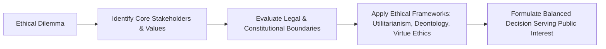

# Ethics, Integrity & Aptitude: Complete UPSC Notes

> **Target Exam**: UPSC Civil Services Examination (Prelims & Mains) / State PSCs  
> **Subject**: Ethics, Integrity & Aptitude  
> **Total Modules**: 9

---

## 📚 Table of Contents

1. [Ethics and Human Interface](#1-ethics-and-human-interface)
2. [Attitude](#2-attitude)
3. [Aptitude](#3-aptitude)
4. [Emotional Intelligence](#4-emotional-intelligence)
5. [Contributions of Moral Thinkers and Philosophers](#5-contributions-of-moral-thinkers-and-philosophers)
6. [Public/Civil Service Values and Ethics in Public Administration](#6-publiccivil-service-values-and-ethics-in-public-administration)
7. [Probity in Governance](#7-probity-in-governance)
8. [Case Studies](#8-case-studies)
9. [Miscellaneous](#9-miscellaneous)

---

## 1. Ethics and Human Interface

> **Source Subject**: [Ethics](https://compass.rauias.com/ethics/)
---
## 1. Meaning and Scope of Ethics
> Source: [https://compass.rauias.com/ethics/meaning-scope-ethics/](https://compass.rauias.com/ethics/meaning-scope-ethics/)

## Meaning and Scope of Ethics

### **Meaning of Ethics**

- Ethics is a set of standards that society places on itself, which helps guide people's choices, actions, and behaviour. Or,

- Ethics can also be defined as the systematic study of human action from the point of view of their rightfulness or wrongfulness as a means for attaining the highest good. Or,

- Ethics can also be defined as the reflective study of what is good or bad in that part of human conduct for which human has some responsibility.

### **Scope of Ethics**

- Ethics deals with **human actions**, **not the actions of humans**. Human action is deliberate and involves knowledge/consciousness, free will/choice, and voluntariness/willingness, like reading, running, and smoking but all actions of humans may not be deliberate, like sneezing, yawing, belches etc.

- The province or scope of ethics is the range of its subject matter. Ethics, as a normative science, seeks to define moral ideals. It is not concerned with the nature, origin or development of human conduct; it I but the ideal or standard to which our conduct should conform. But to into the ideal of conduct, it must know the nature of the conduct. **Conduct is the expression of character**. **Character is the settled habit of will**. It is the permanent disposition produced by habitual actions.

- Ethics is sometimes said to be the **science of character**. But to into the nature of the character, Ethics must enquire into the nature of the springs of actions, motives, intentions, voluntary actions, non-voluntary actions and so on. Thus, Ethics must be founded on a **psychological basis**.

- The fundamental problem of ethics is the nature of the moral ideal or standard concerning which we pass moral judgements.

- **Ethics try to answers the following questions?: **

- What is the good or the moral Ideal?

- What is the summum Bonum or the chief Good?

- But though Ethics investigates the nature of the moral ideal or the Good, **it does not formulate rules for the realisation of ideals**.

- When an action conforms to the moral ideal, it is said to be right; when it does not conform to it, it is said to be wrong. ‘Right actions are said to be duties. The end, which is sub-served by the moral laws, is said to be good. There is a hierarchy of ends. So, there are relative goods and absolute goods. **Ethics is concerned with the highest or absolute good.**

- Thus, the fundamental notions of ethics are right, duty and good, the nature of which it investigates. Ethics is concerned with the nature, object, faculty and standard of moral judgements.

- Moral judgements are accompanied by moral sentiments, e.g., feelings of approval and disapproval, remorse, and the like. Ethics has to discuss the nature of moral sentiments and the relation of moral sentiments to moral judgements. Moral Judgements are also accompanied by the sense of duty, ‘oughtness’ or moral obligation. When we perceive an act to be right, we feel under a moral obligation to do it; when we perceive an act to be wrong, we feel under a moral obligation not to do it. Ethics has to account for this sense of duty or moral obligation.

- What is the nature of moral obligation?

- What is the origin of moral obligation?

- What is the source of moral obligation?

- To whom are we responsible for our conduct?

- Our right actions have merit; our wrong actions have demerits. Ethics enquiries into the criterion of merit and demerit. It tries to find out what makes an action meritorious. Merit and demerit are called deserts. Ethics investigates them.

- Ethics assumes the freedom of the will. It discusses the nature of human freedom. We are responsible for our actions.

- Ethics enquiries into the nature of responsibility. Criminals are responsible for their crimes. So, they ought to be punished. Ethics gives moral justification for punishment.

- Ethics determines the nature and kinds of rights, duties and virtues determined by the ultimate moral standard. Virtue and vice come within their scope.

- Though E**thics has a province/scope of its own,it is not entirely divorced from all other departments of study. It was indirectly to treat several problems, which are psychological, philosophical, sociological and political in nature.

- The **psychological problemswith which Ethics is concerned are those of the nature of voluntary actions, the classification of the springs of actions and the relation between desire and pleasure.

- The **philosophical problemsare those of the essential nature of human personality, the freedom of the will, immortality of the soul, existence and perfection of God, and the moral government of the universe.

- The **sociological problemis that of the relation of the individual to the state, of the ethical basis and moral functions of the state and of international morality.

- These notions of rightness and wrongness of conduct are derived from it. This is the theoretical aim of ethics. Though Ethics is not a practical science, it deduces concrete duties and virtues from the notion of the Supreme Good, which may guide us in the regulation of our conduct. **Ethics is a Theoretical science. It is not a practical science.**

- Ethics is the theory of morality. It converts moral faith into a rational insight. It criticises the common notions of morality and discovers the rational and essential elements in them. Science is a criticism of common sense. So, Ethics, as the science of morality, criticizes vague and sometimes inaccurate, popular notions of right and wrong. It exposes the defects and inconsistencies of the social customs and usages, social, political and religious institutions and gives us a real insight into the nature of the moral ideal.

- As a result of the exposure of error, some crude notions of right and wrong, moral authority, and moral sanctions are gradually given up. The removal of incorrect ideas decreases the possibility of wrong actions. Ethics attacks the basis of popular morality, purges it of errors and inconsistencies and places on a secure footing all that is valid and essential in morality.

- Through reflective criticism, Ethics prepares the way for its constructive function. It separates the essential from the inessential, the permanent from the transitory, and the spirit from the form of social or moral institutions and rationalizes our notions of right and wrong. Moral insight into duties makes their performance possible. Theory inevitably acts on practice.

- Theoretical Ethics is the secure foundation of all practical or applied ethics. The concrete duties of life should be determined concerning the moral ideal. ***Knowledge is a condition of virtue.*Ethics indirectly exerts a paramount influence on all departments of practical life. The right solution to the vital problems of religion, politics, economics, legislature, education etc., depends upon the correct notions of right and wrong.

- **Religionmust have a foundation in ethics; divorced from morality, it degenerates into superstitions, belief in blind superhuman power, black magic and the like.

- **Ethics should mould politics**. Might be based upon the right, and immoral laws should be abolished- Laws should be enacted for the improvement of the moral well-being of the people.

- **Economicsshould be based on ethics. Production, distribution and consumption of Wealth should be based on justice and equity.

- In **education**, Ethics is to decide what impulses and dispositions in children should be strength sued and what should be suppressed.

- Ethics should embrace departments of human actions, exert an evaluating influence upon them, are raise humanity to a higher level.

---

## 2. What Ethics is Not
> Source: [https://compass.rauias.com/ethics/what-ethics-not/](https://compass.rauias.com/ethics/what-ethics-not/)

## What Ethics is not

### **Ethics is not morality**

Because morality is defined as one’s own (individual, family, organisation/institution, society) standard for judging objects as right and wrong, while ethics is about universally established standards of human conduct.

### **Features of morality:**

- Individual-oriented because depend upon the individual’s upbringing, conscience and psyche etc.

- Varies from person to person and society to society. (your values versus his values, Indian values versus Western values)

- Dynamic: It changes with changes in time, place and awareness of the same individual. (Change in the value of rural women regarding ghunghat)

| Ground of Difference | Ethics | Morality |
| --- | --- | --- |
| Definition | Set of universal established standards of human behaviour. | One’s standards of behaviour. |
| Dependent on | Other’s perspective | One’s perspective |
| Consistency | Uniforms across the world | Changes person to person, society to society. |
| Religious connotation | No |  |
| Root word | Ethos = Character | Moralis = Customs/traditions |

#### **Relation between ethics and morality**

**Why one should be moral**

- Every human has a deep desire to be good/ happy/best/ Summam Bonum, and morality can help in aching his summam bonum.

- As a human is a rational creature, that makes him aware of some logical, rational, fundamental principles that can help in achieving his summam bonum.

- To prevent uncomfortably, remorse, depression, anxiety, dissonance, and social disapproval or boycott or sanctions.

### **Ethics are not values.**

- Values are standards of behaviour that may or may not be standard, which means they can vary from person to person, but in the case of ethics, there is a universally established standard of human conduct.

- It should be noted that ethics is based on values, but every value is not ethical; for example, following caste rules may be a value for someone, but it is not ethical.

### **Ethics is not social norms.**

- Social norms are based on the customs and traditions of a particular society, which means they are not universal in nature. But some social norms can be ethical also, like respecting the elders.

### **Ethics is not religion.**

- Because religion is based on faith, where the scope of reasoning is limited more over religion is specific to the particular community, which deprives it of universality. But ethics is based on reason and universal in nature.

- But religion precedes ethics; hence ethics draws most of the principles from religion itself.

**Religion                                          **

|  | Ethics draws Val     Values    . |
| --- | --- |
| Christianity | Co      Compassion, forgiveness |
| Jainism | Satya, Amhinsa, Asteya, Aprigraha |
| Buddhism | The middle path, Appo deep Bhava |
| Hinduism | Vasudhiav kutumkam, nishkam karma,       Satyameva jayate |
| Islam | Equality, brotherhood |

### **Ethics is not the law.**

- **Because the law is specific to society, but ethics is universal.**

### **Relation between Law and Ethics**

- Generally, both law and ethics are in synch, but if there is a conflict between them, then preferences will be different for different persons; for example, a civil servant should prefer following the law because he is meant only for this more over preferring law over ethics will provide him legal protection in case of a mishap.

- But on the other hand, a social reformer or a leader should prefer ethics over the law because it is desirable for a leader to question existing laws, systems, traditions, etc.

---

## 3. Essence of Ethics
> Source: [https://compass.rauias.com/ethics/essence-ethics/](https://compass.rauias.com/ethics/essence-ethics/)

## Essence of Ethics

### **Meaning of Essence**

- Essence is the intrinsic quality of something that determines its character. The **essence of ethics standsrefers to its features, significance and the intrinsic or indispensable properties that characterise ethics.

- The following properties/features can define the essence of ethics:

- **Defining what is Good/bad: **Ethics helps us in deciding the goodness or badness of thoughts, conduct and behaviour

- **Ethics cannot be shaped and sustained in isolation**. A person is not born with an ethical system or moral setup. An external environment like society and culture, in interaction with the genetic structure, shapes it for the person. A person may be born in captivity, but to know what is ethical, he/she needs to live in a society.

- **Man is not only shaped by ethics but also shapes ethics**. For example, slavery and discrimination were earlier accepted as social norms but not now. It is because of a few great personalities which have brought about the changes.

- **Ethics depend upon the context in which they are operating**: ->They vary in their meaning and intensity according to time, place and person. For example,

- Spitting, urinating and littering on roads are considered unethical in Europe but may not in India,

- Issues like abortion and homosexuality are judged differently in different countries.

- **Ethics are subjective in nature,i.e. they are affected by an individual’s emotions and perceptions:

- An angry person may behave in a highly unethical manner. It happens during riots.

- Cases of cow vigilantism, honour killings, etc., occur because of conflicts regarding the ethics of various people.

- **Ethics originate from the sense of justice prevailing in a society**. A child slaps another child. A third child watching finds it unethical because he believes in social justice and that every human is equal and has the right to live with dignity ([article 21](https://compass.rauias.com/polity/article-21/), protection of Life and personal liberty).

- **Ethical standards may transcend the narrow stipulations of lawor rule book and code of regulation. Many acts of omission and commission may not violate the law as such. Still, they may run counter to ethics, for example, Police not helping victims as the incident has happened outside the area of their jurisdiction.

- **Ethics is maintained and sustained by a sense of responsibilityand not mere accountability to some external agency but also to something within.

- **Ethics is prescriptive in nature**: Ethics preach a certain kind of behaviour to us. It tells us how people should behave. However, ethics are often prescribed without any reason or explanation. This undermines people’s respect and value for ethical behaviour. For instance, traditional values like family values are declining among the youth because their significance and rationale are not explained to them.

- **Descriptive discipline**: It examines **are(existing) standards of behaviour of individuals and community.

- **Ethics Scrutinises voluntary human action**:  Ethics only deals with voluntary human action. It only deals with actions when the person acts with free will without coercion. For instance, if a person is made to do something unethical at gunpoint, he/she cannot be called ethical/unethical as he/she did not act on his own.

- **Ethics operates at different levelslike individual, organisational, socio-cultural, political and international levels, but Ethics of any level affect the ethics at other levels.

- **Ethics analyses and evaluates various ethical norms, principles, laws, values etc**.

---

## 4. Sources/Factors Affecting Ethics
> Source: [https://compass.rauias.com/ethics/sources-factors-affecting-ethics/](https://compass.rauias.com/ethics/sources-factors-affecting-ethics/)

- **Religion**: Religious textbooks deal with questions about how an individual should behave and what society should be. E.g., In Jainism, Non-Veg is unethical, while in Islam, there is no such restriction.

- **Traditions and Culture**: Values vary with cultures. E.g., Western-cultures-Individualistic, Indian-Altruism.

- **Law & Constitution**: The law and constitution often incorporate ethical standards to which most citizens subscribe.

- **Leadership**: The leadership of a society or an organisation, or a nation also helps to determine the conduct of its followers or admirers. For example, democratic, liberal, secular, and tolerant tradition has been the gift makers of modern Indian society.

- **Philosophies**: Various philosophers and thinkers subscribe to different sets of ethics.

- **Geography**: Brahmins of West Bengal eat fish (a non-veg diet) as geography dictates them to eat fish to survive.

- **Economic Factors**: profiteering is considered unethical in communist societies, while profit is deemed ethical in capitalist societies.

- **Organisation: The value system of the organisation affects the ethics of people working in that organisation like ISRO Vs DRDO.**

- **Time**: 18th century vs now

- **Experience**: Kalinga War and Ashoka

- **Cost**-**benefitanalysis**: utilitarians

- **Inspiration**: Gandhi for us

- **Power**: what is right or wrong generally told by socio(brahmin), economic(tata) and political power (Modi).

- **Education**: your thoughts depend on your knowledge and knowledge is greatly affected by education but there is no direct relation between ethics and education.

---

## 5. Determinants of Ethics in Human Actions
> Source: [https://compass.rauias.com/ethics/determinants-ethics-human-actions/](https://compass.rauias.com/ethics/determinants-ethics-human-actions/)

## Determinants of Ethics in Human Actions

- Deliberate human action(Knowledge, free will /option voluntariness/willingness).

- Purpose(can be personal, social or organisational)

- Object (can be +ve or -ve or neutral) and nature of human action

- Circumstances (can be demanding or normal)

- Consequence/end (basis of teleology)

- Means (basis of deontology)

### **Relation Between Various Determinants in real life**

- **Overlap: **two or more determinants operate at the same time ex. The compassion of civil servants toward the weaker person (here determinants like nature of object, purpose, consequences and circumstances are involved)

- **Vary(theft of food for saving the dying person due to hunger Vs theft under PDS by an official)

- **Contradict **(saving the life of king-purpose, by killing a bagger means)

---

## 6. Consequences of Ethics in Human Actions
> Source: [https://compass.rauias.com/ethics/consequences-ethics-human-actions/](https://compass.rauias.com/ethics/consequences-ethics-human-actions/)

- **At an individual level**:

- Credibility

- Confidence

- Social capital

- Happiness

- Decide your outlook towards society

- Elevate your sense of being

- Decision making

- **At the organisational level**:

- Brand quality

- Employee- Employer relationship

- Stakeholder relationship

- **At the societal level**:

- Absence of greed

- Cooperation and peace

- Equality and justice

- Sustainability

- Progressiveness

- **Prescribe standards of right and wrong:As a discipline, ethics identifies what good or evil, just or unjust, fair or unfair practice, or what our moral duty is. It prescribes well-established standards that a person should follow concerning rights, obligations, fairness, and benefits to society. These standards put a reasonable obligation to stop unethical activities or crimes such as stealing, assault, rape, murder, fraud and so on.

- **Improves thinking, perspective and judgements**: Ethics provides us with a moral map, a framework that we can use to find our way through difficult issues. It helps a person to critically evaluate his/her actions, choices and decisions.

- It assists a person in knowing what he/she is and what is best for him/her. Thus, helping a person to decide what he/she should do to attain the best.

- Determines our actions or inaction: In the absence of ethics, human actions would be rendered random and aimless. Ethical standards help us to organise our goals and actions to accomplish a good and virtuous life and also larger good for society.

- Ethics is the basis of a healthy and peaceful society: Every institution designed for human good has some rules and regulations based on moral principles. Being ethical helps a person to admire and follow the rules. Ethics/morality provides a common point of view. The common point of view among people leads to an agreement among them. This way, ethics provides stability in society and other institutions.

- Ethics helps in making society better: It teaches us to treat everyone equally and respect each other’s rights; without ethical conduct, society would be a miserable place.

- Solving moral dilemmas: Many moral issues like abortion and euthanasia create ethical dilemmas. Ethics offer us rules and principles that enable us to take a clearer view of moral problems.

- Aids in exercising discretion: It provides a set of principles and helps to make clear choices in particular cases where neither social norms nor law can provide the answer or solution. It allows us to work on skills such as exercising discretion, so when we are faced with real situations that impact others, we are capable of taking a morally sound decision.

- Guide to both private and public life: Ethics is integral to both private and public life. In the personal sphere, ethics guide our relations with our fellow beings, and in professional life or public administration, ethics focuses on how one should act and reflect to act responsibly. For instance, adherence to ethical principles in business leads to rejecting the route that would lead to short-term profit over larger corporate social responsibility. Meanwhile, in political and social life, ethics decides how human life and institution must be organized to be moral.

- Ethics shows the way to self-realisation: Every individual desire to be good. Being ethical or moral helps a person to attain what is best for him. It deepens the reflection of the ultimate question of life and its purpose. Thus, ethics is fundamental to a satisfactory human life.

---

## 7. Dimension of Ethics
> Source: [https://compass.rauias.com/ethics/dimension-ethics/](https://compass.rauias.com/ethics/dimension-ethics/)

**DimensionDescriptionExamplesMeta-ethicsNormative ethicsApplied ethicsDescriptive ethicsMeta-ontologyAxiology**

|  |  |  |
| --- | --- | --- |
|  | Nature of ethical thought and language | What is the meaning of ethical terms like "good," "right," and "just"? Can we know what is right or wrong? |
|  | Development of moral standards | What are the principles or rules that guide moral behavior? Examples include consequentialism, deontology, and virtue ethics. |
|  | Application of moral standards to specific issues | Examples include bioethics, business ethics, and environmental ethics. |
|  | Study of moral behavior and beliefs | How do people actually behave when faced with moral dilemmas? What are the cultural and social factors that influence moral beliefs and behavior? |
|  | Nature of reality and existence | What is the nature of reality? How does it relate to ethics? |
|  | Study of values and value systems | What are the values that are important in ethical decision-making? Examples include autonomy, justice, and beneficence. |

---

## 8. Environmental Ethics
> Source: [https://compass.rauias.com/ethics/environmental-ethics/](https://compass.rauias.com/ethics/environmental-ethics/)

## Environmental Ethics

- Environmental ethics is the discipline that studies the moral relationship, value and moral status of human beings to the environment and its nonhuman contents.

- Rabindranath Tagore gave a definition on ‘Education’ which coincided with Environmental ethics. The definition is given here under: “The highest education is that which does not merely give us information but makes our life in harmony with all existence”.

- The definition of environmental ethics rests on the principle that there is an ethical relationship between human beings and the natural environment. Human beings are a part of the environment and so are the other living beings.

- When we talk about the philosophical principle that guides our life, we often ignore the fact that even plants and animals are a part of our lives. They are an integral part of the environment and hence cannot be denied their right to live. Since they are an inseparable part of nature and closely associated with our living, the guiding principles of our life and our ethical values should include them. They need to be considered as entities with the right to co-exist with human beings.

- The emerging concept of environmental ethics brings out the fact that all the life forms on Earth have the right to live. By destroying nature, we are denying the life forms this right. This act is unjust and unethical.

- Moral obligation to future generations and principle of inter-generational equity demands us to hand over the planet earth in the same condition as we received it from our ancestors. This will enable our future generations to thrive and achieve good quality of life. Else we will be forcing our coming generations to crises for which they have not contributed. (Principle of Sustainability and Intergeneration equity).

- Also, environmental degradation and climate change has disproportionate effects the poor and vulnerable who have not contributed these. This violates the principle of polluter pays.

- Aldo Leopold formulated ecological restoration focusing on Land ethic in a book “A Sand County Almanac, 1949”, defined a new link between nature and people and has a stage for modern conservation movement.

- “For embracing this ethic ecologically literate citizens are required who can also solve global environmental challenges. “This Land ethic simply enlarges the boundaries of the community to include soils, waters, plants, and animals, or collectively: the land.”

### **Case Studies of Environmental Ethics**

- **The Exxon Valdez oil spill:Showed lack of corporate social responsibility and oversight in risky industries, damaging ecosystems. Led to regulations improving disaster response plans and double hull tanker requirements.

- **The Bhopal disaster:Poor safety standards and negligence at a chemical plant caused a gas leak that killed thousands in Bhopal, India. Illustrated need for ethical practices and accountability in hazardous operations, especially in developing countries.

- **Deforestation of the Amazon:Forest clearing for logging, mining, ranching accelerates loss of biodiversity and harms indigenous tribes. Governments must balance economic interests with protecting vital ecosystems and human rights. Global cooperation needed.

### **Philosophies of Environmental Ethics**

- **Deep Ecology (Naess):Challenges belief that nature exists for human use and rejects anthropocentrism. Sees the whole ecosphere as a seamless web of interdependencies where humans and nature are equals. Promotes biodiversity and sustainability through radical social/political change.

- **Land Ethic (Leopold):We must expand our ethical consideration to include the natural landscape and all its components ("the land"). Humans are members of the land community, not conquerors of it. The health of the land and people are inseparable. We must make choices that benefit and respect the "integrity, stability, and beauty" of the biotic community as a whole.

- **Animal Rights (Singer):Sentient animals deserve equal consideration of interests. They can suffer and so have rights to humane treatment and to not be property. We should adopt a plant-based diet and oppose any cruelty to animals. "The question is not, 'Can they reason?' nor, 'Can they talk?' but 'Can they suffer?'"

### **Environmental degradation vs Economic development (Utilitarianism concept)**

- The negative effects of climate change will fall disproportionately on the poor in current generations, and on future generations who are less responsible for greenhouse gas emissions as they accrue.

- For the utilitarian, the distribution of goods has only instrumental value: we should choose that distribution of goods that maximises the total amount of well-being.

- It is from this perspective that problems of justice arise. For example, displacing a population to build a dam might cause a great deal of misery for the worst off, but if it produces a marginal gain for a larger population who are already well off then, on a utilitarian calculation, the policy is justified provided the population is great enough.

- There are a variety of different accounts of justice that might be offered as alternatives to the view that we should distribute goods to maximise total welfare. One is that we should give priority to the worst off; another is that we have a duty to make sure all reach a minimal level of welfare; a third is that justice demands equality in the distribution of welfare or of the goods required for welfare.

---

## 9. Media Ethics
> Source: [https://compass.rauias.com/ethics/media-ethics/](https://compass.rauias.com/ethics/media-ethics/)

## Media Ethics

Media ethics concerns moral issues in journalism, news media, film, television and entertainment. It examines how to apply ethical principles like honesty, accuracy, impartiality, fairness, harm avoidance, and privacy in these domains. Key issues include:

- **Truth and accuracy:The media has a duty to report news truthfully and factually. Inaccurate or false reporting violates public trust and can cause harm. Anonymous or unverified sources should be avoided. Opinions/analysis should be backed by evidence and clearly distinguished from news.

- **Impartiality and fairness:The media should present issues and viewpoints without bias or distortion. Represent multiple sides fairly when covering controversial topics. Avoid conflicts of interest and preferential treatment. Criticism of public figures should be proportional and relevant to their role.

- **Privacy vs public interest:The media must balance an individual's reasonable expectation of privacy with the public's right to information that significantly impacts them. Public figures have a lower expectation of privacy, but media should avoid excessively prying into people's private lives when it's not clearly relevant.

- **Harm and offense:The media should avoid inciting discrimination, violence or illegal activities. While free speech is crucial, it needs to be balanced with harms of hate speech and radicalization. Graphic or offensive content requires warnings to allow audience choice. Reporting on threats could encourage copycats.

- **Consent and deception:In general, the media should not report on individuals or record/photograph them without consent. Undercover investigation and deception may be justified to expose wrongdoing or dangers, but other reporting should be transparent. Stakeholders should be given a chance to respond.

- **Commercial pressure vs integrity:Commercial and business interests of media companies should not undermine journalistic ethics. "Clickbait" and sensationalism distort reporting of serious issues. While profitability matters, it should not be the primary goal. Maintaining independence and integrity is key.

### **Ethics of Journalism**

- **Accuracy and fact-based communications**

- Journalists cannot always guarantee ‘truth’ but getting the facts right is the cardinal principle of journalism.

- Journalists should always strive for accuracy, give all relevant facts and ensure that they have been checked.

- **Independence**

- Journalists must be independent voices; they should not act, formally or informally, on behalf of special interests whether political, corporate or cultural.

- They should declare to their editors – or directly to the audience – any relevant information about political affiliations, financial arrangements or other personal connections that might constitute a conflict of interest.

- **Fairness and Impartiality**

- Most stories have at least two sides. While there is no obligation to present every side in every piece, the stories produced by journalists should strive for balance and provide context.

- Objectivity is not always possible and may not always be desirable (in the face, for example, of clear and undeniable brutality or inhumanity), but impartial reporting builds trust and confidence.

- **Humanity**

- Journalists should do no harm. They should show sensitivity and care in their work recognising that what they publish, or broadcast may be hurtful.

- It is not possible to report freely and in the public interest without occasionally causing hurt and offence, but journalists should always be aware of the impact of words and images on the lives of others. This is particularly important when reporting on minorities, children, the victims of violence, and vulnerable people.

- **Accountability and Transparency**

- A key principle of responsible journalism is the ability to be accountable.

- Journalists should always be open and transparent in their work except in the most extraordinary of circumstances. When they make mistakes, they must correct them, and expressions of regret must be sincere. They listen to their audience and provide remedies to those dealt with unfairly.

Philosophers like Peter Singer argue media ethics requires impartial reasoning and reflection on consequences - considering harms and benefits of reporting on vulnerable groups, privacy, free speech; balancing multiple principles. Issues often depend heavily on context, so rules provide general guidance but judgment is required in each case.

The Code of Ethics and Broadcasting Standards laid down by NBA for violation of which a complaint may be made, include the following principles:

- Ensure impartiality and objectivity in reporting

- Ensure neutrality

- Ensure that when reporting on crime, that crime and violence are not glorified

- Ensure utmost discretion while reporting on violence and crime against women and children

- Abhor sex and nudity

- Ensure privacy

- Ensure that national security is not endangered

- Refraining from advocating or encouraging superstition and occultism

- Ensure responsible sting operations

### **TRP and Media ethics**

- **Television rating point: **TRP stands for Television Rating Point. It is the tool that tells us which channel and the program are viewed most or it indicates the popularity of a TV channel or a program. It shows how many times people are watching a channel or a particular program.

*“The duty of journalists is, to tell the truth. Journalism means you go back to actual facts, you look at the documents, you discover what the record is, you report it that way. “***–Noam Chomsky

#### **Ethical Issues Related to TRP**

- Race for TRP is sensationalizing news reporting.

- Sensationalism aims at maximising viewership and earning profit. This makes news reporting vulnerable to manipulation.

- Objectivity in presenting the news is extremely important to fulfil the ‘right to information’ of people. People have right to get information in the authentic, unbiased form.

- Hence, it is important to maintain the ‘integrity of the process’ of news collection and broadcast.

- The government’s advertising expenditure depends on the TRP system, and public spending should not be based on flawed data.

- TRP system compromise the impartial news selection. Issues of vulnerable, poor and marginal section of our society gets side lined.

- Race for TRP also forces news channel to show unscientific, unverified information that compromise on the larger role of media to develop value laden society,

Targeting TRP in journalism is destroying professional journalism and citizen-centric journalism. Reporting is being displaced by Agenda Setting Theory. Noise is replacing information dissemination. This reminds us of what Noam Chomsky one asked, *“**How it is we have so much information but know so little?”***

---

## 10. Social Media Ethics
> Source: [https://compass.rauias.com/ethics/social-media-ethics/](https://compass.rauias.com/ethics/social-media-ethics/)

## Social Media Ethics

Online social networking is the use of dedicated websites or application to interact with other people who are also on those social networking sites having same interests or same circles, groups or communities.

With the rise of Online Social Networking, the ethical dilemmas are growing in number including violation of privacy, misrepresentation, bullying, etc.

**Ethical dilemmas faced when different people use social networks are given below:**

- **Invasion of privacy**

- If the actions that break the law or terms of privacy of any user of social network harms that individuals personal or professional credibility, that action should be considered unethical. The invasion of privacy would include any non-permissive approach taken to get any kind of personal or any other kind of information about an individual which can harm him or affect him in any sense.

- While discussing social media ethics, behavioral targeting is a questionable area to consider. The advertisers tracking our shopping behaviors and click through patterns to use that data in retargeting campaigns. The positive point is that the viewers may appreciate the relevance of the material being advertised to them, but this is a kind of invasion of privacy.

2. **Spamming**

- Over-publicizing unasked promotional messages is also considered as an unethical act based on how this is being done. In spamming users are usually bombarded with information which does not interest them or even if it does, it is too extensive to be swallowed. In this situation, the user’s relative information which he may be needing gets under the pile and may get ignored because of that useless pile of spamming which is obviously unethical from user’s perspective.

3. **Public Bashing**

- Once a person post something on social media, it can go viral without asking for permission which then can’t only affect reputation but also the person or company you were disparaging about, so much. This kind of cases can also raise a risk for legal lawsuits.

4. **Improper Anonymity and Distorted Endorsements**

- If one represents himself with wrong affiliations, credentials or expertise, it is unethical to become anonymous but showing yourself to be someone different than you are. There are people who provide companies with their anonymous feedbacks which are not true, and it has caused a lot of damage to companies by the stories of consumers of their products by fake stories. Hiring people to comment your favourable or fabricated stories about your company or your products are also considered unethical. Some employees are also found guilty of exaggerating competitive deficiencies.

5. **Data is public or private**

- One of the biggest areas of concern with social media data is the extent to whether such data should be considered public or private data. Key to this argument is the standpoint that social media users have all agreed to a set of terms and conditions for each social media platform that they use, and within these terms and conditions there are often contained clauses on how one’s data may be accessed by third parties, including researchers. Surely, if users have agreed to these terms, the data can be considered in the public domain.

- There are also specialist organizations that provide social media employment screening services. This raises ethical challenges for employers around employees‟ right to privacy and fairness. Is it ethical or fair to judge an individual’s ability to fulfill their employee responsibilities based on information about their personal lives, gained from their social media profile? In some cases, the information may relate to past activities in a job candidate’s personal life.

### **Social Media and Ethical dilemma**

- **Utilitarian perspective:Facebook and other sites have been the scene of cyberbullying and online predation. But the same technology allows people to connect with others they might never have met and form meaningful relationships. Hence there is ethical dilemma in its usage.

- **Fairness perspective:Some people believe social networking sites offer the ultimate in egalitarianism. When we interact with others online, we have no real way of knowing whether they are white or black, male or female, fat or thin, young or old.

- **Virtue perspective:Many interpersonal virtues we value evolved in the context of face-to-face communication. Honesty, openness, and patience, for example, are used in negotiations we must manage when we meet people in person. What impact will digital media have on these virtues?

- Ex. What would honesty mean in the context of a world where people are represented by avatars? Will other virtues emerge as more important in social networking, where we can be constantly connected to a large reservoir of others and can shut off communications easily when we are bored or encounter difficulties?

**Conclusion**

Freedom of opinion and expression is guaranteed by the constitution and legislation, but there is often an expression of excessive freedom. Proper ethical standards for social media research need to be designed but they should be dynamic too technologies and the way that technologies are used are constantly changing.

---

## 11. Medical Ethics
> Source: [https://compass.rauias.com/ethics/medical-ethics/](https://compass.rauias.com/ethics/medical-ethics/)

## Medical Ethics

- Medical ethics is the applied branch of ethics which describes the moral principles by which a medical practitioners must conduct themselves.

- **The four pillars of medical ethics are**

- **Beneficence**

- The idea that medical interference will do good for the patient

- **Non-maleficence**

- Not to harm your patient, but to do them good, which is part of the Hippocratic oath that doctors take.

- **Autonomy**

- Right of the patient to self-determination regarding their treatment

- **Justice**

- The fair distribution of healthcare resources

### **Ethical Issues Involved in the Medical Field**

- **Issue of medical negligence:**

- **Collusive termination of pregnancy:**

- **Medical fraud for monetary benefits:**

- **Vadodara hospital shows kidney patients as HIV positive in medical reports, organ trade, higher ills for minor diseases**.

**To deal with medical issues Code of medical ethics provides for the following provisions**

- **Character of Physician **

- A physician shall uphold the dignity and honour of his profession. The prime objective of the medical profession is to render service to humanity. A physician should be an upright man, instructed in the art of healing. He shall keep himself pure in character and be diligent in caring for the sick; he should be modest, sober, patient, prompt in discharging his duty without anxiety; conducting himself with propriety in his profession and all the actions of his life.

- **Maintaining good medical practice:**

- Physicians should try continuously to improve their medical knowledge and skills and should make available to their patients and colleagues the benefits of their professional attainments. The physician should practice methods of healing founded on a scientific basis and should not associate professionally with anyone who violates this principle.

- **Maintenance of medical records:**

- Every physician shall maintain the medical records about his / her indoor patients for a period of 3 years from the date of commencement of treatment.

- **Use of Generic names of drugs:**

- Every physician should, as far as possible, prescribe drugs with generic names and he/she shall ensure that there is a rational prescription and use of drugs.

- **Exposure of Unethical Conduct:**

- A Physician should expose, without fear or favour, incompetent or corrupt, dishonest or unethical conduct on the part of members of the profession.

- **Obligations to the Sick**

- Though a physician is not bound to treat each person asking for his services. A physician advising a patient to seek the service of another physician is acceptable, however, in case of an emergency, a physician must treat the patient. No physician shall arbitrarily refuse treatment to a patient.

- **Prognosis:**

- The physician should neither exaggerate nor minimize the gravity of a patient’s condition.

- **Unnecessary consultations should be avoided, and Consultation should be for the Patient’s Benefit, Punctuality should be there in Consultation.In consultations, no insincerity, rivalry or envy should be indulged. The Consultant shall not criticize the referring physician.

- **Physician assisted suicide and euthanasia:** The **Hippocratic Oath states**: 'I will give no deadly medicine to anyone if asked, nor suggest any such counsel'. This has been ordained to maintain the sanctity and dignity of life so that doctors' professional capabilities are not abused. Nevertheless, during a terminal illness and in the care of patients with an irreversible life-threatening disease, a time comes when it is appropriate for the doctor to stop further attempts to prolong the misery and allow death with dignity.

- **Strikes by Physicians:**  Even though medical services are essential; it is not uncommon for doctors to go on strikes. It is unethical for physicians to withhold medical services through strikes

- Rebates, Commissions and Courtesies**:** It is undesirable and unethical for physicians to give and solicit any gift, bonus or 'kickbacks' for referring patients for consultation and investigations. It is also unethical for physicians to receive courtesies, favours and gifts from manufacturers or suppliers of equipment and pharmaceuticals.

- Research and Publications**:** Fraud in research either by plagiarizing or quantum jugglery should be condemned and those indulging in such acts should be punishable on grounds of professional misconduct. The stipulated code of conduct and format should be followed for scientific publications.

- Professional Certificates**:** Physicians are expected to issue several medical certificates-birth, death, vaccination, sick leave, disability, etc. It is common to see false medical certificates issued by physicians for monetary gain or due to political bureaucratic pressures.

- **Running an open shop (Dispensing of Drugs and Appliances by Physicians):A physician should not run an open shop for the sale of medicine for dispensing prescriptions prescribed by doctors other than himself or for the sale of medical or surgical appliances.

- **Human Rights:The physician shall not aid or abet torture, nor shall he be a party to either infliction of mental or physical trauma or concealment of torture inflicted by some other person or agency in clear violation of human rights.

- **Adultery or Improper Conduct**: Abuse of professional position by committing adultery or improper conduct with a patient or by maintaining an improper association with a patient will render a Physician liable for disciplinary action as provided under the Indian Medical Council Act, 1956 or the concerned State Medical Council Act.

- **Sex Determination Tests:On no account sex determination test shall be undertaken with the intent to terminate the life of a female foetus developing in her mother’s womb, unless there are other absolute indications for termination of pregnancy as specified in the Medical Termination of Pregnancy Act, 1971.

- **Non-disclosure of medical information of the patient**: The registered medical practitioner shall not disclose the secrets of a patient that have been learnt in the exercise of his / her profession except –

- In a court of law under orders of the Presiding Judge;

- In circumstances where there is a serious and identified risk to a specific person and/or community; and

- Notifiable diseases. In case of communicable/notifiable diseases, concerned public health authorities should be informed immediately.

- **A prohibition from denying the duty**: The registered medical practitioner shall not refuse on religious grounds alone to give assistance in or conduct of sterility, birth control, circumcision and medical termination of Pregnancy when there is medical indication unless the medical practitioner feels /herself incompetent to do so.

- A Physician shall not use touts or agents for procuring patients.

- A Physician shall not claim to be a specialist unless he has a special qualification in that branch.

- No act of invitro fertilization or artificial insemination shall be undertaken without the informed consent of the female patient and her spouse as well as the donor.

---

## 12. Biotechnology and Ethics
> Source: [https://compass.rauias.com/ethics/biotechnology-ethics/](https://compass.rauias.com/ethics/biotechnology-ethics/)

Biotechnology, the application of biological knowledge for practical purposes, raises significant ethical concerns as scientific abilities outpace wisdom. Key issues include:

- **Human enhancement:Technologies like genetic editing, synthetic biology and brain-computer interfaces allow "enhancement" of traits and abilities. But "playing God" by altering human nature could have long term consequences impossible to predict. Access likely unequal, creating more advantages for the privileged. Regulation and guidelines needed.

- **Cloning:Reproductive cloning to produce human clones raises concerns about the wellbeing of clones, dignity/individuality, and propriety of controlling human life. Most nations ban it. Therapeutic cloning using stem cells continues, raising debate around use of human embryos for research that could save lives. Complex issue with ethical arguments on multiple sides.

- **GMOs:Genetically modified crops raise concerns about biodiversity loss, limited testing from rush to market, allergenicity, and impact on non-GMO farmers. But GMOs also promise to enhance food security and reduce malnutrition/poverty. Regulations aim to guide responsible development and labeling for consumer choice, but scientific uncertainty and polarization persist.  multidimensional issue.

- **Synthetic biology:Construction of artificial life forms and biological systems allows radical redesign of organisms. But poorly understood and hard to contain. Could enable dangerous biological weapons. Regulations lag progress, risking human health/safety. Researchers should follow "responsible innovation" - be transparent, consider ethics and larger impacts with each new advance.

- **Data privacy:Access to biological data/samples in research raises privacy concerns, especially with large datasets. But sharing fosters scientific progress. Participants must provide informed consent, and data be de-identified or securely protected. As precision medicine progresses, this issue becomes more salient but with less clarity on how to navigate. An enduring challenge.

- **Access to treatments:New technologies offer therapies to save and improve lives, but access often limited to those who can pay, exacerbating inequalities. Patents provide incentives for innovation but also restrict access. Governments grapple with how to balance rewards for risk-taking against universal human rights. An issue of justice and policy debate around reform.

- **Animal Rights**: Genetic engineering actively uses animals for experiments, and animals can also be used to produce certain hormones and even donor organs in the future. Even a special breed of mice is derived for genetic experiments. It causes the issue of animal protection in the framework of genetic engineering and other branches of biotechnology.

- **Designer babies**: “Designer babies” or inheritable genetic modification refers to children that have been genetically engineered in the womb to have certain desired qualities. Many people argue that it is unethical and unnatural to be able to create your baby the way you want it, while others argue that it could be used to stop certain genetic diseases in babies. It could create a “race or class” of genetically modified children who may think they are superior to non-genetically modified children.

- **Clinical Trials**: Clinical trials refer to all types of research involving human participants related to the generation of new knowledge for diagnosis, and treatment. The ethical issue associated with clinical trials is that **those who stand to gain from the trial results are not the same that bear the risk and burden of trial participation.**

In summary, biotechnology promises to enhance life by redesigning biology itself - but also poses risks that conscience dare not ignore. Each power gained outstrips understanding of its reach, and progress outpaces guidance on horizons yet unknown. With wisdom and care, through open and reflective dialogue, society must seek to determine boundaries of restraint and forge a future where shared humanity made whole becomes the measure of our every deed at last. Progress itself now lifts this choice to view: technology shaped by values of inclusive good, or gain amassed by some at cost of human lives unseen. Our future hangs in that small balance where we stand.

---

## 13. Ethics in Private and Public Relationship
> Source: [https://compass.rauias.com/ethics/ethics-private-public-relationship/](https://compass.rauias.com/ethics/ethics-private-public-relationship/)

## Ethics in Private and Public Relationship

Human beings are social animals. So, we interact with each other and establish some relations when we interact with each other. Gandhi said, “For achieving a non-violent and truthful society, it is important to have a good relationship”.

### **Four Principles of Public and Private Relationships**

- Respect

- Understanding

- Acceptance

- Appreciation

### **Scope of Private RelationsPrivate relationinvolves relations with **himself,family (spouse, parents, children and other relatives) and friends**.

- **Factors affecting Ethics in dealing with self**:

- Having good/bad thinking about self

- The extent of consistency between your words and action

- **Factors Affecting Ethics in Marital Life**:

- Understanding of the uniqueness of spouse

- Imposition of self on spouse

- The extent of freedom given to the spouse

- Extent of possessiveness

- Extent of doubt

- The extent of acceptance of premarital relations of a spouse

- The extent of acceptance of the aspirations of a spouse

- Felling of competition vs cooperation

- The extent of daring to correct your spouse

- The extent of care of your spouse

- The extent of sharing the burden of your spouse

- **Factor Affecting Ethics in Relations with Friends**

- The extent of reposing the trust of the friend

- The extent of support to your friend

- The extent of emotional support to your friend

- The extent of respecting and accepting the values of your friend

### **Features of Private/Personal Relations/Ethics/Life**

- Private relations are **informal, **as no formal procedure is there to regulate such relations.

- These are **one-to-one relationships**, **based on emotional bondsand in most cases **expression of individual personalityis there.

- **Internal controlis there on ethical behaviour rather than external control in the form of laws, rules and regulations.

- Ethics in private relations can **differ widely from person to personand are often influenced by the morality, emotional state and personal interest of the person involved in such relationships.

- **Dutiesin these relations are **self-imposed**, **informalin nature and **voluntary**.

- Ethics shown in private relations often **form a major part of individual ethicsor morality.

- The morality of private relations forms the **basis of ethical behaviour in public relations**.

- Personal relations involve the following values **Love, care, respect, trust, responsibility, solidarity, peacefulness, good communication, security, self-sacrifice etc**.

#### Features of Public Relationship

- These relations are **Predictableand **Formal**.

- The individualperceives themselves as part of the contextand not as separate entities.

- **Legal and social obligationsare there. Often the nature of duty in a public relationship is **obligatory**, **externally imposed**, formal and sanctioned.

- Ethics shown in public relations are often **influenced by norms, values and behaviour prevailing in a particular society.**

- The **reachof our public relations is much **widerand can impact society at large. Ex. Honesty, openness, integrity, fairness etc.

#### **Differences**Between Private and Public Ethics

**Basis of comparisonEthics in private lifeEthics in public life**

|  |  |  |
| --- | --- | --- |
| 1. Existence | Private life | Public life |
| 2. Basis | Emotion | Give and take/rules |
| 3. Tolerance for deviation | High | Low |
| 5. Regulation | Low or nil | High |
| 6. Temporal nature | Relatively permanent (commitment to gaol, family partner) | Generally temporary (commitment to duty 9 se 5) |
| 7. Codified rules | No | Yes |
| 8. Professionalism required | No | Yes |
| 7. Values involved | Love and care, Confidentiality, Truthfulness, Responsibility, Perseverance. | Openness, Honesty and integrity, Rule of law, Equality and uniformity, Accountability |

**Reasons for Separation:**

- They operate in different domains.

- Their mixing may create issues like the entry of private relations into public relations may lead to nepotism, and favouritism on the other hand entry of public relations into private life may lead to undermining the sanctity, privacy and intimacy of private life.

- To prevent conflict of interest.

- The difference in their nature: public relations are complicated and intense

**Problems with Separation**

- **Not separable**: Distinguishing ethics in public and private relations is **vague**, **ambiguous**, and **difficult**. Both cannot be divided into watertight compartments.

- **Not feasible**: They **consistently interact and affect each other**. Ethics in private relations helps in humanizing public relations and plays an important role in **formingthe moral system of a person.

- **Not manageable: Conflictbetween ethics in private and public relations **may lead toa build-up of **unrest**, **dissonanceand **confusionin the mind of the concerned person.

- **Not desirable**: rigid separation may be proved counter-productive. Dishonest in private relations can’t be an honest man in public life.

- However, **too much congruencebetween ethics in public and private relations **may lead to the stagnation of ideas and change**.

#### **Effect of Public Relations on Private RelationsPositive**

- Inspiration: the compulsion of respect for women in office may motivate a man to treat his wife respectfully.

- Value: deceit by colleagues often makes people realize the innocence and greatness of their family members and friends.

- Humane: the value of private life like love and care can make your public life more humane

**Negative**:

- Spillover: Fauji Baap -very rigid in the discipline at home

- Time management: excess involvement in public life often forces people to cut time from their private life.

**Effect of Private Life on Public LifePositive**:

- Improve interpersonal relations: one who is honest in private relations is probably more honest in public life.

- Positive mood: a healthy private life can promote work efficiency in the office.

**Negative**:

- Stress: family tensions may reflect in the office

- Prejudice: your experience of private life may lead to prejudice in office ex. If you follow casteism in private life then it may also reflect [in office.]()

#### **Common in private and public life:**

- Honesty

- Interpersonal skills

- Compassion

---

## 14. Human Values
> Source: [https://compass.rauias.com/ethics/human-values/](https://compass.rauias.com/ethics/human-values/)

## Human Values

### **Belief**

- Belief is an ***internal feeling*that something is true, even if it is unproven or irrational; things we hold to be true. Belief is the ***simplest form of mental representation ***and, therefore, the ***building block of our thought process***.

- Beliefs are the ideas, viewpoints and attitudes of a particular individual/group/society. They consist of fables, myths, folklore, traditions, and superstition. They can also be true and verifiable facts, history or legends.

- Beliefs lay the foundation of a cultural group, but they are often invisible to the group that holds them. They are important because they give us hope. A human being thrives on what he/she believes in.

- However, beliefs can be challenged. Peripheral beliefs can also be changed. Two people might have different beliefs about a phenomenon – as simple as a glass being half empty or half full, to complex theological questions such as how did earth or life come to be? Beliefs evoke emotions, but not-necessarily actions

- Belief is also referred to as ***cognition***.

- Belief can be-

- **Peripheral **(weak) and

- ***Core*(strong)- Beliefs ***formed by direct interaction*are strong, such as for patriarchs, women are weak.

### **Value**

- Value= Belief + Emotions

- Values are the ***inbuilt mechanism*of an individual or a group to decide what is right or wrong. Or,

- Values are what is considered ‘important’ by an individual/society/organization. Or,

- Values are important and lasting beliefs or ideas within an individual/Society about what is good or bad and desirable or undesirable.

- Values are gathered through external environment, family, as well as experiences.

- Value denotes the **degree of importanceof something (or even an action). Values help in determining what actions are best to do.

- Values are ‘beliefs’ about ‘what is important

### Values Vs Ethics

---

## 15. Features and Classifications of Human Values
> Source: [https://compass.rauias.com/ethics/features-classifications-human-values/](https://compass.rauias.com/ethics/features-classifications-human-values/)

## Features and Classifications of Human Values

- Values are **standardsthat direct our conduct in various ways. They also provide standards of morality.

- Values are **concerned with the character and conductof a person.

- Values are a **self-managing mechanismthat is not intuitive; instead, they are acquired from surroundings through participatory and anticipatory learning processes.

- Values are **the core of human personality**.

- Values are **above specific objects, situations, or persons**. (Attitude is towards a particular object, situation, or person). E.g., The value of justice is for everything (while the attitude of justice would be concerning gender, caste etc).

- Values are **expressed lessin day-to-day life than in the expression of attitude.

- Values are **relatively stable and enduring**. However, intense incidents in life can change the value system. E.g., The value change of Ashoka after the war of Kalinga, Ungalimal, Valmiki etc.

### **Classification of Human Values**

- **Intrinsic/End/Terminal value**: which has its worth, like justice.

- **Extrinsic/Mean/Instrumental value**: which helps in achieving the end value like courage.

#### **Terminal and Instrumental Values**

freedom, inner-harmony, comfortable-life, professional-excellence

| Terminal values | Instrumental values |
| --- | --- |
| The core permanent values that often become character traits are known as terminal values.   They can be beneficial or harmful.   It is extremely difficult to change them.   Terminal Values are a person's life objectives- the ultimate things he or she wants to achieve through his or her behaviour. | Instrumental values, according to social psychologist Milton Rokeach, are specific modes of behaviour. They are not an end goal in themselves, but rather a means of achieving one. |
| Examples-Happiness, self-respect, family security, recognition, | Examples- Courage, Temperance, Hard-working, Patience, Perseverance, |

#### **Intrinsic values and Extrinsic values**

| Intrinsic values | Extrinsic values |
| --- | --- |
| An intrinsic value is something valuable in and of itself. It's a goal in and of itself. | An extrinsic value is obtained through the acquisition of another intrinsic value. It is only useful in the sense that it serves as a means to an end. |
| Examples: honesty, temperance, courage, happiness, and peace. | Examples:  Honesty as an extrinsic values with respect to intrinsic values of integrity |

#### **Institutional values and Individual values**

| Institutional values | Individual values |
| --- | --- |
| Political, social, economic, and cultural institutions propagate institutional values. | Individual values include both intrinsic and extrinsic values that are significant to the person who holds them. |
| Examples: Democracy- liberty Marriage- loyalty | Examples: Self-esteem |

### **Personal Values vs Social Values**

- **Personal Values– Important for Individual well-being. Examples of personal values are self-respect, comfortable life, freedom etc.

- **Social Values– Important for other people’s well-being. Examples of social values are equality, social justice, national security, world peace etc.

### **Moral, Immoral and Amoral values: **

- Moral values promote right action and honesty, immoral values promote wrong action like greed lead to corruption, amoral values have nothing to do with morality beauty, fitness

- **Different people may have different values.**

- **Tribals**- conservation of forest

- **Service class**- stability

- **Business class**-Profit and risk

- **Communist**- equality and justice…

** Values can be of different types**:

---

## 16. Fundamental Human Values
> Source: [https://compass.rauias.com/ethics/fundamental-human-values/](https://compass.rauias.com/ethics/fundamental-human-values/)

- Basic inherent values in humans are **truth, honesty, loyalty, love, peaceetc. because they bring out the fundamental goodness of human beings and society as a whole.

- Furthermore, because these values are unifying in nature and cut across individuals’ social, cultural, religious, and sectarian interests, they are regarded as universal, timeless, and eternal and apply to all people.

- There are following fundamental human values:

- Values of a leader

- Love for justice

- Selflessness

- Courage

- Values of administrator

- Non-discrimination

- Discipline

- Lawfulness

- Loyalty

- Values of Reformers

- Reason

- Contentment

- Humanism

- Dignity for all

- Social equality

**List of human values**

| Right-Conduct | Peace | Truth |
| --- | --- | --- |
| Manners | Patience | Patience |
| Truthfulness | Awareness | Concentration |
| Responsibility | Positives | Fairness |
| Honesty | Independence | Self-acceptance |
| Trust | Perseverance | Self-discipline |
| Courage | Contentment | Determination |
| Love | Non-violence | Reflection |
| Forgiveness | Generosity | Justice |
| Kindness | Consideration | Stewardship |
| Compassion | Cooperation | Tolerance |
| Service | Harmlessness | Respect |

**Stages of moral/value development (Kohleberg):**

- Pre-conventional level (birth to preschool)

- Obedience-reward and disobedience-punishment.

- Self-Orientation

- Conventional level (school to higher education)

- Inter-personal accord and conformity.

- Authority and social order maintaining orientation

- Post-conventional level (after college life)

- Social contract orientation.

- Universal ethical principles.

**How are values formed?**

- Individuals form values as a result of socialisation from their parents, religious institutions, friends, personal experiences, and society.

- Individual values are influenced by our religious beliefs, social systems in place, and, to some extent, socioeconomic conditions.

- The terminal values develop over time, whereas the instrumental values are influenced by circumstances.

---

## 17. Role of Family in Human Values
> Source: [https://compass.rauias.com/ethics/role-family-human-values/](https://compass.rauias.com/ethics/role-family-human-values/)

## Role of Family in Human Values

A family is a social institution with the bond of common belief, religion, customs, culture, language and way of life. It carries on the heritage and traditions as legacies from the earlier generation to the next generation. Child Rearing Practices (CRP) adopted by parents shapes the child's personality both consciously and subconsciously. A child from a family acquires self-knowledge, self-confidence, self-satisfaction, self-worth, and the capacity for self-sacrifice. They realise themselves as competent to show kindness, friendship, generosity, compassion, tolerance, responsibility and service to society.

**Techniques of value inculcation by family**

- Family is the ***first informal agency for socialisation***. It is said that family is the first school and mother is the first teacher.

- The family shapes a child's attitude toward people and society, assists in mental development and supports the child's goals and values.

- Values formation is ***very high through family*because of high emotional attachment.

- Private relation – **Contact comfort studies**– Those baby monkeys who stick to their mother’s belly are more **Emotionally secure and confident**; Attitude of sharing- among siblings and cousins.

- **Child-rearing practices**– democratic and authoritative; children raised authoritatively will show less concern for democratic values.

- **Role modelling**- Children subconsciously and consciously learn from their parent’s behaviour. Gandhiji said he knew the technique of Satyagraha and fasting from his mother and wife, respectively.

- **Observational learning– children observe the behaviour of their parents and other family members.

- Values of ***service class*and ***business class***.

- **Orthodoxversus **liberalfamilies.

- **Unawareversus **awarefamilies.

- **Patriarchversus **matriarchfamilies.

**Strengths of the family for value inculcation:**

- It is the first place of socialisation

- Family is forever

- Person spends the highest time in the family in general.

- Family consists of diverse people.

- Presence of trust among the members.

- Family can teach whatever it wants because the child is like a blank slate.

- It uses both hard and soft tools of socialisation.

- It can observe progress minutely.

### **Problems in the Role of Family**

- It can promote regressive and unjust values ex. Casteism, patriarchal, orthodoxy etc.

- Different members of the family may impart conflicting values (Papa- aggressive values, Mom- unassertive)

- Family often fails to practice what it preaches (bol de papa ghar pr nhi h, and then preaching honesty).

- Changing family structure now in nuclear families, family members barely spend time together.

- Prevalence of materialistic values like competition, rather than care, love etc.

- It imposes values on children irrespective of their choices/inadequate autonomy.

### **Methods of promoting values in Family**

- Promoting fundamental values such as tolerance, love, sympathy, nonviolence, sympathy, and companionship, as well as Dharma.

- Positive Attitude and Constructive Actions: Suppressing negative actions while enhancing positive ones.

- Family peace and harmony: To eliminate dominance, we must ensure family peace and harmony.

- Improving social life and equality through cleanliness, a good home environment, hygiene, and good health.

- Food is shared and eaten together.

- Gentleness, good manners, cooperation, and respect for women and elders.

- Offering prayers to one's god and respecting the beliefs of others.

- Participating in and enjoying family gatherings.

**An ideal society promotes opportunity-**

- To each individual's physical, intellectual, and moral development.

- To discover our potential.

- To mould people's opinions, beliefs, morals, and ideals.

- To instil values such as hard work, honesty, tolerance, national integration, secularisation, and responsibility.

- To reject negative values such as dowry, Casteism, communalism, alcoholism, and drug use.

- To improve the quality of life by ignoring social tensions, unrest, prejudices, and other factors.

- To ensure justice and equality for the nameless, faceless, and voiceless.

- To cultivate individual and group discipline.

---

## 18. Role of Education in Human Values
> Source: [https://compass.rauias.com/ethics/role-education-human-values/](https://compass.rauias.com/ethics/role-education-human-values/)

## Role of Education in Human Values

- The essence of a good education is to develop human personality in all dimensions, which are intellectual, physical, emotional, social, ethical and moral.

- **Data**- **Information**-**Knowledge**- **Wisdom                   **

- A school is where ***systematic learning*occurs in the earlier year of life.

- The school provides maximum ***opportunity and exposure*to children. Also, in the school, a child is introduced to members of the community outside his family, i.e., his peer students, teachers and other staff. This enables the child to learn how to regulate his behaviour in society.

**Techniques of educational institutional values to impart values:**

- Curriculum

- Teaching tools

- Visits and outings

- Discipline

- Community work

- Observation

- Peers

- Teachers as role models

- Dialectics

- Culture

- Reward and punishment

### **Role of teacher in Human Values**

- Provide the right conditions for students to learn.

- Stimulate the mind of students.

- Serves as a role model for students.

#### **Learnings about Private relations**

- Friendship is learnt in schools;

- how to behave with the opposite sex?

#### **Etiquettes and values**:

- In the Netherlands, plastic is not used in class. In the initial years, students are taught to develop sensitive values towards nature in a natural environment.

- ***Bhutan***, where students follow how to live with nature

#### **Behaviour into attitude**:

- **Corporal punishment**: When a child, who has suffered corporal punishment, goes to college, he would think it is right to rag juniors; when he becomes a father, he would think physical punishment is the correct way to discipline children; if he becomes a cop, he will think custodial torture is justifiable to an extract confession from the criminal.

#### **Syllabus and textbooks**

- ***World History***: French Revolution- liberty, equality, fraternity.

- **Modern History**: Gandhi’s Train to Pretoria - Standing against injustice.

- **Constitutional values**: Democracy, secularism and human values (truth, love, compassion).

- **Literature**: It helps us understand - human nature and the overall social values of a given era.

- **ScienceCuriosity enables a person to ask questions about orthodoxy and bad religious practices. *In Kerala, the Class 7 social science textbook contained a chapter with an imaginative interview between a headmaster and parents seeking admission. The boy carries a Christian name; the father is named Anwar Rashid, and the mother is Lakshmi Devi. The headmaster asks the father what religion he should fill in for the child in the required column, to which the reply is: “Let him choose his religion when he grows up.”*

- The content of the textbooks plays an essential role in imparting value systems. If a book has a passage, “***Papa is coming from the office while mummy is cooking food and Munni is helping mummy***.”

### **Values of sportsmanship, and team spirit.Value Education*North Korean Government*uses textbooks to poison children's brains against South Korea and the Western World's liberal values.

**Overall development**

- Take them to ***nursing homes*for the inculcation of **compassion and altruism.**

- Take them to the ***museum and cultural centre*to inculcate ***tolerance and secularism***.

- ***Tree plantation and street cleaning*for the inculcation of ***environmental protection.***

- Yoga to be healthy.

**Strength of educational institutions in value inculcation:**

- The first place of formal socialisation

- More effective due to authority and control

- Availability of role models in the form of senior, teachers.

- A person spends large time here

- It uses well-designed pedagogic teaching methods

- Peer pressure, mutual comparison and competition.

- Cognitive methods of debate discussions etc.

#### **The problem in the Role of the education institution**

- Nature of Education

- Politicisation of education

- Rote learning

- Quality of education

- Access to quality education

---

## 19. Role of Society in Human Values
> Source: [https://compass.rauias.com/ethics/role-society-human-values/](https://compass.rauias.com/ethics/role-society-human-values/)

## Role of Society in Human Values

- Religion

- Traditions and customs

- Politics

- Economy

- Media

- Civil society

- Local community

- Leadership

### **Strengths of Society in Value Inculcation**

- Stability and harmony

- Diversity

- Social influence

- Enforcement

- Credibility

### **Problems in the Role of Society**

- Heterogeneity

- Orthodoxy

- Corruption

- Misdirected

- Introversion: some people are introverted in nature hence they may not absorb the values imparted by society.

- Boomerang effect: sometimes society uses harsh and unreasonable methods to inculcate values that are not understood by individuals which compels people to rebel.

---

## 20. Norms
> Source: [https://compass.rauias.com/ethics/norms/](https://compass.rauias.com/ethics/norms/)

- Norms are **social expectationsthat guide behaviour i.e., socially acceptable ways of behaviour are called norms.

- Norms are **generally informal guidelinesof a particular group or community about right or wrong social behaviour.

- They are a **form of collective expectationsof community members from each other.

- Norms are a **form of social controlor social pressure on individuals to conform, induce uniformity and check deviant behaviour.

- They are **expressed throughsocial customs, folkways or mores.

- Norms **provide orderin a society. E.g. in a traditional society, it is a norm that a son must obey his father’s command and fulfil his wishes.

- **Non-conforming to norms attracts punishment**. Punishment may be in the form of being looked down upon, derision, scolding, boycotting, imposing penance, etc.

- **Laws are a later stage of the evolution of norms**, where the society has codified the terms of expected and unexpected behaviour from its members. Those who are deviant are tried in a court of law and punished accordingly.

- It is important to note that for an individual, **norms are imposed externallywhereas **beliefs and values are internal**. Norms are a specific guide to behaviour whereas values provide indirect guidance only.

- **Principles**

- Values, beliefs, and morality vary from individual to individual. Ethics may also differ in different communities and cultures. However, Principles are rules or laws that are universal in nature. **Principles are about universal truthsand standards such as fairness, truthfulness, equality, justice etc

---

---

## 2. Attitude

> **Source Subject**: [Ethics](https://compass.rauias.com/ethics/)
---
## 1. Meaning, Structure & Dimension of Attitude
> Source: [https://compass.rauias.com/ethics/meaning-structure-dimension-attitude/](https://compass.rauias.com/ethics/meaning-structure-dimension-attitude/)

## Meaning, Structure & Dimension of Attitude

Belief (If emotions are added to belief, it becomes)

     ↓↓

Values (When the values ​​come into the behavior then it becomes)

     ↓↓

Attitude

### **Meaning of Attitude**

- Attitude is a learned tendency to act, think and feel in particular ways towards a class of people, objects, place or event.

- In simple words, it is an expression of favour or disfavour towards a person, place, thing or event.

- Attitude is akin to spectacles through which a person sees the world.

- Thus, attitude is a subjective interpretation of the f objective world by an individual.

### **Structure/Content/Competent of Attitude (CAB or ABC) **

- **C- Cognition**

- **A -Affectionate  **

- **B -Behaviour**

#### **C**ognitive Component

- The cognitive component of an attitude refers to beliefs, ideas, thoughts and attributes we associate with an object.

- Stereotypes are thoughts or beliefs that are adopted about specific types of individuals or a particular group. They may or may not accurately reflect reality. They form largely due to over-generalization or incomplete information.

- E.g., Africans are involved in drug peddling, human trafficking, and low hygiene;

#### **Affective Component **

- The affective component of an attitude refers to feelings or emotions linked to an object.

- Prejudice is pre-judgement or forming an opinion before becoming aware of relevant facts of the case. It is largely based on the kind of emotions a person has for the object. e.g., assuming that a person of their caste will be helpful.

#### **Behavioural Component**

- The behavioural component refers to past experiences or behaviour regarding an attitude object.

**Discrimination**

- It is the behaviour of making a distinction in favour or against a person based on the groups, class or category to which that person belongs to. Such distinction doesn’t consider individual merit. It can also be shown against a thing or an idea.

- Though it can be positive, discrimination, in most cases, is considered a negative phenomenon as it denies social participation or human rights to people based on prejudice and stereotypes.

- Even positive discrimination in long term can be harmful to the overall well-being of society. As it may kill the spirit of competition and equality.

#### Relationship Between Cognition, Affectionate & Behaviour Components

- Components of the CAB model have a synergistic relation. When an individual possesses positive belief about an attitude object, they typically have positive affective and behaviour associated with the object. Thus, CAB components are different, but they are not completely independent of each other.

### **Dimensions of Attitude(i) Strength of Attitude**

- Some attitudes are strong, while some attitudes are weak. The strength with which an attitude is held is often a good predictor of behaviour. The stronger the attitude, the more likely it should affect behaviour.

**(ii) Accessibility of Attitude**

-  The accessibility of an attitude refers to the ease with which it comes to mind. In general, highly accessible attitudes tend to be stronger.

**(iii) Attitude ambivalence**

- The ambivalence of an attitude refers to the ratio of positive and negative evaluations that make up that attitude. The ambivalence of an attitude increases as the positive and negative evaluations get more and more equal.

---

## 2. Types & Nature of Attitude
> Source: [https://compass.rauias.com/ethics/types-nature-attitude/](https://compass.rauias.com/ethics/types-nature-attitude/)

## Types & Nature of Attitude

**It can be**

- Positive(supportive)

- Negative(rejective),

- Neutral or ambivalent (neither supportive nor rejecting)

**It can also be**

- **Explicit Attitude (Conscious)**: If a person is aware of his attitudes and how they influence his behaviour, then those attitudes are explicit. Explicit attitudes are formed consciously.

- **Implicit Attitude (Sub-Conscious)**: If a person is unaware of his attitudes (beliefs) and how they influence his behaviour, those attitudes are implicit. Implicit attitudes are formed subconsciously.

### Features/ Nature of Attitude:

- Attitudes often result in and affect the behaviour or action of people.

- Attitudes are gradually acquired over time.

- Attitudes are evaluative statements, either favourable or unfavourable.

- All people, irrespective of their status and intelligence, hold attitudes.

- An attitude may be unconsciously held.

---

## 3. Relation of Attitude & Behaviour
> Source: [https://compass.rauias.com/ethics/relation-attitude-behaviour/](https://compass.rauias.com/ethics/relation-attitude-behaviour/)

## Relation of Attitude & Behaviour

**Basis for comparisonAttitudeBehaviour**

|  |  |  |
| --- | --- | --- |
| Meaning | Attitude refers to a person's mental view of how he/she thinks or feels or something. | Behaviour implies an individual or group's actions, moves, conduct or functions towards other persons. |
| What is it? | A person's mindset. | A person's mindset. |
| Reflects | What do you think or feel? | What do you do? |
| Defined by | The way we perceive things. | Social Norms |

### **Impact of  Behaviour on Attitude**

- People tend to seek consistency in their attitudes and behaviour. When a person has to act in contrast to his attitude, there will be some unrest inside him due to the discrepancy. Something must change to eliminate or reduce cognitive dissonance.

- The term cognitive dissonance is used to describe the feeling of discomfort that results from holding conflicting beliefs and behaviour. The feeling of discomfort motivates a person to reduce it. There are generally three ways of reducing cognitive dissonance:

- Change the behaviour

- Ignore the situation

- Change the attitude

### **Attitude’s Influence and Relation with Thought and Behaviour**

#### [**Case 1 – Attitude ≠ Behaviour**]()

- For example, plenty of people may support a particular candidate, but they may not take the pain to go out and vote for him, Thus, attitudes **may not always predict** the actual pattern of one’s behaviour.

- LaPierre’s study shows that the cognitive and affective components of attitudes do not necessarily coincide with behaviour.

####  [**Case 2 – Behaviour ≠ Attitude**]()

- There can also be instances where negative behaviour co-exists with a positive attitude. This usually occurs when the positive attitude needs to be stronger. For example, consider a person with a positive attitude, not to jump a queue.

- However, when he sees everyone around him doing the same, he may think he will lose, if not jump queues. Thus, he may behave opposite to his original attitude – which we can call as positive.

#### [**Case 3 – Attitude = Behaviour**]()

- Psychologists have found that there would be consistency between attitudes and behaviour when:

- The attitude is strong and occupies a central place in the attitude system.

- The person is aware of their attitude.

- There is very little or no external pressure on the person to behave in a particular way. For example, there is no group pressure to follow a particular norm.

- The person’s behaviour is not being watched or evaluated by others.

- The person thinks that the behaviour would have a positive consequence and intends to engage in that behaviour.

- Note: Persons with **high integrity** usually show a direct relation between attitude and behaviour.

#### [**Case 4 – Behaviour = Attitude**]()

- People dislike Cognitive Dissonance. Cognitive dissonance is when a person experiences psychological distress due to conflicting thoughts or beliefs. To reduce this, people may change their attitudes to reflect their other beliefs or actual behaviours.

- This means they prefer their attitude and behaviour to be aligned in the same direction. By giving incentives to behave contrary to the attitude, Leon Festinger and James Carl smith (study in 1954) proved that the first attitude can be changed to suit their external behaviour.

### **Factors Influencing Relation Between Attitude & Behaviour **

i). **Qualities of a person:**

- People who are aware of their feelings display more attitude-behaviour consistently than those who rely on situational questions to decide how to behave.

- People with a high level of integrity show a high correlation between Attitude and Behaviour.

- People in individual societies have more correlation compared to people in a collective society.

ii**). Qualities of attitude:**

- Strong and weak attitudes show a high and low correlation between attitude and behaviour, respectively.

- Attitude accessibility – Attitudes which are acted upon on regular basis are more accessible from memory. Such attitudes show a higher correlation with behaviour.

iii). **Situation: **

- Norms or beliefs about how one should or is expected to behave in a given situation can exert a powerful influence on behaviour.

- Time pressure results in behaviour as per attitude

- Survival instincts dominate attitude.

### **Steps To Increase Correlation Between Attitude And Behaviour **

- Development of emotional intelligence.

- Introspection

- Attitude literacy – learn what attitudes are. Identify your good and bad attitudes.

- Connecting with a conscience – try to understand the reasons behind a holding particular attitude.

- Developing values of integrity and truthfulness.

- Discovering ways to motivate yourself. vii. See change as an opportunity to grow.

---

## 4. Relation of Attitude and Values
> Source: [https://compass.rauias.com/ethics/relation-attitude-values/](https://compass.rauias.com/ethics/relation-attitude-values/)

- Attitude is related to a particular thing, whereas values are general in nature. Ex. If a person has a liberal attitude, then that is for a particular thing like caste, gender issues, LGBT rights, dressing style etc. But if a person has the virtue of liberty, then he will be liberal towards everything.

- Attitudes may change with the situation, but values are relatively stable and enduring. However, intense incidents in life can change the value system. Ex. Value change of Ashoka after the war of Kalinga, Angulimala, Valmiki, Kalidas, old lady changed by

- Values are stronger, more intense & durable than attitude.

**The one-Dimensional view of Attitude vs Two-dimensional view of the attitudeThe one-dimensional view The two-dimensional view **

|  |  |
| --- | --- |
| It postulates that the positive and negative elements are stored at opposite ends of a single dimension. according to this one-dimensional perspective, the positive and negative elements are at opposite ends of a single dimension, and people tend to experience either end of the dimension or a location in between. | It postulates that positive and negative elements are stored along two separate dimensions. If this view is correct, then people can possess any combination of positivity or negativity in their attitudes. |

---

## 5. Function of Attitude
> Source: [https://compass.rauias.com/ethics/function-attitude/](https://compass.rauias.com/ethics/function-attitude/)

**Daniel Karz gave four functions of attitude –**

- **Knowledge function**: Knowing one’s or other’s attitude imparts knowledge.

- **Utility/instrumental/adjustment/ adaptive:Helps to choose what is rewarding (and also avoids punishment).

- **Ego Defence/expression**: Attitudes can help people protect their self-esteem and avoid depression. Mechanisms: Denial, Repression, Projection, Rationalization.

- **Value expression/ social acceptance**: Used to express one’s core values or beliefs.

- **Heuristic**: shortcut to solve a problem immediately.

- **Conversion of negativity to positivity: **I have not failed 1000 times but I have found 1000 ways that did not work (Edison)

---

## 6. Development of Attitude
> Source: [https://compass.rauias.com/ethics/development-attitude/](https://compass.rauias.com/ethics/development-attitude/)

## Development of Attitude

**The factors which lead to the development/formation of attitude can be:**

- Family

- Peer

- Society

- Media

- Government

- Organisation

### **Procedures of Attitude Formation**

- Classical conditioning/respondent/pavlova:  learning to be a boy or girl.

- Operant conditioning or instrumental learning: Teaching someone through reinforcement or punishment.

- Direct instruction: Rule of awakening at 5 am.

- Satisfaction of wants: An individual develops favourable attitudes towards those people and objects which satisfy his wants and unfavourable attitudes towards those that do not satisfy them.

---

## 7. Moral & Political Attitudes
> Source: [https://compass.rauias.com/ethics/moral-political-attitudes/](https://compass.rauias.com/ethics/moral-political-attitudes/)

**Moral AttitudePolitical Attitude**
So Moral Attitude is the attitude you hold towards moral issues (where society debates what is right or wrong).
For example – what is your attitude towards Euthanasia (mercy killing), capital punishment, same-sex marriage, abortion, and live-in-relationship.
**Various types of moral attitude**
- Empathetic
- Humble
- Generous
- Honest
- Virtuous
- Helping
- Cooperative
- Assertive
- Aggressive
- Submissive
- Ignorant**Political attitudeLiberal/Moderate**: They support principles of liberty, equality, and fraternity but through reforms in a constitutional manner.
**Conservative:Wants status quo not reforms.
**Progressive:Slow reform to the system.
**Radical:Immediate reforms.
**Reactionary:Want to go back to the previous system.
**Extremist and Pacifists:Extremely unhappy with the current system but want it to change by violence and non-violence respectively.
**Manifestation of political attitude
**- Voting
- Social media posts
- Articles in newspapers
- Sloganeering
- Public discussions
**Factors affecting the formation of political attitude**
- Socio-economic status
- Education
- Election campaign
- Social media

|  |  |
| --- | --- |
| Attitude is about what you like, and morals are about (what society thinks is) right or wrong. | is the attitude you hold towards political issues or ideologies. |

---

## 8. Methods to Changing the Attitude
> Source: [https://compass.rauias.com/ethics/methods-changing-attitude/](https://compass.rauias.com/ethics/methods-changing-attitude/)

- Attitude change occurs anytime an attitude is modified. Thus, change occurs when a person goes from being positive to negative, from slightly positive to very positive, or from having no attitude to having one.

- **The various theories that can be used include: **

- Learning Theory of Attitude Change: Classical conditioning, operant conditioning, and observational learning can be used to bring about attitude change.

- Classical conditioning – create positive emotional reactions to an object, person, or event by associating positive feelings with the target object.

- Operant conditioning – strengthens desirable attitudes and weakens undesirable ones.

- Observational learning – let people observe the behaviour of others so that they change their attitude.

- Elaboration Likelihood Theory of Attitude Change (The theory of persuasion): This theory of persuasion suggests that people can alter their attitudes in two ways.

- First, they can be motivated to listen and think about the message, thus leading to an attitude shift.

- Or, they might be influenced by the characteristics of the speaker, leading to a temporary or surface shift in attitude. Messages that are thought-provoking and that appeal to logic are more likely to lead to permanent changes in attitudes.

- Dissonance Theory of Attitude Change:

- As mentioned earlier, people can also change their attitudes when they have conflicting beliefs about a topic (cognitive dissonance). To reduce the tension created by these incompatible beliefs, people often shift their attitudes. In the earlier example, the dissonance was created by giving the incentive to change the behaviour, and thus attitude was also changed accordingly.

---

## 9. Social Influence
> Source: [https://compass.rauias.com/ethics/social-influence/](https://compass.rauias.com/ethics/social-influence/)

## Social Influence

Social influence refers to the ways people influence the attitudes, values, beliefs, feelings, and behaviours of others.

### Features of social influence

- It is the influence of one on other

- It can be conscious or unconscious

- It is aimed at changing the attitude of others

- Its endurance can be short or long-lived

- It can be positive or negative

- Its degree varies from person to person

### **Forms/levels of social influence**

- **As per Herbert Kelemen**

- **Internalisation**: a person internalizes the whole idea, the goodness of a particular object or event. Then we start to have a positive attitude towards it because of the congruence of the value system.

- **Compliance– Following some rules/guidelines on an explicit request or under real pressure/ fear of punishment.

- **Identificationis a change of attitude and behaviour due to the influence of someone that he/she likes. Advertisements that rely on celebrities to market their products are taking advantage of this phenomenon.

**Other forms of social influence**

- **Imitation- following someone without any external pressure.

- **Persuasion**: It is a process aimed at changing the person’s attitude or behaviour towards some event, idea, object or person. The process involves the use of different methods of verbal or non-verbal communication to convey information, feeling and reasoning to change the attitude of the concerned entity.

- **Conformity**–following the existing rules/order/system/norms/culture under pressure (real or imaginary)

- **Obedience** – Following orders under Extreme external pressure.

**According to Aristotlepersuasion can be brought about by the speaker’s use of logos, ethos and pathos:

- Logos: Facts, reason and evidence

- Ethos: Trust, reliability and ethics

- Pathos: Emotions

### **Principles of Influence**

- Obligation: We feel obliged to give back to people who have given to us.

- Imitation: We copy what others do, especially when we are unsure. People will be more open to things they see others doing.

- Peer pressure: most of us learn many things under peer pressure like smoking.

- Low balling: Low-balling is a persuasion technique that deliberately offers a product at a lower price than one intends to charge (but charges high than normal)

- Foot-in-the-door technique: Foot-in-the-door technique works by first getting a small yes and then getting an even bigger yes.

- Challenging Beliefs

- Developing Counter-arguments

### **Enablers of Social Influence**

- Peer pressure

- Charisma

- Master servant relationship

- Content (beneficial, rational, practicable)

- Presentation

---

## 10. Social Persuasion
> Source: [https://compass.rauias.com/ethics/social-persuasion/](https://compass.rauias.com/ethics/social-persuasion/)

## Social Persuasion

- Persuasion refers to an active attempt to change another person’s attitudes, beliefs, or feelings, usually via some form of communication. It is more related to conformity and compliance.

### **Types of Persuasion:**

- **Systematic persuasion**: The process through which attitudes or beliefs are leveraged by appeals to logic and reason.

- **Heuristic persuasion**:  The process through which attitudes or beliefs are leveraged by appeals to habit or emotion.

### **Theories of Persuasion **

- **Attribution theory**:

- Attribution is the process by which individuals explain the causes of behaviour and events. Humans attempt to explain the actions of others through:

- Dispositional attribution, referred to as internal attribution, attempts to point to a person’s abilities, and motives, as a cause or explanation for their actions.

- Situational attribution, referred to as external attribution, attempts to point to the context around the person and factors of his surroundings, particularly things that are completely out of his control.

- **Classical Conditioning**

- Leading someone into taking certain actions of their own, rather than giving direct commands, ex - advertisements

- Repeating the message several times, it will cause the consumer to be more likely to purchase the product because he/she already connects it with good emotion and a positive experience.

- **Elaboration likelihood model**

- Central route: Whereby an individual evaluates information presented to them based on the pros and cons of it and how well it supports their values

- Peripheral route: Change is mediated by how attractive the source of communication

---

## 11. Nudge: A tool of Social Influence
> Source: [https://compass.rauias.com/ethics/nudge-tool-social-influence/](https://compass.rauias.com/ethics/nudge-tool-social-influence/)

## Nudge: A tool of Social Influence

- ‘Nudging’ refers to altering the decision-making environment in the context of biases and ‘irrational’ behaviour that decision-makers often display.

### Why is a nudge required in india?

- Toilets built at great expense are not used.

- New tuberculosis variants spread because patients do not complete the course of drugs prescribed by hospitals.

- Rash driving on roads kills thousands of people every year.

- Parents do not immunise children even when it does not cost them anything. This shows how behavioural quirks lead to public policy failures. Hence, there is a need for behavioural public policy wherein behavioural research is integrated into public policy.

- Behavioural interventions can have the potential to increase the efficacy of social spending.

- Public policy is often focused on the problems of market failure or state failure. Far less attention is paid to the deeper problem of social failures.

- Thus, the focus and direction of nudges should be influenced by individuals’ ideas and concerns about their behaviour.

- The theory of nudge is also being developed, which uses micro cues, positive reinforcements and indirect suggestions as ways to influence the behaviour of individuals or groups.

- Nudges are small changes in the environment that are easy and inexpensive to implement. Several techniques exist for nudging, for example.

- Default option: It is the option that an individual automatically receives if they do nothing. People are more likely to choose a particular option if it is the default option, like a greater number of consumers chose renewable energy if it is made the default option.

- Social-proof heuristics: Refers to individuals' tendency to look at others' behaviour to help guide their behaviour. For example, if some people in a group tend to quit smoking, others also think to quit.

- The increasing salience of desired option: When an individual’s attention is drawn towards a particular option, that option will become more salient to the individual, and they will more likely choose that option.

### **Criticism of Nudge Theory**

- Behavioural sciences may design better social sector programs, but they are of limited use unless bigger challenges like rapid economic growth, poverty reduction and macroeconomic stability are addressed and solved effectively.

- It may fall prey to the paternalistic view that planners know better than citizens.

- Behaviour patterns vary in different states.

- Policy formulation based on one/certain behavioural approach may not go down well with all states.

- Their impact is short-term, and they don't lead to lasting changes.

- Nudges diminish the autonomy of the individual

- Behavioural scientists have shown that people value loss avoidance more than gain acquisition. Hence, the ‘loss norm’ can be followed to induce people to take advantage of public policies crafted for them. (Loss norm= disadvantages due to non-following of public welfare policies.

- The government already uses choice interventions like subsidies and taxes to shape citizen behaviour. However, more institutional mechanisms are needed to advocate behavioural research to improve public policy design and deliver better outcomes for taxpayer money.

- Their impact is short-term, and they don't lead to lasting changes.

- Nudges diminish the autonomy of the individual

- Behavioural scientists have shown that people value loss avoidance more than gain acquisition. Hence, the ‘loss norm’ can be followed to induce people to take advantage of public policies crafted for them. (Loss norm= disadvantages due to non-following of public welfare policies.

- The government already uses choice interventions like subsidies and taxes to shape citizen behaviour. However, more institutional mechanisms are needed to advocate behavioural research to improve public policy design and deliver better outcomes for taxpayer money.

---

## 12. Elements or Components of Persuasion
> Source: [https://compass.rauias.com/ethics/elements-components-opersuasion/](https://compass.rauias.com/ethics/elements-components-opersuasion/)

**There are following elements or components of Persuasion**

- **The Source**

- Source or the persuader who is the originator of the message. The source must have the following characteristics:

- Credibility

- Expertness

- Trustworthiness (social capital)

- Rationality

- Knowledge set

- Power position

- Attractiveness

- Charismatic personality.

- A source is more persuasive if he or she is seen as credible (believable) and attractive.

- There are two ways for a source to be credible

- Claiming to be an expert: Sensodyne by doctor

- Appearing to be trustworthy: Yoga by Ramdev

- There are also two ways for a source to be attractive

- Physical appeal: Shruti Hasan Vs Radhika Apte.

- Similarity to the audience.

**2. The Message **

- Persuasive messages can involve emotional appeals or rational arguments.

- When time is limited, short emotional appeals may be more effective than rational arguments.

- When the audience is highly involved and already sympathetic, a one-sided message is more persuasive.

- When the audience is undecided or uninvolved, a two-sided message seems fairer and more persuasive.

- Intelligent audiences are persuaded better by two-sided messages, probably because they more easily recognize that there are two sides to the issue.

**3. The Context**

- When we listen to or read a persuasive message, we are usually free to limit our attention or silently counter-argue its arguments.

- When subjects are distracted, they are more likely to accept a persuasive message.

**4. The Audience**

- Intelligent recipients are more persuaded by complex messages, while unintelligent recipients are more persuaded by simple emotional messages.

- Characteristics like age or lifestyle as relevant to persuasiveness. For example, young people may be more likely to accept a message that promised popularity, while older people would find security or health a more appealing promise

---

## 13. Process of Persuasion
> Source: [https://compass.rauias.com/ethics/process-persuasion/](https://compass.rauias.com/ethics/process-persuasion/)

## Process of Persuasion

- Attention is regulated perception. For the source to catch the attention of the target group, the message. presented should be interesting and distinct and creates curiosity in the receiver.

- Comprehension: Refers to the ability of the source to make the target group understand the message, and this is made possible only when it is designed taking into cognisance the target group’s frame of reference.

- Retention: The target group should be able to retain and retrieve the message presented, and for this, the sender tries to present the message repeatedly, if necessary, highlight the salient points in the message.

- Acceptance and action: Persuasion is successful if the target group not only receives the message but also acts upon it in the manner intended by the source.

- Persuasion is receiver centric exercise. It is not what the source says; it is what the receiver understands. Successful persuasion is said to occur when there is a minimum discrepancy between the intended and the perceived meaning, and for this to happen, the field of experience of the persuader and the persuade must overlap.

- For the persuader to be successful in persuasion, he must deliver the messages in a manner that can overcome the various barriers that operate between the persuader and the persuade.

### **The Barriers in the way of Persuasion**

- Sematic

- Psychological

- Physical

#### **Semantic**

- Semantic refers to the science of meaning, and semantic barriers arise because words or symbols have more than one meaning (Ashwatthama Mara Gaya).  They may also occur because of the presence of scientific or technical worlds in the message.  Some barriers also arise because of a discrepancy between the verbal and non-verbal aspects of the message.

- These barriers can be overcome by-

- The use of receiver-friendly symbols.

- By ensuring that there is no discrepancy between the verbal and non-verbal aspects of the message,

- By making communication idea centric rather than word-centric,

- Use illustrations and relevant examples to support the verbal message.

#### **Psychological**

- Psychological Barriers arise because-

- Incompatibility between the attitudes and values of the persuader and the persuader.

- Emotional difference between the source and receiver.

- The power distance between the source and receiver.

- The trust deficit.

- The psychological barrier cannot be easily removed because they arise because of personality inadequacies in the source and receiver.

- To remove these barriers, a climate of trust and understanding is to be created, which will require non-judgemental acceptance of the target group and a display of empathetic understanding and unconditional positive regard towards them.

#### **Physical**

- Physical Barriers arise because of the disturbances in the environment that obstructs or impede the flow of communication. These barriers can easily be overcome by redesigning the physical environment.

---

## 14. Technique of Persuasion
> Source: [https://compass.rauias.com/ethics/technique-persuasion/](https://compass.rauias.com/ethics/technique-persuasion/)

- Reciprocation: Give and take is the central principle in this method. All of us are taught that we should find some way to repay others for what they do for us. E.g., Sukanya Samriddhi Yojana; Community services.

- **Commitment and consistency**: Once people have made a choice or taken a stand, they are under bother external and internal pressure to behave consistently with that commitment. E.g., a pledge-taking ceremony and Commitment are given to parents/lovers.

- **Social proof**: We decide what is correct by noticing what other people think is correct. If everyone else is behaving in a certain way, most assume that it is the right thing to do. E.g., - jeans culture, hair highlight culture, arrange marriage tradition.

- **Likings**: People say yes to people that they like. ego Salman khan vali brass late, KGF k Rocky jesi save/DARI.

- **Authority**- Most of us are raised with a respect for authority, both real and implied. Sometimes people confuse the symbols of authority with the true substance, like following religious gurus in India.

- **Scarcity: **Nearly everyone is vulnerable to some form of scarcity. Opportunity seems more valuable when they are less available. E.g.: convincing a friend for a bike/car/suit etc.

- **Arguments**

- **Incentivisation**

- **Dis-incentivisation**

- **Reminders**

- **TINA factor (There Is No Alternative)**

- **Appealing to psyche**

Empathy

---

## 15. Persuasion Versus Manipulation
> Source: [https://compass.rauias.com/ethics/persuasion-manipulation/](https://compass.rauias.com/ethics/persuasion-manipulation/)

---

---

## 3. Aptitude

> **Source Subject**: [Ethics](https://compass.rauias.com/ethics/)
---
## 1. Meaning and Types of Aptitude
> Source: [https://compass.rauias.com/ethics/meaning-types-aptitude/](https://compass.rauias.com/ethics/meaning-types-aptitude/)

## Meaning and Types of Aptitude

### **Meaning of Aptitude**

- Aptitude comes from the word ‘**Aptos’meaning **fitted fo**r. Aptitude is defined as a natural or **inherent capacity to acquire a certain skill or abilityin future through appropriate training.

- **Aptitudes are innate special abilitiesthat make an individual easily acquire knowledge and skill or perform certain activities or tasks.  **They are inborn characteristics that make you special and excel in an activity more than others.**

- That is why someone can be gifted in music but can barely draw while another struggles to sing but is prolific in drawing and painting.

- So, an individual’s aptitudes determine whether he will be successful in a particular field or not. These differences also make a person satisfied and fulfilled as a mechanic while another is fulfilled as an actor. In addition, **you can possess two or more aptitudes in different measures.**

In 1988 Upamanyu Chatterjee, an IAS officer, wrote a novel titled ‘English, August’. This is a novel about a young recruit to IAS serving his first posting. In this novel, he says that most people in India **do not identify their aptitude**. In search of their career, they keep on trying and something clicks. I’m one of them and I became an IAS officer. This is very true when it comes to us in India

### **Types of Aptitude**

- **Physical aptitudemeans the physical characteristics for performing some task successfully. For example, armed forces require a specific set of physical features, like height, strength etc.

- **Mental aptitudemeans a certain specific set of mental qualities needed to perform some tasks successfully. This is further characterized by general mental ability and value orientation. The former implies an ability to think rationally, while the latter also includes certain value-based behaviour, like the one guided by empathy, compassion, integrity, accountability, responsibility etc**. **Finally, although aptitudes are inborn, they **can be improved with training**. For instance, if you possess singing talent, attending a music school or voice training class can help transform your singing talent into a marketable skill.

**Type of Mental AptitudeDescriptionExample**

|  |  |  |
| --- | --- | --- |
| Numerical aptitudes | Good at playing with numbers | Ramanujan, APJ Kalam |
| Language Aptitude | Interest in learning a new or foreign language. | diplomat customer relationship manager, translator, and tour guide |
| Inductive Reasoning | Interested in the investigation. | detectives, scientists, psychologists, and philosophers. |
| Ideaphoria | Individuals who are full of ideas. | content creators, writers, and entrepreneurs. |
| Analytical Reasoning | good at gathering and interpreting data from research findings | data analysts, thinkers people working in Hindenburg |
| Auditory Aptitude | The talent of singing and can learn to play instruments fast, | Sonu Nigam, Lata Mangeshkar, bismillah khan |
| Dexterities | Those who are interested in the use of fingers and small tools to perform tasks. | sculptor, engineer, surgeon, hairdressing, artiste, mobile reaper, |
| Graph Oria | Interested in dealing with graphs | event planner, secretary, administrator, project manager, |
| Oratory aptitude | The ability to command attention while they speak is called the operator | Salesperson, teacher, lecturer, motivational speaker (Sandeep Maheshwari), lawyer politician (NAMO, Hitler, Lincoln, Mandela, Martin Luther King Junior |
| Colour Discrimination | Quite good with colours, and they know the best combination of clothes to wear or the best colour to combine for your house interior. | fashion designer, interior decorator, and painter (MF Hussain, Raja Ravi Verma) |
| Foresight | Ability to discern the future by making subjective predictions. | Employers |
| Spatial aptitude | Ability to understand, analyse and retain the spatial relationship between objects and space. | Geographers, astrologers. |

---

## 2. Attitude Versus Aptitude
> Source: [https://compass.rauias.com/ethics/attitude-aptitude/](https://compass.rauias.com/ethics/attitude-aptitude/)

---

## 3. Importance of Identifying Your Aptitude
> Source: [https://compass.rauias.com/ethics/importance-identifying-your-aptitude/](https://compass.rauias.com/ethics/importance-identifying-your-aptitude/)

- It helps you to know the **suitable career pathfor you.

- It can help you to discover your **strengths and weaknesses**.

- You can identify your **hidden talents**.

- It helps you to know what **abilities to be focused on**.

- It can help in **unravelling your uniqueness**.

---

## 4. Aptitude for Civil Services
> Source: [https://compass.rauias.com/ethics/aptitude-civil-services/](https://compass.rauias.com/ethics/aptitude-civil-services/)

Some experts believe that civil servants must have three kinds of aptitude: Intellectual, Emotional, and Moral. These aptitudes make the civil servant capable of acquiring professional values.

- **Intellectual Aptitudewould ensure that the respective civil servants would think rationally, act purposely and deal effectively with their environment. Thus, it can be regarded as a means-oriented aptitude.

- **Emotional Aptitudewould ensure his effective conduct with colleagues, subordinates and the public at large. Thus, it may be regarded as a behaviour-oriented aptitude.

- **Moral Aptitudeincludes desirable values, such as justice, empathy, compassion etc. This is also called Foundational Values for Civil Services and would ensure that civil servants perform their duties not only efficiently but also effectively, upholding the public interest. Thus, it may be regarded as end-oriented aptitude.

---

## 5. Identification and Realisation of Aptitude
> Source: [https://compass.rauias.com/ethics/identification-realisation-aptitude/](https://compass.rauias.com/ethics/identification-realisation-aptitude/)

## Identification and Realisation of Aptitude

Aptitude tests help you to identify the aptitudes that you possess. This can be done in two ways:

- **Informal**: By teachers, friends, relatives etc ex. M. S. Dhoni was identified by his teacher. He saw one day Dhoni acting as a goalkeeper and then he realised that Dhoni has a good aptitude for stopping the ball and decided to use it in the game of cricket.

- **Formal**: Multiple aptitude tests have been devised. You can take the test online or at the centre.

- **Watson Glaser critical thinking test**-This test highlights five categories of questions: assumptions, interpretations, deductions, inferences, and argument evaluation. The basis for this test is to identify a person’s ability to reason critically and make subjective conclusions.

- **Verbal reasoning test**-A verbal reasoning test **assesses an individual’s ability to understand written texts**. Additionally, in the hiring process, applicants are given a series of questions to provide answers to base on a passage they have read. It helps to determine a person’s ability to interpret written information and give accurate conclusions on what has been written.

- **Numerical reasoning test-This test ascertains an individual’s aptitude for numbers, and it helps **to assess a person’s ability to solve and interpret mathematics data such as graphs, percentages, fractions, etc.It is a common test for accounting, economics, and computer programming jobs.

- **Inductive reasoning test**-This test involves individuals studying patterns to determine the next logical step. It **assesses a person’s logical capacity and ability to make conclusions by studying a series of events or existing information.**

- **Situational judgment test-This is one of the most common tests during the recruitment process. It is a test that **analyses an individual’s ability to take the right approach towards work-related problems or situations with colleagues, superiors, or employers.In other words, the test assesses an individual’s approach and judgment skills from his answer to the situational-based questions in the test.

- **Diagrammatic test- **The diagrammatic test **helps ascertain a person’s ability to think and reason logically**. Employers conduct this test by presenting a sequence of activities from which applicants make logical injunctions. It also helps determine an individual’s ability to learn new things quickly.

- **Cognitive testThis helps **to determine an individual’s general intelligence quotient and problem-solving abilities**.

### **Aptitude Realisation**

Realising one’s talent requires three things –

1.Correct identification of aptitude2. Resolve to pursue aptitude.3. Socio-cultural and economic attitude.**

All three are important and even if two are present to a lesser degree but one is dominant then success can happen. Eg – M.F. Hussain, Kapoor family film etc.

Niti Aayog has come up with an Action Plan to achieve 50 Olympic Medals. The plan includes catching children young, based on aptitude, and giving them training.

---

## 6. Relation between Aptitude and the other Qualities
> Source: [https://compass.rauias.com/ethics/relation-between-aptitude-other-qualities/](https://compass.rauias.com/ethics/relation-between-aptitude-other-qualities/)

## Relation between Aptitude and the other Qualities

- **Aptitudewill help us to learn things in the future Hritik Roshan in childhood (Aasha movie as a child artist at age of 6)

- **Abilityis something we have learnt in present. (kaho naa pyar hai, the first movie with a lead hero)

- **Skillis something we have learnt in the past and have mastered in it.

### **Aptitude and IntelligenceIntelligenceis the capacity of the individual to **think rationally**, **act purposefullyand **deal effectively with his environment.IntelligenceAptitude**

|  |  |
| --- | --- |
| Only Mental | Both Physical and Mental |
| General, can be in any field | Aptitude is specific to a particular area |
| Can be both innate and natural | Only innate |

**Aptitude + Attitude+ Opportunity = AltitudeAptitudeAttitude**

|  |  |
| --- | --- |
| Innate | learnt |
| Mental and physical | Only metal |
| Will decide what one will do in life | Will decide how one will do it or whether one will do it or not. |
| Associated with competence | Associated with character |

**Which is more important aptitude or attitude?Sachin TendulkarVinod Kambli.**

| Aptitude is dormant in nature. One will only be able to use aptitude only if he/she has the right attitude. Eg –  and  Kambli has greater aptitude than Sachin but was not very successful because of his improper attitude. |
| --- |

**Aptitude and interest**

Interest is liking and having positive emotions towards anything regardless of skill or aptitude.

---

## 7. Foundational Values of Civil Services
> Source: [https://compass.rauias.com/ethics/foundational-values-of-civil-services/](https://compass.rauias.com/ethics/foundational-values-of-civil-services/)

## Foundational Values of Civil Services

### **Need of Foundational Values**

- Values are indicators of a particular type of aptitude the value of objectivity shows the aptitude of the rational decision-maker. And civil services require a particular type of aptitude which can be tested through some values.

- A bureaucrat has become directly accountable to citizen-customer. He has to respond to the moral universe of the citizens. Thus, foundational values work as a **guiding light**.

- He has discretionary powers; therefore, he must be provided with guiding principles **to prevent abuse of power**.

- **Nolan committee (United Kingdom-1996)listed seven foundational values: LOHASI Objectivity

- Leadership

- Openness

- Honesty

- Accountability

- Selflessness

- Integrity

- Objectivity

### **Additional Values for Civil Servants include**

- **Commitment to principles enshrined in Constitution**

- **Empathyand **compassionfor the vulnerable section of society

- Adherence to the highest standards of probity, integrity and conduct

- **Commitmentto citizens concerned and the public good.

- **Impartialityand non-partisanship.

- **Dedication to duty**

---

## 8. Objectivity
> Source: [https://compass.rauias.com/ethics/objectivity/](https://compass.rauias.com/ethics/objectivity/)

## Objectivity

- Objectivity means **as exist in the ground**, while subjectivity means as exist in the mind. Objectivity means **looking at things as they are**, while subjectivity means looking at things as we are.

- **Max Webertalked about **legal-rational bureaucracy**. A bureaucracy’s claim to legitimacy is based on its legal structure and rational behaviour. Decisions are legal if authority is exercised by a system of rules and procedures that are the same for everyone. For a civil servant to be rational and legal it is important to be objective. **Objectivity creates legitimacy of bureaucracy.**

- Objectivity refers to the **ability to judge fairly, without bias or external influence.It is the quality of being true even outside of a subject, individual biases, interpretations and feelings**.

- An objective civil servant is expected to provide information and **advice to all the concerned people based on the evidenceand accurately present the options and facts. He takes **decisions based on meritand takes into account expert and professional advice.

### **Objectivity in Complex Situations**

- It is not possible and not desirable to always remain objective.

- Our **constitutionis not an objective document. There are certain biases shown in favour of people like positive discrimination towards SC, ST, Women etc.

- **Executivedecisions are mostly based on subjective analysis –

- Subsidies

- FDI in retail

- Reservation policy

- Many theories now have discarded the idea of objectivity. As per these theories, if a person is sensitive, intelligent, and smart, he cannot be objective because his personal biases and interpretations will always be reflected in his/her judgements.

- Objectivity is often regarded as clerical objectivity. In the position of decision-making, objectivity is regarded as a robotic sin. Eg – the f same crime is committed by two people, then it will not be fair to fine both poor and rich equally.

- **Objectivity is a mean valueto achieve the **end value of equality**.

- Both **objectivityand **fairnesshave the same goal to achieve equality but in unequal circumstances, fairness will always prevail over objectivity.

- **Objectivityand **empathyare at times in contradiction. **Empathy is targeted towards the individuals**, while **objectivity looks at the masse**s. So, the if the judge gives more weightage to empathy over “objectivity”, he may give lenient punishment to a criminal. In the long run, it’ll hurt the masses. Syrian refugees have been flooding Turkey and the prince for many months, but only after a child (Aylan Kurdi) is drowned and images appear in mainstream media, all EU nations become attentive. Because of the empathy of people towards an “individual child.”

### **Factors that can affect the objectivity**

- **Stereotypes**

- **Halo effect**: judging a person by his any one of his traits.

- **Primacy effect**: deciding things by just first impression.

- **Recency effect:determining things based on recent impressions about the things without considering their history.

- **Seeing oneself in others**: seeing others as yourself

### **Necessity of objectivity**

- To ensure that judgements are not based on pure emotions

- To ensure equal treatment toward all subjects

- To prevent misuse of discretion

- To resolve an ethical dilemma

- To ensure effective utilisation of public resource

- To ensure the rule of law

- To cultivate other related values like integrity, and transparency.

- To prevent unnecessary intervention by seniors

### **Steps for inculcation of Objectivity**

- **Training**: Training imparts the right guidance to people who are delivering the services. This also ensures that public servants know what needs to be done.

- **Critical thinking**: ASI began gold hunting in the Unnao district of Uttar Pradesh, on the order of a union minister who believed a ‘baba’. They showed a lack of critical thinking by blindly following the g dictates of higher authority.

- **Right to review decision**: Within judicial/ administrative procedure, there should be a mechanism for the appellate board e.g., in taxation, land acquisition etc.

- **Right to be heard**: Often officers don’t hear the complaint or opinions of people properly and just do the things that are in their minds. Hence new schemes should have ‘social audit / public hearing’ components.

- **Information management**: If you do not have hardcore information /statistics, you can’t take objective decisions. E.g., sustainable development goals (SDG) have 17 goals and 169 targets. Previously in Millennium development goals (MDG), we had 18 indicators, yet we lacked proper statistical databases to compare performance. A lack of data prevents us from finding the faults and fixing them.

- **Transparency**: E.g., right to information act. A bureaucrat will think twice before taking subjective/discretionary decisions, fearing that they will have to answer it if someone files an RTI.

---

## 9. Empathy and Compassion Towards the Weaker Section
> Source: [https://compass.rauias.com/ethics/empathy-compassion-towards-weaker-section/](https://compass.rauias.com/ethics/empathy-compassion-towards-weaker-section/)

## Empathy and Compassion Towards the Weaker Section

There are four related terms –

1. Apathy – Indifference

2. Sympathy – Kindness

3. Empathy – Experience

4. Compassion – Action

- **Apathyis the **state of indifferenceor the state in which **no emotionsuch as concern; care, motivation etc are shown. (Ignoring road accident by saying ye to chat rhta h)

- **Sympathyis an **instinctive reaction to kindnessthat is **momentaryin nature. It is spontaneous and a real understanding of the problem is not there. (Noticing road accident and saying bahut bura hua bhai)

- **Empathyinvolves **putting oneself in another man’s placeto understand his pain and sorrow. It has both cognitive and emotional aspects. Understanding of the nature & intensity of the problem is there. Empathy is more sustainable than sympathy. Being empathetic involves a deep relationship than being sympathetic. Empathy is a stronger attitude than sympathy, hence it’s a better indicator of behaviour. (Crying after seeing a road accident and asking people to help because you are feeling the pain/emotions of the victim)

- **Compassioninvolves **not only understanding but also a desire to help alleviate the suffering of otherpersons. The emphasis here is on the action. Having compassion for others requires one to put the other person first, imagine what the person is going through and then consider waves that can help people feel better. Compassion is an even better predictor of behaviour. Eg – Compassion is what made Mother Teresa leave her motherland and serve selflessly in Kolkata. (Calling ambulance and admitting victim of road accident in Hospital)

### **Need of Empathy and Compassion**

- **To change bureaucracy with a colonial mindsetIndian civil service (ICS) attracted intelligence and talent from British youth, yet they failed to look after the interest of Indians, why? They were intelligent but lacked ’empathy.’ at the same time, the British civil service manual/code of conduct lacked any directives in that regard. For ICS officers, public services meant ensuring the administrative, economic and strategic interests of the empire. Our bureaucrats have inherited this colonial legacy- hence we must **make them empathize with the plight of the common man**.

- Empathetic officers are the need of the hour in modern-day administration targeted towards **inclusive growth**. Understanding problems and suffering become more enduring if we have empathy towards people in distress. Eg – Alex Paul Menon, Harsh Mander etc.

- In developing countries there is always a greater chance of **disconnect between bureaucracy and peopleas bureaucrats are vulnerable to getting trapped in the distancing confines of the power elites. **This disconnectthat exists between the policymaker and the people who bear the brunt of policies **can only be removed through empathy and compassion**.

- Citizens do not approach the administration due to **apatheticbehaviour**. Hence empathy in bureaucrats can motivate common people to reach out to public offices.

### **How can we cultivate Empathy and Compassion?**

- **Art, literature, and cinema- help us inculcate empathy. E.g., Satyajit Ray’s “Pather Panchali” realistically portrays poverty and rural India.

- **Common holidays**- Eid, Diwali- people of all religions are given public holidays on these events. It should encourage them to participate in each other’s festivals.

- **Encourage Perspective talking**, role-playing games, and putting yourself in the shoes of other people.

- **Visit slums and old age homes**.

- IAS probationers are sent to “**Bharat Darshan**” for a similar reason- to understand the diversity of India and grow compassion towards others.

---

## 10. Tolerance
> Source: [https://compass.rauias.com/ethics/tolerance/](https://compass.rauias.com/ethics/tolerance/)

## Tolerance

### **Meaning of Tolerance**

- Tolerance refers to a permissive attitude towards those whose opinions practices, race, religion, nationality etc differ from one’s own. In simple words, tolerance is an **act or capacity to endure the diversity of views and practicesin our environment.

### **Need of Tolerance**

- Tolerance upholds the human right to a **dignified lif**e and the **rule of law**. It leads to **harmonyand **peacein a pluralistic society in which diversity is there in many contexts.

- If we take a larger view, then any form of injustice inflicted on others is a reflection of intolerance. Intolerance is antagonistic to free thinking and promotes violence and injustice. It’s the reflection of narrow-mindedness and is against civilised living. It is detrimental to social progress and welfare.

- Correcting one’s belief

- To encourage diversity

- Synthesis of ideas

**What else required for tolerance?**

- The other values of **rationality,impartialityand **objectivityalso require tolerance towards society as a pre-condition.

### **Tolerance is a basic value for other values**

- Empathy and compassion are not possible without tolerance. That is why-

- **Platohas called temperance one of the four cardinal virtues.

- **Aristotlehas talked about the ‘golden mean’.

- **Voltaire- I disagree with what you say but I’ll defend to the death your right to say it.

### **Example of tolerance**

- **JawaharlalNehru has been very tolerant of criticism. After the Indo-China war, his ministers criticised him in the parliament. He listened to them and acknowledged their criticism.

### **Importance of Tolerance for Civil Servants**

- To be impartial, objective and non-partisan.

- A civil servant cannot treat everyone equally if he is not tolerant.

- To make a fair decision.

- It is a constitutional obligation of civil servants. Tolerance is inherent in secularism.

- Tolerance is important to develop social capital.

- Article 19 - civil servants must show tolerance not only for different practices but also for different viewpoints.

- To do service even in case of value conflict.

---

## 11. Integrity
> Source: [https://compass.rauias.com/ethics/integrity/](https://compass.rauias.com/ethics/integrity/)

## Integrity

### **Meaning of Integrity**

- Integrity has been derived from the word **integer**.

- Integrity **– adopting similar principles or standards in similar situations across time and concerned parties**.

- It means **unity**, **coherence**, a **state of undividedness**, **non-selectivenessand a **non-negotiable state of values**.

### **Types of Integrity**

- **Intellectual Integrity**

- Intellectual integrity means to be **consistent and true to ones thinkingand to hold oneself to the same standards one expects others to meet. It also means to **honestly admit discrepancies and inconsistencies in one’s thoughts and actionsand to be **able to identify inconsistencies in one’s thinking**.

**2. Moral Integrity**

Moral integrity means consistency and honesty in the standards used for judging others as well as yourself as right or wrong.

**3. Personal Integrity**

- Personal integrity means being honest and **consistent with thought, speech and action**. It refers to the quality of eliminating the gap between what we think, what we say and what we do.

- Integrity is the integration of ideals, convictions, standards, beliefs and behaviour. People with integrity have an **internal locus of control(self-governed). People with integrity are **controlled by their consciencerather than what’s happening in the environment.

**4. Professional Integrity**

- Every profession deals with integrity in its context. A person in a profession shows his integrity by acting in agreement with the relevant standards, norms and values of that profession.

### **Integrity of Civil Services**

- According to the 2nd ARC, Integrity means that civil servants should be **guided solely by the public interestin their official decision-making and not by any financial or other consideration in respect of themselves, their families or their friends.

#### **Importance of integrity for civil servants**

- Integrity integrates morality with behaviour.

- Integrity is doing the right thing even when nobody is watching so it will ensure virtuous behaviour.

- Integrity is non-negotiable and non-selective so it promotes role modelling-type behaviour. A.P.J. Abdul Kalam: when he was the President, he invited his family for two days. The president bore all expenses himself even though as per law president’s house would have taken the expense.

- They deal with public resources.

- They deal with a selection of beneficiaries

- They work as adjudicating authority in many cases.

- They are the policymakers

- They are the central to ethics of the whole administration.

**Integrity and Efficiency**

- For efficiency, integrity is a must but is not sufficient.

**Integrity and Corruption**

- The basic meaning of corruption is moral impurity. A person who has moral impurity cannot go for moral analysis. If the moral analysis is not there, integrity is not there.

### **Measures Taken to Promote Integrity**

- Separate column of integrity in **AdministrativeReforms Commission**.

- In the Central Vigilance Commission (**CVC**)selection criterion, one integrity clause has been added that a person should be of unquestionable integrity.

- **International Monetary Fund **(**IMF**) has **Integrity Hotlinefor handling allegations against staff misconduct for internal and external sources.

- **Integrity pacts– a tool developed **by Transparency International**. It was used in the AgustaWestland deal.

- **Integrity surveyfor honest officers.

- **Integrity recognition certificateby the government.

### **Reasons for decline in Integrity**

- Historical causes

- Changing values and desire

- Economic cause

- Lack of strong public opinion against corruption

- Complicated and cumbersome procedures

- Inadequate laws to deal with corruption

- Undue protection is given to civil servants

### **Suggestions to improve the integrity**

- Fill the gap between position and remuneration

- Simplify the procedures

- Create healthy public opinion against corruption

---

## 12. Dedication to Public Service
> Source: [https://compass.rauias.com/ethics/dedication-public-service/](https://compass.rauias.com/ethics/dedication-public-service/)

## Dedication to Public Service

- Dedication is the highest form of commitment. Dedication is a commitment with passion, love and perseverance.

- Commitment sometimes suggests that one is bound or obligated because he/she has made a pledge or a promise through a formal agreement.

- However, in the case of dedication, a person is inspired by the sense of duty and his ideals or ideals of the state or society.

- Dedication is the quality of being able to give or apply one’s time, attention or self entirely to a particular activity cause or person.

### **How to achieve dedication?**

- Dedication is gained through both commitment and perseverance i.e., steady persistence shown in achieving a particular goal despite difficulties and discouragement.

### **Why Dedication is Important in Public Service**?

- **Motivation-Dedication makes a difference in an individual’s **motivationin achieving his goals and the length of measures he will take just to achieve them. A dedicated public officer is motivated and happy by just doing the task only. He enjoys the journey and the work itself motivated him.

- **Development– to raise India from the dark ages of colonialism, and 200 years of exploitation, extra effort is required. The extra effort will only come when dedication is there and cannot come with contract-based commitment. **Hostile conditions– may be due to political atmosphere, internal staff, punishment posting, local people etc. Survival will become without dedication.

- **Scope of corruption– internal control against corruption is not possible without dedication. Dedication to public service involves integrating oneself with the idea of public interest. Single-minded relentless pursuit of a public good is there

**Examples of Dedicated People**

- Arm strong Pame (civil servant)

- Divya dev rajan Learnt gondi to serve people efficiently (civil servant)

- APJ Abul Kalam (Scientist, Missile Man)

- Baba Amte (Social Activist)

- Vikram Sarabhai (Space and Science)

- Homi Bhabha (Nuclear Energy)

- MS Swaminathan (Green Revolution in India)

- E Sridharan (Metro man)

- Dashrath Manji (Mountain Man)

---

## 13. Impartiality
> Source: [https://compass.rauias.com/ethics/impartiality/](https://compass.rauias.com/ethics/impartiality/)

## Impartiality

### **Meaning of Impartiality**

- Impartiality is **unbiased behaviour**. Decisions are taken on **objective criteriarather than any bias or prejudice.

**Related terms of Impartiality**

- **Biasnessis the inclination of some at the cost of others.

- **Partialityis the result of bias attitude. Partiality is behaviour and biases are attitudes.

- **Prejudiceis being pre-judgemental.

### **Political Impartiality**

- Political impartiality holds that a **civil servant will serve the government to the best of his ability, no matter what his own political beliefs are.He will act in a way that deserves and retains the confidence of ministers. It involves **serving the position rather than the personoccupying it.

- The civil servants will not be biased or will not carry any prejudice towards a particular politician. **He will give the same treatment to all kinds of politicians irrespective of his ideology.**

- Impartiality also means that the civil servant will comply with any restrictions that have been laid down upon him. Eg –

- **He cannot criticize the decision and views of the ministers**. But on the other hand, he must explain and implement ministers’ policies with objectivity no matter what his personal views are.

- **A civil servant cannot disclose the advice that he has given to the ministers.In 2013 code of conduct for ministers (given by the Ministry of home affairs) was amended (section 2) on the recommendation of the 2nd ARC: Ministers shall uphold the political impartiality of civil services and not as civil Servant to act in any way which would conflict the duties and responsibilities of the civil servant.

### **Public Impartiality**

- Equal treatment toward all people. Acceptance of bureaucracy is due to public impartiality. Public impartiality is a constitutional obligation (article 14).

- In unequal circumstances, impartiality will be replaced by equity and fairness. Eg –

- Separate line for old age and women.

- Reservation on social and educational backwardness.

### **Importance Of Impartiality **

- Acceptance and authority of bureaucracy.

- Credibility and trustworthiness.

- It enables a civil servant to ask an appropriate question to anyone Eg: Salman Khan, Shashikala etc

- It helps the civil servant to maintain the queue. v. Political interference can be resisted on this principle.

- Fulfilling all interests equitably.

- It is by constitutional provisions of articles 14, 15.

- It is by professional ethics.

- It will encourage ethical work culture.

### **Enablers of impartiality/disablers of partiality:**

- Interest analysis

- Bias free

- Decision validation

- Decision support system

---

## 14. Non-Partisanship
> Source: [https://compass.rauias.com/ethics/non-partisanship/](https://compass.rauias.com/ethics/non-partisanship/)

## Non-Partisanship

**Not taking any active participation in the politics of the day**. There might be changes in political leadership, but the civil servant will be unfailingly offering technical advice to the political master keeping himself aloof from the politics of the day.

**Political partiality is passivein nature while **political partisanship is activein nature. Partiality does not automatically lead to partisan behaviour.

### **Politics Administration Dichotomy**

- Civil servants and politicians have different genesis, both having distinct characteristics.

- Politicians are non-professional, immature, temporary, partisan etc whereas civil servants are non-partisan, professional and permanent in nature.

- The workplace of politicians is parliament/assembly where civil servants the civil service secretariat.

- The function of politicians is to formulate the policy and the function of bureaucrats is to implement the policy.

Therefore, the two must remain separate and not interfere with each other’s work. Non-partisanship is based on the Politics Administration dichotomy and its objective is to maintain harmony between politicians and civil servants which may lead to good governance.

### **Consequence of Non-Partisanship**

- Public confidence in the non-political character of civil service.

- Confidence of ministers from any political party in the loyalty of civil servants.

- High morale of civil servants as promotion, transfer and other service conditions are based on merit and not on political considerations. SC in 2013 directed the Centre and States to establish Civil Service Board to manage transfers and promotions of bureaucrats. It also said that civil servants should not act on verbal orders and also suggested a fixed tenure for them.

### **Breach of Political Impartiality And Non partisanship**

- **Scamstake place with the nexus of politicians and civil servants - 2G scam, commonwealth scam, coal gate, Vyapam scam, UP medical scam etc.

- **Riots–Sikh riots, Gujarat riots etc.

- Many times **government choose bureaucrats on the caste linelike Kurmi in Bihar, Yadav in U.P, Mina in Rajasthan, and Reddy in A.P.

- There are some pet **civil servants of ministers**. E.g.: Rakesh Asthana, and Nripendra Misra Unfortunately, India has seen corrosion of these two values of civil services. This has led to the emergence of personal affiliations between the ministers and the civil servants leading to the politicisation of civil services. Politicisation has further led to corruption and the absence of public service which is central to any administrative system.

- It has led to the **frequent use of transfers, suspension**, and disciplinary powers by ministers against civil servants who do not act in their favour. It has resulted in **factionalism**, group rivalry and casteism among ministers and civil servants.

- **Lack of confidenceb/w politician and civil servant. Public trust is also lost leading to anarchy.

---

## 15. Civil Services Neutrality
> Source: [https://compass.rauias.com/ethics/civil-services-neutrality/](https://compass.rauias.com/ethics/civil-services-neutrality/)

## Civil Services Neutrality

Neutrality means that a civil servant will remain politically **impartialand **non-partisanthroughout his career. Neutrality means a **kind of political sterilizationi.e, bureaucracy remains unaffected by the changes in the flow of politics.

### **Conduct Rules For Neutrality**

- Officers must not take part in politics.

- He must not give election fund/ assistance to any political party.

- He can vote. But must not tell his preference to other people.

- He must not display any election symbols on his person, vehicle or home.  He must not participate in rallies, dharna-pra darshan, and demonstrations without government permission.

### **Criticism of Bureaucratic Neutrality:**

The idea of neutral bureaucracy has been discarded by many scholars and administrative scientists. Neutrality is a **robotic sin**. Sometimes they act as an excuse for **inactivityand **timidity**.

---

## 16. Accountability and Responsibility
> Source: [https://compass.rauias.com/ethics/accountability-responsibility/](https://compass.rauias.com/ethics/accountability-responsibility/)

## Accountability and Responsibility

- Accountability means making public officials **answerable for their behaviour and responses to the entity from which they derive their authority**. Holders of public office are accountable for their decisions and actions and must submit themselves to the scrutiny necessary to ensure this. Accountability also means establishing criteria to measure the performance of public officials, as well as oversight mechanisms to ensure that standards are met.

- In public services, it is a legal concept, as its contours are fixed by the law, and ideally, it includes three things:

- **Answerability**: It means one is legally bound to give answers concerning his commissions, and omissions.

- **Enforceability**: It means the respective civil servant is liable to be punished according to the law if he is found to be guilty of discharging his official duties.

- **Grievance redressal:It means the aggrieved person should have a sufficient institutional mechanism to be heard and resolve his grievances.

**How it can be ensured?**

**Why is it needed?**

- 1. It prevents the public services from turning into tyrants as they are held answerable for their deeds and misdeeds.

- Avoids conflict of interests-Setting accountability demarcates the area of one’s actions where he or she is required to act.

- The first and last beneficiary of public service is the public, as the public services are required to act in the interest of the public and they are answerable for their actions.

- Promotes justice, equality, and egalitarianism because public servants are required to realize these constitutional ideals and at the same time they are answerable for their actions.

- It brings legitimacy to public services- Accountability promotes loyalty to service as actions are carefully calculated and keep a check on arbitrary and ill-conceived actions and policies.

- Be it fear of legal consequences or an outcome of one’s morality, owing accountability for their actions motivates public servants to discharge their duty with honesty, integrity and efficiency.

### **Responsibility**

- It means accountability to oneself, i.e. when the accountability turns inward. It is a moral concept, where a person feels answerable to oneself for all his actions, even if it is not covered by any law.

- It is more enduring than accountability, because it is based on ethical reasoning, and the person would always do the right thing, even if nobody is there to watch his action, as he holds himself answerable to himself. Here the person takes ownership of one’s actions and decisions Though, these terms are used interchangeably, there is a subtle difference between the two.

- Accountability makes the person accountable for the consequences of the actions or decisions made by him/her. As against this, consequences are not necessarily attached to the responsibility. Further, accountability requires a person to be liable and answerable for the things, he/she does.

- Conversely, responsibility expects a person to be reliable to complete the tasks assigned to him. Responsibility is said to be attached to ethical maturity, therefore to inculcate

---

---

## 4. Emotional Intelligence

> **Source Subject**: [Ethics](https://compass.rauias.com/ethics/)
---
## 1. Meaning and Types of Emotions
> Source: [https://compass.rauias.com/ethics/meaning-types-emotions/](https://compass.rauias.com/ethics/meaning-types-emotions/)

## Meaning and Types of Emotions

- In their book "Discovering Psychology," authors Don Hockenbury and Sandra E. Hockenbury suggest that emotion is a **complex psychological statethat involves **threedistinct **components**:

- **Subjective experience**: Two people can be angry in two different ways in the same situation.

- **Physiological response**: Sweating, increase in heartbeats,

- **Behavioural or expressive response**: screaming, freezing, laughing.

### **Types of Emotions**

Psychologist Paul Ekman suggested that six basic emotions are universal throughout human cultures:

- **Fear**

- **Disgust **

- **Anger**

- **Surprise **

- **Happiness and**

- **Sadness.**

But many other emotions can be divided into positive or negative.

#### **Positive emotions include**

- Confidence

- Calmness

- Poise

- Enthusiasm

- Exhilaration

- Contentment

#### **Negative emotions include**

- Depression

- Frustration

- Anxiety

Paul Ekman expanded his list to include several other basic emotions, including **embarrassment**, **excitement**, **contempt**, **shame**, **pride**, **satisfaction**, and **amusement**.

---

## 2. Similar Terms Related to Emotions
> Source: [https://compass.rauias.com/ethics/similar-terms-related-emotions/](https://compass.rauias.com/ethics/similar-terms-related-emotions/)

## Similar Terms Related to Emotions

### **Feeling**

- It denotes a partly mental, partly physical response marked by pleasure, pain, attraction, or repulsion; it may suggest the mere existence of a response but imply nothing about its nature or intensity of it. Feelings are **influenced by our perceptionof the situation, which is why the same emotion can trigger different feelings among people experiencing it.

### **Mood**

- A mood can be described as a **temporary emotional state**. Sometimes moods are caused by clear reasons—you might feel everything is going your way this week, so you're in a happy mood. But in many cases, it can be difficult to identify the specific cause of a mood. For example, you might find yourself feeling gloomy for several days without any clear, identifiable reason.

### **Affection**

- This applies to feelings that are also inclinations or likings. a memoir of a childhood filled with *affection* for her family. Love affections…

### **Sentiment**

- Often implies an emotion inspired by an idea. feminist *sentiments, sentiments of conservatives.*

### **Passion**

- Suggests a very powerful or controlling emotion. Passion of aspirants.

---

## 3. Function of Emotions
> Source: [https://compass.rauias.com/ethics/function-emotions/](https://compass.rauias.com/ethics/function-emotions/)

- They can **motivate us to take action**:  charity…

- Can help in **improving/ reducing performance**: working hard/leaving study at all when your girlfriend/boyfriend leaves u after her/his selection. It is proved byYerkes Dodson Curve:**

- They can help us to **survive, strive, or avoid danger**: Ambedkar, Gandhi, Tulsi, Kabir…

- They can help us in **improving or worsening decision-making**: Pulwama Attack, demonetization 2016…

- They can help us in **understanding self and others**: talking while weeping,

---

## 4. Intelligence
> Source: [https://compass.rauias.com/ethics/intelligence/](https://compass.rauias.com/ethics/intelligence/)

## Intelligence

- Intelligence is defined as the capacity of an individual to **think rationally**, **act purposefullyand **deal effectivelywith his environment.

**Or**

- In other words, it is the **mental qualitythat **consists ofthe **ability to learn from experience**, **adapt to new situations**, **understand and handle abstract concepts**, and **use knowledge to manipulate one’s environment**.

**Or**

- Intelligence has been defined as **higher-level abilities(such as abstract reasoning, mental representation, problem-solving, and decision-making), the **ability to learn**, **emotional knowledge**, **creativity**, and **adaptation to meet the demands of the environment effectively.Or**

- In short, it can be defined as the ability to solve problems, learns kills, and apply your knowledge and skills

- It can be innate or acquired.

### **Utility of intelligence:**

- The most important use of intelligence is an adaptation to one’s environment. Effective adaptation involves several cognitive processes, such as perception, learning, memory, reasoning, and problem-solving

---

## 5. Types of Intelligence
> Source: [https://compass.rauias.com/ethics/types-intelligence/](https://compass.rauias.com/ethics/types-intelligence/)

## Types of Intelligence

- **Linguistic Intelligence**: People who develop linguistic intelligence tend to demonstrate a greater ability to express themselves well both verbally and in writing.

- **Logic Intelligence**: People with sound logical intelligence can manage Maths and logic with ease.

- **Kinaesthetic Intelligence**: Kinaesthetic Intelligence relates to the ease of bodily expression. This kind of person has a great sense of space, distance, depth and size. With greater control of the body, this person can perform complex movements with precision and ease.

- **Spatial Intelligence**: Those who have heightened spatial intelligence can create, imagine and draw 2D and 3D images. Professionals in gaming, architecture, multimedia and aerospace normally display a high level of spatial intelligence.

- **Musical Intelligence**: Musical Intelligence is a rare kind of intelligence. People with this profile have the ability to listen to sound and music and identify different patterns and notes with ease.

- **Interpersonal Intelligence**: People who display Interpersonal intelligence are practical and exhibit a great sense of responsibility towards others. They are calm in their ways, they know how to listen and speak but above all, they know how to use their knowledge and power to influence people. People who are acknowledged as born leaders are usually the ones known to possess Interpersonal Intelligence. Someone with Interpersonal Intelligence can easily identify the qualities in others and know how to bring that ququalitiesut.

- **Intrapersonal Intelligence**: Intrapersonal Intelligence is a characteristic of those who are deeply connected with themselves. This type of person is usually more reserved but at the same time commands great admiration from their peers. Among each of the seven types of intelligence, intrapersonal intelligence is considered the rarest.

Later, Robert Sternberg, of Tufts University, put forward his Triarchic Theory of Intelligence, which argued that previous definitions of intelligence are too narrow because they are based solely on intelligence that can be assessed in IQ tests. Instead, Sternberg believes types of intelligence are broken down into three subsets: analytic, creative, and practical.

He also argued that intelligence tests were wrong to ignore creativity, and there are always other important characteristics like cognitive processes, performance components, planning and decision-making skills, and so on. Key functions in different aspects of the Tri-archaic theory of Intelligence:

- **Componential – Analytical Intelligence**: Analytical Intelligence can also be considered book smart. This form of intelligence is more in terms of the traditional definitions of IQ and academic achievement. It’s also called componential intelligence. Because of its analytical nature, a person with high analytical intelligence is good at problem-solving. These people are generally more able to see the solutions not normally seen, because of their abstract thinking and evaluation skills.

- **Experiential – Creative Intelligence**: The ability to invent new ideas and solutions when dealing with new situations is regarded as creative intelligence. It’s also referred to as experiential intelligence. This form of intelligence is associated with using existing knowledge and skills to deal with new problems or situations.

- **Practical – Contextual Intelligence**: In simple words, practical intelligence can be defined as street-smart. The ability of a person to adapt to an environment or change it accordingly to best suit personal needs is dubbed practical intelligence. Another way to understand such type of intelligence is as common sense. Dealing with everyday tasks in the best possible manner shows the person’s intelligence.

### **The Social Aspect of Intelligence**

- Social Intelligence (SI) is the ability to get along well with others and to get them to cooperate with you. It is also referred to as "people skills."

- Social intelligence is a person’s competence to understand his or her environment optimally and react appropriately for socially successful conduct.

#### **Developing Social Intelligence**

- Since SI is a combination of skills expressed through learned behaviour, it can be developed by assessing the impact of one's behaviour on others.

---

## 6. Relation Between Emotions & Intelligence
> Source: [https://compass.rauias.com/ethics/relation-between-emotions-intelligence/](https://compass.rauias.com/ethics/relation-between-emotions-intelligence/)

- **The Traditional Perspective**:

- The traditional notion of intelligence as logical or mathematical ability invariably reduces it to cognitive ability. Cognition refers to processes such as memory, attention, language, problem-solving, and planning. Many cognitive processes often involve so-called controlled processes, such as when the pursuit of a goal (e.g., maintaining information in mind like retaining some facts) needs to be protected from interference (e.g., a distracting stimulus like a nagging noise).

- Traditionally, it was believed that emotion, being non-cognitive, can’t facilitate cognitive processes. It was believed that emotions, were counter to cognitive tasks because they are intense feelings. Thus, the earlier notion was either of no relation between emotion and [intelligence](https://compass.rauias.com/ethics/intelligence/) or negative relation. For example, when we are experiencing negative emotions, like anger or depression, then it becomes very difficult to perform a constructive task, like solving a puzzle or making good decisions

- **Emotional Intelligence: Integration of Emotions and Intelligence**

- The term was **coinedby two researchers **– Peter Salovey and John Mayerin 1990 he defined EI as the ability to monitor one’s own and other people’s emotions, to discriminate between different feelings and level them appropriately, and to use emotional information to guide thinking and behaviour. Simplistically speaking, it is the ability to channelize emotions for constructive purposes.

- Emotional intelligence refers to ‘**the ability to identify, understand, and manage emotions of oneself and that of others.**

- Emotional Quotient (EQ) is a measure of one’s EI i.e. through a standardized test, one’s awareness of emotions concerning self and others is known.

- But this term got **popularin 1996 from **Daniel Goleman’sbook ‘Emotional Intelligence: Why It Can Matter More Than IQ’.

---

## 7. Components or Framework of Emotional Intelligence
> Source: [https://compass.rauias.com/ethics/components-framework-emotional-intelligence/](https://compass.rauias.com/ethics/components-framework-emotional-intelligence/)

There are three Models of EI which identify different components of EI

- **Ability model**

- **Mixed model**

- **Trait model**

#### **Ability model**

- Mayer and Salovey introduced this concept as a challenge to the traditional notion of [intelligence](https://compass.rauias.com/ethics/intelligence/) as a monolithic ability i.e. only focused on [cognitive ability](https://compass.rauias.com/current-affairs/even-limited-arsenic-exposure-can-mar-cognitive-ability/), and to the thinkers who held emotions as obstructive to cognitive activity. EI includes intra- and inter-personal intelligence, i.e. the ability to know oneself and others, in terms of abilities, and current emotional state.

- **Perceiving emotions**: seeing emotions in a particular way.

- Understanding emotions: accepting emotions as they are.

- Management of emotions: regulation of emotions (just like an accelerator)

- The utilization of emotions: using emotions to achieve the target (na me yha aya hu na mujhe yah kisi ne bheja h, mujhe to ma ganga ne bulaya h..)

#### **Mixed model (as given by Daniel Goleman)**

- Self-awareness

- Self-regulation

- Internal motivation

- Social awareness (Empathy)

- Social management/Relationship Management (Social skills/ social intelligence)

**Self-awareness:**

- Ability to understand the variety and intensity of one’s own emotions. People with self-awareness understand their emotions and don’t let their feelings rule them. They are also willing to take an honest look at themselves. Example leaving bodily pleasures by Buddha, Gandhi…

- **Techniques to become self-aware:**

- Introspection: Examination of one’s conscious thoughts and feelings.

- Emotional literacy: Knowing about a different kind of emotion.

- Meta-cognition: Introspection of our thinking process if our thinking process is rational and [objective](https://compass.rauias.com/ethics/objectivity/) or not. Talking to trusted friends, Regular feedback at the workplace, Sensitivity training

**Self-regulation/management: This involves:**

- Self-control: managing one’s disruptive impulses.

- Adaptability: handling change with flexibility.

- Anybody can become angry, that is easy; but to be angry with the right person, and to the right degree, and at the right time, and for the right purpose, and in the right way, that is not within everybody’s power, that is not easy." —Aristotle

**Techniques to regulate emotion:**

- Engaging one’s senses: Listening to music, going to the gym, reverse-counting.

- Yoga and meditation: training the mind to connect with inner selves

- Laughing therapy

- Use of humour

- Feel energized, not angry: Use what others call "anger" to help feel energized to take productive action.

- Avoid people who invalidate you. While this is not always possible, at least try to spend less time with them, or try not to let them have psychological power over you.

**Internal Motivation:It includes one’s drive to improve and achieve commitment to one’s goals, initiative, or readiness to act on opportunities, and optimism and resilience.

**Self-motivationis made up of self-drive, commitment, initiative, optimism, passion, achievement orientation, and the ability to delay gratification.

**Steps to stay motivated:**

- Defining one’s goal

- Having a clear understanding of the ideas

- Eliminate distractions

- Strive for possibilities

 **Social awareness:

- It includes:

- Service orientation: anticipating, recognizing, and meeting other people’s needs.

- Developing others: Understanding the needs of people to progress and cultivating their abilities.

- Understanding opportunities through diverse people.

**Steps to develop empathy:**

- Listening to others with patience instead of controlling, commanding, criticising, or judging them.

- Role-playing put you in their place and think from their perspective.

- Challenging prejudice and stereotypes.

- Meeting culturally diverse people.

**Social skill or relationship management: **

- It **includes**

- Communication skills: Modi’s speech after demonetization, Modi’s speech before announcing the lockdown.

- Understanding, acceptance, and Validating feelings of other people: Your behaviour of consolation after failing your close friend.

- Persuasion: convincing the government to fund the space missions by Abdul Kalam.

- Leadership: Modi ji

- Cooperation

- Collaboration

- Developing team capability:

- Conflict management: Gandhi ji managed conflict between [pro changers (CR DAS) and no changes (Sardar Patel)](https://compass.rauias.com/modern-history/swarajists-pro-changers-no-changers/)

**Steps to improve social skills or relationship management:**

- Use emotion to make decisions

- Respect others

- Concerning other people

#### **Trait model**

- Opposite to the ability model, this model considers the EI as Part of One’s Personality rather than ability. The trait model, published by Petrides and Furnham established EI as a collaboration of many emotion-related behavioural traits and self-perceived abilities.

**Trait  Behavior of High Scorers

**
Trait empathy

|  |  |
| --- | --- |
| ​Adaptability | flexible and willing to adapt to new conditions. |
| Assertiveness | forthright, frank, and willing to stand up for their rights. |
| Emotion perception (self and others) | clear about their own and other people’s feelings. |
| Emotion expression | capable of communicating their feelings to others. |
| Emotion management (others) | capable of influencing other people’s feelings. |
| Emotion regulation | capable of controlling their emotions. |
| Impulsiveness (low) | reflective and less likely to give in to their urges. |
| Relationships | capable of having fulfilling personal relationships. |
| Self-esteem | successful and self-confident. |
| Self-motivation | driven and unlikely to give up in the face of adversity. |
| Social awareness | accomplished networkers with excellent social skills. |
| Stress management | capable of withstanding pressure and regulating stress. |
|  | capable of taking someone else’s perspective. |
| Trait happiness | cheerful and satisfied with their lives. |
| Trait optimism | confident and likely to “look on the bright side” of life. |

---

## 8. Perspective on Intelligence Quotient (IQ) versus Emotional Quotient (EQ)
> Source: [https://compass.rauias.com/ethics/perspective-intelligence-quotient-versus-emotional-quotient/](https://compass.rauias.com/ethics/perspective-intelligence-quotient-versus-emotional-quotient/)

- IQ, or intelligence quotient, is a numerical score derived from one of several standardized tests designed to assess an individual's intelligence. It measures numeric-linguistic and logical abilities. Since IQ is the measure of ‘intelligence’ or general intelligence, which is believed to be inborn, therefore, a high IQ can’t be developed if one is not endowed with it already.

- EQ, on the other hand, is not a numerical score. EQ stands for emotional quotient, which represents the relative measure of a person’s healthy or unhealthy development of his innate potential for emotional intelligence (EI). Two persons with the same level of IQ may have different levels of EQ because EQ is the product of socialization. The development of EQ takes place because of the emotional lessons obtained from parents, teachers etc.

- EQ is believed to be a better indicator of success in the workplace. People with high EQ usually make great leaders and team players because of their ability to understand, empathize, and connect with the people around them. According to Goleman, success in the workplace is about 80% or more dependent on EQ and about 20% or less dependent upon IQ. As a result, many persons, with a high IQ, may not be successful in life, while contrary to this, most successful people are high on EQ. The success of most professions today depends on our ability to read other people’s signals and react appropriately to them.

---

## 9. Importance/Relevance/Application of Emotional Intelligence in Civil Services
> Source: [https://compass.rauias.com/ethics/importance-relevance-application-emotional-intelligence-civil-services/](https://compass.rauias.com/ethics/importance-relevance-application-emotional-intelligence-civil-services/)

- **For Targeting Policies better: **Bureaucrats need to know the emotions, moods, and drives of persons to whom the public policy is targeted for a better acquaintance with the nature of problems in society and their possible solutions. To deal with the issues of increasing regional, economic, and digital divide. Issues of globalization, migration, terrorism, cybercrimes, and information technology. Issues of poverty, hunger, communalism, and gender discrimination.

- **For motivating subordinates:EI helps a person in comprehending the emotions of others, thus an emotionally intelligent civil servant can motivate his/her subordinates towards a particular goal. So that improved/good governance can be ensured. Decentralization of governance to grassroots levels thereby increasing responsibilities. To achieve an amicable work environment. Performance at the workplace, Daniel Goleman asserts that 80% of success at the workplace is due to emotional quotient and 20% due to intelligence quotient.

- **Stress Management:EI enables one to manage emotions in anxiety-provoking situations and thus helps one in maintaining one’s physical and mental well-being. To deal with Political Pressure and Rampant Corruption.

- **For change:An Emotionally Intelligent person is more likely to try new things, take risks and face new challenges without fear. This will help in finding innovative solutions to different problems. Fast-changing social structure and values.

- **or Decision making: **EI helps in recognizing such emotions that are unrelated to any specific problem and not allowing them to be influential to the final result. Widespread application of IT.

- **For Better Communication: **An Emotionally Intelligent civil servant will be able to communicate policies better. Also, the person will be able to foster a healthy relationship with subordinates.

- **For maintaining balance in life:EI helps a civil servant in managing his/her personal life as well as professional life.

- **On a personal front:EI makes one more flexible, empathetic, and clear in expression.

- **To achieve an amicable work environment: **with the help of EI you can persuade your collegeues eaisly in your favour to get work done.

---

## 10. Advantages/Attributes of the Emotionally Intelligent Person/Civil Servants
> Source: [https://compass.rauias.com/ethics/advantages-attributes-emotionally-intelligent-person-civil-servants/](https://compass.rauias.com/ethics/advantages-attributes-emotionally-intelligent-person-civil-servants/)

- Effective conflict management.

- Enthusiastic work environment.

- Improved responses.

- Higher creativity.

- Improved clarity of thinking.

- Increased productivity.

- Leadership

- De-personalize from the fits of the anger of others.

- Deal with uncertainty and change.

- [Identify and abide by core values](https://compass.rauias.com/identify-ten-essential-values-that-are-needed-to-be-an-effective-public-servant-describe-the-ways-and-means-to-prevent-non-ethical-behavior-in-the-public-servants/).

- Understand and empathize with positions different from others.

- To enroll people into his/her vision.

- Physical & [mental health](https://compass.rauias.com/social-justice/mental-health-india/)

-  Enhanced relationship & interpersonal skills

- Understanding and managing needs and wants: The emotionally intelligent mind can discern between things that they need versus things that would be “nice to have” that classify more aptly as wants. A need, particularly in the context of Abraham Maslow’s “Hierarchy of Needs” is the basic level stuff like safety, survival and sustenance. Once those things are met, then we can progress to other needs and of course, wants. A “want” is a big house, a nice car, a smartphone, etc. We do not need those things to survive, but rather we want them based on our desires or what we perceive to matter to society. Emotionally intelligent people know the difference between these two things, and always establish needs before fulfilling wants.

---

## 11. Skills Required For Emotional Intelligence
> Source: [https://compass.rauias.com/ethics/skills-required-emotional-intelligence/](https://compass.rauias.com/ethics/skills-required-emotional-intelligence/)

- **Self-Awareness**

- Emotionally intelligent people are aware of how they feel, what motivates and demotivates them, and how they affect others. By self-evaluating oneself, one can know one’s emotions and reactions to different situations.

- **Social Skills**

- Emotionally intelligent people communicate and relate well with others. They listen intently and adapt their communications to others’ unique needs, including diverse backgrounds. They show compassion. By observing others, one can comprehend the feelings of others.

- By improving one’s expression, one can communicate better.

- By analysing the impact of one’s action on others, one can fine-tune the actions.

- **Optimism**

- Emotionally intelligent people have an optimistic outlook on life. Their mental attitude energizes them to work steadily towards goals despite setbacks.

- **Emotional Control**

- Emotionally intelligent people handle stress evenly. They deal calmly with emotionally stressful situations, such as change and interpersonal conflicts. Flexibility Emotionally intelligent people adapt to changes. They use problem-solving to develop options.

- **Organisational efforts**

- Nowadays, organizations take the initiative to improve Emotional Intelligence among their employees through different group activities, exercises, seminars, and tests. However, EI also improves with age (maturity) due to one’s experiences in life.

---

## 12. Dark Side of Emotional Intelligence
> Source: [https://compass.rauias.com/ethics/dark-side-emotional-intelligence/](https://compass.rauias.com/ethics/dark-side-emotional-intelligence/)

- New evidence shows that when people hone their emotional skills, they become **better at manipulating others**. When you’re good at controlling your own emotions, you can **disguise your true feelings**. When you know what others are feeling, you can **tug at their heartstrings and motivate them to act against their own best interests**.

- Especially when they have self-serving interests, EI becomes a weapon for manipulating others. Social scientists have begun to document this dark side of emotional intelligence.

- In emerging research led by University of Cambridge professor Jochen Menges, when a leader gave an inspiring speech filled with emotion, the audience was less likely to scrutinize the message and remembered less of the content.

- Ironically, audience members were so moved by the speech that they claimed to recall more of it. One observer reflected that Hitler’s persuasive impact came from his ability to strategically express emotions—he would “tear open his heart”—and these emotions affected his followers to the point that they would “stop thinking critically and just emote.”

- Leaders who master emotions can rob us of our capacity to reason. If their values are out of step with our own, the results can be devastating.

***Rule Your Feelings, Lest Your Feelings Rule You.  — Publilius Syrus***

---

---

## 5. Contributions of Moral Thinkers and Philosophers

> **Source Subject**: [Ethics](https://compass.rauias.com/ethics/)
---
## 1. Virtue Ethics
> Source: [https://compass.rauias.com/ethics/virtue-ethics/](https://compass.rauias.com/ethics/virtue-ethics/)

## Virtue Ethics

The Central Question of Ethics is how should I live? Or how should I decide how to live?

There are several answers available within the Western philosophical tradition:

The religious answer: Follow the set of rules provided by religious texts, e.g., the Bible

Utilitarianism: Act in such a fashion that can maximise pleasure and minimise pain.

Kantian ethics: Act in such a fashion that your action can become universal action.

In all these approaches the **emphasis is onrules, duty, obligation, and the rightness or wrongness of **actions.**

Contrary to all these theories, virtue ethics does not provide any strict rules or laws on how a person should behave or act in a given situation; in fact, it focuses on a person’s virtues/character.

Virtues are positive/excellent character traits (kindness, compassion, honesty, and generosity), while vices are negative character traits (greed, short-tempered etc.). Virtues can and must be intentionally cultivated. They are necessary for the survival and well-being of individuals and society; hence they are moral in nature.

The Greek term that is usually translated as “virtue” is arête. Speaking generally, arête is a kind of excellence.

Virtue ethics ***does not focus*on What I should do? But instead, ***it focuses on*What sort of person should I be?**

In other words, individuals are good if they have particular virtues (excellent traits) rather than following specific rules or laws.

Because virtues can be cultivated, they can also be described as a **virtuous *person's acquired dispositions*.As a result, virtues denote ***human character excellence***, whereas vices denote character flaws.

In other words, these virtues refer to a person's ***inner qualities***. As a result, they make up ***the **morality of being***, whereas duty and good deeds refer to the ***morality of doing***.

A ***virtuous person*doesn't take vacations from his virtues. The presence of virtues in a person can be inferred from that person's ***habitual good behaviour***.

Virtues promote the well-being of their owners and society, whereas vices are detrimental to their owners' well-being.

### **Ethical Virtues vs Moral Virtues:Ethical virtuesare ***more specific*than moral virtues. Ethical virtues, like ***honesty***, focus on individual actions that align with a particular ethical code.

***Moral virtues***, like ***kindness or bravery***, are ***broader in scope*and ***encompass many different types of behaviour***. For example, someone who is honest might also be kind; however, someone who is kind might not always be honest. This difference between ethical and moral virtues can help us understand why it’s important to consider both when evaluating an individual’s character.

***The school of philosophy, which deals with various aspects of these virtues is called virtue ethics.**Virtue ethics*is ***person-centred*rather than ***action-centred***, focusing on the virtue or moral character of the person performing the action rather than ethical duties and rules or the consequences of specific actions.

***Virtue ethics addresses*not only the ***rightness or wrongness of individual actions*but also the ***characteristics and behaviours that a good person should strive for.***

As a result, **virtue ethics is concerned with*a person's entire life**rather than specific episodes or actions***. A good person is someone who lives virtuously - someone who has the virtues and practises them.

It's a useful theory because it helps in judging a person's character than judging the goodness or badness of a specific action. This suggests that rather than using laws and punishments to prevent or deter bad behaviour, the best way to build a good society is to help its members become good people.

**The founding fathers of virtue ethicsare **Platoand **Aristotlein the West and Mencius and **Confuciusin the East.

Three foundational virtues of ancient Greek philosophy are:

- **Arête**=virtue (excellence),

- **Phronesis(wisdom practical or moral) and

- **Eudaimonia(usually translated as happiness or flourishing).

To possess a virtue is to be a certain sort of person with a certain complex mindset. A significant aspect of this mindset is the wholehearted acceptance of a distinctive range of considerations as reasons for action. Possessing a virtue is a matter of degree.

---

## 2. Socrates
> Source: [https://compass.rauias.com/ethics/socrates/](https://compass.rauias.com/ethics/socrates/)

## Socrates (469 BC-399 BC)

### **Moral universalism**

During Socrates’ ethical relativism was prevalent in the society which says that there are many truths (Syayavad in India) but this concept of many truths was creating contradictions, and fighting in the society. But due to its influential position ie society, sophists were dominating in deciding the social norms(illogical and many times lack reasoning behind them)

But for Socrates, **virtue/moral/norm is something that can be known to alland the **virtuous person is the one who knows what virtue is**. In this way, he Founded the concept of moral universalism.

If you want to know truth/virtue you need to enquire about the things you face.

[The ]()dialectical method of inquiry/Socratic method/ Socratic Debate/**art of questioning**.

He emphasized that an issue, opinion or belief should be accepted only after thorough cross-**examinationand **introspection**. What Socrates taught was a **method of inquirythat is also called as **Socratic method/Socratic Debate/dialectical method of inquiry/.

Thus, he did not tell his audience how they should live rather he told them how they should inquire about the things to live.

When the Sophists or their pupils boasted that they knew what justice, piety, temperance, or law was, Socrates would ask them to give an account, which he would then show was entirely **inadequateby using the method of cross-examination.

It's been dubbed a **negative method of hypothesis eliminationbecause it finds better hypotheses by systematically identifying and eliminating those that lead to contradictions.

At its most basic level, the **Socratic Method works by breaking down a problem into a series of questions, the answers to which gradually distil better and better solutions.**

It means he attempted to establish an ethical system based on **human reasonrather than religious doctrine.

Because his method of inquiry threatened conventional beliefs, Socrates’ enemies contrived to have him put to death on a charge of corrupting the youth of Athens.

#### **Knowledge as a source of happiness**

This cross-examination will lead you to find true knowledge. With the help of this, you can bring happiness in your life by regulating your desires as he argued that:

- All human beings naturally desire happiness.

- Happiness depends not on external goods but on how we use these external goods.

- the education of desire, whereby the soul learns ***how to harmonise its de***sire, redirecting its gaze away from physical pleasure to the love of knowledge and virtues, which will lead to the wisdom that is true happiness. It means we can drive that:

#### **Knowledge as a source of good Governance**:

Socrates believed that the **government works best when there is rule by individuals who has the greatest ability, and knowledge and possess a complete understanding of themselves.**

#### **knowledge is virtue**

For Socrates, knowledge is the source of happiness at the individual level and the source of law and order at the societal level hence he claimed that knowledge is a virtue (knowing what to do in certain situations), requiring each person to develop their inherent potentialities as far as possible.

As per Socrates, “***If you constantly examine who you**are as a moral agent about others, and your**life in the community, you are on the right path***.” This implies that we must build up personal values and

social values in an ethical manner.

#### **The unexamined life is not worth living**

He believed that humans are rational creatures, it is the knowledge that makes you virtuous, which brings happiness to you and good governance in society hence he claimed that an **unexamined life is not worth living**; it means humans should keep questioning, accepting and rejecting the objects they face.

#### **Moral intellectualism**

He also thought that anyone who knows what virtue is will necessarily act virtuously. Those who act badly, therefore, do so only because they are ignorant of, or mistaken about, the real nature of virtue. He said that no one knowingly does What is bad. This view is known as moral intellectualism.

Hence his whole philosophy is based on two ethical principles:

- **Freedom to speak one's mind**, i.e., courage to speak to power.

- **Objectivity.**

For him following such ethical principles will make a person virtuous; that is how virtue ethics was born. Later it was enriched by Plato and finally established by Aristotle.

---

## 3. Plato
> Source: [https://compass.rauias.com/ethics/plato/](https://compass.rauias.com/ethics/plato/)

## PLATO (428-348 BC)

### Concept of ideal vs real world

In the most famous of Plato’s dialogues, Politeia (The Republic). From the account of Socrates Plato maintained that **true knowledge consists not in knowing particular things but in knowing something general that is common to all but not the particular cases**. The implication is that one does not know what goodness is; unless one can give such a general account.

It means if ethics is universal then a question arises, how one can know what is the general idea of goodness? Plato answers that one knows the Form of the Good (real or ideal). A perfect, eternal, and changeless entity exists outside space and time (the ideal form of knowledge), on the other hand, the real form of knowledge is variable according to time and space. So for true knowledge, we need to look into the ideal world which is absolute in nature. That’s why he gave the idea of the real world and the ideal world. For Socrates, knowledge comes from human reasoning, but for Plato, knowledge comes from the ideal world.

But even if one could know what goodness or justice is, why should one act justly if one could profit by doing the opposite?

According to Plato, the unjust person lives in an unsatisfactory state of internal discord, trying always to overcome the discomfort of unsatisfied desire but never achieving anything better than the mere absence of want.

The soul of the just person, on the other hand, is harmoniously ordered under the governance of reason, and the just person derives truly satisfying enjoyment from the pursuit of knowledge.

He also said that **justice exists in the individual when the three elements of the soul—intellect, emotion, and desire—act in harmony with each other.**

Plato remarks that the **highest pleasurecomes from intellectual speculation. He also gives an argument for the belief that the human soul is immortal; therefore, even if a just individual lives in poverty or suffers from an illness, the gods will not neglect him in the next life, where he will have the greatest rewards of all. In summary, then, Plato asserts that we should act justly because in doing so we are “at one with ourselves and with the gods.”

As per Plato, human beings are made up of three elements or parts**:**

- Element of Passion or Competition (***Passions/emotion***): When emotions are controlled well, it leads to **courage.**

- Executive Element & Spirited or Dynamic (***Will/Desire***): when desires are controlled, it leads to **temperance(**संयम).**

- Rational or Philosophical Element (Reason or ***Intellect***): Reason leads to prudence (practical **wisdom)**.

**Together prudence, temperance and courage lead to justice**

Four cardinal values by Plato/Aristotle**. **

**Temperance **is a strength that protects against excess and consists of self-regulation and obedience to authority. It suggests harmony among conflicting elements.

**Courage/Fortitudeis the bravery to do justice. It removes obstacles that come in the path of justice.

**Prudence(wisdom)is the right reason for action. It plays a vital role in terms of guiding & regulating all other virtues.

**Justice**: Justice is a human virtue that makes a person self-consistent and good. In a social context, Justice is a social consciousness that makes a society internally harmonious and good.

### **Unity of virtues**

A person cannot possess one of the cardinal virtues without having them all.

**He divided the state into three parts**

- Producers (Farmers and artisans)

- Auxiliary (Soldiers and security personnel)

- Guardians (rulers- philosopher king)

To him in an ideal state, guardians will have the virtue of reason (prudence/wisdom).

Auxiliary will have the virtue of spirit (courage)and

The virtue of temperance will reside in all three classes.

For, him ruler should be a philosopher (philosopher king) because only a philosopher can know the real truth which is essential to ensure justice and happiness.

**Plato’s idea of Governance (functionalist view): **

His model of the just state is that of a healthy organism where all the parts function for the benefit of the whole, and the whole benefits the parts.

The survival of the whole depends on each one’s performing their function properly. Justice is sticking to one’s role, doing one’s work, and not interfering with others.

**For Plato Three things lead to justice in society:Teamwork**: Philosopher king, guardians/soldiers, common people.

**Equality**: Treating all people the same according to the notion of fairness.

**Leadership**: Society will be governed by an enlightened king

---

## 4. Aristotle
> Source: [https://compass.rauias.com/ethics/aristotle/](https://compass.rauias.com/ethics/aristotle/)

## Aristotle

Aristotle’s Account of Virtue ethics can be found in his great work, the **Nicomachean Ethics**

### **Ethics is a practical science:**

Aristotle considered ethics practical. He rejected the doctrines of innate knowledge and the ideas of Plato. As per this doctrine, moral evaluations of daily life (morality/character) presuppose a “good”, which is independent of experience, personality, and circumstances.  He taught that **all knowledge begins in the sense of experience.**

#### **Moral Relativism**

For him, **ethical knowledge (moral standards) comes from personal experiences,and experience differs from person to person; hence there are no known absolute moral standards, and any ethical theory must be based in part on an understanding of psychology and firmly grounded in the realities of human nature and daily life. It means **moral truth is not the same for all people, at all times and in all places.**

#### **Ethical inquiry**

For Aristotle, moral principles are immanent(आसन्न) in our daily activities and can be discovered only through a careful study of them. It is for this reason that Aristotle begins his ethical inquiry with an empirical study of **what it is that people fundamentally desire. And what are the inherent potentialities of that person?**

#### **Eudemonia/ Happiness /Good life/Flourishing life  **

Aristotle believed ***human nature is positive*because he said that human is not only political and social animal but also ethical d rational animal. He also believed that every man wants/desires to live a Happiness/Eudemonia/Good life/Flourishing life.

#### **virtue**

To achieve eudemonia being ethical one need to be virtuous. For him, virtue means a type of excellence.  How this excellence can be achieved? It can be achieved by the examination of human nature as he argued that all living things have **inherent potentialities as per their naturally assigned functionsbecause **Aristotle conceived of the universe as a hierarchyin which everything has a function. The highest form of existence is the life of the rational being, and the function of lower beings is to serve this form of life (rational beings). From this perspective, **Aristotle defended slavery**—because he considered barbarians less rational than Greeks. This line of thought makes sense if one thinks, as Aristotle did, that the universe as a whole has a purpose and that human beings exist as part of such a goal-directed scheme of things,

Now it is their (human) nature and highest goal (Eudemonia) to develop these potentials. It is the idea that an **investigation of human nature can reveal what one ought to do (his potentialities)**. For Aristotle, an examination of a knife would reveal that its **distinctive capacityis to cut, and from this one could conclude that a good knife is a knife that cuts well.  In the same way, an examination of human nature should reveal the **distinctive capacity of human beings**, and from this one should be able to infer what it is to be a good human being.

What, however, is the potentiality of human beings? For Aristotle, this question turns out to be equivalent to asking what is distinctive about human beings.  This, of course, is the **capacity to reason**. The **ultimate goal of humans**, therefore, is to **develop their reasoning powers Hence he concluded that wisdom is the highest virtue.When they do this, they are living well, by their true nature, and they will find this the most rewarding for individuals and the well-functioning of the universe as a whole.

He explained **excellence/virtue as a quality that enables an object to perform its purpose or function; **For instance,

**ObjectVirtue**

|  |  |
| --- | --- |
| Racehorse | To be fast |
| Knife | Sharper |
| Soldier | Brave |
| Administrator | Follow the rules |
| Farmer | Produce the crops |

But there are also virtues that it is good for any human being to possess, the qualities that enable them to live a good life and to flourish as a human being. These include

- capacities for friendship,

- civic participation,

- aesthetic enjoyment, and

- intellectual enquiry.

### **Types of virtues**

- Moral virtues: are exercised through action.

- The intellectual virtues: which are exercised in the process of thinking, and

**The doctrine of the mean**

Aristotle argues that **each moral virtueis a **sort of mean lying between two extremes**, this idea became the basis of his Doctrine of the Mean. It means one should avoid extremes while taking decisions; for example, courage is a meaning between no action at all or aggression/extreme action/extreme action.

However, Aristotle maintained that this principle is not a precise formulation. Saying that courage is a meaning between rashness and cowardice does not mean that courage stands precisely in between these two extremes, nor does it mean that courage is the same for all people. Aristotle reminds us that there are no general laws or exact formulations in the practical sciences. Rather, we need to approach matters case by case, informed by inculcated virtue and a fair dose of practical wisdom.

Now the question arises that **how one can develop virtue.**

According to Aristotle, **we learn moral virtues primarily through habit and practice rather than reasoning and instruction. **For him, habitis instrumental to the development of virtue because it is considered to be the consistent pattern for doing virtuous actions. For Aristotle, habitual behaviour is important for being virtuous.  A generous person is routinely generous, not just generous occasionally.

#### **Four cardinal virtues**

As per Aristotle, there are many Moral virtues but four of them are the most important for humanity (cardinal virtues of Plato) includes:

### **Aristotle’s Concept of Justice**

Justice means we are giving people what they deserve. It means people should not get less than what they deserve and not more than what they deserve, but they should get what they deserve. The key element of justice, according to Aristotle, is treating cases alike.

#### **Political Justice**:

Power should be distributed among the virtuous and not among all. Justice only exists when mutual relations are controlled by law and law is found only among those liable for injustice (Importance of law).

#### **Individual justice**:

The moral disposition renders men appropriate to do just things and wish for just.

#### **Distributive justice:**

Fair distribution of benefits and burdens or just relations between members of society.

#### **Corrective justice:**

To safeguard the rights and liberties of citizens.

### **The intellectual virtues/wisdom**

Aristotle rejected **Plato’s concept of an ideal worldas he argued that there is no ideal world; hence he replaced the ideal world with WISDOM. He further categorised wisdom as

- Theoretical wisdom and

- Practical wisdom.

For Aristotle, **practical wisdom is an intellectual virtue**. **Having practical wisdom means being able to assess what is required in any situation.This includes knowing when one should follow a rule and when one should break it and it requires the involvement of knowledge, experience, emotional sensitivity, perceptiveness, and reason.

---

## 5. Others Thinkers Associated with Virtue Ethics
> Source: [https://compass.rauias.com/ethics/others-thinkers-associated-virtue-ethics/](https://compass.rauias.com/ethics/others-thinkers-associated-virtue-ethics/)

## Others Thinkers Associated with Virtue Ethics

### Stoicism

The most common **meaning of the word stoic is a person who remains unmoved by the sorrows and afflictionsthat distress the rest of humanity.

They believed that all human beings have a capacity for a reason hence they all can pursue virtue and wisdom; while Aristotle has said that only a few can reason.

Plato held that human passions and physical desires need regulation by reason. The Stoics went further: they rejected passions altogether as a basis for deciding what is good or bad.

Although physical desires cannot simply be abolished, the wise person will appreciate the difference between wanting something and judging it to be good. Only reason can judge the goodness or badness of what is desired.

If one is wise, he will identify himself with reason rather than with desire; hence, he will not hope for the satisfaction of physical desires or worry that they might not be satisfied. The Stoic will feel physical pain as others do, but he will know that physical pain leaves the true reasoning self-untouched. The only truly good thing is to live in a state of wisdom and virtue.

Perhaps the most important legacy of Stoicism, however, is its conviction that all human beings share the capacity to reason.

The belief that the capacity to reason is common to all humans was also important because from it the Stoics drew the implication that there is a universal moral law. The Stoics thus strengthened the tradition that regarded the universality of reason as the basis on which to reject ethical relativism.

The only thing that is profoundly good is an excellent ***rational mental state*which can be achieved ***throughreason and virtue.*Money, fame, and success are good but often transitory.

One should ***live harmoniously with nature***. One should acknowledge that they are a small part of a larger organic whole and process, which are out of our control. We can change many things, but there are some things we cannot change, and we must accept this fact. ***Control over internal emotions*and judgement can only lead to happiness. If we try to control external things over which we have no control, we are bound to get frustrated.

**Saint Augustine & his Idea of FREE WILL**

According to him, God created human beings as rational beings who can distinguish between good and bad. God has given them complete freedom to choose and perform actions. So, if a person does something wrong, the responsibility lies with him and not God.WI**

### Thomas Aquinas

He was a virtue ethicist and supporter of Plato & Aristotle. He believes in four cardinal virtues but added three more: Faith, Hope and Charity. His three virtues, along with four of Plato, became seven virtues of Christianity:

- Prudence

- Temperance

- Courage

- Justice

- Hope

- Faith

- Charity

**Just war Theory**

- War should be the last resort**.**

- War should be a defence against aggression or anattempt to stop atrocity.

- The expected good must outweigh the cost of killingand destruction.

### Rene Descartes

Reason is sufficient in searching for the goods we should seek, and virtue consists of the correct reasoning that should guide our actions.

***I think, therefore, I am**Jean Paul Sarte* PAUL SARTE

Individuals must be concerned with ethics rather than society because individuals impact society.

**Epicureans**

True, the **Epicureans regarded pleasure as the sole ultimate good and pain as the sole evil**, and they did regard the **more refined pleasures as superior**, simply in terms of the quantity and durability of the pleasure they provided, to the coarser pleasures.

By **refined pleasures, Epicurus meant pleasures of the mind**, as opposed to the coarse pleasures of the body. He taught that the **highest pleasure obtainable is the pleasure of tranquillity**, which is to be **obtained by the removal of unsatisfied wants**. The way to do this is to eliminate all but the simplest wants; these are then easily satisfied even by those who are not wealthy.

Epicurus developed his position systematically. To determine whether something is good, he would ask whether it increased pleasure or reduce pain. If it did, it was good as a means; if it did not, it was not good at all. Thus, justice was good but merely as an expedient arrangement to prevent mutual harm. Why not then commit injustice when we can get away with it?

Only because Epicurus says, the perpetual dread of discovery will cause painful anxiety.

Epicurus also exalted friendship and the Epicureans were famous for the warmth of their relationships; but, again, they proclaimed that friendship is good only because it tends to create pleasure.

It gives hope of infinite progress to every man. It accords man a sense of Sacredness and dignity unknown to other religions. It teaches that man is essentially divine. Hence his salvation must come from within.

#### The Advantages of Virtue Ethics

- Virtue ethics offers a broader conception of ethics in general.

- It avoids the inflexibilities of rule-oriented ethics.

- Because it is concerned with character, and with what kind of person one is, virtue ethics pays more attention to our inner states and feelings as opposed to focusing exclusively on actions.

- Virtue ethics has also opened the door to some novel approaches and insights pioneered by feminist thinkers who argue that traditional moral philosophy has emphasized abstract principles over concrete interpersonal relationships.

#### Objections/limitations to/of Virtue Ethics

- “How can I flourish?” is just a fancy way of asking “What will make me happy?”  This may be a perfectly sensible question to ask, but it isn’t a moral question. It’s a question about one’s self-interest. Morality, though, is all about how we treat other people. So this expansion of ethics to include questions about flourishing takes moral theory away from its proper concern.

- Virtue ethics by itself can’t answer any particular moral dilemma. It doesn’t have the tools to do this. Suppose you have to decide whether or not to tell a lie to save your friend from being embarrassed. Some ethical theories provide you with real guidance.  But virtue ethics doesn’t. It just says, “Do what a virtuous person would do” which isn’t much use.

- Morality is concerned, among other things, with praising and blaming people for how they behave.  But what sort of character a person has is to quite a large extent a matter of luck.  People have a natural temperament: either brave or timid, passionate or reserved, confident or cautious. It is hard to alter these inborn traits. Moreover, the circumstances in which a person is raised is another factor that shapes their moral personality but which is beyond their control.  So virtue ethics tends to bestow praise and blame on people for just being fortunate.

---

## 6. Utilitarianism and Bentham
> Source: [https://compass.rauias.com/ethics/utilitarianism-bentham/](https://compass.rauias.com/ethics/utilitarianism-bentham/)

## Utilitarianism and Bentham

### **TELEOLOGYTeleo = end = consequence**

In this philosophy, there are two schools of thought

- **Utilitarians**

- **Contractarianism**

### **Utilitarians**

As per this philosophy, action is considered right or wrong based on the outcome/utility of human action. If the outcome of the action is good, then your action is right/ethical. If the outcome is wrong, then your action is also wrong/unethical.

**There are two major philosophers in this school.**

- Jeremy Bentham (egoistic hedonist)

- J.S. mill (altruistic hedonist)

** Jeremy Bentham (Quantitative Utilitarian)**

The foundation of Bentham's moral philosophy is comprised of three major characteristics:

- The greatest pleasure principle,

- Universal egoism, and

- The artificial association of one's interests with those of others.

#### **The greatest pleasure principle**

Influenced by the empiricism of Bacon and Locke, Bentham held that all **knowledge is derived from sensation**.The sensation could be in the form of pleasure or pain. Thus, **human behaviour, according to Jeremy Bentham, is hedonistic (engaged in the pursuit of pleasure; sensually self-indulgent; hedone means pleasure) hence for him the main aim of human life is maximising pleasure and minimising pain. As per him ***pleasure and pain are intrinsically worthwhile and ultimately motivate humans.***

All rational beings prefer to pursue what makes them happy and avoid what makes them unhappy. As a result, the rightness or wrongness of an action is determined by the amount of pleasure and pain it causes, as well as the number of people who are affected by the pain or pleasure. According to Bentham, **happiness is the experience of enjoyment and the absence of pain**.

**Nature has placed mankind under the governance of two sovereign masters, pain and pleasure**. They govern us in all we say, think and do.

Pleasure is a relative concept that can be understood by the principle of diminishing marginal utility.

#### **Diminishing marginal utility**:

The same thing has different values for different people, like

1lakh rupee matters

- For your little/something

- For baggers a lot

- For Adani nothing

Pleasure can be achieved by making efforts from your side or it can also be achieved by the disappointment-prevention principle.

**Disappointment-prevention Principle**

Bentham gave a higher priority to the **protection of propertyby law and hence he held that the **alleviation of suffering demands more immediate attentionthan plans to produce wealth.

There are **two forms of hedonism**:

Psychological hedonism: It states that **all motives of action are grounded in the apprehension of pain or the desire for pleasure**; and

Ethical hedonism: It holds that **pleasure is the only good **and actions are right in so far as they tend to produce pleasure or avoid pain.

As Bentham went on to explain, allowing for “immunity from pain”, **pleasure is “the only good**”, and **pain “without exception, the only evil**”.

Bentham’s theory the **utility of an act is independent of its originating motive(s).In effect, there is no such thing as a good or bad motive. **The utility of an act—its goodness or badness—is determined solely by its consequences**: the benefits and/or costs that result hence he concluded that **all pleasures are the same**. There are no qualitative differences in pleasures. Pleasures only differ in terms of quantity.

When deciding whether to act or which activities to undertake, a person must calculate as best as he can the pains and pleasures that may reasonably be expected to accrue to the persons (including himself) affected by the acts under consideration. A similar calculation should guide the legislator in formulating laws.

However, Bentham recognised that it was not normally feasible for an individual to engage in such a calculation as a preliminary to undertaking every act. For this reason, he spoke of the **general tendencies of actionsto enhance happiness (suggested by experience) as a sufficient guide in most situations.

**Hedonic Calculus:To calculate pleasure and pain**, Bentham devised the Hedonic Calculus based on empiricism as influenced by John Locke and David Hume.

This calculus is comprised of seven elements, one can calculate the pleasure and pain of flowing from an action in a given situation using this calculus.

1.    **Intensity**: How powerful is it?

2.    **Durability**: How long has it been going on?

3.    Its **probability (**certainty or uncertainty**)**: How likely is it?

4.    Its **proximity/remoteness: When is it likely to arrive?

5.    Its **fecundity**: What if it could bring you even more pleasure?

6.    Its **purity**: How pain-free is it?

7.    The **scope/extent of the problem: How many people are affected?

By considering all of this, we can determine the best course of action to take in any given situation. The goal is to provide the greatest amount of pleasure to as many people as possible.

### **Hedonism Vs altruism**

#### **Universal egoism **

It means **everyone should do, what is in his interests**. This idea promoted the value of liberty/freedom. According to Bentham, liberty is the **absence of restraint**. It means, one has liberty and is "free" to the extent that one is not impeded by others.

**The artificial association of one's interests with those of others**

A person’s consideration of her interest involves expectations or mental projections of the future, not existing material interests. The specific expectations that attend the consideration of action be shaped by a **myriad of external considerations**, as well as the agent’s predilections and preferences.

 For Bentham, the most important elements of the external environment in which a person imagines outcomes are the **penalties and rewards laid down by law and those deriving from other educative and moral institutional arrangements and practices, including the sanction exercised by public opinion.**

In this sense, law and other agencies may be used to construct interests by providing individuals with the motives to pursue courses of action beneficial to the community.

### **Bentham and law**

#### **Bentham’s theory of punishment**

The **implicit consequentialismof utilitarian theory is central to **Bentham’s theory of punishment**, in which the objective was to ensure that a **punishment is in proportion to the mischief produced by a crime and sufficient to deter others from committing the same offence.**

#### **Legal positivism**

Bentham may have produced an early form of what is now commonly referred to as "**legal positivism**” by **criticising the natural lawswhich advocate restricted/regulated rights of the citizens because he believed **that natural laws are limitless**, **undefinedand **ambiguous**. **Hence rights of the people should be defined and protected by the sovereign power (government).**

To this end, **he developed rulesto guide the lawmaker in the construction of a penal code, including the elements involved in the calculation of the mischief caused by offences and the appropriate punishments.

#### **Self-preference principleSelf-interest is the motivation of all human action**. Although, Bentham recognised the possibility of **altruistic actions**; he held that **sympathy was a “primaeval and constant source” of pleasure and action.While it is not true that everyone always acts in his or her self-interest, it is best that the legislator design institutions and laws as if this were true. **Self-interested acts are the norm; altruism is the exception.**

### **Legislator as Doctor**

What the physician/doctor is to the natural life/body of the individual, the legislator is to the political life/body of the people. This is how legislation is the art of medicine exercised upon a grand scale in society.

**He rejected all forms of idealismin philosophy and insisted that in principle **all matter is quantifiable in mathematical terms**, and this extends to the pains and pleasures that we experience—the ultimate phenomena to which all human activity (and social concepts, such as rights and duty) could be reduced and explained.

**Law based on an aggregate of individual interests**

Although individuals may in general be the best judges of their interests, they may not always judge wisely. This creates a disjunction between the perception of **their interestand **their “real” interest**. Since the “**public interest” is a fictitious entitythat represents nothing more than the **aggregate of individual interests**.

**The legislator is a fully rational and informed person**.

An effective legislator must have a fairly accurate understanding of the interests of those individuals that constitute the community, and of what will motivate them to act in the desired ways (especially in criminal law).

The **knowledge needed by the legislator(to be effective in constructing adequate motives to direct individual actions) is of people’s apparent interests, while the legislator’s objective is to further their “real” interests, that is, what they would choose if they were **fully rational and informed**.

This means that assessing the value of the constituent elements of interest (pains and pleasures) is a tricky business for the legislator; **he must accurately observe the ways people behave, deduce the motives behind their actions, and encompass this knowledge in the sanctions of the law**. Yet these same **observationsof human behaviour may **not also be reliable guides to the “real” interests of individuals, which must be determined on other grounds**.

### Subordinate Ends, Principles and Maxims

From the early of his utilitarian theorizing, Bentham understood that the **achievement of utilitarian objectives in practice required the translation of the utility principle into elements amenable to implementation**.

**The maximization of utility required that the jurist cast a “censorial” eye on existing practices to test their capacity to enhance the greatest happiness.Where the jurist **detects deficiencies**, **new rules and precepts must be developedthat demonstrably accord with the utility principle.

In Bentham’s hands, this took the form of a multitude of subordinate or secondary ends, principles and maxims designed to give practical direction to the utility principle in every aspect of the law. **The greatest happiness principle sets the over-arching objective and is the critical standard against which existing practices are to be judged.**

---

## 7. JS Mill (Qualitative Utilitarian)
> Source: [https://compass.rauias.com/ethics/js-mill/](https://compass.rauias.com/ethics/js-mill/)

## JS Mill (Qualitative Utilitarian)

Mill was raised on strictly Benthamism principles by his father, philosopher James Mill, and **devoted his life to the defence and promotion of the general welfare. He **was a **Utilitarian**, **liberal**, **Democrat**, **pluralist**, **socialist**, **feministand **Naturalist**.

**All pleasures are not the same**

He disagreed that all differences in pleasures could be quantified.

He categorised pleasure into two types

- **Of higherpleasures: **largely intellectual- making a good poem by a poet, visiting a temple, mosque, tourist place etc.

- **lowerpleasures**: largely bodily- seeking pleasure in smoking, drinking, meat-eating, going to taj hotel, visiting Thailand for massage.

That’s why he argued that:

“**It is better to be a human being dissatisfied than a pig satisfied**”

“Better to be Socrates dissatisfied than a fool satisfied”

As per Mill, **pain (or even the sacrifice of pleasure) is also justified if it directly contributes to the greater good of all**.

Now there a question was raised about how one pursues higher good for this he devised rule orientation.

**The Rule-Utilitarianism**

Mill agreed with Bentham that the moral thing to do is to promote the **greatest good for the greatest numberbut he reasoned that a common/ordinary man does not have the time to calculate pleasure or pain accurately in every instance. Hence, **there should be some basic rules in place to help us maximise pleasure and minimise pain.**

### Principle of Harm

It is the first and most important rule, which advocates that the only actions that can be avoided are those which cause harm. In other words, a person is free to do whatever he wants as long as he does not harm others.

#### **MILL’S NATURALISM**

It is the extended version of the first rule which says that **human beings are wholly part of natureand hence **this earth belongs to everyone and every species has a right to live on this planet**. Thus, he concluded that just because of your greed, you can’t harm their species. This principle became the **philosophical basis of environmental ethics.**

If the actions of individuals in society are based on some fixed and binding rules such rules are aimed at the maximising pleasure of self without harming the rest of others, this type of action is based on consideration the of interests of others and is called altruistic hedonism.

### **Altruistic/universalistic hedonism**

He said that **individual action should not harm society**. It means that **good for society is good for individuals**. It means he advocated **altruistic/universalistic hedonism**.

#### **Mill's defence of free expression/liberty**

He considered that most opinions are neither completely true nor completely false, he argues that allowing free expression may help in discovering the truth in the true sense. He also accepted that searching for and discovering the truth can help in broadening one's knowledge. He contended that even if an opinion is incorrect, understanding the truth can be improved by refuting the error.

He was also concerned about the suppression of minority views, Mill argued in favour of free speech on political grounds, stating that it is a necessary component for a representative government to have to empower debate over public policy. Mill also argued persuasively that freedom of expression promotes talents, personal growth, self-realization and creativity.

###

---

## 8. Other Thinkers Associated with Utilitarianism
> Source: [https://compass.rauias.com/ethics/other-thinkers-associated-utilitarianism/](https://compass.rauias.com/ethics/other-thinkers-associated-utilitarianism/)

## Other Thinkers Associated with Utilitarianism

### **MACHIAVELLI**

For Machiavelli, the highest purpose of social-political life is to attain and hold power. Moral rules, then, are practical rules about how to gain and hold power over others. Thus, you should break a contract whenever it benefits you, because otherwise the other person (who by human nature is wicked), will break his contract with you. You should keep your contracts only when they help you gain and hold power over others.

Real Politics: It is politics or diplomacy based primarily on considerations of given circumstances and factors, rather than explicit ideological notions or moral and ethical premises. (Teleological approach)

**Machiavelli is the first major thinker to judge actions solely in terms of their consequences**. An action is good not because God commands it, nor because it comes from virtue, but because its consequences are the attainment and keeping of power.

### **Application of teleology**

#### **At the individual level**

- The state should have a minimal role in regulating people’s affairs.

- Individual freedom/liberty promotes risk-taking ability and teaches independence rather than dependence and defensiveness.

- Pleasure-seeking attitude has resulted in experiencing innovations and change in Western society at a faster pace. Pleasure-seeking attitude led to respect for the similar attitude of others; hence western society experienced more liberty in social aspects of human life like LGBTQ, nuclear families, weekend families, live-in relations, hook-ups, single-parent families, no-kid families etc.

#### **At the societal level**

Most of the traditions in society are being continued because they have some utility for that society in one way or another, for example, the caste system, patriarchy, class system, monarchy, democracy etc.

#### **For economy**

Business is based on

- freedom of choice- anyone chooses his profession at any point in time irrespective of his birth, caste, race, religion, region etc., which led to industrial revolutions in the West.

- profit maximisation- it motivates to invest in the expansion of the business instead of expanding it on luxury. That’s why most of the unicorn companies are in the West.

- Efficiency-it is the core of the business; otherwise, it can’t sustain; it means employees can be hired or fired as per the requirement of the company. That’s why the west attracts more investment than the Eastern world, where labour laws are rigorous and complex, restricting employers’ freedom. That is how we can see that the Western economy emerged as a capitalist economy based on utilitarian philosophy because it gave them a moral backing for starting a business of their own choice and that business brought profit, ultimately to pleasure.

#### **At the government level**

- In liberal flourishing democracies, govt intervenes least for the pleasure of its citizens, while in the case of banana democracies, governments tend to regulate the behaviour of its citizens.

- Most of the laws and govt. Policies aim to maximise the good of a larger population like the Ayushman Bharat scheme, Ujjwala scheme, PMJDY…

#### **Criticism**

- It becomes more of seeking physical pleasure, which is a lesser good, not chief good, for humans.

- It makes people materialistic, selfish, and desirous, which leads to the growth of many unethical practices like materialism, consumerism, the commodification of women, crony capitalism, corruption etc.

- It promoted greed which led to the loss of societal values; that’s why there is a rise in old age homes in Western society.

- It makes people money oriented, which leads to unending competition and race, which in turn disrupt mental peace that’s why we can see the rise in suicide cases in the Western world.

- Pleasure resulted in greed, which led to compromising means which gave rise to the menace of crony capitalism. That’s why Kant criticised this philosophy and gave a new philosophy where the means are more important than the ends.

- If every individual start seeking his pleasure without considering the interest of others, then there will be no order in society.

- Its cost-benefit analysis is more about immediate benefits rather than long-term benefits like the world is facing the challenge of climate change due to the short-sightedness of the West in the past.

- The philosophy of greatest good to greatest number may lead to

- Majoritarianis

- Ignoring the minorities

- Promotion of survival of the fittest, which may lead to ignorance of weaker people and hence their will, we have no justice in society. That’s why John Rawls criticised this philosophy and gave the theory of justice, which emphasises justice in society.

- Furthermore, for utilitarianism, an act is ethical if it provides maximum pleasure to the greatest number of people. As a result, even the most violent action is moral for a utilitarian if it brings the greatest good to the greatest number of people. In addition, the Hedonic calculus is not very useful in emergency or emergent situations because all consequences cannot be anticipated all of the time. Simply put, when making quick moral decisions, you may not have the time to weigh all of the pleasures and pains of all of the people involved and apply the hedonic calculus.

### **Conclusion**

Even if utilitarian philosophy has many weaknesses and criticisms, it is still relevant not only for individuals in terms of freedom but also for society in terms of the greatest good to the greatest number of people.

---

## 9. Contractarianism and Thomas Hobbes
> Source: [https://compass.rauias.com/ethics/contractarianism-thomas-hobbes/](https://compass.rauias.com/ethics/contractarianism-thomas-hobbes/)

## Contractarianism and Thomas Hobbes

### **Contractarianism**

According to them, human conduct can be considered ethical if it is as per the norms laid down in the contract between the parties.

Every society is based on one or other kind of contract explicitly or implicitly, for example, caste system, class system, or role allocation in the family on gender basis or otherwise.

When such a contract happens between the state and citizens, it is called a social contract. According to this contract, people are expected to follow the law, and the state is expected to serve the people.

In this school, we will study three thinkers

- **Thomas Hobbs**

- **John Locke**

- **Rousseau**

They have many differences in their ideas, but they also have some commonalities

Their philosophy focused on the relationship between the state and citizens

The Foundation of this relationship is based on an explanation of human nature and human rights.

### **Thomas Hobbs**

Hobbes detested violence. He had read Thucydides’ account of the Peloponnesian War and had personally witnessed the decades of the English civil war which culminated with the beheading of Charles II. **The desire to avoid warmotivated both his moral and political thought.

#### **Concept of state of nature**

Hobbes’ philosophy began by considering **what the world would be like without morality**. He believed that it would be a **state of nature**; a terrible place without art, literature, commerce, industry, or culture. Most terrifying of all, it would be a place of “**continual fear and danger of violent death**; and the life of [humans] solitary, poor, nasty, brutish, short, murderous, selfish (lacking consideration for other people; concerned chiefly with one's profit or pleasure:), self-preserving (protects oneself from harm).

#### **But why would it be so bad?**

In the first place, Hobbes believed that human beings endeavour desperately to fulfil their *desires* for food, clothing, shelter, power, honour, glory, comfort, pleasure, self-aggrandizement, and a life of ease.

Unfortunately, such things do not exist in abundance; they are *scarce*. In addition, **he believed that persons were *relatively equal in their power.*

 Given desires, scarcity, relative power equality, and the predominant sense of *self-interest all human beings exhibit*, Hobbes concluded that **human beings, in a state of nature, would be engaged in a fierce struggle over scarce resources**. Individuals would attack, steal, destroy and invade to protect themselves and prove their status. Thus, Hobbes’ ***first thesis***: **the state of nature is a state of war.**

#### **Right of nature**

Hobbes’ ***second thesis*** was that i**ndividuals in a state of nature have no *a priori* moral lawthat obligates them to constrain their behaviour.For Hobbes, *self-preservation* **justified the use of force and fraud to defend ourselves in a state of nature**. **In this state, only the power of others limits, what we can do**. Hobbes called this the *right* *of nature*.

#### **State of peace & Law of nature.**

Hobbes argues that the state of nature is a miserable state of war in which none of our important human ends is reliably realizable. So he argued that humans as rational beings will try to avoid war and ensure peace in all possible manners. Hobbes calls these practical imperatives “Lawes of Nature”, the sum of which is not to treat others in ways we would not have them treat us. These “precepts”, “conclusions” or “theorems” of reason are “eternal and immutable”, always commanding our assent even when they may not safely be acted upon.

**Morality was defined by articles of peace, essentially, the rules to which any rational self-interested person would agree.In the **state of nature**, we should exercise our **right to nature**; in the **state of peace**, we should follow the **law of nature**. In other words, ***morality is the set of rules that make peaceful living possible orMorality is the agreed-upon, mutually advantageous conventions which, assuming others’ compliance, make society possible.* **

#### **Social contract**

This led to Hobbes’ ***fourth thesis***: **A Theory of Morality**

Self-interest ultimately justifies morality. We can easily see that killing, lying, cheating and stealing are prohibited since they threaten society and are not in anyone’s self-interest. Whether the moral prohibitions against homosexuality, prostitution, abortion, or euthanasia are justified in terms of individual and societal interest is more debatable. But whatever the agreed-upon rules, **according to this theory they do not exist before human contracts. We *create* morality by our agreements within the constraints demanded by self-preservation and self-interest**; we do not *discover* antecedent moral truths.

Before the contract, actions are *neither *moral nor immoral. But after the contract is signed, society forbids some actions, allows others, remains undecided on a few, and continually renegotiates the contract to satisfy rival parties. Therefore, the **moral sphere is one of continual bargaining and power-struggling where conflict is resolved through**

- Moral discourse

- The political mechanism, or

- Violence.

**Though it is in our interest to *agree* to the articles of peace; it is not rational to *comply* with our agreements unless some coercive power forces us**. Otherwise, we might feign agreement and, when the other complies, violate the accord. To prevent this, a coercive power must ensure that we comply with our agreements[. ]()**This agreement between individuals to establish the laws that make communal living possible and an agency to enforce those laws is called the social contract**.

#### **Leviathan state**

Because the state is a small institution, to govern society, it will require more power; hence he advocated for a **leviathan state(strong state/big state), a state which has absolute powers, which means **people can’t revolt against itand the **state can use forceon its subjects to maintain law and order. People will have rights in such a state, but these **rights will be conditionalbut not absolute.

#### Why the Social Contract Theory is Attractive

- **First**, it takes the mystery out of ethics, ethics has to do with all of us being able to live well.

- **Second**, it says that morality is objective, there are objective reasons we shouldn’t kill or lie, but there are no mysterious moral facts from on high.

- **Third**, moral rules aren’t meant to interfere in people’s lives.

- **Fourth**, it doesn’t assume we are altruistic, it assumes we are self-interested, probably a more realistic assumption.

- Fifth And **finally**, it gives us a reason to be moral—morality is in our self-interest.

#### **The moral obligation of his philosophy**

- The state got a moral foundation for its existence, i.e., social contract theory.

- The state got moral foundations for governing the people and making the laws.

- The state got the right to enforce the law even against the will of subjects.

- The state can compromise the right the rights of a few for the sake of the larger good, i.e., stability, peace, law and order etc.

#### **Application of Hobbs’s theory**

His philosophy is applicable where there is a need for State Enforcement of the law Maintaining law and order, peace, security, and inclusion. To secure resource mobilisation.

#### **Criticism**

- Contract theory answers the question of why “we” should be moral, but not why “I” should be moral. Instead, why not be a free rider? That is, why shouldn’t I be immoral if I can get away with it? Yes, it is good collectively for us all to be moral, but individually it seems I always do best by being immoral if I can get away with it.

- [The prisoner’s dilemma.] This is the toughest question for a contract theory of morality. Hobbes’ believed that we should penalize the non-cooperative move to deter individuals from choosing it. But this raises the problem of corruption and injustice among the coercive agencies—governments and their law enforcement departments. Perhaps then this problem is intractable, and there will be no solution until we change the hard wiring of our brains.

- He considered human nature as negative, which is influenced by the prevailing conditions of his time (16th-17th century) when society was facing incidences of widespread crimes like murders, thieving etc., but human nature is not so much negative as there are plenty of examples where people have shown selfless behaviour, charitable work in all the society shows that people are kind enough towards the weaker sections.

- He advocated for an absolute state/leviathan state which is not acceptable in today’s time, where there is the concept of limited government. Because the leviathan state may turn into exploitative and authoritative where, in the name of law order state goes on submission the basic rights of the people without considering the threshold, where individual rights end and state’s rights begin.

- His philosophy contradicts virtue ethics which is essential for human existence

- Gita = selflessness

- Vivekanand = service to Jiva is service to Shiva

- Gandhi = self-governance

- Aristotle =human is a rational creature

The essence of all these philosophies is that humans can also behave in the interests of others. Thomas Hobbs was saying that a strong government is the best government, but Gandhi said that the least government is the best government.

---

## 10. Contractarianism and John Locke
> Source: [https://compass.rauias.com/contractarianism-and-john-locke/](https://compass.rauias.com/contractarianism-and-john-locke/)

## Contractarianism and John Locke

### Locke’s Empiricism/ Tabula Rasa

John Locke was, like Aristotle, an **empiricist**. A central idea of Lockean thought was his notion of the *Tabula Rasa*: the “Blank Slate.” John Locke **believed that all human beings are born with a barren, empty, malleable mind; every facet of one’s character is something observed, perceived, and learned via the senses while living in a society.**

Biologically, the *Tabula Rasa* favours ***nurture***in the “nature versus nurture” debate. Philosophically, it allows for the concept of *free will*. This idea of Locke corresponds with his ideas of natural rights. Though we are not born with any innate ideas, learned behaviour can be applied to our natural rights to obtain optimal outcomes for ourselves.

#### **Natural rights/ inalienable rights.**

Fundamentally, Locke observed that the human right to property is rooted in that one’s property begins with oneself. **A person has the right to govern themselves;their essence is their property, and **nothing and nobody can take that away**.

This is the introspective right of an individual; their ownership over their soul. Externally, an individual’s right to property is concerned with the world around them. The Earth provides humankind with bounty, shared throughout the world. This bounty is a gift to humankind, according to Locke, from God: **we all have *access in common* to God’s bounty.**

If this bounty is commonly accessible, it is, therefore, ripe for the taking by any individual who sees fit. For Locke, **mixing one’s labour with God’s bounty provided to our results in that bounty becoming one’s property.**

Imagine for a moment walking through the woods and finding an apple tree. By climbing the tree and plucking an apple, you are mixing your efforts and labour with the bounty of God, therefore justifying that the apple you’ve picked is now your property. Additionally, John Locke postulated that **simply building a fence around a field was an effective means of claiming property**.

Locke based the foundation of his political theory on the **idea of inalienable rights**. Locke said that **these rights came from God **as the creator of human beings. **Human beings were the property of God,and Locke claimed that denying the rights of human beings that God had given them was an affront to God.

Locke **believed in the notions of individual governance and libertieshence he Added the concept of the natural right to the social contract that the state is there to protect the natural right of citizens. Three natural rights as per John Locke:

- Right to life,

- Right to liberty and

- Property right.

That’s why he is known as the “classical liberal”.

The American Declaration of Independence copied the three rights from John Locke but with a slight modification:

- Right to life

- Right to liberty

- Pursuit of happiness

#### **Locke on Toleration**

His ideas on tolerance are based on his experience of observing the English Civil War in his youth.  Invoking the *Tabula Rasa*, his **experiences**, **perceptions**, and **observationsin his youth formulated his opinions on toleration. John Locke defined **toleration as a fundamental and axiomatic disagreement with something, be it another faith, race, sexual orientation, or favourite soccer team, while still allowing it to exist.**

Seeing as Locke offered that the soul is the property of the individual, and nobody has the right to govern it except that same individual, **everybody has the right to choose their path.**

Locke did not dismiss the act of being strongly opposed to something; one can still disagree and take issue with something, but true toleration simply allows it to exist.

#### **Locke on Religion**

John Locke was born a Puritan, converted to a Socinian, and grew up through the religiously ambiguous English Civil War. As a result, he firmly believed that **no political authority had the right to decide the religion of their people**.

To Locke, our bodies are the property of God. It is therefore a natural right and a natural law not to kill—**murder was to be considered as directly harming the property of God.**

John Locke’s Social Contract Theory (limited government)

In Locke’s era, the political norm was a **feudalsocial hierarchy dominated by an overarching political entity in which all power was vested in one individual: a **monarch**.

In contrast to the **massive political Leviathan **(monarchy), He advocated a **modest governmental structure of limited size and scope**.

Locke argues that ***without *a governmental **body of some form, these **states would devolve into violence rooted in fear and lack of confidence in their protection.The ***Social Contract*,therefore, becomes a mutual agreement that the people of a state **surrender *some *(not all**) of their rights to government, **in exchange for the protection and peace**ful social existence that the law provides.

#### **Govt as a neutral judge**

The difference between right and desire – is a grey area and must be decided by the government by law. For Locke, the **governmentmust be a “neutral judge” of law **with no right to interfere in the lives of the individual.**

#### **Responsible Govt**

The most radical idea to come from Locke’s pen was the idea of **governmental legitimacy.He argued that all legitimate social authority needs people’s legitimacy and consent to govern; Hence, concluded thata government should be beholden to the people rather than vice-versa**.

#### **Right to revolution**

He became the **first person in history to suggest that if people disapprove of their government, they should possess the power to change it as they see fit. This idea came to be known as *the right to revolution.***

#### **Relevance of Locke**

- The Lockean ideal consists of a **small government with limited scope and limited power**, acting as a mere support beam for the people.

- He provided a moral foundation for a liberal state.

- He made people an ultimate authority where the state is to serve them

#### **Criticism**

He considered the preservation of self as the main goal of human life that supports psychological egoism, which is a negative concept.

---

## 11. Contractarianism and Rousseau
> Source: [https://compass.rauias.com/ethics/contractarianism-and-rousseau/](https://compass.rauias.com/ethics/contractarianism-and-rousseau/)

## Contractarianism and Rousseau

### **Humans as Rational and free**

The famous concept of the **state of naturesays that human is selfish and brutish y nature but contrary to this Rousseau said that: **Consciousnessand **freedomdefine a man.To make a man happy provide him with his needs.

The only social sentiment that belongs to him is pity, the effective power to identify with anyone who suffers.

**► Pity is a natural feelingthat, in moderating the activity of each individual’s love of oneself, **contributes to the mutual preservation of the entire species.**

► **love and self-esteem**: are basic to humans. the first refers to a natural feeling for any animal to ensure its preservation. The second, however, is **born into society**.

Man, unlike animals, **going forward**: has indeed the perfectibility, and opportunity to grow, and to open development and its history.

If the **animal is characterized by its static and ignores history**, a man appears as intelligent and c creates dynamism.

#### **Emotions as a source of moralityRousseau** explains his morality as an innate principle that is consciousness, conceived as the property possessed by the human mind to bear moral evaluations. Conscience is a feeling, that is **spiritual**, **intuitiveand **immediate**. God gave us love good conscience. He concluded that **emotionsplay a key role in morality rather than rationalism and empiricism.

#### **Rousseau, education and social evil**

Thus, man can evolve in the direction of good, of course, but also in trouble, because this is the flip. After all, the cause of **human creativity is coupled with the formation of social evil.**

The **property ownership rightsof certain objects representthe end of the state of nature**.

The first who thought of saying **‘This is mine“was the **real founder of civil society. **In effect, the property that is the foundation of civil society, that is to sis ay, organized and has a culture.

Progressing and in this context, **political inequality**, characterized by various **privilegesenjoyed by some, to the detriment of others: being the richest, most powerful.

Finally, the **general will, can’t be transmitted**: Rousseau eliminates the representative system since the exercise of the general will can’t be delegated. The **law of the city will emanate directly from this general will.With this in mind and the prospect that political freedom can be actualized, the **law is an instrument of freedom and its organ.**

The law, mandatory and universal expression of the general will, allows autonomy:

► Men abide that emanates from them into law.

► They are accountable to it for freedom and justice.

► By law, they escape arbitrary inclinations.

► Attention must be distinguished from the simple law decree, an act of executive power.

Thus, with the real contract, the **Good and the Right will eventually have the last word.**

#### general will

**Rousseau’s** key political idea is a general will rather than the social contract. For him, general will means:

- People are ultimate in the democracy

- Sovereignty lies with the people

- Law is for the people; people are not for the law; a law that is not as per the general will should be abolished.

Political society is seen by **Rousseau** as involving the **total voluntary subjection of every individual to the collective general will**; **this being both the sole source of legitimate sovereignty and something that cannot but be directed towards the common good.**

Rousseau and the social contract:

How to remedy the evil? How can democracy solve the problem?

The problem arises in such clear terms: to find a **form of society where a man can recognize himself, obey the law and at the same time, be free.**

The **social contractrefers to the pact establishing the rule of law policy, which is legitimate. The concept of **sovereigntymeans the exercise of the general will, the will of the social body united for a common interest.

Therefore, there is a close link between the concept of the sovereign and the general will: the sovereign, the supreme authority, must act, not according to his pleasure, but according to the wishes of the general will, which will recognize all members of society.

---

## 12. John Rawls (contemporary contractarian)
> Source: [https://compass.rauias.com/ethics/john-rawls-contemporary-contractarian/](https://compass.rauias.com/ethics/john-rawls-contemporary-contractarian/)

## John Rawls (contemporary contractarian)

### **Denial to utilitarianism (laissez-faire)**

He held that justice cannot be derived from utilitarianism, because that doctrine is consistent with intuitively undesirable forms of government in which the greater happiness of a majority is achieved by neglecting the rights and interests of a minority. It also tends to produce an unjust distribution of wealth and income (concentrated in the hands of a few), which in turn effectively deprives some (if not most) citizens of the basic means necessary to compete fairly for desirable offices and positions.

#### **Denial of Communism**

In Rawls’s view, Soviet-style communism is unjust because it is incompatible with most basic liberties and because it does not provide everyone with a fair and equal opportunity to obtain desirable offices and positions.

### **Components of JusticeEquality principle**: decision-makers must consider that all people have equal rights in all spheres of life.

**Differential principle**: redistribution of resources by a sovereign body by recognising the existing differences in the society to reduce inequalities.

**Reflective equilibrium**: decision-makers should **not be outsiders**, and they should reach an agreement/law/rule/norm by using **free willand full **knowledge**.

They must follow the **veil of ignorancewhile making a law/agreement.

#### **Veil of Ignorance**

It is the method of determining the morality of political issues. As per Rawls, discision makers should make decisions based on the assumption that they know nothing about the talents, abilities, tastes, social class and positions they will have in the social order, once they become part of it. Such people with a veil of ignorance make decisions based on morality, since they may not be able to make choices based on their self-interest or class interest.

**Conclusion**

Although Rawls generally avoided discussion of specific political arrangements, his work is widely interpreted as providing a philosophical foundation for egalitarian liberalism as imperfectly manifested in the modern capitalist welfare state or a market-oriented social democracy.

---

## 13. Deontology and Kant
> Source: [https://compass.rauias.com/ethics/deontology-kant/](https://compass.rauias.com/ethics/deontology-kant/)

## Deontology and Kant

### **Meaning of deontology**

The term deontology finds its etymology in the Greek word “**Deon**”, meaning ‘**duty**,’ ‘**obligation**,’ or ‘that which is **necessary**, hence **moral necessity’**.

As per the deontological approach:

**It rejects that the moral worth of any action depends on its consequencesmoral agents have to rigorously **fulfil their moral dutiesor **obligationsunmindful of the consequences. The moral worth of an action does not depend on its consequences**, but that a different criterion should be used.

Moral agents **have to honour human rightsand meet moral obligations **even at the cost of an optimal outcome.**

Historically, the most influential deontological theory of morality was developed by the **German philosopher Immanuel Kant (1724-1804).**

### **Kant**

#### **How to know the truth**

Immanuel Kant talked about the importance of both **empiricismand **rationality**. Both sensory experience (favoured by utilitarians) and reasoning (favoured by virtue ethics and social contractarianism) are needed for gaining knowledge.

**Sensory experienceis the **first stagewhich helps in obtaining data.

**Rationalityis the second stage of knowing the duty which includes understanding which helps in **putting data in different concepts and categories.**

Both of these ways can lead to the revaluation of present duty/morality/truth/knowledge and to create new duty/morality/knowledge/truth

**His idea about the world:**

 Now, as he said that **rationality is coreto finding and creating the moral truth. Then a new question was raised about **where this rule of rationality can be applied**, for this purpose, he divided the world into two categories:

- : **Transcendental worldis the one that is beyond the human realm.

- :Empirical worldis the one in which we live an[d]()

**He argued that reasoning is only applicable to the empirical world and **application of reason to the transcendental world will cause an error.

As rationality applies only in the empirical world and this world works through morality/rationality. It gave rise to new two questions:

**Kantian ethics is based on two questions–**

i. **Why be moral?ii. What is the basis of morality?**

#### **Why be moral?**

For Kant, a human is a social and rational being. Every society has some set of minimum basic rules for its well-functioning. This set of rules defines the morality of its participants. Hence it is the moral and legal duty of everyone to follow these rules. It means not following these rules will lead to immorality and irrationality.

#### **Basis of morality**

Now the question raised is whether should one follow all social rules.

Answering this question he said no, one is not obliged to follow all the rules rather one is obliged to follow only those rules which are an **absolute unconditional requirementthat **must be obeyed in all circumstancesand is justified as an **end in itself**. He called such rules categorical imperative.

#### **Categorical Imperative of Kant**

Kant holds that the **moral life does not have any place for feeling, emotion or sentience. For him, **a** moral life is a rational life**. He started by asking what it is that distinguishes a moral action from a non-moral action.He concluded that a **moral actionis **done from asense of duty**. Kant grants purity to only one feeling and that is **faith in the moral law. The moral lawis **unconditional or absolute for all agents**, the validity or claim of which **does not depend on any ulterior motive or end.**

For Kant, the only thing that is **unqualifiedly goodin this world is **goodwill**, the **will to follow the moral lawregardless of profit or law to ourselves. (**goodwillis **free willaccompanied by **reason**).

For him, there is only one such **categorical imperative**, which he formulated in various ways. **“Act only according to that maxim (rule) by which you can at the same time will that it should become a universal law”**. It implies that **what is right for one person becomes right for alland **what is wrong for one is wrong for all**. If you cannot universalise your action to make it right for all, then it is wrong for you too.

### **How to achieve categorical imperative**

There are four principles with the help of which we can achieve this categorical imperative

**Principle of duty**: Do the things considering them as your duty by following your conscience.

**Principle of equality**. Any law/moral rule should apply to all equally this can be achieved by following the Veil of ignorance.

**Principle of humanity**: Considering **humans as an end in itselfrational thinking can help in achieving this principle.

**Principle of universality**: Act in such a way that your action can become a universal action.

#### **Moral absolutism**

His idea of universal action will result in a **uniform standard of conduct**.

The action should be an end, so **he denies the binary of means and end**. **Action as an endwill promote **dutiful activityrather than justification of action based on standards of lots. This uncompromising dutiful behaviour is called moral absolutism.

**Application of Kantian theoryAt the individual level**

- It will promote **rational thinking and duty-fulness.**

- If an individual follows his moral command, it will promote **moral autonomy**, which may infuse leadership quality.

**At the administrative level**

- Universal action is needed to **protect secularism and neutrality.**

- Governance based on the proper rational rules will create trust among the subjects.

**Criticism of deontology**

The concept of **moral absolutism may not be suitable in a particular situationbecause morality changes from society to society.

His preference for moral duty over ends is criticised because human life has some purpose/end then. How one’s action can be devoid of limitation.

### **Conclusion**

Nevertheless, Kantian philosophy is relevant for **promoting the quality of human conduct, selfless conduct**, and acting ethically without influencing by end/consequences.

---

## 14. Indian thinkers: Kautilya and Raja Ram Mohan Roy
> Source: [https://compass.rauias.com/ethics/indian-thinkers-kautilya-raja-ram-mohan-roy/](https://compass.rauias.com/ethics/indian-thinkers-kautilya-raja-ram-mohan-roy/)

## Indian thinkers: Kautilya and Raja Ram Mohan Roy

### **Kautilya**

Role of the state as per him:

- Protection

- Maintaining the Law

- Preserving Social Order

- Promoting the welfare of people

**Ground of comparisonKautilyaPlatoKautilyaMACHIAVELLI**

|  |  |  |
| --- | --- | --- |
| Social order | Favoured caste system | Favoured slavery |
| State | Welfare states and monarchies believed that democracy would result in anarchy. | Welfare states and monarchies believed that democracy would result in anarchy |
| King should be | Virtuous | Virtuous |
| He favoured | Brahmins | Aristocrats |
| He was | More politics fewer wars philosopher | Pure philosopher |
| Thoughts | Realism | Idealism |
| Core to state is | Military | Common good |
|  |  |  |
|  |  |  |
| Basis of thoughts | Myths and beliefs | Empiricism |
| Imperialism | Supporter | Supporter |
| Flexibility and treachery in war | Supporter | Supporter |
| Secularism | Supporter | Supporter |
| Approach | Utilitarian, Realist | Utilitarian, Realist |
| Differentiate morality of individual and state | yes | yes |
| Social order | Caste-based | Class based |

### **Raja Ram Mohan Roy**

Raja Ram Mohan Roy is known as the “Maker of Modern India”, social and educational reformer Raja Ram Mohan Roy was a visionary who lived during one of India’s darkest social phases but strived his best to make his motherland a better place for the future generations to come. Born into a Bengali family in British India, he joined hands with other prominent Bengalis like Dwarkanath Tagore to form the socio-religious organization Brahmo Samaj, the renaissance movement of the Hindu religion which set the pace for Bengali enlightenment.

#### **Contributions**

- Social reforms

- During the late 18th century, the society in Bengal was burdened with a host of evil customs and regulations. Practices like child marriage, polygamy and Sati were prevalent that affected women in the society. The most brutal among these customs was the Sati Pratha.

- Raja Ram Mohan Roy abhorred this cruel practice, and he raised his voice against it. Lord Bentinck sympathised with Roy’s sentiments and intentions and amid much outcry from the orthodox religious community, the Bengal Sati Regulation or Regulation XVII, A. D. 1829 of the Bengal Code was passed. The act prohibited the practice of Sati in Bengal Province, and any individual caught practising it would face prosecution.

- Educational Reforms

- He advocated the introduction of a Modern Education System in the country teaching scientific subjects like Mathematics, Physics, Chemistry and even Botany.

- He paved the way to revolutionizing the education system in India by establishing Hindu College in 1817 along with David Hare which later went on to become one of the best educational institutions in the country producing some of the best minds in India.

- His efforts to combine true to the roots theological doctrines along with modern rational lessons saw him establish the Anglo-Vedic School in 1822 followed by the Vedanta College in 1826.

- Religious contributions

- Ram Mohan Roy vehemently opposed the unnecessary ceremonialism and idolatry advocated by priests. He had studied religious scriptures of different religions and advocated the fact that Hindu Scriptures like the Upanishads upheld the concept of monotheism.

---

## 15. Indian Thinkers: Vivekananda and Tagore
> Source: [https://compass.rauias.com/ethics/indian-thinkers-vivekananda-tagore/](https://compass.rauias.com/ethics/indian-thinkers-vivekananda-tagore/)

## Indian Thinkers: Vivekananda and Tagore

### **Swami Vivekananda**

Talked about practical Vedanta, which has the following components:

#### Universality

Vedanta is universal in the sense that its truths apply to the whole of humanity in general. It is the same current that flows through every human being. And that is spirit. Vedanta is universal in the sense that it is rooted in the idea of the oneness of all and the unbroken continuity of existence.

#### **Impersonality**

Vedanta depends upon no persons or incarnations. Its eternal principles depend upon its own. Vedanta alone is based on principles, whereas all other religions are based on the lives of their founders, like Islam (Muhamed)

#### **Rationality**

Vedanta is in complete agreement with the methods and results of modern science. Its conclusions are pre-eminently rational, being deduced from widespread religious experience, For ex., the grand Vedantic idea of the spiritual oneness of the whole universe. According to science, all things universe is waves. Vedanta has discovered that there is but one soul in the universe and that all beings are only Configurations of that one Reality) From this oneness, the solidarity of the universe can be deduced.

Vivekananda believed in this oneness of humanity.

Vivekananda says that Vedanta’s spiritual oneness serves as a firm ground for all ethical teaching. "Love your neighbours yourself'; one loves another because one sees one's self in the other The application of Vedantic truth to political and social life results in the spiritualism of democracy, socialism, liberty, equality and fraternity.

#### **Optimism**

Optimism (Hopefulness) is the life breath of Vedanta. It teaches unshakable optimism. It alone makes men strong and self-reliant. It insists upon the inherent divinity of the human soul under all circumstances.

### Rabindranath Tagore

**He **was born into a wealthy Brahmin family. After a brief stay in England (1878) to attempt to study law, he returned to India and instead pursued a career as a writer, playwright, songwriter, poet, philosopher and educator.

In 1901 Tagore founded an experimental school in rural West Bengal at  Shanti Niketan (“Abode of Peace”), where he sought to blend the best in the Indian and Western traditions. He settled permanently at the school, which became Visva Bharati University in 1921. He was awarded Nobel Prize in 1913 in literature for Gitanjali.  Tagore was awarded a knighthood in 1915, but he repudiated it in 1919 as a protest against the Amritsar (Jallianwala Bagh) Massacre.

#### **Views on Freedom**

- Enlightenment of the soul through self-realization: Freedom will provide an opportunity to attain enlightenment of the soul. It is only because by pursuing a goal in an atmosphere of freedom, one will get the scope to realize oneself. That self-realization will enlighten the soul and illumine it.

- Political freedom accompanied by spiritual freedom: Tagore envisaged that political freedom is not freedom unless it is accompanied by spiritual freedom. Spiritual freedom is the guiding force behind political freedom. It will show the right path for an individual in realizing his political goal. The same is also applicable in the case of a nation too.

- Comprehensive social and cultural growth: Tagore viewed that freedom would lead to 'comprehensive social and cultural growth. For that growth, he never accepted the idea of either the Moderates or Extremists. To him, the Moderates failed in revealing the real worth of Indian culture while the Extremists put emphasis on techniques of action being unmindful of Indian social customs and traditions. Thus, both ways were rejected by Tagore for social and cultural growth.

- Self-government: To pursue freedom, Tagore needed self-government for India. Through that, the country will attain enlightenment. It will lead the country on the path of progress. Self-government is the medicine to cure all political ailments. He, therefore, pleaded for the freedom of India; China and Siam.

- **Freedom of individual and freedom of nation: **Tagore wanted freedom of the individual and freedom of a nation. Without one, the other is incomplete. This will provide an opportunity for individuals to see one within themselves and within the world. This will help an individual also to project himself during May. That will be the lasting impact of freedom on mankind. Tagore not only wanted political freedom, but he wanted the freedom of 'an individual too. Freedom, to him, is to illumine the soul and an individual to make him feel that he was a component part of the great creation of God where freedom pervades.

#### **Education-philosophy of Tagore**

- Tagore's ideas for creating a system of education aimed at promoting international cooperation and creating global citizens. Tagore envisioned an education that was deeply rooted in one’s immediate surroundings but connected to the cultures of the wider world, predicated upon pleasurable learning and individualised to the personality of the child. He felt that the curriculum should revolve organically around nature, with flexible schedules to allow for shifts in weather, and with special attention to natural phenomena and seasonal festivities.

- The aims reflected in the institution founded by Tagore:

- Self-realisation: Spiritual is the essence of humanism. Manifestation of personality depends upon the self-realisation and spiritual knowledge of the individual.

- Intellectual Development: It means the development of imagination, creative free-thinking, constant curiosity, and alertness of the mind. Freedom of the child to adopt his own way of learning, which would lead to all-around development.

- Physical development: Sound and healthy physique through yoga, games, and sports as an integral part of education.

- Love for Humanity: Education for international understanding and universal brotherhood. Education should teach people to realise oneness.

- Freedom: Education is a man-making process, it explores the innate power that exists within man, it is not an imposition, but a liberal process that provides the utmost freedom for development.

- Co-relation of objects: A peaceful world is only possible when a correlation between man and nature will be established.

- Mother tongue as medium of instruction: Language is the true vehicle of expression.

- Moral and spiritual development: It is more important than bookish knowledge for an integral development of human personality, by encouraging selfless acts, co-operation, sharing and fellow feeling among students.

- Social Development: ‘Brahma’ the supreme soul manifests through men and all creatures. He is the source of all life. Brotherhood should be cultivated from the beginning of life.

#### **Spiritual Humanism of Tagore**

- The basic tenets of ‘spiritual humanism’ encourage the spiritual experience of oneness with the universe and love for all humanity. It does not believe in detachment from worldly pleasure, asceticism and deliverance rather it preaches to embrace the aesthetic beauty of the world and to admire all worldly creatures.

- Tagore's idea of spiritual humanism is as follows:

- **Importance of man:In pursuing spiritual humanism, Tagore put emphasis on man. Man is an end in itself. God is simply a symbol of human perfection. It is the consciousness within a man that makes him perfect.

- **No place forselfish individualism: In the case of Tagore’s spiritual humanism, there is a place for narrow and selfish individualism. The perfection that an individual attains is not his personal possession. It is also aimed at the benefit of society. So, selfish individualism is sacrificed at the altar of broader spiritual humanism.

- **Perfection of man through the **development of personality: Tagore envisaged that the perfection of man is attained through the development of personality. The perfection attained by man should be applicable to the entire society but not to the individual alone.

- **Rejection of hedonism and utilitarianism:In pursuing spiritual humanism, Tagore never put emphasis on hedonism and utilitarianism which seek to attain happiness as much as one can within a short span of me because the human being has to quit the world for good within a particular period.

---

## 16. Indian Thinkers: Gandhi and Ambedkar
> Source: [https://compass.rauias.com/ethics/indian-thinkers-gandhi-ambedkar/](https://compass.rauias.com/ethics/indian-thinkers-gandhi-ambedkar/)

## Indian Thinkers: Gandhi and Ambedkar

### **Mahatma Gandhi**

Gandhi was an eminent freedom activist and an influential political leader who played a dominant role in India's struggle for independence. Today, Gandhian values have special significance for national integration. Communal harmony has become essential for national integration and hence Gandhi gave it the highest priority.

#### **Views of Gandhiji**

- Harmony

- By communal harmony, Gandhiji did not mean merely paying lip service to it. He meant it to be an unbreakable bond of unity. In the religious context, Gandhi emphasized that communal harmony must be based on equal respect for all religions.

- Everyone, Gandhi said, must have the same regard for other faiths as one had for one's own. Such respect would not only remove religious rifts but lead to a realization of the fact that religion was a stabilizing force, not a disturbing element. Gandhi's basic axiom was that religion since the scriptures of all religions point only in one direction of goodwill, openness and understanding among humans.

- Views on Education

- He regarded education as the light of life and the very source from which was created an awareness of oneness. Gandhi believed that the universality of ethics can best be realized through the universalisation of education and that such universalisation was the springboard for national integration. Harmony is not brought about overnight.

- Gandhi advocated the process of patience, persuasion and perseverance for the attainment of peace and love for harmony and was firmly convinced of the worth of gentleness as a panacea for all evils. Communal harmony had the pride of place in Gandhi's constructive program.

- He taught us the dignity of labour as a levelling social factor that contributed to a national outlook in keeping with the vision of new India.

- He always believed that a nation built on the ethical foundation of non-violence would be able to withstand attacks on its integrity from within and without.

- Humanisation of Education

- Gandhi pleaded for the humanization of knowledge for immunization against the ideas of distrust among the communities of the nations and the nationalities of the world.

- He wanted to take the country from areas of hostility into areas of harmony of faiths through tolerance so that we could work towards understanding each other.

- His mass contact program was specifically aimed at generating a climate of confidence and competition and eliminating misgiving and misconceptions, conflicts and confrontation.

- Views on other issues

- Gandhi held that bridging the gulf between the well-off and the rest was as essential for national integration as an inter-religious record.

- He said that we must work for economic equality and social justice, which would remove the ills caused by distress and bitterness.

- He stressed that the foundation of equality, the core of harmony will have to be laid here now and built up brick by brick through the ethical satisfaction of the masses. There is no denying the fact that Gandhi was deeply rooted in his cultural and religious traditions.

- The phenomenal success Gandhi registered in faraway South Africa fighting for human rights and civil liberties and later the adoption of the Gandhian techniques by Nelson Mandela and the subsequent revelations made by the former South African president De Klerk that he was greatly influenced by Gandhi's principles.

- Gandhi successfully demonstrated to a world, weary with wars and continuing destruction that *adherence to Truth and nonviolence is not meant for individual behaviour alone but can be applied in global affairs too*.

- **Seven social sins by Gandhi: **Politics without principles; wealth without work; commerce without morality; education without character; pleasure without conscience; science without humanity and worship without sacrifice.

### **Dr. B.R. Ambedkar**

Dr B R Ambedkar, popularly known as Babasaheb Ambedkar, was one of the architects of the Indian Constitution. He was a well-known politician and an eminent jurist. Ambedkar's efforts to eradicate social evils like untouchability and caste restrictions were remarkable.

The leader, throughout his life, fought for the rights of the Dalits and other socially backward classes. Ambedkar was appointed as the nation's first Law Minister in the Cabinet of Jawaharlal Nehru. He was posthumously awarded the Bharat Ratna, India's highest civilian honour in 1990.

#### **Ambedkar Views on Social Justice**

- It has been a sad historic fact of Indian society that lower castes have been exploited and dominated by the upper castes and for that reason, the lower castes have mostly also been the lower classes economically and vice versa. Until the British period there had never really been many revolts or movements on behalf of the lower castes and untouchables to seek social justice. But during the freedom movement, there were many leaders and movements throughout India.

- The most prominent voice of and for the lower castes had emerged in the person of B.R. Ambedkar who hailed from the untouchable Mahar caste in what is today, Maharashtra. Even today Ambedkar is a hugely influential political symbol and legacy who is followed by many political forces throughout the length and breadth of India.

- Ambedkar's aim was to get justice for the 'last, the lost and the least' and he emerged as a sort of revolutionary leader of India's Hindu untouchable and other castes. His aim was to fight for their equality and seek improved living conditions for them and reach education among them and get adequate representation for them in elected bodies and in government services.

- During the freedom struggle, Ambedkar's emphasis on issues related to social justice forced the leaders of the national movement to take these up as part of the agenda associated with the main demand for unshackling the country from the chains of colonialism.

- In his own personal life and career Ambedkar had to face caste discrimination and harassment of the most severe kind and was foiled in his career repeatedly. Even though he was highly educated and had advanced degrees from the world-famous Columbia University of New York and the University of London where he did his D.Sc., any job that he took up back home in India he could not continue because upper caste subordinates refused to work with him or otherwise frustrated him. For instance, when he took up employment in the government of the princely state of Baroda, his upper caste subordinates humiliated him and ultimately forced him to resign. Even at Bombay University, he was treated badly by upper-caste colleagues, and he was ultimately forced to resign. 1924 onwards Ambedkar was fully in a political movement and the national struggle.

- Ambedkar in his work *Who Were the Shudras? *questioned the whole Hindu social order and tried to create a theory that the Shudras were not a separate varna or caste but were originally Kshatriyas who in a struggle with Brahmins were manipulated out of the Kshatriya caste by the Brahmins and were deprived of the sacred thread.

- Therefore, they lost their social position due to this move of the Brahmins and became backward and degraded. Similarly, he attacked the Hindu theory on untouchables and used anthropometric and ethnographic evidence to try to prove that there had been no racial, ethnic or occupational basis for the origin of untouchables.

- He proposed a hypothesis that the untouchables were originally disciples of Buddha and were Buddhists, but the Hindus led by the Brahmins to try to undermine Buddhist influence and stop its spread put the untouchables in a corner and started branding them untouchables.

- He believed the root of the lack of social justice in India was the caste system that created the environment for the exploitation of man by man - of the shudras and untouchables by the Brahmins and other upper castes. He believed no democracy is possible in India without first establishing social justice by annihilation of caste. So, he took a position that was opposed to the position of both the Congress and Gandhiji who wanted political reform and independence from British colonial rule first and the socialists and Marxists who wanted economic equality established first.

- He believed lack of social justice because of the caste system would never be dismantled by the upper castes because it served their interests and also by any system of Western-styled democracy because all institutions from the parliament to the judiciary would be dominated by the upper castes who would manipulate and control the system to make sure Shudras and untouchables don't come up.

- He also felt the economic exploitative basis of the caste system was so solidly to the benefit of upper castes they would never be willing to change the situation. That is the reason he wanted constitutional safeguards and direct representation from the lower castes and Dalits in all democratic institutions from the parliament to the judiciary.

- His views on social justice are to be found in his books and speeches. His most important works are *Annihilation of Caste (1936), Who Were the Shudras (1946)* and *The Untouchables (1948). *Also his writings like *What Congress and Gandhi have done to the Untouchables*.

- He put forward brilliant well-researched attacks on the exploitative Hindu caste system, particularly with respect to how untouchables were treated and fought all his life to secure legal and constitutional safeguards for their rights.

- It is interesting although he had attacked Gandhi's Congress Party's views and attitudes on the caste system quite severely and in a scathing manner in his writings, Gandhiji suggested Ambedkar's name to head the committee to draft the Constitution.

---

## 17. Indian Thinkers: Nehru, Patel and Mother Teresa
> Source: [https://compass.rauias.com/ethics/indian-thinkers-nehru-patel-mother-teresa/](https://compass.rauias.com/ethics/indian-thinkers-nehru-patel-mother-teresa/)

## Indian Thinkers: Nehru, Patel and Mother Teresa

### **Jawahar Lal Nehru**

Nehru was born on November 14, 1889, in Allahabad, India. In 1919, he joined the Indian National Congress and joined Indian Nationalist leader Mahatma Gandhi’s independence movement. The British withdrew and Nehru became independent India’s first prime minister. He died on May 27, 1964, in New Delhi, India.

#### **Views on democratic socialism**

- Democratic Socialism as an ideology is an extension of the liberal propagation of democracy altered to suit the needs of all the countries of the world. It is an ideology that believes that the economy and society should function democratically to meet the needs of the whole community.

- The ideology believes that democracy and socialism are one and indivisible, there cannot be a true democracy without true socialism, and there cannot be true socialism without true democracy. The two come together in equality, social justice, fair share for all and an irreversible shift in the balance of wealth and power to workers and their families.

#### **Views on Freedom**

Nehru highly esteemed freedom. By his concept of freedom, he meant the freedom of speech and expression, association and several other aspects of creativity. He had given an integrated conception of political, social and economic freedom which will only operate in a socialistic pattern of society.

#### **Views on secularism**

- Nehru was a rationalist knowing well that human values were superior to religious orthodoxies.

- His secular credentials were based upon his rational humanistic attitude towards life, and this life was more important than the one after death. His emphasis on the development of scientific temperament is a great contribution to India because it initiated the fight against religious obscurantism and superstition which the whole country was steeped in.

- Nehru's concept of secularism implied the existence of a uniform civil code for the people of India. He considered the existence of different sets of laws governing different communities as inconsistent with his ideal of a secular society.

### **Vallabhbhai Patel**

He was born on October 31, 1875, in Nadiad village of modern-day Gujarat, Sardar Patel started his academic career in a Gujarati medium school and later shifted to an English medium school. He went on to pursue a degree in law and travelled to England in 1910. He completed his law degree in 1913 from the Inns of Court and came back to India to start his law practice in Godhra, Gujarat. For his legal proficiency, Vallabhbhai was offered many lucrative posts by the British Government, but he rejected all.

#### **Contributions**

- Sardar Patel dominated the Indian political scene from 1917 to 1950 and dedicated himself to the freedom struggle and reorganised the Indian National Congress. After Independence, he managed sensitive portfolios such as Home and the States. Following the Partition, he restructured the bureaucracy and integrated the princely States.

- Patel laid the foundation of political democracy by being an important member in drafting the Indian Constitution. Thus, he emerged as an astute leader and a sagacious statesman acknowledged as the ‘Iron Man’ and a founder of modern India.

#### **Political and Social Views**

- As a fiery champion of fundamental rights and liberty, he was convinced that these values were essential prerequisites for the development of the individual and a nation. He always raised his voice on several issues against exploitation and criticised the high-handedness of authority, the exploitative revenue policy of the Government and maladministration in the Princely states.

- He not only criticised the arbitrary policies of confiscation of movable and immovable properties but also insisted on guarded regulations on land reforms and nationalisation of key industries. His efforts to reform the Hindu religion and protect the people of other faiths reflected his longing for the right to religion.

- He encouraged the duly elected authority to bring restrictions through various legislative measures to freedom for all. Thus, his political value system was a fine synthesis of liberalism, conservatism and welfarism.

- His vision of the State was in tune with the pattern of his political values. In his concept, the State was founded and held together by a high sense of nationalism and patriotism. Individual liberty was to be in conformity with the provisions of the Constitution, to create a Nation-State, he pressed for the emancipation of backward communities and women and bring about Hindu-Muslim unity through the Gandhian constructive program and skilfully utilised the higher castes for social integration and political mobilisation.

- Thus, he strengthened the plural basis of the nation-state by bringing electoral participation as effective political mobilisation. He saw a nation as ‘democratic in structure, nationalistic in foundation and welfarist in spirit and function’.

Patel worked extensively against alcohol consumption, untouchability, and caste discrimination and for women's emancipation in Gujarat and outside.

### **Mother Teresa**

Mother Teresa was a Roman Catholic nun who devoted her life to serving the poor and destitute around the world. She spent many years in Kolkata where she founded the Missionaries of Charity, a religious congregation devoted to helping those in great need. In 1979, Mother Teresa was awarded the Nobel Peace Prize and became a symbol of charitable, selfless work. In 2016, Mother Teresa was canonised by the Roman Catholic Church as Saint Teresa.

#### **Contributions towards society**

- Mother Teresa had numerous values and beliefs that shaped her work and guided her. She was a Christian and followed in the footsteps of Jesus, constantly caring for the poor in Calcutta.

- Mother Teresa believed that she served God by serving and nursing the poor. She believed in the three vows of poverty, chastity and obedience, and also took an extra one - that she would give 'wholehearted and free service to the poor'.

- She believed that no one should be left behind and that everyone should feel wanted and loved. These few beliefs contributed greatly to her life and affected her choices, relationships with others and society.

#### **Major contributions are:**

- In 1950, Mother Teresa established the *Missionaries of Charity*, a *Roman Catholic religious congregation*. It began as a small community with *12 members* in *Kolkata, India*. It then began attracting recruits and donations; by the 1960s it had opened *hospices, orphanages and leper houses throughout India*. In 1965, *Pope Paul VI* approved Mother Teresa’s request to expand her congregation to other countries. Its first house was opened in *Venezuela* the same year. It continues to care for refugees, former prostitutes, the mentally ill, sick children, abandoned children, lepers, people with AIDS, and the aged and convalescent.

- In 1952, Mother Teresa opened her first hospice for *the sick, destitute and *dying in Kalighat, Kolkata with help from Indian officials. She did so by seeking permission to use an old abandoned Hindu temple for the goddess* Kali*. Known as the *Kalighat Home for the Dying*, the hospice provided medical attention to those in need, and it allowed people to die with dignity in accordance with their faith.

- In 1955, Teresa’s *Missionaries of Charity *opened *Nirmala Shishu Bhavan, the Children’s Home of the Immaculate Heart*. It was their *first children’s home* that cared for orphans. The centre took homeless children and provided them with food, shelter and medical care. When possible, the children were adopted. Those not adopted were given an education, learned a trade skill and found marriages.

- Mother Teresa created a *Leprosy Fund* and a *Leprosy Day* to help educate the public about leprosy as many people feared the contagious disease. She also established several *mobile leper clinics* to provide the infected with *medicine and bandages near their home*.

---

---

## 6. Public/Civil Service Values and Ethics in Public Administration

> **Source Subject**: [Ethics](https://compass.rauias.com/ethics/)
---
## 1. Ethics in Public Administration
> Source: [https://compass.rauias.com/ethics/public-administration/](https://compass.rauias.com/ethics/public-administration/)

## Ethics in Public Administration

### **Meaning of ethics in administration/governanc**e

The term public service ethics or administrative ethics refers here to principles and standards of right conduct in the administrative sphere of government.

- Ethics in politics

- Ethics in the legislature

- Ethics in the political executive

- Ethics in permanent executive (bureaucracy)

- Ethics in regulators

#### **Importance of Ethics/values in Public Administration**

Public servants have traditionally been advised that responsible administrative behaviour requires that they adhere to several generally worded rules or commandments such as:

- Act in the public interest

- Be politically neutral

- Do not disclose confidential information

- Provide efficient, effective and fair service to the public

- Avoid conflicts of interest

- Be accountable

Several difficulties arise from these generally worded commandments:

- Lack of clarity and certainty in their meaning and how to use them in practice.

- The formulation of the rules has been top-down rather than bottom-up. For them to be effective, they must not only be externally accepted but also internalized. The appropriateness of rules can thus be questioned. For example, political neutrality although a core principle of civil services is practically unimplementable. The working relations between civil servants and politicians make it difficult to be neutral.

- Third, the rules sometimes clash with one another, at least in interpretation. Often the correctness of decisions is defended by being target oriented whereas indecision is defended by being means/rules oriented. Efficiency, speed and effectiveness may sometimes compromise objectivity, accountability, responsibility and empathy.

- There is also a need to ensure that there is a continuous evaluation and evolution of rules of decision-making in light of the socio-economic-political change in the country.

#### **General reasons:**

- To maintain a **general will(Rousseau) in your favour, otherwise, the government may be changed by people.

- To fulfil the obligation of the **social contract(Thomas Hobbes, John Locke)

- Following one’s **moral dutywill help in making his action a universal action (deontology of Kant).

- Following ethics in administration may promote the **greatest goodto the greatest numbers (Bentham, JS mill).

- Following ethics in administration may ensure **justicein society (Jhon Rawls)

- To uphold the integrity

- To ensure transparency

- To secure national interest

- Ethics help Civil Services to ensure the achievement of the highest possible standards in all that the Civil Service does.

- Ethics/Values provide a framework for accountability between the public and the administration and ensure that the public receives what is due to it in a fair and just manner so that it is widely acceptable

#### **Legal reasons:**

- Constitutional obligation

- Article 14 makes it an obligation for civil servants to be impartial.

- Tolerance stems from the constitutional value of secularism.

- Objectivity and the rule of law come from the constitutional directive of articles 14 and 15.

- Code of conduct.

#### **The ethical obligations of public services**:

- Selflessness

- Integrity

- Honesty

- Compassion

- Dedication

- Probity

- Efficiency

- Effectiveness

- Economy

#### **Impacts of lack of ethics in administration **

- Loss of legitimacy.

- Trust and credibility will be eroded.

- Social capital will dilute.

- The developmental process will be slow.

- Good governance will not be possible.

Thus, we can say that values are essential components of organisational culture and instrumental in determining, guiding and forming the behaviour of civil servants. Thus, good governance requires the selection, profession, practice and propagation of the finest values and ethics prevailing at different levels in different societies and cultures.

### **Factors affecting ethics/determinants of ethics in administration**

#### ***Historical factors: ***

Corruption in the Indian system has its roots in colonial rule.

On the other hand, Japanese society has a history of high ethical standards in public life.

#### ***Legal Factors:***

Impartial implementation of law promotes ethical; behaviour in the administration like the UK (Prime Minister Boris Jonson's party case). On the other hand in the case of India, even relatives of MLA consider themselves above the law (BJP MLA Akash Vijayvargiya, son of BJP general secretary Kailash Vijayvargiya, was caught on camera attacking a Municipal Corporation officer with a cricket bat in Indore, 2019)

#### ***Socio-cultural factors***:

Administrative class emerges from society itself. Values and behavioural patterns prevalent in society are likely to reflect in the conduct of administration. The cultural system including its religious orientation appears to play a significant role in influencing the work ethics of its people.

It is usually seen that developing countries lack ethics compared to developed countries. It is also said that the constitution has been imposed upon people. The values of, liberty, fraternity, equality and Justice were imposed on people by the Constitution. We may not have been ready for it.

That’s why we are seeing the dominance of **caste(Rohit Vemula case), **gender(Former Andaman & Nicobar Islands chief secretary Jitendra Narain was accused of gang rape), and **religion(Delhi police personnel were seen physically assaulting five Muslim men while forced them to sing the national anthem 2020) based discrimination in Indian administrative system.

#### ***Economic Factors:***

Maslow's hierarchy of needs shows that the fulfilment of basic needs comes before the fulfilment of other psychological needs. Ethics is a need of the mind rather than the belly. Violence is normal in resourceless areas. History shows that riots have happened in poverty-stricken areas in Kerala versus UP.

---

## 2. Ethical Concerns in public organisations and their solutions
> Source: [https://compass.rauias.com/ethics/concerns-public-organisations-solutions/](https://compass.rauias.com/ethics/concerns-public-organisations-solutions/)

## Ethical Concerns in public organisations and their solutions

### **Moral crisis in the forms of dilemmas/Value conflicts/conflict of interest:**

A moral crisis is a situation where there is **erosion or absence of moralityin society or within a person. People fail to stand up to a situation, violating their moral standards.  Such a crisis arises when we chose a lesser good in case of dilemma. A dilemma is a situation of conflict between two competent values. An outbreak of Covid -19 created many dilemmas; dilemmas in administration can be found in one of the three forms

#### **Ethical dilemma:**

An ethical dilemma is a situation of the clash between two or more equally competent values (both should be either positive or negative it is not possible between positive and negative).

**When we face an ethical dilemma:**

- **Aesthetic questions**: eg: do you like the colour blue? Do you like vanilla-flavoured ice cream? The answer is highly subjective.

- **Scientific question**: is the earth flat? Why ocean appears blue? The answer is highly objective.

- **Ethical question**: Should universal basic income be implemented? Here there are multiple criteria – Morality, conscience, social ethics, religious ethics, constitutional ethics, international ethics etc. Due to multiple criteria, there is a clash between values leading to an ethical dilemma.

An ethical dilemma is a situation in which one has to choose between two or more equally competent values.

**Reasons/factors for dilemma in administration**

- Different perspectives about right and wrong

- Ambiguity in laws, rules and procedures

- Traditional values vs modern values

- Different ideologies

- Uncertainty of consequences

- **Alternatives are equally justifiable**

- **Conflict in consequences for different stakeholders**

#### **Various forms of ethical dilemma**

Dilemmas are unavoidable, particularly in the organisation performing many fold tasks and winning the range of stakeholders. Instances of value conflict

- **Merit vs justice(reservation)**

- **Centralisation vs decentralisation**

- **A public servant or Political servant**

- **Truth Vs loyalty**

- **Information sharing Vs confidentiality**

- **Means Vs End**

- **Law Vs Ethics**

- **Personal interest Vs Public interest**

- **Superior directives cs public good**

- **Secrecy vs Transparency**

- **Preferential treatment vs non-partisanship**

- **Honesty vs efficiency**

- **Rule vs flexibility**

- **Mitigating economic hardship of Vulnerable Vs Financial prudence**

#### **Conflict of interest:**

A conflict of interest is a particular type of value conflict where a set of circumstances creates a risk that professional judgement or actions regarding a **primary interest(public interest) will be unduly influenced by a **secondary interest(personal gains). Eg – if the personal well-being of civil servants comes in conflict with public welfare there is a conflict of interest.

The presence of Conflict of interest is not wrong in itself but how a person resolves it can be ethical or unethical. Such a situation can create an appearance of impropriety even if it is not present.

**Three forms of conflict of interest**

-  **An actual conflict of interest**: where an officer can be influenced by their private interest when doing their job.

- **Perceived conflict of interest**: when an officer is in a position to appear to be influenced by their interests when doing their job.

Eg – Justice Kurian Joseph went to attend the canonisation of Mother Teresa in Rome with an Indian delegation. The Italian authority organised dinner but Justice Joseph did not attend it as he was looking into the case of an Italian marine.

Indian High Commissioner to the United Kingdom Navtej Sarna walked out of a book launch event attended by Vijay Mallya to avoid any perceived conflict of interest.

Concept of All India Services where most candidates do not serve in their home state. A poorly managed perceived conflict of interest can be just as damaging as a poorly managed actual conflict of interest. Public sector officers must not only behave ethically but they must also be seen to behave ethically.

- **A potential conflict of interest**: when an officer is in a position where they may be influenced in the future, by their private interests when doing their job.

**Steps for resolving Conflict of Interest/ethical dilemma (6Rs)**

- : where details of the conflict of interest are declared and registered. (In low-risk situations this single strategy may be sufficient.)

- : where restrictions are placed on the officer’s involvement in the matter.

- : where a disinterested third party is used to oversee part or all of the process that deals with the matter.

- : where the officer chooses or is requested, to be removed completely from the matter.

- : where the officer relinquishes the private interest that is creating the conflict.

- : where the officer resigns from their position with the agency. (This strategy should be considered only if the conflict of interest cannot be resolved in any other workable way.)

- steps like interest waivers will reduce the financial hardship of small businesses. However, it will put an immense burden on the financial system of the nation.

#### **Framework to resolve the ethical dilemma and conflict of interestRecognising the ethical dilemma:**

Ask two questions-

1. Does the decision involves choices between two rights or two wrongs

2. To what extent choosing one option over the other will impact the stakeholders?

**Getting the facts**:

1. What are the relevant facts in the case.

2. What are the options available for taking the ethical decision?

**Schools of Philosophy/approaches to Resolving an ethical dilemma/Conflict of Interest**

- **Utilitarianism**: Maximum good for the Maximum number of People but the problem with this is ignorance of the concerns of the minority.

- **Rights-based approach**: human has some inalienable rights but an issue in this approach is that such an ideal condition can never be achieved where all participants are in consensus, especially in a diverse society like India.

- **Justiceapproach**: Justice means giving each person what he/she deserves or his/her due. All revolutions/protests are based on the demand for justice but the problem with this is that the criterion for making a just decision can be different for different people. Naxalite argues that they are fighting for justice but they recruit illiterate poor people for fighting against a giant like govt. In his book ‘The Idea of Justice’, Amartya Sen gives an example – Take three kids and a flute. Anne says the flute should be given to her because she is the only one who knows how to play it. Bob says the flute should be handed to him as he is so poor, he has no toys to play with. Carla says the flute is hers because it is the fruit.

- **Virtue approach**: don’t be good because of external forces rather be moral from within. But the issue with this approach is that what is virtuous is very subjective and differs from person to person.

- **Kantian categorical imperative**

- **Gandhi’s tiles**

- **Situational ethics**

- **Law as a Source of ethical guidance**

---

## 3. Laws, Rules, Regulations and Conscience as sources of ethical guidance for resolving ethical dilemmas
> Source: [https://compass.rauias.com/ethics/laws-rules-regulations-conscience-resolving-ethical-dilemmas/](https://compass.rauias.com/ethics/laws-rules-regulations-conscience-resolving-ethical-dilemmas/)

## Laws, Rules, Regulations and Conscience as sources of ethical guidance for resolving ethical dilemmas

There are two fundamental problems in resolving ethical dilemmas –

- What are the basic sources of standards for ethical decision-making?

- How these standards do get applied to the specific situation we face?

Things should **not be taken as sole sources of standardsfor ethical decision making

- **Religion**: Buddha vs Taliban

- **Law**: Section 377 was a law for more than 200 years.

- **Social norms**: Dowry, Jallikattu, child marriage etc.

- **Science**: No issue with abortion technically.

- **Feelings**: Many times we feel good even after doing wrong.

### **Law as a Source of ethical guidanceTypes of laws as per Thomas AquinasEternal law**: they are not made but exist eternally, simply we can think of eternal law as comprising all those scientific (physical, chemical, biological) ‘laws’ by which the universe is ordered (law determining planetary motions, the flow of energy, conservation of mass /energy)

**Devine law**: laws that are revealed to humans through sacred texts like Bible, Quran, and Gita.

**Natural law**: Eternal law that can be perceived by reason need for food for a living, dignity for all etc.

**Human law**: NRC, CAA, FARM laws etc.

#### **Three essential features of Human Law**

- It is a codification of expected conduct

- It is enacted formally by the governing authority

- Deviation from the provision of the law shall attract penal action.

As the degree of democracy in governance increases, law marches toward ethics.

On the other hand, there may be a case where the law is being made for the selfish gain of a particular community. For example, laws made by Hitler, British laws in India's doctrine of laps, subsidiary alliance etc.

**Why law is a yardstick to decide the ethicality of an action**

The law can be a valid yardstick to decide the ethicality of an action because-

#### **Rule as a source of ethical guidanceDifference between law and rulesGroundLawRule**

|  |  |  |
| --- | --- | --- |
| Made by | Constitutionally recognised body legislatures | Any private or public body i.e., executive |
| provide | Broad framework | Concrete directive within the purview of law |
| punishment | Harsh on violation of law like dismissal | Mild punishment for violation of rules like suspension |
|  |  |  |

Rules are made for the smooth functioning of large administration hence following the rules can be termed ethical if

- Rules are reflecting the public good at large

- They are not aimed at harming the interests of others

- They are not aimed at the selfish gains of a particular group

- They are based on collective opinion

**Why laws and rules act as a source of ethical guidance**

- Laws are based on social norms

- Fear of punishment

- Objectivity

- Enacted by representatives

- Law is thoroughly deliberated by learned men

- It is vetted by public representatives in most cases.

- In most cases, they have been scrutinised by the judiciary.

**Limitations of law and rules& regulations as a source of ethical guidance**

- Mostly it is coercive: income tax law

- It is a tool of powerful: lifelong presidency by Xi-Jinping with the help of law, and apartheid.

- The law can be Collusive: Electoral bond

- It can be punitive instead of reformative: current surrogacy law

- It may be unjust: Manusmiriti in ancient India

- It may neglect the individual over the community: the new abortion law of many states USA denies abortion rights.

- There may be ambiguity and inconsistency in law: what is corruption is not defined in the anti-corruption law.

- Some laws may be prejudiced and biased: CAA

- There may be loopholes in the law: anti-corruption law

- It may conflict with individual/social morality: surrogacy law

#### **Conscience as a Source of ethical guidance**

Conscience is known as the inner voice of a person. A person’s intentions, decisions, actions and conduct are many times influenced by instincts, temptations, emotional bonds, desires etc. but conscience is always over and above all these factors. Now it is a personal choice to listen to the conscience or not but listening to the conscience, in general, is considered ethical.

Conscience acts as a source of ethical guidance in the following way

- It is the most immediate source of information that helps in evaluating the different options and guiding human action.

- It allows reason and transcends his animal instincts.

- It is not a feeling of emotion but a rather rational decision, taking place at the level of subconsciousness after millions of calculations, combinations and permutations.

- Violation of the voice of conscience causes inner dissonance, which provides a drive for a person to avoid unethical action.

- The voice of conscience is immutable and accompanies a person throughout his life.

- Through conscience, a person evaluates his moral philosophy, character, and motivation for action.

- Conscience helps in interpreting ambiguous laws in a best possible manner

- Conscience helps in integrating prescribed norms with moral consideration.

**The ways to ensure listening of conscience**

- Don’t decide in haste

- Decide and review

- Write down the decision

- Have a reliable conversation partner

** Why a civil servant can’t rely solely on the conscience?**

- Conscience is subjective

- The following conscience doesn’t have legal protection

- It may not be fully developed in all

- set by-laws, rules and regulations. Decisions should be based on rationality and logic rather than personal beliefs. Examples. Making toilets but not providing a water supply is irrational.

---

## 4. Lack of Ethical Management
> Source: [https://compass.rauias.com/ethics/lack-ethical-management/](https://compass.rauias.com/ethics/lack-ethical-management/)

## Lack of Ethical Management

It refers to the recognition and acknowledgement of values as an important dimension of administration and includes values as a core component of an institution like government, NGOs and Private firms. In simple words, Ethical Management means the inclusion of ethics in all components/framework/steps of management i.e., **POSDCORB**

- Planning (value of inclusion, sustainability)

- Organising (Impartial)

- Staffing (based on rational rules)

- Directing (democratic)

- Coordinating (sympathetic)

- Reporting (objectivity, truth)

- Budgeting (veil of ignorance)

### **Impacts of lack of ethical management**

- Means orientation

- Absence of Public service spirit

- Alienation of weak and poor

- Moral corruption

- Culture of secrecy

### **Why we need ethical management **

#### **Inadequacy of traditional values**

Because **values of traditional bureaucracyas per Max Weber's concept –

- Neutrality

- Objectivity

- Impartiality

- Mean/rules oriented

- The hierarchical arrangement of positions ensures accountability.

- Civil service anonymity

- Expertise etc.

#### **Reasons behind the inadequacy of traditional values**

These traditional values are not adequate in the present scenario

- The role of government agencies is changing from regulator to facilitator SEBI, TRIFED, NABARD,

- Aim of government agencies changing into regulation to development

- Involvement of IT in governance

- Increasing demand for specialised/technical administration.

- Need for new public management systems: application of private sector management principles to public administration.

#### **New emerging values**

To face these new challenges there is a need for a new set of values such as

- Flexibility

- Innovation

- Competition

- Team spirit

- Risk-taking

- Efficiency

#### **Many traditional values that have lost their relevance**

- Procedural correctness

- Centralisation

- Secrecy

#### **Many traditional values are still relevant**

- Honesty

- Impartiality

- Objectivity

- Non-partisanship

- Empathy

- Dedication to public service

- Legality.

### **Lack of Management of Ethics**

It is the process of **creating and using tools and techniques which can help in integrating values with the conduct of administration**, **employeesand **citizens**. It includes:

- Lokpal

- Whistle-blowers protection

- Code of Conduct and Code of Ethics

- Professional socialisation

- Developing leadership

- Rewarding ethical conduct. Eg: Civil Services Day,

- Audit Methods: legal/procedural audit, performance audit, Propriety audit, social audit, green audit, gender audit etc

#### **Importance of management of ethics:**

- Compliance towards ethical behaviour

- Resolving value conflicts and ethical dilemmas

- Accountability

- Public interest Tools for management of audit

- Budget

- Parliamentary committees

---

## 5. Suggestions for an Ethical Framework for Administration
> Source: [https://compass.rauias.com/ethics/suggestions-ethical-framework-administration/](https://compass.rauias.com/ethics/suggestions-ethical-framework-administration/)

## Suggestions for an Ethical Framework for Administration

### **OECD identifies 8 components of an ethical framework**

- Political commitment

- Effective legal framework

- Effective accountability mechanism

- Workable code of conduct

- Professional socialisation mechanism

- Supportive public service conditions

- Existence of central ethics coordinating body

- An active civil society

**Nolan committee(a committee on standards in public life appointed by the British PM in 1994) suggested following values that should be followed in public administration.

- L-LEADERSHIP

- O-OPENNESS

- H-HONESTY

- A-ACCOUNTABILITY

- S-SELFLESSNESS

- I-INTEGRITY

- OBJECTIVITY

**Other values are:**

- Dedication to public service

- Empathy and compassion

- Tolerance

- **Responsibility and accountability**: Responsibility refers to the public servant’s adherence to the public will (saying that no one has died because of lack of oxygen is irresponsible), whereas accountability denotes specific methods and procedures to enforce the public servant’s duty (scams like 2G scam are examples of lack of accountability).

Responsibility is subjective and works from within, while accountability is objective and works from outside. Public accountability and responsibility are hallmarks of government institutions in a democracy. An administrator should not hesitate to accept responsibility for his decisions and actions. Moreover, he is also accountable to higher authorities and people who are the ultimate beneficiaries of decisions and actions.

- Lal Bahadur Shastri resigns as the Indian Railway minister after the infamous Ariyalur rail accident.

- E. Sreedharan offered resignation as Delhi Metro chief after bridge mishap.

- Amstrong Pame pooled in crowdfunding to construct a road in Nagaland.

- Sitting on the files, ill-treatment toward the general public in government offices, and hospitals shows that public servants lack work commitment. Work should not be considered as a burden but as an opportunity to serve and constructively contribute to society like:

- Soldiers give their lives for protecting the nation.

- Parmeswaran Iyer, Secretary of the Department of Drinking Water & Sanitation, himself cleaning toilets to demonstrate

- an excellent administrator ensures the highest standards of quality in administrative decisions and actions and does not compromise because of convenience or ease.

#### **Components of Excellence:**

a) **Efficiency– Optimum utilisation of resources.

b) **Economy– Minimum use of resources to accomplish a task.

c) **Effectiveness– Achievement of the desired objective within the time limit.

Eg – ISRO has achieved excellence in the area of space science.  But in most of the government schemes we can see that there is a lack of excellence, it is visible in the failure of almost all schemes in achieving their targets like Swachh Bharat Abhiyan, make in India, stand up India, and smart India.

#### **How excellence can be achieved**

F**usion of one’s own goal, organisational goal and social goal**: E.g. Satyendra Dube was murdered for seemingly exposing serious corruption in the Central Government’s Golden Quadrilateral Highway construction project.

**Responsiveness**: A public official should respond effectively to the demands and challenges from outside as well as from within the organization. Armstrong Pame – People’s Road.

**Empathy and Compassion**: A civil servant without violating the prescribed laws and rules should. demonstrate compassion towards weaker sections of society. Prashant Nair hunger-free district.

 **National Interest**: universalistic in orientation and liberal in outlook, a civil servant, while performing his duties should keep in view the impact of his action on his nation’s strength and prestige. This automatically raises the level of service rendered and the products delivered like T. N. Seshan for pursuing electoral reforms in India, and Ajit Doval – handled insurgency operations in Mizoram, Punjab and Kashmir.

**Transparencyimplies openness, communication, and accountability. Transparency is operating in such a way that it is easy for others to see what actions are performed. The common man is the most important stakeholder in the government organization as he is the one who is most influenced by the policies and programs of the government. Therefore, he has the right to know. Implementing RTI law in letter and spirit.

#### **Why there is the erosion of values in administration**

It is majorly due to changes in perception about human needs, in the world of materialism and consumerism people gave priority to lower needs as compared to higher needs, human needs can be categorised into three categories.

**Changing nature of public service**

- Privatisation and marketization

- Reducing the role of the state

- Increasing demand for quality service

- The increasing role of the third sector

- Increasing multi-stakeholder collaboration

**Rising relevance of ethics in administration.**

- Material and resource difficulties due to the **growing population**.

- Emergence of new rights i.e., right to services, right to education, right to clean environment etc

- Globalisation and internationalization. Eg: Actions by world organisations in cases of crime against humanity are not

- IT revolution & rise of social media.

- Competition from the private sector. Eg BSNL.

- Demand for more participation and decentralisation.

- Spread of intellect and sensitivity towards rights among the masses.

**Measures to ensure ethics in Politics**

- Audit political donations

- Political donations mandatory by digital means

- Internal democracy in political parties

- Voluntary Periodic disclosure of education, assets and criminal history of members of political parties

- Bring political parties under RTI

- Promote ethics of political members.

**Ways to ensure ethics in the Legislature**

- No foul language

- Parliamentary privileges not to shield unethical acts of members

- Speed up proceedings of criminal and corruption cases against members

- Prohibit defection

- Separate bench to hear an election petition

**Ways to improve ethics in the political executive**

- Immersion programs

- No criminal charges against- a precondition to becoming a minister

- Independent body to investigate corruption charges against ministers

- Mandatory periodic reshuffling of ministerial portfolios

- Mandatory 360-degree review of ministers

- Forum for the public to lodge complaints against ministers.

**Ways to improve ethics in regulators**

- No conflict of interests

- Objective selection of functionaries

- No post-retirement posting

- Concise regulation

**Ways to promote ethics in permanent executive**

- Integrity pact

- Minimal public interface with government servants

- Public disclosure of assets and liabilities of public servants

- Call centres to receive complaints against civil servants

- Simplification of rules

- Ethical training of officials,

- Ethical use of technology like robot nurses,

- E-courts and ethical considerations in governance.

- Aligning conduct rules with the need of our time

---

## 6. Good Governance
> Source: [https://compass.rauias.com/ethics/good-governance/](https://compass.rauias.com/ethics/good-governance/)

World Bank defines governance as how power is exercised in the management of a country’s economic and social resources. WB refers to three aspects of governance

- A form of political regime

- Process of exercising authority to manage social and economic resources.

- The capacity of the government to design, formulate, implement policies and discharge its functions/duties.

Governance is not limited to the actions of the government. It means the government goes beyond the scope of government that includes the private sector, NGOs, and civil society.

In the 1992 report entitled “Governance and Development”, the World Bank set out its definition of Good Governance. It defined Good Governance as “how power is exercised in the management of a country’s economic and social resources for development”.

**Eight Major Characteristics Good governance according to the UN**

- **Accountability**: accountability is answerability. It means accountability necessitates a person to be answerable for his actions or decisions. It means it seeks to fix responsibility for an action or decision.

**How to Ensure Accountability**

- Calling a report from the responsible person/ In house overseeing responsibilities

- Instituting independent enquiry in case of wrongness/ Independent external body to oversee the functioning

- Istituting disciplinary action against wrongdoers.

- Hierarchy.

- Transparent mechanism to take decisions and actions

**Manifestation of accountability**

- Accountability of public representatives (Legislature) to the people

- Accountability of the executive to the legislature

- Accountability of public servants to the executive and people

- **Transparency**: Information should be accessible to the public and should be understandable and monitored. It also means free media and access information to them.

-  **Responsiveness**:

- **Effectiveness and Efficiency**: Processes and institutions should be able to produce results that meet the needs of their community. Resources of the community should be used effectively for maximum output.

- **Participation**: People should be able to voice their own opinions through legitimate immediate organizations or representatives. This includes men and women, vulnerable sections of society, backward classes, minorities, etc. Participation also implies freedom of association and expression.

- **Consensus-Oriented**: Consensus-oriented decision-making ensures that even if everyone does not achieve what they want to the fullest, a common minimum can be achieved by everyone which will not be detrimental to anyone. It mediates differing interests to meet the broad consensus on the best interests of a community.

- **Equity and Inclusiveness: G**ood governance assures an equitable society. People should have opportunities to improve or maintain their well-being. Institutions and processes should serve all stakeholders in a reasonable period.

- **Rule of Law**: The legal framework should be enforced impartially, especially on human rights laws. Without the rule of law, politics will follow the principle of matsya nyaya i.e. the law of fish which means the strong will prevail over the weak.

**References of Good GovernanceBhagavad Gitaprovides numerous cues for good governance, leadership, dutifulness and self-realization which are re-interpreted in the modern context.

**In Kautilya’s Arthashastra(2nd-3rd century BC), the welfare of people was considered paramount in the role of the King. Mahatma Gandhi emphasized “su-raj'' which essentially means good governance.

**Indian Constitution:The importance of governance is inscribed in **Indian Constitutionwhich is built on the premise of a Sovereign, Socialist, Secular and Democratic Republic committing itself to democracy, the rule of law and the welfare of the people.

**United Nations**: Under Sustainable Development Goals, Goal 16 can be considered to be directly linked as it is dedicated. Improvement in governance, inclusion, participation, rights, and security. According to former United Nations Secretary-General Kofi Annan, "Good governance is ensuring respect for human rights and the rule of law; strengthening democracy; promoting transparency and capacity in public administration." He also said that “Good Governance is perhaps the single most important factor in eradicating poverty and promoting development”.

**Need for good governance**

- To take action for the failure of an action or decision

- To credit the success of an action or decision.

- To make a person more careful while deciding

- To promote a work culture

- To promote order in the organisation because everyone’s responsibility becomes none’s responsibility.

- To reduce corruption and malpractice.

**Challenges to Good GovernanceCentralisation of the Administrative System**: Governments at lower levels can only function efficiently if they are empowered to do so. This is particularly relevant for the Panchayati Raj Institutions (PRIs), which currently suffer from inadequate devolution of funds as well as functionaries to carry out the functions constitutionally assigned to them.

**Criminalization of Politics**: According to the Association of Democratic Reforms, 43% of Members of the Parliaments of [Lok Sabha](https://compass.rauias.com/polity/lok-sabha/) 2019 are facing criminal charges. It is a 26% increase as compared to 2014.

The criminalisation of the political process and the unholy nexus between politicians, civil servants, and business houses are having a baneful influence on public policy formulation and governance. The political class as such is losing respect. Therefore, it is necessary to amend Section 8 of the Representation of the People’s Act 1951 to disqualify a person against whom the criminal charges that relate to the grave and heinous offences and corruption are pending.

**Corruption**: Corruption is a major obstacle in improving the quality of governance. While human greed is a driver of corruption, it is the structural incentives and poor enforcement system to punish the corrupt that have contributed to the rising curve of graft in India. According to the Corruption Perception Index - 2019 (released by Transparency International, India's ranking has slipped from 78 to 80.

**Marginalization of Socially and Economically Backward People**: The socially and economically backward sections of society have always been marginalised in the process of development. Although there are constitutional provisions for their upliftment in practice, they are lagging in so many areas like education, economic well-being etc.

**Gender Disparity**: According to Swami Vivekananda, “It is impossible to think about the welfare of the world unless the condition of women is improved. A bird can’t fly on only one wing”. One way to assess the state of the nation is to study the status of its women. As women comprise almost 50% of the population it is unfair that they are not adequately represented in government institutions and other allied sectors. Therefore, to ensure good governance, it is essential to ensure the empowerment of women.

**How to ensure good governanceThrough External Systemic steps: ** The government of India has taken many steps in this direction

**E-Governance:**

- The National e-Governance Plan envisions making all government services accessible to the common man in his locality, through common service delivery outlets and ensuring efficiency, transparency & reliability of such services at affordable costs.

- E-Governance effectively delivers better programming and services in the era of newly emerging information and communication technologies (ICTs), which herald new opportunities for rapid social and economic transformation worldwide.

- E-Governance has a direct impact on its citizens who derive benefits through direct transactions with the services offered by the government.

- Programs launched under e-Governance: Pro-Active Governance and Timely Implementation (PRAGATI), Digital India Program, MCA21 (to improve the speed and certainty in the delivery of the services of Ministry of Company Affairs), Passport Seva Kendra (PSK), online Income tax return, etc.

- Focus on 'Minimum Government, Maximum Governance’.

**Legal Reforms**

- The Central Government has scrapped nearly 1,500 obsolete rules and laws to bring about transparency and improve efficiency.

- Reform criminal justice and procedural laws with a focus on pre-institution mediation.

**Police Reforms**

- Modernizing police forces and implementing the Model Police Act of 2015.

- Reform of the First Information Report (FIR) lodging mechanism, including introducing filing e-FIRs for minor offences.

- Launch a common nationwide emergency number to attend to the emergency security needs of citizens.

**Aspirational Districts Programme**

- The Aspirational Districts Programme (ADP) was launched in January 2018 to transform the lives of people in the under-developed areas of the county in a time-bound manner.

- Anchored in NITI Aayog, the programme is aimed at transforming 115 most backward districts with focused interventions in the field of health and nutrition, education, agriculture and water management, financial inclusion and skill development.

**Good Governance Index**

- The Good Governance Index Was launched on the occasion of Good Governance Day on 25 December 2019.

- The Good Governance Index is a uniform tool across States to assess the Status of Governance and the impact of various interventions taken up by the State Government and Union Territories.

- The objectives of the Good Governance Index are to provide quantifiable data to compare the state of governance in all states and Union Territories, enable states and Union Territories to formulate and implement suitable strategies for improving governance and shift to result-oriented approaches and administration.

**Decentralization**

- Centralised Planning Commission was abolished, replacing it with the think tank called the National Institution for Transforming India (NITI Aayog), which would usher in an era of “cooperative federalism”.

- 14th Finance Commission increased the tax devolution of the divisible pool to states from 32% to 42% for the years 2015 to 2020. It provides more freedom to states to initiate schemes based on local factors.

---

## 7. Ethical issues in international relations and funding
> Source: [https://compass.rauias.com/ethics/ethical-issues-international-relations-funding/](https://compass.rauias.com/ethics/ethical-issues-international-relations-funding/)

## Ethical issues in international relations and funding

### **Various schools of thoughtLiberalismemphasises that the broad ties among states have both made it difficult to define national interest and decreased the use of military power. Increasing globalisation, the rapid rise in information technology and the increase in international trade mean that states can no longer rely on simple power politics to decide matters.

**Idealismis the specific school of liberalism that stresses the need for states to **peruse moral goals and to act ethicallyin the international arena.

**Realismis a simple perspective of state-centred international affairs, which claims that all states are attempting to enhance their power and that those governments who can efficiently accumulate such strength will prosper, quickly transcending the accomplishments of comparatively less compelling states. According to this theory’s assumption, a nation’s primary goal ought to be self-preservation, and increasing power has to be a socioeconomic and political requisite.

**Defensive RealismAccording to this, states tend to act in favour of a balance of power instead of letting other states develop economic, and military strengths, and political power because it is perceived as a threat to their security and interests. According to defensive realism, nations should obtain the proper measure of power to enable them to survive. They should not, nevertheless, use their comparative power to try to become hegemonic powers.

**Offensive RealismAccording to offensive realism, nations are prone to rivalry and conflict because they are self-interested, power-maximizing, and frightened of other states. Furthermore, it contends that nations are obligated to behave in this manner to survive in the international system. John Mearsheimer argues that the international system requires that states maximize their offensive power to be secure and keep rivals from gaining power at their expense.

**ConstructivismIts arguments are based on concepts such as discourses, conventions, identities, and social interaction, which are widely used in contemporary conversations about a variety of international matters such as globalization, international human rights, defence policy, and others. Constructivism believes that the structure of the international system cannot be uniformly applied to all state relations as it mainly bases the relations and interactions between countries and their shared understandings as the sources of conflicts or cooperation. Constructivists view identity as the basis for interests, institutions, and relations between countries.

#### **Some Ethical Issues at International LevelHuman Rights ViolationsPolitical interventions frequently lead to Human Rights Violations. US intervention in Afghanistan, Vietnam etc.

**Refugee Issue**: European nations are closing their borders to refugees fleeing war-torn areas India refused to accept Rohingyas.

**Climate Change**

- ***International Equity Concerns***: Countries that are least responsible for climate change and have the least economic capacity to fight the effects of climate change are the most affected ones. For example, the Marshall Islands.

- ***Issue of Common but Differentiated Responsibilities***: There are issues in defining and differentiating the responsibilities between present and future generations as well as developed and developing countries. Climate Sceptics don’t consider climate change to be real.

**DisarmamentCause of disarmament at the international stage is being promoted by those states, which have massive reserves of nuclear armaments, missiles etc. Countries like the USA impose economic and other sanctions on countries like Iran to prevent them from developing nuclear weapons. How it is ethical for a country to impose sanctions on others without discarding its weapons?

**IPRsThe developed countries are depriving the poor countries of accessing new technologies (even life-saving drugs) by the restrictive clauses of IPRs. It is essential to determine whether it is justifiable for a country to defend its IPRs on commercial grounds or should share technology for the greater interest of humanity.

**Global Commons:Global commons are defined as those parts of the planet that fall outside national jurisdictions and to which all nations have access. International law identifies four global commons, namely the High Seas, the Atmosphere, Antarctica and Outer Space. Some of the issues concerning global commons are as follows

- Zoonotic diseases like Covid-19

- Greenhouse gas emission Governance and

- conservation of Arctic

- Overfishing

- Accumulation of plastic waste

- Accumulation of Space debris

**Global PovertyRise in insensitivity: Global poverty as Kaushik Basu argues largely remains out of sight for those who are not living it. This enhances insensitivity amongst the well-off nations. Whom to prioritise? The states being a stakeholder in the global fight against poverty, face an inherent dilemma, that whether they should prioritise citizens or non-citizens for the allocation of resources.

**Power Asymmetryat United Nations UN is not democratic with Veto power given to 5 Permanent members. The organisation which is formed to protect democracy and led by the US and UK which call themselves the defenders of Democracy in the world are heading the institution in an undemocratic way.

**Genocideis a crime against humanity and the world has signed the ‘UN Convention on Genocide to end this. Even after that, Genocide does happen in the present world. Some of the notorious genocides include the Jewish Holocaust in Nazi Germany (1933 to 1945), the Armenian Genocide by the Ottoman Empire (1915 to 1923) Rape of Nanking by the Japanese Empire (1937), the Rwandan Genocide (1994), the Tamil Genocide in Sri Lanka, Rohingya Genocide in Myanmar etc. Ethical aspects related to this include:

- **Right, to Protect is vague. Asa result, either the international community acts very late or doesn’t at all against the genocides carried out by the states.

- **The international community also faces a dilemma **that whether it should intervene on its own or arm the group so that persecuted section can protect itself.

- **The narrow definition of Genocide**: The definition excludes targeted political and social groups. It also excludes indirect acts against an environment that sustains people and their cultural distinctiveness.

**Terrorism:**

- Most countries of the world are affected by terrorism.

- But there are some ethical issues in this, such as Good terrorists vs Bad terrorists.

- States differentiate between Good Terrorists and Bad Terrorists based on their interests.

- This reveals a selective and self-serving approach toward the inhumane activity of terrorism. For example, Pakistan differentiates between ‘Good Taliban’ and ‘Bad Taliban’.

- States use Terrorism as a tool of foreign policy and indulge in human rights violations. (eg: Pakistan (supporting LeT, JeM), Iran (supporting Hezbollah).

**Issues with World Trade Organisation, IMF & World Bank:**

- Western First World Countries have asymmetric voting rights in these bodies.

- This asymmetry of voting power negatively affects the interests of the third world.

- For example, the third world is paying the cost for historical wrongs of the first world in terms of restrictions on their economic development due to fear of climate change.

**Ethics and International Funding**

Foreign aid means the transfer of money, goods or technical knowledge, from developed to under-developed countries.

**Why Funding?Philosophical Explanation Humanitarian Concern**: We might have drawn artificial boundaries to create a nation-state but we belong to the Human race. Historical Burden: Past Colonial nations like the UK, France etc. developed by exploitation of other nations in Asia, Africa, South America etc. To compensate for that, they give grants and soft loans to their earlier colonies Principle of Sacrifice: It is the duty of the well-off to sacrifice some of their wealth to protect those who can’t protect themselves.

**Economical Explanation Export of Capital**: Western Countries have an excess of capital that need investment in lucrative developing countries.

**Types of Aids**

- **Military AidIt is the worst form of aid as it can destabilise the whole region. The objective of this kind of aid is to garner new military allies or to strengthen the military capability of their respective allies. Eg: the US used to give huge Military Assistance to Pakistan.

- **Technical AssistanceIt aims at providing technical know-how instead of equipment and helps in capacity building. It is the least expensive with big benefits. Eg: Pan African e-Network Project by India in Africa.

- **Economic AidThese are economic loans given at very nominal interest rates which are to be repaid over a long time. Such loans can help in the economic development of a nation by setting up infrastructure.

- **Humanitarian Assistance **Humanitarian aids are the actions designed to save lives, alleviate suffering and maintain and protect human dignity during and in the aftermath of emergencies.

- **Bilateral aid**: aid by India to Nepal, Bhutan, and Srilanka

- **Multilateral aid**: aid by WB, IMF, BRICS

- **Project aid**: Salma Dam/bandh in Afghanistan

- **Voluntary aid**: doctors without borders

#### **Issues in International FundingState vs Non-State Actors**:

Through which actors Funding should be done?

State Actor or Non-State Actor.

If funds are given to the Government of Donne Country, most of the time they are inefficient in spending them.

NGO and UN organisations can utilise the funds more effectively than Govt Organisations.

But if rich countries give funds directly to Non-State-actors, there is an issue that erodes the sovereignty of the nation.

**Conditions on FundsMost of the funds that developing nations receive have a large number of conditions attached to them. These include Receiving nations that can’t use it for their most pressing needs but only on projects which donor countries or agencies allow. Highly-paid observers have to be hired which makes the overall cost very expensive. World Bank and IMF Grants come with large conditions like Opening markets for the world. This can therefore be viewed as a continuation of colonialism by other means.

**Other aspects**

- **The proliferation of Monoculturalism:These programmes are often aimed at inculcating certain forms of culture and have low regard for indigenous culture in the targeted nations.

- **Modern technologies are preserved for for-profit motives and ‘Obsolete Technologies’ are transferred instead of advanced, to the developing nations.Corruption: Only one per cent of humanitarian funds reach the affected population. For Example, It was seen in West Africa during Ebola Crisis.

- **Dependency on foreign aid**: The state starts to lose its independence and relies on foreign aid for socio-economic policies.

- **Indirect benefits to rebel groups**: The rebel groups might derive considerable financial benefits from humanitarian operations by imposing charges on transports, levying taxes on imports and employees’ salaries, and collecting rent for warehouses, offices and residences.

**Problems in Funding InstitutionsThe key problem of the major funding institutions of global governance is the unilateralism of Economic powerhouses like the US, EU, and Japan and the lack of democracy in their working.

***Main Problems of Major Funding Institutions***

- **Democratic Deficits**:  Voting shares are in favour of the US, EU and global north. Countries like China and India are showing discontent

- **Global Response to Regional Problems**: Response concerning problems of developing nations is untimely.

- **Issues of Accountability and Transparencydue to large back-door diplomacy.

#### **Limit of Sovereignty**

Important ethical concern in International Ethics includes what is the limit of Sovereignty. When large-scale Ethnic cleansing & Genocide is taking place (eg in South Sudan or Myanmar), can a country protect its actions in the garb of sovereignty?

**What is the limit of Non-Intervention by the International Community?**

For this, there is an initiative of the UN called the Responsibility to Protect (R2P) Initiative.

It states that Nations have sovereignty but are subject to Human Rights. If human rights are violated, then International Community can unilaterally act against that nation.

The idea was invented in the aftermath of the Nazi execution of the Jews to protect such crimes from happening which ‘shocked the conscience of mankind’.

But weaker and smaller states fear that the garb of Responsibility to protect developed nations will undermine their sovereignty.

**Just War TheoryWhat is a valid justification to start the war, if war has started which+

h type of actions are justified during the war and what are the steps that the country should take after the war?

**Components of Just War Theory**

- Jus ad Bellum (just recourse to war)

- Jus in Bello (Just conduct in war)

- Post-war

**Principles of Jus ad Bellum (Just Recourse to War)**

- **Last resort**: All non-violent options must have been exhausted

- **Just cause**: The purpose of war is to redress a wrong

- **Legitimate authority**: Lawfully constituted government of a sovereign state can declare war, rather than a private individual or group.

- **Right intention**: War must be prosecuted on morally acceptable aims rather than revenge

- **Reasonable prospect of success:War should not be fought in a hopeless cause

- **Proportionality:Any response to an attack should be measured and proportionate.

**Principles of Jus in Bello (Just Conduct in War)**

- **Discrimination:Force must be directed at military targets only because civilians or non-combatants are innocent.

- **Proportionality**: Force should be proportional.

- **Humanity:Force must not be directed ever against enemy personnel if they are captured, wounded or under control (prisoners of war).

**Post War**

- **Reconstruction**: Post-war reconstruction should also be done.

- **Reconciliation**: There should be efforts of reconciliation after the war is over.

It should be noted that the theory is not intended to justify wars but to prevent them, by showing that going to war except in certain limited circumstances is wrong, and thus motivate states to find other ways of resolving conflicts. Similarly, Mahabharata outlines the principles and contours of the conduct of a just war. Some rules propounded were armies were allowed to collect bodies, personnel could meet for negotiations etc.

### **Ethical Issues Around Nuclear-Weapons**

Nuclear weapons have the potential to destroy the entire ecosystem of the planet. However, a handful of states insist that these weapons provide unique security benefits, but reserve the sole right to possess them.

Hence, the possession of nuclear weapons leads to numerous moral and ethical dilemmas.

#### **Benefits**

- The fact that there has not been a war between nuclear-armed states due to fear of mutually assured destruction implies that deterrence has prevented the aggravation of conflicts. Eg: USSR and the US didn’t fight during the period of the cold war.

- It has indirectly saved millions of lives as conventional wars have not happened. Pakistan and India are less likely to attack each other because both are nuclear states.

- Nuclear statesmanship: Possession of nuclear weapons engenders a sense of responsibility and a strong bias against adventurism.

#### **Against**

- The first question is whether nuclear weapons are moral or immoral in themselves. According to ethical theories, since morality cannot be attributed to non-human things, hence nuclear weapons in themselves are neither evil nor good. The question of Morality comes when it goes into the hands of the person who will use it. Till Nuclear Weapons are available, there is always a possibility that Terrorists can get hold of them and use them.

- According to proponents of nuclear weapons, these weapons create deterrence and stabilize the world order.

- From the utilitarian perspective, while nuclear weapons give a sense of security to the nations, which possess them, they instil fear of destruction in the mind of billions. Even the citizens of nuclear-armed states cannot be sure of their safety. Hence, on the touchstone of ‘maximum good to maximum people’ nuclear weapons falter.

- Similarly from a deontological perspective, which believes that the means to achieve peace should also be pure. Means to avoid war should not be fear of destruction but values of humanity, peaceful co-existence etc

- Another dimension could be whether the money used for the production of nuclear weapons can be put to better use. Spending on social upliftment is more moral than spending on weapons

- The possibility that nuclear-armed states may go rogue, collapse, or fail to prevent their arsenal from falling into the hands of terrorists, cannot be ignored.

- Hence, it can be concluded that although the deterrent effect of nuclear weapons worked during the bipolar ‘first nuclear age’, it is far less reliable in the less stable, multi-polar circumstances of the ‘second nuclear age’.

### **Asylum**

The response of countries to asylum seekers has been xenophobic. Afghanis, Tunisians, Libyans, Syrians, Rohingyas etc.

**Arguments Against Giving Asylum**

It leads to draining the (scarce) economic resources of the country.

Giving asylum leads to fear of job loss.

It also leads to the entry of extremist elements into the country. For instance, the Indian government fears that a large number of Rohingya coming to India makes India prone to Islamic extremism and terrorism.

Rebirth of Extreme Right-Wingers Playing on Xenophobia. For example, far-right political parties such as Alternative for Germany (AfD) in Germany and National Rally in France are gaining ground playing on this card.

**Arguments in Favour of Giving Asylum**

Every human being has an equal right to the resources of the earth.

The principle of non-refoulment (to which a large number of countries except India are signatories) states that no one should be returned to a country where they would face torture, cruelty or any other irreparable harm.

---

## 8. Ethical Principles for International Relations
> Source: [https://compass.rauias.com/ethics/ethical-principles-international-relations/](https://compass.rauias.com/ethics/ethical-principles-international-relations/)

## Ethical Principles for International Relations

It is the legal and moral foundation of international relations. It is the true manifestation of humanity's spiritual values and inner oneness. Preamble

We the people of the United Nations determined to save succeeding generations from the scourge of war, which twice in our lifetime has brought untold sorrow to mankind, and

- to reaffirm faith in fundamental human rights, in the dignity and worth of the human person, in the equal rights of men and women and of nations large and small, and
- to establish conditions under which justice and respect for the obligations arising from treaties and other sources of international law can be maintained, and
- to promote social progress and better standards of life in larger freedom And for these ends
- to practice tolerance and live together in peace with one another as good neighbours, and
- to unite our strength to maintain international peace and security, and
- to ensure, by the acceptance of principles and the institution of methods, that armed force shall not be used, save in the common interest, and

- to employ international machinery for the promotion of the economic and social advancement of all peoples, Have resolved to combine our efforts to accomplish these aims.

### **PURPOSES AND PRINCIPLESArticle 1**: The Purposes of the United Nations are:

- To maintain international peace and security, and to that end: to take effective collective measures for the prevention and removal of threats to the peace, and for the suppression of acts of aggression or other breaches of the peace, and to bring about peaceful means, and in conformity with the principles of justice and international law, adjustment or settlement of international disputes or situations which might lead to a breach of the peace;
- To develop friendly relations among nations based on respect for the principle of equal rights and self-determination of peoples, and to take other appropriate measures to strengthen universal peace;
- To achieve international cooperation in solving international problems of an economic, social, cultural, or humanitarian character, and in promoting and encouraging respect for human rights and fundamental freedoms for all without distinction as to race, sex, language, or religion; and

- To be a centre for harmonizing the actions of nations in the attainment of these common ends.

**Article 2**: The Organization and its Members, in pursuit of the Purposes stated in Article 1, shall act by the following Principles. The Organization is based on the principle of the sovereign equality of all its members.

- All Members, to ensure to all of them the rights and benefits resulting from membership, shall fulfil in good faith the obligations assumed by them by the present Charter.
- All Members shall settle their international disputes by peaceful means in such a manner that international peace and security, and justice, are not endangered.
- All Members shall refrain in their international relations from the threat or use of force against the territorial integrity or political independence of any state, or in any other manner inconsistent with the Purposes of the United Nations.
- All Members shall give the United Nations every assistance in any action it takes by the present Charter and shall refrain from assisting any state against which the United Nations is taking preventive or enforcement action.
- The Organization shall ensure that states which are not Members of the United Nations act by these Principles so far as may be necessary for the maintenance of international peace and security.

- Nothing contained in the present Charter shall authorize the United Nations to intervene in matters which are essentially within the domestic jurisdiction of any state or shall require the Members to submit such matters to settlement under the present Charter, but this principle shall not prejudice the application of enforcement measures under Chapter VII.

#### **ROLE OF INDIA IN ENCOURAGING ETHICAL DISCOURSE IN INTERNATIONAL RELATIONArticle 51in the Constitution of India Promotion of international peace and security. The State shall endeavour to

a) Promote international peace and security.

b) Maintain just and honourable relations between nations.

c) Foster respect for international law and treaty obligations in the dealings of organised peoples with one another; and

d) Encourage settlement of international disputes by arbitration.

#### **PANCHSHEEL**

The Five Principles of Peaceful Coexistence, known as the Panchsheel Treaty:

- Mutual respect’s territorial integrity and sovereignty.

- Mutual non-aggression.

- Mutual non-interference in each other's internal affairs.

- Equality and cooperation for mutual benefit.

- Peaceful co-existence.

**A NEW PANCHSHEEL FOR THE 21ST CENTURYIn a speech given in October 2013, India’s then Prime Minister Manmohan Singh outlined the new Panchsheel principles

- The first principle of the new Panchsheel asserts that India’s development priorities will determine its engagement with the world. Hence, a key objective of India’s foreign policy is to create a conducive world order and enhance its role as a rule-shaper of global norms and institutions. This linkage is exemplified in the recent realization that India’s ambitious food security law is not in tune with its World Trade Organization commitments. The same is also the case for climate, energy, rivers, oceans and cyber security issues.

- The second principle explicitly recognizes that India’s development prospects are now and for the future inexorably linked to the world economy in every aspect. India and its people cannot prosper without this integration.

- The third principle argues that India can hope to create a beneficial global economic and security environment for itself by working with all major powers. This is the best articulation of India’s policy of multi-alignment—its engagement in groupings like the Group of Twenty, Brazil, Russia, India, China and South Africa (BRICS) and India, Brazil and South Africa (IBSA)—and, perhaps, the quietest though eloquent burial of non-alignment.

- The fourth principle recognizes that if India is to play a greater role at the global level, then it will have to build and ensure greater regional cooperation and connectivity. This tacitly suggests that such regional integration might be the elusive path to improving political relations between the various countries.

- Finally, the new Panchsheel underlines the import of India’s values “of a plural, secular and liberal democracy” as an inspiration to others in the world. These values not only distinguish India from the other major re-emerging power—China—but also indicate New Delhi’s softening of its unquestioning endorsement of absolute sovereignty, particularly at the cost of liberal democracy and pluralism. This principle might also pave the way for a realistic rather than a dismissive approach to concepts like democracy promotion and responsibility to protect.

**Panchamrit**

- Samman: dignity and honour

- Samvad: greater engagement and dialogue

- Samriddhi: shared prosperity

- Suraksha: regional and global security; and

- Sanskriti evam sabhyata: cultural and civilizational linkages.

**NON-ALIGNED MOVEMENT**

Three reasons were given by pt. Nehru for Non-aligned Movement –

- India is a newly independent country and hence India must focus on socio-economic reconstruction rather than joining a military bock.
- India is a country that has never shown aggression against any other country.

- When the world is divided into two military groups which are ready two fight against each other, it is wise to strengthen the peace area (third block) so that conflict can be bridged. Nehru’s aversion to narrow egoistic and expansionist nationalism had been great.

#### **GUJRAL DOCTRINE**

The five key principles of the Gujral Doctrine were as follows:

- As the largest nation in South Asia, India must show a big heart. With neighbours viz. Bangladesh, Bhutan, Maldives, Nepal and Sri Lanka, India must not ask for reciprocity but should give all that it can in good faith and trust.
- No South Asian country would allow its territory to be used against the interest of another country
- No country would interfere in the internal affairs of another.
- South Asian Countries should respect each other’s territorial integrity and sovereignty

- Countries of South Asia must settle all their disputes through peaceful bilateral negotiations It has relevance today also as most neighbours of India are much smaller in size in comparison to its size. Further, being a dominant economy, making unilateral concessions can help to build trust. The country cannot remain at loggerheads with neighbours as it gives an opportunity to internal and external non-state actors to destabilize the country.

#### **APPLICATION OF THE DOCTRINE**

- Sharing of Ganga Water with Bangladesh: It is in pursuance of this policy that late in 1996 India concluded an agreement with Bangladesh on sharing of Ganga Waters. This agreement enabled Bangladesh to draw in lean season slightly more water than even the 1977 Agreement had provided.
- India allows Nepal and Bhutan to use Hooghly Port for their import purposes.Soft loan and infrastructure development in Afghanistan.Most Favoured Nation status to Pakistan.Freezing of Border Dispute with PRC: The confidence-building measures agreed upon by India and China in November 1996 were also a part of efforts made by the two countries to improve bilateral relations, and freeze, for the time being, the border dispute.

- Increasing People-to-People Contact with Pakistan: This doctrine advocated people-to-people contact, particularly between India and Pakistan, to create an atmosphere that would enable the countries concerned to sort out their differences amicably. India unilaterally announced in 1997 several concessions to Pakistan tourists, particularly the elder citizens and cultural groups, regarding visa fees and police reporting.

#### **NUCLEAR DOCTRINE OF INDIA**

India has a declared nuclear no-first-use policy and is in the process of developing a nuclear doctrine based on "credible minimum deterrence."

**REFUGEE POLICY**

India harbours one of the largest populations of refugees despite not signing the UN Convention on refugees.

---

---

## 7. Probity in Governance

> **Source Subject**: [Ethics](https://compass.rauias.com/ethics/)
---
## 1. Concept of Public Services
> Source: [https://compass.rauias.com/ethics/concept-public-services/](https://compass.rauias.com/ethics/concept-public-services/)

## Concept of Public Services

In 1996, **United Nationsadopted an International Code of Conduct for public officials. As per the document, **public serviceis defined as the class and tasks of officials who **act as delegates of elected officials**. The elected **representativesembody the legitimacy **to define the public interest**, while **public serviceensures that the **public interest is served**, and public trust is maintained.

In simple words, public services are defined as those services which are partially or fully funded by the government.

### **Features/attributes of public service**

- Intangible:

- Morality:

- Obligatory:

- The government-led: They are **provided by a large-scale legal and administrativeframeworkwhich affects the entire social-economic structure of society.

- Citizen centric: It is **social-good-orientedrather than profit-oriented.

- Collectively: Public accountability is the essence of public services because these services **involve outputs that are hard to attribute to specific individual efforts**. If anything, wrong happens people blame the government rather that the individual.

- Equality

- Vitality: Certain public services are **vital for the existence of the community itself**. Eg – water, transport, food etc.

- Political direction and scrutiny: Public service is provided by the administration which **works under political direction and scrutiny.**

- Local or national monopoly: Public services are usually **provided by local or national monopolies,especially in a sector that is a natural monopoly (eg: law & order, judiciary).

#### **Various public servants**

- Individuals

- Civil society

- Media

- Politicians

- Other government organs

- Civil servants

#### **How are civil servants different from public servants?**

- Professional

- Career

- Appointed

- Mandatory code of conduct

#### **Significance of public services**

- Morality

- Rights and entitlements

- Essential

- Equality and equity

- Social stability

- Performance evaluation

---

## 2. What is Probity in governance?
> Source: [https://compass.rauias.com/ethics/probity-in-governance/](https://compass.rauias.com/ethics/probity-in-governance/)

## What is Probity in governance?

**Probityoriginates from the Latin word ‘**probitas’**, meaning **good**. It is the quality of **having strong moral principlesand strictly following them. It includes principles such as - honesty, integrity, uprightness, transparency and incorruptibility. Probity is **confirmed integrity**. It is usually regarded as **being incorruptible**.

Probity in Governance is concerned with the propriety and character of various organs of the government as to whether these uphold **procedural uprightness**, regardless of the individuals manning these institutions. It involves **adopting an ethical and transparent approach**, allowing the process to withstand scrutiny.

The philosophical basis of probity

### **Western thought**

- Socrates: The country should be run by virtuous people, people who are knowledge seekers.

- Plato: Harmonious functioning –Part should work for the whole and the whole must benefit the parts. He discusses five types of regimes (republics). They are –

- Aristocracy: Rule by a philosopher king

- Timocracy: People fight for their honour; philosopher king has developed ego; right to wealth

- Oligarchy: Timocracy disintegrated into oligarchy.

- Democracy: Different groups fighting for their own agenda.

- Tyranny: Strong dictator reversing the process of democracy.

Plato argues that only an aristocracy led by the unwilling philosopher-kings (the wisest men), is a just form of government.

- Aristotle: He laid the foundation of good governance. The one that is ruled is like the master of flutes and the ruler is the flute player who makes use of it.

- St. Augustine: Just war theory

- Machiavelli: He laid the foundation of Real Politic emphasising on ends justifying the means.

- Thomas Hobbes: He gave the theory of social contract which resulted in a powerful ‘leviathan’ or state with all institutions secondary to it.

- Bentham: He gave the theory of Qualitative Utilitarianism where governance should be focussed on the greatest benefits of the greatest number as a measure of good governance.

- J. S. Mill: Qualitative utilitarianism

### **Max weber**

#### **Theory of dominationWays of DominationLegitimacyApparatus requiredCharismatic Domination Traditional Legal – Rational**

|  |  |  |
| --- | --- | --- |
|  | People believe in the rightness of Law which is enacted through uniform procedure. | People accept the authority due to their faith in the exceptional qualities of the ruler. |
|  | People believe in the goodness of the past and traditional ways of doing things. | Personal retailers, servants, relatives |
|  | People believe in the rightness of Law which are enacted through uniform procedure. | Bureaucracy |

#### **Features of bureaucracy**

- Hierarchy

- Superior subordinate relations are there to maintain accountability and unity of command.

- Rules and regulations

- Merit-based system

- Impersonal relationship

- Unified control

- Discipline – following rules and regulations, conformity, obedience.

- Maintenance of proper official records.

- Whole time employees

- Mean orientation and

- Complete de-humanisation.

#### **Benefits of this system**

- Rational

- Consistency in procedure

- This leads to equal treatment

- Merit-based system

- Expertise

- No overlapping or conflict

- Better coordination

- Accountability

- Efficiency

**Weber designed this system of bureaucracy for a capitalist society where -**

- People are equal, uniformity is there

- The political executive is very strong

- There is surplus capital

**Max Weber himself observed**

- The power position of a fully developed bureaucracy is everywhere overpowering.

- A fully developed bureaucracy is among those social structures which are the hardest to destroy

**The fate of bureaucracy depends on three factors**

- How social-economic power is distributed in society. If society is equal, then bureaucracy will have less power with it. If inequality exists, then the bureaucracy will draw benefits out of it. Marx has criticised bureaucracy in this regard only. Marx has said that bureaucracy has become a tool in the hands of rich people to control the majority. The role of bureaucracy is to convert the will of rich people into the will of the general people.

- Information distribution among people. Weber said secrecy is the tool developed by bureaucracy to maintain hegemony. Secrecy can be controlled by providing information to the people.

- How politicians use it.

#### **Importance of Probity in Governance**

- Foremost, it helps build up the **legitimacyof the system, i.e. the state. It builds trust in the institutions of the state and a belief that the actions of the state will be for the welfare of the beneficiaries.

- It leads to **prudent and ethical outcomes**.

- It leads to avoidance of sub-optimal outcomes, corruption and poor perception.

- It provides for an objective and independent view of the fairness of the process

- It helps in checking the abuse and misuse of power by various organs of government such as magistracy, police and all other providers of public service e.g. PWD, health, education, etc.

- It is an essential requirement for an efficient and effective system of governance and socio-economic development.

#### **Principles of Probity in Governance:**

- Integrity

- Transparency

- Objectivity

- Accountability

- Responsibility

- Selflessness

- Equity and inclusiveness

- Participation

- Rule of law

- Justice

- Non – Maleficence: Minimalist approach

- Beneficence: Maximalist approach

- Management of conflict of interests

#### **Need of Probity in the Governance**

- It helps in preserving the confidence of the public in the government and enhances the public trust in the governance system of the country.

- Probity helps in maintaining the integrity upright in the public service of the nation, which is the bedrock of the governance system.

- It helps in avoiding the potential if any for misconduct and corruption and also helps in ensuring compliance with the processes and accountability in the governance system.

#### **DIFFICULTIES IN PRACTICING PROBITY**

In this regard, the Scandinavian economist-sociologist, Gunnar Myrdal in his book ‘Asian Drama’, describes India as a ‘soft society’. It is a society where there is a:

- Lack of will to enact laws necessary for progress and development

- Lack of will to implement even the existing laws.

- Lack of discipline at all levels – including the administration and structures of governance

**Major challenges are:**

- Corruption

- Opacity/ Discretion in the absence of transparency

- The poor and ambiguous value system

- No incentive/Ineffectiveness/Inefficiency/Lack of accountability

---

## 3. Corruption
> Source: [https://compass.rauias.com/ethics/corruption/](https://compass.rauias.com/ethics/corruption/)

## Corruption

### **Meaning of corruption**

The word ‘corrupt’ is derived from the Latin word ‘corrupt us’, meaning ‘to break or destroy’.

It can be **grand corruptioninvolving persons in high places and **retail corruptiontouching the everyday life of common people.

Factors responsible for corruption **over-centralization**

A large number of functionaries between the citizen and final decision-makers makes accountability diffused and the temptation to abuse authority strong. For a large democracy, India probably has the smallest number of final decision-makers. Local Government is not allowed to take root and power has been concentrated both horizontally and vertically in a few hands.

#### **Why corruption is wrong**

- It shows a betrayal of trust

- It amounts to an abuse of power

- It is a violation of the rights of the subjects

- Vitiates the role modelling role of government officials.

#### **Effects of Corruption on the System**

- **Snowballing**: corrupt behaviour tends to grow into bigger ones.

- **Contamination**: it tends to infect other colleagues.

- **Revelation**: corruption by media may dilute the public trust.

- **Radiation**: corruption in any organ of the organisation damages the reputation of the whole organisation.

#### **Features of Corruption in India**

National Commission to review the working of the constitution’s consultation on PROBITY IN GOVERNANCE identified features of corruption in India-

- Corruption in India occurs majorly upstream, not downstream. (Corruption at the top level)

- Corruption money in India has wings, not wheels (smuggling corrupt money abroad)

- Corruption in India often leads to promotion, not prison.

- Corruption in India is the main reason behind inequality.

#### **Reasons for corruption in India**

2nd ARC identifies three main reasons

- Colonial legacy

- Enormous asymmetry of power in our society

- Overregulation

Other reasons

- Changing values and desires

- Economic causes

- Lack of strong public opinion against corruption

- Complicated and cumbersome procedures and working

- Inadequate laws to deal with corruption

- Undue protection is given to civil servants under Article 311

- The collusion of politicians, business and bureaucracy.

### ** 2nd ARC Recommendations for Legal ReformsEnlarging the scope of corruptionunder the Prevention of Corruption Act:

- Gross perversion of the Constitution and democratic institutions amounting to a wilful violation of oath of office.

- Abuse of authority unduly favouring or harming someone.

- Obstruction of justice.

- Squandering public money

#### **Recommendations to Deal with collusive corruption**

An offence could be classified as ‘collusive bribery’ if the outcome or intended outcome of thetransaction leads to a loss to the state, public or public interest.

The court shall presume that the public servant and the beneficiary of the decision committed an offence of ‘collusive bribery’.

The prior sanction should not be necessary for prosecuting a public servant who has been trapped red-handed or in cases of possessing assets disproportionate to the known sources of income.

The Prevention of Corruption Act should be amended to ensure that sanctioning authorities are not summoned and instead the documents can be obtained and produced before the courts by the appropriate authority.

The Presiding Officer of a House of Legislature should be designated as the sanctioning authority for MPs and MLAs respectively.

The requirement of prior sanction for the prosecution now applicable to serving public servants should also apply to retired public servants for acts performed while in service.

#### **Making civil servants liable for loss**

In addition to the penalty in criminal cases, the law should provide that public servants who cause loss to the state or citizens by their corrupt acts should be made liable to make good the loss caused and, in addition, be liable for damages. This could be done by inserting a chapter in the Prevention of Corruption Act.

#### **Fixing a time limit for various stages of trial**

A legal provision needs to be introduced fixing a time limit for various stages of the trial. This could be done by amendments to the CrPC.

#### **Constitutional measures**

Suitable amendments are effected to Article 105(2) and 194(2) of the Constitution to provide that the immunity enjoyed by Members of Parliament and MLAs does not cover corrupt acts committed by them in connection with their duties in the House or otherwise

Articles 310 and 311 of the Constitution should be repealed and Suitable legislation to provide for all necessary terms and conditions of services should be provided under Article 309, to protect the bona fide actions of public servants taken in the public interest; this should be made applicable to the States. Necessary protection to public servants against arbitrary action should be provided through such legislation under Article 309

#### **Institutional Recommendations to curb corruption**

There should be **Loka Yukta at all three levelsof government with full autonomy and adequate powers along with its cadre with its recruitment and training facilities.

The **Anti-Corruption Bureausshould be brought under the control of the State Vigilance Commission.

**Modern techniques of investigationshould also be deployed like electronic surveillance, video and audio recording of surprise inspections, traps, searches and seizures.

A reasonable **time limit for the investigationof different types of cases.

#### **Recommendations related to social infra to curb corruption**

- **Citizens’ Chartershould be made effective by stipulating the service levels and also the remedy if these service levels are not met.

- **Citizensmay be involved in the assessment and maintenance of ethics in important government institutions and offices

- **Rewardschemes should be introduced to incentivise citizens’ initiatives.

- **School awarenessprogrammes should be introduced, highlighting the importance of ethics and how corruption can be combated.

- Legislation along the lines of the **US False Claims Actshould be enacted, providing for citizens and civil society groups to seek legal relief against fraudulent claims against the government. This law should have the following elements:

- Any citizen should be able to bring a suit against any person or agency for a false claim against the government.

- If the false claim is established in a court of law, then the person or agency responsible shall be liable for a penalty equal to five times the loss sustained by the exchequer or society.

- The loss sustained could be monetary or non-monetary in the form of pollution or other social costs. In case of non-monetary loss, the court would have the authority to compute the loss in monetary terms.

- The person who brought the suit shall be suitably compensated out of the damages recovered.

- It is necessary to evolve norms and practices requiring **proper screening of all allegations/complaints by the media**, and taking action to put them in the public domain.

- The **electronic mediashould evolve **a Code of Conduct and a self-regulating mechanismto adhere to a Code of Conduct as a safeguard against salaried action.

- Government agencies can help the media in the fight against corruption by disclosing details about corruption cases regularly.

- Operational guidelines of all developmental schemes and citizen-centric programmes should provide for a **social audit mechanism**.

#### **Systemic Recommendations to curb corruptionReduce monopoly**

Each Ministry/Department may undertake an immediate exercise to

to reduce ‘monopoly’ to ensure competition.

#### **Restructuring Centrally Sponsored schemes**

Some Centrally Sponsored schemes could be restructured to provide incentives to states that take steps to promote competition in service delivery.

#### **Single window**

There is a need to bring simplification of the methods and adopt a ‘single window’ approach, minimizing hierarchical tiers, stipulating time limits for disposal etc.

#### **Positive silence**

The principle of ‘**positive silence’should be used, wherever permissions/licenses etc are to be issued, there should be a **time limitfor processing of the same after which permission, if not already given, should be deemed to have been granted. However, the rules should provide that for each such case the official responsible for the delay.

#### **Integrity pacts**

There should be encouragement of the mechanism of **integrity pacts**.

#### **Annual Performance Report**

In the **Annual Performance Reportof each officer, there should be a column where the officer should indicate the measures he took to control corruption in his office and among subordinates.

#### **Online complaint tracking systemOnline complaint tracking system and t**here should be an **external, periodic mechanism of ‘audit’of complaints in offices having a large public interface.

**Capacity building in the anti-corruption agencies**.

- The utilisation of public fund

- Principles of the utilisation of public fund

- Law fulness

- Accountability

- Openness and transparency

- Value for money

- Sustainability of funding relationships

- Fairness

- Integrity

- Ethical issues involved in the utilisation of public funds

- Bailout for business

- Running loss-making PSU using public money

- Resource distribution across the sectors of health, education etc

- Helping others even when our peoples are hungry

- Spending money on space missions while people are hungry

#### **Measures Taken to tackle corruptionPrevention of corruption act 1988**

What crimes are punished by this law?

- When a public servant accepts money or gifts over and above their salary, in return for favouring a person in their official duty.

- When a public servant accepts gifts from a person with whom they have a business or official relationship without paying them.

- When a public servant is guilty of criminal misconduct such as regularly accepting bribes to favour people during their official duty.

- If any person accepts money or gifts in return for influencing the public servant by using his connection or through illegal or corrupt methods, this person can also be punished.

- Any person helping the public servant commit these crimes can also be punished.

- According to the recent amendment in the act a person offering a gift or a bribe will also be punished

- **Amendments in 2018**.  Under the amended Section 8, the offence of giving a bribe has been explicitly recognised.

- **Protection of Honest Bureaucrats (Amendments in Sections 13, 17A and 19):These clauses are amended to protect the decision makers’ decisions, in the case of Bonafede’s decisions which might result in losses to the public fund.

- **Whistle Blowers Protection Act 2014**

  The objectives of such an act, generally, are:

- To ensure accountability amongst the public servants by encouraging people not to turn a blind eye to corrupt practices taking place around them and report it to the concerned authority

- To protect the whistle-blowers from dismissal and victimization and to protect his/ her identity.

Salient features of WBPA, 2014:

- In defining who a whistle-blower is, the law goes beyond government officials who expose corruption they come across in the course of their work. It includes any other person or non-governmental organisation.

- It has provisions to conceal the identity of the whistle-blower.

- It affords protection against victimisation of the complainant or anyone who renders assistance in an inquiry.

The PBPT Act 1988 defines a “benami transaction” as any transaction in which property is transferred to one person for a consideration paid or provided by another person. The PBPT Act 2016 is an improvement over the 1988 Act on several fronts such as:

- It amends the definition of Benami transactions to add other transactions which qualify as benami, such as property transactions where:

- The transaction is made under a fictitious name,

- The owner is not aware of or denies knowledge of the ownership of the property, or

- The person providing the consideration for the property is not traceable.

The basic idea of the institution of Lokpal has been borrowed from the concept of the Ombudsman in countries such as Finland, and Norway, The First Lokpal bill was introduced in 1968. But the Bill lapsed.

In 2011 massive public protests led to the proposal of Jan Lokpal’s bill under the leadership of anti-corruption crusader Anna Hazare, Finally, the Lokpal and Lokayuktas Act 2013 was passed that came into force in January 2014.

Various States such as Rajasthan, Bihar, Karnataka and others have also adopted/ enacted this legislation and established the office of Lokayukta at the state level.

A Lokpal can enquire into offences under the Prevention of Corruption Act, 1988 (PCA) committed by:

- the PM with specified safeguards,

- current and former Union Ministers,

- current and former MPs,

- group A, B, C, and D officers,

- employees of a company, society or a trust set up by an Act of Parliament, or financed or controlled by the central government.

- employees of an association of persons that

- has received funding from the government and have an annual income above a specified amount; or

- have received public donations and have an annual income above a specified amount or received foreign funding above Rs 10 lakh a year.

- An inquiry against the PM has to be held in-camera and approved by a 2/3rd majority of the full bench of the Lokpal. The PM cannot be investigated if the complaint is related to international relations, external and internal security, public order, atomic energy and space.

- The Lokayuktas shall have jurisdiction over the CM, Ministers, MLAs, all state government employees and certain private entities (including religious institutions).

- The Lokpal’s inquiry wing is required to inquire into complaints within 60 days of their reference.

On considering an inquiry report the Lokpal shall

- order an investigation;

- initiate departmental proceedings; or close the case and proceed against the complainant for making a false and frivolous complaint.

The investigation shall be completed within 6 months. The Lokpal may initiate prosecution through its prosecution Wing before the Special Court is set up to adjudicate cases. The trial shall be completed within a maximum of two years. The Bill specifies a similar procedure for Lokayuktas.

#### **Information sharing and transparency in government (RTI)**:

Information sharing refers to the proactive disclosure of information about government policies and functioning by the government to the public at large. In other words, it implies public access to closely held government information.

Transparency refers to designing government processes such that government actions and decisions are not hidden from public view.

#### **Benefits of transparency**

- Right

- Check on favouritism

- Check for fraud

- Accountability

- Equal opportunity

**Grounds for checking on information sharing**

- Security

- Privacy

#### **RTI Act 2005**

- **Section- 2 (f):** "Information" means any material in any form, including Records, Documents, Memos, e-mails, Opinions, Advice, Press releases, Circulars, Orders, Logbooks, Contracts, Reports, Papers, Samples, Models, Data material held in any electronic form and information relating to any private body which can be accessed by a Public Authority under any other law for the time being in force.

- **Section- 2(j): "Right to Information"** means the right to information accessible under this Act which is held by or under the control of **any public authority** and includes the right to:

- Inspection of work, documents, and records;
- Taking notes, extracts or certified copies of documents or records;
- Taking certified samples of material;

- Obtaining information in the form of diskettes, floppies, tapes, video cassettes or in any other electronic mode or through printouts where such information is stored in a computer or any other device.

### **What is Public Authority?"Public authority"** means any authority or body or institution of self-government established or constituted—

- by or under the Constitution;

- by any other law made by Parliament/State Legislature.

- by notification issued or order made by the appropriate Government, and includes any—

- body owned, controlled or substantially financed;

- non-Government organisations are substantially financed, directly or indirectly by funds provided by the appropriate Government.

- **Section 4** of the RTI Act requires **suo motu disclosure of information** by each public authority. However, such disclosures have remained less than satisfactory.

- **Section 8 (1)** mentions exemptions against furnishing information under RTI Act.

- **Section 8 (2)** provides for disclosure of information exempted under the Official Secrets Act, 1923 if a larger public interest is served.

- The Act also provides for the appointment of **Information Commissioners** at the Central and State levels. Public authorities have designated some of its officers as Public Information Officers. They are responsible to give information to a person who seeks information under the RTI Act.

- Period: In the normal course, information to an applicant is to be **supplied within 30 days** from the receipt of the application by the public authority.

- If the information sought **concerns the life or liberty of a person,** it shall be supplied **within 48 hours.**

- In case the application is sent through the Assistant Public Information Officer or it is sent to the wrong public authority, five days shall be added to the period of thirty days or 48 hours, as the case may be.

#### **Unintended benefits of RTI**

- Better public service delivery

- Reminds public servants about their duty

### **Challenges in the implementation of RTI**

#### **Demand side challenges**

- Lack of awareness

- Psychological barrier

- Inability to draft an application

#### **Supply-side challenges**

- Non-cataloguing

- Lack of training

- Attitude of secrecy

#### **Way forward Role of a civil servant to promote the spirit of RTI**

- Proactive disclosure

- Public access to the file

- Information day

- Public awareness

- Dedicated RTI section

- E- RTI

---

## 4. Code of Ethics and Code of Conduct
> Source: [https://compass.rauias.com/ethics/code-ethics-code-conduct/](https://compass.rauias.com/ethics/code-ethics-code-conduct/)

## Code of Ethics and Code of Conduct

It is a broad framework of ethical principles and standards acceptable to society it can include

**Seven principles of Nolan committeei.e., LOHASI objectivity (Leadership, openness, honesty, accountability, selflessness, integrity and objectivity)

**principles of Jainism(Satya, ahimsa, asteya, aparigraha)

### **Principles of Buddhism**

#### **Indian constitution**

- **Preamble: **democratic, republic, socialist, secular, justice, equality, liberty, fraternity

- Fundamental rights: Right to equality, freedom, against exploitation, freedom of religion, cultural and educational rights

- DPSP: equal distribution of wealth, and the welfare of vulnerable sections.

- fundamental duties. respect women, and protect the environment.

**Code of Conduct for civil servants as a Source of Probity in GovernanceBenefits of Code of Conduct**

It can help in achieving the following purposes

- Guiding light: civil services conduct rules

- Uniformity: it is common for all employees in an organisation.

- Promotes morality:

- Promote privacy: doctors are prevented from disclosing the privacy of patients.

- Emergency: the doctor must treat the patient in the emergency

- Promote social good: any code of conduct is based on ethics and societal good.

### **Components of ethical standards/code of Conduct**

One of the most comprehensive statements of what constitutes ethical standards for holders of public office came from the Committee on Standards in Public Life in the United Kingdom, popularly known as the Nolan Committee, which outlined the following seven principles of public life:

- **Selflessness**: Holders of public office should take decisions solely in terms of public interest. They should not do so to gain financial or other material benefits for themselves, their family or their friends.

- Integrity: Holders of public office should not place themselves under any financial or other obligation to outside individuals or organizations that might influence them in the performance of their official duties.

- **Objectivity**: In carrying out public business, including making public appointments, awarding contracts or recommending individuals for rewards and benefits, holders of public office should make choices on merit.

- **Accountability**: Holders of public office are accountable for their decisions and actions to the public and must submit themselves to whatever scrutiny is appropriate to their office.

- **Openness:Holders of public office should be as open as possible about all the decisions and actions they take. They should give reasons for their decisions and restrict information only when the wider public interest clearly demands it.

- **Honesty**: Holders of public office have to declare any private interests relating to their public duties and take steps to resolve any conflicts arising in a way that protects the public interest.

- **Leadership**: Holders of public office should promote and support these principles by leadership and example.

**Code of conduct can be classified into four types: conduct rules affecting your**

- office life,

- public life

- financial life

- personal life

**#1: Conduct Rules Four Office Life**

- Respecting the hierarchy

- Must finish his assignments within time and quality limits.

- Must not indulge in sexual harassment.

- Strike Must not join any employee union/ labour union without government permission.

**#2: Conduct Rules Four Public Life**

- He cannot file a defamation suit against them or make press statements, without government permission.

- shall guard the official secrets.

- He must not take part in politics and must not give election fund/ assistance to any political party Can vote. But must not tell his preference to other people.

**#3: Conduct rules Four Financial Life**

- At Office Must show diligence and probity in spending public money.

- Must not take any Private trade or employment without government permission.

- Must not accept any fees from any public/private authority without government permission.

**#4: Conduct Rules4 Personal life (family any person bound to him by blood/marriage, and wholly dependent on him)**

- Bigamy prohibited

- Must not give dowry, take dowry or demand dowry.

- Must declare expensive gifts received by him / his family member.

- Must not come to duty while under the influence of liquor/drugs.

**CODE OF CONDUCT FOR MINISTERS(FOR Both Union and State, BY HOME MINISTRY)

Ministers should:

- Disclose to the Prime Minister, or the Chief Minister, as the case may be details of the assets and liabilities, and of business interests, of himself and his family members.

- Refrain from starting, or joining, any business.

- Refrain from accepting valuable gifts etc.

**Other Suggestions for Improving Probity in Governance**

- Legislation to check misfeasance in public office. Misfeasance means a wrongful performance of a normally lawful act.

- If a public servant abuses his office either by an act of omission or commission, and the consequence of that is an injury to an individual or loss of public property, an action may be maintained against such public servant.Legislation for Ethics in Government like the Ethics in Government Act of the USA.

---

## 5. Citizen Charters
> Source: [https://compass.rauias.com/ethics/citizen-charters/](https://compass.rauias.com/ethics/citizen-charters/)

## Citizen Charters

### **Citizen charterWhat are Citizen Charters (CC)?A public document that sets out basic information on the services provided, the standards of service that customers can expect from an organisation, and how to make complaints or suggestions for improvement. (OECD)**

-  A Citizen Charter is a document that **represents a systematic effort to focus on the commitment of the Organisation towards its Citizens** concerning Standard of Services, Information, Choice and Consultation, Non-discrimination and Accessibility, Grievance Redress, Courtesy and Value for Money.

- The concept was** first articulated and implemented in the United Kingdom** by the **Conservative Government of John Major in 1991** as a national Programme with a simple aim:

- The Department of Administrative Reforms and Public Grievances (DARPG) of the Ministry of Personnel, Public Grievances and Pensions, Government of India, to provide more responsive and citizen-friendly governance, coordinates the efforts to formulate and operationalise Citizens' Charters.

-  was introduced to create a mechanism to ensure the timely delivery of goods and services to citizens.

#### **Essential components of CC as per 2nd ARC**

- Vision and mission document of an organisation

- Domain to the organisation

- Citizen responsibility

#### **Benefits of CC as per World Bank**

- It enhances transparency and accountability

- It reduces opportunities for corruption and graft

- It increases the effectiveness and performance of the organisation

- It creates a way for both internal and external actors to objectively monitor service delivery performance

- It can increase the revenue of the government if it avails charged services

#### **What are the Principles/standards of CC?**

The concept of the Citizens' Charter enshrines the trust between the service provider and its users. Six principles of the Citizens Charter movement as originally framed were:

- **Quality** - improving the quality of services

- **Choice **- for the users wherever possible

- **Standards **- specifying what to expect within a time frame

- **Value** - for the taxpayers’ money

- **Accountability** - of the service provider (individual as well as Organization)

- **Transparency** - in rules, procedures, schemes and grievance redressal

- **Participative**- Consult and involve

#### **Features of ideal CC**

- Realistic

- Measurable

- Concrete

- Resource linked

- Consultative

- Compensation

#### **Nine Principles of service delivery adopted by the British government in 1998**

- Set standards of service

- Be open and provide all information

- Consult and involve

- Encourage access and promotion of choice

- Treat all fairly

- Put things right when they go wrong

- Use resources effectively

- Innovate and improve

- Work with other providers.

### **Citizen Charter in India?**

- The DARPG initiated the task of coordinating, formulating and operationalising Citizens' Charters.

- Guidelines for formulating the Charters as well as a list of do's and don'ts are communicated to various government departments/organisations to enable them to bring out focused and effective charters.

- The Charters are expected to incorporate the following elements:
- Vision and Mission Statement
- Details of business transacted by the organisation
- Details of clients
- Details of services provided to each client group
- Details of grievance redress mechanism and how to access it

- Expectations from the clients

- Preconditions for successful implementation of CC
strong official support

- Participation of stakeholders

- Incentives and motivation for staff

- Awareness about CC among both staff and people

- Project-level monitoring and evaluation system to track progress.

CC Bill 2011 Every citizen is given the right to get time-bound delivery of goods and services. If not delivered, there will be a redressal mechanism. It makes it mandatory for every public authority to publish a CC within six months of the commencement of the act. It provides a format of CCList the details of goods and services provided by a public authority name of the person or agency responsible for providing goods or services. The time frame within which such goods and services are to be provided.The category of the people entitled to these goods and services.Details of the complaint redressal mechanism. Bill also provides for the establishment of a public grievance redressal commission at the central and state level.

#### **What are the Shortcomings of CC in India?**

- **Devoid of Participative Mechanisms:** In a majority of cases, CC is not formulated through a consultative process with cutting-edge staff who will finally implement it.

- **Poor Design and Content:** There is a lack of meaningful and succinct CC and an absence of critical information that end-users need to hold agencies accountable.

- **Lack of Public Awareness:** Only a small percentage of end-users are aware of the commitments made in the CC since effective efforts of communicating and educating the public about the standards of delivery promise have not been undertaken.

- **Charters are Rarely Updated:** Make it a one-time exercise, frozen in time.

- **No Proper Consultation: End-users, civil society organizations and NGOs are not consulted** when CCs are drafted.

- Since a CC’s primary purpose is to make public service delivery more citizen-centric, consultation with stakeholders is a must.

- **Measurable Standards of Delivery are Rarely Defined:** Making it difficult to assess whether the desired level of service has been achieved or not.

- **Lack of Interest: Little interest is shown by the organizations in adhering to their CC** since there is no citizen-friendly mechanism to compensate the citizen if the organization defaults.

- **Uniformity in CC: Tendency to have a uniform CC** for all offices under the parent organization. CCs have still not been adopted by all Ministries/Departments. **This overlooks local issues.**

- **Poor updation**

- **Inadequate groundwork**

- **Resistance to change**

- **Top-down approach**

- **Complex grievance redressal mechanism**

- **Unrealistic standards**

#### **What Reforms can be Brought to CC to Make Them Effective?**

- **One Size Does Not Fit All:** Formulation of CC should be a decentralized activity with the head office providing only broad guidelines.

- **Wide Consultation Process:** CC be formulated after extensive consultations within the organization followed by a meaningful dialogue with civil society.

- **Firm Commitments to be Made:** CC must be precise and make firm commitments of service delivery standards to the citizens/consumers in quantifiable terms wherever possible.

- **Redressal Mechanism in Case of Default:** Lay down the relief which the organization is bound to provide if it has defaulted on the promised standards of delivery.

- **Periodic Evaluation of CC:** Preferably through an external agency.

- **Hold Officers Accountable for Results:** Fix specific responsibility in cases where there is a default in adhering to the CC.

- **Include Civil Society in the Process:** To assist in improvement in the contents of the Charter, and its adherence as well as educating the citizens about the importance of this vital mechanism.

- **Benchmark using end-user feedback**

#### **What Should be the Way Forward?**

- A Citizens’ Charter cannot be an end in itself, it is rather a means to an end - a tool to ensure that the citizen is always at the heart of any service delivery mechanism.

- Drawing from best practice models such as the Sevottam Model (a Service Delivery Excellence Model) can help CC in becoming more citizen-centric.

---

## 6. Work culture
> Source: [https://compass.rauias.com/ethics/work-culture/](https://compass.rauias.com/ethics/work-culture/)

## Work culture

**Work culture is the total of an organization's values, beliefs, and principles on one hand and orgaorganation's ideologies and principles on the other.**

### Factors affecting work culture

- History,

- Product,

- Market,

- Technology,

- Strategy,

- Employees,

- Management style, and

- National culture.

An organisation is formed to accomplish specific goals and objectives by bringing people together on a common platform and motivating them to perform at their highest level. Employees must enjoy themselves at work to develop a sense of loyalty to it.

 Workplace culture is critical in bringing out the best in employees and keeping them with the company for a longer period. The organisation must provide a positive environment for employees so that they can focus on their work rather than interfering with one another's.

 CHARACTERISTICS OF A HEALTHY WORK CULTURE (Generic)

Seven Constituents of healthy work culture by O’Reilly, J. Chatman and DF Caldwell

- Innovation and risk-taking

- Attention to detailOutcome-orientedPeople-orientedTeam orientedAggressiveness

#### **Other features of healthy work culture**

- Interpersonal relations

- Timely work

- Impartiality and objectivity

- Participative decision making

- Three-way communication

- Punctuality

- Cordiality and responsiveness

- Performance evaluation and rectification

- Motivated workforce

- Productivity

- Skill upgradation and career advancement

- Conducive work environment

- [Quality service delivery](https://compass.rauias.com/ethics/quality-service-delivery/)

- Stability and security.

#### **Features of poor work culture**

- Inefficiency

- [Lack of accountability](https://compass.rauias.com/ethics/accountability-responsibility/)

- [Poor grievance redressal](https://compass.rauias.com/polity/grievance-redressal-mechanism/)

- Improper behaviour

- Conflicts

- Nepotism and favouritism

- Low morale and motivation

- Elitism

- Red-tapism

- Status-quo

- Corruption and rent-seeking

- Apathy

- Work as burden

#### **Reasons for poor work culture**

- Lack of performance evaluation

- Job security

- Process orientation

- Lack of performance accountability

- Seniority syndrome

- Resource crunch

- Poor training

- Bureaucratic apathy

#### **Ways to improve work culture**

- Pre-entry and mid-career training

- Sensitive training

- Public hearing

- Feedback

- Public service guarantee

- Performance-linked pay

- [CCTV surveillance](https://compass.rauias.com/current-affairs/cctv-cameras-invade-our-privacy/)

- Private sector participation

- Leadership

- Recognition

- Accountability

#### **Recent administrative reforms to improve work culture**

- 360-degree performance evaluation

- Performance management system

- Biometric attendance

- [Gender empowerment](https://compass.rauias.com/indian-society/political-empowerment-lower-caste-women/)

- [Citizen charter](https://compass.rauias.com/ethics/citizen-charters/)

- e-governance

- Lateral entry

- [Civil services award day](https://compass.rauias.com/current-affairs/civil-services-day/)

- New India Manthan

- PRAGATI (Proactive governance and timely implementation)

#### **Some success storiesAhmad Nagar**-DC Anil Kumar ensured a single window system and scientific record keeping

**ISROPassport seva Kendra'sGoogle**- Wholistic healthy work environment for its employees as it provides freedom in the workspace, resting area, free cafeteria

**Bengaluru**: Deputy commissioner of the southeast division in Bengaluru, selected nine police officials for best performance and awarded holiday packages.

**Ways to Promote a healthy work culture**

1. A **positive work environment **leads to happier employees and higher productivity.

2. E**mployees must treat one another with respect**. Workplace conflicts and nasty politics provide no benefit to either.

3. **Avoid partiality among employeesas it results in demotivating employees. Employees should be judged solely based on their work. At work, **personal relationships should take a backseat**. Don't give someone special treatment just because he's a relative.

4. It's critical to **recognise and reward top performers**. Praise your employees and tell them that you expect good work from them all of the time. Give them a hug and a pat on the back. Make them feel as if they are indispensable to their company. Instead of criticising those who did not perform well, ask them to pull their socks up for the next time. Instead of firing them right away, give them another chance.

5. **Encouraging workplace debates **is a good idea. Employees must talk about problems amongst themselves to come to better conclusions. Everyone should be free to express their opinions. Team leaders and managers must communicate with their subordinates regularly. Transparency is necessary at all levels for better employee relationships and healthy workplace culture. Manipulation of data and data tampering is strictly prohibited in the workplace. Allow the information to flow in the desired direction.

6. **Employee-friendly policies and guidelines **are required by the organisation. It's simply unrealistic to expect an employee to work until late on his birthday. Employees should benefit from the rules and regulations. Employees are expected to maintain the organization's decorum. At work, it's critical to maintain a high level of discipline.

7. **Avoiding Hitler’s approach(dictating juniors) rather bosses should act as mentors to their subordinates he should serve as role models for their subordinates. Superiors are expected to give employees a sense of direction and to guide them when necessary. The team members should be able to get to their boss's cabin quickly.

8. Encourage employees to participate in team-building activities to strengthen their bonds. **Conduct training programmes, workshops, seminars, and presentations to help employees improve their current skills.Prepare them for the difficult times ahead. They should be prepared in the event of unforeseen circumstances or a shift in the workplace culture.

**Merits of healthy work culture**

- Creation of a unique identity of organisation-ISRO
- Motivation to employees

- Prediction of employee’s attitude

**Demerits of work culture**

- Deep-rooted work culture may prove irrelevant in the changing scenario top-down approach is losing its relevance.

- It can be a barrier to change for example resistance to change in bureaucracy.

- Discourage members who may not fit into the work culture of the organisation to resign from Kannan Gopinathan.

**How healthy work culture can be created**

- Seeds are sown by the founder or head

- Reward/punishment

- Periodic assessment of the skills of the employee

- Outdoor activities

- A balanced mix of formal and informal bonding among employees

### DIFFERENCE BETWEEN INDIAN AND WESTERN WORK CULTURES

**ParameterWesternIndian**

|  |  |  |
| --- | --- | --- |
| The Importance of Time | perfect work-life balance. They are very conscientious about their work schedules. They are punctual in their arrival, departure, and return to their personal lives. | In India, we are accustomed to arriving late to work and having to sneak into our offices and work until late at night to compensate. |
| The Colleague Relationship | A professional relationship is not only expected but also maintained. The office culture is strictly professional; only when they leave the office is a casual atmosphere observed | We quickly become friends in India. As a result, there is a level of interaction that goes beyond professionalism. As a result, India has not yet achieved that level of professionalism |
| The Break Routine | At offices in the West, health is regarded as a top priority. They believe that a positive work environment and proper mental health are essential for increased productivity.   In the offices, psychological evaluations and group development activities are conducted regularly.   Offices are rewarding their employees with yearly trips or fitness vouchers, promoting a healthy work-life balance. Creating a pleasant and productive work environment. This not only keeps the employee but also promotes the company through word of mouth. | •    A one-hour lunch break is mandatory in India. This long break allows for long walks around the grounds. A 15-20 minute tea/smoke break has also been added to this, providing a space for mini gatherings between all employees either inside or outside the office building. This culture has its own set of benefits. It creates a work environment that lifts everyone's spirits and lightens the competitive atmosphere. |
| Hierarchy | In Western countries, authority is rarely respected. A young person with the right knowledge can be promoted to the company's highest positions.    superiority will not be displayed, and everyone is expected to learn | In India, there has always been a hierarchy. Organizations, on the other hand, are now moving toward a more flat structure. There is no hierarchy here, which leads to increased efficiency. This creates a more welcoming atmosphere. Employees are also pleased because they are treated equally regardless of their position. Everyone works together in a dignified manner. |
| The Office Environment | At offices in the west, health is regarded as a top priority. They believe that a positive work environment and proper mental health are essential for increased productivity.   In the offices, psychological evaluations and group development activities are conducted regularly.   Offices are rewarding their employees with yearly trips or fitness vouchers, promoting a healthy work-life balance. Creating a pleasant and productive work environment. This not only keeps the employee but also promotes the company through word of mouth. | India is catching up to the advancement of the office environment. Indian businesses place a premium on team-building exercises. |

---

## 7. Quality of service delivery
> Source: [https://compass.rauias.com/ethics/quality-service-delivery/](https://compass.rauias.com/ethics/quality-service-delivery/)

## Quality of service delivery

It means the right services are provided to the right people at the right time in the right manner. How to determine the quality of service? A comparison of expectations and performance is used to determine service quality.

### Factors affecting customer’s expectation

- Personal needs

- Previous experiences.

Expected and perceived service levels may not always be equal, resulting in a gap.

Five gaps could result in poor service quality for customers

#### **First gap:**

Between consumer expectations and management perceptions: This chasm occurs when management fails to recognise what the customers want. For example, while hospital administrators may believe that patients want better food, patients may be more concerned with the nurse's responsiveness.

**This gap may be for the following reason**

- A lack of marketing research

- Information about the audience's expectations was misinterpreted.

- There isn't a lot of research on demand quality.

- There are too many layers between front-line workers and upper-level management.

#### **Second Gap:BETWEEN MANAGEMENT PERCEPTION AND SERVICE QUALITY SPECIFICATION: **Even if management understands what the customer wants, they may fail to set an appropriate performance standard. A good example is when hospital administrators tell nurses to respond to a request 'quickly,' but don't specify how quickly.

**The gap may have the following reasons:**

- Inadequate planning processes

- A lack of commitment from management

- Service design that is unclear or ambiguous

- A non-systematic approach to developing new services

#### **Third Gap:BETWEEN SERVICE QUALITY SPECIFICATION AND SERVICE DELIVERY**

Service personnel may be undertrained, incapable, or unwilling to meet the set service standard, resulting in a gap.

**The gap may be the ave following reasons: **

Human resource policies that are ineffective, such as ineffective recruitment, role ambiguity, role conflict, and an ineffective evaluation and compensation system

- Internal marketing that is ineffective

- Inability to match supply and demand

- Inadequate customer training and education

#### **Fourth Gap:BETWEEN SERVICE DELIVERY AND EXTERNAL COMMUNICATION**

- Management statements and advertisements have a significant impact on consumer expectations. When these assumed expectations are not met when the service is delivered, there is a gap. For example, the hospital depicted in the brochure may appear to have clean and furnished rooms, but it may be poorly maintained in reality, failing to meet the patients' expectations.

 The gapmay have the following reasons**

- Over-promising in a public relations campaign

- Mismanagement of customer expectations

- Failure to perform by the specifications

#### **Fifth Gap:BETWEEN EXPECTED SERVICE AND EXPERIENCED SERVICE**

This chasm occurs when customers misinterpret service quality. A physician, for example, may continue to visit the patient to demonstrate and ensure care, but the patient may interpret this as a sign that something is seriously wrong.

**Assessing the quality of service includes following the steps**

- Determining parameters
- Setting standards of performance
- Measuring actual performance

- Comparing actual performance with standard performance

**Standard- actual performance= quality**

DETERMINANTS THAT MAY INFLUENCE THE APPEARANCE OF A GAP ARE

- Reliability: the ability to deliver on a promise consistently and accurately.

- Assurance: the ability of employees to convey trust and confidence through their knowledge and courtesy.

- Empathy: providing customers with compassionate, one-on-one service.

- Responsiveness: a desire to assist customers and provide prompt service.

**Features of quality service delivery**

- Responsive

- Convenience

- Timebound

- Transparent

- Accountable

- Participatory

- Efficiency and economy

- Effective grievance redressal mechanism

- Quality standards

- Equality and equity

**Problems with quality service delivery**

- Inaccessibility

- Inequality

- Poor quality

- Delays

**Reasons for poor quality**

- Secrecy

- Lack of standards

- Lack of enforceable rights

- Lack of awareness

- Lack of accountability mechanism

- Lack of interoperability

- Rigidity

- Lack of capacity

- Coordination

**Administrative reforms made for quality service delivery**

- Right to information

- Citizen charter

- Public service guarantee act MP

- Sevottam model

- Digital India mission

- Aadhaar

- DBT

- Twitter seva by railways

- Lokpal and lokayuktas

#### **10 POINT PLAN FOR QUALITY SERVICE DELIVERY**

Quality Service Delivery Reform can be achieved by:

- Progressively **re-engineering servicesto better meet people's needs. These universal services will become easier to access and use, reducing the burden on people, with more of the work happening 'behind the scenes'. Processes will be simplified, allowing people to undertake more transactions at a time and place of their choosing.

- **Participatory Governance**

- Implementing a **customer needs assessment frameworkto identify people who need more intensive support by drawing on existing information about a person's circumstances and asking questions to identify the services they need.

- Customised service delivery

- **Self-managed**: People Who can independently access and navigate services without support or assistance.

- **Assisted**: People who, at certain times, are unable to self-manage as a result of a particular circumstance and require additional assistance to access or interpreting services.

- **Managed**: People who require services to be coordinated into a support plan to meet compliance obligations or other obligations such as parole conditions or child protection issues.

- **Intensive**: people facing significant disadvantage or multiple complex challenges who require coordinated assistance.

- Implementing a **customer relationship management systemto give staff a broader view of a person and their dealings with the department and to provide a consistent view of a person's information to help identify the services they need, with the appropriate privacy protections in place.

- **Transforming contact **to provide better access to services regardless of location and circumstances through:

- Improved mobile and outreach services to people in rural and regional areas, and to others who are isolated.

- Co-locating offices to provide one-stop-shop access to departmental services and extend the reach of the department; and

- A single telephone number and website to improve access to the department's information and services through a single point of contact.

- Implementing **streamlined customer registration and proof of identity arrangementsthat improve convenience for people while protecting their personal information, so they only need to prove who they are or tell their story once when accessing services, with their consent or where legislation already permits.

- **Integrating Human Services agencies into a single departmentof state to better enable the departments to contribute to policy development and bring together key corporate and enabling services to drive efficiency, freeing up resources for frontline services.

- **Bringing together the department's frontline service delivery networks into a single customer-facing networkto provide coordinated support to people. Staff will receive more training and will be able to deliver tailored services at the local level. Services will be delivered through a combination of shop fronts and specialist service centres (telephony and processing).

- Implementation of a **work management systemto optimize the way work is allocated to staff based on capacity and skills.

**Other suggestions**

- Social accountability

- Single window mechanism

- Performance related incentive

- Satellite technology

**Systemic challenges**

- Lack of transparency

- Monopoly

- Complex processes and weak institution

- Poor prosecution

**Non-systemic challenges**

- Displacement of values

- Politico business nexus

- Cash economy

- Meek protection to whistle-blowers.

---

## 8. The Sevottam Model of service delivery
> Source: [https://compass.rauias.com/ethics/sevottam-model-service-delivery/](https://compass.rauias.com/ethics/sevottam-model-service-delivery/)

## The Sevottam Model of service delivery

- The Sevottam model was created with the overarching goal of improving the country's quality of public service delivery. There are three components to the model, and in addition to the overarching goal, intermediate outcomes are expected from compliance with conditions designed for each of these three components.

- The model's first component necessitates effective charter implementation, which creates a channel for citizens' input into how organisations determine service delivery requirements.

- Citizens' Charters make information on citizens' entitlements available to the public, making citizens more informed and thus empowering them to demand better services.

- The model's second component, 'Public Grievance Redress,' necessitates a good grievance redress system that, regardless of the final decision, leaves citizens more satisfied with how the organisation responds to complaints/ grievances.

- The third component, 'Excellence in Service Delivery,' asserts that an organisation can achieve excellent service delivery performance only if it effectively manages the key ingredients for good service delivery and builds its capacity to improve delivery over time.

- How closely improvement actions are linked to assessment results will determine how effective such an assessment model is at influencing service delivery quality. Furthermore, any assessment model must be updated regularly to keep up with new developments.

- Change management and research and development, in addition to the administration of the assessment process and its culmination in certification or awards, have been identified as important focus areas for running this model.

What should a civil servant do to improve the quality of service

- Automate the processes

- Reengineering process

- Train the staff

### Main Objectives of Sevottam:

- Improve the country's public service delivery quality.

- Intermediate results: Compliance with the conditions designed for each of these three components is expected to produce intermediate results. Citizen Empowerment, Redress Satisfaction, and Capacity Enhancement are among them.

Defects in previous public-service delivery systems

---

## 9. The Utilisation of Public Funds
> Source: [https://compass.rauias.com/ethics/utilisation-public-funds/](https://compass.rauias.com/ethics/utilisation-public-funds/)

## The Utilisation of Public Funds

The public fund is the public's financial resource that the state manages as a custodian. The impact of how governments manage public funds on economic growth and citizen well-being is referred to as public fund management. Managing public resources entails determining how the government makes money (revenue) and how it spends money (expenditure).

### **Sources of Public Funds**

Taxes, money earned by state enterprises (PSUs), foreign aid, and other sources of revenue are all considered as revenue of the government.

#### **Expenditures of Public Funds**

Expenditures include government salaries, purchases of goods and services, infrastructure and public service spending and grants etc.

#### **Principles of Public Fund Utilisation**

Public resources should be used to the greatest extent possible for the benefit of the general public. As a result, when managing public resources, public entities (Government) should follow certain principles. The following principles should be demonstrated by public entities when using public funds:

**Legality**- Government bodies must follow the law and fulfil their legal obligations. After receiving approval from a competent authority, the public fund must be used. Unauthorized spending will inevitably lead to excess and overspending. Furthermore, funds must be used only for the purpose for which they were approved.

**Accountability**– Government bodies should be held accountable for the use of public funds and should be able to provide complete and accurate accounts of their activities, as well as have appropriate governance and management arrangements in place to address any issues.

### **Institutions and instruments to ensure accountabilityInstitutionsInstruments  **

|  |  |
| --- | --- |
| Legislative | Financial bill, Budget |
| Executive | CAG, Parliamentary committees, Lokpal, Lokayukta, CBI, CVC |
| Judiciary | Judicial review |
| Civil Society- | Questioning through Media, Citizen charter, Social audit, Protests etc |

**Transparency and opennessare dependent on high reporting and disclosure standards. This has two advantages:

- It demonstrates that a public resource is being used appropriately, fairly, and effectively for the greatest public good.

- It boosts public confidence in the government.

- Transparency ensures that authorities acted legally and in accordance with the law. Transparency also ensures that the authority followed the overall principles of equity and fairness and provided the best value for money to the end user.

- Some government agencies operate in less-than-ideal circumstances, such as when there is no market for providers or when those that are available lack the necessary capability or capacity.

- These conditions give government entities disproportionate discretion and power. In such situations, transparency is required to ensure that actions are taken in good faith.

#### **Value for money:**

- Public funds must be used effectively and efficiently, with no waste, and in a way that maximises public benefit. All public expenditure must pass one fundamental test, namely, Maximum Social Advantage.

- That is, by balancing social benefits and social costs, the government should discover and maintain an optimal level of public expenditure. Every dollar spent by a government must have the goal of maximising the welfare of society as a whole.

- It is essential to ensure that public funds are not used to benefit a specific group or segment of society. The goal is for everyone to be happy.

**The value-for-money principle involves several aspects, such as:**

- Striking a balance between effectiveness and efficiency

- Keeping the funding arrangement in place (where this is desirable)

- Demonstrating the public entity's competence.

- Sustainability of the funding relationship– When using public funds, a public entity should consider the long-term effects of its funding decisions as well as future funding needs.

- Government bodies should ensure a fair and reasonable flow of funds for a cause while not jeopardising long-term service delivery expectations. Consider the case of India's fertiliser subsidy. A subsidy is given to each fertiliser manufacturer in order to ensure their financial viability. This means that the most inefficient get rewarded for it. Such funding arrangements are not long-term sustainable, but they are strategic for the country. This creates a quandary in terms of public spending.

- Fairness– Because of the public's trust in government, it has a fundamental obligation to always act fairly and reasonably when using public funds. The actions of a public entity should be transparent and unbiased. To be fair and reasonable, it is also necessary to respect the nation's diversity while avoiding discrimination on the basis of caste, community, religion, gender, or class, and to adequately protect the interests of the poor, underprivileged, and weaker sections.

- Integrity– Anyone in charge of public resources should do so with the highest level of honesty. A government should have policies and procedures in place to support the highest levels of integrity, such as a code of conduct, an ethics code, and a public service code. Public servants should declare any personal interests that may affect, or appear to affect, their impartiality in any aspect of their work when using public funds ethically.

**Some ethical issues related to the utilization of public funds**

- The use of public funds for business bailouts.

- The amount of direct and indirect taxes levied.

- The use of public funds to promote the government.

- Public money is being used to run a loss-making PSU.

- Resource distribution across industries such as health, defence, and research.

- International aid when millions of Indians lack access to basic services such as education, healthcare, safe drinking water, and electricity.

- Corruption in the use of government funds. Example- Using public funds for a corporate bailout

**Is it ethical to use public funds to bail out large corporations that continue to pay 'vulgar' salaries to their top executives?**

- Some businesses are simply "too big to fail." If they fail, the repercussions will be felt not just in one sector but throughout the economy. In some cases, the company may be providing a service that no other company can provide, resulting in a monopoly (in the Indian context, we can see cases like DISCOMs, which are loss-making but cannot fail).

- Furthermore, because large corporations employ a large number of people, the government is under pressure from the public to bail them out. The global economic slowdown, for example, can put private corporations in jeopardy without any fault of their own.

- Bailouts, on the other hand, promote an inefficient culture and a distorted reward-punishment incentive. The money used for bailouts could be put to better use, such as in education or healthcare.

- Anticipated bailouts encourage moral hazard by allowing managers to take risks in financial transactions that are higher than recommended. Companies also argue that they pay high salaries to retain talent and that if they are not paid, any future prospects of revival will be lost. It raises the issue of morality vs. economics.

- There are no simple answers to such questions. When using public funds for bailouts, the government must follow the principles of public fund usage to ensure "maximum benefit for the maximum number.

### **Reasons for inefficient use of public funds**

The inefficient use of public funds can be attributed to a variety of socio-political and administrative factors.

#### **Political reasons**

- **Political rivalry:Political rivalry can sometimes devolve into vendettas, undermining the cooperation and collective efforts required for development.

- **Irrational freebie distribution**: Irrational freebie distribution and loan signing off for electoral popularity puts a strain on the budgetary balance.

- **Politicized protests**: Repeated ill-intentioned protests and bandhs by any political faction raise the costs incurred as a result of delays in public works projects.

#### **Administrative reasons**

- **Policy paralysis**: One of the main causes of inefficiency in the use of public funds is the government's or its various departments' and agencies' delays, inaction, and inability to make policy decisions.

- **Bureaucratic attitude**: Officials' despotic and obstructionist attitudes, particularly in higher echelons of the bureaucracy, can obstruct the implementation of developmental activities.

- **Inadequate political will:The Members of Parliament Local Area Development Scheme (MPLADS) was recently suspended for two financial years due to inefficiency and underutilization of funds.

- **Red tape:Excessive regulation and the practice of requiring excessive paperwork and time-consuming procedures prior to official action obstructs the implementation of schemes and projects, thereby obstructing the effective use of public funds.

- **Lack of public participation:Due to a high level of illiteracy and ignorance about government policies and schemes, many citizens (particularly the poor) were unable to demand payment from the government for their legitimate financial obligations.

- **Public watchdogs lack autonomy**: For example, the Central Vigilance Commission lacks the authority to make decisions because it is merely an advisory body with no authority to file criminal charges against government officials. Similarly, the CAG's limited jurisdiction and CIC's lack of autonomy harmed the ability to report and check accountability for public finance irregularities.

- **Citizen charter non-implementation**: Many public institutions have yet to adopt a city charter, a tool of good governance that enables citizens to receive public services as rights in a timely manner. Failure to adopt a city charter is a barrier to the effective use of public funds.

#### **Social reasonsCorruption-related social apathy**: In India, many people accept corruption as the norm, so even those with ill-gotten wealth have the same status as the honest wealthy. This is in contrast to some societies, such as Japan, where social boycotts of corrupted people have been observed.

**Ineffective educational system:The educational system has failed to instil the moral values of honesty and integrity in its citizens.

**Inequality:In Indian society, social and economic equality encourages people to amass as much wealth as possible when given the chance. Corruption can be seen in the use of public funds at the community level, such as in Panchayats.

**Lack of institutionalised social accounting:In the MNREGA scheme, the process of communicating the social and environmental effects of government actions and inactions to specific interest groups within society is not institutionalised.

Decentralization of power, closing legislative loopholes, strengthening public institutions such as the CVC and RTI, increasing administrative accountability, and making society more democratic are all necessary for the efficient use of public funds. In the long run, these reforms may make society more sustainable.

---

---

## 8. Case Studies

> **Source Subject**: [Ethics](https://compass.rauias.com/ethics/)
---
## 1. Case Study 1
> Source: [https://compass.rauias.com/ethics/case-study-1/](https://compass.rauias.com/ethics/case-study-1/)

## Case Study 1

You are the manager of a spare parts company A, and you have to negotiate a deal with the manager of a large manufacturing company B.

The deal is highly competitive and sealing the deal is critical for your company. The deal is being worked out over dinner. After dinner, the manager of manufacturing company B offered to drop you at the hotel in his car.

On the way to the hotel, he happens to hit a motorcycle injuring the motorcyclist badly. You know the manager was driving fast and thus lost control. The law enforcement officer comes to investigate the issue and you are the sole eyewitness. Knowing the strict laws pertaining to road accidents you are aware that your honest account of the incident would lead to the prosecution of the manager and as a consequence the deal is likely to be jeopardized, which is of immense importance to your company.

### **What are the dilemmas you face? What will be your response to the situation?**

The case presents a dilemma for me on various fronts:

- Dilemma to choose between the profitability of my company and justice for the accident victim.

- To choose between my values of loyalty to my company and empathy and social responsibility.

- To choose between my professional well-being by facilitating the seal of the deal and my integrity.

- Whether to cooperate with law enforcement officers and suffer potential personal and social loss.

I will cooperate with the law enforcement agency. I will base my decision on the following considerations:

- To avoid any inner dissonance and crisis of conscience I must act ethically. Then only I can be happy from within.

- I will use Gandhiji’s talisman to resolve the dilemma which says to act in the interest of the weak who in this case is the accident victim.

- As per Kant’s categorical imperative, I have to treat humanity as an end and value the life of the accident victim.

- I will take the decision as per John Rawl’s veil of ignorance. Tomorrow I or my family and friends could be the victim of rash driving. So, it is in my own interest to cooperate with the authority.

- Rules like traffic rules cannot be enforced without citizens’ cooperation. My legal responsibility is to help implement the rule by punishing the violators and creating deterrence.

- My decision will help the accident victim get justice.

- By virtue and integrity will be safeguarded.

Along with this, I will persuade my company to willingly accept my decision. My personal integrity might also increase management's trust in me and help me assume greater responsibility.

---

## 2. Case Study 2
> Source: [https://compass.rauias.com/ethics/case-study-2/](https://compass.rauias.com/ethics/case-study-2/)

Monika is a District Collector (DC) of a coastal region in Southern India. An NGO has approached her regarding a complaint of illegal construction near a famous lake lying under her area of jurisdiction. When she enquired into the case, she found that high-rise apartments have been constructed eight years back, but they are in violation of coastal regulation zone (CRZ) norms.

The owners had bought the highly expensive apartments after obtaining all permissions and licenses from the administration at that time. Thus, it may appear wrong to punish them for the possible mistakes committed by builders and others, but not taking action may also set a wrong precedent.

Any action or inaction on the part of the district administration can have serious repercussions on the ecosystem, especially in the wake of the back-to-back floods that have ravaged the whole state over the last two years, triggering landslides leading to massive loss of life and property. Evaluate different options available with Monika and explain what shall be her action plan.

The case highlights corruption in administration in general and real estate in particular. It also highlights our apathy towards environmental concerns.

**The following are important issues involved in the case **

- Role of NGO in the development sector.

- Lack of active administration in environmental governance.

- Financial and emotional loss to buyers in the real estate sector.

- Loss of life and property due to aggravated disaster caused by violation of environmental norms.

- Courage and fortitude of Monica.

Monika faces an ethical dilemma. If she chooses to act on illegal construction of high-rise apartments there will be a considerable loss to the genuine buyers.

**Options available with Monika**

- Don’t act on the illegal construction and activate the administration to not let illegal construction happen again.

- This will not put the financial and emotional burden on buyers. It will also acknowledge the administration's failure to act on time.

- However, no deterrence will be in place and more such illegal construction will be encouraged.

- Demolish the structure and restore the greenery around the lake

- This will ensure environmental justice. A strong deterrence will be in place.

- However, the loss suffered by the people may make the administration unpopular leading to a loss of social capital.

- Take action against the illegal construction but buyers must be paid the deposits back through fines imposed on the builders. Officers granted the license and permission must also be tried under the Prevention of corruption act.

- This will ensure environmental and social justice. The violators of the rule will also be punished.

Monica must choose the third option because –

- Sustainable development is one of the biggest challenges of the present time.

- Strict environmental norms are required to mitigate the impact of disasters.

- Culprits must be punished for complete justice.

- Citizens must be protected from greed and deceptive sales by real estate builders.

---

## 3. Case Study 3
> Source: [https://compass.rauias.com/ethics/case-study-3/](https://compass.rauias.com/ethics/case-study-3/)

Divorce rates have spiked recently in India.  Though they are still low in comparison to many other countries, they have become a matter of concern for Indian society. Divorce petitions have gone up manifold and most are being sought over spur-of-the-moment emotional outbursts and in some cases over trivial, issues.  Reasons for divorce have also changed from the past. Such negative developments are deteriorating the basic fibre of the social institution of marriage.

Analyse this problem in detail from different perspectives and indicate various social, psychological and economic factors responsible for this problem. Also, distinctly bring out –

a) Why divorce rates are high, especially in urban areas, when compared to rural areas.

b) Why divorce rate is high even in the cases of love marriages?

c) What steps can be taken to stop couples from taking such strong decisions?

Marriage in India has sanctity attached to it - an element of divinity in it. However, now the institution of marriage is undergoing change:

- Individualistic, materialistic and self-oriented goals over family well-being.

- The tolerance threshold seems to have moved down while the egos of individuals have risen remarkably.

- The societal stigma attached to divorce is also diminishing.

- Priority of job over the relationship

- Psychological tiredness - Couples are now getting mentally fed up with their spouse.

- Some of the major reasons for the increasing rate of divorce in urban areas, as compared to rural areas are:

- The fast-paced lifestyle of the couple leads to less understanding and hence incompatibility issues.

- The economic independence of urban women allows them to move out of abusive marriages.

- Traditional counselling support for couples is missing in nuclear families.

- Work stress leads to frequent fights at home.

- Changing gender roles in cities leads to frequent fights.

- The divorce rate is high even in the case of a love marriage, because of the following reasons:

- Expectations Vs Reality: When couples are in love, lots of positive attitudes develop towards marriage. But, after marriage, they realize the hard truth of the relationship. Arranged marriages have much lower expectations, so they tend to survive.

- Arranged marriages have a firm root in society and culture. Couples get family support. But in love marriage this is missing.

- Unrest and inner dissonance are high as many times such marriages are done against the wishes of the family.

- Some of the steps which can be taken to prevent couples from taking such strong decisions are:

- Understanding the balance between work life, social life and personal life.

- Formal and informal counselling professionals expert counsellors and family members of the couple.

- Bridging communication gap.

- Transparency and trust development.

- Spending quality time together.

- Sorting out differences, by making slight adjustments in thinking and lifestyle.

However, despite the new strains on marriage and the increasing number of divorces, faith in marriage as an institution remains unshaken in our society.

---

## 4. Case Study 4
> Source: [https://compass.rauias.com/ethics/case-study-4/](https://compass.rauias.com/ethics/case-study-4/)

Mr Raghav is working under the Ministry of External Affairs as the officer on special duty (OSD) for the South Asia region. A case has been referred to him regarding a business tycoon (Mr Raman) of a neighbouring country who is presently residing in India.

Mr Raman is a big businessman from Sri Lanka and has businesses in many countries including India. He has invested a lot in India creating infrastructure and jobs for the youth. Also, he has donated a lot to charity whenever problems had been there in India.

However, Sri Lankan government has requested India seek the deportation of Mr Raman against whom a non-bailable warrant has been issued in a money-laundering investigation. Mr Raman has been declared as a proclaimed offender by many public sector banks for non-payment of loans. He is also accused of cheating thousands of people and tax evasion by the enforcement directorate. His passport has been revoked by the Sri Lankan government, but his Indian visa is still valid.

The Indian government has asked Mr Raghav to resolve the situation. Analyze the situation and explain what action shall be taken by Mr Raghav to resolve the situation. The following are some suggested options. Please evaluate the merits and demerits of each of the options:

- Mr Raghav shall advise the government to not take any action against Mr Raman.

- He should ask Sri Lankan government to initiate the extradition process which will take a lot of time.

- He should ask the Sri Lankan government to provide evidence to prove Mr Raman is guilty

- He should ask the government to help Sri Lanka to deport Mr Raman

Also please indicate (without necessarily restricting to the above options) what you would like to do, giving proper reasons.

The case involves the following ethical issues:

- National interest Vs interest with respect to its neighbour

- Nationalism vs. internationalism

- Justice to people in Sri Lanka who got cheated

- Rights of a nation to punish offenders

- International Cooperation and Trust as a common good

**Analysis of given options:**

- No action against Mr Raman.

**Merits:**

- Mr Raman would continue to stay in India. India would benefit from his investments and charity work.

**Demerits:**

- It would not help us in securing our long-term interests with the neighbouring country.

- Will set a wrong precedent

- Initiate extradition process

**Merits:**

- It will help in the proper extradition of Mr Raman, as per law.

- Our cooperation would help us in maintaining good relationships with our neighbors.

**Demerits:**

- It is a very time-consuming process.

- This will buy time for Mr Raman to prepare his defence

- Evidence to Prove Mr Raman Is Guilty

**Merits:**

- It would not put the blame immediately on Mr Raman. So, he can continue to stay in India.

- It would help us in taking concrete steps, based on evidence.

**Demerits:**

- Interfering in the internal matter. It is the prerogative of Sri Lanka to declare him a proclaimed offender.

- It may sour our relations with Sri Lanka.

- Deport Mr Raman

**Merits:**

- It will be a quick solution to the problem.

- Help from our government will help in maintaining good relations with Sri Lanka.

**Demerits:**

- We would lose investments if Mr Raman is deported quickly.

- Supporters of Mr Raman may protest against deportation

Considering the above options, I would ask the government to deport Mr. Raman. Though he still holds a visa, but his passport has been revoked. This can be the basis of his deportation. It would save a lot of time, in the whole process. Also, our relations with Sri Lanka will remain good, because of our timely help. We would also be no longer using the unethically acquired money of Mr. Raman.

---

## 5. Case Study 5
> Source: [https://compass.rauias.com/ethics/case-study-5/](https://compass.rauias.com/ethics/case-study-5/)

Mass cheating in examinations is not a recent phenomenon in India. In fact, in recent times it has become organized. Recently Indian and foreign media featured prominently parents and relatives scaling school walls and buildings, to pass answer chits to students taking secondary school examinations in Bihar. The recent topper’s scam of Bihar is another blot on the Indian education system. It has dented India’s Image at the global forum. With the advent of technology, it has become more sophisticated. These rackets are run by doctors, teachers, engineers and exam invigilators. Still, a stringent law to tackle the menace is a distant dream.

What are the ethical issues involved in the case? Write your stand on the same and also suggest measures to tackle the menace.**

Cheating in an exam is an act of deceiving the self and the system.

Ethical issues involved are:

- It gives an unfair advantage to the one who cheats, thus leading to injustice.

- Others are put to unfair competition. This will tempt them to indulge in cheating behaviour, especially when more value is given to marks today.

- Cheating kills the motivation to work hard. Quality of dedication, perseverance etc. are diluted.

- Dignity and self-respect are lost.

- The habit to cheat continues later in life and results in corruption and administrative inefficiency.

- This will be detrimental to the economy and professionalism as inefficient people will join the workforce.

- People will lose trust in the education system and certification (the common good will be destroyed)

The following steps can be taken to control this menace:

- Values like dignity, truthfulness, self-respect, honour, and honesty, which are violated by cheating, must be inculcated in students from the very beginning.

- Strict action must be taken against regular offenders and even against those who assist students to cheat.

- Students must be encouraged to acquire knowledge, innovate and not just run before marks.

- Parents should not put pressure on students to race for better marks.

- The exam pattern should be changed to inculcate innovation and creativity among students rather than cramming bookish information. Open-book exams can be held at different levels.

- Students must be given the freedom to choose the subjects they like, and they must not be forced to study subjects in which they have no aptitude so that they are not forced to cheat.

- Technological gradation, strengthening school management, accountability of school authority etc. will also help.

---

## 6. Case Study 6
> Source: [https://compass.rauias.com/ethics/case-study-6/](https://compass.rauias.com/ethics/case-study-6/)

You have been appointed as the district magistrate (DM) of a region in eastern India. Being a DM, you have the authority to issue an arms license (or deny it) to those who apply for it. In the last few days, your office is receiving many applications from doctors and businessmen for issuing a license for gun. When you enquired into the matter, you found that most of these people are victims of extortion and protection money demanded by the local goons. If not paid, these people are beaten or sometimes even shot. Police are also not doing their part to control the situation.

Explain, what can be the various repercussions of issuing or not issuing the gun license to these people. Also, analyze the various repercussions such crimes have on society and the economy. What steps you can take as a DM to control the situation?

**Answer:**

The issue of arms license is based on the degree of perceived threat. It may help in reducing the number of extortion cases as criminals will be deterred. It will give the Doctors and businessmen a sense of safety. It will help them to focus on their work, and not get intimidated by criminals. If they are issued an arms license, this situation may be averted. However, issuing more licenses may open the floodgates for such applications. It may develop a gun culture in society. People, instead of having trust in law enforcement agencies, will try to take the law into their own hands.

Such crimes have serious repercussions for society and the economy. It instils fear among the law-abiding citizens. The productive capacity of people is seriously affected in an environment of fear. Also, many times these people have to move out of the state. So, it has a bearing on the economy as well. The high degree of prevalent crime also prohibits investments in the state. It acts as a deterrent for industries and businesses to be set up in the state.

Not, issuing of arms licenses needs to be supplemented by increased law and order conditions in the state. Police protection should be provided to those who are under threat. Police should also intensify steps to crack down on criminals. As a DM, these are some of the steps which I will be taking:

- Meeting the concerned senior police officials and appraising them of the situation.

- Informing the concerned ministry through a detailed report.

- Intensifying police operations to crack down on criminal gangs.

- Providing police protection to those receiving threat calls.

- Activating local intelligence sources

- Persuading people to register a complaint

- Issuing of arms license, in selective cases.

- They are assuring people of the protection of their life and property.

Such crimes have severe consequences for the society and economy. So, the district administration should put in all efforts to curb it and ensure a peaceful environment for people to develop their full potential.

---

## 7. Case Study 7
> Source: [https://compass.rauias.com/ethics/case-study-7/](https://compass.rauias.com/ethics/case-study-7/)

You are posted as the Environmental Ministry secretary to the government of India. Recently, the Chief Minister and various ministers of the Delhi government have been very vocal regarding the increasing air pollution in the capital during the winter season. Delhi as a city and India currently is ranked poorly among different environmental health indicators published internationally.

The major reason identified behind this enhanced level of pollution is the burning of stubble by the farmers in neighbouring states of Delhi.

Stubble is the straw that stands behind after paddy, wheat and other crops have been harvested using a machine. Stubble burning is an age-old practice to prepare the fields for the next sowing season. Many believe that stubble burning enhances the productivity of their land and is also a cheap and fast way to dispose of the waste after harvesting is done.

Environment Ministry has received complaints from the Delhi government regarding rising air pollution. You have been asked to prepare a report and give recommendations to control the pollution level. You are in a state of dilemma as any one-sided decision can have serious repercussions. Analyze the situation from different perspectives and give your recommendations.

Environmental pollution is a major problem, especially in developing nations. It causes socio-economic distress, affects agriculture adversely, causes diseases to children and the elderly and decreases the overall quality of life. It also brings a bad name to the nation which will affect tourism.

Poor farmers who do not have enough resources for proper waste disposal will find it economically burdensome if asked to do so. Also, the age-old tradition of burning and believing that it adds to the productivity of the soil will require persuasion and attitudinal changes.

International pollution indices are representative of the character of the nation. It also affects investment and tourism.

There are also chances of inter-state disputes arising dues to different environmental concerns and as one state is being affected by the pollution caused by the other states.

The issue of cooperative federalism may also arise. Hence amicable and mutually acceptable solutions have to be developed.

Following are some of the recommendations to resolve the issue –

- Some environment-friendly methods can be devised to convert waste into resources.   A)Renewable energy like Bioethanol can be produced.  A decentralised small plant can be set up by government subsidy at the community level.  B) The cardboard and paper industry can be set up in those states with waste collection chains. C) Electricity can be generated from the waste.

- MGNEREGA can be used to collect waste from the field and supply it to industries.

- Delhi and other neighbouring states can purchase power from the agricultural states to encourage the production of power from agricultural wastes.

- Delhi can also provide expertise to develop those environmentally friendly states as it is industrially developed.

- Centre and state governments can do advertisements and mass education for attitudinal changes.

---

## 8. Case Study 8
> Source: [https://compass.rauias.com/ethics/case-study-8/](https://compass.rauias.com/ethics/case-study-8/)

Rajiv has been working as the District Development Officer (DDO) in one of the backward districts of Maharashtra. The central government has taken a major decision of constructing a 500 MW nuclear plant in your district which will not only boost the developmental activities but also solve the energy crises of the state. However, the project needs the support of local people as a large area is required which may lead to huge displacement and rehabilitation of local people.

People in the district are also worried about the apparent environmental degradation that will happen because of the project. It is alleged that the leftover from the plant will be buried in the local area itself. Fear is also there about the destruction of fisheries since the plant may pollute the water resources by using that water for cooling purposes. Fisheries and related activities are the chief occupations for most of the people living there. However, it is also true that most of the confusion is due to the secrecy which has been maintained by the government till yet regarding the details of the project.

The government can use tough methods to get the land, but this may have huge repercussions in the long term. Thus, Rajiv has been given the to persuade the people to cooperate. Analyze the situation from different perspectives and explain what steps Rajiv will take to ensure the completion of the project.

**Answer:**

The case puts up the challenge of sustainable development and social justice. Government has the constitutional responsibility of developing backward regions of the country. In the scenario of depleting conventional sources of energy alternative like nuclear energy has to be taken up.

Social justice must be ensured for local people. Justice is equal sharing of benefits and burdens. The locals may not be benefitted out of the project as they mostly depend on primary activities like fishing. They may also have to be displaced.

The high court of Uttarakhand has recently ruled that rivers Ganga and Yamuna also have the right to life. In the spirit of environmental justice, it must be ensured that local ecology is not damaged.

The fear and anxiety among the locals are due to a lack of transparency about the project. Democratic decentralization of decision-making and involving locals in the project clearance is required to make development projects a collective enterprise of the whole society.

The following steps can be taken to ensure the completion of the project without the use of force:

- Bring transparency and sharing information about the project detail. Information about the disposal of waste material must be put out in public. Any rumours regarding this must be dislodged. Rumourmongers must be strictly dealt with as per the law.

- Rajiv must develop social influence by participating in other local projects.

- Government must develop social capital by taking more social sector initiatives in the region.

- Gram Sabha and the local government must be involved in the implementation of the project. They can be used as an effective tool for persuasion and attitudinal changes among the people for the project.

- Provisions can be made for the jobs of locals in the project. Skill development and training can also be provided.

- Electricity connections must be provided to all the houses so that locals also benefit from the project.

---

## 9. Case Study 9
> Source: [https://compass.rauias.com/ethics/case-study-9/](https://compass.rauias.com/ethics/case-study-9/)

Many recent studies have shown a spike in suicide rates in India, which has become a matter of concern for Indian society. In fact, India has one of the world’s highest suicide rates for youth aged 15 to 29. Suicidal deaths have gone up “manifold” in many states and most are being done over spur-of-the-moment and in some cases over trivial issues.

Analyze this problem in detail from different perspectives and indicate various social, psychological and economic factors responsible for this problem. Also, distinctly bring out —

a) Why suicide rates are high, especially among youth.

b) Why suicide rate is high even in some developed states like Sikkim, Maharashtra and Tamil Nadu?

c) What steps can be taken to stop the youth to take such extreme steps?

**Answer: **

Suicide is an expression of extreme emotional and mental distress, so much so that the person can’t bear it anymore and want to release himself/herself from it.

A) High suicide rates among youths can be explained on the following basis:

- High aspirations and expectations – like high marks or high rank in competitive exams; quick success in business etc.

- Low compromising attitude.

- Peer pressure

- More concern for social image.

- Low emotional intelligence to realise that one incident in life is not the end and to keep alive patience and perseverance.

- Absence of a joint family or family support in times of emotional crisis.

B) Developed states in India also have high suicide rates due to the following reasons:

- Agricultural distress is present in developed states as well. So, farmer suicide is prevalent.

- There is an absence of an emotional crisis management centre or counselling centre.

- The aspirations of people are even higher. Any failure in education or business is perceived as a huge embarrassment.

- Stress due to urban lifestyle adds to the mental suffering.

- Incidents like failed marriage affect one professionally as well.

- Absence of a joint family or family support in times of emotional crisis.

Suicide is a huge loss to the nation and is affecting us economically socially, culturally and emotionally. The following steps can be taken to stop the youth from taking such extreme steps:

- Inculcate the value of perseverance, tolerance, courage ambition and aspiration.

- Develop emotional intelligence to deal with high emotional stress.

- Youth must be taught to find success in little things.

- Adding environmental values like planting trees and taking care of pets will add joy to life and will help to cope with temporary setbacks in life.

Emotional crisis management centres or counselling centres should be opened in every district.

---

## 10. Case Study 10
> Source: [https://compass.rauias.com/ethics/case-study-10/](https://compass.rauias.com/ethics/case-study-10/)

You are serving as a principal of a famous college in Delhi. A photocopy shop is there on the campus of your college. The shop is quite famous among the students as it provides a readymade set of photocopied books for them. The books otherwise are very expensive and also not easily available as their copyrights are with foreign publishing houses.

A situation has come up where one foreign-based publishing house has approached you and is requesting orders to shut down the photocopy shop, as it is violating their intellectual property rights.

The publication house has also threatened to file a court case if no action is taken on its request. This may bring a lot of bad publicity for a reputed college. However, the college has a considerable proportion of students who cannot afford to buy the original books, which are important for their studies and good marks. The protest has already started by the students against the closure of the photocopy shop. In this context:

A) What are the ethical issues involved in this case?

B) Explain what can be done in this regard.

A) The case deals with the challenge of balancing the right to education and safeguarding the intellectual property rights of book publishers. Following are some other ethical issues involved in the case:

- The natural right of students to easy access to expensive educational material, especially for poor students.

- The legal right of publishers over their intellectual products.

- Values and aptitude of the principal of the college to resolve the issue and not allow a bad name to come to the institution.

- Respect for the law and trust in the college administration and judiciary is required.

- Right, and responsibilities of photocopy shops must be balanced. The right to occupation must be balanced with the duty to follow the law of the land.

- Duty of government and law to satisfy and protect the interest of two different groups of citizens.

- The obligation of the state to enforce international conventions of copyright.

B) The book is a product of dedication and hard work.  There is also a long-term impact on research and innovation if intellectual property rights are not protected. On the other hand, educational institutions are the common good. Education helps the poor and marginalised to overcome their vulnerabilities. However, access to education itself is a challenge, especially in developing countries. Hence the wisdom would lie in balancing the two conflicting rights of different groups of citizens:

- Publishing houses in the interest of society must ease their claim to older editions or come up with cheaper student editions.

- Universities must utilize funds earmarked for libraries for that purpose.

- The students’ demands can be met reasonably by permitting only the excerpts from the book as per the prescribed syllabus by the university.

- ICT tools can be used to make an e-library to allow multiple accesses to copyrighted material.

Without constricting the right of publishers, we should try to achieve the vision of Rabindra Nath Tagore to make our society one where the mind is without fear and the head is held high and “*where knowledge is free*”.

---

## 11. Case Study 11
> Source: [https://compass.rauias.com/ethics/case-study-11/](https://compass.rauias.com/ethics/case-study-11/)

Suresh Kumar has been recently appointed as the District Collector of a rural region in Western India. While going through the files passed by his predecessor, he found huge irregularities in one case pertaining to the construction of a factory manufacturing herbal medicines. The land was given to the factory owner at a very cheap rate. Above that, the building plan was cleared in much haste without following proper rules and regulations.

While further enquiring into the case, Suresh came to know that the factory owner has also illegally occupied agricultural land near the factory and has also not paid annual dues to the government. All this is possible because of rampant corruption and links of factory owners with the officials and politicians.

As per law, strict action is required but Suresh is confused as the factory is providing jobs to many local people and herbal medicines produced by it are cheap and useful for the poor. The medicines also have great international demand.

Discuss the ethical issues involved in the situation. Following are some suggested options that Suresh can take. Please evaluate the merits and demerits of each of the options:

- Do not do anything as the file was signed by the predecessor.

- Suspend the license of the factory and stop the production until all dues are not cleared.

- Prepare a detailed report and pass it to the seniors and then do what they order.

- Put a hefty fine on the factory owner and make him pay it within a stipulated time.

Also please indicate (without necessarily restricting to the above options) what you would like to do, giving proper reasons.

**Answer:**

The case involved an ethical dilemma where punishing the lawbreaker will inadvertently cause harm to innocents in terms of employment, availability of cheap drugs etc. The following are other ethical issues:

- Corruption in administration.

- Crony capitalism

- Injustice to poor farmers whose land has been forcefully grabbed.

- Injustice to the poor who get the benefit of cheap medicine.

- Moral courage and fortitude of District Collector.

- not do anything as the file was signed by the predecessor.

**Merit**

- The factory will continue to supply cheap medicines to the poor.

- Export to foreign nations will continue and it may give soft power to our nation.

**Demerit**-

- Will create the wrong precedence

- Companies will be encouraged to break more laws.

2. Suspend the license of the factory and stop production until all dues are not cleared.

**Merit**

- The rule of law will be upheld.

- Justice to farmers whose land has been grabbed.

**Demerit**

- Temporary suspension of supply of cheap medicines.

- The image of India and Indian pharmaceutical companies will get hurt.

- Loss of workdays to the employees of the factory.

3. Prepare a detailed report and pass it to the seniors and then do what they order.

**Merit**

- The wisdom of senior officers will be utilized.

- Comprehensive action may be taken for all such cases.

- Since the preceding officer is also involved in the case, action against him can be taken only if seniors are looped in.

**Demerit**

- The case may take more time to resolve.

- The company may pressurize senior officers to transfer the DM and then no action will be taken.

4. Put a hefty fine on the factory owner and make him pay it within a stipulated time.

**Merit**

- The burden will come directly on the one who has done the crime.

- Punishment and deterrence for not following the law.

**Demerit**

- The company may become financially unviable and ultimately get closed.

My task is to book the corrupt owner of the factory under the law without hampering the life of the innocent. I will ask the owner to pay all due taxes and fines. He must also return the land grabbed or pay mutually agreed compensation. If this is not done, then evacuation or closing of the factory can be taken. I will also use persuasion techniques to make him comply.

---

## 12. Case Study 12
> Source: [https://compass.rauias.com/ethics/case-study-12/](https://compass.rauias.com/ethics/case-study-12/)

Mr Ishan Purohit is working as Public Information Officer (PIO) in the Ministry of Urban Development. He receives an application under RTI Act, seeking information regarding the method of allocation of contracts, to a local construction company, owned by an influential businessman. The contract pertains to a flyover construction, made by the aforesaid construction company. The flyover, just before the completion had collapsed resulting in the death of two labourers.

Since the case didn’t attain much hype from the media or any NGO, it was suppressed silently. Mr Ishan knows that some of his superiors are involved in the suppression of the case. They have received heavy bribes from the construction company. If Mr. Ishan provides correct information, his superiors along with company officials will be in trouble. He is also being pressurized by his superiors to manipulate the information. Moreover, the company officials have also offered him a huge sum of money, in return for this favor. Mr Ishan is also in need of financial assistance as his father is admitted to a private hospital for kidney transplantation.

Analyze the situation and explain what options are available to Mr. Ishan along with their merits and demerits. Which option he should go with?

**Answer:**

In this case, Mr Ishan may be in a state of dilemma to choose between his professional integrity and the well-being of his family.

Mr Ishan needs money due to the medical condition of his father. But his professional ethics and public service value commands that he should furnish correct information to the RTI application. There has been the death of two labour due to the collapse of the flyover. They must get justice if death was caused by poor design and construction material. Flyover is also a common good. Its Collapse causes fear among travellers, loss to the exchequer, and hampers local development apart from creating the traffic problem.

The following are the options of Mr Ishan:

- Cooperate with the seniors and company officials and manipulate the information

**Merit**

- His professional and social well-being will be ensured.

**Demerit**

- The integrity of Mr Ishan will be compromised.

- RTI act will be rendered less effective due to the dishonesty of the PIO.

- This will affect the work culture and more manipulation will occur in future.

2. Take leave or resign

**Merit**

- Pressure from senior and company officials can be avoided.

- Mr Ishan can borrow some money from office colleagues and seniors for the treatment of his father.

**Demerit**

- Dereliction of official duty. He will be complicit in acts of corruption.

- Guilt and inner dissonance.

3. Furnish the correct information

**Merit**

- Integrity and uprightness will be maintained.

- Sanctity of RTI act.

-  Justice for people who lost their life.

**Demerit**

- Mr Ishan may suffer professionally and personally as he may face difficulty in the treatment of his father.

Mr Ishan must choose to furnish the correct information. He can take a loan or borrow from his friends and relatives and use the benefit of health insurance for the treatment of his father. Taking money in the form of a bribe will be a short-term gain but will come along with long-term loss of himself in terms of loss of integrity and happiness, society and the nation as a whole.

---

## 13. Case Study 13
> Source: [https://compass.rauias.com/ethics/case-study-13/](https://compass.rauias.com/ethics/case-study-13/)

A building permitted for three floors, while being extended illegally for 6 floors by a builder, collapses. Therefore, a number of innocent labourers including women and children died. These labourers are migrants from different places. The government immediately announced cash relief to the aggrieved families and arrested the builder.

Give reasons for such incidents taking place across the country. Suggest measures to prevent their occurrence.

**Answer:**

The case involves the following ethical issues and values:

- Lack of respect for the law

- Safety of Workers at the Workplace

- The exploitation of migrant workers

- Welfare nature of the government – cash relief to victim’s family.

The reasons for such accidents taking place across the country are as follows:

- Lack of respect for the law – building design and construction guidelines are violated very often.

- Abdication of responsibility – by designer, engineers, contractors etc.

- Lack of accountability – diffused accountability leads to less punishment and deterrence.

- Crony capitalism – nexus between politicians, builders and bureaucrats.

- Poor law enforcement – lack of efficient policing and slow judicial process encourages illegal construction and leads to a culture of impunity.

- Less active citizens – less awareness of citizens; fewer complaints against illegal construction.

The following steps can be taken to prevent such accidents –

- Clear guidelines and policies – regarding building designs and construction.

- Proper accountability – of builders & contractors, engineers, designers and authority giving the clearances etc.

- Rule of law – efficient police, speedy justice against violation of the law.

- Regulation of the real state sector – registration of all builders, ensuring safety at the construction site, audit of the quality of construction materials etc.

- Use of ICT and technology for monitoring compliance – the height of buildings in the city.

- Awareness of workers – regarding the permissible height of buildings and encourage them to not work at illegal sites. Emphasis on safety measures of workers at workplaces.

- Encouraging participation of citizens – through RTI and complaining to appropriate authorities against illegal construction.

Gunnar Myrdal, a Swedish economist-sociologist has termed Asian economies including India as a soft state that does not have the motivation to legislate laws or enforce the already legislated laws and does not have any discipline in public life. We need to overcome such an impression of a “soft state” and stop illegal constructions in our nation causing huge social, economic, political and environmental losses

---

## 14. Case Study 14
> Source: [https://compass.rauias.com/ethics/case-study-14/](https://compass.rauias.com/ethics/case-study-14/)

**Rakesh is a responsible district-level officer, who enjoys the trust of his higher officials. Knowing his honesty, the government entrusted him with the responsibility of identifying the beneficiaries under a healthcarescheme meant for senior citizens.

The criteria to be a beneficiary are the following:

(a) 60 years of age or above.

(b) Belonging to a reserved community.

(c) Family income of less than 1 Lakh rupees per annum.

(d) Post-treatment prognosis is likely to be high to make a positive difference to the quality of life of the beneficiary.

One day, an old couple visited Rakesh’s office with their application. They have been the residents of a village in his district since their birth. The old man is diagnosed with a rare condition that causes obstruction in the large intestine. Therefore, he has severe abdominal pain frequently that prevents him from doing any physical labour. The couple has no children to support them. The expert surgeon whom they contacted is willing to do the surgery without charging any fee. However, the couple will have to bear the cost of incidental charges, such as medicines, hospitalization, etc., to the tune of rupees one lakh. The couple fulfils all the criteria except criterion ‘b’. However, any financial aid would certainly make a significant difference in their quality of life.

How should Rakesh respond to the situation?

**Answer:**

The case presents a conflict between two foundational values of civil services, objectivity and empathy & compassion. On this account, Mr Rakesh will face an ethical dilemma. Following are other values and issues involved in the case –

- The trust was reposed by higher officials in Mr Rakesh to implement the scheme with responsibility.

- Maintaining the integrity of the criterion of the scheme.

- Socio-economic justice to the old couple in unreserved category.

If Mr Rakesh accommodates the old couple without fulfilling the criterion, then a significant difference in the quality of their life will happen. It will also amount to the distributive justice of John Rawls. It will fulfil the spirit of equity in our constitution. The state will also seem to oblige the social contract by helping citizens in need.

However, accommodation under the scheme without fulfilment of the criterion will destroy the objectivity of Mr Rakesh. He will also breach the trust reposed in him by his superiors. Taking ado decisions will destroy work culture and objectivity in decision-making. It may also create discontentment in the reserved category for whom the scheme has been formulated. This will impact the image of civil service as being impartial and non-partisan. The decision will also go against the Weberian ideal of a model of bureaucracy.

Mr Rakesh must use emotional intelligence to deal with the situation. He must express the foundational values of empathy and compassion within the contour of legal and rational bureaucracy. Hence, he can adopt the following course of action –

- Recommend to the concerned ministry/authority to amend the criterion of the scheme to fully or partially accommodate unreserved category as well.

- For this, he can prepare a detailed report highlighting the need among unreserved categories as a tool of persuasion.

- On an immediate basis, he can arrange for some financial help to the old couple from himself, family and friends, NGOs working in the health sector, philanthropists etc.

- Also, there are other schemes of the government, where the patient can get treatment such as Ayushman Bharat. He should facilitate the patient to access the same. This will save Mr Rakesh from the possible crisis of conscience and inner dissonance.

Mr Rakesh must show the attitude of a committed bureaucrat. He must work with dedication to fulfil the constitutional promise of justice and support to senior citizens.

---

## 15. Case Study 15
> Source: [https://compass.rauias.com/ethics/case-study-15/](https://compass.rauias.com/ethics/case-study-15/)

As a senior officer in the Ministry, you have access to important policy decisions and upcoming big announcements such as road construction projects before they are notified in the public domain. The Ministry is about to announce a mega road project for which the drawings are already in place. Sufficient care was taken by the planners to make use of the government land with the minimum land acquisition from private parties. The compensation rate for private parties was also finalized as per government rules. Care was also taken to minimize deforestation.

Once the project is announced, it is expected that there will be a huge spurt in real estate prices in and around that area.

Meanwhile, the Minister concerned insists that you realign the road in such a way that it comes closer to his 20 acres of the farmhouse. He also suggests that he would facilitate the purchase of a big plot of land in your wife’s name at the prevailing rate, which is very nominal, in and around the proposed mega-road project. He also tries to convince you by saying that there is no harm in it as he is buying the land legally. He even promises to supplement your savings in case you do not have sufficient funds to buy the land. However, by the act of realignment, a lot of agricultural lands has to be acquired, thereby causing a considerable financial burden on the government, and also the displacement of the farmers.

As if this is not enough, it will involve cutting down a large number of trees denuding the area of its green cover.

Faced with this situation, what will you do? Critically examine various conflicts of interest and explain what your responsibilities are as a public servant.

**Answer:**

This is a case of political corruption and a test of my integrity and uprightness as a senior bureaucrat. The situation challenges my morality and professional ethics.

In this situation I have to fulfil my duty and responsibility as a senior bureaucrat –

- I have to work with integrity, honesty & truthfulness and diligence. I will make my intention clear for not being party to any form of corruption.

- I must give free and fair advice to political executives without any fear to usher in good and ethical governance.

- I must also guide my minister against ills of corruption for him and society.

- I must act in the interest of farmers, the poor, the environment and society as a whole.

- I must protect myself and my wife from any potential loss of reputation and dignity on account of charges of corruption.

- The realignment will lead to loss to the public exchequer in the form of a larger financial burden for land acquisition. As a custodian of limited public finances, it is my duty to take measures so that public money is spent most rationally.

- To fulfill my above duties, I must muster courage and determination. I must protect myself from any internal hedonistic tendency and temptation through yoga, meditation and drawing motivation from literature and the life of great leaders and civil servants.

I will use Gandhiji’s Talisman to take the final decision. I will work in the interest of the weak and vulnerable, farmers, and the environment and efficiently use public money to complete the project.

**There are various conflicts of interest in the case –**

- The professional interest of the concerned minister is in the efficient execution of the road project. This will create social capital and increase the trust and credibility of the government. However, his personal interest is an alteration of the project and an increase in the price of his farmhouse.

- For me as a bureaucrat, it is in my professional interest to have cordial relations with my minister. But professional values, accountability and responsibility to the nation are more important.

- For my wife there is an opportunity to buy new assets, however not at the cost of my integrity, dignity and reputation.

The following are my responsibilities as a public servant –

- Safeguarding mine and my organizational values. I have to protect the probity of my office, the work culture of the organisation and the reputation of my ministry.

- I am responsible to guide my minister and persuade him against any act of corruption that will be subsequently known after an audit or whistle-blowing.

- I am responsible to fulfill the fiduciary responsibility of the government to complete the project cost-effectively.

- In the spirit of ethical governance, I must ensure minimum land acquisition, farmer suffering and deforestation and harm to the environment.

- Trust reposed by people in government must not be breached.

First Cabinet Secretary of independent India N.R. Pillai said, “The public servant of the day, and still more of tomorrow, should be one rich in human sympathy and with a fully awakened social conscience.” I will try to live up to his expectation.

---

## 16. Case Study 16
> Source: [https://compass.rauias.com/ethics/case-study-16/](https://compass.rauias.com/ethics/case-study-16/)

It is a State where prohibition is in force. You are recently appointed as the Superintendent of Police of a district notorious for the illicit distillation of liquor. Illicit liquor leads to many deaths, reported and unreported, and causes a major problem for the district authorities.

The approach till now had been to view it as a law-and-order problem and tackle it accordingly. Raids, arrests, police cases, and criminal trials – all these had only limited impact. The problem remains as serious as ever.

Your inspections show that the parts of the district where the distillation flourishes are economically, industrially and educationally backward. Agriculture is badly affected by poor irrigation facilities. Frequent clashes among communities gave a boost to illicit distillation. No major initiatives had taken place in the past either from the government’s side or from social organizations to improve the lot of the people.

Which new approach will you adopt to bring the problem under control?

This case highlights the importance of persuasion for attitudinal and behavioural change among people to develop a value-laden society.

The details mentioned in the case call for a change in strategy in the governance of illicit liquor distillation. Rather than punishing the unacceptable behaviour state must target determinants of behaviour – values and attitude.

The state must also alter the situation that encourages such behaviour - economic, industrial and educational backwardness, a low prospect in agriculture and communal disharmony.

Following persuasion techniques must be adopted for change in value system and attitude –

- Value education in schools, panchayat and other social institutions to instil dignity and self-worth.

- Motivating youth through speeches, literature, videos, workshops, and Mohalla meetings to dream and work hard to achieve their dream. They must inculcate perseverance and discipline.

“Dream, Dream, Dream

Dreams transform into thoughts

And thoughts result in action.”

**― APJ ABDUL KALAM**

They must be taught the message of Rudyard Kipling-

*If you can fill the unforgiving minute*

*With sixty seconds' worth of distance run,*

*Yours is the Earth and everything that's in it,*

*Insaaf K dagar pe bachoon dikhao chal k*

*Ye desh hai tumhara Neta tumhi ho kal k*

*[Oh youth, walk on the path of justice and righteousness,*

*This country is yours; you are the leader of tomorrow]*

*Where the mind is led forward by thee*

*Into ever-widening thought and action*

*Into that heaven of freedom, my Father, let my country awake.*

- Female members of society can be organised and trained to explain the harmful impact of liquor using emotional intelligence.

- Males can be motivated to provide a better future to families by invoking values of love and compassion.

- Explanatory videos and short films illustrating the harmful physical, mental, psychological and spiritual impact of liquor must be popularized.

- Role modelling by people who have successfully overcome their liquor addiction.

- De-addiction centre and gifts, credit facility for entrepreneurship, appreciation by village etc. for people who successfully overcome addiction.

Following administrative measures must also be taken to remove situation that favour such behaviour –

- Educational institutions must be strengthened through funds, teachers' training, use of ICT and innovation like mid-day meals, sports etc. for high retention.

- Increasing agricultural investment for irrigation, productivity, marketing, food processing and entrepreneurship.

- Skill development and engaging youths in more productive jobs. An empty mind is the devil’s workshop.

- Ease of doing business to attract investment and industrialization in the region.

- Ensuring communal harmony through the cooperation of local politicians, spreading the message of peace on social media and regular media and implementing constitutional provisions.

- Police training to deal with illicit liquor distillation seriously.

Human capital is the greatest asset of a nation. The state must not allow its degradation through liquor consumption.

---

## 17. Case Study 17
> Source: [https://compass.rauias.com/ethics/case-study-17/](https://compass.rauias.com/ethics/case-study-17/)

**A big corporate house is engaged in manufacturing industrial chemicals on a large scale. It proposes to set upon the additional unit. Many states rejected its proposal due to itsdetrimental effect on the environment. But one state government acceded to the request and permitted the unit close to a city, brushing aside all opposition.

The unit was set up 10 years ago and was in full swing till recently. The pollution caused by the industrial effluents was affecting the land, water and crops in the area. It was also causing serious health problems to human beings and animals. This gave rise to a series of agitation thousands of people took part, creating a law-and-order problem necessitating stern police action. Following the public outcry, the State government ordered the closure of the factory.

The closure of the factory resulted in the unemployment of not only those workers who were engaged in the factory but also those who were working in the ancillary units. It also very badly affected those industries which depended on the chemicals manufactured by it.

As a senior officer entrusted with the responsibility of handling these issues, how are you going to address them?

**Answer:**

This case presents the challenge of balancing environmental justice with growth and industrialisation. The competing rights of citizens have to be fulfilled by the government to honour its social contract with the citizens.

I as a senior officer entrusted with the responsibility of handling this issue will have to consider the demands and grievances of various stakeholders –

A) Living in a pollution-free environment is a fundamental right of citizens.

As Rudyard Kipling has explained in his poem “The Dawn Wind” the joy of living in a pristine environment.

*"At two o'clock in the morning, if you open your window and listen,*

*You will hear the feet of the Wind that is going to call the sun."*

B) Degradation of land and water in the area will irreversibly destroy the ecology and also the way of life of farmers. Further, it will also threaten food security.

 *A nation that destroys its soils destroys itself. Forests are the lungs of our land, purifying the air and giving fresh strength to our people.* - Franklin D. Roosevelt

Diseases caused by pollution will be passed on from generation to generation.

C) Workers engaged in the factory and ancillary units have been denied the right to work.

D) Other factories dependent on the chemical factory will suffer because of decisions taken by the state government.

I will act under the principle of ethical governance to have empathetic, compassionate, sensitive & responsive governance –

- Law and order must immediately be restored as the factory has already been closed.

- Compensation and medical help can be given to victims of mob confusion and protest.

- Workers who are unemployed must be upgraded in skill to be absorbed elsewhere or given some credit facility for self-employment.

- New suppliers can be arranged for industries dependent on the chemicals from other parts of the country or neighbouring countries. Import tariffs can also be reduced temporarily to prevent economic shock.

- Scientific measures must be taken to restore soil and water health in the region.

- The root cause of the problem – discharge of untreated effluents, must be addressed. In this regard two steps have to be taken –

- Environmental regulation and monitoring have to be strengthened. Transparency and accountability in this regard must be ensured.

- Technology to treat factory discharge cost-effectively has to be developed.

Gandhiji once said, “I bow my head in reverence to our ancestors for their sense of the beautiful in nature and for their foresight in investing beautiful manifestations of nature with a religious significance.” Learning from him we must take a holistic view of development to ensure the rights of all citizens are protected.

---

## 18. Case Study 18
> Source: [https://compass.rauias.com/ethics/case-study-18/](https://compass.rauias.com/ethics/case-study-18/)

Dr X is a leading medical practitioner in the city. He has set up a charitable trust through which he plans to establish a super-speciality hospital in the city to cater to the medical needs of all sections of society. Incidentally, that part of the State had been neglected over the years. The proposed hospital would be a boon for the region.

You are heading the tax investigation agency of that region. During an inspection of the doctor’s clinic, your officers found some major irregularities. A few of them are substantial which had resulted in considerable withholding of tax that should be paid by him now. The doctor is cooperative. He undertakes to pay the tax immediately.

However, there are certain other deficiencies in his tax compliance that are purely technical. If these technical defaults are pursued by the agency, considerable time and energy of the doctor will be diverted to issues that are not so serious, urgent or even helpful to the tax collection process. Further, in all probability, it will hamper the prospects of the hospital coming up.

There are two options before you:

- Taking a broader view, ensure substantial tax compliance and ignore defaults that are merely technical in nature.

- Pursue the matter strictly and proceed on all fronts, whether substantial or technical.

As the head of the tax agency, which course of action will you opt for and why?

**Answer:**

The case raises questions about the ethical principle that must guide our moral actions.

If we look from the lens of the utilitarian principle of Jeremy Bentham and John Stuart Mill, then taking a broader view and ignoring technical issues will have some utility –

- Tax agencies will not have a reputation for harassing citizens.

- Dr X can focus more on his noble profession of treating patients.

- The proposed hospital prospect will not be marred.

- The neglected part of the state will get justice in terms of medical facilities.

- The social capital of tax agencies may increase resulting in more tax compliance.

However, if we pursue the matter strictly even on technical matters then –

A) I will fulfil my professional duty.

- Bhagwat Gita teaches us to do one’s duty as the highest dharma.

- As per Kant’s categorical imperative if something cannot be made universal law it cannot be moral. We cannot accept the violation of technical rules universally; hence it cannot be ignored here as well.

- Gandhiji remarked that “a duty well performed creates a corresponding right”.

B) The integrity of the process of tax collection will be maintained. Diligence, work culture, and organizational values will be safeguarded.

C) Values of impartiality and non-partisanship will be safeguarded which provides credibility and legitimacy to bureaucracy.

People should not perceive that the leading medical practitioner of the city has been favoured.

D) Corruption begins on a small scale and in a benign form. However soon it snowballs into worst forms, detrimental to the socio-economic development of society.

Based on the above analysis, I will follow the rule in totality. However certain steps can be taken to make the tax filing process for Dr. X and others easy and quick in the spirit of good and ethical governance.

---

## 19. Case Study 19
> Source: [https://compass.rauias.com/ethics/case-study-19/](https://compass.rauias.com/ethics/case-study-19/)

Edward Snowden, a computer expert and former CIA administrator, released confidential Government documents to the press about the existence of Government surveillance programs. According to many legal experts and the US Government, his action violated the Espionage Act of 1971, which identified the leak of State secrets as an act of treason. Yet even though he broke the law, Snowden argued that he had a moral obligation to act. He gave a justification for his “whistle blowing” by stating that he had a duty “to inform the public as to that which is done in their name and that which is done against them.”

According to Snowden, the Government’s violation of privacy had to be exposed regardless of legality since more substantive issues of social action and public morality were involved here. Many agreed with Snowden. Few argued that he broke the law and compromised national security, for which he should be held accountable.

Do you agree that Snowden’s actions were ethically justified even if legally prohibited? Why or why not? Make an argument by weighing the competing values in this case (250 words)

**Answer:**

Laws are part of ethics and the purpose of making any law is the enforcement of societal morality. But sometimes laws may come in conflict with the prevailing morality, and this creates an ethical dilemma.

If Edward Snowden followed the Espionage Act of 1971 and did not leak state secrets, then –

- He would have followed professional ethics and contract. He would be loyal to his organisation, the CIA.

- He would have not allegedly put national security in jeopardy.

- The international reputation of his government would not have been marred.

However, a stand of Snowden can be justified based on the following ethical principles –

- Gandhiji advocated for breaking the unjust law. He said, “An unjust law is itself a species of violence”.

- As per Rousseau’s social contract theory, people give up some of their rights to the sovereign power to protect the rest. However, how much right has to be given up will be decided by people. In this case, permission for surveillance will have to be taken by the government; otherwise, social contact will be broken.

- Socrates also advocated for “speaking truth to power” if sovereign authority uses power unjustly.

- As per the third Principle of Kant’s categorical imperative, one has to behave like a “creature of the kingdom of ends”. This means that one has to impose moral principles on oneself.

- This will also enable the value of transparency and accountability in administration.

Based on the above analysis I agree that Snowden’s actions were ethically justified even if legally prohibited. Government cannot break the trust reposed by the people. Even Chanakya mentioned ‘Spy System’ in ‘Arthashastra’, but it was declared state policy.

If such surveillance is in the national interest, then government must pass a law on it and inform people. This will ensure apolitical use of it, only for national interest.

---

## 20. Case Study 20
> Source: [https://compass.rauias.com/ethics/case-study-20/](https://compass.rauias.com/ethics/case-study-20/)

You are posted as the secretary to the environment ministry of India. The country is ranked poorly among different environmental health indicators published by various international agencies.

Under such a scenario, the Central Government has received a complaint from the Delhi State Government regarding the increasing air pollution in the capital during the months of October and November. The major reason behind this enhanced level is the burning of stubble by the farmers in the neighbouring states of Delhi.

Stubble is the straw that stands behind after paddy, wheat and other crops have been harvested using a machine. Stubble burning is an age-old practice to prepare the fields for the next sowing season. As for farmers, stubble burning enhances the productivity of their land and is also a cheap and fast way to dispose of waste after harvesting is done.

You are in a state of dilemma as any one-sided decision can have serious repercussions. Analyse the situation from different perspectives and explain what steps can be taken to resolve the situation.

**Answer:**

The following are ethical issues involved in the case:

- Environmental justice – to people of Delhi.

- Social justice – to poor farmers of neighbouring states.

- India’s image in international indices.

- Interstate disputes may occur due to conflicting concerns of different states.

- Cooperative federalism – an amicable solution to the problems must be devised by both centre and states.

Environmental pollution is a major problem, especially in developing nations. It causes socio-economic distress, affects agriculture adversely, causes diseases to children and the elderly and decreases the overall quality of life. It also brings a bad name to the nation which will affect tourism.

Poor farmers who do not have enough resources for proper waste disposal will find it economically burdensome if asked to do so. They burn the stubble to cultivate the next crop, thus, this pollution from the farmer's point of view is a livelihood issue. Also, stubble burning is an age-old tradition and farmers believe that it adds to the productivity of the soil. Thus, this will require persuasion and attitudinal changes.

International pollution indices are representative of the character of the nation. It also affects investment and tourism.

There are also chances of inter-state disputes arising due to different environmental concerns and one state is affected by the pollution caused by the other states.

The issue of cooperative federalism may also arise. Hence amicable and mutually acceptable solutions have to be developed.

Following are some of the steps that can be taken to resolve the issue –

- Some environment-friendly methods can be devised to convert waste to resources. Renewable energy like Bioethanol can be produced, Decentralised small plants can be set up by government subsidies at the community level, The cardboard and paper industry can be set up in those states with waste collection chains and Electricity can be generated from the waste.

2. MGNEREGA can be used to collect waste from the field and supply it to industries. This apart from solving the problem of pollution will also generate employment.

3. Delhi and other neighbouring states can purchase power from the agricultural states to encourage the production of power farm wastes.

4. Delhi can also provide expertise to develop those environmentally friendly states as it is industrially developed. This will also create cohesion among states and make pollution a common problem.

5. Centre and state governments can do advertisements and mass education against stubble burning which also causes underground water pollution. Attitudinal changes have to be brought about so that gradually farmers give up such practices.

6. Farmers can be made aware of how stubble burning adversely affects the biota and productivity of land and reduces farm outputs.

---

## 21. Case Study 21
> Source: [https://compass.rauias.com/ethics/case-study-21/](https://compass.rauias.com/ethics/case-study-21/)

Sanjeev has been working as the District Development Officer (DDO) in one of the backward districts of Maharashtra. The central government has taken a major decision of constructing a 500 MW nuclear plant in your district which will not only boost the developmental activities but also solve the energy crises of the state. However, the project needs the support of local people as a large area is required which may lead to huge displacement and rehabilitation of local people.

People in the district are also worried about the apparent environmental degradation that will happen because of the project. It is alleged that the leftover from the plant will be buried in the local area itself. Fear is also there about the destruction of fisheries since the plant may pollute the water resources by using that water for cooling purposes. Fisheries and related activities are the chief occupations for most of the people living there. However, it is also true that most of the confusion is due to the secrecy which has been maintained by the government till yet regarding the details of the project.

The government can use tough methods to get the land, but this may have huge repercussions in the long term. Thus, Sanjeev has been given the responsibility to persuade the people to cooperate. Analyse the situation from different perspectives and explain what steps Sanjeev will take to ensure the completion of the project.

**Answer:**

The case involves the following ethical issues and values:

- Responsibility of the government to develop the backward district.

- Societal apprehension and dissonance due to nuclear project.

- Lack of faith and trust in the government’s decision and negative attitude towards developmental projects.

- Environmental justice – sustainable development and environmental integrity must be maintained.

- Lack of grass root democracy in the form of people’s participation in the clearance of projects.

- Transparency and information sharing by the government.

- Destruction of the way of living of local people.

- Need to produce electricity for the wider consumption of the state. Also, nuclear energy is a less polluting source of electricity.

The case puts up the challenge of sustainable development and social justice. Government has the constitutional responsibility of developing backward regions of the country. In the scenario of depleting conventional sources of energy alternative like nuclear energy has to be taken up. (Utilitarian justification as nuclear power will serve the electricity demand of the wider state and contribute to a better life and economic development).

Social justice must be ensured for local people. Justice is equal sharing of benefits and burdens. The locals may not be benefitted out of the project as they mainly depend on primary activities like fishing. They may also have to be displaced.

The high court of Uttarakhand has recently ruled that rivers Ganga and Yamuna also have the right to life. In the spirit of environmental justice, it must be ensured that local ecology is not damaged.

The fear and anxiety among the locals are due to a lack of transparency about the project. Democratic decentralization of decision-making and involving locals in the project clearance is required to make development projects a collective enterprise of the whole society.

The following steps can be taken to ensure the completion of the project without the use of force:

- Bring transparency and sharing information about the project detail. Information about the disposal of waste material must be put out in public. Any rumours regarding this must be dislodged. Rumourmongers must be strictly dealt with as per the law. More comprehensive public consultations will build trust in the project.

- Sanjeev must develop social influence by participating in other local projects.

- The government must develop social capital by taking more regional social sector initiatives and involving the local people in the project and employment.

- Gram Sabha and the local government must be involved in implementing the project. They can be used as an effective tool for persuasion and attitudinal changes among the people for the project.

- Provisions can be made for the jobs of locals in the project. Skill development and training can also be provided.

- Electricity connections must be provided to all the houses to benefit locals from the project.

- Information about the project in the local vernacular language can be published, which addresses locals' concerns.

---

## 22. Case Study 22
> Source: [https://compass.rauias.com/ethics/case-study-22/](https://compass.rauias.com/ethics/case-study-22/)

Mr Ishan Purohit is working as Public Information Officer (PIO) in the Ministry of Urban Development. He receives an application under RTI Act, seeking information regarding the method of allocation of contract, to a local construction company, owned by an influential businessman. The contract pertains to a flyover construction, made by the aforesaid construction company. The flyover, just before the completion had collapsed resulting in the death of two labourers.

Since the case didn’t attain much hype by the media or any NGO, it was suppressed silently. Mr Ishan knows that some of his superiors are involved in the suppression of the case. They have received heavy bribes from the construction company. If Mr. Ishan provides correct information, his superiors along with company officials will be in trouble. He is also being pressurized by his superiors to manipulate the information. Moreover, the company officials have also offered him a huge sum of money, in return for this favour. Mr Ishan is also in need of financial assistance as his father is admitted to a private hospital for kidney transplantation.

Analyse the situation and explain what options are available to Mr. Ishan along with their merits and demerits. Which option he should go with?

**Answer:**

In this case, Mr Ishan may be in a state of dilemma to choose between his professional integrity and the well-being of his family. Following are other issues and values involved in the case:

- RTI is a tool to bring transparency to the government.

- Vulnerability of government contract to corruption.

- Vulnerability of Indian democracy to crony capitalism.

- Flyover is a common good. Proper design and construction must be ensured.

- Safety of workers on construction site.

- Role of media and NGO in social justice.

- Values of Mr Ishan like courage and fortitude.

- Falling off the flyover means a waste of public money.

Mr Ishan is in need of money due to the medical condition of his father. But his professional ethics and public service value commands that he should furnish correct information to the RTI application. There has been the death of two labour due to the collapse of the flyover. They must get justice if death was caused by poor design and construction material. Flyover is also a common good. Its collapse causes fear among travellers, loss to the exchequer, and hampers local development apart from creating the traffic problem.

Also stopping corruption must be the priority of every public servant as it is a major challenge to our socio-economic development.

**The following are the options of Mr Ishan:**

- Cooperate with the seniors and company officials and manipulate the information

**Merit**

- His professional and social well-being will be ensured.

**Demerit**

- The integrity of Mr Ishan will be compromised.

- RTI act will be rendered less effective due to the dishonesty of the PIO. If this comes out, his reputation will be damaged.

- This will affect the work culture and more manipulation will occur in future.

- Injustice to people who lost their life.

- Social injustice and more corrupt practices in public tenders.

- Crony capitalism will be encouraged.

2. Take leave or resign.

**Merit**

- Pressure from senior and company officials can be avoided.

- Mr Ishan can borrow some money from office colleagues and seniors for the treatment of his father.

**Demerit**

- Dereliction of official duty. He will be complicit in acts of corruption.

- No direct help in the treatment of the father and compromise of integrity as well. It will be a double loss for Mr Ishan.

- Guilt and inner dissonance.

- This will affect the work culture and more manipulation will occur in future.

- Injustice to people who lost their life.

- Social injustice and more corrupt practices in public tenders.

- Crony capitalism will be encouraged.

3. Furnish the correct information.

**Merit**

- Integrity and uprightness will be maintained.

- Sanctity of RTI act.

- Will improve work culture and reduce chances of manipulation in future.

- Justice to people who lost their life.

- Crony capitalism will be checked.

- Encourage more PIOs to act courageously.

- Corruption in awarding tender can be checked in future.

**Demerit**

- Mr Ishan may suffer professionally and personally as he may face difficulty in the treatment of his father.

- Mr Ishan must choose to furnish the correct information. He can take a loan or borrow from his friends and relatives and use the benefit of health insurance for the treatment of his father. Taking money in the form of a bribe will be a short-term gain but will come along with long-term loss of himself in terms of loss of integrity and happiness, society and the nation as a whole.

---

## 23. Case Study 23
> Source: [https://compass.rauias.com/ethics/case-study-23/](https://compass.rauias.com/ethics/case-study-23/)

Many recent studies have shown a spike in suicide rates in India, which has become a matter of concern for Indian society. In fact, India has one of the world’s highest suicide rates for youth aged 15 to 29. Suicidal deaths have gone up “manifold” in many states and most are being done over spur-of-the-moment and in some cases over trivial issues.

Analyse this problem in detail from different perspectives and indicate various social, psychological and economic factors responsible for this problem. Also, distinctly bring out —

a) Why suicide rates are high, especially among youth.

b) Why suicide rate is high even in some developed states like Sikkim, Maharashtra and Tamil Nadu?

c) What steps can be taken to stop the youth to take such extreme steps?

**Answer:**

Suicide is an expression of extreme emotional and mental distress, so much so that the person can’t bear it anymore and want to release himself/herself from it.

Every life is valuable. We all are connected to each other with the value of fraternity and oneness. A suicide creates grief for even those who are unrelated. It represents a failure of the state to improve the condition of farmers, social pressure on students who suicide, lack of empathy, care and support for widows, and girls facing torture and trauma.

To a certain extent lack of emotional intelligence, courage to face people and tough situation and over expectation and unwillingness to accept less than what one demands is also responsible for suicide.

A) **High suicide rates among youths can be explained on the following basis:**

- High aspirations and expectations – like high marks or high rank in competitive exams; quick success in business etc.

- Low compromising attitude.

- Peer pressure

- More concern of social image.

- Low emotional intelligence to realise that one incident in life is not the end and to keep alive patience and perseverance.

- Absence of a joint family or family support in times of emotional crisis.

- Lack of emotional intelligence.

- The taboo surrounding mental health stops people from seeking psychological counselling.

B) **Developed states in India also havehigh suicide rates due to the **following reasons:**

- Agricultural distress is present in developed states as well. So, farmer suicide is prevalent.

- There is the absence of an emotional crisis management centre or counselling centre.

- The aspirations of people are even higher. Any failure in education or business is perceived as a huge embarrassment.

- Increasing individuation has made people lonely.

- Stress due to urban lifestyle adds to the mental suffering.

- Incidents like failed marriages affect one professionally as well.

- Absence of a joint family or family support in times of emotional crisis.

- The taboo surrounding mental health stops people from seeking psychological counselling.

- Lack of emotional intelligence.

C) **Suicide is a huge loss to the nation and is affecting us economically, socially, culturally and emotionally. The following steps can be taken to stop the youth from taking such extreme steps:**

- Inculcate the value of perseverance, tolerance, courage ambition and aspiration.

- Develop emotional intelligence to deal with high emotional stress.

- Teach children from early-stage moral stories of perseverance like the story of King Bruce and the ant where the king learnt a lesson from the spider. Spider falls six times on his way to the ceiling of the cave, but he kept trying and on the seventh attempt he succeeded. Similarly, the story of Thomas Edition and others.

- Widen the concept of success in life. Success should not only be measured with rank in exams or financial success or fame. Youth must be taught to find success in small things like making one’s family happy and acting as a good son/daughter, husband/wife, and father/mother.

- Adding environmental values like planting trees and taking care of pets will add joy to life and will help to cope with temporary setbacks in life.

- Emotional crisis management centres or counselling centres should be opened in every district.

- Focus on implementing the Mental Health Act, of 2017.

---

## 24. Case Study 24
> Source: [https://compass.rauias.com/ethics/case-study-24/](https://compass.rauias.com/ethics/case-study-24/)

Sanjeev is posted as the District Magistrate in the Kanpur district of Uttar Pradesh. The district has thousands of tanneries that provide jobs to lakhs of poor people in the area. The state government is making massive preparations for the grand celebration of the Kumbh Mela that is going to take place at Allahabad confluence. The government has asked you to ensure that no sewage or industrial effluent should flow into the Ganga to ensure that pilgrims could have a cleaner dip lower down at the Allahabad confluence for the duration of the Kumbh.

Providing clean water means that the tanneries need to be shut down for 3-4 months as tanning is a highly polluting process involving many toxic chemicals. However, this will take away the livelihood of daily wage earners. Also, the whole industrial chain will also get disturbed, thus affecting other industries. Most of the workers belong to a minority community. You are in a state of confusion. As a senior officer entrusted with the responsibility of handling this issue, how Sanjeev is going to address it?

**Answer:**

The case presents the challenge of the governance process in balancing the rights of various sections of society. Mr Sanjeev faces an ethical dilemma - The right of livelihood of workers in tanneries Vs Rights of pilgrimage in the clean holy river, Ganga.

**There are other issues involved in the case –**

- Environmental ethics - since tanning is a highly polluting process.

- Cultural promotion - through the successful conduction of the Kumbh Mela.

- A perceived sense of deprivation - should not occur in the minority community, to which most of the workers belong.

- Mr Sanjeev’s conduct must be in line with civil service foundational values of empathy, compassion and impartiality.

Mr Sanjeev must take a holistic approach, considering the grievances of all stakeholders.

Pollution from tanneries must stop not only for pilgrims' rights but also for people's rights to clean drinking water, agriculture and conserving biodiversity. River Ganga is a common good and must be preserved.

At the same time in the spirit of good and ethical governance, citizens must not be given emotional and financial shock by stopping their means of livelihood suddenly.

**Hence Mr Sanjeev must take the following steps –**

- Following the instruction from the state government tanneries must be closed for the optimal period of time.

- There must be an arrangement made for alternate livelihood for those who will lose it –

- Work under MGNREGA can be offered to willing workers for income support or other social security schemes of the government.

- Some of the workers can be employed as volunteers, on a paid basis, for making arrangements for the Kumbh Mela.

- They may be encouraged to join skill development programs for better job prospects.

- Cheaper credit for entrepreneurship can also be arranged.

C) Sense of inclusiveness must be spread through government support, participation of local government in information dissemination for alternate livelihood etc.

There must also be some long-term measures taken to avoid the conflict of livelihood and clean river –

- Technological advancements for effluent treatments.

- Subsidies to adopt new technology.

- Value inculcation to preserve the environment and live in harmony with it.

Immanuel Kant said that “So act as to treat humanity, whether in their own person or in that of any other, in every case as an end withal, never as means only”. Tanneries must be closed but steps must be taken to preserve human happiness.

---

## 25. Case Study 25
> Source: [https://compass.rauias.com/ethics/case-study-25/](https://compass.rauias.com/ethics/case-study-25/)

Mr Tripathi is the Principal Secretary (PS) to the Prime Minister of India. The hostilities between India and Pakistan are increasing and a recent terror attack in Jammu & Kashmir has further fuelled the enmity. India has clear evidence that these terrorists are getting support from Pakistan Government. Indian government wants to take strict action this time, not only on the military front but also on the economic front.

In this regard, a proposal is there from one of the ministers that the vegetable export from India to Pakistan shall be stopped. Pakistan is heavily dependent on India and any stoppage of trade will lead to skyrocketing prices in Pakistan. However, this is also true that there is surplus growth of vegetables in India and backup will crash prices in India. The Prime Minister has asked Mr Tripathi for his opinion. Analyse the situation and explain what advice Mr Tripathi shall give to the Prime Minister.

**Answer:**

The war against terror is a complex issue and the challenge always is of targeted action. The case presents the following essential issues to deal with –

- State-sponsored terrorism from Pakistan.

- Strict action is required to create deterrence.

- National integrity and safety of citizens.

- The welfare of our own vegetable farmers.

- Empathy for the poor in Pakistan as skyrocketing prices can happen there.

- Value of prudence in Mr. Tripathi, while giving advice to the prime minister.

If Mr Tripathi advises the PM to take up the proposal of stopping the export of vegetablesto Pakistan–**

- It could be a realistic idea. Kautilya has given the principle of ‘Saam Daam Dand Bhed’ (dialogue, incentive, punishment and war). All steps to persuade Pakistan to stop support to terrorism have failed. In this regard, both military and economic action gets justified.

- If terrorism does not stop, then in the national interest, India might have to go to a full-fledged war. That will cause more harm to people on both sides.

- Short-term losses to Indian farmers can be checked through a price support mechanism.

If Mr Tripathi advises otherwise –

- Farmers, already facing rural distress, will not further face emotional and financial shock.

- Economic activities can be kept free of war against terrorism.

- The growth of the nation will not be affected.

- Price-rise in Pakistan will not be in the Indian interest. Terrorists can use unstable social conditions for recruitment and executing their plans.

- India’s fight is against the terrorists and the military establishment of Pakistan which supports such activities. The general population of Pakistan like citizens of any other country are peace-loving. Stopping vegetable exports will create a further negative attitude toward India in Pakistan’s citizenry.

So, Mr Tripathi should not advise stopping vegetable export. However other serious actions must be taken to stop of the terrorist attack on India –

- Use of International Mechanisms –

- Banning of terrorist organisations and leaders through UNSC resolutions.

- Blacklisting of Pakistan in the list prepared by the Financial Action Task Force.

- Naming and shaming Pakistan for support of terrorism at international and regional forums.

- Calibrated and informed military actions like surgical strikes and hot pursuit.

- Strengthening border management.

- Fast-track courts for terrorism-related cases.

Life lost due to terrorism is much less compared to a farmer’s suicide. The fight against terrorism should not cost us the welfare of our farmers and rural region. Mr Tripathi must show prudence and use emotional intelligence to not get swayed by increased enmity with Pakistan due to a recent terror attack.

---

## 26. Case Study 26
> Source: [https://compass.rauias.com/ethics/case-study-26/](https://compass.rauias.com/ethics/case-study-26/)

You are the CEO of a leading automobile company in India. Your company has launched a new car which is first of its kind in its design and features and thus, has become an instant hit among the buyers. Your company has already sold two lakh cars and one lakh more have been booked in advance.

However, within the first two months of launch, the head of the technical department approaches you with a complaint about the airbags which inflate during the time of the accident and save the passenger from getting injured. He told you that the airbags are over-inflating due to some technical glitch and thus, are getting exploded. This explosion will hurt the passenger more rather than save him from the jerk of the accident.

However, this problem will be difficult to get identified as at the time of the accident, everything happens very quickly, and the passenger will not be able to observe the problem with the airbag. The company has also not received any complaints in this regard. The glitch can be removed but it will cost huge money and recall of all the cars. The glitch can be removed from the upcoming cars and the probability is very low that it will get caught in the already-sold cars.

The situation has put you in a dilemma as calling back cars will have huge repercussions. What action you will take to resolve the situation? Justify your action.

**Answer:**

Since I am the CEO of the automobile company, I have the responsibility to ensure profitability and customer confidence.  Due to this, I have ethical dilemmas on various levels –

- Ensuring profitability of the company vs. justice to the customers.

- Value of loyalty towards company vs. value of honesty towards society.

- Professional well-being by the higher sale of cars vs. personal well-being by maintaining integrity.

To overcome the ethical dilemma, I must do an ethical evaluation of the situation using some ethical standards:

- Using the utilitarian principle, hiding the technical glitch will not serve society well. This will be unethical.

- As per Kant’s categorical imperative hiding critical information from customers is wrong, even if the company has to suffer loss.

- Sooner or later the truth will come out. The social capital of the company will be lost. This will mean an absolute loss of the market for the company. For short-term gain, the company will face long-term loss. This will lead to a permanent loss of reputation and brand value.

- The legal penalty for misinformation may be much higher than the cost of recalling the vehicle and fixing the glitch.

- Gandhiji once said, "A customer is the most important visitor on our premises. He is not dependent on us. We are dependent on him.…. We are not doing him a favour by serving him. He is doing us a favour by giving us the opportunity to do so."

In the light of above moral analysis, I will take the following steps –

- Public declaration of the technical glitch. Also, announcing that the technical glitch will be fixed at no extra charge. The honest declaration will increase the company’s reputation and social capital.

- The decentralised mechanism, if possible, to reduce the cost, to fix the glitch in authorised service stations.

- Proper testing of the cars is yet to be delivered.

- Inviting customers to the company and showing them the proper functioning of airbags and other features, as a confidence-building exercise.

There must be some long-term measures taken –

- Stronger quality checks mechanism to avoid such lapses in future.

- Steps to develop social capital through CSR to build greater trust among customers.

Intellectual spirit can take us to the top but moral spirit will keep us there.

---

## 27. Case Study 27
> Source: [https://compass.rauias.com/ethics/case-study-27/](https://compass.rauias.com/ethics/case-study-27/)

In the context of the increasing pace of privatization, State has a greater role to play in making available essential public goods and services. Do you agree? What are the tools to increase efficiency in public service delivery?

**Approach**

- **Introduction **– concisely give a definition/concept of privatization.

- **Body– write on the role/duty of the state to provide essential goods and services to people. Write innovative tools for increasing efficiency in public service.

- **Conclusion– reemphasize the importance of responsibility in providing public goods and services.

It is argued that privatization of service delivery improves efficiency. It cuts through excessive bureaucracy and addresses problems associated with a lack of incentives for public administrators. However, the role of government in the public services delivery of essential goods cannot be ignored.

**Need for essential goods to remain with the government**

- Every human being deserves to be treated with dignity and respect. Dignified life entails the fulfilment of basic needs.

- Being part of a social contract gives constitutional and legal rights to citizens.

- The welfare state must provide basic services like remote area connectivity, healthcare and schools to ensure the larger welfare of the society.

- The private sector works on the principles of profit maximisation and seldom focuses on social security.

- Distribution and Redistribution of Income to a just and nonviolent society.

**Tools to increase efficiency in public service delivery**

- Internal motivational factors like compassion, dedication, commitment etc.

- External control like social audit, accountability & transparency etc.

- Recognising the meaning of ‘service’ in public service.

- People should be at the centre of all policy-making. Treat people as participants and not mere beneficiaries or worse as liabilities. Involve NGOs and SHGs in the planning, monitoring, evaluation, and feedback stages

- E-governance – use ICT for a single window, automated, swift and transparent delivery mechanism

- The robust legal system for consumer protection.

Privatisation can be used to aid an efficient service delivery system without compromising on the fulfilment of all basic requirements of all citizens.

---

## 28. Case Study 28
> Source: [https://compass.rauias.com/ethics/case-study-28/](https://compass.rauias.com/ethics/case-study-28/)

You are a District Magistrate posted in a backward district of the country; Panchayat polls are due in the state. However, tribal groups are protesting against the decision to conduct polls and have called for a boycott of the panchayat election. They are saying that panchayat elections are not being held as per The Provisions of the Panchayats (Extension to Scheduled Areas) Act, 1996 which protects the traditional self-governance institutions of tribals. But the state government has taken the decision to conduct panchayat elections. Following this, there have been cases of wide-scale protest and violence.

What are the ethical dilemmas faced by you? Give one principle that will guide your action in this scenario.

**Approach**

- **Introduction **– Give the definition/concept of an ethical dilemma.

- **Body– Enumerate the ethical dilemmas in the case. Mention one ethical principle for the scenario.

- **Conclusion– emphasize the importance of resolving ethical dilemmas and following moral principles.

The case presents difficulty in governance where the goal set by the government may come in conflict with the traditional practices and aspirations of some sections of people.

**Ethical dilemmas:**

- **Law Vs ethics:as per the law panchayat elections must be held on time. But this will erode the traditional self-governing structure of tribal society.

- Use of force to control the violence Vs empathetic attitude towards the grievances.

- The integrity of the process of election Vs the aspiration of the people.

**A principle that will guide your action in this scenario – Larger public interest**

Elections are the bedrock of democracy. It enables people to express their will. It brings efficiency to administration, resulting in good governance and ethical governance. This will result in the larger welfare of people.

Public administration includes various ethical dilemmas. However, the very purpose of the existence of administration is to serve people. Larger public interest must be the guiding principle to resolve dilemmas.

---

---

## 9. Miscellaneous

> **Source Subject**: [Ethics](https://compass.rauias.com/ethics/)
---
## 1. Glossary of Ethics Related Terms Part-I
> Source: [https://compass.rauias.com/ethics/glossary-ethics-related-terms-part-1/](https://compass.rauias.com/ethics/glossary-ethics-related-terms-part-1/)

#### **Ethics**

Ethics can be defined as the systematic study of human action from the point of view of their rightfulness or wrongfulness as a means for attaining the highest good.

#### **Morality**

It is defined as one’s own (individual, family, organisation/institution, society) standard for judging objects as right and wrong.

**Or**

*As perThomas Hobbes **morality is the set of rules that make peaceful living possible*

#### **Values**

Values are standards of behaviour that may or may not be standard, which means they can vary from person to person

#### **VirtuesVirtuesare *positive/excellent character traits (kindness, compassion, honesty, and generosity)*

#### **Virtue EthicsVirtue ethicsdoes not provide any strict rules or laws on how a person should behave or act in a given situation; in fact, *it focuses on a person’s virtues/character*. Virtue ethics *does not focus* on What I should do? But instead, *it focuses on* What sort of person should I be? In other words, individuals are good if they have particular virtues (excellent traits) rather than following specific rules or laws. ***Virtue ethics*is ***person-centred*rather than ***action-centred***. As a result, **virtue ethics is concerned with*a person's entire life**rather than specific episodes or actions***.

#### **Moral relativism/Ethical relativismMoral relativism/Ethical relativismsays that there are many truths and there is no common ground to judge the rightness or wrongness of human action.

#### **Moral universalismMoral universalism: **virtue/moral/norm is something that can be known to all and the virtuous person is the one who knows what virtue is. It means there is a common ground which is virtues, to judge the rightness or wrongness of human action.

#### **The dialectical method of inquiryThe dialectical method of inquiry/ Socratic method/ Socratic Debate /art of questioning: Socratesemphasized that an issue, opinion or belief should be accepted only after thorough cross-**examinationand **introspection**. Thus, he did not tell his audience how they should live rather he told them how they should inquire about the things to live.

#### **HappinessHappiness a**s per Socrates depends on the education of desire, whereby the soul learns ***how to harmonise its de***sire, redirecting its gaze away from physical pleasure to the love of knowledge and virtues, which will lead to the wisdom that is true happiness.

**As per hedonismhappiness means minimising pain and maximising pleasure.

#### **Moral intellectualMoral intellectual Socratesalso thought that anyone who knows what virtue is will necessarily act virtuously. He said that no one knowingly does What is bad. This view is known as moral intellectualism.

#### **TemperanceTemperance **is a strength that protects against excess and consists of self-regulation and obedience to authority. It suggests harmony among conflicting elements.

#### **Courage/FortitudeCourage/Fortitudeis the bravery to do justice. It removes obstacles that come in the path of justice.

#### **Prudence(wisdom)Prudence(wisdom)is the right reason for action. It plays a vital role in terms of guiding & regulating all other virtues.

#### **JusticeJustice**: Justice is a human virtue that makes a person self-consistent and good. In a social context, Justice is a social consciousness that makes a society internally harmonious and good.

**ORJusticemeans we are giving people what they deserve. It means people should not get less than what they deserve and not more than what they deserve, but they should get what they deserve. The key element of justice, according to Aristotle, is treating cases alike.

OR

Power should be distributed among the virtuous and not among all. Justice only exists when mutual relations are controlled by law and law is found only among those liable for injustice (Importance of law).

**Individual justice**: The moral disposition renders men appropriate to do just things and wishes for just.

**Distributive justice: Fair distribution of benefits and burdens or just relations between members of society.

**Corrective justice:To safeguard the rights and liberties of citizens.

#### **The Doctrine of the MeannThe Doctrine of the Meann: **Aristotle argues that **each moral virtueis a **sort of mean lying between two extremes**, this idea became the basis of his Doctrine of the Mean. It means one should avoid extremes while taking decisions; for example, courage is a meaning between no action at all or aggression/extreme action/extreme action.

#### **Four cardinal virtuesFour cardinal virtues**: As per Aristotle, there are many Moral virtues but four of them are the most important for humanity (cardinal virtues of Plato) including- **Prudence/Wisdom, Justice, Courage and Temperance.**

#### **Universal EgoismUniversal egoism: **It means **everyone should do, what is in his interests**. This idea promoted the value of liberty/freedom. According to Bentham, liberty is the **absence of restraint**. It means, one has liberty and is "free" to the extent that one is not impeded by others.

#### **Altruistic/Universalistic hedonismAltruistic/universalistic hedonism**: JS Mill said that **individual action should not harm society**. It means that **good for society is good for individuals**. It means he advocated **altruistic/universalistic hedonism**.

#### **Legal PositivismLegal positivism**: Bentham may have produced an early form of what is now commonly referred to as "legal positivism” by criticising the natural laws which advocate restricted/regulated rights of the citizens because he believed that natural laws are limitless, undefined and ambiguous. Hence rights of the people should be defined and protected by the sovereign power (government).

#### **The Rule-UtilitarianismThe Rule-Utilitarianism**: Mill agreed with Bentham that the moral thing to do is to promote the **greatest good for the greatest numberbut he reasoned that a common/ordinary man does not have the time to calculate pleasure or pain accurately in every instance. Hence, **there should be some basic rules in place to help us maximise pleasure and minimise pain.**

#### **State of natureState of nature: **individuals in a state of nature have no *a priori* moral law that obligates them to constrain their behaviour.

#### **Right of natureRight of nature: since a state of nature has no *a priori* moral lawthat obligates individuals to constrain their behaviour.For Hobbes, *self-preservation* **justified the use of force and fraud to defend ourselves in a state of nature**. **In this state, only the power of others limits, what we can do**. Hobbes called this the ***right* *of nature*.**

#### **State of Peace & Law of Nature:State of Peace & Law of Nature: Thomas Hobbesargued that humans as rational beings will try to avoid war and ensure peace in all possible manners ( State of Peace). Hobbes calls these practical imperatives “Laws of Nature”, the sum of which is not to treat others in ways we would not have them treat us.

#### **Social contractSocial contract: **This agreement between individuals to establish the laws that make communal living possible and an agency to enforce those laws is called **the social contract**.

#### **Leviathan stateLeviathan state: **Because the state is a small institution, to govern society, it will require more power; hence he advocated for a **leviathan state(strong state/big state), a state which has absolute powers, which means **people can’t revolt against itand the **state can use forceon its subjects to maintain law and order. People will have rights in such a state, but these **rights will be conditionalbut not absolute.

#### **Veil of IgnoranceVeil of Ignorance**: It is the method of determining the morality of political issues. As per Rawls, decision-makers should make decisions based on the assumption that they know nothing about the talents, abilities, tastes, social class and positions they will have in the social order, once they become part of it. Such people with a veil of ignorance make decisions based on morality, since they may not be able to make choices based on their self-interest or class interest.

#### **DeontologyDeontology: **The term deontology finds its etymology in the Greek word “**Deon**”, meaning ‘**duty**,’ ‘**obligation**,’ or ‘that which is **necessary**, hence **moral necessity’**. **It rejects that the moral worth of any action depends on its consequencesmoral agents have to rigorously **fulfil their moral dutiesor **obligationsunmindful of the consequences. The moral worth of an action does not depend on its consequences**, but that a different criterion should be used. Moral agents **have to honour human rightsand meet moral obligations **even at the cost of an optimal outcome.**

#### **Categorical Imperative of KantCategorical Imperative of Kant: **Moral action should be done from a sense of duty“.Act only according to that maxim (rule) by which you can at the same time will that it should become a universal law”. It implies that what is right for one person becomes right for all and what is wrong for one is wrong for all. If you cannot universalise your action to make it right for all, then it is wrong for you too.

#### **Ethical dilemmaEthical dilemma:An ethical dilemma is a situation of the clash between two or more equally competent values (both should be either positive or negative it is not possible between positive and negative).

#### **Conflict of interestConflict of interest:A conflict of interest is a particular type of value conflict where a set of circumstances creates a risk that professional judgement or actions regarding a **primary interest(public interest) will be unduly influenced by a **secondary interest(personal gains). Eg – if the personal well-being of civil servants comes in conflict with public welfare there is a conflict of interest.

---

## 2. Glossary of Ethics Related Terms Part-III
> Source: [https://compass.rauias.com/ethics/glossary-ethics-related-terms-part-3/](https://compass.rauias.com/ethics/glossary-ethics-related-terms-part-3/)

#### **CompassionCompassioninvolves **not only understanding but also a desire to help alleviate the suffering of otherpersons. The emphasis here is on the action. Having compassion for others requires one to put the other person first, imagine what the person is going through and then consider waves that can help people feel better. Compassion is an even better predictor of behaviour. Eg – Compassion is what made Mother Teresa leave her motherland and serve selflessly in Kolkata. (Calling ambulance and admitting victim of road accident in Hospital)

#### **ToleranceTolerancerefers to a permissive attitude towards those whose opinions practices, race, religion, nationality etc differ from one’s own. In simple words, tolerance is an **act or capacity to endure the diversity of views and practicesin our environment.

#### **IntegrityIntegrityis adopting similar principles or standards in similar situations across time and concerned parties.  It means unity, coherence, a state of undividedness, non-selectiveness and a non-negotiable state of values.

#### **Dedication to public serviceDedication to public serviceis the highest form of commitment. Dedication is a commitment with passion, love and perseverance.  Commitment sometimes suggests that one is bound or obligated because he/she has made a pledge or a promise through a formal agreement.

#### **ImpartialityImpartiality **is unbiased behaviour. Decisions are taken on objective criteria rather than any bias or prejudice

#### **BiasnessBiasnessis the inclination of some at the cost of others.

#### **PartialityPartialityis the result of bias attitude. Partiality is behaviour and biases are attitudes.

#### **PrejudicePrejudiceis being pre-judgemental.

#### **Non-Partisanship**Non-Partisanship: Not taking any active participation in the politics of the day. There might be changes in political leadership, but the civil servant will be unfailingly offering technical advice to the political master keeping himself aloof from the politics of the day. Political partiality is passive in nature while political partisanship is active in nature. Partiality does not automatically lead to partisan behaviour.

#### **Civil Services Neutrality**Civil Services Neutrality**: **Neutrality means that a civil servant will remain politically **impartialand **non-partisanthroughout his career. Neutrality means a **kind of political sterilizationi.e, bureaucracy remains unaffected by the changes in the flow of politics.

#### **AccountabilityAccountabilitymeans making public officials **answerable for their behaviour and responses to the entity from which they derive their authority**. Holders of public office are accountable for their decisions and actions and must submit themselves to the scrutiny necessary to ensure this. Accountability also means establishing criteria to measure the performance of public officials, as well as oversight mechanisms to ensure that standards are met.

#### **AnswerabilityAnswerability**: It means one is legally bound to give answers concerning his commissions, and omissions.

#### **EnforceabilityEnforceability**: It means the respective civil servant is liable to be punished according to the law if he is found to be guilty of discharging his official duties.

#### **Grievance redressalGrievance redressal:It means the aggrieved person should have a sufficient institutional mechanism to be heard and resolve his grievances.

#### **ResponsibilityResponsibility: **It means accountability to oneself, i.e. when the accountability turns inward. It is a moral concept, where a person feels answerable to oneself for all his actions, even if it is not covered by any law. It is more enduring than accountability, because it is based on ethical reasoning, and the person would always do the right thing, even if nobody is there to watch his action, as he holds himself answerable to himself. Here the person takes ownership of one’s actions and decisions.

#### **FeelingFeeling**: It denotes a partly mental, partly physical response marked by pleasure, pain, attraction, or repulsion; it may suggest the mere existence of a response but imply nothing about its nature or intensity of it. Feelings are **influenced by our perceptionof the situation, which is why the same emotion can trigger different feelings among people experiencing it.

#### **MoodMood: **A mood can be described as a **temporary emotional state**. Sometimes moods are caused by clear reasons—you might feel everything is going your way this week, so you're in a happy mood. But in many cases, it can be difficult to identify the specific cause of a mood. For example, you might find yourself feeling gloomy for several days without any clear, identifiable reason.

#### **AffectionAffection**: This applies to feelings that are also inclinations or likings. a memoir of a childhood filled with *affection* for her family. Love affections.

#### **SentimentSentiment:Often implies an emotion inspired by an idea. feminist *sentiments, sentiments of conservatives.*

#### **PassionPassion:Suggests a very powerful or controlling emotion. Passion of aspirants.

#### **IntelligenceIntelligence **is defined as the capacity of an individual to **think rationally**, **act purposefullyand **deal effectivelywith his environment.

#### **Emotional intelligenceEmotional intelligence **refers to ‘the ability to identify, understand, and manage emotions of oneself and that of others.

---

---
