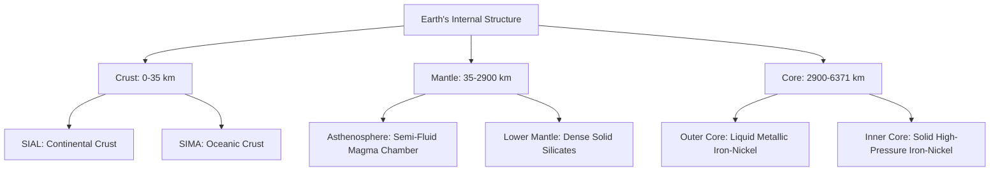

# Geography: Complete UPSC Notes

> **Target Exam**: UPSC Civil Services Examination (Prelims & Mains) / State PSCs  
> **Subject**: Geography  
> **Total Modules**: 11

---

## 📚 Table of Contents

1. [Geomorphology](#1-geomorphology)
2. [Climatology](#2-climatology)
3. [Oceanography](#3-oceanography)
4. [Biogeography](#4-biogeography)
5. [Indian Physiography](#5-indian-physiography)
6. [Indian Drainage](#6-indian-drainage)
7. [Indian climate](#7-indian-climate)
8. [Indian vegetation](#8-indian-vegetation)
9. [Indian soils](#9-indian-soils)
10. [Industrial location](#10-industrial-location)
11. [Resources](#11-resources)

---

## 1. Geomorphology

> **Source Subject**: [Geography](https://compass.rauias.com/geography/)
---
## 1. Internal Structure of Earth: Crust, Mantle & Core, Discontinuities
> Source: [https://compass.rauias.com/geography/internal-structure-earth-crust-mantle-core-discontinuities/](https://compass.rauias.com/geography/internal-structure-earth-crust-mantle-core-discontinuities/)

## Internal Structure of Earth: Crust, Mantle & Core, Discontinuities

Structure of Earth is divided into four major components: Crust, Mantle, Outer core, inner core. Each layer has a unique chemical composition, physical state, and can impact life on Earth's surface. Large size, non-uniform structure, high density and temperature make Earth’s structure very complex.

### **LAYERS OF EARTH**

#### **CRUST**

- Outermost solid part of Earth and is brittle in nature.

- Average density of outer and lower crust is 2.7 and 3.0, respectively.

- Oceanic crust is thinner (5 Km) as compared to continental crust (30 Km)

- Continental crust is thicker in areas of [major mountain](https://compass.rauias.com/briefly-mention-the-alignment-of-major-mountain-ranges-of-the-world-and-explain-their-impact-on-local-weather-conditions-with-examples/) systems. It is as much as 70 km thick in the Himalayan region.7

#### **MANTLE**

- Portion of interior beyond the crust is called mantle.

- Extends from Moho’s discontinuity to a depth of 2,900 km.

- Upper portion of mantle (lower part of Lithosphere) is called asthenosphere which is partially molten in condition whereby molten magma is in motion.

- It is extending up to 400 km.

- The crust and the uppermost part of the mantle are called lithosphere. Its thickness ranges from 10-200 km.

- Previously mantle was divided into two zones: (i) Upper Mantle from Moho’s discontinuity to 1000 km depth (ii) Lower Mantle from 1000 to 2900 km depth. But now on the basis of discovery by International Union of Geodesy and Geophysics, Mantle is divided into three zones;

Zone 1: Moho’s discontinuity to 200 km depth

Zone 2: 200 – 700 km depth

Zone 3: 700 – 2900 km depth

- Velocity of seismic waves relatively slows down in the uppermost zone of upper mantle for a depth of 100-200 km. This is called as zone of low velocity.

- The lower mantle extends beyond the asthenosphere. It is in solid state.

#### **CORE**

- Core-mantle boundary is located at the depth of 2,900 km.

- Outer core is in liquid state while inner core is in solid state. S-Waves disappear in outer core (5150 km is the boundary line).

- Composition of Core: Core is made up of very heavy material mostly constituted by nickel and [iron](https://compass.rauias.com/geography/iron/). It is sometimes referred to as the nife layer.

- Importance of core: (i) Core is responsible for generation of Earth’s magnetic field (ii) Contains information regarding earliest history of accretion of planet (iii) Thermal and compositional features established when core formed largely controlled subsequent evolution of core and influence the evolution of mantle, crust and atmosphere.

#### DISCONTINUITY WITHIN EARTH

Unique layers within the Earth are there according to their characteristics. All those layers are separated from each other through a transition zone. These transition zones are called discontinuities.

They are marked by clearcut variations in density of material, velocity of seismic waves, temperature and pressure conditions.

There are five discontinuities inside the earth.

- **Conrad Discontinuity:Transition zone between SIAL and SIMA.

- **Mohorovic Discontinuity:Transition zone between the Crust and Mantle.

- **Repiti Discontinuity:** Transition zone between Outer mantle and Inner mantle.

- **Gutenberg Discontinuity:** Transition zone between Mantle and Core.

- **Lehman Discontinuity:** Transition zone between Outer core and Inner core.

---

## 2. Sources of Information About Earth’s Interior
> Source: [https://compass.rauias.com/geography/sources-information-about-earths-interior/](https://compass.rauias.com/geography/sources-information-about-earths-interior/)

- **Mined rocksgive us the samples for direct observation. We get the rocks directly from below the earth surface. However, there is a limit to mining. So far scientist have drilled upto 12 km.

- **Volcanic eruptionforms another source of Obtaining direct information. As and when the molten material (magma) is thrown onto the surface of the earth, during volcanic eruption it becomes available for laboratory analysis. However, it is difficult to ascertain the depth of the source of such magma. Further it also hints towards the presence of molten/ semi molten layer (magma chamber) within the solid Earth.

- **Rate of change of temperature, pressure and densityindirectly help us to ascertain the structure, composition and thickness of the earth.

- The observable density of the outer crust is around 3.0-3.5 and By Newton’s gravitational law we know that avg. density of the earth is somewhere near 5.5. This means that the density successive layers must increase and must be more than 5.5. This further proves that the earth is made up of different materials whose density increases with increasing depth. (SiAl > SiMa > NiFe)

- Temperature rise per km is around 25 degrees Celsius. If we believe this to be true, then temperature at 2900 km depth would be around 72500 degrees Celsius which is way beyond the melting point 1200 degree Celsius. At such a high temperature the earth would have melted. This proves that even though temperature rises with depth inside Earth, but the rate of temperature rise decreases with increasing depth.

- **Another source of information are meteorsthat at times reach the earth. However, it may be noted that the material that becomes available for analysis from meteors, is not from the interior of the earth. The material and the structure observed in the meteors are like that of the earth. They are solid bodies developed out of materials same as, or like our planet. Hence, this becomes yet another source of information about the interior of the earth.

**Meteoroids:Before the small bit of comet or asteroid enter Earth’s atmosphere, it floats through interplanetary space and is called a meteoroid.

**Meteors:Meteoroids which enter the atmosphere and burn up completely.

**Meteorites:Those meteoroids which reach the earth’s surface.

- **Gravitation force (g)is different at different latitudes on the surface (greater near the poles and less at the equator because of higher distance from the centre at the equator). The uneven distribution of mass of material within the earth influences this value. These readings differ from the expected values. Such a difference is called gravity anomaly**.Gravity anomalies give us information about the distribution of mass of the material in the crust of the earth.

- **Seismic wavestravel differently in different mediums. Their direction and velocity change upon entering new mediums. Further the shadow zones of different seismic waves also differ. This helps us to understand the compositions of the Earth’s interior.

---

## 3. Theories explaining distribution of Oceans and Continents: Continental drift, Sea floor spreading & Plate tectonics
> Source: [https://compass.rauias.com/geography/oceans-continents-continental-drift-sea-floor-spreading-plate-tectonics/](https://compass.rauias.com/geography/oceans-continents-continental-drift-sea-floor-spreading-plate-tectonics/)

## Theories explaining distribution of Oceans and Continents: Continental drift, Sea floor spreading & Plate tectonics

Earth is dynamic in nature. Endogenetic forces keep on changing the location of the continents and the oceans. There are various theories which explain the evolution of our planet.

### 1. **Continental Drift Theory**

Put forward by Alfred Wegner in 1912.

- Also called as ‘displacement hypothesis’

- Wagner believed in three-layer system; outer layer of sial, intermediate layer of sima and lower layer of nife. (sial is restricted to continent only and sialic masses float over)

- According to Wegener, all continents formed a single continental mass (PANGEA) & mega ocean (PANTHALASSA) surrounded the same.

- Around 200 million years ago, Pangaea first broke into two large continental masses as Laurasia (Present day- N. America, Europe and Asia) and Gondwanaland (Present day S. America, Africa, Peninsular India, Australia and Antarctica). Subsequently, Laurasia and Gondwanaland continued to break into various smaller continents that exist today.

- Force for Drifting Wegener suggested that movement responsible for the drifting of the continents was caused by pole-fleeing force and tidal force.

- Polar-fleeing force relates to rotation of the earth.

- Tidal force is due to attraction of moon and sun. Wegener believed that these forces would become effective when applied over many million years. However, most of scholars considered these forces to be inadequate.

#### Evidence In Support Of Continental Drift Theory

Jig Saw Fit theory: Shorelines of Africa & South America facing each other have a remarkable and unmistakable match and can be refitted together.

- Rocks of Same Age Across the Oceans: The belt of ancient rocks from Brazil coast matches with those from western Africa. Appalachians of N. America are compatible with mountain system of Ireland and North-western Europe.

- Gondwana system of sediments from India is known to have its counterparts in six different landmasses of the Southern Hemisphere.

- Placer Deposits: Brazil has the gold bearing veins but the gold is also found at the coast of Ghana which has absolute absence of source rock.

- Distribution of Fossils: Observations that Lemurs occur in India, Madagascar and Africa led some to consider a contiguous landmass ‘Lemuria’ linking these three landmasses.

- Carboniferous glaciationof Brazil, Falkland, South Africa & peninsular India further prove the unification of landmasses during carboniferous period.

- Seafloor spreading & Plate tectonic theoryalso proved that lands and seas are not stationary and they keep on drifting.

**PALEOMAGNETIC STUDIES & SEA FLOOR SPREADING**

When molten hot lava comes up with thermal convection current along M.O.R and gets cooled and solidified, these lavas also get materialised in accordance with the then geomagnetic field and thus alternate bands of magnetic anomalies are formed on either side of M.O.R. These findings validate following things:There is a reversal in main magnetic field of Earth.Normal and reverse magnetic anomalies are found in alternate manner on either side of the M.O.R.There is a complete parallelism in the magnetic anomalies on either side of the M.O.R. There is parallelism in the time sequence of paleomagnetic epochs.

**POLAR WANDERING**

It is the migration of the magnetic poles over Earth’s surface through geologic time. Polar-wandering curves are the paths of a magnetic pole with respect to a given continent.

### 2. Sea floor spreading theory

- By Prof Harry Hess.

- Mid oceanic ridges are situated on the rising thermal convection currents coming up from the mantle.

- Constant eruptions at the crest of oceanic ridges cause the rupture of the oceanic crust and the new lava wedges into it, pushing the oceanic crust on either side. The ocean floor, thus spreads.

- Molten lava cools down and solidifies to form new crusts along the trailing ends of divergent oceanic crusts.

- Spreading of one ocean does not cause the shrinking of the other because of the consumption of the Oceanic crust at the oceanic trenches.

#### **EVIDENCE IN SUPPORT OF SEA FLOOR SPREADING **

- Rocks equidistant on either side of the crest of mid-oceanic ridges show remarkable similarities in terms of period of formation and chemical composition.

- Rocks on either side of the Mid-Oceanic Ridge have similar magnetic properties in terms of magnetic anomaly and time sequence of magnetic epochs.

- Age of rocks increases as one moves away from crust.

- Ocean crust rocks are much younger than continental rocks. Age of rocks in oceanic crust is nowhere more than 200 million years old. Some of the continental rock formations are as old as 3,200 million years.

- Sediments on ocean floor are unexpectedly very thin.

### **3. **Plate Tectonics Theory

- Suggested by McKenzie and Parker in 1967 and outlined by Morgan in 1968.

- A tectonic plate (also called lithospheric plate) is a massive, irregularly shaped slab of solid rock, generally composed of both continental and oceanic lithosphere.

- Plates move horizontally over the asthenosphere as rigid units.

- Forces responsible for such movements- The heat beneath the earth is generated because of two factors: (i) Radioactive decay (ii) Residual heat.

- The lithosphere includes the crust and top mantle with its thickness range varying between 5 and 100 km in oceanic parts and about 200 km in the continental areas.

A plate may be referred to as the continental plate or oceanic plate depending on which of the two occupy a larger portion of the plate.

#### **THREE TYPES OF PLATE BOUNDARIES**

- **Divergent:Where new crust is generated (Constructive margins) as plates pull away from each other and new crusts are formed because of solidification of upwelling molten material. These sites are called spreading sites. Ex. Mid-Atlantic Ridge (American Plate(s) being separated from Eurasian and African Plates).

- **Convergent:Where the crust is destroyed (Destructive margins) as one plate dives under another. They are also known as consuming plate margins. The location where sinking of a plate occurs is called a subduction zone. There are three ways in which convergence can occur. (i) Ocean-Ocean convergence (ii) Ocean-Continent convergence (iii) Continent-Continent convergence

- **Transform: **Where the crust is neither produced nor destroyed as the plates slide horizontally past each other. They are generally perpendicular to the mid-oceanic ridges. They are formed due to differential movement. Also, the rotation of the earth has its effect on the separated blocks of the plate portions.

#### **EVIDENCE OF PLATE TECTONICS**

Evidence of Continental drift, palaeomagnetism and sea floor spreading theory can be combined. Continental drift proves that there has been a motion i.e., ‘tectonics’. Palaeomagnetism and sea floor spreading theory explains the process behind this movement.

#### **PLATE TECTONICS IMPROVEMENT OVER CONTINENTAL DRIFT THEORYContinental Drift TheoryPlate Tectonic Theory**

|  |  |
| --- | --- |
| Only landmass moves. | Lithospheric slab moves which might be continental or oceanic or both. |
| Forces responsible were incompetent. | Forces were well explained and reasonable. |
| Many evidence were unscientific. Ex. jig-saw fit theory could not be proven because both the coasts of Atlantic Ocean cannot be completely refitted. | Evidence was based on palaeomagnetic studies and other researched theories like convection current theories and sea floor spreading theory. |
| Could not explain satisfactorily the formation of various landforms like volcanic arcs and fold mountains. | Theory explained the formation of fold mountains, plateaus, island arcs, mid oceanic ridges etc. |

---

## 4. Plate Tectonics & Earth Surface: Movement of Indian plate, East African Rift Valley & Earthquakes in India
> Source: [https://compass.rauias.com/geography/plate-tectonics-earth-surface-movement-indian-plate-east-african-rift-valley-earthquakes/](https://compass.rauias.com/geography/plate-tectonics-earth-surface-movement-indian-plate-east-african-rift-valley-earthquakes/)

## Plate Tectonics & Earth Surface: Movement of Indian plate, East African Rift Valley & Earthquakes in India

### **MOVEMENT OF INDIAN PLATE **

- Indo - Australian plate includes Peninsular India and Australian continental portions.

- Subduction zone along Himalayas forms northern plate boundary in the form of continent— continent convergence.

- In the east, it extends through Arakan yoma Mountains of Myanmar.

- Western margin follows Kirthar Mountain of Pakistan. It further extends along the Makrana coast and joins the spreading site from the Red Sea rift south eastward along the Chagos Archipelago.

- Boundary between Indo-Australian and Antarctic plate is also marked by oceanic ridge (divergent boundary)

- India was a large island situated off Australian coast, in a vast ocean. The Tethys Sea separated it from the Eursian continent till about 225 million years ago.

- India started her northward journey about 200 million years ago at the time when Pangaea broke. Tibetan block was closer to the Asiatic landmass.

- India collided with Eurasia about 40-50 Mn years ago causing rapid uplift of the Himalayas (Still rising).

### **PLATE TECTONICS & EAST AFRICAN RIFT VALLEY**

East-African Rift Valley (EAR) is a developing divergent plate boundary in East Africa. Here, eastern portion of Africa, Somalian plate, is pulling away from rest of continent, which comprises Nubian plate. Numalian plates are also separating from Arabian plate in thus creating a ‘Y’ shaped rifting system.

### **PLATE TECTONICS & EARTHQUAKES**

- Major tectonic events associated with plate boundaries are ruptures and faults along the constructive plate boundaries, faulting and folding along destructive plate boundaries and transform faults at conservative plate boundaries. All sorts of disequilibrium are caused due to different types of plate motions and consequently earthquakes of varying magnitudes are caused.

- At divergent boundaries, shallow foci (25-45 km) and moderate earthquakes occur because the rate of rupture of the crust and upwelling of lavas due to fissure is also slow. Ex. at mid-Atlantic ridge, mid Indian oceanic ridge and east pacific rise.

- At convergent boundaries, earthquakes of high magnitude and deep foci occur because of deeper subduction of one plate. Here mountain building, faulting and violent volcanic eruptions cause disastrous earthquake. Ex. Circum-Pacific Belt.

#### **WORLD DISTRIBUTION OF EARTHQUAKESCircum-Pacific Belt:Coastal Margins of North and South America and East Asia representing the margins of Pacific. 65% of the global Earthquakes occur in this region. It has ideal conditions of (i)C-O convergence and subduction zones, (ii)zone of young, folded mountains and (iii) zone of active volcanoes.

**Mid-Atlantic Belt: **Epicentres located along mid Atlantic ridge. Earthquakes are because of transform faults and fractures because of splitting of plates.

**Mid-Continental Belt: **Alpine-Himalayan belt representing collision of continental plates. 21% of global earthquakes occur in this region. They represent weaker zones of folded mountains and fault induced earthquakes.

#### **INDIA’S DISTRIBUTION OF EARTHQUAKES**

India been classified into different zones based on intensity of damage or frequency of earthquake occurrences.

11% in very high-risk zone V, 18% in high-risk zone IV and 30% moderate risk zone III. Capital cities of Guwahati and Srinagar are in [seismic zone](https://compass.rauias.com/current-affairs/nisar-map-himalayas-seismic-zones/) V, while national capital of Delhi is in zone IV and mega cities of Mumbai, Kolkata and Chennai are in zone III. 38 cities with population of half a million and above each and a combined population of million are in these three regions.

#### **REASONS FOR HIGH SEISMICITY IN HIMALAYAS**

- Active C-C convergence zone leading to continuous shaking of ground.

- ‘Double layering’ effect produces shallow foci earthquakes which strike the surface fastest.

- Region of young, folded mountains with sedimentary rock formations have weaker zones and numerous faults.

- Underlying stress been accumulated for over thousands of years when release their energy; produces tremors and vibrations.

- Steep slopes lead to frequent landslides in turn leading to earthquakes.

- Increasing human induced super incumbent load in form of roads, rails, buildings etc further destabilises the region.

---

## 5. Earthquake Waves & Shadow Zones
> Source: [https://compass.rauias.com/geography/earthquake-waves-shadow-zones/](https://compass.rauias.com/geography/earthquake-waves-shadow-zones/)

## Earthquake Waves & Shadow Zones

Earthquake waves or seismic waves are vibrations generated by an earthquake, explosion, or similar energetic source and propagated within Earth or along its surface. Earthquakes generate four principal types of elastic waves; two, known as body waves, travel within Earth, whereas the other two, called surface waves, travel along its surface.

Seismographs record amplitude and frequency of seismic waves and yield information about Earth and its subsurface structure.

#### **BODY WAVES**

- Generated due to release of energy at the focus and travel in all directions within the body of the Earth.

- The velocity as well as direction of waves changes as they travel through materials with different densities. The denser the material, the higher is the velocity. Reflection causes waves to rebound whereas refraction makes waves move in different directions.

**P- WAVES (PRIMARY WAVES)S-WAVES (SECONDARY WAVES)***(Longitudinal waves).**(Transverse Waves)*

|  |  |
| --- | --- |
| Move faster and are the first to arrive at the surface. | They arrive at the surface with some time lag. |
| They travel through gaseous, liquid and solid materials. | They can travel only through solid materials. |
| They vibrate parallel to the direction of the wave  This leads to density differences in the material because of stretching and squeezing of the material. | The direction of vibrations is perpendicular to the wave direction in the vertical plane  Hence, they create troughs and crests in the material through which they pass. |
| They are also called as ‘compressional waves’ | They are also called as ‘distortional waves’ |

#### **SURFACE WAVES**

- The body waves when interact with the surface rocks, they generate new waves called as surface waves.

- They are also called as long period waves.

- The surface waves are the last to report on seismograph, but they cover longest distance of all the seismic waves.

- These waves are more destructive. They cause displacement of rocks, and hence, the collapse of structures occurs.

#### **CONCEPT OF SHADOW ZONES**

Shadow zones are the angular areas from the given earthquake where the seismographs do not record any earthquake waves. These are different for P and S waves. Further they also vary with each earthquake. The angles are measured with respect to the Epicenter.

105-145 degree = Shadow zones for both (Both P & S waves are not recorded)
> 145 degrees = Shadow zone for S waves (P waves recorded)

| < 105 degrees = No shadow zone for P as well as S waves (Both the waves are recorded by seismograph) |
| --- |

#### **Seismic waves help to know about Earth's interior:**

- Non-linear travel path confirms that the [Earth’s structure](https://compass.rauias.com/geography/internal-structure-earth-crust-mantle-core-discontinuities/) in not homogeneous rather heterogeneous.

- Curved path tells us that on an average there is an increase in density as one moves deeper into the earth.

- Based on change of velocity of these waves it is proved that there are three locations where there are major velocity changes hence help us to infer that there are three zones/layers of varying densities inside the Earth.

- Bouncing back of waves after hitting abrupt boundary between two layers help to determine the depth of the discontinuities and thickness of various layers.

- Absence of S-waves inside the core confirms the presence of liquid core at the depth of 2900 km.

- The velocity decreases in upper part of the upper mantle for a depth of 100-200 km which confirms the presence of lighter material in between.

---

## 6. Forces acting on Earth; Endogenetic & Exogenetic
> Source: [https://compass.rauias.com/geography/forces-earth-endogenetic-exogenetic/](https://compass.rauias.com/geography/forces-earth-endogenetic-exogenetic/)

Read about Forces acting on Earth: Endogenetic & Exogenetic. This is Important topic in Geography for UPSC Exam.

Configuration of earth is the result of various processes operating within as well as outside the earth.Multiple forces affect the earth’s crust.

**ENDOGENETIC FORCES (LAND BUILDING FORCES)**

- They are called as internal forces as they are present within Earth.

- These lead to vertical and horizontal movements and result in subsidence, land upliftment, volcanism, faulting, folding, earthquakes, etc.

- Primordial heat, radioactivity, tidal and rotational friction from the earth results in the creation of these forces.

- Diastrophic forces are slow movements. It involves epeirogenetic and orogenetic movements.

- Epeirogenetic movements are the vertical forces and are responsible for continent building. These vertical movements can lead to submergence as well as emergence.

- Orogenetic movements are the horizontal forces and are responsible for mountain building. They can be categorized into two major pressures such as the pressure of tension and pressure of compression.

- Catastrophic forces are fast movements like earthquakes.

**EXOGENETIC FORCES (LAND MODIFYING FORCES)**

- They are forces acting outside the earth. Hence, are called as external forces.

- They are land modifying forces because they cause land to wear down because of their action. Therefore, they are referred to as land wearing forces/denudational forces.

- Exogenic processes include weathering, mass wasting, erosion, and deposition.

- Geomorphic agents are natural elements capable of performing these exogenic processes (or exogenic geomorphic agents). For example, the wind, water, and waves.

- They draw their power from the solar energy.

---

## 7. Volcanism and volcanicity
> Source: [https://compass.rauias.com/geography/volcanism-volcanicity/](https://compass.rauias.com/geography/volcanism-volcanicity/)

## Volcanism & Volcanicity

Volcanism and volcanicity are fundamental topics in the study of physical geography, crucial for UPSC Exam. This page offers an in-depth exploration of these phenomena, shedding light on the processes that lead to volcanic activity and the various forms it can take.

- A volcano on Earth is a vent or fissure in the crust through which lava, ash, rock and gases erupt.

- Sometimes they can be preceded by emissions of steam and gas from small vents in the ground.

- Nuée ardente, or pyroclastic flow is a fluidized mixture of hot gas and incandescent particles that sweeps down a volcano’s flanks, incinerating everything in its path.

### **VOLCANO ANATOMY**

When volcanoes erupt, magma moves upward from a magma chamber and into a vent or conduit. It flows out from a crater at the top, or sometimes emerges at a secondary site on the side of the volcano resulting in a flank eruption.

Erupted materials accumulate around the vent forming a volcanic mountain. The accumulated material might consist of layers of solidified lava, called lava flows, but it might also include fragments of various sizes that have been thrown from the volcano.

#### **MECHANISM & CAUSES OF VULCANISM**

Mechanism of volcanism is closely associated with several interconnected processes.

- Average increase of temperature with increasing depth at the rate of 25-32 degree Celsius per km.

- Origin of magma due to lowering of melting point caused by reduction in the pressure of overlying super incumbent load.

- Origin of gases and vapour due to heating of water which reaches underground through percolation.

- Ascent of magma forced by enormous volume of gases and vapour.

- Occurrence of volcanic eruptions.

**WHY NO VOLCANOES IN HIMALAYAS?**

- Not much rise of temperature as the subduction angle is not much due to C-C type convergence.

- Absence of oceanic plate has not allowed much water to be heated up and form vapours.

- Double layering has increased crustal thickness which do not allow magma to outpour in the form of lava.

#### **GLOBAL DISTRIBUTION OF VOLCANOES**

#### **PLATE TECTONICS AND VOLCANISM**

- Stratovolcanoes tend to form at subduction zones, or convergent plate margins, where an oceanic plate slides beneath a continental plate and contributes to the rise of magma to the surface.

- At rift zones, or divergent margins, shield volcanoes tend to form as two oceanic plates pull slowly apart and magma effuses upward through the gap.

- Volcanoes are not generally found at strike-slip zones, where two plates slide laterally past each other.

- “Hot spot” volcanoes may form where plumes of lava rise from deep within the [mantle to Earth's crust](https://compass.rauias.com/geography/internal-structure-earth-crust-mantle-core-discontinuities/) far from any plate margins.

**EFFECT OF VOLCANOS ON CLIMATECooling effect: **

- Volcanic ash or dust released into the atmosphere during an eruption shade sunlight and cause temporary cooling.

- Smallest particles of dust get into the stratosphere and can stay in the stratosphere for months, blocking sunlight and causing cooling over large areas of the Earth.

- Volcanoes emit sulphur dioxide which combines with water to form sulfuric acid aerosols. This in turn makes a haze of tiny droplets in the stratosphere that reflects incoming [solar radiation](https://compass.rauias.com/geography/solar-radiation-heating-cooling-atmosphere-heat-budget/), causing cooling of the Earth’s surface.

- Ex. According to studies, Pinatubo spewed about 15 million tonnes of sulphur dioxide into stratosphere. The total mass of SO2 in the volcanic cloud was 20 Tg. Researchers recorded 0.5 degrees Celsius (°C) drop in the average global temperature over large parts of the earth between 1992 and 1993.

**Warming effect: **

- Volcanoes also release large amounts of greenhouse gases such as water vapor and [carbon dioxide](https://compass.rauias.com/environment-biodiversity/carbon-capture-storage/).

- There have been times during Earth history when intense volcanism has significantly increased global warming.

**[Ozone layer depletion:](https://compass.rauias.com/ozone-layer-depletion/)**

- Sulphate aerosols can deplete ozone layer too.

### **HOT WATER SPRINGS IN INDIA**

Thermal springs or hot water springs are formed due to geothermally heated water emerging onto the earth’s surface through cracks. This heat comes from deep inside the earth’s surface. The heat produced is either through the [magma within the Earth’s crust](https://compass.rauias.com/geography/sources-information-about-earths-interior/) or through the movement of fault in the crust. The heated water being less dense, rises upwards. The Geological Survey of India (GSI) have identified more than 340 hot spring locations.

#### **SIGNIFICANCE**

- High geothermal [energy potential](https://compass.rauias.com/examine-the-potential-of-wind-energy-in-india-and-explain-the-reasons-for-their-limited-spatial-spread/)

- Presence of warm water provide relief to people living in colder areas.

- Host communities of microorganisms like extremophile.

- Responsible for weathering of silicate rocks

- [Release carbon dioxide](https://compass.rauias.com/environment-biodiversity/carbon-capture-storage/) in the atmosphere

- Presence of dissolved mineral make it relevant for therapeutic uses.

- High tourist attraction

- Beneficial for animals during the extremely cold season.

---

## 8. Geomorphic Processes: Exogenic, Endogenic, Weathering, Erosion & Mass wasting
> Source: [https://compass.rauias.com/geography/geomorphic-processes-exogenic-endogenic-weathering-erosion-mass-wasting/](https://compass.rauias.com/geography/geomorphic-processes-exogenic-endogenic-weathering-erosion-mass-wasting/)

## Geomorphic Processes: Exogenic, Endogenic, Weathering, Erosion & Mass wasting

Understanding geomorphic processes is crucial for UPSC aspirants delving into geography. This comprehensive guide covers the intricate processes that shape the Earth's surface, focusing on **exogenic and endogenic forces**, **weathering**, **erosion**, and **mass wasting**.

### **GEOMORPHIC PROCESSES**

- [Actions of exogenic forces](https://compass.rauias.com/geography/geomorphic-processes-exogenic-endogenic-weathering-erosion-mass-wasting/) result in wearing down (degradation) of relief/elevations and filling up (aggradation) of basins/depressions, on earth’s surface.

- Phenomenon of wearing down of relief variations of surface of earth through erosion is known as gradation.

- Endogenic & exogenic forces causing physical stresses and chemical actions on earth materials and bringing about changes in the configuration of the surface of the earth are known as geomorphic processes.

- Geomorphic agents are ground water, surface water, waves, currents ice, wind and gravity.

- Gravity besides being a directional force activating all downslope movements of matter also causes stresses on the earth’s materials.

#### **EXOGENIC FORCES**

- Derive their energy from two sources: a) [Solar energy](https://compass.rauias.com/geography/solar-energy/) b) **Gradient created by tectonic factors**.

- Basic reason that leads to weathering, mass movements, and erosion is development of stresses in the body of the earth materials.

- Force applied per unit area is called stress.

- All the exogenic geomorphic processes are covered under a general term, denudation. The word ‘denude’ means to strip off or to uncover.

- Geomorphic processes depend upon multiple factors like a) structure of rocks (folds, faults, orientation and inclination of beds, presence of joints, hardness or of constituent minerals, permeability etc.), b)time and c)processes which operate on the rocks.

- These processes further depend upon various factors like latitude, season, land and

- water spread on the surface of the earth, density, type and distribution of vegetation, altitudinal differences, variation in the amount of insolation received, differences in wind velocities and directions, amount and kind of precipitation, evaporation, daily range of temperature, freezing and thawing frequency, depth of frost penetration etc.

#### **WEATHERING**

Image source: geologyin

- Mechanical disintegration and chemical decomposition of rocks.

- It is an in-situ or on-site process.

**Exfoliation - **Flaking off more or less curved sheets of shells from over rocks or bedrock resulting in smooth and rounded surfaces. It is not the process but a result of weathering.

**Exfoliation domesare created due to removal of the super incumbent load (unloading).

**Exfoliated torsare created due to thermal expansion.

**MASS MOVEMENTS**

- Transfer the mass of rock debris down the slopes under the direct influence of gravity.

- Weathering is not a pre-requisite for mass movement though it aids mass movements. Mass movements are very active over weathered slopes rather than over unweathered materials.

- Air, water or ice do not carry debris with them from place to place but on the other hand the debris may carry with it air, water or ice.

#### **MASS MOVEMENTS**

- Transfer the mass of rock debris down the slopes under the direct influence of gravity.

- Weathering is not a pre-requisite for mass movement though it aids mass movements. Mass movements are very active over weathered slopes rather than over unweathered materials.

- Air, water or ice do not carry debris with them from place to place but on the other hand the debris may carry with it air, water or ice.

- Mass movements are aided by gravity and no geomorphic agent like running water, glaciers, wind, waves and currents participate in the process of mass movements.

- Heave: heaving up of soils due to frost growth and other causes, flow and slide are the three forms of movements.

- Landslides are relatively rapid and perceptible movements. The materials involved are relatively dry.

- Slump is slipping of one or several units of rock debris with a backward rotation with respect to the slope over which the movement takes place.

- Debris slide is rapid rolling or sliding of earth debris without backward rotation of Mass.

- Debris fall is nearly a free fall of earth debris from a vertical or overhanging face.

- Rockslide is sliding of individual rock masses down bedding, joint or fault surfaces.

- Solifluction is the flowage of water-saturated soil down a steep slope. Because permafrost is impermeable to water, soil overlying it may become oversaturated and slide downslope under the pull of gravity.

#### **EROSION AND DEPOSITION**

- It involves acquisition and transportation of rock debris which are formed because of weathering.

- Erosional geomorphic agents like running water, groundwater, glaciers, wind and waves remove and transport it to other places.

- Though weathering aids erosion it is not a pre-condition for erosion to take place.

- Deposition is a consequence of erosion. The erosional agents lose their velocity and hence energy on gentler slopes and the materials carried by them start to settle

- themselves.

- In other words, deposition is not actually the work of any agent. The coarser materials get deposited first and finer ones later.

- The same erosional agents viz., running water, glaciers, wind, waves and groundwater act as aggradational or depositional agents also.

**EFFECT OF CLIMATE ON WEATHERING**

- **Rate of weathering:Humid climate increases the rate of weathering. High rain, humidity and heat break down the rocks faster.

- **Type of weathering:Arid climate favour mechanical weathering whereas Humid climate favours chemical weathering. Biological weathering is also relatively higher in humid climate because of high vegetation and organisms in those areas.

- **Types of rocks:Limestone weathers rapidly in areas with wet climates, where rainwater mixed with carbon dioxide in soil or creates a weak acid that dissolves the limestone to form crevices and valleys. Sandstone, by contrast, weathers more rapidly in dry climates, because the quartz in the sandstone is largely invulnerable to chemical weathering but can fall prey to fracturing caused by ice formed when water freezes and expands in cracks in the stone.

**SIGNIFICANCE OF WEATHERINGGeomorphic significance**: Break down the rocks and thus form the soils. Lead to various geomorphic processes like wasting and mass movements thus causing disasters like landslides. Weathering aids erosion and thus allow the development as well as evolution of various landforms.

**Ecological significance:[Biomes](https://compass.rauias.com/geography/biomes/) and biodiversity is basically a result of forests (vegetation) and forests depend upon the depth of weathering mantles.

**Economic significance:Weathering of rocks and deposits helps in the enrichment and concentrations of certain valuable ores of [iron](https://compass.rauias.com/geography/iron/), manganese, aluminium, copper etc., which are of great importance for the national economy.

---

## 9. MINERALS & ROCKS: Igneous, Sedimentary & Metamorphic
> Source: [https://compass.rauias.com/geography/minerals-rocks-igneous-sedimentary-metamorphic/](https://compass.rauias.com/geography/minerals-rocks-igneous-sedimentary-metamorphic/)

## MINERALS & ROCKS: Igneous, Sedimentary & Metamorphic

A comprehensive understanding of minerals and rocks is essential for studying geography. This guide delves into the three main types of rocks—**igneous, sedimentary, and metamorphic**—and their formation processes.

### **Minerals**

- Mineral is a naturally occurring organic and inorganic substance, having an orderly atomic structure and a definite chemical composition and physical properties.

- A mineral is composed of two or more elements. But sometimes single element minerals like sulphur, copper, silver, gold, graphite etc. are found.

- Though the number of elements making up the lithosphere are limited they are combined in many ways to make up many varieties of minerals.

**Whole EarthCrustFig:**[Earth’s crust](https://compass.rauias.com/geography/internal-structure-earth-crust-mantle-core-discontinuities/)

|  |  |  |  |
| --- | --- | --- | --- |
| Iron | 33.3 | Oxygen | 45.2 |
| Oxygen | 29.8 | Silicon | 27.2 |
| Silicon | 15.6 | Aluminum | 8.2 |
| Magnesium | 13.9 | Iron | 5.8 |
| Nickel | 2.0 | Calcium | 5.1 |
| Calcium | 1.8 | Magnesium | 2.8 |
| Aluminum | 1.5 | Sodium | 2.3 |
| Sodium | 0.2 | Potassium | 1.7 |
| Chemical composition of the entire Earth and  respectively |  |  |  |

The basic source of all minerals is the hot magma in the interior of the earth. When magma cools, crystals of minerals appear and a systematic series of minerals are formed in sequence to solidify to form rocks.

### **ROCKS**

- A rock is an aggregate of one or more minerals.

- Rocks do not have definite composition of mineral constituents.

- Feldspar and quartz are the most common minerals found in rocks.

- There are three family of rocks classified based on mode of formation:

- Igneous Rocks

- Sedimentary Rocks

- Metamorphic Rocks

#### **IGNEOUS ROCKS**

- They are formed out of magma and lava (when it cools and solidifies) from the interior of the earth, hence are known as [primary rocks](https://compass.rauias.com/describe-the-characteristics-and-types-of-primary-rocks/).

- The process of cooling and solidification can happen in the earth’s crust or on the surface of the earth.

- If molten material is cooled slowly at great depths, mineral grains may be very large.

- Sudden cooling (at the surface) results in small and smooth grains.

- Intermediate conditions of cooling would result in intermediate sizes of grains.

- Examples of igneous rocks- Granite, gabbro, pegmatite, basalt, volcanic breccia and tuff.

#### **SEDIMENTARY ROCKS**

- They are formed by the process of lithification- The rocks (Igneous, sedimentary and metamorphic) undergo denudation and the sediments are transported and deposited at a place which under continuous accumulation and compaction change into solid rocks.

- Sometimes, we see several layers of varying thickness in sedimentary rocks like sandstone, shale etc.

- Depending upon the mode of formation, sedimentary rocks are classified into three major groups:

- Mechanically formed — sandstone, conglomerate, limestone, shale, loess etc.

- Organically formed—geyserite, chalk, limestone, coal etc.

- Chemically formed — chert, limestone, halite, potash etc.

#### **METAMORPHIC ROCKS**

- The word metamorphic means ‘**change of form**.’

- Metamorphism is a process by which already consolidated rocks undergo recrystallisation and reorganisation of materials within original rocks due to change of temperature, pressure and volume.

- Ex. schist, gneiss, quartzite and marble.

- Contact Metamorphism: When rocks meet hot intruding magma and lava and the rock materials recrystallise under high temperatures.

- Regional metamorphism: When rocks undergo recrystallisation due to deformation caused by tectonic shearing together with high temperature or pressure or both.

- Examples of metamorphic rocks Gneissoid, granite, syenite, slate, schist, marble, quartzite etc.

**FOLIATION/LINEATION: **Arrangement of minerals or grains in layers in metamorphic rocks.

**BANDING:Arrangement of minerals or grains into alternating thin to thick layers appearing in light and dark shades. Such a structure in metamorphic rocks is called banding and rocks displaying banding are called banded rocks.

### **ROCK CYCLE**

- A continuous process through which old rocks are transformed into new ones.

- Igneous rocks are primary rocks and other rocks (sedimentary and metamorphic) form from these primary rocks.

- Igneous rocks can be changed into metamorphic rocks. Fragments derived out of these rocks form into sedimentary rocks. Sedimentary rocks themselves can turn into fragments and the fragments can be a source for formation of new sedimentary rocks.

- Crustal rocks (igneous, metamorphic and sedimentary) once formed may be carried down into the mantle and the same melt down due to increase in temperature and turn into molten magma, the original source for igneous rocks.

---

---

## 2. Climatology

> **Source Subject**: [Geography](https://compass.rauias.com/geography/)
---
## 1. Earth’s Atmosphere: Composition & Comparison
> Source: [https://compass.rauias.com/geography/earths-atmosphere-composition-comparison/](https://compass.rauias.com/geography/earths-atmosphere-composition-comparison/)

## Earth's Atmosphere: Composition & Comparison

Atmosphere is a gaseous surrounding layers present on some planets and satellites because of gravitational forces.

Atmosphere is an important part of the earth. It is not as dense as either land or water but it has weight and exerts pressure. It is a mixture of gases held to the earth due to gravitational attraction. It is composed of gases, water vapour and many solids and liquid particles, collectively called aerosols.

Its composition is not absolutely constant, as it varies with height, e.g., oxygen is negligible at the height of 120 km. In a similar way, carbon dioxide and water vapour are found only up to 90 km from the [surface of earth](https://compass.rauias.com/geography/sources-information-about-earths-interior/).

### **PERMANENT GASES OF THE ATMOSPHERE*Constituent**Formula**Percentage by Volume***2222

|  |  |  |
| --- | --- | --- |
| Nitrogen | N | 78.08 |
| Oxygen | O | 20.95 |
| Argon | Ar | 0.93 |
| Carbon dioxide | CO | 0.036 |
| Neon | Ne | 0.002 |
| Helium | He | 0.0005 |
| Krypto | Kr | 0.001 |
| Xenon | Xe | 0.00009 |
| Hydrogen | H | 0.00005 |

- Concentrations of minor gases such as CO2, H2 and Ozone (O3) in Earth’s atmosphere are controlled primarily by reactions in the stratosphere caused by UV solar radiation.

- Solar photons fragment gaseous molecules (such as O2, H2 and CO2) in upper atmosphere producing free radicals (C, H, O), a process called photolysis. Ex.

- Atmosphere of Earth is broadly divided into two main layers: Homosphere and Heterosphere.

- Homosphere (made up of [Troposphere](https://compass.rauias.com/troposphere-is-a-very-significant-atmospheric-layer-that-determines-weather-processes-how/), Stratosphere, and Mesosphere) is the lower atmosphere where the chemical composition is uniform.

- Heterosphere is the upper atmosphere, comprising the Thermosphere and Exosphere.

Due to constant mixing and turbulence, the lighter gases are unable to separate to form individual layers in the lower atmosphere. The atmosphere plays a crucial role in supporting life on Earth by blocking harmful UV radiation, providing oxygen and carbon dioxide for living organisms, and maintaining a livable environment.

Additionally, the active gases in the atmosphere also help regulate the surface temperature of the Earth at around 15°C.

### **EARTH’S ATMOSPHERE COMPARED TO OTHER PLANETS**

- Earth’s atmosphere is unique among planetary atmospheres of solar system.

- Venus and Mars have atmospheres composed largely of CO2.

- Surface pressure on Venus is about 90 times that on Earth while surface pressure on Mars in 1/100th of that on Earth.

- Surface temperatures of Earth (-20 to 40oC), Venus (400-500oC) and Mars (-140 to 25oC) are also very different.

- Outer planets are composed largely of hydrogen and helium and their atmospheres consist chiefly of hydrogen and in some cases, helium and methane.

#### **GASES**

- Two gases nitrogen and oxygen make up about 99 percent of the clean dry air.

- Remaining gases are mostly inert (Neon, Helium, Xenon etc.) and constitute about 1 percent of the atmosphere.

- Carbon dioxide is an important gas as it is transparent to the incoming solar radiation but opaque to the outgoing terrestrial radiation. It absorbs a part of terrestrial radiation and reflects back some part of it towards the earth’s surface. It is largely responsible for the greenhouse effect. Carbon dioxide is the heaviest of the gases in the atmosphere, which is why the lower layers have a higher concentration of it compared to the upper layers.

- Ozone, a vital gaseous component present in atmosphere, is found between 10 and 50 km above the Earth's surface. Its function is to act as a filter and absorb the ultra-violet rays emitted by the sun, preventing them from reaching the Earth's surface.

- Water vapor, a variable gas, varies in percentage in the Earth's atmosphere. In tropical regions, it can make up 4% of the air, but in dry, cold areas like d

- eserts and polar regions, it may only make up 1% or less. Additionally, water vapor decreases as one moves from the equator to the poles. It acts as a blanket by absorbing solar radiation and helping to retain heat on Earth. It also plays a role in both stabilizing and destabilizing the air.

#### **DUST PARTICLES**

- There are small solid particles present in atmosphere that come from various sources, such as sea salts, fine soil, smoke-soot, ash, pollen, dust, and debris from meteors. They are collectively called as Dust Particles.

- Dust particles, which are more abundant in subtropical and temperate regions with dry winds, tend to be located in the lower layers of the atmosphere but can be lifted to higher altitudes by convectional air currents. They are less prevalent in equatorial and polar regions.

- These particles act as nuclei for water vapor condensation, resulting in cloud formation.

---

## 2. Structure of the Earth’s Atmosphere
> Source: [https://compass.rauias.com/geography/structure-earths-atmosphere/](https://compass.rauias.com/geography/structure-earths-atmosphere/)

## Structure of the Earth's Atmosphere

Vertical structure of atmosphere is divided into five different layers with different atmospheric characteristics particularly with respect to the climate variables like temperature and density. These are Troposphere, Stratosphere, Mesosphere, Thermosphere and Exosphere.

### Troposphere

- Lowest layer of atmosphere. It has an average height of 13 km but can vary from 8 km at the poles to 18-20 km at the equator.

- This layer is thickest at Equator due to strong convection currents that carry heat upward.

- Temperature in the Troposphere decreases at a rate of 1ºC per every 165m of height.

- It is where we find the air which we breathe and the weather phenomena such as rainfall, fog, and hailstorms occurs. It makes troposphere crucial for biological life and activity on earth.

- The Troposphere is separated from the Stratosphere by the Tropopause, a zone with a relatively constant temperature.

- The air temperature at tropopause is about minus 80ºC over the equator and minus 45ºC over the poles.

**TROPOSPHERE AND WEATHER PROCESS**

- Troposphere contains 80% of the mass and most of the water vapor in the atmosphere, and consequently most of the clouds and stormy weather.

- Tropospheric processes, such as the water or hydrologic cycle (the formation of clouds and rain) and the greenhouse effect, have a great influence on meteorology and the climate.

- The lower levels of the troposphere (planetary boundary) are usually strongly influenced by Earth’s surface. In this layer, surface influences temperature, moisture, and wind velocity through the turbulent transfer of mass. This layer is known for vertical and horizontal mixture of winds.

- The temperature in troposphere decreases at the rate of 6.5°C/Km of height. The rising air parcel cools with adiabatic lapse rate and reaches the point of saturation. The [latent heat](https://compass.rauias.com/current-affairs/rising-temperature-oceans/) of condensation released further pushes the air parcel upwards. After condensation, precipitation starts.

- Uneven heating of the Earth by the sun causes convection currents in this layer of the atmosphere, which is large scale pattern of winds that move heat and moisture around the planet.

- Presence of water vapour in this region traps the terrestrial radiation and warms the atmosphere which in turn affects humidity levels.

### Stratosphere

- The stratosphere indeed extends upward from the tropopause. It extends up to a height of 50 km.

- It accounts for about 10 percent of the total molecular mass of the atmosphere.

- One important feature of the stratosphere is that it contains the ozone layer. This layer absorbs harmful ultra-violet radiation from the Sun and shields life on the earth from intense and harmful forms of energy from the Sun.

- This layer is almost free from clouds and associated weather phenomenon, making conditions most ideal for flying aeroplanes.

### Mesosphere

- The mesosphere layer extends above the stratosphere up to the height of 80 km.

- The average temperature in this layer decreases with height.

- [Meteorites burn](https://compass.rauias.com/current-affairs/eta-aquariid-meteor-shower/) up in this layer on entering from the space.

- The upper limit of mesosphere is called mesopause. In this region, during the summer nights over high latitudes, noctilucent clouds (night shining clouds)are observed.

### Thermosphere

- The thermosphere layer extends above the mesopause, and the lower portion of this layer is predominantly composed of nitrogen, molecular oxygen and atomic oxygen.

- In thermosphere temperature rises very rapidly with increasing height, mainly due to the absorption of ultra-violet radiation by the molecular oxygen and atomic oxygen.

- Ionosphere is a part of this layer. This layer helps in radio transmission as it contains electrically charged particles known as ions and the radio waves transmitted from the earth are reflected back to the earth by this layer.

### Exosphere

- The upper most layer of the atmosphere is called the exosphere. This layer has very thin air.

- Light gases like helium and hydrogen float into the space from here.

**Read Also:**

[Earth’s Atmosphere: Composition & Comparison](https://compass.rauias.com/geography/earths-atmosphere-composition-comparison/)[Temperature inversion](https://compass.rauias.com/geography/temperature-inversion/)[Volcanism and volcanicity](https://compass.rauias.com/geography/volcanism-volcanicity/)[Forces acting on Earth; Endogenetic & Exogenetic](https://compass.rauias.com/geography/forces-earth-endogenetic-exogenetic/)

|  |  |
| --- | --- |
|  |  |

---

## 3. Temperature: Factors controlling temperature distribution, vertical and horizontal distribution
> Source: [https://compass.rauias.com/geography/temperature-distribution-vertical-horizontal/](https://compass.rauias.com/geography/temperature-distribution-vertical-horizontal/)

## Temperature: Factors controlling temperature distribution, vertical and horizontal distribution

Temperature indicates the relative degree of heat of a substance. Heat is the energy which make things or objects hot, while temperature measures the intensity of heat. Although quite distinct from each other yet heat and temperature are closely related because gain or loss of heat is necessary to raise or lower the temperature.

### **FACTORS CONTROLLING TEMPERATURE DISTRIBUTION**

- **Latitude:The temperature of a place depends on its latitude as the insolation varies according to the latitude.

- **Altitude:The Normal Lapse Rate is the rate at which temperature generally decreases with increasing height, which is 6.5ºC per 1,000m. As a result, places at low elevations near sea level have higher temperatures compared to those at higher elevations.

- **Distance from Sea:The location of a place in relation to the sea affects its temperature, as the sea heats and cools slower than land. This results in less temperature variation over the sea compared to land. Places near the sea also experience the moderating effects of sea and land breezes.

- **Air mass:The temperature of a place is also affected by the movement of air masses. Places affected by warm air masses experience higher temperatures, while those affected by cold air masses experience lower temperatures.

- **Ocean currents:Ocean currents play a significant role in the distribution of temperature on Earth. Warm ocean currents can increase the temperature of coastal areas, while cold currents can lower the temperature.

#### **DISTRIBUTION OF TEMPERATURE**

The temperature distribution around the world can be understood by analyzing the temperature patterns in January and July. Temperature maps often use isotherms, which are lines connecting areas with the same temperature. The impact of latitude on temperature is typically evident on temperature maps, as isotherms tend to be parallel to latitude lines.

However, this trend is more pronounced in January than in July, particularly in the northern hemisphere. This is due to the larger landmass in the northern hemisphere, which amplifies the effects of land and ocean currents.

In January, the isotherms deviate towards the north over oceans and towards the south over continents, which can be observed in the North Atlantic Ocean. The presence of warm ocean currents, such as the Gulf Stream and North Atlantic Drift, makes the Northern Atlantic Ocean warmer and causes the isotherms to bend northwards. Conversely, over land, temperatures drop significantly, resulting in isotherms bending southwards in Europe.

In July, the isotherms tend to follow latitude lines more closely. The equatorial oceans have temperatures above 27°C, while some land areas in the subtropical continental region of Asia can reach over 30°C along the 30° N latitude.

The isotherm of 10° C runs along the 40° N and 40° S. The largest temperature range, more than 60° C, is seen in the northeastern part of the Eurasian continent, a result of its high degree of continentality. The lowest temperature range, 3°C, is found between 20° S and 15° N.

**THE DISTRIBUTION OF SURFACE AIR TEMPERATURE IN THE MONTH OF JANUARY**

**THE DISTRIBUTION OF SURFACE AIR TEMPERATURE IN THE MONTH OF JULY**

**HEAT EQUATOR(also called thermal equator) the line that circumscribes the earth and connects all points of highest mean annual temperature for their longitudes.the course of the heat equator varies with the arrangement of continents and ocean currents. it does not even approximately parallel the geographic equator, but ranges from about 20°n in mexico to about 14°s latitude in brazil. from west africa to the east indies, the heat equator lies north of the geographic equator; from new guinea to 120°w longitude, it lies south of the geographic equator.the approximate latitude of highest mean annual surface temperature (about 10°n).

**THE RANGE OF TEMPERATURE BETWEEN JANUARY AND JULY**

---

## 4. Solar Radiation: Heating & cooling of atmosphere, Heat Budget
> Source: [https://compass.rauias.com/geography/solar-radiation-heating-cooling-atmosphere-heat-budget/](https://compass.rauias.com/geography/solar-radiation-heating-cooling-atmosphere-heat-budget/)

## Solar Radiation: Heating & cooling of atmosphere, Heat Budget

The sun is the primary source of energy on the earth. This energy is radiated in all directions into space through short waves. It is known as solar radiation.

The earth receives most of its energy in the form of short waves and the energy which is received by earth is known as incoming solar radiation (insolation). The amount of insolation received by earth varies slightly in a year due to earth’s revolution around the sun. The earth is farthest from sun on 4th July, which is known as aphelion and on 3rd January, the earth is closest from the sun, and this position is called perihelion. Hence, the amount of insolation received by earth during perihelion is slightly more than during aphelion.

### **VARIABILITY OF INSOLATION AT THE SURFACE OF EARTH**

The amount of insolation received on earth’s surface is not uniform everywhere. It varies from place to place and time to time. The tropical zone receive maximum annual insolation and it decreases towards poles.

Factors influencing the variations in insolation:

- **The rotation of earth on its axis**

- **The angle of inclination of the sun’s rays**

- **The length of the day**

- **The transparency of the atmosphere**

- **The configuration of land**

Earth’s axis makes an angle of 66½ with its orbital plane around the sun, has greater influence on the amount of insolation received at different latitudes. Further, the angle of inclination of rays is another important factor which determines the amount of insolation. For example, the higher the latitude the less is the angle of inclination, resulting into slant rays. The area covered by slant rays is always more than the vertical rays and hence the energy gets distributed (the net energy per unit area decreases).

#### **DURING SUMMER SOLSTICE**

#### **THE PASSAGE OF SOLAR RADIATION THROUGH THE ATMOSPHERE**

Solar radiation passes through the atmosphere before reaching the Earth's surface, where various gases, such as water vapor and ozone, absorb a significant amount of it. Suspended particles in the Troposphere scatter the visible spectrum of light, both towards space and towards the Earth, creating the color in the sky. The red color of the rising and setting sun and the blue color of the sky are caused by the scattering of light within the atmosphere.

#### **SPATIAL DISTRIBUTION OF INSOLATION AT THE EARTH’S SURFACE**

Insolation received by earth varies from equator to poles. Maximum insolation received over subtropical deserts and equator receives comparatively less insolation than tropics. Moreover, at the same latitude the insolation is more over the continent than over the oceans.

#### **HEATING & COOLING OF ATMOSPHERE**

There are four heating processes directly responsible for heating the atmosphere:

- **Radiation: **It is a process by which solar energy reaches the earth and the earth loses energy to outer space. When the source of heat transmits heat directly to an object through heat waves, it is known as radiation process.

- **Conduction: **When two objects of unequal temperature meet each other, heat energy flow from the warmer object to the cooler object and this process of heat transfer is known as conduction. The flow continues till temperature of both the objects becomes equal or the contact is broken. The conduction in the atmosphere occurs at zone of contact between the atmosphere and the earth’s surface.

- **Convection: **The air of the lower layers of the atmosphere gets heated either by the earth’s radiation or by conduction and results into its expansion. Its density decreases and it moves upwards. Continuous ascent of heated air creates vacuum in the lower layers of the atmosphere. As a consequence, cooler air comes down to fill the vacuum, leading to convection.It is confined only to the troposphere.

- **Advection:It is the process of horizontal heat transfer by winds. In middle latitudes, it is responsible for most of the daily weather variations caused by day and night. For example, in northern India, during the summer season, the local winds called 'Loo' are caused by advection.

#### **TERRESTRIAL RADIATION**

Insolation refers to the amount of solar radiation that reaches the Earth's surface in the form of shortwaves. The Earth, after absorbing this energy, then radiates it back into the atmosphere as longwave. Much of this radiation is absorbed by atmospheric gases such as water vapor, carbon dioxide, and ozone, which play a crucial role in heating up the atmosphere and sustaining life on Earth. This process is known as terrestrial radiation.

### **HEAT BUDGET OF PLANET EARTH**

The balance between the amount of solar radiation received by the Earth (insolation) and the amount of radiation emitted by the Earth back into the atmosphere (terrestrial radiation) helps maintain a constant annual mean temperature on the Earth's surface. This balance is known as the Earth's heat budget. The reflected amount of radiation is called the albedo of the earth. The earth does not accumulate or loose heat. It maintains its temperature. This can happen only if the amount of heat received in the form of insolation equals the amount lost by the earth through terrestrial radiation. Although the earth, maintains balance between incoming solar radiation and outgoing terrestrial radiation. But this is not true what we observe at different latitudes. The amount of insolation received is directly related to latitudes. In the tropical region the amount of insolation is higher than the amount of terrestrial radiation. Hence it is a region of surplus heat. In the polar regions the heat gain is less than the heat loss. Hence it is a region of deficit heat. Thus, the insolation creates an imbalance of heat at different latitudes. This is being nullified to some extent by winds and ocean currents, which transfer heat from surplus heat regions to deficit heat regions. This is commonly known as latitudinal heat balance.

#### **HEAT BUDGET OF EARTH**

---

## 5. Temperature inversion
> Source: [https://compass.rauias.com/geography/temperature-inversion/](https://compass.rauias.com/geography/temperature-inversion/)

Temperature typically decreases with elevation, known as the normal lapse rate. But sometimes, the normal lapse rate is inverted, resulting in a situation where temperature increases with elevation. This is called an inversion of temperature. It is usually of short duration. The ideal situation for temperature inversion is long winter night with clear skies and still air.

The heat of the day is radiated off during the night, and by early morning hours, the earth is cooler than the air above. In polar regions, inversion is a normal year-round occurrence. It promotes stability in the lower atmosphere. It can cause smoke and dust particles to accumulate beneath the inversion layer and spread horizontally to spread the lower strata of the atmosphere, which results into dense fogs in the morning, particularly during the winter.

Inversions also occur in hills and mountains due to air drainage, where cold air produced during the night flows downhill and accumulates in valleys and low-lying areas, with warm air above. This protects plants from frost damage.

---

## 6. Atmospheric Circulations: Planetary winds, Pressure belts, Shifting of pressure belts
> Source: [https://compass.rauias.com/geography/atmospheric-circulations-planetary-winds-pressure-belts-shifting/](https://compass.rauias.com/geography/atmospheric-circulations-planetary-winds-pressure-belts-shifting/)

## Atmospheric Circulations: Planetary winds, Pressure belts, Shifting of pressure belts

Atmospheric circulation refers to the movement of air within the Earth's atmosphere. This movement is driven by temperature and pressure differences, which create winds and other forms of weather. The Earth's rotation also plays a role in shaping atmospheric circulation patterns. The most well-known patterns are the Hadley cell, ferrel cell and the Polar cell. Jet streams are also the part of atmospheric circulations. These patterns are responsible for weather patterns, such as the monsoons and the trade winds.

Atmospheric circulations can be classified into three categories:

- **Primary circulations:consisting of primary winds present across the globe, Ex. Trade winds

- **Secondary circulations:consisting of regional winds, Ex. cyclones and monsoon.

- **Tertiary circulations:which flow over very small area, also known as local winds. Ex. Loo

### **PLANETARY WINDS**

They are also called as primary winds or permanent winds because they remain same throughout the year and are distributed all across the globe. These winds are related to thermally and dynamically induced pressure belts and rotation of the earth.

**Tropical Easterlies**

They blow from the sub-tropical high-pressure areas towards the equatorial low pressure belt. They flow as the north-eastern trades in the northern hemisphere and the south-eastern trades in the southern hemisphere. The trade winds from two hemispheres meet at the inter tropical convergence zone, and due to convergence, they rise and cause heavy rainfall. Their off – shore nature on the western side of the continents are one of the reasons behind formation of deserts in those areas.

**Sub-Tropical Westerlies**

They blow from the sub-tropical high - pressure belts towards the sub polar low-pressure belts. They blow from south­west to north-east in the northern hemisphere and north-west to south-east in the southern hemisphere. These winds produce wet spells and variability in weather.

**Polar Easterlies**

They blow from the polar high-pressure areas of the sub-polar lows. The Polar easterlies are dry, cold prevailing winds blowing from north-east to south-west direction in Northern Hemisphere and south-east to north-west in Southern Hemisphere.

**General circulation of Atmosphere**

The pattern of the movement of the planetary winds is called the general circulation of the atmosphere. It refers to the large-scale, global movement of air that occurs in the Earth's atmosphere.

**Factors which affect general circulation: **Latitudinal variation of atmospheric heatingThe emergence and shifting of pressure belts.The distribution of continents and oceansThe rotation of the earth

### **SIGNIFICANCE OF PLANETARY WINDS**

#### **Climatic:**

- Balances the heat budget by transporting the excessive heat of tropics towards poles.

- Form the dynamic pressure belts – Sub Polar low-pressure belt is formed due to convergence and upliftment of sub-tropical westerlies and Polar easterlies.

- Cyclone formation and movement – Their convergence form the fronts at sub polar low-pressure belt and thus create extra tropical cyclone. Trade winds move the Tropical cyclones from East to West.

- Regional Climate- Monsoon in Indian subcontinent is caused due to eastward shift of SE trades after crossing the equator under the effect of Coriolis force.

#### **Oceanic:**

- Movement of oceanic currents- North and South Equatorial currents move East to West under the influence of Trade winds. Gulf stream moves toward North-east and hit the NW coast of Europe under the influence of Sub-tropical Westerlies.

- Formation of gyres- Primary winds affected by Coriolis form the circulatory motion of current thereby forming the Gyres.

#### **Geomorphic**:

- Formation of deserts- Tropical Easterlies form the desert on the western margins of the Continents as they become dry when reach there and act as offshore winds.

#### **Ecological: **

- Their effect on Oceanic current movement allows transport of nutrients and thrive biodiversity in form of fisheries, planktons, and corals.

- Certain studies point out that some insects move in the direction of prevailing winds.

- Dust storms: These winds Carry particles from Saharan sand and dust storms can blow across islands in the Caribbean Sea and the U.S. state of Florida.

### **SHIFTING OF PRESSURE BELTS**

Wind belts depend on temperature, so temperature changes can move the belts and change wind patterns.

Relative position of the earth with the sun changes within a year due to earth’s revolution and thus the position of all the pressure belts except the polar high pressure belts changes with the northward and southward migration of the sun.

- At the time of summer solstice, the sun is vertical over the tropic of Cancer (June 21) and therefore all the pressure belts belt shift north­ward. Thus, all the wind belts associated with the said pressure belts also shift north­ward.

- The sun becomes vertical over the equator at the time of equinoxes hence all the pressure belts which shifted to the north occupy their normal positions.

- After this there is southward migration of the sun which becomes verti­cal over the tropic of Capricorn at the time of winter solstice (23 December) and hence the pressure and wind belts shift southward.

**These seasonal changes in the relative positions of the pressure and wind belts introduce the following typical climatic conditions:**

(i) The Mediterranean climatic regions are found in the western parts of the continents within the latitudinal zone of 30°-45° in both the hemispheres. Subtropical belt shifts towards the equator at the time of winter solstice in the northern hemisphere, consequently, the zone between 30°-40° latitude is characterized by westerlies which give much precipitation during winter season because they come from over the oceans. This is why the Mediterranean regions are characterized by dry summers and wet winters.

(ii) The regions lying between 60°-70° latitudes are characterized by two types of winds in a year because of shifting of pressure and wind belts. With the northward migration of the sun at the time of summer solstice the polar easterlies are weakened during northern summer because the westerlies extend over these areas due to northward (poleward) shifting of sub-polar low-pressure belt while the situation is quite opposite in the southern hemisphere because the polar easterlies extend over much of the areas of the westerlies due to equator-ward shifting of sub-polar low-pressure belt.

The situation is reversed at the time of winter solstice.

(iii) Monsoon climate - Due to northward migration of the sun in the northern hemisphere at the time of summer solstice the north intertropical convergence (NITC) is extended up to 30°N latitude over Indian subcontinent, south-east Asia and parts of Africa. Thus, the equatorial westerlies are also extended over the aforesaid regions.

These equatorial westerlies, in fact, become the south-west or summer monsoons. The NITC is withdrawn from over the Indian subcontinent and south-east Asia because of southward shifting of pressure and wind belts due to southward migration of the sun at the time of winter solstice.

Thus, north-east trades are re-established over the aforesaid areas. These north-east trades, in fact, are north-east or winter monsoons.

---

## 7. Jet streams
> Source: [https://compass.rauias.com/geography/jet-streams/](https://compass.rauias.com/geography/jet-streams/)

## Jet streams

Jet streams are long, narrow, high-speed, meandering, circumpolar winds that typically flow north-eastward, eastward, and south-eastward in the middle and upper troposphere or lower stratosphere.

Jet streams are characterized by wind motions that generate strong vertical shearing action, which is thought to be largely responsible for clear air turbulence.

### **FORMATION**

- Jet streams form when warm air masses meet cold air masses in the atmosphere. The Sun does not heat the whole Earth evenly. That is why areas near the equator are hot and areas near the poles are cold. So, when Earth’s warmer air masses meet cooler air masses, the warmer air rises up higher in the atmosphere while cooler air sinks down to replace the warm air. This movement creates an air current, or wind. A jet stream is a type of air current that forms high in the atmosphere.

- As the winds uplift from low pressure regions of the Earth a strong air current is developed.

- Coriolis force is higher on the fast-moving objects and hence fast-moving currents experience higher Coriolis force.

- Because of the movement of Earth from West to East, the air current up in the atmosphere are also deflected towards the East.

- As the difference in temperature increases between the two locations the strength of the wind increases. Therefore, the regions around 30° N/S and 50°-60° N/S are also regions where the wind, in the upper atmosphere, is the strongest.

- The 50°-60° N/S region is where the polar jet located with the subtropical jet located around 30°N.

- With increase in pressure gradient, the speed of air current keeps on increasing which in turn increases the Coriolis deflection and hence the speed of Jetstream towards East.

### **CHARACTERISTICS OF JET STREAMS**

- They generally move from west to east in a narrow belt of a few thousands km of length, hundred km of width and few km of thickness moving at the height of 7.5 -14 km in the upper tropo­sphere.

- Generally, their circulation is observed between poles and 20° latitudes in both the hemispheres.

- The minimum velocity of jet stream is 30m/second (108 km/hour).

- The vertical wind shear of jet streams is 5- 10m/second (18-36 km/hour), meaning thereby the wind velocity above or below jet stream decreases by 18-36 km/hour.

- Their circulation path (trajectory) is wavy and meandering. Meandering jet streams are called as Rossby waves.

- Their velocity increase during winter season and the wind velocity becomes twice the velocity during summer season. Maximum wind velocity is 480 km (per hour).

- The extent of jet streams narrows down during summer season because of their northward shifting while these extend up to 20° latitudes during winter season.

### **TYPES OF JET STREAMS**

- **Polar Front Jet **Streams**: **formed above the convergence zone (40-60 lats.) of the surface polar cold air mass and tropical warm air mass. These are rather irregular.

- **Subtropical Westerly Jet Streams**: formed in the upper troposphere to the north of subtropical high-pressure belt above 30°-35° latitudes. They are most regular and continuous.

- **Tropical Easterly Jet Streams: **develop in the upper troposphere above surface easterly trade winds over India and Africa during summer season due to intense heating of Tibetan plateau and play important role in the mechanism of Indian monsoon.

- **Polar Night Jet Streams: **also known as stratospheric sub-polar jet streams, develop in winter season due to steep temperature gradient in the strato­sphere around the poles at the height of 30 km.

- **Local Jet Streams: **formed locally due to local thermal and dynamic conditions and have limited local importance. Ex. Somali Jetstream.

### **SIGNIFICANCE OF JET STREAMS**

- **Climate**: Jet streams can transport weather systems across the world, affecting temperature and precipitation. Ex. they carry temperate cyclones from eastern coast of USA to Western coast of Europe. Their presence & withdrawal over Gangetic planes directly affects the monsoonal pattern in India.

- **Predicting weather: **Weather satellites, such as the Geostationary Operational Environmental Satellites-R Series (GOES-R), use infrared radiation to detect water vapor in the atmosphere. With this technology, meteorologists can detect the location of the jet streams. Monitoring jet streams can help meteorologists determine where weather systems will move next.

- **Ozone layer depletions: **Jet streams may transport ozone depleting substances higher up in the atmosphere up to stratosphere. This vertical air circulation causes rapid rate of mixing of air between troposphere and stratosphere, which helps in the transport of an­thropogenic pollutants from troposphere to stratosphere.

- **Disasters: **Recently climate change studies have proved the link of Jet streams and disasters like floods, fires and cyclones.

- **Travel & Transportation**: if an airplane flies in a powerful jet stream and they are traveling in the same direction, the airplane can get a boost reducing the fuel need. Opposite may lead to turbulence and resistance.

**JET STREAM IMPACTING THE LOCAL CLIMATE**

- **Cold waves:Weakening of Jet streams make Polar vortex shift south wards and thus spills frigid air to spill to mid latitudes.

- **Pressure difference:Tropical easterly jets enhance the pressure contrast between Indian ocean and Indian landmass and thus intensifies the wind towards India.

- **Cyclones:A rapid southward dip in the jet stream over tropical waters might intensify the tropical cyclones.

- **Onset of monsoon:Presence of Westerly jet streams over the Gangetic plains hinders the early arrival of monsoon and their withdrawal is responsible for sudden onset of monsoon

- **Western disturbance:They carry low pressure systems from Mediterranean towards India and lead to winter rainfall.

---

## 8. Tropical cyclones
> Source: [https://compass.rauias.com/geography/tropical-cyclones/](https://compass.rauias.com/geography/tropical-cyclones/)

## Tropical Cyclones

Cyclones are the centres of low pressure surrounded by closed isobars having increasing pressure outward and closed air circulation from outside towards central low pressure. The winds move anti-clockwise in northern hemisphere and clockwise in southern hemisphere. Based on location, cyclones are classified in two major types:

- Tropical cyclones

- Extra Tropical cyclones

### **TROPICAL CYCLONE**

A tropical cyclone is a type of low-pressure weather system that forms over tropical or subtropical waters. They are characterized by strong winds, heavy rainfall, and a low-pressure centre. Tropical cyclones are known by different names depending on their location, such as hurricanes in the Atlantic and north-eastern Pacific, Willy-willy in North West Australia, typhoons in the northwest Pacific, and cyclones in the South Pacific and Indian Ocean.

#### Factors which facilitate their formation:

**Warm water:Tropical cyclones form over warm tropical or subtropical waters with a surface temperature of at least 26.5°C. Warmth of water provides energy needed to fuel the storm.

**Moist air:Tropical cyclones require moist air to form. Moisture provides fuel for thunderstorms that make up the storm.

**Low wind shear:Wind shear is the change in wind speed or direction with height. Low wind shear is essential for development of a tropical cyclone because it allows the storm to maintain its organization and strength. (High wind shear removes the heat and moisture they need from the area near their center. Shear also distorts the shape of a hurricane by shearing it (blowing the top away from the lower portion), so that the vortex is tilted. A tilted vortex is usually a less efficient heat engine--the delicate balance of inflowing low-level winds and outflowing upper-level winds that ventilate the storm gets disrupted.)

**A pre-existing weather disturbance:Tropical cyclones typically form from pre-existing weather disturbances, such as a tropical wave or an area of low pressure. These disturbances provide initial rotation and organization needed for a tropical cyclone to form.

**Converging winds**: Tropical cyclones form in areas where winds are converging and rising, this allows for the development of thunderstorms and the low-pressure area that is the tropical cyclone.

**Coriolis force:It helps the wind to rotate. This is the reason that cyclones are not formed at Equator.

It's worth noting that all these conditions have to be met and be in the right balance, otherwise it would lead to the tropical cyclone dissipating, or fail to form. Also, the storm needs to be in an environment where it can maintain its strength and not be disrupted by other weather systems or wind shear.

IMD uses a color-coded warning system to classify severity of tropical cyclones. The system uses four colors: Green, Yellow, Orange, and Red.

- **Green:This color is used for cyclones that are not expected to cause significant damage. The IMD issues a "Green" warning for cyclones that are likely to cause light to moderate rainfall and winds of up to 40 km/h.

- **Yellow:This color is used for cyclones that are expected to cause moderate damage. The IMD issues a "Yellow" warning for cyclones that are likely to cause heavy rainfall and winds of 40-60 km/h.

- **Orange:This color is used for cyclones that are expected to cause substantial damage. The IMD issues an "Orange" warning for cyclones that are likely to cause very heavy to extremely heavy rainfall and winds of 60-100 km/h.

- **Red:This color is used for cyclones that are expected to cause severe damage. The IMD issues a "Red" warning for cyclones that are likely to cause extremely heavy rainfall and winds of more than 100 km/h.

- The warning system is designed to help people prepare for a cyclone, and to take appropriate action to protect themselves, their families, and their property. The color code is based on the forecasted wind speed, rainfall, and surge height. The IMD also issues forecasts and updates on the progress of the storm and provides advice on what actions to take in response to the storm.

---

## 9. Tropical cyclones in Indian Ocean
> Source: [https://compass.rauias.com/geography/tropical-cyclones-indian-ocean/](https://compass.rauias.com/geography/tropical-cyclones-indian-ocean/)

## Tropical cyclones in Indian Ocean

### **Reasons For High frequency of cyclones in Bay of Bengal**

- BOB receives higher rainfall and continuous influx of mighty rivers like Ganga, Brahmaputra etc. This provides abundant moisture for the cyclone formation.

- The wind velocity in BOB is lower as compared to Arabian Sea. Sluggish winds do not dissipate the heat and hence keep the temperature higher in BOB.

- BOB also receives cyclones from Pacific through narrow straights in SE Asia and gets reenergized on reaching BOB.

- Tropical cyclones formed in BOB move towards west under the influence of easterlies but dissipate on reaching the Indian landmass and hence do not reach Arabian Sea.

#### The post-monsoon period sees a higher number of cyclones than the pre-monsoon period.

- This is because summers and pre-monsoons see dry and hot air moving from north-western India towards the Bay. This blocks the rise of air from the water, and the subsequent formation of clouds, preventing cyclone-friendly conditions.

- But the absence of this air movement in the post-monsoon phase increases the chances of cyclones.

- All these factors make the Bay of Bengal the one of the most sensitive areas in the world when it comes to cyclones. It also explains why people in the coastal states along the Bay live in perpetual risk of this destructive weather phenomenon.

### **Reasons for high cyclonic activity in Arabian Sea in recent times **

- Due to global warming, sea surface temperatures in the Arabian Sea have risen substantially during the last century. The temperature is presently 1.2–1.40C higher than it was four decades ago. Active convection, torrential rainfall, and strong cyclones are all supported by the warmer temperatures.

- Rising temperatures are allowing the Arabian Sea to provide adequate energy for storm intensification.

- Arabian Sea provides favourable wind shear for cyclones. For example, Cyclone Ockhi's depression was driven from the Bay of Bengal to the Arabian Sea by a stronger easterly wind.

- The occurrence of El Nino Modoki is increasing. It is a climate phenomenon known as 'pseudo El Nino,' which causes conditions in the Bay of Bengal that are unsuitable for cyclogenesis. In the Arabian Sea, however, this situation is favourable for the creation of cyclones.

- The warming of west wind drift is pushing the warm waters into the Arabian Sea and developing a positive feedback system.

#### **When does a “Depression” becomes a “Cyclone”?**

- World Meteorological Organisation uses the term 'Tropical Cyclone’ to cover weather systems in which winds exceed ‘Gale Force’ (minimum of 34 knots or 63 kph). A gale is a strong wind, typically used as a descriptor in nautical contexts. The U.S. National Weather Service defines a gale as 34–47 knots (63–87 km/h, 17.5–24.2 m/s or 39–54 miles/hour) of sustained surface winds.

- Further categories are determined similarly by wind speeds.

### **From where are the names derived? **

- Cyclones that form in every ocean basin across the world are named by the Regional Specialised Meteorological Centres (RSMCs) and Tropical Cyclone Warning Centres (TCWCs). There are six RSMCs in the world, including the India Meteorological Department (IMD), and five TCWCs.

- The RSMC New Delhi Tropical Cyclone Centre is responsible to name the tropical cyclones that have formed over the Bay of Bengal and the Arabian Sea when they have reached the relevant intensity.

- As an RSMC, the IMD names the cyclones developing over the north Indian Ocean, including the Bay of Bengal and Arabian Sea, after following a standard procedure. The IMD is also mandated to issue advisories to 12 other countries in the region on the development of cyclones and storms.

#### **Rules of Nomenclature**

- WMO maintains rotating lists of names which are appropriate for each Tropical Cyclone basin. The Panel Member’s names are listed alphabetically country wise.

- The names will be used sequentially column wise.

- The first name will start from the first row of column one and continue sequentially to the last row in the column thirteen.

- The names of tropical cyclones over the north Indian Ocean will not be repeated, once used it will cease to be used again. The name should be new. It should not be there in the already existing list of any of the RSMCs worldwide including RSMC New Delhi.

- The name of a tropical cyclone from South China Sea which crosses Thailand and emerge into the Bay of Bengal as a Tropical cyclone will not be changed.

- The proposed name should be provided with its pronunciation and voice over.

- The names of tropical cyclones over the north Indian Ocean will not be repeated. Once used, it will cease to be used again. Thus, the name should be new.

---

## 10. Temperate cyclone: Formation, tracks, bomb cyclone, difference between tropical and temperate cyclone
> Source: [https://compass.rauias.com/geography/temperate-cyclone-formation-tracks-bomb-tropical-temperate-cyclone/](https://compass.rauias.com/geography/temperate-cyclone-formation-tracks-bomb-tropical-temperate-cyclone/)

## Temperate cyclone: Formation, tracks, bomb cyclone, difference between tropical and temperate cyclone

Temperate cyclones, also known as extratropical cyclones, are low-pressure weather systems that form outside of the tropics, typically in the middle and higher latitudes. They are characterized by strong winds, heavy precipitation, and a low-pressure centre.

Temperate cyclones form when a cold air mass and a warm air mass meet, the warm air is forced to rise, and the cold air sinks, this creates a pressure gradient that drives the winds. These are formed in in regions of large horizontal temperature variations called frontal zones.

According to the polar-front theory, extratropical cyclones develop when a wave forms on a frontal surface separating a warm air mass from a cold air mass. As the amplitude of the wave increases, the pressure at the centre of disturbance falls, eventually intensifying to the point at which a cyclonic circulation begins. The decay of such a system result when the cold air from the north in the Northern Hemisphere, or from the south in the Southern Hemisphere, on the western side of such a cyclone sweeps under all of the warm tropical air of the system so that the entire cyclone is composed of the cold air mass. This action is known as occlusion.

### **TEMPERATE CYCLONES TRACK**

#### **BOMB CYCLONES**

What defines a bomb cyclone is how rapidly the pressure drops in the low-pressure mass — by at least 24 millibars in 24 hours. This quickly increases the pressure difference, or gradient, between the two air masses, making the winds stronger. This process of rapid intensification has a name: bombogenesis.

They are a type of intense temperate cyclones. Bombogenesis, a term used by meteorologists, occurs when a midlatitude (the latitudes between the tropics and polar regions) cyclone rapidly intensifies, or strengthens, over a 24-hour period. This intensification is represented by a drop in millibars, a measurement of pressure used in meteorology. The intensification required to classify as "bombogenesis" varies by latitude. At 60 degrees latitude, it is a drop of at least 24 millibars (24 hectopascals) over 24 hours. At the latitude of New York City, the required pressure drop is about 17.8 millibars (17.8 hectopascals) over 24 hours.

Bombogenesis can happen when a cold air mass collides with a warm air mass, such as air over warm ocean waters. It is popularly referred to as a bomb cyclone.

**As far as the similarities between the two, tropical cyclones and extratropical cyclones are both symmetrical. They also have surface areas of low pressure with winds that rotate counter clockwise. Furthermore, both produce very heavy precipitation and often results in flooding. Both tropical cyclones and mid-latitude cyclones can last for several days, and sometimes as long as a week or more. **Often, a tropical cyclone will transform into an extra-tropical cyclone as it recurves poleward. Occasionally, an extra-tropical cyclone may lose its frontal features, develop convection near the centre of the cyclone and turn into a tropical cyclone.

But there are certain differences as well:

**TROPICAL CYCLONESEXTRA-TROPICAL CYCLONES**

|  |  |
| --- | --- |
|  |  |
| Formed at Tropical areas | Formed at Mid latitudes |
| Derive their energy from the latent heat of condensation | Derive their energy from horizontal contrast in temperatures. |
| They move from East to West under trade winds | Move from West to East under Sub Tropical Westerlies. |
| Can originate only in deep warm oceans | Can originate over oceans as well as land |
| They have warmer core | They have colder core |
| They have convectional formation | They have frontal formation |
| Its diameter is typically around 150 to 500 km, but can reach 1200 km, they can attain velocity up to 250 km/hr. | Their diameter range from nearly 1,000 to 4,000 km, have avg. velocity of 30-50 km/hr. |
| No temperature variation in different parts. | Have considerable temperature variation because of different fronts (warm & cold) |

---

## 11. Recurving of cyclones
> Source: [https://compass.rauias.com/geography/recurving-cyclones/](https://compass.rauias.com/geography/recurving-cyclones/)

## Recurving of Cyclones

One of the most important aspects of cyclone track forecasting is recurvature, A cyclone track is said to recurve when it changes its path from the predominant zonal flow (normally westwards) to predominant meridional flow (normally northwards) and often again back to zonal flow in the opposite direction (normally eastwards).

The recurvature is said to be abrupt if the meridional flow is short-lived and there is sudden change in the direction of more than 60°.

Tropical cyclones in both the Northern and Southern Hemispheres tend to move westward and drift slowly poleward and then eastward. Trade winds are responsible for the general westward motion of [tropical cyclones](https://compass.rauias.com/geography/tropical-cyclones/) *(Environmental steering).*

### Reasons for Recurving

- **Coriolis forcedrifts the cyclones towards right in N.H (*Ferrell’s law)* and hence pole wards and then eastwards* (Beta Drift).*

- **Presence of subtropical highs**, over oceans poleward of the trade winds. These regions of clockwise circulation in the Northern Hemisphere make the winds on the western edges of these large-scale circulations move toward the poles.

- **Interaction of tropical cycloneswith mid latitude westerlies change the original westward path of tropical cyclones towards north and then eastwards.

- **Upper air [jet streams](https://compass.rauias.com/geography/jet-streams/)further push the cyclones towards right.

- **Interaction among several cyclonic wind system**, a new avg point of centre is made and [cyclones changes](https://compass.rauias.com/geography/climate-change-cyclones-unique-cyclones-indian-ocean/) its path (Fujiwara effect).

---

## 12. Climate change & cyclones: unique cyclones in Indian Ocean
> Source: [https://compass.rauias.com/geography/climate-change-cyclones-unique-cyclones-indian-ocean/](https://compass.rauias.com/geography/climate-change-cyclones-unique-cyclones-indian-ocean/)

According to Council on Energy, Environment and Water (CEEW) India, in the last 50 years, has recorded a 12-fold surge in the number of associated cyclonic events such as extreme rainfall, floods, sea-level rise, and thunderstorms.

- **Increased sea surface temperature:Over the past 50 years, the global ocean has absorbed 90% of the excess heat generated due to man-made climate change leading to higher convection and rapid intensification of cyclones.

- **Rising sea level:on account of Antarctic melting has increased the moisture availability for cyclones.

- **Micro-climatic changes on land:Local heating of coastal land is pulled by adjacent ocean further heating it up.

- **Changing weather events:El-Nino and rising marine heat waves lead to prolonged warm periods over oceans by reducing the ocean upwelling.

- **Higher Atmospheric moisture:due to anthropogenic global warming increase cyclonic precipitation rates thereby increasing the frequency.

- **Changes in wind systems**:Occasionally intense winds drive the low-pressure regions to other areas rising the frequency in those areas. Ex. Gulab cyclone shifted to Arabian sea from B.O.B.

**RAPID INTENSIFICATION**

According to NOAA, when the speed of a storm increases by 55km/hr within the span of 24 hours.

**RECENT UNIQUE CYCLONIC PHENOMENON IN INDIA OCEAN**

- Twin cyclones – Asani and Karim developing simultaneously in North and South of the Equator (May 2022). Madden-Julian Oscillation helped fuel the twin storms by promoting convection and strong westerly winds.

- Shifting of Gulab from B.O.B to Arabian sea under the influence of trade winds (Sept 2021).

- ‘Gaja,’ crossed Tamil Nadu and Puducherry coast in November 2018 and re-emerged in Arabian sea.

- Amphan (Super cyclonic storm in B.O.B)

- Ockhi (Nov 2017) intensified from a deep depression to a cyclonic storm in less than six hours and developed near the south-eastern coast of Sri Lanka’s teardrop. (There are only three instances of such a path being taken by any cyclone on record. The last time a track like this was witnessed was in 1925.)

- Fani had a longer span (more than 10 days) and it developed very close to equator.

---

## 13. Local winds: Chinook, Foehn, Bora, Loo, Harmattan, blizzards, nor westers, mango showers, cherry blossoms
> Source: [https://compass.rauias.com/geography/local-winds-chinook-foehn-bora-loo-harmattan-blizzards-norwesters-mango-showers-cherry-blossoms/](https://compass.rauias.com/geography/local-winds-chinook-foehn-bora-loo-harmattan-blizzards-norwesters-mango-showers-cherry-blossoms/)

## Local winds: Chinook, Foehn, Bora, Loo, Harmattan, blizzards, norwesters, mango showers, cherry blossoms

Local Winds originate due to the local factors like pressure difference, topography, thermal differences etc acting over a very smaller area. They are also affected by diurnal and seasonal changes. There are several region-specific winds which are very significant in multiple ways.

### List of Local Winds -Types & Its Importance

**WindsRegionImportance**

|  |  |  |
| --- | --- | --- |
| Land & Sea breeze | Coastal regions | Make weather pleasant, especially in summers. |
| Mountain & valley breeze | Hill regions | Cause precipitation on slopes and frost in the valleys. |
| Chinook & Foehn | USA & Switzerland respectively | Warming effect in valleys thus melting of snow, early sowing of spring wheat, ripening of grapes and making available green pastures. |
| Harmattan | Sahara-desert | Pleasant weather at the coast, prevents diseases (doctor winds) and sometimes lead to dust storms. |
| Sirocco | Sahara to Mediterranean | Blood rain in Italy, harmful for agriculture. |
| Mistral | Spain - France | Adversely affects the airflight and drops the temperature to sub-zero levels. |
| Blizzard | Siberia, Canada, USA | Cold waves |
| Bora | Shores of Adriatic Sea | - |
| Loo | North Indian plains | Heat waves and heat strokes |
| Mango shower | Kerala and Karnataka | Early ripening of mangoes. |
| Blossom shower | Kerala | Coffee flowers |
| Norwesters/ Bardoli cheerha | West Bengal & Assam | Helpful in tea, rice & jute cultivation. |

---

## 14. Air masses: sources types and climatic significance
> Source: [https://compass.rauias.com/geography/air-masses-source-types-climatic-significance/](https://compass.rauias.com/geography/air-masses-source-types-climatic-significance/)

## Air Masses: source, types & climatic significance

It is a large body of air whose physical properties like temperature, moisture content and lapse rate are uniform horizontally for hundreds of kilometres. It might be so extensive that it might cover an entire continent and it may vertically extend through troposphere. The air masses are classified according to the source regions.

### **FIVE MAJOR SOURCE REGIONS**

- Warm tropical and subtropical oceans.

- The subtropical hot deserts.

- The relatively cold high latitude oceans.

- The very cold snow-covered continents in high latitudes;

- Permanently ice-covered continents in the Arctic and Antarctica.

### **TYPES OF AIRMASSES ARE RECOGNISED **

- Maritime tropical (mT)

- Continental tropical (cT)

- Maritime polar (mP)

- Continental polar (cP)

- Continental arctic (cA)

### **CLIMATIC SIGNIFICANCE OF AIR MASSES**

- **Cause precipitation:Ex. maritime-tropical airmass over Atlantic Ocean causes precipitation east of Rocky Mountains.

- **Modify temperature:Airmasses developed over North Atlantic brings moderating effect on NW coast of Europe.

- **Modify Weather:They modify the weather of regions where they visit. Ex. cP airmass produces ‘lake snow’ effect at the shores of great lakes in North America.

- **Cyclones & anti-cyclones:Convergence of opposite air masses create fronts and lead to temperate cyclones.

- **Droughts:Hot dry airmass can increase the evaporation and lead to drought situation.

---

## 15. Atmospheric River
> Source: [https://compass.rauias.com/geography/atmospheric-river/](https://compass.rauias.com/geography/atmospheric-river/)

## Atmospheric River

- These are the long, narrow regions in atmosphere that transport most of the water vapor outside the tropics.

- These columns of vapor move with the weather, carrying an amount of water vapor roughly equivalent to the average flow of water at the mouth of the Mississippi River. When the atmospheric rivers make landfall, they often release this water vapor in the form of rain or snow.

- Although atmospheric rivers come in different shapes and sizes, for one to be a “true Pineapple Express,” location matters. The tail end, where the moisture is pulled into the atmosphere, must start near Hawaii. Then the river must stretch continuously through the atmosphere to the U.S. West Coast.

- Between 30% and 50% of the annual precipitation on the West Coast occurs from just a few atmospheric river events, according to the NOAA.

### **WHERE DO THEY OCCUR?**

- They can occur anywhere across the world, but they are most dominant over West coast of Northern America taking up the moisture from Pacific ocean.

- They also occur at eastern United States, where they often channel moisture from Caribbean.

### **CONSEQUENCES**

- **Positive:They bring much desired rainfall to the coastal areas which in turn is beneficial for economic activities like agriculture, transportation, fisheries and water supplies etc.

- **Negative: **High intensity atmospheric rivers lead to torrential rainfalls, flash floods, landslides, snowfall, sheet erosion and strong winter storms.

---

---

## 3. Oceanography

> **Source Subject**: [Geography](https://compass.rauias.com/geography/)
---
## 1. Hydrological cycle; water on Earth’s surface, components and processes of water cycle
> Source: [https://compass.rauias.com/geography/hydrological-cycle-water-earths-surface-water-cycle/](https://compass.rauias.com/geography/hydrological-cycle-water-earths-surface-water-cycle/)

## Hydrological cycle; water on Earth's surface, components and processes of water cycle

Oceans are large depressions or basins on the surface of earth containing saline water and covers 71% of the earth’s surface and about 97% of earth’s water. Some of the major oceans of the world are, Pacific Ocean, Atlantic Ocean, Indian ocean, Arctic Ocean and Southern Ocean or Antarctic Ocean.

Water is an essential component of all life forms that exist over the surface of earth. Water is a rare commodity in our solar system. The earth fortunately has an abundant supply of water on its surface. Hence, our planet is called the ‘Blue Planet’.

### **HYDROLOGICAL CYCLE**

Water cycle, also called hydrological cycle, involves the continuous circulation of water in the Earth – atmosphere system. Of the many processes involved in the water cycle, the most important are evaporation, transpiration, condensation, precipitation, and runoff.

### **WATER OF EARTH’S SURFACE*Reservoir**Volume (Million Cubic km)**Percentage of the Total***

|  |  |  |
| --- | --- | --- |
| Oceans | 1,370 | 97.25 |
| Ice Caps and Glaciers | 29 | 2.05 |
| Groundwater | 9.5 | 0.68 |
| Lakes | 0.125 | 0.01 |
| Soil Moisture | 0.065 | 0.005 |
| Atmosphere | 0.013 | 0.001 |
| Streams and Rivers | 0.0017 | 0.0001 |
| Biosphere | 0.0006 | 0.00004 |

### **COMPONENTS AND PROCESSES OF THE WATER CYCLE*Components**Processes***

|  |  |
| --- | --- |
| Water storage in oceans | Evaporation, Evapotranspiration, Sublimation |
| Water in the atmosphere | Condensation, Precipitation |
| Water storage in ice and snow | Snowmelt runoff to streams |
| Surface runoff | Stream flow, freshwater storage, infiltration |
| Groundwater storage | Groundwater discharge springs |

---

## 2. Relief of the Ocean Floor
> Source: [https://compass.rauias.com/geography/relief-ocean-floor/](https://compass.rauias.com/geography/relief-ocean-floor/)

## Relief of the Ocean Floor

Just like the relief features on continents blocks, oceans too have characteristic relief features. The ocean floors can be divided into following divisions:

**Major Relief FeaturesMinor Relief Features**
Continental Slope
Deep Sea Plain
Oceanic deeps
Seamount
Guyots
Trenches
Canyons

|  |  |
| --- | --- |
| Continental Shelf | Mid oceanic ridge |

### **CONTINENTAL SHELF**

Continental shelf is the continuation of coastal land or continental margins and slope gently towards the sea. It is the shallowest part of the ocean and typically ends at a very steep slope, called the shelf break. The average width of continental shelves for the entire world is about 65 km. In other words, continental shelf is a broad, relatively shallow submarine terrace of continental crust forming the edge of a continental landmass. The geology of continental shelves is often similar to that of the adjacent exposed portion of the continent.

#### **ORIGIN OF CONTINENTAL SHELVES**

The origin of the continental shelves is due to the various complex processes and their formation may be due to:

- Sediments brought by rivers and sea waves e.g., Shelf surrounding the Nile river delta

- Simple faulting along continental margins

- Abrasion work of sea waves leading to the formation of extensive wave cut platforms

- Submergence of continental lands e.g., Western coast of India

#### **SIGNIFICANCE OF CONTINENTAL SHELVES**

- Fishing: Provide one of the richest fishing grounds. Marine food almost entirely comes from continental shelves.

- [Minerals & Oils:](https://compass.rauias.com/discuss-the-multi-dimensional-implications-of-uneven-distribution-of-mineral-oil-in-the-world/) Potential sites for economic minerals and fossil fuels. E.g., [Petroleum and natural gas](https://compass.rauias.com/current-affairs/petroleum-and-natural-gas-regulatory-board-pngrb/), polymetallic nodules.

- Supports Marine ecosystem: Significant for growth of phytoplankton and [coral reefs](https://compass.rauias.com/environment-biodiversity/coral-reefs/), which sustain marine ecosystems and perform important ecological functions.

- Important for ships: Shallowness increases height of tides and hence, facilitates entry of ships at ports. E.g., Rotterdam port

- Mitigation of cyclones by vegetation (like [mangroves](https://compass.rauias.com/environment-biodiversity/mangroves/)) growing on continental shelves.

- Enormous potential for tourism & marine aquaculture.

#### **CONTINENTAL SLOPE**

The region extending between continental shelf and deep-sea plain is known as continental slope. It has a steeper slope compared to continental shelf. The lower part of continental slope where it merges into deep sea plain is referred to as continental rise. The slope boundary indicates the end of the continents.

#### **DEEP SEA PLAIN**

They are extensive, flat plains found between continental slope and oceanic abyss. These are the gently sloping areas of the ocean basins. These plains are covered with fine grained sediments like clay and silt.

#### **OCEANIC DEEPS OR TRENCHES**

These are long, narrow, and deep depressions of the sea floor, with relatively steep sides. They are the deepest parts of the oceans. Most of the oceanic trenches are found along the Circum - Pacific belt like Kurile trench, Tonga trench, etc. They are associated with active volcanoes and strong earthquakes.

### **MINOR RELIEF FEATURES**

#### **SUBMARINE CANYONS**

Submarine canyons are relatively narrow, deep valleys with vertical side walls and steep slopes resembling the land valleys and are found in continental shelf and slope area. They are usually associated with straight coasts rather than indented ones. They are found in abundance along the eastern coast of America extending from Canada to Cape Hatteras.

#### **MID OCEANIC RIDGE**

A Mid Oceanic Ridge are found along diverging plate boundaries where plates move away from each other and the gap is filled up by upwelling magma which solidifies to form a new crust. It is composed of two chains of mountains separated by a large depression. The [mountain ranges](https://compass.rauias.com/briefly-mention-the-alignment-of-major-mountain-ranges-of-the-world-and-explain-their-impact-on-local-weather-conditions-with-examples/) can have peaks as high as 2,500 m and some even reach above the ocean’s surface.

#### **SEAMOUNTS AND GUYOTS**

Seamounts are undersea mountains formed by volcanic activity that rise hundreds or thousands of feet from the sea floor. They are found near plate boundaries. It is a mountain with pointed summits, rising from the seafloor that does not reach the surface of the ocean. The Emperor seamount, an extension of the Hawaiian Islands in Pacific Ocean, is a good example. Guyots are flat topped seamounts. Due to movement of ocean floor away from oceanic ridges, the sea floor gradually sinks and the flattened guyots are submerged to become undersea flat-topped peaks.

#### **ATOLL**

An atoll is a ring-shaped coral reef, island, or series of islets. The atoll surrounds a body of water called a lagoon. Atolls develop with underwater volcanoes, called seamounts. These are low islands found in the tropical oceans consisting of coral reefs surrounding a central depression. It may be a part of the sea (lagoon), or sometimes form enclosing a body of fresh, brackish, or highly saline water.

---

## 3. Temperature of the Ocean Waters; Factors affecting, horizontal and vertical distribution
> Source: [https://compass.rauias.com/geography/temperature-ocean-waters-factors-horizontal-vertical-distribution/](https://compass.rauias.com/geography/temperature-ocean-waters-factors-horizontal-vertical-distribution/)

## Temperature of the Ocean Waters; Factors affecting, horizontal and vertical distribution

Temperature of oceans is of great significance as it supports all life forms, their types and distribution at various depths in the oceans. Temperature controls the movement of large volume of ocean water. Sun is the major source of temperature of ocean water. It heats up the ocean through the process of insolation (shortwave electromagnetic radiation emanated from the sun is received at the ocean surface).

However, The process of heating and cooling of the oceanic water is slower than land. Heating of ocean water also occurs due to a number of processes apart from insolation. Heat is also received from the interior of earth near the ocean bottom which is distributed through convection currents to the upper layers of ocean.

### **FACTORS AFFECTING THE TEMPERATURE DISTRIBUTION**

- **Latitude:Amount of insolation decreases from equator towards poles. Hence, temperature of surface water decreases from equator towards poles.

- **Location:Oceans in northern hemisphere receive more heat due to their contact with huge land masses compared to oceans located in southern hemisphere where there is dominance of water with greater uniformity.

- **Prevailing winds: **Onshore winds pile up warm water near coast while offshore winds drive warm surface water from the coast resulting into upwelling of cold water from below. Trade winds blowing along western coastal regions are offshore and hence reduce the temperature long the adjoining coasts while trade winds blowing along eastern coastal areas are onshore and hence, they raise the temperature of those coastal regions.

- **Ocean currents:Warm Ocean currents raise temperature of adjoining coastal area and cold ocean currents reduces the temperature in major oceans of the world. Ex. Gulf stream (warm current) raises temperature near eastern coast of North America and West Coast of Europe while Labrador current (cold current) lowers the temperature near north-east coast of North America.

#### **HORIZONTAL DISTRIBUTION OF TEMPERATURE**

Average temperature of surface water of oceans is 26.7° C. Temperature of ocean water is not uniform and several factors like insolation, prevailing winds, ocean currents, affect its distribution.

- There is a gradual decrease of temperature from equator towards poles and the rate of decrease of temperature is generally of the order 0.5° per latitude.

- Highest value of surface temperature is found to slightly north of equator because maximum amount of radiation is received a little north of equator.

- The oceans in northern hemisphere receive more heat due to their contact with larger extent of land than the oceans in the southern hemisphere.

- In Atlantic Ocean, decrease of temperature with increasing latitude is relatively low because of the presence of warm ocean currents.

- Average annual temperature of Pacific Ocean is higher than Atlantic Ocean (16.91° C) because the isotherms run parallel to the latitudes. (Isotherm is a line on the map which joins the places that have same temperature at a particular time)

- Enclosed seas like Red Sea records high average temperature i.e., 30° C compared to open oceans.

- Average temperature of surface water at 20° latitude is about 22° C, 14° C at 40° latitude and 0° C near poles.

#### **VERTICAL DISTRIBUTION OF TEMPERATURE**

As the ocean surface receives direct insolation from the sun, so the temperature of surface water is higher than the temperature of water increasing depths from the ocean surface. However, this rate of decrease of temperature of the oceans is not uniform.

- The temperature depth profile for the ocean water can be described as a three-layer system from surface to the bottom.

- The first layer represents the top layer and it about 500m thick. This layer present throughout the year in tropical region. The temperature in this region ranges between 20° to 25° C.

- The second layer is called Thermocline. It is a boundary region, where there is a rapid decrease of temperature is observed. It is 500m – 1000m thick. About 90% of the total volume of water is found below the thermocline in the deep ocean. In this zone, temperatures approach 0° C.

- The third layer which extends from 1000m-1500m to the deep ocean floor is very cold and only one layer of cold water exists here.

- The heat is transmitted to the lower sections of the oceans through the process of convection.

---

## 4. Salinity of Ocean Waters; Factors affecting salinity, horizontal & vertical distribution
> Source: [https://compass.rauias.com/geography/salinity-ocean-waters-factors-salinity-horizontal-vertical/](https://compass.rauias.com/geography/salinity-ocean-waters-factors-salinity-horizontal-vertical/)

## Salinity of Ocean Waters; Factors affecting salinity, horizontal & vertical distribution

Salinity is the ratio between the weight of dissolved salt and weight of sea water. Hence it is defined as the total amount of solid materials in grams contained in 1 kg of sea water and is expressed as parts per thousand. The normal range of ocean salinity ranges between 33‰ - 37‰. Salinity is one of the most important physical properties of the ocean as it affects other properties like density, temperature, pressure, waves, currents, etc. The freezing point of sea water also depends on salinity. Also, higher the salinity, lower would be the evaporation rate. Salinity also increases the temperature of the oceans by scattering the solar radiation received at the ocean surface. It also increases the density of ocean water.

#### **DISSOLVED SALTS IN WATER BODIES (GM OF SALT PER KG OF WATER)**

| Chlorine | 18.97 |
| --- | --- |
| Sodium | 10.47 |
| Sulphate | 2.65 |
| Magnesium | 1.28 |
| Calcium | 0.41 |
| Potassium | 0.38 |
| Bicarbonate | 0.14 |
| Bromine | 0.06 |
| Borate | 0.02 |
| Strontium | 0.01 |

### **FACTORS AFFECTING SALINITY**

- **Evaporation:There exists a positive correlation between rate of evaporation and amount of salinity. Due to evaporation, water content is lost, and salts are left behind, which in turns increases the salinity.

- **Precipitation:Higher the precipitation, lower is the salinity. The equatorial regions receive high rainfall throughout the year have lower salinity compared to the regions of lower rainfall in sub-tropical higher belts.

- **Influx of freshwater from rivers:Influx of freshwater from rivers like Ganges, Amazon, etc reduces the salinity at places where these rivers enter the sea, that is, their mouth.

- **Atmospheric pressure and wind direction:Sub-tropical high-pressure belts experiencing anti cyclonic conditions with stable air and high temperature has higher salinity. Prevailing winds pile up water from one part of the ocean to the other thereby changing and redistributing salinity.

- **Ocean currents:They play a major role in the distribution of salinity by thorough mixing of sea water. For instance, equatorial warm current brings saline water from western coastal areas of the continents to eastern coastal areas thereby reducing salinity in the former and increasing it in the latter part.

### **HORIZONTAL DISTRIBUTION OF SALINITY**

It can be understood both in terms of latitudinal as well as regional distribution considering major oceans as separate regions.

#### **LATITUDINAL DISTRIBUTION**

- Latitude shows a decreasing trend in salinity from equator to the poles.

- Equatorial regions have high temperature throughout the year, but highest salinity is not found in the equatorial zone due to excessive rainfall which overtakes the rate of evaporation in this zone.

- The highest salinity in the northern hemisphere is recorded between 20-40° latitude and in southern hemisphere maximum salinity is recorded between 10–30° latitude. Salinity again has a decreasing trend beyond these latitudes in both hemispheres.

- In Polar regions salinity further decreases due to abundance of freshwater in the oceans which results from the melting of snow.

- The average salinity of Atlantic Ocean is 36 ‰. The highest salinity is recorded between 15° and 20° latitudes. Maximum salinity (37 ‰) is observed between 20° N and 30° N and 20° W - 60° W. It gradually decreases towards the north.

#### **REGIONAL DISTRIBUTION**

Regional distribution of salinity is expressed in the form of Isohalines (are imaginary lines drawn on map joining places of equal salinity).

- Salinity in Atlantic Ocean is affected by the presence of ocean currents like warm Gulf Stream which transports saline water from western margin of Atlantic Ocean and increases the salinity along eastern margin.

- Highest salinity is observed in Lake Van Turkey (330‰), Dead Sea (230‰) and Great Salt lake (220‰).

- Indian Ocean shows more complex salinity conditions due the presence of Indian Sub-continent and monsoons. The eastern part of Indian Ocean has comparatively low salinity especially towards Bay of Bengal due to influx of enormous volumes of freshwater by rivers like Ganga, Godavari etc.

- Arabian Sea records higher salinity due to less influx of freshwater from rivers and arid conditions prevailing there (due to high evaporation).

#### **VERTICAL DISTRIBUTION OF SALINITY**

Salinity generally changes with depth, but it depends on the location of the sea.

- Salinity, generally, increases with depth and there is a distinct zone called the halocline, where salinity increases sharply.

- High salinity seawater, generally, sinks below the lower salinity water. This leads to stratification by salinity.

- Increasing salinity of seawater causes its density to increase.

---

## 5. Ocean Currents; types, factors and significance
> Source: [https://compass.rauias.com/geography/ocean-currents-types-factors-significance/](https://compass.rauias.com/geography/ocean-currents-types-factors-significance/)

## Ocean Currents; types, factors and significance

Ocean currents are the continuous, predictable, directional movement of seawater driven by gravity, wind (Coriolis Effect), and water density. Ocean water moves in two directions: horizontally and vertically. Horizontal movements are referred to as currents, while vertical changes are called upwellings or downwelling.

### **TYPES OF CURRENTS**

#### **Based on depth:Surface currentsSub Surface currents**

|  |  |
| --- | --- |
| Found up to 100 m of depth. | Found in deeper waters 1000(s) of meters below. |
| Constitute around 10% of the total water in ocean. | 90% of the total water. |
| Formed at lower latitudes as higher temperature reduces the density, expands the water and hence the water floats on the surface. | Mainly formed at higher latitudes as lower temperature increases the density and cause them to sink. |

#### **Based on Temperatures:Warm CurrentsCold currents**

|  |  |
| --- | --- |
| Bring warm water into cold water areas | Bring cold Water into warm water areas. |
| Observed on the east coast of continents in thelow and middle latitudes (both hemispheres) | Found on the west coast of the continents in the low and middle latitudes (both hemispheres). |
| In the northern hemisphere they are found on the west coasts of continents in high latitudes. | Found on the east coast in the higher latitudes in the Northern Hemisphere. |
| Thermal expansion and floatation drive these currents. | Thermal contraction and sinking drive these currents. |

### **FACTORS AFFECTING THE CURRENTS**

#### **Originating factors:**

- Earth’s rotation: the rotational force of the earth causes movement of ocean water near the equator in opposite direction to the west to east rotation of the earth and thus Equatorial currents are generated.

- Oceanic factors: Temperature, salinity and density differences are responsible for expansion, floatation and sinking of water.

- Atmospheric factors: Winds drive the ocean current in the direction in which they move. For E.g. Trade winds drive the ocean water toward west. Rainfall and evaporation create level differences and thus moves the water.

#### **Modifying factors:**

- Direction, shape and configuration of coastline- currents flow parallel to the coastline. Equatorial current after being obstructed by Brazilian coast gets bifurcated into two branches and then moves along the coast.

- Bottom reliefs: North Atlantic drift is deflected to the right when it crosses Wyville Thompson ridge.

- Coriolis effect: deflective force affects the direction. Currents flowing from north pole towards equator deflects towards right.

Seasonal changes: They alter the direction of motion. Ex. Indian ocean currents show regional shifts under the influence of monsoonal winds.

**TEMPERATURE & [SALINITY AFFECTING OCEAN](https://compass.rauias.com/geography/salinity-ocean-waters-factors-salinity-horizontal-vertical/) CIRCULATION**

Temperature and salinity affect the density of water, resulting in water moving up or down through the ocean layers and moving as currents around the ocean.

- **Salinityincreases the density of ocean water. This denser water sinks and moves as subsurface current whereas less saline water moves towards greater saline water as surface current. **Ex:** The current flowing from the Atlantic Ocean to the Mediterranean Sea via Gibraltar Strait is caused by salinity difference.

- **Due to high temperaturein the equatorial region the water density decreases because of greater expansion of water particles whereas the density of sea water becomes comparatively greater in the polar areas. Consequently, water moves due to expansion of volume from equatorial region of higher temperature to polar areas of relatively very low temperature.

As warm water flows northwards it cools and some evaporation occurs, which increases the amount of salt. Low temperature and a high salt content make the water denser, and this dense water sinks deep into the ocean. The cold, dense water slowly spreads southwards, several kilometers below the surface. Eventually, it gets pulled back to the surface and warms in a process called “upwelling” and the circulation is complete. **Ex: **Atlantic Meridional Overturning Circulation (AMOC)

### **OCEAN CURRENTS SIGNIFICANCE**

#### **Geomorphic:**

- Ocean current along with [waves](https://compass.rauias.com/geography/waves/) erode, modify, and develop coastal as well as submarine landforms.

- Longshore currents carry along with themselves vast quantities of material and sediments.

- Currents help to move eroded debris and deposit it as silt, sand, and gravel along the coasts

- Desert formation: Cold ocean currents have a direct effect on desert formation in west coast regions of the tropical and subtropical continents.

#### **Climatic:**

- Manage global climate by transporting excessive heat from equator towards pole.

- Modify the coastal climate. Ex. Gulf stream brings heat to the North-western Europe and lead to moderate conditions.

- Phenomenon like El-Nino and La-Nina are closely associated with oceanic currents.

- Currents along with the wind lead to regional climatic changes. Ex. Currents along the [Indian coast](https://compass.rauias.com/current-affairs/cyclone-frequency-rise-over-indian-coast-warming/) impact the monsoon.

- Rainfall and fogs are also strongly associated with oceanic currents.

#### **Ecological:**

- Distribute oceanic heat and balances the temperature conditions.

- Carry nutrients and food to organisms that live permanently attached in one place and carry reproductive cells and ocean life to new places. Ex. Upwelling Benguela current brings the nutrients to the coast of Africa.

- Oceanic gyres are known to trap [pollutants](https://compass.rauias.com/environment-biodiversity/pollution/) thus causing garbage patches. Ex. Great [Pacific Garbage Patch](https://compass.rauias.com/current-affairs/ocean-currents-great-pacific-garbage-patch/).

#### **Economic:**

- Commercial [fishing](https://compass.rauias.com/geography/fishing/) grounds are formed where warm and cold current mix. Ex. Labrador current mixing with Gulf stream near newfoundland.

- Aids as well as hinders navigation. Current support the ships moving in the same direction but it blocks their way when they carry large amount of ice bergs along with them, especially the colder currents.

- Currents offer a vast potential to be transformed into energy sources.

#### **Social:**

- Play an important role in determining the settlements in a coastal region.

- Impact health of population by altering the climatic conditions

**ROLE OF INDIAN OCEAN CURRENTS ON REGIONAL CLIMATE
**Indian ocean affects the regional climate in their unique way. Their impact becomes more significant on the account of seasonal reversals in their direction.

- SW Monsoon current shifts the warm moisture towards Arabian sea and Bay of Bengal thus facilitates the precipitation during summer months across Indian subcontinent.

- Agulhas current being warm in nature increases the precipitation along the Eastern coast of South Africa.

- West Australian current being cold in nature reduces the rainfall over western coast of Australia.

- West wind drift keeps the warm currents away from the Antarctica and hence allows it to preserve its massive ice sheets.

---

## 6. Thermohaline circulations; deep water currents & water mass
> Source: [https://compass.rauias.com/geography/thermohaline-circulations-deep-water-currents-water-mass/](https://compass.rauias.com/geography/thermohaline-circulations-deep-water-currents-water-mass/)

## Thermohaline circulation; deep water currents & water mass

Ocean’s water is constantly circulated by currents. Surface currents are influenced by the wind. However, other, much slower and deeper currents that occur from surface to seafloor are driven by changes in the saltiness and ocean temperature, a process called thermohaline circulation. These currents are carried in a large "global conveyor belt."

Global overturning circulation are the equatorward transport of cold, deep waters and the poleward transport of warm, near-surface water.

It is thought that tectonic changes might have led to the formation of two separate water bodies — northern component water in the North Atlantic and Antarctic Bottom Water (AABW) in the Southern Ocean.

Consequently, it is also hypothesized that there would have been large-scale changes in the Deep-Water Circulation (DWC) in the [oceans across the world](https://compass.rauias.com/current-affairs/the-high-seas-treaty/), thus impacting global climate through ocean-atmosphere carbon dioxide and heat exchanges.

Global Overturning Circulation (GOC) is responsible for the transport of carbon and heat among the ocean basins and between the ocean and the atmosphere. The GOC can be conceptualized primarily as two connected overturning cells (Talley, 2013).

- Upper cell is linked to formation of [North Atlantic](https://compass.rauias.com/current-affairs/north-atlantic-treaty-organization/) Deep Water (NADW) and its shallower return flow to form Atlantic Meridional Overturning Circulation (AMOC), roughly in the depth range 1500–3500 m.

- Lower cell is associated with production of Antarctic Bottom Water (AABW) which occupies the deeper parts of the abyssal ocean, and its return flow mostly as Pacific Deep Water (PDW) and is referred to as the [Southern Ocean Meridional Overturning Circulation](https://compass.rauias.com/current-affairs/australias-weather-agency-issues-la-nina-watch/) (SOMOC).

These two circulation cells are interconnected via upwelling in the Southern [Ocean where deep waters](https://compass.rauias.com/geography/salinity-ocean-waters-factors-salinity-horizontal-vertical/) are mixed in the circumpolar circulation.

Now, the Indian Ocean does not have any major deep-water formations of its own. It acts only as a host for NCW and AABW.

### **CONCEPT OF WATER MASS**

Water mass, body of ocean water with a distinctive narrow range of temperature and salinity and a particular density resulting from these two parameters. Water masses are formed as the result of climatic effects in specific regions.

Antarctic bottom water is an important water mass that forms on the Antarctic continental shelf as a cold, dense residual brine during the formation of sea ice. Its salinity of 34.62 parts per thousand and temperature of -1.9° C (28.6° F) result in a high density of 1.02789 grams per cubic centimeters, causing it to sink and flow northward along the bottom into the southern oceans.

Mediterranean water is another example of a water mass. Excessive evaporation, low rainfall, and high temperatures continually generate large volumes of warm (11.9° C), salty (36.5 parts per thousand) water. Its density of 1.02778 causes it to sink to the bottom of the Mediterranean and overflow across the submarine sill at the Strait of Gibraltar, whence it sinks and spreads at a depth of about 1,000 meters (3,300 feet) in the Atlantic.

### **WATER MASS AND THERMOHALINE CIRCULATION**

Basic thermohaline circulation is one of sinking of cold water in the polar regions, [chiefly in the northern North Atlantic](https://compass.rauias.com/current-affairs/north-sea/) and near Antarctica.

These dense water masses spread into the full extent of the ocean and gradually upwell to feed a slow return flow to the sinking regions.

In the Northern Hemisphere the primary region of deep-water formation is the North Atlantic. A variety of water types contribute to the so-called North Atlantic Deep Water.

Each one of them differs, though they share a common attribute of being relatively warm (greater than 2 °C) and salty (greater than 34.9 parts per thousand) compared with the other major producer of deep and bottom water, the Southern Ocean (0 °C and 34.7 parts per thousand).

#### **Three types of deep waters in North Atlantic:**

- **Formed in Greenland and Norwegian seas**, where cooling of the salty water introduced by the Norwegian Current induces sinking. This water spills over the rim of the ridge that stretches from Greenland to Scotland, extending to the seafloor to the south.

- **Formed in Labrador seabut it is somewhat less dense as compared to the above one.

- **Formed in Mediterranean sea:Derived from net evaporation within the Mediterranean Sea. This draws surface water into the Mediterranean through the Strait of Gibraltar. The mass of salty water formed within the Mediterranean exits as a deeper stream. It descends to depths of approximately 1,000 meters in the North Atlantic Ocean, forming the uppermost layer of North Atlantic Deep Water.

#### **MOTION AND MOVEMENT**

- Deep-water spreads away from its source along the western side of the Atlantic Ocean and, on reaching the Antarctic Circumpolar Current, spreads into the Indian and Pacific oceans.

- Sinking of North Atlantic Deep Water is compensated for by the slow upwelling of deep water, mainly in the Southern Ocean, to replenish the upper stratum of water that has descended as North Atlantic Deep Water.

North Atlantic Deep Water exported to the other [oceans must be balanced](https://compass.rauias.com/current-affairs/rising-temperature-oceans/) by the inflow of upper-layer water into the Atlantic. Some water returns as cold, low-salinity Pacific water through the Drake Passage in the form of what is known as Antarctic Intermediate Water, and some returns as warm salty thermocline water from the Indian Ocean around the southern rim of Africa.

Considerable volumes of cold water generally of low salinity are formed in the Southern Ocean. Such water masses spread into the interior of the global ocean and to a large extent are responsible for the anomalous cold, low-salinity state of the modern oceans. The circumstances leading to this role for the Southern Ocean are related to the existence of a deep-ocean circumpolar belt around Antarctica that was established some 25 million years ago by the shifting lithospheric [plates which make up Earth’s surface](https://compass.rauias.com/geography/plate-tectonics-earth-surface-movement-indian-plate-east-african-rift-valley-earthquakes/). This belt establishes the Antarctic Circumpolar Current, which isolates Antarctica from the warm surface waters of the subtropics.

The primary site of Antarctic Bottom Water formation is within the continental margins of the Weddell Sea, though some is produced in other coastal regions, such as the Ross Sea. Also, there is evidence of deep convective overturning farther offshore. Antarctic Bottom Water, formed at a rate of 30 million cubic metres per second, slips below the Antarctic Circumpolar Current and spreads to regions well north of the Equator. Slowly upwelling and modified by mixing with less dense water, it returns to the Southern Ocean as deep water.

---

## 7. Waves
> Source: [https://compass.rauias.com/geography/waves/](https://compass.rauias.com/geography/waves/)

## Waves

Waves are horizontal motion of water. They are manifestation of circular motion of surface water which is sustained by energy passing through it. During the motion of the waves, there is no lateral movement of water. Wind causes waves to travel in the ocean and the energy is released on shorelines. A wave’s size and shape reveal its origin. Steep waves are fairly young and probably formed by local wind. Waves travel because wind pushes the water body in its course while gravity pulls the crests of the waves downward.

#### **CHARACTERISTICS OF WAVES**

- **Wave Crest and trough:The highest and lowest point of the wave

- **Wave height:is the vertical distance between crest and trough

- **Wave amplitude:It is one half of the wave height

- **Wave period:is the time taken by two consecutive crests to travel at a stationary point.

- **Wavelength:It is the horizontal distance between two successive crests

- **Wave speed:It is the rate at which the wave moves through the water, and is measured in knots

- **Wave frequency:It is the number of waves passing a given point during one second time interval.

---

## 8. Tides: types (Diurnal, semi diurnal, mixed, neap & spring) and importance
> Source: [https://compass.rauias.com/geography/tides-diurnal-semi-diurnal-mixed-neap-spring/](https://compass.rauias.com/geography/tides-diurnal-semi-diurnal-mixed-neap-spring/)

## Tides: types (Diurnal, semi diurnal, mixed, neap & spring) and importance

The periodical rise and fall of the sea level, once or twice a day, mainly due to the attraction of the sun and the moon, is called a tide. Movement of water caused by meteorological effects (winds and atmospheric pressure changes) are called surges.

Gravitational pull of sun and moon along with centrifugal force of earth (a force that acts to counterbalance the gravity) is responsible for the creation of tides. The gravitational pull and centrifugal force are responsible for creating the tidal bulges on the earth.

### **TYPES OF TIDES**

Tides vary in their frequency, direction, and movement from place to place and also from time to time.

#### **TIDES BASED ON FREQUENCY**

- **Semi-diurnal tide:The most common tidal pattern, featuring two high tides and two low tides each day.

- **Diurnal tide: **There is only one high tide and one low tide during each day. The successive high and low tides are approximately of the same height.

- **Mixed tide: **Tides having variations in height are known as mixed tides. These tides generally occur along the west coast of North America and on many islands of the Pacific Ocean.

#### **TIDES BASED ON THE SUN, MOON, AND THE EARTH POSITION**

- **Spring tides: **These are the tides of largest range which occur when the Moon, the Sun, and the earthare in straight line. These tides occur twice in a month, one on full moon and another on new moon.

- **Neap tides:When the sun and the moon are at right angles to each other the forces of sun and moon tend to counteract one another. At this time, the tidal phase is called as neap tide or fortnightly tides (lowest low tide and lowest high tide).

- When the moon’s orbit is closer to the earth (Perigee), the tidal range is greater than normal during this time. After two weeks, when the moon is farthest from earth (Apogee), the tidal range is less than the average.

- Similarly, when earth is closed to the sun (Perihelion), tidal range is much greater than the average and when earth is farthest from Sun (Aphelion), tidal range is less than the average.

#### **IMPORTANCE OF TIDES**

- **Fishing: **During ebb tide or high tide, fish come closer to the shore and help fishermen to have plentiful catch.

- **Tidal energy: **Tides are used in generation of electricity. The estimated power potentials for Tidal energy is 12,455 MW as per Ministry of New and Renewable Energy. A 50 MW tidal power plant was constructed at Gujarat.

- **Navigation: **Tides are used in navigation because the formation of tides depends on the position of earth, moon, and sun. They can be predicted in advance and help navigators to plan their journeys.

- **Desilting: **Tides help in desilting of rivers by removing the silt from water bodies. They also remove the polluted water from river estuaries.

---

## 9. Tsunami
> Source: [https://compass.rauias.com/geography/tsunami/](https://compass.rauias.com/geography/tsunami/)

## Tsunami

The word “tsunami” comprises the Japanese word ‘Tsu” (meaning harbour) and “Nami” (meaning wave). A tsunami is a series of enormous waves created by an underwater disturbance usually associated with earthquakes occurring below or near the ocean.

### **GLOBAL HOTSPOTS OF TSUNAMI**

Tsunamis are caused by violent seafloor movement associated with earthquakes, landslides, lava entering the sea, seamount collapse, or meteorite impact. The most common cause is earthquakes.

### **Causes:**

- **Plate movement & earthquake:Most strong [earthquakes occur in subduction zones](https://compass.rauias.com/geography/earthquake-waves-shadow-zones/) where an ocean plate slides under a continental plate or another younger ocean plate. Earthquake on ocean floor can result in sudden rise or fall of the [earth’s crust](https://compass.rauias.com/geography/internal-structure-earth-crust-mantle-core-discontinuities/). This movement can cause water to rise and fall, creating tsunami waves.

**Landslides:They can happen on seafloor, just like on land. Areas of the seafloor that are steep and loaded with sediment, such as the edge of the continental slope, are more prone to undersea landslides. When an undersea landslide occurs (perhaps after a nearby earthquake) a large mass of sand, mud and gravel can move down the slope. This movement will draw the water down and may cause a tsunami that will travel across the ocean.

**Volcanic eruptions: **They occur in several ways:

- destructive collapse of coastal, island and underwater volcanoes which result in massive landslides.

- pyroclastic flows, which are dense mixtures of hot blocks, pumice, ash and gas, plunging down volcanic slopes into the [ocean and pushing water](https://compass.rauias.com/geography/temperature-ocean-waters-factors-horizontal-vertical-distribution/) outwards.

- a caldera volcano collapsing after an eruption causing overlying water to drop suddenly.

- **Extra-terrestrial impacts:scientists realize that if these celestial bodies should strike the ocean, a large volume of water would undoubtedly be displaced to cause a tsunami. Scientists have calculated that if a moderately large asteroid, 5-6 km in diameter, should strike the middle of the large ocean basin such as the Atlantic Ocean, it would produce a tsunami that would travel all the way to the Appalachian Mountains in the upper two-thirds of the United States.

---

---

## 4. Biogeography

> **Source Subject**: [Geography](https://compass.rauias.com/geography/)
---
## 1. Soils; Classification, Factors & Formation processes
> Source: [https://compass.rauias.com/geography/soils-classification-factors-formation-processes/](https://compass.rauias.com/geography/soils-classification-factors-formation-processes/)

## Soils: Classification, Factors & Formation processes

Understanding soil classification, the factors influencing soil formation, and the processes involved is crucial for anyone preparing for the UPSC Exam. This comprehensive guide will delve into the various types of soil, the factors that contribute to soil formation, and the processes that shape its characteristics.

Soils are a complex mixture of minerals, organic matter, water, and air that support plant growth and provide a habitat for many microorganisms and animals. Soils are formed over time through the weathering of rock and the accumulation of organic matter.

Soil, the biologically active, porous medium that has developed in the uppermost layer of Earth’s crust. Soils are made up of four main components: mineral particles, organic matter, water, and air. The mineral particles provide the basic structure of the soil and are composed mainly of clay, silt, and sand. The organic matter is composed of dead plant and animal material, and is important for soil fertility. The water and air found in soils are essential for the survival of soil organisms and plants.

Soils can be classified into different types based on their physical and chemical properties, such as texture, structure, pH, and nutrient content. Some [common soil types include](https://compass.rauias.com/geography/indian-soils/):

- **Sand:Soils with a high proportion of sand particles are well-drained but can be dry and low in nutrients.

- **Clay:Soils with a high proportion of clay particles are heavy and poorly drained but can be rich in nutrients.

- **Silt:Soils with a high proportion of silt particles are intermediate between sand and clay soils in terms of drainage and nutrient content.

- **Loam:Soils that are a mixture of sand, silt, and clay are considered ideal for plant growth, as they have good drainage and a balance of nutrients.

Soils play an important role in many ecosystem services such as water regulation, carbon sequestration, nutrient cycling, and biodiversity conservation.

Human activities such as deforestation, urbanization and intensive agriculture can lead to soil degradation and erosion, which can negatively impact the ecosystem services provided by the soil.

### **FACTORS AFFECTING SOIL FORMATION**

- **Parent materialis a passive control factor. Soils can be any in-situ (residual soils) or transported deposits (transported soils). But the weathered material from the parent rocks directly influences the chemistry of the Soil. For e.g.- Black soils from Basaltic lava rocks.

- **Climate**: Temperature and moisture amounts cause different patterns of weathering and leaching. Wind redistributes sand and other particles especially in arid regions. The amount, intensity, timing, and kind of precipitation influence soil formation. Seasonal and daily changes in temperature affect moisture effectiveness, biological activity, rates of chemical reactions, and kinds of vegetation.

- **Topography**: Steep slopes facing the sun are warmer. Steep soils (Mountainous soil) may be eroded and lose their topsoil as they form. Thus, they may be thinner than the more nearly level soils that receive deposits from areas upslope (Alluvial soil). Deeper, darker colored soils may be expected on the bottom land.

- **Biological factors**: Animals and micro-organisms mix soils and form burrows and pores. Organisms decompose the leaves and mix them with the upper part of the soil. Plant roots open channels in the soils. Grass roots easily decompose and add organic matter. Humans can mix the soil so extensively that the soil material is again considered parent material.

- **Time:The length of time the soil forming processes operate, determines maturation of soils and profile development. A soil becomes mature when all soil-forming processes act for a sufficiently long time developing a profile. Soils developing from recently deposited alluvium or glacial till are considered young and they exhibit no horizons or only poorly developed horizons.

#### **BASIC SOIL PROCESSES**

- **Soil enrichment/additionrefers to the process of adding nutrients or organic matter to the soil to improve its fertility and productivity. Materials are deposited on the soil from above as well as materials moving in from below with rising groundwater. Also obvious are additions of mineral material due to flooding, landslides, and other geologic events. Perhaps not so obvious is the nearly constant additions of atmospheric dust to the soil surface. Some of this dust can travel long distances and is important to the overall fertility of a region. Rainfall is also an addition.

- **Soil removal/lossesrefers to the process of removing soil from one location and transporting it to another. Erosion is a major form of soil loss. Loss can also occur as nutrients are taken up by plants that are then harvested and removed. Transpiration is the movement of water into a plant through its roots and subsequent removal by evaporation from its leaves. Water also evaporates from the soil directly. As minerals and nutrients move through the soil into the groundwater or out of the rooting zone of the plants, this too is considered a loss.

- **Soil translocationsare like losses in that they involve the movement of materials. Translocation differs in that the material is not removed from the soil; instead, it moves from one location to another. This internal movement can be divided into illuviation (movement into) and eluviation (movement out of). Eluviation is the process by which a material is removed from a zone. Illuviation is the process by which material moves into a zone. Salts and highly soluble minerals like gypsum and carbonates (lime) can dissolve in the soil water and then move to wherever the water moves. As the soil water evaporates, the dissolved materials (salts etc.) will precipitate (form solids) out of the water. This is common in arid areas, where salts are moved to and concentrated at the soil surface as water evaporates. Burrowing animals from ants to tortoises dig holes and physically translocate soil throughout the soil profile. Clay and organic matter can also be translocated as water physically moves them deeper into the profile as it percolates downward.

- **Soil transformationrefers to the physical, chemical, and biological processes that change the properties of soil over time. As an example, leaf litter that is added to the soil is eventually decomposed. This [decomposition](https://compass.rauias.com/environment-biodiversity/decomposition/) is a transformation process. Likewise, rocks weathering to soil is also a transformation process. The initial minerals in the rock are transformed to clays and other minerals in the soils over time. If the soil is compacted, the amount of pores or void space is reduced. This too transforms the soil by decreasing the ability of gases and water ability to move through the soil. Compaction also makes it harder for roots to penetrate the soil. When soil water freezes, it is transformed from a liquid to a solid (ice); this, too, is a transformation.

### **SOIL PROFILE**

A vertical section (or cutting) through the soil showing the different layers of soil is called **soilprofile. **A soil horizon is a layer generally parallel to the soil surface, whose physical characteristics differ from the layers above and beneath. Each layer differs in feel (texture), colour, depth and chemical composition.

---

## 2. Biogeochemical cycles; Carbon cycle, Water cycle, Nitrogen cycle, Phosphorous cycle & Sulphur cycle.
> Source: [https://compass.rauias.com/geography/biogeochemical-carbon-water-nitrogen-phosphorous-sulphur-cycle/](https://compass.rauias.com/geography/biogeochemical-carbon-water-nitrogen-phosphorous-sulphur-cycle/)

## Biogeochemical cycles; Carbon cycle, Water cycle, Nitrogen cycle, Phosphorous cycle & Sulphur cycle

The study of biosphere is called biogeography. Biosphere is a life supporting layer which surrounds Earth and makes plant and animal life possible. It includes all living organisms, and air, water, and soil that they depend on. Biosphere is a complex and interconnected system that plays a vital role in maintaining the planet's overall health and balance.

The biosphere is made up of a variety of different components that interact to support life on Earth. These components can be broadly divided into two categories: biotic and abiotic.

- **Biotic componentsare living organisms, such as plants, animals, and microorganisms. These organisms are the base of the food chain and are responsible for most of the energy flow and nutrient cycling within the biosphere. They play a crucial role in maintaining the balance of the ecosystem.

- **Abiotic componentsare non-living components of the environment, such as soil, water, air, and sunlight. These are the physical and chemical factors that shape the environment and provide the necessary resources for life to exist.

Together, biotic & abiotic components form ecosystems, which are the basic unit of the biosphere. An ecosystem is composed of living organisms and their physical environment interacting together. Biosphere is composed of many ecosystems, each with its own unique characteristics, but all connected and dependent on one another.

In summary, the biosphere is made up of living organisms and their non-living environment, interacting together to support the diversity of life on Earth.

### **BIOGEOCHEMICAL CYCLES**

Biogeochemical cycles refer to movement of chemical elements and compounds through biosphere, atmosphere, hydrosphere, and geosphere. These cycles are important for maintaining the balance of the Earth's environment and support the existence of life.

#### **IMPORTANT BIOGEOCHEMICAL CYCLESCarbon cycle: **This cycle involves the movement of carbon through the atmosphere, oceans, and biosphere. Carbon is absorbed by plants during photosynthesis and then passed on through food chain. Carbon is also released back into atmosphere through respiration and decomposition of organic matter.

**Water cycle:This cycle involves movement of water through atmosphere, oceans, and land. Water evaporates from surface of Earth (also transpiration), forms clouds, and then falls back to the surface as precipitation.

**Nitrogen cycle**: This cycle involves movement of nitrogen through atmosphere, soil, and living organisms. Nitrogen is converted into different forms by microorganisms and is then taken up by plants and passed on through food chain. Nitrogen is also returned to atmosphere through denitrification.

**Phosphorous cycle:This cycle involves movement of phosphorous through soil, water, and living organisms. Phosphorus is an essential nutrient for plants and is returned to soil through decomposition of organic matter.

**Sulphur cycle:This cycle involves movement of sulphur through the atmosphere, soil, and living organisms. Sulfur is an essential nutrient for some microorganisms and plants, and is returned to the atmosphere through the release of sulfur dioxide.

All these cycles are interconnected, and any change in one cycle can affect the others. The biogeochemical cycles are important to sustain the life on Earth and maintain the balance of the ecosystem.

---

## 3. Biomes
> Source: [https://compass.rauias.com/geography/biomes/](https://compass.rauias.com/geography/biomes/)

A biosphere is divided into several natural ecosystems on the basis of life forms of world vegetation. Though the biome include both plant and animal species but green plants are more than that of the animals.

Biomes are further sub divided into sub-types on the basis of vegetation:

**Tropical BiomeTropical forest biome**
Evergreen and Semi-evergreen biome
Deciduous and semi deciduous biome
Montane forest Biome
Swamp forest Biome
**Savanna BiomeDesert Biome**
Arid Biome
Semi-Arid Biome**Temperate Biome**
Temperate Deciduous Biome
Temperate Grassland Biome
The Mediterranean Biome**Tundra Biome**
Alpine Tundra Biome

|  |  |
| --- | --- |
|  | Boreal forest Biome (Taiga Biome) |
|  | Arctic Tundra Biome |

---

## 4. Tropical Evergreen Rainforest Biome
> Source: [https://compass.rauias.com/geography/tropical-evergreen-rainforest-biome/](https://compass.rauias.com/geography/tropical-evergreen-rainforest-biome/)

## Tropical Evergreen Rainforest Biome

### **Climate: **

- Average annual rainfall is about 2000 mm. Every month receives rainfall of at least 200mm.

- Most of the rainfall is through convectional mechanism leading to heavy downpour through cumulonimbus clouds.

- Mean annual temperature is around 20 degrees Celsius but the highest temperature of the year touches 30 degree Celsius.

- Annual range of temperature is around 1 degree Celsius but daily range is around 5 degrees Celsius.

### **Regions:**

- It extends between 10-degree N and 10-degree S.

- Maximum development of this biome is has taken place in Amazon basin, Congo basin and Indo-Malaysian basin.

- In some areas, spatial coverage of this biome extends beyond the Equator also.

This biome is called ‘Optimum Biome’ because of uninterrupted supply of abundant moisture, water and heat throughout the year which ensure continuous growth of plants. The upper canopy of tallest trees receives maximum sunlight, and the lower levels experience maximum darkness. This sets in keen competition among plants and trees to reach to the highest levels and hence the grate heights of trees in this Biome.

There is maximum interception of falling rains by the uppermost canopy of the forest and thus the intercepted water reaches the surface through leaves, branches and stems of trees in the form of ***‘aerial streamlets’ ***which allows maximum infiltration of rainwater in the ground surface. ***Primary productivity of tropical rainforest biomes is the highest of all biome types of the world.***

### **Species Composition:**

- It accounts for the largest number of plant species.

- There is almost uniformity and similarity in the life forms across all the parts of the world.

- Tree is the most significant member. It has a huge diversity.

- Creepers and climbers are the second important floral members. In constant struggle for light, they have developed mechanism for reaching the high insolation areas. Rainforests account for 90% of all the climber species.

**Climbersand **creepersboth are weak-stemmed plants and, as a result, fail to grow erect in the absence of any support. The main difference between them is that creepers grow along with the soil horizontally, while climbers can grow vertically. **Epiphyte **is a type of climber which do not have their own roots, also called air plant, any plant that grows upon another plant or object merely for physical support. Epiphytes have no attachment to the ground or other obvious nutrient source and are not parasitic on the supporting plants. Epiphytes obtain water from rain and water vapour in the air; most absorb water with their roots, though many have specialized leaves that also take in moisture.

**Vertical stratification of vegetation communities: **Vertical stratification refers to the division of an ecosystem into different layers based on the height of the vegetation. In an evergreen forest, there are typically several distinct layers. The five-fold vertical division of evergreen vegetation typically includes the following layers:

- **Canopy:The uppermost layer of the forest, made up of the tallest trees and their branches and leaves. This layer receives the most sunlight and is the most productive in terms of photosynthesis and biomass. This is the dominant layer and its height ranges between 30m and 60m.

- **Sub-canopy:This layer is located immediately below the canopy and is made up of smaller trees. It receives less sunlight than the canopy layer and is less productive. It is the codominant layer and height ranges from 25m to 30m.

- **Third layer:The understory is made up of smaller trees that receive very little direct sunlight. Leaves of these trees have broader leaves to capture more sunlight.

- **Fourth layer:This is the shrub layer. It is fragmented and includes some dwarf or stunted plants and trees.

- **Fifth layer: **This is dominated by herbaceous plants.

### **Animal Life:**

- Number, density and diversity of animals increase from the ground layer towards increasing strata.

- Most of the animals are arboreal (tree living) and therefore they are provided with additional features to climb trees like claws, adhesive pads, fingers etc.

- Some animals develop the ability to glide like tree frogs, squirrels etc.

- Since the food is available in abundance, animals do not have to migrate for larges distance and hence the animals in rainforests are least mobile.

---

## 5. Monsoon Deciduous Biome
> Source: [https://compass.rauias.com/geography/monsoon-deciduous-biome/](https://compass.rauias.com/geography/monsoon-deciduous-biome/)

## Monsoon Deciduous Biome

- Normally, tropical deciduous forests are found in regions of monsoon climate.

- **Three major areas of tropical deciduous forest biome:**

- Neotropics mainly West Indies.

- Indo-Malaysian Zone (mainly in south and south-east Asia except equatorial evergreen rainforest areas).

- Eastern Africa and northern Australia.

- Besides these major areas, some discontinuous localities of tropical deciduous forest [biomes](https://compass.rauias.com/geography/biomes/) are also found in South Africa, Southern Brazil, South-Eastern U.S.A., Formosa (Taiwan), southern China and Japan.

### **Climate:**

- This tropical deciduous forest biome is characterized by two distinct seasons viz. moist season and dry season.

- Three main seasons in a year in Indian subcontinent:

- Dry warm summer season (March to June),

- Warm humid summer season (July to October), and

- Dry winter season (November to February).

- Average temperature of warm dry summer season ranges between 27°C and 32°C but the maximum temperature ranges between 38°C and 48°C during May and June.

- The length of dry season is more important than the total amount of precipitation in affecting vegetation in the tropical deciduous forest biome.

- On an average, the mean annual rainfall is around 1500mm but there are many variations in temporal and spatial distribution of rainfall. For e.g. 80% of the mean annual rainfall is received within 3 wet months of summer season.

- Sometimes a few areas receive even less than 500 mm of mean annual rainfall.

- This seasonal regime of annual monsoonal rainfall gives deciduous character to the vegetations which shed their leaves (mostly trees and shrubs) during the transitional period between winter and summer season.

### **Natural Vegetation:**

- The number of plant species and density is less in the tropical deciduous forest biome than the [tropical evergreen rainforest](https://compass.rauias.com/geography/tropical-evergreen-rainforest-biome/) biome and hence there is comparatively less competition among the plants for getting sunlight.

- The height of most of the trees ranges between 12m and 30m.

- There are four strata or layers in the vertical structure of the tropical deciduous forests. The uppermost and the second strata consist of trees; the third stratum is formed by shrubs whereas the last and the fourth stratum or the ground stratum represents herbaceous plants.

- The trees are characterized by thick girth of stems, thick, rough and coarse bark and large hydromorphic leaves or small, hard xeromorphic leaves.

- The large hydromorphic leaves enable the trees to trap more and more rainfall during wet seasons, but these large leaves are shed in dry periods to conserve moisture whereas small and hard xeromorphic leaves enable the trees to withstand dry weather and water deficiencies.

- Though there are numerous climbers mainly lianas and epiphytes, but their numbers are far less in the tropical deciduous forest biome than the tropical evergreen rainforest biome.

### **Animal Life:**

- It is a significant ecological principle that more is the development of stratification of the vertical structure of the vegetation community of a biome and greater the number of plant species, the more will be the number of animal species, their total population and species diversity. This ecological principle holds good in the case of tropical evergreen rainforest biome.

- There are comparatively lesser number of animals species in the monsoon deciduous forest biome than the rainforest biome because of comparatively less developed vertical strata and hence less diversification of animal species.

- The seasonal character has affected and determined the seasonal behaviour of animal communities particularly breeding and migrating behaviour.

- For example, birds in east Africa breed twice during the two different seasons of a year. Indian dogs generally breed once a year mainly at the end of wet monsoon season (during October-November).

- The animals of the tropical and sub-tropical dry deciduous forest biome range from very small animals (micro-organisms) to very large-bodied animals like elephants, horses, hippopotamus, rhinos, lions, forest buffalo together with a large population of birds of several species.

- This biome represents the largest number of domesticated mammals because of the development of agriculture.

- This biome carries the largest human population of the world.

---

## 6. Savanna Biome
> Source: [https://compass.rauias.com/geography/savanna-biome/](https://compass.rauias.com/geography/savanna-biome/)

## Savanna Biome

- Savanna biome, which is a type of grassland biome, consists of areas of open grassland with very few trees.

### **Distribution: **

- Grasslands are located on every continent except Antarctica.

- The largest savannas are in Africa near the equator.

- One of the most famous African savannas is Serengeti National Park in Tanzania, which is known for its large wildebeest and zebra populations. The park is also home to lions, leopards, elephants, hippos, and gazelles.

- Other locations of savannas include:

- Africa: Kenya, Zimbabwe, Botswana, South Africa, and Namibia

- Australia

- Central America: Belize and Honduras

- South America: Venezuela and Columbia

- Southern Asia

### **Climate:**

- It has a tropical wet and dry climate.

- In wet season, weather is warm, and a savanna receives as much as 50 inches of rain.

- But during dry season, weather can be extremely hot, and rainfall will amount to only four inches each month.

- This combination of high temperatures and little precipitation makes savannas perfect areas for grass and brush fires during their dry seasons.

### **Natural Vegetation:**

- Savanna biome is often described as an area of grassland with dispersed trees or clusters of trees.

- Lack of water makes the savanna a difficult place for tall plants such as trees to grow.

- Grasses and trees that grow in the savanna have adapted to life with little water and hot temperatures.

- Grasses, for example, grow quickly in the wet season when water is abundant and turn brown in the dry season to conserve water.

- Some trees store water in their roots and only produce leaves during the wet season.

- Due to frequent fires, grasses are short and close to the ground and some plants are fire resistant.

- Examples of vegetation in the savanna include wild grasses, shrubs, baobab trees, and acacia trees.

- It has three distinct layers: (i) ground layer of grasses and herbaceous plants, (ii) middle layer of shrubs and stunted woody plants and (iii) Canopy layer of trees.

- Some of the Savana trees are fire resistant (pyrophytic) as they have thick bark and thick bud scales. For e.g. - Giant sequoia.

### **Animal life:**

- The savanna is home to many large land mammals, including elephants, giraffes, zebras, rhinoceroses, buffalo, lions, leopards, and cheetahs.

- Other animals include baboons, crocodiles, antelopes, meerkats, ants, termites, kangaroos, ostriches, and snakes.

- Many of the savanna biome animals are grazing herbivores that migrate through the region.

- They rely on their herd numbers and speed for survival, as the vast open areas provide little means of escape from quick predators.

---

## 7. Mediterranean Biome
> Source: [https://compass.rauias.com/geography/mediterranean-biome/](https://compass.rauias.com/geography/mediterranean-biome/)

## Mediterranean Biome

- It is also called as **sclerophyll ecosystem**.

- The Mediterranean biome has developed between 30°- 40° (some time up to 45°) latitudes in both the hemispheres in the western parts of the continents.

- This biome includes European lands bordering Mediterranean Sea, central and southern California of U.S.A., central Chile of South America, north-western coastal lands of Africa bordering Mediterranean Sea and the far south­western part of South Africa and coastal zones of western and southern Australia and Asiatic coastal lands bordering Mediterranean Sea (western Tur­key, Syria, western Israel and Lebanon).

### **Climate:**

- Winters are cool but wet whereas summers are dry, most of the annual rainfall is received during wet winter months.

- Summer season is warm and dry whereas winters are moderately cool.

- These characteristic climatic features of the Mediterranean climate have developed because of the seasonal shift­ing of the [pressure and wind belts](https://compass.rauias.com/geography/atmospheric-circulations-planetary-winds-pressure-belts-shifting/) due to northward and southward migration of the sun.

- Average temperature during cool winter season ranges between 5°C & 10°C whereas mean summer temperature varies from 20°C to 27°C. Thus, [annual range of temperature](https://compass.rauias.com/current-affairs/wmo-annual-update-projections-for-next-decades-temperature-trends/) becomes 15-17°C or even more.

- Mean annual rainfall ranges between 370mm and 650mm.

- Amount of soil-water increases during winter season and thus the deficiency in soil- water content during dry summer season prevents vegetation growth during summers.

### **Natural Vegetation:**

- They can withstand aridity of summer season, consequently, leaves have developed sclerophyllous characteristics wherein they are stiff and hard and the stems have thick barks. They also develop xeromorphic structure such as thickened cuticles, gradual hairs, sunken stomata etc. The sclerophyllous struc­ture of the plant leaves enables them to regulate the gaseous exchange according to the availability or scar­city of water during different seasons of the year.

- Vegetation is dominated by trees and shrubs.

- A few species of trees such as mastic trees, have the mechanism of adjusting themselves to the changing weather conditions during the year. For example, the mastic trees can close their stomata during dry summer season or even during winter drought so that they can reduce transpiration from their leaves to minimum and hence can conserve moisture.

- Some trees have thorny leaves (such as succulent cactus family).

- Some plants have extensive root systems with strong tap root which extends even into the consolidated parent rocks (such as the roots of almond); some plants have such root systems which develop above the ground as well as quite deep inside the ground (such as the root of chamise); some plants have bulbous or tuber roots (such as the geophyte plants, e.g. different types of flowers like dahlia) etc.

### **Animal community:**

- Australian Mediterranean biome is characterized by numerous types of birds and animals. Marsupials include kangaroos mainly western grey kangaroo.

- Mediterranean biomes of California and Chile are characterized by similar animal species. Large mammals of Californian and Chilean regions include mule deer (in California) and Chilean guanaco.

- Many of the predator species like wolf and mountain lion have now become rare species.

- Other important animals include several species of rodents such as rabbits, rabbits predators such as coyotes, similar to Chilean fox, other predators such as lizards, snakes, and several types of raptorial birds like kites, falcons, hawks etc.

- Most original native animals of South African Mediterranean biome have now become either extinct or rare due to destruction of their natural habitats through extensive forest clearance by European settlers. Ex. quagga, a type of zebra, which was an important species, now has become totally extinct.

---

## 8. Taiga (Boreal) Biome
> Source: [https://compass.rauias.com/geography/taiga-boreal-biome/](https://compass.rauias.com/geography/taiga-boreal-biome/)

## Taiga (Boreal) Biome

- This biome is only located in Northern Hemispheres at latitudes between 60° and 50° North.

- The forest stretches in a belt pattern across Northern hemisphere covering approximately 100 million acres of land.

- Due to ability of plants found in this forest to survive in snowy or extremely cold temperatures, the location of the boreal forest can be seen to be between the temperate deciduous forests that are located on the South Side and the Tundra located on the North.

### **Climate:**

- The average temperature is estimated between -30°F and -65°F.

- During summers the temperatures change drastically and can be moderately hot. The [temperature may rise](https://compass.rauias.com/current-affairs/rising-temperature-oceans/) to an average of 20°F to 70°F.

- Summers can be summarized as short, cool and moist.

- Most of the rainwater and melted snow finds its way into [wetlands](https://compass.rauias.com/environment-biodiversity/wetlands/) where they are trapped and stored.

- Permafrost may occur in some areas where ground becomes permanently frozen preventing plant growth.

- Microclimates are common in boreal forests. Some areas within the forest may be wet, dry, warm, cold, windy, or shaded than other areas.

### **Natural Vegetation:**

- **Coniferous trees:**

- Boreal forest is mainly made up of coniferous trees evergreens such as the spruces, pines, and larches.

- These trees maintain the green colour to ensure that they utilize the minimum sunlight available and to start the process of photosynthesis early.

- Conifers have characteristic needle-like leaves that are waxy that ensure that they lose a minimal amount of water during summer & spring periods.

- After every 2 to 3 years most of the conifers usually lose their needle-like leaves, however.

- **Deciduous Trees:**

- During autumn, deciduous trees lose their leaves to conserve energy during harsh winter periods.

- Deciduous trees with broad leaves are birch, poplar and aspen and those that are classified as shrubs are blueberries, willow, and alder.

- **Fungi**

- Fungi such as mushrooms are found in large quantity in the boreal forest.

- Fungi are saprophytes and get enough nutrients from many dead branches and trees found within forest.

- Mycorrhizal fungi live in a symbiotic relationship with conifers whereby they help them absorb water & mineral salts while they gain nutrients from trees.

- **Lichens**

- Algae and fungus in a symbiotic interaction form lichen.

- They form an expansive undergrowth in the forest and can also be found on rocks and tree branches.

- **Moss**

- They are part of undergrowth in the boreal forest.

- They grow well in acidic soils such as the one that is found within the forest because of the fallen coniferous needles that lower the pH of the soil.

- Moss plants such as the sphagnum absorb a lot of water from the forest ground forming a marshy ground underneath the trees.

---

## 9. Tundra Biome
> Source: [https://compass.rauias.com/geography/tundra-biome/](https://compass.rauias.com/geography/tundra-biome/)

## Tundra Biome

- Arctic tundra biome is the northernmost biome.

- Covers the lands north of Arctic Circle to polar ice cap.

- Reaches as far south as Hudson Bay area of Canada and northern part of Iceland.

- Tundra biome has the least vegetation.

- In fact, word “tundra” comes from Finnish word *tunturi*, meaning ‘treeless plain.’ One important characteristic of the tundra is the **permafrost**.

The word permafrost is short form for permanently frozen soil, which starts within a meter of soil surface. In winter, almost all the soil is frozen.In summer, soil near surface thaws, but permafrost at lower depths remains frozen.Permafrost limits how far roots of plants can extend down into the soil.It also is what prevents trees from growing.

### **Climate:**

- Temperatures range from 15.5 °C in summer to -60 °C in winter and mean temperatures are below 0°C for six to 10 months of the year.

- Northernmost part of this [biome](https://compass.rauias.com/geography/biomes/) receives close to 24 hours of sunlight during parts of summer. It receives close to 24 hours of darkness during parts of winter.

- Annual precipitation is around 150 to 250mm a year.

### **Natural Vegetation:**

- Vegetation of Tundra biomes is ‘**cryophytes**.’

- Due to cold climate and short growing season, most vegetation in tundra tends to be herbaceous including grasses, mosses such as reindeer moss, lichens.

- The few woody plants which live in the tundra, such as dwarf willows.

- Plants in this biome also tend to go dormant during the long winters. This means that they slow down their normal life functions.

- Most of their biomass is below ground.

- Plants have tendency to stick to the ground because of [temperature inversion](https://compass.rauias.com/geography/temperature-inversion/).

### **Animal Life:**

- Tundra has (i) **resident animals(ii) **migrant animals**.

- Resident animals have relatively larger size and such body structures which allow them to survive severe winters.

- Many large mammals, such as caribou, polar bears, arctic foxes, and musk ox, are found in this biome.

- Also, several smaller mammals, such as lemmings and arctic hare which are prey to larger mammals.

- These prey animals have brown fur in the summer and white fur in the winter to help them camouflage with the changing landscape.

- Although there is low insect biodiversity, the insects that live in the arctic tundra, such as mosquitoes, can have large populations.

---

---

## 5. Indian Physiography

> **Source Subject**: [Geography](https://compass.rauias.com/geography/)
---
## 1. India’s Physiography
> Source: [https://compass.rauias.com/geography/indias-physiography/](https://compass.rauias.com/geography/indias-physiography/)

Physiography is the study of the relief features of the Earth surface. It is shaped by the geomorphic processes operating below the Earth’s crust (endogenic) as well as above the surface (exogenic). The endogenic and exogenic forces cause physical stresses and chemical actions on earth materials and bring changes in the configuration of the surface of the earth.

India has a long history of its geological evolution. Starting right from the breaking up of Pangea and then the northward march of the Indo – Australian plate towards Eurasian plate, India has undergone several changes in its geology as well as physiography.

Moreover, the complex interaction of several weathering as well as erosional processes and agents, has further shaped the India’s physiography.

- The Indian plate includes Peninsular India and the Australian continental portions.

- The subduction zone along the Himalayas forms the northern plate boundary in the form of continent— continent convergence.

- In the east, it extends through Rakinyoma Mountains of Myanmar.

- The Western margin follows Kirthar Mountain of Pakistan. It further extends along the Makrana coast and joins the spreading site from the Red Sea rift south eastward along the Chagos Archipelago.

- The boundary between Indo-Australian and the Antarctic plate is also marked by oceanic ridge (divergent boundary)

- India was a large island situated off the Australian coast, in a vast ocean. The Tethys Sea separated it from the Asian continent till about 225 million years ago.

- India started her northward journey about 200 million years ago at the time when Pangaea broke. Tibetan block was closer to the Asiatic landmass.

- Indo-Australian plate collided with Eurasian plate about 40-50 Mn years ago causing rapid uplift of the Himalayas (Still rising).

Broadly India is divided into five physiographic regions:

- The Northern and North-eastern mountains

- The Great northern plains

- The Peninsular plateau

- The Coastal plains

- The Islands

---

## 2. Northern Mountain Range; Trans Himalayas
> Source: [https://compass.rauias.com/geography/northern-mountain-range-trans-himalayas/](https://compass.rauias.com/geography/northern-mountain-range-trans-himalayas/)

## Northern Mountain Range; Trans Himalayas

Northward movement of India is still in progress at the velocity of 5cm/year. The collision with the Eurasian plate leads to continuous crumbling of the sediments which in turn is increasing the height of the Himalayas. Youthful nature of rivers, presence of river terraces, similar fossils in Shivalik and Tibetan plateau confirms the fact that Himalayas are still rising.

**PLATE TECTONICS & FORMATION OF HIMALAYAS AND TIBETAN PLATEAU**

During northward movement of Indian plate, the Tethys Ocean floor subducted. Most of the thick sediments on the Indian margin of the ocean were scraped off and accreted onto the Eurasian continent. Continent-continent convergence (India – Eurasian plate convergence) led to folding and crumbling of these marine sediments. Because of the same nature of both the plates there was not much density difference and hence there was no clear-cut subduction as is generally in case of continent-ocean or ocean-ocean convergence. C-C convergence produced ‘double layering effect’ and hence the thickness of the crust in that area increased. This is the main reason behind tremendous height of Himalayas and [Tibetan Plateau](https://compass.rauias.com/geography/indian-monsoon-jet-streams-tibetan-plateau/).

Further, because the collision is still undergoing, the height of Himalayas is still rising. folding took place in three successive phases giving rise to three layers of Himalayas.

### **PHYSIOGRAPHIC DIVISION OF HIMALAYAS**

The Himalayas consist of a series of parallel mountain ranges like Trans Himalayas, Inner Himalayas, Lesser Himalayas and Shiwalik range.
**
TRANS [HIMALAYAN MOUNTAIN RANGE](https://compass.rauias.com/geography/india-physiography-himalayan-mountain-range-great-lesser-outer-himalayas-north-east-mountains/)**

These are also known as Tibetan Himalayas and lie north of the Great Himalaya range. The major ranges of Trans Himalayas include Karakoram, Ladakh, Zanskar and Kailash.

##### **Karakoram range**

- Backbone of high Asia

- [Indus river system](https://compass.rauias.com/geography/indus-river-system-tributaries-river-valley-projects/) lies to its south.

- Yarkand river system lies to its north. (Yarkand river is the head stream of the Tarim River.)

##### **Ladakh range**

- It lies to the south of Karakoram.

- Indus river flows between Ladakh and Zanskar range and creates deepest gorge at a place in Bunji.

##### **Zanskar range**

- It lies to the south of Ladakh range.

##### **Kailash mountain range**

- It begins from the South - East of Ladakh range.

- Kailash Parvat (Sumeru Parbat) is located here

During the collision of the Indian and the Eurasian Plate, three north-dipping, geological fault lines were formed. These structures essentially separate the different rocky formations that characterise the different stages of the Himalayan outcrop—the higher Himalayas, the lesser Himalayas and the sub-Himalayan Shivalik range.

- **Main Central Thrust:Dividing line between Great Himalayas and Lesser Himalayas

- **Main Boundary Thrust:Dividing line between lesser Himalayas and Shiwaliks

- **Main Frontal Thrust:Dividing line between Himalayan foothills and [Northern plains](https://compass.rauias.com/current-affairs/northern-plains-most-polluted-region/).

***Note: Similarly there exists a fault line near Aravallis also, named Great Boundary Fault- Place where Aravallis meet Vindhyas*

---

## 3. India’s Physiography: Himalayan mountain range; Great, Lesser, Outer Himalayas & North East Mountains
> Source: [https://compass.rauias.com/geography/india-physiography-himalayan-mountain-range-great-lesser-outer-himalayas-north-east-mountains/](https://compass.rauias.com/geography/india-physiography-himalayan-mountain-range-great-lesser-outer-himalayas-north-east-mountains/)

## India's Physiography: Himalayan mountain range; Great, Lesser, Outer Himalayas & North East Mountains

The general orientation of these ranges is from northwest to the southeast direction in the north-western part of India. Himalayas in the Darjeeling and Sikkim regions lie in an east west direction, while in Arunachal Pradesh they are from southwest to the northwest direction. In Nagaland, Manipur and Mizoram, they are in the north south direction. The approximate length of the Great Himalayan range, also known as the central axial range, is 2,500 km from east to west, and their width varies between 160-400 km from north to south.

There are three main mountain ranges under the Himalayan Mountain range:

- Great Himalayas of Inner Himalayan range

- Lesser Himalayas or the Himachal range

- Outer Himalayas or Shiwalik range

### **GREAT HIMALAYAS**

- They are also known as ‘Himadari’/ Main Himalayas/ Snowy Himalayas

- They extend from Indus gorge in the West to the bend of Brahmaputra river in the East in Arunachal Pradesh

- Highest peak – Mount Everest, also known as Sagarmatha.

- Slope is steeper towards South and gentler towards North.

- The height of snowline is more in the West than in the East implying that snow can be seen on a lower level in the eastern part than in the Western. The reason being that western part is less humid.

- **Other important peaks: **

- Kanchenjunga

- Makalu

- Dhaulagiri

- Nanga Parbat

- Annapurna

- Nanda Devi

- Badrinath

- Kedarnath

### **LESSER HIMALAYAS**

- Lies in South of the Himalayas.

- It is 80-100 Km wide having average height between 3700 – 4500 m.

There are several small ranges under lesser Himalayas as shown below:

#### **Pir Panjal Range**

- Extends from Jhelum in Kashmir to Beas in Himachal Pradesh

- Famous passes: Banihal and Pir Panjal

#### **Dhauladhar Range**

- It runs parallel to the southern part of the Pir Panjal range.

- It extends to Jammu Kashmir, Himachal Pradesh and Uttarakhand

- It starts from the place where Alaknanda river crosses Great Himalayas near Badrinath.

#### **Nag Tibba Range**

- It starts from the place where River Kali Gandak (in Nepal) passes through Great Himalayas.

#### **Mahabharat Range**

- In Nepal

**Note:Kashmir valley and Kathmandu valley lies in between the Great Himalayas and the Lesser Himalayas and are created due to sedimentation of the lakes. For ex. Dal lake and Wular lake are present in Kashmir. ‘Marg’ in Kashmir and ‘Bugyal’ in Uttarakhand are the local names of Meadows found here. Famous hills stations like Shimla, Mussoori, Chakrata, Nainital, Ranikhet, Darjeeling are situated.

#### **OUTER HIMALAYAS**

- It extends from Potwar basin in the West to Kosi river in the East.

- It gradually becomes narrower in the East.

- ‘Dun’ are the valleys between lesser and outer Himalayas. E.g. – Dehradun in Uttarakhand.

- ‘Duars’ are the terai areas in West Bengal.

### **Potwar Basin:**

Potwar Plateau, tableland in Rāwalpindi, Attock, and Jhelum districts, Punjab Province, Pakistan. Lying between the Indus and Jhelum rivers and bounded on the north by the Hazāra Hills and on the south by the Salt Range, its varied landscape is constantly affected by erosion.

### **Duars:**

The Dooars or Duars are the foothills of the eastern Himalayas in North-East India around Bhutan. Duar means 'door' and the region forms the gateway to Bhutan from India. There are 18 passages or gateways through which the Bhutanese people can communicate with the people living in the plains. This region is divided by the Sankosh River into the Eastern and the Western Dooars. The Western Dooars is known as the Bengal Dooars and the Eastern Dooars as the Assam Dooars. Dooars is synonymous with the term Terai used in Nepal and northern India and form the only nitrate rich plain in India.

The Western Duars is an important centre of the tea industry. Physical conditions such as moderate slope, thick soil cover with high organic content, well distributed rainfall throughout the year and mild winters helps tea plantations in this region.

### **NORTHEASTERN MOUNTAIN RANGE**

- They are also called as hills of Purvanchal.

- Part of Himalayan mountain system.

**StatesRanges**

|  |  |
| --- | --- |
| Assam | Mikir hills |
| Arunachal Pradesh | Dafla, Miri, Abor, Mishmi, Patkai Bum |
| Nagaland | Naga hills |
| Manipur | Manipur hills |
| Mizoram | Mizo hills (Lushai hills)Mizoram which is also knownas the ‘Molassis basin’ - made up of soft unconsolidated deposits. |
| Tripura | Tripura hills |
| Meghalaya | Garo, Khasi, Jaintia |

---

## 4. Regional Division of Himalayas: Kashmir Himalayas, Himachal & Uttarakhand Himalayas, Darjeeling & Sikkim Himalayas, Arunachal Himalayas
> Source: [https://compass.rauias.com/geography/regional-division-himalayas-kashmir-himachal-uttarakhand-darjeeling-sikkim-arunachal/](https://compass.rauias.com/geography/regional-division-himalayas-kashmir-himachal-uttarakhand-darjeeling-sikkim-arunachal/)

## Regional Division of Himalayas: Kashmir Himalayas, Himachal & Uttarakhand Himalayas, Darjeeling & Sikkim Himalayas, Arunachal Himalayas

Based on relief, alignment of ranges and other geomorphological features, there are large-scale regional variations within the Himalayas.

The Himalayas can be divided into the following sub-divisions:

### **K**ashmir or Northwestern Himalayas

- It comprises a series of ranges such as the Karakoram, Ladakh, Zaskar and Pir Panjal.

- The northeastern part is a cold desert lying between the Greater Himalayas and the Karakoram ranges.

- Baltoro and Siachen glaciers are also found in this region.

- The Kashmir Himalayas are also famous for Karewa formations, which are used for the cultivation of Zafran. (Karewas are the thick deposits of glacial clay and other materials embedded with moraines).

- Some of the important fresh lakes such as Dal and Wular and saltwater lakes such as Pangong Tso and Tso Moriri are also in this region. This region is drained by the river.

### **Himachal and Uttarakhand Himalayas: **

- This part lies approximately between the Ravi in the west and the Kali (a tributary of

- Ghaghara) in the east.

- It is drained by two major river systems of India, i.e., the Indus and the Ganga.

- The northernmost part of the Himachal Himalayas is an extension of the Ladakh cold

- desert, which lies in the district Lahaul and Spiti.

- All the three ranges of Himalayas are prominent in this section also.

- In the Great Himalayan range, the valleys are mostly inhabited by the Bhotia’s. These are nomadic groups who migrate to ‘Bugyals’ (the summer grasslands in the higher reaches) during summer months and return to the valleys during winters.

- The famous ‘Valley of flowers’ is also situated in this region.

### **Darjeeling and Sikkim Himalayas:**

- They are flanked by Nepal Himalayas in the west and Bhutan Himalayas in the east.

- It is Known for its fast-flowing rivers such as Tista, it is a region of high mountain peaks like Kanchenjunga (Kanchengiri), and deep valleys.

- The higher reaches of this region are inhabited by Lepcha tribes while the southern part, particularly the Darjeeling Himalayas, has a mixed population of Nepalis, Bengalis and tribals from Central India.

- They are well known for orchids

As compared to the other sections of the Himalayas, these along with the Arunachal Himalayas are conspicuous by the absence of the Shiwalik formations. In place of the Shiwaliks here, the ‘Duar formations’ are important, which have also been used for the development of tea gardens.

### **Arunachal Himalayas:**

- These extend from the east of the Bhutan Himalayas up to the Diphu pass in the east.

- The general direction of the mountain range is from southwest to northeast.

- Some of the important mountain peaks of the region are Kangtu and Namcha Barwa.

- Subansiri, Dihang, Dibang and Lohit are perennial with the high rate of fall, thus, having the highest hydro-electric power potential in the country.

- Important tribes: Monpa, Abor, Mishmi, Nyishi and Nagas.

---

## 5. Mountain Passes
> Source: [https://compass.rauias.com/geography/mountain-passes/](https://compass.rauias.com/geography/mountain-passes/)

## Important Mountain Passes

Here is the list of most important mountain passes! These narrow paths through the mountains have historically served as crucial links for trade, travel, and military campaigns. Each pass tells a story of human endeavor, natural beauty, and sometimes, strategic importance.

A pass is a gap, or break, in high, rugged terrain such as a mountain ridge. A Mountain Pass forms when a glacier or stream erodes, or wears away, the land between areas of higher terrain. Passes often provide the easiest routes for people to travel across steep mountain ranges. For this reason, they have played an important role throughout human history in [migration](https://compass.rauias.com/indian-society/migration/), trade, and settlement.

Most passes are flat at their summits and have the shape of a saddle. They can consist of very short, steep summits, or expansive valleys that stretch for kilometres. Often, passes sit just above the source of a river fed by precipitation and snowmelt.

### Mountain passes of India

#### **Jammu – Kashmir & Ladakh region:NameRangeImportant Notes**[Himalayan range](https://compass.rauias.com/geography/india-physiography-himalayan-mountain-range-great-lesser-outer-himalayas-north-east-mountains/)[Jammu and Kashmir](https://compass.rauias.com/current-affairs/shift-in-militant-strategy-jammu-kashmir/)

|  |  |  |
| --- | --- | --- |
| Aghil Pass | Karakoram range |  |
| Karakoram Pass | Karakoram range |  |
| Burzil Pass | Great | Connects Srinagar to Gilgit and connects India to Central Asia. |
| Banihal Pass | Pir Panjal range | Connects  valley. Jawahar tunnel and NH44 passes through this. |
| Zoji La | Zanskar range | NH1 passes through this which connects Srinagar and Leh |
| Khardung La | Ladakh range | Connects Shyok and Nubra valley |
| Chang La | Ladakh range |  |

#### **Himachal Pradesh:NameRangeImportant notes**

|  |  |  |
| --- | --- | --- |
| Baralacha La | Zanskar range | Connects Lahaul-Spiti to Ladakh |
| Shipki La | Great Himalayas | Satluj river enters in India through this. |
| Rohtang Pass | Pir Panjal | Connects Manali and LehAtal tunnel is built near Rohtang pass. It connects Manali to Lahaul-Spiti. It is the longest highway tunnel in the world according to PIB. |

#### **Uttarakhand:NameRangeImportant notes**

|  |  |  |
| --- | --- | --- |
| Mana La | Great Himalayas | Way to reach Mansarovar and Kailash passes through this. This is situated on the border of India and Tibet. |
| Niti La | Great Himalayas | Located close to Mana La |
| Lipulekh | Great Himalayas | Located at the tri junction of India, Tibet and Nepal |

#### **Sikkim:NameRangeImportant notes**[trade between India and China](https://compass.rauias.com/current-affairs/indias-trade-dilemma-with-china/)

|  |  |  |
| --- | --- | --- |
| Nathu La | Great Himalayas | Provides a way from Gangtok to Chumbi valley. A lot of  happens through this pass. It also provides a way for Kailash-Mansarovar. |
| Jelep La | Great Himalayas |  |

#### **Other Passes in Northeast India:NamePlaceImportant notes**[India to ASEAN](https://compass.rauias.com/international-relations/evolution-ties-india-asean/)

|  |  |  |
| --- | --- | --- |
| Bomdi La | Arunachal Pradesh | Connects to Tibet |
| Diphu Pass | Arunachal Pradesh | Located at the tri-junction of India, China and Myanmar. |
| Lekhapani Pass | Assam |  |
| Tuju Pass | Manipur | Connects |

---

## 6. Physiography and Regional divisions of Great Plains of India
> Source: [https://compass.rauias.com/geography/physiography-regional-devisions-great-plains-india/](https://compass.rauias.com/geography/physiography-regional-devisions-great-plains-india/)

## Physiography and Regional devisions of Great Plains of India

Indo-Gangetic Plain, also called North Indian Plain, extensive north-central section of the Indian subcontinent, stretching westward from (and including) the combined delta of the Brahmaputra River valley and the Ganges (Ganga) River to the Indus River valley. The region contains the subcontinent’s richest and most densely populated areas.

The greater part of the plain is made up of alluvial soil, deposited by the three main rivers and their tributaries. The eastern part of the plain has light rains or drought in the winter, but in summer rainfall is so heavy that vast areas become swamps or shallow lakes.

The plain becomes progressively drier toward the west where it incorporates the Thar (Great Indian) Desert.

#### **PLATE TECTONICS & FORMATION OF NORTHERN PLAINS **

- Due to the uplift of the Himalayas in the Tethys Sea, the northern flank of the Indian Peninsula got subsided and formed a large basin/ trough. That basin was filled with sediments from the rivers which came from the mountains in the north and from the peninsula in the south. Thus, an extensive flat land of alluvial soil was formed which is known as the northern plains of India.

From the north to the south, these can be divided into three major zones: the Bhabar, the Terai and the alluvial plains. The alluvial plains can be further divided into the Khadar and the Bhangar.

#### **Bhabar: **

- Lies at the foothills of Shivalik.

- It is porous and pebbled plain and hence not suitable for agriculture.

- The rivers flowing through this region disappears.

#### **Terai: **

- Lies south of the Bhabar.

- Rivers re-appear on the surface and thus it has waterlogged conditions.

- Covered with dense forests.

#### **Bhangar: **

- It is made up of old alluvium.

- It is mainly present in Ganga-Yamuna doab and Doabs of Satluj.

#### **Khadar:**

- It is made up of new Alluvium.

- It is a low land and hence flood water reaches it frequently.

- Eastern U.P, Bihar and West Bengal has its presence.

### **REGIONAL DIVISION**

#### **Indus Plain: **

- The plain west to Indus is made up of mainly Bangar constituents and East of the rivers has deltaic relief.

- Numerous saliferous lakes are found near dry beds.

#### **Punjab plains:**

- Bist doab - > between Beas and Satluj

- Bari doab -> Between Beas and Ravi

- Rachna doab -> between Ravi and Chenab

- Chhaj doab -> between Chenab and Jhelum

- Sindh Sagar doab -> between Jhelum-Chenab and Indus

#### **Gangetic plains:**

- Upper Gangetic plain -> Western U.P

- Middle Gangetic plain -> Eastern U.P + Bihar

- Lower Gangetic plain -> West Bengal

#### **Brahmaputra plains:**

- Situated between Himalayas and Meghalaya plateau.

- Majuli (largest riverine island) in Assam is built on it.

#### **Rajasthan plains:**

- It extends from west of Aravallis.

- It is divided into two parts; the Eastern part is ‘**Rajasthan Bangar**’, and the Western part is ‘Thar desert’

- Many Barkhans (crescent shaped sand dunes) are present here.

---

## 7. Physiography of Peninsular India – Peninsular Hills
> Source: [https://compass.rauias.com/geography/physiography-of-peninsular-india-peninsular-hills/](https://compass.rauias.com/geography/physiography-of-peninsular-india-peninsular-hills/)

## Physiography of Peninsular India - Peninsular Hills

Indian Peninsula is one of the world’s oldest geological structures. It is also a tectonically stable region and therefore have lower possibilities of earthquakes. This region has gone through several erosional cycles and hence present a complex physiography too. The general elevation of the plateau is from the west to the east.

- Geologically it is a complex geological mix of Archean, Gondwana, Cuddappah and Dharwar rock formations.

- Delhi ridge in the northwest, (extension of Aravallis), the Rajmahal hills in the east, Gir range in the west and the Cardamom hills in the south constitute the outer extent of the Peninsular plateau.

- However, an extension of this is also seen in northeast, in the form of Shillong and Karbi-Anglong plateau.

- Peninsular India is made up of a series of patland plateaus such as the Hazaribagh plateau, the Palamu plateau, the Ranchi plateau, the Malwa plateau, the Coimbatore plateau and the Karnataka plateau, etc.

- Northwestern part of the plateau has a complex relief of ravines and gorges. Ex. ravines of Chambal, Bhind and Morena.

### **HILLS OF PENINSULA**

#### **Aravalli Mountain Range:**

- One of the oldest fold mountains of the world.

- Extends from Delhi ridge up to Palanpur (Gujarat).

- Covers Delhi, Haryana, Rajasthan & Gujarat.

- Its highest peak is Guru Shikhar (on Abu Hills) in Rajasthan. Mt. Abu is also located nearby.

**Note: *Goram ghat*is located in the Southern part of Aravalli mountain range. It connects Marwar and Mewar regions of Rajasthan.

#### **Vindhyachal Mountain Range:**

- It is a group of hills of Vindhyan, Bharner and Kaimur.

- It is the northern escarpment of the Narmada valley and act as a major watershed between North and South India.

- Bhander plateau lies on the Eastern sides of Bharner hills.

- Malwa plateau lies in the Northwestern part and Baghelkhand plateau lies in the Eastern part.

####
**Western Ghats: **

During the split of Gondwana, a fault valley was formed which was filled with water to form Arabian sea. [Western ghats](https://compass.rauias.com/environment-biodiversity/western-ghats/) were left as the escarpments of this fault valley. The steep slopes of the Western ghats of the Peninsular India shows that fault.

Major geological transformations took place as the peninsula moved northwards and drifted over the present-day Reunion islands - localised volcanic centre in the earth’s lithosphere 200-300 km across, which has remained active for several million years.

It moved up in this drift and the heat beneath generated basaltic magma which rose into lithosphere causing an uplift by crustal arching. It was this event which happened some 120-130 m.y.a. that resulted in the uplift of the Western Ghats and tilted the Indian Plate in easterly direction.

- They are also known as ‘Sahyadris’.

- Their steep seaward slopes are deeply dissected by streams and canyonlike valleys, but on the landward side their slopes are gentle and give way to wide, mature valleys.

- These are older than the Himalaya mountains.

- It influences the Indian monsoon weather pattern.

- It also has an exceptionally high level of biological diversity and endemism and is recognized as one of the world’s eight ‘hottest hotspots’ of biological diversity.

- The forests of the site include some of the best representatives of non-equatorial tropical evergreen forests anywhere and are home to at least 325 globally threatened flora, fauna, bird, amphibian, reptile and fish species.

- Since the Western Ghats are a result of a domal uplift, the underlying rocks are ancient - around 2000-million-year-old. The oldest of these rocks are found in the Nilgiris and the High Ranges of the southern Western Ghats.

**Northern Sahyadri:**

- Extends from Tapi River to the origin of Malprabha River (16-degree North).

- Important peaks: Kalsubai (highest), Mahabaleshwar, Harishchandragad.

**Middle Sahyadari:**

- Extends from 16-degree N to Nilgiris hills.

- Southern demarcation is ‘Palghat gap’ which separates Nilgiris and Annamalai.

- Important peaks: Kudremukh (highest), pushpagiri (Kaveri originates near Pushpagiri) etc.

- At Nilgiris, Eastern and Western ghats merge.

- Highest peak of Nilgiris- Dodabetta (2nd highest of South India)

- Silent valley national park is in Nilgiris having River ‘Kunthi’ passing through it.

**Southern Sahyadari:**

- Extends from south of Palghat, from the Annamalai mountains to the Nagercoil hills (South of Cardamom)

- Highest peak of Annamalai- Anaimudi (Also the highest peak of Western ghats as well as South India)

- Palni hills (northeast direction) emerge south of Annamalai hills

**Note:**

- Kodaikanal is located on Palni hills.

- Ooty is located in Nilgiris.

- Gersoppa/Jog/Mahatma Gandhi falls are on Sharavati River on the Western ghats.

**Major passes in Western Ghats (North -> South):**

- **Thal Ghat**: Connects Nashik to Mumbai.

- **Bhor Ghat:It connect Mumbai and Pune.

- **Pal Ghat:Between Nilgiris and Annamalai. It lies in Kerala and connects Kochi and Salem and Kochi and Chennai.

**Senkotta Pass:Situated between Nagercoil and Cardamom hills. It connects Kollam and Madurai.

####

#### **Eastern Ghats:**

- It extends from Mahanadi to Nilgiris.

- Its height is lesser than western ghats.

- Important peaks – Jindhagada peak (highest), Mahendragiri, Niyamgiri.

- Important ranges – Nallamala, Erramala, Velikonda, Palkonda, Nagari, Seshachalam etc.

- Venkateshwara Tirupati temple is located in Tirumala hills which are located in the Southeastern part of Palkonda range.

**Satpura Range:**

- It is a group of Satpura, Mahadev and Maikala hills.

- Hills of Satpura and Mahadev are situated on the border of Madhya Pradesh and Maharashtra. Satpura are block mountains having Narmada valley towards its North and Tapi valley towards its South. Highest peak of Satpura is ‘Dhoopgarh’ which lies in Mahadev hills. Panchmarhi is located near Dhoopgarh.

- Hills of Maikal are situated on the borders of Madhya Pradesh and Chhattisgarh. Highest peak is Amarkantak.

- Asirgarh pass is situated in Satpura range. (Asirgarh fort was described as the ‘key to the South’/ ‘gateway of South India’).

##### **Gawilgarh hills: **

- Situated in South of Tapi and is mainly spread in Amravati, Maharashtra.

##### **Ajanta hills**:

- It is the northeast extension of Satmala hills. It is spread in Aurangabad, (Maharashtra). Purna River (tributary of Godavari) originates from these hills (Gautala wildlife sanctuary).

**Note:**

There is another river named Purna which is a tributary of Tapi and originates from Gawilgarh hills.

From Maikal hills, three rivers originate- Narmada, Son and Mahanadi.

From Amarkantak, two rivers originate- Narmada and Son.

**Garhjat Hills:**

- Present in Odisha and known as ‘Odisha highland’.

- Vaitarni and Brahmani flow through these.

**Balaghat range:**

Mainly spread in Maharashtra and is a Southward extension of Harishchandra range in Western ghats.

---

## 8. Physiography of Peninsular India – Plateaus
> Source: [https://compass.rauias.com/geography/physiography-peninsular-india-plateaus/](https://compass.rauias.com/geography/physiography-peninsular-india-plateaus/)

## Physiography of Peninsular India - Plateaus

#### **Malwa Plateau:**

- Situated in the North of Vindhyachal

- It is a basalt lava plateau and has spread of black soil.

- Highest peak – Sigar peak

- Rivers like Chambal, Betwa, Sindh, Parvati etc. flows through its northern slopes.

#### **Chhotanagpur Plateau:**

- Mainly spread in Jharkhand but some portions are also present in Bihar, West Bengal, Chhattisgarh and Odisha.

- Damodar river flows through this in a rift valley. It divides the Chhotanagpur in two parts:

- Northern part -> Hazaribagh plateau (Koderma and Giridih plateaus)

- Southern part -> Ranchi plateau (Iron ore)

- Gondwana coal deposits are found here in abundance.

- Plateau has gone through several rejuvenation processes and hence river terraces are found.

- Parasnath peak -> Highest peak of Jharkhand is in Northern Chhotanagpur. Followers of Jainism call is ‘Sammed Shikhar’.

- Rajmahal hills are present in the Northeastern border of Chhotanagpur.

#### **Meghalaya Plateau:**

- It is the Northeast extension of the Chhotanagpur plateau separated by a fault basin (Rajmahal - Garo gap or the Malda fault) which later on got filled by Ganga-Brahmaputra sediments.

- It starts from the Garo hills in the west and extends to the Mikir hills in the northeast.

- It extends into Meghalaya and Assam.

- Three important hills are- Garo, Khasi and Jaintia (from West to East)

- Highest peak of Garo -> Nokrek (Nokrek national park)

- Highest peak of Khasi -> Shillong (highest peak of Meghalaya plateau)

- Cherrapunji and Mawsynram are situated in Khasi hills.

#### **Deccan Plateau:**

- It consists of three major plateaus:

- Deccan lava plateau

- Telangana plateau

- Karnataka plateau

### **Plate Tectonics & formation of Deccan Plateau: **

During the northward march of the Indian plate towards the Eurasian plate, a major event that occurred was the outpouring of lava and formation of the Deccan Traps. This started somewhere around 70 million years ago and continued for a long period of time. The area of long-term eruption (the hotspot), known as the Réunion hotspot, is suspected of both causing the Deccan Traps eruption and opening the rift that once separated the Seychelles plateau from India. Seafloor spreading at the boundary between the Indian and African Plates subsequently pushed India north over the plume, which now lies under Réunion island in the Indian Ocean, southwest of India. It was formed when molten lava solidified and turned to rock. The Deccan Traps date back to around 65 million years ago, when magma from deep inside Earth erupted to the surface.

**Telangana Plateau: **Upper surface is like ‘Peneplain’ (a level land surface produced by erosion over a long period, undisturbed by crustal movement).

**Karnataka Plateau: **Its Southwestern part is called as ‘Plateau of Mysore’ and South eastern part is called as ‘Plateau of Bangalore’. Baba Budan hills are present over the Northwestern portion.

The hill areas are called as ‘Malnad’, and the low relief areas are called as ‘Maidan’.

***Raichur doab: Area between Krishna and Tungabhadra.*

**Difference between [Western ghats](https://compass.rauias.com/environment-biodiversity/western-ghats/) and Eastern ghats:Western GhatsEastern Ghats**

|  |  |
| --- | --- |
| They are relatively continuous and can be passed through passes only. | They are not continuous and intersected by several big rivers. |
| Their average elevation is around 1500 m. | Because of denudation, they are shorter. Their average elevation is 600-700 m. |
| Average width – 50-80 Km | Average width – 100-200 Km |
| They experience the onset of SW monsoon | They experience mostly NE retreating monsoon. |
| They experience relatively lesser cyclones | They experience higher number of tropical cyclones originating in the Bay of Bengal. |
| Highest peak is Anaimudi (2695 m) | Highest peak is Arma Konda/Jindhagada Peak (1690 m) |

---

## 9. Physiography of Peninsular India: Coastal India
> Source: [https://compass.rauias.com/geography/physiography-peninsular-coastal-india/](https://compass.rauias.com/geography/physiography-peninsular-coastal-india/)

## Physiography of Peninsular India: Coastal India

India has a long coastline. Based on the location and active geomorphological processes, it can be broadly divided into two: (i) the western coastal plains; (ii) the eastern coastal plains. They are formed because of sediments brought down by rivers as well as Sea.

### **Western coastal plains**

- Extends from Gujarat to Kanyakumari

- They are an example of submerged coastal plain.

- Some geographers believe river Tapi as its northern most boundary while others believe Rann of Kutch as its northern most boundary.

- It is a narrow belt and provides natural conditions for the development of ports and harbours like Kandla, Mazagaon, JLN port Navha Sheva, Marmagao, Mangalore, Cochin, etc.

#### Kutch Peninsula

Initially it was an island which was joined with the mainland because of the sedimentation by river Indus. Its Western part is saline, salty and marshy. It is also known as ‘White desert/Salt desert.’ Luni river disappears in its Northern part. Three islands namely Pachham, Khadir and Bela are found in its northern part. Harappan site Dholavira is found in Khadir island.

#### Kathiawar Peninsula

Mandav hills are in the middle of the Kathiawar Peninsula. It has a centrifugal drainage system as rivers like Bhogwa, Bhadra, Machhu originate from it. South of the Mandav is the Girnar and Gir hills. River Shetrunji originates from Gir hills and drains into Gulf of Khambat. Barda hills lie in the western part.

#### **Konkan Plain**

- It extends from Daman to Goa. The width ranges from 50-80 Km. Rivers like Ulhas, Vaitarna, Zuari, Mandovi etc. drain these plains.

#### **Karnataka Plain**

- It is extension of the West coast from Kali to Netravati river (Karwar to South Mangalore)

#### **Malabar Plain**

- Extends between Mangalore and Kanyakumari. Lakes, Lagoons and Backwaters (Kayal) enriches this area. Vembanard, Ashtamudi etc. are present in this region.

### **Eastern coastal plains**

- The extend from Subarnarekha river in the North to Kanyakumari in the South.

- These are wider than the West coast plain because of excessive sedimentation at the Deltas of Godavari, Krishna, Kaveri. Chilika lake (Odisha), Pulicat lake (border of Tamil Nadu Andhra and Tamil Nadu) are the lagoon lakes and Kolleru lake (Andhra Pradesh) is a deltaic lake present in these plains

#### **Utkal plains: **

- From Subarnarekha to Mahanadi delta along Odisha coast.

#### **Andhra plains:**

- Extends from Chilika to Pulicat lake. K-G delta forms a major part of this.

#### **Tamil Nadu plains: **

Spreads from Pulicat to Kanyakumari. It has Kaveri delta in it.

---

## 10. Physiography of Islands
> Source: [https://compass.rauias.com/geography/physiography-islands/](https://compass.rauias.com/geography/physiography-islands/)

## Physiography of Islands

**Andaman and Nicobar Islands**nd**Lakshadweep Islands Ganga Sagar Islands**

|  | They are the protruded parts of the Oceanic mountains.Some smaller islands are volcanic in origin also like Barren Island.Out of 350, only 38 are inhabited.Highest peak = Saddle peak (lies in North Andaman)2 highest peak = Mt. Thullier (lies in Great Nicobar)Duncan passage separates South Andaman and Little Andaman. The Ten Degree Channel separates the Andaman Islands and the Nicobar Islands from each other in the Bay of Bengal. |
| --- | --- |
|  | They are formed due to deposition of corals. 10/36 Islands are inhabited. The Eight Degree Channel separates the islands of Minicoy and Maldives. The Nine Degree Channel separates the island of Minicoy from the main Lakshadweep archipelago.Minicoy is the largest island |
|  | Located in Bay of Bengal at the mouth of Hooghly River.It is built by sedimentation.Largest island located in delta region of Ganga |

### **IMPORTANT ISLANDS AND THEIR LOCATIONAbdul Kalam IslandsNalabana IslandsHope islandsSriharikota islandPamban islandsWillingdon IslandAaliya islandButcher / Jawahar IslandSalsette / coconut Island**

|  | Near the mouth of Brahmani and Baitarni in Odisha |
| --- | --- |
|  | In Chilika lake, Odisha |
|  | Formed by sediments brought by Koringa (tributary of Godavari) in Andhra Pradesh |
|  | Located near Pulicat lake in Andhra Pradesh |
|  | Located in Gulf of Munnar |
|  | Kerala, Vembanard lake |
|  | Gulf of Khambat near the estuary of Narmada |
|  | Thane creek near Elephanta Island. |
|  | On Arabian sea in Maharashtra. Sanjay Gandhi National Park is in this island. |

---

---

## 6. Indian Drainage

> **Source Subject**: [Geography](https://compass.rauias.com/geography/)
---
## 1. Drainage system
> Source: [https://compass.rauias.com/geography/drainage-system/](https://compass.rauias.com/geography/drainage-system/)

## Indian Drainage system

Drainage refers to the flow of water through a definite channel. [Drainage system](https://compass.rauias.com/geography/drainage-patterns/) tells us about origin and evolution of rivers and their tributaries (Antecedent, Subsequent, Sequent etc). Drainage pattern tells us about geometrical arrangement/shape which major rivers and its tributaries make (Dendritic, trellis, radial etc.).

### **DRAINAGE SYSTEM**

It is related to period of formation and their relation to original slope, underlying bedrock & structures. Genetically (based on genesis or origin), streams have been divided into following types:

#### **SEQUENT DRAINAGE SYSTEM **

Those streams which follow regional slope and adjusted to local geological structure.

- **Consequent stream (Dip Stream):Streams whose course is a direct consequence of original slope of surface upon which it developed, i.e., streams that follow slope of land over which they originally formed. These are also called dip streams. Ex. Godavari & Kaveri rivers of Peninsular India follow the normal slope of the land and drain into Bay of Bengal.

- **Subsequent stream: **These streams originated after master consequent stream and following the axis of anticlines or ridges and strikes of beds are called subsequent streams. Ex. Asan River, a tributary of Yamuna River & Song River, a tributary of Ganga River in Dehradun valley (in filled alluvial plain) are examples of subsequent streams while Yamuna and Ganga are master consequents.

- **Obsequent stream:A stream that flows in the opposite direction to a consequent stream, often against the direction of dip. They are also consequents because they also follow the slopes of the ranges. Ex. Mahabharat Range of Lesser Himalaya has issued several streams from its northern slopes. These northward flowing streams join subsequent stream Kosi which runs west to east, as obsequent streams because these are opposed to directions of master consequents like Ganga and Yamuna.

- **Resequent stream:Tributary streams flowing in the direction of master consequents are called resequents. These are originated at much later date in comparison to master consequents. Since they are of recent origin, and hence they are called resequent.

#### **INSEQUENT DRAINAGE SYSTEM**

- The streams which do not follow the regional slopes and drain across the geological structures are called insequent or inconsequent streams.

- Antecedent and superimposed streams are the best representative examples of [insequent drainage systems](https://compass.rauias.com/disaster-management/urban-flooding/):

- **Superimposed stream:Superimposed stream means a river which, flowing on a definite geological formation and structure, has inherited the characteristics of its previous form developed on upper geological formation of entirely different structural characteristics. Ex. Son River flowing across Khainjua ridges in southern part of Rewa plateau (Madhya Pradesh) is a fine example of superimposed river.

- **Antecedent stream or Inconsequent Drainage System:Antecedent streams are those which are originated prior to upliftment of land surface. An antecedent stream is a stream that maintains its original course and pattern despite the changes in underlying rock topography. Ex. Indus, Satluj and Brahmaputra rivers have cut transverse gorges across the Himalayan mountains. Uplift of Himalayas increased their gradients, and their increased erosive action was able to maintain their courses across the mountains.

[Drainage patterns](https://compass.rauias.com/geography/drainage-patterns/)[Indus River System](https://compass.rauias.com/geography/indus-river-system-tributaries-river-valley-projects/)

|  |  |
| --- | --- |

---

## 2. Drainage patterns
> Source: [https://compass.rauias.com/geography/drainage-patterns/](https://compass.rauias.com/geography/drainage-patterns/)

## Drainage patterns

It is the pattern formed by streams, rivers and lakes in a particular drainage basin. They are governed by topography of land, whether a particular region is dominated by hard or soft rocks, and gradient of the land.

### **MAIN TYPES OF DRAINAGE PATTERNS**

#### **Dendritic drainage pattern**

It resembles branches of a tree. It develops in regions underlain by homogeneous material. That is, subsurface geology has a similar resistance to weathering so there is no apparent control over the direction the tributaries take. Tributaries joining larger streams at acute angle (less than 90 degrees). Ex. Rivers of northern plain & Godavari, Mahanadi, Kaveri, Krishna.

#### **Trellis drainage pattern**s

When the primary tributaries of rivers flow parallel to each other and secondary tributaries the pattern is known as ‘trellis’. In this type of pattern, the short subsequent streams meet the mainstream at right angles, and differential erosion through soft rocks paves the way for tributaries.Ex. The old, folded mountains of Singhbhum (Chhotanagpur Plateau).

#### **Rectangular drainage**

Rectangular patterns are produced by the right-angle bends in the main stream and the right-angle connections of the tributaries. These can be found in areas that have experienced faulting. It forms in areas with limited topography and a network of bedding planes, fractures, or faults that is shaped like a rectangle. Ex: Streams found in Vindhyan Mountains of India.

#### **Parallel drainage pattern**

It comprises numerous rivers which are parallel to each other and follow the regional slope. This pattern is more frequently developed on uniformly sloping and dipping rock beds such as newly emerged coastal plains. Ex. Small rivers from [Western Ghats](https://compass.rauias.com/environment-biodiversity/western-ghats/) that flow into the Arabian Sea and Rivers of the lesser Himalayas.

#### **Radial drainage pattern**

When the rivers originate from a hill and flow in all directions, the drainage pattern is known as ‘radial’. The rivers originating from the Amarkantak range present a good example of it. Rivers like Narmada, Son and Mahanadi originating from Amarkantak Hills flow in different directions and are good examples of radial pattern.

#### **Centripetal drainage pattern**

When rivers discharge their waters from all directions in a lake or depression, the pattern is known as ‘centripetal’. Ex. Sambhar basin has a centripetal drainage pattern as streams drain towards the lake. It is mainly fed by four streams namely Mendha, Rupangarh, Kharain and Khandel.

#### **Deranged drainage pattern**

It is a drainage system in drainage basins where there is no coherent pattern to the rivers and lakes. It happens in areas where there has been much geological disruption. Ex. A classic example is the Canadian Shield. During the last ice age, the topsoil was scraped off, leaving mostly bare rock.

Inland drainage system: In this, river do not drain into an ocean or sea but they drain into a lake or in an inland sea.

- Ex. (i) Ghaggar river is a seasonal river that flows through Haryana, Punjab and Rajasthan in north-western India. It is an important water resource for the region and its tributaries provide water for [irrigation](https://compass.rauias.com/geography/irrigation/) and drinking. It is also important for its archaeological value, as it is believed to be the ancient Sarasvati River, mentioned in the ancient Indian texts.

- (ii) Luni River is a seasonal river that flows through the states of Rajasthan and Gujarat in north-western India. It originates in the Aravalli Range and empties into the Rann of Kutch in Gujarat.

- Both rivers are examples of inland drainage systems in India, as they do not have natural outlets to the sea and their water is collected and transported through a network of channels and canals to prevent flooding and manage water resources in the region.

Read also:

[Drainage system](https://compass.rauias.com/geography/drainage-system/)[Evolution of Himalayan](https://compass.rauias.com/geography/evolution-himalayan-peninsular-drainage/)

|  |  |
| --- | --- |

---

## 3. Indus River System: Tributaries & River valley projects
> Source: [https://compass.rauias.com/geography/indus-river-system-tributaries-river-valley-projects/](https://compass.rauias.com/geography/indus-river-system-tributaries-river-valley-projects/)

## Indus River System: Tributaries & River valley projects

### **INDUS RIVER SYSTEM**

#### Indus River:

- Nature: Antecedent

- Source: near Mansarovar lake in Tibet.

- Flow direction: first north-west and then sharp bend towards South-west

- Important locations: Enters India near Damchok Forms deep gorge by cutting Ladakh range at Bunzi, north of Nanga Parbat. Enters Pakistan near Chillas.

**Note:Panjnad refers to five rivers of Punjab which are tributaries of Indus – Jhelum, Chenab, Ravi, Beas and Satluj.

Flows through Wular lake.
Joins Chenab near Jhang in Pakistan form meanders
Originate from Himachal Pradesh Largest tributary of Indus
Indira Gandhi Canal (India’s longest canal) is built.
Antecedent river which cuts through the Himalayas at Shipki La and enters India.

| Jhelum | Origin from Sheshnag lake near Verinag (SE Kashmir). |
| --- | --- |
| Chenab | Two rivers; Chandra and Bhaga meet at Tandi near Kylong. |
| Ravi | Originates from Rohtang pass in Kullu hills of Himachal Pradesh. Flows in between Dhauladhar and Pirpanjal ranges. |
| Beas | Originates from Beas kund near Rohtang pass.Joins Satluj within India at a place called Harike in Punjab. |
| Satluj | Originates from Rakas lake near Mansarovar. |

#### **RIVER VALLEY PROJECTS ON INDUS SYSTEM**

Also known as Wular barrage

| Bhakra Nangal project | On river Satluj India’s largest multipurpose project Reservoir–Gobind Sagar |
| --- | --- |
| Indira Gandhi Project | Also known as Rajasthan canal Drawn out from Harike barrage.Goes up to Jaisalmer and Barmer. |
| Pong project | On river Beas Reservoir- Maharana Pratap Sagar |
| Chamera project | On river Ravi in Himachal Pradesh |
| Thein project | On Ravi in Punjab |
| Naptha Jhakri project | On Satluj in Himachal Pradesh |
| Salal Project | On Chenab in Jammu & Kashmir |
| Baglihar project | On Chenab in Jammu & Kashmir |
| Dulhasti project | On Chenab in Jammu & Kashmir |
| Tulbul Project | On Jhelum in Jammu & Kashmir Dam is built on Wular lake |
| Uri project | On Jhelum in Jammu & Kashmir |
| Pandoh project | On river Beas |

Read also: [Ganga River system](https://compass.rauias.com/geography/ganga-river-system-tributaries-river-valley-projects/)

---

## 4. Ganga river system: Tributaries & River valley projects
> Source: [https://compass.rauias.com/geography/ganga-river-system-tributaries-river-valley-projects/](https://compass.rauias.com/geography/ganga-river-system-tributaries-river-valley-projects/)

## Ganga river system: Tributaries & River valley projects

It originates from Gangotri glacier near Gaumukh in Uttarkashi district in Uttarakhand. It forms various prayags (confluence of two rivers) as shown below:

Alaknanda + Dhauliganga = Vishnuprayag

Alaknanda + Pindar = Karnaprayag

Alaknanda + Mandakinin = Rudraprayag

Alaknanda + Bhagirathi = Devaprayag

When Ganga reaches West Bengal, it gets divided into two distributaries called Bhagirathi and Hugli. Damodar river is the tributary of Hugli. The main river goes into Bangladesh where it is first called Meghna and then Padma which then enters into Bay of Bengal.

### **Ganga and its tributaries **

#### **Yamuna:**

- Originates near Yamnotri glacier in Banderpunch range.

- Longest tributary of Ganga; Joins it as a right bank tributary near Prayagraj.

#### **Tributaries of Yamuna:**

- Tons originates in Himalayas.

- Along with Tons, other left bank tributaries of Yamuna are Hindon, Karen, Sangar and Rind.

- Four rivers originating in Vindhyas join Yamuna as its right bank tributaries- Chambal, Sind, Betwa Ken.

- Chambal originates from a place near Mhow on Malwa plateau. It is famous for Badland topography (Ravines). Rivers like Banas, Shipra, Kalisindh and Parvati are its tributaries.

- Ken originates from Kaimur hills in Satna (M.P) and joins Yamuna near Banda.

**Other right bank tributaries of Ganga**

|  |  |
| --- | --- |
| Karmanasa | Origin from Kaimur range Makes boundary of Bihar and UP. |
| Punpun | Origin from plateaus of MP. |
| Son | Also known as gold river or ‘Swarna nadi’ Origin from Amarkantak Joins Ganga near PatnaRiver Rihand and North Koel are its main tributaries. |

**Left bank tributaries of GangaRamgangaGomati**
Lucknow and Jaunpur are situated on its banks.**Ghaghra**
In Nepal it is known as Karnali.
It joins Ganga near Chapra.
River Sharda, Rapti and Chhoti Gandak are its tributaries.**KosiMahananda**
Last left bank tributary of Ganga

|  |  |
| --- | --- |
|  | Originates near Nainital and joins Ganga near Kannauj |
|  | Originates from distt of Pilibhit and joins Ganga near Ghazipur. |
|  | Originates from Mapcha chung glacier in Tibet. |
|  | Origins in NepalIts mainstream is river Arun which originates from Gosainthan peak in TibetIt is famous for changing its courses |
|  | Originates from Darjeeling hills |

#### **RIVER VALLEY PROJECTS ON GANGA RIVER SYSTEMTehri project**
Region is prone to earthquake (Zone V).**Ramganga projectTanakpur projectRihand project**
The reservoir is named Govind Ballabh Pant Sagar.**Bansagar project Matatila projectChambal project**
Gandhi Sagar at Chaurasigarh,
M.P Rana Pratap Sagar at Rawatbhata,
Rajasthan Jawahar Sagar at Kota, Rajasthan**Damodar valley projectMayurkashi project**

|  | Constructed at confluence of Bhilangana and Bhagirathi. |
| --- | --- |
|  | On river Ramganga |
|  | On river Kali |
|  | Constructed in Sonebhadra district of U.P |
|  | On son river in Sahdol, MP. |
|  | On river Betwa Joint project of UP & MP. |
|  | Joint project of Rajasthan and M.P Three dams are built: |
|  | Multipurpose project Main dam is built on Panchet hills. Dams have also been built at ayyar, Bermo and Tenughat Dams at tilaiya, bal Pahari and maithon have been built on river Barakar (most prominent tributary of Damaodar river) |
|  | In Jharkhand also known as Canada dam |

Read also: [Indus River System](https://compass.rauias.com/geography/indus-river-system-tributaries-river-valley-projects/)

### FAQs

#### What is the Ganga River System?

The Ganges River originates in the Himalayas Mountains in the Indian state of Uttarakhand. It flows south and east through the Gangetic Plain of North India, receiving the right-bank tributary, the Yamuna.

#### Which two streams join to form Ganga?

Alaknanda and Bhagirathi are the two headstreams of the Ganga.

---

## 5. Evolution of Himalayan & Peninsular Drainage
> Source: [https://compass.rauias.com/geography/evolution-himalayan-peninsular-drainage/](https://compass.rauias.com/geography/evolution-himalayan-peninsular-drainage/)

## Evolution of Himalayan & Peninsular Drainage

### **EVOLUTION OF HIMALAYAN DRAINAGE**

- History of Himalayan Rivers is a topic of debate. But according to geologists, a powerful river called Shivalik or Indo-Brahma traversed the entire longitudinal extent of Himalaya from Assam to Punjab and onwards to Sind, and finally discharged into Gulf of Sind near lower Punjab during Miocene period some 5-24 million years ago.

- It is opined that in due course of time Indo–Brahma river was dismembered into three main drainage systems:

- Indus and its five tributaries in Western part

- Ganga and its Himalayan tributaries in Central part

- Brahmaputra in Assam and its Himalayan tributaries in the eastern part.

- Dismemberment was probably due to

- Pleistocene upheaval in Western Himalayas, including uplift of Potwar Plateau (Delhi Ridge), which acted as the water divide between the Indus and Ganga drainage systems.

- Down thrusting of Malda gap between Rajmahal hills and Meghalaya plateau during mid-Pleistocene period, diverted Ganga and Brahmaputra systems to flow towards Bay of Bengal.

### **EVOLUTION OF PENINSULAR DRAINAGE SYSTEM**

The current drainage networks in Peninsular India are a result of three significant geological phenomena that occurred in the distant past:

- Subsidence of western flank of Peninsula leading to its submergence below the sea during the early tertiary period. In general, it has disrupted the river's symmetry on either side of the original watershed.

- Upheaval of Himalayas when the northern flank of the Peninsular block was subjected to subsidence and the consequent trough faulting. The Narmada and The Tapi flow in trough faults and fill the original cracks with their detritus materials. Hence, there is a lack of alluvial and deltaic deposits in these rivers.

- During the same time period, a slight tilt of the Peninsular block in a southeastern direction oriented the entire drainage system towards the Bay of Bengal.

#### **INDIA’S DRAINAGE SYSTEMHimalayan drainagePeninsular drainage**
River Kaveri increases its flow two times a year and flows throughout the year; Upper reaches get water during SW monsoon and lower reaches get water during NE retreating monsoon. **Drainage Basins Comparison**222

|  |  |
| --- | --- |
| Perennial nature: glaciers and rainwater are the main sources. | Seasonal nature: rainwater is the main source. |
| River regimes have two maxima; one during summers due to glacial melt and second during SW monsoon. | River regime has one maxima; during SW monsoon period. |
| Length of rivers are relatively longer. | Rivers are relatively shorter |
| Size of river basins are relatively larger. | Their basins are relatively smaller |
| River valleys are deeper because of high erosion. | River valleys are shallower because of lesser erosion. |
| They have highly meandering paths as they pass through soft sedimentary rocks. | They have straighter courses as they move through hard peninsular rocks |
| They form larger deltas. |  |
| : River basin is considered as the basic hydrological unit for planning and development of water resources. There are 12 major river basins with catchment area of 20000 km and above. The total catchment area of these rivers is 25.3 lakh km. The major river basin is the Ganga-Brahmaputra-Meghna , which is the largest with catchment area of about 11.0 lakh km (more than 43% of the catchment area of all the major rivers in the country).Ganga > Indus > Godavari > Krishna > Brahmaputra > Mahanadi > Narmada > Kaveri > Tapi |  |

---

## 6. Brahmaputra river system: Tributaries & river valley projects in North-East
> Source: [https://compass.rauias.com/geography/brahmaputra-river-system/](https://compass.rauias.com/geography/brahmaputra-river-system/)

## Brahmaputra river system: Tributaries & river valley projects in North East

- Brahmaputra originates as Tsangpo in Kailash range near Mansarovar lake.

- It makes a gorge near Namcha Barwa.

- It enters India with names Siang and Dihang

- When it is joined by Dibang and Lohit, then it is known as Brahmaputra.

- River Teesta joins Jumna (Brahmaputra in Bangladesh) as right bank tributary.

- Jumna moves further and joins Padma which then joins Meghna. Meghna flows into Bay of Bengal.

**Left bank Tributaries of BrahmaputraRight bank Tributaries of Brahmaputra**

|  |  |
| --- | --- |
| Dibang | Subansari |
| Lohit | Kameng |
| Burhi Dihang | Manas |
| Dhansari | Sankosh |
| Kelang |  |

#### **RIVER VALLEY PROJECTS IN NORTHEASTTipaimukh hydel projectTuirial and Tuibai projectPaki projectKopli project Papumpap projectDoyang hydel project**

|  | In ManipurAt confluence of river Barak and TuibaiBeing opposed by Bangladesh |
| --- | --- |
|  | Mizoram |
|  | Arunachal Pradesh |
|  | Assam |
|  | Arunachal Pradesh |
|  | Nagaland |

---

## 7. Mahanadi, Godavari, Krishna & Kaveri river system
> Source: [https://compass.rauias.com/geography/mahanadi-godavari-krishna-kaveri-river-system/](https://compass.rauias.com/geography/mahanadi-godavari-krishna-kaveri-river-system/)

## Mahanadi, Godavari, Krishna & Kaveri river system

#### **MAHANADI RIVER SYSTEM**

- Originates in Chhattisgarh, south of Amarkantak.

- Basin states: Chhattisgarh and Odisha and comparatively smaller portions of Jharkhand, Maharashtra and Madhya Pradesh, draining an area of 1,41,589 Sq.km.

- Bounded by the Central India hills on the north, by the Eastern Ghats on the south and east and by the Maikala range on the west.

**Left bank tributaryRight bank tributary**

|  |  |
| --- | --- |
| Seonath | Ong |
| Hasdeo | Tel |
| Mand | Jonk |
| Ib |  |

#### **GODAVARI RIVER SYSTEM**

- Longest river of Peninsula and third largest in India

- Also known as Dakshin Ganga or Vridha Ganga because of its size, age and length.

- Originates from Trimbak in [Western Ghats](https://compass.rauias.com/environment-biodiversity/western-ghats/) in Nashik district, Maharashtra.

**Left bank tributariesRight bank tributaries**

|  |  |
| --- | --- |
| Kadana | Mula |
| Purna | Pravara |
| Dudhna | Dharna |
| Penganga | Manjra |
| Wainganga | Maner |
| Pranhita |  |
| Indravati |  |
| Sabari |  |
| Seluri |  |

#### **KRISHNA RIVER SYSTEM**

- Second longest river of Peninsula that flows towards east.

- Originates near Mahabaleshwar in Western Ghats

- Basin states: Andhra Pradesh, Maharashtra and Karnataka having a total area of 2,58,948 Sq.km

**Left bank tributariesRight bank tributaries**nd

|  |  |
| --- | --- |
| Bhima (2 largest) | Venna |
| Musi (Hyderabad located at bank) | Koyna |
| Munneru | Panchganga |
| Paleru | Dudhganga |
| Don | Ghatprabha |
|  | Malprabha |
|  | Tungbhadra (Largest) |

#### **KAVERI RIVER SYSTEM**

- Originates from Brahmagiri hills in Coorg, Karnataka

- Basin states: Tamil Nadu, Karnataka, Kerala and Union Territory of Puducherry draining an area of 81,155 Sq.km

- It is bounded by Western Ghats on west, by Eastern Ghats on east and south and by ridges separating it from Krishna basin and Pennar basin on the north.

- Shivsamudram (in Karnataka) & Hogenakkal (in Tamil Nadu) waterfalls are most important on this river.

- Shivsamudram waterfall has twin waterfalls: (i) Gaganachukki (ii) Bharachukki.

**Left bank tributaryRight bank tributary**

|  |  |
| --- | --- |
| Herangi | Laxmanatirtha |
| Hemavati | Kabini |
| Shimsha | Suvarnavati |
| Akravati | Bhavani (2nd longest of Tamil Nadu) |
|  | Amravati |
|  | Noyil |

There are mainly 7 distributaries from the river Cauvery in delta region that contribute the flow for the Karaikal area which are as follows:

1. Nandalar

2. Nattar

3. Vanjiyar

4. Noolar

5. Arasalar

6. Thirumalairajanar

7. Puravadaiyanar

---

## 8. Narmada & Tapi river systems
> Source: [https://compass.rauias.com/geography/narmada-tapi-river-systems/](https://compass.rauias.com/geography/narmada-tapi-river-systems/)

## Narmada & Tapi river systems

#### **NARMADA RIVER SYSTEM**

- Originates from Amarkantak hills in M.P and flows through a rift valley. Flowing through the rift valley is the major reason that they drain into Arabian sea even though general orientation of the Peninsula is towards the Bay of Bengal.

- Basin states: Madhya Pradesh, Gujarat, Maharashtra and Chhattisgarh having an area of 98,796 Sq.km.

- It is bounded by the Vindhyas on the north, by the Maikala range on the east, by the Satpuras on the south and by the Arabian Sea on the west.

- It forms Dhuandhar waterfall.

- Flows into Gulf of Khambat near Bharuch in Gujrat

**Left bank tributaryRight bank tributary**

|  |  |
| --- | --- |
| Burhne | Hiran |
| Banjar | Tendoni |
| Sher | Barna |
| Shakkar | Kolar |
| Dudhi | Man |
| Tawa | Uri |
| Ganjal | Hatni |
| Kundi | Orsang |
| Goi |  |
| Karjan |  |

#### **TAPI RIVER SYSTEM**

- Originates from Betul district, M.P

- Situated in the Deccan plateau, the basin is bounded by Satpura range on the north, by the Mahadev hills on the east, by the Ajanta Range and Satmala hills on south and by Arabian Sea on the west.

- Flows through rift valley.

- Basin states: Madhya Pradesh, Maharashtra and Gujarat having an area of 65,145 Sq.km

- Drains into Gulf of Khambat

**Left bank tributariesRight bank tributaries**[western Ghats](https://compass.rauias.com/environment-biodiversity/western-ghats/)

|  |  |
| --- | --- |
| Vaghur | Suki |
| Amravati | Gomai |
| Buray | Arunavati |
| Panjhra | Aner |
| Bori |  |
| Girna (Rises in  and drains Nashik) |  |
| Purna (starts from Gawilgarh hills) |  |
| Mona |  |
| Sipna |  |

---

## 9. Small peninsular rivers flowing towards East
> Source: [https://compass.rauias.com/geography/small-peninsular-rivers-flowing-towards-east/](https://compass.rauias.com/geography/small-peninsular-rivers-flowing-towards-east/)

**Subarnarekha:**

Originates from Chhotanagpur plateau.

**Baitarni:**

- Originates from Kendujhar hills, Odisha.

- Main tributaries of Baitarni joining from left are Salandi and Matai.

**Brahmani:**

- Formed due to confluence of two rivers, South Koel and Sankh

- Drains into Bay of Bengal near Wheeler islands.

- The important tributaries of Brahmani joining it from left are the Karo, and the Sankh whereas the Tikra joins from right.

**Brahmani – Baitarni Delta**

The basin consisting of Brahmani and Baitarni extends over states of Odisha, Jharkhand and Chhattisgarh having an area of 51,822 Sq.km. The basin is bounded by the Chhotanagpur Plateau on the north, by the ridge separating it from Mahanadi basin on the west and the south and by the Bay of Bengal on the east. The lower reaches of this basin near the deltaic area are subject to floods. Since Mahanadi, Brahmani and Baitarani are interconnected near their delta, worst flood occur when there is simultaneous heavy rains in all the three catchments. Prolonged submergence and breaching of embankments are common occurrences during floods. Floods are also caused from cyclonic storms since the coastal areas of the basin are cyclone prone.

**Bhitarkanika national parkis situated at the mouth of Brahmani, Baitarni and Dhamra rivers which is famous for saltwater crocodiles. Dense mangrove forests are found here. There also lies Gahirmatha beach and Gahirmatha wildlife sanctuary which is world’s largest ground for Olive Ridley Turtles.

**Vamsadhara:**

- Originates from Southern Odisha

**Pennar:**

- Northern Pennar originates from Nandidurg hills, Karnataka.

- Southern Pennar originates from Keshav hills, Karnataka.

**Palar:**

- Originates from Kolar distt, Karnataka.

- Poini and Cheyyar are two main tributaries.

**Vaigai:**

- Originates from Varshanad hills, Tamil Nadu.

- Drains into Palk Bay.

---

## 10. Small peninsular rivers flowing towards West
> Source: [https://compass.rauias.com/geography/small-peninsular-rivers-flowing-towards-west/](https://compass.rauias.com/geography/small-peninsular-rivers-flowing-towards-west/)

**Shetrunji:**

- Originates in Gujrat

- Flows through Bhavnagar district.

- Drains into Arabian Sea.

**Bhadra**

- It also originates in Gujrat.

- Passes through Porbandar district.

- Drains into Arabian Sea.

**Vaitarna**

- Originates from Trimbak hills in Nashik.

- Drains into Arabian Sea.

**Mandovi:**

- One of the main West Flowing Rivers of Goa State.

- The Mandovi River rises in the Jamboti Ghats in Karnataka State.

- The important tributaries of Mandovi River are Sarang, Mahainada, Udel, Lohi, Velvota Bicholim, Mapuce, Nanoda and Khandepar.

**Sharavati**

- Originates from Shimoga district, Karnataka.

- Gersoppa (Jog) falls lie on that river.

**Bharatpuzha**

- Largest river from Kerala

- Originates from Annamalai hills.

- Flows into Arabian sea.

**Periyar**

- Second largest river of Kerala but longest of Kerala

- Originates from Annamalai hills.

**Pamba**

- It also originates from Annamalai hills.

- It joins Vembanard lake.

---

## 11. River valley projects on East & West flowing rivers
> Source: [https://compass.rauias.com/geography/river-valley-projects-east-west-flowing-rivers/](https://compass.rauias.com/geography/river-valley-projects-east-west-flowing-rivers/)

## River valley projects on East & West flowing rivers

#### **RIVER VALLEY PROJECTS ON WEST FLOWING RIVERSNarmada valley projectUkai projectKakrapar projectMahi projectSharavati projectIdukki projectSabarigiri projectParimbakulam project**

|  | Multipurpose project, benefits to Maharashtra, M.P, Gujarat and Rajasthan.Important dams under this project:Narmada Sagar Dam (M.P)Omkareshwar Dam (M.P)Maheshwar Dam (M.P)Sardar Sarovar Dam (Gujarat) |
| --- | --- |
|  | On Tapi riverIn Gujarat |
|  | On TapiIn Gujarat |
|  | On river MahiIn M.PReservoir is named as Jamnalal Bajaj Sagar |
|  | On Sharavati river in KarnatakaHydel power station is established over Jog falls, also known as Mahatma Gandhi waterfall. |
|  | Kerala’s largest projectOn river Periyar |
|  | In KeralaOn river Pamba |
|  | Joint project of Kerala and Tamil NaduCombined waters of six rivers of Annamalai combined. |

#### **RIVER VALLEY PROJECTS ON EAST FLOWING RIVERSHirakud project Balimela projectNizam Sagar ProjectRamagundam projectMachkund projectPochampad projectNagarjuna Sagar projectSrisailam projectAlmati projectTungbhadra projectShivasamudram projectMettur projectPapanasam projectPaikara project**

|  | On Mahanadi, in Odisha |
| --- | --- |
|  | On river Sileru, in OdishaSileru is a tributary |
|  | On Manjra river |
|  | On Godavari, in Telangana |
|  | Joint project of Andhra Pradesh and Odisha |
|  | On Godavari in Telangana |
|  | On Krishna riverAt the border of Telangana and Odisha |
|  | On Krishna riverBorder of Telangana and Andhra Pradesh |
|  | On Krishna in Karnataka |
|  | Built at the confluence of Tunga and BhadraJoint project of Karnataka and Andhra Pradesh |
|  | On Kaveri in KarnatakaReservoir built is Krishnaraja Sagar |
|  | On Kaveri in Tamil NaduReservoir – Stanley reservoir |
|  | On river Tamraparni in Tamil Nadu |
|  | Paikara river on Tamil Nadu |

---

---

## 7. Indian climate

> **Source Subject**: [Geography](https://compass.rauias.com/geography/)
---
## 1. Indian Climate: Factors
> Source: [https://compass.rauias.com/geography/indian-climate-factors/](https://compass.rauias.com/geography/indian-climate-factors/)

## Indian Climate: Factors

### **FACTORS BEHIND INDIA’S CLIMATE**

- **Latitude:Northern part of India lies in sub-tropical and temperate climate zone (being away from the equator, experiences extreme climate with high daily and annual range of temperature.) and the part lying south of the Tropic of Cancer experiences high temperatures throughout the year with small daily and annual range.

- **Himalayan Mountainsfunction as shield to protect the subcontinent from the cold northern winds. The Himalayas also trap the monsoon winds, forcing them to shed their moisture within the subcontinent.

- **Distribution of Land and Water:Differential heating of land and sea creates different air pressure zones in different seasons in and around the Indian subcontinent. Difference in air pressure causes reversal in the direction of monsoon winds.

- **Distance from the Sea:Areas in interior of India are far away from the moderating influence of the sea. Such areas have extremes of climate.

- **Altitude:Due to thin air, places in the mountains are cooler than places on the plains.

- **Relief:Windward sides of [Western Ghats](https://compass.rauias.com/environment-biodiversity/western-ghats/) and Assam receive high rainfall during June-September whereas the southern plateau remains dry due to its leeward situation along the Western Ghats.

#### Inter regional variations in India's climate:

**Spatial variation:Southern India has relatively moderate climate as compared to Northern India. On one hand the peaks of Himalayas experience one of the coldest climates (region is also known as third pole) and on the other, Islands of Andaman and Nicobar experiences Hot humid climate throughout the year. Rajasthan experience less then 50cm of average annual rainfall and thus has Arid and semi-arid conditions but Meghalaya (Cherrapunji and Mawsynram) are the wettest places of the world experiencing more than 1000 cm of rainfall. Similarly, While in the summer the mercury occasionally touches 55°C in the western Rajasthan, it drops down to as low as minus 45°C in winter around Leh.

**Temporal variation**:Ganga delta and coastal plains of Orissa are hit by heavy rain-bearing storms almost every third or fifth day in July and August while the Coromandal coast, a thousand km to the south, goes generally dry during these months. Most parts of the country get rainfall during June-September, but on the coastal areas of Tamil Nadu, it rains in the beginning of the winter season.

In general, Indian climate is monsoonal in nature. Primarily there are four seasons in India.

- Summer season

- Southwest Monsoon season

- Retreating monsoon season

- Winter season

---

## 2. Indian Climate: seasons
> Source: [https://compass.rauias.com/geography/indian-climate-seasons/](https://compass.rauias.com/geography/indian-climate-seasons/)

## Indian Climate: Seasons

In general, Indian climate is monsoonal in nature. Primarily there are four seasons in India.

- Summer season

- Southwest Monsoon season

- Retreating monsoon season

- Winter season

### **SUMMER SEASON**

- It extends from March to mid-June.

- Sun’s apparent movement is towards tropic of cancer.

- The hot weather season in south India is mild and not so intense as found in north India (proximity of South India to the oceans).

- Isotherms parallel to the coast confirms that temperature does not decrease from north to south rather it increases from the coast to the interior.

- Hot winds ‘Loo’ blows across northern plains.

- During pre-monsoon phases hot dry land breeze meets the humid sea breeze leading to violent winds, rainfall and hailstorms. These winds have certain local names as well:

**Local windsRegionCharacteristics**

|  |  |  |
| --- | --- | --- |
| Nor Westers | Eastern India | Useful for jute, tea and rice cultivation |
| Kalbaisakhi | West Bengal | Norwesters in Bengal |
| Bardoli cheerha | Assam | Norwesters in Assam |
| Mango shower | Kerala + coastal areas of Karnataka | Useful for early ripening of mangoes |
| Blossom showers | Kerala + nearby areas | Useful for coffee flowers |

### **SOUTH-WEST MONSOON SEASON**

According to IMD, June, July, August and September are the monsoon months. The monsoon approaches India through Arabian sea branch as well as Bay of Bengal branch.

- The Arabian Sea branch first reaches Andaman and Nicobar coast on 25th May and then hits Kerala coast on 1st June.

- It splits into three branches:

- It's one branch is obstructed by the [Western Ghats](https://compass.rauias.com/environment-biodiversity/western-ghats/). These winds climb the slopes of the Western Ghats and cause rainfall over windward sides. The leeward sides (rain shadow areas) remain dry.

- Another branch strikes the coast north of Mumbai. Moving along the Narmada and Tapi river valleys, these winds cause rainfall in extensive areas of central India; Chhotanagpur plateau.

- A third branch of this monsoon wind strikes the Saurashtra Peninsula and the Kachchh, passing over west Rajasthan and along the Aravalli, causing only a scanty rainfall. In Punjab and Haryana, it joins the Bay of Bengal branch. These two branches, reinforced by each other, cause rains in the western Himalayas.

- Arabian sea branch is stronger than Bay of Bengal branch as Arabian sea branch is responsible for 65% humidity.

- The Bay of Bengal branch gets deflected from Arakan Hills towards the Indian subcontinent and hence monsoon enters West Bengal and Bangladesh from south and southeast.

- From here, this branch splits into two under the influence of the Himalayas and the thermal low in northwest India.

- It’s one branch moves westward along the Ganga plains reaching as far as the Punjab plains. The other branch moves up the Brahmaputra valley in the north and the northeast, causing widespread rains.

- The sudden arrival of the SW monsoon in India is called as Burst of monsoon.

**WHY NO RAINFALL ON TAMIL NADU COAST DURING SUMMERS? **

- It is situated parallel to the Bay of Bengal branch of southwest monsoon.

- It lies in the rain shadow area of the Arabian Sea

**WHY SO HIGH RAINFALL IN CHERRAPUNJI AND MAWSYNRAM?**

- Khasi hills of Meghalaya lie perpendicular to the Bay of Bengal branch and therefore abrupt rise of winds cause orographic rainfall in that area.

**WHY LESS RAINFALL IN RAJASTHAN?**

- Aravalli range lie parallel to the Arabian sea branch and therefore is unable to trap the winds which pass along the hills.

### **RETREATING MONSOON SEASON**

- This is also known as autumn season.

- During the months of October and November, southwest monsoon becomes weak as the low-pressure trough starts moving southward.

- The monsoon retreats from Rajasthan, Gujarat, Western Ganga plain and the Central Highlands by the end of the month.

- By the beginning of October, the low pressure covers northern parts of the Bay of Bengal and by middle of December, the centre of low pressure is completely removed from the Peninsula.

- The retreating southwest monsoon season is marked by clear skies , rise in temperature and humidity, leading to oppressive weather. This is commonly known as the ‘October heat.’

- The widespread rain in this season is associated with the passage of cyclonic depressions which originate over the Andaman Sea and manage to cross the eastern coast of the southern Peninsula.

### **WINTER SEASON**

- It sets in by mid-November in northern India. December and January are the coldest months in the northern plain. The mean daily temperature remains below 21°C over most parts of northern India.

- The high pressure exists over northern plains and thus as a result, winds start blowing from north-western high-pressure zone to the low air pressure zone over the Indian Ocean in the south.

- Pressure gradient is lower hence the winds speeds are also lower.

- During this season, temperate cyclone (shallow depressions) rising from Mediterranean Sea enters India with the help of westerly Jetstream. This is known as western disturbances and is helpful for Rabi crops.

**REASONS FOR EXCESSIVE COLD IN NORTHERN PLAINS**

- Its location is far away from the moderating influence of sea thus experience continental climate.

- The snowfall in the nearby Himalayan ranges.

- Cold winds coming from the Caspian Sea and Turkmenistan bring frost and fog over the north-western parts of India.

**REASONS FOR UNDEFINED COLD WEATHER SEASON IN PENINSULA**

- Proximity to the sea.

- Proximity to the equator.

**WINTER PRECIPITATION SPREAD IN INDIA**

- In north-western India; Punjab, Haryana, Delhi and western U.P

- Snowfall in the lower Himalayas.

- Precipitation goes on decreasing from west to east in the plains and from north to south in mountains.

- Central parts of India and northern parts of southern Peninsula

- Arunachal Pradesh and Assam in the north-eastern parts of India also have rains between 25 mm and 50 mm.

- During October and November; torrential rainfall over the Tamil Nadu coast, southern Andhra Pradesh, southeast Karnataka and southeast Kerala.

---

## 3. Indian Monsoon: Classical theory (Thermal concept)
> Source: [https://compass.rauias.com/geography/indian-monsoon-classical-theory-thermal-concept/](https://compass.rauias.com/geography/indian-monsoon-classical-theory-thermal-concept/)

## Indian Monsoon: Classical theory (Thermal concept)

**Thermal origin of monsoons was explained by Sir Edmund Halley in 1686. **This is known as the ‘classical theory’ of origin of Asiatic monsoon. According to this concept, monsoons are land and sea breezes on gigantic scale produced by the differential seasonal heating and cooling of continental and oceanic areas.

The sun is vertical over the Tropic of Cancer in summer season of northern hemisphere and the Indian landmass at this time gets heated to a greater extent than the neighbouring sea. This leads to formation of low pressure conditions over the Indian subcontinent in comparison to over Indian Ocean. **Therefore, thermally induced pressure gradient is produced from ocean towards Indian sub-continentleading to the onset of south-westerly winds blowing from Indian Ocean towards India. These winds, called southwest monsoon, blowing from sea towards land carry a large amount of moisture and cause copious rainfall over the landmass.

Land also cools faster. Hence, the Indian Ocean is warmer than the Indian subcontinent in winter. This causes the pressure gradient to be reversed towards sea. This altered pressure gradient leads to the onset of winds blowing from northeast to southwest, i.e., winds blowing from Indian subcontinent towards Indian Ocean. This wind system is called the northeast monsoon. Since the winds are at this time blowing from land towards sea, they carry little moisture. The winter season over the Indian landmass thus remains largely dry.

***Fig. : Monsoon - the Traditional View***

The thermal theory of monsoon treats this system as a system of land and sea breezes operating at sub-continental level. The direction of winds reverses seasonally rather than daily, unlike the true local land and sea breeze.

#### **CRITICISM OF THERMAL THEORY OR CLASSICAL THEORY OF MONSOON**

1) This theory visualizes monsoon as regional surface winds only.

2) It fails toexplain the uncertain and irregular character of dynamic monsoon**.

3) Modern climatologists express doubt about the thermal origin of low (summer) and high (winter) pressure areas over the land (the Indian sub-continent). According to them, the position of low- and high-pressure areas changes suddenly. These sudden changes are not exclusively related to thermal conditions rather to dynamic factors. According to them the winter high is the outcome of the anticyclonic conditions prevailing over Indian sub-continent due to the presence of southerly westerly jet streams. The summer season low pressure areas are also associated with the cyclonic lows.

4) Monsoon rainfall is not wholly orographic rather it is an amalgamation of all the three types: orographic, cyclonic and convectional.

---

## 4. Indian monsoon: Dynamic concept (ITCZ shifting)
> Source: [https://compass.rauias.com/geography/indian-monsoon-dynamic-concept-itcz-shifting/](https://compass.rauias.com/geography/indian-monsoon-dynamic-concept-itcz-shifting/)

**H. Fohnsuggested that monsoon system experienced in tropical Asia is a result of **the seasonal changes in the planetary wind system resulting from the seasonal swing of temperature and pressure belts in this regionin association with the changes in overhead position of sun. The planetary winds of tropics are trade winds. In the months of March and September, when sun is overhead in equatorial area **low pressure belt is created near equator and north-east trade winds of northern hemisphereand south-east trade winds of southern hemisphere converge in this belt of low pressure. This zone is known as Inter tropical Convergence Zone or ITCZ. The ITCZ is associated with the zone of highest temperature and the lowest pressure. It is due to the low pressure here that the Trade Winds of the northern and the southern hemispheres converge here.

During summer solstice sun’s rays are vertical over the Tropic of Cancer. Therefore, **all wind and pressure belts of the globe shift towards the north. **At this point of time ITCZ shifts northwards and becomes NITCZ (Northern Inter Tropical Convergence Zone). It extends up to 30º N Latitude in South and South-East Asia. The excessive heating of Indian sub-continent further intensifies this process.

**According to Flohn, at this point of time the equatorial westerlies of doldrums shift northward and then Eastwards under the influence of Coriolis force and get extended as south- west monsoon winds**.

**During winter season, due to southward shifting of ITCZ the pressure and wind belts the planetary system of north-east tradewinds gets re-established over this region. These are called north-east winter monsoons. Therefore, are generally dry and devoid of rains. But on Tamil Nadu coast, they are on-shore and bring precipitation in winter months.

---

## 5. Current understanding of Indian monsoon: Jet streams & Tibetan plateau
> Source: [https://compass.rauias.com/geography/indian-monsoon-jet-streams-tibetan-plateau/](https://compass.rauias.com/geography/indian-monsoon-jet-streams-tibetan-plateau/)

## Current understanding of Indian monsoon: Jet streams & Tibetan plateau

Monsoon is the result of **the interaction of regional and planetary factors**, both at surface and in the upper troposphere. Recent research has revealed that there seems to be a link between meteorological events which are separated by long distances. They are known as **meteorological teleconnection**. Teleconnections are defined as linkages over great distances of atmospheric and oceanic variables.

### **ROLE OF JET STREAMS & TIBETAN PLATEAUUpper Air Circulations **over Tibetan Plateau and position and intensity of sub-tropical westerly jet stream and tropical easterly jet stream play a significant role in the onset, withdrawal and intensity of Indian monsoon.

#### ***Upper Air Circulation and Monsoon*During winter season, the sub-tropical westerly jet is **bifurcated into two branches. The northern branch occupies a position to the north of the Tibetan Plateau and the southern branch is located over north India to the south of the Himalayas**. In the upper troposphere a ‘high’ pressure system (anticyclonic conditions with clockwise air circulation) develops **towards south of southern branch of sub-tropical jet stream over Afghanistan and north-west Pakistan. Consequently, **the winds tend to descend over the north-western parts of India, resulting into atmospheric stability and dry conditions**.

The sub- tropical westerly jet streams also help western disturbances to enter the Indian sub- continent and affect its weather. On an average 4-6 disturbances (temperate cyclones) per month pass over northern India between November to April. These disturbances result into snow fall in western Himalaya and rainfall in the Great Plains and provide moisture to Rabi season crops.

**During the summer season ( during months of April, May and June) due to shift in the overhead position of sun,low pressure areas develop at the surface near Peshawar (Pakistan) and north-west India. The winds descending from the upper air high pressure restrict ascend of winds from the surface low pressure.

**This results into warm and dry weather conditions. **This is why the months of April and May (hottest month) are dry despite high temperature and evaporation. Contrary to it, upper air low pressure is formed in the eastern Himalayan region due to upper air seasonal easterly jet streams. Due to these conditions the winds coming from southern Myanmar are forced to ascend and produce rainfall in Myanmar, Bangladesh and North East India.

**After the first week of June the southern branch of sub-tropical westerly jet steam disappears and only northern branch operates to the north of the Tibetan plateau**.

This results into the development of a dynamic depression over north western part of Indo-Pakistan. As this dynamic depression gets established over the thermal depression present in this area, burst of monsoon takes place. M.T. Yin (1949), while explaining the origin of monsoon stated that the burst of monsoon depends on upper air circulations.

P. Koteswaram (1952) established relationship between upper air circulations and atmospheric conditions over Tibetan plateau. He concluded that the fact that northward movement of the sub-tropical jet stream is the first indication of the onset of monsoon over India.

**In summer season the Tibetan Plateau gets heated and acts as a high altitude heat source which produces a thermal anti- cyclone over this region(in the upper atmosphere).

This anti-cyclone weakens the westerly sub-tropical jet stream south of the Himalayas, and gives rise to the tropical easterly jet stream at 80º E longitude and intensifies the high pressure cell over the Indian Ocean. Thus a surface pressure gradient is produced from the Indian Ocean towards India and it activates south-west monsoon.

---

## 6. Indian monsoon: El Nino southern oscillations
> Source: [https://compass.rauias.com/geography/indian-monsoon-el-nino-southern-oscillations/](https://compass.rauias.com/geography/indian-monsoon-el-nino-southern-oscillations/)

## Indian monsoon: El Nino southern oscillations

### **EL-NINO**

El Nino is a temporary warm ocean current which appears off the coast of Peru in December in some years. 'El Nino' in Spanish means the child Christ and it is named so as it appears around Christmas.

Sir Gilbert Walker in 1920 noticed that when the pressure was high over equatorial south Indian Ocean, it was low over the equatorial south Pacific and vice-versa.

This pressure variation gives rise to circulation along the equator known as Walker Circulation. The pressure variation is stated as Southern Oscillation Index (SOI) and it is measured as difference in pressure between Tahiti in French Polynesia, representing the southern Pacific Ocean and Port Darwin, in northern Australia, representing the Indian Ocean.

### ***El Nino and Southern Oscillation***

#### **HOW IT IMPACTS THE MONSOON?**

- **Positive: Tahiti pressure greater than that of Darwin**

- Pressure high over east pacific and low over west pacific.

- Low rainfall over east pacific and prospects of good [monsoon over Indian Ocean](https://compass.rauias.com/geography/indian-monsoon-indian-ocean-dipole-iod/).

- **Negative: Darwin pressure exceeds that of Tahiti**

- High pressure over western pacific and low over eastern pacific

- Low rainfall in west pacific and poor monsoon in India

---

## 7. Indian monsoon: Indian Ocean Dipole (IOD)
> Source: [https://compass.rauias.com/geography/indian-monsoon-indian-ocean-dipole-iod/](https://compass.rauias.com/geography/indian-monsoon-indian-ocean-dipole-iod/)

IOD measures differences in sea surface temperatures between the western and eastern parts of the Indian Ocean. It is basically like the El Nino weather system that develops in the Pacific Ocean. It is characterized by an irregular oscillation of sea-surface temperatures in the eastern and western Indian Ocean

Impact on weather patterns: IOD alters the wind, temperature, and rainfall patterns in the [Indian Ocean region](https://compass.rauias.com/international-relations/indian-ocean-region/).

- Positive IOD event is known to bring floods to eastern Africa and droughts and bushfires to eastern Asia and Australia. Ex. 2020 Australian Bushfires.

- Positive IOD is known to increase the intensity of Monsoon in the Subcontinent and leads to above normal rainfall. A simultaneous occurrence of Positive IOD and El Nino balances the negative impact of El Nino on the Indian Monsoon rainfall. Ex. above normal rainfall in India in 2019.

- In contrast, Negative IOD coupled with [El - Nino](https://compass.rauias.com/current-affairs/el-nino-and-the-monsoon/) leads to poor Monsoon rainfall. Ex. Deficient rainfall in 1992.

---

## 8. Madden Julian Oscillations
> Source: [https://compass.rauias.com/geography/madden-julian-oscillations/](https://compass.rauias.com/geography/madden-julian-oscillations/)

## Madden Julian Oscillations

Distinct patterns of lower-level and upper-level atmospheric circulation anomalies accompany the MJO-related pattern of enhanced or decreased tropical rainfall across the tropics. These circulation features extend around the globe and are not confined to only the eastern hemisphere.

The Madden–Julian oscillation moves eastward at between 4 m/s and 8 m/s across the tropics, crossing the Earth's tropics in 30 to 60 days—with the active phase of the MJO tracked by the degree of outgoing long wave radiation, which is measured by infrared-sensing geostationary weather satellites.

The lower the amount of outgoing long [waves](https://compass.rauias.com/geography/waves/) radiation, the stronger the thunderstorm complexes, or convection, is within that region.

Enhanced surface (upper level) westerly winds occur near the west (east) side of the active convection. [Ocean currents](https://compass.rauias.com/what-are-the-forces-that-influence-ocean-currents-describe-their-role-in-fishing-industry-of-the-world/), up to 100 metres (330 ft.) in depth from the ocean surface, follow in phase with the east-wind component of the surface winds. In advance, or to the east, of the MJO enhanced activities, winds aloft are westerly. In its wake, or to the west of the enhanced rainfall area, winds aloft are easterly. These wind changes aloft are due to the divergence present over the active thunderstorms during the enhanced phase.

Its direct influence can be tracked pole ward as far as 30 degrees latitude from the equator in both northern and southern hemispheres, propagating outward from its origin near the equator at around 1 degree latitude, or 111 kms, per day.

### **PHASES OF MADDEN - JULIAN OSCILLATION**

MJO consists of two parts or phases. Strong MJO activity often dissects the planet into halves. One half within the enhanced convective phase and the other half in the suppressed convective phase.

Enhanced rainfall (or convective) phase: winds at the surface converge, and the air is pushed up throughout the atmosphere. At the top of the atmosphere, the winds reverse (i.e., diverge). Such rising air motion in the atmosphere tends to increase condensation and rainfall.

Suppressed rainfall phase: winds converge at the top of the atmosphere, forcing air to sink and, later, to diverge at the surface. As air sinks from high altitudes, it warms and dries, which suppresses rainfall.

Impact of MJO on Indian Monsoon:When it is over the Indian Ocean during the Monsoon season, it brings good rainfall over the Indian subcontinent.On the other hand, when it witnesses a longer cycle and stays over the Pacific Ocean, MJO brings bad news for the [Indian Monsoon](https://compass.rauias.com/geography/indian-monsoon-classical-theory-thermal-concept/).

#### **IRREGULARITIES OBSERVED IN MJO**

- **[Effect of Global Warming:](https://compass.rauias.com/discuss-global-warming-and-mention-its-effects-on-the-global-climate-explain-the-control-measures-to-bring-down-the-level-of-greenhouse-gases-which-cause-global-warming-in-light-of-the-kyoto-protoco/) **Due to global warming: Change in the residence time of MJO clouds has altered the weather across the world.

- **Impact over global climate:Madden Julian Oscillation (MJO) clouds are altering the residence time in Indian and Pacific Ocean. This has implications for [global climate:](https://compass.rauias.com/environment-biodiversity/climate-global-table/) Increased the rainfall over Northern Australia & Declining rainfall in Central Pacific and along west coast of Africa.

---

## 9. Challenges in monsoon prediction
> Source: [https://compass.rauias.com/geography/challenges-in-monsoon-prediction/](https://compass.rauias.com/geography/challenges-in-monsoon-prediction/)

## Challenges in monsoon prediction

- Monsoon is complex inter-hemispheric and inter oceanic phenomenon which makes the predictions very difficult.

- Tropical weather is highly variable as compared to temperate weather and is still not understood well.

- Complex topography of [Indian subcontinent](https://compass.rauias.com/explain-the-mechanism-and-occurrence-of-cloudbursts-in-the-context-of-the-indian-subcontinent-discuss-two-recent-examples/) comprising loftiest mountains, expansive deserts; longest and deepest valleys surrounded by ocean from three sides make the monsoon highly variable in spatial and temporal contexts.

- Data insufficiency: The IMD collects weather data like temperature, humidity, wind and precipitation through 679 automatic weather stations, 550 surface observatories, 43 radiosonde or weather balloons, 24 radars and three satellites. However, this data is not enough given the size of India. However, more data is required to make the predictions accurate. Further, there are major data gaps, like those involving dust, aerosols, soil moisture and maritime conditions.

- Lack of infrastructure: The automatic weather stations are of substandard quality. They need to be calibrated and cleaned regularly, which doesn’t happen often. That affects the quality of data. Dynamical models require huge number of computations, for which supercomputers are required.

- Adoption of western models which are not fine-tuned as per the Indian needs.

- Impact of [pollution:](https://compass.rauias.com/environment-biodiversity/pollution/) Increased concentration of aerosols in atmosphere tends to change the shape and characteristics of rain-bearing clouds, leading to extreme rainfall events but weakened monsoon rainfall.

### **NATIONAL MONSOON MISSION (NMM)**

NMM aims to build models which are adept at predicting the monsoon. To set up a state-of-the-art coupled ocean-atmospheric climate model for:

- Improved prediction of monsoon rainfall on extended range to seasonal time scale (16 days to one season)

- Improved prediction of temperature, rainfall and extreme weather events on short to medium range time scale (up to 15 days) so that forecast skill gets quantitatively improved further for operational services of India Meteorological Department (IMD).

Targets were to develop a state of the art dynamical prediction system for monsoon rainfall (over Indian region) on different time scales (e.g., short range, medium range, extended range and seasonal time scales) with reasonably good prediction skill. Due to these government efforts statistical model along with dynamical model is improving the monsoon predictions.

Thus only if the monsoon forecast is improved drastically, India will be better prepared to face the uncertainties of monsoon and climate change. Also, it will help in effectively managing the disasters.

---

---

## 8. Indian vegetation

> **Source Subject**: [Geography](https://compass.rauias.com/geography/)
---
## 1. Natural vegetation of India: Evergreen, Deciduous, Montane, Thorn & Mangrove
> Source: [https://compass.rauias.com/geography/natural-vegetation-india-evergreen-deciduous-montane-thorn-mangrove/](https://compass.rauias.com/geography/natural-vegetation-india-evergreen-deciduous-montane-thorn-mangrove/)

## Natural vegetation of India: Evergreen, Deciduous, Montane, Thorn & Mangrove

Natural vegetation refers to a plant community, which has grown naturally without human aid and has been left undisturbed by humans for a long time. This is termed as a virgin vegetation. Thus, cultivated crops and fruits, orchards form part of vegetation but not natural vegetation.

The term flora is used to denote plants of a particular region or period. Similarly, the species of animals are referred to as fauna.

### **FACTORS AFFECTING DISTRIBUTION OF NATURAL VEGETATION**

#### **Relief**

- Land affects natural vegetation directly and indirectly. Nature of land influences the type of vegetation. Agriculture is typically focused on fertile level. Grassland and forests grow on undulating and rough terrains, providing shelter for a variety of species.

- Soil:Different types of soils provide basis for different types of vegetation. Sandy soils of desert support cactus and thorny bushes, while wet, marshy, deltaic soils support [mangroves](https://compass.rauias.com/environment-biodiversity/mangroves/) and deltaic vegetation. Conical trees can be found on hill slopes with some depth of soil.

#### **Climate**

- **Temperature:Temperature, air humidity, precipitation, and soil moisture all play major roles in determining the type and amount of vegetation. Above a height of 915 meters, the Himalayan slopes and the hills of the Peninsula experience a transition in vegetation from tropical to subtropical temperate and alpine because of fall in the temperature.

- **Photoperiod (Sunlight): **The variation in duration of sunlight at different places is due to differences in latitude, altitude, season and duration of the day. Trees grow more quickly in the summer because the days are longer.

- **Precipitation: **The advancing southwest monsoon (June to September) and retreating northeast monsoons are responsible for approximately all of India's precipitation. Compared to areas with less rainfall, strong rainfall regions have denser vegetation.

### **TYPES OF VEGETATION**

#### **MAJOR TYPES OF VEGETATION IDENTIFIED IN INDIA**

- [Tropical Evergreen Forests](https://compass.rauias.com/geography/tropical-evergreen-rainforest-biome/)

- Tropical Deciduous Forests

- Tropical Thorn Forests and Scrubs

- Montane Forests

- Mangrove Forests

#### **TROPICAL EVERGREEN FORESTS**

- **Regions: **These forests are restricted to heavy rainfall areas of the [Western Ghats](https://compass.rauias.com/environment-biodiversity/western-ghats/) and the island groups of Lakshadweep, Andaman and Nicobar, upper parts of Assam and Tamil Nadu coast.

- **Climatic Conditions: **

- Rainfall: They are at their best in areas having more than 200 cm of rainfall with a short dry season.

- Temperature: 18-30 degrees Celsius.

- **Features: **

- Trees reach great heights up to60 meters or more.

- The region has a lush vegetation of all kinds, including trees, shrubs, and creepers, giving it a multi-layered structure because it is warm and humid throughout the year.

- There is no definite time for trees to shed their leaves**.As such, these forests appear green all the year round.

- **Flora:Ebony, mahogany, rosewood, rubber and cinchona.

- **Fauna:Elephant, monkey, lemur and deer. One horned rhinoceroses are found in the jungles of Assam and West Bengal.

#### **TROPICAL DECIDUOUS FORESTS**

- **Regions:Most widespread forests of India. These forests exist mostly in eastern part of the country — north-eastern states, along foothills of Himalayas, Jharkhand, West Odisha and Chhattisgarh, and on eastern slopes of the Western Ghats.

- **Climatic Conditions:**

- Rainfall:They are also called **monsoon forestsand spread over the region receiving rainfall between 70 cm and 200 cm.

- Based on availability of water, these forests are further divided into moist and dry deciduous.

- Moist deciduous forests are found in areas having rainfall between 100 and 200 cm.

- Dry deciduous forests are found in areas having rainfall between **70 cm and 100 cm.**

- **Flora: **

- Teak is the most dominant species of moist deciduous forest. Bamboos, sal, shisham, sandalwood, khair, kusum, arjun and mulberry are other commercially important species.

- Dry deciduous forests are found in the rainier parts of the Peninsular plateau and the plains of Bihar and Uttar Pradesh. There are open stretches, in which teak, sal, peepal and neem grow.

- **Fauna:Lion, tiger, pig, deer and elephant.

#### **THORN FORESTS AND SCRUBS**

- **Regions:This type of vegetation is found in north-western part of the country, including semi-arid areas of Gujarat, Rajasthan, Madhya Pradesh, Chhattisgarh, Uttar Pradesh and Haryana.

- **Climatic Conditions:**

- Rainfall:Regions with less than 70 cm of rainfall.

- **Features: **

- Trees are scattered and have long roots penetrating deep into the soil in order to get moisture.

- The stems are succulent to conserve water. Leaves are mostly thick and small to minimise evaporation.

- These forests give way to thorn forests and scrubs in arid areas

- **Flora:Acacias, palms, euphorbias and cacti are main plant species.

- **Fauna:Common animals are rats, mice, rabbits, fox, wolf, tiger, lion, wild ass, horses and camels.

#### **MONTANE FORESTS**

In mountainous areas, decrease in temperature with increasing altitude leads to corresponding change in natural vegetation.

**Wet Temperate Forests**

- Wet temperate type of forests is found between a height of 1000 and 2000 meters.

- Evergreen broad-leaf trees, such as oaks and chestnuts predominate.

**Temperate Forests**

- It is between 1500 and 3000 meters.

- Temperate forests containing coniferous trees, like pine, deodar, silver fir, spruce and cedar, are found.

- These forests cover mostly the southern slopes of the Himalayas, places having high altitude in southern and north-east India.

**Temperate grasslands at higher elevations:**

- At higher elevations, temperate grasslands are common.

- Flora: At higher altitudes, mosses and lichens form part of tundra vegetation.

- Fauna: Kashmir stag, spotted dear, wild sheep, jack rabbit, Tibetan antelope, yak, snow [leopard](https://compass.rauias.com/environment-biodiversity/leopards/), squirrels, Shaggy horn wild ibex, bear and rare red panda, sheep and goats with thick hair.

#### **MANGROVE FORESTS**

Mangroves are salt-tolerant plants, also called halophytes that are adapted to harsh coastal conditions of tropical and subtropical intertidal regions of the world receiving rainfall between 1,000 to 3,000 mm and temperature ranging between 26-35 C.

- **Region:**

- Deltas of Ganga, Mahanadi, Krishna, Godavari and Kaveri are covered by such vegetation.

- The mangrove tidal forests are found in the areas of coasts influenced by tides. Mud and silt get accumulated on such coasts.

- **Features: **

- Dense mangroves are the common varieties with roots of the plants submerged under water.

- In the Ganga Brahmaputra delta, Sundari trees are found, which provide durable hard timber.

- **Flora: **Palm, coconut, keora, agar, etc., also grow in some parts of the delta.

- **Fauna:Royal Bengal Tiger is the famous animal in these forests. Turtles, crocodiles, gharials and snakes are also found in these forests.

**Benefits of Mangroves:**

- Act as a Buffer Zone between the land and sea.

- Protect the land from erosion.

- Act as nature's shield against cyclones, ecological disasters and as protector of shorelines.

- Breeding and nursery grounds for a variety of marine animals. Harbour a variety of life forms like invertebrates, fish, amphibians, reptiles, birds and even mammals like tigers.

-  Good source of timber, fuel and fodder.

- Main source of income generation for shoreline communities like fisher folk.

- Purify the water by absorbing impurities and harmful heavy metals and help us to breathe a clean air by absorbing [pollutants](https://compass.rauias.com/environment-biodiversity/pollution/) in the air.

- Potential source for recreation and tourism.

More than 35% of world’s mangroves are already gone. The figure is as high as 50% in countries like India, Philippines and Vietnam, while in Americas they are being cleared at a rate faster than tropical rainforests. Status of [Forest report states](https://compass.rauias.com/environment-biodiversity/state-of-forest-report-2021/) that India’s mangrove cover rose by 54 sq. km. in 2019 compared to 2017.

---

---

## 9. Indian soils

> **Source Subject**: [Geography](https://compass.rauias.com/geography/)
---
## 1. Indian Soils
> Source: [https://compass.rauias.com/geography/indian-soils/](https://compass.rauias.com/geography/indian-soils/)

## Types of Soil in India

Understanding the **types of soil in India** is essential for anyone preparing for the UPSC Exam. India, with its diverse geography and climate, boasts a wide variety of soils, each with unique characteristics and significance. This guide provides an in-depth look at the major soil types found across the country, including alluvial soil, black soil, red soil, laterite soil, etc.

India has varied relief features, landforms, climatic realms and vegetation types. These have contributed to the development of various types of soils in India. As products of natural environmental processes, they can be broadly divided into two groups: [in situ](https://compass.rauias.com/environment-biodiversity/conservation-biodiversity/) soils and transported soils.

The in situ soils get their distinguishing features from the parent rocks, which are sieved by flowing water, sliding glaciers, and drifting wind and are deposited on landforms such as river valleys and coastal plains.

### Soils of India: Classification and Characteristics

On the basis of genesis, colour, composition and location, the soils of India have been classified into:

#### **ALLUVIAL SOILS**

- They are depositional soils.

- Found in northern plains and [river valleys](https://compass.rauias.com/geography/ganga-river-system-tributaries-river-valley-projects/) and cover about 40% of total area of the country.

- They are generally rich in potash but poor in phosphorous.

- New alluvium found on much of Indo-Gangetic floodplain is called khadar and is extremely fertile and uniform in texture; conversely, the old alluvium on the slightly elevated terraces, termed bhangar, carries patches of alkaline efflorescence’s, called usar, rendering some areas infertile.

- In the Ganges basin, sandy aquifers holding an enormous reserve of groundwater ensure [irrigation](https://compass.rauias.com/geography/irrigation/) and help make the plain the most agriculturally productive region of the country.

#### **BLACK SOILS**

- These are in situ soils.

- Covers most of the Deccan Plateau. Those soils are also found on many peripheral tracts where the underlying basalt has been shifted from its original location by fluvial processes.

- Deep black soils are also known as the ‘Regur Soil’ or the ‘Black Cotton Soil’.

- The black soils are generally clayey, deep and impermeable.

- They swell and become sticky when wet and shrink when dried (self-ploughing soils).

- They are poor in humus yet highly moisture-retentive, thus responding well to irrigation.

- Chemically, the black soils are rich in lime, iron, magnesia and alumina. They also contain potash. But they lack in phosphorous, nitrogen and organic matter.

#### **RED AND YELLOW SOILS**

- Develops on crystalline [igneous rocks](https://compass.rauias.com/geography/minerals-rocks-igneous-sedimentary-metamorphic/). These are also in situ soils.

- The soil develops a reddish colour due to a wide diffusion of iron in crystalline and metamorphic rocks. It looks yellow when it occurs in a hydrated form.

- The fine-grained red and yellow soils are normally fertile, whereas coarse-grained soils found in dry upland areas are poor in fertility.

- They are generally poor in nitrogen, phosphorous and humus.

#### **LATERITE SOILS**

- It develops in areas with high temperature and high rainfall experiencing intense leaching.

- Lime and silica are leached away, and soils rich in iron oxide and [aluminium](https://compass.rauias.com/geography/aluminium-industry/) compound are left behind.

- These soils are poor in organic matter, nitrogen, phosphate and calcium, while iron oxide and potash are in excess. Hence, laterites are not suitable for cultivation.

- Red laterite soils in Tamil Nadu, Andhra Pradesh and Kerala are more suitable for tree crops like cashew nut.

- Laterite soils are widely cut as bricks for use in house construction.

#### **ARID SOILS**

- Sandy in structure and saline in nature. They lack moisture and humus.

- Nitrogen is insufficient and the phosphate content is normal.

- Lower horizons of the soil are occupied by ‘kankar’ layers which restricts the infiltration of water, and as such when irrigation is made available, the soil moisture is readily available for a sustainable plant growth.

- These soils are poor and contain little humus and organic matter.

#### **SALINE SOILS**

- They are also known as Usara soils. They are infertile.

- They occur in arid and semi-arid regions, and in waterlogged and swampy areas.

- They lack in nitrogen and calcium.

- Saline soils are more widespread in western Gujarat, deltas of the eastern coast and in Sundarbans areas of West Bengal.

- Excessive irrigation with dry climatic conditions promotes capillary action, which results in the deposition of salt on the top layer of the soil.

- Gypsum is added to solve the problem of salinity in the soil.

#### **PEATY SOILS**

- They are found in the areas of [heavy rainfall](https://compass.rauias.com/current-affairs/urban-flooding/) and high humidity, where there is a good growth of vegetation.

- Large quantity of dead organic matter accumulates in these areas, and this gives a rich humus and organic content to the soil.

- At many places, they are alkaline also. It occurs widely in the northern part of Bihar, southern part of Uttarakhand and the coastal areas of West Bengal, Odisha and Tamil Nadu.

#### **FOREST SOILS**

- They are loamy and silty on valley sides and coarse-grained in the upper slopes.

- In the snow-bound areas of Himalayas, they experience denudation, and are acidic with low humus content. The soils found in the lower valleys are fertile.

---

---

## 10. Industrial location

> **Source Subject**: [Geography](https://compass.rauias.com/geography/)
---
## 1. Types of Industry & General Location factors
> Source: [https://compass.rauias.com/geography/types-industry-general-location-factors/](https://compass.rauias.com/geography/types-industry-general-location-factors/)

## Types of Industry & General Location factors

Industries are the organisations or enterprises which are involved in Production and supply of good and services. Industries are generally classified as primary, secondary and tertiary. However, on the basis of weight of the end product, Industries can also be classified as weight losing and weight gaining industries.

**Weight losing IndustriesWeight gaining industries**[Iron](https://compass.rauias.com/geography/iron/)

|  |  |
| --- | --- |
| Raw material is heavier compared to final product. | Raw materials are lighter as compared to final product. |
| E.g. -  and steel industry. | E.g. – Bakery industry |
| Tend to locate near the raw material to reduce transportation costs of raw materials. | Tend to locate near the market to reduce the transportation cost of end product to market. |

### **TYPES OF INDUSTRIESPRIMARY SECTORSECONDARY SECTORTERTIARY SECTOR**

|  |  |  |
| --- | --- | --- |
| Producing goods using natural resources directly. | Natural products are changed into other forms using manufacturing processes. | They themselves do not produce any good. |
| Forms the base of all other sectors. | It is a next step after primary sector. Also called, industrial sector. | They provide services to primary and secondary sectors. Also called, “service sector”. |
| E.g. – Dairy, fisheries, agriculture | E.g. – Using sugarcane to make sugar or Gur. | E.g. – Transportation services. |

**GENERAL LOCATIONAL FACTORS FOR INDUSTRIES**

Industrial locations are complex in nature. The interplay of several factors plays its role in determining the best location for any industry. Several geographers and regional planners have tried to identify those locational factors as given below:

- **Availability of raw materials:Nearness to raw materials allows industries to get uninterrupted supplies of raw materials at low cost.

- **Nature of industry:Weight losing industries are located near raw materials and weight gaining industries are.

- **Transportation cost: **Junction points of waterways, roadways and railways become humming centres of industrial activity.

- **Availability of cheap and skilled labour **

- **Clusterisation and development of inter-industrial linkages;Benefits of agglomeration to leverage the economies of scale and reduce overall cost of production.

- **Capital, entrepreneurship and innovationto continuously move the industries and make them stand strong in the era of competition.

- **Electricity, fuel and energy.**

- **Proximity to market and regular demand:The finished goods should reach the market at the end of the process of manufacturing. Thus nearness to the market is an add-on quality in the process of selecting a location for industry.

- **Government policieslike public investment ease of doing business and FDI norms etc.

---

## 2. Industrial regions: India and the world
> Source: [https://compass.rauias.com/geography/industrial-regions-india-and-the-world/](https://compass.rauias.com/geography/industrial-regions-india-and-the-world/)

## Industrial regions: India and the world

### WORLD INDUSTRIAL REGIONS

Industrial regions emerge when a number of industries locate close to each other and share the benefits of their closeness. Major industrial regions of the world are eastern North America, western and central Europe, eastern Europe and eastern Asia. Major industrial regions tend to be located in the temperate areas, near sea ports and especially near coal fields.

### INDIA'S INDUSTRIAL REGIONS

India has several industrial regions like Mumbai-Pune cluster, Bangalore-Tamil Nadu region, Hugli region, Ahmedabad-Baroda region, Chottanagpur industrial belt, Vishakhapatnam-Guntur belt, Gurgaon-Delhi-Meerut region and the Kollam-Thiruvananthapuram industrial cluster.

---

## 3. Iron & steel Industries
> Source: [https://compass.rauias.com/geography/iron-steel-industries/](https://compass.rauias.com/geography/iron-steel-industries/)

## Iron & steel Industries

Traditionally, this industry was very capital intensive. Integrated steel plants were built near the raw materials and energy sources. E.g., TISCO. Important raw materials were [iron](https://compass.rauias.com/geography/iron/), dolomite and limestone, coking coal.

**Why most of the Iron and steel industries are located in eastern and southern India and very less in U.P., Haryana, Punjab, Rajasthan and Gujarat?**

- **Raw material:That region is less in iron ore, coal, essential for iron and steel, limestone, dolomite and manganese.

- **Government policy:Establishment of iron and steel industry in Bhilai and Rourkela were based on decision to develop backward tribal areas of the country.

- **Mumbai-Kolkata railway lineprovides nearest port for the export of steel to other countries.

- **Presence of Hydel power:Ex. rivers like Damodar provide continuous energy supply.

### **SHIFTS IN IRON & STEEL INDUSTRY**

Before 1800 A.D. iron and [steel industry was located where raw materials](https://compass.rauias.com/current-affairs/raw-material-issue-steel-industry/), power supply and running water were easily available. Later the ideal location for the industry was near coal fields and close to canals and railways. After 1950, iron and steel industry began to be located on large areas of flat land near seaports. This is because by this time steel works had become very large and iron ore had to be imported from overseas.

In India, iron and steel industry has developed taking advantage of raw materials, cheap labour, transport and market. All the important steel producing centers such as Bhilai, Durgapur, Burnpur, Jamshedpur, Rourkela, Bokaro are situated in a region that spreads over four states — West Bengal, Jharkhand, Odisha and Chhattisgarh. Bhadravati and Vijay Nagar in Karnataka, Vishakhapatnam in Andhra Pradesh, Salem in Tamil Nadu are other important steel centers utilising local resources.

#### **RECENT SHIFTS IN IRON AND STEEL INDUSTRY**

- Mini steel plants are being built near the market (as opposed to near the raw material) especially the urban centers. The big cities generate huge waste and out of that a scrap iron is used as a raw material for mini steel plants. E.g. - Delhi. (Example of circular economy).

- These mini steel plants typically employ electric arc process for steel refining, hence are need large amounts of electricity.

- Government is undertaking policies to reduce the logistics cost which is allowing the industrialists to setup industries near the market.

- Old iron ores [mines](https://compass.rauias.com/geography/mining/) have depleted hence pushing the industries away from traditional locations.

- Shifts in fuel – industries moving from coal rich areas to oil and gas rich areas. E.g. – industries in Lorraine, France and south Luxembourg.

#### **ISSUES IN IRON AND STEEL INDUSTRY**

1. Low potential utilisation. E.g. - Durgapur steel plant is working at 50% capacity.
2. Shortage of metallurgical coal.
3. Erratic power supply.
4. Cheap imports due to dumping by countries like China.
5. Global economic slowdown and subdues demand.

---

## 4. Aluminium industry
> Source: [https://compass.rauias.com/geography/aluminium-industry/](https://compass.rauias.com/geography/aluminium-industry/)

## Aluminium Industry

### LOCATION FACTORS

- Proximity to raw materials areas (Bauxite, caustic soda, aluminum fluoride).

- Availability of cheap Electricity as a continuous source of energy.

- Effective transportation to carry huge weight.

- Industrial clusters to serve as immediate market.

### **ISSUES IN ALUMINIUM INDUSTRY**

- Production concentrated in few units like BALCO, HINDALCO, NALCO etc.

- Rising cost of domestic production due to increase in energy cost, coal cess and other duties.

- Over reliance on imports for coal, scrap and strategic metals.

- Administrative issues like delays in environmental clearances, complex laws and frequent change in policies.

- Aluminum is a very important industry due to its light weight nature. It is increasingly replacing steel in automobile industry as aluminum-based vehicles are less in weight and are more fuel efficient. Also in aircrafts, railways etc.

---

## 5. Automobile Industry: Factors, issues & Electric vehicle industry
> Source: [https://compass.rauias.com/geography/automobile-industry-factors-issues-electric-vehicle-industry/](https://compass.rauias.com/geography/automobile-industry-factors-issues-electric-vehicle-industry/)

## Automobile Industry: Factors, issues & Electric vehicle industry

### **FACTORS RESPONSIBLE FOR THEIR LOCATION**

- **Raw materials– steel is the basic raw material thus proximity to iron & steel plants. E.g. - Detroit, Chicago, Stuttgart, Jamshedpur etc.

- **Existing industrial regionsto have effective inter – industrial linkages and uninterrupted power supply.

- **Capitalfor continuous R&D as the industry is highly competitive.

- **Demography– areas having high youth population will have higher demand of two wheelers and four wheelers. E.g. - Delhi-Gurgaon region.

- **Economic setup of region – E.g. - agrarian economieswill be having higher demand for machines like tractors, thrashers and harvesters.

- **Ancelirisation**: OEMs typically use ancillary parts in manufacturing end products. Thus, development of extensive ancillary network attracts other automobile manufacturers.

### **ISSUES IN AUTOMOBILE INDUSTRY **

- Slump in domestic demand due to Covid induced lockdown.

- Complex migration and digitized transportation (OLA, UBER) discourages the permanent purchase of vehicles and affects demand.

- Bend towards electric & hybrid vehicles for which smaller companies do not have resources to invest.

**FACTORS AFFECTING LOCATION OF ELECTRIC VEHICLES INDUSTRIESAvailability and price of raw material**: Lithium, cobalt, manganese, nickel and palladium are the main raw materials. Location which offers their availability at low prices are the most favoured ones.

**Existing industrial region:to provide streamlined forward – backward linkages.

**Labour & Entrepreneurs**: Skilled technology friendly labour and innovative entrepreneurs.

**Government policies:Subsidies offered on purchases, higher focus towards climate friendly policies, better public transportation and tax incentives.

**Market and demand**: Urban areas where average daily driving distance is smaller.

---

## 6. Semi conductor manufacturing
> Source: [https://compass.rauias.com/geography/semi-conductor-manufacturing/](https://compass.rauias.com/geography/semi-conductor-manufacturing/)

## Semi conductor manufacturing

A semiconductor is a material that allows electrical conductivity between a conductor and an insulator. Semiconductors are made from pure elements like silicon or germanium, or compounds such as gallium arsenide. Sometimes their conductivity is changed through doping.

Doping is a process of adding small amounts of impurities to these pure elements, causing large changes in the conductivity of the material.

Semiconductors make the devices more compact, less expensive, and more powerful. For instance, mobile phones weighed about 2 lbs, cost around $4,000, and held a charge for only about 30 minutes of talk time during their initial phase. However today an individual can buy a smartphone for 5000 rupees that would give a 1-day charge.

### **LOCATION FACTORS FOR SEMI-CONDUCTOR MANUFACTURING INDUSTRY**

- Workforce: Technically skilled workforce is required. Along with this lawyers, accountants, and management consultants are also very important.

- Cost: Cost of labour, operations and services is important.

- Financial incentives and subsidies: They attract the investors to set up the plant.

- Transportation: to ensure forward-backward linkages. Continuous supply of end products to consumers is very important.

- Infrastructure: water, electricity, internet access.

- Market availability- lifestyle.

### **SIGNIFICANCE OF SEMICONDUCTOR MANUFACTURING INDUSTRY**

#### **Economic development:**

- Semiconductors are the building blocks of today’s technology.

- Indigenous manufacturing of chips will build its **smartphone assembly industryand strengthen its electronics supply chain.

- This will create numerous employment opportunities for the Indian youth.

- Indigenous capacity would attract local taxes and boost the export potential.

- Further, India would be required to import fewer semiconductor chips which would decrease the import bill.

#### **K**ey growth drivers

##### **Meet the rising demand:**

- Experts estimate that around 50 crore people will join the internet in the next decade thereby demanding more phones and laptops.

- Work from home culture warrants an enhanced demand for servers, internet connectivity, and cloud usage.

**Geopolitical Benefits:driven by data and the digital revolution. Further self-sufficiency will decrease reliance on Chinese chip imports especially during hard times like the recent Galwan Valley border clash.

**Enhanced Security**: Chips made locally will be designated as “trusted sources” and can be used in products ranging from CCTV cameras to 5G equipment. This would improve the national cybersecurity profile.

#### **INDIA’S POSITION IN SEMI-CONDUCTOR MANUFACTURING**

Globally, the entire value chain has seeped in the interdependence between a handful of countries like the USA, Taiwan, Japan, China, and some European nations.

- India has done well in design and verification for the semiconductor industry. Most of the global semiconductor companies having an R&D footprint in India.

- However, 100% of our chips, memory, and display are imported into the country. In 2020, India spent $15bn on electronic imports, with 37% coming from China.

- Although India has two fabs — SITAR, a unit of the Defence Research and Development Organisation (DRDO) in Bengaluru, and a semiconductor laboratory in Chandigarh. These build silicon chips for strategic purposes like defense and space and not for commercial use.

### **INITIATIVES TAKEN TO PROMOTE INDIGENOUS SEMICONDUCTOR CAPACITY**

- **National Policy on Electronics 2019: **It envisions positioning India as a global hub for Electronics System Design and Manufacturing (ESDM) sector. It aims to encourage the development of core components, including chipsets.

- **Scheme for Promotion of Manufacturing of Electronic Components and Semiconductors (SPECS):**

- The government will provide a financial incentive of 25% on capital expenditure for a list of products that constitute the supply chain of electronic products. This includes products such as electronic components, semiconductors, and specialized sub-assemblies.

- India would be offering more than $1 billion in cash to each semiconductor company that sets up manufacturing units in the country.

- **Modified Electronics Manufacturing Clusters (EMC 2.0) Scheme**: Under this, the government will provide support for the setting up of Electronics Manufacturing Clusters (EMCs) and Common Facility Centers (CFCs).

- **Production Linked Incentive Scheme(PLI):Under this, the government will provide an incentive of 4% to 6% on goods manufactured in India and covered under target segments to eligible companies for a period of five years.

- **Foreign Direct Investment:The Government of India has allowed 100 percent (FDI) under the automatic route in the Electronics Systems Design & Manufacturing sector.

### **WHAT ARE THE CHALLENGES IN FRONT OF INDIA?**

- **High Cost of establishment:As per a government estimate, it would cost roughly $5-$7 billion to set up a chip fabrication unit in India.

- **Low Ease of doing business:The process of establishing an indigenous semiconductor facility requires clearances and approvals from multiple government departments.

- **Technological Constraint:The indigenous manufacturing of semiconductors requires the use of high-end technologies. These technologies are licensed from patent holders at a very high price.

- **Structural constraint:FDI in electronics is less than 1% of the total FDI inflow because of the dearth of skilled labor, delays in land acquisition, and the uncertain tax regime.

- **Unstable power supply:The smooth production of semiconductors requires the availability of an uninterrupted 24*7 power supply.

### **SUGGESTIONS**

- The government should provide **adequate funding** to augment the research and development potential of technical institutes. For instance, IIT Madras developed a microprocessor named **‘Moushik’ **with funding support from the Ministry of Electronics and Information Technology.

- The proposed **Sovereign Patent Fund (SPF)** under National Policy on electronics should be established expeditiously. It is a wholly or partly Government-backed entity that aims to bolster domestic businesses through the acquisition and licensing of patented technology.

- The manufacturers need to be given** an assurance of minimum domestic procurement** by the government and the private sector. The focus should be on manufacturing** economical and technically viable options** like 28nm chips.

- The government should also support businesses in the **acquisition of semiconductor manufacturing units in other countries.** This is easier than setting up a domestic facility and can be done swiftly for ensuring a continuous supply of chips.

---

## 7. Fertiliser industry
> Source: [https://compass.rauias.com/geography/fertiliser-industry/](https://compass.rauias.com/geography/fertiliser-industry/)

## Fertiliser industry

### Location Factors:

- **Raw materials- naphtha, rock phosphate, Sulphur and gypsum. **(Note: **Use of Naptha has been banned since 2016 and now we use gas**)**

- **Energy sources– a) Coal based (Durgapur, Rourkela), b) Gas based (Gujarat, Maharashtra) and c) Lignite based (Neyveli).

- **Inter-industrial linkages:Mostly located near petro-refineries as they require naphtha as raw material which is derived from crude oil.

- **Transportation**- In recent years, transportation of naphtha and gas via rails and pipelines have redistributed across the country. For ex. Construction of HBJ pipeline has led to decentralization of this industry towards interiors of the country. IFFCO plants in Phoolpur etc.

- **Demand:The dominance in Gangetic plains is on account of huge demand due to agriculture as a dominant activity there.

- **Policies:Cooperatives such as IFFCO and KRIBHCO have played an important role in the development of this industry.

#### **CHALLENGES WITH FERTILIZER INDUSTRY**

- India has very limited domestic production rock phosphates (used in phosphatic fertilizers) and potash (used in potassic fertilizers). Hence, it is mainly dependent on imports for these.

- Overuse of urea by farmers: The ideal ratio of fertilizer usage 4:2:1 for N: P: K. However, Indian farmers overuse Urea and under Potassic and Phosphorus based fertilizers.

- Environmental impact of this industry.

---

## 8. Petrochemical industries & oil refining
> Source: [https://compass.rauias.com/geography/petrochemical-industries-oil-refining/](https://compass.rauias.com/geography/petrochemical-industries-oil-refining/)

## Petrochemical industries & oil refining

- **Proximity to petroleum refineriesor areas where gas pipelines reach. Mumbai is the hub of petrochemical industries.

- **Efficient transportationto ensure continuous supply without any leakages.

- **Port facilitiesfor easy export of final products.

- **Market availabilityis a very important factor. Petrochemical plants are not present in West Asian countries, because although there are refineries there is no large local market for the end products of the industry.

**Difference between petrochemical industry and petroleum refineries: **The petroleum refinery converts crudes into products such as Gas, Naphtha, Gasoline, Kerosene, Diesel, residue, lubricant oil.
The Petrochemical Industry uses the above products as raw materials. It takes mainly Naphtha, Petrol, Gas, and other products and produces various types of products such as Polymer (complex carbon compound).
The petrochemical industry is not one industry; there are many industries that get the raw material from the by-product of crude oil processing, collectively called the petrochemical industry.

### **OIL REFINING**

- Work of refining is to breakdown various hydrocarbons into their respective groups or factions through a complex process of distillation.

- Not only split into many components but impurities are also removed.

- **Changes in the oil-refining space:Much larger capacity refineries are being set up, the advent of Electric Vehicles has led to shutting down of capacity in Europe. However, demand for petroleum products is still increasing in developing world which continue to expand refining capacity. India is still adding capacity to its refining capacity with new refineries planned at Nagapattinam, Tamil Nadu, Barmer Refinery, Rajasthan etc.

#### **LOCATION OF OIL REFINING**

- Most of the world’s oil is produced in countries which do not have much demand hence it must be traded.

- Most of the major refineries are therefore situated on the **coast**, whether they are in producing or consuming countries.

- Petrochemical industries are located close to refineries, but they also tend to locate near their major markets.

- Market based refineries: N. America, Europe and Japan have market-oriented refineries.

#### **OIL FIELD BASED REFINERIES**

- Greatest advantage of such refineries is the proximity of crude oil, transport costs are saved, and refining can begin as soon as oil is brought to the surface.

- Chief disadvantage of such locations are the refineries will be useless when the field is exhausted.

- They are distant from petroleum products markets.

- Creating refining facilities in sparsely populated, inhospitable terrain or inclement weather conditions is difficult.

- If field-based refineries get located at or near the coast they have added advantage of easy import of machineries/tools/labor and easy export of the finished goods. EG: Saudi Arabia.

- Apart from economic reasons other factors such as political unrest, fear of nationalization of refineries and as a basis of industrial development in underdeveloped countries.

- Developing refineries also provide employment and supply fuel requirement, better value of export and increased revenue. That’s why many developing or underdeveloped nations insist that at least some of the oil must be refined locally. Ex. Venezuela and Middle East.

#### **INTERMEDIATE LOCATIONS**

- Guided by consideration other than market or fuel.

- Difficult approach to the coast because of shallow and narrow coastal entrance waters: Venezuela: The oil fields of Lake Maracaibo do not have refining facilities there but at nearby islands of Aruba and Curacao which are more easily accessible and not far from Venezuelan oil fields.

- **Ready market as well big export hub: Singaporehas no oil of its own, but it is surrounded by countries (Indonesia and Brunei) which extract a lot of crude oil. Refining facilities have come up in Singapore because of large volume of international trade takes place at the port.

- Deep harbor positions have an advantage of capacity to handle larger tankers and hence the refineries tend to get located close to nearest deepest harbor to the market. Ex. Rotterdam.

#### **MARKET LOCATIONS**

Main oil consuming regions are areas of dense population and big industries.

- Establishment of refineries in urban and industrial regions has several advantages. Such as:

- Availability of technicians, skilled labor, construction material and commercial know how.

- High standard of living ensures continuous demand and large markets.

- Petrochemical industries (Plastic, synthetic fiber & rubber) also have main markets in these countries.

- Refineries at these locations tend to be massive and provide a large range of finished products than refineries at the field locations.

- All the fractions of oil have some end use. Hence, it makes sense to transport single product, the raw material i.e., crude oil, than transporting 8-9 fraction products. Hence, refineries tend to be located near demand centers.

- Any location in the big consuming nation will be categorized as market locations. Ex.: Rotterdam & Antwerp refineries in Europe. Most refineries in UK are located on the Thames River.

**FACTORS AFFECTING LONG TERM FUTURE OF THE OIL INDUSTRY ARE AS FOLLOWS**

- **Continued exploration: **Ongoing exploration have identified many areas and are likely to identify many more are areas in the future in some inaccessible like Arctic.

- **Reserves at depth: **Significant reserves may lie beyond the depth of technical detection and current technical knowhow to exploit it. This factor becomes significant when reserves occur offshore. Deep sea drilling has inhibiting cost. For ex. Huge reserves of Oil & Gas have been discovered in Pre-Salt basin off the Brazilian Atlantic coast.

- **Improved drilling techniques**

- **Improved refining techniques: **Reduced wastage and allows maximum possible extraction.

- **Development of New oil sources: **Oil shales

- **Fuel saving transport systems: **Such as Electric Vehicles, Ethanol mixed petrol, Hydrogen fuel cell based etc.

- **Development of alternative fuels: **Both renewable and non-renewable have been developing rapidly. For ex. Solar energy and electric transportation can shift the demand away from Oil & Gas. Also, the environmental concerns around fossil fuels have led to search and development for alternative fuels. There is increased legislation and policy related interventions in many countries to move away from fossil fuels. Such as emphasis on net-zero emissions, carbon taxation etc.

---

## 9. Pharmaceutical industries
> Source: [https://compass.rauias.com/geography/pharmaceutical-industries/](https://compass.rauias.com/geography/pharmaceutical-industries/)

## Pharmaceutical Industries

### Location factors

- A **footloose industryand hence mainly located near the market.

- **Government policiesplay huge role, e.g.- Pharma industries in Baddi (Himachal)

- Requires **skilled labour, efficient transportation and research centers**.

Footloose industry is a general term for an industry that can be placed and located in a wide variety of places without much effect from factors such as raw material. These are called footloose as these types of industries are prone to relocation. land, labour, and capital. These industries often have spatially fixed costs, which means that the costs of the products do not change despite where the product is assembled.

### **ISSUE IN PHARMACEUTICAL INDUSTRIES**

- High dependence on China for active pharmaceutical ingredients

- Issues in patent regime on account of evergreening and compulsory licensing which discourage the foreign investors to invest in India.

- Pirated version of medicines, black marketing and hoarding.

- Inaccessibility to European market on account of lower standards.

- Lack of R&D in sectors like biotechnology and nanotechnology.

**WHY PHARMACEUTICAL INDUSTRIES ARE LOCATED MORE ON WEST COAST?**

- Proximity to petrochemical hubs near Gujarat and Mumbai which provides raw materials. (Active Pharmaceutical Agents are mostly imported into India, which is the chief constituent of pharmaceutical industries).

- Proximity to ports for easy exports of medicines and imports of active pharmaceutical ingredients.

- Nearness to Africa which serves as a huge market for Indian pharma.

- Higher availability of capital, entrepreneurship and availability of skilled labor.

- Higher per capita income in western India, where local consumption of drugs is also higher.

- Presence of industrial inertia and higher ease of doing business in western states.

---

## 10. Textile Industry & Technical textiles
> Source: [https://compass.rauias.com/geography/textile-industry-technical-textiles/](https://compass.rauias.com/geography/textile-industry-technical-textiles/)

- Textile industries comprise of cotton, jute, woolen and silk. Natural as well as human factors play their role.

- **Proximity to raw material areas**- jute in east coast, cotton in central India.

- **Availability of cheap labouras these industries are highly labour intensive. E.g. – Textiles in southern USA and Japan owe their origin to this factor.

- **Market availability -most important factor. E.g.-High demand of wool in temperate areas facilitated woolen textile in Europe and USA.

- The industry is going rapidly at the rate of 12% CAGR.

**ISSUES IN TEXTILE INDUSTRIES**

- Stiff competition from international players like China, Bangladesh and Vietnam.

- Obsolete machinery and automation.

- Highly unorganized nature.

- Increase in cost of [raw material](https://compass.rauias.com/current-affairs/raw-material-issue-steel-industry/). For e.g. - [cotton](https://compass.rauias.com/geography/cotton/) price has rose by Rs2000 per quintal.

**TECHNICAL TEXTILES**

Technical textiles are engineered products with a definite functionality. They are manufactured using natural as well as man-made fibres such as Nomex, Kevlar, Spandex, Twaron that exhibit enhanced functional properties such as higher tenacity, excellent insulation, improved thermal resistance etc. Based on usage, there are 12 technical textile segments: Agrotech, Meditech, Buildtech, Mobiltech, Clothtech, Oekotech, Geotech, Packtech, Hometech, Protech, Indutech and Sportech.

**GROWTH ENABLERS **

- Growth of [industrial sectors like automobiles](https://compass.rauias.com/geography/automobile-industry-factors-issues-electric-vehicle-industry/), healthcare, infrastructure, space etc.

- Rising demand due to increase per capita income, aspirational class and acceptance of modern products.

- Government policies like technological mission on technical textiles and relaxed FDI.

**REASONS FOR DECENTRALISED NATURE OF TEXTILE INDUSTRY**

- Constant demand across the world as everyone needs clothes to wear.

- Raw materials like cotton, jute, wool is grown extensively across the world.

- Mechanisation has allowed textile mills to run without skilled labour. Thus, allowing developing economies having no background or industrial skills to develop textile industries.

- Fibers are easily transported, allowing the countries to establish industries even if they are not producing fiber on their own.

---

## 11. Food processing Industry
> Source: [https://compass.rauias.com/geography/food-processing-industry/](https://compass.rauias.com/geography/food-processing-industry/)

## Food processing Industry

### Location factors

- **Vast stretches of landto establish mega food parks.

- **Agricultural dominancein the region to ensure regular supply

- **Efficient transportation **to reduce logistics cost.

- **Labor: **skilled as well as semi-skilled.

- **Capital: **to setup the food parks, install technology etc

- **Market:Consumer behaviour and purchasing power of consumers in the region.

- **Infrastructure like Cold storageand warehousing facilities.

- Popper **testing infrastructureto ensure standards of hygiene.

- **Continuous **[electricity.](https://compass.rauias.com/geography/electricity/)

**ISSUES FACING OUR FOOD PROCESSING INDUSTRIES**

- High Yield Varieties seeds reducing diversity of crops.

- Climatic changes and frequent droughts and floods.

- Land acquisition challenges.

- Erratic power supply.

- Lack of integrated agriculture marketing and corporate farming.

Read also:

[Paper & Pulp Industry](https://compass.rauias.com/geography/paper-pulp-industry/)[Cotton Industry](https://compass.rauias.com/geography/cotton-industry/)[Jute Industry](https://compass.rauias.com/geography/jute-industry/)[Iron & Steel Industry](https://compass.rauias.com/geography/iron-steel-industries/)

|  |  |
| --- | --- |
|  |  |

---

## 12. Paper and pulp industry
> Source: [https://compass.rauias.com/geography/paper-pulp-industry/](https://compass.rauias.com/geography/paper-pulp-industry/)

## Paper & Pulp industry

### **LOCATION FACTORS OF PAPER AND PULP INDUSTRY**

- **Pulp making is raw material oriented: **For this reason, Sweden makes pulp only because of small market for paper.

- **Paper making is market oriented: **England has only paper market because of lack of raw materials.

- **Wood: **Pulp industry should be located as close as possible to the raw material (Heavy logs). Riverside site is ideal. Rigorous surveying of nearby forests is necessary so that the location remains profitable for long time.

- **Water: **To make a ton of pulp, 100 tons fresh water is required. Thus, suitable sites for paper and pulp industry should be ideally close to rivers or other [water bodies](https://compass.rauias.com/what-are-the-environmental-implications-of-the-reclamation-of-water-bodies-into-urban-land-use-explain-with-examples/).

- **Power: **Vast power supplies are essential for paper production. Thus, [locations should be rich in coal](https://compass.rauias.com/geography/coal/), wood, hydrothermal electricity.

- **Transport: **Although the transportation cost is minimized by locating it near to the [raw material](https://compass.rauias.com/current-affairs/raw-material-issue-steel-industry/), newsprint and pulp is still heavy. For this reason, the mills are located near the coast where logs arrive floating on rivers and pulp and paper produced is loaded on the ship to be transported.

- **Labor: **Highly mechanized and require little manpower

- **Capital: **Highly capital intensive because of large mechanized and specialized. Larger the plant, larger is the economies scale and hence larger is the initial start-up costs.

- **Market:Pulp and paper combined [industries usually produce low](https://compass.rauias.com/current-affairs/types-of-hydrogen/) quality newsstands. High quality paper making plants are usually market oriented and small, they import pulp.

- Best suited locations are thinly populated, forested areas with low amount of industrialization.

---

## 13. Cotton industry
> Source: [https://compass.rauias.com/geography/cotton-industry/](https://compass.rauias.com/geography/cotton-industry/)

## Cotton Industry

India produces all four types of cottons – (a) American cotton, (b) Asian cotton, (c) Egyptian cotton and (d) African cotton. Cotton is a “pure” raw material which does not lose weight in the manufacturing process. so other factors, like, **power to drive the looms, labour, capital or marketmay determine the location of the industry.

At present the trend is to locate the industry at or close to markets, as it is the market that decides what kind of cloth is to be produced. Also, the market for the finished products is extremely variable, therefore, it becomes important to locate the mills close to the market.

Also important is the fact that 80% of the industry is coterminous with [cotton](https://compass.rauias.com/geography/cotton/) growing tracts of the country. Areas- Ahmedabad, Sholapur, Nagpur, Coimbatore.

### **COTTON TEXTILE MANUFACTURING**

- Most of the cotton producing countries have now developed textile industries too.

- Also, there are some countries which still import raw cotton and where textile production is important:

- **Traditional producers:**

- Industrial countries of Europe like Britain, France, and Italy etc.

- Industrialisation in 18th and 19th century, long tradition of high quality production and domestic market has ensured its continuity

- In Britain, Lancashire was important region because of cheap availability of large, skilled labour, coal supplies for power, plenty of water for finishing processes, easy access to imports from America through Liverpool.

- This industry declined due to increase in labour cost and competition from lower cost Asian producers.

- **Newer producers**

- Since labour is the most important factor in location of textile manufacturing industry, easy availability of cheap labour enabled Asian countries to start textile industries.

- Japan, Hong-Kong and South Korea became important regions for manufacturing even when they don’t grow cotton because of easy transportation of raw cotton and availability of low-cost labour.

- Textiles played a major role in industrialization of Japan which was previously an agricultural country. Textile industry flourished in areas of Nagoya, Kyoto, Kobe, Osaka etc.

- In western countries, synthetic material is mixed with cotton. This has replaced cotton as most important fiber as it can be made locally than being imported.

**Reasons for shift of cotton industries from old nuclei (Mumbai) to new nuclei (Coimbatore, Nagpur, Bangalore, Indore etc.)**

- Better transportation - Railway lines penetrating deeper into peninsula.

- Nearness to coal producing areas for power – Nagpur.

- Wide markets with port facilities – Kolkata.

- Better financial facilities – Kanpur.

- Cost of land increased rapidly in Mumbai.

- Shift of the cotton industry from large integrated mills to power loom. This led to informalization and setting up of textile sector in smaller sectors.

---

## 14. Jute industry
> Source: [https://compass.rauias.com/geography/jute-industry/](https://compass.rauias.com/geography/jute-industry/)

- Known as golden fiber.

- Natural renewable and biodegradable fiber.

- Mostly located in Brahmaputra valley, West Bengal terai region and east coast areas.

- Humid climate, abundant water and [coal](https://compass.rauias.com/geography/coal/) as source of energy are required.

**REASONS FOR HIGH CONCENTRATION OF [JUTE](https://compass.rauias.com/geography/jute/) MILLS IN HUGLI BASIN**

- **Proximity to raw material-Ganga – Brahmaputra delta grows about 73% of India’s jute.

- **Proximity to energy sources– Raniganj coalfields are nearby.

- **Good transportation network– road, rails and waterways

- **Humid climate– good for spinning and weaving.

- **Proximity to port– Kolkata port provides easy export – import.

- **High demand– due to high population density in west Bengal-Bihar-UP areas.

- **Capital availability- presence of capitalistic class and financial services due to banks.

Read also:

[Paper & Pulp Industry](https://compass.rauias.com/geography/paper-pulp-industry/)[Cotton Industry](https://compass.rauias.com/geography/cotton-industry/)[Food Processing Industry](https://compass.rauias.com/geography/food-processing-industry/)[Iron & Steel Industry](https://compass.rauias.com/geography/iron-steel-industries/)

|  |  |
| --- | --- |
|  |  |

---

---

## 11. Resources

> **Source Subject**: [Geography](https://compass.rauias.com/geography/)
---
## 1. Mining
> Source: [https://compass.rauias.com/geography/mining/](https://compass.rauias.com/geography/mining/)

## Mining - Geography Notes

### **A ROBBER INDUSTRY**

Unlike agriculture or forestry where crops can be grown over and over again, mining is a robber industry.

- However large the deposit of a given mineral it, continuous mining will exhaust the ores.

- With better technology, we can extract more and more from existing reserves as well as discover new reserves but cannot restore the reserve we have already exploited.

- The mineral resources have been formed by geological processes over a long period of time. Therefore, their exploitation at a faster rate would deplete them.

### **OCCURRENCE OF MINERALS**

- Wide variety of minerals are found in a variety of conditions. Therefore a good understanding of these conditions is required to extract them economically:

- **Veins and loads:**

- Rocks have crevices, fractures, faults etc. where the fluids can enter. These fluids are a result of either metamorphic or igneous activities. Hence they are found mostly in [igneous and metamorphic rocks and sedimentary](https://compass.rauias.com/geography/minerals-rocks-igneous-sedimentary-metamorphic/) rocks found in close vicinity of these rocks. Pre Cambrian rocks which have undergone maximum metamorphosis have the highest probability of occurrence of these deposits. Veins and loads are also found in aureoles (rocks surrounding igneous intrusions).

- Veins are smaller in size than loads. Other characteristics are same.

- Many of the major minerals such as tin, copper, silver, lead and zinc are found in veins and loads.

- Silver, lead and zinc are often found in association and hence mined together. Are

- Those deposits are found which can precipitate from either solution or melt.

- **Beds and Seams:**

- Formed as a result deposition, accumulation and concentration in horizontal of [earth’s crust](https://compass.rauias.com/geography/internal-structure-earth-crust-mantle-core-discontinuities/)

- Coal, some grades of [iron](https://compass.rauias.com/geography/iron/) ore (concentrated as a result of long period under great heat and pressure), gypsum, potash salts, common salts (evaporation of lakes in dry areas).

- Some **depositionsare also taking place at [ocean floor](https://compass.rauias.com/geography/relief-ocean-floor/) today (Iron manganese nodules)

- **Weathering products:**

- Ex. Bauxite is found in Laterite formation. Fe, Ni and Mn are also found in these conditions.

-  The distribution of Aluminum ores is so dispersed and almost never found alone (native). Aluminum has highest concentration in bauxite. Therefore, it is the most valuable ore.

- **Alluvial or placer deposits:**

- Only highly inert (corrosion resistant), dense and hard to weather elements like Gold, tin and platinum.

- These metals get detached from the source and they flow with the streams into the river valleys where they are then found with clay, sands, pebbles etc. and they have to be recovered by placer mining methods.

### **FACTORS AFFECTING EXPLOITATION OF MINERAL RESOURCES1. Distribution**: It is highly uneven. Some elements like Tin, Cobalt, Gold, Platinum, vanadium and nickel, asbestos have very localized occurrences.

**2. Factors affecting exploitation: **

- Value of metal and mineral

- Mining costs

- Size of deposit

- Grade of ore

- Method of mining

- Transport costs

- Labour

### **IMPACT OF MINING ON NATIONAL ECONOMY **

- The importance of [coal](https://compass.rauias.com/geography/coal/) in development of industries and industrial regions has already been discussed.

- **Employment:likely to affect developing countries more

- **Development of transport systems:Inaccessible areas become connected to the rest of the part. Mining stimulates the development of such systems. Congo: Benguela railways (Copper), Malaysia: North South rail and road network (Tin).

- **Migration:Large population migrates to these sites hence cities development provides employment in services and processing industries associated with minerals.

- **Export earnings and royalty:Very good for underdeveloped countries.

- Domestic industries associated with metals may be stimulated in agricultural or little industrialized countries.

- Mining in the long term has detrimental effects in the form of dereliction.

- Declining mining will leave the area depressed and increased level of unemployment.

- **Environmental impact: **Decrease water table, pollution and deforestation. Often area becomes uninhabitable.

**Resource Curse**: Most of the mineral rich states despite being rich in minerals and income from mining have low human development and high incidence of poverty, Area becomes uninhabitable. Ex. Odisha, Jharkhand and Chhattisgarh despite being rich in mineral resources have remained large backward. This is also true for many African countries.

C**ASE STUDIES**

- **Mauritiana: **Iron ore -> traditional Agri society in South and nomadic herding in North transformed to mining based economy in North leading to development in North.

- **Zaire/Congo: **(Effect of political instability on mining): Copper belt: Mining started under colonialism -> growth of towns and transport links subsequent independence and instability (Biggest drawback of a landlocked mining areas) -> Decline in output -> successive political stability -> regaining production.

- **Malaysia: **Tin**: **led to the development of North South running road and rail network and east west linking every region to Strait of Malacca. It also led to immigration of Chinese laborers which subsequently settled there and now Chinese form a significant percentage of population. Rubber, Cocoa and oil palm are providing the cushion effect of decline in Tin industry.

- **Australia: **Gold rush: brought many people here. Wide variety minerals discovered in the interior desert and Savanna regions-> development of transport links. Australia, being a developed country, mining forms a very small component of either employment or total contribution to the economy.

---

## 2. Iron
> Source: [https://compass.rauias.com/geography/iron/](https://compass.rauias.com/geography/iron/)

## Iron - Geography Notes

- Makes up 5% of the earth’s crust.

- Has been worked since pre-historic times.

- Most widely distributed.

- An important commodity in [world trade](https://compass.rauias.com/international-relations/wto/)

- Scrap iron can be recycled to produce steel. This has decentralized iron industry.

### **DIFFERENT TYPES OF IRON ORE**

- Does not occur as native metals but as compounds.

- **Magnetite Fe3O4:Iron content up to 70%. Exceptional magnetic properties and hence used in electrical industry. Arctic Sweden, Liberia, Magneto Gorsk.

- **Hematite Fe2O3: **Lower iron content than magnetite (50-60%). Red ores derived from sedimentary rocks. Lake Superior region in US, Labrador and Quebec in Canada. Venezuela, Minas Gerais in Brazil, Guiana Highlands.

- **Limonite 2Fe2O3.H2O: **Brown ore occurring in thick beds in sedimentary rocks. Also occur in swarms known as bog Iron. Formed from weathering of iron bearing rocks. Iron content less than 50% with many impurities.

- **Siderite FeCo3: **Ash grey in color. Found Interbedded with sedimentary rocks especially with carbonaceous rocks, in [coal](https://compass.rauias.com/geography/coal/) fields. It is also a residual ore like limonite. Most important deposits are of Jurassic age. Occurring in beds between limestone layers in England, France and in Luxemburg.

### **WORLD DISTRIBUTION**

- Found in every continent.

- China > Australia > Brazil > India > Russia > Ukraine > South Africa > US

- **China:Shen Yang in Manchuria, Wu Han, Tai-yeh, Shan Dong peninsula, Hand Zhong, Cha-char, and Chai Nan island regions. ISI established is almost all major cities. Shanghai, Guang Zu, Manchuria.

- **Australia:Mainly concentrated in West Pilbara region, Mounts Gold worthy etc. New South Wales and Tasmania have also some deposits.

- **Brazil:World’s largest deposit of high-grade ore. In Caracas region. Minas Girias in southern part of the Brazilian highlands. Some deposits in Chile and Venezuela region.

- **India:Major producing states are Orissa, Jharkhand, Chhattisgarh, Karnataka, Goa, Andhra Pradesh and Tamil Nadu. Rich Hematite in Singhbhum region with support industries in Damodar basin.

- **Russia:Kursk region, earlier number one because of Ukraine.

- **Ukraine:Karivoy Rag region in Ukraine was the largest region.

- **South Africa:Transvaal

- **US:Lake Superior region and Mesabi range in North Minnesota

---

## 3. Coal: types, distribution, benefits, challenges, role in industrial location & industrial inertia
> Source: [https://compass.rauias.com/geography/coal/](https://compass.rauias.com/geography/coal/)

## Coal: types, distribution, benefits, challenges, role in industrial location & industrial inertia

India’s thermal power plants faced a severe coal shortage, with coal stocks having come down to an average of four days of fuel across an increasing number of thermal stations.

India is facing its worst power crisis in over six years as a heatwave bakes vast swathes of South Asia, causing widespread power outages.

### **EXTENT OF INDIA’S DEPENDENCE ON COAL**

- India is the world's second-largest producer and consumer of coal.

- As of February 2022, the installed capacity for coal-based power generation across the country was 2.04 lakh megawatt (MW). This accounts for about 51.5% of power from all sources.

- The India Energy Outlook 2021 report of the International Energy Agency (IEA) said energy use in India has doubled since 2000, with 80% of demand still being met by coal, oil and solid biomass.

- According to the IEA’s Coal Report 2021, India’s coal consumption will increase at an average annual rate of 3.9%.

#### **WHY MOVING AWAY FROM COAL IS IMPORTANT?**

- **Environmental-The threat of global warming looms over the planet, promising to bring about unprecedented natural calamities. An effective way to keep the danger at bay is to cut the use of fossil fuels — coal, natural gas and oil. Coal emits nearly twice as much carbon dioxide as natural gas and about 60% more than oil.

- **Economic-Coal based thermal plants are capital intensive but on the other hand decentralised solar plants can be installed by farmers on their private land. This can further boost employment opportunities as well as generate extra source of revenue.

- **Social - **Combusting coal also leaves behind partially burnt carbon particles that feed pollution and trigger respiratory disorders.

- **International commitments:- At COP26, India has come out with ‘Panchamrit’ strategy which includes increasing the share of renewables to 50% by 2030 and to achieve net zero emissions by 2070.

#### **ASSOCIATED CHALLENGES AND ISSUES**

- **High dependence on coal: **Still the major portion of India’s energy demand is met through coal. Coal mines also provide huge employment avenues for local population.

- **Rising energy demands of India: **Rapid urbanisation, post Covid economic recovery and increase in general temperature will require much energy.

- **Cheaper and abundant availability: **a cumulative total of around 320 Billion tonnes of Geological Resources of Coal have so far been estimated in the country.

- **Variable nature of renewables: **Alternatives to coal, like renewables have low reliability. Ex. [solar energy](https://compass.rauias.com/geography/solar-energy/) cannot be generated during cloudy weather or during nights.

- **High economic cost involved: **Evidence from rich countries shows how costly it can be to transition to green power. In the United States, closing coal mines has created mass unemployment and devastated local communities.

#### **STEPS THAT CAN BE TAKEN IN THIS REGARD**

- **Discouraging new plants**: Reducing the number of clearances to new coal-based plants.

- **Improving the efficiencyof the existing coal based plants so as to reduce the per unit emission. Coal washing must be promoted.

- **Incentivising renewable usage**- Reducing the power tariffs and subsidising the installation of decentralised plants.

- **Technological innovations**- Batteries that can store electricity at utility scale and act both as a large base-load plant (like a coal-fired power plant that continuously supplies a constant amount of electricity) as well as a peaking plant (like a gas-fired power plant that can start immediately and provide instantaneous peaking power). Carbon sequestration can further be also encouraged.

- **Reducing dependence on fossil fuel**- by moving towards electric vehicles and induction-based cooking.

#### **COMPOSITION OF COAL**

- It is black or brown rock consisting mainly of carbon,

- Formed by compressed vegetative matter.

- Most deposits of carboniferous age.

- Most recent deposits of Tertiary age are **mainly of lignite or brown coal and peatwhich represent an early stage of formation and still being formed today.

#### **FORMATION OF COAL**

- Luxuriant trees & ferns of swampy deltaic areas with hot & humid weather -> trees die and fell on ground -> fallen material accumulate on swampy grounds (Carboniferous) -> compressed into peaty layers -> Heat from below and pressure from above -> During decomposition of wood, hydrogen originates in the form of methane and water, oxygen in the form water and carbon dioxide. During the process of change from wood to coal, the amount of O, N decrease and proportion of Carbon increases. -> “coal seams” separated by sediment layers -> for 50 feet of coal bed, 500 feet of decayed vegetation required.

#### **DISADVANTAGES OF COAL**

- Bulk material, transport is a challenge.

- Low calorific value as compared to oil and gas.

- **Dirtiness & [pollution:](https://compass.rauias.com/environment-biodiversity/pollution/) **Coal is dusty, sooty, and causes air pollution. Oil is also a polluter but its cleaner to use. Electricity generation using coal also produces pollution, but it is easier to legislate for effective pollution control for few power plants than for innumerable small homes than factories.

- **Displacement:Coal mining often leads to displacement of large number of people. Also, coal seams are often overlaid by forest regions, thus making space for coal mining leads to loss of forests. There has been demands in India to declare no-go zones in certain areas bearing coal which are critical from the perspective of biodiversity.

- **Environmental degradation: **Coal mining leads to unavoidable scars on mining landscape. Open cast: reclamation cannot restore its original conditions.

- **Underground mining:subsidence, waste material removed from tunneling unsightly tip heaps. These further degrade the soil.

**ROLE OF COALFIELDS IN INDUSTRIAL LOCATION**

- Before Industrial Revolution industries derived power from running water or from wood. Power resources were small, output was small, transport not well developed therefore markets were not well developed. Large labor supplies were not required; hence industries could be set up anywhere.

- Developments in 19th century which completely changed the pattern:

- Invention of steam engine

- Making metallurgical coke from coal.

- Hence coal became the basis of IR in 19th century.

- Coal-> greater power-> industrial output increased-> large no of people employed-> rapid migration into Industrial coal field areas-> railways dependent on coal developed-> access to much larger markets-> development of steam ships (Access to world markets).

- Coal mining areas which became major industrial centers

- Ruhr and Saxony coal fields in Germany

- Damodar valley of India

- Manchuria of China

- Japan and Italy were few industrially developed countries which based their production on alternative energy or imported coal supplies.

- Many factors are working today to **create a new distribution of industries**: This may be a drift away from coal mining areas or growth of new locations.

- New industrial areas, which might not be in direct competition with coal mining areas, have grown at a much faster rate leading to **relative decline **of coal field areas.

#### **MAIN REASONS FOR DECLINING PULL **

- **Fuel efficiency: **The input requirement of many industries dependent heavily on coal has reduced drastically. (For ex. Earlier - 12 tons of coal to smelt a tone iron & now only 1 tone is required) and hence it is not the overwhelming concern.

- **Re-localization of iron & steel industry:A coastal location, rather than near to coal fields, would be more preferred for easy access to iron ore supplies and export. For e.g., steel mills from Pittsburgh to Atlantic Seaboard.

- **Inland location: **Although transport network exists in these areas, it is difficult to expand these locations. Laying down of new transport systems like high speed rail is difficult.

- **Decline in coal mining: **Many accessible coal mines are getting exhausted and production decreasing-> cost increasing. Hence, industries would not be located there.

- **Population migration: **Young people tend to leave industrial towns on the coal fields in search of congenial living conditions. Therefore, newer industries which tend to hire educated and highly skilled workers, tend to locate in more pleasant and urbanized areas (IT industry in India). This makes it progressively less attractive for next generations.

- **Alternative fuels: **Easily transported fuels such as electricity and natural gas have led to dispersion of industries. There use is creating new patterns of industrial location.

- **External factors: **Changing production techniques, world market scenario and skills have a strong influence on distribution. For e.g.: the effect of labour on production of textile is so great that despite traditional advantages, Lancashire textile industries are fast degrading due stiff competition from India, Bangladesh.

**INDUSTRIAL INERTIA**

- Even though coal has been overtaken by other fuels, world’s coal fields still remain major industrial areas because of their accumulated advantages.

- Concentration of capital (Factories, Infrastructure, Services, Facilities): Discouraged the relocation

- Transport networks were developed keeping coal fields at center. Investing in new location would mean to build altogether a new set of transport systems.

- Markets: Dependent industries, for ex component manufacturers relied on market provided by makers of finished products. Relocating them would mean losing market and hence offset any advantage.

- Labor: Greater and high supply of skilled labor force would be difficult to obtain in newer areas.

- Therefore, the world’s major coal fields are still some of the most industrially developed area especially when coal fields have an advantage of coastal locations, making importation of raw material and importation of raw material or alternative fuel easier.

---

## 4. Coal bed methane
> Source: [https://compass.rauias.com/geography/coal-bed-methane/](https://compass.rauias.com/geography/coal-bed-methane/)

## Coal bed methane

- India has *the fifth-largest coal reserves in the world,* and CBM has been looked at as *a clean alternative fuel with significant prospects.*

- India’s CBM resources are estimated at around *92 trillion cubic feet (TCF), or 2,600 billion cubic meters (BCM).*

- The country’s coal and CBM reserves are *found in 12 states of India,* with the Gondwana sediments of eastern India holding the bulk.

- Damodar Koel valley and Son valley are prospective areas for CBM development.

### **WHAT IS COAL BED METHANE (CBM)?**

It is an unconventional form of natural gas found in coal deposits or coal seams.

CBM is formed during the process of coalification, the transformation of plant material into coal.

#### **USES OF COAL BED METHANE**

- In Power generation.

- As Compressed natural gas (CNG) auto fuel.

- As feedstock for fertilizers.

- Industrial uses such as in cement production, rolling mills, steel plants, and for methanol production.

#### **CHALLENGES AND CONCERNS**

- Methane is *a greenhouse gas *emitted through CBM extraction. *Global methane emissions *from* coal mines are projected to account for approximately 8 percent of total global methane emissions.*

- Disturbance of lands drilled and its effect on wildlife habitats results in *ecosystem damage.*

- CBM production behaviour is complex and difficult to predict in the early stages of recovery.

- Another concern is the effect *water discharges from CBM development could potentially have on downstream water sources.*

*Disposal of the highly salinized water that must be removed to release the methane creates a challenge,* as its introduction into freshwater ecosystems could have adverse effects.

#### **OTHER CLEAN COAL USES BEING PROPOSED**

1. Coal usage with [carbon capture and storage](https://compass.rauias.com/current-affairs/carbon-capture-utilisation-storage-ccus/) technology.

2. **Coal gasification:This involves use of chemical process to transform coal into natural gas or other chemicals which are environmentally less degrading. This is especially useful in India context, where India has surplus coal capacity and is deficient in other fossil fuels such as crude oil and natural gas. Thus, coal seam can be used to transformed into natural gas which is a much cleaner fuel.

3. Using coal washing and coal grading techniques to reduce tar.

4. Promoting sustainable rehabilitation and promotion of renewable energy at mine sites after end of their life to salvage the mine site.

5. Employing local people in coal mining industry, giving royalty for local development, Corporate Social Responsibility.

---

## 5. Petroleum
> Source: [https://compass.rauias.com/geography/petroleum/](https://compass.rauias.com/geography/petroleum/)

## Petroleum

### **ORIGIN AND OCCURRENCE OF OIL **

- Derived from decaying marine organic matters (usually zooplanktons and algae) trapped at seabed, compacted under high pressure and temperature which leads to formation of oil.

- Found only in variety of sedimentary rocks of various ages. (Mudstone, Shale, Sandstone, Limestone).

- Found in pore spaces of rocks and hence permeability and porosity of rocks drastically affect the availability of oil in that rock. (Sandstone>Shale)

- Whenever there is a cap rock (Nonporous rock) a sequence of gas, oil, water.

#### **TRANSPORT OF OIL**

- Oil is one of the few liquid commodities which can be transported in large quantities over long distances.

**Different medium of transporting it:**

- By road in oil trucks

- By rail in tank wagons

- By sea in oil tankers

- Even by aircraft for military or emergency purposes

**IMPORTANCE OF PIPELINES FOR TRANSPORTING OIL**

- Either to refineries or coastal shipping terminals

- Expensive to build and once built, their route is fixed and not easy to change.

- Therefore, before laying pipelines, it is important for oil companies to be sure there will be steady flow of oil through the line and a constant demand at the market end of the line.

- If the above condition is met, then pipelines are the most economical way of transporting inflammable liquid like oil.

- Where flexibility of routes essential to serve varied or fluctuating markets, or where pipelines insecure for political reasons, tanker transport by sea is more preferred.

- Crude oil pipeline, Product pipelines (Carrying refined)

- Natural gas is also carried to the destination.

- There are pumping stations along the pipelines which provide pressure to maintain the continuous flow.

**Problems with pipelines:**

- Each section will have to be brought to the location, welded carefully sealed.

- Underground if inhabited so that no effect on land use.

- Continuous maintenance. Corrosion.

- Leakage has to be monitored (Airplanes in uninhabited areas, trained dogs, ‘beat walkers’, tribals in Saudi and UAE who are paid well to guard the section)

- Political turmoil (can be destroyed by saboteurs from enemy nations)

---

## 6. Uranium
> Source: [https://compass.rauias.com/geography/uranium/](https://compass.rauias.com/geography/uranium/)

## Uranium

**Ores**: Uranyl, Pitch blende

### **PRODUCTION**

- Worldwide production of U3O8 (yellowcake) in 2013 amounted to 70,015 tons, of which 32% was mined in **Kazakhstan**. Other important uranium mining countries are C**anada(2nd), **Australia(3rd), Ni**ger**, Namibia and R**ussia**.

- **Australia has 31% of the world's known uranium ore reservesand the world's **largest single uranium deposit**, located at the Olympic Dam Mine in South Australia. There is a significant reserve of uranium in Bakouma a sub-prefecture in the prefecture of Mbomou in Central African Republic.

- [Uranium production](http://en.wikipedia.org/wiki/Uranium_mining) is carried out in about 20 countries around the world, producing a cumulative total of 54,610 tons of uranium. The countries where more than 100 Tu/year production reported are Kazakhstan (28%), Canada (20%), Australia (16%), Namibia (8%), Russian Federation (7%), Niger (6%), Uzbekistan (5%), United States (3%), Ukraine (2%), China (2%), India (1%), South Africa (1%), Czech Republic (1%), Brazil (1%) and Malawi (<1%). Since 2009 the in-situ leach (ISL) operations of Kazakhstan are producing the largest share of world uranium.

- India: **Jaduguda, Tumalapalle, Bhatin, Narwapahar, Turamdih**

### **Major Uranium deposits in India:**

---

## 7. Electricity
> Source: [https://compass.rauias.com/geography/electricity/](https://compass.rauias.com/geography/electricity/)

## Electricity

- Principal source of energy in the world.

### **ADVANTAGES**

- **Inexhaustibility:There are many sources of electricity generation and hence they will replace each other. Currently, for India Thermal> Hydro> Nuclear power generation. In Japan where hydroelectric power plants were the important.

- **Cleanliness: **Electricity is much cleaner compared to other sources like coal and oil. It is an invisible source of energy i.e.; usage of electricity leaves no mark. However, a lot of pollution is done while producing electricity.

- **Easy to use: **It is highly adaptable. Current flow and voltage can be monitored to suite the requirements. Ideal for use in highly complex industries: precision is very important.

- **Convenient to Transport: **Unlike coal or oil, it does not require physical transport, loading and unloading, electricity can be transferred efficiently over long distance grids. Thus, it has an advantage of reaching difficult and uneconomic areas over coal and oil.

- **Industrial importance: **Indispensable in Information communication, internet and electronic equipment. It has led to decentralisation of manufacturing sector. Earlier access to energy was one of the main considerations for industries to locate. However, since electricity can be easily transported and easy to use, manufacturing industries have decentralized. For ex. Electric arc technology-based steel mills located in NCR region, Automobile industry using manufacturing robots located near NCR, Chennai & Pune etc.

### **DISADVANTAGES**

- **Electricity can only be transportedat relatively short distances as compared to coal and oil and only over the grids, if grid is not there it cannot be transported.

- **Electricity cannot be stored:It has to be used instantaneously. This creates a lot of problems as there is no reserve to fall back to as in the case of coal and oil.

- In industrial areas demands are high when production is going on while in city demand peaks during the day. So, the production must be varied accordingly. This is achieved by running big power plants in full capacity and keeping others on partial capacity so that their production can be altered to meet the variation.

**Fossil Fuel6.1%Total Fossil Fuel2,36,46957.4%Non-Fossil FuelRES (Incl. Hydro)1,68,96341.0%NuclearTotal Non-Fossil Fuel1,75,743Total Installed Capacity4,12,212100%**

|  |  |  |  |
| --- | --- | --- | --- |
|  | Coal | 2,04,435 | 49.7% |
|  | Lignite | 6,620 | 1.6% |
|  | Gas | 24,824 |  |
|  | Diesel | 589 | 0.1% |
|  |  |  |  |
|  |  |  |  |
|  |  |  |  |
|  | Hydro | 46,850 | 11.4% |
|  | Wind, Solar & Other RE | 122,113 | 29.6% |
|  | Wind | 42,015 | 10.2 % |
|  | Solar | 64,381 | 15.6% |
|  | BM Power/Cogen | 10,218 | 2.5% |
|  | Waste to Energy | 523 | 0.1% |
|  | Small Hydro Power | 4,943 | 1.2% |
|  | 6,780 | 1.6% |  |
|  |  | 42.6% |  |
|  |  |  |  |

---

## 8. Thermal electricity
> Source: [https://compass.rauias.com/geography/thermal-electricity/](https://compass.rauias.com/geography/thermal-electricity/)

Thermal electricity is produced by burning other fuels like coal, petroleum and natural gas in thermal generators or specially designed furnaces.

**FACTORS AFFECTING LOCATION OF THERMAL POWER**

- **Fuel supply: **Many thermal power plants are located near coal fields, oil & natural gas fields or at importing points. Nearness to fuel can greatly reduce the transportation cost of raw materials such as coal.

- **Water supply: **It is required for cooling purposes because much heat is produced and needed to be released and hence nearness to the river lake, estuary or coastal site is preferred.

- **Market: **There are several advantages of nearness to the market. It reduces transmission cost of the generated current. Also, allows the plant to work at full capacity.

- **Economic and political stability: **Many of thermal power plants are privately owned in general. Hence, profitability and economic viability is important. Also, stable political and policy environment is required.

**WORLD THERMAL ELECTRICITY GENERATION**

- Shows a very similar pattern to the distribution of densely populated industrial areas.

- **Favoured areas for Thermal Power Plants (TPP) are:**

- Major coal fields of the world. (Lignite and even peat is used)

- Chief oil and natural gas fields where these are near markets.

- Major oil importing and refining ports.

- Major industrial regions.

- Highly urbanized region where there are large demands.

**COMPARISON OF HEP AND THERMAL ELECTRICITY GENERATION**

- **Effect on environment:HEP is completely clean source while TPP generates a lot of pollution.

- **Effect on local environment and area:TPP do little change to the area, while HEP tend to change the surroundings by flooding in an otherwise scenic and biologically diverse areas, especially if there is a plan to attract a large amount industry dependent on HEP. There is a growing opposition of HEP.

- **Conservation of resources:TPP use fossil fuels, while HEP uses freely flowing water.

- **Economics of development and operation: **

- Initial cost of power generation in TPP is lower.

- TPP is a standard plug and play model. But each HEP plant is carefully designed and meticulously planned to suit local geology, population and market.

- Maintenance cost TPP is higher than HEP. Because of tremendous heat output of the TPP. In HEP, de-silting and weeding out must be done regularly.

- Fuel cost of TPP, while HEP is free.

- Transmission cost HEP> TPP

- Labour cost TPP>>HEP

- Output

- TPP<HEP

- Output easily controlled in HEP than in TPP.

- **Value in the National economy **

- Value of the HEP is not limited to the power as they are part of the larger **Multipurpose projects. **But TPP are solely for power and serve no other purpose.

- HPP and TPP most of the times complement each other with most countries building both. Developed countries like USA have constructed a national grid, to which all the power generating units are connected.

- TPP’s constantly run on full or stable capacity and HEPs (which can be easily and immediately regulated) are altered to meet the changing demands.

- **Future development:**

- TPP more preferred because they are cheaper to construct and take less time to install. Private. companies usually take the lead unlike HEPs which are very expensive and hence mostly executed by the government and most often they have to take loans and foreign support.

- HEP bring along many other associated problems:

- Diseases. Ex. Mosquitoes spread malaria etc.

---

## 9. Solar energy
> Source: [https://compass.rauias.com/geography/solar-energy/](https://compass.rauias.com/geography/solar-energy/)

## Solar energy

**Solar Energy Generation Potential in India**

### **REGIONAL VARIATION IN SOLAR DSI ACROSS INDIA**

- The Himalayan region has very high potential of developing solar energy.

### **DEFECTS IN SOLAR PV MODULES**

Defects come in Solar PV modules which lead to lower efficiency of conversion of solar energy to electricity. Some of the common defects in Solar PV modules are:

- Due diligence should be exercised while selecting and procuring modules.

- Degradation of PV modules in hot climates as compared to cooler climates. This is particularly important for India,

- Micro-cracks caused due to transport and installation phases.

- Solar power plants should be developed in the cold and sunny areas of Himalayas. This region has very low degradation rates of solar PV modules & high-performance ratios. This region is also endowed with highest irradiance in India and easy availability of large stretches of land.

### **WAY FORWARD**

- Developing solar power plants in regions with high Diffused Solar Irradiance. For ex. Ladakh, Northeast, Odisha etc. and other similar areas for expansion of solar power generation. Grids should be constructed for evacuation of power from this region.

- Developing solar power plants in wasteland areas.

- Using better quality and higher efficiency silicon PV modules in solar power plants. For ex. Perovskite solar cells etc.

- Promoting non-power usages of solar energy such as solar water.

- Promotion of solar power plants over canals.

**AdvantagesDisadvantages**

|  |  |
| --- | --- |
| New and Renewable resource | Fluctuating wind speeds alter the production projections. |
| No GHG emissions, water pollution. | Threats to avian fauna. |
| Cheapest among all renewable resource | Create noise pollution |
| Very easy to install and get started | Land use competition (Agriculture, Housing) |
|  | Often built on remote locations. |

---

## 10. Wind energy
> Source: [https://compass.rauias.com/geography/wind-energy/](https://compass.rauias.com/geography/wind-energy/)

## Wind energy

### **WIND POWER POTENTIAL**

- Viable wind power potential across globe is 72TW, which is four times more than the current world's total energy demand.

- India's wind power potential at 120 meters height is estimated to be 695 GW. Current, installed wind power in India is 38 GW.

- Wind power capacity in India can be further enhanced with increase in hub heights, with more turbines going up to 150 m.

### **STRENGTHS OF WIND ENERGY**

- Wind power constitutes a significant share of India's renewable energy capacity. (46%)

- India's wind energy sector is mature. India has the world's fourth largest wind capacity.

- Large degree of indigenization of wind power industry. All wind turbines are made in India and more than 80% of components are made domestically.

- Water smart electricity: Wind energy is the least water consuming source of electricity. Water requirement is negligible after commissioning as against other forms of electricity generation.

- Technological advancement: Wind Turbine technology has evolved with focus on greater energy capture and improved capacity utilization. Turbines with larger rotor diameter and higher hub heights are being developed.

### **SHORTCOMINGS**

- **Land focused wind power policy:India wind power capacity is entirely land based. There is a need to develop offshore wind power capacities.

- The earliest wind power projects were established at sites with highest wind power capacity. Thus, India's best wind power sites are not being adequately harnessed for wind power generation.

### **WAY FORWARD**

- Exploring manufacturing and deployment of wind turbines with higher hub heights of 150m and larger turbine size.

- Harnessing offshore wind power potential.

- Supporting and developing domestic manufacturing capacity for efficient and state of art wind turbines.

- Repopulating older and legacy wind power sites with modern turbines at 120 m and above heights and larger turbine capacity.

**AdvantagesDisadvantages**

|  |  |
| --- | --- |
| New and Renewable resource | Fluctuating wind speeds alter the production projections. |
| No greenhouse gas emissions | Threats to avian fauna. |
| Cheapest among all renewable resource | Create noise pollution |
|  | Land use competition (Agriculture, Housing) |
|  | Often built on remote locations. |

---

## 11. Hydro electric power
> Source: [https://compass.rauias.com/geography/hydro-electric-power/](https://compass.rauias.com/geography/hydro-electric-power/)

## Hydro electric power

- Independent source of energy

- Produced from Multipurpose river projects which require pondage and run of the river projects, these projects do not require pondage.

- **Water power: **Running water from river streams, glaciers have been a source of motive power since ancient times and have been the earliest industrial locations even though they are in remote and often in relatively sparse mountainous areas.

- Three important inventions which allowed water power to be used to generate electricity and has enhanced its importance as a source of power which was earlier over shadowed by use of fossil fuels.

- Development of hydro turbine

- Dynamo

- Cement: big dams

### **FACTORS AFFECTING DEVELOPMENT OF HEP1. Head of water**: Potential energy or gradient of water flow is necessary for hydropower generation. Thus, naturally occurring sites close to waterfalls and rapids are preferred. Examples: Alps, Scandinavia, Rocky Mountains. Rivers with massive discharge flow but low gradients are also viable for example Volta River in Ghana. Many countries possess **fall line (**At which mountain streams fall to coastal plains, all along the eastern side of Appalachian**)**. There are also artificial dams.
**2. Large volume of water:Power generation is proportional to volume of water. Ex: Nile, Indus and Zaire.
**3. Regular and reliable supply of water:To ensure continuity and avoid fluctuation of power production. Thus, perennial rivers are preferred. Ex: long draughts in monsoon in Savana and Mediterranean lands decrease discharge in temperate latitudes, its freezing of water. Rainfall should be well distributed throughout the year therefore it is important to build dams to store water and hence river flow can be regulated.
**4. Presence of lakes in the course of river: **Very useful is seasonal rainfall areas. This obviates the need of reservoir. Allows flood water can be stored easily. In the glaciated areas: Corries and ribbon lakes (Swiss and Britain)
**5. Space for reservoir**: Suitable location for lake creation (for ex. the destruction to human, agriculture). Gorges have natural advantages: deep, steep slopes, large capacity and usually do not have any other use like agriculture.
**6. Large market**: Since electricity cannot be stored or transported to large distances, hence there should be a ready market for their production. Availability of alternative fuels should be considered. Multipurpose schemes: power forms the minor component and irrigation and other uses are primary. Here HEP may form the basis of industrial development.
**7. Heavy capital outlay: **This is due costs of land acquisition and compensation, dam erection, power plant and transmission & round the year maintenance. Since the initial costs are so high, therefore these projects are usually undertaken by government especially the multipurpose projects.

---

## 12. Nuclear power plants
> Source: [https://compass.rauias.com/geography/nuclear-power-plants/](https://compass.rauias.com/geography/nuclear-power-plants/)

## Nuclear power plants

Among all the developing nations, India is the only one to have generated electricity using indigenously developed, demonstrated, and deployed nuclear reactors. India ranks 3rd in terms of electricity production worldwide.

India also stands at 7th position in terms of the number of nuclear reactors, with over 23 nuclear reactors in 7 power plants across the country.

### **POINTS IN FAVOUR OF NUCLEAR ENERGY**

- **Nuclear is a zero-emission clean energy source**: It generates power through fission, which is the process of splitting uranium atoms to produce energy. The heat released by fission is used to create steam that spins a turbine to generate electricity without the harmful byproducts as emitted by fossil fuels.

***Fig: A comparison of direct GHG emission (red bars) and full life cycle emissions (blue bars)***

- **Nuclear energy’s land footprint is small**: Despite producing massive amounts of carbon-free power, nuclear energy produces more electricity on less land than any other clean-air source. A typical 1,000-megawatt nuclear facility needs a little more than 1 square mile to operate which is 360 times less than wind plant and 75 times less than solar plant.

- India has one of the world’s **largest reserves of monazite sandslocated on the coasts of Kerala and Tamil Nadu, which are a rich source of Thorium. This thorium can be exploited to produce nuclear power.

- **Nuclear energy produces minimal waste**: Nuclear fuel is extremely dense. It’s about 1 million times greater than that of other traditional energy sources and because of this, the amount of used nuclear fuel is not as big as you might think.

### **POINTS AGAINST NUCLEAR ENERGY: **

- A typical reactor will generate 20 to 30 tons of high-level nuclear waste annually. There is no known way to safely dispose of this waste, which remains dangerously radioactive for a quarter of a million years.

- The mining, milling and enrichment of uranium into nuclear fuel are extremely **energy-intensiveand result in the **emission of carbon dioxideinto the atmosphere from the burning of fossil fuels.

- Estimated **“energy recovery time**” for a nuclear power plant is about 10 to 18 years. This means that a nuclear power plant must operate for at least a decade before all the energy consumed to build and fuel the plant has been earned back and the power station begins to produce net energy. By comparison, wind power takes less than a year to yield net energy, and solar or photovoltaic power nets energy in less than three years.

- **Thermal pollutionfrom nuclear power plants adversely affects marine ecosystems.

**Nuclear PlantThermal PlantHydro Plant**

|  |  |  |
| --- | --- | --- |
| Located in isolated areas away from population. | Located where water and coal and transportation facilities are adequate. | Located where large reservoirs or dams can be created like in hilly areas. |
| Initial cost is highest as cost of reactor construction is very high. | Initial cost is lower than hydro and nuclear. | Initial cost pretty high due to large dam construction. |
| Cost of running is low as very less amount of fuel is required. | Running cost is higher than nuclear and hydro due to amount of coal required. | Practically nil as no fuel is required. |
| Uranium is fuel source along with platinum rods. So enough is available. | Coal is source of power. So limited quantity is available. | Water is source of power which is not a dependable quantity. |
| Cost of fuel transportation is minimum due to small quantity required. | Cost of fuel transportation is maximum due to large demand for coal. | No cost for fuel transportation. |
| Better friend of environment than steam power plant. | Least environment friendly. | Most environment friendly. |
| More efficient than steam power. | 25% overall efficiency. | Around 85% efficient. |
| Maintenance cost is the highest as highly skilled workers are required. | Maintenance cost is very high. | Maintenance cost is quite low. |
| Less standby losses. | Maximum standby losses as boiler keep running even though turbine is not. | No standby losses. |

---

## 13. Copper
> Source: [https://compass.rauias.com/geography/copper/](https://compass.rauias.com/geography/copper/)

- Brownish in colour

- Found in solely in igneous and metamorphic rocks.

- Usually found in metal state and hence one of the earliest metals which was exploited by humans.

- Though copper is very soft, mixing with Tin makes bronze which is harder and tougher and useful for making weapons and tools. Hence Bronze age.

- Present day industrial significance began with electricity where copper wires are very efficient in electricity transmission.

**DISTRIBUTION**

- **Chile:30 % of world resources, largest deposit in Chuquicamata district

- **Peru:Cerro De Pasco region

- USA

- **Indian distribution: **

- Singbhum, Hazaribagh, Khetri

- Arguncha-rampura in Bhilwara

---

## 14. Lead and zinc
> Source: [https://compass.rauias.com/geography/lead-zinc/](https://compass.rauias.com/geography/lead-zinc/)

- One of the earliest metals used by humans. They are soft and malleable.

- **Uses of Lead (Pb):Used in pigments, glass making, medicine, sheets & pipes.

- **Uses of Zinc (Zn):For coating, galvanizing iron and steel plates, making alloys like brass, bronze, German silver, manufacturing of batteries and electrical appliances.

- The chief rock types associated with the sulfide ores of Pb and Zn is pyrite.

- **Major producers:**

- Lead: US, Russia, Australia, Canada.

- In India for Pb and Zn: Rajasthan, Gujarat, Andhra Pradesh.

---

## 15. Gold & Silver
> Source: [https://compass.rauias.com/geography/gold-silver/](https://compass.rauias.com/geography/gold-silver/)

## Gold & Silver

### **GOLD**

- Metallic luster and corrosion free.

- Uses: Bullion, currency, Jewelry

- Greatest producer South Africa (wit, water, Sand, Lydenburgh, Odendaalrus) Canada, Japan, US, Zimbabwe and Ghana.

- **India:Vein gold deposits in Karnataka (Kolar, Hutti), Andhra Pradesh (Anantapur), Assam, Bihar, MP, Tamil Nadu.

- **Alluvial Gold**

- Subarnarekha Placer deposits, sand panning extraction

- Kerala: Punnapuzha and Chabiyarpuzha

### **SILVER**

- Unlike gold, it tarnishes due to contact with Sulphur.

- Very resistant to Acetic acid hence widely used in making Watts for vinegar, bear and industrial acids.

- Native form, Argentite ore

- Found mixed with copper and zinc.

- Mexico, USSR, Canada

- India: Zawar mines, Lead smelters, Kolar and Hutti. Singbhum copper smelting plant.

---

## 16. Cropping patterns
> Source: [https://compass.rauias.com/geography/cropping-patterns/](https://compass.rauias.com/geography/cropping-patterns/)

## Cropping patterns

The cropping pattern refers to the distribution of crops in a particular region or country at a given point in time. This helps to understand the relative significance of different crops in the area. In India, during the time of independence, around 75% of the total cropped area was dedicated to food crops. The cropping pattern remained largely unchanged during the first three Five Year Plans from 1951 to 1966.

However, food crops gained even more importance with the advent of the Green Revolution and the rapid increase in population. Over time, diversification in the cropping pattern became evident, and by 1990-91, the pattern had become more complex with non-food crops gaining prominence. Rice and wheat still occupied around 40% of the cropped area, while oilseeds became more prominent occupying 13% and pulses occupied 14% of the cropped area. This indicates that the cropping pattern in India has undergone significant changes over time due to various factors such as population growth, technological advancements, and market demands.

### **Factors affecting cropping pattern**

#### **Geographical Factors:**

- **Relief: **Crop growth depends on geography and topography. Some crops require water drainage, like tea and coffee, grown on hill slopes. Rice is primarily cultivated in terraced hill slopes.

- **Soil: **Soil type determines crop selection. Rice grows well in clayey soil, wheat in loamy soil, cotton in regur soil, and coarse grains in inferior soil.

- **Temperature: **Kharif crops need higher temperatures and are sown in summer, while rabi crops need lower temperatures and are sown in winter.

- **Rainfall:It is a crucial factor affecting crop choices and cropping patterns. The amount and distribution of rainfall influence the choice of crops grown in a particular region.

#### **Economic Factors:**

- **Irrigation:It is an important input and assumes greater significance in arid and semi-arid areas. Rainfall is scanty and erratic in these areas and crops cannot sustain without irrigation.

- **Size of Land Handholding: **If farmers have small landholdings, their priority would be to cultivate food grains for their own consumption first and then consider growing commercial crops only if they have additional land available beyond their personal needs.

- **Sale price of crops and Income of Farmers: **In order to improve their income, farmers strive to obtain the highest possible price for their crops. However, in regions where farmers are unable to secure profitable prices for their produce, they opt to cultivate cash crops instead.

- **Insurance: **The Indian monsoon climate exhibits significant deviations from typical weather patterns, which can cause substantial losses for farmers if their crops are damaged, either partially or completely. To address this issue, the government has implemented various measures to offer crop insurance coverage to farmers, such as the PM Fasal Bima Yojana.

- **Investment: **Significant financial resources are necessary to alter the cropping pattern as it entails substantial expenses related to irrigation, seed acquisition, fertilizer usage, and farm equipment.

#### **Political Factors / Government Policies: **

Government policies can shape the cropping pattern by incentivizing certain crops and limiting others. Rural road improvements can also influence crop choices, as farmers may choose more profitable crops with easier access to urban markets.

---

## 17. Irrigation
> Source: [https://compass.rauias.com/geography/irrigation/](https://compass.rauias.com/geography/irrigation/)

## Irrigation

### **IRRIGATION**

The process of supplying water to crops by artificial means such as canals, wells, tube-wells, tanks, etc. from the sources of water such as rivers, tanks, ponds, or underground water is called irrigation.

#### **Types of irrigation techniques**

- **Surface irrigation:Surface irrigation utilizes gravity flow to move water across land, wetting and infiltrating soil. It encompasses furrow, border strip, and basin irrigation, also known as flood irrigation.

- **Localized irrigation: **Localized irrigation involves the distribution of water through a network of pipes, utilizing low pressure, and delivering water in a predetermined pattern to each individual plant or in close proximity to it.

- **Drip irrigation: **The technique of delivering water drop by drop at or near the root zone of plants is known as drip irrigation or trickle irrigation. When managed properly, this method can be highly efficient in terms of water usage since it minimizes evaporation and runoff.

- **Sprinkler irrigation: **In sprinkler or overhead irrigation, water is piped to one or more central locations within the field and distributed by overhead high-pressure sprinklers or guns.

- **Sub-irrigation: **Sub-surface irrigation also sometimes called seepage irrigation has been used for many years in field crops in areas with high water tables. It is a method of artificially raising water table to allow the soil to be moistened from below the plant root zone.

**S.N.Traditional Irrigation / Water Conservation methodsRegion**

|  |  |  |
| --- | --- | --- |
| 1. | Jhalara | Jodhpur (Rajasthan) |
| 2. | Talab/Bandhi | Bundelkhand |
| 3. | Bawari | Rajasthan |
| 4. | Tanka | Thar Desert (Rajasthan) |
| 5. | Ahar Pynes | Bihar |
| 6. | Johads | Karnataka, Odisha |
| 7. | Panam Keni | Wayanad (Kerala) |
| 8. | Khadin | Jaisalmer (Rajasthan) |
| 9. | Kund | Rajasthan, Gujarat |
| 10. | Baoli | Rajasthan |
| 11. | Bhandara Phad | Maharashtra |
| 12. | Zing | Ladakh |
| 13. | Kuhls | Himachal Pradesh |

### **Sources of irrigation**

- **Tank irrigation: **A tank consists of water storage which has been developed by constructing a small bund of earth or stones built across a stream. The water impounded by the bund is used for irrigation and for other purposes. The tank irrigation is practiced mainly in peninsular India due to the following reasons:

- The undulating relief and hard rocks make it difficult to dig canals and wells.

- There is little percolation of rainwater due to hard rock structure and ground water is not available in large quantity.

- Most of the rivers of this region are seasonal and dry up in the summer season. Therefore, they cannot supply water to canals throughout the year.

- There are several streams which become torrential during rainy season. The only way to make best use of this water is to impound it by constructing bunds and building tanks.

- The scattered nature of population and agricultural fields also favors tank irrigation.

**Merits of Tank irrigationDemerits of Tank irrigation**

|  |  |
| --- | --- |
| Most of the tanks are natural and do not involve heavy cost of their construction.Tanks are generally constructed on rocky bed and have long life span. | Many tanks dry up during the dry season and fail to provide irrigation when it is needed the most.Silting of tank bed is a serious problem and it required desilting of the tank at regular intervals.Lifting of water from tanks and carrying it to the fields is a strenuous and costly exercise. |

- **Wells and Tube wells:A well is a hole dug in the ground to obtain the subsoil water. It is popular in areas where sufficient ground water is available. It accounts for about 16.6% of the net irrigated area in the country. A tube well is a deeper well from which water is lifted with the help of a pumping set operated by an electric motor or a diesel engine.

**Merits of Well and Tube well irrigationDemerits of Well and Tube well irrigation**

|  |  |
| --- | --- |
| It is the simplest and cheapest source of irrigation.It is an independent source of irrigation and can be used as and when the necessity arises.A well can be dug at any convenient place. | Only limited area can be irrigated.The well may dry up and may be rendered useless for irrigation if excessive water is taken out of it.In the event of a drought, the ground water level falls and water is not available in the well.Tube wells can draw a lot of groundwater from its neighboring areas and make the ground dry and unfit for agriculture.Well and tube well irrigation is not possible in areas of brackish groundwater. |

- **Canals:Canals can be an effective source of irrigation in areas of low-level relief, deep fertile soils, perennial source of water and extensive command area. Canals in India are of two types, viz. (i) Inundation canals, which are taken out from the rivers without any regulating system like weirs. (ii) Perennial canals are those which are taken off from perennial rivers by constructing a barrage across the river. The percentage of canal irrigation in the country is about 23%.

**Accelerated Irrigation Benefits Programme (AIBP) **

The programme was launched in 1996-97 to provide assistance to major/medium irrigation projects in the country, with the objective to accelerate implementation of such projects which were beyond resource capability of states or were in advanced stage of completion.

**Pradhan Mantri Krishi Sinchayee Yojana (PMKSY)**

It was launched in 2015-16 which aimed at enhancing physical access of water on farm and expand cultivable area under assured irrigation, improve on farm water use efficiency, introduce sustainable water conservation practices, etc.
**Objectives:**

- Achieve convergence of investments in irrigation at the field level.

- Enhance the physical access of water on the farm and expand cultivable area under assured irrigation.

- Enhance the adoption of precision – irrigation and other water saving technologies.

- Enhance recharge of aquifers and introduce sustainable water conservation practices.

- Ensure the integrated development of rainfed areas using the watershed approach towards soil and water conservation.

- Promote extension activities relating to water harvesting, water management and crop alignment for farmers.

- Attract greater private investments in precision irrigation.

---

## 18. Maize
> Source: [https://compass.rauias.com/geography/maize/](https://compass.rauias.com/geography/maize/)

- Indian corn

- Originated in America (Cultivated by Red Indians)

- Introduced in Europe by Columbus

- Adapted to wide range of climates (in and outside Tropics)

- Its **yield is drastically high(More than 50% as compared to wheat), in general.

**GEOGRAPHICAL CONDITIONS1. Temperature **

- Most widely cultivated crop (Both warm temperate and tropical)

- 18-27 during day, 14 during night

- **140 frost free days(Most important)

**2. Rainfall**

- Annual ppt 63 cm to 114 cm

- But can survive in areas less than 38 cm and more than 508 cm

- Irrigation may be utilized to make up for shortage.

**3. Soil**

- Deep rich soils of subtropics where there is abundant nitrogen.

- Grows in wide range of soils.

- Can survive on slopes with thin soils when other crops fail.

**4. Topography**

- Well drained plains in warm humid environment preferred

- For use of machinery also

- Undulating topography of the Corn Belt (USA) is ideal for large scale cultivating.

**WORLD PRODUCTION AND TRADE **

- US is the largest producer as well exporter.

- Exported to countries with high density of livestock’s (Western Europe)

- Argentina and Brazil are other major exporters.

**Maize cultivation in US corn Belt**

- Distinctive agricultural region where dominant crop is corn.

- Immediate south of the dairying belts of the great lakes

- Climatic conditions ideal for corn

- High summer T and rainy summer

- Rich prairie earth and rolling topography.

- Highly developed mixed farming region (Variety of crops and animals)

- Animals are let loose in the field with standing crops.

- They get food.

- Farmers do not have to work.

- Animal dung is directly added as manure

- One of the most prosperous agricultural regions of the world

- Thoroughly mixed economy with several important crops

- Livestock rearing industry.

- Wide range of Industrial development.

- Prosperity of Chicago, Cincinnati can be attributed to Corn and animals

---

## 19. Oilseeds
> Source: [https://compass.rauias.com/geography/oilseeds/](https://compass.rauias.com/geography/oilseeds/)

## Oilseeds

- Oilseeds are generally, seeds grown primarily for the production of edible (i.e. cooking) oils. India is one of the major oilseeds grower and importer of edible oils.

- The diverse agro-ecological conditions in the country are favourable for growing 9 annual oilseed crops, which include 7 edible oilseeds (groundnut, rapeseed & mustard, soybean, sunflower, sesame, safflower and niger) and two non-edible oilseeds (castor and linseed).

- India has been forced to go in for large imports of edible oils since the domestic production of oilseeds falls short of demand. The self-sufficiency in oilseeds attained through “Yellow Revolution” during early 1990s, could not be sustained beyond a short period.

### **Growing conditions:Temperature:most of them (Ex. groundnut) require warm temperature 20°-30°C. However, rapeseed and mustard are cool climate crops.

**Rainfall:50-75 cm rainfall. Dry winter is needed at the time of ripening. 91 per cent of the total area under groundnut is devoted to kharif crop.

**Soil:Well drained light sandy loams, loams, red, yellow and black [cotton](https://compass.rauias.com/geography/cotton/) soils are well suited for cultivation.

**Susceptibility:They are highly susceptible to frost, prolonged drought, continuous rain and stagnant water.

### **Distribution:**

- After China, India is the second largest producer of groundnut and is third in position in the production of Rapeseed after China and Canada.

- Major Oilseeds Producing Areas in India are Rajasthan, Gujarat, Tamil Nadu, Madhya Pradesh, Haryana, Maharashtra, Karnataka, Andhra Pradesh.

### **Present status:**

India accounts for about 15-20 per cent of global oilseeds area, 6-7 per cent of vegetable [oils production](https://compass.rauias.com/current-affairs/pricing-of-oil-products-in-india/), and 9-10 per cent of the total edible oils consumption.

**Sparkling the yellow revolution again in India:**

Yellow Revolution improved productivity but could not help in increasing oilseeds production significantly owing to following reasons:

- Lack of [irrigation](https://compass.rauias.com/geography/irrigation/) especially micro-irrigation- When it comes to crop-wise coverage of irrigated area (2016-17) almost 70 per cent of cereals and 52 per cent of foodgrains are covered under irrigation. But when it comes oil seeds, the coverage of the irrigated area is 27.8 per cent.

- Lack of quality seeds- domestic availability of oilseeds in India falls way short of needs in domestic demand for edible oil.

- Poor marketing infrastructure

- Lack of cohesive government policies

- lack of awareness

- Change in cropping pattern leading to significant decrease in area under oilseeds production.

As of now, there is no comprehensive strategy when it comes to the production of oil seeds.

**The strategies for enhancing the productivity (and profitability) of oilseeds as under: **

- Increasing seed production and distribution of newly released varieties.

- Low-cost technologies with high impact on productivity will result in higher income which will encourage farmers to go for oilseeds farming.

- Strategies with emphasis on quality improvement and value addition leveraging technologies with a bearing on the employment through skill/ [entrepreneurship development](https://compass.rauias.com/economy/entrepreneurship-development/).

- Promotion of GM seeds.

---

## 20. Millets
> Source: [https://compass.rauias.com/geography/millets/](https://compass.rauias.com/geography/millets/)

## Millets

- 2018 was observed as the ‘National Year of Millets” and The UN General Assembly adopted an India-sponsored resolution to mark 2023 as the “International Year of Millets”.

- Millets are also known as nutria-cereals.

- Sorghum (Jowar)

- Pearl Millet (Bajra)

- Finger Millet (Ragi)

### **GROWING CONDITIONSTemperature:Generally, the Millets are grown in tropical as well as sub-tropical up to an altitude of 2,100m. It is a heat loving plant and for its germination the minimum temperature required is 8- 10°c. A mean temperature range of 26-29°c during the growth is best for proper development and good crop yield.

**Rainfall**: Sorghum grows in 450 – 650 mm rainfall. Kodo Millet has a heavy water requirement which grows well in moderate rainfall of 50-60cm. Finger millet grows in 40-45cm rainfall.

**Soil: Millet has wide adaptability to different soil from very poor to very fertile and can tolerate a certain degree of alkalinity. The best soils are alluvial, loamy and sandy soil with good drainage.

**Topography**: Kodo millet can be grown in gravelly and stony soil such as in the hilly region.

**Field preparation:The first ploughing should be done deep with a soil turning plough at the onset of monsoon. Fine tilth is imperative for proper germination and crop establishment.

#### **PROPERTIES AND ASSOCIATED BENEFITS**

- Can withstand high Temperature and long period of drought.

- Poor soils and difficult terrain also support millet.

- Can grow in sub topical and tropical areas with low or seasonal rainfall. Less than 76 cm or as dry crop in rotation.

- Millets are anti acidic; gluten free; Helps to prevent type 2 diabetes; Effective in reducing blood pressure; Reduces risk of gastrointestinal conditions like gastric ulcers or colon cancer; Eliminate problems like constipation, excess gas, bloating and cramping; Millet act as a probiotic feeding micro flora in our inner ecosystem.

- It will also be critical for climate change measures in drylands and important for smallholder and marginal farmers.

- Bioethanol can be created using **sorghum (jowar) and pearl millet (bajra**), and that this fuel could bring down carbon emissions by about half.

- United Nations has declared the year 2023 as the International Year of Millets and preparations are being made to celebrate the International Year of Millets at the global level.

#### **Distribution**

- India, Nigeria and China are the largest producers of millets in the world, accounting for more than 55% of the global production. For many years, India was a major producer of millets. However, in recent years, millet production has increased dramatically in Africa.

- Major producers in India include Rajasthan, Andhra Pradesh, Telangana, Karnataka, Tamil Nadu, Maharashtra, Gujarat, U.P and Haryana.

**Why is India slow in adopting millet-based products?**

The average annual growth of millet consumption in India from 1999 to 2016 was only 4.56 %. The highest rise in domestic millet consumption in India was noticed in the years 2002-2003, in which the growth rate reported was about 115.15%. Year by year, the growth rate of millet consumption is declining by the country to an extremely low growth rate of 8.33% in the years 2019-2020.

For all millets there is a dramatic decrease in cultivated area. Dramatic also is the decrease in total production of small millets - 76%.

- General perception is that the millets are increasingly seen as “poor person’s food”. Therefore, it is necessary to re-brand coarse cereals/millets as nutri-cereals and promote their production and consumption.

- Historical policy neglect of these crops.

- Lower or near absence of production support when compared to the support enjoyed by other crops.

- Near lack of reach of improved methods of production and technologies

- Lack of appropriate post-harvest processing technologies for small millets except finger millet

- Competition from other market friendly remunerative crops

- Changes in preference patterns in consumption moving away from them (Sanskritization), mainly due to inclusion of only rice and wheat into the [Public Distribution System](https://compass.rauias.com/economy/public-distribution-system/) (PDS)

- Absence of public or private funded promotion of millets as a nutritious food category.

#### **Government steps taken in this regard:**

- Integrated Cereals Development Programs in Coarse Cereals ICDP-CC based Cropping Systems Areas under Macro Management of Agriculture -MMA.

- Initiative for Nutritional Security through Intensive Millet Promotion – INSIMP a part of Rastriya Krishi Vikas Yojana” – RKVY which is the only comprehensive initiative to support millet production.

- Rainfed Area Development Program – RADP: a component of the Rastriya Krishi Vikas Yojana – RKVY.

#### **Future strategy: **

- Additional areas should be brought under millets which will significantly increase the cropping intensity in dryland agriculture and contribute to higher output and farm revenues.

- Use post-kharif fallow lands with residual soil moisture in high rainfall regions like central and eastern Indian states.

- Promote millet based intercropping systems.

- MGNREGA funds can be used to develop common wastelands into cultivable lands, and an integrated and target oriented strategy may be drawn up for this purpose.

- Establishment of primary processing facilities at the farm gate/village level; hence, primary processing units should be included under the National Food security Mission (NFSM) and agriculture machinery schemes of the Ministry of Agriculture.

- Advocate and promote awareness about nutri-cereals among consumers across the country to create demand.

- Millets like sorghum are a good fodder source; as a result, integration of nutri-rich millet fodder with existing millet supply chain models in beneficial to contribute to enhanced farmers’ income.

Read also about:

[Cotton](https://compass.rauias.com/geography/cotton/)[Rice](https://compass.rauias.com/geography/rice/)[Wheat](https://compass.rauias.com/geography/wheat/)[Jute](https://compass.rauias.com/geography/millets/)

|  |  |
| --- | --- |
|  |  |

---

## 21. Cotton
> Source: [https://compass.rauias.com/geography/cotton/](https://compass.rauias.com/geography/cotton/)

## Cotton

### **REGION**

- Major crop in China, India, Egypt for centuries.

- Luxury in Europe until 18th Century. (Before Industrial revolution mechanized spinning and weaving started)

- In 19th century, US and UK became major centers of textile manufacturing.

- At current, China and India are the largest producer.

### **GEOGRAPHICAL CONDITIONS1. Temperature **

- Warm climate (25 or more)

- Plenty of sunshine during growing seasons cooler during harvest therefore cultivated between 30-30 N-S.

- Long growing periods of at least 200 frost free days necessary for plants to grow.

- Extremely sensitive to frost

**2. Rainfall **

- Moderate to light (51 o 110 cm) without [irrigation](https://compass.rauias.com/geography/irrigation/)

- Better quality fiber can be obtained in semi-arid and even arid conditions with irrigation facilities. Because dry environment inhibits the spread of pests and irrigation provides controlled supply of water.

**3. Soils: **Medium loam with good drainage which give good support in windy or stormy weather. Mineral nutrient requirement high. Very exhaustive of soil. Therefore, high demand of fertilizer and manures.

**4. Land: **Best grown on flat (no flooding) or undulating lands which facilitate use of machinery. US and developed regions have highly mechanized farms -> economies of scale. Flat and gently sloping land best for irrigation.

**5. Labour: **Highly labour intensive, except in developed world. In the USA, there was slavery in the [cotton industry](https://compass.rauias.com/geography/cotton-industry/) before mechanization.

---

## 22. Jute
> Source: [https://compass.rauias.com/geography/jute/](https://compass.rauias.com/geography/jute/)

## Jute

### **GEOGRAPHICAL REQUIREMENT**

- **Climate: **Hot tropical conditions with plenty of moisture and heavy rainfall are essential.

- **Soil: **Rich soils and thrives on river alluvium, especially where annual floods renew the fertility of soil.

- **Land**: Grown under flooded conditions. Same region as that of wet paddy but as cash crops.

- **Labour: **Labour intensive which is easily available in populated tropical areas where it is chiefly grown.

### **JUTE GROWING AND PROCESSING**

- Sown in spring, harvested before flood.

- Transported on boats.

- Leaves removed from stems -> allowed to rot in water to release in fiber -> loosely spun and woven.

### **INTERNATIONAL PRODUCTION**

- Almost all comes from Indian and Bangladesh.

- climate, river system for easy transportation, port facility.

- Jute substitute Kenaf is grown in several Asian countries especially China and Thailand where it can be grown in drier condition.

Read also about:

[Cotton](https://compass.rauias.com/geography/cotton/)[Rice](https://compass.rauias.com/geography/rice/)[Wheat](https://compass.rauias.com/geography/wheat/)[Millets](https://compass.rauias.com/geography/millets/)

|  |  |
| --- | --- |
|  |  |

---

## 23. Rice
> Source: [https://compass.rauias.com/geography/rice/](https://compass.rauias.com/geography/rice/)

## Rice

- Genesis from swampy area

- Chinese and India (3000 year old texts from both places mention it)

### **REQUIREMENTS FOR WET PADDY CULTIVATION**

#### **Water Supply:**

- More than 90 Cm of annual rainfall, notwithstanding evaporation.

- Better if around 200-250cm

- Flooded condition (Water in state of gentle movement, not stagnant otherwise low soil aeration and nitrate formation impeded)

#### **Temperature:**

- High light intensity (Abundant sunshine essential during 4 months of growth)

- 20-27 degree C (15 degree for germination)

- One of the very few crops which can sustain excess of heat as long as there is sufficient water

####  **Soil:**

- Can be grown on wide range of soils, provided condition one and two are met.

- **Ideal soil:Heavy clayey and loamy soil that is moisture retentive, so that water does not readily percolates through and is acidic in reaction. pH 4-6.5

#### **Level ground: **

Flat lands are preferred for easy flooding and irrigation. Therefore, ideal habitats are alluvial delta and flood plains. For E.g.: Ganga, Irrawaddy, Mekong.
Even in highlands, the fields are carefully levelled to create flooding conditions and edges are carefully bounded to retain water and also silt.
High population of hills in Monsoon Asia makes this task widely practiced.

**Labour: **Traditionally extremely labour intensive. Whole family is involved throughout the year. Mechanization is extensive in developed parts of the world and China.

**Fertilizer:**

- Require N, P, K

- Traces of Fe, Mn and B especially in calcareous and sandy salts are very beneficial to paddy plants.

### **REGIONS**

- Tropical, Sub tropical and monsoon climates

- Warm temperate lands of southern Europe and US

- Mainly Irrigated lowlands, flooded plains, Deltas swamp conditions

- Its growing conditions are inhibiting causes for other major food crops, hence it is unique

#### **DIFFICULTY OF FARM MECHANIZATION IN PADDY**

- Machines should be robust enough to work in flooded fields.

- Desirability of small flat lands separated by bunds make the movement of tractors tougher.

- Most of the paddy regions of the world are also the most populated regions and hence cheap labor is abundantly available, hindering mechanization.

#### **PRODUCTION DISTRIBUTION**

- China, India, Bangladesh, Japan (Highest Productivity)

- Outside monsoon Asia (Nile Delta)

- Southeast Brazil

---

## 24. Wheat
> Source: [https://compass.rauias.com/geography/wheat/](https://compass.rauias.com/geography/wheat/)

## Wheat

- **Bread grainof European civilization

- **Origination**: Asia Minor (near east i.e., Syria, Iraq, Turkey), Middle East gradually spreading across Mediterranean and European countries and then taken over to new world through colonization.

### **REGIONS**

- Mid-latitude grassland region of temperate zone

- Warm temperate

- Western margin Mediterranean region

- Sub-tropical eastern margin (China type)

- Tropical monsoon

- Savanna lands

- Desert and semi-desert margins with [irrigation](https://compass.rauias.com/geography/irrigation/).

- Can also be grown in equatorial uplands where there are cool conditions.

### **NUTRITIONAL ASPECT**

- Carbohydrate (70%)

- Protein, fat, Sugar

- Traces of Calcium, Thiamin, Riboflavin, Iron

- By products of milling such as Bran and “shorts” (Daliya) are valuable dairy feeds

### **GEOGRAPHICAL REQUIREMENTS FOR CULTIVATION OF WHEAT**

#### **Temperature:**

- Optimum temperature: 15.5 degree C

- Warm and moist during early stage, dry and sunny during late stage and harvest

**Two types of wheat:**

- **Spring(Sown in spring and harvested in late summer or autumn)

- High latitude

- Canadian Prairies, Siberia where seeds can be germinated only after frost is over.

- **Winter(Sown in late autumn or early winter and harvested in early summer)

- Mid-Latitudes, Sub tropical.

- Mediterranean (Rainy winter, warm dry spring)

- Indo-Gangetic (Western disturbance, irrigation, warm dry spring)

- 80% wheat is winter wheat.

- Very sensitive to frost, therefore frost resistant varieties or frost free period required in higher latitudes. This is seldom an issue in lower latitudes.

#### **Moisture: **

- Amount required varies between45-65 cm.

- Light shower just before the harvest swells the grains and results in good harvest.

- Excess of moisture can be detrimental to wheat therefore minimum wheat cultivation in tropical areas.

- It cannot grow in areas of very low rainfall or with prolong drought conditions. Through irrigation and dryland farming practices only.

#### **Soils:**

- Ideal: Light clay or heavy loam which is relatively stiff and gives the plant a firm support.

- Best wheat comes from **Chernozemsoils of Ukrainian steppes, dark brown prairies soils of N. American prairies, grey brown podzolic soils of deciduous forest regions

- Peaty soils least suitable.

#### **Fertilizer:**

- Nitrate exhaustive crop hence systematic manuring is required with animal dungs and fertilizers such as sulfates of ammonia, nitrate of soda, potash or lime will help to improve yields.

- Crop rotation with leguminous crops

#### **Topography:**

- Open, rolling topography as it provides adequate drainage and facilitates use of machinery.

- All the mid-latitudes grasslands are undulating and where all the processes are mechanized.

- Rugged terrains and steep slopes always avoided.

- Terraced wheat farming rare except few poor regions where flat lands are scarce.

#### **INTERNATIONAL TRADE**

- It is grown in the sparsely populated regions of the new world; therefore, enough surplus is generated.

- Hence, amount of wheat which enters in international trade is far greater than that of rice.

- EU > China > India > US > Russia > France > Canada

**Factors which led to rise of Canadian prairies as one of the leading granaries of the world.(Same applies to some wheat growing areas in western US where Prairies extend South of the border)

- Availability of extensive cheap Land

- Extension of railways to the prairies.

- In [migration](https://compass.rauias.com/indian-society/migration/) of farmers and excess to world market.

- Fertile prairie soil (Chernozem, less leached not so acidic)

- Undulating topography

- Well drained

- Allows machines.

- Suitable climate

- Temperature and Rainfall match that of required conditions.

- [Chinook winds](https://compass.rauias.com/geography/local-winds-chinook-foehn-bora-loo-harmattan-blizzards-norwesters-mango-showers-cherry-blossoms/)

- Access to markets

**VIRTUAL WATER TRADE**

The virtual water trade (also known as embedded or embodied water) is **the hidden flow of water in food or other commodities that are traded from one place to another**.
The concept of virtual, or embedded, water was first developed as a way of understanding how water scarce countries could provide food, clothing and other water intensive goods to their inhabitants. The global trade in goods has allowed countries with limited water resources to rely on the water resources in other countries to meet the needs of their inhabitants. As food and other products are traded internationally, their water footprint follows them in the form of virtual water. This allows us to link the water footprint of production to the water footprint of consumption, wherever they occur.

Ashok Gulati, an agriculture economist, views the India’s continuing agriculture export of crops like [rice](https://compass.rauias.com/geography/rice/) and sugarcane with deep concern. For him, the export of 17.7 million tons of rice and 7.5 million tons of sugar is the same as the export of 50.4 billion cubic meters (rice 35.4, sugar 15 billion cubic meters) of water by the current generation from the legitimate resource share of the future.

Virtual Water Trade (VWT) is slowly altering the global hydrological cycle in many ways and hence A sound VWT-related policy should address a number of salient points:

- Fix the upper limits of national VWT.

- List the products and regions that need to be excluded from it

- Set the benchmark for water footprint for the different products.

- Specifications on water types to be used

- Specification on water quality to be used.

- Water use efficiency [norms](https://compass.rauias.com/ethics/norms/) for different products

- Wastewater treatment and reuse

A national guideline needs to be designed to help map the volumes of [water already lost from the hydrological cycle](https://compass.rauias.com/geography/hydrological-cycle-water-earths-surface-water-cycle/) due to export and ways to offset the loss through improved management strategies:

- Precision technology to be adopted to trail water use by export farms and industries.

- Water footprint estimation guidelines to be adopted by the different production systems

- Regions barred for VWT export (groundwater overexploited zones / water quality concern / coastal seawater intrusion and other vulnerable zones)

- Approaches to restoring and redistributing the virtual water lost for a positive water balance

- Design ‘water renewal credit’ like ‘Carbon credit’

- All export houses shall treat wastewater equivalent to the virtual water exported

- ‘Water renewal credit’ to be acquired in advance to be eligible for export

- ‘Water renewal credit’ shall adopt tertiary wastewater treatment technology prescribed by the [pollution](https://compass.rauias.com/environment-biodiversity/pollution/) control board

- ‘Water renewal credit’ is the first step to revive wastewater into productive use within the hydrologic cycle for irrigation / non-drinking use

- ‘Water renewal credit’ overtime needs to be extended to bottling water plants, commercial water users, bulk water users involved with entertainment and sports.

---

## 25. Coffee
> Source: [https://compass.rauias.com/geography/coffee/](https://compass.rauias.com/geography/coffee/)

## Coffee

- More expensive than tea and yields less beverage than tea.

- Native of highlands of Southern Ethiopia (District of Kaffa).

- Contains Caffeine as stimulants.

- In 18th century first plantation cultivation started in Dutch east indies

- **Leadership monopoly**

- Arabia (Mocha coffee), Jamaica (Blue mountain coffee), Java coffee, Brazil.

- **Distribution across India:**

**THREE MAJOR CULTIVATED SPECIES AREARABICA**

- Most important in [world trade](https://compass.rauias.com/international-relations/wto/)

- Finest coffee for flavor

- Originated from Mocha

- Least hardy

**ROBUSTA**

- West African variety

- Hardy but poor quality

- Disease resistant

**LIBERICA**

- Hardy disease resistant

- Indigenous to Liberia

- Suited to lowlands than uplands.

- Instant coffee varieties are Robusta and Arabica.

### **GROWING CONDITIONS1. Temperature:**

- Mean monthly 14-26, Growth most rapid in hot and rainy season.

- During cool and dry season berries ripen and are ready for picking

- Should not drop below 11 C in the coldest month.

- Cultivation is almost invariably restricted to Tropical areas.

**2. Rainfall:**

- Needs high rainfall and should be well distributed (100-200 cm)

- In Ethiopia, thick sea mist compensates for less rainfall (50 cm)

- Cannot tolerate stagnant water.

- Dry period for harvesting and drying is ideal.

**3. Shade:**

- Should be sheltered from direct sun light especially when young.

- Tall leguminous plants are sometimes used.

**4. Uplands conditions:**

- Well drained, cool conditions.

- Best quality comes from high elevation and slopes.

- 2000-6000 ft.

- Slopes which face sea benefit from sea mist

**5. Soils:**

- Yield dependent on soil nutrients, decline sharply when soil is exhausted.

- Well drained volcanic soil like Terra roxa of Brazil which contain much potash as well as organic material.

**6. Labour:**

- Handpicked therefore no machine.

- Every stage requires.

---

## 26. Tea
> Source: [https://compass.rauias.com/geography/tea/](https://compass.rauias.com/geography/tea/)

## Tea

- Leaves of the tropical shrub Comellia, which is native to hill slopes of monsoon Asia.

- Originated in Yangtze, Chang Jiang valley of China as early as 6 century AD and consumed there and in Japan since then.

- Introduced in Britain and rest of Europe in 17th Century. Massive plantation cultivation in former colonies (India, Sri Lanka and Bangladesh) has made this beverage extremely cheap and in reach of common man. (Initially a luxury).

- Tea faces competition from soft drinks and Coffee.

### **TEA PLANT **

- Hardiest tropical shrub

- Two species

- Assam (Black tea, consumed with milk and sugar, popular in US and Europe): Typical of India and Sri Lanka, Taller with large leaves. Best suited for large scale commercial cultivation.

- Chinese (Green Tea, widely consumed in Far East): Short and smaller leaves.

- Cross between two, combining good features are also available.

- It contains tiny oil cells which gives it peculiar flavor.

- Tannic acid or thein is also found in leaves.

### **GROWING CONDITIONS**

#### **Climatic conditions**

- More than 21 C during growing seasons for more than 8 months

- Warm summer and frequent rain reproduction increase the number of annual pickings.

- Cannot tolerate frost but below freezing temperatures.

- Severe Cold spells hinder the rapid growth, Reduce yield and damage plants

#### **Highlands**

- Tea plant cannot tolerate standing water and water logged low lands

- It is best grown on well drained hill slopes or high lands.

- Almost all black Tea comes from Highland districts.

#### **Soil**

- Reasonably deep and friable to facilitate root penetration.

- Most suitable soils: Slightly Acidic and without Calcium, Presence of Iron desirable.

- Volcanic ash: well porous, aerated and drained: Excellent.

- Intake of Nitrogen is very high and hence regular manuring essential.

#### **Shade**:

- Grow better wen shielded from strong sunlight and violent winds. Therefore, trees are planted.

#### **Labour**:

- Tea cultivation and picking and processing are labour intensive.

- Female labour preferred for tea picking because of a tedious job requiring skill and patience.

- Picking entirely done by hands and workers paid by piece rate i.e., amount of tea picked during the day.

### **TEA CULTIVATION **

- Best in monsoon lands of Tropics and subtropics.

- Land preferably on hill slopes is first cleared.

- Plants of around feet are transplanted.

- Weeding and manuring very important.

- Restocking after around 50 years is necessary.

### **WORLD PRODUCTION AND TRADE **

- India > Sri Lanka > China > Japan > Indonesia > Bangladesh > Malaysia

- **Kerala:Nilgiris Hills, High quality

- **Assam and Khasi hills:3500 Ft, Greatest yield because of huge estates

- **Darjeeling:4500 Ft, Best quality Tea

- **Distribution across India:**

---

## 27. Fishing
> Source: [https://compass.rauias.com/geography/fishing/](https://compass.rauias.com/geography/fishing/)

## Fishing

- An umbrella term for catching of aquatic animals (Fish whales pearls crustaceans (lobster, prawns) mollusks (oysters) sponges and see weeds)

- It is a robber industry (rate of extraction<= rate of replenishment).

- Fish concentration depends on Temperature, depth of water, ocean currents, salinity which determines the amount of fish food or planktons.

- Overfishing and wasteful fishing (catching young) needs to be checked on International basis because oceans have no boundaries.

- Value of fish:

- Source of essential minerals (which is in relatively greater proportion than in other food).

- Fish liver oil is rich source of Vitamin A and D.

- **Products:Oils, fertilizer, Glue, cosmetics, clothing.

- **Dependent industries**: Ship building and repairing, manufacture of nets and other equipments, construction of tin containers.

**WORLD CONSUMPTION OF FISH**

- Asia > Europe > North America > Advanced countries tend to consume little fish.

- Per capita consumption varies because of two reasons:

- Cheaper than meat. Therefore, in demand in developed and underdeveloped countries.

-  Important source of food and nutrients where agricultural potential is low.

- Mountainous Japan and Norway are there for large consumers.

**REASONS FOR TEMPERATE AREAS BEING RICHER IN FISH COMPARED TO TROPICAL AREASAvailability of Planktons: **Collective term for millions of microscopically small organisms which are found in sea water. They drift on water surface. Important conditions for presence of planktons are as follows:

**Shallow water conditions**: shallow continental shelves, sunlight conditions. The world’s most extensive continental shelves are shelves of mid to high latitudes in North Hemisphere (Newfoundland, western Europe, North Sea and Sea of Japan)

**Cool water**: They are plentiful in areas where cold and warm current meet in polar areas for example, Newfoundland banks and Sea of Japan where cold water from the ocean floor wells up to the surface as it does of the west coast of South America.

**Land derives minerals**: they are nourished by minerals brought from rivers.

**Cool climate:**Marine life is best developed in Temperatures less than 20 degree C.Also, fish easily deteriorate in tropical climate. Although refrigeration has somewhat lowered the influence of climate but due to high cost, its use is still restricted.

**Physical and environmental influences:**High indented coastlines of Atlantic and Pacific high latitudes backed by strong relief provide ideal locations for fishing ports. E.g., Boston, St Johns, Grimsby. Rugged mountain terrain and short growing season of Alaska, Norway, Iceland, and Hokkaido restrict agricultural activities, therefore prominent fishery. Temperate woodlands provide wood for fishing boats and hence traditional advantage.

**Tropical diversity:**Tropical areas have more diversity in fishes but for commercial exploitation same variety of species are more profitable.

**Extensive research and capital: **Temperate countries are better with capital and technology hence take lead in developing commercial fisheries.

### **WHO OWNS THE OCEAN**

- **Zones of Jurisdictions: According to UNCLOS,**

- **Territorial waters:19 Km from the coast or from base line drawn round an indented coast to include fjords, estuaries and land between the mainland and offshore islands as internal waters. This allows country like Indonesia to claim waters between its Island.

- **Contiguous Zone:In which the coastal state can take action against those who break the law within the true Territorial water

- **Exclusive Economic Zone:320 km or 200 miles, Within EEZ, coastal state has right to exploit all economic resources like fish, minerals, oil and gas and energy production.

- **Continental shelf:States can extend their rights of EEZ to edge of the shelf as much as 800 miles in some cases. But it does not include rights of the sea beyond to 200.

- **High Seas:Beyond all zones in which individual countries can lay claim. They are free to navigation by vessels of all nations. They may be used freely for laying of submarine cables and the airspace over them is also free. Unfortunately, they may also be used as a dumping ground for waste material by all.

- Oceans may be freely fished by all nations but some international agreements put voluntary restrictions on fishing and whaling to secure future catches.

- Fishery is often a cause of friction between countries.

### **LOCATION OF MAJOR FISHING GROUNDS**

Major commercial fishing grounds are located in cool waters of northern hemisphere in comparatively high latitude:

**(a)Northwest Pacific Region**: **Japan:** Commercial fishing is best developed because of highly organised industry with modern fishing methods.

**(b)North East Atlantic and adjacent waters of the Arctic**- European countries especially Norway, Denmark, Spain Iceland and the United Kingdom. Shallow waters of the North Sea especially the most exploited *Dogger bank* are important areas where fishing is carried out all round the year.

**(c) Northwest Atlantic: **It includes Grand Bank and the Georges Bank area of the Northwest Atlantic. The convergence of the **Gulf Stream** and the **Labrador Current** in that region enhances productivity.

**(d) Northeast Pacific**- Extending from Alaska to California along the western shores of North America form the fourth large fishing area of the world. **Salmon** is the most valuable fish of this region but tuna, halibut and sardines also important.

**(e)Southeast Pacific**- Lying off the coast of South America is known for the anchovy harvest off the coast of Peru. The northward flowing Peru Current provides an ideal environment for the anchovy culture because it is associated with a coastal upwelling of nutrient rich colder water laden with plankton on which the anchovy feeds.

**(f)West Central Pacific**- Extends from the Philippines and Indonesia southward to the Australian coast.

#### **REASONS FOR DEVELOPMENT OF FISHING IN ABOVE AREAS**

- Vast continental shelves.

- High availability of planktons.

- Intermixing of Cold and warm currents.

- Lack of natural resources on land. Agricultural land is restricted and growing season is short.

- Presence of similar varieties of species.

- Cool temperate climate not only favors large scale commercial fishing, but also preservation and storage of fishing.

- Availability of technology and capital.

### **Reasons for Inland fisheries being dominant in India:**

Till 2000, marine fish production dominated India’s total fish production. However due to practice of science-based fisheries, Inland fisheries in India has seen a turnaround and presently contributes ~70 % of total fish production.

- India has rich inland water resources—rivers, ponds, lakes, reservoirs and floodplain wetlands.

- Marine fisheries require capital intensive, technology based trawlers to compete with other players.

- Huge chunk of population livers along the riverbanks.

- Inland city centers provide huge market.

- Agriculture-fisheries combination is very dominant in northern plains of UP and Bihar. Rice fields are also used to rear fishes.

#### **Steps to promote inland fisheries in India:**

- Develop national inland fishery policy for resource sustenance and promotion of fishery related livelihood and update the Inland fishery policy of each state through a stake holder-based approach.

- Shift priority to bringing more water resources under fish production with equal importance to indigenous species. Emphasis should be given to ecosystem protection, biodiversity and above all socio-economic benefit. Equal importance to be given to capture, capture cum culture and culture fisheries.

- Research to look into promoting more multi species composite culture shifting from the 3 species or 6 species system to 10-16 species system as in China or Bangladesh and review the relevance of strict eradication of” “weed” and predatory fishes.

- Genuine inland fisher cooperative societies to be promoted, strengthened and necessary financial support given for taking up culture and capture fisheries.

- Increase budgetary allocation for inland fishery program, and fishery dept should be made independent.

- Proper market development support, financial support and value chain development support needs to be provided.

### **DEEP SEA FISHING IN JAPAN**

- Japan is the most advanced deep sea fishing nation.

- Situated on broad continental shelf of North-West pacific.

- Shallow water and meeting of warm and cold currents. (Kuroshio current with Oyashio current). This helps to produce ideal conditions for plankton growth. Pelagic and demersal fish are therefore abundant.

- Japan is made of about 3000 islands. It has highly indented coastline providing good harbors.

- Lack of other nutritious sources: Japan in mountainous country with limited lowlands. Rice is the main agricultural crop. Livestock and dairy farming are not so well developed. Fish, therefore, is the main source of nutrition.

- Being industrially and technologically advanced, Japan has developed highly efficient fishing industry.

- Presence of large and well-off home market as well access to export markets in the Asian market.

---

## 28. Livestock
> Source: [https://compass.rauias.com/geography/livestock/](https://compass.rauias.com/geography/livestock/)

## Livestock

### **PROBLEMS OF CATTLE REARING IN TROPICS**

Temperate regions are traditional areas of commercial cattle rearing but many also kept in tropical grasslands or Savanna of Africa, South America and Australia. With few exceptions, for ex in Southern Africa and northern Australia cattle rearing in these regions is generally poorly developed and financial returns are poor. Reasons are as follows.

#### **Climate and vegetation **

- Unevenly distributed rainfall- frequent floods and droughts.

- While during dry season grass, water shortage.

- Savannah has coarse tall grass and scattered trees, Xerophytic shrubs unpalatable.

- **Solutions:irrigated pastures for both food and pastures.

#### **Cattle breed:**

- Quality of tropical breeds is less than that of temperate breeds.

- Solution: Cross breeding.

#### **Diseases:**

- Cattle in tropics are prey to wide variety of pests and diseases. Locust attack destroys vegetation and deprives the cattle of pasture.

- Solution: through better veterinary services, quick action in case of outbreak and education.

#### **Traditional farming practices:**

No selective breeding, overgrazing of pastures, no modern technique of cattle rearing but nomadic herding, Over stocking because of societal significance of cattle as wealth and status.

#### **Capital for development:**

- Cattle ranching and rearing if done properly is extremely capital intensive.

- Tropical areas (mostly affected by [colonialism](https://compass.rauias.com/world-history/colonialism/)) lack wealth.

---

## 29. Forest resources & Lumbering
> Source: [https://compass.rauias.com/geography/forest-resources-lumbering/](https://compass.rauias.com/geography/forest-resources-lumbering/)

## Forest resources & Lumbering

- Not a major contributor to economy compared to other sectors like agriculture or mining but provides us with variety of valuable products like:

- Timber for construction.

- Wood as a fuel

- Wood for paper & pulp

- Minor forest products critical for sustenance of tribal and other [forest dwellers](https://compass.rauias.com/environment-biodiversity/forest-rights-act-2006/).

- Raw materials for synthetic fibers like Rayon & Acetate.

### **LUMBERING**

Extraction of timber from forests

**Silviculture:**

- Extraction of timber from planted forests.

- **Better than extraction from virgin forests because:**

- Forests are especially cared for by the foresters therefore they are of similar age and similar quality and often single species. Hence, they can be cut by clear cutting methods with no young trees to be avoided.

- Extraction easier as plants have been planted keeping in mind transportation. Also allows easy access for inspection, spraying of insecticide etc.

- Reforestation is normal part of their activity and not an enforced one.

- No perpetuation of ecological destruction.

#### **Factors affecting lumbering. **

- Different climatic zones, different technique, economies of exploitation, degree of degradation

- Underdeveloped economies of tropical area do not realize full potential compared to temperate and developed temperate areas.

**REASONS FOR TEMPERATE LUMBERING BEING MORE DEVELOPED COMPARED TO TROPICAL LUMBERING**

Temperate region usually has forests rich in softwood while tropical areas have forests rich in hardwood.

- **Stands of Timber:**

- Single species stand in temperate forests make it easy to locate and extract.

- Easy to adopt clear felling due to lack of dense undergrowth as well as absence of buttress roots.

- Trees smaller and lighter, easy to transport over frozen ground in water.

- **Mechanical extraction: **Industrial development is high in temperate region.

- **Living conditions: **Intensification of settled farming rather than a seasonal activity lumberman. Now, settled community treats trees as crops and performs mixed farming.

- **Steady demand for timber:**

- Conifers are cheap source of cellulose (paper and pulp, textile)

- Low quality products like paperboard and particle board from other varieties.

- Temperate areas are location of the major paper and pulp industry.

- Traditional use of softwood as timber continues because of their ready availability, compared to hardwoods which are in short supply and tropical hardwoods which need to be imported.

- **Sound forestry techniques:**

- Government intervention in monitoring and care of forest has ensured less devastation and ensuring assured supply to future generation.

- Reforestation, sound felling practice (cutting in swathes along contours) and careful replanting after felling have minimized erosion.

- **Transportation:**

- Very easy as compared to tropical areas (low undergrowth, single stands; smaller, lighter and thinner logs).

- Longer colder season makes it easier to transport.

- Transportation cost is minimized since the Paper and Pulp industry are raw material based and require large quantities of water and hence, they are inevitably located near the same streams very near to forests and hence transportation is never a problem. This contrasts with situation in Burma where Teak takes around a year to reach Rangoon which is then necessarily exported.

- **Access to market:**

- Almost all the major temperate forests are near most developed region of the world and hence there is a constant demand.

- All those conical forests which are located away from the industrially developed regions like USSR are very less exploited.

- International trade is majorly carried out in [paper & pulp industry](https://compass.rauias.com/geography/paper-pulp-industry/) which are very easy to transport.

#### **PROBLEMS DUE TO OVER EXPLOITATION OF FOREST**

- There rapid exploitation considering them to be inexhaustible has led **todegradation and removal.

- People have recently realized that forests would take substantially **longtime to regenerate.

- Soil erosion in hilly and sloppy areas which has led to silting of riverbeds and therefore frequent and intense flooding in low lying areas as well as reduced possibilities of **navigation**.

- **Economic implications: **

- Over exploitation and almost removal of temperate forests has led to the govt. intervention and establishments of forest commission or departments for restoration.

- Replanting of forests was deterred because of very long maturity period (100-150 years for oak, 50-70 years for temperate for conifers, 50-100 for tropical) and realization of the fact that they themselves would reap no benefits. And hence only far-sighted foresters did that.

- Shifting cultivation also depletes forests because they burn mature forests to make way for food And fodder crops:

- In Malaysia and Philippines (world’s leading hard wood exporter) where forestry is practiced on commercial scale, other problem arises like difficulty of controlling.

- Plantation cultivation in topical areas of European colonies (Tea and [coffee](https://compass.rauias.com/geography/coffee/) in India and Sri Lanka, Banana in Central America, Rubber and Sugar cane in Philippines etc.)

- Low level of research in tropical countries leads to poor [forest conservation](https://compass.rauias.com/environment-biodiversity/forest-conservation-act-1980/) methods.

- [Forest fires:](https://compass.rauias.com/disaster-management/forest-fires-in-india/) Natural in hot and dry weather or ignited by human factors.

---

## 30. Groundwater in India
> Source: [https://compass.rauias.com/geography/groundwater-india/](https://compass.rauias.com/geography/groundwater-india/)

Ground water is the water that seeps through rocks and soil and is stored below the ground. The rocks in which ground water is stored are called aquifers. Aquifers are typically made up of gravel, sand, sandstone or limestone. The area where water fills the aquifer is called the saturated zone. The depth from the surface at which ground water is found is called the water table.

The underground (hydrogeological) setting of ground water defines the potential of this resource and its vulnerability to irreversible degradation. This setting in India can be divided into following categories, which are described below:

**Groundwater distribution & Potential**

**Groundwater crisis:**

Read other: [Geography - Natural Resources](https://compass.rauias.com/geography/)

---

---
