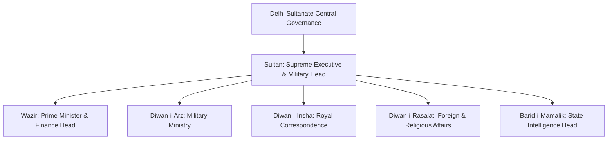

# Medieval History: Complete UPSC Notes

> **Target Exam**: UPSC Civil Services Examination (Prelims & Mains) / State PSCs  
> **Subject**: Medieval History  
> **Total Modules**: 5

---

## 📚 Table of Contents

1. [Sufi & Bhakti Movement](#1-sufi-bhakti-movement)
2. [Sultanate Period](#2-sultanate-period)
3. [Vijayanagar & Bahamani](#3-vijayanagar-bahamani)
4. [Mughal India](#4-mughal-india)
5. [Miscellaneous](#5-miscellaneous)

---

## 1. Sufi & Bhakti Movement

> **Source Subject**: [Medieval history](https://compass.rauias.com/medieval-history/)
---
## 1. Bhakti Movement
> Source: [https://compass.rauias.com/medieval-history/bhakti-movement/](https://compass.rauias.com/medieval-history/bhakti-movement/)

## Bhakti Movement

- Bhakti movement appealed to the masses due to its **use of regional languages**. Bhakti saints condemned the **caste system and gave importance to women**.

- Development of Bhakti movement took place in **Tamil Nadu between the seventh and twelfth centuries.It was reflected in the emotional poems of the **Nayanars (devotees of Shiva) and Alvars (devotees of Vishnu).These saints looked upon religion not as a cold formal worship but as a loving bond based upon love between the worshipped and worshipper. They wrote in local languages, Tamil and Telugu and were therefore able to reach out to many people.

### **Nayanars**

They were a group of **63 Shaivite saintsof Tamil Bhakti tradition. The most important among are

- Names of Nayanars were first compiled by **Sundarar.The list was later expanded by **Nambiyandar Nambi who expanded it to 63 during the reign of Rajaraja I.**

- **Tirumurai **is a collection of 13 volumes which forms the canonical literature of Nayaranars (Tamil Shaivite Bhakti tradition). The first seven volume are collectively called **Tevaram**.

- **Periya Puranamthe last book contains hagiographies of all the 63 Nayanars poet-saints. Tirumarai was entirely collectively formalised in the written form during Chola rule by Nambiyandar Nambi.

- **Tevaramdenotes first 7 volumes of 12 volume collection of Tirumurai.  It contains works of three of the most prominent Saiva Tamil poets of 7th and 8th centuries: Sambandar, Appar and Sundarar.

- Out of the **63 Nayanars Shaiva saints:Three were females, Karaikkal Ammaiyar being the most prominent.

- 12th century saw rise of **Virashaivas or Lingayatsin Karnataka who worshipped Shiva in his manifestation as a linga. They did not believe in the theory of rebirth, rejected caste hierarchy and advocated widow remarriage.

- Parachais were hagiographic narratives about the lives and deeds of individual Vaishnav and Shaivite saints. Best example of Parachai literature are narratives composed by Vaishnav hagiographer Anantdas at the end of 16th and early 17th century.

- Nathpanthis, Sidhacharas and Yogis questioned the authority of Vedas, criticized rituals, social order and used local language to win support. They condemned idolatry and preached monotheism.

### Features of the Bhakti Movement

- Abandoned rituals and sacrifices

- Stressed the importance of maintaining a pure mindset, heart, humanism and devotion.

- Monotheistic (It refers to the belief in a single, all-powerful God, as opposed to polytheism, which involves the worship of multiple gods and goddesses).

- God has either Saguna (form) or be Nirguna (formless)

- Best form of worship is singing Bhajans and realization of God by personal effort.

***Fig: Major Bhakti Saints and the regions associated with them***

---

## 2. Bhakti Acharya
> Source: [https://compass.rauias.com/medieval-history/bhakti-acharya/](https://compass.rauias.com/medieval-history/bhakti-acharya/)

## Bhakti Acharya

#### **Ramanuja(11th – 12th century)**

- Born in Tamil Nadu and had influence in Kanchi and Shrirangam. Was a Vaishnav saint who believed in idol worship. He preached Visishtadvaita philosophy, belonged to Sri Vaishanava school and emphasized on Bhakti over knowledge to attain God.

- He provided an intellectual basis for practice of bhakti (devotional worship) in three major commentaries: Vedartha samgraha (on the Vedas, earliest scriptures of Hinduism), Shri-bhashya (on Brahma-sutras), and Bhagavadgita-bhashya (on the Bhagavadgita).

- Believed Brahma as Supreme and individual souls as modes or attributes of Brahma.

- Held that even Sudras and outcastes could attain salvation by completely surrendering to the will of guru.

- For marking the 1000th birth anniversary of Ramanuja, a gigantic structure, called Statue of Equality at Hyderabad has been erected.

- Absolute surrender known as **prapattito one’s personal god is easiest way of reaching the lord.

#### **Nimabarka(12th century)**

- He was a Vaishnav saint and believed in the philosophy of dualism or Dvaitaadvaita or Bhedaabheda (creator is different from creation). He worshipped Radha-Krishna and established his ashram in Vrindavana.

- Community of Nimbark’s followers came to be called Sanakadi Sampradaya in north India. Keshav Kashmiri Bhatta was the first important preceptor of this school in north India.

- He advocated for devotion which consists of prapatti or self-surrender to God which will help in attaining grace of God.

#### **Madhvacharya(12th – 13th century)**

- Was a Vaishnavite and believed in dualism (dvaita).

- Was against the ideas of Shankara and Ramanuja. He established Brahma Samapradaya. Founded the Dvaita School of Vedanta which says that there is absolute distinction between God and who is the only independent entity, and all other realities are dependent.

- Summarized his doctrinal principles into 10 very brief treatises called the Dasaprakaranas.

#### Madhavas

- During the Vijayanagar period, Madhavas enjoyed royal patronage and they consolidated their philosophy and wrote several hagiographies and commentaries and developed their institution of Matha.

- Among the followers of Madhavas, **Vyasaraya Tirtha** was the most eminent and was highly regarded by Krishnadevaraya. Vyasraya also wrote a hagiography of Madhava.

- Krishnadevarya abdicated his throne for a short period in favour of Vyasaraya to avert a serious calamity that was predicted for Vijayanagar empire, if the emperor occupied the throne at a particular hour. Since the calamity was averted when Vyasaraya occupied the throne, Krishnadevaraya honoured him with the title of **Karnataka-simhasaneshwari.**

#### **Vallabhacharya(15th -16th century)**

- Established Rudra Sampradaya and was a contemporary of Chaitanya Mahaprabhu.

- Propagated Pushti Marga and his school was called Rudra sampradaya. He propagated Vatsalya Bhakti which focused on devotion of child Krishna.

- Developed Shuddha Advaita school of Vedanta which says that world is real, however, individual is imprisoned in his mental world. Individual can gain emancipation by Bhakti.

- Ashtachap poets including Sur das are related to his sect. Srinathji Temple at Nathdwara, Rajasthan is related to him.

---

## 3. Bhakti Movement in the North India
> Source: [https://compass.rauias.com/medieval-history/bhakti-movement-north-india/](https://compass.rauias.com/medieval-history/bhakti-movement-north-india/)

#### **Ramananda(15th century)**

- Disciple of Ramanuja. Worshipped Rama instead of Vishnu.

- Preached in Hindi over Sanskrit and taught people belonging to all varnas.

- However, he did not raise his voice against the caste system.

- Adi Granth contains some of his preaching’s. Kabir and Ravidas were Ramananda’s disciples.

#### **Kabir(15th- 16th century)**

- Preached Hindu Muslim unity and did not believe in idol worship, caste system and untouchability.

- Adi Granth contains some of his preaching’s.

- Most of his teachings are compiled in Bijak.

#### **Ravidas(1450-1540 AD)**

- Did not believe in idol worship. Came from lower caste (Tanner) from Varanasi. Adi Granth contains some of his preaching’s. Mira Bai was his disciple.

- He believed nirgun (formless) God.

- Devotional verses by Ravidas have been included in Guru Granth Sahib. Panch Vani of Dadu Panthi tradition also included verses by him.

- He conceptualised an egalitarian state known as Begumpura i.e., ‘**Land without sorrow’**. His ideal society was one where there was no discrimination based on caste, gender, social and economic status, no taxes.

#### **Guru Nanak(15th- 16th century)**

- Most of his teachings are like that of Kabir. He used to sing with a rabab in his hand and accompanied by a sarangi.

- Udasi are the name of 5 divine journeys undertaken by Nanak to spread message of peace and compassion. Bhai Mardana was his companion in his journeys.

- He travelled to All of India including Assam, Sri Lanka, Nepal, Tibet, Mecca and Arab countries.

#### **Dadu Dayal(16th- 17th century)**

- He was Kabir’s disciple and did not believe in idol worship and caste system. His main seat of influence was at Naraina, near Jaipur, Rajasthan. He believed in leading a householder’s life and was once summoned by Akbar to Fatehpur Sikri for religious discussions.

- Advocated that devotee should become non-sectarian or Nipakh.

- He asked his disciples to set up ashramas called Thambas.

#### **Chaitanya Mahaprabhu (15th- 16th century)**

- Established **Gaudiya Vaishnava or Gaudiya Sampradayadharma in Bengal and believed in advaita or non-dualism. Did not oppose idol worship. Popularized Kirtana in Bhakti.

- He practiced the cult of Radha-Krishna, the couple of divine lovers. He propounded Madhurya form of devotion in which the devotee approached God as his consort.

#### **Surdas 16th- 17th century)**

- Contemporary of Akbar and Jahangir.

- Was a Krishna devotee and believed in idol worship.

- His composition Sur Sagar was completed during Jahangir’s reign.

#### **Tulsidas(16th- 17th century)**

- Contemporary of Akbar and wrote Ramacharitamanas in Awadhi language.

- His other compositions include Dohavali, Gitavali and Kavitavali.

---

## 4. Basava & Lingayat
> Source: [https://compass.rauias.com/medieval-history/basava-lingayat/](https://compass.rauias.com/medieval-history/basava-lingayat/)

## Basava & Lingayat

- Founder Shaivite sect called Lingayats, also known as **Veershaivism or ‘ardent, heroic worship of Shiva’.His movement is also known as **Sharana movement**. He was the prime minister during the reign of **Kalachuri dynastyking Bijjala (I) in Karnataka.

- He advocated equality of all human beings, irrespective of caste and that all forms of manual labour are equally important.

- He rejected temple worship and rituals led by Brahmins and replaced it with personalized direct worship of Shiva through practices such as individually worn icons and symbols like a small linga. Basava is also known as Ishtalinga.

- His poetry was known as **Vachanaasand primarily focused socio-cultural reforms. He rejected gender or social discrimination, **superstitions, and rituals.**

### **Concepts of Lingayatism**

- Anubhav Mantapa: Considered to be first parliament in history of mankind. Proceedings of Anubhav Mantapa are recorded in the form of Vachana Literature.

- Kaayaka:  Working for survival with divine mindset which is mandatory to every individual. Without Kaayaka nobody has right to live.

- Daasooha: Part of the earning from Kaayaka must be spent on the welfare of the poor called Dasooha. It is a voluntary contribution from one’s own earned wealth.

- Sharanas are common laity followers of Lingayat beliefs. Jangamas are preachers of Lingayat faith to the people.

---

## 5. Bhakti Movement in Maharashtra
> Source: [https://compass.rauias.com/medieval-history/bhakti-movement-maharashtra/](https://compass.rauias.com/medieval-history/bhakti-movement-maharashtra/)

#### **Saint Dnyaneshwar(1275-1296 AD)**

- Also known as Dnyaneshwar or Mauli, was prominent saint of Maharashtra Bhakti movement (Warkari Sampradaya). Warkari Sampradaya has faith in Lord Vitthal or Vithoba (incarnation of Vishnu) located in Pandharpur on the banks of Bhima River.

- His work Dnyaneshwari (a commentary on Bhagavad Gita) and Amrut Anubhav are milestones in Marathi literature under patronage of Yadava dynasty of Devagiri.

- He considers humility; non–injury in action, thought and words; forbearance in the face of adversity; dispassion towards sensory pleasures; purity of heart and mind; love of solitude and devotion towards one’s Guru and God as virtues; and their corresponding moral opposites as vices.

#### **Chokhamela**

- A saint belonging to an untouchable caste. Was associated with Warkari Sampradaya in Maharashtra. His wife was Soyarabai who was also a poet.

- Composed many ‘Abhangas’ and considered as one of first low-caste poets in India.

#### **Nam Dev(1270-1350 AD)**

- Disciple of Vishoba Khechar. Liberated people from shackles of rituals and caste system. Was opposed to idol worship and religious intolerance.

#### **Tuka Ram(1601-1649 AD)**

- Born in Shudra family, which was devoted to the worship of Vithoba. Led a normal life during childhood and took to trade at the age of fourteen.

- Even Shivaji had great admiration for Tukaram.

- Tukaram is best known for his Abhanga (Devotional poetry) and kirtans (Community-oriented worship with spiritual songs). His poetry was devoted to Vitthala or Vithoba, an avatar of Hindu god Vishnu.

- He insisted that it was not possible to combine both spiritual joy and activity in the world.

#### **Ram Das(1608-1681 AD)**

- Was a devotee of Hindu deities Rama and Hanuman.

- He is thought to have met the sixth Sikh Guru Hargobind at Srinagar.

- He was the religious guru of Shivaji.

- He is most remembered for his Advaita Vendatist text, Dasbodh.

- Ramdas initiated the Samarth sect.

#### **Eknath(1533- 1599 AD)**

- Opposed caste differences and was kind towards lower castes.

- Was a devotee of Hindu deity Krishna. Viewed as a spiritual successor to the prominent Marathi saints Dnyaneshwar and Namdev.

- Wrote a variation of Ramayana, known as Bhavarth Ramayan

---

## 6. Sankaradeva (1449-1568 AD)
> Source: [https://compass.rauias.com/medieval-history/sankaradeva-1449-1568-ad/](https://compass.rauias.com/medieval-history/sankaradeva-1449-1568-ad/)

## Sankaradeva (1449-1568 AD)

- A socio-religious reformer from Assam during the 15th and 16th centuries.

- He laid the foundation of Ekasarana Dharma (Neo-Vaishavite movement), where he preached pure devotion to Krishna consisting primarily in the singing (Kirtan) and listening to (Sravan) of his deeds. Radha is not worshipped along with Krishna.

- His teaching is often known as Bhagvati dharma because they were based on Bhagvad Gita and Bhagvata Purana.

- He focused on absolute surrender to the supreme leader, Vishnu.

- Kirtana Ghosh is Sankaradeva’s famous composition.

- Madhavdeva, the disciple of Sankaradeva, took this sect forward.

### **Contributions of Sankaradeva:**

- Foundation of Sattra and Namghars: Sattras are institutional centres (monasteries for congregations). Namghars are prayer houses for congregational worship associated with Sattras.

- Naam kirtan: Sankaradeva emphasised the need for recitation of names of the lord in sat sanga or congregations of pious devotees.

- Founded Bhaona: These are plays with religious meaning prevalent in Assam. Also known as Ankiya Naat.

- Founded Borgeet: They are collection of songs composed by Sankaradeva

- Founded Brajavali: It was the language used by Sankaradeva for his compositions (Ankiya naat and Borgeet).

- Founded Sattriya Dance

---

## 7. Meykandar
> Source: [https://compass.rauias.com/medieval-history/meykandar/](https://compass.rauias.com/medieval-history/meykandar/)

## Meykandar

- He was 13th century philosopher who contributed to the development of Shaiva Siddhanta School. His literary work ‘Siva Jnana Bodham’ in Tamil is the basis on Saiva Siddhanta thought.

### **Shaiva Siddhanta**

- It was religious philosophy that originated in Tamil Nadu during Imperial Chola dynasty where Shiva is worshipped as supreme deity.

- Fourteen texts collectively called Saiva Siddhanta Sastram, form the core philosophy of Saiva Siddhanta.

- It is a dualistic philosophy based on the idea of **pati-pashu-pasha.Shiva (pati) being the lord and souls/individuals (pashu) are eternally distinct, divine entities. The rest of universe i.e., soul’s bondage (pasa/pasha) is also real but inanimate. Acts of service, good conduct, worship and spiritual discipline makes pashu earn grace of pati and helps him free from bondages.

- Earlier foundation of Shaivism was based on 28 Agamas. However, Southern Saiva Siddhanta developed on its own independent path.

---

## 8. Female Bhakti Saints
> Source: [https://compass.rauias.com/medieval-history/female-bhakti-saints/](https://compass.rauias.com/medieval-history/female-bhakti-saints/)

## Female Bhakti Saints

- Many of the bhakti poet-saints **rejected asceticismas the crucial means toward liberation; some bhaktas were instead householders. As well, themes of universalism, a general rejection of institutionalized religion, and a central focus on inner devotion laid the groundwork for more egalitarian attitudes toward women and lower-caste devotees.

- Women and shudras, both at the bottom of the traditional hierarchy ordering society, became the examples of true humility and devotion.

- Many of these women saints had to struggle for acceptance within the largely male dominated movement. Their struggle attests to the strength of patriarchal values within both society and within religious and social movements attempting to pave the way for more egalitarian access to the Divine.

- Women bhaktas wrote of the obstacles of home, family tensions, the absent husband, meaningless household chores, and restrictions of married life, including their status as married women. In many cases, they rejected traditional women’s roles and societal norms by leaving husbands and homes altogether, choosing to become wandering bhaktas; in some instances, they formed communities with other poet-saints.

- Caste status and even masculinity were understood as barriers to liberation, in essence a rejection of the hierarchy laid out by the Law Books of the Classical Period. Women bhaktas faced overwhelming challenges through their rejection of societal norms and values, without having the ability to revert to their normative roles as wives, mothers and in some cases, the privileges of their original high-caste status.

- Bhakti movement’s northward advancement (15th through 17th centuries), its radical edge as it pertained to women’s inclusion was tempered. The poetry of women bhaktas from this latter time is generally not indicative of a rejection of societal norms in terms of leaving family and homes in pursuit of divine love. Instead, some of the later poet-saints stayed within the confines of the household while expounding on their souls’ journeys, their eternal love for the Divine, as well as their never-ending search for truth.

### **Prominent Female Bhakti Saints**

- **Akkamahadevi**: A 12th-century bhakti saint from Karnataka. “Akka” means elder sister. This title was given from great philosophers of her time – Basava, Prabhu Deva, Madivalayya and Chenna Basavanna. She was an ardent devotee of Shiva. She was the first women to write Vachanas in Kannada language.

- **Lal Ded:Kashmir Shaivism. Composed Vakhs.

- **Janabai:A 13th century women belonging to shudra caste. She was a household worker of saint Namdeva, one of the most respected Bhakti saints. Though she had no formal education, she composed over 300 poems, mostly pertaining to her life – domestic chores or about the restrictions she faced being a low caste woman.

- **Mira bai or Mira: **Mira belonged to a high-class ruling Rajput family and was married to the son of Rana Sanga of Mewar at an early age but she left her husband and family and went on a pilgrimage to various places. Her poetry portrays a unique relationship with Lord Krishna as she is not only being portrayed as the devotee bride of Krishna, but Krishna is also portrayed as in pursuit of Mira. Her bhajans were compiled in Rajasthani language.

- **Bahinabai or Bahina**: A 17th-century poet-saint of Maharashtra, who wrote different abhangas, women’s folk songs that portray the working life of women especially in the fields.

- **Andal: **

- Only female Alwar saint. (Early Vaishnavite saints from south India)

- Andal saw herself as the beloved of Vishnu; her verses express her devotional love for the deity.

- **Karaikkal Ammaiyar**

- One of the 3 women Nayanars amongst the 63 Nayanars (Shaivites).

- This devotee of Shiva adopted the path of asceticism to attain her goal.

---

## 9. Sufism
> Source: [https://compass.rauias.com/medieval-history/sufism/](https://compass.rauias.com/medieval-history/sufism/)

- Sufism originated in Iran and found a congenial atmosphere in India under **Turkish rule.**

- Khanqah, institutions (abode of Sufis) set up by Sufis in northern India took Islam deeper into countryside. Mazars (tombs) and Takias (resting places of Muslim saints) became sites for propagation of Islamic ideas.

- Ajmer, Nagaur and Ajodhan or Pak Pattan (Pakistan) developed as important centres of Sufism. These also started tradition of piri-muridi (teacher and disciple).

- Hindu impact on Sufism also became visible in form of siddhas and yogic postures.

- Advent of Sufism in India is in 11th and 12th centuries.

- Sufism was a liberal reform movement within Islam. It stressed on elements of devotion and love as a means of realization of God. It recommended a Pir or spiritual guru to enhance spiritual development. It emphasized on meditation, musical performances (Sama), fasting, charity and ascetic practices.

- Sufis believed in concept of **Wahdat-ul-Wajud (Unity of Being) **which was promoted by Ibn-i-Arabi. He opined that all beings are one. Different religions were identical. This doctrine gained popularity in India. It was like teachings of Upanishads.

- One of the early Sufis of eminence, who came to India, was **Al-Hujwariwho died in 1089, popularly known as **Data Ganj Baksh (Distributor of Unlimited Treasure).**

- In the beginning, main centres of Sufis were Multan and Punjab. By 13th and 14th centuries, Sufis had spread to Kashmir, Bihar, Bengal and Deccan.

- Sufi Silsila’s were divided into two categories **Ba-sharawho followed Islamic tenets and **Be-sharawho did not believe in Sharia.

---

## 10. Major Sufi Orders in India
> Source: [https://compass.rauias.com/medieval-history/major-sufi-orders-india/](https://compass.rauias.com/medieval-history/major-sufi-orders-india/)

#### **Chishti Order**

- Most influential Silsila of India.

- Akbar was a follower of Chishti order and was devoted to Salim Chishti of Fatehpur.

- Established by Khwaja Moinuddin Chishti in Ajmer, who came to India during the reign of Muhammad Ghori.

- Iltutmish built Moinuddin Chishti’s dargah at Ajmer. Chishti saints led austere life and did not accept private property and state assistance.

- Other notable saints of this order were Hamiduddin Nagori, Qutbuddin Bhaktiyar Kaki, Baba Farid and Nizamuddin Auliya.

- **Chisti order:** Chishti order was divided into two factions after the death of Baba Farid - **Nezamia & Sabiria.**

- **Sabiria faction **was founded by Makhdum Alauddin Ali Sabri. He isolated himself from the world and reclused himself from worldly affairs. Shaikh Abdul Quddus Gangohi was also associated with this school.

#### **Suhrawardy Order**

- Brought to India by Bahauddin Zakaria who established this order in Multan**.Unlike Chishti saints, they lived a life of luxury and accepted state assistance.

- Shaikh Bahauddin Zakaria was the founder of Suhrawardi order in India. He was associated with the court of Iltutmish and was appointed as Shaikh-ul-islam by Iltutmish.

#### **Naqshbandi Order**

- They emphasised primacy of Shariat and was opposed to biddat (innovations, changes introduced in Islamic practice compromising purity of Islam).

- **Sheikh Ahmad Sirhindibelieved that God has created the world and was separate from it. God was master and humans slave. He proposed the doctrine of Wahdut-ul-Shuhud (apparentism).

#### **Firdausi order**

- Firdausi silsilah was a branch of Suhrawardi silsilah. Rajgir was the main seat of this silsilah and the most prominent sufi belonging to this order was Shaikh Sharfuddin Yahya Maneri. This order believed in Wahdat-ul-wujud.

#### **Qadiri order**

- Qadiri order was orthodox in its orientation and its teachings were similar to orthodox ulema. They maintained close relations with the state and nobility and accepted state charity.

- The Qadiri order was popular in Central Islamic countries and founded in Baghdad by Abdul Qadir Jilani in 1166 AD.

- This order was popular in Punjab, Sindh and Deccan. Dara Shukoh was a great devotee of Miyan Mir at Lahore, who was associated with the Qadiri order.

#### **Rishi Order **in Kashmir

- Rishi order of Sufism emerged in Kashmir in the 15th-16th centuries. This order was established by **Sheikh Nuruddin Wali **also known as **Nund Rishi**.

- This order had a deep impact on the lives of people of Kashmir particularly in rural areas.

- This school drew inspiration from Kashmiri shaivism which was popular in Kashmir.

**SUFI ORDERFOUNDER AND PLACEKEY POINTS**

|  |  |  |
| --- | --- | --- |
| Chishti | Khwaja Moinuddin Chishti, Ajmer |  |
| Suhrawardy | Shiabuddin Suhrawari, Multan |  |
| Firdausi | Badruddin Samarqandi, Bihar | Influenced by Suhrawardy order. |
| Naqshbandi | Khwaja Baqi Billah | Sheikh Ahmad Sirhindi |

---

## 11. Sufi Literature
> Source: [https://compass.rauias.com/medieval-history/sufi-literature/](https://compass.rauias.com/medieval-history/sufi-literature/)

- Treatises or manuals dealing with Sufi thought and practices –Ex. Kashf-ul-Mahjub of Al Hujwiri. It enables historians to see how traditions outside sub-continent influenced Sufi thought in India.

- **Malfuzat (Conversations or sayings of Sufi saints):**Malfuzats were compiled by different Sufi Silsilas, with the permission of Shaikhs. Fawadul Fawaid is the compilation of sayings of Nizammuddin Auliya.

- **Maktubat (Collections of letters):Letters written by Sufi masters, addressed to their disciples and associates – while these tell us about the Shaikh’s experience of religious truth that he wanted to share with others, they also reflect the life conditions of the recipients and are responses to their aspirations and difficulties, both spiritual and mundane.

- **Tazkiras (Biographical accounts of the saints):Most famous Tazkira is the Akhbar-ul-Akhyar of Abdul Haqq Muhaddis Dehlavi. Authors of Tazkiras often sought to establish precedence of their own orders and glorify their spiritual genealogies.

---

## 12. Personalities Associated With Sufism
> Source: [https://compass.rauias.com/medieval-history/personalities-associated-sufism/](https://compass.rauias.com/medieval-history/personalities-associated-sufism/)

#### **Al Hujwiri**

- Also known as **Data Ganj Baksh.**

- He was a resident of Ghazni in Afghanistan and was forced to come to India as a captive of invading Turkish army.

- He settled in Lahore

- He wrote **Kashf-ul-Mahjub (Unveilling of the Veiled)to explain the meaning of tasawwuf.

#### **Amir Khusrau(1253-1325 AD)**

- He was a great poet, musician and disciple of Shaikh Nizamuddin Auliya.

- Contributions:

- Gave a unique form to the Chisti sama by introducing the qaul (saying in Arabic), hymn sung at the opening or closing of qawwali.

---

## 13. Socio-Cultural Contributions of Bhakti & Sufi Movements
> Source: [https://compass.rauias.com/medieval-history/socio-cultural-contributions-bhakti-sufi-movements/](https://compass.rauias.com/medieval-history/socio-cultural-contributions-bhakti-sufi-movements/)

- Sufi and Bhakti saints brought the liberal ideas about social structure and religious thoughts.  They propagated equality, humanity and brotherhood among all classes of people (Sant Kabir and Guru Nanak had preached a non-sectarian religion based on universal love)

- These saints maintained close relations with locals and common man. This helped them to gain the authority on their ideas and thoughts. Lack of political association brought them closer to reformism.

- These saints propagated their thoughts and belief system in the local languages. As their popularity grew, so grew the local languages such as Awadhi, Punjabi, Marwari, Marathi, Kannada etc.

- These saints also laid down the culture of sacrifice and charity to all the needy people irrespective of their class or caste (e.g., concept of Langar among Sikhism).

- Bhakti and Sufi movements were supported by the local music and songs (Bhajans and Qawwali). This not only helped them to spread their ideas but also popularize the music, songs and dance forms (e.g., Manipuri Dance, Kathak dance, songs from Gita Govinda).

- Bhakti saints called to end the orthodox practise in the Hindu religion such as idol worship, sati system, use of priest to connect to the God etc.

- Because of the Bhakti saints, people belonging to the backward caste could follow the path of devotion and worship god of their choice (e.g., Warkari Sect in Maharashtra)

---

---

## 2. Sultanate Period

> **Source Subject**: [Medieval history](https://compass.rauias.com/medieval-history/)
---
## 1. Delhi Sultanate (1206-1526 AD)
> Source: [https://compass.rauias.com/medieval-history/delhi-sultanate/](https://compass.rauias.com/medieval-history/delhi-sultanate/)

## Delhi Sultanate (1206-1526 AD)

- Origin of Islamic rule started in India with the capture of Sindh by **Muhammad Bin Qasim**. Singh then was ruled by a king called Raja Dahir. This incident has been captured in the book ‘Chachnama.’

- **Mahmud Ghazni **invaded India 17 times and captured Punjab. He was given the title of ‘Right Hand of the State’ by the Caliph. He raided towns such as Mathura, Kannauj, Somnath, Thanesar, Nagarkot etc.

### **Sources of Medieval History**

- Arabic was the language of Islamic world, so the earliest available historical writings of the period were written in Arabic.

#### **Facets of Arab Historiography**

- **History of Age: **Their narratives not just focus not just on story of rulers and political happenings but also common man, socio-economic, cultural and religious developments.

- **Isnad (chain of narrators):Arab historians narrate every event with

### **Sources for the Study of Delhi Sultanate**

- **Al-Beruni**: Tarikh-Al-Hind (Indian Philosophy and Religion written in Arabic)

- **Minhaj us Siraj**: Tabaqat-i-Nasiri (1260) (World Islamic History written in Arabic.

- **Ziauddin Barani:Tarikh-i-Firoz Shahi(1357) History of Delhi Sultanate up to Firuz Tughlaq.

- **Amir Khusrau**: Mifta Ul Futuh (Victories of Jalal-ud-din Khalji); Khazain Ul Futuh (Victories of Allauddin Khalji - Texts in Persian)

- **Tughlaq Nama(History of Tughlaq dynasty in Persian)

- **Shams-i-Siraj Afif:Tarikh i Firuz Shahi (after Barani’s account of Delhi Sultanate in Persian)

- **Ghulam Yahya Bin Ahmad: **Tarikh-i-Mubarak Shahi (Written in Persian during the reign of Sayyid ruler Mubarak Shah)

- **Ferishta**: History of the Muslim Rule in India (Persian)

---

## 2. Slave Dynasty
> Source: [https://compass.rauias.com/medieval-history/slave-dynasty/](https://compass.rauias.com/medieval-history/slave-dynasty/)

#### **Qutbuddin Aibak(1206-10 AD)**

- Foundation stone of Qutub Minar was kept under his reign to honor saint Qutbuddin Bhaktiyar Kaki.

- Built **Adhai Tin ka Jhonprah **mosque at Ajmer.

#### **Iltutmish (1211-36 AD)**

- Created a Group of 40 of his close associates known as **Turk-e-Chahalgani.**

- Developed **Iqta Systemunder which iqtas (piece of land) was given in lieu of cash salary.

- He favoured special slaves purchased for military service called **bandaganto man important administrative offices. Since they were totally dependent upon their master, the had complete trust of the emperor.

- Introduced **silver tankaand copper jeetal. Name of Caliph of Baghdad was inscribed on his coins.

- **Completed construction of Qutab Minar.**

- Chenghiz Khan was active during his time. Though Chenghiz khan did not attack India.

#### **Raziya Sultan(1236-40 AD)**

- She tried to appoint non-Turks in important posts. This had her unpopular among Turkish nobility who dethroned her.

- She appointed an African siddi slave as the amir-i-akhur (master of the horse).

#### **Balban(1266-87 AD)**

- Destroyed chahalgani system. Introduced ceremonies like sijda, paibos and nauroz (Persian new year) to emphasize noble’s inferiority to the king.

- Created a department of spies and intelligence called **Diwan-e-Baridand reorganized **Diwan-i-arz(military department).

---

## 3. Khilji Dynasty
> Source: [https://compass.rauias.com/medieval-history/khilji-dynasty/](https://compass.rauias.com/medieval-history/khilji-dynasty/)

***Fig: Territory under Khilji Dynasty***

#### **Jalaluddin Khilji (1290-96 AD)**

- Overthrew the successors of Balban to establish Khilji dynasty.

- Also known as Shaista Khan.

- Established Diwan-e-wakoof, state expenditure department.

#### **Allaudin Khilji (1296-1316 AD)**

- Forbade his nobles to hold social gatherings like festive parties to stop them from conspiring against him. Banned wine and intoxicants.

- Reduced khuts and muqaddams to ordinary cultivators.

- Introduced market control measures by fixing prices of all commodities which were not allowed to be increased even by a dam during famine.

- Created Diwan-i-Riyasat and Shabha-i-Mandi to regulate fixed market prices.

- Established Diwan-i-Mustakhraj for revenue administration.

- He was the first sultan to pay his soldiers in cash. Introduced three categories of soldiers: paidal, ek aspah & do aspah. Introduced dagh or branding system of horses so that the soldiers may not bring horses of inferior quality.

- Allaudin’s Chittor expedition got its mention a century late in the work of Malik Muhammad Jayasi’s ‘Padmaavat.’

- Built Siri Fort and Alai Darwaza.

---

## 4. Tughlaq Dynasty
> Source: [https://compass.rauias.com/medieval-history/tughlaq-dynasty/](https://compass.rauias.com/medieval-history/tughlaq-dynasty/)

***Fig: Territory under Tughlaq Dynasty***

#### **Ghiyasuddin Tughlaq (1320-25 AD)**

- Established Tughlaq dynasty.

- He exempted khots and muqaddams from paying taxes on land and cattle.

- Levied Kharaj on the basis on actual produce and not based on estimated yields.

#### **Muhammad Bin Tughlaq (MBT)(1325-51 AD)**

- Accounts by **Ibn Batutain Rehla and Ziauddin Barni in Tarikh-i-Firuzshahi provide information.

- Transferred his capital from Delhi to Deogir.

- Introduced token currency and decided to introduce a bronze coin which was to have the same value as silver tanka.

- Along with the practice of appointing officials from bandagan, Tughlaq elevated people of humble birth to important offices. For ex. MBT appointed a wine distiller, barber, cook and two gardeners to high administrative offices. Ziyauddin Barani criticised this.

- Did not reduce khuts and muqaddams to ordinary cultivators.

- Set up an agricultural department **Diwan-i-Amir-Kohito improve cultivation.

- **Begumpuri Mosquebuilt during his reign was the main mosque of Jahanpanah, the new city in Delhi built by Tughlaqs.

#### **Firoz Shah Tughlaq (1351-88 AD)**

- Made Jizya a separate tax and set up a large department of public works.

- Large number of canals were constructed during his time. For ex. Two canals on Yamuna, one on Sutlej and one on Ghaggar.

- Paid his soldiers in land revenue assignments.

- Abolished **ghari and charai tax**, limited total taxes above kharja to 4%.

---

## 5. Lodhi Dynasty
> Source: [https://compass.rauias.com/medieval-history/lodhi-dynasty/](https://compass.rauias.com/medieval-history/lodhi-dynasty/)

#### **Bahlol Lodhi (1451-89 AD)**

- Established Lodhi dynasty.

#### **Sikandar Lodhi (1489-1517 AD)**

- Ruled from Agra.

- Contemporary of Mahmud Behera of Gujarat, Rana Sangha of Mewar.

- Highways were made free of robbers and dacoits.

- Established a new measurement of yard called Gazz-i-Sikandari which continued in use till modern times.

- Demolished many Hindu temples and imposed restrictions on Hindus.

- Moth ki Masjid was built during his reign by one of his ministers.

- Mosque of Jamali Kamali located in Mehrauli was built.

#### **Ibrahim Lodhi(1517-26 AD)**

- Ibrahim Lodhi’s arrogant nature led Daulat Khan Lodhi (Punjab Governor) invite Babur to invade India.

- Babur marched against Lodhi in the first battle of Panipat (1526). Afghan kingdom was short lived.

---

## 6. History of Kashmir
> Source: [https://compass.rauias.com/medieval-history/history-kashmir/](https://compass.rauias.com/medieval-history/history-kashmir/)

#### **Sikandar Shah (1389-1413 AD)**

- Vehemently persecuted Brahmins in valley and imposed Jizya on Hindus.

#### **Zainul Abidin (1420-70 AD)**

- Conciliated with Hindus and restored their temples. Abolished Jizya and cow slaughter and to respect Hindu traditions withdrew ban from Sati.

- Constructed Zaina Lanka, artificial island on Woolur Lake on which he built a palace and a mosque.

- Ordered translation of Mahabharata and Rajatarangini into Kashmiri.

---

## 7. Society of Delhi Sultanate
> Source: [https://compass.rauias.com/medieval-history/society-delhi-sultanate/](https://compass.rauias.com/medieval-history/society-delhi-sultanate/)

- Slavery had been adopted but the Arabs and later by the Turks also. It was normal to enslave the prisoner of war. However, slaves were allowed to get married and have personal property.

- Caste and varna system continued during this period also. Shudras were not allowed to read or recite Vedas but allowed in case of puranas.

- Women had the same ancient conditions of derogation. She was subjected to early marriage (before puberty), widow remarriage was restricted in three upper castes, Sati was prevalent, sonless widow was allowed to hold property rights, and the purdah system became popular (started as security means).

- Religious conversion began during this period. Sometimes it was forced, other times it was choice based. Temples were converted into mosques for the first time in India (mostly during the war time).

---

## 8. Polity During Delhi Sultanate
> Source: [https://compass.rauias.com/medieval-history/polity-during-sultanate-period/](https://compass.rauias.com/medieval-history/polity-during-sultanate-period/)

- Turkish sultans ruled as Lieutenant of the faithful **(Abbasid Caliph).**

- The Sultan (king) was responsible for administration and acted as commander-in-chief. He looked after the law and justice, appointed judges and acted as a court of appeal. Even high officials and ulamas were not spared during Balban's and Muhammad Bin Tughlaq reign.

- No clear law of succession developed among Muslim rulers.

- **Wazir**: He was a prime military leader in the initial phase, but later he held the responsibility of the revenue department. Firoz Shah Tughlaq made it hereditary.

- **Diwan-i-arzheaded by Ariz-i-Mamalik was responsible for recruitment and payment in the military department. Alauddin paid salary in cash.

- **Diwan-i-risalat:dealt with religious matters.

- **Diwan-i-insha**: dealt with the state of correspondence.

- **Iqta:**  Large parcel of land (later called subas). Holders were called muqtis or walis. These muqtis were responsible to maintain law and order along with salary allocation to soldiers they had. Below Iqta, there was shiqs and pargana (headed by amil).

- Muslims and Hindus were governed by their respective laws.

- **Zawabit:regulations framed by the Sultan to supplement Muslim laws.

---

## 9. Economy of Delhi Sultanate
> Source: [https://compass.rauias.com/medieval-history/economy-delhi-sultanate/](https://compass.rauias.com/medieval-history/economy-delhi-sultanate/)

- According to Ibn Batuta, Soil was fertile and two crops were grown in a year. Rice was grown thrice a year.

- Silver coins were tankas and copper were dirham. Urban economy was very vibrant.

- Turks introduced the manufacturing of paper in India.

- **Dhunia**: Cotton carder's bow.

- **Rahat: **Persian wheel used to lift water for irrigation from deeper levels.

- **Karkhanas: **they manufactured costly articles made of silk, gold and silver ware.

- Major imports included grade textiles (satin), glassware and horse from west Asia, and raw silk and porcelain came from China. Gujarat, Bengal and Sind were major trading regions.

- Road system (Peshawar to Sonargaon and to Daultabad) was developed. This period also saw the rise and development of the postal system.

- Trade was flourishing and many new towns came up to encourage trade. Some communities like Banias, Marwaris and Multanis made trade their vocation.

- Banjaras traded in caravans and were continuously on the move carrying goods from one place to another.

- Delhi was centre for incoming and outgoing goods.

- There was rice from east, sugar from Kannauj, wheat from Doab and fine silks from South. Besides, there were luxury goods like metalware, ivory, jewellery, cotton textiles etc. Goods from outside India like East Africa, Arabia and China also came to Delhi.

- According to Ibn Batuta, Delhi was a magnificent city.

- **Sericulture:Breeding of mulberry silkworm for producing true silk, reached India from China in 14th century. However, Tussar and Muga silk were produced in India from earlier times.

- Peasants were assured **an inalienable right to landuntil they tilled it and paid their share of revenue demand by state.

- Highest category of peasants were **khots and muqaddams (headmen),who assisted authorities in collection of land revenue. In return, they were entitled to some concessions, including exemption from certain taxes.

- **Irrigation:Traditional araghatta (water wheel) was attached with a gearing mechanism to allow it to be powered by animals.

- Growth of trade encouraged the use of money and at this time came into use the silver tanka (coin).

---

## 10. Architecture Under Delhi Sultanate
> Source: [https://compass.rauias.com/medieval-history/architecture-under-delhi-sultanate/](https://compass.rauias.com/medieval-history/architecture-under-delhi-sultanate/)

The new features brought by the Turkish conquerors were:

- The dome

- The lofty towers

- The true arch unsupported by beam

- The vault.

- They also brought with them a thorough understanding of how to use concrete and mortar, which had previously been scarcely employed in India.

- **The Adhaidin ka Jhonprain Ajmer boasts an excellently carved Mehrab made of white marble as well as a magnificent arch screen.

- The mausoleum of Ghiyasuddin Balban at Mehrauli (Delhi), is said to be the first example of a real or voussoired arch. The use of the voussoired arch and dome was established for all time during the Khilji era. One of the most well-known examples is **Hazrat Nizamuddin Aulia's mausoleum in Delhi.**

- The austere simplicity and sobriety of the Tughlag structures likely reflect a lack of financial resources as well as puritanical standards. The structures are marked by their dark look and sloping walls. **The fort of Tughlaquabad, the tomb of Ghiyasuddin Tughlaq,which marked a new phase in [Indo-Islamic architecture](https://compass.rauias.com/art-culture/indo-islamic-architecture/) by serving as a model for later tombs, and the fort of Adilabad are some notable Tughlaq monuments.

- The Sayyid period was too brief to permit the construction of elaborate buildings.

- The main characteristic of [Lodhi architecture](https://compass.rauias.com/art-culture/architecture-under-lodhi-dynasty/) was the construction of double domes. The Moth ki Masjid, constructed by Sikandar Lodhi's prime minister, is one notable structure.

---

## 11. Literature During Delhi Sultanate
> Source: [https://compass.rauias.com/medieval-history/literature-during-delhi-sultanate/](https://compass.rauias.com/medieval-history/literature-during-delhi-sultanate/)

- Development of Arabic literature was very limited (mostly translating the Sanskrit text). The reason was the background of invading dynasties being Turkish in race but Persian in culture. They gave more importance to the development of **Persian literature over Arabic**.

- **Al-Beruni wrote his masterpiece, Kitab-ul-Hind in Arabic**.

- Only one historical work was written in Arabic during this period viz., ‘Abdullah al-Makki’s Zafaru’l-Walih, who traces the history of Gujarat. Rise of regional empires promoted the local languages and literature. Jaunpur promoted Awadhi and Hindi, Vijayanagar promoted Telugu while Bahmani promoted Marathi.

- **Translation of Sanskrit works into Persian:Notable works translated were:
- **Tuti Nama (Book of Parrot),which is a compilation of 52 short stories.
- Zainul Abidin (Kashmir) ordered translation of Mahabharata and Rajatarangini into Kashmiri.
- Firuz Tughlaq ordered translation of medical theses from Sanskrit.
- Compendiums on astronomy and astrology, music and wrestling were also translated to Sanskrit.

- However, no attempt was made to translate Persian into Sanskrit or any vernacular language.

---

---

## 3. Vijayanagar & Bahamani

> **Source Subject**: [Medieval history](https://compass.rauias.com/medieval-history/)
---
## 1. Vijayanagar Empire
> Source: [https://compass.rauias.com/medieval-history/vijayanagar-empire/](https://compass.rauias.com/medieval-history/vijayanagar-empire/)

## Vijayanagar Empire

### **Sources of Vijayanagar Empire**

- **Srirangam Copper plates of Devaraya 2provide the genealogy and achievements of VN Empire.

- **Nicolo Conti**, Venetian traveller visited the court of Devaraya 1 and gave an account of VN Empire.

- **Abdur Razzaq**, Persian traveler stayed at the court of Zamorin at Calicut and described the wealth and life of VN Empire.

- **Domingo Paes, and Barbosa**, Portuguese travellers visited the court of Krishnadevaraya of Vijayanagar.

- **Caesar Frederick,a Italian traveller **visited Vijayanagar in 1567-68AD under the reign of Sadashiva Raya

- **Ruins of Hampiwere discovered by British engineer Colonel Colin Mackenzie.

Four Dynasties- **Sangam, Saluva, Tuluva and Araviduruled Vijayanagar from AD 1336 to 1672. While historians use the term Vijayanagar Empire, contemporaries described it as **Karnataka Samrajyamu**.

#### **Sangama Dynasty (1336-1485 AD)**

- **Harihara- I and Bukka- Ilaid the foundation of Vijayanagar.

- There was constant conflict between Vijayanagar Empire and Bahmani kingdom after the foundation of kingdoms.

- They served under Kakatiya rulers of Warangal. They later proclaimed their independence and founded a new city on **south bank of Tungabhadra Rivernamed it Vijayanagar.

- Clash of interests in three areas:
- **Raichur doabwhich was a fertile region between Krishna and Tungabhadra.
- Over the fertile areas of Krishna-Godavari delta.

- Marathwada

- **Gajapati dynastylocated in Odisha was also engaged in conflict with Vijayanagar.

- **Bukka-I **strengthened the city of Vidyanagar and renamed it as Vijayanagar and he was succeeded by his son Harihara-II.

- **Devaraya I: **He built a dam across the Tungabhadra with canals leading to the city.Nicolo Conti**, Venetian traveller visited the court of Devaraya 1

- **Devaraya II: **He inducted **muslim cavalrymen and archers in his armyat a large. This practice was started by **Devaraya I.He had the title of Gajabetekara (elephant hunter). His court poet was Dindima.He was called Praudh Deva Raya

#### **Saluva dynasty (1486-1505 AD)**

- **Founder**: Saluva Narsimha

- **Vasco Da Gama landed in Calicut during his reign in 1498**.

#### **Tuluva Dynasty (1505-70 AD)**

- **Founder**: Vira Narsimha

- **Krishna Devaraya: Took titles of Yavanaraja Sthapnachrya, Abhinav Bhoja, Andhra Bhoja and Andhra Pitamah.**
- **Authored Amukta Malyada (Telugu work on polity) and Sanskrit drama, Jambavati Kalyanam.**
- He had eight eminent scholars **Ashtadiggajas at his royal court.**
- Peddana
- Timmaya
- Bhattamurthi
- Dhurjati
- Mallan
- Raju Ramchandra
- Surona
- Tenali Ramakrishna
- Built a new city called **Nagalapuram in memory of his queen Nagaladevi**.
- He was a **contemporary to Babur.**

- **Domingo Paes, and Barbosa**, Portuguese travellers visited the court of Krishnadevaraya.

- **Achyuta Devaraya: **Farnao Nunez, a Portuguese horse trader visited in his reign.

- During the reign of **Rama Raya**, the combined forces of Bijapur, Ahmednagar, Golkonda and Bidar defeated him at the Battle of Talaikotta in 1565 which marked an end of the Vijayanagar Empire. The last ruler of Vijayanagar Empire was **Sri Ranga 3.**

#### **Aravidu Dynasty (1570-1650 AD)**

- **Founder:Tirumala.

- **He shifted the capital to Penugonda**

---

## 2. Administration of Vijayanagar Empire
> Source: [https://compass.rauias.com/medieval-history/administration-vijayanagar-empire/](https://compass.rauias.com/medieval-history/administration-vijayanagar-empire/)

## Administration of Vijayanagar Empire

- Empire was divided into different administrative units called **Mandalams, Nadus, Sthalas and finally into gramas**.

- **Governor of Mandalamwas called **Mandaleshwar or Nayak**. Nayaks were allotted territory called Nayakatan and Nayaks were frequently transferred from one territory to other.

- Besides land revenue, tributes and gifts from vassals and feudal chiefs, customs collected at ports, taxes on various professions were other sources of income to the government.

- Army consisted of cavalry, infantry, artillery & elephants.

- **Top-grade officers of armywere known as **Nayaks or Poligars**. They were granted **land in lieu of their services which were called amaram**.

- A body of 12 functionaries known **as Ayangars, conducted village affairs.**

- Manyams were **tax free lands.**

- **Nayankara System:King was the head of the Empire. Empire was divided into provinces, Nadus and villages. Village assemblies functioned in the same way as it did during Chola period. Day-to-day administration of village was done by officers known as 'Ayyagars', who inherited the post. Position of Nayaks in village administration was equal to that of Nayaks in Central Administration.

### **Nayankara System**

- The administration which existed in the provinces was called as ‘**Nayankara system’.**  According to the system, all the land were owned by the rulers.

- Kings distributed the territories among his generals known as **sima or sirmai.**  They functioned under his control and acted as feudal lords. Nayakas maintained an armed contingent and collected taxes on behalf of the state.

- Based on the system most of the lands were distributed among the Nayaks (land lords).  They lived with pomp and show and constructed forts for their protection.  They accepted the supremacy of the Vijayanagar rulers and acted as their protectors.

- Nuniz, in his account mentioned that the Nayaks collected one tenth of the total revenue as land tax that was very high.

- Nayaks gave half of the revenue to central government.  Rest of the amount was utilised by the Nayaks for administration, military and other charitable works.

- During the later part of Vijayanagara empire and after the end of Vijayanagara empire, these Nayaka polities emerged into independent polities. Examples include **Ikkeri in northern Karnataka**, **Odeyars in southern Karnataka**, **Senji (Gingee), Thanjavur and Madurai in Tamil Naduand **Cholamandalam and Pandiamandalam in southern Tamil Nadu**.

---

## 3. Socio-Economic Conditions During Vijayanagar Empire
> Source: [https://compass.rauias.com/medieval-history/socio-economic-conditions-during-vijayanagar-empire/](https://compass.rauias.com/medieval-history/socio-economic-conditions-during-vijayanagar-empire/)

- Sangama rulers were mainly **Saivaites and Virupakshawas their family deity.

- Changing role of Brahmanas: they became in-charge of major forts of the empire. They joined empire as administrators and accountants.

- **Diamond [mines](https://compass.rauias.com/geography/mining/) were in Kurnool and Anantapur district**.

- Chief gold coin was varaha or pagoda. Perta was half a Varaha. Tar was a silver coin. Jittal was a [copper](https://compass.rauias.com/geography/copper/) coin.

- Chief items of export were [cotton](https://compass.rauias.com/geography/cotton/), silk, spices, rice, saltpetre and sugar. The imports consisted of horses, pearls, copper, coral etc.

- The art of shipbuilding had developed.

- **Women:Only empire in Medieval India which employed women in state services**. [Women even went to battles](https://compass.rauias.com/current-affairs/battles-of-maoist-women/). Widow remarriage was promoted.

---

## 4. Cultural Contributions of Vijayanagar Empire
> Source: [https://compass.rauias.com/medieval-history/cultural-contributions-vijayanagar-empire/](https://compass.rauias.com/medieval-history/cultural-contributions-vijayanagar-empire/)

- Peak of literary achievement was reached under Krishnadevaraya, who himself was a Sanskrit and Telugu scholar. His famous court poet Allasani Peddana wrote Manucharitam.

- The relationship between kings, sects and temples can be explained in terms of four assertions:

- Temples were basic for sustaining kingship.

- Sectarian leaders were the connecting links between kings and temples.

- Though the routine supervision of the temples was done by local sectarian groups, the task of solving disputes concerning temples was in the hands of the king.

- The intervention of the king in the above matter was administrative, not legislative.

---

## 5. Architecture of Vijayanagar Empire
> Source: [https://compass.rauias.com/medieval-history/architecture-vijayanagar-empire/](https://compass.rauias.com/medieval-history/architecture-vijayanagar-empire/)

- Over the years Vijayanagar (what is now popularly called as Hampi) developed a unique style of architecture, later came to be known as Vijayanagar Architecture. It borrowed boldly from various schools of architecture prevailed at the time and blended them superbly to make its own style of architecture.

- Most important temples of Vijayanagar style are found in **Hampi ruins**. **Vittalaswamy & Hazra Ramaswamy **temples are best examples of this style.

- Vijayanagar architectural style was known as a new design form under already established Dravida style. This was later called **as Provida style.**

- Its architecture replaced **the soft stonewith hard stones.

- It showed the blend of Hindu and Islamic forms of architecture.

- Important temples: **Vittal temple, Lepakshi temple, Virupaksha temple and Narshimha Temple.**

---

## 6. Bahamini Kingdom
> Source: [https://compass.rauias.com/medieval-history/bahamini-kingdom/](https://compass.rauias.com/medieval-history/bahamini-kingdom/)

- To the north of Vijayanagar state across the Tungabhadra River rose a new Islamic state, called the Bahamani, now known as Andhra Pradesh.

- Founder of Bahmani Kingdom was Alauddin Bahman Shah also known as Hasan Gangu in 1347. Its capital was Gulbarga.

- Important rulers of this kingdom were Allaudin Bahman Shah, Muhammad Shah 3 and Firoz Shah.

- Ahmad Wali Shah shifted the capital from Gulbarga to Bidar.

- Power of this kingdom reached its peak under Muhammad Shah 3 because of the advice and services of his minister Mahmud Gawan, a Persian merchant.

- By the year 1526, Bahmani kingdom got divided into Ahmednagar, Bijapur, Berar, Golkonda and Bidar.

---

## 7. Deccani Kingdom
> Source: [https://compass.rauias.com/medieval-history/deccani-kingdom/](https://compass.rauias.com/medieval-history/deccani-kingdom/)

## Deccani Kingdom

#### **Berar (1498- 1574 AD)**

- **Founder**: Fataullah Imad Shah

- **Dynasty**: Imad Shahi

- **Annexed by**: Ahmadnagar

#### **Bijapur (1489-1686 AD)**

- **Founder**: Yusuf Adil Shah

- **Dynasty**: Adil Shahi

- **Annexed by**: Aurangzeb

#### Ibrahim Adil Shah

- He was a king of the Sultanate of Bijapur and was a member of Adil Shah dynasty. This reign is greatest period of this dynasty.

- He was a skillful administrator, artist, poet and a gorgeous patron of the arts. Culturally, Bijapur kingdom was located between the centers of Marathi (Pandharpur-Vithoba cult) and Kannada bhakti (Basava Lingayat).

- Secular Attitude:

- He was deeply influenced by Shaivism and was fascinated with Hinduism. Though, he adopted Sunni sect of Islam.

- He endowed many temples, affirm the rights of pilgrims at popular shrines, and consciously exalted Hindu gods to the heights of kingly devotion.

- Several his Farman’s begin with an invocation of the Goddess Saraswati.

- There were many in his court who believed that Ibrahim Adil Shah II was secretly practicing Hinduism which was apostasy.

- Renamed city of Bijapur (originally Vijayapura, the City of Victory) as Vidyapur (City of Learning).

- **Contribution to Art & Culture by Bijapur kingdom**

- **Music:He authored **Kitab-i-Nauras**, a collection of songs in praise of Hindu deities as well as Muslim saints.

- **Literature:He had an excellent grasp of Sanskrit, far superior to his grip over Persian, the language of his Iranian ancestors. He was also more comfortable in Marathi

- **Architecture:**

- Bijapur in its heyday rivalled and at time surpassed its Mughal contemporaries such as Delhi, Agra and Lahore in magnificence.

- Important structures in Bijapur: Gol Gumbaz, Ibrahim Rouza, Jama Masjid, massive cannon called Malik-e-Maidan.

- He gave patronage to famous Turkish architect named Malik Sandal. Malik Sandal later designed the Ibrahim Rouza, the tomb of Ibrahim Adil Shah II.

- Extensive use of fish motifs in the buildings.

#### **Ahmadnagar (1490-1633 AD)**

- Founder: Malik Ahmad

- Dynasty: Nizam Shahi

- Annexed by: Shahjahan

#### **Golconda (1518-1687 AD)**

- Founder: Quli Qutub Shah

- Dynasty: Qutub Shahi

- Annexed by: Aurangzeb

#### **Bidar (1526-1610 AD)**

- Founder: Amir Ali Barid

- Dynasty: Barid Shahi

- Annexed by: Bijapur

AHMADNAGAR (1490-1633 AD)

-

GOLCONDA (1518-1687 AD)

-

BIDAR (1526-1610 AD)

-

---

## 8. Socio-Cultural Conditions During Bahamini Kingdom
> Source: [https://compass.rauias.com/medieval-history/socio-cultural-conditions-during-bahamini-kingdom/](https://compass.rauias.com/medieval-history/socio-cultural-conditions-during-bahamini-kingdom/)

## Socio-Cultural Conditions During Bahamini Kingdom

- Ibrahim Adil Shah introduced Dakhini in place of Persian as court language.

- Muhammad Adil Shah built Gol Gumbaz.

- Muhammad Quli Qutub Shah founded Hyderabad originally known as Bhagyanagar. He also built Charminar.

### **Art and Architecture During Bahamini Kingdom**

- The Persianate Indo-Islamic style of architecture developed during this period was later adopted by the Deccan Sultanates as well.

- The Gulbarga Fort, Haft Gumbaz, and Jama Masjid in Gulbarga, Bidar Fort and Madrasa Mahmud Gawan in Bidar, are the major architectural contributions.

- The later rulers are buried in an elaborate tomb complex, known as the Bahmani Tombs.The exterior of one of the tombs is decorated with coloured tiles. Arabic, Persian and Urdu inscriptions are inscribed inside the tombs.

- Bahmani rulers made some beautiful tombs and mosques in Bidar and Gulbarga. They also built many forts at Daulatabad, Golconda and Raichur. The architecture was highly influenced by Persian architecture. They invited architects from Persia, Turkey and Arabia. Magnificent structures built by Bahmani were Jami Masjid at Gulbarga, Chandand Minar and Mahmud Gawan Madrasa at Bidar.

---

---

## 4. Mughal India

> **Source Subject**: [Medieval history](https://compass.rauias.com/medieval-history/)
---
## 1. Babur and Humayun
> Source: [https://compass.rauias.com/medieval-history/babur-and-humayun/](https://compass.rauias.com/medieval-history/babur-and-humayun/)

#### **Babur (1526-30 AD)**

- Founder of Mughal Empire in India. Was related to Timur from his paternal side and Chenghiz Khan through his mother.

- **Battle of Panipat (1526)between **Ibrahim Lodhi and Baburled to death of Lodhi.  Babur’s success is attributed to use of gun powder and efficient cavalry.

- Defeated **Rana Sangha of Mewar (Battle of Khanwa, 1527),secured his position in Delhi Agra region.

- Wrote **Tuzuk-i-Baburi **(Turkic language, Babur’s Mother Tongue), provides a vivid account of India **and translated in Persian by Abdur Rahim Khanekhana and in English by Madam Bevridge.**

#### **Humayun (1530-40 AD) (1555-56 AD)**

- Succeeded Babur and was defeated by Afghan ruler Sher Shah in **Battle of Chausa (1539).However, decisive loss was the **Battle of Kannauj (1540)after losing which Humayun went into exile for 15 years. He was able to recover his empire in 1555 following the breakup of [Sur empire.](https://compass.rauias.com/medieval-history/sur-dynasty/)

- His sister,Gulbadan wrote his biography **Humayunama.**

- Built din Panah at Delhi as 2nd capital.

---

## 2. Sur Dynasty
> Source: [https://compass.rauias.com/medieval-history/sur-dynasty/](https://compass.rauias.com/medieval-history/sur-dynasty/)

## Sur Dynasty

- **Sher Shah Suri (1540-45 AD) **was the founder of **Sur Dynasty**. His original name was Farid.

- He organized brilliant administrative system dividing his empire into sarkars further into parganas. **Shiqdar (military officer), Amin (land revenue), Fotedar (treasurer) and Karkuns (accountants)oversaw administration in Parganas.

- Introduced a new silver coin called **Dam(Rupia)which was in circulation till 1835.

- Insisted on measurement of **sown land, Taxcould be paid in both cash and kind.

- Improved communication system and built the **Grand Trunk Road (Sarak-i-Azam) **extending from Sonargaon (now in Bangladesh) to Attock (now in Pakistan) and run through Delhi and Agra 1500 km.

- Borrowed the **system of Dagh and Chehrafrom Allaudin Khalji.

- Built a city near Yamuna of which sole survivor is **Purana Quila.**

- Malik Muhammad Jaisi completed his work Padmavat during his reign.

- He defeated Humayun in Battle of Chausa (1539) as assumed the title Sher Shah as emperor.

- In 1540 he defeated Humayun in the battle of Kannauj / Bilgram and annexed Kannauj.

- He was succeeded by Islam Shah and Islam Shah by Muhammad Adil Shah.

### Architecture of Sur Dynasty

- Tomb of Sher Shah Suri is in Sasaram, Bihar

- Another important monument is Sher Shah's own tomb. The Purana Qila and the Quila Kohna Masjid inside, are also ascribed to Sher Shah Suri.

- Surs made use of red and dark grey stone latticed screens, decorative turrets, painted ceilings and colored tiles

---

## 3. Akbar
> Source: [https://compass.rauias.com/medieval-history/akbar/](https://compass.rauias.com/medieval-history/akbar/)

- **Timeline**: 1556-1605 AD

- **Hemu (General od Mohammad Adil Shah)fought **Second Battle of Panipat (1556)against Bairam Khan (Akbar’s regent and Wazir) and was defeated. After dismissal of **Bairam Khan, the office of Wazir **was kept vacant.

- **Battle of Haldighati (1576)was fought between Raja Man Singh and Rana Pratap of Mewar where the latter was defeated.

- **Ralph Fitchcame during Akbar’s reign.

- Todar Mal instituted Dahsala system which calculated average produce of different crops as well as prices prevailing over last 10 years. It was a reformed version of **Zabti systemof assessment.

- **Land was divided into 4 categories**:

- **Polaj(cultivated every year),

- **Parauti(once in two years),

- **Chachar(once in three or four years) and

- **Banjar(once in five or more years).

- Other methods of land assessment were **Ghalla Bakshi(produce divided between state & peasant in fixed proportion) & **Nasaq.**

- Under **Mansabdari systema mansab/rank was assigned to the officer. Lowest rank was 10 and highest was 5000 for nobles. The ranks were divided into zat and sawar which corresponded to personal status of the person and number of cavalrymen required to maintain respectively.

- **Diwan was head of finance department; **Mir Bakhshi was Head of military department; Mir Saman oversaw Imperial household & supplies; **Sadr-us-sadur **incharge of religious & charitable affairs.

- Akbar built **Ibadat Khana at Fatehpur Sikriwhere he called theologians, mystics, intellectual nobles and courtiers. He promulgated a new religion called **Din Ilahiwhich believed in one God and contained good points of all religions. He also the famous Red Fort in Agra, Humayun’s Tomb and built Buland Darwaza at Fatehpur Sikri.

- Though illiterate Akbar patronised scholars. In his court, there were **nine Navratna Mulla Do Pyaza**, Hakin Humam, Abdur Rahim Khan e Khanan, Abul Tayal, Tansen, Raja Todar Mal, Raja Man Singh, Faizi and Birbal.

- Some of Akbar’s courtiers patronised Musicians like Baiju Bawra, Surdas etc.

- Akbar was very broadminded. He wanted to work out a synthesis of all religions. His treatment with the Hindus was very tolerant.In fact he was so liberal in his religious outlook that he attempted to find a new religion **Din-i-Ilahi in 1581on the basis of good points of all religions.

- First Mughal ruler who divorced religion from politics.

---

## 4. Jahangir
> Source: [https://compass.rauias.com/medieval-history/jahangir/](https://compass.rauias.com/medieval-history/jahangir/)

- **Timeline**: 1605-27 AD

- He rebelled **against Akbar and established an independent courtat Allahabad. Later, on death of Akbar, he was coronated successor to Akbar.

- **Pelsaert ca**me during his reign.

- His wife Nur Jahan along with her father formed a junta which managed Jahangir. She built **Itimaduddauala tombin remembrance of her father which had pietra dura decoration.

- **Changes in Mansabdari System**: He maintained a large quota of troopers without raising their zat ranks known as Du-aspah and Si-aspah system. Average salary paid to a sawar was reduced.

- **Religious developments**: Beheaded Fifth Sikh Guru Arjun. (First Sikh Guru to be martyred by Mughals). He had deep faith in dargah of Moinuddin Chishti at Ajmer and wore pearl earrings as mark of his devotion. He had deep faith in Vaishnav ascetic Gosain Jadrup.

- **Jahangir, in his Tuzuk-i-Jahangiri**, recorded his observations and experiments of **weeding and hybridisation**. He described about thirty-six species of animals.

- His court artists, especially Mansur, produced elegant and accurate portraiture of animals.

---

## 5. Shah Jahan & Aurangzeb
> Source: [https://compass.rauias.com/medieval-history/shah-jahan-aurangzeb/](https://compass.rauias.com/medieval-history/shah-jahan-aurangzeb/)

#### **Shah Jahan(1627-58 AD)**

- Earlier known as **Khurram.**

- The number of mansabdars doubled from the times of Akbar.

- Area under cultivation and cash crop production increased during his reign.

- Stopped the practices of **Sijda and Paibos.**

- Bernier, Tavernier and Manucci visited during his reign.

- Credited with architectural marvels like Taj Mahal made in white marble, Jama Masjid in Delhi built in red sandstone and Moti Masjid.

- His reign saw a terrible war of succession between Aurangzeb and his brothers Dara and Shuja.

#### **Aurangzeb(1658-1707 AD)**

- He assumed title of Alamgir. He used to issue secular decrees called Zawabits.

- He adopted a **harsh religious policy**, put a ban on sati, destroyed Hindu temples and reimposed Jizya. He forbade music in the court practices like **Nauroz, Tuladan, Jharokha Darshnaand discontinued celebration of Holi and Diwali in Durbar.

- Despite Aurangzeb being against music, largest number of books on classical Indian music in Persian were written during his time.

- Executed **9th Sikh Guru Teg Bahadurwhich led to Sikh revolt and their turning into a warring community.

- Faced Jat & Satnami uprising. Marathas & Rajputs were opponents of his empire.

- Constructed Moti Masjid & Rabia Durrani’s tomb.

---

## 6. Polity, Society & Economy During Mughals
> Source: [https://compass.rauias.com/medieval-history/polity-society-economy-during-mughals/](https://compass.rauias.com/medieval-history/polity-society-economy-during-mughals/)

## Polity, Society & Economy During Mughals

- **Mughals did not believe in Caliph**. Name of Caliph was no longer recited in the Khutba of Juma and Id prayers. They adopted the title of **Padhshah, a sovereign ruler.**

- They followed **Turko Mongol theory of Kingship**. They considered themselves as representative of God and directly answerable to God.

- Ulema performed judicial work and were also appointed as **Imam of Jama Mosques.Ulema received salary from state exchequer, mostly in terms of revenue assignment. This made them subservient to the wills of Mughal emperors.

- Society was divided into poverty ridden majority and lavish lifestyle living minority. Babur (in Tuzuk-i-Babri) mentioned that poor and ordinary people didn't have much clothes to wear. Nikitin observed that people in the Deccan went bare-footed. Khicheri was the staple diet (salt and sugar were very expensive).

- Landless peasants and laborers often belonged to the class of people called untouchables of Kamin.

- Mughals state provided taccavi loans to the peasants for expansion and improvement of cultivation.

- **Zamindari system:There was **hereditary rightsof collecting land revenue from several villages (talluq). But they were not the owners of the entire zamindari land. Some peasants also had land rights. If rent was paid, peasants cannot be denied land rights. Some regions had caste/community based zamindars (Deshmukhs, Patil, nayaks)

- **New crops were introduced**: maize, potato, red chillies and tobacco

- This period saw the amalgamation of many races and communities, especially in the nobility. This included Turks, Afghans, Arabs, Indian Muslims, Rajputs and Brahmans. Hindus formed half the administration during Aurangzeb’s reign.

- According to François Bernier there was no middle class in medieval India (either too rich or too poor). However, the merchant class could be called the middle class of medieval India as they had distinguished culture, property rights, protection of life etc. Similarly, small zamindars, small mansabdars, artists, royal court workers, were part of the middle class.

- There are instances of Hartals (strikes) in Ahmedabad.

- According to Fitch, Monserrate and Bernier, Indian towns such as Agra, Fatehpur Sikri, Lahore, Ahmedabad and Hampi were larger than any European towns.

- Trade: imports of tin (more making bronze) and copper, medicinal imports, war horses, ivory etc. Import of silver and gold also increased. Establishment of European factories by the trading companies at Surat, Cochin, Masulipatnam, led to expansion of India’s trade with Europe, West Asia, East Asia and Africa.  Major exports included salt petre, Indian calicoes, dry fruits, spices, cotton, silk.

- **Position of women remained the same as that of the Sultanate phase**. However, this phase also saw the rise of gender sensitisation through Bhakti and sufi movements. More liberal thoughts gradually slided in the conservative societies.

### **Jagirdari system**

- Assigning revenue of a particular territory to the nobles for their services to the state.

- It is a modified version of Iqta

#### **Classification of Jagirs**

- **Tankha Jagirs– Against salaries and were transferable.

- **Watan Jagirs– hereditary and non-transferable.

- **Mashrut Jagirs– jagirs assigned on certain conditions.

- **Altamgha Jagirs– assigned to Muslim nobles.

- Zamindars had a duty to collect taxes. Zamindars and Peasants enjoyed equal land rights.

### **Key Terms Associated with Mughal India:**

- **Khudkast**: peasants who owned the land they tilled.

- **Muzarian**: tenant peasants

- **Madaddimaash/sasan**: Small tracts of the land given in the place of cash salary to the petty officials.

- **Seth, Bohra or Modi:long-distance, inter-regional traders.

- **Beoparis or Banik:Local and retail traders.

- **Banjaras**: Special class of traders who carried bulk goods.

- **Hundis**: A letter of credit payable after a period at a discount rate. Sarrafs specialized in the trade of Hundis.

- **Rahdari (Road tax):Reduced during Mughal period to support traders & commercialisation of trade.

---

## 7. Cultural & Religious Life During Mughals
> Source: [https://compass.rauias.com/medieval-history/cultural-religious-life-during-mughals/](https://compass.rauias.com/medieval-history/cultural-religious-life-during-mughals/)

## Cultural & Religious Life During Mughals

- This phase can be called the second classical phase of northern India after the Gupta period. Here, Indian traditions were amalgamated with the Turko-Iranian culture brought by the Mughals.

- **Liberalism:Due to assimilation of Bhakti and Sufism in the society, liberal and humane ideals began penetrating among the people. Regions such as Marathi speakers began questioning the ideas of orthodox Hindu practices. Even at the royalty stage, rulers like Akbar and Sikh leaders showed the righteous path of equality and brotherhood (Akbar abolished the jizya and Guru Nanak began community dining (langer).

### **Architecture During Mughal Times**

- Created a synthesis of pre-Turkish technique, i.e., trabeated with arcuate resulting into a blending and emergence of a distinct style of their own.

- Revival of temple building activity in different regions

- Proliferation of two important public buildings, sarais & bridges, facilitating travel and trade across the country.

- They built magnificent forts, palaces, gates, public buildings, mosques, baolis (water tank or well) etc.

- Use of running water even in their palaces and pleasure resorts was a special feature of the Mughal.

- Babur was very fond of gardens and laid out in Nishat Bagh in Kashmir, Shalimar at Lahore etc.

- Some temples were selectively rampaged and converted into mosques and thrived again with the end of zealot.

### **Painting During Mughal Times**

- The Mughals took a keen interest in paintings and patronized various painters, which reflected Indo-Persian synthesis. Originating from the time of **Babur**, the art of Mughal painting flourished with the time.

- **Paintings of the Mughal Era depict various themes ranging from fables of Persian literature to Hindu Mythology**, like portraits of the royalty, details of the court life, wildlife, hunting **scenes**, and battle illustrations. Many of the paintings produced are now housed at various museums around the world.

### **Language and Literature During Mughal Times**

- **Babar’s reign:Babur whose mother-tongue was Turkish wrote his ‘Tuzuk-i-Baburi’ (Memories of Babur) in Turki. During the reign of Akbar, it was translated into Persian.

- **Humayun’s reign: **During his time, his sister Gulabadan Begum wrote ‘Humayunama’. Humayun also constructed a big library.

- **Akbar’s reign: **period saw the production of a lot of literature of a very high standard. Most of his ‘Navratans’ (Nine Jewels) were great literary figures. Abul Fazal was a great historian, philosopher and scholar of the period. He is famous for two important works ‘Akbarnama’ and ‘Ain-i-Akbari’.

- Badauni, a historian of fame wrote, ‘Muntakhab-ul-Tawarikh’. Another noted historian Nizam-ud-Din wrote ‘Tabaqat-i-Akbari’ the Arthava Veda, the Ramayana and the Mahabharat.

- Sur, Das, a blind band of Agra wrote Sursagar’ in Brij Bhasha.

- Sant Tulsi Das produced the immortal Ramcharitmanas’ in Awadhi, the eastern Hindi dialect.

- Jahangir’s reign: Jahangir himself wrote his autobiography ‘Tuzuk-i-Jahangiri’. Other important literary and historical works were ‘lqbalanam-i-Jahangir and ‘Masir-i-Jahangir’.

- **Shahjahan’s reign:Shah Jahan’s courtier Abul Hamid Lahori wrote ‘Padshanama’. Prince Dara Shikoh was a great scholar of Arabic, Persian and Sanskrit. Because of his patronage, the ‘Upanishads’, the Bhagavad-Gita’, the ‘Yoga Vashista’ and the ‘Ramayana’ were translated in Persian.

- **Aurangzeb’s reign:The most important work during the period was ‘Fatwa-i-Alamgiri’—a digest of Muslim law. Other works were ‘Muntakhab-ul ‘-a famous history by Khafi Khan and ‘Nuskho-i- Dilkusha’ by Bhimsen.

### **Music During Mughal Times**

- The real credit of music development goes to the [Bhakti movement of Medieval India](https://compass.rauias.com/medieval-history/bhakti-movement/). These Bhakti saints brought new musical instruments and Ragas (Compositions). Best example could be Amir Khusrau.

- When Mughals came to power, they patronised music and its exponents. Rulers like Akbar, Jahangir and Shah Jahan were top preserver of music under Mughal rule.

- Ain-e-Akbari (by Abul Fazl) gave insights about 36 court musicians during Akbar rule. It included Shihab Khan and Purbin Khan. Akbar also took the service of Tan Sen (invented Raga Depok/Deepak) from Raja Man Singh.

- Shahjahan was himself a singer and patronised classical Hindustani music in the Mughal court.

- Aurangzeb was himself a veena players but later discontinued his court poets due to economic reasons.

---

## 8. Marathas
> Source: [https://compass.rauias.com/medieval-history/marathas/](https://compass.rauias.com/medieval-history/marathas/)

#### **Shivaji(1627-80 AD)**

- Aurangzeb sent Mughal governor of Deccan, Shaista Khan against Shivaji whom he defeated.

- He attacked Surat, chief port of Mughals and plundered it.

- He was defeated by Raja Jai Singh of Amber which led to signing of Treaty of Purandhar in 1665.

- Was assisted by a council of ministers called Ashtapradhan including Peshwa (finance & general administration), Senapati (military commander), Amatya (accountant), Waqeanavis (intelligence).

- Reduced power of Deshmukh & Kulkarni and appointed his own revenue officials karkuns.

- Chauth was 1/4th of land revenue and Sardeshmukhi was additional levy of 10% on those lands of Maharashtra over which Marathas claimed hereditary right but formed part of Mughal empire.

- His army consisted of cavalry supervised by havildars and infantry having Malvi foot soldiers as an important feature. He also maintained a navy.

#### **Rajaram(1689 -1700 AD)**

- Created a new post of Pratinidhi, thus taking the total number of ministers to nine.

#### **Shahu (1707-1749 AD)**

- Released by Bahadur Shah (Mughal ruler). He defeated Tarabai in Battle of Khed (1700).

- His reign saw the rise of Peshwas and transformation of the Maratha kingdom into an empire based on principle of confederacy.

#### **Balaji Vishwanath (1713-20 AD)**

- Became first peshwa and made post hereditary.

---

---

## 5. Miscellaneous

> **Source Subject**: [Medieval history](https://compass.rauias.com/medieval-history/)
---
## 1. Changes in Caste System in Medieval Times
> Source: [https://compass.rauias.com/medieval-history/changes-caste-system-medieval-times/](https://compass.rauias.com/medieval-history/changes-caste-system-medieval-times/)

- Caste system shifted its focus from the varna system to the Jatis. Jatis replaced varna and became the basis for ordering society.

- New castes emerged among the Brahmanas.

- Among Kshatriyas, many groups belonging to various lineages like Hunas, Chandelas, Chalukyas etc. came to be regarded as Rajputs. These Rajputs gradually replaced the older rulers, especially in agricultural areas.

- Specialised artisans like smiths, carpenters and masons etc were recognised as separate jatis by Brahmanas.

- Many [tribes](https://compass.rauias.com/current-affairs/major-tribes-of-india-list/) and social groups were taken into caste-based society and given the status of jatis. However, only the elites of such tribal families could join the ruling class. Ex. Gonds etc. A large majority of tribals joined the lower jatis in caste hierarchy.

- However, dominant tribes in Punjab, Sindh and North-West Frontier adopted Islam. They rejected the caste system. Hierarchical Caste system was not accepted in these areas.

---

## 2. Tribals in Medieval India
> Source: [https://compass.rauias.com/medieval-history/tribals-medieval-india/](https://compass.rauias.com/medieval-history/tribals-medieval-india/)

## Tribals in Medieval India

- **Banjaras: **Banjaras were the most-important trader-nomads. Caravan of Banjaras was called **tanda.Alauddin Khalji used Banjaras to transport grain to city markets. Jahangir observed that Banjaras carried grain on their bullocks from different areas and sold it in towns. They transported food grain for Mughal army during military campaigns.

- **Bihar & Jharkhand: **Many **Chero chiefdomsemerged in this region during the 12th century. Akbar's famous general Raja Man Singh attacked and defeated the Cheros in 1591 and a large tribute was taken from them. However, they were not totally subdued. Later, Aurangzeb captured many Chero fortresses and subjugated the tribe.

- **Punjab: Khokhar tribewas very influential during the 13th-14th centuries in Punjab. Later, **Gakkharsbecame more important in the region whose chief Kamal Khan Gakkhar was made a noble (mansabdar) by Akbar.**Multan, Sindh & North-West region: **Langahs and Arghuns dominated extensive regions before they were subdued by the Mughals. Balochis were a prominent tribe in the north-west region and they were divided among several small clans under different chiefs.

### **Ahoms of Assam:**

- Ahoms migrated to Brahmaputra valley from Myanmar in 13th century and established a new state by subjugating older political system of Bhuiyans (landlords). Later in 16th century, they annexed the kingdoms of Chhutiyas (1523) and Koch-Hajo (1581) and many other tribes.

- Ahom kingdom ruled over Assam and other parts of North-east till 1826 the area was annexed by the British after the **First Anglo-Burmese Warand the **Treaty of Yandabo.**

- First king of Ahom dynasty was **Sukaphawho established the first capital of Ahom dynasty at **Cheraideo **on the foothills of Patkai hills. Cheraidoi remained a sacred site for the Ahoms where the departed souls of royalty could transcend into after life. Ahoms followed the system of building **vaulted mounds known as moidams**.

- After the 16th century, Ahoms kings assumed the title of **Swargadeo **meaning heavenly king.

- Ahom society was divided into clans known as **khels**, which controlled several kingdoms.

- **Paik System:Ahom state depended on forced labour (system of **paiks**). A census of population was taken and each village had to send several paiks by rotation.

- There were very few artisan castes in Ahom society so artisans in Ahom areas came from adjoining kingdoms. Peasants were given land by his village community which even the king could not take without the community’s consent.

- People from heavily populated areas were shifted to less populated areas. This led to breaking up of Ahom clans and by the 17th century the Ahom administration became centralised.

- In 1662, Mughals under Mir Jumla attacked the Ahom kingdom in which Ahoms were defeated despite putting a brave defence. But the Mughals could not maintain their control over Assam.

- **Battle of Saraighat: **It was a **naval battlebetween Mughal forces led by Rajput prince Ram Singh (Commissioned by Aurangzeb) and Ahom Kingdom led by **Lachit Borphukanon **Brahmaputra Riverat **Saraighat, near Guwahati**. Ahom army defeated the much stronger Mughal army. It was last battle and effort on part of Mughals to extend their control over Assam.

- Ahoms built a large state by using firearms as early as 1530s. By 1660s, they could make high quality gunpowder and cannons.

- Almost all adult males served in the army during war. At other times, they were engaged in building public works like dams, irrigation systems etc. Ahoms also introduced new methods of rice cultivation.

- Originally, Ahoms worshipped their own tribal gods. However, during the first half of 17th century, the influence of Hinduism increased. But Ahoms kings did not completely give their traditional beliefs.

- Poets and scholars were given land grants. Theatre was encouraged.

- **Literature:Buranjis **were historical chronicles of Ahom dynasty which were initially written in Tai-Ahom language and later in Sanskrit language.

- **Architecture of Ahoms:Moidams are vaulted chamber, often double storied through an arched passage. Layers of bricks and earth is laid on top of hemispherical mound. Base of the mound is reinforced by a polygonal toe-wall and an arched gateway on the west. Eventually, the mound would be covered by a layer of vegetation, appearing like a group of hillocks. The entire area appeared as an undulating landscape.

-

---

## 3. Education & Scientific Developments in Medieval India
> Source: [https://compass.rauias.com/medieval-history/education-scientific-developments-medieval-india/](https://compass.rauias.com/medieval-history/education-scientific-developments-medieval-india/)

## Education & Scientific Developments in Medieval India

### **Education in Medieval India**

- Institutions that provided school education were known as ‘makhtabs,’ while those of higher learning were called ‘madrasas. Learned men from Arabia, Persia and Central Asia were invited to teach in these madrasas.

- ‘Makhtabs’ were run by public donations. ‘Madrasas’ were maintained by rulers and nobles.

- Famous ‘madrasas’ were Muizzi, Nasiri and Firuzi madrasas in Delhi, Mohammed Gawan’s madrasa in Bidar and Abul Fazl’s madrasa in Fatehpur Sikri.

- There was no provision for women’s education. Royal & rich women got educated at home.

### **Scientific Development in Medieval India**

- Maktabs and madrasas came into existence that followed a set curricular. These institutions used to receive royal patronage.

- The two brothers, Sheikh Abdullah and Sheikh Azzizullah, specialists in Rational Sciences (Magulat), headed the madrasas at Sambhal and Agra.

- Akbar ordered the introduction of mathematics as a subject of study, among others in the educational system.

- Many karkhanas (workshops) were maintained by the kings and the nobles to supply provisions, stores and equipment to royal household and government departments.

- The karkhanas not only worked as manufacturing agencies but also served as centres for technical and vocational training to young men.

- Tobacco, chillies, potato, guava, custard apple, cashew and pineapple were the important new plants which made India their home in the sixteenth and seventeenth centuries.

- The systematic mango grafting was introduced by the Jesuits of Goa in the middle of the sixteenth century.

- In the field of irrigation, wells, tanks, canals, rahats, charas (bucket made of leather) and dhenkli, were used to lift water with the help of yoked oxen, which continued to be the means of irrigation.

**Related Literature**

- Hamsadeva compiled Mrga-pasi-sastra in the thirteenth century which gives a general, though not always scientific account of some of the beasts and birds of hunting.

- In the early medieval period, the two-outstanding works in mathematics were Ganitasara by Sridhara and Lilavati by Bhaskara.

- Use of paper began during the Medieval period. Kashmir, Sialkot, Zafarabad, Patna, Murshidabad, Ahmedabad, Aurangabad, Mysore were well-known centres of paper production.

- Mughals knew the technique of production of gunpowder and its use in guns.

- Indian craftsmen learnt the technique and evolved suitable explosive compositions. They were aware of the method of preparation of gunpowder using saltpeter, sulphur and charcoal in different ratios for use in diverse types of guns.

- Tuzuk-i--Baburi gives an account of casting of cannons.

- Tuhfat-ul-Muminin was a Persian treatise written by Muhammad Munin in seventeenth century which discusses the opinions of physicians.

- Unani Tibb is an important system of medicine which flourished in India in the medieval period.

- Ali-bin-Rabban summarized the entire system of Greek medicine as well as the Indian medical knowledge in the book Firdausu-Hikmat.

---

## 4. Foreign Travellers During Medieval India
> Source: [https://compass.rauias.com/medieval-history/foreign-travellers-during-medieval-india/](https://compass.rauias.com/medieval-history/foreign-travellers-during-medieval-india/)

#### **Marco Polo**

- He was an Italian merchant who visited southern Indian during the reign of Rudrama Devi (Kakatiya and Pandyan Kingdom.

- He talks about the economic conditions in the Pandyan kingdom.

- He talks about Motupalli port during Kakatiya dynasty.

#### **Ibn Batuta**

- A Moroccan traveller and visited India during the reign of Muhammad Bin Tughlaq.

- Rehla, the book written by Ibn Batuta, describes the socio-economic condition of India during the rule of Mohammad Bin Tughlaq.

- He particularly talks about the fertility of the soil.

#### **Nicolo Conti**

- An Italian merchant from Venice who travelled and described Vijayanagar Empire.

- He visited India during the reign of Deva Raya I of Vijayanagar.

#### **Abdur Razzaq**

- Persian scholar and ambassador of Persia.

- He visited India during the rule of Deva Raya II of Vijayanagar and court of Zamorin of Calicut.

- He talks about the wealth and life in the Vijayanagar kingdom.

#### **Nikitin**

- A Russian traveler and horse trader who visited the court of Mohammad Bahmani III and Vijayanagar Kingdom.

- Authored a book named ‘Voyage Beyond Three Seas’ and describes about Deccan.

- He talks about the class disparities in the Bahmani kingdom

#### **Barbosa**

- He was a Portuguese traveller.

- He visited during the reign of Krishnadevaraya of Vijayanagar kingdom.

#### **Syed Ali Reis**

- He fleet admiral of Ottoman Navy in the Indian Ocean. He was able to unite several Muslim countries on the coast of Arabian Sea (Gujarat Sultanate) against Portuguese. He wrote the book ‘Mirat ul Memalik’ based on his travels.

- He accidentally landed on Indian coast of Gujarat when his fleet was hit by a typhoon.

- Gujarat then was undergoing civil war between a young, appointed sultan and his minister revolting against him. He also met Humayun who had just reclaimed his throne.

#### **Domingo Paes**

- A Portuguese traveller who visited the court of Krishnadevaraya of Vijayanagar kingdom.

#### **Nunez**

- A Portuguese traveler who visited during reign of Achyutdevaraya of Vijayanagar.

#### **Al-Beruni**

- A Persian scholar who accompanied Mahmud of Ghazni.

- Authored ‘Tahqiq-i-hind.’

- He was first Muslim scholar to study India and is considered as father of Indology.

#### **Al-Masudi**

- Al-Masudi was An Arab traveller.

- In his book Muruj-ul-Zehab he has explained about his journey.

#### **Capitan Willam Hawkins**

- Captain William Hawkins led the first expedition of the English East India Company to India in 1609.

- He visited India during reign of Jahangir.

- He carried a personal letter from King James I of England.

- He failed in getting Jahangir’s permission to start a factory.

#### **Pelsaert**

- He was a Dutch merchant who visited during the reign of Jahangir.

- Pointed to widespread poverty in India and held state responsible for high taxation.

#### **Thomas Roe**

- Was an English diplomat and visited India during the reign of Jahangir in 1615.

- He came to seek protection for an English factory at Surat.

- His “Journal of the Mission to the Mughal Empire” is a treasured contribution to the history of India.

#### **Francois Bernier**

- Was a French physician and traveler. He wrote ‘Travels in the Mughal Empire,’ dealing with Aurangzeb, Shah Jahan and Dara Shikoh.

- He visited India during 1658 and 1671 and was personal doctor of Aurangzeb.

- His book mentions about the life of peasantry, their poor conditions, towns, industries, life in the countryside and the urban culture and the major manufactures of India.

#### **Tavernier**

- He was a French gem merchant, visited India during the reign of Shah Jahan and Aurangzeb.

- Gives an elaborate account about diamond and diamond mines in India in his book ‘Six Voyages.’

#### **Manucci**

- He was an Italian traveller.

- He visited during the reign of Shah Jahan.

- He got service at the court of Dara Shikoh.

#### **Peter Mundy**

- He visited Mughal Empire during Shah Jahan’s reign.

#### **Jaen Thevenot**

- A French traveller who gives an account of cities like Ahmedabad, Cambay, Aurangabad and Golconda.

- Has described cultivation of indigo and the extent of its cultivation in his book Remonstrantie.

---

## 5. Medieval Terms
> Source: [https://compass.rauias.com/medieval-history/medieval-terms/](https://compass.rauias.com/medieval-history/medieval-terms/)

**TermMeaningDiwan-i-ArzAriz-i-MamalikDiwan-i-RisalatDiwan-i-InshaBaridWakil-i-DarAmil (Delhi Sultunate)KhutMuqaddamZimmisCharaiGhariZakatKharajAbwabsDiwan-i-RiyasatKhalisa LandInam LandsMadad-i-MaashAraghattaJama DamiAhadisBaraq-andazWalashahisKhudkashtMuzarianBanjaras**th**SijdaMarakkars**

|  |  |
| --- | --- |
|  | Military department during Sultanate |
|  | Head of Military Department during Sultanate. |
|  | Department of religious matters presided over by Sadr who was the leading Qazi (Sultanate). |
|  | State correspondence department during Sultanate. |
|  | Intelligence agents during Sultanate |
|  | Controller of Royal Household during Sultanate |
|  | Head of Pargana (unit of land administration) |
|  | Landowner during Sultanate period |
|  | Village Headman during Sultanate period and assisted authorities in land revenue collection. |
|  | Hindu subjects of the Islamic world who had to pay religious tax of Jizya to get state protection |
|  | Grazing tax during Sultanate period. |
|  | House tax during Sultnate period. |
|  | Tax on flocks, herds, gold, silver, commercial capital and agricultural produce during Sultnate period. |
|  | Tax on land during Sultanate period. |
|  | Illegal/additional taxed which began in the reign of Muhammad Bin Tughlaq |
|  | Officials who supervised market affairs; appointed by Allaudin Khilji |
|  | The revenue earned from these lands goes directly in the Imperial Treasury. |
|  | They were 50% cultivable wastelands and a holder was expected to extend cultivation in Mughal Administration. |
|  | Charitable tax-free grants of land during Mughals |
|  | Waterwheel used for Irrigation |
|  | Assessed income based on dams |
|  | Gentlemen troopers during Mughals |
|  | Musketeers during Mughal |
|  | Royal Bodyguards during Mughals. |
|  | Peasant who owned the land and paid revenue at customary rates during Mughals |
|  | Tenant farmers who paid revenue at a higher rate during Mughals. |
|  | Traders-nomads as described by Peter Mundy in early 17 century. |
|  | Low prostration before the Mughal kings |
|  | They were muslim traders from Arab who settled in Kerala and Tamil Nadu, adopted local languages and customs such as matrilineal marriages. |

---

## 6. Important Works During Medieval Times
> Source: [https://compass.rauias.com/medieval-history/medieval-terms/important-works-during-medieval-times/](https://compass.rauias.com/medieval-history/medieval-terms/important-works-during-medieval-times/)

**Name of BooksWritersTaj-ul-MaasirTabaqat-i-NasiriTarikh-i-Firuzshahi (Most important work of sultanate period)Fatwah-i-JahandariFutuh-us-Salatin (establishment of Bahmani Kingdom)Tarikh-i-FiruzshahiPrithviraj RasoTarikh-i-Mubarak ShahiFatuhat-i-Firuz ShahiRehlaAkbar NamaTabaqat-I-AkbariMuntakhab-al-tawarikhAmuktamalyadaBadshahnama/PadshahnamaMuntakhab-ul Lubab (Aurangzeb’s reign)Mirat-i-AhmadiPadmavat (on Padmini – wife of Ratan Singh, King of Chittor)Tughluq NamaTarik-i-AlaiNuh SipihrAshiqaMarwar ra Pargani ri Vigat (Info on Rajasthan)ChandayanHimayun NamaBhavartha DipikaSafarnama or RihlaTuzuk-i-Jahangiri (Autobiography)Tarikh-i-ShershahiTuzuk-i-Baburi/ Baburnama (in Turkish –Autobiography)ShahjahannamaDayabhagaPeriya Puranam (12th book of Tamil Veda called Tirumurai)Sur Sagar (Life of Krishna)Shahnameh (poems for Sultan Mahmud Gazni)History of Aurangzeb, The fall of the Mughal EmpireMahmud of Ghazni**

|  |  |
| --- | --- |
|  | Hasan Nizami |
|  | Minhaj Siraj |
|  | Ziauddin Barani |
|  | Isami |
|  | Afif |
|  | Chand Bardai |
|  | Yahya Sirhindi |
|  | Firuz Shah Tughlaq |
|  | Ibn-Batuta |
|  | Abul Fazal |
|  | Nizammudin Ahmad |
|  | Badauni |
|  | Krishnadevaraya |
|  | Abdul Hamid Lahori |
|  | Khafi Khan |
|  | Ali Muhammad Khan |
|  | Malik Mohammad Jaisi |
|  | Amir Khusro |
|  | Munhta Nainsi |
|  | Maulana Daud |
|  | Gulbadan Begum |
|  | Gyaneshwara |
|  | Ibn Batuta |
|  | Jehangir |
|  | Abbas Sarwani |
|  | Babur |
|  | Inayat Khan |
|  | Jimuta Vahna |
|  | Shekkilar |
|  | Sur Das |
|  | Firdausi |
|  | Jadunath Sarkar |
|  | Mohammad Habib |

---

---
