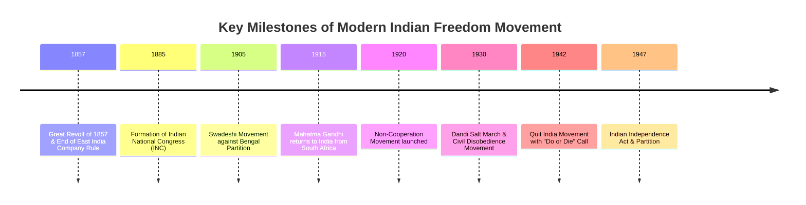

# Modern History: Complete UPSC Notes

> **Target Exam**: UPSC Civil Services Examination (Prelims & Mains) / State PSCs  
> **Subject**: Modern History  
> **Total Modules**: 8

---

## 📚 Table of Contents

1. [Onset Of British Empire](#1-onset-of-british-empire)
2. [Socio-Religious Reforms](#2-socio-religious-reforms)
3. [Administration & Land Settlement](#3-administration-land-settlement)
4. [Social Classes & National Movement](#4-social-classes-national-movement)
5. [Rise of Nationalism](#5-rise-of-nationalism)
6. [Gandhian Era](#6-gandhian-era)
7. [Independence & Partition](#7-independence-partition)
8. [Miscellaneous](#8-miscellaneous)

---

## 1. Onset Of British Empire

> **Source Subject**: [Modern history](https://compass.rauias.com/modern-history/)
---
## 1. Decline of Mughal Empire
> Source: [https://compass.rauias.com/modern-history/decline-of-mughal-empire/](https://compass.rauias.com/modern-history/decline-of-mughal-empire/)

## Decline of Mughal Empire

When Aurangzeb died in 1707, the Mughal Empire was at its peak. The annexation of the Deccan kingdoms of Bijapur and Golconda had spread the Mughal Empire to the Southern Edge of the Deccan.

However, the mighty Mughal Empire collapsed within 40 years of Aurangzeb's death, reduced to rectangular territory about 250 miles around Delhi.

### **Reasons for decline of Mughal Empire**

#### **Immediate Reasons**

- **Aurangzeb’s Misguided Religious Policies**: Religious bigotry pursued by him alienated Sikhs, Jats, Bundelas, Rajputs, and [Marathas](https://compass.rauias.com/modern-history/marathas/). For example, Demolishing temples and breaking idols, Imposition of Jizya

- **Aurangzeb’s Expansionist Deccan Policies:**  Annexation of Deccan Sultanates of Bijapur and Golconda which offered local checks against Marathas turned Marathas against Mughals and drained the royal Mughal treasury.

- **Weak successors of Aurangzeb**: The success of the Mughal empire, which was a despotic rule, relied on the abilities and characteristics of its monarchs.Almost all Mughal emperors after Aurangzeb were weak and lacked the deft and interest in administration and were more interested in arts and other pleasures.

- **Degeneration of Mughal Nobility: **The [later Mughal](https://compass.rauias.com/modern-history/later-mughals/) rulers and elites **prioritised luxury and pleasureover military responsibilities, leading to a decline in leadership and a shortage of competent administrators and military figures

- **Afghan invasions:Nadir Shah’s invasion of India in 1739left the Mughal empire prostate and bleeding. Invaders looted the Mughal treasury and their military weaknesses were exposed. Ahmad Shah Abdali captured the frontier provinces of Punjab, Sindh, Kashmir etc. After the **Third Battle of Panipat,Abdali placed Rohilla leader Najib-ud-Daula as the dictator in Delhi.

- **Rise of Marathas under Peshwas:Marathas assumed the role of national defenders against Abdali in the Third Battle of Panipat.

Peshwas consolidated the Maratha empire in Western India and focused on building a national empire known as Greater Maharashtra and popularised the ideal of **Hindu-pad Padshahi**, the ideal Hindu empire.

They **engulfed northern **India and emerged as the most powerful force in Indian politics. They assumed the role of national defenders against Abdali in the **Third Battle of Panipat**. Even the rise of the Marathas did not lay the foundation of a stable empire but they accelerated the decline of the Mughal empire.

#### **Structural Reasons**

- **Factionalism among Mughal nobility**: Nobles towards the end of Aurangzeb’s rule **organised themselves as pressure groupsformed on clan, race, and family relationships. **There were four prominent factions**:

(i) **Turanis**: Descendants from **Central Asia**, mostly Sunni with leaders like Asaf Jah and Nizam-ul-Mulk

(ii)  **Persians**: Descendants from **Iran**, mostly Shia with leaders like Saadat Khan.

(iii) **Afghans**: Descendants from **Afghanistan**, mostly Sunni.

(iv) **Hindustani**: Mostly comprised Muslims born in India, whose ancestors though **originally foreign immigrantshad settled in India for generations. This party got **support of Rajputand Jat chiefs and powerful Hindu landlords. **Sayyid Brothers came from this faction**.

- **Subordinate Rebellion**: Power-hungry **subedars of Bengal, Oudh and the Deccanbehaved as semi-independent rulers and took the help of Mughal enemies and Europeans.

- **Economic challenges:Long wars against **Deccan Sultanatesemptied the royal treasury and ruined trade and industry.

- **Rise of European Trading Companies**: European companies, particularly the [East of India company](https://compass.rauias.com/modern-history/dutch-east-india-company/) challenged the Mughal Empire’s control over the economy.

- **Agrarian Crisis**: Mughals collected very steep revenues for funding their army and nobility. This **ruined the peasantry and destroyed the revenue-paying capacity of the farming class.Since **mansabdar’s were transferred frequently**, they aimed to collect revenue and not invest in long-term investment for agricultural growth. Towards the end of the Mughal Empire, revenue collection from the farming class became **more exploitative as pressure on limited grew**. This prompted a series of revolts among the agricultural classes.

**Mansabdari & Jagirdari**

- These two were the most important institutions of the Mughal Empire. **Manasbdari System**: Mughal nobility formed the core of bureaucracy and was given ranks corresponding to their status and hierarchy. **These ranks were called mansabs**.Each holder of mansab (mansabdar) was paid in the assignment of land revenues (jagir).Mansabdars were expected to maintain a cavalry force, who were paid and maintained out of the revenue of the Jagir.

- **Jagirdari System**: It was a land revenue system used in medieval India, where the king granted land to nobles or officials as a reward for their services. These officials or nobles, called jagirdars, collected revenue from the land and kept a portion of it for themselves while giving the rest to the king.

- **Jagirdari Crisis**:  The decline of the Mansabdar-Jagirdari system towards the end of Aurangzeb's reign contributed to the downfall of the Mughal empire. This was **due to the annexation of Golconda and Bijapur **which increased the size of the nobility and thus there was a shortage of jagirs. Thus, nobles competed for better jagirs, which were increasingly rare leading to erosion in the political structure of the Mughals.

- **Military weakness**: The Mughal army was organised on a feudal basis when soldiers **owed allegiance to the mansabdar and not to the emperor.**

- **Defective system of succession**: The lack of established succession practices among the Mughals resulted in a destructive war of succession between contenders, which **weakened the empire both financially and militarily**

- During the early times, this principle meant that the strongest person became the ruler, later court politics and factionalism resulted in weaker individuals ascending to the throne, with influential nobles such as the Sayyid Brothers acting as kingmakers.

**Alliance among Mughal nobility**

- Turanis, Persians & Afghans were considered Mughals or Foreigners and competed against the Hindustani faction. The strength of Turani, Irani, and Afghan nobles increased significantly during the last phase of Aurangzeb's rule.

- Descendants of these foreigners held important military and civil offices in India.These factions competed against one another and tried to win Emperor to their viewpoint. They could not forge unity even in face of foreign invasions. Ex. Nizam-ul-Mulk aligned with Nadir Shah against the Mughal emperor.

---

## 2. Later Mughals
> Source: [https://compass.rauias.com/modern-history/later-mughals/](https://compass.rauias.com/modern-history/later-mughals/)

## Later Mughals

This is most comprehensive and up-to-date Notes on Later Mughals.

### Later Mughals List

| Emperor | Time period |
| --- | --- |
| Bahadur Shah I | 1707-1712 |
| Jahandar Shah | 1712-1713 |
| Furrukhsiyar | 1713-1719 |
| Rafi Ul-Darjat | 1719 |
| Rafi Ud-Daulat | 1719 |
| Muhammad Ibrahim | 1720 |
| Muhammad Shah | 1719-1748 |
| Ahmad Shah Bahadur | 1748-1754 |
| Alamgir II | 1754-1759 |
| Shah Jahan III | 1759 |
| Shah Alam II | 1759-1806 |
| Akbar Shah II | 1806-1837 |
| Bahadur Shah II | 1837-1854 |

#### Bahadur Shah-I (1707-12)

- **After the death of Aurangzeb(1707)**, there was a succession war between his three sons.Prince Muazzam emerged as the winner of this succession war **by defeating his brothers.

- **Muazzam assumed the title of Bahadur Shah Iand became the Mughal emperor at the age of 63.

- He tried to appease all parties by profuse grants of titles and rewards and was nicknamed **Shah-i-bekhabar (Heedless King) by Khafi Khan.**

- He died in 1712 without naming a successor.

#### Policies of Bahadur Shah I

- Due to his age, he was not very active and pursued a **pacific policy.**

- Maratha Prince, Shahu who was in captivity since 1689 was released and allowed to return to Maharashtra.

- **Peace was made with Rajput chiefs.**

- **He made peace with Guru Govind Singh**

- However, **the Sikh rebellion led by Banda Bahadurcontinued to challenge his regime in Punjab. Banda was defeated in the **Battle of Lohgarhand Mughal forces reoccupied Sir hind in 1711. However, **Sikhs were neither conciliated nor crushed.**

#### Jahandar Shah (1712-13)

- There was a **war of succession among the four sons of Bahadur Shah**, among which Jahandar Shah came out successful.

- Zulfikar Khan, a prominent Irani noble supported Jahandar in this war of succession and was **appointed as the Prime Minister by the Emperor.**

- **He was the first puppet ruler in Mughal India.**

- However, Farrukhsiyar, grandson of Bahadur Shah challenged Jahandar Shah's regime with the **help of the Sayyid Brothers (Abdulla Khan and Hussain Ali)**. They defeated and killed Jahandar Shah in 1713.

#### **Zulfiqar Khan**

- **He reversed policies of Aurangzebandtried to establish friendly relations with Rajputs, Marathas, and different Hindu chieftains.**

- **He abolished the jizya**

- **Accorded the title of Mirza Raj Sawaion Jai Singh of Ambar and gave the title of Maharaja to Ajit Singh.

- He also granted the chauth and sardeshmukhi of Deccan to Shahu

- He is infamous in history for introducing the evil practice of **Ijarah (revenue farming)**

#### **Farrukhsiyar (1713-19)**

- Farrukhsiyar appointed **Abdulla Khan as his Wazir (Prime Minister) and Hussain Ali as Mir Bakshi (Head of the military administration)**

- However, differences emerged between the Farrukhsiyar and Sayyid brothers.

- **Sayyid brothers with the help of Peshwa Balaji Vishwanath (Maratha troops) killed the emperor in 1719.**

- Mughal Army defeated the Sikh army again and Banda Bahadur was taken as a prisoner and executed at Delhi.

- **Grant of many trading privileges to [East India Company](https://compass.rauias.com/modern-history/dutch-east-india-company/) including exemption from customs dutiesfor its trade through Bengal.

#### **Muhammad Shah (1719-48)**

- After the death of Farrukhsiyar, **the Sayyid Brothers raised two emperors Rafi-ud-Darajat and Rafi-ud-Daula **who died within months. At last, **the Sayyid brothers made Muhammad Shah the emperor.**

- Turani nobles revolted against the Sayyid brothers and Hussain Ali was murdered and Abdulla Khan was imprisoned.

- His regime saw the **perpetual **[decline of the Mughal Empire](https://compass.rauias.com/modern-history/decline-of-mughal-empire/) which eventually led to its disintegration.

- **Rise of Regional Kingdoms:Nizam-ul-Mulk **established an autonomous state in **Deccan.Saadat Khan **established an autonomous state in **Awadh.Murshid Quli Khan **established an autonomous state inBengal, Bihar and Orissa.Marathas underBaji Rao I raised Delhiin 1737 and terrorised the Empire. **Nadir Shah invaded India in 1739 **nearly incapacitating th**e Mughal empire.English Company discovered the weakness of Mughals and decided to transformfrom a trading company to a territorial empire.**

- [**Cultural Contribution**:](https://compass.rauias.com/medieval-history/cultural-contributions-vijayanagar-empire/) He was a **great patron of arts, including musical and cultural developments.His penname was **Sada Rangila.He loved dancing and was **himself an Kathak dancer.Urdu was popularized and was declared the court language**, replacing Persian. **Quran was translated for the first time into Persian and Urdu.Religious institutions for education such as **Maktabs were introduced.Mughal nobility replaced their Turkish dressing style with Sherwanis.**

- **Painting:Nidha Mal and Chitarmanwere famous painters in his court. Their paintings depict scenes of **court life, Holi celebrations, hunting scenes etc.**

- **Musical contribution: Qawwaliwas introduced in the Mughal Imperial Court and was popularized. **Patronised Sadarang and Adarangwere famous court musicians and popularized the Khayal style of Hindustani Classical Music.

#### **Ahmad Shah (1748-54) & Alamgir II (1754-59)**

- They were **too weak.**

- **Ahmad Shah Abdali invaded northwest India several times in 1748, 1749, 1752, 1757, and 1759.**

- Punjab was lost to Afghans and Marathas captured Malwa and Bundelkhand and carried attacks in all parts of India.

- **Battle of Plassey (1757) was fought during the reign of Alamgir II.**

#### **Shah Alam II (1759-1806) & Later Mughals**

- Mughal Empire’s rule was **limited to small areas around Delhi.**

- They were puppets in the **hands of Marathas or English.**

- **The 3rd Battle of Panipat (1761) was fought during his reign (between the Marathas and Ahmad Shah Abdali)**

- He also participated in the **Battle of Buxar (1764).**

- **He was forced to sign the Treaty of Allahabad (1765),under which the Diwani (right to collect revenue) of Bengal (which included Bihar and Odisha) was granted to the [British East India Company](https://compass.rauias.com/modern-history/british-east-india-company/).

#### **Akbar II (1806-1837)**

- Remained only under British protection as in 1803, the British had captured Delhi.

- **He conferred the title of **['Raja' on Ram Mohan Roy.](https://compass.rauias.com/modern-history/raja-ram-mohan-roy/)

- He was a great poet and is credited with the introduction of the **Hindu-Muslim unity festival Phool Walon Ki Sair.**

#### **Bahadur Shah II / Zafar (1837-57)**

- He was the **last Mughal Emperor who was a more nominal head.**

- He wrote many **Urdu ghazals and poet using 'Zafar' (meaning victory) as his penname**

- East India Company captured Delhi in 1803. However, the fiction of Mughal Empire was kept up by the English till 1858, when the last Mughal Emperor Bahadur Shah Zafar was exiled to Rangoon after the end of the 1857 Revolt.

---

## 3. Geographical Exploration & Colonisation by Europe
> Source: [https://compass.rauias.com/modern-history/geographical-exploration-colonisation-by-europe/](https://compass.rauias.com/modern-history/geographical-exploration-colonisation-by-europe/)

## Geographical Exploration & Colonisation by Europe

- India and Europe had trading relations since time immemorial. This is evident from the large amounts of **gold and roman goods found in India, especially during the Sangam age.**

- This trade used to take via the following **three routes:**

      (i) **Via the Silk routewhich involved the Amu Darya River, Caspian, Sea and Black Sea.

      (ii) **Via the Arabian Seaand then a land route through Saudi Arabia, Syria and then on Mediterranean Sea.

      (iii) **Via Arabia Sea, Red Seaand then on land passing Egypt and then through a sea route over the Mediterranean Sea.

- During this time, **Italian merchantswere the main players and controlled trade of various artisanal and luxury items to Europe. Italy also enjoyed a geographical advantage over the Mediterranean Sea. This made Italy very powerful.

- Other European countries wanted to break the Italian monopoly over trade. These countries were in search of **alternative routes to the East via Africa.**

- **Capture of Constantinople (Istanbul) by the Turksclosed these routes for Europeans. Europeans were forced to search for new routes for trading with Asia and India for spices which were essential for preserving food in Europe.

### **Factors behind this**

- **Rise of centralised stateswith strong kings like Portugal and Spain encouraged explorations and supported navigators.

- **Technological developmentsuch as the compass, astrolabe, gunpowder, printing and making of maps (cartography) made the works of explorers easier.

- Fables about the riches of Asia countries, and **the zeal to spread Christianityand achieve glory also inspired navigators.

- **In search of a maritime route from Western Europe to the East**. **Bartholoew Diaz (a Portuguese**) reached the southern tip of Africa in 1487 and it was named as Cape of Good Hope. **In 1498, Vasco Da Gama landed in India.**

- **Rise of Joint Stock Companieswhich allowed pooling of capital from the large number of shareholders, continuity of business activities, liquidity, and ease of movement of capital for more profitability. Thus, joint stock company was preferable method of business organisation which allowed European trading [companies to dominate East Indian](https://compass.rauias.com/why-did-the-armies-of-the-british-east-india-company-mostly-comprising-of-indian-soldiers-win-consistently-against-the-more-numerous-and-better-equipped-armies-of-the-then-indian-r/) trade.

---

## 4. Portuguese in India
> Source: [https://compass.rauias.com/modern-history/portuguese-in-india/](https://compass.rauias.com/modern-history/portuguese-in-india/)

## Portuguese in India

**Vasco Da Gamawas a Portuguese explorer and the first European to reach India by Sea via the Cape of Good Hope. Here you can read all about Portuguese in India.

### Portuguese in India (1505 - 1961)

- Vasco Da Gama led a cruise of four ships and **reached Calicut**, **Kerala on Malabar Coast on 20 May 1948.**

- Portuguese empire in India was **not a territorial regime but a maritime networkwithin which territories, establishments, ships, persons, and administrative arrangements in Asia and East Africa were placed **subordinate to Portuguese crown.**

- In Lisbon, Casa da India, a royal trading firm headed this sea-borne empire.

- In Asia, the enterprise was under the control of an administrative set up known as **Estada da India (state in India), headed by the Viceroy at Goa**, head of civil and military government of the whole empire from East Africa to Moluccas and Macao, responsible only to the Crown.

- To assist the Viceroy, informal councils were set up by the desire of the Viceroy to obtain advice on specific, usually military matters. However, these councils gradually **got institutionalisedwith fixed membership and procedures.

- **Members of this institutionalised councilswere the Viceroy (President of the Council), Archibishop of Goa (Chief Inquisitor), some important **fidalgos(noble residents of Goa), the Captain of city of Goa, Chief judge of [High Court](https://compass.rauias.com/polity/hight-court/) and Chief Financial Officer.

- **A municipal councilelected by Portuguese and European population for governance of Goa was established. The subordinate forts and settlements replicated the structure and administrative set-up in Goa.

- Portuguese monopoly over maritime trade was challenged at the beginning of 17th century by British East India Company and Dutch East India Company.

#### Portuguese Trade

- **Spice trade**: Spices, **especially pepperwas the main item which was procured by Portuguese from the Malabar region and later from Kanara on the southwest coast of India. Trade in spices was monopolised and reserved for Portuguese crown and its agents which was enforced by naval supremacy of Portuguese.

- **Horses:Tried to monopolise horse trade by centralising **horse trade from Arabia to Persia via Goa**. All ships with horses coming from Saudi Arabia or Hormuz came only to Goa.

- **Reverse trade**: To finance the procurement of spices and other goods included precious metals (gold from west Africa and silver from America), non-precious metals such as [copper](https://compass.rauias.com/geography/copper/), lead, tin, quicksilver, mercury, corals, alum, wines and olive oil.

- **Intra-Asian trade**: Portuguese also participated in intra-Asian trade, probably larger in value and more profitable than the trade between Goa and Lisbon.

#### Policies of Portuguese

- **Monopoly in trade in spices**: Throughout the 16th century, Portuguese made trade in spices reserved for the Portuguese Crown and its agents. This monopoly right was strictly enforced and naval supremacy of Portuguese helped in this.

- **Cartaz system**: Portuguese imposed a system of Cartaz i.e., licences for traders from 1502 onwards.

#### Places linked to Portuguese in India

- **Hugli, West Bengal**: Portuguese settlement at Hugli was legitimised by a **Farman granted by [Emperor Akbar](https://compass.rauias.com/medieval-history/akbar/) in 1579.**

- **Meliapor or Meliapur (Modern Mylapore, Modern Chennai):Occupied by Portuguese in 1523 and established viceroyalty of Sao Tome of Meliapor which lasted until 1749. Later, it was under the Madras Presidency of the East India Company in 1749.

**Saint Thomas Basilica**:

- Saint Thomas was one of the 12 Apostles i.e., primary disciples and primary teachers of gospel message of Jesus. He travelled to South India to preach the **Gospel **and **laid the foundation of Christianity in India**.

- Saint Thomas Christians also called Syrian Christians or Nasrani Christians are believed to be converted by St. Thomas.He died in Mylapore where a Tomb was established. San Thome Basilica was constructed by Portuguese over the original tomb.

#### Decline of Portuguese

By the early 17th century, the might of the Portuguese empire in the East collapsed and was **replaced by Dutch and British**. This can be seen from the steep decline in the number of Portuguese ships plying between Lisbon and Goa.

**Factors responsible for this are:**

- **Capture of Portugal by Spain**: Spain captured Portugal in 1580. Fortunes of Portuguese maritime empire in Asia also declined with the decline of Spain. Spain's naval might was reduced due to the defeat of the Armada in the naval battle of 1588 against the English.

- **Internal issues in Portugal**: The Aristocracy dominated the society in Portugal and merchants did not have enough [social influence](https://compass.rauias.com/ethics/social-influence/) necessary to mould state policies for their interests.

- **Intolerant attitude**: Portuguese were intolerant and fanatic in **religious issuesand resorted to **forcible conversions.**

- **Limited focus on profits**: Portuguese became victims of their early lead by remaining limited to profits. **Their feitorias (trading outposts)essentially remained trading outposts lacking adequate manpower and political will to carve out a territorial empire.

- **Discovery of Brazil:The discovery of Brazil diverted colonising activities of Portugal to the West.

#### Significance

- **Maritime administration**: The arrival of the Portuguese is widely regarded by historians as the starting point of the European era and is credited with facilitating the development of naval governance. For example, the Cholas stood as a maritime force, but a foreign [power arrived in India](https://compass.rauias.com/current-affairs/should-india-consider-phasing-out-nuclear-power/) by water for the first time.

- **Masters of progressive sea tactics: **The Portuguese accustomed to weapons, matchlock troopers, and body armor, landed from ships in Malabar (16th century), illustrating the military invention.

- The Portuguese onshore contributed to the military by creating a system of drilling infantry groups implemented in the 1630s to react to the Dutch force.

### FAQs

#### What did the Portuguese do in India?

Their primary goal was to establish a monopoly over the spice trade, which was then dominated by Arab merchants. The Portuguese were successful in this goal, and for a time they controlled much of the trade between Europe and Asia.
The Portuguese also sought to spread Christianity in India. They built churches and schools, and they converted many Indians to Christianity. However, their efforts to convert Hindus and Muslims were often met with resistance.

#### Why Portuguese failed in India?

The Portuguese had a small army and navy, and they were often outnumbered by the forces. They were eventually challenged by other European powers, such as the Dutch and the British.

---

## 5. Dutch East India Company
> Source: [https://compass.rauias.com/modern-history/dutch-east-india-company/](https://compass.rauias.com/modern-history/dutch-east-india-company/)

## Dutch East India Company

- **States-General, the national governing bodyof the Dutch founded the **Verenigde Oost Indische Compagnie (VOC) **by merging a few companies. Wealthy merchants from the Netherlands later augmented the capital resource base of the company.

- **The Charter of States-General **had given the company **monopoly rights to trade in the East for 21 years.**

- Dutch East India Company established its first factory on the **Coromandel Coastwhich was the principal supply point of textiles to South-East Asian markets including Indonesian Islands and Europe.

- Dutch East India Company also carried on a substantial amount of trade within Asia.

- Governor-General and his **council at Batavia (earlier at Bantam, Indonesia)in Java regulated the entire commercial Dutch company’s empire in Asia. It was an **intermediate administrative bodybetween the Board of Directors of the Company known as Heren XVII and chief factories.

- They captured **Nagapatam near Madras from the Portugueseand made it their main stronghold in South India.

### **Dutch Factories**

Dutch East India Company was the first northern European corporate enterprise to establish factories in India. The process was started on Coromandel coast.

- **On Coromandel Coast**

- **Petapuli & Masulipatnam**: They established its first factory at **Petapuli on the NorthCoromandel Coast in 1606. In the same year, another factory was established at Masulipatnam port in Andhra. The Head of Masulipatnam factory was to be second-in-command and was designated as president in 1621.

- **Pulicat:Dutch established a factory at Pulicat in 1610 which also became the **headquarters of the Dutch directorate of Coromandeland **overall control of Dutch Coromandel factories was given to Governor**. **Fort Geldriawas constructed here in 1613.

- **Nagapattinam**: Seat of Coromandel government was shifted from Pulicat to Nagapattinam in Southern Coromandel Coast in 1690.

- **In Gujarat & Bengal**

- Military personnel were absent in VOC factories in Bengal and Gujarat. Officials were mostly assigned commercial duties.

- **Surat**: A factory was established by VOC at Surat in 1618 after permission for the same was granted by the subadar**, Prince Khurram (**[Shah Jahan)](https://compass.rauias.com/medieval-history/shah-jahan-aurangzeb/).

- **Bengal**: Bengal factories were organised into an independent **directorate free from control of the Pulicat government in 1665.The Chief factory at Hooghly became the **seat of the Dutch directorateof Bengal factories.

#### **Salient Features**

- **Private trade**: Employees of European trading companies also engaged in intra-Asian trade in their private capacity. The employees of the English [East India Company](https://compass.rauias.com/modern-history/british-east-india-company/) played the most significant role in this regard. India was at the centre of European trading activities in respect of both Euro-Asian and intra-Asian trade.

- **The Dutch were not much interested in empire building in India; **their concerns were trade.

### **Decline of Dutch**

- **The Battle of Chinsura or Battle of Biderra or Battle of Hooghlywas fought on 25 November 1759 and resulted in the defeat of the Dutch

#### **Significance**

- **Rise of the number of port towns**: There was a sharp rise of ports on both East & West coasts of India due to the commercial activities of European trading companies. These ports were a link between overseas trading and inland hinterland.

- **Indian merchants as agents**: The French, Dutch and English companies utilised the services of Indian merchants as agents.

See also:

[Portuguese in India](https://compass.rauias.com/modern-history/portuguese-in-india/)[British East India Company](https://compass.rauias.com/modern-history/british-east-india-company/)

|  |  |
| --- | --- |

---

## 6. British East India Company
> Source: [https://compass.rauias.com/modern-history/british-east-india-company/](https://compass.rauias.com/modern-history/british-east-india-company/)

## British East India Company

Learn how the **British East India Companystarted as a small group of British traders and eventually became one of the most powerful forces in India. This timeline explains their journey, beginning with permission from Indian rulers to trade, then setting up factories in important locations like Surat and Madras.

**YearWhat happened1608William Hawkins**[Jahangir](https://compass.rauias.com/medieval-history/jahangir/)**Mansabdar16111613Thomas Best1615Thomas RoeAgra, Ahmedabad, and Broach.1632Golden FarmanSultan of Golconda1633Balasore and Hariharpur, Odisha.1639fortified factory at Madras1651Hooghly, Kasimbazar, Patna and Rajmahal.1658the control of Fort St. George in Madras.1662The English crown transferred it to EIC in 1665**[Marathas](https://compass.rauias.com/modern-history/marathas/)**Surat as the main port of West Coast.1680customs-freeexcept Surat.1700a separate PresidentCharles Eyre as its first President1717Magna Carta for the companyexempted from additional customs duties in Bengal, Bombay, and Madrasissue Dastaks**

|  |  |
| --- | --- |
|  | went to  who appointed him as  and allowed him to trade in India. |
|  | Started trading at Masulipatnam. |
|  | got permission to set up a factory at Surat. |
|  | went to Jahangir and got permission to set up factories at |
|  | was issued by the  to trade freely in the kingdom of Golconda for a fixed customs duty. |
|  | Factories established at |
|  | Ruler of Chandragiri permitted the English to set up a  which later became Fort St. George. English promised to give half of the customs revenue to local Raja, in return for the right to fortify and mint their own coins. |
|  | Factories were established at |
|  | All establishments of Bengal, Bihar and Orissa, and Coromandel coast were brought under |
|  | King Charles II, received Bombay as a dowry for marrying a Portuguese princess.  and was soon fortified. The growing threat from  and good port facilities at Bombay made it replace |
|  | Emperor Aurangzeb issued a farman that EIC’s trade was to be  everywhere |
|  | Bengal factories were placed under  and council in the fortified Fort William at Calcutta with . |
|  | Farrukhsiyar granted a Farman to EIC which is regarded as . Under this, EIC's imports and exports were . EIC was also permitted to  and was permitted to rent land around Calcutta. The company was also permitted to mint its coins. |

### **Governance**

- Court of Directors had 24 members elected annually by the general court by shareholders.

See also:

[Dutch East India Company](https://compass.rauias.com/modern-history/dutch-east-india-company/)[French East India Company](https://compass.rauias.com/modern-history/french-east-india-company/)[Decline of Mughal Empire](https://compass.rauias.com/modern-history/decline-of-mughal-empire/)[Portuguese in India](https://compass.rauias.com/modern-history/portuguese-in-india/)

|  |  |
| --- | --- |
|  |  |

---

## 7. French East India Company
> Source: [https://compass.rauias.com/modern-history/french-east-india-company/](https://compass.rauias.com/modern-history/french-east-india-company/)

## French East India Company

- **Also known as (Campaignie des Indes Orientales) **was established in **1664 **with the government's financial support. Colbert, a French Minister, **during the reign of Louis IVwas the driving force behind it.

- Export items by the French from India were **white cotton clothes, muslin, painted clothes, pepper, saltpetre, cowries, and redwood.**

-  Import items by the French into India included **alcohol, wines, coral, gold thread and iron products.**

- However, the value of goods exported from India far exceeded the value of goods imported into India leading to **large deficits.Exports of precious metals to India made up for the deficits.

### **Factories**

- French established their **first factory in Surat in 1668.**

- **Pondicherry:A factory at Pondicherry was established in **1674 **by the French East India Company, which emerged as their headquarters in India **where Fort Louis was established in 1700-07.**

- Other important factories were established at **Balasore (Odisha), Masulipatnam (Andhra Pradesh), Chandernagore (West Bengal), Tellicherry (Modern Thalassery, Kerala) and Calicut (Kerala).  **

#### **French Partis**

- French were the forerunners in organising and commanding Indian armed contingents. **Reasons:**

- French soldiers were paid poorly and common soldiers could not become officers as this was reserved for the nobility.

- Indian rulers paid the French soldiers handsomely and there were opportunities to rise in rank and status for soldiers with military competence.

See also:

[British East India Company](https://compass.rauias.com/modern-history/british-east-india-company/)[Carnatic Wars](https://compass.rauias.com/modern-history/carnatic-wars/)

|  |  |
| --- | --- |

---

## 8. Carnatic Wars
> Source: [https://compass.rauias.com/modern-history/carnatic-wars/](https://compass.rauias.com/modern-history/carnatic-wars/)

## Carnatic Wars

In this post, we will take a closer look at the Carnatic Wars. We will discuss the causes of the wars, the major battles that were fought, and the impact that the wars had on India.

### **Factors Responsible**

#### (a) Economic

- British and French **economic rivalsin India as well and India was too big in terms of resources and labour.

- These companies' strategies mix trade with political and military supremacy to create **monopolies. **

#### (b) Political

- Mother countries were at war in Europe.

- The political condition in South India was favourable for the implementation of their designs. **The native powers were fighting with each other**, they were fragmented and weak and had issues such as wars on successions.

- By this time both companies had established **well-trained militaryand their political influence was **recognized by native rulers.**

#### (c) Cultural

- Both believed in **imperialistic policiesto add to the strength and prestige of their empire.

### Lessons From The Carnatic Wars

- European armies can easily defeat old and obsolete Indian armies. To maintain such an army, it was not required to have only European soldiers**, Indians could be hiredas well since there was **no feeling of nationalismin India.

- European companies could take **advantage of local rulersfighting with each other.

- **Seeds of subsidiary allianceswere sown during the Carnatic Wars.

#### 1st Anglo-Carnatic War (1740 - 48)

- **Reason**: **Over Austrian succession**: The first Carnatic War was an **extension of the Anglo-French Warin Europe which was caused by the Austrian War of Succession.

- However, the hostilities between the two companies in Bengal were contained by **Alivardi Khan**. But in Carnatic, no such strong power existed. A [French fleet arrived from Mauritius and together with the French army in India](https://compass.rauias.com/modern-history/french-east-india-company/), they sacked British positions in Madras. The British appealed to the **Nawab of Carnatic (Arcot)Anwaruddin Khanfor help who sent his forces but was **defeated by the French**.

- In 1746, Dupleix (French) captured Madras again and followed it up with a siege of Fort St. David but failed to capture it. The war ended in Europe with **the Treaty of Aix-La-Chapelleand so it did in India.

#### 2nd Anglo-Carnatic War (1749-54)

- French supported **Chanda Sahib in Carnaticand **Muzaffar Jung in Hyderabad**. Naturally, the British got alarmed and they supported the rival candidates **Muhammad Ali in Carnatic & Nasir Jung in Hyderabad.**

- In 1749, Chanda Sahib, French, and Muzaffar Jung defeated and killed **Nawab Anwaruddi**n. His son fled to Britain. Next in Hyderabad, Muzaffar Jung, French and Chanda Sahib defeated and killed Nasir Jung. French got many territories (Northern Sarkars, Masaulipatnam, Pondicherry), cash, right to station army in Hyderabad along with a resident. Muzaffar Jung was accidentally killed and a new Nizam was placed by the French. Thus, French power was now at its peak.

- In 1750, Britain decided to throw their entire weight behind Muhammad Ali. French and Chanda Sahib had **seized Trichinopolywhere Muhammad Ali was hiding. British decided to attack Arcot and the seize was lifted. The tide turned. French began to lose; expenses began to mount. The government intervened and concluded **peace with British in 1754.The treaty restored old possessions and French power in India remained far from over.

#### 3rd Anglo-Carnatic War(1756-63)

- In 1758, the French army captured the English forts of St. David and Vizianagaram then English become offensive and the Battle of Wandiwash was fought between them in 1760 and won by the English at Wandiwash(Tamil Nadu).

-  The war ended with the **Treaty of Paris**

See also:

[Modern History Notes](https://compass.rauias.com/modern-history/)[Decline of Mughal Empire](https://compass.rauias.com/modern-history/decline-of-mughal-empire/)

|  |  |
| --- | --- |

---

## 9. Emergence of Regional Kingdom
> Source: [https://compass.rauias.com/modern-history/emergence-of-regional-kingdom/](https://compass.rauias.com/modern-history/emergence-of-regional-kingdom/)

## Emergence of Regional Kingdom

- During the heyday of Mughal rule, provincial administration was **headed by Diwan (Head of revenue administration) and Nazim (Head of Executive)**. Both were **directly appointed by the Emperorand they **controlled the province on behalf of the Emperor.Other officials like **Amils, Faujdars, Kotwals etc. **were also appointed by the emperor. Thus, through control over appointments, **Emperor indirectly controlled provincial administration.**

- **[Decline of the Mughal Empire](https://compass.rauias.com/modern-history/decline-of-mughal-empire/), weak emperors **and successful resistance by **Marathas and Sikhs encouraged many local landlords **and nobles to claim independence. [Governors of rich provinces of Bengal](https://compass.rauias.com/modern-history/governors-bengal/) and Awadh established themselves as independent rulers, appointed their officials, and nominated their successors to establish their independent rule over provinces. Except for theoretical allegiance to Mughal Emperor in the form of sending tributes, provincial governors had total control.

### **Three Categories of Emerging Kingdoms**

- **Successor states**: States which broke away from the Mughal emperor: **Awadh, Bengal and Hyderabad fall into this category.All these three provinces were directly under control of the Mughal Administration. The sovereignty of Mughal Emperor was not challenged, though there was establishment of practically independent and hereditary authority by the governors and subordination of all offices within the region to the governors.

- **New states set up by rebels against the Mughals**: **Marathas, Sikh state in Punjab and [Jat](https://compass.rauias.com/modern-history/jats/) State in adjoining areas of Delhi fall in this category.**

- **Independent states**: These states emerged by taking advantage of weakness of Mughal imperial control over provinces. **Mysore, Rajput kingdoms and Kerala fall in this category.**

See also:

[Regional Kingdom of Bengal](https://compass.rauias.com/modern-history/regional-kingdom-bengal/)[Awadh & Lucknow](https://compass.rauias.com/modern-history/awadh-lucknow/)

|  |  |
| --- | --- |

---

## 10. Regional Kingdom of Bengal
> Source: [https://compass.rauias.com/modern-history/regional-kingdom-bengal/](https://compass.rauias.com/modern-history/regional-kingdom-bengal/)

## Regional Kingdom of Bengal

Alivardi Khan ruled till **1756 and was succeeded by Siraj-ud-Daulah**. The latter placed **Mir Madan as Diwan in place of Mir Jafar. Mir Jafar conspired with the British.**

- **The Battle of Plasseywas fought in 1757 **between Siraj-ud-Daulah and Britisherswho were led by **Robert Clive.**

- The latter won and made Mir Jafar Nawab of Bengal and posted an English resident at Nawab’s court.

### Significance of Bengal for Europeans

- Bengal was a source of **tradable goods for British (Calcutta), Dutch (Chinsura) and French (Chandernagar) companiesthat had settlements here along Hooghly river.

- **To gain access to textiles and handicrafts**, European companies spread inland and established trading stations in places like Dacca and Patna.

- **Advanced well-developed system of water transport and high-yielding [rice production](https://compass.rauias.com/geography/rice/) **led to high revenue yield and supplied rice to other parts of India.

- **Saltpetre was supplied from Bengalfor the production of gunpowder in Europe. Also, saltpetre being a bulky and heavy commodity could be used to stabilise ships by acting as ballast material. Patna emerged as major center of saltpetre trade.

- **Cotton textile and silk industrywas also very developed in Bengal and were exported by sea to Europe and the Middle East.

- **Bengal had strong centralised administration and skilled bureaucracy,an established system of taxation and revenue, and wide networks of banking, credit, and trading.

- In south India, **trading stations were mostly concentrated on coasts,they also lacked stable governments and administration. This ensured that European penetration of Bengal was on a much larger scale.

#### Conflict Between EIC And Nawabs

- **Rise of EIC  in Bengal:By the 1750s, Calcutta had emerged as the most important **Indian trading port of Company and presidency town **with a Governor and Council and an extensive fort complex (Fort William). **Royal Farmans granted by Mughal emperorsand **Royal Charters by the British government **had given considerable authority to the East India Company and almost independent authority over Calcutta.

- **Mughal Farman of 1717 by Farrukshiyargranted an **exemptionto EIC’s merchandise **from custom duties against an annual payment of Rs 3,000. **With a **Dastak (handwritten permit)EIC’s goods could pass without inspection through the toll station.

- The company purchases in India were called investments. It purchased goods with **‘ready money’via a contract with **Dadni merchants (brokers)**. The Dadni system was replaced by a **system of Gomastas **where Indian agents of the Company made purchases under direct supervision of EIC’s European servants.

- **Misuse of Dastaks:EIC’s officers misused this privilege for their private trade. This private trade increased considerably when the **Gomasta systemcame into force. EIC paid very low salaries to its servants in India, assuming servants got rich by private trade.

- **Impact of misuse**: Increase in private trade by Company’s servants eroded the revenue base of Nawabs of Bengal. Indian traders were also rendered uncompetitive against English traders.

- **[Carnatic Wars](https://compass.rauias.com/modern-history/carnatic-wars/) in Bengal**: The hostilities between English and French Companies after **Austrian War of Succession (Carnatic Wars) **had been fought in Carnatic against Nawab of Carnatic’s order. However, such conflict was not seen in Bengal. This reflects that these companies paid heed to Nawab of Bengal’s authority.

- **Fortification and use of arms**: EIC’s attempt to fortify Fort William and use of arms did not go down well with the Nawabs. Nawabs were very wary of a trading company amassing such military powers.

- Earlier Nawabs like Alivardi Khan, Murshid Quli Khan, and Shuja-ud-din were alarmed by the **rapid expansion of Company’s trade and abuse of exemptions.However, they stayed away from confrontation.

### Reign of Siraj-ud-daula

- Siraj got the seat of Nawab after awar of succession with Shaukat Jang, faujdar of Purnea.**

- Tried to **reorient civilian and military organisationsby appointing persons of his choice, and this **caused discontent among the old nobility.**

- **Mir Jafar (army general during Alivardi’s reign), Rai Durlabh (Leading Hindu nobility), Jagat Sethsand large zamindars of Western Bengal were most opposed to Siraj.

#### Conflict with English:

- Company did not attend his accession ceremony in 1756 or pay respect at his court to pledge their trade.

- **Right to trade in salt, betel nut, and tobacco **was reserved by Nawab and was awarded to the highest bidder by him. Misuse of private traders of EIC by trading in salt questioned Nawab’s monopoly.

- **Fortifications by EIC without permission.**

- **Misuse of Dastaks.**

- **Attack on Calcutta:Nawab wanted to assert his sovereign power over the trading company.

- **Robert Clive:The impact of attack on Calcutta gave an opportunity to EIC to end its neutrality and enter into direct conflict with the Nawab. **Admiral Watson and Robert Clivecame to Calcutta from Madras as Heads of the Navy and Military in 1756, respectively, and recaptured Calcutta.

- Clive eliminated the French from **Chandernagar by using their naval superiority and greater capital resources.**

- Entered a **treaty with Siraj that restored EIC’s settlements and privileges.**

- Clive entered secret negotiations with **military commanders, nobility, bankers, merchants, traders, and military **commanders with Siraj’s army.

- **Robert Clive and Battle of Plassey**: Company’s forces under Robert Clive easily defeated Siraj’s army due to the withdrawal of a large force under command of Mir Jafar. Siraj was killed and **Mir Jafar was appointed as Nawab of Bengal.**

- Mir Jafar **paid heavy payments to EICas war indemnities (3 million sterlings) and conceded territory around Calcutta to EIC.

- **Treaty of 1760:Mir Jafar was removed as the Nawab of Bengal and the English helped Mir Kasim to become Nawab. In return, he agreed to cede the Company, and districts of Burdwan, Midnapur, and Chittagong. **Mir Kasim shifted the capital from Murshidabad to Munger in Bihar.**

- **Battle of Buxar:EIC heavily misused Dastaks granted by Farrukhsiyar which **led to a tussle between Mir Kasim and the company. **A conflict over transit duty led to the outbreak of wars between the **English and Mir Kasim in 1763.The disputes then culminated in the Battle of Buxar wherein the combined armies of Mir Kasim, Nawab of Awadh and Shah Alam II were defeated by **Hector Munro at Buxar in 1764.**

#### Treaty of Allahabad (1765)

- English signed the Treaty of Allahabad w**ith Mughal emperor Shah Alam II and Robert Clive, **after the Battle of Buxar.

- This treaty marked the **beginning of Dual Government in Bengal in India.**

- EIC was **granted Diwani rights (right to collect) taxes on behalf of the Mughal Emperor from Bengal (Bengal-Bihar-Odisha).**

- In return, EIC was to pay an annual tribute of **26 Lakhs to Mughal Emperorfor the maintenance of the court in Allahabad. Mughal Emperor Shah Alam II was given control over the districts of **Kara and Allahabad (Earlier under the control of Awadh).**

- Under the treaty, Shuja-ud-Daula was allowed to retain Awadh. He was asked to pay a w**ar indemnity of 50 lakhs to East India Company.**

- Shuja entered an alliance with EICto defend each other’s territory.**

- EIC was allowed to carry **duty-Free trade throughout Awadh.**

See also:

[Awadh & Lucknow](https://compass.rauias.com/modern-history/awadh-lucknow/)[Nizams of Deccan](https://compass.rauias.com/modern-history/nizams-of-deccan/)

|  |  |
| --- | --- |

---

## 11. Awadh & Lucknow
> Source: [https://compass.rauias.com/modern-history/awadh-lucknow/](https://compass.rauias.com/modern-history/awadh-lucknow/)

## Awadh & Lucknow

### Awadh

- Rise of Awadh as an 18th-century regional power was led by the pursuit of political autonomy by a Shia noble of Iranian descent by **Burhan-ul-Mulk Saadat Khan.He was appointed subadar of Awadh in 1722.

- Saadat Khan was frustrated with politics among the nobility in Delhi, he focused on consolidating his authority in Awadh.

#### Importance of Awadh

- Controlled **rich alluvialGanga plains.

- Controlled **important trade routesconnecting north India and Bengal.

- Located **close to Delhi**, the seat of Mughal power.

#### Policies Of Saadat Khan (Burhan Ul Mulk)

- Saadat Khan faced strong resistance from rebellious chiefs and rajas in Awadh. He suppressed rebellious local zamindars and chieftains.

- To ensure loyalty of officials, all important posts in provincial administration were filled by his relatives. He appointed Safdar Jang as Deputy Governor of the province without sanction from Mughal Emperor.

- Held **combined offices of Subadari, Diwani and Faujdari.Thus, he was responsible for managing the political, financial, and military affairs of Awadh.

#### Safdar Jang

- **Office of Imperial Diwan was abolishedand the large number of local Hindus were absorbed into the administration.

- He **annexed the kingdom of Farrukhabadunder Afghans and extended control over Rohtas, Chunar, and Allahabad.

#### Shuja-Ud-Daula

- Achieved greater success in consolidating the frontiers of the province.

- Sided with Ahmad Shah Abdali in the **Third Battle of Panipat in 1761**. Thus, contributed to controlling the march of [Marathas](https://compass.rauias.com/modern-history/marathas/) in North India.

- Combined forces of Nawab of Awadh (Shuja-ud-Daula) allied with Nawab of Bengal (Mir Qasim) and Mughal Emperor (Shah Alam II) against the English in the Battle of Buxar, which the English company won. English forces were led by Hector Munro.

### Revenue Administration

- Right to collect tax was sold to the highest bidders i.e., revenue farmers known as **ijaradars for a fixed sum.**

- Revenue farmers were given considerable **freedom in the assessment and collectionof taxes.

- **Local bankers and Mahajanguaranteed the payment of this contracted amount to the state.

- Thus, a new social group of moneylenders and bankers emerged in the province.

### Decline of Awadh

- Nawab Wazir Ali defied the British in 1798. In response, Wellesley annexed half of Awadh as a substitute for subsidy. Loss of fertile land accelerated the bankruptcy of Nawab and made him dependent on taluqdars. Eventually, Awadh Nawabs withdrew from state affairs and increasingly concentrated on music, dance and arts.

#### East India Company & Awadh

- EIC saw **Awadh as a buffer state(by the treaty of awadh)protecting company rule in Bengal against other Indian powers, especially the Marathas.

- **Treaty of Allahabadallowed the **British to interferein the local politics of Awadh.

- **In 1773,EIC made the **Treaty of Benaraswith Nawab of Awadh, wherein Nawab agreed to pay **Rs 21 Lakhs monthlyfor each brigade of company troops that would remain present in Awadh or Allahabad. This established the **beginning of Awadh’s chronic indebtednessto EIC and EIC's interference in the region’s politics.

- **Lord Wellesley & Awadh**: Nawab of Awadh declared his inability to pay the increased financial demand of EIC. Lord Wellesley used this pretext to force the **Nawab to surrender the entire territory to the East India Company**. However, after negotiations, EIC was given **sovereignty over the Rohilkhand, Gorakhpur, and Doab regions of Awadh (half of Awadh territory).This severely disempowered Awadh which stopped being any threat to EIC’s stability as a territorial power. Devoid of their army and half of their territory, Nawabs focused on cultural pursuits.

### Lucknow: Cultural Capital

- **Asaf-Ud-Daulatransferred the capital of **Awadh from Faizabad to Lucknow**. Asaf was not much interested in the administration.

- **Architecture**: **Bara Imambara**: Asaf-ud-Daula built the Bara Imambara **for celebration of Muharram festival in Lucknow in 1784**. Imambara is a congregation **hall for commemoration ceremonies**, especially those associated with the mourning of Muharram. The Imambara complex also has **Bhool Bhulaiya**, which has been constructed as a maze and similar-looking doors. Construction of the Bara Imambara was started in **1780 as part of [famine](https://compass.rauias.com/disaster-management/famines/) relief for poor**, who got wages for manual labour. Asaf-Ud-Daula held a competition for the design of Imambara and chose architect Kifayatullah.

- **European Confluence and Cosmopolitanism**: Asaf-ud-Daula employed many Europeans on good salaries which led to significant European influence in Art and Architecture. Ex. (i) **Antoine Polier, Swiss architect of Fort William**, lived in Lucknow for 15 years. He built a large mansion called **Polierganjand collected manuscripts and paintings of Hindu gods. (ii) **Claude Martin**, a French officer, accumulated a large wealth through his business prowess. He was a significant collector of art objects and miniature paintings. He is credited with **founding three schools, La Martinieres of Lucknow, Calcutta, and Lyon.**

- **Urdu Literature**: Awadh and in particular Lucknow emerged as the capital of Urdu and reached greater heights in Awadh than in Deccan, Urdu's place of origin. There **emerged a distinct Lucknow style of Urdu poetrymostly contributed by migrant poets in Lucknow. The decline of power meant Mughals could not afford to patronise poets in Delhi. This meant [emerging regional kingdoms](https://compass.rauias.com/modern-history/emergence-of-regional-kingdom/) and their places emerge as new centres of Mughal empire. There was a vibrant literary scene in Lucknow with several mushairas where poetry recitations took place.

- **Famous Poets: (i) Sauda:He left Delhi and became the **court poet of Nawab Shuja-ud-Daulain Faizabad. He was given the title of **'Malik-us-Shaura'**. He is recognised for his contribution to **Qasida (laudatory) and Hajo (satirical) styles of poetry**. (ii) **Mir Taqi Mir**: Disappointed with the poverty in Delhi, Mir left Delhi and reached Lucknow during the reign of **Asaf-ud-Daula**. He is popularly called **Khuda-e-Sukhanor God of Poetry**. (iii) Mir Ghulam HasanPaintings:Reputed London painters like **Johan Zoffany and Ozias Humphryspent several years in Lucknow and painted many pictures on commissions from Nawab.

- **Education:Mulla Nizamuddinstarted a madrasa at Firangi Mahal which emerged as a renowned centre of learning. Subjects taught here included religion, grammar, literature, logic, philosophy and metaphysics. This school taught Sunni theology.**Shia Theology**: **Amjad Aliestablished an exclusive school of Shia theology named **Madarsai Sultania**. Its management was in the hands of Shia religious scholars. Students were provided monetary scholarships. **Lucknow emerged as a site for Shia religious philosophy in India.Music:Several cities in Awadh like **Benaras, Jaunpur etc.were centres of musical training. **During Asaf-ud-Daula's reign**, many musicians from Delhi and other places [migrated](https://compass.rauias.com/indian-society/migration/) to Delhi. **Nawab WajibAli Shahwas himself trained in music. [Nawab Wajid Ali Shah](https://compass.rauias.com/current-affairs/nawab-wajid-ali-shah/) **popularised classical North Indian music and thumri**. He ignored complicated ragas and dhrupad and easier raginis were encouraged. He composed raginis and a thumri named **'Kadar Piya'.**

- **Calligraphy**: Affluent people in Awadh decorated their houses with quotes written in beautiful handwriting. **The Nastaliq style of calligraphywas popular in Awadh. Famous calligraphy artists came to India when Nadir Shah invaded India. They established their centre at Lahore from where artists visited Lucknow and were employed by Nawabs.

---

## 12. Nizams of Deccan
> Source: [https://compass.rauias.com/modern-history/nizams-of-deccan/](https://compass.rauias.com/modern-history/nizams-of-deccan/)

- Increased factionalism at Mughal Court and increased power of the **Hindustani faction led by Sayyid Brothers forced Chin Qilich Khan, leader of Turani groupto move away to Deccan.

- In 1724, he assumed the title of **Nizam ul Mulk Asaf Jahand started establishing himself as an **independent ruler with his base at Hyderabad**, the core region of erstwhile Golconda Sultanate.

- He consolidated his hold over **six subas in the region**. His real power was exercised in coastal districts of Srikakulam, Masulipatnam, Nizamapatnam and eastern regions of Suba of Hyderabad.

- He brought skilled soldiers and administrators from North India and appointed them as mansabdars and granted them jagirs.

- **Offices of amin, shiqdar and faujdar were concentratedon one person who was entrusted with collecting revenue and maintaining troops from the revenue he collected.

- He notionally functioned as a Mughal administrator and **continued to mint coins inthe name of Mughal emperor and **mentioned him in Friday prayerstill his death in 1748.

- Hyderabad was constantly engaged in a struggle with [Marathas](https://compass.rauias.com/modern-history/marathas/) (in their west) and with independent Telugu warrior chiefs (Nayakas) of Deccan and South India.

- Struggle for control over Coromandel coast (important for foreign trade and textile production) brought Nizams into conflict with [East India Company](https://compass.rauias.com/modern-history/dutch-east-india-company/).

---

## 13. Marathas
> Source: [https://compass.rauias.com/modern-history/marathas/](https://compass.rauias.com/modern-history/marathas/)

## Marathas

- Marathas were the most important regional power that challenged the Mughals and accelerated their decline.

- Marathas were **Marathi-speaking peasant clansin Western India who rose to prominence in 16th century as soldiers in armies of Deccan Sultanates of Bijapur and Ahmednagar.

- Maharashtra stood out in **cotton cultivation, spinning and textile industry**. Textile products from Maharashtra were supplied **to Surat for trading.**

### **Power Structure**

- Mughals **never properly administeredMaharashtra region. **Maratha dominion can be broadly divided into (i) Regulation & (ii) Non-regulation areas.**

- **Regulation Areas**: There were areas of direct [administration with a system of revenue assessment](https://compass.rauias.com/assess-the-main-administrative-issues-and-socio-cultural-problems-in-the-integration-process-of-indian-princely-states/), management and accountancy. These areas were divided among **vatandars**. **Deshmukhs dominatedthe rural power structure of the region. Each Deshmukh **controlled 20-100 villages**. Each village had a **Patil (headman)assisted by a **Kulkarni (record-keeper).Patil used to come peasant castewhile **Kulkarni was usually a Brahmin**. Head of Deshmukh was a **Sardeshmukhand head of Kulkarnis was a **Desh-Kulkarni.**

- **Tenants:There were two types of tenants (i) Resident cultivators with hereditary rights of occupancy called **Mirasdars.(ii) Temporary cultivators **(Uparis).**

- **Revenue assessment**: In regulation areas, standard assessment rates of the earlier period was maintained. Under Peshwas, **Tanka system,a permanent standard assessment in each village was used for revenue settlements. Later during 1750s-60s, **Kamal settlementwas made based on the classification of qualities of the land and newly cultivated areas were made.

- These functionaries ran the local administration with minimal interference from Deccan sultans or Mughals. Rulers were content with an irregular share of taxes collected from agriculture, in return for which they recognised Deshmukhs, Patils and Kulkarnis. Thus, these functionaries became **dayadas (co-sharers**) of authority in the kingdom.

#### **Nature of Maratha State**

- Maratha state was based on the **'co-sharing'of power between Maratha king (Later Peshwa) and existing chiefs and clans in the region.

- Maratha Swarajya did not stand for absolute sovereignty over specific territories but claimed revenue that often overlapped with Mughals and later by regional kingdoms.

- Marathas imposed **Chauth (25% of produce) and Sardeshmukhi (Additional 10% of the Mughal Government's share of revenue)in return for not plundering.

- **Maratha Confederacy**:Four dominant families of Marathas chiefs and their centres were **Gaekwad of Baroda, Bhonsle of Nagpur, Holkars of Indore, and Scindias of Gwalior**. These chiefs loosely functioned as a confederacy managing taxation and revenue. There was also mutual hostility among them particularly among Scindias and Holkars. Around this time, influence of Peshwas had reduced.

#### **Sambhuji**

- **Son & successor of Shivaji**. Like Shivaji, Shambhuji also defied Aurangzeb by giving shelter to rebel prince [Akbar](https://compass.rauias.com/medieval-history/akbar/).

- **Aurangzeb challenged Shambhuji and killed him**.

- Shambhuji had tried to control the Deshmukh and regularise revenue administration, this reduced the power of Deshmukh who offered to help Aurangzeb against him on the condition that Aurangzeb would recognise the special privileges of Deshmukhs as hereditary. They also got rewarded with valuable jagirs by Aurangzeb.

#### **Shahu**

- Shahu was freed by Aurangzeb's successor Bahadur Shah.

#### **Balaji Vishwanath (1713-20)**

- He got support from several Brahmin banking facilities, who provided credit for Shahu's elevation as the Maratha emperor.

- **Appointed as Peshwa (Prime Minister) and Chief Financial Officerby Shahu in 1713.

- **Helped Sayyid brothersinstall Muhammad Shah as emperor of Delhi in 1719.

- Negotiated a treaty with Mughals, which virtually recognised Maratha control over Mughal provinces in the Deccan.

- Marathas were granted **the right to collect Chauthin 6 Mughal provinces and an additional **right to collect sardeshmukhiin Deccan in recognition as heads of Deshmukh.

- Peshwas emerged as **de facto rulers of the Maratha statein Pune.

- He patronised other **Chitpavan Brahmanswho formed and served as administrators, tax collectors, and military leaders.

#### **Baji Rao-I(1720-40)**

- Most charismatic & dynamic leader in Maratha history after Shivaji.

- **Office of Peshwa became hereditaryand was held by Balaji's son Baji Rao.

- Convinced Shahu of the importance of Northward expansion of Maratha power.

- Maratha army defeated combined forces of Mughal forces and Nizams of Hyderabad. Maratha military commanders started collecting tribute from Malwa and Gujarat.

- **Successfully raided Delhi in 1737and forced Mughal Emperor, Muhammad Shah, to formally cede Malwa region to Marathas in 1739. Thus, Maratha rule spread to close to Agra.

- **Military strategy**: Pursued raiding warfare where Maratha bands did not attack forts but ransomed cities. This drew Mughal armies into unfavourable areas, where they cut them off from reinforcements and supplies leading to defeat.

- When Baji Rao died in 1740, **Maratha state extended over a large territoryincluding Rajasthan, Delhi and Punjab in North to Bihar, Bengal and Orissa in East and Karnataka, Tamil Nadu and Telugu areas in South.

##### **Architecture**

- **Palaces**: A special kind of house called **Wadawas developed for the rich. These were **large, multi-storey wooden structures**. They were built both for defence (spiked doors and secret passages) and for comfort (garden and waterways, festival halls, multiple courtyards) where **accessibility was governed by Purdah rules**

- **Forts: **Particularly hill forts which were key to foundation, expansion and preservation of Maratha empire were constructed, repaired, and maintained.

- **Temples: **Earlier Marathas used to build fort-like square temples inside the forts. However, the affluent Maratha rule in 18th century constructed tall, elegant structures. These temples were symbolic of Marathas representing ascend of Hindu community.

#### **Bala ji Rao (Nana Saheb) 1740-61**

- Shahu died in 1749. After Shahu’s death, he virtually usurped the sovereign power.

- Marathas were named protectors of Mughal throne in 1752 and were given **Chauth rights in Punjab.**

- **Maratha Army**: Artillery was **the weak linkof Maratha Army. Large guns were fired by Europeans under notional command of Maratha chiefs.

- **Third Battle of Panipatmarked the beginning of a shift of power between centre of Maratha power (Peshwa/Raja) to periphery (powerful Maratha chiefs (Shinde (Scindia of Gwalior), Holkar (Nagpur), Gaekwad (Baroda) and Bhonsle families. It **also enabled English **to emerge as the main competitor on the subcontinent.

#### 1st Anglo-Maratha war (1775-82):

- In 1775, Raghunath Rao signed **Treaty of Suratwith English wherein he ceded the territory of Salsette and Bassein to English. This treaty was later ratified as **Treaty of Purandhar in 1776with Raghunath renouncing regency with a pension. Treaty of Purandhar was violated by Nana Phadnavis which led to a war in Pune. As a result, English surrendered by 1779 and signed **Treaty of Wadgaon.**

- However, this treaty was rejected by Hastings who went on to defeat the Sindhias and captured Ahmedabad and Bassein. Scindia then proposed a new treaty between Peshwa and English i.e., the **Treaty of Salbai (1781).**

#### 2nd Anglo-Maratha War (1803-05):

- A tiff between Peshwa (Bajirao II) and Holkars happened and as a reaction to this Bajirao II fled to Bassein and signed **Treaty of Bassein (1802) with Englishin which he surrendered the city of Surat, gave up claims of Chauth on Nizam’s dominion.

- After Peshwa accepted a subsidiary alliance, Scindia and Bhonsle attempted to save Maratha's kingdom. However, they were all defeated one after another.

-  **Bhonsle defeat; Treaty of Devgaon; 1803**

- **Scindia defeat; Treat of Surajiarjangaon; 1803**

- **Holkar defeat; Treaty of Rajpurghat; 1806**

#### 3rd Anglo-Maratha war (1817-19):

- Bajirao II made a last bid to fight against the British, but he was defeated at Khirki, Bhonsle was defeated at Sitavaldi and Holkars at Mahdipur. Final annexations of their lands were done under the following treaties.

- **Treaty of Poona; Peshwa; 1817**

- **Treaty of Gwalior; Scindia; 1817**

- **Treaty of Mandsaur; Holkar; 1818**

Read also:

[Nizams of Deccan](https://compass.rauias.com/modern-history/nizams-of-deccan/)[Jats](https://compass.rauias.com/modern-history/jats/)[Sikh Kingdom in Punjab](https://compass.rauias.com/modern-history/sikh-kingdom-in-punjab/)[Policies for Annexing States](https://compass.rauias.com/modern-history/policies-for-annexing-states/)

|  |  |
| --- | --- |
|  |  |

---

## 14. Jats
> Source: [https://compass.rauias.com/modern-history/jats/](https://compass.rauias.com/modern-history/jats/)

## Jats

- Jats were a **prosperous agriculturist casteinhabiting the Delhi-Agra belt who consolidated their power during the 17th and 18th centuries.

- Towns like Panipat and Ballabhgarh emerged as important trading centres in their territory. When Nadir Shah invaded Delhi in 1739, many citizens from Delhi took refuge in these towns.

- **Churaman and Badan Singhfounded the independent Jat state at Bharatpur. Suraj Mal consolidated Jat power during his rule from 1756 to 1763. The death of Suraj Mal died in 1763 marked the demise of the Jat state.

- **Geographical expanse**: Ganga in the East, Chambal in the South, Delhi in the North and Agra in the West.

- Suraj Mal possessed great administrative ability, especially in the fields of revenue and civil affairs.

### **Cultural contributions**

- **Deeg Palace, Bharatpur**: An elaborate garden palace combined [architectural styles](https://compass.rauias.com/art-culture/difference-between-nagara-dravida-style-of-temple-architecture/) of Rajputs (Amber) and Agra. Its buildings were modelled on architectural forms seen during [Jahangir](https://compass.rauias.com/medieval-history/jahangir/).

- **Bharatpur fort (Lohagarh fort)**

Read also:

- [Nizams of Deccan](https://compass.rauias.com/modern-history/nizams-of-deccan/)

- [Jats](https://compass.rauias.com/modern-history/jats/)

---

## 15. Sikh Kingdom in Punjab
> Source: [https://compass.rauias.com/modern-history/sikh-kingdom-in-punjab/](https://compass.rauias.com/modern-history/sikh-kingdom-in-punjab/)

**Foundation of Sikh faithwas laid down by **Guru Nanakin the 15th & 16th century Punjab as a reformist religious movement. The **followers of this Guru Nanak were called Sikhs**.

The religious order of Sikhism over time turned into a political community during the 17th century leading to the foundation of a Sikh empire in North-West India.

- **Sikh Gurus:Leadership of the Sikh faith was in the hands of Sikh Gurus. **Guru Gobind Singh was the last Sikh Guruafter which the **Guru Granth Sahib was made the perpetual Guru of the Sikh faith.**

- **Guru Gobind Singh and Khalsa**: Guru Gobind Singh engaged in various wars with the Mughals and Rajputs. He laid the foundation of **Dal Khalsaand **transformed the religious group into political community. **

- **Banda Bahadur**: After the death of Guru Gobind Singh, the leadership of Sikhs was passed into the hands of his trusted disciple **Banda Bairagi, popularly known as Banda Bahadur.Banda carried on a vigorous struggle against Mughal forces and died in 1715.

- **Jathas & Jathedars**: After the death of Ahmad Shah Abdali, Sikhs organised themselves into several small and **highly mobile bands called Jathas, each commanded by a Jathedar**. For solidarity among the Jathas, **the combined forces of all Jathas called Dal Khalsaused to meet on Baisakhi and Diwali to take collective decisions known as **'resolutions of Guru (Gurmatas)'**. **A system of Rakhi was introduced**, offering protection to cultivators on payment of 20% of produce as tax.

- **Misls:Defeat of Mughals and Marathas by Afghans helped Sikhs to consolidate their base in Punjab and establish an autonomous Sikh political power in Punjab region. By the second half of the 18th century, the different jathas came together to form **12 regional confederacies or Mislsunder various local chieftains. Misls were based originally on the **principle of equality**, wherein each member had an equal say in the affairs of Misl and electing chiefs and other officers of the organisation. However, the unity and democratic character of Misls gradually withered away with the decline of the Afghan threat.

- **Ranjit Singh**: He was the son of chief of sukerchakia misl, Mahan Singh ruling over Singh lost his father when he was only 12 years of age. He consolidated all the misls by force of arms, brough unity among Sikhs and **laid the foundation of Sikh Empirewith an undisputed monarch. He consolidated his control over the surrounding **regions of Jammu & Kashmir, Sialkot, Kangra and Multan**. Later, he established control over the **trans-Indus regionand his empire reach Peshawar in 1834.

- Ranjit Singh’s successors were able to maintain the vast territory established by Ranjit Singh till 1845. However, in 1849, EIC completely annexed the Sikh empire.

- **Treaty of Amritsar (1809):It was signed **between Ranjit Singh and Englishwherein the latter accepted Sutlej as boundary line for his dominion. The English compelled him to sign the Tripartite treaty.

- **First Anglo-Sikh war (1845-46):It ended with the **Treaty of Lahore (1846) in which J&K was sold to Gulab Singh.**

- **Second Anglo-Sikh war (1848-49):Under this Lord Dalhousie proceeded to Punjab. A total of three battles were fought between them and in the end, **Punjab was annexed in 1849.**

See also:

[Regional Kingdom of Mysore](https://compass.rauias.com/modern-history/mysore/)[Sikh Kingdom in Punjab](https://compass.rauias.com/modern-history/sikh-kingdom-in-punjab/)

|  |  |
| --- | --- |

---

## 16. Regional Kingdom of Mysore
> Source: [https://compass.rauias.com/modern-history/mysore/](https://compass.rauias.com/modern-history/mysore/)

## Regional Kingdom of Mysore

- Mysore emerged as a powerful state and opponent of British in the wake of decline of Mughals in South India. It was **part of Mughal Sarkar of Sira**. **Wodeyars, the ruling dynasty**, had rendered their allegiance to the Mughal emperor Aurangzeb.

### **Haider Ali**

- Haider Ali was the architect of **the emergence of Mysore in 18th century**. He started as a soldier and rose through the ranks.

- Haider Ali was witness to the prowess of European armies as he was closely **involved in the First and Second [Carnatic Wars](https://compass.rauias.com/modern-history/carnatic-wars/) **in South India. Mysore sided with the French in the Carnatic Wars.

- **Political consolidation:Conquered **part of Malabarand consolidated his position by dominating a rebellion by **Nayars in the region**.

- **Revenue Administration:** To increase revenue administration, Haider imposed the land tax on **peasantsand **did away with local hereditary power centres such as Deshmukh and palegars.Heap of produce was measured and divided equally between the state and farmer. **(Motivation for Ryotwari Settlement later in the region).He **resumed Jagirdari system.However, jagirdar’s responsibility of maintaining troops was done away with.

**Military reforms by Haider Ali:**

- **Reforms in Army: **He took the help of the French **to modernise and organise his Arsenal, Artillery and Workshop.His army was a combination of mobile cavalry on Mughal patterns along with musket-using infantry. He raised a central army paid directly by the state. Earlier the army was constituted of contingents of varying sizes maintained by individual commanders. Army was organised **into risalas – divisions of a fixed number of soldiers with a definite allotment of guns and transport, like the European armies**.

- **Reforms in Navy: **To develop a Navy, Haider planned to conquer Malabar to gain control over shipbuilding yards. By 1765, Mysore Navy possessed 30 vessels of war and many transport ships commanded by European officers.

### **First Anglo-Mysore war (176-69):**

- Nizam of Hyderabad, Marathas and English allied together against Mysore’s ruler Haider Ali. This ended with Haider Ali forcing the English to sign a humiliating treaty with him in 1769 called the **Treaty of Madras.**

### **Second Anglo-Mysore war (1780-84):**

- This war was concluded with the Treaty of Mangalore, in 1784. Haider Ali died, and his son [Tipu Sultan](https://compass.rauias.com/current-affairs/why-tipu-sultan-must-be-killed-again/) took his place.

#### **Tipu Sultan**

- **TipuSultan was the **last Muslim ruler of the Kingdom of Mysore**, before the taking over by Wodeyar Dynasty.

- **Navy:Defeat in Third Anglo-Mysore War convinced Tipu to take measures to build a navy. He **issued a Hukmnanah (ordinance) in 1796for a strong naval force with 40 ships to be built at speed. The navy was put under command of **11 Mir Yam (Lords of Admiralty),with headquarters at Seringapatam. **The naval divisions or Kachehris at Jamalabad (Mangalore), Wajidabad (Bascoraje) and Majidabad (Sadasheogarh).**  Timber for ships was to be procured from state forests.

- **Ammunitions:Established **munitions industry in Nagar**, which were regarded as equal in quality to those produced in Europe.

- **Rocket technology**: **Pioneer of rocket technologyand expanded iron cased Mysorean rockets and commissioned a **military manual Fathul Mujahidin.**

- **Economy**:  Attempted to revive commerce and forged commercial linkages with other parts of India and West Asia and build a **public sector companywith state finance. **Introduced sericulture and was a member of the Jacobin club**. He also planted a **liberty tree at Seringapatam**.

- **Agriculture and Revenue Settlement**: Tipu modified land revenue management. Rules were laid down for **the distribution of arable land among old and new ryots**, preference was given to hereditary ownership of land and rent was fixed. Tipu’s measures were **the basis for Ryotwari Settlementintroduced by East India Company in South India. **Captain Alexander Readfirst introduced Ryotwari Settlement in **Baramahal districtsurrendered by Tipu after his defeat in 1792.

- Introduced several administrative innovations such as a **new coinage systemand calendar and **initiated the growth of the Mysore silk industry**.

- Deployed rockets against advances of British forces and their allies during Anglo-Mysore Wars, including the **Battle of Pollilur and Siege of Srirangapatna.**

- **Calendar**: Introduced a new calendar in **1784**. This calendar was known as **Mauludi Era and had 354 days**. It counted its **first year from the year of birth of Prophet Muhammad.The calendar’s name was derived from Arabic phrase ‘**Maulud-i-Muhammad’, Birth of Muhammad.**

### **Third Anglo Mysore war:**

- Tipu Sultan was defeated by EIC and the **Treaty of Seringapatam was concluded**. Under this treaty, **Tipu lost half of Mysore’s territory.**

### **Fourth Anglo-Mysore war (1799):**

- This conclusive war led to falling of Seringapatam. English chose a Hindu boy from the earlier ruling royal family i.e., Wodeyars, as the Maharaja and imposed a subsidiary alliance on him.

---

## 17. British Policy Towards Neighbours
> Source: [https://compass.rauias.com/modern-history/british-policy-towards-neighbours/](https://compass.rauias.com/modern-history/british-policy-towards-neighbours/)

- **Anglo-Burma relations**: British intervention in Burma was principally to counter the influence of the French in Indo-China. **1st Anglo-Burma warhappened from 1824-26; over with the **Treaty of Yandbo (1826)**. **The 2nd Anglo-Burma warhappened in 1852. **After the 3rd Anglo-Burma war**, Burma was finally annexed in 1885. **Lord Dufferin was Viceroy of India when Burma was annexed**. The annexation of Burma was opposed as it increased the expenses of colonial government in India.

- **Anglo-Nepal relations:Anglo-Nepal War was fought between 1814 and 1816 **between forces of Gorkha army of Kingdom of Nepaland British forces**. Both sides wanted to expand their control over mountainous regions of Himalayas. The war ended with the **Treaty of Sugauli in 1816which ceded some Nepali territory to the East India Company. **Lord Hastings was the Governor-General during this time**.

- **Anglo-Tibet relations**: Curzon sent an expeditionary mission under Younghusband in 1903. Tibet during this time was an **independent state ruled by the Dalai Lama**. This invasion was intended to counter the Russian’s ambitions in Central Asia. The expeditionary force reached Lhasa, the capital of Tibet.

- **Anglo-Afghan relations**: **Sindh Conques**t: Sindh accepted the subsidiary alliance in 1839. In 1843 under **Governor-General Ellenborough**, Sindh was merged into British empire. **Charles Napier was appointed **as its first governor. **Sindh also signed the Tripartite treaty with the English and Ranjit Singh.**

---

## 18. Policies for Annexing States
> Source: [https://compass.rauias.com/modern-history/policies-for-annexing-states/](https://compass.rauias.com/modern-history/policies-for-annexing-states/)

- **Policy of ring fence**: **Warren Hastingsstarted it, **to create bufferzonesto defend the Company’s frontiers. The states brought under this policy were **assured of military assistance but at their own expense.**

- **Subsidiary alliance**: **Lord Wellesleystarted it wherein an allied Indian states ruler was compelled to accept permanent stationing of British force within his territory to pay subsidy for its maintenance. It was an **extension of the Ring Fence policy**. **States annexed under this policy: Awadh (1801), Hyderabad (1800), Mysore (1799), Tanjore (1799), Peshwa (1801), Berar (1803), Scindia (1804), Holkars (1818).**

- **Doctrine of lapse**: **Lord Dalhousie startedit wherein the adopted son of any ruler could not become the heir of state. **States annexed under this policy: Satara (1848), Jhansi and Nagpur (1854), Awadh (1856) Sambalpur (1849), and Udaipur (1850).**

---

---

## 2. Socio-Religious Reforms

> **Source Subject**: [Modern history](https://compass.rauias.com/modern-history/)
---
## 1. Introduction of Socio Religious Reform Movements
> Source: [https://compass.rauias.com/modern-history/introduction-of-socio-religious-reform-movements/](https://compass.rauias.com/modern-history/introduction-of-socio-religious-reform-movements/)

## Introduction of Socio Religious Reform Movements

Socio-religious reform movements in 19th century India were efforts to address social and religious issues to modernize and improve society. These movements sought to eliminate practices such as the **caste system, promote education and gender equality, and assert India's independence from colonial rule**. Some of the most influential movements include the Brahmo Samaj, Arya Samaj, Theosophical Society, Gandhi's non-violence movement, the Dalit movement, and women's rights movement.

### **Based on their goal, the reform movements can be broadly classified into:**

- **Reformist movements**: Emphasized the need for change and modernization within the existing social and religious structures of [Indian society](https://compass.rauias.com/indian-society/). For e.g., **Brahma Samaj and Prarthana Samaj etc.**

- **Revivalist movements**: Emphasized the need to return to [traditional Indian values](https://compass.rauias.com/indian-society/traditional-values/) and practices that were seen as being under threat from Western influence. **E.g., Arya Samaj and Deoband Movement, etc.**

### **Indian Renaissance**

- Indian Renaissance is a **period of great cultural, social, and intellectual awakeningin India. Indian Renaissance is considered to be a critical period in Indian history, as it set the stage for the political and cultural changes that would **take place in the 20th century**, and for the eventual independence of India from British colonial rule in 1947.

- This period is marked by a **significant increase in the number of Indianswho were **educated in Western thoughtand ideas and a **growing sense of national pride**. There were several key figures from this time such as **Raja Rammohun Roy (considered the Father of the Indian Renaissance)**, **[Swami Vivekananda](https://compass.rauias.com/modern-history/swami-vivekananda/), Ramakrishna and many more who became the leading voices of this movement**.

- **The socio-religious reform movements of the 19th century in India played a significant role in the Indian Renaissance:**

- These reform movements sought to **address various social and religious issues**, such as the status of women, the caste system, and religious practices, and they played a key role in bringing about changes in these areas.

- One of the main ways in which the reform movements contributed to the Indian Renaissance was through **their emphasis on education**. Many reformers believed that education was the key to progress and development, and they established schools, colleges, and universities to promote education, particularly for women and lower castes who had traditionally been denied access to education.

- This period saw the introduction of new subjects like science, mathematics and English literature to traditional Indian education, and in addition to this, the **Indian press in English, Bengali and other languages played an important role in disseminating new ideas and information. This led to a new understanding of India’s history, culture, and civilization.**

- Finally, the reform movements contributed to the flowering of [arts and culture](https://compass.rauias.com/art-culture/) which was a key feature of the Indian Renaissance. Many reformers were also writers, poets, artists, and musicians, and they used their work to express and celebrate India's rich cultural heritage.·    This led to the emergence of a new generation of political leaders who would play a key role in the Indian independence movement.

### **Reasonsfor the rise of social and religious reform movements (or the Indian Renaissance) in India during the 19th and early 20th centuries:**

- **Influence of Western ideas and values**: The exposure to Western ideas of democracy, equality, and individual rights, which came with British colonialism, inspired some Indians to think about their society and how it could be improved.

- **Desire to reform and modernize Indian society**: Many reformers believed that traditional Indian society was plagued with various evils and in need of modernization and saw reform to bring about progress and development.

- **Status of women:Women were deprived of the right to education and equality. Moreover, practices like **Sati Pratha, child marriage and female infanticidemarginalised the position of women even further.

- **Influence of scholars and intellectuals**: The Indian Renaissance was driven in part by the work of scholars and intellectuals who sought to rediscover and reclaim India's past, and who played a [key role in the development of reform movements](https://compass.rauias.com/modern-history/list-important-socio-religious-reform-movements-features/). **Indian scholars associated with Fort William College- **Mrityunjaya Vidyalankar, RamjayTarkalankar and Ram Ram Basu- helped Bengali prose gain maturity and contribute directly to the Renaissance.

- **Impact of missionary activity**: Christian missionaries played a significant role in the **spread of Western ideas **and the promotion of education, particularly in regions such as Bengal and Maharashtra.

- **Impact of colonialism and economic change**: The changes brought about by British rule, including the establishment of a centralized government and the development of modern industries, led to social and economic disruption and created a sense of discontent among some Indians.

- **Exposure to outside world**: The last few decades of the 19th century saw a rise of **nationalistic movements (like Italy etc.) across the world **and many reformers got motivated by these changes.

---

## 2. Characteristics, Significance & Limitations of Socio Religious Reform Movements
> Source: [https://compass.rauias.com/modern-history/characteristics-significance-limitations-socio-religious-reform-movements/](https://compass.rauias.com/modern-history/characteristics-significance-limitations-socio-religious-reform-movements/)

## Characteristics, Significance & Limitations of Socio Religious Reform Movements

### **Characteristics of Socio-Religious Reform Movements**

- Reform movements were **confined to a particular region**. Brahmo Samaj and the Arya Samaj had branches in different parts of the country, yet they were **more popular in Bengal and Punjab respectively than anywhere else.**

-  These movements were **confined to particular religions or castes**.

- These movements **emerged at different points in timein different parts of the country. E.g., **in Bengal**, reform efforts were afoot at the beginning of the **nineteenth century,but in Kerala, they came up only towards the **end of the nineteenth century**.

- Despite this, there was considerable similarity in their aims and perspectives.

- **Leadership: **Many of the leaders of these movements were educated, middle-class individuals who were committed to the cause of social and religious reform. They were often well-versed in Western ideas and values and used this knowledge to promote change in Indian society.

- **Goal: **All the movements were concerned with the regeneration of society through social and educational reforms even if there were differences in their methods.

- Emphasis is on universal outlook.

- **Focus on caste and gender discrimination**: Caste was opposed as an institution and was considered against the basic idea of equality. They unambiguously advocated the abolition of the caste system, as evident from the **movements initiated by Jyotiba Phule and Sri Narayana Guru.**

- Emancipation of **Women and Downtrodden.**

- **Emphasis on Humanismresulted in the Improvement of the underprivileged and the backward classes.

- **Propagation of concept of self-respect and self-relianceamong Indians to check the malpractices of Indian religion.

- Therefore, the Indian Renaissance became an essential part of Indian Society during India’s freedom struggle, which gradually created **rationalism and humanism.**

### **Significance Of Socio-Religious Reform Movements**

In the evolution of modern India, the reform movements of the nineteenth century have made very significant contributions. They stood for the

- Democratization of society,

- Removal of superstition and abhorrent customs,

- Spread of enlightenment and

- Development of a rational and modern outlook.

- These reform movements touched all segments of society. E.g.,

- **Ahmadiyya movement**, under the inspiration of **Mirza Ghulam Ahmad of Qadian**, **opposed jihad, advocated fraternal relationsamong the people and championed Western liberal education.

- **Aligarh movementtried to create a new **social ethos among Muslimsby **opposing polygamyand by **advocating widow marriage**. It stood for a liberal interpretation of the Quran and the propagation of **Western education**.

- Various movements focused on interpretation of Vedas for right set of practices which dealt with idol worships to women's rights.

- An attempt to change the then-prevalent values of society is evident in all these movements. The attempt was to transform the hegemonic values of a feudal society and to introduce values characteristic of bourgeois order.

### **Limitations Of Socio-Religious Reform Movements**

- These reform movements were primarily **urban phenomena.**

- Reform movements were limited to **upper castes and classes. (except for Arya Samaj, and the lower caste movements).For instance, **the Brahmo Samaj in Bengalwas concerned with the problems of the Bhadralok and Aligarh movement with those of the Muslim upper classes. The masses generally remained unaffected.

- Reformers had great faith **in the British sense of justiceand wanted to fashion India just like 19th-century Britain.

---

## 3. List of Important Socio Religious Reform Movements & Key Features
> Source: [https://compass.rauias.com/modern-history/list-important-socio-religious-reform-movements-features/](https://compass.rauias.com/modern-history/list-important-socio-religious-reform-movements-features/)

#### **Atmiya sabha/Brahmo Samaj/Calcutta Unitarian Committee/Vedanta College**

- **Associated Personality**: Raja Ram Mohan Roy

- **Atimya Sabha(1815)and Brahmo Samaj(1828)**

- Supported monotheism & set up **Atmiya Sabhato campaign **against polytheism, idolatry, caste rigidities and declared Vedanta as the basis of reason.**

- **Rejected missionary claim of superiority of Christianityand lack of rational thought in India. Vedantic monism, ideas of Koran and Unitarianism had great appeal to him.

- Brahmo Samaj was **against image worshipand prayers, meditation and reading of Upanishads were part of daily activities.

- **Vedanta College(1825)**

- Established **Vedanta college **which offered **both Indian and Western courses.**

- **Calcutta Unitarian Committee(1821)**

- Jointly founded by **William Adam and Rammohun Roy in 1821,sought to bring together prominent Brahmins who were friends of Roy's and supporters of his agenda for the promotion of religious monotheism and social reform among Hindus with British and European residents of Calcutta who were Unitarian Christians.

- **Exposition of the Judicial System of India**: In this essay, Raja Ram Mohan Roy criticised the high rents fixed by the British under the Permanent Settlement.

- **On Education**: He **opposed the decisionof Committee of Public Instruction to **establish Sanskrit College.He believed that India could only become **modern through English education and knowledge of western societies.**

- Started an **anti-Sati struggleleading to regulation of government in 1829 making Sati a crime.

- Translated **Upanishads into Bengali.**

#### **Manav Dharma Sabha**

- **Associated Personality**: Dadoba Pandurang, Durgaram Mancharam

- A socio-religious organisation in **Gujaratfounded in **1844 in Surat**.

- It **promoted monotheism**, **rejected casteism & idolatry, encouraged widow remarriage and expose superstitious elements in religions.**

- It had a very short life, as Dadoba Pandurang left for Bombay in 1846.

#### **Paramhansa Mandali**

- **Associated Personality: **Dadoba Pandurang and Durgaram Mehta

- A secret socio-religious group was established in **1849.First socio-religious organisation of Maharashtra.**

- They believed in monotheism and **breaking caste rules.At their meetings, food cooked by lower caste people was taken by members and **advocated women's education and remarriage.**

#### **Tattva Bodhini Sabha/Brahmo Samaj**

- **Associated Personality**: Debendra Nath Tagore

- He gave a new life to Brahmo Samaj.

- Tattwabodhini Sabha or **truth-teaching society(1839)**, to arrest Trinitarian Christian conversions in Bengal.

- It also studied **India’s past with a rational outlook.**

#### **Brahmo Samaj/Indian Reforms Association/Prarthana Samaj (Prayer Society)**

- **Associated Personality: **Keshab Chandra Sen

- **Keshab Chandra Senwas a champion of women’s rights. His ideology was **a mix of religious and social ideas**.

- He established the **Nava Vidhana in 1881along with the newspaper New Dispensation to disseminate his religious ideas and philosophy.

- Keshab witnessed a split in Brahmo Samaj with Keshab and his followers founding **Adi Brahmo Samaj **and setting up **Sadharan Brahmo Samajby his ex-followers.

- **Prarthana Samaj**(1867)

- It was founded in Bombay by **Atmaram Pandurangwith the help of Keshab Chandra Sen. Other prominent leaders associated with it were **M G Ranade and R G Bhandarkar**.

- It took up the issues of caste system rejection, women's education and widow remarriage.

- Keshab Chandra Sen was instrumental in the foundation of **Indian Reform Association which aimed at improving the life of peasants**.

#### **Arya Samaj**

- **Associated Personality: **Dayananda Saraswati

- Vedas were most authentic religious texts of Hindus and all post-Vedic developments were to be rejected.

- **A Hindu revivalist movement**. It started a **Shuddhi Movementto convert non-Hindus to Hinduism.

- It **fixed the minimum marriageable age as 25 for men and 16 for girlsand helped people in a crisis like floods. The samaj also established **DAV Schools **with an emphasis on western education.

- Dayananda Saraswati’s views are collected in **Satyarth Prakash**. He gave the slogan ‘**back to the Vedas’and said they were infallible. He attacked Hindu orthodoxy.

- Constitution of Arya Samaj drawn in 1875 provided for voluntary contributions of 1/100th part of one’s income to the Samaj. Money collected was **spent on social services like famine relief and establishing educational institutions.**

- Dayanand Anglo-Vedic School set up in Lahore later developed into a college imparting English education **on the principles of Vedas.**

#### **Sanskrit College Bethune School**

- **Associated Personality:Ishwar Chandra Vidyasagar

- He became principal of Sanskrit College and opened it to non-Brahmins to break priestly monopoly. He also served as **Secretary of Bethune School**, Calcutta which was the pioneer of **higher education for women**.

- His actions supporting widow remarriage led to its legalisation.

#### **Deva Samaj**

- **Associated Personality: **Shiv Narayana Agnihotri

- Dev Samaj Movement was founded in 1887 in Lahore by Pandit Shiv Narayan Agnihotri. Before the founding of Dev Samaj, Agnihotri was a prominent member of Brahmo Samaj in Punjab region.

- However, following a rift in Brahmo Samaj, Agnihotri founded the Dev Samaj  which was centred around his own personality.

- He declared himself to be the God for members of Dev Samaj and adopted the title of Dev Bhagwan Aatma.

- All caste restrictions were rejected, inter-dining and inter-marriage and vegetarianism was promoted.

- He called for elimination of child marriage and called for educating females, widow remarriage.

- Many Dev Samaj schools were opened in various parts of Punjab for both males and females.

- Books: Ideas of Dev Samaj in Dev Shashtra in four volumes.

#### **Ramakrishna Mission (1897)**

- **Associated Personality: **Swami Vivekananda

- Initiated to spread the message of Vedanta with its headquarters at **Bellur, Calcutta.**

- Swami Vivekananda addressed the Parliament of Religions in **Chicago in 1893.**

#### **Dharma Sabha British India Association**

- **Associated Personality: **Radhakant Deb

- Founder President of British India Association in 1851.

#### **Bharat Dharma Maha Mandala**

- **Associated Personality: **Madam Mohan Malviya

- An orthodox Hindu organisation in Varanasi.

#### **Narayana Guru Dharma Paripalana Movement(Temple Entry Movements**)

- **Associated Community: **Ezhava community

- Aimed at caste rigidities started among Ezhavas of Kerala.

#### **Vaikom Satyagraha 1924 (Kerala)**

- **Associated Personality: **K P Kesava TK Madhavan George Joseph

- Aimed at **opening Hindu templesto untouchables.

#### **Matua Mahasangha (1860)**

- **Associated Personality: **Harichand Thakur

- **A religious reformation movementthat originated in East Bengal and is popular in **West Bengal.Members of untouchable Namasudra community were motivated to join a sect called **Matua**.

- This sect opposed **caste oppressionand attracted members of other marginalised communities.

- Thakur’s followers consider him God, an **avatar of Vishnu**

#### **Vokkaliga Sangha**

- An **anti-Brahmin organisationin Mysore.

#### **Justice Movement **

- **Associated Personality: **C N Mudaliar, T M Nair, Tyagaraja

- Began in Madras to secure **jobs and representation for non-Brahmins.**

#### **Madras Presidency Association/Self-respect Movement**

- **Associated Personality: **E V Ramaswamy Naicker

- Founded in 1917 to demand **separate representation of lower castes.**

- Self-Respect movement was anti-Brahmin in nature.

#### **Indian (National) Social Conference**

- **Associated Personality: **M G Ranade and Raghunath Rao

- Its first session was held at Madras in 1887.

#### **Servants of India Society (1905)**

- **Associated Personality: **G.K Gokhale

- Aim was to **train national missionaries **for service to India.

#### **Social Service League/All India Trade Union Congress(AITUC)**

- **Associated Personality: **N M Joshi

- He founded AITUC in 1920 and Social Service League in Bombay.

#### **Seva Sadan (1885)**

- **Associated Personality: **Behramji M. Malabari

- Established for the welfare of women.

#### **Widow Remarriage Association**

- **Associated Personality: **Vishnu Shastri Pandit

#### **Wahabi Movement**

- **Associated Personality: **Shah Waliullah

- It was an **Islam revivalist movement.Other such movements include **Faraizi and Ahmadiyya movements.**

#### **Aligarh Movement**

- **Associated Personality: **Sir Syed Ahmed Khan

- This movement emerged as a **liberal trend in Muslim intelligentsia.**

- Sir Syed’s progressive ideas are propagated through **Tahdhib-ul-Akhlaq.**

#### **Deoband School**

- **Associated Personality: **Mohammad Qasim Nanotavi and Rashid Ahmed Gangohi

- The school aimed to train **religious leaders for Muslim community.**

- It was seen as a **revivalist movementorganised by the Ulema.

#### **Anjuman-i-Punjab (1865)**

- **Associated Personality:Gottlieb Wilhelm Leitner

- Also known as **Society for the Diffusion of Useful Knowledge**.

- It was a voluntary society aimed at **development of vernacular literatureand dissemination of popular knowledge in vernacular medium.

#### **Sri Guru Singh Sabha (1872)**

- Founded by leading Sikh public figures and traditional intellectuals **to check the increasing popularity of Christianity, Muslims and Hindus.(Maharaja Dalip Singh, son of Ranjit Singh, converted to Christianity in 1853).

- Aimed **to revive teachings of Sikh gurusand made efforts to repress increasing factionalism within Sikh community. They tried to establish strict norms and codes of conduct to be followed by Sikhs.

- Tried to **increase literacy and popularise religious written in Gurumukhi scriptto make teachings of gurus available to ordinary Sikhs.

- Activities of Singh Sabha led to formation of a unified, homogenised Sikh identity.

#### **Satnami Movement**

- **Associated Personality: **Guru Ghasidas

- Earlier Satnampanth was founded by **Bir Bhan in Narnaul district of Haryana**. Satnamis revolted against Aurangzeb in 1672 representing peasants, artisans and untouchables. Satnamis did not believe to bow their heads in front of other humans.
Guru Ghasidas (1756-1850) was founder of Satnampath in early 19th century in Chhattisgarh.

- ***Teachings of Guru Ghasidas***

- **Believed in equality of individuals:Ghasidas preached against the rigid caste system and superiority of brahmans.

- **Against idol worship:He was against idol worship as he believed idol worship propagated caste superiority of certain castes.

- **Love for animals:Satnamis against treatment of animals and satnamis even do not use cattle in farming.

- **Simplicity**: Ghasidas argued for simple life and respect for others.

- **Cultural significance: **Message of satnamis was spread throughPanthi dance formin the region.

- **Books: **Message of Ghasidas is found in 'Sapt Siddhant' which is a collection of his sayings.

#### **Young Bengal Movement (1820s-1830s)**

- **Associated Personality: **Derozio

- Derozio taught at Hindu College, Calcutta.

- Surendra Nath Banerjee describes Derozians as **pioneers of modern civilizations of Bengal.**

#### **Theosophical Movement**

- **Associated Personality: **H P Blavatsky and M S Olcott

- This movement came to be allied with Hindu renaissance. It accepted Hindu beliefs such as **reincarnation, Upanishads and Vedanta.**

- **Annie Besantis associated with this movement and was elected as the **President of the Theosophical Society in 1907**.

#### **Rahnumai Mazdayasna Sabha**

- **Associated Personality:Naoroji Furdunji, K R Kama, S S Bengalee and Dadabhai Naoroji

- Aimed at the regeneration of the Parsi and Zoroastrian religions. It also believed in the **upliftment of Parsi women.**

- The message of reform was spread by its newspaper **Rast Goftar.**

---

## 4. Raja Ram Mohan Roy
> Source: [https://compass.rauias.com/modern-history/raja-ram-mohan-roy/](https://compass.rauias.com/modern-history/raja-ram-mohan-roy/)

## Raja Ram Mohan Roy

- According to Ramachandra Guha, Roy was unquestionably the first person in South Asia to seriously engage with challenges posed by modernity to traditional social structures and ways of being. He was also **one of the first Indianswhose thought and practice were not circumscribed by constraints of kin, caste and religion.

- He was simultaneously interested in religion, politics, law, jurisprudence, commerce and agrarian enterprise, Constitutions and civic rights, unjust treatment of women and appalling condition of Indian poor.

- Given the title of ‘**Raja’ by Mughal emperor Akbar II.**

### **Socio-Religious Reforms**

- Roy’s first published work, **Tuhfat-ul-Muwahhiddin(a gift to deists/monotheism)published in 1803 exposed irrational religious beliefs and corrupt practices of Hindus in revelations, prophets, miracles etc.

- **Atmiya Sabha**: In 1814, he started Atmiya Sabha **(Society of Friends**), to nurture philosophical discussions on the monotheism in Vedanta and to campaign against idolatry, casteism, child marriage and other social ills. Atmiya Sabha would make way for Brahmo Sabha in 1828, set up with Debendranath Tagore, Rabindranath Tagore’s father.

- **Education:In 1817, he collaborated with Scottish philanthropist David Hare to set up **Hindu College(now, Presidency University).

- He followed it up with **Anglo-Hindu School in 1822.**

- In 1825, he established **Vedanta Collegewhere courses in both [Indian learning and Western](https://compass.rauias.com/art-culture/western-indian-school-12th-16th-century/) social and physical sciences were offered.

- In 1830, assisted Alexander Duff to set up General Assembly’s Institution, which later became Scottish Church College.

- **Abolition of Sati:His relentless advocacy alongside contemporaries such as Ishwar Chandra Vidyasagar led to abolition of Sati under Governor General ship of William **Bentinck in 1829**. He characterised sati as a violation of every humane and social feeling and as symptomatic of the moral debasement of a race. He attacked **child marriage, illiteracy of wome**n and the degraded state of widows and demanded the right of inheritance and property for women petitioned freedom of the press (in 1829 and 1830).

#### **Brahmo Samaj**

- Roy founded Brahmo Sabha in 1828, later **renamed Brahmo Samaj.**

- **Aim:Worship of eternal God**; was against priesthood, rituals and sacrifices & believed in Unity of all religions. It focused on prayers, meditation and reading of scriptures.

- [Brahmo Samaj was the **first intellectual reform movement**](https://compass.rauias.com/trace-the-rise-and-growth-of-socio-religious-reform-movements-with-special-reference-to-young-bengal-and-brahmo-samaj/) in modern India. It led to emergence of rationalism & enlightenment in India and indirectly laid foundations of [nationalist movement](https://compass.rauias.com/many-voices-had-strengthened-and-enriched-the-nationalist-movement-during-the-gandhian-phase-elaborate/).

- Brahmo Samaj **split into two in 1866(i) **Brahmo Samaj of India led by Keshub Chandra Sen (ii) Adi Brahmo Samaj led by Debendranath Tagore.**

#### **Economic And Political Reforms**

- **Civil liberties**:Roy was impressed and admired the British system of constitutional governmentfor the civil liberties it gave to the people.

- **Press freedom**: Through his writings and activities, he supported a **free press in India & petitioned for freedom of the press (in 1829 and 1830).**  When press censorship was relaxed by Lord Hastings in 1819, he founded three journals: (i)**Brahmanical Magazine (1821) (ii) Samvad Kaumudi (1821), a Bengali Weekly (iii) Mirat-ul-Akbar,a Persian weekly.

- **Taxation reforms**:Roy condemned oppressive practices of Bengali zamindars and demanded fixation of minimum rents & demanded abolition of taxes on tax-free lands. Called for reduction of export duties on Indian goods abroad and abolition of East India Company’s trading rights.

- **Administrative reforms:Demanded **Indianisation of superior servicesand separation of the executive from the judiciary. He demanded equality between Indians and Europeans.

#### **Literary Works of Raja Ram Mohan Roy**

- Tuhfat-ul-Muwahhidin (1804)

- Vedanta Gantha (1815)

- Translation of an abridgement of the Vedanta Sara (1816)

- Mundaka Upanishad (1819)

- Kenopanishads (1816)

- Ishopanishad (1816)

- Kathopanishad (1817)

- A Conference between the Advocate for, and an Opponent of Practice of Burning Widows Alive (1818)

- A Defence of Hindu Theism (1820)

- The Precepts of Jesus- The Guide to Peace and Happiness (1820)

- Bengali Grammar (1826)

- The Universal Religion (1829)

- History of Indian Philosophy (1829)

-  Gaudiya Vyakaran (1833)

#### **Values for Ethics, Integrity and Aptitude**

- Born into a prosperous upper-caste Brahmin family, Roy grew up within the framework of orthodox caste practices of his time, child marriage, polygamy and dowry were prevalent among the higher castes, and he had himself been married more than once in his childhood. The family’s affluence had also made the best in education accessible to him.

- Roy’s sister-in-law had been a victim of sati after his elder brother’s death, and it was a wound that stayed with him.

- Confident about the strength of his heritage and open to imbibing from other cultures what he believed were **ameliorative practices.**

See also:

[Jyotiba Phule](https://compass.rauias.com/modern-history/jyotiba-phule/)[Socio Religious Reform Movements](https://compass.rauias.com/modern-history/list-important-socio-religious-reform-movements-features/)

|  |  |
| --- | --- |

---

## 5. Gurudwara Reform Movement
> Source: [https://compass.rauias.com/modern-history/gurudwara-reform-movement/](https://compass.rauias.com/modern-history/gurudwara-reform-movement/)

- Rationalist and progressive ideas of the 19th century influenced the Sikh community.

- In 1873, **Singh Sabha Movementwas founded at Amritsar. It gave importance to western education for Sikh community and countering revivalist policies of Christian missions & Hindu fundamentalists.

- Gurudwara reform movement was known as **Akali Movement**. It was an **offshoot of the Singh Sabha Movement.**

- **Objective:To liberate Sikh Gurudwaras from the control of corrupt mahants who enjoyed the support of the government.

- In 1921, Akalis launched a mass non-violent, non-cooperation satyagraha against the mahants of Gurudwaras. Initially, reformers met with success as agitators formed groups to compel mahants and managers to hand over control to local devotees. The government supported the reformers as it didn’t want to antagonise the reformers.

- Government saw that the Akali movement was increasingly being **integrated with the national movement.**

- British government agreed to the demands of Alkalis and passed **Sikh Gurdwara Act in 1922 and amended it in 1925.This legislation handed control of gurudwaras to Akalis to appease the Moderates Akalis but used force to repress the extremist Akalis.

- Akalis **participated in freedom struggle**, wherever and whenever called. Akali movement **may have been sectarian **but was **not a communal movement.**

---

## 6. Shri Narayana Guru
> Source: [https://compass.rauias.com/modern-history/shri-narayana-guru/](https://compass.rauias.com/modern-history/shri-narayana-guru/)

## Shri Narayana Guru

### **About Narayana Guru**

- Narayana Guru (1856–1928) was a revered Indian social reformer, philosopher, and **spiritual leader from Thiruvananthapuram**, **Kerala.**

- His family belonged to the **Ezhava caste** (lower caste as per social traditions).

- From an early age, he was **drawn towards asceticism**. He lived as a hermit in forests for 8 years. He learnt Vedas, Upanishads, literature, logical rhetoric of Sanskrit, Hatha Yoga etc.

- He is known for his efforts to **reduce casteismand **social discrimination**. Also he promoted Social justice.

- As a believer of philosophy of **Advait Vedanta,he propounded the idea of "One Caste, One Religion, one God for Humanity." This idea was reflected in his works of social reforms:

- **Temple Reforms: **

- He launched the AruvippuramMovementin 1888. He **consecrated an idol of Shiva at Aravipuram **and defied the religious restrictions traditionally placed on the Ezhava community.

- In one temple **he built at Kalavancode**, kept mirrors instead of idols, to symbolise that the divine was within each individual.

- He **lent his support to Vaikkom Satyagraha(aimed at temple entry in Travancore for the lower castes).

- **Education reforms **as he established the schools for marginalised sections to promote literacy and knowledge among them.

- He taught **Sanskrit and Upanishads** to students **from all castes**.

- He founded an **Advaita Ashramin Kalady.

- He founded **Sree Narayana Dharma Paripalana Yogam (SNDP Yogam)in 1903 to propagate his teachings and provide a platform for social and educational reform.

- He also **authored **various spiritual and philosophical works like:

- *Atmopadesa Satakam* (A Hundred Verses of Self-Instruction)

- *Daiva Dasakam* (Ten Verses to God)

- *Jati Nirnayam* (Critique of Caste)

- *Arivu* (Knowledge).

- *Advaitha Deepika*

- *Thevarappathinkangal*

- *Not Many, But One*: an English translation of poems of Sree Narayana Gurudev.

Thus, Narayana Guru as a prominent social reformer not only contributed towards social reforms but also inspired various leaders like B.R. Ambedkar and Mahatma Gandhi to raise voice against caste discrimination.

**Relevance of the TopicPrelims: **Questions on social reformers and facts related to them.

**Mains: **Questions on contribution of social reformers.

**Prelims Practice Question:**

Q. Who among the following is related to works, *Atmopadesa Satakam, Deiva Dasakkam, Arivu *and *Jati Nirnayam?*

a) Shankaracharya

b) Ramanujacharya

c) Narayana Guru

d) Manickavasagar

**Answer: (c)**

---

## 7. Sir Syed Ahmad Khan
> Source: [https://compass.rauias.com/modern-history/sir-syed-ahmad-khan/](https://compass.rauias.com/modern-history/sir-syed-ahmad-khan/)

- Born in Delhi. Educated in Quran and sciences & had a law degree from University of Edinburgh.

- Worked as a clerk with East India Company.

- During the 1857 revolt, he was affected by the defeat of the Mughal Empire. As a result, he wrote a profound booklet **‘Asbab-e-Baghawat-e-Hind’ (Reasons for Indian Revolt of 1857)which cited British ignorance, aggressive expansion policies and non-admission of Indians into the Legislative Council of India as a prime cause of antagonism. This was one of the motivations behind the inclusion of non-official Indian members to the Viceroy’s Council in 1861.

- He was a scholar of Christianity & advocated interfaith understanding and wrote‘Commentary on Holy Bible.’He advocated the **learning of English.**

- **Educational contribution**

- Stressed modern scientific education for Muslims to advance their conditions as he was against **superstition and evil customs prevalent in societythen. He believed that Muslim society could move ahead only if rigid orthodoxy was abandoned and pragmatism was adopted.

- Set up many educational institutes to propagate education, the most significant being the **Muhammadan Anglo-Oriental College (MAOC),which later **became Aligarh Muslim University**. The MAOC was instrumental in the Aligarh Movement of the 19th century which was an important movement of a renaissance among Indian Muslims.

- He founded the **Scientific Society of Aligarhmodelling it on the Royal Society of England. This society held annual conferences and published and distributed scientific material in English and Urdu.

- **Political career:**

- Nominated to **Viceroy’s Legislative Council in 1878.**

- Supported Dadabhai Naoroji and Surendra Nath Banerjee in obtaining representation for Indians in the government and the civil services.

- Received **Order of Star of India **from British government, in 1869.

- Was **knighted by the British in 1888.**

- **Controversy:**

- Was wary of rising Indian nationalism as he thought power would pass into the hands of Hindus alone. He advocated for Muslims to have loyalty towards British rule in India. In his own words, “**We do not want to become subjects of Hindus instead of the subjects of people of Book.”**

- Due to such ideologies, he is sometimes called the **originator of the Two Nation Theory**. However, this is a wrong interpretation of his ideas as his prime aim was reform, rationalism, and modernisation among Muslims.

---

---

## 3. Administration & Land Settlement

> **Source Subject**: [Modern history](https://compass.rauias.com/modern-history/)
---
## 1. The Evolution of Civil Services During British Times
> Source: [https://compass.rauias.com/modern-history/evolution-civil-services-british-times/](https://compass.rauias.com/modern-history/evolution-civil-services-british-times/)

## The Evolution of Civil Services During British Times

The Civil Service system introduced in India by East India Company for the benefit of its **commercial affairsgot transformed into a well-structured machinery to look after the administrative affairs of the acquired territories in India. In fact, in the beginning, the term ‘civil services’ was used to distinguish the servants of the company engaged in commercial affairs from those people employed in the military and naval services. Gradually, civil servants were bestowed with other responsibilities and authorities.

### **Under Cornwallis (1786-93)**

- He was the first to bring into existence and organise the civil services.

- He divided the public servants into two categories i.e., **covenanted and non-covenanted.**

- Where **covenanted were the higher officialswhile the **non-covenanted were clerical workers at lower rungs.**

- Hence, he is considered the **founder of civil servicesin India he enforced promotion through seniority.

- He also made **efforts to curb corruption among public servantsby barring them from engaging in private trade or taking bribes from natives.

### **Under Wellesley (1798-1805)**

#### **Fort William College (1800)**

- Established in 1800 due to the insistence of Lord Wellesley. Also known as **'Oxford of the East'.**

- Court of Directors opposed the establishment of it.

- Aimed at teaching **oriental languages and training civil servantsenabling them to administer without depending on Indian intermediaries.

- Young trainee civil servants were distanced from commercial character of EIC. Old designations from companies' commercial past of writers, factors and merchants were removed.

- Adoption of native practices was discouraged.

- Civil servants were paid better remuneration.

- **Private trade by civil servants was strictly forbidden.**

- Gambling, drunkenness and marriage, and open concubinage with Indian women were forbidden.

#### **Haileybury College (1806)**

- Court of Directors established **Haileybury College in Oxford**, as a rival to Fort William College to train civil servants to be worthy bureaucrats.

- Aimed that young boys recruited as civil servants of East India Company were indoctrinated well by Cambridge clergymen before they were sent off to India and placed under the influence of Orientalist scholars at Fort William.

### **Charter Act of 1853**

- Recruitment system of civil services **based on patronage was abolishedby the **introduction of competitive examsthrough public examination. This **opened the civil services exams for Indians too.**

- Haileybury College for training civil servants was abolished in 1858 and recruits to civil services were to be affiliated to different universities and colleges.

### **Indian Civil Services Act, 1861**

- This Act reserved **certain offices for covenanted civil servants**, but the examination was **held in England and English**. The maximum permissible age was gradually reduced from **23 in 1859 to 22 in 1860 to 21 in 1866 and 19 in 1878 under Lytton.**

- **Covenanted Civil Serviceswere higher administrative service in which recruitments were to be made in Britain. Lower executive services were called **Provincial Civil Service.Note: In 1863, Satyendra Nath Tagore became the first Indian to qualify for the Indian Civil services.**

### **Statutory civil services**

- In 1878-79, Lytton introduced the **statutory civil servicesconsisting of **one-sixth of covenanted posts to be filled by Indiansof high families through nominations by local governments subject to approval by the secretary of the state and the viceroy.

### **Montford Reforms 1919**

- Recommended the holding of **simultaneous examinations in India and England**.

- Recommended that **one-third of recruitment be, made in India itself to be raised annually by 1.5 %.**

### **Government of India Act of 1935**

- Provided for the establishment of a **Federal Public Service Commissionand a **Provincial Public Service Commissionunder their spheres.

---

## 2. The Evolution of Police During British Times
> Source: [https://compass.rauias.com/modern-history/evolution-police-british-times/](https://compass.rauias.com/modern-history/evolution-police-british-times/)

## The Evolution of Police During British Times

During the **dual rule in Bengal, Bihar and Orissa between 1765 to 1772**, **zamindars were expected to maintain the staff **including thanedars for maintaining law and order.

But very often, these zamindars neglected their duties hence in 1770, the **institution of Faujdar and amils were abolished**. However, **in 1774, Warren Hastings restored the institution of faujdarand asked them to assist the British in suppression of dacoits, violence and disorder.

**In 1775, faujdar thanas were established in major townsof large districts and were assisted by several smaller police stations.

### **Development of Police System under the British**

- In 1791, Cornwallis organised a regular police force by **modernising the system of thanas in a districtunder a **daroga and SP at the head of police of a district.**

- In **1808, Mayo appointed SP for each division helped by spies**.

- William Bentinck **abolished the office of SPand made **collector/magistrate the head of the police force **in his jurisdiction.

- **Police Commission of 1860led to the establishment of Indian Police Act, of 1861 which recommended **the inspector general as head of province**, **deputy inspector general as head of range and SP as head of district.**

- In 1902, Police Commission recommended establishing **CID in provinces and CIB in the center.**

### **Assessment of Police Reforms **

During British rule, maintenance of law and order was considered the main responsibility of police. However, main purpose of police **turned out to be exploiting and oppressing the Indians.**

---

## 3. The Evolution of Judiciary During British Times
> Source: [https://compass.rauias.com/modern-history/evolution-judiciary-british-times/](https://compass.rauias.com/modern-history/evolution-judiciary-british-times/)

## The Evolution of Judiciary During British Times

In pre-colonial India, the judicial system neither had proper procedures nor a proper organisation of law courts**. Rajas and Badshahs were considered the fountainhead of justice,and the process of dispensing justice could be arbitrary.

Beginning of common law system, based on recorded judicial precedents, can be traced to establishment of **Mayor’s courts in Madras, Bombay, and Calcutta in 1726 by the East India Company.**

- EIC had been authorised to **execute judicial powers in India by the Charter of 1662**. **The Charter of 1726had empowered EIC to establish Mayor's courts (Courts of the King of England) in Calcutta, Bombay, and Madras, however, it was **silent over Company's jurisdiction over natives.**

- With the company’s transformation **from a trading company into a ruling power**, **new elements of the judicial system replaced the existing Mughal legal system**.

### **Reforms under Warren Hastings**

- **Hastings brought natives under EIC's jurisdictionthrough its provisions for establishing civil & criminal courts in each district known as **mofussil courts.**

- **Established District Diwani Adalat to try civil disputes**. These Adalats were placed under the collector and had Hindu law applicable to Hindus and Muslim law to Muslims.

- **District Faujdari Adalatswere set up to try criminal disputes and placed under Indian officers, **assisted by Qazis and Muftis**. These adalats were also under the general supervision of the collector.

- Under **Regulating Act of 1773, a Supreme Court was established at Calcuttawhich competed to try all British subjects within Calcutta and subordinate factories including Indians and Europeans.

### **Reforms under Cornwallis (1786-93) **

- District Faujdari Courts were abolished and, instead, **Circuit Courts were established at Calcutta, Dacca, Murshidabad and Patna**. These circuit courts had European judges and were to act as a court of appeal for both civil and criminal cases

- **Sadar Nizamat Adalat was shifted to Calcutta and was put under the Governor Genera**l and members of the supreme council **assisted by the chief Qazi and chief mufti.**

- **District Diwani Adalatwas newly designated as the district, city or the Zila court and **placed under a district judge.**

- A gradation of **civil courts was established**.

- **Mufti’s court under Indian officers.**

- **Registrar’s court under a district judge**

- **Four circuit courts as provincial courts of appeal**

- **Sadar Diwani Adalat at Calcutta and**

- **King-in-Council for appeal of 5000 and above**

- **Cornwallis codewas laid out:

- There was a **separation of revenue and justice administration.**

- European subjects were also brought under jurisdiction.

- **Government officialswere answerable to the **civil courtsfor actions done in their official capacity.

- The **principle of sovereignty of law was established.**

### **Reforms under William Bentick**

- Under William Bentinck, **Persian was replaced by English in the Supreme Court**.

- He abolished the four **circuit courts**, and their functions were **transferred to collectorsunder the supervision of the commissioner of revenue and circuit.

- Sadr Diwani Adalat and Sadar Nizamat Adalat were set up at Allahabad for the convenience of the people of upper provinces.

- **In 1833, Law Commission under Macaulayled to the **codification of Indian lawsand as a result, Civil Procedure Code (1859), Indian Penal Code (1860) and Criminal Procedure Code (1861) were prepared.

#### **Later developments**

- **In 1860,it was provided that Europeans can claim **no special privileges except in criminal cases, and no judge of Indian origin could try them.**

- **In 1865,Supreme court and Sadar Adalats were **merged into three High Courts at Calcutta, Bombay and Madras.**

- Under **GOI Act 1935, a Federal Court was established.**

### **Assessment of British judicial system**

#### **Positive aspects**

- **Rule of law was established.**

- **Codified laws replaced the religious and personal laws of the rulers.**

- Government servants were made **answerable to the civil courts.**

#### **Negative aspects**

- Judicial system became increasingly **complicated and expensive.The rich could manipulate the system.

- Ample scope for false evidence, deceit and chicanery.

- Dragged-out litigation meant **delayed justice.**

- Courts became **overburdened as litigation increased**.

- Often the European judges were **not familiar with the Indian usage and traditions**.

---

## 4. The Evolution of Army During British Times
> Source: [https://compass.rauias.com/modern-history/evolution-army-british-times/](https://compass.rauias.com/modern-history/evolution-army-british-times/)

## The Evolution of Army During British Times

- **East India Company (EIC)became aware of the need for a permanent army in 1747 when the EIC had to wait for arrival of British fleet during its Carnatic wars with the French.

- Emergence of British Army can be traced to establishment of Bengal Army under the command of Calcutta Presidency.

### **Under Robert Clive**

- **After Battle of Plassey, Robert Clivestarted recruiting **Indian soldiers (sipahis) clothed like British army **and operating under command of a British officer.

- Soldiers were initially recruited from among agricultural classes. However, the Company officials preferred martial races i.e., better-built people from wheat-producing areas compared to short-statured people from rice-growing areas.

- Job of being a soldier became a permanent occupation. Thus, fluidity offered to militia which soldiers flexibility to work as farmers in agricultural season and take to soldiery in times of war was done away.

- Sipahis in the British army were **on payrolls with fixed ranks.They were prohibited to **take seasonal employment.**

### **Under Warren Hastings **

- He was distrustful of soldiers who had served the Nawabs and wanted to preserve Indian caste roles in military and civilian institutions. Thus, looked for high-caste warriors and peasants outside Bengal.

- Recruitment was increasingly **done among Rajputs and Brahman zamindarisin Benaras and peasants in Bihar and UP.

- Prospect of regular pay and pension made service in the British Army attractive.

- Company’s government got political legitimacy from a high-caste basis of its army.

- **British Army gave conscious respect to religious festivals and caste regulations in the cantonments.**

- Indian Army emerged as **one of the largest European-styled standing armies comprising both cavalry and infantry in the worldand a major pillar of British rule in India.

- Bengal provided troops and money to both Bombay and Madras.

- Army was the **principal tool of British policyit was used to conquer new territories, defend Bengal, deal with peasant rebellions, collect information about Indian society and economy, and make alliances.

- After battles with Marathas and Mysore rulers, EIC emphasized strengthening its cavalry.

### **During 1820’s**

- Due to **the evolution of warfare in the 1820s,the cavalry requirements of the company’s army declined.**

- During wars in foreign countries, British soldiers were armed with **muskets (heavy guns used by infantry) and matchlocks (guns in which powder was ignited by a match).Thus, infantry became more important in company’s army.

- **Uniform military culture**: Soldiers were subjected to European-style training, drill and discipline that regulated their life more than before.

### **Under Dalhousie**

- Dalhousie enacted the **General Services Enlistment Act of 1856obliging sepoys to accept any posting, including in Burma forcing them to cross Kalapani.

- Sepoys were against the **direction to serve overseasbecause it went directly **against their caste prejudice of not crossing Kalapani (black water)**.

### **Reforms After 1857**

- **Royal Peel Commission (1859)was set up to suggest reforms in organisation of colonial armed forces.

- **Increased proportion of European in British Indian Army**: Proportion of Europeans in British Indian Army was increased. Till the outbreak of World War I, this ratio never fell below 2:1 for European and Indian soldiers.

- Artillery was to be solely in the hands of British Officers and Arms Acts were passed to deny possession of weapons for ‘unlawful’ elements.

- Recruitments of Indians to army were now **majorly from among social groupsthat had remained loyal during the 1857 Revolt to the British (Martial races of Sikhs, Gurkhas, Punjabi Muslims and Pathans, Nepali Gorkhas constituted 1/6th of the army in 1914.) Also, communities were never mixed in regiments.

- Punjab region gained importance after the 1857 revolt as a key to holding the empire. Martial races of Punjab found disproportionately high representation in the revamped British army.

- Army played a critical role in defence of global colonial empire. It was deployed to suppress the **Mahdi uprisings in Sudan in 1880s, Boxer Rebellion in China (1900), Boer War of South Africa (1899-1902), conquered Burma in 1880s, and impose dominance over Tibet (Younghusband Mission during Curzon).**

---

## 5. Colonial Knowledge
> Source: [https://compass.rauias.com/modern-history/colonial-knowledge/](https://compass.rauias.com/modern-history/colonial-knowledge/)

## Colonial Knowledge

Colonial knowledge enabled European colonizers to achieve domination across the globe. Scholars believe colonial conquest was made possible not just by the superior arms, military organisation, political power or economic wealth but also be 'cultural technologies of rule' (Nicholas Dirks).

### **Motivations of Warren Hastings**

- Wanted to end the ‘Dual Government’ system under Robert Clive and wanted to lay foundation of territorial rule over Bengal. But he wants not in favour of introducing English laws and English ways in India. He was in **favour to rule the ‘conquered in their own way’.**

- Wanted to reconcile British rule with native Indian institutions. This meant more understanding about manners and customs, laws and literature of Indians.

- Reconciling native traditions will make the British rule more acceptable to Indians and keep revolts away.

### **Asiatic Society of Bengal**

- Established under **William Jones in 1784**. Death of William Jones in 1794 left the institution in disarray.

- Williams Jones was a judge of [Supreme Court](https://compass.rauias.com/polity/supreme-court/) at Calcutta. He wanted to make India more intelligible to the British. For taking an organised effort towards this end, he formed Asiatic Society **to unearth knowledge about Asia both within and outside Asia**.

- **Asiatik Researches was the journalbrought out by Asiatic Society.

- **William Jones **acquired mastery of the Sanskrit language and literature. William Jones authored **'A Digest of Hindu Law on Contract and Succession'**. It was translated into English and published after his death by Henry Thomas Colebrook in 1796.

- **Charles Wilkins translated Bhagavad Gita.**

- **Henry T. Colebrook**, a renowned Orientalist scholar was the successor of William Jones. He was appointed professor of Sanskrit at Fort William in 1800. Colebrook studied the Vedas, placed them chronologically prior to Puranas and outlined the existence of monotheistic tradition in ancient India. His essay, published in Asiatick Researches, established the existence and authenticity of Vedas.

### **Law books**

- Warren Hastings judicial reforms resulted in Brahman Pandits giving different interpretations of local laws based on different schools of dharmashastra.

- To bring about uniformity, 11 pandits compiled a digest of Hindu laws. **N B Halhed translated this digest into English by the name of 'A Code of Gentoo Laws'.**

- **'Code of Gentoo Laws' and 'A Digest of Hindu Law on Contract and Succession'emerged as two authoritative texts on Hindu law. Company government bore the entire cost of compilation and publication of these texts.

### **Surveyor General of Bengal**

- Office of Surveyor General of Bengal was established by Warren Hastings and appointed **James Rennell was the first Surveyor General of Bengal in 1764.**

- Renell published the comprehensive book of **'Map of Hindoostan'which was the first authoritative mapping exercise on India. Sepoys and officials from British Army were engaged for this survey and mapping exercise by office of Surveyor General.

### **Administrators-cum-Scholars **

- Fort William College contributed to emergence administrators-cum-scholars who induced significant changes in Indian society by applying their knowledge of India to administration.

---

## 6. Regulating Act of 1773
> Source: [https://compass.rauias.com/modern-history/regulating-act-1773/](https://compass.rauias.com/modern-history/regulating-act-1773/)

## Regulating Act of 1773

**System of dual government developed after the battle of Buxarled to a contradictory situation where the servants of the company were making huge profits, while the company itself was on the verge of insolvency. To deal with this insolvency directors of the company applied to the British government for relief, which lead to starting of intervention in the company’s affairs. This intervention started with regulating act of 1773 which provided the **following provisions.**

- Laid the foundation of **central administration by the British Company in India.**

- **Governor of Bengal now became Governor General of Bengal (Warren Hastings was the first Governor General),making Governors of Madras and Bombay its subordinates.

- **Council of Governor-General was to be elected by the Court of Directorsof East India Company. It was initially called the Council of Four, it had important powers to run the administration. **All four membersof the Council had **voting rightsalong with the **Governor-General, who had an additional casting vote. (First council tried to impeach Warren Hastings).**

- Provision for [Supreme Court](https://compass.rauias.com/polity/supreme-court/) in Calcutta in 1774, consisting of a **chief justice and three puisne judges.**

- **Prohibited servants of EIC from engaging in any private tradeor accepting presents or bribes from the natives.

- Strengthened the control of the British government over the company by requiring the Court of Directors to report on its revenue, civil, and military affairs in India.

### **Importance**

- First step taken by the British government to **control and regulate the affairs of the East India Company in India.**

- Recognised for the **first time the political and administrative functions of the company.**

### **Assessment**

- Appointed a Governor-General but shackled him with a council that might reduce him to impotence.

- Established a Supreme Court but **did not attempt to define its field of jurisdiction**.

- It was a compromise throughout and intentionally vague in many of its provisions.

- Did not openly assert the sovereignty of the British Crown.

- **Neither gave the British Government definite control over the company nor the directors definite control over the servants.**

- It made Bombay and Madras **subordinate to Bengal**, but this authority was insufficient.

---

## 7. Pitt’s India Act of 1784
> Source: [https://compass.rauias.com/modern-history/pitts-india-act-1784/](https://compass.rauias.com/modern-history/pitts-india-act-1784/)

## Pitt's India Act of 1784

Due to a tussle between Supreme Court and Governor General’s council, British government constituted a select committee to investigate the relation between these two bodies, and another to find the causes of the Anglo-Maratha war. Recommendations of these two committees led to the **Pitt’s India Act of 1784 aiming to enhance the control of the British government over EIC**. This increased control can be seen in the provisions of the Act as follow:

- Distinguished between the commercial function of the company under the Court of Directors and political functions under the Board of Control. The Board of Control **consisted of the chancellor, the secretary of state, and four members of the Privy Council.**

- **Board of Controlwas allowed to **supervise all civil and military operations of the company.**

- **Number of members in the Executive Council was reduced to three**, of whom the commander-in-chief was to be one. (**Later in 1786, Executive Council’s decision was made not binding on Governor-General).**

### **Importance**

- Company’s territories in India were for the **first time called ‘British Possessions in India.’**

- British Crown was given **supreme control over the company’s affairs & administration in India.**

### **Criticism**

- Introduced a **new version of dual governmenti.e., company and Board of control.

- Board of Control was **empowered to superviseall civil, military and revenue operations of the company but it had **no independent executive power**.

---

## 8. Charter Act of 1813
> Source: [https://compass.rauias.com/modern-history/charter-act-1813/](https://compass.rauias.com/modern-history/charter-act-1813/)

## Charter Act of 1813

### **Economic Reasons**

- Due to the industrial revolution, there was a demand to open Indian market for all British traders. Industrial development in **Britain meant India was not anywhere the Company bought finished goods for export to Europe.**

- Industrialists saw in India a large and secure market for selling their factory goods produced on an industrial scale and a captive supplier of raw materials for industries in Britain.

- Company rule in India had to **act as a facilitator to ensure conditions of law and orderto make India a captive market for British goods.

### **Ideological Reasons**

- Napoleon’s defeat and the success of Industrial Revolution boosted confidence of utilitarians and liberals in England prominent among them were Adam Smith, Jeremy Bentham, James Mill and his son John Stuart Mill and Thomas Macaulay.

- These thinkers believed in the superiority of science & reason and law and government which made West superior. These principles would also help India and improve its condition.

### **Evangelism**

- Evangelists like **Charles Grant & William Wilberforcebelieved that human character could be suddenly transformed by a direct assault on the mind.

- They sought to save souls through education, spread true faith (Christianity), and eradicated ignorance and superstition.

- Charles Grant argued British to assimilate **Indians to promote civilization and the material prosperity of India.He believed it was a duty to civilize Indians.

- Evangelists wanted the entry of missionaries to be allowed in India.

### **Major provisions**

- **Abolished trade monopoly of the company in Indiai.e., Indian trade was open to all British merchants and free traders. However, it **continued the monopoly of the company over trade in tea and trade with China.**

- Asserted sovereignty of the British Crown over the Company’s territories in India.

- **Allowed Christian missionariesto come to India for enlightening the people.

**Provided for spread of education, revival of literature, and promotion of sciences among inhabitants of British territories in India.A sum of **one lakh rupees annually **was to be spent to spread education among natives. **General Committee on Public Instruction **was set up later **headed by H Wilson**. It laid a

- plan for establishing a Sanskrit College in Calcutta, two oriental colleges in Agra and Delhi and financial aid to existing tols and madrasas.

- **Authorized local governments in India to impose taxes on persons**. They could also punish the person for not paying taxes.

### **Critique of the Act**

- **Economic Impact - Deindustrialization of India:**

- India was **reduced to a raw material-producing country with her economy controlled and directed from outside**.

- While India became flooded with British factory-made goods, high protective duties prevented the entry of Indian manufactured products into the British market.

- **Age-old Cotton textile industry disappearedas it was uncompetitive against Industrial Revolution.

- Raw materials producers were subjected to vagaries and cycles of international economy.

- **Chinese Opium Trade & Cultivation:**

- Loss of monopoly trade with India made China crucial for EIC’s trade with India.

- Sale of raw cotton and opium (more significant) provided a reliable source of revenue to the Company-controlled Indian government.

- This revenue paid for procurement of Chinese tea for export to Britain. **Chinese Tea became very popular in Britain.**

- **Opium:Exports of Opium to China started under Warren Hastingsand first shipments were made in 1980s which subsequently expanded exponentially. Most opium was grown in Bihar and later in Malwa region of Western India. From 1830s, indentured emigration of opium growers from India increased significantly. Opium cultivation was tightly controlled using advances paid to growers. Opium was also sold to private British traders who smuggled it into China. Profits from opium sales amounted to about 20% of Indian revenues and helped EIC’s precarious finances.

- **Promoted forceful religious conversions.**

- **Funding provided for educationwas significant as public funding for education was not even practiced in England at that time. However, the main purpose was to **inculcate a sense of commitment among the Company’s officials by forcing them to train the natives.**

---

## 9. Charter Act of 1833
> Source: [https://compass.rauias.com/modern-history/charter-act-1833/](https://compass.rauias.com/modern-history/charter-act-1833/)

## Charter Act of 1833

The great reform Act was passed in 1832 which **recognised the dignity of man and doctrine of laissez- faire.This law great impact on the Charter Act of 1833.

### **Important Provisions**

- Made **Governor General of Bengal as Governor General of India (William Bentinck was the first Governor General of India) and vested all civic and military powers in him. **It further deprived Bombay and Madras of legislative powers.

- Led to an end of **commercial activities of EIC which now became a purely administrative body.EIC’s trade with China and tea also ended.

- **Territories in Indiawere now to be **governed in the name of the crown**.

- A distinction was made between the executive and legislative duties of the Governor-General in Council. **A fourth member was added as the law member of the Governor-General’s Council, who would only participate when legislation was being decided.**

### **Importance**

- As a result of this act**, slavery was abolished in 1843 by Ellenborough.**

- Completed the unfinished agenda started in the Charter Act of 1813. **By ending the monopoly of EIC over trade in tea and trade with China**, EIC could concentrate purely on administration.

- **Enabled Governor-General to appoint Indian Law Commissioner to study**, collate and codify various rules and regulations prevalent in India. Which resulted in the enactment of Indian Penal Code of 1860 & Criminal Procedure Code of 1861.

### **Limitations**

- Recognised the doctrine of laissez-faire but it was unidirectional as Indian traders were not given similar freedom to trade with Britain or any other country.

- Although provided equal opportunity for Indians to enter the civil services, it could not be implemented on the ground.

---

## 10. Charter Act of 1853
> Source: [https://compass.rauias.com/modern-history/charter-act-1853/](https://compass.rauias.com/modern-history/charter-act-1853/)

## Charter Act of 1853

**Last of the series of Charter actspassed by the British Parliament.

### **Important Provisions**

- **Separated the executive and legislative functions of the Governor General council**.

- Provided for the **addition of six new members called legislative councillors to the council.**

- **Introduced open competition in Civil servicesand thus covenanted civil services were now open to Indians.

- **Extended the company’s rule and allowed it to retain possession of Indian territories on the trust of the British Crown**. But any particular period was not specified, unlike previous charters. This was a clear indication that EIC’s rule could be terminated at any time.

- **Introduced local representation in the Indian Central legislative council,for the first time. Of the six new legislative members of the Governor-General’s council, **four members were appointed by the local (provincial) governments of Madras, Bombay, Bengal, and Agra.**

### **Importance**

- **Initiated proper legislativeprocess in India **on the lines of the British Parliament**.

- **Initiated the entry of Indians into the civil services**.

- **Started representative democracyin India by nominating Indians to the legislative council.

### **Limitations **

- Although the Act separated the legislative and executive functions, there was a huge control on the legislative powers of the council.

- Exam for civil services was opened for Indians, but they need to go to Britain to appear in that Exam.

- Allowed Indians in the legislature only, but they were not accepted as executive members.

---

## 11. Government of India Act 1858 or Victoria’s Proclamation
> Source: [https://compass.rauias.com/modern-history/government-india-act-1858-victorias-proclamation/](https://compass.rauias.com/modern-history/government-india-act-1858-victorias-proclamation/)

## Government of India Act 1858 or Victoria's Proclamation

This Act was enacted in the wake of the revolt of 1857. Also known as an act for ‘**Good governance of India’.It **abolished the East India Company and transferred powers of the government, territories, and revenues to the British Government.

### **Context**

- East India Company was not performing well in controlling and administrating the Indian colony. There was widespread resentment against the company’s policies such as revenue policy or acquisition policy.

- Revolt of 1857 came as a jolt to British Colonialism in South Asia.

- Hence, Parliament in Britain decided to take over the power and control of India from the company.

### **Provisions **

- **British Crown’s sovereignty**: Indian territories of Britain were to be governed **in the name of the British Queen. **This will be done with **Court of Directors **and Board of Control being scrapped (No more private control on Indian territories).

- **Secretary of State**: He (vested with powers of Court of Directors) was to be a British Member of Parliament and a **Prime Minister’s cabinet member.He was to be **assisted by a council of 15 members.He was a **mediator between British government **in Britain and Indian administration.

- He also had the power to send secret dispatches to India without consulting his council. Through the Secretary of State's office, British parliament could ask questions regarding Indian affairs.

- **Lord Stanley was the First Secretary of State for India.**

- **Commander-in-Chief of Armywas made an extraordinary member of the Council. Law member was to be a barrister and the other three were covenanted servants of the Company.

- **Governor General:He was representative of British government in India and acted as Viceroy (in case of relations with Princely states). **Viceroys and governors of the various presidencies were appointed by Crown. **

- Viceroy was to be assisted by an Executive Council.

- **Lord Canningwas first Governor General-cum-Viceroy.

- **Abolitions**: This act abolished **dual government of Pitt’s India Act 1784,doctrine of lapse and administrative rights of the company.

- **Princely states: **It was decided that remaining Indian princes and chiefs (more than 560 in number) would have their **independent statusprovided they accept British suzerainty.

### **Queen's Proclamation of 1858**

- There will be **no further acquisitionof territories in India by British.

- Indian princely states will **recognise the paramountcyof the British Crown and were to be treated as parts of a single charge.

- Indians were promised the **freedom of religionwithout interference.

- Equal and impartial protection **under law to all Indians.**

### **Importance**

- Led to the **stopping of forced annexation of Indian Princely states.**

- Now the **British Government directly can be held responsible for any administrative wrong in India.**

### **Limitations **

- This Act merely changed the ruler but not the governance system in India because exploitation and oppression of the masses continued even after enactment of this act.

- Promise of not annexing Indian Princely state proved a false promise because British adopted any possible method to engulf increased territories in India even after 1857.

---

## 12. Indian Council Act of 1861
> Source: [https://compass.rauias.com/modern-history/indian-council-act-1861/](https://compass.rauias.com/modern-history/indian-council-act-1861/)

## Indian Council Act of 1861

After the great revolt of 1857, the British Government felt the necessity of seeking the cooperation of the Indians in the administration of their country. In pursuance of this British Parliament passed the India councils Act 1861. **Initiated a process of decentralisation by restoring powers to Bombay and Madras.**

### **Need for the Law**

- There was rising resentment among different classes of Indians who demanded representation in government services.

- East India Company’s governing style was offensive and exploitative in nature. It failed to bring logical administrative and political reforms to suit the socio-economic demands of Indians.

- **Post-1857**, there was a need to bring some barometer or safety valve in the shape of a deliberative council.

- Due to over-centralisation under the Charter Act of 1833, central administration was not worried about local issues and challenges (reform deficit administration).

- **Legislative council([Charter Act of 1853](https://compass.rauias.com/modern-history/charter-act-1853/)) became arrogated to itself and hindered the functioning of British government in day-to-day administration. Hence, reforms were required.

### **Major Provisions**

- **Gave recognition to portfolio system**, introduced by Canning in 1859, under which a member of Viceroy’s council was **made in charge of one or more departments of governmentand was authorised to issue final orders on behalf of council on matters of his department. This replaced the earlier practice of the Council deliberating each matter collectively through exchange of minutes. **Canning appointed Finance Minister as the member in charge of a particular portfolio.**

- Empowered **Viceroy to issue ordinances, without the concurrence of the legislative council, during an emergency. Thelife of such an ordinance was **six months.**

- **Beginning of representative institutionsby associating Indians with law-making process. Provided that Viceroy should nominate some Indians as non-official members of his expanded council. Lord Canning **nominated Raja of Banaras, Maharaja of Patiala and Sir Dinkar Rao.**

- Provided for establishment of new legislative councils for Bengal, North-Western Provinces and Punjab.

- Law member in executive council: A fifth member (a jurist, not a practising lawyer) was added to Viceroy’s Executive Council.

- Viceroy’s Executive Council was enlarged (6-12 additional members who would be appointed by Viceroy for two years). Not less than half (3 or more) of these members were to be non-official. Although not mentioned explicitly in the act, some posts were offered to native Indians as well.

- Role of legislative council (created under Charter act of 1853) was made limited to only legislative without any control over administration or finances.

### **Importance**

- Provided provisions to deal with an emergency (ordinance) which is continuing in Indian polity.

- Initiated representative government by incorporating Indians into Executive council. It set the tone for a further increase of non-official Indian members in the Council. **Number of non-official membersin the Council was to be **raised between 10-16 in 1892 and 60 in 1909 reforms.**

- Sowed seeds of federalism in India.

- Cabinet System facilitated the work of the Council and allowed Government of India to cope with the steadily growing volume of work.

- **Establishment of telegraph communicationbetween Britain and India in 1970 reduced the importance of the Council of Governor General and constrained Governor-General’s freedom to take quick action in emergencies without consulting Home authority.

### **Limitations**

- Despite introducing decentralization, **Viceroy’s council could make the laws for the whole of British India on any subject.**

- Legislative councils could not possibly be called true legislature either in composition or in function, because their composition was not representative as there was no provision for elections and their functions were strictly limited as they were expressively forbidden to transact any business except the consideration and enactment of measures before them.

- Council was strictly confined to legislation, and it was not allowed to interfere in the work of executive. **The council could not inquire into grievances**, call for information or examine the conduct of executive. Acts of administration could not be impugned nor were they defended in these councils.

- Legislation on certain specified matters could only be introduced with the prior consent of Viceroy and no act passed by the Council was valid till it was ratified by him.

### **Government of India Act 1869**

- Crown assumed the power of electing all members of the Council.

- Viceroy was given power to nominate a President who presided over meetings of the Council during his absence.

- Viceroy was given power to enact rules and regulations for the proper conduct of the business of the Council.

- Increased representativeness: Viceroy was allowed to increase the strength of the Council by appointing not less than six and not more than twelve members. Half of these members were to be ‘non-official.’

---

## 13. Ijaradari System or Farming System
> Source: [https://compass.rauias.com/modern-history/ijaradari-system-farming-system/](https://compass.rauias.com/modern-history/ijaradari-system-farming-system/)

## Ijaradari System or Farming System

Government gave out the collection of land revenue on a contract basis to a contractor who offered to pay the largest amount from a district or sub-division for a certain number of years.**It was introduced in 1772.**

### Issues with farming system

- **Extortion of farmers:Contractors tried to extort maximum possible amount from farmers. This resulted in oppression, extortion and impoverishment of farmers.

- **Failure to make payments**: Many contractors had offered to pay very high amounts which they could not collect even after oppression.

- **Corruption:There was nepotism in the granting of contracts, leading to loss to the government.

- This prompted Cornwallis to undertake comprehensive reforms of the revenue administration and led to the introduction of Permanent Settlement.

---

## 14. Permanent Settlement System
> Source: [https://compass.rauias.com/modern-history/permanent-settlement-system/](https://compass.rauias.com/modern-history/permanent-settlement-system/)

## Permanent Settlement System

The Permanent Settlement System, also known as the Permanent Settlement System of Bengal, was an agreement between the East India Company and landlords.

A creation of British rule and many non-economic considerations entered its acceptance.

### **Provisions**

- **Introduced in 1793by **Lord Cornwallisand covered around **one-fifth of British territory in India, including Bengal, Bihar, Orissa, parts of Northern Karnataka, Varanasi and some other areas**.

- With the permanent settlement, auctioning of land ([Izaradar system](https://compass.rauias.com/modern-history/ijaradari-system-farming-system/) in Bengal) ended. Company recognized **Zamindars as owners of soil**. They were given **permanent hereditary to collect revenue**. Zamindars were to **pay a fixed amount of land revenue on a fixed date every year**. This amount could not be increased later; however, **if Zamindar failed to pay the amount on a fixed date, Company could sell their land via public auction.**

- Zamindars were allowed to keep force and maintain order in their districts. They were expected to improve the conditions of tenants, but the company would not interfere in their internal dealings with the tenants so long they paid the fixed land revenue.

### **Motivations**

- **Reduce scope for corruptionthat existed when officials could alter assessment at will.

- **Investment in agriculture**: Since state would not demand any incremental tax if production increased, it was hoped that landowners would invest money in improving the land boost agriculture.

- **Boost to handicrafts**: Agriculture was essential for Companies exports to Europe as production of silk, cotton etc. depended on irrigation. Thus, healthy agricultural sector would boost trade and government can gain by taxing trade and commerce

### **Assessment of the Permanent Settlement System**

- The rate was very high for example in Bengal it was 89% which led to creating a huge amount of tax collections for the British government which clear from the fact that by the year 1790-91, the collection was Rs 268 lakhs which was nearly double the collections of 1765-66

- A snag in this system was that while the state’s land revenue demand was fixed, the rent to be realised by the zamindar from the cultivator was left unsettled and unspecified. This resulted in rack renting and frequent ejection of tenants from their traditional land holdings.

---

## 15. Ryotwari Settlement System
> Source: [https://compass.rauias.com/modern-history/ryotwari-settlement-system/](https://compass.rauias.com/modern-history/ryotwari-settlement-system/)

## Ryotwari Settlement System

Ryotwari system was **introduced by Captain Reed assisted by Thomas Munro first in Baramahal district of Madras presidency. Thomas Munrolater extended it to the entire province. It was **later extended to Bombay, Parts of Bengal, Assam, Coorg etc.features of this system are as follows:

### **Motivations**

- **Scottish Enlightenmentgave primacy to agriculture and small farmer instead of zamindar.

- **David Ricardo’s Theory of Rent**: According to it, the state had a legitimate share in the rent, which was a surplus obtained from land after deducting the cost of labour and production. Permanent settlement of revenue deprived state of surplus and zamindars got benefit of surplus.

- **Issues with Permanent settlement**: Permanent Settlement did not allow state the right to increase taxes, profit from increased productivity and growth of agriculture and revenue cushion in times of emergency. Revenue Settlements in Odisha and Assam made by the company with landlords gave power to company to increase rents periodically.

- **Wars and increased expenditureled to a huge debt crisis for EIC. Thus, there was a need for new ways of extracting revenue.

- Continuation of the earlier system being practised by Tipu Sultan allowed continuity.

### **Provisions**

- Under this system, the settlement was made by the **government directly with cultivator (ryot) **who thus was the proprietor, but only for a period. This time was fixed for **thirty yearsafter which it was subject to reassessment and re-settlement on updated terms. Government share was fixed at **55% of produce, which was the highest ever share.**

- Cultivator has the right to sub-let his land holdings, transfer, mortgage or sell it.

- He is not evicted from his holdings by the government so long as he pays the state demand for land revenue.

### **Assessment of the system**

- Though **cultivator got security of tenurebut was subject to a very heavy duty, thus leaving no motivation for cultivation.

- The state demand was fixed in money and had no connection with the actual yield of the holding or the prevailing prices in the market.

- **Machinery of tax collection was very oppressive**, and torture was normally resorted to for the collection of state dues.

---

## 16. Mahalwari Settlement System
> Source: [https://compass.rauias.com/modern-history/mahalwari-settlement-system/](https://compass.rauias.com/modern-history/mahalwari-settlement-system/)

## Mahalwari Settlement System

**Holt Mackenziein his Minute of 1819 emphasised the existence of village communities in Northern India and recommended settlement of land revenue demand by village or mahal and collection through **village headman or Lambardar**. This system was implemented by **Regulation of 1822**, tax was fixed at 80% of rental value. **Features of this system are as follows**:

- A third type of system called Mahalwari system was **introduced in Agra, Awadh (Oudh), Central parts of India, Punjab, parts of Gangetic valley etc. during the regime of Lord Hastings.**

- **Mahal refers to an estatewith many cultivators. In the Mahalwari system, all the properties of a Mahal were jointly and severally responsible, in their persons and property, for the sum assessed by the government on that Mahal.

### Assessment of the system

- Found to be unworkable due to excessive state demand.

- **William Bentickdecided to reform the system. Reforms were carried under **Merttins Bird (Father of Land Settlements in Northern India), and tax was fixed at 66% of rental value.**

- **Lord Dalhousie further reformed the land settlement by issuing Saharanpur Rules of 1855, tax was fixed at 50% of rental value.**

- However, this rate was still too high and was one of the factors behind the 1857 revolt.

---

---

## 4. Social Classes & National Movement

> **Source Subject**: [Modern history](https://compass.rauias.com/modern-history/)
---
## 1. Civil Rebellions
> Source: [https://compass.rauias.com/modern-history/civil-rebellions/](https://compass.rauias.com/modern-history/civil-rebellions/)

## Civil Rebellions

### **Factors Behind Civil Uprising**

- **New land revenue settlement**, **burden of new taxes**, **summary eviction of peasantsfrom land and encroachment on tribal lands.

- **Emergence of a new ruling classlike government officials along with moneylenders and merchants side-lined the traditional zamindars and poligars. This class was waiting for an opportunity to settle the scores and restore their lost glory.

- **Ruining of Indian handloomand handicraft industriesdue to a huge influx of British manufactured goods coupled with heavy duties on Indian products and industries.

- **Destruction of indigenous industriescaused a migration of workers thus resulting in a burden on agriculture.

- **Aggravated exploitation of rural societyowing to growth of intermediaries like revenue collectors, tenants and money lenders.

- **Priestly class lost its sourceof patronage with the decline of traditional elites. Thus, in return, they instigated hatred against alien rule.

- **British rulers remained alien to this landand their disdainful behaviour towards the natives further fuelled the anger.

---

## 2. List of Civil Uprising & it’s Characteristics
> Source: [https://compass.rauias.com/modern-history/civil-uprising/](https://compass.rauias.com/modern-history/civil-uprising/)

## List of Civil Uprising & it's Characteristics

### Characteristics

- Most of these uprisings were an attempt **to restore old statusin terms of authority and social relations.

- Though the underlying reason across the country and time was the new system of the **revenue and governance; local issues and grievances were the major causes and so is true for the consequences.**

### List of Civil Uprising

#### **Sanyasi Revolt (1763–1800) **A group of sanyasis stood up in revolt **due to hardships created by the famineof 1770 in Bengal and subsequent harsh economic orders of the British.**

- Originally, there were evicted peasants, they were soon joined by small zamindars, disbanded soldiers and rural poor.

- **Equal participation of Hindus and Muslimswas a characteristic feature of this uprising.

- **Warren Hastingcould subdue the revolt only after prolonged action.

- Also known as **Fakir rebellion**.

- **Majnum Shah (or Majnu Shah), Chirag Ali, Musa Shah, Bhawani Pathak, and Debi Chaudhurani were important leaders.**

- ***Anandamath, *a semi-historical novel by **Bankim Chandra Chattopadhyay**, is based on it. Bankim Chandra also wrote a novel, ***Devi Chaudhurani, *as he saw the importance of women taking up the struggle against an alien rule**

#### **Revolt in Midnapore and Dhalbhum (1766–74)**

- After taking control of Midnapore in **1760**, EIC introduced a new land revenue system.

- **Ryots backed by zamindars rose in rebellion.**

- Zamindars were ultimately dispossessed of their zamindaries by the 1800s.

- Important leaders of the uprisings were **Damodar Singh and Jagannath Dhal.**

#### **Revolt of Moamarias (1769–99)**

- **Low-caste peasants Moamariasrose in revolt and challenged the authority of the **Ahom Kings of Assam**.

- Resulted in the weakening of Ahoms and allowed others to attack the region.

- With active help from British Ahoms managed to survive but they ultimately fell to **Burmese invasion and eventually came under British rule.**

#### **Civil Uprisings in Gorakhpur, Basti and Bahraich (1781)**

- To meet war expenses against **Marathas and Mysore, Warren Hastings introduceda system involving English officers as **revenue farmers (*ijaradars).***

- Hastings involved **Major Alexander Hannay as ijaradar of the region in 1778.**

- **Hannay’s oppressionresulted in zamindars and cultivators rising against this tyranny. Within weeks of the initial uprising, all of Hannay’s subordinates were either killed or besieged by zamindari guerrilla forces. Although the rebellion was suppressed, **Hannay was dismissed and his *izara *forcibly removed.**

#### **Revolt of Raja of Vizianagaram (1794)**

- Under a treaty of 1758, **the combined army of the King of Vizianagaram (Ananda Gajapatiraju)and English ousted the French from Northern Circars. However, EIC backtracked from its promise and Ananda died before he could tackle the British.

- EIC started demanding a tribute from **Raja Vijayaramarajuand asked him to disband his troops.

- Refusing to comply with the demand, Raja rose in revolt and died in the **Battle of Padmanabham (Vishakhapatnam district).Thus, Vizianagaram came under Company’s Rule.

#### **Resistance of Kerala Varma Pazhassi Raja (1797; 1800–05)**

- **Raja popularly known as *Kerala Simham *(Lion of Kerala) or ‘Psyche raja’,was the de facto head of Kottayam in Malabar region. He **fought against the British between 1793 and 1805.**

- **After the third Anglo-Mysore War**, English paramountcy extended over Kottayam in violation of earlier agreements.

- English appointed **Vira Varma (Uncle of Pazhassi Raja) as the Raja of Kottayam.**

- The new raja, to meet the revenue target fixed by the Company, levied exorbitant rates of tax on the peasants. This led to a mass resistance by the peasants under the leadership of **Pazhassi Raja in 1793.**

- In 1797, a peace treaty was made.

- Soon conflict arose over a dispute on Wayanad in 1800.

- Pazhassi Raja organised **a large force of Nairswhich was supplemented by Mappilas and Pathans.

- In November 1805, Pazhassi Rajadied in a gunfight at Mavila Todu near present-day Kerala- Karnataka border.

#### **Civil Rebellion in Awadh (1799)**

- Wazir Ali Khan ascended the throne (1797) with the help of British. Soon his relationship with British got soured and he was replaced by his uncle, **Saadat Ali Khan II.**

- Wazir Ali Khan was granted a pension in Benares. However, in January 1799, he killed a British resident, **George Frederick Cherry,who had invited him to lunch. Wazir Ali’s guards killed two other Europeans and even attacked the Magistrate of Benares. The whole incident became famous as the **Massacre of Benares**.

- Wazir Ali was defeated by British and was granted asylum by the ruler of Jaipur.

- Later he surrendered in 1799 and was placed in **confinement at Fort William, Calcutta.**

#### **Ahom Revolt (1828)**

- **1st Anglo – Burma warconcluded with the **treaty of Yandabo in 1826.**

- The British backtracked from their pledge to withdraw from Assam after the war. Instead, they attempted to incorporate Ahom’s territories into the company’s territories.

- This development instigated a rebellion in 1828 under the **leadership of Gomdhar Konwar, an Ahom prince.**

- Leaders such as **Dhanjay Borgohain, and Jairam Khargharia Phukanalso joined the rebellion.

- Eventually, the company handed over upper Assam to maharaja Purandar Singh Narendra while restoring part of the kingdom to the Assamese king.

#### **Pagal Panthis (1830-40s)**

- **A semi-religious group founded by Karam Shahin the northern district of **Mymensinghin the erstwhile Bengal province**. This group was mainly composed of Hajong and Garo tribes.

- To fight against oppressive practices of zamindars group organized under **Tipu (son of Karam Shah).**

- Panthis **refused to pay rent above a certain limit from 1825 till 1835 **they also attacked the houses of zamindars.

- Though the movement was violently suppressed, government did introduce some measures to protect the peasants.

#### **Faraizi Revolt (1838-1857)**

- Followers of a Muslim sect founded by **Haji Shariatullah of Faridpur in East Bengal**.

- It advocated **radical religious, social and political changes**.

- The revolt was organized under Shariatullah and his **son Muhsinuddin Ahmad (Dadu Miyan)and was aimed to expel English from Bengal.

- They also supported the cause of tenants against zamindars.

#### **Uprisings in Ganjam and Gumsur (1800, 1835–37)**

- **Strikara Bhanj, zamindar of Gumsur in Ganjam district**, refused to pay revenues in 1797 and openly rebelled in 1800. He was joined by several other zamindars. British had to assign certain districts to Strikara.

- **Dhananjay Bhanjtook over from his father (Strikara Bhanj) in 1807-08. He rebelled against English but was forced to surrender in 1815.

- Unable to pay arrears Dhananjay bhanj again rose against English in 1830

- British forces occupied Gumsur and Kolaida in November 1835.

- The revolt greatly reduced **the government’s authority**, but Dhananjay died in December 1835 and his followers continued the resistance.

- The struggle lasted till February 1837, when **Doora Bisayi**, a formidable leader, was arrested. The zamindari of Gumsur was forfeited.

#### **Uprisings in Palamau (1800–02)**

- **Political situation of Palamauwas complicated by the crises of **agrarian landlordism and feudal system.**

- In 1800, **Bhukhan Singh, a Chero chief, rosein rebellion. Colonel Jones camped for **two years in Palamau and Sarguja to suppress the rebellion.**

- Bhukhan Singh died in 1802, and, subsequently, **the insurrection calmed down.**

#### **Poligars Revolt (1795-1805)**

- Poligars of Dindigul and Malabar revolted **against the oppressive land revenue system under British rule.Sporadic risings of poligars in the **Madras Presidency continued till 1856.**

- Revolts broadly occurred in three phases.

- Main centres of uprisings were **Thirunelveli, Ramanathapuram, Sivaganga, Sivagiri, Madurai, and North Arcot.**

- **First phase**: Coincides with the event when Nawab of Arcot transferred management and control of Thirunelveli and the Carnatic provinces to EIC.

- Hitherto sovereign Poligars rose in rebellion against taxation under the leadership of **Kattabomman Nayakan**, the poligar of Panjalankurichi, he led the insurrection between 1795 and 1799.

- After initial setbacks, British were able to defeat Kattabomman. He was executed by hanging.

- **Second phase**: More violent than the first one. Started with the escape of imprisoned poligars **from the fort of Palamcottain February of 1801.

- Led by **Oomathurai(brother of Kattabomman) this revolt was suppressed in October 1801.

- Between 1803-1805 poligars of North Arcot again rose in rebellion as they were deprived of their right to collect ***Kaval fees.***

- ***Kaval or ‘watch’ was an ancient institution of Tamil Nadu. It was a hereditary village police office with specified rights and responsibilities.***

#### **Kutch or Cutch Rebellion (1816–32)**

- **British andRaja Bharmal II of Kutchentered a treaty in 1816 through which power was vested in the throne. British started interfering in internal feuds, Raja rose in rebellion with the active support of chieftains. Raja was defeated and British replaced him with his infant son. Thus, **making a British resident a de-facto ruler with help of a regency council.**

- Some chieftains continued their rebellion against alien rule. The news of British reverses in the Burma War emboldened the chiefs to rise in revolt and demanded the **restoration of Bharmal II.**  After extensive military operations failed to control the situation, the Company’s authorities were compelled to follow a **conciliatory policy.**

#### **Kuka Revolt (1840)**

- Founded by **Bhagat Jawahar Mal (Sian Saheb) in Western Punjab**. After Sian Saheb, **Baba Ram Singh (Founder of Namdhari Sikh Sect) **rose as a prominent leader of the movement.

- **Basic tenets**: **Abolition of caste and similar discrimination among Sikhs**, **discouraging eating of meat, taking of alcohol and drugs and encouraging women to step out of seclusion.**

- Political aim of Kukas was **to restore Sikh rule over Punjab by removing British.**

- Kukas **propagated concepts of Swadeshi and non-cooperation(by appealing to followers to wear hand-woven clothes and boycotting English laws and Education) much before they became part of the mainstream national movement.

- British successfully **suppressed the movement by 1872 and Ram Singh was deported to Rangoon.**

#### **Uprisings in Haryana Region (1803-1810)**

- **Treaty of Surji-Arjungaon in 1803transferred the control of the Haryana region **from Scindia to the East India Company.**

- There was strong opposition to Company rule from Sikh chiefs of Ambala, Karnal and Thanesar.

- In the western Haryana region, opposition to British was organised by **Muslim Bhatti Rajputsunder the leadership of Zabita Khan of Sirsa and Rania and Khan Bahadur Khan of Fatehabad.**

- The people of the region comprising Rohtak, Bhiwani, and the eastern part of Hisar were not ready to accept the authority of the rulers chosen by the Company.

- A long and bloody conflict ensued between British and people of the region.

- With large forces from Delhi and with their heavy artillery British breached the walls of the town of Bhiwani and soon captured Bhiwani after a bloody battle. **The fort of Hansi was converted into a military cantonment.**

#### **Diwan Velu Thampi’s Revolt (1808–09)**

- State of Travancore agreed to a subsidiary alliance under Wellesley in the year 1805.

- East India Company (EIC) imposed harsh conditions which caused resentment.

- British residents started meddling in the internal affairs of the state.

- Prime Minister **Velu Thampi (assisted by Nair troops)rose in revolt against the company.

- Thampi addressed a gathering and asked them to take up arms against the British, at a place called **Kundara (Kundara Proclamation).**

- A large-scale military operation was undertaken to restore peace.

- Maharaja sided with British, and Thampi killed himself to avoid capture. The revolt soon weaned out.

#### **Waghera Rising (1818–20)**

- Resentment against the alien rule, coupled with the exactions of the **Gaekwad of Baroda caused resentment in the region.**

- **Waghera chiefs of Okha Mandal to take up arms.Wagheras carried out inroads into British territory during 1818–19.

- A peace treaty was signed in November 1820.

#### **Surat Salt Agitations (1840s)**

- In 1844 Government raised the **salt duty from 50 paise to one rupee.**

- As a result, European faced attacks from the people of Surat.

- Faced with a popular movement, the government withdrew the additional salt levy

#### **Kolhapur & Savantvadi Revolts**

- **Reorganisation of Kolhapur state after 1844resulted in disbanding of garrisons of Maratha forts.

- Gadkari, who was (stationed in these Garrisons) a hereditary military class found themselves side-lined in this new set of schemes. They rose in revolt and occupied the **Samangarh and Bhudargarh forts**. Similar discontent caused a revolt in Savantvadi areas.

- British authorities introduced many laws to bring the region under control.

#### **Wahabi Movement**

- Founded by **Syed Ahmed of Rai Bareillywho was inspired by teachings of Abdul Wahab (1703–87) of Saudi Arabia and Shah Waliullah of Delhi.

- Wahabi Movement was essentially an **Islamic revivalist movement**. **To counter western influence on Islam, **Syed Ahmed appealed to return to pure Islam as was in Arabia during the time of the Prophet. Syed Ahmed was acclaimed as the Imam and spiritual vice-regents were to be known as Khalifa.

- **Sithana in the northwestern tribal beltwas chosen as a base for operations. In India, its important centre was Patna though it had its missions in Hyderabad, Madras, Bengal, United Provinces, and Bombay.

- **To convert Dar al-Harb (territory of war or chaos) into Dar al-Islam (the land of Islam), *jihad *was declared against the Sikh kingdom of Punjab.**

- When Punjab became part of the company’s dominion in 1849, Indian dominion became the sole target of Wahabi's attack.

- Wahabis played an important role in **spreading anti-British sentiments**.

- Wahabi resistance got weakened eventually due to persistent military operations by the British. Sporadic encounters with the authorities continued into the 1880s and 1890s.

---

## 3. Tribal Rebellions: Reason & Weakness
> Source: [https://compass.rauias.com/modern-history/tribal-rebellions-reason-weakness/](https://compass.rauias.com/modern-history/tribal-rebellions-reason-weakness/)

## Tribal Rebellions: Reason & Weakness

### **Impact of British Policies On Tribal Areas**

- **Legal changes introduced by colonial government**: Establishment of forest department in 1864 and **enactment of the Forests Act in 1865severely curtailed customary rights of tribals and opened forests for commercial use. **Jurisdiction of government over forest lands was extended with 20% of India's landcoming under forest administration by 1900.

- **Outlawing of Jhum:Jhum or shifting cultivation, an essential practice of tribal agriculture, was **banned or restricted in 'reserved' forests from 1867.**

- **Restrictions on use of forest produce**: Rights to use timber and grazing were curbed and subsistence hunting was prohibited.

- **Commercialisation of forest: **Opening roads and commercial use of forest wood and other products encouraged penetration of moneylenders, traders, contractors & land-grabbers.

- Need for Oak and Timber for Royal Navy and railway sleepers made the British government take measures for conservation of forests, leading to marking of forest land as 'reserved'.

- Trees preferred by commercial foresters (teak, pine and deodar) were of little use to rural population whereas the trees they replaced (such as Oak and Terminalia) were intensively used for fuel, fodder, leaf manure and small timber that also transformed the ecology of forest.

- **Introduction of private property**: Tribal areas usually have community ownership, where all members of community enjoyed benefits of the resource. However, British rule introduced the **philosophy of private propertyin land and insistence on 'written records' to dispossess tribals of joint ownership of land.

- **Interference in tribal cultural practices**: Government ban on brewing of local liquor, an important source of nutrition and grant of leases to outsiders to brew palm liquor. Christian missionaries came to these regions and their efforts interfered with the traditional customs of the tribals.

- This massive disruption resulted in small acts of resistance, subversion and violent outbursts, which made forests 'unquiet'. Religion provided a rallying ground for political acts, offering tribal peasants self-respect through a belief in a better future.

### **Weaknesses of these Uprisings**

-  Uprisings were centred around local grievances and thus their **spread remained limited**. They **lacked pan-India characteristics**.

- Several uprisings had common enemies and grievances but the notion of India as a country, i.e., a *‘nation’* was missing. They **were often in favour of political autonomy within the Indian Union.

- In most cases, **leadership was provided by local zamindars or Clan chiefswho had a backwards-looking outlook and they failed to provide an alternative to existing social set-up. – **Ex Revolt of Raja of Vizianagaram , Ahom revolt etc.**

- The war tactics and arms used by the rebellions were **obsoleteand were no match **against the superior weaponry and tactics of British**.  **Ex- Tribals used Bow, arrows and axes against much more advanced guns and swords of British.**

- British were successful in pacifying a section of the population by **providing concessions and taking conciliatory steps**. **Ex. Making of Santhal Parganas after Santhal rebellion.**

---

## 4. List of Tribal Rebellions
> Source: [https://compass.rauias.com/modern-history/list-tribal-rebellions/](https://compass.rauias.com/modern-history/list-tribal-rebellions/)

#### **Halba Rebellion (1774-79)**

- **Ajmer Singhled the Halba rebellion in **Chhattisgarh.**

- He was the then **governor of Dongar (Madhya Pradesh).**

- **The Halba tribeas well as the soldiers stood beside Ajmer Singh.

- Aimed **to create an independent tribal state called Halba Dongar.**

#### **Chuar Uprising (1766-72 & 1795-1816)**

- Also known as **Jungle Mahal Revolt(Name of administrative unit lying between Chotanagpur plateau and Bengal plains). These people were farmers and hunters; some of them worked under local zamindars.

- **Chuar uprisings occurred in phases**, each one with its characteristics and leaders.

- **First Chuar rebellion (1768): **Broke out as a reaction to the **increasing revenue of jungle zamindarsunder leadership of **Jagannath Singh (zamindar of Ghatshila)**

- **Second Chuar rebellion (1771):Chuar revolted against aliens under leadership of **Shyam Ganjan, Subla Singh and Dubraj.**

- **Third Chuar rebellion (1798):Most significant uprising under **Durjan Singhagainst the imposition of exploitative revenue and administrative policies and strict police regulation in rural Bengal.

#### **Santhal Rebellion (1771-85)**

- **Tilka Manjiled the [Santhal Rebellion](https://compass.rauias.com/current-affairs/reinterpreting-the-santhal-rebellion/) from 1771-85. Executed an armed rebellion against the British in 1785.

- Tilka organized the Adivasis into an army trained in the use of bows and arrows.

- After the [famine](https://compass.rauias.com/disaster-management/famines/) of 1770 in Santhal region, He looted the **treasury of the Company and distributed it among the poor and needy.**

- Inspired by this noble act of Tilka, many other [tribals also joined the rebellion](https://compass.rauias.com/modern-history/tribal-rebellions-reason-weakness/). With this began his “Santhal Hool” (the revolt of the Santhals). He continued to attack the British and their sycophantic allies. From 1771 to 1784, Tilka never surrendered.

- **Tilka Majhi attacked Augustus Cleveland**, an East India Company administrator and fatally wounded him.

- He was captured and executed (hanged) in 1784.

#### **Ho Uprising (1820-22 & 1831)**

- First Ho Uprising: Occurred as a response to the occupation of Singbhum. **Raja of Parahat **took initiative and organized tribals against the occupation. This revolt continued till 1827.

- **Second Ho Uprising**: They again rose in rebellion in 1831, against the **new farming revenue policy **and **entry of Bengalis into the region**. They were joined by Mundas of Chotanagpur.

#### **Kol Mutiny (1831)**

- Against large-scale transfers of land from Kol tribe to outsider Hindu, Sikh and Muslim farmers. Covered many parts of Chotanagpur and was led by **Buddho Bhagat.**

#### **Khasi Uprising (1830s)**

- EIC wanted to build a road linking Brahmaputra valley with Sylhet. In response, Khasis, Garos, Khampis and Singhpos organized themselves to revolt under **Tirot Sing Syiem.**

#### **Santhals Uprising (1854-56)**

- **[Permanent Settlement](https://compass.rauias.com/modern-history/permanent-settlement-system/) (1793)proved disastrous for settled Santhal agriculturists. Unable to pay taxes levied by the company, they were forced to borrow from **moneylenders (Diku) at high rates**. Moneylenders took possession of land when debt remained unpaid.

- During the 1850s, Santhals revolted against zamindars and moneylenders. The rebellion soon turned into a movement and Santhal called it ***‘*Hul’ (liberation movement) led by Sidhu & Kanho (also joined by their sisters Phulo & Janho).**

- British suppressed the movement by 1856 and took corrective measures to thwart any future rebellion. Thus, **Santhal Pargana was created out of Bhagalpur and Birbhum districts.**

- Sidhu & Kanu led the Santhal rebellion of 1855 which turned into a battle. They were able to mobilize a huge number of Santhals to revolt against the British.

#### **Tribal Movements as part of 1857 Revolt**

- **Chero and Kharwar r**evolt in Chotanagpur plateau.

- **Bhils revolted in Vindhya and Satpuraregions under the leadership of **Bhagoji Naik and Kajar Singh.**

#### **Munda Revolt (1899-1900)**

- Aimed establish Munda rule by killing thikadars (revenue farmers), jagirdars, rajas and hakims.

- **Birsa led Munda rebellion (Ulgulan). He is known as Dharti Aaba.**

#### **Bastar Rebellion (1910)**

- Occurred in Chhattisgarh in 1910 and was led by **Gunda Dhur.**

- Also known **as Bhumkal.**

#### **Kukis Revolt (1917-19)**

- During World War I, British wanted to recruit Kukis for their labour corps. Manipur king promised 2000 men, but Kuki chiefs refused to comply & declared war on colonisers in 1917.

- Also known as **Great Kuki Rebellion, Kuki Rising, Anglo-Kuki War and Zou Gaal.**

#### **Dangis (Bhils) Gujarat**

- **Goths (stories) of Dangisshowcase enforcing control on tribals in the region.

- In these stories, past is framed in terms of overlapping epochs of **Moglai (freedom) and Mandini (end of freedom).**

- Moglai represents freedom to move in forests, raid and collect a due called **girasfrom plains and to have a political authority.

- **Mandini represents end of moglaiwhen British dominance eroded Dangi political authority. These stories evoke creation of reserved forests in 1901-02 and violent exclusion of Dangis from right to cultivate.

- Goths portray **Dhum or rebellionagainst sarkars as a natural response. Early Bhil rebellions of 1819 and 1831 crushed by British do not figure in goths. However, three rebellions between 1907 and 1914 are proudly remembered in Goths.

#### **Rampa Rebellion (1922)**

- Rising discontent towards the British led to the [Rampa Rebellion](https://compass.rauias.com/current-affairs/alluri-sitarama-raju-rampa-rebellion/) of 1922, in which **Alluri played the major role as its leader.**

- Alluri led his forces in **guerrilla campaignsagainst the colonial rulers to expel them from the Eastern Ghats region. During this period, he led numerous raids on imperial police stations to acquire firearms for his under-equipped forces.

- **Alluri Sitaram Rajuwaged an armed campaign against British colonial rule in India. Born in present-day Andhra Pradesh, he was involved in opposing the British in response to 1882 Madras Forest Act which restricted the free movement of Adivasis in their forest habitats and prevented them from practising their traditional form of agriculture called podu. He was captured and executed in 1924.

#### **Naga Movement (1905-31)**

- Led by  **Haipou Jadonangin Manipur against British rule. Aimed to **establish Naga Raj**.

#### **Heraka Cult (1930s)**

- Led by **Gaidinliu in Manipurwhich led to formation of the **Naga Associationin 1946

#### **Bhil Uprising (1817-19 & 1913)**

- **Bhils of Khandeshstood up in revolt against the company (1817-1819), as they were facing hardship due to famine, economic distress and misgovernment.

- **Bhils rose in revolt again in1825,1831 and 1846.Bhil Revolt of 1813 (Bhagat Andolan)**

- **Govind Guru started ‘Bhagat Andolan’in the tribal-dominated border areas of **Rajasthan and Gujarat**. Revered by Bhil tribals and Banjara community in the area.

- Govind Guru was a great social and religious reformer and played a big role in uniting the tribals in this area. Appealed to tribals to stop the rent and boycott of foreign goods.

- **Fire god was considered a symbol in BHAGAT ANDOLAN.**

- Founded **Samp Sabha**. Through this, he inspired Bhils to stay away from alcohol, meat, theft, adultery etc. [School education](https://compass.rauias.com/social-justice/school-education/) for the children and cleanliness were promoted by him.

- Soon the number of his followers started increasing. became millions of devotees. Every year, he used to organize an annual fair **on the hill of Mangarh.**

- In 1913, in one such fair police opened fire which resulted in the killing of 1500 tribals **(Mangarh Massacre).**

- Was sentenced to death, then it was changed to life imprisonment.

#### **Tribal revolt during Quit India Movement**

- **Laksman Naikwas a Gandhian tribal civil rights activist from Southern Odisha region. He was a **Gandhian leader**. Led Tribal Movement in Odisha [during Quit India Movement](https://compass.rauias.com/modern-history/quit-india-movement-1942/).

#### **Gond Uprising (1940s)**

- Aim was to bring together the believers of **Gond dharma.**

---

## 5. Caste Movements: Role of Colonial Powers in Social Reforms and its Effect
> Source: [https://compass.rauias.com/modern-history/caste-movements-role-colonial-powers-social-reforms-effect/](https://compass.rauias.com/modern-history/caste-movements-role-colonial-powers-social-reforms-effect/)

## Caste Movements: Role of Colonial Powers in Social Reforms and its Effect

### **Role Of Colonial Powers in Social Reforms**

#### **First Phase (1772-1813)**

- The company followed a **policy of non-interventionin Indian socio-cultural matters (**earlier focus was only on commercial activities**).

- Not only were missionaries prohibited from pursuing work in India, but a sense of **respect was also shown towards the indigenous beliefs and religions**.

- Orientalists such as **James Princep, Jonathan Duncan, Munroe,etc. **encouraged the study of ancient texts to understand Indian society (Asiatic Society of Bengal).**

- There were attempts at **reforming a few evil orthodox practices (Bengal Act, 1775 prohibiting infanticide and Regulation X in 1811 **mandating the abolition of slavery).

#### **Second Phase (1819-57)**

- English Industrial revolution demanded a dedicated market to sell the final product. Which in turn required the Indians to believe in the superiority of the British and appreciate the British culture and sensibilities.

- Indian-educated intellectuals brought intentional initiatives to get reforms in the society (Raja Ram Mohan Roy, Ishwar Chandra Vidyasagar). East India Company helped them through legislative support. This included **abolition of Sati, Thuggee and Dacoity Suppression Acts, Widow Remarriage Act, and prohibiting slavery.**

#### **Third Phase (1857-85)**

- The revolt of 1857 jolted the British rule in its Indian Colony. Its policy of **active interventionwas considered one of the reasons which fomented discontent among the Indian masses. Following the transfer of ruling powers to the Crown from the Company, the British policy was expected to revert to non-intervention practised by it during its first phase.

- However, the British took even one more step **back and supported the orthodox and conservative elements to maintain peace**. In this phase, the only act passed by the British was the **Native marriage Act, of 1872 which prohibited child marriage and polygamy and recognized inter-caste marriages.  **

#### **Fourth Phase (After 1885)**

- This phase once again saw a shift in British socio-cultural policies in India as the organization of Congress in 1885 and the subsequent emergence of Indian Nationalism forced the British to take steps to bring reforms to tackle several social evils. In this phase, there was the **passage of the Age of Consent Bill in 1891which mandated the **minimum age of the bride to be 12 yearsfor the marriage to be considered legal.

- In 1930, this act was improved upon and introduced in the form of the **Sharda Act, according to which 14 and 18 were fixed as the minimum marriageable age for girls and boys respectively.In another progressive act passed in **1937, Women were given property right (The Hindu Women’s Right to Property Act 1937).**

### **Effects of British Social Policies**

#### **Positive effects**

- Modern education played a role in weakening the feudal grip over Indian society.

- Indians came in touch with the progressive values of **European enlightenmentsuch as **freedom, democracy, fraternity, humanism and constitutionalism**. Subsequently, these values motivated the Indians to participate in the anti-imperialistic freedom movement.

- Social policies as well as the **modern education policiesof the British played a role in the **emergence of a middle classwhich recognized the exploitation of India by the British and provided leadership to the movements against this oppression.

- Legislation against social evils helped in their **weakening or eliminationas well as helped the most disadvantaged and oppressed sections of society.

#### **Negative Effects**

- British claims of being superior developed a **feeling of inferiority among Indians**.

- Choice of western education and limited means of its propagation automatically meant that **most Indians were left without education**.

- Missionaries associated with the **propagation of education aimed for maximum proselytization (religious conversions)and this gave rise to many social tensions.

- Legislation **did not necessarily represent the sensibility of the massesand society. Since the attempts towards it were also half-hearted and limited. However, often they failed to produce any significant change in society.

Therefore, it can be said that British social policies were directed **towards the support they provided to British rule in India.No such steps were taken which held the potential of interfering with British political or trading interests. The modernization was kept at a level sufficient for the utilization of colonial rule.

---

## 6. Rise of Caste Movement
> Source: [https://compass.rauias.com/modern-history/rise-caste-movement/](https://compass.rauias.com/modern-history/rise-caste-movement/)

- Desire to move upward in the **social strata by some lower castes (*Sanskritisation*).**

- Over many centuries, upper castes, especially Brahmins had enjoyed royal and British patronage. They got higher services, access to religious functions, all basic human rights and even political presentation. All these were outrightly denied to the lower classes due to the discriminatory caste system.

- British government through **the division of Indian society (Divide and rule)and promoting certain sections over others, helped in generating **feelings against class division.Preference given to the ruling elite and Brahmanthrough various representations in the government gave rise to a visible divide that was widely endorsed by the government.

- Due to the spread of modern education and the rise of intellectual ideals, there was **a wave of new individuals who belonged to the lower class but wanted to bring change to society and class division. Dr Bhim Rao Ambedkar was one such person.**

- **Initial phase of the National Movement(Swadeshi Movement and Home Rule League) **could not materialise the participation of the lower caste.Top political parties were tagged as pro-brahmins and anti-untouchable. To bring wider participation of backward classes in the national movement, Indian National Congress and later Mahatma Gandhi tried to raise the social outreach towards the backward.

---

## 7. List of Important Caste Movements
> Source: [https://compass.rauias.com/modern-history/list-important-caste-movements/](https://compass.rauias.com/modern-history/list-important-caste-movements/)

Caste movements are social and political movements that have been organized by lower caste groups to challenge the caste system and demand equality and social justice. These movements have played a significant role in bringing about change in Indian society.

#### **Gopal Baba Walangkar**

- A retired Mahar army officer. Established **Anarya Dosh Parihar Samaj at Dapoli, Ratnagiri (Maharashtra).**

- Published **'Vital Vidvansak' (First volcanic eruption of protest Brahmanism).**

#### **Iyothee Thass**

- A prominent anti-caste activist from Tamil Nadu. He was a practitioner of **Siddha medicine. **He converted to Buddhism and asked other low castes from Tamil Nadu to do the same.

- Founded the **Dalit Mahajan Sabhawhich worked against caste discrimination against Dalits.

- Paper: **Tamilan.**

#### **Aravippuram Movement, (1888; Kerala)**

- For the rights of the **depressed classes (especially the Ezhavas or Iravas of Kerala)**

- He urged them to **abandon the occupation of toddy-tappingand to abstain from liquor.

- ***Aravipuram Pratistha*was a historic event, because a member of a lower caste, forbidden from entering the temple, had himself consecrated the Shiva image in a temple.

- Sri Narayana Dharma **Paripalana Yogam (Society for the Propagation of Sri Narayana Guru’s Tenets)was set up in 1902-03.

- **Important leader: Sri Narayan Guru**

#### **Justice Party Movement on behalf of intermediate castes (1916; Madras)**

- Officially called the **South Indian Liberal Federation**. It also led to the **beginning of the Dravidian movement.**

- Founded **against the domination of brahmins in government service**, education and the political field.

- Objective was to work **for the development of non-Brahminsthrough a constitutional government.

- The efforts yielded in the passing of the **1930 Government Order providing reservations to groups.**

- **Periyar converted Justice Party into the social organization Dravidar Kazhagamand withdrew it from electoral politics in 1944.

- **Important leaders**: **Dr T.M. Nair, P. Tyagaraja Chetti, and C.N. Mudalair**

#### **Nair Movement (1891; Kerala)**

- It was **against social and political domination of Nambudiri Brahmins and non-Malayali Brahmins.**

- **Malayali Memorialwas formed by Raman Pillai in 1891.

- **Martand Varma's novel C V Raman Pillaiattempted an evocation of the lost Nair military glory.

- **Nair Service Society by Padmanabha Pillai was set up in 1914.**

- **Important leaders: C.V. Raman Pillai, K.Rama Krishna Pillai, and M. Padmanabha Pillai**

#### [**Self-Respect Movement **]()**(1925; Tamil Nadu)**

- It was an **egalitarian movementthat propagated the ideologies of breaking down the **Brahminical hegemony, equal rights for the backward classesand women in the society and **revitalization of the Dravidian languages like Telugu, Tamil, Kannada, and Malayalam.**

- **Kudi Arasu journalwas started by Periyar in 1910.

- It brought the concept of **Tamil Nationalism to the masses.**

- **E. V Ramawamy Naicker or Periyarplayed the most important role.

#### **Nadar Movement (Tamil Nadu)**

- **An untouchable caste of agricultural labourers, originally called ‘shanans’, emerged as a prosperous mercantile classby the end of the 19th century and began to call themselves by the prestigious title of ‘**Nadars’ to claim Kshatriya status.**

- They organized a ‘**Nadar Mahajan Sangam’ in 1910and **imitated upper caste customs and manners (*Sanskritisation*).**

- They raised funds **for educational and social welfare activities.**

#### **Depressed Classes (Mahars) Movement (1924; Maharashtra)**

- **Led by B. R. Ambedkar.**

- **For the upliftment of untouchables of Mahar Community in Maharashtra**. They demanded the **right to use public places, temple entry, abolition of Mahar Watan and separate representation in the legislative council.**

- Ambedkar founded the **Depressed Classes Institution in 1924,**

- A Marathi fortnightly **Bahiskrit Bharat was founded in 1927.**

- **Samaj Samta Sangh in 1927**

- **Scheduled Caste Federation in 1942to propagate their views

#### **Congress Harijan Movement (1917 onwards)**

- In 1917, **Congress for the first time passed the resolution for the abolition of untouchability **and appealed to people for removing all disabilities imposed by custom upon Dalits.

- **Congress Working Committee in Delhi (1929)appointed an **Anti-Untouchability Sub-Committee with Madan Mohan Malviyaas its president and **Jamnalal Bajaj as the secretary.**

- For elevating the social status of the lower and backward classes; the **All-India Anti-Untouchability Leaguewas established in **1932 by Mahatma Gandhi**; also, **weekly Harijan was founded by him in 1933.**

- Foundation of **All India Depressed Classes Leagueunder the leadership of **Babu Jagjivan Ram.**

#### **Kaivartas Movement (1897 onwards Midnapore, Bengal)**

- Founded **Jati Nirdharani Sabha (1897)and **Mahishya Samiti (1901).**

- **Kaivartaslater developed an **identity of Mahishyas.**

---

## 8. Jyotiba Phule
> Source: [https://compass.rauias.com/modern-history/jyotiba-phule/](https://compass.rauias.com/modern-history/jyotiba-phule/)

## Jyotiba Phule

- Born in **1827 in Satara, Maharashtraand belonged to **'mali' caste.**

- Educated in a missionary school named. Scottish Mission's High School, Pune.

- **Ideology:Liberal; Egalitarian; Socialism

- **Religious Beliefs:Hinduism

- He revolted **against the domination of the Brahminsand struggled **for the rights of peasants and other low-caste people.**

- Along with his wife Savitribai, she was pioneer for **women's education in Indiaand **fought for the education of girls**. Established a girl’s school in 1851 where his wife taught.

- Believed to be **the first Hindu to start an orphanage for unfortunate children.**

- Established an **ashram for young widows & eventually became an advocate of idea of widow remarriage. **

- Founded**Satya Shodhak Samaj (Society of Seekers of Truth) in 1873**. Phule condemned the Vedas, ancient holy scriptures of Hindus. **Deenbandhu, the weekly journal of Satya Shodhak Samaj was founded by Krishnarao Pandurang Bhalekar.It served as an outlet for ideas of the Samaj and articulated grievances of the peasants and workers,

- **First person to coin the term ‘Dalits’ to apply to all peopleconsidered lower caste and untouchables by Brahmins.

- Decided to construct a **common bathing tankoutside his house to exhibit his embracing attitude towards all human beings and wished to dine with everyone, regardless of their caste.

- **Publications: Tritiya Ratna; Powada: Chatrapati Shivajiraje Bhosle Yancha; Shetkarayacha Aasud & Gulamgiri (1885).**

### **Satyashodhak Samaj After Phule**

- After the death of Phule, Satya Shodhak movement receded in the background. Later, it was revived by Chhatrapati Shahu Maharaj of Kolhapur who established Satya Shodhak Samaj in 1913 at Kolhapur.

- Established educational institutions, hostels and scholarships for the students from depressed classes.

- Organised several non-Brahman and Kshatriya caste conferences.

---

## 9. Savitribai Phule
> Source: [https://compass.rauias.com/modern-history/savitribai-phule/](https://compass.rauias.com/modern-history/savitribai-phule/)

- Pioneer in providing education for girls and ostracized portions of society.

- **First female teacher in India (1848) **and opened a school for girls with her husband, Jyotiba Phule.

- In 1853, Savitribai and Jyotiba established an e**ducation society **that opened more schools for girls and women from all classes, in surrounding villages.

- Oppressed classes were forbidden from drinking water from the common village well. Jyotiba and Savitribai dug a well in their backyard for them to drink water from. This move caused a furore in 1868.

- She went on to **establish a shelter(1864) for destitute women and played a crucial role in grooming [Jyotiba Phule’s](https://compass.rauias.com/modern-history/jyotiba-phule/) pioneering institution, **Satyasodhak Samaj, (1873)that fought for equality of all classes.

- Her life is heralded as a **beacon of **[women’s rights in India](https://compass.rauias.com/modern-history/women-modern-india/). She is often referred to as the **mother of Indian feminism.**

- In 1873, Savitribai started the **practice of Satyasodhak Marriage**, where couples took an oath of education and equality.

- During the bubonic plague of Maharashtra in 1897, she opened a **clinic for plague victims in Hadapsar, Pune.**

- She wrote **Kavya Phule, Bhavan Kashisubodh Ratnakar and Go get education**

---

## 10. Dr. B R Ambedkar
> Source: [https://compass.rauias.com/modern-history/dr-b-r-ambedkar/](https://compass.rauias.com/modern-history/dr-b-r-ambedkar/)

## Dr. B R Ambedkar

- He was born in 1891 in a poor untouchable family in Mhow.

- Popularly known as **Baba Sahebwas the **Principal Architect of Indian Constitutionbecause he was the **Chairman of the Drafting Committee of the Constituent Assembly **and was a scholar par excellence, a jurist, an idealist, an emancipator and a nationalist.

- He led **several social movementsto secure and safeguard human rights for the oppressed and miserable sectors of society.

- He became the **first Indian to get a Doctorate (PhD) degree in Economics from abroadand is the **only Indian whose statue is attached to Karl Marx in the London Museum.**

-  He was an ardent advocate of **resolving all issues through democratic, peaceful, non-violent, and harmonious means.**

- The path shown by him **strengthens the spirit of fraternity, compassion, and equity**.

- His death anniversary is observed as **Mahaparinirvan Din or Ambedkar Jayanti on 14 April every year.**

### **Important Life Events And Contributions**

- Ambedkar was against **caste-based discrimination and untouchabilityin society and advocated for Dalits to organize and demand their rights.

- He condemned Hindu scriptures that he thought propagated caste discrimination.

- He was part of the **Bombay Presidency Committeethat worked with the **Simon Commission in 1928.**

- Established **Bahishkrit Hitakarini Sabhato promote education and socio-economic improvements among the Dalits. He started magazines like **Mooknayak ,Bahishkrit Bharat and Equality Janta.**

- Advocated **separate electorates for ‘Depressed Classes’**. However, Gandhi was against a separate electorate for Depressed classes. Later, an agreement was signed between Gandhi and Ambedkar, whereby it was agreed to give **reserved seats to the depressed classes within the general electorate. ([Poona Pact](https://compass.rauias.com/modern-history/poona-pact-1932/) 1932).**

- Founded the **Independent Labour Party(later transformed into **Scheduled Castes Federation**) in 1936.

- He **advocated a free economy with a stable Rupee**. **He also mooted birth control through family planning for economic development**. He also **emphasized equal rights for women.**

- Ambedkar considered the **Right to Constitutional Remedy as the soul of the Constitution.**

- Being the Law Minister, Dr Ambedkar **fought vigorously for the passage of the Hindu Code Bill, the most significant reform for women's rights to marriage and inheritance.**

### **Current Relevance**

- He wanted an **egalitarian society and was against the humiliation of caste discrimination and violence.This thought has found a lot of relevance to our modern-day society, where various schemes are being implemented by the government for the upliftment of the depressed classes.

- He strictly advocated against untouchability and wanted equality of opportunity. For this, **Fundamental rights have been incorporated into the Indian Constitution (Art 14-15-16).**

- His thoughts paved the way for a **socialist democracyand advocated for a reform of the social order.

### **Comparison Ambedkar And Mahatma GandhiGandhiB.R. AmbedkarSocietyto be an integral part of Hindu society.abolition of thecaste system or Varnashrama order.annihilation of the caste systemPolitical Strugglepeaceful political strugglesdeep faith in the constitutional meansVillage Sarvodaya**

|  |  |  |
| --- | --- | --- |
|  | Gandhi perceived depressed classes  However, he did not support the | Ambedkar was in favour of the  as, according to him, it was beyond reforms |
|  | Gandhi believed in  like non-cooperation and civil disobedience and other forms of Satyagraha. | Ambedkar had developed a  of change and improvement. |
|  | Gandhi gave a central place to village autonomy and self-sufficiency in his vision of future India | Ambedkar was highly critical of the village as a unit of local administration. He claimed that village isolation in India would lead to an increase in localism, communalism, and narrow interests. |

---

## 11. E V Ramasamy
> Source: [https://compass.rauias.com/modern-history/e-v-ramasamy/](https://compass.rauias.com/modern-history/e-v-ramasamy/)

## E V Ramasamy

Periyar E. V. Ramasamy was **Born in 1879**, worked as a Congress worker till 1925. Later, associated himself with **Justice Party of Madras**.

- **Self-Respect Movement(opposed dominance of Brahmins in social life, especially bureaucracy) to redeem the identity and self-respect of Tamils.

- He was **against caste discrimination in Tamil society**.

- **Vaikom Satyagraha of 1924**: A mass movement that demanded that lower caste persons be given the **right to use a public pathin front of famous Vaikom temple. He participated in this movement and would be referred to as **Vaikom Veerar (Hero of Vaikom).**

- In 1940s, Periyar **launched a political party**, **Dravidar Kazhagam (DK),which espoused an independent Dravida Nadu comprising Tamil, Malayalam, Telugu, and Kannada speakers.

- As a social reformer, he focused on **social, cultural and gender inequalities**, and his reform agenda **questioned matters of faith, gender and tradition.**

- Over the years, **Periyar is revered as Thanthai Periyar, the father figure of modern Tamil Nadu.**

- He converted interested crowds into keen listeners, listeners into avid thinkers, and thinkers into principled politicians and die-hard activists.

- He was one of the pioneering voices against **Kula Kalvi Thittamintroduced by the then Chief Minister C. Rajagopalachari. Kula Kalvi Thittam proposed **to impose on schoolchildren a method of education, wherein students would learn their family’s profession as part of the school curriculum.**

#### Quotes by Periyar

- ***Everyone has the right to refute any opinion. But no one has the right to prevent its expression.***

- ***Wisdom lies in thinking. The spearhead of thinking is rationalism.*

Read also:

[Dr. B R Ambedkar](https://compass.rauias.com/modern-history/dr-b-r-ambedkar/)[Shree Narayan Guru](https://compass.rauias.com/modern-history/shree-narayan-guru/)

|  |  |
| --- | --- |

---

## 12. Shree Narayan Guru
> Source: [https://compass.rauias.com/modern-history/shri-narayana-guru/](https://compass.rauias.com/modern-history/shri-narayana-guru/)

## Shri Narayana Guru

### **About Narayana Guru**

- Narayana Guru (1856–1928) was a revered Indian social reformer, philosopher, and **spiritual leader from Thiruvananthapuram**, **Kerala.**

- His family belonged to the **Ezhava caste** (lower caste as per social traditions).

- From an early age, he was **drawn towards asceticism**. He lived as a hermit in forests for 8 years. He learnt Vedas, Upanishads, literature, logical rhetoric of Sanskrit, Hatha Yoga etc.

- He is known for his efforts to **reduce casteismand **social discrimination**. Also he promoted Social justice.

- As a believer of philosophy of **Advait Vedanta,he propounded the idea of "One Caste, One Religion, one God for Humanity." This idea was reflected in his works of social reforms:

- **Temple Reforms: **

- He launched the AruvippuramMovementin 1888. He **consecrated an idol of Shiva at Aravipuram **and defied the religious restrictions traditionally placed on the Ezhava community.

- In one temple **he built at Kalavancode**, kept mirrors instead of idols, to symbolise that the divine was within each individual.

- He **lent his support to Vaikkom Satyagraha(aimed at temple entry in Travancore for the lower castes).

- **Education reforms **as he established the schools for marginalised sections to promote literacy and knowledge among them.

- He taught **Sanskrit and Upanishads** to students **from all castes**.

- He founded an **Advaita Ashramin Kalady.

- He founded **Sree Narayana Dharma Paripalana Yogam (SNDP Yogam)in 1903 to propagate his teachings and provide a platform for social and educational reform.

- He also **authored **various spiritual and philosophical works like:

- *Atmopadesa Satakam* (A Hundred Verses of Self-Instruction)

- *Daiva Dasakam* (Ten Verses to God)

- *Jati Nirnayam* (Critique of Caste)

- *Arivu* (Knowledge).

- *Advaitha Deepika*

- *Thevarappathinkangal*

- *Not Many, But One*: an English translation of poems of Sree Narayana Gurudev.

Thus, Narayana Guru as a prominent social reformer not only contributed towards social reforms but also inspired various leaders like B.R. Ambedkar and Mahatma Gandhi to raise voice against caste discrimination.

**Relevance of the TopicPrelims: **Questions on social reformers and facts related to them.

**Mains: **Questions on contribution of social reformers.

**Prelims Practice Question:**

Q. Who among the following is related to works, *Atmopadesa Satakam, Deiva Dasakkam, Arivu *and *Jati Nirnayam?*

a) Shankaracharya

b) Ramanujacharya

c) Narayana Guru

d) Manickavasagar

**Answer: (c)**

---

## 13. List of Important Peasant Movements: Part-I
> Source: [https://compass.rauias.com/modern-history/list-important-peasant-movements-part-i/](https://compass.rauias.com/modern-history/list-important-peasant-movements-part-i/)

#### **Indigo Revolt (1859-60)**

- In Bengal, European indigo planters **forced local peasants to grow indigo instead of high-yielding crops.**

- Peasants **joined together and raised funds to fight court cases filed against them**, and they **initiated legal action on their own against the planters**.

- Peasants used **social boycottsto force a planter’s servants to leave him.

- Government appointed an **indigo commissionto inquire into problems of indigo cultivation.

- In 1860, government issued a notification that ryots could not be compelled to grow indigo and its cultivation was wiped out by 1860 from Bengal.

- Major reason for the success of Indigo Revolt was initiative, cooperation, organization and discipline of the ryots and unity among Hindu and Muslim peasants.

- Leadership for the movement was provided **by the more well-off ryotsand in some cases by petty zamindars, moneylenders and ex-employees of the planters.

- Led by **Digambar Biswas and Bishnu Biswasof Nadia district, West Bengal. Under them, ryots went on a rent strike against the enhanced rents.

- Also supported by **Bengali intelligentsia**. Outstanding in this respect was the role of **Harish Chandra Mukherji, editor of the Hindoo Patriot**.

- **Din Bandhu Mitra’s play, Neel Darpan**, was to gain great fame for vividly portraying oppression by the planters.

- Intelligentsia’s role in Indigo Revolt was to have an abiding impact on the emerging nationalist intellectuals.

- **Missionaries also extended active supportto indigo ryots.

#### **Narkelberia Uprising (1782-1831)**

- Led by **Mir Nathir Ali/Titu Mir**

- **Against landlords, mainly Hinduswho imposed beard-tax on Muslim tenants and British Planters.

- **Considered the first armed peasant uprising **against the British.

- Took a religious hue and **later got merged with the Wahabi Movement.**

#### **Pagal Panthis (1825-1835)**

- By a semi-religious group mainly, **Garo and Hajong tribes of Mymensingh region of Bengal.**

- **It is an order founded by Karam Shah.**

- The movement was led by **Karam Shah’s son Tipu.**

- Against the **oppression of Zamindars**.

#### **Faraizi Revolt (1838-1857)**

- Followers of a **Muslim Sect founded by Haji Shariatullah in Eastern Bengal**.

- Stood for **radical religious, social and political changes.**

- **Dudu Miyan organised the followers.**

- Aimed **to expel English Intrudersfrom Bengal and fought **for the cause of tenantsagainst the zamindar, later joined Wahabi ranks.

#### **Peasant during 1857 Revolt**

- Active mainly in **western Uttar Pradesh.United with local feudal leaders to **fight against the foreign rule.**

- After the revolt, the **peasant grievances were ignored**, especially, occupancy peasants suffered more.

- In Awadh, **land was restored to Talukdarsand the peasants now could not avail of the provisions of the **1859 Bengal Rent Actand in some regions were imposed with additional cesses.

#### **Bijolia Movement: 1st phase (1897-1915), 2nd phase (1915-1923) & 3rd phase (1923-1941)**

- Peasant movement in the **Bijolia jagir of the former Mewar State.**

- **Against excessive land revenue exactions.**

- Leadership was provided to the movement **at different times- Fateh Karan Charan, Sadhu Sitaram Das, Vijay Singh Pathik and Manikyalal Verma.**

#### **Pabna Agrarian Leagues (1870s-1880s)**

- Unrest was caused due **to oppressive practices of zamindars in Eastern Bengal (Bangladesh).**  Zamindars resorted **to enhanced rents beyond legal limitsand obstructed the implementation of **Act X of 1859.**

- Led by **Ishan Chandra Royalso known as **Bidrohi Raja (Rebel King).**

- Pabna Agrarian league **organized rent strikesbut their main form of struggle was that of legal resistance. The resistance saw very little violence.

- As a result, **Bengal Tenancy act was passed in 1885.Many peasants were able to acquire occupancy rights.

- Young intellectuals like **Bankim Chandra Chatterjee, R C Dutt and the Indian Association under Surendra Nath Banerjee supported it.**

#### **Deccan Riots (1870’s)**

- The ryots here suffered due to the **heavy taxation under the [Ryotwari system](https://compass.rauias.com/modern-history/ryotwari-settlement-system/)**.

- Condition in the Deccan region: Cotton prices crashed after the end of the **American Civil war in 1864**; government raised land revenue by 50% in 1867 and the failure of crops led to a debt trap for peasants.

- The money lenders were mostly outsiders- the Marwaris and Gujaratis were seen as instruments of exploitation. The peasants reacted against them through a **social boycott.**

- Movement spread to other parts such as **Poona, Ahmednagar, Sholapur and Satara**.

- The movement also saw the element of agrarian riots with organised attacks on Moneylenders’ houses and shops. **Debt bonds and deeds were burnt.**

- As a conciliatory measure, **Deccan Agriculturists Relief Act was passed in 1879**.

- **Vasudev Balwant Phadke (Known as Father of Indian Armed Rebellion).**

- **Modern nationalist intelligentsia of Maharashtrasupported the peasants’ cause

---

## 14. List of Important Peasant Movements: Part-II
> Source: [https://compass.rauias.com/modern-history/list-important-peasant-movements-part-ii/](https://compass.rauias.com/modern-history/list-important-peasant-movements-part-ii/)

#### **Kisan Sabha Movement**

- It was **against the stronghold of taluqdars in Awadhover agrarian society. Majority of the cultivators were subjected to high rents, **summary evictions (bedakhali), illegal levies and renewal fees or nazrana.World War I worsened the condition with rising prices of essential items.

- It was mainly due to the efforts of the home rule activists that **Kisan Sabhas was organized in UP. **The UP Kisan Sabha was set up in **February 1918 by Gauri Shankar Mishra and Indra Narayana Dwivedi**. It was also supported **by Madan Mohan Malviya. By 1919, it had 450 branches.**

- Other important leaders included- **Jhinguri Singh, Durgapal Singh and Baba Ramchandra **(On his insistence Nehru visited these villages)

- The Awadh Kisan Sabha came into existence in 1920, which asked the kisans to refuse to till **bedakhali lands, not to offer hari and begar(forms of unpaid labour) and solve disputes through panchayat.

- From 1921 onwards activities of movement went beyond mass meetings and mobilisations and came to include looting of bazaars and clashes with the police.

- **Centres of Activity- Bareilly, Faizabad and Sultanpur**.

- Declined due to **government repression and the passing of Awadh Rent (Amendment) Act 1921.**

#### **Eka Movement (1920’s)**

- It occurred in some **northern districts of United Provinces: Hardoi, Bahraich, and Sitapur.**

- The **initial thrust was provided by Congress and Khilafat leaders.**

- It was a result of the extraction of a rent that was generally **fifty per cent higher than the recorded**, oppression by thikadars (revenue officials) and the practice of share rents.

- Eka meetings/ Unity Movement were marked by a religious ritual in which **a hole representing the Ganga River was dug and filled with water**. Peasants vowed that they will only pay recorded rent, but pay it on time, would not leave when evicted, would refuse to do forced labour, would not help criminals and abide by panchayat decisions.

- Grassroots leadership was provided by **Madari Pasi and other low-caste leaders**.

- He was **not particularly inclinedto accept the discipline of **non-violencethat Congress and Khilafat leaders urged.

- As a result, the movement’s contact with the nationalists diminished and it went its way.

- However, unlike the earlier Kisan Sabha movement that was based almost solely on tenants, the Eka Movement included in its ranks many small zamindars who found themselves disenchanted with the Government because of its heavy land revenue demand.

- By March 1922, severe repression on the part of authorities succeeded in bringing the Eka Movement to its end.

#### **Mappila Revolt: 1st- 1836-1854  & 2nd-1920-1921**

- Against the hike in revenue demand and **reduction of field size, lack of security of tenure, and oppression of the officials for illegal exactions.**

- **Twenty-two rebellionserupted between 1836-1854. However, failed to be a success.

- **Second Uprising**: Mappilas were **Muslim tenants inhabiting the Malabar region**, where most landlords were Hindus. Mappilas were initially organised by Congress and Khilafat supporters during the Non-cooperation movement. **Gandhi, Shaukat Ali and Maulana Azad addressed Mappila meetings.**

- They faced **oppression from their landlords**. The movement merged with the ongoing Khilafat movement.

- They **targeted symbols of Authority**- British courts, police stations, offices and unpopular landlords, mostly Hindus.

- **Communalisation of rebellion isolated the Mappilas from the Nationalist ranksand the Congress.

- Anti-government and anti-British nature of this movement **later acquired communal overtonesbut was repressed by 1921.

#### **Bardoli Satyagraha (1928)**

- With the **coming of Gandhi**, the Bardoli taluka in Surat district has seen **politicisation.**

- In 1926, authorities raised the land revenue by 30% which sparked the protest. **Bardoli Inquiry committeefound the revenue hike to be unjustified.

- In **February 1926, Vallabhbhai Patelled the movement. He was given the title **Sardar by the women of Bardoli.**

- **13 Chhavanis or workers’ campswere organised and **Bardoli Satyagraha Patrika was published to mobilise support for the movement.**

- The movement saw the active participation of **Kalipraj [Tribes](https://compass.rauias.com/current-affairs/major-tribes-of-india-list/)as well.

- Peasants resolved not to pay enhanced rent and those opposing the movement faced a social boycott.

- **K.M. Munshi and Lalji Naranjiresignedfrom the Bombay Legislative council to **show their support.**

- In 1928, Gandhi reached Bardoli as tension was building up and plans were being framed to organise a railway strike in Bombay.

- Ultimately, a **committee was set up**, which recommended **a rise of 6.03% only.**

- **Significance:It was one such episode in India’s national movement which not just elevated Sardar Vallabhbhai Patel to a new pinnacle of glory and greatness. It revived the sagging morale of Mahatma Gandhi, undeniably still in ‘recovery mode’ after the setback of withdrawing from the non-cooperation movement after the Chauri Chaura violence.

#### **All India Kisan Congress/ Sabha (1936)**

- This Sabha was founded in **Lucknow in April 1936with **Swami Sahajanand Saraswati as the president and N.G Ranga as the general secretary**.

- **Indulal Yagnik started a periodical for the movement.**

- It held its session along with Congress at Faizpur in 1936 which influenced the Congress manifesto (agrarian policy) for the 1937 elections.

#### **Kirti Kisan Movement (1926-1934)**

- Started by **Bhai Santokh Singh,a Ghadar leader. He believed in **Soviet methods of Village propaganda and prepare the masses for action.**

- **Launched- Kirti magazinefor Amritsar in 1926 to propagate his ideas.

- **Sohan Singh Josh established Kirti Kisan Sabha in 1928 **as a society of Kirti (workers) and Kisan (peasants). The goal was to launch a revolutionary movement.

- It **got its funding largely from the Ghadar party.**

- At the **Lyallpur conference in 1928**, a resolution was adopted for complete independence and rejected the dominion status demanded by the Nehru report.

- It mobilised masses for active participation in a demonstration against the Simon Commission in Punjab.

- 1929, Sohan Singh Josh was tried in the **Meerut Conspiracy case. **Later in 1934, the Sabha was declared unlawful under the Criminal law amendment act, 1908.

#### **Tebhaga Movement (1946)**

- **Bengal Provincial Kisan Sabhacalled to implement, through mass struggle the recommendations of Floud commission.

- Floud commission **recommended Tebhaga- 2/3rd share to bargardars (sharecroppers also known as bagchasi or adhyar), instead of one-half share.**

- Communist cadres organised the bargardars in the countryside. The central slogan was – **Nij Khamare Dhan Tolo(sharecroppers taking paddy to their threshing floor and not to the jotedars’, to enforce tebhaga).

- **Principle centre- North Bengal among Rajbanshi’s low caste/tribal origin.**

- The movement gained momentum when the league ministry under **Suhrawardyreleased Bengal Bargardars Temporary legislation bill in 1947 but could not be made into law.

- Soon the agitation faded because of police repression and other political developments such as riots in Calcutta.

#### **Telangana Movement (1946)**

- **Biggest guerrilla war in Modern India.**

- **Situation in Hyderabad under Asaf Jahi Nizams**: Religious-linguistic domination by small Urdu-speaking Muslim elite, lack of political and civil liberties and forced exploitations by Deshmukh, jagirdars in the form of **forced labour (vethi)and illegal exactions.

- Communists during the war period had built a strong base here and continuously led local struggles. The main uprising began in July 1946.

- The movement saw the **active involvement of peasantswho voluntarily formed sanghams and attacked using tools such as lathis. The peak of the movement came from August 1947-September 1948.

- **Peasants fought against Razakars (Nizam’s troops)and with the involvement of Indian security forces, the movement ended.

- **Significance**: End of Vethi/forced labour; agricultural wages were raised; confiscated lands were restored; land ceiling and redistribution efforts were taken etc. The movement challenged India’s autocratic-feudal regime which ultimately led to the formation of Andhra Pradesh on linguistic lines (another goal of the movement).

#### **Warli Revolt (1945)**

- Took place in 1945, in **Zari village, Talasari taluka (Maharashtra).**

- **Reasons: **Tribals of Warli were getting affected by the exploitation of the landlords and moneylenders. About 5,000 indentured tribals gathered and refused to work in landlords’ fields until they received 12 annas a day in wages.

- **Relevance:**

- Their resistance sowed the **first seeds of rights-based movementsamong the region’s indigenous communities.

- Women played an important role in the revolt and helped the men in all possible aspects.

- The involvement of the women was supported by the **Kisan Sabha leader, Godavari Parulekar, also known as Godutai (elder sister) by the Adivasis.**

- Women followed her and spoke at meetings about the oppression they faced and encouraged other women to join the struggle.

---

## 15. Famine Commissions in India
> Source: [https://compass.rauias.com/modern-history/famine-commissions-india/](https://compass.rauias.com/modern-history/famine-commissions-india/)

#### **Campbell Commission, 1866**

- In 1865-66, a famine engulfed **Odisha, Bengal, Bihar**, and **Madrasand took a toll of 20 lakhs of lives with Odisha alone losing 10 lakh lives.

- Since the famine was most severe in Odisha; it is called the **Odisha famine**.

- It was followed by the appointment of a committee under the chairmanship of Sir **George Campbel**l.

- It **blamed government machineryfor the tragedy.

- **Sir John Lawrencewas the Viceroy.

#### **Strachey Commission, 1880**

- Great famine of 1876-78 was the most grievous calamity experienced since the beginning of the 19th century.

- Affected Madras, Bombay, Uttar Pradesh & Punjab and about 5 million people perished in a year.

- The Government made half-hearted efforts to help the famine stricken.

- In 1880, **Lytton **appointed a commission under **Richard Stracheyto formulate general principles and suggest measures of preventive or protective character**.

- Commission recommended adjusting wages from time to time to provide sufficient food for a labourer’s support.

- Secondly, it should be the duty of the state **to provide gratuitous relief to the poor and list the category of persons entitled to receive it.**

- It made suggestions **regarding suspensions and remissions of land revenue and rents.**

- The cost of famine relief was to be borne by the provincial governments. However, central assistance was to be made available whenever necessary.

- The Government accepted in general, and commission's recommendation and steps were taken for the creation of a famine fund.

- **In 1883, the provisional famine code was formulatedwhich formed a guide to and basis for the provincial famine codes.

#### **Lyall Commission, 1896**

- Closely following the last famine came **the famine of 1896- 97.**

- It affected almost every province though in varying degrees of intensity and the total population affected was estimated at 34 million.

- A commission presided over by **Sir James Lyall**, ex-Lt Governor of Punjab, adhered to the views expressed by their predecessors in 1880.

- Suggested some alterations to impart greater flexibility to the maxims then adopted. The commission recommended the development of Irrigation facilities.

- **Lord Elgin IIwas the viceroy.

#### **McDonnell Commission, 1900**

- Following **famine of 1899-1900**, **Lord Curzonappointed a famine commission led by **MacDonnell.**

- In its report in 1901, it summarized **principles of relief suggesting variations wherever necessary.**

- The commission emphasized the benefits of a policy of moral strategy, early distribution of advances for the purchase of seed and cattle and sinking of temporary wells.

- It also advocated **the appointment of a famine commissionerin a province when relief operations were expected to be extensive.

- Emphasized the **enlistment of non-official assistance on a larger scale**.

- The commission also stressed the deniability of better transport facilities, opening of agricultural banks, improvement of irrigation facilities, and vigorous measures to faster improve methods of agriculture.

- Most recommendations of the commission were accepted and before Curzon left India, he had taken various measures to prevent and combat famine.

- However, most measures were conducted half-heartedly.

---

## 16. Reason for Emergence of Working Class Movement
> Source: [https://compass.rauias.com/modern-history/emergence-working-class-movements/](https://compass.rauias.com/modern-history/emergence-working-class-movements/)

## Reason for Emergence of Working Class Movement

Gradual industrialisation of India created an industrial working class. **Growth of Jute and Cotton industry resulted in emergence of working class in the organised sector**, at the same time informal workers were working as casual labours in docks and markets.

Working-class movement involves various kinds of reactions and responses of workers to industrial system. The reaction emerged to ameliorate the working and living conditions. The movement later got intertwined with national movement against colonial government.

### **Reason for Emergence of Labour Movement**

- **Exploitation**: The urban workplace levelled the older **caste-communal differencesleading to new bonds emerging among the workers. Their dire condition due to low **wages, improper working conditions and sub-human environmentcreated consciousness about the power relations in the factory.

- **Twin antagonistic forces**: The Indian workers had to face oppression from imperial forces and foreign industrialists and at the same time from the Indian business class.

- **Chronic capitalism**: During the wartime crisis when the prices were rising creating profits for businesses, there was hardly any attempt made to increase wages of the workers.

- **Negligible and anti-welfare legislation**: It created deeper resentment and with the support of congress and communists, the labour movement was more popularized. Notable here was **Gandhi’s effortwhich emphasised mass mobilisation, thus bringing workers under the broader fold.

- **The establishment of Socialist Soviet Unionand the **International Labour Organisation **further gave impetus to the Working-class movement.

---

## 17. Appraisal of Working-Class Movement
> Source: [https://compass.rauias.com/modern-history/appraisal-working-class-movement/](https://compass.rauias.com/modern-history/appraisal-working-class-movement/)

## Appraisal of Working-Class Movement

### Significance of the Working-Class Movement

- The initial attempts made during 1880s-1890s, highlighted the poor working and living conditions of the labours, creating fervour against the unjust imperial policies and alliance between the state and employers to continue the exploitation.

- With gradual involvement of leaders, the working class were made about their legal rights and provided with organisational support. AITUC gave a concrete ideological tone to the labour movement.

- Better reporting and publishing linked the movement with urban political parties, which ultimately brought them **under the fold of National Movement**. Workers provided mass support to the freedom struggle.

- **Woking class now became a channelto spread Congress ideas on socialism and Gandhian philosophy of Non-violence, trusteeship and class collaboration.**

- **Leaders like Lala Lajpat Rai**, linked capitalism with imperialism, thus generating a sense of anti-imperialism among the masses.

### Limitations of the Working-Class Movement

- Initially, workers organised themselves **without any political support**, thus the movement remained **sporadic and spontaneous**.

- They **lacked political consciousnessand remained divided along caste and religious lines.

- Congress has its interests while supporting the movement, as it failed **to highlight the oppression by the Indian capitalists.It tried to assimilate the working-class movement with National Movement for gaining mass support.

- **Political splits and divides, between communists and congressand among the communists, resulted in working class movement being fragmented and highly polarised after the Independence.

---

## 18. Leaders And Organisations of Working Class Movement
> Source: [https://compass.rauias.com/modern-history/leaders-organisations-working-class-movement/](https://compass.rauias.com/modern-history/leaders-organisations-working-class-movement/)

## Leaders And Organisations of Working Class Movement

- Earliest labour leaders were **Sasipada Banerjee of Bengal, S.S. Bengalee & N.M. Lokhanday of Mumbai.**

- **Sasipada Banerjee founded the first labour organization Working Men’s Club in 1870in Kolkata. He also published the journal, **Bharat Sramjeevi.**

- In 1878, **Sorabjee Shapoorji Bengaleetried to get a bill- for better working conditions passed in the Bombay Legislative Council.

- **N.M. Lokhanday could be regarded as the first leader of Indian workers.In 1890, he founded Mumbai Mill hands Association and protested the poor conditions in factories. He published the journal**, Deenbandhu.**

- **1899 the first general strike by the Great Indian Peninsular Railways took place**. Tilak’s **Kesari and Mahratta campaigned for the strike**.

- Other important leaders like **B.C. Pal and G.S. Aiyardemanded better working conditions for labours.

- **Swadeshi**: Workers were organised by **Ashwini Coomar Banerjee, Prabhat Kumar Roy Chaudhari, Premtosh Bose and Apurba Kumar Ghosh.**  Workers for the **first time participated in wider political issues. Subramaniya Siva and Chidambaram Pillai led strikes in Tuticorin and Tirunelveli.**

- **Chennai Labour Union**: Founded in 1918 by **B.P. Wadia**. **First trade union organization of India on modern lines.**

- **Gandhi founded Ahmedabad Textile Labour Association also known as Majdur Mahajan Sabha in 1918-20. Anasuya Sarabhai played an important role.**

- **All India Trade Union Congress (AITUC) (1920):Was influenced by **Social Democratic ideas of the British labour partyand moderates like **N.M. Joshi**. **First session of AITUC was held in Mumbai with Lala Lajpat Rai as President & Dewan Cham Lal as Secretary.INC session at Gaya in 1922welcomed the formation of AITUC. C.R. Das at the Gaya session advocated that Congress should take up the workers’ cause and incorporate them in the struggle for swaraj.

- **Lala Lajpat Rai was the first to link capitalism with imperialism.**

- Other prominent leaders associated with AITUC are **Jawahar Lal Nehru, Subhash Bose, C.F. Andrews, J.M. Sengupta, V.V. Giri, Satyamurthy and Sarojini Naidu.**

- A dip in the labour movement came because of a split in 1931 in which a corporatist trend led by **N M Joshi broke away from AITUC and formed All India Trade Union Federation in 1929. V.V. Giri was its first president.**

### Under Communists Influence

- Late 1920s saw strong communist influence giving revolutionary character.

- **1928- strike led by Girni Kamgar Union in Bombay Textile Mills.**

- Various Communists groups were coming up under the leadership of – **S A Dange, Muzaffar Ahmed, P C Joshi, Sohan Singh Joshi etc.**

### Labor Laws Passed During British Period

- **First Factory Act, 1881**: A commission for this purpose was constituted in 1874. It **prohibited child labour below 7 years**, **fencing of dangerous machinery and fixed working hours for children below 12 years.**

- **Second Factory Act, 1891**: A commission for this purpose was **constituted in 1884**. **It prohibited child labour below 9 years, fixed working hours for children below 14 years and weekly holidays for women.**

- **Indian Trade Union Act, 1926: Legal status was given to trade unions and rights of registered unions were recognized**. Strike was made illegal in public utility services.

### Labour Conspiracy During British Rule

- **Kanpur Bolshevik Conspiracy case 1924**:  **M.N. Roy; Muzaffar Ahmed; S A Dange; Shaukat Usmani; Nalini Gupta; Singaravelu Chettiar; Ghulam Hussainwas trailed for conspiring against the government.

- **Meerut conspiracy, 1929**: Government arrested 31 labour leaders. The trial resulted in conviction of **Muzaffar Ahmed, S.A. Dange, Joglekar, Philip Spratt, Ben Bradley, Shaukat Usmani and others. This trial got worldwide publicity.**

### Significance of labour in national movement

- During the 1920s, labour class began a nationalist struggle **to demand human rights and constitutional changes among many other demands. **

- C R Das advocated that Congress should take up workers’ and peasants’ causes and incorporate them in the struggle for swaraj.

- By second half of 1920s, **strong Russian communist influence on the labour classlent a militant and revolutionary content to nationalism.

- Due to **heavy crackdowns by the British Government on the labour classthrough legal and judicial measures, the gradual participation of the class in the national movement began shedding.

- Labour class and parties began side-lining the British Government during World War II calling it the People’s War. They also shared sympathy with the Britishers as they were fighting the **Axis powers along with Russia (Communist angle).**

- Labour leaders also remained aloof during Quit India Movement. However, small strikes were organised to protest.

- In 1946, workers went on a strike in support of the Naval Ratings.

---

## 19. Growth of Indian Business Class
> Source: [https://compass.rauias.com/modern-history/growth-indian-business-class/](https://compass.rauias.com/modern-history/growth-indian-business-class/)

## Growth of Indian Business Class

- During Second half of 19th century, national movement which was now confined to the **educated middle classstarted seeing expansion in its social base. The contribution of various sections varied and depended according to their interests.

- The period saw the **emergence of Modern capitalist classwith a substantial presence in the economy who could afford to stand against the government in open confrontation.

### Conditions for Growth of Indian Business Class

- **During World Wars and Great Depression,the grip of imperialism was weakened and indigenous industrialist class got impetus and space to grow.

- There was a growing trend **towards import substitutionin consumer goods and a shift of attitude towards the domestic market and with accumulated capital coming up for investments.

- **Capital in the economy was now largely Indian**. As evident from the fact that by 1944, nearly 62% of larger industrial units were controlled by Indian capital.

- Taking advantage of the crisis that British imperialism faced during this period, the **Indian capital moved into areas such as iron and steel, cement and cotton.**

- This class emerged despite and in opposition to imperialism and did not see any long-term class interest as being tied to the colonial masters.

---

## 20. Role of Indian Business Class in the National Movement
> Source: [https://compass.rauias.com/modern-history/role-indian-business-class-national-movement/](https://compass.rauias.com/modern-history/role-indian-business-class-national-movement/)

## Role of Indian Business Class in the National Movement

### Initial phase (Till Non-Cooperation movement)

- **In 19th century**: There was hardly any consolidated business class. Indian capitalists desired the end of imperial bias but **due to structural weaknesscould not stand against the might of colonial power. Big industrialists generally opposed Swadeshi movement of 1905-1908.

- **Early 20th century**: Therefore, when a substantial class emerged during early 20th century, there were efforts **to bring together indigenous industrialists together. E.g.: Indian Merchants’ Chamber in Bombay in 1907.**

- Initially, Indian Capitalists followed **a policy of equidistance from Congress and British government, to antagonise either.**

- However, [World War 1](https://compass.rauias.com/world-history/consequences-of-world-war-i/), brought mixed fortunes. The collapse of Rupee **threatened the importers, but this helped the exporters and the mill owners.**

- Montford Reforms in 1919, gave representation to Indian Businesses in central and provincial legislatures and therefore, during [Gandhi’s call](https://compass.rauias.com/modern-history/gandhis-understanding-indian-conditions/) for a mass movement, the response was mixed.

- Merchants and traders were supported because of Gandhi’s emphasis on Non-violence and trusteeship. **Constructive program was supported**, even by a few big industrialists such as **G.D. Birla and Jamnalal Bajaj**. Business groups realised Gandhi’s instrumental role in preventing Congress from becoming anti-capitalist.

- During [Rowlatt Satyagraha of 1919](https://compass.rauias.com/modern-history/rowlatt-act1919/), they remained sceptical because of mass movement. During Non-Cooperation Movement, traders and merchants remained **active and donated to Tilak Swaraj Fund**, but big industrialists opposed the agitational politics of Congress. **P. Thakurdas and R.D. Tata started the Anti Non-Cooperation Society in Bombay.**

- Split in Business community became apparent in 1920-21 in Bombay. They were divided on the issue of council boycott and welcoming of Prince of Wales.

### Post Non-Cooperation Movement

- Post-1922, **deteriorating economic conditionsbrought most business communities closer to nationalist ranks.

- **Several factors were at play**: Wartime boom collapsed, unsold stocks and declining prices, import of cheap Japanese goods, biased attitude of government as it did not pay any heed to the recommendations of Indian Tariff board **to raise import duty from 11 to 15% due to opposition of the Lancashire lobby.**

- **In 1927,to build pressure on Government, **Federation of Indian Chambers of Commerce & Industry (FICCI)was formed under the **leadership of Purshottam Das Thakurdas and Ghanshyam Das Birla.**

- The currency debate brought Congress and Business much closer to collaboration. Government artificially fixed high Rs and Sterling exchange rate to 1s to 6d as suggested by the **Hilton Young commission**. This favoured the English exporters and put the Indian importers at a disadvantageous position.

- When congress reverted to constitutional politics, business representatives came together in support of **Nationalist ideas. E.g.: donated generously to Gandhi’s constructive program.**

- In 1930s, they were further drawn towards Congress and Congress leaders too were sensitive towards their concerns. E.g.: Gandhi’s 11 demands included three specific capitalist demands which included- Rupee-sterling exchange rate of 1s 4d and the protection of cotton industries.

### Civil Disobedience Movement

- During Civil Disobedience Movement (CDM), a mixed response came due to agitational politics. **Cloth merchants were at the forefront to boycott foreign clothand goods**. Bombay industrialists like Tata were sceptical. However, neutrality was avoided and FICCI pragmatically supported the movement and condemned the brutalities of government.

- [Civil unrest](https://compass.rauias.com/modern-history/civil-rebellions/) hampered daily business and loss of respect for authority creating nervousness among Industrialists about possible social revolution. Therefore, when Congress launched Second Civil Disobedience Movement(CDM), support did not come uniformly.

- **Ahmedabad millownerswere in **support of CDMbut Bombay millowners and those in South opposed it. Bombay business group split into four factions with Tata & Sir Homi Mody openly condemning the movement.

- Gandhi suspended the movement in 1934, and this was **welcomed by business community, **due to expected return to Constitutionalism and pressure politics.

### After CDM and Quit India Movement

- During this time, socialism ideas rose under **Nehru, Bose and J.P. Narayan**. They formed Congress Socialist Party in 1934, but this did not throw business class into the arms of imperialist forces and in the 1937 elections Congress was even provided with financial backing.

- **Bombay manifesto 1936, was signed by twenty-one Bombay businessmen**. They condemned socialism and threw their lot behind the moderates-**Vallabhbhai Patel and C. Rajagopalachari.**

- Congress ministries were formed in 1937. They faced the dilemma to balance the interests of labour and industrialists. Initially, some labour welfare resolutions were taken but in 1938, a shift in attitude was visible with the passage of Bombay trade disputes act which favoured the Business group.

- Even during [Quit India Movement](https://compass.rauias.com/modern-history/quit-india-movement-1942/), they were reluctant due to its **revolutionary overtonebut returned to the Congress fold when negotiations for the transfer of power began.

- Participated actively in economic planning program which was a [vision of Nehru](https://compass.rauias.com/ethics/indian-thinkers-nehru-patel-mother-teresa/) and Bose. Bombay plan of 1944, drawn by eight industrialists, strongly supported state intervention in the economy to protect the domestic industries. This included interestingly those who were chief architects of Bombay manifesto, **Purshottamdas Thakurdas and W. Hirachand, condemning socialism during 1930s.**

### Attitude of Business Class Towards Socialism, Left & Mass movement

- Considered agitational politics as fertile ground for **civil unrest and bolshevism.**

- Congress decided to **boycott the first Round Table Conferencecreated disappointment among Industrialists but still, they remained with Congress due to fear of communism. They viewed AITUC under the neutral stance of Gandhi as an effective tool to contain the spread of communism.

- Most businesses were in support of National Movement but within limits and in reliable hands of right-wing/moderates, as they [wanted to overthrow imperialism](https://compass.rauias.com/world-history/imperialism/) but maintain capitalism.

- **Fear of Communism,increasing popularity of CPI and organised labour determined their conditional support to Congress.

- **Bombay Manifesto of 1936 openly indicted Socialist ideals of Nehruas being a threat to private property, peace and prosperity of the nation. This effectively made moderates tone down the voice of socialists.

#### Business Class Contribution to National Movement

- **Strategic, issue-based and even pragmatic relationshipwith Congress.

- Divide among the business groups- Merchants/traders and Industrialists due to varied impacts on the two sections.

- **Neither loyalists of government nor unpatrioticdespite reservations agreed with many of the aspects of the congress program.

- Initially, they followed the **policy of cooperation and opposition**, which can call as a policy of equidistance between Congress and the government, so as not to antagonise either.

- The **[capitalist was not averse](https://compass.rauias.com/world-history/capitalism/) to nationalism but feared insurrectionary revolution**, hence preferred c**onstitutionalism**. Their commitment **to nationalism was not above business interests.**

---

## 21. Women in Modern India
> Source: [https://compass.rauias.com/modern-history/women-modern-india/](https://compass.rauias.com/modern-history/women-modern-india/)

- "Women's question" figured prominently in the discourses of Western observers, like James Mill, who used it to construct a "civilizational critique of India".

- By 19th century, **the ideal of purdahhad become universalized for both Muslim and Hindu women and for both elites and commoners, although in its practical implications it acted differently for diverse groups.

- As far as Indian educated women were concerned, we may mention the endeavors of T**arabai Shinde, Pandita Ramabai in western India, Sister Subbalakshmi in Madras and Begum Rokeya Sakhawat Hossain among the Muslim women in Bengal.**

- **Tarabai Shinde:In 1882, Tarabai Shinde, a Marathi woman from Berar, published a book entitled, “A Comparison Between Women and Men”.

- In 1920, **Sister Subbalakshmiwas awarded the Kaiser-i-Hind gold medal in recognition of her service to the women and girls of Madras Presidency. In 1960 Awarded the Padma Shri.

- **Pandita Ramabai:First woman in India to earn the titles of Pandita (feminine of pundit, or Sanskrit scholar) and Sarasvati, after examination by the faculty of the University of Calcutta. She founded **Arya Mahila Samaj**, a society of high-caste Hindu women working for the education of girls and against child marriage. She published her first book, **Morals for Women**, or in the original Marathi Stri Dharma Niti. And she testified before the Hunter Commission on Education in India, an enquiry set up by the British government. (Her testimony, which was later printed, is said to have influenced the thinking of Queen Victoria). She also founded the first home-cum-school for widows called the **Sharda Sadanin Bombay.

- **Rokeya Sakhawat Hossain**: She is commonly known as Begum Rokeya, was a Bengali feminist thinker, writer, educator and political activist from British India. She is widely regarded as a pioneer of women's liberation in South Asia. In 1916, she founded the **Muslim Women's Association**, an organization that fought for women's education and employment.

- From the late nineteenth century increasingly socially mobile peasant families began to confine their women to household work.

- As they were idealised as wives and mothers, their household responsibilities came to be regarded as sacred duties and were thus emptied of any economic value.

- Many of those who participated in various crafts began to lose their vocation with the advancement of mechanisation in the early twentieth century. Women were given less wages than their male counterparts and were always considered as parts of family units.

---

## 22. Women Related Legislations and Regulations
> Source: [https://compass.rauias.com/modern-history/women-related-legislations-regulations/](https://compass.rauias.com/modern-history/women-related-legislations-regulations/)

**Women’s LegislationsDescriptionBengal regulations (1795 and 1804)Abolition of Sati (1829)Hindu Widow Remarriage Act (1856)Native Marriage Act (1872)Age of Consent Act (1891)Sarda Act (1930)**

|  |  |
| --- | --- |
|  | These declared infanticide illegal. It was followed by another act in 1870 that made it compulsory for parents to register birth of all babies. |
|  | The practice was done away with under William Bentinck, because of the efforts of Raja Rammohun Roy. |
|  | It was passed by the tremendous efforts of Ishwar Chandra Vidyasagar and legalized marriage of Hindu widows. |
|  | Prohibited child marriage. |
|  | Forbade marriage of girls below 12 and Malabari took an active part in it. |
|  | Pushed marriageable age to 18 for boys and 14 for girls. |

- **Indian Women’s University, Bombay (1916)**: It was set up by **D K Karve,who took up the women’s cause in Western India and he himself married a widow.

---

## 23. Women in Freedom Struggle
> Source: [https://compass.rauias.com/modern-history/women-freedom-struggle/](https://compass.rauias.com/modern-history/women-freedom-struggle/)

## Women in Freedom Struggle

- Women's participation in freedom struggle remained an **urban phenomenon, **and here too emphasis on respectable image kept the lower class and marginal women like prostitutes out. As far as Muslim women were concerned, many of them participated in the Khilafat Non-cooperation movement.

- During Swadeshi movement women boycotted British goods and used swadeshi, crushed their glass bangles and observed non-cooking days as a ritual of protest.

- **Sarala Debi Chaudhurani**: She got involved in a physical culture movement for Bengali youth or a few women who participated in the revolutionary movement. She founded the **Bharat Shree Mahamandalin Allahabad in 1910, first national-level women’s organisation in India. After her marriage, she moved to Lahore, where she participated in Non-Cooperation Movement.

- **Sarojini Naidu:In 1917, Naidu founded the **Women’s India Associationand led a delegation to London to meet Secretary of State Montagu to demand female franchise. The following year, she moved a resolution at the Congress session demanding equal eligibility for voting rights for both men and women. In 1925, she too was elected president of the Congress. She also led the attacks against Dharsana Salt Works during the Civil Disobedience Movement in 1930.

- **Role of Gandhi in mobilising women in freedom movement:With advent of Gandhi, we see a major rupture in this story of women's involvement in the nationalist movement. Gandhi, in conceptualizing the ideal Indian womanhood, shifted the focus from motherhood to sisterhood, by negating women's sexuality. Gandhi’s appeal to women for agitation against the Rowlatt Act can be regarded as the formal entry of ordinary women in national movement. Gandhi projected women’s qualities of love and nurturance as their major strengths making them perfect satyagrahis.

### **Women During Non-Cooperation Movement**

- When the Non-Cooperation Movement started in 1920, Gandhi initially, prescribed a limited role to women that of boycott and swadeshi. But women claimed a greater role. In November 1921, a procession of 1000 women greeted the Prince of Wales in Bombay.

- Women like Begum Hasrat Mohani (Wife of Hasrat Mohani), Basanti Devi (Wife of C. R.  Das), Sarala Devi Chaudharani and Sarojini Naidu, often addressed women-only gatherings and exhorted women to donate to Tilak Swaraj Fund.

- Women participated in this movement in two groups. Firstly, those who worked for promotion of swadeshi and boycott of foreign goods from within their homes and secondly, those women who came out in public sphere to support the movement.

- **Basanti Devi: **She was the wide of C. R. Das and actively took part in the freedom struggle, particularly in the Non-Cooperation Movement. During the NCM, she sold Khadi and hand-spun clothes. She was President of Bengal Congress during 1921-22. She along with Basant Devi, Urmila Devi and Sunita Devi (Sisters of C. R. Das) established the **Nari Karma Mandir **for training women freedom fighters.

- **Bi Amman:**  She was the mother of Ali Brothers (Mohammad Ali & Shaukat Ali) and led the Khilafat Movement in UP. She was Muslim women to actively take part in politics. She termed Hindus and Muslims as two eyes of India and called for communal harmony. She addressed 6000 women at Ahmedabad conference of **All Indian Ladies Conference.**

- **Rashtriya Stree Sangh: **This was independent women’s organisation formed to connect women to the cause of nation. The members of this organization were required to be members of Congress and worked for promotion of Khadi in Bombay and organised strikes against during the visit of Prince of Wales in 1921.

### **Women During Civil Disobedience Movement:**

- During the Civil Disobedience movement as well, women participated in enormous number, however Gandhi did not intend to involve them initially. During this period, struggle against British rule intensified and Nationalism became the pre-eminent cause. Gandhi legitimised and expanded Indian women's political activities by initiating them into NCM and CDM.

- **This phase saw the birth of three major organisations:**

- **Women's India Association (WIA):First purely feminist organisation in India in 1917 in Adyar, Madras. **Annie Besant was its first president**. WIA inserted a clause in its constitution to work for social reform through newly constituted legislative councils established by Government of India Act, 1919.  The Association later developed into a potent force to fight against illiteracy, child marriage, the Devadasi system and other, social ills. Women’s India Association published a journal named **‘Stri Dharma’.**

- **National Council of Women in India (NCWI): **Women of Bombay, Calcutta & Madras made use of networks developed for war work to forge their different clubs and associations into a new council. NCWI came to be accepted as national branch of International Council of Women and was the first all-India women's organisation associated with an international organisation. This provided an opportunity to voice Indian opinion in international forums.

- **All India Women's Conference (AIWC):Established in 1927. This association was formed at the initiative of Ms. Margaret Cousins in 1927. She invited women's associations from all over the country as **Fergusson College, Pune.AIWC focused on improving educational efforts for women & children and later expanded its scope to tackle other women’s issues. AIWC raised money for **Lady Irwin College of Domestic Scienceand published a journal known as **Roshni. **It’s first president was Maharani of Baroda. Sarojini Naidu became its president in 1930.

### **Women in Quit India Movement**

- Women leaders like Usha Mehta, Aruna Asaf Ali, Matangini Hazra, Sucheta Kripalani and Sarojini Naidu led campaigns led the movements in various parts of the country.

- **Usha Mehtaestablished the **radio networkfor freedom fighters named **‘Voice of Freedom’to broadcast news of protests and arrests which became a major medium of patriotic feeling.

- **Women Self Defence Committeeswere established to impart training in self-defence in parts of Bengal. To coordinate these self-defence committees **Mahila Atmaraksha Samiti **was formed.

- Thus, during the Quit India Movement women participated with new vigour as self-disciplined soldiers who could take their own stands in absence of leaders. Unlike previous movements, there was no demarcation between the role of men and women in the struggle for freedom.

- **Women in Azad Hind Fauz: **Subhash Chandra Bose involved Indian women in actual military action had been initiated. He had been instrumental in raising under the leadership of "Colonel" Latika Ghosh a Congress women's volunteer corps that had marched on the streets of Calcutta in full uniform. When in 1943 he raised an expatriate army in Southeast Asia, known as the Indian National Army (INA) he decided to add a women's regiment, which he called the Rani of Jhansi Regiment, named after **Rani Lakshmi Bai. **

---

---

## 5. Rise of Nationalism

> **Source Subject**: [Modern history](https://compass.rauias.com/modern-history/)
---
## 1. Cause for Revolt of 1857
> Source: [https://compass.rauias.com/modern-history/cause-revolt-1857/](https://compass.rauias.com/modern-history/cause-revolt-1857/)

## Cause for Revolt of 1857

Revolt of 1857 was the earliest collective effort of the Independence struggle **against colonial British rule.The revolt broke out on **May 10, 1857, at Meerut as a sepoy mutiny**. It was initiated by sepoys in the Bengal Presidency against British officers.

Revolt of 1857 was called the **first war of Independence (V D Savarkar).It marked the **end of rule by East India Company **and the beginning of the Crown’s rule.

### Causes

- **Immediate factor**:

- **T**he introduction of **‘Enfield’ rifle.The cartridge had to be bitten off before loading it into the gun. Indian sepoys believed that the cartridge was greased **with either pig fat or made from cow fat**. This was **against the Hindu and Muslim sentiments**. Thus, they were reluctant to use the ‘Enfield’ rifle.

- **Religious & Social Causes**:

- Indians were exploited as backwards and were **kept away from mixing with Europeans in society, education and jobs.**

- The whites also started **interfering in the religiousand **cultural affairs of Indiansand tortured them as well (many legal acts such as abolition of sati system and widow remarriage act were seen as a form of interference.

- **Political Causes**:

- Practice of unfair policies like a **policy of Trade and Commerce,**

- The **policy of indirect subordination (subsidiary alliance),**

- The **policy of war and annexation, the policy of direct subordination (doctrine of lapse),**

- **The policy of misgovernance (through which Awadh was annexed)greatly hampered the interests of the rulers of the native states, and they one by one became victims of **British expansionism.**

- **Economic Factors**:

- Discriminatory **taxation & revenue systemaffected the peasants heavily.

- **Deterioration of economic conditions among labour class**, peasants, tribals and Rulers led to the rise of anti-British feelings.

- **Racial discrimination**:

- Indians employed in defence forces were discriminated against.

- They were paid **low salaries**;

- Their promotion was very restricted and

- They were forced to travel beyond oceans. To the religious Hindu of the time, crossing the seas meant loss of caste.

---

## 2. Centres & Leaders of the Revolt of 1857
> Source: [https://compass.rauias.com/modern-history/centres-leaders-revolt-1857/](https://compass.rauias.com/modern-history/centres-leaders-revolt-1857/)

#### **Delhi**

- **Important Leaders**: Bahadur Shah II and General Bakht Khan

- **British Resistance**: Lieutenant Willoughby, John Nicholson and Lieutenant Hudson

#### **Lucknow**

- **Important Leaders**: Begum Hazrat Mahal and her son Birjis Qadir, Ahmadullah

- **British Resistance**: Henry Lawrence, Brigadier Inglis, Henry Havelock, James Outram and Sir Colin Campbell

#### **Kanpur**

- **Important Leaders:Nana Sahib, Rao Sahib, Tantia Tope and Azimullah Khan

- **British Resistance**: Sir Hugh Wheeler and Sir Colin Campbell

#### **Jhansi**

- **Important Leaders:Rani Laxmibai

- **British Resistance**: Sir Hugh Rose

#### **Benaras**

- **Important Leaders:Bhakt Khan

- **British Resistance**: Colonel James Neill

#### **Bareilly**

- **Important Leaders: **Khan Bhadur Khan

- **British Resistance: **Sir Colin Campbell

#### **Faizabad**

- **Important Leaders:Maulvi Ahmadullah

- **British Resistance: **Sir Colin Campbell

#### **Barout (UP)**

- **Important Leaders:Sah Mal

#### **Arrah (Bihar)**

- **Important Leaders:Kunwar Singh, Amar Singh**

- **British Resistance: **Sir Colin Campbell

#### **Assam**

- **Important Leaders:Kandapareshwar Singh, Maniram Dutta Baruah

#### **Orissa**

- **Important Leaders**: Surendra Shahi, Ujjwal Shahi

---

## 3. Consequences of the Revolt of 1857
> Source: [https://compass.rauias.com/modern-history/consequences-revolt-1857/](https://compass.rauias.com/modern-history/consequences-revolt-1857/)

Although the revolt was severely crushed across the regions and all top leaders were either arrested or killed. It led to the foundation of a **new wave of nationalism and unified sentiments against colonial rule.**

- **[Government of India Act (1858)](https://compass.rauias.com/modern-history/government-india-act-1858-victorias-proclamation/)was introduced that abolished the rule of East India Company and marked the beginning of British raj under British Crown.

- **Reorganization of Army**:

- Strength of European Troops was increased relative to Indians.

- Natives from Punjab, Nepal and North-West were treated as Martial Races and were recruited in large numbers.

- Regional loyalties among soldiers were encouraged so that they do not unite on nationalism.

- **Administrative Decentralisation**:

- Legislative Councils were set up in provinces and Legislative powers were given to them. **Financial devolution to provinces was initiated by Lord Mayo and expanded with time.**

- **Local Bodies**:

- Lord Mayo emphasised strengthening **municipal institutions**. New Municipal Acts were passed in provinces beginning with **Madras in 1871.Lord Ripon extended the election principle to local bodies where even a private citizen was **eligible for contesting for the office of Chairman of a municipality.**

- **Relations with Princely States:**

- Princely States sided with Britishers during the revolt of 1857. Thus, after the revolt, British identified Princes and Zamindars as vested interests who benefitted from continuation of British rule.

- **Policy of Doctrine of Lapseand annexation of princely stateswere abandoned**. Punishments were introduced for erring princes. **Ex. Malhar Rao Gaekwad of Baroda was replaced by a member of Gaekwad family in 1874.**

- **Royal Titles Act of 1876was passed and Queen Victoria assumed the title of Empress of British India and Princely India **(Kaiser-i-Hind).

- **A Court of Wardswas established which had a right to take over the estate of a prince, landlord or aristocrat in case of bankruptcy, put in under the care of a manager and return the estate to the original owner once the arrears had been cleared and the property had become solvent.

- Lord Canning toured North India and held Mughal-style durbars with Indian princes and other officials. This was done to **demonstrate that Britishhad replaced Mughal rule and gave legitimacy and continuity to British rule. **Indians who had displayed loyalty to British **during the 1857 revolt were **honoured with titles of Raja, Nawab, Rai Sahib, Rai Bahadur and Khan Bahadur, and granted special privileges, pensions and land grants.

- **A new royal order of Indian knights, Star of India,was established.

- Royal family members started to regularly visit India.

- **Agrarian Reforms**

- **Tenancy actsthat gave occupancy rights to ordinary cultivators started being introduced in Bengal and Awadh in 1859 and later extended to other provinces.

- British government stopped increasing land revenues till World War I. Revenue demand was increasing to be met by excise and income taxes. However, revenue from land continued to remain the most important source of revenue.

- **Economic Policies:**

- India was forced to **pursue a Free Trade Policyenabling dumping of British industrial goods harming Indian industry.

- **British Finance Capital entered Indiain a big way and dominated industry, trade & commerce. Railways, iron & coal mines, plantations of tea, coffee, jute, indigo & forestry were developed for helping secure raw materials for British industry.

- **Land tenure policy dividedthe agricultural class into two rival groups – **Zamindar vs Tenant.**

- Excessive revenue demand led **to empowerment of moneylenderswho exploited the poor.

- Traditional handicrafts and rural industries were destroyed for want of support and patronage.

- To remain, competitive Indian industrialists, tried to economize by forcing long working hours, employing child labour & paying inadequate wages in factories.

- **A centralised financial administrationwith a definite budget assigned to each province was established. Budget assigned did not necessarily correspond with revenue generated in respective provinces**. (Benefit for poorer provinces).**

- **Educated & middle classeswere discriminated against in public employment.

- **An Arms Actwas passed that prohibited people from carrying weapons without a license.

---

## 4. Reason for the Failure of the 1857 Revolt
> Source: [https://compass.rauias.com/modern-history/reason-failure-1857-revolt/](https://compass.rauias.com/modern-history/reason-failure-1857-revolt/)

- **Absence of unified command **under one leader and that too without a concrete plan.

- Indian rulers were fighting for **regional interestsand had **no aim of national integration.**

- The three presidencies of Bengal, Bombay and Madras **remained mostly unaffected**.

- There was a **lack of support from many social classessuch as intellectual class, print media, middle class etc.

- British strategy was unified. They had modern **means of war and experience in fighting the Indian rulers.**

---

## 5. Rise of Political movement
> Source: [https://compass.rauias.com/modern-history/rise-political-movement/](https://compass.rauias.com/modern-history/rise-political-movement/)

- **Failure of 1857gave a setback to the dream to get India free from foreign rule**. Lack of equal ideological maturity and unity gave rise to political unity.**

- **Regular legislative developmentby the British Government (Charter Act 1853, Indian Councils Act 1861, Indian Councils Act 1892) gave a chance to the Indians to participate in the political field.

- International events like **Unification of Germany and Italyraised the sense of being one nation among Indians.

- **Development of educationin the 19th century led to rise of political thoughts and intellectual currents (**e.g., Dadabhai Naoroji, M G Ranade**)

- **Social and Religious reforms of 19th centuryhelped in bridging the social and religious gaps among Indians.

- Events like **Vernacular Press Act, Arms act, Afghan adventures and lavish Delhi Durbarduring severe famines made Indians aware of racism and fake ideals.

- Some intellectual Indians wanted to **unearth harsh, colonialist policies and administration styles of British to the Indians.For this, they chose a political platform.

---

## 6. Pre-Congress Nationalist Association
> Source: [https://compass.rauias.com/modern-history/pre-congress-nationalist-association/](https://compass.rauias.com/modern-history/pre-congress-nationalist-association/)

#### **Landholder's Society (1837)**

- Marks the beginning of **organised political activityin India.

- It was an **association of landholdersof Bengal, Bihar and Orissa.

- Its principal objective was **to guard class interests of landholders**.

- **Established by Radhakant Deb &  Prasanna Coomar Tagore.**

#### **Bangabhasha Prakasika Sabha, 1836**

- Formed by associates of **Raja Ram Mohan Roy.**

#### **Bengal British India Society, 1843**

- Worked **to collect and disseminate actual informationabout the condition of people in British India.

- **Established by George Thompson and Peary Chand Mitra.**

#### **British Indian Association, 1851**

- Association of **wealthy, zamindars and businessmen**

#### **East India Association, 1866**

- Established by **Dadabhai Naoroji in London**.

#### **Indian League, 1875**

- Founded by **Sisir Kumar Ghosh**. Comprised of middle classes and professionals such as **lawyers, petty zamindars, teachers etc**.

#### **Indian Association of Calcutta, 1876**

- Superseded Indian League. Members mostly came from the middle class such as **educationists and lawyers and Brahmo groups**.

- Led by younger nationalists of Bengal **Surendra Nath Banerjea and Anand MohanBose**. Campaigned for holding ICS exams in India and raising the upper age limit of examinees and increased representation in municipal bodies.

- **Path to National Body**

- Indian Association organised the **first National Conferencein 1883 in Calcutta. Ramatanu Lahiri presided over this meeting.

- **Second National Conferencewas organised by Indian Association in December 1885 in Calcutta (**Coincided with the first session of Congress).**

#### **Poona Sarvajanik Sabha, 1867**

- Established by **M.G Ranadeas a bridge between people and government.

#### **Bombay Presidency Association, 1885**

- Founded by **Badruddin Tyabji, Pherozshah Mehta and K T Telang.**

#### **Madras Native Association, 1852**

- Formed to oppose Christian Missionary Activity and legislations like **Lex Loci laws of 1850**, which protected a Christian convert’s right to property).

- First political association to be formed in Madras presidency. **Gajula Lakshminarasu Chetty was the founder.**

#### **Madras Mahajan Sabha, 1884**

- Founded by **M Viraraghavachari, B. Subramaniya Aiyer & P. Anandacharlu**.

- Founded to coordinate 100 local associations in southern towns.

---

## 7. Indian National Congress: Aims & Objective
> Source: [https://compass.rauias.com/modern-history/indian-national-congress-aims-objective/](https://compass.rauias.com/modern-history/indian-national-congress-aims-objective/)

## Indian National Congress: Aims & Objective

- **A.O. Humemobilized leading intellectuals and organized **the first session of INCin **Bombay in Dec 1885**. **S. Banerjeaand Anand Mohan Bosewere the **main architectsof the Indian National Conference.

- **First session of INC was presided over by W C Bonnerjee**.

- Other important presidents were **Dadabhai Naoroji (elected 3 times as president) Jawaharlal Nehru (also elected 3 times),Badruddin Tyabji, Pherozshah Mehta, Sarojini Naidu etc.

- Foreigners who served as the presidents of Congress sessions include **George Yule, William Weddenburn, Alfred Webb, Henry Cotton and Annie Besant.**

- First **woman president of INC was Annie Besantand the **first Indian women president of INCwas **Sarojini Naidu.**

- **First Muslim president was Badruddin Tyabji.**

### **Theory Related to the Formation of INC**

- **Safety Valve theory**: Hume argued that INC would prove **to be a safety valve for releasing the growing discontent of Indians**. For this, he convinced Dufferin not to obstruct the formation of congress. **Lala Lajpat Rai is said to be the founder of Safety Valve Theory.**

- **Lighting Conductor Theory: **Negating the Safety Valve theory, this theory claims that **A.O. Hume was used by Indians for their interests in the formation of Congress.It is based on documents of **Gopal Krishna Gokhale**. It argues that the presence of Hume, an Englishman and an influential civil servant in the formation of Congress, **provided immunity to Congress from suspicion or wrath of the government.**

### **Aims and Objectives of Congress**

- Found a **democratic, nationalist movement**.

- **Politicize and politicallyeducate people.

- **Establish the headquartersfor a movement.

- **Promote friendly relationsamong nationalist political workers from different parts of the country.

- **Develop & propagateanti-colonial nationalist ideology.

- Formulate and present popular demands before government **to unify the people over a common economic and political program.**

- Develop a feeling of **national unity among peopleirrespective of religion, caste or province.

- **Carefully promote and nurture Indian nationhood**.

---

## 8. Moderates Phase of Congress
> Source: [https://compass.rauias.com/modern-history/moderates-phase-congress/](https://compass.rauias.com/modern-history/moderates-phase-congress/)

## Moderates Phase of Congress

- Important leaders of this phase were **W.C. Banerjee, Rash Bihari Ghosh, Surendra Nath Banerjee, R.C. Dutt, Dadabhai Naoroji, Gopal Krishna Gokhale, Pherozshah Mehta**.

- Subsequently, **Justice Ranade P. R. Naidu, S. Subramanian Ayer, Ananda Charlu, and Madan Mohan Malaviyaalso came to be known as important leaders among moderates.

- Moderates believed in **liberalism and moderate politics**. They aimed at constitutional agitation and orderly political progress and had a narrow social base.

- Early nationalists led by **Naoroji, R C Dutt, Dinshaw Wachaand others put forward **Drain of Wealth theoryand were able to create an all-India opinion that British rule in India was the **major cause of poverty**.

- Moderates **campaigned for Indianisation of government serviceson the economic grounds that British servants expected very high salaries which were remitted back to England, while inclusion of Indians will be more economical.

- A British committee of INC was established in **London in 1899which had India as its organ.

- Lord Dufferin called Congress **‘a factory of sedition’.**

- The government later used a **carrot-and-stick policyto pit moderates against extremists.

### **Constitutional Demands of the Moderates**

- **Expansion of the legislative counciland Legislative Assemblies**, both Central and Provincial, and increased representation of Indians in the Legislature

- **Increase the membership of Indiansby including some members elected by local bodies like chambers of commerce, universities, etc. in these councils and by giving greater powers to them.

- They demanded **Indian control over the public purse **and raised the slogan "**No taxation without representation".**

- Adequate representation of **Indians in the executive councilof the Viceroy and those of the governors.

### **Administrative Demands of Moderates**

- Demand for **simultaneous Indian Civil Service examinationsin England and India.

- Complete **separation of the executive and the judiciary.**

- **Increase in the powers of the municipal bodiesand reduction of official control over them.

- **Repeal of the Arms Act and License Act.**

- **Wider employment of Indiansin the higher grades of administrative services.

- Spread of **primary education among the masses**.

### **Economic Demands of Moderates**

- Reduction in **land revenue and protection of peasantsagainst unjust demands of the Zamindars.

- **Reduction in expenditure on the army**, and the money thus saved to be spent on welfare activities such as health and education.

- Availability of **cheap credit to peasants through agricultural banks.**

- Development of banking, irrigation, medical and health facilities for the people.

- **Industrial growththrough trade protection.

- **Encouragement of cottageindustries and handicrafts

- Total abolition of the **salt tax and the duty on sugar**.

---

## 9. Achievements & Limitations of Moderates
> Source: [https://compass.rauias.com/modern-history/achievements-limitations-moderates/](https://compass.rauias.com/modern-history/achievements-limitations-moderates/)

## Achievements & Limitations of Moderates

### **Achievements**

- Creation of a wide **national awakening among the peopleand training them in the art of political work.

- Popularization of **ideas of democracy and nationalismamong the people.

- Exposition of the **exploitative character of British imperialismand the consequent evil results for India, for ex., Dadabhai Naoroji’s Drain theory.

- Creation of a **common political and economic programaround which the Indians gathered and waged political struggle.

- Providing a **solid base and foundationon which the Indian national movement built up momentum and vigour in later years.

- Succeeded in **getting the Indian Councils Act of 1892 passed by the British**.

- At the request of Moderates, **Calcutta University Act of 1904 and Calcutta Municipal Corporation Act of 1904 **were passed.

### **Limitations **

- ***3P (Prayers, Petitions and Protest***)

- Their method was to send prayers and petitions, make speeches and publish articles. By using these tools of colonial modern public life, they tried to prepare a convincing logical case aimed at persuading the liberal political opinion in England in favour of granting self-government to India.

- They **did not understand the true nature of British rulein India.

- ***Narrow Social base, absence of mass participation and negative attitude of Government***

- It did not penetrate down to the masses. The leaders lacked faith in the masses. Gopal Krishna Gokhale pointed to the endless divisions and subdivisions in the country, the bulk of the population ignorant and clinging with a tenacity to the old modes of thought and sentiment, which are averse to all changes and do not understand change.

- They **failed to visualize that the massescould prove to be the real driving force in the movement.

- Therefore, Congress **could not take a logical stand on peasant questions**. They demanded an extension of Permanent Settlement in the interest of zamindars, though it was meant to protect the peasants from the manipulations of the zamindars.

- ***Other Failure***:

- British agreed to share only a small fraction of military expenditure and the demand for appointing Indians in commissioned ranks was rejected as no European officer would cherish the thought of being ordered by an Indian Commander.

- Many other demands were rejected.

- Moderate politics thus **remained quite limited in naturein terms of **its goals, programs, achievements, and participation.**

---

## 10. Economic Critique of Colonialism
> Source: [https://compass.rauias.com/modern-history/economic-critique-colonialism/](https://compass.rauias.com/modern-history/economic-critique-colonialism/)

- **Most significant historical contributionof moderates was that they offered an **economic critique of colonialism**.

- This *economic nationalism*, as it is often referred to, became a major theme that developed further during the subsequent period of nationalist movement and to a large extent **influenced the economic policies of the Congress government in independent India.**

- The early nationalists took note of all *three forms of contemporary colonial economic exploitation, namely, **through trade, industry and finance***. They grasped that the essence of **British economic imperialismlay in the subordination of the Indian economy to the British economy.

- **Names **important to remember in this respect:

- **Dinshaw Wacha, Dadabhai Naoroji**, a successful businessman,

- **Justice M.G. Ranade** (***Essays in Indian Economics,* 1898**) and

- **R.C Dutt**, a retired ICS officer, who published ***The Economic History of India *in two volumes (1901-1903).**

- Early nationalists complained of India’s growing **poverty and economic backwardness**, the failure of modern industry and agriculture to grow and put blame on British economic exploitation.

- Main thrust of this **economic nationalismwas on Indian poverty created by the **application of the classical economic theory of free tradetheir main argument was that British colonialism had transformed itself in the 19th century by jettisoning the older and direct modes of extraction through plunder, tribute and mercantilism in favour of more sophisticated and less visible methods of exploitation through free trade and foreign capital investment.

- **Dadabhai Naoroji in his ‘Indian Poverty and Un-British Rule in India’laid his Drain of Wealth Theory. He showed how India’s wealth was **going away to Englandin the form of **salaries, savings, pensions, payments **to British troops in India and, profits from British companies.

---

## 11. Indian Council Act of 1892
> Source: [https://compass.rauias.com/modern-history/indian-council-act-1892/](https://compass.rauias.com/modern-history/indian-council-act-1892/)

## Indian Council Act of 1892

This act exclusively **dealt with the powers, functions and composition of the legislative councils in India.**

### **Need for this law**

- Reforms grudgingly conceded were always found inadequate, occasioned disaffection and evoked demand for further reforms.

- **Element of non-official in the Act of 1861did not even represent the people. It consisted of either big zamindars, retired officials or Indian princes.

- **Rise of nationalism in the second half of nineteenth century**: rise of **university education,English as lingua franca, administrative apathy of the British civil servants, vernacular press act and Indian Arms act, **Lytton’s repressive policies etc.,gave rise to anti-colonialist sentiments.

- **New political development in the form of Congresslaid the demand for more political representation of Indians in the government.

- **Role of Governor-General**: **Lord Dufferinsent a proposal to England for liberalizing the council. He even **appointed a committee of his Councilto prepare a plan for the **enlargement of Provincial councilsand partially bringing the elective principle and the liberalization of the political institutions (but not the parliamentary form of government).

### **Provisions of act**

- **Additional members in Central Legislative Assemblyshould be **between 10 to 16. **While for provinces of **Madras and Bombay**, it would be between **8 to 20 and for North-west Frontier Province, a maximum of 15.**

- **Majority of Non-official members**: **Two-fifthsof total members of the council were to be **non-official (partly nominated and partly elected).**

- **Rights of members**: They can express their views on **financial statements (mostly budgets)but **cannot move a resolution on the same**. Secondly, after **giving six days’ noticethey can ask questions on public interest. **Same was extended to the provinces with a legislative council.**

- **Election provision**: The term election was not used in the election. The process was used **for non-official members only**. **Out of the total of ten non-official members **in Central Legislative Assembly, **five were to be elected one each by four provincial legislative bodies and last from Calcutta Chamber of Commerce**. The other five were **supposed to be nominated by Governor General**.

- Method election was veiled. Note: electing bodies in the province were **district boards and municipalities, universities, and chambers of commerce**. They acted as an **electoral college for this purpose.**

- **Eminent political leaderslike **Gopal Krishna Gokhale, Ashutosh Mukherjee, Rash Bihari Ghosh and Surendra Nath Banerjeefound their way into legislature

---

## 12. Rise of Militant Nationalism (Extremism)
> Source: [https://compass.rauias.com/modern-history/rise-militant-nationalism-extremism/](https://compass.rauias.com/modern-history/rise-militant-nationalism-extremism/)

## Rise of Militant Nationalism (Extremism)

- By the dawn of the **20th century**, militant nationalists emerged. Its main leaders were **Tilak, A K Dutt, Raj Narain Bose, Bipin Chandra Pal, Vishnu Shastri Pandit and Lala Lajpat Rai.**

- **Main ideas**: Extremists had **hatred for foreign rule and believed in the capacity of masses**. They **saw Swarajya as the goaland advocated direct political action through **self-sacrifice.**

### Factors behind the rise of Extremists

- **Loss of Faith in British Rule**:Moderates were dominant in Congress, had faith in the benevolent rule of Britishers and looked to cooperate by transmitting the voice and grievances to Government. However, various factors led to the decline in this faith, ranging **from exposure to economic drain from India to Britainas well as the **insensitive attitude of British to even minor demands of the Congress**. This led to the rise of the Extremists faction which considered British responsible for several problems in the country.

- **British Approach towards Famine & Plague**:In 1896-97, a severe famine swept over the country resulting in great economic distress. In the same year, **bubonic plaguebroke out in Bombay Presidency, claiming thousands of lives. The relief machinery set up by the government was found to be utterly inadequate. Consequently, the nationalists stood watching helplessly while millions were starving and dying because of the famine and epidemic. This negligence on the part of the British rulers shocked the people**.**

- **Political despondency**:Moderates could not achieve much from Government other than **Indian Council Acts, of 1892**. **This ineffectiveness of Congress led to an atmosphere of political despondency,further fueled by harsh measures employed by British Government like arrest of Tilak and passage of Sedition Act.

- **Lord Curzon’s reactionary policy *(Immediate cause):*Curzon took several reactionary steps in pursuit of strengthening British rule in India. Many of his policies displayed **colonial arrogance and a lack of any sensitivity towards Indians. They included:**

- **Calcutta Corporation Act, 1899which reduced the Indian representation in this body.

- **Universities Act, of 1904reduced the elected members in the University bodies & reduced the autonomy of universities and made them government departments.

- **Widescale enforcement of Sedition Act, 1870and the **Official Secrets Act, 1904 **reduced the freedom to criticize or protest against the British government.

- **Partition of Bengal (1905)was the culmination point of his Anti-people policies.

- **Influence of International Political Events**:The **rise of Japan**, an Asian nation, as an important power and the **defeat of Italy by Ethiopia**, a small African country, inspired national movements across the world, including India. **The Russian defeat at the hands of the Japaneseshattered the myth of European invincibility and inspired a sense of confidence among nationalists who wanted to confront colonial rule radically.

- **Effects of Reform movements of the 19th century resulted in the growth of confidence and self-respect:Various reform movements of the 19th century such as **Arya Samaj as well as reformers like Vivekananda instilled the values of Nationalism and self-respect among Indians and called for rejuvenation of society**. This call was answered by the likes of Tilak and Aurobindo Ghosh who came to represent the extremist faction of the Congress.

- **Growth of Education**:While, on the one hand, the **spread of education led toincreased awareness among the masses**, on their hand, the rise in employment and under-employment among the educated drew attention to poverty and the underdeveloped state of the country’s economy under colonial rule. This added to the already simmering discontent among the more radical nationalists.

- **Reaction to Increasing Westernization**:The new leadership felt stranglehold of excessive westernization and sensed colonial designs to submerge Indian national identity in British Empire. Intellectual and moral inspiration of new leadership was Indian intellectuals like **Swami Vivekananda, Bankim Chandra Chatterjee and Swami Dayanand Saraswati who inspired many young nationalistswith their forceful and articulate arguments, painting India’s past in brighter colours than the British ideologues had. These thinkers exploded the myth of western superiority by referring to the richness of Indian civilization in the past. **E.g.,Dayanand’s political message was ‘India for the Indians.’**

- **Existence of a Militant School of Thought**:By 20th century, **a band of nationalist thinkers had emerged who advocated a more militant approach to political work**.

- These included **Raj Narain Bose, Ashwini Kumar Datta, Aurobindo Ghosh, and Bipin Chandra Pal in Bengal; Vishnu Shastri Chiplunkar and Tilak in Maharashtra; and Lala Lajpat Rai in Punjab.**

- **Tilak emerged as the most outstanding representative of this school of thought**. The basic tenets of this school of thought were:

- **Hatred for foreign rule**; since no hope could be derived from it, Indian should work out their salvation.

- **Swaraj is the goal of the national movement**.

- **Direct political action is required**.

- Belief in the capacity of masses to challenge authority.

- **Personal sacrifices were required**, and a true nationalist should be always ready for it.

- **Trained leadership had emerged:Emergence of trained leadership could provide **proper channelization of the immense potential for the political strugglethat the masses possessed and, as the militant nationalists thought, were ready to give expression to. This energy of the masses got released during the movement against the partition of Bengal, which acquired the form of the swadeshi agitation.

### Objective of Extremists

- Goal of extremists was ‘**swaraj,’ which different leaders interpreted differently.**

- For Tilak, **it meant, Indian control over administration**, but not a total severance with Great Britain.

- Bipin Chandra Pal believed that **no self-government was possibleunder British rule. So, for him, ***swaraj* was complete autonomy**, absolute freedom from British control.

- Aurobindo Ghosh in Bengal visualized ***swaraj* as self-rule within parameters of British Imperial structure.**

---

## 13. Partition of Bengal
> Source: [https://compass.rauias.com/modern-history/partition-bengal/](https://compass.rauias.com/modern-history/partition-bengal/)

- Provincial state of Bengal had an area of 189,000 sq. miles and a **population of nearly 8 crores. It included the Hindi-speaking regions of Bihar, the Oriya-speaking regions of Orissa as well as the Assamese-speaking region of Assam,** making it a huge administrative entity. Moreover, the capital Calcutta was the capital of entire British India.

- **Lord Curzon decided to partition Bengal into two entities, Muslimmajority (East) and Hindu Majority (West) to reduce administrative pressuresand **divide the population on religious grounds,quelling the Indian Independence Movement.

- Partition of Bengal was made on **16th October 1905**, by Viceroy Curzon. Former province of Bengal was divided into two new provinces (1) **Bengal: **Comprising western Bengal, Bihar and Orissa with capital at Calcutta. It had 17 million Bengalis and 37 million Oriya and Hindi-speaking people thus reducing Bengalis to a linguistic minority in Bengal itself. (2) **East Bengal & Assam**: with a population of 31 million people and with its capital at Dhaka.

- The partition of the state intended **to curb Bengali influence by not only placing Bengalis under two administrations but by reducing them to a minority in Bengal itself.Also, the partition was meant to foster another kind of division-this time based on religion, i.e., between the Muslims and the Hindus.

- The Indian Nationalists saw the design behind the partition and condemned it unanimously. **The anti-partition and Swadeshi movements had begun.**

- Due to these protests, **two parts of Bengal were reunited in 1911**. A partition that divided Bengal on linguistic, rather than religious grounds followed, with Hindi, Oriya and Assamese areas separated to form separate administrative units: **Bihar and Orissa Province were created in West and Assam Province in east. The Administrative capital of British India was moved from Calcutta to New Delhi as well.**

---

## 14. Swadeshi Movement
> Source: [https://compass.rauias.com/modern-history/swadeshi-movement/](https://compass.rauias.com/modern-history/swadeshi-movement/)

## Swadeshi Movement

- Began as a reaction to proclamation of partition of Bengal in 1905. Motive of partition was **to weaken Bengal, the nerve of Indian nationalist activity.**

- **Moderates assumed charge of the movement from 1903-05**. They set **up public meetings, signed petitions and raised their propaganda through newspapers (like Hitabadi by Debendra Nath Tagore, Sanjibani and Bengalee by Surendranath Baneerjee) and pamphlets**. **They resisted the idea of extremists taking the movement outside Bengal.**

- **Extremists took over the movement in 1905as moderates were unable to achieve positive results. They introduced methods like **boycott of foreign cloth and emphasis on self-reliance.It launched programs on **Swadeshi and [national education](https://compass.rauias.com/social-justice/national-education-policy-2020/).**

- **Students, women and Muslims joined the movement**.

- The partition was **annulled in 1911**.

- **Nation as Mother**: **Bankim's Bande Mataram part of his novel Anandamathwas sung publicly **by Rabindranath Tagore at the Calcutta Session in 1896**. This song was taken up by **Swadeshi activists**. The idea of a nation imagined as a mother became ubiquitous in songs, novels, political writings, visual and iconic arts.

- **[Congress session at Calcutta](https://compass.rauias.com/modern-history/congress-session-calcutta-and-lahore/) in 1906under **Dadabhai Naorojideclared that the **goals of INC Resolutions were adopted on the boycott, swadeshi, national education and self-government as goals of Congress.**

- Congress decided **to constitute district associations for sustained political work.Several district conferences were organised by Congress in the following years.

- Moderates and extremists had different ideas to go about the movement which led to a **[split between the party at Surat](https://compass.rauias.com/modern-history/surat-split/) session INC in 1907.**

- **Boycott of colonial education & pursuit of national education:Leaders called for boycott of officially controlled educational institutions. British threatened **student-picketers in the form of withdrawal of grants, scholarships & affiliations  by the Carlyle Circular (Issued by Chief Secretary of Bengal)**.

- According **to this circularIf any college violates the government order and the student quits the educational institution then **no assistance will be provided by the government to the institute.**

- Therefore, leaders of Swadeshi movement planned to start a **parallel system of education in Bengal.**

- **Bengal National Collegeinspired by **Tagore’s Shanti Niketanwas set up with **Aurobindo Ghosh as its principal in 1906**.

- **A National Council of Educationwas set up to organize a system of education on nationalist lines in 1906.

- **Bengal Technical Institutewas set in 1906 (Later became **Jadavpur University**).

- **Samitis:For spreading the messages of boycott, swadeshi and national education, many **volunteer bodies or ‘samitis’ sprang  up in Calcutta and other districts of Bengal**.  These samitis **preached essentials of swadeshi,took up social work during famines and epidemics, imparted physical and moral training, organised crafts and national schools and set up arbitration committees and village societies, encouraged folk singers and artists to perform on Swadeshi themes in local dialects. Important ones were:

- **Dawn Society**: Named after famous journal Dawn.

- **Anti-Circular Society**: Formed to protest against Carlyle Circular.

- **Swadesh Bandhab Samiti (Barisal) of A K Duttawhich became strong instruments of mass mobilization.

- **Swadeshi Sangam (Tirunelveli, Tamil Nadu) by V.O.Chidambaram Pillai and Subramaniya Siva.**

- Propping up of **[All India Muslim League in 1906](https://compass.rauias.com/modern-history/all-india-muslim-league-1906/) **as an anti-Congress front. Its main leaders were **Muhammad Ali Jinnah, Aga Khan and Salimullah of Dacca**. Muslim League intended to **preach loyalty to the empire and to keep Muslim intelligentsia away from Congress.**

### Facets of Swadeshi Movement

#### **Economic Aspects**

- In its economic aspect**, swadeshi expresses nationalist-protectionist sentimentagainst foreign capital and **promotes indigenous goodsand urges consumers to use them even if more expensive or inferior in quality to imported commodities.

- Swadeshi sends out a call of **patriotic duty for people with capitaland enterprise to pioneer indigenous industries even at the risk of small or even no profit in the initial period.

- Though starting point of swadeshi was economic, it soon crystallised into a comprehensive social, economic, political and cultural ideology under impact of interpretations given by leaders of Indian thought such as **Bipin Pal, Aurobindo, Brahma Bandhab, Rabindranath, Satischandra Mukherjee and others**.

- Swadeshi thus developed into a full-fledged ideology, reflecting the political aims and economic demands as well as the cultural traditions of the people of India against the political domination and the imperialist economic policy of the British Power in India.

#### **Political Aspects**

- **Hindu Mela tradition of holding periodic exhibitions of swadeshi products was revived by Industrial Association from 1893 onwards**, and its 1895 exhibition is reported to have attracted 20,000 visitors. Since 1901, such **industrial exhibitions became a regular part of the annual Congress sessions.**

- **Jogesh Chandra Chaudhuryorganized a **Congress exhibition at Calcutta, and Lord Minto was invited to 14 inaugurate it**. Nationalists under the leadership of Tilak were trying **to radicalize the ideology and programs of Congressat risk of a hitter encounter with right-wing elements while the latter was engaged in making use of the industrial exhibition, a part of the Congress session, to find favour with the Viceroy who had used the inaugural function to praise and pat ’honest swadeshi, implying **mere promotion of indigenous industries as opposed to political swadeshi based on the boycott movement.**

- Radical Nationalists opposed holding exhibitions under official patronage and they **called for its boycott**. Lord Minto’s homily on honest swadeshi created a convulsion in Radical Nationalist press and platform.

- On ideological plane, **Minto's sermon was attacked by exponents of new thought pushing forward the rift and basic differences between the two schools of politics as to the interpretation and application of swadeshi.**

- **Brahmabandhab Upadhyayin an article on **’Honest swadeshi or Viceroy’s hypocrisy’published in his daily, “**Sandhya” in December 1906, explained concept of honest swadeshi, its ideological meaning and its mendicant slant**. He wrote: '’Honest swadeshi was explained by His Excellency as swadeshi dissociated from politics, the swadeshi which buys cheapest thing in the open market, without discrimination between indigenous and foreign”. He described these words as mere ’’humbuggism and hypocrisy”.

- Brahmabandhab vividly gave an account of **how a discriminating tariff policy of British destroyed Indian commerce and indigenous industries.British did not hesitate **to impose a 50% ad valorem duty on Indian manufactured goods imported to England **and a penalty of fifty pounds on all persons in their country either buying or selling Indian goods.

- **Defenders of free tradein the world protected their markets by tariffs and imposed penal laws against unfavourable economic competition "when everything is swept away by force and violence, these hypocritical firangis pose as honest and innocent and "we are told this is honest swadeshi.’

- **Minto’s homily on open marketand honest swadeshi meant for Great Britain a policy of buying [raw materials](https://compass.rauias.com/current-affairs/raw-material-issue-steel-industry/) in the open market at the cheapest price and selling finished products at non-competitive prices in India. Brahmabandhab said that a policy of protective tariff duty in the national economic interest was the universal policy followed by Great Britain, France, Germany and other European nations.

#### **Cultural Aspects**

- **Swadeshi implied promotion of indigenous industries was a legacy of Moderates' tradition of thinking. Radical Nationalists infused the flesh of boycott and blood of politics in the body of swadeshi movement and thus helped/revolutionize the concept of swadeshi. **They went a step further and gave a more expansive interpretation of swadeshi, covering within its broad sweep almost every aspect of Indian culture, tradition, and attitude.

- Alleged superiority of western civilization, culture, and society so long fondly cherished by the Moderates was seriously challenged by the Radical Nationalists while explaining their concept of swadeshi.

- Radical Nationalists **regarded western technology and culture, Its aggressive nationalism and utilitarianism in the light of an onslaught on the traditional culture and society of India.They revolved against everything western and passionately upheld everything Indian. In the swadeshi movement, they saw a direct clash of two opposite value systems. They took immense pride in supporting the cause of an ancient civilization and culture like that of India.

- **Economic swadeshiwas the starting point of the anti-partition swadeshi movement, and very soon, the idea of the movement split over its economic contents and encompassed everything.

- **Valentine Chirol remarked,Question of partition itself receded into the background, and the issue, until then successfully veiled and now openly raised, was not whether Bengal should be an unpartitioned province or two partitioned provinces under British rule, but whether British rule itself was to endure in Bengal, for the matter of that, 50 anywhere in India.

- **Radical Nationalists of Bengal launched a massive struggle in the realm of ideas against British rule.To them, British rule was not merely economic and political but also westernised India. They understood and interpreted swadeshi from a broad perspective of containing British rule in economics and political spheres as well as a challenge to the Inroad of western influence in [Indian society](https://compass.rauias.com/indian-society/) and culture.

- **Maharashtra: Sakharam Ganesh Deuskar (1869-1912)popularised ideas of Naoroji and Ranade and popularised the idea of Swadeshi. **He **authored Desher Katha in 1904 and highlighted British government's 'hypnotic conquest of mind'.The book was very popular, inspired by swadeshi street plays and folk songs. British government banned the book in 1910.

- In Telugu-speaking regions: People from this region actively supported boycotts and swadeshi. Students participated in **Bande Mataram Movement**. Students wore **Bande Mataram badges in public meetings of Bipin Pal in 1907**. There were attempts to establish national schools in the region. There was also increased interest in **Telugu language, literature and history**. There were terrorist acts in region such as an attack on a European club in Kakinada and the murder of a British Magistrate.

---

## 15. Reason for End & Significance of Swadeshi Movement
> Source: [https://compass.rauias.com/modern-history/reason-end-significance-swadeshi-movement/](https://compass.rauias.com/modern-history/reason-end-significance-swadeshi-movement/)

## Reason for End & Significance of Swadeshi Movement

### **Reason for End of Swadeshi Movement**

- **Severe government repression.**

- Failed to **create an effective organisation or party structure.**

- **Rendered leaderless with most leaders either arrested or deported by 1908and Aurobindo Ghosh and Bipin Chandra Pal retiring from active politics.

- Internal squabbles among leaders, magnified by **Surat split (1907),harmed the movement.

- Aroused the people but did not know **how to tap the newly released energyor how to find new forms to give expression to popular resentment.

- Largely remained **confined to the upper and middle classesalong with zamindars and **failed to reach the masses—especially peasantry.**

- **Non-cooperation and passive resistance remained mere ideas.**

### **Significance**

- **Leap forward towards freedom**: Hitherto untouched sections—students, women, sections of urban and rural population—participated. All major trends of national movement, **from conservative moderation to political extremism**, from revolutionary terrorism to incipient socialism, **from petitions and prayers to passive resistance and non-cooperation**, emerged during Swadeshi Movement.

- **Encompassed art, literature, science & industry also**.

- People were aroused from slumber and now they learned to take bold political positions and participate in new forms of political work.

- Future struggle was to draw heavily from its experience.

- Students, Women, Workers, Urban and rural population participated in this movement.

- The trend of the national movement moved **from conservative moderation to political extremism, from revolutionary activities to incipient socialismemerged during this movement.

---

## 16. All India Muslim League, 1906
> Source: [https://compass.rauias.com/modern-history/all-india-muslim-league-1906/](https://compass.rauias.com/modern-history/all-india-muslim-league-1906/)

## All India Muslim League, 1906

- A delegation of Muslims led by **Agha Khanmet the then **Viceroy Lord Minto at Shimla in 1906 **with a proposal that highlighted their plight in the present circumstances with low representation in jobs and army positions and demanded special provisions for the Muslims. Minto promised assurance.

- After this assurance from the British Government, **meetings were organized in East Bengal in the favour of Partition of Bengal. **The new Viceroy Curzon motivated the Muslim leadership under **Nawab Salimullah of Dhakato unite in the favour of the partition of Bengal.

- On 30th December 1906, a meeting was convened **under chairmanship of Nawab where “All India Muslim League” was founded with three declared aims:**

- Increased **solidarity between Indian Muslims and British Government.**

- **Extend and safeguard political interestsof Indian Muslims.

- Develop **cordial relations with other communities without compromising on first two points.**

- Muslim League passed a resolution proposing to limit influence of the [Indian National Congress](https://compass.rauias.com/modern-history/indian-national-congress-aims-objective/).

- Initially, Muslim League aimed **to strengthen itselfand struggle for separate electorates for Muslims.

- The League **raised the demand for Separate Electoratesin its annual session at Amritsar in 1908. This demand was accepted in the Morley-Minto Reforms of 1909.

### **Ahrar Movement, 1906**

- A movement initiated by nationalist Muslims in Bengal aimed at increasing participation of Muslims in the national freedom struggle and dissuading them from loyalty towards the British.

- Led by **Maulana Mohammad Ali, Hakim Ajmal Khan, Maulana Zafar Ali Khan, Hasan Imam, Nazrul Haq.**

---

## 17. Surat Split
> Source: [https://compass.rauias.com/modern-history/surat-split/](https://compass.rauias.com/modern-history/surat-split/)

The Surat Split was a major event in the history of the Indian independence movement. It occurred in December 1907, when the [Indian National Congress (INC)](https://compass.rauias.com/modern-history/indian-national-congress-aims-objective/) split into two factions: the [Moderates](https://compass.rauias.com/modern-history/moderates-phase-congress/) and the Extremists.

- Extremists wanted the 1907 Congress session to be held in **Nagpur with Tilak or Lala Lajpat Raias President **to reiterate Calcutta resolutions of swaraj, swadeshi, boycott and national education.**

- However, **moderates under Gokhale and Pherozeshah Mehtawanted the session in Surat to exclude Tilak from presidency (as the leader from the host province could not be session president). They proposed the name of **Rash Behari Ghosh as President and did not reiterate the Calcutta resolutions.**

- Rigid positions adopted by both the sides made Surat split inevitable. **Congress was now dominated by Moderates and excluded militant elements from it**. They declared **Congress's goal to achieve self-government within the British Empirewith the use of **constitutional means only.**

- **Allahabad Conference, 1908**: There was a **formalisation of the split by amendment to the Constitution of Congress making Congress methods strictly constitutional.Congress aimed to bring about steady reform in existing system of administration. Congress reiterated its loyalty to British Raj and rejected the Bengal model of politics.

- Impact of the split was that extremists **failed to organise an effective movement and moderateslost touch with the younger generation of nationalists.  British strategy of **Divide and rule was successfulin rallying moderates and isolating the extremists.

---

## 18. Revolutionary Activities
> Source: [https://compass.rauias.com/modern-history/revolutionary-activities/](https://compass.rauias.com/modern-history/revolutionary-activities/)

## Revolutionary Activities

Revolutionary youth decided to **copy the methods of the Irish nationalists and Russian nihilists.They decided to **organize the assassination of unpopular British officials.**

### **Bengal**

- **First revolutionary group was Calcutta Anushilan Samitifounded by **Pramotha Mitter in 1902. He was joined by Jatindranath Banerjee and Barindra Kumar Ghosh among others.**

- **In 1908, Prafulla Chaki and Khudiram Bose attempted to murder Muzaffarpur Magistrate, Kingsford.In the same year, **Barrah Dacoity was organized by Dacca Anushilan under Pulin Das**.

- **In 1912, Rashbehari Bose and Sachin Sanyalthrew a bomb at Viceroy Harding.

- Important revolutionary papers were **Sandhya and Yugantar (1906, started by Bhupendra Dutta and Barindra Ghosh).**

### **Maharashtra**

- In 1890s, Tilak began propagating militant ideas through his journals **Kesari and Maharatta.In 1897, his two disciples, **Chapekar brothers killed Rand, Plague commissioner of Poona and Lt. Ayerst.**

- **In 1899, Mitra Melaa secret society was organized by Savarkar and his brother which later merged with **Abhinav Bharat in 1904.**

### **Punjab**

- Here revolutionary activity was supported by **Lala Lajpat Raiwho brought out Punjabee.

- **Ajit Singhorganized extremist **Anjuman-i-Mohisban-i-Watanin Lahore with its **journal Bharat Mata.**

### **Abroad**

- In 1905, **Shyamji Krishna Varmaset up the Home Rule Society and India House and brought out the journal, **The Sociologist in London**. **Savarkar and Lala Hardayal became members of the India House.**

- In 1909, **Madan Lal Dhingra assassinated Curzon Wyllie.**

- Madame **Bhikaji Cama operated from Paris and Genevaand brought out the journal, **Bande Mataram.**

---

## 19. Morley Minto Reforms (Indian Council Act of 1909)
> Source: [https://compass.rauias.com/modern-history/morley-minto-reforms-indian-council-act-1909/](https://compass.rauias.com/modern-history/morley-minto-reforms-indian-council-act-1909/)

## Morley Minto Reforms (Indian Council Act of 1909)

- **India Council Act of 1892failed to meet legitimate demands of Congress.

- Works of **R.C. Dutt and Dadabhai Naoroji exposed the policies of Britishthat economically ruined India.

- Educated Indians were discontented as they were not getting an adequate share in Government services and administration.

- **Autocratic policies of Lord Curzon such as Indian Universities Act of 1904, Calcutta Corporation Act of 1899 and Partition of Bengal in 1905exposed the intentions of colonial rule.

- Indians in a foreign land, **especially in South Africa were humiliated as an inferior race,which hurt the national sentiment.

- **Famines and bubonic plagueenhanced distress and misery of the masses.

- Shattering **blow to White man’s prestige in 1904-05**, when Japan defeated Russia which awakened new hope.

- **Intensity of swadeshi and spread of extremismcreated it necessary to bring constitutional reforms.

- Reforms were preceded by **Shimla Deputation in October 1906 **where a group of Muslim elites led by **Agha Khanmet Lord Minto and **demanded separate electoratesfor Muslims. 1909 reforms were brought by British to rally to its side Moderates and Muslims.

### **Provisions**

- Recognition of **elective principle for the first time for non-official membershipof the councils. Indians could participate in elections of legislative councils.

- **Separate electorates for Muslims**.

- In Indian Legislative council and Provincial Legislative councils, **membership was extended. In Provincial councils, a non-official majority was introduced.**

- **Elected members were to be indirectly elected**. Local bodies would elect an electoral college and then this college would elect provincial legislatures, which in turn would elect Central legislatures.

- **Legislatures were given power to ask questions, pass resolutions and vote on different items of budget.**

- **One Indiancould now be **appointed as a member of Viceroy’s executive council**. **Satyendra Nath Sinha became the first Indian to be appointed in 1909.**

### **Evaluation**

- **Introduction of elective principleslaid the groundwork for parliamentary system in India.

- Reforms **did not address demand for self-governmentas demanded by the Indians.

- Though **Indians were allowed to participate in elections qualifications of class,community and property narrowed the franchise.

- Separate electorate was the most **detrimental stepwhich aimed at dividing the nationalist ranks. Also, the lower income qualification for Muslims created mistrust between the communities.

- **Budget could not be voted upon. No real responsibility was conceded.**

- The system of **election was made too indirect**.

### **Impact of Morley-Minto reforms on Nationalism**

- Separate electorates **created new problems for national politics**. It created a **permanent political barrierto the unity of Hindus and Muslims. At the same time, different communities claimed such privileges as Sikhs and Dalits. Appeasement of small sections created divisions among the Nationalist ranks.

- Failure of reforms to **fulfil the aspirations of Indians.Nationalists realised that popular pressure was required to attain concessions from the government.

- **Home rule movement came as a reply to the reforms**. The movement gathered support from most of the nationalists including Jinnah.

- **Home-rule movement gave afresh direction to freedom struggle.The power of struggle was now to be in the hands of masses who were to play an important role during Gandhian phase.

---

## 20. World War-I & Revolutionaries
> Source: [https://compass.rauias.com/modern-history/world-war-1-revolutionaries/](https://compass.rauias.com/modern-history/world-war-1-revolutionaries/)

## World War-I & Revolutionaries

Onset of World War-I received a divided Indian response. **While moderates & extremists supported British in the war, revolutionaries decided to utilise this opportunity.**

### **America**

- **G D Kumar set up Swadesh Sevak Home **in **Vancouverand launched a paper in **Gurmukhi, Swadesh Sewak.**

- **United India House in Seattlewas set up in **1910 by G D Kumar and Taraknath Das**.

- There was a restriction on **Indian immigration into Canada in 1908**. **Taraknath Das,an Indian student, and one of the **first leaders of Indian community in North Americato start a **paper (called Free Hindustan).He realized that while the British government was keen on Indians going to Fiji to work as a labourer for British planters, it did not want them to go to North America where they might be infected by ideas of liberty.

- Centre of revolutionary activity soon shifted to the US, which provided a free political atmosphere.

#### **Ghadar party**

- It began in **1913and conducted revolutionary activity in North America. It organized a weekly newspaper, **The Ghadar with its headquarters in San Francisco**. **Ghadar means Revolt**. On **front page of each issue was a feature titled Angrezi Raj Ka Kacha Chittha or ‘An Expose of British Rule.’**

- Most powerful impact was made by poems that appeared in The Ghadar, soon collected & published as **Ghadar di Goonj **and distributed free of cost.

- Notable members were **Lala Hardayal, Bhagwan Singh, Barkatullah, Kartar Singh, Bhai Parmanand etc.**

- **Plans of Ghadarites were encouraged by two events in 1914—Komagata Maru incident and outbreak of First World War.**

- **Komagata Maru was a ship carrying 370 passengers,mainly Sikh and Punjabi Muslim would-be immigrants, **from Singapore to Vancouver**. Canadian authorities backturned them after two months of privation and uncertainty. It was believed that Canadian authorities were influenced by British government. The ship finally anchored at Calcutta in September 1914. Inmates refused to board the Punjab-bound train. In the ensuing conflict with police at Budge Budge near Calcutta, many died.

- Inflamed by this and with outbreak of First World War, Ghadar leaders decided to **launch a violent attack to oust British rule in India.**

- **Defence of India Act was passed in 1915primarily to smash Ghadar movement.

### **Europe**

- **Berlin Committee for Indian independencewas established in **1915 by Virendra Nath Chattopadhyay and Bhupendra Dutta.**

---

## 21. Home Rule League
> Source: [https://compass.rauias.com/modern-history/home-rule-league/](https://compass.rauias.com/modern-history/home-rule-league/)

## Home Rule League

India responded to World War-I in a less charged but effective way. Home rule leagues were **based on Irish Home Rule Leaguesrepresenting a **new trend of aggressive politics pioneered by Tilak & Annie Besant.**

### **Bal Gangadhar Tilak**

- He wanted to **reform administration but not overthrow the government**. He **assured the Government of his loyalty to the Crown and urged all Indians to assist the British Governmentin its hour of crisis (WW I).

- He set up **his league in April 1916 in Belgaum**.

- He linked **the question of Swaraj with the demand for the formation of linguistic states and education in vernacular language.**

- Members of **Gokhale’s Servants of India Society were not permitted to become members of the League **but were **encouraged to add their weightto the demand for Home Rule by undertaking lecture tours and publishing pamphlets.

### **Annie Besant**

- She began her political career in **England as a proponent of Free Thought, Radicalism, Fabianism and Theosophy**, and had come to India in 1893 to work for Theosophical Society.

- Besant’s home rule launched a **campaign to demand self-government for Indiaafter the war on lines of White colonies.

- She campaigned through **her newspapers Commonweal and New India.**

- Annie Besant **failed in getting Congress and the Muslim League to support her decision to set up Home Rule Leagues.**

- She did manage, however, **to persuade Congress to commit itself to a program of educative propagandaand a revival of the local-level Congress committees.

- As a result, individual Home Rule groups were led by her followers.

- **Jamnadas Dwarkadas Shankerlal Banker and Indulal Yagnikset up a Bombay paper **Young India and launched an All-India Propaganda Fund to publish pamphlets in regional languages and English.**

- In September 1916, Annie Besant announced the formation of her Home Rule League, with **George Arundale, her Theosophical follower, as the Organizing Secretary.**

- Its headquarters were at **Adyar,Chennai.**

- Besides her existing Theosophical followers, many others including **Jawaharlal Nehru in Allahabad and B. Chakravarty and J. Banerjea in Calcutta joined Home Rule League**.

- The turning point in the movement came with the decision of the Government of Madras in June 1917 to place Ms Besant and her associates, **B.P. Wadia and George Arundale, under arrest.**

- Their internment became the occasion for a nationwide protest. In a dramatic gesture, **Sir S. Subramania Aiyar renounced his knighthood.**

- Those who had stayed away, including many Moderate leaders like **Madan Mohan Malviya, Surendra Nath Banerjea and M.A. Jinnah now enlisted as membersof the Home Rule Leagues to record their solidarity with the internees and their condemnation of the Government’s action.

### **Program of league**

- **Spread awareness among massesabout the message of self-rule along lines of the Irish home rule movement through political education & discussions.

- **Build wider appeal for national movementand focus on politically backward regions like Gujarat and Sindh.

- **Public libraries and meetingswere organised and social work was promoted.

- Government response: Severe repression was seen in Madras and a case was registered against Tilak. Ms Besant was interned which further hardened the attitude of agitators and strengthened their resolve to resist the government.

### **Achievements of Home rule movement**

- **Gave voice to ardent nationalistswho formed backbone of [freedom struggle during Gandhian phase](https://compass.rauias.com/discuss-the-role-of-women-in-the-freedom-struggle-especially-during-the-gandhian-phase/), thus giving fresh direction to the movement.

- **Shifted course of national movement, from being struggle of educated elite to now being that of masses.**

- Worked as an **organisational link between towns and countrysidewhich proved crucial for later phases. Also, regions of Gujarat, Sindh, United Provinces, Bihar and certain areas in [South India gained importance](https://compass.rauias.com/modern-history/important-personalities-south-india/) in a national movement.

- **Popularised the ideal of self-rule **and gave a sense of urgency to a national movement.

- Important gains were the **[August declaration](https://compass.rauias.com/modern-history/august-declaration-1917-montagu/) of 1917,**Lucknow Pact 1916 and the Montagu–Chelmsford Reforms**.**

### **Reason for End of Home Rule Movement (1919)**

- Though **gained popularityamong non-brahmins, however, both the **leagues remained dominated by brahmins and upper-caste Hindus**. This kept non-brahmins and Muslims away.

- Besant had put the **passive resistance programon hold due to proposals for Montford reforms, this frustrated her support base, young extremist leaders.

- Tilak went abroad for a **libel case against Valentine Chirol for his book**, The Indian Unrest.

- [Muslim league](https://compass.rauias.com/modern-history/all-india-muslim-league-1906/) remained **leaderless in later phases.**

- Gandhi’s ideas on national movement were gaining momentum and in 1920 under him ‘**All India Home Rule League’ was named SwarajyaSabha and later merged with congress in 1921.**

---

## 22. Lucknow Pact 1916
> Source: [https://compass.rauias.com/modern-history/lucknow-pact-1916/](https://compass.rauias.com/modern-history/lucknow-pact-1916/)

## Lucknow Pact 1916

**Tilak & Annie Besantplayed leading roles which brought the pact into existence.

### **Importance:**

- **Extremists were readmitted to Congressunder the presidency of Ambika Charan Majumdar.

- **Congress and Muslim League, for the first time**, **came togetherfor common demands.

### **Significance**

- Both extremists and moderates **realised the blunder of [Surat split](https://compass.rauias.com/modern-history/surat-split/), in 1907which made Congress lapse into political inactivity.

- Reflected the sincere desire of Congress to allay minority fears about majority domination.

- A shift in the [Muslim league’s](https://compass.rauias.com/modern-history/all-india-muslim-league-1906/) stand under younger nationalists having more **anti-imperialists stand.**

### **Main Features**

- There shall be **self-government in India.**

- **India Councilmust be abolished.

- Salaries of the Secretary of State for Indian Affairs **should be paid by the British governmentand not from India.

- The **executive should be separated from the judiciary.**

- **Muslims should be given 1/3rd representation** in Central Government.

- There should be **separate electorates for all communitiesuntil they ask for a joint electorate.

- A system of weightage to minority political representation (**giving minorities more representation in government than proportional to their share of population**) should be adopted.

- Number of members of **Central Legislative Council should be increased to 150.**

- **Term of Legislative Council should be 5 years.**

- Members of the **Legislative Council should elect their president.**

- **Half of members of Imperial Legislative Councilmust be Indians.

- At provincial level, **four-fifth of the members of Legislative Councilsshould be elected and **one-fifth should be nominated.**

- Number of Muslims in provincial legislatures should be laid down province by province.

- All members, except those nominated, **should be elected directly based on adult franchise.**

---

## 23. August Declaration (1917) of Montagu
> Source: [https://compass.rauias.com/modern-history/august-declaration-1917-montagu/](https://compass.rauias.com/modern-history/august-declaration-1917-montagu/)

## August Declaration (1917) of Montagu

Lucknow pact (1916) & Home-rule movement **radicalised national movement**. Government felt the need to make concessions.

Edwin Montague, Secretary of State, on 20th August 1917 declared that British policy would be gradual development of self-government institutions and progressive realisation of responsible government in India as an integral part of the British empire.

### **Significance**

- **An improvement over the Indian Council Act of 1909**.

- Demand for self-government **cannot be termed seditious.**

- The term responsible government meant rulers would now be answerable to the elected majority.

### **Reaction**

- Responsible government was to be **realised progressively,suggesting an indefinite time frame.

- Leaders resented the idea that British would decide the fate of Indians on the issue of self-government.

---

---

## 6. Gandhian Era

> **Source Subject**: [Modern history](https://compass.rauias.com/modern-history/)
---
## 1. Emergence of Gandhi
> Source: [https://compass.rauias.com/modern-history/emergence-gandhi/](https://compass.rauias.com/modern-history/emergence-gandhi/)

## Emergence of Gandhi

**Mohandas Karamchand Gandhi**, more commonly known as ‘**Mahatma**’ (meaning ‘Great Soul’) was born in Porbandar, Gujarat, in North-West India, on 2nd October 1869, into a Hindu Modh family.

- His father was the Chief Minister of Porbandar, and his mother’s religious devotion meant that his upbringing was infused with the Jain pacifist teachings of mutual tolerance, non-injury to living beings and vegetarianism.

- Born into a privileged caste, Gandhiji was fortunate to receive a comprehensive education but proved a mediocre student.

- In May 1883, aged 13, Gandhiji was married to Kasturba Makhanji, a girl also aged 13, through the arrangement of their respective parents, as is customary in India. Following his entry into **Samaldas College, at Bhavnagar,she bore him the first of four sons, in 1888.

- Gandhi was unhappy at college, following his parent’s wishes to take the bar, and when he was offered the opportunity of furthering his studies overseas, at University College London, aged 18, he accepted with alacrity, starting there in September 1888.

- **Determined to adhere to Hindu principles,which included vegetarianism as well as alcohol and sexual abstinence, he found London restrictive initially, but once he had found kindred spirits he flourished, and pursued the philosophical study of religions, including Hinduism, Christianity, Buddhism and others, having professed no particular interest in religion up until then.

- Following admission to the English Bar and his return to India, he found work difficult to come by and, in 1893, accepted a year’s contract to work for an Indian firm in Natal, South Africa.

### Gandhi in South Africa (early experience in South Africa which prepared him for Indian Experiments)

- Indian immigrants in South Africa were **facing racial discriminationbut with no idea to challenge the system accepted this as a way of life.

- The immigrants were divided into three classes-

- **Recruited Indian indentured labourersmainly **from South India**,

- **merchants mainly Meman Muslims and**

- **ex-indentured labourerswho have settled with their families.

- **Mahatma Gandhi first devised ways for leading the mass struggleagainst the unjust laws and regulations of authorities in **South Africa between 1893-1914.**

- **South African experiment of Gandhi can be studied under two phases-**

- **[Moderate phase](https://compass.rauias.com/modern-history/moderates-phase-congress/) (1894-1906) and**

- **Passive resistance phase (1906-1914)**

#### Moderate Phase of struggle:

- At first, he focused on **sending petitions and memorialsto authorities in London having faith in the British sense of justice and rule of law. This was done by establishing **Natal Indian Congress, publishing Indian Opinion and raising funds for the cause.**

#### Passive resistance or Satyagraha phase:

- The **satyagraha phase or [civil disobedience](https://compass.rauias.com/modern-history/civil-disobedience-movement1930/) phasewas started to make authorities react to the demands of the subjects. This included:

- **Satyagraha against registration certificates in 1906,which was made compulsory for Indians.

- **Campaign against legislationwhich restricted Indian [migration](https://compass.rauias.com/indian-society/migration/).

- **Resistance to poll tax of three pounds and invalidation of marriagesnot solemnised according to Christian rites.

- Protest against the **Transvaal Immigration act.**

- Satyagraha against these legislations and orders included the following means

- **Formation of passive resistance associationto organise the **campaign for defiance of authorities.**

- Suffering the penalties from such defiance through **non-violent means, filling up of jail and publicly burning of certificates**, thus not submitting to unjust laws.

- **Defiance of migrationof laws by crossing over to other provinces without licences.

- **Establishment of Tolstoy farmsto give protestors means to sustain themselves.

- Government excesses against the protestors attracted condemnations. At last, non-violent satyagraha brought the opponents to the negotiating table, reaching a compromise solution by conceding the major demands that were raised.

### Conditions of India at Arrival of Gandhi

- After the war, the conditions in India and influences from abroad created a situation that was ready for a national upsurge against foreign rule.

- **Industry: **First, an increase in prices, then a recession coupled with increased foreign investment brought many industries to the brink of closure and loss.

- **Workers and Artisans: **This section of the populace faced unemployment and bore the brunt of high prices.

- **Peasantry: **Faced with high taxation and poverty, the peasants waited for a lead to protest.

- **Soldiers: **Who returned from battlefields abroad gave an idea of their experience to the rural folk. They were also surprised to return to a country that was impoverished and had less liberty than before.

- **Educated Urban Classes: **This section was facing unemployment as well as suffering from an acute awareness of racism in the attitude of the British.

---

## 2. Champaran Satyagraha,1917
> Source: [https://compass.rauias.com/modern-history/champaran-satyagraha1917/](https://compass.rauias.com/modern-history/champaran-satyagraha1917/)

## Champaran Satyagraha,1917

In the early **nineteenth century**, European planters had involved the cultivators of Champaran, Bihar, in agreements that forced them to cultivate indigo on **3/20th of their holdings. It was known as the tinkathia system.**

### **Turning point**

- Towards the end of nineteenth century, **German synthetic dyesforced indigo out of the market.

- **European planters of Champaranwanted to release the cultivators from the obligation of cultivating indigo.

- They tried to turn their necessity to their advantage by securing enhancements in rent and other illegal dues as a price for the release.

- Resistance surfaced as early as 1908.

### **Emergence of M.K. Gandhi**

- Since his return from **South Africa in 1915**, Gandhi started a **pan-India tourof understanding the problems of the masses.

- In between, **Raj Kumar Shukla, a native of Champaran**, decided to follow Gandhiji all over the country to persuade him to come to Champaran to investigate the problem.

- Raj Kumar Shukla’s decision to get Gandhiji to Champaran is indicative of the image he had acquired as one who fought for the rights of the exploited and the poor.

### **Gandhiji’s defiance**

- Gandhiji, on reaching Champaran, was ordered by the Commissioner to leave the district immediately. But to the surprise of all concerned, Gandhiji refused and preferred to take the punishment for his defiance.

- The Government of India did not want to make an issue of it, so ordered the local Government to retreat and **allow Gandhiji to proceed with his inquiry.**

### **Enquiry by Gandhiji**

A victorious Gandhiji **embarked on his investigation of the peasants’ grievances**.  He and his colleagues toured the villages and, from dawn to dusk, recorded the statements of peasants, interrogating them to make sure that they were giving correct information.  **Brij Kishore, Rajendra Prasad, and other members of the Bihar intelligentsia, Mahadev Desai and Narhari Parikh, two young men from Gujarat and J.B. Kripalani, were included in Gandhi’s colleagues**.

### **Outcomes**

- Meanwhile, the Government appointed **a Commission of Inquiry to go into the whole issue and nominated Gandhiji as its member.Armed with evidence collected from peasants, he had little difficulty convincing the Commission that the tinkathia system needed to be abolished. And that the peasants should be compensated for the illegal enhancement of their dues.

- **As a compromise with the planters, he agreed that they refund only 25% of the money they had taken illegally from the peasants.**

- Answering critics who asked why he did not ask for a full refund, Gandhiji explained that even this refund had done enough damage to the planters’ prestige and position.

- Gandhi’s assessment was correct, and, within a decade, the planters left the district altogether.

### **Importance of Champaran Satyagraha**

- Champaran Satyagraha **was the first struggle that Gandhiji undertook on Indian soilafter his great 20-year-long movement for defence of Indians’ rights in South Africa.

- Joining peasant unrest in India's National Movement is a very significant aspect of the Champaran Satyagraha.

- It is widely regarded as the place where **Gandhi did his first experiments in satyagraha and then replicated them elsewhere.**

- **It was followed quickly by Ahmedabad workers’ strike against indigenous mill ownersand by the Kheda satyagraha against revenue enhancements, both in 1918; and then the all-India April satyagraha of 1919 against the Rowlatt Acts and, finally, the non-cooperation and Khilafat movement of 1920-22.

- **Popular leadersassociated with Champaran Satyagraha were **Brajkishore Prasad, Anugrah Narayan Sinha, Ramnavmi Prasad, and Shambhusharan Varma.**

---

## 3. Ahmedabad Mill Strike: First Hunger Strike,1918
> Source: [https://compass.rauias.com/modern-history/ahmedabad-mill-strike-first-hunger-strike1918/](https://compass.rauias.com/modern-history/ahmedabad-mill-strike-first-hunger-strike1918/)

- A **dispute emerged between mill owners of Ahmedabad and workersover the **discontinuation of the Plague bonus**. Workers demanded a 50% hike in wages (because of wartime inflation).

- Gandhi intervened and asked workers to go on a **non-violent strike and demand a 35% wage hike, but the owners were ready to concede a 20% bonus only**. However, the patience of workers was wearing out and participation in meetings started declining.

- Gandhi advised the workers to remain non-violent while on strike. When negotiations with mill owners did not progress, he undertook a fast unto death (his first) to strengthen the workers’ resolve.

- In the end, due to pressure, **the issue was submitted to the tribunal, which granted a 35% wage hike for workers.**

- Another important figure related to this event was **Anasuya Sarabhai**. **She was a social worker who presented workers’ causes before Gandhi**. **In 1920, she founded Ahmedabad Textile Labour Association.**

---

## 4. Kheda Satyagraha: First Non-Cooperation, 1918
> Source: [https://compass.rauias.com/modern-history/kheda-satyagraha-first-non-cooperation-1918/](https://compass.rauias.com/modern-history/kheda-satyagraha-first-non-cooperation-1918/)

## Kheda Satyagraha: First Non-Cooperation, 1918

- In 1918, **due to drought conditions**, crops in Kheda district of Gujarat failed, creating severe stress for the peasants.

- **Authorities refused to follow Revenue Code,which stated: ‘**Remission to be grantedto farmers if the yield was less than 1/4th of the normal period’.

- Gandhi asked the **peasants to not pay taxes.The Government insisted on **seizing property if the revenue was withheld.**

- The revolt remained organised, **disciplined and unity was maintainedeven though **the Government resorted to seizing of property of farmers.**

- Funds were collected to **donate to Gujarat Sabha (President-Gandhi), which was officially organising the protest.**

- **Government in the end agreed to suspend the tax for another yearand **reduce the rate of revenue for the next yearand return all the seized property.

- **Other important leaders of the satyagrahawere: **Sardar Vallabhbhai Patel, Narahari Parikh, Mohanlal Pandya, Ravi Shankar Vyas, Indulal Yagnik, N.M. Joshi and Shankarlal Pareekh.**

### **Significance of Ahmedabad Strike & Kheda Satyagraha**

- **Brought a new awakening among peasantryand **working class.**

- Importance of Independence was realised **to overcome injustice and exploitation at the hands of colonial masters.**

- **Non-violent method of Satyagraha gained popularityamong the masses.

- **Mass appeal of Gandhi was strengthenedamong the diverse sections, especially the youth.

---

## 5. Gandhi: The Undisputed Leader
> Source: [https://compass.rauias.com/modern-history/gandhi-the-undisputed-leader/](https://compass.rauias.com/modern-history/gandhi-the-undisputed-leader/)

## Gandhi: The Undisputed Leader

A decisive turn was given to the nationalist movement with the **emergence of Mahatma Gandhi**. Several **political & socioeconomic factorswere providing **congenial contextfor his rise as the undisputed leader of national movement:

### **Political:**

- **Congress after the 1907 split was dominated by Moderates**, having **limited goalsand reach. The extremist movement remained leaderless.

- Indians expected gains for their cooperation in the **first world war**. However, the **1918 Montford reforms failed to meet the demands.**

- One major contribution of Home-Rule Movement was a **mobilisation of masses in politically backward regions of Gujarat, United Provinces etc**. and thus prepared the ground for **Gandhian mass struggle.**

### **Socio-Economic Dislocations:**

- The Post-war period further aggravated the economic hardships. **The imposition of the new taxes due to increased defence expenditure and loansof the government ultimately fell on the common masses.

- **Prices of manufactured essential commoditiesrose but not for agricultural items. This double burden dispossessed many peasant proprietors and turned them into tenants at will.

- The peasant and working class were hard hit **because of rising wartime pricesand declining real income.

- The small and middle traders felt the stress because of taxes as well as fluctuating rupee-sterling exchange rates.

- Gandhi’s novel ideas and thoughts about the course of freedom struggle **appealed to every section and class.**

- Having **no interest in status quo and belief in popular sovereignty**.

- He appealed directly to the peasantry to tap the vast resources of popular struggle, the section hard hit by the foreign rule.

- The **ideas of non-violence and satyagraha were rootedin the ancient Indian civilization, and thus masses could relate to them.

- **Recognised diversity of Indian society**, making ‘inclusivism’ his unique method of politics. Gandhi aligned himself with younger Muslim leaders on Khilafat issue, highlighting its anti-British aspect.

- **He was convinced about limits of moderate and extremist politicsand believed that **unity of all groups was needed for the struggle to be successful**. The passive resistance program of extremists was combined with non-violent means, which pacified moderates and brought them together.

- He **criticised the evils of modern civilisation, colonialism and imperialism**, which have made a man slave to another man. Thus threatened the internal legitimacy of foreign rule.

- He **promoted the idea that the Indian nationshould reflect the ancient Indian civilization with its base in villages and following egalitarian order.

- **Religious symbols and idioms directly influenced popular minds**, but it was different from revivalism, as he was not referring to history but to religious morality.

- The **political goal of swaraj was vaguely defined with no religious undertones(like extremists) and therefore united different communities.

- **His simple attire, colloquial Hindi, and the popular allegory of Ramrajyamade him comprehensible to the common people.

---

## 6. Gandhian Philosophy of Satyagraha
> Source: [https://compass.rauias.com/modern-history/gandhian-philosophy-satyagraha/](https://compass.rauias.com/modern-history/gandhian-philosophy-satyagraha/)

- Satyagraha is a natural outcome of **supremeness of truth.If truth is ultimate reality, then it is imperative to safeguard the criteria and foundations of truth.

- Satyagraha means **exercise of purest soul force against all injustice, oppression, and exploitation.Suffering and trust are attributes of soul force. The active nonviolent resistance of ‘heroic meek’ makes an immediate appeal to the heart. It does not intend to endanger the opponent but to overwhelm him with over-flooding power of innocence. Satyagraha is a perpetual law against anything repugnant to the soul.

- Satyagraha is an **inherent birth right of a person**. It is not **merely a sacred right but it can also be a sacred duty.If Government does not represent the will of the people, and if it begins **to support dishonesty and terrorism**, then it should be disobeyed. But one who wants to vindicate his rights should be prepared to bear all kinds of suffering.

- Dynamics of satyagraha are **broader and universally applicable**. From family to state—wheresoever one meets injustice and untruth—one can resort to satyagraha. Gandhi said that the alphabet of ahimsa is learnt in the domestic school and can be extended to national and even international levels.

- **Techniques of satyagraha**: Fasting can be one form of satyagraha, but it must be applied only against those who are bound by ties of close personal affection. **Voluntary migration can be another form of satyagraha**. **“*Tyranny is a kind of plague and when it is likely to make us angry or weak, it is wise to leave the scene of such temptation*.He even supported **Hijrat (to shift).**

- Satyagraha, for Gandhi, is **not a formula of social & political disintegration**. A satyagrahi must have **first rendered willing obedience to the laws of the state.**

- A satyagrahi while resisting the laws of government should see thatsocial structure is not subverted.

- Gandhi laid down **strict canons of moral discipline for the satyagrahi.**

- Must have an **unshakeable faith in God.**

- **Must not hanker after wealth and fame.**

- **Must obey the leader of satyagraha unit**.

- Should **practice Brahmacharya**

- Should **be fearless and firm in his resolve**.

- Must have **patience and single-minded purposefulness**.

- Must not be swayed from the path of duty by anger or any other passion.

- **Satyagraha can never be resorted to for personal gains.**

- **Different forms of satyagraha**:Non-cooperation with evil doer is a mild form. **Civil disobedience of the laws of government is an extreme form of satyagraha**. There can be individual and mass civil disobedience. The latter **means spontaneous action by the masses**. In the beginning, masses will have to be rigorously trained for action. According to Gandhi, **complete civil disobedienceimplying a refusal **to render obedience to every single state-made lawcan be a very powerful movement.

- **Differences between Satyagraha and Passive Resistance**: Satyagraha is a dynamic force because it contemplates action in **resistance to injustice**. Passive resistance is **compatible with internal violencetowards the enemy but satyagraha stresses continuous cleansing of the mind. It **emphasizes even inner purity**. Passive resistance is mainly contemplated at a political level. **Satyagraha can be practised at all levels—domestic, social and political.Satyagraha goes beyond passive resistance in its stresson spiritual and moral teleology because final source of hope and consolation for satyagrahi is God. ***Gandhian theory of satyagraha is far more comprehensive than passive resistance as advocated in India in 1906-1908*.**

- **Tilak & Aurobindo would not condemn violence on moral grounds. But Gandhi accepted the absolution of ahimsa**. The passive resistance of 1906-1908 was a political technique of limited application. Sometimes it meant only Swadeshi and boycott, while at other times it was extended to cover disobedience of unjust laws and decrees.

- **The Gandhian theory of satyagraha is a philosophy of life and politics**, and it contemplates stupendous mass action for paralyzing the total structure of a despotic government.

---

## 7. Mahatma Gandhi’s Advocacy of Khadi
> Source: [https://compass.rauias.com/modern-history/mahatma-gandhis-advocacy-khadi/](https://compass.rauias.com/modern-history/mahatma-gandhis-advocacy-khadi/)

## Mahatma Gandhi's Advocacy of Khadi

Khadi is a **hand-spun and woven natural fibrecloth promoted by Mahatma Gandhi as **swadeshi (self-sufficiency) for the freedom struggleof the Indian subcontinent, and the term is used throughout India, Pakistan and Bangladesh

Mahatma Gandhi advocated Khadi to be **the national cloth **and as a medium in **bridging the gulf between the rich and the poor.**

### **Why could Khadi not popularize much?**

- The idea did not make much sense to most people who could afford it better.

- Mahatma Gandhi’s idea of Khadi and Indian dresses also **did not appeal to the Dalits and the Christian converts, **who found Western-style dresses as giving them a sense of liberation from age-old prejudices.

- Khadi was **costly and even difficult to maintain**. That was also one reason why the idea did not pick up.

- **The Muslims too did not accept Khadi.**

- The elite women too **did not find home-spun Gandhi very attractive**. Congress leaders who were relatively well off switched over to Khadi.

---

## 8. Mahatma Gandhi Views on Western Civilisation
> Source: [https://compass.rauias.com/modern-history/mahatma-gandhi-views-western-civilisation/](https://compass.rauias.com/modern-history/mahatma-gandhi-views-western-civilisation/)

- In his way, Gandhi had been a **critic of modern civilisation**. He criticised almost every aspect of modern civilisation. Whether it was the machine, profession of doctor’s lawyers or various political structures like State/Parliament, Gandhi could **never confirm his appreciation of these signifiers of modernity.This shows that to some extent for Gandhi everything was wrong with modern civilisation.

- However, interestingly Gandhi’s life was highly influenced by **these modern metaphors**. Similarly, though he wrote extensively that modern political institutions were hardly worth being called so as they cared neither **for people’s participationnor for their political empowerment, Parliaments were like talking shops, modern political institutions were not only misusing public money but misled people’s aspirations.

- **Gandhi never advocated total reaggregation of politics from political institutions**. He very much understood the perpetual need for political institutions. Hence, **if Ram Rajya was ideal, then Swaraj was the second-best option for Gandhi.**

- Gandhi was in **favour of controlled and balanced development founded on humanity and morality**. But a body-centric or materialist view of man attributed two basic properties to him, namely, ‘**selfishness’ and an ‘infinite multiplicity of wants and regarded them as natural and legitimate.’**

- A proper civilisation placed man at its center and measured its greatness in terms of its ability **to produce men and women possessing such distinctively human powersas self-determination, autonomy, self-knowledge, self-discipline and social cooperation. Modern civilisation did the opposite.

- Encouraging them to subject their powers to large organisations run by experts, rendered men passive, helpless and heteronomous. Further, modern society is a **functionally specialized society.**

---

## 9. Gandhian Principle of Trusteeship
> Source: [https://compass.rauias.com/modern-history/gandhian-principle-trusteeship/](https://compass.rauias.com/modern-history/gandhian-principle-trusteeship/)

- This principle evolved in Gandhi’s mind because of his spiritual development, which he owed partly to his deep involvement with and the study of **theosophical literatureand **the Bhagvad Gita**. His familiarity with the maxims of equity in western legal tradition also made him aware of the implications of the principle of trusteeship.

- On an individual plane, he realized that those who sought **to attain God through social service**, even if they controlled vast possessions, should not regard any of it as their own. They should rather hold their possessions in trust for the benefit of those less privileged than themselves.

- On the social plane, this principle implied that the wealthy could not justly claim their possessions to be theirs entirely. The reason was that they **could not accumulate their wealth without the labour and cooperation of workers and the poorer sections of society.**

- **Adoption of this doctrineon an individual and national scale was, he believed, **the only way to form an egalitarian and non-violent society**.

- **He defines trusteeshipin simple terms: “***The rich man will be left in possession of his wealth of which he will use what he reasonably requires for his personal needs and will act as a trustee for the remainder to be used for society*.”**

- Gandhi **did not believe in inherited wealthfor he was of the view that a trustee has no heir but the public. He did not favour compulsion in the surrender of riches because he believed that **forcible dispossession of the wealthywould deny to society the talents of people who could create national wealth.

- His method was to **persuade the wealthy to act as trustees**, failing which Satyagraha could be adopted. But by the 1940s, he had come to believe that **state legislation would be necessaryto ensure compliance with the principle of trust­eeship.

---

## 10. Mahatma Gandhi Views on Women
> Source: [https://compass.rauias.com/modern-history/mahatma-gandhi-views-women/](https://compass.rauias.com/modern-history/mahatma-gandhi-views-women/)

- **Women in society***:* Gandhi visualized a fundamental **role for womenas instruments of social change because they constituted the primary influence on the future citizens of the country and half the nation’s strength in terms of population.

- His intellectual guide was the **image of the ideal wife of Hindu literature**, whom **he describes as *ardhangana*, the better half, and *sadadharmini*,the helpmate.

- According to him, **women were slow to give up their traditions and customs because they were conservative,but for the same reason, they could discriminate better between the good and the bad in their heritage and cherish the good.

- Gandhi **believed women were superior to menin their moral and spiritual strength. They had greater powers of self-sacrifice and suffering. On this account, women were capable of **infinite strength**, which they only needed to realize and channel.

- Women had a **key role to play in the family, in Gandhi’s opinion**. The family was the **crucible of society where future citizens, leaders and lawgivers were nurtured.Hence, it was here that the mother could mould the values and traits of her children in a direction that could lead to **social progress**. The aim was to teach children to be self-reliant and not keep them dependent on the family’s resources.

- He was **against gender biasin the training of children. He asserted that girls ought not to be taught to adorn themselves as that identified them as objects of desire without any other distinct human qualities.

- The latter had to be highlighted if they wished to be accepted as equal partners of men. He was also of the opinion that **housework must be divided equally between boys and girls as the home belonged to both**. Also, both boys and girls ought to have **vocational training in some occupation **to assure them a future livelihood when the need arose.

- **Women in politics***:* Gandhi envisaged an important **political role for women vis-a-vis the power structure in societyand the foundations of an **equitable and non-violent social order**. They must realize, he said, that as a class, women had been suppressed for centuries and it was now time for them to rise in rebellion and prove their worth.

- **Role in mass movement**: From the very beginning, Gandhi made strong appeals to women to join the national struggle in large numbers. The response was overwhelming. In non-cooperation campaign of 1920-22, **women’s contribution to the satyagraha fund in terms of personal jewelry was phenomenal;they also played a notable part in the propagation of khadi in defiance of government orders, and in picketing liquor shops as part of the temperance campaign. In his plan for **promoting communal harmony, eradicating untouchability and popularizing his revolutionary scheme of Basic Education**, Gandhi held that women could play a central role as they had creative powers and a tremendous capacity for self-sacrifice.

---

## 11. Basic Tenets of Gandhi’s Economic Views
> Source: [https://compass.rauias.com/modern-history/basic-tenets-gandhis-economic-views/](https://compass.rauias.com/modern-history/basic-tenets-gandhis-economic-views/)

- Gandhi had an **innate sympathy for the poor and deprived**. A direct observation of predicament of the poor and oppressed both in India and in South Africa led him **to design an economic model that would alleviate the condition of the poor and deprived.**

- **Cause of capitalism:Gandhi believed that the **high capitalist endeavourswere at the root of all suffering. He believed that *business without ethical considerations* was fundamentally evil. This led to **discrimination, oppression and exploitation.**

- **Economic inequality**: Gandhi also held that there is enough in this world to feed and clothe all. However, there is poverty and deprivation because one **group of people thrives on the labour put in by others**. Gandhi strongly **believed in the *ethics of hard wo*r*k*and that one is entitled to take from the system only as much as he can produce. This according to Gandhi, was **the only way to fight poverty and disarm the world of all its economic woes.**

- Gandhi also strongly believed that **laziness and lack of work can cause immense physical and spiritual deprivation among the populace**. It is impossible to ignite the masses towards a revolution leading to a bigger political or ideological goal if they are weak, both physically and morally.

- He understood that the **new industrial modes of mass and large-scale productionthat have been ousting the age-old indigenous village techniques are ultimately leading towards unemployment and laziness. Therefore, he worked hard for a resurrection of the village modes of production.

- **Equitable distribution:The most unique feature of Gandhi's economic model was he wanted to turn the entire flow of profits from the pockets of the big industrialists into the workers. The consumer should, he believed, not only be concerned with acquiring high-quality, inexpensive products but also consider which sections of society profited from his investment.

- **Foreign clothes may be better and cheaper than the home-spun khadi**, but the relentless use of the **imported fabric would lead to unemploymentof thousands of villagers who have traditionally earned a living by spinning and weaving homemade clothes. The same logic extends to agro-based products as well. Choosing such **imported goods would lead to a degeneration of the entire village economy,which was the **backbone of Indian economy**, Gandhi believed.

- **Issue of mechanization:Gandhi knew the actual **implications of aggressive capitalism,**no such humanitarian economic considerations can curb the relentless advance of the big mechanizations initiated by high capitalist agencies.

- Therefore, **he devised a scheme to suit everyone**. **A nation low on manpower can well use mechanization to enhance its agricultural and mechanical production.But for a nation with a teeming population like India, it would augur no good.

- Secondly, he thought that a **nation should produce only as much as it needs to produce**. **Extra production, results in an international economic race**, which would only lead to exploitation. The condition in India, for Gandhi, was ultimately a manifestation of the aggressive mechanization promoted by the British colonialists.

---

## 12. Gandhi’s Understanding of the Indian Conditions
> Source: [https://compass.rauias.com/modern-history/gandhis-understanding-indian-conditions/](https://compass.rauias.com/modern-history/gandhis-understanding-indian-conditions/)

- Gandhi came back to India after his successful South African initiative **to find the Indian economy in a state of absolute disarray. **He was pained by the way the rural economy was broken down and debased beyond redemption by the British authorities. He assumed a twofold action.

- First, he had to instil in India the moral courage **to be *economically self-sufficient*,producing and fulfilling **its own primary needs in home-grown,indigenous ways. This **would not only revive the rural economy of India, but it would also break down the British economic motivesthat led them to stay in India. This was indeed an uphill task.

- He knew it would be difficult for him to make the Indian elite, groomed to a system of **caste-based economyfor centuries truly accept the dignity of labour and work.

- Gandhi had only one way out and he immediately embarked on that. He turned his life into a living example of his ideals and led every resident of his Sabarmati ashram to do the same.

---

## 13. Gandhi’s View on Education System
> Source: [https://compass.rauias.com/modern-history/gandhis-view-education-system/](https://compass.rauias.com/modern-history/gandhis-view-education-system/)

- In Gandhi’s opinion, the education system instituted by the British in India functioned as a major instrument for consoli­dating their hold over the country. A direct consequence of this was the strengthening and widening of the fissures in Indian society. **He believed that the ancient system of education, though not very efficient, worked to provide the rudiments of learning to most people.**

- **Rural-urban divide:With the coming of the British, administrative concern shifted to cities and rural areas were left to fend for themselves. The result of this was a gross imbalance in the education structure and village institutions were either closed down or lagged miserably behind their city counterparts. **Education became almost non-existent in the villages,while the educated class of the cities drifted away with no perception of the problems of villagers. Education, thus, merely widened rural-urban gulf and offered no value for cohesion and advancement of society.

- **Issues with British form of education**: In Gandhi’s view, a significant social dimension of British system of education was that it tended to subdue the mental faculties of those receiving it. They lost their imaginative and creative abilities in an attempt to master the intricacies of a foreign language and foreign culture. Gandhi uses the word, **“denationalized**”, for them and says that they were deluded into **thinking that everything indigenous was bad and all things British were superior to their own. **Of much greater concern and disadvantage for the cohesiveness and harmony of Indian society was the gulf which had been created between “us and the masses”.

- **Impact on youth**: Yet another social consequence of the system was the **creation of a class of frustrated youthwho were in the position of having fallen between two stools. Their education equipped them for posts in the **administrative system**, but there were not enough of these. On the other hand, says Gandhi, they were alienated from the traditional mainstream. The social structure had not been able to absorb this element and place them in the natural position of providing enlightened leadership. A potent element of change was seen to have resulted in alienation and frustration.

- **Impact on society:Another adverse outcome of the education system was the **creation of a further imbalance in society – this was between spouses and between the two sexes of the upper and middle classes.While the girls and wives of this class were left uneducated, the men often received western education, which made them feel closer to the ruling classes. Such a situation could only aggravate the pressures in a male-dominated society.

- Some young men, he was aware, solved the problem by cruelly turning their wives out of their houses, while others used them as sexual objects without sharing their intellectual life with them. However, the prospect was not altogether bleak and there was a growing section with a quickened conscience; yet, the problem of marital relationships was serious, he wrote. **Education, as it was being imparted to and imbibed by Indians,had created fissures and tensions in the social structure without offering a new value system that was principled and forward-looking.

---

## 14. Gandhian Concept of Village Development & India’s Development Policy
> Source: [https://compass.rauias.com/modern-history/gandhian-concept-village-development-indias-development-policy/](https://compass.rauias.com/modern-history/gandhian-concept-village-development-indias-development-policy/)

- Gandhi made it very dear that concentration of either economic or political power would violate all the essential principles of participatory democracy. To check centralization, Gandhi suggested the **institution of village republicsboth as institutions of parallel polities and as units of economic autonomy.

- **Political and economic decentralisation:Politically a village must be small enough to permit everyone to participate directly in the decision-making process. It is the **basic institution of participatory democracy.The technical skills of the villages will be fully developed; there will be no dearth of men with a high degree of skill and artistic talent. There will be village poets, village artists, village architects, linguists, and research workers.

- **Concept of Decentralization:Gandhian decentralization **means creation of parallel politics in which people's power is institutionalized to counter the centralizing and alienating forces of modem state**.

- According to him, **utilization of local resources is fundamental to development of Panchayat Raj system**. Panchayats with Gram Sabhas should be so organized as to identify resources locally available for development in agricultural and industrial sectors.

- **Role of Panchayati Raj:Each village is a little republic, self-sufficient, enjoying maximum freedom for deciding the affairs of the locality. These villages should not only be self-sufficient but also capable of defending themselves, even, if necessary, against the whole world.

- Gandhi said, "**Panchayat Raj represents true democracy realized**. We would regard the humblest and the lowest Indian as being equally the ruler of India with the tallest in the land".

---

## 15. Mahatma Gandhi’s View on Marriage and Varna
> Source: [https://compass.rauias.com/modern-history/mahatma-gandhis-view-marriage-varna/](https://compass.rauias.com/modern-history/mahatma-gandhis-view-marriage-varna/)

- **Support for inter-religion & Inter-caste marriages**: Regarding inter-religious and inter-caste marriage, Gandhi’s views underwent radical evolution from one extreme to the other. Till early 1920s, he regarded **such marriages as contrary to dharma and found several practical objections to such unions**. But by 1928, he had a very different opinion and wrote that caste should not be a consideration in marriage; what was important for both partners was a sense of belonging to the same nation. In 1931, he went further and saw “**no moral objection**” to even inter-religious marriage if each party was free to observe his or her religion.

- As a bulwark **against provincialism and caste exclusiveness**, he began advocating **1933 interprovincial and inter-communal marriages among educated people.**

- **On Varna and Dharma:His ideas on varna and dharma changed profoundly in later years. He came around to believe that **all Hindus should now be classified in the fourth varna, as Shudra.This would at one stroke level down all distinctions of high and low. This should not, of course, prevent anybody from attaining divine or any other knowledge, he writes, but it did mean that all must live by their labour, and all become entitled, therefore, to nothing more than simple maintenance.

- This view was a corollary of his belief in the **doctrine of ‘bread labour**,’ which he acquired from reading the Bhagvad Gita and the Bible. The excesses of the caste system in India made him a severe opponent of it and he began to feel that it should be destroyed. The best way of doing this, he thought, was for reformers to begin the practice with themselves and, where necessary, take the consequences of the ensuing social boycott.

- **On untouchability**: According to Gandhi, **religion is made to uplift and not to keep a man crushed under weight of his karma**. It is a prostitution of the grand **doctrine of karmato consign a man of lowly birth to perdition. Hindu religion is replete with illustrations of great men lifting their unfortunate brethren from their miseries. The issue of untouchability, which is related to the construction of an egalitarian society, became a major, if not the most important, social issue in his thought.

---

## 16. World War I & National Movement
> Source: [https://compass.rauias.com/modern-history/world-war-1-national-movement/](https://compass.rauias.com/modern-history/world-war-1-national-movement/)

## World War I & National Movement

- **World War I broke out in 1914.Britain allied with **France, Russia, USA, Italy and Japan against Germany, Austria-Hungary and Turkey.This was a period of maturing nationalism in India, rise of Gandhi & upsurge of extremist ideology within Congress.

- **Moderates in Congress supported Britain in the war effort**. The support was on the **pretext of duty**.

- Extremists supported **the war on the assumptionthat Britain would grant self-rule to India after the war.

### Impact of WWI on National Movement

- There was a **sudden rise in revolutionary activities outside India**. **Ghadar Party in North America & Berlin Committee in Europe **were the prominent ones.

- Rising demand for popular movement & passive mood of moderates led to launch of Home Rule Movement by Bal Gangadhar Tilak and Annie Besant. **The idea was to replicate the governance of Ireland in India as well.**

- **Both Congress & Muslim League came together to raise constitutional demands through Lucknow Pact (1916).**

- During the war, British came up with **Montagu’s statement of August 1917to convince Indian opinion. But this did not appear promising to nationalist leaders. This became **a good excuse to start a mass struggle.**

- Loss of Turkey and denial of ruling rights to Khalifa brought anger among Indian Muslims and caused resentment towards British. This emotion was utilised to launch Khilafat and Non-Cooperation Movement. After Swadeshi Movement, NCM was the **largest nationalist movement in Indiaand showcased the prowess of Mahatma Gandhi.

- Mass movement became the **new normal of Indians towards the tyrant British rule after the world war**.

- Opposition to Rowlatt acts which denied Indians basic freedoms resulted in mass protests across the country. These protests were brutally opposed by British Government. The most brutal atrocity was carried out at Jallianwala Bagh.

- Rolling out of **Montford reforms in 1919was the beginning of the expanding **constitutional freedom to Indians**. It **talked about voting rights, and federalism**.

---

## 17. Rowlatt Act,1919
> Source: [https://compass.rauias.com/modern-history/rowlatt-act1919/](https://compass.rauias.com/modern-history/rowlatt-act1919/)

- British government had been concerned about **rising Indian nationalism**. The situation had altered after the war. The British were then determined to put an end to the Indian uprising before it got powerful enough to drive them out of the country. At this point, all Indian hopes were shattered when the British proclaimed the dishonest Montagu-Chelmsford “reforms” and **enforced the draconian Rowlatt Act in response to the Rowlatt Commission’s recommendations.**

- **Rowlatt Committeewas a “**sedition committee”formed by British Indian Government in 1917, presided over by **Sidney Rowlatt.**

- **Purpose:To assess political [terrorism in India,](https://compass.rauias.com/internal-security/terrorism-in-india/)particularly in the Bengal and Punjab provinces, as well as **its impact and connections to the German government and the Russian Bolsheviks.**

- Imperial Legislative Council passed the **Anarchical and Revolutionary Crimes Act, 1919, widely known as the ‘Rowlatt Act,’ in February 1919.**

- It **replaced the Defence of India Act (1915),enacted during World War I, with a permanent statute that granted the British additional control over Indians, based on the recommendation of a commission led by Justice S.A.T. Rowlatt.

- This Act was intended **to restrict the press by imprisoning political activists without trial and arresting any person accused of sedition or treason without a warrant.The major grounds for the Act’s enactment, according to the committee, are:

- **Difficulty in obtaining proof for the possession of weaponsand arms, and evidence to satisfy the ordinary courts.

- **Inadequacy of police investigation, and facilities enjoyed by the criminals.**

- **Uselessness of confessions**

- **Protracted nature of trialsdue to cross-examination on unimportant matters.

- **Many acquittals as compared to convictions.**

- **Vilification campaign in the press**

- This Act was fiercely opposed throughout India with the popular slogan, ‘**Na Vakil, Na Dalil, Na Appeal’.**

- Gandhi organized his **first mass strike in India against this act**. He led a ***Satyagraha Sabha *and roped in younger members of [Home Rule Leagues](https://compass.rauias.com/modern-history/home-rule-league/) and Pan Islamists**. He **appealed to women to participatein the movement, this is regarded as formal entry of ordinary.

- The act was followed by the horrific incident of **[Jallianwala Bagh Massacre](https://compass.rauias.com/modern-history/jallianwala-bagh-massacre/)(It was a **peaceful protest against the arrest of Saifuddin Kitchlew and Satyapal**.) in April 1919 which led **Gandhi to withdraw this movement.**

---

## 18. Jallianwala Bagh Massacre
> Source: [https://compass.rauias.com/modern-history/jallianwala-bagh-massacre/](https://compass.rauias.com/modern-history/jallianwala-bagh-massacre/)

## Jallianwala Bagh Massacre

- During World War I (1914–18), Colonial government enacted a series of repressive emergency powers. These were made to combat subversive activities and to stop anti-British sentiments from rising.

- After the war ended, expectations were high among Indians that those measures would be eased and that India would be given more political autonomy. However, they were awarded by Rowlatt Act.

- Rowlatt Act was passed in 1919 by Imperial Legislative Council. This act extended extreme wartime measures.

- **To this, situation in Punjab was very volatile, and many protests were taking place**. To control it, **Punjab was put under martial law, which meant that it became unlawful for more than four people to assemble at a place.**

### **Events of the Day**

- On a fateful day, a crowd of at least 20,000 men, women, and [children](https://compass.rauias.com/social-justice/children/) gathered in the Jallianwala Bagh. The place was completely enclosed on all sides, with only one exit.

- The civilians had assembled for a peaceful protest to condemn the arrest and deportation of two national leaders, **Satya Pal and Saifuddin Kitchlew, **who had demonstrated against the Rowlatt Acts.

- Among the crowd were pilgrims who had come to celebrate **Baisakhi, the annual [harvest festival.](https://compass.rauias.com/art-culture/harvest-festivals/)**

- **General Reginald Dyerarrived there with his troops and ordered them to **shoot the unarmed citizens**. The indiscriminate firing started, and the shooters only stopped to reload.

- It killed about 399 people officially and injured many.

- The British government was now at the peak of its colonial arrogance. It was highly criticized by all **nationalists and even some British.**

### **Aftermath of the Event **

- **Hunter Commission**: Also referred to as **Disorders Inquiry Committee**. Hunter Commission held **General Dyer guilty but did not impose any punishment on him,nor any disciplinary action was taken**. He was relieved of his services in 1920.

- **Rabindranath Tagore gave up his knighthood title.**

- **Gandhi gave up his title of ‘Kaiser-e-hind’given to him by British for his activities in Boer War in South Africa.

- The massacre continues to inspire revulsion, even in the UK. **Queen Elizabeth had also called the incident a “distressing example” of Britain’s history with India.**

### **Impact on Indian independence**

- Decisive moment when **Indians were alienatedfrom British rule.

- Ignited a **new wave of nationalism.**

- **Foundation of Non-Cooperation Movement and Khilafat movement.**

- Supported the cause for [revolutionary movements](https://compass.rauias.com/modern-history/revolutionaries-movement-20th-century/) in Punjab with the **formation of Hindustan Republican Association.**

- **Extremist wing of Congress got mass supportto go hard on [British Policies](https://compass.rauias.com/modern-history/british-policy-towards-neighbours/).

---

## 19. Government of India Act, 1919
> Source: [https://compass.rauias.com/modern-history/government-india-act-1919/](https://compass.rauias.com/modern-history/government-india-act-1919/)

## Government of India Act, 1919

- Reforms of 1909 did not satisfy any section.

- As World War I went on, the emergence of the **doctrine of self-determination, deeply influenced Indian public opinion.**

- A committee was appointed which together with the Viceroy helped Montagu prepare the draft of a reform scheme which was published in 1918 as Montagu Chelmsford Report based on which Government of India Act, 1919 was drafted.

### **Major provisions**

- **Indian Legislative Council at the Centre was replaced by a bicameral system **consisting of a **Council of State (Upper House) and a Legislative Assembly (Lower House).**

- **Communal representationwas extended further with separate electorates **for Sikhs, Christians and Anglo-Indians, besides Muslims.**

- Provinces were given power **to decide on women’s representation in provincial assemblies.**

- It introduced **dyarchy in the provinces**, which indeed was a substantial step towards transfer of power to the Indian people.

- However, **provincial legislature was to consist of one house only (legislative council).**

- **It separated the provincial and central budgets**, with provincial legislatures being authorised to make their budgets.

- **A High Commissioner for India was appointed**, who was to **hold his office in Londonfor six yearsand whose duty was to look after Indian trade in Europe. Some of the **functions hitherto performed by the Secretary of State for India were transferred to the high commissioner.**

### **Analysis**

- Though a step was taken towards increasing association of Indians by raising their strength to 3 in Viceroy’s council, the departments assigned to them were comparatively unimportant.

- **Nor were these members made responsible to the legislative.**

- Division of subjects into **two lists was not**. Clear-cut or based on proper consideration.

- Chief executive authority remained with Governor-general.

- **Communal politics of Britishwas strengthened.

### **Response of Indians**

- Major political parties rejected the act as it lacked provision for responsible government and promoted communal politics.

- Gandhiji said, “**The Montford Reforms were only a method of further draining India of her wealth and of prolonging her servitude.”**

### **Impact of Montague-Chelmsford Reforms on Indian Nationalism**

- Reforms made a new departure. For the first time in the history of British rule, **provision for transfer of power although limited was made. It established parliamentary democracy and was the beginning of a process of decolonisation.**

- The national **self-awakening made Indians move from the idea of self-government under colonial rule towards the demand for complete Independence.**

- Failure of the act to deliver as per demands of Indians provided an issue for Gandhi to expose colonial rule. Gandhi presented his mission as to liberate Indian politics from this constricted arena of constitutionalism which was imposed by the western world.

- It encouraged **struggle for power between Indians and British.**

- **Congress Swaraj party was formed in 1923 **and won a substantial number of seats. They used the councils to challenge British on several acts and bills. **Ex. Public Safety bill.**

---

## 20. Chamber of Prince
> Source: [https://compass.rauias.com/modern-history/chamber-prince/](https://compass.rauias.com/modern-history/chamber-prince/)

- **Chamber of Princes (Narendra Mandal) **was an institution established in 1920 by a **royal proclamation of King-Emperor George V (based on the Montford Reforms)to provide a forum in which the rulers of the princely states of India could voice their needs and aspirations to the colonial government of British India.It **survived until the end of the British Raj in 1947.**

- Chamber first met on 8 February 1921 and **initially consisted of 120 members**. Of those, 108 from the more significant states were members, while the remaining twelve seats were for the representation of a further 127 states. That left 327 minor states, which were unrepresented. Also, some of the more important rulers like the **Maratha-ruled states of Baroda State, Gwalior State and Holkar State declined to join it.**

- **Annual meeting **of Chamber of Princes was **presided over by the Viceroy of India.**

- **First Chancellorof the Chamber was **Maharaja of Bikaner Sir Ganga Singh.**

- It was a **consultative and advisory bodyhaving **no say in the internal affairsof individual states and having no powers to discuss matters concerning existing rights and freedoms.

---

## 21. Non-Cooperation & Khilafat Movement
> Source: [https://compass.rauias.com/modern-history/non-cooperation-khilafat-movement/](https://compass.rauias.com/modern-history/non-cooperation-khilafat-movement/)

## Non-Cooperation & Khilafat Movement

Motivation behind the two movements was provided by a series of events after World War I, which belied all hopes of government’s generosity towards Indian subjects.

- **Economic situation in the post-War period**: Almost all sections of society suffered economic hardship due to the war, and this strengthened anti-British attitude.

- **Enhanced Repression**: Rowlatt Act, Imposition of martial law in Punjab and Jallianwala Bagh massacre exposed brutal & uncivilised face of the foreign rule.

- **Injustice of Hunter Committee on Punjab atrocitiesproved to be an eyewash.

- Montagu-Chelmsford Reforms with their ill-conceived scheme of dyarchy **failed to satisfy the rising demand of the Indians for self-government.**

- **Other events brought Hindu and Muslim communities closer to launch movements.**

- **Lucknow Pact (1916)stimulated Congress-Muslim League cooperation.

- **Rowlatt Actagitation brought Hindus and Muslims, and other sections of society, together.

- **Radical nationalist Muslims like Muhammad Ali, Abul Kalam Azad, Hakim Ajmal Khan, and Hasan Imam had now become more influentialthan the conservative Aligarh school elements who had dominated the League earlier.

### **Khilafat Issue**

Muslims were angered by the treatment meted out to **Turkey by the British after World War I. Muslims in India, like Muslims all over the world, regarded the Sultan of Turkey as their spiritual leader, Khalifa, so naturally, their sympathies were with Turkey**. During the war, Turkey allied with Germany and Austria against the British. When the war ended, the **British took a stern attitude towards Turkey—Turkey was dismembered and Khalifa was removed from power. This incensed Muslims all over the world.Indian Muslims demanded from the British:**

- **Khalifa’s control over Muslimsacred places should be retained.

- **Khalifa should be left with sufficient territoriesafter territorial arrangements.

### **Khilafat Committee**

A committee was formed under the **leadership of Ali’s brothers (Shaukat Ali and Muhammad Ali), Maulana Azad, Ajmal Khan and Hasrat Mohani.**

### **Congress & Khilafat Movement**

- **Gandhi (head of Khilafat committee)was in favour of launching Satyagraha and Non-Cooperation against the government on Khilafat issue. However, Congress was not united on this form of political action.

- **Tilak was opposed to having an alliance with Muslim leadersover religious issues and sceptical of satyagraha as an instrument of politics.Gandhi made a concerted bid to convince Tilak of the virtues of satyagraha and the expediency of an alliance with Muslim community over Khilafat issue.

- There was **opposition to some of the other provisions of Gandhi’s non-cooperation programlike a boycott of councils.

- Gandhi in the end was able **to convince Congressand the latter also obliged the same because:

- It was felt that this was a **golden opportunity to cement Hindu-Muslim unity and to bring Muslim masses into the National movement**.

- Congress was **losing faith in constitutional struggle**, especially after the Punjab incidents and the blatantly partisan Hunter Committee Report.

- **Congress was aware that the masses were eagerto give expression to their discontent.

- **Muslim league decided to give full support to Congress for the cause**.

**February 1920Hindu-Muslim deputationMay 1920Treaty of Sevres with TurkeyJune 1920An all-party conference at Allahabad August 1920Khilafat CommitteeSeptember 1920At a special session in Calcutta, CongressDecember 1920At Nagpur session of National Congressattainment of self-government through constitutional means as its goalo have the attainment of swaraj through peaceful and legitimate means,**

|  | A joint  was sent to Viceroy to seek redress of grievances on the issue of Khilafat. |
| --- | --- |
|  | was signed which completely dismembered Turkey. |
|  | approved a program of a boycott of schools, colleges and law courts |
|  | started a campaign of non-cooperation, and the movement was formally launched. |
|  | approved a non-cooperation program till the Punjab and Khilafat wrongs were removed and swaraj was established. |
|  | :(i) Program of non-cooperation was endorsed.(ii) An important change was made in the Congress creed: now, instead of having the , Congress decided t thus committing itself to an extra-constitutional mass struggle. |

### Organisational Changes in Congress

- Some important organisational changes were made:

- **Congress working committee **(CWC) of 15 members was set up to lead Congress from now onwards.

- A **provincial congress committee **on a linguistic basis were organized.

- **Ward committeeswere organized.

- **Entry fee was reduced to four annas.**

- Gandhi declared that if the non-cooperation program was implemented completely, swaraj would be ushered in within a year.

- Many groups of revolutionary terrorists, especially those from Bengal, also pledged support to the Congress program.

- Organized by Mahatma Gandhi to induce British government of India to grant self-government, or swaraj, to India. **It was one of Gandhi’s first organized acts of large-scale civil disobedience.**

### **Events that led to Non-Cooperation Movement**

- Indians were dissatisfied with GOI Act 1919as they were expecting **autonomy at the end of World War-I in return for their support to the British.**

- Peasants suffered as the **prices of agricultural products did not increase**.

- Faith in the British system of **justice was broken due toRowlatt Act, the Jallianwala Bagh massacre, and Hunter Committee.**

- **Khilafat issue played an important part in launching the NCM.**

- Droughts, epidemics, and high inflation also contributed to their unpopularity.

- Gandhi launched NCM on **1st of August 1920**. Nagpur Session of Congress clearly defined the objective and the steps of NCM. **It had adopted the aim of ‘Swaraj**.’ Lala Lajpat Rai also passed away on the same day.

### **New Direction to India’s Freedom Struggle**

- Was a mass movement it reached from Indian peasants, workers, artisans, shopkeepers, and traders to professionals.

- Became the **first contact for many of them with nationalist politics and the ideology of nationalism.**

- Poor people, by their courage, sacrifice, and fortitude in the face of adversity, dispelled the notion that the desire for national freedom was the preserve of the educated and rich. **Now freedom became an elemental urge common to all.**

-  **Hindus and Muslims both participated**, thereby bridging the gap caused due to British policies.

- **Contributed to the rise of local movements. Ex. In Assam, labourers on tea plantations went on strike. Defiance of forest laws becomes popular in Andhra.**

- Commanded the strength and sympathy of vast sections of society. Even after its withdrawal, a different line of political activities came up to keep up the spirit of resistance, and it gave a new direction to India’s freedom struggle.

- **Both constructive and destructive programs were included. DestructiveConstructiveto surrender all titles and honorary offices and resign from nominated seats in local bodiesTilak Swaraj Fund was started into which money was pouredAll-India Congress Committee was made to recruit new joiners.withdraw children and boycott government schools and collegesNative educational institutionsGujarat Vidyapith, Bihar Vidyapith, Tilak Maharashtra Vidyapith, Kasi Vidyapith, Bengal National University, and Jamia Milia of DelhiBoycott of British courtsEstablish native arbitration centresRefusal for recruitment for militarySwadeshi became a household wordBoycott of foreign goods**

|  |  |
| --- | --- |
| Congress wanted India’s | To finance NCM, , and within six months, nearly a crore of rupees was subscribed; |
| To | were established  like |
| by lawyers and litigants & boycott the elections | all over India |
| and other services in Mesopotamia | , and the use of Indian-made products gained impetus. |
| . |  |

- **Prince of Walesvisited India, and a large demonstration was set up against it.

- **Chauri-Chaura Incident**: On 5 February 1922, a procession of Congress khilafat was underway. The police behaved very badly with the mob, and a group from this crowd attacked them. When the officials hid in the police station of Chaura, it was attacked **at set on fire.Mob burnt the police station, and in those, nearly 22 policemen died. The ones who tried to escape were hacked to death and thrown back inside.  This was **against the basic rule of ahimsa or non-violence, as advocated by Gandhi.**

- The **horrific incident made Gandhi suspend NCM on 12th of February 1922**, as he believed that the country was not ready for a mass movement. The other leaders were not happy with his decision but accepted it. This movement, however**, projected Gandhiji as an all-India leader and showed massive support Congress received from the people of India.**

### Chauri Chaura & Decline of NCM

- Chauri Chaura incident occurred on 5th February 1922 in Gorakhpur district of United Provinces (Uttar Pradesh), when a large group of protesters, participating in Non-cooperation movement, clashed with police, who opened fire. In retaliation the demonstrators attacked and set fire to a police station, killing all its occupants.

- The incident led to death of three civilians and 23 policemen. Mahatma Gandhi was strictly against violence and therefore, halted Non-Cooperation Movement on 12 February 1922.

- Gandhi, not happy with the increasingly violent trend of the Non-cooperation movement, immediately announced the withdrawal of the movement. **Soon, Gandhi was arrested and sentenced to 6 years in jail.**

- **M.K. Gandhi said, “I would suffer every humiliation, every torture, absolute ostracism and death itself to prevent the movement from becoming violent.”**

- **Most of the nationalist leaders including C.R. Das, Motilal Nehru, Subhash Bose, and Jawaharlal Nehru, however, expressed their bewilderment at Gandhi’s decision to withdraw the movement.Communists saw the withdrawal as a tool to control mass outburst and Gandhi playing into hands of capitalists.

- Even **Congress Working Committee met at Bardoli (1922) and resolve to stop all activity that involves breaking the law.It decided to take constructive work in the truce phaseincluding the popularisation of Khadi, promoting education, etc.

### **Decline Of Khilafat Movement**

- **Khilafat leaders reacted angrilyto the decision of withdrawal of Non-Cooperation Movement.

- Internationally, **Turks under leadership of Mustafa Kemal abolished the Ottoman sultanate in 1922 and did away with the office of Khalifa in 1924**. After, this there was little justification for Khilafat movement to continue.

### **Significance Of Ncm & Khilafat Movement**

- **Spreading national consciousness**: Both Khilafat and NCM Played a key role in generating and spreading anti-imperialist consciousness among masses.

- **Women participation**: Gandhian insistence of non-violence and his faith in the immense power of females brought many women into the movement.

- **Communal Unity**: Both Hindus and Muslims together participated in the movement throughout the country. It was often difficult to distinguish between Non-cooperation and Khilafat meetings.

- **Focus on Social Justice**: Gandhiji brought the issue of caste-discrimination and untouchability to the forefront during the NCM for the first time. From then onwards the need for social justice was clearly acknowledged.

### **Women’s participation in NCM**

- **Women from all regions and sections of society participated in NCM**. Public space was opened for women like never before, which imparted a new sense of dignity, self-worth and confidence among them.

- Participation of women was a **nationwide phenomenon**, but methods employed by women varied from province to province. **In Bombay & Calcutta, women actively participated in picketing of liquor shops.**

- **Women from C R Das’s family actively participatedin promotion of Khadi and picketing shops selling foreign cloth and courted arrest in Calcutta. **Ex. Basanti Devi etc.**

- **Women in Punjab popularised Khadi and Charkhasand collectively burnt foreign clothes. However, they did not court arrest or picketed liquor shops.

- **Participation of fallen women**: NCM even saw participation of so called ‘**fallen women’ i.e., prostitution**. During Gandhi’s visit to Kakinada in Andhra Pradesh in 1921, more than thousand devadasis met Gandhi separately and donated their jewellery and money for national movement. Similarly, in Bengal prostitutes collected money for the INC.

- **Enhanced participation of women in Congress**: Strength of women in the INC was increasing during this phase. In **1922, Basanti Devi presided over the Bengal Provincial Congress Committee.A special Girl Volunteer Corps under Durgabai Deshmukh was formed.**

- **Rashtriya Stree Sangha,an independent women’s organisation was formed to connect women to the cause of nation. Members of Rashtriya Stree Sangha were required to be members of Congress.

- **[Bi Amma (Mother of Ali Brothers)](https://compass.rauias.com/modern-history/women-freedom-struggle/)became a prominent Muslim female activist during NCM. All India Ladies Conference at Ahmedabad was addressed by Bi Amma and attended by 6000 women.

---

## 22. Malabar Rebellion
> Source: [https://compass.rauias.com/modern-history/malabar-rebellion/](https://compass.rauias.com/modern-history/malabar-rebellion/)

## Malabar Rebellion

- **Took place in 1921 in Kerala**, also known as Moplah uprising.

- **Led by- **Variya Kunnath Kunjahammed Haji.**

- It was an armed revolt staged by the Mappila Muslims of Kerala in 1921.

- **In response to Gandhiji’s call **(when **he visited Calicut during Khilafat Movementand Non-co-operation), a Khilafat committee was formed in Malabar.

- Mappilas, under their religious head Mahadum Tangal of Ponnani pledged support to Non-Cooperation Movement.

- In 1920, farmers and low-class tenants were oppressed by the landlords (who were patronized by the British.) The Indian National Congress (INC) asked the Mappila cultivators to support both the agrarian reforms and independence actively.

- **Resulting in agitation against the Hindu landlords(locally referred to as jenmis) and the British government. Their grievances were related to renewal fees, high rents, the security of tenure, and other unfair exactions of the landlords.

### **Response of British Government**

- British brought Ghurkha regiments to suppress it and impose martial law.

- They **responded with aggression.**

- A tragedy took place known as “**the wagon tragedy,**” In which approximately 60 Mappila prisoners on their way to prison were suffocated to death in a closed railway goods wagon.

- The Malabar Rebellion in 1921 started as resistance against the British colonial rule and the feudal system in southern Malabar but ended in communal violence between Hindus and Muslims.

---

## 23. Spread of Marxism & Socialism
> Source: [https://compass.rauias.com/modern-history/spread-marxism-socialism/](https://compass.rauias.com/modern-history/spread-marxism-socialism/)

- Left movements in India developed in two main streams: (i) Communism functioned as a branch of the International Communist Movement and was controlled by Comintern. (ii) **Congress Socialist Partywhich functioned as the left wing of Congress and drew inspiration from the philosophy of **Democratic Socialism**. Both these movements drew support from anti-imperialist sentiments prevalent in India.

- The spread of the ideas of Marx and socialism resulted in the rise of a left wing in Congress represented by **Nehru and S. Bose.**

- **These younger nationalists:**

- Were critical of both **Swarajists and No-Changers**.

- Advocated a more consistent anti-imperialist line in the form of a **slogan for *purna swarajya *(complete independence)**

- Were influenced by an awareness, though still vague, of international currents.

- **Stressed the need to combine nationalism and anti-imperialismwith social justice and simultaneously raised the question of internal class oppression by capitalists and landlords.

- **Congress Socialist Party**: Congress Left Wing emerged as a **‘rationalist revolt’against **mysticism of Gandhism on the one hand and dogmatism of Communism on the other. **Their ideological inspiration came from Marxism and Democratic Socialism, and they stood **for anti-imperialism**.

- They stood **for complete Independence and Socialism;they wanted **Swaraj not for the classes but for the masses.**  Congress Socialist Party was not a **rival political organization to the Congressbut was launched to work within the Congress.

- The CSP **condemned the Government of India Act 1935**. It was because of socialist pressure that the Congress Election Manifesto of 1936 contained a program for the removal of the socio-economic grievances of the people.

- **In 1931, J.P Narayan & Phulan Prasad Varma formed the Bihar Socialist Party.**

- **Punjab Socialist Party came into existence in 1933.**

- **All-India Congress Socialist Party was formally started in 1934with a constitution and a specific **15-point program.**

- **Communist Party of Indiawas formed in **1920 in Tashkent by M N Roy (first to be elected to leadership of Comintern.**

- **In 1925 Indian Communist conferencewas held at Kanpur whereby the **foundation of CPI was formalized**.

- **Communist Movementinvolved in conspiracy trials thrice, viz.  **Peshawar Conspiracy Trial (1922-23), Kanpur Conspiracy Trial (1924) and Meerut Conspiracy (1929-33).**

- The **Congress members successfully opposed the enactment of the Public Safety Bill (1928)-a bill directed against the Communists in Indiathus showing their support.

- By 1934, Communist Movement in India acquired some respectability and Communist ideology may be said to have been established in this country.

- In July 1934, **CPI was declared an illegal organization**. Later, **Government of India declared the CPI a legal organization again in 1942.**

- **Revolutionary Socialist Party**: Revolutionaries of the early 20th century provided the **nucleus for the organization of this partywhich was launched in 1940. It stood for a **violent overthrow of British imperialism & establishment of socialismin India. Ideologically, **RSP was closer to CSP than Communist Party. In Gandhi-Bose tussle, RSP supported Subhash Chandra Bose.**

- **Bolshevik Party of India was established in 1939 by N. Dutt Mazumdar.**

- Revolutionary Communist Party was launched by **Saumyendra Nath Tagore in 1942.**

- **Bolshevik-Leninist Partywas formed in 1941 by Trotskyite revolutionaries like **Indra Sen & Ajit Roy.**

---

## 24. Revolutionaries Movement in 20th Century
> Source: [https://compass.rauias.com/modern-history/revolutionaries-movement-20th-century/](https://compass.rauias.com/modern-history/revolutionaries-movement-20th-century/)

## Revolutionaries Movement in 20th Century

First half of 20th century saw the emergence of revolutionary nationalism as a new dimension and tool for attaining freedom.

Revolutionary methods were employed by highly motivated nationalist youth whose creative energies **failed to find adequate space with the existing political trends**.

### **Reason for Rise of Revolutionary Activities**

- **Frustration with mendicancy**: Extremists critique of moderate politics based on petitions and arguments had convinced youth about the futility of these measures.

- **Brutal repression of Swadeshi movement**

### **Regional spread of revolutionary movement**

#### **Revolutionary Movement in Punjab**

- **Hindustan Republican Associationwas formed in October 1924, in Kanpur by **Ramprasad Bismil, Jogesh Chandra Chatterjeeand **Sachin Sanyalto organize armed rebellion to overthrow the government.**

- Aim was to establish the **Federal Republic of United States of India.**

- This organization conducted the **Kakori Robbery in 1925 wherein Ramprasad Bismil, Ashfaqullah, Roshan Singh and Rajendra Lahiri were hanged.**

- **Bhagat Singh organized Punjab Naujawan Bharat Sabha in 1926and was a complete supporter of Marxist ideas.

- Bhagat Singh and Sukhdev organised the Lahore Students Union for open, legal work among students.

- **HRA was reorganized in 1928 and named as Hindustan Socialist Republican Association**. It made **socialism its collective aim**. New participants included **Bhagat Singh, Sukhdev, Bhagwati Haran Vohra from Punjab and Bejoy Kumar Sinha, Shiv Verma and Jaidev Kapoor from United Province.**

- **In December 1928, Bhagat Singh, Chandrashekhar Azad and Rajgurushot **dead Saunderson the pretext that Lala Lajpat Rai was killed due to the lathi-charge order him.

- **In 1929 Bhagat Singh and B K Dutt threw a bomb in the Central Legislative Assemblyagainst the passage of the **Public Safety Bill and Trade Disputes Billwhich aimed at **curtailing the civil liberties of citizens**. **Bhagat Singh, Sukhdev and Rajguru were tried in the Lahore Conspiracy case.**

- **Chandrashekhar Azadwas also involved in a bid **to blow up the Viceroy Irwin’s train near Delhi. He later committed suicide in Allahabad.**

- **Trade Disputes Act (1929)provided for compulsory appointment of Courts of Enquiry and Conciliation Boards for settling industrial disputes, made strikes illegal in public utility services (like Postal Service, Railways, Water and Electricity Departments) unless each worker planning to go on strike gave advance notice of one month to the Administration and, above all, forbade trade union activities of coercive or purely political nature and even sympathetic strikes.

- **Public Safety Billallowed detaining suspects without any trial. It was brought into the council to curb communist ideology and communist activities across British India.

#### **Revolutionary Movement in Bengal**

- **Surya Sen **decided **to organise an armed rebellionalong with **his associates Anant Singh, Ganesh Ghosh and Lokenath Baul.**

- **Chittagong Armory Raid was conducted in 1930 by Surya Senalong with other supporters under the **banner Indian Republican Army**.

- **Prominent women revolutionaries in Bengalduring this phase were **Pritilata Waddedarwho died conducting a raid, and **Kalpana Dutt, who was arrested and given a life sentence.**

- **Shanti Ghosh and Suniti Chanderi**, schoolgirls of Comilla, **shot dead the district magistrate of Tippera, B. Stevens**.

- There was **Bina Das who fired point-blank at the Governorwhile receiving her degree at the Convocation.

### **Why after non-cooperation movement**

- British government wanted **to create a humane reputation to allow Montford reforms to work smoothly.**

- Sudden withdrawal of Non-cooperation Movement brought **disillusionment to revolutionary activists.**

- Upsurge of working-class trade unionism **gave the men and muscle to the revolutionary ideas.**

- Newly sprouting communist groups with their emphasis on Marxism, socialism and the proletariat.

- Journals were published extolling the self-sacrifice of revolutionaries, such as ***Bijoli, Sarathi *and *Atmashakti.***

- Rise of new leaders like **Chandrashekhar Azad, Bhagat Singh, and Surya Sen.**

---

## 25. Trade Union
> Source: [https://compass.rauias.com/modern-history/trade-union/](https://compass.rauias.com/modern-history/trade-union/)

## Trade Union

### **Demand for Trade Unions**

- Early phase of Congress **could not materialise the demands of labour class**. They failed to raise the issues and challenges of labour class in the central legislative body.

- Moderates believed that **labour legislation would affect the competitive edge enjoyed by Indian-owned industries**. They did not want a division in the movement based on classes.

- **Factories Act 1881 appliedto only those factories **where labour strength was more than 100**. This leaves out many Indian-owned factories and small-to-medium-scale industries.

- **World War I broughta rise in exports, soaring prices, and massive profiteering opportunities for industrialists but very low wages for the workers. This led **to discontent among workers.**

### **Trade Unions in 1920s**

- **All India Trade Union Congresswas founded on October 31, 1920. **Lala Lajpat Rai was its first President and Dewan Chaman Lal as first general secretary**. **Indian National congress at the Gaya session welcomed the formation of AITUC**.

- **Jawahar Lal Nehru, [Subhas Chandra Bose](https://compass.rauias.com/modern-history/subhash-chandra-bose/), V V Giri, Sarojini Naidu, C R Das and J M Sengupta were prominent congress leaders who had close contact with AITUC**.

- The major strikes during the 1920s included those in **Kharagpur Railway Workshops, Tata Iron and Steel Works (Jamshedpur),Bombay Textile Mills (this involved 1,50,000 workers and went on for 5 months), and Buckingham Carnatic Mills.

### **Trade Union Act, 1926**

- **Allowed recognition of trade unions as legal associations.**

- **Conditions for registration and regulationof trade union activities **were laid down.**

- It provided for **secured immunity, both civil and criminal**, for trade unions from prosecution for legitimate activities, but put some restrictions on their political activities.

- Workers participated 1930 in Civil Disobedience Movement but after 1931 there was a dip in working-class movement because of a split in 1931 in which the corporatist trend **led by N.M. Joshi broke away from the AITUC to set up the All-India Trade Union Federation.**

---

## 26. Swarajists (Pro-changers) and No-Changers
> Source: [https://compass.rauias.com/modern-history/swarajists-pro-changers-no-changers/](https://compass.rauias.com/modern-history/swarajists-pro-changers-no-changers/)

## Swarajists (Pro-changers) and No-Changers

### **Emergence Swarajist and No-changers Debate**

- Withdrawal of **NCM and the arrest of Gandhijiresulted in a **phase of disintegration, disorientation and demoralisation in nationalist politics.This passive phase created debate among leaders about the next course of action to follow. Those who advocated **ending the boycott of legislative councils came to be known as Pro-changers or Swarajistsand **those who supported the boycott of councils were known as No-changers.**

- **Swarajists (Pro-changers) included- C.R. Das, Motilal Nehru, Ajmal Khan**

- **Swarajists (No-changers) included- C. Rajagopalachari, [Vallabhbhai Patel](https://compass.rauias.com/modern-history/sardar-vallabhbhai-patel/), Rajendra Prasad and M.A. Ansari**

- Opposing views regarding council entry led **to the defeat of ‘ending or mending’ the council resolution of Swarajists at Gaya session of Congress in 1922 (President- C.R. Das).**

- **At Gaya session**, **the Congress-khilafat Swaraj Partycame into being with **C.R. Das as president and Motilal Nehru as one of the secretaries.**

### **Arguments put forward by Pro-Changers and No-changers**

| Pro-changers | No-changers |
| --- | --- |
| They advocated for council entry to expose the weakness of these assemblies. | They argued that the passive phase should be utilised for constructive work. |
| During the passive phase, council entry would keep the enthusiasm and morale of the masses high. | They opposed council entry which was against the Gandhian principle of Non-cooperation. |
| End or mend these councils by adopting an obstructionist approach if the demands of nationalists are not responded to. This would make non-cooperation more effective. | Continuation of a full program of boycotts would prepare the masses for the next phase, civil disobedience. |
| Nationalists in the council would deter the government from stuffing councils with undesirable elements.Use assemblies as a new arena of political struggle. | Parliamentary work would negate constructive work and would lead to revolutionary zeal and political corruption. |

### **Common grounds between Pro-changers and No-changers**

- United front under the **leadership of Gandhiwas significant in opposing colonial rule.

- Therefore, to avoid the 1907- type split a compromise was reached in Delhi in 1923.

- It was decided that **Swarajists would contest elections as a group within the congressand Swarajist accepted the program of congress **with one exception of entering the legislative councils. **

### **Analysis of Swarajists work in Councils**

| Working and achievements | Limitations and decline |
| --- | --- |
| With a coalition, they formed a majority and voted out the government in matters like- budgetary grants. | A coalition of leaders of diverse & varied political outlooks created a divide along communal line. |
| Three major demands were strongly raised- Constitutional demand for self-rule, civil liberties and release of political prisoners and revival of indigenous industries. | By 1924, communal interests entered and a rift was created among- Responsivists and Non-responsivists.Responsivists included- Lala Lajpat Rai, Madan Mohan Malviya and N.C. Kelkar. |
| In 1925, Vithalbhai Patel was elected as speaker of the Central Legislative assembly. | They cooperated with the government & focused on Hindu interests.Non-responsivists included leaders like Motilal Nehru. |
| Excellent contribution was made in the field of education, sanitation and khadi promotion. | In 1926, they moved towards mass civil disobedience and withdrew from the legislature.In the 1926 elections, other sections did not do well and the party fell into disarray. |
| Defeat of Public Safety bill and exposure of the 1919 Act was their noteworthy achievements. | Swaraj Party came to be seen as anti-Muslims as they failed to support tenants (mainly Muslims) cause against Zamindars (mainly upper caste Hindus). |
| Their work in the council filled the political vacuum during the passive phase. | Swarajists’ obstructionist policy lacked a strategy to connect the masses about their working in the council.  Finally, in 1930, Swarajists gave up on Council Entry after the Lahore Congress resolution of Purna Swaraj. |

### **Contribution of No-Changers- AnalysisConstructive workLimitationslaborious and non-demonstrative work at the grassroots levelEx: National education & Hindu-Muslim unity promotionbringing relief to poor Adivasis,**[lower castes](https://compass.rauias.com/indian-society/political-empowerment-lower-caste-women/)

Urban upper castes cadres were made familiar with the condition of villages, thus making them reach those untouched by politics.

Continuous & effective work during the passive phase gave new hope to the rural masses.

National schools and colleges gave the younger generation exposure to **non-colonial ideological frameworks.**

Constructive workers were **to act as the steel frame of [national movement](https://compass.rauias.com/modern-history/role-indian-business-class-national-movement/) during its active phase.Ex.: Gandhi ashrams’ inmates during CDM.National education benefited mostly the urban-upper castes and classes.**

Job prospects from colonial schools and colleges kept the **enthusiasm for Nationaleducation limited**.Foreign clothes were cheaper than khadi and thus its **promotion became difficult.**

While the social aspect of untouchability was emphasised, **the economic grievances of lower castes and poor peasants were not touched.**

|  |  |
| --- | --- |
| They carried on . ; coming up of ashrams promoting khadi & spinning, a boycott of foreign cloth etc.This resulted in  and  & their mobilisation for a united struggle. |  |

---

## 27. Elections of 1923
> Source: [https://compass.rauias.com/modern-history/elections-1923/](https://compass.rauias.com/modern-history/elections-1923/)

- **Swarajists' manifesto included**: **Strong anti-imperialist stand**, a plan to expose the selfish interests of colonial rule which kept Indians in a subservient position, and Nationalist demands of self-government in councils.

- **Election results:Swarajists won 42/141 elected seatsin the Central legislative assembly. **They cooperated with independents like Madan Mohan Malviya and Muhammad Ali Jinnah and liberals formed a majority in legislatures. **

- **Gandhi’s attitude towards Swaraj Party: **Initially, **he was opposed to council entryas it was inconsistent with non-violent non-cooperation, **later he moved towards accommodation with the Swarajists**.

- **The result of the 1923 elections and their workingin councils too **showed how Swarajists introduced a new spirit into Indian Nationalist politics.**

- By 1924, Government in the name of fighting terrorism started targeting Swarajists, congress leaders and revolutionaries which **led Gandhi to reconcile with the Swarajists.**

- **Belgaum session, 1924 (President- M.K. Gandhi):Here a **joint statement was signed with C.R. Das and Motilal Nehruthat ended the strife between Pro-changers and No-changers. **Swarajists would now carry workin legislatures on behalf of Congress.

---

## 28. Butler Committee,1927
> Source: [https://compass.rauias.com/modern-history/butler-committee1927/](https://compass.rauias.com/modern-history/butler-committee1927/)

- **Set up in 1927 to examine the nature of the relationship between princely states and the government**.

- **Recommendations of Buttler Committee:**

- Paramountcy must remain supreme and must fulfil its obligations, adopting and defining itself according to the shifting necessities of time & progressive development of states.

- States should not be handed over to an Indian Government in British India, responsible to an Indian legislature, without the consent of states.

---

## 29. Simon Commission,1928
> Source: [https://compass.rauias.com/modern-history/simon-commission1928/](https://compass.rauias.com/modern-history/simon-commission1928/)

## Simon Commission,1928

- **Government of India Act of 1919provided for the [appointment of a commission](https://compass.rauias.com/current-affairs/new-bill-regulate-appointment-election-commissioners/) after **a gap of ten yearsto **investigate the progress of schemeand make suggestions to the government.

- **In 1927, the Conservative Government itself decided to appoint a commission,as it feared loss by the labour party in **upcoming electionsand did not want to leave the question of India in the hands of ‘irresponsible Labour hands’.

- The Government of India Act, 1919 **too failed to satisfy Indiansand deliver due reforms.

- **[Indian Statutory Commission](https://compass.rauias.com/polity/tribunals-india/)was appointed **under chairmanship of Sir John Simon.It was an **all-white seven-member commission**.

- Simon Commission was **to enquire “into the working of the system of government, the growth of education and the development of representative institutions in British Indiaand matters connected therewith” and to report “as to whether and to what extent it is desirable **to establish the principle of responsible government or to extend**, modify or restrict the degree of responsible government then existing therein, including the question whether the establishment of Second Chambers of the local legislatures is or is not desirable.”.

- **Lord Birkenheadjustified the exclusion of Indians by asserting that in so far as the Commission was appointed by Parliament its personnel had to be [confined to members of Parliament](https://compass.rauias.com/current-affairs/security-breach-parliament/).

### **Recommendations of Simon Commission**

Simon commission **published its report in 1930**. **Some of its recommendations were**:

1.  **Abolish dyarchyand bring **representative governmentin [provinces with more autonomy](https://compass.rauias.com/modern-history/emergence-of-regional-kingdom/).

2.  **Governor should be given discretionary powerin the field of internal security and administrative power for safeguarding the interests of different communities.

3.  **[Rejected parliamentary responsibility](https://compass.rauias.com/polity/parliamentary-privileges/) at the centre**. Cabinet members are to be appointed by the governor-general. The Government of India should have full control over the high court.

4.  **Communal electorate to be retained till tensions between Hindu-Muslims exist**. This should be **extended to other communities as well**. **But no universal franchise was mentioned.**

5.  **Consultative council of Greater India **with representatives from British provinces and Princely states should be established.

6.  **Recommended local legislature for NWFP (North-West Frontier Province)and Baluchistan with a right to be represented at the centre.

7.  **Sindh should be separated from Bombay and [Burma from India](https://compass.rauias.com/international-relations/india-myanmar/).**

8.  **Army should be Indianised **but British forces must be retained.

### **Impact of Simon Commission**

Appointment of Simon Commission and the [Indian reaction](https://compass.rauias.com/current-affairs/indias-china-strategy/) to it **brought a new charge to the freedom struggle movement:**

1.  **Radical forces now demandednot just complete independence but socio-economic reforms as well.

2.  **Political leaders from various communitiescame together in response to Lord Birkenhead’s challenge that Indians were not able to frame a constitution that could be unanimously accepted by various communities.

3.  **The [Nehru Report of 1928](https://compass.rauias.com/modern-history/nehru-report1928/) was a result of this event.**

### **Reaction of Indians**

- **There was a chorus of protests against an all-white commission by the Indians**.

- It infuriated them as foreigners would be deciding the constitutional fate of Indians and saw it as a violation of the principle of self-determination. The reaction it produced was immediate and nearly unanimous.

### **Response by different parties**

- **1927, Madras session (President-M.A. Ansari):A resolution was passed to boycott the commission at every stage and on every platform**. A snap resolution was passed declaring complete independence as the goal of Congress.

- **The liberal section of Hindu Mahasabhaand a **faction of the Muslim League under Jinnah supported the boycott decision.**

- While groups such as **Unionists in Punjab and Justice Party in the South decided not to boycott the commission.**

#### **Public Response**

- **A countrywide hartaland mass rallies were organised when the commission came to India in February 1928. **‘Go back Simon’ slogans were being raised**.

- A new generation of youth got a channel to participate in political actions which also provided **fertile ground for the spread of radical socialist ideasas was seen with the emergence of groups such as **Punjab Naujawan Bharat Sabha**.  **Nehru and Bose emerged as new youth leaders. **

- The protests were met with severe repression. **Senior leaders like- Jawahar Lal Nehru and G.B. Pant and Lala Lajpat Rai in Lahore were lathi-charged. **

---

## 30. Nehru Report,1928
> Source: [https://compass.rauias.com/modern-history/nehru-report1928/](https://compass.rauias.com/modern-history/nehru-report1928/)

## Nehru Report,1928

- **A subcommittee under the chairmanship of Motilal Nehruwas formed in February 1928.

- **Other members included:Jawahar Lal Nehru, Ali Imam, Tej Bahadur Sapru, M.S. Aney, Mangal Singh, Shuaib Qureshi, Subash Chandra Bose, and G.R. Pradhan.**

- A unanimous report was brought in August 1928 except that **its majority section wanted ‘dominion status’ **while other sections **favoured ‘complete independence’.**

### **Recommendations**

- Confined itself to British India. **Self-governing dominions as demanded by Indians**.

- **Separate electorates should be replaced by the Joint-electorate systemwhere Muslims are provided with reservations in the Centre and in those provinces where they are in minority. It provided for the protection of the religious and cultural interests of Muslims.

- **It recommended a federal type of governmentwith residuary power at the centre.

- **Provinces are to be organised on linguistic lines.**

- **Nineteen fundamental rights including equal rights for women, universal adult franchise etc.**

- **State would be completely separated from religion.**

- **Indian parliament at centre to have a senate(elected by provincial councils) and a house of representatives (elected on basis of adult suffrage). **The Governor General would act on the advice of the executive councilresponsible to parliament.

### **Varied response to Nehru Report**

- Due to communal differences, unity between political leaders broke.

- **Delhi proposals of Muslim League (1927):In the Madras session of Congress, the Delhi proposals were accepted to accommodate the demands of the minority community.

- **These proposals included**: Joint electorates in place of **separate electorates with reserved seats for Muslims,and the formation of new Muslim-majority provinces- Sindh, Baluchistan and NWFP.

- **Reaction to Delhi proposals**: **Hindu Mahasabha was opposed to these proposals. It demanded a strict unitary form of government.**

- **Compromise formula**: At all party's conferences, concessions were made to Hindu Mahasabha, which included: **Reservation of seats only where Muslimsare in minority, **Residual powers to be with the centreand Sindh to be separated only when dominion status was achieved.

- However, **Muslim leaders were not satisfied**. Jinnah proposed amendments to the Nehru report. This included- **1/3rd representation to Muslims in the central legislature, residual powers with provinces etc. These were not accepted**.

- **Fourteen Points of Jinnah**: In March 1929, the 14 points were presented which became the basis for future propaganda of the Muslim League.

- These points **included demands for residual powers with provinces, adequate representation of Muslims in services and self-governing bodies, separate electorates etc.**

- **Nehru Report failed to satisfythe demands of various sections such as **Sikhs, the Muslim League and Hindu-Mahasabha.**

- **Younger sections led by Nehru and Bosetoo rejected dominion status demand as it was a step backwards. They jointly set up the **Independence for India League.**

---

## 31. Jinnah’s Fourteen Points Demand
> Source: [https://compass.rauias.com/modern-history/jinnahs-fourteen-points-demand/](https://compass.rauias.com/modern-history/jinnahs-fourteen-points-demand/)

## Jinnah's Fourteen Points Demand

When the **All-Parties Conference was held at Calcutta in December 1928to consider the Nehru Report, Jinnah, on behalf of the Muslim League, **proposed three amendments to the  report:**

(i)  **1/3rd representation to Muslims in the central legislature**.

(ii) **Reservation to Muslims in Bengal and Punjab legislaturesproportionate to their population, till adult suffrage was established.

(iii) **Residual powers to provinces**.

However, the **Nehru Report failed to accommodate these suggestions**.

Annoyed by this failure, Jinnah proposed even more extensive demands including all future propaganda for Muslim population.

### **The fourteen points were as follows.**

1.    **The form of the future Constitution should be federal in structure with the residuary powers vested in the provinces.**

2.    A uniform measure of **autonomy shall be granted to all provinces**.

3.    All legislatures, **central and provincial, and other elected bodies in the country shall be constituted **on the definite principle of adequate and effective representation of minorities in every province without reducing the majority in any province to a minority or even equality.

4.    In the Central Legislature, **Muslim representation shall not be less than one-third.**

5.    **Representation of communal groups shall continue to be based on separate electorate as at present,provided it shall be open to any community at any time to abandon its separate electorate in favour of a joint electorate;

6.    Any territorial redistribution that might at any time be necessary shall not in any way affect the Muslim majority in the Punjab, Bengal and the North-west frontier province.

7.    **Full religious liberty**, i.e. liberty of belief, worship and observance, propaganda, association and education, shall be guaranteed to all communities.

8.    **No bill or any resolution shall be passed in any legislatureor any other elected body if three-fourths of the members of any community in that particular body oppose such a bill, resolution or part thereof on the ground that it would be injurious to the interests of that community, or in the alternative, such other methods shall be devised as may be found feasible and practicable to deal with such cases;

9.    **Sind should be separated from the Bombay presidency.**

10.  **Reform should be introduced in the North-west frontierprovince and Baluchistan on the same footing as in the other provinces.

11.  Provision should be made in the Constitution giving Muslims an adequate share, along with the other Indians, in all the services of the state and local self-government bodies having due regard to the requirements of efficiency.

12.  Constitution should embody **adequate safeguards for protection of Muslim culture**, protection and promotion of Muslim education, language, religion, personal laws and Muslim charitable institutions and their due share in the grants-in-aid given by the state and by local self-government bodies.

13.  **No cabinet, either central or provincial, should be formedwithout there being a proportion of at least one-third of Muslim ministers.

14.  **No change shall be made in the Constitution by the central legislatureexcept with the concurrence of the states constituting the Indian Federation.

---

## 32. Bardoli Satyagraha,1928
> Source: [https://compass.rauias.com/modern-history/bardoli-satyagraha1928/](https://compass.rauias.com/modern-history/bardoli-satyagraha1928/)

## Bardoli Satyagraha,1928

- **Politicisation of Bardoli Taluka(Surat, Gujarat) took place after the coming of Gandhi. The authorities here went for arbitrarily increasing land revenue by 30%, which provided a spark for movement to emerge in January 1926.

- **Bardoli Inquiry Committeewas set up by Congress to study the matter, which found the rate hike unjustified.

- **Sardar Vallabhbhai Patel led the movement**. **Women of Bardoli played a very important role. They gave the title ‘Sardar’ to Patel.**

- It was **resolved that revised revenue payment would be withheld**, till the Government does not agree to appoint an independent tribunal.

- **Workers’ camps/Chhavaniswere set to organise the movement.  Bardoli Satyagraha Patrika mobilised support for the revolt. Those who opposed the movement were **socially boycotted.**

- By 1928, the movement **succeeded in building pressure on the authorities**. Gandhi reached Bardoli when railway strike was seen as the next step for the movement.

- Government agreed to demands and a committee was set up. **The revenue hike was considered arbitrary and irrational, and it recommended a rise of 6.03%**

### **Significance of Bardoli Movement**

- Satyagraha revived the **sagging morale of the freedom strugglewhich was in **recovery mode after the setback of the withdrawal of Non-Cooperation Movementafter the Chauri Chaura violence.

- In 1930, **Congress would declare the demand for Complete Independence and Salt Satyagraha would be launched by Gandhi.**

- Elevated Sardar Patel among the frontline leaders.

### **Criticism of Bardoli Movement**

- **Bardoli agitation was more a national issuefor experimenting with Satyagraha as a method for freedom struggle. However, **not much attention was paid to the basic problems of the peasants.**

- **Hali Pratha, a highly exploitative**, was not raised at all by the movement. The movement pleaded for the cause of the rich and middle-class peasants. **Poor peasantry had very little land in their possessionand was altogether neglected (though many had participated due to the involvement of Gandhi).

---

## 33. Congress Session of Calcutta and Lahore
> Source: [https://compass.rauias.com/modern-history/congress-session-calcutta-and-lahore/](https://compass.rauias.com/modern-history/congress-session-calcutta-and-lahore/)

## Congress Session of Calcutta and Lahore

- **Calcutta session of Congress in December 1928that the Nehru Report was **approved **but the **younger elements led by Jawaharlal Nehru, Subhas Chandra Bose and Satyamurthy expressed their dissatisfactionwith dominion status as the goal of Congress.

- Instead, **they demanded that Congress adopt Purna Swarajor complete independence as its goal**.

- **The older leaders like Gandhi and Motilal Nehruwished that the dominion status demand not be dropped in haste, as consensus over it had been developed with great difficulty over the years. They suggested that a **two-year grace period be given to the government to accept the demand for dominion status**. Later, under pressure from the younger elements, this period was **reduced to one year.**

- **Lahore, December 1929**:Congress decided to boycott the first Round Table conference**. **Purna Swaraj now became the aim of Congressand **26th January was fixed as the first Independence Day to be celebrated.**

- **Jawaharlal Nehruhad done more than anyone else to **popularise Purna Swaraj and was nominated as president for the Lahore session of Congress (December 1929)mainly due to Gandhi’s backing (15 of 18 Provincial Congress Committees had opposed Nehru).

- Nehru was chosen because of the **appositeness of the occasion(Congress’ acceptance of complete independence as its goal).

- To acknowledge the upsurge of youth which had made the anti-Simon campaign a huge success.

### **Decisions Taken at Lahore Congress Session**

- **Round Table Conference was to be boycotted**.

- **Complete independence(Purna Swaraj) was declared as the aim of Congress.

- Congress Working Committee was authorised to **launch a program of civil disobedience,including non-payment of taxes, and all members of legislatures were asked to resign their seats.

- **January 26, 1930 was fixed as the first Independence (*Swarajya*) Day,to be celebrated everywhere.

#### **December 31, 1929**

- At midnight on the banks of River Ravi, **the newly adopted tricolour flag of freedomwas hoisted by Jawaharlal Nehru amidst slogans of ***Inquilab Zindabad.***

- Meanwhile, Congress Working Committee organised **Foreign Cloth Boycott Committeeto propagate an aggressive program of boycotting foreign cloth and public burning of foreign cloth.

- When Gandhi was arrested for burning the clothes, the entire nation came forward to burn the foreign cloth a bonfire.

---

## 34. Salt Satyagraha,1930
> Source: [https://compass.rauias.com/modern-history/salt-satyagraha1930/](https://compass.rauias.com/modern-history/salt-satyagraha1930/)

## Salt Satyagraha,1930

- Salt in India had been **taxed since Mauryan times**. During British rule, **it was increased,and other charges were added to it which became a big burden on the common man.

- **After the battle of Plassey**, the British increased the land rent (where salt was produced in Bengal) and transient charges on the transportation of salt.

- **After the Battle of Buxar**, they made the manufacture of salt the sole monopoly of the British.

- **Later by the Salt Act, Indiaand in particular, Bengal and its surrounding provinces were rendered dependent upon imported salt from Liverpool and elsewhere. This imported salt was of **inferior quality to Indian salt**. The indigenous industry was oppressed with the burden of extravagant charges and was unable to compete with its English rival. **The salt tax/duties on the annual requirement of a family amountedat one time up to nearly two months’ wages of a labourer.

- The salt tax **bought enormous amounts of money to the treasury**.

### **Gandhi’s Agitation Against The Salt Tax**

- One of the earliest demands of the INC was the abolition of the salt tax, and in the Congress session of 1885 (First Congress Session) it was strongly put forward by a member that the salt tax was a big burden on the common Indian.

- **Gandhi started writing against the salt tax when he was in South Africain papers like The Vegetable and Hind Swaraj.

- **In the 1929 Lahore sessionof the INC, Jawaharlal Nehru was made the President because of Gandhi’s support. In this session, a program of civil disobedience was authorized, **which included the non-payment of taxes and the slogan of ‘Poorna Swaraj.**’ This gave Mahatma Gandhi full authority to launch the Civil Disobedience Movement.

- Gandhiji then sent to the Viceroy Lord Irwin an 11-point ultimatum threatening Civil Disobedience if these demands were not met. Lord Irwin ignored these demands. These demands were :

- **Issues of General Interest**

- Reduce expenditure on army and civil services by 50 per cent.

- Introduce total prohibition.

- Carry out reforms in Criminal Investigation Department (CID).

- Change the Arms Act allowing popular control of the issue of firearms licences.

- Release political prisoners.

- Accept Postal Reservation Bill.

- **Specific Bourgeois Demands**

- Reduce the rupee-sterling exchange ratio to 1s 4d

- Introduce textile protection.

- Reserve coastal shipping for Indians.

- **Specific Peasant Demands**

- Reduce land revenue by 50 per cent.

- Abolish salt tax and the government’s salt monopoly.

- With no positive response forthcoming from the government on these demands, the Congress Working Committee invested Gandhi with full powers to launch the Civil Disobedience Movement.

- Gandhiji, along with a group of 78 volunteers from the Sabarmati Ashram, began a march from Sabarmati to Dandi, covering 240 miles. He had announced that on reaching the coast of Dandi, he would break the salt laws by collecting salt from the beach. Thus, the Salt Satyagraha began.

#### **Reason for Choosing Salt**

- As per Gandhi, salt is the most inhuman poll tax the ingenuity of man can devise.·    Salt afforded a very small but psychologically important income.·    It is an opportunity for a symbolic identification with mass suffering.

- Thousands of people came out to support him, and **Gandhiji urged the people to violate the salt laws in a nonviolent manner.Upon reaching Dandi, Gandhiji picked up a handful of salt, thus launching the Civil Disobedience Movement.

- Many people were being recruited into Congress so that grass root level Congress Committees would be made. This would enable Satyagraha to start from the villages too. Funds were being collected, sites for satyagraha were chosen, and volunteers were being prepared. Salt law violations began all over India.

- **In Malabar, **K Kelappan(hero of Vaikom Satyagraha) started the revolt.

- **In Tamil Nadu,C Rajagopalachari led a salt march from Tiruchirapally to Vedaranniyam.

- **In Assam,people walked from Sylhet to Noakhali (Bengal coast) to break the salt law.

- **In Orissa, **Gandhian leader led the first batch of salt satyagrahis from Cuttack to Inchudi in Balasore.

- **In Andhra**, sibirams (military camps) were set up in different districts as headquarters of salt satyagrahas.

- **In NWFP, Khan Abdul Ghaffar Khan**, through his organization, Khudai Khidmatgars or Red Shirt Organization, revolted against colonial rule. After the arrest of Ghaffar Khan, there was a massive upsurge, a Garhwal regiment (mostly Hindu) refused to fire over the crowd of rioters displaying patriotic self-sacrifice, non-violence and communal amity.

- **Gandhiji announced that they would raid the Dharasana Salt Works,which was administered by the British Government. This led to his arrest, and revolts against it broke out across India.

-  **Dharasana Cruelty**: Sarojini Naidu (1st Indian woman as Congress President), Imam Saheb and Manilal (Gandhiji’s son), along with 2000 volunteers, marched towards Dharsana Salt Works (Gujarat). Police violently charged the non-resisting Satyagrahis. The first line of Satyagrahis would be injured badly, and be carried away in stretchers, and a fresh line would come forward and take their place, ready to be beaten up. This continued for quite some time, which resulted in 320 people being injured and two dead. This incident of resolute heroism of Dharsana Satyagrahis became a symbol everywhere.

- This led to Satyagraha in many places: Bombay, Karnataka, Madras, Andhra Pradesh, Bengal, and Orissa.

- **Satyagraha against the salt tax continued for almost a year, ending with Gandhi's release from jail and negotiations with Viceroy Lord Irwin at the Second Round Table Conference**. Over 60,000 Indians were jailed because of the Salt Satyagraha. However, it failed to result in significant concessions from the British.

- **This movement had three main effects:**

- Pushedthe Indian freedom struggle into the limelight in western media andbrought a variety of forms of defiance and vigorous boycott with it.

- B**rought a lot of people, including women and depressed classes, directly in touch with the freedom movement**. They actively participated in drug and alcohol use.

- S**howed the power of non-violent Satyagrahaas a tool in fighting imperialism.

- Lord Irwin met Gandhiji, and after days of negotiation, the Gandhi-Irwin Pact was signed.

---

## 35. Gandhi-Irwin Pact,1931
> Source: [https://compass.rauias.com/modern-history/gandhi-irwin-pact1931/](https://compass.rauias.com/modern-history/gandhi-irwin-pact1931/)

**Gandhi’s CommitmentsLord Irwin’s Commitmentstake part in Second Round Tablewithdraw all orders imposing curbs or bans on the activitiessuspend the civil disobedience movement.Agreed to withdraw trialsRelease of prisoners Following demands were not accepted by Lord Irwin:**
A public inquiry into police excesses during its repression of the movement.
Commuting the death sentence of Bhagat Singh & his associates to life sentences**To restore confiscated propertiesWithdraw all ordinances & prosecutions.agreed to let people picket peacefully, and shops that sold liquor**

|  |  |
| --- | --- |
| He agreed that the INC would attend and  Conference to chalk out constitutional reforms | The British would  of the Indian National Congress. |
| INC would | relating to several offences except those involving violence |
|  | arrested for participating in the civil disobedience movement. |
|  | of the satyagraha. |
|  |  |
|  | Government . |

---

## 36. Civil Disobedience Movement,1930
> Source: [https://compass.rauias.com/modern-history/civil-disobedience-movement1930/](https://compass.rauias.com/modern-history/civil-disobedience-movement1930/)

## Civil Disobedience Movement,1930

### Important facts related to Civil disobedience movement

**Irwin’s Declaration of October 1929backed the 1917 declaration **that aimed for the attainment of Dominion Status**. However, no timeline was given. It also mentioned about Round Table Conference.

### **Delhi Manifesto**

- In November 1929, **prominent national leaders brought out a manifestothat included conditions that **should be accepted by Government for [Congress to attend the Round table conference](https://compass.rauias.com/modern-history/round-table-conferences/).**

- **Demands**: **Formulate a constitution for implementation of Dominion statuswhich should be accepted immediately, congress should have majority representation in the conference. **The manifesto was rejected and now the ground was set for the confrontation.**

- **Independence Pledge**: On January 26, 1930, **the Independence pledge drafted by Gandhiwas read out and stated the inalienable **right of Indians to freedom. **

- **Gandhi put forward his 11 demands to the government in January 1930which included the **abolition of salt tax, reduction in army expenditure, civil services and land revenue among others**. With no response from the government, he launched Civil Disobedience Movement in February 1930.

- Gandhi began his **Dandi March on March 12th, 1930**, with a **band of 78 members from Sabarmati Ashram and reached the coast of Dandi to make salt and break the law**. He was later arrested. Other leaders who broke the salt law in various parts **include C. Rajagopalachari ([Tamil Nadu](https://compass.rauias.com/gk/districts-in-tamil-nadu/)), K, Kelappan (Malabar), and Sarojini Naidu (Dharsana).**

- **[Non-payment of revenue in Ryotwari areas](https://compass.rauias.com/modern-history/ryotwari-settlement-system/) particularly in Kheda, Bardoli taluqaof Surat and Jambusar in Broach in Gujarat.

- **Non-payment of chowkidari taxes in zamindari areas**: Chowkidars were village guards who supplemented small rural police. They were paid out of the tax levied specially on the villages. **Chowkidars were paid out of the tax levied on villages**. Chowkidars were seen as spies who acted in favour of Government and retainers of local landlords. The movement against this tax, resignation of chowkidars and influential members of chowkidar panchayats first started in Bihar in 1930 in lieu of salt agitation in Bihar (Salt production was not possible in Bihar). **The movement for non-payment of chowkidari tax later became powerful in Bengal and Orissa as well.**

- **Violation of forest laws in Central Provinces**: Forest laws were defied in Maharashtra, Karnataka and Central Provinces in especially in tribal areas.

- **National Flag as symbol of resistance**: [Nehru’s call](https://compass.rauias.com/modern-history/jawaharlal-nehru/) for not **lowering the national flag at Lahore in December 1929 led to heroic attempts to defend the national flag**. **Tota Narasaiah Naidu **got beaten badly at Bundur in Coastal Andhra Pradesh but did not lower it.  Similarly, in Calicut **P. Krishna Pillai carried the national flag against police force. **A group of children stitched khadi dresses in the three colours of national flag and thus, these ‘**living flags’paraded on streets.

- **Student participation**: **‘Cunningham Circular’led to powerful agitation among students in Assam. The circular forced students and their guardians to give assurances of good behaviour to British government.

- **Labour participation**: **Textile mill workers in Sholapur in Maharashtraengaged in a strike, assaulted on police outposts, law courts, municipal building and railway station and burning of liquor shops. **A parallel government was established at Sholapur by Congress Volunteers.Dock labourers in Karachi and Choolai Mill in Madras went on strike.**

- **Business groups**: Overwhelming support by business and capitalist class led to a sharp fall in imports of British cloth. **G D Birla donated large sums of money to Congress and convinced Marwari traders in Calcutta to get cloth items from Indian mills in Ahmedabad and Bombay, instead of importing**. **FICCI decided to support the Congress **and boycott the Round Table Conference till Gandhi agreed to join it.

- **In Peshawar, Ghaffar Khan (also called Badshah Khan and Frontier Gandhi)started a volunteer brigade **Khudai Khidmatgarsor Red Shirts who were pledged to freedom struggle and nonviolence. He published a monthly magazine known as **Pakhtun.**

### **Women's Participation in civil disobedience movement**

- Initially, **Gandhi and INC were reluctant to let women participate in the movement.However, **wide opposition by women organisations like Women’s Indian Conference and women leaders like Sarojini Naidu, Margaret Cousins etc forced Gandhi to allow women to participate in the movement.

- Gandhi made a **direct appeal to women to take up spinning yarn on charkha, come out of their homes and take part in picketing of shopsselling foreign goods or liquor.

- **Important women leaders during CDM: Sarojini Naidu, Lado Rani Zutshi, Hansa Mehta.**

- **Women’s organisations like Mahila Rashtriya Sangha, Desh Sevika Sangha, Nari Satyagraha Samiti, Ladies Picketing Board, Stree Swarajya Sangha, Swyam Sevika Sangha etc. were established by women to mobilze women for political participation. **

- **Ladies Picketing Board in Bengal **was organized in 5 sections:

- Boycott & Picketing Section: Struggle against use of foreign goods,

- Constructive Worker’s Section: Popularise home industries, especially of spinning and weaving Khadi.

- Swadeshi Prachar Section

- Prabhat Pheri Section.

- General Section

- **First Round Table Conference (Nov 1930-Jan 1931) was attended by Muslim League, Hindu Mahasabha, Liberals and princes, however, the boycott by Congress yielded no definite results it.**

- To facilitate communication Irwin offered the **Gandhi-Irwin pactwhich placed the Congress on an equal footing with the government. Under it, Irvin agreed to release the nonviolent political prisoners and withdrew the salt tax among other provisions. Gandhi then agreed to suspend the movement and participate in the next round table conference.

---

## 37. Karachi Session,1931
> Source: [https://compass.rauias.com/modern-history/karachi-session1931/](https://compass.rauias.com/modern-history/karachi-session1931/)

- This session was conducted in the **shadow of three major events**:

- Gandhi had just been released from prison following his Salt Satyagraha.

- Gandhi-Irwin pact had been just concluded which had paused the Civil Disobedience Movement

- British Government had just executed Bhagat Singh, Rajguru and Sukhdev were hanged for the murder of Assistant Superintendent of Police, Saunders.

- While **disapproving of and dissociating itself from political violence**, Congress admired the **‘bravery’ and ‘sacrifice’ of the three martyrs i.e., Bhagat Singh, Raj guru and Sukhdev.**

- **Delhi Pact or Gandhi-Irwin Pact **was endorsed.

- **The goal of Purna Swaraj was reiterated**.

- Two resolutions were adopted on **(i) Fundamental Rights and (ii) National Economic Program.**

- **Resolution on Fundamental Rights **guaranteed.

- Free Speech and Free Press

- Right to form association.

- Right to assemble

- Universal adult franchise

- Equal legal rights irrespective of caste, creed & sex

- Neutrality of state in religious matters

- Protection of culture, language, and script of minorities & linguistic groups

- **Resolution on National Economic Program**

- **For farmers & peasants**: Substantial reduction in land revenue and rent, in case of uneconomic holdings exemptions from rent for such period, as may be necessary, imposition of a progressive income tax on agricultural income above a fixed income, control of usuary.

- **For Children:Free primary education, the prohibition against employment of children of school-going age in factories,

- **For Workers**: Living wage for industrial workers, limited hours of work, healthy conditions of work, protection against economic consequences of old age, sickness and unemployment.

- **For Trade Unions**: Right of labour to form unions to protect their interests with suitable machinery for settlement of disputes by arbitration.

- **For Women**: Protection of women workers and especially adequate provisions for leave during the maternity period.

- **For a socialist economy**: State control over key industries and mineral resources, regulation of exchange ratio to help Indian industries and bring relief to masses, protection of indigenous cloth by exclusion of foreign cloth and foreign yarn, and provision of inheritance tax.

- **Reduced government expenditure**: Military expenditure to be reduced by half, and expenditure and salaries of civil departments to be reduced.

- **Gandhian Influence**: Prohibition of intoxicating drinks & drugs, no duty on salt.

- **This was the first time the Congress spelt out what swaraj would mean for the masses—“to end the exploitation of masses, political freedom must include economic freedom of starving millions.”**

- **Second Round Table Conference convened in London**, in 1931 yielded no results either and led to **MacDonald’s announcement of two Muslim-majority provinces and a declaration of a Communal Award if Indians failed to agree**. Gandhi returned to India and resumed the Civil Disobedience Movement.

- **During the second phase of CDM, business support for civil disobedience waned**. The business community **got split into various factions (i) Supporting civil disobedience (Ahmedabad mill owners) (ii)  Despite the efforts, Gandhi had to withdraw from the movement in April 1934.**

- **Gandhi set up an All-India Untouchability League in 1932 and started a weekly Harijan in 1933.**

---

## 38. Round Table Conferences
> Source: [https://compass.rauias.com/modern-history/round-table-conferences/](https://compass.rauias.com/modern-history/round-table-conferences/)

- After Simon Commission report was found inadequate, **Viceroy Lord Irwin and Prime Minister Ramsay Mac Donald agreed to hold Round Table Conference.**

- **Three RTCs were held between November 1930 and December 1932.**

#### **First Round Table Conference (November 1930- January 1931)**

- First conference was **held between Indians and the British on the same platform.**

- **Congress & important Industrialists decided not to participate.**

- **Other Indian Groups included:**

- **Indian princely states such as Maharaja of Baroda; Muslim League- Aga Khan III, Md. Ali Jinnah; Hindu Mahasabha- M.R. Jayakar; Women- Begum Jahanara Shahnawaz; Liberals- Tej Bahadur Sapru; Depressed Classes- B.R. Ambedkar; Sikhs; Labour; Justice Party etc.**

- **Government of India:Narendra Nath Law, Bhupendra Nath Mitra, C.P. Ramaswamy Iyer & M. Ramachandra Rao.

- **Result:Not much concrete outcome. General agreement on federal principles, safeguard of defence and finance which was not even implemented. However, government **agreed to the demand of Indian businesses by imposing a surcharge of 5% on cotton piece goodsimports in India**. Thus, pacifying Indian capitalists.

#### **Second Round Table Conference (September 1931-December 1931)**

- Due to the efforts of **Indian Liberal Partyleaders: T.B. Sapru, C.Y. Chintamani and Srinivas Shastri, Delhi-Pact between Gandhi and Irwin came into existence.

- Indian National Congress decided to participate in the 2nd RTC with **Gandhi as the sole representative.**

- **Other Indian Groups were present: **Princely states, Muslim League, Hindu Mahasabha, Depressed Classes, Industrialists etc.

- Government of India was represented by C.P. Ramaswamy Iyer, Narendra Nath Law, and M. Ramachandra Rao.

- **Result**: Again, there was nothing much to offer as it lacked agreement between different groups.

- **Mac Donald announced:**

- NWFP and Sindh as two Muslim-majority provinces.

- Setting up of Indian Consultative Committee.

- If Indians failed to agree with the prospect of Communal Award was made clear.

- Failed to concede the basic demand of Freedom.

#### **Third Round Table Conference (November 1932-December 1932)**

- **Indian National Congress boycotted the conferenceand so did most Indian leaders.**Result:Like the earlier conference it did not bring much for the Indians.

- **The recommendations were published in White Paper in 1933, which became base for the formulation of the Government of India Act, 1935.**

---

## 39. Communal Award,1932
> Source: [https://compass.rauias.com/modern-history/communal-award1932/](https://compass.rauias.com/modern-history/communal-award1932/)

## Communal Award,1932

- Prime Minister, **Ramsay Macdonald announced the Communal Award on 16th August 1932. **It brought a dramatic turn in the **constitutional history of India.**

### **Major Provisions Were**

- **Muslims, Europeans, Sikhs, Indian Christians, Anglo- Indians, depressed classes, women, and even the Marathas were to get separate electorates**. Such an arrangement for the depressed classes was to be made for a **period of 20 years**.

- In the provincial legislatures, the seats were to be distributed on a **communal basis.**

- **The existing seatsof the provincial legislatures were to be **doubled.**

- The Muslims, wherever they were in minority, were to be granted a weightage.

- **Except in the Northwest Frontier Province, 3% of seats were to be reserved for womenin all provinces.

-  The depressed classes were to be declared/accorded the status of minority.

- The **depressed classes were to get a ‘double vote’,one to be used through separate electorates and the other to be used in the general electorates.

- Allocation of seats was to be made for labourers, landlords, traders, and industrialists.

- In the province of Bombay, **7 seats were to be allocated for the Marathas.**

- **Reaction of Congress:Congress was opposed to separate electorates. However, did not favour changing the award without the consent of minorities and so it neither accepted nor rejected the award.

### **Gandhi's Response**

- He saw this as an attack on unity of India and a sinister motive to divide Hindu society as he considered the **untouchables to be an integral part of Hindu society**.

- Provided no answer to the socially degenerated state of Depressed classes.

- It created **a permanent blockade in path of integration of untouchablesinto society and they would remain untouchable in perpetuity if a separate electorate was enforced.

- He instead demanded joint and a wider electorate with the universal franchise and larger reserved seats for depressed classes.

- **Gandhi went fast unto death in Yerwada Jail (Pune)in September 1932 to show his protest against the award. (In the prison **he translated Indian prayers into English, this book is called ‘Songs of Prison’.)**

- Depressed class leaders such as **M.C. Rajah supported the Joint electorate**. However, **B.R. Ambedkar viewed a separate electorate as the only way for the true political representation of the Depressed sections.**

- Finally, B.R. Ambedkar, M.C. Rajah and Madan Mohan Malviya came together to hammer out a compromise that became part of the [Poona Pact](https://compass.rauias.com/modern-history/poona-pact-1932/).

### **Rajah-Moonje Pact**

- A pact between **B. S. Moonje (President of Hindu Mahasabha) and M. C Rajah (Leader of Dalits).**

- According to it, there was an agreement between Rajah & Moonje that. (**Dalits will get special representation but not a separate electorate in 1935 constitutional reforms**(**This was before Poona Pact).**

---

## 40. Poona Pact,1932
> Source: [https://compass.rauias.com/modern-history/poona-pact-1932/](https://compass.rauias.com/modern-history/poona-pact-1932/)

## Poona Pact,1932

- It was an agreement between **Ambedkar and Gandhi **that came on 24th September 1932**. It was accepted by Government**.

- It provided for the reserved seat for the depressed classes that was increased from **71 to 147 in provincial legislaturesand put at 18% of total seats in the Central Legislature.

- Election to the seats shall be by **the joint electorate.**

- In every province out of the educational grant, **an adequate sum shall be earmarked for providing educational facilities to the members of depressed classes.**

- **Impact:It provided certain **political rights for untouchables and pre-empted rights and safeguards for Dalits in the constitution of independent India**. However, it failed to achieve true emancipation for them. They were to remain leaderless as the true representatives could not stand against the puppets having support of the caste Hindu organisations.

### **Impact of Poona Pact**

Despite giving certain political rights to depressed classes, **could not achieve the desired goal of emancipation of the depressed class.It enabled the same old Hindu social order to continue and gave birth to many problems.

- Turned the **issue of depressed classes'political tools which could be used by the majoritarian caste Hindu organisations.

- **Made the depressed classes leaderlessas the true representatives of the classes were unable to win against the stooges who were chosen and supported by the caste Hindu organisations.

- This led the depressed classes **to submit to the status quo in political, ideological, and cultural fieldsand not be able to develop independent and genuine leadership to fight the Brahminical order.

- It subordinated the depressed classes into being part of the Hindu social order by denying them a separate and distinct existence.

- Poona Pact put obstructions in the way of an **ideal society based on equality, liberty, fraternity & justice.**

- By denying recognise the Dalits as a separate and distinct element in the national life, it pre-empted the rights and safeguards for the Dalits in the Constitution of independent India.

---

## 41. Harijan Campaign by Gandhi
> Source: [https://compass.rauias.com/modern-history/harijan-campaign-gandhi/](https://compass.rauias.com/modern-history/harijan-campaign-gandhi/)

## Harijan Campaign by Gandhi

- **Harijan (children of God) was a term popularized by Gandh**i referring to communities traditionally considered so-called "**Untouchable".**

- **Gandhi started publishing a weekly journal called "Harijan" in 1933 from Yeravda Jail during British rule**. He created three publications: Harijan in English (from 1933 to 1948), Harijan Bandu in Gujarati, and Harijan Sevak in Hindi. These newspapers found Gandhi concentrating on social and economic problems, much as his earlier English newspaper, Young India, had done from 1919 to 1932.

- Announcement of Communal Award in August 1932 was another example of ‘Divide & Rule’ policy, as it meant Harijan (Dalit) could only vote Harijan, Hindus vote Hindu & Muslim vote Muslim. Gandhi started his fast against it, and **Poona Pact was signed in September 1932**.

- After [Poona pact](https://compass.rauias.com/modern-history/poona-pact-1932/), Gandhi decided to commence an ‘**Untouchability prevention movement,’as he was always against untouchability. In November 1933, he embarked on a country-wide tour which covered 12,500 miles and lasted for nine months.

- The tour evoked great enthusiasm for breaking down the barriers which divided untouchables from the rest of Hindu community. However, Gandhi faced a lot of trouble from reactionary forces. His movement was known as” **Harijan Yatra**.”

- His entire campaign was based on principles of humanism and reason. He said that the shastras do not sanction untouchability, and if they did, they should be ignored as it was against human dignity.

### **Significance and Impact of Movement**

- Gandhiji repeatedly described the campaign as not a political movement but was primarily **meant to purify Hinduism and Hindu society.**

- Gradually, the campaign carried the **message of nationalism to Harijans**, who also happened to be the agricultural labourers in most parts of the country, leading to their increasing participation in the national and peasant movements.

- Gandhiji's movement included a **program of internal reform by Harijans covering education, cleanliness, hygiene**, giving up the consumption of liquor, and removing untouchability among themselves.

- In 1938, **Removal of Civil Disabilities Actwas passed by Madras legislature, which provided that **no Harijan would be disabled from any social or public amenity.**

- In the same year, Madras legislature also **passed Malabar Temple Entry Act**, which **threw open the temples in Malabar to the untouchables.**

- **Practising any type of untouchabilitystopped constitutionally after independence, and became an **offence under Protection of Civil Rights Act, 1955. **

---

## 42. Role of Gandhi in Drawing Women into National Movement
> Source: [https://compass.rauias.com/modern-history/role-gandhi-drawing-women-national-movement/](https://compass.rauias.com/modern-history/role-gandhi-drawing-women-national-movement/)

- India’s Freedom Struggle has witnessed the **undaunted courage of Womenduring **the pre-Gandhian era from Lakshmibai to Bhima Holkar**. Later reformism gave way to the valorisation of tradition, and **women became an ideal emblem of morals and motherhood**. But after the advent of Gandhiji, there was a significant change in women’s involvement in the nationalist movement.

- **Sita & Draupadi were his role models for womenand believed they could make supreme sacrifices.

- Gandhiji felt that **most women in India had qualities such as patience, forbearance and moral courage, required for Satyagraha.**

- Gandhi’s beliefs helped **women to get away with their sense of inferiority and to rise to dignity.**

- **Proposed social evils such as child marriage, purdah system**.

- **Women went to jail for the first time in the NCM**. (“A yagna is incomplete without women taking part in it”-Gandhi during NCM).

- During peasant movements in **Awadh, during NCM, Jaggi Deviparticipated actively, **Sarala Devi, Amrit Kaur, Sucheta Kriplani, and Aruna Asaf Ali also participated in the NCM.**

- **Civil Disobedience Movement (1930-33) saw extensive women’s participation**. **Sarojini Naidu was nominated by Gandhiji to initiate a raid upon Dharasana Salt Works**. **Kamla Devi (after support from Gandhi) addressed meetings and prepared salt.**

- **Nari Satyagraha Committee**.

- During Quit India Movement (1942) **Usha Mehta persisted with broadcasting until their arrest (When Gandhi said- Do or die).**

- Gandhi’s insistence on non-violence and emphasis on maintaining a respectable image of women satyagrahis helped in more participation of Women.

---

## 43. Struggle Strategies
> Source: [https://compass.rauias.com/modern-history/struggle-strategies/](https://compass.rauias.com/modern-history/struggle-strategies/)

## Struggle Strategies

### **Phase I**

Launch of immediate mass movement across India as civil disobedience could not meet the larger demand of *Poorna Swaraj.* **Jawahar Lal Nehra was in favour of continuing the struggle till the complete independence objective is met. This would be termed a *Struggle-Victory strategy*.**

### **Phase II**

- **Going for constructive work (on Gandhian Lines)to keep the masses involved in the nationalist ideology. 

- **Many Congressmen led by Gandhibelieved that a mass phase of movement **(struggle phase) had to be followed by a phase of reprieve (truce phase)before the next stage of mass struggle could be taken up.

- **Truce period would enable the massesto recoup their strength to fight and give the government a chance to respond to the demands of nationalists. The masses could not go on sacrificing indefinitely. If the government did not respond positively, the movement could be resumed with the participation of the masses. This was the ***struggle truce-struggle or S-T-S strategy*.**

### **Phase III**

- Constitutional means to enter the council and weaken the government from the inside and bring substantial reforms. This strategy was advocated by **M.A. Ansari, Asaf Ali, Bhulabhai Desai, S. Satyamurthy and B.C. Roy among others**. They argued that:

- **Elections and council work **could be utilised to keep up the political interest and morale of the people.

- **Political representativescould help build up congress and prepare the masses for the next mass movement.

- Finally, **Indian National Congress and Gandhi (also his followers) agreed to enter the council through elections.**

- In May 1934, the **All-India Congress Committee (AICC) met at Patnato set up a **Parliamentary Board to fight elections under the aegis of the Congress itself.**

---

## 44. Government of India Act, 1935
> Source: [https://compass.rauias.com/modern-history/government-india-act-1935/](https://compass.rauias.com/modern-history/government-india-act-1935/)

## Government of India Act, 1935

- Congress decided not to participate in the Third-Round Table Conference (November-December 1932). The discussion led to the coming up of the Government Act of India Act of 1935, which was the longest act of British Parliament.

- **Principal sources included**: Simon Commission report, Nehru report, Round Table Conference (RTC) discussions, White paper and Lothian Committee report.

### **Main Features Included**

- **All India Federation**: Proposed All India Federation including governor’s provinces, chief commissioners’ provinces and princely states. For the federation to come into being, conditions were put such as states with an allotment of 52 seats in the proposed council of states should agree to join the federation.

- **Provisions for federal-level structure:**

- **Executive:Subjects were divided into reserved and transferred**.

- **Reserved subjects included**: Foreign affairs, tribal affairs etc. were to be **administered by the Governor Generalon the advice of Executive councillors who were not responsible.

- **For transferred subjects**, the advice of elected ministers was important who was responsible to the legislature. **Governor was given discretion in special conditions.**

- **Legislature:Bicameral legislature to have- a permanent council of states,to be partly directly elected and a lower house with a 5-year term, partly indirectly elected.

- **Legislative lists were divided into federal, provincial and concurrent lists**.

- **Power to move a no-confidence motion against ministerswas given only to the **lower house**.

- **Residuary powerswere under Governor General.

- **Provisions for provincial level:Provincial autonomy replaced dyarchy**, were now to derive legal authority directly from the **crownand provided with provincial autonomy.

- **Executive:Crown authority was represented by the Governor**. Governor was also provided with special powers in the case of minorities, law and order, princely states etc. **He was also provided with emergency powers.**

- **Legislature:Separate electorate was to be applied. **Direct election to elect members of the legislature**. Ministers were to administer all provincial subjects being answerable & responsible to the legislature. **It could legislate on provincial and concurrent lists.**

- **Other Provisions of the act:**

- **Federal court (established in 1937)with appellate and original jurisdiction, however in certain cases appeals are to be made to the privy council in London.

- The act established **Reserve Bank of India (1935).**

- **Communal and separate electorateswere retained and extended to groups such as **Anglo-Indians and Indo-Christians**.

- **Women were given reservationsin Provincial and central legislature.

- Enlarged the electorate but due to high property qualifications only 10% of the population was enfranchised.

### **Evaluation of the Act**

- Jawaharlal Nehru described the 1935 act as “**a machine with strong brakes and no engine.”**

- **Provincial Autonomy**: Authorities deriving functions directly from the crown were new to the constitutional reforms. This had some familiarity with the dominion constituents.

- However, **the act did not mention the dominion statuspromised during Civil Disobedience Movement. It was a **lukewarm attitude towards satisfying Indian demands.**

- **Fundamental Rights as mentioned in Nehru Reportwere not given in the act.

- The act was **riddled with safeguards which were designed to protect British Interests**. For ex: the constitution was made rigid with amendment powers with British Parliament; 80% of budget at the federal legislature was still non-votable.

-  **Provided for limited responsible government**. For ex: emergency powers with Governor-general & governors.

- **Scheme of federations was ill-conceived and illogical.The voluntary provision for states to join and the conditions mentioned led the federation to never come into existence. The princes were expected to be reactionary factors and check upon the nationalists.

- **Dyarchy at centre was still provided though opposed by the Simon Commission**. For ex., Defence, an important department with the lion's share in the budget was kept on the reserved list.

- **Retainment of separate electorates on communal linesand even extension of it to other groups was scandalously unreasonable.

### **Indian Reaction to the Act**

- **Congress unanimously rejected the 1935 Actand demanded a constituent assembly, that would be elected based on an adult franchise to frame a constitution for Indians.

- However, **groups such as Hindu Mahasabha & National Liberal Foundation declared their support for the act.**

---

## 45. Election of 1937
> Source: [https://compass.rauias.com/modern-history/election-1937/](https://compass.rauias.com/modern-history/election-1937/)

## Election of 1937

- **Demise of Civil Disobedience Movement in 1934led to a re-emergence of dissension within Congress. Though the 1935 act was unanimously rejected, soon the debate emerged on the issue of future strategy. Soon the divide within the congress centred on two issues: Council entry and office acceptance.

- Argument by Nehru, Bose, Congress socialists and communists: Opposed office acceptance as it would negate Congress’s stand of rejecting the 1935 act. They considered it as assuming responsibility without power.

- **Argument by leftists**: They were in favour of council entry, to create obstructions in the working of the act.

- **Leftists and socialists formed CongressSocialist Party in May 1934 within Congress.

- Arguments by proponents of office acceptance: Argued that the administrative field should not be left open to pro-government reactionary forces.

- **A split was again avoideddue to the importance of a united anti-imperialist struggle.

- **Lucknow session of 1936 & Faizpur session of 1937**: Majority of delegates under the leadership of **Rajendra Prasad and Vallabhbhai Patel viewed council entry to boost the morale of Congress.Decision was reached that Congress would participate in the election, with a resolution stating not to cooperate with the act but to combat it.

- **Election manifesto of Congress included:**  Restoring of civil liberties, release of political prisoners, radical transformation of agrarian system etc.

- Elections were held in February 1937 in eleven provinces. **The result was in favour of Congress.They won 716 out of 1161 seats and had a majority in most provinces except in Bengal, Assam, Punjab, Sindh & NWFP. It **formed ministries in Bombay, Madras, Central Provinces, Orissa, United Provinces, Bihar, and later in NWFP and Assam. **Prestige of Congress as an alternative to the colonial state rose even higher.

### **Evaluation of Working of Congress Ministries**

#### **Achievements**

- **For civil liberties**, Ministries eased curbs and repealed emergency powers.  Lifted curbs on newspapers & organisations such as **Hindustan Seva Dal.**

- **Number of Laws were passedfor agrarian reforms such as land reforms, land tenures, debt relief etc.

- **Congress ministries tried to promote workers’ interestslike improved working conditions, securing minimum wages and advocating for compulsory arbitration.

- **Measures were taken for welfare of Harijans:Scholarships for education, temple entry etc.

- **Focus was out on primary, secondary and tertiary education **and health and sanitation.

- **Extra parliamentary activities such as mass literacy campaigns**, grievance committees were set up.

- **Khadi was promoted through subsidies& prison laws were reformed

#### **Limitations**

- **Use of CID against communistsand liberals. Arrest of socialist leaders such as **Yusuf Maherally.**

- Congress had to neutralise reactionary elements- landlords. Therefore, solid agrarian reforms could not be brought.

- **Congress was being drawn closer to industrialistswhich reflected anti-labour attitude, leading to Bombay Trade Disputes Act 1938.

- Resorted to colonial law, **Section 144 to deal with leftists. Saw militant trade unions as law-and-order problems.**

- Congress was still in a dilemma about **whether to support Praja Mandal Movement for greater democracy or not.**

- Though having political colour, **Pirpur Committee report of 1938 stated, Congress denied proper representation of Muslims and other minority communities.**

### **ConclusionFormation of Congress ministries brought great enthusiasm among masses**. Though Congress rule could not bring radical change in the imperial structure, the 28-months rule of Congress Ministries proved that for social transformation self-government is important. The administrative work demonstrated the **capability of Indians to rule.**

---

## 46. Prajamandal Movements
> Source: [https://compass.rauias.com/modern-history/prajamandal-movements/](https://compass.rauias.com/modern-history/prajamandal-movements/)

## Prajamandal Movements

- **Princely states ruled over about 2/5th of Indian subcontinent and account for 1/3rd of population of British Empire in India.**

- Some princely states were as large as big European countries and while others were very small.

- **They all recognised paramountcy of British crown**. They enjoyed little independence in relation to British empire and were treated as subordinate or feudatory powers.

- **However, in their internal affairs full autocratic powers**. Most princely states were autocratically ruled. High economic burden through taxation, poor educational standards and social services pushed up the anger.

- However**, people in British Provinces were given some political rights and participation in administration**. This contrast led to anguish which transformed into a popular movement in the princely states.

### **Nature of the Movement**

- People under this movement fought **against their feudal princes and British administration simultaneously for their rights.**

- Main demand was **democratic rights.**

- Activities involved **constructive programs such as establishing schools, use of Khadi, encouraging cottage industries & agitation against untouchability.**

#### **Associated Events**

- **First session of an All-India States’ People’s conference was held in Bombay in 1927**. This conference brought together the representatives of princely states and called for encouraging political dialogues.

#### **Role of Congress in Prajamandal Movement**

- **Nagpur session of 1920**: Congress called upon princes to grant responsible government. However, political action in states could not be taken in the name of Congress. This stand continued till 1935.

- **Cooperation was increased with the state's peoples’ conference**. Committees could be formed in states but no direct action was to be taken.

- In 1935, Jawahar Lal Nehru was invited to become president of All India States’ Peoples’ Conference.

- **Lucknow session of Congress, 1936: Statedthat people of states should have the same rights of self-determination as those of the rest of India.

- **Haripura Session of 1938**: Problems of states were discussed in detail. Demand for Purna Swaraj was for the whole of India, inclusive of Princely States. Still, movement in the states could not be launched in the name of Congress.

- **Tripuri Session, 1939**: Shift in the policy of Congress. A resolution was passed enunciating its new policy by complete removal of restraint on itself.

- During [Quit India Movement](https://compass.rauias.com/modern-history/quit-india-movement-1942/), Congress formally extended the call for launching a struggle to the people of states as well.

---

---

## 7. Independence & Partition

> **Source Subject**: [Modern history](https://compass.rauias.com/modern-history/)
---
## 1. World War-II and Indian Response
> Source: [https://compass.rauias.com/modern-history/world-war-2-indian-response/](https://compass.rauias.com/modern-history/world-war-2-indian-response/)

## World War-II and Indian Response

- The one-sided inclusion of India in 1939 by the British on the side of Allied Forces against the Axis Powers led to a sharp criticism from nationalist leaders. Congress demanded that Indians should be consulted before taking such important decisions and Congress ministries in provinces resigned in protest.

- **Congress, Socialists & Communists (before Germany’s attack on Russia)saw the WWII as an imperialist war and **were against India’s participation in it.**

- **When World War II broke out**, Congress declared **two basic conditions to be fulfilled by the government to get its support**. Congress demanded that after the war **a constituent assembly should be convenedto determine the political structure of free India and an **immediate form of responsible governmentshould be established at centre. **Linlithgow rejected the offer.**

- **Pakistan Resolution, 1940:Muslim League passed a resolution calling for grouping of geographically contagious areas where Muslims are in majority into independent states in which consistent units shall be autonomous and sovereign.

- **August Offer, 1940:Linlithgow announced it to get Indian cooperation in WW-II. He **proposed a dominion status as the objective of India**, **expansion of the Viceroy’s Executive Council and setting up of a Constituent Assembly**. It was rejected by Congress. **In July 1941, a National Defence Council was set up with purely advisory functions. **

### **Nationalist Response**

- **Congress resigned from all its ministries in the provincesand focused on the mass struggle to gain independence.

- **Internal conflicts in Congress resulted in Subhash Chandra Bose forming another party, Forward bloc, and beginning the armed struggle.**

- There was a political vacuum in the absence of Congress. Muslim league took advantage of this vacuum to create communal nationalism and stronghold the demand of Pakistan.

- British realised that without the support of India, it could not perform well in World War. Hence, they came up with numerous constitutional proposals such as August Offer, [Cripps mission](https://compass.rauias.com/modern-history/cripps-mission-1942/) and the Wavell Plan.

- Programs like **Individual satyagraha shifted focus from Mass struggle to individual efforts to gain independence.**

- Now, Mahatma Gandhi **changed his ideology from absolute non-violence to ethical violence means to employ violence for the right causes and against tyranny.He launched **Quit India Movement with a slogan to ‘Do or Die’ to gain complete Independence.**

- Participation from individuals like **Usha Mehta brought focus to women's participation in the freedom struggle like never seen before.**

- Efforts from regional struggles like **Parallel government in Ballia, Tamluk & Satara transform the focus of local anger into the demand for freedom.**

- A section of nationalists believed that they should cooperate with **Axis Powers such as Germany, Japan & Italy for pursuing freedom of India.Subhash Bose allied closely with Japan and Germany. He led Indian National Army with Japanese assistance. INA fought against British forces bravely and even got early successes such as control of Andaman Islands etc.

---

## 2. August Offer,1940
> Source: [https://compass.rauias.com/modern-history/august-offer-1940/](https://compass.rauias.com/modern-history/august-offer-1940/)

## August Offer,1940

**Fall of France and the Nazi threat softened the attitude of congress**. The British too were ready for conciliation for Congress’s support in the war. **Congress offered to cooperate in the war if the transfer of authority is done to an interim government**. Government responded with its offer, **known as August Offer (8th August 1940) announced by Viceroy- Lord Linlithgow.**

### **Proposal**

- After the war, **a representative Indian bodywould be set up to frame a constitution for India.

- **Viceroy’s Executive Councilwould be expanded having most Indians.

- **Dominion status was stated as the objective**.

- Minorities were assured that the **transfer of power would not be without their consent.**

### **Significance**

- **For the very first time**, the right of Indians **to frame their constitutionwas recognised.

- **Demand of Constituent Assembly was concededand dominion status was explicitly offered.

- In 1941, **Viceroy’s executive council was expanded**. **Eight out of twelve members were Indians**. Whites still had control over defence, home and finance.

### **Indian Reaction**

- **Congress rejected the offer altogether and regarded the dominion status concept as dead as a doornail.**

- **Muslim leagueon the other hand **celebrated the veto assurancegiven to the minorities.

---

## 3. Individual Satyagraha,1940-42
> Source: [https://compass.rauias.com/modern-history/individual-satyagraha-1940-42/](https://compass.rauias.com/modern-history/individual-satyagraha-1940-42/)

- Proposals mentioned in August Offer disappointed Congress, Radicals and Leftists. **Congress gave Gandhi the command for the next step that would be taken.**

- Gandhi insisted **on Individual Satyagraha rather than a mass movement**. **Non-violence was set as a key measure **and for this Satyagrahis were carefully selected. On 17 October 1940, **Acharya Vinoba Bhave inaugurated the Satyagrahby delivering an anti-war speech at Paunar, a village near Wardha. He was personally selected by Gandhi for this.

- **First- Acharya Vinoba Bhave; Second- Jawahar Lal Nehru; Third- Brahma Dutt.**

- **Only Congress members could offer Individual Satyagrah. Individual Satyagrah was most succesful in UP,where Congress Committees were asked to convert into Satyagrah Committees.

- **Aim of the Individual Satyagraha**: To affirm the right of speech, and express peoples’ feelings of not being interested in war.

- **Demands made:Freedom of speech against the war through an anti-war declaration and if not arrested, they would move to villages and give slogans- Delhi Chalo, leading to ‘Delhi Chalo Movement’.

- **By 1941, thousands of people joined the movement.**

---

## 4. Bombay Conference,1941
> Source: [https://compass.rauias.com/modern-history/bombay-conference-1941/](https://compass.rauias.com/modern-history/bombay-conference-1941/)

- **Tej Bahadur Sapruwas a leading lawyer from Allahabad. **He attempted to bring Congress and League together to resolve their existing disturbances.**

- He organised and presided over a conference called **Bombay Conference (13-14 March 1941) to arrive at a settlement with the Government and put across the Indian perspective.**

- It was largely **attended by prominent non-Congress membersmany of whom had attended the Round Table Conferences in 1931. Prominent proposals:

- **Britain should make a declaration promising India’s Dominion Status after the war.**

- **In the interim, all central government portfolios should be transferred to non-official Indians.**

- There proposals differed from Congress proposals as Sapru did not demand immediate independence and they also proposed that the central executive in India should remain responsible to the Crown at least for duration of the war.

- Despite proposals led **to considerable expectations but were ultimately shelved by the Government due to League’s rejection of these proposals**. Jinnah denounced these proposals as a trap by Congress wirepullers.

---

## 5. Cripps Mission,1942
> Source: [https://compass.rauias.com/modern-history/cripps-mission-1942/](https://compass.rauias.com/modern-history/cripps-mission-1942/)

## Cripps Mission,1942

In 1942, a mission headed by **Strafford Crippswas sent to India with constitutional proposals **to seek Indian support for the war**. It offered **to create an All India Union with dominion status, with a right to withdraw from Commonwealth**. After the war, a **constituent assembly elected by provincial assemblieswill frame the constitution and any province not willing to join the Union could have a separate constitution and form a separate union**. It was rejected by both Congress and the Muslim league**.

### **Departures from the Past & Implications**

#### **Cripps's proposals differed from those offered in past:**

- **The making of the constitution was to be solely in Indian hands now(and not ‘mainly’ in Indian hands — as contained in August Offer). Consisting of members from British India and Native States.

- **A concrete plan was provided for Constituent Assembly which was formed after cessation of hostilities.**

- Option was available **to any [province to have a separate constitution](https://compass.rauias.com/polity/understanding-the-constitution/)—a blueprint for India’s partition.**

- **Dominion status to be granted to Indiaimmediately after the War with the right to secede from the Commonwealth.

- **Indians were allowed a large share in the administration **in the interim period.

- **Actual control of defence and military operationswould be retained by the [British Government](https://compass.rauias.com/modern-history/government-india-act-1858-victorias-proclamation/).

### **Response to Cripps Mission**

- Cripps proposals were **rejected by all almost all Indians.**

- Congress **did not want to rely on future promises**. **It wanted a responsible Government with full powers and also a control over the defences**. Gandhi termed the proposal ‘as a **post-dated cheque on a crashing bank’**.

- Muslim League demanded a **definite declaration in favour of creation of a separate state for the Muslimsand also seat for [Muslim League](https://compass.rauias.com/modern-history/all-india-muslim-league-1906/) on a 50:50 basis with the Congress in the Interim Government.

- Depressed Classes, Sikhs, Indian Christians and Anglo-Indians demanded **more safeguards for their communities.**

- Thus, Cripps Mission **failed to pacify Indians.British had merely taken this to demonstrate to the world that they cared about Indian sentiments, rather than to actually do something concrete.

---

## 6. Quit India Movement,1942
> Source: [https://compass.rauias.com/modern-history/quit-india-movement-1942/](https://compass.rauias.com/modern-history/quit-india-movement-1942/)

## Quit India Movement,1942

- QIM has been described as the **most massive anti-imperialist struggleon the eve of partition and independence.

- **Sharp increase in popular nationalism**, large-scale deprivation and **death due to widespread famine (Bengal Famine, 1943), heightened Japanese aggression in Burma and Malaya,hopes of a military deliverance under **Azad Hind Fauz of Subhash Chandra Bose **and widening communal divide leading sharp divides provided context for QIM.

- It was launched on **8th August 1942 by Gandhi to end the colonial rule**. Despite the arrest of top nationalist leadership, people participated in huge numbers in attacking government institutions. At several places administration was overtaken by nationalists. People interpreted nationalist ideas in their own ways and acted accordingly. QIM was marked by significant militancy also.

### **Reasons**

- **Failure of [Cripps Mission](https://compass.rauias.com/modern-history/cripps-mission-1942/) (Immediate Cause)**: Failure of Cripps Mission to accommodate the demand for full independence for India, and give the right to provinces to secede, resulted in a constitutional deadlock.

- Thus, Indian leaders became clear that any more silence on British lack of sincerity would be equivalent to accepting the British right to decide the fate of Indians without consulting Indians.

- **Popular discontent against inflation**: There was popular discontent because of rising prices and shortage of rice, salt, etc. and because of factors such as commandeering of boats in Bengal and Orissa. There were fears of Britain following a scorched earth policy in Assam, Bengal and Orissa against possible Japanese advance.

- **Imminent British collapse**: News of reverses suffered by the British in South-East Asia and an imminent British collapse gave **confidence to Indians **and enhanced popular willingness to give expression to discontent.

- Popular faith in the stability of British rule was so low that **people were withdrawing deposits from banks and post offices**.

- **British evacuated from South-East Asia,leaving the subjects to their fate and the rout by an Asian power (Japan) shattered Britain’s prestige and exposed the **racist tendencies of the rulers**.

- **Refugee influx: The threat of Japanese invasion of India in early 1942**, changed the Indian percepting of war. Till then the war was a distant event, far away from the Indian border. But now the war seemed a reality.

- The public in India became acutely aware of the progress of the war when 4,50,000 Indian refugees painfully plodded back from Burma, having seen, with their own eyes, the British getting defeated.

### **Beginning of the Movement**

- All-India Congress Committeemet in Bombay at the historic grounds of Gowalia Tank(later renamed as ‘**August Kranti Ground’**) **on 8th August 1942**. Quit India Resolution was ratified, and the meeting resolved to:

- Demanded an **immediate end to British rulein India.

- Declare commitment to free India **to allow it to defend itself against all types of fascism and imperialism on its own.**

- **Form a provisional Government of India after British withdrawal**.

- Sanction a civil disobedience movement against British rule.

- **M.K. Gandhi was named the leader of the struggle.**

### **Gandhi’s Instructions For Different Sections**

These were spelt out at Gowalia Tank meeting but not issued. They were directed at various sections of society:

- **Government servants:Do not resign but declare your allegiance to Congress.

- **Soldiers:Do not leave the Army but do not fire on compatriots.

- **Students:If confident, leave studies.

- **Peasants:If Zamindars are anti-government, pay mutually agreed rent, and if Zamindars are pro-government, do not pay rent.

- **Princes:Support the masses and accept the sovereignty of your people.

- **Princely states’ people:Support the ruler only if he is anti-government and declare yourselves to be a part of the Indian nation.

### **Three Stages of the Movement**

#### **First Stage**

- Most violent and lasted from 9th August to 15th August. Arrest of almost entire top leadership did not deter people attacking government institutions. It was **predominantly urban in nature and saw violent protests at Delhi, Mumbai, Pune, Ahmadabad, etc.,where the protestors attacked rails, telegraph, and postal services. In places, the police and the army were attacked. **This phase is remembered as the ‘Great August Revolt.’ **

- **Underground press**: Press censorship encouraged inflammatory underground literature for insprising mass participation**. Ex. *Bombay Congress Bulletin*, printed on 10th August in English, Gujarati, Marathi, Hindi and Urdu. *Vande Mataram* in Gujarati and Ittehad in Urdu in Bombay, *Biplabi* in Bengali in Medinipur, *Free India, War of India Bulletin, Do or Die News-sheet, Free State of India Gazette and Congress Gazette.***

#### **Second Stage**

- Second phase saw the centre of movement **shifting to rural centresin the countryside as the young leaders who spearheaded the movement in the **absence of the top leadership were forced to move towards the countryside **in the face of strong British vigilance at the urban centres.

- **In Western India:**

- **Gujarat Vyayam Pracharak Mandal *or* (Gujarat Society for Propagation of Physical Training) under its leader Chhotubhai Puranifounded a network of gymnasiums throughout Gujarat in which boys and young men were taught to train their minds and bodies to fight the British. The boys in these gyms came mostly from upper castes urban middle class and rich rural families. Gandhi approved of these activities as these gyms did not allow right wing Hindu and anti-Muslim sentiments. Thus, there were a large number of physically and mentally prepared young men who were prepared to support a violent struggle against the British.

- **In Eastern India:**

- **Cities were the first focus of QIM in the region**. However, the focus shifted to rural areas.

- **Dacoit gangs**: Several terrorists organisations and dacoit gangs were formed in Bihar in 1943. Many of these groups had links with Congress Socialist Party. They allied with socialist groups called ‘**Azad Dastas’and carried out activities in the name of Congress. They roamed the countryside with support of villagers and filled the political vacuum between 1924-44.

- **Increase in dacoities committed for food**: Most dacoities were mostly on food stores but attempts were also made to loot post offices, post bags, government treasuries and ammunition depots. These acts were often accompanied by cries of ‘**Gandhiji ki Jai’.**

- **Azaad Dasta in Nepal**: Jayaprakash Narayan escaped from the prison in Hazaribagh in 1942 and escaped to Nepal were trained revolutionaries under the name of Azaad Dasta with the help of Rammanohar Lohia**.**

#### **Third Stage**

- This stage lasted from **October to Decemberand was limited to attacks **by educated youth on police and army installations and communicationsand was identified by underground activities carried out by the young leaders of the movement.

- **The underground activity was carried out by Ram Manohar Lohia, Jayaprakash Narayan, Aruna Asaf Ali, Usha Sharma, Biju Patnaik, Chhotu Bhai Puranik, Achyut Patwardhan, Sucheta Kriplani, and R.P. Goenka. Usha Sharmastarted an underground radio in Bombay. This phase of underground activity was meant to keep up popular morale by continuing to provide a **line of command and guidance to distribute arms and ammunition.**

### **Parallel Governments During Quit India Movement**

- **Ballia (in August, lasted for a week):Formed under the leadership of Congressman, **Chittu Pandey. First parallel government was to be formed in the Country during this Quit India Movement.**

- **Tamluk (Midnapore, from December 1942 to September 1944): Named Jatiya Sarkar and ran a weekly newspaper named Biplabi**. This government immediately undertook cyclone relief work, sanctioned grants to schools, organized **Bidyut Bahinis, etc**.

- **Satara (mid-1943 to 1945):Named Prati Sarkar and was organized under leaders like Y.B. Chavan, Nana Patil, etc. Prati Sarkar demonstrated all qualities of a well-organised and effective government.**

- **Satyasodhak Samaj founded by Jyotiba Phule provided the base and themain striking force to QIM.

- It carried out its activities on three fronts i.e., (i) **against the British as part of Quit India Movement, (ii) against dacoity (iii) Towards settlement of peasant land disputes and indebtedness.

- For this, it **established three village-level organisations(i) **Nyayadan Mandals: Peoples courts that settled disputes. (ii) Gram Samitis for looking after constructive work and village welfare. (iii) Toofan Senaswhich were youth militias drawn from village wrestling groups protecting peasants against moneylender harassment.

- **Toofan Sena acted with Nyaydan Mandals and often punished offenders**. In addition, Village libraries were organized, prohibition campaigns were carried on, and **‘Gandhi marriages’ were organized to which depressed castes were invited. **

- **It was the longest surviving parallel governmentformed during the Quit India Movement.

- **Parallel Government (known as Azad Government) **was established at Ahmedabad which duplicated **existing administrative machinerywith underground leaders in charge of each municipal ward. It organised protests, levied taxes, issued information in patrikas, collected intelligence though spies and punished notorious policemen. Leadership was in the hands of young Congress socialists.

### **Social base of the movement**

The movement saw broad participation from varied sections. The participation was seen at various levels-

- **Youth,especially the students at schools and colleges, remained at the forefront.

- **Women,especially school and college girls, actively participated and included Aruna Asaf Ali, Sucheta Kriplani, and Usha Mehta.

- **Workerswent on strikes and faced repression.

- **Peasants **of all strata were at the heart of the movement. Even some Zamindars participated. These peasants concentrated their offensive on symbols of authority, and there was a complete absence of anti-zamindari violence.

- **Government officials,especially those belonging to lower levels of policy and administration, participated resulting in erosion of government loyalty.

- **Muslims helped by giving shelter to underground activists. **There were no communal clashes during the movement.

- **Communists**, despite their anti-war line, felt the irresistible pull of the movement.

- **Princely statesshowed a low-key response.

- **Hindu Mahasabha and RSS kept themselves aloof from the complete movement.Dr **Ambedkar also did not support it**. **Communists did not support it as Soviet Russia got involved in the War from the side of the Allies**, and therefore, the Communist parties were directed to desist from disrupting war efforts. And **Muslim League, **whichwas engaged in the separatist movement, also remained awayfrom the movement.

### **Response of Government**

- **Revolutionary Movements’ Ordinance, 1942 **was signed by Viceroy in August, 1942. However, it was withheld from being notified because most provinces argued that they could make do with Defence of India Rules.

- **Defence of India Rules, 1942allowed Government to take any arbitrary action against persons and property in the name of war effort. Thus, officials could undertake punitiive actions not covered by law.

- **Special Criminal Courts Ordinance, 1942:It was originally intended to apply to cases arising directly from enemy (Axis) attach. However, this ordinance was made applicable to cases arising from internal disturbances relating to QIM. This ordinance allowed government to short-circuit process of criminal justice. Special criminal courts could be set up which would have summary jurisdiction over suspected offenders who could be imprisoned for maximum two years and there was limited scope for appeal to higher courts.

### **Significance of Quit India Movement**

- **Feeling of nationalism**: Witnessed nationalistic feelings among the people at their zenith.

- **Realization to British**: Convinced British Government that their days were numbered in India. It hastened the process of India's march towards freedom.

- Though the movement was crushed, the amount of energy and resources the British had to employ to contain the **movement convinced them of the unfeasibility of ruling India soon.**

- The **anti-British and anti-colonial sentiment exhibitedduring the movement gave the message that the Indians would not be satisfied with any political or constitutional reforms less than complete Independence.

- **Global support**: Played an important role in convincing the world about the urgency of the Indian Freedom Movement. Many nation-states among the Allies, including the USA supported Indian independence.

- **Final march to freedom**: Although the movement failed to achieve its aim immediately yet it conveyed the general message that it was simply a matter of sometime and procedure to decide upon the process of granting independence to India.

---

## 7. Rajagopalachari Formula,1944
> Source: [https://compass.rauias.com/modern-history/rajagopalachari-formula-1944/](https://compass.rauias.com/modern-history/rajagopalachari-formula-1944/)

- Recommended that Muslim League **should immediately support independence for India and cooperate in the creation of a provisional government at the Centre**. After the war, **Muslim-majority areas can decide through a plebiscite whether to make a sovereign state.**

- It was **rejected by Jinnah as he wanted Congress to accept the two-nation theory**. He wanted only **Muslims of North-West and North-East to vote in the plebisciteand not the entire population. He also opposed the idea of a common Centre.

- **Hindu leaders led by Savarkar condemned it**.

---

## 8. Desai-Liaquat Pact, 1945
> Source: [https://compass.rauias.com/modern-history/desai-liaquat-pact-1945/](https://compass.rauias.com/modern-history/desai-liaquat-pact-1945/)

- It was a **draft proposal for formation of an interim governmentwhereby Congress and League nominees were to have equal representation in the Central Legislature and **20% of seats were reserved for minorities.**

---

## 9. Wavell Plan,1945
> Source: [https://compass.rauias.com/modern-history/wavell-plan-1945/](https://compass.rauias.com/modern-history/wavell-plan-1945/)

- A conference was convened under **Wavell at Shimla in 1945 to negotiate with the Indian leaders.**

- **Proposed to create an all-Indian executive councilexcept for the governor-general and commander-in-chief. Hindus and Muslims were to have equal representation and the reconstructed council was to function as an interim government within the framework of the GOI Act 1935. The main proposals of Wavell Plan were as follows:

- Except for the Governor-General and the Commander-in-Chief, **all members of the Executive Council were to be Indians.**

- Caste Hindus and Muslims were **to have equal representation.**

- Reconstructed Council was **to function as an Interim Governmentwithin the framework of the 1935 Act (i.e., not responsible to the Central Assembly).

- Governor-General was **to exercise his veto on the advice of the ministers**.

- Representatives of different parties were **to submit a joint list to the Viceroy for nominations to the Executive Council.If a joint list was not possible, then separate lists were to be submitted.

- Possibilities were to be kept open for negotiations on a new Constitution once the war was finally won.

---

## 10. Indian National Army & Post-War Nationalist Upsurge
> Source: [https://compass.rauias.com/modern-history/indian-national-army-post-war-nationalist-upsurge/](https://compass.rauias.com/modern-history/indian-national-army-post-war-nationalist-upsurge/)

- Next phase of INA began with the coming of **Subhas Chandra Bose in 1943**. He had left Congress and **formed the Forward Bloc in 1940**. In search of allies for India's independence, he travelled to Russia in 1941.

- He then went to **Germany and met Hitler under the pseudo-name, Orlando Mazzotta**. **With the help of Hitler, the ‘Freedom Army’ (Mukti Sena)was formed which consisted of all the prisoners of war of Indian origin captured by Germany and Italy.

- Dresden, Germany was made the office of the Freedom Army. **Bose came to be called ‘Netaji’ by the people of Germany. He gave the famous slogan, ‘Jai Hind’ from the Free India Centre, Germany.**

- He began regular broadcasts from Berlin radio in January 1942, which enthused Indians. **In early 1943, he left Germany and reached Japan.**

- **He finally reached Singapore in 1943. Subhash Bose became Supreme Commander of the INA.**

- In Singapore, with the assistance of Rashbehari Bose and others, he set up a **provisional Indian government with headquarters at Rangoon and Singapore. It also had a women's regiment named after Rani Jhansi.**

- The INA headquarters was **shifted to Rangoon (in Burma) in 1944, and the army recruits were to march from there with the war cry “Chalo Delhi!” on their lips.**

- In 1944, **Subhas Bose addressed Mahatma Gandhi as ‘Father of Nation’—from Azad Hind Radio (first person to call Gandhi, ‘Father of Nation’). He asked for Gandhi’s blessings for “India’s last war of independence.”**

- INA **died with the surrender of Japan in World War II.**

---

## 11. Cabinet Mission,1946
> Source: [https://compass.rauias.com/modern-history/cabinet-mission-1946/](https://compass.rauias.com/modern-history/cabinet-mission-1946/)

## Cabinet Mission,1946

- **Sent by Britain’s Prime Minister Clement Atlee in 1946to find out ways for a negotiated, peaceful transfer of power to India.**

- **It had three British cabinet members**: **Penthick Lawrence (Chairman), Secretary of State for India; Stafford Cripps, President of the Board of Trade; and A.V. Alexander, First Lord of Admiralty**

### **Salient points of Cabinet Mission Plan**

- **Rejection of demand for a full-fledged Pakistan**.

- **Grouping of the existing Provincial Assemblies into three sections:**

- Section 1 (Hindu majority provinces);

- Section 2 (Muslim majority provinces); and

- Section 3 (Muslim majority provinces)

- **Three-tier executive and legislature at provincial, section and union levels**.

- A Constituent Assembly was to be elected by Provincial Assemblies by proportional representation (Voting in three groups – General, Muslims, and Sikhs). Constituent Assembly **would be a 389-member body**, with Provincial Assemblies sending 292, Chief Commissioners’ Provinces sending 4, and Princely States sending 93 members.

- **A common Centrewould control defence, communication and external affairs. A federal structure was envisaged for India.

- **Communal questionsin the Central Legislature were to be **decided by a simple majority of both communities, present and voting.**

- Provinces were **to have full autonomy and residual powers**.

- **Princely States were no longer to be under the paramountcy of the British government.They would be free to enter an arrangement with the successor governments or the British government.

- After the first general elections, a province was **to be free to come out of a group and after 10 years, a province was to be free to call for a reconsideration of the group or the Union Constitution.**

- Meanwhile, an Interim Government was **to be formed from the Constituent Assembly**.

- The plan was accepted first by League and then by Congress though both had interpreted the proposals differently. Later, in 1946 League withdrew its acceptance retaliating to a statement given by Nehru and gave a call for **Direct Action Day on August 16th to achieve Pakistan.**

- As a result, a **Congress-dominated interim government headed by Nehruwas sworn in on September 2nd, 1946. However, Wavell quietly brought the Muslim League into interim government later without giving up” direct action.”

- The interim government period had an enormous upheaval in the communal sentiments and thus sensing trouble Attlee made an announcement on February 20th, 1947, wherein a deadline of June 30, 1948, was fixed for transfer of power. It suggested **that power may be transferred to one centre or in some areas to the existing provincial governments. Mountbatten as Viceroy replaced Wavell.**

---

## 12. Naval Mutiny,1946
> Source: [https://compass.rauias.com/modern-history/naval-mutiny-1946/](https://compass.rauias.com/modern-history/naval-mutiny-1946/)

- Royal Indian Navy revolt of **18 February 1946shook the foundation of British empire. It proved as one of the **last nails in the coffinof British Raj, thus compelling colonial rulers to ponder over leaving Indian land as soon as possible.

- Royal Indian navy mutiny deserves a special place in the national struggle of India as it was second major rebellion after the Sepoy mutiny of 1857, which involved regular British Ratings (Indian Navy sailors) determined to show their defiance against the exploitative and discriminatory policies of their white masters**. British Prime Minister Clement Atlee once admitted that this mutiny of Navy Ratings (Sailors) in February 1946 paved the way for the early departure of Britishers from the Indian land**.

- Compared to the first sepoy mutiny of 1857, which is also popularly known as the ‘First War of Indian Independence,’ **the ‘Bombay Mutiny’ had lasted for a much (around six days) shorter period but left a more profound blow to the prestige of the British Empire**. Britain, while still recovering from the devastation of the war which had weakened it seriously, provided an essential opportunity to the ratings of the Royal India Navy to stand against the maltreatment meted out to them by their white superiors.

- The reverberations of the revolt were felt throughout major parts of the country as it soon spread like wildfire to the naval ships stationed in Calcutta, Karachi, and Madras along with other ports.

- **Initially, started with the strike on ‘HMIS Talwar’on the issues such as serving low-quality food, and instances of racial abuse by the white superiors of the Indian sepoys finally switched over to the significant demands of releasing the Generals of INA and not employing the Indian soldiers in Indonesia.

- The much-expected casual response of the white bosses was the ready recipe for the ensuing violence, which nearly burnt down the whole city of Bombay, claiming more than 200 lives. Besides, unlike the previous sepoy mutiny of 1857, this was a pre-planned event. On the evening of February 19, a strike committee under the two officers MS Khan and Madan Singh was formally established to act as the president and vice president of the committee. The selection of one Muslim and a Sikh was made deliberately to defeat any possible attempt by the government of playing the divide-and-rule card.

- The mutiny, which hardly sustained the onslaught of British forces for four days, started buckling under pressure as soon as the British troops had begun targeting the rebel ships with increasing bombardment. In the ensuing negotiations, the government accepted most of the demands of rebels in principle, which included improvement in the quality of food and living conditions of the ratings**. The mutiny was called off owing to the intervention of Sardar Vallabh Bhai Patel & Jinnah**, who chose to meet MS Khan, the president of the Naval Central Strike Committee. Sardar Patel appealed to the rebel soldiers to end their act of defiance against the British Raj, which got the support of the Muslim league later.

- Despite assurances given by the Congress and Muslim league regarding the right service conditions, the massive arrest was made, followed by large-scale dismissals from the service and court-martials. The ‘Bombay mutiny’ though shorter in duration, brought the Britishers home about the brevity of their rule in India as successive revolts by the armed forces convinced them about their early departure from the Indian land.

- This naval mutiny will remain conspicuous in the annals of [modern history](https://compass.rauias.com/modern-history/) owing to its timing and fervour, which the far end of British rule, unlike previous agitations, almost confirmed the independence of the country from British subjugation.

---

## 13. Mountbatten Plan,1947
> Source: [https://compass.rauias.com/modern-history/mountbatten-plan-1947/](https://compass.rauias.com/modern-history/mountbatten-plan-1947/)

- **Its major innovation (suggested by V. P. Menon) was the immediate transfer of power **based on grant of dominion status thus obviating the wait for an agreement in Constituent Assembly on a new political structure.

- The plan suggested **for Punjab and Bengal assemblies decide on the partition (partition was decided for these two provinces). **Sindh was to take its own decision (it went with Pakistan) and a referendum was to be held in NFWP and Sylhet district (they also favoured Pakistan).

- **Independence of Princely states was ruled out and they were to join either India or Pakistan.Bengal independence was ruled out, and accession of Hyderabad to Pakistan was ruled out (Mountbatten supported the Congress on this).

- The date of freedom was set to be **15th August 1947.**

- For the transitional period, governments were to be conducted following the GOI Act, 1935.

- **A boundary commission under Radcliffewas organized to delimit the boundaries between India and Pakistan.

---

## 14. India Independence Act 1947
> Source: [https://compass.rauias.com/modern-history/india-independence-act-1947/](https://compass.rauias.com/modern-history/india-independence-act-1947/)

## India Independence Act 1947

Indian Independence act received royal assent on 18th July 1947 and came into force on 15th August 1947.

### **Provisions Given in the Act**

- It provided for the **partition of India into two independent dominions- India and Pakistan. They had the right to secede from the British Commonwealth.**

- **The Governor-General of each province would be responsiblefor the operation of the act.

- **Constituent Assemblies of each new dominion will have legislative powers**. The existing Central legislative assembly and council of state would cease to function.

- **The Government of India Act, 1935 existed till the time the new constitution has not been adopted.**

- **It proclaimed the lapse of British paramountcyover the Indian princely states and treaty relations with tribal areas.

- **Indian states were granted freedom to join either dominions or to remain independent.**

- The Crown's **right to veto the laws was given up.**

- **Lord Mountbatten became the first Governor General of Independent India**. The act not only closed a chapter of colonial rule but also at the same time opened a new chapter of free India.

---

## 15. Rise of Communalism
> Source: [https://compass.rauias.com/modern-history/rise-of-communalism/](https://compass.rauias.com/modern-history/rise-of-communalism/)

## Rise of Communalism

**Communalism is an ideologywhere people belonging to the same religion would have same secular interests that often differ from that of other religious groups.

### **Reasons for Growth of Communalism**

- **Differences in language, culture, caste, social status, food and dress habits, social practices, or customs.**

- Educational development among Hindus and Muslims was different. Hence, it was easy for reactionary big landlords and the richer classes to continue to wield influence.

- **British government gave importance to Hindusover Muslims in government jobs.

- **Economically, both Hindus and Muslims departed**. Access to land, factories, businesses and jobs were limited to a few privileged classes.

- **Reform movements such as Wahabi Movement among Muslims and Shuddhi among Hinduswith their militant overtones made the role of religion more vulnerable to communalism.

- **Divide and rule**: Post-1857, British began working on the Divide and Rule Policy. This was seen in the defence recruitment, administrative changes, promotion to political parties (Congress and later Muslim league), communal representation in the government (Morley Minto reforms), and communal commentaries.

- **Role of political parties**: Call from various political parties to side with colonial powers. E.g.,  **Punjab Hindu Sabha argued that Hindus should side with the colonial government in their fight against Muslims**. **Similarly, Muslim League called for favouring the British Government in its colonial stance.**

- **Two Nation theory**: Although it began as a force after the formation of Muslim League in 1906. It was materialised on ground when League could not form the choice of government in 1937 provincial elections. Soon liberal communalism shifted to an extreme form of communalism.

### **Rise of Communalism During  Freedom Struggle**

#### **Promotional Role:**

- **Bal Gangadhar Tilak through the launch of Shivaji and Ganesh festivals gave impetus to the mass movement and gained popular support**.

- **Religious-based political organisationssuch as Muslim League and Hindu Mahasabha promoted the participation of people in the freedom struggle on religious lines.

#### **Hindrance Role:**

- Communalism led to the **rise of hatred among various religious groups, ultimately calling for riots and killings of innocent people.**

- **Partition**: Although Communalism united people against British government, but also implanted seeds for partition. **Due to communal emotions, Indians could not fight the colonial powers in the later years of struggle**. Muslim league remained aloof in Quit India Movement, while Congress had no interest in the partition proposal of Muslim League.

- **On the pretext of communal forces**, Indians started fighting each other rather than fighting the common enemy of colonialism. This further delayed the struggle forces and helped Britishers to take elongated advantages.

- Communalism led to **different levels of nationalist intensityamong Indian across regions. While Bengal and Punjab were burning due to communalism, Bombay, Central Province, Madras and Bihar took intensive participation for independence.

### **Steps Towards Formation of Pakistan**

- **Formation of Muslim League**: In 1906, annual meeting of All India Muslim Education Conference held in Ishrat Manzil Palace in Dhaka, Nawab of Dhaka (Khwaja Salimullah) forwarded a proposal to create a political party for the interests of Muslims. Thus, the **All-India Muslim League was formed.**

- **Idea of Pakistan**: In 1930, Allama Iqbal called for the amalgamation of the North-West Muslim Majority provinces of Punjab, North-West Frontier Province, Sindh and Baluchistan. Rahmat Ali is credited with creating the name ‘Pakistan’ for a separate Muslim homeland and is generally known as originator of Pakistan Movement.

- **Attitude of Congress after success in 1937 election**: Bolstered by success, Congress turned down Muslim League’s offer to form a coalition government in UP and told the League’s leader that its members could join the government only by dissolving the League in UP and by becoming members of Congress Party, sharing the same privileges and obligations as other members of Congress.

- **Shariat Implementation Act**, which was passed by Central Legislative Assembly in 1937 after a spirited advocacy by Jinnah, vindicated his efforts to garner support for ‘Muslim solidarity’ on a national scale.

- **Perceived neglect of Muslims by Congress provincial governments**: In the meanwhile, All India Muslim League, annoyed with Congress for not sharing power with them established Pirpur Committee in 1938 to prepare a detailed report on the atrocities supposedly committed by the Congress ministries. In its report, the committee charged the Congress with interference in the religious rites, suppression of Urdu in favour of Hindi, denial of proper representation and the oppression of Muslims in the economic sphere.

- **Lahore Resolution**: Perceived neglect of Muslim interests by Congress ministries by provincial governments convinced Muhammad Ali Jinnah, to espouse the Two-Nation Theory and led the Muslim League to adopt the Lahore Resolution (Also known as Pakistan Resolution) of 1940 presented by A K Fazlul Haque.

- **In 1946 elections**, Muslim League won 90% of seats reserved for Muslims. This election was effectively a plebiscite in which Muslims voted for a separate Pakistan. Congress’s earlier rejection of the League being the sole voice of Indian Muslims lost credibility.

---

## 16. Reason for Congress Acceptance of Partition
> Source: [https://compass.rauias.com/modern-history/reason-for-congress-acceptance-of-partition/](https://compass.rauias.com/modern-history/reason-for-congress-acceptance-of-partition/)

- The Congress changed its instances on the Partition from time to time. **On April 2, 1942, the Congress Working Committee criticised the secessionist idea.**

- But at the same time, the Congress committee said that it could not compel the people of any territorial unit to remain in the Indian Union against their declared and established will.

- Congress’s election manifesto of 1945 reiterated this principle, thus setting at nought **Jagat Narain Lal’s resolution, adopted by All-India Congress Committee (AICC) on May 2, 1942, which ruled out liberty to any component State or territorial unit to secede**. Rajaji’s formula, in March 1944, accepted a plebiscite on Partition in areas wherein the Muslim population is in absolute majority.

- On September 24, 1944, Gandhi himself offered Jinnah his plan for “two sovereign independent States” with a Treaty of Separation on defence, foreign affairs, etc. Thus, from 1940 onwards, the trend was unmistakably against India’s unity.

- **Both Gandhi and Congress had accepted the principle of Partition,based on the consent of the areas concerned. Time was fast running out on India’s unity.

- **British government’s statement on December 6, 1946, rejected Congress' interpretation of the grouping formulaand expressed its view that there has never been any prospect of success for the Constituent Assembly except upon the basis of the agreed procedure.

- Should a Constitution come to be framed by the Constituent Assembly in which a large section of the Indian population had not been represented, His Majesty’s Government could not, of course, contemplate as the Congress have stated they would not contemplate forcing such a Constitution upon any unwilling parts of the country. This gave Congress one of two choices – unqualified acceptance of the Cabinet Mission’s Plan or Partition.

- It preferred the latter. once again, Gandhi rejected the Plan. **But the direct-action day observed by Muslim league and the following incidents of Hindu-Muslim riots made Congress believe that partition was the only optionotherwise there could be lasting peace even if British leave India. And so, Congress accepted the partition.

---

---

## 8. Miscellaneous

> **Source Subject**: [Modern history](https://compass.rauias.com/modern-history/)
---
## 1. Development of Education in British India
> Source: [https://compass.rauias.com/modern-history/development-education-india/](https://compass.rauias.com/modern-history/development-education-india/)

## Development of Education in British India

After capturing the administrative and revenue rights over Bengal and other Eastern Indian regions, East India company was under the conundrum of understanding Indian Society. To rule, understand and command a society, a prior understanding was required.

Hence, top officers under EIC began rolling out efforts to set up a system and understand the Indian society, religion, laws and customs.

- **1781**: Calcutta Madrasah was established by Warren Hastings for studying Muslim law and related subjects.

- **1791:Sanskrit College was established by Jonathan Duncan, a resident, at Banaras for study of Hindu law and philosophy.

- **1800**: Fort William College was set up by Wellesley for training civil servants of the Company in languages and customs of Indians (closed in 1802).

Under pressure from enlightened Indian and Christian missionaries, EIC was compelled to bring educational reforms on modern lines & western thoughts.

### **Introduction of English Education**

- B**y the Charter Act of 1813**, British Parliament provided an annual **expenditure of rupees one lakh for educating the Indians.Yet, for years to come, the money could not be spent. One reason for the failure of utilizing this money was the controversy between the Orientalists and the Anglicists.

- While **Orientalistsdesired that money should be spent on **study of Indian languagesand learning like Persian and Sanskrit, the **Anglicists i**nsisted that it **should be spent on English languageand learning.

- The controversy was settled when William Bentinck came to India as the governor-general. **Lord Macaulay’s Minutes in 1835 favoured the introduction of the English language as the medium of instructionand the English system of education in India.

- William Bentinck accepted the viewpoint of Macaulay, and it was decided that **all funds for education were to be spent on the promotion of English literatureandsciencesthrough the medium of English language.

### **Adam's Reports on Vernacular Education**

- **William Adamwas a Unitarian missionary, who was **appointed by William Bentickto enquire into the status of education in Bengal's villages & to determine level of literacy & source of funding of village schools.**

- His report **gave a detailed account of condition of elementary and secondary vernacular schools **in different districts of Bengal.

- Advocated **'A Theory of General Rural Education'based on indigenous vernacular village schools.

- Believed government support **for vernacular education was the most effective way to modernise education in Bengal. However, it was expensive.**

- Proposed measures **to train indigenous teachersto impact education in vernacular.

- This report challenged the Calcutta-focused debate among Orientalists and Anglicists over the future of the educational policy of the Company Administration.

- **His reports were ignored resulting in a decline of pathshala systemsince declining revenue and loss of local control reduced village's ability to support their local schools.

### **Anglicist Vs Orientalists**

- **Besides the strong support of Macaulayand the desire of **William Bentinck to introduce the English language and western education in India**, three important factors helped in the making of this decision.

- **Evangelists aimed at getting many converts in Indiaby introducing western learning, and the Liberals and the Humanitarians felt that it would be an act of humanity.

- **Many Indians themselves also desired it**. They rightly believed that **it would provide them with good opportunities for employment in government jobs.Raja Ram Mohan Roy became their chief spokesman.**

- **British had become politically secure in India by that time**. They neither expected any serious challenge to their power by Indians nor Oriental learning, customs and traditions to command any respect in their eyes.

- **Anglicists got the upper hand, and the ‘Macaulayan system’ of education was introduced in India.**

- The system which **Macaulay introduced simply aimed at educating upper classes of India. **The government did not intend to spend money on the education of the masses. The education of a minority was sufficient for getting Indians into lower services of the government.

- **It was only in modern Uttar Pradesh that Mr James Thomson, lieutenant governor during the period 1843-53, attempted to educate the Indians in vernacular languages**.

- Therefore, **English education was limited to High Schools and colleges**, while in lower-grade schools, all subjects were taught through the medium of vernacular languages.

- The motive of this effort was **to train the Indians for employment in newly set up Revenue and Public Works Department,where Englishmen could not be provided worthwhile employment.

### **Sir Charles Wood’s Despatch on Education, 1854**

The next important step concerning English education in India was taken by **Sir Charles Wood, the President of the Board of Control in 1854.His Despatch on education has been described as the **Magna Carta of English education in India**.

#### **Recommendations of Charles Wood were:**

- Found faults with Macaulay’s ‘**Downward Filtration Theory’of the educational policy enunciated during Bentick’s term.

- **Acknowledged East India Company’s responsibility of educatingall its subjects.

- The education of the vernacular languages also needed attention because only through them western education could infiltrate the masses.

- Proposed **to establish a network of graded schools**. Primary schools should be opened in villages, and High Schools and affiliated colleges should be started at the district level in the cities.

- **A System of grants-in-aid for educationwas adopted to encourage native Hindus and Muslims to open their schools.

- **Voluntary associations should be encouragedto establish schools and colleges, and the government should grant them financial assistance.

- **An education department known as the Department of Public Instruction (DPI)under a director of public instruction, should be established in each province to supervise and standardize education. Director was to be assisted by inspectors and assistants.

- **Affiliating Universities, like London University, should be opened at Calcutta, Chennai, and Mumbai.**

- **Vocational teachers’ training and technical schools and collegesshould be established.

- **The education of females should be pushed up.**

Lord Dalhousie, the then governor-general, attempted to implement the suggestions of Charles Wood. The Department of Public Instruction was organized at the Centre in 1855.

Education departments were established in provinces, Inspectors of Schools were appointed, an agriculture institute at Pusa in Calcutta and an Engineering institute at Roorkee in Uttar Pradesh were started, and affiliating Universities were established at Calcutta, Chennai, and Mumbai. The process begun by Dalhousie continued afterwards and gradually, the indigenous system of education was replaced by the Western system.

### **Hunter Commission, 1882-83**

- In 1870, the responsibility of education was transferred to provinces that had limited economic resources. That also handicapped the Primary and High School education. Therefore, Lord Ripon felt the necessity of inquiring into the working of Primary and High School education and appointed an **Education Commission under W. W. Hunterin 1882 to review the progress of education in these fields. The Commission submitted its report in 1883. Some of its primary recommendations were :

1.  **Primary education should be given priority**. The government need not wait for voluntary help in this field. It should hand over the management of primary education to District and Municipal Boards, which were to be provided one-third of their expenditure on it by the government as grants-in-aid.

2. **Two types of High Schools should be establishedone, providing literary education leading up to the entrance examination of the University and the other for preparing students for vocational education.

3.  The government, as far as could be possible, should withdraw itself from school and college education, and every **effort should be made to encourage private enterprisein these fields through a system of liberal grants in-aid.

4.  **Female education**, which was most inadequate outside Presidency towns, **should be emphasized.**

The government accepted most of the recommendations of the Commission, and education developed with a marked speed after that. But more than the government, several Indian philanthropic and religious associations participated in its growth. It resulted not only in the development of western education but also in oriental studies.

**Some teaching-cum-examining universities were also established in the coming years, i.e., the Punjab University in 1882 and the Allahabad University in 1887. But primary education yet remained neglected**. Besides, female education also remained negligible.

### **Indian Universities Act, 1904**

- The government believed that private management of universities had deteriorated the quality of education and educational institutions acted as factories producing political revolutionaries.

- While nationalists accepted the decline in quality but accused the Government of not doing anything to eradicate illiteracy.

- In **1902, Raleigh Commissionwas set up to enquire into the conditions of universities in India and to suggest measures for improvement in their constitution and working. The commission was precluded from reporting on primary or secondary education.

- Based on recommendations of Raleigh Commission, **Indian Universities Act was passedin 1904.

As per the Act,

(i) **More attention to study and research**.

(ii) The number of fellows of a university and their period in office were reduced and most fellows were to be nominated by the Government.

(iii) Government was **to have powers to veto universities’ senate regulations and could amend these regulations or pass regulations on its own. (External control over the universities).**

(iv) Conditions were **to be made stricter for affiliation of private colleges.**

(v) **Five lakh rupees per annum for five years to improve higher education**.

### **Indian saddler university commission (1917-19)**

- **Purpose**: to study and report on problems of Calcutta University. It reviewed the entire field from school education to university education.

- **Observation**: For improvement of university education, improvement of secondary education was a necessary pre-condition. Its observations were as follows:

- **School courses should cover 12 years**. Students should enter university after an intermediate stage (rather than matric) for a three-year degree course in university. This was done to:

- Prepare students for university stage.

- **Relieve universities of many below-university-standard students**.

- **Provide collegiate education to those not planning to go through university stage.A separate board of secondary and intermediate education should be set up for administration and control of secondary and intermediate education.

- **There should be less rigidityin framing university regulations.

- A university should **function as a centralised, unitary residential-teaching autonomous body, rather than as scattered, affiliated colleges.**

- **Female education;applied scientific and technological education, and teachers’ training including those for professional and vocational colleges should be extended.

### **Hartog Committee (1929)**

- **Purpose:To report on the development of education.

- **Recommendations:**

- More emphasis should be given to primary education.

- Only deserving students should go in for high school and intermediate stages.

- Average students should be diverted to vocational courses after VIII grade.

- Restricted admissions can help to improve the quality of university-level education.

### **Indian Wardha Scheme of Basic Education (1937)**

- **When and where**: Indian National Congress organised National Conference on Education in October 1937 in Wardha.

- **Outcome:Zakir Hussain committee formulated a detailed national scheme for basic education.

- **About the scheme:**

- **Learning through activity’**. Gandhi thought that Western education had created a gulf between the educated few and the masses and had also made the educated elite ineffective. The scheme had the following provisions.

- **Learning of basic handicrafts.**

- **First seven years of schooling to be free and compulsory nationwide(mother tongue).

- Ways to be devised **to establish contact with the community around schools through service.**

- Educating the child through the medium of productive activity of a suitable handicraft.

- The basic premise was that only through such a scheme could India be an **independent and non-violent society**. This scheme was **child-centred and cooperative.**

---

## 2. Indian Press
> Source: [https://compass.rauias.com/modern-history/indian-press/](https://compass.rauias.com/modern-history/indian-press/)

## Indian Press

- In the beginning, newspapers and journals aimed **to cater to the needs of Europeans and Anglo Indians and were hardly a threat to Company’s rule**. But the company’s officers were apprehensive about these newspapers exposing their misdoings to the home authorities.

- They enforced **pre-censorship of newspapers in 1799**, and **the Regulating Act of 1823 completely extinguished the freedom of unlicensed printing. But the New Press Act, 1835 of Metcalfe, liberated the Indian press.**

- Before the Revolt of 1857, the press was fiercely involved in rallying the masses, and the British were more apprehensive about press freedom. So, they enacted the **Licensing Act of 1857 and Regulating Act of 1867 to keep the press in check.**

- **Lytton’s Vernacular Press Act of 1878 (gagging act)prevented the vernacular press from criticizing government policies. Ripon repealed it in 1881. Later, more stringent anti-press laws were enacted as the freedom movement gained momentum. Amendments to the IPC in 1897, the Official Secrets Act of 1904, the Indian Newspapers (incitement to offences) Act of 1908, and the Indian Press Act of 1910 are classic examples. In 1921, on the recommendations of a press committee, the Press Acts of 1908 and 1910 were repealed.

- **Indian Press (Emergency Powers) Act, 1931 **to suppress propaganda for the Civil Disobedience Movement, and the restrictions during the Second World War curtailed press freedom. Press Enquiry Committee of 1947 recommended repeal of the Indian Emergency Powers Act, 1931, amendments in the Press and Registration of Books Act, and modifications in **Sections 124-A and 156-A of IPC**, among others.

### **Acts & RegulationsAct/RegulationsKey PointsCensorship of Press Act, 1799Licensing Regulation Act, 1823Press Act of 1835/ Metcalfe ActRegistration Act, 1867Vernacular Press Act, 1878Officials Secret Act, 1904Newspaper Act, 1908Indian Press Act, 1910Indian Press (Emergency Powers) Act, 1931**

|  |  |
| --- | --- |
|  | Enacted by Lord Wellesley. |
|  | Enacted by John Adams. |
|  | Seen as ‘liberator of Indian Press.’ |
|  | Replaced Metcalfe’s Act. It was regulatory but not restrictive in nature. |
|  | Nicknamed a ‘gagging act.’ It came as discrimination against vernacular press over English press. No right of appeal was given to the Vernacular press. It was repealed by Rippon in 1882. |
|  | Enacted during Lord Curzon’s time to restrict freedom of press. |
|  | Aimed against extremist nationalist activity. |
|  | Revived the worst features of the Vernacular Press Act. |
|  | Gave sweeping powers to the provincial government to suppress CDM. |

### **Important NewspapersNewspaperFounderBengal Gazette (1780) Calcutta**st**Sambad Kaumdi in Bengali (1821)Mirat-ul-Akhbar in Persian (1822)Bombay Times (from 1861 Times of India), 1838, BombayRast Goftar (1851)Hindu Patriot (1853) (Calcutta)Indian Mirror (1862) (Calcutta)Som Prakash, 1859Bengalee (this along with Amrita Bazar Patrika were the 1st vernacular papers), 1862, CalcuttaAmrita Bazar Patrika (1868), Jessore district, undivided BengalThe Hindu (1878) (Madras)Kesari and Maharatta, (1881) (Bombay)Swadeshamitram, MadrasParidasak,1886 Yugantar, 1906, BengalBande Mataram (Paris)Bombay Chronicle (1913)The Hindustan Times, 1920, DelhiMook Nayak (1920)Bahishkrit Bharat (1927) (Marathi)Bandi Jivan, BengalNational Herald, 1938Young India, Harijan**

|  |  |
| --- | --- |
|  | James Augustus Hickey (1 newspaper in India) |
|  | Raja Ram Mohan Roy |
|  | Thomas Bennett |
|  | Dadabhai Naoroji (Gujarati fortnightly) |
|  | Girish Chandra Ghosh |
|  | Devendranath Tagore (first Indian daily newspaper in English) |
|  | Ishwar Chandra Vidyasagar |
|  | Girish Chandra Ghosh (taken over by S N Banerjea) |
|  | Sisir Kumar Ghosh & Motilal Ghosh |
|  | G.S. Aiyar, Viraraghavachari & Subba Rao Pandit |
|  | Tilak, Chiplunkar & Agarkar |
|  | G.S. Aiyar |
|  | Bipin Chandra Pal (publisher) |
|  | Barindra Kumar Ghosh and Bhupendra Dutta |
|  | Madam Bhikaji Cama |
|  | Pherozshah Mehta Editor: B.G Horniman |
|  | K M Panikkar |
|  | B R Ambedkar |
|  | Sachin Sanyal |
|  | Jawaharlal Nehru |
|  | Mahatma Gandhi |

### **Impacts of Press on National Movement**

- **Economic Critique of Colonialism**:Press presented theEconomic critique of British economic policies which showcased India’s real economic conditions and fuelled anti-British agitations. **E.g., Poverty and Un-British Rule in India by Naoroji mentioned the Drain of Wealth theory, Economic History of India by R.C. Dutt examined the entire economic record of colonial rule since 1757.**

- :Vernacular and Anglo-Indian press educated the masses by tracking local, national and international events. It provided an ideological basis for revolts and mobilising public opinion. **E.g.,Hindoo Patriot by H. C. Mukherji is a nationalist publication known for its active role in exposing the oppression of indigo planters in Bengal.**

- **Political Awakening**: Press became a forum for the airing of different viewpoints and debates, which contributed to the intellectual and ideological development of the independence movement. It also served as a platform for the airing of grievances and the articulation of demands for self-governance and led to the formation and promotion of political organisations.

- **Develop National Consciousness**:Press provided a means for national leaders to communicate with  masses and mobilize them for independence struggle by fostering a sense of national unity and purpose. **E.g.,During Non-Cooperation Movement of the 1920s, the press was used to disseminate Gandhi's message and mobilize supporters for the cause.**

- **Spearhead Socio-Religious Movements**: Indian press helped the formation of reformist ideas by debating on issues like female infanticide, widowhood, child marriage, prostitution, untouchability, superstitions etc. to spearhead socio-religious movements.

---

## 3. Growth of Left Movement
> Source: [https://compass.rauias.com/modern-history/growth-left-movement/](https://compass.rauias.com/modern-history/growth-left-movement/)

## Growth of Left Movement

**Left-wing politics are political positions or activities that accept or support social equality**, often in opposition to social hierarchy and social inequality. **The political terms Left and Right were coined during the French Revolution (1789–1799),referring to the seating arrangement in the Estates General: those who sat on the left generally opposed the monarchy and supported the revolution, including the creation of a republic and secularization, while those on the right were supportive of the traditional institutions of the Old Regime.

### **Factors Responsible for Growth of the Left**

- Left movement in India **grew out of the politico-economic conditionsprevailing in India owing to the evil effects of the First World War. Gradually the leftist trend intertwined in the mainstream nationalist movement in India. **Russian revolution of 1917 inspired Indian revolutionary nationalists and moved them towards socialism**.

- **Growth of trade unionism**: Ground for rise of the left was prepared by development of modern industries and consequent concentration of the working population who also the exploited class.

- **Search for an alternative trend of politics:Sudden end of NCM resulted in an atmosphere of disillusionment. The search for an alternative ideology to Swarajists and Gandhian constructive programs led to the rise of left politics.

- **Role of leaders like Nehru, Bose and Dange: **These leaders offered radical solutions to existing socio-economic and political ills in society. They emerged as great publicists of socialist ideas.

- **External Factors:One significant factor was the Russian revolution, formation of a Socialist state. The remarkable success of revolution and the success of centralized soviet model of economy that remained largely unaffected by the great depression of 1929.

- **Suspension of Civil Disobedience Movement **in 1934 also generated a sense of despair and led to the formation of Socialist party within the INC.

- **Other factors:Certain other important world events also drew the attention of the people towards leftist ideologies. Rise of Nazism and failure of capitalistic system of production were some of these.

### **Rise of the Left Wing**

- **Left Movement in India developed into two main streams socialists and communists**. Emergence of Indian Communism out of shortcoming of  mainstream national movement is quite undeniable. **It was borne out mostly of peasant and labour activists, **Non-Cooperators, Khilafatists & revolutionaries whose aspirations and participation in the national movement remained either unfulfilled or insufficient. They sought alternate roads for their demands, and some joined the Left Movement**.**

- **After meeting Bolshevik Mikhail Borodin in Mexico in 1919and helping in establishment of a Communist Party, M N Roy attended the second Congress of Communist International in Russia in 1920. Hereafter ensued a much-celebrated dialogue between Naren Bhattacharya and Lenin on the strategy of Communists in the colonial world. He then founded **Communist Party of Indiain Tashkent in October 1920. Various formal Communist bodies were formed in the period 1921-25 in different parts.

- **Satyabhakhta organized anAll-India Conference of communistsat Kanpur in December 1925. The convening of this Conference **under the presidentship of Singaravelu Chettiar of Madrasis considered the formal beginnings of Indian Communism.

### **Other Left Parties**

- Between 1922 and 1927 several organisations cropped up, essentially to provide legal cover to workers and peasants. These included **Labour Swaraj Party of Bengal, Congress Labour Party in Bombay, Kirti Kishan Party in Punjab and Labour Kisan Party of Hindustan in Madras. Ganbani, Mehnatkash, Kranti and Krantikariwere some of the popular journals and newspapers.

#### **Communist Party of India**

- **M.N. Roy was the first personwho succeeded in organizing peasants and labour in the provinces of Mumbai, Bengal, Punjab, and Uttar Pradesh and finally, the **Communist Party of India in 1924.**

- Efforts of **S. A. Dange and his newspaper‘Socialist’ **in Mumbai, efforts of **Muzaffar Ahmad and Fazlul Haq and their newspaper ‘Navayuga’ in Bengal,and efforts of **Gulam Hussain and his monthly magazine ‘Inqilab’ in Punjabcontributed a lot towards spreading Communist ideas.

- The Government was suspicious of them from the very beginning and tried **to suppress communist ideology**. Three critical cases were-

- **Kanpur Conspiracy Case**: **Shaukat Usmani, Muzaffar Ahmad, Nalini Gupta and S. A. Dangewere charged with attempting to overthrow the government by violent means. Each of them was imprisoned for four years. The case became a topic of discussion even outside India.

- **Meerut Conspiracy Case**: All important communist leaders were involved and were charged by the government with conspiring to overthrow the government by violent means. Each of these leaders was given long-term imprisonment.

- **Peshawar Conspiracy Case**: Those people who had gone out of India during the Khilafat Movement but had returned after training in Russia were involved in the Peshawar Conspiracy Case. They were charged with conspiracy against the government and were imprisoned for one to two years.

#### **Socialist Party of India**

- Socialist groups of people originated within the All India Congress. They were **disenchanted with Gandhian strategy. **

- They did not believe in class war or in violent means to attain their object, but they **aimed at establishing a socialist state in India through the democratic process**.

- They remained **within Congress and supported the national movement**.

- They **organized labour unionsand peasant associations and **fought for their rights but limited their efforts to peaceful means.**

- Among national leaders, **Pt. Jawaharlal Nehru and Subhash Chandra Bose supported them.But the efforts of these socialists remained negligible.

- While Jawaharlal Nehru bowed down before the ideas of Gandhiji, **Subash Chandra had to form a separate party called the ‘Forward Bloc’.**

- Many people, having faith in socialist ideas, left Congress and formed a separate organization called the ‘**Congress Socialist Party’ under the leadership of Jai Prakash Narayan and Acharya Narendra Deo. **This party emphasized the right to economic equality, opposed the Act of 1935, and tried to avoid the partition of India by having a compromise with the Muslim League.

### **Left Movement and Indian National Congress**

- Communist Party of India (CPI) asked its members **to join the ranks of the Congress and to form a strong Left-wing within it.**

- Leaders like Jawaharlal Nehru and Subhas Chandra Bose were also Left inclined and brought a Left tint to Congress. The left influences were very, strongly visible in the second, phase of revolutionary terrorism between 1922 and 1928.

- In December 1928, **All-India Workers and Peasant’s Party(WPP) aim to work within the Congress and infuse in it a more radical orientation. Their program comprised:

- **Abolition of zamindari & redistribution of land**

- Development of peasants & workers movement

- Raising the standard of living of the masses.

- But soon CPI meet at Calcutta in 1929, of the Comintern change of policy, Congress was declared as the class party representing bourgeoisie interests and all connections with it were broken.

### **Causes of Failure**

- Its primary cause was its total dependence on the dictates of the communist party of Russia.

- **Communist Party of India was a part of ‘Comintern’ (an international organization of the Communists).**

- Communist Party of India pursued its dictates between the period **1928-34and, therefore, lost the sympathy of all political parties in India and Indian masses as well.

- **Communist Party opposed Civil Disobedience Movement led by Gandhiji & lost further its popularity.**

- Its members were asked to infiltrate other organizations like Congress, the Socialist Party, the Forward Bloc, and their youth organizations. Their purpose was to influence the policies of these parties from within and, thus, make them their instruments.

- When other parties understood the game of the Communists, they turned them out from their parties.

- Russia was opposite to Britain at the beginning of World War-I but when Germany attacked Russia, it befriended Britain. Communist Party of India changed its colour accordingly. It opposed Indian government in the beginning, but when, later, Russia changed sides, it cooperated with the Indian government and even opposed the ‘Quit India Movement of 1942’. Therefore, it was defamed in India.

- It also supported the demand of Muslim League for Partition of India and accepted that India was not one nation but a country inhabited by people of different nationalities.

### **After Independence**

- After Independence, Communist Party was divided. It’s one faction decided to function within the limits of Indian Constitution while the other faction aimed at pursuing the goal of establishing a socialist state in India.

- **In 1964, another party, Communist Party (Marxist) was formed, which became more influential among the Communists**.

- Left Movement in India grew before Independence but could not gain popularity among the masses.

- It helped in organizing labour, supported their movements, attracted a good number of intellectuals, and enlightened people in matters of economic justice.

---

## 4. Indian National Congress Annual Sessions
> Source: [https://compass.rauias.com/modern-history/indian-national-congress-annual-sessions/](https://compass.rauias.com/modern-history/indian-national-congress-annual-sessions/)

**Place / YearPresidentSignificanceBombay, 1885Madras, 1887Allahabad, 1888Calcutta, 1890Calcutta, 1896Madras, 1898Calcutta, 1901Benaras, 1905Calcutta, 1906Surat, 1907Madras, 1908Lahore, 1909Calcutta, 1911Lucknow, 1916Calcutta, 1917Amritsar, 1919Nagpur, 1920Ahmedabad, 1921Gaya, 1922Belgaum, 1924Kanpur, 1925Madras, 1927Calcutta, 1928Lahore, 1929Karachi, 1931Bombay, 1934Lucknow, 1936Faizpur, 1937Haripura, 1938Tripuri, 1939Meerut, 1946**

|  |  |  |
| --- | --- | --- |
|  | Womesh Chandra Bonnerjee | First Session, Congress stated its objectives |
|  | Syed Badruddin Tayabji | Tyabji became the first Muslim President; an appeal was made to Muslims to join other national leaders. |
|  | George Yule | Yule became the first English President. |
|  | Pherozeshah Mehta | Decision was taken to organise a session of congress in London |
|  | Rahimtullah Sayani | National Song Vande Mataram sang for the first time by Rabindranath Tagore |
|  | Anand Mohan Bose | Social reform was set as the main goal |
|  | Dinshaw E. Wacha | First time Gandhiji appeared on the Congress platform. |
|  | Gopal Krishna Gokhale | Formal proclamation of Swadeshi against Government. |
|  | Dadabhai Naoroji | ‘Swaraj’ mentioned for the first time; Four resolutions adopted on- Swaraj, Boycott movement, National Education and Swadeshi |
|  | Rash Behari Ghosh | Split in Congress into the Moderates and Extremists |
|  | Rash Behari Ghosh | The Constitution of Congress was drawn |
|  | Madan Mohan Malaviya | Disapproved the formation of separate electorates based on religion (Indian Councils Act, 1909) |
|  | B.N. Dhar | First-time recital of Jan Gan Man in a Congress session |
|  | A.C. Majumdar | Extremists re-admitted into the Congress fold. The pact between Congress and Muslim League to build political consensus |
|  | Annie Besant | Mrs Besant became the first woman president of Congress. |
|  | Motilal Nehru | Congress extended support to Khilafat movement |
|  | C. Vijayaraghavachariar | Gandhian program was adopted.Framing of a new constitution for the CongressReconstitution of working committees of congress on a Linguistic basis. |
|  | C.R. Das (in prison) Hakim Ajmal Khan (acting president) | Hasrat Mohani demanded complete independence |
|  | C.R. Das | Congress-khilafat swaraj party was formed with C.R. Das as president and Motilal Nehru as one of the secretaries. |
|  | M.K. Gandhi | Swarajists and No Changers came together. Only session headed by Gandhi. |
|  | Sarojini Naidu | Sarojini Naidu became first Indian women president of Congress |
|  | M.A. Ansari | The Independence resolution by Nehru and Bose was passed, decision to boycott the Simon commission |
|  | Motilal Nehru | Formation of All India Youth Congress |
|  | Jawahar Lal Nehru | Poorna swaraj resolution was passed. Pledge for Independence Day on 26, January 1930. Civil disobedience movement to be launched for complete Independence |
|  | Vallabhbhai Patel | Gandhi-Irwin's pact was endorsed. Resolution for Fundamental Rights, Duties and National Economic Program Gandhi was nominated to represent INC in the Second Round Table Conference. |
|  | Rajendra Prasad | Formation of Congress Socialist party, Amendment in constitution of Congress |
|  | Jawahar Lal Nehru | Nehru urged Congress to adopt socialism through democracy as its goal |
|  | Jawahar Lal Nehru | First session to be held in Village. Demand for Constituent Assembly.Rejected Government of India Act, 1935A Resolution was passed for All-India Agrarian Program. |
|  | Subhash Chandra Bose | National Planning Committee set under Nehru. Purna Swaraj to cover princely states as well |
|  | Subhash Chandra Bose | Bose resigned due to differences with Gandhi. Rajendra Prasad became president of INC. Bose formed the Forward Bloc.  Resolution was passed where congress gave up its restrained attitude towards state peoples’ movement |
|  | Acharya J.B. Kripalani | Last session before Independence. Acharya Kripalani was the president of INC at the independence. |

---

## 5. Khudiram Bose
> Source: [https://compass.rauias.com/modern-history/khudiram-bose/](https://compass.rauias.com/modern-history/khudiram-bose/)

- Born in Midnapore in West Bengal.

- **Public speeches of Aurobindo Ghose and Sister Nivedita prompted himto join the freedom struggle **during the Swadeshi Movement.**

- In 1905, during the Partition of Bengal, **he became an active volunteerin the freedom movement.

- Khudiram was all of 15 when **he first courted arrest for distributing pamphlets against the British administration.**

- In 1908, **Khudiram joined Anushilan Samiti and under Aurobindo Ghose and his brother Barindra Ghose**, he got fully involved in anti-British activities. Its leaders then decided to appoint Khudiram Bose and Prafulla Kumar Chaki to conduct the mission of assassinating Douglas H Kingsford through a bomb attack.

- However, it was discovered later that the carriage was carrying the wife and daughter of a barrister called Pringle Kennedy, and Kingsford had escaped yet another attempt on his life.

- **Khudiram was sentenced to death (making him one of the youngest revolutionaries in India to be hanged by the British) and Prafulla Kumar Chaki committed suicide.**

---

## 6. Bhagat Singh
> Source: [https://compass.rauias.com/modern-history/bhagat-singh/](https://compass.rauias.com/modern-history/bhagat-singh/)

- **Known as 'Shaheed (martyr) Bhagat Singh',he is considered **a national hero of India's freedom struggle against colonial rule.**

- As a teenager, Bhagat Singh popularised the slogan of **‘Inqilab Zindabad’which eventually became the catchphrase of the Indian independence movement and revolutionary idealism.

- He quit education at the age of 13 and **got admitted to National College in Lahore,where he studied European revolutionary movements. When his parents tried to get him married, Bhagat Singh left home for Kanpur.

- In 1926, **Bhagat Singh established 'Naujavan Bharat Sabha (Youth Society of India) and joined Hindustan Republican Association (later known as Hindustan Socialist Republican Association)**. During that time, he met many anti-colonial activists.

- **He was deeply influenced by socialist ideas of west**. He along with other revolutionaries wanted to establish Federal Republic of United States of India.

- **In December 1928, Bhagat Singh, along with Sukhdev and Rajguru**, planned to avenge the death of Indian nationalist leader Lala Lajpat Rai and plotted to assassinate Superintendent of Police James Scott in Lahore.

- However, in a case of mistaken identity, **John Saunders, Assistant Superintendent of Police was shot. **To avoid being recognised and arrested for the crime, Bhagat Singh escaped from Lahore to Calcutta after shaving his beard and cutting his hair.

- In April 1929, **Singh and Batukeshwar Dutt bombed Central Assembly Hallin opposition to the passing of regressive, Public Safety Bill & Trade Disputes Bill and planned introduction of Press Sedition Bill in Delhi and shouted the slogan of “Inqilab Zindabad!”. He was later arrested after the incident. The pamphlets dropped by them were known as ‘**The Red Pamphlet’.**

- Bhagat Singh (aged 23) and his revolutionary comrades Rajguru and Sukhdev were hanged by the British on March 23, 1931, in **Lahore Conspiracy case.**

---

## 7. Chandrashekhar Azad
> Source: [https://compass.rauias.com/modern-history/chandrashekhar-azad/](https://compass.rauias.com/modern-history/chandrashekhar-azad/)

## Chandrashekhar Azad

- He was introduced to **Ram Prasad Bismil (founder of Hindustan Republican Association) by Manmath Nath Gupta.**

- As a member of HRA, he was involved in **Kakori Train Robbery of 1925**, shooting of John P. Saunders at Lahore in 1928 to avenge killing of Lala Lajpat Rai, and at last, in the attempt to blow up the Viceroy of India's train in 1929.

- **He reorganised Hindustan Republican Association (HRA)under its new name Hindustan Socialist Republican Association (HSRA) after the death of its founder, Ram Prasad Bismil.

### **About Hindustan Republican Association (1924-40)**

- It was an **Indian revolutionary organisation founded by Ram Prasad Bismil, Ashfaqulla Khan, Sachindra Nath Bakshi, Sachindranath Sanyal and Jogesh Chandra Chatterjee.**

- Political vacuum created by abrupt suspension of Non-Cooperation movement led to the formation of revolutionary movements including HRA.

- **Yellow paper:name and aim of organisation was written on this paper by Sachindranath Sanyal. This became the constitution of HRA.

- **Revolutionary**: This was the manifesto of HRA written by Sanyal and distributed among people in 1925. It proposed the overthrow of British colonial rule and its replacement with what it termed a "**Federal Republic of the United States of India".In addition, it sought universal suffrage and the socialist-oriented aim of the abolition of "all systems which make any kind of exploitation of man by man possible”.

- **HRA established branches in Agra, Allahabad, Benares, Kanpur, Lucknow, Saharanpur and Shahjahanpur.**

- **Associated conspiracies: Lahore and Kakori conspiracy.**

---

## 8. V D Savarkar
> Source: [https://compass.rauias.com/modern-history/v-d-savarkar/](https://compass.rauias.com/modern-history/v-d-savarkar/)

- Born in 1883 at **Nashik in Maharashtra.**

- Founded **Abhinav Bharat Society (initially as Mitra Mela, 1899) along with brother G D Damodar in 1904.It was a secret society which also had connections with London.

- He was involved with **India House (founded by Shyamji Krishna Varma in London to promote nationalist ideas among youth).**

- Savarkar went to London in 1906. He soon founded the **Free India Society, along with Madam Bhikaji Camabased on the thoughts of the Italian nationalist Giuseppe Mazzini

- **Functioned as president of Hindu Mahasabha from 1937 to 1943**.

- He called **against Quit India Movement**.

- Savarkar was convicted and sentenced to **50 years imprisonment also known as Kala Pani and transported in 1911 to the Cellular Jail in the Andaman and Nicobar Islands**. Released in 1924.

- He later joined **Tilak’s Swaraj Party.**

- He advocated for the **use of Hindi as a national language.He also fought against untouchability and caste-based discrimination.

- **Literary works**

- **The History of the War of Indian Independence (on revolt of 1857)**

- **Hindutva: Who is Hindu?’**

---

## 9. Sri Aurobindo
> Source: [https://compass.rauias.com/modern-history/sri-aurobindo/](https://compass.rauias.com/modern-history/sri-aurobindo/)

## Sri Aurobindo

India is celebrating the **150th birth anniversary of Aurobindo**.

- First phase of his life was **devoted to the liberation of our motherland from British rule.**

- Second phase of his life was devoted **to the liberation of humanity from its enslavement to ignorance.**

### **Contributions to Freedom Struggle**

- **Western Education**: Aurobindo was entirely educated in England. He went to Cambridge and studied classics. His father wanted him to join the Indian Civil Services. However, Aurobindo was already touched by the desire to see India free and decided against joining colonial administration.

- **At Baroda: **On his return to India, he joined the service of Baroda and remained there till 1906. **He contributed articles to Indu Prakash, writing columns under the name ‘New Lamps for Old’ and started taking an active interest in the politics of freedom struggle. **He worked behind the scenes as his position at Baroda barred him from overt political activity. He established links with Lokmanya Tilak and Sister Nivedita.

- **At Calcutta**:He returned as the **first principal of Bengal National College and started to impact national education for Indian youth**. He resigned from this post because of his increasing involvement in the Swadeshi movement.

- One of the first nationalist leaders to insist on full independence for India. He subscribed to an **extremist ideological spectrum and advocated for passive revolution and non-cooperation.He was **involved with Anushilan Samiti and started secret revolutionary activity.**

- **Alipore Bomb Conspiracy Case**:He was arrested in the Alipore Bomb Conspiracy, after which he **transformed his politics from national pursuit to the emancipation of humanity.Thus, his life is an example of how prisons can transform human beings into spiritual paths.

### **Ideas during his Early Phase**

- **Cultural and Spiritual Nationalism**: For him, India was like his mother and hence he was highly devoted to her. **He glorified India as Mother Goddess.Nationalism for him was not merely a political movement, but nationalism was like a religion.

- **Ideals of Swaraj and Swadeshi**: Swaraj i.e., self-rule by Indians was not merely of economic and political nature but it was Aurobindo who believed that world needed Indian freedom as much as India needed it for itself. He appreciated the West for its material progress but found it spiritually deprived. He thus **advocated for the freedom of India not only for its own sake but for the emancipation of the west and world at large.**

- **He advocated independence for India for following reasons**:

- The process of development of human beings is more important in spiritual and moral spheres as  compared to material advancement.

- **He appreciated the West for its material progressbut found it spiritually deprived.

- He thus advocated for the freedom of India not only for its own sake but for the emancipation of the west and world at large.

- **Passive Resistance**: Aurobindo knew well that it was almost impossible to oust the British militarily given their military might. By passive resistance, he meant **'organised defensive resistance'to British rule by reducing India's dependency on the British administration. **It involved two things:**

- **Constructive activitieslike creating institutions of need, parallel to government such as opening of schools, local community courts etc.

- **Opposition of foreign schools and foreign courts etc**.

- Thus, passive resistance did not mean only the institution of swadeshi but resistance to foreigners at the same time. **Passive resistance was a new kind of struggle which required more courage, **endurance and capacity to suffer compared to active organised resistance involving riots, assassinations or armed revolts.

- **Thus, self-help and boycott, two complementing strategies**, continued operating methods of passive resistance.

### **Ideas in Later Life**

- **Human Unity**: uHum**Human unity represents both triumph and failure of reason.In this stage, human beings collectively begin to live more deeply and purposively. From here humankind must advance towards the realisation of spiritualised society. This unity will not be a mechanical unity established by the state or any other organization as such mechanical unity negates the diversity of various groups. This unity will come from the moral and spiritual transformation of human society.

- **Integral Yoga:Aurobindo argues that divine Brahman manifests as empirical reality through divine play.Aurobindo argues that the world can evolve into a better place with the evolution of the human species into greater beings, just as humans evolved from animals. Current status of human evolution is an intermediate stage in the evolution of a being.

- **Supermind**: According to Aurobindo, **Supermind is an intermediary power between unmanifested Brahman and manifested world**. Supermind is not completely alien to us and can be realised within ourselves as it is always present within the mind since the latter is identical with the former and contains it as a potentiality within itself.

- **Founded Auroville in Puducherry to create a universal town **where men and women of all countries can live in peace and progressive harmony above all creeds, politics and nationalities. The purpose of Auroville is to realise human unity.

### **Views of Aurobindo on Gandhi**

- **Critical of Gandhian strategyto attain freedom, and in particular, Gandhi's insistence on Ahimsa as the national creed.

- **Khilafat movement**: Critical of Gandhi's support to the Khilafat movement which, Aurobindo believed, could only end in hardening the division between Hindus and Muslims.

- **World War II and Cripps proposals:Aurobindo supported the British position on both.

- **There was a sharp contrast in interpreting the ancient concept of Kshatriya Dharma spelt out in Bhagwad Gita**. Aurobindo believed that the use of force was perfectly justified if the cause was under Dharma. In contrast with Gandhi's position during the freedom struggle and World War II, during which Gandhi appealed to the British to lay down their arms before the advancing German Army.

---

## 10. Annie Besant
> Source: [https://compass.rauias.com/modern-history/annie-besant/](https://compass.rauias.com/modern-history/annie-besant/)

- **Founded the Theosophical Society in India and started Home Rule League.**

- Established **Central Hindu School at Banaras.**

- President of the Calcutta Session of INC, AD 1917.

- She did not attend the **Congress Session of 1920 at Nagpurdue to her difference from Gandhiji as she felt that Government of India Act, 1919 were a means to free India.

- **Newspapers: New India and Commonweal.**

- **Wrote: Lotus Song, a translation of ‘Gita’ into English.**

---

## 11. Important Personalities Associated With National Movement
> Source: [https://compass.rauias.com/modern-history/important-personalities-associated-national-movement/](https://compass.rauias.com/modern-history/important-personalities-associated-national-movement/)

#### **Anand Mohan Bose**

- **Founder member of the Indian Association of Calcutta (1876), Indian National Conference (1883) and Indian National Congress (1885).**

- Presided over the Madras Session of INC (1898).

#### **Aruna Asaf Ali**

- Nicknamed **Aruna Ganguli**, she married **Asaf Ali, India’s first Ambassador to the USA.**

- She was **imprisoned during the Civil Disobedience Movement(1930, 1932) and for participating in Individual Satyagraha (1940).

- In 1942**, she hoisted the Indian National Congress Flag tricolour at Mumbai’s Gowalia Tank Grounds.**

- Elected as the **first Mayor of Delhi, in 1958.**

- Awarded International Lenin Prize in 1964.

- **Newspapers— Link and Patriot.**

#### **Badruddin Tyabji**

- He was the **first Barrister in Bombay**.

- Appointed to **Bombay Benchin 1895 and 1902 and became the **second Indian Chief Justice.**

- **He advocated Tilak’s caseon seditious writings in the latter’s journal, Kesari.

- **Founder member of Bombay Legislative Council(1882) and INC (1885).

- Presided over the **third INC Session in Madras**.

- Stressed upon modernization of Muslims and served as President of Bombay-based Anjuman-i-Islam.

#### **C R Das**

- **A lawyer by profession**, he defended Aurobindo in the Alipore Bomb Conspiracy case.

- **He was a member of the Congress Enquiry Committeeset up to investigate Jallianwala Bagh Massacre.

- He founded the **All-India Swaraj Party in 1923.**

- He was **elected as the first Mayor of the Calcutta Co-operation in 1924**.

- Prepared Das Formula for Hindu-Muslim Co-operation.

- **He was nicknamed Deshbandhu Chittaranjan.**

- **Wrote**: **Malancha (poems), Mala, Antaryami, Kishore-Kishoree and Sagar-Sangit.**

- **Newspapers: Narayana (Bengali monthly) & Forward.**

#### **Dadabhai Naoroji**

- **First to demand ‘Swaraj” in Calcutta Session of INC, 1906.**

- **Title — “Indian Gladstone,” “Grand Old Man of India.’**

- **First Indian to be selected to the “House of Commons” on Liberal Party ticket.**

- He highlighted the draining of wealth from India by the British and its effect in his book **“Poverty and un-British Rule in India “(1901).**

#### **Dr. Rajendra Prasad**

- **Participated in Swadeshi Movement (established Bihari Students, Conference), Champaran Satyagraha, NCM, CDM and Quit India Movement.**

- **Founded the National College at Patna**.

- Minister in charge of Food and Agriculture in the Interim Government (1946).

- **President of the Constituent Assembly.**

- **First President of the Indian Republic.**

- **Honoured with ‘Bharat Ratna’ in 1962.**

- **Newspaper — Desh (Hindi weekly).**

#### **Gopal Krishna Gokhale**

- **Gandhiji regarded him as his political guru.**

- **President of Banaras Session of INC, 1905**, which supported the Swadeshi Movement.

- **Founded Servants of Indian Society in 1905**, to train people who would work as national missionaries.

#### **Madan Mohan Malviya**

- **A moderate leader and lawyer by profession**, he served the provincial and central legislature for many terms.

- **Through his efforts, a memorial was built at the Jallianwala Bagh site.**

- **Founded the Nationalist Party in 1926.**

- Appointed Vice-Chancellor of Banaras Hindu University.

- **Editor of Hindustan, Abhyudaya & Indian Union papers**

#### **Motilal Nehru**

- **A lawyer by profession**, Motilal became an active supporter of the Home Rule Movement in 1916 and started the journal ‘**The Independent’.**

- **He headed the Congress Commissionlooking into the Jallianwala Bagh Massacre.

- **He gave up his practice during NCM and was arrested following the visit of Prince Wales.**

- **He founded the Swaraj Party along with CR Das.**

- **He renamed Anand Bhawan Swaraj Bhawan and gifted it to Congress.**

#### **Mohammad Ali Jinnah**

- Inspired by the **ideas of Gopal Krishna Gokhale**.

- In 1906, **he signed a memorandum against separate electorates for Muslims**.

- Joined the All-India Muslim League in 1913 and played a key role in signing or Lucknow Pact.

- In 1917, joined the Home Rule Movement of Annie Besant.

- His differences with Congress began after the entry of Gandhiji in Congress. **He opposed the NCM of Gandhiji.**

- **In 1929, he proposed his Fourteen Point Demands.**

- **Lahore Session of Muslim League (1940) passed Pakistan Resolutiondemanding a separate state for Muslims. Jinnah stuck to League’s demand in all negotiations with Britain.

#### **Rabindranath Tagore**

- He was a **poet, philosopher, educationist, internationalist and patriot**.

- He has his elder brother, **Satyendra Nath Tagore, the first Indian to become an ICS**.

- **His first poem was published in the ‘Amrit Bazar Patrika’ and then he wrote ‘Banaphul’ (story and ‘Bhanusinher Padavali’ (series of lyrics).**

- Founded **Shantiniketan in, 1901**.

- **Wrote ‘Gitanjali’**, for which Nobel Prize was awarded to him in 1913.

- **Inaugurated Raksha Bandhanfestival to oppose the Partition of Bengal (1905).

- Founded **Vishwa Bharati University**.

- In 1915, **British Crown granted him a ‘knighthood’ which he renounced after the Jallianwala Bagh Massacre.**

- His compositions were chosen as the National Anthem of two nations:

- **India — Jana Gana Mana**

- **Bangladesh — Amar Shonar Bangla**

#### **Ras Behari Bose**

- **A revolutionary from Bengal**, Bose organized several clandestine activities in UP, Delhi and Punjab at an early age.

- **Associated with Hardinge Bomb Case & Lahore Conspiracy Case after which he escaped to Japan.**

- Founded the **India Independence Leagueand organized its first session in Bangkok in 1942.

- Served as **President of the Council of Action for the formation of INA, and later handed it over to Subash Chandra Bose.**

- Bose died in Tokyo on January 21, 1945.

#### **Sachindra Nath Sanyal**

- **An associate of Ras Behari Bose**, Sanyal organized a revolt by soldiers of the 7th Rajput Regiment in United Provinces.

- **Founder member of Hindustan Republican Association**. He was sentenced to life imprisonment in Kakori Conspiracy Case in 1925.

---

## 12. Jawaharlal Nehru
> Source: [https://compass.rauias.com/modern-history/jawaharlal-nehru/](https://compass.rauias.com/modern-history/jawaharlal-nehru/)

- In 1912 **Nehru attended the Bankipore Congresssession as a delegate and agreed to work with the party in support of the Indian Civil Rights movement led by Gandhi in South Africa.

- **Became secretary of Home Rule League in Allahabad.**

- In connection with Non-cooperation Movement, he organised the **first Kisan March in the Pratapgarh in United Province. H**e later supported Gandhi’s decision to end the Non-cooperation movement.

- After becoming General Secretary of the All-India Congress Committee in 1923, he toured Italy, Switzerland, England, Belgium, Germany, and Russia in 1926. He attended the Congress of Oppressed Nationalities in Brussels, Belgium as an official delegate of Congress.

- **He also attended the tenth-anniversary celebrations of the October Socialist Revolution in Moscow in 1927.Next year he participated in Anti-Simon Commission movement.

- He along with **Srinivasa Iyengar and [Subhash Chandra Bose](https://compass.rauias.com/modern-history/subhash-chandra-bose/) founded the Independence for India League in the year 1928which put forth the demand for complete independence.

- **He was elected President of the Lahore [Session of the Indian National Congress](https://compass.rauias.com/modern-history/indian-national-congress-annual-sessions/) (1929),where complete independence for the country was adopted as the goal. At midnight on New Year’s Eve 1929, Nehru hoisted the tricolour of India upon the banks of the Ravi in Lahore.

- **He drafted a resolution, [Fundamental Rights](https://compass.rauias.com/polity/fundamental-rights-features/) and Economic Policy in 1929-31which had the core aims of the congress and the future of the nation. The resolution was ratified by the Congress party in the Karachi Session, 1931, chaired by Sardar Vallabhbhai Patel.

- **He was also the first president of the National Planning Commission set up in 1938 **when Netaji Subhash Chandra Bose was the President of the Congress.

- He was imprisoned **several times during 1930-35 in connection with the Salt Satyagrahaand other movements launched by Congress. He completed his Autobiography in Almora Jail in 1935.

- **He was arrested for offering [individual Satyagraha](https://compass.rauias.com/modern-history/individual-satyagraha-1940-42/)to protest against India’s forced participation in World War II.

- In 1942, **he moved the historic ‘Quit India’ resolution at the All-India Congress Committee session in Bombay.On August 8, 1942, he was arrested along with other leaders and taken to Ahmednagar Fort.

- In 1945, **he organized legal defence for the officers and men of the [Indian National Army](https://compass.rauias.com/modern-history/indian-national-army-post-war-nationalist-upsurge/) (INA) **charged with treason.

- He headed the interim government created based on Cabinet Mission in 1946 and began the framing of the Indian constitution.

- **Played an important role in negotiating the transfer of power and partition of India. **He accepted the offer of [Cripps Mission](https://compass.rauias.com/modern-history/cripps-mission-1942/) and became the first Interim Prime Minister of India in September 1946 which Muslim League also joined.

- During this time, **he wrote Discovery of India, Glimpses of **[World History,](https://compass.rauias.com/world-history/) The Autobiography, and Letters for a Nation. These works reflect his scholarship and are widely read even today.

---

## 13. Subhash Chandra Bose
> Source: [https://compass.rauias.com/modern-history/subhash-chandra-bose/](https://compass.rauias.com/modern-history/subhash-chandra-bose/)

- Born in Cuttack, Orissa Division, Bengal Province.

- Government has announced that **January 23**, birth anniversary of Subhas Chandra Bose, would be celebrated as “**Parakram Divas”, a day of courage, every year**.

- In 1942, he earned the title **‘Netaji’, in Germany from the Indian soldiers of the Azad Hind Fauj.**

- Bose is credited with the famous slogan, “**Give me blood, and I shall give you freedom!” as well as “Jai Hind.”**

- He is also credited to be the first man to call **Mahatma Gandhi “Father of the Nation,” in his address from Singapore.**

- After leaving the service Subhash joined the non-cooperation Movement but was **not satisfied with the principle of non-violence of Gandhiji and supported Motilal and C.R. Das in the venture of organising the Swarajist party.**

- In 1921, Bose worked **under Chittaranjan Das, a powerful politician in Bengal. He worked as the editor for Das’s newspaper, Forward, and later started his newspaper, Swaraj.**

- He joined the **Indian National Congress in 1927 and supported the idea of complete independence (Purna Swaraj). **With his support, Jawaharlal Nehru passed the resolution of Poorna Swaraj in 1929.

- During the mid-1930s Bose travelled in Europe. He researched and wrote the first part of his book, **The Indian Struggle**, which covered the country’s independence movement in the years 1920–1934.

- After his return, **Bose took over as the elected President of Congress in 1938 (Haripura) **and stood for unqualified Swaraj (self-governance) and the use of force against the British which then combated against Mahatma Gandhi and his views.

- **Bose was re-elected in 1939 (Tripuri) but soon resigned from the presidency and formed the All-India Forward Bloc**, a faction within Congress that aimed at consolidating the political left.

- He was elected as **Congress President in 1938 when the annual session was convened at Haripur in Bengal. He established the National Planning Committee to ensure equal distribution of wealth among diverse sections. This committee marked the beginning of an era of economic planning in India.**

- He resigned in 1939 due to differences with Mahatma Gandhi and set up the All-India Forward Bloc. Through this, he wanted to gather all the radical elements around him, which would aid him in the freedom struggle.

---

## 14. Jay Prakash Narayan
> Source: [https://compass.rauias.com/modern-history/jay-prakash-narayan/](https://compass.rauias.com/modern-history/jay-prakash-narayan/)

- JP was born in 1902 in **Bihar’s Sitab Diara**, a village prone to frequent flooding, after which his family moved to a village in Uttar Pradesh’s Balia district.

- He quit college to join the non-cooperation movement, before going to study at the University of California, Berkeley, **where he was influenced by the ideas of Karl Marx**.

- He returned to India in 1929 and joined the freedom struggle and Indian National Congress, upon invitation of Jawaharlal Nehru and drawn by a speech by Maulana Abul Kalam Azad.

- **JP would go on to become a founding member of Congress Socialist Party (CSP), but after independence took it out of the Congress and formed the Socialist Party**, which was merged with **J B Kriplani’s Kisan Mazdoor Praja Party to form the Praja Socialist Party.**

- **While Nehru was keen on JP joining the Union government, JP sought to distance himself from electoral politics, opting to focus on social causes instead**. He was disillusioned with political parties and called for communitarian democracy. Parties, he believed, were centralised and susceptible to moral and financial corruption.

---

## 15. Sardar Vallabhbhai Patel
> Source: [https://compass.rauias.com/modern-history/sardar-vallabhbhai-patel/](https://compass.rauias.com/modern-history/sardar-vallabhbhai-patel/)

- After a graduate law course in 1913, Patel returned to India and then **established his practice at Godhra.**

- After coming in contact with Mahatma Gandhi, **he becomes his ardent follower**.

- Soon**, he became the secretary of the Gujarat wing of the Congress Party and later participated in the Kheda campaignagainst taxation of peasants**,and soon became a prominent leader.

- **Kheda campaign (1918):Patel and his associates persuaded the peasants to refuse to pay taxes until the government met their demands. Patel raised an army of volunteers who helped the villagers in this work. As a result, the government agreed to talk with Patel and suspended taxes for a year.

- **In 1920, he was [elected the president](https://compass.rauias.com/polity/election-of-president/) of the Gujarat Pradesh Congress Committee.**

- **Patel supported Gandhiji in Non-cooperation movement and worked tirelessly organising it. **He also supported Gandhi when on his decision to suspend the movement in the wake of the Chauri Chaura (1922).

- **Flag Satyagrah**:He led a satyagraha in **Nagpur in 1923against a law banning the raising of Indian flag.

- **Bardoli Satyagraha (1928):Patel persuaded farmers to refuse to pay taxes in the wake of floods and [famines](https://compass.rauias.com/disaster-management/famines/) in the area, and a steep hike in taxes by the government. The title ‘Sardar’ was bestowed on him by his colleagues after the success of this movement.

- **President of Congress in Karachi Session (1931):On his participation in the salt march, Patel was arrested (1930). After the release and following the Gandhi-Irwin Pact, he got elected the President of the INC in its Karachi session in 1931.During the Karachi Session, a resolution on ‘Fundamental Rights and Economic Policy’was passed.

- **He was INC’s chief fundraiser and organiser especially in selecting candidates for the central and provincial assemblies.**

- He also supported [Quit India](https://compass.rauias.com/modern-history/quit-india-movement-1942/) Movement and inspired people to fight with an emotional speech made on 7 August 1942.

- **He represented India on the Partition Councilwhere the division of public assets between the two new nations was overseen.

- After partition, he called the South Indian regiments of the Indian Army to restore order in the affected areas knowing well that the police force of Punjab and Delhi, who were too close to the tragedy, could not be relied upon.

---

## 16. Important Personalities From South India
> Source: [https://compass.rauias.com/modern-history/important-personalities-south-india/](https://compass.rauias.com/modern-history/important-personalities-south-india/)

Contributions of south India were no less than other parts of the British colony. As **southern India also went through the same rise of education and political thoughts about independence, people from this region, overwhelmingly participated in the freedom strugglethrough different means. Following are some important personalities who participated and contributed to India’s freedom.

#### **C. Rajagopalachari (1879-1972)**

- He was a politician and lawyer from Tamil Nadu.

- He gave up his practice during NCM.

- **General Secretary of INC from 1921-1922 and was a member of Congress Working Committee from 1922 to 1924**.

- **He hoisted the CDM in Tamil Nadu **and was arrested for leading a Salt March from Trichinopoly to Vedaranniyam on the Tanjore coast.

- He was elected as Chief Minister of Madras in the 1937 Elections.

- **He resigned from INC in 1942 for not accepting the Cripps Proposal**.

- He prepared the **CR Formula for Congress-League Co-operation**.

- He served as the Governor of Bengal (August-November 1947) and was the **first and last Indian Governor-General of India (1948-50).**

- **He became the Minister of Home Affairs in the country’s first Cabinet.**

- He founded the **Swatantra Party in 1959.**

- His rational ideas are reflected in the collection **Satyameva Jayate.**

- He was awarded the ‘**Bharat Ratna' in 1954.**

#### **Sarojini Naidu (1879-1949)**

- Popularly known as the “**Nightingale of India**”, was a nationalist and poetess from Uttar Pradesh.

- She married Dr Govindarajulu Naidu in 1893.

- Under the guidance of Gopal Krishna Gokhale, **she became the first woman to participate in India's struggle for independence.**

- She participated in the Dandi March with Gandhiji and presided over the Kanpur Session of Congress in 1925.

- She was the **first woman to become the Governor of Uttar Pradesh State.**

- **Her famous poetries include - The Golden Threshold (1905), The Feather of the Dawn; The Bird of Time (1912) and The Broken Wing (1917).**

#### **Sarvepalli Radhakrishnan (1888-1975)**

- **An educationalist from Tamil Nadu. He was associated with many educational institutions in India.**

- Served as the **Vice-Chancellor of Andhra University (1931) and Banaras Hindu University (1942).**

- Gave lectures on theology and philosophy at the universities of Chicago, Manchester, London and Oxford, among others.

- Leader of the Indian delegation to UNESCO from 1946-50, its chairman in 1948 and President of UNESCO’s University Education Commission in 1952.

- Appointed as Vice-President of International PEN.

- In 1962, **he represented Calcutta University at the Congress of Philosophy at Harvard University.**

- He was twice elected as the Vice-President of India (1952-56 and 1957-62) and served as the President of the nation from 1962 to 1967.

- **His birthday (5th September) is celebrated as ‘Teacher’s Day'.**

- **His works include — The Ethics of the Vedanta and its Material Presupposition (1908); The Philosophy of Rabindranath Tagore (1918): Idealistic view of Life (1932); Eastern Religion and Western Thought: Indian Philosophy and Kalki on the Future of Civilization.**

#### **PIngali Venkayya**

- **Designer of the National Flag, he was a devout follower of Mahatma Gandhi.**

- **After he designed National Flag, it was first modified and adopted as Congress Flag and then again modified to be the national flag of India.**

- An authority in education, geology & agriculture.

#### **Tanguturi Prakasam**

- He was a politician and a freedom fighter and was the first Chief Minister of the Madras Presidency.

- He was also the Chief Minister of Andhra Pradesh.

- He was an **established lawyer but gave up practising law as he was drawn toward the freedom movement.**

- He was **also known for his brave confrontation with the British Police during the 1928 protests against the Simon Commission.**

#### **Veerapandiya Kattabomman**

- **A brave Poligar chieftain in Tamil Nadu in the 18th century**, he waged a war against the Britishers 60 years before when the Indian War of Independence started in the Northern part of India.

- **He was captured and hanged in 1799.**

- **Veerapandiya Kattabomma Karuthayya Nayakkar was a courageous 18th-century Palayakarrar ('Poligar') chieftain from Panchalankurichi of Tamil Nadu, India who refused to accept the sovereignty of the British East India Company.**

#### **Puli Thevar**

- One of the earliest opponents of British rule in South India.

- **Involved in a vendetta with Nawab of Arcotwho was supported by the British. Thevar's prominent exploits were his confrontations with Marudhanayagam, who later rebelled against the British in late 1750s and early 1760s. Nelkatumseval was headquarters of Puli Thevar, the first chieftain in India to resist the British.

#### **Maruthu Pandiyar brothers**

- **Periya Maruthu & Chinna Maruthu ruled Sivagangai, Tamil Nadu during the last part of the 18th century and were the first to proclaim independence from the British rule from Trichy Thiruvarangam Temple**, Tamil Nadu on June 10, 1801 -- 56 years before the North Indian rebellion – Sepoy mutiny of 1857.

---

## 17. Freedom Struggle in North-East India
> Source: [https://compass.rauias.com/modern-history/freedom-struggle-north-east-india/](https://compass.rauias.com/modern-history/freedom-struggle-north-east-india/)

Due to **geographical seclusion and limited colonial interference in Northeast India, people’s participation was very limited,however, noticeable. People of Northeast India fought the British colonial power intending to gain independence and protect local cultural interests. Some important personalities included:

#### **Kanaklata Barua**

- **Belonging to Assam**, Kanaklata Barua made a name for herself during the Quit India Movement, when **she joined Mrityu Bahini, a suicide squad, when she was only 17.**

- On 20 September 1942, **the revolutionary camp of the Gohpur division of the undivided Darrang district decided to hoist and unfurl the national flag at a local police station, **and it was Barua who led a procession of unarmed villagers for the task.

- Consequently, the police opened fire and Barua was shot dead holding the flag, which was subsequently picked up by her compatriot Mukunda Kakoti, who was also killed.

#### **Rani Gaidinliu**

- **Belonged to the Rongmei Naga tribe of Nagalandand joined the **Heraka religious reform movement begun by her cousin Haipou Jadonang,which sought **to standardise traditional Naga belief systems against the growing influence of Christianity & Vaishnavism**.

- Under her guidance, **the movement later turned into a political movement seeking to kick the British out of the region.**

- She urged the **people not to pay taxes, not work for the British and even went underground to lead many attacks on the colonial administration**.

- **She was arrested in 1932 at the age of 16 **and sentenced to life imprisonment. **Jawaharlal Nehru met her at Shillong Jail in 1937 and gave her the title of Rani**.

#### **U Tirot Sing Syiemlieh**

- Born in 1802, **U Tirot Sing Syiemliehwas a **native chief of Nongkhlaw, a territory in the Khasi Hills of Meghalaya, who led the Khasis in their fight against the British during the 1829-1833 Anglo-Khasi War**.

- **After securing the Brahmaputra Valley and Surma Valley(in Assam and partly in Bangladesh), the British sought permission from Tirot to construct a road cutting through the hills inhabited by the Khasis.

#### **Gopinath Bordoloi**

- Born in 1890, **Gopinath Bordoloi not only challenged the British, but also ensured after Independence,Assam remained part of India, and eventually became the first Chief Minister of undivided Assam.

- **A Gandhian, he joined Congress in 1922and began his political activism during Non-Cooperation Movement. Despite his immense contribution to the freedom struggle, particularly in the 1930s and Quit India Movement, it was in 1947 that he truly came to the fore.

---

## 18. Contributions of Indians Outside India
> Source: [https://compass.rauias.com/modern-history/contributions-indians-outside-india/](https://compass.rauias.com/modern-history/contributions-indians-outside-india/)

Many Indians began living abroad with the rise of trade linkages. **However, the severity of hardships on native Indians by British power resulted in hatred and anguish among non-resident Indians in Europe, America and Africa**. They united themselves in various to raise concerns about Indians under despotic rule. **Some of these personalities and their contributions are:**

#### **India House (Indian Home Rule society)**

- **It was an informal Indian nationalist organizationthat existed in **London between 1905 and 1910.**

- It was started by **Shyamji Krishna Varma**.

- India house ceased to be a potent organisation after its liquidation in the wake of the **assassination of William Hutt Curzon Wyllieby a member of the India House by the name of **Madan Lal Dhingra**.

- This event marked the beginning of the London Police’s crackdown on the activities of the house and several of its activists and patrons, including Shyamji Krishna Varma and Bhikaji Cama moved to Europe where they carried out works in support of Indian nationalism.

- Some Indian students, including **Har Dayal**, moved to the United States.

- The network that the House founded was key in the nationalist revolutionary conspiracy in India during World War I.

#### **Ghadar Party**

- Ghadar party was a predominantly Sikh organization formed by **Sohan Singh Bhakna & Lala Hardayalin 1913 in San Francisco.

- The party collaborated with revolutionaries inside India and helped them get arms and ammunition.

- **Sohan Singh Bhakna was the first chairman of the Ghadar Party. The party published Hindustani Ghadar newspaper in Urdu and Punjabi language.**

- **The Komagata Maru incident in 1914inspired several thousand Indians residing in the USA to sell their businesses and rush home to participate in anti-British activities in India.

- **The party had active members in India, Mexico, Japan, China, Singapore, Thailand, Philippines, Malaya, Indochina and Eastern and Southern Africa.**

#### **Berlin Committee**

- **Berlin committee for Indian independence**” was established in **1915 by Virendra Nath Chattopadhyay, including Bhupendra Nath Dutt & Lala Hardayal under the Zimmerman plan with the full backing of the German foreign office.**

- **Their goal was mainly to achieve the following four objectives:**

- Mobilize Indian revolutionaries abroad.

- Incite rebellion among Indian troops stationed. abroad.

- Send volunteers and arms to India.

- Even to organize an armed invasion of British India to gain India’s independence

#### **Komagata Maru incident**

- **It involved the Japanese steamship Komagata Maruon which a group of citizens of the British Raj attempted **to emigrate to Canada in 1914 but were denied entry and on forced return to Calcutta (Present day Kolkata),India, they were fired upon by British police resulting in the killing of 20 Sikhs. The ship was chartered by **Gurdit Singh, an affluent Punjabi businessman (Singaporean fisherman).**

- **Komagata Maru sailed from British Hong Kong, via Shanghai, China, and Yokohama, Japan, to Vancouver, British Columbia, Canada,in 1914, carrying 376 passengers from Punjab, British India.

- Of them, 24 were admitted to Canada, but the other 352 passengers were not allowed to disembark in Canada, and the ship was forced to return to India.

- The passengers comprised 340 Sikhs, 24 Muslims, and 12 Hindus, all British subjects.

- **This was one of several incidents in the early 20th century in which exclusion laws in Canada and the United States were used to exclude immigrants of Asian origin.**

#### **Others**

- **During World War I, Raja Mahendra Pratap **established the **first provisional government of India at Kabul in Afghanistan in 1915. He was the president of the government and Maulvi Barkatullah was Prime Minister.Germany & Russia gave recognition to this government.

- **Bhikaji Cama was a freedom fighter and political activist**. She was born to an extremely wealthy Parsi family. **She led the revolutionary movement from America and Europe for India’s freedom. At the International Socialist Congress held at Stuttgart (Germany) in 1907, she unfurled the first version of the Indian National Flag**. She was known ‘Mother of Indian Revolution’. She served as private secretary to Dadabhai Naoroji.

---

## 19. Contributions of Foreigners in Freedom Struggle
> Source: [https://compass.rauias.com/modern-history/contributions-foreigners-freedom-struggle/](https://compass.rauias.com/modern-history/contributions-foreigners-freedom-struggle/)

Many non-Indians coming from various parts of the world had a very sensitive outlook towards the concerns of India. **They participated and contributed in various ways to India’s freedom struggle**. The prominent ones are:

#### **Annie Besant**

- **She was an Irish woman, who came to India as a part of the Theosophical society**.

- Central Hindu School at Benaras which later became Banaras Hindu university.

- **She demanded self-rule for India, without waiting for the end of World War I.**

- Set up the **All-India Home Rule League in 1916 to appeal for self-government in India.**

- **Spread her ideas through New India and Commonweal.**

- **President of the Congress session in 1917.**

#### **Margaret Elizabeth Noble (Sister Nivedita)**

- **Joined Swami Vivekananda’s Ramakrishna Mission.**

- Later she criticized the racial policies of the British.

- Helped during Bengal famine, and plague epidemics and worked for the upliftment of women.

#### **Nalini Sengupta**

- **Came to India after marrying Jatindra Mohan Sengupta.**

- **Actively participated in boycotts & non-cooperation movements**, arrested several times.

- Was elected unopposed to Bengal legislative assembly.

#### **Charles Freer Andrews**

- **Extended his wholehearted support to the freedom struggle and criticized the British for their unjust and racial policies.**

- He championed the rights of labourers, railway workers and cotton weavers and actively worked with BR Ambedkar for Harijan demands, campaigning against untouchability.

- **Gandhi gave the title of “Dinbandhu” for his compassion for the poor**.

- Even negotiated with the government in England for Gandhi’s release from prison.

#### **Miraben (Madelein Slade)**

- **She got influenced by Gandhian philosophy & later joined Sabarmati Ashram and took part in Gandhi’s socio-political campaigns.**

- **Authored many articles for Young India, Harijan, Stateman, Times of India and Hindustan Times.**

- Played a major role in setting up **Seva gram near Wardha.**

- Accompanied Gandhi to the Round table conference in London.

#### **Satyanand Stokes**

- **His real name was Samuel Evans Stokes. He fought against labour exploitation in the Shimla hills.**

- **Only American to attend the Congress session in Nagpur (1920) and only foreigner to sign the Congress manifesto in 1921 that called upon Indians to give up government service and join the freedom movement.**

#### **Sarala Ben**

- **Disciples of Gandhi. Worked as a social worker, set up an ashram in Uttarakhand, and helped the families of political prisoners**

---

## 20. Governors of Bengal
> Source: [https://compass.rauias.com/modern-history/governors-bengal/](https://compass.rauias.com/modern-history/governors-bengal/)

## Governors of Bengal

### **Robert Clive**:

- Became Governor of Bengal during 1757–60 and again during 1765–67. **Established Dual Government in Bengal from 1765–72. **

- Credited as the true founder of British Political dominion in India.

- **Cartier:Governor during Bengal Famine (1770)

---

## 21. Governors-General of Bengal (1774–1833)
> Source: [https://compass.rauias.com/modern-history/governors-general-of-bengal-1774-1833/](https://compass.rauias.com/modern-history/governors-general-of-bengal-1774-1833/)

#### **Warren Hastings (1772–1785) **

- **Brought Dual Government of Bengalto an end by Regulating Act, 1773.

- Divided Bengal into districts and appointed collectors and other revenue officials.

- **Started Diwani and Faujdari Adalats at the district level and Sadar Diwani and Nizamat Adalats (appellate courts) at Calcutta.He also redefined Hindu and Muslim laws.

- **Regulating Act of 1773was passed to provide centralized administration of the East India Company.

- **Act of 1781 **was enacted through which the powers of jurisdiction between the Governor-general-in-council and Supreme Court at Calcutta, were divided.

- **Pitt’s India Act of 1784was passed to correct defects of Regulating Act of 1773. This act resulted in dual control of British possessions in India.

- **Rohilla War of 1774**: Where Warren Hasting helped the nawab of Oudh (Ayodhya) defeat the Rohillas by lending a brigade of the East India Company's troops.

- **First Maratha War in 1775-82 and Treaty of Salbai in 1782**: Between EIC and Sawai Madhav Rao/Nana Phadnis and treaty gave the British possession of Salsette and pensioned off Raghunath Rao.

- **Second Mysore War in 1780-84 & the Treaty of Mangalore**, 1784: both parties agreed to return the captured territories and prisoners to each other.

- **Foundation of Asiatic Society of Bengal(founded in 1784, by Sir William Jones, to encourage Oriental studies. As its founder, Jones delivered the first of a famous series of discourses.

- **Wrote introduction to first English translation of ‘Gita’ by Charles Wilkins.**

- When Warren Hastings went back to England in 1785, Edmund Burke accused him of being personally responsible for the misgovernment of Bengal. This led to an impeachment trial in the House of Lords that lasted 7 years.

#### **Lord Cornwallis (1786–93) **

- **He was the first person to codify laws in 1793.This code separated revenue administration from administration of justice.

- **Cornwallis Code (1793)incorporated several judicial reforms, and separation of revenue administration and civil jurisdiction.

- **Created the post of the district judge.**

- **Called ‘the father of civil service in India.’**

- **Europeanisation of administrative machinery**.

- Introduced Police Reforms to Indian administration wherein, each district was divided into 400 sq. miles and placed under a police superintendent assisted by constables.

- I**ntroduced Permanent Settlement in Bengal (1793)**: Landlords or Zamindars were recognised as the owners of the land. They were given hereditary rights of succession of the lands under them. The Zamindars could sell or transfer the land as they wished. The fixed amount was 10/11th portion of the revenue for the government and 1/11th was for the Zamindar.

- **Third Mysore War (1790-92) & Treaty of Seringapatam,1792 (as per the treaty, Tipu had to cede half of his kingdom to the English including the areas of Malabar, Dindigul, Coorg and Baramahal).

#### **Sir John Shore (1793–98)**

- **Introduced the 1st Charter Act of 1793.**

#### **Lord Wellesley (1798–1805)**

- **Introduction of Subsidiary Alliance System (1798);(under this Indian ruler entering a Subsidiary Alliance with the British had to dissolve his armed forces and accept British forces in his territory. He also had to pay for the British army's maintenance. If he failed to make the payment, a portion of his territory would be taken away and ceded to the British. In return, the British would protect the Indian state against any foreign attack or internal revolt), first alliance with Nizam of Hyderabad.

- **Fourth Mysore War, 1799:Tipu's territories were divided between the British and the Nizam of Hyderabad. The core area around Seringapatam and Mysore was restored to the Wodeyar dynasty who had been ruling Mysore before Hyder Ali became the de-facto ruler. Mysore entered a Subsidiary Alliance with the British and a British resident was placed at the Mysore Court).

- **Second Maratha War, 1803-05,All the Maratha forces were defeated by the British in these battles and separate treaties were signed.

- **Treaty of Bassein, 1802**: Between Baji Rao II, the Maratha Peshwa of Poona (now Pune) in India, and the British. It was a decisive step in the breakup of the Maratha confederacy. The pact led directly to the East India Company’s annexation of the peshwa’s territories in western India in 1818).

- **Madras Presidency was formed during his tenure.**

#### **Lord Minto-I (1807–1813)**

- **Concluded Treaty of Amritsar with Ranjit Singh (1809).**

- **The Charter Act of 1813 was passed.**

#### **Lord Hastings (1813–1823) **

- Adopted the **policy of intervention and war.**

- **Participated in Anglo-Nepalese War (1813–23) and the 3rd Anglo-Maratha War (1817–18).**

- Forced humiliating treaties on Peshwa and Scindia after Third Maratha War.

- **Introduced Ryotwari settlement in Madraswith Thomas Munro.

- **Known for suppression of Pindaris.**

---

## 22. Governor-General of India (1833–58)
> Source: [https://compass.rauias.com/modern-history/governor-general-india-1833-58/](https://compass.rauias.com/modern-history/governor-general-india-1833-58/)

#### **Lord William Bentick (1828–35)**

- **Most liberal and enlightened Governor-General of India**. Under the provision of the Charter of India Act 1833, he became the first Governor-General of India. Last Governor General of Bengal.

- **Charter Act of 1833**: East India Company was asked to close its commercial activities as early as possible. and it was made into an administrative body for British Indian possessions till 1858. The company's monopoly right to trade with China was removed. No Indian subject of the Company was to be debarred from holding an office on account of his religion, place of birth, descent and colour.

- **Resolution of 1835**: An act of legislation to reallocate funds was required by the British Parliament to spend on education and literature in India. This led to introduction of English as official language. English was made medium of higher education in India, on recommendation of Macaulay Committee. Regarded as the Father of Modern Western Education in India.

- **Credited with suppression of thugees with help of Colonel Sleeman.**

- **He founded Calcutta Medical College in 1835.**

- **Abolition of Sati and other cruel rites, 1829 on the effort of Raja Ram Mohan Roy.**

- **Annexation of Mysore (1831), Coorg (1834) and Central Cachar (1834).**

- **Treaty of ‘perpetual friendship’with Ranjeet Singh in 1831, where English remained outside the context of Sind and allowed Ranjit Singh to make headway).

- **Abolition of the provincial courtsof appeal and circuit set up by Cornwallis, the appointment of commissioners of revenue and circuit.

#### **Sir Charles Metcalfe (1835–1836)**

- Famous Press Law, which liberated the Indian press was passed. He is called the Liberator of Indian Press.

#### **Lord Auckland (1836–42)**

- Participated in the 1st Anglo-Afghan War (1836–42).

- The tripartite treaty was signed between East India Company, Maharaja Ranjit Singh and Shah Shuja.

#### **Lord Ellenborough (1842–44)**

- He brought an end to the Afghan War.

- Sindh was annexed in 1843 under the guidance of Charles Napier.

- Abolished slavery in 1843.

#### **Lord Dalhousie (1848–56)**

- **He abolished Titles and Pensions.**

- **Made Shimla the summer capital for the British.**

- Gurkha regiments were raised.

- **Recommended Thomsonian system of Vernacular education for the Northwestern Provinces in 1853.**

- **“Wood’s (Charles Wood, President of the Board of Control) Educational Despatch” of 1854 and the opening of Anglo-vernacular schools and government colleges.Wood’s despatch focused on the creation of education departments, universities in large cities like Bombay or Madras, one government school in every district, grants in aid to affiliated private schools, and training to native Indian in vernacular. It led to the opening of Anglo-Vernacular Schools and Government Colleges in India. It was called the Magna Carta of English education in India.

- An Engineering College was established at Roorkee.

- **Foundation of the modern postal system in India (1854).**

- **A separate public works department was set up.**

- **Second Anglo-Sikh War, 1848-49:Punjab was annexed by the British in March 1849 (under Lord Dalhousie) as per the Treaty of Lahore. The eleven-year-old Maharaja, Duleep Singh was pensioned off to England. Dalhousie was recognised for his role in the annexation of Punjab to the British and was made a Marquis. The famous Koh-i-Noor diamond went into British hands.

- **Involved in the 2nd Anglo-Burmese War (1852) and annexation of Lower Burma or Pegu.**

- **Berar and Awadh were annexed on charges of maladministration.**

- **Introduction of Doctrine of Lapse and annexation **of Satara (1848), Jaitpur and Sambalpur (1849), Udaipur (1852), Jhansi (1853), Nagpur (1854) and Awadh (1856). According to this doctrine, any princely state under the direct or indirect (as a vassal) control of the East India Company, should the ruler not produce a legal male heir, would be annexed by the company.

- **Railway Minute of 1853; and laying down of the first railway line connecting Bombay and Thane in 1853.**

- **Telegraph (4000 miles of telegraph lines to connect Calcutta with Bombay, Madras and Peshawar) and postal (Post Office Act, 1854) reforms.**

- **Ganges Canal was declared open (1854), and the establishment of separate public works departments in every province.**

- **Widow Remarriage Act (1856) after the valuable effort of Ishwar Chandra Vidhyasagar.**

---

## 23. Governor Generals & Viceroys (1858–1947)
> Source: [https://compass.rauias.com/modern-history/governor-generals-amp-viceroys-1858-1947/](https://compass.rauias.com/modern-history/governor-generals-amp-viceroys-1858-1947/)

#### **Lord Canning (1858–62)**

- **Last Governor General and first Viceroy of India.**

- **Revolt of 1857 took place**. As a result, British Parliament passed the Act of 1858, which ended the rule of the East India Company.

- **Withdrew Doctrine of Lapse.**

- **Indian Councils Act (1862) which proved to be a landmark in the constitutional history of India.**

- Indian Penal Code of Criminal Procedure (1859) was passed, Indian High Court Act (1861) was enacted, and income tax was introduced in 1858.

- Universities of Calcutta, Bombay and Madras were founded in 1857.

#### **Sir John Lawrence (1864–69)**

- Telegraphic communication was opened with Europe.

- **High Courts were established at Calcutta, Bombay and Madras in 1865.**

- Expanded canal works and railways in India.

- **Indian Forest Department was created, and native Judicial service was recognized.**

#### **Lord Mayo (1869–72)**

- Introduced **financial decentralizationin India.

- Established **Rajkot College at Kathiawar and Mayo College at Ajmer for the princes.**

- **Statistical Survey of Indiawas organized.

- Established Department of Agriculture & Commerce.

- Only Viceroy to be murdered in office by a Pathan convict in Andamans in 1872.

- **State Railways were introduced**, and a census was held in 1871, for the first time in Indian history.

#### **Lord Lytton (1876–80)**

- Most infamous Governor-General.

- Pursued free trade policies and abolished duties on 29 British manufactured goods which in turn accelerated the drain of wealth from India.

- **Arranged Grand Darbarin Delhi (1877) when the country was suffering from a severe famine.

- Royal Title Act (1876) was passed and presented Queen Victoria with the title of the Kaiser-i-Hind.

- Arms Act (1878) was passed which made it mandatory for Indians to acquire licenses for arms.

- Proposed plan of Statutory Civil Service in 1878-79 and lowered maximum age limit from 21 to 19 years.

- The famine of 1876-78 affected Madras, Bombay, Mysore, Hyderabad, parts of central India and Punjab; appointment of Famine Commission under Richard Strachey (1878).

- Vernacular Press Act, 1878: By this act, magistrates of districts were empowered, without prior permission of Government, to call upon a printer and publisher of any kind to enter a Bond, not to publish anything which might "rouse" feelings of disaffection against the government).

- **Second Afghan War**, 1878-80: Much of Afghanistan was occupied by the British. Sher Ali was defeated, and he fled towards Turkistan. Sher Ali's Son, Mohammad Yaqoob Khan signed a **Treaty of Gandamak in May 1879 **to prevent British Invasion of the rest of the country)

#### **Lord Ripon (1880–84)**

- **Repealed Vernacular Press Act, 1882.**

- **First Factory Act of 1881was passed, to improve labour conditions in India. Reduced the working hours of local factory workers and sought to improve their conditions.

- In 1881 Lord Ripon restored the kingdom of Mysore to its ruler.

- **Hunter Commission (for education reforms) **was appointed under him in 1882. It brought out the neglect of primary and secondary education in the country and recommended that the responsibility for Primary Education must be given to the Local Boards and Municipal Boards.

- **Government resolution on local self-government (1882).The government of Ripon desired the provincial governments to apply in the case of local bodies the same principle of financial decentralisation that Lord Mayo’s Government had begun towards them. For his contributions, Lord Ripon is called the father of local self-government in India.

- **Continuation of financial decentralization**: Provincial governments were authorised to resort to local taxation to balance their budgets. This was done in the context of the transfer of certain departments of administration, such as medical services, education and roads, to the control of provincial governments.

- **Ilbert Bill controversy, 1883-84**: The bill stated that from now on, British and European subjects would be tried in session courts by Indian judges, who were senior enough in the civil service to preside over such proceedings. It was this provision that would be a source of great anger among the European community

#### **Lord Dufferin (1884–88)**

- Indian National Congress in was established in 1885.

#### **Lord Lansdowne (1888–94)**

- **Second Factory Act (1891)was passed.

- **Categorised the Civil Services **into imperial, provincial and subordinate.

- **Indian Council Act (1892) **introduced indirect elections.

- Appointment of **Durand Commissionto define the line between British India and Afghanistan (1893).

#### **Lord Curzon (1899–1905)**

- **Appointment of Police Commission (1902) under Sir Andrew Frazerto review police administration. It recommended the appointment of Indians at the officer level in the police. Indians could rise only to the ranks of Inspector of Police, the senior N.C.O. position. However, they were not part of the Indian Imperial Police.

- **Appointment of Universities Commission or Raleigh Commission (1902) **and passing of Indian Universities Act (1904). Raleigh Commission excluded primary education completely and emphasized Higher Education only.

- **Establishment of Department of Commerce & Industry**.

- **Calcutta Corporation Act, 1899 **(it reduced the number of elected legislatures and increased the number of nominated officials to deprive Indians of self-governance).

- **Ancient Monuments Preservation Act (1904) **led to the foundation of Archaeological Survey of India.

- **Partition of Bengal (1905) **based on administrative commission. However, it was the first large experiment on Divide and Rule policy.

- A new province of Northwest Frontier Provinces (NWFP) was created.

- **Younghusband’s Mission to Tibet (1904).**

#### **Lord Minto II (1905–10)**

- **Swadeshi Movement (1905–08)**

- **Foundation of Muslim League in 1906.**

- Newspapers Act, 1908

- Morley-Minto Reforms, 1909

#### **Lord Hardinge (1910–16)**

- **Annulment of partition of Bengal (1911).**

- Capital was transferredfrom Calcutta to Delhi (1911).**

- **Delhi Darbar and Coronation of King George V and Queen Mary took place in 1911.**

#### **Lord Chelmsford (1916–21)**

- Government of India Act (1919) and repressive Rowlatt Act (1919) passed under him.

- Jallianwala Bagh Massacre took place in 1919.

- Saddler Commission (1917) was formulated to investigate functioning of the University of Calcutta.

- **Indian Sir S. P. Sinha was appointed Governor of Bengal.**

#### **Lord Reading (1921–26)**

- **Criminal Law Amendment Act and abolition of cotton e**xcise were done.

- Press Act of 1910 & Rowlatt Act of 1919 was **repealed.**

- **He suppressed the non-cooperation movement.**

#### **Lord Irwin (1926–31)**

- **Simon Commission was announced in 1927.**

- **Other important developments **were the Butler Commission (1927); Nehru Report (1928); 14 points of Jinnah (1929); Lahore session of Congress and ‘Poorna Swaraj’ declaration (1929); Civil Disobedience Movement (1930); Dandi march (1930); Ist Round Table Conference (1930); Gandhi-Irwin Pact (1931).

#### **Lord Willingdon (1931–36)**

- **Second Round Table Conference (1931)**

- **Civil Disobedience Movement (1932)**

- Announcement of **MacDonald’s Communal Award (1932)**; 3rd Round Table Conference

- Foundation of Congress Socialist Party-CSP (1934)

- Government of India Act (1935)

- [Poona Pact](https://compass.rauias.com/modern-history/poona-pact-1932/) was signed.

- **Burma separated from India in 1935.**

#### **Lord Linlithgow (1936–43)**

- **‘Deliverance Day**’ by Muslim League in 1939

- **Foundation of Forward Blockby S.C. Bose (1939)

- Lahore Resolution (1940)

- August Offer (1940)

- [Cripps Mission](https://compass.rauias.com/modern-history/cripps-mission-1942/) (1942)

- Quit India Movement (1942)

- Outbreak of Second World War in 1939.

#### **Lord Wavell (1943–1947)**

- **C.R. Formula 1944**

- [Wavell Plan](https://compass.rauias.com/modern-history/wavell-plan-1945/) and Shimla Conference in 1945; End of 2nd World War in 1945

- INA Trials in 1945; Naval mutiny in 1946

- Cabinet Mission, 1946

- **Direct Action Dayby Muslim League on 16th August 1946

- First meeting of constituent assembly was on Dec. 9, 1946.

#### **Lord Mountbatten (1947)**

- Indian Independence Bill was passed by British Parliament on July 4, 1947

- The appointment of **two boundary commissionsunder Sir Radcliffe happened.

---

## 24. Governor Generals of Independent India
> Source: [https://compass.rauias.com/modern-history/governor-generals-independent-india/](https://compass.rauias.com/modern-history/governor-generals-independent-india/)

#### **Lord Mountbatten (1947–48)**

- **He was the first Governor General of free India.**

- Under his tenure, Kashmir was acceded to India (Oct. 1947) and Gandhi was murdered on Jan. 30, 1948

#### **C. Rajagopalachari (1948–50)**

- **Last Governor General of free India **and **the only Indian Governor-General.**

---

---
