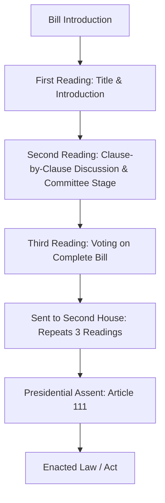

# Indian Polity & Governance: Complete UPSC Notes

> **Target Exam**: UPSC Civil Services Examination (Prelims & Mains) / State PSCs  
> **Subject**: Indian Polity & Governance  
> **Total Modules**: 31

---

## 📚 Table of Contents

1. [Philosophical Understanding of the Constitution](#1-philosophical-understanding-of-the-constitution)
2. [Making of the Constitution](#2-making-of-the-constitution)
3. [Comparison of the Constitution: Philosophical and Structural Understanding](#3-comparison-of-the-constitution-philosophical-and-structural-understanding)
4. [Preamble](#4-preamble)
5. [The Union and its Territory](#5-the-union-and-its-territory)
6. [Citizenship](#6-citizenship)
7. [Fundamental Rights](#7-fundamental-rights)
8. [Directive Principles of State Policy (DPSP)](#8-directive-principles-of-state-policy-dpsp)
9. [Fundamental Duties](#9-fundamental-duties)
10. [Federalism (Centre-State Relation)](#10-federalism-centre-state-relation)
11. [Asymmetric Federalism](#11-asymmetric-federalism)
12. [Emergency Provision](#12-emergency-provision)
13. [Union Executive (President)](#13-union-executive-president)
14. [Union Executive (Vice President)](#14-union-executive-vice-president)
15. [Union Executive (Central Council of Minister)](#15-union-executive-central-council-of-minister)
16. [Union Executive (Attorney General of India)](#16-union-executive-attorney-general-of-india)
17. [Parliament](#17-parliament)
18. [State Executive](#18-state-executive)
19. [State Legislature](#19-state-legislature)
20. [Judiciary (Supreme Court)](#20-judiciary-supreme-court)
21. [Judiciary (High Court & Subordinate Court)](#21-judiciary-high-court-subordinate-court)
22. [Tribunals](#22-tribunals)
23. [Panchayat](#23-panchayat)
24. [Municipalities](#24-municipalities)
25. [Constitutional Bodies](#25-constitutional-bodies)
26. [Non-Constitutional Bodies](#26-non-constitutional-bodies)
27. [Regulatory Bodies](#27-regulatory-bodies)
28. [Quasi-Judicial Bodies](#28-quasi-judicial-bodies)
29. [Governance](#29-governance)
30. [Development Process & role of NGOs , SHGs, and various groups ](#30-development-process-role-of-ngos-shgs-and-various-groups-)
31. [Rau's IAS Polity Notes for UPSC](#31-raus-ias-polity-notes-for-upsc)

---

## 1. Philosophical Understanding of the Constitution

> **Source Subject**: [Polity](https://compass.rauias.com/polity/)
---
## 1. Constitution and its purpose
> Source: [https://compass.rauias.com/polity/constitution-purpose/](https://compass.rauias.com/polity/constitution-purpose/)

## Constitution and its purpose

A constitution is a set of fundamental rules that determine how a country or state is run. Almost all constitutions are “codified”, which simply means they are written down clearly in a specific document called “the constitution”.

However, some countries, such as Israel, New Zealand, and the United Kingdom, have “un-codified” constitutions which can’t be found written down neatly in one particular place. Constitutions usually include the following basic elements:

- As constitutions include the most fundamental rules governing a society, it is generally more difficult for them to be amended than it is to pass ordinary pieces of legislation. For example, in the US, passing constitutional amendments requires a two-thirds majority of both houses of congress before being approved by three-quarters of the states. Alternatively, a constitutional convention can be called by two-thirds of US states which can propose amendments that will then need to be approved by three-quarters of the states. Both processes are much more difficult to complete than simply passing legislation through a majority of both houses of congress, reflecting the fundamental importance of rules set out in the constitution.

- In contrast, the United Kingdom’s “un-codified” constitution vests ultimate authority in [parliament](https://compass.rauias.com/polity/parliament/) to “make or unmake any law”, to quote A. V. Dicey, under the principle of “parliamentary sovereignty”. Since there is no written constitution of the United Kingdom, any law passed by parliament has the potential to be of constitutional significance, meaning the authority for altering the UK constitution ultimately lies with parliament.

Parliamentary sovereignty means that parliament is superior to the executive and judicial branch of the government and can therefore enact or repeal any law it chooses. It is a cornerstone of the UK constitutional system and applies in some parts of the Commonwealth such as Canada. The idea of parliamentary sovereignty is neatly summed up by 19th century constitutional theorist **A V Dicey:**“Parliament…has, under the English constitution, the right to make or unmake any law whatsoever; and, further, … no person or body is recognised by the law of England as having the right to override or set aside the legislation of Parliament.”***The notion of parliamentary sovereignty was at the heart of the Brexit referendum in 2016.*Those wishing to leave the European Union saw its institutions, such as the European Parliament, as directly challenging the sovereignty of the Westminster Parliament because European laws can be automatically binding and override local laws within the UK. On the other hand, it was the Westminster Parliament which accepted some limits on its own sovereignty when it decided to join the European Union (then known as the European Economic Community) in 1972 when it passed the European Communities Act.

### **Purpose of the constitution:**

- To provide a set of basic rules that allow for minimal coordination amongst the members of a society.

- The second function of the constitution is to specify who has the power to make decisions in a society.

- The third function is to set limits on what the government can impose on its citizens.

- The constitution is to enable the government to fulfil the aspirations of a society and create conditions for a just society.

#### Other Aspects of Constitution

- Constitutions can declare anddefine the boundaries of the political community. **These boundaries can be territorial (the geographical borders of a state, as well as its claims to any other territory or extraterritorial rights)

- Constitutions can declare and define the **nature and authority of the political community**. They often declare the state’s fundamental principles and assumptions, as well as where its sovereignty lies. For example, the French Constitution declares that ‘France is an indivisible, secular, democratic and social Republic’ and that ‘National sovereignty belongs to the people. Likewise the [Indian constitution](https://compass.rauias.com/polity/making-of-the-constitution/) is based on popular sovereignty. (The principle of popular sovereignty denotes that the source of governmental power or the sovereignty lies with the people.)

- Constitutions can express the identity and values of a national community. As nation building instruments, Constitutions may define the national flag, anthem and other symbols, and may make proclamations about the values, history and identity of the nation. eg: national flag, anthem etc

- Constitutions can declare and define the **rights and duties of citizens. **

- Constitutions can establish and regulate the political institutions of the community— defining the various institutions of government; prescribing their composition, powers and functions; and regulating the relations between them.

- Constitutions can **divide or share power between different layers of governmentor sub-state communities. Many constitutions establish federal, quasi-federal or decentralized processes for the sharing of power between provinces, regions or other sub-state communities. These may be geographically defined (as in most federations, such as Argentina, Canada or India), or they may be defined by cultural or linguistic communities (e.g. the 1994 Constitution of Belgium, which establishes autonomous linguistic communities in addition to geographical regions).

Read also:

[Understanding the Constitution](https://compass.rauias.com/polity/understanding-the-constitution/)[Understanding Constitutionalism](https://compass.rauias.com/polity/understanding-constitutionalism/)

|  |  |
| --- | --- |

---

## 2. Understanding the Constitution
> Source: [https://compass.rauias.com/polity/understanding-the-constitution/](https://compass.rauias.com/polity/understanding-the-constitution/)

## Understanding the Constitution

### **Constitution as interaction of legal, political system and society:**

- **Constitutions as legal instruments**: A constitution ‘marries power with justice’. It makes the operation of power procedurally predictable, upholds the rule of law, and places limits on the arbitrariness of power. It is the supreme law of the land, and it provides the standards that ordinary statutes have to comply with.

- **Constitutions as social declarations:Constitutions often attempt, to varying degrees, to reflect and shape society—for example, by expressing the common identity and aspirations of the people, or by proclaiming shared values and ideals. These provisions are generally found in preambles and opening declarations, but can also be found in oaths and mottos or on flags and other symbols that are defined by the Constitution. Other substantive provisions of the constitution, particularly those defining socio-economic rights, cultural or linguistic policy, or education, might also belong to this category. eg: [article 14](https://compass.rauias.com/polity/article-14/) right to equality, article 15 prohibition of discrimination, etc

- **Constitutions as political instruments:The constitution prescribes a country’s decision-making institutions: **constitutions ‘identify the supreme power’,‘distribute power in a way that leads to effective decision making’ and ‘provide a framework for continuing political struggle’. The political provisions show how state institutions (parliament, executive, courts, head of state, local authorities, independent bodies, etc.) are constituted, what powers they have and how they relate to one another. eg: article 324 [Election Commission of India](https://compass.rauias.com/polity/election-commission/), article 315 Union public service commission.

Constitutions balance and reconcile these legal, political and social functions in different ways. Two broad constitutional archetypes can be identified: the procedural and the prescriptive –

- **Procedural:Defines the legal and political structures of public institutions and sets out the legal limits of government power in order to protect democratic processes and fundamental [human rights](https://compass.rauias.com/polity/human-rights/).

- A procedural constitution may be appropriate in cases where it is difficult to arrive at a common agreement over issues of values or identity, but where it is possible to reach a more limited and pragmatic consensus on using democratic procedures to resolve these differences. **Ex: Canadian Constitution.**

- They make little or no explicit mention of nation-building or of fundamental philosophical or ideological principles. They contain few substantive provisions (provisions settling particular policy issues) except where such provisions reflect pragmatic attempts to settle practical problems of co-operation in a pluralist society (e.g., language rights and ownership of resources in Canada, education in the Netherlands). Ex. article 3 formation and alteration of boundaries of state.

- **Prescriptive: **It provides a collective vision of what might be considered a good society based on the common values and aspirations of a homogeneous community. In addition to describing how the government functions, the constitution assumes (or attempts to impose) a broad consensus on common societal goals that public authorities must strive to achieve. This is reflected in the emphasis placed on the constitution’s social content and in the ideological shape of its legal and political content.

- A prescriptive constitution may be appropriate in cases where a society wishes to re-establish itself on a shared ethical basis that is both symbolically proclaimed by, and practically embedded in, its supreme law. South Africa (1996) and Ecuador (2008) provide examples of prescriptive constitutions.

**It should be remembered that these archetypes are not firm categorizations. Most constitutions contain, to varying degrees, both features. According to South African Constitutional Court Justice Albie Sachs, constitutions can be regarded as ‘autobiographies of nations**. Even a relatively thin procedural constitution will say something about how a society sees itself and about who is included in and who is excluded from the nation’s self-narrative.

**The Indian Constitution is Prescriptive: **It is committed to freedom article 19 , equality article 14 , social justice, and some form of national unity. But underneath all this, there is a clear emphasis on peaceful and democratic measures for putting this philosophy into practice.

#### **Individual Freedom:**

- **Philosophy: **A simple answer to the **meaning of Freedom is the absence of constraints**. However, it is only one dimension of Freedom. Freedom is also about expanding the ability of people to express themselves and develop their potential. **A free society is one which enables all individuals to develop their potential with the minimum of social constraints.Then it becomes necessary to understand which social constraints are justified and which are not. Ex: [Caste system](https://compass.rauias.com/medieval-history/changes-caste-system-medieval-times/) is a kind of social constraint which can’t be justified, and any kind of constraint can be justified on the basis of Harm Principle i.e.: The harm caused must be serious.

- **Indian Context: **Freedom of expression is integral to the Indian Constitution as mentioned in Part III of the Indian Constitution.

#### **Social Justice:**

- **Philosophy: **Social justice means the rights of all people in our community are considered in a fair and equitable manner. Social justice specifically targets the marginalized and disadvantaged groups in our society such as Aboriginal and Torres Strait Islanders, children, people from culturally and linguistically diverse backgrounds, people with disabilities, older people, women. There are four interrelated principles of social justice: equity, access, participation and rights.

#### **Indian Context: **

- The liberalism of the Indian Constitution differs from the idea of classical liberalism in a way that it is always linked to social justice.classical liberalism ensures equality while Indian liberalism ensures equity where special provisions are provided for [weaker sections](https://compass.rauias.com/ethics/empathy-compassion-towards-weaker-section/).  Ex: Provision for reservation for scheduled caste and scheduled tribe. ( [article 16](https://compass.rauias.com/polity/article-16/), article 334)

- We can extract five basic principles, from the writings and speeches of Ambedkar, through which justice can be dispensed in the society. These are: 1. Establishing a society where individuals become the means of all social purposes 2. Establishment of society based on equality, liberty and fraternity 3. Establishing democracy- political, economic and social. 4. Establishing democracy through constitutional measures and 5. Establishing democracy by breaking monopoly of upper strata on political power

#### **Respect for Diversity and Human Rights:**

- **Philosophy:Minority rights are based on the recognition that [minorities](https://compass.rauias.com/social-justice/minorities/) are in a vulnerable situation in comparison to other groups in society, namely the majority population, and aim to protect members of a minority group from discrimination, assimilation, prosecution, hostility or violence, as a consequence of their status. It should be highlighted that minority rights do not constitute privileges, but act to ensure equal respect for members of different communities. These rights serve to accommodate vulnerable groups and to bring all members of society to a minimum level of equality in the exercise of their human and fundamental rights.

- **Article 27 (International Covenant on Civil and Political Rights):In those States in which ethnic, religious or [linguistic minorities](https://compass.rauias.com/polity/special-officer-linguistic-minorities/) exist, persons belonging to such minorities shall not be denied the right, in community with the other members of their group, to enjoy their own culture, to profess and practise their own religion, or to use their own language

- **United Nations Declaration on the Rights of Minorities**: Under [Article 2(1](https://compass.rauias.com/polity/article-21/)) of this declaration, minorities shall have the right to practice their religion, enjoy their culture and use their own language in both public and private settings without any kind of discrimination. Article 3 of this declaration guarantees persons belonging to minorities the right to exercise their rights individually and in community with others without discrimination.

- **Indian Context:The rights in the Universal Declaration of Human Rights were almost completely covered in the Indian Constitution either in Fundamental Rights or [Directive Principles of State Policy](https://compass.rauias.com/polity/directive-principles-of-state-policy/). Nineteen fundamental rights were covered in Motilal Nehru Committee Report, 1928 out of which ten appear in the Fundamental Rights whereas three of them appear as Fundamental Duties. The apex court has interpreted the Fundamental Rights available to a citizen and now rights like **right to privacy, right to clear environment, right to free legal aid, right to fair trail etc.also find place in the Fundamental Rights.

#### Secularism

- **Philosophy:The mainstream conception of [secularism](https://compass.rauias.com/indian-society/secularism/) means **mutual exclusion of state and religion in order to protect values such as individual freedom and citizenship rights of individuals.It means the state must not intervene in the affairs of religion, likewise religion should not dictate state policy. ***Jeremy Rodell*** identifies three core principles of secularism: institutional separation, freedom of belief and no discrimination on grounds of religion.

- Secularism seeks to defend the absolute freedom of religious beliefs and protect the right to manifest religious belief insofar as it does not impinge on the rights of freedom of others.

- Secularism is about democracy and fairness: No religious or political affiliation gives advantages or disadvantages, and religious believers are citizens with the same rights and obligations as anyone else.

- Secularismprotects free speech and expression**: Religious people have the right to express their beliefs publicly but so to those who question these beliefs.

- **Indian Context: **The three strands of religious freedom, celebratory neutrality and reformatory justice are the core elements of Indian secularism.

#### **Three schools of secularism in India:**

- **Gandhian: **[Article 25-28](https://compass.rauias.com/polity/article-25-28/)

- **Nehruvian: **[Article 15](https://compass.rauias.com/polity/article-15/)

- **Ambedkarite: **Article 29 and 30

#### **Differences in Indian secularism: Western model of secularismIndian model of secularismMutual exclusionPrincipled distancenegative conceptpositive concept*(Sarvadharma Sam Bhava)*No state supportaid**[religious reform](https://compass.rauias.com/modern-history/introduction-of-socio-religious-reform-movements/)[waqf boards](https://compass.rauias.com/current-affairs/waqf-amendment-bill-2024/)

|  |  |
| --- | --- |
| of state and religion, i.e. non-interference in affairs of each other. | of state from religion, i.e. state can interfere or engage with religion. |
| Embodies a  of secularism, i.e. strict separation between religion & state | Embodies a  of secularism, i.e. equal respect to all religions or equal protection of all religions |
| to any educational institution run by religious minorities. | A state can  educational institutions run by minorities. |
| No engagement with religion whatsoever. | State-supported  is possible. For e.g.: Abolition of untouchability, allowing inter-caste marriages, ban on triple talaq etc. |
| No public policy can solely be based on religion, as religion is completely a private matter. | The government frequently frames policies having a religious basis, like the constitution of  etc. |

#### **Achievement made by India:**

- Sometimes, Indian secularism is also criticized for being Anti-religious, but that is actually not true, as it is against institutionalised religious domination.

- It is also said that it promotes Minoritism, but it only advocates minority rights as long as those rights protect their fundamental interests.

- It is also criticized for being Interventionist, which means that secularism is coercive, and it interferes excessively with the religious freedom of communities. But again, this is misread because Indian secularism permits state-supported religious reforms.

- It was also criticized as an impossible project by other nations, but India claimed this false. In fact, migration is increasing due to globalization, andit is creating a situation where the Indian model is very much desired. Europe, America, and some parts of the Middle East are beginning to resemble India in the diversity of cultures and religions which are present in their societies. **

Read also:

[Constitution and its purpose](https://compass.rauias.com/polity/constitution-purpose/)[Understanding Constitutionalism](https://compass.rauias.com/polity/understanding-constitutionalism/)

|  |  |
| --- | --- |

---

## 3. Understanding Constitutionalism
> Source: [https://compass.rauias.com/polity/understanding-constitutionalism/](https://compass.rauias.com/polity/understanding-constitutionalism/)

## Understanding Constitutionalism

Despite the proliferation of nominally democratic constitutions, only a minority of states have so far succeeded in maintaining a lasting democratic constitutional order. The constitution ensures that the government does not own the state: it simply manages the state, under the authority of higher laws, on behalf of citizens. Thus, the idea of ***Constitutionalism*comes into play.

**Constitutionalism and India: **As constitutionalism is a political spirit or philosophy, itis not necessary that the states which have a constitution must be embodied with the concept of constitutionalism.According to **Douglas Greenberg**, Constitutionalism is a commitment to limitations on ordinary political power, it revolves around a political process, one that overlaps with democracy in seeking to balance state power and individual and collective rights, it draws on particular cultural and historical contexts from which it emanates, and it resides in public consciousness.

**Positive constitutionalism: **Positive Constitutionalism challenges the understanding of seeing Constitutionalism entirely in terms of limits upon the State **(Negative Constitutionalism).The positive aspect of Constitutionalism requires the State to be seen in the light of a “**Welfare State”**. The positive version of Constitutionalism requires the **creation of effective and competent state institutions to ensure the well-being of its citizens. **According to Professor **M.P. Singhif a constitution ignores accommodation and respect for diversity and plurality in a society then it fails to meet the requirement of constitutionalism.

**A written Constitution is no guarantee for Constitutionalism. **Even Nazi Germany had a constitution but that does not mean that it adhered to the philosophy of Constitutionalism be it a negative or positive aspect of it.

- **SR Chaudhari vs State of Punjab:“the mere existence of a constitution, by itself, does not ensure constitutionalism. What is important is the political traditions of the people and its spirit and determination to work out its constitutional salvation through the chosen system of its political organisation.”

- Unless primacy to democratic policies and individual rights is not given, Constitutionalism cannot survive. Subtle assaults to individual rights especially freedom of Speech and Expression and privacy, such as sedition laws, surveillance laws, undermine Constitutionalism.

- Again, in** RC Poudyal vs UOI:Court said that, “**Mere existence of a Constitution, by itself, does not ensure constitutionalism or a constitutional culture. It is the political maturity and traditions of people that give meaning to a constitution* which otherwise would merely embody the political hopes and ideals”.***

### **Features in Indian context**:

- **A state by constitution**: Indian constitution not just provides the rights and immunities to the citizen, but it also delineates the character and structure of the Indian State. Therefore, it can also be said that the **powers and extent of the Indian State are limited by the Constitution.**

- **[Article 21](https://compass.rauias.com/polity/article-21/) and Due process of law**: In **Swaran Singh vs State of UP**: The Court observed that **public power, including constitutional power, must never be exercised arbitrarily or malafide, and ordinarily guidelines for fair and equal execution are guarantees of valid use of power**. The power being of the greatest moment, cannot be a law unto itself but it must be informed by the finer canons of constitutionalism. These requirements of Law and of Due process restrict the power of the state. Any violation of these principles would enable the courts to strike down the law.

- **Fundamental Rights: IR Coelho vs state of TN:The principle of constitutionalism is based on the principle of legality which requires the **Courts to interpret the legislations on the presumption that the [Parliament](https://compass.rauias.com/polity/parliament/) would not intend to legislate contrary to fundamental rights. **The Legislature can restrict fundamental rights, but it is impossible for laws protecting fundamental rights to be impliedly repealed by future statutes.

- **Written constitution:Being a written Constitution it firstly provides for a limited government, which is the core of Constitutionalism. The sovereign powers are divided among 3 organs of the government. **Powers of each organ are defined by the constitution and no organ, or its instrumentalities can transgress its limits.**

- **Separation of power:NCT Of Delhi VS UOI:“The essence of constitutionalism is the control of power by its distribution among several state organs or offices in such a way that they are each subjected to reciprocal controls and forced to cooperate in formulating the will of the state.

---

## 4. Difference between Constitutionalism and Constitutional Morality
> Source: [https://compass.rauias.com/polity/difference-between-constitutionalism-and-constitutional-morality/](https://compass.rauias.com/polity/difference-between-constitutionalism-and-constitutional-morality/)

## Difference between Constitutionalism and Constitutional Morality

**Constitutionalism Constitutional Morality **

|  |  |
| --- | --- |
| Constitution is a form of limited government  limited by a document i.e., constitution, the supreme law of the land. It is a scenario where the government has to work within the framework of rules and laws laid down by the constitution. | Constitutional morality as per Dr Ambedkar, is effective coordination between conflicting interests of different people, and administrative cooperation to resolve them amicably without any confrontation amongst various groups working for the realization of their ends at any cost. |
| Only having a written constitution does not ensure constitutionalism. It can be ensured through well functioning institutions , active civil society and a proactive judiciary. | Constitutional morality refers to obeying the law for moral as well as legal reasons. |

- According to **Dr. Ambedkar, Constitutional morality would mean effective coordination between conflicting interests of different peopleand the administrative cooperation to resolve them amicably without any confrontation amongst the various groups working for the realization of their ends at any cost.

- According to our Constitution, we assert that there are laws and rights and that we uphold these rights not just because they are laws but because doing so is morally correct. So, **Constitutional Morality refers to obeying the law for moral reasons as well as for legal reasons.**

#### **Evolution of Concept:**

- Propounded by George Grote in the 19th century in his book “A History of Greece.” He described CM as a “paramount reverence for the forms of the Constitution” of the land. It essentially implied a “co-existence of freedom and self-imposed restraint”.

- **Ambedkar Perspective:**

- Ambedkar, drawing on the work of Grote, formulated his understanding of constitutional morality as an effective coordination between conflicting interest of different people and the administrative cooperation to solve those issues or conflicts amicably without indulging in any major confrontations or resorting to violent revolutions.

- According to him, constitutional morality was the answer to the existing disparity in the society and the doctrine primarily translated to respect among stakeholders in a republic for Constitutional democracy as the accepted form of governance and administration.

- The term ‘Constitutional Morality’ is not found in the Indian Constitution. Nevertheless, we find mention of the word “morality” in conjunction with “public order” in the constitution at various places like **[Article 19](https://compass.rauias.com/polity/article-19/), 25 and 26 of the constitution.**

#### **Landmark Judgement**

- ***Navtej Johar vs UOI:*Applying the doctrine, the judges found that court must not be remotely guided by majoritarian view or popular perception, but they must be guided by constitutional morality. **The courts differentiated between public and constitutional morality and said that the ideal of justice always have an overriding effect. i.e., constitutional morality has an overriding effect on public morality.**

- ***Joseph Shine v. Union of India: *The idea of “Husband as master of women” or “a woman as a possession of her spouse” was held to be completely contrary to the spirit of constitution facets and ideals. Here doctrine comes as counterpoise to “Public Morality”.

- **Government of NCT of Delhi vs Union of India: **In this case, Courts equated constitutional morality to a ‘second basic structure doctrine’ and it was observed by the **[Supreme Court](https://compass.rauias.com/polity/supreme-court/) that constitutional morality is “not just the forms and procedures of the Constitution but provides an enabling framework that allows a society the possibilities of self-renewal”.**

- ***Indian Young lawyers Association v. State of Kerala: *SC held that exclusion between the age of 10-50 in Sabrimala temple for worship of Lord Ayyappan is violative of 4 key constitutional morality tests, which includes: Justice, Liberty, Equality and Fraternity. In this, Court noted that t**he word “morality” in Articles 25 & 26 must mean constitutional morality and not popular morality and existing structures of social discrimination must be evaluated through the prism of constitutional morality.**

#### **Significance:**

- **Safeguards and upholds the enforcement of rule of law in the country:As the doctrine tends to question both the citizens as well as the government, it promotes people to be an active participant of the system and fight the inequalities and non-constitutional elements.

- **Promoting and reinforcing the democratic ideals of the nation:The doctrine promotes congenial cooperation and coordination of all the stakeholders, especially among citizens and the state, to pursue constitutional ambitions.

- **Bring about a positive transformation in the perception of societal or public morality:The principle of constitutional morality can be used for reading down laws or statutes which are inconsistent with the incumbent time. For instance, in passing a law prohibiting Sati, right to life and dignity was passed on to the Indian widows who were earlier considered to be harbingers of misfortune and ill-luck.

- **Akin to the basic structure doctrine:Together with basic structure doctrine, CM is known as one of the ‘Constitutional Silences’. Like the basic structure test, it imposes implied constitutional limits on the government and **ensures that government’s actions do not violate the spirit, soul, or conscience of the Constitution.**

- **Moving towards achieving Constitutionalism:The concept of constitutional morality urges the organs of the State to preserve the heterogeneous nature of the society. Thus, it backs the efficacy of Constitutionalism in the true sense.

#### **Criticism:**

- **Lack of literature and clarity on the concept:As there is no explicit mention of the term ‘constitutional morality’ in the Constitution of India and **no fixed definition **that has been attributed to it, it has been left on the discretion of the individual judges to interpret the essence of this doctrine and apply in requisite situations.

- **Encourages judicial supremacy and activism by the courts:Upholding and promoting democracy by using constitutional morality encourages judicial activism by the courts.

- **Creates distrust among public towards organs of State:The top-down imposition of constitutional morality by Court which is an unelected and autonomous body may instill and encourage a general distrust among public towards the Legislature and the Executive.

### Constitutional Morality over Public Morality

Under Article 19 of the Constitution, the power to impose reasonable restrictions on Fundamental Rights is vested with the Legislative and Executive and not with the Judiciary. Thus, clearly asserting that judiciary cannot limit the Fundamental Rights through the doctrine of Constitutional Morality but the same can be done by Executive and Legislature under the notion of Public Morality stated in Article 19.

#### Issues With Constitutional Morality Over Public Morality

- It might lead to backlash by some communities or groups: some sections of people might perceive imposition of constitutional morality as an infringement on their own ways of living and culture. For eg: Sabarimala judgement led to backlash by the priests of the temple, local residents and other devotees.

- it can lead to societal disharmony and further increase tensions in society : :it has the potential to disturb the delicate societal balance and widen the deep rooted tensions in the society.

However, even if in the short run, imposition of constitutional morality over public morality might lead to a backlash; in the long run it is an essential step in order to make the progress of society possible. also it creates a path for a more equitable and just society.

---

---

## 2. Making of the Constitution

> **Source Subject**: [Polity](https://compass.rauias.com/polity/)
---
## 1. Making of the Constitution
> Source: [https://compass.rauias.com/polity/making-of-the-constitution/](https://compass.rauias.com/polity/making-of-the-constitution/)

**Historical Background:**

- Poorna Swaraj Resolution 1920: complete freedom from the British

- Nehru Report 1928: Fundamental rights, federal set-up

- M N Roy : idea of Constituent Assembly 1934

- [Government of India Act 1935:](https://compass.rauias.com/modern-history/government-india-act-1935/) many provisions were taken from this Act

- [Cripps Mission](https://compass.rauias.com/modern-history/cripps-mission-1942/), Cabinet mission : advocated the idea of constituent assembly

**Formed by Constituent assembly:A constituent assembly (also known as a constitutional convention, constitutional congress, or constitutional assembly) is a body assembled for the purpose of drafting or revising a constitution.

**Composition of the Constituent Assembly: **It was the Cabinet Mission that had put forth the idea of a Constituent Assembly and, therefore the composition of the Assembly was made in line with the Cabinet Mission scheme.

**The structure of the Constituent Assembly was:**

- 292 members elected through the Provincial Legislative Assemblies.

- The Indian Princely States was represented by 93 members: and

- The Chief Commissioners’ Provinces were represented by 4 members.

- Thus, the total membership of the Constituent Assembly was to be 389. But the [Mountbatten Plan](https://compass.rauias.com/modern-history/mountbatten-plan-1947/) of 3rd June 1947 led to the partition of India thereby leading to a formation of a separate Constituent Assembly for the newly made Pakistan. This ceased some of the representatives of certain Provinces to be members of the Assembly, resulting in a reduction of the membership to 299 members.

- The working of the Constituent Assembly proceeded based on the [Objectives Resolution](https://compass.rauias.com/polity/objective-resolution/) that was laid before the Assembly on 13th December 1946 by Pandit Jawaharlal Nehru and was adopted by the Constituent Assembly on 22 January 1947.

Read also:

[Constitution and its purpose](https://compass.rauias.com/polity/constitution-purpose/)[Understanding Constitutionalism](https://compass.rauias.com/polity/understanding-constitutionalism/)

|  |  |
| --- | --- |

---

## 2. Objective resolution
> Source: [https://compass.rauias.com/polity/objective-resolution/](https://compass.rauias.com/polity/objective-resolution/)

## Objective Resolution

- It established the concept and guiding principles for building the Constitution and eventually took the shape of the Preamble to the Indian Constitution. On22 January 1947**, the Constituent Assembly accepted this Resolution.

- According to the Resolution, the Constituent Assembly would first proclaim India as the **Independent Sovereign Republic,with all territories remaining autonomous and possessing residuary powers; all Indians would be guaranteed justice, equality of status, freedom of thought, expression, belief, faith, worship, vocation, association, and subject to the law and public morality; and adequate safeguards would be provided for minorities, backward, and depressed people.

- The Constituent Assembly had a total of **22 committeesto look into the different tasks in the making of the constitution. Out of the 22 committees, 8 were major committees and the rest were minor committees.

- A major chunk of deliberations of the Constituent Assembly was on the Draft Constitution(s) prepared by the **Drafting Committee.Members of the Constituent Assembly proposed amendments which had to be submitted in advance to the Chairman, and these were debated at length. At the end of a debate around an Article of the Draft Constitution, the Constituent Assembly either adopted or rejected amendments. It took decisions through a majority vote.

- On 9 December 1946, the Constituent Assembly sat for the first time. In the span of 2 years and 11 months, it completed its task of framing the Indian Constitution. During this period the Constituent Assembly had 11 sessions and sat for a total of 166 days. On 26 November the Constituent Assembly adopted the Constitution of India which came into force on 26 January 1950.

### **Dissolution of Constituent Assembly:**

- Following the authentication of the Constitution's copies, the Constituent Assembly was naturally dissolved, with its chairperson elected President of India and its staff diverted to other avenues.

- However, the majority of the Assembly continued to function as the provisional [Parliament](https://compass.rauias.com/polity/parliament/) of India until the first general elections were held.

- This provisional Parliament did, in fact, make the first amendment to the Indian Constitution in the summer of 1951.

#### **Criticism of Constituent Assembly:Not a Representative Body:Not a Sovereign Entity:Time-consuming:Congress-dominated Constituent Assembly:Lawyer - Politician Domination:Hindu-dominated:**

| The Constituent Assembly was not a representative body, according to opponents, because its members were not directly elected by the people of India using the universal adult franchise. |
| --- |
| Critics said that the Constituent Assembly was not a sovereign body because it was established by British government suggestions. They further claimed that the Assembly met with the authorization of the British government. |
| Critics claim that the Constituent Assembly took an excessive amount of time to draught the Constitution. They claimed that the framers of the American Constitution finished their work in just four months. |
| Critics said that the Congress party dominated the Constituent Assembly. 'The Constituent Assembly was a one-party assembly in an essentially one-party society,' said Granville Austin, a British constitutional expert. The Congress was the Assembly, and India was the Congress.' |
| The Constituent Assembly was likewise dominated by attorneys and politicians, according to detractors. They argued that other aspects of society were not adequately reflected. This, they believe, is the primary cause for the Constitution's volume and complication of language. |
| Some critics claim that the Constituent Assembly was Hindu-dominated. Lord Viscount Simon referred to it as "a Hindu body." Winston Churchill, likewise, stated that the Constituent Assembly represented "just one large community in India." |

---

## 3. Indian Constitution is 75% of GOI Act 1935
> Source: [https://compass.rauias.com/polity/indian-constitution-is-75-of-goi-act-1935/](https://compass.rauias.com/polity/indian-constitution-is-75-of-goi-act-1935/)

## Indian Constitution is 75% of GOI Act 1935

The features of the Government of India Act 1935 which are copied in the Indian constitution are:

### **Bicameral Legislature:**

- The Indian Parliament with the Lok Sabha and Rajya Sabha forming the legislative system is extracted from the 1935 Act.

#### **Division of Powers:**

- **Schedule 7 **of the Indian constitution and Centre-state relations (**Article 256-263**) are based on the above sections of the 1935 act.

- The powers between the centre and the provinces were separated into three lists with the introduction of this act: the Federal list (59 items for the centre), the Provincial list (54 items for provinces), and the Concurrent list (36 items for both).

#### **Residuary Powers:**

- The residuary powers concerning items not listed in the Schedule 7 lists are vested with the Union government.

- The residuary powers in the Government of India 1935 Act were handed over to the Viceroy.

#### **Emergency provision:**

- **Section 45of the [Government of India Act 1935](https://compass.rauias.com/modern-history/government-india-act-1935/) provided provision in case of failure of constitutional machinery.

#### **Office of the Governor:**

- The constitutional post of the Governor, his appointment, and his powers are mentioned in **Article 152 to Article 162.**

- The 1935 Act established the office of the Governor with all the executive powers and authority of the centre was vested in the Governor.

#### **Administrative Details and Inter-State Relations:**

- The Inter-State relations and water dispute redressal mechanisms in the Indian Constitution were inspired by Section 130 of the 1935 Act.

#### **Separation of power:**

- No discussions shall take place in Parliament with respect to the behaviour of any Judge of the Supreme Court or a [High Court](https://compass.rauias.com/polity/hight-court/) in the exercise of his duties," is given by Articles 121 and 211 of the Indian constitution respectively.

- This was taken from Section 40 and Section 86 of the 1935 Act.

---

## 4. Important sources of Indian Constitution at a glimpse
> Source: [https://compass.rauias.com/polity/important-sources-of-indian-constitution-at-a-glimpse/](https://compass.rauias.com/polity/important-sources-of-indian-constitution-at-a-glimpse/)

## Important sources of Indian Constitution at a glimpse

**IMPORTANT SOURCES OF INDIAN CONSTITUTION AT A GLIMPSEGovernment of India Act 1935Constitution of theUnited StatesBritish constitutionIrish constitution (Ireland)**[Election of President](https://compass.rauias.com/polity/election-of-president/)**Australian constitutionFrench constitution**[Preamble](https://compass.rauias.com/polity/preamble/)**Constitution of South Africa**[Rajya Sabha](https://compass.rauias.com/polity/rajya-sabha/)**Constitution of Soviet Union (USSR)**[Fundamental Duties](https://compass.rauias.com/polity/fundamental-duties/)**Constitution of GermanyConstitution of JapanConstitution of Russia**

|  |  |
| --- | --- |
|  | • Federal Scheme• Emergency Provisions• Public Service Commissions• Office of Governor• Judiciary• Administrative Details |
|  | • Preamble• Fundamental Rights• The federal structure of government • Electoral College |
|  | • Independence of the judiciary and separation of powers among the three branches of the government• Judicial review• President as Supreme Commander of Armed Forces• Equal protection under law |
|  | • Parliamentary form of government• The idea of single citizenship• The idea of the Rule of law• Writs• Institution of Speaker and his role• Lawmaking procedure• Procedure established by Law |
|  | • Directive Principles of State Policy• Nomination of members to Rajya Sabha• Method of |
|  | • Freedom of trade and commerce within the country and between the states• Power of the national legislature to make laws for implementing treaties, even on matters outside normal Federal jurisdiction• Concurrent List |
|  | •   Republic and the ideals of Liberty, Quality and Fraternity in the |
|  | • Procedure for amendment• Election of  members |
|  | •  under Article 51-A• A Constitutionally mandated Planning Commission to oversee the development of the economy |
|  | • Emergency powers to be enjoyed by the Union• Suspension of Fundamental Rights during an emergency. |
|  | • Procedure Established by Law |
|  | • Fundamental Duties• Idea of Social, Economic, and Political Justice in Preamble |

### **Uniqueness of Indian Constitution:**

- Our Constitution strikes a **balance between rigidity and flexibility.The [Parliament](https://compass.rauias.com/polity/parliament/) can make amendments to the Constitution as per the needs, according toArticle 368. **However, the basic structure of the Constitution cannot be changed or modified. Any violation of the basic structure of the Constitution is unconstitutional and is invalidated by courts.

- The **Constitution of India identifies only single citizenship. **In countries like the USA, there is a provision of dual citizenship. The people of India are citizens of the country as a whole and not of the respective states like in the USA.

- **Universal Adult Franchisepromotes the policy of 'one person one vote'. Every individual of 18 years and above has the right to vote irrespective of their age, gender, race, colour, religion etc.

- The Constitution includes all thefederal characteristics of governance **such as dual government system, constitutional supremacy, an independent judiciary, bicameralism, and division of powers between the three state organs of the executive, judiciary, and legislature.

- It is unique in that it includes **many unitary features **as well. They include string centre, all India services common to the centre and the states, [emergency provisions](https://compass.rauias.com/polity/emergency-provisions/) that can transform the Constitution into a unitary one, if necessary, the appointment of governors by the president on the advice of the centre, etc.

- Unlike the United States where there is atwo-tiered judiciary, a single judicial systemprevails with the [Supreme Court](https://compass.rauias.com/polity/supreme-court/) at the top in India, with the State and District High Courts and other subordinate courts below and subject to the supervision of the High Courts.

#### **Women’s Contribution in Framing Constitution:**

- **Shrimati Ammu Swaminathan** had put forth that the two stable pillars on which the Indian Constitution rests are the Fundamental Rights, and the Directive Principles of State Policy.

- **Shrimati G. Durgabai had put forth her views on the appointment of Judges of the Provincial High Courts, pointing that the same should be the duty of the [Governor](https://compass.rauias.com/polity/the-governor/) and his set of Ministers solely. Her views on the prohibition of the Devadasi system, protection of children from exploitation, and limitations on the freedoms provided to individuals had been remarkable also.**

- **Shrimati Hansa Mehta** majorly highlighted the need for social, economic, and political justice for women of India taking into account the prolonged suppression they have been subjected to in India.

- **Shrimati Purnima Banerji** put forth her views on the State’s Control over Religious Instruction in Schools. She also pointed out that secularism in a true sense could only be achieved if citizens of the nation are united among themselves.

- **Shrimati Renuka Ray** belonging to the West Bengal Constituency focused majorly on equality of Status and justice for women.

- **Shrimati Sarojini Naidu** had sought an inclusive Constituent Assembly of India.

- **Shrimati Sucheta Kripalani** had uplifted the environment of the Constituent Assembly by singing the verses of the national song, and the national anthem of India.

- **Shrimati Vijayalakshmi Pandit** aimed for the centrality of new Asia in the Post-Raj World Order.

#### **Criticism of the Constitution:**

- It isunwieldy **based on the assumption that the entire constitution of the country must be found in one compact document. But this is not even for countries such as the US, which do not have a compact constitution.

- It isunrepresentativeas members of constituent assembly were chosen by restricted franchise, not by Universal adult franchise.

- It is an alien constitution, as it was made using borrowed elements from other constitutions.

- It is not clear why in poor developing countries certain basic socio economic rights were relegated to the section on DPSP, rather than made an integral part of Fundamental rights.

#### Positives Of The Constitution:

- It is a comprehensive document: it provides a detailed provision for day to day functioning of the government. as well as special provisions for times of crisis such as emergency provisions.

- It contains safeguards for all the vulnerable sections of the society such as [scheduled caste](https://compass.rauias.com/social-justice/scheduled-caste/), scheduled tribes, other backward classes, economically weaker sections, women, transgender, etc in order to ensure a just and equitable society. eg: [article 16](https://compass.rauias.com/polity/article-16/) equality of opportunities in public employment.

- It ensures federal balance by providing adequate provisions for states. these include schedule 7,  GST council etc.

- It has the ability to transform itself in order to give space for future needs to make it relevant in times of needs. eg: constitutional amendments

- It gives a detailed set of fundamental rights applicable to all the citizens of the country.

- It also lists future courses of action for future govts, by listing the goals that the govt must follow, these are mentioned in [Directive principles of State policy](https://compass.rauias.com/polity/classification-dpsp/).

---

---

## 3. Comparison of the Constitution: Philosophical and Structural Understanding

> **Source Subject**: [Polity](https://compass.rauias.com/polity/)
---
## 1. Features of Constitution
> Source: [https://compass.rauias.com/polity/features-of-constitution/](https://compass.rauias.com/polity/features-of-constitution/)

## Salient features of Indian Constitution

### **Size of the Constitution:**

- It is thelengthiest Constitution**, Very Comprehensive document and includes many matters which could be subject matter of ordinary legislation or administrative action.

- Also, the Constitution makers didn’t want to leave certain matters Subject to doubts, difficulties and Controversies to be handled by future legislation.

- Unlike the United States where in addition to the federal Constitution, each state had its own separate Constitution ·

- The size, diversities and Complexities of Indian Situation also necessitated several special temporary Provisions.

- Not only "Constitution Contain a very Comprehensive Charter of justifiable fundamental rights, it also delineates the limitations under which these must necessarily operate unlike us, where limitation had to be read by the court decisions.

| 1950 | 2022 |
| --- | --- |
| 395 articles | 470 articles |
| 22 parts | 25 parts |
| 8 schedule | 12 schedules |

#### **Rigidity & Flexibility: **

- The Constitution is neither a frozen document nor merely a lengthy legal document but a charter of values and principles, basically a dream of a free, just, and equal society. A dream which is not static or unvarying but is subject to **constant renewal as each generation discovers its new founding principles.Almost like a living being, the constitution keeps responding to various situations, circumstances and experiences arising from time to time.

- Our Constitution accepts the necessity of modifications according to changing needs of the society. Secondly, in the actual working of the Constitution, there has been enough flexibility of interpretations. Both political practice and judicial rulings have shown maturity and flexibility in implementing the Constitution. **These factors have made our Constitution a living document rather than a closed and static rulebook.**

#### **Process of Amendment:**

- **Article 368in Part XX of the Indian Constitution deals with the power of the [Parliament](https://compass.rauias.com/polity/parliament/) to amend the constitution and its procedure if requires.

- So, the Parliament is empowered to amend or repeal any provision of the constitution in accordance with the procedure laid down for this purpose.

- However, it was ruled by the [Supreme Court](https://compass.rauias.com/polity/supreme-court/) in Kesavananda Bharati Case 1973 that the parliament cannot amend those provisions which form the “basic structure” of the Constitution.

### **Types of Amendment**

Article 368 of the Indian Constitution has provided for two types of amendments, that is by a **special majority **of Parliament and the special majority of parliament along with the ratification of half of the state’s legislatures by a **simple majority.**

Certain provisions of the Constitution require amendment by a simple majority of each house, that is, a majority of members of each house present and voting (similar to ordinary legislation). These amendments are not considered to be amendments under Article 368.

It clearly means that the amendment of Indian Constitution is possible in three ways:

- Amendment by a simple majority of the Parliament,

- Amendment by a special majority of the Parliament, and

- Amendment by a special majority of the Parliament, and the ratification of half of the [state legislatures](https://compass.rauias.com/polity/session-of-state-legislature/)

#### Simple Majority

This refers to the **majority of more than 50% of the members present and voting **and it is outside the ambit of Article 368. This is also known as the functional majority or working majority. The simple majority is the most frequently used form of majority in Parliamentary business. When the constitution or the laws do not specify the type of majority needed, the simple majority is considered for voting.

To understand the simple majority, let us consider a situation in [Lok Sabha](https://compass.rauias.com/polity/lok-sabha/). On a particular day, out of the total strength of 545, 45 were absent and 100 abstained from voting on an issue. So only 400 members were present and voting. Then the simple majority is 50% of 400 plus 1, i.e., 201.

A number of provisions in the Constitution cane be amended by a simple majority of the two houses of Parliament outside the scope of Article 368. These provisions include:

- Admission or establishment of new states.

- Formation of new states and alteration of areas, boundaries or names of existing states.

- Abolition or creation of legislative councils in states.

- Second schedule - emoluments, allowances, privileges and so on of the president, the governors, the speakers, judges etc.

- Quorum in Parliament.

- Salaries and allowances of the members of Parliament

- Rules of procedure in Parliament

- Privileges of the Parliament, its members and its committees.

- use of English language in Parliament

- Number of puisine judges in the Supreme Court.

- Conferment of more [jurisdiction on the Supreme Court](https://compass.rauias.com/polity/jurisdiction-of-supreme-court/)

- Use of official language

- Citizenship - acquisition and termination

- Elections to Parliament and state legislatures.

- Delimitation of Constituencies

- [Union Territories](https://compass.rauias.com/polity/union-territory/)

- Fifth schedule - administration of [scheduled areas and scheduled tribes](https://compass.rauias.com/social-justice/schedule-tribes/).

- Sixth schedule - administration of tribal areas.

#### Special Majority

All types of majorities other than the absolute, effective or simple majority are known as the special majority. A special majority are of 4 types, with different clauses.

The two most significant provisions that can be changed by a special majority are the Fundamental Rights and [Directive Principles of State Policy (DPSP)](https://compass.rauias.com/polity/directive-principles-of-state-policy/), however, any changes must stay within the constraints of the Basic Structure of the Constitution.

- Type 1 – Special Majority as Per **Article 249.**

- Type 2 – Special Majority as perArticle 368.**

- Type 3 – Special Majority as perArticle 368 + 50 per cent state ratification by a simple majority.**

- Type 4 – Special Majority as per **Article 61.**

#### **Special Majority as Per Article 249**

Special majority as per article 249 requires a majority of 2/3rd members present and voting. For example, if out of the 245 members in Rajya Sabha, only 150 are present and voting, then the special majority required as per article 249 would be 101.

Cases where special majority as per article 249 is used:

- To pass the Rajya Sabha resolution to empower the parliament to make laws in the state list. (Valid up to 1 year but can be extended any number of times).

#### **Special majority as per article 368**

It requires a majority of 2/3rd members present and voting supported by more than 50% of the total strength of the house. This type of majority is used for most of the Constitutional amendment bills. To pass a constitution amendment bill in Rajya Sabha, in addition to getting the support of 123 members, the bill should be favoured by more than 2/3rd of the members present and voting.

**Cases where special majority as per article 368 is used:**

- To pass a constitutional amendment bill which does not affect federalism.

- Removal of judges of SC/HC.

- Removal of CEC/CAG.

- Approval of a [national emergency requires a special majority as per Article 368](https://compass.rauias.com/polity/national-emergency-article-352/) in both houses.

#### **Special Majority as Per Article 368 Plus State Ratification**

This type of special majority is required when a constitutional amendment bill tries to change the federal structure. Special majority as per article 368 plus state ratification requires a majority of 2/3rd members present and voting supported by more than 50% of the state legislatures by a simple majority.

**Cases where special majority as per article 368 plus state ratification is used: To pass a constitutional amendment bill which affects federalism like the position of [High Court](https://compass.rauias.com/polity/hight-court/) Judges.Special majority as per article 61** requires a majority of 2/3rd members of the total strength of the house. In Lok Sabha, the special majority as per article 61 is 364 while in Rajya Sabha, the special majority as per article 61 is 164.

**Cases where special majority as per article 61 is used**: For the impeachment of the President

#### **Procedure for Amendment:**

- An amendment of this Constitution may be initiated only by the introduction of a Bill for the purpose in either House of Parliament and not in the [state legislature](https://compass.rauias.com/polity/state-legislature/).

- The bill does not require the prior permission of the President for introduction in the Parliament.

- The bill shall be presented by a minister or a private member.

- The bill must be passed in each house by a special majority i.e., the majority of the total membership of the house and the majority of two third of members of the house present and voting.

- Each house must have to pass the bill separately and there is no provision for joint sitting if any case of disagreement arises between the two houses.

- If the bill seeks to amend the federal feature of the constitution, it must also be ratified by half of the state legislature with a simple majority.

- After duly passed by both houses and ratified by the states (if required), the bill is presented to the president for his assent.

- The President can neither withhold nor return the bill for the reconsideration purpose of the parliament. Hence, the President must have to give his assent to the bill.

- After the assent of the President, the bill will become an Act.

#### **Indian Constitution is called a living Document:**

- The earliest mention of the Constitution as "living document" comes from **Wilson's book Constitutional Government in the United States in which he wrote: 'Living political constitutions must be Darwinian in structure and in practice.' **Therefore, the Constitution should be viewed not merely as law but also as a source of foundational concepts for the governing of society.

- **Role of Judiciary:Judiciary has played an important role in not only saving the essence of the Constitution but also in its evolution.

- **Basic structure Doctrine**: Propounded in the famous Kesavananda Bharati Case, 1973 it restricts the Parliament from altering the essential features of the Constitution or what the Supreme Court termed as the Basic Structure. Basic structure includes various Constitutional ideals such as [secularism](https://compass.rauias.com/indian-society/secularism/), rule of law, federalism etc.

- **Transformative nature of the Constitution:The courts, at various point of time, have brought transformative changes through a broad reading of our Constitution. Courts have regularly included various rights under the existing Fundamental Rights to suit the changing times. For example, the Supreme Court in its landmark judgment in **Justice Puttaswamy Case recognised Right to Privacy as a part of Fundamental Rights under [Article 21. ](https://compass.rauias.com/polity/article-21/) **

#### **Criticism of Amendment Procedure in India**:

- **No Special Body: **There is no provision for a special body to change the Constitution, such as a Constitutional Convention (as in the United States) or a Constitutional Assembly.

- **Exclusive to Parliament:** The Parliament has the authority to propose a constitutional modification. Except in one situation, when passing a resolution seeking the creation or elimination of legislative councils in the states, state legislatures are unable to introduce any bill or proposal to modify the Constitution.

- **States have no power to ratify or reject amendments**: The Constitution makes no provision for the state legislatures to ratify or reject an amendment that is presented to them. It is also silent on the question of whether nations can revoke their permission after giving it.

- **No joint Sitting: **If there is a deadlock over the passage of a constitutional change bill, there is no provision for a joint sitting of both Houses of Parliament.

- **Similar process as Ordinary law making:** The procedure for amending a document is comparable to the procedure for enacting legislation. The constitutional amendment legislation must be carried by Parliament in the same way as other laws, with the exception of the special majority requirement.

- **Room for judicial intervention:** They give a lot of room for the courts to intervene.

#### **Expert CommentBR Ambedkar: **"The Assembly has not only refrained from putting a seal of finality and infallibility upon this Constitution by denying the people the right to amend the Constitution as in Canada or by making the amendment of the Constitution subject to the fulfilment of extraordinary terms and conditions as in America or Australia but has provided for a facile procedure for amending the constitution.

**KC Where:Indian constitution 'strikes a good balance between flexibility and rigidities.

**Pandit Nehru: **While we want this Constitution to be as solid and permanent as we can make it, there is no permanence in a constitution. There should be certain flexibility. If you make any Constitution rigid and permanent, you stop the nation's growth, the growth of a living, vital, organic people'.

### **Parliamentary VS Presidential system: **

A parliamentary system, also known as parliamentarianism (and parliamentarism in U.S. English), is distinguished by the executive branch of government being dependent on the direct or indirect support of the parliament, often expressed through a vote of confidence.

#### **Federal or Unitary**:

- In Unitary Constitution, all powers are vested in the Central government to which the authorities in the units are Subordinate and function and function as the agents of the govt at the Centre and exercise authority by delegation from the Centre.

- In a federal polity, usually there is a rigid, written Constitution, it must be supreme, and it must specifically divide powers between the federal govt and government of limits. In fact, in Classical federation, the federal government only those powers that are by agreement surrendered to it by the units. Also, there must be an Independent SC as the arbiter of Union and States." any dispute between the union and states.

#### **Indian Constitution is called Quasi-Federal**

- **Not Unitary:because of distribution of power between Union and State.

- **Not Federal:because Power Vest in Union, such as emergency provisions, enactment of laws in state list by the center article 249

#### **Reason for Unique Unitary Federal mix:**

- Constitutional history

- Sheer size

- Complex Diversities

In the Constituent assembly, BR-Ambedkar tried to explain the significance of using the term ***Union of States rather than Federation of States.***

- Indestructible Federation: Though Country and people may be divided into different States for Convenience of Administration, the Country is One integral Whole.

- Federation is not the result of Agreement between the States and no states have right to Secede.

The text of the Constitution does not use the term "Federation" or Federal. The Supreme Court has spoken of the Indian Union as Federal, Amphibian, and quasi-Federal, sometimes Unitary.

#### Features of Parliamentary System:

- **Nominal and real executive: **Presidential is nominal executive while [Prime Minister](https://compass.rauias.com/polity/the-prime-minister-of-india/) is real executive.

- **Majority party rule:The Political party which secures majority seat in Lok Sabha forms the government.

- **Collective responsibility: **The ministers are collectively responsible to the Parliament in general and Lok Sabha in particular (article 75).

- **Political Homogeneity: **Usually council of ministers belong to the same political party , and hence share same political ideology.

- **Double membership: **ministers are both members of legislature and the executive.

- **Leadership of the Prime Minister: **prime minister is the leader of [council of ministers](https://compass.rauias.com/polity/council-of-ministers/), leader of political party and leader of Parliament.

- **Dissolution of Lower House: **Lower House can be dissolved by the President on recommendations of Prime Minister.

- **Secrecy**: ministers work on principle of secrecy and cannot divulge information.

Though, Indian Parliamentary system has been borrowed from Westminster system. However, it would be wrong to say that we have British Parliamentary System in toto.

#### **Differences between Indian and British models**

- India has a republican system while British has a monarchial system.

- British system is based on sovereignty of Parliament while Indian system is based on supremacy of Constitution.

- In Britain, prime  minister must be member of lower house, in India he may be member of any house.

- In Britain members of parliament are appointed as minister, in India even non member can be appointed as minister, but for a maximum period of 6 months.

- Britain has the system of legal responsibility of minister while India has no such system.

- 'Shadow cabinet' is prevalent in Britain, which is formed by opposition party to balance the ruling cabinet, and prepare members for future ministerial office.

#### Presidential System:

- President is both head of state and head of government.

- President governs through cabinet which is an advisory body selected and appointed by him.

- President and his secretaries do not have membership of Parliament.

- President cannot dissolve the house.

- Doctrine of separation of powers is followed strictly.

### **Parliamentary VS Presidential DebateArguments in favour of Presidential systemStability:It establishes a stable executive which does not depend upon the fluctuating will of the legislature.

**More democratic:The US model is decentralized, and the chief executive is elected directly by the people. This enables local expression and real self-governance. The Parliamentary system, on the other hand, is inherently unitary, with the Central government controlling the entire country.

**Better administration:** President can appoint anyone as secretaries (minister equivalent). The top administrators are therefore experts in the field of administration to which they are assigned.

**Stricter separation of powers:** In Parliamentary system there is overlap in legislature and Executive, thus weakening the prospect of legislature holding executive accountable.

**Faster decisions:** US President is more powerful, than India President domestically hence faster decision making is possible in the former. Thus, in the presidential form, there is possibility of misuse of powers and the legislatures are likely to be less dominant and arrogant.

**More Governance:The Presidential system provides a fixed tenure in the office for the president. This ensures the stability of the government and enables it to form medium- and long-term plans.

**Arguments against Presidential system:Abuse of office:The presidential system is vulnerable to abuse of power and at worst, dictatorship. This is due to the enormous power that exists with the President.

**Friction among government offices: **Separation of powers as seen in the US may cause delays in the execution of government programs, especially when the [executive-legislative relations](https://compass.rauias.com/polity/legislative-relations/) are not properly managed.

**Democratic stalemate:If the legislature is dominated by the party opposed to the president’s party, there is a possibility of stalemate in governance because both the President and the legislature would have democratic legitimacy.

**Lack of accountability:** There is no continuous accountability of the executive to the representatives of the people in the legislature. The fixed term of office of the executive also curtails responsiveness to public opinion.

**Inelastic:** The biggest demerit of this system is that it is inelastic structure and uncertain in fixing up the final responsibility. It is inelastic because, once the President has been elected, the nation must continue with him, no matter whether it likes or dislikes his policies.

**Deadlock on important issues:** Frequent conflicts between the legislature and the executive may lead to deadlocks. A diverse country like India cannot function without consensus-building.

**Professor Ramesh Thakurin a column entitled “In Parliament’s defence”, said the fault for India’s ailing democracy “lies not in the system but in politicians who have corrupted the institutions”. He calls the parliamentary system a “stabilizer” in societies with sectarian divisions because coalition governments reflect social and political diversity. And he claims that **parliamentary systems offer better protection against a bad and incompetent head of government.**

#### **Parliamentary Sovereignty VS Judicial Sovereignty: **

In the US System, SC with its power of judicial review and of interpreting the Constitution has assumed supremacy. In UK system, Parliament has sovereign power to make or unmake any law without the role of judiciary. In India, there is a Compromise between British Sovereignty of Parliament and American Judicial supremacy.

We are governed by the rule of law and review of administrative action is an essential part of Rule of Law. Thus the Court can determine not only the Constitutionality of the law, but also the procedural part of administrative action.

But since we have a written Constitution and Powers and functions of every organ are defined and delimited by the constitution, there is no question of any organ-not- even Parliament being sovereign. Both Parliament and Supreme Court are supreme in their respective spheres. While the SC May declare law made by Parliament being Violative of the Constitution, Parliament may within Certain restrictions amend most part of the Constitution.

#### **Uniqueness in application of Separation of Power**

The meaning of separation of power can be categorized into three features:

- A person forming a part of one organ should not form part of another organ.

- One organ should not interfere with the functioning of the other organs.

- One organ should not exercise the function belonging to another organ.

**Strict separation of Power in the USA: **It gives Congress, which consists of the Senate and the House of Representatives, legislative authority. The President has executive authority, and the Supreme Court and any further Federal Courts that Congress may establish have judicial authority.

#### **Separation of Power in IndiaIn Indira Gandhi VS Raj Narain, Justice Chandrachud***: “The political purpose of the doctrine of separation of power is not widely recognized. No provision can be properly implemented without a check and balance system.*

**In Ram Jawaya VS State of Punjab, Justice Mukherjee: **There is no provision in the Constitution which talks about the separation of powers except Article 50 which talks about the separation of the executive from the judiciary, but this doctrine is in practice in India. All three organs interfere with each other's functions whenever necessary.

#### **India and Watertight Strict separation of Power**

- A smooth and stable government can exist only if there is cooperation among the three organs. Any attempt made to separate these organs into watertight compartments may lead to failure and inefficiency in the government.

- If this concept is adopted in its totality, then it will become impossible to take certain actions. Consequently, neither the legislature can delegate the law-making power to the executive which may have expertise in the subject matter, nor the courts can make laws related to the functioning of courts and proceedings.

- In the present scenario, a state works for the welfare and prosperity of the people. It must resolve the complex issues of society. In such circumstances, the principle of separation of power seems to be impossible.

The logic behind this doctrine is not the strict classification rather it is the avoidance of concentration of powers to a specific person or a body. This theory is not operative in its absolute sense but yes, it is very advantageous if applied correlatively.

**Related Mains PYQ (2017):**

Explain the salient features of the Constitution (One Hundred and First Amendment) Act, 2016. Do you think it is efficacious enough ‘to remove cascading effect of taxes and provide for common national market for goods and services’?

---

## 2. Comparison of Constitution
> Source: [https://compass.rauias.com/polity/comparison-of-constitution/](https://compass.rauias.com/polity/comparison-of-constitution/)

## Comparison of Constitution

**FEATUREINDIAUKUSARUSSIAJAPANFRANCEGERMANYWritten/ Unwritten Flexible/ RigidUnitary / FederalParliamentary / PresidentialSovereignty of **[Parliament](https://compass.rauias.com/polity/parliament/)**Republic / MonarchPresidentFundamental Rights **

|  |  |  |  |  |  |  |  |
| --- | --- | --- | --- | --- | --- | --- | --- |
|  | Written | Unwritten | Written | Written | Written | Written | Written |
|  | Both | Flexible | Rigid | Rigid | Rigid | Rigid | Rigid |
|  | Federal with unitary bias | Unitary | Federal | Unitary | Unitary | Unitary | Federal |
|  | Parliamentary | Parliamentary | Presidential | Semi Presidential | Parliamentary | QuasiPresidential | Parliamentary |
|  | Supremacy of Constitution | Supremacy of Parliament | Supremacy of Constitution |  | Supremacy of Constitution | Parliament with limited powers |  |
|  | Republic | Constitutional Monarchy | Republic | Republic | Constitutional Monarchy | Republic | Republic |
|  | Ceremonial | Ceremonial | Executive | Executive |  | Executive | Ceremonial |
|  | Yes | Yes | Yes | No | Yes | Yes | Yes |

### United Kingdom

#### **Sources of Constitution:Convention: **Their importance lies in the fact that Fundamental principles like Parliamentary sovereignty and Ministerial responsibility to the parliament are regulated by conventions.

#### **Important Convention:**

- **Pairing Convention:If a member of the majority party is absent on any working day, the whip will ask one of the members in opposition also to be absent.

- **Mandate Convention:The Government will not legislate any legislation of controversial nature without specific mandate from the electorate.

- The Money bill will be initiated in the House of commons.

**Charters:Charters define and regulate the powers of crown and rights of citizens. **Important charters are:**

- **Bill of Rights:Provided a list of rights and declared Parliament as supreme law-making body.

- **Magna Carta:Prohibited the imposition of certain taxes without the consent of the Great council.

**Statutes: **The British parliament is fully empowered to repeal or amend these statues whenever it likes.

**Important Statues are:**

- **Parliament acts of 1911: - **It curtailed the power of House of Lords and permanently established the supremacy of House of commons**.**

- **RPA 1918: - **Guarantees Right to vote to women as well.

**Common Law:The system of law which is based on judges' decisions and on custom rather than on written laws. It originated with the legal reforms of King Henry II in the 12th century and was called “common” because it applied equally across the whole country. The doctrine of binding precedent, whereby courts follow and apply the principles declared in previous cases decided by more senior courts, known as “courts of record”, is also known by the Latin expression “stare decisis”. The common law includes both substantive rules, such as the offence of murder, and procedural ones, such as court procedure rules derived from the inherent jurisdiction of the court.

#### **Nature of the Constitution/Salient Features**

- ***Unwritten:***

- One of the most important features of the British constitution is its **unwritten character.The main reason for this is that it is based on conventions and political traditions, which have not been laid down in any document, unlike a written constitution, which is usually a product of a constituent assembly.

- **Indian Constitution, in comparison, is the lengthiest written constitution in the world.**

- ***Evolutionary:***

- It is said that the British Constitution is a product of wisdom and chance. It has evolved gradually, expressing itself in different charters, statues, precedents, usage and traditions. The British constitution has not undergone any sudden transformation at specific times.

- The Indian Constitution has certain similarities as well as differences on this particular aspect. It differs from the British Constitution to the extent that it is awritten document and has well defined provisions.**

- However, it too is **open to evolution**, given that the provision of an amendment is kept such, so as to allow for the Constitution to evolve according to the needs and sensibilities of the time.

- ***Flexibility:***

- The British constitution is a classic example of aflexible constitution. **It can be passed, amended and repealed by a Simple Majority (50% of the members present and voting) of the Parliament, since **no distinction is made between a constitutional law and an ordinary law**. Both are treated alike.

- The element of flexibility has provided the virtue of adaptability and adjustability to the British constitution.

- Indian Constitution, in contrast, is both flexible as well as rigid. This compliments the basic ideology of the Indian Constitution quite well, wherein certain features like **Sovereignty, Secularism, and Republic et al have been held sacrosanct, but otherwise the Constitution is amendable.**

- ***Unitary vs. Federal Features:***

- The British constitution has a unitary character as opposed to a federal one. **All powers of the government are vested in the British Parliament, which is a sovereign body. **

- Executive organs of the state are subordinate to the Parliament, exercise delegated powers and are answerable to it. There is only one legislature. England, Scotland, Wales etc. are **administrative units and not politically autonomous units. The Indian Constitution, on the other hand, is federal.**

- ***Sovereignty of Parliament:***

- The British Parliament is the only legislative body in the country with unfettered power of legislation. It can make, amend or repeal any law. Though in India’s case, we have legislature at state level too, yet the law-making power of the Indian Parliament roughly corresponds to that of the British Parliament.

- Thecourts have no power to question the validity of the laws passed by the British Parliament. **The British Parliament may amend the constitution on its own authority, like an ordinary law of the land. It can make illegal what is legal and legalize what is illegal.

- Here, there is a marked difference, vis-à-vis the power of the Indian Judiciary to keep a tab on the legality of the law framed. Also, the ‘**Basic Structure’ doctrine, lends the Indian Judiciary further power to question the legality of the law**, in light of the fact that the [Supreme Court of India](https://compass.rauias.com/polity/supreme-court/) is the highest interpreter of the Constitution of India.

- ***Rule of Law:***

- According to Dicey, there are three principles of Rule of Law, found in Britain.

- Protection from arbitrary arrest and the opportunity to defend oneself.

- Equality before Law: All persons are equal before law, irrespective of their position or rank. **Equality before Law is different from the concept of Administrative Law, which gives immunity of various types to public servants**. In the absence of the Constitution and Fundamental Rights in Britain, the judiciary protects this law. So, this system is called the Principle of Common Laws (in the USA – Principle of Natural Law; in India – the Maneka Gandhi case).

- The rights of people in Britain are guaranteed by the judiciary. The Judiciary gives recognition to the common laws. Thus,the people in Britain enjoy rights, even in the absence of a Bill of Rights or Fundamental Rights.**

- ***Blend of Monarchy, Aristocracy and Democracy: - ***The British king represents Monarchy which rested on hereditary principles. The House of Lords is Aristocracy, representing Lords and nobles and House of common is democracy representing the people of England.

#### **Structural UnderstandingThe House of Common:**

- The UK public elects 650 Members of Parliament (MPs) to represent their interests and concerns in the House of Commons. MPs consider and propose new laws, and can scrutinise government policies by asking ministers questions about current issues either in the Commons Chamber or in Committees.

- The UK is divided into 650 areas called constituencies. During an election everyone eligible to cast a vote in a constituency selects one candidate to be their MP. The candidate who gets the most votes becomes the MP for that area until the next election.

- General elections

- At a general election, all constituencies become vacant and a Member of Parliament is elected for each from a list of candidates standing for election. General elections happen every five years.

- If an MP dies or retires, a by election is held in that constituency to find a new MP for that area.

- Most MPs are members of one of the main political parties in the UK - Labour, Conservative, Scottish National Party or Liberal Democrat. Other MPs represent smaller parties or are independent of a political party.

- **To become an MP representing a main political party a candidate must be authorised to do so by the party's nominating officer. They must then win the most votes in the constituency.**

- The House of Commons is the effective legislative authority in Great Britain. It alone has the right to impose taxes and to vote money to, or withhold it from, the various public departments and services.

- **The Prime Minister is appointed by the monarch. The monarch's appointment of the Prime Minister is guided by constitutional conventions.**

- The political party that wins the most seats in the House of Commons at a general election usually forms the new government. Its leader becomes [Prime Minister](https://compass.rauias.com/polity/the-prime-minister-of-india/).

**THE HOUSE OF LORDSComposition:760 members:

- 646 Life Peers appointed by Crown on the advice of the Prime Minister.

- 25 archbishops and bishops.

- 92 Hereditary Peers (Including 2 Women).

- The House of Lords appointment commission was established in 2000. It is independent and separate from the House of Lords.

- The Appointments Commission recommends individuals for appointment as non-party-political life peers. It also vets nominations for all life peers, including those recommended by the UK political parties, to ensure the highest standards of propriety. Members can be suggested by the public and political parties. Once approved by the prime minister, appointments are formalised by the King.

- Members of the House of Lords spend a lot of their time considering draft government bills before they become law. However, any proposed amendments to legislation must also be agreed by the Commons. Its primary function is therefore as a ‘revising’ chamber, asking the Commons to reconsider its plans.

### **US CONSTITUTION**

#### **PHILOSOPHICAL UNDERSTANDING**

The present Federal government of the U.S.A came into being in the year of 1789. The United States comprisedthirteen colonies of Great Britain.In the year 1776, these colonies at the Atlantic Coast rebelled against the mother country and became independent in 1783. During this period the revolted colonies established the “Articles of Confederation” as the first constitution in 1777. However, this system could not last very long.

There was **no separate common executive nor was there any independent judiciary.An effective central government was the fundamental need of the hour. A convention for the purpose of framing the constitution was convened at Philadelphia in 1787. Thus the constitution was framed based on this convention and was signed by the delegates on September 17, 1787. This constitution came into force in 1789. since then, it has undergone many changes, one of them being the increase in the number of states from 13 in 1787 to 50 at present.

**The [Preamble](https://compass.rauias.com/polity/preamble/) to the United States Constitution: **As the phrase, “we the people” suggests that the new government originates from the people of the United States, and it sets into motion a question as it pertains to that vast population concerning the individual rights and equality among all people; this can be seen most broadly in the divide between republicanism and social democracy.

**Nature of the constitution/Salient Features –**

- **Popular Sovereignty: **Attributes ultimate sovereignty to the people and substitutes constitutional system of government for arbitrariness.

- **Rigidity of the constitution:Consisting of only Seven Articles and twenty-seven amendments, so far.

- **Doctrine of dual ship: **In respect of its Constitution and citizenship. It has two Constitutions, one, for America as whole and another for each State. American people have two citizenships, one of the USA and another of their respective State. On the other hand, India has one constitution and [concept of single citizenship](https://compass.rauias.com/polity/citizenship/) for every citizen of the country.

- **Separation of Power with checks and Balances: **

- The President can veto the bills passed by the Congress. The Senate shares with the President his powers of making appointments to the various federal offices and conclusion of treaties with foreign States.

- All such treaties must be ratified by two-thirds majority in the Senate. Through this power, the Senate controls the internal administration and external policy of the President.

- The organisation of judiciary is determined by the and the judges of the Supreme Court are appointed by the President with the consent of the Senate.

- The Supreme Court can declare the laws passed by the Congress and executive action taken by the President ultra vires.

- In this way, the three organs of the Government have been interlocked and interchecked.

- **Spoil system:Two specific types of spoils systems emerged over the next few years. Cronyism is the practice of rewarding one's friends with political positions. Nepotism is the practice of giving those positions to family members. an act known as Pendleton Act (1883) was passed to put a stop to this system. Henceforth, about 80% of such offices were to be filled through competitive examinations. Thus Spoils System persists only in 20% cases.

- **Federal systemDual Federation (USA) –Cooperative Federation (India):Symmetrical Federalism:Asymmetrical Federalism:• States have been given representation in [Rajya Sabha](https://compass.rauias.com/polity/rajya-sabha/) on the basis of their population.• Articles 370, 371 provide special provisions to few states.**

| both the Centre and State are completely independent, they are complete governments. | Interdependence of Centre and State Govt. Neither of them is independent of the other. Centre usually has the role of big brother. |
| --- | --- |
| Centrifugal Federalism | Centripetal Federalism |
| All states are given equal representation in Senate. |  |
| USA is a Legislative Federation. This means that States have dominance in law making. | India is an Executive Federation. This means that states are important at the executive level only. |
| USA is an indestructible union of indestructible states. | India is an indestructible union of destructible states. |
| USA constitution provides a role to states in ratifying the international treaties through the Senate. | There is no such provision for states in the Indian Constitution. |

**STRUCTURAL UNDERSTANDING**

"The first Article of the American Constitution states: "All legislative powers herein granted shall be vested in a Congress of the United States which shall consist of a Senate and House of Representatives." Thus the Congress is the main legislative organ of the American Government and is bicameral in its composition.

The **House of Representativesis the lower house within the US Congress and has the following characteristics:

- 435 voting members representing districts

- One member per congressional district

- Members serve two year legislative terms

- Elections occur every even year

- Members elected by a plurality in most states (also known as First past the post)

- Louisiana, Washington and California employ a two-round runoff voting system

- The number of persons representing each state depends upon its population as reported in the Nation's decennial census counts. Each state is divided into congressional districts accordingly. There is a Representative for every congressional district and every state has at least one congressional district.

- In order to be elected to the House of Representatives one must be at least 25 years old by the time one takes the oath of office, a citizen of the U.S. for at least seven years, and a resident of the state from which one is elected. These qualifications were established in Article I, Section 2 of the Constitution.

**Senate:**

- The Senate is a small body of only 100 members. Each State sends two representatives irrespective of their population or area.

- The President of the Senate is the Vice-President of the United States, but he or she may vote only in case of a tie vote. In practice, the Vice-President does not often preside over sessions of the Senate.

- Senators are elected in State-wide elections. In 48 states, Senators are elected by plurality vote: the candidate receiving the most votes is elected, even if that candidate receives less than a majority of the votes cast. In two States, Georgia and Louisiana, the winning candidate must receive a majority of the votes cast. If there are three or more candidates and none of them receives a majority vote, there is a second election between the two candidates who received the most votes. The candidate who receives a majority of votes cast at the second election is elected.

- Term of office: The term of office for a Senator is six years. The terms of Senators are staggered so that the terms of approximately one-third of Senators expire every two years. Elections to fill those Senate seats coincide every two years with elections for all members of the House of Representatives and, every four years, with the election of the President. The terms of office for Senators are fixed. Neither house can be dissolved, and the dates for congressional elections are established by law.

- Criteria for eligibility: 30 years of age citizen of the United States for at least nine years; resident of the State from which he or she was elected.

- Incompatibilities: Holding of any civil office under the authority of the United States

- The Senate, like the House of Representatives, is the sole judge of the election and qualification of its members.

### **FRANCE**

#### **Philosophical UnderstandingNature of the Constitution**

- **A Unitary State:Like the UK, France is a unitary state. The powers have been vested with the central government. The local governments derive their powers from the central government rather than the Constitution.

- **Provision of Administrative Law and Administrative Courts:France parades equality before law for all citizens but in actual practice Administrative law exists for the civil services. The civil servants can be sued only in specially constituted administrative courts where administrative law exists. For ordinary citizens ordinary courts have been provided.

- **Popular Sovereignty:Article 2 of the Constitution declares France as an indivisible, Secular, Democratic and Social Republic. National sovereignty belongs to the people, who shall exercise this sovereignty through their representative by means of referendum.

- **Separation of legislative and Executive Branch:The PM may choose his [cabinet](https://compass.rauias.com/polity/cabinet/) colleagues. None of the members of the Govt. can be a part of the legislature

- **Amendment of the Constitution**

- Rigid process

- Both the Houses of Parliament have to pass a resolution by 3/5th majority.

- The President may also choose to refer the amendment to the people by referendum.

- **The Constitutional Council:**

- The Constitutional Council exists to determine the constitutionality of new legislation or decrees.

- It has powers to strike down a bill before it passes into law, if it is deemed unconstitutional, or to demand the withdrawal of decrees even after promulgation.

- The Council is made up of nine members, appointed (three each) by the President of the Republic, the leader of the National Assembly, and the leader of the Senate, plus all surviving former heads of state.

- **Semi Presidential System: **The French President deals with foreign policy and national concerns. The PM, on the other hand, deals with day-to-day routine functions of the Government and local domestic issues. The PM is appointed by the President. The President doesn’t have a completely free-hand in the PM's election. The person appointed as PM must enjoy the confidence of the House.

#### **Structural Understanding:**

- Like other Parliaments of top democracies of the world, the French Parliament is bicameral. The French Parliament under the Fifth Republic consists of two Houses, namely the National Assembly and the Senate.

- The National Assembly is the lower and the popular Chamber whereas the Senate is the Upper Chamber. Unlike the British monarch the French President is not a component part of Parliament.

- The Constitution makes no mention of the system of election. It only says that the Deputies of the National Assembly shall be elected by direct suffrage while the Senate will be elected by indirect suffrage.

- The number of members, their emoluments, the conditions of eligibility and ineligibility and the offices incompatible with membership of the Parliament have been determined by Organic Acts.

- In 1950, when the Constitution was inaugurated the National Assembly consisted of 552 members. However, after Algeria attained Independence the membership was cut down by 85. Its membership came down to 468. However, at present the assembly comprises 577 members.

#### **Tenure of the House:**

- The tenure of the Assembly has been fixed by organic law. Its tenure as at present is 5 years. It can be dissolved earlier. [Article 12](https://compass.rauias.com/polity/article-12/) vests this power with the President. However, he can dissolve the Assembly on the request of the Prime Minister.

- For electing new assembly general elections have to take place not less than 20 and not more than 40 days after the dissolution. The Constitution also lays down specifically that no new dissolution take place during the year following the new elections There cannot be two dissolutions in one year.

#### **Election:**

- Any of the voters who is 21 years of age or more can contest elections.

- It is elected through two ballot systems in single member constituencies. The candidates have to obtain an absolute majority of the votes cast in the first ballot and a simple majority in the second ballot. The representation is on the basis of one seat for 93,000 population unit. However, this goes varying.

- However, government employees, Army personnel and employees of nationalized industries cannot contest elections as per law of the land.

- There are two peculiarities of electoral system - (i) 2nd Ballot systems. If no candidate secures absolute majority, those getting less than one-fourth of the votes are dropped out and second ballot is held and a person getting absolute majority is elected. (ii) Every candidate contesting election nominates a substitute as well. The victory of the candidate means victory of the substitute too. In case of death of candidate substitute takes his place.

The **Senate **consists of representatives of the territorial entities of the Republic. Thus, its membership of 321 which was to increase to 346 in 2010 is divided between metropolitan France, overseas departments, overseas territories and the French citizens living abroad. The metropolitan seats are 255 in number which are distributed on the basis of department. (The department is a local unit like municipal committee in India).

Each electoral college composed of (i) the local parliamentary deputies: the members of the departmental councils; and representatives of the municipalities according the size of the various municipal councils.

---

---

## 4. Preamble

> **Source Subject**: [Polity](https://compass.rauias.com/polity/)
---
## 1. Preamble and its purpose
> Source: [https://compass.rauias.com/polity/preamble/](https://compass.rauias.com/polity/preamble/)

## Preamble and its purpose

The ideals behind the Preamble to India’s Constitution were laid down by Jawaharlal Nehru’s Objectives Resolution, adopted by the Constituent Assembly on January 22, 1947. Although not enforceable in court, the Preamble states the objectives of the Constitution and acts as an aid during the interpretation of Articles when language is found ambiguous.

Preamble of the Indian Constitution

In ***Sajjan Singh vs State of Rajasthan***, ***Justice Madholkar*said that the Preamble had the stamp of "deep deliberation", was "marked by precision" and the "framers of the Constitution attached special significance to it." The Preamble was "an epitome" of the broad features of the Constitution which were an amplification or concretization of the concepts set out in the Preamble.

### **Purpose it serves:**

- It indicates the source from which the constitution comes: We the People of India.

- It contains the enacting clause which brings into force the Constitution.

- It declares the great rights and freedoms which the people of India intended to secure to all citizens and the basic type of government and polity which was to be established.

It is ordained by the people of India through their representatives assembled in a Sovereign Constituent Assembly. The Preamble declares in unambiguous terms that it is the people of India who have adopted, enacted and given to themselves the Constitution. It declares, therefore, that the source of authority under the Constitution is the People of India and there is no subordination to any external authority.

### **Objectives of the Indian Constitution: **

The main objective of the Indian Constitution is to promote harmony throughout the nation. The factors which help in achieving this objective are:

- ***Justice:***

- It is necessary to maintain order in a society that is promised through various provisions of Fundamental Rights and [Directive Principles of State Policy](https://compass.rauias.com/polity/directive-principles-of-state-policy/) provided by the Constitution of India.

- It comprises three elements, which are social, economic, and political.

- [Social Justice](https://compass.rauias.com/upsc-mains/social-justice/) – Social justice means that the Constitution wants to create a society without discrimination on any grounds like caste, creed, gender, religion, etc.

- Economic Justice – Economic Justice means no discrimination can be caused by people on the basis of their wealth, income, and economic status. Every person must be paid equally for an equal position and all people must get opportunities to earn for their living.

- Political Justice –Political Justice means all the people have an equal, free, and fair right without any discrimination to participate in political opportunities.

- ***Equality:***

- The term ‘Equality’ means no section of society has any special privileges and all the people have been given equal opportunities for everything without any discrimination. Everyone is equal before the law.

- ***Liberty:***

- The term ‘Liberty’ means freedom for the people to choose their way of life, have political views and behaviour in society.

- Liberty does not mean freedom to do anything; a person can do anything but within the limit set by the law.

- ***Fraternity:***

- The term ‘Fraternity’ means a feeling of brotherhood and an emotional attachment with the country and all the people.

- Fraternity guarantees two things, according to the Preamble: human dignity and national [integrity](https://compass.rauias.com/ethics/integrity/).

- “Dignity of the individual” signifies that the Constitution not only ensures material betterment and maintains a democratic set-up, but that it also recognizes that the personality of every individual is sacred.

- However, fraternity cannot exist unless the dignity of each individual is preserved and respected.

- To maintain this dignity, each individual must be guaranteed certain minimal justiciable rights.

#### **Key Words in the Preamble **

- ***We, the people of India: ***It indicates the ultimate sovereignty of the people of India. Sovereignty means the independent authority of the State, not being subject to the control of any other State or external power.

- ***Sovereign: ***Sovereignty means that nation states are free to decide for themselves about the kind of democracy that they want, the kind of rulers that they want, and their policies internally and externally. Often, the concept of sovereignty is invoked to delineate the distinction between taking decisions on their own by nation states and resisting external pressures to sway the decision-making process. In this respect, sovereign nations are expected to be autonomous and independent when they pursue policies that are in their interest and their people’s interest and not according to the dictates of a foreign power.

**Internal and External Sovereignty:Internal sovereignty refers to a government capable of demanding obedience from all persons and parties within it. Or in other words, no one is free to refuse the sovereign or disobey without punishment. For instance, the United States is the sovereign power over its territory, and no one--including the heads of major corporations like Mark Zuckerberg--can refuse to obey the laws of the land. *External sovereignty* refers to a government that is not subordinated to another. Again, the United States is a good example.

While the US may take part in the [United Nations](https://compass.rauias.com/international-relations/united-nations/) and make compromises in the realm of international diplomacy, it cannot be commanded by any foreign leader. Taiwan is a relatively good candidate for exemplifying internal sovereignty but not external sovereignty. While the Taiwanese government carries out its administrative governance without any major internal dispute, its claim to external sovereignty is disputed by China.

- ***Socialist:***

- The term means the achievement of socialist ends through democratic means.

- It holds faith in amixed economy **where both private and public sectors co-exist side by side.

- Democratic socialism aims to end poverty, ignorance, disease, and inequality of opportunity.

- Indian socialism is ablend of Marxism and Gandhism, leaning heavily towards Gandhian socialism.

- It was added in the Preamble by 42nd Amendment, 1976.

- ***Secular:***

- The term means that all the religions in India get equal respect, protection and support from the state.

- It wasincorporated in the Preamble by 42nd Constitutional Amendment, 1976.**

- The word secular appeared in only one article, that is Article 25 (2)(a) before it was inserted into the Constitution’s Preamble.

- The state will protect every religion equally, but the state will not have any foundation on religion.

- Accordingly, **Articles 25 to 28 **(guaranteeing the [fundamental right](https://compass.rauias.com/polity/fundamental-rights-features/) to freedom of religion) have been included in the constitution

- Case laws:

- *In Ziyauddin Burhammudin Bukhari Vs. Brijmohan Ramdass Mehra:* Justice M.H Beg said: The secular state, rising above all differences of religion, attempts to secure the good of all its citizens irrespective of their religious beliefs and practices. It is neutral or impartial in extending its benefits to citizens of all castes and creeds.

- *Maitland* has pointed out that such a state has to ensure, through its laws, that the existence or exercise of political or civil right or the right or capacity to occupy any office or position under it or to perform any public duty connected with it does not depend upon the profession or practice of any particular religion.

- ***Justice Gajendragadkar* defined secularism of the Indian Constitution to mean equality of rights to all citizens as citizens with their religion being entirely irrelevant in the matter."The State" he said "does not owe loyalty to any particular religion as such; it is not irreligious or anti- religious; it gives equal freedom to all religions". [Indian secularism](https://compass.rauias.com/current-affairs/indian-secularism-france-secularism/) sought to establish a rational synthesis between the "legitimate functions of religion and the legitimate and expanding functions of the State.

- ***M.C. Setalvad* also believed that under a secular State all citizens are to be treated alike and not discriminated against on account of their religion.**

- [**The Ayodhya case: The Supreme Court**](https://compass.rauias.com/polity/supreme-court/)explained secularism thus: It is clear from the constitutional scheme that it guarantees equality in the matter of religion to all individuals and groups irrespective of their faith emphasizing that there is no religion of the State itself.**

- ***Democratic:***

- The term implies that the Constitution of India has an established form of Constitution which gets its authority from the will of the people expressed in an election.

- The Indian Constitution provides for “**representative parliamentary democracy”under which the executive is responsible to the legislature for all its policies and actions.

- The term ‘democratic’ is used in the Preamble in the broader sense embracing not only political democracy but also social and economic democracy.

- ***Republic:***

- The term indicates that the **head of the state is elected by the people.In India, the [President of India is the elected head](https://compass.rauias.com/polity/election-of-president/) of the state.

- He is elected indirectly for a fixed period of five years. A republic also means two more things:

- First, vesting of political sovereignty in the people and not in a single individual like a king;

- Second, theabsence of any privileged classand hence all public offices being opened to every citizen without any discrimination.

- According to *Madison in The Federalist*: Republic is a government which derives its powers directly or  indirectly from the great body of the people, and is administered by persons holding their offices during pleasure, for a limited period, or doing good behaviour.

#### **Status of Preamble:**

- The preamble being part of the Constitution is discussed several times in the Supreme Court. It can be understood by reading the following two cases.

- ***Berubari Case***: The SC agreed that Preamble was the key to the minds of the framers of the constitution. Where the words were found to be vague or their meaning was unclear, help of the Preamble could be taken to understand the intention of the framers and find out whether a particular word was used in a wide or narrow context. Justice Gajendragadkar said Preamble is not the part of the Constitution. Also it did not confer any substantial power upon the [legislatures or other organs of the state](https://compass.rauias.com/polity/state-legislature/).

- It was used as a reference underArticle 143 (1) **of the Constitution which was on the implementation of the Indo-Pakistan Agreement related to the Berubari Union and in exchanging the enclaves which were decided for consideration by the bench consisting of eight judges.

- Through the Berubari case, the Court stated that ‘Preamble is the key to open the mind of the makers’ but it cannot be considered as part of the Constitution. Therefore it is not enforceable in a court of law.

- **Golak Nath V. State of Punjab: ***Justice Hidayatullah* observed that the Preamble to the Constitution epitomized principles on which the Government was to function.The Preamblewas the very soul of the constitution- eternal and unalterable.

- **Bharti Chandra Bhavan V State of Mysore: **The scope of the Directive Principles and Fundamental Rights also could be better understood in the light of the objectives enshrined in the Preamble.

- ***Kesavananda Bharati Case***: In this case, for the first time, a bench of 13 judges was assembled to hear a writ petition. The Court held that:

- **The Preamble of the Constitution will now be considered as part of the Constitution.**

- **The Preamble is not the supreme power or source of any restriction or prohibition but it plays an important role in the interpretation of statutes and provisions of the Constitution.**

- So, it can be concluded that preamble is part of the introductory part of the Constitution.

**Justice Sikri held:The Preamble was not only very much a part of the Constitution, but was of extreme importance and the Constitution should be read and interpreted in the light of grand and noble vision expressed in the Preamble. Any provisions of the Constitution could be amended under article 368 only within the broad contours of the Preamble and of the Constitution

In the words of the learned [Supreme Court](https://compass.rauias.com/polity/jurisdiction-of-supreme-court/), The edifice of our Constitution is based upon the basic elements mentioned in the Preamble. If any of these elements are removed, the structure will not survive and it will not be the same Constitution or it cannot maintain its identity.

- ***The 1995 case of Union Government Vs LIC of India***: The Supreme Court has once again held that Preamble is an integral part of the Constitution but is not directly enforceable in a court of justice in India.

### **Amendments to the Preamble**

- 42nd Amendment Act, 1976: After the judgement of the Kesavanand Bharati case, it was accepted that the preamble is part of the Constitution.

- As a part of the Constitution, the preamble can be amended underArticle 368of the Constitution, but the basic structure of the preamble cannot be amended.

- As of now, the preamble is only amended once through the 42nd Amendment Act, 1976.

- **The term ‘Socialist’, ‘Secular’, and ‘Integrity’ were added to the preamble through 42nd Amendment Act, 1976.**

- ‘Socialist’ and ‘Secular’ were added between ‘Sovereign’ and ‘Democratic’.

- ‘Unity of the Nation’ was changed to ‘Unity and Integrity of the Nation’.

**Recent Private Member Bill: **It seeks to substitute “EQUITABLE” for the word “SOCIALIST” in the Preamble to the Constitution. For the words “EQUALITY of status and of opportunity”, the Bill seeks to substitute the following:

- “EQUALITY of status and of opportunity to be born, to be fed, to be educated, to get a job and to be treated with dignity.

- ACCESS to information technology and all its implications, irrespective of caste, creed, social status or income;”

- For the words “FRATERNITY assuring the dignity of the individual and the unity and integrity of the Nation”, the Bill seeks to substitute the following, namely:

- “FRATERNITY assuring the dignity of the individual and the community and the unity and integrity of the Nation

- HAPPINESS, assuring a high gross domestic happiness”.

#### **Modification in preamble: **

If we see the Preamble from a broader perspective, it seems to contain all the necessary things required for social welfare and development of India. But if we go in depth, then we could find out the necessity for constitutional reforms or modifications in Preamble.

- Preamble is a carbon copy of Government of India Act, 1935, as it had included lots of provisions of Act, 1935. Even Preamble does not reflect the political tradition of India, Interpretation of Preamble made it too bulky as interpreting every word of Preamble is too long and hectic task.

- The paradise of lawyers being too legalistic and complicated.

- Further on, the words- equality and justice had inconsistency. Justice in the political field is not done as only earning more and more vote banks (through legal/ illegal means) and political ends are there in the mind of leaders. This results in an increase in [corruption](https://compass.rauias.com/ethics/corruption/). The Indian government runs on the principle of utility thus keeping aside individual interest in front of social interest. If this is happening then where equality is, as this principle does not follow the reasonable classification.

- India although declared itself as a secular country, still today, most of the fights, riots or violence are in the name of religion. The historical and cultural theme of India is based on the concept of Dharma, which is different from the concept of religion and thus, communist theory of state cannot be applied to the Indian context.

#### **Requirement for modification**

- It is considered as the **conscience of the Constitution and is treated as the guiding light in the interpretation of the Constitution. **

- The Preamble is widely accepted as the epitome or soul and spirit of the Indian constitution.

- Though, it is a part of the Constitution, **it is a neither a source of power to legislature nor a prohibition upon the powers of legislature. **

### Conclusion

Thus, the analysis of various concepts and terms in the Preamble shows that the noble words of our Preamble represent the quintessence, the philosophy, the ideals or the soul of the entire Constitution of India.Other parts and provisions of the Constitution are only an elaboration and an attempt to give concrete shape, content and meaning to the words of the Preamble. It is however felt that the words like Socialist, secular used in Preamble are very ambiguous.

---

---

## 5. The Union and its Territory

> **Source Subject**: [Polity](https://compass.rauias.com/polity/)
---
## 1. Constitutional Provisions
> Source: [https://compass.rauias.com/polity/constitutional-provisions/](https://compass.rauias.com/polity/constitutional-provisions/)

## Constitutional Provisions

Article 1 talks about the Name and Territory of the Union.

**Article 1(1):Lays down that India that is Bharat, shall be a Union of states. The emphasis on India being a Union was to convey the fact that it wasnot the result of a compact or agreement between the constituent units but a fortnight declaration by the Constituent assembly **which derived its power and authority from the sovereign people of India. No State could therefore secede from the Union. Dr Ambedkar said in the Constituent assembly: The Americans had to wage a civil war to establish that the States have no right of secession, and their Federation was indestructible. The Drafting Committee thought that it was better to make it clear at the outset rather than to leave it to speculation or to

**Article 1(2):The State and territories shall be specified in the First schedule.

**Article 1(3):The territory of India shall comprise:

- The territories of States

- The Union territories

- Any territories that may be acquired e g. Pondicherry, Goa, Daman and Diu which were added by the 14th,12th, and 10th Constitutional amendment following their *de jure* transfer to India.

Article 1(3)(c) does not expressly confer power on the Government of India to acquire new territories, but, it is the inherent right of a sovereign State to acquire a foreign territory and no Parliamentary legislation is required for this purpose.

This Clause merely states that a new territory, which may be acquired by the Government of India, shall be automatically absorbed or assimilated into the territory of India. The expression acquired means mode of acquisition as per international law like occupation, cessation, subjugation, conquest and prescription.

**Article 2: **Article 2 of the Constitution provides: "Parliament may by law admit into the Union, or establish, new States on such terms and conditions as it thinks fit."

It confers two different powers on the Parliament, viz.,

- The power to admit into the Union new States

- The power to establish new States.

The first refers to the admission of States which are duly formed and established and are already in existence. The second refers to the admission and formation of a State which was not in existence before. It is to be noted tha**t Article 2 deals with admission or establishment of new States into the Union of India which may be formed of the territories not included in the sting States.**

- **Article 2 provides that a new State can be admitted to the Union by Parliament "by law".The expression "by law" is significant. It requires legislative action on the part of the Parliament for the admission of a new State. Therefore, the acquisition of a foreign territory by India, in the exercise of its inherent right as a sovereign State, automatically makes the said territory a part of the territory of India under Article 1 (3) (c), but the said territory can be admitted, as a State, into the Union, by the process of law, enacted by the Parliament under Article 2.

**Article 3: **It states that the Parliament may by law form a new State by separation of a territory from any State or by uniting two or more States completely or in parts or by uniting any territory to a part of any State. It deals with the following –

(a) Form a new State by separation of territory from a State or by uniting two or more States or parts of States;

(b) Increase the area of any State.

(c) Diminish the area of any State.

(d) Alter the boundaries of any State.

(e) Alter the name of any State:

Thus, Parliament can increase or diminish the area of any State or can alter the boundaries or names of any State.

Parliament follows the following procedures in this regard.

**Step-1:Either House of the Parliament,only on the recommendation of the President, can introduce a Bill giving effect to any or all the changes **stated above.

**Step-2:If such a bill affects the boundary or name of a State, then the President will refer the Bill to the concerned [State Legislature](https://compass.rauias.com/polity/state-legislature/) before introducing it in the Parliament for their opinion.

**Step-3: If the State Legislature fails to express an opinion within the given time limit then it is deemed that it has expressed its views. **Parliament is not bound to accept or act upon the views of the State Legislature even if the State has submitted their views within the time period.

In the case of Union Territories, it is not necessary to seek the views of Legislatures of Union Territories before such a Bill.

**Article-4:**

- It says that any law referred to in Article-2 or Article-3 will contain such provisions for the amendment of the 1st Schedule and the IVth Schedule necessary to provide effects to the provisions of law and may also contain such supplemental, incidental, and consequential provisions, as the Parliament may deem necessary.

- This Article allows for consequential changes in the Ist Schedule i.e. names of the States in the Union of India and IVth Schedule i.e. a number of seats allotted in the Rajya Sabha for each state. The Constitution will not treat any such law altering existing States or creating a new State, as the amendment.

**Article-3 is the further extension of Article-2 with added features.**Article-2 is related to the admission or establishment of new states that are not part of India. Thus, this Article provides power to create a new state beyond the present territory. On the other hand,Article-3 deals with the establishment or creation of new states after the reorganization of existing states **which are already parts of India.

Article-3 thus demonstrates the vulnerability and dependence of the States’ territorial integrity on the Union

#### **Alteration of area, boundary or name of a Union Territory**

- In Re Berubari Union and Exchange of Enclaves, it was observed that Article 3 did not refer to Union Territories. To provide for this omission, the Constitution (Eighteenth Amendment) Act, 1966, inserted Explanation I in Article 3. This Explanation makes clear that the term "State" in Clauses (a) to (e) of Article 3 includes a "Union Territory".

- It also provides that the power conferred on Parliament by Clause (a) of Article 3, to form a new State, includes the power to form a new Union Territory also.

**Cessation of Indian Territory to a Foreign State: **Cession of a territory means the transfer of sovereignty over such territory from one State to another. As an attribute of sovereignty, a sovereign State possesses the power not only to acquire new territory but also to cede any part of its territory to a foreign State.68

There is no provision in the Constitution of India providing for the cession of Indian territory to a foreign State. Clause (c) of Article 3 empowers the Parliament by law to diminish the area of any existing State. Parliament, under this Clause, may even cut away the entire area of a State. But, the scope of this Clause is restricted to inter-State adjustments and does not cover the case of cession of a part of the territory of India to a foreign State.

The question relating to the cession of a part of the territory of India came up for consideration before the [Supreme Court](https://compass.rauias.com/polity/supreme-court/) in Re Berubari Union case:

- The power of Parliament under Article 3 (c) does not cover ceding the Indian territory to a foreign State. It is for interstate adjustments only. Transfer of a territory to a foreign state can only be done by constitutional amendment.

- On the other hand, the **Supreme Court in 1969 ruled that settlement of a boundary dispute between India and another country does not require a constitutional amendment. It can be done by executive action as it does not involve cession of Indian Territory to a foreign country.**

#### 100th Constitutional Amendment Act:

100th CAA: exchange of certain enclave territories with Bangladesh and conferment of citizenship rights to residents of enclaves consequent to signing Land boundary Agreement (LBA) treaty between India and Bangladesh.

---

## 2. Reorganisation of states
> Source: [https://compass.rauias.com/polity/reorganisation-of-states/](https://compass.rauias.com/polity/reorganisation-of-states/)

## Reorganisation of states

### **State Reorganisation commission**

To study the prospect of linguistic restructuring, the government created a commission chaired by S.K. Dhar. The administrative reorganization was prioritized by the **S. K. Dhar Commission a**bove linguistic reorganization. A **linguistic foundation was also rejected by the JVP Committee, which included Jawaharlal Nehru, Sardar Patel, and Pattabhi Sitaramayya.**

However, the first linguistic state, Andhra Pradesh, was founded in 1953 when the Telugu-speaking districts of the Madras State were separated. The **agitation claimed the life of Potti Sriramulu, **who had been on a 56-day hunger strike. Because there were so many more linguistic requests, a commission was made up to study the demand, led by Justice F. Fazl Ali and including members H. N. Kunzru and KM. Panikkar.

In 1955, it submitted its report. The States Reorganization Act was approved in 1956 after its recommendations were adopted with changes. With the Seventh Constitution Amendment, the 4 allocations of States had been overtaken by 14 as well as six Union Territories

**Reasons in favour of reorganizing the state based on language.**

- A linguistic foundation would enablegreater local engagement in administration.**

- Linguistic areas were inherently **spatially continuous,making them easy to manage.

- The local tongues that had been ignored by the British might now thrive.

- In many sections of the nation, a highly combustible scenario had arisen, as well as the decision to establish linguistic states assisted in modifying the situation.

**Reasons opposing reorganization of the state based on language.**

- It fostered a **sense of regionalism. **

- Ithampered economic cooperationbetween nations.

- It fostered an adversarial attitude toward neighbours.

#### **State Reorganisation Commission (Fazal Ali Commission)**

The Creation of Andhra Pradesh intensified the demand for the creation of states on a linguistic basis in other regions as well. The Government was forced to re-examine the whole question. Thus, a new commission, known as the State Reorganisation (Fazal Ali Commission), was set up.

The Fazal Ali commission was athree-member State Reorganisation Commissionthat was set up in December 1953. Its other two members wereK.M. Panikkar and H.N. Kunzru**. The commission submitted its report in September 1955. It acknowledges 4 major factors for the reorganization of states:

- First, Linguistic and Cultural similarities.

- **Second, strengthen and preserve the unity and integrity of India.**

- Third, administrative, financial and economic considerations and

- Fourth planning and promotion of people’s welfare

**The Government accepted these recommendations with minor changes.States Reorganisation Act 1956 and the 7th Amendment Act 1956 were passed. The distinction between Part-A and Part-B states was repealed and Part-C states were abolished. Some of the states were merged with adjacent states while others were designated as union territories.

However, the reorganisation of states has been an unfinished task as outcome of linguistic reorganisation has not been quite positive in the long run:

- **Resulted in unequal sizes of province:** Differences are visible in States like UP and North eastern states. This has led to imperfect resource distribution. With few states garnering attention, while few states shrouded in negligence.

- **Opened pandora’s box:** In India there are more than **600 languages and many dialects;satisfying linguistic aspirations of all groups is quite impossible. For example: demand for redistribution of boundaries of Maharashtra and Karnataka based on language.

- **Fueled the forces of regionalism:** As a result,India is still a nation in makingand its sub-national sentiments are given precedence over Indian unity and integrity.

Recent creation of new states like Telangana, Chhattisgarh, Uttarakhand, Jharkhand are based on developmental needs, where it was found that states, even after having enough resources, could not grow like the rest of its parent state.

In recent times, Belagavi issue has created political tussle between Karnataka and Maharashtra. Belagavi is an area in Karnataka, which has a sizeable Marathi-speaking population and has been at the heart of a five-decade-old border row between Karnataka and Maharashtra whose final order from [Supreme Court](https://compass.rauias.com/polity/supreme-court/) is still awaited.

#### **Second State Reorganisation commission**

Actually, there is a demand of new States by dividing the larger states like UP along with the demand of Saurashtra, Timaraland,Gorkhaland, and Bodoland.

**Basis of Formation of New States:**

- **Physiographic character/distinctiveness**: It is an important factor for the demand for the creation of new states, for example, Uttarakhand is a mountainous region, Jharkhand is a plateau and Chhattisgarh is a basin.

- **Level of Economic Development:** The lack of industry, agrarian crisis, and a low level of infrastructural facilities push demand for such states, growth can be achieved in spite of these handicaps. Eg. Gorkhaland

- **Resource base:The new state should be self-sustainable for Eg. Tulunadu, Kudagu would not be a self-sustainable state. The demand for Bundelkhand and Maru Pradesh is based on this factor only.

- **Ethnicity**: One main reason for the creation of new states in India is cultural or social affiliations. For instance, the state of Nagaland in the Northeast was created taking tribal affiliations into account.

- **Size of state/Geographical area**: Big size of the state makes the governance of the larger area difficult, which leads to inequality in the level of development within in the state. For example demand for Harit Pradesh in UP and Maru Pradesh in Rajasthan is based on the above consideration.

- **Tribalism or nature of society:This is based on the argument that specific planning like area-based planning or tribal planning are required to develop the region. For example – Chhattisgarh, Jharkhand.

#### **Arguments in favour of Small States:**

- Fасtuаl analysis of the development reроrt of three newly states in 2000 (Uttarakhand, Jharkhand аnd Сhhаttisgаrh) аnd Telаngаnа in 2014 сreаted shows that all оf them **have shown remarkable аnnuаl grоwth in the develорment.**

-  **Better democratic governance:Comparatively smaller but compact geographical entities tend to ensure that there is better democratic governance, as there is greater awareness among the policymakers about the local needs. Smaller spatial units having linguistic compatibility and cultural homogeneity also allow for better management, implementation and allocation of public resources in provisioning basic social and economic infrastructure services аnd effiсienсy in the аdministrаtiоn.

- **Decentralisation, Devolution and Democracy:The democratic polity of India is better served by smaller states where decision-making power is devolved to smaller regions, and funds are devolved to the people. Thus, fulfilling the democratic aspiration of the people.

#### **Arguments in against of Small States:**

- A small state is likely to face **limitations in terms of the natural (physical) and human resources availableto it. Moreover, it will lack the kind of agro-climatic diversity required for economic and developmental activities. It would also be restricted in its capability to raise resources internally. All these factors would only make it more dependent on the Centre for financial transfers and centrally sponsored schemes.

- Small states can also lead to the **hegemony of the dominant community/caste/tribe **over their power structures. In such States, aggressive Nationalism too can develop and lead to the growth of Son of Soil doctrine.

- The attainment of statehood can also lead to theemergence of intra-regional rivalriesamong the subregions as happened in Himachal Pradesh, religious communities in Punjab and Caste tribes in Haryana.

- The creation of small states may also lead to certain negative political consequences. Since the **strength of the [state legislature](https://compass.rauias.com/polity/state-legislature/) would be rather small in such states, most of the ruling party or ruling coalition would remain fragileas in the present situation in Uttarakhand. In such a situation, a small group of legislators could make or break a government at will.

- The creation of smaller states can lead to an appreciable increase in the inter-state water, power, and boundary disputes.

- The division of states would require **huge funds for building new capitalsand maintaining many Governors, Chief Ministers, Ministers and administrators as the case in the division of Andhra Pradesh and Telangana (establishment of new capital at Amravati).

- In human development indicators also, there is a mixed result where smaller states including Haryana, Punjab, Kerala, and bigger states such as Tamil Nadu, Karnataka, etc. top the list, indicating that good governance and not size, what determines development.

### **Conclusion**

To summarise, Evidence shows that both large and small states have fared well, and that poor performance is not necessarily linked to size. In fact, today,technology can help make governing larger territories easier and bring even far-flung areas closer**.

A more effective autonomous institution could also be considered in the form of an empowered body statutorily on par with 6th Schedule areas and assigned, say, all the functional areas under the State List except law and order, maintenance of infrastructure like national and state highways, power transmission networks and disaster relief establishment.

---

---

## 6. Citizenship

> **Source Subject**: [Polity](https://compass.rauias.com/polity/)
---
## 1. Key concepts of Citizenship
> Source: [https://compass.rauias.com/polity/citizenship/](https://compass.rauias.com/polity/citizenship/)

## Key concepts of Citizenship

There are two well-known principles for the grant of citizenship:

- While **‘jus soli**’ confers citizenship on the basis of place of birth, **‘jus sanguinis**’ gives recognition to blood ties.

- From the time of theMotilal Nehru Committee (1928), **the Indian leadership was in favour of the enlightened concept of jus soli.

- The racial idea of jus sanguinis was also rejected by the Constituent Assembly as it was against the Indian ethos.

### **Nationality vs Citizen: **

Citizenship may be distinguished from nationality of a person. While the former refers to the relationship of an individual with the State from the internal aspect, the latter refers to similar relationship from the international aspect. While all citizens of a State must be its nationals, all nationals may not be its citizens. In India, the term nationality is neither used in the Constitution nor in the Citizenship Act, 1955. Therefore, every citizen of India would also be regarded as an Indian national.

**NationalityCitizen**

|  |  |
| --- | --- |
| Nationality denotes where an individual has been born or holds citizenship with a state. Nationality is obtained through inheritance from his/her parents. | Citizenship is a legal status in a political institution such as a city or a state. The relationship between a citizen and the institution that confers this status is formal, |
| Ethnic or Racial | Legal or Juristic |
| Birth and Inheritance (subject to the rules prevalent in the country) | Birth, Inheritance, Marriage, Naturalization, |
| Nationality cannot be changed | Citizenship can be changed |

#### Rights to be enjoyed by citizen in India:

- [Article 15](https://compass.rauias.com/polity/article-15/) – Prohibition of discrimination on the grounds of religion, race, caste, sex or place of birth

- [Article 16](https://compass.rauias.com/polity/article-16/) – Equality of opportunity in matters of public employment

- [Article 19](https://compass.rauias.com/polity/article-19/) – Protection of Six Fundamental Rights

- Article 29 – Protection of language, script and culture of [minorities](https://compass.rauias.com/social-justice/minorities/)

- Articles 30 – Right of minorities to establish and administer educational institutions

- Right to vote

- Right to contest elections

#### **Alien and Foreigner:

A person is an alien in a State if he is not a citizen of that State. **The Foreigners Act, 1946 did not use the term alien. **Section 2(a) of the Act defined the term 'foreigner'. The Act was amended in 1957. Under the amended Act, the term 'foreigner' is defined to mean the same thing as an alien, i.e., a person who is not a citizen of India. The question, **whether a person is an alien or not with respect to a State, is to be determined by the law of that State. An enemy alien is a person who is a subject of a State at war with India.It also includes Indian subjects voluntarily residing in or trading with an enemy country, while a Friendly alien resident in India may be conferred with full civil rights as opposed to political rights, an enemy alien is not held entitled to neither civil nor political rights.

#### Rights enjoyed by foreigners except enemy aliens:

**Fundamental rights available to both citizens and foreigners except enemy aliens  Article 14Article 20** – Protection in respect of conviction for offences.
**Article 21** – Protection of life and personal liberty.
**Article 21A** – Right to elementary education.
**Article 22** – Protection against arrest and detention in certain cases.
**Article 23** – Prohibition of traffic in human beings and forced labour.
**Article 24** – Prohibition of employment of children in factories etc.
**Article 25** – Freedom of conscience and free profession, practice and propagation of religion.
**Article 26** – Freedom to manage religious affairs.
**Article 27** – Freedom from payment of taxes for promotion of any religion.
**Article 28** – Freedom from attending religious instruction or worship in certain educational institutions.

|  |
| --- |
| – Equality before the law and equal protection of laws. |

### **RefugeeA refugee is a person who has fled their own country because they are at risk of serious [human rights](https://compass.rauias.com/polity/human-rights/) violations and persecution there.The risks to their safety and life were so great that they felt they had no choice but to leave and seek safety outside their country because their own government cannot or will not protect them from those dangers. Refugees have a right to international protection.

#### **Rights of Refugees**

- **Non-Refoulement**: Article 33 (1) of the 1951 Refugee convention, non-refoulement refers to the obligation of States, not to refoul, or return, a refugee to the territories where his life or freedom would be threatened on account of his race, religion, nationality, membership of a particular social group or political opinion. This principle is universally acknowledged as a human right.

- **Right to freedom from torture or inhumane treatment: **Article 5 of the Universal Declaration of Human Rights states that ‘No one shall be subjected to torture or cruel, inhuman or degrading treatment or punishment.

#### **India and Refugees: **

According to UN estimates, India hosts almost 213,000 refugees and asylum seekers, most hailing from Sri Lanka, Afghanistan, China or Myanmar. India’s location in South Asia – surrounded as it is by ethnic violence in Sri Lanka and Myanmar, conflict in Afghanistan, and political and ethnic suppression in China puts the country at the centre of refugee movements. India is not a party to the 1951 Refugee Convention and its 1967 Protocol, but India has had a stellar record on the issue of refugee protection. India has a moral tradition for assimilating foreign people and culture.

Further, the constitution of India also respects the life, liberty, and dignity of human beings.

The Supreme Court in the ***[National Human Rights Commission](https://compass.rauias.com/polity/national-human-rights-commission/) vs. State of Arunachal Pradesh (1996)*held that “while all rights are available to citizens, persons including foreign citizens are entitled to the right to equality and the right to life, among others.”

Issues due to lack of policy framework

- The absence of legal framework for refugees leads to **policy ambiguitywhereby India’s refugee policy is guided primarily by adhocism and ‘political utility’.

- At the same time, theabsence of a legal framework **increases the possibility of the domestic politicisation of refugee protection and complicates its geopolitical fault lines.

- The **absence of a clearly laid down refugee protection lawalso opens the door for geopolitical considerations while deciding to admit refugees or not.

- For example, India’s decision in the recent case of admitting Myanmar’s refugees fleeing to India was influenced by the possibility of irking the Generals in Naypyitaw.

#### **Reasons India does not have enabling policy**

- **Social consequences **of permitting refugees: Violence in Arunachal Pradesh after citizenship amendment act.

- Refugees might create an **identity crisis **with the indigenous people. For example, Bangladeshi refugees in Assam and Arunachal threaten to overtake the indigenous population of the region.

- Difficult to identify and deport them back to their country after a few years. For example, the Rohingya refugees entered through the North-East. But later they spread to all other states.

- **Economic consequenceof permitting refugees:

- Increasedfinancial responsibilityof the state.

- **Decreases domestic wage level and replaces the native people.Since illegal immigrants and refugees require food and shelter, they also work at very low wages in their settling areas.

- **Political consequence **of permitting refugees: Disturbing level playing electoral field as seen in Assam

- Issue of terrorism: These refugees, since not accepted by governments, are vulnerable to join terror outfits for work and revenue.

#### **Suggestion:**

- A **National Immigration Commissioncan be appointed to frame a National Migration Policy and a National Refugee Policy for India.

- The government must **strengthen the Foreigners Act 1946** and also sign bilateral agreements with neighbourhood countries regarding deportation.

- The states must cooperate with the centre on the refugee problem. As law and order is a state list while [international relations](https://compass.rauias.com/international-relations/) come under the Union list.

- The states should follow the **MHA guidelines of 2018to identify illegal immigrants. The MHA recommendations include:

- Restrictions of Illegal [Migrants](https://compass.rauias.com/social-justice/migrants/) specific locations as per provisions of law

- Capturing their biographic and biometric particulars

- Cancellation of fake Indian documents

- Initiating legal proceedings including deportation proceedings as per provisions of law

#### **Asylum seekerAn asylum seeker is a person who has left their country and is seeking protection from persecution and serious human rights violations in another country, but who hasn’t yet been legally recognized as a refugee **and is waiting to receive a decision on their asylum claim. Seeking asylum is a human right. This means everyone should be allowed to enter another country to seek asylum.

#### **MigrantMigrants choose to move not because of a direct threat of persecution or death, but mainly to improve their lives by finding work, or in some cases for education, family reunion, or other reasons.Unlike refugees who cannot safely return home, migrants face no such impediment to return. If they choose to return home, they will continue to receive the protection of their government.

**[Constitutional](https://compass.rauias.com/polity/constitutional-provisions/) Provisions:**

- Citizenship is listed in the Union List under the Constitution and thus isunder the exclusive jurisdiction of Parliament.**

- The **Constitution does not define the term ‘citizen’ **but details of various categories of persons who are entitled to citizenship are given in Part 2 (Articles 5 to 11).

- Unlike other provisions of the Constitution, which came into being on January 26, 1950, these articles were enforced on November 26, 1949, itself, when the Constitution was adopted.

- ***Article 5:***

- It provided for citizenship on commencement of the Constitution.

- All those domiciled and born in India were given citizenship.

- Even those who were domiciled but not born in India, but either of whose parents were born in India, were considered citizens.

- Anyone who had been an ordinary resident for more than five years, too, was entitled to apply for citizenship.

- According to Article 5 of the Constitution , a person shall be a citizen of India, if , he fulfils the following two conditions :

- 1. He must at the commencement of the Constitution, have his domicile in the territory of India and

- 2. Such a person must fulfil any one of the following three conditions

- a) he was born in the territory of India

- b) either of his parents was born in the territory of India; or

- c) he must have been ordinarily resident in the territory of India for not less than 5 years immediately preceding the commencement of the constitution.

- ***Article 6:***

- It provided rights of citizenship of certain persons who have migrated to India from Pakistan.

- Since Independence was preceded by Partition and [migration](https://compass.rauias.com/indian-society/migration/), Article 6 laid down that anyone who migrated to India before July 19, 1949, would automatically become an Indian citizen if either of his parents or grandparents was born in India.

- But those who entered India after this date needed to register themselves.

- ***Article 7:***

- Provided Rights of citizenship of certain migrants to Pakistan.

- Those who had migrated to Pakistan after March 1, 1947, but subsequently returned on resettlement permits were included within the citizenship net.

- The law was more sympathetic to those who migrated from Pakistan and called them refugees than to those who, in a state of confusion, were stranded in Pakistan or went there but decided to return soon.

- ***Article 8:***

- Provided Rights of citizenship of certain persons of Indian origin residing outside India.

- Any Person of Indian Origin residing outside India who, or either of whose parents or grandparents, was born in India could register himself or herself as an Indian citizen with Indian Diplomatic Mission.

- ***Article 9:***

- Provided that if any person voluntarily acquired the citizenship of a foreign State will no longer be a citizen of India.

- ***Article10:***

- It says that every person who is or is deemed to be a citizen of India under any of the foregoing provisions of this Part shall, subject to the provisions of any law that may be made by [Parliament](https://compass.rauias.com/polity/parliament/), continue to be such citizen.

- ***Article 11:***

- It empowers Parliament to make any provision with respect to the acquisition and termination of citizenship and all matters relating to it.

#### ***Acquisition and Termination of Indian Citizenship: ***

There are four ways in which Indian citizenship can be acquired: birth, descent, registration and naturalisation. The provisions are listed under the Citizenship Act, 1955.

- ***By Birth:***

- Every person born in India on or after 26.01.1950 but before 01.07.1987 is an Indian citizen irrespective of the nationality of his/her parents.

- Every person born in India between 01.07.1987 and 02.12.2004 is a citizen of India given that either of his/her parents is a citizen of the country at the time of his/her birth.

- Every person born in India on or after 3.12.2004 is a citizen of the country given both his/her parents are Indians or at least one parent is a citizen, and the other is not an illegal migrant at the time of birth.

- ***By Descent:***

- ***Section 4 ***of the Citizenship Act, 1955, provides that a person born outside India on or after 26th January 1950, shall be a citizen of India by descent, if, at the time of his birth, his father is a citizen of India. However, if the father of such a person is himself a citizen of India by***des*cent, then, such a person shall not be a citizen of India unless-his birth is registered at the Indian Consulate, or his father is, at the time of his birth, in the service under a Government in India.

- The Citizenship (Amendment) Act, 2003 has amended Section 4 and now unless the parents of such person declare, in such form and in such manner as may be prescribed, that the minor does not hold the passport of another country. A minor, who is a citizen of India by virtue of this Section and is also a citizen of any other country, shall cease to be a citizen of India if he does not renounce the citizenship or nationality of another country, within six months of attaining full age.

- ***By Registration ***

- Citizenship can also be acquired by registration. Some of the mandatory rules are:

- A person of Indian origin who has been a resident of India for 7 years before applying for registration.

- A person of Indian origin who is a resident of any country outside undivided India.

- A person who is married to an Indian citizen and is ordinarily resident for 7 years before applying for registration.

- Minor children of persons who are citizens of India.

- A person of full age and capacity who has been registered as an overseas citizen of India for five years and who has been residing in India for two years before making an application for registration.

- For the purpose of clauses (a) and (c) above, an applicant shall be deemed to be ordinarily resident in India if- (I)he has resided in India throughout the period of twelve months immediately before making an application for registration; and (ii) he has resided in India during the eight years immediately preceding the said period of twelve months for a period of not less than six years. For the purpose of this Section, a person shall be deemed to be of Indian origin if he or either of his parents was born in undivided India or in other territory which became part of India after the 15th day of August.

- ***By Naturalisation: ***

- Naturalisation is "the act by which rights of citizenship are conferred by a State upon a person who was before, an alien to that State". Section 6 of the Citizenship Act, 1955, provides for the acquisition of Citizenship of India by naturalisation.

- **Eligibility:**

- He must not be a citizen of a country where Indian citizens are prevented from becoming citizens of that country by naturalisation.

- He has renounced the citizenship of his own country according to the law of that country and has notified that he has renounced renunciation to the Central Government)

- He has either resided in India or has been in the service of Government of India for 12 months immediately preceding the date of making the application for naturalisation.

- That for 14 Years immediately preceding the above period of 12 months, he has either resided in India or has been in the service of Government or partly the one and partly of the other, for period amounting in aggregate to not less than 11 years.

- He is of good character.

- He has adequate knowledge of at least one language recognised by the Constitution of India.

The Government of India may waive all or any of the above conditions for naturalisation, in the case of a person who, in its opinion, has rendered distinguished service for the cause of science, philosophy, art, literature, world peace a human progress generally." ***Citizenship by incorporation of Territory:*Section 7 of the Citizenship Act, 1955, provides that if any territory, not being part of the territory of India, becomes a part of the territory of India, the Government of India may, by order, notified in the Official Gazette, specify the persons, who are residents of such territory, to be citizens of India from the date to be specified in the order.

---

## 2. Overseas Citizen of India, Person of Indian Origin and Citizenship (Amendment) Act
> Source: [https://compass.rauias.com/polity/overseas-citizen-india-person-indian-origin-citizenship-amendment/](https://compass.rauias.com/polity/overseas-citizen-india-person-indian-origin-citizenship-amendment/)

## Overseas Citizen of India, Person of Indian Origin and Citizenship (Amendment) Act

### Overseas Citizen of India

A foreign national,

- Who was a citizen of India at the time of, or at any time after 26th January, 1950; or

- Who was eligible to become a citizen of India on 26th January, 1950; or

- Who belonged to a territory that became part of India after 15th August, 1947; or

- Who is a child or a grandchild or a great grandchild of such a citizen; or

- Who is a minor child of such persons mentioned above; or

- Who is a minor child and whose both parents are citizens of India or one of the parents is a citizen of India - is eligible for registration as OCI cardholder.

- Besides, spouse of foreign origin of a citizen of India or spouse of foreign origin of an Overseas Citizen of India Cardholder and whose marriage has been registered and subsisted for a continuous period of not less than two years immediately preceding the presentation of the application is also eligible for registration as OCI cardholder.

- However, no person, who or either of whose parents or grandparents or great grandparents is or had been a citizen of Pakistan, Bangladesh or such other country as the Central Government may, by notification in the Official Gazette, specify, shall be eligible for registration as an Overseas Citizen of India Cardholder.

- Foreign nationals cannot apply for OCI in India while on Tourist Visa, Missionary Visa and Mountaineering Visa. Moreover, the foreigner must be ordinarily resident of India to be eligible to apply for OCI registration in India.

**Benefits:**

- Multiple entries, multi-purpose lifelong visa to visit India.

- Exemption from reporting to Police authorities for any length of stay in India

- Parity with NRIs in financial, economic and educational fields except in the acquisition of agricultural or plantation properties.

### Person of Indian Origin (PIO)

- PIO means a foreign citizen( except a national of Pakistan, Afghanistan, Bangladesh , China, Iran, Bhutan, Sri Lanka and Nepal)

- A foreign citizen whose one of the parents/ grandparents/ great grandparents was  born and a permanent resident of India.

### Citizenship (Amendment) Act 2019:

- The amendment proposes to permit members of six communities — Hindus, Sikhs, Buddhists, Jains, Parsis and Christians from Pakistan, Bangladesh and Afghanistan — to continue to live in India if they entered India before December 14, 2014.

- It also reduces the requirement for citizenship from 11 years to just 6 years.

- Two notifications also exempted these migrants from the Passport Act and Foreigners Act.

- The Act provides that the central government may cancel the registration of OCIs on certain grounds. These include: (i) if the OCI has registered through fraud, or (ii) if, within five years of registration, the OCI has been sentenced to imprisonment for two years or more, or (iii) if it becomes necessary in the interest of sovereignty and security of India.

**Citizenship (Amendment) Act 2019 is not applicable:**

- These provisions on citizenship for illegal migrants will not apply to the tribal areas of Assam, Meghalaya, Mizoram, and Tripura, included in the Sixth Schedule to the Constitution. These tribal areas include Karbi Anglong (in Assam), Garo Hills (in Meghalaya), Chakma District (in Mizoram), and Tripura Tribal Areas District.

- Further, it will not apply to the “Inner Line” areas notified under the Bengal Eastern Frontier Regulation, 1873. In these areas, visits by Indians are regulated through the Inner Line Permit.

- Currently, this permit system is applicable to Arunachal Pradesh, Mizoram, and Nagaland. Manipur has also been brought under the Inner Line Permit (ILP) regime through a Gazette Notification on the same day the bill was passed in the parliament.

**Different Scenario in Assam: **Many organisations in Assam protested against this act as it may grant citizenship to Bangladeshi Hindu illegal migrants. The justification given for the act is that Hindus and Buddhists are minorities in Bangladesh, and fled to India to avoid religious persecution, but Muslims are a majority in Bangladesh and so the same cannot be said about them.

- Assam witnessed large-scale illegal migration from erstwhile East Pakistan and, after 1971, from present-day Bangladesh.

- This led to the six-year-long Assam movement from 1979 to 1985, for deporting illegal migrants.

- The All-Assam Students' Union (AASU) led the movement that demanded the updating of the NRC and the deportation of all illegal migrants who had entered Assam after 1951.

- The Assam Movement against illegal immigration eventually led to the historic Assam Accord of 1985, signed by the Movement leaders and the Rajiv Gandhi government.

- It set March 25, 1971, as the cut-off date for the deportation of illegal migrants.

- Since the cut-off date prescribed under articles 5 and 6 of the Constitution was July 19, 1949 - to give force to the new date, an amendment was made to the Citizenship Act, 1955, and a new section (6A) was introduced.

**Section 6A:**

- The section was made applicable only to Assam.

- It laid down that all persons of Indian origin who entered Assam before January 1, 1966 and have been ordinary residents will be deemed Indian citizens.

- Those who came after 1 January 1966 but before March 25, 1971, and have been ordinary residents, will get citizenship at the expiry of 10 years from their detection as a foreigner.

- During this interim period, they will not have the right to vote but can get an Indian passport.

- In Assam Sanmilita Mahasangha (2014) where the constitutionality of the 1986 amendment was challenged (the Mahasangha argues that the cutoff year for Assam should be 1951 instead of 1971), the court referred the matter to the Constitution Bench.

- To examine whether Section 6A is constitutional and valid though it prescribes a different cut-off date for Assam (1971) from the one prescribed in the Constitution for the rest of the country (1949).

- A five-judge Bench of the [Supreme Court](https://compass.rauias.com/polity/supreme-court/) is yet to examine the constitutionality of Section 6A under which the current NRC has been prepared.

**Termination of Citizenship:The Citizenship Act (1955) prescribes three ways of losing citizenship whether acquired under the Act or prior to it under the Constitution,

- Renunciation

- Termination

- Deprivation

##### **Renunciation of Citizenship:**

- Any Indian citizen of full age and capacity may file a declaration renouncing his Indian citizenship.

- That person loses his or her Indian citizenship once the declaration is registered.

- However, if such a declaration is made during a war in which India is involved, the Central Government will refuse to register it.

- Furthermore, when a person renounces his Indian citizenship, his or her minor children lose their Indian citizenship as well.

- When such a child reaches the age of eighteen, he may reclaim his Indian citizenship.

##### **Termination of Citizenship:**

- When an Indian citizen acquires the citizenship of another country voluntarily (consciously, knowingly, and without duress, undue influence, or compulsion), his Indian citizenship automatically terminates.

- This provision, however, does not apply while India is engaged in a war.

- If a question arises as to whether, when, or how a person obtained the citizenship of another country, it is to be resolved by such authority and in such manner as the rules may prescribe.

##### **Deprivation of Citizenship:**

- Deprivation is the compulsory termination of Indian citizenship.

- In some situations, the Indian government can strip a person of his citizenship. However, this does not apply to all citizens.

- It is a compulsory termination of Indian citizenship by the Central government if:

- the citizen obtained citizenship through fraud.

- the citizen demonstrated disloyalty to the Indian Constitution

- the citizen unlawfully traded or communicated with the enemy during a war.

- the citizen was imprisoned in any country for two years within five years after registration or naturalisation.

- the citizen was ordinarily resident outside of India.

---

## 3. National People Register, National Population Register and Census
> Source: [https://compass.rauias.com/polity/national-people-register-population-register-census/](https://compass.rauias.com/polity/national-people-register-population-register-census/)

## National People Register, National Population Register and Census

### **National People Register Vs Census**

- Any person who has been living in an area or locality for six months or more or intends to live in an area/locality for the next six months at the time of a survey is considered a resident.

- The NPR is a register of all ‘residents’ of the country, prepared at several levels — local (village/sub-town), subdistrict, district, state and national — according to the provisions of the Citizenship Act, 1955, and the Citizenship (Registration of Citizens and Issue of National Identity Cards) Rules, 2003. The objective of the exercise is the create a comprehensive database of residents of the nation including their demographic particulars. The exercise is carried out under the supervision of Registrar General and ex-Officio Census Commissioner, India. Every citizen of India has to be issued a national identity card under the law.

### **National Population Register( NPR) vs National Register of Citizens (NRC)**

#### **Details required for NPR**

The demographic details of every individual are required for every usual resident on 21 points which includes ‘date and place of birth of parents’, last place of residence, Permanent Account Number (PAN), Aadhar (on a voluntary basis), Voter ID card number, Driving License Number and Mobile Number.

In the last NPR done in 2010, the data was collected on the 15 points and it did not include ‘date and place of birth of parents’ and last place of residence.

### **Census**

- The responsibility of conducting the decennial Census rests with the Office of the Registrar General and Census Commissioner, India under the Ministry of Home Affairs, Government of India.

- In the Census, data is collected on demographic and various socio-economic parameters like education, SC/ST, religion, language, marriage, fertility, disability, occupation and migration of the individuals.

#### **Two different phases of census:**

- House listing and housing census

- Population enumeration.

**Some facts:**

- For the first time, population counting was conducted in the Rig Vedic period.

- From 1951, census was done as per census act 1948.

- The Census 2021 will be conducted in 18 languages out of the 22 scheduled languages (under 8th schedule) and English, while Census 2011 was in 16 of the 22 scheduled languages declared at that time.

- It also will introduce a code directory to streamline the process.

- The option of “Other” under the gender category will be changed to “Third Gender”.

#### **Population census**

The Population Enumeration follows the Housing Census within a gap of six to eight months which counts each and every person in the country, Indian national or otherwise, along with his or her individual particulars and information on social, cultural, demographic, economic and other aspects

**Concern with Census:**

- Underutilisation and non-utilisation of Census Data.

- There are numerous large-scale surveys published by different ministries of govt of India.

- Data collected are not disseminated on time, despite the use of technology. Ex:- Data on migration was released in 2017 eco survey though collected in 2011.

- Census based information was important at a time when there was no alternative way of gauging the dynamics of population change.

#### **Objectives of SECC 2011:**

The SECC, 2011 has 3 major objectives:

- Households to be ranked based on their socioeconomic status. State Governments can then prepare a list of families living below the poverty line.

- To obtain authentic information about caste-wise population of the country.

- To obtain authentic information regarding the socioeconomic condition, and education status of various castes and sections of the population

**Methodology used for SECC Data:**

- Excluded- It identified the parameters to automatically exclude certain households. Some parameters are pucca house with four or more rooms, a car, washing machine, fridge and two- wheeler.

- Automatically included - Those facing certain residential, social or occupational vulnerabilities, such as homeless or living in informal housing, households with no able-bodied persons or adults or groups like beggars, rag pickers or sanitation workers.

- Others -The remaining households will be ranked using 7 Deprivation Indicators.

**Deprivation Indicators: **SECC, depicted deprivation using seven indicators:

- Households with a kutcha house.

- Without an adult member in working age.

- Headed by a woman and without an adult male in working age.

- With a disabled member and without an able bodied adult.

- Scheduled Castes/ Scheduled Tribes (SC/ST).

- Without literate adults over 25 years

- The landless engaged in manual labour.

**Benefits of caste census:**

- It will reveal the elites among the backward class and thus has a potential to make an efficient reservation system.

- It will enable data driven policy making.

- The status of migrants from one state to another state, and status of children of inter caste marriage will also be known.

**Issues:**

- It will perpetuate the caste system.

- It will harden caste identities.

- If any data fudging happens while enumeration, it will spoil the entire system of reservation.

- Can further strengthen caste based politics.

---

---

## 7. Fundamental Rights

> **Source Subject**: [Polity](https://compass.rauias.com/polity/)
---
## 1. Fundamental Rights and its features
> Source: [https://compass.rauias.com/polity/fundamental-rights-features/](https://compass.rauias.com/polity/fundamental-rights-features/)

## Fundamental Rights and its features

Fundamental Rights are basic rights that everyone should have in a society to grow and live well. They are like rules set by the country to make sure people can live, work, and become the best version of themselves. They are important for everyone to live happily and grow their personality.

### Natural, Human, Legal and Moral Rights

In simple words, rights are the common claims of people which every civilized society recognizes as essential claims for their development, and which are therefore enforced by the state.

- According to Laski**, “Rights are those conditions of social life without which no man can seek in general, to be himself at his best.”**

- T. H. Green explained that “Rights are powers necessary for the fulfilment of man’s vocation as a moral being.”

- Beni Prasad stated that “Rights are nothing more nor less than those social conditions which are necessary or favourable to the development of personality.

### **Various Kinds of Rights**

#### **Natural Rights:**

- These are universal rights which are inherent in every individual being a part of human nature.

- They are not conferred by law but only recognized and made enforceable by law. For example, right to life.

#### **Human Rights:**

- Human rights are like natural rights in the sense that they are universal and are intrinsic in human nature.

- They are needed for dignified human life and are enjoyed irrespective of social, political, and other considerations.

The ***Protection of Human Rights Act 1993*describes” Human Rights mean rights relating to life liberty, equality and dignity of the individuals guaranteed by the constitution or embodied in the International Covenants and enforceable by courts in India.”

The ***United Nation Centre of Human Rights*defines Human Rights as “those rights which are inherent in our nature and without which we cannot live as human beings”.

The ***Universal Declaration of Human *Rightswhich was adopted in 1948, states human rights as “rights derived from the inherent dignity of the human person”.

**Characteristics of human rights:Human Rights are Inalienable**: They are innate in all individuals irrespective of their caste, creed, religion, sex and nationality. Human rights are conferred to an individual even after his death. The different rituals in different religions bear testimony to this fact.

**Human Rights are associated with human dignity**: To treat another individual with dignity regardless of the fact that the person is a male or female, rich or poor is concerned with human dignity.

**Human Rights are Irrevocable:Human rights are irrevocable as they cannot be taken away by any power or authority because these rights originate with the social nature of man in the society of human beings, and they belong to a person simply because he is a human being. As such human rights have similarities to moral rights.

**Human Rights are essential for the fulfilment of purpose of life**: Human life has a purpose. The phrase “human right” is applied to those conditions which are essential for the fulfilment of this purpose. No government has the power to curtail or take away the rights which are sacrosanct, inviolable, and immutable.

**Human Rights are Dynamic:Human rights are not stationary, they are dynamic. Human rights go on expanding with socio-eco-cultural and political developments within the State. Judges must construe laws in such ways as are in tune with the changed social values.

#### **Legal Rights:**

- Legal rights are rights which are guaranteed by any statute for the time being in force.

- For example, it could be a legal right of a son against his deceased father's property or right of a citizen to vote.

#### **Moral Rights:**

- Moral Rights are based on human consciousness.

- They are supported by the moral force of the human mind. These are based on human sense of goodness and justice.

- These are not assisted by the force of law. Sense of goodness and public opinion are the sanctions behind moral rights.

- If any person disrupts any moral right, no legal action can be taken against him.

- The state does not enforce these rights. Its courts do not recognize these rights. Moral Rights include rules of good conduct, courtesy and of moral behaviour. These stand for moral perfection of the people.

### **Difference between Fundamental Rights and Human Rights**

- Fundamental Rights are defined as, ‘The Rights that ensures the civil liberty of the citizens of the country , irrespective of their race, cast, gender, place of birth or religion and allows the citizens of the country to lead their life as per their wants are known as fundamental rights.’

- Human rights are defined as, ‘the basic rights and freedoms of a person, from birth which all Human beings are entitled to, and stays until death.’ As human rights are essential for all, no one is discriminated against based on religion, caste, gender, place of birth, etc.

**Basis of DifferenceHuman RightsFundamental Rights*Meaning**Scope**Guarded by**Enforcement Authority***

|  |  |  |
| --- | --- | --- |
|  | Basic rights of the people that promote fairness, equality, freedom and respect for all the people. | The Rights that ensure the civil liberty of the citizens i.e., to lead their life as per their wants. |
|  | These are universal i.e., accepted all over the globe. | These are country specific i.e., only exists for the people of a particular country. |
|  | These are guarded internationally as they are universally accepted. | These are guarded by the constitution as they are country specific. |
|  | Enforced by the organisation of the United Nations. | Enforced by the law of a specific country. |

#### **Features Of Fundamental Rights In India**

- ***Integral part of the Constitution***

- Fundamental Rights have been made an integral part of the Constitution and hence cannot be taken away by ordinary legislation. Any law passed by any legislature in the country would be declared null and void if it is derogatory to the rights guaranteed by the Constitution.

- ***Protected by Constitution***

- Fundamental Rights, unlike ordinary legal rights, are protected and guaranteed by the constitution of the country.

- Some of the rights are available only to the citizens while others are available to all persons whether citizens, foreigners or legal persons like corporations or companies.

- ***Not Sacrosanct, Permanent, or Absolute***

- They are not sacrosanct or permanent and [the Parliament](https://compass.rauias.com/polity/parliament/) can curtail or repeal them but only by a constitutional amendment act.

- The rights are not absolute but qualified.

- The state can impose reasonable restrictions on them, however, the reasonability of the restrictions is decided by the courts.

- ***They are *Justiciable**

- The rights are justiciable and allow persons to move the courts for their enforcement, if and when they are violated.

- Any aggrieved person can directly go to the [Supreme Court](https://compass.rauias.com/polity/supreme-court/) in case of violation of any fundamental right.

- ***Suspension of Rights***

- The rights can be suspended during the operation of a National Emergency except the rights guaranteed by [Articles 20](https://compass.rauias.com/polity/article-20/) and 21.

- Further, the six rights guaranteed by [Article 19](https://compass.rauias.com/polity/article-19/) can be suspended only when there is an external emergency war or external aggression) [and not on the ground of armed rebellion (i.e., internal emergency].

- ***Restriction of Laws***

- Their application to the members of armed forces, paramilitary forces, police forces, intelligence agencies and analogous services can be restricted or abrogated by the Parliament (Article 33).

- Their application can be restricted while martial law (military rule imposed under abnormal circumstances) is in force in any area.

---

## 2. Article 12
> Source: [https://compass.rauias.com/polity/article-12/](https://compass.rauias.com/polity/article-12/)

## 'State' under Article 12 of the Constitution of India

Article 12 defines the term “State” as used in different Articles of Part III of the Constitution. It says that unless the context otherwise requires the term “State” includes the following: -

- The Government and Parliament of India, i.e., Executive and legislature of the Union

- The Government and the [Legislature of each State](https://compass.rauias.com/polity/state-legislature/), i.e., Executive and Legislature of States

- All local or other authorities within the territory of India

- All local and other authorities under the control of the Government of India

The term “State” thus includes executive as well as the legislative organs of the Union and States. It is, therefore, the actions of these bodies that can be challenged before the courts as violating [fundamental rights](https://compass.rauias.com/polity/fundamental-rights-features/).

- In the context of Article 12, the word “authority” means the power to make laws, orders, regulations, byelaws, notification, etc. which have the force of law and power to enforce those laws.

### **The term Local authority include**s

- The word "Local authority" includes authorities like Municipalities, District Boards, Panchayats, Improvement Trust and [Mining](https://compass.rauias.com/geography/mining/) Settlement Boards.

#### The Court laid down the following tests for determining whether a body is an agency or instrumentality of the Government: - **(RD Shetty case)**

- Financial resources of the State are the chief funding source, i.e., the entire share capital of the corporation is held by Government

- Existence of deep and pervasive State control

- Functional character being governmental in essence, i.e., the functions of the corporation are of public importance and closely related to governmental functions.

- A department of Government is transferred to a corporation.

- Whether the corporation enjoys monopoly status which is State conferred, or State protected.

However, the Court held these tests not conclusive but illustrative only and would have to be used with care and caution.

**The term Authorities under the control of the Government of India mean**s:

- It brings into the definition of the State all areas outside Indian Territory, but which are under or may come under the control of the Government of India, such as, mandated or trust territories.

- Such a territory may come under India’s control by international agreement. Thus, even such areas will be subject to Part III and the inhabitants of such areas may also claim the benefit of Fundamental Rights guaranteed in Part III.

- ***Board of Cricket for Control in India Case ***-

- The court said BCCI was not fulfilling the parameters of State as defined in RD Shetty case.

#### **Judiciary is included in the word “State**" (Article 12):

The [Supreme Court](https://compass.rauias.com/polity/supreme-court/) in **A.R. Antulay vs R.S. Nayak**, in a seven-judge Bench decision held that The Court cannot pass an order or issue a direction which would be violative of fundamental rights of citizens.

Thus, it can be said that the expression “State” as defined in Article 12 of the Constitution includes the judiciary also. But not for judicial functions, and only for administrative purposes.

**Also recommended:**

[Article 13](https://compass.rauias.com/polity/article-13/)[Article 14](https://compass.rauias.com/polity/article-14/)[Article 15](https://compass.rauias.com/polity/article-15/)[Article 16](https://compass.rauias.com/polity/article-16/)

|  |  |
| --- | --- |
|  |  |

---

## 3. Article 13
> Source: [https://compass.rauias.com/polity/article-13/](https://compass.rauias.com/polity/article-13/)

## Article 13

Article 13 provides teeth to the fundamental rights. It makes the rights justiciable, i.e., enforceable in the Courts. It declares all laws inconsistent with or abridge or violate the fundamental rights. Article 13 thus, deals with the impact of [Fundamental Rights](https://compass.rauias.com/polity/fundamental-rights-features/) on State action.

The main object of Article 13 is to secure the paramountcy of the Constitution especially about fundamental rights. "Article 13", in fact, provides for the judicial review of all laws, whether past or future.

It is said to be the Charter for judicial review. This power is exercisable by the Supreme Court as well as by the High Courts under Articles 32 and 226, respectively. The Courts can declare a law unconstitutional if it is inconsistent with the rights conferred by Part III of the Constitution.

This power of judicial review over legislative action has been declared to be an integral and essential feature, constituting part of the basic structure of the Constitution.

- Clause (1) declares that all laws in force in the territory of India immediately before the commencement of this Constitution shall be void to the extent to which they are inconsistent with the provisions of part III of the Constitution.

- Clause (2) of this article provides that the State shall not make any law which takes away or abridges the fundamental rights conferred by Part III of the Constitution and any law made in contravention of fundamental rights, shall to the extent of contravention, be void.

- Thus, it expressly provides for ‘judicial review’ of all the legislations in India, past as well as future. This Power has been conferred on the Supreme Court (Art 32) and the high courts (Art 226) that can declare a law unconstitutional and invalid on the ground of any of the Fundamental Rights.

- Clause (3) of this article gives the term ‘law’ a very broad connotation which includes-

- Permanent laws enacted by [the Parliament](https://compass.rauias.com/polity/parliament/) or the State legislatures.

- Temporary laws like ordinances issued by the President or the State Governors

- Statutory instruments in the nature of delegated legislation (executive legislation) like order, byelaws, rules, regulation or notification; and

- Non-legislative sources of the law, that is, custom or usage having the force of law.

Thus, not only legislation but any of the above can be challenged in the courts as violating a Fundamental Right and hence, can be declared as void.

- Clause (4) of this article says that nothing in this law shall apply to any amendment of this constitution made under Article 368.

**Analysis: **Clauses (1) and (2) of Article 13 thus declare that laws inconsistent w or in contravention of the fundamental rights, shall be void to the extent of inconsistency or contravention, as the case may be. It means that, where only a part of the law is inconsistent with contravenes the fundamental right; it is only that part which shall be w under Article 13 and not the whole of the law. The Courts apply the doctrine of severability or separability to separate the valid portion of the law from the invalid portion.

### **The Doctrine of severability **

was discussed at length in the case of ***R.M.D.C v. the State of Bombay***, and the court laid down the following principles.

- In order to find out whether the valid part of the statute can be separated from the invalid part, the intention of the legislature is the determining factor.

- In case the valid and non-valid parts of a particular statute are inseparable then it will invariably result in the invalidity of the entire statute.

- When the statute stands independently after the invalid portion is struck out then it will be upheld, notwithstanding that the rest of the Statute has become unenforceable.

- In cases where the valid and invalid parts are separable but both of them were intended to be part of the same scheme, then the whole scheme will be invalid.

- There may be instances where the valid and invalid parts are separable and not part of the same scheme, however, invalidating the valid part leaves the rest too thin and truncated, then also it will be invalidated as a whole.

- Severability is to be determined by reading the statute as a whole and not specific provisions or parts.

- To find the legislative intent behind a statute, it will be legitimate to take into account the history, object, title and [preamble](https://compass.rauias.com/polity/preamble/).

In*Keshavan Madhava Menon vs State of Bombay*, **the court held, a law in force before the commencement of the Constitution if inconsistent with a fundamental right, did not become void "in toto or for all purposes or for all times or for all persons. Such law became void only to the extent of its inconsistency with the fundamental right.

It followed that the existing law, because of its inconsistency with a fundamental right, was not completely obliterated or wiped out altogether from the Statute Book. The only effect is that the law got into a dormant or moribund state or that it was shadowed by the fundamental right it violated, or that it was so eclipsed.

#### **Definition of the term Law and Law in Force under Article 13 (3)*Indian Young Lawyers Association vs The State of Kerala:*The NarasuAppa Mali judgment was overruled by Justice Chandrachud in this case. In this case, the custom of not allowing women into the Sabarimala temple was challenged before the Apex Court and the question arose whether customs come within the ambit of Article 13.

**Constitutional amendment a ‘law’ under Article 13(2)**:

 This question was for the first time considered by the [Supreme Court](https://compass.rauias.com/polity/supreme-court/) in Shankari Prasad vs Union of India.

- The Court held that the word ‘law’ on Article 13 must be taken to include rules or regulations made in exercise of ordinary legislative power and not amendments to the Constitution made under Article 368.

- Thus, Article 13(2) did not affect amendments made under Article 368.

- The Court maintained its stance in Sajjan Singh vs State of Rajasthan, 1965.

**Also recommended:**

[Article 12](https://compass.rauias.com/polity/article-13/)[Article 14](https://compass.rauias.com/polity/article-14/)[Article 15](https://compass.rauias.com/polity/article-15/)[Article 16](https://compass.rauias.com/polity/article-16/)

|  |  |
| --- | --- |
|  |  |

---

## 4. Article 14
> Source: [https://compass.rauias.com/polity/article-14/](https://compass.rauias.com/polity/article-14/)

## Article 14

It says that ‘the State shall not deny to any person equality before the law or the equal protection of the laws within the territory of India’. It uses two expressions “equality before the law” and “equal protection of the law”. It confers rights on all persons whether citizens or foreigners.

### **Equality before law and absolute equality**

The concept of equality does not mean absolute equality among human beings which is physically not possible to achieve.

It is a concept implying absence of any special privilege by reason of birth, creed or the like in favour of any individual, and also the equal subject of all individuals and classes to the ordinary law of the land.

#### ***Equality before law***

It is of British origin and a negative concept which states that the law should be equal and should be equally administered and that the like should be treated alike. It connotes:

- The **absence of any special privileges **in favour of any person

- The equal subjection of all persons to the ordinary law of the land administered by ordinary law courts.

- No person (whether rich or poor, high or low, official or non-official) is above the law

#### ***Rule of Law***

The concept of ‘equality before law’ is an element of the concept of ‘Rule of law’.This concept was given by Prof Dicey in England.It guarantees equality before the law. It requires that no person shall be subjected to harsh, uncivilised or discriminatory treatment. His concept has three elements or aspects:

- ***Absence of Arbitrary power or Supremacy of Law***

- It means the absolute supremacy of law as opposed to the arbitrary power of the Government. It means that no man can be punished except for a breach of law.

- ***Equality before the *law**

- It means equal subjection of all citizens (rich or poor, high or low, official or non-official) to the ordinary law of the land administered by the ordinary law courts.

- ***Primacy of rights of the individual***

- It means that the Constitution is the result of the rights of the individual as defined and enforced by the courts of law rather than the constitution being the source of the individual rights.

***In the Indian System***, only the first two elements are applicable and not the third one. In the Indian System, the constitution is the source of individual rights. In ***Bachhan Singh v. State of Punjab***, it was held that the Rule of Law has three basic and fundamental assumptions. They are:

- Law making must be essentially in the hands of a **democratically elected legislature**.

- Even in the hands of the democratically elected legislature,there should not be unfettered legislative power;and

- There must be an **independent judiciary **to protect the citizens against excesses of executive and legislative power.

#### ***Equal Protection of the Laws***

It is the positive concept of equality, taken from the American Constitution. It connotes:

- The **equality of treatment under equal circumstances,both in the privileges conferred and liabilities imposed by the laws.

- Thesimilar application of the same lawsto all persons who are similarly situated.

- The like should betreated alike without any discrimination.*Equality before Law**Equal Protection of Law***

|  |  |
| --- | --- |
| British origin | Borrowed from American Constitution |
| It declares that no one (rich, poor, high, or low) is above the law | It states that similar people should be treated equally. |
| There are no special privileges granted to anyone | Equality of treatment under the same conditions (both in terms of privileges granted and obligations imposed by the laws). As a result, it indicates that the government can take affirmative action (reservation) in favour of society's weaker members. |
| All people are subject to the ordinary law of the nation, which is administered by ordinary law courts | The same laws are applied in the same way to all people who are in the same situation. |
| It is a negative concept since it prohibits the state from discriminating against individuals arbitrarily. | It's a beneficial concept because it makes the state responsible for preventing rights violations |

#### ***Protection of Article 14 extends to citizens and non-citizens both***

- The word ‘any person’ in Article 14 of the Constitution denotes that the guarantee of the equal protection of laws is available to any person which includes any company or association or body of individuals. The protection of Article 14 extends to both citizens and non-citizens and to natural as well as legal persons.

##### ***Exceptions to Rule of law***

- ***First***, ‘equality before the law’ does not mean that the “powers of the private citizens are the same as the powers of the public officials”.

- For example, a police officer has the power to arrest while, as a general rule, no private person has this power.

- ***Secondly***, the rule of law does not prevent certain classes of persons being subjected to special rules.

- For example, members of the armed forces are controlled by military laws, while medical probationers are subjected to the regulations framed by the Medical Council of India.

- ***Thirdly***, ministers and other executive bodies are given very wide discretionary powers of the statutes.

- For example, a minister may be allowed by law ‘to act as he thinks fit’ or ‘if he is satisfied’.

- ***Fourthly***, certain members of society are governed by special rules in their professions, i.e., lawyers, doctors, nurses, members of armed forces and police. Such classes of people are treated differently from ordinary citizens.

##### ***Exceptions to Equality***

The rule of equality before law is not absolute and there are constitutional and other exceptions to it. These are as follows:

- The scope of right to equality under Article 14 has been considerably restricted by the 42nd Amendment Act, 1976. The new Article 31-C added by the Amendment Act provides that laws made by the State for implementing the Directive Principles contained in clause (b) or clause (c) of Article 39 cannot be challenged on the ground that they are violative of Article 14. Such laws will, thus, be an exception to Article 14 of the Constitution. In ***Sanjeev Coke Mfg. Co. vs Bharat Coking Coal Ltd.***, the SC held that “where Article 31-C comes in, Article 14 goes out.”

- The President of India and the Governor of States enjoy the followingimmunities (Article 361):**

- The President or the Governor is not answerable to the Court for the exercise and performance of the powers and duties of his office.

- No criminal proceedings shall be initiated or continued against the President or the Governor in any court during his term of office.

- No process for the arrest or imprisonment of the President or the Governor shall be issued from any court during his term of office.

- No civil proceedings against the President or the Governor shall be instituted during his term of office in respect of any act done by him in his personal capacity, whether before or after he entered upon his office, until the expiration of two months next after notice has been delivered to him.

- No person shall be liable to any civil or criminal proceedings in any court in respect of the publication in a newspaper (or by radio or television) of a substantially true report of any proceedings of either House of Parliament or either House of the Legislature of a State (Article 361-A)

- No member of Parliament shall be liable to any proceedings in any court in respect of anything said or any vote given by him in Parliament or any committee thereof. (Article 105)

- No member of the legislature of a State shall be liable to any proceedings in any court in respect of anything said or any vote given by him in the Legislature or any committee thereof. (Article 194)

- The Foreign Sovereigns (rulers), ambassadors and diplomats enjoy immunity from criminal and civil proceedings.

- The UNO and its agencies enjoy diplomatic immunity.

- Article 359(1) provides that where a proclamation of emergency is in operation the President may, by order, declare that the right to move any court for the enforcement of such rights conferred by Part III (except [Articles 20](https://compass.rauias.com/polity/article-20/) and 21) shall remain suspended. Thus, if the President of India issues an order, where a Proclamation of Emergency is in operation, enforcement of Article 14 may be suspended for the period during which the Proclamation is in force.

#### ***Article 14 permits classification but prohibits class legislation***

- Article 14 permits Reasonable Classification and not Class Legislation.

- Class Legislation means making improper discrimination by conferring certain privileges upon a class of persons arbitrarily selected from a huge number of people.

- Thus, Class legislation violates equal protection whereas, Reasonable Classification is always based on real and substantial distinction.

- Thus, what Article 14 forbids is class-legislation, but it does not forbid reasonable classification. Article 14 applies where equals are treated differently without any reasonable basis. But where equals and unequal are treated differently, Article 14 does not apply.

#### ***Test of Reasonable Classification***

While Article 14 forbids class legislation, it does not forbid reasonable classification of persons, objects and transactions by the legislature for the purpose of achieving specific ends. But classification must not be “arbitrary, artificial or evasive”. It must always rest upon some real and substantial distinction bearing a just and reasonable relation to the object sought to be achieved by the legislature. In the case of **State of West Bengal v. Anwar Ali Sarkar**, the [Supreme Court of India](https://compass.rauias.com/polity/supreme-court/), stated the twin test for reasonable classification. The court held that for the classification to pass the test,*two conditions must be fulfilled***:

- Classification must be founded on an intelligible differentia which distinguishes those that are grouped together from others and

- The differentia must have a rational relation to the object sought to be achieved by the Act.

The differentia which is the basis of classification and the object of the act are two distinct things. What is necessary is that there must be a nexus between the basis of classification and the object of the Act which makes the classification.

### **Case Laws**

In ***Devika Biswas vs Union of India, 2016***, the SC held that- In family planning and sterilisation, it is necessary that the policies and incentive schemes are made gender neutral and the necessary focus on female sterilisation is discontinued.

In ***K.A. Abbas vs Union of India***, the validity of Cinematograph Act, 1952 was challenged on the ground that it made unreasonable classification. The Court held that- The treatment of motion pictures must be different from that of other forms of art and expression due to its versatility, realism and its coordination of the visual and real senses. The motion picture is able to stir up emotions more deeply than any other product of art. Therefore, the classification of films into two categories of ‘U’ films and ‘A’ films is a reasonable classification.

#### ***Doctrine of Legitimate Expectation***

Legitimate Expectation means that a person may have a reasonable expectation of being treated in a certain way by administrative authorities owing to some consistent practice in the past or an express promise made by the concerned authority. According to this doctrine, a public authority can be made accountable in lieu of a legitimate expectation. Thus, the doctrine of Legitimate Expectation pertains to the relationship between an individual and a public authority. Legitimate Expectation may arise:

- if there is an express promise given by a public authority; or

- because of the existence of a regular practice which the claimant can reasonably expect to continue.

- such an expectation must be reasonable.

In ***Vishaka vs State of Rajasthan***, the Supreme Court laid down exhaustive guidelines to prevent sexual harassment of working women in places of their work until the enactment of a legislation for this purpose. The court observed that the fundamental rights under Article 14(2), 19(3)(1)(g) and 21(4) of the Constitution of India that every profession, trade or occupation should provide a safe working environment to the employees.

In **Javed vs State of Haryana**, validity of Section 175(1)(g) of the Haryana [Panchayati Raj](https://compass.rauias.com/polity/critical-analysis-panchayati-raj-institutions/) Act, 1994 on the ground that it was violative of Article 14 of the Constitution. Section 175(1)(g) disqualified a person having more than two children from contesting elections for Sarpanch or Panch in Gram Panchayats but did not apply to offices in other institutions of Local Self Governance or in [State legislature](https://compass.rauias.com/polity/state-legislature/) or in Parliament. The SC held that the provision is not discriminatory, and the classification made by it is based on intelligible differentia having nexus with the object of popularisation of family planning programme.

***Geographical Application of the law***

The words “***within the territory***” used in Article 14 do not mean that there must be a uniform law throughout the country. A law may be applicable to one State and not to another. A State may be divided into several geographical regions and a law may be applicable to one and not to others depending on commitments.

In ***Krishna Singh vs State of Rajasthan***, the validity of Marwar Land Revenue Act, 1949, was challenged on the ground that it applied only to the Marwar portion of the State of Rajasthan and not to the whole of the State. The Supreme Court held the law not to be violative of Article 14 as the particular conditions of Marwar portion of the State required a special law to be applied there.

**Also recommended:**

[Article 12](https://compass.rauias.com/polity/article-13/)[Article 13](https://compass.rauias.com/polity/article-13/)[Article 15](https://compass.rauias.com/polity/article-15/)[Article 16](https://compass.rauias.com/polity/article-16/)

|  |  |
| --- | --- |
|  |  |

---

## 5. Article 15
> Source: [https://compass.rauias.com/polity/article-15/](https://compass.rauias.com/polity/article-15/)

## Article 15

### **Clause (1)**

The State shall not discriminate against any citizen on grounds only of religion, race, caste, sex, place of birth or any of them.

The word ‘***discrimination***’ means to make an adverse distinction or to distinguish unfavourable from others. For example, In ***Nainsukhdas vs State of U.P***. a law which provided for elections on the basis of separate electorates for members of different religious communities was held to be unconstitutional.

 The word ‘***only***’ used in Article 15(1) indicates that discrimination cannot be made merely on the grounds that one belongs to a particular caste, sex, etc. It follows from this that discrimination on grounds other than religion, race, caste, sex or place of birth is not prohibited. It means that discrimination based on any of these grounds and also on other grounds is not hit by Article 15(1).

In ***D.P. Joshi vs State of M.B.***, a rule of the State Medical College requiring a capitation fee from non-Madhya Bharat Students for admission in the college was held valid as the ground of exemption was residence and not place of birth.

### **Inter-Relation of Articles 14 and 15**

[Articles 14](https://compass.rauias.com/polity/article-14/) and 15 are all different facets of the concept of equality. These Articles guarantee equality of opportunity and of treatment to all the citizens in different forms, while specifically mandating that the State shall not discriminate against the citizens only on the grounds of religion, race, etc.However, while prohibiting discrimination against citizens, neither of these Articles, prohibit reasonable classification, an essential content of equality.

Thus, as in Article 14, as well in Article 15(1), if it is demonstrated that special treatment is meted out to a class of citizens, not only on the ground of religion, etc., but due to some special reasons and circumstances, the enquiry would be "does such a classification stand the test of reasonableness."

So, Gujarat High Court in Adam Chaki v. Government of India, upheld the pre-matric Scholarship Scheme, made by the Government for students of minority community as not violative of Article 15. The [Scheme involved grant of scholarship](https://compass.rauias.com/current-affairs/pm-yasasvi/) to class of citizens found to be socially, educationally, and economically disadvantaged on account of their minority status.

 The Court said that even if constitutionality of the Scheme could not be upheld on the anvil of Article 15(4), the same satisfied the test of reasonable classification.

#### **Clause (2)**

 It is a specific application of the general prohibition contained in Clause (1). It says that no citizen shall be subjected to any disability, liability, restriction, or condition on grounds only of religion, race, caste, sex, or place of birth with regard to

- Access to shops, public restaurants, hotels, and places of public entertainment; and

- The use of wells, tanks, bathing ghats, roads and places of public resort maintained wholly or partly by State funds or dedicated to the use of the public.

While clause (1) of [Article 15 prohibits discrimination](https://compass.rauias.com/indian-society/constitutional-legal-provisions-regarding-women/) by the State but clause (2) prohibits both the State and private individuals from making any discrimination.

There are three exceptions to this general rule of non-discrimination which are discussed in the upcoming clauses.

#### **Clause (3)**

 It says, ‘Nothing in this article shall prevent the State from making any special provision for women and children’. For example, women workers can be given special maternity relief and free education for [children](https://compass.rauias.com/social-justice/children/).

 In ***Joseph Shine vs Union of India, 2018*case, the [Supreme Court](https://compass.rauias.com/polity/supreme-court/) in a five Judge Bench held Section 497 of I.P.C. penalising the adultery violative of Articles 14, 15(1) and 21 of the Constitution of India and not a beneficial legislation covered by Article 15(3) of the Constitution.

Adultery can be grounds for civil issues including dissolution of [marriage](https://compass.rauias.com/indian-society/marriage/), but it cannot be a criminal offence.

The Bench had also held that Section 198 (2) of the CrPC, which gave the cuckolded husband the exclusive right to prosecute his wife’s lover, was manifestly Section 198 (2) of the CrPC arbitrary.

#### **Clause (4)**

It says that ‘Nothing in this article or clause (2) of article 29 shall prevent the State from making any special provision for the advancement of any socially and educationally backward classes of citizens or for the [Scheduled Castes and the Scheduled Tribes](https://compass.rauias.com/social-justice/schedule-tribes/).

Article 15(4) is another exception to clauses (1), (2) of Article 15, which was inserted by the constitution (First Amendment) Act, 1951, due to the decision in ***State of Madras vs Champakam Dorairajan, 1951***.

***Article 15(4) an enabling provision***

 In ***M.R. Balaji vs State of Mysore, 1963*the Supreme Court held that the provisions made in clause (4) of Article 15 is only an enabling provision and does not impose any obligation on the State to take any special action under it. It merely confers a discretion to act if necessary, by way of making special provision for backward classes.

#### **Article 15(4) and reservation**

 In ***Gulson Prakash vs State of Haryana, 2010***, the Supreme Court held that a writ cannot be issued to the State to make reservation. The principle behind Article 15(4) is that a preferential treatment can be given validly where socially, and educationally backward classes need it.

It is not an exception but only makes a special application of the principle of reasonable classification. The class contemplated under the clause must be both socially and educationally backward. Thus, under clause (4) of Article 15, two things are to be determined:

- Socially and educationally backward classes.

- The limit of reservation

 **Determining Socially and Educationally Backward class:**

- ***P Rajendran vs State of Madras:* **Backwardness based on Caste solely.

- ***KC Vasanth Kumar vs State of Karnataka: ***Both caste and Poverty is a relevant criterion in determining the backwardness of citizens. Occupations and place of habitation *may* be counted.

- ***Indira Sawhney vs UOI: *Caste can be important and sole factor in determining the backwardness.

- ***National legal service authority vs UOI: In case of Jat Reservation, *The Division Bench of the Court strongly advised the Government to gradually discard "the caste-centric definition of backward" and evolve new practices, methods and yardsticks to discover and address emerging forms of backwardness.

### **Define the limit of reservation:*Indra Sawhney vs Union of India***

- Barring the extraordinary circumstances, the maximum limit can’t be more than 50%.

- The classification of Backward Classes into "Backward" and More Backward" not only permissible but essential. The Court while discharging explained that the object of the special provision contained in the Constitution was not to uplift a few individuals and families in the Backward Classes, but to ensure the advancement of the Backward Classes as a whole. In this respect, Balaji decision" stands overruled.

Later, the Apex Court in ***A.P.B.C. Sangh v. J.S.V. Federation***, held the amalgamation of extremely Backward Classes and Backward into one group as tantamount to treating categories unequal as equals and hence violative of Article 14.

#### **Clause (5)**

The Constitution (93rd Amendment) Act, 2005, inserted clause (5) in Article 15 with effect from 2006 to nullify the effect of the judgments of the Supreme Court on the point of admission in educational institutions.

It provides that, “ Nothing in this [Article or in sub-clause (g) of clause (1) of Article 19](https://compass.rauias.com/polity/article-19/) shall prevent the State from making any special provision, by law, for the advancement of any socially and educationally backward classes of citizens or for the Scheduled Castes or the Scheduled Tribes in so far as such provisions relate to their admission to educational institutions including private educational institutions, whether aided or unaided by the State, other than the minority educational institutions referred to in clause (1) of Article 30”.

***Pramati Educational and Cultural Trust vs Union of India***

This case deals with the constitutional validity of clause (5) of Article 15. The Supreme Court held that None of the rights under Articles 14, 19(1)(g) and 21 of the Constitution had been abrogated by Clause (5) of Article 15 of the Constitution and the view taken by ***Bhandari, J. in Ashok Kumar Thakur v. Union of India*that the imposition of reservation on unaided institutions by the Ninety third Amendment has abrogated Article 19(1)(g), a basic feature of the Constitution is not correct. Instead, the Court held that the (Ninety-third Amendment) Act, 2005 of the Constitution inserting Clause (5) of Article 15 of the Constitution was valid.

#### **Clause (6)**

The Constitution (One Hundred and third Amendment) Act, 2019 has inserted clause (6) in Article 15 which is as follows: Nothing in this article or sub-clause (g) of clause (1) of Article 19 or clause (2) of Article 29 shall prevent the State from making:

- Any special provision for the advancement of any economically [weaker sections](https://compass.rauias.com/ethics/empathy-compassion-towards-weaker-section/) of citizens other than the class mentioned in clauses (4) and (5); and

- Any special provision for the advancement of any economically weaker sections of citizens other than the classes mentioned in clause (4) and (5) in so far as such special provisions relate to their admission to educational institutions including private educational institutions including private educational institutions, whether aided or unaided by the State, other than the minority educational institutions referred to in clause (1) of Article 30, which in the [case of reservation](https://compass.rauias.com/current-affairs/implications-caste-census-reservation-india/) would be in addition to the existing reservations and subject to a maximum of ten percent of the total seats in each category.

**Note**: For the purposes of this [article and Article 16](https://compass.rauias.com/polity/article-16/), “economically weaker sections” shall be such as may be notified by the State from time to time on the basis of family income and other indicators of economic disadvantage.

**Also recommended:**

[Article 12](https://compass.rauias.com/polity/article-13/)[Article 13](https://compass.rauias.com/polity/article-13/)[Article 14](https://compass.rauias.com/polity/article-15/)[Article 16](https://compass.rauias.com/polity/article-16/)

|  |  |
| --- | --- |
|  |  |

---

## 6. Article 16
> Source: [https://compass.rauias.com/polity/article-16/](https://compass.rauias.com/polity/article-16/)

## Article 16

### Article 16: ***Equality of Opportunity in Public Employment***

#### ***Clause (1) ***

It guarantees equality of opportunity for all citizens in matters of ‘employment’ or ‘appointment’ to any post under the State.

#### ***Clause (2) ***

It provides that no citizen, on grounds only of religion, race, caste, sex, descent, place of birth, residence or any of them, be ineligible for or discriminated against in respect of, any employment or office under the State.

Clauses (1) and (2) of Article 16 lay down the general rule of opportunity or appointment under the State and that no citizen can be discriminated against or be ineligible for any employment or office under the State on grounds only of religion, race, caste, sex, descent, place of birth or residence.

 These two clauses apply only in respect of employment or office under the State. Clauses (3), (4), (4-A), (5) and (6) of Article 16 are exceptions to this general rule of equality of opportunity.

#### ***Clause (3) ***

It provides that “Nothing in this article shall prevent Parliament from making any law prescribing, in regard to a class or classes of employment or appointment to an office under the Government of, or any local or other authority within, a State or [Union territory](https://compass.rauias.com/polity/union-territory/), any requirement as to residence within that State or Union territory prior to such employment or appointment.”

#### ***Clause (4) ***

It enables the State to make provision for reservation of posts in government jobs in favour of any backward class of citizens which, in the opinion of the State, is not adequately represented in the services under the State.

The expression *Backward class* *of citizens* means only SC and ST.

Article 16(4) is an enabling provision enacted to secure egalitarian equality. Reservation for a backward class is not a mandate. It has been held to be a prerogative of the State.

It confers a discretionary power on the State to make reservations of appointments in favour of backward classes of citizens not adequately represented in the services of the State either numerically or qualitatively. It confers no right on citizens to claim reservation. Article 16(4) has been held not mandatory.

How reservation is to be made, is a matter of policy.

#### **Scope of Article 16 (4)**

- **Reservation should be for entry level in job or in the matter of Promotion.**

In Indra Sawhney case, the court ruled after taking into consideration all the circumstances, that Article 16 (4) did not contemplate or permit reservation in promotions. Parliament enacted the 77th amendment act inserting **Article 16(4A)**, thereby enabling the government to make laws providing quota in promotion for SCs and STs.

**Rules of Promotion: **The concept of the Catch-up Rule was first introduced in the ***Union of India Vs. Virpal Singh (1995)*and ***Ajit Singh Vs. State of Punjab (1996).*It was upheld that the senior general candidates, who were promoted after SC/ST candidates, would regain their seniority over general candidates who were promoted earlier. The Parliament later repealed the Catch-up Rule in the 85th & 117th Amendment that introduced the principle of Constitutional Seniority.

The Catch-up Rule was found to be biased as for the interest of the reserved category. Therefore, the Constitution of India had given the power to each State to reserve certain posts for the granting promotion to the SCs/STs who have not been adequately represented in the government services.

**Consequential seniority:**

- Let us assume that ***A***, belonging to the General Category, currently holds Level 3 of a government post.

- **B**, appointed under the [Scheduled Caste](https://compass.rauias.com/social-justice/scheduled-caste/) quota, is junior to **A** in Level 3.

- When promotions to Level 4 are to be decided, let us assume further, that due to reservations in promotions ***B ***has to be promoted to Level 4 before ***A*** because there are no Scheduled Caste candidates at a seniority similar to that of ***A***.

- The question that then arose was whether ***A*** would regain seniority over ***B*** when she is promoted to Level 4 in due course.

- ‘Consequential Seniority’ means that ***A* **will not regain her seniority and ***B* **will now be considered senior to ***A*** within Level 4

***M. Nagaraj vs Union of India (2006),*where a five-judge bench approved Parliament’s decision to extend reservations for SCs and STs to include promotions with three conditions.

It required the government to:

- Provide proof for the backwardness of the class benefitting from the reservation.

- Provide for its inadequate representation in the position/service for which reservation in promotion is to be granted.

- To show how reservations in promotions would further [administrative efficiency](https://compass.rauias.com/polity/role-civil-services-democracy/).

** Issues after Nagraj Case:**

- Whether the Nagraj Judgement needed reconsideration by a seven-judge bench.

- The second issue questioned whether the States had to collect quantifiable data to prove the backwardness and inadequacy of the class while being promoted.

- [The third issue was whether the creamy layer among the scheduled castes and the scheduled tribes](https://compass.rauias.com/social-justice/schedule-tribes/) should be barred from obtaining promotions through the reservation.

**Jarnail* Singh Vs Lachhmi Narain Gupta case (2018):***

Nagraj Judgement was challenged in 5 judge bench in Jarnail Singh case.

- The provision that the State must collect quantifiable data showing backwardness of the Scheduled Castes and the [Scheduled Tribes](https://compass.rauias.com/current-affairs/need-to-change-criteria-for-scheduled-tribes/) is contrary to the nine-Judge Bench in Indra Sawhney case making this provision invalid.

- It was also seen in the Indra Sawhney Case that any discussion on the ‘creamy layer’ has no relevance in the context of Scheduled castes and Scheduled tribes.

- The Court held that socially, educationally, and economically advanced cream of Scheduled Castes/Scheduled Tribes communities must be excluded from the benefits of reservation in government services to transfer quota benefits to the weakest of the weaker individuals. The court viewed the principle of the creamy layer as a principle of identification and not of equality.

**B K Pavitra case(**2019)**

Karnataka Government has extended consequential seniority to persons belonging to SC/ST. SC in this case has upheld the validity of extension of consequential seniority to person of SC/ST Community but rejected the pleas seeking exclusion of creamy layer among the communities.

[The Supreme Court](https://compass.rauias.com/polity/supreme-court/) had investigated the 3 elements to apply the policy of reservation in promotion and put forward the following:

- **Regarding Backwardness:It was held that the creamy layer test could be applied at the stage of reservation in promotion. Therefore, for Consequential Seniority, it cannot be applied.

- **Regarding Inadequate Representation:The court had accepted the inadequate representation claim and stated that SCs/STs are inadequately represented in the State Government Services in Grade A, B, and C. In contrast, they are adequately represented in Grade D. The Court had further upheld the Reservation Act 2018 and allowed reservations up to 15% and 3% for SCs/STs, respectively.

- **Regarding Administrative Efficiency:The [Supreme Court](https://compass.rauias.com/current-affairs/original-jurisdiction-supreme-court/) had accepted the claim that Karnataka Government had given high performance in various sectors though it had a reservation in public sector jobs. The court further stated that ‘administrative efficiency’ would mean ‘equal representation,’ and it criticized the merit-based approach to maintain administrative efficiency.

- **Reservation should have carried Forward Rule or not.**

- Carry Forward Rule states that if reserved seats for a post are not filled by candidates belonging to reserved categories in a particular round of recruitment (due to a lack of eligible candidates), then those seats are carried forward to the next round of recruitment.

- ***Indira Sawhney Case:*‘Carry Forward Rule’ is valid but it shall not violate the aforesaid 50% cap.

- To nullify the Carry Forward Rule’s 50% cap set by Mandal Case, Constitution (81st Amendment) Act was passed. It inserted clause (4B) in Article 16, which reads as follows:

- Nothing in this article shall prevent the State from considering any unfilled vacancies of a year which are reserved for being filled up in that year in accordance with any provision for reservation made under clause (4) or clause (4A) as a separate class of vacancies to be filled up in any succeeding year or years and such class of vacancies shall not be considered together with the vacancies of the year in which they are being filled up for determining the ceiling of fifty percent reservation on total number of vacancies of that year.”

- **Whether there should be creamy layer amongst SC/ST or not.**

The five-judges Bench in Nagaraj case although upheld the constitutional validity of all amendments, but the following two validations by the Supreme Court in this case became the bone of contention:

- **First:State is not bound to make reservation for SC/ST in the matter of promotions. However, if they wish to exercise their discretion and make such provision, the State has to collect quantifiable data showing backwardness of the class and inadequacy of representation of that class in public employment in addition to compliance of Article 335.

- **Second:** It reversed its earlier stance in Mandal case, in which it had excluded the creamy layer concept on SCs/STs (that was applicable on OBCs). The verdict in Nagaraj case made clear that even if the State has compelling reasons (as stated above), the State needs to ensure that its reservation provision does not lead to excessiveness- breaching the ceiling-limit of 50%, or destroying the creamy layer principle, or extending the reservation indefinitely. Therefore, the Court extended the creamy layer principle to SCs and STs too in this verdict.

The Centre asked the Court to review its stance on the above two issues: The [Court clarifying](https://compass.rauias.com/current-affairs/judgement-upholds-constitution/) its stance in ***Jarnail Singh vs Lachhmi Narain Gupta case (2018)*** refused to refer the above issue to a larger bench.

- However, it invalidated the requirement of collecting quantifiable data by states on the backwardness of SCs and STs while granting quota in promotions as laid down by the Court in Nagaraj verdict, but states need to back it with appropriate data showing the inadequate representation of SCs & STs in the cadre.

- On the creamy layer principle for excluding the well-off amongst the SC/ST communities from availing the benefit, the Court followed the Nagaraj verdict. The Court held that socially, educationally, and economically advanced cream of Scheduled Castes/Scheduled Tribes communities must be excluded from the benefits of reservation in government services to transfer quota benefits to the weakest of the weaker individuals and not be snatched away by members of the same class who were in the “top creamy layer”.

- The Court also observed that it will not be possible to uplift the weaker sections if only the creamy layer within that class bags all the coveted jobs in the public sector and perpetuate themselves, leaving the rest of the class as backward as they were.

- **Sub categorisation of OBC.**

The Mandal commission submitted its report in December 1980 in this report the commission identified about 3743 castes as socially & educationally backward classes and recommended for reservation of 27% in Government jobs. Matter went to 9 judge benches in Indra Sawhney case:

- Uphold reservation for OBC but Introduced creamy layer.

- But now the applicability of reservation has been questioned.

- The policy of reservation was designed as an ad hoc policy for ten years. But it is continuing and getting extended after the end of every ten years. It is creating some sort of frustrations among the high caste people evident in [Jat](https://compass.rauias.com/modern-history/jats/), Maratha, Gujjar, Patidar calls for reservation.

- It has created a “new class of vested interest” in society.

- Contrary to the principle of equality. Special privileges and extra protection to certain classes of people is against the policy of equality. It violates the very spirit of democracy.

- Violating the efficiency and merit system of recruitment.

- Given rise to the politics of casteism in the Indian political system.

**Findings of the G Rohini committee report so far**

- In 2018, the Commission analysed the data of 3 lakh central job given under OBC quota over the preceding five years and OBC admissions to colleges over the preceding three years.

- The findings were: 97% of all jobs and educational seats have gone to just 25% of all sub-castes classified as OBCs.

- 95% of these jobs and seats have gone to 10 OBC communities.

- 37% of the total OBC communities—983 OBC communities—have zero representation in jobs and educational institutions.

- 994 OBC sub-castes have a total representation of only 2.68% in recruitment and admissions.

- **Understanding of Vertical and Horizontal ReservationReservation is of two types: **Vertical reservation means reservation for SC/ ST/OBC, and horizontal reservation means equal opportunity to other categories like women, veterans, transgender community etc.

But this reservation does not mean a separate quota but accommodation of SC women within SC quota, ST women within ST quota like this.

The Question is if OBC Disabled or women got the number equal to or more than the general category cut off, whether he will take the seat of General category quota or from OBC category only.

**SC in Three Judge bench:The principle that groups eligible for horizontal reservation cannot be excluded from the open category seats because they are from other vertically reserved category communities, like SC or OBC. Women from all categories are eligible to be considered for the open category or General Category.

The Court has disapproved the view taken by some [High Courts](https://compass.rauias.com/polity/hight-court/) that, at the stage of accommodating candidates for effecting horizontal reservation, the candidates from reserved categories can be adjusted only against their own categories under the concerned vertical reservation and not against the "Open category”.

- **All India quota:The AIQ scheme was introduced in 1986 under the Supreme Court's directions to provide for domicile-free merit-based opportunities to students from any state aspiring to study in a good medical college in another state. The all-India quota consists of 15 per cent of the total available UG seats and 50 per cent of the total available PG seats in government medical colleges. Initially, there was no reservation in the AIQ scheme up to 2007.

- In 2007, the Supreme Court introduced 15 per cent reservation for the Scheduled Castes (SCs) and a 7.5-per cent quota for the Scheduled Tribes (STs) in the scheme.

- When the Central Educational Institutions (Reservation in Admission) Act became effective in 2007, providing for a uniform 27 per cent reservation to the Other Backward Classes (OBCs), the same was implemented in all the central educational institutions such as the Safdarjung Hospital, the Lady Hardinge Medical College, the Aligarh Muslim University and the Banaras Hindu University.

- Accordingly, the number of seats in the medical and dental colleges was increased over the next two years (2019-20 and 2020-21) to accommodate this additional 10 per cent EWS reservation so that the total number of seats available for the unreserved category does not reduce. In the AQI seats, however, this benefit was not extended to the OBCs and EWS until recently.

- As per the commitment to the OBCs and EWS, the govt announced "27 per cent reservation for OBCs, 10 per cent reservation for EWS'' in AIQ seats for all the undergraduate/postgraduate medical/dental courses from the current academic year 2021-22.

#### ***Clause (5)***

Nothing in this article shall affect the operation of any law which provides that the incumbent of an office in connection with the affairs of any religious or denominational institution or any member of the governing body thereof shall be a person professing a particular religion or belonging to a particular denomination.

#### ***Clause (6)***

The Constitution (One Hundred and Third Amendment) Act, 2019 has inserted clause (6) in Article 16 to provide ten percent reservation of posts for economically weaker sections of citizens in addition to the existing reservation in each category.

**Restriction on women from permanent commission in army**

The Supreme Court in ***Secretary, Ministry of Defence vs Babita Punia, 2021***, provided equal opportunity to women in Army post and equal treatment with men counterparts commenting on the stereotype mentally and blanket ban restrictions on army women services. Justice D.Y Chandrachud and Justice Ajay Rastogi held that.

- All serving women officers on SSC shall be considered for the grant of Permanent Commission.

- The expression “in various staff appointments only” and “on staff appointments only” in the 2019 circular shall not be enforced.

- Short Service Commission women officers who are granted Permanent Commission in pursuance of the above directions will be entitled to all consequential benefits including promotion and financial benefits in parity with male counterparts.

- Blanket ban restrictions on women seeking criteria or command appointments would not comport with the guarantee of equality under [Article 14](https://compass.rauias.com/polity/article-14/). Where the State, and in this case the Army as an instrumentality of the State, differentiates between women and men, the burden falls squarely on the Army to justify such differentiation with reasonability.

- Upholding the Judgement of Delhi High Court, court-ordered to take necessary steps for compliance with this judgement shall be taken within three months from the date of this judgement.

**Also recommended:**

[Article 12](https://compass.rauias.com/polity/article-13/)[Article 13](https://compass.rauias.com/polity/article-13/)[Article 15](https://compass.rauias.com/polity/article-15/)[Article 16](https://compass.rauias.com/polity/article-16/)

|  |  |
| --- | --- |
|  |  |

---

## 7. Article 17
> Source: [https://compass.rauias.com/polity/article-17/](https://compass.rauias.com/polity/article-17/)

## Article 17

### ***Article 17: Abolition of Untouchability***

It states that, “Untouchability” is abolished and its practice in any form is forbidden. The enforcement of any [disability arising](https://compass.rauias.com/social-justice/persons-with-disability-pwd/) out of “Untouchability” shall be an offence punishable in accordance with the law.

 The enforcement of any disability arising out of untouchability is to be an offense punishable in accordance with the law. “Untouchability” is neither defined in the Constitution nor in any act. ​

Article 17 is a very important part of the Right to Equality. It not only provides equality but also [social justice](https://compass.rauias.com/upsc-mains/social-justice/). This article in a way is like the 13th Amendment of the American Constitution which banned Slavery in all its forms.

 The Mysore High Court has, however, held that the term is not to be understood in its literal or grammatical sense but as it has developed historically in this country. Understood in this sense, it is a product of the Hindu caste system, according to which a particular section of Hindus was looked down on as untouchables by the other sections of that society.

 [Article 15](https://compass.rauias.com/polity/article-15/)(2) also helps eradicate untouchability, under which no person, on grounds of religion, race, caste, sex, place of birth or any of them, can be denied access to shops, public restaurants, hotels and places of entertainment or the use of wells, tanks, bathing ghats, roads and places of public resort maintained wholly or partly out of State funds or dedicated to the use of the general public.

#### ***Case law***:

In ***Safai Karamchari Andolan and Ors. v. Union of India and Ors.***, a writ under Article 32 was filed by the Petitioners praying for the enforcement of [Manual Scavengers](https://compass.rauias.com/current-affairs/menace-of-manual-scavenging/)’ and Construction of Dry Latrines (Prohibition) Act, 1993 by the Central Government, State Governments and Union Territories. In this case, the Court issued various directions:

- Rehabilitation of all the manual scavengers

- Giving Scholarships to the [children](https://compass.rauias.com/social-justice/children/) of Manual Scavengers.

- Giving one-time cash assistance to manual scavengers.

- One member of their family should be given [skill training](https://compass.rauias.com/skill-development-programmes-succeeded-increasing-human-resources-supply-various-sectors/) in livelihood.

- Other [legal assistance](https://compass.rauias.com/who-are-entitled-receive-free-legal-aid-assess-role-nalsa-india/) as needed for them.

- Compensation of 10 Lakh rupees for every sewer death.

---

## 8. Article 18
> Source: [https://compass.rauias.com/polity/article-18/](https://compass.rauias.com/polity/article-18/)

## Article 18

### **Abolition of Titles*Clause(1)***: No title, not being a military or an academic distinction, will be conferred by the State.

***Clause (2)***:No citizen of India will accept any title from any of the foreign States.

**Clause (3):No [person who is not a citizen of India](https://compass.rauias.com/polity/overseas-citizen-india-person-indian-origin-citizenship-amendment/) will, while he holds any office of the profit or trust under the State, except without the consent of the President any title from any foreign States.

***Clause (4)***:No person holding any office of the profit or trust under the State shall, without the consent of the President, accept any of the presents, emolument, or the office of any kind from or under any foreign States.

Clauses (3) and (4) have been added to ensure that a non-citizen should remain loyal to the State i.e. do not commit the breach of trust reposed in him.

#### ***Takeaways from the Article***

- Article 18 is applicable even to foreigners. A foreigner holding office of profit or trust under the state cannot accept any title from any foreign state without the consent of the president.

- Article 18 prohibits only hereditary titles of nobility.

- The British government had created an aristocratic class known as Rai Bahadurs and Khan Bahadurs in India – these titles were also abolished.

- However, the military and the academic distinctions can be conferred on the citizens of India. The awards cannot be used by the recipient as a title and do not, accordingly, come within the constitutional prohibition”.

- Hence the [Supreme Court](https://compass.rauias.com/polity/supreme-court/) upheld the constitutional validity of the National Awards—Bharat Ratna, Padma Vibhushan, Padma Bhushan and Padma Shri.

#### ***Exceptions to Article 18***

- In ***Balaji Raghavan v. Union of India, 1996,*the validity of national awards was challenged in the Court under Article 18 on the ground of their inconsistency with that Article.

- The Supreme Court came to the conclusion that they did not conflict with Article 18 because they did not amount to ‘titles’ within the meaning of this article.

- However, SC added that they could not be added as suffixes or prefixes to the names of the awardee and if so, added they could be forfeited.

- In the light of clause (f) of Article 51A, it is necessary that there should be a system of award and decorations to recognize excellence in the performance of the duties.

---

## 9. Article 19
> Source: [https://compass.rauias.com/polity/article-19/](https://compass.rauias.com/polity/article-19/)

## Article 19

Article 19 guarantees to every Citizen of India the following six basic, fundamental freedoms-

19(a). Freedom of speech and expression.

19(b).Freedom to assemble peaceably and without arms

19(c). Freedom to form associations or unions or co-operative societies

19(d). Freedom to move freely throughout the territory of India

19(e). Freedom to reside and settle in any part of the territory of India and

19(g). Freedom to practise any profession, or to carry on any occupation trade or business

### **Who Can Claim Freedoms of Article 19:**

- However, in **R.C. Cooper vs. Union of India**, the Apex Court held that the [fundamental rights](https://compass.rauias.com/polity/fundamental-rights-features/) of the shareholders as citizens, were not lost when they associated to form a company. The Court, thus, ruled that if the action of the State impaired the rights of the Company, thereby affecting the rights of the shareholders, who were citizens of India, the protection of Article 19 would be available to them.

- However, the freedoms of Article 19 cannot be claimed by a **foreigner.**

#### **Meaning of Freedom of Speech and Expression:**

- The freedom of speech and expression, guaranteed under Article 19(1)(a), means the right to speak and to express one's opinions or to air grievances by words of mouth, writing, printing, pictures or in any other manner.

- The freedom of expression, thus, includes the of the propagation of ideas, their publication and circulation.

**Scope of Article 19 (1):**

- **Right to know and to obtain information: **It has been said that in a Government of responsibility like ours, it is elementary that citizens ought to know what their government is doing. They have 'the right to know every public act, everything that is done in a public way, by their public functionaries. No democratic government can survive without accountability and the basic postulate of accountability is that the people should have information about the functioning of the Government.

- **Right to know the antecedents of candidates at Election**: To maintain the purity of elections and in particular to bring transparency in the process of election, the Apex Court directed the Election Commission of India, to call for, on affidavit, by issuing necessary order, in exercise of its power under Article 324, from each candidate seeking election Parliament or a State Legislature, as a necessary part of his nomination paper, information regarding his assets, educational qualifications and criminal past, as well as, present criminal record. The apex court in ***Union of India v. Association For Democratic Reforms, ***ruled that voters' right to know antecedents including criminal past of his candidate contesting election for M.P. or M.L.A is fundamental and basic survival of democracy.

- **Freedom of Silence-Right not to speak:In ***Bijoe Emmanuel v. State of Kerala***, the Supreme Court held that no person could be compelled to sing the National Anthem, "if he has genuine conscientious objections based on his religious belief". In this case three [children](https://compass.rauias.com/social-justice/children/) belonging to Jehovah's Witnesses, were expelled from the school for refusing to sing the National Anthem during school prayers. They used to stand up respectfully when the National Anthem was being sung, but did not join in singing it. The Kerala High Court upheld their expulsion from the school on the ground that it was their fundamental duty to sing the National Anthem and that they committed an offence under the Prevention of Insults to National Honours Act, 1971.The Supreme Court, however, reversed the decision of the High Court and observed that they did not commit any offence. It was held that the expulsion of the children from that school was a violation of their fundamental right under Article 19(1)(a) which also included freedom of silence. It may, thus, be stated that freedom of expression includes the right not to express.

- **Freedom of Press:**

- **No Pre-censorship of Press**

- **Right of access to source of information**

- **Freedom of circulation**

- **No Indirect attack on Press**

- **Journalist and their source: **The Press Council Act, 1978, provides that it should not compel a journalist to disclose the source of any news or information published by the newspaper. However, apex court held that the journalists and publishers had greater responsibility towards the society to safeguard public order, decency and morality. It may, therefore, be understood that if justice demands, scribe may be compelled to reveal the source of their news, The press, though, one of the pillars of a democratic society, should exercise its role, with the fullest sense of responsibility.

However, The Hon’ble Supreme Court observed in ***Union of India v/s Association for Democratic Reforms,*“One-sided information, disinformation, misinformation and non-information, all equally create an uninformed citizenry which makes democracy a farce.

### **Why Freedom of Press comes under Scanner**?

Handful ownership of Media:- As per the reports of Data LEADS and Reporters Without Borders, only a few people control ownership. Most of the Indian media houses are owned or controlled by politically affiliated people.

- Hyper commercialization and Price war.

- Media today from news to advertising rely on spectacle, simplification and exaggeration to grab and hold audiences.

- Steady growth of Pseudo scribes who take to journalism to gain access to power, position and institutions.

- Sex and Nudity

- Lack of [Integrity](https://compass.rauias.com/ethics/integrity/) and Impartiality

The problem of hate speech is compounded when propagated by members of the press. This appears to be true in case of the attacks on Umar Khalid and perhaps, even in case of the activists arrested in relation to the Bhima Koregaon incident.

**Regulation of Media in India:**

Press Council of India: The PCI has the power to receive complaints of violation of the journalistic [ethics](https://compass.rauias.com/ethics/), or professional misconduct by an editor or journalist.
Central Board of Film Certification: For screening films including short films, documentaries, television shows and advertisements in theatres or broadcasting via television the Central Board of Film Certification (CBFC) sanction is required.
The Cable Television Network (Regulation) Act, 1995 content code / Advertisement code is there in India for programmers and advertisements appearing in cable TV Network.
The News Broadcasting Standards Authority (NBSA), of the NBA, is empowered to warn, admonish, censure, express disapproval and fine the broadcaster a sum upto Rs. 1 lakh for violation of code.

**Need to regulate electronic media**

This will bring a level playing field for all kinds of digital players running independent news digital organizations.
This will also provide a kind of credence to digital platforms of all shapes and sizes.
Independent journalism will get recognition not only by the government but various other arms of the government at state and central level. It will be able to bring some kind of difference between serious and no serious news provider.
When it comes to social media platforms, it becomes very difficult to regulate the content as the source is undefined. The news disseminated by the WhatsApp of Facebook could be cross checked by the digital content of the registered website.

**Present law and rule for regulation of Electronic mediaSection 69(1) of the Information Technology Act, 2000allowed for intervention of information in the interest of the country’s sovereignty and integrity, security of the state, friendly relations with foreign states, or public order or for preventing incitement to the commission of any cognizable offence.

**Section 79 of IT Act:-An intermediary shall not be liable for any third party information, data, or communication link made available or hosted by him.

**Information Technology (Intermediary Guidelines and Digital [Media Ethics](https://compass.rauias.com/ethics/media-ethics/) Code) Rules, 2021**

Obligations of intermediaries: The 2021 Rules require the intermediary to “publish” rules and regulations, privacy policy and user agreement for access or usage of its services. The Rules specify restrictions on the types of content that users are allowed to create, upload, or share.
Appeal mechanism against decisions of grievance officers: The 2021 Rules require intermediaries to designate a grievance officer to address complaints regarding violations of the Rules.
Expeditious removal of prohibited content: The 2021 Rules require intermediaries to acknowledge complaints regarding violation of Rules within 24 hours, and dispose of complaints within 15 days.

- **Right to exhibit Films:**

Media and film Industry are regarded to be mediums of communications, and both are deemed to be at the same level of protection as far as fundamental freedoms of expression and speech are concerned.” However, neither of these mediums is absolute, and appropriate limitations can be placed. The cinematograph act 1952, was specifically developed to address this issue in India. The Act establishes a ‘Central Board of Film Certification’ as a regulating agency in India, with the authority to grant certifications to film producers.

- ***In K.A. Abbas v. Union of India***, the constitutionality of censorship under the 1952 Act along with the Rules under it was challenged. But the Supreme Court upheld the constitutionality within the ambit of Article 19(2) and added that films have to be treated separately from other forms of art and expression because a motion picture is ‘able to stir up emotions more deeply than any other product of art’. However, at the same time it cautioned that it should be ‘in the interests of society’

- ***Rangarajan vs. P. Jagjivan Ram:*In this case, the decision of the Madras High Court was challenged for revoking the ‘U-Certificate’ issued to a Tamil film called Ore Oru Gramathile (In One Village). As the film criticized the reservation policy of the Tamil Nadu Government, it was held that the reaction to the film in Tamil Nadu is bound to be volatile[24]. But the Supreme Court overturned the High Court decision while upholding the freedom of speech and expression. In doing so, the Court did acknowledge to have a compromise between the interest of freedom of expression and social interests.

The Ministry of Information and Broadcasting recently announced the Cinematograph (Amendment) Bill 2021. Recently The Tandav series was targeted and blamed for "misrepresenting" Hindu gods and hurting the religious sentiments which further led to a plethora of FIRs being filed. The present amended bill could be seen as a direct result of this controversy.

#### **Current provisions of the Act:**

- The Central Board of Film Certification (CBFC) grants certification to films if they meet all of the criteria mentioned in section 5 A of the act.

- The CBFC can reject a film if it is against “the interests of the sovereignty and integrity of India, security of the State, friendly relations with foreign States, public order, decency or morality, or involves defamation or contempt of court or is likely to incite the commission of any offence ( Section 5(B))

- Section 5B also empowers the union government to issue directions to the authority who grants certificates to the films. Using this power, sometimes the central government gives unreasonable direction. Ex:- Anti social activities should not be shown, dual meaning words should not be used.

** New provisions added in the Bill: **

- The new provisions include a jail term extending up to three years for piracy, and a fine of not less than ₹3 lakh.

- The draft amendment bill seeks to vest the union government with revisionary powers to review a film after it has been given a certificate by the CBFC. (Adding subsection to section 6 (1)).

- The categories for classification of films would now include U, or universal, U/A 7+ , U/A 13+, and U/A 16+, besides an A rating for content restricted to adults. This is in line with new IT rules 2021.

- The draft bill proposes to insert section 6AA which prohibits unauthorised recording. According to Section 6AA, “Notwithstanding any law for the time being in force, no person shall, without the written authorisation of the author, be permitted to us.

#### **Concerns:**

- Government as Super Censor: Revisional powers of Union govt. will effectively make it supreme power over cinema exhibition in the country

- Freedom of Speech: The encroachment of the central government on creative independence, in mandating what films can be produced and consumed, potentially endangering freedom of expression and weakens the scope of a mature democracy.

- Increasing Regulatory role of Govt.: The Cinematograph (Amendment Bill) 2021, subsequent restrictions on OTT platforms and the abolishment of the FCAT only add further fuel to the fire.

- Not a broken system: The Central Board of Film Certification (CBFC) has a robust mechanism for film certification and there is no need to fix something that is not broken.

- Public Consultation: The government has not provided enough time (only 14 days) for meaningful consultation and the proposed changes ignore suggestions of reports by two committees of experts on CBFC reform.

**Freedom is not Absolute-Subject to Reasonable Restrictions**

It has been realised that in any modern State, freedoms cannot be guaranteed in absolute terms and cannot be uncontrolled. For, an organised society is a pre-condition for civil liberties. While, absolute power results in tyranny, absolute freedoms, lead to ruin and anarchy. Patanjali Shastri, J. in A.K. Gopalan vs State of Madras, observed: Man as a rational being desires to do many things, but in a [civil society](https://compass.rauias.com/polity/civil-societies/) his desires have to be controlled, regulated and reconciled with the exercise of similar desires by other individuals.

Article 19 (2) of Indian Constitution empowers the State to instil reasonable restrictions on the following grounds:

- Security of the State

- Friendly Relation with Foreign States

- Public Order

- Decency and morality

- Contempt of court

- Defamation

- Incitement to offence

- Integrity and sovereignty of India

**Security of State**

In **PUCL vs UOI, **Petition has been filed by PUCL under Article 32 regarding phone tapping. The validity of Section 5(2) was challenged in this case. Section 5(2) states the essential elements which need to be fulfilled for the application of the Section is in the interest of public safety and any occurrence of public safety. The government has no right to exercise their power in the said Section if any of these two conditions are not fulfilled. Telephone tapping is violating Article 19 (1) of the Indian Constitution, until and unless it comes under the grounds of restrictions under Article 19 (2).

Communication surveillance in India takes place primarily under two laws:- The Telegraph Act, (Section 5)1885 and The Information Technology Act, 2000 (Section 69)
In ***Public Union for Civil Liberties vs Union of*India **(1996),
The Supreme Court pointed out lack of procedural safeguards in the provisions of the Telegraph Act and The court noted that authorities engaging in interception were not even maintaining adequate records and logs on interception.

The court asked to set up a review committee that can look into authorisations made under Section 5(2) of the Telegraph Act.

This has resulted into Rule 419A states that a Secretary to the Government of India in the Ministry of Home Affairs can pass orders of interception in the case of Centre, and a secretary-level officer who is in-charge of the Home Department can issue such directives in the case of a state government.

**IT Act 2000:**
Section 69 says for interception, monitoring and decryption of digital information “for the investigation of an offence.

**But the challenges are:Ambiguity on issues like type of interception, granularity of information that can be intercepted and the degree of assistance from service providers helps in bypassing the law and aids surveillance by the state.

**Suggestions:**
A rehaul of our surveillance infrastructure must align with the requirements of proportionality, necessity and legitimacy, laid down by the right to privacy judgement.
A mechanism like in the United Kingdom can be followed which follows a form of parliamentary oversight through the [Intelligence](https://compass.rauias.com/ethics/intelligence/) and Security Committee of Parliament (ISC), which examines the functioning, expenditure and operations of security and intelligence agencies.
It is also essential to define which agencies have surveillance powers and lay down robust and clear definitions for key concepts in this sphere. These include key terms such as public safety, national security, public order and “public good”.

#### **Sovereignty and Integrity of India**

This ground was added to Article 19 (2) by the Constitution (16th Amendment) Act, 1963, as it is the foremost duty to maintain the sovereignty and integrity of India. This imposes a restriction on freedom of speech and expression and does not permit anyone to challenge the sovereignty of India. It restricts everyone from saying something causing threat to the integrity of India.

#### **Friendly relations with Foreign States**

A state can impose a restriction on freedom of speech and expression if it affects the friendly relations with other States. It was added to the constitution of India by the 1st amendment act 1951. It is to be noted that no other constitution in the world has a similar provision in it.

#### **Public Order**

- The Constitution (1st Amendment), Act, 1951 also added this ground to the constitution. This ground was added by the Constitution (First Amendment) Act, 1951, as a sequel to **Romesh Thaper case**," wherein the Apex Court rejected the contention that public order was covered by the expression Security of State. The Court held that the concept of "public order" was wider than "security of the State".

- The test for determining whether an act affects law and order or public order is to see whether the act leads to the disturbance of the current life of the community, or whether the act affects merely an individual, the tranquillity of the society being undisturbed Public order implies absence of violence and an orderly state of affairs in which citizens can peacefully pursue their normal avocation of life." It thus includes public safety. Public safety means the safety of the community the external and internal dangers. Thus, creating internal disorder or rebellion would affect public order and public safety. However, mere criticism of the Government or its policy does not, necessarily, disturb public order

#### **Decency and Morality**

The words decency and morality are defined in section 292-294 of IPC.. It empowers the government to put certain restrictions on freedom of speech and expression under this. These sections of IPC restrict the distribution or sale of obscene books etc. in public.

**Shreya Singhal case:**

- **Section 66 A **gave the government power to arrest and imprison an individual for allegedly “offensive and menacing” online posts, and was passed without discussion in [Parliament](https://compass.rauias.com/polity/parliament/).

- Section 66A empowered police to make arrests, on the subject whatever they could construe as “offensive” or “menacing” or for the purposes of causing annoyance, inconvenience, etc. It prescribed the punishment for sending messages through a computer or any other communication device like a mobile phone or a tablet, and a conviction could fetch a maximum of three years in jail.

- Supreme Court: Every term employed has a hazy connotation, the court ruled. What might offend one person might not offend another. The interpretation was deemed to be subjective as a result. Because 66A violates the right to freedom of speech and expression, the court ruled that the justifications do not cover it for reasonable limitations provided by Article 19. (2). The court ruled that it is constitutionally valid to prohibit access to material for the general public under Section 69A of the IT Act.

**Contempt of court: **The right to freedom of speech and expressions don’t allow anyone to contempt of court. Reasonable restriction can be imposed on freedom of speech and expression. Contempt of court is defined in section 2 of Contempt of Courts Act, 1971. It covers both civil contempt and criminal contempt as well.

#### **Defamation**

Defamation as the meaning of the word suggests is an injury to the reputation of a person resulting from a statement which is false. A man’s reputation is treated as his property and if any person poses damage to property he is liable under the law, similarly, a person injuring the reputation of a person is also liable under the law.

- Defamation is both a criminal (which carries a prison sentence) and a civil offence (punishable through the award of damages) in India. The IPC codifies the criminal law on defamation, whereas defamation is penalised as a civil offence under the law of torts.

- Defamation is defined in** Section 499**, and the punishment is outlined in section 500. The offence of defamation is defined as any spoken, written, or visual statement about another person designed to damage that person’s reputation. The conduct of any person addressing any public issue or expressing comments on a public performance an example of exceptions to this rule, as well as any imputation of truth required for the public benefit.

**Essentials of defamation:**

- The statement must be defamatory, and the validity of the statement is determined by how the general public as a whole will perceive the subject of the statement.

- The statement must be about the plaintiff, and it must demonstrate that it is falsely disparaging them

- That assertion must be made public

#### **Why is defamation a crime? **

Reputation is an asset to each and every one. Any damage to such asset can be legally dealt with. Defamation laws have been enacted to prevent person maliciously using their right to freedom of speech and expression. The Indian law has rightly not made any distinction between libel and slander. Otherwise there could have been chances for committing slander and escaping from the laws that there is no written publication of matter.

#### **Why defamation should remain a criminal offence?Arguments ‘In favor’:**

- Anonymity provided by Internet: Since there is no mechanism to censor the Internet from within, online defamation could only be adequately countered by retaining defamation as a criminal offence.

- [Article 21:](https://compass.rauias.com/polity/article-21/) Also, criminalization of defamation is part of the state’s “compelling interest” to protect the right to dignity and good reputation of its citizens.

- Changes have been made from time to time: Sections 499 and 500 have 10 exceptions. These exceptions clearly exclude from its ambit any speech that is truthful, made in good faith and/or is for public good.

**Arguments ‘Against’:**

- Against the global trend: Many countries worldwide are in favour of treating defamation as a civil wrong, not as a criminal offence. Also, in 2011, the [Human Rights](https://compass.rauias.com/polity/human-rights/) Committee of the International Covenant on Civil and Political Rights called upon states to abolish criminal defamation, noting that it intimidates citizens and makes them shy away from exposing wrongdoing.

- Misuse by “Influential”: The misuse of law as an instrument of harassment is also pervasive in India.

- Often, the prosecutor’s complaint is taken at face value by courts, which send out routine notices for the appearance of defendants without any preliminary examination whether the offending comments or reports come under one of the exceptions spelt out in Section 499. Thus, the process itself becomes the punishment.

- Criminal defamation has a pernicious effect on society: for instance, the state uses it as a means to coerce the media and political opponents into adopting self-censorship and unwarranted self-restraint. The law can also be used by groups or sections claiming to have been hurt or insulted and abuse the process by initiating multiple proceedings in different places.

- Public order concerns taken care by other sections: Defamatory acts that may harm public order are covered by Sections 124, 153 and 153A, and so criminal defamation does not serve any overarching public interest. Even though Section 499 provides safeguards by means of exceptions, the threat of criminal prosecution is in itself unreasonable and excessive.

**Incitement to an Offence**: This ground was added to Article 19(2) by the Constitution (First Amendment) Act, 1951. It has been held that "incitement to an offence" did not refer to "incitement to break a law". Thus, an incitement to a breach of every civil law is not necessarily contemplated by Article 19(2). However, the freedom does not include the right to speak either about the implication or involvement of the accused, in any crime, particularly, in the sensational crimes, either in the form of opinion/views or agitations.

**Sovereignty and Integrity of India:This ground was added to Article 19(2) by the Constitution (Sixteenth Amendment) Act, 1963. The purpose is to guard the freedom of speech and expression from being used to assail the sovereignty and territorial integrity of the country.

**Tests for Restrictions to be Imposed on the Freedoms (Article 19(2) to 19(6)]"Proportionally test" given in Anuradha Bhasin case:Facts of the case:The District Magistrate (DM) of Jammu and Kashmir imposed restrictions under section 144 restricting the public gathering and movement apprehending breach of peace and tranquillity in the state. Movements of journalists were restricted and this was challenged under article 19 of Indian Constitution which guarantees freedom of speech and expression and freedom to carry any trade or occupation. Also the legality of shutting down the internet connection and restricting movements in the State of Jammu and Kashmir was challenged in the Hon. Supreme Court of India under article 32 of the Constitution of India.

Legitimate action: It requires the state to show the Court that the basic aim that the restriction seeks to achieve is legitimate.

Least restrictive: The state must demonstrate that it has chosen the least restrictive measure possible to achieve its purported objective.
A rational nexus: The state must establish that there exists a rational nexus between the limitation imposed and its purported aim.

**Technology and doctrine of proportionality**
Technology does not have any statutory basis.
Benefits is outweighing the impact or not, cannot be said with certainty.
There should be strong data protection law before implementing this technology.

#### **Freedom of Assembly [Article 19 (1)(b) & 19(3)]**

Article 19(1)(b) guarantees to all citizens "right to assemble peaceably and without arms". Clause (3) of Article 19 powers the State to impose reasonable restrictions on the right to assemble, in the interests of "the sovereignty and integrity of India" or "public order": The ground "sovereignty and integrity of India" was inserted by the Constitution (16th Amendment) Act, 1963.

**Scope of Right to Assembly:**

- The “right of assembly" guaranteed by Article 19(1)(b) is a corollary of be right to freedom of speech and expression guaranteed under Article 19(1)(a), for, the very purpose of holding an assembly is, to hold consultations, express one's views, in respect of public affairs. It educates the public in the formation of opinion on religious, political, economic or social problems the society.

- The right of assembly thus includes the right to hold public meeting and to take out processions. It also includes the right to hold demonstrations. Article 19(1)(b) has been held to cover the right to hold hunger strike, long as it is assured to be peaceful without arms and not against any individual or group/community.

**Reasonable Restrictions on Freedom of Assembly**

The right to hold assembly conferred by Article 19(1)(b) is, however, not absolute. It is subjected to the following limitations:

- The assembly must be peaceful

- It must be unarmed; and

- The State may impose reasonable restrictions under Clause (3) of Article 19 in the interests of Public Order or Sovereignty and integrity of India.

**Freedom to form Association OR Union OR Cooperative Societies [Article 19 (1) © & Article 19 (4)]:**

- Sub-clause (c) of Clause (1) of Article 19 guarantees to the citizens of India the freedom to form associations or unions or cooperative societies". Article 19(4) provides that the State may impose reasonable restrictions on the exercise of this freedom in the interests of "public order", "morality" or The sovereignty and integrity of India". The ground of "the sovereignty and integrity of India" was inserted in Article 19(4) by the Constitution (Sixteenth Amendment) Act, 1963

- The right to form association may be said to be a corollary of the right to free speech contained in Article 19(1)(a). This freedom is as essential to democracy as the free discussion" or the freedom to meet for consultation with others.

**Scope:**

- An association means "a collection of persons who have joined together for a certain object, which may be for the benefit of the members or the improvement, welfare or advantage of the public or some scientific, charitable or similar purpose". It is a term of widest connotation.

- Therefore, the right to form associations or unions guaranteed by Article 19(1)(c) includes the right to form companies, societies, partnership firms, [trade unions](https://compass.rauias.com/modern-history/trade-union/), clubs. political parties and the like body of persons.

- The term "form" in Article 19(1)(c) cannot be restricted to only to the extent of registration of the association/union, but include establishment, administration and functioning of the same.

**Right to Protest**

The right to protest is protected under Article 19(1)(a), Article 19(1)(b) and Article 19(1)(c), which gives citizens the right to freedom of expression, the right to meet peacefully without weapons and the right to form associations or trade unions. These three articles constitute the right of protest on the basis that a protester can exercise his right to hold a protest against any issue of national or social interest.

The right to freedom of expression and expression means that each person has the right to freely express his or her opinions through a means such as gesture or mouth, etc.
The right to peaceful assembly without weapons, which is to hold public meetings or to close a procession.

The right to create associations or trade unions meant the right to form self-regulatory clubs, professional associations or companies in the field of common interest.

**Government Response to Protest:**

Accusation of Foreign Infiltration like support of Khalistani groups to the Farmer Protest. Slapping UAPA, considering Protest as National security concern:-

**UAPA and Fundamental Rights**

It allows a central government to name any individual as Terrorist, and the name of such person will be included in the Fourth Schedule of the act and that can be denotified only by a Review Committee constituted by the government itself.

An official designation as a terrorist will be akin to “civil death” of an individual. Wide ambit that includes Writer, author, lawyers anyone.

Non Bailable is against the rule of Bail is a rule and jail is an exception.
Using water cannons, batons, and tear gas.

Protesting farmers are dubbed as "Leftist and Maoist" and being "hijacked" by unknown conspirators.

**Blocking of Internet **

In some States like UK, Bihar, Police watching social media posts for “anti-national” posts and that passport applications could be denied to anyone who had posted such content.
Barricades and barbed wire and even planted spikes to check the Protestor movement.

**Supreme Court on Right to Protest *Ramlila Maidan Incident vs Home Secretary, Union of India (2012):*The Supreme Court had stated that citizens have a fundamental right to assembly and peaceful protest which cannot be taken away by an arbitrary executive or legislative action.
***Mazdoor Kisan Shakti Sangathan (MKSS) vs Union of India(2018):*In this case, SC upheld the fundamental right to assembly and peaceful protest but ordered it to be regulated in such a way that they do not cause inconvenience to residents from Jantar Mantar road or the offices located there.
**Shaheen Bagh Judgement: **The court upheld the right to peaceful protest against a law but made it clear that public ways and public spaces cannot be occupied and that too indefinitely. The right to protest in a public place should be balanced with the right of the general public to move freely without hindrance. Fundamental rights do not live in isolation. The right of the protester has to be balanced with the right of the commuter and has to co-exist in mutual respect.
***Devangana Kalita vs State) (Natasha Narwal vs State):*The bench commented that “ the right to protest is not outlawed and cannot be termed as a ‘terrorist act’ within the meaning of the UAPA”.

### **Freedom Of Movement [Articles 19(1)(d), 19(1)(e) & 19(5)]Freedom of Movement (Article 19(1)(d)]: **Clause (1) (d) of Article 19 guarantees to every citizen of India the right to move freely throughout the territory of India."

**Scope of Article 19(1)(d):The right to move freely throughout the territory of India means the right of locomotion" which connotes the right to move wherever one likes, whenever one likes, and however one likes.

Article 19(1)(d) guarantees the right to move freely not merely from one State to another State, but also from one place to another, within the same State. The right is not absolute in the sense that Clause 5 of Article 19 enables the State to impose reasonable restrictions on the freedom on the following grounds-

- in the interest of general public

- For the protection of the interests of any [Scheduled Tribe](https://compass.rauias.com/social-justice/schedule-tribes/)

#### **Recent Observation: **

- The provisions for providing the power of externment to the concerned executive authorities can be found in many statutes such as The Maharashtra Police Act (MP 1951), Punjab Security of State Act 1953, and Assam Maintenance of Public Order Act 1947, Karnataka Police Act.

- The pandemic has brought many restrictions in our ordinary life. From restricting our movement via imposed lockdowns to freedom of expression and assembly. Public gatherings, restaurants, malls, etc. were put to close, especially during the early period of the pandemic.

- Restriction on freedom of movement is put by the order passed by the government under Section 144 of CrPC along with the Epidemic Disease.

***Kharak Singh vs. The State Of U. P. & Others: ***In this case, unreasonable surveillance and domiciliary visits by police not authorized by any law and thus held to be violative of the right to freedom of movement. The Court observed that even psychological restraint of freedom of movement is violative of this Article.

**Freedom of Residence:Article 19(1)(e) guarantees to every citizen of India, the right to reside and settle in any part of the territory of India. This right is subjected to reasonable restrictions which may be imposed by the State, by law, under Article 19(5), (1) in the interests of general public; or (2) for the protection of the interests of any Scheduled Tribe.

Articles 19(1)(d) and 19(1)(e) are Complementary: Broadly speaking, the two rights contained in Articles 19(1)(d) and 19(1)(e) are parts of the same right and are complementary and often go together. Most of the cases considered under Article 19(d) are relevant to Article 19(e) also. The two rights are, therefore, discussed together.

**Object of Articles 19(1)(d) & 19(1)(e)The object behind the guarantee contained in Articles 19(1)(d) and

19(1)(e) is to make Indian citizens national minded. It is to put an end to petty and parochial considerations. These provisions have thus removed all internal barriers within the territory of India or any of its parts. The right to move freely or to reside and settle in any part of India, thus, underlines the concept that India is one unit so far as the citizens are concerned. These provisions are thus complementary to Article 5 which provides a single [citizenship](https://compass.rauias.com/polity/citizenship/)

**Freedom Of Profession, Occupation, Trade And Business [Articles 19(1)(g) & 19 (6)] **

Sub-clause (g) of Clause (1) of Article 19 guarantees to every citizen the right "to practise any profession, or to carry on any occupation, trade or business". The right is subjected to the provisions of Clause (6) of Article 19,

**Profession, Trade, Business, Occupation-Defined:**

- The term "occupation" means some activity by which a person is occupied or engaged. It would be an activity of a person undertaken as a means of livelihood or a mission of life. For instance, a journalist has fundamental right to carry on his or her occupation under Article 19(1)(g). It includes "profession", "trade" or "business".

- The term "profession" has been interpreted to mean an occupation requiring the exercise of intellectual skill, often coupled with manual skill.

- The term "business" means any activity involving the production, distribution and consumption of wealth and the production and availability of material services.

- Trade" is an activity concerning the sale and purchase of goods.

#### **ScopeNo Right to Carry On Business or Trade in Liquor: **

The Court said that citizen had no fundamental right to trade in activities which were immoral and criminal and in articles or goods which were obnoxious and injurious to health, safety and welfare of general public. That, the State had power to prohibit the manufacture, sale, possession, distribution and consumption of liquors for the reason that it was a dangerous article of consumption and also because the prohibition contained in the Directive Principle under Article 47 and it has been ruled that there was no fundamental right under Article 19(1)(g) to carry on trade or business in intoxicating liquors.

**Dancing as a Profession:**

Supreme Court in ***State of Maharashtra vs. Indian Hotel & Restaurants Assn***.," said that prohibition on dancing in bar placed by Section 31-A of the Bombay Police Act, 1951 violated Article 19(1)(g) The Act, 1951 had classified establishments into prohibited and exempted establishments on the basis of facilities it provided and on the basis of harm it caused to atmosphere. Classification so made on the basis of such invidious presumption, in the absence of any empirical data, showing that dancing in prohibited establishment necessarily led to depravity and corruption of public morals, was held not justified and, therefore, was struck down as violative of Articles 14&15.

---

## 10. Article 20
> Source: [https://compass.rauias.com/polity/article-20/](https://compass.rauias.com/polity/article-20/)

## Article 20

### **Protection in Respect of Conviction for Offences**

Article 20 of the Indian Constitution provides the following safeguards to the persons accused of crimes:

- **Ex post facto law:Clause (1) of Article 20

- **Double Jeopardy: **Clause (2) of Article 20

- **Prohibition against self-incrimination:Clause (3) of Article 20

#### ***Ex-post-facto Law***

An ***ex-post-facto law*is a law which imposes penalties retrospectively, i.e., on acts already done or which increases penalties for such acts.

- Article 20(1) imposes a limitation on the law-making power of the Legislature. Ordinarily, a Legislature can make prospective as well as retrospective laws but clause (1) of Article 20 prohibits the Legislature from making retrospective criminal laws. However. It does not prohibit imposition of civil liability retrospectively, i.e., with effect from a past date. So, a tax can be imposed retrospectively.

- The protection afforded by clause (1) is available ***only*against conviction or sentence for a criminal offence under ex-post-facto law and not against the trial, civil laws or tax laws.

- The protection (immunity) of clause (1) of Article 20 cannot be claimed in case of preventive detention, or demand of security from a person. The prohibition is just for conviction and sentence only and not for prosecution and trial under a retrospective law.

- Penalty greater than at the time of the commission of the offence: The second part of clause (1) protects a person from ‘a penalty greater than that which he might have been subjected to at the time of the commission of the offence’.

#### ***Double Jeopardy***

This protection is available ***only*in proceedings before a court of law or a judicial [tribunal](https://compass.rauias.com/polity/tribunals/). This clause embodies the common law rule of ***nemo debet vis vexari*which means that no man should be put twice in peril for the same offence.

- It is not available in proceedings before departmental or administrative authorities as they are not of judicial nature.

- The protection under clause (2) of Article 20 is narrower than that given in the American and British laws. Under the British and American Constitution, the protection against double jeopardy is given for the second prosecution for the same offence irrespective of whether an accused was acquitted or convicted in the first trial. But under Article 20(2), the protection against double punishment is given only when the accused has not only been ‘prosecuted’ but also ‘punished’ and is sought to be prosecuted second time for the same offence. The use of the word ‘prosecution’ limits the scope of the protection under clause (1) of Article 20.

- The word ‘prosecution’ as used with the word ‘punishment’ embodied the following essentials for the application of double jeopardy rule. They are:

- The person must be accused of an ‘offence’.

- The proceeding or the prosecution must have taken place before a “court” or “judicial tribunal”.

- The person must have been ‘prosecuted and punished’ in the previous proceeding.

- The ‘offence’ must be the same for which he was prosecuted and punished in the previous proceedings.

#### ***Prohibition against Self-incrimination***

Clause (3) of Article 20 provides that no person accused of any offence shall be compelled to be a witness against himself. This extends to both oral evidence and documentary evidence.

However, it does not extend to:

- Compulsory production of material objects

- Compulsion to give thumb impression, specimen signature, blood specimens and

- Compulsory exhibition of the body

It extends only to criminal proceedings and not to civil proceedings which are of criminal nature.

***Accused of an offence***

- The words ‘accused of an offence’ make it clear that this right is only available to a person accused of an offence. Unless a person is accused of an offence, he cannot claim protection of Article 20(3).

- In America, the protection of self-incrimination is not confined to the accused only. It is also available to a witness. The position is the same in British law. But the protection under clause (3) of Article 20 is only available to the accused. Thus, the guarantee in our Constitution is narrower than that in the American Constitution.

***To be a witness***

-  The prosecution under Article 20(3) covers not merely testimonial compulsion in a court-room but also compelled testimony previously obtained- any compulsory process for production of evidentiary document which are reasonably likely to support the prosecution against him.

***Compulsion to give evidence “against himself”***

- The protection under Article 20(3) is available only against the compulsion of the accused to give evidence “against himself”. But left to himself, he may voluntarily waive his privilege by entering into the witness-box or by giving evidence voluntarily on request.

- ***Request is not compulsion:*Request implies no compulsion; therefore, evidence given on request is admissible against the person giving it. Compulsion means duress which includes threatening, beating or imprisoning the wife, parent or child of the person. Where the accused makes a confession without any inducement, threat or promise under Article 20(3) does not apply.

#### **Case laws*Narcoanalysis, Polygraphy and Brain Finger Printing tests of accused:***

- ***Polygraph or Lie Detector Test***: It is a procedure that measures and records several physiological indicators such as blood pressure, pulse, respiration, and skin conductivity while a person is asked and answers a series of questions.

- This test is based on the assumption that physiological responses that are triggered when a person is lying are different from what they would be otherwise.

- A numerical value is assigned to each response to conclude whether the person is telling the truth, is deceiving, or is uncertain.

- A test similar to Polygraph was first done in the 19th century by the Italian criminologist Cesare Lombroso, who used a machine to measure changes in the blood pressure of criminal suspects during interrogation.

- ***Narcoanalysis Test***: It involves the injection of a drug, sodium pentothal, which induces a hypnotic or sedated state in which the subject’s imagination is neutralised, and they are expected to divulge information that is true.

- The drug, also referred to as truth serum, was used in larger doses as anaesthesia during surgery, and is said to have been used during World War II for [intelligence](https://compass.rauias.com/ethics/intelligence/) operations.

- Recently, investigating agencies have sought to employ these tests in the investigation, and are sometimes seen as being a softer alternative to torture or “third degree” to extract the truth from suspects.

- ***Brain Mapping Test or P-300 test***: In this test, the activity of the brain of a suspect is measured during interrogation to find out whether he is concealing any information.

In the ***Selvi vs State of Karnataka & Anr case, 2010***, the Supreme Court ruled that the use of such neuroscientific investigative techniques constituted testimonial compulsion and violated an accused person’s right against self-incrimination under Article 20(3), and their right to life and personal liberty under [Article 21](https://compass.rauias.com/polity/article-21/) of the Constitution.

---

## 11. Article 21
> Source: [https://compass.rauias.com/polity/article-21/](https://compass.rauias.com/polity/article-21/)

## Article 21 (Right to Life and Liberty)

### **Protection of Life and Personal Liberty**

It states that, “No person shall be deprived of his life or personal liberty except according to procedure established by law.”

- The right guaranteed in Article 21 is available to ‘citizens’ as well as ‘non-citizens’.

- Article 21 can be claimed only when a person is deprived of his life or personal liberty by the State under the meaning of Article 12. Thus, Violation of the right by Private individual is not within the purview of Article 21.

#### **Meaning of Right to Life*Sunil Batra vs Delhi Administration: ***Right to life includes right to lead a healthy life so as to enjoy all faculties of human body in their prime conditions. It would even include the right to protection of a person’s tradition, culture, heritage, and all that gives meaning to a man’s life.

#### **Scope of Right to lifeRight to live with Human Dignity**

- ***PUDR vs UOI: *The non-payment of minimum wages to the workers has been held by the [supreme court](https://compass.rauias.com/polity/supreme-court/) as violative of Right to life.

- ***Bandhu Mukti Morcha vs UOI:*Linked the article 21 with DPSP particularly Article 41 and 42.

- ***Jeeja Ghosh vs UOI: ***Rights guaranteed to differently abled person were founded on the sound principles of human dignity, which is the core value of human right and facet of Article 21.

**Right to Reputation:**

- ***Subramaniam Swamy vs UOI:*the apex court held that the reputation of an individual is a basic element under Article 21 of the Constitution and balancing of fundamental rights is a constitutional necessity. Right to free speech does not give a right to an individual to defame others. The citizens have a correlative duty of not interfering with the liberty of other individuals since everybody has a right to reputation and right to live with dignity. Further, the court held that it is the duty of the State to regulate the freedom of speech and expression and to ensure that the citizens do not make defamatory speeches. Existence of Section 499 of the IPC is not a restriction on the freedom of speech and expression because it ensures that the social interest is served by holding a reputation as a shared value of the public at large. Therefore, it is essential to keep Section 499 (Criminal Defamation) of the Indian Penal Code, 1860 alive in order to protect the reputation of individuals.

- ***Om Prakash Chautala vs Kanwar Bhan:*A Good reputation is an element of personal security and is protected by the constitution and thus inseparable facet of Right to life.

**Right to livelihood:**

- ***Olga Tellis vs Bombay Municipal Corporation:*The pavements dwellers have the Right to Livelihood which is considered in the sweep of Right to Life. the Petitioners lived on the [slums](https://compass.rauias.com/indian-society/slums/) not by choice, but by a reason of involuntary acts; it did not include a mala fide intent, and thus was not a Criminal trespass.

- A person tested positive for HIV could not be rendered medically unfit solely on the ground to deny him of employment.

**Right to live in unpolluted environment**

The Supreme court said that the word environment is of broad spectrum, which brings within its ambit hygienic atmosphere and ecological balance, free from pollution of air, water, sanitation without which life could not be enjoyed.

- ***MC Mehta vs UOI: ***Large scale misuse of residential space for commercial purposes violate right to have decent urban environment. In this case, Article 21 is read with Article 48A and 51A (g).

- ***Moti Lal Yadav vs State of UP:-*The court directed Principal Secretary Home and Chairman of UP Pollution Board to file separate affidavit on the steps taken to enforce 2000 rules.

- ***In Re: Noise Pollution vs Unknown: *The noise level at the boundary of the public place, where loudspeaker or public address system or any other noise source is being used shall not exceed 10 dB(A) above the ambient noise standards for the area or 75 dB(A) whichever is lower.

- ***MC Mehta vs UOI: ***Balance has to be maintained between environmental protection and developmental activities. The court explained the protection and improvement of environment as envisaged in Environment protection act can be achieved by sustainable development.

#### **Right to DieSuicide:According to section 309 of IPC, "Whoever attempts to commit suicide and does any act towards the commission of such offence, shall he punished with simple imprisonment for a term which may extend to one year 1[or with fine, or with both]. "Mental Healthcare Act has effectively taken away the sting of Section 309. It will be good when the IPC is amended and Section 309 removed. Until then, Mental Healthcare Act will ensure that people who attempt suicide can be provided with services they need and also protected from harassment from police authorities

- ***P Rathinam vs UOI:*In this case, it was held that if a person has attempted to commit suicide, he must be unstable mentally and must be going through a lot already. And punishing a person for trying to end his life because he was in trouble, would not help his [mental health](https://compass.rauias.com/social-justice/mental-health-india/) at all.

- ***Smt. Gian Kaur v. the State of Punjab:*The Supreme Court held that the right to life is a natural right while suicide is an unnatural extinction of life and therefore the latter is inconsistent with the former. The court thus upheld the constitutional validity of Section 309.

**Mental Health care Act 2017:**

Recognition of Rights:
Right to live with dignity: Every person with mental illness shall have a right to live with dignity
Right to Confidentiality: A person with mental illness shall have the right to confidentiality in respect of his mental health, mental healthcare, treatment and physical healthcare
The Act empowers person with mental illness to make an advance directive that states how he/she wants to be treated for the illness and who his/her nominated representative shall be.

**Euthanasia: **

- Active euthanasia: involves an active intervention to end a person’s life with substances or external force, such as administering a lethal injection.

- Passive or negative or non-aggressive euthanasia is the denial of medical care necessary for maintaining life, such as the denial of antibiotics when the patient is likely to die without them.

- ***Aruna Shanbaug case (2011):*The SC allowed passive euthanasia.

- ***Common Cause case (2018):*The SC decided that passive euthanasia will be legally allowed henceforth in India and also laid down guidelines for living wills.

- The requirement for the Magistrate’s approval has been replaced by an intimation to the Magistrate.

- The medical board must communicate its decision within 48 hours (no time limit earlier).

- Now a notary or gazetted officer can sign the living will in the presence of two witnesses instead of the Magistrate’s countersign.

- In case the medical boards set up by the hospital refuses permission, it will now be open to the kin to approach the High Court which will form a fresh medical team.

**Death Sentence**

Section 354 (5) of the CrPC specifies that hanging is the method of execution in the civilian court system. According to the Army Act of 1950, the army court-martial system recognises both hanging and shooting as legitimate methods of execution. Between 2004 and 2015, approximately 1500 capital punishment verdicts were issued, but only four convicts were hanged.

**Basis of Death Penalty:**

- **Retribution:** One of the key principles of retribution is that people should get what they deserve in proportion to the severity of their crime. This argument states that real justice requires people to suffer for their wrongdoing and to suffer in a way appropriate for the crime.

- **Deterrence:** Capital punishment is often justified with the argument that by executing convicted murderers, we will deter would-be murderers from killing people.

**Court on Death Penalty –**

- ***Bachan Singh vs State of Punjab:*It was determined that the death penalty is an exception and life imprisonment is the rule, but the Supreme Court’s decision did not define the phrase ‘rarest of rare.’

- ***Swami Shraddananda case: ***The apex court had observed that where the apex court judges “may feel somewhat reluctant in endorsing the death penalty… the court would take recourse to the expanded option”. The expanded option being imprisonment for the rest of life without remission.

- ***Manoj v. State of Madhya Pradesh: ***Certain procedural **thresholds must be met for sentencing to be fair** and explicitly rejects the idea that death sentences can be determined solely on crime-based considerations.

- Commitment to recognising reformation as integral to the Indian criminal justice system, especially death penalty sentencing.

- It asks the state and sentencing judges to establish that there is no probability of reformation of the accused.

- It recognises that aspects of the accused’s life, both pre-offence and post-offence in prison, are relevant.

- As practical steps in this process, the judgment asks courts to call for reports from the probation officer as well as prison and independent mental health experts.

- The state too must present material that speaks to a wide range of factors. The right of the accused to present mitigating factors and rebut the state, if necessary, is also recognised.

**Reason Death Penalty persists**:

- National Security: Some acts like waging war against the State, terrorism etc. erodes the sanctity of our National Security framework.

- Acts that shake the collective conscience: Supporters of Death Penalty says that there are some acts which shakes the collective conscience of society and deserves nothing except death penalty.

**Death Penalty should go away **:

- Capital punishment are of the view that retribution is immoral, and it is just a sanitised form of vengeance. Capital punishment doesn't rehabilitate the prisoner and return them to society.

- **Social Factors Against Capital Punishment: **An analysis of the possible reasons to avert the death penalty is reflected in a series of recent verdicts such as Lochan Shrivas vs State of Chhattisgarh (2021) and Bhagchandra vs State of Madhya Pradesh (2021).These reasons might include socio-economic backwardness, mental health, heredity, parenting, socialisation, education, etc.

- **Discriminatory towards One Section: According to the Death Penalty India Report 2016 (DPIR), approximately 75% of all convicts sentenced to death in India are from socio-economically underprivileged categories, such as Dalits, OBCs, and religious [minorities](https://compass.rauias.com/social-justice/minorities/). **

- **Spent considerable time in jail due to an error by the State. **However, if a person is wrongly hanged, then no amount of compensation can bring back the person and mitigate the error.

- **Inhumane**: [Human rights](https://compass.rauias.com/polity/human-rights/) and dignity are incompatible with the death penalty. The death sentence is a violation of the right to life, which is the most fundamental of all human rights.

- **Global Precedent **– No correlation with low crime rates: Scandinavian countries like Norway, Sweden and Finland have one of the lowest crime rates in the world without death penalty. They focus on reforming the criminal rather than deterring him with stricter and harsh punishments.

The [Law Commission](https://compass.rauias.com/current-affairs/law-commission-recommendations-on-sedition/) in its 262nd report proposed that the death penalty should be abolished for all crimes excluding terrorism-related offences and war. The experience of the Scandinavian countries also supports this view. However, till the time it happens, there should be proper implementation of the Bachan Singh Judgment by the Indian Courts.

**Personal Liberty**

- Liberty in negative sense means absence of restrictions.

- Positive liberty means freedom with certain restrictions which is necessary for the good of the society. These restraints are necessary so that everyone irrespective of the caste, creed, gender or any other societal factors which restrict a common man could enjoy the liberty.

The term *Personal liberty* was examined for the first time in ***AK Gopalan case.*It means nothing more than the liberty of a physical body. It means freedom from arrest and detention from false imprisonment. ***Kharak Singh case:*The Court laid down that an unauthorised intrusion into a person's home and the disturbance caused to him thereby violated his right to "personal liberty" enshrined in Article 21. Thus, the Regulation authorising domiciliary visits, was plainly violative of Article 21 as there was no law on which it could be justified and hence, it was struck down as unconstitutional.

#### **Facets of Personal LibertyRight to Privacy: **Internationally, the right to privacy is prescribed in [Article 12](https://compass.rauias.com/polity/article-12/) of the United Nations Declarations of Human Rights (UDHR) 1948 and Article 17 of the International Convention on Civil and Political Rights (ICCPR) 1966. The right to privacy legally protects an individual against ‘arbitrary interference’.

- It is protected as an intrinsic part of the right to life and personal liberty.

- The Court directed the Centre to put into place, a robust regime for data protection. The creation of such a regime requires a careful and sensitive balance between individual interests and legitimate concerns of the State. The legitimate aims of the State would include, for instance: Protecting national security, Preventing and investigating crime, encouraging innovation and Preventing the dissipation of social welfare benefits.

- The Supreme Court was careful to point out that the [fundamental right](https://compass.rauias.com/polity/fundamental-rights-features/) to privacy is not absolute, and that it will always be subject to reasonable limitations. It was held that the state can limit the right to privacy to defend legitimate state interests. Only state action that passes each of the three tests can limit the right. First, such state action must have a legislative mandate; second, it must be pursuing a legitimate state objective; and third, it must be proportionate, i.e., such state action must be necessary for a democratic society, both in nature and scope, and the action should be the least intrusive of the available options to achieve the goals.

- ***Telephone Tapping:***

- ***PUCL vs UOI:*The Court laid down exhaustive guidelines to regulate the discretion vested in the State under Section 5 of the Indian Telegraph Act for the purpose of telephone tapping and interception of other messages to safeguard public interest against arbitrary and unlawful exercise of power by the Government. Section 5(2) of the Act permits the interception of messages in accordance with the provisions of the Act. “Occurrence of any public emergency” or in interest of public safety” are the sine qua non “for the application of provisions under section 5(2) of the Act unless a public emergency has occurred or the interest of public safety demands, the authorities have no jurisdiction to exercise the powers under the said legislation. The Court said public emergency would mean the prevailing of sudden condition or situation affecting the people at large calling for immediate action. The expression ‘public safety’ means the state or condition of grave danger or risk for the people at large. When either these two conditions are not in existence, the Court said, the Central Government or the State Government or the authorised officers cannot resort to telephone tapping.

- ***Reproductive Choices: ***

- ***Devika Biswas vs UOI***: The Supreme Court observed that "the right to health" and "the reproductive rights of a person", constituting two important components of the "right to life" under Article 21 had been endangered by sterilization procedure carried out, under "the Population Control and Family Planning Programme or the Public Health Programme of the Government of India."

- **Sexual orientation **

- ***Suresh Kumar Koushal vs Naz Foundation case:*Sexual orientationis an essential attribute of privacy. Discrimination against an individual based on sexual orientation is deeply offensive to the dignity and self-worth of the individual. Equality demands that the sexual orientation of everyone in society must be protected on an even platform. The right to privacy and the protection of sexual orientation lies at the core of fundamental rights guaranteed by [Articles 14](https://compass.rauias.com/polity/article-14/), 15 and 21 of the Constitution.

- **Disclosure of Disease**

- ***Mr. X vs Hospital "Z:*The court held that the "it was open to the hospital, or the doctor concerned to reveal such information to persons related to the girl whom he intended to marry, and she had a right to know about the HIV positive status of the appellant". Court also held that the duty to maintain secrecy in the doctor-patient relationship is not absolute and can be broken for the public good or interest.

### **Article 21 and Prisoner Rights**

Supreme Court while interpreting Article 21, has laid down a new Constitutional and Prison Jurisprudence. The rights or protections recognised for the prisoners have been discussed below:

**Right to Free Legal Aid: **

- ***M H Hoskot vs State of Maharashtra: ***

- The Supreme Court laid down that right to free legal aid at the cost of the State to an accused, who could not afford legal services for reasons of poverty, indigence or incommunicado situation, was part of fair, just and reasonable procedure implicit in Article 21. Free legal aid to the indigent has been declared to be "a state’s duty and not government charity".

**Right to Speedy Trial: **Article 21 requires that a person can be deprived of his liberty only in accordance with procedure established by law which should be a just, fair, and reasonable procedure. A procedure cannot be reasonable, fair, or just unless it ensures a speedy trial for determination of the guilt of the person deprived of his liberty.

The guarantee of a speedy trial, it is explained, serves a three-fold purpose. Firstly, it protects the accused against oppressive pre-trial imprisonment; Secondly, it relieves the accused of the anxiety and public suspicion due to unresolved criminal charges, and lastly, it protects against the risk that evidence will be lost, or memories dimmed by the passage of time, thus, impairing the ability of the accused to defend him or herself.

- ***Hussainara khatoon vs State of Bihar:* **The right to a speedy trial is available at all stages namely, investigation, inquiry, trial, appeal, revision, and retrial. The Supreme Court in its various judgements emphasised that a person could approach the Supreme Court under Article 32 and the High Court under Article 226 to enforce the right to a speedy trial. However, the Court at various times refused to fix a time limit under which a trial has to be concluded.

**Section 309:It provides that the proceedings to be conducted on day-to-day basis until the examination of all the witnesses have been done. It also provides that the trial relates to an offence under Section 376, 376-A, 376-B, 376-C, 376-D, 376-DA or 376-DB of the Indian Penal Code, 1860, the inquiry or trial shall, as far as possible be completed within two months from the date of filing of the charge sheet.Section 173: Provides that the investigation of the offence of rape shall be completed within two months.Section 311: Any Court may, at any stage of any inquiry, trial or other proceeding under this Code, summon any person as a witness, or examine any person in attendance

#### **Right to Fair TrialPrinciples:**

- **Presumption of innocence:this principle is considered the most important principle of the fair trial so as to safeguard the accused from arbitrary and wrongful conviction.

- **Independent, impartial and competent judges:the proceedings are to be conducted by a competent, independent and impartial judge)/court. Section 479 of the code explicitly prohibits any judge or magistrate to trial any case within which he is a party or personally interested.

- ***Best Bakery Case:* **Court said that a trial which is primarily aimed at ascertaining truth, has to be fair to all concerned. Not only the accused be fairly dealt with, but also the victims or their family members and relatives. Denial of a fair trial is as much injustice to the accused as is to the victim and the society**.Right to Bail:**

- The Criminal Procedure Code, 1973, does not define bail, although the terms bailable offence and non-bailable offence have been defined in section 2(a) Cr.P.C. as follows: " Bailable offence means an offence which is shown as bailable in the First Schedule or which is made bailable by any other law for the time being enforce, and non-bailable offence means any other offence". Further, sections. 436 to 450 set out the provisions for the grant of bail and bonds in criminal cases. The amount of security that is to be paid by the accused to secure his release has not been mentioned in the Cr.P.C. Thus, it is the discretion of the court to put a monetary cap on the bond.

**Procedure Established by Law VS Due Process of Law**

After a discussion between the Constitutional Assembly Advisor, Sir B.N. Rau, and Frankfurter J. of the United States of America Supreme Court, who stated that the due process clause is undemocratic and burdensome to the judiciary because it empowers judges to invalidate legislation enacted, the constituent assembly used the term ‘procedure established by law'.

The constituent debate's preference for "process defined by law" was to give parliamentary supremacy in law making with appropriate constitutional and judicial safeguards for "personal liberty" against judicial supremacy. The supremacy of the legislature was maintained by the constituent assembly.

It signifies that if a law has been passed by the [Parliament](https://compass.rauias.com/polity/parliament/) by following the proper procedure, then it will be a valid law. Implementing this concept indicates that a person might be deprived of his life or personal liberty according to the procedure established by law.

***AK Gopalan vs UOI:*AK Gopalan, a political leader, was arrested in Madras under the Preventive Detention act 1950. He claimed that the action taken under the Prevention Detention Act violated his fundamental rights under Article 14, 19 and Article 21 of the Indian Constitution. He also claimed that the phrase procedure established by law in Article 21 refers to due process of law. In his case, the procedure followed was not proper, resulting in a breach of Article 21 of the Indian Constitution.

The Supreme Court ruled that if the government takes away an individual’s freedom in accordance with the procedure established by law, i.e., if the imprisonment was done by following the proper procedure, then it will not be considered a breach of Articles 14, 19, and 21 of the Indian Constitution. The Court took a narrow interpretation of Article 21 in this case.

However, in this case, Justice Fazal Ali gave a dissenting opinion. He said that the meaning of the term procedure established by law also implies the due process of law, which indicates that no one should be left without the opportunity of being heard i.e., Audi alteram partum (no person shall be left unheard) since it is one of the important principles of natural justice.

***Maneka Gandhi v. Union of India:*The passport of Maneka Gandhi was detained by officials under the provisions of the Passport act. The petitioner went to the Supreme Court under Article 32 and argued that the government’s act of seizing her passport was a clear violation of her personal liberty under Article 21. This decision greatly expanded the ambit of Article 21 and accomplished the purpose of making our country a welfare state, as mentioned in the Preamble. The Court concluded that the procedure established by law ought to be fair, just, and reasonable. The Court noted that the procedure specified by law for depriving a person of his right to life and personal liberty must be proper, reasonable, and fair, rather than discretionary, whimsical, and oppressive.

An individual’s life and freedoms can be taken away only when the following requirements are satisfied:

- The law must be valid.

- There must be a proper procedure.

- That procedure should be just, fair, and not arbitrary.

If the procedure provided by law is frivolous, oppressive, or unreasonable, then it should not be considered a procedure at all. A system must be reasonable or just to represent the idea of natural justice.

**Rules Of Principles of Natural Justice**
No person shall be punished without being heard.
No person shall be judged by his own case.
An authority shall act Bonafide (good faith) without any bias.
If the court finds it to be arbitrary or oppressive it will declare the law invalid and extend protection to the individual not against the arbitrary action of the executive but also against the Legislative and Executive.

|  |
| --- |

#### **Article 21 A**

The new Article 21A, which was inserted into the Indian Constitution by means of the 86th Constitutional Amendment, states that “the state shall provide free and compulsory education to all children between the ages of 6 and 14 through a law that it may determine.” In 2009, the Right to Education Act was passed considering Article 21A.

***Unni Krishnan vs State of Andhra Pradesh*:**

- The Court cited [Article 13](https://compass.rauias.com/polity/article-13/) of the international covenant on civil and Political Rights when it stated that in order for the State to fulfil its duty to provide higher education, it must use all of its resources to the fullest extent possible in order to gradually realise each individual’s right to education.

- The Court ruled that the scope of the right must be understood in light of the [Directive Principles of State Policy](https://compass.rauias.com/polity/directive-principles-of-state-policy/), including Article 45, which mandates that the State must make every effort to provide free and mandatory education for all children under the age of 14.

The Supreme Court ruled in ***Pramati Educational and Cultural Trust v. Union of India in 2014*that the Right to Education Act of 2009 cannot force minority educational institutions to admit students from other communities in order to uphold the state’s goal of providing ‘free’ and ‘compelled’ education to ‘all.’

***School development Management vs State of Rajasthan:*The wording of the article is not absolute and permits the state to choose the medium of instruction ‘by law’. According to what has been granted under Article 21A of the Constitution, “no child or parent can claim it as a matter of right, that he/his ward should be trained in a particular language or the mother tongue solely.

---

## 12. Article 22
> Source: [https://compass.rauias.com/polity/article-22/](https://compass.rauias.com/polity/article-22/)

## Article 22

### **Safeguards against Arbitrary Arrest and Detention**

#### ***Part I: Detained under an Ordinary Law***

Clauses (1) and (2) of Article 22 guarantee four rights on a person who is arrested for any offence under an ordinary law-

- The right to be informed ‘as soon as may be’ of ground of arrest’.

- The right to consult and to be represented by a lawyer of his own choice.

- The right to be produced before a magistrate within 24 hours.

- The freedom from detention beyond the said period except by the order of the magistrate.

The above [fundamental rights](https://compass.rauias.com/polity/fundamental-rights-features/) guaranteed to arrested persons by clauses (1) and (2) of Article 22 are available to both citizens and non-citizens and not to persons arrested and detained under any law providing for preventive detention.

#### ***The rights to be informed of grounds of arrest***

- It is necessary to enable the arrested person to know the grounds of his arrest and to prepare for his defence.

- Article 22(1) is in the nature of a directive to the arresting authorities to disclose the grounds of arrest of a person immediately.

- If the ground of arrest is delayed, it must be justified by ‘reasonable circumstances.

- This right of being informed of the grounds of arrest is not dispensed with by offering to make bail to the arrested person.

***Right to be defended by a lawyer of his own choice***

- In ***Hussainara Khatoon vs Home Secretary, State of Bihar,1979 case,*the SC held that its is the constitutional right of every accused person who is unable to engage a lawyer, to have free legal services provided to him by the State and the State is under constitutional duty to provide a lawyer to such person if the needs of justice so require. If free legal services are not provided, the trial itself may be vitiated as contravening [Article 21](https://compass.rauias.com/polity/article-21/).

***Right to be produced before a magistrate***

- The arrested person must be produced before the Magistrate within 24 hours of his arrest.

***No Detention beyond 24 hours except by order of the Magistrate***

- The expression ‘arrest and detention’ in Articles 22(1) and (2) was held not to apply to a person arrested under a warrant issued by the court on criminal or quasi-criminal complaint or under security proceedings.

- It was designed to give protection against the act of the Executive or order of non-judicial authorities and applies to a person who has been accused of a crime or of offence of criminal or quasi-criminal nature or some act prejudicial to the State or public interest.

***Exceptions***

- Clause (3) of Article 22 provides two exceptions to the rule contained in clauses (1) and (2).

- It provides that the rights given to arrested person under clauses (1) and (2) are not available to following persons:

- An enemy alien

- A person arrested and detained under Preventive Detention law

#### **Part II: Preventive DetentionMeaning of Preventive Detention

It involves the detainment (containment) of a person in order to keep him/her from committing future crimes and/or from escaping future prosecution.

- Article 22 (3) (b) of the Constitution allows for preventive detention and restriction on personal liberty for reasons of state security and public order.

**Safeguards against arrest or detention made under a law providing for preventive detention [articles 22(4) to (7)]**

Clauses (4) to (7) of Article 22 contain the procedural requirements which are to be complied with when a person is detained under a law providing for preventive detention. These are as follows-

- No detention beyond three months unless such detention is approved by the Advisory Board.

- The detaining authority must communicate, as soon as may be, to the detenu, the grounds for such detention.

- The detenu must be afforded the earliest opportunity of making a representation against the order of detention.

- No detention beyond the maximum period prescribed under a law made by [Parliament](https://compass.rauias.com/polity/parliament/) under Clause 7(a).

Article 22(7)(a) provides: "Parliament may by law prescribe the circumstances under which and the class or classes of cases in which, a person may be detained for a period longer than three months under any law for consideration providing for preventive detention without obtaining the opinion of an il a final decision Advisory Board in accordance with the provisions of sub-clause (a) of clause (4).

***Purpose of the Preventive detention***

- In the case of ***Mariappan vs. The District Collector and Others***, the Court held that the aim of detention and its laws is not to punish anyone but to stop certain crimes from being committed.

***Safeguards against the misuse of power of Detention***

- Every case of preventive detention must be authorised by the law and not at the will of the executive.

- In fact, the Preventive detention cannot extend beyond a period of 3 months.

- Every case of the preventive detention must be placed before an Advisory Board composed of the Judges of the [High Court](https://compass.rauias.com/polity/hight-court/) (or persons qualified for Judges of the High Court)

- In fact, the case must be presented before the Advisory Board approx. within 3 months.

- A continued detention after 3 months must have consent of the Advisory Board.

- In fact, the person will be given the opportunity to afford the earliest opportunity to make a representation against preventive detention.

- No person can be detained indefinitely.

**Preventive Detention – Issues:**

- **Arbitrariness:** Police decisions on whether a person poses a threat are not tested in court by leading evidence or evaluated by legally educated individuals.

- **Violation of human rights:** Quite frequently, there is no trial (up to three months), no periodic review, and no legal representation for the imprisoned person.

- **Abuse:It lacks any procedural safeguards to decrease detainees' vulnerability to torture and discriminatory treatment, as well as to prohibit authorities from utilising preventative detention for subversive purposes.

- **Suppression tool: In the lack of adequate protections, preventative detention has been used inappropriately, notably against Dalits and [minorities](https://compass.rauias.com/social-justice/minorities/).

- It is strange that the framers of our Constitution, who were once victims of the tyranny of preventative detention laws, opted to extend powers to governments to establish such laws under the Constitution.

- **Section 50 of the Criminal Procedure Code (CRPC)states that everyone detained must be notified of the reason for their arrest and has the right to bail. In actuality, though, obtaining bail is not an easy procedure.

**Muntazir Ahmad Bhat v. UT of J&K (2021)**

The Bench stated that while violent behaviour is not new, today’s extremism, radicalism, and [terrorism](https://compass.rauias.com/internal-security/terrorism/) in their full expression have taken on a new character and represent tremendous challenges to the civilised world. As a result, to keep an eye on the detainees’ illicit conduct, the Bench rejected the plea of freeing a preventive detenuee.

**Abhayraj Gupta v. Superintendent, Central Jail, Bareilly**

The Allahabad High Court quashed a detention order issued against a murder suspect by exercising powers under the National Security Act, 1980, stating that if a person is in custody and there is no imminent possibility of his release, the power of preventive detention should not be exercised. In considering the detention order issued against the petitioner, the Court noted that the detention order contained a blatant assertion that if the petitioner is released on bond, he may engage in criminal activity again.

**Guidelines given by the [Supreme C](https://compass.rauias.com/polity/supreme-court/)ourt:**

- The detention of an individual under preventive detention law should be based on apprehensions that the concerned person is a threat to “public order” affecting the community at large. Mere ‘law and order’ problems such as indulging in cheating or criminal breach of trust would not be sufficient.

- The state should not arbitrarily use preventive detention to deal with all “law and order” problems, which could be dealt with by ordinary law.

- In all such cases, the court must ask one question in deciding its legality, i.e., was the ordinary law of the land sufficient to deal with the situation? If the answer is in the affirmative, the detention order will be illegal.

- Moreover, preventive detention must fall within the four corners of Article 21 (due process of law). It must be read with Article 22 (safeguards against arbitrary arrest and detention) and the statute in question.

---

## 13. Article 23
> Source: [https://compass.rauias.com/polity/article-23/](https://compass.rauias.com/polity/article-23/)

## Article 23

### **Prohibition of ‘Traffic in Human Beings’ and Forced Labour**

The first part of Article 23(1) of the Constitution prohibits traffic in human beings and begar and other similar forms of forced labour. The second part of this article declares that any contravention of this provision shall be an offence punishable in accordance with the law.

Article 23(2) provides that- Nothing in this article shall prevent the State to imposing compulsory service for public purposes provided that in making so it shall not make any discrimination on the grounds only of religion, race, caste or class or any of them.

‘Traffic in Human Beings’ means selling and buying men and women like goods and include immoral traffic in women and children for immoral or other purposes.

- Though slavery is not expressly mentioned in Article 23, it is included in the expression ‘traffic in human being’.

- Article 23 protects the individual not only against the State but also private citizens. It imposes a positive obligation on the State to take steps to abolish evils of “traffic in human beings” and begar and other similar forms of forced labour whenever they are found.

- Begar and “other forms of forced labour” are prohibited by this article.

The act of begging is a crime in 20 states and two union territories of India. It is treated as cognizable and non-bailable offense.

Currently, there is no central law on begging & destitution and most states have adopted the Bombay Prevention of Begging Act, 1959.

#### **Ram Lakhan v State (Case dealing with anti-Begging law):**

In this case, Hon’ble Court has critically analysed every situation of a beggar from a legal, social and ethical point of view.

- Contrary to Bombay act 1959, judgment has classified beggars into 4 categories:

- Down-right lazy who doesn’t want to work.

- Alcoholic or drug-addict

- Forced by a ringleader of a beggary “gang”.

- Starving, hopeless and helpless

- Judge says that people falling under the 3rd and 4th category are doing the act under necessity and thus those should not be convicted for the act which they are not performing voluntary.

- The provision is also contrary to the fundamental right of freedom of speech and expression (Art 19).

- Court held that Begging Act violated Article 14 (equality before law) and Article 21 (right to life and personal liberty) of the Constitution.

- Court also observes that under [article 21](https://compass.rauias.com/polity/article-21/) it is stated the responsibility to provide quality life to its citizens. The state cannot penalize people for begging due to poverty.

---

## 14. Article 24
> Source: [https://compass.rauias.com/polity/article-24/](https://compass.rauias.com/polity/article-24/)

## Article 24

### **Prohibition of employment of children in factories etc**

Article 24 of the Constitution prohibits employment of children below 14 years of age in factories and hazardous employment. This provision is certainly in the interest of public health and safety of the lives of children. Children are assets of a nation. That is why Article 39 of the Constitution imposes upon the State an obligation to ensure that the [health and strength of workers](https://compass.rauias.com/social-justice/community-health-workers-india/), men and women, and the tender age of the children are not abused and that citizens are not forced by economic necessity to enter avocations unsuited to their age or strength.

#### **Laws that were passed in pursuance of Article 24 in India**

#### ***The Factories Act, 1948***

- This was the first act passed after independence to set a minimum age limit for the employment of children in factories.

- The Act set a minimum age of 14 years. In 1954, this Act was amended to provide that children below the age of 17 could not be employed at night.

#### ***The Mines Act of 1952***

- This Act prohibits the employment of people under the age of 18 years in mines.

#### ***The Child Labour (Prohibition and Regulation) Act, 1986***

- This was a landmark law enacted to curb the menace of child labour prevalent in India. It described where and how children could be employed and where and how this was forbidden.

- This Act designates a child as a person who has not completed his/her 14th year of age. The 1986 Act prohibits the employment of children in 13 occupations and 57 processes.

#### ***Child Labour (Prohibition & Regulation) Amendment Act, 2016***

- This Act completely forbids the employment of children below 14 years of age. It also bans the employment of people between the ages of 14 and 18 in hazardous occupations and processes.

- Punishments to violators of this law were made stricter by this amendment act. This Act allows children to be employed in certain family occupations and also as artists.

#### ***Child Labour (Prohibition and Regulation) Amendment Rules, 2017***

- The government notified the above Rules in 2017 to provide a broad and specific framework for prevention, prohibition, rescue, and rehabilitation of child and adolescent workers.

- The Rules clarified on issues concerning the employment of family enterprises and also provides safeguards for artists in that the working hours and conditions are specified.

---

## 15. Article 25-28
> Source: [https://compass.rauias.com/polity/article-25-28/](https://compass.rauias.com/polity/article-25-28/)

## Article 25-28

### **Article 25Freedom of conscience and free profession, practice, and propagation of religion**

Article 25 guarantees the freedom of conscience, the freedom to profess, practice, and propagate religion to all citizens. Article 25 (1) guarantees to every person “subject to public order, morality and health and to the other provisions of Part III of the Constitution the freedom of conscience and the right to profess, practise and propagate religion”.

 Article 25 (2) provides that: Nothing in this article shall affect the operation of any existing law or prevent the State from making any law-

- Regulating or restricting any economic, financial, political or other secular activity which may be associated with religious practice.

- Providing for social welfare and reform or the throwing open of Hindu religious institutions of a public character to all classes and sections of Hindus.

#### **Definition of *Religion ***

- The term ‘religion’ is not defined in the Constitution and indeed it is a term which is hardly susceptible to any rigid definition.

- Under Article 25(1) a person has a two-fold freedom:

- Freedom of conscience: The Freedom of ‘conscience’ is absolute inner freedom of the citizen to mould his own relation with God in whatever manner he likes. When his freedom becomes articulate and expressed in outward form, it is 'to profess and practice religion'.

- Freedom to profess, practise and propagate religion:

- To 'profess' a religion means to declare freely and openly one's faith and belief. He has the right to practice his belief by practical expression in any manner he likes.

- To 'practice' religion is to perform the prescribed religious duties, rites and rituals, and to exhibit his religious beliefs and ideas by such acts as prescribed by religious order in which he believes.

- To 'propagate' means to spread and publicise his religious view for the edification of others. But the word 'propagation' only indicates persuasion and exposition without any element of coercion. The right to propagate one's religion does not give a right to convert any person to one's own religion. There is no [fundamental right](https://compass.rauias.com/polity/fundamental-rights-features/) to convert any person to one's own religion.

#### **Case Laws*Acquisition of place of worship***

- In ***M. Siddiq vs Mahant Suresh Das***, the Court held by a majority of 2:1 held that questionable observations made by the Constitutional Bench in Dr. M. Ismail Faruqui vs Union of India, that ‘Mosque is not essential part of practice of religion of Islam and namaz (prayer) by Muslims can be offered anywhere, even in open’ were made in context of land acquisition. Those observations were neither relevant for deciding the suits nor relevant for deciding the appeals for a quite long time.

***Abolition of Triple Talaq***

- Shayara Bano, a 35-year-old woman, challenged the practice after getting divorced under the triple talaq custom. In 2017, the [Supreme Court](https://compass.rauias.com/polity/supreme-court/), in a landmark 3-2 verdict, had struck down instant triple talaq.

- Triple Talaq is against the basic tenets of holy Quran and consequently, it violates Shariat.

- It forms no part of Article 25 (1) of the Constitution.

#### ***Restrictions on Freedom of Religion***

- ***Religious liberty subject to public order, morality and health***

- In ***Acharya Jagdishwaranand Avadhuta vs Commissioner of Police, Calcutta, 1984 case***, . The SC held that “Tandava dance in procession or at public places by Ananda Margis carrying lethal weapons and human skulls is not an essential religious rite of the followers of Anand Marga and hence the order under Section 144, Cr.P.C. prohibiting such procession in the interest of ‘public’ order and ‘morality’ is not violative of the rights of petitioners under Article 25 and 26 of Constitution.

- ***Regulation of economic, financial, political and secular activities associated with religious practices***

- In ***Mohd. Hanif Quareshi vs State of Bihar, 1958*case, the Supreme Court held that the sacrifice of cows on the Bakrid day was not an essential part of Mohammedan religion and hence, could be prohibited by the State under clause (2)(a) of Article 25.

- ***Social Welfare and Social Reforms ***

- Under Clause (2)(b) of Article 25, the State is empowered to make laws for social welfare and social reform. Thus, under this clause the State can eradicate social practices and dogmas which stand in the path of the country’s onward progress.

- ***Right to Sikhs to wear and carry Kirpans***: The right of Sikhs to wear and carry kirpans is recognised practice of Article 25. This does not mean that he can keep any number of kirpans. He is entitled to keep one sword. He cannot possess more than one Kirpan without a licence.

###  **Article 26(Freedom to manage religious affairs)**

It provides that subject to public order, morality, and health every religious denomination or any section thereof shall have the right-

- To establish and maintain institutions for religious and charitable purposes.

- To manage its own affairs in matters of religion

- To own and acquire movable and immovable property.

- To administer such property in accordance with law

#### **The relation between article 25 and 26**

Initially, it appeared that article 26 is not subject to the restrictions of article 25. But in the case of ***Sri Venkataramana Devaruand Ors. v. The State of Mysore & Ors***, the court declared that article 25(2) has a wider scope of application. And article 26 is subject to the restrictions of article 25. Analysis of article 26

- This article includes denomination of any religion, whether it is a majority or a [minority](https://compass.rauias.com/social-justice/minorities/) religion.

- It does not deal with the rights of individual rather it deals with the rights of religious denominations.

- The state cannot interfere in the matters of the religion of denominations subject to the grounds provided in article 25(2) (b).

- But the state can interfere in the secular activities of the religious denominations and organizations.

#### **Religious Denomination meaning:**

- In simple words, it means” collection of individuals, classed together under the same name” generally a religious sect or body having a common faith and organisation and designated by a distinctive value.

- Indian Constitution does not specify religious denominations, court decisions must be consulted to determine what constitutes a religious denomination.

- In ***SP Mittal v. Union of India***, the Supreme Court established three standards that a religious group must meet:

- A group of people who share a shared faith.

- A common structure.

- A distinct name is used for identification.

Examples of religious denomination: Shaivism, Shaktism, Vaishnavism, in Hinduism and Shia and Sunni in Islam.

#### ***Right to establish and maintain institutions for religious and charitable purpose 26 (a)***

- The words ‘establish and maintain’ in Article 26 (a) must be read together and, therefore, it is only those institutions which a religious denomination establishes which claim to maintain it.

- The right under Article 26 (a) is a group right and is available to every religious denomination, minority as well as majority communities.

- The right to maintain an institution for religious and charitable purposes includes the right to exclude the profession or practices belonging to the other religions.

#### ***Right to manage ‘matters of Religion’ 26 (b)***

- It means the State cannot interfere in the exercise of this unless they run counter to public order, health or morality. Accordingly, every religious denomination or organisation enjoys complete freedom in the matters of deciding what rites and ceremonies are essential according to the tenets of the religion they hold. The Court has the right to determine whether a particular rite or ceremony is regarded as essential by the tenets of a particular religion.

- ***Issue of Excommunication:*Bombay Prevention of excommunication act defined Excommunication as the “expulsion of a person from any community of which he is a member, depriving him of rights and privileges which are legally enforceable by a suit of civil nature”. In practical terms, excommunication means not being allowed to access a mosque belonging to the community or a burial dedicated to the community. A member of the Dawoodi Bohra community filed a suit in 1949, saying the Act rendered certain orders passed by their leader unlawful. The 51st leader of the community, Sardar Syedna Taher Saifuddin Saheb, challenged the constitutional validity of the Act, stating it violated fundamental rights guaranteed by the Constitution under Articles 25 (Freedom of conscience and free profession, practice and propagation of religion) and 26 (Freedom to manage religious affairs).

About the case:

- Petitioner said Quran does not permit excommunication, and that it goes against the spirit of Islam. They submitted that the right to regulate religious communities does not include the right to excommunicate.

- However, another party said that the practice of excommunicate was essential to the Dawoodi Bohra faith. Actually, another party was of the view that power of excommunication was part of the management of community affairs in matters of religion, and depriving the Dai (leader) of the right and making its exercise a penal offence “struck at the very life of the denomination

- SC in ***Sardar Syedna Saifuddin v. State of Bombay*said: Dai’s (Leader) position is an essential part of the community and the power to excommunicate is to enforce discipline and preserve the denomination, not to punish.

**Resurfacing of the matter**

The Maharashtra Protection of People from Social Boycott (Prevention, Prohibition and Redressal) Act, 2016, was passed. The Act describes a social boycott as “inhuman”, and defines 16 types of social boycott — including preventing members of a community from having access to facilities including community halls, burial grounds, etc. In October 2022, the court said that it would consider whether the practice of excommunication that was protected by the 1962 order can continue.

So, now the court will see the issue mainly on two grounds:

- Balancing the rights under Article 26(b) — right of religious denominations to manage their own affairs in matters of religion.

- Whether the practice can be protected under Article 26(b) when tested on the touchstone of [constitutional morality](https://compass.rauias.com/polity/difference-between-constitutionalism-and-constitutional-morality/).

- **The Haji Ali Dargah Trust Issue**

- The trust barred women from entering the sanctum sanctorum, the Bombay High Court lifted the ban, saying it contravenes the Constitution and women should be allowed entry “at par with men”. The ban imposed by the dargah trust, prohibiting women from entering the sanctum sanctorum of the Haji Ali Dargah, contravenes [Articles 14](https://compass.rauias.com/polity/article-14/) (equality before law), 15 (prohibition of discrimination on grounds of religion, race, caste, sex or place of birth) and 25 (free profession and practice and propagation of religion) of the Constitution.

- The trust had claimed the fundamental right “to manage its own affairs” under Article 26 of the Constitution. The court, however, said the right cannot “override the right to practice religion itself”, as Article 26 cannot be seen to overrule the right to practice one’s religion as guaranteed under the Constitution of India.

- The Haji Ali Dargah Trust is a public charitable trust. It is open to people all over the world, irrespective of their caste, creed or sex, etc. Once a public character is attached to a place of worship, all the rigors of Articles 14, 15 and 25 would come into play and the trust cannot justify its decision solely based on a misreading of Article 26.

####  ***Right to administer property owned by denomination 26 (c) & (d)***

- Clause (c) of Article 26 secures to a religious denomination or any section of the right to own and acquire movable and immovable property", Clause (d) further strengthens this right by guaranteeing to the denomination e right to administer such property in accordance with law" The right contained in Clause (c) of Article 26 is distinguishable from the guarantee contained in Clause (b) relating to management of religious affairs. While Article 26(b) guarantees a fundamental right which cannot be taken away except on grounds mentioned in Article 25(2), the right contained in Article 26(c) can be regulated by a law made by a competent Legislature.

- The UP-Sri Kashi Vishwanath Temple Act, 1988, provided for vesting the entire property, movable and immovable, in the deity Shri Kashi Vishwanath and the administration and management of was entrusted to a Board. The Allahabad High Court in ***Trivikram Narain Singh v. State of U.P***. held the Act valid.

- It may be noted that Articles 26(c) and 26(d) do not create rights, in any denomination or its section, they merely safeguard and guarantee the continuance of rights which such denomination or its section had However, a law which takes away the right of administration altogether from the religious denomination and vests it in some secular authority, would be violative of the guarantee contained in Article 26(d).

- Likewise In ***Dr. M. Ismail Faruqui vs. Union of India, ***the Supreme Court was dealing with the question of acquisition of the religious property by the State. In this case, the Supreme Court stated that under article 26 mosque, temple and churches are immovable properties and it is not an essential component of religions; thus, the state can acquire immovable properties.

#### ***Limitation of the Right***

- The rights conferred by Article 26 are subject to the limitation as prescribed under Article 26 of the Constitution and not subject to any other provision of Part III of the Constitution

### **Article 27(Freedom from taxes for promotion of any particular religion)**

It provides that no person shall be compelled to pay any taxes, for the promotion or maintenance of any particular religion or religious denomination. This article emphasises the secular character of the State. The public money collected by way of tax cannot be spent by the State for the promotion of any particular religion.

- The reason underlying this provision is that India being a Secular State and there being freedom of religion guaranteed by the Constitution both to individuals and groups it is against the policy of the Constitution to pay out of public funds any money for the promotion or maintenance of the particular religion or religious denomination.

- It is to be noted that Article 27 prohibits the levy of tax, not the imposition of Fees.

### **Article 28(Prohibition of Religious Instruction in State-aided Institution)**

It states that.

- No religious instruction shall be provided in any educational institution wholly maintained out of State funds.

- Nothing in clause (1) shall apply to an educational institution which is administered by the State but has been established under any endowment or trust which requires that religious instruction shall be imparted in such institution.

- No person attending any educational institution recognised by the State or receiving aid out of State funds shall be required to take part in any religious instruction that may be imparted in such institution or to attend any religious worship that may be conducted in such institution or in any premises attached thereto unless such person or, if such person is minor, his guardian has given his consent thereto.

Thus, Article 28 mentions four types of educational institutions:

- Institutions wholly maintained by the state.

- Institutions recognised by the State.

- Institutions that are receiving aid out of the State fund

- Institutions that are administered by the State but are established under any trust or endowment.

In the Institutions of (a) type no religious instructions can be imparted. In (b) and (c) type institutions, religious instructions may be imparted only with the consent of the individuals. In the (d) type institution, there is no restriction on religious instructions.

- In ***Aruna Roy vs. Union of India,*the Apex Court held that Article 28(1) did not prohibit education of religion dissociated from "tenets, the rituals, observances, ceremonies and modes of worship of a particular sect or denomination." The Court distinguished between "religious instructions" and of religion." What is prohibited is the former and not the latter. The court also held "Students should be acquainted with basics of all religions, the values inherited therein and also a comparative study of philosophy of all religions", neither offends Article 28 nor brings secularism to peril."

---

## 16. Article 29 & 30
> Source: [https://compass.rauias.com/polity/article-29-30/](https://compass.rauias.com/polity/article-29-30/)

## Article 29 & 30

### **Article 29Protection of interests of minorities**

It states that,

- Any section of the citizens residing in the territory of India or any part thereof having a distinct language, script or culture of its own shall have the right to conserve the same. ***Article 29 (1)***

To claim this right, following conditions must be satisfied:

- The right can be claimed by any section of citizens. Thus, right belonged to citizen, not to the others.

- Section of citizens must be residing in territory of India.

- Section of citizens must have distinct language, script, or culture of its own.

- In ***D.A.V. College, Jullundur v. State of Punjab***,' the Supreme Court held that the setting up of the Guru Nanak Dev University at Amritsar to promote and to undertake measures for the development of Punjabi language and culture did not infringe Article 29(1). Promotion of the majority language did not mean stifling of the minority language or script.

- No citizen shall be denied admission into any educational institution maintained by the State or receiving aid out of State funds on grounds only of religion, race, caste, language or any of them. ***Article 29 (2)***

- Article 29(2) prohibits denial of admission into educational institution maintained or aided by the State, on the ground only of religion, race, co or language or any of them. It is, therefore, not attracted in cases where the admission is denied on a ground other than those specified therein. P example, where seats in the educational institutions s are reserved by the State Government based on residence or domicile or sex or on the basis of the need of the inhabitants of that State, there would be no violation of Article 29 (2)

- Article 29(2) cannot be invoked for seeking admission into educational institutions getting (no grants-in-aid from the State.

#### ***Difference between Article 29 (2) and Article 15(1)***

- While [Article 15](https://compass.rauias.com/polity/article-15/)(1) prohibits discrimination on the ground of religion, race, caste, sex or place of birth, Article 29(2) prohibits denial of admission to educational institutions aided or maintained by the State on the ground of religion, race, caste or language.

- Article 15(1) extends against the State, while Article 29(2) extends against the State as well as others, i.e., educational institutions maintained by the State or those belonging to private persons but getting grants-in-aid from the State.

- Article 15(1) protects all citizens against discrimination generally, while Article 29(2) is a protection against particular species of wrongs, namely, denial of admission to educational institution aided or maintained by the State.

- Article 15(1) is more general and wider in its operation than Article 29(2). It would apply and cover the area when Article 29(2) is not applicable. For example, the refusal to admit someone in an educational institution on the ground of sex or place of birth does not offend Article 29(2) but would be invalid under Article 15(1).

### **Article 30**

Article 30(1) guarantees to all linguistic and religious minorities the ‘right to establish’ and the ‘right to administer’ educational institutions of their choice.

**Objective:To give the minorities a sense of security and a feeling of confidence not merely guaranteeing the right to profess, practise and propagate religion to religious minorities and the right to conserve the language, script and culture to linguistic minorities.

The right is conferred by this clause on two types of minorities- religious and linguistic minorities.

#### **Minority**:

- In ***Kerala Education Bill case***, the Supreme Court observed that while it was easy to say the minority meant a community which was numerically less than 50% important question was: 50% of what-the entire population of India of a State or of a part? Without deciding the matter definitely, the Supreme Court observed minority was to be determined only in relation to the particular legislation which was being challenged. If it was a state law, a minority would be determined in relation to the population of the State. Where a law passed by the [State Legislature](https://compass.rauias.com/polity/state-legislature/), minority for the purpose of Articles 29 and 30 would be determined by reference to the entire population of that State.

- ***T.M.A. Pai Foundation v. State of Karnataka: ***It has been held that since the reorganization of the States in India has been on linguistic lines, thus for the purpose of determining the minority", the unit will be the State and not the whole of India.

- The insertion of new Entry 25 relating to 'Education' in List III the Seventh Schedule by the Constitution (42nd Amendment) Act, 19 enables Parliament to legislate in relation to "education", with respect whole of India or group of States or even with respect to a particular State. It is for the National commission for Minorities to determine the minority status of a community.

Each member of the commission holds the office for three years from the date of assumption of the office.

**Composition of NCM:**

- It has seven members: A chairperson, A vice-chairperson and 5 members.

- The members of the National Commission for Minorities are nominated by the central government from amongst the persons of eminence, integrity and ability. Each Member holds office for a period of three years from the date of assumption of office.

- The Act mentions an annual report, together with the memorandum of action taken on the recommendations contained therein, as well as the reasons for non-acceptance of the recommendations, if any, be tabled before Parliament annually.

- The NCM Act defines a minority as "a community notified as such by the Central government."

- Initially five religious' communities, viz., Muslims, Christians, Sikhs, Buddhists and Zoroastrians (Parsis) were notified as minority communities by the Union Government. Further in 2014, Jains were also notified as another minority community.

- State Government constituted State Minorities Commissions in their respective State Capitals.

-

- **Functions:**

- Evaluating the progress of the development of minorities under the Union and States.

- Safeguarding for minorities rights provided in the Constitution and in laws enacted by Parliament and the state legislatures.

- Making recommendations for the effective implementation of safeguards for the protection of the interests of minorities by the central or state governments.

- Looking into specific complaints regarding deprivation of rights and safeguards of minorities

- Getting studies to be undertaken into the problems arising out of any discrimination against minorities and recommending measures for their removal

**Article 30(1) confers two rights on the minorities-**

- Right to establish an educational institution.

- Right to administer an institution so established.

#### **Right to establish an educational institution:**

- The Apex Court in ***T.M.A. Pai Foundation vs. State of Karnataka*has observed that the expression "education" means and includes s at all levels from the primary school level up to the post-graduate expression educational institutions", the Court said, meant institutions imparted education, where "education" was as understood hereinabove. Emphasizing on the words "of their choice" in Article 30(1), the Court said that these words indicated that even professional educational institution would be covered under article 30. It is well settled that the right, to establish the institution under Article 30 (1) can be claimed by persons who are residents of such State where it is established, and such persons constitute minority in that state.

- Minority Educational institution are of two types:

- **Unaided Minority Institutions: **Court in ***TMA Pai vs State of Karnataka*favours of freeing the unaided minority institutions from possible interference from the relevant University or the Government, by making it clear that the latter was forbidden from meddling with the affairs of the former. However, the Court conceded that institutions would have to maintain academic standards, which could ensure through prescribing qualifications for teachers and min eligibility for students. Though, the procedure for admission of students to unaided minority institutions could not be regulated at all by a Sta University, but it must be transparent, and merit based.

- **Aided Minority Institutions:The minority educational institutions receiving Government aid would not lose their minority character, but they would come under the purview State regulation. In their case Articles 28 and 29(2) come into play." In ***T.M.A. Pai Foundation v. State of Karnataka***, ruled that a minority institution did not cease to be a minority educational institution, the moment it received government aid. Though, it would be required to admit reasonable extent of non-minority students, that would not substantially impair the rights under Article 30(1).

#### **Right to administer an institution so established.**

- The right to administer the educational institution has been held to mean the right to effectively manage and conduct the affairs of the institution That, the management of the affairs of the institution must be free of external control, so that the founders or their nominees, can mould the institution as they think fit and in accordance with their ideas, of how best the interest of the community in general and the institution in particular, will be served.

- Though, the right conferred by Article 30(1), strictly, may not be subject reasonable restrictions, it is as well that the right is not absolute. The majority of the Supreme Court in ***T.M.A. Pai Foundation v. State of Karnataka, ***held that any regulation framed in the national interest or for the welfare of the students and teachers, must necessarily apply to all institutions, whether run by the majority or the minority.

- The right conferred by this Article had been held subject to laws of the and pertaining to *health, morality, and *standards* of education.*

#### **Facets of Article 30 (1)**

- **Right to choose Principal: **

- **Right to take Disciplinary action:**

- **Right to select students for admission: **The right to regulate admission of dents to educational institutions so established, is an essential facet of the right to administer the institution. Therefore, any regulation which interferes with this right would be violative of Article 30(1), unless it is imposed for making the institution an effective vehicle of education for the minority community or other persons, who resort to it.

- ***St. Stephen's College vs. University of Delhi: ***A Circular issued by the University required that admission to B.A. Courses in all Colleges affiliated to D University, would be based on the merit of percentage of marks secured students in the qualifying examination. The Supreme Court by majority of 4 to 1 ruled that the St. Stephen College was not bound to follow the University Circular as it would deprive the College of its minority character. The Court also, held that the minority aided educational institutions might reserve 50%per cent seats for their community candidates and they should make available at least 50 per cent seats to other community candidates to be filled purely on the basis of merit. However, the minority educational institutions cannot adopt their own method of selection to fill 50 per cent seats belonging their community students.

- ***P.A Inamdar case:*Follow the principle of Triple test while selection: Fairness, Transparency and non-exploitation of students.

- **Right to impart religious instruction: **The Calcutta High Court in ***Association of Teachers of A. I. School v. Association of Aids of A.I. School***, held that it could not be disputed that the right of a religious minority to impart religious instructions in their educational institution formed part of the right to administer the institution. But this right is curtailed by Article 28(3) and that the right should be read subject to implied limitations under Articles 29(2), 15(4) and 28(3). It would thus mean that the moment the minority institution receives Government aid, Articles 28(3) and 29(2) would come into play.

#### ***Distinctions between Article 29(1) and 30(1)***

- While Article 29(1) confers right on any section of the citizens which will include the majority section, Article 30(1) confers the right only on minorities based on religion or language.

- While Article 29(1) is concerned with only three subjects, i.e, language, script or culture, Article 30(1) deals with minorities based on language or religion.

- While Article 29(1) is concerned with the right to conserve language, script or culture, Article 30(1) deals with the right of minorities to establish and administer educational institutions of their choice.

- While Article 29(1) does not deal with education as such, Article 30(1) deals only with educational institutions.

**Article 30(1) and Article 26(a)- Compared: **It may be noted that both Articles 30(1) and 26(a) secure the right to establish educational institutions. To this extent, they overlap. However, they fer in the following respect:

- Firstly, while Article 26(a) secures the right to establish institutions to the majority as well as minority communities, Article 30(1) secures that right to the minorities, religious as well as linguistic.

- Secondly, while Article 26(a) prefers only to religious denominations, Article 30(1) contains the right of religious as well as linguistic minorities.

- Thirdly, while Article 26(a) says of the right of a religious denomination to maintain the institution/established by them, Article 30(1) secures the right to a minority to administer their institution.

- Fourthly, while the right secured by Article 26(a) is subjected to public order, morality and health, Article 30(1) does not specifically state that the right under Article 30(1) is subjected to any such conditions. It has, however, been held that the right under Article 30(1) is not so absolute as to be above the law. It, thus, cannot be disputed that Article 301) is subject to the general laws and the laws made in the national interest.

#### **Saving of certain Laws: (Article 31A, 31 B, 31C)**

The Sub-heading "Saving of Certain Laws" was inserted after Article 31 by the Constitution (Forty-second) Amendment Act, 1976. Under Sub-heading fall Articles 31-A, 31-B and 31-C, which provide immunity certain laws from challenge on the ground of violation of the fundamental rights conferred by Article 14 or 19.

#### **Saving of Laws Providing for Acquisition of Estate (Article 31A)**

The object of the introduction of Article 31-A was to validate the acquisition of zamindaries or the abolition of the Permanent Settlement without interference from the Courts. It was aimed at removing social and economic disparities in the agriculture sector. It was to make the constitutional ideal of equal justice a living truth.

- **Article 31A(1)(a): **Saves laws, providing for "the acquisition by the State of any estate or of any rights therein or the extinguishment or modification of any such rights. The object of Article 31-A is to facilitate agrarian reforms. Hence, the protection is not applicable to a law which seeks to modify the right of the owner without any reference to agrarian reforms.

- **Article 31A(1)(b): **Article 31-A protects a law providing for the taking over the management of any property by the State for a limited period either in the public interest or in order to secure the proper management of the property.

- **Article 31A(1)(c)(d): **Protects a law providing for the amalgamation of two or more corporations either in the public interest or in order to secure the proper management of any of the corporations The object is to facilitate the elimination of unhealthy competition between rival concerns where such action is needed in the public interest. Sub-clause (d) of Clause (1) of Article 31-A protects laws providing public. the extinguishment or modification of any rights of managing a secretaries and treasurers, managing directors, directors or managers corporations or of any voting rights of shareholders thereof. The object behind Sub-clauses (c) and (d) of Article 31A (1) was explained in ***Daman Singh vs. State of Punjab *: **The reforms in company law like the progressive elimination of the managing agency system, provision for the compulsory amalgamation of two or more companies in the national interest, the transfer of an undertaking from one company to another etc., required to be placed above challenge. The word "corporation" in Article 31-A (1) (c) has been held to including cooperative societies registered under the Cooperative Societies Act.

- **Article 31A(1)(e): **saves laws providing for the extinguishment or modification of any rights accruing by virtue of any agreement, lease or licence for the purpose of searching for, or mineral or mineral oil or the premature termination or cancellation of any such agreement, lease or licence”.

#### **Validation of certain Acts and Regulations (Article 31 B)**

It states that the acts which are present in the ninth schedule and are inconsistent with the provisions laid down by the constitution or resist any decree or order will be left on the competent legislature to amend, revoke or to let it be in force. Anything contained in this Article does not undermine any provision contained in Article 31A.

It protects the acts and regulations included in the Ninth Schedule from being challenged and invalidated on the ground of contravention of any of the fundamental rights.

- The scope of Article 31B is wider than Article 31A as it immunises any law included in the Ninth Schedule from the Fundamental Rights (unlike article 31A that protects only five categories).

- However, the Supreme Court in its judgement in the ***I.R. Coelho case ***(2007) ruled that even laws under the Ninth Schedule would be open to scrutiny if they violated Fundamental Rights or the basic structure of the Constitution.

The Supreme Court first propounded the doctrine of ‘basic structure’ of the constitution in the ***Kesavananda Bharat*ion April 24, 1973.

#### **Saving of laws giving effect to certain directive principles Article 31 C**

This Article was added by the Constitution (25th Amendment) Act, 1971. It states that, “Notwithstanding anything contained in Article 13, no law giving effect to the policy of the state towards securing all or any of the principles laid down in Part IV shall be deemed to be void on the ground that it is inconsistent with, or takes away or abridges any of the rights conferred by Article 14 or Article 19 and no law containing a declaration that it is for giving effect to such policy shall be called in question in any court on the ground that it does not give effect to such policy.”

***History behind Article 31C***

This article was inserted by the 25th Constitutional Amendment to get over the difficulties placed by judicial decisions in the way of giving effect to the Directive Principles in Part IV. It provided immunity from any challenge on the grounds of violation of Article 14, 19 and 31 any law enacted for implementing the directives in clause (b) and (c) of Article 39. In the 25th amendment it was further provided that such law made to give effect to the policy under Article 39(b) and (c), would not be open to judicial review.

However, this second part was struck down in ***Kesavananda Bharati v State of Kerala*, but the rest of the Article was held valid. After this amendment 42nd Constitutional Amendment Act was passed by the Parliament which replaced Article 39(b)-(c) by all Directives contained in Part IV of the Constitution. The part which was held unconstitutional in the Kesavananda Case was not omitted from the official text of the Constitution, since later cases seem to restrict the scope of judicial review of the statutory declaration only to the narrow question whether there is a reasonable nexus between the act passed and the objects of the directive it seeks to implement. But in the ***Minerva mills v Union of India*, it was held that extending the immunity of Article 31C to all the Directives of Part IV by the 42nd amendment was unconstitutional, thus, Article 31C is confined to its pre 1976 position, which has not been overruled by any larger bench yet.

***Decisions given by court on the constitutionality of Article 31C***

The validity of the 25th Constitutional Amendment was questioned in ***Kesavananda Bharati v State of Kerala***, Sikri C.J. held that since Parliament cannot under article 368 abrogate fundamental rights; equally it cannot enable the legislature to abrogate them. Therefore, article 31C must be declared unconstitutional. The second part of Article 31C was held unconstitutional on the ground that it ousted the jurisdiction of the Courts which is a basic feature of the constitution, and which cannot be done away with an amendment under Article 368.

***Minerva Mills Ltd. v. Union of India*, The extended version of article 31C was struck down by the Supreme Court. The Court ruled that the extension of the shield of article 31C to all the Directive Principles was beyond the amending power of Parliament under article 368 because by giving primacy to all Directive Principles over the Fundamental Rights in articles 14 and 19, the basic or essential features of the constitution viz., judicial review has been destroyed.

***I.R. Coelho v. State of Tamil Nadu*, the Supreme Court held that any law which infringes basic structure of the Constitution can be struck down. Parliament has power to amend Part III so as to abridge or take away fundamental rights, but that power is subject to the limitation of basic structure doctrine. There should be a balance between fundamental rights and Directive Principles of State Policy.

***Conditions for applicability of Article 31C***

There are two conditions which must be fulfilled for the application of Article 31-C

- A law for giving effect to the policy of the state to implement a Directive Principle in Article 39(b) or (c).

- The Legislature made a declaration to that effect.

But the question of whether the act is intended to secure the object contained in Article 39(b)-(c) does not depend upon the declaration made by the legislature but upon the contents of the act as found by the court.

---

## 17. Article 32-35
> Source: [https://compass.rauias.com/polity/article-32-35/](https://compass.rauias.com/polity/article-32-35/)

## Article 32-35

### **Article 32*(Constitutional Remedies for Enforcement of Fundamental Rights)***

- It is one of the fundamental rights listed in the Constitution that each citizen is entitled. Article 32 deals with the ‘Right to Constitutional Remedies’. It affirms the right to move the Supreme Court by appropriate proceedings for the enforcement of the rights conferred in Part III of the Constitution. It states that the Supreme Court “shall have power to issue directions or orders or writs including writs in the nature of habeas corpus, mandamus, prohibition, quo warranto and certiorari. The right guaranteed by this Article “shall not be suspended except as otherwise provided for by this Constitution”.

The very soul of the constitution and the very heart of it

- Article 32(1) : Guarantee to remedy

- Article 32(2) : Power of supreme court to issue writs

- Article 32(3) : Power of [parliament](https://compass.rauias.com/polity/parliament/) to confer the power to issue writs to other courts

- Article32(4) : Suspension of [Fundamental Rights](https://compass.rauias.com/polity/fundamental-rights-features/)

***Significance***

- Article 32 affirms the right to move the Supreme Court if a fundamental right is violated.

- The essence of justice lies in Rule of law i.e. supremacy of law

- Ensured by Supreme Court, High Court and [lower courts](https://compass.rauias.com/polity/subordinate-court/)

**[Power of Parliament](https://compass.rauias.com/current-affairs/productivity-of-parliament/) to enlarge writ **[jurisdiction of the Supreme Court](https://compass.rauias.com/polity/jurisdiction-of-supreme-court/)

- The Parliament, under Article 139, may by law confer on the Supreme Court power to issue directions, orders or writs including writs of habeas corpus, mandamus, prohibition, quo-warranto and certiorari, or any of them, for any purposes other than those mentioned in Clause(2) of Article 32.

- The writ jurisdiction of the High Court is wider than the writ jurisdiction of the Supreme Court. The Supreme Court has power to issue writs only for the purposes of enforcement of fundamental rights whereas the High Court has the power to issue writs for the purposes of enforcement of fundamental rights and also for any other purposes.

- For giving similar jurisdiction to the Supreme Court, the need is for a law made by the Parliament and there is no need for an amendment of the Constitution.

#### **Writs**

Writs are a written order from the Supreme Court or High Court that commands constitutional remedies for Indian Citizens against the violation of their fundamental rights. The supreme court and High courts have the power to issue writs in the nature of habeas corpus, quo warranto, mandamus, certiorari, prohibition, etc., under Arts. 32 and 226 respectively.

- Borrowing from Britain: Constitutional writs have been borrowed in India from the British Constitution where they are known as ‘Prerogative writs’.

- Before 1950, only the high courts of Bombay, Madras and Calcutta could issue writs.

#### **Habeas Corpus**

- ***About***: The Latin meaning of the word Habeas corpus is ‘To have the body of.’ This protects the Fundamental Right of individual liberty against illegal detention.

- ***Reason for Issuing Habeas Corpus Writ***: The Habeas Corpus writ is issued by the Supreme Court/High Court.

- Under Habeas Corpus Writ, SC/HCs orders one person who has arrested another person to bring the body of the latter before the court.

- ***Scope:*It can be issued by the SC/HCs against both private and public authorities. Habeas Corpus Writs cannot be issued in the following situations-

- When detention is lawful

- When the proceeding is for contempt of a legislature or a court

- Detention is by a competent court.

- Detention is outside the [jurisdiction of the court](https://compass.rauias.com/current-affairs/original-jurisdiction-supreme-court/).

***Case laws***

- ***Hadiya Case***: A unique Case of Habeas Corpus Background of the case

- Hadiya is a 24-year student of homoeopathy from Kerala who converted to Islam before getting married to Shefin Jahan, a Muslim man.

- In early 2016, her father initially filed a missing person report with the police and later filed a Habeas Corpus petition in the Kerala High Court to trace her.

- Shefin Jahan is on the [National Investigation Agency (NIA)](https://compass.rauias.com/internal-security/national-investigation-agency/) radar.

- Both NIA and Hadiya's father claimed Jahan was a recruiter for [radical](https://compass.rauias.com/internal-security/radicalization/) groups.

- After the petition and on NIAs report to the Supreme Court which stated that Hadiya was a victim of indoctrination and psychological kidnapping i.e. she was brainwashed to accept Islam and marry Jahan, the Kerala High Court annulled the [marriage](https://compass.rauias.com/indian-society/marriage/).

- This case was popularised by the Indian media as a case of love jihad.

- A plea was filed by Hadiya’s husband. The Supreme Court bench comprising Justices A M Khanwilkar and D Y Chandrachud examined the plea.

- On January 23, 2018, the judges proclaimed the decision that no one including the SC can question Hadiya’s choice of marrying a person and that the NIA cannot investigate whether she married a good person or a bad person.

- When it was stated that “Marriage is only a device to legitimise her illegal confinement,” the Supreme Court said that “Who is the person to tell the court? She must say. She is an adult. She appears in court and says she is married. What can the court do?”

- Thus, the court alienated itself from questioning Hadiya’s choice for a husband.

#### **Mandamus**

- ***About:*Mandamus means ‘We Command’. The SC/HCs issue Mandamus writs to order the public official who has failed to perform his duty or refused to do his duty.

- Mandamus Writ is issued by the courts to force public authorities to resume their work.

- Mandamus Writ is issued by courts to direct a public authority to do its duty.

- ***Scope:*Besides public officials, Mandamus can be issued against any public body, a corporation, an inferior court, a tribunal, or government for the same purpose.

- Mandamus Writ cannot be issued against Private individuals (unlike Habeas Corpus).

- Mandamus Writ can’t be issued in the following situations-

- For enforcing departmental instruction that does not possess statutory force

- For ordering someone to work when the kind of work is discretionary and not mandatory

- For enforcing a contractual obligation

- Mandamus writ can’t be issued against the [Indian President](https://compass.rauias.com/polity/active-presidents-of-india/) or State Governors

- Mandamus writ can’t be issued against the Chief Justice of a High Court acting in a judicial capacity.

**Note*:*Mandamus is a discretionary remedy and High Courts may refuse to grant it where some alternate remedy is available.

- However, in the matters of enforcement of Fundamental Rights, the availability of an alternative remedy does not weigh so much.

- It is issued when one or the other organisation from Judiciary, Executive or Legislature refuses to exercise its jurisdiction. If S.H.O of as particular Police Station refuses to arrest a criminal politician accused of rape or other heinous crime.

- High Courts can issue these writs even for violation of Ordinary rights.

- Mandamus can be issued even negatively, to direct a public official not to implement a law which is unconstitutional. So, Mandamus works both ways: Positively as well as negatively

- The Courts are normally reluctant to issue any direction to Govt. for making a Law Recently former Law Minister moved S.C. to issue directions to Govt. to enact a Law against Torture. But S.C. refused.

#### **Prohibition**

- ***About:*Literally, it means ‘to forbid’. [negative connotation] Prohibition writ directs inactivity on the part of lower judicial courts.

- ***Mandate of ‘Prohibition’:*It is issued by a higher court against a lower court to prevent the latter from exceeding its jurisdiction or usurping a jurisdiction that it does not possess.

- ***Scope:*Prohibition writ can only be issued against judicial and [quasi-judicial authorities](https://compass.rauias.com/polity/quasi-judicial-bodies/).

- Prohibition Writ can’t be issued against administrative authorities, [legislative bodies](https://compass.rauias.com/polity/state-legislature/) and private individuals or bodies.

- Thus, unlike the mandamus that directs the activity, the prohibition directs inactivity.

***Case laws***

Ministers not under RTI: Delhi High Court

- The Delhi High Court has set aside the Central Information Commission (CIC) order declaring ministers as “public authorities” under the transparency law.

- Delhi High Court overturned the 2016 order of the CIC, declaring the “ministers in the Union Government and all State Governments as public authorities” under the [Right to Information (RTI)](https://compass.rauias.com/polity/right-to-information/) Act.

- Clarifying its stance, H.C. said that there was no occasion for the CIC to enter upon the question as to whether a Minister is the public authority under the Section 2(h) of the Act. Further, directions which are issued by the CIC are also wholly outside the scope of the matter before CIC.

***Analysis:*The CIC directive that ministers were answerable under the RTI Act would mean that people can directly send the questions to a minister by filing an RTI application which will be answered by the public information officer in his office. The case emanates from the application filed by a man in 2014 before the Additional Private Secretary, Minister of Law and Justice seeking to know the time period of minister or minister of state meeting the general public.

#### **Certiorari**

- ***About:*Certiorari meaning ‘To be certified’ or ‘To be informed.’ power of the higher court to remove a proceeding from a lower court and bring it before itself.

- ***Grounds for issuing Certiorari Writ:*The Writ of Certiorari is issued on the following grounds-

- An [excess of jurisdiction](https://compass.rauias.com/polity/jurisdiction-high-court/) or

- Lack of jurisdiction or

- An error of law.

- ***Mandate of Certiorari Writ:*It is issued by a higher court (in authority) to a lower court or [tribunal ordering them-](https://compass.rauias.com/polity/tribunals-india/)

- Either to transfer a case pending with them to itself or

- Quash the order of the lower court in a case.

- ***Scope:***

- Initially, Certiorari Writ was issued only against judicial and quasi-judicial authorities. However, in the year of 1991, the Supreme Court ruled that the certiorari can be issued even against administrative authorities affecting the rights of individuals.

- Like prohibition, certiorari is also not available against the legislative bodies and also the private individuals or the bodies.

#### **Quo Warranto**

- ***About:*Literal meaning of ‘Quo-Warranto’ is ‘By what authority or warrant.’ It reviews the actions of the administrative authorities who make the appointments to the public offices.

- The court enquiries into the legality of a claim of a person to a public office using the writ of ‘Quo-Warranto’.

- ***Grounds for issuing Quo-Warranto:*This writ is issued by the court to public officials to enquire about what authority they hold in public office.

- ***Scope:***

- The Writ of Quo-Warranto can be invoked only when the substantive public office of a permanent character created by a statute or by the Constitution is involved.

- The Writ of Quo-Warranto is not available against the private or ministerial office.

- Unlike the other four writs, this can be sought by any interested person and not necessarily by the aggrieved person.

#### **Difference between Writ of Prohibition & Certiorari**

- A writ of prohibition is used to prevent an inferior court or tribunal to proceed the trial in excess of its jurisdiction whereas a writ certiorari is issued to quash the order of an inferior court or tribunal in excess of jurisdiction.

- A writ of prohibition is used before the order is passed by the court whereas a writ of certiorari is used to nullify an order already passed by the court.

- Prohibition can be issued only against judicial and quasi-judicial authorities whereas Certiorari can be issued even against administrative authorities affecting rights of individuals.

**Type of WritMeaning of the wordPurpose of issue**

|  |  |  |
| --- | --- | --- |
| Habeas Corpus | You may have the body | To release a person who has been detained unlawfully whether in prison or in private custody. |
| Mandamus | We Command | To secure the performance of public duties by lower court, tribunal or public authority. |
| Certiorari | To be certified | To quash the order already passed by an inferior court, tribunal or quasi judicial authority. |
| Prohibition |  | To prohibit an inferior court from continuing the proceedings in a particular case where it has no jurisdiction to try. |
| Quo Warranto | What is your authority? | To restrain a person from holding a public office which he is not entitled. |

### **Article 33(Restrictions on Fundamental Rights of Members of Armed Forces)**

It is an exception to the fundamental rights conferred by Part III of the Constitution. This Article empowers the Parliament to restrict or abrogate by law fundamental rights in the application to

- The members of the armed forces

- The Forces charged with the maintenance of public order

The 50th Amendment Act amended Article 33 and extended its scope by including two more categories of persons connected with armed forces whose fundamental rights could be restricted by Parliament by law. It now includes also:

- The persons employed in any bureau or other organisation established by the State for purposes of [intelligence](https://compass.rauias.com/ethics/intelligence/).

- Persons employed in connection with the tele-communication system setup for purposes of any Force, bureau or organisation referred to in clauses (a) to (c )of Article 33 of the Constitution.

The object of this restriction under this Article is to ensure the proper discharge of their duties and maintenance of discipline amongst them.

 This [article is an exception to the operation of Article 13](https://compass.rauias.com/polity/article-13/), clause (2) which prohibits taking away or abridgement of the rights guaranteed by Part III of the Constitution. Hence, a law passed under Article 33 cannot be challenged under Article 13, clause (2).

**Note:The power under Article 33 is only exercisable by Parliament and not by State Legislatures.

### **Article 34(Restriction of Fundamental Rights while [Martial Law](https://compass.rauias.com/art-culture/martial-art-forms-india/) is in force in any area)**

Article 34 provides that Notwithstanding anything in the foregoing provisions of this Part, Parliament may by law indemnify any person in the service of the Union or of a State or any other person in respect of any act done by him in connection with the maintenance or restoration of order in any area within the territory of India where martial law was in force or validate any sentence passed, punishment inflicted, forfeiture ordered or other act done under martial law in such area.

- It offers an indemnity to members of armed forces of those (civil authorities or police) connected with the maintenance or restoration of order within India for all acts done within an area where Martial law was in force. So, an act of indemnity passed by Parliament cannot be challenged on the ground that it violates fundamental rights.

- This power of Parliament is, subject to two restrictions:

- The act must be done for the maintenance of restoration of order

- Martial law was in force in the area where the act was done

#### **Martial law**:

- Not [described in the Indian Constitution](https://compass.rauias.com/polity/features-of-constitution/).

- Martial law in simple words is defined as the suspension of ordinary law and the government of the country or part of it by Military Tribunals.

- It is imposed under extraordinary circumstances like war, invasion, insurrection, rebellion, riot or any violent resistance to law to repel force by force for maintaining or restoring order in the society.

- Abnormal powers, including imposing restrictions and regulations on the rights of the civilians, can punish the civilians and even condemn them to death. The Supreme Court held that the declaration of martial law does not ipso facto result in the suspension of the writ of habeas corpus.

The question is- Under what Article of the Constitution the Executive can declare Martial law, and secondly whether the Presidential Order under Article 359(1) amounts to declaration of Martial law.

**Case Law**

In ***A.D.M. Jabalpur vs Shivakant Shukla,1976*case, the SC held that, there is no express provision in the Indian Constitution which confers power on the Executive to declare Martial Law. However, it is implicit in the text of Article 34 of the Constitution under which Martial Law can be declared in any area within the territory of India.

---

---

## 8. Directive Principles of State Policy (DPSP)

> **Source Subject**: [Polity](https://compass.rauias.com/polity/)
---
## 1. Directive Principles of State Policy
> Source: [https://compass.rauias.com/polity/directive-principles-of-state-policy/](https://compass.rauias.com/polity/directive-principles-of-state-policy/)

## Directive Principles of State Policy

- The source of the concept of Directive Principles of State Policy (DPSP) is the Spanish Constitution from which it came in the Irish Constitution.

- The concept of DPSP emerged from Article 45 of the Irish Constitution.

### **Object and Purpose behind DPSP:**

The Preamble sounds the solemn resolve of the people of India, to secure to all its citizens justice-social, economic and political, liberty of thought expression, belief, faith and worship. It speaks to secure to all citizens equality of status and of opportunity, and to promote among them all fraternity, assuring the dignity of the individual and the unity and [integrity](https://compass.rauias.com/ethics/integrity/) of the Nation. The intention of the Makers, therefore, was to establish in India a democracy-political, economic and social.

To achieve this cherished goal, the framers were unanimous to secure the people practically all the prevailing political, social and economic rights.

The rights were, broadly speaking, divided into two categories: (i) Political Civil Rights; and (ii) Social and Economic Rights. The former rights which were, in their opinion, within the reach of the individual was provisioned as [Fundamental Rights](https://compass.rauias.com/polity/fundamental-rights-features/) and the latter being considered beyond individual's reach under the prevailing circumstances, we titled as Directive Principles of State Policy.

***Dr. BR Ambedkar***, explaining the object underlying the Directive: While we have established political democracy, it is also the desire that we should lay down our ideal economic democracy. We do not want merely to lay down a mechanism to enable people to come and capture power. The Constitution also wishes to lay down an ideal before those who would be forming the Government. That ideal is economic democracy, whereby, so far as I am concerned, I understand to mean one man one vote.

***Mr. Justice Hegde*explained that the Directive Principles proceeded on the basis of [human rights](https://compass.rauias.com/polity/human-rights/). Representative democracies will have no meaning without economic and [social justice](https://compass.rauias.com/upsc-mains/social-justice/) to the common man. It is thus social and economic justice which is required to be achieved by the incorporation of the Directive Principles of State Policy.

#### **Constitutional Provisions:**

- Part IV of the Constitution of India (Article 36–51) contains the Directive Principles of State Policy (DPSP).

- Article 37 of the Indian Constitution [States about the application of the Directive Principles](https://compass.rauias.com/polity/classification-dpsp/).

- These principles aim at ensuring socioeconomic justice to the people and establishing India as a Welfare State.

#### **Fundamental Rights vs DPSP**

- Unlike the Fundamental Rights (FRs), the scope of DPSP is limitless and it protects the rights of a citizen and works at a macro level.

- DPSP consists of all the ideals which the State should follow and keep in mind while formulating policies and enacting laws for the country.

- Directive Principles are affirmative directions on the other hand, Fundamental Rights are negative or prohibitive in nature because they put limitations on the State.

- The DPSP is not enforceable by law; it is non-justiciable.

- It is important to note that DPSP and FR go hand in hand.

- DPSP is not subordinate to FR.

---

## 2. Classification of DPSP
> Source: [https://compass.rauias.com/polity/classification-dpsp/](https://compass.rauias.com/polity/classification-dpsp/)

## Classification of DPSP (Directive Principles of State Policy)

The Directive Principles are classified on the basis of their ideological source and objectives. These are Directives based on:

- Socialist Principles

- [Gandhian Principles](https://compass.rauias.com/modern-history/gandhian-principle-trusteeship/)

- Liberal and Intellectual Principles

### **Directives based on Socialist Principles**

#### ***Article 38***

- The State shall strive to promote the welfare of the people by securing and protecting a social order by ensuring social, economic, and political justice and by minimising inequalities in income, status, facilities and opportunities.

#### ***Articles 39 ***

- The State shall, direct its policies towards securing:

- Right to an adequate means of livelihood to all the citizens.

- The ownership and control of material resources shall be organised in a manner to serve the common good.

- The State shall avoid concentration of wealth in a few hands.

- Equal pay for equal work for both men and women.

- The protection of the strength and [health of the workers](https://compass.rauias.com/social-justice/community-health-workers-india/).

- Childhood and youth shall not be exploited.

#### ***Article 41***

- To secure the right to work to education and to public assistance in cases of unemployment, old age, sickness and disability.

#### ***Article 42***

- The State shall make provisions for securing just and humane conditions of work and for maternity relief.

#### ***Article 43***

- The State shall endeavour to secure to all workers a living wage and a decent standard of life.

- ***Article 43A***: The State shall take steps to secure the participation of workers in the management of industries.

- ***Article 43B:*The 97th amendment introduced Part IX B of the Constitution, Article 43 B to DPSP and Article 19(1)(c) in [Fundamental Rights](https://compass.rauias.com/polity/fundamental-rights-features/).

**PROVISIONS243ZH. Definitions.**
1. “Board” means the board of directors or the governing body of a co-operative society, by whatever name called, to which the direct and control of the management of the affairs of a society is entrusted to.“
2. Co-operative society” means a society registered or deemed to be registered under any law relating to co-operative societies for the time being in force in any State“
3., Multi-State co-operative society” means a society with objects not confined to one State and registered or deemed to be registered under any law for the time being in force relating to such co- operatives.
4. “Officer bearer” means a President, Vice-President, Chairperson, Vice-Chairperson, Secretary or Treasurer of a co-operative society and includes any other person to be elected by the board of any co-operative society.
5. “Registrar” means the Central Registrar appointed by the Central Government in relation to the multi-State co-operative societies and the Registrar for co-operative societies appointed by the State Government under the law made by the Legislature of a State in relation to co-operative societies.

**243ZJ: Number and term of members of board and its office bearers.**
1. The board shall consist of such number of directors as may be provided by the [Legislature of a State](https://compass.rauias.com/polity/session-of-state-legislature/), by law:
Provided that the maximum number of directors of a co-operative society shall not exceed twenty-one.
Provided further that the Legislature of a State shall, by law, provide for the reservation of one seat for the [Scheduled Castes or the Scheduled Tribes](https://compass.rauias.com/social-justice/schedule-tribes/) and two seats for women on board of every co-operative society consisting of individuals as members and having members from such class or category of persons.
2. The term of office of elected members of the board and its office bearers shall be five years from the date of election and the term of office bearers shall be conterminous with the term of the board.
3. The Legislature of a State shall, by law, make provisions for co-option of persons to be members of the board having experience in the field of banking, management, finance or specialisation in any other field relating to the objects and activities undertaken by the co-operative society, as members of the board of such society

**243ZK. Election of members of board.**
1. The election of a board shall be conducted before the expiry of the term of the board so as to ensure that the newly elected members of the board assume office immediately on the expiry of the office of members of the outgoing board.
2. The superintendence, direction and control of the preparation of electoral rolls for, and the conduct of, all ejections to a co-operative society shall vest in such an authority or body, as may be provided by the Legislature of a State, by law:

**243ZL. Supersession and suspension of board and interim management.**
1. No board shall be superseded or kept under suspension for a period exceeding six months.
2. However the board may be superseded or kept under suspension in case
of its persistent default; or
of negligence in the performance of its duties.
the board has committed any act prejudicial to the interests of the co-operative society or its members; or
there is stalemate in the constitution or functions of the board; or the authority or body as provided by the Legislature of a State, by law, under clause (2) of Article 243K has failed to [conduct elections](https://compass.rauias.com/polity/machineries-conduct-election/) in accordance with the provisions of the State Act

**243ZM. Audit of accounts of co-operative societies.**
The Legislature of a State may, by law, make provisions with respect to the maintenance of accounts by the co-operative societies and the auditing of such accounts at least once in each financial year.
The Legislature of a State shall, by law, lay down the minimum qualifications and experience of auditors and auditing firms that shall be eligible for auditing accounts of the co-operative societies.

**243ZN. Convening of general body meetings.**
The Legislature of a State may, by law, make provisions that the annual general body meeting of every co-operative society shall be convened within a period of six months of close of the financial year to transact the business as may be provided in such law.

**243ZO. Right of a member to get information.**
The Legislature of a State may, by law, provide for access to every member of a co-operative society to the books, information and accounts of the co-operative society kept in regular transaction of its business with such member.

**243ZP. Returns.**
Every co-operative society shall file returns, within six months of the close of every financial year, to the authority designated by the State Government

**243ZQ. Offences and penalties**.
The Legislature of a State may, by law, make provisions for the offences relating to the co-operative societies and penalties for such offences.

**243ZS. Application to **[Union territories](https://compass.rauias.com/polity/union-territory/).
The provisions of this Part shall apply to the Union territories.
However, the President may, by notification in the Official Gazette, direct that the provisions of this Part shall not apply to any Union territory or part thereof as he may specify in the notification.

**Part IX B **defining powers of the [state legislature](https://compass.rauias.com/polity/state-legislature/) and the Centre to regulate incorporation, elections and governing of these cooperative societies. For multi-state cooperatives and Union Territories, Parliament has the power to issue regulations. Part IXB was challenged on the ground that The provisions in the Amendment, passed by Parliament without getting them ratified by State legislatures as required by the Constitution.

**SC Ruling: **

- Part IX B, which consists of Articles 243ZH to 243ZT, has “significantly and substantially impacted” State legislatures’ “exclusive legislative power” over its co-operative sector under Entry 32 of the State List.

- It held that the 97th Constitutional Amendment required ratification by at least one-half of the state legislatures as per Article 368(2) of the Constitution, since it dealt with an entry which was an exclusive state subject (co-operative societies).

- It did not strike down the portions of Part IXB of the Amendment concerning ‘Multi State Co-operative Societies (MSCS)’ due to the lack of ratification.

- When it comes to MSCS with objects not confined to one State, the legislative power would be that of the Union of India which is contained in Entry 44 List I (Union List).

- It is declared that Part IXB of the Constitution is operative only insofar as it concerns multi-State cooperative societies both within the various States and in the Union Territories.

Recently, the government has set up Ministry, it will help realise the vision of "Sahkar se Samriddhi", which roughly translates as "Prosperity through Cooperation". The key objectives of the Ministry of Cooperation are as follows:

- To provide a unique administrative, legal and policy framework for strengthening the cooperative movement in the country.

- To deepen cooperative movement as a true people-based movement that will be able to reach citizens at the grassroots.

- To streamline processes for ‘Ease of Doing Business’ for cooperatives and enable development of MSCs in India.

### **What are the challenges the new Ministry will have to face?**

Ministry will have to first sort out the issue like:

- **Non-Accountability:There was no competition, they became more and more costly, they were not at all efficient and the worst part was that the government allowed them to function like this and pass on the burden of costs to consumers.

- **Vested Interest**: Conflicting of personal interests with the interest of the cooperatives now this affects the performance of the cooperatives in a negative way.

- **Lack of coordination:Generally what happens in cooperatives is that different cooperatives at different levels don’t coordinate this makes the work of cooperatives difficult. Coordination is the key to success in any organization. The best example for this is AMUL which works best because of coordination.

- **The Internal Free Rider Problem:This problem arises when new members who provide very little capital enjoy the same benefits as long-standing or founding members who have major investments.

- **No Balanced Growth:The cooperatives in northeast areas and in areas like West Bengal, Bihar, Orissa are not as well developed as the ones in Maharashtra and the ones in Gujarat. There is a lot of friction due to competition between different states, this friction affects the working of cooperatives.

- **Political Interference:This is the biggest problem of cooperatives as politicians use them to increase their vote bank. They also get their own favourites on the boards of such boards, so they are in control of these cooperatives.

#### ***Article 47***

- To raise the level of nutrition and the standard of living of people and to improve public health.

### **Directives based on Gandhian Principles**

#### ***Article 40***

- The State shall take steps to organise village panchayats as units of Self Government

#### ***Article 43***

- The State shall endeavour to promote cottage industries on an individual or cooperative basis in rural areas.

- Article 43B: To promote voluntary formation, autonomous functioning, democratic control and professional management of cooperative societies.

#### ***Article 46***

- The State shall promote educational and economic interests of the weaker sections of the people particularly that of the Scheduled Castes (SCs), Scheduled Tribes (STs) and other weaker sections.

#### **Article 47**

- The State shall take steps to improve public health and prohibit consumption of intoxicating drinks and drugs that are injurious to health.

#### ***Article 48***

- To prohibit the slaughter of cows, calves and other milch and draught cattle and to improve their breeds.

### **Directives based on Liberal-Intellectual Principles**

#### ***Article 44***

- The State shall endeavour to secure for the citizen a Uniform Civil Code through the territory of India.

### Uniform Civil Code

Uniformity across all the communities in the matter of [Marriage](https://compass.rauias.com/indian-society/marriage/), divorce, Inheritance and succession.

[Article 44 ensures this.]

#### **Debate in Constituent Assembly:**

- Mohammad Ismail: Any interference with the personal laws, in his view, would tantamount to interference with the very way of life of those who had been observing such laws from generation to generation.

- K.M. Munshi: European countries had uniform laws applied even to [minorities](https://compass.rauias.com/social-justice/minorities/). Religion should be divorced from personal law.

- [Dr B R Ambedkar:](https://compass.rauias.com/modern-history/dr-b-r-ambedkar/) Defended the right of the state to interfere in the personal laws of different communities. He persuaded the Muslim members ‘not to read too much into Article 44′.

- **Portuguese Civil code:**

- Allows equal division of Income and Property between Husband and wife.

- Every Birth, marriage and death have to be compulsorily registered.

#### **Need of UCC:**

- National Integration: UCC will separate religion from social relation, ensuring equality.

- Gender Justice: Islamic law prescribes a man’s share of inheritance is double that of women.

- Freedom of Choice: Ex- Right to marriage for youth.

- Simplification of Laws: The code will simplify the complex laws around marriage ceremonies, inheritance, succession, adoptions.

#### **Challenges:**

- Considered against [Secularism](https://compass.rauias.com/indian-society/secularism/).

- Political challenges: UCC Reduced to debate between Majority vs Minority.

- Constitutional Challenges: UCC is considered against Article 25.

- Plurality and Diversity

#### **Supreme Court on UCC:**

- **Shah Bano Case**: The [Supreme Court](https://compass.rauias.com/polity/supreme-court/) found in her favour under the All India Criminal Code's"maintenance of spouses, children, and parents" provision (Section 125), which applied to all citizens regardless of religion. However, government came under pressure and passed Muslim women act and said Section 125 does not apply to Muslims.

- **Daniel Latifi Case:The Muslim Women's Act (MWA) was challenged on the grounds that it infringed on [Articles 14](https://compass.rauias.com/polity/article-14/) and 15, Article 21 of the Constitution. SC uphold the law but said sum received by a woman during the iddah time should be sufficient to maintain her throughout the iddah period as well as provide for her future.

- **Shyara Bano case:Triple Talaq was considered unconstitutional.

- **Sarla Mudgal Case**: Converting to Islam and remarrying would not automatically invalidate the Hindu marriage under the act, hence a second marriage solemnized after converting to Islam would be illegal under section 494 of the IPC.

**[Law Commission Recommendation:](https://compass.rauias.com/current-affairs/law-commission-recommendations-on-sedition/) **Amendments to existing family laws to tackle discrimination and inequality in personal laws, rather than do away with differences between them altogether.

**Reform in Hindu Religion:**

- Compulsory registration of marriages: This can be introduced by an amendment to the Registration of Births and Deaths Act.

- Community of Property upon Marriage and Divorce: Both spouses should be equally entitled to property acquired after marriage.

- Bigamy upon Conversion: Such second marriages enabled by conversion should be made void.

- Deletion of thirty-day notice period under the Special Marriage Act, 1954: This time period is often misused by disapproving kin to discourage the marriage.

**Reform in Islam:**

- Codified Inheritance Law: Applicable to both the Sunnis and the Shias may be formulated for the sake of clarity. This would entail abolition of the Muslim Personal Law (Shariat) Application Act,1937.

- Adultery should be introduced as a ground for divorce through an appropriate amendment to the Dissolution of Muslim Marriage Act, 1939.

- The Nikah Nama itself should make it clear that polygamy is a criminal offence.

**Reform in Parsi Law:**

- Ostracization on Marriage with outsider: Under the present system, Parsi women who marry outside the community are expelled from the community.

**Reform in Christianity:**

- Divorce: The period for confirmation of a decree of divorce is significantly longer than for the couples of other religions

**Conclusion:The issue of UCC should not be the part of electoral manifesto, rather than the nuanced debates amongst judges, parliamentarians and academicians are required.

#### ***Article 45***

- To provide early childhood care and education for all children until they complete the age of six years.

#### ***Article 48***

- To organise agriculture and animal husbandry on modern and scientific lines.

- Article 48A: To protect and improve the environment and to safeguard the forests and wildlife of the country.

#### ***Article 49***

- The State shall protect every monument or place of artistic or historic interest.

#### ***Article 50***

- The State shall take steps to separate judiciary from the executive in the public services of the State.

#### ***Article 51***

- It declares that to establish international peace and security the State shall endeavour to:

- Maintain just and honourable relations with the nations.

- Foster respect for international law and treaty obligations.

- Encourage settlement of international disputes by arbitration.

---

## 3. Amendments in DPSP
> Source: [https://compass.rauias.com/polity/amendments-dpsp/](https://compass.rauias.com/polity/amendments-dpsp/)

## Amendments in DPSP (Directive Principles of State Policy)

#### **42nd Constitutional Amendment, 1976**:

It introduced certain changes in the part-IV of the Constitution by adding new directives:

Article 39A: To provide free legal aid to the poor.

Article 43A: Participation of workers in management of Industries.K1M

Article 48A: To protect and improve the environment.

#### **44th Constitutional Amendment, 1978**:

It inserted Section-2 to Article 38 which declares that; “The State in particular shall strive to minimise economic inequalities in income and eliminate inequalities in status, facilities and opportunities not amongst individuals but also amongst groups”.

It also eliminated the Right to Property from the list of [Fundamental Rights](https://compass.rauias.com/polity/fundamental-rights-features/).

#### **86th Amendment Act of 2002**:

It changed the subject-matter of Article 45 and made elementary education a fundamental right under [Article 21](https://compass.rauias.com/polity/article-21/) A.

---

## 4. Conflicts Between Fundamental Rights & DPSP: Associated Cases
> Source: [https://compass.rauias.com/polity/conflicts-fundamental-rights-dpsp-cases/](https://compass.rauias.com/polity/conflicts-fundamental-rights-dpsp-cases/)

- ***Champakam Dorairajan v the State of Madras (1951)***: In this case, the Supreme Court ruled that in case of any conflict between the Fundamental Rights and the Directive Principles, the former would prevail.

- It declared that the Directive Principles must conform to and run as subsidiary to the Fundamental Rights.

- It also held that the Fundamental Rights could be amended by the Parliament by enacting constitutional amendment acts.

- **Golaknath v the State of Punjab (1967)**: In this case, the Supreme Court declared that [Fundamental Rights](https://compass.rauias.com/polity/fundamental-rights-features/) could not be amended by the Parliament even for implementation of Directive Principles.

- It was contradictory to its own judgement in the ‘Shankari Parsad case’.

- ***Kesavananda Bharati v ***[the State of Kerala (1973): In this case, the Supreme Court overruled](https://compass.rauias.com/polity/jurisdiction-of-supreme-court/) its Golak Nath (1967) verdict and declared that Parliament can amend any part of the Constitution but it cannot alter its “Basic Structure”.

- Thus, the Right to Property (Article 31) was eliminated from the list of Fundamental Rights.

- ***Minerva Mills v the Union of India (1980)***: In this case, the Supreme Court reiterated that Parliament can amend any part of the Constitution but it cannot change the “Basic Structure” of the Constitution.

---

## 5. Implementation of DPSP: Associated Acts & Amendments
> Source: [https://compass.rauias.com/polity/implementation-dpsp-acts-amendments/](https://compass.rauias.com/polity/implementation-dpsp-acts-amendments/)

- ***Land Reforms***: Almost all the states have passed land reform laws to bring changes in the agrarian society and to improve the conditions of the rural masses. These measures include:

- Abolition of intermediaries like zamindars, jagirdars, inamdars, etc

- Tenancy reforms like security of tenure, fair rents, etc

- Imposition of ceilings on land holdings

- Distribution of surplus land among the landless labourers

- Cooperative farming

- ***Labour Reforms***: The following acts were enacted to protect the interests of the Labour section of the society.

- The Minimum Wages Act (1948), Code on Wages, 2020

- The Contract Labour Regulation and Abolition Act (1970)

- The Child Labour Prohibition and Regulation Act (1986)

- Renamed as the Child and Adolescent Labour Prohibition and Regulation Act, 1986 in 2016.

- The Bonded Labour System Abolition Act (1976)

- The Mines and Minerals (Development and Regulation) Act, 1957

- The Maternity Benefit Act (1961) and the Equal Remuneration Act (1976) have been made to protect the interests of women workers.

- **Panchayati Raj System**: Through [73rd Constitutional Amendment Act](https://compass.rauias.com/polity/73rd-constitutional-amendment-act-1992/), 1992, government fulfilled constitutional obligation stated in Article 40.

- Three tier ‘Panchayati Raj System’ was introduced at the Village, Block and District level in almost all parts of the country.

- ***Cottage Industries***: To promote cottage industries as per Article 43, the government has established several Boards such as Village Industries Board, Khadi and Village Industries Commission, All India Handicraft Board, Silk Board, Coir Board, etc., which provide essential help to cottage industries in finance and marketing.

- **Education**: Government has implemented provisions related to free and [compulsory education](https://compass.rauias.com/the-right-of-children-to-free-and-compulsory-education-act-2009-remains-inadequate-in-promoting-incentive-based-system-for-childrens-education-without-generating-awareness-about-the-importance-of-s/) as provided in Article 45.

- Introduced by the 86th Constitutional Amendment and subsequently passed the Rights to Education Act 2009, Elementary Education has been accepted as Fundamental Right of each child between the 6 to 14 years of age.

- ***Rural Area Development***: Programmes such as the Community Development Programme (1952), Integrated Rural Development Programme (1978-79) and Mahatma Gandhi National Rural Employment Guarantee Act (MGNREGA-2006) were launched to raise the standard of living particularly in rural areas, as stated in the Article 47 of the Constitution.

- ***Health***: Central Government sponsored schemes like Pradhan Mantri Gram Swasthya Yojana (PMGSY) and National Rural Health Mission (NRHM) are being implemented to fulfill the social sector responsibility of the Indian State.

- ***Environment***: The Wildlife (Protection) Act, 1972, the Forest (Conservation) Act, 1980 and the Environment (Protection) Act, 1986 have been enacted to safeguard the wildlife and the forests respectively.

- The Water and Air Pollution Control Acts have provided for the establishment of the Central Pollution Control Board.

- ***Heritage Preservation***: The Ancient and Historical Monument and Archaeological Sites and Remains Act (1958) has been enacted to protect the monuments, places and objects of national importance.

---

## 6. Criticism of DPSP
> Source: [https://compass.rauias.com/polity/criticism-of-dpsp/](https://compass.rauias.com/polity/criticism-of-dpsp/)

## Criticism of DPSP (Directive Principles of State Policy)

- No legal force: They were described as ‘pious superfluities’ and was compared to a blank cheque, new year’s resolutions, manifestation of aims and aspirations.

- Illogically arranged: DPSP have been criticized for being arranged in an illogical manner and without any consistent philosophy.

- Conservative and orthodox: Some provisions are outdated and are not consistent with 21st century philosophies. Ex: Banning intoxicating drinks

- Might lead to confusion and conflicts.

- Can cause conflicts between centre and states during implementation of DPSP.

- Constitutional cases were high during the initial stages concerning the conflicts between FRs and DPSP

### NCRWC Recommendations:

The ***National Commission to Review the Working of the Constitution*recommended:

- A strategic plan of action to create a large number of employments opportunities.

- Setting up a National Education Commission every five years to report on [compulsory education](https://compass.rauias.com/the-right-of-children-to-free-and-compulsory-education-act-2009-remains-inadequate-in-promoting-incentive-based-system-for-childrens-education-without-generating-awareness-about-the-importance-of-s/).

- Promoting through [civil society](https://compass.rauias.com/polity/civil-societies/) initiatives interfaith and inter- religious harmony and social solidarity.

- Establishing a high-status body to review the implementation of [Directive Principles](https://compass.rauias.com/polity/directive-principles-of-state-policy/).

---

---

## 9. Fundamental Duties

> **Source Subject**: [Polity](https://compass.rauias.com/polity/)
---
## 1. Fundamental Duties
> Source: [https://compass.rauias.com/polity/fundamental-duties/](https://compass.rauias.com/polity/fundamental-duties/)

## Fundamental Duties

In India, privilege has been given to every citizen to live with liberty. But these rights are enforceable only when another person has some act which he does want to do. Also, the citizens have the duty to protect the rights of another person living in society. Therefore, duty and rights go hand in hand with each other. When there is a breach of duty from one person, there is a breach of the right of another person.

### **Classification of Fundamental Duties**

Duties are classified under the following categories –

- Primary and Secondary Duties – A primary duty which is independent of any other duty and does not have to depend upon other duties. On the other hand, secondary duty which is also known as a remedial duty which depends on other duties.

- Positive and Negative Duties – Duties which is prescribed by Law is Positive Duty and which is prohibited by the Law is called the Negative duty.

- Absolute and Relative Duties – Austin has classified duties into absolute and relative. Relative duties are that duty which is related to some right and absolute rights are those which does not relate with any right. Austin also given classify absolute rights –

- Self-regarding duties such as a duty not to commit suicide or not to consume drugs or liquor, etc.

- Duties towards society e.g., a duty not to commit a nuisance.

- Duties towards other than human beings such as duty towards God or animals, birds, etc.

- Duty towards the sovereign or the state.

The fundamental duties have been incorporated in the Constitution with the mere object to remind every citizen that while enforcing his fundamental rights, he must also be conscious of his fundamental duties. That, he cannot enforce his fundamental rights without adhering to the fundamental duties prescribed in Article 51A. Rights and duties are correlative. No right can exist without a co-relative duty. The right of one may be the duty of the other. It is fallacy to think that under our Constitution, there are only rights and no duties. These duties would help to strengthen our democracy. These provisions are made for dealing with anti-national activities, whether by individual or associations

#### **Importance of Fundamental Duties Indira Gandhi said: **'The moral value of fundamental duties would be not to smoother rights but to establish a democratic balance by making the people conscious of their duties equally as they are conscious of their rights.

- They serve as a reminder to the citizens that while enjoying their rights, they should also be conscious of duties they owe to their country, their society and to their fellow citizens.

- They serve as a warning against the anti- national and antisocial activities like burning the national flag, destroying public property and so on.

- They serve as a source of inspiration for the citizens and promote a sense of discipline and commitment among them. They create a feeling that the citizens are not mere spectators but active participants in the realisation of national goals.

- They help the courts in examining and determining the constitutional validity of a law. In 1992, the Supreme Court ruled that in determining the constitutionality of any law, if a court finds that the law in question seeks to give effect to a fundamental duty, it may consider such law to be 'reasonable' in relation to [Article 14](https://compass.rauias.com/polity/article-14/) (equality before law) or Article 19 (six freedoms) and thus save such law from unconstitutionality.

- They are enforceable by law. Hence, the [Parliament](https://compass.rauias.com/polity/parliament/) can provide for the imposition of appropriate penalty or punishment for failure to fulfil any of them.

#### **Features of the Fundamental Duties:**

- Some of them are moral duties while others are civic duties. For instance, cherishing noble ideals of freedom struggle is a moral precept and respecting the Constitution, National Flag and National Anthem is a civic duty.

- They refer to such values which have been a part of the Indian tradition, mythology, religions, and practices.

- Unlike some of the [Fundamental Rights](https://compass.rauias.com/polity/fundamental-rights-features/) which extend to all person whether citizens or foreigners', the Fundamental Duties are confined to citizens only and do not extend to foreigners.

- Like the [Directive Principles](https://compass.rauias.com/polity/directive-principles-of-state-policy/), the fundamental duties are also non-justiciable The Constitution does not provide for their direct enforcement by the courts Moreover, there is not legal sanction against their violation. However, the Parliament is free to enforce them by suitable legislation.

---

## 2. List of Fundamental Duties
> Source: [https://compass.rauias.com/polity/list-of-fd/](https://compass.rauias.com/polity/list-of-fd/)

Since the duties are imposed on the citizens and not upon the State, it has been held that legislation is necessary for their implementation. For example, the Prevention of Insult to National Honours Act, 1971, punishes a citizen of India for committing insult of national honours. In the case of ***Bijo Emmanuel vs. State of Kerala***, the Supreme Court held that proper respect was shown by the students to the National Anthem by standing up in silence when the National Anthem was being sung. Not joining in the singing, did not amount to committing disrespect to the National anthem.

***Arjun Gopal vs UOI: ***The duty to ensure a healthy environment not only falls on the State in terms of Article 48-A but also on all citizens under Article 51A(g).

A code of 11 fundamental duties was provided to the citizens of India. Article 51-A states that it is the duty of every citizen of India:

- To respect the Constitution, it’s ideals and institutions, the National Flag and National Anthem–Ideals like liberty, justice, equality, fraternity and institution like executive, the legislature, and the judiciary must be respected by all the citizens of the country. No person should undergo any such practice which violates the spirit of the Constitution and should maintain its dignity. If any person shows disrespect to the National Anthem or to the National Flag then it will be a failure as a citizen of a sovereign nation.

- The noble ideas that inspire the national struggle to gain independence, one should cherish them.

- One should protect and uphold the sovereignty, unity and [integrity](https://compass.rauias.com/ethics/integrity/) of India.

- One should respect the country and render national service when called upon.

- One should promote harmony as well as the spirit of common brotherhood amongst the citizens of India, transcending religious, linguistic, regional or sectional diversities and to renounce practices that are derogatory to the dignity of the women.

- One should value and preserve the heritage of our composite culture– India’s culture is one of the richest heritages of the earth.

- One should protect and improve the natural environment including forests, lakes, rivers, wildlife and a citizen should have compassion for living creatures.

- One should not only develop the scientific temperament and humanism but also the spirit of inquiry and reform.

- One should always safeguard public property and abjure.

- One should always strive towards excellence in all spheres of life and also for the collective activity so that the nation continues with its endeavour and achievements.

- One should always provide the opportunity of education to his child or ward between the age of six to fourteen years– Free and compulsory education must be provided to the children who belong to 6 to 14 years of age and this has to be ensured by the parents or guardian of such child. This was provided by the 86th Constitutional Amendment Act, 2002.

---

## 3. Relationship between the fundamental rights, directive principles & fundamental duties
> Source: [https://compass.rauias.com/polity/relationship-between-the-fundamental-rights-directive-principles-fundamental-duties/](https://compass.rauias.com/polity/relationship-between-the-fundamental-rights-directive-principles-fundamental-duties/)

The relationship between the fundamental rights, directive principles and fundamental duties are as follows:

- In cases where there was a conflict between the constitutional validity of the legislation with the fundamental rights, then the Directive Principle of State Policy have been used to uphold the constitutional validity of such legislation.

- The 25th amendment in 1871 added Article 31 C which states that any law enforced which was to give effect to the directive principles that were provided in Article 39 (b) (c) would not be held invalid on the grounds that they derogated from the fundamental rights that are present in the Article 14,19 and 31 of the Indian Constitution.

- The 42nd amendment proposes that Article 31C should be made applicable to all the Directive Principles. But the Supreme Court struck down this suggestion as it violates the basic structure of the Indian Constitution. For forming the basis of the legislation related to social welfare the [fundamental rights](https://compass.rauias.com/polity/fundamental-rights-features/) and the directive principles have been used together.

- The [Supreme Court of India](https://compass.rauias.com/polity/supreme-court/) after the ***Keshvananda Bharti*case adopted a view that fundamental rights and directive principles are not only complementary to each other but they both supplement each other by providing some goals to establish a welfare state by the means of social revolution.

- The Supreme Court has also upheld the constitutional validity of various statutes which promote the objects that were laid down in the [fundamental duties](https://compass.rauias.com/polity/fundamental-duties/).

- These duties are not only obligatory for all the citizens, but the Court can enforce them by making various laws. For this the Supreme Court has already given direction to the state in order to ensure effective implementation of these duties.

- Fundamental duties are not enforceable through court but fundamental rights are enforceable through the Supreme Court under Article 32 of the Constitution and the [High Court](https://compass.rauias.com/polity/hight-court/) has the power to issue writs for the enforcement of the fundamental rights under Article 226.

- The fundamental duties and the [directive principles of the state policy](https://compass.rauias.com/polity/classification-dpsp/) that are provided in Part IV of the Indian Constitution are taken into account by the Courts while interpreting the fundamental rights or any restrictions that are imposed on such rights.

- The court in the case of ***Javed vs State of Haryana*held that the fundamental rights have to be read with fundamental duties which are provided in Article 51A of the Indian Constitution and with the directive principles of the state policy that are provided in Part IV of the Constitution. They cannot be read in isolation.

- In the ***State of Gujrat vs Mirzapur*the Supreme Court held while considering the provisions regarding Article 48A and Article 51(g) that the [directive principles of state policy](https://compass.rauias.com/polity/directive-principles-of-state-policy/) and fundamental duties that are provided in Article 51-A of the Indian Constitution plays a significant role while testing the constitutional validity of any statutory provision or of any executive act.

- The Court also said that the reasonableness of any restriction that is cast by the law on the fundamental rights in the form of regulation, control or prohibition can be tested by taking the fundamental duties and the directive principle of state policy into account.

- The court in ***Ramlila Maidan Incident*held that a balance has to be maintained between the fundamental rights and restrictions on one hand and fundamental rights and fundamental duties on the other hand.

- There would be an imbalance if importance is given to only fundamental rights or to the fundamental duties. Duty is considered as a true source of right.

- The courts consider the fundamental duties that are present in Article 51A while examining the reasonableness of the legislative restriction on exercise of various freedoms.

- The court also said that duties like protecting the sovereignty, unity and [integrity](https://compass.rauias.com/ethics/integrity/) of the country, provide safeguard to public property etc. are not insignificant.

- It was observed in ***N K Bajpai vs UOI ***that there is a common thread which runs between Part III, IV and Part IV-A of the Indian Constitution. First part provides us with the fundamental rights while the second part provides us with the basic principle of governance of the state and the third part provides the fundamental duties of the citizens of India. The court should consider all the constitutional aspect of fundamental rights, fundamental duties and the directive principle of state policy while interpreting any provision.

---

## 4. Criticism of Fundamental Duties
> Source: [https://compass.rauias.com/polity/criticism-of-fundamental-duties/](https://compass.rauias.com/polity/criticism-of-fundamental-duties/)

## Criticism of Fundamental Duties

- Critics don’t consider the list of fundamental duties as exhaustive. They feel that many more important duties like paying taxes, casting votes that were also suggested by the Swaran Singh Committee were not included in this list.

- A common man cannot understand the complex words like composite culture that are present in the fundamental duties. Due to lack of understanding, the true meaning cannot be established. For him/her such words are difficult to understand. Moreover some duties are ambiguous in nature.

- These duties cannot be enforced by a court of law so, critics feels that it is of no use to include these duties in the Constitution.

- Some duties are of such a nature that they are being performed by the citizen in each and every case like paying respect to the National Flag and National Anthem. So there was no need to include these duties in the Constitution.

- These duties are placed in Part IV-A of the Indian Constitution that is after the [Directive Principles of the State Policy](https://compass.rauias.com/polity/directive-principles-of-state-policy/), that’s why not much importance is given to them. According to the critics it should be placed in Part III after the [Fundamental Rights](https://compass.rauias.com/polity/fundamental-rights-features/).

### NCRWC (***National Commission to Review the Working of the Constitution***) **recommendations:

The ***National Commission to Review the Working of the Constitution*has recommended that for effectuating Fundamental Duties, the following steps should be taken:

- The first and foremost step required by the Union and State Governments is to sensitise the people and to create a general awareness of the provisions of fundamental duties amongst the citizens on the lines recommended by the Justice Verma Committee on the Subject.

- Right to freedom of religion and other freedoms must be jealously guarded and rights of [minorities](https://compass.rauias.com/social-justice/minorities/) and fellow citizens respected.

- Reform of the whole process of education is an immediate but immense need, as is the need to free it from governmental or political control; it is only through education that will power to adhere to our Fundamental Duties as citizens can be inculcated.

- Duty to vote at elections, actively participate in the democratic process of governance and to pay taxes should be included in article 51A.

---

---

## 10. Federalism (Centre-State Relation)

> **Source Subject**: [Polity](https://compass.rauias.com/polity/)
---
## 1. Cooperative, Competitive and Confrontational Federalism
> Source: [https://compass.rauias.com/polity/cooperative-and-competitive-federalism/](https://compass.rauias.com/polity/cooperative-and-competitive-federalism/)

## Cooperative, Competitive and Confrontational Federalism

The Constitution of India, being federal in structure, divides all powers (legislative, executive and financial) between the center and states. However, there is no division of judicial power as the Constitution has established an integrated judicial system to enforce both the Central laws as well as the state laws.

Though Center and states are supreme in their respective fields, the maximum harmony and coordination between them is essential for the effective cooperation of the federal system. Hence, the constitution contains elaborate provisions to regulate the various dimensions of the relations between the Center and the states.

### Cooperative and Competitive Federalism

Cooperative federalism implies States and Centre cooperating with each other to realise the developmental goals of the country. It calls for a joint focus on the national development goals by the Centre and States, and the advocacy of concerns and issues of States and [Union Territories](https://compass.rauias.com/polity/union-territory/) with Central Ministries. The idea of competitive federalism, on the other hand, promotes competition between Centre and States as well as among States for economic benefits. In cooperative federalism, the relationship between States and Centre is horizontal, and in competitive federalism, it is vertical between States and Centre and horizontal among states.

- **In Cooperative federalism** the Centre and states share a horizontal relationship, where they “cooperate”  for national development and fulfill social goals together.

- In such federalism the resources and expertise of both center and states are shared to achieve common goal of development.

- It enable participation of states in the formulation and implementation of welfare policies.

- Union and the states are constitutionally obliged to cooperate with each other on the matters specified in Schedule VII of the constitution.

- It ensures that convergence between the federating units i.e. center and states.

- **In Competitive federalism** the relationship between the Central and state governments is vertical and between state governments is horizontal

- In early years of Independence, states were dependent on central grants distributed through Finance Commission and Planning Commission.

- This idea of Competitive federalism gained significance in India post 1990s economic reforms.

- In a free-market economy, the endowments of states, available resource base and their comparative advantages all foster a spirit of competition. Increasing [globalisation](https://compass.rauias.com/indian-society/globalisation/), however, increased the existing inequalities and imbalances between states.

- In Competitive federalism States need to compete among themselves and also with the Centre for benefits.

- States compete with each other to attract funds and investment, which facilitates efficiency in administration and enhances developmental activities. eg: Investor summits in various states.

- The investors prefer more developed states for investing their money. Union government devolves funds to the states on the basis of usage of previously allocated funds.

- Healthy competition strives to improve physical and social infrastructure within the state.

- In **confrontational federalism,central Govt. tries to transgress into the powers of state Govt.

- It is a relatively new phenomenon as compared to cooperative and competitive federalism.

- The unilateral revocation of the special status conferred on Jammu and Kashmir (J&K) under [Article 370](https://compass.rauias.com/current-affairs/article-370/) of the Constitution has been criticized by many experts as against the spirit of federalism.

- As per Constitutional experts central government's decision of using a concurrent List to make laws on state list subjects is a form of confrontational federalism.

- Passing of farm laws, despite agriculture being a state subject.

- The partisan role of governor in many states has become a case of confrontational federalism. For instance, role of Governor in Tamil Nadu became controversial.

NITI Aayog has a crucial role in promotion of both cooperative and competitive federalism.

- **Cooperative Federalism: **

- meetings between the Prime Minister/Cabinet Ministers and all Chief Ministers; subgroups of Chief Ministers on subjects of national importance;

- sharing of best practices

- policy support and capacity development of State/UT functionaries

- launching of the Aspirational Districts Programme for development of backward districts

- theme-based extensive engagements in various sectors

- framing model laws for land leasing and [agriculture marketing](https://compass.rauias.com/current-affairs/agricultural-market-information-system/) reforms

- area-specific interventions for the North-Eastern and Himalayan States and island development

- [NITI Aayog](https://compass.rauias.com/polity/niti-aayog/) has been providing relevant technical advice to the Centre, States and UTs

- NITI has also established models and programmes for the development of infrastructure and to reignite and establish private-public partnership, such as the Centre-state partnership model Development Support Services to States and Union Territories (DSSS); and the Sustainable Action for Transforming Human Capital (SATH) programme.

- **Competitive Federalism: **

- NITI Aayog endeavours to promote competitive federalism by facilitating improved performance of States/UTs

-  It encourages healthy competition among states through transparent rankings, in various sectors, along with a hand-holding approach

- Some of the indices launched by NITI Aayog are

- [School Education](https://compass.rauias.com/social-justice/school-education/) Quality Index

- State Health Index

- Composite Water Management Index

- Sustainable Development Goals Index

- India Innovation Index

- Export Competitiveness Index.

#### Conclusion

In SR Bommai vs Union of India (1994), the [Supreme Court](https://compass.rauias.com/polity/supreme-court/) held federalism a part of the basic structure of the Constitution. While cooperative and competitive federalism are crucial in promotion of healthy balance between federating units, confrontational federalism hampers the democratic spirit of federalism. therefore, as far as possible confrontational federalism must be avoided.

---

## 2. Legislative Relations
> Source: [https://compass.rauias.com/polity/legislative-relations/](https://compass.rauias.com/polity/legislative-relations/)

## Legislative Relations

### **Legislative Relation (Article 245-255, Part XI)**

The constitution of India makes a two-fold distribution of legislative power:

- With respect to territorial jurisdiction.

- Subject matter of legislation.

**With respect to territorial jurisdiction:**

- **Article 245 (1)provides: "Subject to the provisions of this Constitution, Parliament may make laws for the whole part of the territory of India, and the Legislature of a State may make the whole or any part of the State."

**AnalysisArticle 245 (1)provides that the Legislature of a State may make laws for the whole or any part of the State.

It implies that the State law would if it is given extra-territorial operation, i.e., it is applied to subjects whole dets located outside the territory of that State.

However, many times State laws having extra-territorial operation have been held valid. It is the application of the "Doctrine of Territorial Nexus".

#### Doctrine of Territorial Nexus

**The doctrine can be invoked in the following circumstances:**

- If extra-territorial operations in a state exists.

- If there is legitimate and adequate nexus between the state and the object,

- If the object is located outside the territorial limits of the state, then it must have some territorial connection with the state.

**Salient Features of the Doctrine of Territorial Nexus:**

The parliament is empowered to make and enact laws within India’s jurisdiction i.e within the whole of territory of India and to the extra-territorial issues which have appropriate “nexus” with the Indian Territory as well.

The doctrine is also applicable to the states. In statutes of taxing, the sale or purchase of goods is not necessary to be taken place within the territory of the state.
To legitimately apply for territorial nexus, the object doesn’t need to be physically located within the territory of the state; however, territorial nexus with the state must be sufficient.

The tax can be levied by the state on a property, person or object not only within its territorial limits but also having sufficient territorial connection with it.
The doctrine governs the taxation of non-residents in India.

**Parliamentary Law having Extra Territorial Legislation:**

- Clause (2) of Article 245 declares that Union Parliament may make a law having extra-territorial operation and such a law would not be the ground of having extra-territorial operation.

In ***Sondur Gopal vs. Sondur Rajini***, the question before the Division Reach of the Apex Court related to application of The Hindu Marriage Act, to Hindus, residing out of India but having domicile in India. Court held though the parties, having domicile of origin in India, they would continue to be governed by the H.M. Act, 1955.

#### **Distribution of subject matter of legislation (Article 246):**

- Provides that the Union Parliament may make laws with respect to the matters contained in Union List and a [State Legislature](https://compass.rauias.com/polity/state-legislature/) may make laws with respect to the matters contained in the State List.

- As regards to matters contained in the Concurrent List, both Union Parliament and State Legislatures are vested with concurrent powers of legislation.

- In case of conflict between central and State law on the subject enumerated in the Concurrent List, the Central law prevails over the state law. But there is an exception. If the state law has been reserved for the consideration of the president and has received his assent, then the state law prevails in that state. But it would still be competent for the Parliament to override such a law by subsequently making a law on the same matter.

- Entries in the Lists, are themselves, not powers of the legislation, but fields legislation. While the legislative power in driven from Article 245, the entries in the Seventh Schedule only demarcate the legislative fields of the respective legislatures and do not confer legislative power as such.

#### **Conflict between Centre and State**

The distribution of subject-matter cannot be claimed to be scientifically perfect and there happens to be overlapping between the subjects enumerated in the three lists. In such cases, question arises with regard to the constitutionality of the enactment which lies within the [domain of judiciary](https://compass.rauias.com/polity/introduction-of-judiciary/).

- **Presumption of Constitutionality:A cardinal rule of interpretation is that there shall always be a presumption of constitutionality in favour of a Statute. The Court should try to sustain its validity to the extent possible. It would strike down the enactment only when it is not possible to sustain it. Further that the burden of proof is upon the shoulders of petitioners who challenges the law.

- **Doctrine of Pith and Substance:The Doctrine of Pith and Substance states that if the substance of legislation falls within a legislature’s lawful power, the legislation does not become unconstitutional just because it impacts an issue beyond its area of authority. The Court uses it to determine whether the claimed intrusion is just incidental or significant. Thus, the ‘pith and substance’ concept holds that the challenged statute is fundamentally within the legislative competence of the legislature that enacted it but only incidentally encroaches on the legislative field of another legislature.

- **Objective behind the Doctrine:The objective behind the creation of this doctrine was to prevent absolute intrusion of legislative powers by evaluating the ‘content’ of enactment and then determining which list the specific subject matter fell within. As a result, this doctrine is applied to establish the legislative competency of a given law by examining the ‘content’ of that statute. Examining an enactment’s ‘substance’ might lead to one of two outcomes:

- The enactment’s substance corresponds to the subject matter given to the legislature for the purpose of enacting laws: This will constitute the enactment totally lawful.

- Enactment includes subject matter that is outside the jurisdiction of the federal or state legislatures: This may result in a partial or accidental incursion of legislative powers, which may or may not render the entire statute invalid and void. Certain subject topics enumerated in the three lists indicated in the Seventh Schedule might overlap at times, therefore incidental encroachments are permitted to some extent when evaluating legislative competency.

- **Doctrine of Colourable Legislation: **

- Doctrine of Colourable Legislation means that if a legislature lacks the jurisdiction to enact laws on a specific subject directly, it cannot make laws on it indirectly. In simple words, the doctrine checks if a law has been enacted on a subject indirectly when it is barred to legislate on that topic directly

- Article 246 of the Indian Constitution deals with subject matter legislation, which refers to who has the authority to create laws in relation to particular subject matter.

- However, the legislative body occasionally passes laws that are outside of its purview. This signifies it has overstepped its bounds and done something indirectly that could not have been done directly.

- This is known as a colourable legislation of legislative power or establishing laws indirectly while doing so directly is illegal.

- As a result, the theory of colourable legislation was created to prevent legislative authorities from abusing their powers.

- For example, the constitution provides reservation to only social and educationally backward communities.

- So any attempt to declare the socially forward communities as backward communities and extend the reservation becomes coloured legislation.

- **Doctrine of Harmonious Construction:The doctrine of harmonious construction is followed when there arises an inconsistency between two or more statutes or sections of a particular statute. The fundamental principle behind this doctrine is, a statute has a legal purpose and should be read in its totality and after that, the interpretation that is consistent with all the provisions of that statute should be used.

***In Commissioner of Income Tax vs Hindustan Bulk carriers,*Court laid down the guidelines as follows:

- The courts should try and avoid a conflict of seemingly disputing provisions and effort must be made to construe the disputing provisions so as to harmonize them.

- The provision of one section cannot be used to overthrow the provision covered in another section unless the court is unable to find a way to settle their differences despite all its effort.

- In the situation when the court finds it impossible to entirely reconcile the differences in inconsistent provisions, the courts must interpret them such that effect is given to both the provisions as far as possible.

- Courts must also take into account that the interpretation that makes one provision redundant and useless is against the essence of harmonious construction.

- Harmonizing two contradicting provisions means not to destroy any statutory provision or to render it ineffective.

#### **Residuary Power of Legislation (Article 248)**

Article 248 of the Indian Constitution deals with the residuary powers of legislation. It further states that:

- Parliament has exclusive power to make any law with respect to any matter not enumerated in the Concurrent List or State List.

- Such power shall include the power of making any law imposing a tax not mentioned in either of those Lists.

In ***Naga People's Movement of Human Rights vs. Union of India*the Supreme Court ruled that Parliament was competent to enact the Armed Forces (Special Powers) Act, 1958 in the exercise of the legislative power conferred on it under Entry 2 of List I and Article 248 read with Entry of list 1.

#### **Parliament Power to legislate with respect to matter contained in State List**

- **In National Interest (Article 249): **Article 249 provides that if the Rajya Sabha has passed a resolution by majority of not less than two-thirds of the members present and voting declaring that it is necessary or expedient in the national interest that Parliament should make laws with respect to any matter enumerated in the List specified in the resolution, it shall be lawful for Parliament to make for the whole or any part of the territory of India.

- Parliament may make laws under Article 249 (1) only with respect to the State matters as are specified in the resolution passed by the Council of States.

- Such a resolution passed under Clause (1) normally lasts for one year, may be renewed as many times as deemed necessary. Every time a resolution is passed, it shall remain in force for one year only.

- Laws passed by Parliament under a resolution passed under Clause (1) Article 249, would cease to have effect on the expiration of a period of six months after the resolution has ceased to operate.

- The Rajya Sabha is authorised to pass the resolution under Article 249 because of it is said to be a representative House, containing representatives of the States who are elected by the members of the State legislative Assemblies.

- Article 249 has been used a few times. Ex: The Supply and Prices of Goods act 1952.

- **During Proclamation of National Emergency (Article 250**): Article 250 (1) provides that "Parliament shall, while a proclamation Emergency is in operation, have power to make laws for the whole or any part of the territory of India with respect to any of the matters enumerated in the State List" The Proclamation of Emergency referred to in this Article must be proclamation which may be made under [Article 352](https://compass.rauias.com/polity/national-emergency-article-352/). When a proclamation of Emergency is in operation, Parliament enact laws with respect to all the three Legislative Lists in Schedule VII.

- Itcan make laws conferring powers and imposing duties on the Union and Officers in respect of all the Lists."

- Laws made under Article 250 (1), however, would cease to have effect on the expiration of a period of six months after the Proclamation has ceased to operate.

- Article 251 clarifies that Articles 249 and 250 do not restrict the of the Legislature of a State to make laws with respect to matters with respect to which Parliament is empowered to legislate under these Article Thus, the State Legislatures may legislate with respect to such matter However, in case the two laws, i.e., Parliamentary law and State law, a repugnant to each other, then, it is the law made by Parliament which will prevail and the State law shall be void to the extent of the repugnancy.

- **Legislate with consent of State (Article 252**): Article 252 (1) provides that when Houses of Legislatures of two or more States have passed resolutions to the effect that it shall be desirable that any of the matters in the State List should be regulated in such States by Parliament by law, it shall be lawful for Parliament to pass an Act for regulating that matter.

- The resolution must be passed by the Houses of at least two State Legislatures before Parliament gets empowered to legislate under Article 252(1).

- The resolution may be passed by the simple majority of members present and voting in a House.

- An Act so passed by Parliament shall have operation within the territories of only such States, the Legislatures of which have passed the resolution.

- The Estate Duty Act, 1952, the Prize Competitions Act, 1955, the Urban Ceiling & Regulation) Act, 1976, and the Transplantation of Human organs Act, 1994, are some of the laws passed by Parliament under Article 252 (1).

- **Legislate with respect to giving effect to International agreement (Article 253):[Parliament has power](https://compass.rauias.com/current-affairs/productivity-of-parliament/) to make any law for the any part of the territory of India for implementing any treaty, agreement or convention with any other country or countries or any decision that any International Conference, Association or other body".

- Article 253 exhibits that in implementing a treaty, agreement or convention with another country, the limitations imposed by Articles 245 and 246 lifted and the entire field of legislation, in that respect, is open to Union Parliament.

- **Parliament's Power to Legislate Under Article 356**: Article 356 provides that after the President has declared that the Government in a State cannot be carried on in accordance with the provision of the Constitution, he may by Proclamation further declare that the power of the Legislature of that State shall be exercisable by or under the authority of Parliament. Having been so authorised, Parliament may make laws with respect any or all the matters contained in the State List.

- Laws so made by Parliament would be operative in that State only.

- Such laws would continue in force until amended or repealed by appropriate Legislature, i.e., either by Parliament during the operation of Proclamation made under Article 356 or by the State Legislature after such Proclamation ceases to operate

**Centre's control over state legislationIn addition to the power of Parliament to legislate directly with respect to matters in State List discussed under the foregoing Articles, the Constitution provides for control by the Centre over legislation enacted by the States. These provisions are discussed below-

- **Article 31Aprovides immunity to laws made for acquisition of Zamindaries or the abolition of the Permanent Settlement. The immunity of this Article will not be available to a State Law unless it having been reserved for the consideration of the President, has received his assent. The object is to ensure uniformity in laws providing for agrarian reforms.

- **Article 200empowers the Governor of the State to reserve any Bill passed by the Legislature of the State, for the consideration of the President. The Bill reserved for the consideration of the President would become law only if assented to by the President under Article 201.

- **Article 288 (2)authorises a State to tax in respect of water or electricity stored, generated, consumed, distributed or sold by any authority established by law made by Parliament. A Bill for the purpose, having been passed by the State Legislature is required to be reserved for the consideration of the President and would become law only if assented to by him.

#### **Current challenges in Legislative Field :**

- **Wealth Tax Issue:In **Union of India vs H S Dhillonthe question involved was whether Parliament had legislative competence to pass the wealth Tax act imposing wealth-tax on the assets of a person in agricultural land. The court held that in case of a Central Legislation the proper test was to inquire whether the matter fell in the State List or Concurrent List. Once it is found that the matter does not fall under the State List, Parliament will be competent to Legislate on it under its residuary power.

- **[Dam safety](https://compass.rauias.com/environment-biodiversity/dam-safety-act-2021/) Act:Dams in India are constructed and maintained by the states. Some dams are also maintained by autonomous bodies. The Centre came up with the Dam Safety act against the backdrop of over 5200 large dams in India.

- The dam security is an issue of concern because of the lack of legal and institutional architecture. Unsafe dams are a hazard and they may break and also cause disasters. This is the major reason for the Dam Safety Act to be brought about.

- Entry 17 of the State List provides for the States to make laws with regard to water supplies, drainage and embankments, water storage and water power subject to Entry 56, which is the Union List. According to Entry 56, the Parliament can make laws on regulation of inter-State rivers and valleys. However, it does not have power to regulate intra-State water, rivers and valleys.

- Entire Act does not provide representation to the owner of the dam in the National Committee or the State Dam Organisation.

- **Use of Residuary power when other options were available during COVID:- Disaster management act has been enacted in exercise of its residuary powers of legislation under Article 248 read with Entry 97 of List I. Instead of resorting to the Epidemic Diseases Act which gives powers to the States, the [Centre has applied the Disaster Management](https://compass.rauias.com/disaster-management/act-2005-2nd-arc-recommendations/) Act. Under Epidemic disease act, it is the State governments which have the prerogative to take appropriate measures for arresting the outbreak or spread of a contagious or infectious disease in their respective States.

- **Farm bill:The word “agriculture” finds mention 12 times in the three lists. In List I, it appears in entries 82, 86, 87, and 88; in List II under entries 14, 18, 30, 46, 47 and 48; and under entries 6 and 41 of List III.

- It would be observed that under List I in entries 82, 86, 87 and 88 (where the word “agriculture” appear), parliament’s law-making power has been circumscribed by the words “other than” agriculture income (entry 82) or “exclusive of” agricultural land (entry 86), or “other than” agricultural land (entries 87 and 88). This means the Union List does not empower the parliament to enact any law on agriculture.

- Parliament lacks legislative competence under Articles 245 and 246 to enact any law pertaining to “agriculture”, except through the gateway of entry 41 of List III (Concurrent List). This entry, however, relates only to agricultural land that is evacuee property, which is not the case in respect of three farm laws.

- **Electricity amendment bill 2020**:

- State Governments are concerned that certain provisions of the Bill encroach on their rights. Electricity is a subject under the Concurrent List (Item 38, List III (Concurrent) of Seventh Schedule), so the Union Government is well within its rights to enact a law. However, some concerns of the State Government are valid:

- Power to CERC to grant license for distribution of electricity in more than one State. SERCs have better understanding of ground conditions.

- The Union Government will specify the minimum percentage of RPOs which was earlier decided by the SERCs.

- The Bill makes changes in the composition of the committee for selection of Chairperson/members of the SERCs. The Committee will now have a nominee of the Union Government.

#### **Amendment in 7th schedule**

Finance commission has called for revisiting the 7th schedule of the constitution. The Puncchi commission in 2010 has also recommended that the Union should only transfer those subjects into the concurrent list which were central to achieving demonstrable national interest.

**Need of Amendment:

Changes both in terms of political stability, technology and emerging new challenges of national priority like climate change.

The dealings with the recent COVID pandemic have highlighted the issues with the distribution of subjects between the center and states.

The needs of governance are not static and are bound to change over time.

Removing Entries that are outlived now: Entry 27, List III: Relief and rehabilitation of persons displaced from their original place of residence by reason of the setting up of the Dominions of India and Pakistan: The entry has outlived the reason for its inclusion, i.e., the partition of India in 1947.

Adding new entries like Disaster management, Consumer protection, Environmental protection
Rising court cases and Court is solving the issue via application of different doctrines like Doctrine of Pith and Substance, Doctrine of Colorable legislation.

---

## 3. Administrative Relations
> Source: [https://compass.rauias.com/polity/administrative-relations/](https://compass.rauias.com/polity/administrative-relations/)

## Administrative Relations

### **Administrative Relation (Article 256-263, Part XI)**

The Scheme of allocating the administrative responsibilities is drawn for the purpose of:

- The administration of law

- Achieving co-ordination, the Centre, and the States.

- The settlement of disputes between Centre and States and between the States

- For the Purposes of Article 355

The Constitution has adopted the following techniques of coordination between the Centre and the States-

Centre-State:

- Inter-governmental delegation of administrative powers

- Centre's directions to the States

- All-India Services

- Inter-State Council.

#### **Inter-governmental delegation of administrative powers**

Delegation of powers may be done either by agreement or by legislation. While the Centre may adopt both methods, a state can delegate administrative powers on the Centre only under an agreement with Centre.

***Delegation by the Centre *[Article 258 (1)]:**

- **By Agreement:Article 258 (1) provides that the President may, with the consent of the Government of a State, entrust either conditionally or unconditionally, that Government or to its Officers, functions in relation to any matter which the [executive power](https://compass.rauias.com/polity/executive-power-of-president/) of the Union extends.

- The Centre may impose conditions and what conditions are to be imposed, is for the Centre to decide.

- Delegation under Clause (1) of Article 258 may be specific, i.e., to One or more States named therein, or it may be general, i.e., to all the States general.

- Only an executive function can be delegated, not a quasi-Judicial function.

- **By Legislation: **Clause (2) of Article 258 empowers the [Parliament](https://compass.rauias.com/polity/parliament/) to make laws authorising the delegation by the Central Government of its powers and States or officers and authorities in the States. Such a law may relate to a matter with respect to which the [Legislature of the State](https://compass.rauias.com/polity/state-legislature/) has no power to make laws. Such matters may be those enumerated in List I and List III of the Seventh Schedule to the Constitution.

- Alaw made by Parliament under Clause (2) of Article 258 may either confer powers or impose duties on the States; or it may authorise the Government to delegate its powers to the States or officers or authorities.

#### **Entrustment of State power to the centre (Article 258A)**

[The Governor](https://compass.rauias.com/polity/the-governor/) of a State may, with the consent of the Governor of India, entrust either conditionally or unconditionally to that Government or to its officers’ functions in relation to any matter to which the executive power of the State extends.

#### **Centre's directions to the States (Article 256 & 257)*Obligation of State:* Article 256 can be divided in two parts:Firstly, it lays down that the executive powers of the State are to be exercised in such a manner that it complies with the laws made by the Parliament or any other existing laws which are applicable in the State. Secondly, it states that the executive power of the Union includes in its ambit such directions that are given to the State by the Central Government, which it deems necessary for the purpose.

- ***State of Rajasthan vs UOI:*The Apex Court held that the issuance of directions to the State government by the Centre under Article 256 is justified if the Union Government is of the opinion that the manner in which the executive power of the State is exercised may be in contravention to the enforcement of Central Laws.

- ***Swaraj Abhiyan vs UOI:*The Apex Court drew attention to this provision, calling it a ‘forgotten provision’. This is because of the seldom usage of this provision since the Constitution came into force.

#### ***Control of the Union over States in certain cases:***

- Article 257(1) provides that the exercise of the executive powers of the State should be done in such a manner that it does not hamper or prejudice the exercise of the executive powers of the Centre. Further, the second part of this clause is like that of Article 256. It lays down that the Centre can issue directions to the State Governments for purposes deemed necessary.

- Article 257(2) provides that the executive power of the Union to issue directions to the States shall also extend to the matters of construction and maintenance of means of communication declared to be of national or military importance. Although communication are a State subject under Entry 13, List II, Schedule VII of the Constitution – the Union has been empowered to issue directions.

The provision states that nothing in this particular provision will be considered as restricting the power of the Parliament to:

- Declare certain highways or waterways as national highways or waterways.

- Construct and maintain means of communication as a part of its functions with reference to naval, military and air force purposes.

- Article 257(3) provides that the executive power of the Union to issue directions to the States shall also extend to the measures required to be taken for the protection of the railways within a particular State.

- Article 257(4) provides that for the purpose of compliance to the directions under clause (2) or clause (3), the States incur excess costs, which would not have occurred in the discharge of the normal duties of the State in the absence of such directions, then these costs shall be paid by the Government of India such sum as may be agreed. If there is a default of agreement, the sum of the extra costs so incurred by the State will be determined by an arbitrator appointed by the Chief Justice of India.

#### **All-India Services (Article 312)**

Article 312 provides that an All-India Service can be created only if the Council of State declares by a resolution supported by not less than a two-thirds majority that it is necessary in the national interest to create one or more such All-India Services.

Such a resolution should be considered as tantamount to an authority given by the States. When once such a resolution is passed, Parliament is competent to constitute such an All-India Service and lay down details connected with it.

- All India Services, by their very nature, are instruments of national integration and national unity. They ensure the maintenance of common standards all over the country in certain vital fields of administration.

- They facilitate the existence of a hard core of officials in every State who, because of their membership in a service which falls, within the jurisdiction of the Centre, feel freer and more independent to act with a national outlook and keeping in view the national interests.

#### **Inter-State Council (Article 263)**

Article 263 says establishment of an Inter-State council which may be charged with the duty of:

- Inquiring into and advising upon disputes which may have arisen between States.

- Investigating and discussing subjects in which some or all of the States, or the Union and one or more of the States, have a common interest.

- Making recommendations upon any subject and interest, or recommendations for the better co-ordination of policy and action with respect to that subject.

**Composition of Inter State council**:

The Council consists of:

- [Prime Minister](https://compass.rauias.com/polity/the-prime-minister-of-india/) – Chairman

- Chief Ministers of all States – Members

- Chief Ministers of [Union Territories](https://compass.rauias.com/polity/union-territory/) having a Legislative Assembly and Administrators of UTs not having a Legislative Assembly – Members

- Six Ministers of Cabinet rank in the [Union Council of Ministers](https://compass.rauias.com/polity/council-of-ministers/) to be nominated by the Prime Minister – Members

**Procedure of the Council: **The Presidential Order provides that the Council, in the conde business, shall observe the following procedure -

- The Council shall adopt guidelines for identifying and issues to be brought before it.

- The Council may meet at least thrice in every year, at suitable time and place, as the Chairman decides.

- The meetings of the Council shall be held in camera.

- The members (including the Chairman) shall form the Quora a meeting of the Council.

- All questions at a meeting of the Council shall be decided by consensus.

**The Eleventh Meeting of the Inter-State Council held on 16.07.2016 discussed the following agenda items:**

- Consideration of the Recommendations of the Punchhi Commission on Centre-State Relations

- Use of Aadhaar as an identifier and use of DBT for providing Subsidies, Benefits and Public Services

- Improving Quality of [School Education](https://compass.rauias.com/social-justice/school-education/) with focus on improving learning outcomes, incentivising better performance, etc

- [Internal Security](https://compass.rauias.com/internal-security/) with focus on intelligence sharing and coordination for combating terrorism / insurgency, police reforms and police modernisation.

#### **Water Dispute**

[**Constitutional Provisions**](https://compass.rauias.com/polity/constitutional-provisions/)
**Entry 17 of State List **deals with water i.e., water supply, irrigation, canal, drainage, embankments, water storage and waterpower.
**Entry 56 of Union Listempowers the Union Government for the regulation and development of inter-state rivers and river valleys to the extent declared by Parliament to be expedient in the public interest.
**According to Article 262**, in case of disputes relating to waters:
**Clause (1) **Parliament may by law provide for the adjudication of any dispute or complaint with respect to the use, distribution or control of the waters of, or in, any inter-State [River or river valley](https://compass.rauias.com/geography/ganga-river-system-tributaries-river-valley-projects/).

**Two laws have been passed by Parliament:River Board act 1956:Although the Rivers Act was passed in 1956, no river basin was formed under this Act.
The Central Government may, on a request received in this behalf from a State Government or otherwise, by notification in the Official Gazette, establish a River Board for advising the Governments.
The Board shall consist of a Chairman and such other members as the Central Government thinks fit to appoint.

**Inter State Water Dispute Act 1956:**
The Tribunal shall consist of a Chairman and two other members nominated in this behalf by the Chief Justice of India from among persons who at the time of such nomination are Judges of the Supreme Court or of a High Court.
**Clause (2)Parliament may, by law provide that neither the Supreme Court nor any other court shall exercise jurisdiction in respect of any such dispute or complaint as mentioned above.

**Reason for Water Dispute**
We are having more than 80 per cent of Indian rivers are inter-state rivers. According to the **Central Water Commission,there are 125 inter-state water agreements in India. Many of these agreements are more than 100 years old and had been executed without seriously considering socio-economic, political, and geographical factors. New issue raised for revision of KWDT Award after Telangana.
The growing nexus between water and politics have transformed the disputes into turfs of vote bank politics. This politicisation has also led to increasing defiance by states, extended litigations and subversion of resolution mechanisms. For example, the Punjab government played truant in the case of the Ravi-Beas tribunal.
The composition of the tribunal is not multidisciplinary, and it consists of persons only from the judiciary.
The absence of authoritative water data that is acceptable to all parties currently makes it difficult to even set up a baseline for adjudication.
Protracted proceedings and extreme delays in dispute resolution. For example, in the case of Godavari water dispute, the request was made in 1962, but the tribunal was constituted in 1968 and the award was given in 1979 which was published in the Gazette in 1980.The Cauvery Water Disputes Tribunal, constituted in 1990, gave its final award in 2007.
Opacity in the institutional framework and guidelines that define these proceedings; and ensuring compliance.

**CASE STUDYCauvery water Dispute: **
In 1970, Tamil Nādu Government asked central Government to constitute Tribunal and in 1990, the tribunal was set up on the directions of Supreme Court. The Cauvery Water Disputes Tribunal passed an Interim order in 1991 directing the State of Karnataka to release Water from its reservoirs. Karnataka government refused to obey the interim award.
After 16 years of hearing and an interim order, the Tribunal announced its final order in 2007 allocating 419 tmcft water to Tamil Nadu and 270 tmcft to Karnataka.
Karnataka has not accepted the order and refused to release the water to Tamil Nadu. In 2013, Contempt of Court was issued against Karnataka.
In 2016, a petition was filed in Supreme Court to seeking the release of water by Karnataka as per the guidelines of the tribunal. When Supreme Court ordered Karnataka to release water, Kannada people protested the decision saying they do not have enough water.

**Sutlej Yamuna Link:**
After the bifurcation of Haryana, Punjab refused to share waters with Haryana stating it was against the riparian principle which dictates that the water of a river belongs only to the State and country or States and countries through which the river in question flows. However in 1981, Both states mutually agreed for the re-allocation of water. And in 1982, construction of canal was started. But owing to agitation in villages of Punjab, the work was stopped.
Haryana moved the Supreme court for completion of canal.
But contrary to the SC Direction, Punjab Assembly passed the ***Punjab Termination of Agreements Act,*** terminating its water-sharing agreements and thus jeopardising the construction of SYL in Punjab.
SC started hearings into a presidential reference under Article 143 to decide on the legality of the 2004 Act and declared that Punjab backed out of its promise to share the waters of rivers. Thus, the act was termed constitutionally invalid.
SC in 2020 directed the Chief Ministers of both states to negotiate and settle the SYL canal issue at the highest political level to be mediated by the Centre.

**Krishna Water Dispute:**
Andhra Pradesh has since asked that Telangana be included as a separate party at the KWDT and that the allocation of Krishna waters be reworked among four states, instead of three. It is relying on Section 89 of The Andhra Pradesh State Reorganisation Act, 2014.
Opposition by Karnataka and Maharashtra: - Maharashtra and Karnataka said: “Telangana was created following bifurcation of Andhra Pradesh. Therefore, allocation of water should be from Andhra Pradesh’s share which was approved by the tribunal.”

**Steps Taken to address the Issue:**
The Inter-State River Water Disputes (Amendment) Bill, 2019 was introduced in [Lok Sabha](https://compass.rauias.com/polity/lok-sabha/) in 2019.

**Disputes Resolution Committee (DRC):** Under the Bill, when a state puts in a request regarding any water dispute, the central government will set up a Disputes Resolution Committee (DRC), to resolve the dispute amicably.
The DRC will comprise of a chairperson and experts with at least 15 years of experience in relevant sectors, to be nominated by the central government. It will also comprise one member from each state (at Joint Secretary Level), who are party to the dispute, to be nominated by the concerned state government.
The DRC will seek to resolve the dispute through negotiations, within one year (extendable by six months), and submit its report to the central government. If a dispute cannot be settled by the DRC, the central government will refer it to the Inter-State River Water Disputes Tribunal. Such referral must be made within three months from the receipt of the report from the DRC.

**Tribunal:** The central government will set up an Inter-State River Water Disputes Tribunal, for the adjudication of water disputes. This Tribunal can have multiple benches. All existing Tribunals will be dissolved, and the water disputes pending adjudication before such existing Tribunals will be transferred to the new Tribunal.

**Time frames:** Under the Act, the Tribunal must give its decision within three years, which may be extended by two years. Under the Bill, the proposed Tribunal must give its decision on the dispute within two years, which may be extended by another year.
Under the Act, if the matter is again referred to the Tribunal by a state for further consideration, the Tribunal must submit its report to the central government within a period of one year. This period can be extended by the central government. The Bill amends this to specify that such extension may be up to a maximum of six months.

**Decision of the Tribunal:** Under the Act, the decision of the Tribunal must be published by the central government in the official gazette. This decision has the same force as that of an order of the Supreme Court. The Bill removes the requirement of such publication. It adds that the decision of the Bench of the Tribunal will be final and binding on the parties involved in the dispute. The Act provided that the central government may make a scheme to give effect to the decision of the Tribunal. The Bill is making it mandatory for the central government to make such scheme.

**Data bank:** Under the Act, the central government maintains a data bank and information system at the national level for each river basin. The Bill provides that the central government will appoint or authorise an agency to maintain such data bank.

**River Basin Management Bill:**
It proposes optimum development of inter-State rivers by facilitating inter-State coordination ensuring scientific planning of land and water resources taking basin/sub-basin as unit with unified perspectives of water in all its forms (including soil moisture, ground and surface water) and ensuring comprehensive and balanced development of both catchment and command areas.
The draft Bill proposed to establish 13 River Basin Authorities for various river basins of the country.
It is expected that enactment of the proposed legislation would result in optimum integrated development and management of inter-State River waters with basin approach and will result in change of environment from the one of conflicts to that of cooperation.

**SUGGESTIONMihir Shah Panel**:
The committee has suggested a **restructuring of Central Water Commission and Central Ground Water Board.It has recommended the establishment of National Water Commission to be established as the nation’s apex facilitation organization dealing with water policy, data and governance. It has suggested that industrial water should be brought under its ambit, which is rapidly increasing.

**Water is a common Property: **Owners of Land is not the owner of the Water.

**River Basin as a unit of Planning: **It is because of water link between aquifer, ground water and river flows.
To adopt the participatory approach to water management that has been successfully tried all over the world, as also in Madhya Pradesh, Gujarat and Andhra Pradesh.

**NCRWC:( National Commission to Review the Working of Constitution)**
Recommended a comprehensive central legislation, after consultation with states, to define the constitution and jurisdiction of river boards to regulate, develop and control all interstate rivers. States have a constitutional duty to protect the rights of its people over rivers that pass through them.

---

## 4. Financial Relations
> Source: [https://compass.rauias.com/polity/financial-relations/](https://compass.rauias.com/polity/financial-relations/)

## Financial Relations

### **Financial Relations (Article 268-293 Part XII)**

Financial Relations or Fiscal Federalism refers to the division of responsibilities with regards to public expenditure and taxation between the different levels of the government.

#### **Taxation Power divided between Centre and State**:

- The Parliament has exclusive power to levy taxes on subjects enumerated in the Union List (which are 13 in number)

- The state legislature has exclusive power to levy taxes on subjects enumerated in the State List (which are 18 in number).

- There are no tax entries in the Concurrent List. In other words, the concurrent jurisdiction is not avail- able with respect to tax legislation. But the 101st Amendment Act of 2016 has made an exception by making a special provision with respect to goods and services tax. This Amendment has conferred concurrent power upon [Parliament](https://compass.rauias.com/polity/parliament/) and State Legislatures to make laws governing goods and services tax.

**GST**

The Council is a joint forum of the centre and the states and consists of the following members:
The Union Finance Minister as the Chairperson
The Union Minister of State in-charge Of Revenue or Finance
The Minister in-charge of Finance or Taxation or any other Minister nominated by each state government.
The members of the Council from the states have to choose one amongst themselves to be the Vice-Chairperson of the Council. They can also decide his term.
The Union Cabinet also decided to include the Chairperson of the Central Board of Indirect Taxes and Customs as a permanent invitee (non-voting) to all proceedings of the Council.

Whenever a GST Council meeting is held, the following rules must be complied with:
At least 50% of the total number of GST members must be present at every GST Council meeting so that the meeting can be called a valid meeting.
Every decision that is taken in GST Council meetings should be backed by a minimum of 75% majority of the weighted votes cast by the members of the council. The members should be present in the meeting and should also vote. For understanding the weighted votes cast by the Central Government and State Government members, Article 279A lays down the following rules –
The vote of the Central Government would have the weightage of 1/3rd of the total votes cast.
The votes of the members of the State Government would have the weightage of 2/3rd of the total votes cast.

Any type of act, decision taken, or proceedings of the GST Council meeting would not be considered invalid if there have been the following deficiencies when the GST Council was established –

A vacancy remained in the council.
There was a defect in the constitution of the council.
There was a defect in appointing an individual as the member of the council.
In case of non-compliance of a procedure

**GST Council and **[Supreme court](https://compass.rauias.com/polity/jurisdiction-of-supreme-court/)

Mohit Minerals had filed a writ petition before the Gujarat [High Court](https://compass.rauias.com/polity/hight-court/). It challenged notification of the Union Government levying IGST on the ground that **customs duty** is levied on the component of ocean freight and the **levy of IGST** on the freight element in the course of transportation would amount to double taxation. The Union Government argued before the High Court that although tax is being paid twice on the value of ocean freight, it is not unconstitutional. The tax paid was on **two different aspects of the transaction**, namely, the supply of service and import of goods.
***In Union of India vs Mohit Minerals Pvt Ltd.*Supreme court has ruled that the **recommendations of the GST Council are not binding on either the Union or the State Governments**. While the Union Government has said that the SC’s Judgment on GST does not bring any change to the already existing framework, some Opposition-ruled States have stated that it would give them greater space to take decisions in the federal structure.

**Significance:**

The order has** reminded the States that they can reject decisions** made by the GST Council and set different rates for goods and services in their jurisdiction. This can open a new avenue for State Governments to harness more revenue.
SC’s Judgment on GST has increased the **bargaining power of the State Governments**. It will prevent the Union Government from disregarding the interests of States.

- Residuary power of taxation vest with the Parliament. Ex: Gift Tax, Wealth Tax and Expenditure Tax.

#### **Constitutional Limitations on the State**

- A state legislature can impose taxes on professions, trades, callings and employments. But the total amount of such taxes payable by any person should not exceed 2,500 per annum.

- A state legislature is prohibited from imposing a tax on the supply of goods or services or both in the following two cases: (a) where such supply takes place outside the state, and (b) where such supply takes place in the course of import or export. Further, the Parliament is empowered to formulate the principles for determining when a supply of goods or services or both takes place outside the state, or in the course of import or export.

- A state legislature can impose tax on the consumption or sale of [electricity](https://compass.rauias.com/geography/electricity/). But no tax can be imposed on the consumption or sale of electricity which is (a) consumed by the Centre or sold to the Centre; or (b) consumed in the construction, maintenance or operation of any railway by the Centre or by the concerned railway company or sold to the Centre or the railway company for the same purpose.

- A state legislature can impose a tax in respect of any water or electricity stored, generated, consumed, dis- tributed or sold by any authority established by Parliament for regulating or developing any inter-state river or river valley. But, such a law, to be effective, should be reserved for the president's consideration and receive his assent.

This all has led to:

- The assignment of revenues and expenditures according to the principle of comparative advantage results in the Central governments having access to most broad-based taxes and subnational governments having responsibilities to provide most of economic and social services but inadequate revenue handles to provide them***. (Vertical Imbalances)***

- There are wide differences among the States in the capacity to raise revenues as the size of the tax base varies widely. The variations in the tax base among the States results variations in the standards of public services delivered even when the States make uniform effort at raising revenues. ***(Horizontal Imbalances)***

These variations violate the principle of “horizontal equity” or “equal treatment of equals”. These vertical and horizontal fiscal imbalances will have to be resolved through a system of intergovernmental transfers from the Centre to the States.

#### **Correction to these ImbalancesConstitutional arrangements of Taxation between centre and State:**

- **Taxes Levied by the Centre but Collected and Appropriated by the States (Article 268):This category includes the stamp duties on bills of exchange, cheques, promissory notes, policies of insurance, transfer of shares and others.

- The proceeds of these duties levied within any state do not form a part of the Consolidated Fund of India but are assigned to that state.

- **Taxes Levied and Collected by the Centre but Assigned to the States (Article 269):The following taxes fall under this category:

- Taxes on the sale or purchase of goods (other than newspapers) in the course of inter-state trade or commerce,

- Taxes on the consignment of goods in the course of inter-state trade or commerce.

The net proceeds of these taxes do not form a part of the Consolidated Fund of India. They are assigned to the concerned state.

- **Levy and Collection of Goods and Services Tax in Course of Inter-State Trade or Commerce (Article 269-A):The Goods and Services Tax (GST) on supplies in the course of inter-state trade or commerce are levied and collected by the Centre. But this tax is divided between the Centre and the States in the manner provided by Parliament on the recommendations of the GST Council.

- **Taxes Levied and Collected by the Centre but Distributed between the Centre and the States (Article 270):This category includes all taxes and duties referred to in the Union List except the following:

- Duties and taxes referred to in Articles 268, 269 and 269-A

- Surcharge on taxes and duties referred to in Article 271

- Any cess levied for specific purposes.

The manner of distribution of the net proceeds of these taxes and duties is prescribed by the President on the recommendation of Finance Commission.

- **Surcharge on Certain Taxes and Duties for Purposes of the Centre (Article 271):The Parliament can at any time levy the surcharges on taxes and duties referred to in Articles 269 and 270 (mentioned above). The proceeds of such surcharges go to the Centre exclusively. In other words, the states have no share in these surcharges. However, the Goods and Services Tax (GST) is exempted from this surcharge. In other words, this surcharge cannot be imposed on the GST.

Besides sharing of taxes between the Centre and the states, the Constitution provides for grants-in-aid to the states from the Central resources. There are two types of grants-in aid, viz, statutory grants and discretionary grants:

#### **Statutory Grants:**

- Article 275 empowers the Parliament to make grants to the states which are in need of financial assistance and not to every state. Also, different sums may be fixed for different states. These sums are charged on the Consolidated Fund of India every year.

- Apart from this general provision, the Constitution also provides for specific grants for promoting the welfare of the scheduled tribes in a state or for raising the level of administration of the scheduled areas in a state including the State of Assam.

- The statutory grants under Article 275 (both general and specific) are given to the states on the recommendation of the Finance Commission.

#### **Discretionary Grants:**

- Article 282 empowers both the Centre and the states to make any grants for any public purpose, even if it is not within their respective legislative competence.

- Under this provision, the Centre makes grants to the states. The Centre is under no obligation to give these grants and the matter lies within its discretion.

- Notably, the discretionary grants constitute the larger part of the Central grants to the states (when compared with that of the statutory grants).

#### **Current scenario of Fiscal management of various States:**

- Backward states are generally not able to attract investments due to lack of infrastructure on their own due to lack of investible funds. Backward states have a limited own resource due to a small economy and a weak market structure. Therefore, they rely heavily on funding and tax sharing support from central government. For example, West Bengal and Jharkhand have low tax– Gross State Domestic Product (GSDP) ratio, while Karnataka and Kerala have a higher tax–GSDP ratio as a result of the better tax administration of their state governments.

- In the light of revenue deficit grants provided by the FC14, eight states have shown revenue deficit in their budgets for 2015–16. All these states are high-income or average-income states.

- On the other side, Low-income states have been generating revenue surplus, especially after the Twelfth Finance Commission’s (FC12) recommendation for implementing the Fiscal Resources of Budgetary Management Act (FRBMA), by compromising on their social and economic needs by compromising on their social and economic needs.

- However, they should spend more on better human and economic development outcomes. Further, they should utilise their full debt potential for creation of adequate infrastructure

- Contrary to this, developed states utilise and sometimes cross limit of the FRBM Act  (states are allowed to borrow loan till 3.5% GSDP) for more development outcomes. Instead of rewarding them, Finance Commission 14 has penalised the revenue-surplus states for maintaining the fiscal discipline.

- Against this backdrop, it can be seen that the states that have not followed FRBM Act norms are awarded with revenue deficit grants, whereas states that have a high population pressure are being penalised since 1971 for not following the desired development trend.

#### ***Finance Commission***

- The Finance Commission (FC) is a constitutional body that determines the method and formula for distributing the tax proceeds between the Centre and states, and among the states as per the constitutional arrangement and present requirements.

- Under Article 280 of the Constitution, the President of India is required to constitute a Finance Commission at an interval of five years or earlier.

- The [15th Finance Commission](https://compass.rauias.com/current-affairs/the-15th-finance-commission-report/) was constituted by the President of India in November 2017, under the chairmanship of NK Singh. Its recommendations will cover a period of five years from the year 2021-22 to 2025-26.

#### ***Recommendations of 15th FC***

- **Vertical Devolution (Devolution of Taxes of the Union to States):**

- It has recommended maintaining the vertical devolution at 41% - the same as in its interim report for 2020-21.

- It is at the same level of 42% of the divisible pool as recommended by the 14th Finance Commission.

- It has made the required adjustment of about 1% due to the changed status of the erstwhile State of Jammu and Kashmir into the new [Union Territories](https://compass.rauias.com/polity/union-territory/) of Ladakh and Jammu and Kashmir.

- ***Horizontal Devolution (Allocation Between the States)***

- For horizontal devolution, it has suggested 12.5% weightage to demographic performance, 45% to income, 15% each to population and area, 10% to forest and ecology and 2.5% to tax and fiscal efforts.

- ***Revenue Deficit Grants to States***

- Revenue deficit grants emanate from the requirement to meet the fiscal needs of the States on their revenue accounts that remain to be met, even after considering their own tax and non-tax resources and tax devolution to them.

- Revenue Deficit is defined as the difference between revenue or current expenditure and revenue receipts that includes tax and non-tax.

- It has recommended post-devolution revenue deficit grants amounting to about Rs. 3 trillion over the five-year period ending FY26.

- The number of states qualifying for the revenue deficit grants decreased from 17 in FY22, the first year of the award period to 6 in FY26, the last year.

- ***Performance Based Incentives and Grants to States***

- These grants revolve around four main themes.

- The first is the social sector, where it has focused on health and education.

- Second is the rural economy, where it has focused on agriculture and the maintenance of rural roads.

- The rural economy plays a significant role in the country as it encompasses two-thirds of the country's population, 70% of the total workforce and 46% of national income.

- Third, governance and [administrative reforms](https://compass.rauias.com/gk/capital-of-goa/) under which it has recommended grants for judiciary, statistics and aspirational districts and blocks.

- Fourth, it has developed a performance-based incentive system for the power sector, which is not linked to grants but provides an important, additional borrowing window for States.

- ***Fiscal Space for Centre***

- Total 15th Finance Commission transfers (devolution + grants) constitutes about 34% of estimated Gross Revenue Receipts to the Union, leaving adequate fiscal space to meet its resource requirements and spending obligations on national development priorities.

- ***Grants to Local Governments***

- Along with grants for municipal services and local government bodies, it includes performance-based grants for incubation of new cities and health grants to local governments.

- In grants for [urban local bodies](https://compass.rauias.com/polity/urban-local-bodies-other-than-municipalities/), basic grants are proposed only for cities/towns having a population of less than a million. For Million-Plus cities, 100% of the grants are performance-linked through the Million-Plus Cities Challenge Fund (MCF).

- MCF amount is linked to the performance of these cities in improving their air quality and meeting the service level benchmarks for urban drinking water supply, sanitation and solid waste management.

***Criticism***

- Performance based incentives disincentivize independent decision-making. Any conditions on the state's ability to borrow will have an adverse effect on the spending by the state, particularly on development thus undermining [cooperative](https://compass.rauias.com/polity/cooperatives/) fiscal federalism.

- It does not hold the Union government accountable for its own fiscal prudence and dilutes the joint responsibility that the Union and States have.

- The share of southern states out of India’s population has decreased by 4 percentage points (between 1971 to 2011) whereas the share of the northern state at the same time has increased, so southern states are apprehensive of their share because of the use of 2011 census data.

#### **Challenges in Fiscal Federalism in India**

- ***Increasing Central Dominance in Fiscal Policies***: A series of steps by the Union government undermined the principles of fiscal federalism. This has been manifested by:

- Increasing monetary share of the States in Centrally Sponsored Schemes (CSS).

- Imposition of demonetisation without adequate consultation with the States.

- Outsourcing of the statutory functions under the Smart Cities Mission

- As of 2020-21, the Union government’s share in the total contribution of the [petroleum](https://compass.rauias.com/geography/petroleum/) sector was 68%, which left only 32% to the States.

- In 2013-14, the Union: State share was almost 50:50.

- ***Taxation Related Issues***: Enlarging the non-divisible pool of taxes in the form of cess in petrol tax and instituting the Agriculture Infrastructure and Development Cess have resulted in a situation where the Union continues to exclusively benefit from tax collection.

- The share of non-divisible pool cess and surcharge in total taxes collected by the Union government has increased from 12.67% in 2019-20 to 23.46% in 2020-21.

- The 2021-22 Budget Estimates indicate that the States’ share of Union tax has reduced to 30% against the mandated 41% devolution prescribed by the 15th Finance Commission.

- GST Specific Issues: During the pandemic, the Union government repeatedly violated the compensation guarantees to the States under the GST regime.

- Delay in paying the States their due worsened the impact of the economic slowdown.

- The GST compensation period expires in 2022, and despite multiple requests from the States, the deadline has not been extended.

- ***Inadequate Funding***: Cash-starved States have been seeking non-tax avenues to generate funds to sustain their programmes.

- The suspension and transfer of the [Member of Parliament Local Area Development (MPLAD)](https://compass.rauias.com/current-affairs/members-of-parliament-local-area-development-scheme-mplad/) funds to the Consolidated Fund of India led to a major crisis situation for most States.

- Although the Government has raised the borrowing limit under the Fiscal Responsibility and Budget Management Act (FRBM) from 3% to 5%, it has imposed certain restrictive conditions making it more difficult for the states to borrow.

#### **Positive Change in Fiscal Federalism: **

- Replacement of planning commission by [Niti Aayog](https://compass.rauias.com/polity/niti-aayog/).

- Removal of Distinction between Plan and Non Plan expenditure.

- Introduction of GST.

- Increase in devolution of taxes from 32% to 42% by 14th Finance commission and 41% by 15th FC.

- Outcome Based Budgeting: Introduced in 2017-18 with the formulation of outcome framework for 68 Ministries/Departments along with the Union Budget document.

- Allowing State entities to borrow directly from Official Development Assistance (ODA) Partners after 2017.

- Role of State Governments in improving ‘external relations’: Signing of Sister City Partnership Agreement by many of the Indian cities like – Varanasi, Hyderabad, Bangalore, etc. with major cities of the developed countries.

#### **S**uggestions:

**Recommendation by Punchhi commission are as follows-**

- The Commission recommends a comprehensive review of all transfers to States with a view to minimizing the component of discretionary transfers, particularly those channelled through Central Sector Schemes.

- Recommend higher Central transfers to backward States to enable them to improve their physical and human infrastructure.

- All future Central legislations involving States’ involvement should provide for cost-sharing as in the case of the RTE Act.

- The royalty rates on major minerals should be revised at least every three years without any delay. States should be properly compensated for any delay in the revision of royalty beyond three years.

- A part of the sale proceeds of the spectrum should be devolved to States for expenditure on infrastructure projects.

- This ‘one-size fits all’ approach to fiscal consolidation has constrained fiscally strong States to raise more resources. Therefore, State-specific targets of [fiscal deficit](https://compass.rauias.com/current-affairs/fiscal-deficit/) in the FRBM legislation of States.

---

---

## 11. Asymmetric Federalism

> **Source Subject**: [Polity](https://compass.rauias.com/polity/)
---
## 1. Union Territory
> Source: [https://compass.rauias.com/polity/union-territory/](https://compass.rauias.com/polity/union-territory/)

## Union Territory

Asymmetric federalism means federalism based on unequal powers and relationships in political, administrative and fiscal arrangements between the units constituting a federation.

Asymmetric federalism means different constituent states possess different powers. One or more of the states has considerably more independence than the others, though they have the same constitutional status.

Example:

- Union Territory.

- [5th and 6th Schedule](https://compass.rauias.com/polity/5th-and-6th-schedule/).

### **Union Territory (Part VIII, Article 239-241)**

A "Union Territory" may be defined as a centrally administered area governed by the President through an Administrator. Thus status of a Union Territory under the Constitution is not the same as that of a State. The Union Executive and Parliament exercise supreme authority over a Union Territory. However, Parliament may by law provide a change in the status of these Territories.

#### **Difference in status of State and UT:StateUT**[state legislature](https://compass.rauias.com/polity/state-legislature/)[The Governor](https://compass.rauias.com/polity/the-governor/)

|  |  |
| --- | --- |
| It is an independent unit which is run by the  which either is unicameral or bicameral | It is not an independent unit but is run by the administrators appointed by the President of India |
| Centre’s relationship is Federal | Centre’s relationship is Unitary. |
| is the constitutional head of the state. | The President is the executive head of the union territory |
| States have their own set of powers | Union territories are not self-governing |

#### **Reasons for creation of Union Territories**

The union territories have been created for a variety of reasons. These are mentioned below:

- Political and administrative considerations – Delhi and Chandigarh.

- Cultural distinctiveness – Puducherry, Dadra and Nagar Haveli, and Daman and Diu.

- Strategic Importance – Andaman and Nicobar Islands and Lakshadweep.

- Special treatment and care of the backward and tribal people – Mizoram, Manipur, Tripura, and Arunachal Pradesh which later became states.

#### **Administration of Union Territories (Article 239)**:

- Article 239(1) provides that every Union Territory shall be administered by the President as he thinks fit, through administrator to be appointed by him with such designation as he may specify". Parliament may by law provide otherwise.

- Clause (2) of Article 239 says that a Governor of a State may also appointed, by the President, as the administrator of an adjoining Union Territory, where a Governor is so appointed as the administrator for the Union Territory, he shall exercise his functions as such administrator independently of his Council of Ministers.

- The administrator appointed under Clause (1) has such powers as be conferred on him by the President. But he does not have the power do anything in a Union Territory which the President can do.

#### **Creation of Legislature or Council of Ministers for Pondicherry:**

- Article 239-A provides that Parliament may, by law, create for the Union Pondicherry, a Legislature, or a Council of Ministers or both. The law so created, may be an elected or partly nominated and partly elected. Such law shall determine the constitution, powers and functions of the legislature or the Council of Ministers, so created. Any such law shall not be deemed to be an amendment of the Constitution for the purposes of Article 368.

- Article 239-A was inserted by the Constitution (Fourteenth amendment) Act, 1962.

#### **Power of Administrator to Promulgate Ordinances (Article 239-B): **

This article Confers on the Administrator of the Union Territory of Pondicherry, power to promulgate Ordinances when –

- The Legislature of the Union Territory of Pondicherry is not in Session and

- The Administrator is satisfied that circumstances exist which render it necessary for him to take immediate action.

However, no such Ordinance shall be promulgated by the Administrator without the prior instructions from the President in that behalf. Further that administrator shall not promulgate an Ordinance when the Legislature is either dissolved or suspended on account of any action taken under any such law as is referred to in Article 239-A (1).

#### **Powers and sources of LG of Puducherry**

- **Discretion:Section 44 of the Union Territories Act, 1963, allows the LG to "act in his discretion" in the matter of law making, even though the Council of Ministers has the task of aiding and advising him. In case of a difference of opinion between the LG and his Ministers on any matter, the Administrator is bound to refer it to the President for a decision and act according to the decision given by the President. However, the Administrator can also claim that the matter is urgent and take immediate action as he deems necessary.

- **Mandatory Prior sanction:Under Section 22 of the Act, prior sanction of the Administrator is required for certain legislative proposals. These include Bills or amendments that the Council of Ministers intends to move in the Legislative Assembly, and which deal with the "constitution and organisation of the court of the Judicial Commissioner", and "jurisdiction and powers of the court of the Judicial Commissioner with respect to any of the matters in the State List or the Concurrent List".

- **Obligatory provisions:Section 23 of the Act also makes it obligatory on the part of the UT government to seek the "recommendation" of the LG before moving a Bill or an amendment to provide for "the imposition, abolition, remission, alteration or regulation of any tax",

- **Regulatory powers:Under Rule 47, which deals with persons serving in the UT government, the Administrator exercises powers regulating the conditions of service of such persons in consultation with the Chief Minister. In case the LG has a difference of opinion with the Chief Minister, he can refer the matter to the central government for the decision of the President.

- **Veto powers:Once the Assembly has passed a Bill, the LG can either grant or withhold his assent; or reserve it for the consideration of the President. He can also send it back to the Assembly for reconsideration.

#### **Power of President to make Regulations Territories (Article 240):**

- Clause (1) of Article 240 empowers the President to make regulation for the peace progress and good government of the Union Territory of the Andaman & Nicobar Islands, Lakshadweep, Dadra and Nagar Havel However, if a Legislature for the Union Territory of Pondicherry Daman & Diu, and Pondicherry.

- However, if the legislature of Pondicherry is created under Article 239-A, the President shall, not make any regulations under Article 240(1) for that Union Territory. But during the period when Legislature is dissolved or suspended, the President may make regulation.

- Clause (2) of Article 240 provides that regulations made by the President for that Territory," shall have the same force and effect as an Act of Parliament. The regulations may repeal or amend any law made by Parliament under its powers conferred by Articles 245 and 246.

#### **Special Provision with respect to Delhi (Article 239 AA & 239 AB):**

- Clause (1) of Article 239-AA declares that the Union Territory of Delhi shall be called the National Capital Territory of Delhi, to be referred to as the National Capital Territory (NCT). The Administrator to be appointed for Delhi under Article 239 shall be designated as the Lieutenant Governor.

#### **Creation of Legislative Assembly for NCT [Article 239-AA (2) & (3)]:**

- There shall be a Legislative Assembly for the NCT and the seats in such Assembly shall be filled by members chosen by election from territorial constituencies in the NCT.

- Parliament, by law, shall regulate the total number of seats in the Legislative Assembly, the number of seats reserved for [Scheduled Castes](https://compass.rauias.com/polity/national-commission-schedule-caste/), the division of the NCT into territorial constituencies, the basis of such division, and all other matters relating to the functioning of the Assembly.

- The provisions of Articles 324 to 327 and 329 relating to Superintendence, direction and control of election, shall apply in relation to the NCT and its Assembly.

- The Legislative Assembly of the NCT shall have power to make laws for the whole or any part of its Territory with respect to any of the matters enumerated in the State List or Current List, except the matters with respect to Police, Public order and Land.

- However, the powers of Parliament to make laws with respect to any Union Territory or any part remains unaffected. If any of a law made by the Legislative Assembly w.r.t any matter is repugnant to any provision of a law made by Parliament w.r.t. that matter, passed before or after the law made by the Assembly, such law, shall be declared void.

- However, if any such law made by the Assembly has been reserved for the consideration of the President and has received his assent, such law shall prevail in the NCT. But, if Parliament makes any law with respect to the matter subsequent to the law made by the Assembly, the Parliamentary law will prevail.

#### **Creation of Council of Ministers for N.C.T. [Article 239-AA (4)]:

- Clause (4) of Article 239-AA provides that there shall be a Council of minister with the Chief Minister at the head, to aid and advise the Governor in the exercise of his functions

- [The Council of Ministers](https://compass.rauias.com/polity/council-of-ministers/) of the NCT shall consist of not more than ten percent of the total number of members in the Legislative Assembly.

- Clause (4) of Article 239-AA says that in the case of difference between the Lieutenant Governor and his Ministers on any matter. Lieutenant Governor shall refer it to the President for decision and act according to the decision given by the President.

- During the pendency of the matter with the President, the Lieutenant Governor may take such action or give such direction as he deems necessary if the matter is urgent and he is of the opinion that it is necessary for him to take immediate action.

- Constitution Bench of the Supreme Court in NCT of Delhi v. Lt. Governor Delhi, held that Article 239-AA. was 18 que provision and gave the Ltd. Governor more powers and authority, in comparison to other centrally administered territories.

#### **Appointment of the Chief Minister and other Ministers:**

- Clause (5) of Article 239-AA provides that the Chief Minister shall be appointed by the President and the other Ministers shall be appointed the President on the advice of the Chief Minister.

- The Ministers shall office during the pleasure of the President.

- Clause (6) provides that the Council of Ministers shall be responsible to the Legislative Assembly. Parliament is empowered to make law for giving effect to or supplementing the provisions contained in Article 239-AA.

- Any such law, so made, shall not be deemed to be an amendment of Constitution for the purposes of Article 368.

#### **Ordinance-making Power [Article 239-AA (8)]:

- Clause (8) of Article 239-AA confers on the Lieutenant Governor of the NCT, power to promulgate Ordinances during the recess of the Assembly and when the circumstances so require. In this respect the provisions of Artic 239-B would be applicable to NCT as they apply to the Union Territory of Pondicherry.

#### **Failure of Constitutional Machinery in NCT (Article 239-AB)**

Article 239-AB contains provisions similar to those contained in Article 356 in respect of a Proclamation declaring the breakdown of the constitutional machinery in the States. Article 239-AB provides that if the President, on receipt of a report from the Lieutenant Governor or otherwise, is satisfied-

- That a situation has arisen in which the administration of the NCT cannot be carried on in accordance with the provisions of Article 239-AA or of any law made in pursuance of that Article; or

- That for the proper administration of the NCT it is necessary or expedient so to do, the President may by order-

- Suspend the operation of any provision of Article 239-AA or all or any of the provisions of any law made in pursuance that Article for such period and subject to such conditions a may be specified in such law, and

- make such incidental and consequential provisions as may appear to him to be necessary or expedient for administering the NCT in accordance with the provisions of Article 239 Article 239-AA.

#### **Comparison with Powers of LG of Delhi and PuducherryPower of LG of DelhiPower of LG of Puducherry**

|  |  |
| --- | --- |
| The LG of Delhi has "Executive Functions" that allow him to exercise his powers in matters connected to public order, police and land "in consultation with the Chief Minister, if it is so provided under any order issued by the President under Article 239 of the Constitution". | The LG of Puducherry has no such "Executive Functions or powers". Puducherry legislative assembly deals with all these matters. |
| LG of Delhi is guided by the Government of National Capital Territory of Delhi Act, 1991, the Transaction of Business of the Government of National Capital Territory of Delhi Rules, 1993, and Union Territories Act, 1963. Thus the LG of Delhi enjoys greater powers than the LG of Puducherry. | LG of Puducherry is guided mostly by the Government of Union Territories Act, 1963 and provisions under it. Thus, it's power are limited. |
| Article 239AA imposes several restrictions on the legislature of Delhi. | No such restrictions had been imposed explicitly in the case of Puducherry under Article 239A. |
| Under the constitutional scheme, the Delhi Assembly has the power to legislate on all subjects except law and order and land. | The Puducherry Assembly can legislate on any issue under the Concurrent and State Lists |

#### **Tussle between Government of Delhi and Central GovernmentContext:The Constitution Bench of the Supreme Court in ***Government of NCT of Delhi vs. Union of India (2018)*said: “The exercise of establishing a democratic and representative form of government for NCT of Delhi by insertion of Articles 239AA and 239AB would turn futile if the Government of Delhi that enjoys the confidence of the people of Delhi is not able to usher in policies and laws over which the Delhi Legislative Assembly has powers to legislate for the NCT of Delhi.

#### **Constitutional and Legal Scheme for the administration of Delhi:**

- Article 239 says Administrator can act as he thinks fit and UT Act 1963 also says administrative discretion is final.

- Article 239 AA (7)(8), says that Parliament has power to change the provisions of UT.

- Article 239 AB says the President can suspend any provision relating to the Council of Minister.

- Section 49 of the NCT Act says the CM and his Council of Ministers shall be under the general control of the President. This has disturbed the delicate balance between the central and Delhi government.

Due to the co-existence of Article 239 and 239AA, there is a jurisdictional conflict between the government of NCT and the Union Government and its representative, the Lieutenant Governor. According to the Union government, New Delhi being a Union Territory Article 239 empowers the Lieutenant Governor to act independently of his Council of Ministers. However, the state government of Delhi held that the Article 239AA of the Constitution bestows special status to Delhi of having its own legislatively elected government.

**Issues between these two Governments**:

- The Delhi government has appointed the public prosecutors for conducting the Delhi riot cases in the [High Court](https://compass.rauias.com/polity/hight-court/). However, the Lieutenant Governor (LG) has stalled this decision, by referring it to the President under provision to Article 239AA (4).

#### Demand for Statehood by Delhi Government

**Arguments in favour of statehood:**

- The government also has no say in the issues pertaining to recruitment and conditions of service of officials of IAS, clerks etc. Also, present Delhi government has accused the centre to be meddling in its work and putting barricade through LG.

- Delhi Development Authority (DDA): The Delhi government has no say over the affairs of DDA. This hinders the effective allocation, use of land and implementing welfare schemes.

- Police: Due to the absence of control over the police force, the Delhi government faces problem in proper maintenance of law and order in the state.

- Municipal Corporation of Delhi: Government of Delhi has no control over the MCD. The government is of the opinion that it hinders in implementing development measures.

- Role of LG: The role and power of LG and Delhi government’s Council of Ministers has always been an area of contestation. The LG has often been accused of delays and disruptions in the work of the elected government.

**Arguments against the Statehood:**

- Being the national capital, Delhi hosts various critical infrastructures such as parliament, presidential estates, and embassies. Maintenance of these is extremely important and cannot be handed over to a different entity.

- Granting statehood might lead to various administrative problems especially in law and order which would be detrimental for the national capital.

- Quality of governance might decline due to the impact on finances.

- Security concerns: Security of embassies, parliaments. Further, there is the issue of safety and security of visiting dignitaries from different countries and also head of states. The responsibility of ensuring security to them lies on Centre and state cannot be entrusted with it.

- Control over land is required especially in areas with central government institutions, embassies.

- Appointment of Chief Secretary by the Delhi Government was Rejected by Lt Governor. Transaction of Business Rules states that proposals of Delhi Government have to be submitted to the Governor. But nowhere it is written that Lt Governor can reject or cancel it.

- Case of Sending back Bill by Home Ministry: Bill passed by Delhi legislative assembly was sent back and the ground was it requires sanction of Home Ministry. However, Transaction of Business Rules provides for this, but only when a bill is reserved for President Assent under Article 239 AA (3).

#### **Amendment to NCT of Delhi Act, 2021Impact of such amendment:**

- The basic function of the legislature is to hold the executive accountable, how it will be possible if they can't even discuss things freely in the house.

- The committee who works freely without any interference of the political party will also get impacted.

- Discretionary Power of the LT Governor is a critical issue. SC directives on his power is mentioned below:

- “The words ‘any matter’ employed in the proviso to Article 239AA (4) cannot be inferred to mean ‘every matter’.”

- “The power of the Lieutenant Governor under the said proviso represents the exception and not the general rule which has to be exercised in exceptional circumstances by the Lt. Governor. “The Supreme Court says, “Article 239AA (3)(a) reserves the Parliament’s [legislative power](https://compass.rauias.com/polity/legislative-power-of-the-president/) on all matters in the State List and Concurrent List but clause (4) explicitly grants to the Government of Delhi executive powers in relation to matters for which the Legislative Assembly has powers to legislate.”

- The only occasion when the Union Government can overrule the decision of the State government is when the Lt. Governor refers a matter to the President under the proviso to clause (4). But this proviso cannot totally override the executive decisions of the State government.

### **Jammu Kashmir as UT**

#### **Jammu and Kashmir Reorganisation Act, 2019:**

- Application of provisions on elected legislatures: The Act provides that Article 239A of the Constitution, which is applicable to the union territory of Puducherry, shall also apply to the union territory of J&K. Article 239A provides for the constitution of a union territory of Puducherry with: (i) a legislature, which may be elected, or partly nominated and partly elected, or (ii) a Council of Minister.

- The Act states that in addition to Article 239A, any other provision of the Constitution which refers to elected members of a legislative assembly of a state and is also applicable to the union territory of Puducherry, will apply to the union territory of J&K.

- **Section 55 of the Act says**: The Lieutenant Governor shall make rules on the advice of the Council of Ministers.

- For the allocation of business to the Ministers;

- For the more convenient transaction of business with the Ministers including the procedure to be adopted in case of a difference of opinion between the Lieutenant Governor and the Council of Ministers or a Minister.

This means that the recommendation of the council of ministers is binding when framing rules dealing with procedures of power-sharing between the LG and the elected representatives of J&K UT.

- **Role of Lieutenant Governor:**

- The LG's executive powers will include police, public order, All India Services, and anti-corruption, suggesting that the Chief Minister or the Council of Ministers will have no input in how they are run.

- Before issuing any orders, proposals or matters affecting or likely to affect the peace and tranquillity of the UT or the interests of any minority community, the Scheduled Castes, Scheduled Tribes, or the Backward Classes "shall essentially be submitted to the Lieutenant Governor through the Chief Secretary, under intimation to the Chief Minister".

- The "decision of the Lieutenant Governor shall be considered to have been accepted by the Council of Ministers" if there is a disagreement between the LG and a Minister and no agreement can be reached after a month.

- The total seats in the assembly rose to 114 seats, out of which 24 seats are designated for areas that fall under Pakistan Administered Kashmir. Out of the remaining 90 seats, 43 seats are in Jammu division and 47 seats are in the Kashmir division.

---

## 2. 5th and 6th Schedule
> Source: [https://compass.rauias.com/polity/5th-and-6th-schedule/](https://compass.rauias.com/polity/5th-and-6th-schedule/)

## 5th and 6th Schedule

**5th schedule6th schedule**[The Governor](https://compass.rauias.com/polity/the-governor/)

|  |  |
| --- | --- |
| consists of provisions for administration of tribal areas in any State except Assam, Meghalaya, Tripura, Mizoram | consists of provisions for the administration of tribal areas in Assam, Meghalaya, Tripura and Mizoram. |
| Tribes Advisory Councils | Autonomous District councils |
| In the Constitution, the expression ‘Scheduled Areas’ means such areas as the President may by order declare to be Scheduled Areas” | has the power to create a new Autonomous District/Region or alter the territorial jurisdiction or the name of any Autonomous District or Autonomous Regions. |
| have less autonomy | more autonomy i.e. legislative, executive, financial and judicial power. |

Majority of communities classified as Scheduled Tribes have been living in the hilly and forest regions of the country. They have been living in isolation for generations and evolved culture of their own. They never liked interference of outsiders. After independence, these areas were notified as Scheduled areas as per provisions of the constitution by with various provisions for administration.

Article 244 in Part X of the Constitution envisages a special system of administration of areas notified as “Scheduled Areas” and “Tribal Areas”. According to Article 244(1), the provisions of the Fifth Schedule shall apply to the administration and control of the Scheduled Areas and Scheduled Tribes in any states other than the four North Eastern states of Assam, Meghalaya, Tripura and Mizoram.

Whereas, as per Article 244(2), the tribal-dominated areas in the above four States of Assam, Meghalaya, Tripura and Mizoram are to be administered separately under the Sixth Schedule of the Constitution.

Under Article 244 and the Sixth Schedule, these areas are specified as “Tribal Areas” which are technically different from the “Scheduled Areas” under the Fifth Schedule. Thus, the Fifth and Sixth Schedules of the Constitution have special provisions related to the administration and control of such areas declared as “Scheduled Areas” and “Tribal Areas” respectively

#### **Special provisions**

Prior to independence and enactment of the Constitution, the British government’s policy of isolation and non-interference in the affairs of tribal population in different parts of the country has gradually pushed them back into the forest and hills. Due to this isolation, these tribes remained uneducated, poor and underdeveloped.

They were governed by their own customary laws and rituals. While some of them depend on cultivation, the livelihood of many others continued to depend on hunting, food gathering, etc. The ‘land’ and ‘forest’ are, therefore, the two basic resources of tribal livelihood system. They have a great emotional attachment to their land and forest. It gives them equality of status, dignity and means to economic and social empowerment.

As a result, their life and outlook are quite different from those of the people in the rest of the country (particularly, the plain areas). Recognising the constraints imposed by these peculiar social, cultural and ecological environments, the framers of the Constitution considered it necessary to introduce some mechanism to protect their cultural identity, protect them from exploitation and promoted their development.

#### **Constitutional basis for these schedules:**

- [***Article 14***](https://compass.rauias.com/polity/article-14/) recognises the right to equality before law and equal protection of the law. The [Constitutional provisions](https://compass.rauias.com/polity/constitutional-provisions/) as well as numerous judicial precedents firmly establish that a mere ‘formal’ equality approach has been rejected. Instead, the Constitution clearly recognises that to be completely meaningful, a ‘substantive’ approach to equality has to be adopted, and therefore the historical discrimination of certain groups and classes must not only be abjured by the state, but concrete steps must be taken to reverse the present consequences of such historical discrimination.

- [***Article 15***](https://compass.rauias.com/polity/article-15/) which prohibits discrimination by the state of any citizen on grounds of religion, race, caste, sex, place of birth, or any of them. The Article insists on affirmative action, in the form of special provisions for ‘socially and educationally backward classes of citizens or for Scheduled Tribes’, as a part of this right

- [***Article 17***](https://compass.rauias.com/polity/article-17/) (prohibition of untouchability in any form) are instances of specific areas where the Constitution requires the state to take an affirmative and pro-active approach

- ***Article 38*places a duty on the state to “secure a social order in which justice, social, economic and political, shall inform all the institutions of the national life” and in particular to minimise inequalities in income and eliminate inequalities in status among individuals and amongst groups of people.

- ***Article 39*contains critical obligations on the state to direct its policy towards what has come to be known as ‘distributive justice’, with respect to adequate means of livelihood, ownership and control of material resources, minimisation of concentration of wealth in the economic system, and so on.

- ***Article 46*contains an obligation on the state to promote the education and economic interests of weaker sections, in particular the Scheduled Tribes, and also to protect them from social injustice and all forms of exploitation.

### **The Fifth Schedule**

The term “Scheduled Areas” are those that are scheduled as such by a Presidential Order under Paragraph 6 (1) of the Fifth Schedule, which states: “In this Constitution, the expression ‘Scheduled Areas’ means such areas as the President may by order declare to be Scheduled Areas”

The criteria for the declaration of any area as a Scheduled Area under the Fifth Schedule as recommended by the First Scheduled Areas and Scheduled Tribes Commission also known as

#### ***Dhebar Commission***:

The criteria for the declaration of any area as a Scheduled Area under the Fifth Schedule as recommended by the First Scheduled Areas and Scheduled Tribes Commission also known as Dhebar Commission are:

- Preponderance of tribal population

- Compactness and reasonable size of the area

- Under-developed nature of the area

- Marked disparity in the economic standard of the people.

- A viable administrative entity such as a district, block or taluk

**Brief outline of schedule areas:**

- ***Paragraph 1*interprets the expression “State” for the purposes of this Schedule.

- ***Paragraph 2***, Provides that subject to the provisions of the Schedule, executive power of the State extends to the Scheduled Areas located in such State. This provision makes it clear that the power of ‘administration and control’ of the state extends to these areas. It has been held by the courts that the power of ‘administration and control’ referred to in this clause is wide enough to embrace exercise of governmental power of every description – executive, legislative and judicial.

- ***Paragraph 3*requires the Governor of the State, is vested with enormous legislative powers, to make a report annually, or when required to do so by the President of India, to the President regarding the administration of the Scheduled Area. It further provides that the Executive power of the Central government will extend to the giving of directions to the State government for the administration of these areas. This provision is significant, as it makes a sharp divergence from the non-Scheduled Areas where the executive power of the Centre extends only insofar as the subject matters which fall within its legislative domain under the Seventh Schedule. In Scheduled Areas, however, the executive power of the Central government extends to ALL subject matters, even those which are within the domain of the State government.

- ***Paragraph 4*provides for the setting up of a Tribes Advisory Council (or ‘TAC’) to be set up in each State where there are Scheduled Areas, and also in those States with a significant tribal population, to give advice on matters relating to the welfare and advancement of the Scheduled Tribes in these States. The TAC should have not more than twenty members, of whom at least three-fourths must be drawn from the elected representatives of the Scheduled Tribe communities in the [State Legislature](https://compass.rauias.com/polity/state-legislature/). Further, if the number of elected representatives is less than twenty, then the remaining seats can be filled with other members of the Tribal communities.

- Under ***Paragraph 5*the Governor has been empowered to direct, by public notification that any particular Act of Parliament or of the State Legislature shall not apply to the Scheduled Area of that state or shall apply subject to exceptions and modifications. It also empowers the Governor to make Regulations to restrict or prohibit transfer of land by or among members of Scheduled Tribes, regulate allotment of land, and also moneylending, subject to the assent of the President.

- ***Paragraph 7*states that provisions in the Fifth Schedule may be amended, altered, or repealed by Parliament, and no such amendment will be construed to be an amendment to the Constitution under Article 368.

#### **Role of Tribes Advisory Council:**

- The main function of the TAC is to provide advice to the Governor, when he seeks it, on matters relating to “welfare and advancement of Scheduled Tribes” in the State. Thus, the TAC does not render advice to the Governor Suo motu, but only when asked by him to do so. Such advice is not binding upon the Governor.

- It is, however, compulsory for the Governor to consult the TAC before making any Regulations relating to governance in the Scheduled Areas, including land alienation, land transfer, and control of moneylending Unfortunately, the Tribes Advisory Councils of most States have been quite lack-lustre.

- Recently, the Chhattisgarh Tribes Advisory Council Rules, 2006 were challenged in a writ petition before the Bilaspur [High Court](https://compass.rauias.com/polity/hight-court/). One of the grounds of challenge was the fact that the quorum for a meeting was a mere 5 members (out of a total of twenty) and that the Chief Minister was the Chairperson of the TAC.

### **The sixth schedule**

Considering the distinct life and outlook of the tribals in the North-East (erstwhile State of Assam), the Constituent Assembly recognised the necessity of a separate administrative structure for the tribals in the region.

Therefore, under Article 244(2) of the Constitution, the Sixth Schedule makes special arrangement for the administration of Tribal Areas in the States of Assam, Meghalaya, Mizoram and Tripura. One of the most important provisions of the Sixth Schedule is that the tribal areas are to be administered as Autonomous Districts and Autonomous Regions.

Under the provision of the Sixth Schedule, the Governor of the State is empowered to determine the area or areas as administrative units of the Autonomous Districts and Autonomous Regions. The Governor has the power to create a new Autonomous District/Region or alter the territorial jurisdiction or the name of any Autonomous District or Autonomous Regions.

**AssamTripuraMizoramMeghalaya**

|  | The North-Cachar Hills District (Dima Haolang), The Karbi-Anglong District, The Bodoland Territorial Area District |
| --- | --- |
|  | Tripura Tribal Areas district |
|  | Chakma, Mara and Lai District |
|  | Khasi, Jaintia and Garo Hills |

**Administrative set up **

The Sixth Schedule has provision for the creation of Autonomous District Councils, and Regional Councils endowed with certain legislative, executive, judicial and financial powers. However, the administrative powers and functions of these District Council and Regional Council differ from State to State.

The Sixth Schedule, each Autonomous District shall have a District Council consisting of not more than thirty members, out of which four are nominated by the Governor while the rest are elected on the basis of adult franchise (Bodoland Territorial Council is an exception; it can have up to forty-six members).

#### **Power of the Autonomous District**:

- ***Legislative Power:*Para 3 of the Sixth Schedule provides the provision for the District Council and Regional Councils to make rules in respect of lands, management of forest (other than the Reserved Forest), use of canal or water-course for agriculture, regulation of jhum and other forms of shifting cultivation, establishment and administration of village or town committees, appointment or succession of Chiefs or Headmen, inheritance of property, marriage and divorce and social practice with the prior approval of the Governor. Under Para 10 of the Schedule, the District Council of an Autonomous District has the power to make law for the regulations and control of money-lending or trading by any person other than Scheduled Tribe residents in that Scheduled District. However, all laws made under this provision shall have no effect until assented by the Governor of the State.

- ***Executive Power:*The District Councils and Regional Councils are given the power to establish, construct or manage primary schools, dispensaries, markets, cattle ponds, fisheries, roads, road transport and waterways in the districts. The Councils are also authorized to prescribe the language and manner of instruction in the primary schools.

- ***Judicial Powers:*The District and Regional Councils are also empowered to constitute Village and District Council Courts for trial of suits and cases where all parties to the dispute belong to Scheduled Tribes within the district. And no other courts except the High Courts and the Supreme Court has the jurisdiction over such suits or cases of the Council Courts. However, these Council Courts are not given the power to decide cases involving offences punishable by death or imprisonment for five or more years.

- ***Financial Power:*They are empowered to prepare a budget for their respective Council. Under Para 8 of the Sixth Schedule, District and Regional Councils are empowered to assess and collect land revenue and impose taxes on professions, trades, animals, vehicles, taxes on entry of goods into the market for sale, toll on passengers and goods carried in ferries and taxes for the maintenance of schools, dispensaries or roads within their respective jurisdiction. And under Para 9 of the Schedule, the Councils are given the power to grant licenses or leases for extraction of minerals within their jurisdiction.

#### **Inclusion of Ladakh in Sixth Schedule**

- In September 2019, the [National Commission for Scheduled Tribes](https://compass.rauias.com/polity/national-commission-schedule-tribes/) recommended the inclusion of Ladakh under the Sixth Schedule, noting that the new UT was predominantly tribal (more than 97%), people from other parts of the country had been restricted from purchasing or acquiring land there, and its distinct cultural heritage needed preservation.

- Notably, no region outside the Northeast has been included in the Sixth Schedule. In fact, even in Manipur, which has predominantly tribal populations in some places, the autonomous councils are not included in the Sixth Schedule. Nagaland and Arunachal Pradesh, which are totally tribal, are also not in the Sixth Schedule.

- “Ladakh’s inclusion in the Sixth Schedule would be difficult. The Constitution is very clear, Sixth Schedule is for the Northeast. For tribal areas in the rest of the country, there is the Fifth Schedule. However, it remains the prerogative of the government — it can, if it so decides, bring a Bill to amend the Constitution for this purpose.

#### **Challenges with the Sixth scheduleA case of Meghalaya:The Sixth Schedule was incorporated to protect the rights of the minority tribals living within a larger state dominated by the majority. But in these largely tribal-dominated states, the indigenous enjoy overwhelming majority and a major political voice, with 90 per cent of the Assembly seats (55 out of 60 in Meghalaya) reserved for the tribal. Indeed, it is now the rights of minority non-tribals that need protection. The existence of the Sixth Schedule in a full-fledged state with all powers is thus not only unnecessary but also illogical.

**Siphoning of Funds:Dima Hasao district is under the scrutiny of NIA and CBI f or the alleged misappropriation of over Rs 1,000 crore of government funds. The amount was reportedly siphoned off to the coffer of the Dima Halam Daogah's Jewel Garlosa faction (DHD-J) for procurement of arms.

**Dilution of District Council:The Sixth Schedule was amended with the addition of Article 12 (A). The insertion of Article 12 (A) has in a sense diluted the powers of the district councils as laws passed by Parliament or by the state legislature has supremacy over those passed by the district councils.

**Lack of Decentralisation:These areas lack political mobilization i.e. Mainstream parties having regionalism, localism and [communism](https://compass.rauias.com/world-history/communism/) as political ideology which has drag down the developmental work. People here have low political participation.

#### **125th Constitution amendment bill **

- The Bill amends to provide for Village and Municipal Councils in addition to the District and Regional Councils. Village Councils will be established for villages or groups of villages in rural areas, and Municipal Councils will be established in urban areas of each district

- Further, the Bill states that the Governor may make rules for devolution of powers and responsibilities to the Village and Municipal Councils. Such rules may be framed in relation to: (i) preparation of plans for economic development, (ii) implementation of land reforms, (iii) urban and town planning, and (iv) regulation of land-use, among other functions.

- State Finance Commission: The Bill provides the appointment of a Finance Commission for these states, to review the financial position of District, Village, and Municipal Councils. The Commission will make recommendations regarding: (i) distribution of taxes between states and District Councils, (ii) grants-in-aid to District, Village, and Municipal Councils from the Consolidated Fund of the state, (iii) and measures to improve the financial position of District, Village, and Municipal Councils.

- Elections to councils: The Bill states that all elections to the District Councils, Regional Councils, Village Councils, and Municipal Councils will be conducted by the State Election Commission appointed by the Governor, for these four states.

- Disqualification of members of councils: The Sixth Schedule provides that the Governor may make rules for the constitution of District and Regional Councils, including qualifications for being elected as members of these councils. The Bill adds that the Governor may make rules for the disqualification of such members on the grounds of defection.

---

---

## 12. Emergency Provision

> **Source Subject**: [Polity](https://compass.rauias.com/polity/)
---
## 1. Emergency Provisions
> Source: [https://compass.rauias.com/polity/emergency-provisions/](https://compass.rauias.com/polity/emergency-provisions/)

## Emergency Provisions

India is a federal country of* “its own kind”*. It acquires unitary features during an Emergency. Due to this reason, Dr B.R Ambedkar called the Indian Federal system as *unique* because it becomes entirely unitary during an Emergency. During an Emergency, as Constitutional machinery fails, the system converts itself into a unitary feature. The Emergency is a period of depression where all [Fundamental Rights](https://compass.rauias.com/polity/fundamental-rights-features/) of a person is taken away except article 20 and 21.

The Emergency Provisions in the Indian Constitution have been borrowed from the Weimar Constitution of Germany.

### **Types of Emergencies:**

- [National Emergency:  Article 352](https://compass.rauias.com/polity/national-emergency-article-352/) deals with National emergency. This kind of emergency arises when there is a threat to National security due to external aggression, war and armed rebellion. India has witnessed a National emergency thrice. Twice being due to war and the third time in 1975, when [Prime Minister](https://compass.rauias.com/polity/the-prime-minister-of-india/) Indira Gandhi had declared an emergency as her candidature was declared invalid in **Indira Gandhi vs Shri Raj Narain and Anr.**

- **State Emergency:Article 356 deals with State Emergency. State Emergency is also called as President rule. Article 356 empowers the President to impose President Rule in a state, if he is satisfied with the report from the governor of the state or ‘otherwise’ the effect that ‘the Government of the State cannot be carried on with accordance with the provisions of the Constitution’.

- **Financial Emergency:Financial Emergency is dealt with in Article 360 of The Constitution of India. This kind of emergency can be imposed by the President when the financial stability or credit situation of the country is threatened, however the constitution does not lay any basis for imposition of financial emergency. This decision can be challenged in the court. The clauses of financial emergency were inspired by the ‘National Recovery Act 1933’ of the United States 7 . However, till now India has never seen Financial Emergency.

#### **Debate in Constituent AssemblyH.V. Kamath** accused the Drafting committee of plagiarising the United Kingdom’s Emergency power act 1920 in a ‘dishonest fashion’. He further added that the provision was ‘dangerous and India should do better and not worse than the British government which did not suspend the right to constitutional remedies even during the Second World War. Kamath argued for strong safeguards against the misuse of emergency powers by the executive. He invoked Article 48 of the Weimar Constitution that provided for the President to notify [parliament](https://compass.rauias.com/polity/parliament/) on all actions taken during an emergency. Also, the Weimar Constitution made it incumbent on the President to revoke emergency if parliament demanded such a measure.

**T. T. Krishnamachari** invoked the historical context of the Emergency Powers Act, 1920 and argued that this type of a provision was meant to ‘meet one purpose namely that all our efforts all these years spent in Constitution making may not go in vain and those people who will be in power in the future would be adequately empowered to save the Constitution.’

---

## 2. National Emergency (Article 352)
> Source: [https://compass.rauias.com/polity/national-emergency-article-352/](https://compass.rauias.com/polity/national-emergency-article-352/)

## National Emergency (Article 352)

### Grounds for the proclamation of National Emergency are as follows

- **War: **When a country declares a formal war against India and there is a violent struggle using armed forces, the President of India may impose National emergency.

- **External Aggression: **When a country attacks another country without any formal declaration of war. It is a unilateral attack by any country towards India. In such circumstances, the President of India may impose a National emergency.

- **Armed Rebellion: **Emergency due to the armed rebellion may be imposed by the [President of India](https://compass.rauias.com/polity/legislative-power-of-the-president/) when a group of people rebel against the present government which will lead to the destruction of lives and property.

#### **Associated Facts:**

- Emergency can be declared over the complete territory of India or any part thereof. The 42nd Amendment Act of 1976 enabled the president to limit the operation of a National Emergency to a specific part of India.

- The President can declare an emergency only on the written advice of [the cabinet](https://compass.rauias.com/polity/cabinet/). This means that the emergency may only be proclaimed with the cabinet's approval and not only on the [prime minister's](https://compass.rauias.com/polity/the-prime-minister-of-india/) recommendation.

#### **Procedure for proclamation of National Emergency**

- Once President declares emergency, within a month, the declaration of Emergency must be ratified by both Houses of [Parliament](https://compass.rauias.com/polity/parliament/).[The 44th Amendment Act of 1978 shortened the two-month time originally given to the Parliament for approval.]

- **Process of Ratification**:

- Every proclamation made under article 352 should be laid before each house of parliament and must be approved by them with special majority, i.e., by a majority of the total membership of that house and by a majority of not less than 2/3rd of the members of that house present and voting.

- **Question arises on Proclamation:**

- If parliament fails to approve such a proclamation, then it ceases to be in operation on the expiry of one month after the proclamation is made.

- If parliament approves such a proclamation, then it will be in force for 6 months from the date on which it was approved by the parliament, unless revoked earlier.

**In case [Lok Sabha](https://compass.rauias.com/polity/lok-sabha/) is not in session**

- If the proclamation of emergency is issued at a time when the Lok Sabha has been dissolved or the dissolution of the Lok Sabha takes place during the period of one month without approving the proclamation, then the proclamation survives until 30 days from the first sitting of the Lok Sabha after its reconstitution, provided the [Rajya Sabha](https://compass.rauias.com/polity/rajya-sabha/) has in the meantime approved it.

#### **Revocation of Proclamation Of National Emergency:**

- The Proclamation of emergency ***may ***be revoked by the President by another Proclamation at any time during its continuance. Such a Proclamation need not be approved by the Parliament.

- President ***must*revoke if Lok Sabha passes a disapproval resolution by a simple majority. This was introduced by the 44thAmendment Act.

**How the Lok Sabha disapproves the Emergency?**

- Lok Sabha has the power to disapprove the operation of a national emergency at any time, if 1/10th of members of Lok Sabha issue a notice with the intention of disapproving an emergency, to the President if the Lok Sabha is not in session.

- If there is no session, a special sitting of the LS shall be held within 14 days for the purpose of considering such a resolution.

#### **Effects of National EmergencyCentre- State Relation:**

- The most significant effect is that the federal form of the Constitution changes into unitary. The authority of the Centre increases and the Parliament assumes the power to make laws for the entire country or any part thereof, even in respect of subjects mentioned in the State List.

- The President of India can issue directions to the states as to the manner in which the executive power of the states is to be exercised. tate governments are not dismissed, they continue to operate, but are brought under the effective control of the centre, which assumes the power to give instructions to the state government, which shall abide by such directions

- During the emergency period, the Lok Sabha can extend tenure by a period of 1 year at a time. But the same cannot be extended beyond 6 months after the proclamation ceases to operate. The tenure of State Assemblies can also be extended in the same manner.

- During emergency, the President is empowered to modify the provisions regarding distribution of revenues between the Union and the States.

**[Fundamental Rights:](https://compass.rauias.com/polity/fundamental-rights-features/) **The effect of National Emergency on fundamental Rights is mentioned in Article 358 and 359 of the Indian Constitution.

[**Article 358: **Clause (1) of Article 358 says that Article 19](https://compass.rauias.com/polity/article-19/) will be suspended during a situation declared as National Emergency by the President.

- The state has the authority to enact any law or take any executive action that restricts or eliminates the six Fundamental Rights guaranteed by Article 19.

- Any such law or executive action cannot be challenged on the basis that it violates the six Fundamental Rights guaranteed by Article 19.

- However, the scope of Article 358 was limited in two ways by the 44th Amendment Act of 1978.

- The six Fundamental Rights enshrined in Article 19 can be suspended only when the National Emergency is declared due to war or external aggression, rather than armed rebellion.

- Only laws related to the Emergency are protected from being challenged, not other laws.

- Furthermore, only executive action taken in accordance with such a law is protected.

**Article 359:**

- Article 359 allows the president to suspend the right to petition any court for the enforcement of Fundamental Rights.

- This means that, under Article 359, the Fundamental Rights are not suspended in their entirety, but only their enforcement.

- The scope of Article 359 was limited in two ways by the 44th Amendment Act of 1978.

- The President cannot suspend the right to petition the Court for the enforcement of fundamental rights guaranteed by Articles 20–21. It means, even during an emergency, the right to protection from criminal prosecution (Article 20) and the right to life and personal liberty (Article 21) remain enforceable.

- Only laws related to the emergency are protected from challenge, not other laws, and only executive action taken under such a law is protected.

### **Difference between Article 358 and 359Article 358Article 359**

|  |  |
| --- | --- |
| Freedoms given by Article 19 are suspended automatically under this Article as soon as the emergency is proclaimed. | Fundamental rights are not suspended automatically it has to be done by a presidential order. Only the courts cannot be moved to enforce fundamental rights. |
| Article 19 is suspended for the whole period of emergency. | Right to move courts is suspended for the period of emergency or until the proclamation of the president to remove suspension of fundamental right |
| Effective all over the country. | May be confined to an area. |
| It operates only in case of emergency on the ground of threat to the security of the country because of war or external aggression. | It operates in any emergency proclaimed under Article 352. |
| It authorises the State to enact any law or take any executive action that is inconsistent with Fundamental Rights under Article 19. | It authorises the State to enact any law or take any executive action that is inconsistent with Fundamental Rights whose enforcement is suspended by the Presidential Order. |

**Case LawIssues**

- Whether writ of Habeas Corpus is maintainable by the [High Court](https://compass.rauias.com/polity/hight-court/) questioning illegal detention when an emergency was imposed by the President?

- Whether suspension of Rights and Liberty of any person under [Article 21](https://compass.rauias.com/polity/article-21/) is valid under Rule of Law?

- Whether detenue have locus standi during the proclamation of emergency?

**Judgement in ADM Jabalpur Case: **[Supreme Court](https://compass.rauias.com/polity/supreme-court/) observed that under Article 359 clause (1) no person has locus standi to approach the High Court under article 226 to enforce his fundamental right of personal liberty in case of detention by filing a writ of habeas corpus. Fundamental Rights remain suspended during the Emergency.

---

## 3. President Rule (Article 356)
> Source: [https://compass.rauias.com/polity/president-rule-article-356/](https://compass.rauias.com/polity/president-rule-article-356/)

## President Rule (Article 356)

### **Meaning of President Rule**

President’s Rule refers to the suspension of a state government and the imposition of direct rule of the Centre. The central government takes direct control of the state in question and the Governor becomes its constitutional head. The Vidhan Sabha is either dissolved or prorogued. Such a situation forces [the Election Commission](https://compass.rauias.com/polity/election-commission/) to conduct a re-election within six months.

#### **Procedure for President's rule in a state**

Article 356 of the Constitution of India gives the President of India the power to impose this rule on a state on the advice of the Union Council of Ministers.

#### **Constitutional Basis for President Rule:**

- **Article 355:It shall be the duty of the Union to protect every State against external aggression and internal disturbance and to ensure that the government of every State is carried on in accordance with the provisions of this Constitution.

- **Article 365:If the state government fails to comply with those directions, it is a violation of Article 365 by that state, and the President may impose Article 356 on that state and assume his rule.

There are some conditions that the President has to consider before imposing the rule:

- If the President is satisfied that a situation has arisen in which the government of the state cannot be carried on in accordance with the provisions of the Constitution.

- The state government is unable to elect a leader as chief minister within a time prescribed by the Governor of that state.

- There's a breakdown of a coalition leading to the chief minister having a [minority](https://compass.rauias.com/social-justice/minorities/) support in the House, and the CM fails to prove majority in the given period of time.

- Loss of majority in the Assembly due to a vote of no-confidence in the House.

- Elections postponed on account of situations like natural disasters, war or epidemic.

#### **Manner of imposition and duration of the President’s rule in a state**

The steps of the procedure that are followed in the imposition of the President’s rule in a state are mentioned below:

- First, the violation of Article 365 has to be proven for the imposition of the President’s rule in a state.

- Such a situation has to be looked into, and the President has to be satisfied that invoking Article 356 is expedient.

- The President, when satisfied, issues a proclamation of a State Emergency.

- Such a proclamation to be implemented has to be approved by the [Parliament of India](https://compass.rauias.com/polity/parliament/).

- It has to be approved by both the Houses of Parliament within two months of issuance by **Simple majority.**

- In case the [Lok Sabha](https://compass.rauias.com/polity/lok-sabha/) is not in session or is dissolved, and the proclamation is approved by the Rajya Sabha, the proclamation continues till 30 days from the re Constitution of the Lok Sabha.

- When the proclamation is approved by the Parliament, it can remain active for 6 months. This period can be further extended up to three years in phases of 6 months where approval has to be obtained from the Parliament in every phase. This 3-year extension limit was introduced through the 44th Constitutional amendment. Such an extension has to be backed by strong reasoning and justification. Before the 44th Constitutional Amendment Act, the maximum period up to which the President’s rule can be imposed was for one year.

#### **Duration of the President's rule**

Proclamation of President’s Rule under Article 356 of the Constitution stands for six months. This timeframe can be extended up to three years, in phases. President's Rule can be revoked at any time by the President and this does not require Parliament's approval.

According to the 44th Amendment Act of 1978, President's rule can only be extended over a year every 6 months under the following conditions:

- The Election Commission certifies that elections cannot be conducted in the state concerned.

- There is already a [national emergency](https://compass.rauias.com/polity/national-emergency-article-352/) throughout India or in the whole or any part of the state.

#### **Option for the elected representatives of the state**:

In case President’s Rule has been evoked because of a breakdown of coalition or a hung Assembly, it is not the end of the road for any political party. With the Assembly in suspended animation, stakeholders can approach the Governor any time with the required proof of support to prove majority on the floor of the House. The EC notification on the election is treated as the new Assembly having been constituted.

**Suspended animation”is a temporary breakdown in the normal functioning of a body, in this case, State Assembly.

Following are the implications:

- Assembly can’t be prorogued by Governor for meeting

- Assembly loses its law-making powersMLAs continue to hold their membership

- All [cabinet](https://compass.rauias.com/polity/cabinet/) ministers as well as CM too, will hold their office

- Legislation for particular State will be made by Parliament

#### **Consequences of the President’s rule**

Mentioned below are the consequences that follow after the implementation of the President’s rule in a state:

- The governor of such a state is made the constitutional head of the state.

- The Vidhan Sabha of such a state is either dissolved or prorogued.

- The State is run by the central government and central administration.

- The Election Commission is then required to conduct re-election for the formation of a new state government for the state within 6 months.

- Though such imposition does not affect the general public of the state directly, it affects them in a way of disrupting public good since no major legal or administrative changes can be brought in the state.

- No new policies can be formed during the President’s rule in a state.

- No new laws can be made by passing a bill in the [state legislature](https://compass.rauias.com/polity/state-legislature/) during the President’s rule in a state.

- Pending public and state welfare policies remain pending during this period of the President’s rule.

### Case laws related to President Rule:

**SR Bommai Case:**

- The majority enjoyed by the Council of Ministers must be tested on the grounds of the House.

- The centre must give a warning to the state before imposing the President’s rule in the state and also give a one-week time to respond.

- The President must not dissolve the Assembly in such a state or take action under Article 356 (3) unless it is expedient to do so.

- Article 356 can only be invoked for the breakdown of constitutional machinery as under Article 365 and not otherwise.

**The Andhra Pradesh government case [CM Jagan Mohan Reddy vs. the judges (Andhra Pradesh High Court)]:**

- In 2020, the Andhra Pradesh [High Court](https://compass.rauias.com/polity/hight-court/) took Suo moto cognizance to conduct an inquiry into the breakdown of constitutional machinery by the Andhra Pradesh government. The Governor was of the opinion that the government needed to be dismissed and the President’s rule should be implemented. The case reached the [Supreme Court of India](https://compass.rauias.com/polity/supreme-court/) where it was observed that the [Andhra Pradesh High Court](https://hc.ap.nic.in/) made a case of judicial overreach and it was arbitral.

---

## 4. Financial Emergency (Article 360)
> Source: [https://compass.rauias.com/polity/financial-emergency-article-360/](https://compass.rauias.com/polity/financial-emergency-article-360/)

## Financial Emergency (Article 360)

### **Significance of Financial Emergency**

If a country is facing financial instability or crisis then the declaration of the provisions of Financial Emergency can help that country to easily overcome such situation. According to Dr. B. R. Ambedkar, Article 360 of the Indian Constitution followed the National Recovery Act, 1933 of the US which empower the President to make similar provisions to lessen the difficulties of the American people due to the Great Depression of the 1930s.

#### **Imposition of Financial emergency**

According to Article 360 of the Indian Constitution, the President may declare a Proclamation of financial emergency if he considers that the financial stability of India or any part of its territory is in jeopardy.

#### **Approval of Parliament and the time period of financial emergency**

According to Article 360(2) of the Indian Constitution, the declaration of financial emergency must be ratified by both Houses of Parliament within two months of its issuance. A financial emergency, if approved by both Houses of Parliament, lasts indefinitely until it is repealed. Two things are implied by this:

- Its continuance does not need repeated Parliamentary approval.

- The function of a financial emergency is not subject to any time limits.

A Resolution approving the declaration of a financial emergency may only be carried by a simple majority in either House of Parliament (Lok Sabha or Rajya Sabha). The President can rescind a proclamation of a financial emergency at any moment without parliamentary agreement.

#### **Outcomes of a financial emergency:**

- After the Parliament approves the state of emergency, the Union assumes complete control of the country’s financial affairs. The Union Government may provide financial [directives to any of the states](https://compass.rauias.com/polity/directive-principles-of-state-policy/), and the President may ask the states:

- to cut the pay and benefits of all or any class of government employees.

- to hold all money bills in reserve for consideration by Parliament once they have been enacted by the [State Legislature](https://compass.rauias.com/polity/state-legislature/).

- To reduce the salaries and allowances of central government officials, including those of Supreme Court and [High Court](https://compass.rauias.com/polity/hight-court/) judges.

---

---

## 13. Union Executive (President)

> **Source Subject**: [Polity](https://compass.rauias.com/polity/)
---
## 1. Election of President
> Source: [https://compass.rauias.com/polity/election-of-president/](https://compass.rauias.com/polity/election-of-president/)

## Election of President

### **Union Executive**

Articles (52 to 78 and 123)

The Union Executive consists of the President, the Vice-President, the Ministers and the Attorney General

### **The President of India (Article 52)President:The Head of Union Executive provides that there shall be a President of India. Article 53(1) declares the President to be the head of the Union Executive. It provides that the [executive power of the Union shall be vested in the President](https://compass.rauias.com/polity/executive-power-of-president/) and shall be exercised by him either directly or through officers subordinate to him. However, he shall exercise this power in accordance with the provisions of the constitution.

#### **Election of President**

##### **Qualifications for Election as President (Article 58):**

Article 58 lays down the following qualifications which a person possesses for being eligible for election as President –

- He must be a citizen of India.

- He must have completed the age of thirty-five years.

- He must be qualified for election as a member of the House of People."

- He must, therefore, be registered as a voter in a Parliamentary Constituency.

- He must not hold any office of profit under the Government of India or the Government of any State or under any local or other authority subject to the control of any of the said Government.

Explanation attached to Article 58 declares that for the purposed Article 58, a person shall not be deemed to hold any office of profit by reason only that he is the President or Vice-President of the Union or [the Governor](https://compass.rauias.com/polity/the-governor/) of any State or is a Minister either for the Union or for any State.

#### **Office of Profit(OOP)

Article 102 (1)(a) declares a person disqualified if he holds office of Profit. The underlying idea beyond this requirement is that the employee should be free from any pressure from the Government, so that there is no conflict of interest in the discharge of his independent duties as an elected person.

**Meaning of OOP**

It is neither defined in the Constitution, nor in RPA 1951.

- In ***Mahadeo vs Shantabai***, SC referred to Webster Dictionary where in the Word office means a function or duty assigned to someone, especially as an essential part of his work or Position.

- In 1964, [the Supreme Court](https://compass.rauias.com/polity/supreme-court/) in **Satrucharla Chandrasekhar Raju vs. Vyricherla Pradeep Kumar Dev and Another **ruled that the test for determining whether a person holds an office of profit is test of appointment. Several factors are considered in this determination including factors such as:

- Whether the government is the appointing authority.

- Whether the government has the power to terminate the appointment.

- Whether the government determines the remuneration

- What is the source of remuneration, and

- The power that comes with the position.

- In ***Pradyut Bordoloi Vs Swapan Roy (2001***): SC has added 2 more factor to test the office of OOP:-

- Whether the body in which the office is held has Government powers like releasing Money, Granting License.

- Whether the Office enables a holder to influence by way of Patronage.

**[Constitution provisions](https://compass.rauias.com/polity/constitutional-provisions/) about holding an ‘office of profit,  exemptions under the law**

- Under the provisions of Article 102 (1) and Article 191 (1) of the Constitution, an MP or an MLA (or an MLC) is barred from holding any office of profit under the central or state government.

- The Constitution specifies that the number of ministers including the Chief Minister has to be within 15% of the total number of members of the assembly (10% in the case of Delhi, which is a union territory with legislature).

- Provisions of Articles 102 and 191 also protect a legislator occupying a government position if the office in question has been made immune to disqualification by law.

- In the recent past, several state legislatures have enacted laws exempting certain offices from the purview of office of profit. [Parliament](https://compass.rauias.com/polity/parliament/) has also enacted the Parliament (Prevention of Disqualification Act) which has been amended several times to expand the exempted list.

**Recent crisis**

- It was reported in 2015 that all the 60 MLA OF Nagaland Assembly had joined the ruling alliance.

- The Nagaland Chief Minister appointed 26 legislators as parliamentary secretaries in July 2017.Goa, an assembly of 40 MLAs, exempted more than 50 offices from the ordinance issued in June last year.

- Puducherry, an assembly of 33 MLAs, exempted more than 60 offices by passing an amendment bill in 2009.

- In Delhi, the 21 parliamentary secretaries added to the seven ministerial posts would constitute 40% of the 70-member legislature.

- In 2019, Punjab cabinet has passed ordinance to exclude appointment of advisor to CM from ambit of OOP.

The Second Judicial Reforms Commission has opined that by exempting numerous offices from disqualification without any clear rationale, Articles 102 and 191 have been violated in spirit.

- The Calcutta [High Court](https://compass.rauias.com/polity/hight-court/) has observed that the appointment of MLAs as parliamentary secretaries was an attempt by state governments to bypass the constitutional ceiling on the number of ministers.

- In 2009, the Bombay High Court also held that appointing parliamentary secretaries of the rank and status of a cabinet minister is a violation of Article 164 (1A) of the Constitution. The Article specifies that the number of ministers including the Chief Minister should not exceed 15% of the total number of members in the assembly.

**Posts which are not OOP**

SC in “***Smt Kanta Kathuria vs Manak chand surana”,*held that there must be an office which existed independently of the holder of the office.

Thus the court held that appellant appointed as special Government pleader, to conduct arbitration case between the Government of Rajasthan and Modern Construction was appointed only to assist the Government advocate in the particular case was not holding office since the engagement did not exist independently of the office.

The ***Bhargava committee*has made following recommendations regarding offices of profit:

- Offices in purely advisory bodies should not be treated as offices of profit, irrespective of any remuneration attached with the office.

- If [the officeholder is the Head or Member of such organisation where close coordination between the Council of Ministers](https://compass.rauias.com/polity/council-of-ministers/) and the organisation is essential for functioning of the Government, the office should not be treated as an office of profit.

#### **President-Electoral College (Article 54) **

- Article 54 provides: "The President shall be elected by the members of the electoral college consisting of-

- the elected members of both Houses of Parliament; and

- the elected members of the Legislative Assemblies of the States"

- The term "State" in Article 54 does not include a Union Territory. The Constitution (Seventieth Amendment) Act, 1992 has inserted a nation at the end of Article 54 to the effect that "in this Article and in article 55 State' includes the National Capital Territory of Delhi and the union Territory of Pondicherry. It may be noticed that only elected members of the Houses of Parliament that of the Legislative Assemblies of the States are the members of the Electoral College. The Nominated Members do not take part in the election the President.

#### **Manner of Election (Article 55 (1) & (2)**)

- Article 55 requires that, as far as practicable, there shall be maintained uniformity in the scale of representation among the States inter se as well as between the States as a whole and the Union. To achieve such uniformity and parity, Article 55 contains the formula to be adopted at the election of the President for determining the number of votes which each member of the Electoral College shall be entitled to cast.

- The formula provided is that every elected member of the Legislative assembly of a State shall have as many votes as there are multiples of one hand in the quotient obtained by dividing the population of the State by the total number of the elected members of the Assembly.

- Article 55 provides that each elected member of either House of Parliament shall have such number of votes as may be obtained by dividing the total number of votes assigned to the members of the Legislative Assemblies of the States by the total number of the elected members of both the Houses of Parliament.

**System of Election [Article 55(3)]**

- Clause (3) of Article 55 provides that the election of the President shall be held in accordance with the system of proportional representation by means of the single transferable vote.

- The object for adopting this system is to elect that candidate found to be more popular among the electors. This system is adopted when there are more than two candidates in the election of the President. In such a case, if simple majority rule is applied, then a candidate getting less than 50 per cent of votes cast in the election, would be declared elected. While according to system of proportional representation, the candidate to be declared successful once he/she obtains an absolute majority votes.

- **Quota to be obtained by the candidate to be declared successful:**

Total valid votes cast/Number of candidates to be elected+ 1

**Grounds for rejection of the nomination of a candidate in the Presidential election**

A nomination paper may be rejected by the Returning Officer on the following grounds under Section 5E of the Presidential and Vice-Presidential Elections Act, 1952:

- On the date of scrutiny of nominations, the candidate is not eligible for election as President under the Constitution; or

- if any of the proposers or seconders is not qualified to subscribe a nomination paper, i.e., he is not an elector at the election; or

- if it is not subscribed by the required number of proposers and/or seconders; or

- if the signature of the candidate or any of the proposers or seconders is not genuine or has been obtained by fraud; or

- if the nomination paper is not presented in person by the candidate or any of his proposers or seconders or if it is not delivered to the Returning Officer, within the hours and dates prescribed for the purpose or at the place appointed for the purpose, or the candidate has failed to make the required security deposit in the prescribed manner

**Time for Holding Election of the President (Article 62) **

- Clause (1) of Article 62 provides that "an election to fill a vacancy caused by the expiration of the term of President shall be completed before the expiration of the term."

- Clause (2) of Article 62 further provides that "an election to fill a vacancy in the office of President occurring by reason of his death, resignation or removal or otherwise shall be held as soon as possible after, and in no case later than six months from the date of occurrence of the vacancy." It is further provided that the person elected to fill the vacancy, shall, subject to the provisions of Article 56, be entitled to hold office for the full term of five years from the date on which he enters upon his office.

- It has been ruled that Article 62 is mandatory in nature. It requires that the election of the President must be completed before the expiration of the term of the earlier President. To fill a vacancy in the office of the President by reason of his death, resignation, removal or otherwise, the election must be completed before the expiration of six months from the date of occurrence of the vacancy. The term "otherwise" in Article 62(2) refers cases where the vacancy in the President's office is caused by reason of his becoming disqualified to hold office or where his election is declared void.

#### **Election of US President**

**Step 1: Primaries and Caucuses**

- There are many people who want to be President, each with their own ideas about how the government should work. People with similar ideas belong to the same political party. This is where primaries and caucuses come in. Candidates from each political party campaign through the country to win the favour of their party members.

- Beginning in February the main voting events Primaries and Caucuses will lead to a selection of delegates who will represent the people at the upcoming conventions. The main focus will be on the results from Iowa New Hampshire Nevada and South Carolina which can usually determine who the final presidential nominee for each party will be.

- In a Caucus: Party members select the best candidate through a series of discussions and votes.

- In a Primary: Party members vote for the best candidate that will represent them in the general election.

**Step 2: National Conventions**

- Each party holds a national convention to select a final presidential nominee. State delegates from the primaries and caucuses selected to represent the people will now “endorse” their favourite candidates and the final presidential nominee from each party will be officially announced at the end of the conventions. The presidential candidate also chooses a running mate (Vice Presidential candidate). The presidential candidates campaign throughout the country to win the support of the general population.

**Step 3: General Election**

- People in every state across the country vote for one President and [Vice President](https://compass.rauias.com/polity/constitutional-provisions-vice-president-india/). When Americans go to the polls in November they will select their favourite presidential candidate and their running mate.

- When people cast their vote, they are actually voting for a group of people called electors. Except in the states of Maine and Nebraska, if a candidate receives the majority of the votes from the people of a state then the candidate will receive all electoral votes of that state.

- The presidential nominee with the most electoral votes becomes the President of the United States.

**Step 4: Electoral College**

- The Electoral College is a process in which electors or representatives from each state in number proportional to the state’s population cast their vote and determine who will be president.

- Each state gets a certain number of electors based on its representation in Congress. There are a total of 538 electors selected according to each state’s policy. Each elector casts one vote following the general election, and the candidate who gets more than half (270) wins.

- The newly elected President and Vice President are inaugurated in January.

#### **Election of French President**

Who can vote? The President is elected by direct universal suffrage: -Universal: All French citizens aged 18 and over can vote, whether residing in France or not, Direct: Votes are directly attributed to the candidates

**What are the main stages in the election? 7 weeks before the second round/21 March:The official list of candidates is published To officially be a candidate, contenders must, among other things, be nominated by at least 500 elected representatives (e.g. mayors, deputies).

**4 weeks before the second round/10 April Official electoral campaign:There is an upper limit on spending which is monitored by a committee - Once the official campaign has begun, each candidate must have strictly the same amount of airtime on TV and radio.

**2 weeks before the second round/23 April 1st round of the election**: The French people go to the polls: if no candidate wins over 50% of the vote, a second round is organized.

**Second round/7 May 2nd round of the election:Only the two candidates with the most votes qualify for the 2nd round. The candidate with the absolute majority of votes cast is elected. Blank or spoilt votes are not taken into account.

**Advantages of Double voting system:**

- First and foremost, the Two-Round System (TRS) allows voters to have a second choice for their chosen candidate, or even to change their minds on their favoured choice between the first and the second rounds. It thus shares some features with preferential systems like the Alternative Vote (AV) in which voters are asked to rank candidates, while also enabling voters to make a completely fresh choice in the second round if they so desire.

- Secondly, it encourages diverse interests to coalesce behind the successful candidates from the first round in the lead-up to the second round of voting, thus encouraging bargains and trade-offs between parties and candidates.

- TRS also enables the parties and the electorate to react to changes in the political landscape that occur between the first and the second rounds of voting.

- In addition, TRS systems lessen the problems of 'vote splitting', the common situation under First Past the Post (FPTP) elections where two similar parties 'split' their combined vote between them, thus allowing a less popular candidate to win the seat.

- Finally, because electors do not have to rank candidates with numbers to express their second choice, TRS may be better suited to countries with widespread illiteracy than systems which use preferential numbering like the AV or the Single Transferable Vote

**Challenges of Double voting system**: It places considerable pressure on the electoral administration to run a second election soon after the first, significantly increasing the cost of the overall election process and the time between the holding of an election and the declaration of a result; this can lead to instability and uncertainty.

The TRS also places an additional burden on the voter, and sometimes there is a sharp drop-off in turnout between the first round and the second. In addition, the TRS shares many of the disadvantages of a First Past the Post (FPTP) system, without its countervailing simplicity. Research has shown that the TRS in France produces the most disproportional results of any Western democracy.

#### **Term of office of President (Article 56)**

- Article 56 provides that the President shall hold office for a term of five was from the date on which he enters upon his office. However, he may, by writing under his hand and addressed to the Vice-President, resign his office at any time before the completion of his term of five years.

- The President may also be removed for the violation of the Constitution, by impeachment, in the manner provided in Article 61.

**Eligibility of Re-Election (Article 57):**

- Article 57 says that a person who holds, or who has held, office as President, shall be eligible for re-election to that office.

- The Constitution thus does not place any bar on the re-election of the same person to the office of the President."

#### **Conditions of President's Office (Article 59)**

- Article 59 lays down the following conditions for the office of the President-

- The President shall not be a member of either House of Parliament or of a House of the Legislature of any State, and if a member of either House of Parliament or of a House of the Legislature of any State be elected President, he shall be deemed to have vacated his seat in that House on the date on which he enters upon his office as President.

- The President shall not hold any other office of profit (c) The President shall be entitled without payment of rent to the use of his official residence, which is commonly known as Rashtrapati Bhawan.

- The President is entitled to such emoluments, allowances and privileges as may be determined by Parliament, by law. The emoluments and allowances of the President cannot be diminished to his disadvantage during the term of his office.

#### **Oath of Affirmation by the President (Article 60):**

- Every President and every person acting as President or discharging the functions of the office of the President is required by Article 60, to make and subscribe in the presence of the Chief Justice of India, or, in his absence, the senior-most Judge of the Supreme Court available.

**Form of Oath**

The President shall take the oath swearing in the name of God that he will faithfully execute the office of the President (or discharge the functions of the office of the President) of India and will, to the best of his ability. preserve, protect and defend the Constitution and the law" and that he will, devote himself to the service and well-being of the people of India."

#### **Procedure for Impeachment of the President-Removal of the President (Article 61)**

- Article 56(1)(b) provides that the President may be removed from his office for the violation of the Constitution by impeachment" in the manner provided in Article 61. The only ground on which the President can be removed from his office is the violation of the Constitution. The procedure contained in Article 61, to be followed for the impeachment of the President, is as follows-

- The proposal to prefer a charge against the President for violating the Constitution may be preferred or initiated in either House of Parliament only.

- The proposal to prefer such charge must be contained in the form of a resolution.

- The resolution can be moved in either house of Parliament only after the expiry of a notice of 14 days. The notice must be in writing and signed by not less than one-fourth of the total number of members of the House in which the resolution is to be moved. The notice must express the intention to move such a resolution.

- Such resolution must be passed by the House in which it is initiated by a majority of not less than two-thirds of the total membership of the House.

- When the resolution is passed by the House in which the charge has been preferred, the other House shall investigate the charge or cause the charge to be investigated. During this investigation, the President shall have the right to appear and to be represented.

- If after such investigation, the House, in which the charge against the President is investigated, passes a resolution by a majority of not less than two-thirds of the total membership of the House, declaring that the charge preferred against the President, has been sustained, such resolution shall have the effect of removing the President from his office as from the date on which the resolution is so passed.

#### **Privileges of the President (Article 361)Article **361 provides the following privileges for the President:

- The President is not answerable to any court for the exercise and performance of the powers and duties of his office or for any act done or purported to be done by him in the exercise and performance of those powers and duties. However, the conduct of the President may be brought under review by any Court or body which may be appointed or designated by the House of Parliament for the investigation of the charge against the President in the impeachment proceedings taken under Article 61.

- No criminal proceedings, whatsoever, shall be instituted or continued against the President in any court during the term of his office.

- No process for the arrest or imprisonment of the President shall be issued from any court during the term of his office.

- No civil proceedings in which the relief is claimed against the President shall be instituted during the term of his office in any court in respect of any act done or purported to be done by him in his personal capacity, whether before or after he has entered upon his office as President, until a notice in writing has been given to the President and two months have elapsed since the service of that notice.

**Doubts and Disputes in respect of the Election of the President (Article 71)**

- Article 71 (1) declares that all doubts and disputes arising out of or in connection with the election of the President shall be inquired into and decided by the supreme court whose decision is final.

- If the election of the President is declared void by the Supreme Court, Clause (2) declares the acts done by him in the exercise of his powers and performance of the duties of the office of President, shall not be invalidated by reason of the declaration of his election as void.

- Clause (3) of Article 71 empowers the Parliament to regulate by lay any matter relating to or connected with the election of the President. In the exercise of the powers so conferred, Parliament enacted the Presidential a Vice-Presidential Elections Act, 1952. The Act regulates various matters is respect of the election of the President and that of the Vice-President. The Act has been amended by the Amendment Acts of 1974 and 1997.

- The Act, 1997 requires that the name of the Presidential candidate m be proposed by at least 50 electors and be seconded by 50 other electors It is to discharge light minded persons from contesting the Presidential election The Act further provides that the election petition for challenging the election of President can be filed either by a candidate at the election or 20 electors joining together in the petition.

- Clause (4) of Article 71 declares that the election of a person as President shall not be called in question on the ground of the existence of any vacancy for whatever reason among the members of the Electoral College electing him."

---

## 2. Executive power of President
> Source: [https://compass.rauias.com/polity/executive-power-of-president/](https://compass.rauias.com/polity/executive-power-of-president/)

## Executive power of President

- All executive actions of the Government of India are formally taken in his name.

- He can make rules specifying the manner in which the orders and other instruments made and executed in his name shall be authenticated.

- He can make rules for more convenient transaction of business of the Union government, and for allocation of the said business among the ministers.

- The Government of India (Transaction of Business) Rules 1961 has been framed under Article 77(3) of the Indian constitution, which provides that the President can make rules for the convenient transaction of business of the Government. It also provides for the allocation of business among the various committees.

- Features of the Rule:

- A total of eight [cabinet](https://compass.rauias.com/polity/cabinet/) committees are established under this rule.

- Mainly concerned with appointments, security, and economic affairs of the country.

- The Ministry of Law is to be consulted for legislative proposals, forming rules and orders, and the creation of contracts on behalf of the Government.

- The [Prime Minister](https://compass.rauias.com/polity/the-prime-minister-of-india/) has the power to amend the First Schedule, which provides for the allocation of business among various committees. He can add or reduce the numbers of Committees as well as modify their functions.

#### **Powers relating to the Council of Ministers**

- The President has to exercise his Executive powers on the advice of the Council of Ministers, so he is subjected to some limitations in exercising powers. But he has the power to send back the recommendation of the council for reconsideration. The council may or may not accept such a recommendation. So, the President while being the Executive head in name, the actual power resides with the Council of Ministers headed by the Prime Minister.

- But despite such limitations, the Prime Minister also has certain duties which he has to fulfil towards the President, and it includes, The duty to communicate all the decisions made by the council on the administration and legislation of the country, the duty to such information as the President may demand etc.

#### **Power to make appointments**

The President has the power to appoint many constitutional officers and the members of the Union Government. They include:

- The Prime Minister

- Chief Justice of India

- [Attorney General of India](https://compass.rauias.com/polity/attorney-general-of-india/)

- [Comptroller and Auditor General of India](https://compass.rauias.com/polity/comptroller-auditor-general-india/)

- Governors of States

- Chairperson of the [National Human Rights Commission](https://compass.rauias.com/polity/national-human-rights-commission/)

- Chief Election Commissioner and other Election Commissioners

- Administrators of [Union Territories](https://compass.rauias.com/polity/union-territory/)

---

## 3. Legislative power of the President
> Source: [https://compass.rauias.com/polity/legislative-power-of-the-president/](https://compass.rauias.com/polity/legislative-power-of-the-president/)

## Legislative power of the President

### **Power of the President to summon, prorogue and dissolve the house**

- Article 85(1): He summons both the houses of the Parliament, which means he can order them to be present in a given specified time and place.

- Article 85(2)(a): Prorogue both the houses of the Parliament, which means he can discontinue the session of the Parliament without dissolving the houses.

- Article 85(2)(b): Dissolve the Lok Sabha, either before its complete term or after the completion of the term, in either case fresh general elections will have to take place to appoint new members to the house.

#### **Power of the President to address the house**

According to Article 87, the President gives a special opening address to both the houses of the Parliament assembled during:

- Article 87 (1): The first session after each general election to both the House of the people, after all the members have taken their oath and the Speaker has been elected.

- Beginning of the first session every year where both the houses are present together. In this session, the President talks about the various policies and programmes of the ruling government and also highlights the important works that were done by them in the previous year.

- Article 87(2): Rules should be made about the allotment of time to different matters for discussion by the President in such addresses.

#### **Power of the President to present reports to the house.**

The President of India while holding the office has to present several reports in front of the Parliament from time to time, those reports are-

- Budget

- CAG Report

- UPSC and Finance commission Report.

#### **Power of the President to formulate special rule:**

- Under Article 239, The President has the power to formulate special rules for the Union Territories.

- In certain circumstances, the President can make rules for the peace, progress, and good governance of the Union Territories of Andaman and Nicobar Islands, Lakshadweep, Dadra and Nagar Haveli, Daman and Diu and Puducherry.

- In the case of Puducherry, the President can only make rules when the assembly is dissolved and suspended.

- He appoints speaker, deputy speaker of [Lok Sabha](https://compass.rauias.com/polity/lok-sabha/), chairman and deputy chairman of Rajya Sabha

- He consults the election commission of India on questions of disqualifications of MPs.

#### **Power of the President to assent to bills**

A bill is a legislative draft which includes measures or rules for smooth functioning of a country. If a bill successfully gets agreed and passed by the members of the Parliament, after this the President agrees and gives his assent to it and then it becomes an act.

- According to the Article 111 when a bill is passed by the houses it must be presented before the president, he would either give his assent to the bill or withhold his assent therefrom provide that the president may as soon as possible send the bill back to the house without making amendments back to the house for reconsideration and if the house sends that bill again by making or not making changes, then the President will have to give his assent to it.

- In case of Ordinary bills, the President can agree to the terms of the bill, withhold his assent or can send it back to the Parliament to make necessary changes.

- In case of Money bills, he can either give his assent or withhold his assent, he cannot send it back for reconsideration.

- In case of Constitutional Amendment bills, he has to agree with the bill, he neither can disagree nor send it back to the House.

- When a bill passed by a [state legislature](https://compass.rauias.com/polity/state-legislature/) is reserved by the governor for consideration of the President, the President can:

- Give his assent to the bill, or

- Withhold his assent to the bill, or

- Direct the governor to return the bill (if it is not a money bill) for reconsideration of the state legislature. It should be noted here that it is not obligatory for the President to give his assent even if the bill is again passed by the state legislature and sent again to him for his consideration.

#### **Veto PowerAbsolute Veto of the President: **

When the President exercises his absolute veto, a bill never sees the day of the light. The bill ends even after passed by the Indian Parliament and does not become an act.President uses his absolute veto in the following two cases:

- When the bill passed by the Parliament is a private member bill.

- When the cabinet resigns before President could give his assent to the bill. The new cabinet may advise the President to not give his assent to the bill passed by the old cabinet.

In India, the President has exercised his absolute veto before. In 1954, it was exercised by Dr. Rajendra Prasad as a President and later in 1991, it was used by the then President R Venkataraman.

**Suspensive Veto of the President:**

- The President uses his suspensive veto when he returns the bill to the Indian Parliament for its reconsideration. If the Parliament resends the bill with or without amendment to the Indian President, he has to approve the bill without using any of his veto powers.

- His suspensive veto can be over-ridden by the repassage of the bill by the Indian Parliament

- With respect to state bills, state legislature has no power to override the suspensive veto of President. The Governor can withhold the bill for the President’s consideration and even if state legislature resends the bill to governor and governor to President, he still can withhold his assent.

- The President cannot exercise his suspensive veto in relation to Money Bill.

**Pocket Veto of the President:**

- The bill is kept pending by the President for an indefinite period when he exercises his pocket veto.

- He neither rejects the bill nor returns the bill for reconsideration.

- Constitution does not give any time-limit to President within which he has to act upon the bill. Therefore, the President uses his pocket veto where he doesn’t have to act upon the bill.

- Unlike the American President who has to resend the bill within 10 days, the Indian President has no such time-rule.

- The Indian President has exercised this veto power before. In 1986, President Zail Singh exercised this pocket veto.

- The President has no veto power when it comes to the constitutional amendment bills.

#### **Power of the President to dissolve the Lok Sabha:**

- Under Article 83, of the Indian Constitution, the President of India has the power to dissolve the Lok Sabha. Lok Sabha can be dissolved in following circumstances-

- Generally, the President dissolves the Lok Sabha on the advice of the Prime Minister after the completion of its tenure of 5 years, in order to command a majority in the Lok Sabha again.

- If the Prime Minister on losing the majority advises the President, then he can dissolve the Lok Sabha.

- The President may hear the Parliament and dissolve the Lok Sabha if he finds that there is conflict within the ruling party, and the party position is confusing.

- He can dissolve the Lok Sabha if he finds the Prime Minister is acting unconstitutionally, abusing his powers and majority in the House. Here, this act of the President would be considered constitutional.

#### **Ordinance Making Power Of The President**

Ordinances were included in the Constitution of India from Government of India Act, 1935, which gave the authority to the Governor General to promulgate Ordinances. Section 42 and 43 of the said act dealt with Ordinance making power of the Governor General which states that, ‘If circumstances exist which render it necessary for him to take immediate action’, then only he can use this power.

Article 123 of the Indian Constitution grants the President of India certain Law-making powers i.e. to Promulgate Ordinances when either of the two Houses of the Parliament is not in session which makes it impossible for a single House to pass and enact a law. Ordinances may relate to any subject that the parliament has the power to make law and would be having same limitations. Thus, the following limitations exist:

- **When legislature is not in session:** the President can only promulgate when either of the House of Parliament is not in session.

- **Immediate action is needed:** the President though has the power of promulgating the ordinances but same cannot be done unless he is satisfied that there are circumstances that require him to take immediate action.

- **Parliament should approve:After the ordinance has been passed it is required to be approved by the parliament within six weeks of reassembling. The same will cease to operate if disapproved by either House.

Parliament should approve after the ordinance has been passed it is required to be approved by the parliament within six weeks of reassembling. The same will cease to operate if disapproved by either House.

B.R. Ambedkar, who stated that ordinance-making powers were necessary since existing law might be deficient to deal with a situation “which may suddenly and immediately arise”. According to him, it was necessary to: confer upon the President the power to promulgate a law which will enable the executive to deal with that particular situation because it cannot resort to the ordinary process of law” when the legislature was not in session.

**Significance of Ordinance**

- Emergent Situation:- POSCO Amendment after Kathua Rape case, Criminal amendment after Nirbhaya.

- Policy Paralysis: In order to ensure policy paralysis does not arise, ordinance are used.

- Disruption in House: leads to delays thereby impacting legislative process

- President is not a Rubber Stamp, which is displayed by ordinance making powers.

**Issues around Ordinance**

- **Deliberate bypassing of the legislature:For example, the Telecom Regulatory Authority of India (TRAI) was created in 1997 first by an ordinance and then by an Act of Parliament. Similarly, the Electricity Regulatory Commissions Ordinance was promulgated in 1998, for rationalising electricity tariffs (meaning hiking tariffs) when the government found it difficult to pass the concerned Bill in the legislature.

- **Infringement of principle of separation of powers:The power of the executive to issue ordinances goes against the principle of separation of powers as law making is the domain of legislature.

- **The **satisfactionof the President:Some ordinances that were meant to smoothen legal hurdles caused by existing laws but whether there is an emergent condition or not. These included the Enemy Property (Amendment and Validation) Ordinance, 2016; Indian Medical Council (Amendment) Ordinance, 2016; Citizenship (Amendment) Ordinance, 2015; Coal Mines (Special Provisions) Ordinance, 2014, etc

**Supreme Court Judgements:**

- ***D.C. Wadhwa v. State of Bihar,*the State of Bihar’s promulgating and re-promulgating ordinances were challenged as there was promulgation of the same in “massive scale”. Between the year 1967-81, 256 ordinances were promulgated and then re-promulgated and some among them remain into existence for up to 14 years. Chief Justice P.N. Bhagwati observed: “The power to make an ordinance is to meet an extraordinary situation and it should not be made to meet political ends of an individual. Though it is contrary to democratic norm for an executive to make a law but this power is given to the President to meet emergencies so it should be limited in some point of time.”

- ***Krishan Kumar Singh vs State of Bihar:*The Supreme Court had already declared in 1986, in D.C. Wadhwa, that repeated re-promulgation of ordinances was unconstitutional. Now, in Krishna Kumar Singh v. State of Bihar, it goes deeper and concludes that the failure to place an ordinance before the legislature constitutes abuse of power and a fraud on the Constitution.

- ***R.C Cooper Case:*Held that the President’s decision could be challenged on the grounds that ‘immediate action’ was not required; and the Ordinance had been passed primarily to by-pass debate and discussion in the legislature.

- ***T Venkata Reddy vs. State of Andhra Pradesh (1985):*Ordinance making power of the President and the Governor was a legislative power, comparable to the legislative power of the Parliament and state legislatures respectively.

**An ordinance would be made open to challenge on the following grounds:**

- It constitutes colourable legislation; or

- It contravenes any of the Fundamental Rights as mentioned in our Constitution; or

- It is violative of substantive provisions of Our Constitution such as an article 301; or

- Its retrospectively is unconstitutional.

#### Comparison of ordinance Making power of President and Governor

**Ordinance making power of PresidentOrdinance making power of Governor**

|  |  |
| --- | --- |
| The President can promulgate an ordinance only when both the Houses of Parliament are not in session or when either Lok Sabha or Rajya Sabha is not in session. | The Governor can promulgate an ordinance only when the legislative assembly is not in session or in case of existence of legislative council, when both the Houses of the state legislature are not in session or when either of the two Houses of the state legislature is not in session. |
| He can promulgate an ordinance only when he is satisfied that circumstances exist which render it necessary for him to take immediate action. | He can promulgate an ordinance only when he is satisfied that circumstances exist which render it necessary for him to take immediate action. |
| The President’s power of ordinance is similar to the legislative power of the Parliament.The President can issue ordinances only on those subjects on which the Parliament can make laws. | Governor power for the ordinance is like the legislative power of the state legislature.He can promulgate ordinances only on those subjects on which the state legislature can make laws. |
| The ordinance introduced by him can be withdrawn anytime. | The ordinance introduced by him can be withdrawn anytime. |
| The President can never issue an Ordinance to amend the Indian Constitution. | The Governor can never issue an Ordinance to amend the Indian Constitution. |
| He needs no instructions for making an ordinance. | He cannot make an ordinance without the instructions from the President in three cases:If a bill containing the same provisions would have required the previous sanction of the President for its introduction into the state legislature.If he would have deemed it necessary to reserve a bill containing the same provisions for the consideration of the President.If an act of the state legislature containing the same provisions would have been invalid without receiving the President's assent. |

---

## 4. Pardoning Power of President
> Source: [https://compass.rauias.com/polity/pardoning-power-president/](https://compass.rauias.com/polity/pardoning-power-president/)

## Pardoning Power of President

### **Power to Grant Pardons Clemency Power (Article 72): **

Article 72 confers power on the President "to grant pardons, reprieves, respite or remissions of punishment, or to suspend, remit, or commute the sentence of any person convicted of an offence in the following cases.

- In all cases where the punishment or sentence is by a Court Martial

- In all cases where the punishment or sentence is for an offence against any law relating to a matter to which the executive power of the Union extends

- In all cases where the sentence is a sentence of death".

The power conferred on the President, however, does not affect the power conferred by any law on any officer of the Armed Forces of the Union suspend, remit, or commute a sentence passed by Court Martial, and also the power exercisable by the Governor of the State under any law, for the time being in force, to suspend, remit or commute a sentence of death." However, the power conferred under Article 72 is a Constitutional power and is absolute and cannot be fettered by any statutory provision such as Sections 432, 433 and 433A of the Code of Criminal Procedure, 1974.

The pardoning power of the President is independent of the Judiciary; it is an executive power. But the President, while exercising this power, does not sit as a court of appeal. The object of conferring this power on the President is two-fold: (a) to keep the door open for correcting any judicial errors in the operation of law; and (b) to afford relief from a sentence, which the President regards as unduly harsh.

The pardoning power of the President includes the following:

- **Pardon:It removes both the sentence and the conviction and completely absolves the convict from all sentences, punishments and disqualifications.

- **Commutation:It denotes the substitution of one form of punishment for a lighter form. For example, a death sentence may be commuted to rigorous imprisonment, which in turn may be commuted to a simple imprisonment.

- **Remission:It implies reducing the period of sentence without changing its character. For example, a sentence of rigorous imprisonment for two years may be remitted to rigorous imprisonment for one year a lesser originally awarded

- **Respite:It denotes awarding due to some special fact, such as the physical sentence in place of one disability of a convict or the pregnancy of a woman offender.

- **Reprieve:It implies a stay of the execution of a sentence (especially that of death) for a temporary period. Its purpose is to enable the convict to have time to seek pardon or commutation from the President.

#### **Process of granting pardon in India:**

- The process starts with filing a mercy petition with the President under Article 72 of the Constitution.

- Such a petition is then sent to the Ministry of Home Affairs in the Central Government for consideration.

- The abovementioned petition is discussed by the Home Ministry in consultation with the concerned State Government.

- After the consultation, recommendations are made by the Home Minister and then, the petition is sent back to the President.

#### **Judicial Review**

- In ***Epuru Sudhakar case,*Supreme Court laid down that judicial review under Art. 72 and 161 is available on following grounds:

- Order has been passed without application of mind.

- Order is malafide.

- Order has been passed on extraneous or wholly irrelevant considerations. d) Order suffers from arbitrariness.

#### **President's discretion while Granting Pardon**

- Power to pardon vested in the President under Article 72 shall not be exercised independently without the aid and advice of Home Minister.

- In the case of Maru Ram v. Union of India, Supreme Court held that under Article 72, the President cannot take an independent decision or direct release of it cannot refuse, release on his own choice. This has been done to avoid any decision made on arbitrary grounds or on some partial grounds of religion caste, colour or political loyalty.

#### **Pardoning Power Of Governor**

Power of Governor to grant pardons, etc, and to suspend, remit or commute sentences in certain cases The Governor of a State shall have the power to grant pardons, reprieves, respites or remissions of punishment or to suspend, remit or commute the sentence of any person convicted of any offence against any law relating to a matter to which the executive power of the State extends.

The Article deals with the power of the Governor to grant pardons, etc, and to suspend, remit or commute sentences in certain cases. The Governor of a State shall have the power to grant pardons, reprieves, respites or remissions of punishment or to suspend, remit or commute the sentence of any person convicted of any offence against any law relating to a matter to which the executive power of the State extends. Thus, this Article empowers the Governors of States to grant pardon, reprieves, respites or remissions of punishment or suspend, remit or commute the sentence of a person convicted of an offence against a law relating to a matter to which the executive power of the State extends.

#### **Difference between Pardoning Powers of President And Governor: **

The scope of the pardoning power of the President under Article 72 is wider than the pardoning power of the Governor under Article 161. The power differs in the following two ways –

- The power of the President to grant pardon extends in cases where the punishment or sentence is by a Court Martial, but Article 161 does not provide any such power to the Governor.

The **SC noted that in the case of Pyare Lal**, that Governor can grant pardon in case of death sentence.

**Section 433:The appropriate Government may, without the consent of the person sentenced commute

- a sentence of death, for any other punishment provided by the Indian Penal Code:

- a sentence of imprisonment for life, for imprisonment for a term not exceeding fourteen years or for fine.

- a sentence of rigorous imprisonment for simple imprisonment for any term to which that person might have been sentenced, or for fine.

- a sentence of simple imprisonment, for fine.

**Section 433 A: Restriction on the power of remission and commutation in certain cases.**

where a sentence of imprisonment for life is imposed on conviction of a person for an offence for which death is one of the punishments provided by laws or where a sentence of death imposed on a person has been commuted under section 433 into one of imprisonment for life, such person shall not be released from prison unless he had served at least fourteen years of imprisonment.

State Government to Consult the Centre: Section 435 of CrPC states that powers of state government to suspend, remit or commute a sentence must be done in consultation with the central government if

- The case was investigated by Central Bureau of Investigation (CBI) or

- The case was investigated by any other agency empowered to make investigation into an offence under any Central Act.

- The offence involved misappropriation or destruction of, or damage to, any property belonging to the Central Government, or

- The offence was committed by a person in the service of the Central Government while acting in the discharge of his official duty.

Article 161 overrides Section 433A of CrPC- Supreme Court has held that powers of Governor under Article (161) to pardon override the restrictions imposed under Section 433-A of the Criminal Procedure Code even if the prisoner has not undergone 14 years or more of actual imprisonment. Section 433-A of CrPC does not in any way affect the power conferred to Governor to grant pardon under 161 of the Constitution.

#### **SC Judgements: *State sending government's recommendation on remission***: SC held that there is no constitutional provision for Governor to refer a recommendation made by State Cabinet to President.

***On Centre's Plea on "appropriate government:*SC rejected Centre's argument which stated that "appropriate government" to decide on remission of sentence in matters to which executive power of Union extends is Union Government. Union Government's power will take precedence only if "executive power had been expressly conferred on the Union under the Constitution or the law made by the Parliament, failing which the executive power of the State remained intact".

***Governor's Power under Article 161 not immune from Judicial Review: ***The judgment pointed out that the Governor's power under Article 161 to grant pardons, reprieves, respites or remissions of punishment, is subject to judicial review. The Court also stated that non-exercise of the power under Article 161 is not immune from judicial review.

---

## 5. Active Presidents of India
> Source: [https://compass.rauias.com/polity/active-presidents-of-india/](https://compass.rauias.com/polity/active-presidents-of-india/)

## Active Presidents of India

### **Constituent Assembly Debates on Position of President**

Several important members of the Constituent Assembly had expressed their opinion and held that the President was merely a constitutional head, and the real power was vested with the Union Council of Ministers. ***Alladi Krishna Ayyar,*a member of the Drafting Committee of the Constituent Assembly, observed that the word "President" used in the Constitution merely stands for the fabric responsible to the Legislature" What he meant by the term President' was the Union Council of Ministers which was declared to be collectively responsible to the House of the People."

***Dr. B.R. Ambedkar, the Chairman of the Drafting Committee of the Constituent Assembly, ***explained the position of the President in the following words: The President is merely a nominal figure head. He has no discretion and no powers of administration at all. He occupies the same position as the King under the English Constitution. He is the Head of the State, but not of the Executive. He represents the nation but does not rule the nation. His place in the administration is that of a ceremonial device on a seal by which the nation's decisions are made known. The President of India will be generally bound by the advice of the Ministers. He can do nothing contrary to their advice, nor can he do anything without their advice.

***Mr. Nehru, the first Prime Minister of the country,*observed: We want to emphasise the ministerial character of the Government and that power really resided in the Ministry and in the Legislature and not in the President. At the same time, we did not want to make the President just a mere figurehead. We did not give him any real power, but we have made his position one of great authority and dignity. He is also to be the Commander-in-Chief of the Defence Forces.

In 1951, the President, Dr. Rajendra Prasad, expressed his desire to act in his individual judgment, in regard to giving assent to two Bills sent to him for his assent. It made Mr. Nehru, the Prime Minister, worried. He consulted the then Attorney-General Mr. M.C. Setalvad and Sir Alladi K Ayyer. Both these authorities expressed the view that the President had no discretion under Article 111 and that it would be constitutionally improper on his part not to seek and be guided by the advice of the [Council of Ministers](https://compass.rauias.com/polity/council-of-ministers/). Dr Prasad did not precipitate the matter and acted in accordance with the Council’s advice.

#### **Active Presidents Of India**

- **Giani Jail Singh:In 1987, he withheld assent from a controversial bill (Post Office Amendment Bill) passed by the [parliament](https://compass.rauias.com/polity/parliament/).

- **Shankar Dayal Sharma:Returned two executive orders to the [cabinet](https://compass.rauias.com/polity/cabinet/) in 1996 because they had been "inappropriately" issued before a general election.

- **K R Narayanan:Mr Narayanan also sent back a proposal to impose direct rule in the northern state of Uttar Pradesh to the cabinet, asking the ministers to reconsider it. He bluntly said: "I am not a rubber stamp. He has asked the Central government on the manhandling of opposition in Tamil nadu by the police on the support of the ruling party.

- **APJ Abdul Kalamdidn’t give his assent to the office of profit bill.

- **Pranab Mukherjee:He rejected 28 mercy pleas during his tenure, Mr Mukherjee defied the advice of the government and commuted the death sentence of four convicts. Pranab Mukherjee posed some questions pertaining to the imposition of the [President Rule](https://compass.rauias.com/polity/president-rule-article-356/) in Arunachal Pradesh and Home Minister Rajnath Singh had to personally go and explain the situation to him.

#### **Safeguards against the activist President:**

- The responsibility of the Council of Ministers to the House of People.

- Parliament's supreme power of legislation, taxation and appropriation of funds

- Subjection of the exercise of Ordinance making power and also proclamation of Emergency to the approval of the Parliament.

These [constitutional provisions](https://compass.rauias.com/polity/constitutional-provisions/) require that there should be in office a Council of Ministers which is in a position to secure Parliamentary approval, sanction and finance for its policies and programmes. It is, therefore, absolutely, essential for the President, to maintain in office, a Council of Ministers enjoying the confidence of the Houses of Parliament.

Though the President has no constitutional discretion, he has some situational discretion. In other words, the President can act on his discretion (that is, without the advice of the ministers) under the following situations:

- Appointment of Prime Minister when no party has a clear majority in the [Lok Sabha](https://compass.rauias.com/polity/lok-sabha/) or when the Prime Minister in office dies suddenly and there is no obvious successor.

- Dismissal of the council of ministers when it cannot prove the confidence of the Lok Sabha.

- Dissolution of the Lok Sabha if the council of ministers has lost its majority.

The powers of the President flow from the oath he takes under Article 60 to ‘preserve, protect and defend the Constitution and submit himself to the service and well -being of the people of India’. Therefore, new [norms](https://compass.rauias.com/ethics/norms/) can be devised and used to preserve the faith and belief of the common man in the system. These norms can be:

- The Constitution is silent on the limitations on the President’s activities in public affairs.

- Public speaking of the president can initiate the debate in the society.

- Use of pocket veto in the cases which are considered to be undermining the Constitution.

- Reaching out to the people of India.

It would, however, be wrong to say that the President under the Constitution of India is merely a non-entity or an ineffective symbol. He does have marginal discretion in exceptional and abnormal circumstances in some matters like appointment of the Prime Minister, dismissal of the Council of Ministers, dissolution of the Lok Sabha. Being the Head of the State, the President is empowered to be informed of the affairs of the country. Article 78 expressly imposes a duty on the Prime Minister, to keep the President informed of the matters relating to the administration of the affairs of the Union and proposals for legislation. The President may call for any information relating to these matters and the Prime Minister shall be duty bound to furnish these to the President.

However, in all these matters, the President can exercise a persuasive influence on the Council of Ministers. Like the British Crown, the role of the President is "to advice, encourage and warn Ministers in respect of the recommendations which they make"

---

---

## 14. Union Executive (Vice President)

> **Source Subject**: [Polity](https://compass.rauias.com/polity/)
---
## 1. Constitutional Provisions of Vice President of India
> Source: [https://compass.rauias.com/polity/constitutional-provisions-vice-president-india/](https://compass.rauias.com/polity/constitutional-provisions-vice-president-india/)

## Constitutional Provisions of Vice President of India

Article 63 provides that there shall be a Vice-President of India. The Vice-President is declared to be the ex officio Chairman of the Rajya Sabha. In the event of the occurrence of any vacancy in the office of the President by reason of his death, resignation or removal, or otherwise, Vice-President shall act as the President until the date on which the new President is elected in accordance with the provisions of the Constitution to fill such vacancy, enters upon his office.

Again, when the President is unable to discharge his functions owing to absence, illness or any other cause, the Vice-President shall discharge his functions until the date on which cause President resumes his duties.

### **Qualifications for the Office of Vice-President [Article 66 Clause (3) and (4)]**

Clause (3) of Article 66 lays down that a person to be eligible for the office of the Vice-President, must possess the following qualifications:

- He must be a [citizen of India](https://compass.rauias.com/polity/overseas-citizen-india-person-indian-origin-citizenship-amendment/).

- He must have completed the age of thirty-five years.

- He must be qualified for election as a member of the [Rajya Sabha](https://compass.rauias.com/polity/rajya-sabha/).

- It requires that he must be registered as a voter in any Parliamentary Constituency.

- He must not hold any office of profit under the Government India, or the Government of any State, or under any local, or other authority subject to the control of any of the said Government

**Election of the Vice-President [Article 66(1)]:**

- The Vice-President is elected by the members of an Electoral College consisting of the members of both Houses of [Parliament](https://compass.rauias.com/polity/parliament/) in accordance with the system of proportional representation by means of single transfer vote and the voting at such election is done by secret ballot.

- The [President and Vice-Presidential Elections](https://compass.rauias.com/polity/election-of-president/) Act, 1997, provides that there should be 20 proposers and 20 seconders to support the candidature of a person in the election of the Vice-President.

#### **Time for holding Election (Article 68)**

Clause (1) Article 68 provides that an election to fill a vacancy cause by the expiration of the term of Vice-President shall be completed before expiration of the term of the earlier Vice-President.

While an election to fill a vacancy occurring by reason of his death, resignation or removal or otherwise shall be held as soon as possible after the occurrence of the vacancy.

#### **Term of Office of the Vice-President, Resignation (Article 67) **

Article 67 lays down that the Vice-President holds office for a term of five years from the date on which he enters upon his office." He shall continue his office even after the expiration of his term of five years until his successor enters upon his office." The Vice-President may, by writing under hand, addressed to the President, resign his office.

#### **Removal of Vice-President [Article 67 (b)] **

The Vice-President may be removed from his office by a resolution of the Rajya [Sabha](https://compass.rauias.com/polity/lok-sabha/) passed by a majority of all the members of the Rajya Sabha and agreed to by the Lok Sabha. However, no resolution for the removal of the Vice-President shall be moved in the Rajya Sabha unless at least fourteen days' notice has been given of the intention to move the resolution. It may be noticed that the Constitution does not prescribe any ground in which a resolution for the removal of Vice-President can be moved.

#### **Oath of Office (Article 69)**

Article 69 says that the Vice-President, before entering upon his office, shall make and subscribe before the President or some person appointed in that behalf by him, an oath or affirmation in the following form, that is to

"I, A.B., do swear in the name of God/solemnly affirm that I will bear true faith and allegiance to the Constitution of India as by law established and that I will faithfully discharge the duty upon which I am about to enter."

#### **Conditions of Office [Articles 66(2), 64 & 65 (3)]:**

- The Vice-President shall not be a member of either House of Parliament or of a House of the Legislature of any State, and if a member of either of such House is elected as the Vice-President then, he shall be deemed to have vacated his seat in that House on the date on which he enters upon his office as Vice-President.

- The [Vice-President shall be ex officio Chairman of the Rajya Sabha](https://compass.rauias.com/discuss-the-role-of-the-vice-president-of-india-as-the-chairman-of-the-rajya-sabha/) and shall not hold any other office of profit. During any period when the Vice-President acts as President or discharges the functions of the President under Article 65, he shall not perform the duties of the office of Chairman of the Rajya Sabha. During such period, he shall have all the powers and immunities of the President and be entitled to such emoluments, allowances privileges as are specified in the Second Schedule to the Constitution.

- It may be noticed that the Constitution does not provide the salary, allowances or the privileges to which the Vice-President is entitled to as Vice-President. He, therefore, does not receive any salary or allowance as a Vice-President. When he is acting as President or discharging his functions the Vice-President is entitled to such salary and allowances as are payable to the President. And, when he is not so acting, he shall be ex-officio Chairman of the Rajya Sabha and shall be entitled to such salary and allowances as are determined under Article 97 for the Chairman of the Rajya Sabha.

After scanning the provisions relating to the office of the Vice-President it may be noticed that not much importance is given to this office. The office is created for the purpose of providing for an event, when there is a vacancy in the office of the President or when the President is unable to discharge his functions owing to absence, illness or any other cause. The normal function of the Vice-President on the other hand, is to preside over the Rajya Sabha.

---

## 2. American Vice President
> Source: [https://compass.rauias.com/polity/american-vice-president/](https://compass.rauias.com/polity/american-vice-president/)

## American Vice President

- The Constitution provides for the office of Vice- President of the United States as well. He is elected along with the President in the same manner. The Presidential electors cast two votes one for President and the other for the Vice-Presidential candidate. A candidate for Vice-Presidency securing absolute majority of votes is declared elected. In case, no candidate secures an absolute majority of votes, the Senate elects one out of the two candidates securing the highest votes. The qualifications of a Vice-presidential candidate are the same as for the presidential candidate.

- Two principles are kept in view in the election of the Vice-President. First is that the President and Vice-President should not belong to the same state, and the second is that the parties while nominating their candidates for the two offices should keep in view the fact that both the candidates belong to different wings of the party.

### **Function of the Vice President:**

- The Vice-President of America is the ex-officio chairman of the Senate. He has a casting vote which can be used in case of a tie. Otherwise as presiding officer, he has very little authority, because the Senate has its own rules and customs which the presiding officer must follow. It does not even appoint senatorial committees. His duties as chairman are formal and perfunctory.

- The Vice-President is to succeed the President in case he dies, resigns, or is removed by impeachment. In this case he occupies the [President's office for the remainder of the term and exercises all powers](https://compass.rauias.com/polity/executive-power-of-president/) of presidential office. On eight occasions, Vice-Presidents succeeded to the presidential office on account of the death of the Presidents. It can happen otherwise too. To quote an example, Gerald Ford became President in August 1974 following Nixon's resignation.

- Sometimes the Presidents include the Vice- Presidents in their [Cabinet](https://compass.rauias.com/polity/cabinet/) as a matter of courtesy. For example, President Roosevelt included Vice-President Henry Wallace in his Cabinet. President Eisenhower sent Vice-President Nixon on a tour of the Middle-East, [India and Pakistan](https://compass.rauias.com/international-relations/evolution-ties-india-pakistan/). The object of associating the Vice-President with the administration is to give him some training in this regard so that he may be able to handle the presidential office if the opportunity arises.

---

---

## 15. Union Executive (Central Council of Minister)

> **Source Subject**: [Polity](https://compass.rauias.com/polity/)
---
## 1. The Prime Minister of India
> Source: [https://compass.rauias.com/polity/the-prime-minister-of-india/](https://compass.rauias.com/polity/the-prime-minister-of-india/)

## The Prime Minister of India

**Article 74(1) provides:"There shall be a Council of Ministers with the Prime Minister at the head to aid and advise the President who shall, in the exercise of his functions, act in accordance with such advice".

### **Appointment of the Prime Minister [Article 75 (1)]**

The Prime Minister is the head of the Union Council of Ministers. He is appointed by the President. This [power of the President](https://compass.rauias.com/current-affairs/presidents-power-of-pardon-judicial-review/) must be read in the light of the requirement contained in Clause (3) of Article 75 which provides The Council of Ministers shall be collectively responsible to the House of the people.

#### ***“Collective Responsibility”***:

 It has two meanings:

- The first meaning which can legitimately be ascribed to it is that all members of a Govt. are unanimous in support of its policies and would exhibit that unanimity on public occasions although while formulating the policies, they might have expressed a different view in the meeting of the Cabinet.

- The other meaning is that Ministers, who had an opportunity to speak for or against the policies in the Cabinet are thereby personally and morally responsible for its success

The doctrine of collective responsibility has practical advantages.

- First, it counteracts departmental separation for each minister has to be concerned with policies of other departments.

- Second, it prevents the policy of one department being determined unilaterally. Since it is the Cabinet as a whole which decides, ministers are less likely to be over-influenced by their civil servants.

- Third, it ensures that Cabinet decisions are based on principles and not on personalities. Collective responsibility does not apply to a minister’s responsibility for his permanent officials or for his personal mistakes and failure.

The Constitution, thus, incorporates the principle of ***"Responsible government"*according to which, the executive is made answerable, for every act it does in [relation to the administration](https://compass.rauias.com/polity/administrative-relations/) of the affairs of the country, to the popular House of the Legislature. In this regard, the framers of the constitution of India have adopted the British Cabinet System. Therefore, the conventions operating under the English Constitution, in regard to the relationship between the Crown and the Ministers, are relevant in the interpretation of the [Indian Constitution](https://compass.rauias.com/polity/indian-constitution-is-75-of-goi-act-1935/) as well.

#### **Relation between PM and President**

The following provisions of the Constitution deal with the relationship between the President and the Prime Minister:

- **Article 74:** It states that there shall be a council of ministers with the Prime Minister at the head to aid and advise the President who shall, in the exercise of his functions, act in accordance with such advice. However, the President may require the council of ministers to reconsider such advice and the President shall act in accordance with the advice tendered after such reconsideration.

- **Article 75:** It states that:

- The Prime Minister shall be appointed by the President and the other ministers shall be appointed by the president on the advice of the Prime Minister.

- The ministers shall hold office during the pleasure of the president.

- The council of ministers shall be collectively responsible to the House of the People.

- **Article 78:** It states that it shall be the duty of the Prime Minister:

- to communicate to [the President all decisions of the council of ministers](https://compass.rauias.com/polity/council-of-ministers/) relating to the administration of the affairs of the Union and proposals for legislation.

- to furnish such information relating to the administration of the affairs of the Union and proposals for legislation as the President may call for.

- if the President so requires, to submit for the consideration of the council of ministers any matter on which a decision has been taken by a minister, but which has not been considered by the council.

- He/she also advises the president about the appointment of important officials like the [attorney general of India](https://compass.rauias.com/polity/attorney-general-of-india/), Comptroller and Auditor General of India, chairman and members of the UPSC, election commissioners, chairman and members of the finance commission, and so on.

---

## 2. Central Council of Ministers
> Source: [https://compass.rauias.com/polity/central-council-of-ministers/](https://compass.rauias.com/polity/central-council-of-ministers/)

## Central Council of Ministers

The constitution of India which expressly lays down provisions for the Council of Ministers under article 74 and 75 providing with the status of the Council of Ministers, and their appointment, tenure, responsibility, qualification, oath and salaries and allowances respectively. Articles 74, and 75 of the Indian Constitution sketch out the structure of the Central Council of Ministers. Article 77, 78 are also certain provisions that are associated with the Council of Ministers.

### **Article 74 of the Indian Constitution **

Article 74 of the Constitution of India deals with the function of the [Council of Ministers](https://compass.rauias.com/polity/council-of-ministers/) which is to aid and advise the President of the nation. The provision reads as:

- [The Prime Minister](https://compass.rauias.com/polity/the-prime-minister-of-india/) along with the Council of Ministers will provide aid and advise the President will act in accordance with such advice in order to execute his/her functions. Provided that the President may require the Council of Ministers to reconsider such advice, either generally or otherwise, and the President shall act in accordance with the advice tendered after such reconsideration.

- Any confusion concerning the first point will not be a subject-matter of the courts.

It is to be noted that although the Council of Ministers can assist the President in executing his functions, such advice or assistance is subject to reconsideration if asked by the President.

#### **Article 75 of the Indian Constitution**

Article 75 of the [Indian Constitution](https://compass.rauias.com/polity/important-sources-of-indian-constitution-at-a-glimpse/) concerns other provisions associated with the Council of Ministers consisting of six clauses namely:

- While the President appoints the Prime Minister, the Council of Ministers is to be appointed by the President in alignment with the Prime Minister’s advice.

- A minister is supposed to hold his office the way the President wants.

- [The Central Council of Ministers is collectively responsible to the House of People, or the Lok Sabha](https://compass.rauias.com/polity/lok-sabha/).

- The responsibility of administering oaths of office, and of secrecy of the ministers according to the procedure provided in the Third Schedule vests of the President.

- For a minister to be part of the Central Council of Ministers, has to be a member of either of the Houses of [Parliament](https://compass.rauias.com/polity/parliament/) for a minimum period of six consecutive months. Absence of which will cease the individual to be a minister.

- The salaries and allowances of Ministers shall be such as Parliament may from time to time by law determine and, until Parliament so determines, shall be as specified in the Second Schedule

- The 91st amendment brought in two additions to Article 75 namely:

- The Prime Minister, and the Council of Ministers, constituting the total number of ministers shall not exceed 15% of the total strength of the Lower House of the Parliament.

- Members of a political party who have been disqualified on grounds of defection will be disqualified to be designated as a minister, irrespective of whichever House of the Parliament the member belongs to.

#### **Article 77 of the Indian Constitution**

The provision for the conduct of the business of the GOI has been incorporated under Article 77 of the Indian Constitution that provides primary focus on the President of India who has the power to have his name on every executive action taken by the Indian government.

Clause 3 of Article 77 states that it is the President who will be responsible for preparing governing rules for business transactions and allocating such business transactions among the ministers as, and however the President feels.

#### **Article 78 of the Indian Constitution **

The duties of the Prime Minister have been envisaged in Article 78 of the Constitution of India. The duties of the Prime Minister have been listed hereunder:

- It is the responsibility of the Prime Minister to keep the President well informed about the decisions undertaken by the Council of Ministers in association with administrative matters with legislation proposals.

- The Prime Minister shall furnish certain administrative information concerning Union affairs to the President as and when he demands.

- If the President so requires, to submit for the consideration of the Council of Ministers any matter on which a decision has been taken by a minister, but which has not been considered by the Council.

#### **Article 88 of the Constitution of India **

Article 88 of the Indian Constitution talks about the rights of the ministers with respect to the Houses of Parliament. Every Minister and [Attorney General of India](https://compass.rauias.com/polity/attorney-general-of-india/) shall have the right to speak in, and otherwise participate in, the proceedings of either House, any joint sitting of the Houses, and any committee of Parliament to which he may be named a member but shall not be entitled to vote for Officers of Parliament by virtue of this article.

##### **Responsibility of Minister:**

- **Individual Responsibility:It states that the ministers holds office in the pleasure of the president from which we can infer that the president has the power to remove the minister even if the council of ministers enjoys majority or confidence on the floor of the house but there is an important condition to it .As we all know that India has parliamentary form of government that we have taken from Britain .Since India follows the Westminster model wherein the president is not the real executive and is mere a rubber stamp it needs to exercise its power under the real head that is the council of ministers headed by the Prime minister. According to article 74 of the constitution the president exercises his power under the aid and advice of the council of ministers headed by the prime minister. Thus, we can conclude the president can remove the ministers only on the advice of the prime minister.

- **No legal responsibility:In Britain every order is countersigned by the minister and in case of violation the minister is held responsible while in India there is no such provision of legal responsibilty.it is not required that a presidential order is countersigned by the minister. Hence in India we have the system of no legal responsibility.

- **Collective Responsibility:According to this principle the council of ministers are collectively responsible to the Lok Sabha. This further means that they have joint responsibility towards Lok Sabha for their being in confidence or commission or not being in confidence i.e. omission

### **Composition of Council of MinisterCabinet Ministers**: Their number is between 15- 20. They are important ministers hold key portfolios. They constitute the Cabinet i.e., the powerful policymaking and decision-making part of the Council of Ministers.

**Ministers of State: **They constitute the second category of ministers. They are not the members of the Cabinet. A minister of state either holds an independent charge of a small department or is attached to a cabinet minister. While some departments like Home, External Affairs, Defence, Finance, Agriculture have 2 or 3 Ministers of State, the departments like Civil Aviation, Information and Broadcasting, Labour Welfare, Surface Transport and Textiles; each is headed by a Minister of State.

**Deputy Ministers: **They are helping ministers attached to the Cabinet Ministers or the Ministers of State. No Deputy Minister holds an independent charge of any department. The present Union Council of Ministers has no Deputy Minister as its member.

**Parliamentary Secretaries: **They are neither minister nor are they assigned any administrative work. Their sole function is to help the ministers in the Parliament. They do not draw any salary.

**Office of Deputy Prime Minister: **The Constitution does not provide for the office of the Deputy Prime Minister. As such it is the sweet will of the Prime Minister to have or not to have a Deputy Prime Minister in his Council of Ministers

#### **Role of the Council of Ministers**:

The role Council of Ministers of can be enumerated as under:

- Formulation, execution, evaluation and revision of public policy in various spheres which the party in power seeks to progress and practice.

- Coordination among various ministries and other organs of the government which might indulge in conflicts, wastefulness, duplication of functions and empire building.

- Preparation and monitoring of the legislative agenda which translated the policies of the government in action through statutory enactments.

- Executive control over administration through appointments, rulemaking powers and handling of crises and disasters – natural as well as political.

- Financial management through fiscal control and operation of funds like Consolidated Fund and Contingency Funds of India.

---

## 3. Cabinet
> Source: [https://compass.rauias.com/polity/cabinet/](https://compass.rauias.com/polity/cabinet/)

## Cabinet

The Cabinet is a smaller body with 15 to 20 ministers. It is the nucleus of the council of ministers and only includes cabinet ministers. It is the true seat of power in the government.

- The 44th Constitutional Amendment Act of 1978 inserted 'Cabinet 'into Article 352 of the Constitution. As a result, it was not included in the original text of the Constitution.

- Also, [Article 352](https://compass.rauias.com/polity/national-emergency-article-352/) only defines the cabinet as "the council consisting of the prime minister and other ministers of cabinet rank appointed under Article 75," without describing its powers and functions.

- In other words, its role in our political and administrative system is based on the parliamentary government conventions developed in Britain.

### **Role of Cabinet**

- It is our political and administrative system's highest decision-making authority.

- It is the Central Government's main policy-making body.

- It is the Central government's supreme executive authority.

- It is the central administration's chief coordinator.

- It serves as the president's advisory body, and its recommendations are legally binding on him.

- As the chief crisis manager, he is in charge of all emergency situations.

- It addresses all major legislative and financial issues.

- It has authority over higher-level appointments such as constitutional authorities and senior secretariat administrators.

- It is in charge of all foreign policies and foreign affairs.

### **Cabinet Committees**

Under the Article 77 of the Constitution, [President has power to make rules](https://compass.rauias.com/polity/president-rule-article-356/) for convenient transaction of business of Union Government and for allocation of work among ministers. Under these the President has notified, two sets of rules:

- Allocation of Business Rules deals with distribution of subject among different ministries and departments

- Transaction of Business Rules deals with disposal of ministries, inter-departmental consultations, committees of cabinet, consultation with [Prime Minister](https://compass.rauias.com/polity/the-prime-minister-of-india/) and President etc.

According to the ***Transaction of Business Rules***, Prime Minister has power to constitute or discontinue Standing Committees of the Cabinet and the functions assigned to them.

#### **Features:**

- The cabinet committees are an extra constitutional body, which means they are not mentioned in the constitution.

- The Prime Minister sets up different cabinet committees with selected members of the Cabinet and assigns specific functions to these committees.

- The Prime Minister may even change the numbers of committees and modify the functions assigned to them.

- If the Prime Minister is a member of any such committee, he acts as the head of the committee.

- The membership varies from three to eight.

- Usually, only cabinet ministers are the member of these committees. But sometimes non-cabinet ministers may also be the member or may be special invitees to the committee.

- They solve issues and formulate proposals for the consideration of the cabinet and take decisions on matters assigned to them. However, the cabinet is empowered to review such decisions.

#### **Rationale for Cabinet Committees:**

- Help in taking decisions where multiple ministries are involved

- Help in horizontal consultation and coordination and dialogue between different ministries

The composition and functions of various cabinet committees are mentioned below:

#### **Cabinet Committee on Political Affairs:**

- It addresses problems related to Centre-state relations.

- It also examines economic and political issues that require a wider perspective but have no internal or external security implications.

#### **Cabinet Committee on Economic Affairs:**

- It is supposed to review economic trends, problems and prospects for evolving a consistent and integrated economic policy, coordinate all activities requiring policy decisions at the highest level, deal with fixation of prices of agricultural produce and prices of essential commodities.

- It considers proposals for investment of more than Rs 1,000 crore, deals with industrial licensing policies and reviews rural development and the [Public Distribution System](https://compass.rauias.com/what-are-the-major-challenges-of-public-distribution-system-pds-in-india-how-can-it-be-made-effective-and-transparent/).

#### **Appointments Committee of the Cabinet: **

- It makes appointments to posts of the three service chiefs, Director General of Military Operations, chiefs of all Air and Army Commands, Director General of Defence Intelligence Agency, etc.

- It decides on all important empanelment’s and shifts of officers serving on Central deputation.

#### **Cabinet Committee on Security:**

- It deals with issues relating to law and order, internal security and policy matters concerning foreign affairs with internal or external security implications and also goes into economic and political issues related to national security.

- It considers all cases involving capital defence expenditure more than Rs 1,000 crore and also issues related to the Department of Defence Production and the Department of Defence Research and Development, Services Capital Acquisition plans and schemes for procurement of security-related equipment.

#### **Cabinet Committee on Parliamentary Affairs:**

- It draws the schedule for [Parliament](https://compass.rauias.com/polity/parliament/) sessions and monitors the progress of government business in Parliament.

- It scrutinises non-government business and decides which official Bills and resolutions are to be presented.

#### **Cabinet Committee on Accommodation:**

- It determines the guidelines or rules with regard to the allotment of government accommodation.

- It also takes a call on the allotment of government accommodation to non-eligible persons and organizations as also the rent to be charged from them.

- It can consider the allotment of accommodation from the General Pool to Members of Parliament.

- It can consider proposals for shifting existing Central Government Offices to locations outside the capital.

#### **Cabinet Committee on Investment and Growth:**

- It will identify key projects required to be implemented on a time-bound basis, involving investments of Rs 1,000 crore or more, or any other critical projects, as may be specified by it, with regard to infrastructure and manufacturing.

- It will prescribe time limits for giving requisite approvals and clearances by the ministries concerned in identified sectors and will also monitor the progress of such projects.

#### **Cabinet Committee on Employment and Skill Development**:

- It is supposed to provide direction to all policies, programs, schemes and initiatives for skill development aimed at increasing the employability of the workforce for effectively meeting the emerging requirements of the rapidly growing economy and mapping the benefits of demographic dividend.

- It is required to enhance workforce participation, foster employment growth and identification, and work towards the removal of gaps between requirements and availability of skills in various sectors.

- It will set targets for expeditious implementation of all [skill development](https://compass.rauias.com/social-justice/skill-development-vocational-adult-education/) initiatives by the ministries and periodically review the progress in this regard.

- The Cabinet Committees except for Cabinet Committee on Accommodation and Cabinet Committee on Parliamentary Affairs is headed by Prime Minister.

- Of all the Cabinet Committees, the most powerful is the Political Affairs Committee, often described as a Super-Cabinet.

#### **Criticism of Cabinet Committees:**

- Some of the Cabinet Committees are not able to meet regularly.

- Some of the Committees are merely recommendatory in nature while others are empowered to take decisions.

- Lack of clear timelines for arrive at a decision.

- Several important subject though inter-ministerial in cabinet committees to nature are not dealt by any of these committees.

- Cabinet Committees can take up a matter only if it is referred to it by order of the Minister concerned of Cabinet

---

---

## 16. Union Executive (Attorney General of India)

> **Source Subject**: [Polity](https://compass.rauias.com/polity/)
---
## 1. Attorney General of India
> Source: [https://compass.rauias.com/polity/attorney-general-of-india/](https://compass.rauias.com/polity/attorney-general-of-india/)

## Attorney General of India

A person who is qualified to be appointed as Judge of the Supreme Court is appointed as Attorney General of India (AGI) by the President under **Article 76 **of the Indian Constitution and forms part of Union Executive. The Attorney-General shall hold office during the pleasure of the President and shall receive such remuneration as the President may determine.

### **Important Functions & Duties of AGI:**

- Provide legal advice to Government of India (Gol) on all important matters.

- Appear in Supreme Court or in any [High Court](https://compass.rauias.com/polity/hight-court/) on behalf of Gol (including suits, writ petitions, appeal and other proceedings).

- Represent Gol in any reference made by the President to the [Supreme Court](https://compass.rauias.com/polity/supreme-court/) under Article 143 of the Constitution.

- Defend government's initiatives and moves if they are challenged on grounds of constitutionality or otherwise.

- Article 88 of the Constitution confers on AGI the right to speak, right to participate in the proceedings of either House, any joint sitting of the Houses, and any [committee of Parliament](https://compass.rauias.com/polity/parliamentary-committee/) of which he may be named a member.

- However, in such proceedings, the Attorney general is not entitled to vote in such proceedings.

#### **Restrictions on All Law Officers Including AGI**

They Shall Not:

- Hold briefs against government of India or its affiliates.

- Advice any party against the Government of India or any Public Sector Undertaking.

- Defend an accused person in a criminal prosecution, without the permission of the Government of India

- Accept appointment to any office in any company or corporation without the permission of the Government of India.

- Advise any Ministry or Department of Gol or any statutory organization or any Public Sector Undertaking unless a reference is received through the Ministry of Law and Justice, Department of Legal Affairs.

#### **AGI "Public Authority" Under RTI Act**:

- **2013-Chief Information Commissionruled that since the office of AGI did not come within the definition of "State" under [Article 12](https://compass.rauias.com/polity/article-12/), it did not have the authority to affect the legal relations of others and hence would not come under the purview of the RTI Act. The Commission also said that AG's office, being manned by a single person, did not have the infrastructural wherewithal to meet the requirements of the RTI Act.

- **2015 Single Judge Bench of Delhi High Cour**t ruled that AGL is a public authority as he performs the functions required under Article 76(2) of the Indian Constitution and fulfils the definition of public authority provided under RTI Act and there is no need to apply the test of "state" under Article 12.

- **2017 Division Bench of Delhi High Court **overruled the earlier judgment because: -Attorney General has a lawyer-client relationship and in this fiduciary capacity, the advice tendered by AGI to the Indian Government cannot be disclosed under RTI Act. AGI is not a functionary reposed with any administrative or other authority which affects the rights or liabilities of persons.

#### **Concerns:**

- Exemption from disclosure under [RTI Act](https://compass.rauias.com/current-affairs/public-records-act-rti-act/).

- Selective approval from central government to represent in criminal proceedings of private clients which mostly includes cases pertaining to members affiliated to [ruling party](https://compass.rauias.com/current-affairs/national-party-in-india/).

- As per Law Officer (Conditions of Service) Rules, 1987, a law officer shall be appointed for three years and can be again re-appointed for further three years. So, this often led to politicisation of the office of Attorney General of India.

---

## 2. Solicitor General of India
> Source: [https://compass.rauias.com/polity/solicitor-general-of-india/](https://compass.rauias.com/polity/solicitor-general-of-india/)

## Solicitor General of India

The Ministry of Personnel Public Grievances and Pensions through its notification of June 2020 has extended the term of Mr. Tushar Mehta as the Solicitor General (SG) for another three years. As per the notification, the Appointments Committee of Cabinet approved the re- appointment of Mr. Tushar Mehta as Solicitor General of India with effect from July 1 for a period of three years or until further orders.

### **About Solicitor General of India**

- Law Officer (Conditions of Service) Rules, 1987 provides for the functions of Law Officer which includes the Attorney-General for India, the Solicitor- General for India, Additional Solicitor-General for India. Unlike the AG, Solicitor General's duties and functions are not provided in the Constitution of India

- He is the secondary law officer of India after then [attorney General of India](https://compass.rauias.com/polity/attorney-general-of-india/) and assists the AG in performing his responsibilities.

- Under the Conditions of Service Rules, Law Officer including the Solicitor General is appointed for a period of 3 years and can be re-appointed.

#### **Duties of Solicitor General Law Officer of India**

- Give advice to the Government of India upon such legal matters, and perform legal duties which may be referred or assigned by the Government of India.

- Appear in the Supreme Court or in any [High Court](https://compass.rauias.com/polity/hight-court/) on behalf of the Government of India in cases including suits, writ petitions, appeal and other proceedings in which the Government of India is concerned as a party or is otherwise interested.

- Represent the Government of India in any reference made by the President to the Supreme Court under Article 143 of the Constitution.

- Discharge such other functions as are conferred on a Law Officer by or under the Constitution or any other Law for the time being in force.

---

## 3. Advocate General of India
> Source: [https://compass.rauias.com/polity/advocate-general-of-india-article-165/](https://compass.rauias.com/polity/advocate-general-of-india-article-165/)

## Advocate General of India

### **Appointment of Advocate General of State**

- The governor appoints the advocate general of state on the advice of the council of ministers of the state. The person who is eligible to hold the office of advocate general in India must meet the following criteria:

- He must be an Indian Citizen

- He should be eligible to be appointed as the judge of the High Court; i.e. he must meet one of the following eligibility criteria:

- A barrister having experience of more than 5 years.

- A civil servant with an experience of more than 10 years along with an experience as a servant in Zila Court for at least 3 years.

- A pleader over 10 years in any high court

- He shouldn’t be more than 62 years of age, as is the age qualification for a High Court Judge.

- In the order of precedence, Additional Solicitor General is above the Advocate General of State.

- The right to be eligible for the post of Advocate General of State is conferred to only the Indian citizens, and foreigners are not eligible to hold this public office.

#### **Function:**

- He has full right to appear in any court of the state.

- He cannot vote in any proceedings of the houses of the [state legislature](https://compass.rauias.com/polity/state-legislature/), or any committee initiated by the state legislature. He thought has a right to speak and be a part of such proceedings.

- Appointment of Advocate General of State

#### **Term and Removal of Advocate General of State**

- The Constitution does not fix the term of Advocate General in India. He remains in the office during the pleasure of the Governor.

- The Constitution does not contain the procedure and grounds to remove the Advocate General of State. Governor can remove him/her at any point in time.

- Resignation of Advocate General – He can resign from the public office by submitting the resignation letter to the state governor.

- Conventionally, when a council of ministers of a state government resigns, the advocate general of state too puts down his papers.

---

---

## 17. Parliament

> **Source Subject**: [Polity](https://compass.rauias.com/polity/)
---
## 1. Parliament
> Source: [https://compass.rauias.com/polity/parliament/](https://compass.rauias.com/polity/parliament/)

Image source: sansad.in

## Parliament of India

In regard to the constitution of the Union Parliament, the Indian Constitution has adopted the English pattern.' Its two characteristics are that the Head of the State is an integral part of the Legislature and that it is a bicameral Legislature**.Article 79of the Indian Constitution provides "There shall be a Parliament for the Union which shall consist of the President and two Houses to be known respectively as the Council of States and the House of People". The President though cannot be a member of either House but, he is an integral part of the Union Parliament.

### **Significance of Parliament:**

- **Representative Democracy**: Enables representation of various section of society, voice their concerns and participate in decision making.

- **Responsible Government:**

- Ensures collective responsibility of the [Council of Ministers](https://compass.rauias.com/polity/council-of-ministers/) to the Lok Sabha and by extension to the people of India.

- Enables citizens to keep elected executives in control.

- Offers various tools for parliamentarians to extract accountability from government. For ex. Zero Hour, Question Hour, Motions and Resolutions etc.

- **Consociational democracy:Allows differing and fragmented sections of political opinion to come together into stable coalitions over issues.

- **Deliberative democracy:Highest forum for deliberation over national issues.

- **Law Making functions: **

- Only institution which can carry out Amendments to the Constitution.

- Highest law-making body in the country

- [Parliamentary Committees](https://compass.rauias.com/current-affairs/parliamentary-committees/) allow scrutinize functioning of government, its finances and scrutinize legislations effectively. members

Thus, legislature is not merely a law-making body but rather it is the Centre of all democratic political process including discussions, deliberations, protests, demonstration, unanimity, concern and co-operation.

### **Power of the Parliament**

#### **Executive Power**

The Constitution of India established a parliamentary form of government in which the Executive is responsible to the Parliament for its policies and acts.

Hence, the Parliament exercises control over the Executive through question-hour, zero hour, half-an-hour discussion, calling attention motion etc.

#### **Constituent Power**

The Parliament is vested with the powers to amend the Constitution by way of addition, variation or repeal of any provision.

- The major part of the Constitution can be amended by the Parliament with special majority, that is, a majority of the total membership of each House and a majority of not less than two-thirds of the members present and voting in each House.

- Some other provisions of the Constitution can be amended by the Parliament with simple majority, that is, a majority of the members present and voting in each House of Parliament. Only a few pro- visions of the Constitution can be amended by the Parliament (by special majority) and with the consent of at least half of the [state Legislatures](https://compass.rauias.com/polity/session-of-state-legislature/) (by simple majority).

- However, the power to initiate the process of the amendment of the Constitution (in all the three cases) lies exclusively in the hands of the Parliament and not the [state legislature](https://compass.rauias.com/polity/state-legislature/).

#### **Financial Power**

No tax can be levied or collected and no expenditure can be incurred by the Executive except under the authority and with the approval of Parliament.

Hence, the budget is placed before the Parliament for its approval.

- The enactment of the budget by the Parliament legalises the receipts and expenditure of the government for the ensuing financial year.

- The Parliament also scrutinises government spending and financial performance with the help of its financial committees. These include public accounts committee, estimates committee and committee on public undertakings. They bring out the cases of illegal, irregular, unauthorised, improper usage and wastage and extravagance in public expenditure.

#### **Judicial Power**

- It can impeach the President for the violation of the Constitution.

- It can remove the Vice-President from his office.

- It can recommend [the removal of judges (including chief justice) of the Supreme Court](https://compass.rauias.com/polity/supreme-court/) and the high courts, chief election commissioner, comptroller and auditor general to the president.

- It can punish its members or outsiders for the breach of its privileges or its contempt.

#### **Provisional Parliament (Article 379)**

The Parliamentary body, the Constituent Assembly, which enacted the Constitution, acted as Provisional Parliament till replaced in 1952, on the constitution of the Parliament under the Constitution. The laws passed by the Provisional Parliament, in the exercise of ordinary [legislative power](https://compass.rauias.com/polity/legislative-power-of-the-president/), do not enjoy the status as the Constitution or some such special status, but are the laws made by Parliament under the Constitution.

#### **Bicameral Legislature (Article 79)**

The Union Parliament consists of two Houses, i.e., Council of States ([Rajya Sabha](https://compass.rauias.com/polity/rajya-sabha/)) and the House of People (Lok Sabha). The question of a State Legislature to be a bicameral or unicameral Legislature, has been left for each State to decide for itself."

---

## 2. Rajya Sabha
> Source: [https://compass.rauias.com/polity/rajya-sabha/](https://compass.rauias.com/polity/rajya-sabha/)

## Rajya Sabha

### **Composition of Rajya Sabha (Article 80)**

- The Council of States shall consist of:

- Not more than two hundred and thirty-eight representatives of the States and of the Union territories.

- Twelve members to be nominated by the President having special knowledge or practical experience in respect of such matters as the following, namely: Literature, science, art and social service.

- The allocation of seats in the Council of States to be filled by representatives of the States and of the [Union territories](https://compass.rauias.com/polity/union-territory/) shall be in accordance with the provisions in that behalf contained in the Fourth Schedule.

- The representatives of the Union territories in the Council of States shall be chosen in such manner as [Parliament](https://compass.rauias.com/polity/parliament/) may by law prescribe.

- The representatives of each union territory in the Rajya Sabha are indirectly elected by members of an electoral college specially constituted for the purpose.

- This election is also held in accordance with the system of proportional representation by means of the single transferable vote.

- Out of the 9 Union Territories, only 3 (Delhi, Puducherry and Jammu & Kashmir) have representation in Rajya Sabha.

- The populations of other 6 Union Territories are too small to have any representative in the Rajya Sabha.

- The representatives of each State in the Council of States shall be elected by the elected members of the Legislative Assembly of the State in accordance with the system of proportional representation by means of the single transferable vote.

#### **Removal of Domicile Requirement**

In 2003, the Parliament passed the amendment to Section 3(1) of the Representation of People’s Act. The qualification for membership to Council of States stated that, for qualification to Council of States, the requirement was that one should be an elector for a Parliamentary constituency ‘in India’ as opposed to ‘in that State or territory’ which was the previous position. Thus, the earlier domicile requirement was removed by effect of this amendment.

**Article 84** of the Indian Constitution specifies the qualifications for becoming a member of the Rajya Sabha, which includes:

- having Indian nationality;

- being at least 30 years old.

- not holding any profit-making office; and

#### Rajya Sabha, a permanent house

- Rajya Sabha is a permanent body and also called a ‘continuing chamber.’ Unlike [Lok Sabha](https://compass.rauias.com/polity/lok-sabha/) which usually runs for 5 years and the fresh elections are taken up, Rajya Sabha has no specific tenure and it keeps on running. Therefore, it is never dissolved.

- Every second year, one-third of its members retire. For the vacant seats, fresh elections take place. However, nominations are taken up at the beginning of the third year.

- Representation of the People Act, 1951 authorizes the President to make provisions to govern the order of retirement of the members of the Rajya Sabha.

### **Officer of Rajya Sabha**

#### **The Chairman and Deputy Chairman (Article 89 & 90):**

- Article 89 (1) declares that the Vice-President of India shall be ex officio Chairman of the Rajya Sabha. Rajya Sabha elects one of its members to be the Deputy Chairman, so often as the office of the Deputy Chairman becomes vacant, the Rajya Sabha shall choose another member to be the Deputy Chairman thereof.

- The Deputy Chairman shall vacate his office if he ceases to be a member Rajya Sabha. It is that he is elected the Deputy Chairman because he is a member of that House. The Deputy Chairman may at any time, resign his office, by writing to the Chairman.

- The Deputy Chairman may be removed from his office by a resolution passed by the Rajya Sabha by the majority of all the members of the House. However, no resolution for this purpose shall be moved unless at least 14 days notice has been given of the intention to move the resolution.

- There is no provision for the removal of the Chairman as such. He is ex officio holder of the office. So long as he is the Vice-President, he shall the office of the Chairman of Rajya Sabha. If he ceases to be the Vice President, he shall no more be the Chairman of the House. Thus, it may state that removal of the Vice-President from his office is the removal the Chairman of Rajya Sabha.

#### **Deputy Chairman to act as the Chairman (Articles 91 & 92):**

- **Article 91 **provides that while the office of the Chairman is vacant, or during any period when the Vice-President is acting as, or discharging the functions of the President," the duties of the office of the Chairman shall be performed by the Deputy Chairman.

- If the office of the Deputy Chairman is also vacant, then the duties of office of the Chairman shall be performed by such member of the Rajya Sabha as the President may appoint for the purpose.

- During the absence of the Chairman from any sitting of the House, the Deputy Chairman, or, if he is also absent, such person as may be determined by the rules of procedure of the House, or if no such person is present, such other person as may be determined by the House, shall act as Chairman.

- **Article 92provides that at any sitting of the Rajya Sabha, while any resolution for the removal of the Vice-President, the ex officio Chairman of the House, from his office, is under consideration, he shall not preside over at that sitting. However, he may be present in the House. Again, while a resolution for the removal of the Deputy Chairman is under consideration, he shall not preside over that sitting of the House, though he may be present in the House. He may, however, take part in the proceedings of the House and shall have the right to speak, but shall not be entitled to vote at all.

#### **Panel of Vice Chairperson of Rajya Sabha:**

- Under the Rules of Rajya Sabha, the Chairman nominates from amongst the members a panel of vice-chairpersons. Any one of them can preside over the House in the absence of the Chairman or the Deputy Chairman. He has the same powers as the Chairman when so presiding. He holds office until a new panel of vice-chairpersons is nominated.

- When a member of the panel of vice- chairpersons is also not present, any other person as determined by the House acts as the Chairman.

- It must be emphasised here that a member of the panel of vice-chairpersons cannot preside over the House, when the office of the Chairman or the Deputy Chairman is vacant. During such time, the Chairman's duties are to be performed by such member of the House as the president may appoint for the purpose The elections are held, as soon as fill the vacant posts

**Analysis**

At Present, 79 Parliaments of the world are Bicameral. In the essay written by James Madison, and Alexander Hamilton, it was stated that the Second Chamber enables a reflective expression of representative opinion besides checking the propensity to yield to the impulse of sudden and violent passion.

#### **Debate In Constituent AssemblyNeed of Second Chamber: **

- **Dr Sarvepalli Radhakrishnan:Parliament is not the only legislative Body but also a deliberative one which enables the members to debate major issues of Public importance.

- **N Gopalaswami Ayenger:To delay Legislations which might be the outcome of passions of the moment.

- **M. Ananthasayanam Ayyangar:Second chamber would enable the genius of the people to have full play besides checking hasty legislation.

#### **Opponents Of Second ChamberMohd Tahir:It is a creation of [Imperialism](https://compass.rauias.com/world-history/imperialism/).

**Professor Sibban Lal Saksena:It will be Clog in the wheel of Progress of the nation.

#### **Examination of WorkingPositive Role Played by Rajya Sabha:**

- The Upper House has cleared the bills to penalise Untouchability, Prohibit Dowry and give RTE in 2009.

- RPA (First Amendment and Validation) Act, 2013 Passed by Rajya Sabha:- As per this act, a person whose name has been entered in the electoral roll shall not cease to be an elector.

- Power under Article 249:- AIS has been created by Rajya Sabha and passed resolution for Indian Educational service, Indian Agricultural Service.

- Nominated Members add richness to the Parliamentary Debates.

- The Rajya Sabha has passed 3817 bills till the end of the 249th session in 2019.

- The recent session has been the most reproductive session (103%)

**Challenges:**

- Adjournment:- In 13 of the 27 sittings of 2014 budget session, Question hour in Rajya Sabha was adjourned within a few minutes because of disruptions.

- Non Domicile: Anyone can be elected from anywhere, which reduces the importance of the region represented by the elected member.

- Fragmented Political Environment:- Thus hindrance to speedy legislative process.

- Non Equal Representation:-Seats are allotted on the basis of Population of the particular state.

- Parking Lot for Defeated Politicians, Bureaucrats etc.

- Corruption:- The Ethics Committee headed by SB Chavan has noted the emerging trend of cross voting in the elections for Rajya Sabha.

#### **Suggestion: **

- Legislative Measures:- To fix the 100 number of Days of sitting supported by the law.

- Allocation of Seats in Rajya Sabha on the lines of USA:- Equal Representation from all the States.

- Performance Related Pay of Legislators.

- Stricter Rule of Business for unruly behaviour.

The Rajya Sabha has Red Carpets while Lok Sabha has Green ones. It means if the other House shows green Flag to any Faulty Legislation, we can show the red signal.

---

## 3. Lok Sabha
> Source: [https://compass.rauias.com/polity/lok-sabha/](https://compass.rauias.com/polity/lok-sabha/)

## Lok Sabha

### **Composition of the Lok Sabha (Article 81)**

Article 81(1) provides that Lok Sabha shall consist of:

- Not more than 530 members chosen by direct election from territorial constituencies in the States; and

- Not more than 20 members to represent the Union Territories, chosen in such a manner as Parliament may by law provide.

#### **Allocation of Lok Sabha Seats among the States (Article 81 (2)]: **

- Article 81(2) provides that there shall be allotted to each State a number of seats in the Lok Sabha in such manner that the ratio between that number and the population of the State, so far as practicable, is the same for all the States.

- Each State is divided in such a manner that the ratio between the population of each constituency and the number of seats allotted to it, so far as practicable, is the same throughout the State.

- Article 81, thus, provides for uniformity of representation in the Lok Sabha in two respects:

- (a) as between the different States, and

- (b) as between the different constituencies in the same State.

- Delimitation for the purpose of dividing the State into territorial constituencies is a mandate of the Constitution and is a basic feature of democracy contemplated in the Constitution.

- The above allocation shall not be applicable for the purpose of allotment of seats to any State so long as the population of that State does not exceed 6 million.

- In Article 81, the expression ' population' means the population as ascertained at the last preceding census of which the relevant figures have been published.

#### **DelimitationMeaning of delimitation**

Delimitation is the act of redrawing boundaries of an Assembly or Lok Sabha seat to represent changes in population over time. This exercise is carried out by a Delimitation Commission.

The Delimitation Commission in India is a high power body whose orders have the force of law and cannot be called in question before any court. These orders come into force on a date to be specified by the President of India in this behalf. The copies of its orders are laid before the House of the People and the State Legislative Assembly concerned, but no modifications are permissible therein by them.

The Delimitation Commission is appointed by the President of India and works in collaboration with the Election Commission of India.

**Composition:**

1. Retired [Supreme Court](https://compass.rauias.com/polity/supreme-court/) judge

2. Chief Election Commissioner

3. Respective State Election Commissioners.

**Reason for Delimitation**:

The main objective of delimitation is to provide equal representation to equal segments of a population. For instance, in 1971, Assam’s population was 1.46 crore. In 2001, it increased to 2.66 crores. Further, the population does not grow uniformly across all areas of a state. Hence, delimitation of constituencies is periodically carried out to reflect not only an increase in population but changes in its distribution.

The objective is to redraw boundaries (based on the data of the last Census) in a way so that the population of all seats, as far as practicable, be the same throughout the State. Aside from changing the limits of a constituency, the process may result in change in the number of seats in a state.

In the history of the Indian republic, Delimitation Commissions have been set up four times — 1952, 1963, 1973 and 2002 under the Acts of 1952, 1962, 1972 and 2002. There was no delimitation after the 1981, 1991 and 2001 Censuses. However, the 2002 Act did not make any changes in total Lok Sabha seats or their apportionment between various states. It also left out a few states including Assam, Arunachal Pradesh, Nagaland and Manipur from the exercise due to “security risks.” The central government reconstituted the Delimitation Commission for these four states as well as the [union territory](https://compass.rauias.com/polity/union-territory/) of Jammu and Kashmir on 6 March 2020.

**Delimitation is not conducted after every census:**

The fear of losing meaningful political representation was especially great in the southern states which not only had had greater success in controlling populations but also economically developed such that they generated a lot more per capita revenue than the northern states. Delimitation on the basis of population would disenfranchise them politically while the central government would continue to benefit from these states’ economic contributions to the country.

To allay these fears, the Constitution was amended during Indira Gandhi’s Emergency rule in 1976 to suspend delimitation until 2001. Another amendment postponed this until 2026. It was hoped that the country would achieve a uniform [population growth](https://compass.rauias.com/indian-society/factors-affecting-population-growth/) rate by this time.

**Delimitation exercise in Jammu and Kashmir: **Before the revocation of [Article 370](https://compass.rauias.com/current-affairs/article-370/), Delimitation of Lok Sabha seats in J&K was governed by the Constitution of India, but the delimitation of the state’s Assembly seats was governed by the Jammu and Kashmir Constitution and Jammu and Kashmir Representation of the People Act, 1957.

After the abrogation of J&K’s special status in 2019, delimitation of Lok Sabha and Assembly seats in the newly-created Union Territory would be as per the provisions of the Indian Constitution.

**Delimitation Commission For Jammu And Kashmir:**

- It is headed by Justice (retired) Ranjana Desai.

- The commission has five MPs from Jammu and Kashmir as associate members.

- Their recommendations are, however, not binding on the commission.

**Need for **Delimitation commissionin Jammu and Kashmir :**

The reorganisation act 2019 increased the strength of the assembly in the newly carved Union Territory to 114. This also includes 24 seats falling under Pakistan-occupied Kashmir (PoK).

In practice, the effective strength of Jammu and Kashmir Assembly when elected will increase to 90. Earlier, it was 83.

Since the number of constituencies has altered, the boundaries of the existing constituencies need to be redrawn before assembly election could be held in Jammu and Kashmir.

In the final report delimitation commission is going to –

- Use 2011 census for this exercise.

- Will take into account [geography](https://compass.rauias.com/geography/), means of communication for delimitation.

- Twenty-four seats that are reserved for Pakistan-occupied Jammu and Kashmir (PoJK) would not be delimited in this process.

- The commission will also specify the number of seats to be reserved for the SC and the ST communities in the Union Territory. This is important because despite having a sizeable tribal population, no seats had ever been reserved in the past for the [Scheduled Tribes](https://compass.rauias.com/social-justice/schedule-tribes/) in Jammu and Kashmir.

#### **Readjustment of Seats after each census (Article 82):**

- Article 82 provides that upon the completion of each census, allocation of seats in the Lok Sabha to the States and the division of a State into the territorial constituencies shall be readjusted by such authority and in such manner as Parliament may, by law, determine. Such readjustment shall not be effective until the dissolution of the then existing House and shall take effect from such date as the President may, by specify. However, until the relevant figures for the first census taken after the year 2026 have been published, it shall not be necessary to readjust the allocation of seats in the Lok Sabha to the States and the division of State into territorial constituencies.

- While delimitation for the purpose of dividing the State into territorial constituencies is a mandate of the Constitution, constituting a basic feature of democracy, but re-adjustment of such territorial constituencies upon the completion of each census is not such a mandate. In the event of no census taking place, there would be no readjustment of constituencies and it would not be said to be the violation of the mandate.

#### **Lok Sabha seats are not readjusted after every census:**

- Population control and family planning’ was included in the concurrent list with 42nd amendment. The government of the day was keen on promoting family planning and to control population growth.

- Hence provisions were included in articles 55, 82, 170 and 330 of the constitution not to make any changes to the number of Lok Sabha seats, Assembly seats etc. until the figures from the first Census after the year 2000 have been published. This was done as a measure to boost family planning norms. In other words, any readjustment to the total number of seats had to take place only after the year 2000 when the 2001 Census figures would be published.

- This ban on readjustment has been further extended by 84th amendment act till 2026.

While readjustment or changing the number of seats is to be done only after 2026, the 84th amendment allowed delimitation (process of fixing limits or boundaries of territorial constituencies) or changing the reservation status of the constituencies after the 2001 Census. This was to be done without altering the total number of seats in a state. The Delimitation act 2002 served this purpose.

#### **Representation in Lok Sabha**

At present, the Lok Sabha has 545 members. Of these, 530 members represent the states, 13 members represent the union territories.

- **Representation of States:The representatives of states in the Lok Sabha are directly elected by the people from the territorial constituencies in the states. The election is based on the principle of universal adult franchise. Every Indian citizen who is above 18 years of age and who is not disqualified under the provisions of the Constitution or any law is eligible to vote at such election.

- **Representation of Union Territories**: The Constitution has empowered the Parliament to prescribe the manner of choosing the representatives of the union territories in the Lok Sabha. Accordingly, [the Parliament](https://compass.rauias.com/polity/parliament/) has enacted the Union Territories (Direct Election to the House of the People) Act, 1965, by which the members of Lok Sabha from the union territories are also chosen by direct election.

- **Nominated Members:The president can nominate two members from the Anglo- Indian community if the community is not adequately represented in the Lok Sabha. Originally, this provision was to operate till 1960 but has been extended till 2020 by the 95th Amendment Act, 2009.

### **Process of Election**

#### **First Past the Post System:**

- The first-past-the-post (FPTP) system is also known as the simple majority system. In this voting method, the candidate with the highest number of votes in a constituency is declared the winner. This system is used in India in direct elections to the Lok Sabha and State Legislative Assemblies.

- While FPTP is relatively simple, and allows voters to choose not just between parties, but also between particular candidates. It does not always allow for a truly representative mandate, as the candidate could win despite securing less than half the votes in a contest.

- In 2014, the National Democratic Alliance led by the Bharatiya Janata Party won 336 seats with only 38.5% of the popular vote. Also, smaller parties representing specific groups have a lower chance of being elected in FPTP.

#### **Other Voting System**

##### **Proportional Representation: **

The rationale underpinning all PR systems is to consciously reduce the disparity between a party's share of the national vote and its share of the parliamentary seats; if a major party wins 40 per cent of the votes, it should win approximately 40 per cent of the seats, and a minor party with 10 per cent of the votes should also gain 10 per cent of the legislative seats. This congruity between a party’s share of the vote and its share of the seats provides an incentive for all parties to support and participate in the system. There are two major types of PR system—List PR and **Single Transferable Vote (STV)List system:In its most simple form, List PR involves each party presenting a list of candidates to the electorate in each multi-member electoral district. Voters vote for a party, and parties receive seats in proportion to their overall share of the vote in the electoral district. Winning candidates are taken from the lists in order of their position on the lists.

**STVuses multi-member districts, and voters rank candidates in order of preference on the ballot paper in the same manner as under the Alternative Vote system. In most cases, this preference marking is optional, and voters are not required to rank-order all candidates; if they wish, they can mark only one.

After the total number of first-preference votes are tallied, the count then begins by establishing the quota of votes required for the election of a single candidate. The quota used is normally the Droop quota, calculated by the simple formula:

Quota = (votes / (seats +1)) +1

The result is determined through a series of counts. At the first count, the total number of first-preference votes for each candidate is ascertained. Any candidate who has a number of first preferences greater than or equal to the quota is immediately elected.

In second and subsequent counts, the surplus votes of elected candidates (i.e. those votes above the quota) are redistributed according to the second preferences on the ballot papers. For fairness, all the candidate’s ballot papers can be redistributed, but each at a fractional percentage of one vote, so that the total redistributed vote equals the candidate’s surplus (the Republic of Ireland uses a weighted sample instead of distributing fractions).

If a candidate had 100 votes, for example, and their surplus was five votes, then each ballot paper would be redistributed according to its second preference at the value of 1/20th of a vote. After any count, if no candidate has a surplus of votes over the quota, the candidate with the lowest total of votes is eliminated. His or her votes are then redistributed in the next count to the candidates left in the race according to the second and then lower preferences shown. The process of successive counts, after each of which surplus votes are redistributed or a candidate is eliminated, continues until either all the seats for the electoral district are filled by candidates who have received the quota, or the number of candidates left in the count is only one more than the number of seats to be filled, in which case all remaining candidates bar one are elected without receiving a full quota.

#### **Disadvantages of Proportional Representation System: **

- A destabilizing fragmentation of the party system. PR can reflect and facilitate a fragmentation of the party system. It is possible that extreme pluralism can allow tiny minority parties to hold larger parties to ransom in coalition negotiations. In this respect, the inclusiveness of PR is cited as a drawback of the system. In Israel, for example, extremist religious parties are often crucial to the formation of a government, while Italy endured many years of unstable shifting coalition governments. Democratizing countries are often fearful that PR will allow personality-based and ethnic-cleavage parties to proliferate in their undeveloped party systems.

- A platform for extremist parties: PR systems are often criticized for giving a space in the legislature to extremist parties of the left or the right. It has been argued that the collapse of Weimar Germany was in part due to the way in which its PR electoral system gave a toehold to extremist groups of the extreme left and right.

- Governing coalitions which have insufficient common ground in terms of either their policies or their support base. These coalitions of convenience are sometimes contrasted with coalitions of commitment produced by other systems, in which parties tend to be reciprocally dependent on the votes of supporters of other parties for their election, and the coalition may thus be stronger.

- Small parties getting a disproportionately large amount of power. Large parties may be forced to form coalitions with much smaller parties, giving a party that has the support of only a small percentage of the votes the power to veto any proposal that comes from the larger parties.

#### **Qualification for Membership of Parliament**

Article 84 provides the following qualifications to be possessed by a (Article 84) person to be qualified for the membership of the Parliament-

- He must be a citizen of India

- He must make and subscribe before some person, authorised in that behalf by the [Election Commission](https://compass.rauias.com/discuss-the-role-of-the-election-commission-of-india-in-the-light-of-the-evolution-of-the-model-code-of-conduct/), an oath or affirmation according to the form set out for the purpose in the Third Schedule to the Constitution.

- For the membership of [Rajya Sabha](https://compass.rauias.com/polity/rajya-sabha/), he must be not less than 30 years of age and for the membership of Lok Sabha, he must not be less than 25 years of age; and

- He must possess such other qualifications as may be prescribed in that behalf by or under any law made by the Parliament. In this respect Parliament enacted the Representation of People Act, 1951. Sections 3 and 4 of the Act require that the person to be qualified for the membership of the Parliament must be registered as a voter in any of the Parliamentary constituencies.

---

## 4. Anti-Defection
> Source: [https://compass.rauias.com/polity/anti-defection/](https://compass.rauias.com/polity/anti-defection/)

## Anti-Defection Law

### **Disqualifications for Membership (Article 102)**

Article 102(1) provides that a person shall be disqualified for chosen as, and for being, a member of either House of Parliament if he in 102) any of the following disqualifications

- If he holds any office of profit under the Government of India the Government of any State, other than any office declared Parliament, by law.

- If he is of unsound mind and stands so declared by a comp court

- If he is an undischarged insolvent

- If he is not a citizen of India, or has voluntarily acquired & [citizenship](https://compass.rauias.com/polity/citizenship/) of a foreign State, or is under any acknowledges allegiance or adherence to a foreign State.

- If he is so disqualified by or under any law made by [Parliament](https://compass.rauias.com/polity/parliament/). In this respect, the Representation of People Act, 1951 was enacted by the Parliament. The Act prescribes the following disqualification:

- If he has been convicted or found to have been guilty of any offence or [corruption](https://compass.rauias.com/ethics/corruption/) or illegal practice in an election. It means the person shall be disqualified if he is guilty of committing corrupt practices at the election.

- If he has been convicted by a court in India for any offence resulting in imprisonment for two or more years.

- If he has failed to lodge a return of election expenses within the time and in the manner required by the Act.

- If he has any share or interest in a government contract for the supply of goods, or for the execution of any work or for the purpose of any service

- If he is a Director or Managing Agent or holds any office of profit in a government corporation in which the Government is holding 25 per cent shares

- If he has been dismissed from Government service for corruption or disloyalty to the State;

- None of the above disqualifications, however, operates for a period of more than six years.

- If he is so disqualified under the Tenth Schedule to the Constitution which provides disqualification on the ground of defection.

### Anti-Defection Law (ADL)

“Aaya Ram Gaya Ram” was a phrase that became popular in Indian politics after a Haryana MLA Gaya Lal changed his party thrice within the same day in 1967. The anti- defection law sought to prevent such political defections which may be due to reward of office or other similar conditions.

#### **Benefits of ADL:**

- Provides stability to the government by preventing shifts of party allegiance.

- Ensures that candidates remain loyal to the party as well the citizens voting for him.

- Promotes party discipline.

- Facilitates merger of political parties without attracting the provisions of Anti-defection Law.

- Expected to reduce corruption at the political level.

- Provides for punitive measures against a member who defects from one party to another**.**

#### **Features of the Law:**

- **Disqualification on ground of defection:A legislator belonging to a political party will be disqualified if he:

- (i) voluntarily gives up his party membership, or

- (ii) votes/abstains to vote in the House contrary to the direction issued by his political party. A member is not disqualified if he has taken prior permission of his party, or if the voting or abstention is condoned by the party within 15 days.

- Independent members will be disqualified if they join a political party after getting elected to the House. Nominated members will be disqualified if they join any political party six months after getting nominated.

- **Exemptions in cases of merger:Members are exempted from such disqualification when at least two thirds of the original political party merges with another political party. Further: (i) the members must have become members of the party they have merged with/into, or (ii) they should have not accepted the merger and choose to function as a separate group.

- **Decision making authority:The decision to disqualify a member from the House rests with the Chairman/Speaker of the House.

#### **Relevance of ADL: Defection vs Dissent:This law restricts a legislator from voting in line with his conscience, judgement and interests of his electorate. Political parties issue a direction to MPs on how to vote on most issues, irrespective of the nature of the issue.

**Delay in Disqualification:The law does not specify a time-period for the Presiding Officer to decide on a disqualification plea. There have been several cases where the Courts have expressed concern about the unnecessary delay in deciding such petitions. In some Cases this delay in decision making has resulted in members, who have defected from their parties, continuing to be members of the House.

**Recurrent Merger vs Split Merger:In recent years, opposition MLAs in some states, such as Andhra Pradesh and Telangana, have broken away in small groups gradually to join the ruling party. In these scenarios, the MLAs were subject to disqualification while defecting to the ruling party in smaller groups. However, it is not clear if they will still face disqualification if the Presiding Officer makes a decision after more than 2/3rd of the opposition has defected to the ruling party.

**Voluntarily giving membership vs Resignation:The law provides for a member to be disqualified if he ‘voluntarily gives up his membership’.

- The [Supreme Court](https://compass.rauias.com/polity/supreme-court/), in the Ravi Naik vs. Union of India case, has interpreted the phrase ‘voluntarily gives up his membership.' It says: “The words ‘voluntarily gives up his membership' are not synonymous with ‘resignation' and have a wider connotation. A person may voluntarily give up his membership of a political party even though he has not tendered his resignation from the membership of that party.

- ***In Rajendra Singh Rana vs. Swami Prasad Maurya and Others***, [the Supreme Court held that the act of giving a letter requesting the Governor](https://compass.rauias.com/polity/the-governor/) to call upon the leader of the other side to form a Government itself would amount to an act of voluntarily giving up membership of the party on whose ticket the said members had got elected.

**Ambiguity with Article 191 and power of Speaker**: The absence of the words “being chosen as” in Article 191(2) in contrast to Article 191(1) suggests that a person who is no longer a member due to disqualification under Tenth Schedule  does not suffer from the additional infirmity of not being allowed to become a member subsequently.

**Case Study**

Karnataka speaker took a controversial (because he can disqualify but not for the Complete remaining term if he/she has chances to contest by election or re-election) decision in disqualifying the 17 MLAs for the rest of the current assembly’s term, so that they do not contest by-elections to seek re-election and resume their membership of the house. The SC bench in ***Srimanth Bala sahib Patil vs Speaker Karnataka Legislative assembly***, however, struck down this action of the speaker as unconstitutional, and declared them eligible for contesting the by-elections to the assembly.

**Maharashtra Political crisis:Actually we need to understand two thing here:

- Role of Speaker/Deputy Speaker.

- Whether ADL will apply on rebel groups of Shindhe or not

**Role of Speaker/Deputy Speaker: **

- So, when the ruling Maha Vikas Aghadi (MVA) coalition (the Shiv Sena, the Nationalist Congress Party and Congress) lost power after an internal split of the Shiv Sena party, the splintering groups joined BJP to for Government.

- So as per the law, If certain people break from the party, then the anti-defection law comes into play. Under the law, whether one person defects or 100 person defects, you are voluntarily giving membership of the party and that may lead to disqualification.

- The Deputy Speaker (there was no Speaker at the time) disqualified the “rebels”, who then appealed in SC, arguing that there was a pending [no-confidence motion](https://compass.rauias.com/current-affairs/no-confidence-motion-matters/) against the Deputy Speaker.

- Because in Nabam Rebia case (2016),SC Held the Deputy Speaker or Speaker cannot decide on the disqualifications while his own removal was pending.

- The SC in an “interim” order stayed the Deputy Speaker’s action but also directed a floor test. Accordingly Shindhe group won the floor test and form the government and appoint own speaker.

**Whether ADL will apply on rebel groups of Shindhe or not**

Now the 5 judge bench headed by CJI argued very differently: Mr. Shinde was sworn as Chief Minister and the opportunity given to him to establish majority on the floor of the House on June 30 only came because the Speaker could not disqualify him. For if he had disqualified him, all the 39 rebel MLA would have been disqualified.

A split does not mean that people who are party to the split leave the party. The Tenth Schedule (anti-defection law) also operates when a group of persons, whether minority or majority, claim they belong to the same party, means Some of the MLA obviously supports Thackrey, and some to Sindhe. ADL will apply on rebels from erstwhile Shiv sena party.

#### **RecommendationSupreme court: **

- The time limit for deciding the case of disqualification should not be more than three months in normal conditions and the Government should set up a Permanent [Tribunal](https://compass.rauias.com/polity/tribunals/) to decide the case.

- In case of a Trust vote, the Governor does not need to wait for the completion of the entire process of disqualification.

**Dinesh Goswami Committee:**

- A member voluntarily gives up the membership of his political party should not be disqualified.

- A member abstains from voting, or votes contrary to the party whip in a motion of vote of confidence or motion of no-confidence and passing of budget should not be disqualified.

**NCRWC(National Commission to Review the Working of Constitution):Once disqualified, it should be continued for at least next election.

**Kihoto Hollohan vs Zachilhu: **Constitutionality of Anti-Defection Law was upheld by Supreme Court by 3:2 majority.

- SC ruled that Speaker/Chairman while deciding cases of anti-defection acts as a Tribunal and the decision of Speaker/Chairman is subject to judicial review. However, judicial review would not cover any stage prior to the making of decision by Speaker/Chairman.

- Speakers/Chairmen hold a pivotal position in the scheme of [Parliamentary democracy and are guardians of the rights and privileges](https://compass.rauias.com/polity/parliamentary-privileges/) of the House.

- Tenth Schedule's provisions were remedial and intended to strengthen the fabric of Indian Parliamentary democracy by curbing unprincipled and unethical political defections

**Keisham Meghachandra Singh Case:**

- Decision on Anti-defection of Speaker operates independently, it is not subject to approval of House. Immunity only from parliamentary procedure Decision of Speaker on anti-defection can be judicially reviewed and only the procedure followed cannot be judicially reviewed.

- Judicial Review-Judicial Review cannot be available at a stage prior to the making of a decision by the Speaker/Chairman.

- Grounds of Judicial Review-Judicial Review is allowed on Speaker's Decision of disqualification on grounds of infirmities based on violations of constitutional mandates, mala fides, non-compliance with Rules of Natural Justice and perversity

- Speaker/Chairman Quasi-Judicial Authority Speaker or Chairman, acting under Tenth Schedule is a Tribunal. Speaker is a quasi-judicial authority who is required to take a decision within a reasonable time.

- Judicial Power of Speaker/Chairman - Power to resolve such disputes vested in the Speaker or Chairman is a judicial power.

- Speaker to decide case in reasonable time - Supreme Court quoted Kihoto Hollohan where it held that Speaker while deciding case of anti-defection must decide within reasonable time and should not take more than three months.

- Observation in Rajendra Singh Rana case - The person who has incurred disqualification does not deserve to be MPs/MLAs even for a single day.

**International Experience**

Most advanced democracies do not disqualify legislators for defecting against their parties. Such members may be subject to internal party discipline including expulsion from the party. The seating arrangement of the person changing his party allegiance may be modified in the House. Only in five other countries, members can be disqualified from the House for changing political allegiances as well as voting against the party line. These are Bangladesh, Guyana, Pakistan, Sierra Leone, and Zimbabwe. However, in Pakistan a member can be disqualified from voting against party lines only in certain cases. These include: (i) election of the Prime Minister/Chief Minister, (ii) vote of confidence/no-confidence, and (iii) money Bills or constitution amendment Bills.

#### **Vacation of Seats-No Simultaneous Membership of more than One House (Article 101)Article 101 (1)provides that no person shall be a member of both House of Parliament. It further says that Parliament, by law, shall make provision for the vacation, by a person who is chosen a member of both Houses, of his seat in one House or the other. The Representation of People Act, enacted by Parliament thus provides

- If a person is elected to both Houses of Parliament, he will intimate, within 10 days from the publication of the election in which House he desires to serve. In default of such intimation within these ten days, his seat in the [Rajya Sabha](https://compass.rauias.com/polity/rajya-sabha/) shall fall vacant on the expiry of such period.

- If a sitting member of Rajya Sabha, i.e., a person already a member of Rajya Sabha, is elected to [Lok Sabha](https://compass.rauias.com/polity/lok-sabha/), he may intimate his choice of the House he desires to serve within ten days. If he fails intimate, his seat in Rajya Sabha shall fall vacant on the expiration of such period of ten days.

- If a sitting member of Lok Sabha is elected to Rajya Sabha, he may intimate his choice of the House he desires to serve within ten days of his election, in default of which, his seat in Lok Sabha shall fall vacant on the expiration of such period of ten days.

Clause (2) of Article 101 further provides that no person shall be a member of both of Parliament and of a House of the Legislature of a State. If a person is elected to both the Parliament and a House of the Legislature of a State, then he may make a choice of the House he desires to serve within such period as may be specified in [Rules made by the President](https://compass.rauias.com/polity/president-rule-article-356/). If he fails to intimate within the specified period, the choice of the House, then on the expiration of such specified period, his seat in Parliament shall be vacant, unless he has previously resigned his seat in the House of the [State Legislature](https://compass.rauias.com/polity/state-legislature/). The Prohibition of Simultaneous Membership Rules, 1950, prescribes a period of 14 days for making the choice of the House.

The Rules further provide that if a person is elected to the Legislature of two or more States, his seat in the Legislatures of such States shall become vacant on the expiration of 10 days from the date of election if he does not intimate his choice of the House within this specified time or unless he has previously resigned his seat, in the Legislatures of all but one of such States.

Again, if a person is elected to more than one seat in a House, he is to intimate within ten days his choice of only one seat in that House. On his failure to do so, all his seats in that House shall become vacant on the expiration of the specified period.

#### **Resignation by a Member of his Seat (Article 101)**:

Clause (3), of Article 101 provides that a member of a House a Parliament may resign his seat in that House by addressing to the Presiding officer of the House, his resignation. On the acceptance of his resignation, his seat in the house shall fall vacant.

The Constitution (Thirty-third Amendment) Act, 1974 inserted a Clause 3(b) of Article 101, to the effect. The Provision provides that Speaker or the Chairman, as the case may be, shall not accept the resignation of the member, of his seat in the House, if he is satisfied, from information received or otherwise, and after making such inquiry as he thinks that such resignation is not voluntary or genuine.

#### **Absentation of a Member from the House's Meetings [Article 101 Clause (4)]Clause 4 of Article 101provides that if for a period of sixty days, a member of either House of Parliament is, without permission of the House, absent from all meetings of the House, the House may declare his seat vacant. However, in computing the said period of sixty days, no account shall be taken of any period during which the House is prorogued or is adjourned for more than four consecutive days.

#### **Decision on questions as to Disqualification of Members (Article 103):**

- Article 103 (1) provides: "If any question arises as to whether a member House of Parliament has become subject to any of the disqualifications in Clause (1) of Article 102, the question shall be referred for the decision of the President and his decision shall be final".

- Clause (2) further says: "Before giving any decision on any such the President shall obtain the opinion of the [Election Commission](https://compass.rauias.com/polity/election-commission/) shall act according to such opinion. The Commission, before giving it may hold such inquiry as it deems fit.

#### **Penalty for Sitting and Voting as a Member in a House (Article 104): **

Article 104 imposes a penalty of five hundred rupees, to be recovered as a person in the following cases

- If he sits or votes as a member of either House of Parliament before he makes or subscribes an oath or affirmation in the form set out in the 3rd Schedule to the Constitution, before the President or some person appointed by him, in that behalf.

- If he sits or votes as a member, when he knows that he is no qualified or that he is disqualified for membership thereof, or that he is prohibited, from so doing by the provisions of any law made by the Parliament.

- The penalty of five hundred rupees is imposed in respect of each day on which such a person so sits or votes.

#### **Salaries, Allowances and Pension of Members of Parliament (Article 106):**

- Article 106 provides that the Members of either House of Parliament shall be entitled to such salaries and allowances as may, from time to time be determined by Parliament, by law. In the exercise of this power Parliament enacted the Salaries and Allowances of Members of Parliament Act, 1954. This Act was amended in 1976 and renamed as the Salaries Allowances and Pension of Members of Parliament Act, 1954.

- Section 8 A of The amended Act provides for payment of pension to the members, on their satisfying certain conditions stated therein.

- In ***Common Cause, A Registered Society v. Union of India***, it was contended that there being no specific provision in regard to the payment of pension to the Members of Parliament, the provisions of Section 8-A were not within the competence of Parliament. Rejecting the contention, Constitution Bench of five Judges of the Apex Court ruled that the Section 8-A was covered by the residuary Entry 97 of List 1.

---

## 5. Officer of Lok Sabha
> Source: [https://compass.rauias.com/polity/officer-of-lok-sabha/](https://compass.rauias.com/polity/officer-of-lok-sabha/)

## Officer of Lok Sabha

#### **Historical Context: **

- The office of the Speaker emerged in mediaeval Britain, when the House of Commons needed a spokesman in their dealings with the King.

- Until the 17th century, the Speaker was often seen as an agent of the Crown.

- However, since the middle of the 19th century, the Speaker has been considered to be an impartial Chairman of the House of Commons.

- They are the custodians of the rights and privileges of the House, its committees and its members.

Since the Indian System of Government follows the Westminster Model, the Parliamentary proceedings of the country are headed by a presiding officer, who is called the Speaker.

### Speaker

#### **Election and Tenure**:

The Speaker is elected by the Lok Sabha from amongst its members (as soon as may be, after its first sitting). Whenever the office of the Speaker falls vacant, the Lok Sabha elects another member to fill the vacancy. The date of election of the Speaker is fixed by the President.

Usually, [the Speaker remains in office during the life of the Lok Sabha](https://compass.rauias.com/polity/lok-sabha/). However, he has to vacate his office earlier in any of the following three cases:

- If he ceases to be a member of the Lok Sabha

- If he resigns by writing to the Deputy Speaker; and

- If he is removed by a resolution passed by a majority of all then members of the Lok Sabha. Such a resolution can be moved only after giving 14 days' advance notice.

- When a resolution for the removal of the Speaker is under consideration of the House, he cannot preside at the sitting of the House, though he may be present. However, he can speak and take part in the proceedings of the House at such a time and vote in the first instance, though not in the case of an equality of votes.

- It should be noted here that, whenever the Lok Sabha is dissolved, the Speaker does not vacate his office and continues till the newly- elected Lok Sabha meets.

#### **Role/Function of SpeakerAdministrative Role: **

➔ The Speaker is also the head of the Lok Sabha Secretariat.

➔ It is through the Speaker that the decisions of the House are communicated to individuals and authorities outside the Parliament.

**Proceedings of the House: **

➔ The Speaker presides over the meetings in the Lower House. In other words, the Speaker conducts business in Lok Sabha by ensuring discipline and decorum among members.

➔ The Speaker decides the agenda that must be discussed in a meeting of the Members of the Parliament.

**Admission of Motion: **

➔ S/he is given the pivotal power to decide whether any Bill is a Money Bill. His/her decision is considered final.

➔ Except for the no-confidence motion, all other motions which come before the House come only after the Speaker permits them.

#### **Power of Speaker**

The Speaker of the Lok Sabha derives his powers and duties from three sources, that is the Constitution of India, the Rules of Procedure and Conduct of Business of Lok Sabha, and Parliamentary Conventions. Altogether, he has the following powers and duties:

- He maintains order and decorum in the House for conducting its business and primary responsibility and he has final power in this regard.

- He is the final interpreter of the provisions of (a) the Constitution of India, (b) the Rules of Procedure and Conduct of Business of Lok Sabha, and (c) the parliamentary precedents, within the House.

- He adjourns the House or suspends the meeting in absence of a quorum. The quorum to constitute a meeting of the House is one-tenth of the total strength of the House.

- He does not vote in the first instance. But he can exercise a casting vote in the case of a tie. In other words, only when the House is divided equally on any question, the Speaker is entitled to vote. Such vote is called casting vote, and its purpose is to resolve a deadlock.

- He presides over a joint setting of the two Houses of Parliament. Such a sitting is summoned by the President to settle a deadlock between the two Houses on a bill.

- He can allow a 'secret' sitting of the House at the request of the Leader of the House. When the House sits in secret, no stranger can be present in the chamber, lobby or galleries except with the per- mission of the Speaker.

- He decides whether a bill is a money bill or not and his decision on this question is final. When a money bill is transmitted to the Rajya Sabha for recommendation and presented to the President for assent, the Speaker endorses on the bill his certificate that it is a money bill.

- He decides the questions of disqualification of a member of the Lok Sabha, arising on the ground of defection under the provisions of the Tenth Schedule. In 1992, the [Supreme Court](https://compass.rauias.com/polity/supreme-court/) ruled that the decision of the Speaker in this regard is subject to judicial review.

- He acts as the ex-officio chairman of the Indian Parliamentary Group which is a link between the Parliament of India and the various parliaments of the world. He also acts as the ex-officio chair- man of the conference of presiding officers of legislative bodies in the country.

- He appoints the chairman of all the [parliamentary committees](https://compass.rauias.com/current-affairs/parliamentary-committees/) of the Lok Sabha and supervises their functioning. He himself is the chairman of the Business Advisory Committee, the Rules Committee and the General Purpose Committee.

#### **Independence and Impartiality

As the office of the Speaker is vested with great prestige, position and authority, independence and [impartiality](https://compass.rauias.com/ethics/impartiality/) becomes its sine qua non. The following provisions ensure the independence and impartiality of the office of the Speaker:

- He is Provided With Security of Tenure.

- He can be removed only by the resolution passed by Lok Sabha by a majority of all the then members of the House. This motion of removal can be considered and discussed only when it has the support of at least 50 members.

- His salaries and allowances are fixed by Parliament. They are charged on the Consolidated Fund of India and thus are not subject to the annual vote of Parliament.

- His work and conduct cannot be discussed and criticised in the Lok Sabha except on a substantive motion.

- His powers of regulating procedure or conducting business or maintaining order in the House are not subject to the jurisdiction of any Court.

- He cannot vote in the first instance. He can only exercise a casting vote in the event of a tie. This makes the position of Speaker impartial.

- He is given a very high position in the order of precedence. He is placed at sixth rank, along with the Chief Justice of India. This means, he has a higher rank than all cabinet ministers, except the Prime Minister or Deputy Prime Minister.

#### **Critical Examination of its Function: **In 2017, the role of speaker was under scanner for labelling the ordinary bills as money bills (eg. Aadhar Act). Though the case is sub-judice and the matter is pending in the Supreme Court.

As recently as June 2020, the Speaker of Lok Sabha has been accused of not permitting the session of Lok Sabha to be conducted virtually. Parliamentary standing committees were also not allowed to hold their meetings online amid COVID-19.

#### **Role of speaker in Anti-Defection Law:

The absoluteness of the Speaker’s decisions is incentive for potential abuse. The determination of whether a representative has become subject to disqualification, post their defection, is made by the Speaker.

In 16th Lok Sabha, Speaker invoked the Rules 193 to suspend members of the Main Opposition party for five days, however when the ruling party prevented any transaction of business in the second half of the session, Speaker merely adjourned the house on a daily basis.

#### **Supreme Court **cases:

**Keisham Meghachandra Singh vs Speaker (2020):SC looked into the Speaker's inaction on the matter of disqualification in this case. SC said the disqualification petition should be cleared by the Speaker within 4 months.

**Nabam Rebia and Bamang Felix vs Deputy Speaker case:SC has said that the Speaker ought not to have disqualified the defectors when the motion for his own removal was pending.

#### **Suggestion: **

The Committee, headed byV.S. Pagesuggested:

- That if the Speaker had conducted himself or herself in an impartial and efficient manner during the tenure of his or her office, he or she should be allowed to continue in the next Parliament. Anyone seeking the office of the Speaker might be asked to run for election on an independent ticket.

- Any Speaker should be barred from future political office, except for the post of President, while being given a pension for life.

- Like in the UK, the Speaker should resign from the party once elected to the post of speaker.

The Speaker is considered as the true guardian of the Indian Parliamentary democracy, holding the complete authority of the Lok Sabha. Thus, impartiality of the office is very important to make parliamentary democracy work in true sense.

### **Deputy SpeakerElection:To be fixed by Speaker of LS and notice for the election the Secretary-General shall send to every member notice of this date. The members of Lok Sabha may elect a Deputy Speaker among themselves.

**Presiding over Sessions:He presides over Lok Sabha when Speaker is absent from sitting of House including Joint Sitting. Deputy Speaker shall have same [powers as Speaker when he is presiding](https://compass.rauias.com/current-affairs/presidents-power-of-pardon-judicial-review/) over any session of Lok Sabha. Deputy Speaker shall not preside (in case Speaker is absent) while a resolution for his removal from office is under consideration.

**Removal (Article 94):He shall vacate his office if he ceases to be a member of the House of the People; He may resign by writing under his hand addressed to the Speaker: He may be removed from his office by a resolution of the House of the People passed by a majority of all the then members of the House. (Effective Majority which is equal to more than 50% of the effective strength of the House. It does not include vacancies.)

**Vacancy:While office of Speaker is vacant, duties of office shall be performed by Deputy Speaker.

**Chairperson:Whenever Deputy Speaker is appointed as Member of any Committee, he automatically becomes its Chairperson and performs necessary functions of the committee.

**Casting Vote:While holding office of Speaker, deputy speaker cannot vote in the first instance and can only exercise his casting vote in case of tie.

**Committee Membership:Deputy Speaker is a member of General Purposes Committee and Library Committee. Deputy Speaker is the ex-officio Chairperson of the Committee.

#### **Panel of Chairperson:**

- Under the Rules of Lok Sabha, the Speaker nominates from amongst the members a panel of not more than ten chairpersons. Any of them can preside over the House in the absence of the Speaker or the Deputy Speaker. He has the same powers as the Speaker when so presiding. He holds office until a new panel of chairpersons is nominated.

- When a member of the panel of chairpersons is also not present, any other person as determined In House acts as the Speaker.

- It must be emphasised here that a member of the panel of chairpersons cannot preside over the House, when the office of the Speaker or the Deputy Speaker is vacant.

- During such time the Speaker's duties are to be performed by such member of the House as the President may appoint for the purpose. The elections are held, as soon as possible, to fill the vacant posts.

#### **Speaker Pro Tem:**

- As provided by the Constitution, the Speaker of the last Lok Sabha vacates his office immediately before the first meeting of the newly- elected Lok Sabha. Therefore, the President appoints a member of the Lok Sabha as the Speaker Pro Tem. Usually, the senior most member is selected for this. The President himself administers oath to the Speaker Pro Tem.

- The Speaker Pro Tem has all the powers of the Speaker. He presides over the first sitting of the newly-elected Lok Sabha. His main duty is to administer oath to the new members. He also enables the House to elect the new Speaker.

- When the new Speaker is elected by the House, the office of the Speaker Pro Tem ceases to exist. Hence, this office is a temporary office, existing for a few day.

#### **Secretariat:**

- Article 98 provides that each House of Parliament shall have a separate secretarial staff. However, there is no prohibition against the creation of posts common to both the Houses.

- Parliament may, by law, regulate the recruitment and the conditions of service of persons appointed to the secretarial staff of either House of Parliament." Until such a law is made, the President may, after consultation with the Speaker of Lok Sabha or Chairman of Rajya Sabha makes rules for this purpose.

- Article 309 does not apply to the servants of Parliament. Their services are regulated under the provisions to be made under Article 98.

- Article 98 provides for separate secretarial staff for each House of Parliament. The provision was made for maintaining the dignity of the Presiding Officers and the independence of the Houses of Legislature.

#### **Leaders of Parliament:**

- The term "Leader of the House" is defined in the Lok Sabha and Rajya Sabha Rules of Procedure. The leader of the house in either House is an important functionary who has direct influence on how business is conducted. He can also appoint a House deputy leader.

- The Leader of the House is in charge of scheduling government meetings and conducting business in the House.

- In Rajya Sabha, The Leader of the House in the Rajya Sabha is the majority party’s leader and parliamentary chairperson and is usually a cabinet minister or another nominated minister.

- In Lok Sabha, Leader of the House in Lok Sabha is the Prime Minister by default if she/he is a member of the Lok Sabha. If the Prime Minister is not a Member of Parliament’s Lower House, she or he might appoint another minister to serve as Leader of the House.

#### **Leader of Opposition:**

- The Leader of the Opposition is the leader of the largest opposition party in the parliament. It is a statutory position that is defined in the 1977 Salaries and Allowances of Leaders of Opposition in Parliament Act. Two things are made clear by the act.

- The leader of the party in opposition to the government which has the greatest number becomes the Leader of Opposition.

- The Speaker needs to recognise him/her as the Leader of Opposition.

#### **Significance:**

- If the seat of LoP is vacant, It will weaken India as the Opposition will not be able to put up a unified front against the ruling party.

- The leader of the opposition helps in bringing cohesiveness and effectiveness to the opposition's functioning in policy and legislative work.

- It also helps in bringing neutrality to the appointments of institutions of accountability and transparency such as CVC, CBI, Lokpal, CIC, etc.

- The other role of the leader of the Opposition is to watch for the violation of the rights of [minorities](https://compass.rauias.com/social-justice/minorities/). They can also demand debates on such crucial issues, when the government is trying to slide away without parliamentary criticism.

- The Public Accounts Committee is there whose chairmen are Leader of the Opposition to check the expenditure of the ruling party.

#### **British Political System:**

- The shadow cabinet is made up of senior members of the main opposition party in Westminster who act as spokespeople for the opposition in specific policy areas. Shadow ministers are appointed by the leader of the opposition and generally take roles that mirror the current government. Their job is to scrutinise those they ‘shadow’ in government, and develop policies for their party.

- The official opposition and the shadow cabinet in particular, is expected to play the role of a ‘government in waiting’. In the event of a change of governing party, members of the shadow cabinet might expect to take up the role they have been shadowing. This does not always happen however – a new prime minister may decide to allocate roles to his or her team differently once they are in government.

#### **Speaker in Britain: Once a Speaker Always a Speaker!**

- In Britain, the Speaker once elected to his/her office, resigns from the political party to which he/she belonged.

- In subsequent elections to the House of Commons, he/she seeks election not as a member of any political party but as ‘the Speaker seeking re-election’.

- This is to reflect his/her impartiality while presiding over the House.

#### **Whip**

The colonial British government introduced the concept of whip in India. The office of ‘whip’, is mentioned neither in the Constitution of India nor in the Rules of the House nor in a Parliamentary Statute. It is based on the conventions of the parliamentary government.

A whip is an official of a political party who acts as the party's 'enforcer' inside the legislative assembly or house of parliament. In India, every major political party appoints a whip who is responsible for the party's discipline and behaviour on the floor of the House. A whip is an important office-bearer of the party in the Parliament. Parties appoint a senior member from among their House contingents to issue whips — this member is called a Chief Whip, and he/she is assisted by additional Whips. India inherited the concept of the whip from the British parliamentary system.

### **Types Of Whips**

There are three types of whips or instructions issued by the party:

- One-line whip: One-line whip is issued to inform members of a party about a vote. It allows a member to abstain in case they decide not to follow the party line.

- Two-line whip: Two-line whip is issued to direct the members to be present in the House at the time of voting.

- Three-line whip: Three-line whip is issued to members directing them to vote as per the party line

#### **Penalty if whip is disobeyed**:

The penalty for defying a whip varies from country to country.

- In the United Kingdom, an MP can lose membership of the party for defying the whip, but can keep her/ his House seat as an Independent.

- In the US, as per a note published by PRS Legislative Research, “the party whip’s role is to gauge how many legislators are in support of a Bill and how many are opposed to it — and to the extent possible, persuade them to vote according to the party line on the issue”.

- In India, A legislator may face disqualification proceedings if she/he disobeys the whip of the party unless the number of lawmakers defying the whip is 2/3rds of the party's strength in the house. Disqualification is decided by the Speaker of the house.

#### **Limitations of whip**

- There are some cases such as Presidential elections where whips cannot direct a Member of Parliament (MP) or Member of Legislative Assembly (MLA) to vote in a particular fashion.

- Two-line whip is issued to direct the members to be present in the House at the time of voting.

- Three-line whip is issued to members directing them to vote as per the party line

#### **The Leaders and Chief Whips of Recognised Parties and Groups in Parliament (Facilities) Act, 1998**:

An Act to provide for facilities to Leaders and Chief Whips of recognised parties and groups in Parliament. Subject to any rules made in this behalf by the Central Government, each leader, deputy leader and each Chief Whip of a recognised group and a recognised party shall be entitled to telephone and secretarial facilities.

---

## 6. Session of Parliament: (Article 85, 86 and 87)
> Source: [https://compass.rauias.com/polity/session-of-parliament-article-85-86-and-87/](https://compass.rauias.com/polity/session-of-parliament-article-85-86-and-87/)

## Session of Parliament: (Article 85, 86 and 87)

### **Summoning:**

- Article 85(1) empowers the President to summon the Sessions of each House of Parliament. The word "Session" refers to the period commencing with the first meeting of the House of the Legislature duly summoned by the President.

- The President may summon the Sessions of each House of Parliament time to time. However, this right of the President is subjected to the condition that six months shall not intervene between the last sitting in one session and the date appointed for the first sitting in the next Session of the house. Thus, there shall not be an interval of more than six months between Sessions of a House. However, the stipulation of six months intervening period between the two Sessions is inapplicable to a dissolved House."

#### **Prorogation of the House [Article 85 (2)(a)]:**

Prorogation of the House means the termination of the Session. A prorogation ends a Session. After prorogation, if the House is to meet, it is to be summoned in Session by the President. The period between the prorogation of the House and its reassembly in a new Session is termed as Recess. The power to prorogue the House is vested with the President under Article 85 (2)(a).

#### **Adjournment and Adjournment Motion:**

Adjournment Motion is a device to bring before the House something which is not mentioned in the agenda or the order papers, of which the members of the House have no prior notice, but it is so important the it must be brought to the notice of the House. It is a motion for the adjournment of the scheduled business of the House for the purpose of discussing a definite matter of urgent public importance.

An adjournment motion can be moved only with the initial consent the presiding officer of the House, i.e., the Speaker or the Chairman, after a notice to him, early in the morning, before the commencement of the sitting of the House.

If the Speaker or the Chairman, as the case may be, does not come the motion can be moved only with the leave of the House, given after less than 50 members rise in their places in support of the motion.

There is difference between "adjournment motion" and "adjournment of the House." Adjournment motion is moved to discuss a definite matter urgent public importance. While the House may be adjourned by Presiding Officer, in the case of a grave disorder arising in the House. It may be adjourned for a time to be named by the Presiding Officer or Sine die, i.e. indefinitely. An adjourned House can be recalled only by the Presiding Officer of the House. The President has no power to rescind the adjournment.

#### **Difference between Adjournment and Prorogation:AdjournmentProrogation**

|  |  |
| --- | --- |
| Terminates a sitting, not a session of the house. | Not only terminates a sitting, but also a session of house. |
| Done by Presiding Officer | Done by the President of India. |
| Does not affect bills or any business pending before the house | All pending notices will lapse only in case of Prorogation. It will also not affect bills, or any business pending in house. |

### **Dissolution [Article 85(2)(b)]:**

- A dissolution ends the very life of the existing House, and a new House is constituted after general elections are held.

- Rajya Sabha, being a permanent House, is not subject to dissolution. Only the [Lok Sabha](https://compass.rauias.com/polity/lok-sabha/) is subject to dissolution.

The dissolution of the Lok Sabha may take place in either of two ways:

- **Automatic dissolution:** On the expiry of its tenure – five years or the terms as extended
during a national emergency.

- **Order of President:** If President is authorized by CoM, he can dissolve Lok Sabha, even before the end of the term. He may also dissolve Lok Sabha if CoM loses confidence and no party is able to form the government. Once the Lok Sabha is dissolved before the completion of its normal tenure, the dissolution is irrevocable.

#### **Effect of Dissolution**

When the Lok Sabha is dissolved or when the dissolution of the House takes place, it affects the pending Bill as discussed below:

- A Bill which originated in the Lok Sabha and is yet pending therein. During the pendency of the Bill, the Lok Sabha is dissolved, the Bill shall lapse.

- A Bill which originated in the Lok Sabha, passed by it, transmitted to the Rajya Sabha and is pending therein. During the pendency of the Bill in the Rajya Sabha, the Lok Sabha is dissolved, the Bill shall lapse.

- A Bill which originated in the Rajya Sabha passed by transmitted to the Lok Sabha and is pending therein. During the pendency of the Bill in Lok Sabha, the House is dissolved, the Bill shall lapse.

- A Bill which originated in the Rajya Sabha and yet pending therein. During the pendency of the Bill in the Rajya Sabha, the Lok Sabha is dissolved, the Bill shall not lapse.

- A Bill passed by both the Houses of Parliament, sent to the President for his assent. During the pendency of the Bill with President, the Lok Sabha is dissolved, the Bill shall not lapse.

- On a Bill (non-Money Bill) deadlock has resulted in the two House of Parliament. Before the President notifies his intention under Article 108, to summon a joint sitting of the two Houses to resolve the deadlock, the Lok Sabha is dissolved, the Bill shall lapse.

- In case of deadlock in the two Houses of Parliament, the President has notified his intention under Article 108 to hold a joint sitting of the Houses. After such Notification, the Lok Sabha is dissolve the Bill shall not lapse. The dissolution of the Lok Sabha shall have no effect on the holding of the joint-sitting of the Houses. Bill passed at such a joint sitting shall be deemed to have be passed by both the Houses.

#### **Rules of Procedure (Article 118)**

Article 118 (1) empowers each House of Parliament to make rules for regulating its procedure and the conduct of its business. However, this rule making power is to be exercised subject to the provisions of the constitution. As regards the Procedure with respect to the joint sitting of the two Houses and communications between the Houses, the President may make Rules in consultation with the Presiding Officers of both the Houses.

#### **President’s Address:**

- Article 86(1) of the Constitution provides that the President may address either House of Parliament or both Houses assembled together, and for that purpose require the attendance of members. However, since the commencement of the Constitution, there has not been any occasion when the President has addressed either House or both Houses assembled together, under the provision of this article.

- Article 87 provides for the special address by the President. Clause (1) of that article provides that at the commencement of the first session after each general election to the House of the People and at the commencement of the first session of each year, the President shall address both Houses of Parliament assembled together and inform Parliament of the causes of its summons. Such an Address is called 'special address'; and it is also an annual feature. No other business is transacted till the President has addressed both Houses of Parliament assembled together. The time and date of the President's Address are notified in the Parliamentary Bulletin,

- This Address has to be to both Houses of Parliament assembled together. If at the time of commencement of the first session of the year, Lok Sabha is not in existence and has been dissolved, and Rajya Sabha has to meet, Rajya Sabha can have its session without the President's Address. This happened in 1977, when during the dissolution of Lok Sabha, Rajya Sabha had its session on 28 February 1977 without the President's Address. In the case of the first session after each general election to Lok Sabha, the President addresses both Houses of Parliament assembled together after the members have made and subscribed the oath or affirmation and the Speaker has been elected.

- **Under Rule 17 of the Rules of Procedure and Conduct of Business in Lok Sabha**, discussion on matters referred to in the President’s Address takes place on a Motion of Thanks moved by a member and seconded by another member. The form of the Motion is:— “ That the Members of Lok Sabha assembled in this session are deeply grateful to the President for the Address which she/he has been pleased to deliver to both the Houses of Parliament assembled together on [ ] date.”

- The notice of the Motion, given by a member and seconded by another, is received through the Minister of Parliamentary Affairs (and through the Leader of the House in case the Prime Minister is not the Leader of the House), and after it is admitted by the Speaker, the Motion is published in the Bulletin and the List of Business.

- Likewise, **in Rajya Sabha, Rules 14 to 21 of the Rules of Procedure and Conduct of Businessprovide for the procedure to be followed for Motion of Thanks and discussion on President's Address, which is similar in nature to that of Lok Sabha.

#### **Conduct of BusinessOath or affirmation by members [Article 99]: **The business in the Houses of Parliament is initiated with the oath taking ceremony. Article 99 requires that every member of either House shall before taking his seat, make and subscribe before the President, or person appointed in that behalf by him, an oath or affirmation, according the form set out for the purpose in the Third Schedule to the Constitution. Non-compliance of this requirement entails penalty under Article 104.

#### **Voting in House [Article 100]:**

- Article 100(1) says that all questions at any sitting of either House or at a joint sitting of the Houses of Parliament, shall be determined by a simple majority of the members present and voting. The Chairman or the Speaker or a person acting as such, shall not vote in the first instance. He shall exercise a casting vote in the case of an equality of votes.

- Existence of any vacancy in the membership of the House does not affect its functioning. The House shall have power to act and conduct its proceeding notwithstanding any vacancy therein.

- Article 100 does not require that a member present in the House must vote on a notice of motion. It is open for him to vote or abstain from voting There is no illegality on the part of the member of a House in abstaining from voting at the time when notice of motion was being considered by the House

**Voice votingis the preferred method of decision making by Indian Parliament. MPs in favour of a decision call out “Ayes” and those opposed say “Noes”. The Speaker then takes a call on which voices were louder and conveys the decision of the House. The rules of procedure of Lok Sabha do not mandate recording of votes of MPs for every decision taken. Voice voting does not reveal the individual positions taken by MPs. If the decision of speaker is not challenged, it will be considered accordingly. And if challenged:

- He shall order that the Lobby be cleared.

- After the lapse of three minutes and thirty seconds, he shall put the question a second time and declare whether in his opinion the 'Ayes' or the 'Noes' have it.

- If the opinion so declared is again challenged, he shall direct that the votes be recorded either by operating the automatic vote recorder or by using 'Aye' and 'No' Slips in the House or by the Members going into the Lobbies.

**Division Vote**: on the other hand, records how each MP voted on a particular motion. For example, during the passage of the Land Acquisition Act in 2013, Left party MPs moved amendments to the government’s bill and asked for a division on their amendments. Parliamentary record indicates that they lost the vote and the Bill was passed without incorporating their amendments.

- Divisions also provide insights into the participation of MPs in the legislative process. When a Bill is passed by a voice vote there is no record of how many MPs were present in the House during the passage of a law. For example, there are currently 542 MPs in the 17th Lok Sabha. However, division data on the Triple Talaq Bill indicates that less than half of them were in the House to take part in the voting on the Bill.

- Division is only mandated for a set of motions which require a special majority of the house to be passed. For example, constitutional amendment bills have to be passed by a majority of the total membership of that House and by a majority of not less than two-thirds of the members of the House “present and voting”. To ensure that this condition is fulfilled, a division is called for. On other occasions, individual MPs have to ask for a division. During the term of the last Lok Sabha (2014-19), voting by division was held only on 108 occasions. Only half of these were asked for by MPs, the other half related to constitutional amendment bills.

#### **Quorum for meetings [Article 100 (3)]:**

- Clause (3) of Article 100 provides that until Parliament, by law, provides, the quorum to constitute a meeting of either House of parliament shall be one-tenth of the total number of members of the House. Parliament may, by making a law, provide a different rule in this respect.

- The purpose of quorum is to ensure that there is proper transaction of business and the decision taken epitomises the representative character. The Madhya Pradesh High Court in ***Than Singh v. State of Madhya ***The concept of quorum is basically a safeguard against the apprehension that a minuscule persons or members may boast of having taken a decision on behalf of the body even though the large body of members are unaware or not parties to the decision.

**Absence of Quorum [Article 100 (4)]: **Clause (4) of Article 100 requires that if at any time there is no quorum, the Chairman or the Speaker or person acting as such, shall adjourn the house or suspend the meeting until there is a quorum. It has been declared a duty of the Chairman or the Speaker, as the case may be, not to conduct proceeding of the House, until there is a quorum.

#### **Rights of Minister and Attorney General**

Every Minister and the Attorney-General of India shall have the right to speak and take part in the proceedings of either House, any joint sitting of the Houses and any Committee of Parliament of which he may be named a member. But he shall not be entitled to vote. For Instance, Ministers who are elected to the Lok Sabha participate in the discussion in Rajya Sabha and certain Parliamentary committees. However, they are not entitled to vote where they are not authorized to.

#### **Devices of Parliamentary Proceedings:**

- The first hour of every sitting of Parliament is generally reserved for the asking and answering of questions.

- Parliamentary question is a technique of parliamentary surveillance over functioning of the government. Members of Parliament are free to ask questions to elicit information on matters of public importance

- and concern from ministers of the government.

- The members of the government are bound to answer every question asked in the Question Hour.

- Questions enable Ministries to gauge the popular reaction to their policy and administration.

- Unless the Speaker otherwise directs, not less than 15 days' notice of a question shall be given. Notice of a question shall be given in writing to the Secretary- General and shall specify

- The text of the question

- The official designation of the Minister to whom the question is addressed.

- The date on which answer to the question is desired, and the order of preference, if any, for its being placed on the list of questions, where a member tables more than one notice of questions for the same day.

- A member who desires an oral answer to one's question shall distinguish it by an asterisk. If the member does not distinguish it by an asterisk, the question shall be placed on the list of questions for written answer.

#### **Types of Questions**

Questions are of four types: Starred, Unstarred, Short Notice Questions and Questions addressed to private Members.

- Officer of Lok Sabha is one to which a member desires an oral answer in the House and which is distinguished by an asterisk mark. Supplementary questions can be asked thereon.

- Officer of Lok Sabha- which desires written answer to whom it is addressed.

- A Short Notice Question relates to a matter of urgent public importance and can be asked with shorter notice than the period of notice prescribed for an ordinary question. Like a starred question, it is answered orally followed by supplementary questions.

- Question addressed to Private Member is asked when the subject matter pertains to any Bill, Resolution or any matter relating to the Business of the House for which that Member is responsible.

#### **Importance of Question Hour:**

- Holds ministers accountable for the functioning of their ministries.

- Raises important issues on constituency, national and International matters.

- Elicit Wider Debates on important issues of national importance.

- Exposes financial irregularities of various government institutions.

- Enable ministries to gauge the popular reaction to their policy and administration.

- Enables members to ventilate the grievances of the public in matters concerning the administration.

- Bring to timely notice many policy loopholes which otherwise would have gone unnoticed.

- It leads to appointment of Commissions or sending controversial Bills for further scrutiny to Parliamentary Committees.

#### **Zero Hour:**

- The time immediately following the Question Hour and laying of papers and before any listed business is taken up in the House has come to be popularly known as the `Zero Hour'. As it starts around 12 noon, this period is euphemistically termed as `Zero Hour'.

- For raising matters during the ‘Zero Hour’ in Lok Sabha, Members give notice between 8.30 a.m. and 9.00 a.m. every day to the Speaker stating clearly the subject which they consider to be important and wish to raise in the House.

- It is, of course, for the Speaker to allow or not to allow for raising such matters in the House.

- The term `Zero Hour' is not formally recognised in our parliamentary procedure.

- At present, twenty matters per day as per their priority in the ballot are allowed to be raised during "Zero Hour".

- However, since there is no provision in the rules regarding ‘Zero Hour’, hence there is no maximum limit on the number of matters that can be raised on any given day.

### **Motion**

The term `motion' in parliamentary parlance means any formal proposal made to the House by a Member for the purpose of eliciting a decision of the House. It is phrased in such a way that, if adopted, it will purport to express the judgement or will of the House. Any matter of importance can be the subject matter of a motion. The mover of a motion frames it in a form in which he/she wishes it ultimately to be passed by the House and on which a vote of the House can conveniently be taken.

#### **Different types of Motions**:

Motions may be classified into three broad categories, namely, substantive motions, substitute motions and subsidiary motions.

- A substantive motion is a self-contained, independent proposal made in reference to a subject which the mover wishes to bring forward. All Resolutions, Motions for election of the Speaker and Deputy Speaker, and Motion of Thanks on the Address by the President, etc. are examples of substantive motions.

- A substitute motion, as its name suggests, is moved in substitution of the original motion for taking into consideration a policy or situation or statement or any other matter. Amendments to substitute motions are not permissible..

- Subsidiary motions depend upon or relate to other motions or follow up on some proceedings in the House. By itself, a subsidiary motion has no meaning and is not capable of stating the decision of the House without reference to the original motion or the proceedings of the House.

#### **Calling Attention Motion**:

- Under this procedural device, a Member may, with the prior permission of the Speaker, call the attention of a Minister to any matter of urgent public importance and the Minister may make a brief statement thereon.

- There shall be no debate on such a statement at the time it is made.

- After the statement, brief clarifications can be sought from the Minister by the Member who has initiated the Calling Attention and other Members whose names appear in the List of Business are called by the Speaker.

- Only those matters which are primarily the concern of the Union Government can be raised through a Calling Attention notice.

- The Calling Attention procedure is an Indian innovation which combines asking a question with supplementary and making brief comments; the Government also gets adequate opportunity to state its case.

- The Calling Attention matter is not subject to the vote of the House.

#### **Motion of No-confidence**:

It is derived from principle of collective responsibility as mentioned in article 75 of the Constitution.

In India, as per rule 198 of the constitution, ‘the Lok Sabha specifies the procedure for a motion of no-confidence. It states that any member may give a written notice before 10 am in the morning, the Speaker will read the motion of no-confidence in the House and can ask all those favouring this motion to rise. If there are 50 MPs in favour, the Speaker could allot a date for discussing the motion – but this has to be within 10 days. However, this cannot be done in conditions of din or confusion in the House’. Mostly, this motion is the last step and actually, it is one of the most remarkable procedures. It authenticates the ultimate power of legislative over the executive in the Indian parliament. It usually proceeds like as below:

- In Lok Sabha, a bill or a motion proposed by Opposition or a Coalition of Opposition is passed with a simple majority.

- Then to know the strength of Government and MPs, votes review will be done and also understand the reason of bill passed by the opposition.

- Regardless of the Government MPs all present and voting against the Bill, if the bill gets passed, the signals of the Government not being in majority becomes a reality.

- Then, if the Opposition or coalition parties wishes to form an administration, they call for a No-Confidence Vote.

- This No-Confidence Vote occurs in the Lok Sabha and the MPs decides 'Yes' or 'No'. If the 'Ayes' are more, then the Government can collapse instantly.

#### **Closure Motion**

Closure Motion It is a motion moved by a member to cut short the debate on a matter before the House. If the motion is approved by the House, debate is stopped forthwith and the matter is put to vote. There are four kinds of closure motions:

- Simple Closure: It is one when a member moves that the 'matter having been sufficiently discussed be now put to vote'.

- Closure by Compartments: In this case, the clauses of a bill or a lengthy resolution are grouped into parts before the commencement of the debate. The debate covers the part as a whole and the entire part is put to vote.

- Kangaroo Closure: Under this type, only important clauses are taken up for debate and voting and the intervening clauses are skipped over and taken as passed.

- Guillotine Closure: It is one when the undiscussed clauses of a bill or a resolution are also put to vote along with the discussed ones due to want of time (as the time allotted for the discussion is over).

#### **Censure Motion:**

- MPs can introduce motions of censure to criticise a specific government programme, a specific government minister (including the prime minister), or the government as a whole.

- Because censure motions are based on tradition, there are no explicit rules dictating how they are framed or how they operate.

- A motion of censure can be introduced by any MP. They are frequently presented as an Early Day Motion, which is a brief motion that is not scheduled for discussion on a given day and allows an MP to express his or her opinion on a specific topic.

- Other Members of Parliament can sign any Early Day Resolution, including a censure motion, to show their support.

#### **Resolution**

The members can move resolutions to draw the attention of the House or the government to matters of general public interest. The discussion on a resolution is strictly relevant to and within the scope of the resolution.

A member who has moved a resolution or amendment to a resolution cannot withdraw the same except by leave of the House. Resolutions are classified into three categories:

- Private Member's Resolution: It is one that is moved by a private member (other than a minister). It is discussed only on alternate Fridays and in the afternoon sitting.

- Government Resolution: It is one that is moved by a minister. It can be taken up any day from Monday to Thursday.

- Statutory Resolution: It can be moved either by a private member or a minister. It is so called because it is always tabled in pursuance of a provision in the Constitution or an Act of Parliament.

Resolutions are different from motions in the following respects:

"All resolutions come in the category of substantive motions, that is to say, every resolution is a particular type of motion. All motions need not necessarily be substantive. Further, all motions are not necessarily put to vote of the House, whereas all the resolutions are required to be voted upon."

---

## 7. Legislative Procedure
> Source: [https://compass.rauias.com/polity/legislative-procedure/](https://compass.rauias.com/polity/legislative-procedure/)

## Legislative Procedure

Legislative procedure means the procedure which is followed for making It is initiated by the introduction of the proposals for legislation in the "Bill" and involves the following stages

- Introduction of the Bill in one of the Houses.

- When it is passed by that House, the Bill is transmitted to the other House.

- When the Bill is passed or deemed to have been passed by both the Houses, it is sent to the President for his assent thereto.

- On his assent, the Bill becomes law and the legislative procedure is completed.

The legislative procedure is discussed in respect to the following Bills

### **Ordinary Bill (Article 107)**

An Ordinary Bill may be defined as that Bill which is neither a Money Bill, nor a Financial Bill nor a Bill involving expenditure from Consolidated Fund of India.

An Ordinary Bill may be introduced in either House of Parliament when passed by the House in which it is introduced; the Bill is to be transmitted to the other House. When the other House has also agreed to the Bill, it is said to be passed by both Houses. It is then presented to President for his assent.

The passing of a Bill in a House is done through three stages commonly known as readings:

- First reading, second reading and third reading first stage.

- In the First stage, the Bill is introduced in the House. No discussions take place this stage.

- Then starts the consideration stage where the Bill is discussed clause by clause. At this stage, amendments are moved and accepted or rejected. It is known as the second reading of the Bill.

- At the third reading stage, a brief general discussion takes place and the bill is passed. All the three reading stages are repeated in each House of Parliament. If there is any disagreement between the two Houses over the Bill cannot be deemed to have been passed by both Houses.

### **Money Bill (Article 110)**

The expression Money Bill is defined by Clause (1) of Article 110 is that Bill which contains only provisions dealing with all or any of following matters, namely

(a). the imposition, abolition, remission, alteration, or regulation of tax

(b). the regulation of the borrowing of money or the giving of any guarantee by the Government of India, or the amendment of the law with respect to any financial obligations undertaken or to be undertaken by the Government of India

(c). the custody of the Consolidated Fund or the Contingency Fund India, the payment of moneys into or the withdrawal of moneys from any such Fund

(d). the appropriation of moneys out of the Consolidated Fund of India

(e). the declaring of any expenditure to be expenditure charged on Consolidated Fund of India or the increasing of the amount of any such expenditure.

(f).the receipt of money on account of the Consolidated Fund of India or the public account of India or the custody or issue of such money or the audit of the accounts of the Union or of a State

(g).any matter incidental to any of the matters specified in sub-clauses (a) to (f).

Thus, a Money Bill is that Bill which contains all or any of the matters contained in Sub-clauses (a) to (g) of Clause (1) of Article 110. However, Bill shall not be deemed to be a Money Bill by reasons only that it provides payment of fees for licences or fees for services rendered, or by reasons provides for the imposition, abolition, remission, alteration or regulation of any tax by any local authority or body for local purposes.

If any question arises as to whether a Bill is a Money Bill or not, [the decision of the Speaker of the Lok Sabha](https://compass.rauias.com/polity/lok-sabha/) shall be final.

#### **Aadhaar Controversy**

An important question that required consideration in the Aadhar judgment was whether the Aadhaar (Targeted Delivery of Financial and Other Subsidies, Benefits and Services) Act, 2016 was rightly passed as a “Money Bill”. By a majority, it was held that it was indeed a Money Bill while the dissenting judgement of Chandrachud J. held to the contrary.

**Aadhaar was a money Bill:**

- The Aadhaar Bill was a Money Bill as it had a substantial nexus with the appropriation of funds from the Consolidated Fund of India and was directly connected with Article 110 of the Constitution. (Justice Sikri).

- Section 7 of Aadhar act states that the expenditure of subsidies and other schemes which are for the welfare of the people would be met from the Consolidated Fund of India, thus, the Aadhar Bill was held eligible to be categorized as a Money, Bill.

- The majority introduces a test of “substantial nexus with the appropriation of funds and direct connection”. However, this will enable any future Parliament to introduce any Bill with just one provision that has a substantial nexus with the “appropriation of funds and direct connection” and it would pass muster as a “Money Bill”.

**Aadhar was not a Money Bill:**

- Expenditure on the Aadhaar scheme is “incurred” from the Consolidated Fund of India not Charged on Consolidated Fund of India and will not be covered by Articles 110(c) or 110(e). Consequently, Article 110(g) will also have no application.

- The scholarly book on ‘Parliamentary Practice’ by Erskine May specifically points out that if a Money Bill contains other matters, which are not subordinate or incidental to the enumerated matters, it would not be a Money Bill. Accordingly, the Speaker of the House of Commons has rejected 1/3rd of such Bills. The Aadhaar Bill contained several provisions which were neither subordinate nor incidental to any of the enumerated matters in Article 110(1).

- When a money bill is sent to [Rajya Sabha](https://compass.rauias.com/polity/rajya-sabha/), it cannot be amended or rejected by the Rajya Sabha. The Rajya Sabha should return the bill with or without recommendations, which may be accepted or rejected by the Lok Sabha.

#### **Speaker decision & Judicial Review**:

In the cases of ***Mohd. Saeed Siddiqui v. State of Uttar Pradesh, and Yogendra Kumar Jaiswal v. State of Bihar,*[the Supreme Court ](https://compass.rauias.com/polity/supreme-court/)had held that the certificate issued by the Speaker was final and not subject to judicial review.

However In ***Raja Rampal case, ***the Supreme Court held that the while the Court may not review procedural irregularities in parliamentary proceedings as per Article 122, the Article doesn’t exempt review on other grounds. Thus, judicial review is possible on other grounds, in particular, substantive illegality and unconstitutionality. This includes reviewing even the decision of the Speaker.

**Special Procedure in respect of Money Bill (Article 109):**

- Article 109 provides for a special procedure for the passing of Money Bill.

- A Money Bill can originate only in the Lok Sabha. Thus, it cannot be introduced in the Rajya Sabha.

- A Money Bill cannot be introduced in the Lok Sabha without the prior recommendations of the President.

- When the Money Bill is passed by the Lok Sabha, the Speaker shall make an endorsement on that Bill that the Bill is a Money Bill, before it is transmitted to the Rajya Sabha.

- If the Rajya Sabha passes the Money Bill without making any amendments, the Bill is said to be passed by both.

- If the Rajya Sabha recommends some amendments to the Money Bill, and it is then returned to the Lok Sabha. If all the amendments recommended by Rajya Sabha are accepted by the Lok Sabha, the Money Bill is deemed to have been passed by both the houses.

- If all or any of the amendments recommended by Rajya Sabha to the Money Bill are not accepted by the Lok Sabha, even then the Money Bill shall be deemed to have been passed by both Houses.

- If Rajya Sabha does not return the Money Bill within a period of 14 days from the date of its receipt in the House, without it being passed by it, the Money Bill shall be deemed to have been passed by both Houses after the expiration of such period of 14 days.

- It is thus clear that Rajya Sabha has no power with respect to the passing Money Bill except delaying its passing for a period of 14 days.

- It follows that a deadlock in the two Houses does not result on a Money bill.

#### **Financial Bill:**

- Financial Bills are also called as, "Act for Appropriation of Funds for Appropriations". It is different than money bills which has been mentioned under article 110 of the constitution of India.

- Financial bills are responsible for the fiscal matters such as government spending or revenue. It specifies the amount of money to be spent by the government and the way it is to be spent.

- Financial bills are a component of the constitution and the union budget. It proposes all the necessary legal changes required for the proposed tax adjustments. When a question arises that a bill is a money bill or not, the speaker of the house decides on the matter and his decision shall be final in the regard.

- According to Rule 219 of the Lok Sabha's Rules of Procedure, a "Finance Bill" is defined as the Bill that is typically introduced each year to give effect to the Government of India's financial proposals for the upcoming fiscal year, as well as a Bill to give effect to supplementary financial proposals for any period.

### **Types of Financial Bills**

#### **Financial bills (i): Article 117 (1)**

- It includes not only the subjects stated in Article 110 of the Constitution but also other legislative provisions.

- Financial bill (i) is comparable to the money bill in two ways. Firstly, both of these bills can only originate in the Lok Sabha and not Rajya Sabha. Secondly, both the bills can be introduced only on the President's advice.

- A financial bill (i) follows the same parliamentary procedures as any ordinary bill.

- A finance bill (I) follows the same parliamentary process as an ordinary bill in all other respects.

- It can therefore be rejected or changed by the Rajya Sabha, with the exception that no amendment other than one that lowers or abolishes taxes can be introduced in either House without the president's approval.

- The president may call a joint session of the two Houses if they cannot agree on such a measure. This will end the impasse.

- When the measure is presented to the President, he has three options: to approve it, decline to do so, or send it back to the Houses for further consideration.

**Financial bills (ii) OR Bill involving expenditure from Consolidated Fund of India:**

#### **Article 117 (3):**

- A financial bill (II) does not contain any of the items listed in Article 110, but it does contain measures impacting Consolidated Fund of India spending.

- It is regarded as an ordinary bill and is handled in every way by the same parliamentary process as an ordinary bill.

- This bill's sole unique feature is that neither House of Parliament may pass it without the President first requesting that it be brought up for consideration

- Financial bill (ii) can be filed in either house of the Parliament and the President's approval is not required.

- However, the President's suggestion can be taken during the consideration stage of the bill.

- It can be rejected or amended by either House of Parliament. The President may call a joint session of the two Houses if they cannot agree on such a measure. This will end the impasse.

- When the measure is presented to the President, he has three options: to approve it, decline to do so, or send it back to the Houses for further consideration.

#### **Need of a Financial Bill:**

- The Union Budget suggests a number of tax changes for the upcoming fiscal year, even if the Finance Minister's Budget address does not mention all of the suggested changes.

- These suggested changes will have an impact on a variety of current tax-related laws in the nation.

- The Finance Bill intends to alter all pertinent laws without necessitating the passage of individual amendment bills for each one.

- This law addresses a number of concerns, including tax relief, inflation, and interest rates.

- For instance, a Union Budget's anticipated tax modifications may require amending various sections of the Income Tax Act, Stamp Act, Money Laundering Act, and other legislation. The Finance Bill amends and repeals existing legislation as appropriate.

#### **Difference between Financial Bill and money bill**:

- While all Money Bills are Financial Bills, all Financial Bills are not Money Bills. For example, the Finance Bill which only contains provisions related to tax proposals would be a Money Bill.

- However, a Bill that contains some provisions related to taxation or expenditure, but also covers other matters would be considered as a Financial Bill. The Compensatory Afforestation Fund Bill, 2015, which establishes funds under the Public Account of India and states, was introduced as a Financial Bill.

- Secondly, the procedure for the passage of the two bills varies significantly. The Rajya Sabha has no power to reject or amend a Money Bill. However, a Financial Bill must be passed by both Houses of Parliament.

#### **Deadlock in the Houses of Parliament on a Bill (Article 108) **

It may be noticed that a deadlock in the two Houses of the Parliament can result only on a non-Money Bill, i.e., an Ordinary Bill, Financial Bill or a Bill Involving Expenditure from the Consolidated Fund.

There would be a deadlock in the two Houses on a Bill in the following cases:

- When a Bill passed by the House in which it originated and transmitted to the other House, is rejected by the other House.

- When a Bill, having been passed by the House in which it is originated, is transmitted to the other House, the other House recommends some amendments to that Bill and all or any of those amendments having been rejected by the first House.

- When a Bill having been passed by the House in which originated, is transmitted to the other House, the other House does not return the Bill for six months from the date of its receipt in the House without it being passed by it.

#### **Procedure to resolve deadlock (Article 108):**

- Article 108 provides that when deadlock has resulted on a bill, the President may notify to the houses of Parliament, his intention to summon a joint sitting of the houses for resolving the deadlock on that bill.

- The President shall notify his intention by a message to the Houses if they are in session and sitting. If the Houses are not sitting, the President shall notify intention by a public notification. After the President has notified his intention to hold a joint sitting of Hours, neither House shall proceed further with that Bill. The President then, summon the Houses to meet in a joint sitting and the Houses meet accordingly. The Speaker of the Lok Sabha shall preside over that at the joint sitting of the two Houses.

- If at the joint sitting of the two houses, the Bill is passed by the majority of the total number of members of both Houses, present and voting, it shall be deemed to have been passed by both Houses, The Bill shall be deemed to been passed with such amendments, if any, as are agreed to at the sitting. No new amendments except those on which the disagreement resulted in the two Houses, shall be proposed at the joint sitting.

- A joint sitting of the two Houses shall be held even if the Lok Sabha has been dissolved, provided, the President had notified his intention to hold point sitting before the dissolution of the House takes place. Thus, the dissolution of the Lok Sabha shall have no effect on the joint sitting of the and the Bill passed at the joint sitting shall be deemed to have been by both Houses.

- It is the only case in which the members of a dissolved House take part

#### **Assent to Bills (Article 111):**

- When a Bill has been passed by both Houses of the Parliament, it shall be presented to the President for his assent. The President may declare either that he assents to the Bill, or that he withholds his assent therefrom. When President assents to the Bill, it becomes an Act, if he withholds his assent, the Bill lapses.

- With respect to a non-Money Bill, the President has one more option, he may return a non-Money Bill to the Houses with a message requesting to reconsider the Bill and may recommend some amendments to that bill. The Houses when so required, shall reconsider the Bill along with the amendments, recommended by the President. If the Bill is again passed by Houses with or without amendments, it is to be presented to the President for his assent again. Article 111 provides that the President, then shall not withhold his assent to the Bill.

### **Private Member Bill**

A member of parliament (MP) who is not a minister is a private member. The Bills introduced by private members are referred to as Private Member’s Bills. The Bills introduced by ministers are called government Bills. The government bills have the backing of the government and reflect its legislative agenda. Whether the Private Bill has to be admitted or not is decided by the Speaker of the Lok Sabha or Chairperson of the Rajya Sabha.

#### **Procedure**:

- The Private Member’s Bills are either drafted by the Member of Parliament (MP) or his staff.

- The MP who wants to move a Private Member’s Bill has to give at least a month’s notice, for the House Secretariat to examine it for compliance with [constitutional provisions](https://compass.rauias.com/polity/constitutional-provisions/) and rules on legislation.

- While a government Bill can be introduced and discussed on any day, a private member’s bill is only introduced and discussed on Fridays.

- In case of multiple Bills, a ballot system is used to decide the sequence of bills for introduction.

- The Parliamentary Committee on Private Member's Bills and Resolutions goes through all such Bills and classifies them based on their urgency and importance.

No Private Member’s Bill has been passed by the Parliament since 1970, according to PRS Legislative Research. So far, the Parliament has passed 14 such Bills, six of them in 1956. The 16th Lok Sabha (2014-19) witnessed the highest number of Private Member Bills introduced (999) since 2000.

### **Budget in Parliament**

As regards the procedure to be followed in the Houses of Parliament for the purpose of timely completion of the financial business, Article 119 confers power of the Parliament to make law for the purpose.

In financial matters, the legislative procedure is initiated with the presentation of the Annual Budget in the two Houses of the Parliament various estimates, the demands for grant and appropriation bill is discussed and passed by the house.

#### **Annual Financial Statement (Article 112) **

Article 112(1) provides: "The President shall in respect of every financial year shall cause to be laid before both the Houses of Parliament a Statement of the estimated Receipts and Expenditure of the Government of India for that year, referred to as the Annual Financial Statement". "Annual Financial Statement" is commonly known as the "Annual Budget"

The estimates of expenditure embodied in the Annual Financial Statement shall show separately-

- The sums required to meet expenditure scribed by this Constitution as expenditure charged upon the Consolidated Red of India; and

- The sums required to meet other expenditure proposed be made from the Consolidated Fund of India. It shall also distinguish expenditure on Revenue Account from other expenditure.

#### **Expenditure Charged upon the Consolidated Fund of India [Article 112(3)]**

The essential characteristic of this expenditure is that it is not subjected to vote of the Parliament. The Parliament can neither refuse this expenditure nor reduce it. However, the Members of Parliament are not prevented from discussing this expenditure." The following expenditure has been declared by the Constitution as expenditure charged upon the Consolidated Fund of India:

- The emoluments and allowances of the President and other expenditure relating to his office

- The salaries and allowances of the Chairman and the Deputy Chairman of the Council of States, and the Speaker and the Deputy Speaker of the House of People

- The debt charges for which the Government of India is liable including interest, sinking fund charges and redemption charges, and other expenditure relating to the raising of loans and the service and redemption of debt.

- The salaries, allowances and pensions payable to or in respect of the Judges of the Supreme Court, the pensions payable to or in respect of Judges of the Federal Court, the pension payable to or in respect of Judges of any [High Court](https://compass.rauias.com/polity/hight-court/)

- The salary, allowances and pension payable to or in respect of the [Comptroller and Auditor General of India](https://compass.rauias.com/polity/comptroller-auditor-general-india/).

- Any sums required to satisfy any judgment, decree or award of any Court or arbitral [tribunal](https://compass.rauias.com/polity/tribunals/).

- Any other expenditure declared by Constitution or by Parliament, by law, to be so charged.

### **Types of Fund**

#### **Consolidated Fund of India(article 266)

It is the account of the revenue the Government of India receives — via income tax, Customs, central excise and the non-tax revenue — and the expenses it makes, excluding exceptional items.

- Any money raised by the government, including loans through public notifications, treasury bills, and borrowings from foreign governments or international institutions, is always credited to this fund. Likewise, whatever money the Indian government spends — government expenditure — is incurred from this account.

- The government cannot withdraw any fund from this account without the approval of Parliament. Essentially, a sum of Rs 500 crore from consolidated fund of India is transferred to the Contingency Fund of India for dealing with any emergency situation. However, if the contingency fund is not used by the government in a given financial year, there is no requirement to add more to it.

- Disbursement charged on Consolidated Fund of India: Payment of interests, loans and advances to state governments, internal debt of the central government, and grants-in-aid to state governments account for the bulk of expenditure.

#### **Contingency Fund of India

It is Constituted under Article 267(1) of the Indian Constitution.

- It is used at a time when there is a crisis in the nation, a natural calamity, for instance and money is required to deal with it. The Union government has its own contingency fund with a corpus of Rs 500 crore.

- States can also opt to have their own contingency funds. The contingency fund of the Union government is at the disposal of the President of India, who releases the funds on request of the Union Cabinet, which later gets an approval from Parliament. A Parliament approval is mandatory.

- After the emergency has been dealt with, the fund is reimbursed to its full capacity of Rs 500 crore. This required money comes from the Consolidated Fund of India.

#### **Public Account of India:(article 266)

- All other public money (other than those which are credited to the Consolidated Fund of India) received by or on behalf of the Government of India shall be credited to Public account of India. Example: Deposits in provident funds, judicial deposits, savings bank deposits, departmental deposits, and remittances.

- The approval of Parliament for such payments is not necessary.

- This is not the money of the government, but of public, so must returned to them.

#### **Demand for Grants:** (article 113)

- Article 113(1) provides that so much of the estimates in the Annual Budget as relate to expenditure charged upon the Consolidated Fund of India shall not be submitted to the vote of Parliament. However, this Clause shall not be considered as preventing the discussion in either House on any of these estimates,

- The estimates as relate to other expenditure proposed to be made, sha be submitted to the Lok Sabha, in the form of "Demands for Grants" Thus, the "Demands for Grants" are the estimates of expenditure contained in the Annual Budget, which are submitted to the Lok Sabha for being passed by it. The Lok Sabha has full power to allow or to refuse or to reduce any of these "Demands for Grants". However, no "Demands for Grants" shall be made to the Lok Sabha except on the recommendation of the President.

#### **Appropriation Bill (Article 114)**

Article 114(1) provides that soon after the "Demands for Grants" made to the Lok Sabha are passed by the House, a Bill known as the Appropriation Bill shall be introduced in the Lok Sabha for the appropriation of money out of the Consolidated Fund of India. Appropriation Bill shall include:

- The Demands for Grants so passed by the Lok Sabha under Article 113(2).

- The expenditure charged upon the Consolidated Fund of India.

The Appropriation Bill shall not contain the expenditure exceeding the amount shown in the Annual Financial Statement previously laid before the Parliament.

- Clause (2) of Article 114 provides that no amendment shall be proposed to the Appropriation Bill in either House of the Parliament which would have the effect of varying the amount or altering the destination of any grant so passed by the Lok Sabha. Whether any amendment is admissible or not shall be finally decided by the Presiding [Officer of the Lok Sabha](https://compass.rauias.com/polity/officer-of-lok-sabha/).

- The Appropriation Bill, when passed by the Lok Sabha, shall be endorsed by the Speaker, that, it is a Money Bill. It shall then be transmitted to the Rajya Sabha. As, it is endorsed as a Money Bill, the Rajya Sabha would have no power to reject it. The endorsement would have the effect of restricting the power of Rajya Sabha on that Bill. After the Appropriation Bill is passed by both the Houses, and is assented to by the President, it becomes the Appropriation Act. It is only under this Appropriation Act that any money can be withdrawn by the Government from the Consolidate Fund of India.

#### **Votes on Account [Article 116(1)(a)]: **"Votes on Account" are the grants which are made in advance in respect of the estimated expenditure for a part of financial year pending the completion of the procedure prescribed for the passing of the Annual Appropriation Bill contained in Articles 113 and 114. The Votes on Account shall mention separately the expenditure which is declared to be charge on Consolidated Fund of India.

#### **Vote of Credit (Article 116(1)(b)]: **

Vote of Credit" is a grant which is made for meeting an unexpected demand upon the resources of the Government when on account of the magnitude or indefinite character of the service, the demand cannot be stated with the details ordinarily given in the Annual Financial Statement. The provisions of Articles 113 and 114 are applicable to the making of any vote of credit.

#### **Exceptional Grants [Article 116(1)(c)]: **

An "Exceptional Grant" is a grant which forms no part of the current service of any financial year. The provisions of Articles 113 and 114 would have effect in relation to the making of such a grant.

Supplementary, additional or excess grants (Article 115) Supplementary grants are those-grants which are required to meet any supplementary or additional expenditure. The need arises for making of supplementary grants when:

- The amount authorised under the annual Appropriation particular service for the current financial year is found to be insufficient for the purpose of that year, or

- A need has arisen during the current financial year, for additional expenditure upon some new service not contemplated in the Annual Financial Statement for that year, or

- Any money has been spent on any service during a financial year in excess of the amount granted for the purpose.

The statement showing the estimated amount of the supplementary or additional expenditure is caused to be presented to the Lok Sabha by the president. The provisions of Articles 112, 113 and 114 would be effective for making of the supplementary grants.

---

## 8. Parliamentary Privileges
> Source: [https://compass.rauias.com/polity/parliamentary-privileges/](https://compass.rauias.com/polity/parliamentary-privileges/)

## Parliamentary Privileges

Parliamentary privilege refers to rights and immunities enjoyed by Parliament as an institution and MPs in their individual capacity, without which they cannot discharge their functions as entrusted upon them by the Constitution

### **Types of Privileges**

#### **Privileges of Parliamentarians:**

- **Freedom of Speech:-No member can be taken to task anywhere outside the four walls of the House (e.g. court of law) or cannot be discriminated against for expressing his/her views in the House and its Committees.

- **Freedom from Arrest:-It is understood that no member shall be arrested in a civil case 40 days before and after the adjournment of the House when the House is in session.

- **Exemption from attendance as witnesses:-The members of Parliament also enjoy freedom from attendance as witnesses.

#### **Privileges of Parliament:**

- Right to publish debates and proceedings

- Right to exclude strangers

- Right to punish members and outsiders for breach of its privileges

- Right to regulate the internal affairs of the House

- Giving any misleading statement in the house

- Disturbance by the outsiders

- Any kind of assault on the members

- Writings or speeches about the character of the member

### **Breach of Privilege**:

The House may impose the following punishments on a person found guilty of breach of privilege or contempt of the House.

- Imprisonment:- The period for which the House can commit an offender to prison for contempt or breach of its privileges is limited by the duration of the session of the House.

- Admonition or reprimand:- Example:- Shri S.C. Mukherjee, a Government officer was reprimanded for deliberately misrepresenting facts and giving false evidence before the Committee on Public Accounts. Shri R.K. Karanjia, Editor of a weekly magazine „Blitz‟ was reprimanded for publishing a libelous (wrong accusation) dispatch in his magazine.

- Punishment given to its own members:- If any contempt is committed by the members of the parliament then, he is to be punished by the house itself which could also result in the suspension of the member from the house.

### **Relation between Court and Assembly:**

The question of Parliament-Court relationship often arises in privilege matters.

This involves several postulates:

- Who; whether the court or the Legislature, decides, whether a particular privilege claimed by a House exists or not?

- When a privilege is held to exist, Is House the final judge of how, in practice that privilege has to be exercised?

- Can the Courts go into the question of validity or propriety of committal by a House for its contempt or breach of privilege?

- Can the Courts interfere with the working of the Committee of privileges?

**Case of West Bengal:The Speaker of the Assembly granted temporary permission to two communist M.L.As to remain on the Assembly premises in order to avoid arrest under the Preventive Detention Act. The court observed that general immunity cannot be conferred upon Members from arrest. The only immunity permitted by established practice in Britain is that the arrest cannot be effected within the precincts of the chamber when the House is actually sitting.

#### **SC Case on Immunity enjoyed by Parliamentarian:*➔Sita Soren VS UOI: ***Question before the Court was a legislator who accepts a bribe to vote in a certain manner and does not vote in that manner, enjoys parliamentary immunity from prosecution? The High Court replied:- As he has taken Bribe, but not voted as per this, he is immune and enjoys Parliamentary Immunity. The verdict was challenged before 5 judge bench in SC, and the status today is matter is before SC without any verdict.

➔ **Raja Ram Pal VS Speaker of **[Lok Sabha:](https://compass.rauias.com/polity/lok-sabha/) Immunity was restricted only to bribery ‘in relation to’ any vote, not other acts such as raising questions or allocating local area development funds.

***➔ Tej Kiran Jain VS Sanjiva Reddy:*Supreme Court laid down that no defamation proceedings could arise from speeches made by parliamentarians. It was held that the immunity under Article 105(2) is applicable to ‘anything’ said or ‘any’ vote.

### **Purpose of Parliamentary Proceedings:**

➔ To ensure that people’s representatives enjoy complete freedom and that they perform their functions without any apprehension of legal liability.

#### **Need for Codification:**

- Unwise Use of Power of Privileges:- Karnataka assembly has sentenced Ravi Belagere of Hi Bangalore and Anil Raj of Yelahanka Voice for a year in jail for writing defamatory articles against legislators.

- Against Article 19:- Freedom of Speech and Expression is limited, then Why not Parliamentary Privileges.

- Privileges may also be used for shielding the criminal cases also.

- In India we follow Popular Sovereignty, not Parliamentary Sovereignty.

- The Constitution implicitly provided for a law to codify privileges and adopted the practice in the House of Commons as a temporary measure. The Constitution says that “In the absence of any law, such privileges would be the same as those enjoyed by the House of Commons at the commencement of the Constitution”. However, this provision was amended in 1978 to state that the privileges would be the same as enjoyed by the Houses of Indian Parliament as on the date of effect of that amendment.

- Codification would fix the exact limit of the breach of privileges after which no punishment can be inflicted.

- It would define precisely what constitutes and amounts to a breach of privileges.

- Relief from the court can be easily available if privileges are codified.

#### **Codification is not required:**

- It would challenge the Sovereignty of Indian Parliament.

- It would lead to judicial scrutiny of privileges especially when it comes in conflict

- with fundamental rights.

- It would make the evolution of new privileges very difficult.

- The members should have the freedom to discharge their functions, including the right to speak and vote within Parliament, without the fear and favour which requires these parliamentary privileges.

#### **Resistance for Codification**:

- Our legislators basically resist codification, because it would make the privileges subject to judicial scrutiny.

- Also, it would make evolution of new privileges not possible.

---

## 9. Analysis of working of Parliament
> Source: [https://compass.rauias.com/polity/analysis-of-working-of-parliament/](https://compass.rauias.com/polity/analysis-of-working-of-parliament/)

## Analysis of working of Parliament

While parliament has become more representative, it has declined in status and effectiveness. While it continues to be a ‘reactive legislature’, parliament's role in India's political system is more marginal than it was in the country's early years.

### **Testimony that Parliament is in Decline:**

- **Decline in the number of sittings in Indian Parliament :According to the analysis of PRS Legislative Research (PRS), against the average 127 days of sitting in the 1950s, Lok Sabha met only 74 times in 2012. The 16th [Lok Sabha](https://compass.rauias.com/polity/lok-sabha/) sat for 331 days and 1,615 hours less than by 137 days and 1,074 hours of all full-term Parliaments.

- **Decline in duration of Budget session:In the year 2012, both Houses met for only 35 days but the irony is that 92 percent of budgetary proposals were put to vote without any discussion. Although this particular Lok Sabha (16th Lok Sabha) spent 50 and 30 hours more than the 15th and 14th Lok Sabhas, question hours declined and 83 per cent of the Budget was passed without discussion.

- **Attendance of Members:Speakers have turned their eyes away from the necessity of having the quorum for the sitting to proceed. Even in the fifteenth Lok Sabha, there were only seven out of 545 members having 100 % attendance.

- **Decrease in the number of questions answered in Indian Parliament:In 2012 only 144 questions in Lok Sabha and 157 questions in Rajya Sabha being answered orally, However In 16th Lok Sabha, on an average, 562 MPs have asked 251 questions and attended 221 out of 312 sittings.

- **Tabling the Bill:The manner in which the bill (j & k reorganisation bill) has been placed is a direct violation of Rules of procedure and conduct of business Rules 69 which talks about Motion before introduction of bills.

- **Role of Parliamentary Committee:In the 16th Lok Sabha, fewer Bills (26 per cent) are being referred to Parliamentary Committees as compared to the 15th Lok Sabha (71 per cent) and the 14th Lok Sabha (60 percent). For example, RTI Amendment Act (2019), UAPA Amendment Act (2019) - which have huge implications on civil liberties, were passed without referring them to the Parliamentary committee.

- **Tendency to take the route of Ordinance:In the past four years, over 35 ordinances have been promulgated.

#### **Reason for decline:**

- Extreme Majority of any single party reduces the role of opposition.

- Absence of Inner Party Democracy.

- Growth of Delegated Legislation.

- Criminalisation of Politics:- According to ADR, In 2004, 24% of the Members of Parliament (MPs) had criminal cases pending against them. This number has increased to 43% of MPs in 2019.

- Technicality of Government Business.

#### **Parliament is not in decline:**

- Out of 273 bills introduced in the 16th Lok Sabha, 240 were passed, 10 bills were withdrawn and 23 bills remain pending.

- In 16th Lok Sabha, on an average, 562 MPs have asked 251 questions and attended 221 out of 312 sittings. Data reveals that 171 MPs asked questions relating to farmers' suicides. In addition, a majority of questions were asked on issues relating to finance, health, family welfare and the railways.

- The average attendance of MPs in Lok Sabha was 81%, while in Rajya Sabha it was 80%.

- Over the last three years, Lok Sabha MPs in the age group of 40-55 years asked 242 questions. In comparison, MPs above the age of 70 years, asked 133 questions.

#### **Suggestion:**

- Legislative Impact Assessment:- Every legislative proposal must incorporate a detailed account of social, economic, environmental and administrative impact for wider awareness and subsequent legal assessment.

- Codification of Privileges.

- Hybrid system of voting:- It is a mix of both first-past-the-post and proportional

- representation voting system. It was recommended by the Law Commission in its 170th report which suggested that 25% or 136 more seats should be added to the Lok Sabha and be filled by proportional representation.

- Strengthening the role of opposition:- Shadow cabinet can be thought of. In such a system each action of Cabinet Minister must be countersigned by the minister in the shadow cabinet.

- Setting up special courts/tribunals for time bound adjudication on criminal complaints against legislators and election related matters.

- India needs a parliamentary budget office, akin to the U.S. Congressional Budget Office, which can be an independent and impartial institution devoted to conducting a technical and objective analysis of any Bill. It is because CAG does retrospective auditing, not questioning the policy of the Government.

- 15 Point Reform Charter by Vice President:

- Parties need to ensure at least 50% of legislators attendance.

- Review of the whip system which is “stifling reasonable dissent even on non-consequential matters”.

---

## 10. Parliamentary Committee
> Source: [https://compass.rauias.com/polity/parliamentary-committee/](https://compass.rauias.com/polity/parliamentary-committee/)

## Parliamentary Committee

The work done by the Parliament in modern times is not only varied and complex in nature, but also considerable in volume. The time at its disposal is limited. It cannot, therefore, consider all the legislative and other matters that come up before it. A good deal of its business is, therefore, transacted in Committees of the House, known as Parliamentary Committees

Parliamentary Committee means a Committee which is appointed or elected by the House or nominated by the Speaker and which works under the direction of the Speaker and presents its report to the House or to the Speaker and the Secretariat.

By their nature, Parliamentary Committees are of two kinds: Standing Committees and Ad hoc Committees.

- **Standing Committees **are permanent and regular committees which are constituted from time to time in pursuance of the provisions of an Act of Parliament or Rules of Procedure and Conduct of Business in [Lok Sabha](https://compass.rauias.com/polity/lok-sabha/). The work of these Committees is of continuous nature. The Financial Committees, Department Related Standing Committees (DRSCs) and some other Committees come under the category of Standing Committees.

- **Ad hoc Committeesare appointed for a specific purpose and they cease to exist when they finish the task assigned to them and submit a report. The principal Ad hoc Committees are the Select and Joint Committees on Bills. Railway Convention Committee, Joint Committee on Food Management in Parliament House Complex etc. also comes under the category of ad hoc Committees.

#### **Need For Parliamentary Committees:**

- Thorough scrutiny of bills

- Eases work burden of the Executive as it is involved in multiple works.

- Allows detailed deliberation on the Bills in a calm atmosphere.

- Parliamentary Committees acts as vibrant link between the Parliament, the Executive and public -through opinion seeking.

- Committees assist Legislature & Prevent Misuse of Power of Executive.

- Through Committees, Parliament exercises its control and influence over administration.

- Provides Expertise on diverse areas of legislations which helps in understanding the nuances of any Issue at hand.

- Give opportunity to new MPs (back benchers) who do not get adequate time to speak in Parliament.

- The committee system is designed to enhance the capabilities of MPs, enlighten them on the whole gamut of government activity and contribute ideas to strengthen parliamentary system and improve governance.

#### **Challenges of Parliamentary Committees:**

- Elections to Parliamentary Committees occur annually, this often leads to continuous change in their composition. MPs fail to develop specialization.

- Lack of adequate specialized secretariat support.

- There is no mandate in the rule of both houses of Parliament to necessarily refer bills to Standing Committees, Government in the name of exigency does not want bills to be referred to Standing Committees. This often leads to lack of detailed scrutiny of a bill.

- MPs are unable to pay attention to committees as their political, social obligations and constituencies make a huge demand on their time. They fear that if they fail to attend to these, they will lose election.

- Despite the committee functioning under the overall control of the presiding officers, no mechanism for a regular assessment of performance of committees have been put in place.

#### **Way Forward:**

- Tenure of Parliamentary Committees needs to be increased to the term of the house.

- Presiding officers should send all bills for scrutiny by Parliamentary Committees.

- A mechanism needs to be developed for regularly assessing the performance of committees by presiding officers. For eg. A meeting of chairman of all committees with the Speaker and Vice-President should happen during each session of the house.

### **Public Accounts Committee(PAC)

#### **Significance: **

PAC charged with a critical function of legislature. overseeing government finances. PAC holds ministries accountable to audit reports of the CAG, inquiries into whether government funds were spent for purposes for which they were allocated, and into the reasons for any excess expenditure by government bodies.

- Highest Parliamentary financial oversight committee.

- Even increasing demand from citizens for probity and accountability especially in matters of public finance.

- PAC should function as a model and mentor for the PACS functioning in the State legislatures ensuring integrity of public expenditure at State level.

#### **Historical Evolution**

First set up in 1921 in the wake of the Montague- Chelmsford Reforms, underwent a radical change with the coming into force of the Constitution (1950), when the PAC became a Parliamentary Committee functioning under the control of the Speaker with a non-official Chairman appointed by the Speaker from among the Members of Lok Sabha elected to the Committee. The Minister of Finance ceased to be a Member of the Committee.

#### **Structure of PAC:**

- PACs constituted by Parliament every year.

- Members of PAC-Consists of 22 members of which 15 are from Lok Sabha and 7 members of Rajya Sabha elected every year according to the principle of proportional representation by means of single transferable vote.

- Chairperson appointed by Speaker. There is convention that the Chairman is from opposition.

- Union Minister is not eligible to be elected as a member of PAC

- The Reports of the Committee are adopted by consensus among members.

#### **Functions:**

- Consider Demands for Grants of various Ministries/Departments of Union Government and make reports to the Houses. Thus, PAC ascertains that money granted by Parliament has been spent by the government within the scope of the demand.

- Brings extravagant expenditure into notice of Parliament The committee not only ensures that ministries spend money in accordance with parliamentary grants, but also brings to the notice of the Parliament instances of extravagance, loss, in fructuous expenditure and lack of financial integrity in public services.

- Examine Bills referred to Committee by Chairman, Rajya Sabha or the Speaker, Lok Sabha and make reports thereon.

- Consider Annual Reports of Ministries/departments, Policy Documents and make suitable reports

- Examine Report of CAG of accounts of the Union Government submitted by CAG to the President. Article 151 of the Indian constitution requires the President to lay this report before each House of the Parliament.

- In examining the report of the CAG, the committee has to satisfy itself that

- The expenditures made by the government, were authorized by the Parliament.

- That the expenditures under any head has not crossed the limits of parliamentary authorization.

- Examine Accounts & Audit Reports - The Committee is assisted by the Comptroller and Auditor General in the examination of Accounts and Audit Reports on revenue receipts, expenditure by various Ministries/ Departments of Government and accounts of autonomous bodies.

- Examine Loopholes in Tax Administration – While scrutinising the Reports of CAG on revenue receipts, PAC examines various aspects of Government's tax administration. PAC examines cases involving under-assessments. tax evasion. non-levy of duties. misclassifications etc. identifies the loopholes in the taxation laws and procedures and makes recommendations to check leakage of revenue.

- PAC does not examine the accounts relating to such public undertakings as such accounts are allotted to the Committee on Public Undertakings.

- PAC cannot question policies of government - It only concerns itself with the execution of policy on its financial aspects.

- Summoning by PAC - Representatives of Ministries appear before it while examining Accounts and Audit

- Reports relating to their Ministries A Minister is not called before Committee either to give evidence or for consultation in connection with examination of Accounts by the Committee.

- Evaluates Taxation Issues PAC examines cases (involving under-assessments, tax evasion, non-levy of duties misclassifications etc., identifies loopholes in taxation laws and procedures and makes recommendations to check leakage of revenue.

- Examines various Audit Reports of the CAG on revenue receipts, expenditure by various Ministries/Departments of Government and accounts of autonomous bodies.

#### **Challenges With Functioning Of PAC:**

- The Committee, however, does not examine the accounts relating to such public undertakings as are allotted to the Committee on public undertakings

- Cannot question policies of the government. It only concerns itself with the execution of policy on its financial aspects.

- The reports of the committee are adopted by consensus. This creates issues as dissenting issues are usually dropped by committee.

- Challenges of reports of CAG on which PAC reports are based: increase share of government expenditure through NGOs and Public Private Partnership which are beyond the mandate of CAG audit

#### **Summoning By PAC:**

- The representatives of the Ministries appear before the Committee while examining the Accounts and Audit Reports relating to their Ministries. A Minister is not called before the Committee either to give evidence or for consultation in connection with the examination of Accounts by the Committee

- The Chairperson of PAC may whenever he considers necessary, (after its deliberations are concluded) have an informal talk with the Minister concerned to apprise her/him of

- any matters of policy laid down by the Ministry with which the Committee does not fully agree: and

- any matters of secret and confidential nature which the Committee would not like to bring on record in its report.

#### **Report of PAC Presented in Lok Sabha and Rajya Sabha:**

- After conclusion and adoption of Report by PAC, the Report is presented by the Chairperson to the Lok Sabha and a copy of the Report is also laid on the Table of Rajya Sabha. The Reports of the Committee are adopted by consensus among members.

- After presentation to the Lok Sabha, copies of the Report are forwarded to the Ministry or Department concerned which is required to act on the recommendations and observations contained in the Report and furnish action taken notes thereon within six months from the date of presentation of the Report.

- Action taken by Ministry or Department is taken note of and report of actions taken by the concerned ministry or department on suggestions of PAC is laid on the table of Lok Sabha and Rajya Sabha.

- Replies received from Government in respect of recommendations contained in the Action Taken Reports after approval by the Chairperson are also laid on the Table of Lok Sabha/Rajya Sabha in the form of Statements.

#### **Strengthening Public Accounts Committee:**

- PAC should be consulted before appointment of CAG as PAC and CAG work in tandem to ensure integrity of government finances.

- PAC should frequently form sub-committees to explore more reports.

- Need for Suo moto selection of subjects i.e. apart from Audit report based examination.

- Strengthening of Secretariat of PACS by inducting professionals and experts

- PAC can consider collection of information through social audit agencies, NGOs and through internet portals dedicated to PACS.

- Dissent notes for differing opinions should be allowed in the reports of PAC which will allow differing opinions to find space in the reports of PAC

### **Estimate Committee**

The origin of this committee can be traced to the standing financial committee set up in 1921. The first Estimates Committee in the post-independence era was constituted in 1950 on the recommendation of John Mathai, the then finance minister.

#### **Structure:**

- Originally, it had 25 members but in 1956 its membership was raised to 30. All the thirty members are from Lok Sabha only.

- The Rajya Sabha has no representation in this committee. These members are elected by the Lok Sabha every year from amongst its own members, according to the principles of proportional representation by means of a single transferable vote.

- The term of office is one year. A minister cannot be elected as a member of the committee.

- The chairman of the committee is appointed by the Speaker from amongst its members and he is invariably from the ruling party.

The function of the committee is to examine the estimates included in the budget and suggest economies in public expenditure. Hence, it has been described as a 'continuous economy committee'. In more detail, the functions of the committee are:

- To report what economies, improvements in organisation, efficiency and administrative reform consistent with the policy underlying the estimates, can be affected.

- To suggest alternative policies in order to bring about efficiency and economy in administration.

- To examine whether the money is well laid out within the limits of the policy implied in the estimates.

- To suggest the form in which the estimates are to be presented to Parliament The Committee shall not exercise its functions in relation to such public under- takings as are allotted to the Committee on Public Undertakings.

- The Committee may continue the examination of the estimates from time to time, throughout the financial year and report to the House as its examination proceeds.

It shall not be incumbent on the Committee to examine the entire estimates of any one year. The demands for grants may be finally voted despite the fact that the Committee has made no report.

However, the effectiveness of the role of the committee is limited by the following:

- It examines the budget estimates only after they have been voted by the Parliament, and not before that.

- It cannot question the policy laid down by the Parliament.

- Its recommendations are advisory and not binding on the ministries.

- It examines every year only certain selected ministries and departments. Thus, by rotation, it would cover all of them over a number of years.

- It lacks the expert assistance of the CAG which is available to the Public Account Committee.

- Its work is in the nature of a post- mortem.

### **Departmental Standing Committee:**

- There are 24 Departmentally Related Standing Committees covering under their jurisdiction all the Ministries/ Departments of the Government of India. These Committees have played an important role in not only making the executive accountable but also providing meaningful assistance to the executive through their comprehensive reports on important issues. Let us investigate the constitution, composition, functions and challenges in its functioning.

- The need to constitute Subject Specific Committees or Department-related Parliamentary Standing Committees was felt for the last several years.

- In 1989, in fact, 3 Standing Committees were constituted which dealt with Agriculture, Science and

- Technology and Environment and Forests.

- These Subject Committees were to examine the activities of the concerned Ministries/Departments and to report as to what economies, improvements in organisation, efficiency or administrative reforms consistent with the policy approved by Parliament might be effected. Apart from other functions, these Committees were to examine the Annual Reports and Plan Projects/activities of the concerned Ministries.

- In 1993, it was finally decided to set up 17 Department-related Parliamentary Standing Committees each consisting of 15 members of Rajya Sabha and 30 from Lok Sabha to cover various Ministries/Departments of the Union Government to further strengthen the accountability of the Government to Parliament.

#### **C**omposition

With the addition of 7 more Committees in July 2004, the number of Department-related Parliamentary Standing Committees was raised to 24 but with reduced membership of 10 members from Rajya Sabha and 21 members from Lok Sabha.

#### **Jurisdiction:**

- Of the total Department-related Parliamentary Standing Committees, 8 were placed within the jurisdiction of the Chairman, Rajya Sabha and 16 within the jurisdiction of the Speaker, Lok Sabha.

- The Chairmen of the first 8 Committees are appointed by Chairman, Rajya Sabha and the remaining 16 by the Speaker of Lok Sabha.

- Rules 268 to 277 of the Rules of Procedure and Conduct of Business in the Conduct of States and Rules 331 C to 331 N of the Rules of Procedure and Conduct of Business in Lok Sabha govern the Constitution and functioning of these Committees.

#### **DRPSC Makes Executive More Accountable By:**

- Considering the demands for grants of the relate a Ministries/ Departments and report thereon. The report shall not suggest anything of the nature cut motions.

- Examining bill relating to Ministries/Departments, referred to Committee by Chairman or Speaker and report thereon.

- Considering Annual Reports of Ministries/Departments and report thereon.

- Considering National Basic Long Term Policy Documents presented to the Houses, if referred to the Committee by the Chairman or the Speaker and report on such policy documents.

#### **Important Facts:**

- The Standing Committees do not consider the matters of day-to-day administration of the Ministries/Departments. Committees also do not generally consider the These matters which are under consideration by other Parliamentary Committees.

- A Minister is not nominated as a member of the Committee. If a member, after his/her nomination to the Committee, is appointed a Minister, he/she ceases to be a member of the Committee from the date of such appointment

The procedure to be followed by each Standing Committee during the consideration and preparation of report on the Demands for Grants is as follows:

- After the general discussion on the Budget in the House is over, the Houses shall be adjourned for a fixed period.

- The Committees shall consider the Demands for Grants of the concerned Ministries during the aforesaid period.

- The Committees shall make their report within the period and shall not ask for more time.

- The Demands for Grants shall be considered by the House in the light of the reports of the Committees.

- There shall be a separate report on the Demands for Grants of each Ministry.

- Procedure relating to examination and reporting on Bills by DRSCS is as follows:-

- the Committee shall consider the general principles and clauses of the Bills referred to them and make report thereon.

- the Committee shall consider only such Bills introduced in either of the Houses as are referred to them by the Chairman, Rajya Sabha or the Speaker. as the case may be; and

- the Committee shall make report on the Bills in the given time.

#### **Examples-Report of DRPSC:**

- **Personnel, Public Grievances, Law and Justiceidentified the shortcomings and suggested measures to facilitate effective and efficient redressal of public grievances. Suggested to forward grievances to state governments received on CPGRAMS.

- Various Bills such as **Mediation Bill 2021, Wildlife Protection Amendment Bill And Anti-Doping bill **has also been referred to respective DRPSCs.

- In its Report on **Electric & Hybrid Mobility- Prospects And Challenges In Automobile Industry**- the committee considered suggestions from industry and stakeholders SIAM, ACMA, Automobile companies etc. suggested to scale up transition process to electric mobility.

#### **Issue with Functioning:**

- Shorter tenure of 1 year is inadequate and even the Vice President in its Recommendations on Parliamentary Reforms have suggested for longer tenure of DRPSCS.

- Delay in constitution of the committees by the government has been another concern.

- Consideration of demand for grants within a fixed period after discussions on demand for grant.

- Reports of the Committees have persuasive value and are not binding on the executive. This decreases the accountability of the executive.

Despite the concerns, DRPSCs have made the executive more accountable through its various reports which have helped the government to take suitable actions. Thus, the DRPSC makes the Parliament more effective in exercising control over and giving direction to the executive functioning and thereby making the executive more accountable.

---

---

## 18. State Executive

> **Source Subject**: [Polity](https://compass.rauias.com/polity/)
---
## 1. The Governor
> Source: [https://compass.rauias.com/polity/the-governor/](https://compass.rauias.com/polity/the-governor/)

## The Governor

Articles 152 to 167 & 213 Part VI, of the Constitution, containing Articles 152 to 237 regulates the matters relating to structure of the Government in the States specified in the First Schedule of the Constitution.

The State executive consists of the Governor, the State Council of Ministers and the Advocate-General of the State.

### **The Governor**

Article 153 provides that there shall be a Governor for each State. The Proviso to Article 153, inserted by the Constitution (Seventh Amendment) Act, 1956, explains that there shall be no prohibition as to the appointment of the same person as Governor of two or more States.

#### **Appointment of the Governor (Article 155)

Article 155 lays down that the Governor of a State shall be appointed by the President by warrant under his hand and seal. Though, appointed by the President (i.e., the Central Government), the Governor is not in the employment under the Government of India. It has been held that the office of the Governor is an independent office and is not under the control of or subordinate to, the Government of India."

#### **Qualifications (Article 157):**

Article 157 provides that a person to be eligible for appointment as Governor-

- must be a citizen of India, and

- must have completed the age of 35 years.

#### **Condition of Governor’s office (Article 158):**

Article 158 lays down the following conditions for the office of Governor:

- The Governor shall not be a member of either House of Parliament or of a House of the Legislature of any State specified in the First Schedule, and if a member of either House of Parliament or of a House of the Legislature of any such State be appointed Governor, he shall be deemed to have vacated his seat in that House on the date on which he enters upon his office as Governor.

- The Governor shall not hold any other office of profit.

- The Governor shall be entitled without payment of rent to the use of his official residences and shall be also entitled to such emoluments, allowances and privileges as may be determined by Parliament by law and, until provision in that behalf is so made, such emoluments, allowances and privileges as are specified in the Second Schedule.

- Where the same person is appointed as Governor of two or more States, the emoluments and allowances payable to the Governor shall be allocated among the States in such proportion as the President may by order determine.

- The emoluments and allowances of the Governor shall not be diminished during his term of office.

#### **Term of office (Article 156):**

- The Governor shall hold office during the pleasure of the President.

- The Governor may, by writing under his hand addressed to the President, resign his office.

#### **Oath Or Affirmation by The Governor(Article 159)**

Every Governor and every person discharging the functions of the Governor shall, before entering upon his office, make and subscribe in the presence of the Chief Justice of the [High Court](https://compass.rauias.com/polity/hight-court/) exercising jurisdiction in relation to the State, or, in his absence, the senior most Judge of that Court available.

#### **Constitutional Position Of Governor**

The Constitution of India provides for a parliamentary form of government in the states as in the Centre. Consequently, the governor has been made only a nominal executive, the real executive constitutes the council of ministers headed by the chief minister. In other words, the governor has to exercise his powers and functions with the aid and advise of the council of ministers headed by the chief minister, except in matters in which he is required to act in his discretion (i.e. without the advice of ministers).

In estimating the constitutional position of the governor, particular reference has to be made to the provisions of Articles 154, 163 and 164. These are:

- The executive power of the state shall be vested in the governor and shall be exercised by him either directly or through officer’s subordinate to him in accordance with this Constitution (Article 154).

- There shall be a council of ministers with the chief minister as the head to aid and advise the governor in the exercise of his functions, except in so far as he is required to exercise his functions in his discretion (Article 163).

- The council of ministers shall be collectively responsible to the legislative assembly of the state (Article 164). This provision is the foundation of the parliamentary system of government in the state.

From the above, it is clear that constitutional position of the governor differs from that of the president in the following two respects:

- While the Constitution envisages the possibility of the governor acting at times in his discretion, no such possibility has been envisaged for the President.

- After the 42nd Constitutional Amendment (1976), ministerial advice has been made binding on the President, but no such provision has been made with respect to the governor.

#### **Activist Governor *West Bengal Governor:*Clash with West Bengal Chief Minister Mamata Banerjee over the Citizenship Amendment Act and proposed National Register of Citizens (NRC). He accused the Mamata Banerjee-led government of turning it into a police state.

***Maharashtra Governor:*He has taunted the Government when they become secular. Such comment is against Constitutional ideas where secularism is considered as the Basic Feature of the Constitution. Recently, the Governor of Rajasthan has been charged with the violation of the model code of conduct. His support of the ruling party (That BJP should win) is against the spirit of non- partisanship that is expected from the person sitting on constitutional posts.

#### **Constitutional Role of GovernorN A Palkhivala:Governor should be an instrument to maintain the fundamental equilibrium and uphold the Constitutional mandates.

- Dr. B.R. Ambedkar described how a Governor should use his discretion not as “representative of a party” but as “the representative of the people as a whole.

- Sarkaria Commission:- Governor must be a person from outside the State.

- Punchhi Commission:- Recommended that Appointment of the governor should be entrusted to a committee comprising the Prime Minister, Home Minister, Speaker of the [Lok Sabha](https://compass.rauias.com/polity/lok-sabha/) and chief minister of the concerned state.

- The five-judge Constitution Bench in the Nabam Rebia judgment of 2016 ruled that Article 163 does not give Governors a “general discretionary power” as is often misunderstood. “The area for the exercise of his (Governor) discretion is limited. Even in this limited area, his choice of action should not be arbitrary or fanciful.

#### **Discretionary Power**

Article 163: The Constitution envisages that the Governor act on the aid and advice of the Council of Ministers, except in those situations in which the decisions can be taken by the governor’s discretion which is categorized into two parts:

1. Constitutional

2. Situational

#### **Constitutional Discretion of Governor**

The Governors of states can act at their constitutional discretion in the following instances:

- When they have to reserve the bill for the consideration of the President of India, Governors can decide on their own without the advice of the Council of Ministers

- When he has to recommend for the [President’s Rule](https://compass.rauias.com/polity/president-rule-article-356/) in the state, he can act at his own discretion

- When he is given an additional charge as the administrator of the [Union Territory](https://compass.rauias.com/polity/union-territory/), he can take actions at his own discretion.

#### **Situational Discretion of Governor:**

- When he has to appoint a CM after no party has a clear majority in the election or when the incumbent dies in the office

- When he dismisses the council of ministers on an inability to prove confidence in the state legislative assembly

- When he dissolves the state legislative assembly on time when it loses its majority

#### **Supreme Court CasesRameshwar Prasad Case (2006): **

[Supreme Court](https://compass.rauias.com/polity/supreme-court/) has ordered following steps to be taken:

**S. R. Bommai case (1994):**

SC put an end to the arbitrary dismissal of State governments under Article 356 by spelling out restrictions.

- The President can only suspend the Legislative Assembly by suspending the provisions of the Constitution relating to the Legislative Assembly.

- If both Houses of Parliament disapprove or do not approve the Proclamation, the Proclamation lapses at the end of the two-month period. In such a case, the government which was dismissed revives.

**The jurist H.M. Seervaigave an explanation about the spirit of Article 163, which, in a way, is a prologue to Article 164(1) dealing with “pleasure”. He said, “if Governors have discretion in all matters under Article 163(1), it would be unnecessary to confer on Governors an express power to act in their discretion in a few specified matters (by way of Article 163(2)) Constitutional Law of India.

**Shamsher Singh vs State of Punjab (1974),the Supreme Court said that the President and Governor shall “exercise their formal constitutional powers only upon and in accordance with the advice of their Ministers save in a few well-known exceptional situations”.

#### **MM Punchhi Commission**

- The party or alliances which get the widest support in the Legislative Assembly should be called upon to form the government.

- If there is a pre- poll coalition or alliance, it should be treated as one political party. And in case, such a coalition gets a majority, the leader of such alliances shall be called by the Governor to form the government.

- In case no pre-poll coalition or party has a clear majority, the governor should select the Chief Minister in the order of priorities indicated here:

- The group of parties which had a pre-poll alliance of the largest number.

- The largest single party which claims to form the government with the support of others.

- A post-electoral alliance with all partners joining the government.

- A post-electoral alliance where parties are joining the government and the remaining including independents are supporting the government from outside.

- In respect of bills passed by the Legislative Assembly of a state, the Governor should take the decision within six months whether to grant assent or to reserve it for consideration of the President.

- On the question of dismissal of a Chief Minister, the Governor should invariably insist on the Chief Minister proving his majority on the floor of the House for which he should prescribe a time limit.

- The convention of Governors acting as Chancellors of Universities and holding other statutory positions should be done away with. His role should be confined to the [Constitutional provisions](https://compass.rauias.com/polity/constitutional-provisions/) only.

**CASE STUDY West Bengal Government:There was a public spat between the Governor and the Chief Minister. The Chief Minister went to the extent of blocking the Governor on social media. The Governor and the CM had differences on several issues, including the administration and appointments in State run universities. The West Bengal Assembly (June 2022) passed a Bill paving the way for making the Chief Minister the Chancellor of State Universities replacing the Governor from the position.

**Kerala Government:Kerala’s Governor sought the resignation of 9 Vice-chancellors following a Supreme Court judgement setting aside the appointment of the Vice-Chancellor of a technology university. The Governor had also said that the statements of individual ministers that lower the dignity of the office of the Governor, can invite action including ‘withdrawal of pleasure’.

**Rajasthan Government:**

- The Rajasthan Governor has returned the proposal by the State Cabinet, seeking to convene a session of the Assembly, for the second time, which would have allowed the Rajasthan chief minister to prove his strength on the floor of the House.

- This has raised legal questions on the powers of the Governor to summon a House.

- **Article 174of the Constitution authorizes the Governor to summon, dissolve and prorogue the state legislative assembly.

- However, the Governor can exercise the above only as per **Article 163of the Constitution which says that the Governor acts on the aid and advice of the Council of Ministers headed by the Chief Minister.

- ***Nabam Rebia and Bamang Felix vs Deputy Speaker case*(the Arunachal Pradesh Assembly case) said that the power to summon the House is not solely vested in the Governor and should be exercised with aid and advice of Council of Ministers and not at his own.

**Appointment of Vice Chancellor:A Vice Chancellor (VC) is appointed by Chancellor as per the State University Act but we also know Education is in concurrent list therefore UGC has also its rules for the appointment of VC.

**SC Judgement: **In the first case of ***Gambhirdan Gadhvi VS State of Gujrat,*SC cancelled the appointment of VC on the ground search committee did not form the panel for the appointment of VC. And this is not in accordance with UGC Regulation. Now the question is A VC is appointed by University act , then why SC said it is not as per UGC Regulations. SC said that State law is not above UGC Regulation.

In the second case ***Dr Sreejith vs Dr Rajsasree***, court said search committee for the appointment of VC has recommended only one name, thus against UGC Regulation. Again SC gave same logic.

**Reason For Such Judgement**

If the provisions of State law comes in conflict with Union law, the state law will become void (Article 254)

**Why SC is wrong in using Article 254?**

- Article 254 talks about laws of state and Union, but UGC has framed regulation not law for appointment of VC.

- The rules and regulation made by UGC (Though it is framed by Parliament i.e. UGC Act) does not pass through the same process as state law passes through.

- The [article 13](https://compass.rauias.com/polity/article-13/) define the meaning of law which is applicable to that article only, it does not include the rules, regulation for the purpose of article 254.

---

## 2. The Council of Ministers
> Source: [https://compass.rauias.com/polity/council-of-ministers/](https://compass.rauias.com/polity/council-of-ministers/)

## The Council of Ministers

***Article 163(1) provides:*"There shall be a Council of Ministers with the Chief Minister at the head to aid and advise the Governor in the exercise of his functions, except in so far as he is by or under this Constitution required exercise his functions or any of them in his discretion."

- The Chief Minister is appointed by the Governor. The other Ministers are appointed by the Governor on the advice of the Chief Minister. It is the sole prerogative of the Chief Minister to form the Ministry by choosing such Ministers as he may deem fit. Judiciary cannot intervene in the matter or allocation of ministries.

- The Ministers hold office during the [pleasure of the Governor](https://compass.rauias.com/polity/the-governor/). The Council of Ministers is collectively responsible to the Legislative Assembly of the State.

- Before a Minister enters upon his office, the Governor administers to him the oaths of office and of secrecy according to the forms set out for the purpose in the Third Schedule.

- The salaries and allowances of Ministers shall be such as the Legislature of the State may from time to time, by law, determine and, until so determined, shall be as specified in the Second Schedule.

### **Non-Member as Minister:**

- The existence of the Legislative Assembly is not a condition precedent before the Council of Ministers can be sworn in under Article 164(1)

- Further, it is not necessary that the Chief Minister or a Minister shall always be a Member of the Legislature of the State. A non-Member may be appointed as Chief Minister or a Minister. It was held in ***Ashok Pandey vs Mayawati,*that Article 164(4) did not prevent a non-Member of the Home of the [State Legislature](https://compass.rauias.com/polity/state-legislature/), who was a member of a House of Union Parliament, from being appointed a Minister or a Chief Minister in the State Council of Ministers.

- However, Clause (4) of Article 164 provides that a Minister who for any period of six consecutive months, is not a Member of the Legislature of the State, shall at the expiration of that period, cease to be a Minister

- A non-Member, who has failed to get himself elected in six consecutive months, cannot be re-appointed as Minister." Referring to the relevant provisions of the English, Canadian and Australian Systems, the Apex Court ruled that repeatedly appointing as a Minister, a non-member would defeat the basic principle of representative and responsible Government.

- Further, the [Governor's power](https://compass.rauias.com/current-affairs/governors-power-to-reserve-bills-for-approval/) under Article 164(4) to appoint a non-legislator as Minister or Chief Minister for six months subject to implied limitations, i.e., he must be one who satisfies the qualifications for membership of the Legislature contained in the Constitution and must not be disqualified from seeking that membership by reason of any of the provisions therein, on the date of his appointment. Thus, the Apex Court in ***B.R. Kapur vs. State of Tamil Nadu***," quashed the appointment of Ms. Jayalalitha as the Chief Minister of Tamil Nadu, who had been convicted to three years' rigorous imprisonment in a case and so stood disqualified for being a Member of the Legislature. five-Judge

- Article 164(4) does not prevent a non-member of a House of State Legislature, who is a member of a House of Union Parliament, from being appointed a Minister or a Chief Minister in the State Council of Ministers.

- The Constitution (Ninety-first Amendment) Act, 2003 has inserted Clauses (1A) and (1B) in Article 164. The new Clause (1A) has done away with jumbo-size Ministries. It provides that the size of the Council of Ministers in the State would not exceed fifteen per cent of the Assembly's total strength, but not less than twelve members.

- The new Clause (1B) provides that a member disqualified under the [anti-defection](https://compass.rauias.com/polity/anti-defection/) law, shall not be appointed a Minister for the duration of the remaining term of the existing Legislature or until his next fresh election, whichever is earlier.

#### **Minister for Tribal Welfare:**

- Clause (1) of Article 164 requires that in the State of Chhattisgarh, Jharkhand, Madhya Pradesh and Orissa there shall be a Minister in charge of Tribal Welfare, who may in addition, be in charge of the welfare of the [Scheduled Castes](https://compass.rauias.com/polity/national-commission-schedule-caste/) and backward classes or any other work.

### **Appointment of the Chief Minister **

Though, the Chief Minister is appointed by the Governor, however, he has no discretion in this matter, when the circumstances are normal.

As a matter of a well-established convention, the Governor is required to invite, the leader of the majority party in the Lower House of the State Legislature, to form the government and he is appointed as the Chief Minister of the State.

A five-Judge Constitution Bench of the Supreme Court in ***B.R. Kapur State of Tamil Nadu***," ruled that in such a matter people's mandate would not prevail The Constitution is supreme and while appointing the Minister, the legal and constitutional requirements, have to be followed .In doubtful situations, however, the Governor is faced with a constitutional obligation to act with care and caution in this matter.

The various solutions which were found and adopted in the past are:

- Where none of the parties has obtained majority in the Legislative assembly of the State: The leader of alliance or coalition or front formed before the elections.

- The leader of the alliance formed after the elections.

- The leader of single largest majority party in the Lower House.

- The leader of single largest party ignoring the claim of the alliance having majority is invited by the Governor to form the Government.

#### **Dismissal of the Council of Ministers**

So long as the party in power has majority in the Lower House, the Governor cannot dismiss the Ministry, though the Ministers hold office at his pleasure. Instances are there when the Governor has, exercised his discretion and ministry enjoying majority support in the Assembly, has been dismissed.

In **Mahabir Prasad vs Profulla Chandra**, the Calcutta [High Court](https://compass.rauias.com/polity/hight-court/) held that Article 164(1) did not impose any restriction or condition upon the powers of the Governor to appoint a Chief Minister and to dismiss a Ministry. This matter is a matter entirely in the discretion of the Governor. The right of the Governor to withdraw the pleasure during which the Ministers hold, is held to be absolute and unrestricted.

Relying upon the Apex Court's judgment in ***R.L.K. Jain v. Union of India*and the Bombay High Court in ***Pratapsingh Raojirao Rane vs Governor of Goa***,' held that the Governor for the purpose of appointment of the Chief Minister and for dismissal of the Government would act in his sole discretion, though his discretion would be restricted by the paramount consideration of command of majority in the House.

However, in ***Jagdambika Pal v. Union of India***," the Supreme Court did not approve the dismissal of Chief Minister of State and swearing in of another person as Chief Minister without holding a floor test. The Court directed the convening of special Session of the Uttar Pradesh Assembly and to have a composite floor test between contending parties. It may be stated that Jagdambika Pal, was a particular fact situation and the order passed therein, may not said to be a law laid down by the Apex Court. It may, thus, be said that the acts done by the Governor in his sole discretion, such as under Article 163(1), are immuned under Article 361(1)

#### **Dissolution of the Legislative Assembly**

Article 174(1)(b) confers power on the Governor to dissolve the Legislative Assembly of the State before the expiration of the term of five years. In normal circumstances, the Assembly is not dissolved till the expiry of the term and so long as the Ministry is enjoying support in the House When the Ministry has lost the majority support and no alternative stable Ministry is possible, he may exercise his discretion and dissolve the Legislative Assembly. In ***S.R. Bommai v. Union of India***, the Supreme Court has laid down guidelines in this respect and has held that the Assembly should not be dissolved until the Proclamation made under Article 356 by the President, has been approved by both the Houses of Parliament.

---

## 3. Advocate General of State
> Source: [https://compass.rauias.com/polity/advocate-general-of-state/](https://compass.rauias.com/polity/advocate-general-of-state/)

## Advocate General of State

### **Appointment of the Advocate General of State**:

- The governor appoints the advocate general of state on the advice of the council of ministers of the state. The person who is eligible to hold the office of advocate general in India must meet the following criteria:

- He must be an Indian Citizen

- He should be eligible to be appointed as the judge of the [High Court; i.e](https://compass.rauias.com/polity/hight-court/). he must meet one of the following eligibility criteria:

- A barrister having experience of more than 5 years.

- A civil servant with an experience of more than 10 years along with an experience as a servant in Zila Court for at least 3 years.

- A pleader over 10 years in any high court

- He shouldn’t be more than 62 years of age, as is the age qualification for a High Court Judge.

- In the order of precedence, Additional Solicitor General is above the Advocate General of State.

- The right to be eligible for the post of Advocate General of State is conferred to only the Indian citizens, and foreigners are not eligible to hold this public office.

#### **Function:**

- He has full right to appear in any court of the state.

- He cannot vote in any proceedings of the houses of the [state legislature](https://compass.rauias.com/polity/state-legislature/), or any committee initiated by the state legislature. He though has a right to speak and be a part of such proceedings.

- Appointment of Advocate General of State.

#### **Term and Removal of Advocate General of State:**

- The Constitution does not fix the term of Advocate General in India. He remains in [the office during the pleasure of the Governor](https://compass.rauias.com/polity/the-governor/).

- The Constitution does not contain the procedure and grounds to remove the Advocate General of State. Governor can remove him/her at any point in time.

- Resignation of Advocate General – He can resign from the public office by submitting the resignation letter to the state governor.

- Conventionally, when a [council of ministers](https://compass.rauias.com/polity/council-of-ministers/) of a state government resigns, the advocate general of state too puts down his papers.

---

---

## 19. State Legislature

> **Source Subject**: [Polity](https://compass.rauias.com/polity/)
---
## 1. State legislature
> Source: [https://compass.rauias.com/polity/state-legislature/](https://compass.rauias.com/polity/state-legislature/)

## State legislature

### **Articles (168 to 212)**

The Constitution provides for a Legislature for every State. However the question as to whether the State Legislature shall be unicameral (having one House only) or bicameral (having two Houses), is left for each State to decide for itself.

#### **Constitution Of The State Legislature (Article 168) **

Article 168 provides that where there are two Houses of the Legislature one shall be known as the Legislative Council and the other as the Legislative Assembly, and where there is only one House, it shall be known as the Legislative Assembly,

#### **Creation and Abolition of the Legislative Council (Article 169):**

- Article 169 contains provisions for the creation of the Legislative Council if the State Legislature does not have a Council and also for the abolition of the Council if it exists. The procedure is the same for both, the creation as well as abolition of the Legislative Council.

- Article 169(1) empowers Parliament to make a law for the purpose. However, Parliament shall make a law for this purpose only on receiving a resolution of the Legislative Assembly of the State to that effect, passed by a majority of the total membership of the Assembly and by a majority of not less than two-thirds of the members of the Assembly present and voting.

- A law enacted by Parliament under Article 169(1) shall not be deemed to be an amendment of the Constitution for the purposes of Article 368.

#### **Composition of Legislative Council: **

The Legislative Council, commonly known as Vidhan Parishad, is the House of the State Legislature. If created under Article 169, it is instituted, as a permanent House, in the following manner.

Article 171(1) provides that the total number of members in the legislative Council of a State shall not exceed one-third of the total number members in the Legislative Assembly of that State, but not less than 40 members in any case.

The composition of the Legislative Council shall be provided, by law, by Parliament. Until so provided, the Council shall be constituted as provided in clause (3) of article 171.

- One-third of the MLCs are elected by the state’s MLAs,

- Another 1/3rd by a special electorate comprising sitting members of local governments such as municipalities and district boards,

- 1/12th by an electorate of teachers and another 1/12th by registered graduates.

- The remaining members are appointed by the Governor for distinguished services in various fields namely, literature, science, art, cooperative movement and social service.

#### **Significance of Legislative Council:**

- Institution of Checks & Balance A second chamber in states acts as an institution of checks and balances on every Bill as it prohibits hasty, defective, careless & ill- considered legislation made by the assembly by making provision for revision and thought.

- Ensures Diverse Representation by facilitating representation of professionals and experts who cannot face direct elections. The governor nominates one-sixth members of the council to provide representation to such people.

- Prevent autocracy: It puts a check on autocratic tendencies of the lower chambers.

- Reduce workload of legislative assembly: Legislative council lessens the burden of the lower House and enables assembly to fully concentrate on measures of greater importance.

**Illustration:The ruling party in Karnataka was worried to get more seats in the Legislative council during the election because of the fear of non-passing of the anti-conversion bill in council. This shows the Council keeps a check on hasty legislation.

#### **Criticism: **

- Superfluous and Mischievous: If a majority of the members in the upper house belong to the same party which holds majority in the lower house, the upper house will become a mere ditto chamber.

- Not an Effective Check: Whether a Bill is approved by the Council or not, assembly can still go ahead after four months.

- Vested Interests: Legislative Council serves only as a stronghold of vested interests of people, who are not interested in legislation.

- Backdoor Entrance of the Defeated Members: Legislative Council can be utilised to accommodate discredited party-men who may not be returned to the Assemblies.

- Expensive Institution: It is expensive and a big drain on the State’s exchequer.

**Illustration: **The Andhra Pradesh [Cabinet](https://compass.rauias.com/polity/cabinet/) decided to abolish the legislative council. Because the contentious capital decentralisation bill has been blocked by Telegu Desam party who is in majority in Council. Thus, it looks like an unwanted child in Andhra Pradesh.

The [parliamentary committee](https://compass.rauias.com/polity/parliamentary-committee/) advocated for the evolution of a national policy for creation/abolition of Legislative Councils. It said, ‘The status of Second Chamber cannot be of temporary nature depending on the mood of the Government of the day nor can be abolished once created, only at the whims and fancy of a newly elected Government in the State.’

### **Legislative Assembly (Article 170):**

- The Legislative Assembly, commonly known as Vidhan Sabha, or the lower House of the State Legislature, is elected directly by people in the State, on the basis of the system of adult franchise, for a period of 5 years.

- Article 170(1) provides that the Legislative Assembly of each State shall consist of not more than 500 and not less than 60 members.

- For electing the members, the State is divided into territorial constituencies in such manner that the ratio between the population of each constituency and the number of seats allotted to it shall, so far as practicable, same throughout the State. It is required with the object of maintaining uniformity in the scale of representation of the different constituencies.

- The Constitution provides for the reservation of seats in the Legislative assemblies of the States for the [Scheduled Castes](https://compass.rauias.com/social-justice/scheduled-caste/) and the [Scheduled Tribes](https://compass.rauias.com/polity/national-commission-schedule-tribes/).

#### **Duration of House of State Legislature**

##### **Legislative Assembly [Article 172(1)]:**

- Article 172(1) provides that a Legislative Assembly shall continue for five years from the date appointed for its first meeting. The Legislative Assembly may, however, be dissolved by the Governor under Article 174(2) (b) before the expiration of its term of five years. The expiration of its term of five years operates as dissolution of the Assembly.

- The term of five years of the Assembly may be extended by Parliament by law, during the operation in force of a Proclamation of [Emergency made under Article 352](https://compass.rauias.com/polity/national-emergency-article-352/).

### **Legislative Council (Article 172 (2)**)

Article 172(2) provides that the Legislative Council of a State shall not be subject to dissolution, but as nearly as possible one-third of its members shall retire every second year in accordance with the provisions made by Parliament, by law. Though, the Council cannot be dissolved by the Governor as is the case with the Legislative Assembly, but the Council can be abolished by Parliament, by law, made under Article 169.

#### **Qualification for Membership of State Legislature (Article 173):**

A person shall not be qualified to be chosen to fill a seat in the [Legislature of a State](https://compass.rauias.com/polity/session-of-state-legislature/) unless he -

- is a citizen of India, and makes and subscribes before some person authorized in that behalf by the [Election Commission](https://compass.rauias.com/polity/election-commission/) an oath or affirmation according to the form set out for the purpose in the Third Schedule;

- is, in the case of a [seat in the Legislative Assembly](https://compass.rauias.com/current-affairs/by-polls-to-one-lok-sabha-4-assembly-seats-on-may-10/), not less than twenty-five years of age and in the case of a seat in the Legislative Council, not less than thirty years of age; and

- possesses such other qualifications as may be prescribed in that behalf by or under any law made by Parliament.

#### **Disqualification for Membership of State Legislature (Article 191):**

1. A person shall be disqualified for being chosen as, and for being, a member of the Legislative Assembly or Legislative Council of a State -

(a) if he holds any office of profit under the Government of India or the Government of any State specified in the First Schedule, other than an office declared by the Legislature of the State by law not to disqualify its holder;

(b) if he is of unsound mind and stands so declared by a competent court;

(c) if he is an undischarged insolvent;

(d) if he is not a citizen of India, or has voluntarily acquired the [citizenship](https://compass.rauias.com/polity/citizenship/) of a foreign State, or is under any acknowledgement of allegiance or adherence to a foreign State;

(e) if he is so disqualified by or under any law made by Parliament.

**Explanation:For the purposes of this clause, a person shall not be deemed to hold an office of profit under the Government of India or the Government of any State specified in the First Schedule by reason only that he is a Minister either for the Union or for such State.

2.A person shall be disqualified for being a member of the Legislative Assembly or Legislative Council of a State if he is so disqualified under the Tenth Schedule.

#### **Decision on Question as to Disqualifications of Members (Article 192):**

- Clause (1) of 192 provides: "If any question arises as to whether a member of a House of the Legislature of a State has become subject to any of the disqualifications mentioned in Clause (1) of Article 191, the question shall be referred for the decision of the Governor and his decision shall be final".

- However, Clause (2) requires that the Governor, before giving any decision on any such question, is required to obtain the opinion of the Election Commission and to act according to such opinion.

- As to disqualifications on the ground of defection, Para 6 of the 10th Schedule provides that the question shall be referred to the Presiding Officer of the House, whose decision shall be final.

- Article 192 is applicable only to disqualifications to which a member becomes subject after he is elected as such. As regards the disqualifications which arose long before his election, neither the Governor nor the Election Commission, has jurisdiction under Article 192.

-  Such a matter can only be raised in an election petition before the Court.

---

## 2. Session of State Legislature
> Source: [https://compass.rauias.com/polity/session-of-state-legislature/](https://compass.rauias.com/polity/session-of-state-legislature/)

## Session of State Legislature

### **Summoning of Sessions and Prorogation of the Houses (Article 174):**

- Article 174 provides that the Governor shall, from time to time, summon House of the State Legislature to meet at such time and place as he thinks Thus; it is the Governor, who has power to summon the Sessions of the Bares of the State Legislature from time to time.

- However, the exercise of power of the Governor is conditioned by the requirement that six months must not intervene between the last sitting one Session of the House and the date appointed for its first sitting in the next Session. There shall not, therefore, be an interval of more than six month between two Sessions of a House.

- Clause (2) of Article 174 confers on the Governor the power of prorogation of the Houses of Legislature. So, the Governor may prorogue from time to time the House or either House of the State Legislature

- Prorogation means termination of the Session.

### **Dissolution of the Houses**

As regards the Legislative Assembly, Article 174(2)(b) empowers the Governor to dissolve the Assembly before the expiration of its term of five years.

#### **Dissolution of Legislative Assembly by the President**

Article 174(2)(b) expressly vests the power of dissolving the Assembly in the Governor, even if that had to be on the advice of the State Council of Ministers. But, when the President assumes to himself the Governmental powers by a Proclamation made under Article 356(1), the power of giving advice would automatically be taken over by the President for the purpose of the dissolution of the House. Therefore, dissolution by the President after the issuance of the Proclamation would be as good as dissolution of the Assembly by the Governor whose powers are taken over.

### **Officers of State Legislature**

#### **The Speaker and Deputy Speaker of the Legislative Assembly (Article 178-181):**

- The presiding officer of the Legislative assembly is known as the Speaker.

- He is elected by the members of the assembly from amongst its own members.

- The Assembly elects another member to be the Deputy Speaker. So often as the office of Speaker or Deputy becomes vacant, the Assembly shall choose another member to be Speaker or as the case may be.

- Article 179 provides that the Speaker or the Deputy Speaker shall vacate Speaker, his office if he ceases to be a member of the Assembly. The Speaker may, at time by writing under his hand addressed to the Deputy Speaker, resign his office. The Deputy Speaker may resign his office at any time, by writing his hand addressed to the Speaker.

- The Speaker or the Deputy Speaker, as the case may be, may be removed from his office, by a resolution of the Assembly passed by a majority of all the then members of the Assembly A resolution for this purpose can be moved only after a notice of fourteen days has been given of the intention to move the resolution.

- While the office of the Speaker is vacant, the duties of the office shall be performed by the Deputy Speaker. If the office of the Deputy Speaker is also vacant, the duties of the office of the Speaker shall be performed, by such member of the Assembly as the Governor may appoint for the purpose.

- During the absence of the Speaker from any sitting of the Assembly, the Deputy Speaker, or if he is also absent, such person as may be determined by the rules of procedure of the Assembly, or if no such person is present, such other person as may be determined by the Assembly, shall act as Speaker.

#### **Chairman and Deputy Chairman of Legislative Council (Articles 182 to 185)**:

- The Presiding Officer of the Legislative Council of a State is known as Chairman. Article 182 provides that the Legislative Council elects its Chairman and Deputy Chairman from amongst its own members. So often as the office of Chairman or Deputy Chairman becomes vacant, the Council shall choose another member of the Council to be the Chairman or Deputy Chairman, as the case may be.

- The Chairman or Deputy Chairman shall vacate his office, if he ceases to be a member of the Council. The Chairman may resign his office, at any time, by writing addressed to the Deputy Chairman and the Deputy Chairman may resign by addressing his resignation in writing to the Chairman,

- The Chairman or the Deputy Chairman may be removed from his office by a resolution of the Council passed by a majority of all the then members of the Council. No such resolution shall be moved unless at least 14 days' notice has been given of the intention to move the resolution.

- When the office of the Chairman is vacant, the duties of the office are performed by the Deputy Chairman and if his office is also vacant, the duties of the office of the Chairman are performed by such member of the Council as the Governor may appoint for the purpose,

- During the absence of the Chairman from a sitting of Deputy Chairman or if he is also absent, such person as may be determined by the rules of procedure of the Council, or, if no such person is present, such other person as may be determined by the Council shall act as Chairman .

- While any resolution for the removal of either of the Chairman or the Deputy Chairman is under consideration, he shall not preside over the sitting of the Council. He may, however, be present in the House. He shall have the right to speak in and otherwise to take part in the proceedings. He shall have the right to vote on such resolution only in the first instance.

- As discussed above, the Speaker can be removed from his office by a resolution of the Assembly passed by a majority of all the then members of the Assembly. Article 181 provides that the Speaker shall not preside when such a resolution is under consideration of the Assembly. But, he can be present in the House and take part in the proceedings when such resolution is under consideration. He can vote only in the first instance on such resolution. Similarly, the Deputy Speaker shall not preside when a resolution for his removal from office is under consideration of the Assembly. Though, he can be present in the House and can take part in the proceedings when such resolution is under consideration and can vote on such resolution only in the first instance.

The position, powers and duties of the Speaker of the Legislative Assembly of a State Legislature are the same as those of the Speaker of the [Lok Sabha](https://compass.rauias.com/polity/lok-sabha/).

#### **Salaries and Allowances of the Speaker etc. (Article 186)**:

- Article 186 lays down that the salaries and allowances of the Speaker, the Deputy Speaker, of the Legislative Assembly and the Chairman and the Deputy Chairman of the Legislative Council are fixed by the Legislature of the State by law. Initially the provision was contained in Second Schedule to the Constitution.

- The salaries and allowances of the Speaker, the Deputy Speaker, the Chairman and the Deputy Chairman are charged upon the Consolidated Fund of the State.

#### **Secretariat of State Legislature (Article 187**):

- Article 187(1) provides that each House of the Legislature of a State shall have a separate Secretarial Staff. However, in the case of the [State Legislature](https://compass.rauias.com/polity/state-legislature/) having a Legislative Council there may be created posts common to both Houses of such Legislature.

- The recruitment and conditions of service of persons appointed to the Secretarial Staff of the House or Houses of the Legislature may be regulated by the Legislature of the State, by law.

- Until such law is made, Governor in consultation with the speaker of the assembly or the chairman of the council may make rules.

---

## 3. Legislative Procedure of State
> Source: [https://compass.rauias.com/polity/legislative-procedure-of-state/](https://compass.rauias.com/polity/legislative-procedure-of-state/)

## Legislative Procedure of State

The procedure of legislation followed in the State Legislature of a state is broadly similar to that in Parliament except:

### **Restrictions on Powers of Legislative Council-Deadlock the Houses (Article 197)**

Where the Legislature of a State has a Legislative Council deadlock in the two Houses may result on a non-Money Bill.

In the case of Union Parliament, Article 108 prescribes the procedure for resolving a deadlock in the two Houses of Parliament. For this, a joint sitting of the two Houses may be summoned by the President.

There is no provision for holding a joint sitting of the Houses of the [State Legislature](https://compass.rauias.com/polity/state-legislature/) for resolving a deadlock, a conflict in two houses on money bill.

Strictly speaking there cannot be a deadlock in the two Houses of the State Legislature. State Legislative Council does not enjoy equal powers in respect of passing money Bill as exercised by the [Rajya Sabha](https://compass.rauias.com/polity/rajya-sabha/) in the case of a Union bill.

The power to resolve the conflict in the two Houses is vested with the Legislative Assembly itself. In regard to non-money Bill which originates in the Legislative Assembly and having been passed by it, transmitted to the Legislative Council. Article 197 provides the following cases of conflict in the two Houses of State Legislature:

- Bill having been passed by the Legislative Assembly is rejected by the Legislative Council

- Bill having been passed by the Legislative Assembly is passed by the Legislative Council with amendments the Legislative Assembly does not accept all or any such amendments recommended by the Legislative Council

- Bill having been passed by the Legislative Assembly and sent to the Council, is not returned by the Legislative Council within three months of its receipt in the Council.

In all the above three events, Article 197 provides that the Legislative Assembly may reconsider that Bill in the same or in any subsequent Session. If the Assembly passes the Bill again with or without the amendments suggested or agreed to by the Legislative Council, then the Bill shall be transmitted to the Legislative Council for the second time.

Clause (2) of Article 197 declares that the Bill having been passed for the second time by the Legislative Assembly and transmitted to the Legislative Council shall be deemed to have been passed by both the Houses of the State Legislature in the form in which it was passed by the Assembly for the second time with such amendments, if any, as have been made or suggested by the Council and agreed to by the Legislative Assembly:

- Even if the Bill is rejected by the Council

- If the Bill is not returned by the Council within one month of its receipt therein; or

- If the Bill is passed by the Council with amendments to which the Legislative Assembly does not agree.

- It follows that in respect to a non-money Bill, having been passed by the Legislative Assembly, the Legislative Council does not have any power except to delay the passing of the Bill for four months.

- A Bill originated in Council, i.e., an Ordinary Bill or a Bill Involving Expenditure from the Consolidated Fund of the State, having been passed if rejected by the Legislative Assembly, shall lapse.

#### **Procedure in Financial Matters (Articles 202 To 207)**

In financial matters, the procedure starts with the presentation of the Legislature of the State. It completes with the passing of the Annual appropriation act. All the other procedures are similar to the budget of Union.

### **General Procedure**

#### **Rules of Procedure (Article 208):**

- Clause (1) of article 208 confers power on each house of the state legislature subject to the provisions of the Constitution, to make [rules for regulating](https://compass.rauias.com/ethics/laws-rules-regulations-conscience-resolving-ethical-dilemmas/) its procedure and the conduct of its business.

- Until rules are made under Clause (1), the rules and standing Orders to force immediately before the commencement of the Constitution, shall have effect, but subject to modifications and adaptations made by the Speaker of or the Chairman of the Legislative Council, as the case may be.

- Clause (3) of Article 208 provides that where a State has a Legislative Council, the rules as to the procedure, with respect to communications ween the two Houses, may be made by the [Governor](https://compass.rauias.com/polity/the-governor/), after consultation with the Speaker of the Assembly and the Chairman of the Legislative council.

#### **Rules of Procedure in Financial Matters (Article 209) **

Article 209 confers power on the Legislature of the State to regulate by law, the procedure of and the conduct of business in the House or Houses fits State Legislature in relation to financial matters.

#### **Language to be used in the Legislature (Article 210):**

- Clause (1) of Article 210 provides that the business in the Legislature of a State shall be transacted in the official language or languages of the State or in Hindi or in English. It is, however, subjected to the provisions of Article 348 relating to language of the Supreme Court and the [High Court](https://compass.rauias.com/polity/hight-court/).

- However, the Presiding Officer of a House may permit any member, who cannot adequately express himself in any such languages, to address the House in his mother tongue.

#### **Restriction on Discussion in the Legislature (Article 211) **

Article 211 provides that no discussion shall take place in the Legislature of a State with respect to the conduct of any Judge of the Supreme Court or of a High Court in the discharge of his duties. This provision incorporated with a view to secure independence of judiciary.

#### **Irregularity of Procedure in the Legislature (Article 212):**

- Clause (1) of Article 212 declares that the validity of any proceedings in the Legislature of a State shall not be called in question on the ground of any alleged irregularity of procedure.

- Clause (2) of this Article confers immunity on the Officers and members of the Legislature in whom powers are vested by or under the Constitution for regulating the procedure or the conduct of business, or for maintaining order in the Legislature. They shall not be subject to the jurisdiction of any court in respect of the exercise by them of those powers.

- However, the High Court, in the exercise of its supervisory jurisdiction under Article 227, might interfere in case of breach of [Fundamental Rights](https://compass.rauias.com/polity/fundamental-rights-features/) of persons, by the Members or Speaker of the House.

---

---

## 20. Judiciary (Supreme Court)

> **Source Subject**: [Polity](https://compass.rauias.com/polity/)
---
## 1. Introduction of Judiciary
> Source: [https://compass.rauias.com/polity/introduction-of-judiciary/](https://compass.rauias.com/polity/introduction-of-judiciary/)

## Introduction of Judiciary

- The bedrock of our democracy is the rule of law and that means we have to have an independent judiciary, judges who can make decisions independent of the political winds that are blowing. - **Caroline Kennedy**

- The judiciary is considered the watchdog of democracy, and also the guardian of the Constitution. For democracy to function effectively, it is imperative to have an impartial and independent judiciary.

### **Envisaged Role:**

- **Effectuating the Spirit of Constitutionalism**

- Constitutionalism is the doctrine often associated with the political theories of [John Locke](https://compass.rauias.com/contractarianism-and-john-locke/). It says that government powers should be legally limited, and its authority or legitimacy depends on observing these limitations.

- Judiciary plays an important role in improving the law-making process and securing democratic ideals.

- It is done by enforcing the text and spirit of the [constitutional provisions](https://compass.rauias.com/polity/constitutional-provisions/) governing legislative procedures.

- **Acts as Guardian of the Constitution**

- The [Supreme Court](https://compass.rauias.com/polity/supreme-court/), The highest court in India, acts as the guardian of the Constitution.

- Any law or executive order which violates any provision of the constitution is dealt with by the judiciary and declared unconstitutional or null and void by the judiciary.

- **Using the Power of Judicial Review**

- It is the power of the Judiciary to review any act or order of Legislative and Executive wings and to pronounce upon the constitutional validity when challenged by the affected person.

- The power of Judicial Review comes from the Constitution of India itself (Articles 13, 32, 136, 142 and 147 of the Constitution).

- It is generally considered as a basic structure of independent judiciary (Indira Gandhi vs. Raj Narain case).

- **Special Role in Federation**

- The judiciary also performs the important task of settling disputes between the centre and states in a federation like India.

- It also acts as an arbiter of disputes between states.

- **Creation of judge-case law **

- In some cases, it becomes difficult for judges to select the appropriate law for application.

- In such cases, the judges decide what the appropriate law is on the basis of their wisdom and common sense. In doing so, judges have built up a great body of ‘judge-made law’ or ‘case law.’

- As per the doctrine of ‘stare decisis’, the previous decisions of judges are generally regarded as binding on later judges in similar cases.

---

## 2. Supreme court of India
> Source: [https://compass.rauias.com/polity/supreme-court/](https://compass.rauias.com/polity/supreme-court/)

## Supreme Court of India

### **Supreme Court**

- The Supreme Court of India is the Apex Court and is the final interpreter of the Constitution and the laws.

- The Court is also known as the guardian and the protector of the people's Fundamental Rights. The Court is not only the Sentinel of the Fundamental Rights, but also, a balancing wheel between the Rights and il control.

#### **Constitution of Supreme Court [Article 124 (1)]**

There shall be a Supreme Court of India consisting of a Chief Justice of India and, until [Parliament](https://compass.rauias.com/polity/parliament/) by law Prescribes a larger number, of not more than seven other Judges.

At the commencement of the Constitution, the Supreme Court consisted of a Chief Justice of India' and not more than seven other Judges. Parliament is empowered to prescribe, by law, a large number of other Judges. In lieu of this power, Parliament enacted the Supreme Court (Number of judges) Act, 1956 for increasing the number of judges.

#### **Appointment of Judges [Article 124 (2)]**

Every Judge of the Supreme Court shall be appointed by the President by warrant executed under his hand and seal, after consultation with such judges of the Supreme Court and the High Courts of the States as the President may deem necessary for the purpose and shall hold office until he attains the age of 65 years.

### **Evolution of Collegium systemS.P Gupta Case or First Judges case: **The Supreme Court discussed 2 major points during the proceedings of this case

- When asked the Supreme Court of India whether the word “consultation” in the constitutional article 124 mean “concurrence”; the Supreme court overruled this and denied saying that Consultation does not mean concurrence. The President was not bound to make a decision based on the consultation of the Supreme Court.

- Another important point in the discussion, in this case, was the part where the Supreme Court decided that a High Court Judge can be transferred to any other high court of a state even against his will.

**Second Judge Case:In this case, the Supreme court overruled its earlier verdict and changed the meaning of consultation to concurrence. Thus binding the President of India with the consultations of the Chief justice of India. This resulted in the birth of the [Collegium System](https://compass.rauias.com/current-affairs/is-the-collegium-system-evolving/).

**Third Judges Case: **In the year 1998, the presidential reference to the Supreme court was issued questioning the meaning of the word consultation in articles 124, 217, and 222 of the Constitution.

The chief justice won’t be the only one as a part of the consultation process. Consultation would include a collegium of 4 senior-most judges of the Supreme court. Even if 2 of the judges are against the opinion, the CJI will not recommend it to the government.

**Appointment of Supreme Court JudgeAppointment of High Court JudgeTransfer of High Court Judge**

|  |  |  |
| --- | --- | --- |
| 4 senior-most judges of the Supreme court | 2 senior-most judges of the Supreme court | 4 senior-most judges of the Supreme court along with the judges of the two High Courts in concern. |

The Collegium system in India also called “Judges- selecting- Judges”, is the system by which the judges are appointed and transferred only by the judges. The system has evolved by means of the judgments of the Supreme Court, and not by an Act of Parliament or by a [Constitutional provision](https://compass.rauias.com/polity/constitutional-provisions/).

#### **Criticism of Collegium System:**

- Lack of transparency

- Lack of accountability

- Lack of Diversity

- Potential for [Corruption](https://compass.rauias.com/ethics/corruption/)

The government through the 99th constitutional amendment wanted to replace the collegium with the NJAC. The NJAC comprised of CJI, 2 judges of SC, a central law minister, and 2 eminent experts nominated by collegium consisting of PM, CJI, LoP in [Lok Sabha](https://compass.rauias.com/polity/lok-sabha/). A person would not be recommended by NJAC if any 2 of its members did not accept such a recommendation = making the appointment process more broad-based.

However, it was struck down by the Supreme Court in 2015 in the Fourth Judges Case. But due to the widespread criticisms against the collegium, the judgement promised to consider necessary measures to improve the collegium system. For this purpose, the SC required the government to submit the Memorandum of Procedure (MoP).

#### **Memorandum of Procedure**:

The MoP evolved based on three SC decisions – the First Judges Case (1981), Second Judges Case (1993), and the Third Judges Case (1998).

In 2016, the MoP re-negotiations took place following the Supreme Court’s decision to strike down the National Judicial Appointments Commission (NJAC).

- MoP starts with the recommendation of the High Court Collegium to the centre for the appointment of other judges. The Chief Justice of the [High Court(HC)](https://compass.rauias.com/polity/hight-court/) heads the collegium.

- Once the centre receives recommendations, it asks for the opinion of state governments and the input from the Intelligence Bureau (IB).

- The government then forwards the files, along with the IB inputs to the Supreme Court collegium.

- If the Supreme Court collegium clears the names, the files return to the central government. It then either notifies the appointments or sends them back with objections or its views.

- At this stage, the Supreme court collegium can seek additional inputs on the government’s opinion. Accordingly, it can either reject or reiterate the proposal.

- If the collegium reiterates its decision, then, under the MoP, the government is bound to notify the appointments.

- However, the MoP does not specify a timeframe for the central government to act on a collegium decision.

#### **Measures to infuse transparency in Appointment:**

- To make the Collegium system more transparent and accountable by making the reasons for the selection of judges public and by ensuring that the views of the public are taken into account in the selection process.

- Another option could be to establish an independent body, such as a Judicial Appointments Commission, to oversee the appointment and transfer of judges. This body could consist of judges, legal experts, and other stakeholders and could be responsible for ensuring that appointments and transfers are made on the basis of merit and not on the basis of political considerations.

- A third option could be to introduce a more participatory process for the appointment and transfer of judges, such as a system that involves the consultation of a wider range of stakeholders, including legal experts, [civil society](https://compass.rauias.com/polity/civil-societies/) organisations, and members of the public.

**Best Model:**

- In the US, judges of the Federal Court are appointed by the President with the advice and consent of the Senate. The candidates are assessed by a committee of the American Bar Association and reviewed by the Senate Judiciary Committee before a vote in the Senate. There is no set retirement age for judges in the US as they continue to hold office for "good behaviour".

- In the UK, it is the independent Judicial Appointments Commission (JAC) that oversees the process of judges’ appointments. The JAC consists of 15 members; three of these are judges, while 12 members are selected through a process of open competition.

### **Appointment of Chief Justice of IndiaSC Advocate on record association vs UOI: **Appointment should be made on the basis of seniority and provision in Article 124(2) regarding consultation with other judge by the President is for in case of any doubt about the fitness of senior most judges.

#### **5+1 collegium system**:

- Generally, one or more of the four senior judges in the collegium would be a potential CJI candidate.

- The next in line is considered important to ensure continuity of decision-making

- But if the situation is such that the successor Chief Justice is not one of the four senior most puisne Judges, then he must invariably be made part of the collegium.

- Since, the Judges to be appointed will function during his term and it is his right that he should have a hand in their selection.

- However, in the two-year tenure of Justice Chandrachud as CJI, a potential CJI candidate is unlikely to be in the collegium until May 2023.

- Hence, Justice Khanna will be the sixth member of the collegium from November 9,2022 itself.

- The similar situation happened in 2007 when then CJI KG Balakrishnan took the top office, the collegium he headed did not have the potential CJI candidate.

- Justice SH Kapadia, who was next in line to be CJI, was invited to the collegium as the sixth member.

#### **Qualification for Appointment as a Judge [Article 124 (3)]**

- He should be citizen of India

- A person must either hold office as a High Court judge or of two or more High courts for a minimum of 5 years.

- He must be an advocate serving in the bar for a minimum of 10 years in High court or two more High courts in succession.

- He/she must be in the opinion of the President a distinguished jurist

- It follows that a person to be appointed a Judge of the Supreme Court must possess two qualifications. Firstly, he must be a citizen of India and secondly he must possess any of the qualifications mentioned in Clauses (b) to (d) above.

- Article 124 clause (6) provides that every person appointed to be a the Supreme Court, before he enters upon his office, shall make subscribe before the President, or some person appointed in that behalf an oath or affirmation, according to the form set out for the purpose he Third Schedule.

#### **Tenure of Office [Article 124(2)]:**

- It provides that a Judge of the Supreme Court shall hold office until he attains the age of 65 years.

- A Judge may, however, resign from his office by writing under his hand addressed to the President.

- Clause 2 A of Article 124 provides that the age of a judge of Supreme court shall be determined by such authority and in such manner as Parliament by law provides.

#### **Removal of Judge [Article 124 (4)]**

A judge of the Supreme Court may be removed from his office by an order of the President on the ground of proved misbehaviour or incapacity.

The order of the President can only be passed after he has been addressed to by both Houses of Parliament in the same Session the address must be supported by each House, by a majority of total membership of that House and also by a majority of not less than two-thirds of the members present and voting

**Article 124 (5): **The procedure for the presentation of an address and for the investigation and proof of the misbehaviour or incapacity of a Judge, will be determined by Parliament by law. Parliament enacted the Judges (Inquiry) Act, 1968, in the exercise of the power conferred by Article 124(5). This Act and the Judges (Inquiry) Rules, 1969, made thereunder, provide for removal of a Judge on the ground of proved misbehaviour or incapacity.

**Procedure for Removal of the Judge:**

- Under the Act, an impeachment motion may originate in either House of Parliament. To initiate proceedings: (i) at least 100 members of Lok Sabha may give a signed notice to the Speaker, or (ii) at least 50 members of [Rajya Sabha](https://compass.rauias.com/polity/rajya-sabha/) may give a signed notice to the Chairman. The Speaker or Chairman may consult individuals and examine relevant material related to the notice. Based on this, he or she may decide to either admit the motion or refuse to admit it.

- If the motion is admitted, the Speaker or Chairman (who receives it) will constitute a three-member committee to investigate the complaint. It will comprise: (i) a Supreme Court judge; (ii) Chief Justice of a High Court; and (iii) a distinguished jurist. The committee will frame charges based on which the investigation will be conducted. A copy of the charges will be forwarded to the judge who can present a written defence.

- After concluding its investigation, the Committee will submit its report to the Speaker or Chairman, who will then lay the report before the relevant House of Parliament. If the report records a finding of misbehaviour or incapacity, the motion for removal will be taken up for consideration and debated.

- The motion for removal is required to be adopted by each House of Parliament by: (i) a majority of the total membership of that House; and (ii) a majority of at least two-thirds of the members of that House present and voting. If the motion is adopted by this majority, the motion will be sent to the other House for adoption.

- Once the motion is adopted in both Houses, it is sent to the President, who will issue an order for the removal of the judge.

**K. Veeraswami v. Union of India,"the Supreme Court, by majority of 4 to 1, held that a Judge of the Supreme Court and of a High Court, could be prosecuted and convicted for criminal misconduct. The Court said that the expression misbehaviour in Article 124 (5) included criminal conduct defined in the Prevention of Corruption Act.

The Court held that the Constitution did not permit any other forum to inquire into or discuss the conduct of a Judge or the performance of his duties and on-off Court behaviour except as per the procedure contained in Article 124 (4) and (5) and Acts and the Rules. Thereby, no other authority or agency like the CBI, Ministry of Finance, RBI would investigate into the conduct or acts or actions of a judge.

#### **Salaries and Allowance [Article 125]:**

-  Article 125 (1) empowers Parliament to determine the salary to be paid to the Judges of the Supreme Court.

- The High Court and Supreme Court Judges (Conditions of Service Amendment Act) determines the salary. Every Judge of the Supreme Court shall be entitled to such privileges and allowances and to such rights in respect of leave of absence and pension as may, from time to time, be determined by or under law made by Parliament.

- The privileges, allowances or other rights of a Judge of the Supreme Court, shall not be varied to his appointment.

- The salaries of the Supreme Court judge are taxable under Income tax act 1961.

#### **Seat of the Supreme Court (Article 130)**

The Constitution declares Delhi as the seat of the Supreme Court. But it also authorises the Chief Justice of India to appoint other place or places as seat of the Supreme Court. He can take decisions in this regard only with the approval of the President. This provision is only optional and not compulsory.

This means that no court can give any direction either to the President or to the Chief Justice to appoint any other place as a seat of the Supreme Court.

### **Idea of National Court of Appeal**

Currently, all appeals must be heard in New Delhi, which is inconvenient for cases originating elsewhere in the country. In the ***Bihar Legal Support Society vs Chief Justice of India***, a five-judge bench of the Supreme Court considered the establishment of the NCA "very desirable" and stated that the current highest court should only hear cases involving constitutional and public law issues.

The **National Court Appeal,which has regional benches in Chennai, Mumbai, and Kolkata, is tasked with hearing appeals from High Court and tribunal decisions in civil, criminal, labour, and tax matters under its jurisdiction.

In such a scenario, the Supreme Court of India, which is currently based in Delhi, would only hear constitutional and public law cases.

#### **Significance:**

- The Supreme Court was created with the intention of being a Constitutional Court. The court's case backlog, on the other hand, leaves it with little time to perform its basic tasks.

- The Supreme Court will keep its position as the highest court in the land, ruling exclusively on matters of constitutional importance or setting new legal precedent, as it does in England, Wales, and the United States.

- The Court will be able to devote more time to developing the law as a result of this.

- Different benches to hear appeals will make sense from a geographical standpoint.

#### **Criticism:**

- It will only add another layer of decision-making.

- The establishment of the NCA will raise the burden on the government's budget.

- The Supreme Court's aura as an apex court may be diluted, which may not be consistent with the concept of the Supreme Court envisioned by the Constitution's architects.

- It is unconstitutional because the hearing of appeals is a fundamental structure.

- This proposition would necessitate a change to Article 130 of the Constitution, which is unconstitutional because it would fundamentally alter the Supreme Court's constitution

Mr. Vasanthakumar's (Chennai based Lawyer) proposal for a National Court of Appeal with regional Benches was rejected by the Centre in 2014. The Attorney-General has stated that an NCA would "completely change the constitution of the Supreme Court." In March 2016, the Supreme Court established a Constitution Bench to debate the possibility of an NCA.

#### **Acting Chief Justice (Article 126)**

When the office of Chief Justice of India is vacant or when the Chief Justice is, by reason of absence or otherwise, unable to perform the duties of his office, the duties of the office shall be performed by such one of the other Judges of the Court as the President may appoint for the purpose.

#### **Adhoc Judges (Article 127):**

- When there is a lack of quorum, the CJI can appoint a judge of high court to the SC bench

- Such a step can be taken only with the prior permission of the President and consultation with the CJ of the concerned high court

- While performing this duty, the newly appointed judge receives the salary, powers and privileges of a judge of the SC

#### **Retired judges (Article 128):**

- CJI can request a retired judge of the SC or retired judge of the HC to act as a judge of the SC for a temporary period

- He can take this step after getting consent from the President of India and also of the person to be so appointed

- The appointed person in this case will receive such salary and allowances as determined by the President of India.

---

## 3. Jurisdiction of Supreme Court
> Source: [https://compass.rauias.com/polity/jurisdiction-of-supreme-court/](https://compass.rauias.com/polity/jurisdiction-of-supreme-court/)

## Jurisdiction Of Supreme Court

### **Writ Jurisdiction (Article 32)**

Article 32 confers writ jurisdiction on the Supreme Court for the enforcement of Fundamental Rights. In the exercise of this jurisdiction, the Court may issue directions, orders or writs, in the nature of Habeas corpus, mandamus, prohibition, quo warranto and certiorari. Article 32 confers original jurisdiction on the Supreme Court.

Article 139 empowers Parliament, by law, to enlarge the writ jurisdiction the Supreme Court and confer on the Court, power to issue directions, orders or writs including writs in the nature of the above mentioned writs, any purpose other than the enforcement of the [Fundamental Rights](https://compass.rauias.com/polity/fundamental-rights-features/). No law, as yet, has been enacted.

### **Court of Record (Article 129)**

Article 129 of the constitution of India states that the Supreme Court is the court of record.

- The definition of a court of record is such that the acts and certain proceedings of a court are enrolled for testimony and memory. The recorded and retained proceedings are used with the permission of higher authority, and the truth of these proceedings is not even questionable. These records have a higher importance value and are not questionable under any grounds when produced before any other court.

- Also, it provides the supreme court with the power of punishment for contempt of its authority.

### Contempt of Court (CoC)

According to “Lord Hardwick”, there is a three-fold classification of Contempt:

- Scandalizing the court itself.

- Abusing parties who are concerned in the cause, in the presence of court.

- Prejudicing the public before the cause is heard.

However, in India, there are two types of Contempt:

**Civil Contempt:Under Section 2(b) of the Contempt of Courts Act of 1971, civil contempt has been defined as wilful disobedience to any judgment, decree, direction, order, writ or other process of a court or wilful breach of an undertaking given to a court.

**Criminal Contempt:Under Section 2(c) of the Contempt of Courts Act of 1971, criminal contempt has been defined as the publication:

- Scandalises or tends to scandalise, or lowers or tends to lower the authority of, any court.

- Prejudices, or interferes or tends to interfere with the due course of any judicial proceeding.

- Interferes or tends to interfere with, or obstructs or tends to obstruct, the administration of justice in any other manner.

**Amendment done in the Act: **It was amended in 2006 to include “truth and good faith” as a defence. It was added that the court may impose punishments only if the act of the other person substantially interferes, or tends to interfere with the due course of justice.

**Procedure followed in Coc:In P N Duda v. P Shiv Shanker, the Supreme Court held that matter related to criminal contempt could be taken by the court by three methods namely,

- On its own motion.

- On the motion of the Attorney-General or the Solicitor-General

- On motion by any other person with the consent of the Attorney-General or the Solicitor- General.

**Constitutional Background: **

- Article 129: Grants Supreme Court the power to punish for contempt of itself.

- Article 142(2): Enables the Supreme Court to investigate and punish any person for its contempt.

- Article 215: Grants every High Court the power to punish for contempt of itself

According to **Indian Judiciary Report,the number of civil contempt cases and criminal cases is 96310, and 586 cases respectively.

#### **Merits**:

- It is because the foundation of Judiciary is the Trust and the confidence of the People which is a sine qua non for the rule of law, CoC is necessary.

- It is held that being the epitome of the Indian judiciary, an attack on the Supreme Court can lead to ordinary litigants and judges of High Courts across the country losing the confidence in the Supreme Court.

- To Uphold Majesty of Law. Increasing instances of Contempt and scandalizing: The high number of cases justifies the continuing relevance of the contempt of court law.

#### **Criticism:**

- If SC places “People” at the centre in its justification, then it should be assessed whether SC has placed “People” at the centre in others judgement also or not. Ex:- [Migrant issue](https://compass.rauias.com/social-justice/migrants/), Electoral Bond.

- Demands have been raised to restrict contempt to only “wilful disobedience” of directions/judgments of the court and remove “scandalizing the court”

- CoC gives power for judicial overreach.

- Power of SC limits the application of [Article 19](https://compass.rauias.com/polity/article-19/). Former Justice of Supreme Court, V.R. Krishna Iyer, famously termed the law of contempt as “having a vague and wandering jurisdiction, with uncertain boundaries; contempt law, regardless of the public good, may unwittingly trample upon civil liberties”.

- Non Judicious Use:- Ex- Mid-Day newspaper was found guilty of contempt of court for publishing articles against former [Chief Justice of India](https://compass.rauias.com/current-affairs/master-roster-chief-justice-india/) Y K Sabharwal. In this case, Delhi HC has not considered “Defence of Truth” as a parameter in exercising its power.

#### **Case Study of Prasanth Bhushan:**

Issue of not abiding the procedure in P. Bhushan Case:- None of these were followed in Prashant Bhushan Case.

First issue:-The petition was put by advocate Mr Maheshwari against Prasant Bhushan asking for exemption from consent of AG and SC. The learned Judge said it was placed before them on the administrative side and now they are taking sue moto action.

Second Issue:- Rule 10 of the Rules to Regulate Proceedings of Contempt of Supreme court, 1975 expressly provides for The Court may direct the Attorney-General or Solicitor-General to appear and assist the court. However, SC failed to hear from AG and took his assistance throughout the hearing.

#### **Law Commission Observation:**

- The 1971 Act contains adequate safeguards to exclude instances which may not amount to criminal contempt as defined under Section 2(c) of the Act 1971.

- The statute has stood the test of judicial scrutiny for about five decades.

#### **Suggestion: Follow Mulgaonkar Principles**

- The first rule in the branch of power is a “wise [economy](https://compass.rauias.com/economy/) of use by the Court of this branch of its jurisdiction”.

- The Court will act with seriousness and severity where justice is jeopardized by a gross and/or unfounded attack on the judges, where the attack is calculated to obstruct or destroy the [judicial process](https://compass.rauias.com/current-affairs/public-interest-litigation/).

#### **SC Cases on contempt of court:**

- **Brahma Prakash Sharma Case (1953):-Contempt power is invoked to restore the confidence of the Public whose interest would be affected very much when authority of court is lowered.

- **Baradanath Mishra v the Registrar of Orissa High Court:-The Court has to ask whether the vilification is of the Judge as a judge, or it is the vilification of the Judge as an individual. If it is the former, the Court will proceed with scrupulous care in cases that are clear and beyond a reasonable doubt.

- **Dr D.C. Saxena v. Hon’ble The C.J.I:-The court held that scandalizing the court or judge, undermines people’s confidence in the administration of justice and brings the Court into disrepute. Such disrespect tantamount to criminal contempt.

**Some Case Study where CoC has not been used judiciously:**

- Ketan Tirodkar had accused judges of 'selling justice' by accepting bribes. ... Bombay High Court sentences former journalists to three months in jail for contempt.

- Contempt court against Publications:- These publications had carried reports about an alleged sex scandal in [Mysore](https://compass.rauias.com/modern-history/mysore/), in which several High Court judges had been implicated.

- Rajpal Yadav was convicted of contempt of court and jailed for ten days, after failing to appear before the Delhi High Court during a suit against them for recovery of debts.

- Arundhati Roy was convicted for criticizing one of the court's judgments concerning the Narmada Dam.

SC should show a large heart and not use the power like “Caesar's wife can’t do any wrong”. They can also learn from AG Venugopal who declined to initiate power of contempt against others.

### **Original Jurisdiction (Article 131)**

It confers on the Supreme Court exclusive and original Jurisdiction in a dispute relating to:

- Between the Government of India and one or more States; or between the Government of India and any State or States on one side and one or more States on the other; or

- Between two or more States.

- The dispute must involve any question (whether of law or fact) on which the existence or extent of a legal right depends.

- Article 131 will not be applicable where citizens or Private bodies are parties either jointly or in alternative with the State or Government of India.

- A dispute between riparian States, located in inter-State river basin, relating to non-implementation of binding award of Water Disputes Tribunal is covered under Article 131.

- It has been held that ordinary disputes of commercial nature though the Government of India and the States were not maintainable under Article 131.

#### **Exclusion of Original Jurisdiction**

The original jurisdiction of the SC does not extend to following matters:

- In dispute arising out of treaty, agreement, covenant etc.

- [Inter-state water dispute](https://compass.rauias.com/current-affairs/cauvery-inter-state-water-dispute/).

- Matters referred to Finance Commission under Article 280.

- The adjustment of certain expenses under Article 290.

- The validity of central laws can be challenged through Article 32 and no recourse is normally permitted under Article 131 (State of MP v. UOI 2012).

**Citizenship Amendment act: **Kerala sought to declare the law as violative of the principles of equality, freedom and secularism enshrined in the Constitution.

**SC can test validity of law under Article 131**:

In 2011, in State of MP vs UOI, the Supreme Court held that validity of central laws can be challenged under Article 32 of the Constitution and not under Article 131.

In the case, Madhya Pradesh had sought to challenge under Article 131the constitutional validity of certain provisions of the Madhya Pradesh Reorganisation Act, asserting that they violated [Article 14](https://compass.rauias.com/polity/article-14/) of the Constitution. The two-judge bench however, felt that a petition under Article 32 would’ve been more appropriate for the challenge.

### **Appellate Jurisdiction **

#### **In Constitutional Matter (Article 132)**

An appeal shall lie to the Supreme Court from any judgement, decree or final order of a High Court in the territory of India, weather in a civil, criminal or other proceeding, if the High Court certifies that the case involves a substantial question of law as interpretation of this Constitution".

An appeal" shall lie to the Supreme Court under Article 132 only when the following conditions are satisfied:

- The judgment, decree or final order appealed against, must have been made by a High Court.

- The judgment, decree or final order appealed against, may be made by the High Court in any civil, criminal or other proceeding.

- The High Court must give a certificate under Article 134-A to the following effect- that the case involves a substantial question of law as to the interpretation of the Constitution. It is only the judgments, decrees or final orders of the High Courts that appealed against under Article 132.

The expression **final ordermeans an order that puts an end to the proceeding. The order must not be interlocutory and must not leave Original proceeding alive.

To be substantial question of law, the Supreme Court in Santosh Hazari vs. Purshottam Tiwari," explained:

- It must be debatable, not previously settled by law of the land

- Must have a material bearing on the decision of the case, it answered either way, in so far as the rights of the parties before it are concerned.

#### **In Civil Matter (Article 133)**

"An appeal shall lie to the Supreme court from any judgment, decree or final order in a civil proceeding of a High the territory of India, if the High Court certifies under Article 134-A

- That, the case involves a substantial question of law of general importance; and

- That in the opinion of the High Court the said question needs to be decided by the Supreme Court."

#### **In criminal Matters (Article 134)**

Appeal from the decision of a High Court in criminal proceedings lies before the Supreme Court in the following two ways:

- Without a certificate of the High Court(Article 134 (1) (a) & (b) and

- With a certificate of the High Court. (Article 134(c))

#### **Without a certificate of the High Court (Article 134 (1) (a) & (b) **

An appeal shall lie to the Supreme Court from judgement, final order or sentence in a criminal proceeding of a High court in the territory of India if the High Court:

- Has an appeal reversed an order of acquittal of an accused person and sentenced him to death; or

- Has withdrawn for trial before itself any case from any court subordinate to its authority and has in such trial convicted the accused person and sentenced him to death.

In the above two cases, no certificate needs to be obtained from the High Court under Article 134-A and the accused person may go in the Supreme Court, in his own right.

#### **With a certificate of the High Court (Article 134(c))**

In cases other than those covered under Sub-clauses (a) and (b) of Clause (1) of Article 134 an appeal shall lie to the Supreme Court from any judgment, final order or sentence in a criminal proceeding of a High court if the High Court certifies under Article 134-A that- that the case is fit one for appeal to the Supreme Court.

#### **Enlargement of criminal appellate Jurisdiction [Article 134 (2)]**

Article 134 (1) conferred a limited criminal jurisdiction on the Supreme Court, for, an appeal in criminal matters, could go to the Supreme Court only in exceptional cases.

Clause (2) of Article 134 empowers the Parliament, by law, to enlarge the criminal appellate jurisdiction of the Supreme Court. In the exercise this power Parliament enacted the Supreme Court (Enlargement d Criminal Appellate Jurisdiction) Act, 1970. Section 2 of this Act provide that an appeal shall lie to the Supreme Court from any judgment, final order or sentence in a criminal proceeding of a High Court, without a certificate of fitness obtained under Article 134-A in the following cases:

- If the High Court has on appeal reversed an order an accused person and sentenced him to imprisonment for life or to imprisonment for a period of not less than 10 years.

- If the High Court has withdrawn for trial before itself any case from any court subordinate to its authority and has in such trial convicted the accused person and sentenced him to imprisonment for life or to imprisonment for a period of not less than ten years.

### **Appeal by Special Leave (Article 136)**

Clause (1) of Article 136 provides: "Supreme Court may, in its discretion, grant special leave to appeal from any judgement, decree, determination, sentence or order in any cause or d or made by any court or tribunal in the territory of India".

Article 136 (1) confers discretion on the Supreme Court to grant, special appeal before itself, from any judgment, determination, sentence, order passed or made by any court or tribunal in any cause or matter. Article 136 confers extra-ordinary jurisdiction on the Apex Court.

#### **Distinction between Article 136 and Articles 132 to 134:**

- While, under Articles 132 to 134, an appeal to the Supreme Court lies against a decision of the High Court, under Article 136, it may lie against the decision of any court or tribunal Thus, under Article 136 an appeal lies against the decisions of subordinate courts as well.

- While, under Articles 132 to 134, an appeal lies to the Supreme Court against the final order of a High Court, under Article 136, it may lie against an order whether final or not.

- While, under Articles 132 to 134, the decision appealed against must have been passed or made in any civil, criminal or other proceeding da High Court, under Article 136, decisions made or passed in any cause or matter may also be appealed against.

- While, under Articles 132 to 134, an appeal lies only when the High Court grants a certificate of fitness under Article 134-A-under Article 136, appeal lies only when the Supreme Court, in its discretion, has granted special leave to appeal before itself.

#### **Scope of Article 136**

It is an extraordinary jurisdiction vested by the Constitution in the Court with implicit trust and faith and extraordinary care and caution to be observed in the exercise of this jurisdiction. In view of the language of Article 136, it is held that the Supreme is not expected to act as "regular Court of appeal" settling disputes converting it into a "Court of Error". While exercising power under 136, the Court acts not only as a Court of law but also a Court of equity a hence the power exercised by the Court must subserve ultimately the cause of justice. The following two conditions must be satisfied for invoking Article 136(1):

- The proposed appeal must be against a judicial or quasi-judicial not a purely executive or administrative order

- The determination or order must have been made or passed, by Court or tribunal, in the territory of India.

**Ganga Kumar vs State of Bihar**, the court came with the following principles for invoking Article 136:

- The powers of this Court under Article 136 are very wide but in Criminal appeals this Court does not interfere unless it is shown that special and exceptional circumstances exist.

- It is open to this Court to interfere with the findings of fact by the High Court if the High Court has acted perversely and improperly.

- It is open to this Court to invoke the power under Article 136 when a question of law of general public importance arises or a decision shocks the conscience of the Court.

**Apex Court in Mathai Joby vs. George,"said that the following categories of cases alone should be entertained under Articles 136:

- All matter involving substantial question of law as to the interpretation of the Constitution

- All matters of National or public importance

- Validity of laws, Central and States

- Judicial review of [Constitutional Amendments](https://compass.rauias.com/polity/73rd-constitutional-amendment-act-1992/)

- To settle differences of opinion on important issues of law between High Courts

- Where the Court is satisfied that there has been miscarriage of justice

- Where a Fundamental Right has prima facie been violated.

### **Review Jurisdiction (Article 137)**

Article 137 provides: "Subject to the provisions of any law made by the Parliament or any rules made under Article 145, the Supreme Court shall have power to review any judgment pronounced or order made by it."

- The power of review is not an inherent power. It must be conferred by law specifically. It is, thus, held that power of review is a creature of Statute and no Court/quasi-judicial/administrative body can review its judgment unless it is legally empowered to do so.

- Article 137 confers on the Supreme Court power to review its judgments. this power is subjected to any law made by Parliament. Also, this power is exercisable in accordance with, and subject to, the rules of the Court under Article 145.

#### **Rules:**

- The review petition has to be before the same Bench which had passed the judgment sought to be reviewed.

- The rules provide that the Court may review its judgement on the grounds mentioned in Rule 1 of the Civil Procedure These grounds are:

- Discovery of new and important matter

- Any mistake or error apparent on the face of the record.

- Any other sufficient reason.

The Apex Court in ***S. Nagaraj vs. State of Karnataka held: ***Review literally and even judicially means re-examination or reconsideration. Basic philosophy inherent in it is the universal acceptance of human fallibility.

***Mohd Arif Ashfaq vs Registrar Supreme court***:

- A constitutional bench of Supreme court laid down that the review petition should be heard in the open court by giving an opportunity to the review petitioner to make oral submissions.

- Such review petition will be heard by bench consisting of Minimum Three judges.

***Kamlesh Verma vs Mayawati:*SC enumerated the cases when the review would not be considered:

- A repetition of old and overruled judgement.

- Review is not maintainable unless the material error manifest on the fact of the order, undermines its soundness a in miscarriage of justice,

- The mere possibility of two views on the subject-matter be a ground for review.

### **Curative Petition:**

- The [Supreme Court of India](https://compass.rauias.com/polity/supreme-court/) evolved the concept of curative petition in the landmark case of **Rupa Ashok Hurra vs. Ashok Hurrawhere a question was raised that whether an aggrieved person is entitled to any relief against the final order/judgment of the Supreme Court after dismissal of review petition.

- In this case it was held by the Supreme court that so as to prevent abuse of process as well as to cure miscarriage of justice, it may reconsider its judgments. The court has devised a term ‘curative’ for this purpose. The petitioner is required to aver specifically that the grounds mentioned that had been taken in the review petition filed earlier and also it was dismissed by circulation.

- A curative petition is required to be certified by a senior advocate and then it is circulated to the three senior most judges and the judges who delivered the impugned judgment. There is no time limit for filing a curative petition and it is guaranteed under Article 142 of the Constitution of India.

**Essentials: **The Supreme court has laid down specific conditions in order to entertain curative petition which are as follows:

- It has to be established by the petitioner that there was a genuine violation of principles of natural justice.

- It shall be specifically stated in the petition that the grounds mentioned had been taken in the petition and that it was dismissed by circulation.

- The curative petition shall be certified by a senior advocate.

- The curative petition is then circulated to the three senior most judges and also to the judges who passed the impugned judgment.

- If majority of the judges agree that the matter needs hearing, then it would be sent to the same bench.

- Exemplary costs could be imposed by the court to the petitioner if his plea lacks merit.

**Navneet Kaur vs NCT of Delhi:The apex court in this case allowed the curative petition by commuting the death sentence to life imprisonment on the ground of inordinate delay of 8 years in disposal of mercy petition and on the ground of insanity.

In another case, the Supreme Court set aside its own judgment which held that the action of a the woman merely kicking her daughter-in-law or threatening her with divorce would not come within the meaning of "cruelty" under Section 498 A of the Indian Penal Code. The three judge Bench allowed curative petition filed by the **National Commission for Women.**

### **Advisory Jurisdiction (Article 143)**

Article 143 confers power on the President to consult the Supreme Court on matters of public importance. Clause (1) of Article 143 provides: "If at any time it appears to the President that:

- A question of law or fact has arisen, or is likely to arise.

- The question is of such a nature and of such public importance it is expedient to obtain the opinion of the Supreme Court

He/ She may refer the question to that Court for consideration and the Court ***may,*after, such hearing as it thinks fit, report to the President its opinion thereon".

Clause (2) Article 143: President may refer the matter on any dispute arising out of any pre-constitution treaty, agreement, covenant, engagement, sanad or other similar instruments.

#### **Essential aspects of Advisory Jurisdiction of the Supreme Court:**

- Article 143 does not speak of administration of justice or any adjudication. It is not adjudication but consultation, an advisory function designed to assist the President (the Executive).
Accordingly, there is to be no judgement, decree or order but opinion to be forwarded to the President in a report.

- Its scope is, however, wider, as it provides that any question of law or fact of public importance may be referred by the President for the consideration of the Supreme Court.

- The opinion of the Supreme Court is only advisory and not binding. The President is free to follow or not to follow.

- **Ismail Faruqui v. Union of India:The five judge bench of the Supreme Court held that the Presidential reference seeking the Supreme Court’s opinion on whether a temple originally existed at the site where the Babari Masjid subsequently stood was superfluous and unnecessary and opposed to secularism and favoured one religious community and therefore, does not required to be answered.

- In Delhi Laws Act case, the Court considered the validity of the Act with regard to delegated legislation.

- In Re Kerala Education Bill, the Bill was reserved for consideration of the President who referred to the Supreme Court to give its opinion on its validity.

- In re Berubari Union Case, opinion of the court was sought to find out the manner in which the territory of India could be transferred to the Pakistan.

**Power to withdraw and transfer of cases: **Article 139A enables the litigants to approach the Supreme Court for transfer of proceedings, when the same or substantially similar questions of law of general importance are involved in cases pending before the Apex Court and a High Court or several High Courts. The object is to avoid difference of opinion, on the same question. It provides for a disposal of the same question in all such pending cases by the Supreme Court.

Article 139-A confers power on the Supreme Court to withdraw the case or cases pending before the High Court or the High Courts to themselves provided:

- The cases are pending before the Supreme Court and one or more High Courts

- The cases involve the same or substantially the same questions of law.

- The Supreme Court is satisfied

- On an application made by [Attorney General of India](https://compass.rauias.com/polity/attorney-general-of-india/)

#### **Enlargement of jurisdiction of the Supreme Court (Article 138):**

- Clause (1) The Supreme Court shall have such further jurisdiction and powers with respect to any of the matters in the Union List as Parliament may by law confer. Clause (2) The Supreme Court shall have such further jurisdiction and powers with respect to any matter as the Government of India and the Government of any State may by special agreement confer, if Parliament by law provides for the exercise of such jurisdiction and powers by the Supreme Court.

#### **Ancillary powers of Supreme Court (Article 140)**

Under Article 140, Parliament may, by law, confer such supplementary powers on the Supreme Court as may appear to be necessary to enable it to perform effectively the functions placed upon it under the Constitution but such supplementary powers should not be inconsistent with any of the provisions of the Constitution.

#### **Law declared by the Supreme court- Do judges make a law (Article 141)**

The law declared by the Supreme Court shall be binding on all courts within the territory of India.

Article 141 uses the expression "law declared by the Supreme Court which is wider than "law found." It means that the Supreme Court does merely interpret the law, it may also make law or create law. It has, however, been held that the Courts are meant to enforcement of rule of law and not to pass the orders or directions.

***Vineet Narain vs. Union of India***, a three Judge bench of the Supreme Court, unanimously ruled that "there are ample powers conferred by Article 32 read with Article 142 to make orders which have the effect of law by virtue of Article 141." It has been recognised that "till legislature steps in to cover the gap or the executive discharges its role; judiciary must step in, in exercise of its constitutional obligations, and exercise the rule making power. So, the Apex Court laid down methodology for appointment of Chief Vigilance Commissioner.

#### **Enforcement of the decrees or orders of the Supreme Court (Article 142)**

The Supreme Court in the exercise of its jurisdiction may pass such decree or make such order as is necessary for doing complete justice in any cause or matter pending before it, and any decree so passed or order so made shall be enforceable throughout the territory of India in such manner as may be prescribed by or under any law made by [Parliament](https://compass.rauias.com/polity/parliament/) and, until provision in that behalf is so made, in such manner as the President may by order prescribe.

**Union Carbide case: **Supreme Court invoked Article 142 during the infamous case of Union Carbide and provided relief to the thousands of people who were affected during the black night of Bhopal Gas Tragedy. In the said judgment, the Hon’ble Supreme Court while awarding the compensation of $470 million to victims observed that to do “complete justice” it could even override the laws made by Parliament.

**Banning sale of Alcohol :Supreme Court invoked Article 142 for banning the sale of alcohol and ensure that liquor vends are not visible or directly accessible from the highway within a stipulated distance of 500 metres form the outer edge of the highway, or from a service lane along the highway. As per the hon’ble Court, such a decision was taken to avoid accidents due to drink and drive.

---

## 4. Judicial Review, Activism & Overreach
> Source: [https://compass.rauias.com/polity/judicial-review-activism-overreach/](https://compass.rauias.com/polity/judicial-review-activism-overreach/)

## Judicial Review, Activism & Overreach

### **Role of Judiciary in Upholding Rights**

#### **Right to Equality**

- ***KS Puttaswamy:*Equality and Liberty can’t be separated and equality encompasses the innclusion of dignity and freedoms.

- ***Navtej Johar Case:-*Transgender as third Gender.

- ***Joseph shine Case:-*Decriminalising adultery

**Understanding of Habeas Corpus:Government can curtail the rights of people in the interest of State but devised Principle of Proportionality ie: States need to demonstrate that such curtailment should be based on rational ground.

**Litmus Test for Freedom of Press:In Brandenburg vs Ohio, SC has invented Imminent Lawless Action Test. The Constitution guarantees Right of free speech and free press don’t permit the state to forbid advocacy of the use of force, except when such advocacy is producing imminent lawless action (likely to happen very soon). SC in India in the “Arup Bhuyan case” (2011) followed the test.

**Maneka Gandhi Case:Adopted Due Process of law to look into the laws from the angle of fairness and just.

**Upholding Liberty:D.Y. Chandrachud gave a thoughtful speech, titled “The Hues of India: From Plurality to Pluralism", about protecting India’s pluralism by protecting individual rights and liberty.

- The 1976 ADM Jabalpur case, when it held that personal liberties were not guaranteed in a state of Emergency, is invoked and mourned as its lowest point. In 2017, the Supreme Court In Puttaswamy case reversed itself on ADM Jabalpur.

- Two-judge Supreme Court Bench in Arnab case:- If state govts target individuals, they must realise that there is apex court to protect the liberty of citizens. The Bombay HC was wrong in denying bail

#### **Changing Role of Judiciary from Passive to Active Phase:**

- The recent trend in the Supreme Court is to rely more on the sociological school of jurisprudence (Active Phase) and less on the positivist school (Passive Phase). In other words, the court is resorting more to judicial activism rather than judicial restraint.

- Its role has been changed from Passive to Active Phase i.e., From mere protector of the Constitution to Correcting the past mistakes through Judicial review and also sometimes encroaching unnecessarily through Judicial Overreach.

- This is seen in its recent judgement on ordering time limits to burst firecrackers on Diwali, which is a function of the legislature; its judgement on linking rivers, for which there is no parliamentary legislation; and in its unpredictable decisions in cases relating to freedom of speech and expression, such as the one in which a **BJP Yuva Morcha leader was asked in the bail order to apologise for sharing a meme**, despite the guarantee in Article 19(1)(a) of the Constitution.

#### **Passive Phase:**

- In positivist jurisprudence, the centre of gravity of the legal system is statutory law, i.e., law made by the legislature. It holds that law making is not the job of the judges, but of the legislature. Hence, judges should be restrained and not activist in their approach.

### **Judicial Restraint**

- It is a procedural or substantive approach to the exercise of judicial review.

- As a procedural doctrine, the principle of restraint urges judges to refrain from deciding legal issues, and especially constitutional ones, unless the decision is necessary to the resolution of a concrete dispute between adverse parties.

- ***Objective***

- It urges judges considering constitutional questions to grant substantial deference to the views of the elected branches and invalidate their actions only when constitutional limits have clearly been violated.

#### **Examples**

- The case of State of Rajasthan vs Union of India (1977) is a landmark judgement where the Court decided not to indulge into this matter as it involved political inquiry, thereby adhering to the principle of judicial restraint.

**State of Rajasthan vs Union of India (1977)About the case:In 1977 elections, after the lifting of the emergency of 1975, the **Congress party lost elections in 6 statesincluding Rajasthan. The union Home Minister of Janata Party, Mr. Charan Singh, wrote letter to each of the chief ministers of these states suggesting that they should seek dissolution of [State legislature](https://compass.rauias.com/polity/state-legislature/) from the governor and obtain fresh mandate from the electorate. The State of Rajasthan along with other states filed an original suit in the Supreme Court against the Union of India under Article 131 holding that the directive is illegal and inherently unconstitutional.

**Issue:Whether imposition of President Rule in states is reviewable by the judiciary

**Judgement:The Supreme Court dismissed the suit and held that the apprehended proclamation would be valid. The position adopted by the Court was that it **could not interferewith the Centre s exercise of power under Article 356 merely on the ground that it embraced political and executive policy and expediency **unless some constitutional provision, was being infringed.**

#### **Active Phase:**

- If judicial review means anything, it is that judicial restraint does not allow everything. - **Don Willett**

- The genesis of Public Interest Litigation in listening to the voice of the voiceless and giving access to the poor, the marginalised, and the weak is a unique experiment to be lauded. - **Kapil Sibal**

### **Judicial Review:**

- This doctrine of judicial review originated and developed in the USA.

- It comes into play in order to preserve the supreme law’s integrity and freedom from the tyranny of powers.

- In India, on the other hand, the Constitution itself confers the power of judicial review on the judiciary (both the Supreme Court as well as High Courts).

- Further, the Supreme Court has declared the power of judicial review as a basic feature of the Constitution or an element of the basic structure of the Constitution.

- It is the power of the judiciary to examine the constitutionality of legislative enactments and executive orders of both the Central and State governments.

- In general terms, it refers to the power and ability of High Courts and Supreme Court to review laws or judgments to ensure that they do not violate constitutional or legal provisions.

- It is of three types-

- reviews of legislative actions,

- review of judicial decisions, and

- review of administrative action

- Judicial review of legislative actions means the power to ensure that the law passed by legislature is in accordance with provisions contained in the constitution and in particular part 3 of constitution (principle of reading down).

- In case of judicial review of decisions, for instance, when a statute is challenged on the ground that it has been passed by legislature without authority or rights, it is for the courts to decide whether the law passed by legislature is valid or not.

- Judicial review of administrative action is a mechanism of enforcing constitutional discipline over administrative agencies while exercising their powers.

#### **Importance of Judicial Review**

- To uphold the Principle of Supremacy of Constitution

- To maintain Federal Equilibrium

- To protect Fundamental Rights of Citizens

#### **Examples**

- The striking down of the Section 66A of the IT Act as it was against the Fundamental Rights guaranteed by the constitution.

### **Judicial Activism**

- This concept originated in the USA.

- Judicial activism is an extension of judicial review and a judicial ideology that encourages judges to depart from conventional and established precedents and adopt new progressive policies.

- It enjoins judges to use their powers to correct injustices, especially when the other branches of government do not act to do so.

- In short, It is the overactive role played by the judiciary in upholding the constitutional and legal rights of the citizens.

- Judicial activism is also known as “judicial dynamism”. It is the antithesis of “judicial restraint”, which means the self-control exercised by the judiciary.

**JUDICIAL ACTIVISMPROSCONS**

|  |  |
| --- | --- |
|  |  |
| Provides a system of checks and balances to the other government branches | Judges can override any existing law, thereby violating the line drawn by the constitution |
| Provides judges to use their personal wisdom in cases where the law failed to provide a balance | Judicial opinions of the judges become standards for ruling other cases |
| It shows the instilled trust placed in the justice system and its judgments | Judgment may be influenced by personal or selfish motives. Which can further harm the public at large. |
| Provides speedy solutions where the legislature gets stuck in the issue of majority | Repeated interference of courts can erode the faith of the people in the quality, integrity and efficiency of governmental institutions. |

#### **Examples**

- Kharak Singh Case 1962: It was the first case of judicial activism on the right to liberty. SC held that ‘personal liberty’ was not only limited to bodily restraint or confinement to person only but something more than mere animal existence. It extends to all those limits and faculties by which life is enjoyed.

- Banning smoking in public places based on PIL

- Ordering time limits to burst firecrackers on Diwali, which is a function of the legislature

- Decisions in cases relating to freedom of speech and expression, such as the recent one in which a BJP Yuva Morcha leader was asked in the bail order to apologize for sharing a meme, despite the guarantee in Article 19(1)(a) of the Constitution.

#### **SC Cases**

- In the case of ***Vishakha v/s State of Rajasthan***, the court laid down guidelines for protection of women from sexual harassment at workplace.

- In ***Sheela Barse v. State of Maharashtra***, a letter written by a Journalist was addressed to the Supreme Court addressing the custodial violence of women prisoners in Jail. The court treated that letter as a writ petition and took cognizance of that matter and issued the opposite guidelines to the concerned authorities of the state.

- ***Homosexuality decriminalised***: SC rules that gay sex among consenting adults is not a criminal offence, striking down as “unconstitutional” a part of Section 377 of the 158-year-old IPC that criminalised homosexuality..

- ***The Hadiya case***: Restores the marriage of Hadiya with Shafin Jahan, setting aside a Kerala High Court order that had annulled the validity of the marriage last year. Hadiya, a Hindu girl, had converted to Islam to marry Shafin.

- ***Parliament asked to make law against mob lynching***: SC condemns the growing incidents of mob lynching and asks Parliament to consider enacting a new law to effectively deal with such incidents. “Horrendous acts of mobocracy” can’t be allowed to become a new norm.

- ***Adultery decriminalized***: SC strikes down Section 497 of the IPC, calling it unconstitutional and arbitrary and decriminalized adultery, which remains a “civil offense” and can serve as a ground for divorce.

- ***Sabarimala Temple*:SC allows women of all age groups to enter the temple of Lord Ayyappa at Sabarimala in Kerala and offer worship, contrary to the practice that did not allow women of menstruating age (10 to 59 years) to enter the shrine.

### **Public Interest Litigation (PIL)**

- Public Interest Litigation (PIL) is the use of the law to advance human rights and equality, or raise issues of broad public concern. It is the power given to the public by courts through Judicial activism.

- The concept of “PIL” has been borrowed from the American Jurisprudence.

- It has not been defined in any Indian statute.

- It can be filed only in the Supreme Court or the High Court.

- It is different from Writ Petition, which is filed by individuals or institutions for their own benefit, whereas PIL is filed for the benefit of the general public.

- The concept of PIL is suited to the principles enshrined in Article 39A of the Constitution of India to protect and deliver prompt Social Justice with the help of Law.

- The seeds of the concept of public interest litigation were initially sown in India by Justice Krishna Iyer, in 1976 in Mumbai Kamagar Sabha vs. Abdul Thai.

- ***Areas where PIL can be filed***: Pollution, Terrorism, Road safety, Constructional hazards etc.

#### **History of Public Interest Litigation (PIL) in India**

- In 1979, Kapila Hingorani filed a petition and secured the release of almost 40000 undertrials from Patna’s jails in the famous ‘***Hussainara Khatoon***’ case.. This case was filed in the SC before a Bench led by Justice P N Bhagwati. Hingorani is called the ‘***Mother of PILs***’ as a result of this successful case. The court permitted Hingorani to pursue a case in which she had no personal locus standi making PILs a permanent fixture in Indian jurisprudence.

- Justice Bhagwati did a lot to ensure that the concept of PILs was clearly enunciated. He did not insist on the observance of procedural technicalities and even treated ordinary letters from public-minded individuals as writ petitions. Justice Bhagwati and Justice V R Krishna Iyer were among the first judges in the country to admit PILs.

#### **Important PILs**

- In ***Hussainara Khatoon (I) v. State of Bihar***, the inhuman and barbaric conditions of the undertrial prisoners reflected through the articles published in the newspaper. Many prisoners who were under trial had already served the maximum persecution without being charged for the offense. A writ petition was filed by an advocate under [article 21](https://compass.rauias.com/polity/article-21/) of the Indian Constitution. The apex court accepted it and held that the right to speedy trial is a fundamental right and directed the state authorities to provide free legal facilities to the under-trial inmates so that they could get justice, bail, or final release.

- ***M.C Mehta vs. Union of India***: In a Public Interest Litigation brought against Ganga water pollution so as to prevent any further pollution of Ganga water. The Supreme Court held that petitioner, although not a riparian owner, is entitled to move the court for the enforcement of statutory provisions, as he is the person interested in protecting the lives of the people who make use of Ganga water.

- ***Vishaka v. State of Rajasthan***: The judgement of the case recognized sexual harassment as a violation of the fundamental constitutional rights of Article 14, [Article 15](https://compass.rauias.com/polity/article-15/) and Article 21. The guidelines also directed for the Sexual Harassment of Women at Workplace (Prevention, Prohibition and Redressal) Act, 2013.

- ***Javed v. State of Haryana***: The Javed litigants challenged the constitutionality of a coercive population control provision, which governed the election of panchayat. The Haryana Provision disqualified “a person having more than two living children” from holding specified offices in panchayats. The objective of this two child norm was to popularize family planning, under the assumption that other citizens would follow the example of restrained reproductive behavior set by their elected leaders. Upholding the Haryana

- Provision as “salutary and in the public interest,” the Court’s main emphasis was on “the problem of population explosion as a national and global issue” at the expense of protecting human rights. The Javed decision neglected to evaluate critically whether the contested provision was actually having its intended effect on family planning. The Court described the provision as “well-defined,” “founded on intelligible differentia,” and based on a clear objective to popularize family planning.

- ***Passive Euthanasia***: In the year 2005, Common Cause a registered society for the common welfare of people filed a writ petition under Art.32 of the Indian Constitution to legalize Passive Euthanasia and to legally validate living wills. In this regard, the Supreme Court of India held that the right to die with dignity is a fundamental right and a part of Art.21. SC recognises 'living will' made by terminally ill patients for passive euthanasia and lays down guidelines on procedures to be adopted for it.

#### **Significance**

- PIL is an important instrument of social change and for maintaining the Rule of law and accelerating the balance between law and justice.

- The original purpose of PILs have been to make justice accessible to the poor and the marginalized. It democratizes the access of justice to all.

- It helps in judicial monitoring of state institutions like prisons, asylums, protective homes, etc.

- It is an important tool for implementing the concept of judicial review.

#### **Criticisms**

- PILs have been abused for private gain while ostensibly serving the public interest. Many worthwhile projects have been halted as a result of secret PILs filed in the name of public interest.

- This has been used to implement a competing rights framework. When a court orders the closure of a polluting factory, for example, the court may not take into account the interests of the workers and their families who are deprived of their livelihood.

- The practice of public interest litigation (PIL) has a tendency to lead to judicial overreach. The balance of power has shifted in favour of the judiciary as a result of this.

- The courts have done little to prevent non-genuine PILs from being filed. This adds to the already overburdened judicial system. The number of non-genuine PILs pending before the courts contributes to the judicial pending of socioeconomically important PILs.

- Another key issue with PIL cases is that they simply provide symbolic justice. There are two ways to interpret the symbology. First, as the Vishakha recommendations showed, the actual lawmaking took far too long, rendering court directions ineffectual. Second, when the state is unable to enforce DPSPs, they are converted to FRs. The concept of fundamental rights is devalued when rights are created that cannot be enforced.

### **Judicial Overreach**

- The line between judicial activism and Judicial Overreach is very narrow.

- It occurs when a court acts beyond its jurisdiction and interferes in areas which fall within the executive and/or the legislature’s mandate.

- It means the Court has violated the doctrine of separation of powers by taking on the functions such as law enforcement, policy making or framing of laws or interfering in day to day activities of the executive.

- This is a situation where the court goes beyond its jurisdiction as stated in the constitution and other legal documents.

- The courts also encroach upon the role of the executive by taking executive decisions.

#### **Examples**

- Striking down of NJAC bill and the 99th constitutional amendment

- The order passed by the Allahabad High Court making it compulsory for all Bureaucrats to send their children to government school

- The Allahabad High Court asked the Uttar Pradesh government to fix a “minimum” ex gratia of Rs1 crore for every official who succumbed to the pandemic because of panchayat election duty; the Rs30 lakh the state government had announced was too little.

**Judicial ReviewJudicial ActivismJudicial RestraintJudicial Overreach**

|  |  |  |  |
| --- | --- | --- | --- |
| Judiciary examines the constitutionality of legislative enactments & executive orders of both the Central & State governments | Proactive role played by the judiciary in the protection of the rights of the citizens and in the promotion of justice in the society | Self-control exercised by judiciary and limiting itself only to interpretation of original intent of constitution makers | When the judiciary oversteps the powers given to it, it may interfere with the proper functioning of the legislative or executive organs of government |
| Enabling in nature | Enabling in nature | Restrictive, limiting nature | Encroaching and appreciable in nature |
| Not mentioned in Constitution | Not mentioned in Constitution | Not mentioned in Constitution | Not mentioned in Constitution |
| Origin- Article 13, 32, 226, etc. | Origin- Judicially innovated | Origin- Judicially innovated | Origin- Judicially innovated |
| Desirable in any democracy to protect the rights of citizens | Desirable in any democracy to protect the rights of citizens and provide justice | Desirable in any democracy to protect and respect separation of power and independence of other organs | Undesirable in any democracy. It destroys the spirit of separation of powers |
| Eg- Striking down of Sec 66A of the IT Act as it was against the Fundamental Rights guaranteed by the Constitution | Eg- National Green Tribunal (NGT) banning diesel trucks older than 10 years in Delhi | Eg- In S.R. Bommai case the judges said that there are certain situations where the political element dominates and no judicial review is possible | Eg- Misuse the power to punish for contempt of court |

### **Role of Judiciary during COVID-19**

- ***Virtual Courts***

- The Supreme Court passed directions for all courts across the country to extensively use video-conferencing for judicial proceedings saying congregations of lawyers and litigants must be suspended to maintain social distancing amid the coronavirus pandemic.

- ***Responsible Behaviour Towards Medical Teams***

- The SC has called Covid-19 a ‘National Calamity’ and termed doctors and health workers as ‘Corona Warriors’.

- Medical teams will be provided protection while visiting the screening sites or places where new positive people are found or quarantined.

- ***For Migrant Workers***

- Dry ration be provided to migrants who want to return to their homes. The court said that identity proof should not be insisted upon by the governments since the labourers might not be able to furnish it.

- The court called upon the State governments to arrange transportation for workers who need to return to their homes. These guidelines by the court are crucial to ensure the safety of workers.

- Apart from dry ration, the top court also directed the State governments to run community kitchens for migrant workers. However, there arise administrative problems in implementing these measures.

- ***First***, migrant workers keep moving in search of employment and it is difficult to cover them all under the scheme.

- ***Second***, many States do not have the necessary infrastructure to run and maintain community kitchens on such a large scale.

- ***Judicial Governance***

- The ***Allahabad High Court*ordered to fix a “minimum” ex gratia of Rs1 crore for every official who succumbed to the pandemic because of panchayat election duty. Although, the state government had fixed an amount of 30 lakhs.

- The ***Delhi High Court*has been almost micromanaging pandemic management, fixing oxygen quota and distribution. It even issued a contempt notice to the Centre on the oxygen issue, which the Supreme Court dismissed.

- ***Mismatched response***

- In an order, the Supreme Court also directed the states to implement the provisions of the Inter-State Migrant Workmen (Regulation of Employment and Conditions of Service) Act, 1979; the Construction Workers (Regulation of Employment and Conditions of Service) Act, 1996; and the Unorganized Workers’ Social Security Act, 2008 — all of which have been subsumed in the labour codes and repealed.

### **Issues within Judiciary/Challenges of Judiciary**

- ***Pendency of cases***

- India’s legal system has the largest backlog of pending cases in the world – as many as 30 million pending cases. Of them, over four million are High Court cases, 65,000 Supreme Court cases.

- And also due to this backlog, most of the prisoners in India’s prisons are detainees awaiting trial.

- ***Separating judiciary from the executive***

- Now-a-days, The Supreme Court is called upon to decide a large number of cases in which the government has a direct interest(mostly politically sensitive).

- ***Master of roaster issue ***

- Roster is defined as a systematic planner to allocate different tasks to all the members in order to achieve higher efficiency.

- ‘Master of Roster’ refers to the privilege of the Chief Justice to constitute Benches to hear cases.

- The Chief Justice of India is the first amongst the equals but by virtue of his office assumes significant powers as the Master of the Roster to constitute benches and allocate matters.

- The SC has reaffirmed this position in a rather disappointing decision in Campaign for ***Judicial Accountability and Reforms v. Union of India, (2018).***The result has been catastrophic.

- Many matters were either treated casually or deflected for no reason from serious hearing.

- ***Judge Population Ratio***

- The judge-population ratio in India stood at 21.03 judges per million people in 2022.

- On the other hand, this ratio stood at 107 for the USA, 75 in Canada and 41 in Australia per million people.

- ***Corruption in judiciary ***

- There is no system of accountability. The media also do not give a clear picture on account of the fear of contempt.

- Justice Narayan Shukla, who retired from the service in July 2020, is accused of taking a bribe for passing an order that favoured the Lucknow-based medical college, which was disbarred in May 2017 from admitting students by the Medical Council of India (MCI), the country’s medical education regulator.

- ***Hardships of the undertrials***

- In jails, most of the prisoners are undertrials, who are confined to the jails until their case comes to a definite conclusion.

- In most of the cases, prisoners end up spending more time in jail than the actual term that might have been awarded to them had the case been decided on a time.

- ***Infrastructure***

- Of the total sanctioned strength of 24,280 judicial officers in India, there are only 20,143 court halls, including 620 rented premises, and 26 per cent of the court premises have no separate toilets for women and 16 per cent do not even toilets, while only 54 per cent courts have purified drinking water facility.

- **Independence vs Accountability**

### **Importance of Judicial IndependenceAdministration of Law and Justice JusticeCreative and Balanced RoleFinal court of AppealUphold Constitutional Morality**

|  |  |
| --- | --- |
|  |  |

#### **Constitutional Provision to ensure Independence**

- **Security of Tenure of Judges:They can only be removed from office by the President's decree, and only based on proven misbehaviour and incapacity.

- **Salaries and Allowances of Judges**: In the case of Supreme Court judges, they are charged to the Consolidated Fund of India, whereas in the case of High Court judges, they are charged to the State Consolidated Fund.

- **Powers and [Jurisdiction of Supreme Court](https://compass.rauias.com/polity/jurisdiction-of-supreme-court/): **The Supreme Court's powers and jurisdiction can only be expanded by Parliament, not reduced. Parliament may change the monetary cap for appeals to the Supreme Court in civil matters.

- **No discussion on the conduct of Judge in State Legislature / Parliament:Article 211 states that no debate of any judge of the Supreme Court or a High Court's conduct in the exercise of his duties shall be allowed in the State legislature.

- **Power to Punish for Contempt:The Supreme Court and the High Court both have the authority to punish anyone who disobeys the law.

- **Separation of the Judiciary from the Executive:One of the Directive Principles of State Policy, Article 50, states that the State shall take steps to separate the judiciary from the executive in the state's public services.

#### **Challenges Faced in Ensuring Judicial Independence**

- **Political Influence in Appointment and Transfer of Judges:** Appointment procedures can be inappropriately influenced by the appointing authorities' political or personal interests. To avoid this risk, it is critical to ensure that procedures are transparent, objective, and non-discriminatory.

- **Post-retirement appointments:** Judicial independence suffers if governments can – directly or indirectly, publicly or privately – coerce, incentivize, or undermine judges and their decisions. The post-retirement appointments of judges may become a hurdle in achieving Judicial Independence.

- **Attacks on Judges:** Threats and attacks on judges are a matter of concern in ensuring the independence of the judiciary. The recent murder of a Judge in Jharkhand throws light on the safety of judges. To give judgments in an unbiased manner, the judges’ safety should be ensured.

- **Arbitration Practice:Most SC Judges on retirement start their Arbitration practice. This may develop a prior linkage with any corporate company, industry or organisation for a future job.

The most important challenge for the regulation of judicial accountability is that the judiciary is an independent organ and the independence of the judges cannot be done away with.

- Any attempt to make the Judiciary accountable to the Legislature or Executive will make it susceptible to external pressure. It is very difficult to balance the Judicial Accountability vis-a-vis Judicial Independence.

- There exists no other way in which a judge can be removed except through impeachment and the process is long and complex.

- Due to this, it is difficult to augment judicial accountability. Again, the process can’t be diluted as it will impinge on judicial independence.

### **Importance of Judicial Accountability:**

- It promotes the rule of law by deterring conduct that might compromise judicial independence, integrity and impartiality.

- It promotes public confidence in judges and judiciary.

- It promotes institutional responsibility by rendering the judiciary responsive to the needs of the public it serves as a separate branch of the government.

**Pandit Nehru Remarked:Judges of the Supreme Court sit on ivory towers far removed from ordinary men and know nothing about them.” Judges are awarded the image of demi god’s.

For proper implementation of this concept of judicial accountability, it is expected that the judges should follow a code of conduct which may be broadly called as ethics for judges.

- **Recusal:A judge is not expected to adjudicate in a case if he has got interest therein.

- **Equal Opportunity:A judge does not belong to any particular section or division or group. He is a judge of all people. In the courts of law there is always equality. A judge should be departed from personalities who are parties to the case but only with merits.

- **Maintain a distance:The judge must maintain distance between himself and the parties to the dispute and their lawyers during the conduct of the trial. One can take into notice that now a days the growth of a new caste in legal profession who thrive not by intellectual or professional capabilities but by utilizing their close connection with the judges.

- **Avoid too much social interaction:The Hon’ble Supreme Court in **Ram PratapSharma vs Daya Nandissued a note of caution to the effect that a judge should not to accept any invitation and hospitality of any business or commercial organization or of any political party or of any club or organization run or sectarian, communal or parochial line.

- **Cooling off Period **of two years must be made a part of legal principles for retired judges of SC and HC after their retirement.

- **Sealed Cover Jurisprudence: **The practice of providing information by the government agencies in sealed envelope that can be accessed by Judges only is sealed cover jurisprudence.

- Instances of Sealed Cover Jurisprudence:

- NRC report asked by SC.

- Rafale jet deal.

- BCCI Reform case.

- Bhima Koregaon case.

####  **Criticism:**

- Against the principles of transparency and accountability of the Indian justice system.

- Enlarge the scope for arbitrariness in court decisions.

- Not providing access to such documents to the accused parties obstructs their passage to a fair trial and adjudication. This is contrary to what SC has said in P. Gopalakrishnan vs The State of Kerala:- That disclosure of documents to the accused is constitutionally mandated, even if the investigation is ongoing.

- It stands in contrast to the idea of an open court where decisions can be subjected to public scrutiny.

- Violates Principles of Natural Justice - as it creates bias against the accused and the accused is kept in dark on the charges framed against him.

- Results in arbitrariness in judicial decisions - because the judge is taking decisions based only on the information provided by the government agencies.

- Judgments in such instances cannot be said to be Reasoned Order

Supreme Court in Pegasus Issue State does not get a Free pass every time the spectre of national security is raised and that national security cannot be the bugbear that the judiciary shies away from, by virtue of its mere mentioning"

#### **Recent Supreme Court observations against sealed envelopes**

- INX Media Supreme Court while granting bail to P. Chidambaram, criticised Delhi High Court's decision to merely rely on documents submitted by the Enforcement Directorate (ED) in a sealed cover as it violated the principles of fair trial.

- Criminal Appeal Filed against Bihar Government Chief Justice of India Justice N.V. Ramana did not approve admitting information in a sealed cover by the Bihar Government.

- Ongoing Media One Trial in SC - The Central Government had come with its files to hand over to the court in a sealed cover. Justice DY Chandrachud expressed that he was against the practice of 'sealed cover jurisprudence' and asked the government the reasons as to why it could not disclose the details.

### ***Executive vs Judiciary***

- ***History***

- The first constitutional amendment (1951) started the long-drawn battle between the executive and the judiciary.

- In 1970, the President using power conferred to him under Article 366(22) of the Constitution passed an order abolishing the Privy Purses. In H. H. Maharajadhiraja Madhav Rao vs. Union Of India upheld the validity of the Privy Purses. Now, again the executive was blown up by the judiciary in this judgement.

- In ***Maneka Gandhi vs. Union of India*when the arbitrary action of the executive stopped Maneka Gandhi from going foreign by seizing her passport, the court quashed such order by saying that the right to travel foreign comes under the ambit of Article 21 of the Constitution. The concept of judicial review, and judicial activism after implementation opened a larger scope for the Courts to intervene in any kind of action by the Executive.

- In 2015, the Supreme Court struck down the NJAC legislation as unconstitutional, paving the way for the latest round of confrontation. With the Memorandum of Procedure (MoP) for judicial appointments still stuck, almost every appointment is fraught with tension.

- ***Centre’s interference in appointment of Judges***

- Appointments and transfers go to the root of the administration of justice and where judicial review is severely restricted. Interference in system of administration of justice does not augur well for the institution

- The year 2018 witnessed one of such bitter clashes when Law minister Ravi Shankar Prasad wrote a letter to the CJI Deepak Mishra segregating the recommendation of the Supreme Court recommendation of appointing two judges to the Supreme Court. The Government returned the recommendation of the Collegium of elevating Uttarakhand Chief Justice K.M Joseph to the Supreme Court back for reconsideration.

- ***Political influence in the adjudication process***

- The reasons for such biases may be a result of the judge’s own political affiliation or any political pressure that threatens the judge and his position. The politicians wield the power in some cases to manipulate the legal system through threats and political intimidation.

- ***Accountability***

- The biggest issue of overlap might be that a particular organ cannot be held accountable for its decision, for example, Judicial Decision in 2G case, Coal Block case.

- ***Transfer of Judges***

- Since October 2017, 8 percent of High Court judges (about 86), including some 60 percent of High Court Chief Justices (about 15 of them), have been transferred (an average of over 20 judges per year). In September 2021 alone, 32 judges were transferred. This is double the number of judges transferred during the Emergency. The new collegium under the current Chief Justice of India, N.V. Ramana, started functioning from April 24 this year and has already made 34 transfers.

- The rationale for giving the Union executive the power to transfer individual independent, resolute and fearless judicial defenders of the rule of law and Constitutional rights are read by the public as a broader signal that the judicial system as a whole is opposed to judicial independence and the protection of rights.

- ***Memorandum of Procedure***

- The Memorandum of Procedure is a document framed by the government in consultation with the Chief Justice of India, which lays down the procedure for the appointment of judges to the Supreme Court and various High Courts. It was first issued in November 1947 and has been updated since.

- Judicial appointments in India follow a complicated procedure, involving both judges and the government. A committee of judges known as the collegium puts forward names and the government is generally expected to approve them. This process is governed by a Memorandum of Procedure.

- The process runs into difficulties when the government refuses to appoint a judge recommended by the collegium.

- Ramana had said that since May, the collegium has recommended 106 names for judges and nine for chief justices. Of these, the government had cleared the names of only seven judges and one chief justice.

- Ramana’s public statements brought attention to a fault-line between the executive and judiciary: the appointment of judges.

---

## 5. All India Judicial Service (AIJS)
> Source: [https://compass.rauias.com/polity/all-india-judicial-service-aijs/](https://compass.rauias.com/polity/all-india-judicial-service-aijs/)

## All India Judicial Service (AIJS)

### **About:**

- It is a reform push to centralize the recruitment of judges.

- It would work at the level of additional district judges and district judges for all states.

- In the same way that the UPSC conducts a central recruitment process and assigns successful candidates to cadres, judges of the lower judiciary are proposed to be recruited centrally and assigned to states.

### **How are district judges currently recruited?**

- Articles 233 and 234 of the Constitution of India deal with the appointment of district judges, and place it in the domain of the states.

- The selection process is conducted by the State Public Service Commissions and the concerned High Court since High Courts exercise jurisdiction over the subordinate judiciary in the state.

- Panels of High Court judges interview candidates after the exam and select them for an appointment.

- All judges of the lower judiciary up to the level of district judge are selected through the Provincial Civil Services (Judicial) exam.

#### **How did it all begin?**

- The AIJS was first proposed by the 14th report ‘Report on Reforms on Judicial Administration’ of the Law Commission in 1958.

- It was proposed again in the Law Commission Report of 1978, which discussed delays and arrears of cases in the lower courts.

- In 2006, the Parliamentary Standing Committee backed the idea of a pan-Indian judicial service, and also prepared a draft Bill.

### Significance

- **Ensures Efficient Judiciary**

- It will ensure an efficient subordinate judiciary, to address structural issues such as varying pay and remuneration across states, to fill vacancies faster, and to ensure standard training across states.

- **Will Improve Ease of Doing Business**

- The government has targeted the reform of lower judiciary in its effort to improve India’s Ease of Doing Business ranking, as efficient dispute resolution is one of the key indices in determining the rank.

- **Addresses the issue of Judges To Population Ratio**

- A Law Commission report (1987) recommended that India should have 50 judges per million population as against 10.50 judges (then).

- Now, the figure has crossed 20 judges in terms of the sanctioned strength, but it’s nothing compared to the US or the UK — 107 and 51 judges per million people, respectively.

- **Higher Representation of Marginalized Sections of Society**

- According to the Government, the AIJS to be an ideal solution for equal representation of the marginalized and deprived sections of society.

- **Help in Attracting Talent Pool**

- The government believes that if such a service comes up, it would help create a pool of talented people who could later become a part of the higher judiciary

- **Follows Bottoms-Up Approach**

- The bottoms-up approach in the recruitment would also address issues like corruption and nepotism in the lower judiciary.

### **Criticism:**

- **Dichotomy Between Articles 233 and 312**

- As per Article 233, recruitment to subordinate judiciary is the prerogative of the State.Due to this, many states and high courts have opposed the idea on the ground that it would go against federalism.

- If the fundamental power of the States to make such rules and govern the appointment of district judges is taken away, it may be against the principle of federalism and the basic structure doctrine.

- **Blow to federalism**

- It is seen as an affront to federalism and an encroachment on the powers of states granted by the Constitution.

- **Language of Business**

- Language and representation, for example, are key concerns highlighted by states. Judicial business is conducted in regional languages, which could be affected by central recruitment.

- **Quotas**

- It has been argued, reservations based on caste, and even for rural candidates or linguistic minorities in the state, could be diluted in a central test.

- **Against Separation of power**

- The opposition is also based on the constitutional concept of the separation of powers.

- **Not a complete remedy**

- Also, the creation of AIJS will not address the structural issues plaguing the lower judiciary.

### **Why is the government recently initiated to revive the idea of AIJS?**

- The government has targeted the reform of the lower judiciary in its effort to improve India’s Ease of Doing Business ranking.

- It will act as efficient dispute resolution is one of the key indices in determining the rank.

- AIJS is a step in the direction of ensuring an efficient lower judiciary.

#### **Centre’s Argument**

- The government has cited IAS officers’ examples.

- It has argued that if a central mechanism can work for administrative services — IAS officers learn the language required for their cadre — it can work for judicial services too.

---

## 6. Alternative Dispute Resolution Mechanism
> Source: [https://compass.rauias.com/polity/alternative-dispute-resolution-mechanism/](https://compass.rauias.com/polity/alternative-dispute-resolution-mechanism/)

## Alternative Dispute Resolution Mechanism

- The process by which disputes between the parties are settled or amicably resolved without the intervention of judicial institutions and any trial is known as Alternative Dispute Resolution.

- It is **non-adversariali.e, competing parties work together cooperatively to reach the best resolution for everybody.

- It is an instrument to reduce the case burdens on the conventional judicial system while delivering a well-rounded and satisfying experience for the parties involved.

- ADR offers to resolve all types of matters including civil, industrial, and family, etc where people are finding it difficult to settle.

- Generally, ADR uses a neutral third party who helps parties to communicate, discuss the differences and resolve the dispute.

- ADR enables individuals and groups to maintain co-operation, social order, and provides an opportunity to reduce hostilities.

- It provides the opportunity to "expand the pie" through creative, collaborative bargaining, and fulfill the interests driving their demands.

### **History of ADR in India**

- **Ancient India**

- Since the Vedic period, Indians have used non-adversarial methods for resolving their disputes.

- **Yajnavalkyaand **Naradahighlighted that Kula (family, community, caste disputes), Shreni (trade disputes) and Puga tribunals (community disputes within a locality) were resolving the disputes in ancient India

- **Medieval India**

- **Tahkeemis an Arabic word for arbitration and the word for an arbitrator is **Hakam**. Islamic law mandated that the arbitrator must be neutral and the arbitral award cannot be challenged on merits.

- **Modern India**

- Britishers had given formal recognition to arbitration through legislation. Arbitration, as a dispute resolution process, was accepted as early as **1879**and found its place in the Civil Procedure Code in **1908**.

- **Post-Independence India**

- The Indian legislature enacted **The Legal Services Authorities Act, 1987by constituting the National Legal Services Authority as a Central Authority (Chief Justice of India as its Patron-in-Chief).

- The **Law Commission in its 129th reportand **Malimath Committeerecommended making it mandatory for courts to refer disputes for resolutions through alternate means if the resolution is possible.

- The **Arbitration and Conciliation Act, 1996makes elaborate provisions for conciliation of disputes arising out of legal relationships, whether contractual or not.

- In 1999, the **Civil Procedure Code Amendment Act of 1999was passed inserting Section 89 in the Code of Civil Procedure 1908, providing for the reference of cases pending in the Courts to ADR which included mediation.

- Procedure for plea-bargaining was included in the **Code of Criminal Procedure in 2005**. Plea-bargaining means pre-trial negotiation between the accused and the prosecution during which the accused agrees to plead guilty in exchange for certain concessions.

- Recently, in **2015**, the amendment to **Arbitration and Conciliation Actwas enacted to bring Indian arbitration closer to international standards such as the model law by UNCITRAL on international commercial arbitration.

#### **Arbitration**

- In this, the dispute is submitted to an arbitral tribunal which makes a decision (called an “award”) on disputes that are generally binding on the parties.

- It is less formal than a court trial and rules of evidence are somewhat relaxed.

- Generally, there is no right to appeal against the arbitrator’s decision.

- Barring a few measures, there is very little scope for judicial intervention in the arbitration process.

#### **Conciliation**

- A non-binding procedure in which an impartial third party, the conciliator, assists the parties to try to reach a mutually acceptable resolution of the dispute.

- It is a less formal type of arbitration where parties are free to accept or reject the recommendations of the conciliator.

- If both parties accept the settlement, it is final and binding on the parties.

#### **Mediation**

- Here, an impartial person called a “mediator” helps the parties to reach a mutually acceptable resolution.

- The mediator himself does not decide on the dispute but helps the parties communicate so they can try and settle the dispute by themselves.

- Hence, the control of the outcome in mediation is with the parties in dispute.

#### **Negotiation**

- This is a non-binding procedure in which discussions are initiated between the parties without the intervention of the third party.

- It is the most common form of ADR.

- The negotiation occurs between friends, families, businesses, non-profit organizations, government branches, among nations, etc.

### **Advantages of ADRs**

- The resolution of disputes takes place usually in private – helping maintain confidentiality.

- It is more viable, economic, and efficient.

- Procedural flexibility saves valuable time and money and absence of stress of a conventional trial.

- This often results in creative solutions, sustainable outcomes, greater satisfaction, and improved relationships.

- The possibility of ensuring that specialized expertise is available on the tribunal in the person of the arbitrator, mediator, conciliator or neutral adviser.

- Further, it offers greater direct control over the outcome. Personal relationships may also suffer less.

#### **Commercial Courts, Commercial Division and Commercial Appellate Division of High Courts (Amendment) Bill, 2018**

- The Act enables creation of commercial divisions in High Courts and commercial courts at district level to adjudicate commercial disputes such as disputes related to contracts for provision of goods and services and construction contracts.

- The amendment is aimed at improving ease of doing business in India. It makes the following amendments in the 2015 act:

- Value of a commercial dispute to be reduced from 1 Crore to 3 Lakhs. This would bring a lot of commercial disputes of lesser value to be decided by commercial courts.

- Commercial Courts at district Judge level to be established for the territories where the above mentioned 5 High Courts have ordinary original civil jurisdiction

- Pre-Institution Mediation process to be introduced. Under this commercial disputes can be resolved outside the courts under the Legal Services Authorities Act, 1987

### **ADR Mechanism - Recent News:**

- The Central Board of Direct Taxes announced specific instructions for the Mutual Agreement Procedure (MAP), an alternate dispute resolution mechanism included in India's tax treaties with other nations.

- Online dispute resolution (ODR) is finding takers in India as an easier, cost-effective way to settle cases.

- These are the early signs of the adoption of an alternative dispute resolution mechanism being widely used in China and the US, particularly in cases related to online transactions.

- Online dispute resolution (ODR) has the potential to decentralize and democratize the justice delivery system for citizens.

- Online dispute resolution (ODR) would make dispute resolution more affordable, amicable, and accessible.

#### **Arbitration and Conciliation (Amendment) Act 2019:**

- The Arbitration and Conciliation (Amendment) Bill, 2019 was passed by Rajya Sabha. It seeks to amend the Arbitration and Conciliation Act, 1996.

- The Act contains provisions to deal with domestic and international arbitration, and defines the law for conducting conciliation proceedings.

- **Key features**

- **Arbitration Council of India**: The Bill seeks to establish an independent body called the Arbitration Council of India (ACI) for the promotion of arbitration, mediation, conciliation and other alternative dispute redressal mechanisms.

- Its **functions include**:

- Framing policies for grading arbitral institutions and accrediting arbitrators.

- Making policies for the establishment, operation and maintenance of uniform professional standards for all alternate dispute redressal matters.

- Maintaining a depository of arbitral awards (judgments) made in India and abroad.

- **Appointment of arbitrators**: Under the 1996 Act, parties were free to appoint arbitrators. In case of disagreement on an appointment, parties could request the Supreme Court, or the High Court, or any person or institution designated by such Court, to appoint an arbitrator.

- Under the Bill, the Supreme Court and High Courts may now designate arbitral institutions, which parties can approach for the appointment of arbitrators.

- For international commercial arbitration, appointments will be made by the institution designated by the Supreme Court.

- For domestic arbitration, appointments will be made by the institution designated by the concerned High Court.

- In case there are no arbitral institutions available, the Chief Justice of the concerned High Court may maintain a panel of arbitrators to perform the functions of arbitral institutions.

- **Relaxation of time limits***:* Under the Act, arbitral tribunals are required to make their award within a period of 12 months for all arbitration proceedings.

- The Bill seeks to remove this time restriction for international commercial arbitrations. It adds that tribunals must try to dispose of international arbitration matters within 12 months.

#### **Arbitration & Conciliation (Amendment) Bill, 2021**

##### **Highlights of the Bill**

- It seeks to amend the Arbitration and Conciliation Act, 1996 so as to (i) enable automatic stay on awards in certain cases and (ii) specify by regulations the qualifications, experience and norms for accreditation of arbitrators.

- Seeks to ensure that stakeholder parties can seek an unconditional stay on enforcement of arbitral awards in cases where the “arbitration agreement or contract is induced by fraud or corruption.”

- Also does away with the 8th Schedule of the Act that contained the necessary qualifications for accreditation of arbitrators.

- Added a provison in Section 36 of the Arbitration Act and will come into effect retrospectively from October 23, 2015. As per this amendment, if the Court is satisfied that a prima facie case is made out that the arbitration agreement or contract which is the basis of the award was induced or effected by fraud or corruption, it will stay the award unconditionally pending disposal of the challenge made to the award under Section 34.

**Issues raised with respect to proposed amendment to Section 36 of the Act**

- It is very easy for the losing party to allege corruption and obtain an automatic stay on enforcement of the arbitral award. Thereafter, the parties will have to wait for enforcement till final disposal by the Court. This defeats the very objective of the alternate dispute mechanism by drawing parties to Courts and making them prone to prolonged litigation.

- Legislation does not define Fraud/ Corruption.

- Retrospective application of Amendment Act (from 2015) with respect to automatic stay may open floodgates of litigation.

- Amendment will affect enforcement of contracts and ultimately affect ease of doing business in India.

#### **Draft Mediation Bill, 2021Which laws in India allow mediation?**

- Mediation finds legitimacy in some specific laws such as:

- The Code of Civil Procedure, 1908, the Arbitration and Conciliation Act, 1996,

- The Companies Act, 2013,

- The Commercial Courts Act, 2015,

- The Consumer Protection Act, 2019,

- However, there is no standalone legislation as yet.

**Need of Mediation Bill**

- **Strengthening of Alternative Dispute Resolution (ADR)**

- The Government has been taking various policy initiatives for the promotion and strengthening of ADR mechanisms.It would facilitate quick disposal of disputes, outside of traditional court systems.

- Bringing a standalone law on Mediation is a continuation of the exercise.

- **Unify the different enactments and rules and regulations related to Mediation**

- The laws on Mediation are contained in several enactments including different Rules and Regulations.It was necessary to ascertain the present statutory framework on mediation.

- The need was regularly felt for bringing umbrella legislation including amendments in the existing laws.

- **Aligning Indian Norms with International practices**

- The Bill takes into contemplation the international practice of using the terms ‘conciliation’ and ‘mediation’ interchangeably.

- **Singapore Convention on Mediation**
- India is a signatory to the Singapore Convention on Mediation.

- Hence, it has also become expedient to enact a law in mediation on issues of domestic and international mediation.

- **Objectives of the Bill**

- To promote, encourage and facilitate mediation especially institutional mediation for resolution of disputes commercial and otherwise,

- To enforce domestic and international mediation settlement agreements.

- To provide for a body for the registration of mediators, to encourage community mediation.

- To make online mediation as an acceptable and cost-effective process and for matters connected therewith or incidental thereto has been prepared.

- **Main Features of the Bill **

- The draft Bill proposes for pre-litigation mediation, at the same time, it also safeguards the interest of the litigants to approach the competent adjudicatory forums/courts in case urgent relief is sought.

- The successful outcome of mediation in the form of a Mediation Settlement Agreement (MSA) has been made enforceable by law

- Since the MSA is out of the consensual agreement between the parties, the challenge to the same has been permitted on limited grounds.

- The mediation process protects the confidentiality of the mediation undertaken and provides for immunity in certain cases against its disclosure.

- The registration of MSA has also been provided with State, District, Taluk Legal Authorities within 90 days

- To ensure maintenance of authenticated records of the settlement.

- Provides for the establishment of the Mediation Council of India.

- Provides for community mediation.

### **Reforms suggested by NITI Aayog for ADR in Three Year Action Agenda 2017-18 to 2019-20**

- **Introduce a judicial performance index**: The first step would be to establish a judicial performance index. Such an index could be established to help High Courts and High Court Chief Justices keep track of performance and process improvement at the District Courts and subordinate levels for reducing delay.

- **Introduce an administrative cadre in the judicial system:There is a need to create a separate administrative cadre in the judiciary to manage the system. To maintain judicial independence, the cadre should report to the Chief Justice in each High Court.

- **Increase use of Information and **CommunicationTechnology (ICT)**: High priority should be given to court process automation and ICT enablement for electronic court and case management, including electronic management of court schedules and migration of all courts to the unified national court application software.

- **Streamline Judicial Appointments**: Step may be taken for ensuring availability of online real time judicial statistics for determining the adequacy of Judiciary manpower and infrastructure to deal with workload of cases.

- **Shift certain large sections of workload out of the regular court system**: Commercial Courts, Commercial Division and Commercial Appellate Division of High Courts Act, 2015 should be implemented in the largest cities to decongest existing courts. Separate traffic courts/amendment to remove requirement to pay traffic fine in court.

---

## 7. Lok Adalat
> Source: [https://compass.rauias.com/polity/lok-adalat/](https://compass.rauias.com/polity/lok-adalat/)

## Lok Adalat

The introduction of Lok Adalat throughLegal Services Authorities Act, 1987provides justice to the vulnerable sections and has provided an alternative forum to settle disputes. This system is based on Gandhian principles as it promotes justice based on equal opportunity by providing free legal aid as per Article 39A of the Indian Constitution.

#### **Legal Services Authority Act, 1987**

- Constitutes Legal Services Authorities at National and respective State level to provide free and competent legal services to the weaker sections of the society.

- Provides Opportunities to Secure Justice to citizens despite economic or other disabilities.

- Organises Lok Adalats and other Alternate Dispute Resolution mechanisms - to provide quick, inexpensive and effective resolution of disputes and promote justice on a basis of equal opportunity

### **Structure of Lok Adalat**

- **State Authority Level: **The Lok Adalat's benches would be constituted by the Member Secretary Of The State Legal Services Authority. Each bench would comprise of a sitting or retired judicial officer or sitting or retired judge of the High Court and any one or both of- a member from the legal profession; a social worker interested in the implementation of legal services programs or schemes and engaged in the upliftment of the weaker sections

- **At High Court Level: **The Lok Adalat's benches would be constituted by The Secretary Of The High Court Legal Services Committee with each bench comprising of a sitting or retired judge of the High Court and any one or both of- a member from the legal profession; a social worker interested in the implementation of legal services programs or schemes and engaged in the upliftment of the weaker sections.

- **At District Level: **The Lok Adalat's benches would be constituted by The Secretary Of The District Legal Services Authority. each bench comprising of a sitting or retired judicial officer and any one or both of either a member from the legal profession; and/or a social worker interested in programs and engaged in the upliftment of the weaker sections or a person engaged in para-legal activities of the area, preferably a woman.

- **At Taluk Level: **The Lok Adalat's benches would be constituted by the Secretary of the Taluk Legal Services Committee, each bench comprising of a sitting or retired judicial officer and any one or both of either a member from the legal profession; and/or a social worker engaged in the upliftment of the weaker sections and interested in the implementation of legal services schemes or programs or a person engaged in para-legal activities of the area, preferably a woman.

- **National Lok Adalat: **National Level Lok Adalat are held for at regular intervals where on a single day Lok Adalat are held throughout the country, in all the courts right from the Taluk Levels to the Supreme Court where a huge number of cases are disposed of.

#### **Eligible People Under Section 12 Of Legal Services Authorities Act Entitled For Free Legal Services Are:**

- A member of a Scheduled Caste or Scheduled Tribe.

- A victim of trafficking in human beings or begar as referred to in Article 23 of the Constitution.

- A woman or a child.

- A mentally ill or otherwise disabled person.

- A person under circumstances of undeserved want such as being a victim of a mass disaster, ethnic violence, caste atrocity, flood, drought, earthquake or industrial disaster; or

- An industrial workman; or

- In custody, including custody in a protective home within the meaning of clause (g) of Section 2 of the Immoral Traffic (Prevention) Act, 1956(104 of 1956); or in a juvenile home within the meaning of clause(j) of Section 2 of the Juvenile Justice Act, 1986 (53 of 1986); or in a psychiatric hospital or psychiatric nursing home within the meaning of clause (g) of Section 2 of the Mental Health Act, 1987(14 of 1987); or

- A person in receipt of annual income less than the amount mentioned in the following schedule (or any other higher amount as may be prescribed by the State Government), if the case is before a Court other than the Supreme Court, and less than Rs 5 Lakh, if the case is before the Supreme Court.

### **Jurisdiction:**

- A Lok Adalat shall have jurisdiction to determine and to arrive at a compromise or settlement between the parties to a dispute in respect of

- any case pending before or

- any matter which is falling within the jurisdiction of, and is not brought before, any Court for which the Lok Adalat is organised

- Lok Adalat shall have no jurisdiction in respect of any case or matter relating to an offence not compoundable under any law.

- Non-compoundable cases are serious criminal cases which cannot be quashed and compromise is not allowed between the parties. It is always registered in the name of state. Ex. State of Karnataka vs XYZD.

- Under a Non-Compoundable offense, full trail is held which ends with the acquittal or conviction of the offender, based on the evidence presented in a Court of Law.

### **Functions Of Lok Adalat:**

- Lok Adalat while hearing a case can summon and enforce the attendance of any witness and examine him/her on oath, can make discovery of documents, can receive evidence, can ask for requisitioning of any public record or document or copy of such record or document from any court or office.

- Lok Adalat can specify its own procedure for the determination of any dispute. All the proceedings before a Lok Adalat shall be deemed to be judicial proceedings.

### **Awards Of Lok Adalat:**

- Every award of the Lok Adalat shall be deemed to be a decree of a civil court or an order of any other court and where a compromise or settlement has been arrived at.

- Every award made by a Lok Adalat shall be final and binding on all the parties to the dispute, and no appeal shall lie to any court against the award.

### **Permanent Lok Adalat:**

- Permanent Lok Adalat (PLA) is organized under Section 22-6 of The Legal Services Authorities Act. 1987.

- PLA has a Chairman and two members to provide compulsory pre-litigative mechanism for conciliation and settlement of cases relating to Public Utility Services like transport, postal, telegraph etc. Here, even if the parties fail to reach to a settlement. the Permanent Lok Adalat gets jurisdiction to decide the dispute, provided, the dispute does not relate to any offence.

- The Award of the Permanent Lok Adalat is final and binding on all the parties. The jurisdiction of the Permanent Lok Adalats is up to Rs. 1 Crore.

- The Lok Adalat may conduct the proceedings in such a manner as it considers appropriate, considering the circumstances of the case, wishes of the parties like requests to hear oral statements, speedy settlement of dispute etc.

### **Demerits Of Use of Lok Adalat:**

- No right to appeal from judgments of Lok Adalat goes against judicial norms as right to appeal is one of the most basic features of any sound legal system.

- Lok Adalat passes awards only when both sides agree to settle their dispute and this also prevents both parties from appealing against the judgment. Settling an award based on compromise might not be in the best interest of justice.

- Discretion provided to Permanent Lok Adalat may not be useful in solving disputes of public at ground level.

- Speedy disposal of cases also compromises quality of Judgment.

- Lawyers are reluctant to refer cases to Lok Adalats as they prefer regular Courts.

### **Way Forward**

Despite the demerits and challenges, Lok Adalats at grassroot level has helped to address legal problems of the weaker and vulnerable section thereby fulfilling the mandate of Article 39A to provide free legal aid to the needy.

---

## 8. Comparison with Judiciary in USA and UK
> Source: [https://compass.rauias.com/polity/comparison-judiciary-usa-uk/](https://compass.rauias.com/polity/comparison-judiciary-usa-uk/)

## Comparison with Judiciary in USA and UK

### **Features of British Judicial System:**

- **No Single form of organisation:There is no single form of judicial system that prevails throughout the entire United Kingdom. There is one arrangement of courts for England and Wales, another for Scotland and still another for Northern Ireland. The law of Scotland differs both in principle and procedure and accordingly the organisation of courts is also different.

- **No Separate Administrative Courts:Secondly, there is no separate set of administrative courts in England as there are in France and other continental countries. In these countries, two distinct types of courts, ordinary and administrative exist.

- In administrative courts, administrative law is applied, whereas in the ordinary courts, ordinary law is applied. In England there is a rule of law which implies absence of administrative law.

- The English Common Law recognises no distinction between the acts of Government officials and ordinary citizens.

- **Absence of Judicial Review: **It is because of Parliamentary sovereignty.

- **Jury System:A group of people who are sworn to give a verdict on a case provided by a court, including judgment or penalty. Hears evidence & arguments. The verdict can either be unanimous or require only a majority of the jury members’ votes. They are appointed by court.

### **Organisation of British Judiciary**

The present day organisation of law courts in England flows from the Judicature act 1872, as amended by the act od 1925. There are two kinds of court” Criminal and Civil court.

#### **Criminal Court:**

- **Justices of the Peace (JPs):The lowest rung of criminal courts is the JPs. In England when a person is charged with a crime, he is brought before one or more, JPs or in the large towns, before a stipendiary magistrate. The jurisdiction of the JPs and magistrates extends over minor misdemeanours which are punishable by a fine up to £ 9 and simple imprisonment of not more than fourteen days.

- **Court of Quarter Sessions:Appeals from the lower courts may be taken to the Court of Quarter Sessions which consists of all the JPs in the country meeting four times a year and it is for this reason that it is called "Quarter Sessions." It also exercises original jurisdiction in serious criminal cases but not serious enough to warrant holding the accused for the assizes. Help of the jury is sought in these courts. The grave cases like those of murder, treason, etc., do not originate in this court.

- **Court of Assizes:In the hierarchy, above the JPs, are the assizes courts. They are branches of the High Court of Justice. They are held in the country towns and in certain cities three times a year. Each such court is presided by a judge or sometimes two judges of the High Court of Justice who go around on circuits. The Court of Assizes functioning in London is called "Central Criminal Court" and in popular parlance it is known as "Old Baeley". The jurisdiction of the Assizes includes all the grave offences, for example, armed robbery, kidnapping.

#### **Civil Court: **

- The civil courts are concerned with civil cases pertaining to property or wealth.

- **Country Court: **These are the lowest court in civil matters which decide dispute in which amount involved is not more than 400 pounds. There are about 500 country court in England and wales. They function in 75 circuits.The next tier above the country court is [Supreme court](https://compass.rauias.com/polity/supreme-court/) of judicature. It is divided into three branches:

- **High court of justice**

- **Court of Appeal:Receives appeals from both the country courts and High court of justice. Appeal can be taken only on question of law. From the court of appeal, dissatisfied litigant can prefer an appeal on questions of law to the House of Lords.

- **House of Lords**: The hierarchical order of the Civil Courts runs as County Court, High Court, Court of Appeal and House of Lords, whereas that of Criminal Courts is-Court of Summary Jurisdiction, Quarter Session Court, Assizes, Court of Criminal Appeal and House of Lords.

#### **The Supreme Court: Constitutional reforms**

- The supreme court comprises of 12 Judges known as "Justices of the Supreme Court" they include a President and Deputy President, appointed by the Queen on the recommendation of Judicial Appointment Commission

- **Power of Supreme court:**

- The Supreme Court being the final court of appeal plays an important role in the development of United Kingdom law. As an appeal court, Supreme Court can consider after a relevant order made in a lower court.

- The Supreme Court is the final court of appeal for all the United Kingdom Civil and criminal cases from England, Wales and Northern Ireland.

- It hears appeals on arguable points of law of general public importance.

- It concentrates on cases of greatest public and constitutional importance.

- Supreme Court maintains and develops the role of the highest court in the United Kingdom as a leader in the common law work.

- The Supreme Court hears appeals from the following courts in each jurisdiction.

### **US Court**

The federal court system has three main levels: district courts (the trial court), circuit courts which are the first level of appeal, and the Supreme Court of the United States, the final level of appeal in the federal system. There are 94 district courts, 13 circuit courts, and one Supreme Court throughout the country.

The Constitution does not refer to structure of organisation. It states that Judicial power will be vested in the Supreme Court and the inferior Courts as Congress may ordain and establish. The other federal courts have been created by the Congress. The Supreme Court stands at the apex of the American judicial pyramid.

#### **Supreme Court:**

- All the judges are appointed by the President and with the advice and consent of the Senate. The Constitution prescribes no qualifications for of the Apex Court judge. Hence, the President is free to appoint any one for whom senatorial confirmation can be obtained. The rule of "Senatorial Courtesy" does not limit the choice of the President. From its very inception, an attempt has been made almost invariably to select men of high prestige and outstanding ability.

- The judges hold office during good behaviour and are removable by impeachment only. A judge may retire, if he wishes, when he reaches the age of seventy or at any time thereafter. He may retire at sixty-five with fifteen years of service, or at the age of seventy with ten years’ service at his credit and receive full pay for life. Since the judges do not readily give up office even when they reach the retirement age, there has been criticism of life appointments.

- There are no benches. All the judges sit together for judgement.

#### **District Court**

- The **District Courtsare the federal courts of original jurisdiction. There are ninety-four US District Courts. Each State constitutes at least one district, while the more populous States have two, three or even eight within their boundaries. Some districts are sub-divided into divisions.

- In each district, there is at least one judge though in many cases there are several judges for a single district. Where there is more than one judge in a district, each holds court simultaneously. They do not sit together. Judges can also be shifted temporarily from one district to another, whenever such action becomes desirable through pressure of work.

- The district judges are also appointed by the President for life, or at any rate, for good behaviour. There have been occasional removal for misbehaviour either by impeachment or by demands backed by the threat of impeachment, but such actions have been rare.

- The appointments to the district judges are subject to the senatorial approval, and herein the rule of "Senatorial Courtesy" plays its full part.

#### **Circuit Court**

- Once the federal district court has decided a case, the case can be appealed to a United States court of appeal. There are twelve federal circuits that divide the country into different regions. The Fifth Circuit, for example, includes the states of Texas, Louisiana, and Mississippi. Cases from the district courts of those states are appealed to the United States Court of Appeals for the Fifth Circuit, which is headquartered in New Orleans, Louisiana. Additionally, the Federal Circuit Court of Appeals has a nationwide jurisdiction over very specific issues such as patents.

- Each circuit court has multiple judges, ranging from six on the First Circuit to twenty-nine on the Ninth Circuit. Circuit court judges are appointed for life by the president and confirmed by the Senate.

- Any case may be appealed to the circuit court once the district court has finalized a decision.

#### Comparison of Indian & US Judiciary

In India and US, the Constitution acts as the ‘Supreme Law of the Land’ while the judiciary acts as the guardian and interpreter of the Constitution.

- India follows Procedure Established by Law. Whereas USA follows Due Process of Law.

- Original Jurisdiction is confined to federal matters in Indian Supreme Court. Whereas, its American counterpart enjoys wider authority.

- While, Supreme Court of India, in exercise of its Appellate Jurisdiction, covers constitutional, civil and criminal matters. The Supreme Court of America is confined to constitutional cases only.

- Indian Judicial System has a wide discretion to grant Special Leave to Appeal. However, American Judicial System has no plenary powers to grant such an appeal.

- Indian Judicial System has a provision for Advisory Jurisdiction. Whereas, no such provision is provided in the American Judicial System.

- In India, the scope of Judicial Review is limited whereas it has a wider scope in USA.

---

---

## 21. Judiciary (High Court & Subordinate Court)

> **Source Subject**: [Polity](https://compass.rauias.com/polity/)
---
## 1. High Court
> Source: [https://compass.rauias.com/polity/hight-court/](https://compass.rauias.com/polity/hight-court/)

## High Court

The State Judiciary consists of a High Court and a system of courts subordinate to the High Court within the territory of the State.

Article 214 provides: "There shall be a High Court for each state. However, Clause (1) of Article 231 enables Parliament to establish, a common High Court for two or more States or for two or more States as a Union Territory.

**Name of the High CourtTerritorial JurisdictionBombayMadrasKolkataGuwahatiKeralaPunjab and Haryana**

|  |  |
| --- | --- |
|  | Maharashtra, Goa , Daman and Diu, Dadar and Nagar Haveli |
|  | Tamil Nadu and Pondicherry |
|  | West Bengal, Andaman and Nicobar islands |
|  | Assam, Nagaland, Mizoram and Arunachal Pradesh |
|  | Kerala and Lakshadweep |
|  | Punjab, Haryana and Chandigarh |

**Constitution of High Courts (Article 216) Article 216 provides:"Every High Court shall consist of a Chief Justice and such other Judges as the President may from time to time deem necessary to appoint." The Constitution, thus, does not prescribe any minimum number of Judges, which a High Court shall consist of. It is the President who shall determine the number of Judges to be appointed High Court from time to time. It has, however, been held that the President is under a constitutional obligation to review in a pragmatic way, the strength of each High Court vis-a-vis the arrears of cases pending.

### **Qualifications for Appointment as a Judge (Article 216)**

- A person to be qualified for appointment as a Judge of a High Court

- He must be a citizen of India; and

- must have for at least ten years held a judicial office in the territory of India; or

- must have for at least ten years been an advocate of a High Court or of two or more such Courts in succession.

### **Appointment of Judges (Article 217(1))**

- Clause (1) of Article 217 provides that every judge of a High Court shall be appointed by the President by warrant under his hand and seal after consultation with the chief justice of India, the Governor of the state, and in the case of appointing of a judge other than the chief justice , the chief justice of the High Court.

- In ***SC Advocates-on-Record Association vs. Union of India," ***the High Court. Court, by a majority of 7:2, laid down principles to be followed in appointing the Judges of the High Courts.

- The process of appointment must be initiated by the Chief Justice of the concerned High Court.

- In this matter, significance should be attached to the views of the Chief Justice of India formed after taking into account the views of his colleagues in the Court.

- ***In Re: Presidential Reference***, the majority referred to the judgment in the Second Judges case, and held:

- The opinion of the CJI is reflective of the opinion of the Judiciary which means that "it must necessarily have the element of plurality in its formation.

- The expression "consultation with the CJI" in Article 217(1) requires consultation with a plurality of Judges in the formation of the opinion of the CJI.

- The CJI is obliged to comply with the norms and the requirement of the consultation process in making his recommendations to the Government of India.

- The CJI should form his opinion in the same manner as he forms it in regard to a recommendation for appointment to the [Supreme Court](https://compass.rauias.com/polity/supreme-court/), that is to say, in consultation with his senior most puisne, Judges constituting collegium.

### **Additional and Acting Judge (Article 224)**

- **Clause (1)of Article 224 empowers the President to appoint, duly qualified persons, to be additional judges of the High court for such period, not exceeding two years, as he may specify. President may appoint the additional Judges if it appears to him that reason of any temporary increase in the business of the High Court of arrears of work therein, the number of Judges of that Court for the time being, be increased.

- **Clause (2):When any Judge of a High Court other than the Chief Justice is by reason of absence or for any other reason unable to perform the duties of his office or is appointed to act temporarily as Chief Justice, the President may appoint a duly qualified person to act as a Judge of that Court until the permanent Judge has resumed his duties.

- **Clause (3):No person appointed as an additional or acting Judge of a High Court shall hold office after attaining the age of sixty-two years.

#### **Ad hoc Judges (Article 224-A):**

- Article 224-A empowers the Chief Justice of a High Court to request with the previous consent of the President, a retired Judge of a High Court to sit and act as a Judge of that Court until the permanent Judge has resumed his duties.

- An ad hoc judge appointed in terms of the provisions of Article 224-A does not become a part of the High Court. He is appointed for reasons specified in the Notification issued by the President in this behalf.

- He is only entitled to such allowance as the President may by order determine.

#### **Acting Chief Justice (Article 223)**:

- Article 223 provides that when the office of the Chief Justice of a High Court is vacant or when any such Chief Justice is, by reason of absence or otherwise unable to perform the duties of his office, the duties of the office shall be performed by such one of the other Judges of the Court as the President may appoint for the purpose.

### **Transfer of a judge from one High court to another (Article 222)**

- **Clause (1) of Article 222provides that a Judge of one High Court may be transferred to another High Court by the President after consultation with Chief Justice of India. When a Judge is so transferred he shall be entitled to receive in addition to his salary, such compensatory allowance as may be determined by Parliament, by law, and until so determined such compensatory allowance as may be fixed by President by order.

- In ***S.C. Advocates-on-Record Association. vs. Union of India***, the question related to the interpretation of the expression consultation with the Chief Justice of India" has been settled by 9 judge bench.

- Before recommending the transfer of a puisne Judge of one High Court to another High Court, the CJI must consult a plurality of Judges.

- It is imperative that the CJI should obtain the views of the Chief Justice of the High Court from which the proposed transfer is to be effected as also the Chief Justice of the High Court to which the transfer is to be effected.

- The CJI should also take into account the views of one or more Supreme Court Judges which would assist in the process of deciding whether or not a proposed transfer should take place.

#### **Controversy with respect to Transfer**

The transfer of chief justice Sanjib Banerjee from the Madras High Court to the Meghalaya High Court has given rise to a controversy over the question whether judicial transfers are made only for administrative reasons or have any element of ‘punishment’ behind them. In 2019, Justice Vijaya K. Tahilramani, another Chief Justice of the Madras High Court who was transferred to Meghalaya, chose to resign.

- In **Union of India vs Sankalchand H sheth,the Supreme Court rejected the idea that High Court judges can be transferred only with their consent. It reasoned that the transfer of power can be exercised only in public interest; secondly, the President is under an obligation to consult the Chief Justice of India, which meant that all relevant facts must be placed before the Chief Justice of India; and thirdly, that the Chief Justice of India had the right and duty to elicit and ascertain further facts from the judge concerned or others.

- **SP Gupta vs UOI:The apex court ruled that the circular from the Law Minister proposing that additional judges in all High Courts may be asked for their consent to be appointed as permanent judges in any other High Court, and to name three preferences. The Minister’s reasoning was that such transfers would promote national integration and help avoid parochial tendencies.

#### **Reason that transfers are controversial**

Transfer orders become controversial when the Bar or sections of the public feel that there is a punitive element behind the decision to move a judge from one High Court to another.

- As a matter of practice, the Supreme Court and the government do not disclose the reason for a transfer. If the reason is because of some adverse opinion on a judge’s functioning, disclosure would impinge on the judge’s performance and independence in the court to which he is transferred.

- On the other hand, the absence of a reason sometimes gives rise to speculation whether it was effected because of complaints against the judge, or if it was a sort of punishment for certain judgments that inconvenienced the executive.

### **Term of Office [Article 217(1)]: **

- It provides that a Judge of the High Court holds office until the age of 62 years. However, a Judge may resign his office before reaching the age of by writing under his hand addressed to the President.

### **Determination of Age of a Judge [Article 217(3)]: **

- Clause (3) of Article 217 provides: "If any question arises as to the age of a High Court, the question shall be decided by the President after consultation with the Chief Justice of India and the decision of the President shall be final.

- A Judge of a High Court can be removed only on the ground of proved misbehaviour or incapacity. Both Houses of Parliament must present an address to the President for the purpose, passed, in the same Session. The address must be supported by a majority of the total membership of that House and by a majority of not less than two-thirds of the members of that House, present and voting.

### **Oath or Affirmation (Article 219)**:

- Article 219 requires that every person appointed to be a Judge of a High Court shall, before he enters upon his office, make and subscribe before the Governor of the State, or some person appointed in that behalf by him, and/or affirmation according to the form set out for the purpose in the Third Schedule

### **Bar on Practice (Article 220)**:

- Article 220 imposes a restriction on a Judge of a High Court practising being a permanent Judge.It provides that a person who has held office permanent Judge of a High Court shall not plead or act in any court or before any authority in India except the Supreme Court and other High Courts.

- It may be noted that the bar against practice, applies only to a permanent Judge of a High Court. It does not apply on Additional Judges, who practise in any court including the High Court to which they belonged. Same would be the case of an acting Judge.

### **Salaries and Allowances (Article 221): **

- Article 221(1) provides that the Judges of the High Court shall be paid such salaries as may be determined by Parliament by law." The High Court and the Supreme Court Judges (Conditions of Service) Amendment Act, 2018, has raised the salary of the Chief Justice of High Court to Rs. 2,50,000/- p.m. and that of a Judge of the High Court to Re 2,25,000/- p.m.

- Clause (2) of Article 221 says that every Judge of the High Court shall be entitled to such allowances and to such rights in respect of leave of absence and pension as may from time to time be determined by Parliament, by laws and until so determined, to such allowances and rights as were specified in second schedule.

- It has further been declared that neither the allowances of a Judge nor his rights, shall be varied to his disadvantage after his appointment.

- In order to further strengthen, the salaries and allowances of Judges of the High Courts, have been charged on the Consolidated Fund of State.

---

## 2. Jurisdiction of High Court
> Source: [https://compass.rauias.com/polity/jurisdiction-high-court/](https://compass.rauias.com/polity/jurisdiction-high-court/)

## Jurisdiction of High Court

### **Court of Record (Article 215): **

Article 215 declares "Every High Court shall be a court of record and shall have all the powers of such a court including the power to punish for contempt of itself".

- Article 215 is identical with Article 129 which declares the Supreme Court a Court of Record. The scope and nature of the power of the High Court under Article 215 is therefore similar to the powers of the Supreme Court under Article 129.

- The expressions "Court of Record" and "Contempt of Court" have been explained under Article 129 and would have the same meaning and scope under Article 215.

- The power to punish a contempt of itself. Neither the [Supreme Court](https://compass.rauias.com/polity/supreme-court/) nor the Legislature has the power to deprive the High Court of that right and power by ordering a transfer of such proceedings to another High Court.

- However, in ***L.P. Misra vs. State of U.P.,"*the Supreme Court has ruled that jurisdiction of High Court under Article 215 has to be exercised din accordance with the procedure prescribed by law, and in accordance with procedure prescribed under the High Court Rules. It has been ruled that the High Court, under Article 215, does not have power to punish for contempt of Supreme Court.

### **Original Jurisdiction: **

- It refers to the ability of a high court to hear disputes in the first instance rather than on appeal. It applies to the following:

- **Disputes of admiralty: **The Maritime/Admiralty law is a distinct branch of law that governs disputes and offences related to sailing on the sea or doing business (such as trading) on the sea. It comprises both domestic laws governing maritime activities and private international law regulating relationships between private entities which operate ships/vessels on the oceans.

- **Admiralty Jurisdiction in India:**

- The only Courts statutorily empowered to exercise Admiralty Jurisdiction in India are certain designated High Courts who derive their power from the Colonial Court of Admiralty Act, 1891.

- These are principally the High Courts of Bombay, Madras, and Calcutta and under the State’s Reorganization Act, the High Court of Gujarat, Andhra Pradesh and Orissa are also considered as Admiralty Courts.

- An order of “Bombay High Court” can be executed anywhere in Indian territorial waters. The “Bombay High Court” has Pan-India jurisdiction which means a ship can be arrested anywhere in Indian waters with the order of arrest passed by the Bombay High Court while the Gujarat, Madras, Calcutta, Andhra Pradesh and Orissa High Courts have Admiralty Jurisdiction over their state territorial waters only.

- Disputes over the election of members of Parliament and state legislatures

- In relation to revenue matter or an act ordered or performed in the course of revenue collection.

- Protection of citizens' fundamental rights.

- Cases ordered to be transferred from a subordinate court to its own file involving constitutional interpretation.

- In cases of higher value, the four high courts (Calcutta, Bombay, Madras, and Delhi High Courts) have original civil jurisdiction.

### **Writ Jurisdiction (Article 226): **

- Article 226 of the Constitution authorizes a high court to issue writs such as for the enforcement of fundamental rights and for any other purpose.

- The phrase "for any other purpose" refers to the enforcement of a common legal right.

- The high court has the authority to issue writs to any person, authority, or government not only within its territorial jurisdiction but also outside it if the cause of action arises within its territorial jurisdiction.

- The high court's writ jurisdiction is not exclusive, but rather concurrent with the Supreme Court's writ jurisdiction (under Article 32).

- However, the high court's writ jurisdiction is broader than that of the Supreme Court. This is because the Supreme Court can only issue writs for the enforcement of fundamental rights and not for any other purpose, which means that it does not apply in cases where an ordinary legal right is allegedly violated.

- The Court will not ordinarily issue a writ where the impugned order is made by an authority within its jurisdiction and is not clearly erroneous.

#### **Principles for the exercise of Writ Jurisdiction**

- **Alternative Remedy:Article 226 provides for a discretionary remedy and high court has the power to refuse the grant of any writ if it is satisfied that the aggrieved party have adequate alternative remedy. Remedies provided under this article can’t be used as a substitute for other remedies. So, therefore it can be said that a writ under Article 226 can’t be issued by the High Court in the case where there exists an equal, efficient and adequate alternative remedy unless ***there is any exceptional reason*for dealing the matter under Article 226.

- In spite of availability of the alternative remedy, a three-Judge Bench held the writ petition of the Supreme Court in ***State of H.P. vs Gujarat Ambuja Cement Co. Ltd, ***held that the High Court may still exercise its writ jurisdiction in least three contingencies:

- Where the writ petition seeks enforcement of any of the fundamental rights

- Where there is failure of principles of natural justice

- Where the orders or proceedings are wholly without jurisdiction or the vires of an Act is challenged.

- **Latch/Delay:there is any specified limitation period for filing a writ petition in Indian Constitution also or in any other law. Whereas, exorbitant delay in filing the petition can be an appropriate ground for refusing to grant relief by The High Court.

- And if the delay is explained properly to satisfy the court then it can’t be refused by the court on that ground. It was a well-established principle that a writ of certiorari can’t be issued in case there is negligence on the part of the applicant to assert his right.

- **Suppression of Material Facts:**

- As a general rule, suppression of a material fact by a litigant, disqualifies litigant from obtaining any relief. This rule has been evolved out of the Courts to deter a litigant from abusing the process of Court by deceiving it. However, the suppressed fact must be a material one in the sense that had it not been suppressed it would have had an effect on the merits of the case. It must be a matter ijn which was material for the consideration of whatever view the Court might have taken.

- **Res Judicata**:

- It means if the thing has been judged by the court, the issue before a court has already been decided by another court and between the same parties. Hence, the court will dismiss the case as it has been decided by another court. Res judicata applies to both civil and criminal legal systems. When a petition under Article 226 is dismissed on its merits, it operates as res judicata and bars a fresh petition under article 226.

### **Supervisory Jurisdiction (Article227,228, 235)**

- **General superintendence (Article 227)**

- **Power to transfer certain Cases(Article 228)**

- **Control over Subordinate Courts (Article 235)**

- **High Court, Power of Superintendence (Article 227)**: Article 227(1) confers on the High Court the power of "superintendence over all courts and tribunals throughout the territories in relation to which its exercises jurisdiction" It empowers the High Court to ensure that the courts and Tribunals inferior to the High Court, discharge their duties and obligations. In the exercise of this power the High Court may

- Call for returns from such courts.

- Make and issue general rules and prescribe forms for regulating the practice and proceedings of such courts, and prescribe forms in which books, entries and accounts shall be kept by the officers of any such courts.

- Prescribe forms in which books, entries and accounts shall be kept by the officer of any such courts.

- **Transfer of Certain Cases to High Court (Article 228):Article 228 empowers the High Court to withdraw to itself certain cases pending before subordinate Courts. For the exercise of this power the High Court must be satisfied that a case pending in a court subordinate to it:

- Involves a substantial question of law as to the interpretation of the Constitution, and

- The determination of the said question is necessary for the disposal of the case.

- Where the High Court withdraws a case to itself then-

- the High Court may dispose of the case itself.

- the High Court may determine the said question and return the case to the court from which the case has been so withdraws together with a copy of its judgment on such question.

- **Control over Subordinate court (Article 235)**

- The control over district courts and courts subordinate thereto including the posting and promotion of, and the grant of leave to, persons belonging to the judicial service of a State and holding any post inferior to the post of district judge shall be vested in the High Court.

#### **Subordinate Court:**

**Civil Courts:**

- Civil cases pertain to disputes between two or more persons regarding property, breach of agreement or contract, divorce or landlord-tenant disputes.

- The disputes relating to property, succession, ownership and other such rights come under the jurisdiction of Civil Courts, which dispose of these cases in accordance with the Civil Procedure Code.

**Criminal Courts**

- Criminal cases are related to the violation of laws. These cases involve theft, dacoity, rape, pickpocketing, physical assault, murder, etc. These cases are filed in the lower court by the police, on behalf of the state, against the accused.

- In such cases the accused, if found guilty, is awarded punishment like fine, imprisonment or even death sentence.

- These cases are disposed of by the Criminal Courts in accordance with the Criminal Procedure Code and Indian Penal Code.

**Revenue Courts:**

- Revenue courts deal with cases of land revenue in the State.

- The highest revenue court in the district is the Board of Revenue.

- Under it are the Courts of Commissioners, Collectors, Tehsildars and Assistant Tehsildars.

- The Board of Revenue hears the final appeals against all the lower revenue courts under it.

---

## 3. Subordinate Court
> Source: [https://compass.rauias.com/polity/subordinate-court/](https://compass.rauias.com/polity/subordinate-court/)

## Subordinate Court

### **Constitutional Provisions**

Part VI (Articles 233 to 237) of the Constitution has the following provisions to control the organization of subordinate courts and preserve their independence from the executive.

### **Appointment of District Judges (Article 233):**

- The Governor of the State, in consultation with the High Court does appointments, posting, and promotion of district judges in the State.

- The following qualifications should be present in anyone seeking to be appointed as a district judge:

- He/she should not already be in the service of the Central or the State Government.

- He/she should have been an advocate or a pleader for seven years.

- He/she should be recommended by the High Court for the appointment.

#### ** Appointment of Judges Other Than The District Judges (Article 234):**

- The Governor of the State appoints people (other than district judges) to the State's judicial service after consulting with the State Public Service Commission and the High Court.

### **Control over Subordinate Courts (Article 235)**

- The High Court has jurisdiction over district courts and other subordinate courts, including the posting, promotion, and leave of personnel in the state's judicial service who occupy any office lower than that of the district judge.

#### **Interpretation of the Terms (Article 236):**

- Under Article 236, the expression ‘district judge’ includes judge of a city civil court, additional district judge, joint district judge, assistant district judge, chief judge of a small cause court, chief presidency magistrate, additional chief presidency magistrate, sessions judge, additional sessions judge, and assistant sessions judge.

- The term "judicial service" refers to a group of people who are solely responsible for filling district judge and other civil judicial positions below that of the district judge.

- The Governor may direct that any class or classes of magistrates in the state be subject to the above-mentioned provisions relating to people in the state judicial service.

### **Structure and Jurisdiction**

#### **Subordinate Courts: **

- The States define the subordinate judiciary's organizational structure, jurisdiction, and terminology. As a result, they vary slightly from State to State. Generally, underneath the High Court, there are three tiers of civil and criminal courts.

#### **District Court**

- The district judge is the district's highest judicial authority with original and appellate authority in both civil and criminal issues.

- To put it another way, the district judge also serves as the sessions judge. He/she is known as the district judge when dealing with civil issues and the sessions judge when dealing with criminal cases.

- Both judicial and administrative authorities are exercised by the district judge and also have supervisory authority over all of the district's subordinate courts.

- The High Court hears appeals against his/her directives and judgments. Any penalty, including life imprisonment and capital punishment, can be imposed by the session’s judge (death sentence). However, whether or not there is an appeal, any capital punishment he/she imposes must be confirmed by the High Court.

#### **Lower Courts:**

- On the civil side, the Subordinate Judge’s Court is located below the District and Sessions Court, while on the criminal side, the Chief Judicial Magistrate’s Court is located beneath the District and Sessions Court.

- In civil cases, the subordinate judge has unrestricted pecuniary jurisdiction while the chief judicial magistrate rules on criminal matters that carry a maximum sentence of seven years in jail.

- The Court of Munsiff, on the civil side, and the Court of Judicial Magistrate, on the criminal side, are the lowest levels.

- The munsiff has limited jurisdiction and only decides minor civil issues of the low monetary stake while a judicial magistrate is a person who hears criminal proceedings which are punishable by a sentence of up to three years in jail.

- On the civil side, there are city civil courts (chief judges) in various metropolitan cities, and on the criminal side, there are courts of metropolitan magistrates.

- Small Causes Courts have been established in several States and presidential towns. These courts make quick decisions in civil matters with low stakes. Their decisions are final, although the High Court can overturn them.

---

---

## 22. Tribunals

> **Source Subject**: [Polity](https://compass.rauias.com/polity/)
---
## 1. Tribunals
> Source: [https://compass.rauias.com/polity/tribunals/](https://compass.rauias.com/polity/tribunals/)

## Tribunals

- The original Constitution did not contain provisions with respect to tribunals. The **42nd Amendment Act 1976introduced provision for tribunals in accordance with the recommendations of the **Swaran Singh Committee.**

- Article 323-A deals with Administrative Tribunals.

- Article 323-B deals with tribunals for other matters.

- The term ‘Tribunal’ is derived from the word ‘Tribunes’, which means ‘Magistrates of the Classical Roman Republic’.

- Tribunal is referred to as the office of the ‘Tribunes’ i.e., a Roman official under the monarchy and the republic with the function of protecting the citizen from arbitrary action by the aristocrat magistrates.

- A Tribunal, generally, is any person or institution having an authority to judge, adjudicate on, or to determine claims or disputes – whether or not it is called a tribunal in its title.

- Tribunals are institutions established for discharging judicial or quasi-judicial duties.

- The objective may be to reduce the caseload of the judiciary or to bring in subject expertise for technical matters.

- It performs a number of functions like adjudicating disputes, determining rights between contesting parties, making an administrative decision, reviewing an existing administrative decision and so forth.

### **Need for Tribunal in India:**

- To overcome the situation that arose due to the pendency of cases in various Courts, domestic tribunals and other Tribunals have been established under different Statutes, hereinafter referred to as the Tribunals.

- The Tribunals were set up to reduce the workload of courts, to expedite decisions and to provide a forum which would be manned by lawyers and experts in the areas falling under the jurisdiction of the Tribunal.

- The tribunals perform an important and specialized role in the justice mechanism. They take load off the already overburdened courts. They hear disputes related to the environment, armed forces, tax and administrative issues.

**Court of LawTribunal**

|  |  |
| --- | --- |
| Part of the traditional judicial system | Agency created by the statute |
| Havejudicial power to try all suits of a civil nature | Have the power to try cases of special matter which are conferred on them by statutes |
| Judiciary is independent of Executive | Administrative Tribunal are entirely in the hands of Executive |
| The presiding officer of the court of law is trained in law | The presiding officer may be an expert in the field of Administrative matters |
| A judge of a court of law must be impartial | An Administrative Tribunal may be a party to the dispute to be decided by it |
| Bound by all the rules of evidence and procedure | Not bound by rules but bound by the principles of nature of Justice |
| Court must decide all questions objectively on the basis of evidence and materials on record | decision of Administrative Tribunal maybe subjective rather than objective |
| A court of law can decide vires of a legislation | Administrative Tribunal cannot do so |

---

## 2. Tribunals in India
> Source: [https://compass.rauias.com/polity/tribunals-india/](https://compass.rauias.com/polity/tribunals-india/)

## Tribunals in India

### **Administrative Tribunals:**

- Administrative Tribunals were set-up by an act of Parliament, Administrative Tribunals Act, 1985. It owes its origin to Article 323 A of the Constitution.

- It adjudicates disputes and complaints with respect to recruitment and conditions of service of persons appointed to the public service and posts in connection with the affairs of the Union and the States.

- The **Administrative Tribunals Act, 1985provides for three types of tribunals:
- The Central Government establishes an administrative tribunal called the Central Administrative Tribunal (CAT).The Central Government may, upon receipt of a request in this behalf from any State Government, establish an administrative tribunal for such State employees.

- Two or more States might ask for a joint tribunal, which is called the Joint Administrative Tribunal (JAT), which exercises powers of the administrative tribunals for such States.

- There are tribunals for settling various administrative and tax-related disputes, including Central Administrative Tribunal (CAT), Income Tax Appellate Tribunal (ITAT), Customs, Excise and Service Tax Appellate Tribunal (CESTAT), National Green Tribunal (NGT), Competition Appellate Tribunal (COMPAT) and Securities Appellate Tribunal (SAT), among others.

#### **Central Administrative Tribunal:**

- It has jurisdiction to deal with service matters pertaining to the Central Government employees or of any Union Territory, or local or other government under the control of the Government of India, or of a corporation owned or controlled by the Central Government.
- The CAT was set-up on 1 November 1985.
- It has 17 regular benches, 15 of which operate at the principal seats of High Courts and the remaining two at Jaipur and Lucknow.

- These Benches also hold circuit sittings at other seats of High Courts. The tribunal consists of a Chairman, Vice-Chairman and Members.

- The Members are drawn, both from judicial as well as administrative streams so as to give the Tribunal the benefit of expertise both in legal and administrative spheres.

- The appeals against the orders of an Administrative Tribunal shall lie before the Division Bench of the concerned High Court.

#### **State Administrative Tribunal:**

- Article 323 B empowers the state legislatures to set up tribunals for various matters like levy, assessment, collection and enforcement of any of the tax matters connected with land reforms covered by Article 31A.

### **Foreigner Tribunal:**

- Foreigners’ Tribunals are quasi-judicial bodies established as per the Foreigners’ Tribunal Order, 1964 and the Foreigners’ Act, 1946.

- **Composition**

- Advocates not below the age of 35 years of age with at least 7 years of practice (or) Retired Judicial Officers from the Assam Judicial Service (or) Retired IAS of ACS Officers (not below the rank of Secretary/Addl. Secretary) having experience in quasi-judicial works.

#### **Who can set up these tribunals?**

- The Ministry of Home Affairs (MHA) has amended the Foreigners (Tribunals) Order, 1964, and has empowered district magistrates in all States and Union Territories to set up tribunals (quasi-judicial bodies) to decide whether a person staying illegally in India is a foreigner or not.

- Earlier, the powers to constitute tribunals were vested only with the Centre.

#### **Who can approach?**

- The amended order (Foreigners (Tribunal) Order, 2019) also empowers individuals to approach the Tribunals.

- Earlier, only the State administration could move the Tribunal against a suspect.

#### **How a person is declared a foreigner by these tribunals?**

Foreigners Tribunals, quasi-judicial authorities in Assam, have been deciding on matters pertaining to citizenship in order to identify foreigners.

- The process begins by the border police or the Election Commission referring the case of a suspected foreigner to the Foreigners Tribunal.

- The tribunal calls on the person to appear before it and prove that they are not a foreigner, and then passes an order in favour or against them.

---

## 3. National Green Tribunal
> Source: [https://compass.rauias.com/polity/national-green-tribunal/](https://compass.rauias.com/polity/national-green-tribunal/)

## National Green Tribunal

- The National Environment Tribunal Act, 1995 and National Environment Appellate Authority Act, 1997 were found to be inadequate giving rise to demand for an institution to deal with environmental cases more efficiently and effectively.

- The Law Commission in its 186th Report suggested multi-faceted Courts with judicial and technical inputs referring to the practice of environmental Courts in Australia and New Zealand.

- As a result NGT was formed as a special fast-track, quasi-judicial body composed of judges and environment experts to ensure expeditious disposal of cases.

- The National Green Tribunal was established in 2010 under the National Green Tribunal Act 2010 as a statutory body.
- It was set up for effective and expeditious disposal of cases relating to environmental protection and conservation of forests and other natural resources.

- It also ensures enforcement of any legal right relating to the environment and giving relief and compensation for damages to persons and property.

- The Tribunal is mandated to make and endeavour for disposal of applications or appeals finally within 6 months of filing of the same.

- Initially, the NGT is proposed to be set up at five places of sittings and will follow circuit procedure for making itself more accessible.

- New Delhi is the Principal Place of Sitting of the Tribunal and Bhopal, Pune, Kolkata and Chennai shall be the other four places of sitting of the Tribunal.

### **Power of NGT:**

- The Tribunal has jurisdiction over all civil cases involving substantial questions relating to the environment (including enforcement of any legal right relating to the environment).

- Courts, apart from original jurisdiction on filing of an application, NGT also has appellate jurisdiction to hear appeal as a Court (Tribunal).

- While passing any order/decision/ award, it shall apply the principles of sustainable development, the precautionary principle and the polluter pays principle.

- An appeal against order/decision/ award of the NGT lies to the [Supreme Court](https://compass.rauias.com/polity/supreme-court/), generally within ninety days from the date of communication.

- In case of non-compliance with any direction issued by the NGT or any of its judgements, a penalty can be imposed in which the person may be given imprisonment for about three years or fine which may extend to Rs. 10 crores or even both. If someone still continues to disobey the orders given by the Tribunal then in such cases a fine of Rs. 20,000 may be imposed on a daily basis.

### **Composition of NGT:**

- The Tribunal is headed by the Chairperson who sits in the Principal Bench and has at least ten but not more than twenty judicial members and at least ten but not more than twenty expert members.

- For the post of Chairperson, a person should be one who is or has been a Supreme Court’s Judge or a High Court’s Chief Justice.

- Judicial member is a person who is or has been a High Court’s Judge.

- The Chairperson of the National Green Tribunal is appointed for a period of five years.

- The Chairperson, if he is or has been a Supreme Court Judge shall not hold office after 70 years of age. In case, if he is or has been a High Court judge then he shall not hold office after 67 years of age.

### **Landmark Judgement of NGT:**

- In 2012, POSCO, a steelmaker company signed a MoU with the Odisha government to set up a steel project. NGT suspended the order and this was considered a radical step in favour of the local communities and forests.

- In 2012 Almitra H. Patel vs. Union of India case, NGT gave judgment of complete prohibition on open burning of waste on lands, including landfills

- In 2013 in the Uttarakhand floods case, the Alaknanda Hydro Power Co. Ltd. was ordered to compensate the petitioner.

- In 2015, the NGT ordered that all diesel vehicles over 10 years old will not be permitted to ply in Delhi-NCR.

- In 2017, the Art of Living Festival on Yamuna Flood Plain was declared violating the environmental norms, the NGT panel imposed a penalty of Rs. 5 Crore.

- The NGT, in 2017, imposed an interim ban on plastic bags of less than 50-micron thickness in Delhi.

### **Challenges of NGT:**

- Two important acts - Wildlife (Protection) Act, 1972 and Scheduled Tribes and Other Traditional Forest Dwellers (Recognition of Forest Rights) Act, 2006 have been kept out of NGT’s jurisdiction.

- Decisions of NGT have also been criticized and challenged due to their repercussions on economic growth and development.

- The absence of a formula based mechanism in determining the compensation has also brought criticism to the tribunal.

- The act has limited the jurisdiction of tribunal to "substantial question of environment" i.e. situations where 'damage to public health is broadly measurable' or 'significant damage to environment' or relates to 'Point Source of Pollution'. The question related to the environment can't be left at the discretion of an individual especially on subjective assessment whether environment damage is substantial or not.

- NGT Jurisdiction is confined to where the community at large is affected by specific forms of activity such as pollution. It excludes individuals or groups of individuals who deserve as much protection as Community at Large.

- The qualifications for a technical member are more favorable to bureaucrats (especially retired) and to irrelevant technocrats.

- Moving from a judicial forum to an oversight body:- By shutting down the redressal mechanism through court-room argumentation, the NGT seems to have limited its role to merely an oversight body, rather than a judicial forum. This has also contributed to a slow decline in public confidence in the Tribunal.

- Excessive delegation to committees:- NGT has constituted numerous external committees to look into various aspects of cases, to oversee and monitor the compliance of different environmental laws and rules, and to submit a report thereafter. There are more than 90 committees set up, and Committee Raj is taking over the Tribunal.

---

## 4. Issues Related to Tribunals
> Source: [https://compass.rauias.com/polity/issues-related-tribunals/](https://compass.rauias.com/polity/issues-related-tribunals/)

## Issues Related to Tribunals

- **Vacancies**

- The SC noted that, the vacancies of 20 presiding officers, 110 judicial members and 111 technical members were pending across the country in various tribunals.

- For example, in the National Green Tribunal, Income Tax Appellate Tribunal, Central Administrative Tribunal. These persisting vacancies make them redundant.

- **Ignoring Recommendations**

- Recommendations of names by the selection committees led by sitting [Supreme Court](https://compass.rauias.com/polity/supreme-court/) judges to fill up the vacancies have been largely ignored by the government.

- **Denying Right of the People to Access Justice**

- The Court pointed out that with defunct tribunals and High Courts having no jurisdiction over the areas of law wielded by tribunals, litigants have nowhere to go for justice.

- **Problem of Non-Uniformity**
- Added to this is the problem of non-uniformity across tribunals with respect to service conditions, tenure of members, varying nodal ministries in charge of different tribunals.

- These factors contribute significantly to malfunctioning in the managing and administration of tribunals.

- **High Pendency**
- Many tribunals also do not have adequate infrastructure to work smoothly and perform the functions originally envisioned leading to high pendency rates thus proving unfruitful to deliver quick justice.

- The 272nd Law Commission Report highlighted worrying pendency figures for the CAT (44,333 cases), AFT (10000 cases).

- **Reappointment**

- According to The 272nd Law Commission Report, Out of the 37 tribunals analyzed, only five tribunals have expressly barred reappointment. However, 15 tribunals contain no provision on reappointment. Arguably, this creates a situation of ambiguity where reappointment of members is potentially possible.

#### **Case StudyIntellectual property appellate board (IPAB)**

Intellectual property appellate board which is in the condition of demise now.

**Issues with IPAB:**

- Unwanted child- Central government notified it's functioning in 2007 after Madras HC annoyed the government for not notifying.

- Understaffed and Underpowered- It has been headless (no chairperson) for 2 years from 2016-2018.

- Technical issue- Technical members to look into patent cases have not been appointed till 2020.

- Infrastructural issue- counsel argues the case using the flashlight of the phone. (Power cut).

-  Overburdened- IPAB needs to sit in five cities with just one chairperson flying here and there.

- Workload was more focused on Trademarks only.

- Slow disposal of cases- Nearly 70% of the cases were in pending stage.

### **Way Forward**

The Law Commission of India released its 272nd Report titled “Assessment of Statutory Frameworks of Tribunals in India”, recommended for

- The Selection Board/Committee responsible for appointing members should be headed by the Chief Justice of India or a sitting judge of the Supreme Court or his nominee.

- Vacancy arising in the tribunals should be filled within six months prior to the occurrence of vacancy.

- The Central Government should bestow the function of monitoring the working of the tribunals to a single nodal agency to ensure uniformity in all affairs of the tribunals.

- The nodal agency should preferably be the Ministry of Law and Justice.

- Conditions on appointment, tenure and service conditions of members of the tribunals needs to be standardized.

### **Supreme Court CasesWith regard to Tribunalisation of Justice: **The evolution of law and attitude of judiciary towards tribunalisation can be traced through the following landmark judgements –

- ***In S.P. Sampath Kumar and Ors. Vs Union of India,* the issue was regarding the constitutional validity of 42nd amendment and the Administrative Tribunals Act 1985 as they excluded judicial review. It was held that Judicial Review was part of basic structure of the Constitution but then it was also stated that if the constitutional amendment provides for an effective mechanism for vesting the Administrative Tribunals with power of Judicial review then it would not be unconstitutional even though it excluded the jurisdiction of High Courts.

- In ***L.Chandra Kumar vs The Union of India:***

- The court reiterated the fact that judicial review is part of basic structure of Constitution and the power of judicial review of High Court and Supreme Court under Art. 226 and. Art. 32 ensure independence of Judiciary. The ‘exclusion of jurisdiction’ clause in all the legislations which have been enacted under scope of Article 323A and Article 323 B was struck down.

- The superintendence power of High Courts over lower courts within their jurisdiction was held a part of the basic structure. With respect to tribunals it was held that they will ensure speedy justice and they will act as courts of first instance with respect to areas of law for which they have been established. The reason given, behind the judgement was that the constitutional provision ensures the independence of only superior judiciary and not of tribunals. Therefore, the tribunals can never be a perfect substitute of superior courts and hence the power of judicial review of High Court and Supreme Court can never be excluded.

- ***In Union of India v. R Gandhi***, It was also stated that though the legislature can form laws prescribing eligibility criteria and kind of expertise required for appointment in tribunals, the superior courts have the authority to examine whether the eligibility criteria and qualifications prescribed for appointment of members is adequate enough to enable them to meet the purpose for which the given tribunal is constituted.

- ***Roger Mathew Case 2019***

- SC Declared the Tribunal, Appellate Tribunal and other Authorities (Qualification, Experience and other Conditions of Service of Members) Rules, 2017 as unconstitutional.

**What were those rules?**

- The power to prescribe eligibility criteria, selection process, removal, salaries, tenure and other service conditions pertaining to various members of 19 tribunals were sub-delegated to the rule-making powers of the Central government.
- Only judges and advocates can be considered for appointment as a judicial member of the tribunal and persons from the Indian Legal Service cannot be considered for appointment as judicial members.

- Recently, in Revenue Bar Association (2019), the Madras High Court declared Section 110(1)(b)(iii) of the CGST Act, 2017 as unconstitutional for allowing members of Indian Legal Service to be judicial members in GSTAT.

---

## 5. The Tribunals Reforms (Rationalisation and Conditions of Service) Ordinance, 2021
> Source: [https://compass.rauias.com/polity/the-tribunals-reforms-rationalisation-and-conditions-of-service-ordinance-2021/](https://compass.rauias.com/polity/the-tribunals-reforms-rationalisation-and-conditions-of-service-ordinance-2021/)

## The Tribunals Reforms (Rationalisation and Conditions of Service) Ordinance, 2021

The Bill was recently passed in Lok Sabha by voice vote. The Bill replaces a similar Ordinance promulgated in April 2021.

- The Bill seeks to provide for uniform terms and conditions of the various members of the Tribunal and abolish certain tribunals, as a part of its bid to rationalize the tribunals.

### **Background **

- The Bill **replaces the Tribunals Reforms (Rationalisation and Conditions of Service) Ordinance, 2021which was ***quashed by the [Supreme Court](https://compass.rauias.com/polity/supreme-court/)***.

### **Key Provisions of the Bill**

- ***Dissolves Existing Bodies***: The Bill seeks to dissolve certain appellate bodies and transfer their functions to other existing judicial bodies. For example, the disputes heard by the Film Certification Appellate Tribunal will be addressed by the High Court.

- ***Merges Existing Bodies***: The Finance Act, 2017 merged tribunals based on domain. For example, the Competition Appellate Tribunal has been merged with the National Company Law Appellate Tribunal.

- ***Search-cum-selection Committees***: The Chairperson and Members of the Tribunals will be appointed by the central government on the recommendation of a Search-cum-Selection Committee. The Committee will consist of:

- The Chief Justice of India, or a Supreme Court Judge nominated by him, as the Chairperson (with casting vote).

- Two Secretaries nominated by the central governments.

- The sitting or outgoing Chairperson, or a retired Supreme Court Judge, or a retired Chief Justice of a High Court, and

- The Secretary of the Ministry under which the Tribunal is constituted (with no voting right).

- ***State Administrative Tribunals***: It will have separate search-cum-selection committees with the Chief Justice of the High Court of the concerned state, as the Chairman (with a casting vote).

- ***Eligibility and Tenure***: The Bill provides for a four-year term of office (subject to the upper age limit of 70 years for the Chairperson, and 67 years for members).

- Further, it specifies a minimum age requirement of 50 years for appointment of a chairperson or a member.

- ***Removal of Tribunal Members***: It states that the central government shall, on the recommendation of the Search-cum-Selection Committee, remove from office any Chairperson or a Member.

### **Reason for Replacing Tribunals**

- ***Poor Adjudication & Delay:*The quality of adjudication has been underwhelming in most cases, the delays have been substantial because the government has struggled to find competent persons willing to accept positions on these tribunals, and litigation has actually become more expensive, as these tribunals added another layer to it.

- ***Litigations Against Them***

- There has been incessant litigation since 1985 by advocate bar associations against the tribunals over serious questions of their independence from the executive.

### **Related Issues**

- ***Unconstitutional Legislative Overriding***: There was lack of discussion over the bill, and the government has re-enacted the very same provisions struck down by the Court in the Madras Bar Association case (2021).

- It amounts to "unconstitutional legislative overriding" of the judgement passed by the SC.

- ***SC Orders Repeatedly Violated***: The Centre is not following the repeated directions issued by the Court to ensure the proper functioning of the Tribunals.

- The provisions in the ordinance regarding conditions of service and tenure of Tribunal Members and Chairpersons were struck down by the Supreme Court.

- ***Undermines Security of Tenure***: The Tribunals Reforms Act, 2021 bars appointments to tribunals of persons below 50 years of age. It undermines the length/security of tenure.

- ***Undermines the Separation of Powers***: The bill allows the Central Government to take a decision on the recommendations made by the selection Committee, preferably within three months from the date of such recommendation.

- Section 3(7) of the bill mandates the recommendation of a panel of two names by the search-cum selection committee to the Central Government, violating the principles of separation of powers and judicial independence.

- ***Vacant Positions in Tribunals***: India now has 16 tribunals including the National Green Tribunal, the Armed Forces Appellate Tribunal, the Debt Recovery Tribunal among others which also suffer from crippling vacancies.

- Existence of large number of vacancies of Members and Chairpersons and the inordinate delay caused in filling them up has resulted in weakening of the tribunals.

- ***Detrimental to the Decision-making Process***: These cases will be transferred to High Courts or commercial civil courts immediately.

- The lack of specialisation in regular courts could be detrimental to the decision-making process.

- For example, the Film Certification Appellate Tribunal (FCAT) exclusively heard decisions appealing against decisions of the censor board, which requires expertise in art and cinema.

- Further, the dissolution of certain tribunals and appellate bodies, and the transfer of their functions to High Courts can be criticised on the grounds that Indian courts are already overburdened with their existing caseload.

---

---

## 23. Panchayat

> **Source Subject**: [Polity](https://compass.rauias.com/polity/)
---
## 1. 73rd Constitutional Amendment Act,1992
> Source: [https://compass.rauias.com/polity/73rd-constitutional-amendment-act-1992/](https://compass.rauias.com/polity/73rd-constitutional-amendment-act-1992/)

## 73rd Constitutional Amendment Act,1992

### **Philosophy of Panchayati Raj:**

- It is based on the Gandhian concept of ‘Swarajya’ - ‘helping people help themselves’.

- Panchayati Raj provided a system of self-governance at the village level.

- Panchayati Raj Institutions is the grass-roots units of self-government & have been declared as the vehicle of socio-economic transformation in rural India.

- The aim of every village being a republic and panchayats having powers has been translated into reality with the introduction of the three-tier Panchayati Raj system to enlist people‟s participation in rural reconstruction.

- The constitutional provision directed the union and state governments to take steps to organize Village Panchayats and give them such powers and authority as may be necessary to enable them to act as units of self-government.

- In formal terms, it has been established in most of the states of India by the acts of state legislatures in the 1960s and was constitutionalized through the 73rd Constitutional Amendment Act of 1992.

- The 73rd Constitutional Amendment Act has created three tier PRIs in the rural areas with allocation of specific subjects to them.

- In pursuance of this, States have initiated action to devolve administrative and financial powers and resources to PRIs to enable them to discharge their Constitutional role.

- The Few Essential Features for the effective implementation of Panchayati Raj are:
- Self-reliance and Self-Dependency in Self-Governance of Villages
- Active Participation in Decision-making, Implementation and Delivery of Development Programmes
- Decentralization of power and duties

- Democratic principles of Equality, Freedom and Justice.

### **73rd Constitutional Amendment Act , 1992**

The 73rd amendment Act, 1992 has given practical shape to the Directive Principles of State Policy by constitutionalizing the local governance through establishment of Panchayati Raj in India, which transformed the representative democracy into a participatory one.

#### **Significance of the Act**

- It added Part IX (Article 243 to Article 243 O)to the Constitution, “The Panchayats” also added the Eleventh Schedule which consists of the 29 functional items of the panchayats.

- It provides shape to Article 40 of the Constitution which directs the state to organize the village panchayats and provide them powers and authority so that they can function as self-government.

- It gives constitutional status to the Panchayati Raj institutions and brought them under the purview of the justiciable part of the Constitution.

- The Act has two parts: compulsory and voluntary. The compulsory provisions must be added to state laws, which include the creation of the new Panchayati Raj systems. Voluntary provisions, on the other hand, may be included at the discretion of the state government.

- It is a very landmark step in creating democratic institutions at the grassroots level in the country and has transformed representative democracy into participatory democracy.

#### **Objectives of the Act**

- Main objective underlying the act is Democratic Decentralisation of administration

- To build Democracy at the grass-root level and the political empowerment of the people at the grass-root level for shaping their own destiny

- The local institution, made up of popular political leaders, will be in position to enhance greater people’s participation for the planning and implementation of the schemes thereby mobilizing additional resources for development purposes.

- E.g., Drafting and implementation of development plans for the uplift of villages would be vetted and monitored by the gram Sabha’s which include all the electorates of the village.

- The local institutions can provide the necessary assistance and guidance to the state and assistance to the government officials in the implementation of various projects and schemes.
- For e.g., the preparation of plans for economic development and social justice

- The Implementation of schemes for economic development and social justice as may be entrusted to them

- For building up of proper relations between individual and his community through introduction of self-management of problems of his community

- Rural development: To curb poverty, uplift standard of living of people in the rural areas and enhance a healthy and wealthy society by creating awareness among them about hygiene, sanitation and eradication of illiteracy.

- Empowering Women and Backward Classes: For this, Reservation for Women, SC, ST and OBC has been introduced in Panchayati Raj System

- To bring about the Political, Social and Economic Revolution which will not only enhance the democratic character of our society but will also provide a perennial source for throwing up energetic, honest and competent leaders.

#### **Structure of Local Bodies:**

##### **Gram Sabha:**

- It is a permanent body.

- Gram Sabha is the Sabha of the electorate. All other institutions of the Panchayati Raj like the Gram Panchayat, Block Panchayat and Zilla Parishad are constituted by elected representatives.

- The decisions taken by the Gram Sabha cannot be annulled by any other body. The power to annul a decision of the Gram Sabha rests with the Gram Sabha only.

##### **Organisation of Gram Sabha**

- The Panchayat Secretary after obtaining approval of the Sarpanch should organize the Gram Sabha.

- Gram Panchayat Sarpanch has to convene a Gram Sabha meeting when either 10% members of Gram Sabha or 50 persons of Gram Sabha (whichever is more) submits their requisition for holding a Gram Sabha. However, those members have to inform the purpose for the meeting.

- A written request for the meeting must be handed over to the Sarpanch during office hours 5 days before the date of meeting.

- If the Sarpanch fails to hold the meeting on the requested date, the members who requested the meeting can themselves organize the gram Sabha meeting.

##### **Panchayat SamitiComposition:**

- The Panchayat Samiti shall have an elected Block Pramukh as the head along with the other elected members.

- All the sarpanches are the members of the panchayat samiti.

- The elected representatives are authorized to co-opt two women members interested in matters relating to women and children.

- At least one from the Scheduled caste and one from the Scheduled tribe consti­tuting 5 % of the total population of the Panchayat Samiti area should be co-opted.

- Apart from these two members from the local area, who have rich experience in administration, public life or rural development must also be co-opted in the body.

- Cooperatives within the jurisdiction of Panchayat Samiti should also be represented. The elected body of Panchayat Samiti, along with co-opted members, shall remain in office for five years.

**Zila Parishad:**

- The Chairman of Zila Parishad is elected among its own members.

- Every Zila Parishad consists of the following members:

- Pradhan’s of Panchayat Samities in the District

- Members of the Rajya Sabha residing in the District

- Members of the [Lok Sabha](https://compass.rauias.com/polity/lok-sabha/) elected from a Constituency which forms part of the District.

- Members of the Legislative Assembly elected from the District

- The above ex-officio members co-opt unto two women a person belonging to that scheduled caste and a person belonging to the schedule tribes.

#### **Salient Features of the ActGram Sabha (Article 243 A)**

- Gram Sabha is the primary body of the Panchayati Raj system. It is a village assembly consisting of all the registered voters within the area of the panchayat. It will exercise powers and perform such functions as determined by the [state legislature](https://compass.rauias.com/polity/state-legislature/).

**Three-tier system (Article 243 B)**

- The Act provides for the establishment of the three-tier system of Panchayati Raj in the states (village, intermediate and district level). States with a population of less than 20 lakhs may not constitute the intermediate level.

**Election of members and chairperson (Article 243 C)**

- The members to all the levels of the Panchayati Raj are elected directly and the chairpersons to the intermediate and the district level are elected indirectly from the elected members and at the village level the Chairperson is elected as determined by the state government.

**Reservation of seats (Article 243 D)**

- **For SC and ST:Reservation to be provided at all the three tiers in accordance with their population percentage.

- **For women:Not less than one-third of the total number of seats to be reserved for women, further not less than one-third of the total number of offices for chairperson at all levels of the panchayat to be reserved for women.

- The state legislatures are also given the provision to decide on the reservation of seats in any level of panchayat or office of chairperson in favour of backward classes.

- **Issues Regarding OBC reservation in Local election**

- **Fact of the case:-SC has upheld this provision but asked State election commission to de reserve the OBC Seats especially in Maharashtra and MP where State has not followed triple test benchmark set in ***Vilas Krishnarao Gawli case:-***

- To set up a dedicated Commission to conduct rigorous empirical inquiry into implications of reservation.

- To specify the proportion of reservation in the light of commission recommendation.

- SC also clarified that the states cannot rely on the OBC population figure reflected in census conducted by Union Government for the purpose of determining quantum of OBC Quota in local body election.

-

**Duration of Panchayat (Article 243 E)**

- The Act provides for a five-year term of office to all the levels of the panchayat. However, the panchayat can be dissolved before the completion of its term. But fresh elections to constitute the new panchayat shall be completed –

- before the expiry of its five-year duration.

- in case of dissolution, before the expiry of a period of six months from the date of its dissolution.

**Disqualification (Article 243 F)**

- A person shall be disqualified for being chosen as or for being a member of panchayat if he is so disqualified –

- Under any law for the time being in force for the purpose of elections to the legislature of the state concerned.

- Under any law made by the state legislature. However, no person shall be disqualified on the ground that he is less than 25 years of age if he has attained the age of 21 years.

- Further, all questions relating to disqualification shall be referred to an authority determined by the state legislatures.

**Powers and Functions (Article 243 G & H)**

- The state legislature may endow the Panchayats with such powers and authority as may be necessary to enable them to function as institutions of self-government. Such a scheme may contain provisions related to Gram Panchayat work with respect to:

- the preparation of plans for economic development and social justice

- the implementation of schemes for economic development and social justice as may be entrusted to them, including those in relation to the 29 matters listed in the Eleventh Schedule.

**Finances**

- The state legislature may –

- Authorize a panchayat to levy, collect and appropriate taxes, duties, tolls and fees.

- Assign to a panchayat taxes, duties, tolls and fees levied and collected by the state government.

- Provide for making grants-in-aid to the panchayats from the consolidated fund of the state.

- Provide for the constitution of funds for crediting all money of the panchayats.

**Sources of Finance for Panchayat

- **Tax:Registration , Licence fees , Latrine tax , Drainage tax, Lighting tax, User fees , Rents

- **Non Tax:Central Schemes/Grants, State Govt. Schemes/Grants, Finance Commission Grants, Gants-in-Aid from State

**State Finance Commission (Article 243 I)**

- The Governor of a State appoints a Finance Commission, every five years in accordance with Article 243-I of the Indian Constitution.

- Every recommendation of the State Finance Commission and subsequent action taken by the State Government must be brought before the State legislature by the Governor.

**Function**

- A State Finance Commission examines the financial position of the panchayats and municipal organizations in a state and offers recommendations to the Governor.

- It gives suggestions to the Governor regarding the policies that should control how taxes, tariffs, levies, and toll fees collected by the state are divided between the state and its Panchayati Raj Institutions at all levels.

- To implement numerous measures to enhance the financial conditions of various local authorities and Panchayati Raj Institutions.

- To serve as a liaison for financial matters between the Union and State governments for local bodies.

- The Grant-in-Aid to Local Bodies from the consolidated fund of the state.

**Limitation of State Finance Commission:

- It is mainly dominated by the presence of bureaucrats and not academicians and experts.

- The SFCs face a crucial problem of reliable data. Since local governments lack a proper budgetary system so they face problems while collecting data and, as a result, evaluating the local government’s financial situation.

- Many states have seen a discrepancy between the State Government’s actual money transfers to the local bodies as suggested by State Finance Commission. For example, Manipur has seen such a discrepancy.

- Local governments and SFCs are thought to have a lower Constitutional status than the Union Finance Commission. The empowerment and finances of local bodies have been impacted by these changes.

**Audit of Accounts (Article 243 J)**

- State legislature may make provisions for the maintenance and audit of panchayat accounts.

**State election commission (Article 243 K)**

- **Article 243K(1):** It states that the superintendence, direction and control of the preparation of electoral rolls for, and the conduct of, all elections to the Panchayats (Municipalities under Article 243ZA) shall be vested in a State Election Commission consisting of a State Election Commissioner to be appointed by the Governor.

- **Article 243K (2):** It states that the tenure and appointment will be directed as per the law made by the state legislature. However, State Election Commissioner shall not be removed from his/her office except in like manner and on the like grounds as a Judge of a High Court.

**Issues**

- **Ordinance brought by Andhra Pradesh Government to cut sort the tenure of SEC:  **

- **Constitutional angle:-Article 243K prohibits the variation of any condition of service that is detrimental to the incumbent.

- **State Government Argument:-Cutting short the tenure is not the variation in the conditions of service.

- **Allahabad HC judgement:-*Aparmita Prasad Singh vs state of UP***:- Cessation of tenure does not amount to removal, and upheld the cutting short of tenure of SEC.

- **Middle path:-If this is the case, that it is not detrimental, even then it should be applied on successor SEC, not on current SEC.

- **Appointment of Bureaucrats as State Election Commissioners**

- In Goa, a law secretary ‘additional charge’ of the state election commission. A 3 Judge bench of Supreme Court ordered all state governments to appoint whole-time election commissioners who will act independently and fairly. A serving bureaucrat will not be fair or independent

- **Constitution of the State Election Commission:** According to 2nd ARC, the State Election Commissioner (SEC) should be appointed by the Governor on the recommendation of a collegium, comprising the Chief Minister, the Speaker of the State Legislative Assembly and the Leader of Opposition in the Legislative Assembly.

**Application to Union Territories (Article 243 L)**

- The President may direct the provisions of the Act to be applied on any union territory subject to exceptions and modifications he specifies.

**Exempted states and areas (Article 243 M)**

- The Act does not apply to the states of Nagaland, Meghalaya and Mizoram and certain other areas. These areas include,

- The scheduled areas and the tribal areas in the states

- The hill area of Manipur for which a district council exists

- Darjeeling district of West Bengal for which Darjeeling Gorkha Hill Council exists.

However, Parliament can extend this part to these areas subject to the exception and modification it specifies. Thus, the PESA Act was enacted.

**Continuance of existing law (Article 243 N)**

- All the state laws relating to panchayats shall continue to be in force until the expiry of one year from the commencement of this Act. In other words, the states have to adopt the new Panchayati raj system based on this Act within the maximum period of one year from 24 April 1993, which was the date of the commencement of this Act. However, all the Panchayats existing immediately before the commencement of the Act shall continue till the expiry of their term, unless dissolved by the state legislature sooner.

**Bar to interference by courts (Article 243 O)**

- The Act bars the courts from interfering in the electoral matters of panchayats. It declares that the validity of any law relating to the delimitation of constituencies or the allotment of seats to such constituencies cannot be questioned in any court. It further lays down that no election to any panchayat is to be questioned except by an election petition presented to such authority and in such manner as provided by the state legislature.

---

## 2. Critical Analysis of Panchayati Raj Institutions
> Source: [https://compass.rauias.com/polity/critical-analysis-panchayati-raj-institutions/](https://compass.rauias.com/polity/critical-analysis-panchayati-raj-institutions/)

## Critical Analysis of Panchayati Raj Institutions

### **Panchayats and SDGs:**

- The Sustainable Development Goals(SDGs) are global and universally applicable, countries are expected to prioritize and localize SDG targets guided by the ambition and spirit of the agenda but taking into account national and local circumstances.

- This process of “localizing the SDGs” requires tools and policy guidance for States, provinces, and panchayats.

- Like, Data-driven decision-making, evidence-based policies, and mutual accountability for development programmes and investments by the government at various levels and other stakeholders.

### **Meaning of “localizing the SDGs”**

- Localization relates both to how the SDGs can provide a framework for local development policy and thow local and regional governments can support the achievement of the SDGs through action from the bottom up and to how the SDGs can provide a framework for local development policy.

### **Roadmap for localizing the SDGs**

- This roadmap for localizing the SDGs has been drawn up by the Global Taskforce of Local and Regional Governments, UNDP and UN-Habitat to support cities and regions to deliver the 2030 Agenda.

### **Significance**

- This roadmap aims to support local and regional governments and their associations to implement and monitor the SDGs and to influence national policy-making with a view to creating an enabling environment for action at the local and regional levels.

- The roadmap will also be a useful resource for national policymakers, international organizations, civil society organizations, academia and anyone involved in the implementation and monitoring of the SDGs.

### **Importance of localizing**

- While the SDGs are global, their achievement will depend on our ability to make them a reality in our cities and regions.

- All of the SDGs have targets directly related to the responsibilities of local and regional governments, particularly to their role in delivering basic services. That’s why local and regional governments must be at the heart of the 2030 Agenda.

---

## 3. Role & Challenges of Women in Panchayati Raj Institutions
> Source: [https://compass.rauias.com/polity/role-challenges-women-panchayati-raj-institutions/](https://compass.rauias.com/polity/role-challenges-women-panchayati-raj-institutions/)

## Role & Challenges of Women in Panchayati Raj Institutions

### **Role of Women in PRIs**

- **Participation in election**

- The Act provides for the reservation of not less than one-third of the total number of seats for women. It is an attempt to ensure greater participation of women in the election process directly and indirectly. It would be the nursery of creating women politicians for national politics. Even the participation of common women citizens in various activities such as attending Gram Sabha meetings, etc. has reportedly increased (68-78 percent).

- **Participation in rural development**

- Women are actively participating in rural development as per their capacity right from labourers to policy- makers.

- **Participation in decision-making**

- The participation of women as elected as well as non-elected members are rising due to reservation for women. It acts as a pull factor for women to participate in meetings. They give their suggestions for various works and problems faced by them.

- **Agent of social revolution**

- Women are acting as an agent of change in the society and raising voice against injustice and atrocities.

- **Reducing corruption and violence**

- Due to women representatives, the nexus of officers and male elected representatives are breaking, which has a direct impact on reducing corruption. The role of local muscle power has substantially reduced due to active participation and awareness of women about their rights and power.

- **Reduction in violence against women**

- Domestic violence has substantially declined due to women Pradhan or sarpanch. These women representatives pro-actively take up such violence. The victims also feel free to share their grievances to women representatives.

- **Reduction in violence against Dalits**

- The dominance of upper caste patriarchs has substantially declined, hence the shackles of casteism are subsiding.

- **Practicing participatory democracy**

- Growing participation of marginalized sections in general and women in particular, is transforming our democratic setup from representative democracy to participatory democracy.

**Case Study**

- **Arati Devi:Devi has been able to improve village-level governance and streamline the Public Distribution System (PDS) in the village. She also started a literacy campaign for the women so that they were able to sign instead of using thumb impressions and write their applications. She has also been pivotal in reviving the traditional folk art troupes of her village.

- **Sushma Bhadu:She dropped out of school in Class 7, but her efforts have resulted in her village winning many awards for its good sanitary conditions, zero dropout rate and the best sex ratio among all villages in Haryana.

- **Bhakti Sharma:A well-planned drainage and sewerage line was laid through the village for organised wastewater management. To harvest the power of the rain, the sarpanch also built soak pits in every household, alongside hand pumps. This facilitated the percolation of excess water into the ground and raised the groundwater level. Before Bhakti got elected, the panchayat had merely nine toilets. Today, this panchayat has been declared open defecation free (ODF) where every household has a toilet.

- **Chhavi Rajawat:Rajawat is now responsible for the regular supply of non-contaminated, drinking water to the village, construction of more than 40 roads and toilets in over 800 houses.

### **Challenges Before Women in PRIs:**

- **Patriarchy**

- Many women are not allowed to contest elections and many continue to work as proxies for their male family members. Their male co-workers show insensitivity and may refuse to cooperate. Burden of household responsibilities, purdah (veil) system and domestic violence negatively affect their functioning.

- **Inadequate Capacities**

- Majority of women representatives enter into public life for the first time and do not have enough knowledge and skills to handle affairs of panchayats. Training programmes conducted by government training agencies are unable to cover all elected representatives in time.

- **Violent Opposition**

- Women often face more resistance from the community if they want to take bold steps. They are also subjected to violence from powerful elements of the society.

- **Two Child Norm**

- A few States like Odisha and Rajasthan have the two child norm for contesting panchayat elections. In rural areas women hardly have any say in the number of children in the family and such laws restrict their entry into panchayats.

- **Caste System**

- Hierarchical caste system in rural India makes it difficult for women from SC and ST communities to work independently and effectively.

- **Lack of Women at Other Levels**

- Lack of women co-workers and at higher administrative levels also hinders the free functioning of women representatives.

- **Dual responsibility**

- Women traditionally burdened with domestic workers face difficulties in balancing the official work with their home.

- **Lack of security**

- Well, sometimes due to lack of security women members fail to visit remote areas in odd hours or attend meetings in faraway places. The gradual criminalization of politics also is arresting their participation.

- **Lack of expertise**

- Lack of adequate information and managerial experience among newly elected women representatives is challenging, as they struggle to understand what is expected of them as elected members, leading to a situation where male representatives often seize power.

- **Communication Issues**

- The communication problem hinders performance as most of the correspondences, rules and also the regulations are in English.

- **Leadership skills**

- The lack of leadership skills makes it difficult for them to assert or even openly express their opinions. Recently, it has been reported that 77% of women in Panchayati Raj Institutions believe they can’t change things easily on the ground.

- **Sarpanch Pati System**

- Even after getting elected most of their work in panchayats is done by their husbands.

---

## 4. Challenges of Panchayati Raj Institutions
> Source: [https://compass.rauias.com/polity/challenges-panchayati-raj-institutions/](https://compass.rauias.com/polity/challenges-panchayati-raj-institutions/)

## Challenges of Panchayati Raj Institutions

The challenges pertaining PRI’s can be broadly categorized under ***Three F’s***- Funds, Functions and Functionaries.

#### **Funds**

- ***Insufficient Grants/Funds*
- Despite the constitutional empowerment, the local bodies face problems of inadequate finance to carry out various activities assigned to them.
- Transfers made through the State Finance Commissions are also meagre in most States.

- In most of the states, most of the GPs are found reluctant to raise their own source of revenue (OSR). Only a few GPs are able to generate OSR in the form of tax or non-tax revenue by renting shops, house tax and clean water fee.

#### **Functions**

- **Lack of Effective Devolution**

- Local government is a state subject in the Constitution, and consequently, the devolution of power and authority to panchayats has been left to the discretion of states.

- Some of the important subjects like fuel and fodder, non-conventional energy sources, rural electrification including distribution of electricity, non-formal education, small scale industries including food processing industries, technical training, and vocational education have not been devolved in certain states.

- **Infrastructural Challenges**

- Some of the GPs do not have their own building and they share space with schools, anganwadi centres and other places. Some have their own building but without basic facilities like toilets, drinking water, and electricity connection.

- While GPs have internet connections, they are not functional in many cases. For any data entry purposes, panchayat officials have to visit Block Development offices which delay the work.

- **Lack of Convergence of Various Government Programmes**

- There is a clear lack of convergence of various development programmes of the Center and state governments.

- For example, roads in two different patches are constructed utilizing two different sources of funding (e.g. Fourteenth Finance Commission and MPLAD), but it is difficult to find one large activity with funding from multiple sources.

- Different guidelines by different departments are cited as a major constraint for lack of convergence of activities.

#### **Functionaries**

- **Lack of Support Staff**

- The Standing Committee on Rural Development (Chair: Dr. P Venugopal) in July 2018 observed that there is severe lack of support staff and personnel in panchayats, such as secretaries, junior engineers, computer operators, and data entry operators. This affects their functioning and delivery of services by them.

- **Creation of Parallel Bodies(Parastatalas)**

- Often, Parallel Bodies are created for supposedly speedy implementation and greater accountability. However, there is little evidence to show that such parallel bodies have avoided the evils including that of partisan politics, sharing of spoils, corruption, and elite capture. Parallel bodies usurp the legitimate space of Panchayati Raj Institutions and demoralize them by virtue of their superior resource endowments.

- For example, ***Khap Panchayats*act as a parallel body in different parts of the country and it usually encroaches into the functions of Panchayati Raj Institutions.

---

## 5. Suggested Reforms of Panchayati Raj Institutions
> Source: [https://compass.rauias.com/polity/suggested-reforms-panchayati-raj-institutions/](https://compass.rauias.com/polity/suggested-reforms-panchayati-raj-institutions/)

## Suggested Reforms of Panchayati Raj Institutions

### **Suggestions by 6th Report of 2nd ARC Reforms:**

- It has been recommended that State Governments should encourage local bodies to outsource specific functions to public or private agencies, as may be appropriate, through enabling guidelines and support.

- Fiscal autonomy accompanied by fiscal accountability (Genuine Fiscal Federalism) can provide a long-term solution.

- With full fiscal responsibility and autonomy the Government would have administrative autonomy over the tax system. This would provide the Government with the opportunity to ensure simplicity and transparency, and minimize administrative and compliance burden – for example, by creating opportunities to put in place a simplified and more efficient collection regime.

- Special Purpose Vehicles (SPVs) can be created by local communities in situations such as if there is an infrastructure need and the community is willing to pay for it.

- For example, Budhannoor village in the Alappuzha District of Kerala has collated its efforts through the activities such as the constitution of the Standing Committee on Finance, enlisting all the institutions, persons, and traders liable to pay taxes, advising the defaulters, engaging Kudumbashree volunteers and employees for door-to-door collection of taxes, organizing tax collection camps, etc.

- Setting reasonable tax and fee rates, improving collection efficiencies, and expanding financing mechanisms to ensure buoyancy of revenues over time.

- Also, access to debt capital markets can be a viable solution for sources of financing, providing them the scope for planned infrastructure development. Local bodies need to substantially improve their overall administrative and technical capacities to access debt, particularly long-term bonds.

- For example, The Panchayat Banks model of Jharkhand has provided rural citizens with improved access to a range of government schemes as well as financial services.

### **Other Suggestions**

#### **Sumit Bose Committee Recommendations**

- **Human Resources in Panchayats**:-

- The Committee recommended that every panchayat should have a full time secretary, who will perform both general administration and development functions.

- It should also have a technical assistant, who will carry out engineering functions.

- The existing Gram Rozgar Sevaks should be formally trained to carry out essential engineering functions, such as those related to water supply and sanitation.

- **Social accountability**:

- The Committee suggested for minimum of four meetings in a year and on the request of voters under special circumstances

- **Information and Communication Technology (ICT)**:

- To use only transaction based software for:

- carrying out their functions in delivering local services;

- maintaining database related to local planning and monitoring progress;

- financial management including e-procurement; and

- estimation and management of work undertaken by them.

- **Monitoring performance and quality of works**:

- The Committee recommended that a system of quality monitoring should be put in place for all programmes being monitored by panchayats. Standards should also be developed for all assets being created through rural development programmes.

### **Government Schemes**

#### **SVAMITVA Scheme**

- SVAMITVA(Survey of Villages and Mapping with Improvised Technology in Village Areas) Scheme is a collaborative effort of the Ministry of Panchayati Raj (MoPR), State Panchayati Raj Departments, State Revenue Departments and Survey of India is a Technology Implementation Agency.

- It is a central sector scheme which was launched nationally on the occasion of National Panchayati Raj Day on 24th April 2021.

- **Aim*: ***To provide an integrated property validation solution for rural India.

- **Features**

- The demarcation of rural inhabited areas would be done using Drone survey and CORS (Continuously Operating Reference Stations) Networks which provides mapping accuracy of 5 cm. This would provide the ‘record of rights’ to village household owners possessing houses in inhabited rural areas in villages.

- It will cover around 6.62 Lakh villages of the entire country during 2021-2025.

- **Objectives**

- To bring financial stability to the citizens in rural India by enabling them to use their property as a financial asset for taking loans and other financial benefits.

- Creation of accurate land records for rural planning.

- Determination of property tax.

- Creation of survey infrastructure and GIS (Geographic Information System) maps that can be leveraged by any department for their use.

- To support the preparation of a better-quality Gram Panchayat Development Plan (GPDP) by making use of GIS maps.

- To reduce property related disputes and legal cases

#### **Gram Swaraj Abhiyan**

**Aim**

- To promote social harmony, reach out to poor rural households, obtain feedback on ongoing programmes, enroll in new initiatives, focus on doubling farmers’ income, enhance livelihood opportunities and re-emphasise national priorities such as cleanliness and strengthen Panchayati Raj institutions.

**Salient Features**

-  It is a special focused intervention of seven schemes in backward districts.

**e-GramSwaraj - A Simplified Work Based Accounting Application for Panchayati Raj:**

- To strengthen e-Governance in Panchayati Raj Institutions (PRIs) across the country, the Ministry of Panchayati Raj (MoPR) has launched eGramSwaraj, a user-friendly web-based portal. eGramSwaraj aims to bring in better transparency in decentralized planning, progress reporting and work-based accounting.

**Best PraticesUttar Pradesh**

Dadera Gram Panchayat, Pura Block, Ayodhya in Uttar Pradesh, the citizens realized the need for conservation of water and rainwater harvesting.

Followed by the Gram Sabha, ‘Jal Shakti Abhiyan’ was started in the Gram Panchayat under which different initiatives were taken including digging of ponds, greywater harvesting by utilizing the wastewater of hand pumps, rainwater harvesting in public buildings, etc.

**Andhra Pradesh**

Andhra Pradesh has established a village secretariat to effectuate better service delivery and broadening participatory democracy.

**Karnataka*Case Study No. 1:***

- Karnataka has created a separate bureaucratic cadre for Panchayats to get away from the practice of deputation of officials who often overpowered the elected representatives.

***Case Study No. 2:***

- The chairperson of Bellandur gram panchayat of Karnataka computerized the panchayats records, accounts, and property tax collection system with assistance from a software company.

- He also began to televise gram panchayat meetings through the local cable operator.

**Rajasthan**

- In Piplantri Village of southern Rajasthan's Rajsamand district, there is a tradition that sets a different example of respect and honour for women by planting 111 trees whenever a girl child is born. Further, an affidavit is signed by the parents stating that their daughter will receive proper education, the girl will be married only after she reaches legal age and the trees planted after her birth have been correctly looked after.

**Haryana**

The management of wastewater emerged as a major problem in Chandsamand Gram Panchayat, District Karnal with waste piling up in all public places inviting the protest of the public. The filthy site of overflowing ponds and water-logged streets due to improper disposal of waste water was a usual scenario in their village. At this juncture, when the Gram Panchayat was desperately searching for solutions, a project named Three Pond System, under MGNREGA in the sanitation sector entered into the Village Panchayat with the purpose to treat the grey water and further use the same for gardening, kitchen gardening and irrigation purposes.

---

---

## 24. Municipalities

> **Source Subject**: [Polity](https://compass.rauias.com/polity/)
---
## 1. 74th Constitutional Amendment Act,1992
> Source: [https://compass.rauias.com/polity/74th-constitutional-amendment-act-1992/](https://compass.rauias.com/polity/74th-constitutional-amendment-act-1992/)

## 74th Constitutional Amendment Act,1992

Part IX-A has been added to the Constitution by the Constitution Seventy fourth Amendment) Act, 1992. It has inserted 18 new Articles and Twelfth Schedule relating to urban local bodies. It provides setting up of three types of Municipal Corporations. Explaining the purpose behind the introduction of Part IX-A in the Constitution, the Apex Court in ***Bondu Ramaswamy v. Bangalore Development Authority,***" said: The Constitution (Seventy-fourth Amendment) Act, 1992 seeks to strengthen the system of municipalities in urban areas, by placing these self-Governments on sound and effective footing and provide measures for regular and fair conduct of elections.

### **Constitution of Municipalities (Article 243-Q)**

Article 243-Q(1) provides for the establishment of the following types of Municipalities in every State-

- A Nagar Panchayat for a transitional area that is in transition from a rural area to an urban area, called by any name.
- A Municipal Council for a smaller urban area.

- A Municipal Corporation for a larger urban area.

Clause (2) provides that in Article 243Q, "a transitional area", or " smaller urban area" or "a larger urban area" means such area as the Govern may, having regard to the population of the area, the density of the population, the revenue generated for local administration, the percentage of employment in non-agricultural activities, the economic importance or such other factors as he may deem fit, specify by Public Notification for the purpose of this Part.

#### **Composition Of Municipalities(**Article 243-R)

Article 243R says that, all Municipalities shall be filled by persons chosen by direct election from territorial constituencies in the Municipal area and for this purpose each municipal area shall be divided into territorial constituencies known as wards.

Clause 2 of Article 243R empowers the Legislature of a State to law, for the representation in a Municipality of the following:

- Persons having special knowledge or experience in Municipal administration.

- The members of the [Lok Sabha](https://compass.rauias.com/polity/lok-sabha/) and of the Legislative Assembly of the State representing the constituencies which comprise wholly or partly the Municipal area.

- The members of the Rajya Sabha and of the Legislative Council of the State registered as electors within the Municipal area

- The Chairpersons of the Committees constituted under Clause (5) of Article 243S

- However, the persons referred to in paragraph (i) above shall not have right to vote in the meetings of the Municipality.

- The [State Legislature](https://compass.rauias.com/polity/state-legislature/) may also provide, by law, the manner of election Chairperson of a Municipality.

#### **Constitution and Composition of Wards Committees (Article 243-S):

Article 243S (1) provides for the constitution of Wards Committees within the territorial area of a Municipality having a population of 3 lakhs or more. The Wards Committee may consist of one or more Wards. The Legislature of a State may, by law, make provision with respect.

- The composition and the territorial area of a Wards Committee

- The manner in which the seats in a Wards Committee shall be filled

#### **Reservation of Seats (Article 243-T):**

- Article 243T (1) provides for the reservation of seats in Municipality for the Scheduled Castes, and the Scheduled Tribes in the same proportion as the population of the SCs and STs in the Municipal area bears to the total population of that area. Such seats may be allotted by rotation to different constituencies in a Municipality.

- Of the total seats reserved under Clause (1) above, not less than one-third shall be reserved for Women belonging to the SCs and STs, as the case may be.

- Of the total seats (including the seats reserved for Women belonging SCS & STs) to be filled by direct election in every Municipality.

- Clause(3) of Article 243-T requires that not less than one-third shall be reserved for women and such seats may be allotted by rotation to different constituencies.

- Clause (4) of Article 243-T provides that the offices of Chairpersons in the Municipalities shall be reserved for the SCs & STs and women in manner as the Legislature of a State may, by law, provide.

- Clause (6) empowers the Legislature of a State to make provisions for the reservation of seats, as well as, the offices of Chairpersons in the Municipalities in favour of backward class of citizens.

#### **Duration Of Municipalities (Article 243-U): **

- According to Article 243-U (1), every Municipality, unless sooner dissolved under any law for the time being in force, shall continue for 5 years from the date appointed for its first meeting and no longer.

- Clause (2) of Article 243-U further provided that no amendment of any law for the time being in force, shall have the effect of causing dissolution of a Municipality at any level, which is functioning immediately before such amendment, till the expiration of its duration of five years.

- Clause (3) of Article 243-U provides that an election to constitute Municipality shall be completed-

- Before the expiry of its duration of 5 years.

- Before the expiration of a period of six months from the date of its dissolution.

In case of a dissolved Municipality, if the remainder of the period for which it would have continued is less than six months, it shall not be necessary to hold any election for constituting that Municipality for such period. A Municipality constituted upon its dissolution shall continue only for the remainder of the period for which the dissolved Municipality would have continued had it not been so dissolved.

#### **Disqualifications for Membership (Article 243-V)**

According to Clause (1) of Article 243-V, a person shall be disqualified for being chosen as, and for being, a member of a Municipality:

- If he is so disqualified by or under any law for the time being in force for the purposes of elections to the Legislature of the State concerned. However, no person shall be disqualified on the ground that he is less than 25 years of age, if he has attained the age of 21 years.

- If he is so disqualified by or under any law made by the Legislature of the State.

Any question as to whether a member of a Municipality has become subject to any of the disqualifications mentioned above the question shall be referred for the decision of such authority and in such manner as the legislature of a State may, by law, provide.

#### **Power, Authorities and Responsibilities (Article 243W)**

It provides that the Legislature of a State, subject to the Constitution, may by law endow:

the Municipalities with such powers and authority as may be necessary to enable them to function as institutions of self government.

#### **Power to Impose Taxes, etc. (Article 243-X)**

Article 243-X provides that the Legislature of a State may, by law;

- Authorise a Municipality to levy, collect and appropriate such taxes, duties, tolls and fees in accordance with such procedure and subject to such limits.

- Assign to Municipality such taxes, duties, tolls and fees levied and collected by the State Government for such purposes and subject to such conditions and limits

- Provide for making such grants-in-aid to the Municipalities from the Consolidated Fund of the State

- Provide for constitution of such Funds for crediting all moneys received, respectively, by or on behalf of the Municipalities and also for the withdrawal of such moneys there from.

#### **Finance Commission: **

Article 243-Y provides that the Finance Commission constituted under Article 243 I shall also review the financial position of the Municipalities and may recommendations to the Governor on all such matters as contained in Article 243 I.

**Audit of Accounts of Municipalities (Article 243-Z)**

Article 243 Z empowers the Legislature of the State to make provision with respect to the maintenance of accounts by the Municipalities and the auditing of such accounts.

#### **Elections To The Municipalities (Article 243-ZA)

Article 243-ZA envisages that the superintendence, direction and control of the preparation of electoral rolls and the conduct of all elections to the Municipalities is vested in the State Election Commission (SEC) referred to under Article 243-K (relating to Panchayats). The Legislature of a State may by law, make provisions with respect to all matters relating to, or in connection with, elections to the Municipalities.

**Application of Part IX-A to Union Territories (Article 243-ZB):

Article 243-ZB lays down that the provisions of Part IX-A shall apply to the Union Territories. However, the President may, by public notification, direct that the provisions of Part IX-A shall apply to any Union Territory or part thereof subject to such exceptions and modifications as he may specify in notification.

**Exclusion of Application of Part IX-A to certain Areas (Article 243-ZC):

Article 243-ZC lays down that Part IX-A shall not apply to the Scheduled Areas, the Tribal Areas, Darjeeling Gorkha hill council. Clause (3) empowers Parliament to extend, by law, the provisions to Scheduled/Tribal Areas . No such law will be considered as amendment under Article 368.

**Committee for District Planning (Article 243-ZD):

Article 243-ZD (1) provides for the constitution of a District Planning at the district level in every State. The main functions of the Committee shall be to consolidate the plansby the Panchayats and the Municipalities in the district and to draft development plan for the district as a whole. The legislature of a State may, by law, make provisions with respect the composition of the District Planning Committee:

- The manner in which the seats in such Committees shall be filled: Provided that not less than four-fifths of the total number of members of such Committee shall be elected by, and from amongst, the elected members of the Panchayat at the district level and of the Municipalities in the district in proportion to the ratio between the population of the rural areas and of the urban areas in the district:

- The functions relating to district planning which may be assigned to such Committee.

- The manner in which Chairpersons of such Committees shall be chosen.

Clause (3) of Article 243-ZD requires that every District Planning shall, in preparing the draft development plan," have regard to -

- Matters of common interest between the Panchayats and the Municipalities including spatial planning, sharing of water and other physical and natural resources, the integrated development of infrastructure and environmental conservation.

- The extent and type of available resources whether financial or otherwise.

- Consult such institutions and organisations as the Governor may by order specify.

**Committee for Metropolitan Planning (Article 243-ZE):

Article 243-ZE (1) provides for the constitution of a Planning Committee (MPC) in every Metropolitan area, to prepare a development plan for the Metropolitan area (MA) as a whole. The Legislature of a State may, by law, make provision with respect to –

- The composition of the MPCs

- The manner in which the seats in such Committees shall be filed Provided that not less than two-thirds of the members of such Committee shall be elected by, and from amongst, the elected members of the Municipalities and Chairpersons of the Panchayats in the MA in proportion to the ratio between the population of the Municipalities and of the Panchayats in that area

- The representation in such Committees of the Government of India and the Government of the State and of such organisations and institutions as may be deemed necessary for carrying out the functions assigned to such Committees

- The functions relating to planning and co-ordination for the MA which may be assigned to such Committees.

- The manner in which the Chairpersons of such Committees shall be chosen.

**Bar to Interference by Courts (Article 243-ZG):**

- Article 243-2G (a) provides for the exclusion of jurisdiction of courts in respect of the validity of any law relating to the delimitation of constituencies or the allotment of seats to such constituencies, made under Article 243-ZA.

- An election to any Municipality or that of the Chairman of the committee shall not be called in question except by an election petition presented to such authority and in such manner as is provided for by or any law made by the Legislature of a State.

---

## 2. Urban Local Bodies Other Than Municipalities
> Source: [https://compass.rauias.com/polity/urban-local-bodies-other-than-municipalities/](https://compass.rauias.com/polity/urban-local-bodies-other-than-municipalities/)

## Urban Local Bodies Other Than Municipalities

### **Notified Area Committee**

- A notified area committee is established to take care of administration of an area which is either a fast developing town from industrialisation or a town not yet developed to fulfil all the conditions to create a municipality but is considered as important by the state government.

- A notified area committee is created by a notification in the government gazette.

- The notification also mentions the provisions of the State Municipal Act that are applied to the notified area committee. The state may also entrust to it powers under any other act.

- The powers of a notified area committee are equal to a municipality.

- Unlike the municipality, a notified area committee is an entirely nominated body. State government nominates all members including the chairman to a notified area committee. Thus, a notified area committee is neither an elected body nor a statutory body.

### **Town Area Committee:**

- A town area committee is created for the administration of a small town. It is like a semi-municipal authority. Limited number of civic functions such as roads, street lighting, and drainage are entrusted to it.

- It is established by a separate act passed by a [state legislature](https://compass.rauias.com/polity/state-legislature/).

- The act mentions the composition, functions, and other matters related to the town area committee.

- It may be a wholly nominated body by a state government or a wholly elected body or partly nominated and partly elected.

### **Cantonment Board:**

- They are created for municipal administration for civilian population in the cantonment areas.

- Unlike other urban local bodies, a cantonment board is created as well as administered by union government.

- The provisions of the Cantonments Act of 2006, a central government act, are applicable to a cantonment board.

- A cantonment board functions under the administrative control of union defence ministry.

- The members of a cantonment board are partly elected and partly nominated. While the elected members hold the office for a term of 5 years, the nominated members continue as long as they hold the office.

- The military officer who is commanding the station is the ex-officio president of the board and he presides over its meetings.

- The board’s vice-president is elected by the elected members from amongst themselves and he holds the position for five years.

- The functions of a cantonment board are similar to those of a municipality. Their functions are categorised as obligatory and discretionary functions.

- Its executive officer is appointed by the President of India. He is responsible for implementation of the decisions of the board and its committees.

- The source of income of the boards includes both, tax and non-tax revenue.

### **Special Purpose Agency:**

- These agencies are function-based and not area-based like the above seven bodies. They are known as ‘special purpose’ or ‘single purpose’ agencies or ‘functional local bodies’.

- They are created as statutory bodies by an act of state legislature or as departments by an executive resolution.

- They work as autonomous bodies dealing with their allotted functions independently of the local urban governments. They are not subordinated to any local urban governance bodies.

- Examples of such bodies are:

- Town improvement trusts.

- Water supply and sewerage boards.

- Pollution control boards.

- Electricity supply boards.

- Urban development authorities.

- City transport boards.

- Housing boards.

---

## 3. Critical Analysis of Urban Local Bodies
> Source: [https://compass.rauias.com/polity/critical-analysis-urban-local-bodies/](https://compass.rauias.com/polity/critical-analysis-urban-local-bodies/)

## Critical Analysis of Urban Local Bodies

#### **Financial paucity:

- Most of the income generating taxes is levied by the union and state governments and, the taxes collected by the urban bodies are not sufficient to cover the expenses of the services provided.

- The urban local government heavily depends on the state governments for getting grants-in-aid out of the consolidated fund of state.

- Municipal revenue in India accounts for only one percent of the GDP (2017-18) Compared to 7.4% in Brazil and 6% in South Africa. This leads to a dependence on transfers by the state and central government.

- ULBs in states like Uttar Pradesh, Uttarakhand, Bihar, Jharkhand, Rajasthan, and Haryana are in poor financial condition. This has been attributed to limited powers to raise revenue and levy taxes, and problems in the management of existing resources. For instance, the finances of Bihar’s ULBs were assessed to be poor because of: (i) delays in release of grants, (ii) inadequate devolution of funds, and (iii) delays in revision of tax rates and assessment of landholdings

- In comparison, Karnataka ranks high among Indian states in key indicators for fiscal capacity like collection of property taxes, grants from Central Finance Commissions, and state government transfers.

- ULB can choose to finance through special purpose vehicles and state-pooled finance entities,” the report said. For example, China’s Local Government Financing Vehicle (LGFV) is an investment company that sells bonds in the bond markets for financing real estate development and other local infrastructure projects.

#### **Excessive State Control**:

- State control which is legislative, administrative, judicial and financial keeps urban municipal government quiet subservient units of local administration rather than functioning as institution of self-governance. The state governments have the power to supersede and dissolve municipal bodies under certain circumstances.

- The state governments approve municipal budget (except that of corporation). Even the modified local tax structure needs government’s prior approval and later ratification.

- The accounting and audit system gives enormous powers to the government to exercise control through rules and regulations

#### **Multiplicity of Agencies:

- The illustrations are- state transport corporation, state electricity board, water supply department etc. have been taken out of the jurisdiction of the urban local government and they function under the direct supervision of the state government and without any accountability towards urban local government. The functions that have been assigned to them belong really to the elected urban bodies.

#### **Sub-standard Personnel:

- These include overstaffing of untrained manpower, shortage of qualified technical staff and managerial supervisors, and unwillingness to innovate in methods for service delivery.

---

## 4. Suggested Reforms of Urban Local Bodies
> Source: [https://compass.rauias.com/polity/suggested-reforms-urban-local-bodies/](https://compass.rauias.com/polity/suggested-reforms-urban-local-bodies/)

## Suggested Reforms of Urban Local Bodies

#### **Augmenting Municipal Revenue:**

- RBI survey of 221 municipal corporations (2020-21) revealed that more than 70% saw a decline in revenues; in contrast, their expenditure rose by almost 71.2%.

- The 12th Finance Commission encouraged the use of the geographical information system (GIS) and digitization to improve property tax administration.

- The 13th Finance Commission mandated the setting up of the State Property Tax Board as one of the conditions necessary for performance grant eligibility of states.

- The aim of the State Property Tax Board is to help municipal corporations and municipal councils to  put in place a transparent and efficient property tax regime.

- The 14th Finance Commission recommended that municipalities be enabled to levy vacant land tax.

- Indore Municipal Corporation has floated a public issue of rated, listed, taxable, secured, redeemable and non-convertible green municipal bonds.

- 10% of income-tax collected from the cities was to be given back to them as a direct revenue grant from the central government.

#### **Better Financial Database:

- Lack of maintenance and audit of accounts at the local level leaves no verifiable financial data for municipalities leading to a denial of performance grants.

- Both the 13th and the 14th Finance Commissions included better data availability as a conditionality for accessing performance grants. Pune Municipal Corporation is also the first City Administration In India To Launch Its Open Data Policy And Open Data Initiatives Like Sharing Real Time API.

#### **Directly elected Mayor:**

- Currently, the head of the municipal corporation, the mayor, is merely a ceremonial authority and executive decisions are carried out by the municipal commissioner appointed by the state government.

- An elected mayor with substantial powers of his own not only provides a single point for negotiations with outside agencies and investors but also ensures greater coordination among the different city departments and promotes decisive decision making.

- A popularly elected mayor with a fixed tenure also offers more stability in governance as the person is not dependent on the elected members of the council or on the local or state level political leadership for his survival in office

**Challenges of Directly Elected Mayor**

- State governments do not wish to delegate more authority to city-level institutions. Often, urban resources are transferred to rural areas in the name of development.

- Municipal commissioner also, sometimes, becomes a hurdle. Even if some powers are delegated to the municipality, the state governments have in place municipal commissioners to perform the executive functions, again cutting the role mayor.

- If a directly elected mayor belongs to a party in minority in the municipality, it becomes difficult to get other municipality members on board in taking decisions. This was witnessed in Himachal Pradesh, which ultimately led to the scrapping of this system.

#### **People’s Participation:**

- Cities should be asked to draw up their plans themselves based on priority seeking from city residents.

- They must encourage democratic participation of people to become institutions of self-governance.

---

## 5. Case Study of Municipal Corporation of Delhi
> Source: [https://compass.rauias.com/polity/case-study-municipal-corporation-delhi/](https://compass.rauias.com/polity/case-study-municipal-corporation-delhi/)

- The municipal corporations in the city are divided into two wings:- deliberative and executive.

- The deliberative wing is involved in policymaking and comprises of elected councillors, their house (general body) and statutory committees.

- The executive wing headed by the municipal commissioner executes these policies and provisions of the Delhi Municipal Corporation Act, 1957, for the housekeeping of Delhi.

- There are 12 administrative zones, each headed by a deputy commissioner.

- The chain of command runs from the commissioner, additional commissioners to department directors and deputy commissioners at zonal level.

The Union Ministry of Law and Justice recently notified the ***Delhi Municipal Corporation (Amendment) Act, 2022***. It seeks to amend the Delhi Municipal Corporation Act, 1957 passed by Parliament. According to the new Act, the three MCDs—East Delhi Municipal Corporation, South Delhi Municipal Corporation and North Delhi Municipal Corporation—will be merged into one and called the Municipal Corporation of Delhi (MCD).

**Rationale behind the act:**

- ***Unequal Resource Distribution:*A financial crisis has been noticed after trifurcation in the civic bodies. The South Delhi municipal corporation body is considered as taxation zones that paid higher property taxes. The North body, on the other hand, got more un-authorized and lower taxation category colonies, which pay less tax, or not at all.

- ***Stress on Municipalities:*The trifurcation tripled the number of officers, increased costs and resulted in unequal distribution of assets and liabilities. The North Corporation is struggling with a deficit of over Rs 1,300 crore and East of around Rs 800 crore.

- ***Rising Discontent:*** Safai karamcharis, medical staff, healthcare workers, engineers, doctors and nurses have gone off the streets since 2015 at least 50 times, in protest against salary delays, bonuses and cashless medical cards.

**Features:**

- ***Powers of the Delhi government:*The 2011 Amendment gave numerous powers to the Delhi government. This included deciding the total number of seats of councillors, number of seats reserved for members of the Scheduled Castes, division of the area of corporations into zones and wards, delimitation of wards etc. However these powers would now be exercised by the Union Government.

- ***Number of councillors:*** The earlier Act provided that the number of seats in the three corporations taken together should not be more than 272. The amended act states that the total number of seats in the new Corporation should not be more than 250.

- ***Removal of Director of Local Bodies:*The earlier Act provided for a Director of Local Bodies to assist the Delhi government and discharge certain functions which include: (a) Coordinating between Corporations; (b) Framing recruitment Rules for various posts, and (c) Coordinating the collection and sharing of toll tax collected by the respective Corporations. The amended Act omits the provision for a Director of Local Bodies.

- ***e-governance system for citizens:*** The amended Act adds some obligatory functions of the new corporation. This will include establishing an e-governance system for citizen services on an anytime-anywhere basis for better, accountable, and transparent administration.

Some constitution experts have argued that the Union Government has overlooked Part IXA of the Constitution. It specifically states that it will be the Legislature of the State that will be empowered to make laws concerning representation to the municipalities.  The argument of the Centre that Article 239AA can be applied over and above Part IXA of the Constitution does not hold good as the latter is a specific law that will override the general law relatable to Article 239AA.

---

---

## 25. Constitutional Bodies

> **Source Subject**: [Polity](https://compass.rauias.com/polity/)
---
## 1. Election Commission of India
> Source: [https://compass.rauias.com/polity/election-commission/](https://compass.rauias.com/polity/election-commission/)

## Election Commission of India

Part XV of the Constitution entitled as "Elections" constitutes a code in itself, providing the groundwork for the enactment of appropriate and the setting up of suitable machinery for the conduct of elections

#### **Election Commission (Article 324)

Article 324 provides for ''the appointment of an Election Commission for superintendence, direction and control of elections''. The Commission is an all-India body having jurisdiction over elections to Parliament, State Legislature, offices of the President and Vice-President. The Commission is constituted as autonomous and independent body, with a view, to ensure the conduct of "free and fair elections", which is held to be a "basic structure of the Constitution". It has been said to be the most important arbitrator on holding of the elections.

#### **Constitution of the Election Commission:

Clause (2) of Article 324 provides that the Election Commission shall consist of the Chief Election Commissioner and such number of other Election Commissioners, if any, as the President may from time-to-time fix.

Until [Parliament](https://compass.rauias.com/polity/parliament/) makes any law in that behalf, the Chief Election Commissioner and other Election Commissioners are appointed by the President.

- When any other Election Commissioner is so appointed, the Chief Election Commissioner shall act as the chairman of the Election commission.

- The president may also appoint, after consultation with the Election commissioners such Regional Commissioners as he may consider necessary to assist the election Commission in the performance of its functions.

- The conditions of service and tenure of office of the Election commissioners and the Regional Commissioners shall be such as the President may by the rule determine. These rules, however, are subject to any Parliament in this respect.

***Anoop Baranwal vs Union of India*2023:A Constitution Bench of the Supreme Court unanimously held that the selection of the Chief Election Commissioner and the Election Commissioners would be done by a three-member Committee consisting of the Prime Minister, the Leader of the Opposition (or the leader of the largest opposition party in Parliament), and the Chief Justice of India. [The Court, thus, altered the present mode of selection, where the CEC is appointed by the President, acting on the advice of the Prime Minister](https://compass.rauias.com/polity/the-prime-minister-of-india/).

#### **Chief Election commissioners vis-à-vis other Election Commissioners**

Clause (5) of Article 324 says that the Chief Election commissioner shall not be removed from his office except in like manner and on like grounds as a Judge of the Supreme Court and the conditions of the Chief Election Commissioner shall not be varied to his disadvantage after his appointment.

It is thus clear that the Election Commissioners do not hold the same position as the Chief Election Commissioner."

- While the CEC is the creation of the Constitution, the number of other Election Commissioners is by the President.

- While the CEC can be removed from his office in the manner provided in the Clause (5) of Article 324, the other commissioners hold their office during the pleasure of the President, subject to any law made by Parliament in this regard.

- Again, while the conditions of the CEC cannot be varied to his disadvantage, the conditions of other Commissioners are determined by [President by rule](https://compass.rauias.com/polity/president-rule-article-356/), subject made by Parliament in this regard.

After the Supreme Court's observation in ***“S.S. Dhanoa's case"*and also in the wake of certain controversial decisions taken by the CEC resulting in serious confrontation between the Commission and the government of India, the latter decided to provide for a **Multi-member Commission.

For the purpose, the President promulgated "The chief election Commissioner and other Election Commissioners (Conditions of service Amendment Ordinance, 1993", to amend "The Chief Election commissioner and other Election Commissioners (Conditions of Service) Act, The Ordinance was later replaced by the Act in 1994. The Ordinance provided for a multi-member Election Commission, making CEC on par with other election Commissioners and providing that business of the Commission would be transacted on the basis of unanimous decision and in case of difference of opinion, on the basis of opinion of the majority.

In ***T.N. Seshan vs. Union of India***," the Supreme Court unanimously upheld the constitutionality of the Act equating the status, powers authority of the two Election Commissioners with that of the CEC The C held that the CEC did not enjoy a status superior to other Elect Commissioners even though there were differences between the service conditions of the CEC and other CEs. The scheme of Article 324, it was clearly provided for a multi-member body comprising of the CEC and other EC’s.

#### **Independence of Election Commission**

The Constitution envisages the setting up of an independent autonomous Election Commission. To secure independence of action, Art 324 contains the following provisions,

- That, the CEC shall not be removed from his office except in the manner and on the like grounds as a Judge of the Supreme Court.

- The conditions of service of the CEC shall not be Varied to the disadvantage after his appointment. The CEC is, therefore, protected against political and executive influence and for that reason, he can discharge his functions without fear, favour & pressure from the executive or the party in power.

- Even the tenure of office of other Election Commissioners and the Regional Commissioners is also free from the executive control in so far, none of them can be removed from office except on the recommendation of the CEC. This check on the executive power is to safeguard the independence of not only these functionaries but the Election Commission as a body.

#### **Staff of the Election Commission [Article 324 (6)]**

The Election Commission, generally has few staff of its own. It, however can demand necessary staff from the Central and State Government whenever required. For that purpose, Clause (6) of Article 324 provides "the President, or the Governor of a State shall, when so requested by the Election Commission, make available to the Election Commission or to Regional Commissioner such staff as may be necessary for the discharge the functions conferred on the Election Commission by Clause (1)".

#### **Understanding/ Analysing the Power of the Election Commission under (Article 324**)

The expression superintendence, direction and control and conduct of all election in Article 324(1) has been held to include such power which is not specifically provided but are necessary to be exercised for effectively accomplishing the task of holding elections in free and fair manner.

- **Fixing schedule for election is the exclusive domain of Election commission:Article 174 (1) provides for: The Governor shall from time to time summon the House or each House of the [Legislature of the State](https://compass.rauias.com/polity/state-legislature/) to meet at such time and place as he thinks fit, but six months shall not intervene between its last sitting in one session and the date appointed for its first sitting in the next session. There is no provision expressly providing for any period of limitation for constituting a fresh legislative assembly on the premature dissolution of the previous legislative assembly. However apex court held Election commission is required to initiate immediate steps for holding elections for constituting legislative assembly on the first occasion and in any case within six months from the date of premature dissolution of assembly.

- **Power in respect to allotment of symbols and adjudication of dispute regarding rival claims to a particular symbol :**

- The Commission said that it had based its decision on a “test on majority” as the group of MLAs supporting the Eknath Shinde group had got nearly 76% of the votes polled for the 55 winning Shiv Sena candidates in the 2019 Maharashtra Assembly Elections, while the Uddhav Thackeray faction got only 23.5% of votes. The party name Shiv Sena and the Party symbol Bow and Arrow will be retained by the petitioner (Eknath Shinde) faction.

- Samajwadi party Feud: Akhilesh was running the Mulayam Singh-founded party, when Shivpal claimed Mulayam's legacy and the party's cycle Symbol. When the feud reached the ECI, Akhilesh was able to prove that he had the majority support from the Samajwadi Party leaders, the ECI awarded him the Samajwadi Party chief post retention and the cycle symbol. Shivpal Yadav went on to form a separate party Pragatisheel Samajwadi Party-Lohia.

- ***Paragraph 16A of the Election Symbols (Reservation and Allotment) Order,*1968 says that the commission may suspend or withdraw recognition of a recognized political party if it refuses to observe the model code of conduct. However, the issue is when the code is legally not enforceable, how can the ECI resort to a punitive action such as withdrawal of recognition.

- The Supreme Court held in ***Mohinder Singh Gill vs Chief Election Commissioner*1978 that Article 324 contains plenary powers to ensure free and fair elections and these are vested in the ECI which can take all necessary steps to achieve this constitutional object. However, the transfer of officials, etc is governed by rules made under Article 309 of the Constitution which cannot be bypassed by the ECI under the purported exercise of the power conferred by Article 324.

- ECI has issued MCC guidelines and as per the guidelines, Ministers cannot announce any construction work, or announce any financial grant but the challenge is Section 123 (2)(b) of the Representation of the People Act, 1951 says that the declaration of a public policy or the exercise of a legal right will not be regarded as interfering with the free exercise of the electoral right.

- Another key issue is the fact that the EC lacks the machinery to fulfil all that is required of it. For example, under the Representation of People Act, 1951, the EC is the registering authority for all political parties, which been expressly provided under Section 29A of the said Act but the power to register does not carry with it the ancillary power of de-registering a political party. At present, there are 2000 political parties registered with the EC, out of which, several never contest elections or submit their accounts and exist merely for the purposes of [money laundering](https://compass.rauias.com/internal-security/money-laundering/). Despite this, the EC lacks the power to deregister the parties.

- The EC was recently pulled up by the Supreme Court as no action was taken by the Commission even though hate speeches took place across the country and even as votes were appealed to in the name of religions and communities. The EC in its reply to the Court said that it was powerless, that it could merely issue notices, advisories and in case of repeated violations, file complaints. This reply caused the Supreme Court to comment that the EC “can bark but not bite”.

#### **One General Electoral Roll for every Constituency (Article 325)**

Article 325 provides: There shall be one general electoral roll for every territorial constituency for election to either House of Parliament or to the House or either House of the Legislature of a State and no person shall be ineligible for inclusion in any such roll on grounds only of religion, race, caste, sex or any of them. Section 22 of the Representation of the People Act, 1950 empowers the Electoral Registration Officer of a constituency to delete the name of a person from the Electoral Roll on certain grounds. It has been held that such deletion must be done only after giving to the person concerned meaningful opportunity of hearing and after following requisite procedure.

#### **System of Adult Suffrage (Article 326)**

Article 326 incorporates the system of adult suffrage for elections to the [Lok Sabha](https://compass.rauias.com/polity/lok-sabha/) and the Legislative Assembly of every State. According to this system, a person to be registered as a voter for these elections must comply with the following requirements:

- He must be a citizen of India.

- He must not be less than 18 years of age on the appointed day.

- He must not be otherwise disqualified under the Constitution or any law made by the appropriate Legislature on the ground of non-residence, unsoundness of mind, crime, corrupt or illegal practice.

Parliament has enacted the Representation of People Act, 1950 which requires a person, to be registered as a voter, to fulfil the following conditions:

- He must be a citizen of India.

- He must not be declared to be of unsound mind by competent court.

- He must not be disqualified from voting under a law relating to corrupt and illegal practices or other offences in connection with elections.

No person is entitled to be registered in the electoral roll for more than one constituency or of any constituency more than once. A person shall be disqualified from voting at any election for 6 years if he is convicted of any of the specified offences punishable with imprisonment or who, upon the trial of an election petition is found guilty of any corrupt practice. This disqualification may, however, be removed by the Election Commission, for reasons recorded by it in writing.

#### **Status of Right to vote

The Constitution bench comprising in ***Anoop Baranwal case***, was of the view that right to vote is a Constitutional right. The four judges in majority however refrained from making a final judicial declaration in this regard, citing the 2006 judgment in ***Kuldip Nayar vs Union Of India***, where a bench of coordinate strength had held that “there is no Constitutional Right”. Justice Rastogi observed that right to vote is not merely a constitutional right, but a component of Part III of the Constitution. He goes on to state that right to vote is not limited only to [Article 326, but flows through Article 15](https://compass.rauias.com/polity/article-15/), 17, 19, 21 of the Constitution. Justice Rastogi attempted to draw strength from the Constituent Assembly Debates which shows that right to vote was initially considered as a [fundamental right](https://compass.rauias.com/polity/fundamental-rights-features/). However, it was shifted to another [constitutional provision](https://compass.rauias.com/polity/constitutional-provisions/) as the founders did not want to “offend” the Princely States, with whom they were negotiating to be a part of India.

#### **Settlement of Election Disputes (Article 329):**

- ***Clause (a) of Article 329*provides that the validity of any law relating to the [delimitation](https://compass.rauias.com/current-affairs/delimitation/) of constituencies or the allotment of seats to such constituencies made or purported to be made under Article 327 or Article 328 shall not be called in question in any Court.

- ***Clause (b) of Article 329*as amended by the Constitution (19th Amendment) Act, 1966, provides that notwithstanding anything in the Constitution, no election to either House of Parliament or the Legislature of a State shall be called in question except by an election petition presented to such authority and in such manner as may be provided for by or under any law made by the appropriate Legislature. In pursuance of this Clause, Parliament enacted the Representation of the People Act, 1951. The Act has vested the power to decide any election petition, in the High Courts.

In ***Inderjit Barua vs. Election Commission of India***, it was held that preparation of electoral rolls was not part of election. It was further said that no election could be challenged on the ground of defect in electoral rolls. The Court ruled that an election could be challenged only by an election petition as required by Clause (b) of Article 329. Any alleged illegality or irregularity in the matter relating to allotment of symbol can only be challenged by filing a petition on any of the grounds under Section 100 of the Representation of the People Act, 1951, read with Article 329(b) of the Constitution, after the election process is over and not at the intermediate stage by filing a writ petition.

---

## 2. Machineries to Conduct Election
> Source: [https://compass.rauias.com/polity/machineries-conduct-election/](https://compass.rauias.com/polity/machineries-conduct-election/)

## Machineries to Conduct Election

### **Chief Electoral Officer:**

- He is authorized to supervise election work in the state/Union Territory, subject to the Election Commission's overall supervision, direction and control.

- Section 20 of the Representation of the People Act, 1950 specifies the general duties of chief electoral officers.

- Subject to the superintendence, direction and control of the Election Commission, the chief electoral officer of each State shall supervise the conduct of all elections in the State under this Act.

- Section 159 of the Representation of the People Act, 1950 states that staff of certain authorities be made available for election work when so requested by a Regional Commissioner or the Chief Electoral Officer of the State.

### **District Election officer: **

In consultation with the state government, the Election Commission of India nominates or designates an officer of the state government as the District Election Officer (DEO).

Section 26 of the Representation of the People Act, 1951 requires the District Election Officer to appoint a Presiding Officer and as many Polling Officers as he deems necessary.

#### **Function:**

- Transport and storage of EVMs and other election stationery.

- Keeping a record of election expenses and reporting to the Commission.

- Supervising the poll process on Election Day and reporting to the Commission on poll events on a regular basis.

- Supervising the counting of votes and reporting to the Commission as needed for each polling station within his jurisdiction.

### **Returning Officer:**

- A Returning Officer is responsible for overseeing the election in a constituency, or sometimes in two constituencies, as directed by the Election Commission of India (ECI).

- The EC appoints the Returning Officer and Assistant Returning Officer for a constituency in consultation with the governments of the State or Union Territory as the case may be.

- He administers the oath of candidate after filling of nomination.

- When an application for recounting of votes is made the returning officer shall decide the matter and may allow the application in whole or in part or may reject it in its entirety if it appears to him to be frivolous or unreasonable.

- In such a case, only legal remedy is to file an EP (election petition) before the high court. As per provisions of the Representation of the People Act, 1951, the decision of a returning officer can only be challenged through an election petition under section 80 of the Act.

### **Electoral Registration officer: **

The Election Commission of India, in consultation with the state/ UT government, appoints an officer of the government or the local authorities as the Electoral Registration Officer. He is responsible for the preparation of electoral rolls for a Parliamentary assembly constituency.

### **Presiding Officer: **

The Presiding Officer with the assistance of polling officers conducts the poll at a polling station. The District Election Officer appoints the Presiding Officers and the Polling Officers. In the case of Union Territories, such appointments are made by the Returning Officers.

### **Observers: **

Observers of the Election Commission of India are appointed under the powers conferred on it by Section 20B of the Representation of People Act, 1951 and the plenary powers available to the Commission under Art-324 of the Constitution of India. They are the appointees of the Commission working under the superintendence, control and direction of the Commission for the period from their appointment until the process of elections is completed.

---

## 3. Electoral Laws
> Source: [https://compass.rauias.com/polity/electoral-laws/](https://compass.rauias.com/polity/electoral-laws/)

## Electoral Laws

- **Representation of the People Act 1950:This Act governs the conduct of elections to State Legislatures and to Parliament. This act is concerned with the preparation of electoral rolls and their revisions.

- ***The Registration of Electors Rules 1960:*Under Section 28 of the Act, these rules were made by the Central Government along with the Election Commission, and supplements the provisions of this act with detailed rules. All rules relating to the preparation of electoral rolls, their periodic updating and revision fall under this provision. It provides for the registration of eligible electors and the issue of electoral identity cards with the voter's photograph. It also includes rules on the inclusion of eligible voters, the exclusion of ineligible voters and any corrections required. With these rules, the Election Commission is empowered to prepare the photo electoral rolls which will contain the name, photograph and other particulars of the electors.

- **Representation of the People Act 1951:This Act governs the actual conduct of elections to State Legislatures and to Parliament. According to this Act, all post-election matters that comprise of doubts and disputes that arise out of the elections or are in connection with the elections, will be dealt with in accordance to the provisions of this Act. All disputes can be raised in the High Court of the respective State. These post-election matters can be raised after the election is over and not during the process of it.

- ***Conduct of Elections Rules 1961:*These rules were framed under Section 169 of the Act by the Central Government along with the Election Commission. It deals with detailed rules for every stage of the conduct of elections. It encompasses the issue of the writ notification for conducting elections, filing of nominations, and the scrutiny of the nominations. It also deals with withdrawal of candidates. Taking the polls and counting votes are also governed by these rules. Finally, the constitution of the Houses based on the results are also categorised under these rules.

- Election Laws Amendment act calling for linking Aadhar and Voter ID. The act has actually brought an amendment to RPA 1951.

- Section 23 of RPA:- This section deals with inclusion of names in electoral rolls and this section is linked with section 15,17, 18.

- Section 15:-Preparation of Electoral Roll under the direction of Election Commission.

- Section 17:-One person cannot be the enrolled in more than one constituency.

- Section 18:- No person shall be entitled to be registered in the electoral roll more than once.

- Section 19:- Any person who is not less than 18 years of age is entitled to be registered under electoral roll.

### **Features:**

- The amendment seeks to include new clauses in section 23 authorising electoral registration officers to seek the Aadhaar numbers of people who want to register as voters “for the purpose of establishing identity”.

- It also requires Aadhar Number of people already included in electoral roll in order to comply with the provision of section 17 and 18 after the amendment in section 23 of RPA.

- However application for inclusion of name in electoral roll will not be denied merely because Individual has not furnished Aadhar Details.

### **Opposition of this act**

- The Govt said it will remove the bogus voters. Opposition says when only citizens are allowed to vote then how linkage of Aadhaar and electoral rolls would serve the purpose of weeding out bogus voters.

- Aadhar is a proof of residence only, not of citizenship. By linking it, act violates Puttuswamy judgment.

- Act will allow the government to profile and disenfranchise voters and end up violating principles of secret ballot and universal adult franchise in breach of Supreme Court rulings.

- Similar seeding exercise carried out in Andhra Pradesh resulted in the disenfranchisement of 3 million voters.

### **Court Ruiling**

The Supreme Court, however, did not explicitly rule on whether Aadhaar could be linked to voter data because there was no such policy or law in force at that time.However, a 5 judge bench held the following:

- Prohibited mandatory linking of a bank account to Aadhaar, holding “it does not meet the test of proportionality and is also violative of right to privacy of a person which extends to banking details”.

- Compulsory linking of mobile number with Aadhaar, is “disproportionate and unreasonable state compulsion”.

- In ***Lal Babu Hussein vs Electoral Registration Officer and Others, 1995,*the Supreme Court struck down the order of the electoral officer asking the residents of Mumbai and Delhi to prove their identity as unconstitutional.

---

## 4. Challenges with the Election
> Source: [https://compass.rauias.com/polity/challenges-election/](https://compass.rauias.com/polity/challenges-election/)

## Challenges with the Election

### **1. Criminalisation of Politics: **

According to ADR, 187 MPs in Lok Sabha have criminal charges and 113 face Serious criminal charges.

#### **Causes of Criminalisation of Politics:**

- Vote bank Politics

- Black money in elections:- Since candidates with criminal records often possess greater wealth, they ensure greater inflow in money, labour and other advantages that may help a party in successful campaign, and also possess greater ‘winnability’

- Lack of Intra-party democracy

- Lack of adequate deterrence: Due to the low levels of convictions of MPs and MLAs, and delays in trials political parties are not deterred from giving tickets to criminals.

- First Past the Post (FPTP) electoral system: The FPTP electoral system allows a candidate to be declared elected from the constituency on the basis of plurality of votes polled and not on the majority of votes polled. Thus, a candidate with as low as 25-30% of valid votes polled may get elected. Criminals do not find it difficult to secure the votes because of the use of their money and muscle power.

#### **Legal Frameworks related to Criminalization in Politics**

Parliament through the RPA has prescribed further qualifications and disqualifications for membership to Parliament or to a Legislative Assembly.

- Section 8 of the Act lists certain offences which, if a person is convicted of any of them, disqualifies him from being elected, or continuing as a Member of Parliament or Legislative Assembly.

- A candidate to any National or State Assembly elections is required to furnish an affidavit, in the shape of Form 26 appended to the Conduct of Election Rules, 1961.

- Failure to furnish this information, concealment of information or giving of false information is an offence under Section 125 of the RPA.

#### **Initiatives taken by SC in this regard**

- **2013:In Lily Thomas v. Union of India, The SC held that Section 8(4) of The Representation of the People Act, 1951 is unconstitutional which allows MPs and MLAs who are convicted to continue in office till an appeal against such conviction is disposed of. The court held that MP/MLA convicted for two years or above would be disqualified immediately.

- **2018:In Public Interest Foundation & Others Vs Union of India, left the matter of disqualification of politicians carrying criminal charges against them, to the Parliament saying that the court cannot add to the grounds of disqualification. However, it made the following directions:

- While filling the nomination forms, candidates must declare their criminal past and the cases pending against them in bold letters.

- Political parties are also responsible for putting up details of criminal cases filed against their candidates on their websites.

- Candidate and the concerned political party will have to issue a declaration in widely circulated newspapers in the locality and in electronic media about his or her criminal antecedents

- **2020**, the court had asked the particle parties to state “The reasons for such selection, as also as to why other individuals without criminal antecedents could not be selected as candidates.” If a political party fails to comply, it would be in contempt of this court’s orders.

#### **Recommendations**

The Law Commission in its 244th report on Electoral Reforms titled “Electoral disqualifications” had put forward recommendations on the-criminalization of politics. The main recommendations include:

- Expediting trials in relevant courts where a case is led against a sitting MP/MLA and to conduct the trial on a day-to-day basis with an outer limit of completing the trial in one year.

- The punishment for filing false affidavits under Section 125A be increased to a minimum of two years.

- Conviction under Section 125A should be made a ground for disqualification under Section 8(1) of the RPA, 1951.

**2nd ARC: **The [Second Administrative Reforms Commission](https://compass.rauias.com/gk/capital-of-goa/) in its fourth report on Ethics in Governance (2008) made the following recommendations:

- Section 8 of RPA needed to be amended to disqualify all persons facing charges related to grave and heinous offences and corruption, where charges have been framed six months before the election.

- It also supported the proposal of including filing of false affidavits as an electoral offence under Section 31 of Representation of the People Act, 1950.

### **2. Political Funding: **

Political Funding implies the methods that political parties use to raise funds to finance their campaign and routine activities.

The sources of Political Funding are:-

- Individual Persons: Section 29B of RPA allows political parties to receive donations from individual persons.

- Corporate Funding: In India, donations by corporate bodies are governed under the Companies Act, 2013.

- State/Public Funding: Here, the government provides funds to parties for election related purposes. State Funding is of two types:

- Direct Funding: The government provides funds directly to the political parties. Direct funding by tax is prohibited in India.

- Indirect Funding: It includes other methods except direct funding, like free access to media, free access to public places for rallies, free or subsidized transport facilities. It is allowed in India in a regulated manner.

#### **Issue of Political funding**

- One of the biggest disadvantages of the corporate funding is the use of fake companies to route black money.

- Influence of people and companies over political parties to which they provide funds.

- There are various gaps in Indian rules, the benefit of which political parties take to avoid any kind of reporting.

- Hidden sources of funding lead to more spending of funds in election campaigns, thus impacting the economy of the country.

#### **Recent steps taken by Government to check issue of political funding:(a)Electoral Bond:Electoral bond is a bearer instrument in the manner of a promissory note and an interest free banking instrument whereby a citizen, or a corporate body, in India is eligible to purchase through cheque or digital payments.

### **Electoral BondBenefits of Electoral Bond: **

- Some element of transparency would be introduced in as much as all donors declare in their accounts the amount of bonds that they have purchased and all parties declare the quantum of bonds that they have received.

- According to government the system of Bonds will encourage political donations of clean money from individuals, companies, HUF, religious groups, charities, etc.

**Issues with Electoral Bond:**

- The bonds are not registered in the name of a specific person as a result donations through electoral bonds continue to provide anonymity to donors.

- Non- disclosure to Election Commission:- While RoPA,1951 specifies that donations received by political parties in sums greater than Rs 20,000 be disclosed to the tax authorities, the Finance Bill,2017 explicitly provides an exemption from this clause to electoral bonds.

- Not enough secrecy:- Another concern raised by political parties against electoral bonds is that the incumbent government can easily find out donor details using KYC details shared with banks. This could make the instruments unpopular.

**Suggestion:**

- National Electoral Fund, as suggested by former Chief Election Commissioner S.Y Quraishi, to which all donors can contribute is another plausible alternative.

- To bring all parties on a level playing field and to make private donations less relevant, state funding of elections can also be explored.

- Election Commission has suggested that parties be made to disclose contributions received in cash for smaller sums in case they exceed 20% of total funds raised. This can be considered.

**(b) Required Amendment in RPA:**

- Section 62 of RPA, 1951:- Amendment should be done so that a person cannot cease to be a voter while in detention as his or her right is only temporarily suspended.

- Section 77 of RPA, 1951: The expenditure incurred by leaders of a political party on account of travel by air or by any other means of transport for propagating programme of the political party shall not be deemed to be the expenditure in connection with the election incurred.

- Section 126 of RPA, 1951: Amend Section 126(1) of RPA to impose the “campaign silence period” on print, electronic media and intermediaries.

- Section 20A of the Act:- So that Overseas voters can appoint a proxy to cast their votes on their behalf.

### **3. Paid news:**

The issue of paid news has been debated for a long time, most recently during the [Gujarat Assembly election](http://www.thehindu.com/news/national/other-states/414-paid-news-cases-in-gujarat/article4382185.ece), the Jindal Steel Zee news dispute, and disqualification of UP MLA by ECI in October 2011.

#### **Meaning of Paid News**

The Press Council of India (PCI) defines paid news as any news or analysis appearing in print or electronic media for consideration in cash or kind.

#### **Issue of Paid News**

- **Display of money power: **The payment modes usually violate tax laws and election spending laws. It displays the role of money in elections.

- **Hits the bottom of democracy: **Such news play a significant role in influencing voting tendency of voters as the viewer does not get a correct picture of the personality or performance of the candidate in whose favour or against he decides to cast his vote. This destroys the very essence of the democracy.

- **Affects free and fair elections: **Such practices interfere with free and fair elections in the country by violating democratic principle enshrined in our constitution.

- **Curbs the faith of people in media: **Media is described as the fourth pillar of democracy. Such incidents bring down the faith of people in democratic institutions by conveying incorrect and false information to the people.

#### **Reason for rise in Paid News**

The Committee identified corporatisation of media, desegregation of ownership and editorial roles, decline in autonomy of editors/journalists and poor wage levels of journalists as key reasons for the rise in incidence of paid news. The statutory regulators like the PCI and Electronic Media Monitoring Centre (EMMC) lack adequate punitive powers while self-regulatory industry bodies like the News Broadcasting Standards Authority have even failed to take cognisance of the problem.

#### **Major Challenges in Paid News: **

The Standing Committee on IT acknowledged challenges in defining and establishing incidence of paid news, citing new manifestations like advertisements disguised as news, denial of coverage to select electoral candidates, private deals between media houses and corporates and the rise in paid content.

#### **Election Commission Guidelines to Curb Paid News:**

- All state Chief Electoral Officers will have to obtain a list of all TV and radio channels and newspapers in the state as well as their standard advertisement rate cards six months before the term of the [Lok Sabha](https://compass.rauias.com/polity/lok-sabha/) or the State Legislative Assembly expires.

- Setting up of Media Certification and Monitoring Committee (MCMC) at district and state level which will have to monitor all political advertisements in relation to candidates.

- The committee will intimate the Returning Officer for issue of notices to candidates for inclusion of notional expenditure based on standard rate cards in their election expenses account, “even if they actually do not pay any amount to the channel/newspaper, that is otherwise the case with paid news.”

- The expenditure will also include publicity for a candidate by a “star campaigner” or others, to impact his electoral prospects.

####  **Suggestions:**

- It urged the MoIB to ensure periodic review of the editor/journalist autonomy and wage conditions.

- ECI recommended inclusion of indulgence by an electoral candidate in paid news as a corrupt practice and publication of such paid news as an electoral offence.

- The Committee recommended the establishment of either a single regulatory body for both print and electronic media or setting-up a statutory body for the electronic media on the lines of the PCI.

---

## 5. Model Code of Conduct
> Source: [https://compass.rauias.com/polity/model-code-conduct/](https://compass.rauias.com/polity/model-code-conduct/)

## Model Code of Conduct

The MCC is a set of guidelines issued by the Election Commission to regulate political parties and candidates prior to elections, to ensure free and fair elections. This is in keeping with Article 324 of the Constitution, which gives the Election Commission the power to supervise elections to the Parliament and state legislatures.

### **Key provisions of the Model Code of Conduct**

The MCC contains eight provisions dealing with general conduct, meetings, processions, polling day, polling booths, observers, party in power, and election manifestos. Major provisions of the MCC are outlined below.

- **General Conduct: **Criticism of political parties must be limited to their policies and programmes, past record and work. Activities such as: (a) using caste and communal feelings to secure votes, (b) criticising candidates on the basis of unverified reports, (c) bribing or intimidation of voters, and (d) organising demonstrations or picketing outside houses of persons to protest against their opinions, are prohibited.

- **Meetings: **Parties must inform the local police authorities of the venue and time of any meeting in time to enable the police to make adequate security arrangements.

- **Processions: **If two or more candidates plan processions along the same route, organisers must establish contact in advance to ensure that the processions do not clash. Carrying and burning effigies representing members of other political parties is not allowed.

- **Polling day: **All authorised party workers at polling booths should be given identity badges. These should not contain the party name, symbol or name of the candidate.

- **Party in power: **The MCC incorporated certain restrictions in 1979, regulating the conduct of the party in power. Ministers must not combine official visits with election work or use official machinery for the same. The party must avoid advertising at the cost of the public exchequer or using official mass media for publicity on achievements to improve chances of victory in the elections

- **Election manifestos**: Added in 2013, these guidelines prohibit parties from making promises that exert an undue influence on voters, and suggest that manifestos also indicate the means to achieve promises.

**S. Subhramaniam Balajee Vs Govt of Tamil Nadu**

Distribution of freebies shakes the root of free and fair elections. The court directed EC to frame guidelines for the same in consultation with Political parties. No manifestos during Prohibitary period i.e. 18 hrs ending with the hour fixed for conclusion of Poll.Manifestos should indicate ways and means to meet financial requirement for delivering the promises.

### **Issue with MCC:**

- It is observed that since the MCC comes into operation only from the date on which the Commission announces elections, the government can release advertisements prior to the announcement of elections. It noted that this gives an advantage to the ruling party to issue government sponsored advertisements that highlights its achievements, which gives it an undue advantage over other parties and candidates. Therefore, the Commission recommended that a restriction should be imposed on government-sponsored advertisements for up to six months prior to the date of expiry of the House/Assembly.

- The Standing Committee on Personnel, Public Grievances, Law and Justice, recommended making the MCC legally binding. In a [report on electoral reforms](https://www.prsindia.org/uploads/media/Electoral%20Reforms/Electoral%20Reforms%20Code%20of%20Conduct.pdf), the Standing Committee observed that most provisions of the MCC are already enforceable through corresponding provisions in other statutes, mentioned above. It recommended that the MCC be made a part of the Representation of the People Act, 1951.

According to the Election Commission, MCC will also apply to content posted by political parties and candidates on the Internet, including on social media sites. In 2013, the Commission laid down guidelines to regulate the use of social media by parties and candidates. Candidates have to provide their email address and details of accounts on Twitter, Facebook, YouTube, etc, and add the expenditure on advertisements posted on social media to their overall expenditure for the election.

### **Opinion and Exit Poll: **

The ECI held its first consultation with political parties on exit and opinion polls on December 22, 1997. In the meeting, representatives of most national and state parties said these polls were unscientific and biased. Political parties complained that these polls were sponsored by the opposition parties and this may have a distorted effect on the mentality of the voters.

#### **Bans are limited only to Exit Polls**

- In 2004, the ECI approached the Law Ministry, along with the support of six national parties and 18 state parties, with a proposal for the amendment of the Representation of the People’s Act to provide for a ban on both exit and opinion polls during a period specified by the Commission. The recommendation was accepted in part, and in February 2010, restrictions were imposed only on exit polls through the introduction of Section 126(A) of the Act.

- Section 126A of the Representation of the People’s Act, 1951, puts a ban on exit polls from the period between the commencements of the poll until half an hour after the closing of the final phase of the poll.

#### **Opinion Poll is not banned because:**

It is because EC directives has been challenged in SC on the ground that it violates their Freedom of speech and expression.

#### **Directive on Opinion Poll**

Section 126A of the Representation of the People’s Act, 1951, puts a ban on exit polls from the period between the commencements of the poll until half an hour after the closing of the final phase of the poll.

### **Suggestion to strengthen ECI**

- The budget of the Commission should be treated as "Charged" on the Consolidated Fund of India.

- Law Commission:- A new sub-clause (2A) should be added to Article 324 of the Constitution to provide for a separate independent and permanent Secretariat for the ECI along the lines of the [Lok Sabha/Rajya Sabha](https://compass.rauias.com/polity/lok-sabha/) Secretariats under Article 98 of the Constitution. This will further improve the independence of the ECI.

- Article 324(5) of the Constitution should be amended to equate the removal procedures of the two Election Commissioners with that of the Chief Election Commissioner. Thus, equal constitutional protection should be given to all members of the ECI in matters of removability from office.

---

## 6. Comptroller and Auditor-General of India
> Source: [https://compass.rauias.com/polity/comptroller-auditor-general-india/](https://compass.rauias.com/polity/comptroller-auditor-general-india/)

## Comptroller and Auditor-General of India

"I am of the opinion that this dignitary or officer is probably the most important officer in the Constitution of India. He is the one man who is going to see that the expenses voted by Parliament are not exceeded, or varied from what has been laid down by Parliament in the Appropriation Act." - Dr. B.R Ambedkar
CAG under **Article 148is the bulwark of the Constitution, which is considered as a public purse of the country and upholds financial accountability of the Parliament.

### **Sources of the Audit Mandate of CAG:**

- Constitution:-The existence and mandate of the Comptroller and Auditor General of India emanates from Articles 148 to 151 of the Constitution.

**Article 148 - Comptroller and Auditor-General of India:**

- There shall be a Comptroller and Auditor-General of India who shall be appointed by the President by warrant under his hand and seal and shall only be removed from office in like manner and on like grounds as a Judge of the Supreme Court.

- Every person appointed to be the Comptroller and Auditor-General of India shall, before he enters upon his office, make and subscribe before the President or some person appointed in that behalf by him, an oath or affirmation according to the form set out for the purpose in the Third Schedule.

- The salary and other conditions of service of the Comptroller and Auditor-General shall be such as may be determined by Parliament by law and, until they are so determined, shall be as specified in the Second Schedule: Provided that neither the salary of a Comptroller and Auditor-General nor his rights in respect of leave of absence, pension or age of retirement shall be varied to his disadvantage after his appointment.

- The Comptroller and Auditor-General shall not be eligible for further office either under the Government of India or under the Government of any State after he has ceased to hold his office.

- Subject to the provisions of this Constitution and of any law made by parliament, the conditions of service of persons serving in the Indian Audit and Accounts Department and the administrative powers of the Comptroller and Auditor-General shall be such as may be prescribed by rules made by the President after consultation with the Comptroller and Auditor-General.

- The administrative expenses of the office of the Comptroller and Auditor-General including all salaries, allowances and pensions payable to or in respect of persons serving in that office, shall be charged upon the Consolidated Fund of India.

**Article 149 - Duties and Powers of the Comptroller and Auditor-General:**

- The Comptroller and Auditor-General shall perform such duties and exercise such powers in relation to the accounts of the Union and of the States and of any other authority or body as may be prescribed by or under any law made by Parliament and, until provision in that behalf is so made, shall perform such duties and exercise such powers in relation to the accounts of the Union and of the States as were conferred on or exercisable by the Auditor-General of India immediately before the commencement of this Constitution in relation to the accounts of the Dominion of India and of the provinces respectively.

**Article 150 - Form of Accounts of The Union and of The States:**

- The accounts of the Union and of the States shall be kept in such form as the President may, on the advice of the Comptroller and Auditor-General of India, prescribe.

**Article 151 - Audit Reports:**

- The reports of the Comptroller and Auditor-General of India relating to the accounts of the Union shall be submitted to the president, who shall cause them to be laid before each House of Parliament.

- The reports of the Comptroller and Auditor-General of India relating to the accounts of a State shall be submitted to the Governor of the State, who shall cause them to be laid before the Legislature of the State.

**Article 279 - Calculation of "net proceeds", etc.**

- “Net proceeds” means in relation to any tax or duty the proceeds thereof reduced by the cost of collection, and for the purposes of those provisions the net proceeds of any tax or duty, or of any part of any tax or duty, in or attributable to any area shall be ascertained and certified by the Comptroller and Auditor-General of India, whose certificate shall be final.

**Sixth Schedule:

- The Comptroller and Auditor-General shall cause the accounts of the District and Regional Councils to be audited in such manner as he may think fit, and the reports of the Comptroller and Auditor-General relating to such accounts shall be submitted to the Governor who shall cause them to be laid before the Council.

- **Statute:DPC Act, 1971 (Duties, Powers and Conditions of Service Act) lays down the general principles of Government accounting and the broad principles in regard to audit of receipts and expenditure.

- **Regulations:Regulations on Audit and accounts as framed and notified in the official Gazette.

- **Scope of audit:Within the audit mandate, the Comptroller and Auditor General is the sole authority to decide the scope and extent of audit to be conducted by him or on his behalf.

### **Duties:**

- He audits the accounts related to all expenditure from the Consolidated Fund of India, Consolidated Fund of each state and UT having a legislative assembly.

- He audits all expenditure from the Contingency Fund of India and the Public Account of India as well as the Contingency Fund and Public Account of each state.

- He audits all trading, manufacturing, profit and loss accounts, balance sheets and other subsidiary accounts kept by any department of the Central Government and the state governments.

- He audits the receipts and expenditure of all bodies and authorities substantially financed from the Central or State revenues; government companies; other corporations and bodies, when so required by related laws.

### **Types of Audits:**

- **Compliance audit:This type of audit examines the transactions relating to expenditure, receipts, assets and liabilities of Government for compliance with the rules and regulations, orders and instructions issued by the Competent Authority either in pursuance of the laws or by virtue of the powers formally delegated to it by a superior authority.

- **Propriety Audit:This kind of audit extends beyond scrutinising the mere formality of expenditure to its wisdom and economy and to bring to light, cases of improper expenditure or waste of public money. It is an essential and inherent function of audit to bring to light not only clear and obvious irregularities but also every matter which, in the judgment of auditors, appears to involve improper expenditure or waste of public money or stores even though the accounts themselves may be in order and no obvious irregularity has been committed.

- **Performance audit:Performance Audit is also called Efficiency-cum-Performance Audit (ECPA) or Value for Money (VFM) audit. It is a comprehensive review of the projects, programmes, schemes, organisations, etc. in terms of their goals and objectives aimed at ascertaining the extent to which the expected results have been achieved from the use of available resources of money, men and materials. Performance audit is an independent assessment or examination of the extent to which an organization, programme or scheme operates economically, efficiently and effectively. The reports are most of the time, filed without any action.

---

## 7. Comptroller and Auditor-General of India & Public Accounts Committee Relationships
> Source: [https://compass.rauias.com/polity/comptroller-auditor-general-india-public-accounts-committee-relationships/](https://compass.rauias.com/polity/comptroller-auditor-general-india-public-accounts-committee-relationships/)

## Comptroller and Auditor-General of India & Public Accounts Committee Relationships

CAG acts as a guide, friend and philosopher of the Public Accounts Committee of the Parliament. CAG along with its mandatory regulatory and compliance audit performs the performance as well as efficiency audit to question executive’s wisdom and economy in order to identify cases of improper expenditure and waste of public money.

### **Issues in Relationship:**

- CAG Report is not tabled by PAC in Parliament after action taken on those reports within stipulated time.

- The lack of technical expertise hinders the PAC’s examinations.

- The duration of 1 year hinders in gaining experience.

- It is up to the PAC that which report should be tabled in the Parliament.

- While the PAC cannot finalise any report without consensus, the lack of consensus has frequently seen controversy over the role of the Chairman.

- Its recommendations are only advisory in nature and are not binding on the ministry of the day.

### **Recent Observation by the CAG in the field of Financial Accountability:**

- Centre -State Issues: Cess which was supposed to check GST shortfalls have been retained by the central government as highlighted by CAG.

- Defence Offset Policy: CAG has observed Dassault, the French manufacturer of Rafale has not fulfilled its offset commitment to transfer technology to India as the part of the 2016 contract for 36 combat jets.

- The PAC of Karnataka State legislative assembly asked CAG to audit into the purchase of COVID 19 equipment under State Disaster Response Fund. Thus CAG has issued an order creating a new vertical-Health, welfare, and rural development.

- In the wake of the Big Data revolution, CAG came out with a Big Data management policy in 2016 and also established a Centre for Data Management and Analytics in Delhi. This is a welcome step.

- In 2017, CAG of India hosted the Commonwealth Auditors General Conference. Leveraging technology in public audit and environment audit were the two themes of the conference. Conference helped in fostering partnerships amongst Commonwealth countries for capacity development in public audit.

### **Issues of Auditing system**

There are numerous instances of chief ministers and other senior state functionaries trying to intimidate the AG when he has brought out uncomfortable facts during the course of an audit. He/ she has no protection of the law against unwarranted attacks.

- In many states, the PAC meets just a few times in a year and bulk of the audit reports get relegated as records without any action.

- There are huge ‘excess expenditure’ and ‘over-budgeted grants’ which remain unregularised for years, sometimes decades, in blatant violation of Article 205(b) of the Constitution.

- Large numbers of autonomous bodies, which are funded or controlled by the central or state governments deliberately evade CAG audit. A typical case is of Noida, Greater Noida and Yamuna Expressway authorities, who have been refusing to subject themselves to audit by CAG.

### **Best Model in the World:**

- In Commonwealth countries such as Australia and Canada which have a federal structure, there are separate auditor generals for the central government and provinces, enjoying legal status with wide-ranging powers. In the USA, there are separate auditor generals for all the states, responsible to state legislatures.

- Continental European countries such as France, Germany, Italy, Belgium and Austria have a system of audit courts. These courts are equipped with wide powers and can order recovery of illegally spent money from public officials.

- In Germany and Japan, private companies in which the government has invested substantially can be audited by the Supreme Audit Institution (SAI), irrespective of majority holding, but not so in India.

---

## 8. Issues & Reforms of Comptroller and Auditor-General of India
> Source: [https://compass.rauias.com/polity/issues-reforms-comptroller-auditor-general-india/](https://compass.rauias.com/polity/issues-reforms-comptroller-auditor-general-india/)

## Issues & Reforms of Comptroller and Auditor-General of India

### **Issues in CAG**

- **Appointment:Entirely hijacked by IAS officer rather than IAAS Officer and secondly there is opaqueness in appointment.

- **Scrutiny of Private party-Reliance in KG Basin Case has argued that CAG can’t audit Private companies.

- **Questioning Policy matter-SC in Pathan Mohammed Suleman Rehmat khan vs State of Gujarat & Ors, held that the Comptroller and Auditor General of India (CAG) cannot question the policy objectives of the state government. The issue is if CAG will not question policy which can result in the wastage of money, then why we have CAG.

- In the recent past CAG’s reports on 2G, Coal blocks allocation, Delhi Airport PPP have made the Government very uncomfortable with the audit findings. In order to defend its position, some members of the ruling party have raised questions about CAG’s jurisdiction and observed that he has exceeded his mandate.

- **Counter Arguments:The CAG has not formulated his own policy in the above reports and has only gone by policy prescriptions recommended internally at various levels within the government. It is within the mandate of CAG to comment on a policy in cases wherein-

- The financial implications of a policy were not gone into at all before the decision was made.

- The assessment of financial implications was quite clearly wrong.

- **Its report is post-factoi.e., after the expenditure is incurred and has only prospective value in improving systems and procedures. Thus, it is not Comptroller but only Auditor General.

- **Secret service expenditureis outside the purview of the CAG, and he cannot call for particulars of expenditure incurred by the executive agencies, but has to accept a certificate from the competent administrative authority that the expenditure has been so incurred.

### **Recommendation to Reform in CAG:**

- Appointment: Should be done by a Selection committee comprising Prime Minister, Home Minister and Leader of Opposition.

- Empowered CAG like in New Zealand: CAG in New Zealand is empowered to ask for liability of the loss from the government and another party.

- It is advisable that CAG Act 1971 should be amended to include:

- Pre-Audit of Defence expenditure of more than 3000 crores.

- The State Accountant General should be given the status of judge of the High Court.

- Just like the citizen’s right to get the information within a month under RTI Act 2005, auditors should be provided access to records on priority basis within seven days, failing which, heads of departments should be required to explain the circumstances that caused the delay.

***An independent and empowered CAG is a prerequisite in the 21st century to achieve the goal of Dr B R Ambedkar.***

---

## 9. Constitutional Provision of Civil Services
> Source: [https://compass.rauias.com/polity/constitutional-provision-civil-services/](https://compass.rauias.com/polity/constitutional-provision-civil-services/)

## Constitutional Provision of Civil Services

### **Services under the Union and The States: **

- Part XIV, containing Articles 308 to 323, provides for the following**:**

- Regulation of recruitment and conditions of service of persons serving the Union and the States Tenure of office of members of these services (Doctrine of Pleasure)

- Constitutional safeguards for civil servants of the Union and the States

- Creation of All-India Services common to the Union and the States

- Establishment of Public Service Commission for the Union and for each State

#### **Regulation of recruitment and conditions of service of persons serving the Union and the States:**

- Article 309 (1) provides that "Acts of the appropriate Legislature may regulate the recruitment, and conditions of service of persons appointed, to public services and posts in connection with the affairs of the Union or of any body.

- Article 309 (1), however, does not make it mandatory for the Parliament or the [State Legislature](https://compass.rauias.com/polity/state-legislature/), as the case may be, to make laws for the said purpose.

- Until the appropriate Legislature makes such laws, the Article authorises the President or such person as he may direct and the Governor of the State or such person as he may direct, to make rules for the aforesaid purpose in relation to the services under the Union or the State, respectively. The rules so made by the President or the Governor or any person authorised him, shall have effect subject to the provisions of any Act enacted by the appropriate legislature.

Article 313 states that, until other provision is made in this behalf under this Constitution, all the laws in force immediately before the commencement of this Constitution and applicable to any public service or any post which continues to exist after the commencement of service or post under the Union or a State shall continue in force so far as consistent with the provisions of this Constitution.

The legislative power or the rule making power under Article 309 is subjected to the provisions of the Constitution.

- The Acts or Rules must not contravene the fundamental rights especially those secured by Articles 14, 15 and 16.

- The Rules should also comply with the Directive relating to "equal pay for equal work for both men and women" similarly, any direction issued, or any practice followed by Executive in women matters, would be invalidated, if found to be arbitrary or unreasonable.

- Again, the power conferred by Article 309, is subjected to Article 310 (1) which incorporates the "doctrine of pleasure".

- Article 311 which contains procedural safeguards for civil servants, imposes a limitation on the power conferred by Article 309.

- Clause (3) of Article 320, though not mandatory in nature, requires consultation with the appropriate Public Service Commission in all matters relating to the recruitment to civil services and for civil post in-making promotions and transfers and on all disciplinary matters affecting civil services.

### **Doctrine of Pleasure (Article 310)**

It is borrowed in India under Government of India Act 1858.

#### **Importance: **

- ***In UOI vs Tulsiram Patel 1985***, SC held that for a government servant to discharge his duties faithfully, he must have a feeling of security of tenure. At the same time, it would be in interest of Public that inefficient, dishonest should not continue in service.

#### **Implications under "Doctrine of Pleasure" under Art 310 (1):**

- The Government has right to regulate or determine the tenure of its employees at Pleasure. Provided that- mandatory Provision of article 311 have been observed.

- The government has the Power to Punish any of its servants for misconduct committed not only in the course of official duties but even for that committed in private life.

- The Pleasure Confined by article 310 (1) Can be exercised by President or Governor either with the aid and advice of Council of ministers.

#### **Limitation on Doctrine of Pleasure: (Article 311)**

Article 311 Provides for "Procedural safeguards" in relation to Tenure of office". There are.

- No removal or dismissal by authority subordinate to appointing authority Article 311(1).

- No removal, dismissal or reduction in Bank except after an enquiry and given a reasonable opportunity of being heard. Article 311(2)

#### **Safeguards are available to: **

- All India Service

- Civil service of Union and State.

- Members holding Civil Post

**Not enjoyed by:**

- **An employee of Statutory Corporation**

- **An employee of companies registered under companies act or of registered society.The scope of "Reasonable opportunity is defined in Khem Chand vs UOI case as:**

- The Communication of Charges.

- Opportunity to deny Charges OR to establish innocence.

- Opportunity to defend himself by cross examining witnesses.

#### **Exceptions to Article 311(2):**

- 2 (a): Where a person is dismissed or removed or reduced in rank on the ground of conduct which has led to his conviction on a criminal charge; or

- 2 (b): Where the authority empowered to dismiss or remove a person or to reduce him in rank is satisfied that for some reason, to be recorded by that authority in writing, it is not reasonably practicable to hold such inquiry. (The Mumbai Police Commissioner Helps in bold decision issued an order terminating Sachin Waze from police services under Article 311 (2) (b))

- 2 (c): Where the President or the Governor, as the case may be, is satisfied that in the interest of the security of the State, it is not expedient to hold such inquiry.

#### **Merits of Article 311:**

- **Protection against arbitrary removal/Dismissal: **Article 309 provides for doctrine of pleasure, so it becomes necessary to provide certain safeguards.

- **Protecting honest civil servant**: Ex Durga shakti Nagpal was protected in false allegation in mining case.

- Helps inbold decision making**.

- Protection against **bonafide mistakeduring call of duty.

- **Shielding from frivolous case:Such cases hamper the productivity of the civil servants. Ex: Honest and young IAS officer in Bihar lodged in a jail on frivolous bribery case filed by mafias.

#### **Demerits of Article 311:**

- Against Article 14: Everyone is same in eyes of law.

- Instrument to delay the investigation and Prosecution by Corrupt Civil servant.

- Not Practiced in other Countries where the agent of the government has the power to invoke constitutional safeguards against the government.

#### **2nd ARC on Article 311:**

- Arguments range from its retention to even strengthen it and its total deletion.

- Safeguard of opportunity of being heard has been held as fundamental Principle of natural justice. Thus, it Can’t be dispensed, even if Art 311 is removed.

- Also, the article is not an obstacle in dealing with delinquent public servants, as the SC ruling directs:

- The role of higher Court is restricted to ascertain whether the inquiry, was fairly conducted or not. Once that is proved, the court will not interfere with the ultimation finding ***(Kuldeep vs Commissions of Police).***

### **All India service (Article 312): **

If the Council of States has declared by resolution supported by not less than two-thirds of the members present and voting that it is necessary or expedient in the national interest so to do, Parliament may by law provide for the creation of one or more all India services (including an all-India judicial service) common to the Union and the States.

#### **Objective of creating AIS:**

- It attracts the best Talent.

- It emphasizes the unity of India and encourages the development of national integration.

- Helps in securing greater inter-state Coordination for efficient implementation of All India Policies

- Provides for adoption of minimum & Uniform standard in the administration. It thus Provides for cohesion to federal structure in the Country.

- During President rule in the states, there officers act as representative of Union government and smoothen the transition.

- Influenced by these Considerations, CM Conference in 1961 recommended for Creation of AIS in the field of engineering, medicine & Public health, and Forestry.

- Sarkaria Commission Three new more services like Health, Education and Engineering be created.

---

## 10. Union Public Service Commission
> Source: [https://compass.rauias.com/polity/union-public-service-commission/](https://compass.rauias.com/polity/union-public-service-commission/)

## Union Public Service Commission

### **Composition:**

- The UPSC consists of a chairman and other members appointed by the president of India. The Constitution, without specifying the strength of the Commission has left the matter to the discretion of the president, who determines its composition.

- Usually, the Commission consists of nine to eleven members including the chairman. Further, no qualifications are prescribed for the Commission's membership except that one-half of the members of the Commission should be such persons who have held office for at least ten years either under the Government of India or under the government of a state.

- The Constitution also authorises the president to determine the conditions of service of the chairman and other members of the Commission.

- The chairman and members of the Commission hold office for a term of six years or until they attain the age of 65 years, which- ever is earlier.

### **Resignation andRemoval of Members:**

- They can relinquish their offices at any time by addressing their resignation to the president.

- They can also be removed before the expiry of their term by the president in the manner as provided in the Constitution. The President can appoint one of the members of the UPSC as an acting chairman in the following two circumstances':

- When the office of the chairman falls vacant; or

- When the chairman is unable to perform his functions due to absence or some other reason.

The acting chairman functions till a person appointed as chairman enters on the duties of the office or till the chairman is able to resume his duties.

- The President can also remove the chairman or any other member of UPSC from the office under the following circumstances:

- If he is adjudged an insolvent.

- If he engages, during his term of office, in any paid employment outside the duties of his office; or

- If he is, in the opinion of the president, unfit to continue in office by reason of infirmity of mind or body.

- In addition to these, the president can also remove the chairman or any other member of UPSC for misbehaviour. However, in this case, the president has to refer the matter to the [Supreme Court](https://compass.rauias.com/polity/supreme-court/) for an enquiry. If the Supreme Court, after the enquiry, upholds the cause of removal and advises so, the president can remove the chairman or a member. Under the provisions of the Constitution, the advice tendered by the Supreme Court in this regard is binding on the president. During the course of enquiry by the Supreme Court, the president can suspend the chairman or the member of UPSC.

- **Misbehaviour**: Constitution has defined the term Misbehaviour and states that the chairman or any other member of the UPSC is deemed to be guilty of misbehaviour if he (a) is concerned or interested in any contract or agreement made by the Government of India or the government of a state, or (b) participates in any way in the profit of such contract or agreement or in any benefit therefrom other- wise than as a member and in common with other members of an incorporated company.

### **Independence of UPSC:**

- The Constitution has made the following provisions to safeguard and ensure the independent and impartial functioning of the UPSC:

- The chairman or a member of the UPSC can be removed from office by the president only in the manner and on the grounds mentioned in the Constitution. Therefore, they enjoy security of tenure.

- The conditions of service of the chairman or a member, though determined by the president, cannot be varied to his disadvantage after his appointment.

- The entire expenses including the salaries, allowances and pensions of the chairman and members of the UPSC are charged on the Consolidated Fund of India. Thus, they are not subject to vote of Parliament.

- The chairman of UPSC (on ceasing to hold office) is not eligible for further employment in the Government of India for a state.

- A member of UPSC (on ceasing to hold office) is eligible for appointment as the chairman of UPSC or a State Public Service Commission (SPSC), but not for any other employment in the Government of India or a state.

- The chairman or a member of UPSC is (after having completed his first term) not eligible for reappointment to that office.

### **Function:**

UPSC performs the following functions.

- It conducts examinations for appointments to the all-India services, Central services and public services of the centrally administered territories.

- It assists the states (if requested by two or more states to do so) in framing and operating schemes of joint recruitment for any services for which candidates possessing special qualifications are required.

- It is consulted on the following matters:

- All matters relating to methods of recruitment to civil services and for civil posts.

- The principles to be followed in making appointments to civil services and posts and in making promotions and transfers from one service to another.

- The suitability of candidates for appointments to civil services and posts; for promotions and transfers from one service to another; and appointments by transfer or deputation. The concerned departments make recommendations for promotions and request the UPSC to ratify them.

- All disciplinary matters affecting a person serving under the Government of India. These include:

- Censure (Severe disapproval)

- Withholding of increments

- Withholding of promotions

- Recovery of pecuniary loss

- Reduction to lower service or rank (Demotion)

- Compulsory retirement

- Removal from service

- Dismissal from service

- The Supreme Court has held that if the government fails to consult UPSC in the matters (mentioned above), the aggrieved public servant has no remedy in a court. In other words, the court held that any irregularity in consultation with the UPSC or acting without consultation does not invalidate the decision of the government. Thus, the provision is directory and not mandatory. Similarly, the court held that a selection by the UPSC does not confer any right to the post upon the candidate. However, the government is to act fairly and without arbitrariness or mala fides.

- The additional functions relating to the services of the Union can be conferred on UPSC by the Parliament. It can also place the personnel system of any authority, corporate body or public institution within the jurisdiction of the UPSC. Hence the jurisdiction of UPSC can be extended by an act made by the Parliament.

- The UPSC presents, annually, to the president a report on its performance. The President places this report before both the Houses of Parliament, along with a memorandum explaining the cases where the advice of the Commission was not accepted and the reasons for such non-acceptance. All such cases of non-acceptance must be approved by the Appointments Committee of the Union cabinet. An individual ministry or department has no power to reject the advice of the UPSC.

### **Limitations: **

The following matters are kept outside the functional jurisdiction of the UPSC. In other words, the UPSC is not consulted on the following matters:

- While making reservations of appointments or posts in favour of any back- ward class of citizens.

- While taking into consideration the claims of scheduled castes and scheduled tribes in making appointments to services and posts.

- With regard to the selections for chairmanship or membership of commissions or tribunals, posts of the highest diplomatic nature and a bulk of group C and group D services.

- With regard to the selection for temporary or officiating appointment to a post if the person appointed is not likely to hold the post for more than a year.

The president can exclude posts, services and matters from the purview of the UPSC. The Constitution states that the president, in respect to the all-India services and Central services and posts may make regulations specifying the matters in which, it shall not be necessary for UPSC to be consulted.

But all such regulations made by the president shall be laid before each House of Parliament for at least 14 days. The Parliament can amend or repeal them.

---

## 11. State Public Service Commission & Joint Public Service Commission
> Source: [https://compass.rauias.com/polity/state-public-service-commission-joint-public-service-commission/](https://compass.rauias.com/polity/state-public-service-commission-joint-public-service-commission/)

## State Public Service Commission & Joint Public Service Commission

### **Composition:**

- A State Public Service Commission consists of a chairman and other members appointed by the governor of the state. The Constitution does not specify the strength of the Commission but has left the matter to the discretion of the Governor.

- Further, qualifications are prescribed for the commission's membership except that one-half no of the members of the commission should be such persons who have held office for at least ten years either under the government of India or under the Government of a state.

- The Constitution also authorises the governor to determine the conditions of service of the chairman and members of the Commission.

- The chairman and members of the Commission hold office for a term of six years or until they attain the age of 62 years, whichever is earlier (in the case of UPSC, the age limit is 65 years). However, they can relinquish their offices at any time by addressing their resignation to the governor.

- The governor can appoint one of the members of the SPSC as an acting chairman in the following two circumstances":

- When the office of the chairman falls vacant

- When the chairman is unable to perform his functions due to absence or some other reason.

The acting chairman functions till the person appointed as chairman enters on the duties of the office or till the chairman is able to resume his duties.

### **Removal: **

Although the chairman and members of a SPSC are appointed by the governor, they can be removed only by the president (and not by the governor). The president can remove them on the same grounds and in the same manner as he can remove a chairman or a member of the UPSC. Thus, he can remove him under the following circumstances:

- If he is adjudged an insolvent (i.e. has gone bankrupt); or

- If he engages, during his term of office, in any paid employment outside the duties of his office; or

- If he is, in the opinion of the president, unfit to continue in office by reason of infirmity of mind or body.

In addition to these, the president can also remove the chairman or any other member of SPSC for misbehaviour. However, in this case, the president has to refer the matter to the Supreme Court for an enquiry. If the Supreme Court, after the enquiry, upholds the cause of removal and advises so, the president can remove the chairman or a member. Under the provisions of the Constitution, the advice tendered by the Supreme Court in this regard is binding on the president.

However, during the course of enquiry by the Supreme Court, the governor can suspend the concerned chairman or member.

### **Independence:**

- The chairman or a member of a SPSC can be removed from office by the president only in the manner and on the grounds mentioned in the Constitution. Therefore, they enjoy the security of tenure.

- The conditions of service of the chair- man or a member, though determined by the governor, cannot be varied to his disadvantage after his appointment.

- The entire expense including the salaries, allowances and pensions of the chairman and members of a SPSC are charged on the consolidated fund of the state. Thus, they are not subject to vote of the state legislature.

- The chairman of a SPSC (on ceasing to hold office) is eligible for appointment as the chairman or a member of the UPSC or as the chairman of any other SPSC, but not for any other employment under the Government of India or a state.

- A member of a SPSC (on ceasing to hold office) is eligible for appointment as the chairman or a member of the UPSC, or as the chairman of that SPSC or any other SPSC, but not for any other employment under the Government of India or a state.

- The chairman or a member of a SPSC is (after having completed his first term) not eligible for reappointment to that office (that is, not eligible for second term).

### **Joint State Public service commission:**

- JSPSC is a statutory and not a constitutional body. The two states of Punjab and Haryana had a JSPSC for a short period, after the creation of Haryana out of Punjab in 1966.

- The chairman and members of a JSPSC are appointed by the president. They hold office for a term of six years or until they attain the age of 62 years, whichever is earlier. They can be suspended or removed by the president. They can also resign from their offices at any time by submitting their resignation letters to the president.

- The number of members of a JSPSC and their conditions of service are determined by the president.

- A JSPSC presents its annual performance report to each of the concerned state governors. Each governor places the report before the state legislature.

- The UPSC can also serve the needs of a state on the request of the state governor and with the approval of the president.

---

## 12. Role of Civil Services in Democracy
> Source: [https://compass.rauias.com/polity/role-civil-services-democracy/](https://compass.rauias.com/polity/role-civil-services-democracy/)

## Role of Civil Services in Democracy

- Basis of government: All nations, irrespective of their system of government, require some sort of administrative machinery for implementing policies.

- An instrument for implementing Laws and Policies: Civil services are responsible for implementing the laws and policies of government.

- Participation in policy formulation: Civil servants participate in policy making by giving advice to ministers and providing them the necessary information.

- Provides continuity: Civil services carry on the governance when governments change due to elections or otherwise.

- Role in socio- economic development: The developing nations are struggling to achieve modernisation of society and economic development and realize welfare goals. These objectives have placed challenging tasks on public administration such as formulation of economic plans and their successful implementation to economic growth and social change.

- Administrative adjudication: This is a quasi- judicial function performed by the civil service. The civil servants settle disputes between the citizens and the state.

### **Changing Role**

#### **Economic Role:**

- To improve ranking in Ease of Doing business requires a complete transformation in the ease of permitting licences, approval and lowering down the redtapism.

- To achieve a 5 trillion economy.

- Rise of Economic multilateral organisation requires a seasoned diplomat.

- Increasing competition for more and more investment in the state, requires Smart civil servants.

#### **Environmental Role:**

- To frame policies keeping in mind the vulnerability of not only the country but all the third world countries.

- To push for goal set up by the government in climate change summits like INDC (Intended Nationally Determined Contributions) Targets.

#### **Changing Geopolitics and emerging challenges:**

- The rise of Non state actor and their challenges needs to be dealt with better coordination amongst the nation.

#### **Expansion of the concept of Right and Justice:**

- The Judiciary has recently included Transgender as Third gender and invoked reasonable accommodation for disabled highlights that civil servants need to engage all the stakeholders of the society in the mainstream.

So, it is being rightly said that 21st century cannot run with 18th century rules and 19th century bureaucracy.

### **Role of Bureaucracy in the era of Minimum Government Maximum Governance:**

- Ease of management: Facilitates administration by logically organizing the organization in a structural hierarchy.

- Participatory: People for whom the policies are meant need to be involved.

- Responsibility and compliance: Ordinary folks can hold government officials and bureaucrats responsible for their conduct while doing their tasks.

- Specialization: ARC recommended eight broad areas of specialization like Economic Administration, Industrial Administration, Agricultural and Rural Development Administration etc.

- Efficient: with fast changing time the public sector is getting competition from the private sector and the people's expectations are rising.

- Accountable and Transparent to build confidence among people as well as among business, private sector and global investors.

- Learning and unlearning the new practices in the period of fast changes where new ideas emerge on a daily basis which requires a new mindset to provide good governance.

- Providing ease of living to the people with innovations, specialisation, proactiveness, inclusiveness, equity efficiency, and rule of law.

- Cooperation and collaboration to learn the best practices from the national and international experiences to make governance better and competitive.

- To create an atmosphere of credibility and trustworthiness so that this system will become more people friendly.

### **Challenges in Civil Services:**

- Asymmetry of power: Due to systemic rigidities, needless complexities and over-centralisation make public servants ineffective and helpless in achieving positive outcomes.

- Corruption is a matter of concern particularly at the cutting-edge levels of the bureaucracy.

- Perceptible lack of commitment in public servants towards redressal of citizens' grievances.

- Red-tapism and unnecessary complex procedures add to the hardship of citizens.

- Government servants are rarely held to account and complaints to higher authorities usually go unheeded.

- General attitude of many public functionaries is one of arrogance and indifference.

- Frequent transfers of officers reduce their effectiveness and dilute their accountability.

- Unholy nexus between unscrupulous politicians and officers leading to poor governance.

- No Cooling off Period for joining Politics. In ***Vivek Krishna Case***, petitioner contended that bureaucrats deviate from observing strict political neutrality to get tickets from political party.

SC dismissed writ petition and refused to issue writ of mandamus (command) to government to legislate on the matter of cooling off period for joining politics.

#### **Cooling Off Period for Retired Bureaucrats**

All India Services Death-cum-Benefits Rules and Central Services (Pension) Rules provides for cooling off period of 1 year after retirement.

**Central Civil Services (Pension) Rules:**

- Applies to Central Service Group A officers.

- Prohibits commercial employment of such officers for 1 year after retirement. Referred as cooling-off period for such bureaucrats.

- If retired officer wishes to join commercial employment before 1 year, then prior sanction of central government is mandatory.

**All India Services (Death-Cum-Retirement Benefits) Rules, 1958:**

- Applies to three All India Service officers i.e IAS, IPS & IFS (Forest) and provides for a cooling off period of 1 year after retirement.

- If the pensioner accepts private employment within 1 year and without government's sanction, then central government can suspend whole or part of pension for specified period.

**Post Retirement & Commercial Employment**

- Commercial employment is an employment, whether paid or honorary,

- In any capacity including that of an

- Agent under a company

- Firm

- Co-operative society

- Body or individual engaged in trading, commercial.

- Industrial, financial or professional business.

- Includes a directorship of such company or partnership of such firm .

But does not include employment under a body corporate, wholly or substantially owned or controlled by Government.

**When Can Government Allow or Turn Down Request for Commercial Employment From Pensioners**

CCS (Pension) Rules specify several factors for the government to consider while granting or refusing permission, these include:

- Whether no-objection has been obtained for the proposed commercial employment from the cadre controlling authority and from the office where the officer retired.

- Whether the officer has been privy to sensitive or strategic information in the last 3 years of service which is directly related to the work of the organisation the officer proposes to join.

- Whether there is conflict of interest between the policies of the office he has held in the last three years and the interests/work of this organisation.

- Whether the organisation works against India's foreign relations, national security and domestic harmony; and

Whether the organisation he proposes to join is undertaking any activity for intelligence gathering.

### **Reform initiated:**

- Changes in cadre allocation policy to preserve national character of civil services.

- Mission Karmayogi to improve human resource development and structured training of civil services.

- Lateral entry of professionals in bureaucracy.

- Two months attachment as assistant secretary in central government departments before new officers joins their cadres.

- Compulsory retirement of tainted officers.

- Constitution of National Recruitment Agency for hiring on Group B and other lower civil services.

### **Specialist vs Generalists Approach**

#### **Adopting Specialist Approach**

● In a developing economy specialists should be right at the top in the line authority rather than in a staff-cell attached to the generalist line authority. The advantage is the government would become less bureaucratic, more programme-oriented and committed.

● The generalist administrator usually does not develop a sustained interest in any particular field of activity. Even in exceptional cases when he does develop such an interest, this becomes infructuous because by the time he has learnt the job he is transferred to some other job.

● The management and the administration (such as that of PSUs) should be well- trained in the know-how of the enterprises that they manage. The emphasis should shift from mere theoretical, bureaucratic control to a self-contained knowledgeable set-up.

● It is said that generalists are prisoners of rules, regulations and precedents and there is too much stress on continuity, caution, and red tape.

● Understanding amongst experts (i.e. people with similar domain expertise) is better and it may resulting a conducive work environment and better policy.

#### **Adopting Generalists Approach**

● Generalist Administration is politics in action. As one rises up the hierarchy, there is less hands-on job and more management of resources. It vests in a bureaucrat a successively larger responsibility for enforcing the general point of view of the government.

● Top management job requires a general understanding. It requires a view of the whole.

● Most specialists usually employ an esoteric language to convey their ideas. In administration it leads to difficulty in communication between the non-expert minister and the highly specialized expert secretaries.

### **Lateral entry**

● Lateral entry into civil services refers to induction of eligible candidates into bureaucracy by bypassing the regular mode at a higher level of its hierarchical structure.

#### **The eligibility criteria include**:

- “Individuals working at comparable levels in Private Sector Companies, Consultancy Organizations, International/Multinational Organizations with a minimum of 15 years’ experience”

- Besides those working in central public sector undertakings, autonomous bodies, statutory organizations, research bodies and universities.

#### **Need for lateral entry**

● Shortage of Officers

● Specialists and domain experts

● Burden to Exchequer

● Incentives to innovations and out of the box thinking

● To induce Competition

#### **Issues With Lateral Entry1] Bypassing UPSC**: UPSC is a constitutional body and has retained legitimacy and credibility of the selection process over the years. Some experts opine that lateral entry is unconstitutional in nature.

**2] Not a Panacea: **It is also argued that it is a piecemeal effort to deal with a systemic problem. Bureaucracyneeds major overhauling.

**3] Offers not lucrative enough: **Most of the time, the terms of recruitment are not rewarding enough to attract the best oftalents. Even the recent lateral entry initiative would recruit professionals for only 3 yearswith remuneration not competitive with the private sector.

**4] Open door to privatization: **Some civil servants believe that it would open the floodgates to privatisation. And eventuallythe government would lose its socialist and welfare characteristics.

**5] Transparency in recruitment: **Government should ensure that the recruits remain independent of “fissiparous tendencies”.The sanctity of the selection procedure should remain for the services to stay insulated fromthe government of the day.

#### **Way Forward:**

1] 2nd ARC recommended an institutionalized, transparent process for lateral entry at both the Central and state levels.

2] Also the parliamentary standing committee has urged the government to facilitate the entry of Non-Resident Indians (NRIs) into foreign service in order to expand the country’s diplomatic corps.

3] In addition to lateral entry, the method of civil service training also needs to be revamped.

---

## 13. Mission Karmayogi
> Source: [https://compass.rauias.com/polity/mission-karmayogi/](https://compass.rauias.com/polity/mission-karmayogi/)

## Mission Karmayogi

Mission Karmayogi aims to prepare Indian civil servants for the future by making them more creative, constructive, imaginative, proactive, innovative, progressive, professional, energetic, transparent and technology-enabled so that they remain intact in Indian culture while they learn from best practices across the world.

### **Institutional Framework Approved to Implement & Monitor the Program:**

- Prime Minister's Public Human Resource Council (PMHRC) chaired by PM to drive and provide strategic direction to civil service reforms and capacity building.

- Cabinet Secretariat Coordination Unit to monitor Implementation, align stakeholders and provide mechanism for overseeing capacity building plans.

- Capacity Building Commission:

- Exercise functional supervision over central training institutions for capacity building

- Assist Human Resource Council to prepare and approve Annual Capacity Building Plans

- Create shared learning resources internal and external faculty and resource centres.

- Coordinate and supervise the implementation of the Capacity Building Plans with the stakeholder Departments.

- Recommend on standardization of training and capacity building, pedagogy and methodology.

- Set norms for common mid-career training programs across all civil services.

- Special Purpose Vehicle (SPV, an autonomous company) under Companies Act, 2013: It will own and operate all the digital assets created for the capacity building.

- Program Management Unit (PMU)- provide program management and support services to the department.

### **Benefits of Mission for civil servants:**

- The transition from Rules Based to Roles Based Human Resource (HR) Management – The focus is to allocate jobs to the civil servants based on their competencies.

- An ecosystem of shared training infrastructure – Civil servants to adapt to an ecosystem of shared learning materials, institutions and personnel.

- Framework of Roles, Activities and Competencies (FRACs) approach – All civil services positions to be calibrated under this approach. Also based on this approach, all learning content will be created and delivered to every single government entity.

- Behavioural, Functional and Domain Competencies – Civil Servants to build their competencies in their self-driven and mandated learning paths.

- Partnership with learning content creators – Public training institutions, universities, start-ups and individual experts will be enabled to be a part of this capacity-building measure.

### **Reform awaited:**

- The Hota Committee Report, 2004, made recommendations for the introduction of aptitude and leadership exams for selection as well as for giving probationers one month after the start of training to exercise their option for services.

- The Basawan Committee (2016) advised doing a genuine assessment of the need for IAS officers annually in order to make the government a realistic request for Direct Recruits each year and to keep track of the openings below the promotion ceiling.

- Three mid-career training programmes should be offered during the 12th, 20th, and 28th years of service, according to the Yugandhar Committee’s 2003 recommendation. At these three points in the officer’s career, there is a “significant transition” in the nature of their work, hence training was recommended.

- Ensure stability of officers by constituting autonomous civil service board to address Politicisation of Bureaucracy.

### **Need of Civil Services in 21st Century**

- **Skilled Bureaucracy:Digital Skills to be used for improved service delivery. There should be increased reliance on e-governance and mobile governance.

- **Converged Bureaucracy:Greater thrust should be accorded on cross departmental working, interdepartmental engagements, and lateral communication among and within departments.

- **Open Bureaucracy:Culture of openness needs to be adopted for new forms of partnership with private sector.

- **Connected Bureaucracy:There is a need for the Bureaucracy to be connected within and globally to imbibe the best practice. Need to be globally connected with the counterpart organizations and have horizontal networks across the world. Understanding global best practices will help our bureaucracy to develop world class acumen.

---

## 14. National Commission of Scheduled Caste
> Source: [https://compass.rauias.com/polity/national-commission-schedule-caste/](https://compass.rauias.com/polity/national-commission-schedule-caste/)

## National Commission of Scheduled Caste

**Article 338 **of the Indian constitution deals with the National Commission for Scheduled Castes (NCSC)

### **Functions of the Commission:

Following functions are performed by commission which have been laid down in clauses (5), (8) and (9) of the Article 338 of the Constitution:

- To investigate and monitor all matters relating to the safeguards provided for the Scheduled Castes under this Constitution or under any other law.

- To inquire into specific complaints with respect to the deprivation of rights and safeguards of the Scheduled Castes.

- To participate and advise on the planning process of socio-economic development of the Scheduled Castes.

- To present to the President annually.

- To discharge such other functions in relation to the protection, welfare and development and advancement of the Scheduled Castes as the President may, specify.

### **Power of NCSC:**

While investigating matters to inquire into any complaint, the Commission has powers of a Civil Court trying a suit and in respect of the following matters:

- summoning and enforcing attendance of any person from any part of India and examining them on oath.

- requiring discovery and production documents.

- receiving evidence on affidavits.

- requisitioning any public record or copy from any court or office.

- issuing summons/communications for the examination of witnesses and documents.

- any other matter which the President may by rule determine.

According to Article 338(9), Union and every State Government shall consult the Commission on all major policy matters affecting Scheduled Castes.

### **Analysis of its Functioning: **

The four core areas of the Commission’s functioning, viz., service safeguards, education, economic development and atrocities.

#### **Services Safeguards Wing is the most active:**

- It looks into the Complaint related to promotions, discrimination and harassment on various counts, institution of disciplinary proceedings on flimsy grounds, the conduct of departmental enquires in an unfair manner.

- It has also succeeded in institutionalizing the system of liaison officers and special SC and ST cells in all central ministries and public sector enterprises for the speedy and effective resolution of the grievances of employees of these communities

#### **Literacy and educational development:**

- It has taken special interest in female literacy rates.

- It marks the tendencies in enrolment at the primary level and dropout rates at successive tiers of the educational ladder.

- It also monitors the working of book-bank facilities and various scholarship programs at all levels.

#### **Educational and Economic Development:**

- Addressing the all-important questions of land reform, land records, and the streamlining of land revenue administration, the Commission recommended land ceiling and the redistribution of surplus land by various state governments.

- It also suggested a range of tenancy reforms and several measures to prevent the alienation of tribal land

#### **Atrocities Committed:**

- NCSC monitors the implementation of the various legal provisions in force regarding such occurrences.

- It collects and comments on the statistics pertaining to cases under SC/ST Prevention of Atrocities Act 1989.

- It pays special attention to the atrocities perpetrated by police personnel.

- It also monitors the case disposal rates of these courts

### **Approach of the working of NCSC**

- The Commission interacts with the State/UT Governments more actively by holding State level review meetings with the Chief Secretaries and other senior officers and conducting field level visits.

- The Commission, through its Headquarters and State Offices has also conducted field level inquiries and studies.

- The Commission is of the view that it is only through proper planning and effective implementation of appropriate schemes for development that the Scheduled Tribes can hope to catch up with the rest of the population and realize their full potential. Therefore, the Annual Plans of the Central Ministries, States and UT Governments are being analysed in the Commission

### **Critical Examination:**

- It has been less than sensitive to the exclusions engendered by the lack of education or information, and has not used its powers of suo motu cognisance actively enough.

- It’s working has been more tilted towards the services safeguards (Those who are in Government Service), thus accused of elite Biasness.

- The lack of institutionalisation in the procedures of appointment to the Commission has meant that competent and committed members are less likely to be appointed.

- The most significant handicap of the Commission is the fact that its decisions are not binding, but recommendatory.

- There has historically prevailed a conflict between the Commission and its nodal ministry with respect to release of Fund and staff.

- The quality of report in terms of the data they contain, and the manner in which the data is organized, has also been declining over the years. Comparisons are often made with the first ten reports prepared under late L.M. Shrikant and the decline in quality thereafter.

- The delay in submitting and discussing reports has been remarked upon by members of parliament over the years.

---

## 15. National Commission for Scheduled Tribes
> Source: [https://compass.rauias.com/polity/national-commission-schedule-tribes/](https://compass.rauias.com/polity/national-commission-schedule-tribes/)

## National Commission for Scheduled Tribes

Article 338A inserted by Constitution 89th Amendment established National Commission for Scheduled Tribes(NCST).

### **Functions of The Commission**

- Investigate, monitor & evaluate issues pertaining to legal safeguards provided to members of Schedule Tribes(STs) under Constitution, laws or government orders.

- Inquire into specific complaints relating to violation of rights & safeguards of STs.

- Participate and advise in planning process relating to their socio-economic development Evaluate progress of development of STs.

- Submit annual report and other reports to President regarding working of safeguards, measures needed for effective implementation of programs/schemes for welfare and socio-economic development of STs

- Other measures to be taken by NCST for protection, welfare and development & advancement of the Scheduled Tribes, namely:

- Conferring ownership rights in respect of minor forest produce to the Scheduled Tribes living in forest areas.

- Safeguard rights to the Tribal Communities over mineral resources, water resources etc. as per law.

- Development of tribals and to work viable livelihood strategies.

- Improve efficacy of relief and rehabilitation measures for tribal groups displaced by development projects.

- Prevent alienation of tribal people from land and to effectively rehabilitate such people whose case alienation has already taken place.

- Elicit maximum cooperation and involvement of Tribal Communities for protecting forests and undertaking social afforestation.

- Ensure full implementation of the Provisions of Panchayats (Extension to the Scheduled Areas) Act, 1996.

- Reduce and ultimately eliminate the practice of shifting cultivation by Tribals that lead to their continuous disempowerment and degradation of land and the environment.

### **Power of NCST**

For Investigation and Inquiry into matters related to Scheduled Tribes, the Commission is vested with powers of a Civil Court having authority to:

- Summon and enforce attendance of any person and examine on oath.

- Discovery & production of any documents.

- Receive evidence on affidavits.

- Requisition any public record or copy thereof from any court or office.

- Issue Commissions for examination of witnesses and documents.

### **Concerns & Challenges:**

- Despite constitutional stature, NCST has not brought about qualitative change in lives of STs.

- More concerned with day to day matters of transfer, posting and employment of tribals in government.

- All petitions received by NCST are not recorded.

- The mismatch between atrocities taking place and cases which NCST deals with can be attributed to the following reasons:

- Not all cases which are registered require Commission's intervention

- Understaffed: lack of dedicated staff to deal with the volume of cases that are registered.

- Tendency among staff to concentrate on more easily manageable service cases and neglecting other cases pertaining to the atrocities.

- The Commission rarely issues summons to officers from different departments or ministries for non- compliance of orders from the Commission regarding redressal of complaints.

- In cases where atrocities are committed by public servants including police and forest officials, follow up with the complaints become difficult for the Commission.

- Overlapping jurisdiction of NCST with other government agencies with respect to investigation into atrocities committed on STs.

- Commission functions under Ministry of Tribal Affairs and appointment by the Centre also becomes another area of concern.

### **Suggestions:**

- Chairman and Members of NCST should be carefully chosen keeping in view their capability, commitment and experience.

- Adequately staffing the NCST to fulfil its duties. Increasing the number of regional offices of NCST for ensuring one regional officer for all states having substantial tribal population.

- Existing independent investigating machinery in the Commission needs to be strengthened.

- To effectively deal with violation of rights of STs, the Commission should be conferred powers to impose sanctions on defaulting officials to enable the Commission to effectively discharge its functions relating to safeguards of the Scheduled Tribes.

- The report of NCST along with action taken report should be laid before each house of Parliament within three months of submission.

---

## 16. National Commission on Backward Classes
> Source: [https://compass.rauias.com/polity/national-commission-backward-class/](https://compass.rauias.com/polity/national-commission-backward-class/)

## National Commission on Backward Classes

- National Commission for Backward Classes (NCBC) was initially constituted by the Central Govt under the National Commission for Backward Classes Act, 1993.

- However, the Constitution (One Hundred and Second Amendment) Act, 2018 gave NCBC constitutional status and inserted Article 338B in the Indian Constitution.

- Article 338B establishes National Commission for Backward Classes (NCBC) and provides it the authority to examine complaints and welfare measures regarding socially and educationally backward classes (SEBCs).

- Accordingly, the Union and every State Government shall consult the Commission on all major policy matters affecting the socially and educationally backward classes.

- Constitution 102nd Amendment also repealed the National Commission for Backward Classes Act, 1993. The Amendment states that the President may specify the socially and educationally backward classes in the various states and union territories. He may do this in consultation with the Governor of the concerned state. However, a law of Parliament will be required if the list of backward classes is to be amended.

### **Functions of the NCBC:**

- Investigate and Monitor matters relating to Safeguards provided for Socially and Educationally Backward Classes (SEBCs) under this Constitution or any law or government order.

- Evaluate the working of such legal safeguards provided for the socially and educationally backward classes.

- Inquire into specific complaints with respect to the deprivation of rights and safeguards of SEBCs.

- Participate and advise on the socio-economic development of SEBCs and to evaluate the progress of their development under the Union and any State.

- Suggest measures to be taken by Union or states for the effective implementation of those safeguards and other measures for the protection, welfare and socio- economic development of SEBCS.

- Presents annual reports.

### **Power of NCBC: **

For investigation and Inquiry into matters related to safeguards provided to SEBCs the Commission is vested with powers of a Civil Court having authority to –

- Summon and enforce attendance of any person

- Discovery & production of any documents.

- Receive evidence on affidavits

- Requisition any public record or copy thereof from any court or office.

- Issue Commissions for examination of witnesses and documents.

### **Constitution 105th Amendment:**

- Constitution 105th Amendment by amending Article 338, 342A and 366(26C)allow states and union territories to prepare their own list of socially and educationally backward classes.

- Constitution 102 Amendment inserted three new Articles-342A, 366(26C) and 338B in the Constitution.

- Article 338B constituted the National Commission for Backward Classes

- Article 342A dealt with the Central List of the socially and educationally backward classes (commonly known as the Other Backward Classes) and

- Article 366 (26C) defined the socially and educationally backward classes.

- Constitution 105th Amendment enables states and union territories to prepare their own list of socially and educationally backward classes. This list must be made by law i.e. by an act of legislature and may differ from the central list.

- Article 338B of the Constitution mandates the central and state governments to consult the NCBC on all major policy matters affecting the socially and educationally backward classes.

---

## 17. Special Officer for Linguistic Minorities
> Source: [https://compass.rauias.com/polity/special-officer-linguistic-minorities/](https://compass.rauias.com/polity/special-officer-linguistic-minorities/)

## Special Officer for Linguistic Minorities

### **Official Language of the Union (Article 343-351):**

- [Art 343 (1)]. The Official Language of the Union shall be Hindi in Devanagari Script but the form of numerical to be used for the official purposes of Union shall be the international form of Indian numerals. However, for period of fifteen years from the commencement of the Constitution the English language shall continue to be used for all official purposes of the Union.

- [Art. 343 (3)] Even after fifteen years, the Parliament may by law provide for the use of English Language for specified purposes.

- Even during this period of fifteen years, the President authorise the use of the Hindi Language, in addition to the English Language, and of Devanagari forms of numerical for any official purposes of the Union.

### **Commission and Committee of Parliament on Official Language:

Article 344 provides for the appointment of a Commission on Official Language. At the expiration five years from the commencement of the Constitution and after ten years, the President shall appoint a Commission. The Commission shall consist of a Chairman and other members representing the different languages [Art. 344 (4), (5), (6)). The Commission is to make recommendations to the President regarding following:

- Progressive use of the Hindi language for the official purposes of the Union

- Restrictions on the use of English language for all or any of the official purposes Union

- The language to be used for the proceedings in the Supreme Court and the High Court.

- The form of numerical to be used for any one or more specified purposes of the Union.

- Any other matter referred to the Commission by the President as regards the official Language of the Union and the language for communication between the Union and state.

There shall be constituted a Committee consisting of thirty members of whom twenty will be elected by the House of the People and ten by the Council of States, to the recommendations of the Commission and to report to the President their thereon. After considering the report of the Committee the President may issue directions in accordance with the whole or any part of the report.

### **Official language or languages of a State (Article 345):

Subject to the provisions of Article 346 and 347, the Legislature of a State may by law adopt any one or more of the languages in use in the State or Hindi as the language or languages to be used for all or any of the official purposes of that State.

#### **Official language for communication between one State and another or between a State and the Union (Article 346):**

- The language for the time being authorised for use in the Union for official purposes shall be the official language for communication between one State and another State and between a State and the Union:

- Provided that if two or more States agree that the Hindi language should be the official language for communication between such States, that language may be used for such communication.

- The Official Languages Act (1963) lays down that English should be used for purposes of communication between the Union and the non-Hindi states (that is, the states that have not adopted Hindi as their official language). Further, where Hindi is used for communication between a Hindi and a non-Hindi state, such communication in Hindi should be accompanied by an English translation.

#### **Special provision relating to language spoken by a section of the population of a State (Article 347):

On a demand being made in that behalf the President may, if he is satisfied that a substantial proportion of the population of a State desire the use of any language spoken by them to be recognised by that State, direct that such language shall also be officially recognised throughout that State or any part thereof for such purpose as he may specify.

#### **Reason for Special Provision**

- **Article 350:Every aggrieved person has the right to submit a representation for the redress of any grievance to any officer or authority of the Union or a state in any of the languages used in the Union or in the state, as the case may be. This means that a representation cannot be rejected on the ground that it is not in the official language.

- **Article 350A:Every state and a local authority in the state should provide adequate facilities for instruction in the mother-tongue at the primary stage of education to children belonging to linguistic minority groups. The president can issue necessary directions for this purpose.

### **Article 350B:**

- There shall be a Special Officer for linguistic minorities to be appointed by the President.

- It shall be the duty of the Special Officer to investigate all matters relating to the safeguards provided for linguistic minorities under this Constitution and report to the President upon those matters at such intervals as the President may direct, and the President shall cause all such reports to be laid before each House of Parliament and sent to the Governments of the States concerned.

### **Article 348: Language of Judiciary:**

- Until Parliament provides otherwise, the following are to be in English language only:

- **All proceedings in the Supreme Court and in every high court.**

- **The authoritative texts of all bills, acts, ordinances, orders, rules, regulations and byelaws at the Central and state levels.**

- However, the governor of a state, with the previous consent of the president, authorise the use of Hindi or any other official language of the state, in the proceedings in the high court of the state, but not with respect to the judgements, decrees and orders passed by it. In other words, the judgements, decrees and orders of the high court must continue to be in English only (until Parliament otherwise provides).

- Similarly, a [state legislature](https://compass.rauias.com/polity/state-legislature/) can pre- scribe the use of any language (other than English) with respect to bills, acts, ordinances, orders, rules, regulations or byelaws, but a translation of the same in the English language is to be published.

The Official Languages Act of 1963 lays down that Hindi translation of acts, ordinances, orders, regulations and byelaws published under the authority of the president are deemed to be authoritative texts. Further, every bill introduced in the Parliament is to be accompanied by a Hindi translation. Similarly, there is to be a Hindi translation of state acts or ordinances in certain cases.

The act also enables the governor of a state, with the previous consent of the president, to authorise the use of Hindi or Any Other Official Language of the state for judgements, decrees, and orders passed by the high court of the state but they should be accompanied by an English translation.

---

---

## 26. Non-Constitutional Bodies

> **Source Subject**: [Polity](https://compass.rauias.com/polity/)
---
## 1. Human Rights
> Source: [https://compass.rauias.com/polity/human-rights/](https://compass.rauias.com/polity/human-rights/)

Basic and inalienable rights inherent in all the individuals irrespective of caste, sex creed, religion sex and nationality. Mechanism required to protect human right is NHRC: The setting of institution is one of the effective means to perform various functions relating to implementation of Human Right. Such an institution raised human rights awareness through education, training, and conduct impartial investigation.

**History**

- The first human rights group in the country, the ***Civil Liberties Union*was formed by Jawaharlal Nehru and some of his colleagues in the early 1930s with the specific objective of providing legal aid to nationalists accused of sedition against the colonial authorities. However, this effort was short lived.

- Thus, it was not until the late 1960s that the real emergence of human rights groups took place. This was triggered off when both the privileged social classes and the government systematically cracked down on groups fighting for the rights of traditionally oppressed peoples, landless labour, marginal and small peasants, the unorganized working class and their mobilisers and supporters among the articulate and conscientious were formed during this period. Notable amongst these were the Association for the Protection of Democratic Rights (APDR) in West Bengal, the Andhra Pradesh Civil Liberties Committee (APCLC) and, somewhat later, the Association for Democratic Rights (AFDR) in Punjab.

- However, it was only after Jayaprakash Narayan launched a major agitation against the growing authoritarianism of Mrs. Gandhi that a large number of prominent liberals and humanists came together with radicals in 1975 to form the first (and only) national human rights organisation, the People's Union for Civil Liberties and Democratic Rights (PUCLDR).

- Even after the defeat of Mrs. Gandhi at the polls in 1977, these civil rights activists maintained a relatively low profile for almost two years. This was primarily due to a widely shared perception among lawyers and academics that the new government would be more amenable to dialogue and corrective action.

- It was in October 1980, after the fall of the Janata government and the return of Mrs. Gandhi to power, that a major National Convention took place in Delhi which led to the split of the PUCLDR into two organizations - a Delhi based PUDR and a national PUCL.

- Today, there are wide range of organizations specifically concerned with issues of civil liberties and democratic rights. It is important to mention here that there are in India thousands of groups and movements struggling for distributive justice. There are also advocacy and support groups. There have been five major activities taken up by these organisations:

- Fact-finding missions and investigations

- Public litigation

- Citizen awareness programmes

- Campaigns

- The production of supportive literature for independent movements and organisations.

- These groups have successfully raised three kinds of issues:

- Direct or indirect violations by the state (police lawlessness, including torture and murders of opponents through fake "encounters," repressive legislation, political manipulation and terror by mafia groups, etc).

- Denial in practice of legally stipulated rights as well as the inability of government institutions to perform their functions.

- Structural constraints which restrict realisation of rights, e.g., violence in the family, landlord's private armies, the continuing colonization of tribals, etc

---

## 2. National Human Rights Commission
> Source: [https://compass.rauias.com/polity/national-human-rights-commission/](https://compass.rauias.com/polity/national-human-rights-commission/)

## National Human Rights Commission

NHRC is a statutory body enacted by Parliament by The Protection of Human Rights Act 1993. Clause 2(d) of this act defined Human Rights by stating Human rights means right to relating individual liberty, equality and dignity of guaranteed by the Constitution or embodied in the International Covenants.

The philosophy of the institution is based on Paris Principles which has following pillars:

- Autonomy from the government.

- Independence guaranteed by the court.

- Adequate resources to be provided to them

- Adequate power in investigation.

### **Structure of NHRC:**

- The commission is a multi-member body consisting of a chairperson and five members.

- The chairperson should be a retired chief justice of India, or a judge of the Supreme Court and members should be a serving or retired judge of the Supreme Court, a serving or retired chief justice of a high court and three persons (out of which at least one should be a woman) having knowledge or practical experience with respect to human rights.

- In addition to these full-time members, the commission also has seven ex-officio members-the chairpersons of the National Commission for Minorities, the National Commission for SCs, the National Commission for STS, the National Commission for Women, the National Commission for BCS and the National Commission for Protection of Child Rights and the Chief Commissioner for Persons with Disabilities.

- The chairperson and members are appointed by the President on the recommendations of a six-member committee consisting of the Prime minister as its head, the Speaker of the [Lok Sabha](https://compass.rauias.com/polity/lok-sabha/), the Deputy Chairman of the Rajya Sabha, Leaders of the Opposition in both the Houses of Parliament and the Central home minister. Further, a sitting judge of the Supreme Court or a sitting chief justice of a high court can be appointed only after consultation with the chief justice of India.

- The chairperson and members hold office for a term of three years or until they attain the age of 70 years, whichever is earlier. They are eligible for re-appointment. After their tenure, the chairperson and members are not eligible for further employment under the Central or a state government.

- The salaries, allowances and other conditions of service of the chairperson or a member are determined by the Central government. But they cannot be varied to his disadvantage after his appointment.

### **Removal of Chairperson and Member**

The president can remove the chairperson or any member from the office under the following circumstances:

(a) If he is adjudged an insolvent; or

(b) If he engages, during his term of office, in any paid employment outside the duties of his office; or

(c) If he is unfit to continue in office by reason of infirmity of mind or body; or

(d) If he is of unsound mind and stand so declared by a competent court; or

(e) If he is convicted and sentenced to imprisonment for an offence.

In addition to these, the president can also remove the chairperson or any member on the ground of proved misbehaviour or incapacity. However, in these cases, the president has to refer the matter to the Supreme Court for an inquiry. If the Supreme Court, after the inquiry, upholds the cause of removal and advises so, then the president can remove the chairperson or a member.

All the above provisions are aimed at securing autonomy, independence, and impartiality in the functioning of the Commission.

### **Function:**

- To inquire into violation of Human Rights abatement there of either on its own or Petition Submitted by an affected Party.

- To intervene in any of proceeding before the Court with the permission of such a court.

- To visit any Jail or any institutions where the person is detained.

- To review safeguards guaranteed by Constitution or any of existing Law.

- To study treaties and other international instruments.

### **Power of the Commission:

It has same Power as a Civil Court

- Summoning and enforcing attendance

- Discovery and Production of any document

- Receiving evidence on affidavits

- Requestioning any Public Record

### **Investigation**

It may utilise service of any offices of Central and state government.

NHRC has 6 divisions:

- Administration

- Training

- Law

- Investigation

- Policy Research Projects and Programme

- Information and public relation

**MADAD COUNTER- Important and Inevitable Part of Admin structure of NHRC, is complaint handling mechanism.

#### **Success Stories:**

- NHRC vs State of Arunachal Pradesh: The Commission filed a writ Petition for the enforcement of Fundamental Rights of 65000 Chakma’s.

- Indian Council of Legal and Advice & others: Commission took Cognizance of a letter from Union minister regarding starvation death in Odisha.

- Punjab mass cremation order: Commission. filed petition before SC for serious allegation about large scale cremations of encountered Body.

- Abolition of Bonded labour.

- Laid Down Procedure that Police officer should enter Information about encounter in Register.

- Vocal against Draconian laws

#### **Failure Stories:**

- SC described affidavit filed by Commission in relation to fake encounter in North east as vague, court said, Commission relied on vague magisterial inquiry report which was poor.

- Continued atrocities on SC/ST.

- Failed to provide evidence in Kairana Migration case.

- NHRC has not recommended anything while handling Muzaffarnagar riots.

- Chhattisgarh Police gang rape case: NHRC has delayed response and didn’t take appropriate intervention like FIR, recommendation for Compensation.

It is termed as “India’s teasing illusion” by Soli Sorabjee due to its incapacity to render any relief.

### **Analysis of NHRC:**

- NHRC recommendation don’t Percolate to the ground level as NHRC doesn’t have power to penalise authorities.

- The Act does not empower NHRC to act when HR violation through private parties take place.

- The Act requires that 3/5 member must be former Judges but does not specify whether these judges have a proven record of HR activism.

- It does not investigate an event if complaint was made after more than 1 year of the Incident.

- Power relating to Human Rights violation by armed forces has been restricted.

#### **Practical Limitation:**

- Non-Filling of Vacancies.

- Depends on state for finance and administration work.

- Conflict of Interest when investigate the offence of state officials.

- Toothless Tiger - It is because NHRC investigates H.R violation case, sometimes in remote areas, with very limited resources. The evidence collected is put to forensic. judicial adjudication by its chairman. But- at the end, when NHRC arrives at finding, it can only Recommend remedial measures.

#### **Suggestions**

- It needs to develop an independent Cadre of staff.

- A culture of Human Rights ought to be promoted through education.

- A M Ahmadi Committee: NHRC should be allowed to investigate matter after the expiry of one year.

- Subcommittee on Accreditation of GANHRI (global alliance of NHRC) Suggested: NHRC should publicise vacancies, promote broad consultation.

***JUSTICE UU Lalit: Democracy itself would be in peril if mechanism to support human right starves.***

---

## 3. State Human Rights Commission
> Source: [https://compass.rauias.com/polity/state-human-rights-commission/](https://compass.rauias.com/polity/state-human-rights-commission/)

## State Human Rights Commission

The Protection of Human Rights Act 1993 provides for the creation of not only the National Human Rights on but also a State Human Rights commission at the state level. Accordingly, six states have constituted the State Rights Commissions through Official Notifications

A State human Rights Commission can inquire into violation of human rights only in respect of subjects mentioned in the State List and the Concurrent List (List-III) of the Schedule of the Constitution. However, if any case is already being inquired into National Human Rights Commission or any other Statutory Commission, then the State Human Rights Commission does not inquire into that case.

### **Composition of Commission**

- State Human Rights Commission is a multi-member body consisting of a chairperson and two members. The chairman should be a retired Chief Justice or a fa High Court and members should be serving or retired judge of a High Court or a Judge in the state with a minimum of 7 years experience as District Judge and a person having knowledge or practical experience with respect to human rights.

- The chairperson and members are appointed by the Governor on the recommendations of a committee consisting of the chief minister as its head, the speaker of the Legislative Assembly, the state home minister and the leader of the opposition in the Legislative Assembly, In the case of a state having Legislative Council, the chairman of the Council and the leader of the opposition in the Council would also be the members of the committee. Further, a sitting judge of a High Court or a sitting District Judge can be appointed only after consultation with the Chief Justice of the High Court of the concerned state.

- The chairperson and members hold office for a term of three years or until they attain the age of 70 years, whichever is earlier. They are eligible for re-appointment. After their tenure, the chairperson and members are not eligible for further employment under a state government or the Central government.

- The salaries, allowances and other conditions of service of the chairperson or a member are determined by the state government. But they cannot be varied to his disadvantage after his appointment.

- Although the chairperson and members of a State Human Rights Commission are appointed by the governor, they can be removed only by the President (and not by the Governor). The President can remove them on the same grounds and in the same manner as he can remove the chairperson or a member of the National Human Rights Commission. Thus, he can remove the chairperson or a member under the following circumstances:

- (a) If he is adjudged an insolvent, or

- (b) If he engages, during his term of office, in any paid employment outside the duties of his office; or

- (c) If he is unfit to continue in office by reason of infirmity of mind or body; or

- (d) If he is of unsound mind and stands so declared by a competent court; or

- (e) If he is convicted and sentenced to imprisonment for an offence.

In addition to these, the President can also remove the chairperson or a member on the ground of proved misbehaviour or incapacity. However, in these cases, the President has to refer the matter to the Supreme Court for an inquiry. If the Supreme Court, after the inquiry, upholds the cause of removal and advises so, then the President can remove the chairperson or a member. All the above provisions are aimed at securing autonomy, independence and impartiality in the functioning of the Commission.

---

## 4. Right to Information
> Source: [https://compass.rauias.com/polity/right-to-information/](https://compass.rauias.com/polity/right-to-information/)

## Right to Information

Right to Information Act 2005 mandates timely response to citizen requests for government information. It is an initiative taken by Department of Personnel and Training, Ministry of Personnel, Public Grievances and Pensions to provide a– RTI Portal Gateway to the citizens for quick search of information.

Right to information opens up government’s records to public scrutiny, thereby strengthening the four important pillars of Good Governance- ***Transparency, Accountability, Predictability and Participation.***

### **Objective of the Right to Information Act:**

- To provide for a practical framework that allows the citizens to access the information under the control of public authorities.

- To promote transparency and accountability in the working of governments and their instrumentalities.

- To provide for the constitution of Information Commissions at state and national level for discharging the functions and exercising the powers under the Act.

- To develop an informed citizenry.

- To contain corruption.

- To lay down the exemptions to disclosure of information when such disclosure is likely to conflict with other public interests and to harmonise these conflicting interests while preserving the paramountcy of the democratic ideal.

### **Features of RTI Act:**

- **Section 2(h):Public authorities mean all authorities and bodies under the union government, state government or local bodies. The civil societies that are substantially funded, directly or indirectly, by the public funds also fall within the ambit of RTI.

- **Section 4 1(b):Government has to maintain and proactively disclose information.

- **Section 6:Prescribes a simple procedure for securing information.

- **Section 7:Prescribes a time frame for providing information(s) by PIOs. The Right to Information Act provides, that a citizen should get information about life or Liberty cases in 48 hours while in other cases the information has to be given in a period of 30 days except in certain cases. Five days shall be added to the above response time, If the interest of the third party is involved then the time limit will be 40 days. In case of failure to provide information within the specified period is deemed refusal and the applicants can file an appeal with the appellate authorities.

- **Section 8:Only minimum information exempted from disclosure.

- **Section 8 (1)mentions exemptions against furnishing information under the RTI Act.

- **Section 8 (2)provides for disclosure of information exempted under the Official Secrets Act, 1923 if the larger public interest is served.

- **Section 12:Constitution of Central Information Commission

- The Commission consists of a Chief Information Commissioner and not more than ten Information Commissioners.

- The President appoints the commissioners on the advice of a committee that includes

- the Prime Minister,

- the Leader of the Opposition in the [Lok Sabha](https://compass.rauias.com/polity/lok-sabha/),

- Union Cabinet Minister chosen by the Prime Minister.

- **Eligibility:** They should be prominent figures with extensive knowledge and expertise in the fields of law, science and technology, social service, management, journalism, mass media, or administration and governance. They should not be a Member of Parliament or a member of any State or Union Territory Legislature. They should not hold any other profit-making post, be affiliated with any political party, run any business, or practise any profession.

- **Section 13:**

- Tenure: The Chief Information Commissioner and an Information Commissioner shall hold office for such term as prescribed by the Central Government or until they attain the age of 65 years, whichever is earlier.

- The salaries, allowances and other terms of service of the Chief Information Commissioner and the Information Commissioners “shall be such as may be prescribed by the Central Government”.

- Reappointment: They are not eligible for reappointment.

**Section 16of the original Act deals with state-level Chief Information Commissioners and Information Commissioners.

- The Commission consists of a State Chief Information Commissioner and not more than ten State Information Commissioners.

- They are appointed by the Governor on the recommendation of a committee consisting of the Chief Minister as Chairperson, the Leader of Opposition in the Legislative Assembly and a State Cabinet Minister nominated by the Chief Minister.

#### **Removal of State Information commissioner:**

- The State Chief Information Commissioner or a State Information Commissioner shall be removed from his office only by order of the Governor on the ground of proved misbehaviour or incapacity after the Supreme Court, on a reference made to it by the Governor, has on inquiry, reported that the State Chief Information Commissioner or a State Information Commissioner, as the case may be, ought to be removed on such grounds.

- The Governor may suspend from office, and if deemed necessary prohibit also from attending the office during the inquiry, the State Chief Information Commissioner or a State Information Commissioner in respect of whom a reference has been made to the Supreme Court under sub-section (1) until the Governor has passed orders on receipt of the report of the Supreme Court on such reference.

- Notwithstanding anything contained in sub-section (1), the Governor may by order remove from office the State Chief Information Commissioner or a State Information Commissioner if the SIC:

- is adjudged an insolvent; or

- engages during his term of office in any paid employment outside the duties of his office; or

- has been convicted of an offence which, in the opinion of the Governor, involves moral turpitude; or

- is, in the opinion of the Governor, unfit to continue in office by reason of infirmity of mind or body; or

- has acquired such financial or other interest as is likely to affect prejudicially his functions as the State Chief Information Commissioner or a State Information Commissioner.

- If the State Chief Information Commissioner or a State Information Commissioner in any way, concerned or interested in any contract or agreement made by or on behalf of the Government of the State or participates in any way in the profit thereof or in any benefit or emoluments arising therefrom otherwise than as a member and in common with the other members of an incorporated company, he shall, for the purposes of sub-section (1), be deemed to be guilty of misbehaviour.

The salaries, allowances, and other terms and conditions of service of the central and state CIC and ICs will be determined by the central government after 2019 RTI Amendment.

- **Section 19:Two-tier mechanism for appeal. The appeal filed with the first appellate authority are to be disposed off in a time-bound manner within 30 days and not more than 45 days. Third party Appeal largest Central / State Public Information Officer must be filed within 30 days before first appeal authority and within 90 days of decision on first appeal.

- **Section 20:Provides penalties in case of failure to provide information on time, incorrect, incomplete or misleading or distorted information. The commission can impose penalty of 250 Rs per day and maximum of 2500 Rs upon the central /State Information Officer in case of delay in giving information.

### RTI (Amendment) Act 2019

### **Recent amendment in RTI has following challenges:**

- The amendment has neglected the recommendation of the parliamentary standing committee that the Information Commissioner and CIC were to be made on par with the Election Commissioner and the CEC, respectively.

- Section 16 of the original Act deals with state-level Chief Information Commissioners and Information Commissioners. The proposed amendment allows the Central government to control through rules, the terms and conditions of appointment of Commissioners in the States. This is an assault on the idea of federalism.

- They violate the constitutional principles of federalism, undermine the independence of Information Commissions, and thereby significantly dilute the widely used framework for transparency in India.

- It was because of these reasons that MP Shashi Tharoor called this bill an “RTI elimination Bill” that removes the organisation’s independence.

#### **Issues faced on the demand side:**

- **Low public awareness**: Section 26 of the Act states that the appropriate Government may develop and organize educational programmes to advance the understanding of the public, especially disadvantaged communities, regarding how to exercise the rights contemplated under the Act. However, as per the survey it was revealed that only 15% of the respondents were aware of the RTI Act. It was further observed that awareness level is low among the disadvantaged communities such as women, OBC/SC/ST and Rural Population.

#### **Issue Faced From Supply SideStructural Issues:**

- **Question on CIC:In the matter of public importance like disclosure of covid related files, or phone tapping order, the CIC said it is better to ask ministry of these information. CIC refused to hear internet freedom foundation when home ministry refused to disclose the information on tapping order. Same with disclosure of non-performing asset and defaulter of cooperative bank.

- **Inconvenient payment channelsfor submission of application fees.It was noted in the information provider survey, that majority of PIOs used cash and demand drafts, which causes inconvenience to citizens.

- **Non-availability of User Guidesfor RTI implementation for information seekers: Under Section 26 of the RTI Act, the appropriate Government is expected to publish and distribute user guides (within eighteen months of enactment of the Act) for information seekers. However, it was highlighted in the information provider survey that Nodal Departments have not published these guides.

- **Failure to provide information to the citizens:The Information Commission gets to know the failure of the Public Authority in providing the information within 30 days (or 48 hours or 35 days or 40 days as may be the case) once the appeal or complaint is filed. During the study by RTI Information survey, more than 50% of the information seekers mentioned that it took more than 30 days to receive the information from the PIO.

- **Obsolete record management Guidelines:Ineffective record management system and collection of information from field offices leading to delay in processing of RTI applications.

- **Lack of infrastructure: **The Implementation of RTI requires the PIOs to provide information to the applicant through photocopies, soft copies etc. While these facilities are considered to be easily available at a district level, it is a challenge to get information from Block/ Panchayat level.

- Information commission is working with reduced strength. Ex:- Odisha is functioning with reduced commissioners while Jharkhand has no commissioners at all.

- Non-Imposition of Penalties on officers violating the law or not giving information on time.

#### **Procedural Issue*RTI vs Legislations for Non-Disclosure of Information: ***Some provisions of Indian Evidence Act (Sections 123, 124, and 162) provide to hold the disclosure of documents.

- Under these provisions, head of department may refuse to provide information on affairs of state and only swearing that it is a state secret will entitle not to disclose the information.

- In a similar manner no public officer shall be compelled to disclose communications made to him in official confidence.

- The Atomic Energy Act, 1912 provides that it shall be an offence to disclose information restricted by the Central Government.

- The Central Civil Services Act provides a government servant not to communicate or part with any official documents except in accordance with a general or special order of government.

- The Official Secrets Act, 1923 provides that any government official can mark a document as confidential so as to prevent its publication.

#### **RTI vs OSA:**

- The law, applicable to government servants and citizens, provides the framework for dealing with espionage, sedition, and other potential threats to the integrity of the nation. The law makes spying, sharing ‘secret’ information, unauthorised use of uniforms, withholding information, interference with the armed forces in prohibited/restricted areas, among others, punishable offences. If guilty, a person may get up to 14 years imprisonment, a fine or both.

- The information could be any reference to a place belonging to or occupied by the government, documents, photographs, sketches, maps, plans, models, official codes or passwords.

- The OSA does not define “secret” or “official secrets”. Public servants could deny any information terming it a “secret” when asked under the RTI Act.

- The Second ARC report stated that as the OSA’s background is the colonial climate of mistrust of people and the primacy of public officials in dealing with the citizens, it created a culture of secrecy. Confidentiality became the norm and disclosure the exception

- Another contentious issue with the law is that its Section 5, which deals with potential breaches of national security, is often misinterpreted. The Section makes it a punishable offence to share information that may help an enemy state. The Section comes in handy for booking journalists when they publicise information that may cause embarrassment to the government or the armed forces.

- Journalist Tarakant Dwivedi was booked for criminal trespass under the Official Secrets Act on May 17, 2011, after he wrote an article in Mid-Day about how sophisticated weapons bought after 26/11 were being stored in a room with a leaking roof at the Chhatrapati Shivaji Terminus in Mumbai.

- Whenever there is a conflict between the two laws, the provisions of the RTI Act override those of the OSA.

- Section 22 of the RTI Act states that its provisions will have effect notwithstanding anything that is inconsistent with them in the OSA.

- Similarly, under Section 8(2) of the RTI Act, a public authority may allow access to information covered under the OSA, “if the public interest in disclosure outweighs the harm to the protected interest”.

- Second*ARC*suggested that the Act should be substituted by a chapter in the National Security Act that incorporates the necessary provisions. The reason it had become a contentious issue after the implementation of the Right to Information Act.

- The ***Shourie Committee*recommended a comprehensive amendment of Section 5(1) to make the penal provisions of OSA applicable only to violations affecting national security.

#### **RTI vs Right to Privacy**

Conceptually, RTI and the right to privacy are both complementary as well as in conflict to each other.

While RTI increases access to information, the right to privacy protects it instead.

At the same time, they both function, as citizen rights safeguarding liberty, against state’s overreach.

When the question of harmonising the contradicting rights arises, it should give justice to the larger public interest advance the public morality.

Apex court in **PUCL vs UOI held that **RTI is greater than Right to Privacy.

#### **RTI and Political Parties**

Why activists want political parties to be brought under RTI?

- To contain corruption

- Huge donations from corporates which lead to favouritism or crony capitalism.

- Illegal foreign contribution

- The leader of the opposition is statutorily mandated to be part of the select committees to choose Chairperson for CIC, Lokpal, CBI Director and CVC

- Various members of the opposition are also part of various parliamentary committees.

- They enjoy multiple benefits like concessional office spaces, free airtime on DD & AIR from govt

#### **Stand of Political Parties:**

Political Parties are not public authorities, hence cannot be brought under RTI Act.

Disclosed information can be misused.

Can disclose financial information under the IT Act.

**Case StudyViolation of RTI in Haryana**

- Vacancy: Of the 11 posts, 6 are vacant.

- Appointment of person as information commissioner close to ruling party.

- Submission of identity card by applicant before asking for information.

- Departments are not revealing the basic information like educational qualification, experience certificate of government employees.

**Report by "*Sarthik Nagrik Sangathan*":**

- Huge backlog of second appeal means at SIC and CIC Level.

- Vacancies and SIC post turning into parking lot for bureaucrats.

- Untrained Staff.

- Non cooperative PIO.

As per "***Commonwealth Rights initiative":*99 RTI Activist lost their lives since 2006. And no disciplinary action against PIO in case of giving wrong and false information. Ex CIC said HC is quick in giving stay to CIC Order, this is reducing the image of CIC.

### **Suggestion for implementation of RTI:**

- Section 12 of the Act may be amended to constitute the Selection Committee of CIC with the Prime Minister, Leader of the Opposition and the Chief Justice of India. Section 15 may be similarly amended to constitute the Selection Committee at the State level with the Chief Minister, Leader of the Opposition and the Chief Justice of the High Court.

- The GOI should ensure the constitution of SICs in all States within 3 months.

- The CIC should establish 4 regional offices of CIC with a Commissioner heading each. Similarly regional offices of SICs should be established in larger States.

- At least half of the members of the Information Commissions should be drawn from non-civil services background. Such a provision may be made in the Rules under the Act, by the Union Government, applicable to both CIC and SICs

- All Ministries/Departments/Agencies/Offices with more than one PIO have to designate a nodal Assistant Public Information Officer with the authority to receive requests for information on behalf of all PIOs. Such a provision should be incorporated in the Rules by appropriate governments.

- Public Records Offices should be established as an independent authority in GOI and all States within 6 months by integrating and restructuring the multiple agencies currently involved in record keeping. This Office will be a repository of technical and professional expertise in management of public records.

- State Governments may issue appropriate stamps in suitable denominations as a mode of payment of fees. Such stamps would be used for making applications before public authorities coming within the purview of State Governments.

---

## 5. Whistle Blower Act,2014
> Source: [https://compass.rauias.com/polity/whistle-blower-act-2014/](https://compass.rauias.com/polity/whistle-blower-act-2014/)

## Whistle Blower Act,2014

RTI is the basis of whistle-blower. RTI is being used by individuals to ask question on the use of public funds, and unearthing corruption from panchayat to parliament.

### **Basis for whistle-blower**

People will not unearth corruption when there will be the fear of loss of lives. Ex:- Satyendra dubey, Satish Shetty, Narendra kumar, Lalit Mehta etc. 20 RTI users have lost their lives since 2010 in different districts across Bihar.

### **Meaning of Whistle-blower**

The act of someone reporting a concern or disclosing information on acts and omissions that represent a threat or harm to the public interest.

### **Whistle-blower Protection Act 2014 **

- It allows any person, including a public servant, to make a public interest disclosure before a Competent Authority. For instance, Competent authority to complain against any union minister is the Prime Minister.

- **Anonymous Complaints:A complaint is only acted upon if the complainant discloses his identity in the complaint. Complainants providing false identities/anonymous complaints are not recognized.

- **Protection Accorded under the Act**: Section 11 of the Act provides a safeguard against victimization of the complainant.

- **Punishment under the Act against false complaints:Section 17 of the Act provides that any person who makes a malafide disclosure or knowing that the same was false or incorrect or misleading shall be punishable with imprisonment of 2 years and a fine of up to thirty thousand rupees.

- The Whistle blowers Act overrides the Official Secret Act 1923 and allows the complainant to make public interest disclosure before competent authority even if they are violative of the later act but not harming the sovereignty of the nation.

#### **Bill for Amendment in Whistle blower Act:**

- The Act provides a mechanism for receiving and inquiring into public interest disclosures against acts of corruption, wilful misuse of power or discretion, or criminal offences by public servants. The Bill prohibits the reporting of a corruption related disclosure if it falls under any 10 categories of information. These categories include information related to: (i) economic, scientific interests and the security of India; (ii) Cabinet proceedings, (iii) intellectual property; (iv) that received in a fiduciary capacity, etc.

- The Act permits disclosures that are prohibited under the Official Secrets Act (OSA), 1923. The Bill reverses this to disallow disclosures that are covered by the OSA.

- Any public interest disclosure received by a Competent Authority will be referred to a government authorised authority if it falls under any of the above 10 prohibited categories. This authority will take a decision.

#### **State government should take the lead:**

- To complete investigation in cases of whistle-blower harassment in time bound manner.

- Information must be in public domain as per section 4 of RTI Act for which these whistle-blowers are putting their life at stake. Ex: Rajasthan Jan Soochna portal

- Wide publicity to such information may potentially act as a deterrent against attacks on RTI users.

- State wise whistle-blower act.

**Lacuna in Law:**

- Whistle-blowers are disliked by the government, corporations, and even society to some level, with some countries, even referring to them as "traitors." The story of Wikileaks' Julian Assange and Edward Snowden exemplifies this idea.

- Whistle-blower face legal action, criminal accusations, social disgrace, and the possibility of being fired from any position, office, or job.

- The Act does not allow anonymous complaints to be submitted and any anonymous complaints received are not investigated.

- Under the Act, the competent authority to whom any complaint on victimization can be made is usually the senior official in the hierarchy. This makes it difficult for the informant to complain against retaliation or receive any protection.

### **Comparison with USA:**

- USA allow for anonymity of the whistle-blower complaints.

- All whistle-blower complaints are supposed to be reported to an independent arbitrator to investigate.

- Various laws in the US provide for different reward systems payable to a whistle-blower.

---

## 6. Corruption and Institutions
> Source: [https://compass.rauias.com/polity/corruption-institutions/](https://compass.rauias.com/polity/corruption-institutions/)

## Corruption and Institutions

“Corruption refers to the act of misuse and abuse of power especially by those in the government for personal gains either pecuniary or a favour”. According to Transparency International (TI), India ranks very high (85 out of 181 countries) in the Asian region. Although the situation is lot better than 2013 when the country was ranked 94, India has a long way to go to tackle this perverse phenomenon. According to the TI Survey in wider Asian region, India has one of the highest incidences of bribery and use of personal connections to access key public services such as health and education. According to the same survey, state services particularly courts, police, revenue department, and hospitals are the most corrupt bodies.

**2nd ARC says:*Corruption= Monopoly+ Discretion+ Secrecy- Transparency-Accountability***

In India, corruption, abuse of office is aggravated by 3 factors:

- Colonial legacy of unchallenged authority, propensity to exercise power arbitrarily - easy to deviate from ethical conduct.

- Enormous asymmetry of power - economic, social inequalities, caste legacy, 90% workforce in unorganized sector

- Policies in & after independence:

- Unintended consequence of putting citizen at mercy of State.

- Severe restrictions on economic activity

- Excessive state control & near monopoly of govt in many sectors

- Economy of scarcity

### **Kautilya on Corruption:**

- According to Kautilya, human nature poses corruption. It is human psyche. He said that as it is impossible not to taste the honey that finds at the trip of the tongue. So it is impossible for a government servant not to eat up at least a bit of the King’s revenue.

- The servants are like fish in water. No one can tell that when fish drink water or how many water fish drink or whether drink or not-the rule is applied to the government servant also.

- Kautilya posed that public servants are paid less than their duties. This causes them to support for fraud. Kautilya suggested appointing an officer (Guptehera) to look after them but it was observed that they themselves were involved in the corrupt practices because they were also paid less.

### **Remedies on Corruption:**

- In corruption cases, all the concern senior or junior officers in that particular department should be checked. The non-corrupt supporter of corruption should also be treated as corrupt-hiding a crime of corruption is another crime.

- Working procedure of the officers should be supervised regularly. For that purpose a special supervisory officer should be appointed. This supervisor must be continuously in contact with the king so that the king should know about malpractices taking place in department.

- In collection of revenue and other cesses, if there should be any difference, the concern officer or public servants should be enquired immediately.

- The public servants should be transferred continuously from one department to another so that they should not get a chance to make corruption boldly in any new department.

- There should be ‘Information Organization’. The informer should inform the king about corruption in any department. A person who is working as Informer should keep undisclosed.

- The corrupt should be given punishment in the nature of money or jail. It should be depended upon the amount how much is fraud.

### **Implication of CorruptionEconomic Loss:**

- Corruption in the public services sector carries high risks for conducting good businesses. Companies are likely to face unwanted red tapes, petty corruption, bribes for finalizing any procedures or deals.

- Wrong allocation policies result in undervaluation of resources like Coal blocks, Hydrocarbon projects, Spectrum allocation. Eg. 2G scam, Coalgate.

- Low tax collection due to collusive corruption. It results in low spending in the capital building.

- Corruption of financial sector officials like Banks, the stock market erodes the strength of the economy. E.g. PNB scam, PMC scam, Harshad Mehta scandal

**Hindrances to developmental Process:**

- The corruption and culture of under table money has Stalled project and thus inflates the overall cost of the project especially Road and Metro Project.

**Against National security:**

- Corruption in the border security establishment creates problems of infiltration of arms, money, drugs etc.

**Social Impact:**

- The loss of exchequer by the big scams is always recovered by higher taxes. It hampers intergenerational parity in taxation.

- The corrupt system denies the poor a chance to improve their status rendering them eternally poor

**Erosion of credibility:**

- It then leads to the loss of legitimacy of the political systems and gives free hand to non-state actors. E.g., Left-wing extremism

**Derails SDG Targets:**

- Goal 16 of the SDGs which is “Promote peaceful and inclusive societies for sustainable development, provide access to justice for all, and build effective, accountable, and inclusive institutions at all levels,”, which is highly relevant, is difficult to achieve if corruption in public services persists.

---

## 7. Lokpal
> Source: [https://compass.rauias.com/polity/lokpal/](https://compass.rauias.com/polity/lokpal/)

## Lokpal

- The Lokpal & Lokayukta Act, 2013 establishes Lokpal for the Union and Lokayukta for States to inquire into allegations of corruption against certain public functionaries.

- A complaint under the Lokpal Act must pertain to an offence under the Prevention of Corruption Act against a public servant. When a complaint is received, the Lokpal may order a preliminary inquiry by its Inquiry Wing, or refer it for investigation by any agency, including the CBI, if there is a prima facia case.

- Thus, the Act provides for an Enquiry Wing and a Prosecution Wing headed by their respective Directors.

- The inquiry Wing conducts preliminary inquiry into any offence alleged to have been committed by a public servant punishable under the Prevention of Corruption Act, 1988.

- The Prosecution Wing can file a case in accordance with the findings of investigation report, before the Special Court for prosecution of public servants in relation to any offence punishable under the Prevention of Corruption Act, 1988.

- Jurisdiction of the Lokpal Act includes offices of Prime Minister, Ministers, members of Parliament, officers belonging to Group A, B, C and D and officials of Central Government.

### **Composition of Lokpal:**

- The Lokpal consists of a Chairperson with a maximum of 8 members of which 50% shall be judicial members.

- 50% of the members of the Lokpal shall come from amongst the SCs, the STs, the OBCs, minorities and women.

- The selection of the Chairperson and the members of Lokpal shall be through a Selection Committee consisting of the Prime Minister, the Speaker of the [Lok Sabha](https://compass.rauias.com/polity/lok-sabha/), the Leader of the Opposition in the Lok Sabha, the Chief Justice of India or a sitting Supreme Court Judge nominated by the Chief Justice of India and an eminent jurist to be nominated by the President of India on the basis of recommendations of the first four members of the selection committee.

- A Search Committee will assist the Selection Committee in the process of selection. 50% of the members of the Search Committee shall also be from amongst the SCs, the STs, the OBCs, minorities and women.

### **Jurisdiction and Power:**

- The Lokpal is vested with the power of search and seizure and powers under civil procedure code or the purpose of conducting preliminary inquiry & investigation and power of attachment of assets and taking other steps for eradication of corruption.

- Lokpal will have power of superintendence and direction over any central investigation agency including CBI for cases referred to them by the Lokpal.

- Lokpal has jurisdiction to inquire allegations of corruption against Prime Minister, Ministers, members of Parliament, officers belonging to Group A, B, C and D and officials of Central Government.

- The Lokpal on receipt of a complaint, may order preliminary inquiry against any public servant by its Inquiry Wing or any agency including the Delhi Special Police Establishment,

- Lokpal shall refer complaints of corruption against public servants to Central Vigilance Commission and the CVC after making preliminary enquiry-

- In respect of public servants belonging to Group A and Group B - shall submit its report to the Lokpal.

- In case of public servants belonging to Group C and Group D - CVC shall proceed in accordance with the provisions of the Central Vigilance Commission Act, 2003.

- Lokpal can also inquire against any society or trust or body that receives foreign contribution above Rs.10 lakh.

- Lokpal Act creates Special Courts to hear and decide the cases arising out of the Prevention of Corruption Act, 1988 or under the Lokpal Act involving public servants.

- The Special Courts shall ensure completion of each trial within a period of one year from the date of filing of the case in the Court.

#### **Charge Made Against the Prime Minister**

- Lokpal cannot inquire into any corruption charge against Prime Minister if the allegations are related to international relations, external and internal security, public order, atomic energy and space, unless a full Bench consisting of its chair and all members, considers the initiation of a probe, and at least two- thirds of the members approve it.

- Any such inquiry shall be held in camera and if Lokpal concludes that the complaint deserves to be dismissed, the records of the inquiry shall not be published or made available to anyone.

### **It’s an eyewash/Limitations:**

- Delay in appointments: Since the act was enacted in 2013, The chairperson and members of the Lokpal were appointed only in March 2019.

- Lokpal cannot suo motu proceed against any public servant.

- Emphasis on form of complaint rather than substance.

- Heavy punishment for false and frivolous complaints against public servants may deter complaints being filed to Lokpal.

- Anonymous complaints not allowed: Can't just make a complaint on plain paper and drop it in a box with supporting documents.

- Legal assistance to public servant against whom complaint is filed.

- Limitation period of 7 years to file complaints.

- **Lokpal and Lokayukta Amendment Bill **was introduced in 2016 to cripple its power in following ways:

- Amends section 44 of parent Act that deals with provision of furnishing of details of assets and liabilities of public servants within 30 days of joining the government service. The amendment has removed the period of 30 days.

- The structure and Power of Lokayukta differs from state to state and different State has brought a law to cripple the power of Lokayukta as-

- **Nagaland: **Political appointment of members has been observed in Lokayukta structure.

- **Goa:Lokayukta does not have power of Sanction.

- **Bihar: **Law that punishes people for filing false cases before Lokayukta.

- **UP: **Pass a law to increase the tenure of Lokayukta to 8 years.

#### **Case Study From Kerala**

The amendment in Lokayukta act in Kerala does not pass the test of constitution and legal aspect.

Section 14 of the act has been amended:-

- Lokayukta shall make a declaration to competent authority for removal of public servant and competent authority shall act on it.

- Lokayukta act now includes "Office bearers" of political parties also under the definition of Public authority.

- Section 12: Lokayukta will have power to close the case after investigation done by competent authority and report submitted by them to Lokayukta.

**Controversy:Point 1:The word public servant includes CM and Minister, then as per amendment he needs to resign now once lokayukta directs for the same.

**Issues:**

- Investigative body does not have the legal authority to direct public servant to resign from the post.

- CM holds office during the pleasure of the Governor. The constitution of India does not put any other clause for his removal from the post.

So, amendment to section 14 is unconstitutional and illegal.

**Point 2: **The Lokayukta law was enacted to inquire into cases of corruption of public functionaries such as Ministers, legislators etc or those who are covered under Prevention of corruption act. Office bearers are not under Prevention of Corruption Act (POCA), so they should not come under the Lokayukta ambit too.

**Point 3: **The question is how the Lokayukta can close a corruption case which is a criminal case and which invites imprisonment for three to seven years. The Lokpal files the case in the court after the investigation. There is no provision in the central law under which the Lokpal can close the case before it reaches the court. The Lokayukta not being a court does not have the legal capacity to close the corruption case under any circumstances.

---

## 8. Central Vigilance Commission
> Source: [https://compass.rauias.com/polity/central-vigilance-commission/](https://compass.rauias.com/polity/central-vigilance-commission/)

## Central Vigilance Commission

The Central Vigilance Commission (CVC) was set up by the Government in February 1964 on the recommendations of the Committee on Prevention of Corruption, headed by Shri K. Santhanam, to advise and guide Central Government agencies in the field of vigilance. Consequently, through The Central Vigilance Commission Act, 2003, CVC became statutory body

### **Composition: **

The CVC is a multimember body consisting of a central vigilance commissioner and not more than two vigilance commissioners. They are appointed by the president by warrant under his hand and seal on the recommendation of a three-member committee consisting of the prime minister as its head, the union minister of home affairs and the Leader of the Opposition in the [Lok Sabha](https://compass.rauias.com/polity/lok-sabha/). They hold office for a term of four years or until they attain the age of sixty-five years, whichever is earlier. After their tenure, they are not eligible for further employment under the Central or a state government.

The president can remove the Central Vigilance Commissioner or any vigilance commissioner from the office under the following circumstances:

- If he is adjudged an insolvent; or

- (a) If he is adjudged an insolvent; or

- (b) If he has been convicted of an offence which (in the opinion of the Central government) involves a moral turpitude; or

- (c) If he engages, during his term of office, in any paid employment outside the duties of his office; or

- (d) If he is (in the opinion of the president), unfit to continue in office by reason of infirmity of mind or body; or

- (e) If he has acquired such financial or other interest as is likely to affect prejudicially his official functions.

In addition to these, the president can also remove the Central Vigilance Commissioner or any vigilance commissioner on the ground of proved misbehaviour or incapacity. However, in these cases, the president has to refer the matter to the Supreme Court for an enquiry. If the Supreme Court, after the enquiry, upholds the cause of removal and advises so, then the president can remove him. He is deemed to be guilty of misbehaviour, if he (a) is concerned or interested in any contract or agreement made by the Central government, or (b) participates in any way in the profit of such contract or agreement or in any benefit or emolument arising therefrom otherwise than as a member and in common with the other members of an incorporated company.

The salary, allowances and other conditions of service of the Central Vigilance Commissioner are similar to those of the Chairman of UPSC and that of the vigilance commissioner are similar to those of a member of UPSC. But they cannot be varied to his disadvantage after his appointment.

### **Functions & Powers of CVC:**

- Conduct inquiries into offences alleged to have made under Prevention of Corruption Act, 1988 by certain categories of public servants of Central Government, corporations established by or under any Central Act, Government companies, societies and local authorities owned or controlled by the Central Government.

- Exercise superintendence over the vigilance administrations of the various Central Government Ministries, Departments and Organizations of the Central Government.

- Advise various authorities in planning, executing, reviewing and reforming vigilance work of Central Government organisations.

- Receive written complaints for disclosure on any allegation of corruption or misuse of office and recommend appropriate action.

- Exercise superintendence over functioning of Delhi Police Establishment(CBI) regarding investigation of offences under The Prevention of Corruption Act, 1988

- Review the progress of investigations conducted by the Delhi Special Police Establishment into offences committed under the Prevention of Corruption Act 1988

- Review the progress of applications pending with the competent authorities for sanction of prosecution.

- Shall have all the powers of a Civil Court while conducting any inquiry Plan and enforce regular or surprise Inspections to detect the system failures and existence of corruption or malpractices,

- To ensure prompt observance of Conduct Rules relating to integrity of the Officers, like

- The Annual Property Returns Gifts accepted by the officials

- Benami transactions

- Regarding relatives employed in private firms or doing private business etc.

- (Section 20 of Lokpal & Lokayukta Act) Conduct inquiries into complaints referred by Lokpal as per the Lokpal and Lokayukta Act, 2013. Central Vigilance Commission in respect of complaints referred to it after making preliminary enquiry-

- In respect of public servants belonging to Group A and Group B-shall submit its report to the Lokpal.

- In case of public servants belonging to Group C and Group D the Commission shall proceed in accordance with the provisions of the Central Vigilance Commission Act, 2003.

### **Annual Report:**

- It shall be the duty of the Commission to present annually to the President a report as to the work done by the Commission within six months of the close of the year under report.

- The Report presented to the President by CVC shall contain a separate part on the functioning of the Delhi Special Police Establishment.

- On receipt of such report, the President shall cause the same to be laid before each House of Parliament.

---

## 9. Central Bureau of Investigation
> Source: [https://compass.rauias.com/polity/central-bureau-investigation/](https://compass.rauias.com/polity/central-bureau-investigation/)

## Central Bureau of Investigation

- The government enacted The Delhi Special Police establishment act 1964 after the second world war which provided for the constitution of special force for investigation of offences alleged to have been committed under the Prevention of Corruption Act 1968.

- CBI derives power to investigate from the Delhi Special Police Establishment Act 1946. After promulgation of the Act, superintendence of SPE was transferred to the Home Department and its functions were enlarged to cover all departments of the Government of India.

- The jurisdiction of SPE was extended to all the Union territories and the Act provided for its extension to States with the consent of the State Government.

- The Headquarters of SPE was shifted to Delhi and the organisation was put under the charge of Director. Intelligence Bureau. However, in 1948, a post of Inspector General of Police, SPE was created and the organisation was placed under his charge.

### **Restructuring of CBI After Vineet Narain Judgment:**

- Pursuant to the direction of Hon'ble Supreme Court in Vineet Narain and others vs. Union of India, the existing Legal Division was reconstituted as the Directorate of Prosecution in July 2001.

- Director, CBI as Inspector General of Police, Delhi Special Police Establishment, is responsible for the administration of the organisation.

- With enactment of the Central Vigilance Commission Act, 2003, the superintendence of Delhi Special Police Establishment vests with the Central Government for investigations of offences under the Prevention of Corruption Act 1988, in which, the superintendence vests with the Central Vigilance Commission.

#### **Vineet Narain Case- CBI Placed Under CVC:**

- Vineet Narain case is about hawala scandal where a Journalist Vineet Narain implicated numbers of high ranking politicians and bureaucrats of having financial irregularities and their alleged links with militants across the borders.

- The Supreme Court in the case observed that CBI had failed in its responsibility and has become a caged parrot.

- The Court laid down guidelines to ensure independence and autonomy of the CBI and ordered CBI to be placed under the supervision of the Central Vigilance Commission (CVC) to ensure that it remains free from executive control or interference.

- Thus, The CVC was made responsible for ensuring that allegations of corruption against public officials were thoroughly investigated regardless of the identity of the accused and without interference from the Government.

- Central Vigilance Commission was constituted by the Government in 1964 through an executive order on the recommendations of Committee on Prevention of Corruption, headed by Shri K. Santhanam The government then passed the Central Vigilance Commission Act. 2003 to provide statutory status to the Central Vigilance Commission.

- As per the CVC Act, the Commission exercise superintendence, give directions and review the functioning of the Delhi Special Police Establishment in so far as it relates to the investigation of offences alleged to have been committed under the Prevention of Corruption Act, 1988.

### **Post Enactment of Lokpal and Lokayukta Act:**

- The Central Government shall appoint the Director on the recommendation of the Committee consisting of Prime Minister as Chairperson

- The Leader of Opposition recognised as such in the House of the People or where there is no such Leader of Opposition, then the Leader of the single largest Opposition Party in that House.

- Chief Justice of India or Judge of Supreme Court nominated by CJI.

- Tenure of CBI Director - The CBI Director shall continue to hold office for a period of not less than two years from the date on which he assumes office. The Director shall not be transferred except with the previous consent of the Committee.

#### **Providing and Withdrawal of Consent Given to CBI by State Government (Section 6):**

- CBI does not have jurisdiction to investigate any case in any state government unless the state government provides consent for the same.

- Section 6 of Delhi Special Police Establishment Act, 1946 empowers state governments to provide consent or even withdraw consent to CBI. The general consent is necessary for CBI as the jurisdiction of the CBI and other agencies covered under Delhi Special Police Establishment Act, 1946 is confined to Delhi and Union Territories.

- Earlier, state government of Andhra Pradesh and West Bengal had withdrawn the general consent given to Central Bureau of Investigation (CBI) to investigate cases of corruption in the state.

### **Right of CBI to Conduct Investigation: **

Section 6 of DSPE is based on Entry 80 of the Union List which allows extension of powers and jurisdiction of police force of one State in another State but not without the consent of other state. However, Withdrawal of Consent by State Government is Not Absolute as:

- It does not affect pending investigation.

- CBI can investigate cases registered in another state in relation to continuing investigation.

- Constitutional Courts can allow CBI investigation despite state's withdrawal.

### **Constrained Functioning: **

Despite these advantages, withdrawal of consent by states limits the functioning of CBI in conducting investigation. Due to functional constraints in matters of Investigation on corruption against central government employees, CBI has filed a petition in the Supreme Court against withdrawal of consent by states.

#### **Federal Issues:**

- CBI is not empowered under DSPE to investigate matters pertaining to federal crimes and hence cannot initiate fresh investigations in state without state's consent.

- States have withdrawn consent to safeguard their federal rights against unscrupulous interference by the central government through CBI and other agencies.

- Supreme Court in S.R. Bommai had stated that the States are not mere appendages of the Union and described federalism as a concept which unites separate States into a Union without sacrificing State's own fundamental political integrity.

### **Suggested Reforms For CBI: **

There has been a demand of structural reforms at CBI Including its own laws and responsibilities.

- LP. Singh Committee and 2nd ARC have recommended enactment of a comprehensive central legislation to remove the deficiencies of not having a central investigative agency having its own laws and charter of duties and functions.

- 19th and 24th Reports of Parliamentary Standing Committees of 2007 and 2008 suggested strengthening of legal mandate, infrastructure and financial resources of CBI to ensure independence in its functioning and autonomy from political and bureaucratic lobby.

- 24th Parliamentary Standing Committee even suggested CBI to take Suo moto cognizance of crimes and to give CBI pan Indian jurisdiction including jurisdiction to investigate corruption charges against officers of All India Services.

Thus, despite the powers given to CBI to conduct investigation in states, their consent is mandatory to ensure balance of federal relations between centre and states as CBI Is neither federal police nor has powers under Entry 2 of State List.

**Ordinance Increasing Term of CVC And CBI Chief To 5 YearsConcerns:**

- Increases political interference: Extension of tenure, in this adhoc and episodic fashion, will reaffirm the control of Executive over these investigative and is antithetical to their independent functioning.

- Goes against principle of ensuring fixation of tenure for the Director of CBI, laid down in Vineet Narain Case. Fixation of tenure is an essential element in ensuring independent functioning of government officials. A piecemeal extension system creates perverse incentive for officials to serve at the pleasure of the Government.

- Extension of tenure of these functionaries should only be in rare and exceptional cases and only for a short period of time. (Common Cause Case)

- Against equality: Similarly ranked officers in other departments and agencies of government do not have this privilege.

- The extension has been brought about by an Ordinance without giving proper reasons. This amounts to frivolous misuse of the Ordinance route to bypass Parliament.

**Way Forward: **

Non-political functioning of top investigative agencies of CVC and CBI is essential for the trust and integrity of these bodies. While a longer term for its leadership is essential, the frequent conditional extensions should make way for one-time secured 5 year term.

Addressing the menace of corruption must employ a mix of preventive and punitive measures.

Preventive measures aim to reduce opportunities for corruption by making systems transparent, increasing accountability, reducing discretion, rationalising procedures etc.

### **Key Preventive measures employed are as follows:**

- Code of Conduct and Code of ethics: to guide ethical workplace conduct in accordance with the values of the services.

- Use of Technology: minimising human interface in systems prevents avenues for corruption. Eg: CPGRAMS

- Integrity Pacts: envisages an agreement between the prospective vendors/bidders and the buyer, committing persons and officials of both sides to not resort to any corrupt practices in any aspect or stage of the contract.

- Easing transactions and simplifying citizen interface: Reduces loopholes and facilitates easy grievance redressal. Eg: GST

- Evidence- based decision making reduces administration discretion without compromising on innovation in public service delivery.

Punitive measures act as a deterrent by enforcing a penalty mechanism to reduce corruption in the public system.Key Punitive measures to deal with corruption include**:

- Using deterrence by various rules and regulations and law.(RTI ACT 2015, POCA 2018, Whistle-blower protection, United Nations Convention against Corruption act and various IPC sections )

- Empowering bodies like CVC, CBI, CAG with respect to expanded mandate, dedicated cadre and legal amendments.

- International cooperation on the lines of FATF, WIU, Mutual Legal assistance etc.

- Revamp of Lokpal by increasing scope, ambit and mandate of the body.

- Publish relevant data and guarantee access to information to ensure the public receives easy, accessible, timely and meaningful information.

Corruption is a multi-layered menace that impacts all sections of the society. Multi stakeholder and multi-level cooperation is needed to weed out the menace of corruption which has severe political, economic and social costs. This has also been supported by Kautilya, who recommends strictest punishment, both material and corporal, as a disincentive to cheat.

---

## 10. Niti Aayog
> Source: [https://compass.rauias.com/polity/niti-aayog/](https://compass.rauias.com/polity/niti-aayog/)

## Niti Aayog

The Planning Commission was replaced by a new institution – NITI AAYOG on January 1, 2015 with emphasis on ‘Bottom –Up’ approach to envisage the vision of Maximum Governance, Minimum Government, echoing the spirit of ‘Cooperative Federalism’.

### **NITI Aayog is based on the 7 pillars of effective governance: **

○ **Pro-people:It fulfills the aspirations of society as well as individuals

○ **Pro-activity**: In anticipation of and response to citizen needs

○ **Participation**: Involvement of the citizenry

○ **Empowering**: Empowering, especially women in all aspects

○ **Inclusionof all:Inclusion of all people irrespective of caste, creed, and gender

○ **Equality**: Providing equal opportunity to all especially for youth

○ **Transparency**: Making the government visible and responsive

The NITI Aayog’s creation has two hubs called “**Team India Hub**” and “**Knowledge and Innovation Hub”**

### **Change in policy formation after NITI Aayog**:

● **Decentralized planning: **In NITI Aayog, State and local Governments have to play a more proactive role.

● **Bottom- up approach**: formulate a reliable strategy at the village level and aggregate these gradually at higher levels of government.

● **Long term vision**: NITI aayog focusing on strategic and long-term policy and programme frameworks and initiatives, and review their progress and their effectiveness.

● **Works as a Resolution Platform**: Provide a platform for resolution of inter-sectoral and inter-departmental issues to speed up the accomplishment of the progressive agenda.

● **Promotes Federalism**: Idea of cooperative federalism and competitive federalism being promoted in decision making.

● **Coordination among different departments**: It offers a platform for resolution of inter-sectoral and inter-departmental issues in order to accelerate the implementation of the development agenda. Example: Atal Mission for Rejuvenation and Urban Transformation.

● **Involvement of Technocrats**: individuals with technical training and occupations who perceive many important societal problems as being solvable with the applied use of technology and related applications. Example: Swachh Bharat Abhiyan, National Mission for Clean Ganga

● **Digitization**: It focuses on technology upgradation and capacity building for implementation of programmes and initiatives. Example: Digital India

### **NITI Aayog & Cooperative Federalism● Institution:Sub group of CM, Team India Institution is working to generate the consensus from Respective leadership of States.

**● Resolving Centre - State Issues:20 Issues across ministries of Coal, Environment, Finance are identified with Telangana

**● Support to States:Niti Aayog has supported States for decentralized planning- 3 States Odisha, MP, Chhattisgarh has been ensured for making future maps for the District Planning Committee.

**● Convincing States:In Rajasthan, the Aayog has managed to convince the state government to repeal 65 old and obsolete laws and statutes, which had outlived their utility.

**● Core Strategy**: The broad contours of the programme are Convergence (of Central & State Schemes), Collaboration (of Central, State level ‘Prabhari’ Officers & District Collectors), and Competition among districts driven by a spirit of mass Movement. With States as the main drivers, this program will focus on the strength of each district, identify low-hanging fruits for immediate improvement, measure progress, and rank districts.

### **Issues with NITI Aayog: **

● Like the planning commission, it’s also a non-constitutional body which is not responsible to parliament.

● UTs are represented by Lieutenant Governors, not by chief ministers. This is against the principles of federalism.

● Fund allocation to welfare schemes may get affected. For example, there is a 20 % reduction in gender budgeting.

● NITI Aayog has no role in influencing private or public investment.

● Inequality has continued to grow in the Indian society and the effect of NITI AYOG in combating this has been subpar

● NITI AYOG has been transformed into a glorified recommendatory body which lacks the requisite power to bring positive change in the government’s actions

### **Way Forward:**

1] Separating policy-making from implementation & Decentralizing policy making exercise

2] Continuous Policy Monitoring and Evaluation: through Performance Management and Evaluation System created by Cabinet Secretariat.

3] Collect real time empirical data: in formulating public policy crippling its effectiveness. This supports evidence-based decision making.

4] Building linkages among government agencies and academic institutions

5] Convergence of schemes: It will save administrative costs as well as empower the beneficiaries to choose effectively.

### **Conclusion**

● NITI Aayog remains an integral and relevant component of the government’s plans to put in place an efficient, transparent, innovative and accountable governance system in the country.

● However, it needs more mandate to play an effective role in bringing true transformation at ground level. More autonomy should be provided to the body with better machinery so that it can play a larger role between centre and states.

### **Talks for NITI Aayog 2.0**

● Former Finance Commission Chairman Vijay Kelkar has pitched for setting up a ‘new NITI Aayog’ and giving it the responsibility for allocating capital and revenue grants to the States.

● NITI Aayog 2.0 should receive significant resources (say 1% to 2% of the GDP) to promote accelerated growth in States that are lagging, and overcome their historically conditioned infrastructure deficit, thus reducing the developmental imbalance.

● NITI Aayog 2.0 should also be mandated to create an independent evaluation office which will monitor and evaluate the efficacy of the utilization of such grants.

---

---

## 27. Regulatory Bodies

> **Source Subject**: [Polity](https://compass.rauias.com/polity/)
---
## 1. Regulatory Bodies
> Source: [https://compass.rauias.com/polity/regulatory-bodies/](https://compass.rauias.com/polity/regulatory-bodies/)

## Regulatory Bodies

A regulatory body is a public organization or government agency that is set up to exercise a regulatory function. This involves imposing requirements, conditions or restrictions, setting the standard for activities, and enforcing in these areas or obtaining compliance.

### **Types of Regulatory Bodies**

- **Statutory Independent Regulatory Agencies**: Regulation by government through its own Departments or Agencies directly under its control has always existed. Example: FSSAI, SEBI, TRAI.

- **Self-Regulatory Authority:The functions of Self-Regulatory Bodies may include:

- Issues of professional education

- Matters connected with licensing, and ethical conduct of the practitioners. Example: News Broadcasting standards Authority.

Regulation may be broadly understood as an effort by the state to address social risk, market failure or equity concerns through rule-based direction of social and individual action. There are major justification for Regulatory Bodies:

- Prevention of market Failure: Market failure is a condition in which the market mechanism fails to allocate resources efficiently to maximize social welfare. Example RBI, SEBI.

- To Check Anti-Competitive Prices: Example- Competition Commission of India.

- To Ensure Fair access and Non-Discrimination: Some major regulations in this regard in India are:

- Support Pricing: Example: CACP determining MSP.

- Public Distribution System- Supply of food grains at a price which is lower than the market price.

- Free Distribution-Distribution of piped water and free power to agriculture, which is a regulatory decision to levy zero tariffs, stemming from policy stances. Example Central Electricity Regulatory Board

- To prevent externalities: For example, an industrial plant discharging waste into a river imposes a negative externality (costs) on users downstream. Example- Central Pollution Control Board.

### **Challenges before Regulatory Bodies**

- Regulatory Sprawl:

- Overlapping: SEBI and IRDI claim over ULIP. There have been reports on the clash between CCI and TRAI  over the point of interconnection (PoI) issue related to Reliance Jio and other operators like Bharti Airtel.

- Effectiveness: The capacity of the Motor vehicle Department failed to keep pace with growth of Vehicles.

- Independence: There is a lack of Independence in the terms of Finance and recruitment of staff.

- Lack of Accountability: Regulators are not accountable for their failure.

### **Unified Regulator Vs Multi Regulator**

#### **Arguments for Unified Regulator:**

- As the lines of demarcation between products and institutions have blurred, different regulators could set different regulations for the same activity for different players. Unified supervision could thus help achieve competitive neutrality. (IRDA and SEBI collision on ULIPs)

- Fragmented supervision may raise concerns about the ability of the financial sector supervisors to form an overall risk assessment of the institution.

- Whereas the effectiveness of a system of separate agencies can be impeded by turf war or a desire to ‘pass the buck’, these problems can be more easily limited and controlled in a unified organization. (Example NSEL crisis).

- Unified supervision could generate economies of scale.

- Under a system of multiple regulatory agencies, it may be more difficult to hold regulators to account for their performance against their statutory objectives.

**Case Study: **The Energy Sector was regulated by 5 Different Ministries. The Kelkar Committee highlighted the challenge of Coordination and Optimal utilisation of Resources. The Government has created a Single minister for Power and Ministry of Renewable Energy.

#### **Benefits of single Regulator:**

- To meet the Goals of Draft National energy policy.

- Data management and collection relating to consumption.

- Non-Payment of dues by DISCOMS might also be resolved.

### **Recommendations to bring Reforms in Regulatory Bodies:**

- Regulation only when necessary: It is necessary to have a detailed scrutiny of all laws and regulations followed by repeal of unnecessary regulations, updating of outdated ones and simplification of the procedures so that compliance becomes easy.

- Regulatory procedures to be simple, transparent and citizen friendly: These include simplifying transactions, using IT, promoting transparency, reducing discretion, effective supervision etc.

- Self -regulation is the best form of regulation: In the field of taxation, there has been a shift from departmental assessment to greater reliance on self-assessment. This principle of voluntary compliance can be extended to other fields like building byelaws, public health regulations etc.

- The tenure of the Chairman and Board Members could also be made uniform, preferably three years or 65 years of age, whichever is earlier.

- The appointment of the Chairman and Board Members should be done by a Selection Committee. The composition of the Selection Committee should be defined in the respective Acts like in the Electricity Regulatory Commission Act.

- Each Ministry/Department should evolve a ‘Management Statement’ outlining the objectives and roles of each regulator and the guidelines governing their interaction with the government.

- Parliamentary oversight of Regulators: Annual reports submitted by Regulator to Parliament should include progress on pre-agreed evaluation parameter and should be discussed in Parliamentary Committee.

**Regulate the regulatorsas said by [2nd ARC to bring efficiency in the regulatory bodies](https://compass.rauias.com/gk/capital-of-goa/) is need of hour in the complex socio-economic reality of 21st Century.

---

## 2. CAG Report on Regulatory Bodies
> Source: [https://compass.rauias.com/polity/cag-report-regulatory-bodies/](https://compass.rauias.com/polity/cag-report-regulatory-bodies/)

## CAG Report on Regulatory Bodies

### **CAG Report on FSSAI**

- Regulatory and Administration Work: FSSAI entrusted the task of suggesting revision of standard to representatives of food business operators whose opinions may be biased.

- Licensing and Enforcement: License has been issued based on incomplete documents in more than 50 % of the cases.

- Status of Food Lab: 65 out of 72 State Food Lab don’t possess NBL accreditation and there is a shortage of testing equipment.

- The case of "Yogi" and NSE Managing Director Ms Chitra is the point highlighting lapse in Corporate Governance and Failure of Regulatory Insight.

- Ms Chitra was sending confidential report about the market to spiritual Guru {Himalayan Yogi}.

- Ms.Chitra appointed an individual, Anand Subramanian, first as chief strategic adviser and, next, as group operating officer without following due process. Report of EY says Anand is Yogi but Ms Chitra and SEBI says there is third person who is yogi and who is faceless yet.

- According to the SEBI report, an 'outsider' regularly advised Chitra over emails, on a range of issues relating to roles of NSE senior officials, organisational structure, and possible lobbying strategies.

### **Issues highlighted in SEBI as a regulator**.

- Nepotism in appointment.

- Board was aware of irregularities but kept silent.

- Public Interest Directors (PIDs) failed to keep SEBI informed about the goings-on at the NSE.

- Focus on performance and keeping aside other traits of Good corporate governance.

**What should be done by Regulator in such case:**

- Bring in diversity in the selection of board members: The top management must be allowed to choose not more than 50% of the independent directors. The rest must be chosen by various other stakeholders — financial institutions, banks, small shareholders, employees, etc.

- Penalise the Directors: Regulators must penalise directors through a whole range of instruments — financial penalties, removal from boards and a permanent ban from board membership.

- Regulate the regulators: Periodic independent audits of all regulators by a panel of eminent persons. The audits must evaluate the regulators’ performance in relation to their objectives.

#### **Working of Competition Commission of India(CCI):

Competition commission of India as a [regulatory Body](https://compass.rauias.com/polity/regulatory-bodies/) has raised important question.

- **CCI is looking into allegations against Google:That the tech giant requires original equipment manufacturers in the smartphone and smart TV space to sign agreements which prevent such manufacturers from making forked versions of Android operating system.

- Differential treatment in terms of commissions charged to sellers were also a cause of concern. The National Restaurants Association of India has approached the CCI, alleging Swiggy and Zomato have misused their market power by unilaterally raising commissions charged to restaurants and masking consumer data from restaurants.

- The ecosystem of exclusive agreements, deep discounting, and preferred sellers put together by online platforms commanding market power are also raising competition concerns.

- **Antitrust concerns with Apple:**

- App store: Competition regulators tend to take the view that the relevant market is “iOS apps,” and here Apple has a 100% monopoly on their sale and distribution.

- Default App: Additionally, some companies accuse Apple of anti-competitive behaviour by giving its own apps advantages over third party ones.

- Relationship with carriers and retailers: Apple was able to dictate terms. In South Korea, for example, it was accused of imposing three onerous conditions on local carriers: a) Carriers had to buy minimum quantities of each model, dictated by Apple. b) Carriers had to share the cost of warranty repairs or replacements. c) Carriers had to pay to run Apple’s own TV ads for the iPhone.

---

---

## 28. Quasi-Judicial Bodies

> **Source Subject**: [Polity](https://compass.rauias.com/polity/)
---
## 1. Quasi-Judicial Bodies
> Source: [https://compass.rauias.com/polity/quasi-judicial-bodies/](https://compass.rauias.com/polity/quasi-judicial-bodies/)

## Quasi-Judicial Bodies

Their powers are usually limited to a very specific area of expertise and authority, such as land use and zoning, financial markets, employment law, public standards, and/or a specific set of regulations of an agency. The decisions of such a body are usually made after a quasi-judicial proceeding which may resemble a court.

### **Differences from Judicial Bodies:**

There are a few differences between judicial and quasi-judicial bodies which are as follows:

- Judicial decisions are limited by precedent in common law, while quasi-judicial decisions are not really bound.

- Without any precedent in common law, judicial decisions might make new law, while quasi-judicial decisions should be based on conclusions of existing law.

- Quasi-judicial bodies need not consistently follow firm judicial rules of evidence and procedure.

- Quasi-judicial bodies should hold formal hearings provided if mandated to do so under their governing laws, regulations, or agreements.

- Quasi-judicial bodies, unlike courts, might be a party in a matter and issue a decision simultaneously, depending on the specific governing rules.

### **Some examples of Quasi-Judicial Bodies in India are as follows:**

- Election Commission of India.

- Income Tax Appellate Tribunal.

- Intellectual Property Appellate Tribunal.

- Telecom Dispute Settlement and Tribunal.

### **Reasons for Emergence of Quasi-Judicial Bodies in India:**

- As the State grew in size and functions, the burden on its functions, especially those of the judicial system increased manifold. Therefore, the need for an alternative judicial system arose.

- The cost factor also played an important role because ordinary judicial procedures can turn out to be a costly affair if stretched over a long period of time.

- The complexity of a plethora of laws called for more technical minds in specific fields.

### **Advantages of Quasi-Judicial Bodies:**

- Low Cost: In the conventional judicial process, a large section of the populace for the fear of expenditure, may hesitate from approaching the Courts, thus defeating the purpose of justice. Tribunals on the other hand, have an overall low cost which encourages people to seek redressal for their grievances.

- Simplicity: Tribunals and other such bodies do not follow any lengthy or complex procedure for submitting application or evidence etc.

- Expert Knowledge: A tribunal comprises of experts, who can easily understand the technicalities of a case, the necessary actions involved and their consequences.

- Reduction of Workload: Tribunals while taking up specific matters, majorly help by sharing the massive workload of the Judiciary. In a country which has 2.81 crore pending cases, it is important to take steps to decrease the burden of the Judiciary.

### **Disadvantages of Quasi-Judicial Bodies:**

- The unfair imbalance between represented and unrepresented parties as the richer parties have a better chance at representation when compared to the ones with limited resources at their disposal.

- While lower costs of Tribunals encourage people to fight for justice, they also invite a lot of ill-founded claims.

- Many a times the decision given by a Tribunal is challenged in a High Court by the losing party. This inevitably puts the burden on the Judiciary, which defies the purpose of Tribunals.

---

---

## 29. Governance

> **Source Subject**: [Polity](https://compass.rauias.com/polity/)
---
## 1. Important aspects of governance
> Source: [https://compass.rauias.com/polity/important-aspects-governance/](https://compass.rauias.com/polity/important-aspects-governance/)

## Important aspects of Governance

### **Governance**

- **The United Nations Development Programme (UNDP), 1997**, defined governance as “Governance is the process and institutions through which decisions are made and authority in a country is exercised”.

- Governance focuses on the formal and informal actors and institutions involved in decision-making and implementing those decisions.

- Government is one of the key players in the system of Governance. The other actors involved are political actors and institutions, interest groups, [civil society](https://compass.rauias.com/polity/civil-societies/), market and media.

- Typically, the stakeholders of governance at national level can be categorized into three broad

- categories – **State, Market **and **Civil Society**

- **The State **includes the different organs of the government i.e., Legislature, [Judiciary](https://compass.rauias.com/polity/introduction-of-judiciary/) and Executive.

- **The Market **includes the private sector **- **organized as well as unorganized, ranging from large corporate houses to small scale establishments.

- **The Civil Society **is the most diverse among the three and it includes all groups not included in the above two such as NGOs, [trade unions](https://compass.rauias.com/modern-history/trade-union/), [pressure groups](https://compass.rauias.com/polity/pressure-groups/), religious groups, etc.

### **Good Governance**

- `Good Governance’ implies positive attributes and values associated with the quality of governance.

- As per **Kautilya's Arthashastra**:  “in the happiness of his subjects lies his happiness, in their welfare his welfare, whatever pleases himself, he does not consider as good, but whatever pleases his subjects he considers as good”.

- **Mahatma Gandhihad propounded the concept of ‘Su-raj’. The four Pillars of [Good Governance](https://compass.rauias.com/ethics/good-governance/) are

- Ethos (of service to the citizen),

- Ethics (honesty, integrity and transparency),

- Equity (treating all citizens alike with empathy for the weaker sections), and

- Efficiency (speedy and effective delivery of service without harassment and using ICT increasingly)

- **United Nations Development Programme (UNDP**) recognizes eight core characteristics of good governance:

#### **Key terms:**

- **Consensus oriented:Good Governance requires mediation of different interests in society to reach a broad consensus.

- **Rule of law**: Good governance requires impartially enforced fair legal frameworks. An independent judiciary and impartial as well as incorruptible police force is important for impartial enforcement.

- **Participation:Participation of all sections of society is the cornerstone of good governance. It provides opportunities for citizens to take part in decision-making, implementation of government activities. **MyGov- is an example of participatory governance.

- **Transparent:Information should be freely available in easily understandable form and directly accessible to those who will be affected by such decisions and their enforcements. For example, the RTI ([Right To Information](https://compass.rauias.com/polity/right-to-information/)) Act has been a powerful instrument in the hands of the people to ensure transparency.

- **Accountable:Accountability is the acknowledgement and assumption of responsibility for actions, products, decisions, and policies. The components of accountability are answerability,sanction, redress and system improvement. Accountability cannot be enforced without transparency and the rule of law.

- **Responsive**: The key components of responsive governance include redressal of citizen grievance, citizen orientation, citizen friendliness, and timely delivery of key services.

- **Effective and Efficient**: Good governance means that processes and institutions produce results into the optimum use of resources at their disposal.

- **Equitable and Inclusive:A society’s well being depends on ensuring that all its members feel they have a stake in it and do not feel excluded from the mainstream of society.

#### **Strategies for Good Governance:**

- Reorienting priorities of the state through appropriate investment in human needs.

- Provision of social safety nets for the poor and marginalized.

- Strengthening state institutions.

- Introducing appropriate reforms in the functioning of [Parliament](https://compass.rauias.com/polity/parliament/) and increasing its effectiveness.

- Enhancing civil services capacity through appropriate reform measures that matches performance and accountability.

- Forging new alliances with civil society.

- Evolving a new framework for government-business cooperation.

### **Dimensions of Governance in India:1. Political Dimension**

It has 4 components :

- Exercise of franchise

- Profile and conduct of political representatives, [political parties](https://compass.rauias.com/while-the-national-political-parties-in-india-favour-centralisation-the-regional-parties-are-in-favour-of-state-autonomy-comment/) and political executives

- Functioning of legislature

- Political decentralization

**2. Legal & Judicial Dimension**

It has 4 basic components:

- Law & Order and [Internal Security](https://compass.rauias.com/internal-security/)

- Safeguard of Basic Rights

- Citizen-friendliness of the Police

- Access to Justice and Judicial Accountability

**3. Administrative Dimension**

It has 4 key components:

- Citizen interface and engagement

- Managing Human, Financial and Other resources

- Basic Service Delivery

- Corruption Perception, Vigilance and Enforcement

**4. Economic Dimension**

It has three key components:

- Fiscal discipline, prudence and Governance

- Business Environment

- Support to the Primary Sector

**5. Social and Environmental Dimension**

It has three key components:

- Welfare of the Poor and Vulnerable

- Role of Civil Society and Media

- Environmental Management

### **Governance Issues in India1. Political Issues**

- Criminalization of Politics

- Misuse of Central Power

- Decentralization more in letter less in spirit

**2. Legal & Judicial Issues**

It includes issues such as:

- Delayed justice, issue of under-trials

- Lack of accountability in judiciary

- Threat to Life and Personal Security

**3. Administrative Issues**

- Lack of sensitivity, transparency and accountability in the working of state machinery

- Bureaucratic Delays

- Resistance to changes which promote Transparency and Accountability

**4. Economic Issues**

- Poor management of [economy](https://compass.rauias.com/economy/)

- Persisting Fiscal Imbalances

- Regional Disparities

- [Income Inequalities](https://compass.rauias.com/economy/gdp-growth-vs-income-inequality/)

**5. Social and Environmental Issues**

- Denial of basic services to a substantial portion of population

- Marginalization and exclusion of people on account of social, religious , caste and gender affiliation

- Existence of significant number of voiceless poor with little opportunity for participation in governance

- Deterioration of Physical Environment, especially in urban areas

### **Good Governance Initiatives in India:**

- Multiple steps are taken in this regard, which can be summarized as below

- Decentralization and People’s participation through 73rd and 74th Constitutional Amendment Act

- Developing programs for weaker sections and backward areas

- Financial management and budget sanctity

- Simplification of procedures and processes, etc.

- e-Governance

- M Governance

- Twitter Governance

- Post Legislative Scrutiny

- Social Auditing

- Focus on service delivery through [Citizen Charter](https://compass.rauias.com/polity/citizen-charter/) and Sevottam Model

It would make growth - sustainable, equitable, and inclusive.

### **Principles For Effective Governance For SDG**

The United Nations Committee of Experts on Public Administration has come out with the following principles which countries need to embrace in their development for the achievement of SDG. Governance is defined by the [World Bank](https://compass.rauias.com/international-relations/world-bank/) as the traditions and institutions by which authority is exercised in a country. This includes:

1. The process by which governments are selected, monitored and replaced.

2. The capacity of the government to effectively formulate and implement sound policies.

3. The respect of citizens and the State for the institutions that govern economic and social communications among them.

**1. EffectivenessCompetence**

·Strategic human resources management.

·Leadership development and training of civil servants.

·Performance management.· Results based management.· Financial management and control.

·Efficient and fair revenue administration.

·Investment in e-government.**Sound policymaking**

·Regulatory impact analysis.

·Promotion of coherent policymaking.

·Science-policy interface.**Collaboration**

·Data sharing

·Centre of government coordination under the Head of State or government.

· Collaboration, coordination, integration and dialogue across levels of government and functional areas.

· Raising awareness of the SDGs.

·Network based governance.

·Multi-stakeholder partnerships.**2. AccountabilityIntegrity**

·Codes of conduct for public officials.

· Competitive public procurement.

·Elimination of bribery and trading in influence.

·Conflict of interest policies.· Whistle blower protection.

·Provision of adequate remuneration and equitable pay scales for public servants.**Transparency**

·Open government data.

·Registries of beneficial ownership.

·Lobby registries.**Independent Oversight**

Arrangement for review of administrative decisions by courts or other bodies.

Independent audit.

Respect for legality.**3. InclusivenessLeaving no one behind**[monetary policy](https://compass.rauias.com/economy/monetary-policy-committee/)

* Promotion of social equity·

* Data disaggregation.

* Systematic follow-up and review.**Non-discrimination**[human rights](https://compass.rauias.com/polity/human-rights/)

* Prohibition of discrimination in public service delivery.

* Multilingual service delivery.· Accessibility standards.

* Cultural audit of institutions.

* Universal birth registration.

*Gender responsive budgeting.**Participation*Regulatory process of public consultations.

* Multi-stakeholder forums· Participatory budgeting·

*Community driven development.**Subsidiarity**[Fiscal federalism](https://compass.rauias.com/economy/strengthening-fiscal-federalism/)

* Strengthening [rural and urban](https://compass.rauias.com/current-affairs/rural-urban-dichotomy/) governance.

* Strengthening municipal finance and local finance systems.

* Enhancement of local capacity for prevention, adaptation and mitigation of external shocks.

* Multilevel governance**Intergenerational equity**[Sustainable development](https://compass.rauias.com/environment-biodiversity/sustainable-development-goals/)

* Long term [public debt](https://compass.rauias.com/current-affairs/analysis-public-debt-india/) management.

* Long term territorial planning and spatial development.

*Ecosystem management.

| : The capacity to realize organizational or individual objectives. Effectiveness requires competence, sensitivity and responsiveness to specific, concrete, human concerns and the ability to articulate these concerns, formulate goals to address them and develop and implement strategies to realize these goals. |  |  |
| --- | --- | --- |
|  | To perform their functions effectively, institutions need to have sufficient expertise, resources and tools to deal adequately with the mandates under their authority | · Promotion of a professional public sector workforce. |
|  | To achieve their intended results, public policies are to be coherent with one another and founded on true or well-established grounds, in full accordance with fact, reason and good sense | · Strategic planning and foresight. |
|  | To address problems of common interest, institutions at all levels of government and in all sectors should work together and jointly with non-State actors towards the same end, purpose and effect | · Risk management frameworks. |
| : Refers to requirements that officials answer to stakeholders on the disposal of their powers and duties, act on criticisms or requirements made of them and accept responsibility for failure, incompetence or deceit. |  |  |
|  | To serve in the public interest, civil servants are to discharge their official duties honestly, fairly and in a manner consistent with soundness of moral principle. | · Promotion of anti-corruption policies, practices and bodies. |
|  | To ensure accountability and enable public scrutiny, institutions are to be open and candid in the execution of their functions and promote access to information, subject only to the specific and limited exceptions as are provided by law. | ·Proactive disclosure of information.·    Budgetary transparency. |
|  | To retain trust in government, oversight agencies are to act according to strictly professional considerations and apart from and unaffected by others | Promotion of independence of regulatory agencies. |
|  |  |  |
|  | To ensure that all human beings can fulfil their potential in dignity and equality, public policies are to consider the needs and aspirations of all segments of society, including the poorest and most vulnerable and those subject to discrimination. | * Promotion of equitable fiscal and . |
|  | To respect and promote  and fundamental freedoms for all, access to public service is to be provided on general terms of equality, without distinction of any kind. | * Promotion of public sector workforce diversity. |
|  | To have an effective State, all significant political groups should be actively involved in matters that directly affect them and have a chance to influence policy. | * Free and fair elections. |
|  | To promote government that is responsive to the needs and aspirations of all people, central authorities should perform only those tasks which cannot be performed effectively at a more intermediate or local level | * . |
|  | To promote prosperity and quality of life for all, institutions should construct administrative acts that balance the short-term needs of today's generation with the longer term needs of future generations. | *  impact assessment. |

---

## 2. E- Governance
> Source: [https://compass.rauias.com/polity/e-governance/](https://compass.rauias.com/polity/e-governance/)

## E- governance

According to the World Bank, “ e-Governance refers to the use by government agencies of information technologies (such as Wide area networks, Internet and Mobile Computing) that have the ability to transform relations with citizens, businesses and other arms of government”. These technologies can serve a variety of different ends:

- Better delivery of government services to citizens

- Improved interactions with business and industry

- Citizen empowerment through access to information

- More effective government management

- The resulting benefits can be less [corruption](https://compass.rauias.com/ethics/corruption/), increased transparency, greater convenience, revenue growth, and/or cost reductions.

- The emphasis here is to bring the state closer to the citizens through e-services.

- The use of IT to facilitate the ability of all sections of society to participate in the governance of the state through e-democracy.

In Simple words, e-Governance is in essence, the application of Information and Communications Technology to government functioning in order to create ‘Simple, Moral, Accountable, Responsive and Transparent’ (SMART) governance.

### **Potential of e-Governance**

**1. Speed**: Technology makes communication speedier. Internet, Phones, Cell Phones have reduced the time taken in normal communication.

**2. Cost Reduction **: Most of the Government expenditure is appropriated towards the cost of stationary. With theadvent of e-service delivery, the government can provide information at lesser cost, inreduced time and with greater convenience.

**3. Transparency**: Use of ICT makes the governing process transparent. ICT helps make the information available online eliminating all the possibilities of concealing information.

**4. Accountability**: Accountability is answerability of the Government to the people. It helps to reduce the discretionary powers of government officials and curtails corruption.

**5. Convenience**: e-Governance brings public services to citizens on their schedule and their venue.

**6. Improved Customer Service**: e-Governance allows re-deploy resources from back-end processing to the front line of customer service.

**7. Increased access to information**: e-Governance improves the accessibility of government information to citizens allowing it to become an important resource in making the decisions that affect daily life and so it helps in empowerment of citizens.

### **Models of e-Governance**

e-Governance services can be shared between citizens, businessmen, government and employees. The four models of e-Governance are:

#### **1. Government to Citizens(G2C)**

It refers to government services which are shared with the citizens. This model strengthens the bond between the government and the citizens. E.g:

- Payment of online bills such as [electricity](https://compass.rauias.com/geography/electricity/), water, telephone bills, etc.

- Online registration of applications

- Online copies of land records

- Online filing of complaints

- Example:- Bhoomi in Karnataka, FRIENDS in Kerala, Gyandoot in MP

#### **2. Government to Government(G2G)**

It refers to the services which are shared between the governments. There is lots of information that needs to be shared between various government agencies, departments and organizations. These types of services or information include:

- Example:- Khajane Project and Smart Govt (Andhra)

#### **3. Government to Businessmen(G2B)**

The objective is to cut red tape, save time, and reduce operational cost. Types of information shared through this model includes:

- Collection of taxes

- Rejection and approval of patents

- Payment of all kinds of bills and penalties

- Example:- E-Procurement of Andhra,MCA21, SWIFT Initiative

#### **4. Government to Employees(G2E)**

This model increases the transparency between government and its employees and thus strengthens the relationship between them. It helps in sharing information such as:

- All kinds of data submission ( such as employees’ record, attendance record, etc.) from various government offices

- Rules & regulations and information for employees can be shared

- Employees can check their payment and working record

- Example:- Performance Management System

### **e-Governance Initiatives in India**

[Digital India](https://compass.rauias.com/current-affairs/foundation-for-a-future-ready-digital-india/) programme: It was **launched in 2015**.

- **Vision Areas: **

- Digital infrastructure as Utility to Every Citizen.

- Governance and services on demand.

- Digital empowerment of citizens.

NeGP ( National e-Governance Action Plan )

e-Kranti ( Electronic Delivery of Services )

2. Its Vision is Transforming e- Governance for Transforming Governance

3.Vision of “Transforming e-Governance for Transforming Governance”. There are 44 Mission Mode Projects

- PRAGATI (Pro-Active Governance and Timely Implementation)

4. It is an online platform which enables the [Prime Minister](https://compass.rauias.com/polity/the-prime-minister-of-india/) to discuss the issues with the concerned Central and State officials with full information and latest visuals of the ground-level situation.

5. The three objectives of PRAGATI are:

- [Grievance Redressal](https://compass.rauias.com/polity/grievance-redressal-mechanism/)

- Programme Implementation

- Project Monitoring

6. It is a robust system for bringing e-transparency and e-accountability with real-time presence and exchange among the key stakeholders.

7. It is an innovative project in e-[governance](https://compass.rauias.com/ethics/good-governance/) and good governance.

### **Core Principles required for the success of e-Governance1. Clarity of Purpose**: e-Governance should not be taken up merely to demonstrate the capability of an existing technology, but the technology should be adopted to solve an existing problem.

**2. Environment Building**: Implementing e-Governance would require political support at all levels. Government personnel would have to be incentivised to change old habits and acquire new skills. In the public, awareness needs to be created.

**3. Monitoring and Evaluation**: Close monitoring of e-Governance projects is necessary in both the pilot phase as well as during the actual working of the up-scaled project.

**4. Developing Secure, Fail-safe Systems and Disaster Recovery Systems**

○ As governments move toward providing the full range of government services online with the capability to conduct sensitive transactions, it needs to be ensured that these transactions are secure and the privacy of citizens is not compromised.

**5. Allowing for Horizontal Mobility**: To make e-Governance more cost effective and successful, successes need to be adopted across States and organizations thereby minimizing costly repetitions and in many cases failures.

**6. Development of Local Language Interfaces**: As India is a multilingual society, e-Governance initiatives need to provide citizen interfaces in the respective local language.

### **Challenges of e-governance1. Environmental & Social Challenges:**

- **Non-Local Language: **e-governance applications are written in English which may not be understandable to many people.

- **Low IT Literacy:Most of the people are not aware about its usage, for example- [senior citizens](https://compass.rauias.com/social-justice/senior-citizens/).

- **User Friendliness of Government Websites**: Users of applications are often non-expert users who may not know the correct usage of the application.

- **Digital Divide**: The overall penetration is still just about 30 percent of the population. Only 21 percent of women in India are mobile internet users, while 42 per cent of men have access.

- **Resistance to Change**:  hesitation occurs on the part of the constituents in moving from a paper-based to a web-based system to interact with the government.

**2. Economic Challenges**

- **Cost**: Hefty amount of money is involved in implementation, operational and evolutionary maintenance tasks.

- **Maintenance of electronic devices**: It becomes a challenging task to update the applications at such pace.

**3. Technical Challenges**

- **Interoperability: **A major design issue is how the various islands of automation will be brought together and built into one is another key issue of e-Governance.

- **Multimodal Interaction: **It is a challenge sometimes to use the same applications on different devices.

- **Privacy and Security:It is a critical obstacle in implementing e-governance.

- **Lack of Human Resources**: There is a lack of expertise in the field to look after e-governance projects.

### **Recommendations by 2nd ARC on e-Governance1. Identification of e-Governance Projects and Prioritisation**: The basic approach in case of e-Governance projects should be to focus on ‘KISS’: ‘Keep it Small and Simple’ principle.

**2. Business Process Reengineering**: Governmental reforms, processes and structures should be re-designed to make them adaptable to e-governance backed by procedural, institutional and legal changes.

**3. Building a Congenial Environment**

This should be achieved by:

- Creating and displaying a will to change within the government

- Providing political support at the highest level

- Incentivising e-governance

- Creating awareness in the public with a view to generating a demand for change

**4. Capacity Building and Creating Awareness**: There should be focus on both organizational capacity building as well as upgradation of professional and skills of individuals associated with the implementation of e-governance projects.

**5. Monitoring and Evaluation**: Monitoring of e-Governance projects should be done by the implementing organization during implementation in the manner in which project monitoring is done for large infrastructure projects.

**6. Public-Private Partnership (PPP)**: Financial and managerial resources are critically required for successful implementation and more so, the sustainability of e-Governance initiatives.

**7. Knowledge Management**: Union and state governments should take proactive measures for establishing Knowledge Management systems as a pivotal step for [administrative reforms](https://compass.rauias.com/gk/capital-of-goa/) in general and e-governance in particular.

### **M-Governance**

- M-governance is a sub-domain of e-governance. It ensures that electronic services are available to people via mobile technologies using devices such as mobile phones.

- The Ministry of Electronics and Information Technology developed and notified the framework for Mobile Governance in February, 2012.

#### **Challenges of m-Governance1. Technical Illiteracy:There is a general lack of digital literacy among the masses.

**2. Language Barrier**: The dominance of English on the mobile constrains the access of non- English- speaking population.

**3. Unawareness:The administrative structure is not geared for maintaining, storing and retrieving the governance information through mobile technology.

**4.Operational Reluctance:Traditionally the government servants have derived their sustenance from the fact that they are important repositories of government data.

### **Twitter Governance**

- A model of governance which uses the [social media](https://compass.rauias.com/internal-security/social-media-radicalisation/) site for outreach.

- Under this, citizens facing health, [social or civic issues](https://compass.rauias.com/indian-society/social-issues-associated-women/) post their concern on microblogging sites and tag officials.

- The @KTRoffice handle in Telangana handles all these governance issues.

- Sushma Swaraj, former external minister used twitter to address issues of NRIs.

- [Indian Railways](https://compass.rauias.com/current-affairs/issues-with-indian-railways/) proactively using twitter to address citizens grievances in real-time.

- The method was seen to be effective during the 1st and the 2nd [wave](https://compass.rauias.com/geography/waves/) of Covid, as the state government could reach out to those sending SOS due to migrant and food crises in the state.

---

## 3. Citizen Charter
> Source: [https://compass.rauias.com/polity/citizen-charter/](https://compass.rauias.com/polity/citizen-charter/)

## Citizen's charter

The Citizen’s Charter emerges as a remarkable initiative to bridge the chasm between the citizens and the administrative machinery. It's a document that embodies the commitment of a public body towards maintaining a high standard of service delivery within a stipulated time frame, alongside a structured grievance redressal mechanism.

- It is a document that outlines the commitment of a public body towards standard quality and time frame of service delivery along with grievance redress mechanism.

- It includes how citizens can redress any grievances.

- It includes what the citizens can expect out of the service provider.

- The concept is that the charter preserves the trust between the service provider and the citizens/users.

- The concept of a citizen’s charter was initiated by former British Prime Minister John Major in the year 1991. It was started as a national programme intended to improve the quality of public services.

### **Components of Citizen Charter**

1. Vision and mission statement

2. Service standards/Procedures

3. Grievance redressal mechanisms

### **Citizen’s Charter in India:**

- In India, the concept of citizen’s charter was first adopted at a ‘Conference of Chief Ministers of various States and Union Territories’ held in May 1997 in the national capital.

- A major outcome of the conference was a decision to formulate Citizen’s Charters by the central and state governments

- The task of coordination, formulation, and operationalization of citizen’s charters are done by the Department of Administrative Reforms and Public Grievances (DARPG).

- The DARPG website lists more than 700 charters adopted by various government agencies across India.

- Citizen’s charters are not legally enforceable documents. They are just guidelines to enhance service delivery to citizens.

### **Principles of Citizen’s Charter **

- Quality – Improving service quality.

- Choice – Wherever possible.

- Standards – Specifically mention what to expect and how to go about if standards are not met.

- Value – For taxpayer’s money.

- Accountability – At the level of the individual and the organization.

- Transparency – Transparency in rules/schemes/procedures/grievances.

The charter is the declaration of commitment to superiority in service to customers of the department. Example – SEVOTTAM MODEL

### **Role of Citizen Charter in Public Administration**

- Provides for standards of Service Delivery to citizens

- Empowers citizens by creating a professional and customer-oriented environment for the delivery of services.

- Boosts accountability and transparency in the delivery of public services.

- Provides for Grievance Redressal mechanism for public institutions and offices.

- Enhance good governance by improving the effectiveness of organizations by having measurable standards.

- Augment quality of services delivered by incorporating an internal and external monitoring entity.

- Facilitates participatory democracy by making administration citizen centric.

- Promotes collaboration of all sections of the community without any prejudice.

- Develops yardsticks for monitoring and evaluation of service delivery.

### **Shortcomings of CC in India:**

- Devoid of participative mechanisms - in a majority of cases, not formulated through a consultative process with cutting edge staff who will finally implement it.

- Poor design and content: lack of meaningful and succinct CC, absence of critical information that end-users need to hold agencies accountable.

- Lack of public awareness: only a small percentage of end-users are aware of the commitments made in the CC since effective efforts of communicating and educating the public about the standards of delivery promise have not been undertaken.

- Charters are rarely updated: making it a one-time exercise, frozen in time.

- End-users, Civil society organizations and NGOs are not consulted when CCs are drafted: Since a CC’s primary purpose is to make public service delivery more citizen-centric, consultation with stakeholders is a must.

- Measurable standards of delivery are rarely defined: making it difficult to assess whether the desired level of service has been achieved or not.

- Little interest shown by the organizations in adhering to their CC: since there is no citizen friendly mechanism to compensate the citizen if the organization defaults.

- Tendency to have a uniform CC for all offices under the parent organization. CC has still not been adopted by all Ministries/Departments. This overlooks local issues.

- Ineffective grievance redressal mechanism. Officers in charge go unpunished which does not infuse a sense of responsibility and commitment.

- Considered as mere formality without any periodic evaluation of its implementation.It has become a routine activity of government departments without any accountability.

### **Reforming CC to make them Effective:**

- One size does not fit all: formulation of CC should be a decentralized activity with the head office providing only broad guidelines.

- Wide consultation process: CC be formulated after extensive consultations within the organization followed by a meaningful dialogue with civil society.

- Firm commitments to be made: CC must be precise and make firm commitments of service delivery standards to the citizens/consumers in quantifiable terms wherever possible.

- Redressal mechanism in case of default: clearly lay down the relief which the organization is bound to provide if it has defaulted on the promised standards of delivery.

- Periodic evaluation of CC: preferably through an external agency.

- Hold officers accountable for results: fix specific responsibility in cases where there is a default in adhering to the CC.

- Include Civil Society in the process: to assist in improvement in the contents of the Charter, its adherence as well as educating the citizens about the importance of this vital mechanism.

**Way Forward**

- Citizens and staff need to be consulted at every stage of formulation of charter.

-  Orientation of staff about the salient features

A Citizens’ Charter cannot be an end in itself, it is rather a means to an end - a tool to ensure that the citizen is always at the heart of any service delivery mechanism.

---

## 4. Grievance redressal mechanism
> Source: [https://compass.rauias.com/polity/grievance-redressal-mechanism/](https://compass.rauias.com/polity/grievance-redressal-mechanism/)

## Grievance redressal mechanism

The grievances are generally in concern with lack of service availability and its delivery, delays in service delivery, lack of transparency & accountability, etc.

No administration can claim to be accountable, responsive and user-friendly unless it has established an efficient and effective grievance redress mechanism (GRM). In fact, the GRM of an organization is the gauge to measure its efficiency and effectiveness as it provides important feedback on the working of the administration.

### **Importance of Grievance Redressal Mechanisms **

1. Grievance Redressal Mechanism of an organization is an instrument to measure its efficiency and effectiveness.

2.  Provides important feedback on the working of the organization.

3.   Ensures timely delivery of services

### **Grievance Redressal Mechanism of the Government of India at the Apex Level**

There are primarily two designated nodal agencies in the Central Government handling these grievances. These agencies are:

1. Department of Administrative Reforms and Public Grievances, Ministry of Personnel, Public Grievances and Pensions

2.  Directorate of Public Grievances, Cabinet Secretariat.

### **Centralized Public Grievances Redress and Monitoring System (CPGRAMS)**

- It is an online web-enabled system. It was launched by the Ministry of Personnel, Public Grievances & Pensions.

- It is a single portal connected to all the Ministries/Departments of Government of India and States.

- Every Ministry and state have role-based access to this system.

- It enables the citizen to track online the grievance being followed up with Departments concerned and also enables DARPG to monitor the grievance.

- The procedure includes designating a senior officer as the Director of Grievances/Grievance officer in every office to ensure that the system remains accessible, simple, quick, fair and responsive, and fixing the time limit for disposal of work relating to public grievances and staff grievances.

#### **Procedure: **

- There is a designated authority i.e. complaint redressal system for every office.

- Every public authority will appoint or designate Grievance Redress Officers whose contact information will be clearly shared with the public.

- Every government department or public authority shall create an "information and facilitation centre" - to handle complaints.

- The Grievance Redress Officer has to ensure that the person who made the complaint is informed in writing with an Action Taken Report of how his or her complaint was handled.

- The Designated Authority has to ensure the appeal is acted upon within 30 days.  He or she can fine the officer concerned and compensate the citizen, if appropriate.

- If a citizen is not happy with the Designated Authority's response or decision, he or she can take their complaint to the State Public Grievance Redressal Commission. Each state shall set up this body.

- For citizens who are unhappy with a service provided to them from a government office that is under the jurisdiction of the central government, they can finally appeal to the Central Public Grievance Redress Commission.

#### **Way Forward:**

With increasing education levels and rising awareness regarding one’s rights and obligation for government, the demands for better GRM will further increase.

Unified system (CPGRAMS and states’ public grievance redressal systems) will result in faster resolutions of grievances. This would result in more participatory and responsive governance and help realize the vision of ‘Sushasan’ or good governance in New India 2022.

---

## 5. Sevottam
> Source: [https://compass.rauias.com/polity/sevottam/](https://compass.rauias.com/polity/sevottam/)

## Sevottam

It is a service delivery excellence model which provides an assessment improvement framework.

Sevottam literally is the combination of Hindi words ‘SEWA + UTTAM’, meaning Uttam Sewa i.e.

excellence in services. The Model has three modules:

a. Citizen Charter

b. Public Grievance Redressal Mechanism

c. Service Delivery Capability

### **Significance of the Model**

1. It is a quality management framework applicable to the activities of public service delivery

organizations at the point of interface with service recipients

2. It is a tool in the hands of implementing organizations

3. It guides them through systematic initiatives for sustainable improvements in service delivery

4. It enables implementing organizations to undertake a systematic, credible and authenticated

self-assessment for citizen centric service delivery

---

## 6. Social audit
> Source: [https://compass.rauias.com/polity/social-audit/](https://compass.rauias.com/polity/social-audit/)

## Social audit

It is a process which allows end users to scrutinize the impact of developmental programs.

● The concept gained significance after the 73rd Amendment of the Constitution.

● A social audit helps to narrow gaps between vision/goal and reality, between efficiency and effectiveness. It is a technique to understand, measure, verify, report on and to improve the social performance of the organization.

● It is a way of measuring, understanding, reporting & ultimately improving an organization’s social & ethical performance i.e. it serves as an instrument for the measurement of social accountability of an organization.

### **Social Audit in India**

● National Rural Employment Guarantee Act, 2005 provides for regular “Social Audits” so as to ensure transparency and accountability in the scheme.

● The State Government shall identify or establish, under the NREGS, an independent organization, Social Audit Unit (SAU), at the state level, to facilitate conduct of social audit by Gram Sabhas.

● In April 2017, Meghalaya became the first State in the country to pass a social audit legislation, the Meghalaya Community Participation and Public Services Social Audit Act.

Social Conscience is fast eroding, trust credibility, confidence, with respect to Government Projects are in crisis. Thus, **Social Auditing is required for:-**

1. Accurate Identification of Requirements.

2. Prioritization of Development activities.

3. Proper utilization of Funds.

4. Quality of Service.

5. Conformity of Development activity with State Goals.

### **Eight specific key principles have been identified from Social Auditing Practices around the World: 1. Multi‐Perspective: **Aims to reflect the views (voices) of all those people (stakeholders) involved with or affectedby the organization / department / programme.

**2. Comprehensive: **Aims to (eventually) report on all aspects of the Organizationʹs work and performance.

**3.Participatory: **Encourages participation of stakeholders and sharing of their values

**4. Multidirectional: **Stakeholders share and give feedback on multiple aspects.

**5. Regular: **Aims to produce social accounts on a regular basis so that the concept and the practice become embedded in the culture of the organization covering all the activities.

**6. Comparative: **Provides a means, whereby, the organization can compare its own performance each year and against appropriate external norms or benchmarks.

**7. Verification: **Ensures that the social accounts are audited by a suitably experienced person or agency withno vested interest in the organization.

**8. Disclosure: **Ensures that the audited accounts are disclosed to stakeholders and the wider community in the interests of accountability and transparency.

### **Need of Social Audit:**

**1. Reduces corruption: **SA uncovers irregularities and malpractices in the public sector and maintains oversight ongovernment functioning, thus reducing leakages and corruption.

**2. Monitoring and feedback: **It monitors social and ethical impact of an organization’s performance and provides feedbackon the work.

**3. Accountability and transparency: **SA ensures accountability and transparency in working of local government bodies andreduces trust gap between people and local governments.

- According to the MGNREGA Social Audit Report of 2020, close to 3 lakh cases of financial misappropriation amounting a total of Rs 658 Crore, combining audits of both 2018-19 and 2019-20 were identified. 60 percent of these financial misappropriation cases pertain to issues of payment to persons who did not work under NREGA.

4**. Participative and democratic: **SA promotes participation of people in implementation of programmes and makes peoplemore forthcoming for social development activities.

**5. Strengthens the Gram Sabha: **SA gives voice and influencing power to the Gram Sabha, the lynchpin of rural governancestructure.

**6. Collective platform: **SA provides a collective platform such as a social audit Gram Sabha, for people to expresstheir common needs, resulting in social cohesion.

### **Challenges of Social audit: **

- Lack of Infrastructure at ground level to address grievances made by the public during scrutiny.

- Lack of administrative and political will in institutionalizing social audit mechanisms.

- Lack of stringent penal action against those creating hurdles in the process.

- Lack of educated and well-informed citizenry to undertake regular audits.

- Lack of technical and managerial capacity such as book-keeping, accounting.

- Unwillingness of public officials at ground level to share the reality of developmental process.

- Lack of uniform process of social audit across states due to language and cultural barriers.

- No Benchmarking of Social Audit Mechanism for comparison purposes across districts.

- Difficult to gauge social impact assessment of government programs without any uniform or fixed criteria.

- For state officials, it is a time-consuming exercise – hence the need for special officers at village level only for the purpose of Social Audit.

### **Suggestions1. Director and staff selection**: The selection of Directors of SAUs should be free of political control and the selection process should be strictly followed.

**2. Support of implementing agencies**: Rules must be framed so that implementation agencies are mandated to play a supportive role in the social audit process and take prompt action on the findings.

**3. Legally sanctioned outcomes**: Outcomes of social audit must have legal sanctioned state governments should enact specific rules for this.

**4. Increased frequency**: Social audits must be conducted in every Gram Panchayat once every 6 months.

**5. Using Management Information System (MIS)**: Usage of MIS to track details of schemes at all levels to streamline the life-cycle of programme planning, implementation and feedback.

**6. Refurbishing social audit process by**: Convening the Gram Sabha at a neutral place and not in the village of the head of the panchayat; Meeting to be chaired by an elderly member who is not a part of Panchayat; Putting the resolutions and decisions to voting; Video recording of the meeting and uploading the Social Audit Reports (SAUs) on the government website in local languages.

**7. Displaying Information of Notice Board**: Gram Sabha should demand from the Panchayat, display of all the information, on Panchayat notice board from time to time, about the works being carried out or planned in near future.

**8. Civil society participation**: People including students from different universities should be encouraged to participate as Village Resource Persons. Example, Jharkhand has instituted a formal mechanism by inviting prominent civil society representatives to be part of the SA panel.

### **Case Studies:**

Society for Social Audit, Accountability and Transparency, an autonomous body insulated from government interference, was set up in Andhra Pradesh. The state of Andhra Pradesh has become a role model for all the other states as far as implementation of Social Audit is concerned. It has been able to significantly improve performance of schemes like MGNREGA, PDS etc.

The Mazdoor Kisan Shakti Sangathan (MKSS) conducted social audits of daily wage earners and farmers on government projects, and more generally, to expose corruption in government expenditure in Rajasthan. They found various irregularities in finance which resulted into right to information movement in Rajasthan.

### **Way Forward  **

Social audit as a transparent, participatory and active evaluation process has the potential to encounter the corruption that plagues anti-poverty programs. Thus, as a step towards good governance, social audit’s concepts, approaches, strategies and adaptable methodologies need to be propagated and percolated.  CAG should develop mechanisms to conduct social audit of public welfare schemes.

---

## 7. Data led governance
> Source: [https://compass.rauias.com/polity/data-led-governance/](https://compass.rauias.com/polity/data-led-governance/)

## Data-led Governance

● Data refers to distinct pieces of information, usually formatted and stored in a way that is concordant with a specific purpose.

● Data has become the forefront of many mainstream conversations about technology.

● Data-driven governance is a new approach to governance, one where data is used to drive policy

decisions, set goals, measure performance, and increase government transparency.

### **Importance of Data in Governance:1] Governance:data is used in governance for the following purposes: Evidence based policy formulation; Security agencies and Police forces use big data to enhance security systems; Ministry of HRD has started SMART INDIA HACKATHON: an innovative model to discover new technologies that could solve India’s most pressing problems

**2] Disaster Management:In understanding and mitigating the risks of disasters.

**3] Economy:Data is the new oil and it holds utmost importance in Industrial Revolution 4.0

**4] Health Care:Data in health care caters the following benefits: Predicting diseases, Using clinical data to improve patient care, etc.

**5] Agriculture and Food:Weather Forecasting; Irrigation & effective water management; Food Processing.

### **Issues with Data Governance: **

1] **Considerable time lag between data collection & data usewhich limits their usefulness and decision making.

2] **Large volumes of dataare collected by different government agencies but they are not sharing it even among the departments.

3] There is always a question in terms **of quality and accountability.**

4] **Cambridge Analytica scandalhas highlighted the issue of data theft, misuse of data, lack of awareness among people.

5] **Software– virus, malware, Trojan software and worm attacks being a regular issue. eg – WannaCry, Petya etc.

6] **Apps– like Tiktok, Snapchat, Tumblr have been used for data mining.

7] **Network– Attacks on networks can slow down an entire system. In October 2020, India announced that North Korean malware designed for data extraction had been identified in the networks of a nuclear power plant.

8] **Websites– Following an attack on Indian military forces in Kashmir, Pakistani hackers targeted almost 100 Indian government websites and critical systems.

### **Implications of Data Breach:1] Data Privacy**: The meta-data would affect the privacy of individuals. This was one of the fears expressed in Justice K. S. Puttaswamy (Aadhar case)

**2] Demographic data**: The breach of demographic data which can be mined by foreign companies /governments so as to use it for their narrow vested interest

**3] Economic implication**: In the past six years, the global average cost of a data breach has grown by 12%, totaling $3.92 million per breach in 2022.

**4] Political Manipulation**: Data collected by foreign governments (Ex: Russia, China) can be misused to influence political narrative and elections. Ex: 2016 US Presidential elections; Cambridge Analytica role in election, etc.

**5] Diminish Trust**:  A data breach can put citizens and customer trust at risk e.g. Aadhar data breach

**6] Legal implication**: Data breaches may also impose legal liabilities and penalties upon the affected organization along with the loss of intellectual property.

### **Constraints in Transition to Data-led Governance: **

1] There is over-reliance on data collection through surveys. These are released at a considerable lag, which diminishes their usefulness in policymaking. There is a dearth of availability of real time operational/administrative data.

2] One challenge in this regard is that considerable numbers of stakeholders are involved in enabling data collection systems that are premised on a “bottom-to-top” approach. It will be a huge challenge to get all these stakeholders on board for a streamlined data collection and reporting mechanism as envisaged for 2022-23.

3] There is a problem with the usability of data that is currently generated.

4] Large volumes of data collected by different government agencies and departments are not shared, even among the departments.

5] The data shared is often not available in machine readable format or cannot be integrated with data from other sources to help develop multi-dimensional insights.

6] Enabling adoption of the latest technology at the grassroots level would involve substantial investment along with skill development of local functionaries.

7] Furthermore, planning will be required to integrate different technologies so that ground level data can be aggregated.

8] Lastly, there is considerable lack of awareness regarding currently available data sources.

### **Suggestions for Data-led Governance**

1] **Data Gathering**: Digitize the existing paper based data collection

2] **Storing Data**: There should be focus on real time data collection and reducing the time lag between data collection and data entry

3] **Processing Data:Involve private sector in Data Analysis and use of Big Data Analytics

4] **Disseminating Data**: By having Dashboards

5] **Personal Data Protection Bill 2019- which aims to localize data and ensure restriction on free flow of Indian data to other nations. It put the Right to privacy at the center of decision making.

---

---

## 30. Development Process & role of NGOs , SHGs, and various groups 

> **Source Subject**: [Polity](https://compass.rauias.com/polity/)
---
## 1. Development:
> Source: [https://compass.rauias.com/polity/development/](https://compass.rauias.com/polity/development/)

## Development:

Development refers to measures of economic growth, social welfare and the level of modernization measured against a chosen standard.

**Actors of Development**

#### **Initial Decades [1950s-1980s]**

During the initial decades, development was conceived in terms of economic development and the emphasis was on a growing public sector with massive investments in basic and heavy industries.

#### **Failures in Initial Plans: **

The developmental planning in the initial decades failed in

- Eliminating poverty & Unemployment

- Reducing inequality of income & wealth

- Implementation of land reforms

- Reducing inter-regional disparity

- Education and Health remained neglected

- Issues of gender inequality

- Sustainable development

- Inclusive growth

#### **Growth without Justice**

Though the constitutional mandate was to build an egalitarian social order based on the principle of social equity, all attempts towards the same failed miserably. Growth happened without justice.

#### **Paradigm Shift in Developmental Thinking: **

● The 6th Five year plan (1980-85) emphasized the need for a reappraisal of the developmental strategy

● By the end of the 1980s, there also emerged the concept of 'human development'.

● UN's Human Development Report which emphasized upon, “The basic purpose of development is to enlarge people's choices”.

● Amartya Sen has given the concept of development a new dimension.  According to Sen, Development consists of the removal of various types of unfreedoms that leave people with little choice and little opportunity of exercising their reasoned agency.

● In simple terms, Development is ‘bringing about social change that allows people to achieve their human potential’.

● Development should be considered as a process rather than an outcome.

### **Dimensions of Development**

● **Development as a political process**: as it involves the State who has the power to choose what to do, how to do and for whom.

● **Development as an Economic Process**: it involves both quantitative (improve GDP and economic growth) and qualitative (Inclusive development, rise in life expectancy) aspects.

● **Developmental as a humanistic approach**: Amartya Sen - capability approach focuses on the well-being of those at the bottom of the society, not on the efficiency of those at the top. It focuses on improving the capability of individual through education, health and freedom.

● **Sustainable Development**: “Our Common Future”, also called Brundtland Report, defines Sustainable development as development that meets the needs of the present without compromising the ability of future generations to meet their own needs. To achieve it, the UN has established Sustainable Development Goals (SDGs) – a wide ranging target – to be achieved by 2030.

---

## 2. Civil societies
> Source: [https://compass.rauias.com/polity/civil-societies/](https://compass.rauias.com/polity/civil-societies/)

## Civil Societies

According to the World Bank, Civil Society refers to a wide array of organizations, community groups, Non-governmental organizations [NGOs], labour unions, charitable organizations, etc.

● Globally, In 1980’s the term ‘Civil Society’ became popular, after which it started to be identified with non-state movements defying authoritarian regimes, especially in Eastern Europe and Latin America.

● When mobilized, civil society - sometimes called the “third sector” (after government and commerce) has the power to influence the actions of the government in the policy process.

### **Civil Society in India**

Civil society derives its strength from the Gandhian tradition of volunteerism. In independent India, the initial role played by the voluntary organizations started by Gandhi and his disciples was to fill in the gaps left by the government in the development process.

### **Types of Civil societies in India**

As given in 2nd ARC:

- Registered Societies formed for specific purposes

- Charitable organizations and Trusts

- Local Stakeholders Groups, Microcredit and SHGs

- Professional Self-Regulatory Bodies

- Cooperatives

### **Role of Civil Society**

- Civil Society plays a crucial role in good governance. As India has not been a true participative democracy yet a representative democracy, the government takes all major decisions by itself. Civil Society acts as an interface of interaction between the government and the governed.

- Civil society’s functional contribution to good governance could be:

- **Watchdog— against violation of human rights and governing deficiencies

- **Advocate— of the weaker sections’ point of view

- **Agitator— on behalf of aggrieved citizens

- **Educator— of citizens on their rights, entitlements and responsibilities and the government about the pulse of the people

- **Serviceprovider— to areas and people not reached by official efforts or as government’s agent

- **Mobiliser— of public opinion for or against a programme or policy

-  Civil society acts through ‘social capital’— the capacity of people to act together willingly in their common long-term interest.

### **Case Study**

1. The Right to Information Act 2005 (RTI) represents a landmark legislation, which emerged from

the domain of civil society, demanding transparency and accountability.  Mazdoor Kisan Shakti Sangathan played a vital role in the formation of RTI act.

2. The Lokpal bill is an anti-corruption legislation. The issue of Lokpal came to the center stage in 2011, when Anna Hazare, a civil society activist, sat on an indefinite hunger strike in Delhi, demanding that the civil society draft or the Jan Lokpal bill be passed. The legislation finally passed as Lokpal and Lokayukta Act 2013.

---

## 3. NGOs
> Source: [https://compass.rauias.com/polity/non-governmental-organizations-ngos/](https://compass.rauias.com/polity/non-governmental-organizations-ngos/)

## Non-Governmental Organizations (NGOs)

NGOs are non-profit organizations that operate independently of any government support. NGOs are also referred to as civil societies and are organized on community lines, national and international levels to serve social or other goals including humanitarian or environmental causes.

Eg: treatment center for leprosy patients run by Baba Amte in central India.

Eg: Narmada Bachao Andolan (Save Narmada Campaign), an organization that opposed the construction of a series of large dams in a large river valley of central India.

Eg: Centre for Science and Environment which engages in environment related works.

### **Important Role Played by NGOs **

- Key Drivers of intergovernmental negotiations – ranges from regulation of hazardous wastes to a global ban on landmines and the elimination of slavery.

- Promotes legal reforms – pushes government to undertake important reforms through legislations affecting rights and services for vulnerable sections of the society.

- Helps in Capacity Building and filling development deficit in diverse sectors - health, education, environment awareness, social inclusion, skill enhancement etc.

- Helps alleviation of Poverty & Hunger

- Supplements electoral democracy - by updating governments regularly of public opinion in favor of certain issues or concerns on certain welfare schemes.

- Ensures Community Participation by raising awareness on important national, Regional or Local Issues – helps to strengthen participatory democracy in India.

- Helps government to understand challenges of industry – e.g.: Finance Ministry organize sessions with FICCI, IFCI to understand concerns and challenges of different industrial sector

- Competition among civil societies is beneficial and productive for citizens & government.

- Provides platform for vulnerable sections to raise their voice – e.g., concerns of prostitutes, LGBT, HIV victims, victims of custodial torture, manual scavenging, Dalit violence

- Ensures Women Empowerment by providing livelihood measures

- Voluntary sector can bring a fresh perspective and ability to develop alternative solutions.

### **Criticism of NGOs**

- Unnecessary PIL filed in Courts without sufficient evidence. This has led to an increase of PIL culture in the High Courts & Supreme Court.

- Promote Vested Interests of groups whom they wish to support.

- Elite capture of NGOs: They often function as agencies for the glorification of individuals.

- Some NGOs involved in misuse of foreign funding received under FCRA.

- Create additional pressure on the government by providing misleading arguments.

- Cannot be said to be truly democratic as they represent a very small section of the society including those who fund their functioning.

### **Way forward**

- Strengthen the voluntary sector and facilitate an enabling framework for the voluntary sector and rebuild faith and appreciation towards it.

- A nodal ministry for the voluntary sector should be created to ensure uniform reporting guidelines and to open one single registration window for all development organizations. It would also focus on formulating laws and legislations that are in line with the policy. It will also ensure a platform for a continuous dialogue between government and voluntary sector.

- Capacity building must be carried out to ensure working standards and adaptability. Sense of volunteerism and the feeling of doing good must be restored among youth.

- Behavioral change of government officials and corporate sector towards the voluntary sector is also necessary to maintain a mutual respect between the sectors.

- Government should encourage Voluntary sector participation in national programs and ensure mutual trust.

- A **National Accreditation Councilshould be established that will assure quality standards adherence, accountability, transparency and trust in the Voluntary sector.

- A clear definition for the Voluntary sector needs to be established. The loose inclusion of entities such as private hospitals, religious associations, schools, sports clubs, RWAs along with Voluntary Organisations has swelled perceived numbers and their credibility. Thus, a clear delineation of these entities is required.

- Provisions of FCRA Amendment Act, 2020 needs to be eased to enable procurement of funds from foreign agencies. This will help in sustenance of them.

### **FCRA (Amendment) Act, 2020**

NGOs and the voluntary sector have raised many concerns against the amendments to the FCRA (Amendment) Act, 2020. They allege that the provisions will stifle the sector and make it harder for them to operate.

**Salient features**

1. Forbids a recipient of foreign contribution from transferring the same to any other entity.

2. Reduces the limit of usage of foreign contribution for administrative expenses from 50% to 20%.

3. Center can direct an organization to not utilize foreign contributions pending an inquiry on suspected violations.

4. Foreign contributions must be deposited in an FCRA account created in the specified branch of the Scheduled Bank, which was later notified as the New Delhi Branch of SBI.

5. Center to obtain Aadhaar numbers of key functionaries of organizations for approval.

6. Suspension of NGOs in case of non-compliance.

7. Surrender of FCRA registrations.

**Arguments in favor**

1. Some foreign powers and non-state actors continue to take up activities that amount to interference in the internal polity of the country with ulterior designs.

2. Ensuring effective monitoring and for ensuring accountability of the recipient association, the transfer of foreign contribution has been prohibited.

3. NGOs are expected to grow on the strength of their own genuine work undertaken for fulfilling societal needs.

4. NGOs lack inner democracy and siphon off to pay the owners of NGOs very high salaries. Thus, reducing the limit on administrative expenses is necessary.

5. Some NGOs were routing foreign contributions to other entities. Approval to receive foreign contribution is granted for a specified purpose. However, if diversion of funds is allowed, it will be difficult to monitor the ultimate purpose for which funds are utilized.

6. FCRA is sovereignty and integrity legislation, with the overriding purpose to ensure that foreign money does not dominate public life as well as political and social discourse in India.

7. It is difficult to monitor foreign contributions when branches receiving foreign contributions are spread across the country. To make it easy for NGOs in complying with this requirement, the Centre has put in a system that accounts can be opened without needing to physically visit Delhi.

**Criticism of the Amendment**

1. Provisions are blanket in nature.

2.It is wrong to color all foreign contributions as terror financing or for illegal activity such as money laundering.

3. Many Indian citizens want to contribute to the development of their country.

4. Against equality: Policy keeps making access to FDI easier at the same time foreign contribution regulations are being made harsher.

5.  Choosing only one bank, one branch in one city for foreign contribution does not seem logical.

6. Centre cannot have a free pass in the name of national security. Centre needs to show and establish how national security is affected and how it is subserving terrorism etc.

7. The blanket ban on transfer of assets such as money and donations

8. Many NGOs are doing exceptional work across the country and they are harmless as they have never been found to be violating any legislation.

**Way Forward**

A balance must be drawn between objectives sought to be achieved by legislation and rights of the voluntary organizations to have access to have foreign funds.

---

## 4. SHGs
> Source: [https://compass.rauias.com/polity/self-help-groups-shgs/](https://compass.rauias.com/polity/self-help-groups-shgs/)

## Self Help Groups (SHGs)

 Self-help group is a method of organizing the poor people and the marginalized to come together to solve their individual problem.

- The important functions of a Self-Help Groups are

- to encourage and motivate its members to save,

- to persuade them to make a collective plan for generation of additional income

- SHG as an organized way for poverty eradication was immersed during the 7th Five Year Plan (1985-90).

### **Functioning of SHGs:**

- An SHG normally consists of not less than five persons (with a maximum of twenty) of similar economic outlook and social status.

- A reasonably educated but helpful local person takes the lead in mobilizing these people to form a group.

- The group savings are kept in a common bank account from which small loans are given to members.

- SHGs function on the principle of the five 'p's:

- Propagator of voluntarism

- Practitioner of mutual help

- Provider of timely emergency loan

- Promoter of thrift and savings

- Purveyor of credit

### **Objective of SHG**

### **Characteristics of a SHG:**

● An ideal SHG comprises 15-20 members

● All the members should belong to the same socio-economic strata of society specifically poor

● Group should have strong bond of affinity

● Rotational leadership should be encouraged for distribution of power and to provide leadership opportunities to all the members

● Members should attend meetings, save and participate in all activities voluntarily

● To provide gainful employment and to involve the poor in productive activities

● A SHG should be socially viable institution

● The procedure of decision-making in SHG should be democratic in nature

● It should be non-partisan in nature

● The group frames rules and regulations which are required for its effective functioning

● To involve women in decision making and to promote leadership qualities among them

### **Significance of SHGs: **

● Empowers & mobilizes women from rural areas: About 46 million rural poor women are mobilized through SHGs architecture. These organizations have been an effective vehicle, especially in providing financial intermediation solutions for unbanked rural women.

● Socio-economic benefits: It includes economic self-independence, participation in village affairs and awareness about education.

● Special Focus: special attention has been given to women living below poverty line (BPL).

● It has also focused on capacity building and institutionalization of SHGs. It has also helped in social mobilization, institution building, communization and creation of human resources.

● Improves the status of women in family & society: SHGs leads to economic empowerment of women which helps them take decision making roles in the family. Thus, help them break shackles of patriarchy.

● Helps in Improving the health & standard of living: Research has also shown 49 % reduction in maternal mortality and 33 % reduction in neonatal mortality.

### **Models of SHGs**

#### **SHG-Bank Linkage Model**

The Self Help Group-Bank Linkage Programme (SBLP) was started in 1992 at the initiative of NABARD. The basic idea of the SBLP is to link the unorganized sector of our population to the formal banking sector.

#### **SHG-Corporate Model**

- They have played a major role in promoting women empowerment through SHG. For eg. ITC,Hindustan Unilever Limited, Amul, Tata Group, ICICI Bank, etc.

- ICICI Bank, India's largest private sector bank, recently crossed a milestone of supportingone million women beneficiaries through its programme for Self Help Groups (SHG) whichaims at empowering less privileged women to become self-reliant.

#### **SHG NGO Model**

- The NGO regularly conducts skills training programs for SHGs to encourage leadership abilities and income-generating activities. These types of training carry SHGs, for their creation and work, close to NGOs.

- Technical expertise, skills training, and marketing strategies offer to women to help develop a sustainable business.

### **Shortcomings of SHGs:**

1] **Mostly engaged in Agricultural Activities**:  SHGs in rural areas should be introduced to non-agricultural businesses too and should be provided with state-of-the art machinery.

2] **Credit Mobilization**: A study has shown that about 48% of the members had to borrow from local money lenders, relatives and neighbors because they were getting inadequate loans from groups. In the absence of any documentary proof, this class of people do not have access to organized financial services.

3] Self-Help Groups are **Developed in Rural Area only**.

4] **Poor Infrastructure**: Most of these SHGs are situated in rural and far-reaching areas that lack connectivity via road or railways. Access to electricity remains an issue.

5] **Politicization**: Political affiliation and interference has become a serious problem with SHGs. Political affiliation is also a major reason for group conflicts.

6] **Lack of Technology**: Most of the SHGs work with rudimentary or no technology.

7] **Access to market**: Also the goods produced by SHGs do not have access to larger market places.

### **Success Story**

- **Kudumbashreein Kerala:

- It was launched in Kerala in 1998 to wipe out absolute poverty through community action.

- It is the largest women empowering project in the country. It has three components i.e., microcredit, entrepreneurship and empowerment.

- Kudumbashree training courses are also quite comprehensive, and include women’s rights knowledge of constitutional and legal provisions training in banking practices training in skills to set up micro-enterprises.

- It has thus made a huge contribution in socially empowering the women of Kerala.

2. Other famous SHGs: Lijjat papad from Maharashtra; Mahila Arthik Vikas Mahamandal (MAVIM) in Maharashtra, “BHAI BHAUNI, Odisha; Social Saheli - Uttar Pradesh, etc.

### **Measures Taken by the Government to Promote the SHGs:**

1] On the recommendations of **SK Kalia Committee**, the SHG-Bank linkage programme was started at the initiative of NABARD in 1992 to link the unorganized sector with the formal banking sector.

2] Banks were allowed to open savings accounts for Self-Help Groups (SHGs). Banks provided loans to the SHGs.

3] GOI has included SHG as a priority sector lending group to mandate and enhance banks focus on them.

4] SHG, have been allowed to run grain banks to secure food security in food & care regions.

5]Priyadarshini scheme:With NABARD as the nodal agency, it has aimed at women empowerment and livelihood enhancement through SHGs.

6] **Mahila Kisan Sashaktikaran Pariyojana**: In order to promote agro-ecological practices that increase women farmers’ income and reduce their input costs and risks, the DAY-NRLM Mission has been implementing the Mahila Kisan Sashaktikaran Pariyojana (MKSP).As of March 2018, more than 33 lakh women farmers were being supported under this scheme.

### **Suggestions to Improve the Working of SHGs: **

1] Simplify the process of giving loans - ease the access to credit.

2] An integrated approach is required for meeting the backward linkages with technology and forward linkages with processing and marketing organizations.

3] The delivery system has to be proactive and should respond to the financial needs of the farmers.

4] Training programmes relating to management of finances, maintaining accounts, production and marketing activities etc. should be given.

5] Provide gender sensitization training to bank staff so that they are sensitized to the needs of rural clients especially women.

6] Adequate insurance coverage should be provided to the business units promoted by SHG against the financial losses to safeguard the interest of the entrepreneurs.

---

## 5. Pressure Groups
> Source: [https://compass.rauias.com/polity/pressure-groups/](https://compass.rauias.com/polity/pressure-groups/)

## Pressure Groups

Pressure groups are organizations that attempt to influence government policies but do not directly control or share political power. These organizations are formed when people with common occupation, interest, aspirations or opinions come together to achieve a common objective.

The recent withdrawal of controversial farm laws has highlighted the role of pressure groups in our polity and democratic functioning.

### **There are two types of Pressure Groups (PG):**

#### **Sectional Pressure Groups **

- Promoting the interests of a particular section or group of society such as trade unions, business associations or professional bodies.

- Their principal concern is the betterment and well-being of their members.

- E.g.: Women's Rights Organisation, India against Corruption, FICCI, All India Kisan Sabha etc.

#### **Promotional Pressure Groups**

- They promote collective rather than selective good and aim to help groups other than their own members.

- Example: a group fighting against bonded labour fights for those who are suffering under such bondage.

- E.g.: Backward and Minority Communities Employees Federation is largely made up of government employees that campaigns against caste discrimination and addresses the problems of its members who suffer discrimination. But its principle concern is with social justice and social equality for the entire society.

### **Pressure Groups exert their influence: **

- Gaining public support and sympathy by carrying out information campaign and meetings

- Organizing protest activities or strikes (at times with the support of industrialists) – forcing government to take note of the demands

- Lobbying state members and the Parliament via petitions, letters and deputations.

- Consulting with ministers or senior public servants.

- Hiring professional lobbyists by business groups to advance their corporate agenda.

- Taking legal action through injunctions or appeals to higher courts.

- Campaigning for, or opposing, certain candidates at elections.

### **Pressure Groups Strengthen polity**:

- Provide a platform to vulnerable sections in channelizing their grievances.

- Refine and shape the demands of various sectors of polity, society and economy.

- Acts as a channel of communication between government and sections of society.

- Pressure groups offer an alternative source of advice to the government.

- Promote debate and deliberations on important issues in India's national interest.

- Holding the government accountable and responsive to the needs of the citizens.

- Governments are better informed of the electorate’s sensitivities to their specific policies.

- Overall strengthens Indian democracy by playing a participatory role.

### **Concerns**

- Forces the government to take measures which may be detrimental to national interests.

- The use of direct action by pressure groups such as strikes by unions, demonstrations, blockades, pickets can cause hardship to the community in general.

---

## 6. Cooperatives
> Source: [https://compass.rauias.com/polity/cooperatives/](https://compass.rauias.com/polity/cooperatives/)

## Cooperatives

**International Labour Organization (ILO) defines a cooperativeas a **group of peopleor organizations who work together to achieve their common **economic, social, and cultural goalsand objectives through a democratically governed company/enterprise.

### **Cooperatives In India - Constitutional Provisions**

- The Constitution (97th Amendment) Act of 2011 created a new Part IXB (Cooperatives) following Part IXA (Municipalities) regarding cooperatives in India.

- In Part III of the Constitution, **Article 19(1)(c)**, the word "cooperatives" was added after "unions and associations” which enabled citizens the right to form cooperative societies as their Fundamental Right.

- The Act protected cooperatives by inserting Article 43 B and Part IX B related to them.

- The Directive Principles of State Policy (Part IV) now include a new Article 43B on the "development of cooperative societies."

- **Supreme Court's Ruling: **The Supreme Court ruled down certain portions of the 97th Amendment Act, 2011, in July 2021 and concluded that states have the sole authority to legislate on matters reserved exclusively to them as cooperatives are a part of State list.

### **Features Of Cooperative Societies**

- It is a non-capitalist association of people.

- It is a business, not a charitable organization.

- Members not only share the profit, but they also share the risk.

- It is a non-profit organization with democratic management.

- The primary goal is not profit, but rather service to the members.

- All cooperative organizations are involved in the socio-economic movement.

- It supports the weaker section of the community.

- It abolishes all sorts of exploitation.

- It generates employment.

- It educates people the values of equality, mutuality, and cooperation

### **Constitution Ninety Seventh Amendment**

- Article 19(1)(c): Freedom to form cooperatives

- Article 43B in DPSC (PART IV) cast duty on state promotion of voluntary formation, autonomous functioning, democratic control and professional management of co-operative societies.

- PART IXB – was added in the constitution which provided for Article 243ZH to Article 243ZT for professional management of co-operative societies by state legislature, determining the functioning and tenure of members of Board along with their regular election, audit and accounts, maximum number of directors in each society, reservation for seats for SCs, or STs, and women, multi-state co-operatives and application of Part IX-B to Union Territories.

- Did not define cooperatives.

#### **Reason to Enact Constitution 97th Amendment**

In the Constitution, cooperatives are expressly provided in State List and kept expressly outside the realm of Union List. It was expected that cooperatives will function under the State Laws.

Cooperatives were seen as an alternative model of economic growth as a middle path between the private sector and public sector. Its growth was envisaged for securing social and economic justice and equitable distribution of the fruits of development. Some of the challenges facing the cooperative sector are:

- Regional disparity in cooperative development: Cooperative structure has managed to flourish only in a handful of States like Maharashtra, Gujarat, Karnataka etc. Currently, the central government provides equity and credit support to cooperative societies. This benefit thus gets concentrated in a few states where cooperatives have developed. Regions where cooperatives are developed are already relatively well-off states; there is a need to focus on development of cooperatives in poorer parts of the country.

- Issues of membership: Inability to ensure active membership, speedy exit of non-user members, lack of member communication and awareness building measures

- Governance challenges: Serious inadequacies in governance including that related to Boards’ roles and responsibilities

- Cooperatives not seen as economic institutions: A general lack of recognition of cooperatives as economic institutions both amongst the policy makers and public at large

- Inability to attract and retain competent professionals leading to poor services and low productivity.

- Lack of efforts for capital formation particularly that concerning with enhancing member equity and thus member stake

- Lack of cost competitiveness arising out of issues such as overstaffing, a general top-down approach in forming cooperatives including the tiered structures

- Politicization and excessive role of the government chiefly arising out of the loopholes and restrictive provisions in the Cooperative Acts

- Irregular elections make office bearers remain in office indefinitely, reducing their accountability and increasing corruption.

- Thus, need was felt for fundamental reforms in the functioning of co-operatives to:

- Revitalize the institutions to ensure their contribution in the economic development of the country.

- Serve the interests of members and public at large.

- Ensure their autonomy, democratic functioning and professional management.

#### **SC Judgement In Rajendra N Shah Case              **

- The Supreme Court upheld the Gujarat High Court judgment but did not strike down Part IXB in its entirety. The Court by applying Doctrine of Severability held Article 243ZI to 243ZQ as unconstitutional leaving aside Article *243ZR and 243ZS.*

- Supreme Court struck down part IX B of the Constitution related to cooperative societies but declared the part related to multi-State cooperative societies both within the various States and in the Union territories of India as valid.

- The Court also referred to the Kihoto Hollohan judgment where Doctrine of Severability was applied on Tenth Schedule to render Paragraph 7 of Tenth Schedule of the Indian Constitution as invalid.

### **Suggestions for strengthening Cooperatives**

1. States should amend their cooperative legislations in the spirit of the Model Cooperatives Act proposed by the Brahm Prakash committee. Such a law should be member centric and based on cooperative principles.

2. For enhancing member participation: Definition of ‘Active members’ should be introduced in cooperative legislations, right to vote and contest should be given only to active members and enabling provision for speedy exit of non-user members.

3. Effectiveness of Boards: Cooperative legislations should clearly define the role and responsibilities of cooperative board vis-à-vis that of paid executives/managers.

4. Enhancing Professionalism: Cooperatives should be enabled for co-option of experts, subject matter experts. Also, any person elected as a Director on the Board should undergo a set of prescribed training programs.

5. Checking Politicization: Cooperatives law should provide for rotational retirement of Board members and restriction on contribution to political and religious organizations.

6. Enhancing competitiveness: Cooperatives should have freedom to decide their organizational structure and staffing policies, they should be enabled to form joint ventures, partnerships etc. with cooperatives and other corporates and have flexibility in business decisions, mobilizing funds etc.

7. State Governments should put in place a policy framework for facilitating the functioning of cooperatives with free and fair means. States should refrain from deputing officers to occupy key positions in cooperatives.

8.  Full income tax exemption is therefore recommended for all cooperative societies. This will be a major incentive for the cooperatives to strengthen their capital base.

9.  The office of registrar of cooperatives should be restructured as a developmental office which handholds and guides cooperatives.

A well-functioning cooperative sector can work wonders especially in the agricultural and rural development sector. The example of Amul needs to be kept in mind. Steps need to be taken to empower cooperatives further.

---

---

## 31. Rau's IAS Polity Notes for UPSC

> **Source Subject**: [Polity](https://compass.rauias.com/polity/)
---
## 1. UPSC syllabus
> Source: [https://compass.rauias.com/upsc-syllabus/](https://compass.rauias.com/upsc-syllabus/)

## UPSC Syllabus 2025 - IAS Prelims and Mains [Syllabus PDF]

[Prelims Syllabus](#prelims-syllabus)

[Mains Syllabus](#mains-syllabus)

Start your preparation with the UPSC Syllabus 2025, your guide to all the subjects you'll need to cover for the Prelims and Mains Exams.

The UPSC Syllabus for Prelims and Mains Exam 2025 is a comprehensive document that outlines the topics that will be covered in the exams. The **Union Public Service Commission (UPSC)is the central agency in India that conducts the **Civil Services Examination (CSE)**, one of the most competitive exams in the world.

**Explore the syllabus**

The CSE is a **two-tier exam**, consisting of a Preliminary Examination and a Mains Examination. The Preliminary Examination is a screening test, while the Mains Examination is a more comprehensive exam that tests the candidate's knowledge of a wide range of subjects.

### UPSC Syllabus for Civil Services Preliminary Examination

#### **General Studies Paper – I**

- Current events of national and international importance.

- History of India and Indian National Movement.

- Indian and World Geography-Physical, Social, Economic Geography of India and the World.

- [Indian Polity and Governance](https://compass.rauias.com/polity/) – Constitution, Political System, Panchayati Raj, Public Policy, Rights Issues, etc.

- Economic and Social Development – Sustainable Development, Poverty, Inclusion, Demographics, Social Sector initiatives, etc.

- General issues on Environmental Ecology, Biodiversity and Climate Change – that do not require subject specialisation

- General Science

#### **CSAT/ General Studies Paper- II**

- Comprehension

- Interpersonal skills including communication skills

- Logical reasoning and analytical ability

- Decision-making and problem solving

- General mental ability

- Basic numeracy (numbers and their relations, orders of magnitude, etc.) – Class X level) Data interpretation (charts, graphs, tables, data sufficiency etc. – Class X level)

This is the screening stage of the Examination and has 2 objective type question papers. Prelim is usually conducted in the month of May-June every year.

| Paper | Name of Paper | Marks | Duration (hrs) | Remarks |
| --- | --- | --- | --- | --- |
| I. | Paper I (General Studies) | 200 | 2 | Compulsory paper |
| II. | Paper II (Aptitude Test) | 200 | 2 | Qualifying paper |

### UPSC Syllabus for Mains Examination

#### **PAPER- IESSAY**

Candidates may be required to write essays on multiple topics. They will be expected to keep closely to the subject of the essay to arrange their ideas in orderly fashion and to write concisely. Credit will be given for effective and exact expression.

#### **PAPER- IIGENERAL STUDIES- I: Indian Heritage and Culture, History and Geography of the World and Society.**

- Indian culture will cover the salient aspects of Art Forms, Literature and Architecture from ancient to modern times.

- [Modern Indian history](/modern-history) from about the middle of the eighteenth century until the present- significant events, personalities, issues

- The Freedom Struggle - its various stages and important contributors /contributions from different parts of the country.

- Post-independence consolidation and reorganization within the country.

- History of the world will include events from 18th century such as industrial revolution, world wars, redrawal of national boundaries, colonization, decolonization, political philosophies like communism, capitalism, socialism etc.- their forms and effect on the society.

- [Salient features of Indian Society](https://compass.rauias.com/indian-society/salient-features/), Diversity of India.

- Role of women and women’s organization, population and associated issues, poverty and developmental issues, urbanization, their problems and their remedies.

- Effects of globalization on [Indian society](https://compass.rauias.com/indian-society/)

- Social empowerment, communalism, regionalism & [secularism](https://compass.rauias.com/indian-society/secularism/).

- Salient features of world’s physical geography.

- Distribution of key natural resources across the world (including South Asia and the Indian sub-continent); factors responsible for the location of

- primary, secondary, and tertiary sector industries in various parts of the world (including India)

- Important Geophysical phenomena such as earthquakes, [Tsunami](https://compass.rauias.com/geography/tsunami/), Volcanic activity, cyclone etc., geographical features and their location- changes in critical geographical features (including water-bodies and ice-caps) and in flora and fauna and the effects of such changes.

#### **PAPER-IIIGENERAL STUDIES- II: Governance, Constitution, Polity, Social Justice and International relations.**

- [Indian Constitution](https://compass.rauias.com/polity/features-of-constitution/)- historical underpinnings, evolution, features, amendments, significant provisions and basic structure.

- Functions and responsibilities of the Union and the States, issues and challenges pertaining to the federal structure, devolution of powers and finances up to local levels and challenges therein.

- Separation of powers between various organs dispute redressal mechanisms and institutions.

- Comparison of the Indian constitutional scheme with that of other countries [Parliament](https://compass.rauias.com/polity/parliament/) and State Legislatures - structure, functioning, conduct of business, powers & privileges and issues arising out of these.

- Structure, organization and functioning of the Executive and the Judiciary Ministries and Departments of the Government; [pressure groups](https://compass.rauias.com/polity/pressure-groups/) and formal/informal associations and their role in the Polity.

- Salient features of the Representation of People’s Act.

- Appointment to various Constitutional posts, powers, functions and responsibilities of various Constitutional Bodies.

- Statutory, regulatory and various [quasi-judicial bodies](https://compass.rauias.com/polity/quasi-judicial-bodies/)

- Government policies and interventions for development in various sectors and issues arising out of their design and implementation.

- Development processes and the development industry the role of NGOs, SHGs, various groups and associations, donors, charities, institutional and other stakeholders Welfare schemes for vulnerable sections of the population by the Centre and States and the performance of these schemes; mechanisms, laws, institutions and Bodies constituted for the protection and betterment of these vulnerable sections.

- Issues relating to development and management of Social Sector/Services relating to Health, Education, Human Resources.

- Issues relating to poverty and hunger.

- [Important aspects of governance](https://compass.rauias.com/polity/important-aspects-governance/), transparency and accountability, e-governance- applications, models, successes, limitations, and potential; citizens charters, transparency & accountability and institutional and other measures.

- [Role of civil services in a democracy](https://compass.rauias.com/polity/role-civil-services-democracy/).

- India and its neighborhood- relations.

- Bilateral, regional and global groupings and agreements involving India and/or affecting India’s interests

- Effect of policies and politics of developed and developing countries on India’s interests, Indian diasporas.

- Important International institutions, agencies and further structure, mandate.

#### **PAPER- IVGENERAL STUDIES-III: Technology, Economic Development, Bio diversity, Environment, Security and **[Disaster Management](https://compass.rauias.com/disaster-management/)

- Indian Economy and issues relating to planning, mobilization of resources, growth, development and employment.

- Inclusive growth and issues arising from it.

- Government Budgeting.

- Major crops cropping patterns in various parts of the country, different types of irrigation and irrigation systems storage, transport and marketing of agricultural produce and issues and related constraints; e-technology in the aid of farmers.

- Issues related to direct and indirect farm subsidies and minimum support prices; Public Distribution System objectives, functioning, limitations, revamping; issues of buffer stocks and food security; Technology missions; economics of animal-rearing.

- [Food processing](https://compass.rauias.com/economy/food-processing-sector/) and related industries in India- scope and significance, location, upstream and downstream requirements, supply chain management.

- Land reforms in India.

- Effects of liberalization on the economy, changes in industrial policy and their effects on industrial growth.

- Infrastructure: Energy, Ports, Roads, Airports, Railways etc.

- Investment models.

- Science and Technology - developments and their applications and effects in everyday life

- Achievements of Indians in science & technology; indigenization of technology and developing new technology.

- Awareness in the fields of IT, Space, Computers, robotics, nano-technology, bio-technology and issues relating to intellectual property rights.

- Conservation, environmental pollution and degradation, [environmental impact assessment](https://compass.rauias.com/environment-biodiversity/environment-impact-assessment/).

- Disaster and disaster management.

- Linkages between development and spread of extremism.

- Role of external state and non-state actors in creating challenges to [internal security](https://compass.rauias.com/internal-security/).

- Challenges to internal security through communication networks, role of media and social networking sites in internal security challenges, basics of cyber security; money laundering and its prevention

- Security challenges and their management in border areas; linkages of organized crime with terrorism.

- Various Security forces and agencies and their mandate.

#### **PAPER- VGENERAL STUDIES- IV: Ethics, Integrity, and Aptitude**

This paper will include questions to test the candidates’ attitude and approach to issues relating to integrity, probity in public life and his problem solving approach to various issues and conflicts faced by him in dealing with society.

Questions may utilise the case study approach to determine these aspects. The following broad areas will be covered.

- Ethics and Human Interface: Essence, determinants and consequences of Ethics in human actions; dimensions of ethics; ethics in private and public relationships. [Human Values](https://compass.rauias.com/ethics/human-values/) – lessons from the lives and teachings of great leaders, reformers and administrators; role of family, society and educational institutions in inculcating values.

- Attitude: content, structure, function; its influence and relation with thought and behaviour; moral and political attitudes; social influence and persuasion.

- Aptitude and foundational values for Civil Service , integrity, impartiality and non-partisanship, objectivity, [dedication to public service](https://compass.rauias.com/ethics/dedication-public-service/), empathy, tolerance and compassion towards the weaker-sections.

- Emotional intelligence-concepts, and their utilities and application in administration and governance.

- Contributions of moral thinkers and philosophers from India and world.

- Public/Civil service values and Ethics in Public administration: Status and problems; ethical concerns and dilemmas in government and private institutions; laws, rules, regulations and conscience as sources of ethical guidance; accountability and ethical governance; strengthening of ethical and moral values in governance; ethical issues in international relations and funding; corporate governance.

- Probity in Governance: Concept of public service; Philosophical basis of governance and probity; Information sharing and transparency in government, [Right to Information](https://compass.rauias.com/polity/right-to-information/), Codes of Ethics, Codes of Conduct, [Citizen’s Charters](https://compass.rauias.com/polity/citizen-charter/), Work culture, [Quality of service delivery](https://compass.rauias.com/ethics/quality-service-delivery/), Utilization of public funds, challenges of corruption.

- Case Studies on above issues.

#### Paper VI & VII

Paper VI & VII are two papers of any one optional subject that the candidate may choose from amongst the List of Optional Subjects given by UPSC.

			[

					Download Official Syllabus

			](https://compass.rauias.com/wp-content/uploads/2024/07/Notif-CSP-24-engl-140224.pdf)

### **Services and Posts To Be Filled Through Civil Services Examination**

- Indian Administrative Service

- Indian Foreign Service

- Indian Police Service

- Indian P & T Accounts & Finance Service, Group ‘A’

- Indian Audit and Accounts Service, Group ‘A’

- Indian Revenue Service (Customs and Central Excise), Group ‘A’

- Indian Defence Accounts Service, Group ‘A’

- Indian Revenue Service (I.T.), Group ‘A’

- Indian Ordnance Factories Service, Group ‘A’ (Assistant Works Manager, Administration)

- Indian Postal Service, Group ‘A’

- Indian Civil Accounts Service, Group ‘A’

- Indian Railway Traffic Service, Group ‘A’

- Indian Railway Accounts Service, Group 'A'

- Indian Railway Personnel Service, Group ‘A’

- Post of Assistant Security Commissioner in Railway Protection Force, Grp ‘A’

- Indian Defence Estates Service, Group ‘A’

- Indian Information Service (Junior Grade), Group ‘A’

- Indian Trade Service, Group 'A' (Gr. III)

- Indian Corporate Law Service, Group "A"

- Armed Forces Headquarters Civil Service, Group ‘B’ (Section Officer’s Grade)

- Delhi, Andaman & Nicobar Islands, Lakshadweep, Daman & Diu and Dadra

- Delhi, Andaman & Nicobar Islands, Lakshadweep, Daman & Diu and Dadra

- Pondicherry Civil Service, Group 'B'

- Pondicherry Police Service, Group 'B'

*(Reservation will be made for candidates belonging to [Scheduled Castes](https://compass.rauias.com/polity/national-commission-schedule-caste/). [Scheduled Tribes](https://compass.rauias.com/social-justice/schedule-tribes/), Other Backward Classes and Physically Disabled Categories in respect of vacancies as may be fixed by the Government.)*

#### Optional

- [Anthropology Optional Syllabus](https://compass.rauias.com/upsc-syllabus/anthropology-optional-syllabus/)

- [Economics Optional Syllabus](https://compass.rauias.com/upsc-syllabus/economics-optional-syllabus/)

- [History Optional Syllabus](https://compass.rauias.com/upsc-syllabus/history-optional-syllabus/)

- [Geography Optional Syllabus](https://compass.rauias.com/upsc-syllabus/geography-optional-syllabus/)

- Pub. Ad. Optional Syllabus

- PSIR Optional Syllabus

- Sociology Optional Syllabus

- [Law Optional Syllabus](https://compass.rauias.com/upsc-syllabus/law-optional-syllabus/)

- Hindi Lit. Optional Syllabus

The UPSC syllabus 2025 serves as your guiding light in the vast realm of CSE preparation. As you delve into this indispensable resource, you are laying the foundation for a well-orchestrated preparation strategy. Familiarize yourself with the syllabus, embrace the topics, and commence your preparation early to enhance your chances of triumph in the CSE.

Your quest for civil service excellence begins with understanding and mastering the syllabus outlined herein.

### TIPS to Prepare for UPSC 2025-26

**Make a Plan:**

- Imagine your study plan like a daily to-do list. Break down subjects into small tasks to make it less overwhelming.

**Connect the Dots:**

- Treat subjects like characters in a story. Connect history with today’s news. It’s like seeing a bigger picture in a movie!

**Really Understand:**

- Don't just read – understand. Pretend you're explaining to a friend. If you can't explain, you might need to go over it again.

**Write Like You Talk:**

- Practice writing answers like you're telling a friend about it. Keep it simple and to the point. No need for fancy words!

**Stay in the Loop:**

- News isn’t just for your parents. It helps in exams too! Check out our compass website, and see how we link news to UPSC syllabus.

**Try, Try, and Try Again:**

- It's okay not to get everything right at first. Try different ways to study – videos, apps, books. Find what works for you!

**Pretend it's the Real Thing:**

- Practice like you play. Take practice tests seriously. Imagine you're in the exam hall. It helps you not freak out on the big day. (give mocks like real exam)

**Study Smart, Not Hard:**

- Don't drown in books. Pick the good ones. Ask seniors or teachers what they recommend. Quality over quantity!

**Stay Healthy:**

- It’s not just about books. Eat well, sleep well, and maybe squeeze in a bit of exercise. A healthy brain studies better!

### FAQs

#### What is the UPSC syllabus?

The UPSC syllabus is a list of topics that are covered in the Union Public Service Commission (UPSC) Civil Services Examination. The syllabus is divided into two parts: the Preliminary Examination and the Main Examination.

#### How to download UPSC syllabus pdf?

Go to the UPSC website: [http://www.upsc.gov.in](http://www.upsc.gov.in) otherwise you can also download pdf from IAS Compass.

#### Does the syllabus of UPSC changes every year?

No, UPSC syllabus does not change every year.

#### What is the structure of the UPSC Civil Services Examination?

Explanation of the three stages: Preliminary, Mains, and Interview, along with a brief description of each.

**Related links:**

[Medieval History Notes](https://compass.rauias.com/medieval-history/)[Modern History Notes](https://compass.rauias.com/modern-history/)[Art And Culture Notes](https://compass.rauias.com/art-culture/)[World History Notes](https://compass.rauias.com/world-history/)[Geography Notes](https://compass.rauias.com/geography/)[Indian Society Notes](https://compass.rauias.com/indian-society/)[Constitution & Polity Notes](https://compass.rauias.com/polity/)[Environment & biodiversity Notes](https://compass.rauias.com/environment-biodiversity/)[Social Justice Notes](https://compass.rauias.com/social-justice/)[International Relations Notes](https://compass.rauias.com/international-relations/)[Disaster Management Notes](https://compass.rauias.com/disaster-management/)[Science & Technology Notes](https://compass.rauias.com/science-technology/)[Internal Security Notes](https://compass.rauias.com/internal-security/)[Ethics, Integrity & Aptitude Notes](https://compass.rauias.com/ethics/)[Free NCERT Books](https://compass.rauias.com/ncert-books/)[Mains Previous Year Papers](https://compass.rauias.com/upsc-mains/10-years-paper/)

|  |  |
| --- | --- |
|  |  |
|  |  |
|  |  |
|  |  |
|  |  |
|  |  |
|  |  |

---

## 2. Polity Mains Practice Questions
> Source: [https://compass.rauias.com/mains-practice/gs-paper-2/constitution-and-polity/](https://compass.rauias.com/mains-practice/gs-paper-2/constitution-and-polity/)

### [Rumen Fluke Disease](https://compass.rauias.com/current-affairs/rumen-fluke-disease/)

**Why in News?**

Around 70 cattle reportedly died in Odisha’s Kendrapada district recently, with veterinary authorities attributing most of the deaths to amphistomosis caused by rumen flukes, locally known as “Kurmi”.

**What is Rumen Fluke Disease?**

Rumen flukes are parasitic flatworms that infect ruminant animals such as cattle, buffaloes, sheep, and goats. These parasites are widely distributed across tropical, subtropical, and temperate regions and are commonly associated with livestock-rearing ecosystems having marshy grazing lands and stagnant water bodies.

The disease caused by these parasites is known as paramphistomosis or rumen fluke disease. It has emerged as an important veterinary concern in many tropical countries due to its impact on livestock productivity and rural livelihoods.

Adult rumen flukes generally inhabit the rumen, a compartment of the stomach in ruminants, while the immature larval stages settle in the small intestine. The severe disease manifestations are primarily caused by the immature larvae, which damage the intestinal lining during migration and feeding.

**Life Cycle and Transmission**

Rumen flukes have a complex life cycle involving snails as intermediate hosts. Eggs released through animal feces hatch in water, releasing larval forms that infect aquatic snails. Inside the snail, the parasite undergoes several developmental stages before emerging and attaching to vegetation or remaining in contaminated water bodies.

Livestock become infected through the ingestion of contaminated water or vegetation carrying infective larval stages. Areas with excessive moisture, waterlogging, poor drainage, and marshy pasture conditions are particularly vulnerable to outbreaks.

The disease tends to spread rapidly during monsoon and post-monsoon seasons when grazing fields remain flooded and snail populations increase significantly.

**Symptoms and Impact**

Rumen fluke disease can severely affect the health and productivity of livestock. The major symptoms include severe diarrhoea, dehydration, rapid weight loss, weakness, and swelling beneath the jaw, commonly referred to as “bottle jaw”.

Infected animals often exhibit reduced milk yield, poor body condition, and muscle wasting despite maintaining a normal appetite. Young and weak animals are especially vulnerable and may suffer high mortality in cases of heavy infection.

The disease can result in substantial economic losses for farmers due to declining milk production, reduced meat quality, treatment expenses, and livestock deaths. In states where animal husbandry forms an important component of rural income, outbreaks can significantly affect livelihoods and food security.

**Diagnosis and Treatment**

Diagnosis is generally based on clinical symptoms, grazing history, fecal examination, and veterinary assessment. Laboratory testing helps identify parasite eggs and confirm infection.

Treatment involves the administration of targeted anthelmintic medicines that eliminate parasitic worms. Early diagnosis and timely treatment are crucial to reducing mortality and limiting the spread of infection.

Supportive care such as fluid replacement, nutritional supplementation, and isolation of infected animals also helps improve recovery.

**Prevention and Management**

Preventing rumen fluke disease requires an integrated livestock management approach. Proper grazing management, avoiding marshy pastures, improving drainage systems, and ensuring access to clean drinking water are essential preventive measures.

Control of snail populations is also important because snails act as intermediate hosts in the parasite’s life cycle. Rotational grazing and periodic deworming programmes can significantly reduce infection rates.

Veterinary awareness campaigns and timely disease surveillance are critical, especially in flood-prone and high-rainfall regions where outbreaks are more likely to occur.

**Broader Significance**

The recent outbreak in Odisha highlights the growing importance of animal health management within India’s rural economy. Livestock diseases not only affect agricultural productivity but also threaten nutritional security and the incomes of small and marginal farmers.

Strengthening veterinary infrastructure, improving disease surveillance, promoting scientific livestock management, and enhancing awareness among farmers are essential for reducing the burden of parasitic diseases in India.

With climate variability, increasing flooding events, and changing grazing conditions, parasitic livestock diseases such as amphistomosis may become more frequent, making preventive animal healthcare increasingly important.

**Conclusion**

Rumen fluke disease is a serious parasitic infection affecting livestock productivity and rural livelihoods, particularly in tropical and waterlogged regions. Effective disease management through early diagnosis, scientific grazing practices, snail control, and timely veterinary intervention is crucial for safeguarding animal health and strengthening the resilience of India’s livestock sector.

---

---
