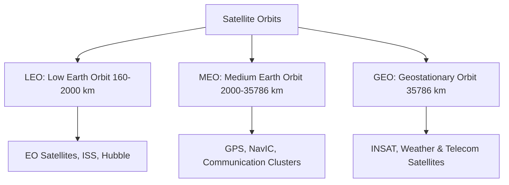

# Science & Technology: Complete UPSC Notes

> **Target Exam**: UPSC Civil Services Examination (Prelims & Mains) / State PSCs  
> **Subject**: Science & Technology  
> **Total Modules**: 7

---

## 📚 Table of Contents

1. [Biology and Biotechnology](#1-biology-and-biotechnology)
2. [Space Technology](#2-space-technology)
3. [Energy Technologies](#3-energy-technologies)
4. [Nuclear Technology](#4-nuclear-technology)
5. [Frontier Technologies ](#5-frontier-technologies-)
6. [Defence Technology](#6-defence-technology)
7. [Internet and Communications Technology ](#7-internet-and-communications-technology-)

---

## 1. Biology and Biotechnology

> **Source Subject**: [Science and technology](https://compass.rauias.com/science-technology/)
---
## 1. DNA as Code of Life
> Source: [https://compass.rauias.com/science-technology/dna-code-of-life/](https://compass.rauias.com/science-technology/dna-code-of-life/)

## DNA as Code of Life

### **What is DNA?**

DNA can be looked at in two ways.

- As code of life

- As vehicle of heredity

#### **DNA as code of life**

- DNA is called the code of life as it holds the complete instruction set for building life.

- The code is present in the nucleus of every cell of every living organism (with few exceptions like RBC, neuron etc.).

- The code, present in the nucleus, is read by a host of machineries in the cell to build proteins which are the building blocks of life. (more on this below)

- Proteins constitutes 55% of the dry mass of cell. Everything from structure of the cell to enzymes are made of proteins.

- Further if we zoom in, we find that the total DNA material in humans is arranged as smaller manageable pieces.

#### **What is Chromosome?**

- The smaller manageable pieces of DNA have arranged themselves as linear strands each of which is called a chromosome.

- There are 23 different chromosomes in human DNA. In addition, there are 2 version of 23 chromosomes. (one set of 23 inherited from each parent).

- Thus, in total there are 46 chromosomes in the nucleus of every cell if our body.

- Imprinting: Each chromosome holds the memory of which parent it is inherited from through a process called imprinting.

#### **What is Genome?**

The complete set of all DNA material or genetic material is called the genome of that organism.

### **DNA**

- Note that way we have used the term DNA is more as a generic name.

- DNA is really a complex molecule that make up the instruction for building life.

#### **Building blocks of DNA**

- DNA stands for Deoxyribose Nucleic Acid or in short nucleic acid or nucleotide which are the building blocks of genetic material.

- Each nucleotide has 3 parts

- A nitrogen base

- A phosphate group

- Sugar molecule

#### **Shape of DNA**

- It looks like a twisted ladder. (called fancily as double-helix)

- It is the molecules the genetic is made of and the way they are arranged that gives it its structure and consequent function.

- If you think of DNA as a ladder, the phosphate group and sugar molecule make the sides of the ladder acting as its backbone. Thus, it is commonly called sugar-phosphate backbone.

- As the name suggests it acts only as backbone. to hold the rungs of the ladder.

- The nitrogen bases constitute the rungs of the ladder which is where the real code of life is written.

- Further the ladder has 2 sides to it, each side made of a nitrogen base, sugar and phosphate.

- Two rungs (nitrogen base) from each side come together to make the ladder as shown in the figure. Each side with a sugar-phosphate backbone and nitrogen base (rung) of the ladder is called one strand.

- This makes human DNA a double-stranded structure. (there are single-stranded DNA also).

- Further this ladder is spiraled and spiraled to form a twisted structure.

#### Base Pair

- If the entire set of genetic material(genome) is considered to be a book, nitrogen bases are the letters.

- There are 4 types of bases namely adenosine, guanine, cytosine and thymine. Simply, there are 4 letters to the book A, G, C and T.

- Two strands come together due to joining of bases.

- The bases join one another depending on their shapes. (You can’t put square boxes in round holes)

- Accordingly, A always pairs with T and G always pairs with C. (So, if you know one strand you know what’s on the other)

- Note: While in nature only 4 lettered-DNA is found, scientists have recently created a synthetic DNA with 8 letters.

- The human genome is made of 3 billion base pairs. (So total 6 billion bases)

- Simply there are 3 billion letters in the book of life for humans.

#### Mitochondrial DNA

- In addition to DNA in the nucleus, some DNA is also present in the mitochondria.

- This we inherit from only our mothers.

---

## 2. RNA and Central Dogma
> Source: [https://compass.rauias.com/science-technology/rna-and-central-dogma/](https://compass.rauias.com/science-technology/rna-and-central-dogma/)

## RNA and Central Dogma

### **RNA**

- While DNA encodes instructions to build life, RNA molecule read and act on the information.

- It simply copies the instruction and carry it to other parts of the cells to make proteins.

- Recent understanding has shown RNA has much bigger role than acting as a messenger. (more on this later)

- In terms of molecule, the only difference in RNA is an extra OH group which makes is unstable.

- Thus, the major difference between DNA and RNA is that while DNA is more permanent RNA is not permanent.

### **Central Dogma**

- The central dogma of molecular biology explains the how genetic information flows from DNA to proteins.

- This simply describes how the code of life is brought to life.

- This happens in two-stages called transcription and translation.

- In short DNA is transcribed into RNA which is then read by ribosome to make Proteins which are the building blocks of life.

- Note that advancements in biotechnology coincide with the increased understanding of the central dogma.

#### **Central dogma (cookbook analogy)**

- Consider DNA to be a cookbook of recipes for making proteins. Transcription is the process of photocopying the recipe. This is done by mRNA, short for messenger RNA, inside the nucleus.

- Once copied the recipe mRNA goes outside the nucleus to the chef, called ribosome.

- There is also a translator, tRNA who translates mRNA recipe to rRNA of the ribosome which then makes amino acids, the building blocks of proteins.

- A block of 3 letters in the mRNA correspond to ‘cooking’ of 1 amino acid.

- Each 3-letter base in mRNA that is read by tRNA that correspond to one amino acid is called ‘codon’.

- Many amino acids come together to form the primary structure of protein.

- The primary structure is twisted and folded to make a 3-d structure of protein.

#### **Gene**

- The coding part of protein are called as genes.

- According to recent understanding there are about 20500 genes in human genome.

- Genes vary in complexity. They range in size from few hundred bases to more than 2 million.

- 98% of the genome is non-coding regions.

---

## 3. Epigenetics
> Source: [https://compass.rauias.com/science-technology/epigenetics/](https://compass.rauias.com/science-technology/epigenetics/)

## Epigenetics

- For long we thought the non-coding regions of the genome (98%) to be ‘dark area’ or ‘Junk DNA’. This is no more the case.

- They play a huge role in gene expression which has become an important area of study in the recent times called epigenetics.

- Epigenetics deals with the processes that control how the genes are expressed.

- We know that all the cells in our body have the same genome.

- Further there are 37 trillion cells that are about 200 different types and same code (genome) exists in the nucleus of all these cells.

- If the same code is there in all the cells, how is it that there are 220-odd cell types making up for 4 different tissue types and 78 different organ types all working in unison to make human life possible.

- The answer is in gene expression.

- Different genes are expressed in different cells that perform different function that look differently. (like your heart cell and your kidney cell)

- All this relates to gene regulation. There are different ways in which gene is regulated for expression.

### **Introns, Exons and RNA Splicing**

- As we have seen mRNA is a copy of only the coding part of DNA (gene).

- And the coding part do not occur on chromosome in one single sequence as one whole.

- It is spread out on a chromosome in parts. Each part is separated by a non-coding part of the genome.

- In fact, 25% of all the non-coding part occur in between genes.

- The non-coding part between gene is called introns and the coding part that mRNA is interested in are called exons.

- So, mRNA must copy only exons and cut out all the introns.

- This cutting of introns to join only exons is called RNA splicing.

- The final mRNA after splicing of introns is called exome (which represents only 1.5% of the genome).

- As you can appreciate it is this final mRNA after splicing that is important for coding for protein.

#### **Muscular Dystrophy**

- One type of muscular dystrophy, a genetic disease, is a result of defect in RNA splicing while copying X-chromosome.

- Since it is associated with X-chromosome it is more prevalent in males as they have only one X-chromosome.

#### **Regulation during transcription (DNA -> mRNA)**

- As we have seen transcription happens in the nucleus and only 1.5% of the genome codes for proteins.

- So, mRNA needs to copy only the coding part of the genome.

- Also, mRNA has to copy only a particular gene or set of genes depending on which cell it is acting in.

- In order to transcribe mRNA uses an enzyme called RNA polymerase.

- But how does it know what part of the genome to transcribe and when to start and stop the copying mechanism?

- This is where regulatory factors of epigenetics come into picture

#### **Promoter region**

- These are non-coding part of the genome which has proteins that attract RNA polymerase to the required coding part of the genome.

- Start and Stop signals

- Besides there are regions in the genome that act like traffic signals for starting and stopping transcription.

#### **Post-transcriptional regulation**

- Regulation during translation (mRNA->Protein)

- Translation, as we have seen, involves reading of mRNA by tRNA in the ribosome (protein making factories).

- tRNA reads 3 letters at a time which translates into one amino acid, the building blocks of protein.

- t-RNA simply brings amino acids that are lying in the cell after reading 3 letters of mRNA(codon).

- As in case of transcription there should be some way for tRNA to know when to start and stop reading codons. These are called Start Codon and Stop Codon respectively.

---

## 4. DNA as Vehicle of hereditary
> Source: [https://compass.rauias.com/science-technology/dna-vehicle-heredity/](https://compass.rauias.com/science-technology/dna-vehicle-heredity/)

## DNA as Vehicle of Heredity

- Long before we understood the nature of DNA and its role as code of life, we discovered nucleus has units of heredity that are responsible for passing on traits from one generation to another.

- Mendel’s experiments with plants in his garden led to set of laws describing the laws of inheritance.

- The important result of this experiment was that traits passed on from one generation to another as discreet units.

- DNA as a vehicle of heredity is passed from one generation to another during gamete formation and subsequent fertilization of gametes.

### **Meiosis: The magic behind heredity**

- Meiosis in simple words is a story of how traits that make up an individual are assembled when the sex cells of his/her parent generated the sex cells/germline cells (sperm and egg).

- All that an individual is made of is, but an expression of the genetic matter donated by parents to the subsequent generation.

- When germline cells are produced in the body of parents, the 2 sets of chromosomes come together, cross-over and mix up randomly in process called meiosis.

- During meiosis chromosomes of the same type are lined up. When two versions of the same type chromosome line up, parts of the chromosome can be switched as shown in the figure.

- Imagine this cross over and recombination happening across all chromosomes.

- This is what gives genetic variation to sex cells (gametes) and thence to offspring.

- This genetic variation is what gives diversity to a species which is very important to adapt to the environment and evolution.

- When gametes come together to form a zygote during fertilization genetic diversity of both gametes are carried.

#### **Mitosis and differentiation: How did you become a complex organism from a single cell?**

- Mitosis and differentiation put together is the story of how one becomes a complex organism all the way from being a single cell called zygote.

- Mitosis is the process of cell division which is what drives growth of organisms.

- The first step of cell division is DNA replication where a copy of DNA is made.

- This happens through 2-step process of unwinding and rebuilding.

- We have already seen the bases the make up the core of DNA pair in correspondence, meaning A always pairs with T and vice versa and G always pairs with C and vice versa.

- Under this process the double stranded DNA first unzips like a zip into single strands. This is done by an enzyme called helicase.

- Then another enzyme called DNA Polymerase synthesize each of the single strand into 2 double stranded DNA.

- In the process mistakes are made and thus we also have an inbuilt proof-reading mechanism.

- Once DNA is replicated other components of the cell get distributed forming 2 daughter cells. 2 becomes 4, 4 becomes 8, 8 becomes 16 and the chain reaction is set.

- Humans on an average have about 37 trillion cells in our body.

#### **Differentiation**

- We have seen that same DNA is there in nucleus of all cells.

- how did we develop into heart, brain, liver, kidney, lungs, limbs etc. that came together in such sophistication to form a fully functional organism?

- In total there are about 220 different cell types that make up 4 types of tissues and 78 types of organs, all working in unison to make a complex organism like human possible. How?

- The answer lies in differentiation.

- From its journey from zygote to complex organism cells undergo continuous division(mitosis) and differentiation.

- After the zygote is formed it undergoes division through the process of mitosis.

- Becomes 2 cells in 30 hours after fertilization, 4 cells in 60 hours after fertilization and at the end of 6 days become blastocyst, a hollow ball of about 100 cells.

- Then the 1st differentiation starts.

- Blastocyst grow into two types of cells which make inner mass of cells and outer mass of cells.

- The inner mass is embryo which develops into a whole organism.

- The outer mass is placenta which acts as the barrier between mother and fetus.

- At about 3rd week different tissues start to differentiate into organs.

- 4th week heart, eyes begin to form, 10th week heartbeat is audible, 2nd month limbs start to develop, 3rd month liver, gallbladder, pancreas.

- One way of classifying cells is based on their ability to differentiate. Broadly cells are of two types, differentiated and undifferentiated.

- Differentiated cells are the building blocks of tissues and organs. They are specialized cells that can only divide. They cannot differentiate. They are also called somatic cells or simply adult cells. Eg: Hair cell, nail cell etc.

- Undifferentiated cells are cells that have the ability differentiate into many different types of cells. They are classified into two types, namely embryonic stem cells and adult stem cells.

---

## 5. Stem Cells
> Source: [https://compass.rauias.com/science-technology/stem-cells/](https://compass.rauias.com/science-technology/stem-cells/)

## Stem Cells

- Undifferentiated cells are also called stem cells.

- Further stem cells are classified into various types based on their potency to differentiate.

### **Types of Stem Cells**

#### **Pluripotent stem cells or Embryonic stem cells**

- These are stem cells that are potent enough to differentiate into all types of cells.

- In short, they can produce a clone of an entire organism.

- Such cells are found in the embryo stage of human development. (inner mass cells)

- Thus, they are also called embryonic stem cells.

#### **Multipotent stem cells or Adult stem cells**

- Such cells have the potential to all types of cells associated with a particular organ or a tissue.

- They help in repair, renew and maintenance of tissues or organs in an adult body. Thus, they are called adult stem cells.

- Eg: Intestinal stem cells (renew every 45 days), cells in bone marrow etc.

### **Gene Expression Behind Differentiation**

- Since all cells have the same DNA in their nucleus how is it that one is pluripotent another multi-potent and another has no ability to differentiate?

- Answer lies in gene expression.

- We now know that there are 4 transcription factors that are responsible for embryonic stem cells as compared to specialized adult cells. (details not important)

- Thus, if we can somehow reprogram specialized cells (somatic cells) to tweak the transcriptional factors, it can reverse into embryonic stem cells.

#### **Induced-pluripotent Stem cells: iPS Cells**

- Reprograming adult cells to become pluripotent was awarded Nobel prize in 2012.

- Take any differentiated cell/somatic cell/adult cell (not adult stem cell) and induce the 4 transcription factors, it can reverse itself into an embryonic stem cell.

- This reprogrammed cell is called induced-pluripotent stem cell (iPS cells) or human-induced pluripotent stem cells.

- Once you get iPS cells you can culture them in-vitro and make them differentiate into different cell types like skin, neutrons, muscles etc.

- iPS cells hold promise in both regenerative medicine (tissue engineering/ organ transplantation) and drug development.

- Though at nascent stage, iPS cells are seen as the future of transplantation.

- Living iPS are now used to see how they react to drugs thereby accelerating drug development.

#### **Somatic cell Nuclear Transfer or Reproductive cloning**

- Traditionally there was another way of growing an entire organism using the adult differentiated cell. It was called cloning.

- Cloning involves 3 steps

- Take any adult cell (skin, hair, nail etc.) and suck out its nucleus.

- Take an egg cell from a donor and remove the nucleus from the egg/oocyte. (enucleated)

- Inject the nucleus of the adult cell in the enucleated egg. You have an oocyte with somatic cell nucleus.

- The oocyte cytoplasm reprograms the nucleus of the somatic cell and it makes embryonic stem cell.

- The embryonic stem cell can then be grown into an organism identical to the person from whom adult cell was taken. (since it is the nuclear [DNA that codes](https://compass.rauias.com/science-technology/dna-code-of-life/) for proteins)

- This is how dolly the sheep was cloned.

**Disadvantage**

- The only problem is that reproductive cloning is very inefficient as the nucleus from somatic cell resists reprogramming.

#### **Stem cell therapy**

- Stem cell therapy is the use of stem cells to grow healthy adult cells in the lab to replace damaged, defective, or degraded adult cells in the body.

- It is particularly useful in which

- cells are degraded as in case of neurological disorder where there is degeneration of neuron Alzheimer’s, Parkinson’s (motor neurons) etc. as neurons do not multiply

- damage of organ due to accident, old age etc.

- body produces defective cells as in case of blood related disorders like sickle cell anemia, beta [thalassemia](https://compass.rauias.com/current-affairs/thalassemia/) where regular blood transfusion is needed. In this case there are 3 ways

- Stem cell transplantation of a healthy donor

- Make iPS cells and grow healthy adult cells

- Gene-edited stem cells from ones own body

**Note: **Stem cells from humans can be introduced in pigs to grow organs in them as they have a faster life cycle. (see CRISPR for details)

---

## 6. Tissue Engineering
> Source: [https://compass.rauias.com/science-technology/tissue-engineering/](https://compass.rauias.com/science-technology/tissue-engineering/)

## Tissue Engineering/ Regenerative Medicine/ Organ transplantation

- One major challenge of organ transplantation or stem cell transplantation is the lack of donors.

- This is due to mismatch in what is called as HLA factor.

- Scientists have found a group of genes that code for proteins that help our immune system to recognize self and identify foreign bodies. These proteins are called HLA and every cell of our body has about a lakh of them.

- HLA match is important in stem cell and organ transplantation.

- It so happens that HLA match is best among same-sex siblings. Even between parents and offspring, there is no suitable HLA match.

- In short, when the HLA match is absent the immune system rejects organ transplanted.

**Note**: To find healthy donors for stem cell transplantation, a database called **National Stem Cell Registryis maintained in India.'

### **Autologous, Allogenic and Xenogenic transplants**

- In the context of organ or stem cell transplantation, depending on its source, donor cells plantation can be classified as

- Autologous: Cells from one’s own body (including stem cell therapy, iPS cells etc)

- Allogenic: Cells from another's body but of same species

- Xenogenic: Cells from another species.

- With advancements in gene editing techniques, gene therapies and Xenotransplantation are seen as the potential alternatives to supply organs for transplantation.

- However, the major challenge is immune reaction from the human recipient.

### **Xenotransplantation**

Organ transplantation from one species to another is called xenotransplantation.

#### **Need for Xenotransplantation**

- While autologous is the best method (as there won’t be immune rejection), making iPS cells takes a lot of time.

- Allogenic is good when there are suitable donors.

- Given the shortage of donors with HLA match scientists have been increasingly working on Xenotransplantation as animals like pigs with lower lifespan can be bred to grow human organs.

- Gene editing in pigs to reduce immune rejection has made organ transplants from pigs to humans possible, which could offer help to thousands of people who face organ failure, disease, or injury.

- The natural lifespan of a pig is 30 years, they are easily bred and can have organs of similar size to humans.

### **Recent steps by India in stem cell transplantation**

#### **Thalassemia Bal Sewa Yojna**

- Hematopoietic Stem Cell Transplantation (HSCT) program was launched in 2017.

- Hematopoietic Stem Cell: These are cells present in bone marrow.

- They are undifferentiated stem cells capable of developing into all types of blood cells, including white blood cells, red blood cells, and platelets.

- Eligibility: Only patients whose monthly family income is below Rs 20,000 will be eligible for this assistance.

**Saviour SiblingBone marrow transplantationStem cell cure for blindness**

- Recently a medical college from Kanpur claimed the 1st cure blindness through stem cell transplants.

#### **Mitochondrial DNA and Nuclear DNA**

- The DNA we have been referring to is the DNA that is present in the nucleus

- In addition to DNA in the nucleus, some DNA is also present in the mitochondria.

- During fertilization it is the nuclear DNA (with 46 chromosomes) that is formed where 23 chromosomes is inherited from the mother and 23 from the dad.

- Mitochondrial DNA only has one chromosome and it codes for only specific proteins responsible for metabolism.

- It is the nuclear DNA that is responsible for inheritance (from both father and mother).

- Mitochondrial DNA is inherited only from the mother and thus it is more effective to trace human ancestry.

#### **Three parent baby**

- Apart from receiving the usual “nuclear” DNA from its mother and father, the embryo would also include a small amount of healthy mitochondrial DNA from a woman donor.

- This is resorted to when the actual mother is suffering from an incurable mitochondrial disease.

- This technique involves removing the faulty mitochondrial DNA from the actual mother and nucleus form the mother’s egg and the resultant egg fertilizes with the sperm cell of the father outside the body (in-vitro).

---

## 7. Recombinant DNA technology: Birth of Genetic Engineering
> Source: [https://compass.rauias.com/science-technology/recombinant-dna-technology/](https://compass.rauias.com/science-technology/recombinant-dna-technology/)

## Recombinant DNA technology: Birth of Genetic Engineering

### **Birth of R-DNA**

- Recombinant DNA is a form of DNA constructed in the laboratory. It is generated by transferring selected pieces of DNA from one organism to another.

- By 1970s we had understood the structure of DNA and central dogma. However, this was only theoretical. We could not separate a part of DNA which was coding for protein. In short, we did not know how to get access to DNA in order to change it.

- Incidentally in 1970s we understood how viruses work. Viruses get into the host cell and convert it into virus-producing factories.

- To do this they get into the host cell nucleus, insert their genome in the genome of host cell.

- The discovery of the action of a virus, that was affecting bacteria, led to development of R-DNA technology.

- In order to do this the virus (bacteriophage) had to do the following

- Identify a place to cut the bacterial genome

- Cut it

- Paste itself

- Make the new genome express itself in the bacterial cell.

- If we copied what the virus was doing, we have a way to ‘stich’ together DNA from 2 different sources. This is how R-DNA was born.

### **R-DNA technology: Manipulating the code of life**

#### **The basic steps in R-DNA are as follows:**

- **Identifythe organism that has the gene of interest (one that expresses for desired trait, say production of Vitamin A in daffodil)

- Identify the target organism (To fortify rice with Vit A to make it Golden Rice)

- Take the organism that has the desired trait and **cut it into pieceslike a shredder. (daffodil genome)

- You can use enzymes restriction enzymes to cut a genome. (but this is cutting blindly, we did not know where we were cutting)

- Insert these pieces into a vector (vehicle to carry the genome to target organism)

- Find the vector with gene of interest (this is like finding the needle in a haystack, very tedious)

- Take the vector with gene of interest and multiply into colonies of the vector (gene that expresses for Vit A): This is called C-DNA library or gene library.

- Take the colony of vector with gene of interest and insert it in rice genome. (Pasting) This is done by an enzyme called DNA integrase (similar to what virus was doing).

- The resultant rice with gene from daffodil will be a recombinant DNA.

- This is how golden rice is made using R-DNA technology.

#### **Vectors used in R-DNA technology**

- **Plasmid**: Small circular pieces of DNA that is capable of replicating.

- Bacterial use plasmids to transfer anti-biotic resistance to the same generation.

- independently of chromosomal DNA of bacteria and that they could transfer genetic information.

- It was this process that gave host bacteria the capacity to inherit new genes and therefore new functions such as resistance to antibiotics.

- Alternately we can use bacteriophages (virus that infects bacteria), artificial chromosomes of yeast and bacteria as vectors in r-DNA technology.

#### **Disadvantage of R-DNA**

- R-DNA depends on finding the gene of interest based on the trait expressed in an organism.

- We had no way to pin point at the gene of interest. (we only know daffodil had Vit A producing gene, we dint know where exactly it was)

- We had cut the entire genome into pieces and finding one piece among millions of pieces.

- Thus it is very inefficient like finding a needle in a haystack.

### **Scope of R-DNA technology**

#### **R-DNA and Health**

- Human insulin, was the 1st therapeutic proteins to be genetically cloned in E.coli using R-DNA technology

- Mono-clonal antibodies are made using R-DNA technology

- Production of vaccines against Hepatitis B

- Backbone of hepatitis and HIV diagnostic tests.

- Protein therapies such as human insulin, interferon and human growth hormone.

- Produce clotting factors for treating haemophilia.

---

## 8. GM Crops
> Source: [https://compass.rauias.com/science-technology/gm-crops/](https://compass.rauias.com/science-technology/gm-crops/)

## GM crops

- Transgenic plants are those that have been genetically modified using recombinant DNA technology.

- Genetic modification is done to confer a particular trait to the plant with one of the following properties

- Increased yield of a crop

- Increased nutritional content of a crop

- Developing resistance to

- Abiotic stresses like temperature, salinity or herbicide-resistant

- Biotic stresses like insect-resistant crops.

- BT cotton is the only genetically modified crop that is commercially allowed in India from 2002.

### **Regulation of GM crops in India**

- GMOs and the products thereof are regulated under the “Rules for the manufacture, use, import, export & storage of hazardous microorganisms, genetically engineered organisms or cells, 1989” under the Environment (Protection) Act, 1986.

- The rules include within its purview all molecular genetics techniques including R-DNA, gene editing techniques, gene drive etc.

#### **Institutional framework**

- The rules are enforced by the MOEFCC, DBT and State Governments.

- GM Crops – Genetic Engineering Appraisal Committee under MoEF is the final approval authority for allowing GM crops in fields including field trials.

- It also includes approval for commercial cultivation of GM crops.

- GEAC is also responsible for certification of GM organisms.

- Besides food has been moved out of Regulation of Genome Engineering Technologies recently.

- Accordingly Food Safety and Standards Authority of India regulates manufacture, storage, distribution, sale and import GM food in India.

#### **GM crops: Recent developmentsBt Crops: Mechanism: Importance of bacillus thuringiensis**

The soil-dwelling bacteria Bacillus thuringiensis produce spores containing crystals that are poisonous to insect’s digestive system (its gut) but harmless to the crop plants and to people.

Thus, all Bt crops involve inserting a gene from soil bacteria to the plant to make it express a crystal that kill the insect by attacking its digestive tract.

**Bt cotton**

Resistance to bollworm pest Only GM crop allowed in India

**Bt brinjal**

Bt brinjal is genetically engineered by inserting a gene from the soil bacterium Bacillus thuringiensis for its insecticidal property.

Since 2010 there is an indefinite moratorium on commercial cultivation of Bt Brinjal in India.

**HTBT Cotton**

Short for Herbicide Resistant Bt Cotton

The cotton seed is inserted with gene from a soil bacterium.

This produces a modified protein glyphosate which makes it herbicide resistant.

**Problem with Glyphosate**

Glyphosate is a herbicide used in cotton fields which is known to be harmful to soil and also classified as 'probable human carcinogen' by WHO.

Besides glyphosate also impacts honeybee gut microbiome thereby affecting pollination.

**GM Mustard(DMH-11)Dhara Mustard Hybrid**

Recently GEAC approved GM mustard for commercial use the first genetically modified crop in the country to get approval in two decades.

**About GM Mustard**

Transgenic hybrid variety.

Under normal conditions mustard plants do not cross across varieties as they are self-pollinating in nature.

As a result we do not have hybrid varieties of mustard due to which plant-breeders are not able to induce desired trait in mustard plants.

Genetic modification is done to alter the genes of 2 mustard varieties including Varuna and Heera.

Genetic modification is done with the help of soil bacteria barnese and barstar which help create hybrid varieties of mustard.

**Benefit**

Increase in yield upto 20-30%

Seeks to attain self-sufficiency in edible oil seeds production

**Issue**

The transgenic hybrid variety becomes tolerant to a herbicide called glufosinate-ammonium upon genetic modification.

Herbicides are extensively used in field trials including glyphosate, endosulphan.

These will harm honey bee which are the biggest pollinators of mustard field.

**Golden Rice**

Vitamin A

2 genes from daffodil and 1 from bacteria

**Soybean Sugar beet Sugarcane**

Herbicide tolerant (glyphosate, glufosinate)

**Edible vaccines**

A new approach for delivering  vaccine is transgenic food crops

 Eg:

A rice-based mucosal vaccine for cholera.

Plant-based mRNA vaccines using transgenic lettuce are developed.

**GM Rubber**

Worlds 1st planted in Assam.

To make it more tolerant to colder climates as rubber is native to warm humid amazon forests.

**GM Soymeal**

India will import GM soymeal for the 1st time to be used as a livestock feed particularly in the poultry

**Potato**

Protein packed GM potato that contains 60% more protein than a wild-type potato

**GM bacteria for nitrogen fixation**

Genetically modified bacteria are made that copy the action of Rhizobium to induce the ability of nitrogen fixation in the roots of crops other than legumes

---

## 9. Genome Sequencing: Reading the code of life
> Source: [https://compass.rauias.com/science-technology/genome-sequencing/](https://compass.rauias.com/science-technology/genome-sequencing/)

## Genome Sequencing: Reading the code of life

- In the earlier approaches to R-DNA technology, the 1st step was to identify the gene of interest.

- But this was very tedious because we had to cut the entire genome into smaller pieces (like a shredder), make them express in plasmids and then identify the gene of interest like a needle in the haystack.

- With genome sequencing this changed. We could identify the exact location of the base pair.

- Genome sequencing in simple words is **reading the entire book of genome letter by letter (base by base).**

- In other words, it is a procedure for determining the linear order of nucleotide bases in DNA.

- In 1977 the 1st bacteria was sequenced and between 1990-2001 human genome was sequenced for the 1st time.

### **Advancements in genome sequencing**

- **Short-read**: Earlier approach to sequencing was called short read method where the genome was chopped into small fragments which could be reassembled like a jig-saw puzzle.

- This approach is also called **whole-genome sequencing.**

- In this approach we read 150 bases at a time.

- Reading short segments of the genome was time-consuming and labour intensive.

- Besides codes of many fragments looked same making it difficult to tell them apart.

- **Long-read**: With the use of nanotechnology, we could read longer sequences of the genome. We now can read 2.3 million base long sequence at once.

- The number of bases that are sequenced is 10000-times more than short-read. We are now hoping to read the entire chromosome in one read in times to come.

#### **Advantages**

- Faster and cheaper

- Suitable for identifying pathogens in food, in disease control and diagnosis of infection.

#### **Next-Generation Sequencing**

- Use of computers read multiple fragments at the same time in an automated process.

- Making whole-genome sequencing relatively faster, accurate, automated and cheap.

### **Human Genome Project**

- It took 10 long years to read the sequence of human genome.

- HGP started in 1990 and the result was published in 2001

#### **Significance of HGP**

- Until 2001our understanding was one gene would code for one protein responsible for one trait.

- With HGP this was revised. We now know there are about 20500 genes coding for 80000-100000 proteins.

- Also, more than one gene is responsible for one trait.

- Only 1.5% of the genome was coding for proteins. Other 98% is the non-coding part.

#### **Findings of HGP**

### **Junk DNA**

- Initially we thought it had no role to play and hence it was called ‘**Junk DNA’ or ‘dark area of the genome’.**

- Now we know the so-called **dark genome has a significant role in regulatinghow genes function which is very **important in gene expression.

- As we have seen DNAàRNAàProtein is not a simple 2-step process but a dynamic one.

- Also, it is the gene expression that is more important than the gene itself.

#### **Constituents of dark genome**

- Non-coding part has a significant role in every minute step during transcription and translation, in effect the dynamic part of gene expression.

- Recently we have identified the dark genome responsible for bipolar and schizophrenia.

- Though we still do not have a complete understanding of our genome and our search is on and following are few important findings about which we know:

#### **Non-coding RNA (ncRNA)**

- A distinct feature found all over our genome are non-coding RNAs.

- Plays important roles in gene expression and regulation.

Application

- Scientists are exploring the use of ncRNA as potential biomarkers for cancer diagnosis and treatment.

- ncRNA may also be used to develop new therapies for diseases such as viral infections and autoimmune disorders.

#### **Long non-coding RNA (lncRNA)**

- RNA with more than 200 bases.

- Important in regulation of splicing of introns and exons during transcription

Application

- Scientists are investigating their role in the development of cancer and other diseases.

- lncRNA may be used as a target for new therapies aimed at altering gene expression.

#### **Small non-coding RNA**

- Less than 200 bases.

- Involved in post-transcription regulation.

- 2 types of sncRNA are discussed below:

#### **Short-interfering RNA**

- It can knockout selected genes, in effect it can silence a gene.

- Extremely important in RNA interference technology: future of disease management

#### **Micro-RNA**

- Around 1000 identified in mammalian cells with 21 bases each

- Post-transcriptional regulation

- A single mi-RNA can regulate more than one messenger RNA.

- It essentially cleaves or degrades m-RNA so that it cannot be translated.

#### **Transposons or Jumping genes**

- Half of our genome is made of sequences that can hop from one place to another in our genome.

- This virus-like genetic material that can move from one location to another in our genome is called jumping gene or transposons. (it is incorrect to call them genes)

- They are very important to understand mammalian evolution.

- They also have potential applications in gene therapy, where they can be used to deliver genes to specific cells.

#### **RNA interference technology/ Gene Silencing**

- RNA interference technology is the use of siRNAs to silence a gene expression.

- Under this you inject siRNA that binds to the m-RNA and attacks it before it reaches ribosome.

Application

- Cancer treatments

- Pest resistance

- Can be used to manufacture pesticide.

### **Human Genome Project: Write: Recoding the Code of Life**

- An international project launched in 2016 to synthesise a human genome from scratch. While the original HGP aimed at “reading” the book of genome, HGP-Write aims at writing the genome.

- HGP-Write essentially helps in ‘recoding’ our genome for many applications including to alter our susceptibility to disease, our ability to respond to drugs etc.

Illustration:Recently HGP-Write is trying to ‘recode’ human genome to develop immunity to any virus**

- HGP of 2001 revealed there are about 20000 genes coding for 80000-100000 proteins.

- Besides a set of 3 letter base (codon) codes for 1 amino acid.

- All the proteins we are familiar with are made of 20 amino acids. But the total number of possible codons is 64 (4X4X4).

- Out of the rest 44 many are redundant, meaning they code for same amino acid. For instance, GGT, GGC, GGA, and GG all code for same amino acid glycine.

- We know viruses depend on the host cell machinery like tRNA to make its proteins.

- If you removed all redundant codon and the tRNA machinery that decodes it, viruses would not be able to translate their genes into proteins.

- Thus, our recoded cells would be immune from viral attack.

- This would require at least 400,000 changes to the human genome.

### **Important Genome Sequencing efforts and their significanceNameSignificanceENCODE FANTOM Genome India ProjectApplication:INDIGENGenomic in Indian agricultureINDIGAU:National Genomic GridEarth Bio-genome ProjectApplicationIssueHuman Microbiome ProjectNote:DeepVariant: AI in genomicsAlphaFold**

|  |  |
| --- | --- |
| (Encyclopedia of DNA Elements) (Functional Annotation of the Mammalian Genome) | Genome sequencing project that has given significant details of the dark area of genome. |
|  | Aim is to create reference genome of Indians. Problem with HGP is that it is majorly sourced from white population because of which diversity is not accounted for. Launched in 2019 to do whole-genome-sequencing of over a million Indians from diverse ethnic groups.  To understand Indian population’s susceptibility to disease and develop precision medicine and personalized healthcare. |
|  | A research project to understand the genetic diversity of the indigenous population. of India. Main aim is to gain insights into genetic ancestry and diversity of indigenous population. |
|  | Wheat Genome Sequencing ProgrammeRice Functional GenomicsNational Plant Gene Repository programmeNext Generation Challenge Programme on Chickpea Genomics Genomics of cow |
|  | Aims to collect cancer cells and tissues to facilitate cancer research in India. Uses genome sequencing of these high-quality cancer cells to study genomic factors influencing cancer in Indian population. |
|  | International effort to sequence and digitize the genomes of every eukaryotic biodiversity on Earth over a period of 10 years.It is an open-source DNA database.  Planning environmental conservation initiatives.  May lead to digital bio-piracy (because it is open-source) which is against the principle of Nagoya protocol to convention of Biodiversity that requires sharing of benefits with the local communities. |
|  | Effort to study the genes of microbes in human body including gut, skin, oral cavity and vagina to study their role in human health and diseases.  Human body contains 10 times as many microbes as human cells. |
|  | Google’s AI system that converts sequencing data from high-throughput sequencing into an accurate picture of the entire genome. This it does by automatically identifying insertions, deletions or any such gaps that are to be filled |
|  | Google’s AI system that is capable of predicting protein modelling. Important to understand diseases and corresponding drug development |

### **Variations in the genome: Identity markers**

- Humans are 99.9% identical in genome to one another.

- But given the size of human genome (3-billion base pairs), even a small (0.1%) proportion of variation is huge.

- The variations are very important to decide the complete make-up of an individual including ones eye colour to ones susceptibility to disease to one’s parentage and even ones ancestry etc.

- The variation in the base is called polymorphism.

- Further variations can be of many types. It could be single base variation, large sequence variation, variations in the way sequences are structured etc.

- Study of variations have interesting applications. **(see table)DNA Fingerprinting / DNA profiling**

- There are some sequences in our genome (15 to 100 bases) that keep repeating over and over again.

- Say, like a word ‘green’ keeps on repeating in a book.It so happens that the number of times this repetitive sequence occurs on a chromosome differs.

- These are called VNTR (variable number of tandem repeats) By counting the number of times the repetitive sequence occurs of chromosomes (both mother’s and father’s versions), we can establish the identity of an individual. This is the DNA fingerprint of that individual.

**Application

- Forensics

- Establishing parentage

**Single Nucleotide Polymorphism and Population genetics (related Nobel Prize 2022)Single letter changes in DNA are called SNPs.

- They occur throughout a person’s DNA, one in every 300 letters on an average.

- It could occur due to mutation during DNA replication (cell division) or may be inherited.

**Application

- They can act as biological markers to locate a gene associated with disease.

- Could help in dealing with future pandemics.

- Some SNPs which are inherited act as markers to indicate ancestry. (very important in study of population genetics)

- Essentially the higher the frequency of an SNP farther it is in the ancestry.

- SNPs keep changing as they flow from one generation to another.

- Tracing the gene flow by observing SNPs is one way of establishing ancestral links

**Nobel Prize for 2022 (paleogenetics)

- The scientist who won Nobel prize in 2022 had studied the gene flow from hominins to homo sapiens after the migration out of Africa, 70000 years ago.

- He studied the gene flow of Neanderthals and Denisovan (both extinct hominin species)to homo sapiens.

- It is important to understand our immune reactions to infections.

**1000 Genome Project**

It is an effort to study different variations in DNA including SNPs and also larger organizational variations in genome

---

## 10. Gene Editing: CRISPR Cas9: Revolution in genetic engineering
> Source: [https://compass.rauias.com/science-technology/gene-editing-crispr-cas9-revolution/](https://compass.rauias.com/science-technology/gene-editing-crispr-cas9-revolution/)

## Gene Editing: CRISPR Cas9: Revolution in genetic engineering

### **Principle of CRISPR**

- While R-DNA technology developed with our understanding of how virus affected bacteria, CRISPR developed out of our understanding of how bacteria developed resistance to this virus.

- CRISPR is nothing but the mechanism of bacterial immune system.

#### **Working of CRISPR**

- When a virus infects bacteria, after few generations bacterial immune system develops a way to fight it back.

- The bacterial immune system simply cuts the viral genome using an enzyme (restriction enzyme). In addition, the bacterial immune system keeps a memory of the viral genome in its own genome to ward off future attacks.

- This viral genome stored by the bacteria acts as a guide to bacteria during the next viral attack.

- So it knows precisely where to cut.

- The bacteria had repeat patterns of the viral genome interspersed by a 20-base long DNA.

- It also read the same backwards and forwards.

- This is why we call the memory of viral genome in bacteria as CRISPR (Clustered Regularly Interspaced Short Palindromic Repeats)

- Next time the virus attacks bacteria uses this memory, make a RNA molecule that acts as a guide and Cas 9 enzymes uses this guide RNA to cut the viral genome.

- In short, while R-DNA involved cutting of genome blindly (like a shredder), CRISPR Cas 9 enables cutting very precisely.

- CRISPR sequence acts like a torch for Cas 9 enzyme that acts like scissors.

- In gene editing we use this technique to correct a harmful mutation, insert a missing gene, augment the genome with a new gene in living organisms.

- Mimicking the bacterial immune system, we can prepare an RNA-guide molecule in our laboratory which can act as torch for Cas9 enzyme to introduce cuts precisely in the genome.

#### **CRISP-based Gene editing**

- Once the RNA-guided Cas9 enzyme cuts the DNA at a specific site, we could make the following changes
- Inserting a new sequence
- Deleting the sequence

- Modifying the sequence

- In order to do so the cell can use its natural DNA repair mechanisms (DNA polymerase) to insert a nucleotide or introduce a new piece of foreign DNA.

- Based on this criterion of using foreign genome v/s altering native genome in gene editing the end product could be transgenic or simply genetically modified.

#### **Limitation**

- In CRISPR editing, mutations are corrected by cutting the double strand of the DNA. This could result in some unintended cuts.

- As a result, it can cut only large portions of genome and not single letter changes.

- Additionally, it can induce unintended off-the-target mutations or incomplete edits in some places.

### **Advancements in gene editing systems**

#### **Base editing**

- Advanced form of CRISPR, which is suitable for single letter editing.

- While Cas9 cuts double stranded DNA target, base editing uses an enzyme to rearrange some atoms in the base molecule of the DNA, thereby altering it.

- It involves rewriting the DNA instead of cutting the target sequence and adding new base molecules.

- This makes it suitable for **single-letter mutations.**

#### **Prime editing**

- Another advanced form of CRISPR, but unlike crispr which chops DNA in half, prime editing nicks it and writes a new section of DNA in the specified region similar to base editing,

- Though it is similar to base editing, it includes an additional enzyme, a reverse transcriptase, to copy and paste new DNA sequences into the genome.

- Thus, it is suitable for precise insertions, deletions, and augmentation of genome.

- While base-editing is suitable for single-letter modifications, prime editing is suitable for more extensive large edits.

#### Regulation of gene editing in agriculture in India: (SDN1 and SDN2)

- India does not have a law to regulate gene edited organisms. In contrast, we regulate Genetically Modified Organisms including GM crops and GM food.

- Rules for the Manufacture, Use, Import, Export and Storage of Hazardous Microorganisms/Genetically Engineered Organisms or Cells, 1989” notified under the Environment Protection Act, 1986, regulate genetically modified organisms.

- There is no explicit mention of the term gene editing.

- Recently an amendment was introduced to the aforesaid regulation in order to encourage gene editing in agriculture.

- Accordingly, gene editing techniques using native genome is allowed in India. However, gene editing technique using foreign genome is not allowed.

- The gene editing techniques called SDN 1 and 2 (Site-Directed Nuclease) fall under the former category are allowed under the Rules under EPA, 1986.

- Other techniques like SDN 3, 4 and 6 fall under the latter category and therefore are not allowed in India.

- In effect, transgenic crops using gene editing are not allowed under the Environment Protection Act.

- Note that ICAR is using SDN 1 and 2 to produce rice varieties which are drought-resistant, salinity-resistant and high-yielding.

### **Scope and application**

CRISPR system has emerged as panacea for genetic engineering in the recent times with significant contribution to agriculture and medicine. Following are some landmark achievements of CRISPR system.

#### **Genetic Engineering: Recent advancements**

#### **What all can CRISPR system do?**

Gene editing: DNA and RNA both

- Both coding and non-coding parts including RNAs (gene expression)Initially only DNA was the target, recently RNA is also being modified using CRISPR system.

- Conventionally could change a section of DNA (large cuts)Now with base editing suitable for single-letter mutations.

Application

- Gene therapies not only to correct a defective gene but also silence a gene from expressing or make a gene that was otherwise not expressing to express.

Molecular diagnosis

- In addition to editing, CRISPR can be used to detect single target DNA or RNA molecule (CRISPR Cas13)

- This makes it a sensitive diagnostic tool to detect mutations.

SHERLOCK

- A biological detective that uses CRISPR-Cas13 to detect RNA sequences associated with diseases like **Zika virus and Dengue virus.**

#### **CRISPR in Gene therapy**

- CRISPR is an emerging choice for gene therapy given its ability to accurately target defective gene, add a missing gene, alter the defective gene or even augment the genome with a new gene.

- Besides, scientists have demonstrated administration of CRISPR-based gene therapy both in-vivo (directly in human body) and ex-vivo (from lab culture to human body).

- CRISPR-based gene therapy is most suitable in mono-genetic diseases in which we can identify a single gene responsible for the disease trait.

- Examples of such diseases include Blood-related disorders like sickle-cell anaemia, beta thalassemia, Haemophilia etc. Corneal diseases Degenerative neurological diseases Immunological diseases like HIV, bubble boy syndrome etc. Immune-therapy for cancer (CAR T-cell therapy)Skin diseases. Though in a nascent stage it is making rapid strides. Following are some of the recent advancements

- Scientists have demonstrated how CRISPR-CAS9 can be used to eliminate HIV in infected mice.

- Gene editing tried in mouse to correct genes involved in muscular dystrophy. Gene editing has been carried out inside the human body (in-vivo) for the 1st time to treat Hunter’s syndrome.

- US has approved CAR T-cell therapy which involves modifying immune cells to attack cancer cells in case Leukaemia.

- In 2021 Department of Biotechnology supported 1st  CAR-T cell therapy was conducted in India.

- Clinical trials for gene therapy for beta thalassemia and sickle cell anaemia is already showing promising results.

- 1st in-vivo administration of gene therapy to modify  photoreceptor cells in the eye to treat blindness was done in 2020.

#### **CRISPR in tissue engineering and organ transplantation**

CRISPR and Cell Therapy

- CRISPR is increased being used in tissue engineering to genetically modify pig cells to make them suitable for growing human organs in them.

- **Note:Stem cells from humans can be introduced in pigs to grow organs in them as they have a faster life cycle.

- Problem was a section of pig genome was known to cause cancer which acted as a major hurdle in organ transplantation from pigs to humans.

- These cancer-causing genes are editing using CRISPR to silence them.

#### **CRISPR in agriculture: GM Crops**

- To engineer crops to increase their nutritional value, pest resistance, drought tolerance etc.

- Two techniques namely SDN 1 and 2 technique for gene editing

- ICAR is using it to produce rice varieties which are drought-resistant, salinity-resistant and high-yielding

CRISPR in climate-smart agriculture

- CRISPR is used in plants to increase their photosynthetic efficiency by upto 25%. Eg: tobacco plants.

CRISPR and CCUS

- Besides CRISPR system is being used to increase the carbon fixing property in algae (remember CCUS technologies) by increasing its photosynthetic efficiency.

CRISPR and biofuels

- CRISPR is used to genetically modify microbes like yeast to improve its efficiency of fermentation and producing ethanol at a faster rate.

- CRISPR is used to genetically modify methanogens to improve their performance in biogas production

- **Note:Methanogens are microbes that produce methane as a by-product of their metabolism.

#### **GM food**

Lab-grown meat

- Cell-based meat that is produced by culturing

- cells in a lab instead of livestock rearing practices (major factor in climate change)

- However the challenge is cell-based meat does not have a suitable texture and flavour.

- CRISPR systems are used to genetically modify cells to produce proteins responsible for texture and flavour.

Clean Meat Project: India

- The Clean Meat project will be taken up by CCMB and National Research Centre on Meat of ICAR.

- Gene edited lab-cultured meat to augment its nutritional content.

Industrial fermentation

CRISPR is used to genetically modify microbes like yeast used in wine making, baking and brewing to improve its efficiency of fermentation.

#### **Gene editing and embryonic cells

Moratorium on gene editing of embryonic cells

- In 2018 a Chinese scientist announced the birth of 1st gene-edited babies in the world named Lulu and Nana.

- After this WHO urged countries to ban experiments that would lead to more gene-edited babies.

- Gene editing the embryonic cells are banned across the world.

- In 2019 ICMR issued the National Guidelines for Gene Therapy which also bans gene-editing of embryonic cells.

**Note**: The Chinese scientist modified **CCR5 geneon the embryonic cells of the couples to make them resistant to the HIV virus.

- **CCR5is a gene that codes for receptors in our immune cells which HIV uses like a gateway to get inside the cell.

- However CCR5 gene is not just associated with HIV, it may also play an important role in other diseases about which we do not know much.

Research on embryonic cells

- While there is a world-wide moratorium on gene editing of embryonic cells, research is allowed on embryonic cells that are less than 14-days old.

- This is needed to understand the nature of many inherited diseases.

Accordingly following research is going on:

- Pre-implanted human embryos are being tested for understanding inherited heart disease.

- Genome of embryonic cells are edited using CRISPR-Cas9 to study cause of infertility

- Research on gene linked to beta thalassaemia, inherited blood disorder, in human embryos using base editing technique is being carried.

#### **CRISPR and Gene Drive: Global fight for MalariaWhat is Gene Drive? **

- Gene Drive is the use of gene editing technique to alter the law of inheritance to pass on a particular genetic trait from one generation to next faster than normal.

- Under normal law of inheritance, a specific trait from an organism has 50/50 chance to be passed. (because the offspring can express either mother’s version or father’s version)'

- This is achieved editing a particular gene in a way that it can copy and paste itself into its corresponding location on the other chromosome, instead of the 50/50 inheritance pattern that occurs naturally.

- This copying and pasting occurs during the production of reproductive cells (sperm or egg), resulting in a higher probability that the gene will be passed down to the next generation.

- Then CRiSPR is used to edit a gene called ‘doublesex’ in female mosquitoes which are the main transmitters of malaria.

- When the female mosquitoes inherit two copies of the disrupted gene, they develop like males and are unable to bite or lay eggs.

- This genetic tweak of double-sex gene follows gene drive inheritance.

- With this in 8 generations female mosquitoes were completely eliminated

---

## 11. CAR-T cell therapy: The future mainstay of cancer treatments
> Source: [https://compass.rauias.com/science-technology/car-t-cell-therapy/](https://compass.rauias.com/science-technology/car-t-cell-therapy/)

## CAR-T cell therapy: The future mainstay of cancer treatments

### Basics of cancer

- As we have seen cell division through mitosis is the way living organisms grow in which 1 cell becomes 2, 2 becomes 4, 4 becomes 8, 8 becomes 16 and so on.

- If this process goes on forever unchecked, cell division reaches dangerous levels which is not desirable.

- Thus, in order to maintain balance (homeostasis), cells have adapted themselves to a process called apoptosis which is also called programmed cell death.

- This process starts by severe damage to DNA which is signaled to cell after which the whole cell destroys itself. The left-over cell mass, after death, are eaten by phagocytes (cell-eating cells).

- Cancer is a condition of unrestrained cell growth and division due to absence of apoptosis/programmed cell death.

- Cancer occurs when some disruption of the DNA in a normal cell interferes with the cell’s ability to regulate cell division. DNA disruption can be caused by chemicals that mutate DNA or by sources of high energy such as X rays, the sun, or nuclear radiation, even infection by viruses.

#### Cause of cancer

- Most cancer is caused by mutations in a cell’s DNA that disrupt the normal processes that control and regulate the cell cycle.

- More specifically, the cancer-causing mutations seem to affect two different types of genes: those that stimulate cell growth and those that restrain it.

#### Difference between cancer cells and normal cells

- Most normal cells divide until they touch other cells or collections of cells (tissues). At that point, they stop dividing. Normal human cells can divide 80–90 times.

- Cancer cells on the other hand ignore the signal that they are at high density and continue to divide indefinitely.

- Cells are normally held together by adhesion molecules, proteins within cell membranes. Cancer cells when grouped together like this form a tumor.

#### Types of cancer

- Two different types: benign and malignant.

- Benign tumors, such as many moles, are just masses of normal cells that do not spread. They can usually be removed safely without any lasting consequences.

- Malignant tumors, on the other hand, are the result of unrestrained growth of cancerous cells.

- They turn in to tumors that shed and spread cancer cells.

- The cancer cells after some time separate from a tumor and invade the circulatory system and lymphatic pathways, then spread to different parts of the body where they can cause the growth of additional tumors.

#### How does cancer kill you?

- Cancer cells are not toxic as they are our own body cells.

- The problem arises as tumor gets larger, it uses up nutrients and energy, takes up more space, and presses against neighboring cells and tissues.

- Eventually, it blocks other cells and tissues from carrying out their normal functions and kill them.

#### Treatment of Cancer

- To treat cancer, the rapidly dividing cells must be removed surgically or killed, or their division slowed down.

- Killing and slowing down are done in two ways: by chemotherapy and by radiation.”

#### Chemotherapy

- Drugs that interfere with cell division are administered, slowing down the growth of tumors.

- Because these drugs interfere with rapidly dividing cells throughout the body they disrupt normal cells too, thereby causing extreme fatigue as it reduces the rate at which red blood cells are produced.

- By interfering with the division of bone marrow stem cells, chemotherapy also reduces the production of platelets and white blood cells and thus increases bruising and bleeding, as well as a susceptibility to infection.

- The rapidly dividing cells within hair follicles are also affected by chemotherapy (and radiation). Consequently, many people lose their hair when undergoing treatments.

#### Radiation

- Also works by disrupting cell division, but it is more targeted.

- It directs high-energy radiation only at the part of the body where a tumor is located.

- However, the radiation process is not perfect, and nearby tissues are often harmed.

### CAR T-cell therapy: Future of cancer treatment

- CAR T cell therapy involves genetically modifying our immune cells called T-cells to attack and kill cancer cells.

- Normally during an infection one type of T-cells attack and kill pathogens.

- In order to do so, T-cells have to identify the foreign cells.

- It is the job of B-cells to identify the pathogen and signal other immune cells to do their job.

- To do it make an image of the pathogen and present it to the immune system. This is called antigen.

- Now because the cancer cells are not foreign cells B-cells cannot recognize them as foreign bodies and hence cannot present it to the immune system(T-cells) as enemy cells.

- Alternately if we can genetically alter T-cells to recognise the cancer cells, it will kill it. This is what CAR T-cell therapy does.

- Under this, T-cell is genetically modified, using CRISPR system, to recognize the image of cancer cell (chimeric antigen receptor).

#### Potential limitations of CAR T-cell therapy

- CAR T-cell therapy could induce immune response like increased cytokine release which can lead to fever, low blood pressure, and organ damage.

- Further CAR T cell therapy are best suited for blood cancers and may not be effective for all types of cancer.

---

## 12. Gene Therapy
> Source: [https://compass.rauias.com/science-technology/gene-therapy/](https://compass.rauias.com/science-technology/gene-therapy/)

## Gene Therapy

- Gene therapy is a method of treating a medical condition by altering the organism at genetic level.

- Most of the diseases are as a result of reduced protein production, defective protein, mis-folded proteins etc. Since genes are the blueprint for protein production reprogramming cells or making changes at the genetic makeup level DNA is said to revolutionise medicine.

- Gene and cell therapies have immense applications in both regenerative medicine where organs are grown and drug development specific to a patient (personalised medicine).

**Gene therapy involves**

- Correcting a defective gene (permanent)

- Altering gene expression (temporary)
- Translation

- Transcription

### **Types of Gene Therapy**

- Gene replacement

- Gene silencing

- Gene editing

- Gene addition/augmentation (CAR-T cell therapy)

#### **Gene Delivery**

- Vectors could be

- Viral
- Retrovirus
- Adenovirus

- AAV

- Non-viral

- Naked DNA

Further delivery could be in-vivo or ex-vivo.

#### **Gene Therapy: Applications**

- Haematological diseases (Haemophilia, Thalassaemia)

- Eye Diseases (Corneal diseases)

- Degenerative Neurological Diseases

- Immunological Diseases (SCID, HIV)

- Rare Diseases

- Oncology

- Dermatology

- Metabolic diseases

- Nucleic acid vaccines Eg: m-RNA Vaccines

---

## 13. Synthetic Biology: Future of Bioengineering
> Source: [https://compass.rauias.com/science-technology/synthetic-biology-future-bioengineering/](https://compass.rauias.com/science-technology/synthetic-biology-future-bioengineering/)

## Synthetic Biology: Future of Bioengineering

- In February 2022, DBT in a paper mooted the need for a National Policy on Synthetic Biology.

- It is aimed has striking a balance between harnessing the potential benefits and mitigating potential risks of the synthetic biology.

### **What is synthetic biology?**

- While biotechnology is the use and modification of biological organisms to produce useful product synthetic biology is the construction of novel biological systems to produce useful products.

- It is a novel field in biology that work bottoms-up as opposed to top-down approach of biotechnology.

- This has been made possible as a result of the development of bioinformatics which has opened the gate for producing novel products by mimicking nature.

**Illustration**

- Photosynthesis: CO2+H2O -> Carbohydrate

- As we understand the design of plants at the molecular level, we will be able to design similar systems to do the same artificially. This is what we do in artificial leaf.

- This is an example of mimicking a single system.

- Another way is to engineer 2 or more biological system to produce useful products.

- Under the following example we are merging photosynthesis of cyanobacteria to produce chain of carbohydrates (starch) and anerobic respiration of so-produced starch by E.coli to produce alcohol.

#### **1st Artificial cell: Synthia**

- In 2010, a US scientist created of the world’s first artificial with a synthetic chromosome. (Synthia)

- In 2016, the same scientist created an artificial cell with smallest known genome ever that he completely created from scratch (473 genes) called syn 3.0. (Synthia 3.0)

#### **Synthetic Bases: A 8-letter DNA: Hachimojo**

- Japanese scientists have produced an 8-letter DNA instead of 4-lettered one the nature has produced.

- 4 out of 8 were natural (AGCT) and 4 artificial ones (SBPZ).

- This could have potential benefits in DNA Data storage.

### **Synthetic E.coli**

This is the latest synthetic genome we have created till date.

#### **Potential applications**

- With the advancement in our understanding of genes and gene expression we could make synthetic genomes to express very specific traits with specific applications. Some potential areas could be

- Producing synthetic algae for high-efficiency photosynthesis that can be used in CCUS technology.

- Synthetic microbes as agents of bioremediation: Eg: There are plastic eating bacteria we know of. However they are suitable only for certain kinds of plastics. If we can mimic the process with synthetic genome, we can have novel organisms that can be used for bioremediation.

- Can replace Genetically Modified biologics like insulin.

- Antibiotics are now being made by engineering a completely artificial gene sequence to code for a protein (polypeptides). These are known to kill E.coli, Staphylococcus aureus etc

- Anti-malarial polypeptide is made using an artificial sequence.

- T-RNAs made to express have found to kill Leishmania a protozoa that causes Kala Azar a vector-borne disease caused by sandfly.

#### **Recoding Life: HGP-write**

HGP-Write has announced a project to produce ultra-safe cells completely secure from virus attacks by ‘recoding’ the genome. (Refer to HGP-Write above)

#### **Bioprinting**

- It is the combination of additive manufacturing and tissue engineering to produce artificial tissues and organs.

- Under this process we use biomaterials like cells and biomolecules to fabricate tissue-like materials.

- 3-d printed biomaterials that either made of cells or bio-compatible materials are increasingly used for regenerative medicine.

- Eg: 3-d printed cornea, heart, liver, kidney, skins.

#### **Xenobots**

- These are robots constructed out of living cells including stem cells to make robots to perform specific actions.

#### **Latest developments**

- Xenobots made out of frog embryo cells are already being demonstrated.

- Reproduceable Xenobots have already been created.

- Potential applications include:

- **Environmental cleanup: **Xenobots can be programmed to identify and remove toxic pollutants from the environment, such as microplastics or oil spills particularly in inaccessible areas.

- **Medical applications:Can act as drug delivery vehicles.

- **Agriculture:can be used to monitor soil health and crop growth.

---

---

## 2. Space Technology

> **Source Subject**: [Science and technology](https://compass.rauias.com/science-technology/)
---
## 1. Cosmology: The Story OF UNIVERSE and Everything in it
> Source: [https://compass.rauias.com/science-technology/cosmology/](https://compass.rauias.com/science-technology/cosmology/)

## Cosmology: The Story Of Universe And Everything In It

Big Bang theory is the hypothesis that explains the story of universe in its 13.7 billion years evolutionary history.

### **Hubble's Law and Expanding Universe**

- In 1920s Edwin Hubble fundamentally changed our understanding of the nature of universe.

- Till then the general notion was that universe is infinite and static. However, Hubble proved that universe.

- This idea was extrapolated to explain the evolutionary history of universe in its 13.7 billion-year journey.

### **Big Bang Theory **

- Following from Hubble's law if universe is expanding today it must have always expanded.

- Thus, in the beginning, all that we see in the universe (matter, energy everything) today must have been confined in a very small space and thereby extremely dense. This is called singularity.

- 13.7 billion years ago this ultra-dense primordial space began to expand and continues to do so even today.

- This marks the beginning of universe and the theory that explains this is called the Big Bang theory.

- Below-given figure and table together represent a snapshot of the evolution of universe and the important landmarks along its journey.

**Time since Big BangEventEvidenceObservatories**-43s-43-35-35[Large Hadron Collider](https://compass.rauias.com/current-affairs/large-hadron-collider/)

|  |  |  |  |
| --- | --- | --- | --- |
| t = 0-10 | Planks Time | We do not know | We do not know |
| t = 10s – 10s | Cosmic Inflation | Gravitational Waves?? | Gravitational Waves?? |
| t = 10s – 3 m | Quark confinement 1st Protons and Neutrons | Particle Accelerators | (CERN), Tevitron, International Linear Collider (Japan?) |
| t = 3 m – 380000 years | Nucleosynthesis | Hydrogen and Helium filled universe | Spectral line of stars and galaxies |
| t = 380000 | Atomic synthesis | Cosmic Microwave Background Radiation | COBE, WMAP, BICEP 1 and 2 |
| t = 400 million years | 1st stars and Galaxies | Direct Observation | Telescopes |

#### **Planck Time**

- Impossible to know what happened.

- Laws of physics does not work in this phase.

#### **Cosmic Inflation**

- Shortly after the Planck time universe experienced a brief period of extremely rapid expansion.

- It expanded outward in all directions by a factor of about 1050

- Note: Expansion means expansion of space. Particles did not move through space; space itself inflated.

- As the universe expanded by this enormous rate it also cooled rapidly.

- The temperature decreased from 1032Kelvin to 1027Kelvin giving rise to conditions suitable to form first matter.

- At t=10–12s, the temperature of the universe had dropped to 1015 K.

#### **Quark Confinement**

- In this period the building blocks of all matter in the universe were formed.

- Elementary particles like quarks (see Standard Model) came together to form the first protons and neutrons in a process called quark confinement.

-  When the universe was about 1 second old, its temperature fell below 6 * 109 K, at which time electrons and positrons were formed.

#### **Nucleosynthesis**

- As the temperatures dipped even further to about 4 *108 K, neutrons and protons came together to form the 1st nucleus. (this happened till 15 mins)

- After 15 mins neutrons were not able to combine with protons. This resulted in decay of neutrons into protons, electrons, and neutrinos.

- Till t=380000 years, no light could pass through as the universe filled with high-energy photons were interacting with electrons, protons, neutrons, and other matter particles.

- Thus, we say universe was opaque till this time.

#### **Atomic Synthesis And Cosmic Microwave Background Radiation**

- At t=380000 temperatures had dipped to about 3000K high-energy photons stopped interacting with matter particles like electrons, protons etc. making conditions conducive for electrons to bind to nucleus to form the 1st atoms.

- Before this the radiation in the universe was made of high-energy photons which prevented electrons to bind to the nucleus.

- The atom that was forming dominantly was hydrogen.

- In addition, hydrogen atoms were fusing to form helium atoms. (similar to what happens in sun today)

- It is like saying the entire universe was like sun emitting visible light just like how our sun does today.

- The entire universe was filled with visible light radiation. As the universe continues to expand this visible light is also stretching thereby becoming microwave. (stretching of light increases the wavelength, thus visible light becomes microwave)

- This is called cosmic microwave background radiation.

#### **Nonuniformities In The Early Universe And The Origin Of Galaxies  **

- As we have seen around 380000 years from the beginning, 1st atoms started to form. As the universe continued to expand matter that was forming clumped together due to gravity. This left nonuniformity in the universe, some places having lot of matter, some places having no matter.

- Around 400 million years from the beginning so much matter were clumped together that it gave rise 1st galaxies in the universe.

- This non-uniformity in presence of matter is a characteristic feature of the universe even today. This non uniformity is characterised by clumping together of matter due to their gravitational force of attraction. (any 2 bodies with mass attracts by the force of gravity)

- The clumping together of matter give rise to various structures we see in the universe .In addition clumping together, gravity also renders a hierarchical structure to Universe.

- Thus stars clump together to form galaxies, galaxies clump together into clusters (local group), clusters of galaxies  clump together into superclusters and so on.

- Most galaxies are in gravitationally bound clusters of 10 to 10,000 galaxies.

---

## 2. STANDARD MODEL OF PHYSICS: Theory of almost everything
> Source: [https://compass.rauias.com/science-technology/standard-model-physics/](https://compass.rauias.com/science-technology/standard-model-physics/)

## STANDARD MODEL OF PHYSICS: Theory Of Almost Everything

- Broadly, Standard Model is a hypothesis to explain some of the fundamental questions about the physical world.

-  “What is everything in the universe made of at the fundamental level or sub-atomic level?

- Quantum Mechanics is a branch of physics that deals with behaviour of nature in the atomic and sub-atomic world.

- By 1940s it was established that every matter in the physical world is made up of particles and the matter interact due to particles at the fundamental level/sub-atomic level. These particles are called fundamental particles or elementary particles or sub-atomic particles.

- In short, fundamental particles are responsible
- to make up the matter (matter particles)

- for matter to interact (force carriers)

- The field which deals with study of these particles is called elementary particle physics and Standard Model is a hypothesis that tries to everything about the sub-atomic particles, their characteristics and their behaviour.

- Further, particles that make up the matter are called fermions and those that are responsible for matter to interact are called bosons.

- Standard Model hypothesises 17 particles that are responsible for all matter and their interaction. In short the whole universe and everything within it at the fundamental level is made of these particles. In other words, Standard Model resemble a periodic table for fundamental/elementary/sub-atomic particles.

#### **Matter Particles: Fermions**

- Nucleus of an atom consists of protons and neutrons which are made of fundamental particles called quarks. Quarks as you can see are matter particles and are put under the category fermions in the standard model.

- Note: Fermions are of 2 types leptons and quarks. It is quarks that make up the neutrons and protons. What are quarks made of? Nothing but quarks themselves. You can’t break open quarks. That’s why we call them fundamental particle. Everything else is a lepton. A neutrino, a muon, a pion and many more. Even an electron is a lepton. Note: Standard Model predicts presence of 12 fermions, 6 leptons and 6 quarks.

#### **Force Carriers: Bosons**

- All matter in the universe interact based on some ‘rules’ we popularly know as fundamental forces of nature.

- There are 4 fundamental forces of nature. These are gravity, electromagnetic force, strong-nuclear and weak-nuclear force.
- Gravity is the force of attraction between objects that have mass.
- Electromagnetic force is the force of attraction or repulsion  between charged particles.
- Strong nuclear force holds protons and neutron together in a nucleus. (positively charged protons repel each other due to electromagnetic force. Strong nuclear force overcomes this electromagnetic repulsion. So it is stronger than electromagnetic force )

- Weak nuclear force is what binds the quarks together to make protons and neutrons.

- According to Standard Model particles are not just building blocks of matter, they are also responsible for interaction of matter. i.e. particles called bosons are responsible for electromagnetic, strong-nuclear and weak-nuclear forces.

- For instance, 2 electron repel each other because there is exchange of photon between them. One electron gives out a photon which pushes the other electron away. Same is done by the other electron. The photons that push each electron away from each other is very short-lived. That's why they are called virtual photons. Same thing applies to electromagnetic force of attraction. (say between proton and electron) In short a photon is simply a carrier of electromagnetic force. (you see why light is connected to electromagnetism)

- Similarly strong force is carried by gluons (again a boson) that bind together protons and neutrons in an atomic nuclei.

- Weak-nuclear force, carried by W and Z bosons. Note:  Weak-nucear force is responsible for [radioactivity](https://compass.rauias.com/science-technology/radioactivity/) like nuclear reaction that powers our Sun and other stars.

**Note: **Standard Model does not include within its fold explanation for gravity.

---

## 3. Important particles you often hear of
> Source: [https://compass.rauias.com/science-technology/important-particles/](https://compass.rauias.com/science-technology/important-particles/)

## Important Particles You Often Hear Of

### **Higgs Boson: The God particle**

- Higgs boson is another particle that you must have heard of. Back in 1960s scientists predicted the presence of a particle that is responsible for giving mass to other particles like electrons, quarks, neutrinos etc. It was called Higgs boson.

- Higgs boson was discovered in 2012 for which Nobel prize was conferred upon in 2013.

- It is Higgs boson that gives mass to everything.

- It is because of Higgs boson that big-bang happened and everything including you and me were created. This is why it is aptly called the god particle.

### **Neutrino: The ghostly particles**

#### **What are neutrinos?**

- Neutrinos as you can see in the chart are fermions, particularly leptons.

- Neutrinos are very light, nearly massless.

- It is a lepton without a charge. (unlike electron which is a lepton with a charge)

- Since they are within nucleus they are released whenever there is decay of the nucleus. (radioactivity)

- Whenever a nucleus decays it can give rise to 3 kinds of radiation alpha, beta and gamma.
- Alpha: 2 protons and 2 Neutrons moving at high velocity. (very heavy and very fast so high energy)
- Beta: Very fast electrons (not heavy but very fast)

- Gamma: High energy radiation (very fast)

- Neutrinos are released whenever there is beta decay. i.e. whenever nucleus of an atom decays with beta radiation there is an accompanying stream of neutrinos.

- Source: Stars, Supernovae, Galaxies, (even) Nuclear reactors.

#### **What is special about them?**

- Being almost massless and chargeless they don’t interact with matter. (unlike a photon which is stopped by a wall, your hand, atmosphere etc. or an electron which is neutralized by a proton)

So everything is transparent to neutrinos. Neutrinos pass through everything unimpeded. Note: Every other sub-atomic particle interacts with matter and is affected by it in some way or the other. (absorb, reflect or deflect)

#### **Solar neutrinos**

- Neutrinos are present wherever there is radioactivity.

- Sun or stars in general are engines of nuclear fusion where lighter nuclei are fusing to form heavier nuclei. (helium from hydrogen) In the process they release neutrinos.

- Eg: 4 Hydrogen fuse to form 1 helium in our sun. Hydrogen has 1 proton and 1 electron and no neutron. Helium on the other hand has 2 protons, 2 electrons and 2 neutrons. So in a fusion 4 protons and 4 electrons are 2 protons 2 electrons and 2 neutrons. This happen through a series of steps. (details not important for us). Proton become neutron. In the process releases neutrinos.  Fusion in sun produces 10^38 neutrinos each second. About 10^14  solar neutrinos pass through each square meter of the Earth.

- All the neutrinos that are emitted from the sun is coming to us unimpeded because remember they don’t interact with matter like a photon or electron or proton.

- There are trillion and trillions of neutrinos that are hitting you as you are reading this every second and you don’t even feel it.

#### **Neutrino Astronomy (cutting-edge)**

- Neutrinos are one of the gateways to heavens. Electromagnetic and gravitational radiations are others.

- **Significance**: Unlike electromagnetic waves neutrinos travel unimpeded by matter and thus can reveal information about the source as is.

- Recently we have detected neutrinos from a galaxy for the 1st time and this can tell us a lot about galaxy than a picture we get by detecting light from it. (remember neutrinos come unimpeded unlike photons) ICECUBE is the name of the observatory.

#### **Neutrino Observatories**

- All neutrino detectors are built underground, under mountain or under ice. This is because all sub-atomic by-products of radiation are absorbed by earth except neutrinos.

- While neutrinos pass unimpeded by matter, on rare occasions a neutrino will strike a neutron and convert it into a proton. This radioactivity that is induced by the neutrino is the basis of earliest neutrino detectors.

- Note: See table below for names of observatories

#### **Solar-neutrino problem: The 'missing' neutrinos**

- The amount of solar neutrinos detected by the earlier observatories did not match the calculations for the amount of solar neutrinos. Only about 1/3rd was detected.

- This discrepancy in (missing gap of solar neutrinos) is called the solar neutrino problem.

#### **Neutrino oscillation: Answer to 'missing' neutrinos**

- Physicists have found that neutrinos come in 3 different varieties. (see Standard Model chart)

- In addition, these neutrinos change from one form to another in their journey (details of how it happens is not important for us)

- But what is important is that only one of these types is produced in the Sun.

- In its journey it is found that about two-thirds of solar neutrinos change its form and become other type. This effect is called neutrino oscillation.

- So, neutrino oscillation is the answer to the 'missing' neutrinos' (actually nothing was 'missing', only our detectors were not capable of detecting the other types)

- Now we have observatories that detect all three types of neutrinos. (Sudbury Neutrino Observatory in Canada is one of them)

### **Important Neutrino ObservatoriesICECUBE**

- under-ice observatory

- Near south pole

- Recently detected neutrino coming from a galaxy. (1st time from a galaxy)

**Significance

It can reveal details of blackhole at the center of the galaxy.

Note:  Neutrinos are created at the event horizon of the blackhole

**Indian Neutrino Observatory**

- Proposed to be set up in Bodi Hills in Tamil Nadu.

- TN is opposing the move as the proposed site will fall within the confines of Periyar tiger corridor and Mathikettan Shola National Park in the [Western Ghats](https://compass.rauias.com/environment-biodiversity/western-ghats/).

**Opposition:

- As the observatory will be at a depth of 1 km mountain rock will be subject to vertical stress and may create rock bust and roof collapse etc.

- Harmful effects of radiation. (This is misplaced as neutrinos are harmless)

**Cubic Kilometer Neutrino Telescope**

European detector under construction off the coast of France, Italy, and Greece.

**China’s planned neutrino observatory**

China is planning to build the world’s largest neutrino observatory under ocean

**Kamiokande and Super-Kamiokande (Japan)**

Hyper-Kamiokande is a planned observatory. To be the world’s largest.

#### **What Standard Model does not explain?**

- Gravity, dark matter, dark energy, reason why there is more matter than anti-matter in the universe.

#### **Sensing using fundamental particles**

- The basic principle behind sensing we are familiar with is to study the interaction of photons with matter.

- Instead of photons we may study the interaction of other fundamental particles with matter to sense various features.

- Examples include PET scan which uses beam of positrons instead of photons, Muon tomography which used beam of muons to sense.

**PET scan**

- Studies the hydrogen distribution in body.

#### **Muon tomography**

- Was recently used to study a large cavity in Egyptian pyramid recently.

- Muons being negative particles are deflected by electrons of atoms with large atomic number. If we can measure the amount of deflection we can construct volume maps.

- Besides muon tomography is used in 3-D imaging of large structures. Eg: Recently 3D reconstruction of a nuclear reactor was done using muon tomography.

---

## 4. Dark Matter
> Source: [https://compass.rauias.com/science-technology/dark-matter/](https://compass.rauias.com/science-technology/dark-matter/)

## Dark Matter

### What is Dark Matter?

- Stars orbit around the galactic centre (usually a blackhole) just as planets around the Sun.

- Now a general law which talks about orbital speeds of planets is Kepler's law.

- According to Kepler, owing to gravity, closer the planet from the sun faster it moves farther the planet slower it moves.

- This should be true for orbital speeds of stars going around in a galaxy too. However observations show that all stars, closer or farther, have same orbital speeds.

- Something should be slowing down the stars in the orbits. If you calculate the combined gravitational effect of all the luminous objects like stars and galactic centre of the galaxy, it is not enough to hold the stars in the galaxies.

- The missing matter that is exerting huge gravitational attraction and slowing down the stars in a galaxy is called dark matter.

- In addition we have seen how galaxies are clumped in a local group held together by gravitational attraction. If you measure the speeds of galaxies (using redshift) they are so high that galaxies should have raced out of the confines of a cluster. For them to clump together something should be holding them, pulling them inward. This is also because of dark matter.

- Composition of the universe: Out of all the matter the universe is made of 63% constitutes dark matter.

- About 27% of everything in the universe is made of Dark Matter.

#### What is this dark matter made up of?

- There are many familiar astronomical objects that are invisible, such as blackholes, neutron stars and black dwarfs.

- But observations showed that they could form only a small fraction of the dark matter in the Universe.

- As a result, hypothetical particles have been considered to account for the dark matter, such as Weakly Interacting Massive Particles—WIMPs.

- WIMPS are hypothetical particles that are assumed to make up for the dark matter.

- **LUX-ZEPLIN **is the detector that is trying to find WIMPs in other words dark matter.

- **What are WIMPs?: ** In short, nobody knows. What is dark matter made of? nobody knows. That’s why it’s called 'dark'.

#### Dark matter and gravitational lensing

- You have seen in Einstein's General Theory of Relativity how matter affects spacetime. In other words matter warps spacetime and this you call gravity. That’s why gravity bends of light.

- Now suppose you have a far off bright source like a star. Imagine there is a galaxy between that star and the observer on earth.

- Then the light from the star can be bent by the strong gravitational field of the galaxy coming to a focus at our telescope. Then we see 2 images of the star as though they are coming from 2 different sources as image 1 and image 2 as shown in the figure. This is called gravitational lensing.

- Note: An image of gravitational lensing captured by Hubble Space Telescope is given below

- Now, replace the galaxy by the invisible dark matter. It will act as a lens, just like the galaxy, although it is 'dark'.

- In other words dark matter also produce the effect of gravitational lensing.

#### Einstein Ring

- Gravitational lensing of objects like galaxies or cluster of galaxies due to massive object(another galaxy, supernova, dark matter) in between the observer and the galaxy gives a ring-like appearance to the galaxy. This is called Einstein’s ring

- Hubble space telescope and James Webb space telescope have captured pictures of near-perfect Einstein’s ring.

---

## 5. Dark Energy
> Source: [https://compass.rauias.com/science-technology/dark-energy/](https://compass.rauias.com/science-technology/dark-energy/)

## Dark Energy

### **What is Dark Energy?**

- While it is established that the universe is expanding the question is at what rate is it expanding and does the rate of expansion remain the same?

- Because there is matter in the universe, and because gravity tends to pull the bits of matter in the universe toward one another, we would expect that the expansion should slow down with time.

- However calculations show that the universe is expanding at an accelerating rate .i.e. universe is expanding faster than before.

- It turns out universe is filled with some unknown energy that is responsible for this accelerating expansion of universe. This is called dark energy.

- In fact, we are living in a 'dark energy-dominated' universe. About 76% of the universe is filled with dark energy.

#### **Characteristics of dark Energy**

- Dark energy is like a form of anti-gravity. i.e. while gravity tends to make objects attract, dark energy would pull them apart by increasing the space between them.

- Normally as universe expands the density of mass and radiation in it decreases. (same amount of mass in more area)

- However the density of dark energy remains constant throughout.

- This means the dark energy in the universe is ever increasing in order to keep the energy-density constant.

- Thus dark energy should be energy inherent in the fabric of space itself.

### **Dark Energy ObservatoriesEuclid**

- ESA’s infra-red space telescope to detect dark energy and dark matter.

- Planned launch in 2023.

**Roman Space Telescope(Nancy Grace Roman Telescope)**

- NASA’s next-gen space telescope in infra-red range to detect dark energy and dark matter

- Planned launch in 2027.

- Studies dark energy and dark matter using gravitational lensing of light by supernovae focused at an infra-red telescope placed in space.

---

## 6. Nature of space, time and light: Special Theory of Relativity
> Source: [https://compass.rauias.com/science-technology/nature-of-space-time-light/](https://compass.rauias.com/science-technology/nature-of-space-time-light/)

## Nature of space, time and light: Special Theory of Relativity

### **Nature of space, time and light**

- In the early 1900s, Einstein came up with a revolutionary idea that changed our understanding of space and time.

- His special theory of relativity states that space and time are not separate and absolute, but are intertwined and relative to each other.

- Motion affects space and time:

- According to classical physics, space is uniform and rigid, filling the universe like a background stage, and  time passes at a monotonous, unchanging rate.

- However according to Special Theory of Relativity, measurements of space (as distance between 2 points) and time is affected by the motion of the observer.

- In short, space and time are not absolutes. They depend on how one is moving, and different values are measured for these quantities by someone moving differently.

- Idea of space-time: In addition to this, space and time are actually interdependent. In other words, they're not two separate things, but  time is intertwined with the three dimensions of space, and they are regarded as a single four-dimensional entity called spacetime. (more on this later)

- Constant speed of light: According to special theory of relativity the speed of light is constant and always same for all observers. This means that no matter how fast you are moving, you will always measure the same speed of light.

- E=MC^2: Another very important result is the mass-energy equivalence principle which is represented by the famous equation E=MC^2. This simply means energy of radiation is related to the mass of the object producing it.

#### **Predictions of Special Theory of Relativity**

- Time dilation: Einstein also showed that time is relative and can be affected by motion. This means that time can appear to move slower or faster depending on how fast you are moving relative to something else.

- Illustration: Imagine you are on a moving train and there is a light bulb, in the middle of the train, that shines in both directions.

- To you, it looks like the light hits the front and back of the train at the same time.

- But someone standing outside the train watching the light would see it hit the back of the train before the front, because the train is moving forward while the light is travelling.

- Length contraction: Objects can appear to be shorter or longer depending on how fast they are moving relative to the observer. This is called length contraction.

- Mass gain with increase in velocity: Faster an object moves more massive it becomes and requires more energy to accelerate.

#### **Real world applications of special theory of relativity**

- **Navigation satellites:Navigation satellites work on the principle of Speed=Distance/Time taken. Now since the satellites orbiting the Earth and the clocks on them are affected by their motion, time dilation would occur. Hence clocks on navigation satellites need to be adjusted accordingly for accuracy.

- **Nuclear Energy**: E=mc² is used to calculate the energy released in nuclear reactions, fusion or fission.

- **Medical Imaging:PET scans involve detecting pairs of gamma rays emitted from a radioactive tracer that is injected into the body and measuring the time interval between the pair. The relativistic effects of time dilation and length contraction is very prominent in sub-atomic particles like positron and must be taken into account for accuracy.

---

## 7. Nature of Gravity: GTR
> Source: [https://compass.rauias.com/science-technology/nature-gravity-theory-of-relativity/](https://compass.rauias.com/science-technology/nature-gravity-theory-of-relativity/)

## Nature of Gravity: General Theory Of Relativity

### **What Is General Theory Of Relativity?**

- The General Theory of Relativity, proposed by Einstein a decade after his Special Theory of Relativity, revolutionized our understanding of gravity by describing it as a curvature of spacetime rather than a force that pulls things."

- It is a unique theory of gravitation that **identifies gravitation with the curvature of spacetime**.

- It describes how matter and energy warp spacetime, which in turn affects the motion of objects within it.

- To understand the fabric of spacetime visualize a rubber-sheet. The rubber sheet is flat when there is no mass in it, but has a dent when a heavy ball is placed curving the rubber sheet. (just an analogy and not a perfect representation)

- According to general relativity theory gravitational effects are felt only because of the curvature of the space-time.

- In short, according to general theory of relativity matter interacts with spacetime by curving it and the effect is what we experience as gravity.

- Therefore all gravitational effects can be simulated by the rubber sheet, and this is why light must bend as it moves in this curved spacetime.

- In short, **Einstein focused on motion, rather than force, in thinking about gravity.**

- Further Einstein gave Gravity-Acceleration Equivalence principle according to which gravity is akin to acceleration.

- Thus, what you feel as downward pull of gravity can be duplicated by an upward acceleration of the observer. In short, you can create gravity by acceleration.

#### **Predictions of General Theory of Relativity**

- **Bending of light**: Because light is travelling in spacetime it should bend when it is passing through a curvature of spacetime.

- **Gravitational redshift of light:Light moving from a place strong gravity to a place of weak gravity is red-shifted. (this is very important to know the presence of blockholes, dark matter etc)

- **Precession of orbit of mercury: **The perihelion (point closest to sun) of the orbit of mercury changes.

- **Expansion of universe:General theory of relativity was consistent with the idea expanding universe. However, Einstein was not convinced with the idea of expanding universe. In his equations he introduced a **Cosmological **Constant as a counter to expanding universe which he called his **greatest blunder**. (it is relevant in our understanding of the mysterious dark energy)

- Interestingly today it is the cosmological constant that is used to explain the accelerated expansion of the universe by dark energy

#### **Fruits of relativity**

- The theory has contributed to the understanding of **black holes, gravitational waves (1050 times weaker than electromagnetic waves),and the structure of the universe.

- Accordingly in the recent times we have observed the presence of supermassive black holes at the centers of galaxies and detected gravitational waves from merging black holes and neutron stars etc.

#### **Life story of a star: Red giant, White dwarf, the Chandrasekhara limit, Neutron star, Pulsar, Blackhole and Quasar**

- Stars are born from clouds of gas and dust that are scattered throughout the universe. These clouds begin to contract under the pull of gravity. As the internal pressure builds and the temperature rises, hydrogen fusion begins and the star is born.

- In the core of the star, hydrogen nuclear fusion leads to the formation of helium.

- When all the hydrogen in the core is consumed on fusion reaction a star evolves into a **red giant.**

- **Hydrogen depletion and core contraction**: This is because as hydrogen is depleted, the core contracts due to gravity, causing the region surrounding it to become hot to trigger fusion reactions in the outer shell.

- The heat generated in the outer shell pushes the gases outside expanding rapidly and emitting red light. This is a red giant.

- The **left over inner core(where fusion has come to a halt) becomes a **white dwarf.This may be regarded as death of a star.

- The above story is true for stars whose core has a mass  within the limit of 1**.44 solar mass**. This is called **Chandrasekhara limit.**

- Stars within the Chandrasekhara limit become white dwarf at death.

- A core of a star having a mass more than 1.44 times that of the Sun becomes a neutron star or black hole at death.

- Heavier stars become a super red giant which blows off outer core violently in a supernova explosion. The left over core becomes a neutron star.

- This is true for stars with a core that have **1.5-3 solar masses. **They are called **neutron starsas temperature become so high that the protons and electrons in the interior of these stars combine to form neutrons.  This is because strong nuclear force overcomes electromagnetic force. This leaves behind neutrons in the gaseous form.

- The collapse of the core causes the neutron star to spin rapidly. This rapidly spinning neutron star emits radiation periodically. This **spinning neutron stars are called pulsars.**

- On the other hand if the mass of the core is **more than 3 solar massesthe core collapses under its weight resulting in the formation of a **blackhole**.

- The spinning blackhole gives out radiation similar to neutron star. This **spinning blackhole is called a quasar.**

---

## 8. Blackholes
> Source: [https://compass.rauias.com/science-technology/blackholes/](https://compass.rauias.com/science-technology/blackholes/)

## Blackholes

- We have seen how **blackholes are formed in the dying stageof a star's life cycle.

- A dying star (leftover core) having more than three times the mass of the Sun undergoes a **gravitational collapse,leading to the creation of a black hole.

- As the star’s matter becomes compressed to enormous densities, the strength of gravity at the surface of the rapidly contracting star also increases dramatically.

- According to the **general **[theory of relativity,](https://compass.rauias.com/science-technology/nature-of-space-time-light/) this massive contracting star has a profound effect on the spacetime immediately surrounding the star.

- While the spacetime surrounding the black hole becomes so highly curved that it closes on itself**, blackhole itself is  a place in spacetime where there is collapse of gravity.**

### **Behaviour of light and matter near a blackhole**

- Light from the blockhole trying to fly outward will arc back inward stopping the light to escape from it.

- This is true even with ordinary matter that have much lesser speeds than light.

- They all disappear in the blackhole.

- Anything that comes close to a blackhole gets sucked into it. How close? The boundary beyond which this happens is called the event horizon beyond which there is no return for matter or electromagnetic radiation.

- Further while inside the blackhole gravity collapses, around the blackhole gravity is very strong as a result of which it accretes matter (sucks in) from its surroundings.

- This matter that is about to fall into a black hole (before crossing event horizon) forms a disk around it, called an accretion disk.

#### **Common fallacies about blackhole**

- Fallacy 1: A blackhole is so dense that nothing not even light can escape:

- It is absurd to say light cannot escape because blackhole is dense. While it is true that a massive core upon contraction becomes a blackhole, it is not because of density that light cannot escape the blackhole. There are super massive blackholes which are formed out of core that are as massive as 3 billion solar mass. But density in such a super-massive blackhole is less than the density of water. This is because blackholes are places where gravity has collapsed. What happens to matter that has contracted is not known to us.

- Fallacy 2: The gravitational field is so large that light cannot escape:

- Again the light cannot escape blackhole because light is not able to go out of blackhole as the spacetime around blackhole is so curved that the light arcs back.

### **What is a blackhole?**

- Blackholes are just one-way geometric surfaces like mirrors created by gravitational collapse due to high gravitational field. Once you go towards it there is no way you can come out of it. (Not like doors which are 2-way surfaces, you go in and come back)

- The area surrounding blackholes are massive, high in gravitational field and violent. Inside the blackhole, nobody knows what is going on.

- There are supermassive blackholes in middle of galaxies including milky way which has a blackhole that is formed out of core of mass equal to 3 billion solar mass.

- A supermassive black hole is the one whose mass is millions to billion times the mass of the sun.

#### **Event Horizon Telescope**

- In 2019 the 1st ever picture of a black hole was captured by a network of [radio telescopes](https://compass.rauias.com/current-affairs/radio-telescopes-probing-space/) called the Event Horizon Telescope.

- This was the image of a supermassive black hole at the centre of an elliptical galaxy in the Virgo cluster.

- In May 2022 the supermassive blackhole at the centre of Milky way galaxy was captured.

#### **About EHT**

- Event Horizon Telescope is a network of 8 radio telescopes located in Hawaii, Arizona, Chile, Mexico and Spain, and at the South Pole.

- It is synchronized in such a way in effect they form a radio telescope of the size of the earth itself.

---

## 9. Gravitational Waves
> Source: [https://compass.rauias.com/science-technology/gravitational-waves/](https://compass.rauias.com/science-technology/gravitational-waves/)

## Gravitational Waves

- Electric charges oscillating up & down produce electromagnetic radiation. In a similar way, general theory of relativity predicts that oscillating massive objects should produce gravitational radiation, or gravitational waves.

- Gravitational waves are ripples in overall geometry of space and time produced by moving masses. (similar to ripples in water pond)

- Gravitational radiation is exceedingly difficult to detect because gravity by nature is much weaker than electromagnetic radiation. (1050 times weaker)

### **How are Gravitational-Wave produced?**

- Cosmic events that produce such ripples are exploding stars, collisions between ultra-dense neutron stars or merging black holes or supernovae.

- While Einstein predicted the presence of gravitational radiation it was only in 2016, that for the 1st time gravitational waves were detected.

- These radiation came from merger of two neutron stars.

#### **Gravitational Wave Astronomy**

#### **Significance**

- Discovery of gravitational waves is beginning of new era in astronomy. So far, all observations of universe are made through electromagnetic radiation emitted from objects from visible light to ‘gamma rays.

- Gravitational waves are a new way of “seeing” what happens in space.

- We can now detect events that would otherwise leave little to no observable light, like black hole collisions.

### **Gravitational Wave Observatories**

#### **LIGO**

- Laser Interferometer Gravitational-wave Observatory (LIGO) is designed to detect gravitational waves.

- LIGO detectors use **laser interferometryto measure minute ripples in space-time caused by gravitational wave.

- LIGO has detected the gravitational twice now, the second time witnessing the merging of a second black hole pair.

#### **INDIGO and LIGO-INDIA**

- IndIGO (Indian Initiative in Gravitational-wave Observations) is a consortium of Indian physicists to set up experimental gravitational-wave observatory facilities in India.

- LIGO, India is a planned gravitational-wave observatory as part of worldwide network to be established at Hingoli District, Maharashtra.

#### **LISA Pathfinder**

- LISA stands for Laser Interferometer Space Antenna.

- It is project led by European Space Agency to a build a space-based observatory for detecting gravitational waves.

- It will consist of three spacecrafts separated by 2.5 million km in an equilateral triangular formation.

- It is expected to be launched in 2037.

#### **Gravitational Waves from Cosmic Inflation Phase (Isotropic)**

- We have seen how according to General theory of relativity whenever massive objects move or change shape, they create ripples in the fabric of space-time called gravitational waves.

- Only that these gravitational waves from objects of low mass is very feeble to detect.

- While we have found gravitational waves from neutron mergers and blackhole mergers, there is another source of gravitational waves. This is from the cosmic inflation phase you have read above.

- During cosmic inflation we saw how the universe expanded by 1050 times in a span of 10-43-10-35 seconds. In other words, the universe expanded incredibly fast in a tiny fraction of a second to grow from a size much smaller than an atom to a size bigger than a galaxy.

- Before this period everything in the universe was confined in a very small space called singularity. (refer to the story of big bang)

- When such rapid expansion happened at such a small fraction of time, all the matter in universe was shaking.

- Since all the matter that ever was shaking it should have sent ripples in spacetime which expanded 1050 times.

- And because universe is ever expanding since then, these ripples should be present everywhere in the universe. (just like cosmic microwave background radiation)

- We still haven’t detected these. The moment we would do it, a Nobel prize will be due. (and a question in your prelims paper)

- These gravitational waves are called isotropic because they engulf the entire universe and will look the same whatever direction you will look.

- On the other hand, gravitational waves from neutron stars or blackhole merger are called anisotropic as they have a specific source and do not engulf the universe.

---

## 10. Gaganyaan
> Source: [https://compass.rauias.com/science-technology/gaganyaan/](https://compass.rauias.com/science-technology/gaganyaan/)

## Gaganyaan

- India’s 1st Human spaceflight programme.

- It will include two unmanned flights and one human space flight.

- It will carry 3 astronauts to a low earth orbit of 300 to 400 kilometres on board GSLV Mark III vehicle, for at least 7 days.

- It will make India the 4th country to send manned mission after Russia, USA and China.

- The first trial (uncrewed flight) for Gaganyaan is being planned by the end of 2023 followed by sending Vyom Mitra, a humanoid and then with the crew onboard.

### **Components of Gaganyaan**

#### **Rocket: GSLV Mk-III**

#### **Crew Module**

- A crew module and service module.

- The crew members will be selected by the IAF and ISR.

- Crew will perform micro-gravity and other scientific experiments for a week.

#### **Crew Module Atmospheric Re-entry technology - CARE**

- Satellites that are launched for communication or remote sensing are meant to remain in space.

- However, a manned spacecraft needs to come back.

- While reentering Earth’s atmosphere, the spacecraft needs to withstand very high temperatures created due to friction.

- A prior critical experiment was carried out in 2014 along with GSLV MK-III when the CARE (Crew Module Atmospheric Re-entry Experiment) capsule successfully demonstrated that it could survive atmospheric re-entry.

#### **Crew Escape System - PAT**

- The Crew Escape System is an emergency accident avoidance measure.

- In July 2018, ISRO completed the first successful flight ‘pad abort test’ or Crew Escape System.

#### **Environmental Control & Life Support System ECLSS**

- ECLSS will

- Maintain steady cabin pressure and air composition

- Remove carbon dioxide and other harmful gases

- Control temperature and humidity

- Manage parameters like fire detection and suppression

#### **Vyommitra**

- ISRO’s humanoid robot that will test-flight Gangayaan.

- It is a Gynoid (female humanoid).

- Vyom Mitra was built by ISRO’s Inertial Systems Unit, Thiruvananthapuram.

#### **Objectives**

- To perform panel operations on board the spacecraft

- Act as companion to astronauts capable of recognizing, conversing and responding to their queries

- To test the EnvironmentalControl & Life Support System **of Ganganyaan in order todetect environmental changes.

---

## 11. Solar Exploration
> Source: [https://compass.rauias.com/science-technology/solar-exploration/](https://compass.rauias.com/science-technology/solar-exploration/)

## Solar Exploration

### **About Sun**

- The Sun is an ordinary star with a radiating surface area that emits a tremendous amount of radiation, mainly at visible wavelengths, due to its high temperature of 5800 K.

- Its luminosity, which is the total amount of energy emitted per second, is about 3.9*10^26 watts.

- The Sun's core is where the thermonuclear reaction occurs, which is the fundamental source of the Sun's tremendous energies that it radiates into space.

- In the Sun's core, atomic nuclei fuse together to form larger nuclei at extremely high temperatures exceeding 10^7 K.

- The energy produced in the core is transported via radiative diffusion to a distance of about 0.71 R (radius) and by convection between 0.71 R and 1.00 R.

#### **Layered structure of sun's atmosphere**

- The three layers of the Sun's atmosphere are the photosphere, chromosphere, and corona.

#### **Photosphere**

- Layer from which the Sun's visible light is emitted and is heated from below by energy streaming outward from the solar interior.

- It shines like a nearly perfect blackbody with an average temperature of about 5800 K and is primarily made of hydrogen and helium.

#### **Chromosphere**

- Transparent to visible light

- Revealed during a total solar eclipse as a glowing, pinkish layer of gas above the photosphere.

#### **Corona**

- Sun's outermost layer which least dense, but most dynamic in nature.

- It can only be viewed when the light from the photosphere is blocked out during a total eclipse.

- It is the source of dynamic activities including solar wind, solar flares, coronal mass ejections etc.

- Interesting thing about Corona is it has high temperatures of more than 1-million-degree Kelvin far higher than the photosphere (6000 degrees Kelvin). The reason for this is still unknown and this is what Aditya L-1 will aim to understand. (**NASA’s Parker probeis currently exploring this aspect).

#### **Additional Information**

- **Solar Wind**: Corona ejects millions of tonnes of high-speed solar wind that engulfs the entire solar system including earth.

- These solar winds are basically composed of electrons and nuclei of hydrogen and helium atoms.

- **Significance**: Earth’s magnetic field acts as a protective shield against the solar wind.

- However, these solar winds can be harmful to space-based instruments like satellites and thus to our communication networks, GPS etc.

#### **Aditya-L1**

- India’s 1st first mission to sun to be launched in mid-2023

- Its main objective is to study the upper atmosphere of sun including solar corona and chromosphere.

- As a result, it observes solar activities including coronal heating, coronal mass ejection, solar winds, solar flares etc. and their influence on space weather.

#### **Position of Aditya-L1**

- Placed in a halo orbit around the first Lagrange (L1) point, about 1.5 million Km from earth.

- It enables to study sun continuously without any obstruction due to occultation or eclipse.

---

## 12. Space debris, Kessler syndrome and IS40M
> Source: [https://compass.rauias.com/science-technology/space-debris-kessler-syndrome-is4om/](https://compass.rauias.com/science-technology/space-debris-kessler-syndrome-is4om/)

## Space Debris, Kessler Syndrome and IS4OM

- ISRO System for Safe and Sustainable Operation

- It is a control center set up in Bangalore to trace, track, deflect and remove space debris harmful to space assets.

- It is aimed at improving India’s Space Situational Awareness & Management (SSAM) in view of increasing space debris

### **Space Debris and Kessler Syndrome**

- Space debris is defined as any non-functional man-made object that could pose the risk of unintended collision to operational spacecraft in Earth orbit or those transiting that region to or from an interplanetary mission.

- As the number and density of spacecraft in orbit increase so does the risk of collision.

- The runaway effect if debris from one collision causing another, generating more debris and further collisions is called the Kessler Syndrome.

#### **ASTROSAT**

- India’s 1st dedicated multi-wavelength space observatory.

- Studies outer space objects in X-ray, limited optical and UV spectrum.

- The 1500-odd kg satellite is launched into a 650 km orbit.

#### **Main Objectives**

- To estimate magnetic field of neutron stars

- Study of binary star system

- Study of regions where stars are born

#### **ExpoSAT**

- ExpoSAT is a multi-wavelength space observatory to study the [deep space](https://compass.rauias.com/current-affairs/deep-space-optical-communication/).

- It is planned as the successor to Astrosat.

- It will explore X-ray sources in the universe.

- It will study neutron stars, supernova remnants, pulsars, [black holes](https://compass.rauias.com/current-affairs/astronomers-spot-unusual-object-falls-black-hole-mass-gap/) in multiple wavelengths.

#### **Mangalyaan**

- Also called Mars Orbiter Mission, it is India's 1st interplanetary mission.

- **Main Objective**: Exploration of Martian surface features, morphology, mineralogy and atmosphere

#### **Important payloads**

- **Lyman-Alpha Photometer**: Measures the deuterium and [hydrogen](https://compass.rauias.com/science-technology/hydrogen/) concentration in the upper atmosphere to estimate the water loss to outer space.

- **Methane Sensor:To measure methane in Martian atmosphere and also to map its sources.

- **Thermal Infrared Imaging Spectrometer:To study the composition and mineralogy of Martian surface by creating a temperature map by recording the emission radiation.

**Note**: ISRO is also planning a **Lander missionto Mars under **Mangalyaan-2 by 2024**. The main objective is to study the surface geology, magnetic fields and interplanetary dust.

#### **Shukrayaan**

- ISRO’s planned orbiter to Venus.

- Main goals are to study

- atmosphere and its chemistry

- Surface and sub-surface features

- Interaction of the planet with [solar radiation](https://compass.rauias.com/geography/solar-radiation-heating-cooling-atmosphere-heat-budget/)

#### **About Venus**

- Venus has a solid surface by virtue of being one of the 3 inner planets besides Mercury and Earth.

- It is nearly the same size of the earth.

- The atmosphere of Venus is composed of 95% [carbon dioxide](https://compass.rauias.com/each-year-a-large-amount-of-plant-material-cellulose-is-deposited-on-the-surface-of-planet-earth-what-are-the-natural-processes-this-cellulose-undergoes-before-yielding-carbon-dioxide-water-and-oth/) and thus high greenhouse effect.

- Sulfur compounds make up about 0.015% due to [volcanic eruptions](https://compass.rauias.com/current-affairs/iceland-volcanic-eruption/) and thus hot Sulfuric acid clouds that envelop Venus.

- About 80% of the surface of Venus is composed of flat plains of volcanic origin.

- ***Unusual thing about Venus is that its rotation period is longer than its orbital period. (Rotation on its own axis – 243 days, Orbital period around the sun - *224.7 days**)

- It is the only planet which has retrograde rotation, meaning it spins in the direction opposite to the direction in which it orbits the Sun. (Sun would rise in west and set in east on Venus)

- Due to slow rotation of Venus it has no global magnetic field. (earth’s magnetic field is due to rotation of [iron](https://compass.rauias.com/geography/iron/) core)

---

## 13. Space Race Through Lunar Exploration
> Source: [https://compass.rauias.com/science-technology/space-race-through-lunar-exploration/](https://compass.rauias.com/science-technology/space-race-through-lunar-exploration/)

## Space Race Through Lunar Exploration

- Interest in moon exploration has been increasing in the recent times.

- Moon is the next stop where geopolitics is playing out with US on one hand and China-Russia on the other seek to establish sustainable human presence on the moon.

### **Significance of Lunar Exploration**

- One of the primary drivers of renewed interest in the Moon is the potential for valuable resources, such as water ice, which can be used for life support and as rocket fuel, making it possible to establish a permanent human presence on the Moon.

- This will act as a steppingstone for further exploration of the solar system, including Mars.

### **Potential of Lunar Exploration**

#### **Potential source of in-space fuel: water ice**

- The lunar poles are repositories of water ice which could be split into hydrogen and oxygen through electrolysis. This can make moon re-fueling station for interplanetary exploration.

#### **Source of energy security of the future: Helium-3**

- The presence of helium-3 has sparked interests for a potential source for nuclear fusion and energy security for future.

#### **Source of Rare Earth metals-Lathenides**

- Moon is known have resources including lathenides like scandium and yttrium which can be used in modern electronics.

- Artemis (human spaceflight for lunar exploration)

- Aims to establish a sustainable human presence on the lunar surface by end of 2030.

- This is in order to improve our understanding of moon which will help us explore and utilize moon in new and innovative ways.

### **Important Components**

#### **Space Launch System**

Most powerful rocket ever

#### **Orion crew module**

Spacecraft capable of hosting up to four astronauts on deep-space journeys

#### **Lunar gateway**

Similar to International Space Station but orbiting the moon. To be assembled in-orbit

#### **CAPSTONE**

Small spacecraft sent in 2022 to the same place where Lunar Gateway will be.

### **Phases**

#### **Artemis 1**

Uncrewed test-mission launched in November 2021 to test the various components.

#### **Artemis 2**

Goal is to orbit the Moon with a crew of astronauts aboard the Orion spacecraft.

#### **Artemis 3**

Goal is to land on the lunar surface and conduct scientific investigations.

### **Artemis Accords**

- Artemis Accords was mooted in 2020 by NASA to foster international cooperation in space exploration.

- It includes practical guidelines for use of space for peaceful purposes, interoperability, disclosure of scientific data, extraction and use of space resources including mining, and managing orbital debris.

- **Note:Outer Space treaty prohibits national appropriation of space resources.

- Moon Agreement (1979) expressly prohibits space mining. (Among the significant space-powers only India has signed)

- Thus, Artemis Accords is seen as an attempt to redefine regulation of commercial space exploration.

- 21 countries have signed these agreements and joined the Artemis Programme including Australia, Canada, Japan, Luxembourg, Italy, the United Arab Emirates, and the United Kingdom.

- Though India expressed its interest it has not yet joined.

### **VIPER**

Rover mission of NASA to explore the lunar south pole, scheduled to launch in 2023.

#### **Other important moon missions**

International Lunar Research Station (ILRS)

- Joint collaboration of China and Russia as a response to Artemis mission.

- It is a collaborative effort to build a lunar base by 2027.

- It seeks to establish alternative leadership in commercial space exploration.

#### **Chang’e mission**

China’s series of moon missions

#### **Chang'e 1**

Launched in 2007 to construct a map of the lunar surface.

#### **Chang'e 2**

Launched in 2010, was a follow-up mission

#### **Chang'e 3**

1st Chinese mission to land on the Moon. It carried a rover called Yutu

#### **Chang'e 4**

1st spacecraft to land on the far side of the Moon. It carried a rover called Yutu-2

#### **Chang'e 5**

First Chinese mission to collect lunar samples and return them to Earth

#### **Future Chang’e**

6,7,8 scheduled to be launched after 2025

#### **LUNA-25**

- Russia’s lander mission scheduled for a 2023 launch.

- Robotic probe to conduct research near the Moon's south pole.

#### **Lunar Pathfinder**

A lunar orbiter mission by the European Space Agency, scheduled to launch in 2024.

#### **Hakuto-R (Japanese private company ispace)**

- World’s 1st private sector mission to moon

- Lander mission

- It has already reached the moon’s orbit as of March 20.

### **Chandrayaan Mission**

#### **Chandrayaan 1**

- ISRO’s 1st mission to the moon.

- It is a **lunar orbiterbest known for helping to discover **evidence of water moleculeson the moon.

- Orbited the moon for almost a year (between October 2008 and August 2009).

- Major goals: to collect data on moon’s geology, mineralogy and topography.

#### **Chandrayaan 2**

- 2nd lunar exploration and 1st lander and rover mission of ISRO.

- Lunar **Orbiter-Lander-Rovermission of India.

- India’s 1st inter-planetary mission to land a rover on any celestial body.

- Chandrayaan 2 is the world’s 1st lunar mission to the South Pole of the Moon’s near side.

#### **Key ComponentsOrbiter: **Placed in an orbit 100km above the moon.

**Orbiter payload**

- Large Area Soft X-ray Spectrometer (CLASS) for mapping of elements.

- Synthetic Aperture Radar to collect evidence confirming the presence of water ice below the shadowed regions of the Moon.

- Imaging IR Spectrometer for mapping of lunar surface for the study of minerals, water molecules and hydroxyl

- Neutral Mass Spectrometer (ChACE-2) to study the lunar exosphere.

- Terrain Mapping Camera-2 for preparing a 3-d map for mineralogical and geological studies.

#### **Lander: ‘Vikram’ and Rover named ‘Pragyan’**

- The lander-rover integrated module was supposed to soft-land near south pole (about 600 km) of the moon

- The 6-wheeled rover was planned to spend one lunar day or 14 Earth days on the moon's surface and walk up to 150-200 km.

- However a last-minute software glitch led to crash-lading of Vikram and Pragyan.

- **Lander Payload**

- A seismometer to study moon-quakes

- Langmuir probe to measure characteristics of plasma on the moon surface.

- **Rover Payload**

- Laser-induced Breakdown Spectroscope (LIBS)

- Alpha Particle Induced X-ray Spectroscope (APIXS)

- **Purpose**

- To find traces of water and helium-3.

- On-site chemical analysis of the surface

- To send pictures to earth via the orbiter.

#### **Chandrayaan-3**

- Follow-up mission of Chandrayaan-2

- Includes lander-rover combination to land on southern hemisphere of moon surface.

- To be launched in June 2023

---

## 14. Important Missions of NASA
> Source: [https://compass.rauias.com/science-technology/important-missions-nasa/](https://compass.rauias.com/science-technology/important-missions-nasa/)

#### **Cassini Huygens**

- Joint mission of NASA, ESA and Italian Space Agency to Saturn

- Final flyby in 2017

- 1st spacecraft to observe presence of hydrocarbon rains, rivers, lakes and seas on Titan.

#### **Discovery**

Mars lander and Rover Mission

#### **InSights**

Mars’ lander mission under Discovery programme, Landed near the equator of Mars to study its interior.

#### **Other Missions to Mars**

- Mars Exploration Rovers ‘**Spirit’and ‘**Opportunity’**.

- Viking Mission also flew past Mars

- **MAVEN: **Mars Atmosphere And Volatile Evolution Mission

#### **Opportunity**

- Mars Rover Mission.

- Formal ended recently

#### **Curiosity**

Mars Rover Mission

#### **NASA’s Mission to Venus**

- Mariner 2: 1st flyby of Venus in 1962

- Magellan: Orbiter Mission

#### **Kepler Mission**

- Mission to search for Earth-like planets around the Milky Way galaxy that might harbour life.

- Kepler Mission retired recently

**Important discoveries**

- Kepler-22b: 1st planet found in the “habitable zone”.

- A habitable zone or ‘**goldilocks zone’is a region around a star at a distance where liquid water could pool on a planetary surface and possibly support life.

- TRAPPIST-1 system: home to seven Earth-size planets.

#### **Transiting Exoplanet Survey Satellite (TESS)**

- Successor of Kepler Mission

- 2-year mission in search of exoplanets.

#### **Suomi National Polar-orbiting Partnership satellite**

- Joint mission of NASA and NOAA to capture the illumination conditions using nighttime data.

- Alternative method of estimating the level of economic development in the developing world.

- Higher the illumination higher the GDP

#### **MODIS**

- Short for Moderate Resolution Imaging Spectro-radiometer

- Earth observation satellite of NASA

- Monitoring large-scale changes in the biosphere to understand change in global carbon cycle.

#### **Dawn Mission**

- Main aim was to study two important objects in the asteroid belt, Ceres and Vesta.

**Ceres**: A dwarf planet and the largest object in the asteroid belt

**Vesta**: a protoplanet, is the second largest object in the region.

- 1st spacecraft to orbit a body in the region between Mars and Jupiter.

- 1st mission to visit a dwarf planet.

- NASA’s 1st deep space mission to be propelled by an ion engine

#### **Chandra X-Ray Observatory**

- Named after the Indian- American astrophysicist Subramanyan Chandrasekhar.

- X ray observatory to study X-Ray sources such as starts, galaxies, supernova, blackhole etc ( at high temperatures of 10^6 to 10^8 Kelvin, gases emit X-ray photons)

- Thus, to study hot objects like inside of a star, supernova, centers of galaxies etc X-Ray telescopes are necessary.

#### **SOHO**

- Short for Solar and Heliospheric Observatory.

- Joint project between ESA and NASA.

- Main goal is to study the Sun, from its deep core to the outer corona, and the solar wind. (Remember Aditya: only Corona)

- Objective of SOHO is to study the fundamental scientific questions about the Sun including

- What is the structure and dynamics of the solar interior?

- Why does the solar corona exist and how is it heated to the extremely high temperature of about 10 Lakh°C?

- Where is the solar wind produced and how is it accelerated?

#### **LASCO**

- Short for Large Angle and Spectrometric Coronagraph Experiment

- Instrument on SOHO spacecraft.

- A telescope designed to block light coming from the solar disk.

- It studies how the corona is heated and where and how the solar wind is accelerated.

#### **New Frontier’s Program**

Aimed at exploring the solar system

Various missions under New Frontiers Program are

-  **New Horizons– Launched in 2006 to investigate distant solar system object including Pluto and its moons and Kuiper Belt.

- **Juno– launched in 2016 to study Jupiter

- **OSIRIS-RExmission to collect samples from an asteroid (Bennu) and carry it to Earth for further study

- **Dragonfly** – To be launched in 2026 to study Saturn and its icy moons

#### **New Horizon**

- NASA’s space mission to Pluto

- Also the 1st mission to explore the solar system’s region beyond the giant planets called the **Kuiper Belt**.

- **Ultima Thuleis a small rocky and icy trans-Neptunian planetesimal in the Kuiper belt. (recent encounter of New Horizon)

- **Arrokoth**

-  Recently New Horizon encountered this primordial body in Kuiper Belt.

- This is a planetesimal and thus will help us understand early solar system and its origin

#### **Dragonfly**

-  Lander Mission to Saturn’s Titan

**Characteristics of  Titan**

- Nitrogen-based atmosphere

- Clouds and rain of methane.

#### **Discovery Program**

- **It is aseries of Solar System exploration missions.

- It is a faster, better, cheaper planetary science missions of NASA.

- Important Discovery missions

- ***Lucy* **

- ***Psyche***

- ***Davinci***

- ***Io Volcano Observer***

- ***Veritas***

- ***Trident***

#### **Lucy**

- 1st space mission to study the Trojan asteroids

- Mission to study Jupiter’s Trojan asteroids

**Trojan Asteroids**

- The combined gravitational effect of Sun and Jupiter capture asteroids at two locations outside the asteroid belt called the stable Lagrange points

- These asteroids trapped at Jupiter’s Lagrange points are called Trojan Asteroids.

#### **Psyche**

- A unique metal asteroid between Mars and Jupiter.

- It appears to be the exposed metal core of an early planet. (made of nickel-iron like earth’s core)

- Psyche Mission is NASA's 1st mission to examine an object made not of rock and ice, but metal.

#### **DAVINCI and VeritasPostponed beyond 2030DAVINCI**

- Proposed atmospheric probe to Venus.

- Short for Deep Atmosphere Venus Investigation of Noble gases, Chemistry, and Imaging

- Main aim is to study the chemical composition of Venus' atmosphere

**Veritas**

- Venus Emissivity, Radio Science, InSAR, Topography, and Spectroscopy mission

- Proposed mission to map with high resolution the surface of planet Venus

#### **Io Volcano Observer**

To study volcano on IO. (one of the Galilean moons of Jupiter)

#### **Trident: Neptune’s moon**

Proposed mission to study Neptune's largest moon Triton.

#### **Parker Solar Probe**

- It is the 1st ever visit to a star.

- Robotic spacecraft  to probe outer corona of the Sun

#### **Hubble Space Telescope**

- Largest multi-wavelength space telescope yet

- Joint project of NASA and ESA

- 600 km above the surface of the earth.

- Aperture of the mirror: 2.4 m.

- Can observe objects in visible, near-ultraviolet, and near-infrared light.

#### **James Web Telescope**

- Successor of Hubble Space Telescope to be launched in 2021.

- 2.5 times bigger than HST and thus 6 times more powerful.

- JWST will orbit the Sun. (not earth like HST)

#### **Artemis (older)**

- Launched in 2007

- Unrelated to new Artemis Mission.

- Objective was to study effects of solar wind from a lunar orbit.

- Deployed primarily to observe Moon’s interaction with the solar wind.

#### **COBE Satellite**

- Short for Cosmic Background Explorer (COBE)

- 1st to confirm CMB radiation

#### **XIPE**

- Space-based X-ray telescope

- X-ray Imaging Polarimetry Explorer

- To study X-ray emissions from supernovae, galaxy jets, and black holes

#### **ICEBRID**GE

- Dedicated airborne instruments over Earth's polar ice ever flown.

- Provides a three-dimensional view of Arctic and Antarctic ice sheets, ice shelves and sea ice.

- Tracks the annual changes in thickness of sea ice, glaciers and ice sheets

---

## 15. Important space missions
> Source: [https://compass.rauias.com/science-technology/important-space-missions/](https://compass.rauias.com/science-technology/important-space-missions/)

#### **BEPI COLOMBO**

Joint mission of ESA and JAXA to Mercury.

#### **JUICE**

- **JUpiter ICy moons Explorerof ESA’s (European Space Agency)

- Orbiter mission to explore Jupiter and three of its icy moons: Europa, Callisto and Ganymede.

- 1st non-American outer Solar System mission

- Besides it is the 1st robotic mission to Jupiter.

- JUICE is scheduled to be launched on 14 April 2023.

#### **Copernicus**

- European Earth Observation Programme

- Main objective is to monitor of our planet and its ecosystems.

- Constitutes a constellation of 6 families of satellites known as Sentinels

- Coordinated and managed by the European Commission.

- Copernicus allows full, free and open access to all data collected.

- Scientists, policy makers, entrepreneurs and ordinary citizen can use this data.

- **6 themes**

- Atmospheric monitoring

- Marine environment monitoring

- Land monitoring

- Climate change

- Emergency management

- Security

**Copernicus and India**

- India joined Copernicus in 2018.

- Accordingly European Commission will provide India with free, full and open access to the data from the Copernicus Sentinel family.

- On the other hand Department of Space will provide the Copernicus programme with a free, full and open access to the data from ISRO’s land, ocean and atmospheric series of civilian satellites (Oceansat-2, Megha-Tropiques, Scatsat-1, SARAL, INSAT-3D,

- INSAT-3DR) with the exception of commercial high-resolution satellites data.

#### **Kounotori or White Stork**

Japan’s spaceship to collect and clear 'space junk'

#### **Rosetta Mission**

ESA’s mission to Comet

#### **Solar Orbiter**

- ESA’s space probe to sun.

- It’s perihelion (nearest point) will be just 42m km from the sun.

#### **Cosmic Vision**

- ESA’s campaign for space exploration similar to Discovery and New Frontiers Programmes of NASA

- Will include a number of missions in solar system exploration including

- CHEOPS

- Comet Interceptor

- LISA

- ATHENA

- EnVision

#### **CHEOPS**

ESA’s measure known exoplanets' size by photometry

#### **ATHENA **

- Advanced Telescope for High Energy Astrophysics

- X-ray observatory planned for 2031

#### **AIDA**

- Short for Asteroid Impact and Deflection Assessment

- Space probe to test impact models of whether a spacecraft could successfully deflect an asteroid on a collision course with Earth.

#### **Comet Interceptor**

- Robotic spacecraft mission of ESA planned for a 2028 launch.

- It will be parked at the Sun-Earth L2 point (Lagrange Point)

- It is to intercept a long-period comet that will flyby in 2-3 years

#### **Venus Express by ESA**

Orbiter mission of European Space Agency launched in 2005

#### **Akatsuki**

Japanese Venus Mission

#### **Envision**

Planned Venus orbiter mission of ESA

#### **Tiangong-1**

- Chinese space station

- Also called Heavenly Palace or Celestial Palace 1.

- Launched in 2011, retired in 2018

#### **Tiangong-2**

- Launched in 2016

- Successor to Tiangong-1.

- Currently in orbit

- Aim is to test capabilities for long-term human presence in space

#### **Tianzhou 1**

1st Chinese cargo spacecraft to service the Tiangong 2

#### **Tianhe-1**

- Permanent space module of China

- Also called “Harmony of the Heavens”

#### **FAST array/ Tianyan**

- Chinese Radio Telescope

- Short for the Five-hundred-meter Aperture Spherical radio Telescope

- Also called “Sky Eye" or "The Eye of Heaven"

#### **Xuntian**

- Chinese space telescope

- Also called “Heavenly Cruiser"

- It has a field 300 times wider than that of the Hubble Space Telescope

- Will capture deep space objects like dark matter, dark energy and exoplanets.

#### **Hayabusa MissionHayabusa 2**

- Japanese space exploration mission to study asteroids.

- Hayabusa 1 (2003): to study the features of asteroid ‘Itokawa’.

**Hayabusa 2 mission (Asteroid Ryugu)**

- Launched in 2014 asteroid ‘**Ryugu’**

- Brought back samples from asteroid to earth in 2020.

- No scientists have found ingredients of life including Uracil (RNA molecule) and Vitamin B3.

#### **HERACLES**

- Short for **Human-Enhanced Robotic Architecture and Capability for Lunar Exploration and Science**.

- Joint lunar mission of ESA, JAXA and Canada

#### **BIRDS Project**

Japan’s project to support non-spacefaring countries to build their first satellite.

- Called as The Joint Global Multi-Nation Birds Satellite project (BIRDS).

- **Birds1**: Five countries participated in the first Bird program: Ghana, Mongolia, Nigeria, and Bangladesh.

- **Birds-2:Bhutan, the Philippines, and Malaysia

#### **SPICA**

- Joint effort of Japan and ESA.

- Proposed infrared space telescope

- Short for Space Infrared Telescope for Cosmology and Astrophysics

#### **Selene-2**

Japanese robotic mission to the Moon including an orbiter, a lander and a rover

#### **The Giant Meterwave Radio Telescope**

- Located near Pune

- Deep space objects such as galaxy, neutron star, pulsar, etc.

- An array of 30 fully steerable parabolic radio telescopes of 45 metre diameter.

#### **Gemini Telescope in Hawaii**

- Radio telescope of USA

- It was used to measure the distance to the galaxy.

- The distance of radio galaxies is measured in redshift.

- The farther away galaxies are, the faster they move away from us and therefore appear to be redder due to Doppler shift.

#### **Event Horizon Telescope**

- Imaged the 1st ever picture of Black Hole.

- Network of 8 radio telescopes located in Hawaii,

- Arizona, Chile, Mexico and Spain, and at the South Pole.

- It is synchronized in such a way in effect they form a radio telescope of the size of the earth itself.

#### **Thirty Meter Telescope**

- Multi-wavelength Large telescope in near-ultraviolet to mid-infrared observations

- Proposed sites: Mauna Kea in Hawaii, Hanle in India

- Funding from Canada, China, Japan and India.

#### **Square Kilometre Array**

- World’s biggest radio astronomy facility

- Array of radio dishes and antennas spanning 2 continents with a combined effective area of one square kilometre.

#### **Observatory (SKAO)**

- Construction of these arrays of antennas, one in Australia and other in South Africa, has started. (December 2022)

- Future antennas and dishes are planned for construction in New Zealand, Portugal, Spain, UK, Italy, Sweden.

- India was initially a partner in the SKA project and had expressed interest in hosting a part of the SKA. However, in 2020, India withdrew from the SKAO project due to budgetary constraints.

Significance

- Will give us the deepest look at the universe as it enable us to look at the cosmic dawn, beginning of the Universe when the first stars and galaxies formed. (400 million years from big bang)

- This it will do by mapping the hydrogen formation during this phase.

- In addition, it will study neutron stars, organic molecules around newly forming planets, and the structure of the Universe.

---

## 16. Satellite technology
> Source: [https://compass.rauias.com/science-technology/satellite-technology/](https://compass.rauias.com/science-technology/satellite-technology/)

## Satellite Technology

### **Types of satellite: Principle, Scope and Application**

- Broadly satellite systems can be classified into 3 types based on their distinct design and application.

#### **Earth Observation And Remote Sensing**

- Earth Observation refers to any activity of acquiring information about the Earth's surface, sea and atmosphere including temperature, density, chemical composition, humidity, wind speed and direction etc.

- The technology used to acquire this information is called remote sensing.

#### **Principle Behind Remote Sensing**

- Remote sensing is the process collecting information about an object, without coming in contact with it, from a distance.

- Remote sensing technology uses sensors that can sense reflected or emitted light from an object thereby acquiring its characteristics.

- Illustration 1: Our ability to see

- All the seeing we do in our daily lives is due to remote sensing.

- When light falls on an object it is reflected by the object which is what falls on your eyes. You have sensors in eyes called rods and cones that collect information from the reflected light which enables you to see the object. (its size, shape and colour)

- Note: Rods sense the intensity of light (how bright or dim), cones sense colour of the object.

#### Illustration 2: Camera

- Like your eyes, cameras have sensors that sense size, shape and colour of the object. The sensors in modern day cameras are called CCDs (Charge Coupled Devices)

#### **Remote sensing: ‘Seeing’ Visible And Invisible Light**

- Further the information that can be acquired from remote sensing depends on which light the sensor is sensing.

- Sensors sensing visible light tells you about size, shape and colour. (Eg: Eye, Camera)

- Sensors able to sense thermal infrared from an object tells you the temperature of the object. Eg: COVID cameras

- Further the light from the object of interest can be

- Reflected light from the object

- Emitted light from the object: Every object that has temperature emits light. (electro-magnetic radiation). Higher the temperature more energetic waves they emit.

- A refined version of the last statement is ‘The higher an object’s temperature, the more intensely the object emits electromagnetic radiation and the shorter the wavelength at which it emits most strongly. ‘

- **Eg: **Sun emits both visible and invisible light like UV, radio, gamma etc. But most of the light emitted from sun (44%) is visible light.

- Earth on the other hand emits most of its light in the thermal infrared (far-end of infrared).

- Visible light from sun is more energetic than thermal infrared as you can see in the figure. This is because average temperature of surface of sun is about 5800 K.

- Depending on the sensitivity of the sensor and which light (in the electromagnetic spectrum) is detected you may gather different information.

- Sensors used in remote sensing are all about sizes. Sensors correspond to the size of the electromagnetic wave that we want sense.

- Further remote sensing is all about the interaction of light, both visible and invisible, with matter. If the sensor is sensitive to detect this interaction you get to acquire different information.

- Eg: X-ray imaging is also about remote sensing. When you beam a flash of X-ray light onto the body, it passes through most of your body but stopped and reflected by bones which are made of heavy atoms (calcium). This is why you can image bones using X-rays.

- Sensors used to detect clouds in weather satellites interact with water molecules due to their distinct size.

- James Webb telescope has sensors that can detect multiple invisible lights including infrared.

#### **Spectroscopy: ‘Seeing’ Chemical Composition**

- Atoms of each chemical element absorb, scatter (reflect and refract) light at a unique set of wavelengths characteristic of that element alone.

- By studying the amount of absorption and scattering we can identify the chemical composition of any object. This is called spectroscopy.

- This is how we identify chemical composition of matter in stars and mineral composition of rocks on [earth surface](https://compass.rauias.com/geography/plate-tectonics-earth-surface-movement-indian-plate-east-african-rift-valley-earthquakes/).

#### **Scope of Remote Sensing Satellites**

Sensor in remote sensing system are designed to measure 4 attributes

- Spectral (variation in colour)

- spatial (degree of resolution)

- temporal (changes over time)

- polarisation (a property of reflected light that carries information about the physical and chemical attributes of the reflecting source).

Put together they can help study characteristics, such as the temperature of the air or sea surface, salinity, soil moisture, sea ice, the amount of water in the atmosphere, wind speed and direction.

#### **Active and Passive Remote Sensing**

- The passive technology uses sensors to detect electromagnetic radiation reflected by the Earth.

- The active technology involves satellite illuminating the Earth using an onboard radio or light source (RADAR, LIDAR etc) and detecting the reflections. In short it involves backscattering. This is similar to what flashlights do in your cameras.

- LIDAR operates in the visible range, RADAR in the radio (microwave) range

#### **Summary of The Ability of Sensors And Their Application Is Given In The Table BelowSensorsWhat can you Observe?ApplicationExample**

|  |  |  |  |
| --- | --- | --- | --- |
| Visible light | Size, shape and colour of the object, Albedo | Simple Mapping | CARTOSAT |
| Visible light + Near Infrared | Vegetation, Chlorophyll | Forests, Agriculture, Wasteland, health of the ocean etc | ResourceSAT |
| Thermal Infrared | Temperature | Sea-surface Temperature | OCEANSAT |
| Visible light + Thermal Infrared +Wave of size 6.5 micron | Clouds + Temperature + Water Vapour | Weather Satellites | INSAT 3D |

#### **Passive Remote SensingSensorWhat does it detect?Where is it used?**[Water vapour distribution associated with convection and vertically](https://compass.rauias.com/geography/temperature-ocean-waters-factors-horizontal-vertical-distribution/)

|  |  |  |
| --- | --- | --- |
| SAMIR (Satellite Microwave Radiometer) | liquid water content in the atmosphere, water vapour and ocean surface characteristics | Bhaskara-1 |
| MSM Multi-frequency Scanning Microwave Radiometer | Wind speed and wind direction | Oceansat 1 |
| MADRAS: Microwave Analysis and Detection of Rain and Atmospheric Structures | ice particles in cloud tops | Megha-Tropiques |
| SAPHIR | between cloud layers. | Megha-Tropiques |
| Ocean Colour Monitor visible and near-infrared | Suspended particulates, minerals, chemical compounds and phytoplankton. | OceanSat 2 |

#### Active Remote Sensing

**SensorWhat does it detect?Where is it used?**[sea level](https://compass.rauias.com/current-affairs/the-threat-of-rising-sea-levels/)

|  |  |  |
| --- | --- | --- |
| SAR Synthetic Aperture Radar | Soil moisture, vegetation, albedo, sea ice cover, ocean-dynamic topography, land surface | Risat |
| ALTIKA Altimeter using Ka band transmission | Humidity, wind speed, ocean surface wind speed,  and ocean wave height | SARAL |
| Scatterometer | Ocean wind speed and direction | Oceansat 2 |

---

## 17. Earth observation satellites based on application
> Source: [https://compass.rauias.com/science-technology/earth-observation-satellites-based-on-application/](https://compass.rauias.com/science-technology/earth-observation-satellites-based-on-application/)

## Earth Observation Satellites Based On Application

### **Bhaskara series  SatelliteConfiguration: Orbit and LVSignificanceApplication**stst

|  |  |  |  |
| --- | --- | --- | --- |
| Bhaskara 1 and 2 | Imaging satellites LEO-Polar Orbit 534 km LV: Russian LV Kosmos | 1 earth observation satellite | Observation of hydrology, forestry, geology and ocean-surface. |
| IRS 1A |  | 1 full-fledged earth observation satellite |  |

#### **Operational EOS of India**

Following are the earth observation satellites that are currently operational in India

- 14 in SSPO (Resourcesat-2; Cartosat-1, 2, 2A and 2B; Risat-1 and 2, 2B, 2BR 1, 2BR2(EOS-01), 1B(EOS-04); Oceansat 2, SARAL, OceanSat 3(Nov 2022).

- 3 in GEO (INSAT-3D, Kalpana-1 and INSAT BA)

- 1 in equatorial orbit (Megha-Tropiques).

#### **RISAT series**

- Radar imaging satellite series with resolution less than 1 m

- Active remote sensing satellite: beam a radio signal on the earth’s surface and ‘senses’ the radio signal reflected back giving them all-weather and day-and-night observing capability.

- [ISRO has launched 7 satellites](https://compass.rauias.com/current-affairs/isro-launches-advanced-navigation-satellite-nvs-01/) in the RISAT series so far. Risat-2A is yet to be launched.

- Applications: Agriculture, forestry, soil moisture, geology, sea ice, coastal monitoring, object identification, flood monitoring and military surveillance.

**RISAT seriesSatellite nameSignificanceRISAT 2:RISAT 2B:RISAT-2BR1:**

|  |  |  |
| --- | --- | --- |
| RISAT 2 series | RISAT 2 RISAT-2A(planned for December 2023 launch) RISAT 2B RISAT 2BR 1 RISAT 2BR 2 (now called EOS-01) | India's first dedicated reconnaissance satellite to monitor India's borders against infiltration and support anti-terror operations Launched in the aftermath of 26/11 Mumbai terror attack SAR equipment from Israel  Stepping up C4ISR security architecture (Command, Control, Communications, Computers, Intelligence, Surveillance and Reconnaissance)  Agriculture, forestry and disaster management RISAT 2BR2: (called EOS 01) |
| RISAT 1 series | RISAT 1 RISAT-1A RISAT-1B(EOS-04) | Assisted planning of the 2016 surgical strike (response to Uri terror attack) along with Cartosat-2 Status RISAT-1A and 1B (now called EOS-04) are follow-on successors of RISAT 1 |

#### **CARTOSAT series**

- Remote sensing satellite dedicated to cartographic applications.

- Earlier versions were panchromatic (senses visible light across all colours, violet to red). Cartosat-2C onwards multi-spectral scanners are used and Cartosat 3 has a hyperspectral scanner.

- General applications: Cartography for large scale urban planning, rural resource and infrastructure development, Land Information System and GIS application, coastal land use etc.

**Cartosat-1Cartosat-2Cartosat-3**

|  |  | Panchromatic scanner 2.5 m resolution |
| --- | --- | --- |
|  | 2, 2A, 2B, 2C, 2D, 2E,2F | Panchromatic, multispectral scanner less than 1 m resolution Swath of 10 km Revisit period: every 4 days |
|  | 3, 3A, 3B(EOS-08): to be launched | Hyperspectral sensors used 0.25 m resolution (best in the world) 16 Km swath |

#### **ResourceSat series**

- [Natural resource](https://compass.rauias.com/discuss-the-natural-resource-potentials-of-deccan-trap/) monitoring satellites

- Medium resolution, wide swath satellites with multispectral scanners

- Applications: Advanced land and water resource management applications.

**ResourceSAT 1ResourceSAT 2ResourceSAT 3ResourceSAT 3S**

|  |  |
| --- | --- |
|  | 2, 2A |
|  | 3, 3A, 3B |
|  | 3S and 3SA Stereographic imaging: 3-d images for depth |

#### **OceanSAT series**

- Dedicated EO satellite for ocean monitoring.

- Multispectral microwave sensor to measure sea surface temperature, wind speed, cloud water content and water vapour content in the atmosphere above the ocean.

- Application: Study of chlorophyll concentration, phytoplankton blooms, atmospheric aerosols and suspended sediments in the water.

- Includes OceanSAT 1, 2, and 3 and 3A.

- OceanSAT 3(named EOS-06) was launched in November 2022.

#### **GiSat series: Geo-imaging satellites**

- 1st among remote-sensing satellite in geosynchronous orbit. (normally they are in SSPO)

**Status**

- GiSat-1(EOS-03) launch in 2021 failed

- GiSat-2(EOS-05) is a dedicated military satellite to be acquired by Indian Navy. Launch date to be decided.

**Significance**

- Currently imaging satellites map a particular area only once in 22 days. GiSat can scan or map an area every 2nd day as it will be placed in geostationary orbit.

### **EOS SeriesNameConfiguration: Orbit and LVSignificanceApplicationEOS-01RISAT-2BR2LV:Orbit:**[disaster management](https://compass.rauias.com/disaster-management/)**EOS-02Orbit:SignificanceFunction:EOS-03GISAT-1Des:LV: Orbit:EOS-04LV:Orbit:EOS-05GISAT-2LV:Orbit:StatusEOS-06 Ocean Sat-3SignificanceInstruments**[maritime security](https://compass.rauias.com/internal-security/maritime-security/)**EOS-07EOS-08**

|  |  |  |  |
| --- | --- | --- | --- |
|  | PSLV  SSPO |  | Agriculture, forestry and  support |
|  | LV: SSLV   1st launch of SSLV Microsatellite imaging satellite with a short turn-around time  geo-environmental studies, forestry, hydrology, agriculture, soil, coastal studies, etc. |  | geo-environmental studies, forestry, hydrology, agriculture, soil, coastal studie |
|  | Geo-Imaging Satellite GSLV  GTO-to-GSO Status Failed |  | Quick monitoring of natural hazards like cyclone monitoring, cloud burst and thunderstorm monitoring and providing disaster warning.Continuous observation of Indian sub-continent for Agriculture, forestry, water bodies |
|  | Risat Radar Imaging Satellite  PSLV  SSPO |  | All weather monitoring for Agriculture, Forestry and Plantations, Flood Mapping, Soil Moisture & Hydrology. |
|  | Geo-Imaging Satellite  GSLV MkII  GSO  To be decided | Military satellite dedicated to Indian Navy |  |
|  | OceanSat-3 LV: PSLV Orbit: SSPO  Chlorophyll, Sea Surface Temperatures, wind speed and land based geophysical parameters.  Ocean Colour Monitor Sea Surface Temperature Monitor (SSTM) Sensors Ku-Band Scatterometer (SCAT-3) ARGOS (data collection system) | Monitors the biological parameters of the ocean | Identify potential fishing zones, weather forecasting, wind velocity and cyclone detection, cyclone tracking and . |
|  | Microsatellite LV: SSLV (1st successful launch) Orbit: | Significance Landmark 1st successful launch of SSLV |  |
|  | Cartosat 3 (to be launched) |  |  |

### **Other Important Remote Sensing Satellites**

#### **HysIS: Hyspectral Imaging Satellite**

- 1st hyperspectral imaging satellite.

- It observes earth’s surface in 3 different ranges including visible, near infrared and shortwave infrared regions in 55 spectral or colour bands.

- Enables us to do a ‘CATSCAN’ equivalent of Earth surface.

- Application

- Agriculture, forestry, coastal zones, inland waters, soil, oil and minerals mapping and military surveillance

#### **Hyperspectral Imaging v/s Multi-Spectral Imaging: Concept**

- We have seen the basics of spectroscopy in previous section.

- Multi-spectral scanners include sensors capable of detecting absorption, emission and scattering (reflection and refraction) of different lights (visible and invisible). Doing this gives more details about the object and thereby help in differentiating between chemical composition.

- Hyperspectral imaging is an advanced version of multi-spectral imaging. Only difference is it includes sensors capable of sensing a contiguous band of light thereby giving sharp details.

- While multispectral scanners are useful to differentiate minerals, hyperspectral sensors help in even quantifying individual materials.

#### **NISARPlanned launch: late-2023 early-2024**

- Joint active remote sensing satellite of NASA-ISRO, thus all-weather, day-and-night, cloud penetrating.

- Short for NASA-ISRO Synthetic Aperture Radar satellite

- 2 radar frequencies (S band and L band)

- Uses advanced technique called interferometric synthetic aperture radar (InSAR)

- InSAR: superimposes multiple reflected light beams to cause interference helping in construction of 3-d topographic maps. Time-series images of such topographic maps help in observing surface motion and change.

**Capabilities**

- 3-10 m spatial resolution

- Global coverage of land and ice cover every 12 days. (cryosphere)

- Can study of slow motion of earth’s crust with the help InSAR

- Study of biomass

**Applications**

- Earthquakes and vulcanology

- Distribution of carbon stocks in terrestrial biomass: Global warming applications

- Vulnerability of [wetlands](https://compass.rauias.com/environment-biodiversity/wetlands/) by studying the extent of inundation

- Geomorphology, movement of sea ice and hydrology

- Movement of glaciers and icesheets thereby climate change

---

## 18. Communication satellite
> Source: [https://compass.rauias.com/science-technology/communication-satellites](https://compass.rauias.com/science-technology/communication-satellites)

## Communication satellites

### Introduction

- The essential elements of any communication system is shown in the figure below.

- For long distance communication system, we use electromagnetic waves upon which the information is coded and sent. The electromagnetic waves by virtue of its ability to travel long distances are used for any long-distance communication system including communication satellites.

- Suitability of electromagnetic waves for communication system depends on 2 factors, a. it should travel unimpeded and b. it should be harmless.

- Electromagnetic waves that satisfy these conditions include those with the frequency range 3Khz to 300 Ghz. (Note this is the range suitable for any communication system). Communication satellites, on the other hand, operate in the frequency band 3 GHz to 300GHz.

- Now we are also exploring the possibility of terahertz radiation for novel applications requiring high-speed and high-volume data transfer.

- **Terahertz radiationuse microwaves frequencies that penetrates many materials except metals. This is used for biomedical imagery, security, remote sensing and spectroscopy. However, there are reports that terahertz radiation damage skin cells.

- **Note: **Waves beyond UV are harmful due to their ability to penetrate biomolecules, even DNA.

- **Note**: Visible light and infrared are subject to attenuation (weakening) due to their ability to interact with matter.

#### **Suitable Frequency For Any Communication System**

#### **Suitable Frequency For Any Communication Satellites**

### **Principle Of Satellite Communication**

Satellite communication is based on a line-of-sight 1-way or 2-way transmission of radio waves in the frequency range 3GHz to 300GHz.

#### **The essential components of satellite communication system are**

- Satellite in GSO

- Ground station to send the data, say news or cricket match (uplink channel: earth-to-space)

- One or more receiving stations (downlink channel: satellite-to-earth)

- Transponders: Within the satellites are devices called transponders which uptake the signal (which is attenuated) and amplify is and send it back.

#### **Frequency And Bandwidth**

- The amount of data that you can send and how fast you can send the data are the main performance metrics of any communication system.

- These are decided by frequency and bandwidth which in-turn define spectral efficiency of a communication system.

- Frequency refers to the number of times that an electromagnetic wave is waving. More the number of waving more data you can represent. (every crest of the wave can represent zero and every trough can represent 1).

- Satellite communication operate in the range of 3GHz to 300GHz.

- Bandwidth refers to how much data can be transmitted over a given frequency range. Think of it like a water hose. Wider the hose, more the water that flows through it at once. Thus, wider the bandwidth, more the data that can be transmitted at once.

#### **Frequency**

- Voice: low frequency

- Image: higher frequency

Audio-visual: highest frequency

#### **Bandwidth**

### **Common Frequency Bands For Satellite Communication**

#### **C band**

- C-band operates within 4-8 Ghz.

- The C band is primarily used for voice and data communications.

- Because of its weaker power it requires a larger ground antenna.

- It provides lower transmission power over wide geographic areas.

#### **Ku band**

- Ku-band operates within 12-18 Ghz.

- Ku band is used typically for consumer direct-to-home, tele-education applications.

- The antenna sizes are much smaller than C band because the higher frequency.

#### **Ka band**

- Ka-band operates within 26-40 Ghz.

- The Ka band is primarily used for two-way consumer broadband and military networks.

- Ka-band frequency bands facilitate high transmissions speed and significant information transfer with the use of small ground equipment and thus used in broadband applications.

- Due to the higher frequencies of this band, it can be more vulnerable to signal quality problems caused by rain fade.

#### **Evolution of communication satellites: from broadcasting to satellite-internet (applications)**

One way to look at the evolution of communication satellites is from the lens of application and their corresponding design.

- The satellites have moved from being capable of sending low-frequency waves thus less data to being more and more powerful capable of sending high-frequency waves thus more data.

- Following from 1st statement the antennas on earth have moved from being very very large to very very small today.

- Following from above the nature of communication links has changed from being that between a satellite and one base station to that which has one satellite and multiple user terminal communicating at the same time.

- At first, they were used to communicate with one base station on earth which would send and receive signals to and from satellite respectively. The base station would in-turn distribute it to end uses using say a wire or radio. This was what the TV stations, Radio stations, telephone exchanges did (at least trunk calls). This is because satellites used were not powerful.

- As the satellites became more powerful (meaning they could beam high-energy waves, thus high frequency) they could send more data to more receivers at the same time. The VSAT services (Very Small Aperture Terminals) which had smaller size of antennas were mainly used for professional services, like banks or MNC networks etc.

- With the arrival of DTH (direct-to-home) in 1980s, satellites became very powerful (Ku-band) that could beam TV content to smaller dish antennas in every house.

- Now the communication satellites are expected to beam high-speed internet broadband for which they must be very powerful (Ka-band) These satellites are called high throughput satellites.

#### **Choice Of Orbit For Communication Satellites**

- Most communication satellites are launched in Geo-synchronous orbit (GSO) at an altitude of about 36,000 km.

- This is because in broadcast services or DTH we need continuous communication, and the ground antenna is fixed and should always face the satellite. These conditions are met only by putting the satellite in GSO above the equator.

- Note: A geosynchronous (GEO) satellite circles the earth at the earth’s rotational speed and in the same direction as the rotation.  In addition, when the satellite is above the equator it effectively appears to be permanently stationary when observed at the earth’s surface, so that an antenna pointed to it will not require periodic adjustments.

- Note: However, some communication satellites are also put in LEO and MEO, particularly the High-throughput satellites used for satellite-based internet. (see below of HTS)

### **High-Throughput Satellites (HTS) And Satellite-Based Internet**

- HTS are next-gen communication satellites that will drive satellite-based internet services.

- Can be placed in LEO, MEO, and GEO. Lower orbits have substantially lower latency than the higher orbits but they require a higher number of satellites to cover the same area.

- A constellation of about 150 satellites will be sufficient to cover most of the developing countries.

#### **Spot-beam technology and Frequency-reuse: How are high through put satellites different? (optional)**

- 2 important principles make high throughput satellites powerful apart from the usage of Ka-band. These are spot-beam technology and frequency re-use technique.

- Traditionally a communication satellite's coverage is wide. This is because it flashes one broad beam or a few beams, from 36000 km above, which cover large areas (entire continent sometimes). Thus, the amount of information that can be sent through one beam is small.

- Under spot beam technology, on the other hand, satellites have the ability to flash multiple beams each targeting a different geographic area at the same time. This is like cellular networks where a geographical area is divided into multiple cells and a mobile tower covers a number of cells in that area.

- This design helps the satellites to use a concept called frequency-band reuse which is very useful to increase the capacity of communication system.

- Frequency-band reuse is a fundamental principle of cellular networks, which are designed to reuse the same set of frequencies across multiple cells in order to increase the capacity of the network. Only check is neighbouring cells do not use same frequency band to avoid interference. **(represented by same coloured cells in the figure)**

- Thus, frequency reuse allows the use of same frequency-band for multiple bandwidth.

#### **Scope And Application Of HTS**

- Enables high-bandwidth, high-speed, low-latency communication.

- More bits per second per unit of spectrum

- HTS is lower orbits have low-latency (time for data to make one full round from ground station to satellite back to receivers

- Capable of supporting over 100 Gbps of capacity

- Capable of providing broadband connectivity to people on the move where there is no connectivity. (Ocean, airplanes etc.)

- Ultra High Definition Television (UHDTV) (8K videos) provides video quality that is equivalent to 8-to-16 HDTV screens. This requires a lot more bandwidth per channel than currently used.

- Will deliver Internet service to the home using a small terminal (about 70 cm)

- Being the backbone of non-terrestrial networks HTS will enable connectivity to remote areas.

- Provides more bandwidth at much lower cost than terrestrial infrastructure at least in the remote areas.

- HTS will help create Wi-Fi hotspots for community internet access, backhaul to mobile network in remote locations.

### **Non-Terrestrial Networks**

- It is a modem technology to enable communication between 2 unconnected regions separated by a barrier like mountain, ocean etc.

- Conventional mobile telephony like 5G technology focus on providing coverage to a specific geographical area. However terrestrial network infrastructure may not be viable for say rural or remote areas or difficult areas.

- Non-Terrestrial Networks address these areas by providing connectivity through satellites.

#### **Application**

- Air-to-ground networks can provide inflight connectivity for airplanes with the help of a base station placed in a specific geographical area.

- Application: providing communication services to disaster areas, future urban air mobility, air-to-ground networks can provide

#### **Comparing terrestrial and non-terrestrial networksConventional optical fibre (Terrestrial Network)Satellite-based internet (Non-terrestrial Network)**

|  |  |
| --- | --- |
| Higher capacity in a small region concentrated fashion (short-range) | Distributes capacity over a large area(long-range) |
| High cost in remote regions | Low cost in remote regions |
| Viable in the densely populated urban areas, | Better for sparsely populated regions |

#### **GMPCS: Global Mobile Personal Communication by Satellite **

- A regulatory framework established by the International Telecommunication Union to ensure the effective use of frequency spectrum for satellite-based mobile communication services.

- Many satellite operators around the world provide satellite based mobile communication services. The difference between terrestrial and satellite-based mobile operators is that while different spectrum (frequency bands) are allotted to different operators in terrestrial network, same spectrum is allotted to multiple operators under satellite-based mobile communication system.

- Currently Jio and Oneweb have been granted GMPCS licence by TRAI to operate in India.

#### **Direct-to-Mobile Technology (DTM)**

- Imagine an FM radio for video content you get on TV. This is what DTM is.

- It is a way to consume video content without having to connect to internet.

- It is the convergence of broadcast and broadband

- Recently, IIT Kanpur and Prasar Bharati have come out with a proof-of-concept.

- **Advantage**:  will allows telecom providers to divert video traffic from their mobile network thereby decongesting mobile spectrum minimising call dropouts and increased internet speeds.

#### **Indian Regional Navigation Satellite System NaviC**

- Also called **NavICis similar to the GPS.

- While GPS has a constellation of 24 satellites, IRNSS has a 7-satellites constellation.

- NavIC has a position accuracy of 20 metres in its primary coverage area.

- It can service regions extending up to 1500 km around India's boundary.

- There are currently seven IRNSS satellites (1A to 1G) in orbit.

- A, B, F, G are placed in a geosynchronous orbit. (1A is replaced by 1I recently)

- C, D, E, are located in geostationary orbit.

- NavIC provides two types of services

- Standard positioning service- meant for all users.

- Restricted service-Encrypted service provided only to authorised users like military and security agencies.

#### **Applications**

- Terrestrial, Aerial and Marine Navigation

- Disaster Management

- Vehicle tracking and fleet management

- Integration with mobile phones

- Precise Timing

- Mapping and Geodetic data capture

- Terrestrial navigation aid for hikers and travelers

- Visual and voice navigation for drivers

#### **Indian Data Relay Satellite System**

- ISRO will launch a new satellite series called Indian Data Relay Satellite System.

- It is primarily meant for providing continuous/real time communication of Low-Earth-Orbit satellites including human space mission to the ground station.

- Under IDRSS, 2 satellites will be launched in geostationary orbit spaced 180 degrees apart to provide continuous contact for any spacecraft in LEO.

#### **Use**

- **Faster data transfer**

- Currently the satellites in the low earth orbits communicate with ground stations directly.

- However the limitation with direct communication with ground station is that the satellites in LEO orbit the earth once in 90 minutes.

- Thus these satellites are in the line of sight (above the horizon) only for 45 minutes giving very little time for data transfers.

- Besides the new satellites like HySiS (Hyper-spectral Imaging satellite) which provides high-precision images in multiple spectra, requires high data transfer at faster speeds. IRDSS satellite will communicate with all these satellites in LEO and downlink the data directly to one single ground station.

- **Continuous monitoring of Gaganyaan**

- **Real-time communication with IRNSS system**

- The Indian Remote Sensing Satellite System which monitors agriculture, water resources, urban development, mineral prospecting, environment, forestry, drought and flood forecasting etc requires real-time continuous communication.

- This requires a number of ground-based stations in order to keep communication intact at all times.

- A data relay satellite instead in the geo stationary orbit can overcome the need for large number of ground based stations.

---

## 19. Launch Vehicles in India
> Source: [https://compass.rauias.com/science-technology/launch-vehicles-india/](https://compass.rauias.com/science-technology/launch-vehicles-india/)

## Launch Vehicles in India

### **Rocket Propulsion**

- A rocket has to clear earth’s atmosphere to travel in space or go into an orbit.

- The minimum height for a satellite to go into the Earth’s orbit is approximately 200km.

- At a certain initial speed, as the satellite tries to go off at a tangent to the earth, the Earth’s gravity pulls it back.

#### **Principle Behind Rocket Propulsion: Newton’s 3rd Law Of Motion**

- The only means available for any object to be put in orbit is rocket propulsion.

- Newton’s third law of motion govern the working of a rocket engine, viz for every action, there is an equal and opposite reaction.

- The mass of gas escaping through a rocket’s nozzle gives a push or commonly called thrust to rocket to fly in the opposite direction.

#### **Performance Metric Of A Rocket: Thrust And Specific Impulse**

- The power generated by the rocket engine is balanced by the thrust in the opposite direction on the rocket itself, resulting in pushing the rocket at a certain initial velocity.

- More the power of the engine, more the thrust, more is the initial velocity.

- The efficiency of a rocket is expressed in terms of specific impulse, just like a car’s performance expressed in km/ltr (remember mileage).

- Specific impulse depends on two things, one, the quality of fuel used and two, the performance of the engine.

- Specific impulse is the amount of thrust derived from each pound of propellant (rocket fuel) in one second of engine operation.

- Higher the specific impulse means higher push to the rocket.

#### **Initial Velocity Of PSLV And GSLV: A Comparison**

- A PSLV injects an initial velocity of 7.5 Km/sec to put earth observation satellites of nearly 1000 Kg (1 tonne class) into sun-synchronous polar orbits at a height of about 800-900 km above earth surface.

- In contrast, a GSLV needs a velocity of 10 km/sec to take a satellite to a height of 36000 km (Geostationary orbit).

### **PSLV**

- Polar Satellite Launch Vehicle is the workhorse launch vehicle of ISRO since 1994. It is the 1st operational launch vehicle of India.

- The PSLV is a launch system primarily developed to launch remote sensing satellites into sun synchronous orbits.

- PSLV is a 4-stage that uses alternate combination of liquid and solid fueled rocket stages.

- While the 1st and 3rd stages are solid-fueled, the 2nd and the 4th stages are propelled by liquid fuel.

- Strap-on motors are used in the 1st stage of PSLV (solid stage) in order to provide additional thrust to the rocket.

- Additional thrust is needed in the 1st stage as the rocket has to overcome the air resistance in the atmosphere in order to be launched in the orbit.

- PSLV can deliver payloads of up to

- 3,250kg to Low Earth Orbit

- 1600 kg to Sun Synchronous orbit

- 1400 kg to Geosynchronous Transfer Orbit

#### **PSLV’s Achievements and Its Significance**

- With its capability to put small satellites in Lower Earth Orbit (LEO), PSLV is the key to Indian presence in the Global space business.

- ISRO has launched 237 foreign satellites from 28 countries successfully by PSLV during the period 1999-2018.

- Further PSLV-C37 launched 104 satellites on February 15, 2017, the highest number of satellites launched in a single flight so far.

#### **PSLV Variants**

Currently PSLV rockets have 4 variants

- PSLV-CA (core alone)

- PSLV-XL – 6 strap-on motors

- PSLV-DL – 2 strap-on motors (PSLV-C44 was the 1st mission to use it)

- PSLV-QL- 4 strap-on motors

### **GSLV**

- GSLV was conceived and developed primarily to launch communication satellites (INSAT Series) of 2.5 tonne class in Geostationary Transfer Orbit and about 4.5tonne class in Low Earth Orbit.

- GSLV is a three stage vehicle with solid fuel in the 1st stage, liquid in the 2nd stage and cryogenic in the 3rd stage.

#### **GSLV Mk-III**

- Popularly called as ISRO’s ‘Fatboy’, GSLV Mk-III is the most powerful rocket of India.

-  GSLV MK III is a three-stage heavy-lift rocket with an indigenous cryogenic engine in the third stage.

- GSLV Mk III rocket can carry satellites weighing more than 4 tonnes to Geosynchronous Transfer Orbit (GTO) or satellites weighing about 10,000 kg to a Low Earth Orbit (LEO).

- The GSLV Mk III rocket was the designated launch vehicle for Chandrayaan 2.

- Further India’s first human space flight Gaganyaan to be launched in 2022 will also use GSLV Mk-III.

#### **Cryogenic Technology**

- The indigenous cryogenic stage on the GSLV is the third stage, and uses liquid hydrogen as fuel and liquid oxygen as oxidiser.

- Cryogenic stage is a highly efficient rocket stage that provides more thrust for every kg of propellant it burns compared to solid and earth-storable liquid propellant stages.

- Cryogenic technology involves extremely low temperatures. Hydrogen liquefies at extremely low temperatures at minus 253 degree centigrade.

- Nearly 50% of the power for GSLV rockets as they push into space comes from the cryogenic stage.

- As a result engines operating with cryogenic technology can lift heavier satellites.

#### **SSLV**

- ISRO is slated to induct the Small Satellite Launch Vehicle in early 2020.

- SSLVs are considered small wonders capable of launching payloads of 500-700 kg in low earth orbits (1/3rd of what PSLV can carry).

- It can reach upto heights of 500 KM in the LEO.

- SSLVs will cost 1/10th of a PSLV and will need only 72 hours for launch in comparison to 45 days for PSLV.

#### **Vikas Engine**

- The Vikas engine is used in

- Second stage of the light lifting PSLV

- Second stage and the four add-on stages of the medium-lift GSLV;

- Twin-engine core liquid stage of Mk-III

- Recently in 2018, Vikas engine was improved for higher thrust by 6%, enabling it to carry 70 kgs of additional payload.

- Vikas engine uses Di-Methyl Hydrazine as a fuel and Nitrogen tetroxide as oxidizer.

### **LOx Methane Engine**

- Liquid Propulsion Systems Centre of ISRO is developing 2 Lox methane-powered rocket engines.

- The ‘LOx methane’ engine uses methane as fuel and liquid oxygen as oxidizer.

#### **Advantages**

- Can be synthesized in space (Methane can be synthesised using water and carbon dioxide in space).

- It is non-toxic. (Di-Methyl Hydrazine and Nitrogen tetroxide is said to be highly toxic)

- Higher specific impulse (read above for Specific Impulse).

- Easy to store

- Does not leave a residue upon combustion

- Less bulky

### **ION ROCKETS**

- Ion rockets are the rockets of the future for deep space exploration.

- They are much more efficient that conventional rockets that use chemical fuels.

- While chemical fuels generate velocities of upto 2 to 3 km/s, ion rockets can achieve velocities of about 4400 km/s.

- Ion rockets use electric repulsion of ions to propel the rockets.

- Small scale ion propulsion is used in a number of missions including NASA’s Dawn mission and Deep Space mission, ESA’s LISA Pathfinder and BepiColombo and Japan’s Hayabusa Mission

---

## 20. Space 2.0: recent space sector reforms in India
> Source: [https://compass.rauias.com/science-technology/space-2-0-sector-reforms-india/](https://compass.rauias.com/science-technology/space-2-0-sector-reforms-india/)

## Space 2.0: Recent Space Sector Reforms In India

- Conventionally the satellite industry comprised of spacecraft manufacturing, launch vehicles, satellite operation etc. With the rise of satellite-based internet, geospatial intelligence, satellite-based M2M technology, satellite-based backhaul for 5G etc., space sector is undergoing a paradigmatic shift.

- India leapfrogged into Space 2.0 activities taking a number of steps to engage private sector more actively.

- Space 1.0 included handholding of private sector where  it was passively involved in activities like spare parts manufacturing other auxiliary services.

- Space 2.0 activities involves private sector actively in which it will design, develop and market space-based products including but not restricted to satellite payloads, launch vehicles, even building space ports.

- The 4 pillars of space sector reforms are

- the freedom of innovation to the private sector

- the role of the government as an enabler

- to prepare the youth for the future

- to see the space sector as a resource for the progress of the common man

### **Steps Taken Under Space 2.0**

#### **Creation of IN-SPACe (2020)**

- Indian National Space Promotion and Authorization Center to facilitate and regulate private sector participation in the space sector.

- It is an independent nodal agency under Department of Space. To act as single-window agency for private sector involvement

#### **NSIL **

- Establishment of New Space India Limited (NSIL) under the Department of Space as commercial arm of ISRO.

- NSIL is a wholly-owned subsidiary of ISRO taking up its operational aspects of ISRO facilitating private participation in space.

#### **Functions of NSIL**

- Commercial aspects of ISRO providing services such as satellite launches, mission management, and other related services.

- Enables technology transfer from ISRO to private players

- Facilitate marketing of space-based products

#### **Indian Space Association**

- Established in 2021

- It is an industry body for space and satellite industries (similar to NASSCOM for software industry)

#### **Mission Defence Space**

- Objective: To develop innovative solutions for the Defense Forces in the space domain through private sector participation.

- In line with  space sector reforms initiated as a part of Vision 2030 announced in 2019 budget.

### **Private Participation And Space 2.0 **

The following table provides some examples of private participation in Space 2.0

#### **PrarambhVikram-S**

1st ever private space mission of India by Skyroot Aerospace

Vikram-S was a test-flight for Vikram Series of Rockets to be launched in the coming years.

It was a single-stage solid fueled rocket that did a sub-orbital flight.

**Vikram Series:**

- Series of 3 rockets in development to launch small satellites upto 815 Kg to SSPO

- Solid-fuel rockets built on upgradeable architecture with carbon composite and 3D-printed motors

- Can be assembled and launched in less than 72 hours.

- Support communication services such as broadband internet, GPS, IoT from space and earth imaging.

**Raman Engine: **1st private liquid propulsion engine developed by Skyroot

**Kalam 5 engine: **Solid-fuel engine

**Dhawan engine:Cryogenic

#### **Agnikul Cosmos and its activities**

- Agnibaan: SSLV powered by a semi-cryogenic engine, Agnilet. (liquid kerosene as fuel and liquid oxygen)

- Agnilet engine: world 1st single piece 3-d printed rocket engine)

#### **Agnikul Cosmos**

India’s First Private Space Vehicle Launchpad

#### **Pixxel**

- Hyperspectral imaging satellites

- Anand

- Shakuntala

#### **Dhruva Space**

- Build solar arrays for satellites

- Also launched 2 radio nano satellites Thybolt 1 and Thybolt-2

---

---

## 3. Energy Technologies

> **Source Subject**: [Science and technology](https://compass.rauias.com/science-technology/)
---
## 1. Introduction to Energy
> Source: [https://compass.rauias.com/science-technology/introduction-energy/](https://compass.rauias.com/science-technology/introduction-energy/)

## Introduction to Energy

There are many ways of looking energy. One way is to go back to the root word. Energy is derived from the words ‘En’ and ‘Ergon’: meaning 'in' and 'work'. Thus, energy is something that has work in it. Also ‘energos’ means 'activity.

### **Different Dimensions Of Energy**

#### **Energy Characterizes Life And Non-life**

- Energy is also one basis upon which life and non-life are characterised.

- The ability to make an 'effort' differentiates life and non-life.

- To make an effort, life requires energy. Thus, life is something that utilizes energy to do some work.

- In other words, energy is expended to do work. The rate at which the energy is expended is called 'power'.

#### **Energy As The Capacity To Do Work**

- Another way of looking at energy is the state of orderliness and disorderliness in nature.

- Those things in nature, which have in them unused energy, are in a state of orderliness. Eg: Fuels which are energy stores are in a state of orderliness.

- Those things in nature that do not have unused energy are in a state of disorderliness. Eg: Heat that is released upon burning of fuel is in a state of disorderliness.

- Fancy names for orderliness and disorderliness are negentropy and entropy respectively.

- If left to itself orderliness in nature always decays into a state of disorderliness. (**2nd law of thermodynamics**)

- However, in the journey of moving from orderliness to disorderliness, we can extract some orderliness. This is what energy is and can be used to do work. That is why energy is the capacity to do work.

- **Illustration**: burning a fuel(orderliness) gives heat (disorderliness). A part of this heat (disorderliness) can be converted to mechanical motion of the turbine(orderliness). Note there is a limit to which you can reverse the process of orderliness changing to disorderliness. This is called the efficiency of any system.

- Thus, Sun is a store of orderliness, plants through photosynthesis take a part of this orderliness and store in the chemicals it makes (primarily carbon, hydrogen and oxygen). Animals use the energy store of plants to do some work and store some for later use. In all these systems major part of orderliness is lost. (plants can take only 0.5% of sunlight(orderliness) and store it in chemicals(starch) and animals can use only a part of this and so on)

- In short, the **amount of usable ‘energy’ goes on reducingfrom **Sunlightà Photosynthesis à Plants à Animals.**

- Further plants and animals when buried under earth's crust for millions of years become fossil fuels which are simply stores of energy that was stored in them long ago.

- These stores of energy can be used to do some work which is what we do when we burn coal or petrol.

---

## 2. Fossils as Energy Stores
> Source: [https://compass.rauias.com/science-technology/fossils-energy-stores/](https://compass.rauias.com/science-technology/fossils-energy-stores/)

## Fossils as Energy Stores

Fossils are simply store of orderliness that was saved by plants and animal millions of years ago and therefore source of energy. This energy is converted to heat (high-entropy) which in turn is converted to mechanical and electrical energy (low entropy) which will do work.

### **Coalification**

- Coal is simply old plants buried inside earth for millions of years to become a rock (sedimentary). The elemental composition of the plants, which includes carbon, hydrogen, and oxygen, transforms into coal over time. This transformation occurs in the absence of oxygen.

- With time, plant loses its oxygen and water content. The longer the coal is underground, the more concentrated the hydrocarbons become, resulting in a higher quality fuel.

- Accordingly, coal is classified peat, lignite, bituminous, and anthracite, with anthracite being the highest quality and most valuable type of coal. See table below for details.

**PlantPeatLigniteSub-bituminousBituminousAnthraciteCarbon ContentMoistureAshSulphur**

|  |  |  |  |  |  |  |
| --- | --- | --- | --- | --- | --- | --- |
|  |  | 25-35 | 35-45% | 45-85 | 85-96 | Increasing Heating Value |
|  |  |  |  | High | Low | Decreasing Moisture Content |
|  |  | 10-40% | <10% | 3-12% | 10-20% |  |
|  |  |  |  | Soft Coal | Hard Coal |  |
|  |  |  |  | Most commonly found Used for power generation | Formed in Mountains Used mainly for manufacturing Coke Low smoke content Burns slowly |  |
|  |  |  |  | 0.7-4% | <1% |  |

#### **Composition**

- Coal or any hydrocarbon is primarily made of carbon, hydrogen oxygen. In addition, since they are just old plant matter, they should contain some nitrogen, sulphur and phosphorous. (remember all life is made of CNOS majorly)

- In addition, there is some moisture, heavy elements as they are buried deep.

- Carbon, hydrogen and oxygen are all combustible. Meaning when they mix with oxygen, they release some heat. This is the heat we are all interested in to do work in the powerplant.

- Note that even oxygen is combustible, but the proportion is so low we don’t bother.

- Note its carbon and hydrogen that decides the amount of heat we can generate.  If you look at chemical composition, it is C137H97O9NS for bituminous coal and C240H90O4NS for anthracite. (You don’t need to remember the numbers its only for you to know why anthracite is better)

#### **Burning and Combustion**

- What do mean by burning and combustion?

- Burning of any fuel simply means you are adding heat to break the bonds between carbon and hydrogen.

- Once you do that you add oxygen(air) in order for carbon and hydrogen to combine with. This gives oxides of carbon and hydrogen and in the process give out heat. (you always add heat to break the bonds and you always get heat when bonds are made)

#### **Burning of Coal: Steps**

- Coal when burnt, 1st thing that comes out is water.  As dug from the ground coal has some amount of moisture.

- At slightly above 1000C (boiling point of water) causes water to evaporate leading to loss of weight.

- The left-over dry coal is further heated but now in the absence of air (we don’t want burning). The matter that comes out is called volatile matter.

- Note that volatile matter is also hydrocarbon (aromatic rings) that evaporates when heated in the absence of oxygen.

- The left-over coal is called fixed carbon which is what we “burn” in coal plants.

- The carbon content now ranges from 50% to about 95%.

- Now we burn this fixed carbon coal in presence of oxygen to derive useful heat.

- After all carbon and hydrogen is ‘burnt’, the left-over non-combustible solid matter is called ash.

- Ash is simply left-over incombustible solid made of inorganic contents. This is the main useless and hence undesirable thing in solid fuels in general. (more on this later)

#### **Process Of Burning**

- In coal-fired plant fuel is coal and source of oxygen is air

- Complete combustion (allow all coal to burn in air)

- Coal + Oxygen -----> Carbon dioxide + other gases (mixture is called flue gas)

- 1 gram of Carbon -----> 3.6 gram of CO2 and 9 gm of N2

- Incomplete combustion (don’t allow all coal to burn by restricting the supply of air)

- Carbon + Oxygen -----> Carbon Monoxide (if you add more air it can ‘combust’)

- 1 gram of Carbon ----> 4.5 g of CO and 5.5 g of N2

### **Challenges Related To Burning Of Coal**

#### **Thermal pollution**

- The efficiency of coal-fired power plants is around 35%, meaning only 35% heat that is generated out of coal-burning is usable. Rest will go out to the atmosphere. In other words, for every 1000 MW of power produced 1500 MW of heat is wasted.

#### **Carbon Emissions**

- 1 gm of carbon burnt produces 3.5 g of CO2. A coal plant that produces 1GW of electricity emits 1 ton of carbon dioxide every 2 seconds.

- Solution: Carbon Capture and Storage

#### **Air pollutants**

Three potential pollutants are formed when coal is burnt; sulphur oxides, nitrogen oxides and fly ash.

#### **Nitrogen**

- Normally nitrogen is very stable and burns only at high temperatures. At high temperatures when nitrogen reacts with oxygen it forms oxides of nitrogen. This is very harmful as it acts as nuclei for fine dust causing PM pollution.

- **Solution:Remove nitrogen, reduce temperature of combustion

#### **Sulphur**

- Sulphur is of special interest again because it is a potential air pollutant. In addition, oxides of sulphur act as condensation nuclei during cloud formation leading to acid rain.

- Solution: desulphurization

#### **Ash, mainly fly ash**

- Left-over solid inorganic matter after burning of coal. (highest is bituminous)

- It can be collected at the bottom from where it can be removed.

- However, the problem is when the turbulent stream of gases in the boiler sweeps some of the ash out of the boiler along with flue gas. This is called *fly ash*.

- A 2016 report by IIT Kanpur says about 37% of PM 10 and 26% of PM 2.5 is caused by fly ash from coal plants.

#### **Coke (Carbon + Ash)**

- Solid carbonaceous residue derived from low-ash, low-sulfur bituminous coal from which the volatile constituents are driven off by baking in an oven without oxygen at temperatures as high as 1,000 °C so that the fixed carbon & residual ash are fused together.

- Coke is used as a fuel & as a reducing agent in smelting iron ore in a blast furnace.

- Coke from coal is grey, hard, & porous & has a heating value of 29.6 MJ/kg

- Byproducts of this conversion of coal to coke include coal tar, ammonia, light oils, and "coal-gas“.

### **Ways To Clean Coal**

#### **Fly ash Electrostatic precipitators**

- Fly Ash at exhaust can be dealt with using electrostatic precipitators. Simply charge metal plates to high voltage. The negatively charged plate will attract the particles and remove them from flue gas.

- Bottom ash

- The ash so collected are usually mixed with water and left to ponds nearby. But the problem with this is

- In wet season the soluble contents of ash seeps into the ground and pollutes ground water.

- In dry season, ash ponds dry up and ash flies off as fly ash.

- **Solution:**

- Use bottom ash to make bricks.

#### **Flue-Gas desulphurisation**

- Sulphur dioxide is acidic in nature, thus spray the exhaust gas(flue gas) with limestone/soap or anything that is basic in nature (sodium hydroxide, lime, sodium sulfite, ammonia).

- In 2015, Ministry of Environment, Forest and Climate Change issued notification to regulate emissions from coal-based power plants and set deadline of 2017 for flue-gas desulphurisation.

- However, the deadlines have been missed repeatedly leading to pushing of deadlines to 2024 for coal plants near Delhi, 2026 for other coal plants.

### **Coal Conversions**

#### **Need for coal conversion**

- Coal is basically a complex molecule that is made of long chains of hydrocarbons arranged in the form of rings. (see figure).

- As a result, it takes a lot of heat to burn coal and in-turn lot of heat is released when carbon in coal oxidizes with air.

- As a result, the temperature in a coal power plant is extremely high which leads to two problems a) thermal pollution and b) oxides of nitrogen are formed. (remember otherwise stable nitrogen, oxidizes at very high temperatures)

- In addition, burning of coal as in case of any solid fuel leaves solid residue like ash.

- In order to tackle all these issues coal conversion is resorted to.

- Coal conversion simply means converting combustible solids (coal) to combustible liquids or combustible gases.

- Accordingly, coal conversions include liquefaction and gasification.

### **Gasification Of Coal**

- While the goal of combustion is to produce the maximum amount of heat possible by oxidizing all the combustible material, the goal of gasification is to convert most of the combustible solids into combustible gases such as carbon monoxide, hydrogen, and methane.

- See how this works.

#### **Coal gas/Producer gas**

- Burn coal with air: complete combustion ----> CO2

- Burn coal with controlled oxygen: incomplete combustion ----> [CO + N2]. This is called coal gas or producer gas.

Advantage

- Fly Ash is absent.

- Less NOx formation due to low temperature of incomplete burning

- Carbon sequestration is easy (easy to remove nitrogen from flue gas as compared to oxides of nitrogen)

#### **Syn Gas**

- Alternately burn Coal with Steam -----> CO + H2 (Synthesis Gas/Syngas)

- Aptly this is called steam reforming.

- You can make variety of things using Syngas like Methanol, Hydrogen, Methane (methanation).

- Syngas can be used to make **ammonia-based fertilizer.**

- N2(g) + 3 H2(g) -----> 2 NH3(g)

Advantage

- Reduced CO2 emissions.

- Syngas is combustible.

- NOx is not formed.

- Fly Ash is absent.

#### **Syngas can be used to make methane in a process called Methanation/ Hydrogasification**

- CO+3H2----->CH4 + H2O

Advantage

- CH4 is combustible.

- CO2 is not produced.

### **Liquefaction Of Coal**

- In liquefaction the trick is to break the long chains of hydrocarbon rings and add hydrogen at high pressure.

- Depending on the type of coal used we get various coal liquids like gas oil, gasoline, kerosene.

- Note that the main difference between coal and petroleum products is the size of hydrocarbon molecule. (coal is long chain with 140-250 carbon atoms, petrol has 4-10, diesel has 8-14)

- The main advantage is low-quality coal is easy to liquify.

#### **Advantage**

- Heating value is doubled (because C-H ratio is increased)

- CO2 emissions are reduced.

- Fly Ash is absent.

- Since Indian coal is low in sulphur, methanol when used in vehicles can reduce SOX and NOX emissions and hence low PM pollution,

#### **Methanol**

- Another approach to make liquid fuel is compress the syn gas obtained from gasification process.  The mixture of CO and H2 is adjusted in its pressure and temperature to form methanol. (CH3OH)

- CO(g) + 2 H2(g) ----> CH3OH(l)

- Methanol is also called wood alcohol. (More on methanol in Gas-to-liquid alternative under transportation fuels)

---

## 3. Coal burning and CCUS
> Source: [https://compass.rauias.com/science-technology/coal-burning-ccus/](https://compass.rauias.com/science-technology/coal-burning-ccus/)

## Coal Burning And CCUS: Combination To Combat Climate Change

- By burning fossil fuels, we are essentially taking out carbon buried under the earth surface and putting it in the atmosphere. This has increased CO2 content in the atmosphere by more than 415 ppm (parts per million) as of 2020.

- And this is ever-increasing at the rate of 2 ppm.

- Coal, being carbon-heavy (150-240 carbon atoms), should always accompany CCUS technologies to achieve net-zero emissions. (see news headlines in the recent times)

### **Greenhouse Effect**

- Anything that has a temperature vibrates. In fact at the molecular level temperature is simply how fast the molecules are shaking (kinetic energy).

- When temperature is zero the molecules are simply not shaking. This is absolute zero or 0 Kelvin.

- Further atoms of molecules shake differently. Molecules made of 2 atoms like O2 or N2 shake due to stretching to-and-fro. (see figure)

- On the other hand molecules with 3 or more atoms (like CO2, CH4) shake due to stretching and bending.

- Further the shaking due to bending matches the frequency of infrared radiation. (which is also vibration really)

- Because frequencies of visible light from the sun don’t match the shaking of atmospheric gases (O2 and N2), or the GHGs, light passes through our atmosphere without being absorbed.

- However, since the frequency of infrared radiation from earth surface matches the bending-vibration of the GHGs, they interact with GHGs.

- This interaction shakes the GHG molecules thereby warming these molecules.

-  The vigorously shaking GHG molecules then shakes the surrounding air molecules thereby increasing its temperature.

#### **GHGs Capable Of Trapping The Heat Include**

- CO2: Most significant

- CH4: Methane: More potent as it traps more heat.

- Other GHGs include nitrous oxide(N2O), ozone (O), chlorofluorocarbons, water vapour.

#### **CCUS Technologies: Carbon Capture Utilization And Storage**

- In January 2018 IPCC said the world should emit not more than 420 gigatonnes of carbon dioxide to have a 67% chance of avoiding a rise of 1.5 degrees.

- Today that figure is down to less than 350 gigatonnes and global emissions are running at around 40 gigatonnes each year.

- This means we need to achieve zero global emissions(net-zero) by 2030–35 to keep total heating below 1.5 degrees, and 2040–50 for a 2-degree target.

- Thus, low-carbon future essentially includes, as its important component, CCUS technologies which essentially reverses the process of taking the underground carbon (fossils) and putting it into atmosphere (in the form of CO2).

- In simple terms CCUS involves capturing the CO2 that is released in burning of fossils, compressing, liquefying, and storing underground.

- Alternately CCUS includes converting CO2-forming fuels and converting them into chemicals that form less CO2. Examples include coal-to-products like syngas, producer gas, methanol, di-methyl ether etc.

- CCUS is going to be an important component in hard-to-abate (CO2) sectors like power plants, petroleum refineries, fertilizers, cement, steel industries, etc.

#### **Carbon Capture**

- The flue gas that comes out of coal-fired power plants is mixture of gases.

- It typically constitutes carbon dioxide (~10%), nitrogen (70-80%), oxygen (1-10%), water vapor, Sulphur dioxide, NOx including nitrogen dioxide and nitrogen monoxide.

- Essentially flue gas is very dilute CO2.

- While we treat SOX and NOX using the processes described above, to arrest, capturing and storing carbon dioxide is a big challenge.

- Now this is because the principal component of flue gas is nitrogen. The ‘effort’/’cost’(basically energy) used in capturing and storing flue gas goes higher if we dint purify it.

- Thus, carbon capture is all about purifying flue gas to separate CO2 and Nitrogen.

- Note the nitrogen so separated can be allowed to mix in atmosphere as it is stable and thus safe. It is the oxides of nitrogen that is a problem which we have already dealt with. (anyway air is majorly composed of Nitrogen)

- Thus, carbon capture is really a misnomer, it should have been called carbon purification/ flue gas purification.

- There are different strategies for carbon purification. These include,

- Post-combustion

- Pre-combustion

- Oxy-fuel combustion

#### Post-Combustion Carbon Capture

- As the name suggests the separation of CO2 and nitrogen is done after the combustion of fuel.

- In other words, under post-combustion carbon capture, we simply treating the flue gas to get purified CO2.

- The simplest way of doing this is to stream the flue gas, at the exhaust, into a solution containing ammonia salts.

- While the CO2 in flue gas reacts with the ammonia, the nitrogen floats upwards. You have separated CO2 and nitrogen.

- Now CO2 dissolved in ammonia solution should be extracted.

- This can be done by passing very hot steam through the solution which heats the solution and drives off pure CO2. The CO2 is then compressed, liquefied, and sent to underground storage.

**Advantage**

- Retrofitting is possible.

**Disadvantage**

- The very hot steam needed to separate CO2 from dissolved ammonia solution requires energy.

- The energy required to do this is about 25% of the energy produced in a coal plant.

- Thus, post-combustion method reduces the efficiency of coal plants from 34% to 25%.

- Expensive

#### **Pre-Combustion Carbon Capture**

- Here the trick is to convert combustible solids to combustible gases (same as gasification we discussed above).

- Thus, these plants are also called integrated gasification combined cycle (IGCC) power plants.

- This can be done either through steam reforming or through controlled oxygen combustion.

- In both these processes coal is converted to carbon monoxide.

- The carbon monoxide so obtained is treated again with hot steam before combustion.

- The water molecules in the steam splits into hydrogen and oxygen.

- The hydrogen from steam and from coal are mixed and the gas is burnt.

- The oxygen reacts with the CO to form CO2, which is then easily separated, compressed, liquefied, and pumped underground.

Advantage

- Reduces efficiency of coal plant by 15% compared to 25% in post-combustion technique.

Disadvantage

- Expensive

#### **Oxy-Fuel Combustion **

- Now we know the input in powerplants are fuel and oxygen and output is energy and flue gas. The concern, from carbon emissions point of view, is the nitrogen in the flue gas. And the source of this nitrogen is the air in the input.

- So, one way is to purify the air before combustion to remove nitrogen.

- We are now left with oxygen which is what we need for combustion.

- Since we are purifying air at source before combustion the technique is called oxy-fuel combustion.

- In order to purify air, it has to be chilled to -200°c at which point it becomes a liquid.

- This liquid air is then gradually warmed until the nitrogen boils off, leaving nearly pure liquid oxygen.

#### **Carbon Storage**

- Now that we have dealt with the purification part or carbon capture part, we need to find a place to store the captured CO2.

- Normally the CO2 so captured is compressed, liquified and pumped to the place where it is stored.

- Various strategies to store CO2 include

#### **Geosequestration**

- Pressurize the CO2 and put it beneath the earth surface. There are different strategies depending on where below the earth surface you pump and store the CO2.

### **Enhanced Oil Recovery (EOR)**

- Under this technique carbon dioxide is reinjected into depleted gas and oil fields. These oil and gas wells have some un-extracted oil and gas left deep below which was not commercially viable to extract.

- The injected-CO2 provides extra pressure, helping to push more of the oil and gas from below.

#### **Advantage:**

- Getting oil and gas out of the process is an economic incentive.

#### **Disadvantage:**

- Extracting hydrocarbon through carbon capture and storage is paradoxical.

#### **Saline Aquifers**

- Brine or salty water sits in some rocks which are porous in nature. Since the water has too much salt here it not useful for drinking or irrigation, you don’t lose anything by storing the unwanted gas.

- CO2, so injected will dissolve in the water, forming carbonic acid which then combines with minerals in the rock to form stable carbonates, locking up the carbon dioxide forever.

### **Direct Capture By Algae**

- Additionally, CO2 can be directly captured just like what happens in nature. There are 3 strategies to directly capture CO2.

#### **Algae**

- While most plants are very inefficient in photosynthesis (only 0.5% of sunlight is captured), algae have very high photosynthetic efficiency capable of growing very fast capturing the CO2 from atmosphere.

- The flue gases from power plant can be bubbled through water and algae.

- Algae extracts large amounts of the carbon dioxide to feed their growth and very little is left to emit to the open air.

- The so grown algae can be used as input for producing biodiesel (like vegetable oils).

**Advantage**

- Biodiesel has no sulphur thus produce no SOX emissions.

- Algae-based biodiesel represents net-zero fuel as the CO2 at the exhaust out of biodiesel-run vehicle is nothing but CO2 captured by algae from the atmosphere.

### **Carbon capture in soils and vegetation**

#### **Charcoal Or Biochar**

- Charcoal or Biochar is made by partially burning wood or plant matter like coconut husk. It consists of extremely stable and pure carbon.

- Essentially burning wood partially involves restricting the air flow thereby depriving oxygen supply and thus keeping the temperature low.

- The unburnt charcoal can store carbon for centuries.

- Thus, if we make charcoal from wood and then dig it into the soil, we are sequestering carbon from the atmosphere.

- When mixed with soil biochar can significantly improve fertility of the soil as biochar is highly porous which enables it to retain nutrients and encourages growth of beneficial microfungi.

### **Carbon sinksSoil and forests act as the most efficient sinks of carbon from atmosphere.**

#### **Soil**

- Soils are the storehouse of carbon. It holds twice as much carbon as does atmosphere and about 1 trillion tons more than the world's plants do.

- Carbon cycle broadly involves movement of carbon in various forms from soil to air to plant and vice-versa.

- The amount of carbon flowing in and out of soils in the natural cycle is about 10-20 times the volume put in the atmosphere by the burning of fossil fuels.

- The effect of global warming is that it speeds up rate of chemical reaction leading to carbon emissions from soil at a faster rate. (above 250 C soil carbon losses are rapid)

- In addition, land-use change has led to degradation of soil.

- Industrial meat requires heavily fed cattle which consume 35% of world’s cereal.

- Growing crops for fuels (biofuel) are yet another source of soil degradation.

Following are the farming practices that help soil restore and retain carbon

### **Zero-till farming**

- Basic principle is that ploughing is counterproductive because it reduces the carbon content in soil. So, disturb the soil as little as possible.

- Under this technique we plant the seeds along with fertilizer in a row.

- As soon as the main crop is harvested, a second crop is planted as a cover for the soil preventing erosion.

- This cover crop acts as manure when they are dead

- This acts as a rich source of organic material that earthworms can use to improve the quality of the lower soil.

- The following year, no fertilizers are used. Instead the seeds are planted through this green manure.

- Besides varying the 2nd crop regularly prevents the accumulation of pests and diseases.

**Disadvantage**

- The only problem is in the absence of ploughing, weed growth cannot be arrested. (basic purpose of ploughing)

- Thus, either we have to use large amounts of herbicide to control weed growth or grow GM crops.

### **Forest**

- Wood is approximately 50% carbon.

- When forest is lost for wood and this wood is burnt carbon is put in the atmosphere

- Deforestation accounts for more than 15% carbon emissions.

- Wood is largely used as cooking fuel. The solution therefore is alternative cooking fuel.

- Alternative cooking techniques include solar cookers and biogas collectors. This is the reason India has stepped up efforts to produce compressed biogas.

### **Compressed Biogas**

- Input (feedstock) can be any organic waste including agri-waste, rotten human and animal waste that essentially gives off methane (Bio-CNG)

- The recent budget has earmarked Rs 10,000 crore under the **GOBAR-Dhan scheme(Galvanizing Organic Bio-Agro Resources- Dhan) for setting up 500 new ‘waste to wealth’ plants.

- Around 200 compressed bio-gas plants and 300 community and cluster-based plants are planned to be set up.

- Bio-CNG, in purified form (98% methane) can be used as both cooking and transportation fuel.

- Only thing is it pressurised to around 250-300 bar.

- SATAT (Sustainable Alternatives Towards Affordable Transportation) also envisages setting up if CBG plants to produce and supply CBG to oil and gas marketing companies.

---

## 4. Energy in transportation
> Source: [https://compass.rauias.com/science-technology/energy-in-transportation/](https://compass.rauias.com/science-technology/energy-in-transportation/)

## Energy In Transportation

### **Petroleum As The Energy Source**

#### **What is Petroleum?**

- Petroleum is derived from the words 'petra' and 'oleum' meaning rock oil.

- Animal biomass buried under earth crust for millions of years under high pressure in the absence of oxygen led to the formation of sedimentary rock with complex hydrocarbons. This we call petroleum. Majorly it constitutes crude oil and natural gas.

#### **Crude Oil**

- Crude oil is a complex mixture of hydrocarbons.

- The different constituents of the crude oil mixture is simply different hydrocarbons with varying number of carbon atoms.

- This gives them varying densities and thus have different boiling points.

- Note: The basic factor that determines boiling temperatures of different components is the amount of carbon they have.

- Higher the carbon content higher the density higher the boiling temperature.

### **Separating The Crude: Fractional Distillation**

- The different components of crude oil mixture with different densities boil at different temperatures.

- Thus, in order to separate crude, we heat the mixture to about 6000 Celsius which boils the entire mixture.

- This vapour mixture is then made to pass through a fractional distillation column which is maintained at different temperatures at different levels. (lower to higher from top to bottom)

- Depending on their respective densities the constituents condense upon cooling down at different levels thereby separating itself from the mixture.

- Thus, those hydrocarbons with high boiling point condenses low in the column and those with lower boiling point condense at the top.

- Further higher the carbon atoms the fuel is found in solid form.

- Hydrocarbons with 1 to 4 carbon atoms are gases at room temp. Eg: Methane, Ethane, Propane and Butane.

- These components do not condense and thus are pressurised at 5 bar to make LPG.

- Hydrocarbons with 5 carbon atoms to 14 carbon atoms are found in liquid form. Eg: Petrol, kerosene, diesel.

- Hydrocarbons with more than 16 carbon atoms are normally found in solid form.

- Note that since all the components are essentially hydrocarbons, they all are combustible. Only difference is they combust at varying temperature.

- More the amount of carbon atoms more difficult it is to break the bonds and thus at higher temperatures they burn. For instance, petrol can burn very easily as compared to lubricant oil.

### **Components Of Crude Oil**

Table and figures above and below provide a snapshot of components of crude oil, their properties and their application.

#### **Typical ProductsProductsProportionBoiling Point in degree CelsiusApplicationCarbon Atoms**

|  |  |  |  |  |
| --- | --- | --- | --- | --- |
| LPG | 4% | Below 30 | Cooking Fuel/ Transportation | Propane and Butane (C3-C4) |
| Naptha |  | 70 | Used in gasoline and Chemicals |  |
| Petrol | 47% | 100-150 | Used in gasoline | C7 to C9 |
| Kerosene (Paraffin Oil) | 10% | 170 | Used as Jet Fuel and Heating and Lighting oil | C10 to C16 |
| Diesel | 23% | 270-350 | Transportation | C14 to C 20 |
| Lubricating Oil |  | >350 | Engine Oil, Polish, Wax | C20 to C50 |
| Fuel Oil |  | 600 | Industrial Heating |  |
| Asphalt/Bitumen (liquid asphalt) | 3% | Residue | Tar for roads, sound absorbers | >C70 |

### **Basics On Hydrocarbons**

#### **Straight chain and closed rings**

- The classification of hydrocarbons in general depend on how the carbon atoms have arranged themselves.

- This decides their chemical and physical properties.

#### **Aliphatic compounds**

- Carbon atoms in aliphatic are arranged in straight chain manner (open). Further aliphatic are classified based on how the carbon atoms are bonded with one another. (single or double bonds). This is important in all organic matter because single bonds are very hard to break and thus make stable compounds (saturated). Double bonds on the other hand are easy to break and thus make unstable compounds (unsaturated).

#### **Aromatics and Naphthalene**

- These are hydrocarbons where carbon atoms are arranged in closed rings. Again, depending on single or double bonds they are classified into naphthalene and aromatics respectively. Eg: Benzene (details are not important for future civil servants).

- Note that aromatics from any source react with sunlight and moisture in atmosphere to form ozone at the ground level which is a pollutant.

### **Composition of Crude oil**

- Crude oil has primarily hydrocarbons, but also some non-hydrocarbon component.

#### **Hydrocarbons**

- Crude oil majorly contains saturated straight chain hydrocarbons called paraffins. Examples include C1 to C4 in the form of gases (methane, ethane, propane and butane) and C5 to C10 in the form of liquids, common examples including kerosene, petrol, diesel etc.

- In minor amounts it contains closed ringed double bonded hydrocarbons which are volatiles like benzene. (which is unstable and therefore a pollutant)

- The major difference between coal and oil & gas is the C-H ratio (no of hydrogen for every carbon**). It is the C-H ratio that decides the amount of energy you can get out of a fuel (very important for you to appreciate the nature of fuels).So, methane (4 hydrogen for every carbon) will have higher energy compared to propane (C3H6: 2 hydrogen for every carbon).

| Carbon | 83-87% |
| --- | --- |
| Hydrogen | 10-14% (up to 5.5% in coal) |
| Nitrogen | 0.1-2% |
| Oxygen | 0.1-1.5% |
| Sulfur | 0.5-6% |
| Metals | <1000 ppm |

#### **Non-Hydrocarbons**

- Sulphur, Nitrogen, Oxygen, Metals. Table above gives you rough composition of crude oil components.

### **Characteristics of fuel for transportation**

#### **Amount of energy**

- The major difference between coal and oil & gas is the C-H ratio (no of hydrogen for every carbon**). It is the C-H ratio that decides the amount of energy you can get out of a fuel (very important for you to appreciate the nature of fuels).So, methane (4 hydrogen for every carbon) will have higher energy compared to propane (C3H6: 2 hydrogen for every carbon).

#### **Energy density**

- Most important characteristic that decides the suitability and favorability of a fuel in transportation is energy density. Energy density is simply how much energy is there in every gram of fuel.

- Table below gives you an idea. (not important to remember but important to compare)

| Coal | 6 Cal/gm |
| --- | --- |
| Gasoline | 10 Cal/gm |
| Natural gas | 13 |
| Hydrogen | 26 |
| U-235 | 20 million |

#### **Energy in volume**

- In addition, for automobiles, how much fuel can a box of 1cm x 1cm x 1cm hold become very important. (this is the factor that determines the size of the tank).

- This is simply an indicator of how much fuel is there in 1 litre at atmospheric pressure. Table gives you an idea.

| Petrol | 740 g |
| --- | --- |
| Diesel | 840 g |
| Hydrogen | 71 g |

- This means you can only fill 71 grams of hydrogen in 1 litre bottle.

- If you want to fill more, you need to compress it as a compressed gas or even liquify it which will require high pressure.

#### **Knocking and Octane Number **

- Knocking is an important property of any internal combustion engine.

- Petrol or diesel are not a homogenous mixture of fuel. It is a mixture of hydrocarbons (C7-C9 for petrol, C14 to C 20 for diesel) which have different boiling points.

- As a result, some components of the fuel burn faster than others resulting in a lag in complete combustion of fuel.

- This lag leads to shock waves in the engine cylinder causing a damage to the piston. This is called knocking.

- Simple solution is we need to homogenize the fuel. This is done by using fuel with higher octane number (simply more C8 hydrocarbon).

- Usually this is expressed as the percentage of Octane (91-94 etc.)

#### **Combustion in IC engines**

- Combustion includes breaking of bonds between carbon and hydrogen and allowing them combine with oxygen in air resulting in liberation of energy in the form of heat in the combustion chamber of the engine. This heat pushes the piston which runs the crank shaft and thence to rotating of the wheels.

- **Air-fuel ratio**

- Hydrocarbons burn when air:fuel ratio is between 7:1 to 30:1

- In IC engines air-fuel ratio is maintained at 15:1

- If air-fuel mixture is more: Lean (In this case fuel is not completely burnt giving rise to more CO but it gives more mileage)

- If air-fuel mixture is low: Rich (In this case fuel is completely burnt thereby give more power output)

### **Challenges in burning transportation fuels**

#### **Emissions from IC enginesSource of Emission **

- When combustion takes place inside the combustion chamber the fuel and air is mixing to form oxides. As they combine pollutants are emitted.

- Air consists of 79% of nitrogen - Nitrogen does not participate in combustion and thus whatever comes in will go out of the exhaust.

- CO2 and H2O will be produced because you are burning hydrocarbons.

- Rest is pollutants. This concentration is about 1%.

**Regulated and Unregulated Emissions**

Emissions are classified into 2 types

- Regulated Emissions

- These are in large concentration.

- Emissions are very perceptible, and you immediately feel the discomfort.

- These include NOx, PM, CO, hydrocarbons.

- Carbon Monoxide more in petrol emission.

- Long-term exposure to CO prevents oxygen transfer in the blood because hemoglobin attracts CO more readily. When hemoglobin reacts with CO it produces carboxy hemoglobin which is very stable.

- Hydrocarbon emissions are main problem in petrol engines.

- NOX emissions are more prevalent in diesel engines. Can cause lung tissue damage, eye irritation because NOX reacts with water to cause nitric acid.

- PM is more prevalent in diesel engine. They harm the respiratory tracts.

- Unregulated Emissions

- These are emission in low concentrations and are not perceptible. But long-term is very fatal.

- These include formaldehyde, BTX (Benzene, Toluene, Xylene), Aldehydes, SO2, CO2, Methane, Poly-Cyclic Aromatic HC and Nitro PAHC.

### **How do you deal with Emissions?**

#### **Engine Design**

- Engine is designed to produce certain concentrations of emissions by calibrating the combustion at various speeds and load which varies with urban/rural road for example. This is called engine tuning.

- Further optimize the combustion in order to get more heat output and thereby increasing efficiency.

- This is done by the way fuel-air mixture is delivered to the engine.

- Increase the number of valves: Earlier it used to be 1 intel 1 outlet not we have 2 inlet 2 outlet under 4-valve. This makes gas exchange more efficient.

- Increase the pressure at which fuel is injected: Higher the injection pressure smaller will be the droplet size of the fuel. Smaller will be the droplet size better will be the mixing of fuel and air. This will lead to increased efficiency of combustion thereby reducing the pollutant emissions.

### **Emission Reduction Strategy for NOX and PM**

#### **EGR + Soot Trap **

- Exhaust Gas Recirculation is basically done in order to reduce NOx emissions.

- Problem: Once EGR is done this produces lot of particulates. This is tackled by deploying soot traps.

- This will meet Euro 4 or Euro 5

#### **Exhaust After-treatment**

- NOx reduction is the goal using some strategy to treat the exhaust gases. 2 main technologies include

- **SCR (Selective Catalytic Reduction)**

- Here we use urea which is broken into ammonia and H2O. Ammonia reacts with NOx to produce nitrogen and water.

- **Lean NOx trap system**

- As a result of NOx treatment strategies, you can burn the fuel at high temperatures which reduces the PM formation.

- Using combination of EGR + Trap + Exhaust after-Treatment we can meet BS 6 criteria.

**Note**: For **after-treatment technologies to workwe need to **low-sulphur fuel (10-15ppm)because sulphur kills the catalysts like plutonium, rhodium etc. which are used in SCR technology.

#### **Sulphur**

- In addition to killing the catalysts, sulphur is responsible for PM formation.

- Crude oil has in it sulphur is 2 forms hydrogen sulphide and sulphur in free form.

- This sulphur upon being heated reacts with oxygen to forms oxides of sulphur, SO2 and SO3.

- The oxides of sulphur react with moisture in the engine to form H2SO4 vapours which leads to formation of sulphates which act as the nuclie for PM formation.

- Thus, we need to reduce the sulphur in the fuel to arrest PM pollution.

- But sulphur provides lubricity to the fuel. So, if we reduce sulphur, we need to add lubricants to the fuel.

---

## 5. India's strategy to emission control
> Source: [https://compass.rauias.com/science-technology/indias-strategy-emission-control/](https://compass.rauias.com/science-technology/indias-strategy-emission-control/)

## India's Strategy Of Emission Control

### **Bharat Stage Norms

- Set up by CPCB in 2000.

- It primarily regulates IC engine emissions particularly from vehicles.

- They are based on Euro regulations.

- Though we started some regulations in 1992, we implemented for 2 and 3-wheelers only around 2000.

- Requirement was lean-fuel ratio and electronic ignition.

- Changeover to 4 stroke

- Use of catalytic converter to reduce NOx.

- Fuel Injection system.

- From 20th April 2020 Bharat Stage 6 is being implemented which makes it mandatory to use PM traps and NOX catalytic convertors.

- Currently in India we have emission norms for vehicles (2, 3, 4 wheelers, heavy duty engines, diesel construction machinery, diesel agricultural tractors(TREM norms), generator sets)

- However, we do not have emission norms for locomotives as of now.

- With pressure from various quarters including NGT, locomotive emission norms are on the anvil and will soon be implemented.

### **Bharat Stage 6**

#### **BS-VI vehicles**

- Vehicular emission (NOx, SO2, CO2 and particulate matter) is a major contributor to the [worsening air quality](https://compass.rauias.com/describe-the-key-points-of-the-revised-global-air-quality-guidelines-aqgs-recently-released-by-the-world-health-organisation-who-how-are-these-different-from-its-last-update-in-2005-what-changes/) of Indian cities.

- Bharat Stage VI (BS VI) is an emission standard that will induce technology in the vehicles to reduce [pollutant emissions](https://compass.rauias.com/environment-biodiversity/pollution/).

- The vehicles will mandatorily include OBD (On-board diagnostics) which will and monitor the pollution caused by the vehicle in real time.

- The BS-VI vehicles use selective catalytic reduction technology which substantially reduces particulate matter emission. (remember in order for this to work we need to use low-sulphur fuel)

#### **BS-6 emission norms**

- Petrol vehicles will have to effect a 25% reduction in their NOx, or nitrogen oxide emissions.

- Diesel engines will have to reduce their

- HC+NOx (hydrocarbon + nitrogen oxides) by 43%,

- NOx levels by 68%

- Particulate matter levels by 82%.

#### **Advantages of using BS-6 fuel and vehicles**

- NOx emission will come down by approximately 25% for the petrol engine and 68% for the diesel engines.

- BS-6 grade fuel contains 10 parts per million (ppm) of sulphur as against 50 ppm in BS-4 fuels.

- The BS-6 fuel would result in 10-20 per cent reduction in particulate emission when used in BS-4 or lesser grade engines.

- The Octane number for petrol engines has improved from 88 in BS-2 to 91 as required under BS-6 emission norms.

- However full benefits will be realized when the automakers start manufacturing BS 6 grade engines in their vehicles.

- The PM emission will see a substantial decrease of 80% in diesel engines.

---

## 6. Alternative fuels in transportation
> Source: [https://compass.rauias.com/science-technology/alternative-fuels-transportation/](https://compass.rauias.com/science-technology/alternative-fuels-transportation/)

## Alternative Fuels In Transportation

- Looking for alternative fuels in transportation has multiple incentives for India as below.

- Reducing import dependence for crude

- Reducing carbon emissions

- Reducing air pollution

- In this section we will be looking at alternative fuels from fossil sources. In the next section we will talk about biofuels.

### **Gaseous Alternatives**

- From solid to liquid to gaseous fuels, the fuels become cleaner in the increasing order.

- However, energy density decreases in that order.

#### Characteristics

- Combustion efficiency is increase. (Proportion of usable heat is more)

- Cleaner combustion in the absence of residues and pollutants

- Easy to transport. The challenge is to compress it in fuel pumps and tanks.

- However, the problem with gaseous fuels is higher NOx emission due to high temperature of combustion.

#### **Natural Gas**

- Natural gas is primarily a mixture of lightweight alkanes (aliphatic: straight-chain hydrocarbons). see table

- Typically, C3, C4, and C5 hydrocarbons are removed before the gas is transported.

- In addition, natural gas coming out of the reservoir contains about 9% which is reduced to 2% before being shipped onshore.

- Here again carbon capture technology mentioned above is employed to remove CO2.

- Thus, natural gas that is commercially available is a mixture of methane and ethane.

- The propane and butanes removed from natural gas are usually liquefied under pressure and packed as liquefied petroleum gases (LPG).

**HydrocarbonProportion**

|  |  |
| --- | --- |
| Methane | 80-95 |
| Ethane | 5-10 |
| Propane, Butane, Pentane etc. | <5 |

### **Source of Natural Gas**

- Natural Gas occurs in nature in the following forms

**Gas Wells**

- Bombay high, Assam's Digboi, KG basin, Rajasthan (Jaiselmer), Tripura.

- Largest gas fields are located in Iran, Central Asia and Russia. This is why the interest in TAPI (Turkmenistan, Afghanistan, Pakistan, India)

**Diluted in Oil: Petroleum**

- Petroleum wells are those in which liquid petroleum comes out and the top part is gas.

**Diluted in Water: Gas hydrates**

- Gas hydrates are natural gas is diluted in water.

- Hydrates are water and gas molecules present in crystalline form.

- Normally they are in the form of ice in permafrost or sea floor which when heated releases methane.

- Gas hydrates are present all over the coast.

**Diluted in rocks: Coal-bed methane**

- Found in coal seams where hard coal deposits have methane absorbed in it under high pressure.

- Mining involves reducing the pressure of coal bed and releasing the trapped gases.

#### **Natural Gas: Storage, Transport and Use**

- Since natural gas contains some amount of propane and butane, we remove them.

- This is because, being heavier and denser, propane and butane liquifies at low pressure of 5 bar and can be used as cooking fuel.

- The pressure in your LPG cylinders is around 12 bar to keep it liquid inside the cylinder. This is done to get high energy per volume.

- On the other hand, its major component methane is lighter and hence needs to be compressed or liquified in order to be used in vehicles.

- Accordingly, we make Compressed Natural Gas or Liquified Natural Gas. (more on this in a bit)

### **India’s push for gas-run economy**

- India has been taking a number of steps to leapfrog into gas-run economy in the near future.

- Currently the share of natural gas in India’s energy basket is 6.7% compared to 23% worldwide.

- This India wants to increase to 15% by 2030.

- Accordingly, India has taken the following steps:

- Expansion of National Gas Grid to about 35,000 Km from current 17,000 Km.

- Expansion of city gas distribution network to cover 96% of India’s population and 86% of its geographic area.

- Setting up of LNG Terminals.

#### **CNG**

- Methane, being lighter, is compressed at high pressure (around 225 bar) in the vehicle tanks to get a workable energy-density. This limits the size of the tank making it suitable for light-commercial vehicles like cars, auto-rickshaw etc.

- Thus, CNG vehicles have low range and are suitable only for intra-city travel.

Natural Gas alternative in transportation

- While CNG continues to grow rapidly in India, the next logical step is to step up LNG production to replace diesel in heavy-load trucks.

CNG in transport fleet

- In 2022, annual sales of CNG vehicles in the passenger segment more than doubled.

- 49% of the light commercial vehicles sold in 2022 were CNG-powered.

- India plans to increase the number of CNG stations to 10000 by 2030 from current 4,500.

World’s 1st  CNG terminal

- India is setting up the world’s 1st CNG in Bhavnagar, Gujarat.

#### **Advantage of CNG as alternative**

- No sulphur emissions.

- No unregulated emissions like benzene.

- Low carbon emissions. (1 unit of natural gas produces half the emission as compared to 1 unit of coal)

- No PM pollution.

#### **Challenge**

- NOX emissions will be higher due to higher temperature of combustion.

### **Liquid alternatives**

- Liquid fuels can be alcohols or hydrocarbons. While hydrocarbon liquids are diesel and petrol, alcohol-based fuels are methanol and ethanol.

- Besides alternative liquid hydrocarbons include LNG, LPG, Dimethyl ether, liquid hydrogen (suitable only in rockets).

#### **Gas-to-liquids: Hydrocarbon-based alternative**s

- As you have already seen, hydrocarbons in the gaseous form are small chain molecules like C1, C2, C3 and C4 (methane, ethane, propane and butane)

- While gas is voluminous, its density is too small.

- Therefore, to transport and use gas either we need to pump it at high pressure, or we need to liquify it.

- Gas-to-liquid alternatives involve this conversion of gas to liquid fuels. (like LNG)

- When we are liquifying gas what we are really doing is only fusing small chain gas molecules into long-chain ones. This is fancily called polymerizing.

- This will increase the boiling point and eventually become liquid.

- Basically, **by polymerizing hydrocarbon gas molecules to liquid, we are only making diesel.Advantage**

- Higher energy density

- Ease of transport and storage

- Zero sulphur emissions

- Zero aromatics (no closed-rings remember?!)

- Low NOx as compared to gaseous fuels.

#### **LNG (Gas-to-liquid alternative)**

- Alternately, we can liquify methane in order to achieve higher energy density.

- However, at normal atmospheric pressure methane liquifies at very low temperature of about -1700C because it has a low Boiling Point about -1600C.

- Thus, in order to transport we need cryogenics which is not feasible for 2-wheelers and 4-wheelers.

- However, LNG, with its higher energy density, occupies three times less space than CNG.

- Thus. it is suitable for long-haul transport like trucks provided they are fitted with cryogenic tanks.

LNG in transport fleet

- LNG is the best bet to replace heavy-duty diesel-based trucks.

- India has more than 10 million trucks, of which the government expects at least a million to run on LNG by 2035.

- India has planned to build 1,000 LNG stations in next 3 years along major highways, industrial corridors and mining areas.

#### **LPG**

- As we have seen gaseous components of petroleum separation include methane, ethane, propane and butane. While methane and ethane are used in the form of gas (natural gas), the heavier gaseous hydrocarbons are liquified to form what is called liquified petroleum gas.

- This is because heavier gases like propane and butane liquify when compressed become liquid at lower pressures of around 5 bar.

- This is why your LPG cooking cylinders are maintained at low pressure of 12 bar to hold enough fuels.

- LPG is a better alternative than LNG in transportation as it can be liquified at lower pressure and thus suitable even for 2, 3 and 4 wheeler segments.

- Only constraint has been lack of supply and thus LPG use is restricted as cooking fuel.

#### **Methanol**

- Another approach to make liquid fuel is compress the syn gas obtained from gasification process.  (remember syn gas is produced by burning any hydrocarbon, be it fossil or biofuel, with steam)

- The mixture of CO and H2 is adjusted in its pressure and temperature to form methanol. (CH3OH)

- CO(g) + 2 H2(g) ----> CH3OH(l)

- Methanol is also called wood alcohol.

**Advantage**

- Methanol can directly be used in IC engines or even converted to petrol using a zeolite catalyst.

- Note that methanol can be produced from any hydrocarbon not just coal including natural gas, biomass, and even captured carbon dioxide. Only thing you need to adjust the amount of hydrogen.

Significance of Methanol

- Methanol cars are becoming common especially in China where coal is in abundance.

- Methanol can also be used in fuel-cells and thus could drive the EV revolution.

- India by adopting Methanol can reduce its import dependence on oil and at the same time have a cheaper fuel (at least 30% cheaper than any available fuel)

- Niti-Aayog is set to come out with a roadmap for transition to Methanol Economy.

#### **DME: Di-Methyl Ether**

- The most significant thing about **DME is that it is liquid at room temperature.**

- To make DME all you need to do is to take 2 molecules of methanol and remove water from it.

- CH3OH + CH3OH à CH3-O-CH3 + H2O

**Advantage**

- Liquid at room temperature

- Liquifies at 5 bar and thus easily stored.

- Better for NOx reduction

- Low CO2 emissions owning to high H-C ratio.

---

## 7. Hydrogen
> Source: [https://compass.rauias.com/science-technology/hydrogen/](https://compass.rauias.com/science-technology/hydrogen/)

## Hydrogen

### **Why Hydrogen?**

- A general trend towards development of better fuels is hydrogen-rich fuels.

- This means more of hydrogen in the fuel and less of carbon or more hydrogen to every carbon atom. Eg: Natural gas 4 hydrogen to every carbon as opposed to very little hydrogen in coal.

- This is because just like carbon, hydrogen is also combustible, i.e. it mixes with oxygen in the air and gives heat.

- In addition, moving from a solid to a liquid and then finally to a gaseous state energy carrier.

### **Nature Of Hydrogen**

#### **Hydrogen as an energy carrier**

- It is important to understand that all fuels we have seen so far are energy carriers.

- Hydrogen is the best energy carrier as there are no harmful impact (read carbon emissions)

- This is because hydrogen is not freely available on earth, but it is in abundance in the form of in water and hydrocarbons.

- However, to extract hydrogen from water or hydrocarbons you need to expend energy and the energy spent in extracting hydrogen is much more than the amount of energy the so-extracted hydrogen gives out. This is why hydrogen is energy carrier and not an energy source.  (in fact all fuels we have seen are energy carriers)

#### **Combustible nature**

- Hydrogen is highly combustible i.e. it mixes readily with oxygen to produce heat.

#### **High energy density per gram**

- Further the amount of energy out of this process is about 3 times higher than that you get when you burn petrol. (26 Kcal/gm for hydrogen compared to 10 Kcal/gm for gasoline).

#### **Extremely low density per volume**

- However, the problem with hydrogen is that it has low density, meaning the amount of hydrogen mass you can hold in 1 liter is about 71 grams.

- That means the tank size at normal temperature and pressure to hold hydrogen is very big.

- In other words, though the fuel itself is lightweight the tank size and therefore the weight of the tank goes higher.

- This puts a limitation on hydrogen being used as a fuel in private transport.

- Thus, hydrogen is suitable for large vehicles like buses which requires a limited range but can hold a large tank.

- This requires hydrogen to compressed at high pressure. Alternately you can liquify hydrogen by compressing and taking away heat.

### **How to Make?**

- You can't mine hydrogen. There is virtually no hydrogen gas (or liquid) in the environment.

- But there's lots of hydrogen in water and in fossil fuels (hydrocarbons)-but not "free" hydrogen, the molecule H2.

- That’s what we want for the hydrogen economy.

- Two major sources of hydrogen on earth are water and hydrocarbons

- From hydrocarbons

- Take any hydrocarbon and treat it with steam we get syn gas which is a source of hydrogen.

- Any hydrocarbon+H2Oà CO+H2

- Hydrocarbon could be either fossil or biofuel or even organic waste.

- However, hydrocarbon source of hydrogen is again a problem because the left over carbon has to go to atmosphere.

- This makes it dirty. That’s why hydrogen from these sources is colour coded with ‘dirty’ colours like grey, blue, black etc.

### **National Green Hydrogen Mission**

- Budget 2021-22 proposed the National Hydrogen Mission to make India the hub of green hydrogen production.

- In Feb 2022 the National Green Hydrogen Policy was formulated.

- In 2023, the cabinet approved Rs.19,744 crore towards other Mission components.

#### **Electrolysis Of Water**

- Pass electricity through water, it will split it into its constituent Hydrogen and oxygen.

- Process where electricity is used to make a chemical change that wouldn’t happen otherwise.

- In a normal situation oxygen pulls electrons and hydrogen pushes its electron.

- In case of electrolysis, water is split into hydrogen and oxygen and for this to happen hydrogen has to gain electron and oxygen has to lose electron which is the opposite to what happen normally.

- This requires energy which is what electricity gives.

- So, take a battery use the energy to pull the electrons out of oxygen and push it towards hydrogen.

- If the electricity you use to split water comes from renewable source, it gives you green hydrogen, the cleanest source of hydrogen.

#### **How To Use Hydrogen?**

- Burn it in directly IC engine, blend it with another gaseous fuel or use it in fuel cell.

- Hydrogen being combustible can be used directly in IC engine. However, the efficiency is very low, hardly 25-30%.

- Alternately we blend hydrogen with natural gas. This is what is called H-CNG.

#### **Advantages of HCNG**

- The energy density increases.

- Carbon emissions are reduced.

- Low NOx emissions

- No sulphur emissions

---

## 8. Fuel Cells
> Source: [https://compass.rauias.com/science-technology/fuel-cells/](https://compass.rauias.com/science-technology/fuel-cells/)

## Fuel Cells: Best Way To Use Energy From Hydrogen

- The best way to use the energy from hydrogen is fuel cells.

- The main advantage of using hydrogen in a fuel cell over using as a fuel is the increase in efficiency which is around 60% for solid-oxide fuel cell and around 50% for PEM fuel cell. (heat energy is a poor form of energy compared to electric energy)

- Before you read about fuel cells do read the section on batteries below.

### **Principle behind fuel cells**

- Fuel cell is just electrolysis in reverse. Meaning in a fuel cell you pump hydrogen and oxygen which combines to form water, in the process you can derive electricity.

#### **How does it work?**

- You pump hydrogen on one side and separate it into its constituent ion and electron.

- Make the electrons to pass through a wire and you have electricity.

- In addition, we use an electrolyte which is simply a membrane that allows ions to pass through and not electrons to pass through.

- The separation of hydrogen into its constituent electron and hydrogen ion is brought about by a platinum catalyst. The challenge is its high cost.

- Finally, when ions and electrons recombine the resultant hydrogen is mixed with oxygen to produce water. This produces heat which is a deciding factor in choosing the fuel cell. **(operating temperature of fuel cell)**

### **Types of fuel cells**

- Please note that the only fuel cells that are feasible for use in automobile are the ones which have manageable operating temperatures.

- Following are the fuels cells that are relevant for use in electric vehicles.

#### **Proton-exchange membrane fuel cell**

- The example we have taken to illustrate the working  of fuel cell above are called proton-exchange fuel cell.

#### **Solid oxide or Methane Fuel cells**

- Alternately we can use methane or even ethanol out of which you can derive hydrogen inside the fuel cell itself.

- However operating temperatures are high upon formation of water (around 200 degree celsius).

- Due to high operating temperature, we can use solid electrolyte, typically a meta oxide. Thus, the name.

- Having solid electrolyte is important for use in consumer electronics.

-  However, one disadvantage of such fuel cell is that the solid electrolyte used are typically rare earth elements. (eg: cerium, gadolinium, yttrium called YSZ)

- These are expensive and also environmentally harmful)

### **Batteries and Fuel Cells**

#### **Principle**

- Batteries or fuel cells are devices that derive electricity out of a chemical reaction that happens.

- The chemical reaction is simply pulling out electrons from something and making it travel along a metallic wire producing electricity. The thing about electron is once you pull it out of something it needs a place to go.

- The terminals from where electrons are pulled out and sent to are called electrodes.

- The terminal from where electrons are pulled out are called anode and those where electrons are sent to are called cathode.

- The chemical reaction that leads to pulling out of electrons is called oxidation and that that leads to dumping of electrons is called reduction.

- So typically, oxidation happens at anode and reduction happens at cathode. In the process of electron going from anode to cathode, the energy is flow of electrons (electricity) is captured.

#### **How does battery store energy?**

- Battery is a device where energy is stored for use later.

- So, in order to store energy, you need an energy source.

- The process of storing energy in a battery is what you know as charging the battery. Similarly, the process of using the energy is discharging of battery.

- Charging and Discharging the battery

- Here you pump energy from an outside source to take electrons of out some chemical from where it does not want to come and send it to another chemical where it does not want to go. Once you do this the electrons want to run back to its original place.

- This is like sending electrons uphill(charging) and allowing the electrons roll back downhill by itself (discharging).

#### **What chemicals to use?**

- Everything depends on element’s affinity (likeability) for electrons. Simply elements which like electrons and those that do not like electrons.

- The likeability for electrons decides the electrochemical potential of that element.

- Electrochemical potential is simply how readily an element wants to lose or gain electrons.

- Higher the electrochemical potential the element wants to readily lose electron, lower the electrochemical potential it wants to gain electrons.

#### **Working of a battery**

- The trick is to take 2 different metals with different electro-potential so that one wants to gain, and one wants to lose electron.

- Eg: Zinc and Copper.

- As it is evident from the table, Zinc wants to give electron and Copper wants take it. (that’s why Zinc is anode and Copper is cathode)

- So, if you somehow give a path for these electrons moving from Zn to Cu, you will have derived electricity.

- When all the electrons have come to Cu, you can no longer derive electricity.

- So, you have to forcefully pull electrons out of Cu (cathode) and put it back at Zn (anode). This is charging.

- Once you have forcefully pulled out all electrons from Cu and have put it back at Zn, you can again rely on the natural flow of electrons from Zn to Cu to derive electricity. This is discharging.

- One last thing is about the electrolyte. An electrolyte is like a semi-permeable membrane for electrons and ions. It allows the ions to pass through them but not electrons.

- **Putting all the pieces together**

- In a battery a chemical reaction takes place where you are separating electrons and ions from the anode material.

- Once separated you make 2 different paths for these electrons and ions to move. For electrons you connect the anode to a metallic wire and for ions you dip the anode in electrolyte.

- Electrons will move towards cathode along the wire and ions move towards cathode along the semi-permeable electrolyte.

- Electrons movement through the wire gives you electricity.

---

## 9. Li-ion Battery
> Source: [https://compass.rauias.com/science-technology/lithium-ion-battery/](https://compass.rauias.com/science-technology/lithium-ion-battery/)

## Lithium-Ion Battery

### **Principle**

- Lithium, as you can see in the table above, has the highest electrochemical potential.

- It wants to lose electrons readily which makes it very reactive. That’s why you don’t get lithium in free form.

- However, when mixed with metal oxide lithium sits very stably.

- Thus, if we use this ability of lithium to be very unstable by itself to becoming very stable in metal oxide, we can derive electricity. This is what happens in a Li-ion battery.

#### Working of a Li-ion Battery

- Lithium is mixed in metal oxide (typically cobalt, nickel, or manganese)) is used as cathode.

- Graphite is use as a place to hold Li-ions which becomes an anode.

- As we have seen Lithium in metal oxide is very stable.

- In Li-ion battery we separate Lithium from metal oxide by pulling out its constituent electrons and ion forcefully by applying energy.

- The electrons and ions of Lithium are then given separate paths namely a metallic wire and an electrolyte.

- This is called charging as it required external energy to separate electrons and Li-ions from Lithium metal oxide.

- The li-ions moving through electrolyte and electrons moving through the wire then recombine at anode which is graphite.

- Once all the electrons and ions are pulled out the battery is completely charged.

- The lithium ions and electrons that is sitting between graphite sheets are unstable and wants to go back to metal oxide. If we again give separate paths to electrons and ions we can derive electricity.

- Thus Li-ion battery is used to store energy by shuttling lithium ions back and forth between the anode(Li-ion in graphite) and cathode(Lithium in metal oxide).

#### **Advantage of Li-ion Batteries**

- **Light weight**

- Lithium being lightest metal.

- **High Energy Density**

- Lithium having highest electrochemical potential has very high energy density.

- A typical automobile lead-acid battery weighs 6 kilograms more to store the same amount of energy than a lithium-ion battery.

- In consumer electronics like mobile, laptops, camera etc I kilogram of Nickle cadmium batteries stores typically 60 to 70 watt-hours.

- A typical lithium-ion battery can store 150 watt-hours of electricity in 1 kilogram of battery.

- **Minimum losses**

- A lithium-ion battery pack loses only about 5 percent of its charge per month, compared to a 20 percent loss per month for Ni-Cd batteries.

- **Low Maintenance**

- Lithium-ion batteries can handle hundreds of charge/discharge cycles.

#### **Disadvantages**

- **Faster discharge**

- While quick discharge is an advantage in electric vehicle and consumer electronics applications, it is not suitable to store energy for longer than 4 hours.

- Thus, it is **not suitable for grid-level storage **which is necessary for renewable energy like solar which suffer from intermittency problem.

- **Ageing**

- Li-ion batteries suffer from ageing at room temperature. Therefore, in a consumer electronic, batteries need to be partially charged for longer life.

- **Transportation**

- Another disadvantage of li-ion batteries is that there can be certain restrictions placed on their transportation, especially by air to protect against short circuits.

- **Cost**

- Lithium-ion batteries are around 40% more costly to manufacture than Nickel cadmium cells owing to high cost of lithium refining, cobalt and nickel.

- Lithium reserve (Optional)

### **Lithium Reserves**

- Lithium is currently produced from hard rock or brine mines.

- Australia is the world's biggest supplier, with production from hard rock mines.

- Argentina, Chile and China are mainly producing it from salt lakes.

- Chile, Argentina and Bolivia (Lithium triangle) in South America is believed to account for more than 50% of the world's proven Lithium reserves.

#### **Lithium reserves in India**

- The ancient igneous rock deposits in the Karnataka’s Mandya district holds the first traces of Lithium ever to be discovered in India. But it is merely 1,600 tonnes.

- But in a big development, recently 5.9 million tonnes of lithium reserves found for the 1st time in Jammu and Kashmir.

- India currently imports all of its lithium batteries.

### **India's steps**

- In March 2019, India signed a MoU with Bolivia to explore and extract Lithium.

- India has also signed bilateral agreement with Argentina for securing strategic minerals, which will be operationalized via KABIL’s contract with three state-owned organizations in Argentina.

- India and the US are also looking at setting up an alternative supply chain for lithium. o KABIL is also exploring the direct purchase of cobalt and lithium.

- Lithium plant: India’s first Lithium plant has been set up at Gujarat in 2021, where a private company has planned investment of Rs 1000 crore to set up a refinery. The refinery will use Lithium ore to produce base battery material.

#### **KABIL**

- A PSU to ensure a consistent supply of critical and strategic minerals to Indian domestic market.

- It would carry out identification, acquisition, exploration, development, mining and processing of strategic minerals overseas.

- India has also signed Critical Mineral Investment Partnership with Australia primarily for supply of lithium and cobalt.

### **China's Dominance**

- China contributes to 60% of global production of rare earth elements.

- China’s share of refining is around 35% for nickel, 50-70% for lithium and cobalt, and nearly 90% for rare earth elements.

- China has a huge head start on India in terms of securing lithium deposits.

- Around 3/4th of battery cell manufacturing capacity is in China,

- China has heavily invested in mines of both Australia and Latin America to ensure an overall command of lithium supply chain.

- It also controls cobalt mines in the Democratic Republic of Congo, from where 70% of this mineral is sourced.

### **Alternatives**

#### **Sodium-SulphurAdvantage**

- Sodium-Sulphur can be recharged 4500 times compared to 500 times of Lead-acid and Li-ion batteries.

- Further Lithium is way more costly than sodium. 10 times more per kilo.

**Limitation**

- Problem is Sodium used in these batteries need to be in liquid state and that happens at high temperatures of 350 degree Celsius. So, Sodium-Sulphur cannot be used in laptops and mobile phones.

- Price per charge-discharge cycles is high.

### **Fuel cell v/s BatteryFuel cellBattery**

|  |  |
| --- | --- |
| Not an energy storage device in the strict sense. It produces electricity as long as the fuel is supplied | Energy storage device |
| Longer life | Shorter life as chemical is degraded during charge-discharge cycle t. |
| Lower efficiency as compared to battery: around 50-60% | Efficiency is high: around 80-90% |
| Requires less time to refuel fuel cell based electric vehicles as you directly pump hydrogen in the tanks. | Requires more time for recharging |

#### **Microbial fuel cell**

-  It uses an organic electrolyte instead of inorganic ones in the above case.

- In other words, anaerobic oxidation of organic substances such as acetate, glucose, lactate, ethanol by microbes.

---

## 10. Biofuels
> Source: [https://compass.rauias.com/science-technology/biofuels/](https://compass.rauias.com/science-technology/biofuels/)

## Biofuels

### **Nature of Biofuels**

#### **Biofuel: A Net-negative Pathway**

- Biofuels are way to take out CO2 from the landmass above the surface of the earth and putting it back in atmosphere.

- This is unlike fossils where you are taking carbon stock from below the surface and putting it in atmosphere increasing its concentration.

- Besides the amount of CO2 you are putting by burning 1 kg of biomass is much lesser than the amount of CO2 the plants used to make 1 kg of plant biomass. (plants convert only 0.5% of photosynthesis to biomass)

- Thus, biofuels are net-negative in terms of carbon emissions.

#### **As Hydrocarbon: Biofuel v/s Fossil**

- Biofuel is small ring hydrocarbons with **lots of oxygen and benzene rings. (not suitable remember)**

- Fossil as we have seen is just biomass buried for millions of years under low oxygen conditions.

- Besides biomass is long polymers of sugar molecules.

- So, if we somehow remove oxygen and break the polymer, we can get biofuels.

#### **Biomass as Energy Store**

- Further biomass is basically solar energy trapped in the form of chemicals that make up the living beings.

#### **Biomass Composition**

- C 50%

- O 40%

- H 5 %

- N 1%(From protein)

- P 0.5% (From protein)

#### **Biomass Constituents**

- Primarily made of sugar polymers with lots O2 and closed ring hydrocarbons. (half the plant biomass is fundamentally sugar)

- Plant cells are made up of cell walls that gives a protective layer to help plants stand tall.

- The cell wall is made of microfibrils of **cellulosewhich is basically sugar polymer. (1/2 of cell wall)

- At later stages there is an additional protective layer in the form of hard cover in trees which is called **lignin**.

- Lignin is plastic-like. It is not degradable, has lots of aromatics.

### **Classification of Biofuels **

- For the sake of simplicity think of plant biomass in terms of edible and non-edible part.

- The edible part of plant like fruits, vegetables, grains etc. are usually made simple sugar, starch.

- The other edible part is seeds that have edible oils.

- The non-edible part of biomass on the other hand is made of cellulose, hemi-cellulose and lignin.

#### **Energy From Biofuels**

- There are 3 pathways to derive energy out of biofuels:

- Burn them

- Make alcohols like ethanol and methanol

- Make biodiesel

- Make biogas

#### **Burning of Biofuels**

- Burning solid biofuel will leave solid ash residue which is not desirable. Eg: Cow dung, wood etc

- So, we need to gasify or liquify biomass.

#### **Liquifying Biofuels**

- Liquifying biofuels again include 2 pathways

- Make alcohols: ethanol and methanol: fermentation

- Make biodiesel: From vegetable oils: transesterification

#### **Gasifying Biofuels**

- Biogas: Bio-methanation

- Biohydrogen: from syngas

#### **Alcohols: Ethanol and Methanol**

- Alcohols are best alternatives to petrol.

- You can directly replace petrol with ethanol or methanol in IC engines or alternately you may blend it with petrol. (Ethanol blending upto 20% by 2030 is the target)

### **How are they made?**

#### **Fermentation**

- Alcohols are made by fermentation of sugars by microorganisms.

- Depending on the microorganism used and sugar source you get different alcohols.

#### **Ethanol**

- Most commonly formed alcohol through fermentation is ethanol.

- Fermentation is simply breaking down of sugar molecules in the absence of oxygen at the cellular level or in other words anerobic cellular respiration to produce ethanol. (For detailed discission on fermentation see the optional section below)

#### **Which microorganisms produce ethanol?**

- Microorganisms capable of producing ethanol include yeast, some species of bacteria, fungi and some species of micro algae.

#### **FeedstockEdible part**

- Ethanol can be made from both edible parts and non-edible cellulosic biomass.

- Edible sources include sugarcane, corn, and other starch-based crops (sugar beets, rice, wheat, potatoes)

**Non-edible part**

- The cellulosic matter from plant biomass are basically complex sugar molecules.

- Thus, they have to be broken down into simple sugar in order to be fermented into alcohols.

- In order to break them down hydrolysis is done in other words treatment with water. These simple sugars can then be used for fermentation by microbes to produce ethanol.

- However, lignin is made of phenols and not sugars. Thus, they cannot be converted into alcohols.

**Advantage**

- No SOX emissions

- Can be used as a substitute for petrol in SI engines

- Low carbon emissions (biofuels are net negative)

- Low NOx emissions

#### **Methanol**

- Although methanol can also be made through fermentation, it is rare.

- This is because it is produced in small amounts as by-products during fermentation of certain bacteria and fungi species.

- Thus, the commonly used pathway to make methanol is producing syngas. (discussed in alternate fuels: Gas-to-liquid section)

#### **Optional section**

Photosynthesis and Cellular respiration: the universal energy pathway

**Photosynthesis: building the energy stores**

- Plants have simply collected energy from sunlight and stored it in sugar molecules through the process of photosynthesis.

- Under photosynthesis, photoreceptors in plants called chlorophyll absorb sunlight. When light falls on chlorophyll it excites electrons in the chlorophyll. This is how energy from sunlight is captured.

- The excited electron then carries this energy and transports it to different parts of the plant body and stores. (follow the path of electron in the figure)

- The energy carried by the electrons is stored in a kind of rechargeable batteries in plants called ATP molecules. (future civil servants need not know the details of this molecule)

- These rechargeable batteries called ATP are stored in the sugar molecules of plant biomass built by plants.

- To do this, plants use CO2 and H2O in the atmosphere.

**Cellular respiration: using the energy stores**

- Ultimately all living organisms access energy through the process of cellular respiration.

- The process of utilizing the energy contained in food is called cellular respiration.

- Cellular respiration is just a way of taking in energy stored in the sugar molecules to run life activities.

- The food we eat is first digested or broken into simple sugars and carried in the bloodstream which carries the energy-rich sugar to all the cells of the body.

- The cells in turn use the energy in the sugar to form the rechargeable batteries ATP in the cells which then acts as drivers of life activity. Once done CO2 is released.

- Again, it is the electrons that carry energy.

- Once all the energy is delivered to ATP the electron needs a place to go. For this all living beings have electron acceptors.

- Oxygen is the most common electron acceptor. That’s why we breathe oxygen.

- Finally, after oxygen receives electrons, it combines with hydrogen to form water completing the process of cellular respiration.

- Thus, for cellular respiration we need glucose and oxygen.

- C6H12O6 + O2 à CO2 + H2O + energy (needed for life activities)

**Cellular respiration in low oxygen condition **

- When we are doing strenuous job like running or swimming, we need more energy. This energy is got from breaking down of glycogen (storehouse of glucose in our body) that is stored in the liver.

- However, there is not enough oxygen to accept electrons. Thus, cellular respiration comes to a halt.

- Alternately humans use pyruvate molecules (broken sugar) as electron acceptor instead of oxygen.

- When pyruvate accepts electron, it forms lactic acid instead of H2O.

**Fermentation: cellular respiration in the absence of oxygen**

- Yeasts like humans also breakdown their food using oxygen.

- In the absence of oxygen, they produce alcohols that we drink.

- In yeasts after breaking down of glucose into pyruvate. After this the pyruvate is converted into acetaldehyde which acts as electron acceptor in the absence of oxygen.

- When acetaldehyde accepts electron, it forms ethanol.

- This anerobic respiration is called fermentation.

### **Biodiesel: From Transesterification**

#### **What is Biodiesel?**

- Oils from oilseeds are basically straight chain hydrocarbons but long ones.

- This is the only difference between biodiesel and diesel.

- If we take vegetable oil and break its long hydrocarbon straight chain into 1/3rd, 1/3rd, 1/3rd you get biodiesel.

- Biodiesel can directly replace diesel in diesel-IC engines.

- The resultant product, i.e, biodiesel is called ester.

- That’s why the process of breaking long straight chain hydrocarbons into short chains is called transesterification.

- Breaking can be done by following ways:
- Heat it: Pyrolysis
- Apply pressure: Cracking

- Replace double bonds with hydrogen: Hydrogenation

#### **Feedstock**

- Any oil seed can be used to extract oil. However, better option is to use non-edible oil seeds.

- There are more than 200 variety of oil seeds that can be used to produce biodiesel.

- Some common examples include rice bran, sal, neem, mahua, karanja, castor, linseed, jatropha, honge, rubber seed etc.

**AdvantagesFuelEnergy density] (in MJ/ kg)**

|  |  |
| --- | --- |
| Ethanol | 24-25 |
| Peirol | 43-44 |
| Biodiesel | 40-41 |
| Diesel | 45.5 |

- High energy density

- Low energy input

- Nitrogen-fixation

- No Sulphur

- No aromatics

**A case for biodiesel**

- India uses 5 times more diesel than petrol, so an alternative for diesel is more important than that for petrol.

- De-sulphurisation of diesel is cost intensive.

- Rural development: growing oilseed-based crops for biodiesel will augment farmer’s income.

- Converting degraded land

- Improves soil fertility as most oilseed-crops are leguminous crops which helps in nitrogen fixation.

### **Biofuels: Generations**

- Biofuels are classified into different generations based on the strategy adopted to derive energy from biomass.

- Accordingly, there are 4 generations of biofuels.

#### **1st generation (Mostly edible source)**

- Biofuels derived from edible source.

- Includes both starch-based ethanol and biodiesel (made from edible vegetable oil)

- Sugarcane, corn, and other starch-based crops (sugar beets, rice, wheat, potatoes)

- Oilseeds include rape-seed, sunflower seed, soybeans, palm seeds, rice bran etc.

- Non-edible source Jatropha in India

#### **2nd generation (cellulosic biofuel) **

- Non-edible feedstocks like grasses, leaves etc

- Ligno-cellulosic: Mostly wood

- Agricultural waste including rice husk, corn stalks etc.

#### **3rd generation (mostly algal biomass-based)Biofuels from high-photosynthetic efficiency organisms like algae.**

- Feed-stock include:
- Macro-algaeMicro-algae

- Aquatic plants (water hyacinth)

- While most plants are very inefficient in photosynthesis (only 0.5% of sunlight is captured), algae have very high photosynthetic efficiency capable of growing very fast capturing the CO2 from atmosphere.

- Algae extracts large amounts of the carbon dioxide to feed their growth and very little is left to emit to the open air.

- The so grown algae can be used as input for producing both ethanol and biodiesel.

**Advantages**

- Fastest photosynthesis

- Do not need arable land

- CO2 sequestration (CO2 source can be coal-based power plants too, see section on Direct capture under CCUS technologies)

- Lipids (can be used for biodiesel) and protein source (single-cell protein source)

### **Liquid Tree: Liquid 3.0**

- Recently in Serbia scientists have created such a photo-bioreactor using algae to capture CO2 from the atmosphere.

- It contains 600 litres of water and works by using microalgae to bind carbon dioxide and produce pure oxygen through photosynthesis, in addition to producing biofuels.

#### **Note on Methanogens**

- Additionally, there are organisms called Methanogens which capture sunlight to produce methane.

#### **4th generation biofuels: Solar fuels: Artificial leaf and Photosheets**

- This is application of synthetic biology to make biofuels.

- The approach includes mimic the biological process of photosynthesis to make energy-rich fuels. (Artificial photosynthesis)

- Currently there are two types of technologies performing artificial photosynthesis namely artificial leaf which produces syngas and photosheet technology which produces formic acid.

- Artificial leaf is a silicon-device powered by sunlight which produces synthesis gas (SynGas) by capturing CO2 form atmosphere or flue gas from power plants.

- While artificial leaf is a cleaner way to produce syngas their main limitation is its produces gas and takes an extra effort to store it in the form of liquid.

- Photosheet technology on the other hand produces formic acid which is stored as a liquid fuel.

### **Gasifying Biofuels: Biomethanation and CBG**

- Always remember the best way to biomass for energy production is to somehow extract only methane out of it and leave the rest for plant use.

- To gasify biomass is to copy what happens in a cow’s stomach.

- Unlike humans, cow breaks down cellulosic biomass in its digestive process called anaerobic digestion.

- Cows have in its digestive system a large fermentation chamber filled with billions of microbes like bacteria and protozoa.

- The food that enters the fermentation chamber is broken down by these microbes, in the absence of oxygen, producing methane in its burps and fart. Mimic this process using bio-digesters you get biogas.

- Biogas is a mixture of methane, CO2 and hydrogen sulphide. So you need to separate CH4 before using it.

- Once separated compress methane to store it and transport it. This process is called bio-methanation.

- Feedstock can be agriculture waste which is mostly cellulosic biomass, cattle dung, sugarcane press mud, municipal wet waste etc.

### **SATAT**

- In 2018 Sustainable Alternative Towards Affordable Transportation (SATAT) initiative was introduced to promote CBG as an alternative to CNG.

- Target is to produce 15 million tonnes of gas aiming to reduce CNG use by 40%. (CNG is imported)

- Particularly useful in states like Punjab, Haryana and Uttar Pradesh which are infamous for stubble-burning.

---

## 11. Solar Energy
> Source: [https://compass.rauias.com/science-technology/solar-energy/](https://compass.rauias.com/science-technology/solar-energy/)

## Solar Energy

### **Nature of solar energy**

#### **Ultimate Source**

- Solar energy represents the ultimate source of all energy on earth.

- All energy sources we have seen so far is simply energy from sun that was captured, be it in the form of ATP in plant biomass or energy in hydrocarbons in fossils.

- However, the amount of energy plant biomass or fossils have captured is a small proportion of energy from the sun.

- Thus, if we can find ways to access energy from the sun directly, we can increase the energy captured.

#### **Intermittent Nature**

- Besides since energy from the sun is accessible only during the day, solar energy, like other renewable sources, suffer from what is called as intermittency problem.

- As a result, an essential component of renewable energy including solar energy is energy storage.

- This is why India is mooting an Energy Storage Policy towards large-scale integration of renewable energy to the grid.

#### **Decentralised Source**

- Solar energy represents decentralized energy source as sunlight represents distributed energy resource.

- This said, India’s share of decentralized renewable energy is meagre 6% of the total renewable energy capacity.

- The low share of decentralized solar energy, about 6.5 GW as against the target of 40GW, is the main reason for missing the target of 175GW of RE by 2022.

India established a lofty goal to install 175 GW of renewable energy capacity by the year 2022, with 100 GW coming from solar, 60 GW from wind, 10 GW from biopower, and 5 GW coming from small hydropower *Status in India*

### **Pathways of Capturing Energy From The Sun**

There are different ways to capture energy from the sun including:

- Solar thermal

- Solar concentrators

- Solar PV cells

### **Solar Thermal**

- The basic principle behind solar thermal is the green house effect. It is way to capture sun’s energy in the form of heat.

- Since heat is low quality energy it has limited applications and thus suitable only for domestic applications like solar water heaters, solar pumps etc.

#### **Principle: Greenhouse effect**

- Solar energy is an admixture of various electromagnetic radiation with visible light constituting the maximum proportion. See figure for sun’s emission spectrum.

- Thus, in order to gain maximum from sunlight we need to capture visible light from the sun.

- In order to do this, we use the principle of greenhouse effect demonstrated by glass.

- Glass is transparent to visible light and opaque to infrared light.

- So, glass cover is used in the top layer to allow visible light and block the infrared from the sun.

- This visible light is made to fall on a metal plate coated black which absorbs most of the visible light. (absorber in the figure)

- As a result of absorption of energy, the black metal emits infrared radiation which cannot pass through the glass cover.

- Thus, energy from visible light is trapped between glass cover and metal plate.

- This energy is in the form of heat (convection current) which can be carried by water or air.

- Besides the direction of the set up should be such that it should be able maximize the sun’s rays incident on it.

- In northern hemisphere, it should be inclined at an angle equal to the latitude and south-facing.

**Advantage**

- The efficiency of solar thermal can reach upto 60%.

**Disadvantage**

- It is suitable for domestic applications as it cannot be scalable. (water is heated upto 60-70 degree celsius)

### **Solar concentrators**

- In applications where you need temperatures above the boiling point of water you use solar concentrators.

- Solar concentrators use a bunch of mirrors in such a way to focus all the incoming solar energy at one point from where it can be collected and carried.

- Solar towers are an example of solar concentrators.

- At the top of the tower is a sodium salt which can hold heat for longer time thereby increasing the amount of heat that can be captured.

**Advantage**

- You can heat the salt and keep it for later use when there is no sunlight.

- Efficiency is as high as 50%.

**Disadvantage**

- Capital cost is high as mirrors are expensive.

- High land requirement: 1.5 hectare per mega watt.

#### **Solar towers in India**

- Bhadla solar park in Jodhpur Rajasthan.  (biggest plant in the world)

---

## 12. Solar PV cells
> Source: [https://compass.rauias.com/science-technology/solar-pv-cells/](https://compass.rauias.com/science-technology/solar-pv-cells/)

## Solar PV Cells

- Solar PV is the mainstay of solar energy particularly with decreasing cost of PV cells in the recent times.

- Photo voltaic cell is an example of photodetector devices which work on the basis of photoelectric effect.

- It is a way of directly using sunlight to produce electricity.

### **Photoelectric Effect**

- Photoelectric effect, 1st demonstrated by Einstein, relies on the interaction of photons and electrons and their behaviour during interaction.

- Flash a beam of light on to some material like metal it will knock-off electrons, collect these electrons at an electrode. Connect the electrode to a wire and there you have electricity.

#### **Working of PV Cells**

- A photovoltaic panel creates electricity when a photon hits the silicon surface and pushes an electron out of the top layer of the silicon and across an electrical junction inside the panel.

- The movement of this electron creates a useful voltage. When wires are connected to produce a circuit, this voltage means that current will flow, eventually taking the displaced electron back to the top layer.

- Solar cells work best in strong sunlight but will also generate some power on an overcast day from the diffused light that gets through the clouds.

- **Nature of electrical energy from PV cells**

- **DC current**

### **Types of PV Cells**

- 1st gen: Single crystal PV cells

- 2nd Gen: Thin-film PV cells

- 3rd Gen: Perovskites

#### **1st  Generation PV cells**

- These are basically silicon-based.

- Single crystal silicon: have the highest efficiency, around 20-25%, high-cost manufacturing

- Amorphous silicon (powdered): efficiency is 5%, used in calculators

#### **2nd Generation PV cells: Polycrystalline PV cells**

Cadmium Telluride:

- CdTe can be deposited on thin sheets. So you can make flexible PV panels.

- CdTe absorbs sunlight readily to release electrons. So thin sheets can be made.

- Efficiency ~ 15%

- Disadvantage is cadmium is highly toxic.

- Tellurium is not available as it is a rare earth metal. It is found in under-water ridges.

CIGS: Copper Indium Gallium Selenide

**Advantage:**

- Similar to CdTe, it can absorb sunlight readily. Besides it is not toxic like CdTe.

- Disadvantage: Indium is in short supply

Multi-Junction PVs: Gallium-Arsenic, Indium, Germanium

- Layers of semiconductor and metal

- Main advantage is high efficiency because different materials absorb different wavelengths from the sun.

#### **3rd Generation PV cells**

Perovskites

- The main advantage of perovskites is they can used to make PV paints which can be painted on conformal surfaces like cars.

- Very recently organic-perovskite solar cells have reached efficiency of a record-breaking 24%

---

## 13. Energy Storage
> Source: [https://compass.rauias.com/science-technology/energy-storage/](https://compass.rauias.com/science-technology/energy-storage/)

## Energy Storage

- Notwithstanding the advantages, Renewables have a peculiar problem called intermittency problem which means it is not available round the clock.

- Thus, energy storage becomes an important component of renewable shift.

- The most important energy storage strategy is batteries.

### Grid-level Battery Storage: Flow Batteries

(For basic principle on batteries and types of see section on batteries)

- The batteries we have discussed in the battery section including Li-ion batteries are not suitable to store energy for longer time.

- The energy storage at the grid level requires us to store energy atleast for 8 hours (night).

- The alternative suitable for grid-level storage is flow batteries.

#### **Flow batteries**

- The basic difference between conventional batteries and flow batteries is that while in convectional batteries we derived chemical energy of the electrodes, in flow batteries the energy is derived out of the flow of electrolytes.

- A flow battery uses two electrolyte solutions separated by a membrane to store electrical energy.

- A flow battery consists of two tanks - one for the positively charged electrolyte solution (called the catholyte) and one for the negatively charged electrolyte solution (called the anolyte).

- During charging the catholyte and anolyte flow on opposite sides of the membrane which is like going uphill.

- During discharge, the process is reversed. The catholyte and anolyte flow back into their respective tanks, and the electrical energy that was stored in the battery is released to power a device or a system.

**Advantage**

- Flow batteries are unique in their scalability which makes them suitable for grid-level storage.

#### Super Capacitors

**Principle**

- A capacitor is a device that stores electric charges thereby electric energy

- It is a set of two metal surfaces separated by an electric insulator.

- Put positive electric charge on one plate, negative on the other, and the combination can store energy for a long time, much longer than batteries can.

- Add more electric charge on the plate and you store more energy, but you also raise the voltage.

- The trick for storing energy in capacitors is making the insulator very thin, so that you can have lots of energy per unit volume while keeping the voltage low.

- These high energy-density capacitors are called supercapacitors or ultracapacitors.

**Advantages**

- Since capacitors don’t depend on chemical reactions, they can release their energy extremely quickly thus suitable for EVs

- Not subject to degradation with use and time.

- Because they can be charged so quickly, supercapacitors can be used to improve the efficiency of regenerative braking; they absorb the energy in charges and release it when needed.

**Disadvantage**

- Supercapacitors can store about 1/3rd the energy of a same-weight lithium-ion batteries.

- Costs 3 times more than Li-ion batteries.

---

---

## 4. Nuclear Technology

> **Source Subject**: [Science and technology](https://compass.rauias.com/science-technology/)
---
## 1. Radioactivity
> Source: [https://compass.rauias.com/science-technology/radioactivity/](https://compass.rauias.com/science-technology/radioactivity/)

## Radioactivity

- Atoms can be stable or unstable, and the instability is caused by the neutrons in their nucleus.

- Unstable atoms are called radioactive, and when they decay, they release energy in the form of radiation.

- There are three types of radiation: alpha, beta, and gamma.

- All elements above atomic number 83 are radioactive, including Uranium (92), Plutonium (94), and Thorium (90).

- The nucleus of these elements has a tendency to decay and release a large amount of energy.

### **Outcomes of Radioactivity**

Think of these as balls of different sizes moving very fast. Alpha balls are small balls, Beta are even smaller, gamma is a photon (not a ball in the strict sense) that has high energy.

**Alpha:2 protons and 2 Neutrons moving at high velocity: Similar to Helium nucleus

If alpha balls are ejected, they hit other atoms and bounce off. After some hits and bounces they slow down finally to be absorbed. When they knock different particles, they strip off the electrons of those atoms making them ions. When alpha rays finally slow down, they usually attract 2 electrons (either free electrons or ones that were weakly attached to atoms) and form a helium atom.

#### **Beta: Very Fast Electrons**

Beta rays are energetic electrons. They too bounce off atoms hitting the electrons and striping them. The only difference is being electron they are much more feeble/weaker than alpha. However, though they are much lighter than alphas, they move so fast that they have energy comparable to that of the slower alpha particles. When betas finally stop (after numerous collisions), they usually attach themselves to an atom.

#### **Gamma: High Energy Radiation (Photons)**

Gamma rays on the other hand are high-energy rays (1 MeV) meaning they are traveling very fast (speed of light). They typically carry a million times as much energy as a single packet of visible light. So when they hit an atom the kinetic energy of gamma ray is enough to break the nucleus of that atom. This breakup of nucleus is called secondary radioactivity as you can well imagine.

#### **Neutrons**

Neutrons are massive particles like protons, but with no electric charge. Neutron emission is very important in both nuclear reactors and bombs.

#### **Fission Fragments**

Fission fragments are a particularly dangerous kind of radiation that is emitted when a nucleus undergoes fission, or it splits into two or more pieces. Fission fragments are chunks containing large numbers of protons and neutrons, and they are themselves highly radioactive. This is where the danger comes from. These are the radioactive particles that make fallout from nuclear bombs so dangerous. Fission fragments also make up the most radioactive part of nuclear reactor waste.

#### **Half-Life**

We have already seen how an unstable nucleus 'decays'/'transforms'/'changes' etc. What does it really mean?

The stability and instability of nucleus is a matter of time it takes to break/change/transform. It so happens that nucleus of all atoms decay in accordance with a strange rule called 'half-life' rule. Accordingly, if you have a certain amount of nucleus (say x), only half of them (x/2) change in a certain time period called half-life (say y years). Rest of the nucleus(x/2) as expected will change in another y years? Not so. Out of the rest of the nucleus (x/2) only half will change in another y years. (x/4). So x/4 amount of nucleus remain and half of it changes in another y years and so on.

#### **Applications of Radioactivity**

- **Radioisotope Thermo-electric Generator (RTG):A radioactive material is used which when decays produces heat. This heat is in turn used by a generator to produce electricity. Eg: New Horizon spacecraft which went to Pluto uses this kind of device. Voyager which crossed our solar system recently also used RTGs.

- **Medical Imaging:Radioactive isotopes are used in medical imaging techniques such as X-rays, CT scans, PET scans, and MRI scans.

- **Radiation Therapy:Radioactive isotopes are used to treat various types of cancer through radiation therapy.

- **Smoke Detectors: **Smoke detectors use a small amount of radioactive material to detect smoke and trigger an alarm.

- **Industrial Radiography: **Radioactive isotopes are used in industrial radiography to test the integrity of metal structures such as pipelines and oil rigs.

- **Carbon Dating:Radioactive isotopes are used in carbon dating to determine the age of ancient fossils and artifacts.

- **Nuclear Power:Radioactive isotopes are used to generate electricity in nuclear power plants.

- **Food Irradiation:Radioactive isotopes are used to sterilize and preserve food products, preventing spoilage and disease.

- **Geological Dating:Radioactive isotopes are used to determine the age of rocks and minerals in geology.

- **Sterilization:Radioactive isotopes are used to sterilize medical equipment, surgical instruments, and other devices to prevent the spread of infection.

#### Radioactive Dating

C-14 is produced in the atmosphere due to the interaction of cosmic rays with nitrogen-14. The addition of neutron from this C-14 is breathed in by plants, consumed by secondary consumers etc. So, we all have certain amount of C-14 in our bodies as do plants and all living beings. Each gram of radioactive C-14 in our bodies decay at the rate of 12 per minute. (Means it becomes 1/2,1/4/,1/8,1/16 etc. every 12th minute.) The decayed C-14 is further replaced with atmospheric C-14 as we eat. This rate is same as that of atmospheric C-14. So, when you measure decay rate of C14 in living things you find they decay at 12 every minute. C-14 dating can be used to know anything that lived at some point.

---

## 2. Fission and Fusion
> Source: [https://compass.rauias.com/science-technology/fission-and-fusion/](https://compass.rauias.com/science-technology/fission-and-fusion/)

## Fission And Fusion

### Fission

Fission is a special type of radioactivity which results in 'splitting' of the nucleus into 2 or more parts.

Now this process can happen spontaneously (by itself in accordance with half-life rule) or it can be induced (this is of interest to us). In the latter case fission is induced by a hitting neutron. The neutron adds up to the nucleus and makes in unstable and results in eventual 'split up'. This is the basis for all nuclear reactors and nuclear weapons.

### Fusion

- Nuclear fusion is the process of combining two or more nuclei to form a heavier nucleus and release high-energy radiation.

- This process occurs naturally in stars, where the high temperature at the core allows for the nuclei to overcome the repulsive electromagnetic force and fuse together.

- An example of fusion is the combination of four [hydrogen](https://compass.rauias.com/science-technology/hydrogen/) nuclei to form helium, releasing energy in the form of neutrinos, gamma rays, and positrons.

#### Science behind Nuclear Fission (Weapon and Reactor)

Nuclear fission is a process that involves split or break up of nucleus of an atom into 2 or more parts. In the process a large amount of energy is released which is the basis on which both nuclear weapons and nuclear fission reactors work. In both cases nuclear fission is induced by hitting it with a neutron.

For nuclear fission reactors or weapons to work there must be continuous split of nucleus. This ‘split’ is induced by hitting the nucleus of some special atoms with a neutron. Accordingly, following conditions must be met to extract nuclear energy

- Continuous supply of nucleus that can be split (Critical Mass)

- Continuous supply of neutrons that induce the split (Chain reaction)

#### Chain Reaction

- Continuous supply of neutrons to induce split in the nucleus is called a chain reaction.

- Some special atoms, called fissile material, can split and release neutrons.

- Fissile materials include Uranium-235, Uranium-233, and Plutonium-239.

- When fissile material is hit with a neutron, it splits and releases 2-3 more neutrons, causing a chain reaction.

- Uranium-238 and Thorium-232 are not fissile materials.

- A chain reaction releases a lot of energy and is used in nuclear reactors and weapons.

- 10 kg of U-235 completely splits in about 84 splits, while 10 kg of Pl-239 is completely split in 53 cycles.

#### Critical Mass

- For a chain reaction to occur, there must be enough U-235 nucleus for the secondary neutrons to hit and sustain the reaction.

- The minimum amount of fuel required to sustain the chain reaction is called the critical mass.

- If there is not enough fuel, the neutrons will escape and the reaction will stop.

- Maintaining the critical mass is crucial for nuclear reactors and weapons to function properly.

### Difference between nuclear weapons and nuclear reactors

- Weapons and reactors both involve the release of energy from the nucleus of an atom, but the difference lies in the amount and control of the energy release.

- In nuclear weapons, the chain reaction is uncontrolled, resulting in an instant and massive release of energy until all the fissile material is consumed.

- In nuclear reactors, a controlled chain reaction is desired to provide a constant and continuous supply of energy. This is achieved by allowing only one neutron to hit another nucleus and using materials called control rods to absorb additional neutrons and prevent an uncontrolled chain reaction.

- The sustained chain reaction in nuclear reactors provides a steady supply of energy, while uncontrolled chain reactions in weapons result in a massive and instantaneous release of energy.

#### Moderator

- The speed of a neutron is an important factor in determining its ability to hit a nucleus.

- Neutrons released in fission reactions are highly energetic and must be slowed down to increase the probability of them hitting another nucleus.

- Moderators are used to slow down fast-moving neutrons. Moderators consist of atoms of light nuclei, which are smaller in size than the neutron and can slow it down through collisions.

- Commonly used moderators include light water (normal water), heavy water (deuterium), and graphite.

#### Nuclear fuel

As mentioned above Uranium-235, Plutonium-239 and Uranium-233 are the only fissile material available for reactors. Out of them only Uranium-235 is naturally occurring, Pu-239 and U-233 are made in a special type of reactors called breeder reactors. Now let us look into the relevant details of these fuels.

#### Naturally occurring Uranium

- Naturally occurring uranium consists of 0.3% U-235 (fissile) and 99.7% U-238 (not fissile).

- U-238 is a fertile material that can be converted to fissile Plutonium-239 upon neutron absorption.

- U-235 is fissile and undergoes fission upon neutron bombardment, releasing 2-3 neutrons that can induce further fission, setting up a chain reaction.

- Naturally occurring uranium does not contain enough U-235 to sustain a chain reaction, so two strategies can be employed: uranium enrichment or slowing down the neutron.

- Slowing down the neutron increases the probability of it hitting U-235, which is achieved by using moderators, materials that can slow down neutrons without absorbing them.

- Neutron reflectors are inserted in the core of the reactor to slow down the fast neutrons and make more of them available to hit the little fissile U-235.

#### Enriched Uranium

- Enrichment is a process to increase the amount of U-235 nucleus available for fission to sustain the chain reaction.

- The level of enrichment depends on the amount and speed of energy needed to be released.

- In a nuclear reactor, about 3% U-235 is sufficient, while in a bomb, it should be at least 80%.

- The critical mass of U-235 is 3% and 80% for reactors and weapons, respectively.

#### Plutonium-239

- U-235 is the only fissile material that is naturally occurring. Other two, Pu-239 and U-233, are made in reactors.

- Plutonium-239 is a highly favored fissile material as it releases more energy than U-235.

- U-238, when hit by a neutron, becomes highly [radioactive](https://compass.rauias.com/science-technology/radioactivity/) U-239 and then neptunium-239, before turning into Pu-239.

- Plutonium is produced by absorbing a neutron into U-238, then chemically separated.

- U-238 tends to absorb slow-moving neutrons more readily than fast-moving neutrons, and Pu-239 undergoes fission readily if neutrons are slowed down.

- Breeder reactors use this process to convert U-238 to Pu-239.

#### **Uranium-233**

- U-233 is a fissile material that is produced in reactors from Thorium-232.

- U-233 releases 2-3 neutrons upon fission, setting in motion the chain reaction.

- Fast-moving neutrons are more effective in bringing about fission in U-233 than in Pu-239.

- Fast Breeder Reactors are not successful with Pu-239 as 35% of the neutrons get absorbed by Pu-239 to become Pu-240.

- In contrast, 100% of the fast neutrons are used in splitting the nucleus in U-233.

- India's 3-stage nuclear program involves the use of U-233.

---

## 3. Nuclear reactors
> Source: [https://compass.rauias.com/science-technology/nuclear-reactors/](https://compass.rauias.com/science-technology/nuclear-reactors/)

## Nuclear Reactors: Working and schematic

Having understood the basic principle behind deriving energy out of nuclear fission let us now look into the working of a nuclear reactor. Broadly speaking any nuclear reactor will have 2 parts as shown in the figure below. One, that extracts energy out of the fissile nucleus and two, that takes this energy and transfers it into a more usable form.

### **Reactor Core**

This is where nuclear fission reaction occurs. This is where the fuel (Fissile material undergoing fission), moderator and control rod are assembled. This part is normally housed in a concrete building so that the radioactive substances do not escape into the environment.

#### **Coolant System**

This is what carries the energy from reactor core to say a generator to produce electricity. This simply has a heat transfer mechanism using carriers of energy like a gas, water, and liquid metal.

### **Types of Fission Reactors**

Depending on how these systems are designed reactors are classified into number of types. In other words, fission reactors are classified based on

- What fuel is used (accordingly moderator and control rods)

- How energy is transferred (coolant system)

- Speed of neutron

#### **Based on the Fuel**

- Natural Uranium Reactors

- Natural uranium has limited U-235 (0.7%).

- To increase the probability of neutron hitting the nucleus, moderators are used.

- Moderators reflect neutrons and don't absorb them. Heavy water is used as a moderator.

- CANDU reactors of Canada use heavy water.

- Thermal or slow neutrons are readily absorbed by U-238 to transform into Pu-239 which can be used as fuel.

- The energy output of such reactors is low due to low fissile U-235 quantity.

#### **Enriched Uranium**

3% U-235, 97% U-238

#### **Plutonium-based reactors**

Pu-239 is the fissile material used. Fast neutrons are good but not good enough (only 65% of the neutrons cause fission rest are absorbed by Pu-239). However, Pu-239 is what is used in fast breeder reactors. Fast means neutrons are not slowed down so no moderator used. Breeder means it produces (breeds) more fuel than consumed.

#### **Based on coolant system**

The amount of energy produced during fission is about 200 MeV. The energy that is produced in the core must be now transferred to make it more usable. This is done with the help of another element of the reactor called the coolant. The energy produced in the core can be used in two ways

- to heat a coolant which boils and delivers this energy to a turbine or

- it can be used to pressurize the coolant keeping it as liquid which in turn transfers the energy to a secondary liquid which is allowed to boil and run the turbine.

#### **Boiling Water Reactors**

In these reactors the energy obtained from nuclear fission is used to heat water to its boiling point in the reactor core itself. This steam is then made to pass through a turbine which uses the energy of steam to turn itself thereby generating electricity. The steam is then cooled and sent back to reactor core where it again does the job of carrying energy to the generator.

#### **Pressurised Water Reactors**

In these reactors instead of boiling the water it is pressurised in the reactor core. This increases the boiling point of water. This pressurised water in turn transfers its energy to a secondary coolant (water). The secondary coolant upon boiling  becomes steam which then runs the turbine to generate electricity. The advantage of doing this is we can keep the reactor core small and compact.

**NOTE**

- It must be noted that it is the water that acts as energy carrier in these reactors

- Both light water and heavy water can be used. But when light water is used it may absorb occasional neutron and become radioactive. This is particularly problematic in boiling water reactors. So as a safety measure the reactor core is contained in a containment vessel made of concrete so as to arrest the escape of radioactive materials to the environment.

### **Based on Moderator Used**

#### **Light water reactors**

If you have enrichment facility you can use light water as moderator. Otherwise, light water is not used because it absorbs neutrons decreasing the probability of fission reaction. Since U-235 proportion is more in enriched fuel it compensates for loss of neutrons due to water absorption. It saves effort to make heavy water. Most of the reactors in the world are LWRs. (goes on to show everybody wants uranium enrichment)

#### **Heavy water reactors**

Heavy water is used as moderator. You do not need to use enriched Uranium because thermal neutrons are absorbed well by U-235. The advantage of heavy water is that being heavy it does not absorb neutron and thus does not become radioactive.

### **Breeder Reactor**

#### **Plutonium-based breeder reactors**

- Breeder reactors produce more fuel than they consume

- The core has plutonium-239 or natural uranium as fuel, which upon fission gives on an average 2.7 neutrons.

- The extra neutrons hit a fertile material U-238 encased outside the reactor core, which turns into plutonium-239, producing more fuel.

- Breeder reactors do not need moderators or control rods.

- Fast Breeder Reactors (FBRs) use fast-neutrons and liquid/molten metal to transfer energy.

- FBRs produce energy in a very compact space, requiring an efficient energy transfer system.

- Liquid sodium is commonly used as the energy carrier in FBRs.

#### **Thorium-based breeder reactors**

This is similar to breeder reactor in principle we have seen above. The difference is instead making Pu-239 these reactors are Uranium-233 producing factories.

The advantage of these reactors over Pu-239 reactors is that the neutrons that are emitted upon fission is not absorbed by U-233 in the core. Thus, more neutrons are available for conversion of Thorium-232 into U-233 outside the core. Besides India has vast reserves of thorium which makes it an ideal choice. Thus thorium-based U-233 reactors are the ultimate component of India’s 3-stage nuclear programme.

---

## 4. 3-phase nuclear programme of India
> Source: [https://compass.rauias.com/science-technology/3-phase-nuclear-programme-india/](https://compass.rauias.com/science-technology/3-phase-nuclear-programme-india/)

## 3-Phase Nuclear Programme of India

The dual-use nature of nuclear energy, particularly fission, makes it an important component of both India’s vision for low-carbon future and secure through nuclear deterrence. In line with this India’s 3-stage nuclear programme is a strategy for a sustainable, continuous, reliable, and self-dependent supply of nuclear energy. India has about 25% of world’s thorium in the form of monazite sands (9%-thorium) along its coastline.

### India's three-stage nuclear power programme

Thus the 3-stage nuclear programme is developed with the aim of utilizing the vast thorium reserves as India has limited availability of Uranium reserves (about 2% of the world’s uranium reserves).

#### **1st Phase – Natural Uranium-Based Reactor**

U-235 being fissile sets up the chain reaction and U-238 being non-fissile gets converted to Pu-239 as a by-product (spent fuel). Essentially it is important for this ‘spent fuel’ which contains mixture of Pu-239 and U-238. The spent fuel is then chemically separated (reprocessed) for use in the second stage. The reactor type used is PHWR.

#### **2nd Phase: Breeder-Reactors**

Plutonium reprocessed in stage 1 is used as fuel in the core to produce energy. The extra neutrons produced in the core are used to produce more fuel. These extra neutron are allowed to be absorbed by either U-238 or Thorium-232 to produce more Plutonium-239 or Uranium-233 respectively. U-233 so produced is chemically separated (reprocessed) to act as fuel for the 3rd stage.

#### **3rd Phase: U-233-Breeders**

This is most important phase where U-233 obtained from the reprocessed spent fuel from 2nd stage acts as fuel in the reactor core to produce energy. The extra neutrons released are made to be absorbed by Thorium-232 outside the core to produce more U-233.

#### **Smart Modular Reactors**

- Also called nuclear battery or 4-S reactors (Super-safe Small and Simple)

- Reactors which produce 300 megawatts of electric power or les are called small modular reactors.

- These are 4th generation reactor design that are just collection of small modules.

- The only difference is because they are small they need very efficient coolant system for which liquid sodium is the idea choice.

---

## 5. Fusion reactor
> Source: [https://compass.rauias.com/science-technology/fusion-reactors/](https://compass.rauias.com/science-technology/fusion-reactors/)

## Fusion reactors

- Fusion reactors is increasingly seen as the future of energy security due to following factors

- Abundance of fuel (Hydrogen in the form of water in oceans)

- Clean source of energy as it involves no release of carbon dioxide

- Elimination of risk from nuclear waste

- 2 main factors to achieve fusion reaction are fuel and conditions for fusion.

- A typical fusion reactor uses hydrogen as a fuel that is abundant in the water of the oceans.

- However the main problem in fusion is that the hydrogen nuclei repel each other.

- The electric repulsion of 2 hydrogen nuclei can be overcome by heating the hydrogen to temperatures of millions of degrees C. This is what happens in a typical hydrogen bomb

- However the challenge for building a fusion reactor is that such high temperatures leads to high pressure posing the problem of explosion.

- This problem of explosion is currently being addressed in 3 ways.

- The first is to make the hydrogen work at a very low density, so the pressure will not get high. This is the approach used in **Tokamak approach**.

- The second method is to let the hydrogen explode, but to keep the explosions small. This is done in **laser method**.

- The third way to achieve fusion is by keeping the hydrogen cold. This is called **cold fusion**.

### **ITER (INTERNATIONAL THERMONUCLEAR EXPERIMENTAL REACTOR)**

#### **Principle**

- ITER is a fusion reactor that works on the basis of Tokamak approach.

- At such high temperatures, hydrogen gas is in plasma state (electron and nucleus are not bound) and thus difficult for ordinary containers to hold the hydrogen.

- Thus under Tokamak approach magnets are used to which confines the hydrogen as long as the nuclei are in motion.

- As a result this method is sometimes called ‘magnetic confinement”.

#### **Details**

- ITER is a fusion reactor launched in 1985.

- It is located in Saint-Paul-les-Durance in southern France.

- It is a joint collaboration of 35 countries with the following members China, the European Union, India, Japan, Korea, Russia and the United States.

- ITER is designed to produce 500 MW of fusion power from 50 MW of input heating power.

- ITER project is about 65% complete and is expected to be completed by 2025.

### **COLD FUSION**

- One way to get fusion without requiring high temperatures is to cancel its electric charge (remember high temperature is required only to overcome the electric repulsion). This is done by making a particle with negative charge stick to the hydrogen nucleus.

- In this case muon is used. (remember muon is a fermion similar to electron).

- When a negatively charged muon sticks to a hydrogen (or heavy hydrogen) nucleus, it cancels the proton charge.

- This electrically neutral nucleus can then get close to another hydrogen nucleus. Then the nuclear force brings the two nuclei together in fusion.

#### **Net Gain at National Ignition Facility: Historic Development in Fusion**

- The main issue with nuclear fusion experiments so far is that the amount of energy required to produce conditions for fusion is much larger than the amount of energy that can be derived from the fusion process.

- Recently scientists at National Ignition Facility, California have for the 1st time demonstrated net gain function which simply means they have derived more energy from fusion than the energy used to drive fusion.

- 2.1 megajoules of energy was used to power the experiment. However, the fusion resulted in the production of 2.5 megajoules of energy.(numbers are not important)

- The experiment was based on the laser method. (world’s largest laser was used for the purpose)

---

## 6. Important Nuclear Non-proliferation treaties
> Source: [https://compass.rauias.com/science-technology/important-nuclear-non-proliferation-treaties/](https://compass.rauias.com/science-technology/important-nuclear-non-proliferation-treaties/)

## Important Nuclear Non-proliferation treaties

### **Treaty on the Prohibition of Nuclear Weapons**

- 1st and only international treaty that puts a comprehensive ban on all nuclear activities including threat, development, testing, possession and use.

- None of the nuclear power have signed the treaty including India.

- Currently 120 countries have signed the treaty.

#### **Partial Test Ban Treaty**

- Signed in 1963 by USA, USSR and UK, it prohibited all test detonations of nuclear weapons except for those conducted underground.

- It is a treaty banning nuclear weapon tests in the atmosphere, underwater and in outer space.

#### **Nuclear Non-Proliferation Treaty**

- NPT is an international nuclear disarmament treaty to *prevent the spread of nuclear weapons* and *to promote cooperation in the peaceful uses* of nuclear energy.

- Signed by 191 countries, the treaty restricts nuclear non-weapon states (countries which had no nuclear weapon till 1968) from developing or acquiring nuclear weapons.

- On the other hand the nuclear weapon states shall work towards disarmament and share the benefits of peaceful nuclear technology (civilian) to countries that have signed the NPT.

- 5 states recognised as nuclear-weapon states include the United States, Russia, the United Kingdom, France, and China.

- The countries that receive nuclear technology or fuel for civil nuclear purposes (power generation) are subject to export controls under the Nuclear Suppliers Group and verification measures of the IAEA Additional Protocol.

- 4 UN member states that have never joined the NPT: *India, Israel, Pakistan and South Sudan*.

- Though Iran is a signatory to NPT, it was declared non-compliant by IAEA in 2002. Recently in 2020 after the US’s withdrawal from Joint Comprehensive Plan of Action and consequent sanctions, Iran has threatened to withdrawfrom NPT and resume nuclear enrichment.

- North Korea had signed the NPT in 1985 as a nuclear non-weapon state. Thereafter in 1993 it unilaterally withdrew from NPT. However there is no definitive legal opinion regarding the membership of N.Korea which has resorted to nuclear test time and again.

#### **IAEA Safeguard Agreement and India**

- Though India is not a part of NPT, it has signed the Comprehensive Safeguards Agreement IAEA in 2009.

- Besides India also signed the Additional Protocol in 2009 and entered into force in 2014.

- Accordingly India has kept 20 of its 22 civilian nuclear facilities under IAEA safeguards.

#### **Comprehensive Test Ban Treaty (CTBT)**

- Adopted in 1996 by UNGA, it prohibits all forms of nuclear tests in space, water & underground.

- India has not signed the treaty as it does not talk about nuclear disarmament.

- So far it has been signed by 184 states, of which 168 have ratified the treaty.

- However the treaty has not come into force yet as many countries that possess nuclear technology have not yet signed or ratified the

- Those that have signed but not ratified:  China, Egypt, Iran, Israel, USA.

- Those that have not signed: India, Pakistan and North Korea.

### **EXPORT CONTROL REGIMES**

#### **Nuclear Suppliers Group**

- Established in 1974 after Pokhran test.

- NSG is a mechanism to fulfil one of the key aims of NPT; to share the benefits of peaceful use of nuclear energy.

- It is a 48-member export-control regime that regulates ***export of nuclear technology and fuel***.

- Accordingly, nuclear non-weapon states who have signed NPT can have access to items listed in NPT.

- In 2008, India was granted a special waiver by NSG for supply of nuclear fuel and technology to India. Thus India became the first and only non-NPT signatory to have this privilege.

- Consequently India signed civil nuclear agreements with 14 countries including USA, France, Russia, Canada, Argentina, Australia, Sri Lanka, the UK, Japan, Vietnam, Bangladesh, Kazakhstan, South Korea and Czech Republic.

#### **Australian Group**

- Established in 1985 during Chemical Weapon use in Iran-Iraq war in 1984

- It is aimed at controlling exports of ***biological and chemical agents*used as weapons.

- Headquartered in Paris, its members include India, US, Canada, EU, Turkey, Argentina, Australia, Japan etc.

#### **Wassegnar Arrangement**

- It is a multilateral export control treaty that aims to regulate the export of conventional arms/munitions and dual-use goods and technology.

- It includes not only arms but also technologies that can be used for military purposes including computers, sensors, lasers, electronics, surveillance technologies etc.

- Currently, it has 42 members including India, US, Canada, Mexico, Argentina, Australia, Japan, Russia, South Africa etc.

#### **Missile Technology Control Regime**

- Established in 1987, MTCR aims to regulate the export of weapon delivery systems signatories to non-signatories.

- It restricts export of weapon delivery system that delivers any type of weapon including conventional weapons, chemical weapons, biological weapons and nuclear weapons.

- Accordingly weapons delivery system carrying more than 500 kg payload for over 300 km is restricted under MTCR.

- India officially became a signatory of MTCR in 2018 which enabled India to

- increase the range of BrahMos (from 290KM to 450KM)

- get access to predator drones from different countries

### **Nuclear-Free Zones**

- Antarctica by Antarctic treaty

- Space by Outer Space Treaty

- Seabed by Seabed arms control treaty

---

## 7. Nuclear weapon
> Source: [https://compass.rauias.com/science-technology/nuclear-weapons/](https://compass.rauias.com/science-technology/nuclear-weapons/)

## Nuclear weapons

### Hydrogen Bombs or Thermonuclear Bomb

- These are a combination of fission and fusion.  (thermal part form fission and nuclear from fusion)

- In hydrogen bombs the first step is to make U-235 or Pl-239 undergo fission.

- The resultant heat is used to fuse heavy [hydrogen](https://compass.rauias.com/science-technology/hydrogen/) atoms (both deuterium and tritium). That’s why it is called thermo-nuclear.

- The fusion of deuterium and tritium release energy and neutrons. These neutrons are inturn bombarding U-238 nuclei to release energy.

- US tested in 1952, USSR did it in 1961.

#### Dirty Bombs

- Recently you must have seen this word making headlines all over the world.

- Russia accused Ukraine of developing these and suddenly all attention drifted to this very word, 'dirty bomb'.

- Ukraine immediately invited officials from IAEA to inspect if they were really making one.

#### What is Dirty Bomb?

- A dirty bomb is a device that releases large amount of radiation in short time intervals thereby inducing radiation sickness.

- It does not target to kill by explosion rather by radiation sickness.

- The maximum it can do is release more rems of radiation causing cancer particularly to those living in the vicinity of release of [radioactive](https://compass.rauias.com/science-technology/radioactivity/) material.

- **Radiation sickness**

- If a radioactive material that decays releases 2 billion gamma rays for every cm2 it is called 1 rem. This is called radiation level. If you get 300 rems or more radiation level throughout the body you have a 50% chance you die out of radiation sickness. If you get 1000 rem or more you surely will due to radiation sickness. If you get more than 2500 rem or more you will have cancer.

#### Anti-Radiation Pills: Potassium Iodide

- One common radioactive material that induces radiation sickness is radioactive Iodine (I-131) which is absorbed by thyroid gland in the neck.

- Potassium Iodide is taken an anti-radiation pill which blocks thyroid from absorbing radioactive iodide.

---

---

## 5. Frontier Technologies 

> **Source Subject**: [Science and technology](https://compass.rauias.com/science-technology/)
---
## 1. Introduction to Quantum technologies
> Source: [https://compass.rauias.com/science-technology/introduction-quantum-technologies/](https://compass.rauias.com/science-technology/introduction-quantum-technologies/)

## Introduction to Quantum Technologies

### **Introduction to Quantum**

- Quantum physics relates to laws governing matter at the fundamental level, the atomic world.

- Classical physics fails to explain realities as we go deeper and deeper at the atomic level.

- Quantum mechanics evolved to understand the world of atoms, electrons, quanta of light etc.

#### **Birth of Quantum Physics**

- Failure of classical physics to explain the blackbody radiation.

- According to classical physics the amount of energy in a radiation increases if you increase its intensity. However, the observations found that it is not the intensity that determines energy level but frequency of light/radiation. This is called Plank's law.

- In addition, the amount of energy occurred in discreet lumps or packets or bags or quanta (origin of the word quantum). Accordingly, light behaves like particles.

- The quantum nature of light was for the 1st time demonstrated by the famous photo-electric effect of Einstein.

- When you shine a beam of light on metal surface you could eject/excite an electron from its place.

- The amount of energy in light packets determines its ability to eject electrons. This is what differentiates conductors, semi-conductors, insulators. The amount of energy required to excite an electron is very high in case of insulator and relatively lower in semi-conductors.

- With Plank's law and Einstein's photo-electric effect quantum physics took birth.

#### **Double-slit Experiment Connundrum**

- [The wave](https://compass.rauias.com/geography/waves/) nature of light results in interference pattern as shown in the figure when passed through two small openings separated by a distance(slits). Alternate light bands and can be seen indicating constructive and destructive interference.

- If light behaves like particles expected pattern on the screen is as shown in figure 2(a). However, pattern in the Fig 2(b) is what we observed. Why is it so? To understand this let us look at some quantum mechanical principles.

### **PRINCIPLES OF QUANTUM MECHANICS**

#### **Superposition**

- Interference pattern is made by a flash of light which is made of trillions and trillions of photons.

- What if you emit a single photon? Where would find the photon on the screen?

- Turns out you cannot precisely predict the position of this photon until you measure it.

- The photon could be anywhere on the screen.  You can only find out the probability of the photon's position. This ability of the photon to be anywhere at the same time is called superposition.

- In other words, the ability of the photon to be I composite states (many states at the same time with varying probability) is called superposition. Superposition is the principle behind quantum computers.

- Further this applies to all properties of photons not just the path it takes. Eg: polarization states, energy, momentum (its properties are not important to future civil servants)

- Not only that this applies to all fundamental particles be it photon, electron, quark, neutrino etc.

#### **Schrodinger's wave equation**

- Schrodinger's wave equation is akin to newton's laws but that in the quantum world.

- It explains behaviour of objects (their properties) in the quantum world.

#### **Entanglement: Spooky Action at a Distance**

- In the double-slit experiment consider trillions of photons are working in tandem to make the interference pattern as shown in the figure.

- In other words ,they are correlated to each other.

- The ability of photons to be correlated to each other to act in tandem is called entanglement.

- Illustration: Say out of the 1000 photons I had some way to hold 1 of the 1000 photons and let go of other 999. If I want to predict the position of the last photon, I have to know where on the screen 999 photons fell. (because 1000 photons put together have to make the same interference pattern) So it means that where the last photon would hit depends on where the 1st photon or 5th photon or 999th photon fell. This property of the photons is called entanglement.

- Like superposition, entanglement also applies to all properties of photons.

- It also applies to all fundamental particles like electrons, neutrinos, muons etc.

- Einstein called this weird property 'spooky action at a distance'.

- Entanglement is very important in [quantum cryptography and quantum communication](https://compass.rauias.com/current-affairs/quantum-communication/).

#### **Heisenberg's Uncertainty Principle & Squeezed States**

- According to uncertainty principle you cannot measure two related characteristics like velocity and position of a quantum particle at the same time with precision.

- Further the error in measurement is distributed between the two characteristics that is being measured. (it’s a zero-sum game)

- If you want to measure one with accuracy, the precision with which you measure the other takes a hit. This is called squeezed state.

- In other words, you squeeze the uncertainty of measurement of one characteristic at the cost of the other.

- Squeezed states have very important application in next-gen sensing and measurement.

---

## 2. Introduction to nanotechnology
> Source: [https://compass.rauias.com/science-technology/nanotechnology/](https://compass.rauias.com/science-technology/nanotechnology/)

## Introduction to Nanotechnology

Nanoworld deals with matter at very small scale. Our daily life experience is made of matter in bulk. For instance every letter you are reading here can fit in 50 million carbon atoms, a sheet of paper has about 1023 atoms, a 70 kg human has 7 x 1027 atoms etc.

We experience the world composed of atoms at bulk-level. If you zoom in and zoom in and zoom in to the material to say to the level of 100 atoms or 10 atoms, matter behave very differently. This means the properties of matter depend on the sizes at which they are grouped together.

Nanoscience is all about understanding matter to such 10 atoms-level or 100-atoms level.

- The understanding of properties that are size-dependent is the science of nano and our ability to use and manipulate these properties by fabricating matter at this level to make useful products is called nanotechnology.

- Nanoparticles have been in use even before we understood anything about it. Colloidal materials (very fine particles of one substance are mixed with another bulk material) were 1st made by faraday, damscus sword had nanowires and nanotubes, wootz steel had carbon nanotubes etc.

### **Imagining the Nano**

- Nanometer (10-9 m) is a measure of objects in the nano world.

- Imagine the size of earth and a marble that is the comparison of a meter and a nanometer.

- Keep 10 hydrogen atoms together, you get a nanometer.

- A glucose molecule is less than a nanometer

- The diameter of protein or a virus is around 10 nm.

- Width of DNA molecule is nearly 2.5nm.

- The size of blue light (wavelength) nearly 400nm, that of red is 700nm.

**The width of a DNAMolecule is ~2.5 nm.**

**Glucose isBelow 1nm.**

### **Behaviour of Material with Size**

(I) At 50nm - Properties similar to bulk material

(II) At 10-50-nm - Properties change linearly

(III) Below 10nm - New properties emerge

#### **How to make nanomaterials?**

There are two approaches to make nanomaterial.

- **Top-down:Bulk material is powdered or cut or broken into smaller and smaller pieces using grinders or lasers.

- **Bottom-up:Material made atom by atom or molecule by molecule.

#### **Size-dependent Properties**

- The main feature of nanomaterial is that it is the size that determines its property.

- If you take iron that is magnetic and keep reducing its size they will lose magnetic property at small scale.

- Gold in bulk is metal but gold particle with 1nm dia is not metallic.

- Cadmium Selenide

- Other nano particles

- Nano porous solids, nanocapsules and DNA chips

- Nano wires are 10 times thicker than nanotubes are easy for mass production. Nanowires of silicon, indium phosphide and gallium nitride are made.

- Nanowires are used to make transistors for memory devices.

- Nanocrystalline material show both strength and ductility at the same time (which is rare)

- Nanopipes are used in making bio-sensors.

- Silicon when made into nano-sized clumps of 2nm emit visible light. However silicon is not biocompatible. Silicon-nano porous particles are used to monitor drug performance inside the body.

### **TYPES OF NANOMATERIALS**

#### **Nanoparticles or Nanocrystals**

- Nanoparticles are material that is nano-sized in all 3 dimensions. These are called quantum dots. Nanoparticles of metals, metal oxides, semiconductors, magnetic materials are all prepared to harness their properties.

- They may be of different shapes like spherical, triangular, square etc.

#### **One-dimensional NANO-Material**

- Are nano-sized in one dimension. In other dimensions they could be long.

- Nanowires and nanotubes belong to this category.

- Nanowires and nanotubes of metals, oxides and other material are made

- Carbon nanotube is an example

#### **TWO-DIMENSIONAL NANOMATERIAL**

- These nanomaterials extend into two-dimensions like a sheet of paper.

- **Examples:Nanofilms, Nanosheets & Nanowalls.

Read also:

[Application of nanotechnology](https://compass.rauias.com/science-technology/application-nanotechnology/)[Carbon Nanotubes](https://compass.rauias.com/science-technology/carbon-nanotubes/)[Introduction to Quantum technologies](https://compass.rauias.com/science-technology/introduction-quantum-technologies/)[Quantum Dots](https://compass.rauias.com/science-technology/quantum-dots/)

|  |  |
| --- | --- |
|  |  |

---

## 3. Carbon Nanotubes
> Source: [https://compass.rauias.com/science-technology/carbon-nanotubes/](https://compass.rauias.com/science-technology/carbon-nanotubes/)

## Carbon Nanotubes (CNT) - Definition, Types & Properties

- Type of One-dimensional Nanomaterial.

- Carbon is very abundant in nature. They exist in different forms from the rice you eat to the petrol burn to the diamond you wish to wear.

- Petrol, rice, diamond all appear different though they are made of same thing (at least in part).

- How is it possible? It’s all about how the atoms arrange that decides the formation of different substance you see.

- If you take carbon and heat it up to very high temperatures the carbon atoms arrange themselves like clusters each made of 60 carbon atoms. (they become stable by arranging themselves)

- If you make a cluster using 60 carbon atoms arranging them in the shapes of pentagon and hexagon you make a football like structure called fullerene or spherical buckyballs. (named after a scientist) Before this only forms of carbon know were graphite and diamond.

- These cage-like balls withstand high temperature and pressure. (you heat it more nothing happens)

- Now imagine stretching this buckyball/football into a sheet and rolling the sheet and cap it at both ends. This is carbon nanotube.

- If you have one layered tube it is called single-walled, 2 layers it is called double-walled CNTs, many more layers you call it multi-walled.

### Properties of Carbon Nanotubes

- High strength with low-weight: Single-walled CNTs are 100 times stronger and 1/6th its weight. Thus, can be used to make light-but-strong materials.

- Hollow, tubular structure make it ideal as storage box. Gas, lithium, even drugs may be stored. (drug delivery)

- Very good conductors of heat and [electricity](https://compass.rauias.com/geography/electricity/).

- Can exist as both as semi-conductors and metals. In addition, we can manipulate CNTs to change from being a semiconductor to a metal and vice versa.

- Large length-to-width ratio

- Self-assembling properties: scientists have harness the ability of self-assembly of bio molecules for various applications.

- CNTs are attached to DNA and proteins to make novel materials that have unique properties.

- CNTs are mixed with other materials to make composites like conductive plastics or steel-like plastics.

- CNTs can be used to store [hydrogen](https://compass.rauias.com/science-technology/hydrogen/).

- About 2/3rd of CNTs are semiconducting and 1/3rd metallic. Separation is a problem hindering mass production

- CNTs are insoluble in water. This can be solved by attaching it with organic matter like starch.

#### Plant-Based CNT

- Conventionally we use petro-hydrocarbons such as methane and benzene thereby impacting its carbon footprint.

- CNTs can be made using camphor, a green plant product, turpentine, oil from linseed, mustard and cotton seed.

---

## 4. Graphene
> Source: [https://compass.rauias.com/science-technology/graphene/](https://compass.rauias.com/science-technology/graphene/)

## What is Graphene?

- Graphene is an example of nanosheet and is an example of two-dimensional nano-material. Graphite (in your pencil) is made of layers and layers each with rings of 6 carbon atoms. If you take one layer from this you have graphene.

- It is one-atom thick sheet of carbon, thinnest of all material.

- CNT is just rolled up graphene and fullerene is graphene shaped into sphere. Thus, it is called mother of all carbon-based system.

### **Properties**

- Inert

- Mechanical strength

- It is semi-metallic. (it can change into metal)

- Can sustain high temperature

- Electrons move very fast in graphene as if they have no mass. Can be used in ultra-fast transistors. Graphene cannot be used as semiconductor as there is no gap between valence and conducting band.

- Graphene nanotechnology is common in flexible electronics suitable for wearables.

- Smart monitors to measure heart rate, body temperature, sweat, saliva etc.

- Graphene is ideal for photonics and opto-electronics.

- Could be used in [solar cells](https://compass.rauias.com/science-technology/solar-pv-cells/), LEDs, touch screens, photo-detectors and lasers.

- **Terahertz radiationthat use microwaves frequencies penetrates many materials except metals. This is used for biomedical imagery, security, remote sensing and spectroscopy. However, there are reports that terahertz radiation damage skin cells. Graphene with their strength may be used for terahertz radiation antenna.

### **Graphene**

- If we Inject hydrogen into graphene and it becomes insulator called graphane. This could have variety of applications including:
- The ability to reduce the scattering of electrons make it a promising material for electronic devices such as transistors and capacitors.
- It can store hydrogen gas efficiently, making it a potential material for fuel-cell run electric vehicles.
- Its nanoporous structure can be used to create filters for water purification and [desalination plants](https://compass.rauias.com/current-affairs/national-institute-of-ocean-technology-niot-desalination-plant-lakshadweep/).
- With high surface area and ability to interact with gases make it a potential material for gas sensors.

- It biocompatibility and ability to inhibit bacterial growth make it a potential material for medical implants and drug delivery systems.

---

## 5. Quantum Dots
> Source: [https://compass.rauias.com/science-technology/quantum-dots/](https://compass.rauias.com/science-technology/quantum-dots/)

## Quantum Dots

- Quantum dots are like jails for electrons. Imagine a tiny "box" in which you can trap electrons. Once you do this you can harness the quantum effects that electrons exhibit.

- Example: Electrons can absorb energy and emit light of a certain colour, depending on the size of the quantum dot.

- Quantum dots are particles that are nanosized in all three dimensions. They behave like artificial atoms, as they can have a fixed number of electrons in a confined space, leading to unique properties that are size-dependent. One of the key areas of interest is their interaction with light, which has led to the development of the field of nanophotonics.

### **Application of Quantum Dots**

- **QLED TV**

- Older TV made of LCD can emit lights of colours only in a certain band. Only 1/3rd of what humans can sense.

- QLEDs have changed this as they are capable of emitting all colours depending on their size. Thus QLED TVs provide high-definition, brighter and more colorful displays.

- **Cancer treatment to become more targeted**

- Quantum dots exhibit specific opto-electronic properties. They can be used for fluorescence imaging where quantum dots are injected in the body which when encounters a cancer cell attaches to it. When you shine a light of certain frequency it lights up and doctors can exactly target these cells.

- Quantum dots can also be designed to release drugs in response to a certain trigger like pH or temperature.

- **Solar cells:With its opto-electronic property, Q-dots are used in solar cells with higher efficiency.

- **Bio-sensors:Q-dot sensors can detect the presence of pathogens in food or water, or monitor the levels of [pollutants](https://compass.rauias.com/environment-biodiversity/pollution/) in the environment.

- **Biomedical imaging:Q-dot can revolutionise fluorescence imaging, MRI, and CT scans with its high sensitivity.

- **Photonics:Q-dot are best suited for photonics-based computing capable of achieving high speeds.

---

## 6. Application of nanotechnology
> Source: [https://compass.rauias.com/science-technology/application-nanotechnology/](https://compass.rauias.com/science-technology/application-nanotechnology/)

## Application of nanotechnology

Learn about the many applications of nanotechnology, from more durable construction materials to therapeutic drug delivery. Nanotechnology is a rapidly growing field with the potential to revolutionize many industries.

### Nanotechnology Applications

#### Biomedical sensors

Insert a semiconductor chip inside patient body to monitor health parameters. The acquired data is transmitted to a wearable which inturn directs the chip to deliver drug.

#### Optical Tweezers

Uses light to manipulate nano-sized objects. A flash of light from laser is beamed on nano-sized objects which exerts a force upon it due to radiation pressure. Now we are able to exert precise amount of force to manipulate, move around nano-objects.

**Application: **Assemble and manipulate nanoparticles, study biomolecules at the level of cells and tissues to better understand diseases and develop new treatments.

#### Nano-cosmetics

Nanosomes nano-objects 800-times thinner than human hair are used to deliver useful nutrients to cells below the skin layer. Eg: Prevention of greying

#### Textiles

Hydrophobic silicon nanofilaments used to fabricate wrinkle-free, stain free textiles

Polytetrafluoroethylene nanomaterials used in fabric as filters for liquid water to pass through them, Used in raincoats.

#### Silver nanoparticles

anti-bacterial and anti-fungal properties: are use in socks to avoid infection of toe nail and odour-free.

#### Nanosensors

Natural world – Dogs have receptors that are sensitive to nanoscale chemicals

#### Biosensors

Nanosensors are used detect specific cells and their properties including their temperature, their fluid concentration, volume etc. Eg: CdSe nanocrystals

#### Chemical Sensors

- Nanosensors can be used to detect presence of a molecule.

- CNTs are used to detect the presence of glucose

- ZNO is used to determine the presence of [hydrogen](https://compass.rauias.com/science-technology/hydrogen/) and ethanol

- Some sensors are used to detect harmful gases

- [Carbon nanotubes](https://compass.rauias.com/science-technology/carbon-nanotubes/) wrapped with DNA are used to monitor anti-cancer drugs in the body

- Gas sensors are used to detect LPG leaks, environmental [pollution](https://compass.rauias.com/environment-biodiversity/pollution/), breathalyzers etc

#### Drug Delivery

- A good drug delivery system is the one that targets specific parts which require the drugs

- It is able to distribute the drug wherever required.

- Success of delivery depends on efficient liberation, distribution and absorption

- Most disease targets are within the cell. When you use large drug molecule they cannot break the barrier as the cell rejects these molecules owing to their size. Biocompatible nano drug particles have had a huge impact in this area. Liquid dendimers can be used here.

- **Note:Dendimers **are spherical polymers that are capable of moving in and out of molecules. They have hooks that can attach to different types of molecules.

#### Cancer Therapy

Nano-sized drugs with efficient targeting and reduced side effects. Disadvantage of Chemo and radiation therapy is that it releases more than required and is not area-specific. If we can somehow recognise cancer [cells from healthy cells cancer therapies](https://compass.rauias.com/science-technology/car-t-cell-therapy/) can be much more effective.

Here is where size-dependent properties of nanoparticles can be used both to image and develop drug delivery system. Fluorescent [quantum dots](https://compass.rauias.com/science-technology/quantum-dots/) have size-dependent emission properties. Eg: Cadmium Selenide Quantum dots are known to seep into cancer cells. When you shine UV light on it these quantum dots glow. This can be used to target the surgery.

#### Kanzius RF therapy

When I use gold nanoparticles to attach to cancer cells. I can shine radio [waves](https://compass.rauias.com/geography/waves/). The gold nanoparticles absorb radio waves readier than healthy cells. As they absorb RF they get heated and burn the attached cells. This is of course because metals absorb light more readily than living tissues.

### Carbon Nanotubes in Tissue Engineering

- A field of medicine which deals with restoring or repairing damaged tissues, cells or organs. Tissue engineering uses living cells grown in laboratory to restore damaged tissues. We have conventionally grown cartilage, skin cells, muscles, bone marrow etc in the lab. No we are able to grow [stem cells](https://compass.rauias.com/science-technology/stem-cells/) in the lab. Also we are able to genetically engineer somatic cells to behave like stem cells (iPS cells).

- The platform on which these cells are grown are called scaffolds. Scaffolds are temporary structures on which the cells are grown. These scaffolds which when seeded into human body degrade after sometime allowing the cells to grow into tissues. In addition these scaffolds should be biocompatible and biodegradable so that it does not cause harm to the body. Carbon nanotubes are used as scaffolds to regenerate bones.

#### Water purification

- Nano-silver: When nano-silver particles are mixed with water they disperse into silver ions. Silver-ions act as very good anti-bacterial and anti-fungal agents.

#### CNT-based LCD

- Earlier TVs used to use a big cathode ray tube to act as the electron gun.

- Depending on the voltage that is applied the electron gun would fire different intensity of electron beams onto to phosphor screen.

- With flat screens you have a lot of tiny little electron guns shooting electron beams at tiny phosphor screens red, blue and green which together form 1 pixel.

- Conventionally these electron guns are made up of silicon or tungsten.

- Novel LCD screens will have electro guns made of Carbon Nanotubes for their mechanical strength and chemical inertness. In addition, it can produce strong electron beams at low voltage thereby saving power.

#### Nanocoated LED/OLED

- LED also work on the principle of photoelectric effect. They produce light upon an applied voltage. However one problem with LED is that they do not produce pure white light like incandescent light. They emit bluish white light.

- So, we use nanocoating on the surface of the light with some fluorescent material to absorb the bluish white light and emit white light.

- Scientists used different chemicals and were able to produce red and green led which was good but there was no fluorescent material to convert this red and green light to white. So gallium nitride was used to produce blue led. Further these blue LEDs were coated with nano crystals of CdSe with zinc sulfide. CdSe produces green and red light upon absorbing blue led resulting in bright white light.

#### Nano-porous solids

- Nanopores can act as sites of reaction and can influence the electrical, magnetic and optical property of the material.

- Zeolite is naturally occuring nano-porouos solid. Our cells are another example of nanoporous solids.

- Nanoporous silicates, nanoporous phosphates are made in the lab.

- Activated carbons (carbon obtained from carbonaceous source like wood etc.) are another example of nano-porous substance.

- They have huge number of pores and thus has large surface area. As a result it can act as adsorbents. Thus, applications include purification of gases, water, extraction of metals, sewage treatment plants, air filters, gas masks etc.

#### Single-walled Carbon nanotube and Global Electricity Grid

- SWNTs with its high conductivity, strength and flexibility are best suited for transmission cables that could transmit electricity over long distances with minimal energy loss.

Thus, SWNTs is best-suited material that could be used for a global electric grid that is mooted as a part of OSOWOG initiative. (One Sun One World One Grid).

Read also:

[Introduction to Quantum technologies](https://compass.rauias.com/science-technology/introduction-quantum-technologies/)[Carbon Nanotubes](https://compass.rauias.com/science-technology/carbon-nanotubes/)[Graphene](https://compass.rauias.com/science-technology/graphene/)[Quantum Dots](https://compass.rauias.com/science-technology/quantum-dots/)

|  |  |
| --- | --- |
|  |  |

---

---

## 6. Defence Technology

> **Source Subject**: [Science and technology](https://compass.rauias.com/science-technology/)
---
## 1. India’s missile defence system
> Source: [https://compass.rauias.com/science-technology/india-missile-defence-systems/](https://compass.rauias.com/science-technology/india-missile-defence-systems/)

## India’s Missile Defence Systems

### **Ballistic Missile Defence System**

- 2-tier missile defence system

- Aimed at intercepting aerial threat from ballistic missiles that have ranges upto 5000km at altitudes both outside (exo) and inside (endo) the atmosphere

- **1st layer: Endo**

- The single stage solid rocket-propelled **Advanced Air Defence (AAD) low-altitude interceptor**missile. (**Ashwin**)

- The AAD interceptor missile is primarily designed to intercept enemy missiles in the endo-atmosphere at altitudes of 20-40 kilometers.

- **2nd layer: Exo**

- Prithvi Air Defense Vehicle known as Pradyumna Ballistic Missile Interceptor is designed to destroy missiles with ranges 300-2000 km at exo-atmosphere (about 80km altitude).

- For higher altitudes upto 150 km, Agni-V-based ballistic interceptors would be used. (because of 5000km range)

### **Multi-Layered Air Defence System: S-400**

#### **Alternatives: THAAD and Patriot**

- India has signed a deal with Russia to acquire S-400 Triumf multi-layered air defence system.

- S-400 is known as Russia’s most advanced long-range surface-to-air missile defence system.

- S-400 layered defence system can intercept all types of aerial targets including aircraft, unmanned aerial vehicles (UAV), and ballistic and cruise missiles up to the range of 400km, at an altitude of up to 30km

- Capable of firing three types of missiles to create a layered defence.

- **Note**: USA is offering **THAADand **Patriotas alternative to S-400 to India.

Additional

**Iron Dome**: Israeli SHORT-RANGE AIR DEFENSE

### **Barak-8 Long and Medium Range SAM**

- Medium-range surface-to-air missile system being developed jointly by India and Isreal.

- It will have an interception range of 70-100 km.

- Part of naval air defence system to be used aboard INS Vikrant (under construction)

- Maximum speed of Mach 2.

### **Akash Medium-Range Surface to Air Missile System**

- India has 2 regiments of the indigenous Akash systems which are capable of multi-target engagement.

- It can strike targets up to a range of 25km and altitude of 18,000m.

### **Multi-layered Air Defence System for Delhi**

- India is developing a multi-layered air defence system for its cities besides air defence system for tactical battle areas.

- 1st layer: 2-tier Ballistic Missile Defence System

- 2nd Layer: S-400 layered defence system

- 3rd Layer: Barak-8 long and medium range SAM

- 4th Layer: Akash medium-range surface to air missile system

- 5th Layer: NASAMS-2

### **NASAMS-2**

- India is acquiring NASAMS-2 from US.

- NASAMS 2 will form the inner-most layer of Delhi Area Air Defence Plan that has been conceived of.

- It will be deployed to protect vital assets and people in the National Capital region of Delhi including President's house, Parliament etc.

- It renders quick-reaction 3-dimensional protection at low altitudes of 5 km to various types of aerial threats ranging from drones to ballistic missiles.

#### **Features**

- 12 multi-missile launchers to launch both advanced medium-range air-to-air missiles AMRAAMs and **Stingersurface-air-missiles

- Sentinel X-band 3D radars

- 4 Fire distribution centres

- Advanced electro-optical/infrared sensor system vehicles.

### **Hypersonic Missiles**

- Travels at Mach 5 or higher (more than one mile per second)

- They typically consist of a Supersonic Combustion Ramjet or Scramjet propulsion system to enable such high speeds.

- Scramjet engine collects oxygen from the atmosphere as it is travelling and mixes the oxygen with its hydrogen fuel, creating the combustion needed for hypersonic travel.

- India is developing a **Hypersonic Technology Demonstrator Vehicle (HSTDV**)

- It is an unmanned scramjet (allowing supersonic combustion) demonstration vehicle that can cruise to a speed of mach 6 (or six times the speed of sound) and rise up to an altitude of 32 km in 20 seconds. It has been developed by DRDO.

- There are 2 types of Hypersonic Weapon Delivery Systems

- Hypersonic Cruise Missiles (HCM)

- Hypersonic Glide Vehicle (HGV)

#### **Significance**

- They are a mix of the speed of a ballistic missile and maneouvering capabilities of a cruise missile

- While cruise missiles achieve speeds of 550 mile per hour, the hypersonic missiles aircrafts can reach speeds more than 3500 miles per hour.

- Capable of penetrating any antimissile defence system currently available that are designed to intercept cruise and ballistic missiles.

- Specifically designed for increased survivalibility against modern ballistic missile defence systems.

---

## 2. Important hypersonic missiles
> Source: [https://compass.rauias.com/science-technology/important-hypersonic-missiles/](https://compass.rauias.com/science-technology/important-hypersonic-missiles/)

## Important Hypersonic Missiles

Only USA, Russia and China have hypersonic missiles

### **Avangard**

- Russia’s nuclear capable, hypersonic boost glide vehicle.

- Capable of hitting target in excess of 6000 km

- Can travel at a speed of 20 Mach (20 times the speed of sound).

#### **Kinzhal**

- Russia’s nuclear capable air launched ballistic missile.

- It has a range of more than 2000 km.

- Can travel at speeds of 10 Mach.

#### **Starry Sky 2 Hypersonic Aircraft**

China's first hypersonic aircraft with a waverider technology. It is known as waverider for its ability to ride on the shock waves it generates.

#### **Dongfeng Missiles**

China’s Hypersonic Missile systems.

---

## 3. Artillery weapon system
> Source: [https://compass.rauias.com/science-technology/artillery-weapon-system/](https://compass.rauias.com/science-technology/artillery-weapon-system/)

## Artillery Weapon System of India

### **Significance**

- In the aftermath of the Kargil War of 1999 India announced its Artillery Rationalisation Programme

- India has a 2-front porous border of 7000-odd kms and 4000-odd kms with China and Pakistan respectively.

- The operational requirement to fight a 2-front war is 3000-odd artillery guns in addition to aerial weapons, precision-guided weapons, multi-barrel rocket launches etc.

- The categories of artillery systems include

- Long-range guns of towed variety

- Self-propelled guns mounted on a high-mobility vehicle (K9 Vajra)

- Light howitzers for difficult mountainous terrains. (M777 howitzers)

#### **Dhanush**

- 1st indigenously produced long-range artillery gun.

- The 155mm 45 caliber long-range artillery gun

- 2 varieties

- Towed-variety

- Self-propelled mounted gun system variety

- 6-round magazine.

- Capable of firing 60 rounds in 60 minutes.

- Maximum firing range of 38 km in the plain areas

#### **K9 Vajra T Guns**

- South Korean long-range artillery gun in the self-propelled mounted gun category.

- It has a range of 28-38 km.

- 155-mm, 52-calibre

- 1st ever-artillery gun that will be manufactured by private sector in India with L & T India manufacturing 90 of them.

- Capable of ‘burst firing’ meaning which it can fire 3 rounds in 30 seconds

#### **M777 Ultra Light Howitzers**

- 155-mm, 39-calibre towed medium artillery gun.

- Maximum range of 30 km.

- Light artillery guns with a weight of 4 tonnes

- Capable of being air lifted by Chinook helicopters.

- Thus M777 can be deployed in mountainous terrains devoid of roads & tracks.

#### **Sharang**

- Indigenous Artillery Gun

- 155 mm

- Range:  Increased from 12 km to 39 km

#### **Advanced Towed Artillery Gun System**

- 155mm, 52-calibre gun-howitzer.

- It is capable of firing at both low angle like a gun and high angle like a howitzer

- Range: 45 Km

- World’s only gun with a six-round automated magazine.

- High “burst fire” capability in that it can fire six-round burst in just 30 seconds.

- Other features

- all-electric drive

- high mobility

- quick deployability

- auxiliary power mode

- Automated command and control system

- India’s Artillery Combat Command and Control System is named ‘***Shakti’***

---

## 4. Infantry weapon system of India
> Source: [https://compass.rauias.com/science-technology/infantry-weapon-system/](https://compass.rauias.com/science-technology/infantry-weapon-system/)

- The infantry weapon system constitutes

- Assault rifles

- Carbines

- Light Machine Guns

- India is trying to modernize its infantry weapon system which includes acquisition of 7 lakh assault rifles, 44,000 light machine guns and 44,600 carbines.

#### **Ak-203**

- 3-generation upgraded modern variant of the AK-47 assault rifle.

- Light weight about 3.5 kg (as against 4.15 kg of INSAS)

- 7.62x39mm NATO grade ammunition (INSAS-5.56 mm)

- 30-round magazine

- It can fire at a rate of 600 bullets per minute

- Range: 500m on iron sight and 800m on 4X zoom.

- AK-203 has a high grade poly hand grip and pistol grip. (AK-47 and INSAS has wooden grip)

- Adjustable foldable buttstock made of plastic and thus are easy to carry and transport.(buttstock is back of the rifle)

- Equipped with optical scopes, night vision scopes with thermal infrared scopes, flash light, red dot laser etc.

**Note**: Will equip the infantry groups, paramilitary forces and police forces in 15-20 years

- India will be manufacturing AK203 at Korwa, Uttar Pradesh in a JV with Russia.

#### **SiG Sauer 716 Assault Rifles**

- Replacement for ageing INSAS Rifles

- Range: 600m compared to requirement of 500 m range for counter-insurgency operations.

- Automatic rifles that are gas-operated i.e. they use gas generated by a fired cartridge to fire other bullets.

- Accurate, reliable thereby reducing fatigue of the ground soldier

- **Note**: SigSauer Assault Rifles are more advanced with greater fire-power will equip the frontline infantry troops for counter-insurgency and counter-terror operations only at LOC.

#### **Carbines**

India is signing a deal with UAE for acquiring 93,895 Close Quarter Battle (CQB) carbines.

---

## 5. Aircraft carriers of Indian Navy
> Source: [https://compass.rauias.com/science-technology/aircraft-carriers-of-indian-navy/](https://compass.rauias.com/science-technology/aircraft-carriers-of-indian-navy/)

## Aircraft Carriers of Indian Navy

### **INS Vikrant**

- 1st aircraft carrier of India

- It was decommissioned in 1997 after serving for 37 years.

### **INS Viraat**

- 2nd and the longest serving aircraft carrier of India.

- It was recently decommissioned in 2017 after serving for 56 years. (26 years as HMS Hermes and 30 as INS Vikrant)

### **INS Vikramaditya**

- India and Russia signed $1.5 billion for the acquisition the warship INS Vikramaditya inducted to the Indian Navy in 2013.

- INS Vikramaditya is the only aircraft carrier of Indian Navy in operation.

### **INS Vikrant (IAC-1)**

India’s 1stIndigenous Aircraft Carrier is set to be inducted to Indian Navy by 2020.

### **INS Vishal**

The 65000 tonne Naval super carrier, INS Vishal on the lines of HMS Elizabeth will be built by India.

---

## 6. Submarine arms of India
> Source: [https://compass.rauias.com/science-technology/submarine-arm-of-india/](https://compass.rauias.com/science-technology/submarine-arm-of-india/)

## Submarine Arm of India

### **Conventional Submarines of India**

#### **Project 75-I**

- 6 Scorpene class submarines are being constructed with Transfer of Technology from France

- The 6 Scorpene class submarines will be the core of India’s conventional attack submarine arm.

#### **6 Submarines of Project 75-I**

- **INS Kalavari– Inducted in 2017

- **INS Kandheri– To be inducted in May 2019

- **INS Karanj- Under trials, to be inducted by end of 2019

- **INS Vela– To be launched for trials in 2019

- **INS Vagir– Being manufactured and assembled.

- **INS Vagsheer- Being manufactured and assembled.

Significance

- The submarines built under the project will be capable of

- Anti submarine warfare

- Intelligence, Surveillance and Reconnaissance missions

- Underwater mining operations

- **Note**: While the first four submarines will be conventional, the two will be equipped with the **Air Independent Propulsion (AIP) systemin order to stay underwater for longer duration

- The air-independent propulsion system will enable the submarines to stay **submerged for longer durationand thus increase their operational range

### **Nuclear-Powered Submarines**

Nuclear submarines can be classified in to 2 categories namely SSN and SSBN

#### **SSN: (Submersible Ship Nuclear)**

- SSNs are attack submarines

- They are propelled by nuclear power.

- They are capable of launching **conventional weaponslike torpedoes and cruise missiles

#### **SSBN: (Submersible Ship Ballistic Nuclear)**

- SSBNs are also propelled by nuclear power.

- They are usually equipped with nuclear weapons like ballistic missiles.

- Therefore, they are usually used as deterrents and not as attack submarines.

- Nuclear-powered submarine fleet of India

### **SSN Fleet**

#### **Chakra-I**

1st nuclear-powered submarine to be inducted to Indian Navy.

#### **Chakra-II**

- 2nd nuclear submarine to be inducted into Indian Navy.

- It was inducted in 2012

- It is an advanced version of Chakra I with following features

- It can displace twice the amount of water compared to Chakra I, thereby higher operating depths.

- Higher speed of 30 knots

- The onboard nuclear reactor produces double the power.

- It has more advanced weapon system including tube-launched missiles.

- Chakra II is deployed with the Eastern Naval Command.

#### **Chakra-III**

- India and Russia have signed agreement for leasing of Akula class nuclear powered submarine Chakra III for $3 billion for at least 10 years.

- Powered by 190 MW nuclear power.

### **SSBN Fleet**

#### **Arihant**

- Under the Advanced Technology Vehicle programme, India has indigenously-built Arihant, SSBN.

- India’s 1st nuclear-powered ballistic missile submarine

- Displacement capacity of 6,000 tonnes.

- Powered by an 83 MW pressurised light-water reactor with enriched uranium.

- Formally inducted on November 2019 marking the Nuclear Triad capability of India.

- Capable of launching K-15 Missile with a range of 750 km and K-4 ICBM with a range of 3,500 km.

#### **Arighat**

- 2nd Arihant-class submarine built under Advanced Technology Vessel Program.

- Powered by a pressurised water reactor

- Maximum speed of 12–15 knots (22–28 km/h) when on surface and 24 knots (44 km/h) when submerged

- 4 launch tubes can carry up to 12 K-15 Sagarika missiles or 4 four of the under-development K-4 missiles

#### **Poseidon**

- Anti Submarine Warfare aircraft, which India plans to acquire from USA.

- It is a boost to maritime ISR capabilities (intelligence, surveillance and reconnaissance)

- Long-range maritime patrol aircraft capable of undersea surveillance from a height of upto 40000 ft.

- It has operational speed of 450 mph and a range of 4,500 nautical miles.

- It has an operational time of upto 10 hours.

- It is equipped with Active Electronically Scanned Array (AESA) radars capable of engaging multiple targets simultaneously.

- Magnetic Anomaly Detection (MAD) radar will help locate submarines in deep seas.

- The India-version of Poseidon 8 is equipped with Harpoon Block-II missiles, MK-54 lightweight torpedoes to enhance its anti-submarine warfare capability.

---

## 7. Key operational requirements of IAF
> Source: [https://compass.rauias.com/science-technology/key-operational-requirements-of-iaf/](https://compass.rauias.com/science-technology/key-operational-requirements-of-iaf/)

## Key Operational Requirements of IAF

### **Short-Term**

The key operational requirements of IAF in the short-term for its new doctrinal focus towards counter-proxy wars include

- AWACS

- Close-in weapons for short-range battles

- Software Defined Radios (SDRs) to enhance inter-service communication

### **Long-Term**

- IAF has been facing a severe shortage of fighter aircrafts with its current strength reduced to 32 squadrons against the sanctioned strength of 42.

- With MiG 21 and MiG 27 due to retire by 2025 the squadron strength will be reduced to 22 in the next 15 years.

- The efforts to augment the squadron strength with LCAs, Rafale and upgraded platforms of existing fighter jets are on.

- 40 Tejas Mk-1 will be delivered by 2023 and 83 Tejas MK-1A are ordered.

- 36 Rafale fighter jets to be delivered by April 2022

- The premier Air Defense Fighter aircraft, MiG-29, has undergone major upgrades recently

---

## 8. Important Fighters jets and Helicopters of India
> Source: [https://compass.rauias.com/science-technology/important-fighter-jets-helicopters-india/](https://compass.rauias.com/science-technology/important-fighter-jets-helicopters-india/)

## Important Fighter Jets and Helicopters of India

### **Important Fighter Jets of India**

In this section, we highlight some of the most important fighter jets in the Indian Air Force (IAF) arsenal. These jets play a crucial role in ensuring the nation's air superiority and defense capabilities.

#### **Tejas LCA**

- 4th generation supersonic, single-seat, single-engine multirole light fighter aircraft.

- Conceived in the early 1980s to replace the Russia-made MIG 21 of the Indian Air Force.

- Designed and developed by the Aeronautical Development Agency.

- The combat-ready version of the fighter comprise of battle-time requirements such as mid-air refuelling, AESA radar, electronic warfare suites, bombs and weapons etc.

- India does not have even a single squadron of the indigenously produced fighters.

- In contrast, both China has fifth generation fighters already in the test flying stage.

- Pakistan also has an operational indigenously built fighter jet, JF 17 developed with Chinese assistance.

#### **Mig 29**

- India’s premier Air Defense Fighter aircraft

- Light-weight air-superiority fighter aircraft developed by Russia.

- Twin-engine jet fighter inducted into Indian Air Force in 1985.

- With about 110 Mig-29s operated by Indian Air Force and Indian Navy combined, India is the second biggest operator of Mig-29s in the world after Russia.

- The MiG-29 aircraft played an important role during the Kargil War of 1999.

- Three squadrons of 16-18 MiG-29s aircrafts each are deployed in the strategically important Adampur Air Force Station, which is around 100 km from Pakistan and 250 km away from China borders.

- The MiG 29s are far more superior to F-16s of the Pakistan Airforce with the capacity to launch Beyond Visual Range BVR missiles.

#### **Sukhoi-30 MKI**

- Multirole combat fighter aircraft

- Jointly developed by Russia and India.

- India’s answer to F-16 of Pakistan.

- Top speed of 2120 kph (Mach 1.7).

- Capable of launching upto 6 air-air, 6 air-to-surface missiles, 6 laser guided bombs and 8500kg of cluster bombs.

- Recently test fired the world’s fastest supersonic cruise missile, BrahMos from Sukhoi-30MKI.

- This has provided a significant strategic deterrence against China and Pakistan in multi-mission roles, including precision strikes on terror camps across the LoC, against high-value naval targets, including aircraft carriers and nuclear bunkers.

#### **Rafale**

- Twin-engine medium multi-role combat aircraft, manufactured by French company Dassault Aviation.

- Can carry weapons more than 9 tonnes including air-air, air-ground and air-ship missiles.

- Main roles include missions including Air-defence/air-superiority, Reconnaissance, close air support dynamic targeting, Air-to-ground precision strike/interdiction, anti-ship attacks, and nuclear deterrence, buddy-buddy refueling.

- Can carry out both air-to-ground, as well as air-to-air attacks and interceptions during the same sortie.

- Maximum speed of 1.9 mach.

- Range of more than 3700 km vs 400-550 of Su 30

- Weapon system include SCALP and METEOR missiles

- **SCALP:** a precision long range ground attack missile that can take out targets with extreme accuracy. Has a range of 300 km, capped by the missile technologycontrol regime.

- **METEOR: **a beyond visual range air to air missile that is possibly the best in its class. Can take out enemy aircraft at range of over 100 km.

#### **US-2 Amphibious Aircraft**

Japanese amphibious aircraft that India is keen to import

### **Important Helicopters of India**

#### **Light Utility Helicopter**

- Developed as a replacement for Cheetah and Chetak helicopters

- New generation 3-Ton class helicopter.

- Being indigenously developed by Hindustan Aeronauics Limited (HAL).

#### **Dhruv**

Utility helicopter developed and manufactured by HAL.

**Important Roles**

- Commuter Role

- Evacuation

- Rapid Deployment of Forces

- Logistic Air Support

- Search and Rescue

#### **ChinookCharacteristics**

- Acquired from USA under Foreign Military Assistance

- Heavy-lift Capability

- Modern heavy-lift helicopter with payload lifting capacity of 10-12.5 tonne.

- Vertical-lift platform

- It has contra-rotating tandem rotors. (2 rotors rotating in opposite direction)

- Will replace the Mi-26 heavy-lift helicopters of IAF.

**Importance**

- To ferry 4.2 tonne M777 Ultra Light Howitzer to high altitude forward areas with China and Pakistan which do not have road connectivity

- Will airlift artillery, light armored vehicles, troops and supplies to difficult Himalayan mountainous terrains

- It will assist Border Road Organisation to carry road construction and engineering equipments to difficult high-altitude terrains of North East.

- Deployed in disaster relief operations to carry and mass evacuation of disaster victims.

#### **Apache**

- Acquired from USA under Foreign Military Assistance

- It is a multi-role combat helicopter.

- All-weather helicopter that can engage both air and ground targets.

- It is equipped with **Hellfire missile(air to surface anti tank missile).

- The Hellfire is the same missile used by the **Predator droneto launch targeted killings of high-profile militants.

- It uses **Longbow radar**

Significance

- Can approach enemy troops covertly with relative stealth and launch as close range attack

- Capability to operate in hostile airspace with threats from ground.

- Capability to destroy enemy tanks, armoured personnel carriers and fortified positions in mountainous terrain.

Provides cover to army tanks and infantry during battle.

#### **MH-60R (Romeo) Seahawk Helicopters**

- Acquired from USA under Foreign Military Assistance

- Naval multi-role helicopter.

- Capable of being operated from various types of warships including frigates, destroyers, cruisers and aircraft carriers

- Equipped with state-of-art SONAR suite which provides navigation, situational awareness, target data and weapon guidance capabilities.

#### **KAMOV**

The final deal on the 200 Kamov Ka-226 **light utility helicopters from Russiais in advanced stages and expected to be signed soon

---

## 9. Air borne early Warning and Control systems
> Source: [https://compass.rauias.com/science-technology/airborne-early-warning-control-systems/](https://compass.rauias.com/science-technology/airborne-early-warning-control-systems/)

## Airborne Early Warning and Control Systems

### **AWACS**

- Indian Air Force has undergone a doctrinal shift from conventional warfare to sub-conventional warfare due to threats from proxy wars by Pakistan’s Deep State post 1990s.

- Thus India identified key operational requirements of IAF in the aftermath of Balakot airstrike I line with the counter-proxy war strategy.

- AWACS are one the short-term operational requirement identified by IAF.

#### **What are AWACS?**

- Known as ‘eyes in the sky’

- Air-borne radar systems mounted on aircrafts for scanning and surveillance.

- With a 360-degree span, they are deployed to carry out surveillance on enemy Air Defence systems and to prepare an Air Situation Picture useful in aerial combats.

### **Current fleet of AWACS in IAF**

- India currently has 5 AWACS

#### **Phalcon**

- AWACS procured from Israel

#### **NETRA**

- Airborne Early Warning and Control (AEW&C) system indigenously developed by DRDO. (1st used in Balakot air strike)

- Mounted on an Embraer aircraft was for the 1st time used in an aerial combat by IAF in the Balakot airstrike

### **Drone Fleet of India**

In the backdrop on the Kargil war of 1999, India felt the need for accurate real time intelligence.

#### **Importance of UAVs**

- UAVs can carry a diverse array of payloads for reconnaissance, surveillance, intelligence gathering and target acquisition.

- In the aftermath of the Doklam episode, it is important to keeping our borders under greater surveillance.

- Besides with capabilities like electro-optical/Infra-Red cameras, electronic and communication intelligence gathering, UAVs can act as excellent force multipliers.

- Thus the UAVs have evolved from being a surveillance and reconnaissance asset to hunter -killer roles.

### **Drone Fleet **

#### **Searcher 1 and 2**

- Israeli drone

- Acquired in 1998

#### **Herons**

Israeli drone for deployment by [armed forces](https://compass.rauias.com/internal-security/armed-force-special-power-act/)

#### **Lakshya**

- 1st indigenously built reusable aerial target system.

- Pilotless drone to serve as aerial target for the training of air defence [artillery weapon](https://compass.rauias.com/science-technology/artillery-weapon-system/) crews

- Lakshya-2 is an advanced variant and has autonomous flight capability even at low level.

- It is suitable for training of crews for operating beyond visual range (BVR) and cruise missiles

#### **Nishant**

- It is a 340-kg UAV, with endurance of 4.5 hours

- Indigenously developed by the aeronautical development establishment (ADE).

#### **Daksh**

- Electrically powered and remotely operated wheeled vehicle

- Designed for the task of bomb disposal.

- Capable of being remotely controlled over a range of 500m line-of-sight (LOS) or even within buildings.

#### **Netra**

Netra is a lightweight, autonomous UAV for surveillance and reconnaissance especially useful for anti-terrorist and counter-insurgency operations.

#### **Rustom Series**

- 3 models of RUSTOM have been built with RUSTOM 2 testing done recently in 2017.

- The 3 models of RUSTOM include Medium Altitude Long Endurance (MALE) category, High Altitude Long Endurance family (HALE), and Rustom H with combat capabilities. (Rustom-I, Rustom-H and Rustom-C)

- Rustom UAVs are to be fitted with Helina missiles.

#### **Rustom 2**

- Latest addition to the Rustom series of UAVs.

- Medium-altitude, long-endurance (MALE) unmanned aerial vehicle (UAV).

- Maximum speed is about 225 kmph.

- Endurance of more than 24 hours and it can operate up to an altitude of 35,000 feet above mean [sea level](https://compass.rauias.com/current-affairs/the-threat-of-rising-sea-levels/).

- The unmanned aerial vehicle is designed to carry a variety of state-of-the-art payloads weighing up to 350kg.

- The payloads include electromagnetic intelligence (ELINT), communication intelligence (COMINT), synthetic aperture radar (SAR), maritime patrol radar (MPR), radio altimeter, transmitting and receiving antennae, and situational awareness payloads.

#### **Ghatak**

India’s ***1st stealth unmanned combat*aerial vehicle

#### **Predator-B**

Weaponised version **of Sea **Guardiandronesfrom the **USA**.

### **Miscellaneous**

#### **Hyperspectral Imaging Program**

New-age aerial surveillance project of IAF expected to be operational by 2022 involving Hyperspectral Imaging.

**Features**

- Sensors or cameras for hyperspectral imaging will be mounted on UAVs (Unmanned Aerial Vehicles) which will take images in 2 wavelengths of electro-magnetic spectrum, namely visible light  and infrared

- The images so takes will be run through ‘deep learning’ algorithms to process them into usable data.

- The data so processed is then communicated to the IAF Air Warfare Strategy Cell.

**Applications**

- New-gen aerial surveillance

- Can perform surveillance in areas under dense tree cover along the international borders. (Due to infrared sensors)

- Multi-sensor imaging helps to track adversary movement in day and night conditions.

- It works effectively in all-weather conditions, be it cloud cover, dense fog or snow cover.

- Crop monitoring, Drought monitoring, Mapping soil moisture, Mineral Prospecting etc.

### **Laser-based Directed Energy Weapon System**

- The laser-based weapons are the advanced directed energy weapon system that can be mounted on a truck, a vessel, used as close-in weapons on aircraft making up for the 6th generation fighters.

- They range from low-powered tactical beam emitters to a high-energy strategic weapons system.

- They can be used tactically to blind the enemy personnel, damage or destroy enemy’s facilities, aircraft, anti-personnel weapon systems, missiles, even space assets.

#### **HELIOS**

- US Navy’s high power laser weapon systems.

- Designed to counter unmanned aerial systems and small boats.

- Sensors that ensures long-range ISR (intelligence, surveillance and reconnaissance) capability

- A counter-UAS dazzler capability: A dazzler that can obscure adversarial UAS-based ISR capabilities

#### **LW-30**

- China’s vehicle-based laser defence weapon system.

- Usually truck-mounted, they are used to intercept aerial targets including UAVs, drones, guided bombs etc.

#### **India’s Laser Weapon System**

- DRDO is developing a laser weapon system.

- High-powered laser weapon of 2KW

---

## 10. Space weaponisation
> Source: [https://compass.rauias.com/science-technology/space-weaponisation/](https://compass.rauias.com/science-technology/space-weaponisation/)

## Space Weaponisation

### **Anti Satellite Technologies**

#### **Background**

- Satellites form an integral part of a country’s critical infrastructure.

- Intercepting satellites can halt various critical applications including navigation systems, communication networks, broadcasting, banking systems, surveillance etc.

#### **What is A-SAT?**

Anti-satellite technology is a counter-space capability of a country to neutralize space-based assets of enemy country.

#### **Types of A-SAT**

- **Missile-based A-SAT**: A missile is used to hit and destroy satellite using

- **Direct-ascentkinetic kill vehicle (Chinese A-SAT in 2007, India now, USA and Russia)

- **Co-orbitingmissile (Russia has this type)

- **Co-orbital drones**

- Approach the target satellite and deviate it from its orbit. (China, UK, Russia are working on this technology)

- **High-energy lasers**

- Blind the sensors of the satellites.

- **Interception and jammingof signals from the satellites by sending more powerful radio signals.

#### **History of A-SAT Missile Tests**

- ASAT missile tests have been conducted by USA and Russia in the cold-war era.

- USA has the anti-satellite weapon since 1959 followed by Russia in 1960

- The cold-war witnessed the anti-satellite weaponry tests till early 1980s.

- China conducted A-SAT weaponry test in 2007. (800km orbit)

- Russia has recently shot down satellite using ASAT weaponry as lately as October, 2018.

### **Treaties governing Outer Space**

#### **Outer Space Treaty 1967**

- According to this treaty, outer space shall be used only for peaceful purposes.

- It prohibits countries from placing into orbit around the Earth any objects carrying [nuclear weapons](https://compass.rauias.com/science-technology/nuclear-weapons/) or any other kinds of weapons of mass destruction.

- It requires that celestial bodies shall be used by all parties exclusively for peaceful purposes and no weapon can be stationed on them.

- However Outer Space Treaty by itself does not prevent arms race in space.

- India is a party to Outer Space Treaty

- 50th anniversary of United Nations Conference on the Exploration and Peaceful Uses of Outer Space (UNISPACE+50) took place in 2018.

### **UN Resolutions: PAROS to TCBMs**

#### **PAROS**

- The Prevention of an Arms Race in Outer Space (PAROS) is a UN resolution that advocates for a ban on the weaponization of space.

- It was conceived of during the Cold-war era.

- The PAROS resolution acknowledges the limitations of Outer Space Treaty in preventing of an arms race in outer space.

- However, US opposition has thwarted treaty negotiations in the UN General Assembly.

#### **TCBMs and PPWT**

- Since 2005, the UNGA has adopted annual resolutions on “Transparency and Confidence-Building Measures in Outer Space Activities.”

- China and Russia in 2008 submitted the following treaties to reiterate the importance of a weapon-free outer space.

- Treaty on the Prevention of the Placement of Weapons in Outer Space (PPWT)

- Treaty on threat or use of force against Outer Space Objects.

#### **Mission Shakti**

- Under Mission Shakti, India demonstrated the capability to destroy a satellite in the low earth orbit using an anti-satellite missile.

- India became only the 4th country to conduct an Anti-Satellite missile test after USA, Russia and China.

**Target**

- Microsat R was a military imaging satellite placed in an orbit 274 km above the [Earth surface](https://compass.rauias.com/geography/plate-tectonics-earth-surface-movement-indian-plate-east-african-rift-valley-earthquakes/) with an orbital velocity of 7.8km/s.

#### **Technology: ‘Hit to Kill’**

- The anti- satellite test involved the ‘hit to kill’ missile technology.

- Under the ‘hit to kill’ technology, a missile is shot at the satellite in order to hit and kill the satellite.

#### **Kill vehicle technology**

- The A-SAT missile was based on the exo-atmospheric kill vehicle technology.

- It includes

- an 18-tonne, 3-stage interceptor missile

- with 2-stage solid propellants

- with a long range tracking radar and

- Infra-red and radar frequency seekers to reach the target satellite and hit it.

- Accordingly the anti-satellite missile used was an advanced version of ‘Prithvi Defence Vehicle’ of India’s Ballistic Missile Defence system. This is because the target satellite was in the 300km orbit.

### **INTEGRATED TRI-SERVICE AGENCIES**

- India is set to form tri-service agencies in 3 critical domains of [cyber security](https://compass.rauias.com/internal-security/cyber-security-threat/), space and special operations as per the recommendation of Naresh Chandra Committee.

- The 3 tri-service agencies that are being established include

- ***Special Operation Division***

- ***Defence Cyber Agency***

- ***Defence Space Agency***

- Note: India is also keen on restructuring the armed forces into 3 theatre-based integrated tri-service commands northern, western and southern on the lines on US (3) and China (5).

**Structure**

- The integrated tri-service agencies will draw staff from each service.

- They will be headed by a 2-star officer (Major General) and serve under the overall command of the Chairman, Chief of Staff Committee.

#### **Global Special ForcesUnited States Army Special ForcesRussian Special ForcesGerman Special Forces**

|  | Green Berets |
| --- | --- |
|  | Spetsnaz GRU |
|  | under the KSK KommandoSpezialkräfte |

### **Defence Space Agency**

#### **Composition**

- The Defence Imagery Processing and Analysis Centre (Delhi) and the Defence Satellite Control Centre (Bhopal) will be merged to form the Defence Space Agency

- It will be headed by an officer of the rank of air vice-marshal serving under the overall command of the Chairman, Chief of Staff Committee.

#### **Importance**

- To protect India’s space assets under the INSAT, IRS, IRNSS systems.

- The counter-space capability is much needed in response to China’s offensive capabilities in the space which it has demonstrated.

- China is the second country after the US to have demonstrated this capability.

**Note: **USA has recently established a Space Force as a separate military branch

---

## 11. Chief of Defence Staff
> Source: [https://compass.rauias.com/science-technology/chief-defence-staff/](https://compass.rauias.com/science-technology/chief-defence-staff/)

## Chief of Defence Staff

4 star general

### **Important Functions**

- Principal Military Advisor to the Union Defence Minister on all Tri-Services matters.

- Will not exercise any military command, including over the three Service Chiefs

- Act as the secretary of Department of Military Affairs

- Permanent Chairman of the Chiefs of Staff Committee

- Will command Tri-service agencies related to Cyber and Space

- Will be member of Defence Acquisition Council

- Military Adviser to the Nuclear Command Authority

### **Department of Military Affairs**

A new Department of Military Affairs was created by making amendments in the Allocation of Business Rules.

#### **Mandate**

- India’s Armed Force.

- Integrated Headquarters of the Ministry of Defence comprising of Army Headquarters, Naval Headquarters, Air Headquarters and Defence Staff Headquarters

- Territorial Army

- Procurement exclusive to the Services except capital acquisitions,

- Promoting jointness in procurement, training and staffing

- Facilitation of restructuring of Military Commands

- Promoting use of indigenous equipment by the Services

### **Information Fusion Centre-IOR**

The IFC-IOR is established as a real time maritime information sharing hub for Indian Ocean region.

#### **Aim**

To keep track of both conventional and unconventional threats in our primary area of geopolitical interest spreading from the Persian Gulf to well beyond the Malacca Strait.

#### **Functions**

- The IFC-IOR will help collate shipping data from

- Partner countries with whom we have white shipping agreements (US, UK, France, Australia, Brazil, Israel, Vietnam, Oman and Mauritius)

- Multi-national networks for exchange of shipping data (For instance, Trans Regional Maritime Network signed in December 2018)

- Other Maritime Information Centers

- It also facilitates dissemination of maritime security and safety information to partner nations, constructs and agencies.

- Now India has extended the facility to other participating countries of the Goa Maritime Conclave including Indian Ocean littoral countries, including Indonesia, Malaysia, Singapore and Thailand from South East Asia.

### **BOLD-QIT (Border Electronically Dominated QRT Interception Technique)**

- The project was conceived of in 2017 under Comprehensive Integrated Border Management System

- It primarily involves installation of technical systems to equip border area with sensors.

- Under the project the entire span of riverine border is covered with a data network using various communication devices.

- The communication devices used in the data network include microwave communication, OFC cables, DMR communication, day and night surveillance cameras and intrusion detection system.

- The various devices under the data network feed signals to BSF control rooms.

- This ensures quick reaction teams (QRTs) from BSF in handling cross-border crimes.

- Since electronic communication devices are used to ensure quick reaction time from BSF in border surveillance, the project is named BOLD-QRT.

- Recently the reverine border at Dhubri, Assam between India and Bangladesh is now secured with electronic surveillance with the formal launch of BOLD-QIT project.

### **Vehicle Borne Improvised Explosive Device**

- Car bombs or Vehicle-borne IEDs are lethal explosive devices installed in a vehicle able to detonate in various ways including remotely.

- VBIEDs are detonated using mercury switch where a tilt tube is used, one end of which is filled with mercury and other is connected to an electric circuit.

#### **How a VBIED is usually triggered?**

- Opening driver side door

- Racing the accelerator

- Switching ignition off or on

- Via timers

**Note**: Pulwama terror attack that claimed more than 40 lives CRPF personnel adopted 'car bomb', generally termed as Vehicle-borne Improvised Explosive Device.

---

---

## 7. Internet and Communications Technology 

> **Source Subject**: [Science and technology](https://compass.rauias.com/science-technology/)
---
## 1. Artificial Intelligence
> Source: [https://compass.rauias.com/science-technology/artificial-intelligence/](https://compass.rauias.com/science-technology/artificial-intelligence/)

## What is Artificial Intelligence (AI) ?

- AI or Artificial Intelligence is the science of making machines perform tasks that require human intelligence.

- AI includes activities such as learning, reasoning, and self-correction.

- It allows machines to learn from experience, adjust to new inputs, and perform human-like tasks.

### **AI v/s Computers**

- While computers rely on Instruct-Fetch-Execute cycles, AI enables machines to sense, comprehend and act.

-  It is based on symbolic non-algorithmic processing and relies on heuristics to identify patterns and relationships.

- AI is used for speech recognition, text analysis, and vision.

- It includes technologies like machine learning, pattern recognition, big data, neural networks, self-algorithms etc.

#### **NARROW ARTIFICIAL INTELLIGENCE**

- Artificial Narrow AI (also known as Weak AI) refers to any AI that can outperform a human in a narrowly defined and structured task.

- It is designed to perform a single function like an internet search, face recognition or speech detection under various constraints and limitations.

- Applications of Narrow AI are not thinking for themselves but simulating human behaviour based on a set of rules, parameters and contexts that they are trained with.

- Examples of Narrow AI: Searching Internet, Disease Detection, Facial Recognition, Recommender Systems,

- Currently, we are amid exploring Narrow AI and its applications.

#### **General Artificial Intelligence**

- General AI (also known as strong AI) aims to create machines that can reason and think just like a human can do. Machines can think for itself (also sometimes referred to as Sentience).

- General AI systems will have ability to think, reason and plan just like a human can do.

- Characteristics of General AI are: It does not rely on human programming to think or accomplish tasks. General AI can respond to different environments and situations and adopt its processes accordingly.

- Turing test is a test developed evaluating whether a system has attained properties of Artificial General Intelligence. It was referred to Imitation Game originally. It tests a machines ability to exhibit intelligent behaviour equivalent to or indistinguishable from human being.

- **Singularity: **Technological Singularity or simply ‘Singularity’ is a hypothetical future point in time at which general AI powered will be more intelligent than humans and will dominate humans. Machines will experience runaway reaction of self-improvements which will subjugate human intelligence.

- **Explainable AI: **(Also known as XAI). With increasing complexity and ubiquity of systems using AI, there has been increasing attention to the black box problem in AI. Black box AI is any artificial intelligence system whose inputs and operations aren't visible to the use, or another interested party.

- Black box AI models arrive at conclusions or decisions without providing any explanations as to how they were reached. To address the problem, there has been increasing focus on the concept of Explainable AI which is a set of processes and methods that allows human users to comprehend and trust the results and output created by AI algorithms. This will increase fairness, trust and address biases in AI systems.

### **Application of Artificial Intelligence**

- **Education**

- Optimizing learning for individuals

- Increasing safety in training

- **Smart cities**

- Improving safety

- Enabling intelligent infrastructure

- Optimizing complex transportation hubs

- Sustaining the environment

- **Applications for basic sciences & space research**

- Enabling extended & flexible space exploration. Ex. development of autonomous spacecraft & smart habitats.

- **Applications in Healthcare**

- Enhanced drug discovery and development

- AI in drug design: Predicting 3-D structure of target proteins.

- AI in pharmacology

- AI in chemical synthesis

- AI in drug repurposing

- AI in drug screening

- For patients:

- More personalized diagnosis, prognosis and therapy

- Enhanced relationship with care provider

- Computer vision for diagnosis and surgery (AI enabled medical imaging)

- Intelligent personal health records

- **Robotics & AI powered devices: **Robots are being used extensively in healthcare to replace human workforce, augment human abilities and assist human healthcare professionals. Ex.

- Robots for surgical procedures such as laparoscopic operations.

- Robotic for rehabilitation & patient assistance.

- Robots integrated into implants and prosthetics.

- Robots to assist doctors with their tasks.

- Mitigating effects of disabilities. Ex. assisting the visually impaired by a Chatbot.

- **Applications of AI in Agriculture**

- Crop yield prediction & price forecasts: Identify output yield of crops and forecast prices for next few weeks will help farmers to obtain maximum profits.

- Intelligent spraying: AI based sensors can detect weed affected areas and can precisely spray herbicides in the right region reducing the usage of herbicides.

- Predictive insights: Insights on right time to sow seeds for maximum productivity. Insights on the impacts created by the weather conditions.

- Agriculture robots: Using autonomous robots for harvesting huge volumes of crop at a higher volume and faster pace.

- Crop & soil monitoring: Using AI, farmers can monitor crop health for diagnosing pests/soil defects, nutrient deficiencies in soil etc.

- Disease diagnosis: Using AI farmers can preempt diseases in their crops. This will help increase productivity of farming.

- **Applications of AI in national security**

- AI is a 'dual use' technology - it can be used for civilian and military purposes.

- Likelihood of reckless or unethical uses of AI-enabled technologies by rogue states, criminals or terrorists is increasing.

- Many security applications of Artificial intelligence will require only modest resources & workable expertise.

- AI algorithms are often accessible.

- Hardware is available 'off-the-shelf' and available to consumers (Ex. Graphics Processing Units).

- 'Deepfake' capabilities can be easily downloaded and used by anyone. Al-enabled tools

- AI-enabled capabilities will be tools of first resort in a new era of conflict: State and non-state actors can use AI to attack India even by avoiding direct military confrontation.

### **Recent Advancements In AI**

#### **Evolution of AI**

- 1997: IBM's Deepblue defeats humans in chess

- 2000: Kismet, a social machine: capable of expressing emotions

- 2016: IBM's Watson defeats humans in Jeopardy

- 2017: Siri, Google Now

- 2018: AI generates AI: Google ML

- Deep learning and Neural Networks: AI trains itself

- Eg: AlphaGo: learnt to play GO by playing humans then trained itself by playing millions of games with itself. Thus, AlphaGo is creative and innovative.

- IBM, Pfizer develop AI to predict Alzheimer's disease

#### **LaMDA**

Google ML that is claimed by someone as sentient.

#### **AlphaFold**

DeepMind’s AI that generated a 3D view of the protein universe.

#### **ChatGPT**

- Generative AI model developed by OpenAI.

- ChatGPT (Chat Generative Pre-Trained Transformer) is a conversational AI system that is based on GPT-3.5 language model.

- It can generate human-like text and has a wide range of applications, including language translation, language modelling, and generating text/code for applications, among others.

- Generative AI: Refers to the capability of artificial intelligence-enabled machines to use existing text, audio files, or images to create new content

#### **GOOGLE BARD**

- Bard is an experimental conversational AI service powered by Language Model for Dialogue Applications (LaMDA).

- LaMDA is a large language model (LLM) built on Transformer, a neural network architecture, developed by Google.

- Like OpenAI's ChatGPT, Bard is trained on a diverse range of topics, allowing it to generate high quality human-like responses to a wide variety of questions and prompts.

#### **DALL-E**

Deep learning model developed by Open AI that generates digital images from natural language descriptions.

#### **STABLE DIFFUSION**

Deep learning model that generates digital images using text descriptions. Developed by Stability AI.

#### **DEEPFAKE**

Deepfakes leverage machine learning and artificial intelligence to manipulate or generate visual and audio content with a high potential to deceive.”

- These are fake videos or audio recordings that look and sound just like the real.

- The main machine learning methods used to create deepfakes are based on deep learning and involve training generative neural network architectures, such as auto-encoders or generative adversarial networks (GANs).

- Deepfakes are a new tool to spread computational propaganda & disinformation at scale and with speed.

#### **ARYABHAT-1**

- Analog chipset dedicated to AI Tasks built by IISc, Bengaluru.

- It will be faster and require less power than the digital chips found in most electronic devices.

#### **BHASHINI: National Language Translation Mission**

- India’s Artificial Intelligence based language translation platform that aims to enable easy access to the internet and digital services, including voice-based access and content creation in [Indian languages](https://compass.rauias.com/art-culture/indian-language-literature/).

- All contributions to Bhashini shall be validated and standardized using a 4 Unified Language Contribution API (ULCA).

- It aims to build a National Public Digital Platform for Languages.

- Bhasha Daan is an initiative to crowdsource language inputs for multiple Indian languages as part of Project BHASHINI. It calls upon citizens to help build an open repository of data to digitally enrich his/her own language.

- It is a project of Ministry of Electronics and Information Technology (MEITY).

Also Read: [Artificial Intelligence and its Regulation](https://compass.rauias.com/current-affairs/artificial-intelligence-and-its-regulation/)

---

## 2. NFC Technology
> Source: [https://compass.rauias.com/science-technology/nfc-technology/](https://compass.rauias.com/science-technology/nfc-technology/)

## NFC Technology

- NFC technology is a short-range wireless networking technology that enables NFC-enabled devices to interact with one another and transmit information with a single touch.

- It makes it easy to pay bills, swap business cards, download coupons, and share a document with other people.

### Working of NFC Technology

- It uses electromagnetic radio waves to communication to allow communication between two devices to take place. Because transactions take occur over such a small distance, both devices must be equipped with NFC technology.

- Devices must be physically contacting or within a few centimetres of one another for data transmission to take place between them.

### Applications of NFC Technology

- Used in contactless banking cards to facilitate money transactions.

- Generation of contactless public transportation tickets.

- Network and building security.

- Inventory and sales monitoring

- Preventing auto theft and keeping track of library books.

- In speakers, home appliances, and other electrical items that we can manage using our mobile devices.

- May also be used to set up Wi-Fi and Bluetooth gadgets in our houses with a single touch.

- NFC-enabled wristbands may be used to track patient data in the hospital setting.

- Used for wireless charging.

---

## 3. Semiconductors
> Source: [https://compass.rauias.com/science-technology/semiconductors/](https://compass.rauias.com/science-technology/semiconductors/)

## Semiconductors

A semiconductor material has an electrical conductivity value falling between a conductor (such as metallic copper) and an insulator (such as glass). Lattice structure and atomic structure of constituent elements decide whether a particular material will be insulator, metal or semiconductor.

### **Energy Bands**

- There are two distinct band of energies (called valence band and conduction band) in which electrons in a material lie. Valence band energies are low as compared to conduction band energies. All energy levels in the valence band are filled while energy levels in the conduction band may be fully empty or partially filled.

- The electrons in the conduction band are free to move in a solid and are responsible for the conductivity. The extent of conductivity depends upon the energy gap between the top of valence band and bottom of conduction band.

- The electrons from valence band can be excited by heat, light or electrical energy to the conduction band and thus, produce a change in the current flowing in a semiconductor.

### **CLASSIFICATION OF SEMICONDUCTORs**

#### **Based on material**

- Elemental semiconductors: Silicon (Si) and (Ge)

- Compound semiconductors:

- Inorganic: CdS, GaAs, CdSe, InP etc.

- Organic: Anthracene, Doped pthalocyanines etc.

Most of the currently available semiconductor devices are based on elemental semiconductors Silicon or Germanium (Ge) and compound inorganic semiconductors. However, after 1990s, a few semiconductor devices using organic semiconductors and semi-conducting polymers have been developed.

#### **Based on purity**

- Intrinsic semiconductor: They are pure semiconductors with no impurities. They have no or zero conductivity at very low temperatures. However, as temperature rises, the conductivity of these materials increases.

- Extrinsic semiconductor: When a small quantity of small impurity is added to pure semiconductor, the conductivity of the semiconductor is increased manifold. These semiconductors are called extrinsic or impurity semiconductors. The deliberate addition of a desirable impurity is called doping and the impurity atoms are called dopants.

#### Wide Bandgap semiconductor

- They are semiconductors materials which have a larger band gap than conventional semiconductors. Conventional semiconductors like silicon have a bandgap in the range of 1-1.5 EV (silicon and gallium arsenide), whereas wide-bandgap materials have bandgaps in the range above 2 EV.

- Examples of wide-bandgap semiconductors: Boron nitride, Diamond, Zinc, Gallium nitride, Zinc Oxide, Tin dioxide, Aluminum phosphide, Cadmium sulfide, Silicon carbide

**Benefits of wide bandgap semiconductors:**

- Permits devices to operate at much higher voltages and frequencies.

- Devices can operate at higher temperatures of the order of 300o C.

- Higher temperature tolerance allows these devices to operate at much higher power levels.

- Applications: They are key components to make green and blue LEDs and lasers, certain radio frequency applications notably military radars.

Gallium Nitride

- It is a very hard, mechanically stable widegap bandgap semiconductor. It was commonly used in blue light-emitting diodes since the 1990s.

- Ministry of Electronics and IT (Meity) and IISc have jointly established GaN based Development Line Foundry facility called Gallium Nitride Ecosystem Enabling Centre and Incubator (GEECI), especially for radio frequency and power applications, including strategic applications.

**Benefits of Gallium Nitride**

- Higher breakdown strength

- Faster switching speed leading to faster devices

- Higher thermal conductivity

- Lower on-resistance giving lower conductance losses.

- Less power needed to drive the circuit.

- Ability to make smaller devices taking up less space on the printed circuit board.

- Lower cost

RISC-V Microprocessors

- Ministry of Electronics and Information Technology (MeitY) has launched **Digital India RISC-V Microprocessor (DIR-V) Program**. This Program aims to enable the creation of the microprocessors for the future in India, for the world and achieve industry-grade silicon and design wins by December 2023.

About RISC-V

- RISC-V is an open standard Instruction Set Architecture (ISA) based on established RISC principles. Each computer hardware will support a particular ISA.

- Unlike most other ISA designs, RISC-V is provided under open-source licenses that do not require fees to use. RISC-V can be extended or customised for a variety of hardware or application requirements.

- ARM and x-86 are two such instruction set architectures- one of which is licensed and the other is sold, where the industry consolidated in the earlier decades. However, RISC-V has emerged as a strong alternative to them in the last decade, having no licensing encumbrances, enabling its adoption by one and all in the semiconductor.

- industry, at different complexity levels for various design purposes. India has developed two series of microprocessors:
- SHAKTI series of microprocessors by IIT Madras.

- VEGA microprocessors by C-DAC.

---

## 4. WEB 3.0
> Source: [https://compass.rauias.com/what-is-web-3/](https://compass.rauias.com/what-is-web-3/)

## What is Web 3.0 (Web3) ?

- Web 3.0 is the next version of internet, where services will run on blockchain. It is a decentralized internet that runs on a public blockchain, which is also used for cryptocurrency transactions.

- It will be permissionless and democratic. For instance: Twitter will not be able to censor posts and Facebook will not be able to maintain a database of billions of users that can be potentially used to influence elections.

- In a Web 3.0 universe, people will control their own data and will be able to move around from social media to email to shopping using a single personalized account, creating a public record on blockchain of all that activity.

- Tim Berners-Lee, inventor of World Wide Web, intended that internet would be a collaborative medium, a place where all meet and read and write. But the current situation is entirely opposite, with big tech companies acting as gatekeepers to all that’s on World Wide Web (W3).

- All **data will be interconnected **in a decentralized way, unlike current generation of internet (Web 2.0), where data is mostly stored in centralized repositories.

- Key features of Web 3.0 are: **Ubiquity, Semantic Web, Artificial Intelligence** and **3D Graphics.**

- **Examples of Web 3.0**: Most recent example of Web 3.0 are the NFTs or non-fungible tokens.

### **Evolution of World Wide WebTHREE STAGES OF INTERNET CONSUMPTION Web1Web2Web3Time period1990-20052005-till date2021 -**

|  |  |  |  |
| --- | --- | --- | --- |
|  |  |  |  |
|  |  |  |  |
| Where data is stored | Server's file system | On-premises/Cloud | Blockchain, distributed across multiple networks |
| Examples | Static web pages | User generated content like Social media, and web applications like e-commerce etc... | NFTs, cryptocurrency transaction |
| Who owns data | Companies running the webpages | Companies that host application, cloud service providers | No one owns the data |
| Transacting | No transaction possible | Payment gateways for currency transactions | Transaction happens using crypto tokens |

- **Web 1.0 [1990 – 2000]:It is regarded as first generation of World Wide Web. Also known as Syntactic web or read only web. Mostly, Web 1.0 was limited to searching info and reading what’s already there. There was little user interaction or content contribution. It was disorganized and overwhelming, and soon it came to be dominated by AOL, CompuServe, early Yahoo and other portals. These online service providers were gateway to Web 1.0. (HTML 1.0)

- **Web 2.0 [from mid-2000s]: **This phase was characterised by enhanced user experience and made internet interactive. Also known as Social Web or read-write web. It enabled users to participate in content creation on social networks, blogs, sharing sites and more. Search engines (Google) and social media platforms (Facebook, Twitter) driven by user-generated content disrupted media, advertising and retail industries. Web 2.0’s business model relies on user participation to create fresh content and resultant data being sold to third parties for marketing. Facilitated by HTML 2.0.

- **Web 3.0 [yet to arrive]:** Next stage of web evolution. It would make internet more intelligent, or process information with near-human-like intelligence through power of AI systems.

#### **Need for Web 3.0**

- Loss of privacy: Data is stored in servers of companies that people interact with. Intermediaries become custodians of user data and profit from. For such companies, more time consumers spend creating content, more data company can collect, helping it to improve its AI algorithm and its advertising engine, a key revenue model for the company. This gives rise to issues of privacy, wherein user data is shared for profit without their consent.

- Data ownership: Only centralized repositories are the ones that own user data and profit from it. In Web 3.0, users can own and be properly compensated for their time and data.

- Plagiarism:  It’s very easy to copy original content and build a following around it on social media. Plagiarism makes it harder for creators to get compensated. Web3 might help address that issue as transparent nature of blockchain makes it easy for anyone to track originator of content.

#### **Key Differences Between Web 2.0 and Web 3.0**

- Any information that users share on Web 2.0 is stored with a **cloud service providerwhereas in Web3, all services are built on top of a **blockchain**.

- Cloud is controlled by internet giants and is centralized. In blockchain, data is distributed across networks and no single entity owns the information.

### **Metaverse and Web 3.0**

Metaverse is about creating [digital avatars and interacting with others in virtual](https://compass.rauias.com/current-affairs/virtual-digital-assets/) spaces. It does not have to be on a blockchain. The whole point of Web 3.0 is decentralisation.

#### **example**sof Web 3.0**

- **Indian TikTok rival Chingari** recently shifted from a Web 2.0 model of incentives for content creators to a Web 3.0 model and is building its token called ‘$GARI’ on Solana blockchain.

- A range of [Indian start-ups](https://compass.rauias.com/current-affairs/economy/why-indian-start-ups-and-big-tech-propaganda/) like **Biconomy, Polygon, EPNS, Persistence, **and **Vauld**are working to put together the technological building blocks to make Web 3.0’s mass adoption a reality**.

---

## 5. Dark Web
> Source: [https://compass.rauias.com/dark-web-surface-deep-web/](https://compass.rauias.com/dark-web-surface-deep-web/)

## What is the Dark Web? {Surface Web, Deep Web}

- Darknet is a network of computers on the internet that are:

- Not accessible through the normal search engines

- Provide anonymity to the source of web-content.

- To access content of the darknet, we need special software to get into this network of computers.

- In simple words, web content on darknet is intentionally hidden to provide anonymity to service provider.

### **Understanding Internet**

The total web content on the internet is broadly classified into three broad categories:

- Surface Web

- Deep Web

- Dark Web

#### **Surface Web**

- Usual search engines such as Google, Yahoo & Bing etc. can ‘look for’ and extract content and present it in the form of a website/webpage.

- For this, webpages are ‘indexed’ by search engine.

- Only about 10-15% of web content is present on surface web accessible by common searches.

#### **Deep Web**

- It is a term used for all those content or webpages that are there on the internet but are not indexed by search engines and therefore not discernible by conventional search engines.

- Thus, webpages on deep web do not show up in conventional search engines like Google, Yahoo, and Bing etc.

- About 75-80% of the web content/webpages are on the deep web.

- Common examples of web content on deep web include financial data, back account details, emails, personal data etc. that are password protected and only way to access these webpages is through login.

#### **Dark Net/Dark Web**

- It is a part of the deep web that is intentionally hidden to provide anonymity.

- **Key features:**
- No webpage indexing by surface web search engines.
- Virtual traffic tunnels via randomized network infrastructure.
- Inaccessible by traditional browsers due to its unique registry operator.

- Further hidden by various network security measures like firewalls and encryption.

- To do this, Dark Net uses a specialized network of computers called relays through which the information passes. Commonly, information on Dark Net passes through at least 3 relay computers between the source and destination.

- In addition, dark net uses network technology that hides the locations of these relay computers (IP address) to ensure anonymity of the users.

- Dark net can be accessed through **TOR Browser (Anonymity Network).**

### **Features of Dark Net**

- While webpages on Darknet are hidden from a search engine, they can be accessed and downloaded by anyone who has the exact IP address of the webpage.

- Dark net does not provide any protection against malware, virus attack etc.

- Since data is routed through many relay computers between source and destination, communication and downloading of webpages on the dark net is slow.

- Used for both legitimate and illegitimate activities.

**Legitimate activities of Dark Net**

- Using Dark Net is per say is not illegal.

- By virtue of its ability to provide anonymity, dark net is used by [human right](https://compass.rauias.com/polity/human-rights/) activists, free internet activists, media personnel etc. in countries where there are severe restrictions, censorship on internet usage like that in China, Iran, Saudi Arabia etc.

- Also used by whistleblowers to maintain anonymity. Ex Edward Snowden.

- In the aftermath of glaring revelations on surveillance by USA’s security agency NSA, number of users of the dark net has increased, as users are seeking privacy.

**Illegitimate activities of Dark Net**

- Increasingly, Dark net has turned into a platform for various nefarious activities including illegal weapon sales, drug trafficking, child pornography, data theft, data leaks, cyber terrorism, hacking, organized crimes, money laundering etc.

- As the location of users on Dark net is hidden due to hidden IP address, it is not possible to trace the location of the users of Dark Web.

- Instances:
- Silk Road is a dark net website used for purchasing drugs online.

- Data of about 100 GB including Aadhar Cards, passports, PAN Cards etc. were leaked on dark net.

### **Threats of Dark Web**

- Malicious software

- Government monitoring

- Scams

- Identity theft monitoring

- Illegal sales of COVID-19 vaccines

- Drug trafficking

- Bitcoin laundering

- Drug trafficking.

### **Content Delivery Network**

- It is a system of distributed group of servers and networks that deliver pages and other web content to a user, based on geographic location of the user, the origin of the webpage, and the content delivery server.

- CDN stores a cached version of its content in multiple geographic locations (points of presence or PoPs) which enables faster delivery of internet content.

- CDNs have emerged as overlay networks on the internet to provide better support for delivering commercial content than was available using basic, best effort internet packet transport services.

---

## 6. Blockchain
> Source: [https://compass.rauias.com/science-technology/blockchain-technology/](https://compass.rauias.com/science-technology/blockchain-technology/)

## Blockchain Technology: Fundamentally a distributed ledger

When I think of blockchain the first thing that comes to my mind is that it is fundamentally a ledger. Not only that, it is a distributed ledger. One universal ledger that is shared with everyone.

Ledgers are everywhere. Your land records, the balance in your bank account, the votes you cast in an election, the [stock market](https://compass.rauias.com/current-affairs/stock-market-regulation-in-india/) transaction, all of these are simply ledgers.

A ledger is simply a book that records ownership details of an asset. And whenever there is a transaction, it records the transfer of ownership.

Given that it is a record that captures ownership of an asset, it is a very sensitive book. Nobody should be able to change the details arbitrarily. This is especially true when two unknown people are transacting. A third party is needed to ensure trust between two unknown people. People who do this are called intermediaries.

Banks, revenue department, [election commission](https://compass.rauias.com/polity/election-commission/) are all examples of intermediaries.

Imagine a world in which there is no intermediary. This is what a blockchain-run world looks like.

A lot of assets in the world are simply an entry in the ledger. This is particularly true in the world that is deeply financialized. Most of the money does not exist in physical form but as an entry in ledgers.

When you pay ₹100 to a shopkeeper for exchange of goods on say a UPI app there is no physical money that travels. It only changes the ledger that your bank maintains on your behalf on one hand and the ledger that the shopkeepers bank maintains on his/her behalf on the other.

This looks simple but it’s a tedious process. This becomes more tedious if you were to transfer money to a friend in a different country. Then there are multiple ledgers that change along the way. Your bank in India, your friends bank in another country, the SWIFT network etc. More the number of intermediaries, more the number of ledgers, more tedious the process and higher the cost of transaction.

Imagine if instead of multiple ledgers there was one universal shared ledger on the cloud. This is called a distributed ledger.

### **Understanding Distributed Ledgers with Analogies**

#### **Blockchain: Old wine in a new bottleThe Yapese islanders and their Rai stone**

In around 500 AD, people of a small [pacific island](https://compass.rauias.com/current-affairs/fipic-forum-for-india-pacific-islands-cooperation/) in Micronesia had designed for themselves a unique ledger system that would help them trade goods and services.

They used large immovable stones called Rai stone made of limestone to trade for goods and services. Every time a good was exchanged or a service rendered, all the people would assemble around a Rai stone to witness the transaction. Say A wanted to sell 1 Kg rice to B in exchange of a Rai stone. Everyone in the island would assemble around the Rai stone to witness transaction. In effect what really happened was the creation of a shared memory of the transaction. This is like a ledger entry but in the minds of all the islanders. Nobody could tamper with this shared ledger unless at least 51% of the Yapese arrived at a consensus to cheat.

This is an example of a distributed ledger and this is exactly what a Blockchain is.

Imagine every transaction that happens in the world today happens this way. In other words, what if every transaction occurs in the presence of everybody in the world.

No one can cheat unless 51% decide to cheat. But how do we assemble all the people in the world to witness the transaction. Simply use the internet. With internet you can implement this concept globally. For instance, make a google doc and share it with everyone. If 51% of the computers in the network agrees, record the transaction in the google doc. This is what a blockchain is, a distributed ledger.

However, one problem with this kind of shared ledger is that everyone can see. Also wait a distributed ledger is universal meaning it is accessible to everyone. Anyone can tamper it right?! Anybody can fudge it. How do you trust unknown people accessing your financial details. In short, a distributed ledger which is openly accessible to everyone has no integrity. **Blockchain technology has a way to bring integrity to the distributed ledger.(you can remember this as the second most important thing ).

How does it happen? So we have to find a way to somehow hide the content of the transaction but still use the advantage of the shared ledger. This is where cryptography comes into the picture. We use cryptography to create a sort of ‘fingerprint’ of the transaction and whenever someone tries to tamper the transaction, the fingerprint changes alerting everyone in the network.

Essentially in this shared digital ledger you are not really seeing the content of the transaction but a ‘fingerprint’ of the transaction. This is how privacy and security are ensured in a blockchain.

Another bit we need to understand is the word consensus here. It is essential to record a transaction in the ledger. In Yapese Island the transaction was recorded in the shared memory of the community when A and B executed the transaction in everybody’s presence.

In blockchain a transaction is initiated by one party and is consummated only after the second party agrees, authenticates, and ratifies it. In other words, only after there is consensus the transaction is added to the ledger.

In a blockchain this is achieved through various means. These means are typically proof-of-work and proof-of-stake.

#### **Securing the Distributed Ledger with Cryptography**

While a distributed ledger offers transparency, concerns about privacy and security arise. Blockchain addresses these concerns by using cryptography.

Rather than displaying the content of transactions openly, a blockchain shows a cryptographic "fingerprint" or hash value.

This fingerprint changes if anyone attempts to tamper with the transaction, alerting the entire network. Cryptography ensures privacy and security within the blockchain ecosystem.

#### **Consensus Mechanisms in Blockchain**

To record a transaction in the ledger, consensus among the network participants is crucial. In blockchain, a transaction is initiated by one party and finalized only after the second party agrees, authenticates, and ratifies it.

Various consensus mechanisms, such as proof-of-work and proof-of-stake, are employed in blockchain to achieve this agreement. Proof-of-work involves solving complex puzzles that require significant computational power, ensuring that only serious participants can add transactions to the blockchain.

Proof-of-stake, on the other hand, means that the transaction needs to be verified and agreed upon by the majority of stakeholders. These consensus mechanisms ensure collective decision-making, preventing any single person or group from controlling the blockchain.

#### **Key Functions of Blockchain**

Blockchain technology serves several purposes:

- Only the rightful owner should be able to create a transaction. This is achieved using digital signatures, which use a combination of public and private keys to prove ownership.

- Transactions should be unchangeable. To achieve this, blockchain uses hash values, which are unique codes representing each transaction. Any alteration to the transaction will result in a change in the hash value, alerting the network.

- The history of transactions provides ownership details. Hash referencing links each transaction to the previous one, creating a chain of transactions and hence the name blockchain. This ensures the integrity and immutability of the ledger.

- Appending a transaction to the ledger requires consensus from the majority of participants. Consensus mechanisms like proof-of-work and proof-of-stake ensure that transactions are agreed upon by the network before being added to the ledger.

#### **Technologies in Blockchain**

Blockchain integrates various technologies to implement a distributed ledger. It utilizes digital signatures for creating transactions, hash values for security, and hash referencing for recording ownership details. Consensus mechanisms like proof-of-work and proof-of-stake ensure the integrity of the ledger.

#### **The Goal and Characteristics of Blockchain**

The primary goal of blockchain is to manage ownership rights of digital goods. Blockchain exhibits several characteristics, including being immutable, append-only, ordered, time-stamped, open and transparent, secure, eventually consistent, providing provenance, and operating in a trust-less environment.

### **Scope and Applications of BlockchainBlockchain has a wide scope of applications:**

- **Proof of existence:Blockchain can be used for registries like land, patents, and licenses.

- **Proof of non-existence:Blockchain can facilitate registries for complaints, crime data, and sexual offenders.

- **Proof of time and order:Blockchain can provide a trusted record of the sequence and timing of events.

- **Proof of identity:Blockchain can be used for identification purposes, such as beneficiary identification, Aadhar, voter ID, driver's licenses, and passports.

- **Proof of authorship:Blockchain's security features make it suitable for online publishing and content writing.

- **Proof of ownership:Blockchain can manage ownership rights of various assets like property, cars, [digital currencies](https://compass.rauias.com/current-affairs/central-bank-digital-currency-cbdc/), insurance, and shares.

#### **Applications of Blockchain**

Blockchain can be applied to manage ownership rights of [various digital assets](https://compass.rauias.com/current-affairs/virtual-digital-assets/), including digital currency, micropayments, digital goods, identity proof, notary services, tax, voting, and record management. These applications have the potential to revolutionize industries by increasing efficiency, reducing fraud, and promoting transparency.

#### **Non-Fungible Tokens (NFTs)**

NFTs are used to represent uniqueness in the virtual world.

They address the problem of copying digital assets like art, currency, or digital twins.

By attaching a unique code to each asset, NFTs prevent duplication and enable the representation of one-of-a-kind digital items using a set of 0s and 1s.

#### **What all can an NFT do?**

- Identity management in the virtual world

- Deed for virtual assets

- Enable virtualize the real world

- Virtual versions of physical items

- Value-carries over Web3.0

- Can act as digital passport to entry into a virtual world like virtual museums.

#### **Characteristics**

- Non-transferable and unique

- Unique digital collectibles backed by a blockchain network

- Gives proof-of-ownership.

- But does not stop you from exchange or duplication of actual digital data stored.

- Can be traded like any asset but not exchanged like currency as it is non-fungible i.e it cannot change forms.

**Conclusion**

Blockchain technology and NFTs are poised to revolutionize various industries and open up new possibilities in the digital world. By leveraging distributed ledgers, cryptography, consensus mechanisms, and the representation of uniqueness through NFTs, these technologies provide secure, transparent, and decentralized solutions for managing ownership rights and transactions. As their adoption continues to grow, we can expect to see significant transformations across multiple sectors.

### **PROOF OF STAKE VS PROOF OF WORK**

- Leading cryptocurrency migrated to ‘Proof of Stake’ consensus mechanism from the earlier ‘Proof of work’ mechanism.

- Because blockchains do not have any central authority keeping track of transactions and balances, they need a way for users to agree on who owns what. This is known as consensus mechanism.

#### **Proof of Stake MECHANISM**

Proof of Stake are consensus mechanism used by blockchains to achieve distributed consensus. In this mechanism, mining is replaced by staking. The owners of blockchains offer their coins as collateral (staking) for the chance to validate blocks and then become validators. Validators are selected randomly. Blocks are validated by more than one validator, and when a specific number of the validators verify that the block is accurate, it is finalized and closed.

#### **Benefits of Proof of Stake mechanism**

- Better energy efficiency as there is no need to use crypto-mining computations required in Proof of Work.

- Lower barriers to entry, reduced hardware requirements.

- Reduced centralisation risk: Proof of stake should lead to more nodes securing the network.

#### **Proof of Work mechanism**

Proof of Work was first widely used blockchain consensus mechanism pioneered in Bitcoin. It requires users to mine or complete complex computational puzzles before submitting new transactions to the network. This expenditure of time and computation power is costly and has high environmental cost in the form of energy required to conduct mining.

**Proof of StakeProof of Work**

|  |  |
| --- | --- |
| Block creators are called validators. | Block creators are called miners. |
| Participants must own coins or tokens to become a validator. | Participants must buy equipment and energy to become a miner. |
| Energy efficient | Not energy efficient |
| Security through community control. | Robust security due to expensive upfront requirement. |
| Validators receive transactions fees as rewards. | Miners receive block rewards. |

---

## 7. Internet of Things (IOT)
> Source: [https://compass.rauias.com/science-technology/internet-of-things/](https://compass.rauias.com/science-technology/internet-of-things/)

## Internet of Things (IOT)

- IoT is a seamless connected network system of embedded objects/ devices, with identifiers, in which communication without any human intervention is possible using standard and interoperable communication protocols.

- Internet of things (IoT) is extension of Internet connectivity into physical devices & everyday objects.

- Embedded with electronics, Internet connectivity, and other hardware like sensors, these devices can communicate and interact with others over the Internet, and they can be remotely monitored and controlled by computers and smart phone.

### **Applications of Internet of Things**

- **Smart cities**: Cellular communication enabled Smart municipal bins will send alerts to municipal services when a bin needs to be emptied.

- **Agriculture**: Sensing for soil moisture & nutrients, controlling water usage for plant growth & determining custom fertilizer are uses of IoT.

- **Energy utilization:** Smart Grids will be able to detect sources of power outages, can automatically take inputs of solar panel, making possible distributed energy system.

- **Healthcare:**   Personalized analysis of an individual’s health and tailor-made strategies to combat illness will be possible. Enhanced patient monitoring and better health outcomes.

- **Manufacturing:** The IoT intelligent systems enable rapid manufacturing of new products, dynamic response to product demands, and real-time optimization of manufacturing production and supply chain networks, by networking machinery, sensors, and control systems together.

- **Environmental monitoring:to assist in environmental protection by monitoring air or water quality, atmospheric or soil conditions. It can even include areas like monitoring the movements of wildlife and their habitats.

- **Supply chain:** By placing RFID tags on individual products, the exact location of single items in a large warehouse can be shared, thus saving search time, streamlining infrastructure, and lowering labour costs.

- **Elderly, sick and disabled populationcan be particularly assisted using IoT technology with greater care.

- Overall boosting of efficiency which will result in economic growth and employment creation.

#### **Narrow Band Internet of Things (NB-IOT)**

- NB-IoT technology is a low power wide area technology that may be used almost everywhere.

- Will allow many devices to connect to IoT, allowing development of new applications.

- Designed for applications that send tiny quantities of data across great distances.

- Secure and dependable since it runs on licensed spectrum, offering assured service quality.

- Integrates into cellular system ensuring easy deployment. Links devices to existing mobile networks more easily, effectively.

- Securely and reliably handles tiny quantities of very occasional two-way communication.

- Optimised for low power consumption.

- Extended long-range coverage and deep penetration both indoors and underground.

### **TECHNOLOGIES FOR INTERNET OF THINGS**

- **NB-IoT technologyoperates on licensed spectrum, which is a subset of LTE brands. It stands for Narrowband Internet of Things. is a standards-based low power wide area (LPWA) technology developed to enable a wide range of new IoT devices and services. NB-IoT significantly improves the power consumption of user devices, system capacity and spectrum efficiency, especially in deep coverage. Battery life of more than 10 years can be supported for a wide range of use cases.

- **LoRa/LoRaWANuses linear frequency modulation in the unlicensed frequency range in sub 1 ghz band. LoRa stands for Low Power, Wide Area networking protocol designed to wirelessly connect battery operating 'things' to the internet in regional, national or global networks and targets key Internet of Things requirements such as bi-directional communication, end to end security, mobility and localisation services.

- **Li-Fi:It is a wireless communication technology that utilises light to transmit data and position between devices. It is also called Light-Fidelity. It uses light from Light Emitting Diodes as a medium to deliver network. It is like Wi-Fi, the difference being Wi-Fi uses radio frequency to communicate. This technology can theoretically transmit at speeds of 100 Gbit/s.

- **Near Field Communication:It is a communication protocol that enables communication between two electronic devices over a distance of 4 cm or less. It offers a low-speed connection. It is based on inductive coupling between two antennas.

- **Zigbee:It is a communication technology used to create personal area networks with small, low power digital radios such as home automation, medical device data collection and low power low bandwidth needs, designed for small scale projects. (Battery powered devices).

- **Sigfox:It is a standards-based low power wide area (LPWA) technology developed to enable a wide range of new IoT devices and services. NB-IoT significantly improves the power consumption of user devices, system capacity and spectrum efficiency, especially in deep coverage. Battery life of more than 10 years can be supported for a wide range of use cases.

---

## 8. Immersive technology
> Source: [https://compass.rauias.com/science-technology/immersive-technologies/](https://compass.rauias.com/science-technology/immersive-technologies/)

- Immersive technologies make it easy to build replicable and flexible experiences, such as for flight or combat training.

- Startups use virtual reality (VR) to construct synthetic training environments (STE). These experiences augment conventional training and mission rehearsal, improving the readiness of soldiers and units. Beyond training opportunities, augmented reality (AR) makes on-field soldiers more effective in their missions. Wearable glasses or AR headsets provide soldiers with mapping information, movement markers, and other data. This enhances real-time situational decision-making for ground forces.

- US-based startup ***GOVRED*builds VR-based training solutions for the military.

---

## 9. Mobile networks
> Source: [https://compass.rauias.com/science-technology/mobile-networks/](https://compass.rauias.com/science-technology/mobile-networks/)

## Mobile Networks

### **Evolution of Mobile Networks**

- Mobile phones communicate through ground-based cellular networks. Cellular networks are divided into ‘communication cells’ with which our mobile phones and mobile devices communicate.

- Mobile communication involves transmitting voice or data using wireless radio transmission.

- The first mobile systems were based on analogue transmission called as 1G.

- The second-generation mobile systems were based on digital transmission.

- Initially only voice was carried over the network.

- The commonly used standards for voice communication were GSM and CDMA.

- These days, most mobile communications use Long Term Evolution communication– or LTE which allows us to communicate with voice and data simultaneously over the same network.

- The rules for carrying voice or data in a network are defined under the standards for mobile network communications often seen as 2G, 3G, 4G and 5G.

#### 1G

- Mobile phones began with 1G technology in the 1980s.

- 1G is analog technology that supported only voice communications.

- The maximum speed is 2.4 Kbps.

#### 2G

- First launched in 1991.

- For the 1st time [radio signals](https://compass.rauias.com/current-affairs/yz-ceti-b/) became digital rather than analog.

- 2G phones are used for data also along with voice.

- Thus, 2G telephone introduced call and text encryption, SMS, picture messages, and MMS.

- Maximum speed under 2G networks with General Packet Radio Service (GPRS) was 50 kilobits per second.

- With Enhanced Data Rates for GSM Evolution (EDGE) the speed went up to 1mbps

#### GPRS

- Launched in 2000

- Bridge between 2G and 3G.

- It marks the coming of data transmission besides voice communication.

- General Packet Radio Service enabled mobile devices to send and receive e-mails and pictures.

- GPRS used EDGE and GSM standards for both voice and data transmission.

- GPRS had operating speeds of up to 115kbit/s.

- It increased to a maximum of 384kbit/s by using EDGE.

#### 3G

- The introduction of 3G networks in 1998 ushered in faster data-transmission speeds.

- Maximum speed of 3G is estimated to be around 2 Mbps for non-moving devices and 384 Kbps in moving vehicles.

- Further a 3G phone cannot communicate through a 4G network, but a 4G phone can communicate through a 3G or even 2G networks.

- Under both 2G to 3G technologies, data and voice transmission over the different networks using GSM or CDMA technology.

#### 4G

- 4G uses LTE which allows us to communicate with voice and data simultaneously over the same network.

- Applications include amended mobile web access, IP telephony, gaming services, high-definition mobile TV, video conferencing, 3D television, and cloud computing.

- The max speed of a 4G network when the device is moving is 100 Mbps or 1 Gbps for low mobility communication like when stationary or walking.

**1G2G3G4GPeriod1980-19901990-20002000-20102010-(2020)**

|  |  |  |  |  |
| --- | --- | --- | --- | --- |
|  |  |  |  |  |
| Bandwidth | 150/900MH2 | 900MHz | 100MHz | 100MHz |
| Frequency | Analog signal  (30 Khz) | 1.8GHz (digital) | 1.6-2.0 GHz | 2-8 GHz |
| Data rate | 2kbps | 64kbps | 144kbps-2Mbps | 100Mbps-lGbps |
| Characteristic | First wireless communication | Digital | Digital broadband, increased speed | High speed, all IP |
| Technology | Analog cellular | Digital cellular (GSM) | CDMA, UMTS, EDGE | LTE, WiFi |

### **5G Technology**

- 5G is the next generation cellular technology that will provide faster and more reliable communication with ultra-low latency (Latency is gap time or transmission time for a packet of data).

- The Steering Committee constituted for identifying the 5G deployment roadmap for India recently submitted report titled 'Making India 5G Ready'. As per government panel report with 5G data speed would be 2-20 Gbps.

#### **Features of 5G**

- **High datarates(1Gbps for hotspots, 100Mbps download and 50Mbps upload for wide-area coverage)

- **Massive connectivity(1million connections per square kilometre)

- Ultra-low latency (1milli second)

- **High reliability(99.999% for mission critical ‘ultra-reliable’ communications).

- **Mobility at high speeds(up to 500km/hr i.e., high-speed trains).

#### **Applications in India**

- Will enhance infrastructure efficiencies like‘vehicle platooning’.Platooning can double vehicle density in roads promoting efficient and safer use of the limited road infrastructure.

- In manufacturing, 5G will enable use of robotics for precision manufacturing.

- 5G can also enable better logistics to track goods from raw materials to product delivery.

- In agriculture, 5G can enable improvement in the entire value-chain, from precision farming, smart [irrigation](https://compass.rauias.com/geography/irrigation/), improved soil and crop monitoring to livestock management.

- In the energy sector, ‘smart grids’ and ‘smart metering’ can be efficiently supported enabling growth of alternate energy technologies.

- In healthcare, 5G can enable more effective tele-medicine delivery, tele-control of surgical robotics and wireless monitoring of vital statistics.

- 5G will be used in in key government projects such as smart cities and [Digital India](https://compass.rauias.com/current-affairs/foundation-for-a-future-ready-digital-india/).

### **5G- Millimeter Wave band**

#### **5G technology**

- Fifth generation (5G) of long-term evolution (LTE) mobile broadband networks is the most recent update.

- It's a single platform with much greater capacity, lower latency, quicker data delivery rates, and better spectrum utilisation than earlier mobile services.

#### **5G spectrum**

5G primarily operates in three bands, namely the low, mid, and high-frequency spectrums, each of which has its own set of benefits and drawbacks.

#### **Low band spectrum**

- It has a lot of potential in terms of coverage and internet and data transfer speed; however, the maximum speed is just 100 Mbps (Megabits per second).

- The low band spectrum may not be ideal for specialised requirements of the business; thus, Telcos may utilise and deploy it for commercial cell phone customers who may not have need for extremely high-speed internet.

#### **Mid-band spectrum**

- It has faster speeds than the low band, however it has restrictions in terms of coverage area and signal penetration.

- This band might be utilised by companies and specialised production units to create captive networks that can be tailored to their specific demands.

### **High-band spectrum**

- It has the fastest speed of the three bands, but its coverage and signal penetration intensity are severely restricted.

- Internet speeds in the 5G high-band spectrum have been tested to reach 20 Gbps (gigabits per second), although the greatest internet data speed in 4G has been reported at 1 Gbps in most circumstances.

#### **Millimetre (mm) Wave Band**

- The millimetre wave band, or mmWave, is a portion of the radio frequency spectrum that spans 24 to 100 GHz.

- As the name implies, this spectrum has a short wavelength and is more likely to give higher speeds and shorter latencies.

- Since a result, data transport becomes more efficient and smoother, as existing networks are optimised for lower frequency bandwidths.

#### **Significance of this mm band**

- Lower frequency bands may be used to deliver 5G services.

- They can reach longer distances and have been demonstrated to perform well even in congested metropolitan areas.

- However, when it comes to data rates, these bands fall short of the maximum capacity required for a real 5G experience.

- So, mmWave is that key component in the 5G jigsaw puzzle for mobile service providers.

#### Indigenous 5G

Currently, Indian contribution is design ownership of telecom products is very limited and India has been significant importer of global products. TSDSI has been established to enable India industry to take lead in International standardization activities.

#### **LMLC Technology**

TSDSI in collaboration of IITs have been successful in getting the **Low Mobility Large Cell (LMLC)use case accepted by ITU as one of the 5G requirements for rural areas.

**Benefits:**

- Increases the distance between two base stations to 6 km against 1.7 km by other technology. This technology will be beneficial for rural India and other developing countries.

- The base stations can be placed at Gram Panchayats and connectivity can be provided to neighboring villages and farms.

- Reduction of Capex cost.

- Increase in speed of internet access in rural areas.

- These rural towers have to be located where BharatNet fiber ends in 2.5 lakh Gram Panchayats. From these towers, neighboring villages numbering 3.5 lakhs have to be provided wireless coverage.

- This is for the first time a global standard is emerging from India at ITU.

#### **TSDSI RIT**

IIT Madras along with other institutions has developed this standard as a variation to 3GPP standards for enhanced rural connectivity. This technology is also called 5Gi technology.

**Benefits:**

- Enhanced coverage in rural areas

- Reduced capex costs.

- This standard, however, has not been adopted by ITU and thus not globally harmonised

---

## 10. Edge computing
> Source: [https://compass.rauias.com/science-technology/edge-computing/](https://compass.rauias.com/science-technology/edge-computing/)

## Edge Computing

- Edge computing enables data to be analyzed, processed, and transferred at the edge of a network – where things and people produce or consume that information.

- It brings computation and data storage closer to the devices where it’s being gathered, rather than relying on a central location that can be thousands of miles away.

### **Benefits of Edge Computing**

- Useful for real time data processing applications.

- Very low or no latency.

- Cost effective: Saving of money as processing is done locally.

- Faster response time

- Interoperability between legacy and modern devices.

- Reliable operations with intermittent connectivity; low pressure on bandwidth

- Enhanced data security and privacy for users.

- Reduction of energy consumption

- Reduced amount of data that needs to be processed in a centralized or cloud-based location.

- Enables [Internet of Things](https://compass.rauias.com/science-technology/internet-of-things/) as it has scalability, low latency, longer battery life for devices, efficient data management.

- 5G networks are expected to be 1000 times faster than 4G networks. Edge computing was developed due to the exponential growth of IoT devices, which connect to the internet for either receiving information from the cloud or delivering data back to the cloud. And many IoT devices generate enormous amounts of data during their operations.

#### **How is Edge Computing Different From Cloud Computing?**

The basic difference between edge computing and cloud computing lies in where the data processing takes place.

The existing Internet of Things (IoT) systems perform all their computations in the cloud using [data centres](https://compass.rauias.com/current-affairs/indian-biological-data-centre/).

Edge computing, on the other hand, essentially manages the massive amounts of data generated by IoT devices by storing and processing data locally.

---

## 11. Wireless technologies
> Source: [https://compass.rauias.com/science-technology/wireless-technologies/](https://compass.rauias.com/science-technology/wireless-technologies/)

## Wireless Technologies

### **Wifi 6.0**

- Next generation standard in WiFi technology. Also known as “AX WiFi"

- It was built for in response to the growing number of devices in the world of IoT (Internet of Things) due to faster data transmission rates.

#### Wi-Fi CERTIFIED 6 networks ensure

- Each connected device performs at an optimum level, in locations with hundreds or thousands of connected devices.

- Highest standards for security and interoperability.

- Lower battery consumption.

- Increased bandwidth to deliver greater performance with lower latency.

#### Free Space Optical Communication

- FSO communication systems are where free space acts as a communication channel between transceivers that are line-of-sight (LOS) for successful transmission of optical signals.

- The channel can be atmosphere, space, or vacuum, whose characteristics determine the transmission and reception of optical signals for designing reliable and efficient communication systems.

- Using FSO technology data is transmitted by propagation of light through atmospheric or space communication channels, allowing optical connectivity.

- FSO communication offers a high data rate to meet the tremendous increasing demand of broadband traffic mostly driven by Internet access and HDTV broadcasting services.

- Compared to fiber optics technology, FSO offers much more flexibility in designing optical network architectures at very high speeds, at tens and hundreds of Gbit/s rates.

- However, FSO communication is affected by atmospheric effects, which limits sensitivity and achievable data rates with acceptable BER.

- Both point-to-point, point-to-multipoint, multipoint-to-point, and multipoint-to-multipoint FSO communications are possible, depending on the different scenarios of establishing optical links. FSO communication is the most practical alternative to solve the bottleneck broadband connectivity problem.

#### Giga Mesh

- It is a wireless technology product that could enable telecom operators deploy quality, high speed rural telecom infrastructure at 5 times lower cost.

- Giga Mesh is based on millimeter wave multi beam technology.

- Wi-Fi Calling

- It makes use of high-speed Internet connection, available via broadband, to make and receive high definition (HD) voice calls.

- This is not much different from a voice call using WhatsApp or any other over-the-top messaging platform, but here the call is from one number to another, and not using an app.

- Wi-Fi Calling can be configured on compatible smartphones by upgrading operating systems to the version that supports Wi-Fi Calling and enabling this in Settings.

---

## 12. DNS
> Source: [https://compass.rauias.com/science-technology/dns/](https://compass.rauias.com/science-technology/dns/)

## Public Domain Name Server (DNS)

The government will launch a public Domain Name Server (DNS) aimed at providing a faster and more secure browsing experience for Internet users in the country, while **ensuring that citizens’ data is stored locally**.

- The main objective of bringing country’s own public DNS is to ensure availability, particularly for smaller Internet Service Providers (ISPs) who don’t have credible DNS.

- A user will be free to choose any DNS and they need not compulsorily need to shift to India public DNS.

- The National Informatics Centre (NIC) would configure the setup which would be offered to all citizens Domain Name System (DNS).

#### **What is DNS?**

- DNS is a system that translates domain names to Internet Protocol or IP addresses that allows browsers to load websites sought.

- Domain Name System translates human readable domain names (for example, [http://www.google.com](http://www.google.com)) to machine readable IP addresses (for example, 192.0.2.44).

- A domain name server is a computer that houses DNS zones of domain names.

---

## 13. Neuromorphic Computing
> Source: [https://compass.rauias.com/neuromorphic-computing/](https://compass.rauias.com/neuromorphic-computing/)

---

## 14. Micro-LED Display technology
> Source: [https://compass.rauias.com/science-technology/micro-led/](https://compass.rauias.com/science-technology/micro-led/)

## Micro-LED Display technology

- Micro-LEDs are self-illuminating diodes that have brighter and better colour reproduction than Organic Light Emitting Diode (OLED) display technology.

- MicroLEDs are made up of numerous microscopic LEDs which self-illuminate per display pixel i.e., they produce colours without backlighting or colour filters. It is called a MicroLED panel because its pixels are very small and measured in micrometres.

- While OLEDs use tiny sub-pixels made from organic emissive materials, Micro-LEDs use an inorganic LED structure.

### **ADVANTAGES OVER OLED**

- Increased brightness

- Longer lifespan

- Lower power consumption

- Low response time

- Limitless scalability as they can be freely resized in any form.

#### **Disadvantage**

High costs and technical difficulties in its development.

---

## 15. Open API, UM, QR, RFID & BharOS
> Source: [https://compass.rauias.com/science-technology/open-api-um-qr-rfid-bharos/](https://compass.rauias.com/science-technology/open-api-um-qr-rfid-bharos/)

## Open API, UM, QR, RFID & BharOS

### **Open API (Application Programming Interfaces)**

- They provide an open architecture, allowing any business to access data and functionality without any association with the API providers.

- Open APIs can bring in the profound changes in the overall digital ecosystem. Open APIs basically allow data to be accessible to larger institutions.

- Government of India has open API policy for programs like Aadhaar, eKYC, eSign, and Unified Payments Interface (UPI) among others.

- Though Aadhaar data is handled by Unique Identification Authority of India (UIDAI) and banks have no control over the data, still banks can use the data. For instance, banks use Aadhaar-enabled biometric authentication to open bank accounts.

- An open API also gives banks the ability to monetise your data. But that doesn't mean all your information is made public. The data exchange in open APIs happens in a controlled manner.

- However, security does seem to be a concern with open APIs. Hence, not many banks currently offer them. But they are still works in progress and you can’t rule out the possibility that someday, any bank would be able to fetch your data from any bank, of course, with your consent.

### **Unified Messaging Platform**

- MeitY has released Unified Messaging Platform for secure and efficient Government communications, envisages to provide email service to over 5 million officials of Central and State Government employees.

- NIC is the implementing agency.

- The service has been built through an [open-source solution in accordance with the “Policy on adoption of Open-source software](https://compass.rauias.com/science-technology/open-source-software/) for Government of India”. This gives strategic control of government over the solution.

- The service provides a multilingual platform comprising of 11 local languages with a go-live in English and Hindi initially, followed by other languages.

### **QR Code**

QR Code stands for Quick Response Code. Main purpose of development was to create a code that could be read quickly.

#### **Features of QR Codes are**

- High capacity of encoding of data

- Small printout size

- Dirt and Damage Resistant

- Readable from any direction in 360 degrees

- Structured Appending feature

QR Code has error correction capability to restore data if the code is dirty or damaged. Four error correction levels are available for users to choose according to the operating environment. Raising this level improves error correction capability but also increases the amount of data QR Code size.

### **RFID Technology**

- Radio Frequency Identification (RFID) refers to a wireless system comprised of two components: **tags and readers.**

- **Reader is a device that has one or more antennas that emit radio waves and receive signals back from the RFID tag.**

- Tags, which use radio waves to communicate their identity and other information to nearby readers, can be passive or active. **Passive RFID tags are powered by the reader and do not have a battery. Active RFID tags are powered by batteries.**

- RFID tags can store a range of information from one serial number to several pages of data. Readers can be mobile so that they can be carried by hand, or they can be mounted on a post or overhead.

- Reader systems can also be built into the architecture of a [cabinet](https://compass.rauias.com/polity/cabinet/), room, or building.

#### **Advantages of RFID**

- Automates data collection, reduces human effort & error.

- Tag reading with no line-of-sight or item-by-item scans required.

- Multiple RFID tags can be read simultaneously.

- All RFID tags within range can be detected instantly and matched with information in your database.

- Assets can be cross-referenced against assigned locations & recorded as present, missing, or relocated.

- RFID can be integrated with active scanning and fixed readers for a totally automated tracking solution.

- Assets and employees can be tracked and located automatically for everything from supply chain & asset management, facility security & emergency planning.

- Available scanners support both RFID and barcoding so you can upgrade at your own pace.

### **BharOS Software**

- IIT, Madras has recently developed ‘BharOS’ - an indigenous mobile operating system.

- It is a government funded AOSP (Android Open-Source Project) based operating system with no Google Apps or services.

- It comes with No Default Apps (NDA) which means that users are not forced to use apps that they may not be familiar with giving more permission controls to user.

- It offers ‘Native Over The Air’ (NOTA) updates which means that security updates and bug fixes will be automatically installed on the device.

- Private App Store Services (PASS). A PASS provides access to a curated list of apps that have been thoroughly vetted and have met certain security and privacy standards of organisations.

-

---

## 16. India Stacks
> Source: [https://compass.rauias.com/science-technology/india-stacks/](https://compass.rauias.com/science-technology/india-stacks/)

## India Stacks

- India Stack is a name used to describe a collection of disparate technology products and framework. Components of this collection are owned & maintained by different agencies.

- Open API team at iSPIRIT has been a pro-bono partner in the development, evolution and evangelization of these APIs and systems.

- None of the systems which are include in the India Stack require any proprietary technology or intellectual property, hence, can be easily implemented in any country across the world.

### **API included in India Stack**

- **Aadhaar: **Bedrock of India Stack is a set of digital identity products centered around Aadhaar. Aadhaar program is being implemented by Unique Identification Authority of India, a statutory body constituted under Aadhaar Act, 2016. Currently, more than 95% Indians possess an Aadhaar number allowing them to:
- Remotely authenticate attributes such as name, age, address, mobile number, email address, gender via a two-factor or biometric authentication.
- Receiving digitally signed & universally accepted copies of lifetime records such as driver’s license, educational diplomas, insurance policies etc.

- Signing documents or messages using a government backed digital signature service.

- **eSign:It is a digital signature product built on top of Aadhaar. It allows any Aadhaar holder to produce legally valid digital signatures on any document, at any time, using any device. Consent for this signature is obtained through a one-time password sent to the signer’s Aadhaar linked mobile number.

- **Digital Locker (DigiLocker):It is a public utility provided to Aadhaar holders by the Union Government. The service allows an Aadhaar holder to sign in using a one-time password sent to the mobile number used to enroll on Aadhaar. DigiLocker is a secure cloud-based platform for storage, sharing and verification of documents & certificates. Once inside, residents of India will find several digital signed, legally valid electronic documents such driver’s license, education degrees, Aadhaar card and even insurance policies. Implemented by Digital India Corporation under Ministry of Electronics & IT (MEITY).

- **Unified Payment Interface (UPI): **It is a revolutionary, user-friendly, real time payment solution that facilitates inter-bank transactions, and enables greater digital payments adoption in the country. Developed and launched by the National Payments Corporation of India in 2016, UPI is now one of the most preferred payment solutions in India, with over a billion transactions every month. Benefits of UPI are:
- Immediate money transfer through mobile device 24X7X365 days.
- Single mobile application for accessing different bank accounts.
- Single Click 2-Factor Authentication yet provides a strong feature of seamless single click payment.
- Payment using QR Code, Utility Bill Payments.

- Complaints to mobile app directly.

- **E-Office:It is a complete digital workplace solution for government offices. It assists departments in informed and quick decision making and less paper office. The Open Architecture on which eOffice has been built, makes it a reusable framework and a standard reusable product amenable to replication across the governments, at the central, state and district levels. The product brings together the independent functions and systems under a single framework.

- **e-Sanjeevani: **National Telemedicine Service of India & world’s largest telemedicine implementation network in primary healthcare. It functions in two modes:
- eSanjeevani AB-HWC (Provider to Provider telemedicine platform): An assisted telemedicine system that connects patients through health workers and medical officers in Health & Wellness Centers to doctors and specialists in hubs established in secondary/tertiary level health facilities or medical colleges. Based on hub and spoke model.
- eSanjeevaniOPD (a patient to provider telemedicine platform): Empowers citizens to access outpatient services in the confines of their homes through smartphones or laptops etc.

- Going forward, point of care diagnostic devices will also be integrated in the eSanjeevani platform. It is operated by Ministry of Health & Family Welfare.

- **National Digital Health Mission (NDHM):Ayushman Bharat Digital Mission (ANDM) aims to develop the necessary backbone to support integrated digital health infrastructure in India. However, participation of citizens and healthcare facility is voluntary in ABDM. Components of ABDM are:
- ABHA Number: An individual/citizen/patient will be provided with a randomly generated 14-digit number known as ABHA for uniquely identifying a person in the digital health ecosystem, authenticate himself and link his health records with consent across multiple systems and stakeholders.
- Healthcare Professionals Registry (HPR): Comprehensive registry of all healthcare professionals involved in healthcare services across both modern and traditional systems of medicine.
- Health Facility Registry (HFR): Comprehensive registry of health facilities (Hospitals, clinics, diagnostic labs, imaging centers, pharmacies etc.) across different systems of medicines including both public and private health facilities.

- Unified Health Interface (UHI): An open protocol for various digital health services focusing on End User Applications and participating Health Service Provider applications such as appointment booking, teleconsultation, service discovery etc.

- **E-Hospital: **A one stop solution that connects patients, hospitals and doctors on a single digital platform. Helps for efficient appointments in government hospitals.

- **Data Empowerment & Protection Architecture (DEPA):Aims to empower every India with control over their data.  DEPA’s institutional Architecture involves the creation of new market players knowns as Consent Managers who play the role of enabling consent management for the user. These consent managers are ‘data blind’ and will not see user data themselves; rather they will serve as a conduit for encrypted data flows. DEPA’s technology architecture is an interoperable, secure, and privacy preserving framework for data sharing through:
- A technology standard for a machine-readable Consent Artefact.
- Open APIs for data sharing.

- A standard for Financial information.

- **Account Aggregators (AA):Account Aggregator is a consent manager for Financial Data. They are a new class of NBFCs approved by RBI to manage consent for financial data sharing. Licenses for entities to operated as AAs is given by RBI. Entities regulated by RBI, SEBI, IRDA & PFRDA can access and share data with AAs. Citizens will have choice to choose which AAs would act as their ‘consent manager’ and facilitate their data sharing from financial information providers to financial information users. Technology standards for Account Aggregators have been developed by Reserve Bank Information Technology Limited (ReBIT).

- **Open Credit Enablement Network (OCEN): **An open standards-based network to accelerate access to affordable, formal credit. acts as a bridge between lenders, borrowers, and other credit infrastructure providers, enabling them to interact with each other in a secure, reliable, and efficient manner. With OCEN, borrowers can easily access credit from multiple lenders, while lenders can easily verify the borrower’s identity, creditworthiness, and other relevant details before disbursing the loan. The platform’s open architecture and standard APIs make integrating with OCEN easy for other credit infrastructure providers, creating a robust credit ecosystem that benefits all stakeholders. Moreover, OCEN’s platform ensures that all transactions are secure, compliant with regulatory requirements, and protect user privacy. It has been developed by iSpirit.

---

## 17. OSS
> Source: [https://compass.rauias.com/science-technology/open-source-software/](https://compass.rauias.com/science-technology/open-source-software/)

## Open-source Software

Open-source software (OSS) is software that is distributed with its source code, making it available for use, modification, and distribution with its original rights.

- Examples of Linux, Mozilla Firefox, VLC media player, SugarCRM, etc.

- While the operating system of Apple’s iPhones (iOS) is closed source, meaning it cannot be legally modified or reverse engineered, Google’s Android operating system is open source.

- Many other solutions launched by the government including **Digilocker, Diksha, Aarogya Setu**, the Covid-19 vaccination platform **CoWINhave also been built on top of open-source digital platforms.

Indian developers are major players in this ecosystem. According to GitHub, a leading platform for open-source software development, more than 7.2 million of its 73 million users in 2021 were from India. India ranks third after China and the US.

### Advantages of Open-source Software

- Democratization: Without the equalizing force of FOSS, future of digital economy may well end up being controlled by a handful of Big Tech’s monopolies.

- FOSS products are more affordable than proprietary counterparts and give increased personal control to creators and users alike.

- By harnessing crowdsourcing, open-source software allows developers to benefit from accelerated innovation, quicker development processes and having more success troubleshooting when problems arise.

- FOSS-led innovation will spur growth of new technologies like 5G/6G, microprocessor technology, [Artificial Intelligence](https://compass.rauias.com/science-technology/artificial-intelligence/), Internet of Things, and others by building indigenous technology capabilities.

- Amazon & Google have both published open-source code that allows other companies to integrate more easily with their own cloud services. This strategy quickens adoption of Amazon and Google’s technology products by making it easier to use their services, resulting in more revenue opportunities.

- Open-source revolution has taken place in parallel with the explosion of cloud, big data, and analytics technologies. The modular, fluid and constantly evolving nature of open source is in sync with the needs for faster, more flexible and more secure systems and platforms.

- Without open-source software, companies would spend a huge amount of time reinventing the wheel rather than innovating.

- Increased privacy and transparency: With data breaches affecting billions of people Open sourcing that software will let us see what’s happening.

- Trust among users: more people will adopt software with trust that an open-source solution can be as trustworthy as a non-open solution.

- Internet of Things boom: IoT growth is at least in part driven by the creativity of open-source software and hardware developers.

- Democratization of AI and machine learning: Open source will democratize AI by opening it up to the community that will help drive its continued evolution and leaps forward in terms of both capabilities and use cases.

- Governance structure:Digital Public Goods and Digital Public infrastructure along with community engagement has the potential to democratize the governance structure of the nation. More accountable and responsive governance.

- COVID19India.org, a FOSS initiative that engages more than 100 active contributors to build a timely interactive map to show live updates on district-wise cases, testing, vaccination, and more. Media, academia, and the government used COVID19India.org as a base for their reporting, and the Economic Survey 2020-21 cited it as a source for Covid-19 related analysis.

#### Promoting OPEN-SOURCE Software

- GoI had issued a Policy on Adoption of Open-Source Software in 2015.

- The government has also made the android version of the Aarogya Setu app open source.

- Major institutions like our courts, IRCTC, LIC and State Bank of India rely on FOSS to scale operations and provide timely and efficient digital services to millions.

- GovTech 3.0 has been started to focus on Open Digital Ecosystems (ODEs), the underlying philosophy suggests that the government should focus on creating the “digital commons”. Promoting OSS is a part of GovTech 3.0.

By harnessing power of the crowd, open-source software allows developers to benefit from accelerated innovation, quicker development processes and having more success troubleshooting when problems arise.

### OPEN NETWORK FOR DIGITAL COMMERCE (ONDC)

- Initiative aiming at promoting open networks for all aspects of exchange of goods and services over digital or electronic networks.

- Based on open-source methodology, using open specifications and open network protocols independent of any specific platform.

- Providers and consumers would be able to use any compatible application of their choice for exchange of information and carrying out transactions over ONDC.

- ONDC goes beyond the current platform-centric digital commerce model where the buyer and seller must use the same platform or application to be digitally visible and do a business transaction.

- Consumers can potentially discover any seller, product or service by using any compatible application or platform, thus increasing freedom of choice for consumers.

---

## 18. UPSC syllabus
> Source: [https://compass.rauias.com/upsc-syllabus/](https://compass.rauias.com/upsc-syllabus/)

## UPSC Syllabus 2025 - IAS Prelims and Mains [Syllabus PDF]

[Prelims Syllabus](#prelims-syllabus)

[Mains Syllabus](#mains-syllabus)

Start your preparation with the UPSC Syllabus 2025, your guide to all the subjects you'll need to cover for the Prelims and Mains Exams.

The UPSC Syllabus for Prelims and Mains Exam 2025 is a comprehensive document that outlines the topics that will be covered in the exams. The **Union Public Service Commission (UPSC)is the central agency in India that conducts the **Civil Services Examination (CSE)**, one of the most competitive exams in the world.

**Explore the syllabus**

The CSE is a **two-tier exam**, consisting of a Preliminary Examination and a Mains Examination. The Preliminary Examination is a screening test, while the Mains Examination is a more comprehensive exam that tests the candidate's knowledge of a wide range of subjects.

### UPSC Syllabus for Civil Services Preliminary Examination

#### **General Studies Paper – I**

- Current events of national and international importance.

- History of India and Indian National Movement.

- Indian and World Geography-Physical, Social, Economic Geography of India and the World.

- [Indian Polity and Governance](https://compass.rauias.com/polity/) – Constitution, Political System, Panchayati Raj, Public Policy, Rights Issues, etc.

- Economic and Social Development – Sustainable Development, Poverty, Inclusion, Demographics, Social Sector initiatives, etc.

- General issues on Environmental Ecology, Biodiversity and Climate Change – that do not require subject specialisation

- General Science

#### **CSAT/ General Studies Paper- II**

- Comprehension

- Interpersonal skills including communication skills

- Logical reasoning and analytical ability

- Decision-making and problem solving

- General mental ability

- Basic numeracy (numbers and their relations, orders of magnitude, etc.) – Class X level) Data interpretation (charts, graphs, tables, data sufficiency etc. – Class X level)

This is the screening stage of the Examination and has 2 objective type question papers. Prelim is usually conducted in the month of May-June every year.

| Paper | Name of Paper | Marks | Duration (hrs) | Remarks |
| --- | --- | --- | --- | --- |
| I. | Paper I (General Studies) | 200 | 2 | Compulsory paper |
| II. | Paper II (Aptitude Test) | 200 | 2 | Qualifying paper |

### UPSC Syllabus for Mains Examination

#### **PAPER- IESSAY**

Candidates may be required to write essays on multiple topics. They will be expected to keep closely to the subject of the essay to arrange their ideas in orderly fashion and to write concisely. Credit will be given for effective and exact expression.

#### **PAPER- IIGENERAL STUDIES- I: Indian Heritage and Culture, History and Geography of the World and Society.**

- Indian culture will cover the salient aspects of Art Forms, Literature and Architecture from ancient to modern times.

- [Modern Indian history](/modern-history) from about the middle of the eighteenth century until the present- significant events, personalities, issues

- The Freedom Struggle - its various stages and important contributors /contributions from different parts of the country.

- Post-independence consolidation and reorganization within the country.

- History of the world will include events from 18th century such as industrial revolution, world wars, redrawal of national boundaries, colonization, decolonization, political philosophies like communism, capitalism, socialism etc.- their forms and effect on the society.

- [Salient features of Indian Society](https://compass.rauias.com/indian-society/salient-features/), Diversity of India.

- Role of women and women’s organization, population and associated issues, poverty and developmental issues, urbanization, their problems and their remedies.

- Effects of globalization on [Indian society](https://compass.rauias.com/indian-society/)

- Social empowerment, communalism, regionalism & [secularism](https://compass.rauias.com/indian-society/secularism/).

- Salient features of world’s physical geography.

- Distribution of key natural resources across the world (including South Asia and the Indian sub-continent); factors responsible for the location of

- primary, secondary, and tertiary sector industries in various parts of the world (including India)

- Important Geophysical phenomena such as earthquakes, [Tsunami](https://compass.rauias.com/geography/tsunami/), Volcanic activity, cyclone etc., geographical features and their location- changes in critical geographical features (including water-bodies and ice-caps) and in flora and fauna and the effects of such changes.

#### **PAPER-IIIGENERAL STUDIES- II: Governance, Constitution, Polity, Social Justice and International relations.**

- [Indian Constitution](https://compass.rauias.com/polity/features-of-constitution/)- historical underpinnings, evolution, features, amendments, significant provisions and basic structure.

- Functions and responsibilities of the Union and the States, issues and challenges pertaining to the federal structure, devolution of powers and finances up to local levels and challenges therein.

- Separation of powers between various organs dispute redressal mechanisms and institutions.

- Comparison of the Indian constitutional scheme with that of other countries [Parliament](https://compass.rauias.com/polity/parliament/) and State Legislatures - structure, functioning, conduct of business, powers & privileges and issues arising out of these.

- Structure, organization and functioning of the Executive and the Judiciary Ministries and Departments of the Government; [pressure groups](https://compass.rauias.com/polity/pressure-groups/) and formal/informal associations and their role in the Polity.

- Salient features of the Representation of People’s Act.

- Appointment to various Constitutional posts, powers, functions and responsibilities of various Constitutional Bodies.

- Statutory, regulatory and various [quasi-judicial bodies](https://compass.rauias.com/polity/quasi-judicial-bodies/)

- Government policies and interventions for development in various sectors and issues arising out of their design and implementation.

- Development processes and the development industry the role of NGOs, SHGs, various groups and associations, donors, charities, institutional and other stakeholders Welfare schemes for vulnerable sections of the population by the Centre and States and the performance of these schemes; mechanisms, laws, institutions and Bodies constituted for the protection and betterment of these vulnerable sections.

- Issues relating to development and management of Social Sector/Services relating to Health, Education, Human Resources.

- Issues relating to poverty and hunger.

- [Important aspects of governance](https://compass.rauias.com/polity/important-aspects-governance/), transparency and accountability, e-governance- applications, models, successes, limitations, and potential; citizens charters, transparency & accountability and institutional and other measures.

- [Role of civil services in a democracy](https://compass.rauias.com/polity/role-civil-services-democracy/).

- India and its neighborhood- relations.

- Bilateral, regional and global groupings and agreements involving India and/or affecting India’s interests

- Effect of policies and politics of developed and developing countries on India’s interests, Indian diasporas.

- Important International institutions, agencies and further structure, mandate.

#### **PAPER- IVGENERAL STUDIES-III: Technology, Economic Development, Bio diversity, Environment, Security and **[Disaster Management](https://compass.rauias.com/disaster-management/)

- Indian Economy and issues relating to planning, mobilization of resources, growth, development and employment.

- Inclusive growth and issues arising from it.

- Government Budgeting.

- Major crops cropping patterns in various parts of the country, different types of irrigation and irrigation systems storage, transport and marketing of agricultural produce and issues and related constraints; e-technology in the aid of farmers.

- Issues related to direct and indirect farm subsidies and minimum support prices; Public Distribution System objectives, functioning, limitations, revamping; issues of buffer stocks and food security; Technology missions; economics of animal-rearing.

- [Food processing](https://compass.rauias.com/economy/food-processing-sector/) and related industries in India- scope and significance, location, upstream and downstream requirements, supply chain management.

- Land reforms in India.

- Effects of liberalization on the economy, changes in industrial policy and their effects on industrial growth.

- Infrastructure: Energy, Ports, Roads, Airports, Railways etc.

- Investment models.

- Science and Technology - developments and their applications and effects in everyday life

- Achievements of Indians in science & technology; indigenization of technology and developing new technology.

- Awareness in the fields of IT, Space, Computers, robotics, nano-technology, bio-technology and issues relating to intellectual property rights.

- Conservation, environmental pollution and degradation, [environmental impact assessment](https://compass.rauias.com/environment-biodiversity/environment-impact-assessment/).

- Disaster and disaster management.

- Linkages between development and spread of extremism.

- Role of external state and non-state actors in creating challenges to [internal security](https://compass.rauias.com/internal-security/).

- Challenges to internal security through communication networks, role of media and social networking sites in internal security challenges, basics of cyber security; money laundering and its prevention

- Security challenges and their management in border areas; linkages of organized crime with terrorism.

- Various Security forces and agencies and their mandate.

#### **PAPER- VGENERAL STUDIES- IV: Ethics, Integrity, and Aptitude**

This paper will include questions to test the candidates’ attitude and approach to issues relating to integrity, probity in public life and his problem solving approach to various issues and conflicts faced by him in dealing with society.

Questions may utilise the case study approach to determine these aspects. The following broad areas will be covered.

- Ethics and Human Interface: Essence, determinants and consequences of Ethics in human actions; dimensions of ethics; ethics in private and public relationships. [Human Values](https://compass.rauias.com/ethics/human-values/) – lessons from the lives and teachings of great leaders, reformers and administrators; role of family, society and educational institutions in inculcating values.

- Attitude: content, structure, function; its influence and relation with thought and behaviour; moral and political attitudes; social influence and persuasion.

- Aptitude and foundational values for Civil Service , integrity, impartiality and non-partisanship, objectivity, [dedication to public service](https://compass.rauias.com/ethics/dedication-public-service/), empathy, tolerance and compassion towards the weaker-sections.

- Emotional intelligence-concepts, and their utilities and application in administration and governance.

- Contributions of moral thinkers and philosophers from India and world.

- Public/Civil service values and Ethics in Public administration: Status and problems; ethical concerns and dilemmas in government and private institutions; laws, rules, regulations and conscience as sources of ethical guidance; accountability and ethical governance; strengthening of ethical and moral values in governance; ethical issues in international relations and funding; corporate governance.

- Probity in Governance: Concept of public service; Philosophical basis of governance and probity; Information sharing and transparency in government, [Right to Information](https://compass.rauias.com/polity/right-to-information/), Codes of Ethics, Codes of Conduct, [Citizen’s Charters](https://compass.rauias.com/polity/citizen-charter/), Work culture, [Quality of service delivery](https://compass.rauias.com/ethics/quality-service-delivery/), Utilization of public funds, challenges of corruption.

- Case Studies on above issues.

#### Paper VI & VII

Paper VI & VII are two papers of any one optional subject that the candidate may choose from amongst the List of Optional Subjects given by UPSC.

			[

					Download Official Syllabus

			](https://compass.rauias.com/wp-content/uploads/2024/07/Notif-CSP-24-engl-140224.pdf)

### **Services and Posts To Be Filled Through Civil Services Examination**

- Indian Administrative Service

- Indian Foreign Service

- Indian Police Service

- Indian P & T Accounts & Finance Service, Group ‘A’

- Indian Audit and Accounts Service, Group ‘A’

- Indian Revenue Service (Customs and Central Excise), Group ‘A’

- Indian Defence Accounts Service, Group ‘A’

- Indian Revenue Service (I.T.), Group ‘A’

- Indian Ordnance Factories Service, Group ‘A’ (Assistant Works Manager, Administration)

- Indian Postal Service, Group ‘A’

- Indian Civil Accounts Service, Group ‘A’

- Indian Railway Traffic Service, Group ‘A’

- Indian Railway Accounts Service, Group 'A'

- Indian Railway Personnel Service, Group ‘A’

- Post of Assistant Security Commissioner in Railway Protection Force, Grp ‘A’

- Indian Defence Estates Service, Group ‘A’

- Indian Information Service (Junior Grade), Group ‘A’

- Indian Trade Service, Group 'A' (Gr. III)

- Indian Corporate Law Service, Group "A"

- Armed Forces Headquarters Civil Service, Group ‘B’ (Section Officer’s Grade)

- Delhi, Andaman & Nicobar Islands, Lakshadweep, Daman & Diu and Dadra

- Delhi, Andaman & Nicobar Islands, Lakshadweep, Daman & Diu and Dadra

- Pondicherry Civil Service, Group 'B'

- Pondicherry Police Service, Group 'B'

*(Reservation will be made for candidates belonging to [Scheduled Castes](https://compass.rauias.com/polity/national-commission-schedule-caste/). [Scheduled Tribes](https://compass.rauias.com/social-justice/schedule-tribes/), Other Backward Classes and Physically Disabled Categories in respect of vacancies as may be fixed by the Government.)*

#### Optional

- [Anthropology Optional Syllabus](https://compass.rauias.com/upsc-syllabus/anthropology-optional-syllabus/)

- [Economics Optional Syllabus](https://compass.rauias.com/upsc-syllabus/economics-optional-syllabus/)

- [History Optional Syllabus](https://compass.rauias.com/upsc-syllabus/history-optional-syllabus/)

- [Geography Optional Syllabus](https://compass.rauias.com/upsc-syllabus/geography-optional-syllabus/)

- Pub. Ad. Optional Syllabus

- PSIR Optional Syllabus

- Sociology Optional Syllabus

- [Law Optional Syllabus](https://compass.rauias.com/upsc-syllabus/law-optional-syllabus/)

- Hindi Lit. Optional Syllabus

The UPSC syllabus 2025 serves as your guiding light in the vast realm of CSE preparation. As you delve into this indispensable resource, you are laying the foundation for a well-orchestrated preparation strategy. Familiarize yourself with the syllabus, embrace the topics, and commence your preparation early to enhance your chances of triumph in the CSE.

Your quest for civil service excellence begins with understanding and mastering the syllabus outlined herein.

### TIPS to Prepare for UPSC 2025-26

**Make a Plan:**

- Imagine your study plan like a daily to-do list. Break down subjects into small tasks to make it less overwhelming.

**Connect the Dots:**

- Treat subjects like characters in a story. Connect history with today’s news. It’s like seeing a bigger picture in a movie!

**Really Understand:**

- Don't just read – understand. Pretend you're explaining to a friend. If you can't explain, you might need to go over it again.

**Write Like You Talk:**

- Practice writing answers like you're telling a friend about it. Keep it simple and to the point. No need for fancy words!

**Stay in the Loop:**

- News isn’t just for your parents. It helps in exams too! Check out our compass website, and see how we link news to UPSC syllabus.

**Try, Try, and Try Again:**

- It's okay not to get everything right at first. Try different ways to study – videos, apps, books. Find what works for you!

**Pretend it's the Real Thing:**

- Practice like you play. Take practice tests seriously. Imagine you're in the exam hall. It helps you not freak out on the big day. (give mocks like real exam)

**Study Smart, Not Hard:**

- Don't drown in books. Pick the good ones. Ask seniors or teachers what they recommend. Quality over quantity!

**Stay Healthy:**

- It’s not just about books. Eat well, sleep well, and maybe squeeze in a bit of exercise. A healthy brain studies better!

### FAQs

#### What is the UPSC syllabus?

The UPSC syllabus is a list of topics that are covered in the Union Public Service Commission (UPSC) Civil Services Examination. The syllabus is divided into two parts: the Preliminary Examination and the Main Examination.

#### How to download UPSC syllabus pdf?

Go to the UPSC website: [http://www.upsc.gov.in](http://www.upsc.gov.in) otherwise you can also download pdf from IAS Compass.

#### Does the syllabus of UPSC changes every year?

No, UPSC syllabus does not change every year.

#### What is the structure of the UPSC Civil Services Examination?

Explanation of the three stages: Preliminary, Mains, and Interview, along with a brief description of each.

**Related links:**

[Medieval History Notes](https://compass.rauias.com/medieval-history/)[Modern History Notes](https://compass.rauias.com/modern-history/)[Art And Culture Notes](https://compass.rauias.com/art-culture/)[World History Notes](https://compass.rauias.com/world-history/)[Geography Notes](https://compass.rauias.com/geography/)[Indian Society Notes](https://compass.rauias.com/indian-society/)[Constitution & Polity Notes](https://compass.rauias.com/polity/)[Environment & biodiversity Notes](https://compass.rauias.com/environment-biodiversity/)[Social Justice Notes](https://compass.rauias.com/social-justice/)[International Relations Notes](https://compass.rauias.com/international-relations/)[Disaster Management Notes](https://compass.rauias.com/disaster-management/)[Science & Technology Notes](https://compass.rauias.com/science-technology/)[Internal Security Notes](https://compass.rauias.com/internal-security/)[Ethics, Integrity & Aptitude Notes](https://compass.rauias.com/ethics/)[Free NCERT Books](https://compass.rauias.com/ncert-books/)[Mains Previous Year Papers](https://compass.rauias.com/upsc-mains/10-years-paper/)

|  |  |
| --- | --- |
|  |  |
|  |  |
|  |  |
|  |  |
|  |  |
|  |  |
|  |  |

---

---
