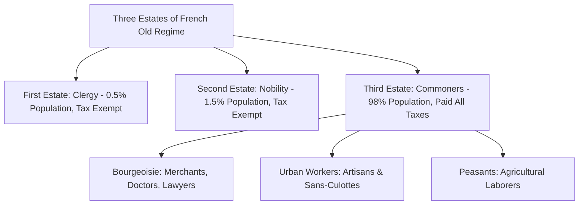

# World History: Complete UPSC Notes

> **Target Exam**: UPSC Civil Services Examination (Prelims & Mains) / State PSCs  
> **Subject**: World History  
> **Total Modules**: 17

---

## 📚 Table of Contents

1. [Middle Ages and Renaissance](#1-middle-ages-and-renaissance)
2. [Industrial Revolution](#2-industrial-revolution)
3. [French Revolution](#3-french-revolution)
4. [Napoleon Era](#4-napoleon-era)
5. [American Revolution](#5-american-revolution)
6. [Unification of Germany](#6-unification-of-germany)
7. [Unification of Italy](#7-unification-of-italy)
8. [World War I](#8-world-war-i)
9. [League of Nations](#9-league-of-nations)
10. [Russian Revolution](#10-russian-revolution)
11. [World between World Wars](#11-world-between-world-wars)
12. [World War II](#12-world-war-ii)
13. [Cold War](#13-cold-war)
14. [Chinese Revolution](#14-chinese-revolution)
15. [Japan](#15-japan)
16. [Africa](#16-africa)
17. [Philosophies](#17-philosophies)

---

## 1. Middle Ages and Renaissance

> **Source Subject**: [World history](https://compass.rauias.com/world-history/)
---
## 1. Background of Medieval Europe
> Source: [https://compass.rauias.com/world-history/background-medieval-europe/](https://compass.rauias.com/world-history/background-medieval-europe/)

## Background of Medieval Europe

### **Fall of Constantinople (29 May, 1453)**

- It is an event of capturing the capital of the Byzantine Empire by the Ottoman Empire and the fall of Byzantine empire.

- Byzantine empire also referred to as the Eastern Roman Empire or Byzantium has its capital in Constantinople.

- Ottomans were represented by Sultan Mehmed II (later nicknamed "the Conqueror") while Byzantine Empire was led by Emperor Constantine XI Palaiologos.

#### Consequences

- Mehmed II made Constantinople the new Ottoman capital, replacing Adrianople. Byzantine empire lost its control over the trade with Central and East and South Asia.

- After getting hands over the existing silk route and Red sea route, Arab traders began controlling European trade to India and China. They charged huge fee and taxes on the passage of goods. This made them supernormally rich while the European traders registered huge losses year on year.

- Meanwhile, due to various fears and threats, Greek Christians moved from Turkey to Italian cities and brought their culture and knowledge to Italy. They taught mathematics, history, geography, philosophy, astronomy, medicine etc. to the people of Italy.

- Renaissance began in Europe with improvement in shipbuilding and navigation.

- Ruling dynasty in Portugal (e.g., Prince Hency the Navigator) took the lead to lay down exploration plans to find new sea routes to India.

---

## 2. Renaissance in Europe (14th-17th century)
> Source: [https://compass.rauias.com/world-history/renaissance-in-europe-14th-17th-century/](https://compass.rauias.com/world-history/renaissance-in-europe-14th-17th-century/)

## Renaissance in Europe (14th-17th century)

**What:In the fifteenth century A.D. people of Europe developed interest for the literature, art, architecture, painting and culture of Greece and Rome. Renaissance began from Italy.

**Meaning:‘Rebirth’ or ‘New Birth’. It is new birth from the control of Church on social and personal life of each individual.

**Why Italy**: huge repository of classical ruins and artifacts of Roman architecture, and immigration of Greek Artist and scholars from Constantinople.

### **Causes**

1. Fall of Constantinople (centre for learning among Christianity and Greeks).

2. Invention of Printing press (John Gutenberg of Germany in 1436), spread the intellectual knowledge through book printing across nations and cities.

3. Patronage from ruling class: Francis I (France), Henry VIII (England), Charles V (Spain), Sigismund I (Poland) invited many persons having new ideas to their courts. Loronjo-de-Medicci, the ruler of Florence invited many artists to his court and decorated his palace with new paintings.

4. Intellectual ideas: book ‘Yes and No’ of Peter Abelard (University of Paris) talked about rationality and ability to question. Roger Bacon of Oxford University who said that nothing should be accepted without proper experiment and observation.

5. Declining importance of Church and its waning influence on personal life.

### **Effect**

1. **Literature:Dante’s ‘Divine Comedy’ (1321), an Italian book, which had themes like love of one’s country, love of nature as well as the role of individual. Francesco Petrarch’s ‘Sonnet’ poetry glorified secular or Worldly interests of life and humanism. Machiavelli in his famous book ‘The Prince’ (1532, short treatise on how to acquire power, create a state, and keep it), described the principle of the ‘Lion and the Fox’. Thomas Moore, William Shake­speare and Christopher Mario also belonged to this period.

2. **Art:before renaissance, art was based on religious themes only. This was replaced with Humanism, dignity, individualism and rationality. Famous artist included Gentile Da Fabriano for Gothic style painting, Leonardo Da Vinci for Mona Lisa and Last Supper paintings, Raphael for paintings, Michelangelo (sculptor).

3. **Architecture**: The pointed arches of the Churches and Palaces were substituted by round arches, domes or by the plain lines of the Greek temples. ‘Florence’, a city of Italy became the nerve centre of art-world. The ‘St Peter’s Church of Rome’ the ‘Cathedral of Milan’ and the ‘Palaces of Venice and Florence’ were some of the remarkable specimens of Renaissance architecture.

4. **Sculptures**: Lorenzo Ghiberti carved the bronze doors of the Church at Florence, Donatello is remembered for his realistic statute of ‘St. George’ and ‘St. Mark’, Michel Angelo’s huge marble statue of ‘David’ at Florence.

5. **Counter Reformation:When churches found their legitimacy being questioned, they began bringing extensive development on architectural front (Vatican structure of 16th century).

6. **Age of exploration/discovery (15th-17th century):European naval explorers discovered new sea routes, new continents and established new colonies.

7. **Social changes**: Greek and Roman texts fostered a more rational, scientific approach to theology, the natural world, and the arts. Human beings and nature became subjects worthy of study.

8. **Science Revolution**: escalated interest on Alchemy, astronomy, mathematics, medicine and geography. Famous contributors were Nicolaus Copernicus and Galileo Galilei in Astronomy, Commandino in Mathematics, Andreas Vesalius in Medicine, Issac Newton in Physics.

---

---

## 2. Industrial Revolution

> **Source Subject**: [World history](https://compass.rauias.com/world-history/)
---
## 1. Pre-requisite to industrial revolution
> Source: [https://compass.rauias.com/world-history/pre-requisite-to-industrial-revolution/](https://compass.rauias.com/world-history/pre-requisite-to-industrial-revolution/)

## Pre-requisite to industrial revolution

**What**: transition to new manufacturing processes.

**Transition process included**: hand production methods to machine, expansion in coal/cotton/iron production, steam power, introduction of machine tools.

**Where:began in England, gradually shifted to entire Europe, US and Japan.

**Dominant industry:Textile industry

### **Pre-requisites**

1. **Rise of capitalist class**: growth of free trade, rising of business profits and dilution of feudalism gave push to new social class of capitalist.

2. **Materialistic lifestyle: **due to *age of reasoning* and contributions of Voltaire, Rousseau, Locke desire for materialistic lifestyle began to gain popularity. People began practicing concept of happy life, demanding human rights and collection of material wealth. Even taking money loan for materialist lifestyle was not unethical anymore.

3. **Regular supply of raw material**: Europe could get raw material such as cotton, sugarcane, indigo etc. both from the orient (east of Europe or east of Occident) and the new world.

4. **Market expansion**: discovery of new areas followed by export of finished goods.

5. **Labour supply**: rise of population in Europe gave consistent supply of labour at subsistence wages.

6. **Transport facility:Dutch innovation of long journey ship vessel Fluyt (FLUTE). This reduced the cost of shipping to one-third.

7. **Agriculture sector**: Even advancement in the agriculture sector released labour from rural sector (labour supply increased). It also provided backward linkages to the industrial sector (e.g. Cotton)

8. **Commercial revolution**: began with the Crusade where Christian Europe trying to capture Holy land (Jerusalem) for religious, political and economic reason and continued till the industrial revolution. Other factors included, discovery of America, opening of new trade, formation of strong central governments and trading companies.

9. **Economic thoughtsof Mercantilism (15-18th century) and Lassiez Faire capitalism.

**Mercantilism:theory that supports every little bit of a country's soil be utilized for agriculture, mining or manufacturing, all raw materials found in a country be used in domestic manufacture no export, support large working population, export of finished goods, Discouraging foreign imports of finished goods, imports only of essential raw material.

**Lassiez Faire:people should be free from any form of economic intervention. Market should function on competitive lines. Economic system should allow markets to self-regulate. Near complete separation of government from the economic sector.

10. **Scientific innovations for mass production**:

- ‘Spinning Jenny’ was an engine for spinning wool or cotton invented in 1764 by James Hargreaves.

- In 1712, Thomas Newcomen invented the first steam engine (first practical fuel-burning engine), known as the atmospheric engine.

- Eli Whitney invented the cotton engine, or 'gin' for short, in 1794 that could separate cotton seed and fibre easily.

- Scottish engineer James Watt invented the first practical steam engine in 1763.

- In 1837, Telegraph began operating in London.

- First electric generator was invented by Michael Faraday in 1831: the Faraday Disk.

- Joseph Aspdin in 1824 devised and patented a chemical process for making Portland Cement.

- John McAdam’s 'macadamized' roads: used crushed stone in shallow, convex layers, a binding layer of stone dust, and a cement or bituminous binder.

- Henry Bessemer in 1856 patented world's first inexpensive process for the mass production of steel from molten pig iron.

- Richard Arkwright in 1769 devised a machine (water frame) to spin cotton fibers into yarn or thread quickly and easily.

**Factory system**: It is a system where a capitalist would invest huge sum of money, employ many workers at a single place or building with machines for mass production of goods.

---

## 2. Why Industrial Revolution began in England?
> Source: [https://compass.rauias.com/world-history/why-industrial-revolution-began-in-england/](https://compass.rauias.com/world-history/why-industrial-revolution-began-in-england/)

1. **Agricultural revolution**: wool and cotton production was unprecedented. Yield of food crops also increased drastically.

- Enclosure movement: enclosing the common land of village and transferring it to the private ownership making it possible to institute improved farming techniques on a wider scale on a given current fallow land (General Enclosure Act of 1801 and the Enclosure Act of 1845)

2. **Population growth and rapid urbanisation**: population of London increased five times in 17th century. This increased the demand for urban settlements, supply of labour and demand of clothing.

3. **Navigation Acts(between 1651-1760) or Acts of Trade and Navigation, were a long series of English laws that developed, promoted, and regulated English ships, shipping, trade, and commerce between other countries and with its own colonies. The laws also regulated England's fisheries and restricted foreigners' participation in its colonial trade.

4. **Government policies**: created patent laws to make benefits out of intellectual property.

5. **Financial innovation**: Financial institutions such as central banks, stock markets, and joint stock companies encouraged people to take risks with investments, trade, and new technologies.

6. **Enlightenment and the Scientific Revolution**.

7. **Better means of transportation**: availability of all-weather roads, introduction of railways and navigable rivers and canals.

8. **Natural resource**: Coal and Iron deposits were plentiful in Great Britain (specially Central and Northern England).

9. **Colonialist and Imperialist powers**: with expansion of its colonial powers in Asia and Africa, England was able to procure as much raw material as required by the industries back home. Same practice also helped England to gain on the access to underexplored market for its finished products.

10. **Political and social factors**: Stable political situation in Britain from around 1688 (after Glorious Revolution), British society’s greater receptiveness to change, new capitalist class, secure property rights, abolition of slavery.

11. **Geographical location**: England is located on a island type structure and separated from rest of the Europe (rarely fell into the wars with neighbours).

11. **Other factors**: private sponsorship of education and apprenticeship, availability of capital, Blockade by Napoleon against British trade made England more self-reliant, church land was confiscated and 1/4th of national resources were brought into productive use.

Conclusion: It was British Empire that made British the father of Industrial Revolution.

---

## 3. Industrial revolution and impact on society
> Source: [https://compass.rauias.com/world-history/industrial-revolution-and-impact-on-society/](https://compass.rauias.com/world-history/industrial-revolution-and-impact-on-society/)

## Industrial revolution and impact on society

### **Early impacts1. Working class:**

- Labour had no bargaining power, fourteen hours of working shifts, no paid vacation, children were also employed.

- Excess supply of labour force (high population and enclosure movement) brought the unprecedented unemployment.

- No voting power was given to labour class (only rich could vote).

- Combination Acts (1799, 1800) were passed that made it illegal for workers to unionize, or combine, as a group to ask for better working conditions.

- Machines replaced the manual labour and their skills went futile.

**2. Women:**

- Although women were provided new avenues of employment in the urban centre, they were exploited in the factories in the similar manner as were the men. They were paid less wages than men. This impacted the caring of children back home.

- New class of women came to being; Factory Girls.

**3. Children:**

- Child labour at factories became a new normal. This rise in child labour was based on the necessity to support the rising population and meet the urban lifestyle expenses.

- There was no element of education to the poor children in urban areas. Only riches had access to the education system that to in limited disciplines.

**4. Other sectors:**

- Emergence of two new classes (Marxist) – proletariat or wage earners and bourgeoisie (Capitalist and middle class).

- Rise of urbanisation across the Europe.

### **Later Impacts**

#### Improvement in social structure

- Gradually, a middle class emerged in the industrial cities. They filled the requirement of ‘white collar’ jobs in the cities. Due to their consistent rise in the society, they began living good standard of lifestyle, education among middle class children began to grow, life expectancy increased and infant mortality began decreasing and population stabilisation was gradually achieved.

- Emergence of new ideologies such as Socialism, Marxism and Communism.

- Chartism: it was a working-class movement for political reform (political liberty) in the United Kingdom that erupted from 1838 to 1857.

- Birth of Romanticism: as a reaction to the Industrial revolution. It was an artistic, literary, musical and intellectual movement that originated in Europe towards the end of the 18th century.

---

## 4. Industrial Revolution and impact on economy
> Source: [https://compass.rauias.com/world-history/industrial-revolution-impact-economy/](https://compass.rauias.com/world-history/industrial-revolution-impact-economy/)

- There was rise in the GDP of England in an exponential manner.

- Rise and expansion of capitalist class made England the financial power house of the world. They began developing other territories for their business needs (e.g., Railways in India).

- Ever growing economic activities demand consistent supply of inputs specially the raw material. This gave impetus to explore foreign territory, capture them and expand colonialism further.

- Due to extensive expansion on certain industries, England emerged as world leader in exports of Cotton clothing, steel, and other manufactured products. This further benefitted its balance of payment, improved foreign exchange earnings and helped its currency appreciate further.

- Expansion of industrial sector and coming up of new proletariat class across England invited the creation of trade Unionism.

- On the dark side, industrial revolution brought the irreversible global warming that has been increasing since.

---

## 5. Industrial Revolution in America (USA)
> Source: [https://compass.rauias.com/world-history/industrial-revolution-in-america-usa/](https://compass.rauias.com/world-history/industrial-revolution-in-america-usa/)

## Industrial Revolution in America (USA)

### **Why USA?**

- Industrial backwardness in comparison to England.

- Misuse of its natural resource and human capital by the colonial powers. America was developed as raw material supplier (crops and minerals) and no money was spent on the development of industries. British parliament (before American independence) decided all forms of taxation and duties on American goods.

- When British shut down its colonies for other nations to trade, US provided its ports to other colonial powers for trading purposes. This way they earned huge fee and access to other markets. They could easily sell their tobacco. Available capital was channelled into planting, shipping and commerce.

- Cotton factor: rapid economic growth in the nation as a whole was driven by the expansion of the cotton crop and the southern “Cotton Kingdom”.

### **What US did?**

- Expansionary policies adopted to bring more region under administration so as to capture natural resources.

- Embargo act 1807 was passed to retaliate towards Continental system of Napoleon.

- New cotton mills were set up at large scale. Thomas Somers and the Cabot Brothers founded the Beverly Cotton Manufactory in 1787, the first cotton mill in America

- encouraged the expansion of commercial agriculture in southern states.

- Introduction of tariffs to protect the domestic industries from cheaper English imports.

- Americans began gradual shifting of production centres westward. This raised the operating and transportation cost for British traders and gave advantage to American traders.

- In the iron industry, latest new British coal fuelled techniques in smelting and refining was adopted apart from use of ready availability of traditional wood fuel.

- New technological developments: e.g., Sewing machine (Howe, Singer & Wilson).

- Market was left to promote unrestrained social Darwinism and highest form of capitalism.

- After the civil war (1861): new inventions, division of labour, large chunk of new investors and bankers, extensive development of railways (320000km by 1900), roadway and telegraph, high demand in automobile and defence goods changed the fate of US forever.

#### The products included

- typewriter (1867),

- barbed wire (1874),

- telephone (1876),

- phonograph (early form of record player) (1877),

- electric light (1879),

- petrol engine car (1885).

### **Impact on American society and economy:**

#### **Society**

- Rise in urbanisation (50% by 1916). This further caused issues of slums, overcrowding, cheap apartment buildings

- Urban society got divided into rich class, middle and working class and poor class.

- Corruption also flourished in state and local government.

- American author Mark Twain called the era of industrialization “The Gilded Age.” It means an age which included the newly growing rich class that believed in show-off culture. New kinds of luxuries were adopted such as watching live sports, theatres, buying gold, expensive handmade items etc.

- Rise of Progressive Era: demands were raised to reduce poverty, unemployment. In 1886, skilled labourers formed the American Federation of Labor (AFL). Farmers founded the National Grange in 1867.

#### **Economy**

- Multinational companies were established (e.g., J P Morgan in 1799, DuPont in 1802, Coalgate in 1806, Citigroup in 1812).

- Very high unemployment in later decades of 19th century.

- Re-occurrence of depressions (1873, 1884, 1893, and 1907).

- Growth of middlemen in railways transport, mills and gins wiped-off the profits of farmers and small businessmen.

---

## 6. Industrial Revolution in Russia
> Source: [https://compass.rauias.com/world-history/industrial-revolution-in-russia/](https://compass.rauias.com/world-history/industrial-revolution-in-russia/)

## Industrial Revolution in Russia

### **Background**

- By 1815, Russia was the largest nation in terms of power, population and area.

- Peter the Great and Catherine the Great had added lands on the Baltic and Black seas, and Tsars in the 1800s had expanded into Central Asia.

- During the 19th century Russia exported large quantity of grain to Europe, but revenues where wasted in luxury lifestyle.

- Autocratic and despotic rulers did not allowed extensive deployment of industrial policies.

- Russia’s defeat in Crimean War (1853-56) exposes the empire’s lack of development and the urgent need for Russian industrialisation.

- Another obstacle was the social structure of Russia; Landowning nobles dominated society and rejected any change in economic order. Masses were serfs. Most serfs were peasants. Others were servants, artisans, or soldiers forced into the tsar’s army.

**Case to understand who is a Serf:**

Sam is a poor European farmer in the Middle Ages. Here's the political situation: he doesn’t own the land he lives on. It's rented from a baron or a duke. He and his neighbours share a plough and they combine their oxen into teams to till the soil together. There's not much social mobility: his parents and grandparents before him worked this same land. He doesn't even have the legal right to leave the property, without the permission of his landlord. He is a serf, in a feudal economy.

### **Reforms of Alexander II**

- Alexander II brought Emancipating the serfs (1861). Called as The Liberator.

- Emergence of **Kulak: **it is a proto-capitalist class. He would own larger tracts of land, livestock or machinery, hire landless peasants as labourers, use more efficient farming techniques, sell surplus grain for profit.

- Alexander II set up a system of elected local government responsible for matters such as road repair, schools, and agriculture.

- Since 1870s, development of railway became prominent.

- Russia finally entered the industrial age under Alexander III and his son Nicholas II.

Government encouraged railroads to connect iron and coal mines with factories and to transport goods across Russia and secured foreign capital to invest in industry and transportation systems, such as the Trans-Siberian Railroad, which linked European Russia to the Pacific Ocean.

- Role of Sergei Witte: construction of the Trans-Siberian Railway, incentives for investments, moved the Russian Ruble to the gold standard, borrowed fund for public work and infrastructure.

### **Issues with Russian IR**

- Rise of humungous population of industrial proletariat.

- Growing of ramshackle dormitories and tenements.

- Working class was exploited, poorly treated, and clustered

- Poverty, disease, and discontent multiplied in the slum areas.

- Industrial units crumbled during the Russo-Japanese War (1904). Consequently, frustrated workers began to strike. In January of 1905 Moscow was crippled by strikes.

- Socialism and communism gain currency throughout Russia.

- Russian Industrial revolution began to slow down and continued in the same trend till end of Russian Revolution. After the revolution, under the leadership of Lenin and Stalin, Russia picked up again on the path of rapid industrialisation through the planning process (socialist state).

---

---

## 3. French Revolution

> **Source Subject**: [World history](https://compass.rauias.com/world-history/)
---
## 1. Old regime in France and Europe
> Source: [https://compass.rauias.com/world-history/old-regime-in-france-and-europe/](https://compass.rauias.com/world-history/old-regime-in-france-and-europe/)

## Old regime in France and Europe

### **Older France**

France achieved the absolute monarchy under the reign of Louis IV (1638-1715) who self-proclaimed himself as Sun King. He believed in “one king, one law, one faith”. He began controlling nobility, built strong military and standing army, salaried bureaucracy, improved economy and persecuted the protestant Christians (*dragonnades*).

### **Old Regime in Europe**

- Europe was organised aristocratically (e.g., Venice was ruled by noble class, In England franchise was very limited, In Austria, Russia, Spain, Prussia, France Princes had absolute power).

- Reformation (16th century) and Counter Reformation (17th century) brought new ideas into the Christendom and removed the absolute hegemony of Pope in Rome.

#### **Weak and inefficient control by outsider powers**

- Germany: Under the presence of Holy Roman Empire, regional kings had no authority (e.g., there were 360 kingdoms in German empire without any absolute control).

- Prussia: ruler Frederick William II was busy in the partition of Poland rather than looking to French revolution.

- Austria: there were protest by the local linguistic groups such as Bohemia, Hungary and Netherlands against the imposition of German language by Joseph II.

- Italy: mere a geographical expression without any unity.

- England: just got the blow on its prestige with a loss in the American war of Independence.

When all these nations were busy elsewhere, French revolution didn’t face their unwanted interference.

#### Social weakness

- all states were aristocratic and oligarchic, while nobles and the clergy enjoyed unprecedented privileges.

- Privilege class paid little or no tax at all. While all expenses of the royalty came from money of the masses.

- Feudalism: where serfs enjoyed no rights while landlords took all benefits without any work. However, even before the revolution could began, there was substantial decline in the severity of serfdom in French society.

- Next to England, France had the most numerous, prosperous, intelligent and enlightened middle class.

---

---

## 4. Napoleon Era

> **Source Subject**: [World history](https://compass.rauias.com/world-history/)
---
## 1. Early expedition and Rise of Directory
> Source: [https://compass.rauias.com/world-history/early-expedition-rise-directory/](https://compass.rauias.com/world-history/early-expedition-rise-directory/)

## Early expedition and Rise of Directory

### **Early expedition of Napoleon**

He gain trust and loyalty of the Directory after protecting them from the royalist insurgency. His first ever major expedition was in Italy. In 1796, he began a military campaign against the Austrians and their Italian allies, scoring decisive victories and becoming a national hero.

### **Egypt’s campaign**

- March towards Egypt was for a purpose to defeat English powers in the East and control the trade routes to Asia.

- In 1798 Napoleon began military campaign to Egypt. France won the Battle of Pyramids but severely lost to British forces in Battle of Nile.

- He later tried to invade Syria but failed.

### **Fall of Directory**

- Internal reasons: there was never ending feud among the directors who faced stiff criticism from the non-cooperative legislature consisting Royalist and extremists. Then there were series of coup against the Directors.

- External factors: Switzerland was invaded and its polity was changed, Pope was humiliated and republic was established in Rome, Geneva and Piedmont were captured. This annoyed many powers in Europe and led to the formation of coalition including England, Austria and Russia.

- France was driven out of Germany by the coalition.

- Seeing advantage in this crisis, Abbe Sieyes and Napoleon organised a coup d’etat (a coup from top or self-coup) and overthrew Directory (1799). A provisional **Consulate (1799-1804) **was appointed to draw up a **counsellorconstitutionand to carry on the government.

### **New Constitution of France under Napoleon**

Features:

- Real power in the hand of three counsel (one being the First counsel) elected by the Senate for 10 years.

- First counsel will take all decision while other two would be for consultative process.

- Council of State would draft bill, Tribunate would discuss a bill and Legislative body would pass it.

- Senate consisting of 60 members could accept or reject measures of legislative body. Senate and Council of State to be nominated by the First Counsel.

### **Foreign Campaign under Consulate**

- Napoleon defeated Austria and got back Italian territories (1800)

- France was unable to defeat naval might of Britain so it came to an agreement called Peace of Amiens (1802). Under this treaty, England restored all major conquests from France. France agreed to evacuate Naples and the Papal States and to restore Egypt to the Sultan of Turkey.

---

## 2. Reforms of Napoleon
> Source: [https://compass.rauias.com/world-history/reforms-of-napoleon/](https://compass.rauias.com/world-history/reforms-of-napoleon/)

## Reforms of Napoleon

### **Reforms by Napoleon**

Napoleon was against the concept of Liberty as he believed that due to mismanaged liberty France could not build itself strongly after the revolution.

#### 1. Economic reforms

- Bank of France was founded in 1803 which monopolised the issuance of currency.

- Tax collection was made centralised.

- On account of corruption and indiscipline guilds were abolished.

- Industrial committee was setup to look into the disputes between labours and merchants.

#### 2. Education reforms

- Primary schools were completely under the commune control (not government)

- Secondary schools were under direct central government control where Latin, French and Greek were taught.

- High schools were also under the government control for providing higher education.

- Vocational and military schools were set up for non-academic talents.

- Teachers training centres were opened and high performing teachers were rewarded by the government.

#### 3. Socio-cultural reforms

- ***Policy of conciliation*where emigres and non-juring were sympathetically treated.

- Public offices were thrown open to all.

- ***Concordat***: this was an agreement with the Pope in 1801, wherein Catholicism was recognised as the “religion of the great majority of the French people” and the right of public worship and right to religious freedom was granted to the Catholic Church and French people. Bishops will be nominated by the state.

- ***Brigandage*was stopped which encouraged open trade.

#### 4. Politico-Administrative reforms

- France was made a modern state based on equality, rule of law and secularism.

- New civil service called as ***Auditeur*was created.

- Elected councils in the local administration were removed by the nominated members.

#### 5. Napoleonic Code or Civil Code of 1804

- Previously, every region or province of France had a new law and order conditions. Voltaire once commented that, “man traveling across France changes laws as often as he changed horses”.

- Code called for rights such as freedom of speech, public trials, freedom of worship and freedom of occupation. It denied any benefits on the basis of birth and made qualification important for public jobs.

- It respected old family traditions, private ownership of property.

- This code was widely accepted in many European nations and it helped in building new nation states.

In 1804, Napoleon Bonaparte was declared as the Emperor of France by the senate and remained in that position till 1814. This was constitutional monarchy but with a difference that Emperor this time had no right over the land of France as with the previous Bourbon dynasty.

### **Why a constitutional monarchy?**

- People of France were fed up with the consistent disability in the political corridors. Every then and now there was change in the constitution or head of the government. They simply wanted stable polity to gain on stable economy.

- Secondly, stable polity could ensure safety and security of France from within and outside.

- Prolonged wars with European counterparts laid down insecure environment for French people who were looking for peace and brotherhood.

- Napoleon won the trust of masses through his indomitable and decisive leadership as First Counsel and military commander. People were delighted to hand over the power to a single person without a doubt.

---

## 3. Napoleonic wars and Decline of Napoleon
> Source: [https://compass.rauias.com/world-history/napoleonic-wars-decline-napoleon/](https://compass.rauias.com/world-history/napoleonic-wars-decline-napoleon/)

## Napoleonic wars and Decline of Napoleon

### After Peace of Amiens (1803)

- Peace of Amiens brought temporary relief to the strained relations between Britain and France. During this period, France imposed high tariffs on British goods. Meanwhile, France captured the Piedmont and Holland which annoyed Britain and later he acquired Louisiana in America from Spain. He even stirred Indian princes against the British power. After this he began invading Britain but combined forces of France and Spain were defeated by the English fleet in **Battle of Trafalgarin 1805.

- On the other hand, **Third Coalitionwas in making, including Britain, Sweden, Austria and Russia. However, Napoleon defeated Austria and Russia at Battle of Austerlitz in 1805.

- In case of **Germany**, he replaced the centuries old Holy Roman Empire and its administration with Napoleonic code and centralisation. He simplified map of Germany which led to territorial unification of German regions.

- **Treaty of Tilsit **(greatest achievement of Napoleon): After defeating the Czar Alexander I in Battle of Friedland, Treaty of Tilsit was signed where France and Russia agreed that Russia would support France in its economic war with England while France will support Russia in acquiring territories in Sweden and Turkey.

- After treaty of Tilsit became King of Italy, Protector of German empire, Law maker in Switzerland.

- By the year of 1811, he reached zenith of his territorial acquisition. In the extreme south-east, Spain had been ‘reduced to a vassal state under the rule of his brother Joseph.

- **Benefits of Napoleon’s intervention**: it led to the territorial integration of Italy and Germany. Imposition of Napoleonic codes helped in the rise of nationalism in the coming decades across Europe. France ideals and institutions found their inroads in monarchical states across Europe. There was abolition of feudalism and serfdom, recognition of equality of all citizens before the law.

- **Continental system of Napoleon**: unable to defeat England through naval warfare, Napoleon began weaking the economic power of England. For this he adopted the Continental system or Blockage (*Blocus Continental*), which is a large scale economic embargo against the British trade (1806-1814). Second objective was to promote industrialisation of France. For this Berlin Decree was issued in 1806 which removed all internal barriers and tariffs. England retaliated by Orders in Council which forbade all trade with ports belonging to France or her allies. Later, Napoleon issued his Milan Decree (1807) by which he declared that any ship of any country which should touch at a British port, was liable to be seized and treated as a prize.

- **Outcome of Continental system**: As most European traders were dependent on the British fleet, they were left helpless. Meanwhile, England began exploring new markets in Africa and Asia. Secondly, inflation in European states was high as ever. States across Europe went into the anti-Napoleon sentiments. This was the beginning of the downfall of Napoleon.

### **Decline of Napoleon**

- He signed a treaty with Spain to divide Portugal and its foreign possessions. He later replaced the King of Spain Charles IV with his brother Joseph. This gave birth to anger among the people of Spain who saw this as blow to their sovereignty. People began asking help from England. England intervene had ousted French forces from Lisbon first gradually moving towards Spain.

- **Peninsular war**: it was a series of small conflicts between French forces of Napoleon and Spanish nationalist people. This war gave an impression of new wave of nationalism in Europe and was gradually replicated in Germany as well as in Austria.

- **Russian case**: Russia showed least interest in the Continental system of Napoleon which annoyed him. French forces defeated Russia at Bordino and while returning they had to face Siberian winters. This severe weather lost many able soldiers of French forces and killed their motivation.

- **War of Liberation 1813**: Prussian nationalism rose to an ultimate height. It was soon joined by Russia, Austria, Sweden and England (Fourth Coalition). Battle of Nations was fought at Leipzig where France was beaten brutally. When peace was offered to Napoleon, he refused. Allied forces entre Paris in 1814 and Napoleon was forced to retire and sent to the island of Elba.

**Louis XVIII**, brother of late king was restored to the throne of France. But people of France were not happy with this new King. Meanwhile, Napoleon escaped the Elba, his soldiers joined him in France. Louis XVIII fled, Napoleon entered Paris. Other powers united once again against the Napoleon.

**Battle of Waterloo 1815**: Combined forces of nations defeated small army of Napoleon in this battle. Napoleon was captured and sent to St. Helena where he died after six years.

---

## 4. The Congress of Vienna, 1815
> Source: [https://compass.rauias.com/world-history/congress-vienna-1815/](https://compass.rauias.com/world-history/congress-vienna-1815/)

## The Congress of Vienna, 1815

What: An assembly of nations

Why: reorganise and restructure Europe after Napoleonic wars.

When: June 9, 1815

Participants: All European states except Turkey.

President: Chancellor of Austria, Metternich.

Other major personalities included: Frederick William III of Prussia, Czar Alexander I of Russia and Britain’s foreign ministers Lord Castlereagh.

### **Task ahead of the Congress of Vienna**

- To redraw political map of Europe.

- To isolate France by establishing a ring of strong states around her.

- To eliminated political theories of France.

- To restore monarchical forces.

- To re-establish the balance of political power in Europe.

### **Treatment given to France in the congress**

- Area reduced to pre-revolution era.

- Imposed heavy war indemnity.

- Restored treasuries taken away by Napoleon.

- Maintenance of allied forces for 5 years.

- Created a ring of strong states around France.

Through its various measures, Congress of Vienna was able to buy peace for Europe in next four decades. Creation of Holy Alliance or Quadruple Alliance are such examples.

### **Criticism of the Congress**

- There was unwanted move to restore the old regime despite the rising forces towards the nationalism, republic and democracy.

- Discretionary division of territories and changing the rulership of a region annoyed the local habitants. For example, major Italian territories were handed over to the Austrian rulers.

- Rise of new power assertive nations like Russia.

- Unification of Germany was disregarded and old division was restored.

### **Holy Alliance (1815-25)**

- It was sponsored by Russia Czar Alexander I, so as to bring spiritual political framework and restoring Christian principles.

- Its main objective was to promote peace and goodwill by bringing Christianity in public life.

- Except England, all states signed it.

- It ended with the death of Czar Alexander I in 1825.

### **Quadruple Alliance (1815-1818)**

- Members: Britain, Austria, Russia, and Prussia (BARP)

- Why: To maintain treaties with France, preserve political stability in Europe, friendly relations among the four members, conduct regular meeting on security of members.

- This proposal for periodic meetings constituted Concert of Europe or Congress System.

Under the leadership of Metternich, Quadruple was able to supress small states and silence the revolutionary ideals.

Later France joined this grouping under the leadership of Louis XVIII and renamed it as Quintuple Alliance in 1818.

### **Concert of Europe**

- It was a medium or channel to resolve the disputes among the major conservative powers.

- Objective: maintain power, oppose revolutionary activities, weaken nationalism, and uphold balance of power.

- It was the first example of System of Diplomacy by Conference.

- Criticism: suppression of Naples by Austria, Spain was suppressed by France.

- Why it failed:

- England never wanted to intervene in the internal affairs of the states on the wishes of Metternich. Parliamentary England could not dealt with autocratic partners.

- Second reason was the jealousy among the members. Russian and British were competitor in Balkan, West Asia and Mediterranean. These member nations had self-interest in the global trade routes and their colonies abroad. England wanted France out of Spain to protect Spanish colonies from the interference of France specially in North America.

---

---

## 5. American Revolution

> **Source Subject**: [World history](https://compass.rauias.com/world-history/)
---
## 1. Condition of US before revolution
> Source: [https://compass.rauias.com/world-history/us-before-revolution/](https://compass.rauias.com/world-history/us-before-revolution/)

## Condition of US before revolution

### **What is American revolution?**

It is a **political upheavalduring which colonists in the **Thirteen North American Coloniesof Great Britain **rejected the British monarchy**, overthrew the authority of Great Britain, won political independence and went on to form the **United States of America**. However, it resulted into social, political and intellectual transformation of USA.

### **Period before 1763**

In 16th century, France, Netherland, Spain and England began establishing colonies in North America. Later in 18th century, England held the dominant position, it acquired French territories in North America, took New Netherland to create New York, and acquired Canada.

### **American society**

- America was settled by dissenters and radicals and their next generations had inherited the spirit of liberty.

- Poor, unemployed and convicts came to settle in US. They were detached from the their homeland.

- In terms of religion, that were far more tolerate than the European nations.

- New sections of society grew which included landless peasants, liberal groups, atheist, traders and profiteers.

- American society was divided into Loyalist, Patriots, and Neutrals.

- Role of women: they participated in the boycott of British goods, provided routine services to the colonies’ forces.

### **American Economy**

- Infant industries of wool, flax and leather grew up.

- Fishing and shipbuilding were major activities.

- Large plantations like feudal manors had grown with slave labour brought from Africa.

- Industrial revolution was absent

- Technology was very medieval in nature.

- Trade and commerce was under the control of British Parliament.

### **American Polity**

- First instance of self-government was the control over expenditure in Virginia, New York, New Jersey et. al between 1703-50.

- Informal committees consisting of legislative leaders began coming up in colonies of New York, and Massachusetts.

- Each colony had a local assembly elected by qualified voters. They enacted laws concerning local matters and levied taxes.

- Some colonies had elected assemblies which constituted the lower house of the legislature, a council appointed by the British Crown (mixed monarchy) and an appointed governor with executive powers representing the King. In some colonies Governors were appointed by the proprietors. While in Charter colonies both legislature and Governor were elected by the

- However, all political developments were controlled by the British Parliament. All the laws were to be approved by the British government.

---

## 2. Causes of American Revolution before 1763
> Source: [https://compass.rauias.com/world-history/causes-american-revolution-before-1763/](https://compass.rauias.com/world-history/causes-american-revolution-before-1763/)

## Causes of American Revolution before 1763

### **British attitude on 13 colonies**

- British supremacy and mercantilism was forcefully imposed.

- Best purpose of colonies was to provide the raw material to the mother land and buy the finished products.

### **Trade policy of British**

1. Navigation Act of 1651: all goods entering England must be carried in ships owed or manned by British subjects.

2. Enumerated commodities Act of 1660: sugar, tobacco, cotton, indigo and dyes export should only go to England or English colonies.

3. Staple Act of 1663: all exports going from Europe to America should go from the English ports and pay duty.

4. Duty Act of 1673: custom collectors to enforce above acts.

5. Enforcement Act of 1696: registration of colonial ships to check on smuggling. Custom officials can search ships.

6. Restrictions were imposed on certain goods to be produced in America such as woolen goods or luxury items.

### **Seven Years War and Treaty of Paris (1763)**

After the end of Seven Year War, England and France signed the Treaty of Paris 1763 where France lost its territories in North America including Canada. England got areas east of Mississippi while Spain retained the west side.

Impact: Due to large war expanses, England restored to high taxes on its colonies. Taxes were raised to pay pension to retired officers, standing armies were stationed and cancelled colonies rights over west of Appalachian. This angered the colonies against the British. They resorted to protest on ‘no taxation without representation’. Even American were now well versed to take on the colonial powers in war.

**Seven Years War(1756-63):**

It is a global conflict which was leaded by France and England. Anglo Spanish War and Carnatic Wars are contemporary to this conflict. Main cause behind this war was the desire of European powers to expand in Europe or in their colonies. Austria sided with France while England united with Prussia. Battle began with conflict between France and England in American region and later expanded to other places where they either had rule or interest in the ruling dynasties (e.g. Carnatic in India). Austria wanted to recover Silesia from Prussia. Result was the defeat of France and its allies like Austria and Spain. France lost its territories in India and America.

### **Crown’s Proclamation of 1763**

It restricted the colonies to expand westward to Appalachian. Reason cited was to protect the colonies from the attacks of red Indian. This annoyed the colonial powers.

---

## 3. Causes of American Revolution after 1763
> Source: [https://compass.rauias.com/world-history/causes-of-american-revolution-after-1763/](https://compass.rauias.com/world-history/causes-of-american-revolution-after-1763/)

## Causes of American Revolution after 1763

### New revenue and expenditure policies of the British

1.Currency Act of 1764**: it restricted the colonists to make debt payment in paper currency and order to pay only in gold or silver. It called for financial troubles.

2. **Sugar Act of 1764**: provided for strong customs enforcement of the duties on refined sugar and molasses imported into the colonies from non-British Caribbean sources. Shipmasters were harassed under this act.

3. **Stamp Act of 1765**: a compulsory stamped paper was enforced which would provide proof of tax payment. Later through the Declaratory Act of the Parliament it was clearly states that it has right to put direct taxation anywhere in the British Empire.

4. **Quartering Act 1765**: It made serving the stationed British army with food, drink, accommodation, fuel and transport by the colonies.

5. **Townshend Act 1767**: these were series of act passed to suspend representative assemblies in the colonies (e.g. New York assembly was suspended) and to raise revenues (duties on the imports on the ports of colonies). Further with Indemnity Act, duties on the tea coming from East India Company was reduced to boost its profitability and fight the smuggling of Dutch tea.

6. **Tea Act of 1773**: it was designed to bail out the East India company and make it a monopoly power in terms of tea trade i.e. giving it all the powers to sell the excess tea at reduced prices in the colonies. This was a direct discrimination with respect to other goods whose traders were in absolute loss. This allowed direct shipment of Tea from China to be sold in the American colonies.

---

## 4. Course of Revolution
> Source: [https://compass.rauias.com/world-history/course-of-revolution/](https://compass.rauias.com/world-history/course-of-revolution/)

## Course of Revolution

### **Early Protests1. Stamp Act Congress of 1765**: it was called by colony of Massachusetts and represented by 8 other colonies. Moderated led by John Dickinson drew up a ‘Declaration of Rights and Grievances’. They argued that no tax should be imposed without the consent of the colonial people. They threatened to stop imports of British goods.

**2. Sons of Liberty and Daughters of liberty**: it was a secret society founded by Samuel Adams and John Hancock in Boston 1765. It called people to not use the stamps. Their slogan was “Liberty, property and no stamps”.

On the behest of Benjamin Franklin, Stamp act was repealed under the PM Rockingham Government.

When colonies protest against the Townshend Act, British Parliament resorted by sending the troops to Boston to pacify the protest at the earliest. This was taken an insult by the locals who now began to take the violent means to protest.

**3. Boston Massacre 1770**: when soldiers were guarding the customs offices they had to face the angered crowd. People protesting against the Townshend act began throwing items to the soldiers. Instead of dispersing the crowd, soldiers began firing on the crowd and killed five Americans. This is called as Boston Massacre. This term was coined by the Samuel Adams who used this as a propaganda against the colonial powers.

In 1770, Lord North became the PM in Britain and repealed the Townshend Act. Parliament replead all the major taxes except the one on tea.

**4. Committee of Correspondence 1772was created as a reaction to the Boston Massacre. It was created by the patriots to propagate anti-colonial ideas among the masses. First such committee was created by the Samuel Adam in Massachusetts. Patrick Henry and Thomas Jefferson served in one such committee of Virginia.

**5. Burning of British ship Gaspeeby the members of Sons of Liberty led to the trial of American in Britain. This further added fuel to fire.

Benjamin Franklin leaked the **letters of Thomas Hutchinson**, the governor of Massachusetts which revealed the autocratic rule and attitude of the British to restrict the liberty of the Americans.

**6. Protests after the Tea Act:**

Sons and Daughters of Liberty began organising the public demonstration. They even warned the merchants to buy the tea coming from EIC ships. They called volunteers to boycott the tea arriving at colonial ports.

Merchants began boycotting the tea coming from EIC.

**7. Boston Tea Party**: despite various ongoing protests, Governor of Massachusetts allowed the tea unloading on Boston ports. In a sudden strike, 180 Boston patriots marched to the port, raided three ships coming from China and dumped the tea in the water. Its organiser was Samuel Adams. Whole of the Boston city was punished for this event.

Government’s reaction: Boston harbours were sealed and merchants were denied any form of trade (Intolerable Act of 1774). Town meetings were forbidden without Governor’s permission. Quartering acts were resumed.

8. **Other reasons**: France came to help the revolutionary military with money and muscle.

**Role of Intellectuals, Philosophers and writers**:

- John Locke is called as “philosopher of the American Revolution”. He gave critical concepts of social contract, natural rights, “born free and equal” and protestant ideology to the American people decades before the revolution.

- Thomas Jefferson made his famous declaration that “all men are created equal.”

- Thomas Paine composed books and pamphlets such as “Common Cause”, “Right of men”.

- Benjamin Franklin founded of “American philosophical society”. He opposed authoritarianism both political and religious, and supported scientific and tolerant values of the Enlightenment.

- John Adams always argued that American always had the sense of independence, that just wanted a push to bring it into reality.

- Samuel Adams founded the Sons of Liberty society and organised Boston Tea Party.

- Patrick Henry gave famous slogan “Give me liberty, or give me death!”.

### **First Continental Congress (1774)**

- Elected representatives of thirteen colonies united for the deliberation and discussions on collective actions. It included personalities like Patrick Henry, George Washington, John and Samuel Adams, John Jay, and John Dickinson. They met in Philadelphia and adopted a declaration of personal rights, including life, liberty, property, assembly, trial by jury, no taxation without representation and no stationing of military without prior approval.

- In October same year, Continental Association was created. It universally prohibited the trade with British.

- Continental Congress appointed George Washington as the Commander-in-Chief for their combined forces against the British powers.

- **Three Wars of 1775**: three battles were fought between the combined colonial forces and British forces. These were Battles of Lexington, Concord and Bunker Hill*. *Through these battles colonial forces were in control of Boston and created provincial congresses. In all 13 colonies, Patriots had overthrown their existing governments, closing courts and driving British officials away. They all agreed on the republican form of government with written constitution. In 1776, New Hampshire ratified the first state constitution.

### **Second Continental Congress (1775) and later**

- This was also organised in Philadelphia. War continued with full effort. Congress acted as the *de facto* national government of the people.

- On 5th July, 1775, congress sent an **Olive Branch Petitionto dilute the difference with the crown and avoid further conflict if desired reforms are being undertaken. King of England absolutely refused to even hear the petition and issued the **Proclamation of Rebellion**, declaring the colonies to be in open rebellion.

- Infuriated by the King’s move, congress formed a committee to draft a new constitution. This was headed by Thomas Jefferson.

- On 4th July, 1776 Congress approved a document Declaration of Independence. It announced the separation of 13 colonies from the rule of Britain. It was written by Thomas Jefferson. It declared that all men are created equal and independent. “Life, Liberty and the pursuit of Happiness” was a famous quote of the declaration. After this declaration, Americans began fighting for the independence.

- Second Continental Congress approved a new constitution, the **“Articles of Confederation,” **after which the Congress was dissolved and new set of government and institutions were created.

- In 1781, British forces under Cornwallis surrendered to the colonies’ forces under George Washington.

#### Why US won?

- King George III didn’t got required support in the Parliament to defend his choices.

- Many in England sympathised with the rebel government in US.

- External forces such as France provided all requisite support to the revolutionaries.

- **Peace of Paris: **under thisTreaty of Paris 1783 **was signedwhere Benjamin Franklin, John Adams, John Jay participated from US while on the English side representatives of King George III came. On the side-lines of this treaty, **Treaty of Versailleswas signed by Britain with France and Spain.

##### Outcome

- Independence of 13 colonies was recognised.

- New areas between Appalachian mountain and Mississippi was acquired.

- Loyalist were not persecuted and prisoners of war were released.

- Spain and France got their territories back in US and beyond (e.g. Florida)

---

## 5. Effects of American Revolution
> Source: [https://compass.rauias.com/world-history/effects-of-american-revolution/](https://compass.rauias.com/world-history/effects-of-american-revolution/)

## Effects of American Revolution

### **Social impact**

- It brought the concept of Liberty and individual rights among the people. They demanded end of slavery, women’s rights, religious freedom and voting rights.

- English traditions such as Land inheritance was removed forever.

- Anglican church was no longer surviving.

- Women were inculcated with more liberty and ability to lead a life of choice.

- On England: people who were loyal to Britain began migrating back and government of England was in dilemma to settle these people.

- On France: soldiers who came back from US brought with them, the stories of bravery of American who fought the autocratic rule and further boosted the French Revolution.

### **Economic Impact**

- A private Bank of North America was created to raise the savings during the war time situation.

- American colonies went in the phase of steep inflation and high fiscal deficits.

- Even rich were unable to lend loans to the government.

- On England: National debt on England went skyrocketed. Nation was unable to pay for exports and could not prevent arrival of recession. Prices of goods and property went uncontrollable. However, Peace of Paris brought some relief as the trade between US and England began to reach the pre-revolution level. Secondly, England began to exert more burden on its best colony i.e. India.

- On France: it went in the phase of bankruptcy and called for revolution.

### **Political Impact**

- English Prime Ministers began regulating their colonies. For instance, Prime Minister William Pitts passes Pitts India act to regulate East India company rule in India.

- Britain may have lost thirteen colonies in America, but it retained Canada and land in the Caribbean, Africa and India.

- Monarchy was replaced with direct democracy. There were regular demand across England for the constitutional reforms such as expansion of who could vote, and a redrawing of the electoral map.

- England began finding new places to house their convicts and later found Australia to be a suitable place.

- Constitutionalism became a new ideological demand across the globe.

**Features of American Constitution**

- Written constitution consisting seven articles.

- It is a rigid constitution due to complicated process of amendment.

- Relevant principles: Bicameralism, Federal setup of governance, separation of power among three organs of government, republican form of government, Dual citizenship, independence of judiciary etc.

- Bill of Rights:

- Right to speech, Right to press, Right to assemble

- Right to keep arms and bear arms

- Right against unreasonable seizure and search of individual’s house.

- Judicial rights such as due process of law, rights against self-indiscrimination, no double jeopardy etc.

---

---

## 6. Unification of Germany

> **Source Subject**: [World history](https://compass.rauias.com/world-history/)
---
## 1. Background and Congress of Vienna
> Source: [https://compass.rauias.com/world-history/background-congress-vienna/](https://compass.rauias.com/world-history/background-congress-vienna/)

## Background and Congress of Vienna

Italy and Germany are two important examples of how language, folk culture and common historical memories led to very strong nationalistic feelings helping to build the two people into sovereign, united and independent nations states by 1870.

Both Germany and Italy emerged as nation-states in the 19th century. Although the idea of nationalism in some form or other can be traced back in time in both cases, the actual development of nation-states took place only in the 19th century. The process of unification was different in the case of Germany from that of Italy. While in Germany the economic and political unity was achieved at a much higher-level, in Italy the unification was achieved mainly at the political and cultural levels. The economic unity in Italy was much weaker in comparison.

In Germany, the unity was brought about mainly from above. But in Italy, the popular Mobilizations also played an important role. Language became an issue in international politics with the dispute between the Danes and the Germans and over Schleswig-Holstein and of the Germans and French over the Rhine frontier during the 1840s. The history of German and Italian nationalism can be said to be a struggle to unite German and Italian speaking people within a single nation state. The protagonists were Prussia and Piedmont-Sardinia which forged national unity by skilful diplomacy and warfare on the one hand and pragmatic handling of popular national sentiments and occasional revolutionary upsurges.

### Congress of Vienna, 1814

After defeat of Napoleon in battle of Waterloo, Prince Metternich Chancellor of Austria convened Congress of European Powers in Vienna.

- European heads met from 1814 to 1815 in Vienna to settle the terms by which the Napoleonic Wars should be concluded. Outcome was ‘Congress of Vienna’. It led to agreements, which called for a return to Europe similar to pre-French Revolution. Most of the decisions were made by 5 great powers – Russia, Austria, Prussia, Britain and France.

- Its objective was to undone the work of Napoleon. It was guided by 2 principles –

- **The principle of Legitimacy– Napoleon had dethroned many monarchs; they were declared legitimate and restored. Louis XVIII was restored as French monarch; Papal States were restored to Pope.

- **The principle of Compensation– Countries were compensated with the lands conquered by Napoleon. Austria gained biggest pie. It got Venice, Lombardi apart from being declared as leader of Germany. Austria was strengthened to prevent recurrence of French Revolution like events.

- Leading power of Europe also entered into alliance – Quadruple Alliance (Austria, Prussia, Russia and Britain). Similarly, Czar Nicholas proposed ‘Holy Alliance’ for all Christian countries. The Vienna Congress heralded ominous alliance system, which ultimately culminated into World Wars. Spirit of nationalism was suppressed as Metternich considered democracy and nationalism dangerous for the Vienna Settlement. Suppression of revolt of Naples, which aimed at Italian unification, was such an instance.

One positive outcome of the Congress was that there was no war for next 60 years. Soon France also joined Big 4 or Quadruple Alliance. Britain however left the Congress when other parties intervened in Spain, which Britain opposed.

However, the Vienna Congress could not suppress the emerging order for too long. Attempts of revolution in 1930 and 1948 were such examples, which were signs of things to come, which were manifested, in German and Italian unification.

---

## 2. Causes behind Unification of Germany
> Source: [https://compass.rauias.com/world-history/causes-behind-unification-germany/](https://compass.rauias.com/world-history/causes-behind-unification-germany/)

**Carlsbad Decree of 1819**: Bundestag passed many reactionary restrictions. There were uniform censorship on all periodical publication. Nationalist students clubs were disbanded. Central investigating commission was set up to ferret out conspiratorial organizations.

**Zollverein (custom unions): **these were formally organised under Zollverein Treaties of 1833 (enforced on 1 Jan, 1834). It unified German states under Prussia through removal of protectionist policies, improved transport of raw material, and rise of new industrial centres. Austria was not part of this union.

**July Revolution in France (1830)**: people of France rose against the rule of Charles X, who was later replaced by Louis Phillipe. This revolutionary news spread to the German states. People began demanding constitutional reforms. However, through more Carlsbad decrees Diet was in position to silence all the constitutional demands. Austria remained immune from this revolutionary wave.

**March Revolution of Germany (1848)**: it is the extension of ongoing revolution of Europe which started from France where King Louis Philippe abdicated his throne. People in Germany began demanding freedom of the press, trial by jury and creation of a German parliament. Fear of mass movement, rulers began providing the liberal form of government. This time revolution engulf Austria as well where chief minister Metternich was force to leave the nation.

---

## 3. Process of German Unification
> Source: [https://compass.rauias.com/world-history/process-of-german-unification/](https://compass.rauias.com/world-history/process-of-german-unification/)

## Process of German Unification

### **Revolutions and the Frankfurt assembly: 1848**

The immediate effect of the revolutions, and two days of street fighting in Berlin prompt the King of Prussia, now Frederick William IV, to propose a national assembly which will consider a German constitution.

Elections are rapidly held in the various German states (in many of them by universal male suffrage). On 18 May 1848 some 600 delegates gather in Frankfurt. But there are strongly differing views as to how constitution might be realized.

Bavaria, wanted a balance between Prussia and Austria. Protestants supporting Prussia argue for a ***kleindeutsch ***('small German') solution, which excludes Austria. Catholics prefer the ***grossdeutsch ***way, to include at least the German-speaking parts of the Austrian empire. But Austria introduced a new constitution treating her entire empire (including Hungary and north Italy) as a single unitary state (against German Unification).

Later delegates at Frankfurt take the ***kleindeutsch***route; they elect the Prussian king, Frederick William IV, as emperor of the Germans. But he turns it down.

In both Berlin and Vienna authoritarian governments are back in position by the spring of 1849. The hard work of avoiding change can be resumed. But the underlying contest between Prussia and Austria for leadership of the German states remains e.g. question of Schleswig-Holstein.

#### **Schleswig-Holstein: 1848-1864**

The region of Schleswig-Holstein (German speaking) lies at the interface between German and Danish-speaking regions but with no clear geographical boundaries.

In 1848 a revolutionary group seizes Kiel, declares the independence from Denmark and appeals to the **German Confederationfor help. The result is an invasion of Schleswig-Holstein. But international pressure forces the Prussians to withdraw, and regions were restored to Denmark. But the crisis flares again in 1863 when the Danish king Frederick VII dies. He has no direct male heir. A joint Austrian and Prussian army overruns both Holstein and Schleswig. The result regions were ceded jointly to Prussia and Austria.

It is agreed that Prussia will administer Schleswig while Austria will be responsible for Holstein. In June 1866 under the order of Otto Von Bismarck, Prussian troops march from Schleswig into Holstein.

Austria, presiding over the **German Confederation**(a role acquired half a century earlier at the congress of Vienna), proposes that the Confederation as a whole should restrain its belligerent member. When Saxony, Hanover and Hesse-Kassel refuse to give assurances that they will remain neutral, Prussia invades all three states.

#### **Seven Weeks' War: 1866 (Battle of Sadowa)**

Under the military leadership of Helmut von Moltke Prussia achieves what can be described as the first ***blitzkrieg*(lightning war).

Prussian armies began winning over west and southwest regions in the first stage. An armistice has been agreed on all fronts by the end of July, bringing the hostilities to an end within seven weeks.

With the treaty signed in Prague, on August 23, Bismarck demonstrates conclusively that the leadership of the German world, exercised for four centuries by **Habsburg Austria**, has now passed to **Hohenzollern Prussia**.

Austria ceded all rights in **Schleswig-Holstein** to Prussia. Austria was removed from a new organisation of Germany. This is all that Bismarck needs.

#### **North German Federation: 1867-71**

With a free hand now in Germany, Bismarck immediately annexes Hanover and Hesse-Kassel. They bridge the previous gap between the main Prussian kingdom and Prussian **territories on the Rhine**.

Later Baden, Württemberg, Bavaria, are now a separate group, recognized as having 'an internationally independent existence' - a condition agreed by Bismarck with the Catholic emperors west and east, in France and Austria. However, these Catholic regions retain a strong economic link with north Germany. A continuation of the old Prussian ***Zollverein*** is agreed in 1867, again incorporating all the German-speaking regions except Austria.

With Austria reduced to impotence by defeat in the Seven Weeks' War, the only other neighbour inclined to challenge Prussia's inexorable growth is France. The clash perhaps comes sooner than France might wish. But Bismarck is ready.

#### **Franco-Prussian War: 1870-71 (Battle of Sedan)**

In 1870, news of Prussian Hohenzollern family accepting the Throne of Spain panicked France. In an escalating crisis, the Prussian king William I withdraws his relation's candidacy. But France made a diplomatic blunder. It demanded an assurance that the candidacy will never be renewed. William refuses to give this assurance. The French government declares war on Prussia on July 19. In September, the French surrendered.

France deposed Napoleon III and declare a republic.

Early in 1871, Versailles agreed an armistice. This time the Prussian king has been proclaimed emperor of a united Germany.

#### **The German empire: 1871**

When France declares war in 1870, southern German states **Baden, Württemberg and Bavariasupported the Prussian king, William I. After the victory at **Sedan**, final German unification began. By November 1871 terms were agreed.

William I made proclamation in the Hall of Mirrors at Versailles (the symbol of French power and triumphalism). In the treaty of Frankfurt France cedes Alsace and most of Lorraine to the new Germany, pays a massive indemnity of 5000 million francs and suffers German occupation in part of France until the money is delivered.

The reconstitution of the ancient German *Reich*, in a modern, compact, national form, brings back the Reichstag as a parliament. The executive is Bismarck himself - the first imperial chancellor. But it is at last a nation, federal in kind but with strong central control. The story of Prussia becomes that of Germany.

#### Later Remark

*Bismarckism, was the German variant of Bonaparte’s which throughout the imperial era remained a principal watchword of the German ruling classes.*

In Germany, during the years 1870-1878 the anti-clerical element in bourgeois nationalism prepared the basis of the conflict with the Social Democratic party and movement after 1878. The new rightwing nationalism, which emerged in the late 1870s was hostile to left-wing liberals as well as Social Democrats.

Successful overseas expansion was supported by the right wing to secure economic benefits, which would not only benefit businessmen, and middleclass colonial officials, but also the industrial working class, at least in the export industries.

The German right-wing was able to forge an alliance of landowners, industrialists and middleclass to hold in check the growth of the liberal middle class, workers and socialism.

The success of this **Bismarckian strategyof rallying parliamentary support for the conservative through electoral manipulations ultimately depended on his skill 'for running internal politics on the steam power of foreign affairs. National prestige was one consideration which could turn critics into supporters. This strategy remained unchanged even after Bismarck's rule came to an end in 1890.

The inevitable consequence of this strategy was a certain kind of ultra nationalist popular mobilization along racist lines anticipating in away the basic features of Fascist mobilization of the early twentieth century. The phenomenon of the charismatic leader, which was an important feature of Bonapartism, continued to inform Fascist mobilization at a later date.

In Nazi Germany, the Fuehrer (title used by Hitler) demanded complete obedience and surrender to the leader.

---

---

## 7. Unification of Italy

> **Source Subject**: [World history](https://compass.rauias.com/world-history/)
---
## 1. Causes behind Italian Unification
> Source: [https://compass.rauias.com/world-history/causes-behind-italian-unification/](https://compass.rauias.com/world-history/causes-behind-italian-unification/)

## Causes behind Italian Unification

### Background

The idea of Italy as an entity, of Italian as a noble and beautiful language and of the common cultural roots of the Italian city and states, can be traced back to the Renaissance period and even earlier. Francisco Petrarch (1304- 1374 was a poet and earliest humanist) turned to antiquity for inspiration and solace following the decline of the two great forces of universalism – the Holy Roman Empire and the Papacy.

*In Italy poets played a major role in the development of nationalism. It was humanistic literary elite, which played a role in the diffusion of the Italian language*.

The absence of a vernacular reformation as in Germany confined the Italian language to tiny elite of 2.5% who commonly used the Italian language even in 1860. Italian nationalism of the 19th century failed to overcome the cultural elitism of the Italian humanists and literary masters.

### **Political and Economic Background**

During the first half of the 16th century, Italy faced an intermittent conflict between French, Swiss, Spanish and German soldiers for political supremacy on Italian states – Venice, Milan, Florence, Naples and the Papal states.

#### ***Role of France***

It was the French Revolution, which provided a model for Italian nationalism. The Kingdom of Italy created by Napoleon helped to foster Italian national sentiment, but it also reduced it to a continental colony of France. The Napoleonic legal codes and prefectural system, which was introduced in Italy, helped to define the model of a unified national state. It was as a reaction to French domination and Napoleon’s identification with Imperial Rome that Italian writers choose to reject the Roman heritage.

#### ***Role of Secret society***

Carbonari of southern Italy who enjoyed the greatest public support among the 19th century revolutionary organizations were more interested in democratizing Naples than in unifying Italy.

**Carbonariwas an informal network of secret revolutionary societies active in Italy from about 1800 to 1831. Although their goals often had a patriotic and liberal basis, they lacked a clear immediate political agenda. The chief purpose was to defeat tyranny and establish a constitutional government.

After the failure of the revolutions of 1830- 31, Italians felt increasingly the need to rely on their own endeavours and on open methods of agitation.

***Giuseppe Mazzini***, started **Young Italyand rejected the sectarian model of revolutionary dictatorship and terror. He envisioned a republican form of government for a united Italian state. Mazzini was a democratic nationalist who simultaneously rejected both the elitism of the moderates and the Jacobin ideal of revolutionary dictatorship. Radical nationalism in Italy found its greatest exponent in Guiseppe Mazzini (1805-1872) who had earlier joined a branch of the Carbonari in 1827 but soon became disillusioned by their lack of clear purpose. He felt that Italy’s freedom from Austrian domination depended entirely on the destruction of aristocratic privilege and clerical authority. After a failed armed uprising at Savoy in 1834 Mazzini went into exile in London.

*Mazzinni believed in a people’s war of national liberation he also believed in a democratic government based on universal suffrage.*

#### ***Economic Problem***

The Italian national movement was not based industrial bourgeoisie, political unification or strong custom union like the ones in Germany. While south Italy was considerably economically weak.

National unification in Italy was based on the existence of several states, which tried to preserve their autonomy and privileges in the context of Franco-Austrian rivalry.

***Role of Piedmont***

- Piedmont became the Italian state, which unified Italy. Although Piedmont was not quite the powerhouse like Prussia in an economic sense, it was politically and militarily the most active participant in the process of Italian revolution. Here, Charles Albert (1831-1840) was a conservative monarch who had no compunctious about using Austrian troops to stop revolution in Italy much like the Metternich system envisaged.

***Cavour, Mazzini and Garibaldi have been hailed in some accounts as the brain, heart and sword of unification.***

- Since 1850s the more resolute policies of Count of Cavour (Camillo Benso) in combination with the popular movements launched by Mazzini and Garibaldi led to Italian unification. Cavour used his friendship and alliance with Napoleon III to wage successful wars for both the liberation of Italy from Austria and political unification. The territorial ambitions of Piedmont-Sardinia and the desire to preserve social stability shaped the attitude of the aristocratic Cavour. Unification was to depend primarily on the regular army and bureaucracy, not popular movements.

Earlier, when Pope Pius IX withdrew support for a national war against Catholic Austria in April 1848, he lost the support of nationalist opinion in Italy. After the revolution in Rome and the flight of the Pope, the Roman Republic was proclaimed. The efforts of the Pope to return succeeded in June 1849 with the help of French and Austrian forces. During the period of Italian unification, the Pope and the Catholic Church played a conservative role. After losing temporal power, the Pope forbade the faithful to participate in national politics. The opposition of the Church to the secular state – as well as socialism, anarchism and the labour movement – Culminated in the merger of anticlericalism with support for parliamentary democracy.

---

## 2. Process of Italian Unification
> Source: [https://compass.rauias.com/world-history/process-of-italian-unification/](https://compass.rauias.com/world-history/process-of-italian-unification/)

## Process of Italian Unification

### Unification Process

Process as per Gramsci it was a passive revolution:

- Secret societies such as the Carbonari, Filadelfi or Young Italy were active in the 1830s and 1840s in fomenting revolutions.

- There was a chain of rebellions in Turin, Naples, Palermo and other areas in 1820-21 and a fresh round of rebellions during 1828-31 and the 1848-49 revolutions in Germany, the revolutionary coalitions collapsed with workers, peasants, urban poor and socialists parting company from the liberal upper and middle classes.

- The 1848-49 revolutions failed but the heroic defense of the republics – in Rome by Mazzini and Garbaldi and in Venice by Manin – produced the legends of Italian nationalism and the Italian left.

- Cavour joined the Crimean War in 1855 on behalf of Britain and France to gain their support in this future confrontation with Austria.

- Although Italy did not achieve much, it got an opportunity to discuss its problems in an international forum in 1856. Although the republicans were initially distrustful of Cavour and the Piedmontese, they slowly recognized the pivotal importance, which Piedmont would have to play in Italian unification.

- On the basic of the agreement with Napoleon III at Plombieres in 1858, France came to the aid of Piedmont in the war with Austria which broke out in 1859.

- Italian National Society played a key role in the plebiscites. Between 1857 and 1862 this Society published a national newspaper, drafted volunteers, orchestrated revolutions in Central Italy and then played a role in the plebiscites.

- Although the handing over of his home province of Nice to the French upset Garibaldi, he collaborated with Cavour in the invasion of Sicily and Naples. It was the tremendous success of Garibaldi’s volunteers, which galvanized Cavour into uniting the whole of Italy while earlier he had concentrated on northern and central Italy.

- The 1859 annexations in North and Central Italy had been achieved without much collective violence, but in 1860 the transfer of power in the south was marked by enormous violence.

***As far as the unification of Italy was concerned, the question of Venetia and Rome remained***.

- Venice was incorporated in Italy after an overwhelming vote in favour of union in a plebiscite. After several failed attempts to acquire Rome – notably Garbaldi’s attempt in 1867 – it was incorporated after a short war in September 1870.

### Economic Unification

The Italian state after unification did try to force the pace of economic development in order to catch-up with the advanced countries. But here railways did not boost the industrialization.

In Italy the divisions between the more industrialized north, the less developed central region and the neglected and backward south actually intensified after the Italian unification.

The Italian economic unification was more due to military success and international diplomacy rather than people’s war or mass struggles.

---

## 3. Important Personalities of Italian Unification
> Source: [https://compass.rauias.com/world-history/important-personalities-italian-unification/](https://compass.rauias.com/world-history/important-personalities-italian-unification/)

## Important Personalities of Italian Unification

### **Otto von Bismarck (1815 – 1898):**

He was a conservative Prussian statesman who dominated German and European affairs from the 1860s until 1890. In the 1860s he engineered a series of wars that unified the German states, significantly and deliberately excluding Austria, into a powerful German Empire under Prussian leadership.

In 1862, King William I appointed Bismarck as Minister President of Prussia, a position he would hold until 1890, He provoked three short, decisive wars against Denmark, Austria, and France, aligning the smaller German states behind Prussia in its defeat of France. In 1871 he formed the German Empire with himself as Chancellor, while retaining control of Prussia. His diplomacy of ***realpolitik*** and powerful rule at home gained him the nickname the "Iron Chancellor." German unification and its rapid economic growth was the foundation to his foreign policy. He disliked colonialism but reluctantly built an overseas empire when both elite and mass opinion demanded it. Juggling a very complex interlocking series of conferences, negotiations and alliances, he used his diplomatic skills to maintain Germany's position and used the balance of power to keep Europe at peace in the 1870s and 1880s.

### **Giuseppe Mazzini (1805 – 1872**)

He was an Italian politician, journalist and activist for the unification of Italy and spearheaded the Italian [revolutionary movement](https://compass.rauias.com/modern-history/revolutionaries-movement-20th-century/). His efforts helped bring about the independent and unified Italy in place of the several separate states, many dominated by foreign powers that existed until the 19th century.

He was a young member of the Carbonari. In 1831 he founded Giovine Italia (Young Italy), an organization devoted to education and insurrection. By 1834 he is under sentence of death in Piedmont, where he has tried to provoke a popular revolution with the help of a sailor in the Sardinian navy, Giuseppe Garibaldi.

Mazzini is a republican, obsessed with the concept of insurrection and by nature disinclined to compromise. His value to the cause in inspirational terms is considerable, but success is more likely to be achieved by the practical realities of politics. This means aiming for a united Italy under one of the existing rulers.

### **Giuseppe Garibaldi(1807 – 1882**)

He was an Italian general, politician and nationalist who played a large role in the history of Italy.

Garibaldi was a central figure in the *Italian **Risorgimento*, since he personally commanded and fought in many military campaigns that led eventually to the formation of a unified Italy. He was appointed general by the provisional government of Milan in 1848, General of the Roman Republic in 1849 by the Minister of War, and led the Expedition of the Thousand on behalf and with the consent of Victor Emmanuel II.

He has been called the "Hero of Two Worlds" because of his military enterprises in Brazil, Uruguay and Europe. These earned him a considerable reputation in Italy and abroad, aided by exceptional international media coverage at the time.

### Cavour (1810-1861)

He was an Italian statesman and a leading figure in the movement toward Italian unification. He was the founder of the original Liberal Party and Prime Minister of the Kingdom of Piedmont-Sardinia, a position he maintained (except for a six-month resignation) throughout the  Second Italian War of Independence and Garibaldi's campaigns to unite Italy. After the declaration of a united Kingdom of Italy, Cavour took office as the first Prime Minister of Italy.

After being elected to the Chamber of Deputies, he quickly rose in rank through the Piedmontese government, coming to dominate the Chamber of Deputies through a union of left-center and right-center politicians. After a large rail system expansion program, Cavour became prime minister in 1852.

As prime minister, Cavour successfully negotiated Piedmont's way through the Crimean War, the Second Italian War of Independence, and Garibaldi's expeditions, managing to maneuver Piedmont diplomatically to become a new great power in Europe, controlling a nearly united Italy that was five times as large as Piedmont had been before he came to power.

---

---

## 8. World War I

> **Source Subject**: [World history](https://compass.rauias.com/world-history/)
---
## 1. Events that shaped WW I (Part I)
> Source: [https://compass.rauias.com/world-history/events-that-shaped-ww-1-part1/](https://compass.rauias.com/world-history/events-that-shaped-ww-1-part1/)

## Events that shaped WW I (Part I)

### The Steady Rise of Nationalism

- A fierce rivalry developed between Germany, Austria-Hungary, Great Britain, Russia, Italy, and France due to several sources, Competition for materials and markets was one.

- Nationalistic rivalries also grew out of territorial disputes. France, for example, had never gotten over the loss of Alsace-Lorraine to Germany in the Franco-Prussian War (1870). Austria-Hungary and Russia both tried to dominate in the Balkans. Within the Balkans, the intense nationalism of Serbs, Bulgarians, Romanians, and other ethnic groups led to demands for independence.

#### Imperialism

The nations of Europe competed fiercely for colonies in Africa and Asia. In 1905 and again in 1911, Germany and France nearly fought over who would control Morocco, in northern Africa.

#### The Growth of Militarism

Beginning in the 1890s, increasing nationalism led to a dangerous European arms race. By 1914, all the Great Powers except Britain had large standing armies. The policy of glorifying military power and keeping an army prepared for war was known as militarism.

#### Tangled Alliances

- Between 1864 and 1871, Prussia’s blood-and-iron chancellor, Otto von Bismarck, freely used war to unify Germany. Bismarck saw France as the greatest threat to peace. Bismarck’s first goal, therefore, was to isolate France. I

- In 1879, Bismarck formed the Dual Alliance between Germany and Austria-Hungary. Three years later, Italy joined, forming the Triple Alliance. In 1887, Bismarck made a treaty with Russia.

#### Shifting Alliances Threaten Peace

In 1888, Germany’s foreign policy changed dramatically when, **Kaiser William IIbecame ruler of Germany and forced Bismarck to resign. He let his nation’s treaty with Russia lapse in 1890.

Russia responded by forming a defensive military alliance with France in 1892 and 1894. Impulsive Kaiser, decided to challenge Britain. Meanwhile Germany built  its own small colonial empire and started a tremendous shipbuilding program  equal to Britain’s.

By 1907, two rival camps existed in Europe. On one side was the **Triple Alliance—Germany, Austria-Hungary, and Italy**. On the other side was the **Triple Entente—Great Britain, France, and Russia.A dispute between two rival powers could draw the entire continent into war.

#### Social Tensions

Varied nationalities were one of the major internal issues among European states. Secondly, workers in industrialized nations were highly exploited, and condition of peasantry was not better off either.

The period witnessed rise of **trade union movementand spread of **socialist ideas**. By 1914, Socialist parties were formed such as, socialist parties in Germany, France and Italy were single largest parties. In 1889, the **Second Internationalwas formed and declared 1st May as day of working class and for the first time a demand of limiting work hours to 8 hours per day was raised. **Second Internationalin its **Stuttgart Congress **held in Germany in 1907 categorically condemned colonialism and called for an independence of colonies.

- Madam Bhikhaji Cama also attended the congress and even unfurled an Indian flag here designed by her.

Socialists opposed the World war and in Brussels Congress of Second International, they declared a ‘*War on War*’ and asked workers to work in direction of ending it. However, in later years Socialist movement saw a split and it became even acute after the Russian Revolution.

---

## 2. Events that shaped WW I (Part II)
> Source: [https://compass.rauias.com/world-history/events-that-shaped-ww-1-part2/](https://compass.rauias.com/world-history/events-that-shaped-ww-1-part2/)

## Events that shaped World War 1 (Part II)

### Crisis in the Balkans

Balkan is a mountainous peninsula in the south-eastern corner of Europe was home to an assortment of ethnic groups. With a long history of nationalist uprisings and ethnic clashes, the Balkans were known as the “**powder keg**” of Europe.

#### **Europe’s Powder Keg (barrel of gunpower)**

By the early 1900s, the Ottoman Empire disintegrated and many Balkan territories got the independence. New nations, including Bulgaria, Greece, Montenegro, Romania, and Serbia were born.

Each group longed to extend its borders. Serbia, for example, had a large Slavic population. Serbia hoped to absorb all the Slavs on the Balkan Peninsula. Russia, itself a mostly Slavic nation, supported Serbian nationalism. Austria, which feared rebellion among its small Slavic population, felt threatened by Serbia’s growth. In addition, both Russia and Austria-Hungary had hoped to fill the power vacuum created by the Ottoman decline in the Balkans.

- In 1908, Austria annexed, or took over, Bosnia and Herzegovina. These were two Balkan areas with large Slavic populations. Russia was totally unprepared for war. When Germany stood firmly behind Austria, Russia and Serbia had to back down.

- By 1914, Serbia had emerged victorious from several local conflicts. As a result, the nation had gained additional territory and a new confidence. It wanted to take Bosnia and Herzegovina away from Austria. In response, Austria-Hungary vowed to crush any Serbian effort.

#### **A Shot Rings Throughout Europe**

Into this poisoned atmosphere of mutual dislike and mistrust stepped the heir to the **Austro-Hungarian throne, Archduke Franz Ferdinand**, and his wife, Sophie. On June 28, 1914, the couple paid a state visit to **Sarajevo**, the capital of Bosnia. It was to be their last. The royal pair  were shot at point-blank range as they rode through the streets of Sarajevo in an open car. The killer was Gavrilo Princip, a 19-year-old member of the Black Hand. The **Black Handwas a secret society committed to ridding Bosnia of Austrian rule.

- Austria use the murder as an excuse to punish Serbia. An angry **Kaiser Wilhelm II **urged Austria to be aggressive, and he offered Germany’s unconditional support. In effect this gave Austria license to do what it wanted with Serbia.

- On July 23, Austria presented Serbia with an ultimatum including an end to all anti-Austrian activity, allow to conduct an investigation into the assassinations. Serbian leaders agreed to most of Austria’s demands. Austria rejected Serbia’s offer and declared war. Meanwhile, Russian leaders ordered the mobilization of troops toward the Austrian border. The British foreign minister, the Italian government, and even Kaiser Wilhelm himself urged Austria and Russia to negotiate. But it was too late. The machinery of war had been set in motion.

### **Balkan Issue**

- After 1871, Balkan region became the centre of nerve. The Balkans was a region of geographical and ethnic variation comprising modern-day **Romania, Bulgaria, Albania, Greece, Macedonia, Croatia, Bosnia-Herzegovina, Slovenia, Serbia and Montenegrowhose inhabitants were broadly known as the **Slavs**.

- Ottoman Empire controlled large part of Balkans. Vulnerabilities increased after the fall of Ottoman empire and rise of nationalism. The Balkan peoples based their claims for independence or political rights on nationality and used history to prove that they had once been independent but had subsequently been subjugated by foreign powers. As the different Slavic nationalities struggled to define their identity and independence, the Balkan area became an area of intense conflict and a scene of big power rivalry. Russia, Germany, England, Austro-Hungary were keen on countering the hold of other powers over the Balkans. This led to a series of wars in the region and finally the First World War.

- Ottoman Empire grew weaker and by early 20th century, its rule over Balkans had almost ended and **Serbia**, **Bulgaria **and **Albania **emerged as independent states. However, issue of nationalities was not resolved. **Serbia **emerged as a champion of Slav people, many of whom also lived in Austria-Hungary and was supported by Russia for creation of a **Greater Serbiawhich would include Ottoman provinces of Bosnia-Herzegovina that were now under Austria-Hungary and some southern areas of Austria-Hungary which were inhabited by Slav people (*the Croats, Slovenes and Serbs*).

- **Balkan Wars, 1912-13 **further intensified the bitterness between Austria-Hungary and Serbia in which some of the other Balkan states had united with Serbia on Russian support to conquer Macedonia from Ottomans. After Ottoman defeat, Austria-Hungary, with German support made Albania an independent state rather than part of Serbia.

### **Industrialization & Economic Rivalries**

From 19th century industrialization began in Belgium (1815-30), Sweden, France, United States and Prussia (1840-60), Norway, Russia and Japan (1870-90). Economies of America and Germany displaced England from this position of pre-eminence from the 1880s. The growth of Japan after the Meiji restoration (1868) and industrialization of Russia further altered the global economic environment.

The latecomers in the field of industrialization (such as Prussia, Russia and Japan) were staking claims beyond the "national territories". The Pan-German League, founded in 1893 and representing right-wing conservative forces wanted economic and territorial control over Central Europe. Germany began expanding its economic clout over European nations.

In Japan, the rightwing militant nationalists (Black Dragon Society 1901), Empire Foundation Society (1926), and Japan Production Party (1931), demanded an "equitable distribution of world resources". They even favoured military action to establish "A Coprosperity Zone" in the East under the Japanese leadership.

### Conflicts in Europe

- **Britain **was a parliamentary democracy but not truly democratic as universal adult franchise was not there. People of Ireland also wanted ‘Home Rule’.

- **Germany **was a parliamentary democracy, but emperor was powerful. Territory of Germany included parts of Poland and Alsace Lorraine which she has taken from France after war of 1870-71.

- **Francewanted to avenge on Germany of 1871’s defeat and recover Alsace Lorraine.

- **Austria-Hungary **was the dominant power in Central Europe and Emperor Francis Joseph ruled both Austria and Hungary. It had multi-ethnic communities also like – Czechs of Bohemia and Moravia, Slovaks, Poles, Romanians, Serbs, Croats etc. and were discontented. Issue of Slav nationalism was stoked by Russia and Serbia.

- **Russia **was backward economically with an outdated political system with Czars as autocratic rulers. Democracy or parliament was totally absent till 1905 when a revolutionary attempt led to establishment of Duma, the Russian Parliament.

- **Italy **was another aspiring power, but was relatively backward.

---

## 3. Events that shaped World War I (Part III)
> Source: [https://compass.rauias.com/world-history/events-that-shaped-world-war-i-part-iii/](https://compass.rauias.com/world-history/events-that-shaped-world-war-i-part-iii/)

## Events that shaped World War I (Part III)

### **The Alliance System Collapses**

By 1914, Europe was divided into two rival camps. One alliance, the **Triple Entente**, included Great Britain, France, and Russia. The other, known as the **Triple Alliance**, included Germany, Austria-Hungary, and Italy. Austria-Hungary’s declaration of war against Serbia set off a chain reaction within the alliance system.

In response to Austria’s declaration of war, Russia, began moving its army toward the Russian-Austrian border and the German border. Czar Nicholas II of Russia called it as a precaution. But on August 1, the German government declared war on Russia. Russia looked to its ally France for help. But Germany also declared war on France. Much of Europe was now locked in battle.

### **The Schlieffen Plan**

It was Germany’s war plan designed by General Alfred Graf von Schlieffen. He had called for attacking France and then Russia. Under the Schlieffen Plan, a large part of the German army would race west, to defeat France, and then return to fight Russia in the east.

- Germany demanded that its troops be allowed to pass through Belgium on their way to France. Belgium, a neutral country, refused. Germany then invaded Belgium. This brought Great Britain into the conflict.

- On one side were Germany and Austria-Hungary. They were known as the Central Powers, because of their location in the heart of Europe. Bulgaria and  the Ottoman Empire would later join the Central Powers in the hopes of regaining lost territories.

On the other side were **Great Britain, France, and Russia**. Together, they were known as the **Allied Powers or the Allies**. Japan joined the Allies within weeks. Italy, which at first was neutral, joined the Allies nine months into the war Italy was with Triple Alliance earlier).

Germany’s lightning-quick strike instead turned into a long and bloody stalemate, or deadlock, along the battlefields of France. This deadlocked region in northern France became known as the **Western Front**. Early on, Germany’s Schlieffen Plan worked brilliantly. By September 3, German units were on the edge of Paris.

- The French military used intelligence and Allies attacked the Germans northeast of Paris, in the valley of the Marne River (**First Battle of the Marne)**. German were defeated and Schlieffen Plan failed.

- To fight Russia in the East, German high command sent thousands of troops from France to aid its forces in the east.

- By early 1915, opposing armies on the Western Front had dug miles of parallel trenches to protect themselves from enemy fire (trench warfare).

- In July of 1916, Britain and Germany fought in the valley of the Somme River. Each side had suffered over half a million casualties.

New tools of war—machine guns, poison gas, armoured tanks, larger artillery had not delivered the fast-moving war they had expected, fighter planes and submarines also used. The slaughter reached a peak in 1916.

---

## 4. Course of World War I
> Source: [https://compass.rauias.com/world-history/course-world-war-1/](https://compass.rauias.com/world-history/course-world-war-1/)

## Course of World War I

### The Battle on the Eastern Front

Here, Russians and Serbs battled Germans, Austrians, and Turks. At the very beginning of the war, Russian forces had launched an attack into both Austria and Germany.

- Germans defeated Russians and regained East Prussia while Russia defeated Austria driving them deep into their region.

- In a 17-day battle near Limanowa, Austria defeated the Russians and drove them east-ward. Two weeks later, the Austrian army pushed the Russians out of Austria-Hungary. **By 1916, Russia’s war effort was near collapse.**

- In the north, a German naval fleet blocked the Baltic Sea. In the south, the Ottomans still controlled the straits leading from the Mediterranean to the Black Sea. The Russian army had only one asset—its numbers. As the war raged on, fighting spread beyond Europe to Africa, as well as to Southwest and Southeast Asia. In the years after it began, the massive European conflict indeed became a world war.

### ***Trench Warfare***

Trenches stretched about 600 miles from Switzerland to the North Sea. The opposing systems of zigzag, timber-revitts, sand-bag reinforced trenches were fronted by tangles of barbed wire and scattered covered dugouts for providing shelter for troops. The heavy artillery and machine gun fire used by the opposing armies made it almost impossible to achieve any breakthrough. Most number of deaths were reported in trench warfares.

### **A Truly Global Conflict**

- Japan entered the war on the Allies’ side. The Ottoman Turks and later Bulgaria allied themselves with Germany and the Central Powers. Italy joined the Allies in April.

- Dardanelles sea strait was the gateway to the Ottoman capital, Constantinople. By securing the Dardanelles, the Allies believed that they could take Constantinople, defeat the Turks, and establish a supply line to Russia. It was known as the **Gallipoli campaign**. British, Australian, New Zealand, and French made regular attacks but Turkish troops defended the region (German support). By December, Allies gave up. In Southwest Asia, the British helped Arab nationalists rise up against their Turkish rulers. With the help of the Arabs, Allied armies took control of Baghdad, Jerusalem, and Damascus.

- Germany’s colonial possessions in Asia and Africa came under assault. The Japanese quickly overran German outposts in China and captured Germany’s Pacific island colonies. While France and Britain captured its territories in Africa.

- In January 1917, to block Britain, the Germans announced that their submarines would sink without warning any ship in the waters around Britain. This policy was called **unrestricted submarine warfare.**

- On May 7, 1915, a German submarine, or U-boat, had sunk the British passenger ship Lusitania. Nevertheless, the American public was outraged (rumours that Americans were killed). President Woodrow Wilson sent a strong protest to Germany. Ignoring warnings by President Wilson, German U-boats sank three American ships. In February 1917, another German action pushed the United States closer to war.

- Americans called for war against Germany when they received a leaked telegram detailing about Germany’s promised help to Mexico to get back its territories lost to US. **On April 2, 1917, United States entered the war on the side of the Allies.**

#### **Some interim consequences**

Governments told factories what to produce and how much. Numerous facilities were converted to munitions factories. Nearly every able-bodied civilian was put to work. Unemployment in many European countries nearly disappeared. Governments turned to rationing. Governments also suppressed anti-war activity—sometimes forcibly. They censored news about the war.

### **The Allies Win the War**

US entry brought the balance in the Allies’ favour.

- By March 1917,  civil unrest in Russia (beginning of Revolution)—due in part to war-related shortages of food and fuel—had brought the czar’s government to the brink of collapse.  Czar Nicholas, abdicated his throne. Provisional government was established which continued fighting the war. However, war-weary Russian army refused to fight any longer. In November 1917, Communist leader Vladimir Ilyich Lenin seized power. He offered Germany a truce. In March 1918, **Treaty of Brest-Litovskwas signed which ended the war between them. The treaty made Germany to surrender areas including Finland, Poland, Ukraine, Estonia, Latvia, and Lithuania.

- Withdrawal of Russia allowed Germany to focus on the Western Front. They almost reached Paris using their aggressive war tactics. By this time, however, the German military had weakened. They had exhausted men and supplies alike. Sensing this weakness, the Allies launched a counterattack.

Allied forces began to advance steadily toward Germany. First the Bulgarians and then the Ottoman Turks surrendered. In October, a revolution in Austria-Hungary brought that empire to an end. In Germany, soldiers mutinied, and the public turned on the Kaiser who was forced to step down. Germany declared itself a **republic**. A representative of the new German government signed an **armistice, or an agreement to stop fighting**. On November 11, World War I came to an end.

---

## 5. Events after the World War I
> Source: [https://compass.rauias.com/world-history/events-after-world-war-i/](https://compass.rauias.com/world-history/events-after-world-war-i/)

## Events after the World War I

### A Flawed Peace

On January 18, 1919, a conference to establish those terms began at the **Palace of Versailles,outside Paris. Attending the talks, known as the **Paris Peace Conference**, were delegates representing 32 countries. **Big Four: Woodrow Wilson of the United States, Georges Clemenceau of France, David Lloyd George of Great Britain, and Vittorio Orlando of Italy guided harsh conditions on losing powers.Neither Russia nor Germany and its allies were represented. Germany was forced to sign the treaty without top level representation.

A year before the treaty, **President Wilsonhad drawn up a series of proposals. Known as the **Fourteen Points**, which called for just and lasting peace. The first five points included an end to secret treaties, freedom of the seas, free trade, and reduced national armies and navies. The fifth goal was the adjustment of colonial claims with fairness toward colonial peoples. The sixth through thirteenth points were specific suggestions for changing borders and creating new nations. The guiding idea behind these points was self-determination. This meant allowing people to decide for themselves under what government they wished to live (true democracy). The French, in particular, were determined to punish Germany. Clemenceau wanted Germany to pay for the suffering the war had caused. Finally a compromise was reached. The **Treaty of Versailles between Germany and the Allied powers was signed on June 28, 1919.**

### ***Treaty of St Germain (1919) and the Treaty of Trianon (1920)***

Treaty of St Germain (1919) was signed with Austria and the Treaty of Trianon (1920) was signed with Hungary.

- Austria & Hungary were reduced to a very small size as compared to the expanse of Habsburg Empire.

- Territory was distributed among other European nations on the principle of self-determination which entailed that now people lived under the government of their own nationality.

### ***Treaty of Sevres with Turkey (1920)***

- Huge loss of territory to Greece e.g. Eastern Thrace and Smyrna. Italy also got some territory.

- Dardanelles or the Straits (provided outlet from Black Sea) were permanently opened.

- Ottoman Empire’s colonies were converted to mandates and given to Britain and France. Syria became French Mandate while British Mandates included Trans-Jordan, Iraq and Palestine.

### **Adopting Wilson’s fourteenth point, the treaty created a League of Nations**

What: international association

Goal: To maintain peace among nations.

Permanent Members: United States, Great Britain, France, Italy, and Japan (Executive Council).

General Assembly: 32 Allied and neutral nations (Germany and Russia were deliberately excluded).

Germany was declared sole culprit of war.

All of Germany’s territories in Africa and the Pacific were declared mandates, or territories to be administered by the League of Nations. Under the peace agreement, the Allies would govern the mandates until they were judged ready for independence.

### **The Creation of New Nations**

Several new countries were created out of the Austro-Hungarian Empire. Austria, Hungary, Czechoslovakia, and Yugoslavia were all recognized as independent nations.

The Ottoman Turks were forced to give up almost all of their former empire.  They retained only the territory that is today the country of Turkey. Palestine, Iraq, and Transjordan came under British control; Syria and Lebanon went to France.

Romania and Poland both gained Russian territory. Finland, Estonia, Latvia, and Lithuania, formerly part of Russia, became independent nations.

United States became a dominant nation in the world—ultimately rejected the treaty of Versailles. Many Americans objected to the settlement and especially to President Wilson’s League of Nations. The United States worked out a separate treaty with Germany and its allies several years later.

Throughout Africa and Asia, people in the mandated territories were angry at the way the Allies disregarded their desire for independence. European colonialism, disguised as the mandate system, continued in Asia and Africa. Both Japan and Italy, which had entered the war to gain territory, had gained less than they wanted. Lacking the support of the United States, and later other world powers, the League of Nations was in no position to take action on these complaints. Versailles represented, as one observer noted, **“a peace built on quicksand”**. In a little more than two decades, the treaties’ legacy of bitterness would help plunge the world into another catastrophic war.

---

## 6. Consequences of World War I
> Source: [https://compass.rauias.com/world-history/consequences-of-world-war-i/](https://compass.rauias.com/world-history/consequences-of-world-war-i/)

## Consequences of World War I

#### 1. A new Great power

US became a new military power apart from being an economic power.

#### 2. Socialism rise to the world stage

Collapse of Russia brought the socialism to the world stage. Soon powerful communist nation in Europe and Asia changed the balance of world politics.

#### *3. The Collapse of Central and Eastern European Empires*

The German, Russian, Turkish and Austro-Hungarian Empires all fought in World War One, and all were swept away by defeat and revolution (although not necessarily in that order). The fall of Turkey (in 1922, from a revolution stemming directly from the war) and Austria-Hungary were probably not that much of a surprise:

#### *4. Nationalism Transforms and Complicates Europe*

The key region for European nationalism was Eastern Europe and the Balkans. Nationalism conflicted hugely with the ethnic make-up of this region of Europe, where many different nationalities and ethnicities all lived merged with one another, and where self-determination and national majorities created disaffected minorities who preferred the rule of a neighbour.

#### *5. The Myths of Victory and Failure*

The myth of the undefeated German army being ‘stabbed in the back’ by liberals, socialists and Jews which damaged Weimar and fuelled the rise of Hitler .

Italy didn’t receive as much land as it had been promised in secret agreements, and right wingers exploited this to complain of a ‘mutilated peace’.

In contrast, in Britain the successes of 1918 which had been won partly by their soldiers were increasingly ignored, in favour of viewing the war, and all war, as a bloody catastrophe. This affected their response to international events in the 1920s and 30s; arguably, the policy of appeasement from born from World War One.

---

---

## 9. League of Nations

> **Source Subject**: [World history](https://compass.rauias.com/world-history/)
---
## 1. Foundation of League of Nations
> Source: [https://compass.rauias.com/world-history/foundation-league-nations/](https://compass.rauias.com/world-history/foundation-league-nations/)

## Foundation of League of Nations

### **Establishment of League of Nations**

The founder of this organization was President Woodrow Wilson of USA. It was his idea to create a world organization to maintain peace and prevent future wars. President Woodrow Wilson’s Fourteen Points underline the creation of general association of nations. The League was actually established in 1920 and its headquarters was shifted from Paris to Geneva in Switzerland.

### ***President Woodrow Wilson’s Fourteen Points***

- Abolition of secret diplomacy

- Free navigation at sea for all nation in war and peace

- Removal of economic barriers between states

- All round reduction in armament

- Impartial adjustment of colonial claims in the interest of population concerned

- Evacuation of Russian territory

- Liberation of France and restoration of Alsace and Lorraine

- Readjustment of Italian frontier along the lines of nationality

- Self-government for the people of Austria –Hungary

- Romania, Serbia and Montenegro to be evacuated and Serbia given access to sea

- Self-government to non-Turkish people of Turkish empire and permanent settlement of the Dardanelles

- An independent Poland with secure access to the sea

- A general association of nations to preserve peace

### ***Britain Aim***

- Defence of Democracy

- Righting the injustice done to France in 1871(lose of Alsace and Lorraine to Germany)

- Restoration of Belgium and Serbia

- Independent Poland

- Democratic Self Government for the Nationalities of Austria-Hungary

- Self Determination for German colony

- International organization to prevent war

### **Aims of the League**

Preventing wars through peaceful settlement of disputes among member nations. To preserve and protect the independence of member-nations by promoting international understanding and co-operation.

---

## 2. Organisation of League of Nations
> Source: [https://compass.rauias.com/world-history/organisation-league-nations/](https://compass.rauias.com/world-history/organisation-league-nations/)

## Organisation of League of Nations

### Organs of the League

#### ***1. The Assembly***

This supreme body consisted of the representatives of the various states which were the members of the League. Every member had right of one vote in the Assembly. All decisions of the Assembly were required to be unanimous. It acted as International Legislature.

#### ***2. The Council***

It originally consisted of four permanent members and four other members elected by the Assembly. In 1926, Germany was also given a permanent seat in the council. The number of non-permanent members continued to increase and ultimately it reached the figures of eleven.

#### 3. ***The Secretariat***

At Geneva. The Secretary General was the prominent figure. The Council appointed him but the approval of Assembly was essential. The Secretary General in consultation with the Council appointed the staff of the Secretariat. The member states had to pay towards the expenses of the Secretariat.

#### ***4. The Permanent Court of International Justice***

It consisted of 15 judges with its headquarters at The Hague. It gave judgments on questions involving the interpretation of international law, treaties and other mutual obligations. The judges of the court were elected for nine years.

#### ***5. The International Labour Organisation***

It was also attached to the League of Nations with its headquarters at Geneva. Its object was to improve the labour conditions in various parts of the world. Its governing body consisted of the representatives of the government, employers and workers.

#### ***Mandate system***

It was set up by the League. The territories captured from the Central Powers and Turkey were not restored to them. The administration of those countries was given to various powers under the supervision of the League of Nations.

---

## 3. Achievement of League of Nations
> Source: [https://compass.rauias.com/world-history/achievement-league-nations/](https://compass.rauias.com/world-history/achievement-league-nations/)

## Achievement of League of Nations

#### **Aaland Islands**

These islands lie between Sweden and Finland. Both Finland and Aaland once belonged to Sweden. On the ownership of Aaland Islands, there came a dispute between Sweden and Finland in 1920. A special Commission of the League settled the dispute in favour of Finland.

#### **Mosul Boundary Dispute**

This was a question related to the frontier dispute between Turkey and the Great Britain’s mandated territory of Iraq. Both the parties claimed Mosul Vilayet which was rich in oil. League mediated and in June 1926, a treaty was made between Turkey and Great Britain by which a small part of the Vilayet was given to Turkey. Some royalty from Mosul oil fields were given to Turkey.

#### **Eupen and Malmady**

In 1920 and 1921 Germany protested to the League of Nations against the decision of giving Euphen and Malmady to Belgium. The League did not paid attention on Germany’s request.

#### **Curfu Incident**

In August 1923, an Italian general and two officers were murdered on Greek soil. The Italians demanded apologies and reparations too for the crime. Greece refused to accept the demands of Italy. Hence Italy occupied the island of Curfu. In this dispute Britain and France mediated and brought about a compromise between Italy and Greece.

#### **Dispute between Greece and Bulgaria**

There was a border dispute between Greece and Bulgaria. In 1925 a Greek army commander was murdered. The Greek army marched in to Bulgaria. The League Council requested Britain and France to investigate this affair. The Greek forces were withdrawn and Greece was asked to pay compensation to Bulgaria for violation of her territory on a scale to be fixed by a League Commission.

#### **Dispute between Great Britain and France**

In 1921, there was dispute between France and Great Britain over the nationality question in Tunis and Morocco. The matter went to the Court of International Justice. However the dispute was decided by mutual negotiations between the foreign ministers of the two countries.

#### **Non-political Work**

The League did also a lot of non-political work. A slavery convention met at Geneva in 1925. In 1932 it was decided to set up a permanent **Slavery Commission**.

The **Financial Commissionwas responsible for the issue and supervision of various League Loans for Austria, Hungary, Greece etc. The league also set up in 1923 the **Health Organisationwith a Health Committee and a secretariat. It did good in fighting diseases such as Malaria, Smallpox, Rabies, Cancer, Tuberculosis and heart diseases etc. It helped nations to improve national health. It organised technical conferences. The League did commentate Common Wealth work in the field of control of traffic in dangerous drugs, peasant reforms, suppression of trade in obscene literature .

---

## 4. Why League of Nations failed?
> Source: [https://compass.rauias.com/world-history/why-league-nations-failed/](https://compass.rauias.com/world-history/why-league-nations-failed/)

## Why League of Nations failed?

### ***Causes for the Failure of League of Nations***

The League failed in its main object of maintaining peace in the world. In spite of its efforts for two decades, the whole world was involved in war again in 1939. There are many causes for its failure.

- The major powers like USA and USSR were not members of the League of Nations. This was a serious defect. Japan, Germany and Italy had left the League.

- It was unfortunate that the Covenant of the League of Nations was made a part and parcel of the peace settlement. It would have been better if it had been kept separate. There were many states which considered the Treaty of Versailles as a treaty of revenge and were not prepared to ratify the same. By not ratifying the treaty, they were refused to be members the League.

- There was also a feeling among the nations that the League of Nations was fully dominated by the victorious countries of World War I especially of France and England. The result was that the other states began to doubt about the working of the League of Nations.

- The victorious countries humiliated the countries like Germany. Germany was compelled to pay war reparations when it was suffering from economic difficulties. Hence there were no chances of peace.

- After World War I, in Europe there came situations for the rise of dictatorships in Italy, Japan and Germany. Japan in the Far East conquered Manchuria. The League was not also in a position to condemn the action of Japan. Japan was also prepared to give up the membership of the League. Likewise in Italy there was Fascist Dictatorship. This had preached the people of Italy narrow nationalism.

- Italy captured Abyssinia. When the League questioned the conquest of Italy on Abyssinia, it left the League.

- Germany too was not prepared to accept the commitments under the Treaty of Versailles. In Germany too there was Nazi dictatorship. Hitler preached pseudo patriotism. He also spoke about the superiority of German race over other races. He wanted to expand Germany’s sway over Austria and Poland. He made conquests over these countries. Defying the provisions of the Treaty of Versaille she increased the armaments. When this was questioned in the League, Germany left the League.

- Small nations lost their faith on the working of the League. They felt that the League of Nations had no power to control the aggressive activities of the big powers.

- France’s insistence of forcing Germany to pay the war reparation at the time of its economic crisis had disastrous effects on the politics of the country. This contributed to the downfall of the Weimar Republic and rise of Hitler in Germany and the latter was responsible for the failure of the League.

- The birth of the League of Nations on the ruins of the First World War was welcomed. However, the member states of the League did not cooperate. As a result the League failed in its mission. Thus, the Second World War broke out. Finally, UNO was established on the disintegration of the League.

---

---

## 10. Russian Revolution

> **Source Subject**: [World history](https://compass.rauias.com/world-history/)
---
## 1. Situation before Russia Revolution
> Source: [https://compass.rauias.com/world-history/situation-before-russia-revolution/](https://compass.rauias.com/world-history/situation-before-russia-revolution/)

The Russian Revolution of 1917 was a very important political event of the 20th Century. For the first time, Karl Marx’s idea of socialism and Proletariat revolution became a reality. Russia was a big and powerful country. Even Napoleon Bonaparte could not conquer Russia in 1812. However, during the beginning of the 20th Century Russia was no longer a powerful country. During this time Russia was ruled by the **Romanov dynasty**.

The cruel, oppressive rule of most 19th-century czars caused widespread social unrest for decades. Anger over social inequalities and the ruthless treatment of peasants grew. The czars’ unfair governing sparked many violent reactions. Army officers revolted in 1825. Hundreds of peasants rioted. Secret revolutionary groups formed and plotted to overthrow the government.

In 1881, student revolutionaries were angry over the slow pace of political change. They assassinated the reform-minded czar, Alexander II. Russia was heading toward a full-scale revolution. In 1881, Alexander III succeeded his father, Alexander II, to the throne and halted all reforms in Russia. Like his grandfather, Nicholas I, Alexander III clung to the principles of autocracy. To wipe out revolutionaries, Alexander III used harsh measures like strict censorship codes and secret police. Alexander made Jews the target of persecution. He subjected them to new laws that encouraged prejudice.

A wave of **pogroms**—organized violence against Jews—broke out in many parts of Russia. When Nicholas II became czar in 1894, he announced that the principle of autocracy will be maintained and refused to surrender any of his power. During his rule Russia faced serious domestic and international problems.

Eventually, a series of political events led to the overthrow of the Tsarist rule by October Revolution of 1917.

Bolshevik Party headed by Lenin led the revolution. Thus, Russia became USSR [Union of Soviet Socialist Republics], which lasted until its disintegration in 1991.

---

## 2. Causes behind Russia Revolution
> Source: [https://compass.rauias.com/world-history/causes-behind-russia-revolution/](https://compass.rauias.com/world-history/causes-behind-russia-revolution/)

## Causes behind Russia Revolution

### Political Cause:

Politically the Tsar’s rule was very weak.

#### ***1. The Russo-Japanese War***

In the late 1800s, Russia and Japan were imperialist powers. They both competed for control of Korea and Manchuria. Russia broke them many territorial treaties. In retaliation, Japan attacked Russia in Manchuria, in February 1904 defeated. This lowered the international and domestic prestige of Russia.

#### **2. *Tsarist Rule***

Tsar Nicholas II was autocratic in his administration. The members of zemstoves and Dumas wanted liberal reforms from the Tsar. But Tsar was not prepared to sanction any reforms. The Tsarist court was under the evil influence of Rusputin. The Tsarina was strongly under his influence and at times the administration was affected by his influence. Hence, the nobles poisoned Rusputin to death.

#### ***3. Bloody Sunday: The Revolution of 1905***

On January 22, 1905, about 200,000 workers and their families approached the czar’s Winter Palace in St. Petersburg, Father Gapon led them. They asked for better working conditions, more personal freedom, and an elected national legislature. Nicholas II was not at the palace. His generals and police chiefs were. They ordered the soldiers to fire on the crowd. Russians quickly named the event “Bloody Sunday.” Bloody Sunday provoked a wave of strikes and violence that spread across the country. Nicholas approved the creation of the Duma Russia’s first parliament. Its leaders were moderates who wanted Russia to become a constitutional monarchy similar to Britain.

### **Economic Causes:**

Russia’s agriculture was largely based on independent peasants and economy was outdated.

- They did not own modern machinery. Russian agriculture suffered from cold climate. Russia’s agriculture season was only 4-6 months. The famine of 1891 had left many peasants in poverty.

- The rapid industrialization of Russia also resulted in urban overcrowding and poor conditions for urban industrial workers.

- There was also no running water, and piles of human waste were a threat to the health of the workers. Hence, the workers in general were in a discontented situation.

---

## 3. Course of Russian Revolution
> Source: [https://compass.rauias.com/world-history/course-russian-revolution/](https://compass.rauias.com/world-history/course-russian-revolution/)

## Course of Russian Revolution

### Rise of Socialist Party

In 1864 **International Working Men’s Association or the First International **was formed. During the short period of its existence, the International exercised a tremendous influence on workers’ movements in Europe.

- To unite the socialist parties in various countries into an international organisation, a Congress was held in Paris on 14th July **1889**, the centenary of the French Revolution of 1789. The result of this Congress was what has come to be known as the **Second International.The formation of the Second International marked a new stage in the history of socialism.

- In Russia when the workers’ organizations were set up they were dominated by Marx’s ideas on socialism. In 1883, George Plekhanov, a follower of Marx, formed the **Russian Social Democratic Party**.

However, the party was soon split over questions of organization and policies. One group which was in a minority called the **Mensheviks[Russian it means minority]. The majority party was called as the **Bolsheviks**. The leader of the Bolsheviks was **Vladimir Lenin**. He is regarded as one of the greatest leaders of the socialist movement after Marx and Engels. He devoted himself to the task of organizing the Bolshevik Party as an instrument for bringing about revolution. His name has become inseparable from the revolution of 1917.

There was the also the Socialist Revolutionary Party which voiced the demands of the peasantry.

#### World War I

In 1914, Nicholas II made the fateful decision to drag Russia into World War I. Russia, though, was unprepared to handle the military and economic costs.

- Russia already lost a war with Japan in 1904–05. Most of Russia’s fleet was sunk by the Japanese in that war. During first World War, Russia’s deficiencies were evident— poor equipment of its soldiers and the lack of advanced technology (aero planes, telephones) proved the causes for Russia’s failures.

- In the 1914 Battle of Tannenberg, over 120,000 Russian troops were killed, wounded, or captured, while Germany suffered only 20,000 casualties. In 1915, Nicholas had taken direct command of the army. The superior German army - better led, better trained, better supplied - was effective against the ill-equipped Russian forces. By the end of October 1916, Russia had lost between 1.6 and 1.8 million soldiers, with an additional two million prisoners of war and one million missing.

Mutinies began to occur in the Russian army. Soldiers went hungry and lacked shoes, munitions, and even weapons. Nicholas was blamed for all these crises. As this discontent grew, the State Duma issued a warning to Nicholas to grant constitutional form of government. Nicholas ignored them. As a result, Russia’s Tsarist regime collapsed a few months later during the February Revolution of 1917.

#### The March Revolution

The February Revolution was the result of the political, economic, and social causes mentioned above. On the eve of the February Revolution there was food shortage in the city. People protested against world war.

In March 1917, women textile workers in Petrograd led a citywide strike. Soon afterward, riots flared up over shortages of bread and fuel. Nearly 200,000 workers swarmed the streets. At first the soldiers obeyed orders to shoot the rioters but eventually the bulk of the soldiers garrisoned in Petrograd joined the protesters. The soldiers fired at their commanding officers and joined the rebellion.

#### **The Czar Steps Down

The local protest exploded into a general uprising—the March Revolution.

On 12th March, 1917 the capital city of Petersburg (previously Petrograd and Leningrad) fell into the hands of the revolutionaries. Soon the revolutionaries took Moscow and forced Czar Nicholas II to abdicate his throne. A year later revolutionaries executed Nicholas and his family. The czarist rule of the Romanovs, which spanned over three centuries, had finally collapsed.

The March Revolution succeeded in bringing down the czar. Yet it failed to set up a strong government to replace his regime. Leaders of the Duma established a provisional government, or temporary government. Alexander Kerensky eventually headed it.

His decision to continue fighting the war cost him the support of both soldiers and civilians. As the war dragged on, conditions inside Russia worsened.  The Germans believed that Lenin and his Bolshevik supporters would stir unrest in Russia and hurt the Russian war effort. Traveling in a sealed railway boxcar, Lenin reached Petrograd in April 1917.

The fall of the Tzar is known as the February Revolution because, according to the old Russian calendar, it occurred on 27 February 1917.

#### **Kerensky’s Provisional Government**

People’s demands: peace, land to the tiller, control of industry by workers, and equal status for the non-Russian nationalities.

The Provisional Government did not implement any of these demands and lost the support of the people. Meanwhile Lenin returned to Russia in April. He promised people what they wanted. Under his leadership the Bolshevik Party put forward clear policies to end the war, transfer land to the peasants and advance the slogan “All power to the Soviets”. Lenin and his trusted associate Leon Trotsky led the October Revolution.

#### The Bolshevik Revolution

Lenin and the Bolsheviks recognized their opportunity to seize power. They soon gained control of the Petrograd soviet, as well as the soviets in other major Russian cities.

#### **The Provisional Government Topples**

In November 1917, without warning, Bolshevik Red Guards made up of armed factory workers stormed the Winter Palace in Petrograd the seat of the Kerensky Government. They took over government offices and arrested the leaders of the provisional government. The Bolshevik Revolution was over in a matter of hours. Kerensky and his colleagues disappeared almost as quickly as the czarist regime they had replaced.

An All- Russian Congress of Soviets met on the same day and assumed full political power. This event which took place on 7 November is known as the October Revolution (25 October on Russian calendar).

#### **Bolsheviks in Power**

Lenin ordered that all farmland be distributed among the peasants. Lenin and the Bolsheviks gave control of factories to the workers. They signed a truce with Germany to stop all fighting on the eastern war front and began peace talks. In March 1918, Russia and Germany signed the **Treaty of Brest-Litovsk**. Russia surrendered a large chunk of its territory to Germany and its allies. The humiliating terms of this treaty triggered widespread anger among many Russians. They objected to the Bolsheviks and their policies.

#### **Treaty of Brest-Litovsk**

By the terms of the Treaty of Brest-Litovsk, Russia recognized the independence of Ukraine, Georgia and Finland; gave up Poland and the Baltic states of Lithuania, Latvia and Estonia to Germany and Austria-Hungary.

It ceded Kars, Ardahan and Batum to Turkey. The total losses constituted some 1 million square miles of Russia’s former territory; a third of its population or around 55 million people; a majority of its coal, oil and iron stores; and much of its industry.

#### **Civil War Rages in Russia**

Opponents formed the White Army. While Leon Trotsky, commanded the Bolshevik Red Army.

From 1918 to 1920, civil war raged in Russia between White and Red army. Several Western nations, including the United States, sent military aid and forces to help the White Army. In the end the Red Army triumphed and finally crushed all opposition to Bolshevik rule.

### **Lenin Restores Order**

War and revolution destroyed the Russian economy. Trade was at a standstill. Industrial production dropped and many skilled workers fled to other countries.

Lenin, who helped mastermind the Bolshevik Revolution, shifted his role. He turned to reviving the economy and restructuring the government.

- Lenin launched the **New Economic Policy(NEP) by temporarily putting aside his plan for a state-controlled economy. Instead, he resorted to a small-scale version of capitalism.

- The reforms under the NEP allowed peasants to sell their surplus crops instead of turning them over to the government. Lenin also tried to encourage foreign investment.

- The many different nationalities within Russia had always posed an obstacle to national unity. Communist leaders also saw nationalism as a threat to unity and party loyalty. To keep nationalism in check, Lenin organized Russia into several self-governing republics under the central government. In 1922, the country was named the **Union of Soviet Socialist Republics(USSR), in honour of the councils that helped launch the Bolshevik Revolution. Each republic was controlled from the new capital—**Moscow.**

The Bolsheviks also renamed their party the **Communist Party**. The name came from the writings of Karl Marx. In 1924, the Communists created a **constitutionbased on socialist and democratic principles. In reality, the Communist Party held all the power. Thanks partly to the new policies and to the peace that followed the civil war, the USSR slowly recovered. By 1928, the country’s farms and factories were producing as much as they had before World War I.

---

## 4. Important Personalities in Russian revolution
> Source: [https://compass.rauias.com/world-history/important-personalities-russian-revolution/](https://compass.rauias.com/world-history/important-personalities-russian-revolution/)

## Important Personalities in Russian revolution

#### ***1.*Alexander I

The Russian tsar, or emperor, whose death in 1825 prompted a mild secession crisis that created an appearance of weakness in the Russian monarchy. A group of 3,000 soldiers who termed themselves Decembrists took advantage of the chaos to demand reforms, such as a written constitution for Russia. Later revolutionaries such as Lenin saw the Decembrists as heroes.

#### ***2.*Alexander II

The Tsar who formally abolished serfdom in 1861, freeing Russia’s serfs from indentured servitude to their landowners. Though reformers hailed the move, it engendered a severe economic crisis, angered landowners, and prompted a number of revolutionary groups to agitate for a constitution.

#### ***3.*Alexander III

Upon taking power in 1881, Alexander III cracked down severely on reform and revolutionary groups, prompting growing unrest. Alexander III’s son, Nicholas II, was the tsar in power during the Russian Revolution in 1917.

#### ***4.*Vladimir Lenin

The founder of the Bolshevik Party, organizer of the October Revolution, and the first leader of the Soviet Union. Lenin spent most of the early twentieth century living in exile in Europe (primarily Britain and Switzerland). He was a devout follower of Marxism and believed that once a Communist revolution took place in Russia, Communism would spread rapidly around the world. He returned to Russia in April 1917 and orchestrated the October Revolution that turned Russia into a Communist state.

#### ***5.*Nicholas I

The younger brother of and successor to Tsar Alexander I. This unorthodox succession from older to younger brother caused a small public scandal in 1825 and enabled the Decembrist Revolt to take place. Nicholas I was succeeded by his son, Alexander II.

#### ***6.Nicholas II*

The last Russian tsar, who ruled from 1894 until 1917. Nicholas II, who assumed the throne with trepidation upon his father Alexander III’s death, was a clumsy and ineffective leader whose avoidance of direct involvement in government caused resentment among the Russian people and resulted in violence in 1905. Nicholas II abdicated on March 2, 1917, as a result of the February Revolution.

#### ***7.Grigory Rasputin*

A Russian peasant and self-proclaimed mystic who gained significant influence over Tsar Nicholas II’s wife, Alexandra, in the years immediately prior to the revolutions of 1917. Rasputin’s sexual escapades in the Russian capital of Petrograd caused scandal, and the Russian people began to believe that the tsar himself was under Rasputin’s influence. Aware that Rasputin’s presence was damaging Nicholas II’s credibility, supporters of the tsar had Rasputin killed in late 1916.

#### ***8.Joseph Stalin*

A Bolshevik leader who became prominent only after Lenin’s return to Petrograd in April 1917. Although Stalin was very much a secondary figure during the October Revolution, he did gain Lenin’s attention as a useful ally, and following the October coup, Lenin gave him a position in the government as commissar of nationalities. After the revolution, Stalin became increasingly powerful and eventually succeeded Lenin as leader of the Soviet Union upon Lenin’s death in 1924.

---

## 5. After Russian Revolution: Stalin Era
> Source: [https://compass.rauias.com/world-history/after-russian-revolution-stalin-era/](https://compass.rauias.com/world-history/after-russian-revolution-stalin-era/)

## After Russian Revolution: Stalin Era

### Totalitarianism

Leon Trotsky and Joseph Stalin were among Lenin’s revolutionary supporters. They both helped create the Soviet state. After Lenin died, these two men became bitter rivals for control of the Communist Party.

#### **Stalin Becomes Dictator**

Joseph Stalin was a quiet man who rarely received much public notice. From 1922 to 1927, Stalin began his ruthless climb to the head of the government. In 1922, as general secretary of the Communist Party, he worked behind the scenes. He shrewdly moved his followers into strategic government offices. By 1924, he had placed many of his supporters in key positions.

By 1928, Stalin was in total command of the Communist Party. Trotsky, forced into exile in 1929, was no longer a threat. Stalin now stood poised to wield absolute power as a dictator. Stalin transforms the Soviet Union into a totalitarian state. The term ***totalitarianism describes a government that takes total, centralized state control over every aspect of public and private life***.

To modernize the Soviet state, Stalin ushered in revolutions in industry and agriculture. His plans called for a **command economy**—a system in which the government made all economic decisions.

In 1928, Stalin outlined the first of several **Five-Year Plansfor the development of the Soviet Union’s economy. The government would take drastic steps to promote rapid industrial growth and to strengthen national defense. In 1928, the government began to seize over 25 million privately owned farms in the USSR. It combined them into large, government-owned farms, called **collective farms**. Hundreds of families worked on these farms, producing food for the state. Peasants resisted fiercely. Many killed livestock and destroyed crops in protest. Stalin used terror and violence to force peasants to work on collective farms.

#### **Weapons of Totalitarianism**

Dictators of totalitarian states use terror and violence to force obedience and to crush opposition. In 1934, Stalin turned against members of the Communist Party. He launched the **Great Purge**—a campaign of terror. Totalitarian states rely on indoctrination—instruction in the government’s beliefs—to mold people’s minds. Party leaders in the Soviet Union lectured workers and peasants on the ideals of communism.

Totalitarian states also spread propaganda—biased or incomplete information. Many Soviet writers, composers, and other artists also fell victim to official censorship. Communists aimed to replace religious teachings with the ideals of communism. The Russian Orthodox Church was the main target of persecution.

Stalin’s totalitarian rule revolutionized Soviet society. Women’s roles greatly expanded. People became better educated and mastered new technical skills. The dramatic changes in people’s lives had a downside, though. As servants of a totalitarian state, they would make great sacrifices in exchange for progress. With the Bolshevik Revolution of 1917, women won equal rights. Given new educational opportunities, women prepared for careers in engineering and science. Under Stalin, the government controlled all education—from nursery schools through the universities. Schoolchildren learned the virtues of the Communist Party. By the mid-1930s, Stalin had forcibly transformed the Soviet Union into a totalitarian regime and an industrial and political power.

---

---

## 11. World between World Wars

> **Source Subject**: [World history](https://compass.rauias.com/world-history/)
---
## 1. World Between 1919-23
> Source: [https://compass.rauias.com/world-history/world-between-1919-23/](https://compass.rauias.com/world-history/world-between-1919-23/)

## World Between 1919-23

#### **Society Becomes More Open**

Ideas and ways of life led to a new kind of individual freedom during the 1920s. The war had allowed women to take on new roles. They got right to vote.

#### **The Automobile Alters Society**

Increased auto use by the average family led to lifestyle changes.

#### **Airplanes Transform Travel**

The war also brought spectacular improvements in air-craft. By 1918, planes could fly hundreds of miles.

#### **Radio Reaches Millions**

 Marconi conducted his first successful experiments with radio in 1895. The advantages of wireless communication in battle were so great that all countries gave radio research a high priority.

#### **Movies Revolutionize Popular Entertainment**

In the 1920s, motion pictures were a major industry. Many countries, from Cuba to Japan, produced movies. However, in the Los Angeles suburb of Hollywood, where 90 percent of all films were made, movies were entertainment. In the late 1920s, the addition of sound transformed movies.

#### **Europe After the War**

The Great War left every major European country nearly bankrupt. Only the United States and Japan came out of the war in better financial shape than before.

### **The World from 1919-23**

- **Turkish nationalism**: Turkey was unhappy with the Treaty of Sevres (1920), as it had lost a lot of territory Greece. This led to rise of nationalism and Mustapha Kemal forced Greece out of occupied territories.

- **Italian unhappiness with peace treaties**: It was promised much more when it was persuaded to join the Allied Powers in 1915. When Mussolini came to power in 1922, Italy seized Fiume from Yugoslavia. Then Corfu Incident happened in 1923 (mediated by League of Nations).

- **US war debt to Europe**: US had benefited a lot from the World War I. It had sold lots of arms and extended loans to the Allied powers. Britain, France, and other Allied nations expected that US would provide them some concession on the loans. But US demanded full repayment of the war debt.

- **Question of German Reparations**: Britain and France were under economic stress. They had to pay back US and commit reconstruction. On the other side Germans were devastated to pay the war damages. They expected a lenient treatment and reconsideration. Britain was in favor of easing the terms of payment while France was against it.

- **Russian Civil War (1918-20):After the Bolsheviks came to power, they tried to export the communist revolution to the rest of the world by sending their agents to support communists in other countries. The Western nations and Japan sent forces to fight Bolsheviks in the Russian Civil War, which was being fought between Bolsheviks and other groups (known as Whites).

### **Attempts after the World War I to improve International relationsLeague of Nations**: It was setup in 1920 to preserve world peace via resolution of disputes through negotiations. The principle of Collective Security entailed use of military and economic sanctions against an aggressor nation.

**Anglo-Russian Trade treaty (1921)**: After the Russian Civil War (1918-20), there was an atmosphere of reconciliation between Britain and Russia. The communist revolution had failed in rest of Europe, the Western powers had failed to defeat Bolsheviks in Russian civil war and Russia was exhausted from the civil war. It now desired investment and reconciliation with British.

**Washington Conference (1921-22):The Washington Conference was held by US to check increasing Japanese influence in the Far East. During the World War I, Japan fought on the side of Allied Powers and it had seized Kiachow Island and Shantung Province of China. After this conference it was agreed that Japan would withdraw from the Kiachow Island and the Shantung province of China. In return, Japan was allowed to retain the German Pacific islands. Neutrality of China was guaranteed by US, Japan, Britain and France. As a result of this conference, Japan became a new recognised power.

**Genoa Conference (1922):It was called by Britain to solve the following problems:

- France-Germany hostility: Germany was threatening to stop payment of war reparations to France.

- War debt to US: Britain and France were finding it difficult to pay back.

- Britain wanted establishment of diplomatic ties Russia.

**Result: **The Genoa Conference failed because France demanded full reparations from Germany. Also, US demanded full payment of all the loans.

#### **Impact of the Genoa Conference:**

- Germany and Russia signed a separate agreement (Rapallo Agreement 1922) through which they canceled any war reparations they had to pay each other.

- France occupied Ruhr in 1923 and seized goods worth 40 million pounds.

#### **Dawes Plan (1924):**

This plan was aimed at solving the problems of French occupation of the Ruhr and the consequent galloping inflation & huge depreciation of German Frank. US took lead here and under the Dawes Plan it was agreed that Germany pay annually whatever she could afford until she became prosperous enough. But there was no decrease in total amount Germany was required to pay. Germany also got US loan to rebuild its economy. Also, France agreed to withdraw from the Ruhr.

#### **Locarno Treaties (1925):**

The main players involved were Britain, France, Germany and Italy. The minor players were Poland, Belgium and Czechoslovakia. Under these treaties the signatory nations agreed to recognize the frontiers set by the peace treaties after World War I. This meant that the nations promised to not attack each other and if one of the nation attacked then the other nations would come to rescue of the victim against the aggressor.

#### Impact:

- Germany was allowed to enter the League of Nations in 1926. There was economic prosperity in Europe and an environment of friendship.

- Locarno Spirit was an illusion because so much depended on economic prosperity which when evaporated in 1929, the old hostilities resurfaced.

#### **Kellogg-Briand Pact (1928)**:

It was a US-France led initiative and was joined by 65 nations who signed an agreement denouncing war as an instrument of national policy. But there was no mention of sanctions against an aggressor. Japan soon attacked Manchuria in 1931.

#### **Young Plan (1929)**:

German reparations: amount was decreased to 2000 million pounds from 6600 million (to be paid over 59 years). The reason for the Young Plan piloted by US was that the Dawes Plan had left the total amount to be paid by Germany unchanged and Germany wanted a decrease in the amount. Also, France was more ready to negotiate due to the Locarno Spirit.

#### **New Democracies Are Unstable**

The dynasties of the Hohen-zollerns in Germany, the Hapsburgs in Austria-Hungary, the Romanovs in Russia, and the Ottomans in Turkey all ended. The Provisional Governments hoped to establish constitutional and democratic rule. But many fell to Communist dictatorship. The weaknesses of a coalition government became a major problem in times of crisis. Voters in several countries were then willing to sacrifice democracy for strong, totalitarian leadership.

**Weimar Republic Is WeakGermany’s new democratic government was set up in 1919 (Weimar Republic). It had many weaknesses, First, Germany had weak democratic tradition. Secondly, post-war Germany had several political parties. Worst of all, millions of Germans blamed the Weimar government, not their wartime leaders, for the country’s defeat and post-war humiliation.

To pay the expenses of the war, the Germans simply printed money. Severe inflation set in. Consequently, people with fixed incomes saw their life savings become worthless.

Germany recovered from the 1923 inflation thanks largely to the work of Dawes Plan provided for a $200 million loan from American banks to stabilize German currency and strengthen its economy.

In 1925, France and Germany agreed that they would never again make war against each other. By 1929, German factories were producing as much as they had before the war. Germany also agreed to respect the existing borders of France and Belgium. It then was admitted to the League of Nations.

---

## 2. The Great Depression
> Source: [https://compass.rauias.com/world-history/the-great-depression/](https://compass.rauias.com/world-history/the-great-depression/)

## The Great Depression

In the late 1920s, United States economy was backbone of the world’s economic system. But it collapsed in 1929. Despite prosperity, three weaknesses in the U.S. economy caused serious problems: uneven distribution of wealth, overproduction by business and agriculture, and low consumer demand (demand-supply gap).

***High Production -> Low Demand -> pilling up of stocks -> shutting down of factories -> employment increased -> non-payments of loans -> failure of banks.***

During the 1920s, worldwide surplus of agricultural products drove prices and profits down.

At Wall Street’s New York Stock Exchange, optimism about the booming U.S. economy showed in soaring prices for stocks. Middle-income people began buying stocks on margin. This meant that they paid a small percentage of a stock’s price as a down payment and borrowed the rest from a stockbroker.

In September 1929, some investors began to feel that stock prices were unnaturally high. They started selling their stocks, believing the rates would soon go down. By Thursday, October 24, the gradual lowering of stock prices had became an all-out slide downward. A panic resulted. Everyone wanted to sell stocks, and no one wanted to buy. Prices sank quickly. Then the market collapsed.

The Great Depression, as it came to be called, touched every corner of the American economy. Thousands of businesses failed, and banks closed. Around 9 mil-lion people lost the money in their savings accounts when banks had no money to pay them. Many farmers lost their lands when they could not make mortgage payments. By 1933 one-fourth of all American workers had no jobs.

#### A Global Depression

Worried American bankers demanded repayment of their over-seas loans, and American investors withdrew their money from Europe. Moreover, when the United States raised tariffs, it set off a chain reaction. Many countries who depended on exporting goods to the United States also suffered. World trade dropped which  contributed further to the economic downturn. Unemployment rates soared. Because of war debts and dependence on American loans and investments, Germany and Austria were particularly hard hit. In Asia, the Japanese economy also slumped.

#### **The World Responds to the CrisisBritain**: British voters elected a multi-party coalition known as the National Government. It passed high protective tariffs, increased taxes, and regulated the currency. It also lowered interest rates to encourage industrial growth. These measures brought about a slow but steady recovery.

**France: **The Popular Front, as it was called, passed a series of reforms to help the workers. These reforms included pay increases, holidays with pay, and a 40-hour work week. Unfortunately, price increases quickly offset wage gains. Unemployment remained high.

**Recovery in the United States-  **Roosevelt immediately began a program of reform that he called the **New Deal**. Large public works projects helped to provide jobs for the unemployed. New government agencies gave financial help to businesses and farms. Large amounts of public money were spent on welfare and relief programs.

---

## 3. World between 1924-39
> Source: [https://compass.rauias.com/world-history/world-between-1924-39/](https://compass.rauias.com/world-history/world-between-1924-39/)

## World between 1924-39

#### **Fascism Rises in Europe**

Many democracies, including the United States, Britain, and France, remained strong despite the economic crisis caused by the Great Depression but Italy and Germany turned totalitarian. In response, they turned to an extreme system of government called fascism. This new, militant political movement called fascism emphasized loyalty to the state and obedience to its leader. Fascists promised to revive the economy, punish those responsible for hard times, one party rule and restore national pride. Their message attracted many people who felt frustrated and angered by the peace treaties that followed World War I and by the Great Depression. Fascists did not seek a classless society. In most cases, fascist parties were made up of aristocrats and industrialists, war veterans, and the lower middle class.

#### **Mussolini Comes to Power in Italy**

Fascism’s rise in Italy was fuelled by bitter disappointment. Rising inflation and unemployment also contributed to widespread social unrest. They wanted a leader who would take action. A newspaper editor and politician named Benito Mussolini boldly promised to rescue Italy by reviving its economy and rebuilding its armed forces.

Mussolini had founded the **Fascist Partyin 1919. Groups of Fascists wearing black shirts attacked Communists and Socialists on the streets. They demanded that King Victor Emmanuel III put Mussolini in charge of the government. The king let Mussolini form a government. He abolished democracy and outlawed all political parties except the Fascists. He sought to control the economy by allying the Fascists with the industrialists and large landowners.

#### **Hitler Takes Control in Germany**

He volunteered for the German army and was twice awarded the Iron Cross, a medal for bravery his belief that Germany had to overturn the Treaty of Versailles and combat communism. The group later named itself the **National Socialist German Workers’ Party**, called Nazi for short. Middle and lower middle classes, supported this **Nazism**. The Nazis set up a private militia called the storm troopers or **Brownshirts.Hitler and the Nazis plotted to seize power in Munich in 1923. The attempt failed, and Hitler was arrested. While in jail, Hitler wrote **Mein Kampf(My Struggle). It became the blueprint, or plan of action, for the Nazis.

Hitler asserted that the Germans, especially those who were blond and blue-eyed— whom he incorrectly called “**Aryans**”—were a “**master race**.” He declared that non-Aryan “races”—such as Jews, Slavs, and Gypsies—were inferior or subhuman. He called the Versailles Treaty an outrage and vowed to regain the lands taken from Germany. He promised to get that space by conquering eastern Europe and Russia. After Great Depression, Germans turned to Hitler, hoping for security and firm leadership. The Nazis had become the largest political party by 1932.

In 1933, Conservative leaders advised President Paul von Hindenburg to name Hitler chancellor. Once in office, Hitler acted quickly to strengthen his position. He called for new elections. The Nazis and their allies won a slim majority. Hitler demanded dictatorial, or absolute, power for four years and turn Germany into a totalitarian state. He banned all other political parties and had opponents arrested.

Meanwhile, an elite, black-uniformed unit called the SS (**Schutzstaffel,or protection squad) was created. It arrested and murdered hundreds of Hitler’s enemies. New laws banned strikes, dissolved independent labour unions, and gave the government authority over business and labour. Hitler put millions of Germans to work. They constructed factories, built highways, manufactured weapons, and served in the military. As a result, unemployment dropped . Hitler turned the press, radio, literature, painting, and film into propaganda tools. He believed that a continuous struggle brought victory to the strong.

Hatred of Jews, or **Anti-Semitism**, was a key part of Nazi ideology. The Nazis passed laws depriving Jews of most of their rights. Violence against Jews mounted. In 1938, Nazi mobs attacked Jews in their homes and on the streets and destroyed thousands of Jewish-owned buildings. This rampage, called **Kristallnacht(Night of the Broken Glass), signalled the real start of the process of eliminating the Jews from German life.

In Hungary in 1919, after a brief Communist regime, military forces and wealthy landowners joined to make Admiral Miklós Horthy the first European post-war dictator. In Yugoslavia, Albania, Bulgaria, and Romania, kings turned to strong-man rule. They suspended constitutions and silenced foes. In 1935, one democracy, Czechoslovakia, remained in eastern Europe.

Elsewhere in Europe, only in nations with strong democratic traditions—Britain, France, and the Scandinavian countries—did democracy survive.

### **World Drifts Toward War**

Japan: In 1922, Japan agreed to respect China’s borders. In 1928, it signed the Kellogg-Briand Pact renouncing war. When the Great Depression struck in 1930, the government was blamed. Militarists wanted to restore traditional control of the government to the military. Militarists made the emperor the symbol of state power. They planned a Pacific empire that included a conquered China for raw materials and markets for its goods. In 1931, the Japanese army seized Manchuria. The League of Nations condemned Japanese aggression, but it had no power to enforce its decisions. Japan ignored the protests and withdrew from the League in 1933.

#### **Mussolini Attacks Ethiopia**

The League’s failure to stop the Japanese encouraged Mussolini to plan aggression of his own. Ethiopia was one of Africa’s four remaining independent nations. Mussolini ordered a massive invasion of Ethiopia in October 1935. The Ethiopians appealed to the League for help. Although the League condemned the attack, its members did nothing. Britain continued to let Italian troops and supplies pass through the British-controlled Suez Canal hoping to keep peace in Europe.

#### **Hitler Defies Versailles Treaty**

In March 1935, Hitler announced that Germany would not obey army strength restrictions as per treaty of Versailles. Rhineland formed a buffer zone between Germany and France. Later, German re-occupied **Rhineland **(1936) marked a turning point in the march toward war. First, it strengthened Hitler’s power and prestige within Germany. Second, the balance of power changed in Germany’s favor. France and Belgium were now open to attack. In October 1936, Hitler and Mussolini reached an agreement that became known as the **Rome-Berlin Axis**. A month later, Japan also joined. Trio called as **Axis Powers**.

#### **Dictatorship in Spain**

General Miguel Primo de Rivera established the first phase of authoritarian government in Spain during 1923-30. Initially the overthrow of the Spanish Cortes or parliament was intended to be a temporary step. But a dictatorship was institutionalized gradually. After the demise of Rivera, radicalization began in Spain. Soon there was Spanish Civil War (1933-36) that produced a polarized revolutionary-counter revolutionary conflict in which leadership passed completely in the hands of the insurgent Nationalist Army which created the Francisco Franco’s regime. Early in 1939, Republican resistance collapsed. Franco became Spain’s Fascist dictator.

#### **United States Follows an Isolationist Policy**

- Isolationism—the belief that political ties to other countries should be avoided—won wide support.

- Why: Isolationists argued that entry into World War I had been a costly error.

#### **The German Reich Expands**

 Hitler announced to his advisers his plans to absorb Austria and Czechoslovakia into the Third Reich, or German Empire. The Germans would then expand into Poland and Russia. Treaty of Versailles prohibited a union between Austria and Germany. However, many Austrians supported unity with Germany. In March 1938, Hitler sent his army into Austria and annexed it. France and Britain refused to help. Hitler next turned to Czechoslovakia.

#### **Britain and France Again Choose Appeasement**

Mussolini proposed a Munich Conference between Germany, France, Britain, and Italy (September, 1938). Britain and France agreed that Hitler could take the Sudetenland (border of Germany, Czech and Poland). In exchange, Hitler pledged to respect Czechoslovakia’s new borders. Six months later, Hitler’s troops took Czechoslovakia. Soon after, Mussolini seized nearby Albania. Then Hitler demanded that Poland return the former German port of Danzig. The Poles refused and turned to Britain and France for aid. Both countries said they would guarantee Polish independence. But appeasement had convinced Hitler that neither nation would risk war.

#### **Nazis and Soviets Sign Non-aggression Pact**

Britain and France asked the Soviet Union to join them in stopping Hitler’s aggression. Once bitter enemies, fascist Germany and communist Russia now publicly committed never to attack one another. On August 23, 1939, a nonaggression pact was signed.

---

## 4. Fascism
> Source: [https://compass.rauias.com/world-history/fascism/](https://compass.rauias.com/world-history/fascism/)

## Fascism

### **Fascist Beliefs and Policies**

- Fascism emerged in Europe as a synthesis of organic nationalism and anti-Marxist socialism.

Organic nationalism means a belief in the harmonious collectivity of Nations superseding all other forms of human identification. Its organic nationalism accounts for its deep-rooted hostility to internationalism and organizations and movements based on internationalism such as communism, freemasonry, the League of Nations, finance capital and the multi-national Jewish community.

- It rejected liberalism, democracy, Marxism, rationalist materialism, individualism and pluralist autonomy. It called for activism, vitality and Social-Darwinism.

***Social Darwinism ***believed that people in society compete for survival and only superior groups and races succeed.

- It supported unity of command, of authority, of moral mobilization and of propaganda in the service of the modern state. It emphasised on loyalty to the state and obedience to its leader.

- A specific tendency towards an authoritarian, charismatic, personal style of command (whether elective or non-elective) were other features related to this militarization of politics.

- Fascists promised to revive the economy, punish those responsible for hard times, and restore national pride.

- They preached an extreme form of nationalism, or loyalty to one’s country and believed that nations must struggle—peaceful states were doomed to be conquered. In each nation, Fascists wore uniforms of a certain colour, used special salutes, and held mass rallies.

### ***Benito Mussolini-1883–1945***

Benito Mussolini was the originator of the idea of Fascism. He was a school teacher, a trade unionist and a journalist.

- When the First World War broke out, he propagated that the Italian Government should immediately join the war in favour of the Allies. When Italy was forced to join the war on the side of the Allies, Mussolini became popular. He also participated in the war as a soldier.

- The Bolshevik Revolution took place in Russia in 1917. The people of Italy also were influenced by the revolution. Mussolini, who was a staunch opponent of Bolshevism, decided to start a new party to fight Communism. **Fascist Partywas established under his leadership in 1919. The members wore black shirts and were equipped with arms. The party had its own flag. The members were well disciplined and Mussolini was their chief commander.

- Mussolini wanted to win support for an overseas empire in Africa and a militaristic state at home. So he often used settings and symbols from the period of Italy’s glory—the Roman Empire.

#### Charter of Fascist party

| Nationalisation of factories | Forfeiture of the Church property |
| --- | --- |
| Confiscation of surplus money from the capitalists | Eight hours work in factories |
| Universal Franchise | Framing of a new constitution. |

### **Mussolini as the Dictator**

One leader, one party, no democracy, no individual rights and supremacy of the state were the objectives of the Fascist party.

*He took the following steps for the reorganization of administration.*

- In February 1923, a fusion of Fascist Party and Nationalist Association of Italy (ANI) took place. This fusion with a conservative, elitist, monarchist right-wing was essential to gain  broader support among army officers, academics, civil servants and businessmen. The traditional right groups co-operated with fascists in passing the Acerbo Bill in 1923 which proposed that the party receiving a quarter of votes in an election, should be automatically given two-thirds of seats in the parliament.

Using force and fraud, Fascists swept the 1924 election. Mussolini went ahead with his institutionalization of dictatorship.

- In October 1926, all opposition parties were banned. The press was shackled, and the Public Safety Law(1926) made the security of state take precedence over personal liberty. The Syndical Laws (1926) brought labour under the control of state, in the interest of production. The law confirmed the fascist unions in their monopoly of negotiations, set up tribunals for compulsory arbitration and banned strikes and go-slows.

- Mussolini appease the church. Large grants were made for the repair of war-damaged churches. In 1923, religious education was made compulsory in secondary schools.

- A military type Militia developed out of the fascist squads. Its cadres were indoctrinated and used against opponents.

- The dacoits living in the interiors of Naples and Sicily were crushed. The economic and social conditions of the labourers were improved. Trade Unions were abolished.

- The entire powers of the Parliament were snatched. Members faithful to the leader alone were appointed as ministers and officers. All local bodies were suspended.

- Only Fascist lawyers were allowed to practice. Unlimited powers were given to the police department. Members of the opposition parties were imprisoned.

However, Mussolini never had the total control achieved by Joseph Stalin in the Soviet Union or Adolf Hitler in Germany.

- Unlike the Nazi German state, Fascism in Italy never achieved a day-to-day institutional control.

- The state intervention in the economic life of the nation was marginal in the early part or regime.

- The Direct state investment during the Depression was only an emergency measure.

The Fascist State also introduced certain welfare schemes for workers in 1930s. e.g. family allowances were given in 1934. There was no policy of racial anti-Semitism up to 1937. In November 1938, racial laws were passed which banned marriage with Jews, denied jobs to them in public services, debarred them from joining the Fascist Party and from owning more than 50 hectares of land (but no genocide).

---

## 5. Nazism
> Source: [https://compass.rauias.com/world-history/nazism/](https://compass.rauias.com/world-history/nazism/)

## Nazism

### Hitler Takes Over

A series of political intrigues in January 1933 led to an agreement to a conservative coalition to be led by Hitler as Chancellor.

- **The Enabling Act(Law for Removing the Distress of People and Reich) was passed on 23 March 1933. This became the legal basis for Hitler's dictatorship. Legislative power was transferred to the executive, politically undesirable and 'non-Aryan' civil servants dismissed.

On 2 August 1934 Hindenburg died and Hitler assumed the office of President. Henceforth all armed forces personnel were required to swear an oath to the Fuehrer and the Chancellor.

- Thus, the legal rights of the Third Reich proudly proclaimed that "Hitler is the Law", and produced theories transforming the principle of the legal state into that of the leader state, or Fuhrerstaat.

- Hitler used his new power to turn Germany into a totalitarian state.

- The Nazis quickly took command of the economy. New laws banned strikes, dissolved independent labor unions, and gave the government authority over business and labor.

- Hitler put millions of Germans to work. They constructed factories, built highways, manufactured weapons, and served in the military.

- Press, radio, literature, painting, and film into propaganda tools. Books that did not conform to Nazi beliefs were burned in huge bonfires.

### **Ascendency of Nazism**

- The slogan "Kinder, Kirche, Kuche" (kids, church, kitchen), became the favourite mode of referring to the social role of women. The production of "racially pure" babies became the Nazi's obsession, and various financial and ideological incentives were offered to females to give birth to more children (e.g., Honour Cross).

- All education from primary school curricula to university instruction was Nazified, Textbooks were re-written and Mein Kamf was elevated to the status of unfailing pedagogical guiding star. Teachers were required to join the Nazi Teachers League and swear allegiance to Hitler.

- Jews were forbidden to teach. "Racial Science "was introduced in curricula, which required teaching the racial theories of the Aryan-German master race and the Jews as the breeders of all evil.

- Churches were forbidden to criticize the Nazis or the government. Schoolchildren had to join the Hitler Youth (for boys) or the League of German Girls.

During the war the 30 point program for the national Reich Church of Germany outlined Nazi church policy:

- The elimination of Christian teaching.

- The cessation of the publication of the Bible and the placement on altars of nothing except a copy of Mein Kampf and a sword.

### Anti Jew Policy

Hitler made several efforts to crush the Jews. Hitler Makes War on the Jews Hatred of Jews, or anti-Semitism, was a key part of Nazi ideology.

- The Nuremburg Laws (1935) deprived Jew of German citizenship, confining them to "subject" status. Marital or extra-marital relations between Jews and 'Aryans' were forbidden.

- The first concentration camps came up in 1933. After the Roehm purge of June 1934, the camps were turned over to the SS (**Schutzstaffel)**, with guard duty being assigned to the Death's Head units.

- On the night of November 9, 1938, a rampage, called Kristallnacht (Night of the Broken Glass), was committed.

- There was euthanasia practiced on 70,000 mentally infirm Germans between 1938 and 1941. In late 1941 this method was applied to concentration camp victims unfit to work- camouflaged gas vans were employed to gas Jews.

- Mass extermination in gas chambers began in Belzec, in Lublin district of Poland in March 1942. Jewish slave labours were also systematically machine-gunned. The largest camp was Auschwitz-Birkenau, where between 2 to 3 million Jews, along with gypsies, Poles, and Soviet prisoner of war were murdered.

#### Foreign Policy of Hitler

Germany came out of the League of Nations and Hitler started the process of rearming Germany.

In 1935, Hitler announced compulsory military training for all German people. He also aimed to have the air force equal to that of England and France.

***Militarization of Rhineland*in 1936 by Hitler was opposed by France. But England was a silent spectator to this action of Hitler.

#### **The Spanish Civil War**

A Republic had been proclaimed in Spain in 1931. In 1936 the conservatives under General Franco started a Civil War against the Republic. Now Germany and Italy supported Franco whereas Russia supported the Republicans. The Republicans were defeated and the dictatorship of Franco was established.

#### **Rome- Berlin -Tokyo Axis**

In October 1936, On the basis of an agreement Germany approved Italian control over Abyssinia and Italy granted permission to Hitler to annex Austria with Germany. Hitler was antagonistic towards Russian Communism. Therefore Hitler in November 1936, signed an Anti- Commintern Pact with Japan, another enemy of Russia. In November 1937, Italy was admitted into the alliance.

This Anti-Commintern pact was otherwise called as Rome –Berlin- Tokyo Axis.

#### Conclusion

Fascism has been interpreted in multiple ways. According to the Marxist position, Fascism is a violent, dictatorial agent of finance capital.

It has been billed as a unique expression of Middle Class Radicalism or product of a cultural and moral breakdown. It was the result of Extreme Neurotic or pathological impulses.

Some theorists have tried to understand Fascism as product of the rise of amorphous masses with the breakdown of traditional identities based on kinship, church, guild and residence, etc. and a form of Bonapartism or an autonomous authoritarian government independent of specific class-domination.

---

---

## 12. World War II

> **Source Subject**: [World history](https://compass.rauias.com/world-history/)
---
## 1. Cause and Course of World War II (Part I)
> Source: [https://compass.rauias.com/world-history/cause-course-world-war-ii-part-i/](https://compass.rauias.com/world-history/cause-course-world-war-ii-part-i/)

## Cause and Course of World War II (Part I)

### What were the factors that caused the Second World War?

**The necessary but insufficient factors include:**

- Treaties such as the Versailles Treaty and the Munich Agreement, which either caused resentment among European countries or tried to unsuccessfully appease the aggressive powers.

- The failure of the League of Nations and the concept of ‘Collective Security’.

- The global economic crisis spurred by the Great Depression in America, as it led to the rise of Hitler and other Fascist powers.

The factors which proved to be the precipitating causes for the war included –

#### **Hitler’s Role:**

- He attacked Poland on all fronts, rather than just capturing the Polish corridor and Danzig, which were parts of his demands to Poland (Treaty of Versailles). Hitler wanted to destroy Russia and use its territory for his Lebensraum or ‘Living Space for the Germans’. He thought that Poland and Russia being weak, would be quickly defeated through the German Blitzkrieg i.e., a swift and violent military offensive with intensive aerial bombardment.

- Hitler went ahead with occupation of the Czechoslovakia (minus Sudetenland) in 1939 only because there existed an opportunity in form of poor law and order situation due to demand for semi-independence by Slovakia.

#### **The Role of Appeasers:**

- The Policy of Appeasement raised Hitler’s prestige at home. After Hitler was offered Sudetenland on a plate in Munich Conference (1938), Hitler was convinced of British and French inaction when he invaded Poland in 1939. The British justification for Munich Conference (1938)- that it chose to appease Hitler because it needed time for rearmament - is hard to digest since Czechoslovakia was militarily strong and had excellent fortifications in Sudetenland against a Germany invasion. Thus, Czechoslovakia would have formed a better ally when it had Sudetenland than Poland. Also, the inaction during annexation of the rest of Czechoslovakia is condemnable.

#### **The Treaty of Versailles and the German People:**

- Hitler did not do any coup to come to power and rather he came to power through a democratic process of elections. He headed the Nazi party that fought elections and won a good number of seats. It can be said that Hitler said those things, which the Germans wanted to hear. The German public thus approved of Hitler’s action (not atrocities). There was a Department of Propaganda, which continuously brainwashed the Germans and fed them with anti-Semitic views.

- The German capitalists contributed monetarily to the Nazi party as it helped restore law and order and because they were against communism in general.

#### **Non-aggression Pact between USSR & Germany**:

- It can be argued that USSR made world war inevitable by signing the Non-Aggression Pact of 1939 with Germany. Had this not happened, the German aggression would probably have been nipped in the bud.

#### **Distrust between USSR and the would-be Allied Powers**:

- The conservatives in France and Britain were more suspicious of communists in USSR than the Nazis. The right wingers in France were sympathetic to Hitler and in awe of his achievements. The conservatives in France prevented addition of a clause for Military cooperation in the agreement signed by France and USSR in 1935. This could have saved German expansion.

#### **Hitler’s Lightning War**

Using the sudden, mass attack called the **blitzkrieg**, Germany overran much of Europe and North Africa. Hitler’s actions set off World War II. The results of the war still affect the politics and economics of today’s world.

#### **Germany Sparks a New War in Europe**

After Rhineland (March 1936), Austria (March 1938), and Czechoslovakia (September 1938 and March 1939), the Führer turned his eyes to Poland. He demanded that the Polish Corridor and port city of Danzig, be returned to Germany. Germany and the Soviet Union promised not to attack each other. But secretly, they agreed that they would divide Poland between them. They also secretly agreed that the USSR could take over Finland and the Baltic countries (Lithuania, Latvia, and Estonia).

#### **Germany’s Lightning Attack on Poland**

After Non-aggression pact with USSR, Hitler quickly moved ahead with plans to conquer Poland. His surprise attack took place at dawn on September 1, 1939. France and Great Britain declared war on Germany on September 3. But Poland fell three weeks before those nations could help.

#### **The Soviets Make Their Move**

On September 17, after his secret agreement with Hitler, Stalin sent Soviet troops to occupy the eastern half of Poland. Stalin then began annexing the regions in the second part of the agreement. Lithuania, Latvia, and Estonia fell without a struggle, but Finland resisted. By March 1940, Stalin had forced the Finns to accept his surrender terms.

#### **The Phony War**

French and British stationed their troops along the Maginot Line, a system of fortifications along France’s border with Germany. There they waited for Germans to attack—but nothing happened. Germans jokingly called it the sitzkrieg, or “sitting war.” Some newspapers referred to it simply as “the phony war”. Suddenly, on April 9, 1940, Hitler launched a surprise invasion of Denmark and Norway. In just four hours after the attack, Denmark fell. Two months later, Norway surrendered as well.

#### **The Battle for France and Great Britain**

To strike at France, Hitler began a dramatic sweep through Holland, Belgium, and Luxembourg.

#### **France Battles Back**

By May 1940 Belgium surrendered. Outnumbered, outgunned, and pounded from the air, the Allies escaped to the beaches of Dunkirk, a French port city on the English Channel. Great Britain set out to rescue the army and send 338,000 battle-weary soldiers to safety. Italy joined forces with Hitler and declared war on both Great Britain and France. By June 14, Paris had fallen to the Germans. On June 22, 1940, France surrendered.

The Germans took control of the northern part of the country. They left the southern part to a puppet government headed by Pétain. However, France was liberated in 1944.

#### **Germany Attacks Great Britain**

Hitler now turned to an invasion of Great Britain. His plan—Operation Sea Lion—was first to knock out the Royal Air Force (RAF). One thing that helped was a Radaranda German code-making machine named Enigma. With Enigma in their possession, the British had German secret messages open to them. Hitler decided to call off his attacks and focused his attention on Eastern Europe and the Mediterranean.

#### **Germany and Italy Attack North Africa**

Mussolini’s and Hitler’s goal was to seize British-controlled Egypt because of the Suez Canal. Within a week, Italian troops forced British units back. Then both sides dug in and waited. Finally, in December, the British decided to strike back. The result was a disaster for the Italians.

#### **The War in the Balkans**

As early as the summer of 1940, Hitler had begun planning to attack his ally, the USSR. He wanted to build bases in south-eastern Europe for the attack on the Soviet Union. Hitler moved to expand his influence in the Balkans. In the face of overwhelming German strength, Bulgaria, Romania, and Hungary cooperated by joining the Axis powers in early 1941. Yugoslavia and Greece, which had pro-British governments, resisted. On Sunday, April 6, 1941, Hitler invaded both countries. Yugoslavia fell in 11 days. Greece surrendered in 17.

**Hitler Invades the Soviet Union –**

With the Balkans firmly in control, Hitler could move ahead with his plan to invade the Soviet Union. He called that plan ***Operation Barbarossa***. The Soviet Union was not prepared for this attack. Germans pushed 500 miles inside the Soviet Union. Germans had surrounded Leningrad and later advanced to the outskirts of Moscow. Soviet had Siberian divisions and the harsh Soviet winter on their side. Nonetheless, Moscow had been saved and had cost the Germans 500,000 lives.

#### Battle of Stalingrad

It is the bitterest conflicts of the 20th century. In the spring of 1942, he launched a two-pronged attack in what he believed would be his final offensive in the East. One set of troops headed towards Baku and it's rich oil resources, while a second group pushed towards Stalingrad and the Volga. After more than a year of bitter defeats, the Soviet army was exhausted and demoralized. By the end of the siege, one million Soviet soldiers had died on the Stalingrad front.

In the USSR, meantime, Stalin's ruthless approach to punishing ethnic collaborator (supporting Nazis) in the Soviet Union meant that whole ethnic nations were forcibly exiled to Siberia as punishment for the small number of collaborators in their midst. Officially, 93,000 Kalmyks, 68,000 Karachai people, 500,000 Chechens, 340,000 Balkars and 180,000 Tartars were deported. Many of them died during the transition.

In the summer of 1944, ***Stalin's Operation Bagration*in Belorussia eliminated three times more German army divisions than the Allies did in Normandy. Defeat for Germany was only months away. Final victory came for Russia when Soviet soldiers hoisted the red flag over the ***Berlin Reichstag ***in April 1945.

---

## 2. Cause and Course of World War II (Part II)
> Source: [https://compass.rauias.com/world-history/cause-course-world-war-ii-part-ii/](https://compass.rauias.com/world-history/cause-course-world-war-ii-part-ii/)

## Cause and Course of World War II (Part II)

### **The United States Aids Its Allies**

Between 1935 and 1937, Congress passed a series of ***Neutrality Acts***. The laws made it illegal to sell arms or lend money to nations at war. But President Roosevelt in September 1939, persuaded Congress to allow the Allies to buy American arms.

Under the ***Lend-Lease Act***, passed in March 1941, the president could lend or lease arms and other supplies to any country vital to the United States. By the summer of 1941, the U.S. Navy was escorting British ships carrying U.S. arms. In response, Hitler ordered his submarines to sink any cargo ships they met.

Roosevelt and Churchill on August 9 issued a joint declaration called the ***Atlantic Charte***r. It upheld free trade among nations and the right of people to choose their own government.

On September 4, a German U-boat suddenly fired on a U.S. destroyer in the Atlantic. Roosevelt ordered to shoot German sub-marines on sight. The United States was now involved in an undeclared naval war with Hitler.

#### **Japan Strikes in the Pacific**

Japan was overcrowded and faced shortages of raw materials. To solve these problems— and to encourage nationalism—the Japanese began a program of empire building that would lead to war. In 1931, Japanese troops took over Manchuria in northeastern China. Chinese resistance caused a strain on Japan’s economy. To increase their resources, Japanese leaders looked toward the rich European colonies of Southeast Asia.

If Japan conquered European colonies there, it could also threaten the American-controlled Philippine Islands and Guam. To stop the Japanese advance, the U.S. government sent aid to strengthen Chinese resistance. And when the Japanese overran French Indochina in July 1941, Roosevelt cut off oil shipments to Japan.

Early in the morning of December 7, 1941, within two hours, the Japanese had sunk or damaged 18 ships, including 8 battleships—nearly the whole U.S. Pacific fleet. The next day, Congress declared war on Japan. After the bombing at Pearl Harbor, the Japanese seized Guam and Wake Island in the western Pacific. They then launched an attack on the Philippines. The Japanese also hit the British, seizing Hong Kong and invading Malaya.

By February 1942, the Japanese had reached Singapore. After a fierce pounding, the colony surrendered. By March, the Japanese had conquered Indonesia. After Malaya, the Japanese took Burma.

Japanese began to win the support of Asians with the anti-colonialist idea of “***Asia for the Asians***.” After victory, however, the Japanese quickly made it clear that they had come as conquerors.

Before these conquests, the Japanese had tried to win the support of Asians with the anti-colonialist idea of “Asia for the Asians.” After victory, however, the Japanese quickly made it clear that they had come as conquerors.

#### **The Allies Strike Back**

In April 1942, the United States wanted revenge for Pearl Harbor. So, the United States sent 16 B-25 bombers to bomb Tokyo and other major Japanese cities. In May 1942, an American fleet with Australian support intercepted a Japanese strike force. In the ***Battle of the Coral Sea***—both fleets fought using a new kind of naval warfare. Instead of naval ships, huge aircraft carriers did all the fighting (air battle). Japan was victorious.  But the Allies had stopped Japan’s southward expansion for the first time.

#### **The Battle of Midway (1942)**

American pilots destroyed 332 Japanese planes, all four aircraft carriers, and one support ship. The Battle of Midway had also turned the tide of war in the Pacific against the Japanese.

#### **The Allies Go on the Offensive**

In February 1943, after six months of fighting on land and at sea, the Battle of Guadalcanal (Solomon islands) finally ended. The Japanese abandoned the island.

#### **The Holocaust (mass slaughter)**

During the Holocaust, Hitler’s Nazis killed 6 million Jews and 5 million other non-Aryans. Nazis proclaimed that Aryans, or Germanic peoples, were a “master race.” They claimed that Jews and other non-Aryan peoples were inferior.

#### **The Holocaust Begins**

Campaign of anti-Semitism: Many Germans targeted Jews as the cause of their failures. Hitler knowingly tapped into a hatred for Jews that had deep roots in European history. The Nazis even blamed Jews for Germany’s defeat in World War I and for its economic problems after that war. In 1933, the Nazis made persecution a government policy. They first passed laws forbidding Jews to hold public office. Then, in 1935, the ***Nuremberg Laws*deprived Jews of their rights to German citizenship, jobs, and property.

#### **Kristallnacht: “Night of Broken Glass”**

17-year-old Herschel Grynszpana Jewish youth from Germany shot an employee of the German Embassy in Paris (personal revenge). On November 9, Nazi storm troopers attacked Jewish homes, businesses, and synagogues across Germany and murdered around 100 Jews.

After Kristallnacht, some Jews fled for safety to other countries. Soon, getting other countries to continue admitting Germany’s Jews became a problem.

Hitler found that he could not get rid of Jews through emigration. So he put another part of his plan into effect. Hitler ordered Jews in all countries under his control to be moved into certain cities in Poland. In those cities, they were herded into dismal, overcrowded ghettos, or segregated Jewish areas. They sealed off the ghettos with barbed wire and stonewalls. They wanted the Jews inside to starve or die from disease. Hitler soon called the “Final Solution.” It was actually a program of genocide, the systematic killing of an entire race/community which included gypsies, Poles, Russians, homosexuals, the insane, the disabled, and the incurably ill.

After Hitler invaded Poland in 1939, Hitler sent SS units from town to town to hunt Jews down. The “Final Solution” officially reached its final stage in early 1942. At that time, the Nazis built extermination camps equipped with gas chambers for mass murder.

---

## 3. Allied forces became victorious
> Source: [https://compass.rauias.com/world-history/allied-forces-became-victorious/](https://compass.rauias.com/world-history/allied-forces-became-victorious/)

## Allied forces became victorious

#### **The Allies Are Victorious**

Germany’s victories slowed considerably during 1942. The United States had entered the war, boosting the Allies’ morale and strength. Winston Churchill and President Roosevelt met at the White House to develop a joint war policy. Stalin had wanted the Allies to open the second front in France. Caught between the two armies, the Africa Korps (German forces in Africa) was finally smashed in May 1943. In the Battle of Stalingrad began on August 23, 1942 which ended in defeat of Germans after long battle.

In January 1943, Roosevelt and Churchill met at Casablanca, Morocco, and decided to attack Italy first.

The conquest of Sicily toppled Mussolini from power. On July 25, King Victor Emmanuel III fired the dictator and had him arrested. On September 3, Italy surrendered. But the Germans seized control of northern Italy and put Mussolini back in charge. Finally, the Germans retreated northward, and the victorious Allies entered Rome on June 4, 1944. Fighting in Italy, however, continued until Germany fell in May 1945.

#### **Allied Victory in Europe**

By 1943, the Allies began secretly building a force in Great Britain to attack the Germans across the English Channel. By May 1944, the invasion force was ready. To keep Hitler guessing, the Allies set up a huge dummy army with its own headquarters and equipment.

Code-named ***Operation Overlord***, the invasion of Normandy was the greatest land and sea attack in history. D-Day was June 6, 1944. Soon, the Germans began retreating. On August 25, the Allies marched triumphantly into Paris. By September, they had liberated France, Belgium, Luxembourg, and much of the Netherlands. They then set their sights on Germany.

#### **The Battle of the Bulge**

Soviet army was advancing toward Germany from the east. Hitler now faced a war on two fronts.  In a desperate gamble, the Führer decided to counterattack in the west. They push into the Allied lines gave the campaign its name—the ***Battle of the Bulge***. Although caught off guard, the Allies eventually pushed the Germans back and won.

After the Battle of the Bulge, the war in Europe neared its end. In late March 1945, three million Allied soldiers approached Berlin from the southwest. Soviet troops approached from the east. On May 7, 1945, General Eisenhower accepted the unconditional surrender of the Third Reich from the German military.

#### **Victory in the Pacific**

General MacArthur, who had been forced to surrender the islands in February 1942, waded ashore. Within three days, the Japanese navy had lost disastrously eliminating it as a fighting force in the war. Now, only the Japanese army and the feared ***kamikaze*(Japanese suicide pilots) stood between the Allies and Japan.

They would sink Allied ships by crash-diving into them in their bomb-filled planes. ***President Truman’s*advisers had informed him that an invasion of the Japanese homeland might cost the Allies half a million lives. Truman had to make a decision whether to use a powerful new weapon called the atomic bomb. The top-secret ***Manhattan Project***, headed by General Leslie Groves and chief scientist J. Robert Oppenheimer, had developed it.

President Truman then warned the Japanese. The Japanese did not reply. So, on August 6, 1945, the United States dropped an ***atomic bomb on Hiroshima***, a Japanese city of 365,000 people. Almost 73,000 people died in the attack. Three days later, on August 9, a second bomb was ***dropped on Nagasaki***, a city of 200,000. It killed about 37,500 people. Radiation killed many more.

---

## 4. Consequences of World War II
> Source: [https://compass.rauias.com/world-history/consequences-world-war-ii/](https://compass.rauias.com/world-history/consequences-world-war-ii/)

## Consequences of World War II

### **NATION SPECIFIC EFFECTS**

- ***Effect on Germany:*Germany defeated, and the Nazi regime brought down. Its leaders were tried for crimes against humanity. Hitler escaped trial and committed suicide in his Berlin bunker. German cities were in ruins from a massive bombing campaign. Germany was divided into 4 zones of occupation by the victorious powers, pending a more permanent political settlement.

- ***Effect on Japan: ***Japan also was in ruins from extensive bombing. Prominent military leaders were tried and convicted of war crimes, but the emperor was allowed to retain his position. Japan was temporarily placed under U.S. military rule.

- ***Effect on England: ***England was devastated by the war, having experienced extensive bombing during the 1940 blitz by the Germans. The economy depended for recovery upon aid from the United States. England rapidly phased out most of its remaining imperial holdings (decolonisation).

- ***Effect on France: ***France would be compelled to dismantle its colonial empire in the years following the war. This was a particularly traumatic in Algeria and in Vietnam where they fought prolonged to maintain their colonial control. England and France were replaced by US and USSR.

- ***Effect on Russia: ***Although USSR was devasted, they built a large and powerful army, which occupied most of Eastern Europe at the end of the war. It became one of two super-powers.

- ***The United States*economy benefited the most and new industrial complexes were built all over the United States. U.S. had also become the leading military power. 

### **EFFECTS UPON THE NON-EUROPEAN WORLD**

The weakness of England and France, the two major European imperial powers, provided opportunities for the decolonisation.

New technology, developed during the war to fight disease, would, when applied to the non-European world, result in sharply lower mortality rates and soaring population growth.

World War II gave impetus to the renewal of Wilson's vision of an international organization to keep the peace. In June 1945, 51 nations were represented at the founding conference in San Francisco. In October 1945, the United Nations was officially established. Unlike the League of Nations, the UN had the full support of United States and USSR.

To protect the world economy, World Bank, International Monetary Fund and General Agreement on Trade and Tariff were setup. There was a determination to avoid the mistakes of the interwar years which had exacerbated the Great Depression.

#### **The Devastation of Europe and JapanEurope in Ruins**

Close to 40 million Europeans had died—two-thirds of them civilians. The Blitz left blackened ruins in London. Warsaw, the capital of Poland, was almost wiped from the face of the earth. Millions found themselves in the wrong country when the postwar treaties changed national borders.

Agriculture was disrupted. Most able-bodied men had served in the military and the women had worked in war production. With the transportation system destroyed, the meager harvests often did not reach the cities. Thousands died as famine and disease spread through the bombed-out cities.

Despairing Europeans often blamed their leaders for the war and its aftermath. Once the Germans had lost, some pre-war governments—like those in Belgium, Holland, Denmark, and Norway—returned quickly. After the war, the Communist Party promised change, and millions were ready to listen.

In both France and Italy, Communist Party membership skyrocketed. The Communists made huge gains in the first postwar elections. Anxious to speed up a political takeover, the Communists staged a series of violent strikes. Alarmed French and Italians reacted by voting for anti-Communist parties. But communist membership they declined even more so as the economies of France and Italy began to recover.

In 1946, an International Military Tribunal representing 23 nations put Nazi war criminals on trial in Nuremberg, Germany. In the first of the Nuremberg Trials, 22 Nazi leaders were charged with waging a war of aggression. They were also accused of violating the laws of war and of committing “crimes against humanity”—the murder of 11 million people.

#### **The Effects of Defeat in Japan**

The defeat suffered by Japan in World War II left the country in ruins. Cities were turned into ruins. The Allies had stripped Japan of its colonial empire. General Douglas MacArthur, now supreme commander for the Allied powers, accepted the Japanese surrender, leaving the Japanese with only a small police force.

In February 1946, MacArthur and his American political advisers drew up a new constitution. The Japanese accepted the constitution. The people elected a two-house parliament, called ***the Diet***. A prime minister chosen by a majority of the Diet led the government. A constitutional bill of rights protected basic freedoms. One more key provision—***Article 9***—stated that the Japanese could no longer make war. They could only fight if attacked.

In September 1951, the United States and 48 other nations signed a formal peace treaty with Japan. The treaty officially ended the war. Japanese also agreed to continue U.S. military protection for their country. Both became allies.

### **IMPACT OF WORLD WAR II**

- Untold destruction of men and money. It has been estimated that in the war more than 1.5 crore people were killed cumulatively, with war expenses of over one-lakh crore rupees. One-fourth of national wealth of Russia was spent in the war, similarly, Germany, France and Poland also suffered heavy losses.

- Began a fresh momentum to the nationalist movements in Asia and Africa and they forced the colonial powers to grant them independence. Thus, India, Ceylon, Burma, Malaya and Egypt gained independence from the British.

- Thirdly, Second World War led to the emergence of two super-powers i.e., USA & USSR.

- Fourthly, the havoc and destruction caused by war made the main leaders of the world felt the need of evolving a more effective international organization to prevent future wars (UNO)

- Fifthly, the war caused acute scarcity of foodstuffs and other essential goods, which resulted in unprecedented rise in prices.

- Sixthly, the war contributed to the sharpening of controversy between communism and democracy. They tried to attract underdeveloped countries to their ideologies by throwing them powerful baits.

### THE LEGACY OF WORLD WAR II

#### Three trends

1. The first of these trends was the beginning of the de facto partition of the continent into two antagonistic political, socio-economic, and military blocs, (communist and non-communist) each tied to the power that had liberated it from German occupation.

2. The second was the beginning of the decline of the overseas colonial empires of the major European powers, notably those of Great Britain and France.

3. The third trend was the disintegration of West Asia.

#### The 'iron curtain'

Winston Churchill’s speech at Westminster College in Fulton, Missouri, on 5 March unveiled the memorable metaphor of an 'iron curtain' - separating the free peoples of western Europe from the oppressed peoples of Moscow’s satellites to the east.

Several US senators found the belligerent tone of his remarks toward Moscow 'shocking'. This negative reaction at the time reflected the fact that many Americans still believed that it would be possible to work with their wartime Russian allies in securing the peace. So, the out-of-power British leader’s candid appraisal of the deteriorating relationship between the west and the Soviet Union, expressed a reality that no American or British government official was yet prepared to acknowledge in public.

#### United States of Europe

The second important address delivered by Churchill in 1946 was his call for a 'United States of Europe' at the University of Zurich on 20 September.

#### Churchill's vision

He declared that Europe must be the friends and sponsors of the new Europe and must champion its right to live. In the early 1950s France rose to Churchill’s challenge and launched the European Coal and Steel Community. The pooling of the metallurgical production of the six member states set in motion a chain of events that eventually resulted in the 25-member European Union of today.

As the campaign for European economic integration gathered steam during the 1950s, governments in London continued to cling to the Churchillian vision of Britain as a sympathetic supporter but not a contributing member of the European movement. And they persisted in pursuing the status of a global power with a special link to the English-speaking superpower across the Atlantic.

---

---

## 13. Cold War

> **Source Subject**: [World history](https://compass.rauias.com/world-history/)
---
## 1. Causes of Cold War
> Source: [https://compass.rauias.com/world-history/causes-cold-war/](https://compass.rauias.com/world-history/causes-cold-war/)

## Causes of Cold War

### Introduction

Cold war was a sequence of events after the World War II (1939-45) till the disintegration of the USSR in 1991, whereby the two super powers, USA and USSR, competed for hegemony in domains of economy, science and technology, politics and military. Each side adopted policies to strengthen itself and weaken the other falling short of an actual war. It is called as the “Cold” War because US and USSR did not fight directly in a war and all

the wars fought among third countries remained localized and there was no general widespread war. During the cold war the world was divided into two blocs- the communist bloc led by USSR and the capitalist bloc led by the USA.

### Cold War: Causes

**Bipolar World**:

Presence of two equal super powers with two very different ideologies of state/society/government clubbed with competing military, political and economic interests.

**High role of old suspicions**:

- After the Russian Revolution (1917), capitalist states were distrustful of USSR.

- During the Russian Civil War (1918-20), the western powers (US, France, Britain) and Japan sent troops to fight on the side of the “Whites” (Mensheviks, Social Revolutionaries Party, Cadets) against the Bolsheviks.

- Class interest: workers supported communism while the propertied class supported capitalism.

**As a Defensive Approach**:

- The intention was to preserve one’s own system (capitalism or communism) and one’s frontiers. The two super-powers tried to create as many buffer capitalist/communist states as possible in this process.

**Role of Leaders**:

- ***Stalin*tried to occupy as much territory as possible in Finland, Poland, Romania, Czechoslovakia and Germany during the WW II. While ***Truman*was more suspicious of USSR. ***Roosevelt*gave arms, raw material, food supplies etc. to USSR during the WW II under the Lend Lease Act of 1941.

- After Roosevelt (April 1945), Truman became the President of USA. He dropped Nuclear bomb on Japan (1945) without taking Stalin into confidence. Truman also did not allow Russia to participate in sharing of Japanese territory and its colonies after WW II. Statements by leaders like Stalin and Churchill aggravated the tensions in international relations.

**Domino Effect:**

- Leaders of capitalist countries feared communism. US President Eisenhower (1953-61) feared a Domino Effect whereby if one country was allowed to become communist then the neighbouring countries would soon follow the suite.

- Due to this US fought Vietnam war (1961-75) because after China and North Korea, turning of Vietnam into a communist state would have put Japan under threat of communism.

- **Psychological fear of communismamong the public due to massive anti-communist propaganda brought the public in support of the actions taken during cold war.

**Failure of UN**:

- Lack of confidence of major world powers in United Nations to provide a solution to the important problems, lack of impartiality in functioning of UN and lack of powers available to UN- all these weaknesses added to reasons for causing the cold war.

### Former Allies Diverge

US was angry with Stalin to sign non-aggression treaty with Germany in 1939, while USSR complaint about the non-action of allies in the western front in 1944. Driven by these and other conflicts, the two allies began to pursue opposing goals.

- **Yalta conference**: In February 1945, United States, Britain, and the Soviet Union—met at Yalta. They agreed to divide Germany into zones of occupation controlled by the Allied military forces. Germany made to pay for loss of life and property.

- Stalin promised that Eastern Europeans would have free elections (if they follow Russia friendly policy) In return, Stalin agreed to join the war against Japan.

They joined 48 other countries in forming the United Nations. This international organization was intended to protect the members against aggression. It was to be based in New York.

### **The Soviet Union Cages Eastern Europe**

History: Napoleon overran Moscow in 1812. The Germans invaded Russia during World War I. So Soviets Build a Wall of Satellite Nations as the war drew to a close. By the end of the war, Soviet troops occupied a strip of countries along the Soviet Union’s own western border. The Soviet Union regarded these countries as a necessary buffer, or wall of protection. Stalin ignored Yalta agreement and installed or secured Communist governments in Albania, Bulgaria, Hungary, Czechoslovakia, Romania, Poland, and Yugoslavia.

Truman, Stalin, and Churchill met at ***Potsdam***, Germany, in July 1945. Truman pressed Stalin to permit free elections which he refused and said that war between the United States and the Soviet Union was certain.

Germany was divided into two. Soviets controlled the eastern part, including half of Germany’s capital, Berlin (German Democratic Republic). The western side was Federal Republic of Germany in 1949.

### **United States Counters Soviet Expansion**

Soviet-American relations continued to worsen in 1946 and 1947. President Truman adopted a foreign policy called ***containment*(blocking Soviet influence and preventing the expansion of communism) through creating alliances and helping weak countries resist Soviet advances.

***Truman Doctrine***: policy that pledges American "support for democracies against authoritarian threats. Foreign aid ($400 million) was given to Turkey and Greece. Truman wanted nations to reject communism.

**Marshall Planor Assistance policy: In June 1947, U.S. Secretary of State George Marshall proposed that America give aid to any European country that needed it (food, machines, and other materials). When the Communists seized power in Czechoslovakia, Congress immediately approved the Marshall Plan.

### **The Cold War and a Divided World**

Beginning in 1949, the superpowers used spying, propaganda, diplomacy, and secret operations in their dealings with each other. Same year, ten Western European nations joined with the United States and Canada to form a defensive military alliance later called the ***North Atlantic Treaty Organization*(NATO). Where attack on one member means attack on all. In response, the Soviets developed an alliance system in 1955 as part of their own containment policy. It was known as the ***Warsaw Pact*(Soviet Union, Poland, East Germany, Czechoslovakia, Hungary, Romania, Bulgaria, and Albania).

While US had the nuclear bomb by 1949, the Soviet Union exploded its own atomic weapon. The superpowers had both become nuclear powers. President Truman authorized work on a thermonuclear weapon in January 1950 (hydrogen or H-bomb). By 1952, both had H-bomb.

***Brinkmanship***: John Foster Dulles (US secretary of state) said that if the Soviet Union or its supporters attacked U.S. interests, there would be “retaliate instantly, by means and at places of our own choosing.” This willingness to go to the brink, or edge, of war became known as brinkmanship. So, the United States strengthened its air force and began producing stockpiles of nuclear weapons. In response, the Soviet Union made its own collection of nuclear bombs. This ***arms race*would go on for four decades.

The Soviets used an Inter-Continental Ballistic Missile technology to push the first unmanned satellite above the earth’s atmosphere (Sputnik I). By January 1958, the United States had successfully launched its own satellite.

U.S. Central Intelligence Agency (CIA) authorized secret high altitude spy flights over Soviet territory in planes called U-2s. In May 1960, the Soviets shot down aU-2 plane, and its pilot, Francis Gary Powers, was captured. This U-2 incident brought mistrust and tensions between the superpowers to a new height.

---

## 2. Cold War and Korea
> Source: [https://compass.rauias.com/world-history/cold-war-and-korea/](https://compass.rauias.com/world-history/cold-war-and-korea/)

When World War II ended, Korea became a divided nation. North of the 38th parallel, Japanese troops surrendered to the Soviets while South of this line, the Japanese surrendered to the Americans. One was the Communist industrial north. The other was the non-Communist rural south.

 Soviets gambled that the United States would not defend South Korea. So, they supplied North Korea with tanks, airplanes, and money in an attempt to take over the peninsula.

Standoff at the 38th Parallel On June 25, 1950, the North Koreans swept across the 38th parallel in a surprise attack on South Korea. Within days, North Korean troops had penetrated deep into the south.

President Truman was resolved to help South Korea resist Communist influence. When the matter came to a vote in the Security Council, the Soviets were absent. A total of 15 nations, including Britain and Canada, participated under the leadership of General Douglas MacArthur. MacArthur launched a surprise attack. Soon about half of the North Koreans surrendered. The rest retreated.

Then, in October 1950, the Chinese felt threatened by the American fleet off their coast. They sent 300,000 troops to aid North Korea. The Chinese drove UN forces southward and finally captured the South Korean capital, Seoul. By 1952, UN troops had recaptured Seoul and regained control of South Korea. Finally, in July 1953, the UN forces and North Korea signed a cease-fire agreement.

After three years of fighting, the border between the two Koreas was set near the 38th parallel. In North Korea, the Communist dictator Kim Il Sung established collective farms, developed heavy industry, and built up the country’s military power. At Kim’s death in 1994, his son Kim Jong Il ascended to power when North Korea developed nuclear weapons. However, it continues to struggle with shortages of energy and food.

On the other hand, South Korea prospered, thanks to massive aid from the United States and other countries. In the 1960s, South Korea concentrated on developing its industry and boosting foreign trade. A succession of dictatorships ruled the rapidly developing country. With the 1987 adoption of a democratic constitution, however, South Korea established free elections. During the 1980s and early 1990s, South Korea claimed one of the highest economic growth rates in the world.

---

## 3. Cold War and Vietnam
> Source: [https://compass.rauias.com/world-history/cold-war-vietnam/](https://compass.rauias.com/world-history/cold-war-vietnam/)

## Cold War and Vietnam

France controlled most of resource-rich Southeast Asia. Nationalist independence movements, however, had begun to develop in the part of French Indochina that is now Vietnam. A young Vietnamese nationalist, Ho Chi Minh, turned to the Communists for help in his struggle.

During the 1930s, Ho’s Indochinese Communist party led revolts and strikes against the French. The French responded by jailing Vietnamese protesters. They also sentenced Ho, the party’s leader, to death. Ho fled and returned to Vietnam in 1941, a year after the Japanese seized control of his country.

He founded the ***Vietminh (Independence) League***. The Japanese left Vietnam in 1945. France regained its former colony. War Breaks where Vietnamese Nationalists and Communists joined to fight the French armies.

There the Vietminh had widespread peasant support. The Vietminh used hit-and-run tactics to confine the French to the cities. In 1954, the French suffered a major military defeat at Dien Bien Phu. They surrendered to Ho. With the defeat of the French, the United States saw a rising threat to the rest of Asia. U.S. President Eisenhower described this threat in terms of the domino theory. The fall of one to communism would lead to the fall of its neighbours. This theory became a major justification for U.S. foreign policy during the Cold War era.

After France’s defeat, an international peace conference met in Geneva to discuss the future of Indo-China. Based on these talks, Vietnam was divided at 17° north latitude (1954-75). North of that line, ***Ho Chi Minh’s Communist forces*governed. To the south, the United States and France set up an anti-Communist government under the ***leadership of Ngo Dinh Diem.*Situation in South Vietnam**: Diem ruled the south as a dictator. In contrast, Ho Chi Minh began a popular program of land redistribution in the north. The United States sensed that an election might lead to victory for the Communists. So, it supported Diem’s cancellation of the elections. His government was corrupt. Communist guerrillas, called ***Vietcong***, began to gain strength in the south. Gradually, the Vietcong won control of large areas of the countryside. In 1963, backed by the United States, a group of South Vietnamese generals planned a coup. Meeting almost no resistance, they overthrew and assassinated Diem. A takeover by the Communist Vietcong with the backing of North Vietnam seemed inevitable.

United States decided to escalate, or increase, its involvement. It sent increasing numbers of planes, tanks, and other military equipment to South Vietnam. In August 1964, U.S. Congress authorized the president to send American troops into Vietnam. By late 1965, more than 185,000 American soldiers were fighting on Vietnamese soil, although war had not officially been declared. American planes had also begun to bomb North Vietnam.

#### **Yet the Americans faced major difficulties:**

- They were fighting a guerrilla war in unfamiliar jungle terrain.

- The South Vietnamese government they were defending was becoming steadily more unpopular.

On the other hand, Ho Chi Minh also strongly supported the Vietcong with troops and munitions, as did the Soviet Union and China.

Annoyed American forces bombed millions of acres of farmland and forest in an attempt to destroy enemy hideouts. This bombing strengthened peasants’ opposition to the South Vietnamese government. Bowing to intense public pressure, President Richard Nixon began withdrawing U.S. troops from Vietnam in 1969.

**Agent Orangeis a chemical herbicide and defoliant, one of the "tactical use" Rainbow Herbicides. It was used by the U.S. military as part of its herbicidal warfare program, ***Operation Ranch Hand***, during the Vietnam War from 1961 to 1971. This mixture has caused major health problems for many individuals who were exposed, and their offspring.

Nixon’s plan was called Vietnamization (South Vietnam should be ruled by Vietnamese). So he authorized a massive bombing campaign against North Vietnamese bases and supply routes to wipe out Vietcong hiding places.

President Nixon kept withdrawing U.S. troops. The last forces left in 1973. The North Vietnamese overran South Vietnam two years later because the South Vietnamese could not fend off the North Vietnamese on their own.

On 30 April, 1975, the war between North and South concluded. In 1976, Vietnam was officially unified and renamed the **Socialist Republic of Vietnam(SRVN), with its capital in **Hà Nội**. The unified regime was dominated by holdovers from the North, and the flag and anthem of North Vietnam became the flag and anthem of unified Vietnam. The Communists renamed Saigon, the former capital of the South, HoChi Minh City to honor their dead leader. But more than 1.5 million Vietnamese and 58,000 Americans had also died during the war.

After 1975 officials sent thousands of people to “reeducation camps” for training in Communist thought. They nationalized industries and strictly controlled businesses. Communist oppression also caused 1.5 million people to flee from Vietnam. Most refugees escaped in dangerously overcrowded ships. About 70,000 Vietnamese refugees eventually settled in the United States or in Canada.

#### **Case of Cambodia**

Cambodia (also known as Kampuchea) had suffered U.S. bombing during the Vietnamese war. And it remained unstable for years. In 1975, Communist rebels known as the Khmer Rouge set up a brutal Communist government under the leadership of Pol Pot. In a ruthless attempt to transform Cambodia into a rural society, Pol Pot’s followers slaughtered 2 million people. This was almost one quarter of the nation’s population.

A Vietnamese invasion in 1978 overthrew the Khmer Rouge. The Vietnamese finally withdrew in 1989. In 1993, under the supervision of UN peacekeepers, Cambodia adopted a democratic constitution and held a free election. Pol Pot was captured and detained in 1997 for the war crimes he had committed.

---

## 4. Cold War: Latin America, Middle East and Eastern Europe
> Source: [https://compass.rauias.com/world-history/cold-war-latin-america-middle-east-eastern-europe/](https://compass.rauias.com/world-history/cold-war-latin-america-middle-east-eastern-europe/)

## Cold War: Latin America, Middle East and Eastern Europe

### Confrontations over Developing Nations

Following World War II, the world’s nations were grouped politically into three “worlds.” The First World was the United States and its allies. The Second World included the Soviet Union and its allies. The Third World consisted of developing nations, often newly independent, who were not aligned with either superpower.

These Third World countries were poor, politically instable, suffered from ethnic conflicts and lacked in technology and education. United States, the Soviet Union, and, China, used a variety of techniques to gain influence in the Third World through sponsored or backed wars of revolution, liberation, or counterrevolution.

They employed spy agencies—the CIA and the KGB. US provided military aid, built schools, set up programs to combat poverty, and sent volunteer workers to developing nations in Latin America, Asia, and Africa. Soviets offered military and technical assistance, mainly to India and Egypt.

Not all Third World countries wished to play such a role, however. India, for example, vowed to remain neutral in the Cold War. Indonesia, a populous island nation in Southeast Asia, also struggled to stay uninvolved. In 1955, Indonesia hosted the leaders of Asian and African countries in the Bandung Conference. They met to form what they called a “third force” of such independent countries, or nonaligned nations.

#### Situation in Latin America

Even before World War II, American businesses backed leaders who often oppressed their people, but who protected U.S. interests. After the war, communism and nationalistic feelings inspired a wave of revolutionary movements. In response, the US provided military support and economic assistance to anti-Communist dictators.

***Cuban Revolution***: Throughout the 1950s, U.S. support-maintained Cuba’s unpopular dictator, *Fulgencio Batista*. Popular revolution, overthrew Batista in January 1959. A young lawyer named *Fidel Castro *led that revolution.

At first, many people praised Castro for bringing reforms to Cuba and improving the economy, literacy, health care, and conditions for women. He nationalized the Cuban economy and took over U.S.- owned sugar mills and refineries. Yet Castro was a harsh dictator. He suspended elections, jailed or executed his opponents, and strangled the press with tight government controls.

In response, US ordered an embargo on all trade with Cuba. Castro turned to the Soviets for the economic and military aid he needed. In 1960, the CIA planned an invasion of Cuba and began to train anti-Castro Cuban exiles to carry it out. In April 1961 these exiles landed at the Bay of Pigs in Cuba. Castro’s forces defeated the invaders, humiliating the United States.

#### The Cuban Missile Crisis

The failed Bay of Pigs invasion convinced the Soviet leader, Nikita Khrushchev, that the United States would not resist Soviet expansion in Latin America. Consequently, in July 1962, Khrushchev secretly began to build 42 missile sites in Cuba. The U.S. President, John F. Kennedy, declared that missiles so close to the U.S. mainland were a threat.

He demanded that the Soviets remove the missiles. Kennedy also announced a quarantine, or blockade, of Cuba to prevent the Soviets installing more missiles. U.S. troops assembled in Florida, ready to invade Cuba. People around the world began to fear that this standoff would lead to World War III and a nuclear disaster.

Fortunately, Khrushchev agreed to remove the missiles in return for a U.S. promise not to invade Cuba.

Victory of US made Castro completely dependent on Soviet support. In exchange for this support, Castro backed Communist revolutions in Latin America and Africa. Approximately 36,000 Cubans fought in Angola’s war against colonialism in the 1970s. Soviet aid to Cuba, however, ended abruptly with the breakup of the Soviet Union in 1991. This loss dealt a crippling blow to the Cuban economy. The country still suffers a scarcity of vital supplies. But the aging Castro refuses to adopt economic reforms or to give up power. An equally stubborn United States refuses to lift its trade embargo.

#### Middle East

Religious and Secular Values Clash in Iran Throughout the Middle East, wealth from the oil industry fueled a growing conflict between traditional Islamic values and modern Western materialism. In no country did the clash between cultures erupt more dramatically than in the former Persia, or Iran. After World War II, Iran’s leader, *Shah Mohammed Reza Pahlavi*, embraced Western governments and wealthy Western oil companies. Angry Iranian nationalists resented these foreign alliances. They united under the leadership of *Prime Minister Muhammad Mossaddeq*. They seized and nationalized a British-owned oil company and, in 1953, forced the shah to flee. Fearing that Mossaddeq might turn to the Soviets for support, the United States had him arrested.

Shah gradually westernized his country. By the end of the 1950s, Iran’s capital, Tehran, featured gleaming skyscrapers, foreign banks, and modern factories. Millions of Iranians, however, still lived in extreme poverty. Shah punished anyone who dared to oppose him and limited the role of Islamic legal and academic experts.

Iran’s conservative Muslim leaders, known as ayatollahs, bitterly opposed this move. They wanted Iran to become a republic ruled strictly by Islamic law. The leader of this religious opposition, Ayatollah Ruholla Khomeini was living in exile. On his call Iranian workers went on strike.

In late 1978, riots erupted in every major city in Iran. Faced with overwhelming opposition, the shah fled Iran in January 1979. A triumphant Khomeini returned from exile to establish an Islamic state. He banned the Western influences that the shah had brought to Iran and reinstated traditional Muslim values. Islamic law became the legal code for the country.

In 1979 a group of young Islamic revolutionaries seized the U.S. embassy in Tehran and kept U.S. hostages for 444 days. Khomeini also encouraged Muslim fundamentalists, or strict believers, in other countries to overthrow their secular governments. This phase is the Iranian Revolution.

#### **The Iran-Iraq war:**

While the Iranians were Shia, the Iraqis belonged to the rival Sunni Muslim sect. In addition, a military leader, Saddam Hussein governed Iraq as a secular state. War broke out between the two countries in 1980. For eight years, Muslim killed Muslim in a territorial struggle. Caught in the middle, the United States secretly sold weapons to Iran in an effort to get their hostages released. A million Iranians and Iraqis died before a UN ceasefire ended the hostilities in 1988.

#### **The Superpowers Face Off in Afghanistan**

In the 1950s, Soviet influence in the country began to increase. In the late 1970s, a Muslim revolt threatened to topple Afghanistan's Communist regime. Soviet invaded in December 1979. The Soviets expected to prop up the Afghan Communists quickly and withdraw. Instead, the Soviets found themselves stuck in Afghanistan. Determined Afghan rebel (called mujahideen) forces outmaneuvered and overpowered a military superpower.   American supplied weapons to the mujahideens to fight for long. US wanted to secure the Eastern oil supplies. After a ten year occupation, President Mikhail Gorbachev ordered his forces to withdraw.

The last Soviet troops left Afghanistan in February 1989. By then, internal unrest and economic problems were tearing the Soviet Union itself apart.

In the postwar years, the Soviet Union did not allow Poland, Czechoslovakia, Hungary, Romania, Yugoslavia, Bulgaria, Albania, and East Germany to develop their own economies. Instead, it insisted that they develop industries to meet Soviet needs. These policies greatly hampered Eastern Europe's economic recovery.

**Eastern Europe**

After Stalin’s death, USSR allowed their satellite countries a taste of independence, as long as they remained firmly Communist and allied with the Soviet Union. During the 1950s and 1960s, protests began.

Nikita Khrushchev became the dominant Soviet leader and began a policy called destalinization, or purging the country of Stalin’s memory. He also called for “peaceful competition” with the capitalist states.

In October 1956, the Hungarian army joined with protesters to over throw Hungary’s Soviet-controlled government. Imre Nagy formed a new government. Nagy promised free elections and demanded that Soviet troops leave Hungary. In response, in early November, Soviet tanks rolled into Budapest. Infantry units backed them. Thousands of Hungarian freedom fighters armed themselves with pistols and bottles. The Soviets overpowered freedom fighters, and Hungarian government was replaced with pro-Soviet leaders and eventually executed Nagy.

***Split with China***: China was committed to communism. Mao and Stalin had signed a 30-year treaty of friendship in 1950. But later Soviets assumed that the Chinese would follow Soviet leadership in world affairs. However, they began to spread their own brand of communism in Africa and other parts of Asia.

In 1959, Khrushchev refused to share nuclear secrets with China and later ended technical economic aid to China. This split eventually grew so wide that fighting broke out along the long Chinese-Soviet border.

---

## 5. Cold War: From Brinkmanship to Détente
> Source: [https://compass.rauias.com/world-history/cold-war-brinkmanship-detente/](https://compass.rauias.com/world-history/cold-war-brinkmanship-detente/)

## Cold War: From Brinkmanship to Détente

***Détente***: it means an improvement in the relationship between two or more countries which have been unfriendly towards each other in the past. Détente finally replaced brinkmanship during the administration of President Richard M. Nixon (Similar to realpolitik). For US it meant dealing with other nations in a practical and flexible manner.

After a series of talks with USSR called the Strategic Arms Limitation Talks (SALT), Nixon and Brezhnev signed the *SALT I Treaty*. This five-year agreement limited to 1972 levels the number of intercontinental ballistic and submarine-launched missiles each country could have.

In 1975, 33 nations joined the United States and the Soviet Union in signing a commitment to détente and cooperation, the ***Helsinki Accords***.

#### **Détente Cools**

In June 1979, Carter and Brezhnev finally signed the SALT II agreement. When the Soviets invaded Afghanistan in December of that year, however, the U.S. Congress refused to ratify SALT II. Tensions continued to mount as increasing numbers of European and Asian countries began building nuclear arsenals. Ronald Reagan announced a program—the Strategic Defense Initiative (SDI)—to protect America against enemy missiles (never implemented however). Tensions increased as U.S. activities such as arming Nicaragua’s Contras pushed the two countries even farther from détente. A transfer of power in the Soviet Union in 1985, however, brought a new policy toward the United States and the beginnings of a final thaw in the Cold War.

#### **Situation in Russia*Gorbachev’s Reforms***

The Soviet people welcomed Gorbachev’s election. At 54, he was the youngest Soviet leader since Stalin.  In 1985, he announced a policy known as ***glasnost***, or openness. The government allowed churches to open. It released dissidents from prison and allowed the publication of books by previously banned authors. Reporters actively investigated social problems and openly criticized government officials.

In 1985, Gorbachev introduced the idea of ***Perestroika***, or economic restructuring. Local managers gained greater authority over their farms and factories, and people were allowed to open small private businesses. Gorbachev’s goal was not to throw out communism, but to make the system more efficient and productive.

In 1987, he unveiled a third new policy called ***democratization***. The plan called for the election of a new legislative body. Now, voters could choose from a list of candidates for each office. The election produced many surprises. In several places, voters chose lesser-known candidates over powerful party bosses. Voters also elected a number of outspoken reformers.

***Foreign Policy: ***He announced a “new thinking” in foreign affairs that stressed diplomacy over force. Therefore, arms control became one of Gorbachev’s top priorities. President Reagan signed the Intermediate-Range Nuclear Forces (INF) Treaty. This treaty banned nuclear missiles with ranges of 300 to 3,400 miles. Gorbachev’s new thinking led him to urge Eastern European leaders to open up their economic and political systems.

---

## 6. Cold War: Germany and Russia
> Source: [https://compass.rauias.com/world-history/cold-war-germany-russia/](https://compass.rauias.com/world-history/cold-war-germany-russia/)

## Cold War: Germany and Russia

#### **Case of Germany**

In 1989, Hungary allowed vacationing East German tourists to cross the border into Austria. From there they could travel to West Germany. Thousands of East Germans took this new escape route. In response, the East German government closed its borders entirely. By October 1989, huge demonstrations had broken out in cities across East Germany. The protesters demanded the right to travel freely—and later added the demand for free elections. On November 9, 1989, Egon Krenz opened the Berlin Wall. Thousands of East Germans poured into West Berlin. The long-divided city of Berlin erupted in joyous celebration. Under public pressure Krenz and other top officials were forced to resign in disgrace. By the end of 1989, the East German Communist Party had ceased to exist. West German Chancellor Helmut Kohl assured world leaders that Germans had learned from the past. They were now committed to democracy and human rights. Kohl’s assurances helped persuade other European nations to accept German reunification. Forty-five years after its crushing defeat in World War II, Germany was officially reunited on October 3, 1990.

#### **Unrest in the Soviet Union**

The reforms Mikhail Gorbachev brought high hopes to the people of the Soviet Union and Eastern Europe. For the first time in decades, they were free to make choices about the economic and political systems governing their lives. They soon discovered that increased freedom sometimes challenges the social order.

#### ***Unrest in the Soviet Union***

More than 100 ethnic groups lived in the Soviet Union. Non-Russians formed a majority in the 14 Soviet republics other than Russia. Nationalist groups in Georgia, Ukraine, and Moldavia (now Moldova) demanded self-rule. The Muslim peoples of Soviet Central Asia called for religious freedom.

The first challenge came from the Baltic nations of Lithuania, Estonia, and Latvia (all were independent in till 1940). Soviets annexed them in 1940. In 1990, Lithuania declared its independence. In January 1991 Soviet troops attacked unarmed civilians in Lithuania’s capital. This damaged Gorbachev’s popularity. More and more people looked for leadership to Boris Yeltsin. In August 1991 hundreds of tanks and armored vehicles rolled into Moscow for the military coup.

The Soviet parliament voted to stop all party activities. Meanwhile, Estonia and Latvia quickly declared their independence. Other republics soon followed. Although Gorbachev pleaded for unity, no one was listening. By early December, all 15 republics had declared independence.

Russia and new nations agreed to form the ***Commonwealth of Independent States***, or CIS, a loose federation of former Soviet territories. Only the Baltic republics and Georgia refused to join. The formation of the CIS meant the death of the Soviet Union. On Christmas Day 1991, Gorbachev announced his resignation as president of the Soviet Union, a country that by then had ceased to exist.

---

---

## 14. Chinese Revolution

> **Source Subject**: [World history](https://compass.rauias.com/world-history/)
---
## 1. China before revolution
> Source: [https://compass.rauias.com/world-history/china-before-revolution/](https://compass.rauias.com/world-history/china-before-revolution/)

## China before revolution

### Imperialism in China

The Portuguese discovered China in 1514 and trade relations were established by setting up a trading center in Canton in 1557. By 1730s, all European nations were trading with China, while USA started trading in 1784. But China followed a policy of seclusion after Europeans started meddling in internal affairs, especially the Christian Missionaries from Rome (Rome was till 1870 supported by French Army. Thus France was also involved in China). China allowed only limited trade through selected Chinese traders and only via port of Canton.

Out of pride in their ancient culture, the Chinese looked down on all foreigners. In 1793, however, the Qing emperor agreed to receive an ambassador from England. The Englishman brought gifts of the West’s most advanced technology. The emperor was not impressed.

The basis of Qing China’s wealth was its healthy agricultural economy. Better nutrition, in turn, led to a population boom. China also had extensive mining and manufacturing industries. The Chinese people were essentially self-sufficient. Because of their self-sufficiency, the Chinese had little interest in trading with the West.

#### **Two Opium Wars (1840-2 and 1858)**

In the 19th century, China had a weak government in form of Manchu dynasty. Britain had become a major trade partner but it had a huge trade deficit as China was self-sufficient and imported little from the West. The British were facing the burden of this trade deficit as the Chinese accepted only precious metals like Gold as payment for exports to Britain (especially Tea and Silk). As a solution to this problem, the British started exchanging Opium as payment.

##### ***This was opposed by China and resulted in Opium Wars in 1840-2 and 1858***

- For decades, the only place they would allow foreigners to do business was at the southern port of Guangzhou. And the balance of trade at Guangzhou was clearly in China’s favour. This means that China earned much more for its exports than it spent on imports. The British imported millions of pounds of tea from China every year and exported goods worth much less. They made up for the difference in silver.

This imbalance drained Britain’s silver supply. European merchants were determined to find a product the Chinese would buy in large quantities.

- *Imperialist domination of China began with what are known as the Opium Wars Before these wars, only two ports were open to foreign traders British merchants bought Chinese tea, silk and other goods, but there was no market for British goods in China.*

Eventually they found one—opium. Chinese doctors had been using it to relieve pain for hundreds of years. In the late 18th century, however, British merchants smuggled opium into China for nonmedical use.

- It took a few decades for opium smoking to catch on, but by 1835, as many as 12 million Chinese people were addicted to the drug. This growing supply of opium caused great social, moral, and monetary problems for the country. The Qing emperor was angry. The result was an open clash between the British and the Chinese—**the Opium War of 1839**.

The battles took place mostly at sea. China’s outdated ships were no match for Britain’s steam-powered gunboats and sophisticated cannons. As a result, the Chinese suffered a humiliating defeat. In 1842, they signed a peace treaty, the **Treaty of Nanjing**.

The Chinese were also forced to pay heavy damages to the British and to open five port cities to British traders. This treaty gave Britain the island of Hong Kong. After signing another treaty in 1844, U.S. and other foreign citizens also gained extraterritorial rights. These rights provided exemption from Chinese law at four Chinese ports besides Guangzhou.

- Foreigners were not the greatest of China’s problems in the mid-19th century, however. Its own population provided an overwhelming challenge. That population had grown to 430 million by 1850, a 30-percent gain in only 60 years. Yet food production had barely increased. As a result, hunger was widespread, even in good years. In the frequent bad years, the Huang He (Yellow River) broke through its dikes and flooded vast farming areas. Millions starved, Chinese government itself was riddled with corruption, and opium addiction rose and people began to rebel against the Qing Dynasty.

Soon France entered into similar unequal treaties with China. On the pretext that a French missionary had been murdered, England and France fought another war with China. China was defeated and was forced to grant more privileges to her conquerors.

- Hong Xiuquan led the rebellion that was to become China’s largest. Hong’s revolt was called the **Taiping Rebellion**, from the Chinese expression taiping, meaning “great peace.” Imperial troops, local militias, and British and French forces all fought against the Taiping. By 1864, they crushed the 14-year rebellion. Imperial troops, local militias, and British and French forces all fought against the Taiping. By 1864, they crushed the 14-year rebellion. But China paid a terrible price. Huge, hungry armies had destroyed fertile farmland in their search for food. At least 20 mil-lion—and possibly twice that many people died.

- China’s weak military technology and its economic and political problems were not a secret from the rest of the world. Throughout the late 19th century, many foreign nations took advantage of this weakness and attacked China.

*The next important stage in the growth of imperialist control over China came after the war with Japan This came about when Japan tried to increase her influence over Korea which was under Chinese over lordship. China resented this rind the two countries went to war, which ended in victory for Japan China gave Korea her independence and ceded Formosa and other islands to Japan. She was also forced to pay Japan heavy war damages amounting to about 150 million dollars.*

- France, Russia, Britain and Germany gave loans to China to help her to meet this payment. But not for nothing 1 These western countries then divided China into spheres of influence, which meant that each country had certain regions of China reserved exclusively for its purposes For example, in its sphere of influence, a country might have the right to build railways or work mines. Germany got Kiaochow Bay and exclusive rights in Shantung and in the Hwang Ho valley. Russia took Liao tung Peninsula, along with the right to build railroads in Manchuria, France received Kwangchow Bay and extensive rights in three southern provinces of China Britain got Weihi Wei in addition to her sphere of influence in the Yangtze valley

#### ***Open Door Policy***

The United States feared that China would be completely parcelled out in exclusive spheres of influence and that its trade with China would be shut off.

The United States, therefore, suggested the policy known as the ‘Open Door’. This policy is also described as ‘Me too’ policy According to this policy, all countries would have equal rights to trade anywhere in China Britain supported the United States thinking that this policy would discourage the annexation of China by Japan and Russia, the two countries that could mast easily send their armies to the mainland

The scramble for privileges stopped in China after an uprising against the foreign powers known as the Boxer Rebellion. But the foreign powers were victorious and levied heavy damages on China as punishment Imperialism continued, with the cooperation of Chinese warlords. These military commanders were supported by the loans, which they got from foreign powers in exchange for more privileges. Though China was not conquered and occupied by any imperialist country, the effects of these developments on China were the same as in areas which had been colonized In a period of a few decades, China had been ‘educed to the status of an international colony. The division of China into spheres of influence has often been described as the **cutting of the Chinese melon’**

Poor peasants and workers particularly resented the special privileges granted to foreigners. They also resented Chinese Christians, who were protected by foreign missionaries. To demonstrate their discontent, they formed a secret organization called the Society of Harmonious Fists. They soon came to be known as the Boxers. Their campaign against the Dowager Empress’s rule and foreigner privilege was called the **Boxer Rebellion**.

In the spring of 1900, the Boxers descended on Beijing. Shouting “Death to the foreign devils,” the Boxers surrounded the European section of the city. In August, a multinational force of 20,000 troops marched toward Beijing. Soldiers from Britain, France, Germany, Austria, Italy, Russia, Japan, and the United States quickly defeated the Boxers. Despite the failure of the Boxer Rebellion, a strong sense of nationalism had emerged in China. At this point, even the Qing court realized that China needed to make profound changes to survive. In 1905, the Dowager Empress sent a select group of Chinese officials on a world tour to study the operation of different governments. The group travelled to Japan, the United States, Britain, France, Germany, Russia, and Italy. On its return in the spring of 1906, the officials recommended that China restructure its government. They based their suggestions on the constitutional monarchy of Japan. In 1908, the court announced that it would establish a full constitutional government by 1917.

---

## 2. Revolution in China
> Source: [https://compass.rauias.com/world-history/revolution-in-china/](https://compass.rauias.com/world-history/revolution-in-china/)

## Revolution in China

### Chinese Revolution

In the early 1900s, China was ripe for revolution. China had faced years of humiliation at the hands of outsiders. Foreign countries controlled China’s trade and economic resources. Many Chinese believed that modernization and nationalism held the country’s keys for survival. They wanted to build up the army and navy, to construct modern factories, and to reform education. Yet others feared change. They believed that China’s greatness lay in its traditional ways.

#### ***Nationalists Overthrow Qing Dynasty***

Among the groups pushing for modernization and nationalization was the Kuomintang or the Nationalist Party. Its first great leader, Sun Yixian. In 1912, Sun’s Revolutionary Alliance, a forerunner of the Kuomintang, succeeded in overthrowing the last emperor of the Qing dynasty. The Qing had ruled China since 1644. In 1912, Sun became president of the new Republic of China.

In 1912, Sun became president of the new Republic of China. He held the post for just six weeks. Sun hoped to establish a modern government based on the "Three Principles of the People”:

- Nationalism—an end to foreign control

- People’s rights—democracy

- People’s livelihood—economic security for all Chinese.

Despite his lasting influence as a revolutionary leader, Sun lacked the authority and the military support to secure national unity.

Sun turned over the presidency to Yuan Shikai, a powerful general. By 1913, he was ruling as a military dictator.  After Yuan died in 1916, chaos reigned. Civil war broke out as one rival group battled another.

In 1917, the government in Beijing, hoping for an Allied victory, declared war against Germany. For China’s participation, some leaders mistakenly believed that the thankful Allies would return control of China to the Chinese. Under the Treaty of Versailles, however, the Allied leaders gave Japan the territories and privileges that had previously belonged to Germany.

During the First World War, Japan captured the Shantung Province from China. After the War, at the Peace Conference at Versailles China wanted to get back her territory of Shantung province. But the allied countries gave Shantung to Japan.

#### **The May Fourth Movement**

When news of the Treaty of Versailles reached China, outrage swept the country. Mao Zedong a young school teacher who had studied at Beijing University, supported the student protesters. He would later become China’s greatest revolutionary leader, sometimes called “The Great Helmsman.” The demonstrations spread to other cities and exploded into a national movement. It was called the May Fourth Movement. Workers, manufacturers, shopkeepers, and professionals joined the cause.

#### **The Communist Party in China**

In 1920, small groups of young intellectuals were meeting in Shanghai and Beijing University to discuss Marx’s revolutionary beliefs. They viewed the Soviet Union under Lenin as a model for political and economic change. In 1921, a group met in Shanghai to organize the Chinese Communist Party. Mao Zedong was among its founders. While the Communist Party was forming, Sun Yixian and his Nationalist Party set up a government in south China. Like the Communists, Sun became disillusioned with the Western democracies that refused to support  his struggling government. Sun decided to ally the Kuomintang with the newly formed Communist Party. Sun used Lenin’s blueprint for organizing his party along Bolshevik lines. Lenin preached worldwide revolution. He seized the opportunity to help China’s Nationalist government. In 1923, Lenin began sending military advisers and equipment to the Nationalists in return for allowing the Chinese Communists to join the Kuomintang. Several Chinese Nationalist leaders traveled to Moscow for military training. After Sun Yixian died in 1925, Jiang Jieshi, formerly called Chiang Kai-shek, headed the Kuomintang. Jiang put aside his differences with the Communists. The Nationalists nearly wiped out the Chinese Communist Party. In 1928, Jiang became president of the Nationalist Republic of China. Great Britain and the United States both formally recognized the new government. The Soviet Union, as a result of the Shanghai massacre, did not. Jiang’s treachery also had long-term effects. The Communists’ deep-seated rage over the massacre erupted in a civil war that would last until 1949. Jiang did nothing to improve the life of China’s rural peasants. As a result, many peasants threw their support to the Chinese Communist Party. To enlist the support of the peasants, Mao divided land that the Communists won among the local farmers. Communist leader Mao Zedong had survived Jiang’s bloody rampage by fleeing to the countryside. He had already begun to develop his own brand of communism. Lenin had shown that a Marxist revolution could take place in a largely rural country, but he had based his organization in Russia’s cities.

In 1924 Dr. Sun Yat Sen passed away. The leadership of the Chiang Kai Shekassumed kuomintang party.

- The unity between the Kuomintang and the Communist Party of China, which had been built under the leadership of Dr. Sun Yat-Sen for the complete independence and unification of China. This unity had been broken after the death of Sun Yat-Sen and a civil war started in China between the Kuomintang under the leadership of Chiang Kai-Shek and the Communist Party of China, whose most important leader was Mao Zedong.

- After the Japanese invasion of China, the two parties and their armies cooperated for some time to resist the Japanese aggression. However, the conflicts between the two never ceased.

***The Kuomintang under Chiang Kai-Shek was a party, which mainly represented the interests of capitalists and landlords.**The Communist Party, on the other hand, was a party of workers and peasants.***

- In the areas under Communist Party’s control, the estates of landlords had been expropriated and the land distributed among the peasants. Because of the policies pursued by the Communist Party, it gradually had won over millions of Chinese people to its side. The Communist Party had also organized a huge army called the People’s Liberation Army (PLA).

- After the defeat of Japan and the driving out of the Japanese forces from China, the civil war again broke out. The government of the United Stated gave massive aid to Chiang Kai Shek, but by 1949 his armies were completely routed.

#### **Civil War Rages in China**

By 1930, Nationalists and Communists were fighting a bloody civil war. Mao and other Communist leaders established themselves in the hills of south-central China. Mao referred to this tactic of taking his revolution to the countryside as “swimming in the peasant sea.” He recruited the peasants to join his Red Army. He then trained them in  guerrilla warfare. Nationalists attacked the Communists repeatedly but failed to drive them out. In 1933, Jiang gathered an army of at least 700,000 men. Jiang’s army then surrounded the Communists’ mountain stronghold. Communist Party leaders realized that they faced defeat. In 1934, the Communist forces fled. ***They began a hazardous, 6,000-mile-long journey called the Long March***.

#### **Japan’s Invasion Suspends the Civil War**

In 1931, as Chinese fought Chinese, the Japanese watched the power struggles with rising interest. Japanese forces took advantage of China’s weakening situation. They invaded Manchuria, an industrialized province in the northeast part of China. This attack signaled the onset of World War II in Asia.

- In 1937, the Japanese launched an all-out invasion of China. Massive bombings of villages and cities killed thousands of Chinese. The destruction of farms caused many more to die of starvation. By 1938, Japan held control of a large part of China. The Japanese threat forced an uneasy truce between Jiang’s and Mao’s forces. The civil war gradually ground to a halt as Nationalists and Communists temporarily united to fight the Japanese.

Jiang further agreed to promote changes outlined in Sun Yixian’s “Three Principles of the People”—nationalism, democracy, and people’s livelihood..

- When the Japanese invaded China in 1937, a bitter civil war was raging between the Nationalists and the Communists. During World War II, the political opponents temporarily united to fight the Japanese. With the war’s end, however, they resumed their fight for control of the country.

#### **Internal Struggles**

- Under their leader, Mao Zedong, the Communists held a stronghold in northwestern China. From there, they mobilized Chinese peasants for guerrilla war against the Japanese in the northeast. Thanks to their efforts to teach literacy and improve food production, the Communists won the peasants’ loyalty.

- By 1945, Mao’s Red Army controlled much of northern China. Meanwhile, the Nationalist forces under Jiang Jieshi, whose name was formerly spelled Chiang Kai shek, dominated southwestern China. Protected from the Japanese by rugged mountain ranges, Jiang gathered an army of 2.5 million men.

- Between 1942 and 1945, the United States sent the Nationalist army at least $1.5 billion in aid to fight the Japanese. Instead of benefiting the army, however, these supplies and money often ended up in the hands of a few corrupt officers. In addition, Jiang’s army actually fought few battles against the Japanese. Instead, the Nationalist army saved its strength for the coming battle against Mao’s Red Army. As soon as the Japanese surrendered, the Nationalists and Communists resumed their civil war.

#### **Involvement of the United States**

Renewed civil war lasted from 1946 to 1949. At first, the Nationalists enjoyed a considerable advantage. Their army outnumbered the Communists' army by as much as three to one. And the United States provided nearly $2 billion more in aid.

- The Nationalist forces, however, did little to win popular support. With China’s economy collapsing, thousands of Nationalist soldiers deserted to the Communists. In spring 1949, China’s major cities fell to the Red forces one by one. Mao’s troops were well trained in guerrilla warfare. But they were also enthusiastic about his promised return of land to the peasants.

- With the remnants of his troops, Chiang Kai Shek went to Taiwan (Formosa), an island which had been occupied by Japan after she had defeated China in 1895.

On 1st October 1949, the People’s Republic of China was proclaimed and the Communist Party of China under the leadership of Mao Zedong Came to power.

- The victory of the Communist revolution in China was a world-shaking event. The most populous country in the world had come under communist rule. Besides the socialist countries of Europe, there were now two mighty powers in the world —communist parties ruled the Soviet Union and China -Which.

*Imperialism was further weakened in Asia as a result of the Chinese revolution. The establishment of the People’s Republic of China was a defeat for the United-States.*

USA refused to recognize the government of China for over two decades. According to the United States, the legal government of China was that of Chiang KaiShek in Taiwan (Formosa).Because of the US attitude, the most populous country in the world was denied even membership of the United Nations for over two decades.

---

## 3. China under Mao
> Source: [https://compass.rauias.com/world-history/china-under-mao/](https://compass.rauias.com/world-history/china-under-mao/)

## China under Mao

### Transformation and Revolution

For decades China had been either at war with or occupied by Japan. Mao and the Communists moved rapidly to strengthen their rule over China’s 550 million people. The Communists claimed to have a new “Mandate of Heaven.” And they aimed to restore China as a powerful nation.

#### **Transformation Under Mao Zedong**

After taking power, the Chinese Communists began to tighten their hold on the country. The party’s 4.5 million members made up just one percent of the Chinese population. But they were a highly disciplined group. Like the Soviets, the Chinese Communists set up two parallel organizations.

These were the Communist party and the national government. Until 1959, Mao ruled as both chairman of the Communist party and head of state.

#### **Mao’s Marxist Socialism**

Mao determined to reshape China’s economy based on Marxist socialism. Eighty percent of the population still lived in rural areas. But most Chinese farmers owned no land. Instead, ten percent of the rural population controlled 70 percent of the farmland.

- ***Under the Agrarian Reform Law of 1950***, Mao seized the holdings of these landlords. He then divided them among the peasants. His forces killed more than a million landlords who resisted this policy.

- To further his socialist principles, between 1953 and 1957, ***Mao's government forced the peasants to join collective farms***. These farms each consisted of 200 to 300 households.

- The Chinese Communists also eagerly embraced Marxist ideas about women and the family. They made women fully equal in the home and in the workplace. They also instituted state-sponsored child care.

- Mao’s changes also transformed industry and business. Gradually, the government nationalized all private companies, or brought them under government ownership.

- In 1953, Mao launched a Soviet-style five-year plan that set high production targets for industry. The plan succeeded. By 1957, China’s output of coal, cement, and electricity had doubled. Steel production had quadrupled.

#### **Mao’s Communes**

To expand the success of the first five-year plan in industry, Chinese leaders planned another ambitious program. Early in 1958, ***Mao proclaimed the “Great Leap Forward.” This plan called for still larger collective farms, or communes***. By the end of 1958, the government had created about 26,000 communes.

The average commune sprawled over 15,000 acres and supported over 25,000 people.

- In the strictly controlled life of the communes, peasants organized into “production battalions.” Under the leadership of company and squad leaders, they worked the land together. They ate in communal dining rooms, slept in communal dormitories, and raised children in communal nurseries. And they owned nothing.

- The peasants had no incentive to work hard when only the state profited from their labor. Most of them hated living in the huge, impersonal communes.

*The Great Leap Forward proved to be a great leap backward for China. Poor planning and inefficient “backyard” industries hampered growth. Worst of all, crop failures between 1958 and 1961 unleashed a famine that killed approximately 20 million people. The government officially discontinued the program in 1961.*

---

## 4. Modern China
> Source: [https://compass.rauias.com/world-history/modern-china/](https://compass.rauias.com/world-history/modern-china/)

## Modern China

### **New Policies and Mao’s Response**

China was facing external problems as well as internal ones in the late 1950s. The spirit of cooperation that had bound the Soviet Union and China began to fade. Each sought to lead the worldwide Communist movement. They also shared the longest border in the world. And they faced numerous territorial disputes.

In 1960, the Soviets halted economic aid to China. After the failure of the Great Leap Forward and the split with the Soviet Union, Mao reduced his role in the government.

Other leaders moved away from Mao’s strict socialist ideas. Under the new leaders, for example, farm families could live in their own homes. They also could sell crops they grew on small private plots.

Factory workers could compete for wage increases, bonuses, and promotions. Mao disapproved of China’s new economic policies, believing that they weakened the Communist goal of social equality.

Determined to revive the revolution, Mao launched a new campaign in 1966. Heurged China’s young people to “learn revolution by making revolution.”Millions of high school and college students responded to Mao’s call.

They left their classrooms and formed militia units called Red Guards.

#### **The Cultural Revolution**

The Red Guards led a major uprising known as the Cultural Revolution. The goal of the Cultural Revolution was to establish a society of peasants and workers in which all were equal.

- The new hero was the peasant who worked with his hands. The life of the mind intellectual and artistic activity—was considered useless and dangerous. To help stamp out this threat, the Red Guards shut down colleges and schools. They lashed out at professors, government officials, factory managers, and even their own parents.

- They targeted anyone who seemed to have special privileges or who resisted the regime. Exiled intellectuals had to “purify” themselves by doing hard labor in remote villages. Thousands of people were executed or died in jail.

The resulting widespread chaos closed down factories and threatened farm production. Civil war seemed possible. By 1976, even Mao admitted that the Cultural Revolution had to stop. With Mao’s approval, the army dissolved the Red Guards.

Zhou Enlai, one of the founders of the Chinese Communist party and premier since 1949, began to restore order.

While China was struggling to become stable, the Cold War continued to rage. Between the 1950s and the 1970s, two full-scale wars broke out—in Korea and in Vietnam.

There was much turmoil in the political and economic life of China after the establishment of communist rule there. After the death of Mao Zedong in 1975, many changes have taken place in the economic policies of the country. These are aimed at modernizing the economy. For this, foreign companies and foreign capital have been invited and are playing an important role. Many practices, which were at one time considered basic to the concept of socialism, have been given up. There have also been changes in China’s foreign policy.

The trend toward democracy around the world also affected China to a limited degree. A political reform movement arose in the late 1980s. It built on economic reforms begun earlier in the decade. China’s Communist government clamped down on the reformers, however, and maintained a firm grip on power.

#### **Mao’s Unexpected Legacy**

After the Communists came to power in China in 1949, Mao Zedong set out to transform China. Mao believed that peasant equality, revolutionary spirit, and hard work were all that was needed to improve the Chinese economy. For example, intensive labor could make up for the lack of tractors on the huge agricultural cooperatives that the government had created.

However, lack of modern technology damaged Chinese efforts to increase agricultural and industrial output. In addition, Mao’s policies stifled economic growth. He eliminated incentives for higher production. He tried to replace family life with life in the communes.

These policies took away the peasants’ motive to work for the good of themselves and their families. Facing economic disaster, some Chinese Communists talked of modernizing the economy. Accusing them of “taking the capitalist road,”

Mao began the Cultural Revolution to cleanse China of anti-revolutionary influences. The movement proved so destructive, however, that it caused many Chinese to distrust party leadership. Instead of saving radical communism, the Cultural Revolution turned many people against it. In the early 1970s, China entered another moderate period under Zhou Enlai. Zhou had been premiere since 1949. During the Cultural Revolution, he had tried to restrain the radicals.

#### **China and the West**

Throughout the Cultural Revolution, China played almost no role in world affairs. In the early 1960s, China had split with the Soviet Union over the leadership of world communism. In addition, China displayed hostility toward the United States because of U.S. support for the government on Taiwan and memories of the Korean War.

#### ***China Opened Its Doors***

China’s isolation worried Zhou. He began to send out signals that he was willing to form ties to the West. In 1971, Zhou startled the world by inviting an American table tennis team to tour China. It was the first visit by an American group to China since 1949.

The visit began a new era in Chinese-American relations. In 1971, the United States reversed its policy and endorsed UN membership for the People’s Republic of China. The next year President Nixon made a state visit to China. He met with Mao and Zhou. The three leaders agreed to begin cultural exchanges and a limited amount of trade. In 1979, the United States and China established formal diplomatic relations.

#### ***Economic Reform***

Both Mao and Zhou died in 1976. Shortly afterward, moderates took control of the Communist Party. They jailed several of the radicals who had led the Cultural Revolution.

By 1980, Deng Xiaoping had emerged as the most powerful leader in China. Like Mao and Zhou, Deng had survived the Long March. He was the last of the “old revolutionaries” who had ruled China since 1949.

- Although a lifelong Communist, Deng boldly supported moderate economic policies. Unlike Mao, he was willing to use capitalist ideas to help China’s economy. He embraced a set of goals known as the Four Modernizations. These called for progress in agriculture, industry, defense, and science and technology.

- Deng launched an ambitious program of economic reforms, which he called the “Second Revolution.”

*First, Deng eliminated Mao’s unpopular communes and leased the land to individual farmers. The farmers paid rent by delivering a fixed quota of food to the government. They could then grow any crops they wished and sell them for a profit*.

- Under this system, food production increased by 50 percent in the years 1978 to 1984.

- Deng then extended his program to industry. The government permitted small private businesses to operate. It gave the managers of large state-owned industries more freedom to set production goals.

- Deng also welcomed some foreign technology and investment.

Deng’s economic policies produced striking changes in Chinese life. As incomes increased, people began to buy appliances and televisions. Chinese youths now wore stylish clothes and listened to Western music. Gleaming hotels filled with foreign tourists symbolized China's new policy of openness.

#### **Tiananmen Square**

Deng’s economic reforms produced a number of unexpected problems. As living standards improved, the gap between the rich and poor widened. Increasingly, the public believed that party officials took advantage of their positions by accepting bribes and enjoying privileges denied to others.

- Furthermore, the new policies admitted not only Western investments and tourists but also Western political ideas. Increasing numbers of Chinese students studied abroad and learned about the West.

- Warned by hard-line officials that Communist values were at risk, Deng replied, “If you open the window, some flies naturally get in.”In his view, the benefits of opening the economy exceeded the risks.

- Nevertheless, as Chinese students learned more about democracy, they began to question China’s lack of political freedom.

#### ***Students Demand Democracy***

In 1989, students sparked a popular uprising that stunned China’s leaders. Beginning in April of that year, more than 100,000 students occupied Tiananmen Square.

***This square is a huge public space in the heart of Beijing. The students mounted a protest for democracy by chanting, “Down with corruption!” “Down with dictatorship!” and “Long live democracy!”***

The student protest won widespread popular support. When several thousand students began a hunger strike to highlight their cause, perhaps a million people poured into Tiananmen Square to support them. Many students now boldly called for Deng Xiaoping to resign.

#### ***Deng Orders a Crackdown***

Instead of considering political reform, Deng declared martial law. He ordered more than 250,000 troops to surround Beijing. One student recalled the mood at the time:

Although many students left the square after martial law was declared, about 3,000 chose to remain and continue their protest. The students revived their spirits by defiantly erecting a 33-foot statue that they named the “Goddess of Democracy.” It resembled the American Statue of Liberty.

On June 4, 1989, the standoff came to an end. Thousands of heavily armed soldiers stormed Tiananmen Square. Tanks smashed through barricades and crushed the Goddess of Democracy. Soldiers sprayed gunfire into crowds of frightened students.

They also attacked protesters elsewhere in Beijing. The assault killed hundreds and wounded thousands.

The attack on Tiananmen Square marked the beginning of a massive government campaign to stamp out protest. Police arrested an estimated 10,000 people. The state used the media to announce that reports of a massacre were untrue. Officials claimed that a small group of criminals had plotted against the government. After showing great restraint, officials said, the army was forced to crush a riot. Television news, however, had already broadcast the truth to the world.

#### **China in the 1990s**

The brutal repression of the pro-democracy movement left Deng firmly in control of China. During the final years of his life, Deng continued his program of economic reforms. By the mid-1990s, China’s booming economy was producing extraordinary changes:

Although Deng moved out of the limelight in 1995, he remained China’s unquestioned leader. In February 1997, after a long illness, Deng died.

Communist Party General Secretary Jiang Zemin assumed the presidency.

#### **China After Deng**

A highly intelligent and educated man, Jiang had served as mayor of Shanghai. He was considered skilled, flexible, and practical. However, he had no military experience.

Therefore, Jiang had few allies among the generals. He also faced challenges from rivals, including hard-line officials who favored a shift away from Deng’s economic policies.

Other questions following Deng’s death had to do with China’s poor human rights record and relations with the United States. During the 1990s, the United States pressured China to release political prisoners and ensure basic rights for political opponents. China remained hostile to such pressure. Its government continued to repress the pro-democracy movement.

- Nevertheless, the desire for freedom still ran through Chinese society. If China remained economically open but politically closed, tensions seemed bound to surface.

In late 1997, Jiang paid a state visit to the United States. During his visit, U.S. protesters demanded more democracy in China. Jiang admitted that China had made some mistakes but refused to promise that China’s policies would change.

#### **Transfer of Hong Kong**

Another major issue for China was the status of Hong Kong. Hong Kong was a thriving business center and British colony on the southeastern coast of China.

On July 1, 1997, Great Britain handed Hong Kong over to China, ending 155 years of colonial rule. As part of the negotiated transfer, China promised to respect Hong Kong’s economic system and political liberties for50 years.

Many Hong Kong citizens worried about Chinese rule and feared the loss of their freedoms. Others, however, saw the transfer as a way to reconnect with their Chinese heritage.

#### **Conclusion**

The case of China demonstrates that the creation of democracy can be a slow, fitful, and incomplete process. Liberal reforms in one area, such as the economy, may not lead immediately to political reforms. Even so, people around the world have a desire for more political freedom.

As economic and social conditions improve—for example, as the middle class expands and educational opportunities grow—the prospects for democracy also may improve. In addition, as countries are increasingly linked through technology and trade, they will have more opportunity to influence each other politically.

In 2000, for example, the U.S. Congress voted to normalize trade with China. Supporters of such a move argue that the best way to prompt political change in China is through greater engagement rather than isolation.

---

---

## 15. Japan

> **Source Subject**: [World history](https://compass.rauias.com/world-history/)
---
## 1. Japan before Meiji Restoration
> Source: [https://compass.rauias.com/world-history/japan-before-meiji-restoration/](https://compass.rauias.com/world-history/japan-before-meiji-restoration/)

## Japan before Meiji Restoration

SETTING THE STAGE In the 1300s, the unity that had been achieved in Japan in the previous century broke down. Shoguns, or military leaders, in the north and south fought for power. Although these two rival courts came back together at the end of the century, a series of politically weak shoguns let control of the country slip from their grasp.

### **Background**

#### **Shoguns and Samurai: 11th - 19th century**

- The military rule of the shoguns, a central thread of Japanese history, is made possible by a new warrior class known as the samurai. They emerge during the clan warfare of the 11th and 12th centuries, establishing themselves as the local aristocracy of small independent territories.

- In a pattern similar to contemporary **feudalism** in Europe, the samurai enhance their status by serving more powerful regional lords. The result, once warfare has given way to peace, is a pyramid of loyalty leading up to the military overlord of Japan, the shogun himself.

- With oriental thoroughness, the code of honour of the samurai becomes a more absolute commitment of loyalty and discipline than is practised by any feudal warrior in Europe. It is formalized as *bushido*, an ideal of behaviour similar in some ways to **Confucianism** (in its obligations of respect and decorum) but with an added emphasis on the martial virtues of courage and physical skill.

- The ultimate safeguard of samurai honour is the ritual suicide known in Japan as *sepukku*, but usually called **Hara-kiri** in the west.

#### **Ashikaga Shogunate: 1338-1573**

The shoguns at **Kamakura** retain power for only a couple of generations after the Mongol invasions. A civil war results in one of their vassals, Takauji, winning power in 1338. He moves the *bakufu*, or military headquarters, to Kyoto - already the residence of the imperial family.

Takauji is a member of the Ashikaga family, so the new administration at Kyoto is known as the Ashikaga shogunate. It lasts from 1338 to 1573. In describing Japanese culture the era is more commonly called Muromachi, from the district of Kyoto in which the Ashikaga establish their government.

The Ashikaga shoguns are never as firmly in control of Japan as their predecessors in Kamakura. From 1467 the country is in an almost permanent state of civil war, until their shogunate is brought to an end in 1573. But the Ashikaga make a great contribution to the cultural life of Japan.

They create **Zentemples and gardens, with areas specially designed for the **Tea Ceremony**. The famous Golden Pavilion in Kyoto is built in 1397 by the shogun Yoshimitsu as a villa for his own retirement (it is adapted after his death to become a Buddhist temple). Theatre is another Ashikaga passion. A key moment in the story of No drama is a performance by the 11-year-old Zeami for Yoshimitsu in 1374.

#### **Strong Leaders Take Control**

In 1467, civil war shattered Japan’s feudal system. The country collapsed into chaos.

Centralized rule ended. Power drained away from the shogun to territorial lords in hundreds of separate domains.

- Local Lords Rule a violent era of disorder followed. This time in Japanese history, which lasted from 1467 to 1568, is known as the Sengoku, or “Warring States,” period.

- Powerful samurai seized control of old feudal estates. They offered peasants and others protection in return for their loyalty. ***These warrior-chieftains, called daimyo, became lords in a new kind of Japanese feudalism. Under this system, security came from this group of powerful warlords***.

The emperor at Kyoto became a figurehead.

- The new Japanese feudalism resembled European feudalism in many ways. The daimyo built fortified castles and created small armies of samurai on horses. Later they added foot soldiers with muskets (guns) to their ranks. Rival daimyo often fought each other for territory. This led to endless disorder throughout the land.

- New Leaders Restore Order a number of ambitious daimyo hoped to gather enough power to take control of the entire country. One of them, the brutal and ambitious Oda Nobunaga, defeated his rivals and seized the imperial capital Kyoto in 1568.

Following his own motto, “Rule the empire by force,” Nobunaga sought to eliminate his remaining enemies. These included rival daimyo as well as wealthy Buddhist monasteries aligned with them.

In 1575, Nobunaga’s 3,000 musketeers crushed an enemy force of samurai cavalry. This was the first time firearms had been used effectively in battle in Japan. However, Nobunaga was not able to unify Japan.

He committed seppuku, the ritual suicide of a samurai, in 1582, when one of his own generals turned on him. Nobunaga’s best general, Toyotomi Hideyoshi, continued his fallen leader’s mission.

- Hideyoshiset out to destroy the daimyos that remained hostile. By 1590, by combining brute force with shrewd political alliances, he controlled most of the country. Hideyoshi did not stop with Japan. With the idea of eventually conquering China, he invaded Korea in 1592 and began a long campaign against the Koreans and their Ming Chinese allies. When Hideyoshi died in 1598, his troops withdrew from Korea.

#### **Tokugawa Shogunate Unites Japan One of Hideyoshi’s strongest daimyo allies,Tokugawa Ieyasu, completed the unification of Japan.**

- In 1600, Ieyasu defeated his rivals at the Battle of Sekigahara. His victory earned him the loyalty of daimyo throughout Japan. Three years later, Ieyasu became the sole ruler, or shogun. He then moved Japan’s capital to his power base at Edo, a small fishing village that would later become the city of Tokyo.

Japan was unified, but the daimyo still governed at the local level. To keep them from rebelling, Ieyasu required that they spend every other year in the capital. Even when they returned to their lands, they had to leave their families behind as hostages in Edo.

- Through this “alternate attendance policy” and other restrictions, Ieyasu tamed the daimyo. This was a major step toward restoring centralized government to Japan. As a result, the rule of law overcame the rule of the sword.

Ieyasu founded the Tokugawa Shogunate, which would continue until 1867. On his death bed in 1616, Ieyasu advised his son and successor, Hidetada, “Take care of the people. Strive to be virtuous. Never neglect to protect the country.” Most of the Tokugawa shoguns followed that advice, and their rule brought a welcome stability to Japan.

#### **Tokugawa Society and Culture**

Japan enjoyed more than two centuries of stability, prosperity, and isolation under the Tokugawa shoguns. The farming community produced more food, and the population rose. Still, the vast majority of peasants, weighed down by heavy taxes, led lives filled with misery. The people who prospered in Tokugawa society were the merchant class and the rich. However, everyone, rich and poor alike, benefited from a flowering of Japanese culture during this era.

Social History In Japan, as in China, Confucian values influenced ideas about society.

According to Confucius, the ideal society depended on agriculture, not urban commerce. Farmers, not merchants, made ideal citizens. In the real world of Tokugawa Japan, however, peasant farmers bore the main tax burden and faced more difficulties than any other class. Many of them abandoned farm life and headed for the expanding towns and cities.

- There they mixed with samurai, artisans, and merchants—the other main classes of Tokugawa society. By the mid-1700s, Japan began to shift from a rural to an urban society. Edo had grown by that time from a small town in 1600 to perhaps the largest city in the world.

Its population was more than one million. The rise of large commercial centers increased employment opportunities for women. Women found jobs in entertainment, textile manufacturing, and publishing. Still, the typical Japanese woman led a sheltered and restricted life as a peasant wife. She worked in the fields, managed the household, cared for the children, and obeyed her husband without question.

- Culture Under the Tokugawa Shogunate Traditional culture continued to thrive. Samurai attended ceremonial noh dramas based on tragic themes. They read tales of ancient warriors and their courage in battle. In their homes, they hung paintings that showed scenes from classical literature.

- Such traditional entertainment faced competition in the cities from new styles of drama, art, and literature. Townspeople attended kabuki theater. These were dramas in which actors in elaborate costumes, using music, dance, and mime, performed skits about modern urban life. The paintings they enjoyed were often woodblock prints showing sophisticated city life.

- Townspeople read popular stories about self-made merchants or the hardships of life. The novelist Saikaku created this new type of urban fiction. The people also read haiku, poetry, which does not express ideas, but presents images. For example, Matsuo Basho, the greatest of all the Japanese haiku poets, wrote just before his death in 1694:

#### **Contact Between Europe and Japan**

Europeans began coming to Japan in the 16th century, during a time of severe disorder. At first, the Japanese were curious about these newcomers. They welcomed the traders and missionaries, who introduced fascinating new technologies and ideas. Within a century, the aggressive Europeans had worn out their welcome.

Portuguese Sailors and Technology Reach Japan The Japanese first encountered Europeans in 1543, when shipwrecked Portuguese sailors washed up on the shores of southern Japan. Portuguese merchants soon followed. They hoped to involve themselves in Japan’s trade with China and Southeast Asia.

- The Portuguese brought clocks, eyeglasses, tobacco, firearms, and other unfamiliar items from Europe. Japanese merchants, eager to expand their markets, were happy to receive the newcomers and their goods.

The daimyo, too, welcomed the strangers. They were particularly interested in the Portuguese muskets and cannons. One war lordlistened intently to a Japanese observer’s description of a musket:

- Firearms forever changed the time-honored tradition of the Japanese warrior, whose principal weapon had been the sword. Many samurai, who retained the sword as their principal weapon, would lose their lives to musket fire in future combat. The cannon also had a huge impact on Japan. Daimyo had to build fortified castles to withstand the destructive force of cannonballs.

- The castles attracted merchants, artisans, and others to surrounding lands. Many of these lands grew into the towns and cities of modern Japan.

- Christian Missionaries in Japan In 1549, Christian missionaries began arriving in Japan. The Japanese accepted the missionaries in part because they associated them with the muskets and other European goods that they wanted.

- The religious orders of Jesuits, Franciscans, and Dominicans came to convert the Japanese. Francis Xavier, a Jesuit, led the first mission to Japan and baptized about a hundred converts. Missionaries converted about 300,000 Japanese to Christianity by the year 1600.

The success of the missionaries upset Tokugawa Ieyasu. He found aspects of the Christian invasion troublesome. Missionaries, actively seeking convert, scorned traditional Japanese beliefs and sometimes involved themselves in local politics. At first, Ieyasu did not take any action. He feared driving off the Portuguese, English, Spanish, and Dutch traders who spurred Japan’s economy.

- By 1612, however, the shogun had come to fear religious uprisings more. He banned Christianity and focused on ridding his country of all Christians. Repression of Christianity continued off and on for the next two decades. In 1637, the issue came to a head. An uprising in southern Japan of some 30,000 peasants, led by dissatisfied samurai, shook the Tokugawa regime. Because so many of the rebels were Christian, the shogun decided that Christianity was at the root of the rebellion.

After that, the shoguns ruthlessly persecuted Christians. All Japanese were forced to demonstrate faithfulness to some branch of Buddhism. These policies eventually eliminated Christianity in Japan.

#### **The Closed Country Policy**

The persecution of Christians was part of an attempt to control foreign ideas. When Europeans first arrived, no central authority existed to contain them. The strong leaders who later took power did not like the introduction of European ideas and ways, but they valued European trade. As time passed, the Tokugawa shoguns realized that they could safely exclude both the missionaries and the merchants.

- By 1639, they had sealed Japan’s borders and instituted a “closed country policy.”One port, Nagasaki, remained open to foreign traders. However, only Dutch andChinese merchants were allowed into the port. Since the Tokugawa shoguns controlled Nagasaki, they now had a monopoly on foreign trade, which continued to be profitable.

For more than 200 years, Japan remained basically closed to Europeans. Japan would continue to develop as a self-sufficient country, free from European attempts to colonize or to establish their presence. The Europeans had met with much resistance in their efforts to open the East to trade. Expansion to the West in the Americas, as you will learn in Chapter 20, would prove much more successful.

---

## 2. Japan after Meiji restoration
> Source: [https://compass.rauias.com/world-history/japan-after-meiji-restoration/](https://compass.rauias.com/world-history/japan-after-meiji-restoration/)

## Japan after Meiji restoration

### **Meiji Restoration**

*Japan followed the model of Western powers by industrializing and expanding its foreign influence. In the early 17th century, Japan had shut itself off from almost all contact with other nations. Under the rule of the Tokugawa shoguns, the society was tightly ordered. The shogun parceled out land to the lords. The peasants worked for and lived under the protection of their lord and his samurai.*

- This rigid system kept Japan free of civil war. Peace and relative prosperity reigned for two centuries. They continued, however, to trade with China and with Dutch traders from Indonesia. They also had diplomatic contact with Korea. In the early 19th century, Westerners began trying to convince the Japanese to open their ports to trade. Like China, however, Japan repeatedly refused to receive them.

Then, in 1853, U.S. Commodore Matthew Perry took four ships into what is now Tokyo Harbour. These massive black wooden ships that were powered by steam astounded the Japanese. The cannons and rifles also shocked them. That reply was the Treaty of Kanagawa, which was signed in 1854.

- Under the terms of the treaty, Japan opened two ports at which American ships could take on supplies. The treaty also allowed the United States to set up an embassy in Japan. Other Western powers soon followed. By 1860, Japan, like China, had granted foreigners permission to trade at treaty ports. It had also extended extraterritorial rights to many foreign nations.

The Japanese, however, were angry that the shogun had given in to the foreigners’ demands. They feared that he was losing control over the country. The people rallied around Japan’s young emperor, Mutsuhito who appealed to Japan’s strong sense of pride and nationalism. In 1867, the Tokugawa shogun stepped down. He thus ended the military dictatorships that had lasted since the 12th century.

**Mutsuhito established a new government. He chose the name Meiji for his reign, which means “enlightened rule.” Only 15 when he took over, Mutsuhito reigned for 45 years.**

This period of Japanese history—from 1867 to 1912—is called the Meiji era.

The Meiji emperor realized that the best way to oppose Western imperialism was to adopt new ways.

- In one of the first acts of the Meiji era, they gave their land to the emperor. Meiji government attempted to modernize Japan was by sending its statesmen to Europe and North America to study foreign ways.

- The Japanese chose what they believed to be the best Western civilization had to offer and adapted it to their own country. They admired Germany’s strong centralized government, for example. And they used its constitution as a model for their own.

They attempted to imitate these European powers as they modernized their military. Japan adopted the American system of universal public education and required that all Japanese children attend school.

- The emperor also energetically supported following the Western path of industrialization. By the early 20th century, the Japanese economy had become as modern as any in the world.

- Japan’s race to modernize paid off. By 1890, the country had several dozen warships and 500,000 well-trained, well-armed soldiers. It had become the strongest military power in Asia. It then sought to eliminate the extraterritorial rights of foreigners. As Japan’s sense of power grew, the nation also became more imperialistic.

- The Japanese first turned their sights to their Asian neighbours. Japan’s neighbour, Korea, is not far from southern Japan. In 1876, Japan forced Korea to open three ports to Japanese trade. But China also considered Korea to be important as both a trading partner and a military out-post. Recognizing their similar interests in Korea, Japan and China signed a hands-off agreement.

In 1885, both countries pledged that they would not send their armies into Korea.

- In June 1894, however, China broke that agreement. Rebellions had broken out against Korea’s king. He asked China for military help in putting them down. Chinese troops marched into Korea. Japan protested and sent its troops to Korea to fight the Chinese. The Sino-Japanese War had begun. Within a few months, Japan had driven the Chinese out of Korea, had destroyed the Chinese navy, and had begun taking over Manchuria. In 1895, China and Japan signed a peace treaty. This treaty gave Japan its first colonies— Taiwan and the Pescadores Islands.

Most Western nations had expected China to win the showdown with Japan fairly easily. The Japanese victory surprised them. It also changed the world’s balance of power. Russia and Japan emerged as the major powers—and enemies—in East Asia.

- Russia and Japan soon went to war over Manchuria. In 1903, Japan offered to recognize Russia’s rights in Manchuria if the Russians would agree to stay out of Korea. But the Russians refused. So, in February 1904, Japan launched a surprise attack.  Japan drove Russian troops out of Korea. Japan won brutal land battles and captured most of Russia’s Pacific fleet.

- In 1905, Japan and Russia began peace negotiations. U.S. president Theodore Roosevelt helped draft the treaty, which the two nations signed on a ship off Portsmouth, New Hampshire. This agreement, the Treaty of Portsmouth, gave Japan the captured territories. It also forced Russia to withdraw from Manchuria and to stay out of Korea. After defeating Russia, Japan attacked Korea with a vengeance. In 1905, it made Korea a protectorate. In 1910, Japan officially imposed annexation in Korea, or brought that country under Japan’s control. The rest of the world clearly saw the brutal results of Japan’s imperialism in Korea.

### **Japanese Imperialism Grows**

Japan’s race to modernize paid off. By 1890, the country had several dozen warships and 500,000 well-trained, well-armed soldiers. It had become the strongest military power in Asia. Japan had gained military, political, and economic strength. It then sought to eliminate the extraterritorial rights of foreigners.

The Japanese foreign minister assured foreigners that they could rely on fair treatment in Japan. This was because its constitution and legal codes were similar to those of European nations, he explained. His reasoning was convincing, and in 1894, Britain and the other foreign powers abolished the extraterritorial rights of their citizens living in Japan. Japan’s feeling of strength and equality with the Western nations rose.

As Japan’s sense of power grew, the nation also became more imperialistic. Like many European nations, Japan saw empire building as a way of protecting its security and meeting economic needs. As in Europe, national pride also played a large part in this policy. The Japanese were determined to show the world that they were a powerful nation.

#### ***Japan Attacks China***

The Japanese first turned their sights to their Asian neighbors. Japan’s neighbor, Korea, is not far from southern Japan (see the map on page 718).

In 1876, Japan forced Korea to open three ports to Japanese trade. But China also considered Korea to be important as both a trading partner and a military outpost. Recognizing their similar interests in Korea, Japan and China signed a hands-off agreement.

In 1885, both countries pledged that they would not send their armies into Korea.

In June 1894, however, China broke that agreement. Rebellions had broken out against Korea’s king. He asked China for military help in putting them down. Chinese troops marched into Korea.

Japan protested and sent its troops to Korea to fight the Chinese. The Sino-Japanese War had begun. Within a few months, Japan had driven the Chinese out of Korea, had destroyed the Chinese navy, and had begun taking over Manchuria. In 1895, China and Japan signed a peace treaty. This treaty gave Japan its first colonies—Taiwan and the Pescadores Islands.

#### ***Russo-Japanese War***

Most Western nations had expected China to win the showdown with Japan fairly easily. The Japanese victory surprised them. It also changed the world’s balance of power. Russia and Japan emerged as the major powers—and enemies—in East Asia.

Russia and Japan soon went to war over Manchuria. This was a region north of Korea that was under Chinese rule. In 1903, Japan offered to recognize Russia’s rights in Manchuria if the Russians would agree to stay out of Korea. But the Russians refused.

So, in February 1904, Japan launched a surprise attack. It struck at the Russian navy, which was anchored off the coast of Manchuria. In the resulting Russo-Japanese War,

Japan drove Russian troops out of Korea. Japan won brutal land battles and captured most of Russia’s Pacific fleet. It also destroyed Russia’s Baltic fleet, which had sailed all the way around Africa to participate in the war.

In 1905, Japan and Russia began peace negotiations. U.S. president Theodore Roosevelt helped draft the treaty, which the two nations signed on a ship off Portsmouth, New Hampshire. This agreement, the Treaty of Portsmouth, gave Japan the captured territories. It also forced Russia to withdraw from Manchuria and to stay out of Korea.

#### ***Korea Under Japanese Occupation***

After defeating Russia, Japan attacked Korea with a vengeance. In 1905, it made Korea a protectorate. Japan sent in “advisers,” who grabbed more and more power from the Korean government.

The Korean king was unable to rally international support for his regime. In 1907, he gave up control of the country. Within two years the Korean Imperial Army was disbanded. In 1910, Japan officially imposed annexation in Korea, or brought that country under Japan’s control.

The Japanese were harsh rulers. For the next 35 years, they forbade public protest. They shut down Korean newspapers and took over Korean schools. There they replaced the study of Korean language and history with that of Japan. They took land away from Korean farmers and gave it to Japanese settlers. They encouraged Japanese businessmen to start industries in Korea, but forbade Koreans from going into business in their own country.

Resentment of the Japanese led to nonviolent protests and to a growing Korean nationalist movement. The Japanese did modernize Korean factories and transportation and communications systems, however. Despite this technological progress, Japan’s repressive rule in Korea was an example of imperialism at its worst.

---

---

## 16. Africa

> **Source Subject**: [World history](https://compass.rauias.com/world-history/)
---
## 1. Imperialism in Africa
> Source: [https://compass.rauias.com/world-history/imperialism-in-africa/](https://compass.rauias.com/world-history/imperialism-in-africa/)

## Imperialism in Africa

From the time of European explorations in the later part of the 15th century, a new phase began in the history of some parts of Africa besides the establishment of commercial relations with some parts of Africa, this phase was characterized by slave trade, till about the last quarter of the 19th century, European control over Africa extended over about one-fifth of the territory of the continent. However, within a few years almost the entire continent was partitioned among various European imperialist countries though it took them much longer to establish their actual effective occupation.

#### ***Slave Trade***

- Although Europeans started exploring Africa since late 15th century but for a long time their presence remains mainly to certain coastal areas.

- But even these limited contacts led to the most tragic and disastrous consequences for the Africans- due to slave trade.

#### ***Why Slaves Were Needed:***

- During this era, Spanish were ruling Americas

- It led to result in the large-scale extermination of the original inhabitants of the Americas (Native Americans).

- Native Americans were forced to work in gold and silver mines under inhumane conditions

- Native Americans lacked immunity to European diseases (smallpox, mumps, and measles)

- In North America slaves needed for Plantations of tobacco, rice, and indigo, Cotton

- In South America slaves needed for Plantations of Sugar.

#### ***Why African Slaves Preferred:***

Native American

- They could easily run away and hide in jungles. They were familiar with the territories, knew how to survive on local plants and animals.

- They lacked immunity to European diseases (smallpox, mumps, and measles) and died easily in plantation.

- Not immune to tropical malaria and yellow fever died easily.

- They could also escape and blend in as white town-folks in the colony

On the other hand, African slaves offered following advantages:

- African slaves came from an environment where those who survived into adolescence acquired some immunity to such “Old World” diseases as smallpox, mumps, and measles.

- They also had some immunity against tropical maladies as malaria and yellow fever.

- Hence, African laborer lived three to five times longer than white laborers under the difficult conditions on plantations.

- When Africans ran away from plantation, they could neither go home nor disguise themselves among town folks. (Unlike those white prisoners).

Thus, African slaves were inexpensive labor for the plantation owners.

**Most of the slaves transported in the Atlantic slave trade were adult men. Why?**

- Because African chiefs tended to retain women slaves, as agricultural workers and to bear more children.

- Children were less economical to trade: because they cost as much to enslave and transport, yet brought lower prices when sold.

#### ***Who Ran The Slave Trade***

In medieval times, Arabs had dominated the slave trade.

- They organized slave caravans and moved them from the interior to the Gold and Slave coasts (= Now region of Ghana, Togo, Benin, and Nigeria). Then Portuguese entered the Slave trade business.

- They had two advantages over others. Early in the exploration race of Africa.

- Its Colony in Brazil was @relatively short distance from Africa.

- Portuguese established a slave market in Lisbon.

- Spaniards bought slaves from that Lisbon market and took them to American colonies. But later the demand for slaves in America increased, so slaves were sent directly from Africa to America.

- The Spanish church saw the black-slaves as an opportunity for converting them, so also gave tacit approval.

- Portuguese themselves also needed Black slaves to work in their sugar plantations of Brazil.

- Slave traders raided African villages, kidnaped people and handed over to the European traders.

- Some African chiefs also took part in this business. They sold slaves to Europeans in exchange of guns and ammunition, cloth, metal ware, spirits, cutlery, coins, decorative wear, horses, salt and paper.

#### ***Slave Trade British Entry***

- Initially the Portuguese were dominating African slave trade. But then British decided to take over this business.

- Sir John Hawkins went to Africa to bring slaves in a ship called Jesus. He also shared a part of his slave-trade profit to the British Queen Elizabeth I.

- 17th Century:  a regular company received a charter from the King of England for purposes of trade in slaves. The share of the king in the profits from slave trade was fixed at 25 per cent!

- Later, Spain gave the monopoly of slave trade to Britain. (Spain only bought slaves from Britain, to work in their American colonies).

#### ***Triangular Trade***

It is the term used to describe the prosperous trading cycle across Atlantic as a result of Slave trade:

**First Phase:**

- European merchants purchased slaves from African chiefs in exchange of manufactured products from European factories. (clothes, cutlery, firearms.)

**Second Phase:**

- They sold the slaves in the Caribbean and purchased such easily transportable commodities as sugar, cotton, and tobacco.

**Third Phase:**

- Finally the merchants would sell sugar, cotton, and tobacco in Europe and North America= truckload of profit.

- They will use some of this profit to buy manufactured goods, then go back to Africa and get new slave and thus trade cycle continued.

#### **Result of Slave Trade**

- Millions of Africans were uprooted from their homes.

- Many were killed while resisting the raids on their villages.

- In the American plantations, they were forced to work in inhumane conditions.

- If a slave tried to escape from American plantations, he was beaten and tortured.

- If a (white) man killed a runaway slave, local authorities even gave him reward.

#### **Middle Passage:**

- It is the term used to describe brutal manner in which slaves were transported from Africa to Americas, in Atlantic Ocean.

- Slaves were taken in ships as inanimate objects. They were given less than half the space allotted convicts or soldiers transported by ship at the same time.

- Male slaves were kept constantly shackled to each other or to the deck to prevent mutiny.

- In the ships, they were kept in such unhygienic conditions that sometimes even sailors revolted.

- Not even half of the slaves captured reached America alive.

- Lakhs of them died during the long voyage, Dysentery was the biggest killer.

- So many dead bodies were thrown into the ocean that sharks regularly followed the slave ships on their westward journey.

#### ***The Decline:***

After 1850s, slave trade quickly declined.

- European economies began to shift from agriculture to industry. Plantations remained profitable, but Europeans had promising new areas for investment.

- The slave-operated American plantations had to compete for capital and preferential laws with textile mills and other industries that hired free laborers.

- American slave societies approached the point where they could reproduce enough offspring to meet labor needs= not much need for further slave-import from Africa.

- Slavery was also a hindrance if the interior of Africa was to be opened to colonial exploitation.

- In fact, some colonial powers waged war against African chiefs/kings in the pretext of abolishing slave trade, so they could establish colony there. (recall how British used to wage wars on Indian princely states citing “maladministration” as a reason!)

#### ***Consequence:***

- It removed of millions of young men and women from Africa, led to depopulation that stifled African creativity and production.

- Slaving and slave trading stimulated warfare, corrupted laws (making more crimes punishable by enslavement=to get more slaves.)

- It created a class of elite rulers and traders.

- Slave trade was the beginning of a dependency relationship with Europe.

- This relationship was based on the exchange of Africa’s valuable primary products (slaves, ivory, timber, gold etc.) for European manufactured goods

- This dependency continued after the slave trade ended, through a colonial period and beyond.

- In this sense, the slave trade was the first step toward modern Africa’s current status as a region where technological development has yet to match that of more industrialized nations.

- African culture mixed with Europeans and Native Americans: led to new mixed-races, music, literature, cuisine, culture, religious practices, deep impact on American history, civil wars etc.

Anyways, by the time Slave trade declined, the exploration of the interior of Africa had begun and preparations made by the European powers to impose another kind of slavery on the continent of Africa —for the direct conquest of almost entire Africa.

---

## 2. Colonisation of Africa
> Source: [https://compass.rauias.com/world-history/colonisation-of-africa/](https://compass.rauias.com/world-history/colonisation-of-africa/)

## Colonisation of Africa

Initially the African coastal regions were largely in the hands of the old trading nations:

- ***Portuguese***

- ***Dutch***

- ***British***

- ***French***

They had set up forts in those coastal regions.

There were only two places where the European rule extended deep into the interior.

- Northern Africa -French occupied Algeria

- Southern Africa- The British occupied Cape Colony to safeguard trade routes with India

Within a few years, however, a scramble for colonies begat and almost the entire continent had been cut up and divided among European powers. (Just like the ‘cutting’ of the Chinese watermelon).

Explorers, Traders and Missionaries

All of them played significant respective roles in the conquest of Africa.

- The explorers aroused the Europeans’ interest in Africa.

- Merchants saw profit in the trade of gold, ivory and timber.

- The missionaries saw the continent as a place for spreading Christianity.

- And European governments supported all these interests by sending troops. And thus the stage was set for conquest.

Three noteworthy explorers/adventurers were:

- Cecil Rhodes- Rhodesia.

- De Brazza- French Congo.

- Sir HM Stanley- Congo Free State.

- Karl Peters- East Africa

Africa was easily acquired:

Late part of 15th Century, Europeans start exploring Africa. Established commercial relations with some parts of Africa + started slave trade. Until the middle of 19th Century Interior of Africa was almost unknown to the Europeans. last quarter of the [nineteenth century](https://compass.rauias.com/examine-the-linkages-between-the-nineteenth-centurys-indian-renaissance-and-the-emergence-of-national-identity/) European control over Africa extended over about one-fifth of the territory of the continent.

However, within a few years almost the entire continent was partitioned among various European imperialist countries. The Europeans occupied Africa at a much faster speed than they did in Asia due to certain reasons.

#### **Finances**

- Economic might of the imperialist powers was much greater than the economic resources of the African states.

- African chief/kings did not have the financial resources to fight a long war.

#### **Military**

- In terms of military strength, the imperialist countries were far more powerful than the African states.

- Most of the time, Africans fought with axes, bows and knives, while Europeans used a fast firing gun known as **Maxiam Gun. **

- Even when African chiefs wanted to buy firearms, European traders only sold them rusted, junk, outdated rifles. They were no match for the new rifles and guns used by Europeans armies.

#### **Internal Rivalries**

- The African states were not political united. (Just like Indian princely states of 18th century.)

- There were conflicts between states and within states

- Often these African chiefs/kings sought the support of the Europeans against their rivals. (Then Europeans will force them to sign treaty and take away the land).

- But on the other hand, the imperialist countries participating in the scramble for Africa were united. (In the sense that they never waged war against each other but settled territorial claims in conference rooms).

---

## 3. Scramble of Africa
> Source: [https://compass.rauias.com/world-history/scramble-of-africa/](https://compass.rauias.com/world-history/scramble-of-africa/)

## Scramble of Africa

- All European countries were eager to get the maximum of African territory in the shortest possible time.

- Often their competition/rivalry was about to result in a war.

- But in every case, they avoided war and signed agreements as to who will get which part of Africa.

For example,

- Both British and German was competing for East Africa. But in 1890 they reached an agreement to divide the region:

- British gave Heligoland to Germans

- Germans They gave Uganda to British

In 1884-85, European States organized a Congress in Berlin to decide how to share out Africa among themselves. No African state was represented at this Congress. Treaties were signed between European powers to settle disputes over claims to African territories between themselves.

#### ***Bogus Treaties and Paper Partitions***

- Most of treaties signed between African chiefs and Europeans =were fraudulent and bogus.

- The Europeans gave gifts to African chiefs and made them sign their thumbs on any treaties. (We’ll see the examples of how adventurers like De Brazza and Sir HM Stanley used this technique.)

- Even when treaties were genuine, the Europeans misinterpreted the provisions in their favor.

For example, suppose an African chief had signed a treaty with a European country “X” to seek her support against a local African rival. Later that European country “X” will claim the area to be their ‘protectorate’ state. And sometimes even exchange that territory with another European country “Y”, without consulting the local African chief.

- Other European powers would also accept such bogus interpretations. Thus African occupation was done without any hindrance.

- By the end of 19th Century, the partition of Africa was nearly completed in this manner.

- This is generally referred to as **‘paper partition’** because the actual partition took much longer time longer time (due to internal rebellions by Africans against the European powers).

- If you look @the African map: **About thirty per cent of all boundaries in Africa are in straight lines. **Why? Because the continent of Africa was partitioned on paper map, in the conference rooms of Europe.

#### ***Germany***

- After 1880, Germany also starts adventures in Africa.

- First she occupied an area called Togoland on the west coast; then Cameroons, a little farther south.

- Still farther south, the Germans established themselves in South-West Africa. This led to local rebellion and German troops massacred more than half of the population.

- Still she was unsatisfied, and wanted the Portuguese colonies of Angola and Mozambique and Congo.

- But then defeat in First World War started (1914) shattered her dream.

- After the war, when the German colonies were given to the victorious powers.

**German colony before WW1**: Togoland, Cameroons, South-West Africa, German East Africa

#### **After WW1 colony given to:**

- Togoland, Cameroons-Divided between England and France

- Southwest Africa-Given to South Africa.

- German East Africa- England. This region was renamed Tanganyika. (Tanganyika and Zanzibar now ‘form the republic of Tanzania).

#### **Southern Africa*Rhodesia***

- Cecil Rhodes was a British adventurer. He made truckload of cash through in gold mines (Transvaal) and diamond mines (Kimberly).

- He was a partner in the famous “De Beers” diamond mining company. By his will, he established the Rhodes scholarships at Oxford.

- He played instrumental role in forming the British South Africa Company, under a royal charter.

- This company acquired territories in south-central Africa and named this area “Rhodesia” after Cecil Rhodes.

Rhodes became famous as a great philanthropist. He founded the ‘Rhodes scholarships’ in Oxford university. but first of all, he was a profiteer and empire-builder. He said

*“Pure philanthropy is very well in its way, but philanthropy plus five per cent is a good deal better.’ *Rhodes’ dream was to extend the British rule throughout the world, and he certainly succeeded in extending the British Empire in Africa. The British occupied Bechuanaland, Rhodesia, Swaziland and Basutoland.

**Boer Wars -1899**

- In South Africa, the Dutch had established the Cape Colony. (Later British took over Cape Colony to protect their trade routes to India).

- South Africa was the part of Africa where a large number of Europeans (mainly Dutch) were settled.

- These settlers were known as **Boers**. They owned large farms and plantations. (later Boers were called “Afrikaners”)

- British took over Cape Colony and abolished slavery. Boers did not like it, so they went north and set up two states, the Orange Free State and the Transvaal. (Together called “Afrikaner republics”).

- Transvaal was rich in gold, so the British plotted to overthrow Boer government.

- This led to the Boer War (1899)=>Boers were defeated but they continued to live here.

- Gandhi served from British side, as an assistant superintendent of the Indian volunteer stretcher-bearer corps. He was awarded Boer war medal for his services.

- Soon after this, the Union of South Africa was formed consisting of the Cape, Natal, Transvaal and Orange River Colony.

- The white minority —Boers, Englishmen, and a few settlers from other European countries, ruled this Union.

- Later South African government later declared itself a republic.

Gandhi also served in Boer Wars (from British Side). He wrote in his autobiography

*When the war was declared, my personal sympathies were all with the Boers, but my loyalty to the British rule drove me to participation with the British in that war. I felt that, if I demanded rights as a British citizen, it was also my duty, as such to participate in the defence of the British Empire. so I collected together as many comrades as possible, and with very great difficulty got their services accepted as an ambulance corps.*

**Zulu War**

- British were interested in Zululand. They wanted Zulu population to serve as labour in the diamond mines across Southern Africa.

- British troops initially suffered losses but ultimately won.

***Zulu Rebellion(1906)***

- In 1906, the Zulu Rebellion broke out in Natal province of South Africa

- This was actually a campaign against tax being imposed by the British on the Zulus, who were demanding their rights in their own land.

- However, the whites declared war against the Zulus.

- In this Zulu war/rebellion, Gandhi served from British side, as the officer in charge of the Indian volunteer ambulance corps. He was given Zulu War Medal for his services.

---

## 4. Resistance Movement in Africa
> Source: [https://compass.rauias.com/world-history/resistance-movement-africa/](https://compass.rauias.com/world-history/resistance-movement-africa/)

## Resistance Movement in Africa

### **Resistance Movements**

#### ***Algeria***

- French occupied Algeria in 1830, it took her about 40 years to suppress the Algerian resistance.

- It was the most profitable of France’s colonial possessions, providing her a vast market for French goods.

#### ***Tunisia***

Both France and England wanted to control Tunisia. But they don’t go for war, they make an agreement.

- British got Cyprus, French got Tunisia.

#### ***Morocco***

- Morocco is situated on the north coast of Africa, just south of Gibraltar.

- Hence very important to the western entrance of the Mediterranean.

- Both France and Italy wanted Morocco. But they don’t go for war, they also make an agreement.

France got Morocco. Italy got Tripoli and Cyrenaica (east of Tunisia).This region was already under Turkish Empire. So Italy sent troops, occupied two provinces and called it “Libya”.

- While France, Italy and England were busy dividing North Africa among themselves, they had ignored Germany.

- German Minister said, “*You(French) have bought your liberty in Morocco from Spain, England, and even from Italy, and you have left us out.*”

- There were many international crises and it appeared as if war would break out.

- But France appeased Germans by transferring 250,000 square kilometers of French Congo to Germany.

- Similarly France also appeased Spain by giving her a small part of Morocco.

- In 1912 France established her protectorate over Morocco. However, it took the French many years after the First World War to suppress the rebellions there. Pasha’s game over.]

#### ***Egypt – British Occupation***

- In 1880s, Egyptians started revolt against this Anglo-French control.

- Britain sent her army in pretext of rest orating law and order and protection of the Suez Canal

- The British assured that they will withdraw our troops from Egypt as soon as peace is established.

- After the revolt was suppressed, Egypt came under British control.

- When the First World War started, England announced that Egypt was no longer a Turkish province but a British protectorate!

- Then Britain fully exploited the natural resources, manpower and economy of Egypt during WW1. The army seized crops. The British Treasury took over the gold reserves of the National Bank of Egypt.

- After the First World War, Egyptian leaders started for the Paris Peace Conference to plead the case of Egypt, but they were arrested.

- In the 1920s, Britain was forced to recognize Egypt as an independent sovereign state (but still, Britain retained her rights over the Suez and many other concessions)

#### ***British and French Colonies***

**British territoriesFrench**

|  |  |  |  |
| --- | --- | --- | --- |
| 1. | Nigeria | 1. | Algeria |
| 2. | Gold Coast | 2. | Morocco |
| 3. | Gambia | 3. | Cameroon |
| 4. | Sierra Leone | 4. | French-Congo |
| 5. | Kenya | 5. | Tunisia |
| 6. | Tanganyika | 6. | Madagascar |
| 7. | Nyasaland |  |  |
| 8. | Uganda |  |  |
| 9. | Rhodesia |  |  |
| 10. | South Africa. |  |  |

#### **Ghana**

The first country in southern Africa to gain independence was Ghana. There was a powerful kingdom of Ghana in West Africa during the eighth to the twelfth centuries.

The British had conquered a part of this region to which they gave the name Gold Coast. The most prominent leader of the people of the Gold Coast colony was Kwame Nkrumah, who in 1949 had organized the Convention People’s Party. A strong trade union movement had also emerged in Gold Coast.

The Convention People’s Party and the trade unions joined together to demand independence from Britain. However, most of their leaders were arrested and attempts were made to suppress the demand for freedom. After 1950, the British government started introducing certain constitutional reforms.

Under pressure from the People’s Party, which had won a resounding victory in elections, the British government agreed to the independence of Gold Coast.

The new independent state, which came into being on 6 March 1957, called itself Ghana, after the name of the old West African kingdom. The part of Togoland, which had been under British control, also joined Ghana.

#### **Guinea**

The next country to achieve her independence was the French colony of Guinea in West Africa. In 1958, while embroiled in the war in Algeria, France held a referendum in her colonies, which had been grouped together as French West Africa and French Equatorial Africa.

The people of Guinea voted for complete independence and Guinea was proclaimed are public on 2 October 1958.

The achievement of independence by Ghana and Guinea gave additional confidence to the freedom movements in other parts of Africa and accelerated the pace of achievement of independence by other nations. The promotion of the cause of African freedom was a major objective of India’s foreign policy from the time India won her independence.

India’s struggle for freedom had also been a source of inspiration to African nationalists.

- *The year 1960 is generally regarded as the Africa Year. In that year, seventeen countries in Africa gained their independence. These included all the French colonies in French West Africa and Equatorial Africa, Nigeria and Congo (formerly Belgian Congo, now called Zaire)*.

- Between 1961 and 1964, a number of countries in East and Central Africa also became independent. These were Kenya, Uganda, Tanganyika, Zanzibar, Nyasaland, Northern Rhodesia, Rwanda and Burundi. Sierra Leone, Gambia, Lesotho (formerly Basutoland) and Botswana (formerly Bechuanaland) also gained their independence.

#### **Kenya: Mau Mau rebellion**

Jomo Kenyatta, leader of the Kenya African Union, led the freedom movement in Kenya. In 1952, a revolt by peasants had broken out. This is known as the Mau Mau rebellion.

It was directed against the seizure of land by the British colonial authorities. To suppress there bellion, 15,000 Kenyans were killed and about 80,000 sent to concentration camps. Jomo Kenyatta was imprisoned in 1953 on the charge of supporting the Mau Mau rebellion. Having failed to suppress the freedom movement, Britain had to give in and Kenya became independent in 1963.

Many of the newly independent countries of Africa faced serious problems during the years following their independence. The imperialist powers tried their best hi maintain their hold over their former colonies by direct intervention and by creating dissensions.

#### **South Africa: Apartheid**

South Africa — Union of South Africa since 1910 and Republic of South Africa since

1961 —has been an independent country in the sense that she was not ruled from another country. The government of South Africa was, however, among the most oppressive regimes in the world in the twentieth century.

- It was under the exclusive control of the white minority practicing the worst form of racism. Under the system of apartheid established in South Africa, all people were classified and separated on the basis of race. Each group had to live in a separate area. There were separate schools and universities, separate theatres, separate shopping centres, separate coaches in trains for whites and blacks and others. The teams for sports also were formed on the basis of race. Marriage between persons belonging to different races was a criminal offence. There were restrictions on movement from one, place to another. The best lands in the country were under the control of the whites who had all the economic and

- Political power. The non-whites had no vote and no say in the governance of the country.

**The system of apartheidwas used to maintain the rule of the white minority over about 80 percent of the population, which comprised black and coloured people as well as people of Indian origin.

- This system, in the name of separation of the races, denied human rights to the majority of the population.

- It may be recalled that Mahatma Gandhi had started the fight against racial discrimination in South Africa long before he became a leader of the freedom movement in India.

- Demonstrators protesting against apartheid laws were massacred at Sharpeville in South Africa, 22 March 1960. The main organization of the South African people, which led the movement for ending the rule of the white minority and establishing a nonracist democratic South Africa, was the African National Congress (ANC). It was set up in 1910. The movement against the obnoxious system of apartheid was intensified in the 1950s.

- The government depended on the use of terror to maintain its rule. There were incidents of massacres of peaceful protestors. In 1960, the African National Congress was banned and most of its leaders were arrested.

- The ANC then organized its own army to fight against the racist regime. South Africa was increasingly isolated from the rest of the world.

- India had been from the beginning in the forefront in support of the struggle to dismantle the apartheid regime. She was the first country in the world to sever relations with South Africa and to extend her full support to the people of South Africa. Many other countries followed the suit.

The United Nations also condemned the policies of South Africa. In the 1980s some Western countries, which had maintained military and economic relations with South Africa, also imposed sanctions against her. By the end of the 1980s, the international isolation of the South African regime was complete.

---

---

## 17. Philosophies

> **Source Subject**: [World history](https://compass.rauias.com/world-history/)
---
## 1. Colonialism
> Source: [https://compass.rauias.com/world-history/colonialism/](https://compass.rauias.com/world-history/colonialism/)

## Colonialism

Colonialism describes the distinct stage in the modern historical development of the colony that intervenes between the traditional economy and the modern capitalist economy. Under this the basic control of the economy and society is in the hands of a foreign capitalist class.  Colonial economy was neither pre-capitalist nor capitalist, it was colonial, i.e., a ***hybrid creation***.

#### **Definition**

Colonialism is a social formation in which different modes of production coexist from feudalism to petty commodity production to agrarian, industrial and finance capitalism. Under colonialism surplus is appropriated by virtue of control over state power.

#### **Basic Features of Colonialism**

- The colony is integrated into the world capitalist system in a subordinate position.

- There is unequal exchange between source and destination (*drain of wealth).*

- Source produced goods of low value and productivity with low technology (raw material) while the destination produced goods of high value with high technology (manufactured goods).

- Foreign political domination is the fourth feature of Colonialism.

Bal Gangadhar Tilak, the Indian nationalist leader, described this as decorating another’s wife.

Under colonialism all the indigenous classes of the colony suffer domination. The colonial state guaranteed law and order and its own security from internal and external dangers. The Colonial State took up the important task of the transformation of the social, economic, cultural, political and legal framework of the colony so as to make it reproductive on an extended scale.

#### **STAGES OF COLONIALISM**

India went through only the first and second stages, Egypt only through the third stage, and Indonesia the first and third stage.

***First Stage: Monopoly Trade and Plunder Colonialism:*it included buying cheaper inputs, controlling exports with high duties, keeping local traders outside the trade, defeating other European powers for gaining monopoly. Through drain of wealth, economy was plundered.

***Second Stage: Era of Free Trade***: In this stage *changes in the economy, *polity*, administration, social, cultural and ideological structure* were initiated to enable exploitation in the new way. The* slogan was development and modernization*. Capitalists were allowed to develop plantations, trade, transport, mining and industries. The system of transport and communications was developed. Liberal imperialism was the new political ideology.

***Third Stage: Era of Finance Capital***: Large-scale accumulation of capital in the metropolis necessitated search for avenues for investment abroad. Benevolent despotism was the new ideology according to which the colonial people were seen as children who would need *guardians forever*. The third stage often did not take off. Colonialism had so wrecked the economies of some colonies that they could hardly* absorb any capital investment*.

#### **COLONIALISM IN DIFFERENT TERRITORIES*Africa***

*British territories in Africa consisted of Nigeria, Gold Coast, Gambia, Sierra Leone, Kenya, Tanganyika, Nyasaland, Uganda, North and South Rhodesia and South Africa.*

*Algeria, Morocco, Cameroon, French-Congo, Tunisia, and Madagascar were some of the main French colonies*.

***Impact***

The impact of colonialism in Africa was tremendous.

- The self-sufficient African economies were destroyed, transformed and subordinated by colonial domination. Debt burden on economies were high (e.g., Suez canal)

- Class differentiation appeared.

- The links of African countries with each other and with other parts of the world were disrupted.

#### ***Case of Egypt***

Britain developed Egypt as a supplier of cotton for her textile industry. Being a single crop economy was disastrous as Egypt became dependent on imports for her essential food supply. The control of foreigners over cotton was total, from owning or controlling the land it was grown on, the cotton processing and cotton cleaning industry and the steamships it was transported in. Egypt was enmeshed in indebtedness because of exploitation by foreign powers.

#### **Conclusion**

Colonialism is as modern a historical phenomenon as industrial capitalism. While the metropolis experiences growth under capitalism the colony undergoes underdevelopment. Colonialism is more than foreign political domination; it is a distinct social formation in which control is in the hands of the metropolitan ruling class. In short, colonialism is what happened in the colony and imperialism is what happened in the metropolis.

---

## 2. Imperialism
> Source: [https://compass.rauias.com/world-history/imperialism/](https://compass.rauias.com/world-history/imperialism/)

## Imperialism

### Definition

Imperialism is the system of political control exercised by the dominant country over the domestic and foreign policy and over the domestic politics of ***another*polity, which we shall call the periphery (countries at the margins of the economic hierarchy).

Imperialism is a modern phenomenon and distinctly different from pre-modern forms of conquests and political domination*.* Features of imperialism are:

- ***Sharp increase in international flow of commodities, men and capital.***

- ***Interdependent set of relations between countries at different levels of industrial development.***

- ***Advanced and superior technology in imperialist countries.***

- ***Competition between advanced capitalist countries***.

#### ***Empire Versus Imperialism***

Empire in the era of capitalism is imperialism. In earlier eras the motive was exaction of tribute. Under capitalism the economies and societies of the conquered or dominated areas were transformed, adapted and manipulated to serve the imperatives of capital accumulation in the imperialist countries placed at the center of the economic hierarchy.

**ColonialismImperialism**

|  |  |  |
| --- | --- | --- |
| Definition | Colonialism refers to the practice of establishing colonies in foreign territories and governing them directly. | Imperialism refers to the policy or ideology of extending a nation's power and influence over other regions. |
| Control | Colonial powers exercise direct control over the colonies through appointed officials and military presence. | Imperial powers exert control through various means such as economic dominance, political influence, or military intervention. |
| Motive | The primary motive behind colonialism is the acquisition of resources, cheap labor, and expanding the empire's territory. | Imperialism aims at extending political, economic, and cultural dominance for strategic interests, resources, and global influence. |
| Governance | Colonies are often governed by officials sent from the colonial power, imposing their own laws and institutions. | Imperialism may involve indirect control, allowing local governments to operate under the influence of the imperial power. |
| Scope | Colonialism typically focuses on establishing settlements and directly controlling specific territories. | Imperialism can have broader scope, encompassing various forms of control without necessarily establishing colonies. |
| Examples | British colonization of India, French colonization of Algeria. | European imperialism in Africa during the Scramble for Africa, American imperialism in the Philippines. |

#### ***MODES OF IMPERIALISM**Formal imperialism *involves annexation and direct rule while* **informal empire*means indirect rule by local elites who are independent legally but politically dependent on the dominant country*.*

The new imperialism was the extension into the periphery (Asia and Africa) of the political struggle in Europe. For the British this "impulse” meant protecting the route to India through Egypt and the Suez Canal which necessitated control over the headwaters of the Nile and a predominant position in North Africa.

For the French and Germans the impulse meant acquiring “places in the sun” to demonstrate national prestige.

#### **Mercantilism and Early Trading Empires**

The competition between different European powers encouraged the introduction of new military techniques. This increased military power combined with economic progress to push Europe forward and ahead of other continents. The growth of trans - Atlantic trade was spectacular. The establishment of the empires and churches and administrative systems followed trade. Shipbuilding industry developed around the major ports of London and Bristol in Britain, Antwerp in Belgium and Amsterdam in the Netherlands.

This competition encouraged the progress of the science of navigation which enabled European domination in trade with other areas. Every colony or trading centre was a new economic stimulus.

The task of setting up the chartered companies carried out the empire. This worked to the advantage of the state as it was at a minimum cost. After 1660s the colonies became royal possessions and royal agents headed the government. French colonial government was as authoritarian as that of Spain.

Some of the Western states developed their colonies in the tropics, in India, Africa, Latin America and Australia.

Britain soon emerged as the leader. She had many advantages — the first was a developed banking and financial system. Her geographical location at the westward flank of Europe helped her to maintain a distance from the continent when she wished. The most important factor, which gave Britain an edge, was that it was the first country to undergo the Industrial Revolution. This enabled it to dominate Europe and to acquire colonies.

#### *Industrial capitalism—Imperialism of Free Trade*

The Industrial Revolution in Britain as that unusual moment in world history when the world’s economy was built around Britain; when she was the only world power, the only imperialist, the only importer, exporter and foreign investor.

The early British industrial economy relied for its expansion on foreign trade. Overseas markets for products and overseas outlets for capital were crucial.By 1815 Britain had already become the preeminent world power, combining naval mastery, financial credit, commercial enterprise and alliance diplomacy. The following decades of British economic hegemony were accompanied by large-scale improvements in transport and communications, by the increasingly rapid transfer of industrial technology from one region to another, and by an immense increase in manufacturing output, which in turn stimulated the opening of new areas of agricultural land and raw material sources.

With the spread of industrial capitalism, the need grew for colonies as markets for manufactured goods especially textiles and suppliers of raw materials such as cotton and food grains. The colony emerged as a subordinate trading partner whose economic surplus was appropriated through trade based on unequal exchange.

From the mid-twentieth century onwards, decolonization gathered pace, as did the rise of multinational companies, international donor agencies and the entire gamut of mechanisms of international economic influence. This process is generally known as Neo-colonialism.

The history of the world from the late fifteenth to the mid twentieth century as the rise and decline of its domination by European powers. Britain was the first unquestioned world power. Since 1870 this position was under challenge from other countries in Europe who were industrializing and gaining military and economic power. Even when this domination ended formally, the influence of Britain, and then the US, continued, be it in multinational banks and financial institutions, parliamentary democracy.

---

## 3. Capitalism
> Source: [https://compass.rauias.com/world-history/capitalism/](https://compass.rauias.com/world-history/capitalism/)

## Capitalism

### **FORMS / TYPES OF CAPITALISM**

There are basically four types of capitalism, which are listed below -

1.          Market-led Capitalism - i.e., U.S., U.K.

2.          Corporate Capitalism - i.e., Japan, South Korea

3.          Social-Democratic Capitalism - i.e., Scandivian, Austria

4.          State-led Capitalism - i.e., France, Germany

A brief on the above has been laid down in the following -

**MARKET-LED CAPITALISMPOSITIVESNEGATIVES**

|  |  |
| --- | --- |
|  |  |
| primacy of private marketsinsistence on well defined private property rightsentreprenuership is celebratedquick, radical innovation, especially in technology fieldscreative destructionhigh-tech/ sunrise and business services jobsdeep, highly adaptive, sophisticated and financial marketsvery flexible labour markets | highly politicized, countervailing public bodies to curb private market excessescountry largely inward lookinghighly selective nature of social benefitsunderinvestment in public infrastructureincreasing social inequalitiespoor education, health and public safety systems |

**CORPORATE CAPITALISMPOSITIVESNEGATIVES**

|  |  |
| --- | --- |
|  |  |
| dominated by large conglomerate firmsmobility of capital, knowledge, competence, workers, managers markets are internal to the dominant firmthis leads to family coherence and to family in-breedingvery good at imitation and catching-up, very efficient at co-ordination among suppliers and co-ordination and compliance with policy directionsgood education, health systems, strong social cohesion | presence of large conglomerate firms forestalls innovation and market penetration by nimble small firmsinternal markets are substitutes for a external credit, goods and labour marketsweak financial system because the financial sector is not sufficiently independentlabour and financial markets don't adjust well to shocks |

**SOCIAL-DEMOCRATIC CAPITALISMPOSITIVESNEGATIVES**

|  |  |
| --- | --- |
|  |  |
| negotiated compromises among interest groups - workers, businesses, public authoritiesexport-led innovative, quality and niche-market oriented, adaptive and responsive to changing international market forcesstrong social mechanism to redistribute incomegood urban systemscare of the young, the ageing of the natural environmentcreation of public sector employment linked to health, education, public safety, fairly strong social cohesioninequalities kept within strict limits | a 'me-first' social safety thinking so entrenched that it now inhibits further adaptations to the global markethas grown dependent on public spending infusionsdepreciating knowledge of private sector hustlingoverbearing dependence on the banking sector rather than the more versatile financial sectormajor transformation needed |

**STATE-LED CAPITALISMPOSITIVESNEGATIVES**

|  |  |
| --- | --- |
|  |  |
| good where private markets fail e.g., in transportation, health, education, basic R & Dpredictability about economic evolutiongood for catch up along well-defined technological pathsno need for active, collective bargaining among interest groups | state nationalizes and organizes production inefficientlyconstant pressure to create demand via public spendingprices are closely supervised or controlledhigh degree of state institutionalization of economy makes it vulnerable to shocksthis leads to economic sclerosis, a creaky, overly constrained system crying out to be reformed, liberated that relies on bureaucrats rather than entrepreneurs |

### Criticism of Capitalism

Here are some common criticisms of capitalism:

- **The free market and property rights **: The Anarchist Pierre-Joseph Proudhon (1809 - 1865) and the Marxist Friedrich Engels (1820 - 1895) have argued that the free market is not necessarily free, but weighted towards those who already own property, forcing those without property to sell their labor to capitalists and landlords in a market favourable to the latter, and to accept low wages in order to survive.

- **Market failures**: The allocation of goods and services by a free market is not as efficient as it might be (due to the lack of perfect information and perfect competition), and individuals' pursuit of self-interest can lead to bad results for society as a whole. It is argued that this and certain other unique problems with a free market (including monopolies, monopsonies, insider trading and price gouging) are grounds for government intervention.

- **Market instability**: Marxists claim that market instability is a permanent feature of capitalist economy, and that the unplanned and explosive growth of Capitalism does not occur in a smooth manner, but is interrupted by periods of overproduction in which stagnation or decline occur (i.e. recessions and depressions).

- **Profit and exploitation**: Critics of Capitalism view the system as inherently exploitative because the owners of capital only pay labour for the cost of survival (food, shelter, clothing, etc), while expropriating the excess (i.e. surplus value). Since capitalists control the means of production (e.g. factories, businesses, machinery) and workers control only their labour, the worker is naturally coerced into allowing their labour to be exploited, and is not paid according to the true worth of his labour but arbitrarily according to what the employer is willing to pay.

- **Inefficiency and waste**: Some opponents criticize the shift from pre-industrial reuse and thriftiness before Capitalism to a consumer-based economy that pushes "ready-made" materials and planned obsolescence, thus creating a potentially insoluble ecological problems. Advertising and marketing are also seen as a wasteful use of resources, and brand-based marketing puts more emphasis on a company's name-brand than on the quality of its products.

- **Unequal distribution of wealth and income**: Some view a significant disparity and concentration of wealth to be a problem endemic to Capitalism, and argue that this inequality is excessive, unfair, dysfunctional or even immoral, and may lead to social problems (such as higher crime rates) that affect both poor and rich. It is further argued that the capitalist system may also have inherent biases favouring those who already possess greater resources. The wealthy may not put their wealth to productive use, while at the same time the system undermines an economy's mass buying power by denying resources to poorer people, who have a tendency to spend rather than save.

- **Employment and unemployment**: Some economists consider that a certain level of unemployment is necessary for the proper functioning of capitalist economies, and that this "natural rate of unemployment" highlights the inefficiency of a capitalist economy, since not all its resources (e.g. human labour) are being allocated efficiently.

- **Imperialism and human rights violations**: Some argue that Capitalism thrives on an uneven and exploitative relationship between wealthy nations who force regime or system changes in poor countries which are only beneficial to them, often through exploitative wars. Dependency Theory holds that resources flow from a "periphery" of poor and underdeveloped states to a "core" of wealthy states, enriching the latter at the expense of the former. Marxists, particularly Vladimir Ilyich Lenin (1870 - 1924), argue that Capitalism needs imperialism in order to survive, as it expands its over-saturated local markets into (and drains the resources out of) other less-developed nations.

- **Democracy**: Some critics have argued that the Capitalist system can be undemocratic (although Capitalism as an economic system is not necessarily tied to democracy). Oft-cited examples include people not being able to criticize their boss out of risk of getting fired, and not being able to express their opinions due to lack of funds to afford access to the media.

- **Economic freedom**: There has been criticism of the usual measures of economic freedom which are often used to justify Capitalism. If economic freedom is to include the freedom to have meaningful decision-making control over productive resources, then it is argued that the various points mentioned above actually result in reduced, not increased, economic freedom.

- **Sustainability and the environment**: Some question the continued sustainability of an economic system that insists on continued strong economic growth, requires increasingly greater amounts of natural resources and energy, and promotes environmentally irresponsible consumption and production, arguing that many aspects of the environment have been severely degraded since the industrial revolution. The globalization of production, which is an integral part of the functioning of modern Capitalism, also produces significant pollution and waste of resources.

- **Religious criticism**: Some religions criticize or outright reject capitalism (e.g. Islam strongly forbids usury, the lending of money at an interest). Some Christians have also strongly criticized Capitalism, particularly its materialistic aspects. Some see unfettered Capitalism as a threat to cultural and religious traditions.

---

## 4. Communism
> Source: [https://compass.rauias.com/world-history/communism/](https://compass.rauias.com/world-history/communism/)

## Communism

### Introduction

System of political and economic organization in which property is owned by the state or community and all citizens share in the common wealth, more or less according to their need.

Many small communist communities have existed at one time or another, most of them on a religious basis, generally under the inspiration of a literal interpretation of Scripture. The “utopian” socialists of the 19th century also founded communities, though they replaced the religious emphasis with a rational and philanthropic idealism.

Best known among them were Robert Owen, who founded New Harmony in Indiana (1825), and Charles Fourier, whose disciples organized other settlements in the United States such as Brook Farm (1841–47). In 1848 the word communism acquired a new meaning when Karl Marx and Friedrich Engels in their famous Communist Manifesto used it as identical with socialism. They, and later their followers, used the term to mean a late stage of socialism in which goods would become so abundant that they would be distributed on the basis of need rather than of endeavour.

The Bolshevik wing of the Russian Social-Democratic Workers' Party, which took power in Russia in 1917, adopted the name All-Russian Communist Party in 1918, and some of its allied parties in other countries also adopted the term Communist.

Consequently, the Soviet Union and other states that were governed by Soviet-type parties were commonly referred to as “Communist” and their official doctrines were called “Communism,” although in none of these countries had a communist society fully been established. The word communism is also applied to the doctrines of Communist parties operating within states where they are not in power.

#### **VARIOUS FORMS OF COMMUNISM**

Communism is an economic and social theory that advocates the abolition of private ownership of land or capital. Karl Marx is the name associated with Communism, but he was not the first person to articulate a theory of Communism, and Marx himself refers to Communist practices in primitive times. There have been many different types of Communism proposed by intellectuals and politicians throughout history.

1.**Leninism- It builds upon and elaborates the ideas of Marxism, and served as the philosophical basis for the ideology of Soviet Communism after the Russian Revolution of 1917 and the establishment of the Soviet Union.

- Vladimir Ilyich Lenin (1870 - 1924) argued in his pamphlet *"What is to be Done?"* of 1902 that the proletariat can only achieve a successful revolutionary consciousness through the efforts of a "vanguard party" composed of full-time professional revolutionaries and through a form of disciplined organization known as "democratic centralism" (whereby decisions are made with internal democracy but then all party members must externally support and actively promote that decision).

- It holds that Capitalism can only be overthrown by revolutionary means, and any attempts to reform Capitalism from within are doomed to fail.

- The goal of a Leninist party is to orchestrate the overthrow of the existing government by force and seize power on behalf of the proletariat, and then implement a dictatorship of the proletariat, a kind of direct democracy in which workers hold political power through local councils known as soviets

2. **Marxism-Leninism- It is the Communist ideological stream that emerged as the mainstream tendency amongst Communist parties in the 1920's as it was adopted as the ideological foundation of the Communist International during the era of Joseph Stalin (1878 - 1953), with whom it is mainly associated. The term "Marxism-Leninism" is most often used by those who believe that Lenin's legacy was successfully carried forward by Stalin, although it is debatable to what extent it actually follows the principles of either Marx or Lenin.

**3. Anarcho-Communism- Feels that the proletariat must liberate itself from capitalist oppression and smash the state. Further, anarcho-communists believe that a workers state should not be established, as anarchists define the state only as rule by a minority. Hence, according to anarchists, it would be impossible for a majority class to control a state. Anarcho-communists also feel that the abolition of money is very important and should take place as soon as possible. They don't believe in a separate 'transition stage' but instead see the revolution as a long process that will result in communism.

**4. Stalinism- Claims to follow Marx and Lenin but virtually ignores everything written by them that emphasizes democracy and class rule. Follows the theory of Socialism in One Country that claims that socialism can exist in one nation before it becomes international.

- Stalinists believe in an extremely long transition period of 'socialism' where the 'workers state', which is controlled by bureaucrats acting in the name of the workers, suppresses all 'counter revolution' and helps the nation’s economy. Stalinism also advocates the suppression of supposedly 'counter revolutionary' speech and ideas. Essentially, Stalinism supports totalitarian rule by a vanguard.

**5. Luxemburgism -It is a specific revolutionary theory within Communism, based on the writings of Rosa Luxemburg (1870 - 1919). Her politics diverged from those of Lenin and Trotsky mainly in her disagreement with their concept of "democratic centralism", which she saw as insufficiently democratic.

- Luxemburgism resembles Anarchism in its avoidance of an authoritarian society by relying on the people themselves as opposed to their leaders; however, it also sees the importance of a revolutionary party and the centrality of the working class in the revolutionary struggle.

- It resembles Trotskyism in its opposition to the Totalitarianism of Stalin and to the reformist politics of modern social democracy but differs in arguing that Lenin and Trotsky also made undemocratic errors.

**6. Left Communism -It is a range of Communist viewpoints held by the Communist Left, which claims to be more authentically Marxist and proletarian than the views of Leninism and its successors. Left Communists supported the Russian Revolution, but did not accept the subsequent methods of the Bolsheviks.

- The Russian, Dutch-German and the Italian traditions of Left Communism all share an opposition to nationalism, all kinds of national liberation movements, frontism (uniting with anyone against a common enemy) and parliamentary systems.

**7. Primitive Communism -Marx proposed the theory that the earliest stage of economic production was actually an early form of Communism. This was an ancient hunter-gatherer society in which property was owned by the community. Because there were no land-owning or capital-owning classes, labor owned the entire product of labor.

**8. Council Communism -It is a radical left movement, originating in Germany and the Netherlands in the 1920s, and continuing today as a theoretical and activist position within both left-wing Marxism and Libertarian Socialism. It sees workers' councils, arising in factories and municipalities, as the natural form of working class organization and governmental power. It opposes the idea of a "revolutionary party" on the grounds that a revolution led by a party will necessarily produce a party dictatorship.

**9. Euro communism -It was a trend in the 1970's and 1980's within various Western European Communist parties to develop a theory and practice of social transformation that was more relevant in a Western European democracy and less aligned to the party line of the Communist Party of the Soviet Union.

**10. Religious Communism -It is a form of Communism centered on religious principles, whether they are Christian, Taoist, Jain, Hindu or Buddhist.

- It usually refers to a number of egalitarian and utopian religious societies practicing the voluntary dissolution of private property, so that society's benefits are distributed according to a person's needs, and every person performs labour according to their abilities.

- Christian Communism, for example, takes the view that the teachings of Jesus Christ compel Christians to support Communism as the ideal social system.

**11. Trotskyism -Trotskyites follow the contributions of Trotsky and Lenin in addition to Marxism. Leon Trotsky represented the faction of the Communist Party of the Soviet Union that was defeated by Joseph Stalin. In contrast to Stalin's policy of Socialism in One Country, Trotsky emphasized the international scope of Communism; the practice must eventually spread throughout the whole world.

- Trotskyites are more willing than Left Communists or Anarcho-Communists to participate in capitalist society and subvert it from within rather than through a violent civil war. For example, they will participate in workers unions and vote in bourgeois elections.

**12. Stalinism -It is a more pejorative term for Joseph Stalin's vision of Communism (which Stalin himself described as Marxism-Leninism). Proponents of the term argue that it includes an extensive use of propaganda to establish a personality cult around an absolute dictator, as well as extensive use of a secret police to maintain social submission and silence political dissent, all of which are trappings of Totalitarianism.

### **CRITICISM OF COMMUNISM**

Criticisms of Communism can be divided in two broad categories: those concerned with Communist or Marxist principles and theory, and those concerned with the practical aspects of 20th Century Communist states:

***CRITICISMS OF COMMUNIST/MARXIST THEORY:***

- **The promise of a glorious, yet imaginary, future**: Some have argued that, like Fascism, Nationalism and many religions, Communism offers a vision of an unachievable perfect future, and keeps its subjects in thrall to it by devaluing the past and the present. It claims to represent a universal truth which explains everything and can cure every ill, and any apparent deviations or under-performance is explained away by casuistry and emotional appeals.

- **An incomplete ideology**: Marx and Engel’s never dedicated much work to show how exactly a Communist economy would function in practice, leaving Socialism a "negative ideology" (having removed the market price system, but with nothing to take its place).

- **The assumption that human nature is completely determined by the environment**: Some Communists, including Trotsky, believed that all the social, political and intellectual life processes in general are determined by the environment.

### Impact of Communism on society

The impact of communism on society has been a subject of debate and varies depending on the specific context and implementation of communist ideology. Communism, as a socioeconomic and political system, aims to establish a classless society where the means of production are collectively owned and wealth is distributed based on need. Here are some aspects of the impact of communism on society:

- Economic Equality: One of the primary goals of communism is to reduce economic inequality by eliminating private ownership of the means of production. In theory, this system seeks to ensure that wealth is distributed more equally among the population, with the goal of reducing poverty and narrowing the wealth gap.

- Social Welfare: Communism often emphasizes social welfare programs, aiming to provide universal access to healthcare, education, housing, and other basic necessities. The idea is to ensure that everyone has equal access to essential services, regardless of their socioeconomic status.

- Centralized Planning: Communist societies typically rely on centralized planning, where the government or a centralized authority determines production goals, allocates resources, and sets economic priorities. This approach is intended to achieve economic efficiency and prioritize societal needs over individual profit motives.

- Suppression of Political Dissent: Critics argue that communist regimes have often been characterized by a lack of political freedoms and suppression of dissent. In many instances, communist governments have limited or restricted freedom of speech, assembly, and the press, leading to authoritarian rule and curtailed civil liberties.

- State Control and Lack of Individual Autonomy: Communism involves significant state control over the economy and society. Critics argue that this concentration of power in the hands of the state can limit individual autonomy, personal freedoms, and entrepreneurship. The state's involvement in various aspects of life can also stifle innovation and economic dynamism.

- Social Mobilization and Collectivism: Communism often promotes collective action and social mobilization. It encourages a sense of solidarity and cooperation among citizens, emphasizing the common good over individual interests. This can foster a sense of community and unity but can also lead to the suppression of individuality and diverse perspectives.

- Economic Challenges: Some argue that communist systems can face economic challenges, such as inefficiencies in resource allocation, lack of incentives for innovation and productivity, and difficulties in meeting consumer demand. Critics point to examples of widespread scarcity, inadequate goods and services, and economic stagnation in certain communist societies.

It's important to note that the impact of communism has varied significantly across different countries and historical periods. While some societies have experienced positive outcomes in areas like education and healthcare access, others have witnessed repressive regimes and economic struggles. Evaluating the impact of communism requires considering these diverse experiences and examining both its achievements and shortcomings

---

## 5. Socialism
> Source: [https://compass.rauias.com/world-history/socialism/](https://compass.rauias.com/world-history/socialism/)

## Socialism

It is a socio-economic system characterised by social ownership and democratic control of means of production, as well as political theories and movements associated with them. It is a form of society which resulted from the evils of the capitalist system. No society can be socialist before having gone through the stage of capitalism. Social ownership may be in terms of public ownership, collective or cooperative ownership, or citizen ownership.

### Forms of Socialism

#### 1. **Utopian socialism**

It showcases a perfect egalitarian and communist society that does not accommodate any revolutionary practices (such as industrial revolution or social revolution). It favours collective peace and prosperity and on similar basis tries to achieve the collective good and long-term happiness. Utopian socialism is the most idealist social condition, which is not feasible anywhere.

#### 2. **State socialism or collectivism**

It believed in the supremacy of the State. State was a positive good which is necessary for bringing the people out of exploitation. The people have the capacity to improve their conditions as members of the State and within the aegis of the State and not outside the State. It wishes that State activities should be increased so that State becomes a welfare State and undertakes maximum welfare activities. It bitterly opposed to the capitalist system because in that the means of production are controlled by few persons and used for their own advantage. All means of production should be controlled by the State and used for collective welfare. The factories should be allowed by the produce only what is needed by the society. It, therefore, favour State controlled industry. There should be a just distribution of wealth and the State should not allow concentration of wealth just in few hands.

#### 3. **Marxist Communism**

Classless, stateless social organisation based upon common ownership of means of production. It calls for elimination of all forms of leadership and govern with a commune where people themselves contribute to the social welfare and take all collective decisions.

### Effect on Society

#### **Positive effect:**

- In theory, based on public benefits, socialism has the greatest goal of commonwealth (individual benefits).

- Equitable distribution: Since the government controls almost all of society’s functions, it can make better use of resources, labours and lands.

- Socialism reduces disparity in wealth, not only in different areas, but also in all societal ranks and classes.

- Excess or insufficient production can be avoided (discard social luxuries)

- Socialism can tackle unemployment to a great extent with special focus to women in the society.

#### **Negative effect:**

- Increased the economic suffering and political tyranny.

- More easily substituted with democratic capitalism.

- Involvement of state in the production process has raised the inefficiency in the society and economy.

- Too much dependence on cooperative pooling against the social wishes.

### Basic difference between Communism and Socialism

**CommunismSocialism**

| Attributes |  |  |
| --- | --- | --- |
| Ownership of Means of Production | All means of production are owned by the community as a whole. | Means of production can be owned by the state, collective groups, or individuals. |
| Economic System | A classless society with no private ownership and central planning of the economy. | An economic system where the state or community controls key industries, but private ownership and market mechanisms may still exist. |
| Distribution of Wealth | "From each according to their ability, to each according to their needs." Resources are distributed equally among all members of society. | Distribution of wealth is based on contribution and needs, with more emphasis on equality and reducing wealth disparities compared to capitalism. |
| Social Structure | A society without social classes, where everyone is considered equal. | A society with reduced social classes, but some degree of social stratification may still exist. |
| Political System | A single-party system where the state holds significant control and power. | Can have a multi-party system, with varying degrees of state intervention and control. |
| Transition to Ideal State | Achieved through a revolution and overthrow of the capitalist system. | Achieved through democratic reforms and the gradual transition from capitalism. |
| Role of Individual | Individual interests are subordinate to the collective interests of the community. | Individual interests are considered within the framework of societal interests. |
| Examples | Historical examples include the Soviet Union, China under Mao Zedong, and Cuba under Fidel Castro. | Examples include Scandinavian countries (e.g., Sweden, Norway) with their welfare states, and some mixed economies with social welfare programs. |

### Basic difference between Capitalism and Socialism

| Attributes | Capitalism | Socialism |
| --- | --- | --- |
| Economic System | Private ownership of the means of production | Public or collective ownership of the means of production |
| Distribution of Wealth | Unequal distribution of wealth and income | Equal or more equitable distribution of wealth and income |
| Role of Government | Limited government intervention in the economy | Extensive government intervention and control over the economy |
| Competition | Encourages competition among businesses | Emphasizes cooperation over competition |
| Profit Motive | Profit maximization is the primary driving force | Profit motive is deemphasized or eliminated |
| Market Mechanism | Free market determines prices and allocation of resources | Central planning determines prices and allocation of resources |
| Social Services | Less emphasis on government-provided social services | Greater emphasis on government-provided social services |
| Innovation | Encourages innovation and entrepreneurship | Innovation is directed towards meeting societal needs |
| Inequality | Can lead to income inequality | Aims to reduce or eliminate income inequality |
| Individual Freedom | Emphasizes individual freedom and choice | Emphasizes collective welfare over individual freedom |
| Examples | United States, United Kingdom | Cuba, China, North Korea |

---

---
