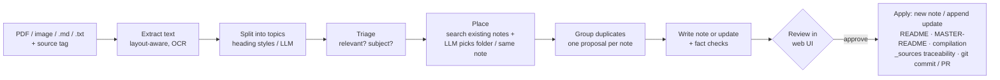

# UPSC Notes Studio

Turns newspapers, monthly current-affairs magazines (Vision IAS, Vajirao & Reddy, Shankar IAS …), PIB
releases, clippings and your own notes into concise, exam-oriented Markdown notes — filed into the
**existing** folders of this repository, with every note traceable to the exact source text it came from.

Everything runs on your machine: open-weight models through [Ollama](https://ollama.com) (Qwen 2.5 by
default), Tesseract for OCR. No paid APIs, no data leaves the laptop.



## Quick start

* **Any computer, with Docker:** `cd notes_automation && ./start.sh`. It uses a GPU if there is one,
  the CPU otherwise. See [Run with Docker](#run-with-docker-any-computer-gpu-if-there-is-one-cpu-otherwise).
* **On a Mac, without Docker:** see below.

## Local development (without Docker)

Prerequisites (macOS): [uv](https://docs.astral.sh/uv/), Ollama and, for images/scanned PDFs, Tesseract.

```bash
brew install ollama tesseract uv
```

```bash
ollama pull qwen2.5:7b && ollama pull nomic-embed-text
```

Then, from this folder:

```bash
uv sync
```

```bash
uv run upsc-notes serve
```

Your browser opens <http://127.0.0.1:8765>. Upload a file, give it a **tag** (for example
`Vision IAS September 2026`), and watch the topics come in. When the job finishes, review each
proposal, approve the good ones, and press **Apply approved**.

## Run with Docker (any computer: GPU if there is one, CPU otherwise)

Needs only [Docker](https://www.docker.com/) and about 8 GB of RAM.

```bash
cd notes_automation && ./start.sh
```

On Windows: `powershell -ExecutionPolicy Bypass -File start.ps1`. Then open <http://127.0.0.1:8765>.

The launcher detects the hardware and picks the setup and model for it:

| Computer | What runs | Default model |
| :--- | :--- | :--- |
| Mac with Ollama installed | The Mac's Ollama on the **Apple GPU** (Docker can't reach it) | `qwen2.5:7b` |
| NVIDIA GPU (Linux, or Windows with WSL2) | Bundled Ollama on the **GPU** | `qwen2.5:7b` |
| AMD GPU (Linux with ROCm) | Bundled Ollama (ROCm image) on the **GPU** | `qwen2.5:7b` |
| No usable GPU | Bundled Ollama on the **CPU** | `qwen2.5:3b` |

The first start downloads the model into a Docker volume; after that it works offline. Docling's
models are inside the image. Your notes repo (the parent folder) is mounted into the container, so
applied notes appear in it directly. `/api/status` reports where the model is running (`"processor": "GPU"` or `"CPU"`).

| Want to | Command |
| :--- | :--- |
| Stop | `./start.sh down` |
| Force a mode | `UPSC_NOTES_ACCEL=cpu ./start.sh` (or `nvidia`, `amd`, `host`) |
| Another model | `UPSC_NOTES_MODEL=qwen2.5:14b ./start.sh` |
| Logs | `docker compose logs -f upsc-notes` |

Plain `docker compose up -d` also works and always runs on the CPU. `qwen2.5:1.5b` is not
recommended on CPU: in testing it marked most articles as "not study material". If a model does not
fit in memory, the job stops with a "Not enough memory" message. Pick a smaller model or give Docker
more RAM (Docker Desktop → Settings → Resources).

## What you get in the repository

| Situation | What the app does |
| :--- | :--- |
| Topic not yet in the notes | Creates `Subject/NN-module/NN-topic-slug.md` in the existing module folder, numbered after the last note, with the repo's header style (`# Title`, `> **Source**:`, `---`). Adds a row to the module `README.md`, an entry in the subject `MASTER-README.md`, and a `## N. Title` section to the module's `*-complete.md`. |
| Topic already has a note | Appends a dated `## 📰 Update — <tag>: <topic>` section to the end of that note (and to its section in `*-complete.md`) containing **only the new information**. Nothing already in the note is rewritten. |
| Two articles in one upload are about the same thing | Merges them into one note. |
| Contents pages, adverts, quizzes | Skipped. You can include any of them from the *Skipped topics* tab. |

Every generated note links to `_sources/<date>-<tag>/NNN-topic.md`, which holds the exact extracted
text (with page numbers) that the note was written from. `_sources/README.md` indexes all uploads.
New folders are never created: topics go into the modules you already have.

### Safety

* Nothing is written until you approve and apply.
* Existing notes are only ever **appended to**. Each file is backed up to `.data/backups/` first.
* Re-applying the same upload is detected (hidden `<!-- upsc-notes: … -->` markers), and bullets already
  present in a note are filtered out of updates.
* Every number in a generated note is checked against the source; unmatched figures are flagged for review.
* Optional Git commit uses `git commit --only <written files>`, so anything else you have staged stays
  untouched. Pushing and opening a pull request is a separate, explicit option (it uses the GitHub CLI).

## Command line (batch processing)

```bash
uv run upsc-notes ingest ~/Downloads/vision-sept-2026.pdf --tag "Vision IAS September 2026" --pages 1-60
```

```bash
uv run upsc-notes show <job-id> --content
```

```bash
uv run upsc-notes approve <job-id> --min-confidence 0.8
```

```bash
uv run upsc-notes apply <job-id> --commit --branch notes/vision-sept-2026
```

Other commands: `jobs`, `models`, `index`, `extract FILE --segments` (see the topic split without any
LLM), `eval`, `serve`. Add `--auto-approve 0.85 --apply` to `ingest` for unattended runs.

## Choosing and evaluating models

The model is a setting, not code. Copy `config.example.yaml` to `config.yaml` and change `llm.model`,
or pick a model per upload in the web UI. The app talks to Ollama, or to any local server with an
OpenAI-compatible API (llama.cpp `llama-server`, LM Studio, vLLM, MLX-LM) via
`provider: openai_compatible`.

`eval` measures a model on **your own repository**. Each sampled note is hidden from the index, and
the model must file its text back into the note's real subject and module:

```bash
uv run upsc-notes eval --model qwen2.5:7b --sample 40
```

```bash
uv run upsc-notes eval --model qwen2.5:14b --sample 40
```

The report gives subject accuracy, folder accuracy, a retrieval-only baseline, the rate of
false "same as existing note" matches, and seconds per topic. `--mode duplicate` keeps the note
in the index and measures whether the model recognises it as already covered.

Suggestions for a 16 GB Apple-silicon Mac:

| Model | Notes |
| :--- | :--- |
| `qwen2.5:7b` (default) | Good balance; about 1 minute per topic. |
| `qwen2.5:14b` | Better summaries, about 2× slower; fits in 16 GB with the default context. |
| `qwen3:8b` | Set `think: false`. |
| `llama3.1:8b`, `mistral-nemo` | Alternatives worth benchmarking with `eval`. |

A 100-article magazine takes roughly 1.5–2 hours with the 7B model. Use a page range to try a
section first. Jobs resume where they stopped if interrupted.

## How it works

| Stage | Module | Notes |
| :--- | :--- | :--- |
| Extract | `ingest/` | **Docling** (IBM's layout + table AI models) supplies the text, reading order, lists and real tables. PyMuPDF's font-style analysis decides which headings start an article (Docling ranks all headings the same). Titles Docling splits are re-joined, and any it drops are restored. Scans and images use Docling with **Apple Vision OCR** (`ocrmac`) on macOS, or Tesseract elsewhere. Set `extraction.engine: pymupdf` for the fast mode (about 100× faster, weaker on tables). If Docling fails or loses titles, the app falls back to PyMuPDF automatically. |
| Split | `segment.py` | Heading *styles* (size + bold + colour) get a role: section, topic or sub-heading. Heuristics first; the LLM classifies the styles from examples when the heuristics look implausible. Text without headings is split by the LLM. |
| Triage | `classify.py` | Relevance, clean title, summary, keywords, and subject, chosen by JSON-schema-constrained decoding from the real subject folders. |
| Place | `classify.py`, `retrieval.py` | Hybrid BM25 + embedding search over existing notes (cached). The LLM picks a module folder, and says whether an existing note, or a note from the same upload, covers the same topic. |
| Write | `generate.py`, `prompts.py` | Notes grounded strictly in the source. Long sources are condensed first. Output is post-processed: empty sections dropped, headings normalised, numbers verified, known bullets removed. |
| Apply | `writer.py`, `gitops.py` | Repository conventions, `_sources` traceability, backups, optional commit / PR. |

State for each upload lives in `.data/jobs/<id>/` (git-ignored) and is saved after every topic.

## Development

```bash
uv run pytest
```

The tests use a scripted fake LLM and a miniature copy of this repository's conventions. They cover
extraction (including OCR when Tesseract is installed), splitting, the writer's conventions and
safety rules, the full pipeline, the web API, and Git behaviour.

## Known limitations

* Docling takes about 5–6 s per page (about 25 min for a 266-page magazine). That's still small next to the LLM time.
* The model's confidence score is a heuristic. Use the *Needs review* filter and the flags.
* The existing READMEs link notes with absolute `file:///Users/...` paths, which do not work on GitHub.
  New entries use relative links, which work both locally and on GitHub.
